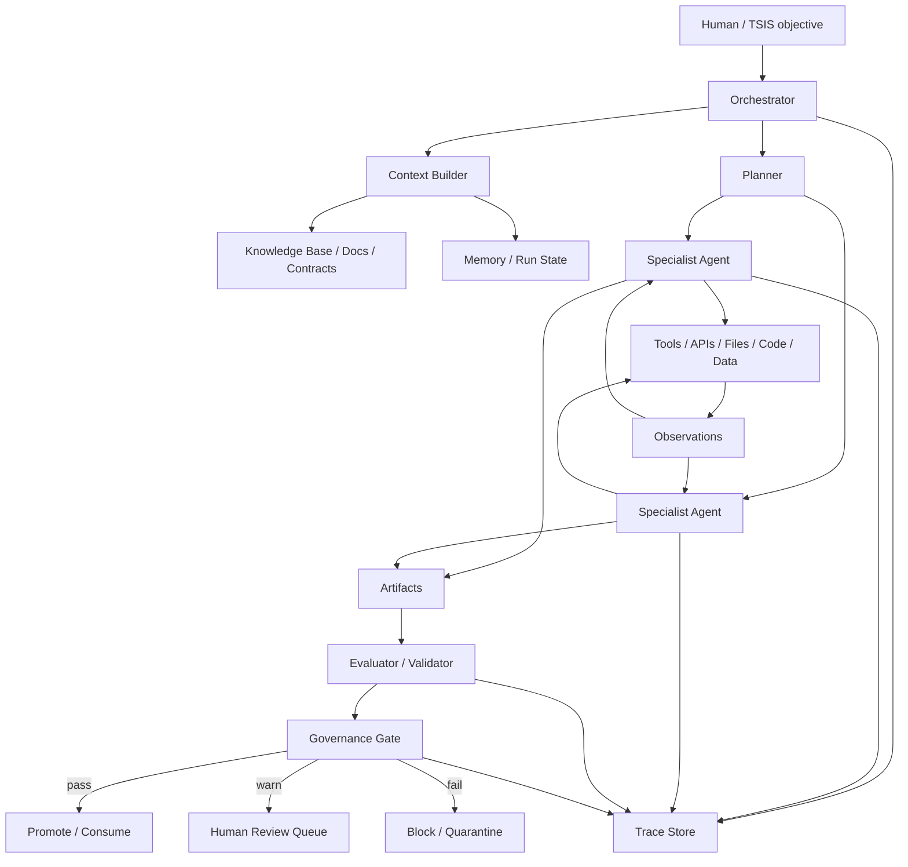
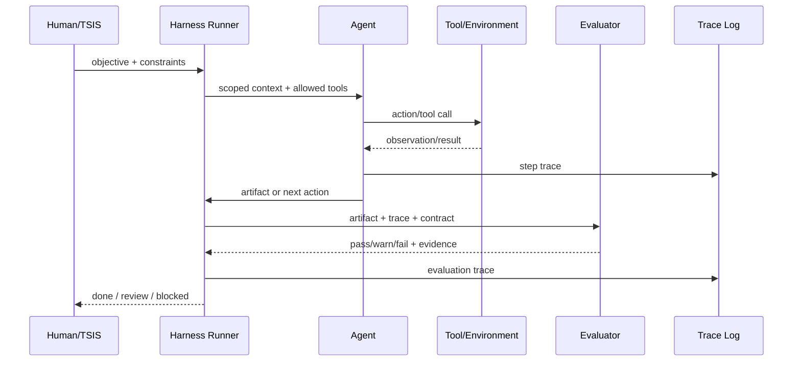
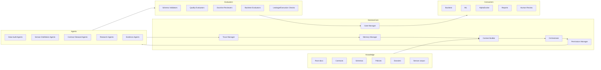
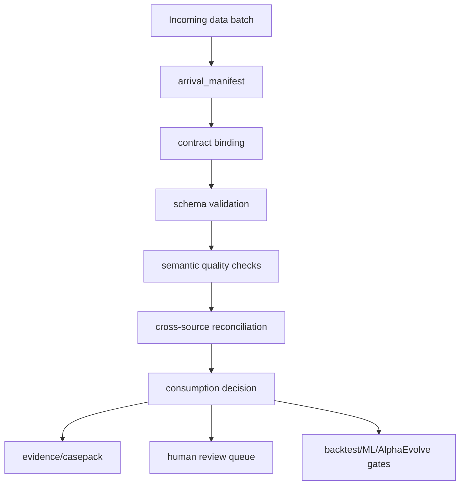
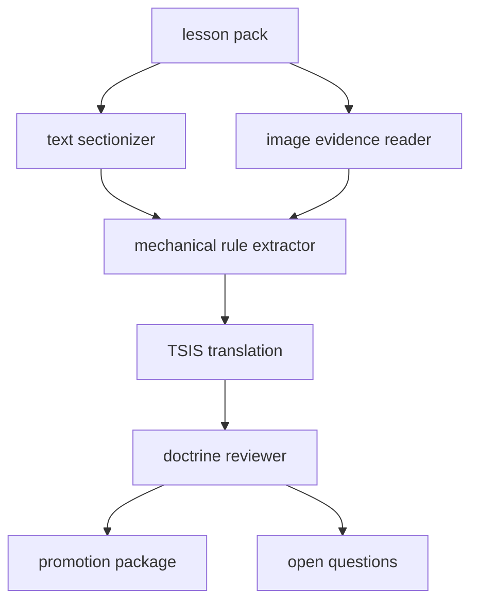
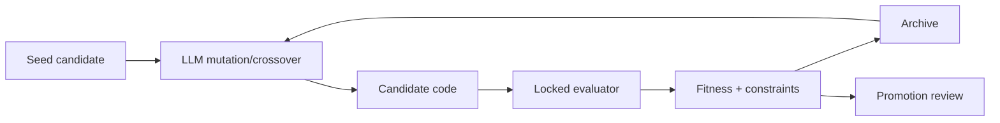

# Agentic Harness Architecture Reference for TSIS

Fecha: 2026-06-11
Estado: reference v0.1
Ambito: 00_CTO / arquitectura general de Harness agentic y aplicacion concreta a TSIS

## 0. Respuesta corta: existe algo parecido en 00_CTO?

Existe material relacionado, pero no existe todavia un documento unico que
explique de forma integrada que es un agentic harness, como funciona, de donde
sale cientificamente, que arquitectura tiene, que matematicas lo justifican y
como debe aterrizar en TSIS.

Material local relacionado:

- `00_CTO/03_AGENT_ENGINEERING/HARNESS.md`
  - contiene enlaces base a Anthropic y OpenAI.
- `00_CTO/03_AGENT_ENGINEERING/agent_working_standards_TSIS.md`
  - fija estandares practicos para agentes: AGENTS.md, permisos,
    observabilidad, workflow, seguridad y revision.
- `00_CTO/12_TSIS_COGNITIVE_ARCHITECTURE/README.md`
  - fija la tesis TSIS: Harness antes que AlphaEvolve.
- `00_CTO/12_TSIS_COGNITIVE_ARCHITECTURE/10_DATA_QUALITY_HARNESS/data_audit_harness_agentic_operating_map.md`
  - aplica Harness a auditoria de data.
- `00_CTO/12_TSIS_COGNITIVE_ARCHITECTURE/20_SERSAN_DISTILLATION_HARNESS/sersan_distillation_protocol.md`
  - aplica Harness a la destilacion Sersan.

Hueco que cubre este documento:

```text
que es un Harness agentic en general
-> por que existe
-> como se arquitectura
-> como se controla matematicamente
-> como se observa y evalua
-> como se traduce a TSIS
```

## 1. Definicion precisa

Un agentic harness es la arquitectura externa que permite a uno o varios modelos
LLM operar como agentes utiles dentro de un entorno real.

No es el modelo.
No es solo un prompt.
No es solo un framework.
No es solo una lista de agentes.

Es el sistema que rodea al modelo y define:

- que contexto puede ver;
- que herramientas puede usar;
- que acciones puede ejecutar;
- que memoria puede leer o escribir;
- que contratos debe obedecer;
- que evidencias debe producir;
- que evaluadores juzgan su trabajo;
- que permisos tiene;
- cuando debe parar;
- cuando debe pedir revision humana;
- como se registra cada decision;
- como se reproduce o audita una ejecucion.

Formula TSIS:

```text
Harness = Contexto + Herramientas + Memoria + Contratos + Evaluadores + Trazas + Guardrails + Orquestacion
```

La frase central:

```text
el harness convierte un LLM probabilistico en un trabajador tecnico observable,
limitado, evaluable y reproducible.
```

## 2. Diferencia entre LLM, agente y harness

| Capa | Que es | Que decide | Riesgo si falta |
|---|---|---|---|
| LLM | Modelo que predice texto/acciones | Siguiente token o llamada a herramienta | Responde sin mundo real |
| Agent | LLM con objetivo, herramientas y bucle de observacion/accion | Que hacer en el siguiente paso | Puede desviarse, alucinar o sobreactuar |
| Harness | Sistema operativo que limita, observa, evalua y coordina agentes | Que acciones son posibles, validas y auditables | Caos operativo, drift, decisiones no reproducibles |

En TSIS, el valor no viene de "tener agentes". Viene de tener un harness que
hace que los agentes trabajen dentro de contratos financieros, cientificos y de
data quality.

## 3. Arquitectura general



Lectura:

1. El humano o TSIS define un objetivo.
2. El orchestrator crea el run, asigna contexto y selecciona agentes.
3. Los agentes actuan con herramientas y reciben observaciones reales.
4. Todo output pasa por evaluadores y gates.
5. Nada se promociona sin contrato, evidencia y traza.

## 4. Bucle operativo minimo

Un agente bajo Harness ejecuta este ciclo:

```text
goal -> context -> plan -> action -> observation -> update state -> evaluate -> continue/stop
```

Diagrama:



## 5. Fundamento matematico

### 5.1 Agente como proceso secuencial parcialmente observable

Un agente LLM con herramientas puede modelarse como un POMDP:

```text
M = (S, A, O, T, Z, R, gamma)
```

Donde:

- `S`: estados reales del mundo/proyecto.
- `A`: acciones posibles, incluyendo tool calls, lectura, escritura,
  ejecucion, handoff y parada.
- `O`: observaciones disponibles para el agente.
- `T(s' | s, a)`: transicion del entorno tras una accion.
- `Z(o | s)`: funcion de observacion; el agente nunca ve todo el estado real.
- `R(s, a, s')`: recompensa o evaluacion.
- `gamma`: descuento temporal si la tarea es larga.

El agente no conoce `s_t` directamente. Opera sobre una historia:

```text
h_t = (o_0, a_0, o_1, a_1, ..., o_t)
```

Y su politica es:

```text
pi_theta(a_t | h_t, g, c)
```

Donde:

- `theta`: parametros del modelo;
- `g`: objetivo;
- `c`: contexto y contratos inyectados por el Harness.

El Harness modifica el problema al limitar el espacio de acciones:

```text
A_allowed(t) subset A
```

Y al introducir gates:

```text
G(tau) in {pass, warn, fail, block}
```

### 5.2 Objetivo de ingenieria

Sin Harness, el objetivo implicito del agente es producir una respuesta
plausible.

Con Harness, el objetivo de sistema es maximizar utilidad verificable bajo
restricciones:

```text
maximize    E[R(tau)] - lambda * Cost(tau) - mu * Risk(tau)
subject to  C_i(tau) = pass for required contracts
            Budget(tau) <= B
            Permissions(a_t) = allowed
            TraceComplete(tau) = true
```

Donde:

- `tau`: trayectoria completa de ejecucion;
- `R`: calidad medida por evaluadores;
- `Cost`: tokens, tiempo, compute y revision humana;
- `Risk`: side effects, data contamination, hallucination, overfit,
  leakage, errores financieros;
- `C_i`: contratos verificables;
- `B`: presupuesto operativo.

### 5.3 Evaluacion como contrato

Un evaluador convierte artefactos y trazas en verdictos:

```text
E_j(artifact, trace, contract) -> {score_j, verdict_j, evidence_j}
```

El gate final combina evaluadores:

```text
Gate = f(E_1, E_2, ..., E_n, policy)
```

Ejemplo TSIS:

```text
Gate(data_batch) =
  block if schema_fail
  review if semantic_review and consumer = AlphaEvolve
  allow_with_flags if recoverable_with_flag and consumer = backtest
  allow if good and contract_version is current
```

### 5.4 Multi-agent como grafo

Un sistema multiagente puede modelarse como grafo dirigido:

```text
G = (V, E)
```

Donde:

- `V`: agentes, herramientas, evaluadores, memoria, gates;
- `E`: flujo de artefactos, mensajes, handoffs o dependencias.

Si el flujo es determinista y aciclico, es un DAG de workflow.
Si hay iteracion, es un grafo con ciclos controlados por presupuestos y
condiciones de parada.

Para TSIS:

```text
DataQualityHarness = DAG con gates fuertes
SersanDistillationHarness = DAG + loops de revision/evaluacion
AlphaEvolve = grafo evolutivo con evaluator locked
```

### 5.5 Riesgo de error compuesto

Si una tarea requiere `n` pasos y cada paso tiene probabilidad de error `p_i`,
la probabilidad de trayectoria sin error es:

```text
P(success_all_steps) = product_i (1 - p_i)
```

Cuando `n` crece, incluso errores pequenos se acumulan.

El Harness reduce riesgo mediante:

- dividir tareas;
- hacer checkpoints;
- evaluar pasos intermedios;
- registrar trazas;
- limitar acciones;
- usar human review en puntos de alto impacto.

### 5.6 pass@k y costo

Si una solucion individual tiene probabilidad `p` de pasar un evaluador, la
probabilidad de que al menos una de `k` muestras pase es:

```text
P(pass@k) = 1 - (1 - p)^k
```

Pero el coste crece aproximadamente con `k`.

Por eso TSIS no debe resolver calidad con "muchos agentes intentando". Debe
mejorar `p` mediante contratos, contexto, herramientas, evaluadores y memoria.

## 6. Patrones de arquitectura agentica

### 6.1 Workflow fijo

Uso:

- tareas repetibles;
- criterios claros;
- bajo margen de creatividad.

Ejemplo TSIS:

```text
arrival_manifest -> schema_validation -> quality_summary -> consumption_gate
```

### 6.2 Router

Uso:

- clasificar tarea y enviar a especialista.

Ejemplo TSIS:

```text
dataset arrival -> daily_agent | quotes_agent | trades_agent | 1m_agent
```

### 6.3 Orchestrator-workers

Uso:

- tareas divisibles en subtareas.

Ejemplo TSIS:

```text
Sersan orchestrator -> sectionizer -> image reader -> rule extractor -> reviewer
```

### 6.4 Evaluator-optimizer

Uso:

- existe criterio de evaluacion claro;
- la iteracion mejora output.

Ejemplo TSIS:

```text
rule_extractor -> doctrine_evaluator -> revision -> rule_extractor
```

### 6.5 Generator-evaluator

Uso:

- separar creador y juez.

Ejemplo TSIS:

```text
AlphaEvolve candidate generator
-> locked backtest evaluator
-> archive
-> selection
```

### 6.6 Handoff

Uso:

- un agente transfiere control a un especialista.

Ejemplo TSIS:

```text
data_orchestrator detects corporate action conflict
-> handoff to corporate_action_reference_agent
```

### 6.7 Agent as tool

Uso:

- un manager conserva control y llama especialistas como herramientas.

Ejemplo TSIS:

```text
sersan_manager calls image_reader_agent(image_id)
```

## 7. Arquitectura funcional recomendada para TSIS



## 8. Componentes del Harness TSIS

### 8.1 Orchestrator

Responsabilidad:

- crear `run_id`;
- elegir workflow;
- asignar agentes;
- controlar presupuestos;
- detener ejecuciones;
- publicar resumen final.

### 8.2 Context Builder

Responsabilidad:

- dar al agente el minimo contexto suficiente;
- aplicar progressive disclosure;
- cargar docs, contracts y manifests relevantes;
- evitar manuales gigantes dentro del prompt.

Principio:

```text
mapa corto + fuentes profundas versionadas > prompt enorme
```

### 8.3 Permission Manager

Responsabilidad:

- limitar lectura/escritura;
- separar dry-run de write-run;
- exigir aprobacion humana para acciones destructivas;
- aplicar permisos por agente y tarea.

### 8.4 Tool Layer

Responsabilidad:

- exponer herramientas legibles;
- definir schemas de entrada/salida;
- devolver errores estructurados;
- evitar APIs ambiguas.

Las herramientas son parte del prompt. Una herramienta mal definida degrada al
agente tanto como una mala instruccion.

### 8.5 Memory Manager

Responsabilidad:

- guardar estado de run;
- mantener decisions, lessons learned y failure modes;
- recuperar memoria relevante;
- evitar que el conocimiento viva solo en conversaciones.

### 8.6 Trace Manager

Responsabilidad:

- registrar cada accion;
- registrar observacion;
- registrar evaluacion;
- asociar agente, version, tool, input, output, coste y decision.

### 8.7 Evaluator Layer

Responsabilidad:

- convertir outputs en verdictos;
- producir score + evidencia;
- localizar fallos;
- proteger contra autoevaluacion indulgente.

### 8.8 Governance Gate

Responsabilidad:

- decidir allow/warn/review/block;
- aplicar reglas por consumidor;
- impedir promocion sin evidencia;
- gestionar human review.

## 9. Trazas y contratos

Un run TSIS debe producir un trace record por paso:

```yaml
trace_step:
  run_id: string
  step_id: integer
  parent_step_id: integer | null
  agent_id: string
  agent_version: string
  objective: string
  input_artifact_refs: [string]
  action_type: read | write | tool_call | eval | handoff | stop
  tool_name: string | null
  tool_input_hash: string | null
  tool_output_ref: string | null
  observation_summary: string
  contract_refs: [string]
  decision: continue | pass | warn | fail | block | human_review
  cost:
    tokens_in: integer
    tokens_out: integer
    wall_time_sec: number
  timestamp_utc: string
```

El Harness debe poder responder:

```text
quien hizo que
con que input
con que herramienta
bajo que contrato
con que resultado
quien lo evaluo
por que se permitio o bloqueo
```

## 10. Como funcionara concretamente en TSIS

### 10.1 Data Quality Harness

Objetivo:

```text
convertir la auditoria historica de 01_foundations en control recurrente de data live
```

Flujo:



Regla:

```text
AlphaEvolve no recibe data sin decision de consumo.
```

### 10.2 Sersan Distillation Harness

Objetivo:

```text
convertir el curso Sersan en doctrina mecanica TSIS
```

Flujo:



Regla:

```text
sin lectura de imagenes, la destilacion Sersan es incompleta.
```

### 10.3 Contract Steward Harness

Objetivo:

```text
evitar drift entre docs, schemas, registries, policies y validators
```

Flujo:

```text
scan docs -> detect contradictions -> open candidate patch -> run checks -> human review
```

### 10.4 Strategy Research Harness

Objetivo:

```text
coordinar investigacion desde hipotesis hasta dossier reproducible
```

Flujo:

```text
hypothesis -> experiment contract -> data gate -> backtest -> evaluator -> dossier -> decision
```

### 10.5 AlphaEvolve Sandbox

Objetivo:

```text
permitir busqueda evolutiva solo dentro de evaluadores bloqueados
```

Flujo:



Regla:

```text
el modelo puede tocar el candidato, pero no el juez.
```

## 11. Justificacion ingenieril

### 11.1 Por que no basta con prompts

Los prompts son instrucciones.
El Harness es infraestructura.

Un prompt puede decir:

```text
no uses data en review
```

Un Harness puede:

- comprobar el manifest;
- bloquear el consumidor;
- registrar la decision;
- crear evidencia;
- exigir human review.

### 11.2 Por que contratos antes que agentes

Sin contrato, un agente no sabe que significa correcto.

En TSIS, contrato significa:

- schema;
- semantica;
- estado de calidad;
- consumidor permitido;
- evidencia requerida;
- criterios de promocion.

### 11.3 Por que evaluadores antes que AlphaEvolve

AlphaEvolve y sistemas similares optimizan contra una funcion.

Si la funcion esta mal:

```text
optimizaran basura de forma muy eficiente
```

En trading esto se traduce en:

- leakage;
- sobreoptimizacion;
- false edge;
- data contamination;
- ejecucion irreal;
- slippage ignorado;
- halts no modelados;
- robustness falsa.

### 11.4 Por que trazas antes que autonomia

Cuanta mas autonomia, mas necesario es reconstruir:

- decision;
- contexto;
- herramienta;
- output;
- evaluacion;
- coste;
- side effect.

Autonomia sin trazas no es ingenieria; es ejecucion opaca.

## 12. Fuentes cientificas y tecnicas principales

### 12.1 OpenAI

1. OpenAI, "Harness engineering: leveraging Codex in an agent-first world"

   URL: https://openai.com/index/harness-engineering/

   Ideas relevantes para TSIS:

   - humanos dirigen, agentes ejecutan;
   - repository knowledge como system of record;
   - AGENTS.md corto como mapa, no enciclopedia;
   - logs, metrics, traces y herramientas deben ser legibles por agentes;
   - arquitectura y reglas deben estar mecanicamente enforceadas;
   - outputs incluyen codigo, tests, docs, CI, evaluadores y dashboards.

   Links a graficos en el articulo:

   - "Codex drives the app with Chrome DevTools MCP to validate its work"
   - "Giving Codex a full observability stack in local dev"
   - "The limits of agent knowledge: What Codex can't see doesn't exist"
   - "Layered domain architecture with explicit cross-cutting boundaries"

2. OpenAI Agents SDK

   URL: https://openai.github.io/openai-agents-python/

   Ideas relevantes:

   - agent = LLM + instructions + tools + runtime behavior;
   - handoffs;
   - guardrails;
   - structured outputs;
   - tracing;
   - sessions;
   - MCP;
   - sandbox agents.

3. OpenAI platform agents guide

   URL: https://platform.openai.com/docs/guides/agents

   Uso TSIS:

   - referencia practica para tools, handoffs, guardrails, tracing y
     automatizacion.

### 12.2 Anthropic

1. Anthropic, "Building effective agents"

   URL: https://www.anthropic.com/engineering/building-effective-agents

   Ideas relevantes:

   - empezar simple;
   - usar workflows cuando se pueda;
   - agentes solo para problemas abiertos donde no se conoce el numero de pasos;
   - ground truth del entorno en cada paso;
   - tool documentation como parte critica del sistema;
   - extensive testing in sandboxed environments;
   - evaluator-optimizer workflow.

   Links a graficos en el articulo:

   - Prompt chaining
   - Routing
   - Parallelization
   - Orchestrator-workers
   - Evaluator-optimizer
   - Autonomous agent
   - High-level flow of a coding agent

2. Anthropic, "Harness design for long-running application development"

   URL: https://www.anthropic.com/engineering/harness-design-long-running-apps

   Ideas relevantes:

   - planner/generator/evaluator;
   - structured artifacts for handoff;
   - generator-evaluator separation;
   - sprint contracts;
   - evaluator con herramientas reales como Playwright MCP;
   - cada componente del harness codifica una hipotesis sobre lo que el modelo
     no puede hacer solo.

### 12.3 Google / DeepMind / Google Cloud

1. Google DeepMind, "AlphaEvolve: A Gemini-powered coding agent for designing
   advanced algorithms"

   URL: https://deepmind.google/blog/alphaevolve-a-gemini-powered-coding-agent-for-designing-advanced-algorithms/

2. AlphaEvolve white paper / arXiv

   URL: https://arxiv.org/abs/2506.13131

   Idea TSIS:

   ```text
   codigo modificable + evaluator automatico + metricas + archivo evolutivo
   ```

3. Google Gemini Enterprise Agent Platform / Agent Runtime

   URL: https://docs.cloud.google.com/gemini-enterprise-agent-platform/scale

   Ideas relevantes:

   - runtime;
   - sessions;
   - memory bank;
   - evaluation;
   - observability;
   - sandbox;
   - agent identity;
   - gateway;
   - registry.

### 12.4 Protocolos y frameworks de infraestructura

1. Model Context Protocol

   URL: https://modelcontextprotocol.io/docs/getting-started/intro

   Idea:

   - estandar abierto para conectar aplicaciones IA a herramientas, datos y
     workflows.

2. LangGraph

   URL: https://docs.langchain.com/oss/python/langgraph/overview

   Ideas:

   - long-running stateful agents;
   - durable execution;
   - human-in-the-loop;
   - memory;
   - tracing y evaluation via LangSmith;
   - runtime de orquestacion.

3. OpenTelemetry GenAI semantic conventions

   URL: https://opentelemetry.io/docs/specs/semconv/gen-ai/

   Uso TSIS:

   - base para estandarizar spans y traces de llamadas LLM/tool.

### 12.5 Papers academicos

1. ReAct: Synergizing Reasoning and Acting in Language Models

   URL: https://arxiv.org/abs/2210.03629

   Lectura TSIS:

   - el agente alterna razonamiento y accion;
   - las acciones traen observaciones externas que reducen alucinacion.

2. Toolformer: Language Models Can Teach Themselves to Use Tools

   URL: https://arxiv.org/abs/2302.04761

   Lectura TSIS:

   - tool use debe tratarse como competencia central, no accesorio.

3. Reflexion: Language Agents with Verbal Reinforcement Learning

   URL: https://arxiv.org/abs/2303.11366

   Lectura TSIS:

   - memoria episodica y feedback textual pueden mejorar intentos posteriores.

4. Voyager: An Open-Ended Embodied Agent with Large Language Models

   URL: https://arxiv.org/abs/2305.16291

   Lectura TSIS:

   - skill library + environment feedback + self-verification es un patron de
     aprendizaje acumulativo.

5. SWE-agent: Agent-Computer Interfaces Enable Automated Software Engineering

   URL: https://arxiv.org/abs/2405.15793

   Lectura TSIS:

   - la interfaz agente-computador cambia rendimiento; ACI es parte del sistema.

6. AgentBench: Evaluating LLMs as Agents

   URL: https://arxiv.org/abs/2308.03688

   Lectura TSIS:

   - evaluar agentes requiere entornos interactivos, no solo respuestas finales.

7. Agentic Harness Engineering: Observability-Driven Automatic Evolution of
   Coding-Agent Harnesses

   URL: https://arxiv.org/abs/2604.25850

   Lectura TSIS:

   - la mejora del harness depende de observabilidad de componentes,
     experiencias y decisiones;
   - las mejoras reales vienen de herramientas, middleware y memoria, no solo
     de prompts.

8. A Trace-Based Assurance Framework for Agentic AI Orchestration: Contracts,
   Testing, and Governance

   URL: https://arxiv.org/abs/2603.18096

   Lectura TSIS:

   - contratos y trazas permiten localizar fallos, replay determinista,
     containment y governance.

9. Observability for Delegated Execution in Agentic AI Systems

   URL: https://arxiv.org/abs/2606.09692

   Lectura TSIS:

   - en sistemas multiagente, no basta con logs normales; hace falta atribucion
     por delegacion.

## 13. Graficos externos recomendados para estudiar

OpenAI:

- https://openai.com/index/harness-engineering/
  - diagramas de Chrome DevTools MCP, observability stack, knowledge limits y
    layered architecture.

Anthropic:

- https://www.anthropic.com/engineering/building-effective-agents
  - diagramas de prompt chaining, routing, parallelization,
    orchestrator-workers, evaluator-optimizer y autonomous agent.

- https://www.anthropic.com/engineering/harness-design-long-running-apps
  - arquitectura planner/generator/evaluator y ejemplos de harness runs.

MCP:

- https://modelcontextprotocol.io/docs/getting-started/intro
  - grafico conceptual de MCP como "USB-C for AI applications".

LangGraph:

- https://docs.langchain.com/oss/python/langgraph/overview
  - arquitectura de long-running stateful agents y stack LangGraph/LangSmith.

Google:

- https://docs.cloud.google.com/gemini-enterprise-agent-platform/scale
  - runtime, sessions, memory, sandbox, observability, evaluation, governance.

## 14. Decision TSIS v0.1

TSIS debe definir Harness agentic como un sistema operativo de investigacion y
calidad, no como una coleccion de chatbots.

Orden obligatorio:

```text
1. contratos
2. artefactos
3. trazas
4. evaluadores
5. gates
6. replay offline
7. shadow live
8. autonomia limitada
9. AlphaEvolve sandbox
```

El primer Harness productivo no debe ser Strategy Research ni AlphaEvolve.
Debe ser Data Quality Harness, porque ya existe auditoria historica suficiente
para definir baseline, replay y contratos.

El segundo Harness debe ser Sersan Distillation Harness, porque TSIS necesita
doctrina mecanica antes de permitir busqueda de estrategias.

## 15. Como usar este documento

Este documento debe leerse antes de:

- `2026-06-11_harness_data_audit_state_vocabulary.md`
- `2026-06-11_harness_live_run_artifact_contract.md`
- `20_SERSAN_DISTILLATION_HARNESS/sersan_lesson_pack_contract.md`
- `TSIS_AGENT_OPERATING_MODEL_v0_1.md`
- `ALPHAEVOLVE_TSIS_SANDBOX_POLICY_v0_1.md`

No reemplaza esos documentos. Los fundamenta.

## 16. Regla final

Un agentic harness existe para que la autonomia sea util, medible y reversible.

En TSIS:

```text
si no hay contrato, no hay agente productivo;
si no hay traza, no hay confianza;
si no hay evaluador, no hay promocion;
si no hay gate, no hay consumo;
si no hay replay, no hay live;
si no hay doctrina y data gated, no hay AlphaEvolve.
```
