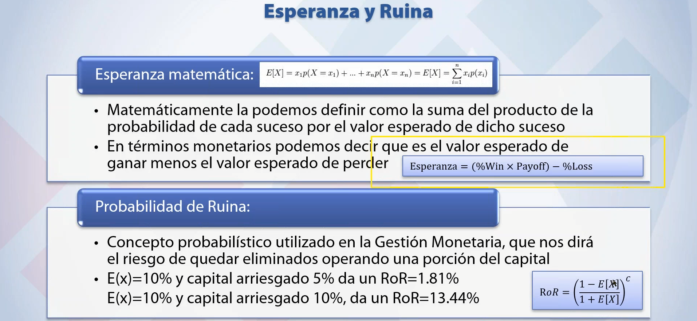
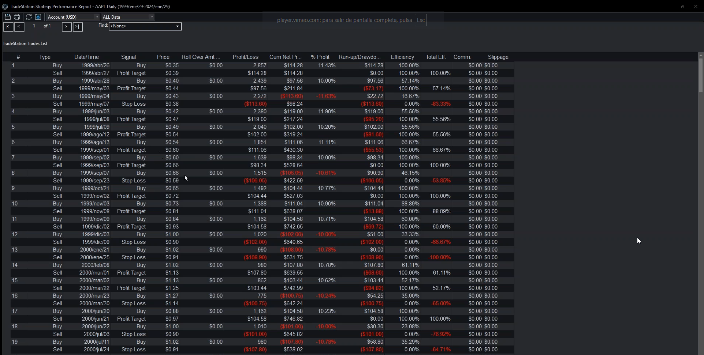
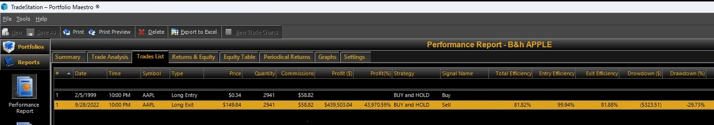
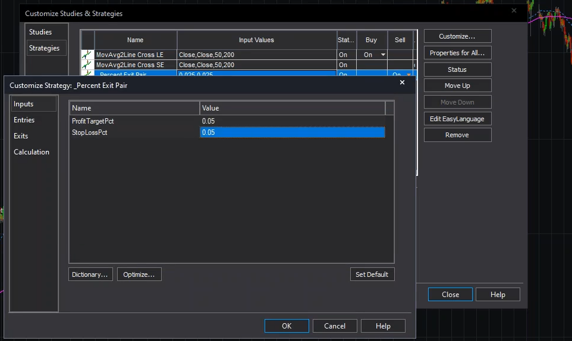
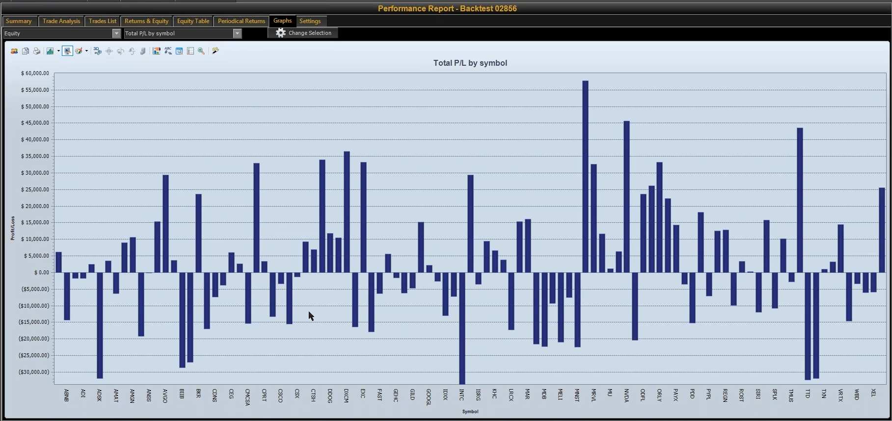
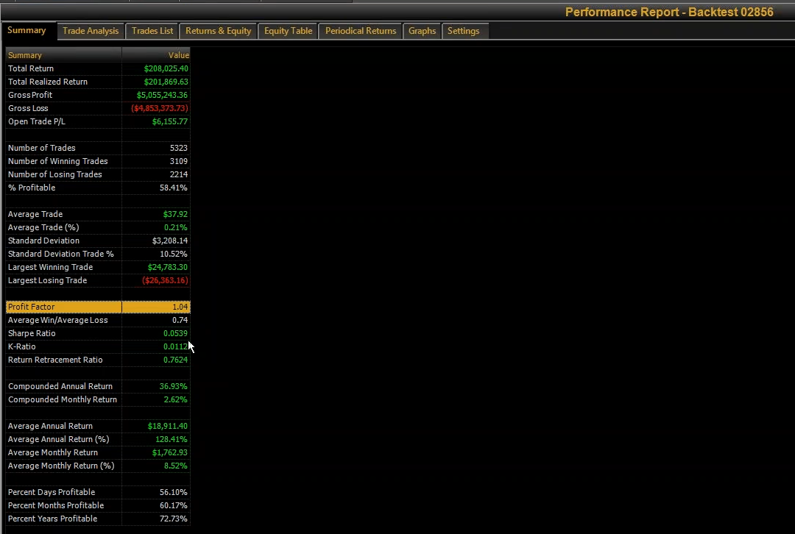
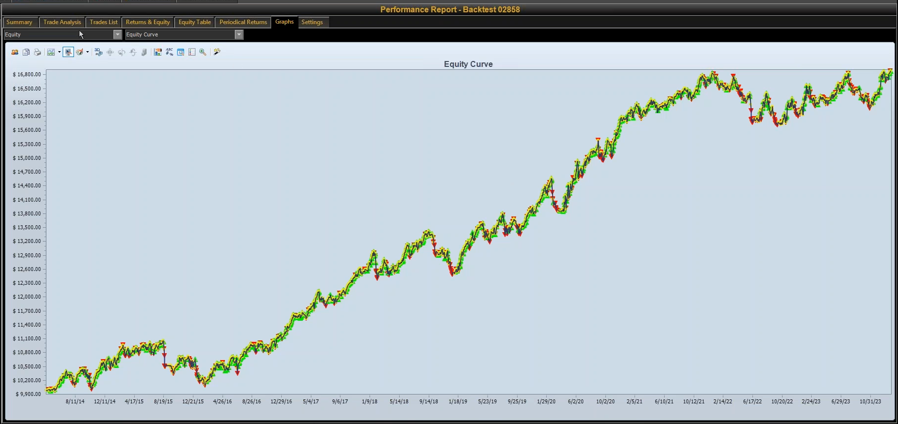
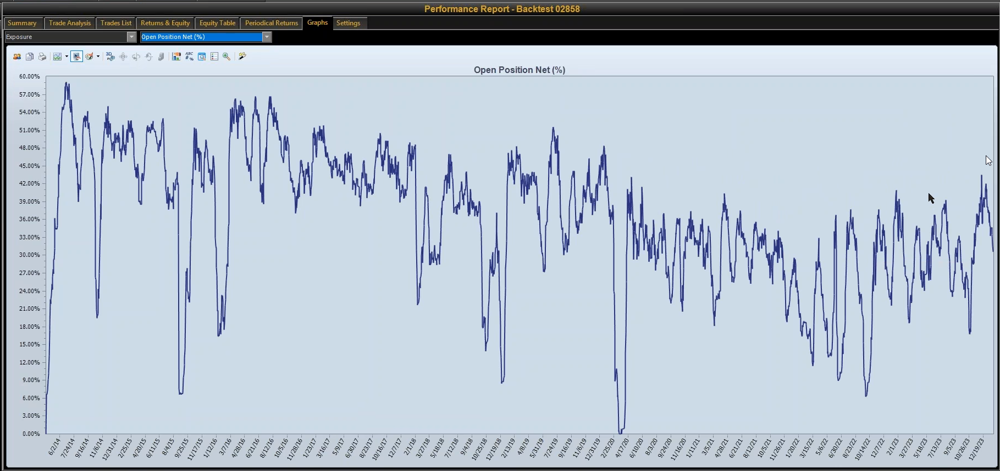
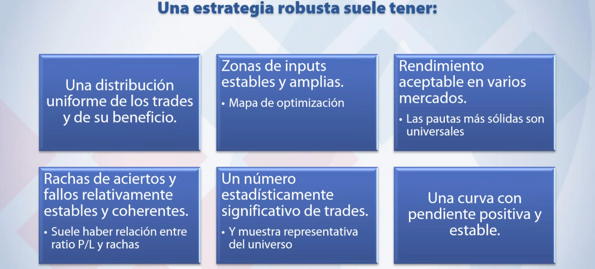

# Lesson Distillation: sersan_practice_02_donchain

Fecha: 2026-06-11
Estado: pilot v0.1, `pass_with_warnings`
Fuente: `03_only_md_revised/practica_02_donchain.md`

## 1. Proposito del paquete

Este documento destila `practica_02_donchain.md` como primer piloto del Sersan
Distillation Harness. No convierte el curso en doctrina canonica. Convierte la
clase en evidencia trazable para que TSIS pueda construir evaluadores,
checklists y constraints de AlphaEvolve.

La practica es importante porque une tres piezas mecanicas:

- semantica correcta de datos para futuros continuos;
- prueba preliminar de una entrada Donchian;
- criterios de validacion, muestra, filtros, BRaC y portfolio.

## 2. Lectura ejecutiva

La clase no intenta entregar un sistema Donchian operable. El objetivo es
ensenar una ruta de evaluacion preliminar: plantear una idea simple, controlar
la interpretacion de datos, probar si la entrada tiene ventaja bajo exits
simetricos, ampliar muestra cuando sea posible y evitar filtros o conclusiones
que no tengan evidencia suficiente.

Para TSIS, la leccion mas importante es que el Harness no debe preguntar solo
si una estrategia gana dinero. Debe preguntar:

- que precio esta usando;
- si la entrada tiene ventaja antes de optimizar;
- si stop y target actuan de verdad;
- si el resultado depende de un ticker;
- si el benchmark correcto queda superado en retorno/riesgo;
- si la muestra basta;
- si los filtros tienen soporte estadistico;
- si la validacion elegida esta declarada.

## 3. Secciones fuente

| Section | Lines | Tipo | Lectura |
|---|---:|---|---|
| `sec_0001` | 1-25 | procedure | Entrada, codigo ELD y contexto. |
| `sec_0002` | 26-126 | concept | Contratos continuos y contrato frontal. |
| `sec_0003` | 127-192 | warning | Ajustes forward/backward y gaps artificiales. |
| `sec_0004` | 193-224 | procedure | Ajuste por diferencia vs ratio. |
| `sec_0005` | 225-273 | concept | Setup Donchian de ruptura de cierres. |
| `sec_0006` | 274-405 | validation | Evaluacion preliminar, payoff y benchmark. |
| `sec_0007` | 406-565 | validation | Stops, targets y caracter de los exits. |
| `sec_0008` | 566-747 | validation | Test multi-asset Nasdaq100 y sizing. |
| `sec_0009` | 748-962 | qa | Forex, forward testing y rutas de validacion. |
| `sec_0010` | 963-1060 | validation | BRaC y robustez. |
| `sec_0011` | 1061-1075 | portfolio | Stops/targets a nivel portfolio. |
| `sec_0012` | 1076-1117 | warning | Regimenes y filtros. |
| `sec_0013` | 1118-1154 | warning | Multidata y filtros. |

## 4. Evidencia visual incrustada

### 4.1 Esperanza y ruina

La captura fija una idea base: una entrada no se evalua por porcentaje de
acierto aislado. La esperanza combina probabilidad y payoff, y el riesgo de
ruina depende tambien del capital arriesgado. En TSIS esto se traduce en que
un evaluador debe leer win rate junto a average win/loss, payoff, sizing y
drawdown.

### 4.2 Stop y target deben actuar

La lista de trades muestra operaciones cerradas tanto por `Profit Target` como
por `Stop Loss`. Esto importa porque una prueba simetrica no vale si una de las
dos piernas no se observa. La regla candidata exige conteo por motivo de salida.

### 4.3 Benchmark buy and hold

El benchmark de acciones no es una formalidad. La comparacion debe incluir
retorno y riesgo. Si buy and hold produce mas retorno absoluto pero con
drawdowns muy superiores, la evaluacion debe mirar retorno/riesgo, no solo
resultado bruto.

### 4.4 Simetria stop/target

La configuracion `ProfitTargetPct=0.05` y `StopLossPct=0.05` es evidencia
directa de la prueba de entrada con payoff aproximadamente uno. Esta captura
queda marcada como `critical` porque sostiene una regla operativa del Harness:
antes de llamar prometedora a una entrada, controlar payoff.

### 4.5 Multi-asset y distribucion por simbolo

La prueba se amplia a una cesta de Nasdaq100 para no depender de AAPL. La
distribucion por simbolo permite ver si el resultado se reparte o si depende de
unas pocas acciones.

La captura muestra 5323 trades y 58.41% profitable, con `Profit Factor` cercano
a 1. La lectura correcta no es "sistema listo", sino "hay evidencia preliminar
de que la entrada merece investigarse".

### 4.6 Sizing y exposicion

La clase corrige una lectura previa contaminada por sizing. Para TSIS esto debe
convertirse en gate: no interpretar resultados si la exposicion o el capital
usado no coinciden con el diseno.

### 4.7 Robustez

La captura resume propiedades que el Harness debe buscar antes de promocionar
una estrategia: trades y beneficios distribuidos, zonas de inputs amplias,
rendimiento en varios mercados, rachas coherentes, muestra significativa y
curva positiva estable.

## 5. Reglas mecanicas candidatas

La extraccion completa esta en `mechanical_rules.yaml`. Las reglas principales
son:

1. Usar backward-adjusted continuous contracts cuando el precio actual de
   futuros deba permanecer operable.
2. No contar gaps de roll no ajustados como PnL real.
3. Preferir ajuste por ratio cuando la escala historica importe.
4. Evaluar entradas preliminares con stop y target simetricos.
5. Exigir que ambos exits tengan activacion suficiente.
6. Comparar acciones contra buy and hold en retorno/riesgo.
7. Ampliar a universo multi-asset cuando un solo activo no baste.
8. Auditar sizing y exposicion antes de interpretar resultados.
9. Evaluar el caracter del sistema desde entrada mas exits.
10. Declarar ruta de validacion cuando hay pocos parametros.
11. Exigir muestra suficiente para filtros.
12. Si un filtro es dudoso, preferir no filtrarlo.
13. Evaluar stops/targets de portfolio como reglas agregadas.

## 6. Traduccion TSIS

La traduccion esta en `tsis_translation_map.csv`. Las implicaciones principales
son:

- `TSIS_ENTRY_EDGE_PRECHECK`: precheck de entrada con payoff controlado.
- `TSIS_EXIT_ACTUATION_CHECK`: conteo de motivos de salida.
- `TSIS_EQUITY_BENCHMARK_CHECK`: benchmark buy and hold retorno/riesgo.
- `TSIS_MULTI_ASSET_SETUP_CHECK`: validacion preliminar por universo.
- `TSIS_SIZING_AND_EXPOSURE_AUDIT`: gate de sizing y exposicion.
- `TSIS_FILTER_SAMPLE_SIZE_GATE`: bloqueo de filtros sin muestra.
- `TSIS_VALIDATION_ROUTE_DECLARATION`: ruta de validacion explicita.

## 7. Lo que no debe promocionarse todavia

No se debe promocionar que "Donchian 20 funciona" como doctrina TSIS.

Tampoco se debe promocionar un umbral universal definitivo para filtros. La
clase menciona 30-50 operaciones afectadas como minimo practico, pero TSIS debe
formalizar thresholds por tipo de sistema, frecuencia y universo.

No se debe trasladar sin matiz la parte de futuros continuos a small caps. Para
small caps, la analogia correcta son splits, dividendos, delistings, halts,
liquidez y supervivencia del universo.

## 8. Consumidores previstos

- Data Quality Harness: price-view metadata, corporate action semantics y
  checks de gaps artificiales.
- Backtest Harness: entry precheck, benchmark, exits, sizing, exposure y sample
  size.
- AlphaEvolve: constraints para no optimizar filtros fragiles ni interpretar
  resultados con sizing contaminado.
- Human reviewer: promocion de reglas candidatas a doctrina canonica.

## 9. Decision del piloto

Decision: `pass_with_warnings`.

Motivo: todos los artefactos contractuales existen y las reglas tienen anchors.
El warning principal es que el piloto indexa todas las imagenes, pero solo lee
doctrinalmente las capturas necesarias para reglas de alto impacto. Esa decision
es deliberada para evitar ruido visual y debe revisarse antes de ejecutar el
corpus completo.
