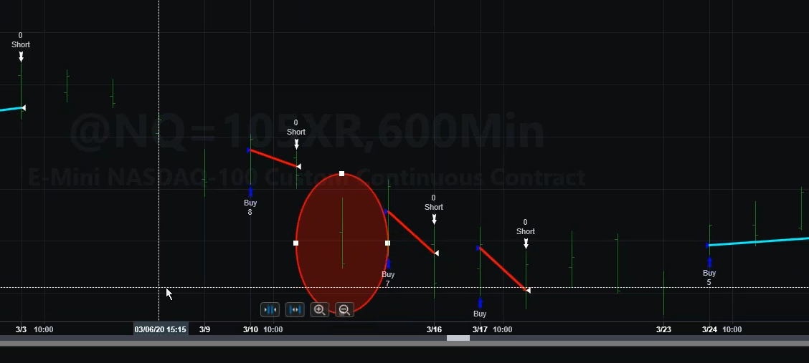
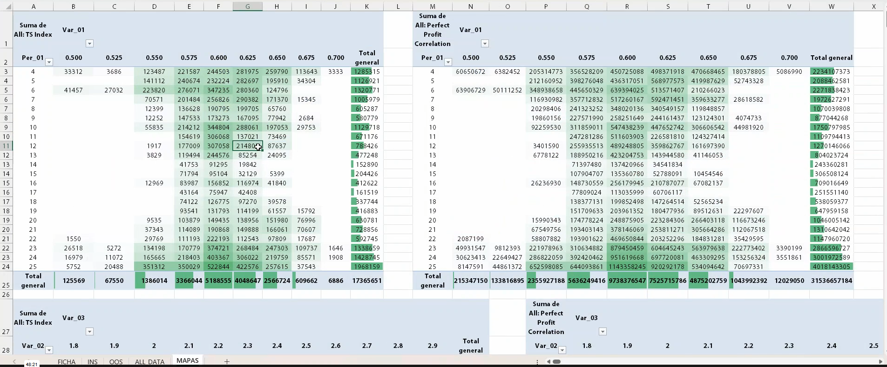
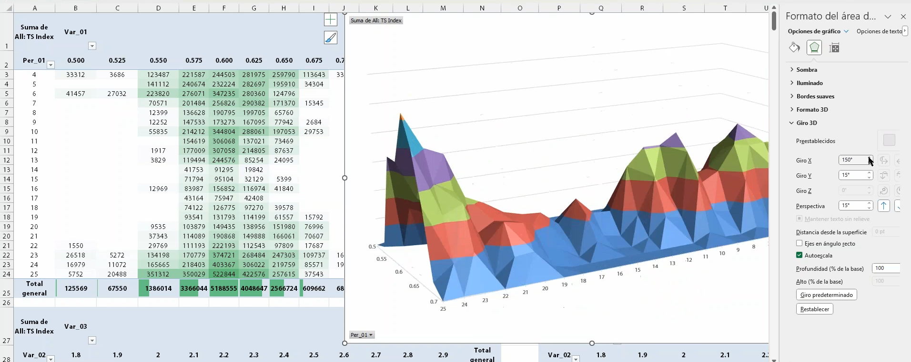
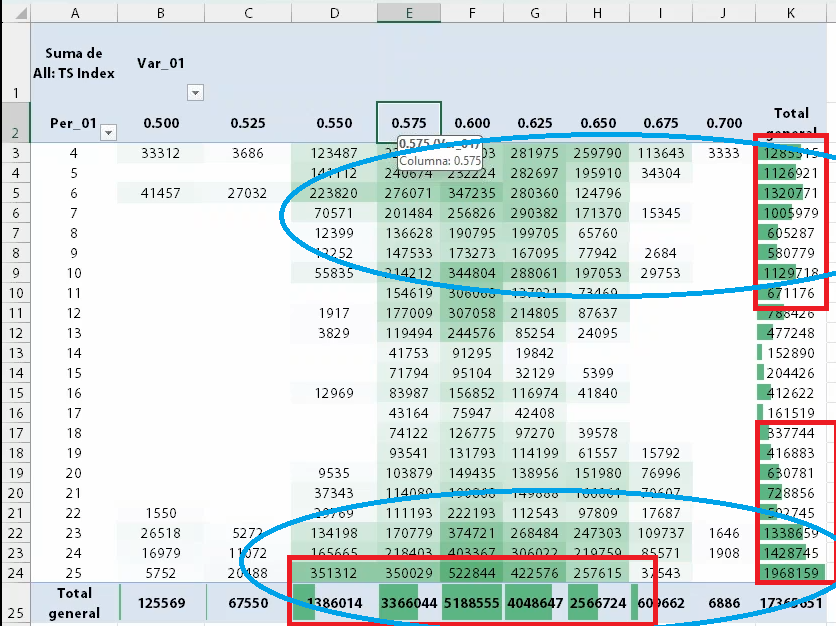
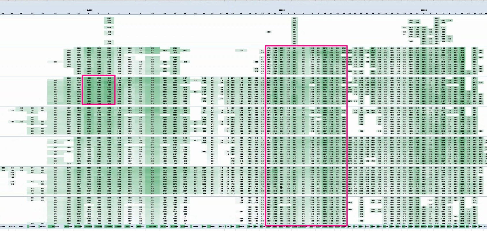
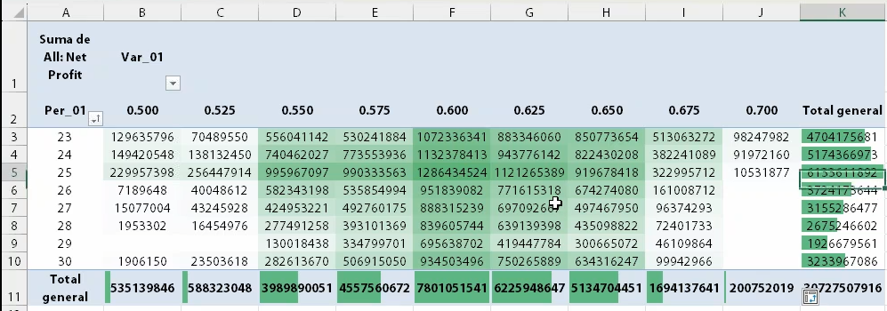
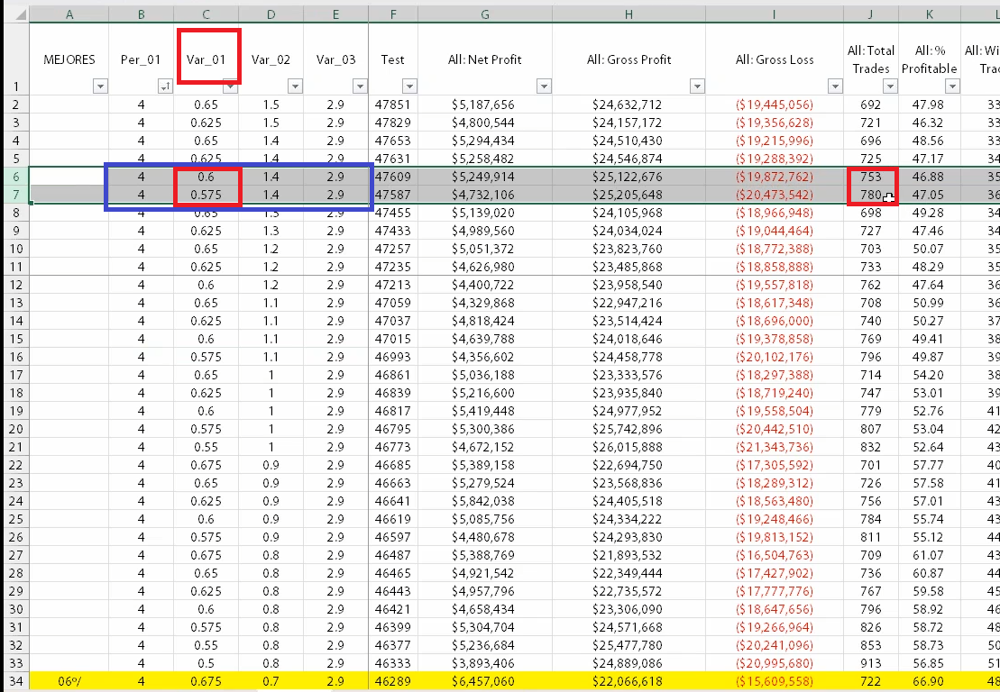
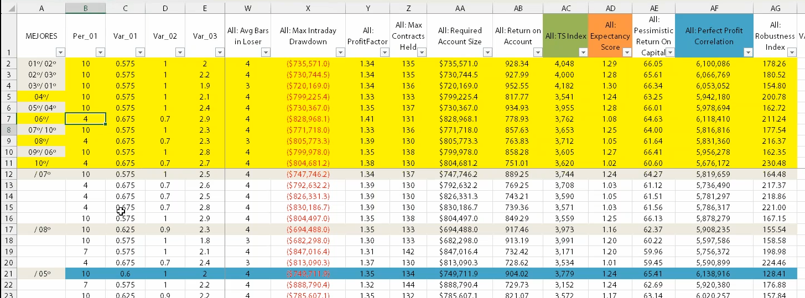
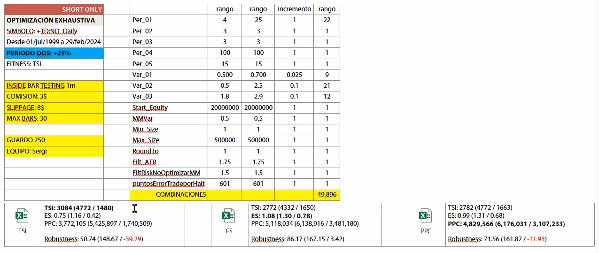
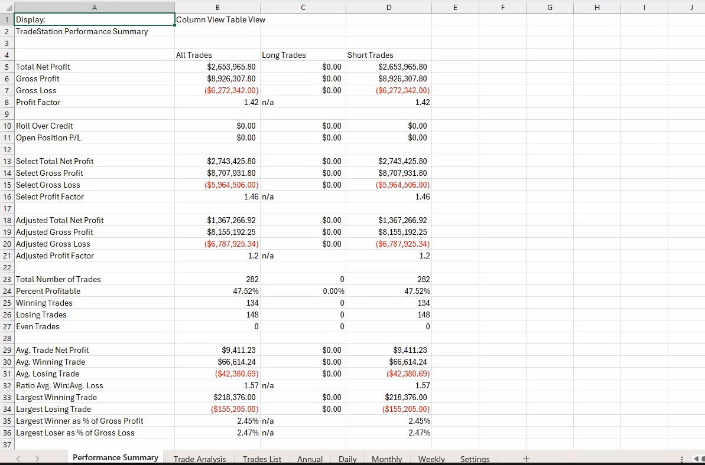

# Lesson Distillation: sersan_practice_09_revision_apolo

Fecha: 2026-06-12
Estado: pilot v0.2, `pass_with_warnings`
Fuente: `03_only_md_revised/practica_09_revision_apolo.md`

## 1. Proposito del paquete

Este paquete destila la revision de Apolo como segundo piloto del Sersan
Distillation Harness. La practica es mas importante que `practice_02` para el
Harness de optimizacion porque muestra un proceso completo de revision:
preparar datos y costes, controlar ejecucion no realista, construir mapas,
filtrar zonas, reducir el universo de seleccion, revisar Performance Reports,
validar incrementos y decidir si Walk-Forward encaja con la estructura del
sistema.

El objetivo no es promocionar Apolo como estrategia TSIS. El objetivo es
extraer la mecanica que los agentes deben aplicar cuando auditen o generen
estrategias con AlphaEvolve.

## 2. Lectura ejecutiva

La tesis central de la clase es que la optimizacion no es elegir el mejor
numero de una tabla. Es un protocolo de control de grados de libertad.

La ruta mecanica queda asi:

1. Declarar que inputs se pueden optimizar y cuales quedan fijos.
2. Penalizar eventos no ejecutables antes de permitir que el optimizador los
   explote.
3. Usar las 8000 mejores combinaciones como materia prima para mapas, no como
   lista de seleccion final.
4. Leer mapas por zonas, vecinos, bordes y cliffs.
5. Reducir el espacio a una optimizacion acotada, por ejemplo 250 candidatos.
6. Comparar IS, OOS y AllData con varias metricas.
7. Revisar Performance Reports y curvas sin dejar que el nombre del parametro
   sesgue al revisor.
8. Validar que el incremento de cada parametro no es demasiado fino ni
   demasiado grueso.
9. Llevar la seleccion final a portfolio si la estrategia se operara dentro de
   una cartera.

## 3. Secciones fuente

| Section | Lines | Tipo | Lectura |
|---|---:|---|---|
| `sec_0001` | 1-19 | procedure | Entrada, navegacion y contexto material de la practica. |
| `sec_0002` | 20-216 | qa | Resuelve preguntas sobre Bollinger Bands, Open of next bar, filtros, muestra y sobreoptimizacion. |
| `sec_0003` | 217-304 | concept | Presenta Apolo como sistema real long/short y explica por que el lado short requiere parametros y exits distintos. |
| `sec_0004` | 305-392 | procedure | Define la supervision operativa: performance report, drawdown, equity, trade list, peores rachas y alarmas. |
| `sec_0005` | 393-643 | procedure | Fija rango historico, OOS, comisiones, slippage, variables optimizables, penalizacion por halt y exportacion IS/OOS/AllData. |
| `sec_0006` | 644-1056 | validation | Construye mapas mediante tablas dinamicas, desconfia de superficies 3D y lee zonas, vecinos, bordes y sensibilidad. |
| `sec_0007` | 1057-1222 | procedure | Delimita zonas claras de Per_01, Var_01, Var_02 y Var_03 antes de la seleccion final. |
| `sec_0008` | 1223-1377 | validation | Compara maximo local frente a robustez distribuida y usa el mapa filtrado para preferir parametros todoterreno. |
| `sec_0009` | 1378-1685 | validation | Revisa zona 2, extiende rangos cuando un optimo toca borde y reconstruye la lectura final del mapa. |
| `sec_0010` | 1686-1719 | warning | Advierte que dejar elegir directamente entre las 8000 mejores combinaciones de IS es sobreoptimizar. |
| `sec_0011` | 1720-1964 | procedure | Reduce el universo a una zona acotada, guarda 250 candidatos y compara TSI, ES, PPC y robustez en IS/OOS/AllData. |
| `sec_0012` | 1965-2074 | human_review | Integra Performance Reports, revision humana independiente, ocultacion de parametros y evaluacion final a nivel portfolio. |
| `sec_0013` | 2075-2227 | validation | Fija la tecnica para detectar granularidad incorrecta: medir cuanto cambia el numero de trades por un tick de parametro. |
| `sec_0014` | 2228-2289 | procedure | Describe la revision real del sistema, la lectura de alarmas y el foco reciente del Performance Report final. |
| `sec_0015` | 2290-2339 | warning | Justifica por que el rolling WF puede ser fragil para este short diario con pocas operaciones y money management distorsionante. |
| `sec_0016` | 2340-2400 | portfolio | Situa los shorts de acciones como herramienta de alfa y descorrelacion, no como primera ruta de investigacion ni smart beta. |

## 4. Evidencia visual incrustada

### 4.1 Ejecucion no realista y penalizacion

La captura marca el caso de COVID/halt donde el backtest habria contado un
beneficio que no era ejecutable. La clase no lo deja como comentario: lo
convierte en un input de penalizacion (`puntosErrorTradeporHalt`). Para TSIS,
esta es una regla dura de realismo de ejecucion.

### 4.2 Mapas como herramienta de descarte y zona

El mapa se usa para descubrir zonas y fragilidad. La superficie 3D puede ayudar
a orientarse, pero la tabla dinamica es la lectura primaria porque permite ver
vecinos, huecos, totales y degradacion.

### 4.3 Robustez de parametros: maximo local frente a todoterreno

La comparacion entre valores como `0.575` y `0.600` no se resuelve solo por
quien gana en una celda. La robustez se lee por distribucion. Un valor que
funciona aceptablemente en mas zonas puede ser preferible a un maximo mas
brillante pero estrecho.

### 4.4 Fronteras e incrementos

Cuando un optimo toca el borde del rango, el rango se amplia. Si no se amplia,
no sabemos si el supuesto optimo es real o solo una frontera artificial.

La revision de incrementos compara filas con el resto de inputs constante. Si
un paso de parametro cambia 20-27 trades en una muestra de unas 600-800
operaciones, la clase lo trata como senal de incremento demasiado grueso.

### 4.5 De 8000 combinaciones a 250 candidatos

Esta tabla no es el final del proceso. Es una advertencia: dejar elegir entre
8000 combinaciones es sobreoptimizar. La seleccion debe venir despues de
mapas, zonas y recorte.

La ficha recortada guarda 250 candidatos y compara TSI, ES, PPC y Robustness.
En este caso, ES parece tener mejor capacidad predictiva OOS que TSI o PPC,
pero el Harness debe registrarlo como evidencia por familia de sistema, no
como ley universal.

### 4.6 Performance Report y revision humana

Los Performance Reports entran al final, no al principio. Sirven para revisar
trayectoria, drawdown, profit factor, trades, average trade y extremos. La
clase recomienda reducir sesgos revisando informes sin mirar parametros y
comparando revisiones independientes.

## 5. Reglas mecanicas candidatas

La extraccion completa esta en `mechanical_rules.yaml`. Las reglas principales
son:

1. Do not optimize every input; split fixed money-management inputs, known constants and true research variables before running the optimizer.
2. If a backtest benefits from a known non-executable fill or halt artifact, encode a penalty before optimization.
3. Use the 8000 best in-sample combinations to build maps, not to choose the final parameter set directly.
4. Prefer pivot-table heatmaps over 3D surfaces when reading optimization zones.
5. Select parameter zones with neighbor support, not isolated best cells.
6. When an apparent optimum touches the edge of the tested range, extend the range before closing the selection.
7. Prefer a parameter value that works across many neighboring periods over a sharper local maximum.
8. Compare candidate sets across IS, OOS and AllData using multiple normalized metrics, not a single fitness score.
9. After map filtering, reduce the final decision universe to a bounded candidate set such as 250 before visual and portfolio review.
10. A final parameter set must pass Performance Report and equity-curve review after map validation.
11. Reduce final-selection bias by reviewing reports without looking at parameter values and by comparing independent reviewer choices.
12. Final strategy selection must include portfolio contribution; the best standalone set is not necessarily the best portfolio set.
13. Validate optimization increment size by measuring how many trades change when a parameter moves one step.
14. Optimize on all available history, but inspect recent-period behavior with a window appropriate to system frequency and trade count.
15. Do not force rolling Walk-Forward when the system structure, trade count and money-management distortion make the test misleading.
16. Short-equity systems are primarily alpha/diversification tools and require faster exits than long-equity systems.
17. Track which fitness function best predicts OOS for each system family instead of assuming one universal fitness.
18. A filter is researchable only when its type and parameter search are constrained before testing.

## 6. Traduccion TSIS

La traduccion completa esta en `tsis_translation_map.csv`. Las piezas mas
importantes para TSIS son:

- `TSIS_OPTIMIZATION_INPUT_SCOPE_DECLARATION` -> Require an input-scope manifest before any optimization run.
- `TSIS_HALT_OR_NONEXECUTABLE_FILL_PENALTY_GATE` -> Block or penalize candidates whose edge depends on non-executable event fills.
- `TSIS_NO_DIRECT_SELECTION_FROM_LARGE_IS_RANKING` -> Forbid direct selection from broad IS ranking lists without zone reduction.
- `TSIS_OPTIMIZATION_MAP_HEATMAP_PRIMARY_REVIEW` -> Require heatmap/pivot evidence for parameter-map interpretation.
- `TSIS_PARAMETER_ZONE_NEIGHBOR_VALIDATION` -> Reject isolated peaks without neighbor support.
- `TSIS_PARAMETER_BOUNDARY_EXTENSION_CHECK` -> Require extended-range check when optima touch tested boundaries.
- `TSIS_PARAMETER_TOLERANCE_SCORE` -> Score broad parameter support alongside local maxima.
- `TSIS_MULTI_METRIC_IS_OOS_COMPARISON` -> Compare normalized TSI, ES, PPC and robustness across IS/OOS/AllData.
- `TSIS_REDUCED_CANDIDATE_SET_AFTER_MAP_FILTER` -> Require bounded candidate count after map filtering.
- `TSIS_PERFORMANCE_REPORT_FINAL_REVIEW` -> Require report/equity/trade-list review after quantitative gates.
- `TSIS_BLIND_PARAMETER_REPORT_REVIEW` -> Record whether parameter values were hidden during final human review.
- `TSIS_PORTFOLIO_CONTRIBUTION_FINAL_GATE` -> Evaluate final candidate contribution to portfolio risk and diversification.
- `TSIS_PARAMETER_INCREMENT_GRANULARITY_CHECK` -> Measure adjacent-step trade-count deltas before accepting an optimization grid.
- `TSIS_RECENT_PERIOD_BEHAVIOR_REVIEW` -> Review recent-period behavior with sample-size guardrails.
- `TSIS_WALK_FORWARD_ROUTE_RATIONALE` -> Require rationale for rolling WF, anchored WF or alternative validation route.
- `TSIS_SHORT_EQUITY_EXIT_AND_PORTFOLIO_POLICY` -> Document short-equity fast-exit and diversification rationale.
- `TSIS_FITNESS_PREDICTIVITY_TRACKER` -> Track which fitness functions predict OOS by strategy family.
- `TSIS_FILTER_SEARCH_SPACE_CONSTRAINT` -> Block unconstrained filter mining and require predeclared filter search space.

## 7. Lo que no debe promocionarse todavia

No se debe promocionar que los parametros concretos de Apolo sean doctrina
TSIS.

No se debe promocionar que ES sea siempre mejor que TSI o PPC. En esta practica
parece comportarse mejor para OOS, pero eso debe alimentar memoria empirica por
familia de sistema.

No se debe convertir el numero 250 en dogma sin calibrarlo. Es una buena regla
piloto para controlar grados de libertad, pero TSIS debe decidir si escala por
dimension del espacio, frecuencia, numero de trades o tipo de estrategia.

No se debe trasladar sin mas la logica de short equity a small caps live hasta
anadir borrow, liquidez, halts, spreads, delistings y reglas de localizacion.

## 8. Mejora del Harness frente al piloto 02

Este segundo piloto obliga al Harness a manejar una clase de alta densidad
visual. A partir de aqui, el Harness Sersan necesita tres capacidades que en
`practice_02` aun no eran tan exigentes:

- indexar muchas imagenes y promover solo las que sostienen doctrina;
- distinguir ranking, mapa, reporte y estadistica descriptiva como evidencias
  distintas;
- generar reglas de control del optimizador que puedan convertirse en
  constraints de AlphaEvolve.

## 9. Consumidores previstos

- Sersan Distillation Harness: contrato de lectura visual y reglas candidatas.
- Backtest Harness: gates de optimizacion, incrementos, IS/OOS y reportes.
- AlphaEvolve: constraints contra busqueda libre, overfit, rankings IS y
  parametros sin vecinos.
- Portfolio Harness futuro: evaluacion de contribucion y descorrelacion.
- Data Quality Harness: realismo de ejecucion ante halts y discontinuidades.

## 10. Estado

`pass_with_warnings`

Este paquete esta listo como segundo piloto comparativo. Requiere revision
humana antes de promocionar reglas a doctrina canonica TSIS.
