# Lesson Distillation: sersan_practice_15_revised

Fecha: 2026-06-12
Estado: pilot v0.3, `pass_with_warnings`
Fuente: `03_only_md_revised/practica_15_revised.md`

## 1. Proposito del paquete

Este paquete destila la practica 15 como tercer piloto del Sersan Distillation
Harness. La clase es critica para TSIS porque convierte Money Management y
Position Sizing en reglas operativas: definir trade risk, normalizar
volatilidad, aplicar floors, limitar contratos, redondear hacia abajo, exportar
trades raw a MSA y evaluar el resultado a nivel sistema, familia y portfolio.

El objetivo no es adoptar todos los parametros de Apolo o Nemesis. El objetivo
es extraer gates que impidan que futuros agentes o AlphaEvolve premien curvas
bonitas construidas por apalancamiento fragil.

## 2. Lectura ejecutiva

La tesis central de la clase es:

1. primero se prueba edge;
2. despues se define riesgo por trade;
3. luego se estudia sizing bajo restricciones explicitas;
4. finalmente se revisa cartera, drawdown, rachas y correlacion.

Money Management no arregla sistemas sin edge. Una martingala o una fraccion
excesiva puede transformar un backtest en una curva impresionante, pero tambien
puede introducir drawdowns inaceptables. Por eso el Harness debe transformar
esta clase en validadores, no solo en resumen.

## 3. Secciones fuente

| Section | Lines | Tipo | Lectura |
|---|---:|---|---|
| `sec_0001` | 1-10 | structure | Portada e indice de la practica de Money Management y Position Sizing. |
| `sec_0002` | 11-58 | qa | Aclara cuando usar stops incorporados de EasyLanguage y cuando construir salidas manuales por lado. |
| `sec_0003` | 59-109 | qa | Trata intradia mean reversion, filtros, estructuras de precio y lectura de muestras long/short. |
| `sec_0004` | 110-293 | qa | Define como aproximar costes y swaps, y cuando preferir futuros, CFDs o ETFs por restricciones de cartera. |
| `sec_0005` | 294-372 | procedure | Presenta el Buscador E/S como herramienta de exploracion de 23 entradas por 35 salidas. |
| `sec_0006` | 373-706 | procedure | Describe entradas momentum, breakout, medias, Bollinger, ATR y Donchian en el buscador. |
| `sec_0007` | 707-998 | procedure | Completa las entradas, incluye funciones de velas y advierte que el buscador no es el sistema final. |
| `sec_0008` | 999-1099 | procedure | Inventaria salidas del buscador y prepara workspace/inputs para exploracion. |
| `sec_0009` | 1100-1180 | concept | Situa el money management, rechaza martingalas sin edge y presenta Fixed Fractional. |
| `sec_0010` | 1181-1318 | procedure | Explica como exportar trades y riesgo a MSA con WriteTrades32 y unidad de riesgo consistente. |
| `sec_0011` | 1319-1450 | validation | Define riesgo con Average Normalized True Range, suelo de volatilidad y conversion a riesgo en dinero. |
| `sec_0012` | 1451-1598 | procedure | Muestra inputs reales de Apolo para Start_Equity, MMVar, Min/Max size, RoundTo y Filt_ATR. |
| `sec_0013` | 1599-1779 | validation | Fija formula de Trade_Long/Trade_Shrt, redondeo hacia abajo y limites minimos/maximos. |
| `sec_0014` | 1780-2087 | validation | Compara tamanos de contrato con y sin floor de volatilidad y analiza shocks como COVID. |
| `sec_0015` | 2088-2245 | procedure | Carga trades en MSA, muestra metodos de position sizing y separa trades raw de sizing aplicado. |
| `sec_0016` | 2246-2406 | validation | Compara Kelly, Fixed Fractional, Fixed Risk y optimizaciones bajo restriccion de drawdown. |
| `sec_0017` | 2407-2471 | warning | Advierte que las curvas de money management ocultan drawdowns enormes y exigen prudencia manual. |
| `sec_0018` | 2472-2627 | portfolio | Compara familias Apolo/Nemesis, correlacion, diversificacion y eleccion futures/CFDs/ETFs. |
| `sec_0019` | 2628-2913 | validation | Evalua Kelly, Fixed Fractional, Fixed Risk, Fixed Ratio, rachas y drawdowns por sistema/familia. |
| `sec_0020` | 2914-3175 | conclusion | Cierra con comparaciones Apolo, Percent Volatility/Fixed Risk y recordatorios de prudencia y MultiCharts. |

## 4. Evidencia visual incrustada

### 4.1 Formula base de Fixed Fractional

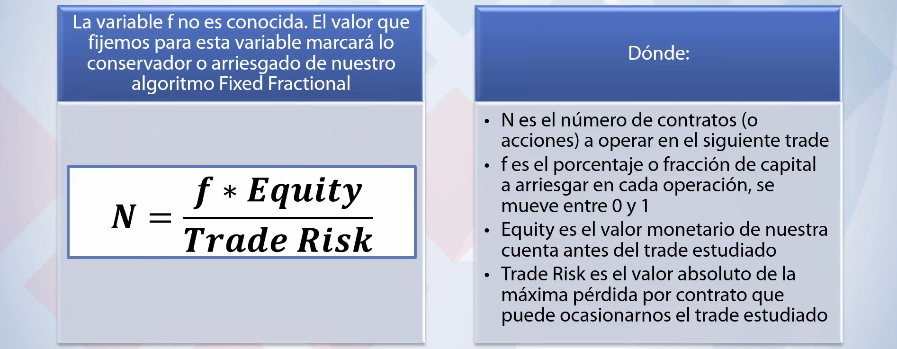

La formula `N = f * Equity / Trade Risk` es el centro matematico de la clase.
El sizing no se puede auditar si falta cualquiera de sus tres piezas: fraccion
`f`, equity y riesgo por trade.

### 4.2 Volatilidad normalizada y floor

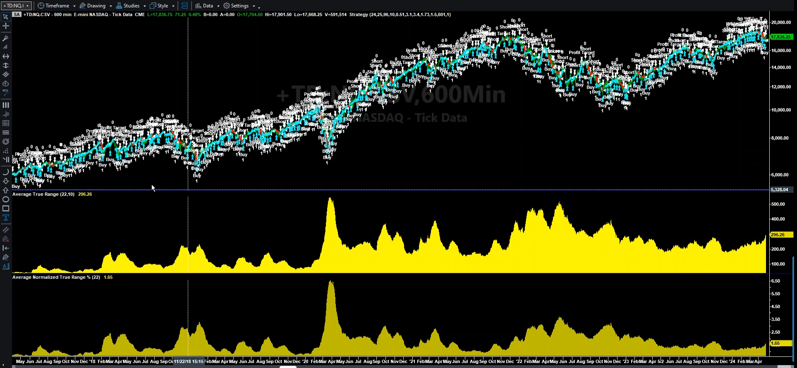

El ATR en puntos queda contaminado por el nivel de precio historico. La clase
usa Average Normalized True Range para comparar volatilidad relativa y despues
convertirla de vuelta a riesgo monetario actual.

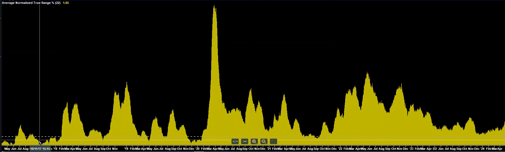

El floor de volatilidad evita que una volatilidad observada demasiado baja
dispare el numero de contratos. En TSIS esto debe ser un gate de leverage, no
una preferencia visual.

### 4.3 Codigo de riesgo y sizing

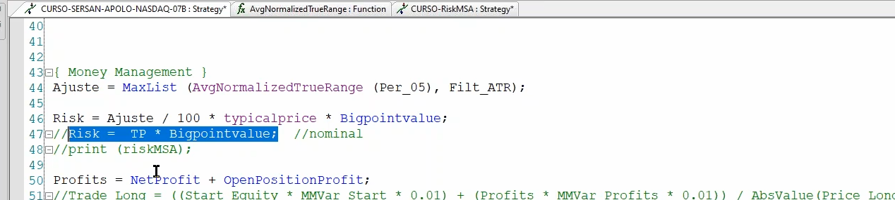

La regla operativa es convertir volatilidad normalizada en riesgo monetario
con precio actual y `BigPointValue`. Esto conecta porcentaje de volatilidad con
dinero real por contrato.

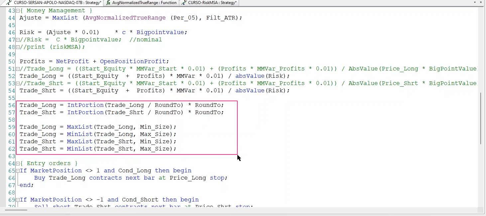

Despues del calculo bruto, el tamano se redondea hacia abajo con `IntPortion`
y se limita con `Min_Size` y `Max_Size`. Redondear hacia arriba invalida el
presupuesto de riesgo.

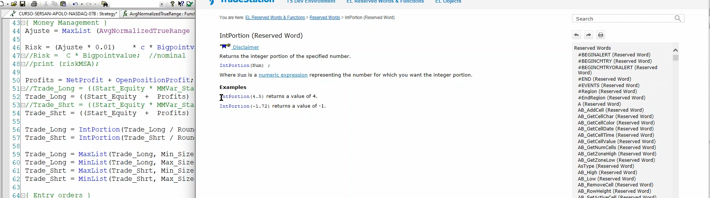

La ayuda de TradeStation confirma que `IntPortion(4.5)` devuelve `4`. Este
detalle justifica convertir el redondeo hacia abajo en validador reproducible.

### 4.4 Comparativa con y sin floor

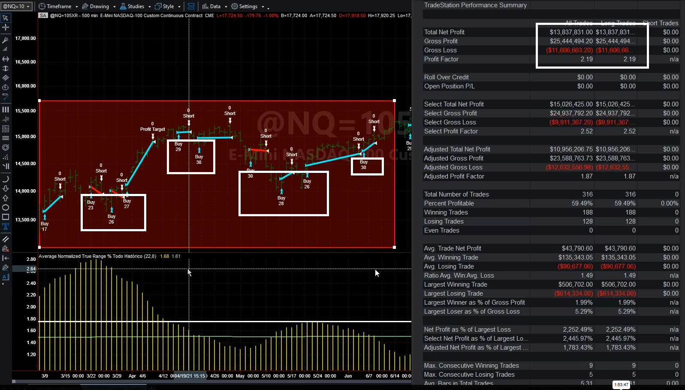

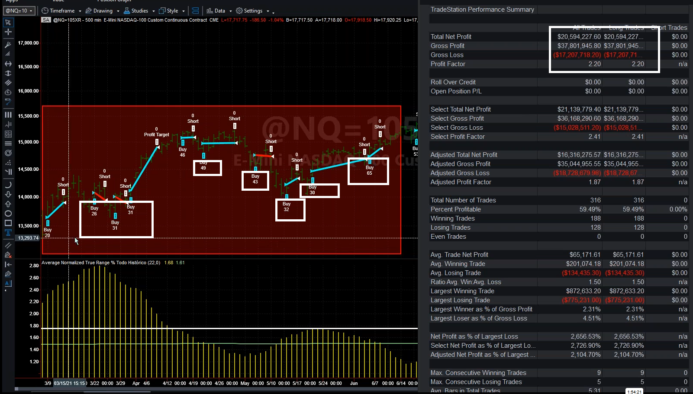

Una configuracion puede ganar mas dinero historicamente y ser peor para TSIS si
lo logra aumentando oscilacion de contratos o exposicion en baja volatilidad.
El Harness debe comparar beneficio, gross loss, max loss, contratos y drawdown.

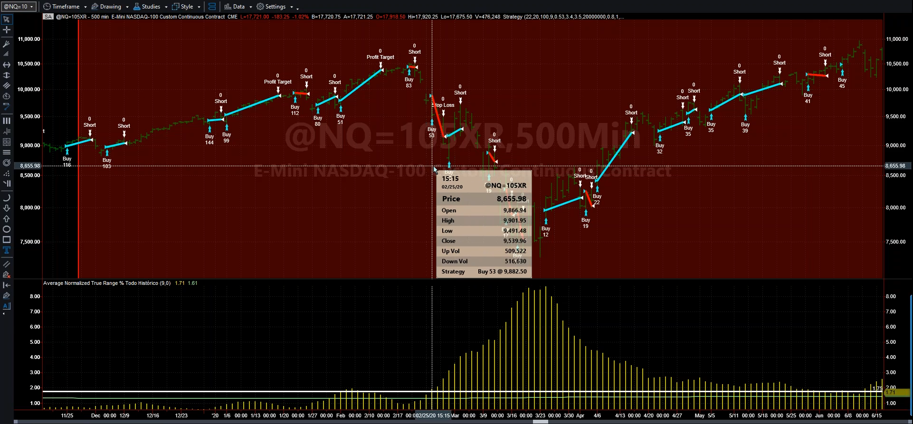

La volatilidad alta reduce contratos. El riesgo principal, sin embargo, esta en
el periodo previo: baja volatilidad puede inflar el size justo antes de un
shock.

### 4.5 Exportacion y MSA

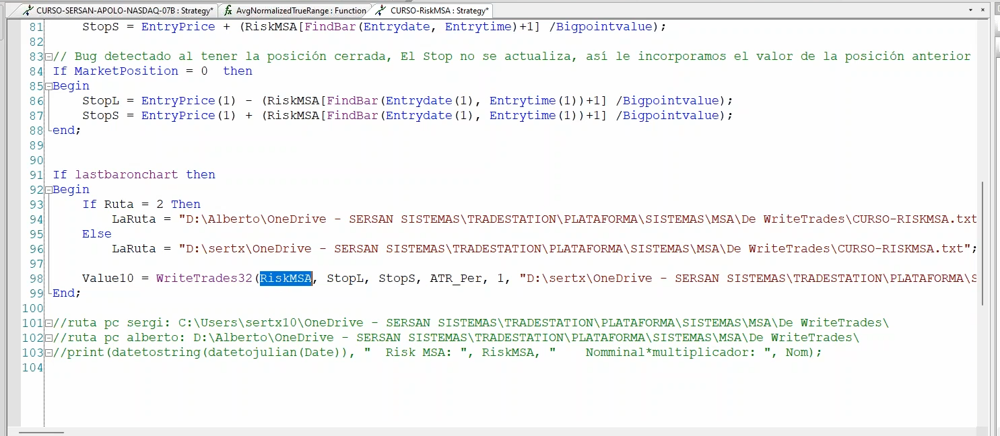

`RiskMSA` se exporta bajo `lastbaronchart`. Los trades raw y el riesgo deben
salir en unidades consistentes para que MSA compare metodos de sizing sin
contaminar la edge original.

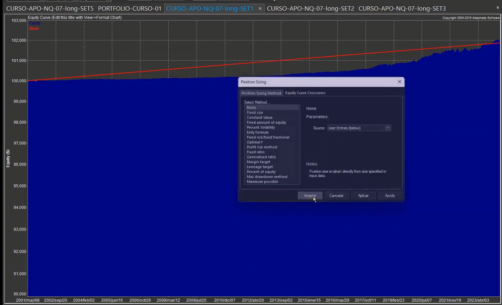

MSA permite Kelly, Fixed Risk, Fixed Ratio, Percent Volatility y otros metodos.
El Harness debe registrar el metodo exacto y compararlo bajo las mismas
restricciones.

### 4.6 Kelly y drawdown

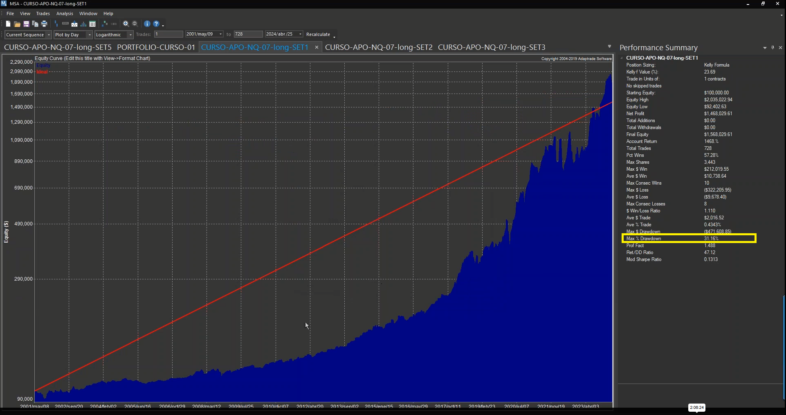

Kelly puede producir crecimiento enorme y aun asi drawdown de 31.16%. La
rentabilidad final no valida el sizing.

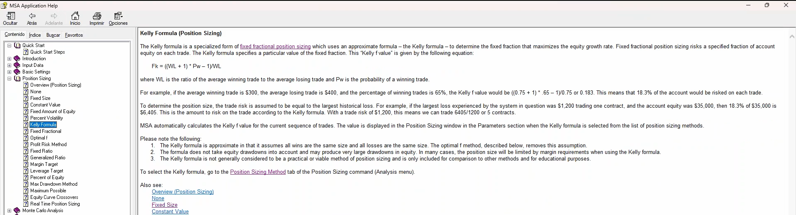

La propia ayuda de MSA avisa que Kelly es aproximado, no considera drawdown y
se incluye para comparacion educativa. En TSIS queda como herramienta de
analisis, no como sizing automatico por defecto.

### 4.7 Portfolio y engano visual

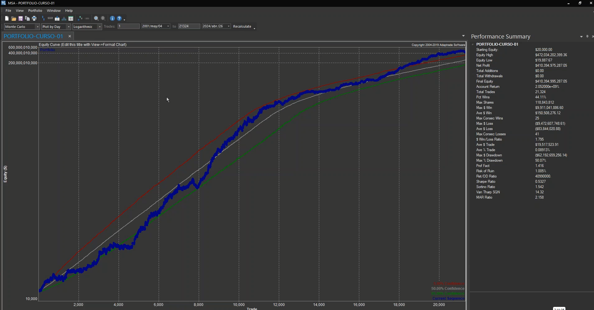

Una cartera puede parecer extraordinaria y aun asi tener max drawdown de
50.07%. Esta imagen justifica un gate explicito contra aprobar curvas por
apariencia.

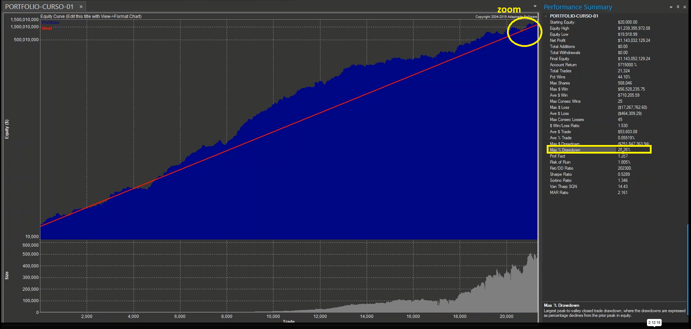

Incluso con menor agresividad, el portfolio mostrado mantiene 28.26% de
drawdown. El objetivo de riesgo debe fijarse antes de optimizar.

### 4.8 Metodo contra metodo

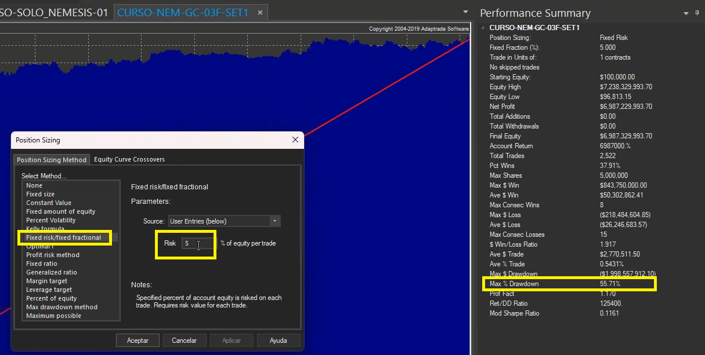

Fixed Risk al 5% llega a 55.71% de max drawdown en la evidencia inspeccionada.

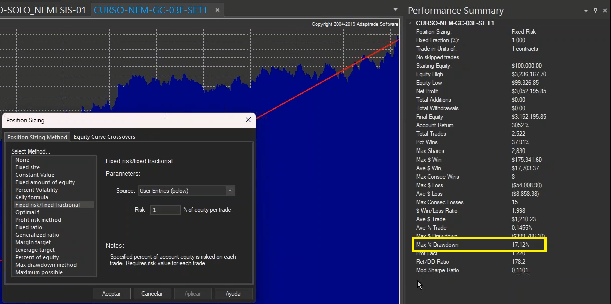

Fixed Risk al 1% baja el drawdown a 17.12%. La sensibilidad a la fraccion es
una prueba obligatoria.

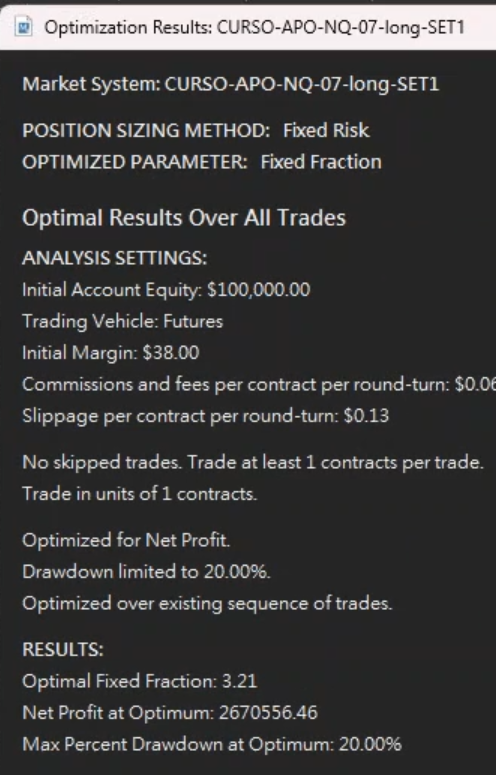

En esta evidencia Apolo, Fixed Risk optimizado a igual drawdown supera a
Percent Volatility, pero se registra como resultado de esa familia/sistema, no
como ley universal.

## 5. Reglas mecanicas candidatas

La extraccion completa esta en `mechanical_rules.yaml`. Las reglas principales
son:

1. If the same stop or target applies to long and short, built-in EasyLanguage stops should be declared at strategy root, not gated by MarketPosition.
2. Money management must not be used to manufacture edge; martingale-style recovery is rejected as a substitute for a valid system edge.
3. The Buscador E/S is an exploration tool; promising ideas must be developed and audited independently before becoming systems.
4. A weak side sample, such as few short trades, is not automatically invalid, but its significance depends on optimization intensity, degrees of freedom and mirror/joint logic.
5. Commissions, slippage, swaps or equivalent financing costs must be approximated before comparing systems, especially intraday or high-turnover systems.
6. Futures are preferred when feasible, but diversified CFDs or ETFs can be rational if capital or instrument constraints prevent adequate futures diversification.
7. Trades should be exported without final money management and then sized in MSA or equivalent tooling for comparable analysis.
8. WriteTrades32 or equivalent export should run once at the end of the chart, outside loops and under a lastbar guard.
9. Fixed Fractional sizing requires a declared Trade Risk; if stops are rare, distant or absent, risk must be estimated rather than assumed zero.
10. Normalized volatility, such as Average Normalized True Range, is preferred over ATR in points when price level changes materially over history.
11. When volatility drives position size, apply a floor such as MaxList(AvgNormalizedTrueRange, Filt_ATR) before dividing by risk.
12. Risk for sizing must combine normalized volatility, current price proxy and BigPointValue or equivalent nominal multiplier.
13. After computing raw size, round down by lot size and apply Min_Size and Max_Size caps.
14. The money-management fraction and risk definition jointly determine aggressiveness; neither can be reviewed in isolation.
15. Sizing optimizers must include drawdown or risk constraints; net profit alone is not an acceptance metric.
16. Money-management curves must be reviewed with drawdown percentages, max loss, rachas and zooms, not only visual equity growth.
17. Kelly can be calculated for comparison, but it must not be promoted automatically because it ignores drawdown and can be impractical.
18. Maximum consecutive losses must be reviewed because equity-only or Kelly-style adjustment can react too slowly during a long losing streak.
19. Sizing decisions must be evaluated at system, side, family and portfolio levels; the best standalone sizing may be wrong for the combined book.
20. Fixed Risk, Percent Volatility, Fixed Ratio, Kelly and other methods should be compared under the same drawdown or risk budget.
21. Removing a volatility floor may improve historical profit but must be reviewed for contract oscillation and low-vol shock exposure.
22. If MSA/Maestro or CPU limits prevent an optimization or portfolio review, the result must be marked blocked/needs review rather than extrapolated.
23. Future AlphaEvolve strategy search must treat trade risk, floor, caps, cost model, drawdown target, rachas and portfolio contribution as evaluator gates.

## 6. Traduccion TSIS

La traduccion completa esta en `tsis_translation_map.csv`. Las piezas mas
importantes para TSIS son:

- `backtest_order_semantics_gate` -> Audit built-in stops versus manual side-specific exits.
- `strategy_edge_precondition` -> Reject recovery sizing as a substitute for raw edge.
- `strategy_candidate_origin_gate` -> Mark Buscador outputs as ideas requiring independent implementation.
- `side_sample_dof_report` -> Report side counts with degrees of freedom and optimization pressure.
- `execution_cost_model_contract` -> Require friction, borrow, financing or swap assumptions before ranking.
- `instrument_feasibility_matrix` -> Compare futures, CFDs, ETFs and equities by feasibility and diversification.
- `raw_trade_export_contract` -> Keep raw trades separate from post-export sizing results.
- `trade_export_single_execution_gate` -> Validate lastbar guard and one-time export behavior.
- `trade_risk_field_contract` -> Require same-unit risk per trade for all risk-based sizing.
- `normalized_volatility_risk_calculator` -> Use price-normalized volatility for long histories.
- `volatility_floor_stress_gate` -> Compare low-vol-to-high-vol behavior with explicit floors.
- `risk_nominal_conversion_validator` -> Validate normalized risk to price and BigPointValue conversion.
- `position_size_rounding_validator` -> Check truncation, lot size, Min_Size and Max_Size.
- `money_management_aggressiveness_manifest` -> Record f, risk formula and caps for each run.
- `position_sizing_optimizer_gate` -> Require drawdown cap and optimization objective in sizing searches.
- `equity_curve_visual_deception_gate` -> Require max DD, max loss, streaks and zoom review.
- `kelly_usage_policy` -> Treat Kelly as comparison unless production gates pass.
- `losing_streak_stress_report` -> Stress max consecutive losses and clustered drawdowns.
- `portfolio_family_mm_report` -> Evaluate sizing by side, family and portfolio contribution.
- `sizing_method_comparison_table` -> Compare methods under common drawdown/risk budget.
- `volatility_floor_ablation_report` -> Require ablation for contract oscillation and shocks.
- `tool_resource_blocker_log` -> Record incomplete MSA/Maestro runs as blockers.
- `alphaevolve_mm_evaluator_suite` -> Only rank generated strategies after MM and portfolio gates pass.

## 7. Lo que no debe promocionarse todavia

No se debe promocionar Kelly como sizing de produccion por defecto.

No se debe promocionar un valor universal de `Filt_ATR`, `MMVar`, Fixed Risk o
Percent Volatility. La clase muestra metodologia, no constantes canonicas.

No se debe elegir un metodo de sizing por net profit sin normalizar por
drawdown, rachas, max loss, contratos maximos y contribucion a cartera.

No se debe extrapolar resultados incompletos si MSA, Maestro o CPU impiden
terminar una optimizacion.

## 8. Mejora del Harness frente a pilotos 02 y 09

Este tercer piloto completa el triangulo inicial:

- practice_02: reglas de sistema y validacion basica;
- practice_09: revision de optimizacion y robustez por mapas;
- practice_15: money management, risk sizing y cartera.

Con este paquete el Harness ya puede definir una primera suite de evaluadores
para AlphaEvolve: edge bruto, costes, overfit, trade risk, sizing, drawdown,
rachas, floors de volatilidad y contribucion de portfolio.

## 9. Consumidores previstos

- Sersan Distillation Harness: doctrina candidata de MM y portfolio.
- Backtest Harness: contrato de trade risk, raw exports y risk metrics.
- AlphaEvolve: gates contra leverage fragil y profit-only optimization.
- Portfolio Harness futuro: comparativa por familia, lado, metodo y drawdown.
- Data Quality Harness: analogias para fricciones, halts y realismo de
  ejecucion cuando haya data live.

## 10. Estado

`pass_with_warnings`

El paquete esta listo como tercer piloto comparativo. Requiere revision humana
antes de promocionar reglas a doctrina canonica TSIS.
