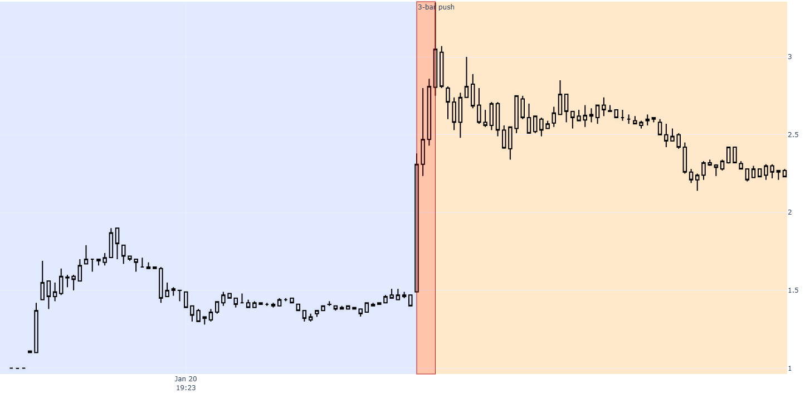

# PM_Accepted_Extension_Break_Event

Fecha: 2026-06-20  
Estado: `draft_definition`  
Familia: `MOMENTUM_EXPANSION`  
Ruta: `00_CTO/13_TRADING_SYSTEMS/00_EVENT_LIBRARY/01_MOMENTUM_EXPANSION/PM_ACCEPTED_EXTENSION_BREAK_EVENT/`  

Este documento define una primera version conceptual, didactica y revisable del evento:

```text
PM_Accepted_Extension_Break_Event
```

No es una estrategia.
No es un detector productivo.
No es un backtest.
No es una prueba de edge.

Es una definicion inicial de un fenomeno observable que TSIS quiere estudiar:

```text
primera extension -> aceptacion/meseta -> ruptura violenta
```

## Menu

- [1. Proposito](#1-proposito)
- [2. Nombre del evento](#2-nombre-del-evento)
- [3. Definicion corta](#3-definicion-corta)
- [4. Definicion didactica](#4-definicion-didactica)
- [5. Fases del evento](#5-fases-del-evento)
- [6. Timestamp oficial del evento](#6-timestamp-oficial-del-evento)
- [7. Condiciones observables minimas](#7-condiciones-observables-minimas)
- [8. Features candidatas](#8-features-candidatas)
- [9. Calidad y flags esperadas](#9-calidad-y-flags-esperadas)
- [10. Exclusiones](#10-exclusiones)
- [11. Ambiguedades abiertas](#11-ambiguedades-abiertas)
- [12. Review visual humana](#12-review-visual-humana)
- [13. Estado actual](#13-estado-actual)
- [14. Proximos pasos recomendados](#14-proximos-pasos-recomendados)
- [15. Regla final](#15-regla-final)

---

## 1. Proposito

Este evento nace al observar un caso de premarket donde el sistema ya detectaba un push fuerte de varias velas, pero el grafico mostraba una estructura previa mas rica y persistente.

La observacion humana fue:

1. El ticker hace una primera extension en premarket.
2. Esa extension no se revierte completamente.
3. El precio sostiene una zona elevada durante un tramo suficiente.
4. La zona sostenida se comporta como una meseta o base de aceptacion.
5. Despues rompe violentamente esa meseta con varias velas consecutivas.



El objetivo de esta definicion es separar:

```text
push aislado
```

de:

```text
estructura aceptada antes del push
```

La hipotesis conceptual es que no todos los pushes violentos son iguales.
Un push que aparece despues de una primera extension aceptada podria representar un fenomeno de mercado diferente a un spike aislado sin construccion previa.

---

## 2. Nombre del evento

Nombre provisional preferido:

```text
PM_Accepted_Extension_Break_Event
```

Descomposicion del nombre:

| Parte | Significado |
| --- | --- |
| `PM` | El evento ocurre en premarket. |
| `Accepted_Extension` | El precio hizo una primera extension y el mercado acepto precios elevados durante un tramo. |
| `Break` | El evento se materializa cuando rompe violentamente la zona de aceptacion. |
| `Event` | Describe un fenomeno observable, no una accion operativa. |

Nombres considerados:

| Nombre | Ventaja | Problema |
| --- | --- | --- |
| `PM_Shelf_Breakout_Event` | Corto y visual. | Puede sonar demasiado tecnico-grafico y reducir el evento a una "shelf" perfecta. |
| `PM_Extension_Hold_And_Impulse_Event` | Describe bien las tres fases. | Es largo y menos elegante como identidad canonica. |
| `PM_Accepted_Extension_Break_Event` | Captura extension, aceptacion y ruptura. | Requiere definir bien que significa "accepted". |

Decision provisional:

```text
Usar PM_Accepted_Extension_Break_Event como nombre de trabajo.
```

---

## 3. Definicion corta

Evento de premarket donde un ticker hace una primera expansion, sostiene precios elevados durante un periodo suficiente sin revertir completamente esa extension, y posteriormente rompe la zona de aceptacion con un impulso vertical de varias velas consecutivas.

---

## 4. Definicion didactica

Este evento no empieza en la vela explosiva.

La vela explosiva es solo la materializacion final de una estructura previa.

La secuencia completa es:

```text
1. initial_extension
2. accepted_price_shelf
3. violent_shelf_break
```

La primera extension demuestra que hay atencion o agresion compradora.

La meseta demuestra que el precio extendido no fue rechazado de forma inmediata.

La ruptura violenta demuestra que la aceptacion previa se convierte en expansion de momentum.

Por tanto, el evento intenta responder:

```text
Ha habido una primera expansion aceptada que luego rompe con violencia?
```

No intenta responder:

```text
Debo comprar?
Donde entro?
Donde pongo stop?
Hasta donde salgo?
```

---

## 5. Fases del evento

### 5.1. Fase A - `initial_extension`

La primera fase identifica una extension temprana en premarket.

Fenomeno:

```text
El precio deja una zona inicial y marca un primer high relevante.
```

Condiciones conceptuales:

- ocurre antes de la ruptura principal;
- aparece en premarket;
- genera un primer high relevante;
- demuestra atencion temprana;
- no tiene por que ser el maximo final del dia;
- puede ser rapida o relativamente escalonada.

Parametros de investigacion inicial:

| Parametro | Rango inicial orientativo | Significado |
| --- | --- | --- |
| `initial_extension_pct` | `15% - 30%` | Subida desde low/base inicial PM hasta primer high relevante. |
| `initial_extension_min_volume` | TBD | Volumen minimo durante la extension. |
| `initial_extension_max_duration` | TBD | Duracion maxima para no confundirlo con tendencia lenta de toda la manana. |

Notas:

- No toda subida inicial es suficiente.
- Debe ser una extension visible respecto al rango previo.
- La primera extension no es el evento final; es una condicion previa.

---

### 5.2. Fase B - `accepted_price_shelf`

La segunda fase identifica aceptacion de precio.

Fenomeno:

```text
Despues de extender, el precio no colapsa; sostiene una zona elevada durante un periodo suficiente.
```

Esto es la parte mas importante del evento.

La meseta no tiene que ser perfecta. Puede tener ruido, pequenas sacudidas, micro pullbacks o una pendiente ligeramente positiva.

Lo que debe evitarse es confundir:

```text
aceptacion
```

con:

```text
spike que fallo
```

Condiciones conceptuales:

- el precio permanece por encima de una zona de aceptacion;
- no devuelve por completo la primera extension;
- los lows se mantienen relativamente controlados;
- el rango se comprime o se estabiliza;
- la duracion es suficiente para distinguirlo de un rebote inmediato;
- puede existir ligera inclinacion alcista;
- no debe convertirse en downtrend claro.

Parametros de investigacion inicial:

| Parametro | Rango inicial orientativo | Significado |
| --- | --- | --- |
| `shelf_min_duration_minutes` | `15 - 20` | Duracion minima de aceptacion. |
| `shelf_max_duration_minutes` | `90 - 180` | Duracion maxima inicial para no mezclar sesiones enteras. |
| `max_extension_giveback_pct` | `35% - 50%` | Cuanto de la extension inicial se permite devolver. |
| `shelf_range_pct_of_extension` | TBD | Rango de la meseta relativo a la extension inicial. |
| `shelf_slope_allowed` | plana a ligeramente positiva | Evita exigir horizontalidad perfecta. |

Interpretacion:

- Si devuelve casi toda la extension, no hay aceptacion.
- Si la base dura solo 2 o 3 minutos, probablemente es continuacion inmediata, no meseta.
- Si la base deriva muy fuerte hacia abajo, probablemente es fallo o agotamiento, no aceptacion.

---

### 5.3. Fase C - `violent_shelf_break`

La tercera fase identifica la ruptura violenta de la meseta.

Fenomeno:

```text
La parte alta de la zona aceptada se rompe con varias velas consecutivas de expansion.
```

Condiciones conceptuales:

- ruptura de la parte alta de la meseta;
- nuevo high por encima de la estructura previa;
- `3-4` velas 1m consecutivas;
- highs crecientes;
- closes fuertes;
- closes cerca de maximos de vela;
- volumen expansivo respecto a la meseta;
- push adicional relevante.

Parametros de investigacion inicial:

| Parametro | Rango inicial orientativo | Significado |
| --- | --- | --- |
| `impulse_window_bars` | `3 - 4` | Numero de velas de ruptura. |
| `impulse_push_pct` | `>= 20%` | Subida adicional durante la ruptura. |
| `require_rising_highs` | `true` | Cada high supera el anterior dentro del bloque. |
| `require_strong_closes` | TBD | Closes cerca del high de cada vela. |
| `volume_expansion_ratio` | TBD | Volumen del impulso vs volumen medio de la meseta. |

Notas:

- La ruptura es el timestamp del evento.
- La ruptura no es entrada.
- La ruptura no implica que haya que operar.

---

## 6. Timestamp oficial del evento

El `event_timestamp` debe ser:

```text
primera vela de la ruptura violenta
```

No debe ser:

```text
primera vela de la extension inicial
```

Razon:

La primera extension es una condicion previa.
La meseta es la fase de aceptacion.
La ruptura violenta es la materializacion del evento.

Por tanto:

```text
event_start = inicio de violent_shelf_break
event_context_start = inicio de initial_extension
event_structure_start = inicio de accepted_price_shelf
```

En una futura `event_table`, convendria separar:

| Campo conceptual | Significado |
| --- | --- |
| `event_context_start_ts` | Inicio de la primera extension o contexto previo. |
| `shelf_start_ts` | Inicio de la fase de aceptacion. |
| `event_start_ts` | Inicio de la ruptura violenta. |
| `event_end_ts` | Fin del bloque de ruptura. |

---

## 7. Condiciones observables minimas

Una primera version de contrato podria exigir:

```yaml
event_name: PM_Accepted_Extension_Break_Event
family: MOMENTUM_EXPANSION
status: draft_definition
session_scope: premarket

observable_conditions:
  required:
    - initial_extension_present
    - extension_not_fully_reverted
    - accepted_price_shelf_present
    - shelf_duration_sufficient
    - violent_shelf_break_present
    - rising_highs_during_break
    - impulse_push_pct_above_threshold

  optional:
    - volume_expansion_on_break
    - shelf_slope_flat_or_positive
    - multiple_support_touches
    - spread_not_extreme
    - news_or_catalyst_context
```

Esta estructura todavia no es detector final.
Es una forma de pensar la definicion.

---

## 8. Features candidatas

### 8.1. Identidad y tiempo

```text
ticker
tradingview_symbol
primary_exchange
event_date
event_start_ts
event_end_ts
event_context_start_ts
session_segment
```

### 8.2. Extension inicial

```text
initial_extension_start_ts
initial_extension_high_ts
initial_extension_low
initial_extension_high
initial_extension_pct
initial_extension_duration_minutes
initial_extension_volume
initial_extension_volume_per_minute
```

### 8.3. Meseta / aceptacion

```text
shelf_start_ts
shelf_end_ts
shelf_duration_minutes
shelf_high
shelf_low
shelf_mid
shelf_range_pct
shelf_range_pct_of_initial_extension
shelf_slope
shelf_low_drift
shelf_high_drift
shelf_support_touch_count
shelf_volume
shelf_avg_volume_per_minute
extension_giveback_pct
extension_retained_pct
```

### 8.4. Ruptura violenta

```text
break_start_ts
break_end_ts
break_window_bars
break_open
break_high
break_low
break_close
break_push_pct
break_volume
break_volume_ratio_vs_shelf
break_highs_rising
break_closes_near_high
break_new_high_over_shelf
```

### 8.5. Contexto de mercado

```text
premarket_volume_to_event
premarket_rvol_proxy
gap_pct_if_available
price_at_event
market_cap
float_if_available
spread_proxy_if_available
halt_overlap
news_context_if_available
```

---

## 9. Calidad y flags esperadas

Una fila candidata futura deberia poder marcar:

```text
good_candidate
review_candidate
degraded_candidate
blocked_candidate
invalid_candidate
```

Flags conceptuales:

| Flag | Significado |
| --- | --- |
| `initial_extension_clear` | La primera extension es visible y cuantificable. |
| `shelf_clear` | La zona de aceptacion es suficientemente clara. |
| `shelf_ambiguous` | Hay base, pero los limites son discutibles. |
| `break_clear` | La ruptura es evidente. |
| `break_window_detected` | El bloque de 3-4 velas fue detectado. |
| `volume_context_missing` | Falta volumen suficiente o no se puede comparar. |
| `premarket_data_sparse` | Hay pocas barras o huecos de data. |
| `halt_overlap` | Hay halt dentro o cerca de la estructura. |
| `split_risk_context` | Hay riesgo de comparacion contaminada por split/corporate action. |
| `manual_review_required` | El caso debe revisarse visualmente. |

Regla:

```text
Si no se puede distinguir la meseta de un spike fallido, el caso no debe ser good_candidate.
```

---

## 10. Exclusiones

No deberian clasificarse como este evento:

1. Spike aislado sin primera extension aceptada.
2. Push directo desde apertura sin fase de meseta.
3. Gap grande que se mueve lateral sin ruptura violenta.
4. Extension inicial que devuelve casi todo el movimiento.
5. Base que deriva claramente hacia abajo.
6. Ruptura que ocurre en regular market si la definicion actual exige premarket.
7. Movimiento causado por ajuste artificial de split.
8. Caso donde la data de premarket es demasiado incompleta para sostener la definicion.

---

## 11. Ambiguedades abiertas

### 11.1. Que cuenta como primera extension?

Pregunta:

```text
Debe medirse desde low de premarket, desde primer print valido, desde VWAP inicial o desde una microbase?
```

Decision provisional:

```text
Usar low/base inicial de premarket como referencia exploratoria.
```

Pendiente:

```text
comparar varias formas de medir initial_extension_pct.
```

### 11.2. Que cuenta como aceptacion?

Pregunta:

```text
Cuanto tiempo debe sostener el precio para decir que hubo aceptacion?
```

Decision provisional:

```text
15-20 minutos como minimo inicial.
```

Pendiente:

```text
testear sensibilidad entre 10, 15, 20, 30 y 45 minutos.
```

### 11.3. Cuanto pullback se permite?

Pregunta:

```text
Si devuelve 50% de la extension, sigue siendo aceptacion?
```

Decision provisional:

```text
No fijar todavia; revisar visualmente rangos 35%-50%.
```

### 11.4. La ruptura debe ser de 3 o 4 velas?

Pregunta:

```text
El evento observado rompe en 4 velas, pero ya tenemos detector de 3 velas.
```

Decision provisional:

```text
permitir 3-4 velas como familia de impulso.
```

Pendiente:

```text
ver si 3-bar y 4-bar son variantes o eventos distintos.
```

---

## 12. Review visual humana

Para revisar un candidato, el humano debe mirar:

1. Hay primera extension clara?
2. La extension fue aceptada o fallo?
3. La meseta tiene duracion suficiente?
4. La meseta sostiene lows razonables?
5. La ruptura sale desde la parte alta de la meseta?
6. La ruptura tiene velas consecutivas fuertes?
7. El volumen acompana?
8. Hay halt o problema de data?
9. Se esta confundiendo evento con entrada?

Checklist visual:

```text
[ ] initial extension visible
[ ] first high marked
[ ] no full reversal after initial extension
[ ] accepted shelf/base visible
[ ] shelf lasts long enough
[ ] shelf not clearly downtrending
[ ] violent break above shelf
[ ] 3-4 consecutive 1m bars
[ ] rising highs
[ ] strong closes
[ ] no trade instruction included
```

---

## 13. Estado actual

Estado del evento:

```text
draft_definition
```

No puede pasar aun a `detector_candidate` porque faltan:

- thresholds finales;
- definicion precisa de `accepted_price_shelf`;
- reglas de medicion de extension inicial;
- reglas de volumen;
- reglas de casos ambiguos;
- muestra de casos buenos y malos;
- sensibilidad sobre duracion de meseta;
- test exploratorio en universo amplio.

---

## 14. Proximos pasos recomendados

1. Reunir 10-20 ejemplos visuales candidatos.
2. Separar ejemplos claros, dudosos y falsos positivos.
3. Decidir si el evento es estrictamente premarket o si necesita variante RTH.
4. Definir thresholds iniciales para:
   - `initial_extension_pct`;
   - `shelf_duration_minutes`;
   - `extension_retained_pct`;
   - `break_push_pct`;
   - `break_window_bars`.
5. Escribir una query exploratoria en `01_research/04_event_discovery`.
6. Generar candidatos.
7. Revisar visualmente.
8. Ajustar definicion.
9. Solo despues considerar `detector_candidate`.

---

## 15. Regla final

Este evento existe para capturar una estructura de mercado:

```text
el precio extendio,
el mercado acepto esa extension,
y despues rompio violentamente la zona aceptada.
```

Mientras no incluya entrada, stop, target, sizing ni instruccion de ejecucion, sigue siendo un evento.

Si en algun momento empieza a decir que hacer frente a esa estructura, entonces deja de pertenecer a Event Library y debe moverse a Strategy Library, Execution Models o Decision Models.
