# EduTrades Long Plays Source Event Index v0.1

Fecha: 2026-06-21
Estado: `source_note` estructurado para Event Library.
Orientacion del material fuente: `long plays discrecionales`.

Nota de autoridad:

```text
La orientacion long solo describe el origen didactico del material.
No convierte este documento en Strategy Library.
```

Fuente textual externa:

```text
C:\TSIS_SmallCaps\00_data_governance\00_papers\EduTrades\07_Long_plays.md
```

Fuente textual copiada al repo:

```text
source_assets/edu_trades/07_Long_plays.md
```

Imagenes fuente copiadas al repo:

```text
source_assets/edu_trades/
```

Nota de ingesta:

```text
No se localizo un PDF EduTrades operativo en las rutas revisadas durante esta
ingesta. Este source-note se basa en 07_Long_plays.md y en las imagenes
disponibles bajo source_assets/edu_trades/.
```

## 1. Proposito

Este documento extrae fenomenos observables desde material discrecional de
EduTrades y los convierte en eventos candidatos que luego puedan buscarse en
historico con Python.

No basta con decir "Breakout" o "VWAP Bounce". Para TSIS, cada evento debe
dejar claro:

```text
que ocurre
que secuencia observable lo forma
donde empieza
donde termina
que features permitirian encontrar candidatos
que casos deben excluirse
```

Este documento no autoriza entradas, stops, targets, sizing ni salidas. Es un
source-note operativo para Event Research: preserva imagenes, lenguaje del
trader y una primera traduccion a busquedas historicas.

La prioridad del documento es doble:

```text
1. preservar el contexto visual y textual del material fuente;
2. dejar suficiente estructura para que un agente futuro pueda escribir
   un detector exploratorio sin reinterpretar el evento desde cero.
```

## 2. Guardrail de Event Library

Segun `TSIS_LAB_ARCHITECTURE.md`, la Event Library responde:

```text
Que eventos existen?
Que ocurrio en el mercado?
```

No responde:

```text
Que debo hacer?
Donde entro?
Donde pongo stop?
Que target busco?
Con que size actuo?
```

El documento fuente habla de long plays discrecionales. TSIS los descompone:

```text
play discrecional
-> eventos observables
-> filtros de contexto
-> hipotesis de mecanismo
-> decision operativa futura, fuera de este documento
```

Event Library solo conserva los eventos observables y los filtros necesarios
para encontrarlos sin contaminar la definicion con accion operativa.

Ejemplo:

```text
Breakout discrecional
!=
Daily_Resistance_Volume_Breakout_Event

Breakout discrecional puede estar compuesto por:
  Daily_Resistance_Volume_Breakout_Event
  Breakout_First_Dip_Hold_Event
  catalyst/no-dilution filters
  risk rules fuera de Event Library
```

La estrategia pertenece a otra capa. El evento responde:

```text
Que ocurrio en el mercado?
```

## 3. Plantilla para eventos buscables

Cada evento de este documento usa esta estructura:

1. `Que ocurre`: definicion concreta del fenomeno.
2. `Imagenes fuente`: evidencia visual asociada.
3. `Texto del trader`: explicacion contextual del documento fuente.
4. `Definicion observable v0`: secuencia minima, inicio, fin y unidad.
5. `Busqueda historica v0`: campos, features, thresholds iniciales y exclusiones.
6. `Composicion observable no operativa`: marcos donde puede aparecer como pieza.
7. `No es estrategia`: frontera explicita.

Los thresholds de este documento son semillas de investigacion. No son
parametros promovidos.

### 3.1. Contrato minimo para busqueda historica

Cada evento debe poder traducirse despues a una funcion exploratoria de Python
con esta forma conceptual:

```text
inputs -> window builder -> event predicate -> feature extraction -> candidate row
```

Cada bloque debe permitir derivar, como minimo:

```yaml
event_name:
event_family_candidate:
search_grain:
session_scope:
temporal_anchor:
start_condition_seed:
end_condition_seed:
required_price_fields:
required_volume_fields:
candidate_features:
candidate_thresholds:
exclusion_flags:
review_flags:
expected_event_table_fields:
```

Esto no es todavia un detector promovido. Es solo el puente entre source note y
detector candidate.

## 4. Eventos candidatos identificados

1. [`Daily_Resistance_Volume_Breakout_Event`](#5-daily_resistance_volume_breakout_event): ruptura de resistencia daily relevante con volumen confirmatorio.
2. [`Breakout_First_Dip_Hold_Event`](#6-breakout_first_dip_hold_event): primer retroceso posterior al breakout que respeta el nivel roto.
3. [`Red_To_Green_Level_Reclaim_Event`](#7-red_to_green_level_reclaim_event): recuperacion del nivel red-to-green con volumen despues de abrir rojo.
4. [`Red_Base_Volume_Ramp_Event`](#8-red_base_volume_ramp_event): base en rojo con perdida de presion vendedora y rampa de volumen comprador.
5. [`VWAP_Bounce_After_Extension_Event`](#9-vwap_bounce_after_extension_event): retroceso de una accion verde extendida hacia VWAP, seguido de rebote.
6. [`VWAP_Reclaim_Control_Event`](#10-vwap_reclaim_control_event): recuperacion de VWAP tras perdida temporal, con volumen superior al retroceso.
7. [`Panic_Dip_Reversal_Event`](#11-panic_dip_reversal_event): caida rapida extrema que deja de acelerar y revierte con volumen comprador.
8. [`First_Green_Day_High_Close_Event`](#12-first_green_day_high_close_event): primer dia verde con volumen historico y cierre cerca del HOD.
9. [`First_Day_Runner_Frontside_Dip_Event`](#13-first_day_runner_frontside_dip_event): dip en frontside durante el primer dia de runner, con estructura alcista viva.
10. [`First_Green_Day_Bounce_Event`](#14-first_green_day_bounce_event): primer rebote verde despues de una destruccion parcial del runner.
11. [`Gap_And_Grab_Reversal_Event`](#15-gap_and_grab_reversal_event): apertura roja, base tipo V y recuperacion agresiva de resistencias.
12. [`Gap_And_Go_Premarket_High_Breakout_Event`](#16-gap_and_go_premarket_high_breakout_event): ruptura del premarket high durante apertura con volumen y continuacion.

Mapa de busqueda inicial:

| Evento | Familia candidata | Grano | Ancla temporal | Observables primarios |
| --- | --- | --- | --- | --- |
| `Daily_Resistance_Volume_Breakout_Event` | `RESISTANCE_AND_BREAKOUTS` | `ticker_day + intraday_window` | primera vela que cierra sobre resistencia | nivel, close sobre nivel, volumen de ruptura |
| `Breakout_First_Dip_Hold_Event` | `RESISTANCE_AND_BREAKOUTS` | `event_interval` | primer low del dip posterior al breakout | profundidad del dip, distancia al nivel roto, cierres bajo nivel |
| `Red_To_Green_Level_Reclaim_Event` | `INTRADAY_REVERSALS` | `ticker_session` | vela que recupera `prior_close` | gap rojo, minutos bajo prior close, volumen de reclaim |
| `Red_Base_Volume_Ramp_Event` | `INTRADAY_REVERSALS` | `intraday_window` | low inicial de la base roja | duracion de base, lower lows, decay de venta, rampa de volumen |
| `VWAP_Bounce_After_Extension_Event` | `VWAP_CONTROL` | `ticker_session` | touch/aproximacion a VWAP tras extension | distancia high-VWAP, low-VWAP, hold/rebote |
| `VWAP_Reclaim_Control_Event` | `VWAP_CONTROL` | `intraday_window` | cierre que recupera VWAP | duracion bajo VWAP, volumen de reclaim, hold posterior |
| `Panic_Dip_Reversal_Event` | `INTRADAY_REVERSALS` | `intraday_window` | low de panico o primera vela de reversa | drop pct, duracion del drop, reversal volume, no break del low |
| `First_Green_Day_High_Close_Event` | `RUNNER_LIFECYCLE` | `ticker_day` | cierre de sesion | daily return, volume rank, close location, VWAP relation |
| `First_Day_Runner_Frontside_Dip_Event` | `RUNNER_LIFECYCLE` | `ticker_session` | low del dip frontside | day gain, pullback depth, VWAP hold, higher low |
| `First_Green_Day_Bounce_Event` | `RUNNER_LIFECYCLE` | `ticker_day` | cierre del primer dia verde tras drawdown | runner high, drawdown, retained gain, reversal volume |
| `Gap_And_Grab_Reversal_Event` | `INTRADAY_REVERSALS` | `ticker_session` | low de V o primera vela de pickup | gap down, V depth, sell volume decay, resistance reclaim |
| `Gap_And_Go_Premarket_High_Breakout_Event` | `MOMENTUM_EXPANSION` | `ticker_session` | vela regular que rompe PMH | gap, PM volume, PMH break, breakout volume, hold sobre PMH |

La tabla no sustituye la definicion de cada evento. Su funcion es orientar el
primer detector exploratorio y la UI de notebook.

## 5. Daily_Resistance_Volume_Breakout_Event

### Que ocurre

El precio rompe una resistencia daily visible y lo hace con volumen
anormalmente alto. El evento no es "precio sube"; es la combinacion de:

```text
nivel historico relevante
-> consolidacion o rechazo previo bajo ese nivel
-> vela que cierra por encima
-> volumen superior al contexto anterior
```

### Imagenes fuente

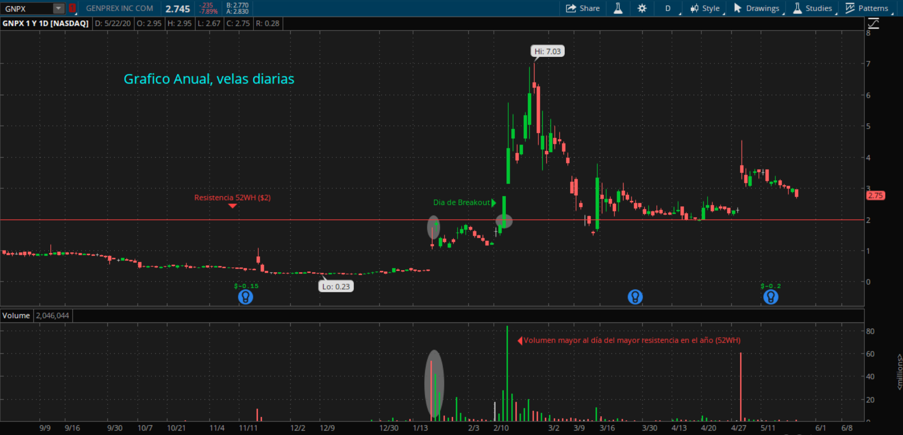

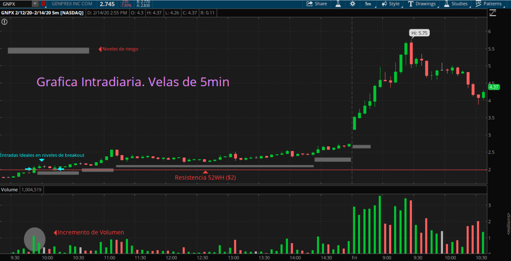

### Texto del trader

El documento fuente presenta el Breakout como una ruptura de resistencia clave
con volumen confirmatorio. La resistencia puede ser maximo del dia anterior,
52-week high o una zona donde el precio fallo antes. El trader advierte que el
volumen valida la demanda y que una ruptura vertical sin estructura previa
puede ser fakeout.

### Definicion observable v0

Unidad de busqueda:

```text
ticker_day + intraday confirmation
```

Secuencia minima:

```text
1. existe resistance_level calculable desde daily o premarket/dia previo
2. precio cotiza bajo o cerca del nivel antes de romperlo
3. una vela cierra por encima de resistance_level
4. volumen de la vela o ventana de ruptura > volumen promedio reciente
```

Inicio conceptual:

```text
primera vela que cierra por encima de resistance_level
```

Fin conceptual:

```text
fin de la ventana de confirmacion o primer pullback posterior
```

### Busqueda historica v0

Inputs esperados:

```text
daily OHLCV
1m/5m OHLCV
session calendar
```

Features candidatas:

```text
resistance_level
resistance_source = previous_day_high | 52w_high | multi_day_high
close_above_level_pct
breakout_volume_ratio
bars_below_level_before_break
prior_consolidation_minutes
breakout_followthrough_5m_pct
```

Thresholds semilla:

```text
close >= resistance_level * 1.002
breakout_volume_ratio >= 2.0
prior_consolidation_minutes >= 5
```

Excluir o marcar `review_event` si:

```text
breakout ocurre sin volumen
spread extremo
vela rompe y cierra inmediatamente por debajo
gap abre muy por encima del nivel sin interaccion local
```

### Composicion observable no operativa

Puede aparecer como pieza observable dentro de:

- `Breakout`;
- `Gap and Go`;
- `First Green Day`;
- `High of Day Breakout`.

Composicion didactica:

```text
Daily_Resistance_Volume_Breakout_Event
+ Breakout_First_Dip_Hold_Event
+ VWAP_Bounce_After_Extension_Event
```

### No es estrategia

No define actuar sobre la ruptura ni sobre el dip posterior. Solo marca que una
resistencia fue rota con volumen.

## 6. Breakout_First_Dip_Hold_Event

### Que ocurre

Despues de un breakout confirmado, el precio retrocede hacia el nivel roto y no
lo destruye. El evento mide si el antiguo techo empieza a comportarse como zona
de aceptacion o soporte.

### Imagenes fuente


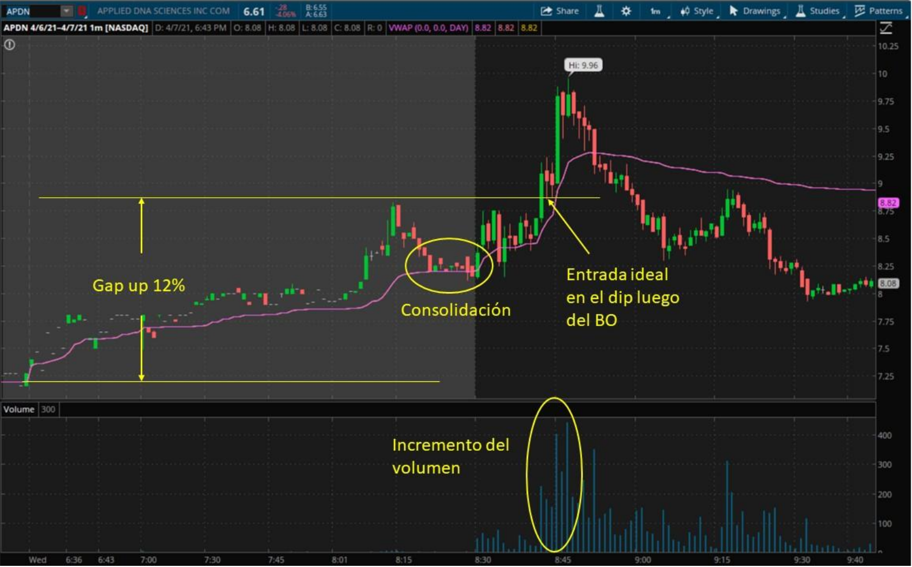

### Texto del trader

El texto dice que en Breakout no se busca necesariamente la vela exacta de la
ruptura, sino el primer dip posterior a la confirmacion. Para TSIS, esa frase
describe un retest: el mercado prueba si el nivel roto se acepta o si la
ruptura fue falsa.

### Definicion observable v0

Unidad de busqueda:

```text
event_interval despues de Daily_Resistance_Volume_Breakout_Event
```

Secuencia minima:

```text
1. existe breakout previo
2. precio retrocede desde el high posterior al breakout
3. low del dip se acerca al nivel roto
4. el precio no cierra claramente por debajo del nivel
5. aparece vela de estabilizacion o recuperacion
```

Inicio conceptual:

```text
primera vela despues del breakout cuyo low retrocede hacia el nivel roto
```

Fin conceptual:

```text
vela que confirma hold/reclaim o cierre bajo invalidation_level
```

### Busqueda historica v0

Features candidatas:

```text
breakout_level
post_breakout_high
dip_low
dip_depth_from_high_pct
dip_low_to_breakout_level_pct
closes_below_level_count
recovery_close_above_level
volume_on_dip_vs_breakout
```

Thresholds semilla:

```text
dip_low <= breakout_level * 1.03
closes_below_level_count <= 1
recovery_close_above_level = true
```

Excluir o marcar `invalid_event` si:

```text
dip rompe el nivel y no recupera
dip ocurre muchas horas despues sin relacion con breakout
breakout previo no tuvo volumen
```

### Composicion observable no operativa

Puede aparecer como pieza observable dentro de:

- `Breakout`;
- `Gap and Go`;
- `First Pullback Continuation`;
- `VWAP Bounce`.

### No es estrategia

No dice actuar sobre el pullback. Describe que el mercado testeo y sostuvo la zona
rota.

## 7. Red_To_Green_Level_Reclaim_Event

### Que ocurre

La accion abre por debajo del cierre anterior y durante la sesion recupera ese
nivel. El evento es el cambio de estado de rojo a verde, confirmado por volumen
o aceptacion sobre el nivel.

### Imagenes fuente

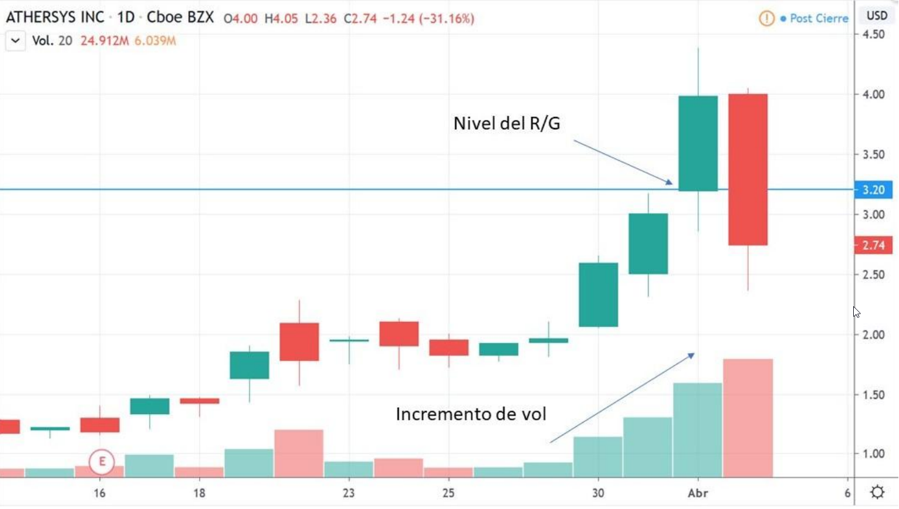

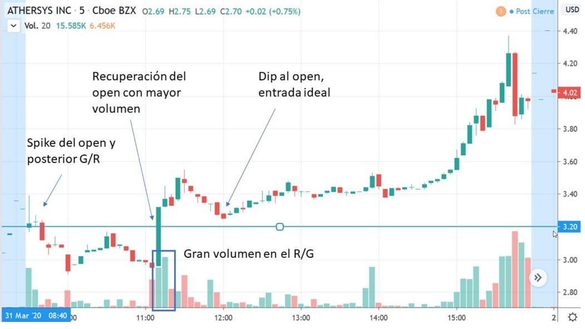

### Texto del trader

El documento fuente define Red to Green como una accion que abre roja y logra
girarse a verde durante el dia. La confirmacion llega cuando cruza el nivel
red-to-green con volumen mayor al promedio de las velas anteriores.

### Definicion observable v0

Unidad de busqueda:

```text
ticker_session
```

Secuencia minima:

```text
1. open < prior_close
2. precio permanece bajo prior_close durante una fase inicial
3. precio cruza prior_close al alza
4. la vela de reclaim muestra volumen superior al contexto inmediato
5. al menos una vela posterior sostiene el nivel o no lo destruye
```

Inicio conceptual:

```text
primera vela que cruza/cierra sobre prior_close
```

Fin conceptual:

```text
confirmacion de hold sobre prior_close o perdida inmediata del nivel
```

### Busqueda historica v0

Features candidatas:

```text
prior_close
open_gap_pct
minutes_red_before_reclaim
reclaim_ts
reclaim_close_above_prior_close_pct
reclaim_volume_ratio
post_reclaim_hold_minutes
vwap_relation_at_reclaim
```

Thresholds semilla:

```text
open_gap_pct < 0
reclaim_close >= prior_close
reclaim_volume_ratio >= 1.5
post_reclaim_hold_minutes >= 3
```

Excluir o marcar `review_event` si:

```text
reclaim ocurre en una sola wick y cierra debajo
prior_close no es fiable
accion ya abrio verde
```

### Composicion observable no operativa

Puede aparecer como pieza observable dentro de:

- `Red to Green`;
- `Gap and Grab Reversal`;
- `First Green Day Bounce`;
- `VWAP Reclaim`.

### No es estrategia

No define accion sobre el cruce ni sobre el dip posterior. Solo detecta la
recuperacion del nivel que cambia el color del dia.

## 8. Red_Base_Volume_Ramp_Event

### Que ocurre

Antes del Red to Green, el precio deja de caer, construye una base en rojo y el
volumen comprador empieza a aumentar. Es la transicion entre venta inicial y
reclaim.

### Imagenes fuente

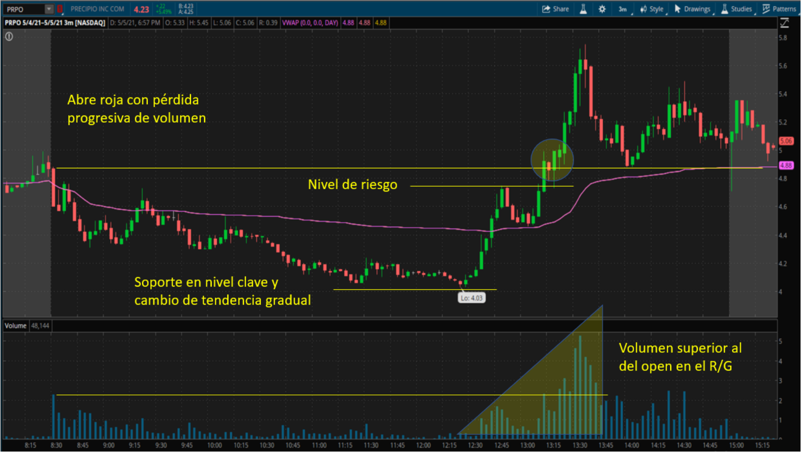

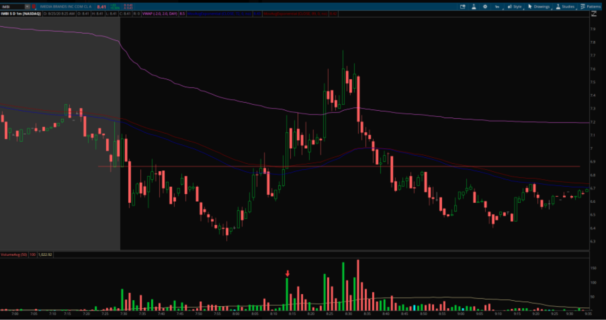

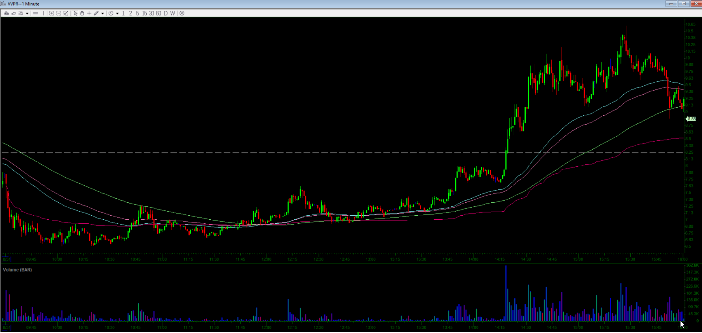

### Texto del trader

El documento advierte que no se debe anticipar el reversal mientras el precio
sigue cayendo. Debe existir base, soporte y recuperacion con volumen. Las
imagenes muestran perdida progresiva de presion vendedora, soporte en nivel
clave y aumento de volumen durante la recuperacion.

### Definicion observable v0

Unidad de busqueda:

```text
intraday_window antes de Red_To_Green_Level_Reclaim_Event
```

Secuencia minima:

```text
1. open red o selloff inicial
2. se forma un low intradia
3. varios lows posteriores no rompen ese low de forma material
4. el volumen bajista deja de expandirse
5. aparece rampa de volumen comprador hacia prior_close o VWAP
```

Inicio conceptual:

```text
low inicial de la base roja
```

Fin conceptual:

```text
primera recuperacion relevante hacia prior_close o VWAP
```

### Busqueda historica v0

Features candidatas:

```text
base_low
base_duration_minutes
lower_low_count_after_base
sell_volume_decay_ratio
green_volume_ramp_ratio
distance_to_prior_close_pct
distance_to_vwap_pct
```

Thresholds semilla:

```text
base_duration_minutes >= 10
lower_low_count_after_base <= 1
green_volume_ramp_ratio >= 1.5
```

Excluir si:

```text
precio sigue haciendo lower lows con volumen creciente
no hay intento de reclaim
spread o liquidez impiden lectura
```

### Composicion observable no operativa

Puede aparecer como pieza observable dentro de:

- `Red to Green`;
- `Gap and Grab Reversal`;
- `VWAP Reclaim`;
- `Dip Buying Panics`.

### No es estrategia

No dice actuar sobre la base. Describe que la venta inicial dejo de dominar y el
precio comenzo una recuperacion medible.

## 9. VWAP_Bounce_After_Extension_Event

### Que ocurre

Una accion verde y extendida retrocede hacia VWAP. En vez de perderlo con
volumen, VWAP actua como soporte y el precio rebota.

### Imagenes fuente

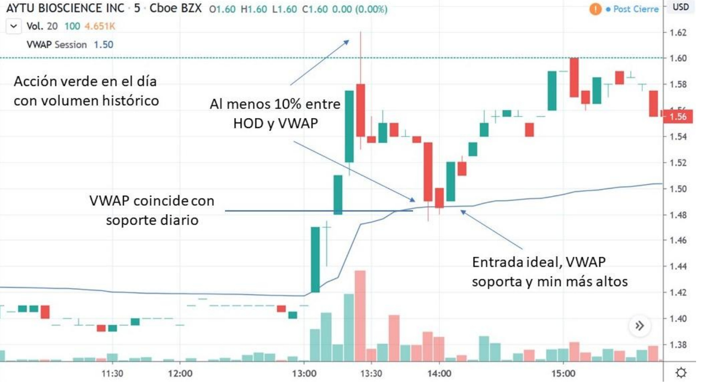

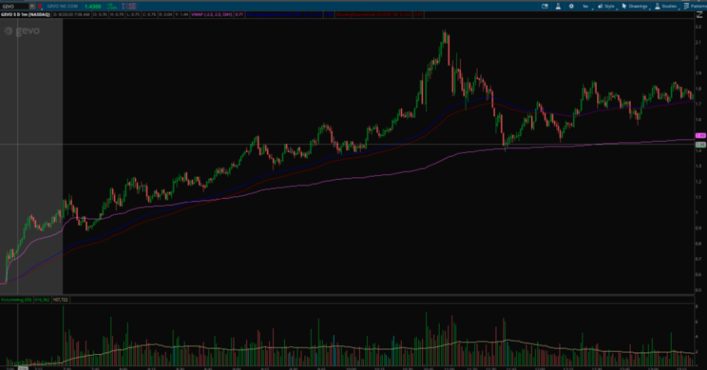

### Texto del trader

El documento fuente describe VWAP Bounce como un pullback hacia VWAP dentro de
una accion verde y sobreextendida. El rebote debe venir despues de que VWAP
funcione como soporte, idealmente con vela verde y volumen creciente.

### Definicion observable v0

Unidad de busqueda:

```text
ticker_session intraday
```

Secuencia minima:

```text
1. accion verde en el dia
2. high se aleja de VWAP
3. precio retrocede hacia VWAP
4. low toca o se aproxima a VWAP
5. cierra por encima o recupera VWAP
6. aparece rebote posterior
```

Inicio conceptual:

```text
primera vela que toca o aproxima VWAP despues de extension
```

Fin conceptual:

```text
vela de recuperacion o perdida confirmada de VWAP
```

### Busqueda historica v0

Features candidatas:

```text
day_gain_pct
high_to_vwap_distance_pct
pullback_low_to_vwap_pct
vwap_hold_close_flag
bounce_volume_ratio
post_bounce_5m_return
lower_high_failure_flag
```

Thresholds semilla:

```text
day_gain_pct > 0
high_to_vwap_distance_pct >= 10
abs(pullback_low_to_vwap_pct) <= 2
vwap_hold_close_flag = true
```

Excluir si:

```text
VWAP no tuvo tiempo de estabilizarse
precio rompe VWAP con volumen bajista alto
accion esta roja en el dia
```

### Composicion observable no operativa

Puede aparecer como pieza observable dentro de:

- `VWAP Bounce`;
- `First_Day_Runner_Frontside_Dip_Event`;
- `Gap and Go Pullback`.

### No es estrategia

No define actuar sobre VWAP. Marca que VWAP funciono como soporte observable tras
extension.

## 10. VWAP_Reclaim_Control_Event

### Que ocurre

El precio pierde VWAP, deja de aceptar precios por debajo y lo recupera con una
vela o secuencia de volumen superior. El evento es el cambio de VWAP de
resistencia a zona de control comprador.

### Imagenes fuente

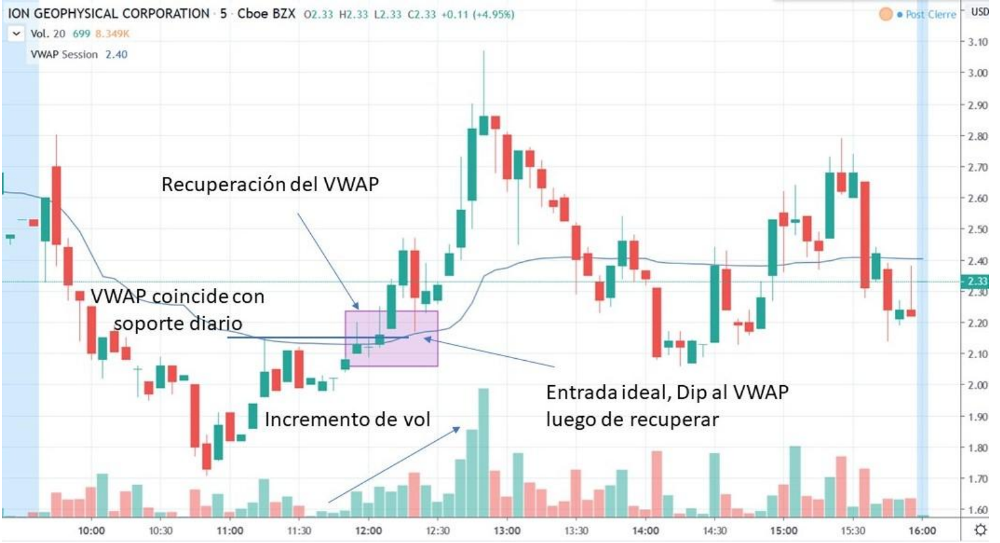

### Texto del trader

El documento fuente define VWAP Reclaim como recuperacion de VWAP con volumen.
La barra de reclaim debe tener mas volumen que las anteriores del retroceso. Si
la accion esta roja en el dia, la lectura long deja de ser valida para este
play.

### Definicion observable v0

Unidad de busqueda:

```text
intraday_window
```

Secuencia minima:

```text
1. precio opera por debajo de VWAP
2. se estabiliza o reduce pendiente bajista
3. vela cierra por encima de VWAP
4. volumen de reclaim > volumen de barras previas del retroceso
5. al menos una vela posterior no destruye VWAP inmediatamente
```

Inicio conceptual:

```text
vela que cierra sobre VWAP despues de estar debajo
```

Fin conceptual:

```text
confirmacion de hold sobre VWAP o perdida inmediata
```

### Busqueda historica v0

Features candidatas:

```text
below_vwap_duration
reclaim_ts
reclaim_close_above_vwap_pct
reclaim_volume_vs_pullback_max
post_reclaim_hold_minutes
day_color_at_reclaim
prior_close_relation
```

Thresholds semilla:

```text
below_vwap_duration >= 5 minutes
reclaim_close_above_vwap_pct > 0
reclaim_volume_vs_pullback_max >= 1.0
post_reclaim_hold_minutes >= 3
```

Excluir si:

```text
accion sigue roja y no recupera prior_close
reclaim es solo wick
overhead resistance inmediata bloquea el movimiento
```

### Composicion observable no operativa

Puede aparecer como pieza observable dentro de:

- `VWAP Reclaim`;
- `Red to Green`;
- `Gap and Grab Reversal`.

### No es estrategia

No define accion sobre el dip posterior. Solo detecta recuperacion de VWAP y
aceptacion inicial.

## 11. Panic_Dip_Reversal_Event

### Que ocurre

El precio cae de forma violenta en pocos minutos, deja de acelerar a la baja y
aparece una vela/secuencia de reversa con volumen comprador. El evento busca el
cambio de flujo tras panico, no la caida en si.

### Imagenes fuente

No hay imagen dedicada de panic dip en `source_assets/edu_trades/`. Este evento
queda como candidato textual hasta incorporar ejemplos visuales.

### Texto del trader

El documento describe Dip Buying Panics como caidas de 15-20% en pocos minutos
sin catalizador negativo. Advierte que no debe tratarse la caida libre como
evento completo; debe
aparecer confirmacion de reversa con volumen comprador.

### Definicion observable v0

Unidad de busqueda:

```text
intraday_window
```

Secuencia minima:

```text
1. drop rapido desde high/local high
2. drop_pct supera umbral en pocos minutos
3. aparece desaceleracion de nuevos lows
4. vela verde o reclaim local con volumen comprador
5. el low de panico no se rompe inmediatamente
```

Inicio conceptual:

```text
low de panico o primera vela de reversa tras el low
```

Fin conceptual:

```text
confirmacion de rebound o ruptura del low de panico
```

### Busqueda historica v0

Features candidatas:

```text
drop_pct
drop_duration_minutes
panic_low
reversal_volume_ratio
green_reversal_close_location
no_negative_news_flag
post_reversal_5m_return
```

Thresholds semilla:

```text
drop_pct <= -15
drop_duration_minutes <= 20
reversal_volume_ratio >= 1.5
panic_low_not_breached_next_3_bars = true
```

Excluir si:

```text
hay financing/delisting/bad news
spread extremo
no hay reversal candle
```

### Composicion observable no operativa

Puede aparecer como pieza observable dentro de:

- `Dip Buying Panics`;
- `Gap and Grab Reversal`;
- `First Green Day Bounce`.

### No es estrategia

No dice actuar sobre panicos. Detecta una reversa medible despues de panico.

## 12. First_Green_Day_High_Close_Event

### Que ocurre

Despues de una fase previa de debilidad o dormancia, aparece un dia verde con
volumen excepcional y cierre cerca del maximo del dia. El evento es diario, no
intradía puro.

### Imagenes fuente

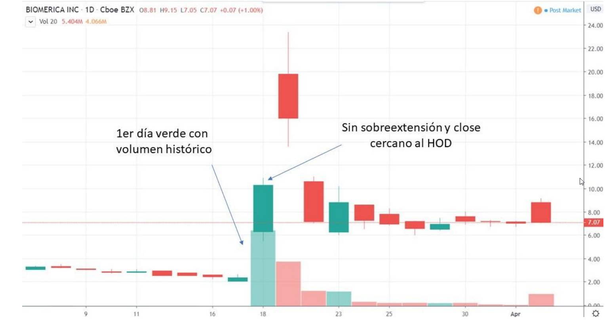

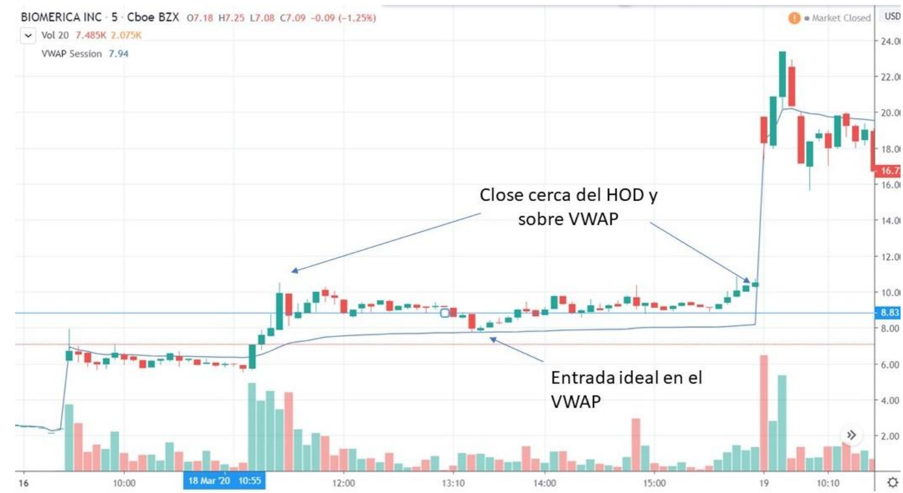

### Texto del trader

El documento fuente define First Green Day como un patron donde la accion hace
un breakout de volumen historico y cierra fuerte. Las imagenes remarcan:
volumen historico, cierre cerca del HOD y precio sobre VWAP.

### Definicion observable v0

Unidad de busqueda:

```text
ticker_day
```

Secuencia minima:

```text
1. periodo previo sin momentum o con caida
2. dia actual cierra verde
3. volumen actual es historicamente alto
4. cierre queda cerca del high del dia
5. intradia no pierde VWAP de forma destructiva
```

Inicio conceptual:

```text
session close del primer dia verde
```

Fin conceptual:

```text
cierre de sesion regular / afterhours context si existe
```

### Busqueda historica v0

Features candidatas:

```text
daily_return_pct
volume_rank_60d
float_rotation_proxy
close_location_pct
close_above_vwap_flag
prior_down_or_dormant_days
next_premarket_gap_pct
```

Thresholds semilla:

```text
daily_return_pct > 0
volume_rank_60d >= 95th percentile
close_location_pct >= 0.75
prior_down_or_dormant_days >= 3
```

Excluir si:

```text
close lejos del HOD
volumen no es anomalo
dia verde aparece despues de extension parabolica tardia
```

### Composicion observable no operativa

Puede aparecer como pieza observable dentro de:

- `First Green Day`;
- `Multi-Day Runner`;
- `First Green Day Bounce`.

### No es estrategia

No define mantener overnight. Solo identifica el primer dia verde fuerte.

## 13. First_Day_Runner_Frontside_Dip_Event

### Que ocurre

Durante el primer dia de un runner, el precio hace un pullback mientras la
tendencia sigue en frontside. El evento existe solo si el dip no rompe VWAP ni
la estructura alcista.

### Imagenes fuente


### Texto del trader

El documento fuente usa lenguaje operativo de buying dips dentro del primer dia
de un runner, en el frontside de la tendencia, mientras VWAP actua como soporte.
En TSIS no copiamos la accion operativa; detectamos el dip que ocurre dentro de
una estructura alcista viva.

### Definicion observable v0

Unidad de busqueda:

```text
ticker_session
```

Secuencia minima:

```text
1. ticker esta en primer dia de momentum/runner
2. precio esta verde y por encima de VWAP
3. se forma pullback desde high local
4. VWAP o higher low sostiene la estructura
5. precio intenta recuperar desde el dip
```

Inicio conceptual:

```text
low del dip frontside
```

Fin conceptual:

```text
reclaim del micro high anterior o perdida de VWAP
```

### Busqueda historica v0

Features candidatas:

```text
first_runner_day_flag
day_gain_pct
pullback_depth_pct
pullback_low_to_vwap_pct
higher_low_flag
volume_on_pullback_ratio
reclaim_after_dip_flag
```

Thresholds semilla:

```text
day_gain_pct >= 10
pullback_depth_pct between 3 and 20
pullback_low >= vwap * 0.98
higher_low_flag = true
```

Excluir si:

```text
VWAP se pierde con volumen alto
pullback rompe low estructural
evento ocurre en backside
```

### Composicion observable no operativa

Puede aparecer como pieza observable dentro de:

- `Comprar dips en el primer dia del runner`;
- `VWAP Bounce`;
- `Gap and Go`.

### No es estrategia

No dice actuar sobre debilidad. Detecta un dip dentro de frontside vivo.

## 14. First_Green_Day_Bounce_Event

### Que ocurre

Tras una caida grande desde un runner, el ticker deja de destruirse y marca el
primer rebote verde. Debe haber caida previa suficiente y despues reversal con
volumen.

### Imagenes fuente


### Texto del trader

El documento distingue First Green Day Bounce: despues de una caida de 30-50%
de un runner, aparece el primer rebote verde tecnico. Debe mantener parte de
las ganancias previas y no tener catalizador negativo activo.

### Definicion observable v0

Unidad de busqueda:

```text
ticker_day
```

Secuencia minima:

```text
1. existe runner previo
2. precio cae 30-50% desde high del runner
3. no vuelve completamente a base inicial
4. aparece primer dia verde/reversal
5. volumen confirma rebote
```

Inicio conceptual:

```text
cierre del primer dia verde tras destruccion parcial
```

Fin conceptual:

```text
cierre de ese dia o siguiente confirmacion
```

### Busqueda historica v0

Features candidatas:

```text
runner_high
drawdown_from_runner_high_pct
retained_gain_pct
first_green_after_drawdown_flag
reversal_volume_ratio
close_location_pct
negative_catalyst_absent_flag
```

Thresholds semilla:

```text
drawdown_from_runner_high_pct between -30 and -60
retained_gain_pct > 0
daily_return_pct > 0
reversal_volume_ratio >= 1.5
```

Excluir si:

```text
caida fue causada por noticia negativa
ticker volvio completamente a base
rebote sin volumen
```

### Composicion observable no operativa

Puede aparecer como pieza observable dentro de:

- `First Green Day Bounce`;
- `Panic Bounce`;
- `Former Runner Reversal`.

### No es estrategia

No define swing ni overnight. Solo marca que el primer rebote verde existe.

## 15. Gap_And_Grab_Reversal_Event

### Que ocurre

El ticker abre rojo con gap bajo el cierre anterior, deja de caer, forma una V
o base y recupera niveles de resistencia con volumen. Es un reversal agresivo
que puede preceder a Red to Green.

### Imagenes fuente


### Texto del trader

El documento define Gap and Grab Reversal como una accion que abre roja, forma
una V y recupera resistencias. El volumen debe decrecer en la caida y aumentar
durante el pickup del reversal. El texto lo describe como arriesgado y
explosivo.

### Definicion observable v0

Unidad de busqueda:

```text
ticker_session
```

Secuencia minima:

```text
1. open < prior_close
2. precio cae o extiende rojo despues del open
3. se forma low y base/V
4. volumen bajista decrece
5. volumen comprador aparece en pickup
6. precio recupera resistencia local o prior_close/VWAP
```

Inicio conceptual:

```text
low de la V o primera vela de pickup
```

Fin conceptual:

```text
reclaim de resistencia o fallo bajo low reciente
```

### Busqueda historica v0

Features candidatas:

```text
gap_down_pct
v_low_ts
v_depth_pct
sell_volume_decay
pickup_volume_ratio
resistance_reclaim_flag
r2g_followthrough_flag
```

Thresholds semilla:

```text
gap_down_pct < 0
v_depth_pct <= -5
pickup_volume_ratio >= 1.5
resistance_reclaim_flag = true
```

Excluir si:

```text
no hay base/V
caida sigue acelerando
hay catalizador negativo
```

### Composicion observable no operativa

Puede aparecer como pieza observable dentro de:

- `Gap and Grab Reversal`;
- `Red to Green`;
- `VWAP Reclaim`;
- `Dip Buying Panic`.

### No es estrategia

No define anticipar reversal. Detecta que la V y el pickup ya son observables.

## 16. Gap_And_Go_Premarket_High_Breakout_Event

### Que ocurre

El ticker abre con gap/momentum, define un premarket high y durante la apertura
rompe ese nivel con volumen. El evento es la ruptura del PMH y continuacion
inicial, no la decision de perseguirla.

### Imagenes fuente


### Texto del trader

El documento fuente define Gap and Go como el patron clasico de apertura en
momentum. Ocurre cuando la accion rompe el premarket high y continua al alza en
la apertura. Se recalca que solo aplica en primer dia de corrida y que puede
fallar en segundos si el breakout no es real.

### Definicion observable v0

Unidad de busqueda:

```text
ticker_session with premarket + regular open
```

Secuencia minima:

```text
1. gap up o green premarket
2. existe premarket_high definido
3. precio consolida o opera bajo PMH antes del open/early session
4. vela regular rompe PMH con volumen
5. precio sostiene al menos brevemente por encima
```

Inicio conceptual:

```text
primera vela regular que rompe/cierra sobre premarket_high
```

Fin conceptual:

```text
primer hold/retest o fallo bajo PMH
```

### Busqueda historica v0

Features candidatas:

```text
premarket_high
gap_pct
pm_volume
breakout_ts
breakout_volume_ratio
post_breakout_hold_minutes
fail_seconds_after_breakout
first_day_run_flag
```

Thresholds semilla:

```text
gap_pct > 0
pm_volume > threshold_config
breakout_close >= premarket_high * 1.001
breakout_volume_ratio >= 1.5
post_breakout_hold_minutes >= 3
```

Excluir si:

```text
no hay premarket data
breakout ocurre en afterhours, no open/regular
precio falla bajo PMH inmediatamente
evento es fase tardia despues de parabolic run
```

### Composicion observable no operativa

Puede aparecer como pieza observable dentro de:

- `Gap and Go`;
- `Opening Drive`;
- `Premarket High Breakout`;
- `First Day Runner`.

### No es estrategia

No define actuar sobre el PMH. Solo marca que el PMH fue roto con volumen durante la
apertura.

## 17. Filtros transversales de contexto

Estos no son eventos principales del menu. Son filtros o flags de contexto que
pueden acompanar la busqueda historica y degradar, revisar o excluir candidatos.

No deben tratarse como eventos por si solos.

### Catalyst_No_Dilution_Context_Filter

Uso:

```text
marcar si el evento tiene catalyst compatible y si existe riesgo de dilucion
que degrade la lectura del candidato
```

Campos futuros:

```text
catalyst_flag
catalyst_type
active_s3_flag
atm_or_424b_flag
warrant_risk_flag
no_dilution_context_state
```

### Event_Candidate_Failure_Risk_Filter

Uso:

```text
marcar candidatos como review/degraded/blocked si hay condiciones contrarias
```

Flags futuros:

```text
vwap_loss_with_volume
breakout_fakeout
overhead_resistance_too_close
repeated_failed_level
missing_volume_confirmation
negative_catalyst
```

### First_Day_Run_Context_Filter

Uso:

```text
limitar Gap and Go, Frontside Dip y First Green Day a fases tempranas del run
```

Campos futuros:

```text
run_day_index
days_since_first_volume_spike
prior_extension_pct
late_parabolic_risk_flag
```

## 18. Prioridad para futuras definiciones

Orden recomendado para convertir a draft formal:

1. `Red_To_Green_Level_Reclaim_Event`
2. `VWAP_Bounce_After_Extension_Event`
3. `VWAP_Reclaim_Control_Event`
4. `Gap_And_Go_Premarket_High_Breakout_Event`
5. `Daily_Resistance_Volume_Breakout_Event`
6. `First_Green_Day_High_Close_Event`
7. `Gap_And_Grab_Reversal_Event`
8. `Panic_Dip_Reversal_Event`

La prioridad favorece eventos que pueden buscarse con OHLCV 1m/daily antes de
depender de tape, filings o contexto fundamental.

## 19. Regla final

Este documento debe permitir que un agente futuro escriba una busqueda
historica preliminar en Python sin reinterpretar la idea desde cero.

Si una seccion no permite derivar:

```text
inputs
features
thresholds iniciales
inicio/fin del evento
exclusiones
```

entonces la seccion aun no esta lista para Event Research operativo.
