# Mosquito Small Caps Source Event Index v0.1

Fecha: 2026-06-21
Estado: `source_note` estructurado para Event Library.

Fuente externa:

```text
C:\Users\AlexJ\Desktop\01_tools\asrtool\00_projects\SmallCaps_mosquito\La-Formula-Exacta-para-Entrar-en-Trades_Media_4Xh34AFFGJc_001_1080p_pdf.md
```

Imagenes copiadas al repo:

```text
source_assets/mosquito_smallcaps/img/
```

Documento fuente copiado al repo:

```text
source_assets/mosquito_smallcaps/La-Formula-Exacta-para-Entrar-en-Trades_Media_4Xh34AFFGJc_001_1080p_pdf.md
```

## 1. Proposito

Este documento convierte material discrecional de un trader en un inventario
visual de eventos candidatos para TSIS.

El trader explica entradas, stops, size y gestion. TSIS debe leer ese material
de otra forma:

```text
setup discrecional -> fenomeno observable de mercado
entrada             -> punto visual donde el fenomeno se hace evidente
stop                -> zona de invalidacion percibida por el trader
size                -> confianza operacional, no parte del evento
```

Este documento no promueve eventos. No define detectores. No autoriza
estrategias. Su funcion es preservar el contexto visual y textual que luego
usaremos para crear definiciones formales en Event Library.

## 2. Estrategias/playbooks como composicion de eventos

El documento fuente esta escrito como playbook discrecional. En especial,
presenta al menos dos marcos didacticos:

```text
Playbook pag. 2: Go ETB Go
PlayBook Pag. 3 - Doble máximo
```

TSIS no debe copiar esos playbooks como estrategias dentro de Event Library.
La lectura correcta es descomponerlos en fenomenos observables.

Una estrategia humana puede mezclar:

```text
contexto
+ estructura
+ presion de participantes
+ ruptura
+ invalidacion
+ decision operativa
```

Event Library solo conserva las primeras piezas como eventos o condiciones
observables. La decision operativa pertenece a Strategy Library o capas
posteriores.

Ejemplo didactico:

```text
Estrategia humana: Go ETB Go

Puede descomponerse en:

context_event:
  Low_Float_Catalyst_Volume_Extension_Event

retention_event:
  Day1_Gain_Retention_Above_50_Event

structure_event:
  Bull_Flag_Volume_Break_Event
  Rectangle_Range_Volume_Break_Event
  Prior_High_Open_Rebreak_Event

pressure_event:
  Double_Max_Short_Pressure_Event
  Failed_Bear_Attack_Absorption_Event
  High_Hold_Short_Squeeze_Continuation_Event
```

Otro ejemplo didactico:

```text
Estrategia humana: Doble máximo

Puede descomponerse en:

context_event:
  Low_Float_Catalyst_Volume_Extension_Event

level_event:
  Prior_High_Open_Rebreak_Event

structure_event:
  Rectangle_Range_Volume_Break_Event
  Bull_Flag_Volume_Break_Event

pressure_event:
  Double_Max_Short_Pressure_Event
  Failed_Bear_Attack_Absorption_Event

continuation_event:
  High_Hold_Short_Squeeze_Continuation_Event
  Mini_Stuffy_Rejection_Event
```

Esta composicion no es una regla de trading. Solo ayuda al lector humano a
entender que un evento aislado puede ser una pieza de una situacion mas amplia.

Regla:

```text
Evento aislado = fenomeno observable.
Conjunto de eventos = lectura compuesta del mercado.
Estrategia = lectura compuesta + decision operativa.
```

Por tanto, cuando este documento diga que un evento puede aparecer dentro de
`Go ETB Go`, `Doble máximo`, `Gap and Go`, `Bull Flag Breakout`,
`High Day Breakout`, `Short Squeeze Continuation` u otro arquetipo conocido,
eso no significa que TSIS este definiendo esa estrategia. Significa que el
evento es una pieza observable que esos marcos discrecionales suelen usar.

## 3. Regla de lectura

Cada bloque tiene esta estructura:

1. `Presentacion TSIS`: nombre candidato del evento y lectura como fenomeno.
2. `Imagenes fuente`: graficos o slides que sustentan la idea.
3. `Texto del trader`: explicacion limpia y contextualizada desde el documento
   fuente. Mantiene el sentido original, pero corrige ruido de transcripcion.
4. `Lectura TSIS`: traduccion del lenguaje discrecional a evento observable.
5. `Rol en lecturas compuestas`: estrategias/arquetipos donde puede aparecer
   y conjunto de eventos que podria integrar.
6. `Observables futuros`: posibles campos o condiciones para una definicion
   draft posterior.

Cuando el texto hable de comprar, entrar, stop, full size o salir, esas partes
se conservan como contexto humano, pero no forman parte del evento.

## 4. Eventos candidatos identificados

1. [`Low_Float_Catalyst_Volume_Extension_Event`](#5-low_float_catalyst_volume_extension_event): evento de extension por catalizador, bajo float y volumen creciente.
2. [`Day1_Gain_Retention_Above_50_Event`](#6-day1_gain_retention_above_50_event): evento de retencion significativa despues de una primera expansion.
3. [`Go_ETB_Go_Event`](#7-go_etb_go_event): evento compuesto de expansion, pausa, disponibilidad short y reactivacion.
4. [`Prior_High_Open_Rebreak_Event`](#8-prior_high_open_rebreak_event): evento de ruptura o reactivacion del maximo previo tras apertura cercana.
5. [`Rectangle_Range_Volume_Break_Event`](#9-rectangle_range_volume_break_event): evento de rango rectangular intradia que rompe con volumen.
6. [`Bull_Flag_Volume_Break_Event`](#10-bull_flag_volume_break_event): evento de bandera alcista que digiere el impulso y rompe con volumen.
7. [`Double_Max_Short_Pressure_Event`](#11-double_max_short_pressure_event): evento de presion short alrededor de una zona de doble maximo.
8. [`Failed_Bear_Attack_Absorption_Event`](#12-failed_bear_attack_absorption_event): evento de ataques bajistas fallidos y absorcion de venta.
9. [`High_Hold_Short_Squeeze_Continuation_Event`](#13-high_hold_short_squeeze_continuation_event): evento de aceptacion en zona alta y continuacion tipo squeeze.
10. [`Mini_Stuffy_Rejection_Event`](#14-mini_stuffy_rejection_event): evento micro de rechazo bajista rapido dentro de una ruptura o consolidacion.
11. [`Dead_Stock_Reactivation_High_Event`](#15-dead_stock_reactivation_high_event): evento de reactivacion de una accion apagada que vuelve a marcar maximos relativos.
12. [`Multi_Day_Reactivation_Flag_Event`](#16-multi_day_reactivation_flag_event): evento de reactivacion multi-dia con bandera o consolidacion posterior.
13. [`Delayed_Flag_Explosion_Event`](#17-delayed_flag_explosion_event): evento de bandera que no explota de inmediato pero mantiene estructura y rompe mas tarde.
14. [`Whole_Dollar_Range_Cook_Breakout_Event`](#18-whole_dollar_range_cook_breakout_event): evento de rango cocinado alrededor de nivel psicologico y ruptura posterior.
15. [`Relative_Volume_Watchlist_Event`](#19-relative_volume_watchlist_event): evento de activacion de vigilancia por volumen relativo claramente anomalo.
16. [`ETB_Borrow_Availability_Context_Event`](#20-etb_borrow_availability_context_event): evento de contexto por disponibilidad de borrows y participacion short posible.
17. [`Two_Day_Initial_Extension_As_One_Event`](#21-two_day_initial_extension_as_one_event): evento de extension inicial repartida en dos sesiones pero leida como una sola fase.
18. [`Prior_High_Proximity_Open_Event`](#22-prior_high_proximity_open_event): evento de apertura muy cercana al maximo relevante previo.
19. [`Failed_Breakout_Not_Invalidated_Event`](#23-failed_breakout_not_invalidated_event): evento de ruptura fallida que no invalida la estructura mayor.
20. [`Buyer_Dominance_Range_Hold_Event`](#24-buyer_dominance_range_hold_event): evento de rango sostenido donde el lado comprador domina e impide la ruptura bajista.

Relacion inicial con los playbooks fuente:

```text
Playbook pag. 2: Go ETB Go
  Low_Float_Catalyst_Volume_Extension_Event
  Relative_Volume_Watchlist_Event
  ETB_Borrow_Availability_Context_Event
  Day1_Gain_Retention_Above_50_Event
  Go_ETB_Go_Event
  Two_Day_Initial_Extension_As_One_Event
  Prior_High_Proximity_Open_Event
  Prior_High_Open_Rebreak_Event
  Rectangle_Range_Volume_Break_Event
  Bull_Flag_Volume_Break_Event
  Failed_Breakout_Not_Invalidated_Event

PlayBook Pag. 3 - Doble máximo
  Relative_Volume_Watchlist_Event
  ETB_Borrow_Availability_Context_Event
  Double_Max_Short_Pressure_Event
  Failed_Bear_Attack_Absorption_Event
  High_Hold_Short_Squeeze_Continuation_Event
  Mini_Stuffy_Rejection_Event
  Buyer_Dominance_Range_Hold_Event
```

Esta relacion no es exclusiva. Un mismo evento puede aparecer en varios
playbooks o arquetipos, porque Event Library clasifica fenomenos observables,
no recetas operativas.

## 5. Low_Float_Catalyst_Volume_Extension_Event

### Presentacion TSIS

Familia probable:

```text
MOMENTUM_EXPANSION
CATALYST_AND_ATTENTION
```

Fenomeno:

Una small cap o microcap de bajo float se expande con volumen relativo alto,
normalmente asociada a noticia o catalyst, y produce una subida inicial
material pero no absurda para el marco que el trader quiere estudiar.

Este evento no es Go ETB Go completo. Es la condicion inicial: la accion entra
en un estado de atencion, rango y volatilidad suficiente para que luego puedan
aparecer eventos de retencion, rebreak, squeeze o bandera.

### Imagenes fuente

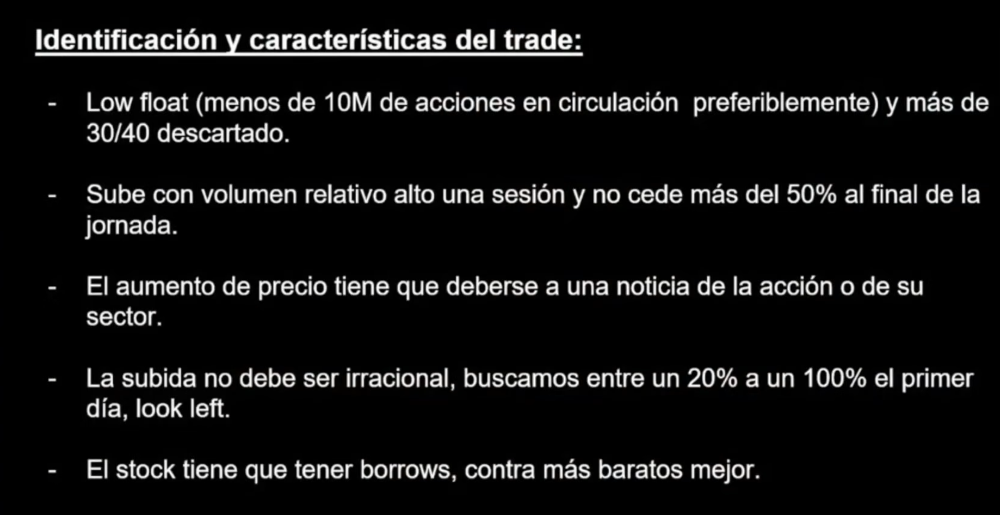

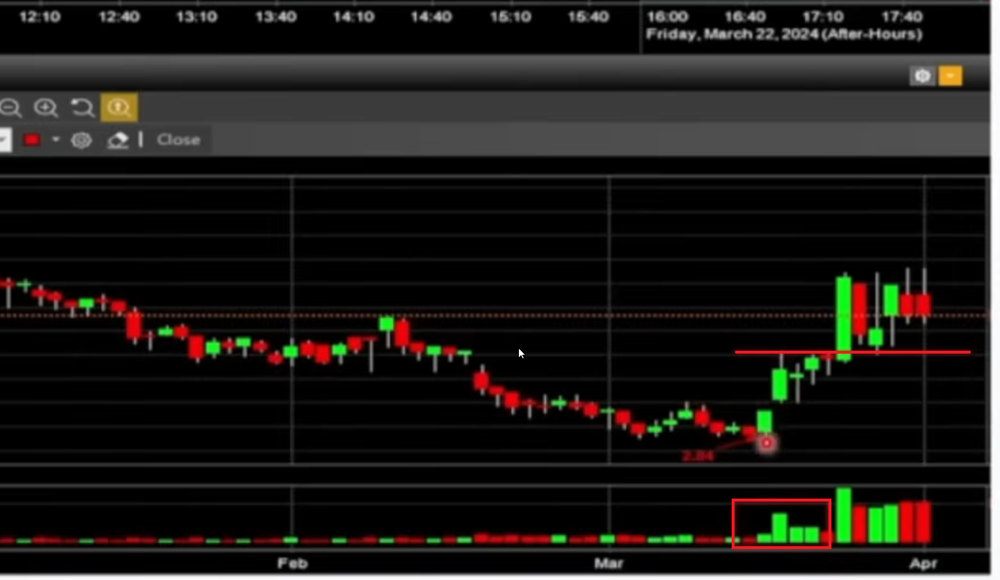

### Texto del trader

El trader empieza definiendo el universo y el contexto. Busca acciones low
float, preferiblemente con menos de 10 millones de acciones en circulacion, y
descarta normalmente floats por encima de 30 o 40 millones salvo que el free
float efectivo sea mucho menor.

La razon que da es directa: con pocas acciones disponibles es mas facil que el
precio tenga rango. Lo que busca es volatilidad; si una empresa no se mueve, no
hay oportunidad. Para este marco no quiere cualquier movimiento: quiere que la
accion suba con volumen relativo alto, que haya una noticia de la accion o del
sector, y que la subida no sea irracional. El rango que menciona como deseable
para el primer dia esta aproximadamente entre 20% y 100%.

Tambien introduce una restriccion importante: si la subida viene de algo que
distorsiona demasiado la referencia, como ciertos splits o gaps extremos que
colocan el precio en una zona sin recorrido razonable, ya no lo considera el
mismo tipo de operativa.

### Lectura TSIS

Este bloque define un evento de expansion inicial con contexto:

```text
low float
-> catalyst/attention
-> volumen relativo alto
-> subida material
-> rango suficiente para research posterior
```

No debe confundirse con estrategia. La accion todavia no ha demostrado que
retenga el avance ni que los shorts esten atrapados. Solo ha generado la
primera condicion de interes.

### Rol en lecturas compuestas

Rol principal:

```text
context_event
```

Este evento no es una razon suficiente para actuar. Solo dice que el ticker
entro en un entorno donde pueden aparecer eventos posteriores de estructura,
presion short o continuacion.

Estrategias/arquetipos donde puede aparecer:

- `Go ETB Go` del playbook fuente;
- `Gap and Go`;
- `Low Float Momentum`;
- `First Green Day`;
- `Small Cap News Runner`.

Composicion didactica no operativa:

```text
Low_Float_Catalyst_Volume_Extension_Event
+ Day1_Gain_Retention_Above_50_Event
+ Prior_High_Open_Rebreak_Event
+ High_Hold_Short_Squeeze_Continuation_Event
```

Lectura humana:

```text
El activo tiene contexto de atencion y volatilidad.
Luego habra que ver si retiene, estructura y reactiva.
```

La accion operativa no pertenece a este evento.

### Observables futuros

- float o free-float proxy;
- gap o subida intradia/daily;
- volumen relativo;
- dollar volume;
- presencia de news/catalyst;
- tipo de catalyst;
- split/reverse split proximity;
- precio previo y recorrido left-side;
- borrow/ETB context como feature, no como evento.

## 6. Day1_Gain_Retention_Above_50_Event

### Presentacion TSIS

Familia probable:

```text
RUNNER_LIFECYCLE
MOMENTUM_EXPANSION
```

Fenomeno:

Despues de una sesion de expansion, el precio no devuelve mas de una parte
critica de la subida. El trader usa como referencia que aguante alrededor del
50% o mas de la ganancia.

La lectura importante es que el avance no se destruye. El mercado acepta una
parte relevante del nuevo precio.

### Imagenes fuente

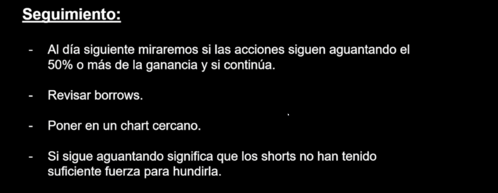

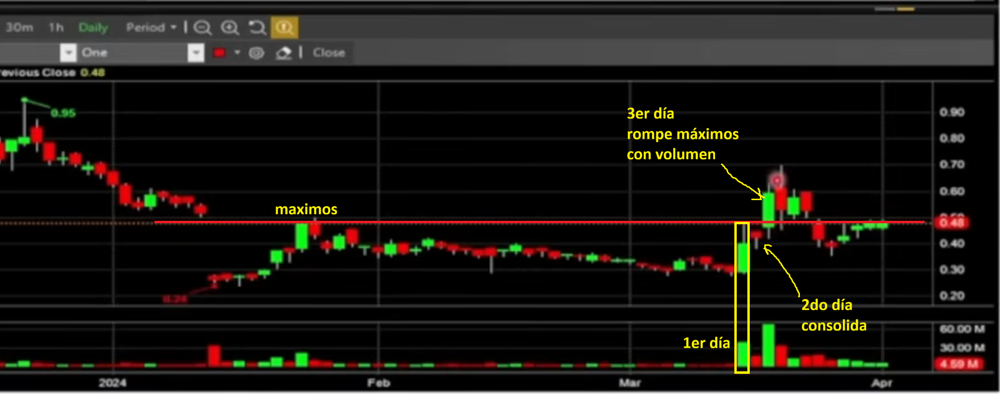

### Texto del trader

El trader explica que al dia siguiente mira si la accion sigue aguantando el
50% o mas de la ganancia y si continua. Si mantiene esos niveles, revisa de
nuevo los borrows y acerca el chart a una pantalla principal.

La interpretacion humana es clara: si el precio sigue aguantando, los shorts no
han tenido suficiente fuerza para hundirla. Para el trader eso es una buena
senal para buscar continuacion long mas adelante.

Tambien aclara que el 50% no debe leerse de forma mecanica exacta. Si baja un
52%, no significa automaticamente que el fenomeno desaparezca. Lo relevante es
la idea de retencion significativa.

### Lectura TSIS

Evento de aceptacion post-expansion:

```text
day 1 expansion
-> day 2 pullback/consolidation
-> retention >= approximate threshold
-> no full destruction of advance
```

Esto no dice comprar. Solo dice que la subida previa sigue viva y que la
presion vendedora no ha dominado.

### Rol en lecturas compuestas

Rol principal:

```text
retention_event
```

Este evento mide si el mercado acepta parte relevante de la expansion inicial.
No dice que haya que entrar; solo indica que el movimiento no ha sido destruido
por completo.

Estrategias/arquetipos donde puede aparecer:

- `Go ETB Go` del playbook fuente;
- `Go Pause Go`;
- `First Green Day Continuation`;
- `Multi-Day Runner Continuation`;
- `Dip Hold Continuation`.

Composicion didactica no operativa:

```text
Low_Float_Catalyst_Volume_Extension_Event
+ Day1_Gain_Retention_Above_50_Event
+ Bull_Flag_Volume_Break_Event
```

Lectura humana:

```text
Hubo expansion.
El precio no la devuelve entera.
Eso deja vivo el escenario para buscar estructuras posteriores.
```

La retencion es contexto de supervivencia del movimiento, no una entrada.

### Observables futuros

- day1 high, low, close;
- day1 gain percent;
- day2 low relative to day1 move;
- retained_gain_pct;
- close retention;
- intraday support zones;
- volume fade or persistence;
- borrow/ETB availability as context.

## 7. Go_ETB_Go_Event

### Presentacion TSIS

Familia probable:

```text
SHORT_SQUEEZE_DYNAMICS
MOMENTUM_EXPANSION
RUNNER_LIFECYCLE
```

Fenomeno:

Secuencia multi-dia en una accion easy-to-borrow que primero se expande,
despues pausa o consolida sin destruir la estructura, y finalmente vuelve a
activar el maximo o la zona de ruptura.

El componente ETB importa porque permite que haya participacion short amplia.
Si esos shorts entran y el precio no cae, la siguiente ruptura puede tener mas
presion de cobertura.

### Imagenes fuente


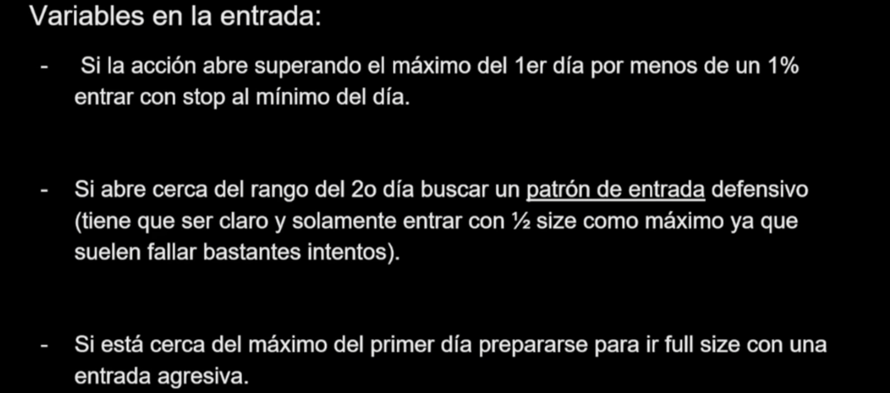

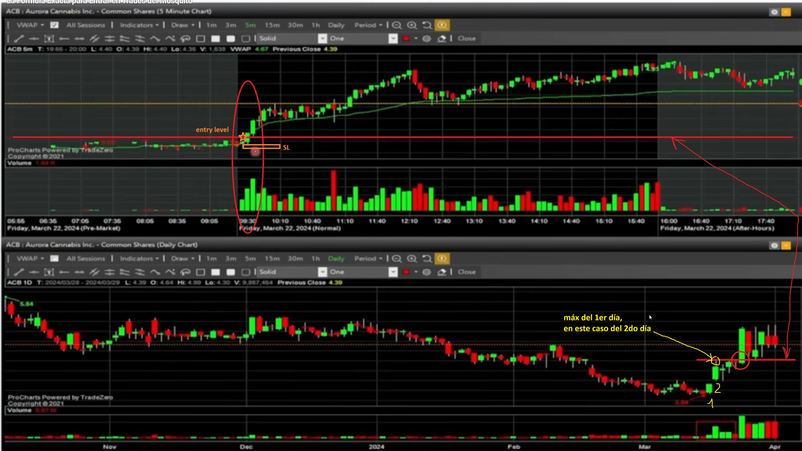

### Texto del trader

El trader presenta Go ETB Go como una variante de Go Pause Go: movimiento
alcista, consolidacion pequena y otra tirada. Aclara que no basta con ver una
figura tecnica. Hay que anadir capas: volumen, level 2, times and sales,
mercado, borrows y contexto.

El stock debe tener borrows. Si es easy to borrow, mejor que si hay que pagar
caro para ponerse corto. Si no hay acciones para short, practicamente descarta
esta operativa, porque parte de la dinamica que busca depende de que haya
participantes short involucrados.

El proceso descrito es:

```text
dia 1: subida con volumen y catalyst;
dia 2: seguimiento, retencion y borrows;
dia 3: accion pasa de observacion a posible activacion si aparece patron.
```

### Lectura TSIS

Go ETB Go debe definirse como evento compuesto, no como una entrada. Sus piezas
son:

```text
low float/catalyst expansion
-> gain retention
-> ETB/borrow context
-> maximo relevante marcado
-> consolidacion o pausa
-> reactivacion/ruptura
```

El nombre del trader contiene una decision operacional, pero TSIS conserva solo
el fenomeno observable.

### Rol en lecturas compuestas

Rol principal:

```text
composite_source_pattern
```

`Go_ETB_Go_Event` es especial dentro de este documento porque viene casi como
una estrategia/playbook completo. TSIS lo conserva como fuente didactica, pero
lo descompone en eventos mas pequenos para evitar mezclar fenomeno y decision.

Referencia fuente:

```text
Playbook pag. 2: Go ETB Go
```

Descomposicion didactica no operativa:

```text
context_event:
  Low_Float_Catalyst_Volume_Extension_Event

retention_event:
  Day1_Gain_Retention_Above_50_Event

structure_event:
  Rectangle_Range_Volume_Break_Event
  Bull_Flag_Volume_Break_Event
  Prior_High_Open_Rebreak_Event

pressure_event:
  Double_Max_Short_Pressure_Event
  Failed_Bear_Attack_Absorption_Event
  High_Hold_Short_Squeeze_Continuation_Event
```

Lectura humana:

```text
Una accion con borrows disponibles atrae shorts.
Si se expande, pausa y no cae, esos shorts pueden quedar presionados.
Si despues rompe un nivel importante, la presion puede acelerar el movimiento.
```

Esto no define entrada, stop, target ni size. Solo preserva la composicion de
eventos que el playbook discrecional esta usando.

### Observables futuros

- event_day_index;
- day1 expansion percent;
- retained_gain_pct;
- ETB/borrow proxy;
- max_level_source;
- days_since_initial_extension;
- rebreak distance;
- volume_on_rebreak;
- short-pressure mechanism hypothesis flag.

## 8. Prior_High_Open_Rebreak_Event

### Presentacion TSIS

Familia probable:

```text
RESISTANCE_AND_BREAKOUTS
MOMENTUM_EXPANSION
```

Fenomeno:

La accion abre extremadamente cerca del maximo del primer dia, o incluso lo
supera por poco. El nivel del maximo previo se convierte en el punto critico de
reactivacion.

### Imagenes fuente


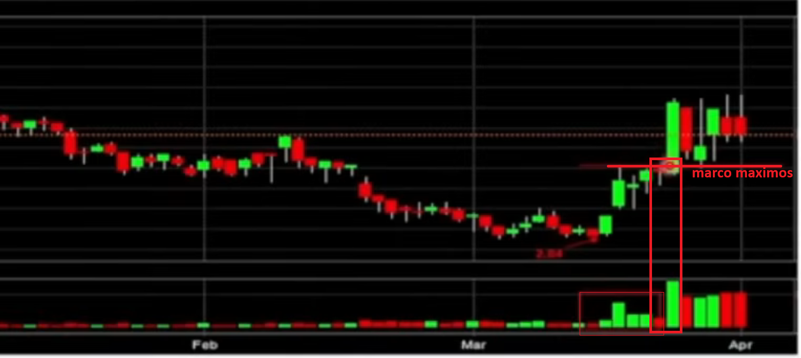


### Texto del trader

El trader dice que si la accion abre superando el maximo del primer dia por
menos de un 1%, ese es un contexto agresivo. Si abre cerca del rango del segundo
dia, busca algo mas defensivo porque no es la entrada perfecta. Si esta cerca
del maximo del primer dia, se prepara para actuar con mas agresividad.

En el ejemplo ACB marca el maximo importante con una linea roja. Explica que
cuando rompe ese nivel el precio se dispara por acumulacion de compra y shorts
que deben cubrir. Tambien remarca que muchas veces esta ruptura ocurre muy
pronto, incluso en los primeros minutos, por lo que el trader discrecional debe
tener el nivel preparado.

### Lectura TSIS

El evento es:

```text
previous high identified
-> open near that high
-> immediate test/rebreak risk
-> high attention around level
```

No es "entrar al romper". La entrada es estrategia. El evento es la proximidad
operativa del precio a un nivel donde pueden activarse compradores, stops y
coberturas.

### Rol en lecturas compuestas

Rol principal:

```text
level_reactivation_event
```

Este evento identifica que el precio esta cerca de un maximo relevante. Es una
zona de atencion, no una orden. Puede ser importante porque muchos operadores
ven el mismo nivel y porque las coberturas, stops o nuevos compradores pueden
concentrarse ahi.

Estrategias/arquetipos donde puede aparecer:

- `Go ETB Go` del playbook fuente;
- `High of Day Breakout`;
- `Previous Day High Breakout`;
- `Opening Range Breakout`;
- `Gap and Go`.

Composicion didactica no operativa:

```text
Day1_Gain_Retention_Above_50_Event
+ Prior_High_Open_Rebreak_Event
+ High_Hold_Short_Squeeze_Continuation_Event
```

Lectura humana:

```text
El mercado no solo esta fuerte.
Esta fuerte justo debajo o encima de un nivel que muchos participantes miran.
```

La ruptura puede ser usada por estrategias futuras, pero el evento solo marca
la interaccion con el nivel.

### Observables futuros

- prior_high_level;
- open_to_prior_high_pct;
- minutes_to_rebreak;
- volume_at_rebreak;
- first_hour flag;
- gap relative to previous high;
- failure if rebreak does not hold.

## 9. Rectangle_Range_Volume_Break_Event

### Presentacion TSIS

Familia probable:

```text
RESISTANCE_AND_BREAKOUTS
LIQUIDITY_AND_SPREAD_STATE
```

Fenomeno:

Consolidacion intradia en rango rectangular, con resistencia superior clara,
soportes que se elevan o se mantienen firmes, y ruptura posterior con volumen.

### Imagenes fuente

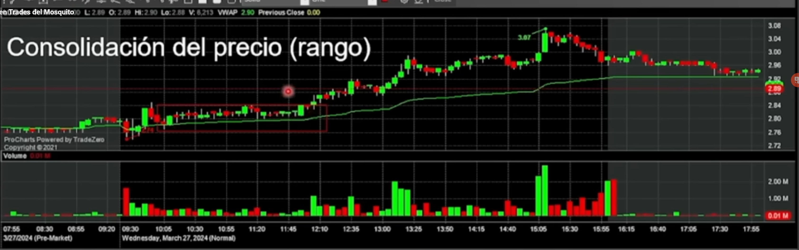

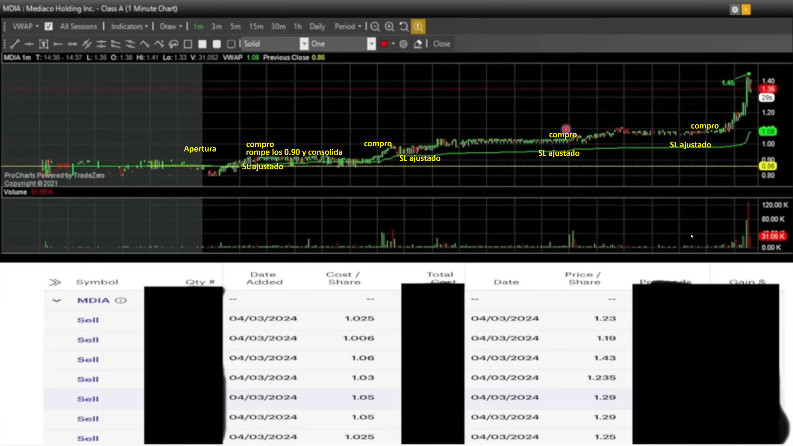

### Texto del trader

El trader muestra un rango en velas de un minuto. Dice que tambien podria verse
en velas de cinco minutos, pero el principio es el mismo: el precio marca una
resistencia arriba, se apoya cada vez mas arriba y rompe con volumen.

Advierte que operar rectangulos en cualquier sitio no sirve. El rectangulo solo
tiene valor cuando aparece en momentos concretos y en acciones puntuales. La
dificultad no es reconocer la figura, sino encontrar el contexto correcto.

### Lectura TSIS

El evento no es el rectangulo aislado. Es:

```text
contexto small cap activo
-> rango intradia comprimido
-> soporte no destruido
-> resistencia clara
-> volumen aparece en ruptura
```

Este evento puede ser subestructura de Go ETB Go, doble maximo o coccion
intradia.

### Rol en lecturas compuestas

Rol principal:

```text
structure_event
```

Este evento describe una pausa organizada. Su valor no esta en el rectangulo
como dibujo, sino en que el precio deja de caer, acepta una zona y comprime
antes de una posible expansion.

Estrategias/arquetipos donde puede aparecer:

- `Go ETB Go` del playbook fuente;
- `Range Breakout`;
- `Opening Drive Consolidation Break`;
- `High Tight Range`;
- `Base Breakout`.

Composicion didactica no operativa:

```text
Low_Float_Catalyst_Volume_Extension_Event
+ Rectangle_Range_Volume_Break_Event
+ Prior_High_Open_Rebreak_Event
```

Lectura humana:

```text
La accion ya tiene contexto.
Luego deja de ser solo movimiento vertical y construye una zona.
Esa zona puede ser la plataforma de una ruptura posterior.
```

Una estrategia futura puede actuar sobre la ruptura del rango, pero este evento
solo describe la existencia y calidad de la estructura.

### Observables futuros

- range_duration_minutes;
- range_high;
- range_low;
- support_slope;
- number_of_touches;
- breakout_volume_ratio;
- breakout_close_above_range;
- VWAP relation.

## 10. Bull_Flag_Volume_Break_Event

### Presentacion TSIS

Familia probable:

```text
MOMENTUM_EXPANSION
RESISTANCE_AND_BREAKOUTS
```

Fenomeno:

Despues de una subida previa, la accion crea una mini consolidacion tipo
bandera. El precio apoya, no destruye el avance y rompe posteriormente con
volumen.

### Imagenes fuente

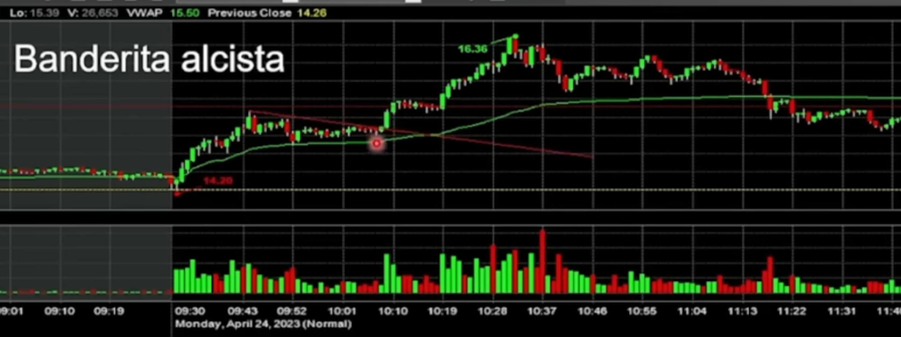

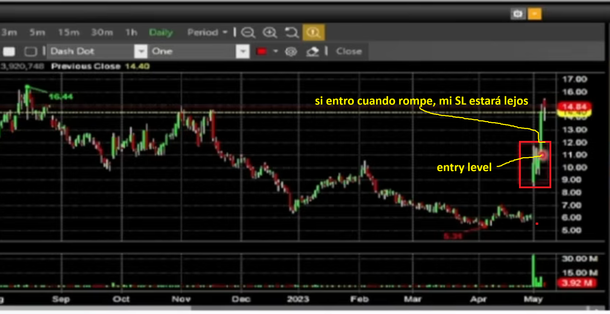


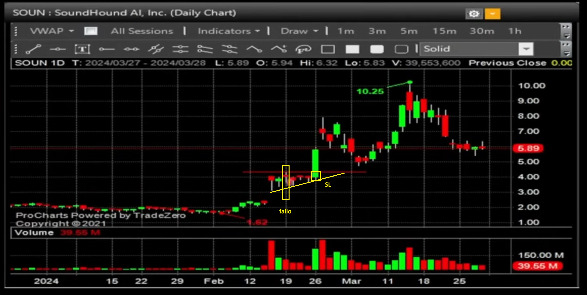

### Texto del trader

El trader llama a esto "banderita". La describe como una mini consolidacion:
apoya una vez, vuelve a apoyar, y despues rompe con volumen. En otro ejemplo
explica que, aunque el precio este mas abajo, una vela que no marca ninguna
vela roja relevante puede indicar potencia compradora.

Tambien insiste en que muchas veces el trader discrecional intenta iniciar
antes de la ruptura porque, si espera a que rompa arriba sin patron, el riesgo
visual puede quedar demasiado lejos.

### Lectura TSIS

TSIS debe separar dos cosas:

```text
evento = bandera/aceptacion/ruptura con volumen
estrategia = anticipar, entrar en ruptura, anadir o gestionar stop
```

La bandera aparece repetidamente como subevento dentro de estructuras mayores:
Go ETB Go, reactivaciones multi-dia, doble maximo y delayed explosion.

### Rol en lecturas compuestas

Rol principal:

```text
structure_event
```

Este evento representa digestion ordenada despues de un impulso. No equivale a
"comprar bandera". La bandera solo dice que, despues de subir, el precio no ha
colapsado y esta generando una estructura de continuacion potencial.

Estrategias/arquetipos donde puede aparecer:

- `Go ETB Go` del playbook fuente;
- `Bull Flag Breakout`;
- `Flag Continuation`;
- `First Pullback Continuation`;
- `Multi-Day Runner Flag`.

Composicion didactica no operativa:

```text
Low_Float_Catalyst_Volume_Extension_Event
+ Day1_Gain_Retention_Above_50_Event
+ Bull_Flag_Volume_Break_Event
+ High_Hold_Short_Squeeze_Continuation_Event
```

Lectura humana:

```text
El precio ya hizo una expansion.
La pausa no destruye el movimiento.
La ruptura con volumen sugiere que la digestion termino.
```

La accion de anticipar, esperar ruptura o gestionar riesgo pertenece a
Strategy Library.

### Observables futuros

- prior_push_pct;
- flag_duration;
- flag_depth_pct;
- lower_highs / higher_lows;
- red_candle_absence or red_pressure_low;
- breakout_volume;
- breakout close quality;
- distance to prior high.

## 11. Double_Max_Short_Pressure_Event

### Presentacion TSIS

Familia probable:

```text
SHORT_SQUEEZE_DYNAMICS
RESISTANCE_AND_BREAKOUTS
```

Fenomeno:

La accion vuelve hacia una zona de maximos despues de haber mostrado volumen
alto. Durante el dia aguanta, consolida y no permite que los ataques bajistas
destruyan la estructura. El maximo se convierte en una zona de presion para
shorts.

Referencia fuente principal:

```text
PlayBook Pag. 3 - Doble máximo
```

### Imagenes fuente

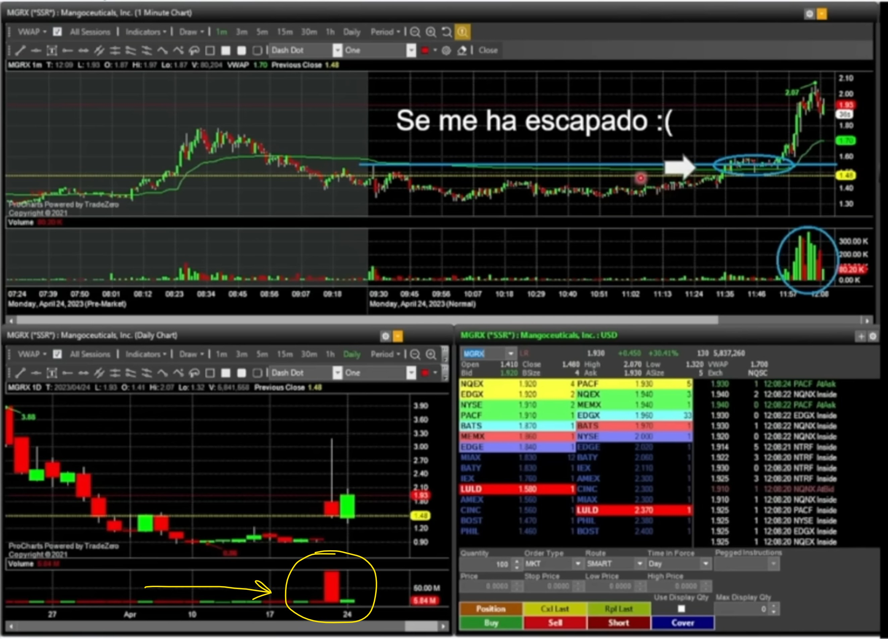

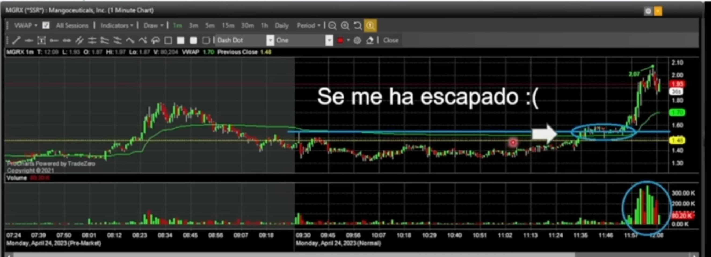

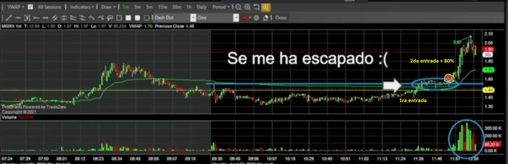

### Texto del trader

El trader introduce el doble maximo desde un dia con volumen relativamente alto.
Dice que no hace falta complicarse: hay barras de volumen que son tan claras
que no hay que preguntarse si son altas. Cuando ve ese volumen, pasa la accion a
vigilancia.

Despues describe una accion que durante el dia consolida y empieza a irse a
maximos. Ve ataques bajistas, pero no baja. La interpretacion que da es
psicologica: si alguien va short y el precio no baja, se asusta; si rebota, se
asusta mas; si vuelve a anadir short y tampoco cae, queda mas cargado y con mas
presion.

Para el trader, al final del dia la clave es que los shorts no han podido
bajarla de ese nivel.

### Lectura TSIS

El evento es una presion acumulada alrededor de maximos:

```text
high relative volume day
-> intraday consolidation
-> failed bear attacks
-> return toward highs
-> short pressure hypothesis
```

El doble maximo no es solo una linea. Es una zona donde varios grupos de
participantes pueden quedar atrapados o forzados.

### Rol en lecturas compuestas

Rol principal:

```text
pressure_event
```

Este evento no dice que un doble maximo se deba operar. Dice que la zona de
maximos puede concentrar presion: compradores que defienden, shorts que atacan,
shorts que anaden y participantes que reaccionan al fallo de esos ataques.

Estrategias/arquetipos donde puede aparecer:

- `Doble máximo` del PlayBook Pag. 3 fuente;
- `Go ETB Go` del playbook fuente;
- `Double Top Breakout`;
- `Short Squeeze Continuation`;
- `High Retest Squeeze`;
- `Failed Breakdown Reversal`.

Composicion didactica no operativa:

```text
Rectangle_Range_Volume_Break_Event
+ Failed_Bear_Attack_Absorption_Event
+ Double_Max_Short_Pressure_Event
+ High_Hold_Short_Squeeze_Continuation_Event
```

Lectura humana:

```text
El precio vuelve a una zona donde los shorts esperaban rechazo.
Si no consigue caer, la presion cambia de lado.
```

La hipotesis short debe tratarse como mecanismo conductual pendiente de
evidencia, no como certeza.

### Observables futuros

- prior volume spike;
- high retest distance;
- failed downside attempts;
- intraday support defended;
- volume on retest;
- number of retests;
- close near highs;
- short-pressure proxy flags.

## 12. Failed_Bear_Attack_Absorption_Event

### Presentacion TSIS

Familia probable:

```text
SHORT_SQUEEZE_DYNAMICS
MOMENTUM_EXHAUSTION
```

Fenomeno:

Los vendedores o shorts intentan romper la estructura, pero el precio absorbe
los ataques y recupera repetidamente. La accion no baja donde "deberia" bajar
si la presion short tuviera control.

Referencia fuente principal:

```text
PlayBook Pag. 3 - Doble máximo
```

### Imagenes fuente


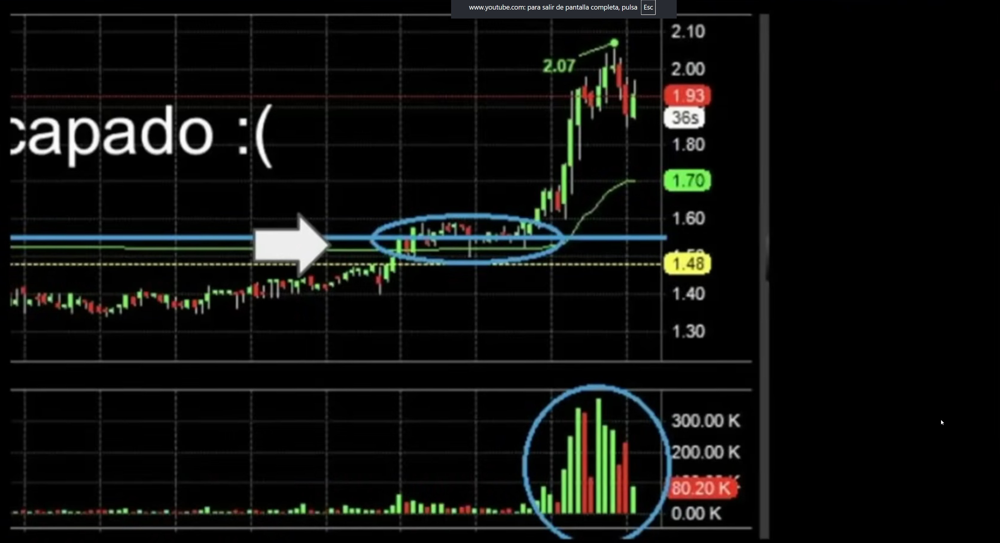

### Texto del trader

El trader lo explica desde el lado short: el precio intenta bajar, vuelve a
rebotar, y quien esta corto se asusta. Si vuelve a intentar bajar y no puede,
queda todavia mas comprometido.

En sus palabras, la accion lleva toda la sesion aguantando y esta "llena de
shorts". Lo importante no es solo que el precio suba, sino que los intentos de
hundirla fracasan.

### Lectura TSIS

Evento de absorcion:

```text
downside attempt
-> no follow-through
-> rebound
-> repeated failure
-> pressure transfers to short side
```

No podemos afirmar cobertura short sin datos adicionales. Lo documentamos como
hipotesis conductual.

### Rol en lecturas compuestas

Rol principal:

```text
failure_event
pressure_event
```

Este evento marca que el lado vendedor intenta tomar control y falla. Es una
pieza clave en lecturas de squeeze porque el fallo visible puede cambiar la
percepcion de riesgo de los participantes cortos.

Estrategias/arquetipos donde puede aparecer:

- `Doble máximo` del PlayBook Pag. 3 fuente;
- `Go ETB Go` del playbook fuente;
- `Failed Breakdown`;
- `Bear Trap`;
- `Short Squeeze Continuation`;
- `Dip Reclaim`.

Composicion didactica no operativa:

```text
Double_Max_Short_Pressure_Event
+ Failed_Bear_Attack_Absorption_Event
+ High_Hold_Short_Squeeze_Continuation_Event
```

Lectura humana:

```text
Los vendedores tuvieron oportunidad de romper la estructura.
No lo consiguieron.
El fallo puede aumentar urgencia defensiva en el lado short.
```

El evento no prueba que todos los shorts cubran. Solo identifica el fallo de
presion bajista observable.

### Observables futuros

- downside attempt count;
- wick recovery;
- close location after attempt;
- support defense;
- volume on failed attack;
- time spent above defended zone;
- subsequent high retest.

## 13. High_Hold_Short_Squeeze_Continuation_Event

### Presentacion TSIS

Familia probable:

```text
SHORT_SQUEEZE_DYNAMICS
MOMENTUM_EXPANSION
```

Fenomeno:

Despues de marcar o romper maximos, el precio no se destruye. Consolida cerca
de la parte alta y prepara una nueva continuacion. El trader lo interpreta como
una zona donde shorts previos, shorts de venganza y longs nuevos conviven bajo
presion.

Referencia fuente principal:

```text
PlayBook Pag. 3 - Doble máximo
```

### Imagenes fuente


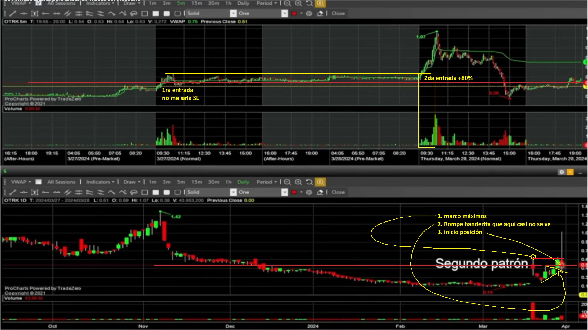

### Texto del trader

Despues de marcar maximo, a veces el precio no se va inmediatamente arriba.
Entonces, segun el trader, los shorts intentan un ultimo ataque bajista. Si no
pueden y la accion sigue aguantando maximos, aparece una consolidacion mucho
mas potente.

La razon conductual que propone es que ahi quedan atrapados varios grupos: los
que no salieron en el primer nivel, los que volvieron a entrar cabreados y los
que estan intentando defender el fallo. Por eso observa el volumen de la
primera salida de shorts, la segunda y la tercera.

### Lectura TSIS

Evento de continuacion por aceptacion en zona alta:

```text
break/retest high
-> no immediate collapse
-> high consolidation
-> renewed volume
-> squeeze continuation hypothesis
```

Este evento se relaciona con DAS y con futuros eventos de short squeeze, pero
no debe mezclarse con reglas de entrada.

### Rol en lecturas compuestas

Rol principal:

```text
impulse_event
pressure_event
```

Este evento aparece cuando el precio acepta la zona alta y vuelve a empujar.
Puede ser una fase posterior dentro de un squeeze: primero se expande, luego
no se destruye y despues reactiva con nuevo volumen.

Estrategias/arquetipos donde puede aparecer:

- `Doble máximo` del PlayBook Pag. 3 fuente;
- `Go ETB Go` del playbook fuente;
- `DAS` / `Dips After Squeeze`;
- `Short Squeeze Continuation`;
- `High Hold Continuation`;
- `Breakout Pullback Continuation`.

Composicion didactica no operativa:

```text
Low_Float_Catalyst_Volume_Extension_Event
+ Failed_Bear_Attack_Absorption_Event
+ High_Hold_Short_Squeeze_Continuation_Event
```

Lectura humana:

```text
El precio ya mostro fuerza.
El retroceso o pausa no destruye la zona alta.
La reactivacion puede forzar cobertura o nueva persecucion compradora.
```

La seleccion del dip, ruptura o vela exacta pertenece a estrategia, no al
evento.

### Observables futuros

- high_hold_duration;
- distance from high;
- consolidation range near high;
- breakout volume sequence;
- number of continuation pushes;
- pullback depth;
- halt risk if expansion accelerates.

## 14. Mini_Stuffy_Rejection_Event

### Presentacion TSIS

Familia probable:

```text
INTRADAY_REVERSALS
SHORT_SQUEEZE_DYNAMICS
```

Fenomeno:

Una vela o microsecuencia intenta bajar durante la ruptura o al final de una
consolidacion, pero recupera rapidamente y termina fuerte. El trader lo llama
mini-stuffy move.

Referencia fuente principal:

```text
PlayBook Pag. 3 - Doble máximo
```

### Imagenes fuente


### Texto del trader

El trader dice que en la ultima vela que rompe la consolidacion se puede ver un
mini-stuffy move: la vela baja para abajo y vuelve a subir. Su lectura es que
los shorts intentan darle otra vez y no pueden.

Despues de esa recuperacion, afirma que muchas veces el trade se va hacia
arriba realizando un short squeeze.

### Lectura TSIS

Este evento es muy local y probablemente requiere 1m o incluso tape:

```text
downward stab
-> fast recovery
-> close strong
-> continuation pressure
```

No debe definirse como "comprar mecha". La mecha es evidencia visual del
fenomeno de rechazo.

### Rol en lecturas compuestas

Rol principal:

```text
micro_failure_event
```

Este evento es una version muy local de fallo bajista. Puede servir como
detalle dentro de una estructura mayor, pero por si solo es demasiado pequeno
para gobernar una lectura completa del mercado.

Estrategias/arquetipos donde puede aparecer:

- `Doble máximo` del PlayBook Pag. 3 fuente;
- `Go ETB Go` del playbook fuente;
- `DAS` / `Dips After Squeeze`;
- `Failed Stuff Move`;
- `Micro Pullback Reclaim`;
- `Tape Reclaim`.

Composicion didactica no operativa:

```text
High_Hold_Short_Squeeze_Continuation_Event
+ Mini_Stuffy_Rejection_Event
+ continuation_push
```

Lectura humana:

```text
El lado vendedor intenta romper una vela o microzona.
El precio recupera rapido.
Esa recuperacion puede ser evidencia de que la presion bajista fallo.
```

Este evento probablemente necesitara revision visual o datos de tape antes de
pasar a detector_candidate.

### Observables futuros

- lower wick ratio;
- recovery speed;
- close location in candle;
- volume spike;
- relation to consolidation high;
- follow-through over next N minutes.

## 15. Dead_Stock_Reactivation_High_Event

### Presentacion TSIS

Familia probable:

```text
RUNNER_LIFECYCLE
MOMENTUM_EXPANSION
```

Fenomeno:

Una accion que venia muerta, aplastada o en rojo durante varios dias marca un
nuevo maximo relativo con volumen y obliga a reconsiderar su estado.

### Imagenes fuente

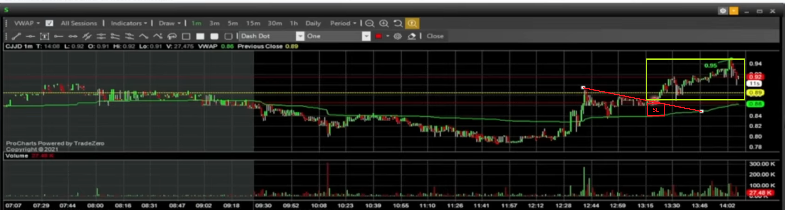

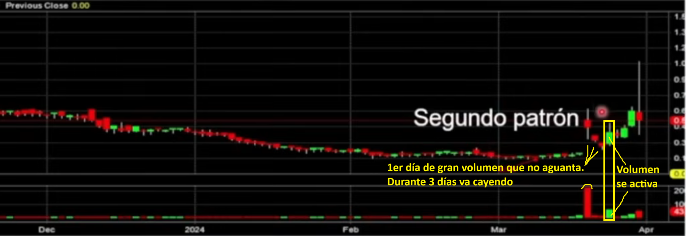

### Texto del trader

El trader muestra una accion que estaba muerta: varios dias aplastada y en
rojo. De repente marca maximo despues de esa secuencia bajista. Su reaccion no
es operar automaticamente, sino plantearsela y observar como reacciona.

Si posteriormente da una banderita o patron de continuacion, entonces la
reactivacion puede pasar a ser interesante.

### Lectura TSIS

Evento de cambio de estado:

```text
multi-day weakness
-> first relative high / volume response
-> reactivation watch state
```

Este evento puede alimentar reactivaciones, banderas o dobles maximos, pero por
si solo solo marca que el activo despierta.

### Rol en lecturas compuestas

Rol principal:

```text
state_change_event
```

Este evento marca un cambio de estado: de ticker olvidado o vendido a ticker
que vuelve a mostrar atencion. No significa que la estructura ya sea operable.

Estrategias/arquetipos donde puede aparecer:

- `Dead Cat Bounce`;
- `First Green Day`;
- `Multi-Day Reactivation`;
- `Former Runner Reactivation`;
- `Volume Reclaim`.

Composicion didactica no operativa:

```text
Dead_Stock_Reactivation_High_Event
+ Multi_Day_Reactivation_Flag_Event
+ Bull_Flag_Volume_Break_Event
```

Lectura humana:

```text
El activo parecia muerto.
De pronto vuelve a marcar un maximo relativo con volumen.
Eso lo devuelve al radar, pero todavia necesita estructura.
```

La reactivacion es una alerta contextual, no una senal.

### Observables futuros

- days_down_or_flat;
- relative low compression;
- first higher high;
- reactivation volume;
- close above recent range;
- catalyst or sector attention.

## 16. Multi_Day_Reactivation_Flag_Event

### Presentacion TSIS

Familia probable:

```text
RUNNER_LIFECYCLE
MOMENTUM_EXPANSION
RESISTANCE_AND_BREAKOUTS
```

Fenomeno:

El caso ideal de retencion no se cumple perfectamente, pero aparece un nuevo
repico con volumen que reactiva el seguimiento. Luego se forma una bandera o
consolidacion multi-dia y una ruptura posterior.

### Imagenes fuente


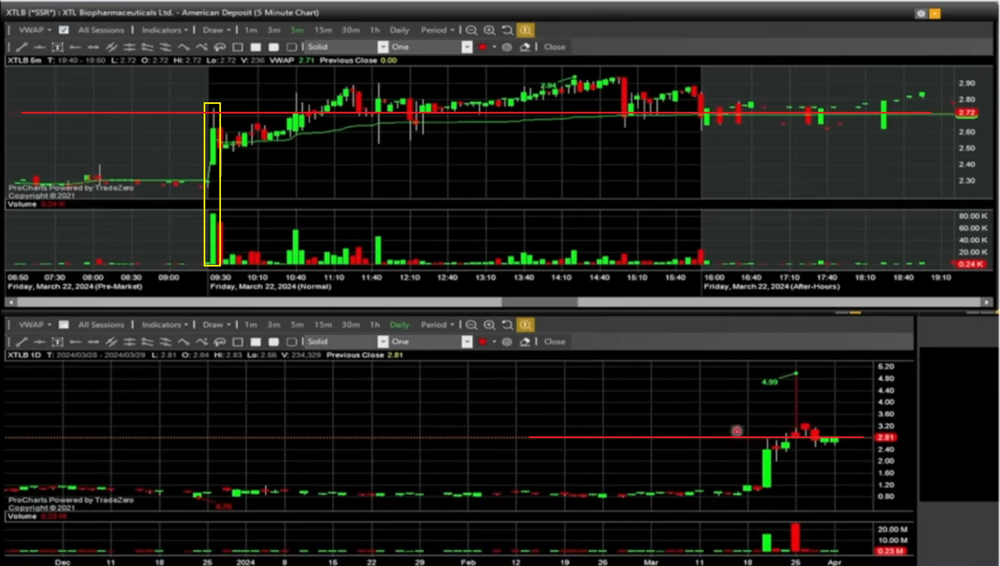

### Texto del trader

El trader explica una variacion: el segundo dia no aguanta el 50% ideal y la
accion baja durante varios dias. Pero aparece un nuevo repico con volumen
relativamente alto. Eso le plantea que la operacion se reactiva.

Reconoce que no es tan buena como la estructura ideal, pero si despues aparece
un patron excelente, quiere vigilarla. En sus ejemplos, esa reactivacion puede
dar una banderita durante varios dias y luego romper con fuerza.

### Lectura TSIS

Este evento separa el patron ideal de una segunda oportunidad:

```text
initial event weakens
-> not fully dead
-> new volume repop
-> multi-day flag
-> reactivation breakout
```

Es importante porque evita descartar automaticamente un ticker solo porque no
cumplio la retencion perfecta.

### Rol en lecturas compuestas

Rol principal:

```text
reactivation_structure_event
```

Este evento representa una segunda vida. La primera secuencia pudo fallar o no
ser ideal, pero el activo vuelve a mostrar volumen y construye una nueva
estructura.

Estrategias/arquetipos donde puede aparecer:

- `Go ETB Go` como variante no ideal;
- `Multi-Day Flag Breakout`;
- `Former Runner Second Leg`;
- `Delayed Continuation`;
- `Reactivation Breakout`.

Composicion didactica no operativa:

```text
Dead_Stock_Reactivation_High_Event
+ Multi_Day_Reactivation_Flag_Event
+ Delayed_Flag_Explosion_Event
```

Lectura humana:

```text
La primera oportunidad no limpio el camino.
Pero el ticker vuelve a atraer volumen.
Si construye una bandera y rompe, la secuencia se reactiva.
```

Esto permite mantener memoria de ticker sin transformar la vigilancia en
estrategia.

### Observables futuros

- initial failure depth;
- days_since_initial_event;
- reactivation volume;
- new high / lower high;
- flag duration;
- breakout over reactivation high;
- outcome by reactivation index.

## 17. Delayed_Flag_Explosion_Event

### Presentacion TSIS

Familia probable:

```text
RESISTANCE_AND_BREAKOUTS
RUNNER_LIFECYCLE
```

Fenomeno:

La accion forma una bandera o rango, pero no explota inmediatamente. Se queda
uno o dos dias parada, flotando o controlada, sin destruir la estructura, y
finalmente rompe con un movimiento amplio.

### Imagenes fuente

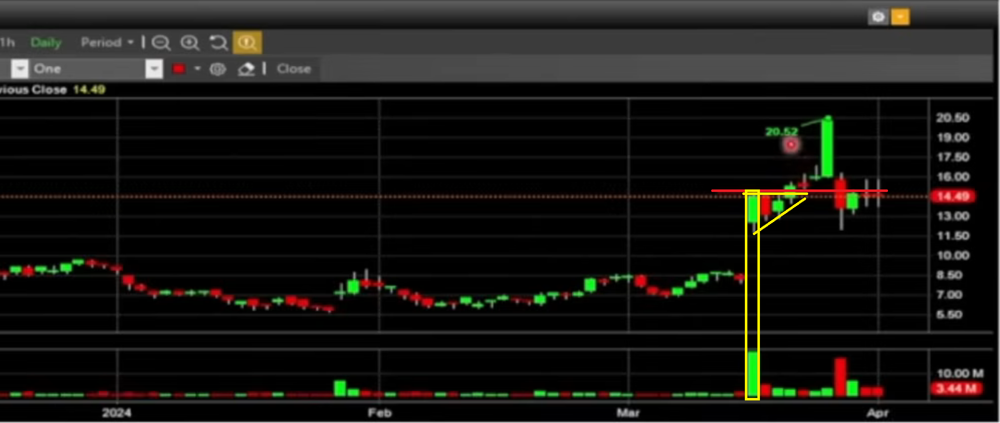

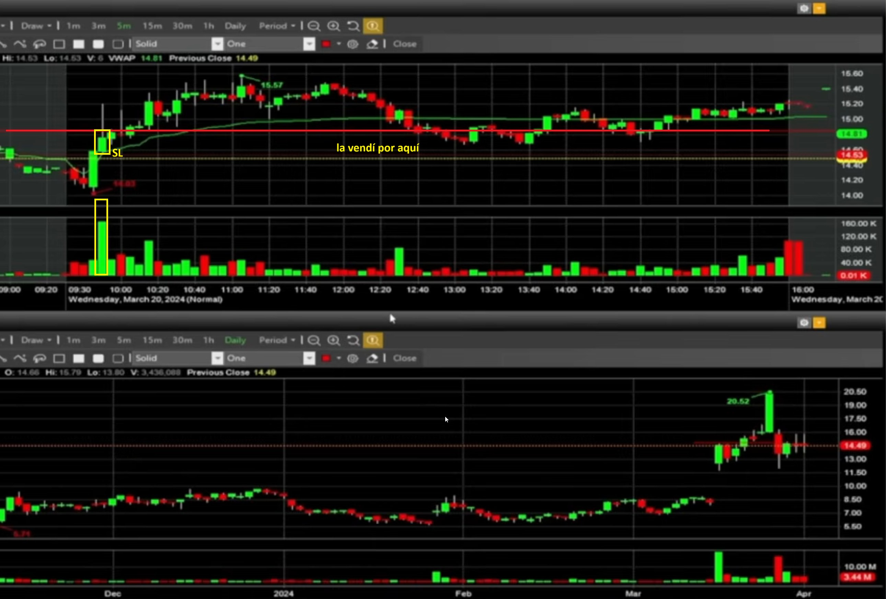


### Texto del trader

El trader muestra una variante complicada. La accion tiene volumen alto, forma
la banderita y rompe mas tarde, pero estuvo dos dias parada. Dice que no pudo
aguantarla porque estuvo flotando y controlada antes de explotar.

En otro ejemplo, una operacion falla ese dia, pero al dia siguiente funciona. El
trader insiste en que no hay que dejar de vigilar automaticamente una accion
cuando el primer intento no sale limpio.

### Lectura TSIS

Evento de digestion prolongada:

```text
setup appears
-> no immediate follow-through
-> structure not invalidated
-> multi-day float/control
-> delayed expansion
```

Este evento es distinto de la bandera rapida. El tiempo de espera es parte del
fenomeno.

### Rol en lecturas compuestas

Rol principal:

```text
delayed_structure_event
```

Este evento explica que no toda continuacion ocurre en la primera ruptura. A
veces la estructura necesita varios dias de digestion antes de expandir.

Estrategias/arquetipos donde puede aparecer:

- `Delayed Bull Flag Breakout`;
- `Multi-Day Flag Breakout`;
- `Post-Failure Continuation`;
- `Range Expansion After Compression`;
- `Former Runner Continuation`.

Composicion didactica no operativa:

```text
Bull_Flag_Volume_Break_Event
+ failed_initial_follow_through
+ Delayed_Flag_Explosion_Event
```

Lectura humana:

```text
El patron aparece.
No explota enseguida.
Pero tampoco invalida.
La compresion temporal termina en expansion posterior.
```

El evento protege una idea importante: fallo inmediato no siempre equivale a
evento muerto.

### Observables futuros

- days_in_flag;
- invalidation not breached;
- volume compression;
- range narrowing;
- delayed breakout;
- post-failure watchlist persistence;
- liquidity risk flags.

## 18. Whole_Dollar_Range_Cook_Breakout_Event

### Presentacion TSIS

Familia probable:

```text
RESISTANCE_AND_BREAKOUTS
LIQUIDITY_AND_SPREAD_STATE
```

Fenomeno:

La accion se sostiene durante largo tiempo alrededor de un nivel psicologico o
rango relevante, por ejemplo cerca de 1 dolar. No logra ser hundida. El patron
"cuece" durante suficiente tiempo, involucra participantes y termina
despegando.

### Imagenes fuente

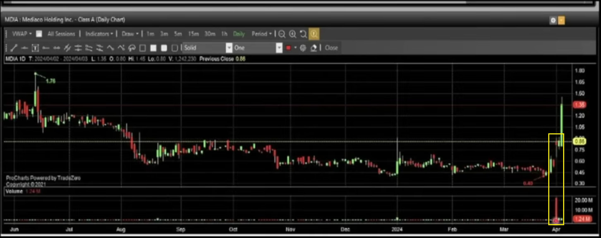


### Texto del trader

El trader dice que no basta con mirar el patron, el mercado o las borrows por
separado. Hay que juntar todas las variables.

En el ejemplo, la accion esta alrededor de un nivel cercano a 1 dolar. En
intradia rompe 0.90, consolida, luego sostiene por encima de 1. El trader
explica que estaba esperando que la accion "le dijera" cuando actuar.

La idea central es dejar cocer el patron. Si intenta crearlo demasiado pronto,
se esconde. Necesita esperar a que se involucren traders. Cuanto mas tiempo
evoluciona sin romper el rango, mas potente puede ser. Al final despega porque
el lado comprador es mas fuerte que el vendedor; en sus palabras, hay un
comprador al que le da igual a que precio comprar.

### Lectura TSIS

Este evento combina:

```text
psychological level
-> range acceptance
-> failed downside break
-> participant build-up
-> late breakout
```

Es probablemente uno de los eventos mas importantes del documento porque une
nivel, tiempo, liquidez, absorcion y conducta de masas.

### Observables futuros

- whole-dollar proximity;
- time above/below level;
- failed breakdowns;
- range duration;
- volume build-up;
- late-day breakout;
- buyer dominance proxy;
- spread/liquidity quality.

## 19. Relative_Volume_Watchlist_Event

### Presentacion TSIS

Familia probable:

```text
CATALYST_AND_ATTENTION
MOMENTUM_EXPANSION
```

Fenomeno:

Una accion muestra una barra o sesion de volumen relativo tan evidente que pasa
de universo pasivo a vigilancia activa. El trader lo describe como volumen que
no necesita discusion: se ve directamente en el grafico.

Este evento no es una ruptura ni una entrada. Es un cambio de atencion.

### Imagenes fuente


### Texto del trader

El trader insiste varias veces en que el volumen relativo alto es una condicion
central. En el playbook de doble maximo dice que no hace falta volverse loco:
si el volumen es realmente alto, la barra se ve sin tener que preguntarlo.
Cuando aparece ese volumen, la accion pasa directamente a vigilancia.

Tambien repite que no basta con un patron visual. Rectangulos, banderas o
dobles maximos solo importan si aparecen en acciones concretas y con volumen
relevante.

### Lectura TSIS

Evento de activacion de vigilancia:

```text
previously passive ticker
-> obvious relative volume expansion
-> watchlist state
-> later structure may matter
```

No significa que el precio vaya a continuar. Solo indica que la accion esta
recibiendo participacion anomala suficiente para justificar research.

### Rol en lecturas compuestas

Rol principal:

```text
context_event
attention_event
```

Estrategias/arquetipos donde puede aparecer:

- `Go ETB Go`;
- `Doble máximo`;
- `Gap and Go`;
- `First Green Day`;
- `Volume Breakout`;
- `Small Cap Momentum`.

Composicion didactica no operativa:

```text
Relative_Volume_Watchlist_Event
+ Low_Float_Catalyst_Volume_Extension_Event
+ Bull_Flag_Volume_Break_Event
```

Lectura humana:

```text
El ticker ya no esta muerto para el mercado.
Hay volumen visible.
Ahora las estructuras posteriores merecen atencion.
```

### Observables futuros

- relative_volume_daily;
- volume_vs_recent_sessions;
- dollar_volume;
- volume_percentile;
- first_volume_spike_date;
- volume_visible_by_eye_flag;
- watchlist_activation_ts.

## 20. ETB_Borrow_Availability_Context_Event

### Presentacion TSIS

Familia probable:

```text
SHORT_SQUEEZE_DYNAMICS
CATALYST_AND_ATTENTION
```

Fenomeno:

El ticker tiene borrows disponibles o condicion `easy to borrow`, permitiendo
que participantes short entren con facilidad. Esto no es un movimiento de
precio, pero si es un estado observable del entorno de participantes.

### Imagenes fuente


### Texto del trader

El trader explica que el stock debe tener borrows. Si es `easy to borrow`, lo
considera mejor que si hay que pagar caro para ponerse corto. Si no hay acciones
disponibles para short, practicamente descarta esa operativa.

Al dia siguiente vuelve a revisar los borrows. La razon es que parte del marco
depende de que haya participacion short posible. Si los shorts pueden entrar y
el precio no cae, la presion posterior puede aumentar.

### Lectura TSIS

Evento/contexto de acceso short:

```text
borrow availability exists
-> short participation is possible
-> failed downside pressure becomes more informative
```

Esto no prueba que haya shorts atrapados. Solo establece que el mercado permite
esa participacion.

### Rol en lecturas compuestas

Rol principal:

```text
participant_access_context
short_context_event
```

Estrategias/arquetipos donde puede aparecer:

- `Go ETB Go`;
- `Doble máximo`;
- `Short Squeeze Continuation`;
- `Failed Breakdown`;
- `High Hold Squeeze`.

Composicion didactica no operativa:

```text
ETB_Borrow_Availability_Context_Event
+ Failed_Bear_Attack_Absorption_Event
+ High_Hold_Short_Squeeze_Continuation_Event
```

Lectura humana:

```text
Los shorts pueden participar.
Si participan y no consiguen bajar el precio, su posicion psicologica cambia.
```

### Observables futuros

- borrow_available_flag;
- ETB_flag;
- borrow_cost_proxy;
- borrow_availability_date;
- shortability_status;
- source_quality_flag;
- missing_borrow_data_flag.

## 21. Two_Day_Initial_Extension_As_One_Event

### Presentacion TSIS

Familia probable:

```text
RUNNER_LIFECYCLE
MOMENTUM_EXPANSION
```

Fenomeno:

La extension inicial no ocurre en una sola sesion, sino en dos dias
consecutivos o cercanos. El trader interpreta ese movimiento doble como una
misma extension inicial si responde al mismo catalyst o continuidad de
atencion.

### Imagenes fuente


### Texto del trader

En el ejemplo de ACB, el trader explica que el segundo dia de movimiento no le
invalida la lectura. Le da igual que el recorrido inicial ocurra en un dia o en
dos, porque para su marco puede contar como el mismo movimiento si viene de una
noticia y continuidad de atencion.

Esta idea es importante porque evita definir de forma demasiado estrecha el
primer dia de expansion.

### Lectura TSIS

Evento de normalizacion temporal de extension:

```text
day1 extension
+ day2 continuation
-> treated as one initial extension window
```

No es estrategia. Es una regla conceptual para no romper artificialmente una
misma fase de atencion en dos eventos desconectados.

### Rol en lecturas compuestas

Rol principal:

```text
lifecycle_context_event
extension_window_event
```

Estrategias/arquetipos donde puede aparecer:

- `Go ETB Go`;
- `Doble máximo`;
- `Multi-Day Runner`;
- `First Green Day Continuation`;
- `Sector Catalyst Runner`.

Composicion didactica no operativa:

```text
Low_Float_Catalyst_Volume_Extension_Event
+ Two_Day_Initial_Extension_As_One_Event
+ Prior_High_Open_Rebreak_Event
```

Lectura humana:

```text
La primera extension puede durar mas de una sesion.
El nivel relevante nace del bloque completo, no solo del primer dia calendario.
```

### Observables futuros

- extension_window_start_date;
- extension_window_end_date;
- cumulative_extension_pct;
- same_catalyst_flag;
- max_level_source_day;
- volume_distribution_by_day;
- event_day_count.

## 22. Prior_High_Proximity_Open_Event

### Presentacion TSIS

Familia probable:

```text
RESISTANCE_AND_BREAKOUTS
MOMENTUM_EXPANSION
```

Fenomeno:

El precio abre muy cerca del maximo relevante anterior, o lo supera por poco.
Esto crea una sesion donde el nivel puede activarse muy pronto.

Este evento separa la proximidad al nivel de la ruptura posterior. Estar cerca
del maximo no es lo mismo que romperlo.

### Imagenes fuente


### Texto del trader

El trader distingue dos situaciones: si la accion abre superando el maximo del
primer dia por menos de un 1%, lo considera contexto agresivo; si abre mas cerca
del rango del segundo dia, lo trata de forma mas defensiva.

Tambien remarca que muchas rupturas pueden ocurrir en el minuto uno o dos, por
lo que el nivel debe estar preparado antes de la apertura.

### Lectura TSIS

Evento de proximidad al nivel:

```text
prior high exists
-> open is very near prior high
-> level can activate early
```

No dice que haya que comprar. Solo identifica que la sesion empieza en una zona
donde el nivel previo es inmediatamente relevante.

### Rol en lecturas compuestas

Rol principal:

```text
level_proximity_event
opening_context_event
```

Estrategias/arquetipos donde puede aparecer:

- `Go ETB Go`;
- `Doble máximo`;
- `Opening Range Breakout`;
- `High of Day Breakout`;
- `Prior High Rebreak`.

Composicion didactica no operativa:

```text
Two_Day_Initial_Extension_As_One_Event
+ Prior_High_Proximity_Open_Event
+ Prior_High_Open_Rebreak_Event
```

Lectura humana:

```text
El ticker no abre en cualquier sitio.
Abre donde el maximo previo puede importar inmediatamente.
```

### Observables futuros

- prior_high_level;
- open_to_prior_high_pct;
- open_above_prior_high_flag;
- first_minutes_to_level_test;
- session_gap_type;
- aggressive_open_context_flag.

## 23. Failed_Breakout_Not_Invalidated_Event

### Presentacion TSIS

Familia probable:

```text
MOMENTUM_EXHAUSTION
RUNNER_LIFECYCLE
RESISTANCE_AND_BREAKOUTS
```

Fenomeno:

Una ruptura o intento de continuacion no funciona inmediatamente, pero la
estructura mayor tampoco queda invalidada. El ticker sigue vivo y puede romper
mas tarde.

### Imagenes fuente


### Texto del trader

El trader muestra varios casos donde el primer intento no funciona limpio. En
uno de ellos se sale porque el precio marea y no explota; mas tarde la accion
continua flagueando y acaba haciendo un movimiento grande. En otro, la operacion
falla el dia inicial pero funciona al dia siguiente.

La leccion humana no es perseguir todas las fallidas. Es no borrar
automaticamente un ticker si la estructura relevante no fue destruida.

### Lectura TSIS

Evento de fallo sin invalidacion:

```text
breakout attempt
-> no immediate follow-through
-> key invalidation not breached
-> structure remains alive
-> later expansion possible
```

Este evento separa fracaso operativo de destruccion estructural.

### Rol en lecturas compuestas

Rol principal:

```text
failed_attempt_event
not_invalidated_event
```

Estrategias/arquetipos donde puede aparecer:

- `Go ETB Go`;
- `Delayed Bull Flag Breakout`;
- `Post-Failure Continuation`;
- `Former Runner Continuation`;
- `Second Chance Breakout`.

Composicion didactica no operativa:

```text
Bull_Flag_Volume_Break_Event
+ Failed_Breakout_Not_Invalidated_Event
+ Delayed_Flag_Explosion_Event
```

Lectura humana:

```text
El primer intento no paga.
Pero la estructura no muere.
El ticker sigue en vigilancia.
```

### Observables futuros

- breakout_attempt_ts;
- follow_through_failure_flag;
- invalidation_level;
- invalidation_breached_flag;
- days_until_retry;
- liquidity_risk_flag;
- later_breakout_flag.

## 24. Buyer_Dominance_Range_Hold_Event

### Presentacion TSIS

Familia probable:

```text
LIQUIDITY_AND_SPREAD_STATE
SHORT_SQUEEZE_DYNAMICS
RESISTANCE_AND_BREAKOUTS
```

Fenomeno:

El precio aguanta un rango durante mucho tiempo, no rompe por abajo y sugiere
presencia compradora dominante. El trader lo describe como una accion que no
consigue bajar ni romper el rango porque hay un comprador fuerte.

### Imagenes fuente


### Texto del trader

En la variacion 6, el trader explica que la accion aguanta, consolida varias
veces y permanece por encima de una zona relevante. Dice que el patron necesita
"coccion": si se fuerza antes de tiempo puede no funcionar. Cuanto mas tiempo
evoluciona, mas participantes se involucran.

Al final, segun su lectura, despega porque no logra bajar ni romper el rango.
La interpretacion es que el lado comprador es mas fuerte que el vendedor.

### Lectura TSIS

Evento de dominancia compradora en rango:

```text
extended intraday range
-> repeated hold
-> downside failure
-> buyer dominance hypothesis
-> eventual expansion
```

No podemos afirmar la identidad del comprador. Solo documentamos que el precio
no pierde el rango pese al tiempo y los intentos de bajada.

### Rol en lecturas compuestas

Rol principal:

```text
absorption_event
range_hold_event
```

Estrategias/arquetipos donde puede aparecer:

- `Doble máximo`;
- `Range Cook Breakout`;
- `Liquidity Absorption`;
- `High Tight Range`;
- `Short Squeeze Continuation`.

Composicion didactica no operativa:

```text
Rectangle_Range_Volume_Break_Event
+ Buyer_Dominance_Range_Hold_Event
+ Whole_Dollar_Range_Cook_Breakout_Event
```

Lectura humana:

```text
El precio pasa tiempo suficiente en una zona.
No cae donde deberia caer.
La presion compradora parece dominar la estructura.
```

### Observables futuros

- range_hold_duration;
- failed_downside_breaks;
- range_low_defended_count;
- time_above_key_level;
- volume_absorption_proxy;
- whole_dollar_relation;
- eventual_breakout_flag.

## 25. Condiciones que no son eventos por si solas

### ETB / borrows

`Easy To Borrow` no es evento de precio. Puede modelarse como
`participant_access_context` si existe fuente de datos gobernada, porque cambia
la posibilidad de participacion short.

Por si solo no prueba que los shorts esten dentro ni que esten cubriendo.

### Catalyst / noticia

La noticia puede originar atencion y volumen, pero el evento TSIS debe separar:

```text
catalyst context
observable price/volume response
subsequent retention or failure
```

### Low float

Low float es una propiedad del instrumento, no una ocurrencia temporal. Puede
formar parte de un evento de contexto cuando aparece combinado con catalyst,
volumen y expansion. Por si solo es un amplificador de rango, fragilidad y
squeeze potencial.

### Stop, full size y anadir

Estos elementos pertenecen a Strategy Library, Execution Models o Decision
Models. Se conservan como contexto del trader, pero no deben entrar en una
definicion de evento.

## 26. Prioridad para futuras definiciones

Orden recomendado:

1. `Relative_Volume_Watchlist_Event`
2. `ETB_Borrow_Availability_Context_Event`
3. `Go_ETB_Go_Event`
4. `Double_Max_Short_Pressure_Event`
5. `Prior_High_Proximity_Open_Event`
6. `Whole_Dollar_Range_Cook_Breakout_Event`
7. `Bull_Flag_Volume_Break_Event`
8. `High_Hold_Short_Squeeze_Continuation_Event`
9. `Failed_Breakout_Not_Invalidated_Event`
10. `Buyer_Dominance_Range_Hold_Event`
11. `Multi_Day_Reactivation_Flag_Event`
12. `Mini_Stuffy_Rejection_Event`

La razon es practica: los dos primeros son condiciones de lectura que aparecen
en casi todos los playbooks del documento. Despues vienen los eventos compuestos
y las estructuras que permiten separar contexto, nivel, presion, fallo y
continuacion.

## 27. Regla final

Este documento conserva material fuente visual y textual.

La siguiente fase no es backtestear ni operar. La siguiente fase es elegir un
evento candidato y convertirlo en definicion draft formal dentro de la familia
correspondiente de Event Library.

