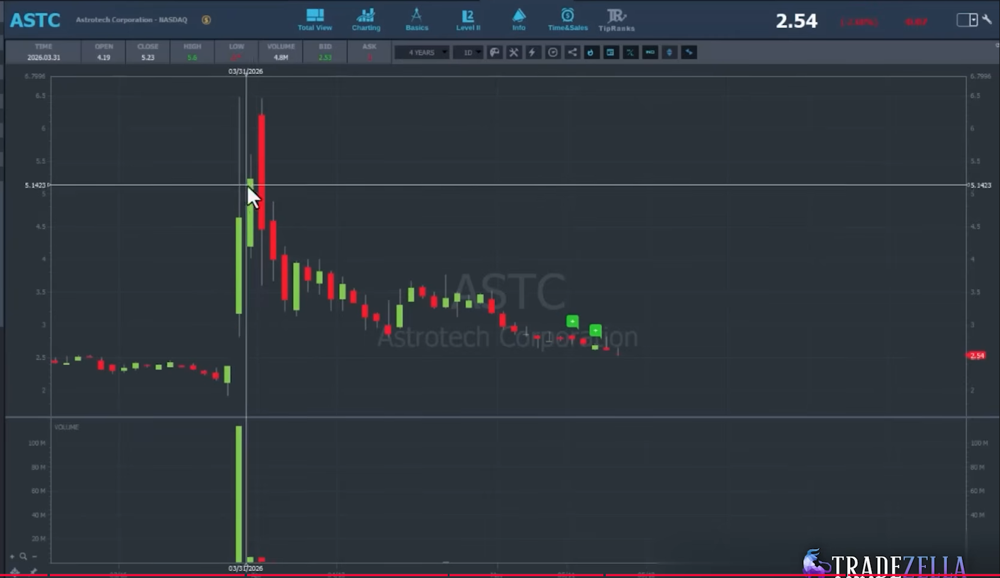

# Bounce Short Strategy - Steven Dux Public Source Draft v0.1

Fecha: 2026-06-27
Estado: source_note / strategy draft.
Fuente primaria: Steven Dux - `If You Only Watch One Trading Strategy Video, Make It This`.

## 1. Proposito

Este documento separa `Bounce Short` como estrategia fuente propia.

No valida edge.
No crea parametros institucionales.
No autoriza operativa.

Su funcion es convertir la explicacion publica de Dux en una estructura medible
para futuros notebooks, candidate tables y estudios estadisticos.

## 2. Lectura central

`Bounce Short` no es simplemente shortear un rebote.

Es una estrategia basada en memoria de resistencia:

```text
dia previo con volumen extremo en una zona de precio
-> caida posterior y participantes atrapados
-> rebote futuro hacia esa misma zona
-> volumen actual insuficiente para absorber la resistencia
-> rechazo/fade potencial
```

La tesis conductual fuente es:

```text
cuando el precio vuelve cerca del break-even de participantes atrapados,
la presion de venta aumenta porque muchos quieren salir.
```

## 3. Imagenes fuente

Las imagenes siguientes pertenecen al mismo video fuente usado para este
documento.

### 3.1. ASTC - prior resistance retest




Lectura TSIS:

- ASTC ilustra un movimiento previo con volumen fuerte y una zona de
  consolidacion/resistencia.
- En una sesion posterior el precio rebota hacia esa zona.
- El volumen actual es mucho menor que el volumen concentrado del dia previo.
- La zona previa funciona como referencia de riesgo/resistencia.

Debe etiquetarse como:

```text
prior_volume_resistance_retest
```

## 4. Diferencia con Gap Up Short

`Gap Up Short` se centra en:

```text
gap extremo
+ filtros de market cap / float / volumen / crowding
+ push y breakdown intradia
```

`Bounce Short` se centra en:

```text
resistencia historica
+ volumen previo concentrado
+ rebote hacia esa zona
+ volumen actual insuficiente
```

Puede existir gap, pero no es obligatorio.

Si el rebote ademas gapea hacia resistencia, entonces entra en el documento:

```text
01_Steven_Dux/SHORT/Bounce_Plus_Gap_Up_Short/STRATEGY.md
```

## 5. Condiciones fuente iniciales

### 5.1. Ventana historica

La fuente propone mirar aproximadamente un ano hacia atras para encontrar la
zona de resistencia.

Campo minimo:

```text
lookback_days_for_resistance
```

### 5.2. Resistencia por vela o zona previa

La resistencia ideal viene de una sesion previa donde:

- el precio hizo un spike fuerte;
- se negocio volumen grande;
- hubo consolidacion alrededor de una zona;
- despues el precio cayo y permanecio deprimido un tiempo.

Campos candidatos:

```text
resistance_date
resistance_price_zone_low
resistance_price_zone_high
resistance_zone_mid
resistance_source_timeframe
resistance_source_type
```

### 5.3. Volumen previo concentrado

La fuente usa ejemplos como:

```text
25M-30M shares concentrados cerca de una zona
```

Campos candidatos:

```text
prior_resistance_volume
prior_resistance_dollar_volume
prior_resistance_avg_price
```

### 5.4. Precio minimo

La fuente advierte que estos modelos se degradan con precios demasiado bajos.

Etiqueta fuente:

```text
price > 3
```

TSIS debe guardarlo como criterio fuente, no como parametro final.

### 5.5. Market cap y float

Lectura fuente del ejemplo visual:

```text
ideal: market_cap < 200M
ideal: float < 50M
```

Campos:

```text
market_cap
float
market_cap_bucket
float_bucket
```

### 5.6. Volumen actual estimado

El rebote debe medirse contra la resistencia historica.

La pregunta es:

```text
el volumen actual puede competir contra el bloque previo de volumen?
```

Campos:

```text
current_premarket_volume
estimated_day_volume
current_day_volume_to_time
current_vs_prior_resistance_volume_ratio
```

## 6. Ratio central

La variable central del modelo es:

```text
resistance_volume_pressure_ratio =
  prior_resistance_volume / estimated_current_day_volume
```

Interpretacion inicial:

| Ratio | Lectura |
|---|---|
| `< 1` | El volumen actual puede igualar o superar la resistencia previa; tesis debil. |
| `~1` | Frontera; Dux reduce conviccion/tamano. |
| `2` | Resistencia previa domina aproximadamente 2:1; mejor contexto. |
| `10` | Resistencia previa domina mucho; fuente menciona casos muy potentes. |

Version dollar-volume:

```text
resistance_dollar_pressure_ratio =
  prior_resistance_dollar_volume / estimated_current_day_dollar_volume
```

## 7. Secuencia visual ideal

```text
1. sesion previa con spike y volumen grande;
2. zona de consolidacion con precio medio reconocible;
3. fallo/caida posterior;
4. periodo de descanso o precio deprimido;
5. rebote futuro hacia la zona de resistencia;
6. volumen actual menor que volumen previo;
7. rechazo/fade desde resistencia.
```

## 8. Estados candidatos

```text
bounce_short_candidate
prior_volume_resistance_detected
prior_dollar_block_detected
retest_into_resistance
current_volume_insufficient
resistance_volume_dominant
resistance_volume_overwhelmed
clean_bounce_short_candidate
invalid_bounce_short
```

| Estado | Significado |
|---|---|
| `bounce_short_candidate` | Rebote hacia zona previa pendiente de validar. |
| `prior_volume_resistance_detected` | Hay zona historica con volumen concentrado. |
| `prior_dollar_block_detected` | La resistencia tambien es material en dollar-volume. |
| `retest_into_resistance` | El precio actual vuelve a la zona previa. |
| `current_volume_insufficient` | El volumen actual estimado no compite con la zona previa. |
| `resistance_volume_dominant` | La resistencia previa domina por ratio. |
| `resistance_volume_overwhelmed` | El volumen actual puede romper/absorber la resistencia. |
| `clean_bounce_short_candidate` | Contexto, zona y volumen estan alineados. |
| `invalid_bounce_short` | Falta resistencia, volumen comparativo o retest. |

## 9. Formulas candidatas

### 9.1. Resistance zone mid

```text
resistance_zone_mid =
  (resistance_price_zone_low + resistance_price_zone_high) / 2
```

### 9.2. Prior resistance dollar volume

```text
prior_resistance_dollar_volume =
  prior_resistance_volume * prior_resistance_avg_price
```

### 9.3. Distance to resistance

```text
distance_to_resistance_pct =
  (resistance_zone_mid / current_reference_price - 1) * 100
```

### 9.4. Current estimated day volume

```text
estimated_current_day_volume =
  current_premarket_volume * volume_projection_multiplier
```

### 9.5. Volume pressure ratio

```text
current_vs_prior_resistance_volume_ratio =
  estimated_current_day_volume / prior_resistance_volume
```

```text
prior_vs_current_pressure_ratio =
  prior_resistance_volume / estimated_current_day_volume
```

### 9.6. Fade after retest

```text
fade_after_retest_pct =
  (retest_high - post_retest_low) / retest_high * 100
```

## 10. Campos minimos para candidate_table

```text
candidate_id
strategy_source
ticker
exchange
company_name
session_date
market_cap
market_cap_bucket
float
float_bucket
current_price
prior_close
current_premarket_volume
estimated_current_day_volume
resistance_date
resistance_age_days
resistance_price_zone_low
resistance_price_zone_high
resistance_zone_mid
prior_resistance_volume
prior_resistance_avg_price
prior_resistance_dollar_volume
current_vs_prior_resistance_volume_ratio
prior_vs_current_pressure_ratio
distance_to_resistance_pct
retest_ts
retest_high
rejection_ts
post_retest_low
fade_after_retest_pct
strategy_state
invalid_reason
visual_label
review_bucket
```

## 11. Chart requirements

El notebook futuro debe producir:

1. chart daily/1h que muestre la resistencia previa dentro del lookback;
2. chart intraday del dia de resistencia para ver donde se concentro volumen;
3. chart del dia actual con rebote hacia esa zona;
4. volumen 1m o timeframe apropiado;
5. VWAP si aplica a intradia;
6. bandas de zona de resistencia;
7. anotacion de:
   - resistencia previa;
   - volumen previo;
   - volumen actual estimado;
   - ratio actual vs previo;
   - high del retest;
   - rechazo o fallo.

## 12. Descomposicion futura en eventos

Eventos candidatos derivados:

```text
Prior_Volume_Resistance_Event
Prior_Dollar_Block_Resistance_Event
Resistance_Retest_Event
Current_Volume_Insufficient_Context
Bounce_Into_Resistance_Event
Resistance_Rejection_Event
```

Strategy Library no promueve esos eventos.

Event Library debera definirlos despues si sobreviven a revision visual y
estadistica.

## 13. Relacion con otros documentos

Este documento es el modelo `Bounce Short` puro.

Documento combinado relacionado:

```text
01_Steven_Dux/SHORT/Bounce_Plus_Gap_Up_Short/STRATEGY.md
```

Regla:

```text
Si el caso necesita gap fuerte hacia resistencia, revisar Bounce Plus Gap.
Si el caso es rebote hacia resistencia con volumen insuficiente, este documento
es la fuente primaria.
```

## 14. Imagenes deseadas del propio video

Ya existen capturas ASTC en `source_assets/steven_dux/`.

Capturas adicionales utiles del mismo video:

- tramo donde Dux dibuja la vela previa con volumen grande;
- tramo donde explica el bloque de 25M-30M acciones cerca de resistencia;
- tramo donde explica la reduccion del volumen estimado cuando el ticker abre y
  cae rapido;
- tramo donde compara ratio 1:1, 2:1 y 10:1;
- tramo donde muestra el retest y rechazo de ASTC.

## 15. Regla final

`Bounce Short` no se define por la forma del rebote.

Se define por la relacion entre:

```text
resistencia previa
volumen previo atrapado
dollar block previo
volumen actual estimado
distancia al retest
fallo/rechazo
```

Si el notebook futuro no calcula el bloque de resistencia y su ratio contra el
volumen actual, no esta buscando esta estrategia.
