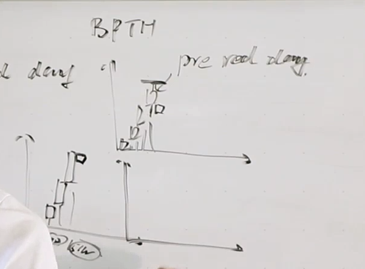
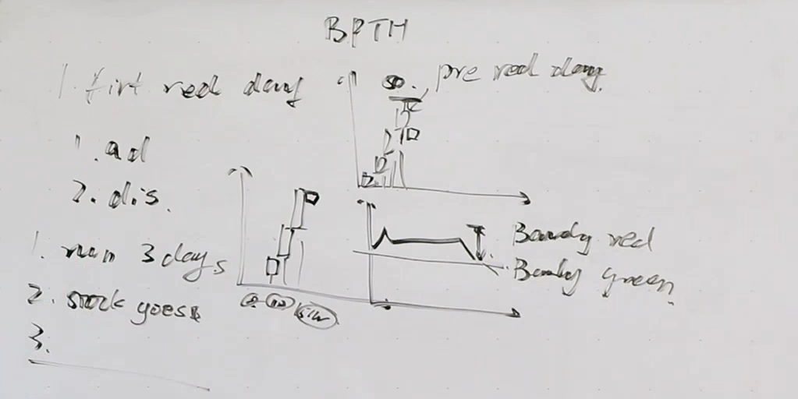
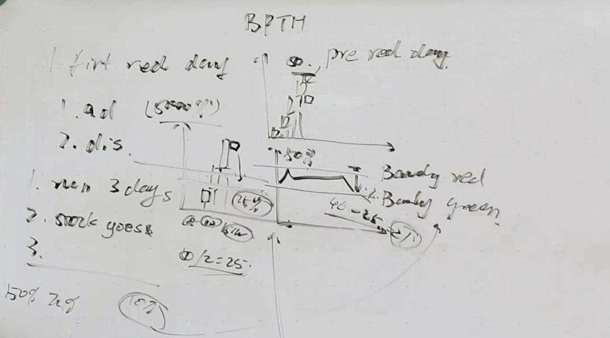
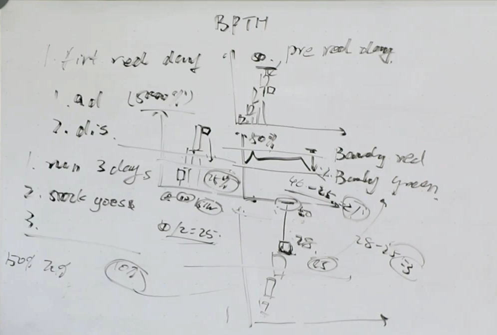
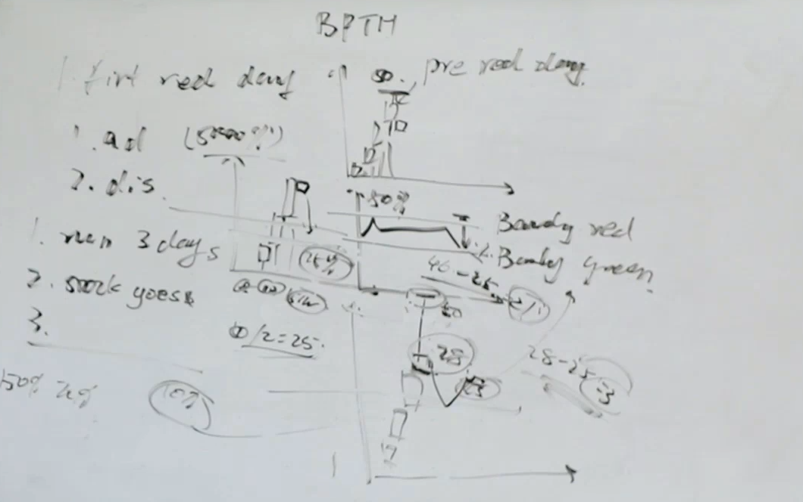

# First Red Day Strategy - Duxinator Source Draft v0.1

Fecha: 2026-06-27
Estado: source_note / strategy draft.
Fuente primaria: Steven Dux - Duxinator - `1 - First Red Day The advantage and disadvantage`.

## 1. Proposito

Este documento define la lectura inicial de TSIS para `First Red Day` segun el
material Duxinator.

No valida edge.
No crea parametros institucionales.
No autoriza operativa.

Su funcion es convertir la explicacion discrecional de Dux en una estrategia
medible que luego pueda producir:

```text
candidate_table
daily_chart_review
intraday_chart_review
statistics_ledger
event_decomposition
```

## 2. Resumen tecnico

`First Red Day` no significa simplemente "primer dia rojo".

En la lectura Dux, es una estrategia short sobre un `multi-day runner` que:

1. ha subido de forma consistente durante varios dias;
2. ha incrementado volumen dia a dia;
3. ha llegado a una zona alta del recorrido;
4. empieza a mostrar un `pre-red day` o primer cambio de debilidad;
5. todavia conserva suficiente rango de reward hacia un fade del 50% del
   recorrido.

La clave no es cuanto sigue subido el ticker en porcentaje total.

La clave es:

```text
cuanto rango util queda desde la zona de entrada hasta el objetivo logico de fade
```

## 3. Imagenes fuente

Las imagenes estan en:

```text
00_CTO/13_TRADING_SYSTEMS/03_STRATEGY_LIBRARY/01_Steven_Dux/source_assets/steven_dux/
```

### 3.1. 01:30 - BPTH daily run y pre-red day



Lectura:

- Dux usa BPTH como esquema.
- Marca una secuencia de varios dias de subida.
- La zona superior se identifica como `pre-red day`.
- El `pre-red day` no es aun necesariamente el trade final; es el dia que
  revela si el ticker ya esta demasiado destruido o si todavia queda reward.

### 3.2. 02:40 - Barely red / barely green



Lectura:

- El `pre-red day` puede ser apenas rojo.
- Tambien puede ser apenas verde.
- Dux menciona que, en un multi-day runner, un dia con movimiento pequeno
  frente a dias previos de 50%-70% puede tratarse como `barely green`.
- El punto tecnico es que el momentum empieza a perder expansion aunque el
  cierre no sea dramaticamente rojo.

TSIS debe medir:

```text
pre_red_day_return_pct
pre_red_day_close_vs_open_pct
pre_red_day_range_pct
pre_red_day_close_location
pre_red_day_color_bucket
```

### 3.3. 04:51 - Rango util hasta el 50% del recorrido



Lectura:

- Dux ilustra un high cercano a `50`.
- El objetivo de fade corto se conceptualiza como la mitad del recorrido.
- Si el punto de entrada esta cerca de `46` y el nivel de mitad esta cerca de
  `25`, todavia queda rango util.

Idea matematica:

```text
run_range = run_high_price - run_start_price
half_fade_price = run_start_price + 0.50 * run_range
remaining_reward_to_half = entry_reference_price - half_fade_price
remaining_reward_to_half_pct = remaining_reward_to_half / entry_reference_price
```

### 3.4. 06:00 - Caso no tradable por falta de reward restante



Lectura:

- Si el `pre-red day` ya cerro demasiado cerca del nivel de mitad del recorrido,
  el reward restante queda reducido.
- Dux pone el ejemplo conceptual de short cerca de `28` con objetivo cerca de
  `25`: quedan solo `3` dolares de reward sobre un ticker de `28`.
- Eso no es suficiente aunque el ticker siga pareciendo muy extendido en
  porcentaje total.

Regla conceptual:

```text
si el pre-red day ya destruyo aproximadamente 50% del recorrido,
el First Red Day deja de ser candidato limpio.
```

### 3.5. 07:41 - Usar primero el rango



Lectura:

- Dux resume que la prioridad es evaluar el rango.
- Shortear despues de "primer rojo" sin rango puede llevar a short trap.
- La estrategia debe decidir primero si el reward matematico sigue vivo.

## 4. Condiciones minimas del setup

### 4.1. Multi-day runner

El ticker debe haber corrido durante varios dias.

Condicion inicial:

```text
consecutive_up_days >= 3
```

TSIS debe distinguir:

```text
green_day_by_close
green_day_by_open_to_close
intraday_green_but_close_red
red_day_reset
```

### 4.2. Volumen creciente

Dux exige volumen creciente dia a dia.

Version simple:

```text
volume_day_1 < volume_day_2 < volume_day_3
```

Version TSIS recomendada:

```text
share_volume_increasing = true | false
dollar_volume_increasing = true | false
```

Motivo:

Si el precio sube mucho, el volumen en shares puede no contar toda la historia.
El `dollar_volume` mide mejor cuanto dinero se esta concentrando en el runner.

### 4.3. Pre-red day

`pre-red day` es el dia que identifica la altura real del movimiento y si el
rango aun es operable.

Puede ser:

```text
barely_green
barely_red
range_damage_day
```

No se define solo por el color.

Se define por:

```text
close_location
range_damage_pct
remaining_reward
```

### 4.4. Rango restante

La estrategia debe calcular si queda recompensa suficiente hacia el nivel de
fade esperado.

Niveles clave:

```text
run_start_price
run_high_price
half_fade_price
three_quarter_fade_price
entry_reference_price
```

Dux sugiere:

- `50% fade` como objetivo de corto plazo;
- `75% fade` como referencia de largo plazo en runners masivos.

TSIS debe empezar midiendo ambos, no fijando uno como regla institucional.

## 5. Formulas candidatas

### 5.1. Recorrido del runner

```text
run_range = run_high_price - run_start_price
runup_pct = (run_high_price / run_start_price - 1) * 100
```

### 5.2. Nivel de fade al 50%

```text
half_fade_price = run_start_price + 0.50 * run_range
```

### 5.3. Nivel de fade al 75%

```text
three_quarter_fade_price = run_start_price + 0.25 * run_range
```

Nota:

`75% fade` significa que el precio devuelve el 75% del recorrido desde el high,
por eso el nivel queda en el 25% del rango por encima del inicio.

### 5.4. Dano del pre-red day

```text
pre_red_damage_pct =
  (run_high_price - pre_red_close_price) / run_range * 100
```

Interpretacion inicial:

```text
pre_red_damage_pct < 50%  -> reward potencial vivo
pre_red_damage_pct >= 50% -> reward potencial degradado o agotado
```

### 5.5. Reward restante hacia 50% fade

```text
remaining_reward_to_half =
  entry_reference_price - half_fade_price

remaining_reward_to_half_pct =
  remaining_reward_to_half / entry_reference_price * 100
```

Regla:

No basta con que `remaining_reward_to_half` sea positivo.
Debe ser suficientemente grande frente al precio y frente al riesgo.

## 6. Estados candidatos

El notebook no debe clasificar todo como "First Red Day" directamente.

Estados propuestos:

```text
multi_day_runner_candidate
volume_confirmed_runner
pre_red_day_candidate
tradable_first_red_day_candidate
range_damaged_first_red_day
invalid_first_red_day
```

Definiciones:

| Estado | Significado |
|---|---|
| `multi_day_runner_candidate` | Hay secuencia de subida, pero aun no se confirma volumen/rango. |
| `volume_confirmed_runner` | La secuencia tambien muestra volumen o dollar volume creciente. |
| `pre_red_day_candidate` | Aparece dia apenas rojo/verde o con expansion debilitada. |
| `tradable_first_red_day_candidate` | Queda reward suficiente hacia el 50% del recorrido. |
| `range_damaged_first_red_day` | El ticker ya perdio demasiado recorrido antes de la entrada. |
| `invalid_first_red_day` | No cumple secuencia, volumen o rango minimo. |

## 7. Campos minimos para candidate_table

```text
candidate_id
ticker
exchange
company_name
run_start_date
run_start_price
run_high_date
run_high_price
consecutive_up_days
red_day_reset_flag
daily_volume_sequence
daily_dollar_volume_sequence
share_volume_increasing
dollar_volume_increasing
pre_red_day_date
pre_red_day_open
pre_red_day_high
pre_red_day_low
pre_red_day_close
pre_red_day_return_pct
pre_red_day_close_vs_open_pct
pre_red_day_color_bucket
pre_red_damage_pct
half_fade_price
three_quarter_fade_price
entry_reference_price
remaining_reward_to_half
remaining_reward_to_half_pct
tradable_range_flag
strategy_state
review_bucket
```

## 8. Charts requeridos para el notebook

### 8.1. Daily structure chart

Debe mostrar:

- run start;
- dias consecutivos;
- volumen diario;
- dollar volume diario si esta disponible;
- pre-red day;
- first red day;
- run high;
- half fade level;
- 75% fade level.

### 8.2. Intraday pre-red / first-red detail

Debe mostrar:

- comportamiento intradia del pre-red day;
- high real usado para calcular el rango;
- close location;
- si el dia fue barely green o barely red;
- dano del rango.

### 8.3. Outcome chart

Debe mostrar:

- fade hacia 50%;
- fade hacia 75%;
- bounce posterior;
- time to low;
- si el reward se materializo o si hubo squeeze/trap.

## 9. Diferencia con un evento

Este documento es de Strategy Library porque contiene respuesta operativa:

```text
buscar short despues de pre-red day / first red day si el rango sigue vivo
```

Los eventos derivados se deben escribir despues en Event Library, por ejemplo:

```text
Multi_Day_Runner_Context_Event
Increasing_Dollar_Volume_Run_Event
Pre_Red_Day_Range_Damage_Event
First_Red_Day_Transition_Event
First_Red_Day_Reward_Remaining_Context
```

La Event Library no debe contener entradas, stops ni sizing.

## 10. Failure modes

### 10.1. Mirar solo el porcentaje total

Error:

```text
el ticker sigue up 2000%, entonces todavia debe caer mucho
```

Correccion Dux:

```text
mirar el rango completo y el reward restante hasta el nivel de fade
```

### 10.2. Shortear cuando el rango ya esta destruido

Si el pre-red day ya devolvio cerca del 50% del movimiento, el reward puede ser
demasiado pequeno.

### 10.3. Ignorar el reset de dias

Un red day intermedio puede invalidar la cuenta de dias consecutivos.

### 10.4. Confundir shares volume con dollar volume

Si el precio sube mucho, TSIS debe medir ambas cosas.

## 11. Regla final

First Red Day, segun esta fuente, es una estrategia de rango y agotamiento, no
solo una estrategia de color de vela.

La pregunta correcta no es:

```text
aparecio un dia rojo?
```

La pregunta correcta es:

```text
hay un runner multi-dia con volumen creciente y suficiente rango vivo para que
el primer cambio de debilidad tenga reward estadisticamente medible?
```
