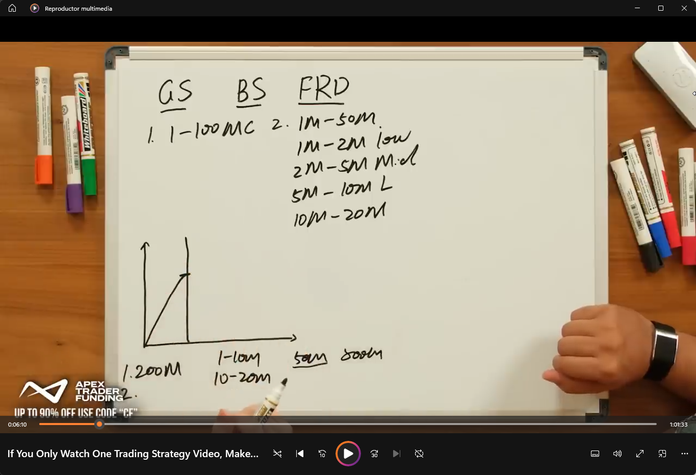
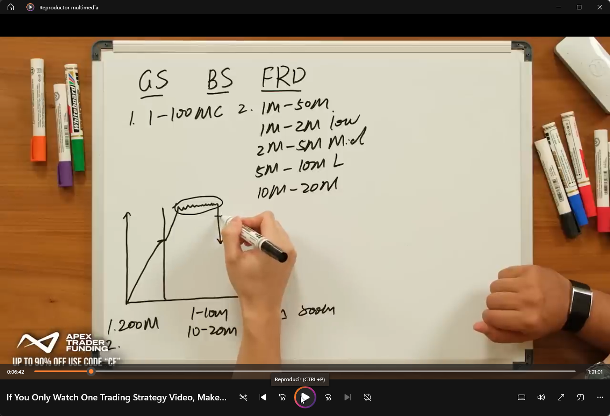
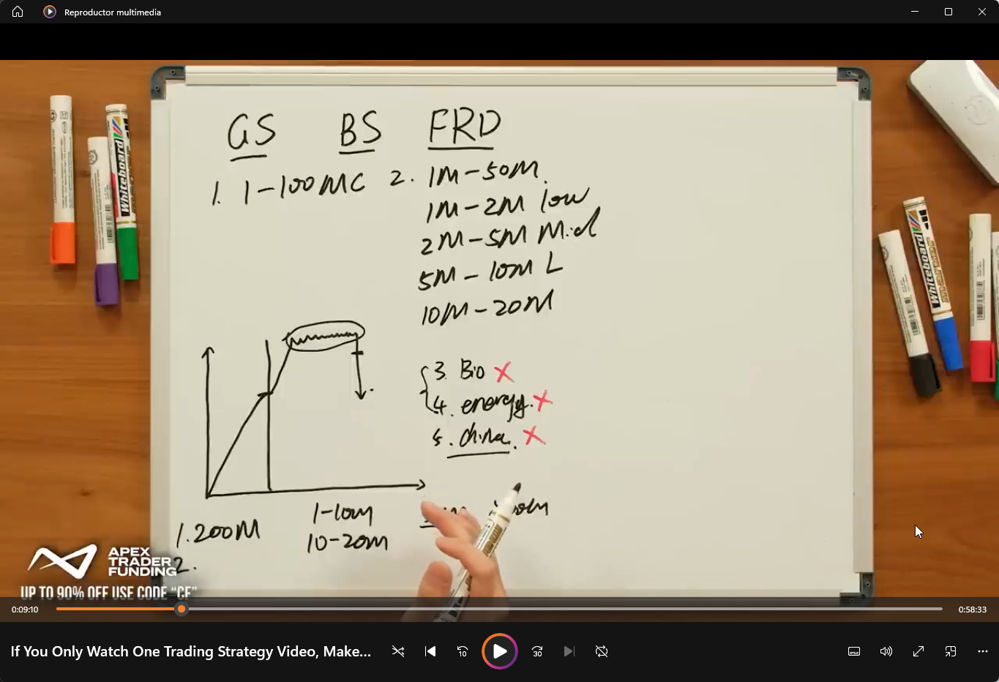
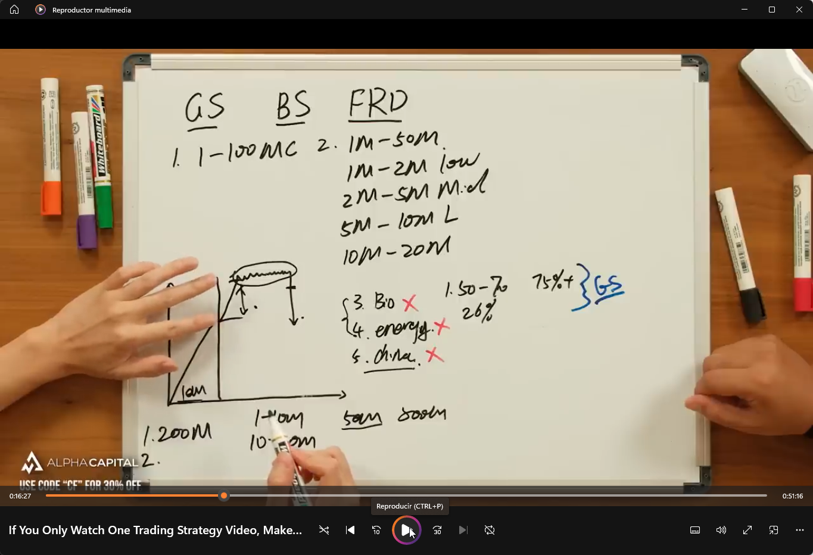
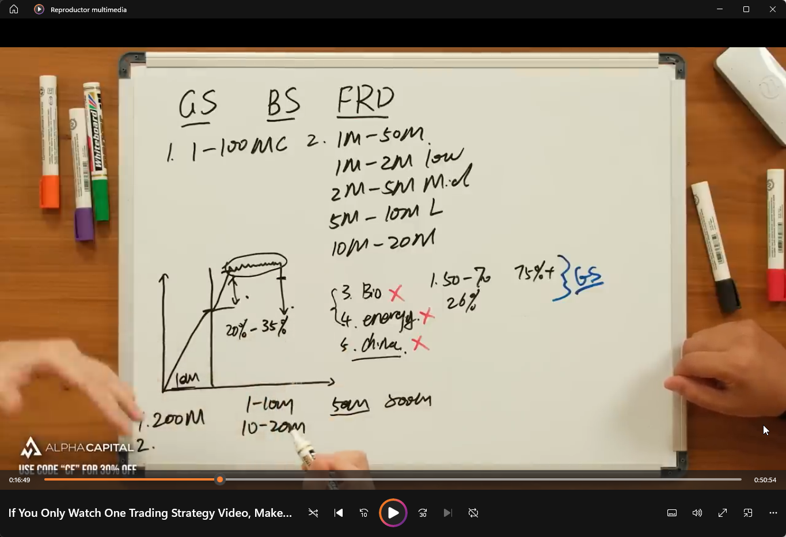
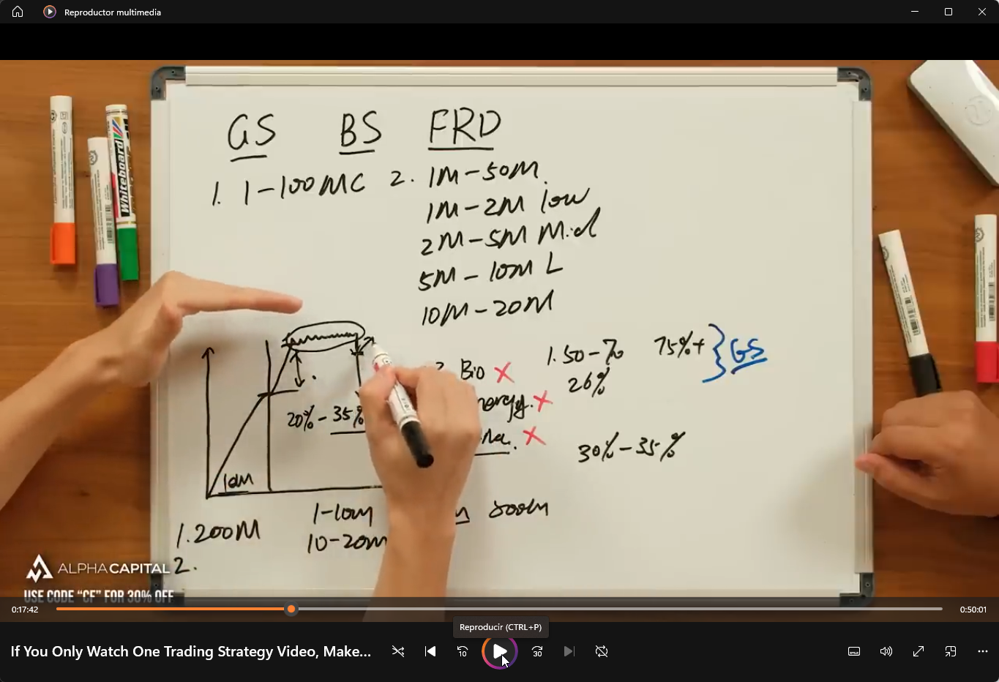
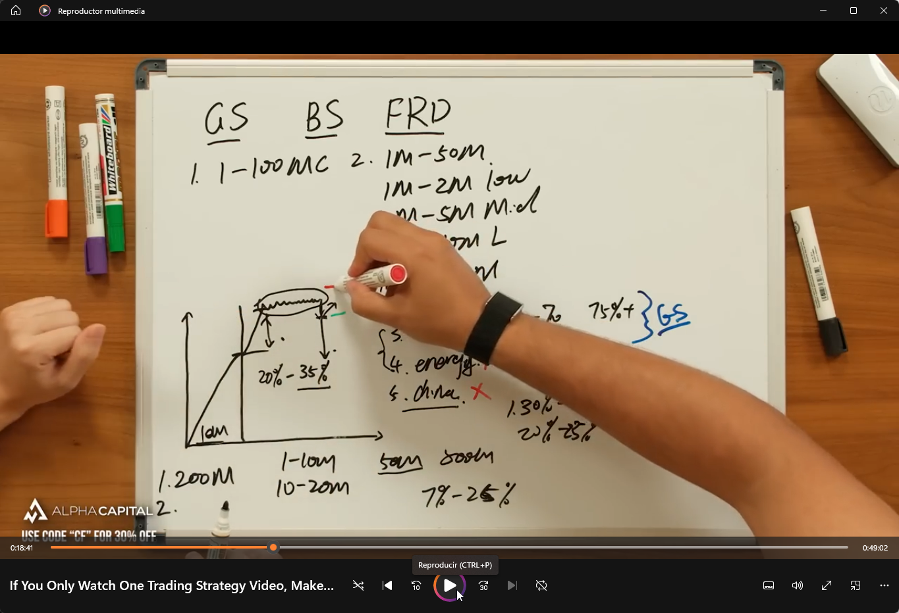
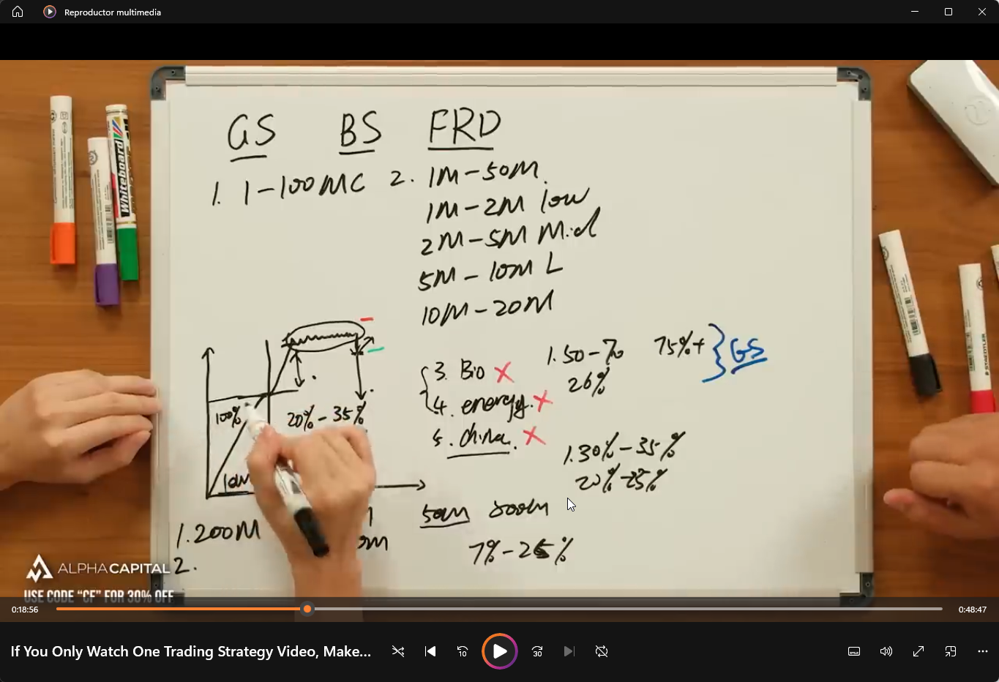
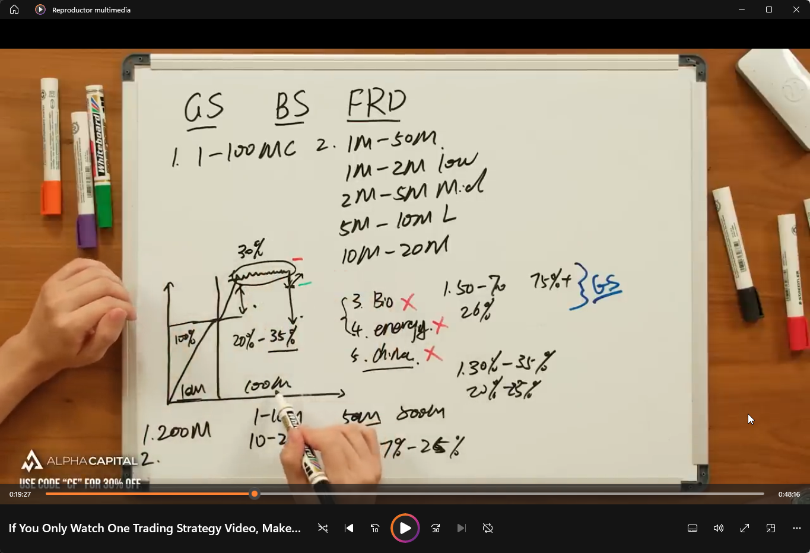

# Gap Up Short Strategy - Steven Dux Source Definition v0.2

Fecha: 2026-06-28
Estado: source_strategy_definition / notebook-ready draft.
Fuente primaria: Steven Dux, `If You Only Watch One Trading Strategy Video, Make It This`.
Transcript fuente: `E:\TSIS_YOUTUBE\00_TRADERS\00_Steven_Dux\TRANSCRIPTS\If You Only Watch One Trading Strategy Video, Make It This\transcript.en.md`
Imagenes fuente: `img/`
Material de ampliacion Duxinator:

```text
E:\00_TRADING\04_Steven_Dux\Duxinator\Steven Dux - Duxinator - High Odds Penny Trading  [Hacksnation.com]\3 - Patterns And Factors  [Hacksnation.com]\transcripts
E:\00_TRADING\04_Steven_Dux\Duxinator\Steven Dux - Duxinator - High Odds Penny Trading  [Hacksnation.com]\4 - Advance Concepts  [Hacksnation.com]\transcripts
```

## 1. Proposito

Este documento rehace la definicion de `Gap Up Short` desde el texto fuente del
video y desde las imagenes nuevas de pizarra.

El objetivo no es validar edge.
El objetivo no es autorizar una operativa.
El objetivo no es crear una regla institucional final.

El objetivo es dejar una definicion suficientemente precisa para que el
siguiente paso pueda construir un notebook que:

```text
1. busque candidatos historicos por anyo y ticker;
2. mida los componentes de la estrategia;
3. pinte esos componentes en el chart;
4. clasifique casos buenos, malos y ambiguos;
5. permita descomponer la estrategia en eventos observables.
```

### 1.1. Como debe leerse este documento

Este documento esta escrito para dos lectores a la vez:

```text
1. humano que quiere entender que esta buscando;
2. agente/codigo que despues debe convertirlo en scanner, notebook y charts.
```

Por eso cada etiqueta importante debe tener cuatro piezas:

```text
nombre_etiqueta
  Que significa en castellano claro.
  Por que importa dentro de Gap Up Short.
  Como puede medirse con datos.
  Que debe pintar o mostrar el notebook.
```

Regla:

```text
Si una etiqueta no se puede explicar a un lector nuevo, no esta lista para
entrar en el notebook.
```

Lectura central:

```text
Gap Up Short no es shortear cualquier gap.

Es una estrategia short condicionada por:

gap extremo
+ small cap
+ float compatible
+ volumen premarket suficiente pero no excesivamente crowded
+ push emocional despues del open
+ consolidacion posterior
+ primera debilidad / breakdown
+ volumen matutino alineado con la proyeccion
```

## 2. Screener operativo inicial

Este es el screener humano inicial que debe aproximar TradeStation o cualquier
scanner operativo antes de que el notebook haga el analisis fino.

### 2.1. Filtros duros recomendados

```text
asset_type = equities
market_cap <= 100M
float <= 50M
last_price >= 3.00
gap_pct_from_prior_close >= 70%
preferred_gap_pct_from_prior_close >= 100%
premarket_volume >= 1M
premarket_volume <= 50M as clean range
```

Notas:

- `market_cap <= 100M` es el rango ideal descrito por Dux.
- `market_cap > 200M` debe etiquetarse como `not_dux_gap_up_short`.
- `float > 50M` queda fuera de la logica fuente en la mayoria de casos.
- `last_price >= 3.00` aparece como criterio general fuente para estas
  estrategias short.
- `gap_pct >= 70%` puede capturar candidatos amplios.
- `gap_pct >= 100%` es la condicion fuerte que Dux remarca para el modelo.

### 2.2. Filtros de exclusion fuente

Dux indica que ciertas categorias deterioran la estadistica o aumentan riesgo
de squeeze/halting.

```text
avoid_sector_biotech = true
avoid_sector_energy = true
avoid_china_related = true
```

Interpretacion:

- Biotech: Dux dice que su win rate historico baja mucho respecto al modelo.
- Energy: tambien lo marca como sector a evitar.
- China-related / thin halted names: riesgo de halt, squeeze extremo y salida
  dificil.

El notebook no debe borrar estos casos sin guardarlos.
Debe poder etiquetarlos como:

```text
excluded_biotech
excluded_energy
excluded_china_or_halt_risk
```

para poder estudiar despues si la exclusion se sostiene en TSIS.

### 2.3. Filtros de alerta, no filtros de borrado

```text
premarket_volume > 50M
estimated_day_volume > 250M-500M
premarket_float_rotation very high
```

Estos casos no son automaticamente buenos.
Tampoco deben desaparecer sin revision.

Lectura fuente:

```text
premarket_volume muy alto
-> day volume esperado muy alto
-> crowding
-> algos y participantes atrapados
-> short temprano mas dificil
-> posible oportunidad solo despues de consolidacion o cuando el volumen se seca
```

El notebook debe etiquetarlos como:

```text
crowded_gap_up_short_risk
```

Definicion clara:

```text
crowded_gap_up_short_risk
  El ticker ya ha negociado tanto volumen antes o durante la manana que la
  estrategia deja de ser un short limpio de gap extremo y pasa a ser una
  situacion muy poblada por traders, algos, shorts atrapados y compradores
  tardios.

  No significa "no tocar nunca".
  Significa "no tratar como candidato limpio sin esperar estructura posterior".
```

## 3. Imagenes fuente y lectura tecnica

Todas las imagenes de esta seccion pertenecen al mismo video fuente.

### 3.1. 00:06:10 - crowding por volumen y market cap



Lectura:

- La pizarra muestra las familias `GS`, `BS`, `FRD`.
- `GS` corresponde a `Gap Short / Gap Up Short`.
- El contexto es volumen premarket alto contra market cap bajo.
- Dux explica que si el premarket ya negocia mucho volumen, el volumen total
  del dia puede multiplicarse por 5-10.
- Si eso ocurre sobre market cap muy bajo, el trade puede volverse crowded y
  dificil para un short limpio.

Para el notebook:

```text
premarket_volume
estimated_day_volume_low = premarket_volume * 5
estimated_day_volume_high = premarket_volume * 10
market_cap
crowding_flag
```

### 3.2. 00:06:42 - volumen concentrado y posible short mas tarde



Lectura:

- Dux explica que gran parte del volumen se concentra entre 09:30 y 11:30.
- Si hay consolidacion masiva, puede existir oportunidad posterior cuando el
  volumen muere.
- La idea mecanica es que muchos participantes quedan atrapados arriba; cuando
  aparece el crack, puede producirse reaccion en cadena.

Para el notebook:

```text
volume_0930_1130
volume_to_1100
volume_to_1130
post_1130_volume_decay
consolidation_after_push
breakdown_after_consolidation
```

### 3.3. 00:09:10 - sectores y riesgo de excepciones



Lectura:

- Dux marca filtros de exclusion por sectores/tipo de ticker.
- Biotech, energy y China-related aparecen como categorias que deterioran la
  estadistica o aumentan riesgo.
- No deben tratarse igual que un candidato limpio aunque cumplan gap, market
  cap y volumen.

Para el notebook:

```text
sector
country_or_region_flag
halt_risk_proxy
exclude_reason
```

### 3.4. 00:16:27 - despues del open: medir push promedio



Lectura:

- Aqui empieza la parte intradia del modelo.
- Despues del open, el ticker caliente atrae compradores/chasers.
- Dux quiere medir el `pushing percentage`.
- El push no es todavia la entrada short.
- El push es la extension emocional que prepara la zona de agotamiento.

Para el notebook:

```text
regular_open_price
morning_push_high
morning_push_high_ts
open_push_pct
push_window_start = 09:30
push_window_end candidate <= 11:30
```

### 3.5. 00:16:49 - push ideal 20%-35%



Lectura:

- Dux situa el push medio observado entre 20% y 35%.
- Dice que, en general, cuanto mayor es el porcentaje, mejor la estadistica.
- Este rango no debe ser un filtro final rigido; primero debe medirse como
  variable.

Para el notebook:

```text
open_push_pct_bucket:
  below_20
  20_to_25
  25_to_30
  30_to_35
  above_35
```

### 3.6. 00:17:42 - float bucket, consolidacion y primera debilidad



Lectura:

- Dux separa el comportamiento por float.
- Float 1M-2M puede empujar mas: 30%-35%.
- Despues de ese push, el precio tiende a consolidar.
- Tras una hora de consolidacion, alrededor de 10:00-11:00, aparece la primera
  debilidad o breakdown.
- En su logica, ahi empieza a entrar y despues aumenta size con confirmacion.

Para el notebook:

```text
float_bucket
expected_push_pct_by_float_bucket
consolidation_start_ts
consolidation_end_ts
consolidation_high
consolidation_low
first_weakness_ts
first_breakdown_ts
```

### 3.7. 00:18:41 - entrada full size y stop sobre consolidacion



Lectura:

- Para float 5M-10M, Dux menciona push medio 20%-25%.
- Espera hasta cerca de 11:00.
- Puede iniciar posicion parcial y aumentar cuando cambia momentum.
- La invalidacion operativa fuente es el high de la consolidacion.
- El riesgo medio citado por Dux ronda 7%.
- Fade medio citado: aproximadamente 26%.
- Riesgo/reward citado: alrededor de 1:4 a 1:3.5.

Para el notebook:

```text
partial_entry_zone
full_entry_zone
stop_reference = consolidation_high
risk_pct_to_consolidation_high
fade_from_high_pct
reward_to_risk_estimate
```

### 3.8. 00:18:56 - gap por encima de 100%



Lectura:

- Dux remarca que el gap debe estar por encima de 100% para el modelo limpio.
- Para exploracion, TSIS puede capturar desde 70%, pero debe separar:

```text
70_to_100_gap_candidate
above_100_gap_source_qualified
```

Para el notebook:

```text
gap_pct_from_prior_close
gap_bucket
gap_source_qualified = gap_pct_from_prior_close >= 100
```

### 3.9. 00:19:27 - todos los criterios deben alinearse



Lectura:

- Dux resume que no basta con gap.
- Deben alinearse gap, spike/open push, volumen, consolidacion, primer
  breakdown y volumen relativo a la proyeccion.
- Ejemplo fuente: si el premarket hizo 10M, estima hasta 100M en el dia; antes
  de 11:00 espera alrededor de 30% del volumen estimado.

Para el notebook:

```text
criteria_alignment_score
volume_to_1100_vs_estimated_day_volume_pct
first_breakdown_after_consolidation
valid_gap_up_short_setup
```

### 3.10. Material Duxinator que amplia esta estrategia

El video principal define la forma central de `Gap Up Short`.
Los transcripts de Duxinator no sustituyen esa definicion.
La amplian con mediciones necesarias para que el notebook no sea ingenuo.

Fuentes directas:

```text
3 - Patterns And Factors / transcripts / 3 - Bounce Short plus Gap Up Short.md
3 - Patterns And Factors / transcripts / 4 - Gap Up Buying.md
4 - Advance Concepts / transcripts / 1 - Volume Prediction Intraday.md
4 - Advance Concepts / transcripts / 2 - Scenarios of Intraday Volume Prediction.md
4 - Advance Concepts / transcripts / 3 - Volume Prediction Pre-Market.md
4 - Advance Concepts / transcripts / 4 - The Gain _ Loss of Liquidity.md
4 - Advance Concepts / transcripts / 5 - Volume Range and Liquidity Collaboration.md
4 - Advance Concepts / transcripts / 6 - Identifying Neutralized Area.md
4 - Advance Concepts / transcripts / 7 - Layers of Short Seller Trap.md
4 - Advance Concepts / transcripts / 8 - Characteristics of Crowded Tickers.md
4 - Advance Concepts / transcripts / 9 - The Danger of Float Rotation.md
```

Que aporta cada bloque:

| Fuente | Aporta a Gap Up Short | Uso en el notebook |
|---|---|---|
| `Bounce Short plus Gap Up Short` | Ratio entre volumen actual estimado y volumen historico de resistencia. | Medir si la resistencia tiene probabilidad de aguantar. |
| `Gap Up Buying` | Riesgo long-side cuando el gap tiene bajo float y volumen PM controlado. | Etiquetar casos donde short temprano puede ser peligroso. |
| `Volume Prediction Intraday` | Formulas PM volume * 10 y first-hour volume * 4. | Estimar volumen del dia sin mirar el futuro completo. |
| `Volume Prediction Pre-Market` | Buckets de volumen PM y danger zones. | Separar candidato limpio de ticker crowded. |
| `Gain / Loss of Liquidity` | La liquidez se gana en uptrend/consolidacion y se pierde en breakdown. | Medir si el ticker sigue ganando energia o empieza a perderla. |
| `Volume Range and Liquidity Collaboration` | Volumen muy alto expande el rango de riesgo. | Evitar tratar un ticker crowded como short normal. |
| `Identifying Neutralized Area` | Zonas donde el precio puede frenarse por equilibrio previo. | Medir downside room real antes de asumir fade. |
| `Layers of Short Seller Trap` | Shorts tempranos pueden quedar atrapados si el precio consolida alto. | Marcar `short_seller_trap_risk`. |
| `Characteristics of Crowded Tickers` | Tickers crowded son menos predecibles. | Marcar `crowded_state`. |
| `Danger of Float Rotation` | Mucha rotacion de float invalida supuestos simples. | Marcar `float_rotation_danger`. |

## 4. Definicion operativa fuente

`Gap Up Short` describe una respuesta short ante un ticker small cap que:

```text
1. aparece con gap extremo;
2. cumple filtros de market cap, float, precio y sector;
3. negocia suficiente volumen en premarket;
4. no esta excesivamente crowded antes del open;
5. empuja despues del open por chasing/momentum;
6. consolida despues del push;
7. muestra primera debilidad o breakdown;
8. ofrece riesgo contra el high de consolidacion;
9. tiene volumen matutino alineado con la proyeccion.
```

La estrategia no busca adivinar el top exacto.
Busca esperar que el exceso inicial cree una zona de consolidacion y que el
primer breakdown confirme que el momentum esta cambiando.

## 5. Filtros fuente

### 5.1. Market cap

```text
ideal: 1M <= market_cap <= 100M
avoid / not clean: market_cap > 200M
```

Campos:

```text
market_cap
market_cap_bucket
market_cap_source
market_cap_quality_flag
```

### 5.2. Price

```text
last_price >= 3.00
```

Dux menciona este criterio como filtro general para estas estrategias. TSIS
debe medirlo y dejarlo configurable.

Campos:

```text
last_price_at_scan
regular_open_price
price_bucket
```

### 5.3. Float

```text
1M-2M   = very_low_float
2M-5M   = low_mid_float
5M-10M  = larger_small_float
10M-20M = less_frequent_but_possible
>50M    = not_clean_for_source_model
```

Lectura:

- cuanto menor el float, mayor puede ser el push;
- cuanto menor el float, mayor el riesgo de squeeze;
- floats muy bajos no deben tratarse igual que 5M-10M.

### 5.4. Gap

```text
exploration_min_gap_pct = 70
source_clean_gap_pct = 100
```

El notebook debe permitir ambos:

- buscar amplio desde 70%;
- marcar como `source_gap_qualified` los casos >=100%.

### 5.5. Premarket volume

Rangos fuente interpretados:

```text
1M-10M   = tradable low range
10M-20M  = tradable mid range
20M-40M  = tradable high range
>50M     = crowded warning
```

El umbral >50M no significa que nunca exista short.
Significa que el short temprano puede ser dificil y que puede ser mejor esperar
consolidacion o volumen seco posterior.

### 5.6. Sector / category filters

```text
avoid biotech
avoid energy
avoid China-related / thin halt-risk names
```

Estos filtros deben quedar configurables porque TSIS despues puede validar si
la fuente se reproduce en nuestra data.

### 5.7. Volume Prediction Engine

Este bloque viene de `Advance Concepts`.

Dux no mira solo el volumen ya negociado.
Intenta estimar cuanto volumen podria negociar el ticker durante todo el dia.

Definicion simple:

```text
Volume Prediction Engine =
  modulo que estima el volumen probable del dia usando volumen premarket y
  volumen de primera hora.
```

Formulas fuente:

```text
estimated_day_volume_from_pm = premarket_volume * 10
estimated_day_volume_from_first_hour = first_hour_volume * 4
```

Lectura:

```text
premarket_volume * 10
  Si un ticker hace 2M en premarket, Dux estima que podria hacer alrededor de
  20M durante el dia.

first_hour_volume * 4
  Si entre 09:30 y 10:30 hace 8M, Dux estima que podria hacer alrededor de
  32M durante el dia.
```

Por que importa:

```text
Gap Up Short no depende solo del gap.
Depende de si el volumen esperado permite que el ticker falle, consolide y se
desinfle, o si el ticker esta tan crowded que puede seguir exprimiendo shorts.
```

Variables:

```text
estimated_day_volume_from_pm
estimated_day_volume_from_first_hour
estimated_day_volume_final
estimated_day_volume_method
estimated_day_volume_quality_flag
```

El notebook debe mostrar:

```text
PM volume
PM volume * 10 estimate
First-hour volume * 4 estimate, si ya existe primera hora
estimated_day_volume_final
crowded warning si el volumen estimado es extremo
```

### 5.8. Premarket volume buckets

Estos buckets traducen el volumen premarket a contexto operativo.

```text
<1M
  Poco volumen. Puede no haber suficiente crowding ni liquidez. Puede servir
  para watchlist, pero no es el modelo fuerte del video principal.

1M-1.5M
  Rango inicial aceptable. Hay atencion, pero no necesariamente peligro de
  crowding extremo.

1.5M-2M
  Rango donde Dux advierte que puede aparecer morning spike. Para shortear,
  conviene esperar push/consolidacion/debilidad, no anticipar demasiado pronto.

2M-4M
  Rango activo. Hay atencion fuerte y el ticker puede estar muy en juego.

>4M
  Danger zone en material Duxinator. Puede comportarse raro por crowding,
  squeeze, rotacion de float y participantes atrapados.

>50M
  Crowded warning fuerte en el documento fuente del video principal.
```

Variable:

```text
premarket_volume_bucket
```

El notebook no debe ocultar buckets peligrosos.
Debe conservarlos y etiquetarlos.

### 5.9. Resistance / Liquidity Engine

Este bloque viene de `Bounce Short plus Gap Up Short` y `Advance Concepts`.

Definicion simple:

```text
Resistance / Liquidity Engine =
  modulo que compara el volumen actual estimado contra volumen historico o
  zonas donde antes hubo mucho intercambio.
```

La idea fuente:

```text
Si el ticker llega a una zona historica donde antes hubo mucho volumen, pero
el volumen actual estimado es menor que el volumen atrapado/resistente, la
resistencia puede tener mas peso.

Si el volumen actual estimado iguala o supera el volumen de resistencia, esa
resistencia puede romperse y el short se vuelve mas peligroso.
```

Ratio central:

```text
volume_vs_resistance_ratio =
  estimated_day_volume_final / historical_resistance_volume
```

Lectura didactica:

```text
ratio 0.10
  El volumen actual estimado es 10% del volumen historico de resistencia.
  Fuente lo considera situacion estadisticamente mas favorable.

ratio 1.00
  El volumen actual estimado es similar al volumen historico de resistencia.
  A partir de aqui la resistencia puede no aguantar.

ratio > 1.00
  El volumen actual estimado supera la resistencia historica. El short necesita
  mas confirmacion o debe tratarse como peligroso.
```

Variables:

```text
historical_resistance_price
historical_resistance_volume
historical_resistance_window
resistance_type
volume_vs_resistance_ratio
resistance_ratio_bucket
```

Tipos de resistencia:

```text
line_resistance
  Nivel visual/horizontal donde el precio ha fallado antes.

consistent_resistance
  Zona probada varias veces. Mas importante que un solo high aislado.

individual_resistance
  High aislado o vela puntual. Menos robusta.
```

El notebook debe pintar:

```text
resistance line/zone
historical resistance volume
current estimated volume
volume_vs_resistance_ratio
```

### 5.10. Neutralized area

Definicion simple:

```text
Neutralized area =
  zona donde comprador y vendedor ya se equilibraron antes, creando soporte,
  resistencia o un area de mucho intercambio.
```

Por que importa:

```text
Si se shortea demasiado cerca de una neutralized area, puede haber poco espacio
real para el fade. La estrategia puede tener mal reward/risk aunque el gap sea
correcto.
```

Variables:

```text
neutralized_area_price
neutralized_area_low
neutralized_area_high
distance_to_neutralized_area_pct
downside_room_to_neutralized_area_pct
neutralized_area_quality
```

El notebook debe pintar:

```text
neutralized area como caja o banda
distancia desde breakdown hasta esa zona
warning si el downside room es demasiado pequeno
```

### 5.11. Crowding / Trap Risk Engine

Definicion simple:

```text
Crowding / Trap Risk Engine =
  modulo que detecta si demasiados participantes estan en el mismo lado o si
  hay condiciones para que los shorts queden atrapados.
```

Conceptos:

```text
crowded_ticker
  Ticker con volumen, atencion y rotacion tan altos que deja de comportarse
  como candidato limpio. Puede moverse de forma violenta y menos predecible.

short_seller_trap
  Situacion donde muchos shorts entran temprano, el precio consolida o gana
  liquidez, y despues rompe al alza obligando a cubrir.

gap_up_buying_risk
  Riesgo long-side descrito por Dux: algunos gaps, especialmente con bajo float
  y volumen premarket controlado, pueden empujar fuerte antes de fallar.

float_rotation_danger
  Riesgo de que el ticker negocie muchas veces su float. Cuando esto ocurre,
  los modelos simples de volumen/resistencia pueden dejar de funcionar.
```

Variables:

```text
crowded_state
short_seller_trap_risk
gap_up_buying_risk
float_rotation_count
float_rotation_danger
microfloat_breakout_risk
```

Regla:

```text
Gap Up Short limpio no debe ignorar estas alertas.
Un candidato puede cumplir gap y market cap, pero seguir siendo peligroso si
el crowding, la rotacion de float o el trap risk son demasiado altos.
```

### 5.12. Clean candidate v0.2

Un candidato limpio no es "ticker que sube mucho".

Un candidato limpio debe acercarse a esta forma:

```text
small cap compatible
+ gap extremo
+ PM volume suficiente
+ PM volume no absurdamente crowded
+ volumen estimado interpretable
+ resistencia/liquidez no invalida el short
+ open push medible
+ consolidacion posterior
+ primera debilidad o breakdown
+ riesgo claro contra consolidation high
```

Si falta una pieza, el candidato no se borra.
Se marca como:

```text
review_candidate
crowded_warning
trap_risk
invalid_structure
```

## 6. Secuencia temporal de la estrategia

### 6.1. Pre-open preparation

Objetivo:

```text
identificar si el ticker pertenece al universo de Gap Up Short antes del open.
```

Medidas:

```text
prior_close
premarket_high
premarket_last
premarket_volume
premarket_dollar_volume
gap_pct_from_prior_close
premarket_float_rotation
market_cap
float
sector
```

Resultado:

```text
preopen_gap_up_short_watchlist_candidate
```

### 6.2. Open push

Objetivo:

```text
medir el empuje emocional despues de abrir.
```

Medidas:

```text
regular_open_price
morning_push_high
open_push_pct = (morning_push_high / regular_open_price - 1) * 100
push_duration_minutes
volume_during_push
```

Interpretacion fuente:

```text
1M-2M float   -> push esperado 30%-35%
5M-10M float  -> push esperado 20%-25%
```

No se usa como filtro duro inicial.
Se usa como etiqueta estadistica.

### 6.3. Consolidation after push

Objetivo:

```text
detectar que el push deja una zona defendida / lateral despues del exceso.
```

Medidas:

```text
consolidation_start_ts
consolidation_end_ts
consolidation_minutes
consolidation_high
consolidation_low
consolidation_range_pct
consolidation_volume
```

Lectura:

- Si no hay consolidacion, la estrategia fuente pierde estructura.
- El high de la consolidacion es la referencia natural de stop/invalidation.

### 6.4. First weakness / breakdown

Objetivo:

```text
detectar el primer cambio de momentum despues de la consolidacion.
```

Senales candidatas:

```text
break below consolidation_low
failed reclaim of consolidation
red candle expansion after consolidation
VWAP loss after push
lower high after push
volume expansion on breakdown
```

Medidas:

```text
first_weakness_ts
first_breakdown_ts
breakdown_price
breakdown_pct_from_consolidation_high
breakdown_volume
time_from_open_to_breakdown
time_from_push_high_to_breakdown
```

### 6.5. Fade window

Objetivo:

```text
medir si el breakdown genera fade real.
```

Medidas:

```text
fade_low_ts
fade_low_price
fade_from_intraday_high_pct
fade_from_consolidation_high_pct
post_breakdown_vwap_state
```

Dux menciona fade medio alrededor de 26% como referencia fuente.
TSIS debe medir la distribucion, no asumirla.

## 7. Decision operativa fuente

Esta seccion pertenece a Strategy Library, no a Event Library.

### 7.1. Entrada parcial

Fuente:

```text
despues de consolidacion, cerca de 10:00-11:00, si aparece primera debilidad.
```

Interpretacion TSIS:

```text
partial_entry_candidate = first_weakness_after_consolidation
```

### 7.2. Entrada full size

Fuente:

```text
cuando momentum cambia y aparece breakdown mas claro.
```

Interpretacion TSIS:

```text
full_entry_candidate = breakdown_confirmed_after_consolidation
```

### 7.3. Stop / invalidacion

Fuente:

```text
stop loss above consolidation high
```

Campo:

```text
stop_reference_price = consolidation_high
```

### 7.4. Riesgo y reward fuente

Valores mencionados por Dux:

```text
average_risk_pct ~= 7%
average_fade_pct ~= 26%
source_reward_to_risk ~= 1:4 to 1:3.5
```

TSIS debe medir:

```text
risk_pct_to_consolidation_high
max_fade_after_breakdown_pct
realized_reward_to_risk_proxy
```

No debe asumir que esos valores se cumplen.

## 8. Estados de clasificacion para el notebook

```text
watchlist_candidate
source_gap_qualified
sector_excluded
crowded_warning
volume_prediction_ready
resistance_volume_checked
neutralized_area_checked
gap_up_buying_risk
short_seller_trap_risk
float_rotation_danger
open_push_measured
post_push_consolidation_detected
first_weakness_detected
breakdown_confirmed
clean_gap_up_short_candidate
low_float_squeeze_risk
invalid_no_consolidation
invalid_no_breakdown
invalid_gap_too_small
invalid_market_cap_too_large
```

Tabla:

| Estado | Significado |
|---|---|
| `watchlist_candidate` | Cumple scanner base antes del analisis intradia. |
| `source_gap_qualified` | Gap >= 100%, alineado con fuente. |
| `sector_excluded` | Biotech, energy o China-related segun filtro fuente. |
| `crowded_warning` | Premarket volume o float rotation demasiado alto. |
| `volume_prediction_ready` | El notebook pudo estimar volumen del dia desde premarket y/o primera hora. |
| `resistance_volume_checked` | Se comparo volumen actual estimado contra volumen de resistencia historica. |
| `neutralized_area_checked` | Se localizo una zona de soporte/resistencia previa para medir espacio real de fade. |
| `gap_up_buying_risk` | El patron tambien tiene condiciones de long squeeze/open push; no debe shortearse temprano sin estructura. |
| `short_seller_trap_risk` | La accion puede estar atrapando shorts tempranos antes de romper al alza. |
| `float_rotation_danger` | El volumen rota demasiado el float y puede invalidar supuestos simples de resistencia. |
| `open_push_measured` | Se midio el push despues del open. |
| `post_push_consolidation_detected` | El push dejo zona lateral/defendible. |
| `first_weakness_detected` | Aparece debilidad tras consolidacion. |
| `breakdown_confirmed` | El precio rompe o pierde la estructura de consolidacion. |
| `clean_gap_up_short_candidate` | Gap, filtros, push, consolidacion y breakdown alineados. |
| `low_float_squeeze_risk` | Float muy bajo o volumen demasiado crowded. |
| `invalid_no_consolidation` | Hay gap/push pero no hay base para la estrategia fuente. |
| `invalid_no_breakdown` | Consolida pero no confirma debilidad. |
| `invalid_gap_too_small` | Gap por debajo del umbral fuente/exploratorio. |
| `invalid_market_cap_too_large` | Market cap fuera de rango fuente. |

## 9. Variables minimas del candidate table

```text
candidate_id
strategy_id
strategy_source
ticker
exchange
company_name
session_date

market_cap
market_cap_bucket
float
float_bucket
sector
country_or_region_flag

prior_close
premarket_last
premarket_high
regular_open_price
last_price_at_scan

gap_pct_from_prior_close
gap_bucket
source_gap_qualified

premarket_volume
premarket_dollar_volume
premarket_float_rotation
estimated_day_volume_low
estimated_day_volume_mid
estimated_day_volume_high
estimated_day_volume_from_pm
estimated_day_volume_from_first_hour
estimated_day_volume_final
estimated_day_volume_method
estimated_day_volume_quality_flag
premarket_volume_bucket

volume_0930_1030
volume_0930_1100
volume_0930_1130
volume_to_1100_vs_estimated_day_volume_pct
post_1130_volume_decay_pct

historical_resistance_price
historical_resistance_volume
historical_resistance_window
resistance_type
volume_vs_resistance_ratio
resistance_ratio_bucket

neutralized_area_low
neutralized_area_high
neutralized_area_price
distance_to_neutralized_area_pct
downside_room_to_neutralized_area_pct
neutralized_area_quality

morning_push_high
morning_push_high_ts
open_push_pct
push_duration_minutes
push_volume

consolidation_start_ts
consolidation_end_ts
consolidation_minutes
consolidation_high
consolidation_low
consolidation_range_pct
consolidation_volume

first_weakness_ts
first_breakdown_ts
breakdown_price
breakdown_volume
breakdown_pct_from_consolidation_high

stop_reference_price
risk_pct_to_consolidation_high
fade_low_price
fade_low_ts
fade_from_intraday_high_pct

crowded_state
gap_up_buying_risk
short_seller_trap_risk
float_rotation_count
float_rotation_danger
microfloat_breakout_risk

strategy_state
avoid_reason
review_bucket
notes
```

## 10. Eventos observables derivados

Estos eventos no se promueven aqui.
Strategy Library solo identifica piezas observables para que Event Library las
defina despues.

```text
Small_Cap_Short_Context
Extreme_Gap_Up_Context
Premarket_Volume_Crowding_Context
Premarket_Volume_Bucket_Context
Volume_Prediction_Context
Resistance_Volume_Ratio_Context
Neutralized_Area_Context
Gap_Up_Buying_Risk_Context
Short_Seller_Trap_Risk_Context
Float_Rotation_Danger_Context
Float_Adjusted_Open_Push_Event
Morning_Chasing_Pressure_Event
Post_Push_Consolidation_Event
First_Weakness_After_Consolidation_Event
Consolidation_Breakdown_Event
Morning_Volume_Concentration_Context
Post_Morning_Volume_Decay_Context
Crowd_Unwind_Fade_Event
```

Lectura:

- `Extreme_Gap_Up_Context` dice que el ticker repricio de forma extrema.
- `Premarket_Volume_Bucket_Context` clasifica si el volumen PM es bajo,
  activo, peligroso o crowded.
- `Volume_Prediction_Context` estima el volumen probable del dia para saber si
  la situacion sigue siendo interpretable.
- `Resistance_Volume_Ratio_Context` compara volumen actual esperado contra
  volumen historico de resistencia.
- `Neutralized_Area_Context` mide si hay espacio real hasta una zona donde el
  precio podria frenarse.
- `Gap_Up_Buying_Risk_Context` avisa si el ticker tambien encaja con una
  situacion long de open push/squeeze.
- `Short_Seller_Trap_Risk_Context` avisa si los shorts tempranos pueden quedar
  atrapados.
- `Float_Rotation_Danger_Context` avisa si el volumen rota demasiado el float.
- `Float_Adjusted_Open_Push_Event` mide el push relativo al float.
- `Post_Push_Consolidation_Event` localiza la zona que define riesgo.
- `First_Weakness_After_Consolidation_Event` detecta el primer cambio de
  momentum.
- `Consolidation_Breakdown_Event` es el gatillo operativo fuente.
- `Crowd_Unwind_Fade_Event` mide si el crowding se resuelve a la baja.

### 10.1. Glosario minimo para notebook y lector nuevo

| Concepto | Explicacion clara | Medicion candidata |
|---|---|---|
| `gap_pct_from_prior_close` | Cuanto ha subido el ticker frente al cierre anterior antes/durante la apertura. | `(reference_price / prior_close - 1) * 100`. |
| `premarket_volume` | Acciones negociadas antes de la apertura regular. Mide atencion temprana. | Suma de volumen 04:00-09:29 NY. |
| `premarket_volume_bucket` | Categoria del volumen premarket: bajo, activo, peligroso o crowded. | Bucket segun rangos de 5.8. |
| `estimated_day_volume_final` | Estimacion del volumen total del dia. No es dato real futuro; es una prediccion usando informacion disponible. | PM volume * 10 y/o first-hour volume * 4. |
| `premarket_float_rotation` | Cuantas veces el volumen PM ha negociado el float. | `premarket_volume / float`. |
| `float_rotation_count` | Cuantas veces el volumen acumulado ha rotado el float durante el dia. | `cum_volume / float`. |
| `volume_vs_resistance_ratio` | Compara el volumen actual estimado contra volumen historico de una zona de resistencia. | `estimated_day_volume_final / historical_resistance_volume`. |
| `neutralized_area` | Zona historica donde ya hubo equilibrio entre compradores y vendedores. Puede frenar el fade. | Caja de precios con volumen/estructura previa. |
| `downside_room_to_neutralized_area_pct` | Espacio teorico desde breakdown hasta la neutralized area. | Distancia porcentual entre breakdown y zona objetivo/soporte. |
| `morning_push_high` | Maximo del empuje emocional despues de la apertura regular. | High maximo durante ventana de push. |
| `open_push_pct` | Cuanto sube desde apertura regular hasta el maximo del push. | `(morning_push_high / regular_open_price - 1) * 100`. |
| `consolidation_box` | Zona lateral despues del push donde el precio deja de subir verticalmente. | Rango high/low durante una ventana estable. |
| `first_weakness_ts` | Primer momento donde el momentum alcista empieza a fallar. | Perdida de low, vela roja expansiva, VWAP loss o lower high. |
| `breakdown_confirmed` | Confirmacion de que la estructura de consolidacion se rompe a la baja. | Ruptura de consolidation low o fallo de reclaim. |
| `stop_reference_price` | Nivel de invalidacion fuente para la estrategia. | Normalmente consolidation high. |
| `crowded_state` | Estado que indica si la situacion esta demasiado poblada por volumen/participantes. | PM volume, estimated volume, float rotation, volume range. |
| `gap_up_buying_risk` | Riesgo de que el ticker sea mejor long-side push antes de fallar. | Bajo float, PM volume controlado, PM breakout/consolidacion. |
| `short_seller_trap_risk` | Riesgo de squeeze porque muchos shorts entraron temprano y el precio no fallo. | Consolidacion alta, reclaim, nuevos highs, volumen fuerte. |

## 11. Reglas para el notebook futuro

El notebook debe tener una celda lanzadera y un visor de casos similar a las
estrategias ya trabajadas, pero adaptado a esta logica short.

### 11.1. Filtros configurables

```text
min_gap_pct
source_gap_pct
min_price
max_market_cap
max_float
min_premarket_volume
crowded_premarket_volume
min_resistance_volume
max_volume_vs_resistance_ratio
max_estimated_day_volume
max_float_rotation_count
min_downside_room_to_neutralized_area_pct
avoid_biotech
avoid_energy
avoid_china_related
year
ticker_subset
```

### 11.2. Charts requeridos

Como minimo:

```text
1. chart interactivo multi-dia;
2. chart estatico premarket + regular open hasta 11:30;
3. chart estatico del dia completo hasta 16:00;
4. volumen 1m abajo;
5. VWAP calculado u original configurable;
6. EMA8/Wilder8 con franja de momentum;
7. prior close;
8. premarket high;
9. regular open;
10. morning push high;
11. consolidation box;
12. first weakness marker;
13. breakdown marker;
14. stop reference sobre consolidation high.
15. resistance / liquidity zone si existe;
16. neutralized area si existe;
17. volume prediction panel;
18. crowding / trap risk flags.
```

### 11.3. Etiquetas visibles en chart

```text
gap_pct
premarket_volume
estimated_day_volume
estimated_day_volume_method
premarket_volume_bucket
volume_vs_resistance_ratio
neutralized_area
float_bucket
float_rotation_count
open_push_pct
consolidation_minutes
risk_pct_to_stop
fade_from_high_pct
crowded_state
gap_up_buying_risk
short_seller_trap_risk
strategy_state
avoid_reason
```

### 11.4. Exportacion

Cada candidato exportado debe guardar juntos:

```text
chart_interactive_snapshot_if_available
chart_premarket_open_detail_png
chart_event_day_1600_png
metadata.json
candidate_row.csv
launcher_command.txt
```

## 12. Casos que el codigo debe conservar, no ocultar

El primer notebook no debe borrar casos por ser feos.

Debe clasificarlos:

```text
clean
regular
bad
crowded
sector_excluded
low_float_danger
no_consolidation
no_breakdown
squeeze_after_open
```

Motivo:

```text
Primero buscamos y vemos.
Despues optimizamos filtros.
```

## 13. Diferencia con Bounce Short y First Red Day

```text
Gap Up Short
  gap extremo actual
  open push
  consolidacion
  breakdown intradia

Bounce Short
  rebote posterior hacia zona de bagholders/resistencia historica
  menos volumen actual contra volumen atrapado previo

First Red Day
  varios dias verdes/parabolicos
  primer dia rojo o primer fallo diario
```

No deben mezclarse en el notebook.

Si un candidato cumple mas de una familia, se etiqueta como overlap:

```text
overlap_gap_up_short_bounce_short
overlap_gap_up_short_first_red_day
```

pero la deteccion primaria debe seguir siendo de `Gap Up Short`.

## 14. Reglas de calidad

Un candidato no debe declararse `clean_gap_up_short_candidate` si:

```text
gap_pct < source_gap_pct
market_cap > 200M
float > 50M
no hay open push medible
no hay consolidacion posterior
no hay primera debilidad / breakdown
sector_excluded = true
premarket_volume crowded sin confirmacion posterior
```

Puede quedar como:

```text
review_candidate
crowded_warning
invalid_candidate
```

## 15. Regla final

La busqueda correcta no es:

```text
gap grande -> short
```

La busqueda correcta es:

```text
small cap extremo
-> gap muy grande
-> volumen premarket interpretable
-> push emocional despues del open
-> consolidacion
-> primera debilidad
-> breakdown medible
-> riesgo definido contra consolidacion
```

Si el notebook no mide esos elementos, no esta buscando la estrategia que Dux
describe en este tramo del video.
