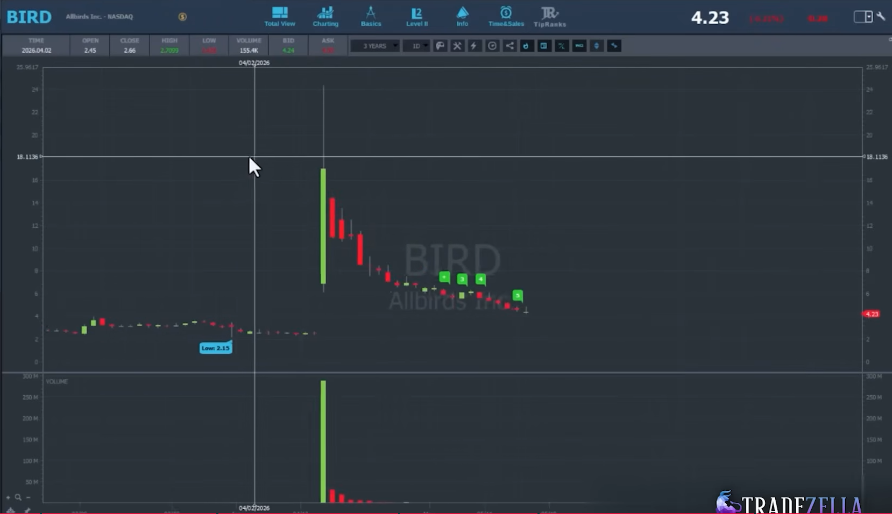
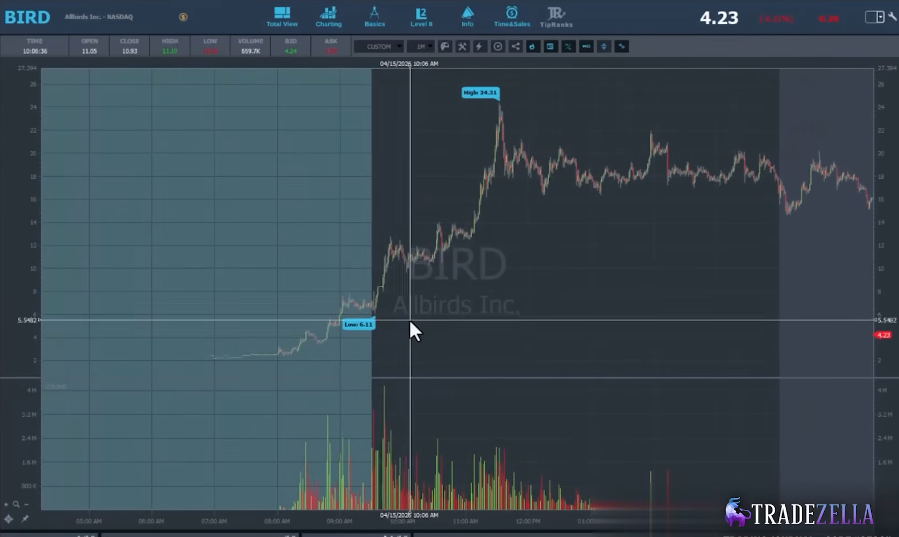
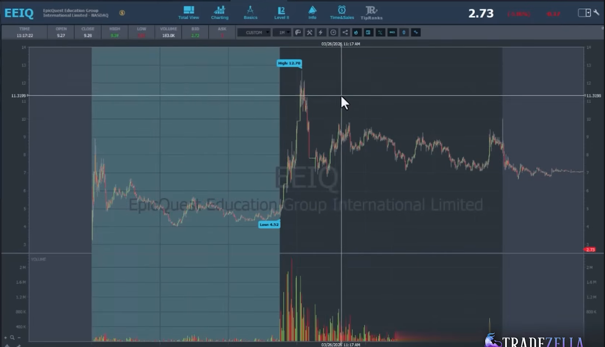

# Gap Up Short Strategy - Steven Dux Public Source Draft v0.1

Fecha: 2026-06-27
Estado: source_note / strategy draft.
Fuente primaria: Steven Dux - `If You Only Watch One Trading Strategy Video, Make It This`.

## 1. Proposito

Este documento separa `Gap Up Short` como estrategia fuente propia, distinta de
`Bounce Short` y distinta de la combinacion Duxinator `Bounce Plus Gap Up
Short`.

No valida edge.
No crea parametros institucionales.
No autoriza operativa.

Su funcion es convertir la explicacion publica de Dux en una definicion tecnica
que TSIS pueda transformar despues en:

```text
candidate_table
-> chart review
-> statistics ledger
-> event decomposition
-> validated or rejected strategy research
```

## 2. Lectura central

`Gap Up Short` es una estrategia short sobre tickers que hacen un gap grande en
premarket u open, normalmente por encima de 70%-100%, y que despues pueden
fallar cuando el exceso de atencion, chasing y volumen emocional se agota.

La idea no es:

```text
todo gap grande se shortea
```

La idea fuente es:

```text
gap extremo
+ market cap bajo
+ float compatible
+ volumen no excesivamente crowded
+ push inicial medible
+ consolidacion
+ primer breakdown / momentum shift
= candidato Gap Up Short
```

## 3. Imagenes fuente

Las imagenes siguientes pertenecen al mismo video fuente usado para este
documento.

### 3.1. BIRD - crowded gap up short avoidance





Lectura TSIS:

- BIRD ilustra por que no todo `Gap Up Short` es limpio.
- El ticker esta demasiado crowded.
- La fuente menciona premarket volume muy alto.
- Si antes de abrir ya ha rotado demasiado volumen contra un float pequeno, el
  short temprano puede quedar expuesto a squeeze.
- La oportunidad short puede desplazarse a otro momento, como el dia siguiente
  o despues de que el volumen se seque.

No debe etiquetarse como `clean_gap_up_short`.

Debe etiquetarse como:

```text
crowded_gap_up_short_avoidance
```

### 3.2. EEIQ - low float gap up short variant




Lectura TSIS:

- EEIQ representa una variante de float muy bajo.
- La fuente advierte que cuanto menor es el float, mas peligroso es anticipar el
  short.
- En floats extremadamente bajos, Dux prefiere esperar una senal clara de cambio
  de momentum o un retroceso grande desde el top.
- La estrategia no debe modelar estos casos igual que un float de 5M-10M.

Debe etiquetarse como:

```text
low_float_gap_up_short_variant
```

## 4. Condiciones fuente iniciales

### 4.1. Market cap

Lectura fuente:

```text
ideal: market_cap < 100M
avoid: market_cap > 200M
```

TSIS debe guardar ambos campos:

```text
market_cap
market_cap_bucket
market_cap_source_quality
```

### 4.2. Float

La fuente usa buckets aproximados:

```text
1M-2M   -> very low float
2M-5M   -> mid/low float
5M-10M  -> larger small float
>50M    -> normalmente no tradable para este modelo
```

Regla conceptual:

```text
cuanto menor el float, mas peligroso anticipar el short.
```

### 4.3. Gap

La fuente insiste en gap extremo.

Campo minimo:

```text
gap_pct_from_prior_close
```

Etiqueta inicial:

```text
gap_pct_from_prior_close >= 100%
```

Este umbral es fuente, no parametro institucional final.

### 4.4. Premarket volume

La fuente diferencia entre volumen suficiente y volumen demasiado crowded.

Ejemplo fuente:

```text
premarket_volume > 50M -> peligro crowded
```

Interpretacion TSIS:

- el volumen alto demuestra atencion;
- demasiado volumen antes de open puede crear squeeze risk;
- el volumen debe juzgarse contra float, market cap y volumen esperado del dia.

### 4.5. Volume projection

Dux usa proyeccion aproximada:

```text
estimated_day_volume = premarket_volume * 5..10
```

TSIS no debe fijar esa relacion como verdad.

Debe guardarla como feature:

```text
estimated_day_volume_low = premarket_volume * 5
estimated_day_volume_high = premarket_volume * 10
```

### 4.6. Morning volume concentration

La fuente remarca que gran parte del volumen intradia se concentra entre:

```text
09:30-11:30 New York
```

y que antes de 11:00 puede haberse negociado aproximadamente 30%-35% del
volumen diario esperado.

Campos candidatos:

```text
volume_to_1030
volume_to_1100
volume_to_1130
volume_to_1100_vs_estimated_day_volume_pct
```

## 5. Secuencia visual ideal

La secuencia conceptual del modelo es:

```text
1. gap extremo antes de open;
2. open push / morning push;
3. extension media segun float bucket;
4. consolidacion despues del push;
5. primer breakdown o momentum shift;
6. fade desde intraday high.
```

Dux describe rangos medios de push como hipotesis fuente:

```text
float 1M-2M  -> open push promedio 30%-35%
float 5M-10M -> open push promedio 20%-25%
```

No son thresholds institucionales.

Son etiquetas para medir si el candidato se comporta como la distribucion
descrita por la fuente.

## 6. Estados candidatos

```text
gap_up_short_candidate
clean_gap_up_short_candidate
crowded_gap_up_short_avoidance
low_float_gap_up_short_variant
open_push_extension
post_push_consolidation
first_breakdown_confirmed
afternoon_volume_dry_short_context
invalid_gap_up_short
```

| Estado | Significado |
|---|---|
| `gap_up_short_candidate` | Gap extremo con filtros base cumplidos, aun sin validar estructura intradia. |
| `clean_gap_up_short_candidate` | Gap, float, market cap, volumen y estructura visual alineados con fuente. |
| `crowded_gap_up_short_avoidance` | Volumen/float rotation demasiado altos; riesgo de squeeze o baja calidad. |
| `low_float_gap_up_short_variant` | Float muy bajo; requiere senal mas clara antes de clasificar como short candidate. |
| `open_push_extension` | Push inicial medible tras open o durante primera ventana regular. |
| `post_push_consolidation` | El push deja una zona de consolidacion observable. |
| `first_breakdown_confirmed` | La consolidacion rompe a la baja o muestra momentum shift. |
| `afternoon_volume_dry_short_context` | El volumen se seca despues de la ventana emocional inicial. |
| `invalid_gap_up_short` | Falta gap extremo, filtros base, estructura o hay crowding excesivo. |

## 7. Formulas candidatas

### 7.1. Gap

```text
gap_pct_from_prior_close =
  (premarket_or_open_reference_price / prior_close - 1) * 100
```

### 7.2. Premarket float rotation

```text
premarket_float_rotation =
  premarket_volume / float
```

### 7.3. Estimated day volume

```text
estimated_day_volume_low =
  premarket_volume * 5

estimated_day_volume_high =
  premarket_volume * 10
```

### 7.4. Open push

```text
open_push_pct =
  (open_push_high / regular_open_price - 1) * 100
```

Alternative para gaps que ya empujaron en premarket:

```text
open_push_pct_from_premarket_base =
  (morning_high / premarket_base_price - 1) * 100
```

### 7.5. Fade from high

```text
fade_from_intraday_high_pct =
  (intraday_high - post_breakdown_low) / intraday_high * 100
```

### 7.6. Volume concentration

```text
volume_to_1100_vs_estimated_day_volume_pct =
  volume_to_1100 / estimated_day_volume_mid * 100
```

## 8. Campos minimos para candidate_table

```text
candidate_id
strategy_source
ticker
exchange
company_name
session_date
market_cap
market_cap_bucket
float
float_bucket
prior_close
regular_open_price
premarket_high
premarket_volume
premarket_dollar_volume
premarket_float_rotation
gap_pct_from_prior_close
estimated_day_volume_low
estimated_day_volume_high
volume_to_1030
volume_to_1100
volume_to_1130
volume_to_1100_vs_estimated_day_volume_pct
open_push_high
open_push_ts
open_push_pct
post_push_consolidation_start_ts
post_push_consolidation_end_ts
consolidation_high
consolidation_low
first_breakdown_ts
first_breakdown_price
fade_from_intraday_high_pct
strategy_state
avoid_reason
visual_label
review_bucket
```

## 9. Chart requirements

El notebook futuro debe producir, como minimo:

1. chart interactivo de tres dias alrededor del candidato;
2. chart estatico del dia del evento hasta 16:00 NY;
3. chart estatico de premarket/open donde se vea gap, push y consolidacion;
4. volumen 1m debajo del precio;
5. VWAP seleccionable entre fuente original y calculado;
6. EMA8/Wilder8 con franja de momentum;
7. marcas de:
   - prior close;
   - premarket high;
   - regular open;
   - open push high;
   - consolidation box;
   - first breakdown.

El chart debe permitir clasificar visualmente:

```text
clean candidate
crowded avoid
low float variant
failed / invalid
```

## 10. Descomposicion futura en eventos

Eventos candidatos derivados:

```text
Extreme_Gap_Context
Premarket_Crowding_Context
Low_Float_Rotation_Risk_Context
Open_Push_Extension_Event
Post_Push_Consolidation_Event
First_Breakdown_After_Gap_Event
Morning_Volume_Concentration_Context
Afternoon_Volume_Dry_Context
```

Estos eventos no se promueven aqui.

Strategy Library solo identifica piezas observables.

Event Library decidira despues sus definiciones v0.

## 11. Relacion con otros documentos

Este documento separa el modelo `Gap Up Short` puro del documento:

```text
01_Steven_Dux/SHORT/Bounce_Plus_Gap_Up_Short/STRATEGY.md
```

La diferencia:

```text
Gap Up Short = gap extremo + estructura intradia + filtros de crowding.
Bounce Short = rebote hacia resistencia historica.
Bounce Plus Gap = gap extremo que ademas ocurre hacia resistencia historica.
```

## 12. Imagenes deseadas del propio video

Ya existen capturas BIRD y EEIQ en `source_assets/steven_dux/`.

Capturas adicionales utiles del mismo video:

- tramo donde Dux muestra la tabla estadistica de `Gap Up Short`;
- tramo donde explica `premarket volume > 50M` como crowding risk;
- tramo donde separa float 1M-2M frente a 5M-10M;
- tramo donde explica consolidacion y primer breakdown;
- tramo donde resume que el modelo requiere que market cap, float, volumen y
  estructura coincidan.

## 13. Regla final

`Gap Up Short` no es "shortear el gap".

Es una hipotesis estadistica condicionada por:

```text
market cap
float
gap
premarket volume
float rotation
morning volume concentration
push percentage
consolidation
momentum shift
```

Si el notebook futuro no mide esas variables, no esta buscando esta estrategia.
