# DAS Archive Visual Casebook v0.1

Fecha: 2026-06-29
Estado: visual research draft
Fuente visual: `img/archive`

## 1. Proposito

Este documento reconstruye el analisis visual de algunas imagenes de las 648 del run :

`C:\TSIS_Data\00_CTO\13_TRADING_SYSTEMS\03_STRATEGY_LIBRARY\LONG\DAS\runs\das_scanner_appearance_20260628T114046Z`

El objetivo no es producir estadisticas todavia.

El objetivo es identificar patrones visuales DAS/frontside, separar casos buenos de falsos positivos visuales y dejar un vocabulario suficientemente claro para refactorizar despues el detector.

## 2. Nota de trazabilidad

Antes de este documento no habia un analisis persistido imagen por imagen de `Archive` dentro del repo.

Existian notas sobre `BUENOS CORREGIDOS`, `MALOS`, `pattern_n` y estados DAS, pero no una lectura recuperable de cada imagen concreta de `Archive`.

Este archivo corrige esa perdida de contexto.

## 3. Frontera

Este documento es lectura visual humana-agente.

No es:

- detector definitivo;
- backtest;
- outcome study;
- tabla institucional;
- recomendacion operativa;
- prueba de edge.

Si una imagen contiene una entrada marcada por el humano, la lectura intenta explicar por que esa zona puede tener sentido dentro de DAS. Si una imagen no tiene anotaciones, la lectura separa lo visible de la inferencia.

## 4. Vocabulario visual inicial

### 4.1. A_PLUS_FRONTSIDE_LADDER

Movimiento frontside limpio.

Rasgos:

- despierta desde una zona relativamente muerta;
- primer push con volumen visible;
- el primer dip no destruye la estructura;
- rompe o recupera el high relevante del primer push;
- EMA8/Wilder8 quedan en modo alcista y el precio respeta esa zona;
- aparecen nuevos highs sin crear lows destructivos;
- los dips posteriores son oportunidades de estudio DAS.

Lectura:

Este es el tipo de caso que debe alimentar la definicion buena de DAS.

### 4.2. VWAP_RECLAIM_REBREAK_DAS

El ticker no solo rompe el primer high, sino que recupera VWAP o lo usa como zona de aceptacion.

Rasgos:

- primer push;
- dip hacia VWAP o zona EMA/Wilder;
- recuperacion rapida;
- rebreak de high local o primer push high;
- continuidad mientras no se pierda la estructura.

Lectura:

Es una variante potente porque combina momentum con aceptacion de precio.

### 4.3. FLAG_BREAK_DAS

El primer push no se rompe con una sola vela, sino tras una bandera o compresion.

Rasgos:

- extension inicial;
- pausa lateral o ligeramente descendente;
- lows no destructivos;
- volumen no muere completamente;
- breakout de bandera;
- nuevo tramo frontside.

Lectura:

Esto debe quedar separado del rebreak de una sola vela porque la logica visual y la medicion son distintas.

### 4.4. DELAYED_IGNITION_AFTER_BASE

El ticker aparece tarde: antes estuvo plano, despues rompe una base y acelera.

Rasgos:

- poco interes durante parte del premarket;
- base larga;
- ruptura cerca de 09:00 o cerca de la apertura regular;
- volumen entra tarde;
- puede ser tradeable, pero no representa el DAS temprano clasico.

Lectura:

Debe estudiarse como variante distinta: no es necesariamente malo, pero no debe mezclarse con primer DAS temprano.

### 4.5. PATTERN_N_ONE_WICK_TRAP

Caso malo aunque el detector marque rebreak.

Rasgos:

- una vela o una mecha gigantesca marca casi todo el movimiento;
- el precio no construye estructura despues del push;
- la EMA/Wilder pasa rapido a modo bajista;
- el precio cae suavemente o se apaga;
- cualquier rebreak posterior es debil, tardio o poco interpretable.

Lectura:

Esto es falso positivo visual para DAS bueno. Puede haber scalp agresivo, pero no es la estructura que queremos modelar como DAS robusto.

### 4.6. DIRTY_FRONT_REVIEW

Caso mixto.

Rasgos:

- hay momentum real;
- hay algun punto de entrada defendible;
- pero tambien hay mechas grandes, wicks contradictorios, perdida temporal de estructura, o datos sospechosos;
- puede tener valor para entrenamiento visual, pero no debe pasar como A+.

Lectura:

Estos casos deben ir con `manual_review_required = true`.

### 4.7. BACKSIDE_AFTER_REBREAK

El rebreak existe, pero el movimiento ya pasa a backside.

Rasgos:

- rebreak tecnico;
- incapacidad de sostener nuevos highs;
- EMA/Wilder giran bajistas;
- precio pierde VWAP o estructura;
- volumen deja de acompañar.

Lectura:

Sirve para definir el final del frontside y evitar que el detector cuente cualquier rebreak como DAS bueno.

## 5. Reglas visuales que salen del Archive

1. `rebreak = true` no basta.
2. El primer push debe tener continuidad estructural, no solo porcentaje.
3. El primer dip debe ser no destructivo.
4. El high de la ultima vela roja relevante del primer push es un nivel importante.
5. El DAS bueno suele aparecer cuando se rompe ese nivel, o cuando el dip respeta VWAP/EMA/Wilder y vuelve a impulsar.
6. Una vela vertical gigante sin aceptacion posterior debe ir a `pattern_n_one_wick_trap`.
7. El volumen acumulado del scanner no basta: importa como entra el volumen durante el push, dip y rebreak.
8. Debe medirse el porcentaje del primer push desde apertura/base inicial y el maximo porcentaje del momentum completo.
9. La estrategia DAS pertenece al frontside. Cuando se rompen estructuras y la pendiente EMA/Wilder cambia a bajista, el evento debe dejar de contar como DAS bueno.

## 6. Lectura imagen por imagen

### 0001_SYRA_2024-02-08_push543.33_rebreak

Imagen:

```text
img/archive/0001_SYRA_2024-02-08_push543.33_rebreak_03_event_day_premarket_detail.png
```

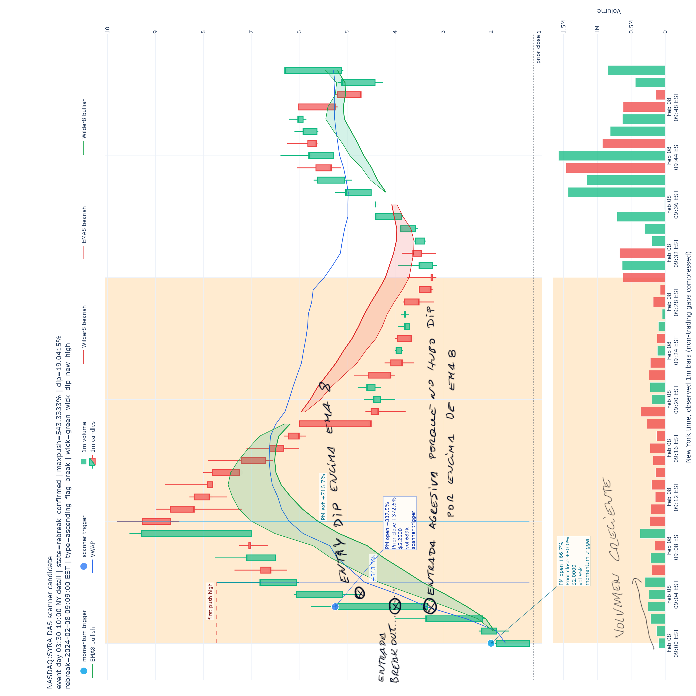

Clasificacion visual: `A_PLUS_EARLY_FRONT_THEN_NO_NEW_DAS`

Patron:

- primer despertar fuerte desde zona baja;
- entrada marcada en breakout;
- volumen creciente al comienzo;
- varias posibles entradas iniciales en la zona EMA/Wilder;
- despues del primer tramo aparece un dip profundo y el precio deja de ofrecer entradas limpias por encima de EMA8;
- la anotacion humana dice que despues no hay dip por encima de EMA8, por tanto no hay nueva entrada limpia.

Lectura DAS:

SYRA es excelente para estudiar el arranque del frontside y la primera oportunidad DAS, pero tambien muestra donde la secuencia deja de ser clara. El primer tramo es A+, pero el tramo posterior exige no seguir contando DAS solo porque el precio siga vivo.

Implicacion para detector:

- marcar `first_push_pct`;
- marcar `first_frontside_entry_zone`;
- marcar `no_clean_dip_after_exhaustion`;
- distinguir `frontside_valid_until` de `chart_still_moving`.

### 0002_SRXH_2025-12-16_push525.88_rebreak

Imagen:

```text
img/archive/0002_SRXH_2025-12-16_push525.88_rebreak_03_event_day_premarket_detail.png
```

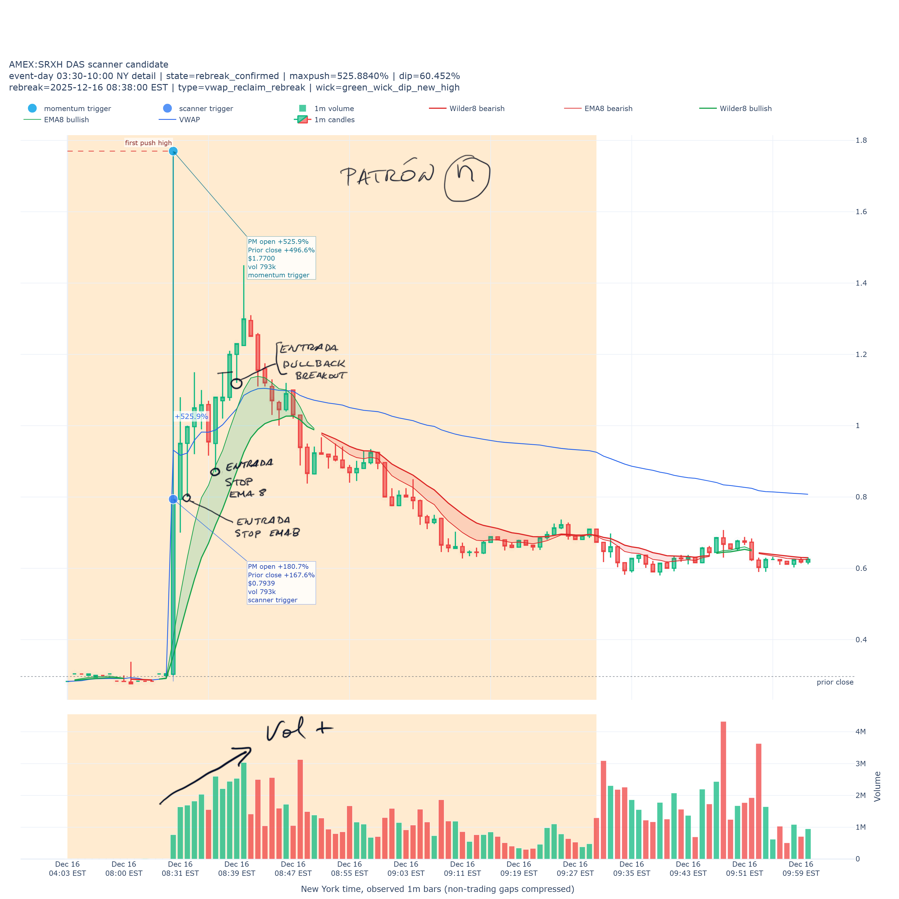

Clasificacion visual: `PATTERN_N_ONE_WICK_TRAP`

Patron:

- gran spike inicial;
- se marca `patron n`;
- aparece una entrada posible, pero el precio no sostiene estructura;
- el pullback/breakout falla pronto;
- EMA/Wilder pasan a bajista y el resto del grafico se convierte en decay.

Lectura DAS:

No es DAS robusto. Puede haber un scalp tecnico dentro de la primera reaccion, pero el evento dominante es una sola expansion vertical que no acepta precio.

Implicacion para detector:

- penalizar cuando el maximo del movimiento ocurre en la primera mecha o en los primeros minutos;
- exigir aceptacion posterior;
- exigir que el rebreak no se produzca dentro de un giro bajista ya confirmado.

### 0003_SONN_2025-07-14_push476.62_rebreak

Imagen:

```text
img/archive/0003_SONN_2025-07-14_push476.62_rebreak_03_event_day_premarket_detail.png
```

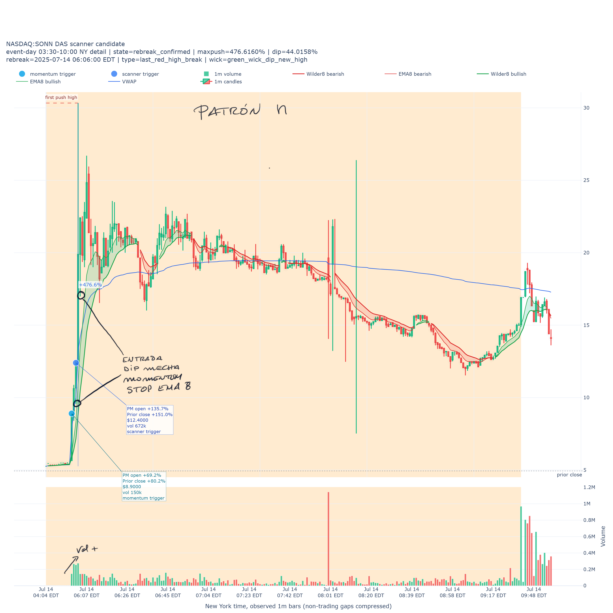

Clasificacion visual: `PATTERN_N_WITH_EARLY_SCALP`

Patron:

- spike vertical inicial;
- anotacion `patron n`;
- entrada marcada en dip de mecha momentum con stop EMA8;
- despues del primer tramo el precio se vuelve lateral y pierde calidad;
- no hay escalera frontside clara.

Lectura DAS:

Hay una posible oportunidad agresiva en el primer dip, pero el caso no debe entrenar el concepto de DAS bueno. El precio hace movimiento explosivo, pero no construye continuidad limpia.

Implicacion para detector:

- separar `wick_dip_scalp_candidate` de `das_frontside_sequence`;
- medir si despues del primer dip hay nuevos highs sostenidos;
- si no hay expansion estructural posterior, etiquetar como `pattern_n`.

### 0004_MSS_2025-09-29_push464.70_rebreak

Imagen:

```text
img/archive/0004_MSS_2025-09-29_push464.70_rebreak_03_event_day_premarket_detail.png
```

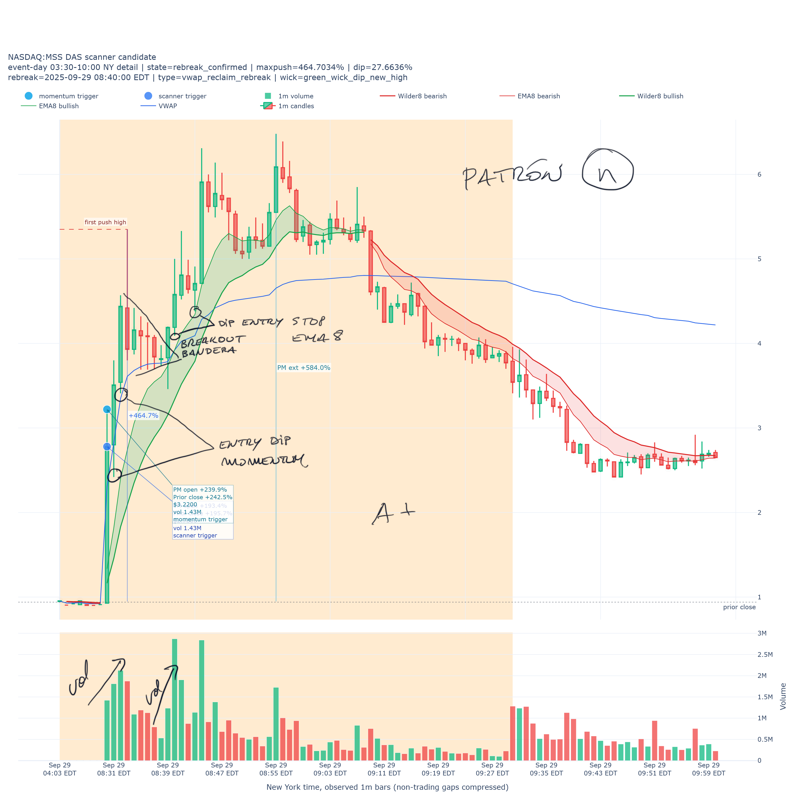

Clasificacion visual: `A_PLUS_FRONT_WITH_EARLY_DAS_THEN_BACKSIDE`

Patron:

- despertar fuerte;
- entrada en dip momentum;
- breakout de bandera marcado;
- stop conceptual en EMA8;
- volumen acompana al principio;
- despues de la expansion el precio pasa a descenso prolongado.

Lectura DAS:

Buen ejemplo de que el DAS puede ser correcto al inicio y aun asi el ticker terminar en backside. La estrategia debe modelar donde esta vivo el frontside, no si el dia entero acaba verde.

Implicacion para detector:

- marcar `frontside_start`;
- marcar `first_dip_entry_zone`;
- marcar `flag_break`;
- marcar `backside_transition` cuando EMA/Wilder giran y deja de hacer nuevos highs.

### 0005_MWYN_2025-09-10_push430.50_rebreak

Imagen:

```text
img/archive/0005_MWYN_2025-09-10_push430.50_rebreak_03_event_day_premarket_detail.png
```

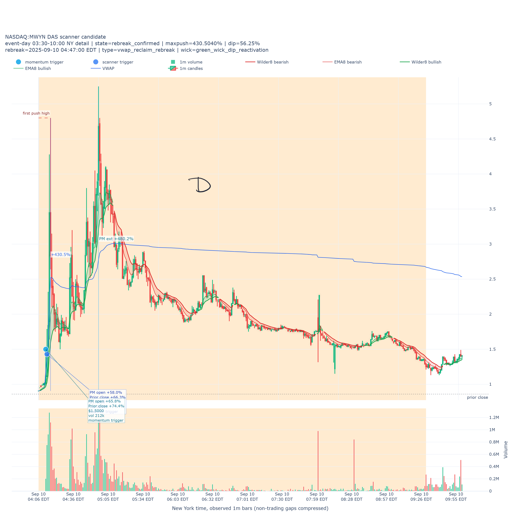

Clasificacion visual: `D_REBREAK_BUT_BACKSIDE_DOMINANT`

Patron:

- primer spike muy violento;
- rebreak posterior existe, pero aparece despues de una zona muy inestable;
- el grafico queda marcado como `D`;
- despues del maximo el precio entra en fade largo.

Lectura DAS:

No es buen DAS estructural. Hay movimiento, pero no hay aceptacion ordenada del primer push. El rebreak parece mas una ultima expansion que una continuidad sana.

Implicacion para detector:

- medir distancia entre primer high y rebreak;
- penalizar si el rebreak ocurre despues de una estructura muy rota;
- penalizar si el precio queda bajo EMA/Wilder poco despues.

### 0006_CAMP_2025-09-10_push304.37_rebreak

Imagen:

```text
img/archive/0006_CAMP_2025-09-10_push304.37_rebreak_03_event_day_premarket_detail.png
```

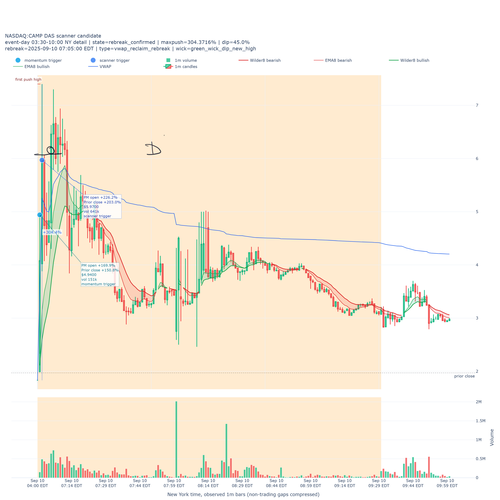

Clasificacion visual: `D_EARLY_SPIKE_DECAY`

Patron:

- explosion inicial;
- varios puntos de scanner cerca del primer tramo;
- el precio no sostiene highs;
- se transforma pronto en bajada/decay;
- anotacion `D`.

Lectura DAS:

El detector lo puede capturar por porcentaje, pero visualmente no es frontside de calidad. El primer push fue demasiado vertical y la estructura posterior no mantuvo presion alcista.

Implicacion para detector:

- exigir retencion tras el primer push;
- medir pendiente post-trigger;
- detectar `early_spike_decay`.

### 0007_INM_2024-08-20_push231.75_rebreak

Imagen:

```text
img/archive/0007_INM_2024-08-20_push231.75_rebreak_03_event_day_premarket_detail.png
```

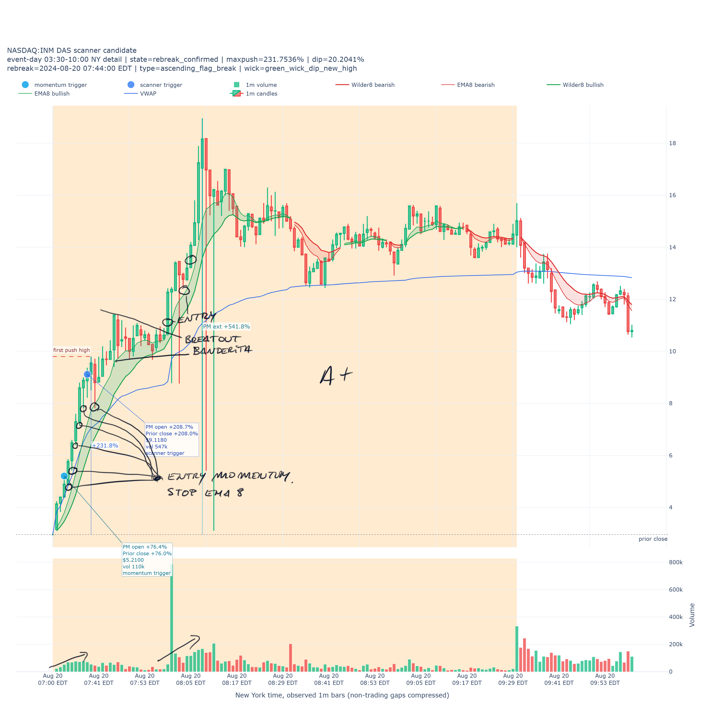

Clasificacion visual: `A_PLUS_FRONTSIDE_LADDER`

Patron:

- arranque progresivo;
- multiples entradas marcadas en la subida;
- breakout de bandera;
- volumen acompana;
- EMA/Wilder sostienen el movimiento;
- anotacion `A+`.

Lectura DAS:

Ejemplo muy bueno de frontside: el precio no solo explota, sino que va aceptando niveles cada vez mas altos.

Implicacion para detector:

- detectar secuencia de higher lows;
- detectar breakouts de micro-bandera;
- marcar `das_sequence_index` para cada dip posterior.

### 0008_HTOO_2025-07-22_push229.27_rebreak

Imagen:

```text
img/archive/0008_HTOO_2025-07-22_push229.27_rebreak_03_event_day_premarket_detail.png
```

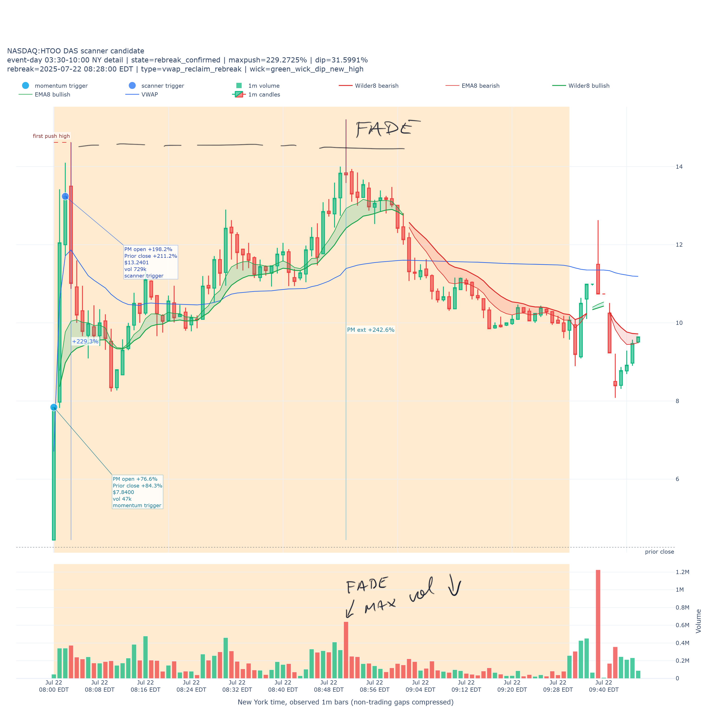

Clasificacion visual: `FADE_AFTER_HIGH_TEST`

Patron:

- primer spike fuerte;
- recuperacion posterior hacia zona alta;
- anotacion `FADE`;
- volumen maximo aparece cerca de la zona de fallo;
- despues el precio pierde estructura.

Lectura DAS:

No es A+. Puede tener una fase intermedia de subida, pero el evento dominante para DAS es fallo/fade tras testear zona alta.

Implicacion para detector:

- detectar `high_test_without_acceptance`;
- si el volumen maximo coincide con fallo, marcar `fade_risk`;
- no contar nuevos dips como DAS despues de perder EMA/Wilder.

### 0009_DALN_2025-07-10_push213.21_rebreak

Imagen:

```text
img/archive/0009_DALN_2025-07-10_push213.21_rebreak_03_event_day_premarket_detail.png
```

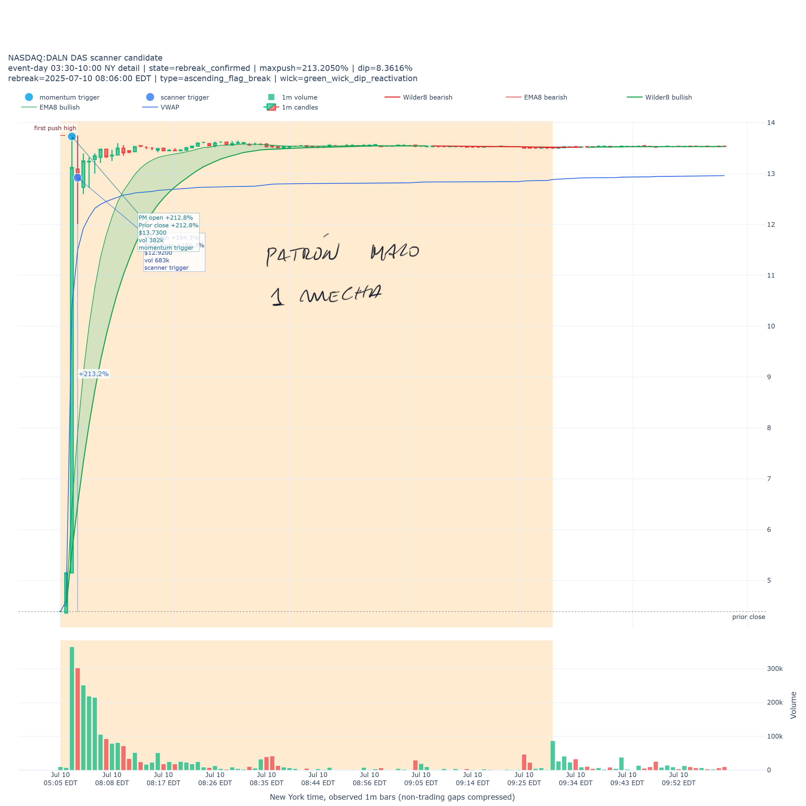

Clasificacion visual: `PATTERN_N_ONE_WICK_TRAP`

Patron:

- anotacion `patron malo 1 mecha`;
- practicamente todo el movimiento se concentra en una vela vertical;
- despues queda plano;
- no hay estructura de dips ni aceptacion dinamica.

Lectura DAS:

Debe excluirse de DAS bueno. Rebreak aqui no significa continuidad real.

Implicacion para detector:

- si `first_push_body_or_wick_share` explica casi todo el max push, marcar `one_wick_trap`;
- exigir multiples velas de aceptacion.

### 0010_CJMB_2026-01-15_push209.48_rebreak

Imagen:

```text
img/archive/0010_CJMB_2026-01-15_push209.48_rebreak_03_event_day_premarket_detail.png
```

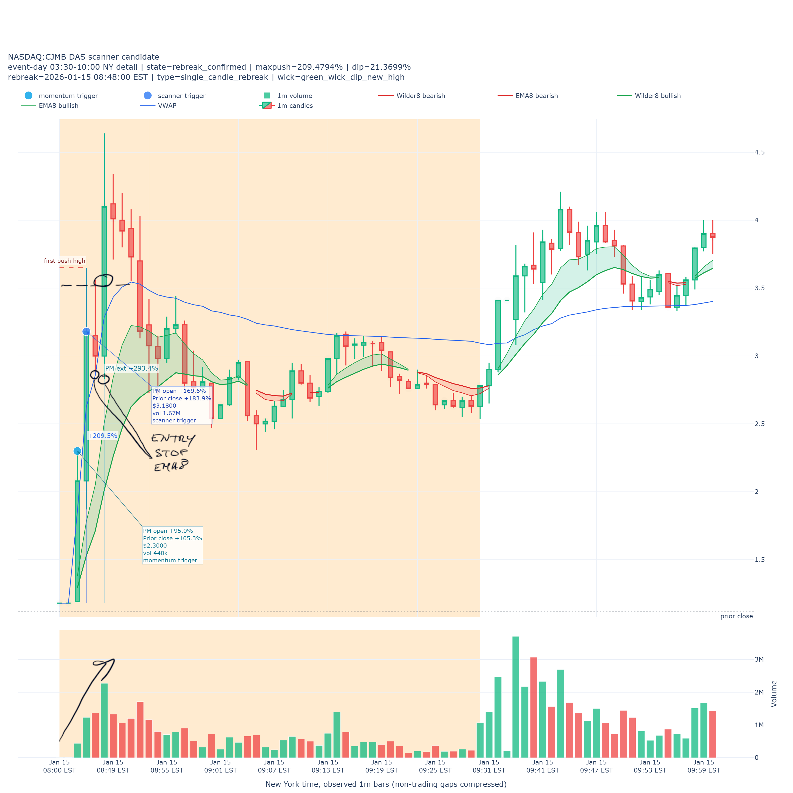

Clasificacion visual: `MIXED_EARLY_REBREAK_THEN_LATE_CONTINUATION`

Patron:

- entrada inicial marcada con stop EMA8;
- primer tramo es violento y luego entra en chop;
- aparece continuidad mucho mas tarde con volumen fuerte;
- no es un A+ lineal, pero tiene dos fases diferenciadas.

Lectura DAS:

Caso mixto. El primer DAS puede ser defendible, pero la continuacion real ocurre tras una nueva acumulacion y expansion posterior.

Implicacion para detector:

- separar `early_das_candidate` y `late_reactivation_candidate`;
- no mezclar ambas fases como un solo evento.

### 0011_KAVL_2024-06-14_push207.35_rebreak

Imagen:

```text
img/archive/0011_KAVL_2024-06-14_push207.35_rebreak_03_event_day_premarket_detail.png
```

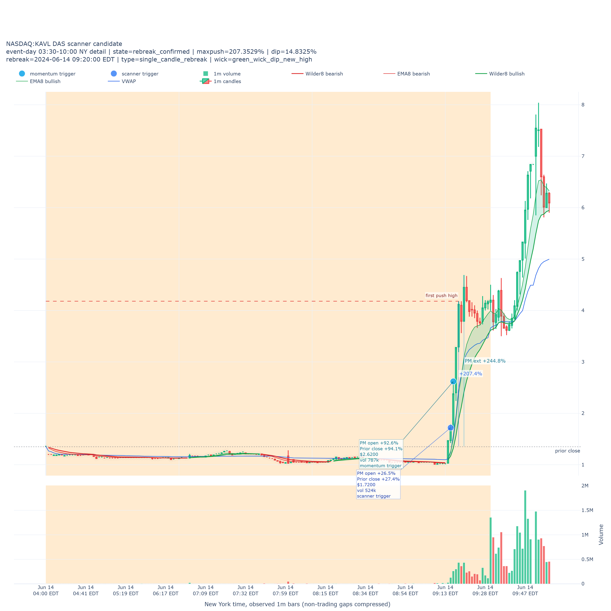

Clasificacion visual: `DELAYED_IGNITION_AFTER_BASE`

Patron:

- casi todo el premarket inicial esta muerto;
- la accion despierta tarde;
- el push fuerte se produce cerca de la apertura regular;
- volumen entra tarde y el precio continua.

Lectura DAS:

No es DAS temprano clasico. Es una ignicion tardia tras base. Puede ser muy interesante, pero debe ir en variante separada.

Implicacion para detector:

- crear `late_premarket_ignition`;
- medir hora de aparicion;
- medir si habia base limpia antes del trigger.

### 0012_ALBT_2025-07-14_push197.01_rebreak

Imagen:

```text
img/archive/0012_ALBT_2025-07-14_push197.01_rebreak_03_event_day_premarket_detail.png
```

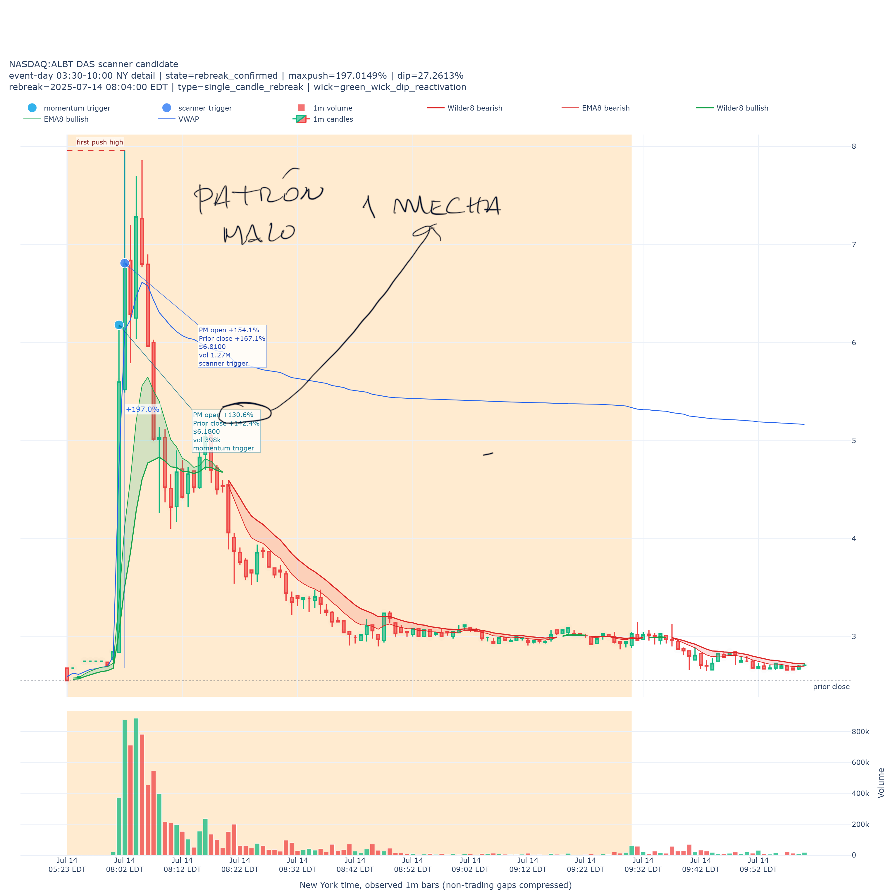

Clasificacion visual: `PATTERN_N_ONE_WICK_TRAP`

Patron:

- anotacion `patron malo 1 mecha`;
- vertical inicial;
- caida sostenida posterior;
- no hay soporte dinamico ni continuidad.

Lectura DAS:

Debe entrar como negativo visual. El detector no debe confundir esta mecha inicial con frontside saludable.

Implicacion para detector:

- exigir que el precio no pierda agresivamente EMA/Wilder tras el primer push;
- detectar decay posterior inmediato.

### 0013_SGN_2025-05-28_push181.69_rebreak

Imagen:

```text
img/archive/0013_SGN_2025-05-28_push181.69_rebreak_03_event_day_premarket_detail.png
```

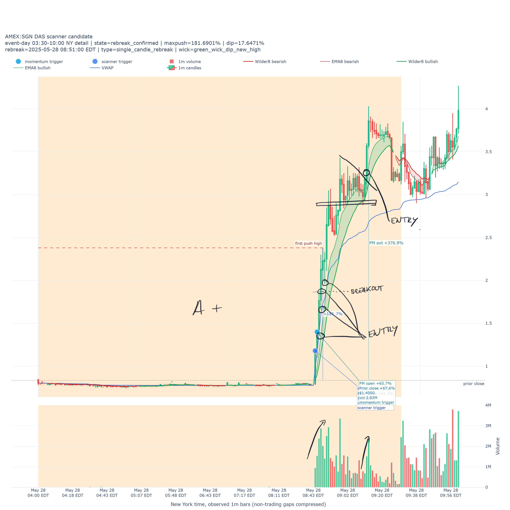

Clasificacion visual: `A_PLUS_FIRST_PUSH_REBREAK`

Patron:

- caso A+;
- primer push desde base muerta;
- entrada marcada en zona de breakout/rebreak;
- volumen expansivo;
- rompe estructura hacia arriba y sigue haciendo highs;
- despues aparecen dips posteriores dentro de frontside.

Lectura DAS:

Modelo central de lo que se busca: despertar, primer push, dip no destructivo y rebreak con continuidad.

Implicacion para detector:

- convertir en caso canonico de entrenamiento visual;
- medir `first_push_high`;
- medir `first_dip_low`;
- medir `rebreak_of_first_push_high`;
- medir `frontside_end`.

### 0014_PRFX_2026-02-11_push170.65_rebreak

Imagen:

```text
img/archive/0014_PRFX_2026-02-11_push170.65_rebreak_03_event_day_premarket_detail.png
```

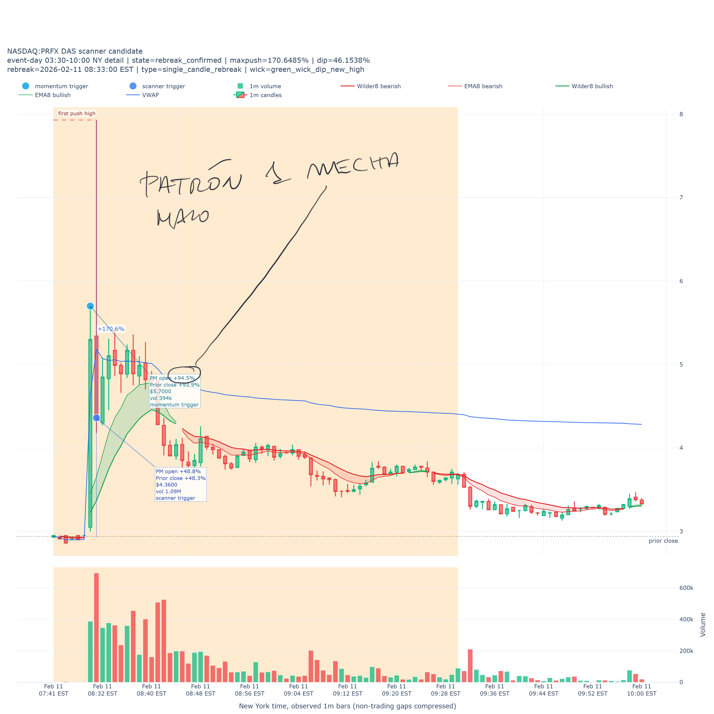

Clasificacion visual: `PATTERN_N_ONE_WICK_TRAP`

Patron:

- anotacion `patron malo 1 mecha`;
- gran primera vela;
- fallo de aceptacion;
- bajada progresiva posterior.

Lectura DAS:

Negativo claro. El primer push no genera estructura de continuidad.

Implicacion para detector:

- marcar `first_push_not_accepted`;
- exigir al menos una fase de retencion sobre zona de primer push.

### 0015_RANI_2025-10-17_push167.57_rebreak

Imagen:

```text
img/archive/0015_RANI_2025-10-17_push167.57_rebreak_03_event_day_premarket_detail.png
```

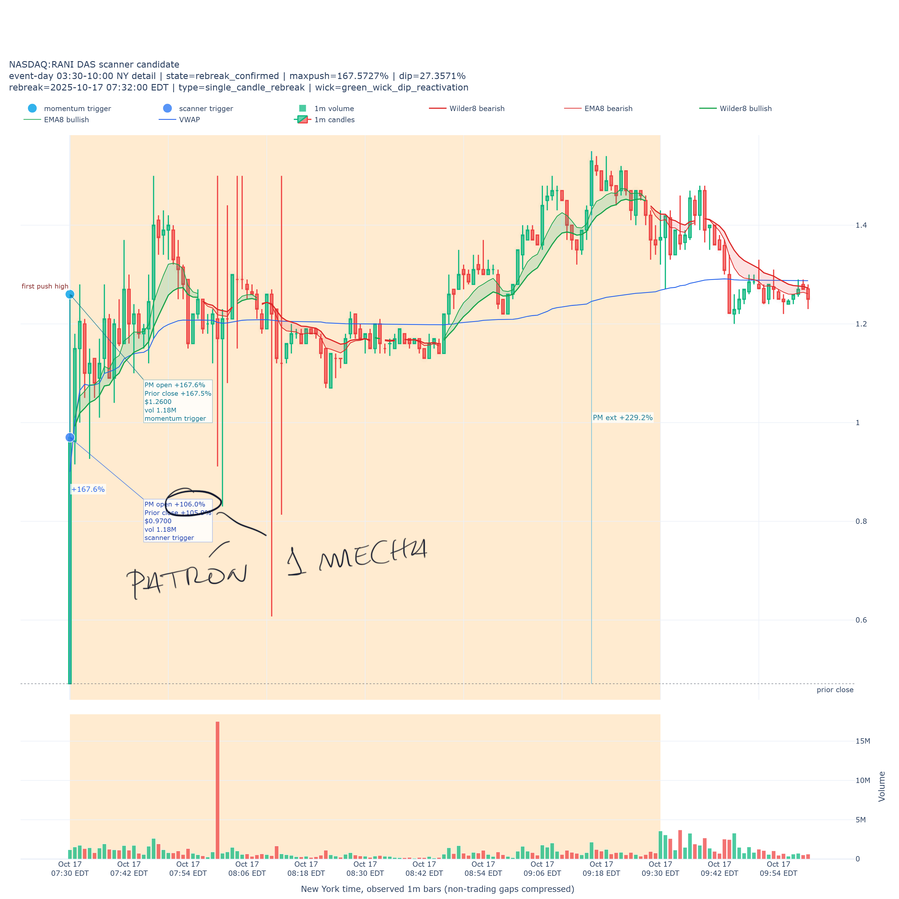

Clasificacion visual: `MIXED_ONE_WICK_THEN_LATE_PUSH`

Patron:

- anotacion `patron 1 mecha`;
- primeros movimientos con muchas mechas y baja claridad;
- existe subida posterior, pero no nace de una estructura DAS limpia.

Lectura DAS:

No debe entrenar A+. Puede tener oportunidades, pero el inicio es demasiado sucio.

Implicacion para detector:

- separar fase inicial sucia de reactivacion posterior;
- marcar `manual_review_required`.

### 0016_OSRH_2025-03-26_push166.27_rebreak

Imagen:

```text
img/archive/0016_OSRH_2025-03-26_push166.27_rebreak_03_event_day_premarket_detail.png
```

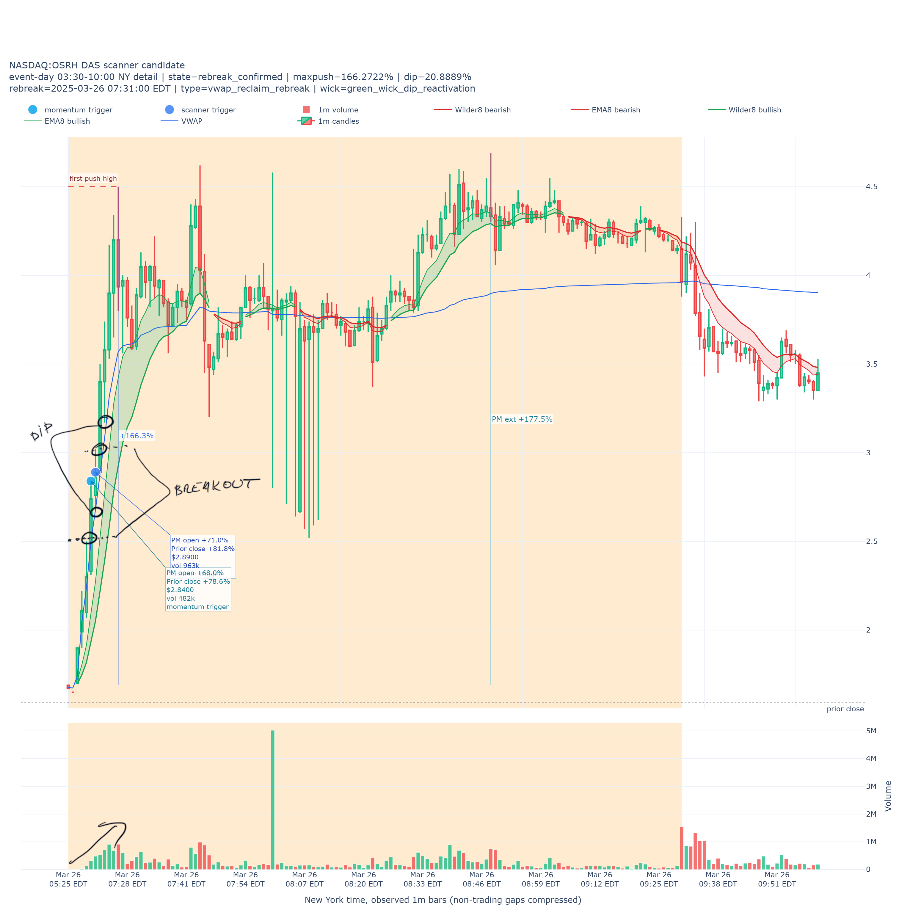

Clasificacion visual: `A_REBREAK_THEN_CHOP`

Patron:

- entrada en dip y breakout marcados;
- primer tramo fuerte y sostenido;
- despues aparecen wicks violentos y chop;
- hacia el final pierde estructura.

Lectura DAS:

Buen ejemplo de DAS inicial, pero no de continuidad limpia durante toda la ventana. El detector debe saber cerrar la fase frontside.

Implicacion para detector:

- marcar `das_valid_initial`;
- marcar `chop_after_extension`;
- evitar seguir numerando DAS despues de wicks destructivos.

### 0017_ROLR_2026-01-14_push165.17_rebreak

Imagen:

```text
img/archive/0017_ROLR_2026-01-14_push165.17_rebreak_03_event_day_premarket_detail.png
```

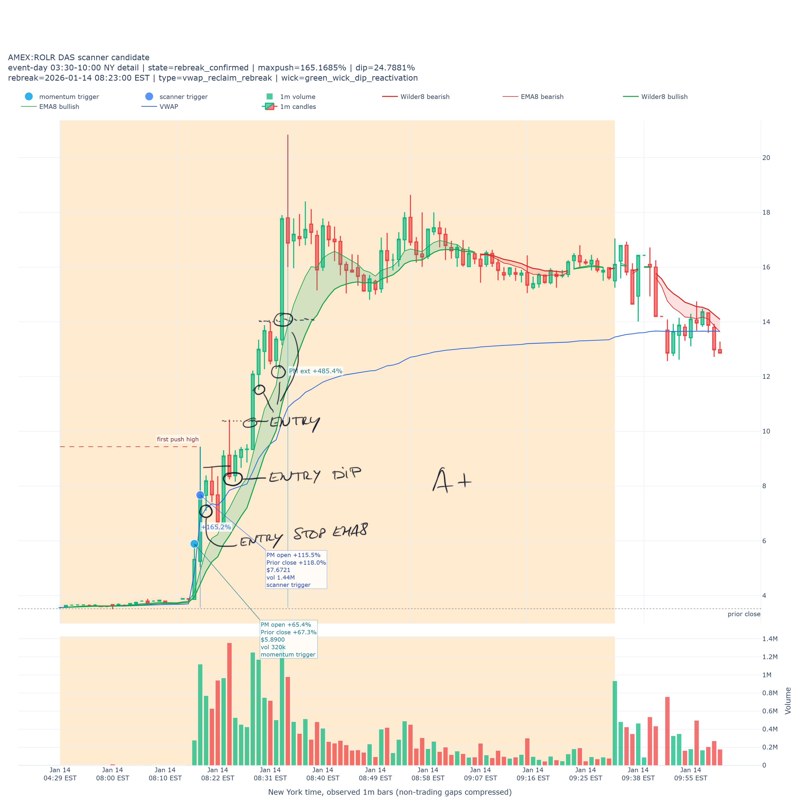

Clasificacion visual: `A_PLUS_SEQUENCED_DAS`

Patron:

- anotaciones humanas de entradas 1, 2, 3;
- primer push, dip y breakout del alto de la vela roja;
- respeto de VWAP/EMA durante el avance;
- stop conceptual cuando rompe estructura momentum;
- el movimiento permite explicar varias entradas DAS.

Lectura DAS:

Caso canonico. Muestra la secuencia completa: activacion, primer DAS, segundo DAS, extension y fin.

Implicacion para detector:

- extraer `das_sequence_index`;
- marcar `breakout_red_candle_high`;
- marcar `dip_respects_vwap`;
- marcar `momentum_structure_break`.

### 0018_SPRO_2025-05-28_push160.00_rebreak

Imagen:

```text
img/archive/0018_SPRO_2025-05-28_push160.00_rebreak_03_event_day_premarket_detail.png
```

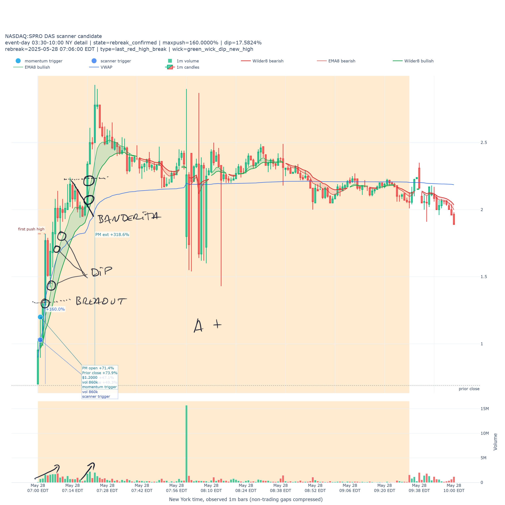

Clasificacion visual: `A_PLUS_BREAKOUT_DIP_BANDERA`

Patron:

- breakout inicial;
- dip;
- bandera;
- extension posterior;
- anotacion `A+`;
- hay wicks posteriores, pero el primer tramo es limpio.

Lectura DAS:

Muy buen ejemplo de variantes dentro de DAS: no solo hay un dip, tambien hay compresion/bandera que se resuelve al alza.

Implicacion para detector:

- crear `flag_break_das`;
- detectar pausa despues del primer push;
- exigir ruptura de la bandera con volumen o continuidad.

### 0019_NERV_2025-10-21_push157.25_rebreak

Imagen:

```text
img/archive/0019_NERV_2025-10-21_push157.25_rebreak_03_event_day_premarket_detail.png
```

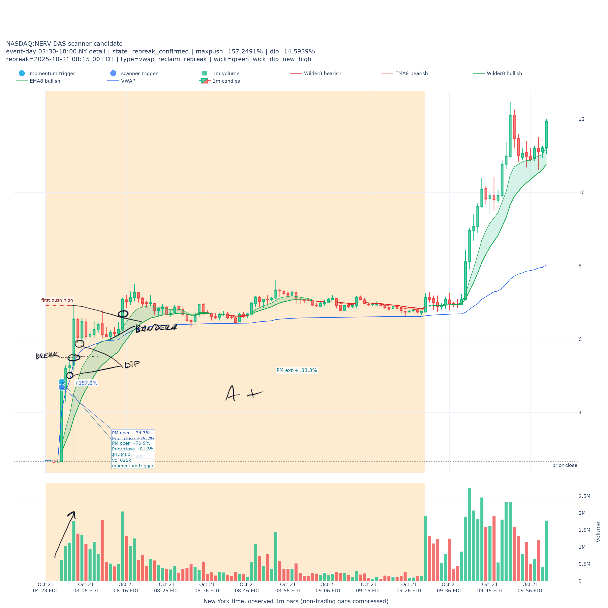

Clasificacion visual: `A_PLUS_EARLY_DAS_WITH_LATE_EXPANSION`

Patron:

- early break, dip y bandera;
- larga aceptacion sobre VWAP;
- gran expansion posterior;
- anotacion `A+`.

Lectura DAS:

Excelente para estudiar que el primer DAS puede ser el inicio de una estructura de varias horas. La base posterior importa.

Implicacion para detector:

- medir `acceptance_duration_after_first_push`;
- detectar `late_expansion_after_frontside_base`;
- no limitar DAS a los primeros minutos.

### 0020_TWG_2026-01-20_push155.17_rebreak

Imagen:

```text
img/archive/0020_TWG_2026-01-20_push155.17_rebreak_03_event_day_premarket_detail.png
```

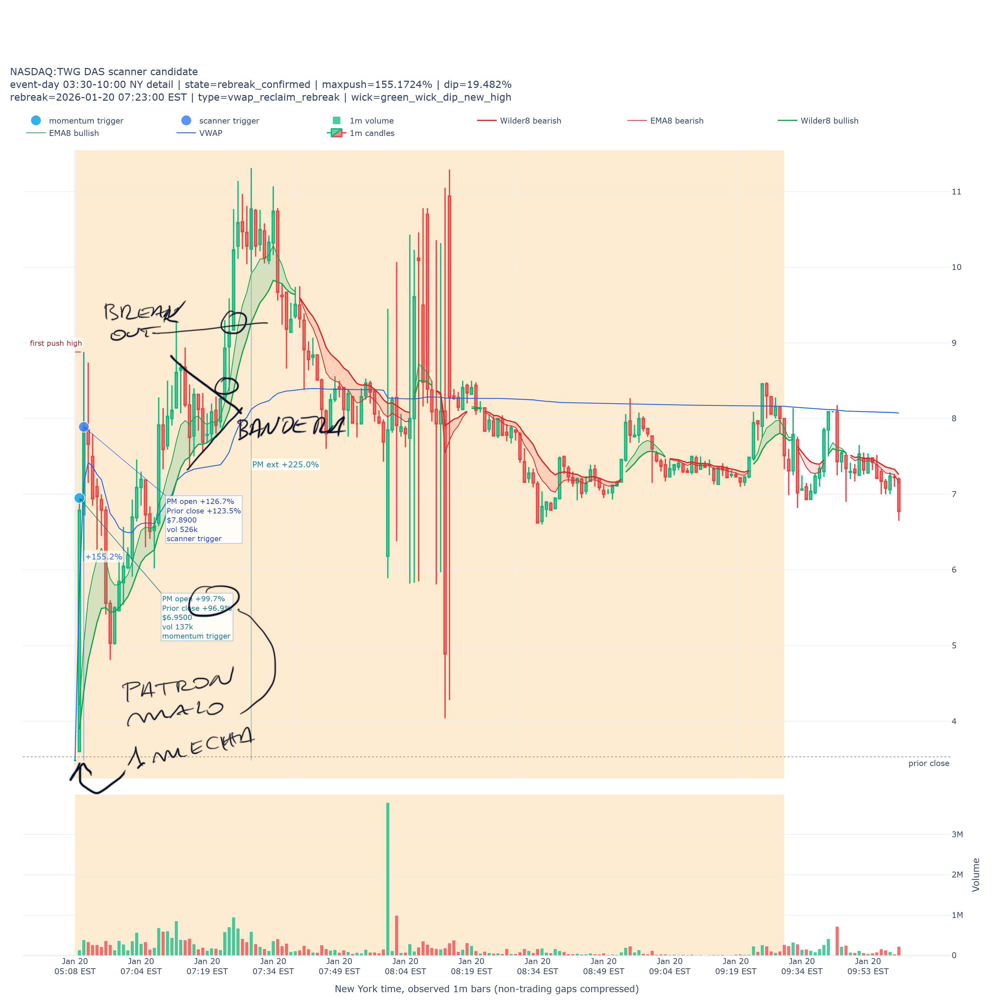

Clasificacion visual: `MIXED_TEACHING_CASE_DIRTY_FIRST_PUSH`

Patron:

- se marca breakout y bandera;
- tambien se anota `patron malo 1 mecha`;
- el primer tramo tiene oportunidad, pero la estructura es ruidosa;
- wicks amplios y zonas de fallo elevan el riesgo.

Lectura DAS:

Buen caso didactico para explicar entradas discrecionales, pero no debe entrar como A+ puro. Es un caso donde se puede operar el primer rebreak, pero el detector debe marcar calidad inferior.

Implicacion para detector:

- marcar `dirty_first_push`;
- detectar wick risk;
- separar `tradeable_but_not_clean`.

### 0021_LIDR_2025-07-24_push153.10_rebreak

Imagen:

```text
img/archive/0021_LIDR_2025-07-24_push153.10_rebreak_03_event_day_premarket_detail.png
```

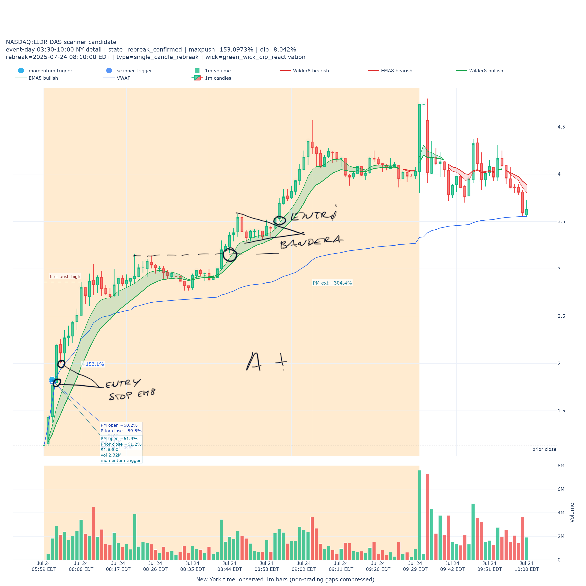

Clasificacion visual: `A_PLUS_VWAP_FRONT_LADDER`

Patron:

- entrada temprana con stop EMA8;
- subida progresiva;
- bandera o shelf posterior;
- precio por encima de VWAP;
- anotacion `A+`.

Lectura DAS:

Caso de frontside muy limpio: menos vertical que otros, mas estructural. Ideal para detector robusto.

Implicacion para detector:

- preferir retencion y escalera frente a spike puro;
- medir slope positivo de VWAP/EMA/Wilder;
- marcar `frontside_ladder`.

### 0022_GLTO_2025-11-10_push146.03_rebreak

Imagen:

```text
img/archive/0022_GLTO_2025-11-10_push146.03_rebreak_03_event_day_premarket_detail.png
```

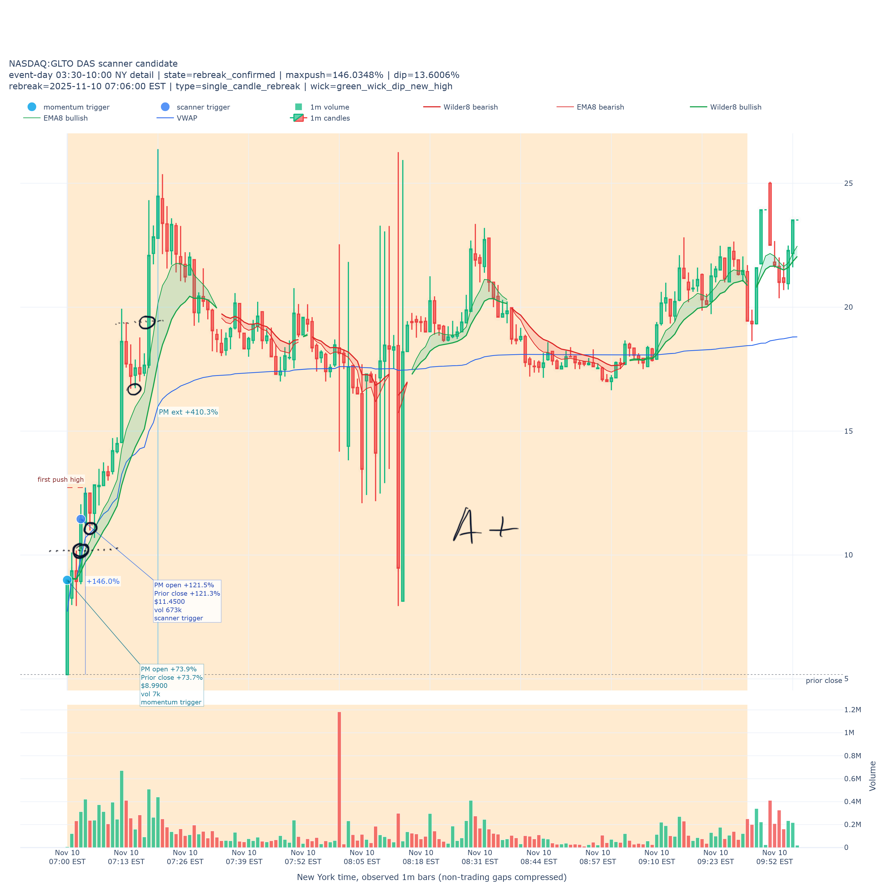

Clasificacion visual: `A_WITH_WICK_NOISE_REVIEW`

Patron:

- primer push y rebreak temprano;
- estructura general aguanta y acaba con continuidad;
- hay wicks violentos intermedios;
- anotacion `A+`, pero con calidad de dato/ruido que exige revision.

Lectura DAS:

Puede ser bueno, pero no debe entrenarse sin flags. Los wicks grandes pueden ser microestructura, prints raros o fragilidad.

Implicacion para detector:

- marcar `wick_noise_review`;
- comparar con trades/quotes si el caso se usa como training positivo.

### 0023_STAF_2024-08-22_push145.90_rebreak

Imagen:

```text
img/archive/0023_STAF_2024-08-22_push145.90_rebreak_03_event_day_premarket_detail.png
```

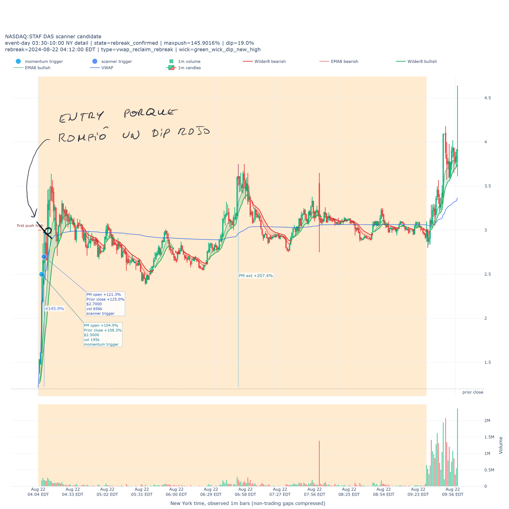

Clasificacion visual: `LATE_REACTIVATION_AFTER_DIRTY_EARLY_PUSH`

Patron:

- anotacion: entrada porque rompio un dip rojo;
- primer tramo se ensucia;
- durante mucho tiempo el precio queda irregular;
- al final hay una nueva expansion fuerte.

Lectura DAS:

No es A+ temprano. Es una reactivacion tardia despues de estructura poco limpia.

Implicacion para detector:

- crear `red_dip_break_entry_candidate`;
- crear `late_reactivation`;
- no mezclar con first DAS temprano.

### 0024_BBLG_2025-06-27_push144.00_rebreak

Imagen:

```text
img/archive/0024_BBLG_2025-06-27_push144.00_rebreak_03_event_day_premarket_detail.png
```

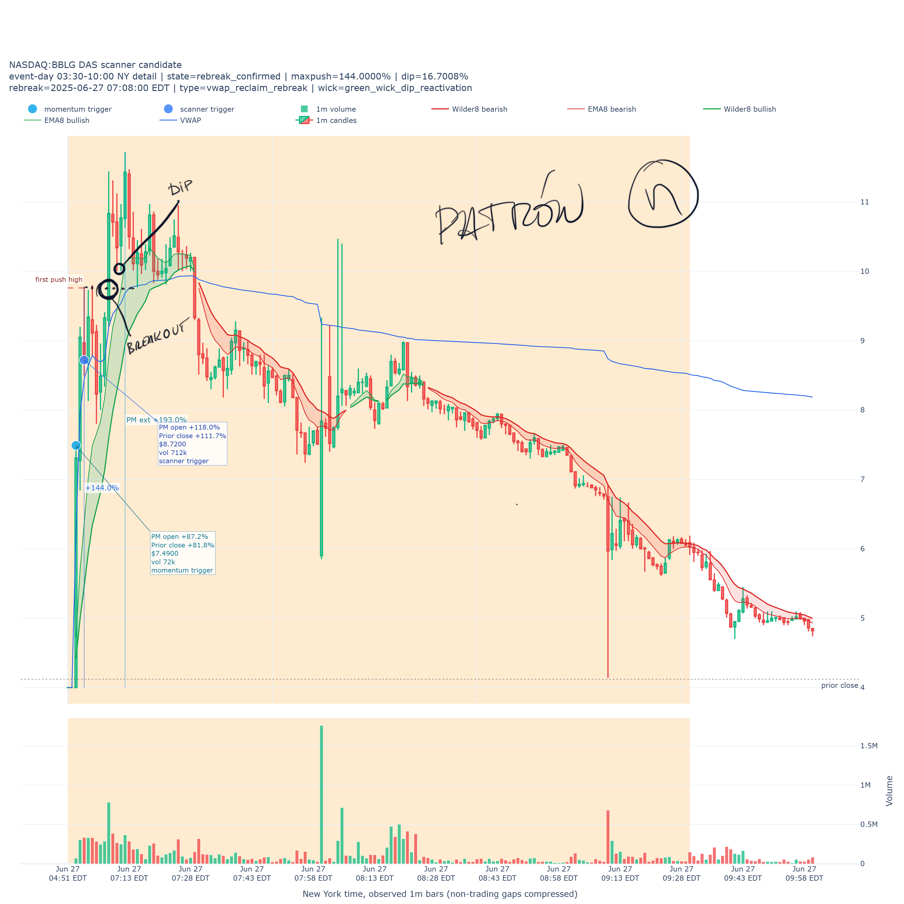

Clasificacion visual: `PATTERN_N_FADE`

Patron:

- anotacion `patron n`;
- hay dip y breakout temprano;
- despues el precio falla, pierde VWAP y entra en downtrend sostenido.

Lectura DAS:

Falso positivo estructural. Un rebreak inicial no basta si luego el mercado no acepta el nivel.

Implicacion para detector:

- medir `post_rebreak_hold_minutes`;
- exigir que el precio no pierda estructura inmediatamente despues del trigger.

### 0025_SELX_2025-11-10_push141.28_rebreak

Imagen:

```text
img/archive/0025_SELX_2025-11-10_push141.28_rebreak_03_event_day_premarket_detail.png
```

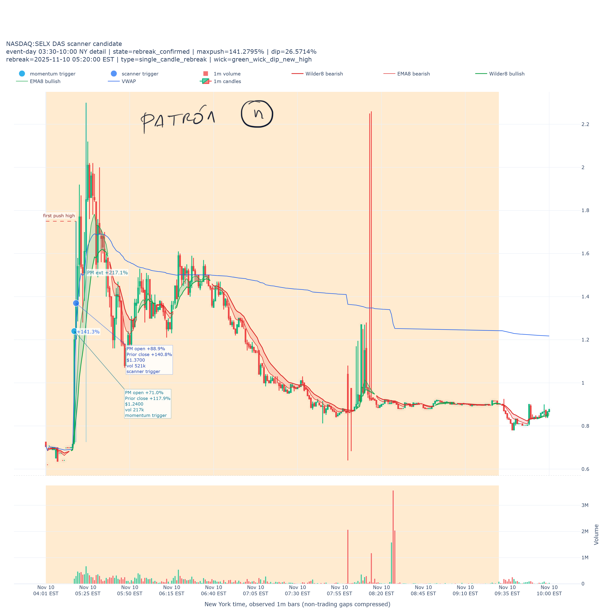

Clasificacion visual: `PATTERN_N_FADE_WITH_LATE_SPIKES`

Patron:

- anotacion `patron n`;
- spike inicial;
- decay largo;
- aparecen spikes posteriores aislados, pero sin estructura frontside.

Lectura DAS:

No es buen DAS. Los spikes posteriores no reparan que la estructura principal sea backside.

Implicacion para detector:

- ignorar late spikes si no reconstruyen higher lows;
- marcar `backside_dominant`.

### 0026_XAGE_2025-04-14_push140.58_rebreak

Imagen:

```text
img/archive/0026_XAGE_2025-04-14_push140.58_rebreak_03_event_day_premarket_detail.png
```

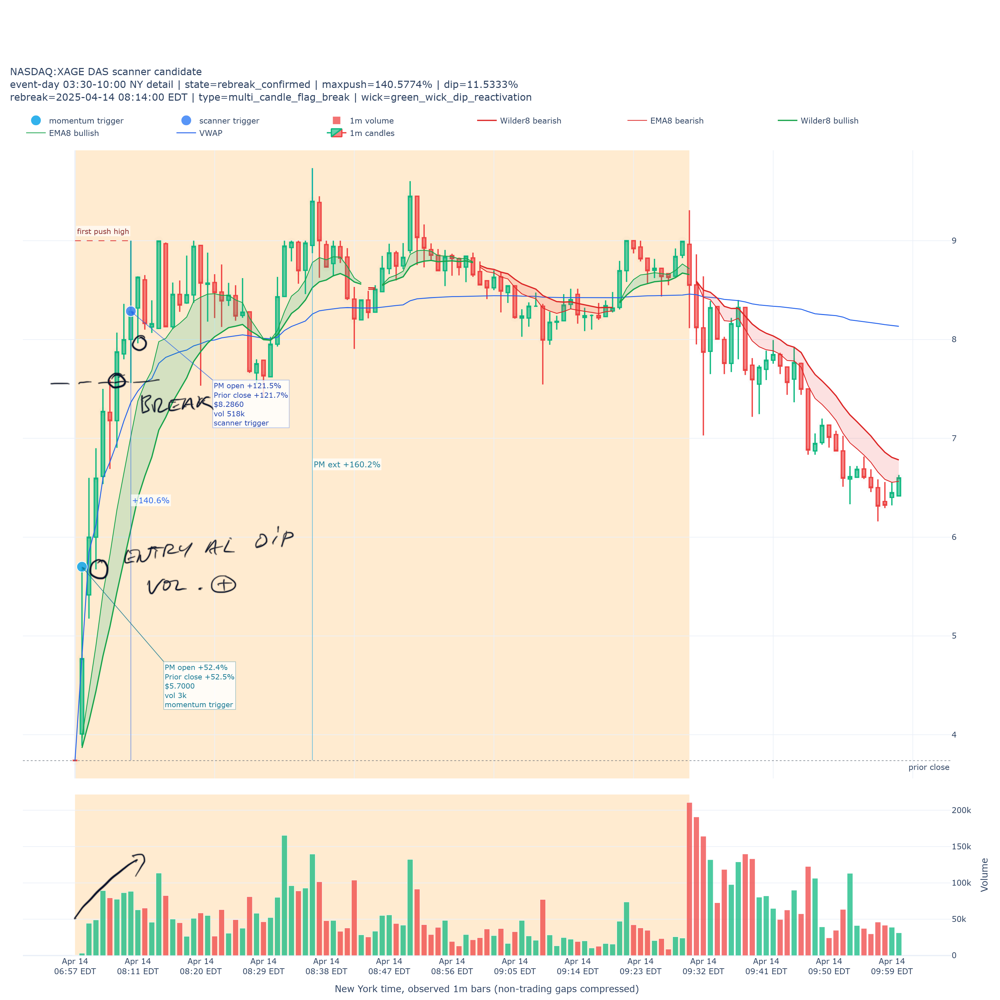

Clasificacion visual: `B_GOOD_EARLY_DAS_THEN_REGULAR_FADE`

Patron:

- entrada al dip marcada;
- volumen positivo;
- breakout temprano;
- el precio aguanta gran parte del premarket;
- despues de la apertura regular se deteriora.

Lectura DAS:

Buen caso para estudiar operativa premarket, pero no debe confundirse con continuation de dia completo.

Implicacion para detector:

- separar `premarket_frontside_valid` de `regular_session_failure`;
- medir estado al open.

### 0027_GELS_2025-04-22_push135.03_rebreak

Imagen:

```text
img/archive/0027_GELS_2025-04-22_push135.03_rebreak_03_event_day_premarket_detail.png
```

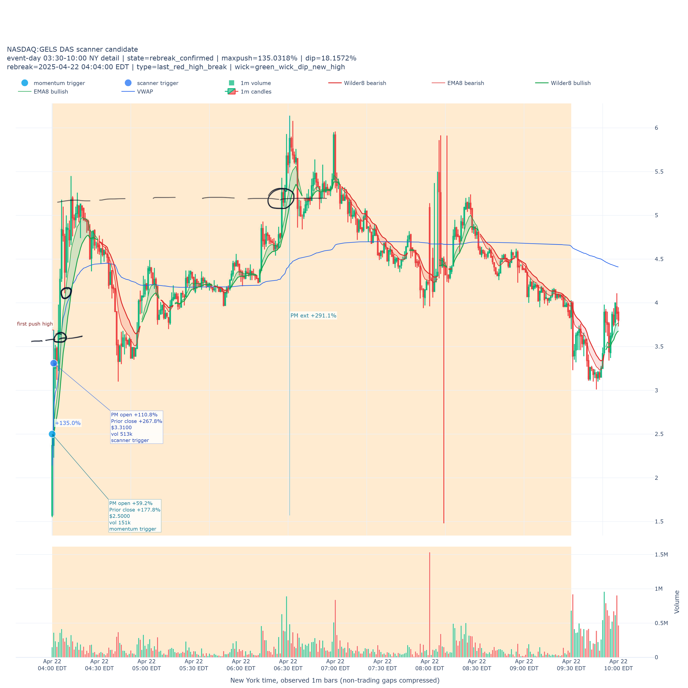

Clasificacion visual: `DIRTY_RANGE_REBREAK_REVIEW`

Patron:

- rebreak inicial;
- rango amplio y choppy;
- varios tests de zona alta;
- acaba perdiendo estructura;
- volumen no muestra una progresion limpia.

Lectura DAS:

Caso de revision. Hay tradeables, pero no es frontside claro.

Implicacion para detector:

- detectar `range_after_push`;
- distinguir `range_breakout_candidate` de DAS limpio.

### 0028_STAF_2024-11-04_push132.78_rebreak

Imagen:

```text
img/archive/0028_STAF_2024-11-04_push132.78_rebreak_03_event_day_premarket_detail.png
```

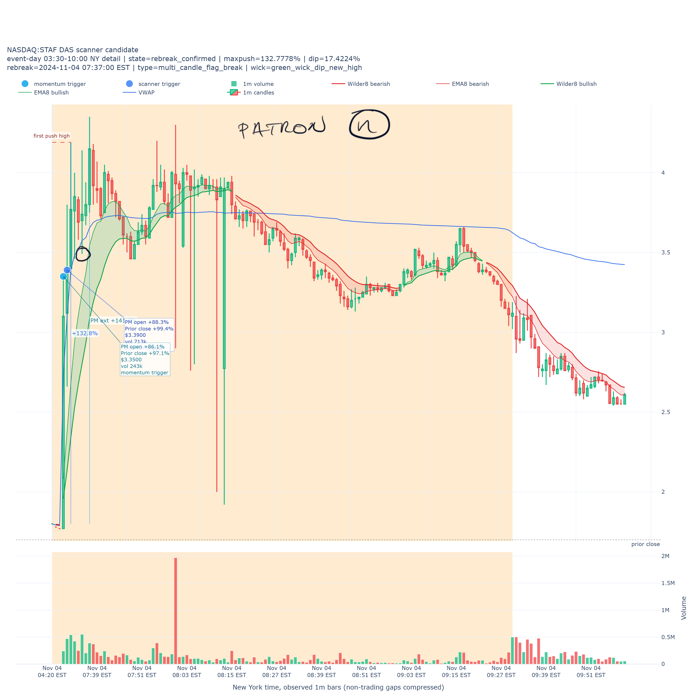

Clasificacion visual: `PATTERN_N_FADE`

Patron:

- anotacion `patron n`;
- primer impulso vertical;
- estructura posterior pierde VWAP/EMA;
- downtrend largo.

Lectura DAS:

Negativo visual claro para DAS bueno.

Implicacion para detector:

- marcar `early_spike_then_backside`.

### 0029_QNTM_2025-02-04_push132.08_rebreak

Imagen:

```text
img/archive/0029_QNTM_2025-02-04_push132.08_rebreak_03_event_day_premarket_detail.png
```

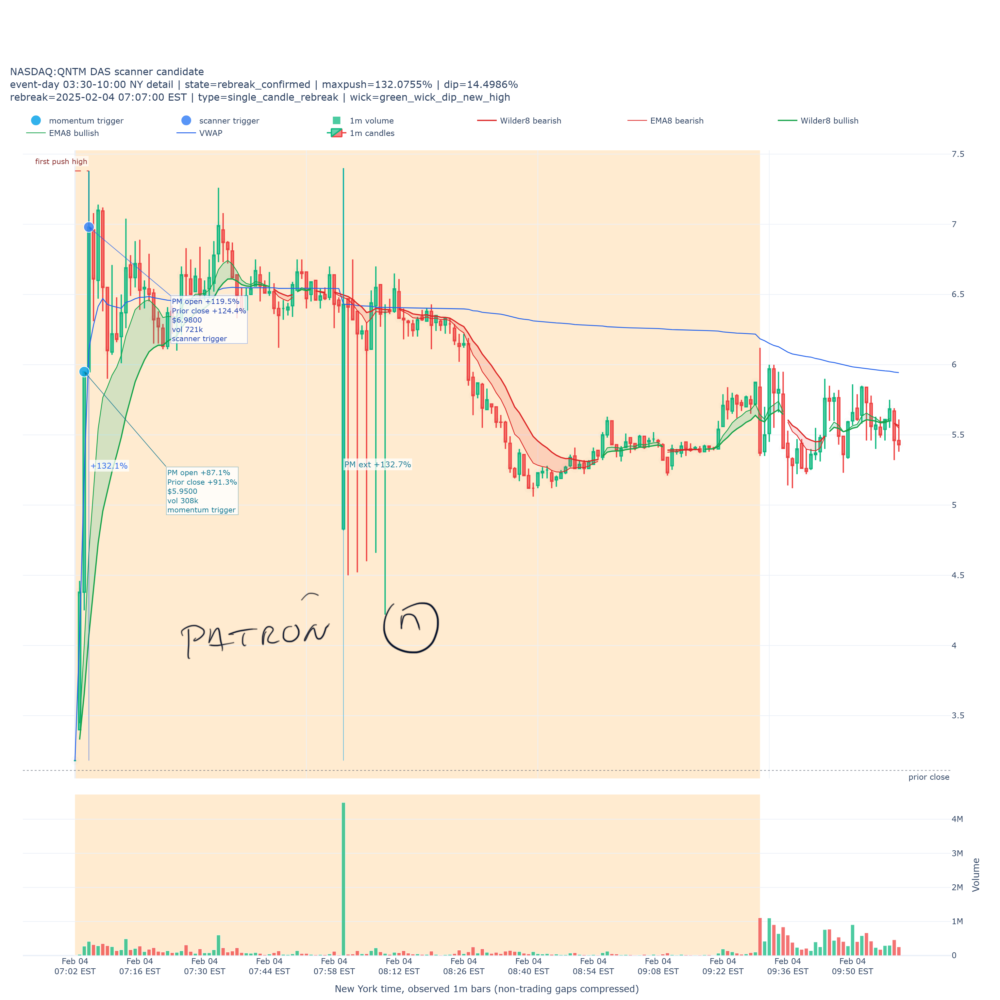

Clasificacion visual: `PATTERN_N_WITH_WICK_NOISE`

Patron:

- anotacion `patron n`;
- spike inicial;
- mechas y wicks amplios;
- no sostiene tendencia;
- lateral/backside posterior.

Lectura DAS:

No es DAS de calidad. Es ruido/spike.

Implicacion para detector:

- marcar `wick_noise`;
- marcar `failed_acceptance`.

### 0030_CADL_2024-12-11_push126.65_rebreak

Imagen:

```text
img/archive/0030_CADL_2024-12-11_push126.65_rebreak_03_event_day_premarket_detail.png
```

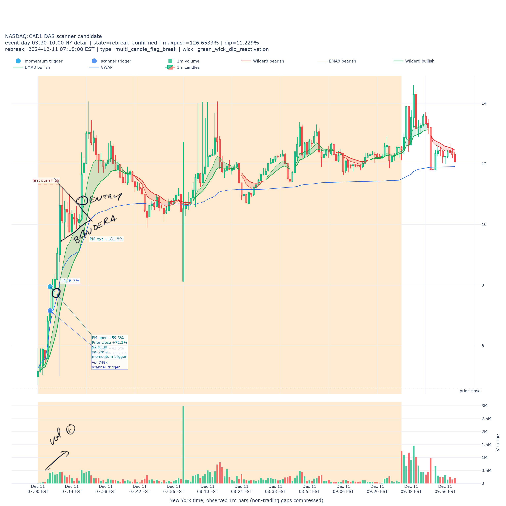

Clasificacion visual: `A_FLAG_BREAK_CONTINUATION`

Patron:

- entrada/bandera marcada;
- precio mantiene VWAP;
- multiples expansiones;
- el movimiento no muere tras el primer push;
- volumen aparece en impulsos.

Lectura DAS:

Buen caso de bandera y rebreak, menos vertical y mas estructural.

Implicacion para detector:

- detectar `flag_break_das`;
- medir retencion de VWAP;
- medir continuidad posterior.

### 0031_HIND_2026-01-27_push121.79_rebreak

Imagen:

```text
img/archive/0031_HIND_2026-01-27_push121.79_rebreak_03_event_day_premarket_detail.png
```

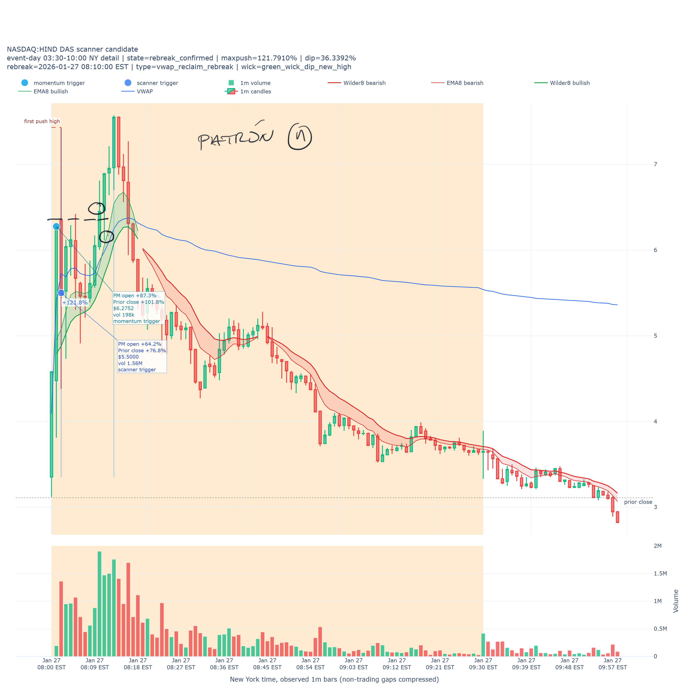

Clasificacion visual: `PATTERN_N_BACKSIDE`

Patron:

- anotacion `patron n`;
- primer spike;
- fallo rapido;
- bajada sostenida;
- no hay escalera frontside.

Lectura DAS:

Negativo. No debe alimentar DAS bueno.

Implicacion para detector:

- marcar `first_push_failed`;
- exigir estructura antes de aceptar rebreak.

### 0032_TMDE_2025-06-13_push120.61_rebreak

Imagen:

```text
img/archive/0032_TMDE_2025-06-13_push120.61_rebreak_03_event_day_premarket_detail.png
```

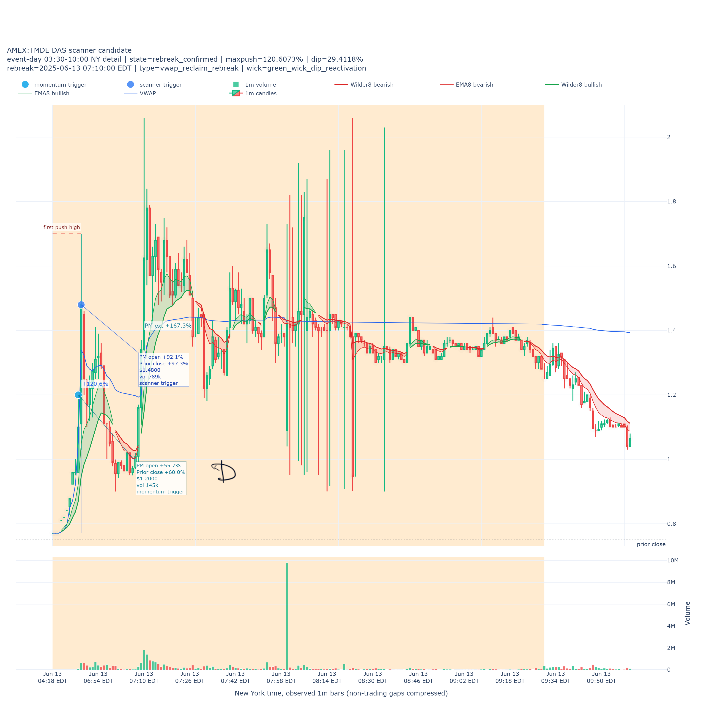

Clasificacion visual: `D_WICK_NOISE_AND_UNSTABLE_STRUCTURE`

Patron:

- anotacion `D`;
- wicks verticales grandes;
- estructura poco legible;
- el precio no respeta de forma clara EMA/Wilder;
- posible problema de calidad o microestructura.

Lectura DAS:

No debe pasar como positivo limpio. Necesita revision de datos si se usa.

Implicacion para detector:

- `quality__wick_outlier = true`;
- revisar contra trades/quotes si se considera importante.

### 0033_PTIX_2025-05-19_push119.81_rebreak

Imagen:

```text
img/archive/0033_PTIX_2025-05-19_push119.81_rebreak_03_event_day_premarket_detail.png
```

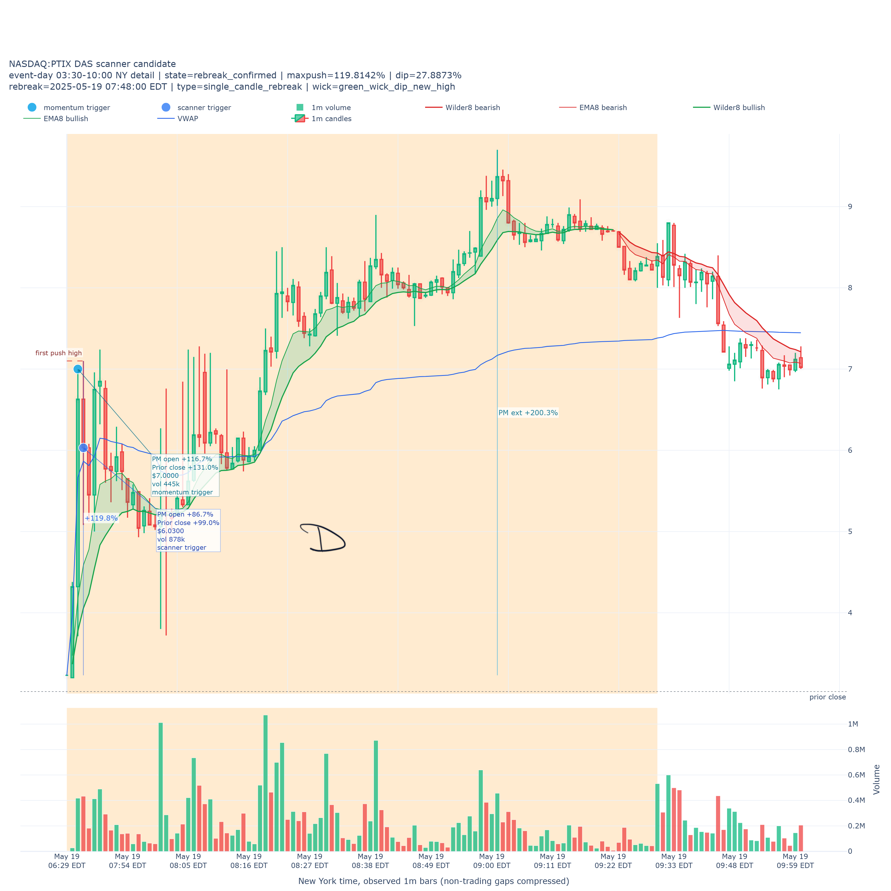

Clasificacion visual: `D_DIRTY_START_LATE_TREND`

Patron:

- anotacion `D`;
- inicio con wicks y pullback profundo;
- despues hay tendencia alcista, pero no nace de un primer DAS limpio;
- calidad mixta.

Lectura DAS:

Puede ser interesante para `late_reactivation`, pero no para first DAS canonico.

Implicacion para detector:

- separar `dirty_first_push` de `later_frontside`;
- no entrenar como A+.

### 0034_RKDA_2024-12-05_push119.72_rebreak

Imagen:

```text
img/archive/0034_RKDA_2024-12-05_push119.72_rebreak_03_event_day_premarket_detail.png
```

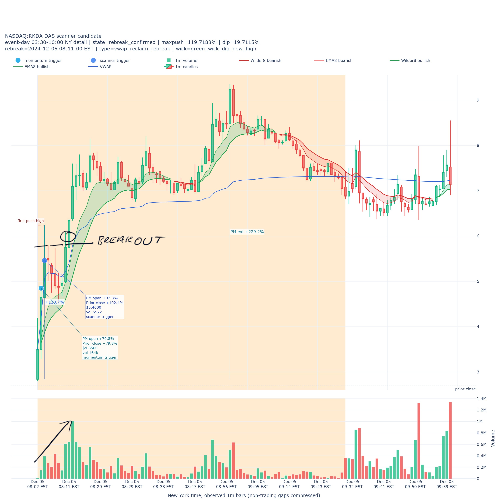

Clasificacion visual: `A_BREAKOUT_CONTINUATION`

Patron:

- breakout marcado;
- precio acepta zona superior;
- continuation despues de consolidar;
- volumen inicial acompana.

Lectura DAS:

Buen caso de rebreak que genera continuidad, aunque no tan limpio como los A+ maximos.

Implicacion para detector:

- detectar `breakout_continuation`;
- medir consolidacion despues del primer push.

### 0035_MIRA_2024-07-15_push118.72_rebreak

Imagen:

```text
img/archive/0035_MIRA_2024-07-15_push118.72_rebreak_03_event_day_premarket_detail.png
```

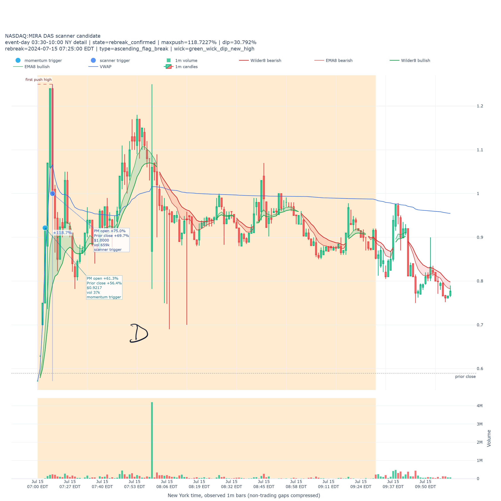

Clasificacion visual: `D_CHOP_WICK_DECAY`

Patron:

- anotacion `D`;
- spike inicial;
- chop con wicks;
- no hay estructura alcista sostenida;
- decay progresivo.

Lectura DAS:

Negativo o review. No es DAS robusto.

Implicacion para detector:

- marcar `chop_after_push`;
- bloquear A+ si el precio pierde VWAP sin recuperacion estructural.

### 0036_MNPR_2024-09-12_push118.15_rebreak

Imagen:

```text
img/archive/0036_MNPR_2024-09-12_push118.15_rebreak_03_event_day_premarket_detail.png
```

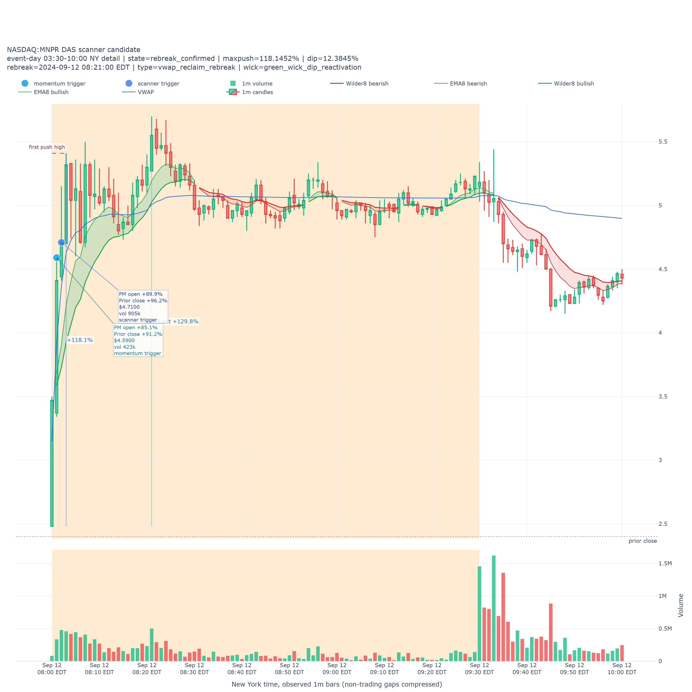

Clasificacion visual: `B_EARLY_EXTENSION_SIDEWAYS_THEN_FADE`

Patron:

- primer push fuerte;
- luego rango alto;
- no hay clara escalera de nuevos highs;
- hacia el final falla.

Lectura DAS:

Caso intermedio. Sirve para estudiar retencion y fallo, no para A+.

Implicacion para detector:

- medir `high_range_acceptance`;
- detectar `failed_high_range`.

### 0037_DM_2025-03-25_push117.26_rebreak

Imagen:

```text
img/archive/0037_DM_2025-03-25_push117.26_rebreak_03_event_day_premarket_detail.png
```

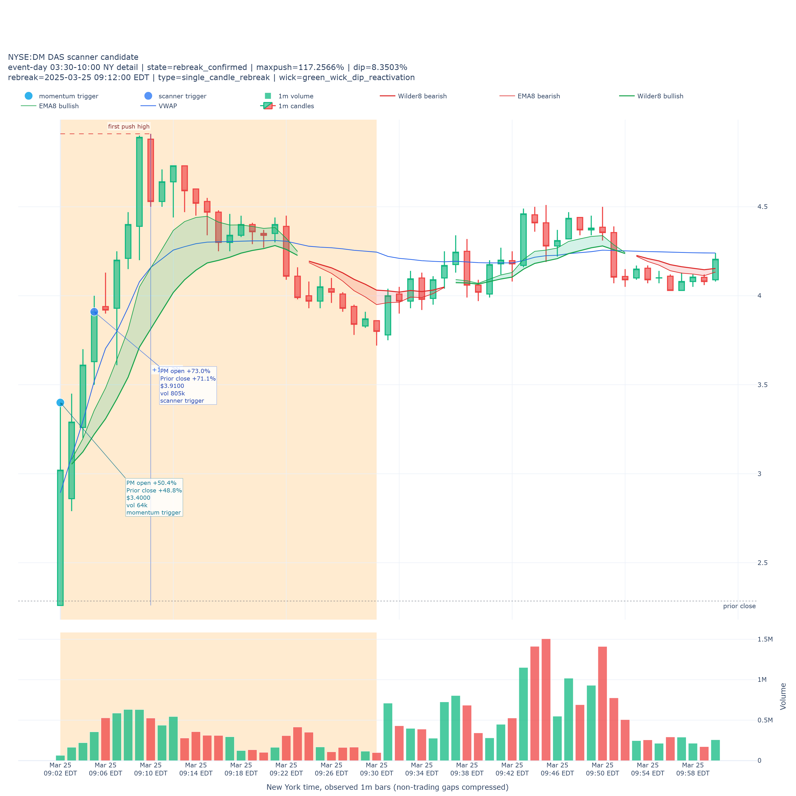

Clasificacion visual: `B_SHORT_WINDOW_FRONT`

Patron:

- push temprano;
- rebreak y hold parcial;
- ventana visible mas corta;
- no hay mucha informacion de premarket completo en la imagen.

Lectura DAS:

Caso potencialmente util, pero no muy didactico para toda la estructura.

Implicacion para detector:

- usarlo como review, no como canonico.

### 0038_CYCN_2024-12-04_push116.11_rebreak

Imagen:

```text
img/archive/0038_CYCN_2024-12-04_push116.11_rebreak_03_event_day_premarket_detail.png
```

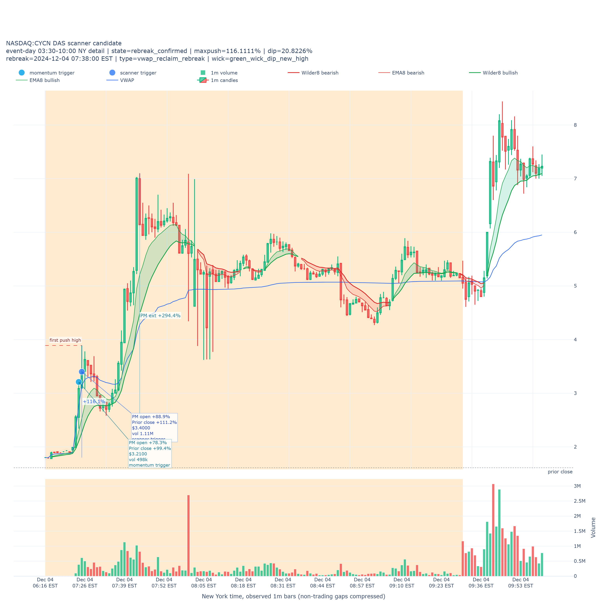

Clasificacion visual: `DELAYED_CONTINUATION_AFTER_BASE`

Patron:

- primer push moderado;
- larga aceptacion/rango;
- ruptura fuerte mas tarde;
- volumen aumenta en la expansion final.

Lectura DAS:

Mas que un primer DAS puro, parece una base intradia que acaba rompiendo.

Implicacion para detector:

- crear `base_then_breakout`;
- separar de `first_push_das`.

### 0039_HOTH_2025-01-07_push114.74_rebreak

Imagen:

```text
img/archive/0039_HOTH_2025-01-07_push114.74_rebreak_03_event_day_premarket_detail.png
```

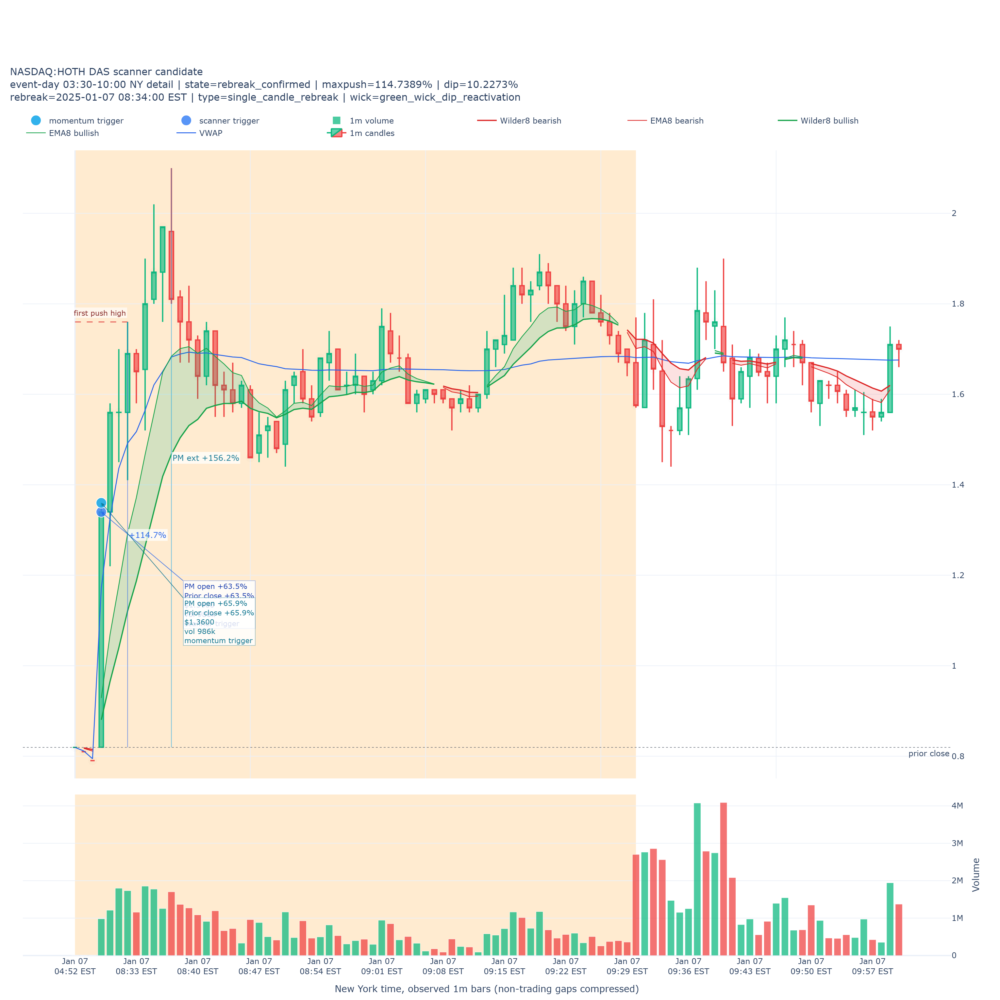

Clasificacion visual: `B_MIXED_RANGE_REBREAK`

Patron:

- primer push;
- rango amplio sobre VWAP;
- rebreaks parciales;
- no hay una escalera muy limpia;
- termina lateral/choppy.

Lectura DAS:

Intermedio. Sirve para estudiar rango y rebreak, no A+.

Implicacion para detector:

- marcar `range_rebreak`;
- medir si hay continuation real despues de cada rebreak.

### 0041_AMOD_2025-01-30_push108.92_rebreak

Imagen:

```text
img/archive/0041_AMOD_2025-01-30_push108.92_rebreak_03_event_day_premarket_detail.png
```

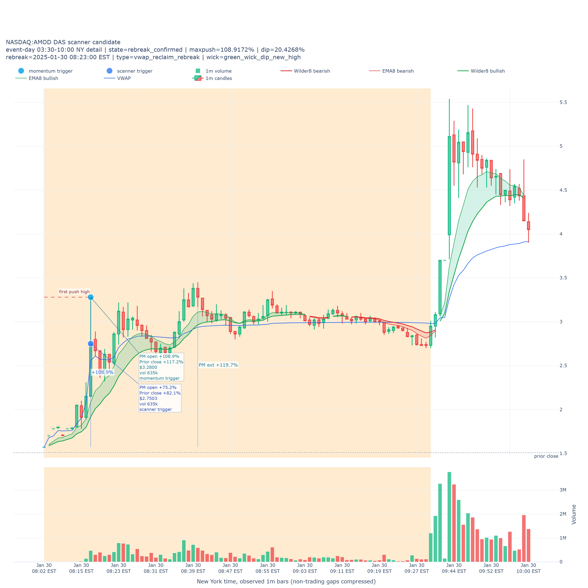

Clasificacion visual: `DELAYED_IGNITION_AFTER_SHELF`

Patron:

- primer movimiento temprano;
- base larga;
- ruptura fuerte hacia el final del premarket;
- volumen entra al breakout tardio.

Lectura DAS:

No es el primer DAS clasico. Es una ruptura de shelf/base que puede generar un nuevo ciclo DAS despues.

Implicacion para detector:

- detectar `shelf_acceptance`;
- detectar `late_shelf_break`;
- iniciar nueva secuencia DAS tras esa ruptura.

### 0043_SMFL_2024-08-21_push106.42_rebreak

Imagen:

```text
img/archive/0043_SMFL_2024-08-21_push106.42_rebreak_03_event_day_premarket_detail.png
```

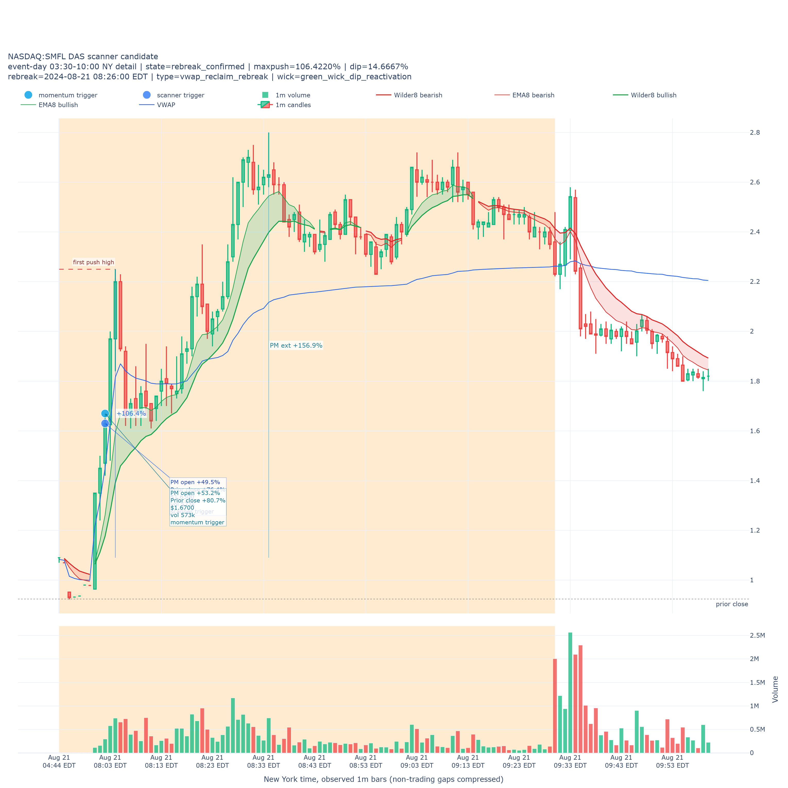

Clasificacion visual: `B_FRONT_THEN_BACKSIDE`

Patron:

- primer push y continuation;
- respeta zona EMA/Wilder al principio;
- hace higher levels;
- luego falla y entra en backside.

Lectura DAS:

Buen caso para estudiar final de frontside. No es malo al inicio, pero hay que cerrar la fase.

Implicacion para detector:

- marcar `frontside_valid_until`;
- detectar giro EMA/Wilder bajista.

### 0057_JTAI_2025-02-14_push95.09_rebreak

Imagen:

```text
img/archive/0057_JTAI_2025-02-14_push95.09_rebreak_03_event_day_premarket_detail.png
```

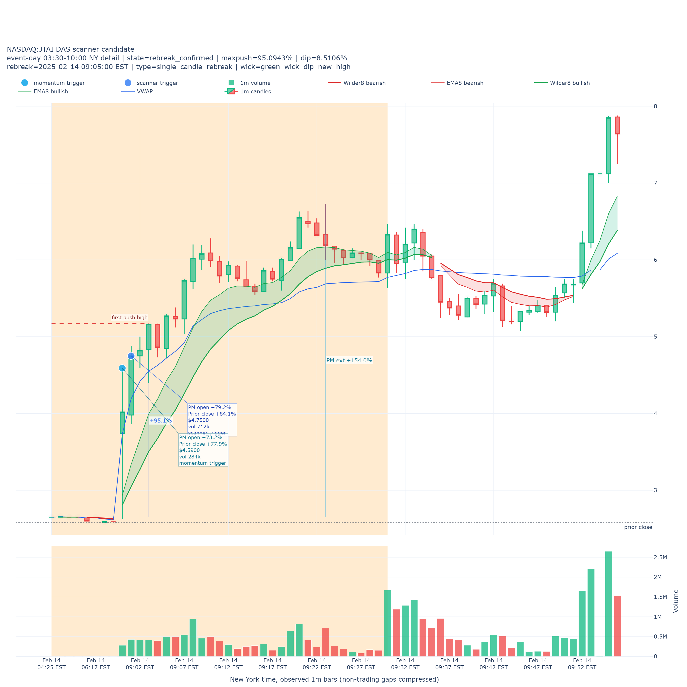

Clasificacion visual: `A_LATE_CONTINUATION_AFTER_EARLY_FRONT`

Patron:

- primer push ordenado;
- mantiene estructura;
- despues hay base y nueva expansion fuerte hacia el final;
- volumen confirma tarde.

Lectura DAS:

Buen candidato para estudiar DAS recurrente y continuacion tardia.

Implicacion para detector:

- numerar DAS posteriores;
- detectar `late_continuation_after_hold`.

### 0058_MOGO_2025-07-02_push94.02_rebreak

Imagen:

```text
img/archive/0058_MOGO_2025-07-02_push94.02_rebreak_03_event_day_premarket_detail.png
```

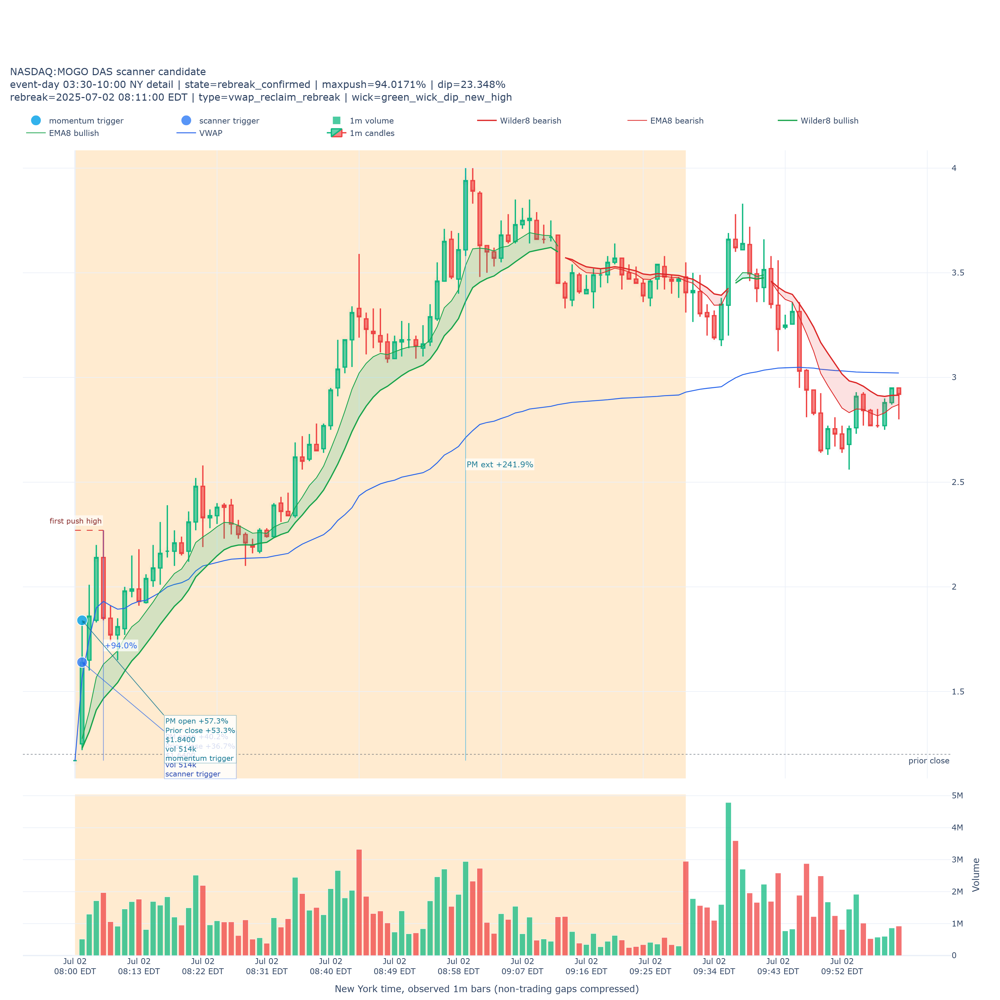

Clasificacion visual: `A_PLUS_STAIR_STEP_FRONT`

Patron:

- subida progresiva;
- dips pequenos;
- EMA/Wilder sostienen;
- VWAP debajo como soporte estructural;
- volumen acompana en tramos.

Lectura DAS:

Excelente caso de DAS menos explosivo pero mas robusto.

Implicacion para detector:

- no exigir solo explosividad;
- valorar escalera y continuidad.

### 0068_MYSZ_2024-12-20_push86.57_rebreak

Imagen:

```text
img/archive/0068_MYSZ_2024-12-20_push86.57_rebreak_03_event_day_premarket_detail.png
```

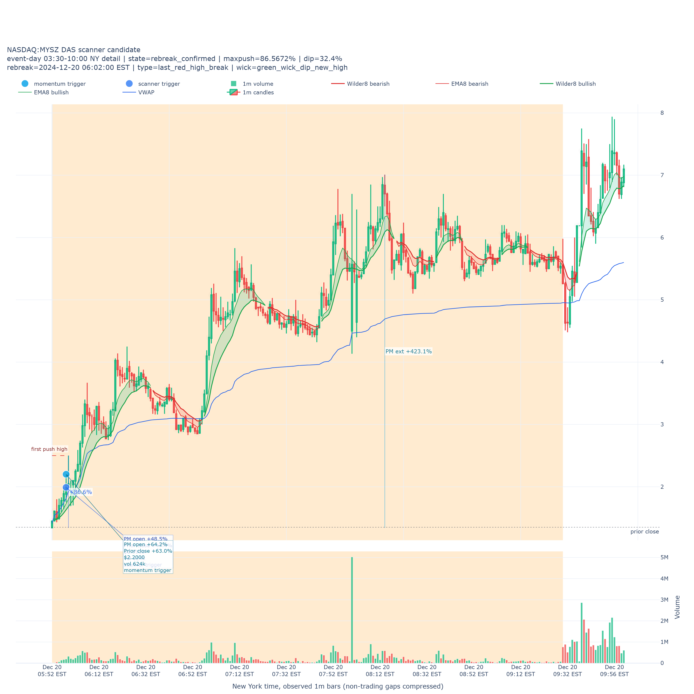

Clasificacion visual: `A_PLUS_MULTI_LEG_FRONT`

Patron:

- frontside progresivo;
- varias bases y rupturas;
- EMA/Wilder alcistas en varios tramos;
- gran breakout tardio.

Lectura DAS:

Muy buen caso para estudiar multiples DAS dentro del mismo frontside.

Implicacion para detector:

- crear secuencia `DAS_1`, `DAS_2`, `DAS_3`;
- medir madurez de secuencia y calidad decreciente o no.

### 0078_LDTC_2024-12-09_push84.37_rebreak

Imagen:

```text
img/archive/0078_LDTC_2024-12-09_push84.37_rebreak_03_event_day_premarket_detail.png
```

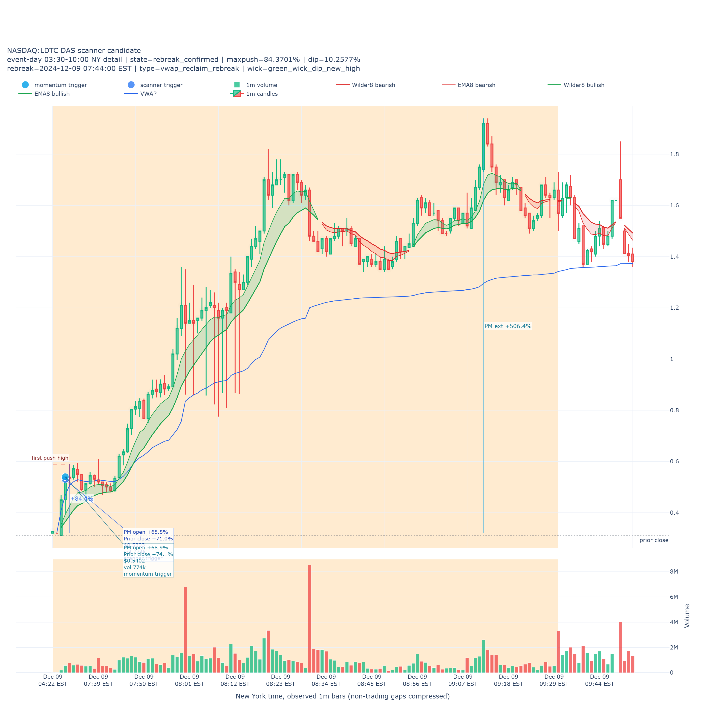

Clasificacion visual: `A_PLUS_STAIR_STEP_FRONT`

Patron:

- escalera ascendente limpia;
- pullbacks no destructivos;
- continuidad durante gran parte del premarket;
- volumen aparece en impulsos.

Lectura DAS:

Aunque el push porcentual es menor que otros, visualmente es de los mejores porque la estructura es sostenible.

Implicacion para detector:

- no ordenar calidad solo por `maxpush_pct`;
- incluir `structure_score`.

### 0080_GLTO_2025-10-07_push83.86_rebreak

Imagen:

```text
img/archive/0080_GLTO_2025-10-07_push83.86_rebreak_03_event_day_premarket_detail.png
```

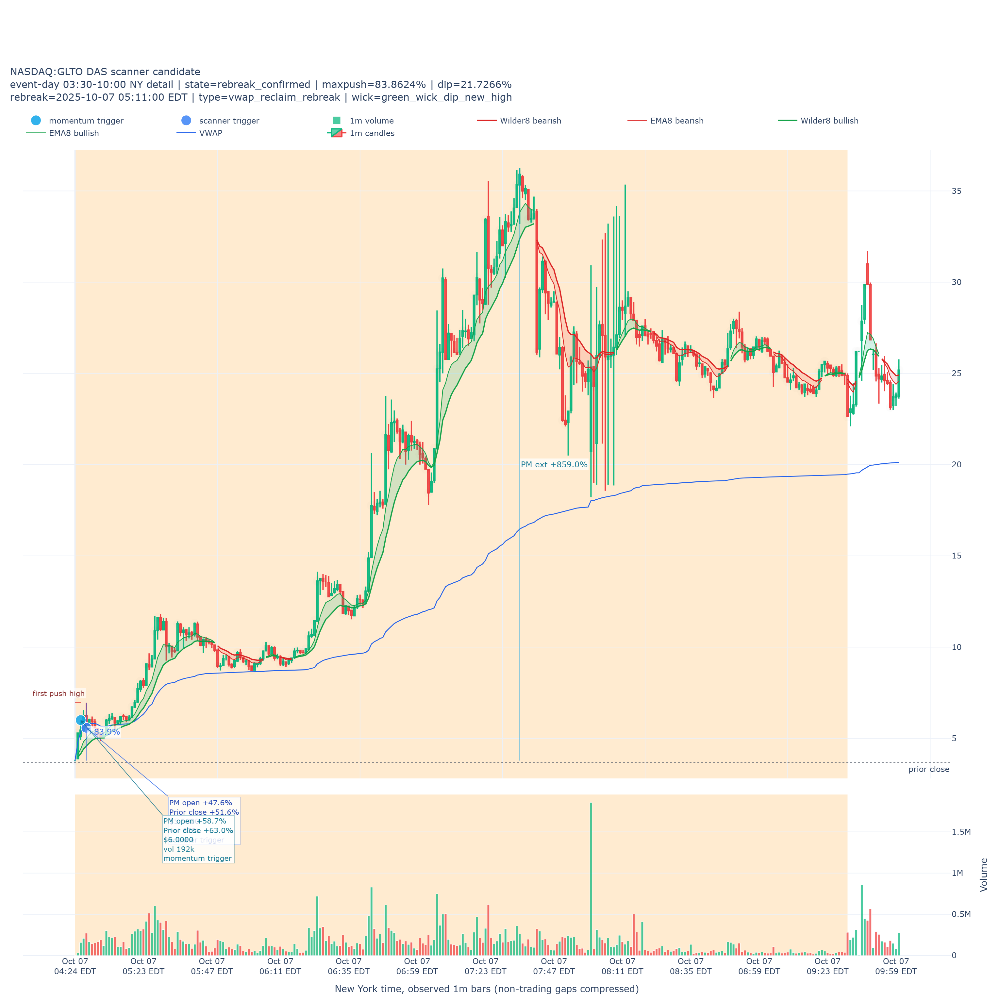

Clasificacion visual: `A_PLUS_MULTI_LEG_HIGH_MOMENTUM`

Patron:

- varios tramos de extension;
- bases intermedias;
- grandes rupturas posteriores;
- VWAP queda por debajo y confirma aceptacion;
- no se limita a un solo spike.

Lectura DAS:

Caso muy bueno para estudiar el frontside completo: arranque, bases, nuevos impulsos y madurez.

Implicacion para detector:

- detectar `multi_leg_frontside`;
- medir expansion por tramos, no solo max push.

### 0083_UPXI_2025-04-21_push82.40_rebreak

Imagen:

```text
img/archive/0083_UPXI_2025-04-21_push82.40_rebreak_03_event_day_premarket_detail.png
```

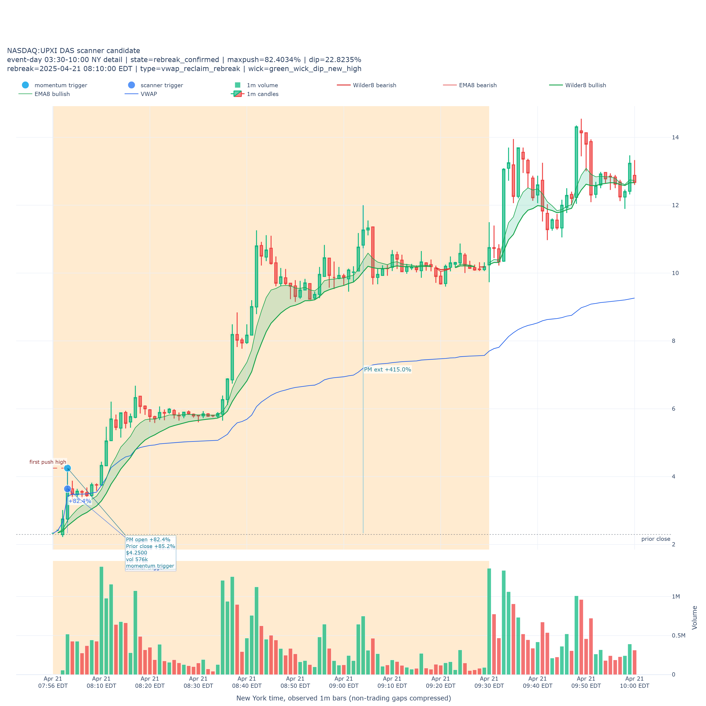

Clasificacion visual: `A_PLUS_STAIR_STEP_WITH_LATE_BREAK`

Patron:

- primer push moderado;
- multiples bases y subidas;
- respeta estructura alcista;
- termina con otra ruptura fuerte.

Lectura DAS:

Muy util para detector porque no depende de una sola vela extrema. Enseña que la calidad puede venir de la secuencia.

Implicacion para detector:

- medir `trend_persistence`;
- medir `higher_low_count`;
- medir `late_break_after_acceptance`.

## 7. Patrones principales detectados

### 7.1. Buenos principales

Casos mas utiles para definicion DAS buena:

- 0007 INM
- 0013 SGN
- 0017 ROLR
- 0018 SPRO
- 0019 NERV
- 0021 LIDR
- 0030 CADL
- 0058 MOGO
- 0068 MYSZ
- 0078 LDTC
- 0080 GLTO
- 0083 UPXI

Lectura comun:

Estos casos tienen estructura, no solo porcentaje. El precio construye continuidad despues del primer push.

### 7.2. Casos buenos pero con review

- 0001 SYRA
- 0004 MSS
- 0010 CJMB
- 0016 OSRH
- 0022 GLTO
- 0026 XAGE
- 0034 RKDA
- 0043 SMFL
- 0057 JTAI

Lectura comun:

Hay DAS real o oportunidad clara, pero se debe marcar la calidad, el tramo valido y el punto donde deja de ser frontside.

### 7.3. Falsos positivos visuales o pattern_n

- 0002 SRXH
- 0003 SONN
- 0005 MWYN
- 0006 CAMP
- 0009 DALN
- 0012 ALBT
- 0014 PRFX
- 0015 RANI
- 0024 BBLG
- 0025 SELX
- 0028 STAF
- 0029 QNTM
- 0031 HIND
- 0035 MIRA

Lectura comun:

El detector actual puede marcarlos porque hay push/rebreak, pero visualmente no son DAS robustos.

### 7.4. Casos mixtos para investigacion

- 0008 HTOO
- 0011 KAVL
- 0020 TWG
- 0023 STAF
- 0027 GELS
- 0032 TMDE
- 0033 PTIX
- 0036 MNPR
- 0037 DM
- 0038 CYCN
- 0039 HOTH
- 0041 AMOD

Lectura comun:

No deben alimentar el core positivo sin etiqueta. Sirven para refinar variantes, falsos positivos y estados de transicion.

## 8. Requisitos para el refactor DAS v2

### 8.1. Separar estados

El codigo debe dejar de emitir solo `rebreak_confirmed` como si fuera suficiente.

Estados minimos:

- `scanner_triggered`
- `first_push_detected`
- `first_dip_detected`
- `first_dip_non_destructive`
- `first_push_high_rebroken`
- `frontside_active`
- `frontside_ladder`
- `flag_break`
- `late_reactivation`
- `pattern_n_one_wick`
- `backside_transition`
- `manual_review_required`

### 8.2. Medidas obligatorias

Por cada candidato:

- `first_push_start_ts`
- `first_push_high_ts`
- `first_push_high_price`
- `first_push_pct_from_session_open`
- `first_dip_low_ts`
- `first_dip_low_price`
- `first_dip_depth_pct`
- `rebreak_ts`
- `rebreak_price`
- `max_momentum_high_ts`
- `max_momentum_high_price`
- `max_momentum_pct_from_session_open`
- `frontside_end_ts`
- `frontside_end_reason`

### 8.3. Filtros anti-basura

El detector debe marcar o penalizar:

- one-wick dominance;
- immediate post-push decay;
- failure to hold EMA/Wilder after rebreak;
- no higher low after first push;
- no acceptance above first push zone;
- high wick noise;
- data review cases.

### 8.4. Lo que AlphaEvolve deberia optimizar

AlphaEvolve no debe optimizar solo entrada.

Debe proponer hipotesis sobre:

- que define un frontside activo;
- que hace que un dip sea no destructivo;
- cuando una bandera es sana;
- cuando el primer push es demasiado vertical y peligroso;
- cuando un rebreak es real o falso;
- cuando termina DAS y empieza backside.

## 9. Regla final

DAS no es "hubo rebreak".

DAS es:

```text
despertar con momentum
-> primer push
-> dip no destructivo
-> reactivacion o rebreak
-> continuidad frontside medible
```

Cuando falta aceptacion, estructura o continuidad, el caso debe degradarse a review, pattern_n o falso positivo visual.


