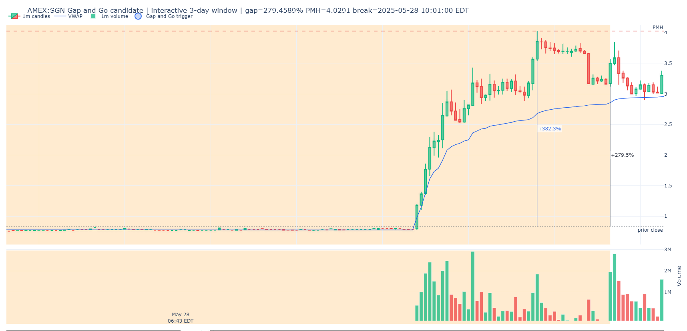

# DAS - Initial Strategy Definition v0.1

Fecha: 2026-06-23  
Estado: `initial_strategy_definition`  
Scope: `03_STRATEGY_LIBRARY/LONG/DAS/`

Este documento define inicialmente que entendemos por `DAS` en TSIS.

No es un backtest.
No valida edge.
No define todavia una estrategia institucional.

Su funcion es servir como primera definicion tecnica para buscar muestras,
visualizarlas en notebook y despues desgranar los eventos que componen la
estrategia.

## 1. Definicion corta

`DAS` significa `Dips After Squeeze`.

En TSIS, DAS es una estrategia long de momentum intradia basada en una secuencia
concreta:

```text
accion dormida
-> despertar con push inicial
-> primer dip que no destruye la estructura
-> reactivacion alcista
-> ruptura o recuperacion del high del primer push
-> secuencia activa de dips posteriores aprovechables para estudio.
```

La idea central no es comprar cualquier retroceso.

La idea central es estudiar acciones que despiertan desde un estado apagado,  
hacen un primer push fuerte, no se destruyen en el primer dip y vuelven a  
romper al alza. A partir de esa confirmacion, cada nuevo dip dentro de la misma  
secuencia activa puede clasificarse como un DAS candidato.  

En una frase:

```text
DAS =
despertar inicial +
primer dip retenido +
rebreak del primer push +
momentum reactivado con squeeze/push +
dips posteriores dentro de la secuencia activa.
```

**Filosofía**

El 75% de las acciones que tiene un gap en Daily se destruyen en market hours, pero el 100% de esas acciones, en su estructura del gap tiene una cara frontside. Ese frontside es más rápido y más volatil, esa es nuestra ventaja.


## 2. Lectura humana inicial

La hipotesis humana que origina esta estrategia es:

```text
Cuando una small/micro cap despierta con un push violento, muchos participantes
intentan vender el fallo o shortear el retroceso. Si el primer dip no destruye
la estructura y el precio vuelve a romper al alza, esos shorts quedan bajo
presion. Esa presion puede acelerar la siguiente expansion.
```

Esta lectura es una hipotesis conductual, no una prueba.

TSIS debe tratarla como:

```text
mechanism_hypothesis = short-side pressure / forced covering / momentum feedback
validation_status = pending
```

## 3. Naturaleza de la estrategia

DAS no es un evento atomico.

Es una estrategia compuesta.

Puede contener:

```text
contexto
-> despertar
-> primer push
-> primer dip
-> retencion de estructura
-> rebreak del primer push
-> secuencia DAS activa
-> dips posteriores
-> continuacion o fallo
```

Por eso el primer trabajo no es optimizar entrada, stop o target.

El primer trabajo es:

```text
encontrar muestras historicas
-> ver graficos
-> clasificar como se supera el primer push
-> separar fenomenos observables
-> escribir eventos v0 en Event Library
-> extraer las mayores estadisticas posibles y estudiar todos lo casos
```

## 4. Fuente visual inicial

La imagen siguiente es una nota visual humana usada para razonar la estructura.
Las lineas negras y textos manuscritos no son etiquetas oficiales ni detector
logic. Sirven solo como ejemplo de los niveles que deben formalizarse mejor.



Lectura corregida:

- el movimiento importante no es solo la ruptura final;
- primero debe existir un despertar o primer push;
- despues debe aparecer un primer retroceso que no destruya el push;
- el punto clave es como el precio supera de nuevo el high del primer push;
- una vez superado ese high, la secuencia DAS queda activa;
- los dips posteriores deben numerarse y estudiarse por separado.

## 5. Arbol conceptual inicial

Propuesta de descomposicion:

```text
DAS_Strategy
  -> Dormant_State_Context
  -> Awakening_Push_Event
  -> First_Dip_Hold_Event
  -> First_Push_High_Defined_Event
  -> First_Push_High_Rebreak_Event
  -> DAS_Sequence_Activation_Event
  -> DAS_Dip_Reactivation_Event
  -> DAS_Continuation_Or_Failure_Event
```

Esta lista no es definitiva. Sirve para empezar a mirar la estrategia como un
conjunto de piezas observables.

## 6. Explicacion de cada componente

### 6.1. `Dormant_State_Context`

Contexto donde el ticker venia relativamente apagado antes del despertar.

Puede verse como:

- poco rango;
- poco volumen;
- precio comprimido;
- ausencia de movimiento direccional reciente;
- actividad premarket baja antes del push.

En TSIS este componente responde:

```text
El ticker venia de un estado dormido antes del primer push?
```

### 6.2. `Awakening_Push_Event`

Evento donde aparece el primer movimiento expansivo relevante.

No es necesariamente el high definitivo del dia.
Es el primer movimiento que demuestra que el ticker ha despertado.

Debe medir:

- inicio del push;
- high del primer push;
- porcentaje de expansion;
- volumen del push;
- velocidad del movimiento;
- numero de velas implicadas;
- cierre relativo de las velas.

En TSIS este evento responde:

```text
El mercado paso de letargo a expansion visible?
```

### 6.3. `First_Dip_Hold_Event`

Evento donde el precio retrocede despues del primer push, pero no destruye la
estructura.

No debe llamarse "dip sostenido" de forma ambigua.

Puede ocurrir de dos maneras:

1. `single_bar_dip`: retroceso rapido dentro de una vela o en la vela siguiente,
   dejando mecha y recuperacion inmediata.
2. `multi_bar_flag_dip`: varias velas forman una bandera, shelf o microbase
   antes de reactivar.

En DAS, un caso especialmente importante es:

```text
green_wick_dip_reactivation
```

Este caso ocurre cuando, despues de romper o recuperar el high del primer push,
la siguiente vela o una vela de continuacion sigue siendo verde, pero durante su
formacion hace primero un retroceso por debajo del cierre de la vela previa.
Ese retroceso deja una mecha inferior y luego la vela recupera, cierra verde y
mantiene la verticalidad.

La lectura humana es:

```text
la vela parece ofrecer dip,
pero el momentum lo absorbe rapido
y la vela termina confirmando presion alcista.
```

No debe confundirse con una bandera de varias velas. Es un dip intrabar visible
en la mecha de una vela verde de continuacion.

Debe medir:

- profundidad del dip;
- duracion del dip;
- cuanto del primer push retiene;
- si perfora o no VWAP;
- si el volumen vendedor se seca o sigue agresivo;
- si la reaccion alcista aparece rapido.

En TSIS este evento responde:

```text
El primer retroceso aguanto suficiente estructura para permitir reactivacion?
```

### 6.4. `First_Push_High_Defined_Event`

Evento donde el primer push deja un high claro.

Ese high se convierte en el nivel central de DAS.

No es un resistance level generico.
Es el high del primer despertar.

En TSIS este evento responde:

```text
Existe un high del primer push que el mercado puede intentar recuperar o romper?
```

### 6.5. `First_Push_High_Rebreak_Event`

Evento donde el precio supera de nuevo el high del primer push.

Este es el punto que activa la lectura DAS.

Debe clasificarse por forma de ruptura:

```text
single_candle_rebreak
multi_candle_flag_break
flat_shelf_break
ascending_flag_break
vwap_reclaim_rebreak
compression_break
wick_rejection_rebreak
unclear
```

En TSIS este evento responde:

```text
Como supero el precio el high del primer push?
```

### 6.6. `DAS_Sequence_Activation_Event`

Evento conceptual donde, tras recuperar o romper el high del primer push, la
secuencia queda activa para estudiar dips posteriores.

No significa que haya que operar automaticamente.

Pero la rotura del high del primer push si es un punto operativo estudiable.
Puede ser una entrada candidata por rebreak, breakout o impulso de
continuacion si despues cumple criterios de calidad.

La lectura correcta tiene dos ramas:

```text
despertar
-> primer push
-> primer dip retenido
-> rotura del high del primer push

Rama A:
  estudiar operar la rotura / impulso de rebreak.

Rama B:
  si no se opera la rotura, usarla como activacion de secuencia y estudiar
  los dips posteriores como DAS #1, DAS #2, DAS #3...
```

Por tanto, la rotura no es obligatoria como decision, pero si es una decision
operativa natural de la estrategia DAS.

En TSIS este evento responde:

```text
La accion ya confirmo reactivacion suficiente para estudiar la rotura y/o
numerar DAS posteriores?
```

### 6.7. `DAS_Dip_Reactivation_Event`

Evento recurrente dentro de la secuencia activa.

Cada ocurrencia debe llevar indice:

```text
DAS #1
DAS #2
DAS #3
...
```

Debe medir:

- indice de secuencia;
- profundidad del dip;
- duracion;
- si el dip fue una mecha dentro de vela verde;
- cierre previo usado como referencia del dip;
- recuperacion desde el low intrabar hasta el cierre;
- reaccion;
- relacion con VWAP;
- relacion con highs/lows previos;
- si el dip genera nuevo high;
- si falla y destruye la estructura.

En TSIS este evento responde:

```text
Este retroceso posterior reactivo momentum o marco deterioro?
```

## 7. Niveles que debe marcar el notebook

El notebook de DAS debe marcar, como minimo:

```text
awakening_base
first_push_start
first_push_high
first_push_low
first_dip_start
first_dip_low
first_dip_hold_zone
first_push_high_rebreak
green_wick_dip_reactivation
reactivation_candle
das_sequence_start
das_1_dip_low
das_2_dip_low
das_3_dip_low
```

Estos niveles deben verse en el chart, pero no deben convertirse en autoridad
final hasta que se definan eventos v0.

## 8. Clasificacion inicial de la ruptura del primer push

El notebook debe intentar etiquetar, aunque sea de forma aproximada, como se
supero el primer push.

Tipos iniciales:

### 8.1. `single_candle_rebreak`

Una sola vela rompe el high del primer push con cuerpo y cierre fuerte.

### 8.2. `multi_candle_flag_break`

El precio forma una bandera de varias velas y rompe al alza.

### 8.3. `flat_shelf_break`

El precio crea una meseta horizontal cerca de highs y rompe esa zona.

### 8.4. `ascending_flag_break`

El precio consolida con lows ascendentes y rompe el techo del patron.

### 8.5. `vwap_reclaim_rebreak`

El precio recupera VWAP y rompe despues el high del primer push.

### 8.6. `compression_break`

El rango se comprime antes de liberar expansion.

### 8.7. `wick_rejection_rebreak`

El dip deja mecha inferior, recupera rapido y rompe highs.

### 8.8. `green_wick_dip_reactivation`

Despues de recuperar o romper el high del primer push, una vela verde de
continuacion hace primero un dip intrabar por debajo del cierre previo y despues
recupera. La mecha inferior es el dip; el cierre verde es la reactivacion.

Este patron es importante para DAS porque no siempre aparece como retroceso de
varias velas. A veces el primer DAS real queda escondido dentro de una vela
verde que parece solo continuidad si se mira demasiado rapido.

### 8.9. `unclear`

La estructura no puede clasificarse con confianza.

## 9. Variantes buenas corregidas

Esta seccion conserva las variantes buenas que se estan definiendo a partir de
revision visual humana. No son backtest. No son reglas institucionales finales.
Son plantillas operativas de investigacion para depurar el scanner v2.

La lectura correcta es:

```text
DAS no es una unica entrada.
DAS es una secuencia frontside mientras el primer impulso sigue vivo.
```

Por tanto, cada imagen buena debe ayudar a responder:

```text
1. donde empieza el despertar?
2. cual es el primer push real?
3. cual es el high del primer push?
4. cuanto subio ese primer push?
5. donde esta el primer dip?
6. el dip respeta o destruye estructura?
7. como se recupera/rompe el high del primer push?
8. que dips posteriores son operables?
9. donde termina la secuencia porque se rompe momentum?
10. cual fue el maximo porcentaje de todo el tramo vivo?
```

### 9.1. Variante A: `ROLR_clean_frontside_DAS_ladder`

Imagen fuente:


Lectura:

ROLR representa una variante limpia de DAS frontside. La accion despierta desde
letargo, entra en scanner, acelera en vertical, define un primer high
estructural y despues ofrece varios dips mientras el momentum sigue vivo.

La estructura principal es:

```text
dormant base
-> scanner trigger
-> push start
-> first_push_high
-> dip/retest alrededor de ruptura del primer push
-> green wick dip con recuperacion
-> continuation dip dentro del mismo tramo
-> estructura de momentum rota
-> fin de DAS
```

Lo importante de esta variante es que las entradas no son aleatorias. Todas
ocurren mientras el precio sigue demostrando control alcista:

- el primer push cambia el estado del ticker;
- VWAP pasa a ser referencia dinamica de soporte/control;
- los dips ocurren dentro de continuacion, no bajo una estructura rota;
- cada entrada debe poder explicarse contra un nivel observable;
- cuando rompe estructura de momentum, se deja de operar DAS.

Entradas observadas:

1. `DAS_1_first_push_red_candle_breakout_dip`

   Entrada alrededor de la ruptura del alto de la vela roja / alto operativo
   del primer push. La logica humana marcada es:

   ```text
   rompe el alto de la vela roja del primer push
   -> entra en el dip de la vela roja o de la vela verde de continuacion
   -> ambos dips respetan VWAP
   ```

   Esta entrada no depende solo de que el precio suba. Depende de que el primer
   retroceso no destruya VWAP ni el impulso original.

2. `DAS_2_green_wick_dip_reactivation`

   Entrada en el dip de una vela verde que durante su formacion estuvo en rojo
   o hizo retroceso visible. La mecha respeta VWAP y la vela recupera con
   momentum.

   Lectura:

   ```text
   la vela ofrece liquidez en dip
   -> no pierde estructura
   -> recupera rapido
   -> confirma que el momentum sigue activo
   ```

3. `DAS_3_impulse_self_dip`

   Entrada en el dip del propio impulso posterior. La accion ya esta mas
   extendida, por tanto la calidad debe considerarse menor que DAS #1 y DAS #2,
   pero sigue siendo estudiable mientras:

   - respeta VWAP o estructura dinamica;
   - no pierde el tramo frontside;
   - la reaccion mantiene presion alcista.

Fin de secuencia:

La secuencia DAS termina cuando el precio rompe la estructura de momentum que
sostenia el tramo. Despues de ese punto los retrocesos ya no deben etiquetarse
como DAS buenos. Pueden pertenecer a:

- distribucion;
- agotamiento;
- fallo de momentum;
- transition state;
- otro evento distinto.

Campos que el scanner v2 debe producir para esta variante:

```text
variant_label = ROLR_clean_frontside_DAS_ladder
scanner_trigger_ts
push_start_ts
push_start_price
first_push_high_ts
first_push_high
first_push_pct_from_pm_open
first_push_pct_from_push_start
first_dip_low_ts
first_dip_low
first_dip_depth_pct
first_dip_vwap_respected
first_push_rebreak_ts
first_push_rebreak_type
das_1_entry_zone
das_2_entry_zone
das_3_entry_zone
momentum_end_ts
momentum_end_reason
max_momentum_high_ts
max_momentum_high
max_momentum_pct_from_pm_open
max_momentum_pct_from_push_start
```

Regla tecnica:

```text
Mientras no exista momentum_end_ts, los dips pueden numerarse.
Despues de momentum_end_ts, no se deben seguir generando DAS candidatos buenos.
```

### 9.2. Variante B: `TWG_deep_first_dip_VWAP_reclaim_rebreak`

Imagen fuente:


Lectura:

TWG representa una variante mas dificil: primer push agresivo, rechazo inicial,
dip profundo y recuperacion posterior. No es el DAS limpio de escalera como
ROLR. Es un DAS de recuperacion/reclaim despues de un primer fallo aparente.

La estructura principal es:

```text
scanner trigger
-> primer spike/push
-> high inicial ambiguo
-> venta fuerte / deep first dip
-> recuperacion de VWAP
-> ruptura de estructura del primer dip
-> rebreak de vela roja / nivel operativo del primer push
-> entrada en dip de rebreak
-> stop cuando falla la estructura superior
```

Aqui el primer high puede ser ambiguo. La imagen marca literalmente:

```text
high primer push?
```

Esto es importante para codigo. El scanner v2 no debe asumir que el primer wick
extremo es siempre el `first_push_high` operativo. Debe guardar candidatos de
nivel:

```text
first_push_wick_high
first_push_body_high
first_red_candle_high_after_push
selected_first_push_high
selected_first_push_high_confidence
```

Entradas observadas:

1. `DAS_reclaim_entry_after_deep_first_dip`

   Entrada cuando el precio recupera estructura despues de un deep dip. La
   logica humana marcada es:

   ```text
   breakout de estructura del primer push
   -> aguanta en el higher low anterior
   -> aguanta VWAP
   ```

   Esta entrada no es un breakout puro. Es un reclaim estructural. La clave es
   que el primer dip fue profundo, pero la accion vuelve a recuperar control.

2. `DAS_red_candle_high_breakout_dip`

   Entrada cuando rompe el alto de la vela roja del primer push y se busca el
   dip/retest de esa ruptura.

   Lectura:

   ```text
   rompe nivel defensivo de vela roja
   -> retrocede al nivel
   -> si no pierde control, el dip es operable
   ```

3. `DAS_late_rebreak_continuation`

   La zona posterior cerca de highs es continuation mas madura. Se puede
   estudiar, pero debe etiquetarse con menor calidad secuencial porque:

   - el ticker ya tuvo rechazo fuerte previo;
   - la estructura es mas ruidosa;
   - las mechas son amplias;
   - el riesgo de falso breakout es mayor.

Fin de secuencia:

En TWG, el stop/fin de DAS aparece cuando la zona alta falla y rompe estructura.
La estrategia deja de leer dips como oportunidad cuando el tramo deja de estar
frontside.

Campos que el scanner v2 debe producir para esta variante:

```text
variant_label = TWG_deep_first_dip_VWAP_reclaim_rebreak
scanner_trigger_ts
scanner_trigger_price
first_push_wick_high_ts
first_push_wick_high
first_push_body_high
selected_first_push_high
selected_first_push_high_confidence
deep_first_dip_low_ts
deep_first_dip_low
deep_first_dip_pct
vwap_lost_during_dip
vwap_reclaim_ts
higher_low_after_deep_dip
structure_reclaim_ts
first_red_candle_high
first_red_candle_high_break_ts
rebreak_dip_low
momentum_end_ts
momentum_end_reason
max_momentum_high_ts
max_momentum_high
max_momentum_pct_from_pm_open
max_momentum_pct_from_push_start
```

Regla tecnica:

```text
Un deep first dip no invalida DAS por si solo.
Invalida DAS si no hay recuperacion de VWAP/estructura antes del rebreak.
```

### 9.3. Variante C: `PAVM_late_scanner_but_valid_awakening_reconstruction`

Imagen fuente:


Lectura:

PAVM muestra un caso donde el ticker ya esta despertando antes de que el
marcador de scanner sea el punto ideal de lectura. La accion viene desde una
base, rompe estructura con volumen, entra en una primera expansion y despues
ofrece continuaciones sobre niveles previos.

El punto importante no es aceptar ciegamente el `scanner_trigger` impreso por
el codigo. El punto importante es reconstruir hacia atras:

```text
base previa
-> ruptura de base con volumen
-> awakening_start
-> scanner eligibility
-> first push
-> first push high
-> dip/retest
-> continuation/rebreak
```

En este caso, el scanner v2 debe poder decir:

```text
scanner_trigger_quality = late_but_reconstructable
trigger_should_have_fired_earlier = true
awakening_start_ts = primer breakout real de la base
scanner_delay_bars = barras entre awakening_start y scanner_trigger
scanner_delay_pct_from_awakening =
  (scanner_trigger_price / awakening_start_price - 1) * 100
```

La variante sigue siendo util porque el movimiento conserva estructura y el
precio sigue construyendo oportunidades sobre el mismo frente de momentum.

Campos que el scanner v2 debe producir para esta variante:

```text
variant_label = PAVM_late_scanner_but_valid_awakening_reconstruction
scanner_eligibility_ts
scanner_trigger_ts
scanner_trigger_quality
trigger_should_have_fired_earlier
awakening_start_ts
awakening_start_price
scanner_delay_bars
scanner_delay_minutes
scanner_delay_pct_from_awakening
first_push_high
first_push_high_ts
first_push_pct_from_pm_open
first_push_pct_from_awakening
max_momentum_high
max_momentum_high_ts
max_momentum_pct_from_pm_open
momentum_end_ts
momentum_end_reason
```

Regla tecnica:

```text
Un scanner trigger tardio no invalida automaticamente el caso.
Lo invalida si no puede reconstruirse un awakening_start limpio y si la
estructura ya estaba destruida antes del supuesto DAS.
```

### 9.4. Variante diagnostica: `JFBR_stale_scanner_trigger_after_first_push`

Imagen fuente:


Lectura:

JFBR muestra el problema contrario. Hay movimiento y hay volumen, pero el
marcador de scanner cae demasiado tarde respecto al primer push real. El high
del primer movimiento ya se ha impreso o esta muy cerca de imprimirse, el
precio empieza a perder verticalidad y el trigger ya no representa una
aparicion temprana del ticker.

Por eso este caso no debe entrar como DAS confirmado solo porque haya tenido
un gran `maxpush`. El scanner v2 debe separar:

```text
scanner_eligibility_ts
scanner_trigger_ts
awakening_start_ts
first_push_high_ts
```

Si el `scanner_trigger_ts` ocurre despues de `first_push_high_ts`, o cuando el
precio ya esta dentro de rechazo del primer push, el caso debe marcarse como:

```text
scanner_trigger_quality = stale
scanner_trigger_after_first_push = true
state = scanner_only
```

La lectura humana es:

```text
No se descarta porque no haya momentum.
Se descarta como DAS limpio porque el trigger llego tarde para definir el
primer dip posterior al despertar.
```

Campos que el scanner v2 debe producir para esta variante:

```text
variant_label = JFBR_stale_scanner_trigger_after_first_push
scanner_eligibility_ts
scanner_trigger_ts
scanner_trigger_price
awakening_start_ts
awakening_start_price
first_push_high_ts
first_push_high
scanner_trigger_after_first_push
scanner_trigger_quality
stale_scanner_trigger
first_push_pct_from_pm_open
max_momentum_pct_from_pm_open
state
state_reason
```

Regla tecnica:

```text
Si scanner_trigger ocurre despues de que el primer push ya imprimio su high,
no puede usarse como origen limpio de DAS.
```

### 9.5. Metricas obligatorias para todas las variantes buenas

Para la busqueda v2, el scanner debe dejar marcadas tres mediciones principales:

1. Porcentaje del primer push.

   Debe medirse al menos de dos formas:

   ```text
   first_push_pct_from_pm_open =
     (first_push_high / pm_open_price - 1) * 100

   first_push_pct_from_push_start =
     (first_push_high / push_start_price - 1) * 100
   ```

   La primera mide cuanto subio desde la primera vela valida de premarket.
   La segunda mide la expansion real desde el inicio detectado del push.

2. Maximo del primer push.

   Debe guardarse como precio y tiempo:

   ```text
   first_push_high
   first_push_high_ts
   ```

   Si hay ambiguedad, guardar tambien:

   ```text
   first_push_wick_high
   first_push_body_high
   selected_first_push_high
   selected_first_push_high_confidence
   ```

3. Maximo porcentaje de todo el movimiento vivo.

   Debe medirse hasta que termina el momentum, no hasta el final arbitrario del
   chart.

   ```text
   max_momentum_pct_from_pm_open =
     (max_momentum_high / pm_open_price - 1) * 100

   max_momentum_pct_from_push_start =
     (max_momentum_high / push_start_price - 1) * 100
   ```

   Este maximo debe terminar en:

   ```text
   momentum_end_ts
   ```

   y debe tener razon:

   ```text
   momentum_end_reason:
     - structure_break
     - vwap_loss
     - lower_high_failure
     - shelf_breakdown
     - violent_rejection
     - unclear
   ```

### 9.6. Consecuencia para el scanner v2

La busqueda v2 no debe buscar solo:

```text
push + dip + rebreak
```

Debe construir una lectura de secuencia:

```text
scanner appearance
-> first push object
-> first dip object
-> rebreak/reclaim object
-> DAS sequence object
-> numbered DAS entries
-> momentum end object
```

El output debe permitir revisar casos buenos y malos sin reinterpretar a mano
cada vez:

```text
candidate_id
ticker
date
variant_guess
first_push_pct
first_push_high
max_momentum_pct
max_momentum_high
das_sequence_active
das_entry_count
momentum_end_reason
human_quality_bucket
```

Regla final de esta seccion:

```text
Un DAS bueno no se define solo por romper.
Se define por despertar, sostener estructura, reactivar momentum y ofrecer dips
dentro de un tramo frontside vivo.
```

### 9.7. Anti-casos que el scanner v2 debe excluir o degradar

Los siguientes casos deben seguir visibles para auditoria, pero no deben
promocionarse como DAS confirmados.

#### 9.7.1. Spike vertical sin rebreak

Estructura:

```text
letargo
-> spike vertical
-> rechazo inmediato
-> no rebreak valido
```

Estado esperado:

```text
state = failed_before_rebreak
state_reason = vertical_spike_reject_no_rebreak
```

#### 9.7.2. Primer push destruido antes de reactivacion

Estructura:

```text
first_push
-> pullback profundo
-> perdida de VWAP/base/higher low
-> intento posterior desconectado
```

Regla:

```text
Un spike posterior no repara un DAS si la estructura del primer push ya murio.
Debe tratarse como nuevo episodio o como reactivacion separada.
```

Estado esperado:

```text
state = structure_dead_before_rebreak
state_reason = first_push_destroyed
```

#### 9.7.3. Scanner tardio despues del primer push

Estructura:

```text
awakening_start
-> first_push
-> first_push_high
-> scanner_trigger tardio
```

Estado esperado:

```text
state = scanner_only
state_reason = stale_scanner_trigger_after_first_push
```

#### 9.7.4. Extension previa antes del trigger

Estructura:

```text
extension importante previa
-> colapso o rango amplio
-> scanner_trigger posterior
```

Estado esperado:

```text
state = prior_extension_before_trigger
state_reason = trigger_not_first_appearance
```

#### 9.7.5. Wick high no aceptado como nivel estructural

No todo high de mecha debe convertirse en `first_push_high` operativo.

Si el high del primer push es solo una mecha extrema, sin aceptacion posterior
y sin cuerpo/rango que permita rebreak realista, el scanner debe guardar dos
niveles:

```text
first_push_wick_high
first_push_structural_high
```

El DAS debe evaluarse contra el nivel estructural seleccionado, no contra una
mecha imposible de usar como referencia limpia.

#### 9.7.6. Regla de la ultima vela roja del pullback

Despues del primer push, el pullback debe dejar una estructura que el precio
pueda recuperar.

La confirmacion minima de DAS debe exigir una ruptura valida de al menos uno
de estos niveles:

```text
last_red_pullback_high
selected_first_push_high
vwap_reclaim_level seguido de rebreak
```

Regla fuerte:

```text
Si despues del primer push nunca hay una vela que cierre por encima del high
de la ultima vela roja relevante del pullback, y tampoco hay recuperacion
estructural equivalente, no hay DAS confirmado.
```

Resultado:

```text
state = scanner_only | failed_before_rebreak
das_sequence_active = false
```

### 9.8. Refactor propuesto para el scanner/notebook v2

El scanner v2 debe dejar de ser una busqueda monolitica. Debe construir
objetos secuenciales simples, medibles y auditables.

#### 9.8.1. Objetos internos

```text
ScannerSeed
AwakeningEpisode
FirstPush
FirstPullback
StructuralRebreak
DASSequence
MomentumEnd
NegativeCase
```

#### 9.8.2. `ScannerSeed`

Representa que el ticker cumple el screener humano inicial:

```text
market_cap < 100M
session_volume >= 500k
0.5 <= price <= 20
```

No implica DAS.

#### 9.8.3. `AwakeningEpisode`

Detecta cuando la accion realmente despierta:

```text
base/rango previo
-> expansion de rango
-> expansion de volumen
-> ruptura de estructura local
```

Campos:

```text
awakening_start_ts
awakening_start_price
awakening_reason
prior_extension_before_trigger
```

#### 9.8.4. `FirstPush`

Define el primer impulso real que importa para DAS.

Campos obligatorios:

```text
first_push_start_ts
first_push_start_price
first_push_high_ts
first_push_high
first_push_pct_from_pm_open =
  (first_push_high / pm_open_price - 1) * 100
first_push_pct_from_push_start =
  (first_push_high / first_push_start_price - 1) * 100
first_push_wick_high
first_push_structural_high
first_push_high_selection_reason
```

Regla:

```text
El porcentaje del primer push debe salir siempre marcado respecto a la
apertura valida de premarket del dia.
```

#### 9.8.5. `FirstPullback`

Define la primera correccion despues del primer push.

Campos:

```text
first_pullback_start_ts
first_pullback_low_ts
first_pullback_low
first_pullback_depth_pct
last_red_pullback_high
vwap_hold_or_loss
structure_alive_after_pullback
```

#### 9.8.6. `StructuralRebreak`

Confirma si existe DAS activo.

Campos:

```text
rebreak_ts
rebreak_price
rebreak_type:
  - last_red_high_break
  - first_push_high_break
  - vwap_reclaim_rebreak
  - single_candle_rebreak
  - multi_candle_flag_break
rebreak_close_above_required_level
das_sequence_active
```

Regla:

```text
Sin StructuralRebreak no hay DAS confirmado.
```

#### 9.8.7. `MomentumEnd`

Mide hasta donde llego el movimiento vivo y por que termino.

Campos obligatorios:

```text
max_momentum_high
max_momentum_high_ts
max_momentum_pct_from_pm_open =
  (max_momentum_high / pm_open_price - 1) * 100
max_momentum_pct_from_push_start =
  (max_momentum_high / first_push_start_price - 1) * 100
momentum_end_ts
momentum_end_reason
```

Regla:

```text
El maximo porcentaje del momentum debe salir siempre marcado para todo el
movimiento vivo, no solo para la ventana del trigger.
```

#### 9.8.8. Estados de salida

```text
rebreak_confirmed
scanner_only
failed_before_rebreak
structure_dead_before_rebreak
stale_scanner_trigger
prior_extension_before_trigger
wick_only_push_high
unclear_manual_review
```

El notebook debe poder ordenar y filtrar por estos estados sin borrar los
casos negativos. Los negativos sirven para depurar, pero no deben mezclarse con
los DAS buenos.

## 10. Condiciones iniciales para buscar muestras

El notebook DAS debe empezar desde la logica del screener, no desde un DAS ya
confirmado.

Filtro duro inicial:

```yaml
scanner_seed:
  max_market_cap: 100000000
  min_session_volume: 500000
  min_price: 0.5
  max_price: 20.0
```

La unidad inicial es:

```text
Scanner_Appearance_Candidate
```

Es decir:

```text
primera vela donde el ticker cumple el screener operativo
```

Despues de esa aparicion, el notebook debe medir y etiquetar:

```text
hubo push inicial?
cuanto subio desde scanner_trigger?
donde estuvo el primer high visible?
hubo primer dip?
el dip destruyo o aguanto?
rompio de nuevo el primer high?
como lo rompio?
hubo DAS #1, DAS #2?
fallo?
```

## 11. Explicacion de parametros

### 11.1. `max_market_cap`

Market cap maximo permitido por el screener.

Es filtro duro porque define el universo operativo de small/micro caps que se
quiere revisar.

### 11.2. `min_session_volume`

Volumen acumulado minimo de la sesion para que el ticker aparezca en screener.

No es volumen del push.
Es volumen de sesion.

En el scanner DAS v2, esta metrica se interpreta de forma estricta:

```text
premarket_cum_volume >= min_session_volume
```

desde el inicio de premarket y mientras se construye el primer push.

La accion solo puede ser candidata DAS si el screener ya la podia haber visto
antes o durante el primer push. Si el volumen minimo aparece mucho despues de
que el primer push ya imprimio su high, el caso no debe promoverse como DAS
v2 aunque luego haga una recaptura tardia.

Esto separa:

```text
scanner appearance durante el despertar
```

de:

```text
recaptura tardia despues de una estructura ya envejecida
```

### 11.3. `min_price`

Precio minimo observado para evitar acciones demasiado bajas.

### 11.4. `max_price`

Precio maximo observado para mantener el foco operativo del screener.

### 11.5. Metricas posteriores, no filtros

Estos campos deben medirse, pero no filtrar por defecto:

```text
pm_open_ts
pm_open_price
pm_open_to_scanner_pct
pm_open_to_first_push_high_pct
pm_open_to_max_high_after_trigger_pct
scanner_to_max_high_pct
max_push_pct_after_trigger
first_push_high
first_dip_depth_pct
first_push_retention_pct
first_rebreak_ts
minutes_from_trigger_to_rebreak
minutes_from_push_high_to_rebreak
first_rebreak_type
first_green_wick_dip_ts
first_green_wick_dip_low
first_green_wick_dip_depth_pct
vwap_at_rebreak
das_state
```

En el notebook, `maxpush` visible debe interpretarse como:

```text
pm_open_to_first_push_high_pct
```

cuando exista. Es decir, desde la primera vela valida de premarket a partir de
04:00 NY hasta el high del primer push definido. Si esa metrica no existe, el
notebook puede caer a `pm_open_to_max_high_after_trigger_pct` y, como ultima
compatibilidad con runs antiguos, a `max_push_pct_after_trigger`.

`max_push_pct_after_trigger` se conserva por compatibilidad, pero significa:

```text
scanner_trigger_close -> max_high_after_trigger
```

No debe confundirse con el max push operativo desde apertura premarket.

Regla:

```text
Primero capturar mucho.
Despues mirar graficos.
Despues crear buckets humanos.
Despues decidir que filtros separan calidad.
```

## 12. Visualizacion requerida en notebook

El notebook de DAS debe reutilizar la calidad visual del notebook de Gap and Go.

Debe incluir:

- chart interactivo con ventana amplia;
- chart estatico de contexto;
- chart estatico del dia del candidato desde 03:30 hasta 10:00 NY, con eje X
  compacto y eje Y ajustado a los maximos/minimos de esa ventana;
- chart estatico del dia del evento hasta las 16:00 NY;
- canvas visual cuadrado o casi cuadrado, aumentando la altura Y sin reducir el
  ancho X disponible del notebook;
- panel de volumen subordinado al precio, aproximadamente un 20% menos alto
  que la version inicial;
- titulo superior separado en varias lineas para no pisar la leyenda;
- medicion vertical del push desde la apertura de premarket del dia del
  candidato hasta el `first_push_high`, no desde el prior close ni desde el
  afterhours del dia anterior;
- velas de 1m;
- VWAP;
- volumen en panel inferior;
- velas verdes para candles alcistas;
- velas rojas para candles bajistas;
- volumen verde/rojo segun vela;
- sesiones sombreadas;
- crosshair y hover con OHLCV y hora NY;
- `EXCHANGE:TICKER` visible y copiable;
- nombre completo de compania si existe;
- exportacion PNG de los charts estaticos.

Capas especificas DAS:

- zona del primer push;
- low del primer dip;
- high del primer push;
- marcador de rebreak;
- marcador de primer `green_wick_dip_reactivation` si aparece;
- etiqueta del tipo de rebreak;
- marcadores `DAS #1`, `DAS #2`, `DAS #3` si aparecen.

## 13. Casos que NO son DAS

No son DAS claros:

- spike vertical que se destruye sin rebreak;
- dip que rompe toda la estructura del primer push;
- candidato donde el scanner aparece despues de una extension/colapso grande
  previa dentro de la misma sesion;
- recuperacion tardia que rompe un nivel despues de haber perdido el origen del
  despertar;
- movimiento sin push inicial;
- breakout de resistencia externa sin despertar previo;
- rebote aleatorio bajo VWAP sin recuperar control;
- continuation tardia desconectada del primer push;
- vela aislada sin volumen ni estructura.

## 14. Relacion con Breakout

DAS y Breakout se solapan, pero no son lo mismo.

En DAS, el nivel principal es:

```text
first_push_high
```

En Breakout, el nivel principal puede ser cualquier resistencia relevante:

```text
premarket high
high of day
previous day high
multi-day high
whole dollar
trendline resistance
range high
```

Por tanto:

```text
DAS puede contener un breakout.
Breakout no siempre es DAS.
```

La pregunta de DAS es:

```text
El primer push aguanto el primer dip y recupero/rompio su propio high?
```

La pregunta de Breakout es:

```text
El precio rompio un nivel relevante de resistencia?
```

## 15. Relacion con eventos v0 en Event Library

Eventos candidatos que podrian derivarse de esta estrategia:

```text
Awakening_Push_Event
First_Dip_Hold_Event
First_Push_High_Rebreak_Event
DAS_Sequence_Activation_Event
DAS_Dip_Reactivation_Event
DAS_Failure_Event
```

Estos nombres son provisionales.

Los eventos finales deben escribirse primero en Event Library como:

```text
00_EVENT_LIBRARY/001.md
00_EVENT_LIBRARY/002.md
00_EVENT_LIBRARY/003.md
```

y solo despues, cuando esten claros, se moveran a su familia final.

## 16. Notebook plan

El notebook de DAS debe permitir:

1. elegir filtros;
2. imprimir el comando terminal reproducible;
3. lanzar busqueda o cargar un run existente;
4. refrescar resultados parciales;
5. ordenar candidatos;
6. renderizar charts;
7. exportar PNGs;
8. clasificar muestras como buenas, regulares, malas o peores;
9. guardar metadata del run y parametros usados;
10. dejar claro que los outputs son exploratorios.

Campos esperados iniciales:

```text
ticker
exchange
company_name
date
first_push_start_ts
first_push_high_ts
first_push_high
first_dip_start_ts
first_dip_low_ts
first_dip_low
first_dip_depth_pct
first_push_retention_pct
first_rebreak_ts
first_rebreak_type
first_green_wick_dip_ts
first_green_wick_dip_low
first_green_wick_dip_depth_pct
das_sequence_active
das_index
pattern_type
quality_bucket_human
```

## 17. Estado actual

`DAS` queda definido como estrategia inicial de investigacion long.

No queda validado.
No queda institucionalizado.
No queda convertido en evento.

El siguiente paso operativo sera construir un notebook exploratorio inspirado
en `gap&go`, adaptado a:

- despertar;
- primer push;
- primer dip;
- rebreak del primer push;
- clasificacion aproximada del tipo de ruptura.

## 18. Regla final

DAS no empieza en cualquier dip.

DAS empieza cuando un push inicial demuestra despertar, el primer dip no lo
destruye y el mercado recupera o rompe el high de ese primer push.

Despues de esa activacion, cada dip posterior debe estudiarse como una
ocurrencia numerada dentro de una secuencia, no como una palabra generica.
