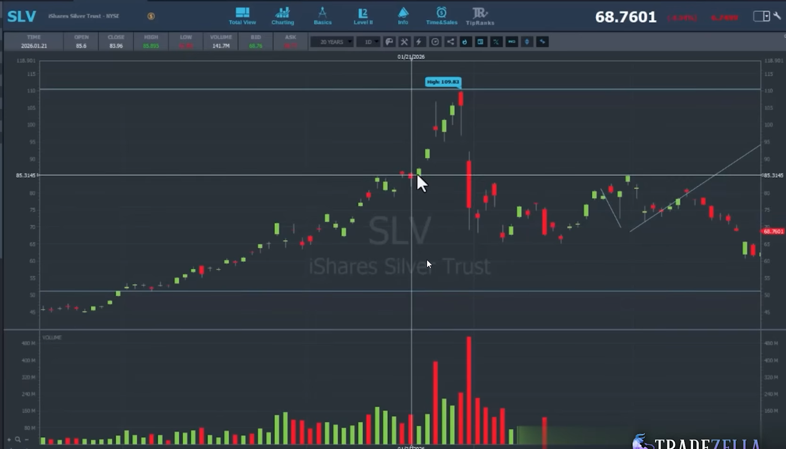
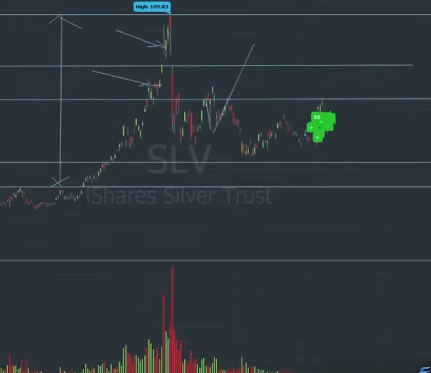
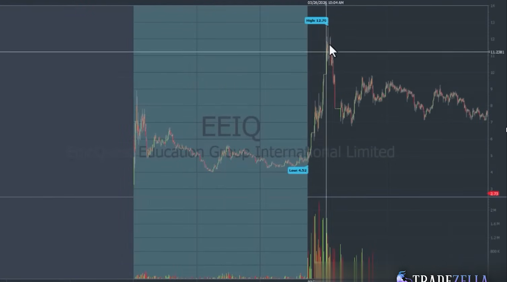
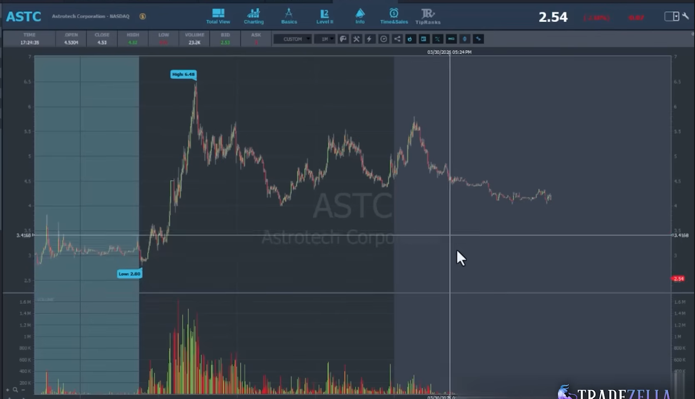
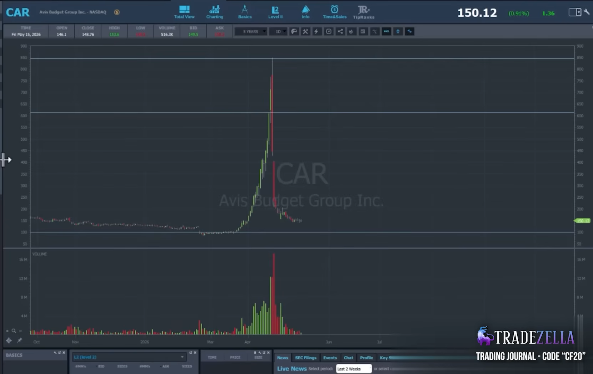

# Steven Dux Source Strategy Index v0.1

Fecha: 2026-06-27
Estado: source_note / draft.
Carpeta: `00_CTO/13_TRADING_SYSTEMS/03_STRATEGY_LIBRARY`

## 1. Proposito

Este documento destila material fuente de Steven Dux para Strategy Library.

No valida edge.
No crea una estrategia institucional.
No autoriza operativa.
No sustituye backtesting.

Su funcion es transformar explicaciones discrecionales y ejemplos visuales en
lenguaje tecnico que TSIS pueda convertir despues en:

```text
estrategia humana
-> variables medibles
-> candidatos historicos
-> revision visual
-> estadistica por segmentos
-> eventos derivados
-> validacion o descarte
```

La lectura correcta de este material es:

```text
Dux no esta solo describiendo dibujos.
Dux esta describiendo patrones condicionados por market cap, float, volumen,
dollar volume, crowding, psicologia de participantes y frecuencia estadistica.
```

## 2. Fuente

Video principal:

```text
If You Only Watch One Trading Strategy Video, Make It This
```

Transcripts locales:

```text
E:\TSIS_YOUTUBE\00_TRADERS\00_Steven_Dux\TRANSCRIPTS\If You Only Watch One Trading Strategy Video, Make It This.en.txt
E:\TSIS_YOUTUBE\00_TRADERS\00_Steven_Dux\TRANSCRIPTS\If You Only Watch One Trading Strategy Video, Make It This.en.md
E:\TSIS_YOUTUBE\00_TRADERS\00_Steven_Dux\TRANSCRIPTS\If You Only Watch One Trading Strategy Video, Make It This.en.srt
```

Capturas copiadas al repositorio:

```text
00_CTO/13_TRADING_SYSTEMS/03_STRATEGY_LIBRARY/source_assets/steven_dux/
```

## 3. Tesis operativa extraida

La idea central no es memorizar setups.

La idea central es:

```text
psicologia / logica de mercado
+ criterios medibles
+ estadistica historica
+ control de crowding y capacidad
= estrategia candidata
```

Dux insiste en que una estrategia debe tener sentido psicologico o logico antes
de ser optimizada. Despues debe medirse por frecuencia, win rate, reward medio,
segmentos de market cap, float, volumen, sector y calidad de ejecucion.

Para TSIS esto implica una regla:

```text
Cada estrategia debe producir una tabla de candidatos y una tabla estadistica.
El chart solo ayuda a clasificar. No es evidencia suficiente.
```

## 4. Estrategias fuente identificadas

### 4.1. Gap Up Short

Estrategia short sobre small caps que hacen gap fuerte en premarket o al open,
pero cuya extension puede fallar si las condiciones de market cap, float,
volumen y crowding son favorables al fade.

No todos los gaps son buenos shorts.

Dux separa especialmente:

- gap up short normal;
- gap up short demasiado crowded;
- gap up short en float extremadamente bajo;
- gap up short que debe esperar cambio claro de momentum.

Variables medibles iniciales:

```text
initial_market_cap
float
gap_pct
premarket_volume
premarket_dollar_volume
float_rotation_premarket
price_at_open
sector
country_or_china_context
premarket_high
open_push_high
top_time
fade_from_intraday_high_pct
day_volume
day_dollar_volume
volume_after_1130
```

### 4.2. Bounce Short

Estrategia short basada en memoria de resistencia.

Un ticker tuvo previamente un dia de gran volumen y concentracion de dinero en
una zona de precio. En una sesion posterior, rebota hacia esa zona con mucho
menos volumen. La tesis es que hay participantes atrapados o vendedores
esperando salir, y el volumen actual no puede competir contra el bloque previo.

Variables medibles iniciales:

```text
prior_resistance_price
prior_resistance_date
prior_day_volume
prior_day_dollar_volume
prior_consolidation_price_zone
current_day_volume_estimate
current_vs_prior_volume_ratio
current_vs_prior_dollar_volume_ratio
distance_to_resistance_pct
rejection_from_resistance_pct
fade_after_retest_pct
```

### 4.3. First Red Day

Estrategia short sobre runner multi-dia que empieza a perder momentum despues
de una secuencia parabolica.

No es simplemente "primer candle rojo".

La estructura exige:

- varios dias consecutivos verdes;
- aceleracion parabolica;
- volumen o dollar volume creciente;
- rango suficiente desde el inicio del movimiento;
- ausencia de red days intermedios que reseteen la cuenta;
- primer cambio rojo que todavia deje reward suficiente.

Variables medibles iniciales:

```text
consecutive_green_days
red_day_reset_flag
run_start_price
run_high_price
runup_pct
daily_volume_sequence
daily_dollar_volume_sequence
top_day_dollar_volume
first_red_day_date
first_red_day_gap_pct
first_red_day_intraday_fade_pct
first_red_day_damage_pct_of_total_run
second_day_gap_pct
second_day_fade_pct
time_to_low
```

## 5. Contextos derivados

Estos no son necesariamente estrategias independientes. Son contextos o filtros
que pueden modificar la calidad de una estrategia.

### 5.1. Crowded Premarket Context

Contexto donde el ticker ya ha negociado demasiado volumen antes del open.

Lectura Dux:

```text
si premarket volume es excesivo, el ticker puede quedar demasiado crowded y el
short temprano puede perder calidad.
```

Campos candidatos:

```text
premarket_volume
premarket_dollar_volume
float_rotation_premarket
day_volume_estimate_from_premarket
crowding_bucket
```

### 5.2. Low Float Rotation Risk Context

Contexto donde el float es muy bajo y el volumen rota el float muchas veces.

Lectura Dux:

```text
menor float no significa automaticamente mejor short.
Si la rotacion del float es extrema, el ticker puede ser mas peligroso y exigir
confirmacion de cambio de momentum.
```

Campos candidatos:

```text
float
volume_to_float_ratio
premarket_volume_to_float_ratio
day_volume_to_float_ratio
```

### 5.3. Dollar Block Resistance Context

Contexto donde una zona previa concentro gran cantidad de volumen-dinero.

Lectura Dux:

```text
la resistencia no es solo una linea de precio.
Es una zona donde se negocio mucho dinero y donde pueden existir participantes
atrapados o esperando liquidez para salir.
```

Campos candidatos:

```text
resistance_zone_low
resistance_zone_high
volume_inside_zone
dollar_volume_inside_zone
average_traded_price_inside_zone
current_volume_vs_zone_volume
current_dollar_volume_vs_zone_dollar_volume
```

## 6. Catalogo visual fuente

### 6.1. SLV - First Red Day / Multi-day Runner Exhaustion

Imagenes:





Lectura:

SLV se usa como ejemplo de First Red Day. El movimiento tiene varios dias de
avance, aceleracion, zonas de volumen creciente y una primera sesion roja que
no destruye completamente el reward restante.

Puntos tecnicos que TSIS debe medir:

- inicio del run;
- high del run;
- numero de dias verdes consecutivos;
- si algun red day intermedio resetea la cuenta;
- dollar volume por dia;
- distancia desde el open de first red day hasta el 50% del recorrido total;
- fade posterior;
- si la oportunidad real aparece en el primer dia rojo o en el dia siguiente.

Evento/estructura candidata:

```text
Multi_Day_Parabolic_Run_Context
First_Red_Day_Transition_Event
First_Red_Day_Reward_Remaining_Context
```

### 6.2. BIRD - Crowded Gap Up Short Avoidance

Imagenes:


Lectura:

BIRD ilustra una situacion donde gap up short puede fallar o degradarse por
crowding. El transcript menciona volumen premarket aproximado de 70M shares y
la idea de que por encima de cierto volumen premarket el ticker puede ser
demasiado crowded para short temprano.

Puntos tecnicos que TSIS debe medir:

- premarket volume absoluto;
- premarket dollar volume;
- float rotation premarket;
- estimacion de day volume desde premarket;
- si el open produce squeeze adicional;
- si el ticker consolida en vez de fallar;
- si el short solo mejora al dia siguiente con volumen seco.

Evento/estructura candidata:

```text
Crowded_Premarket_Gap_Context
Gap_Up_Short_Avoidance_Context
Next_Day_Dry_Volume_Short_Context
```

### 6.3. EEIQ - Low Float Gap Up Short Variant

Imagenes:




Lectura:

EEIQ representa una variante donde el float extremadamente bajo exige mas
cuidado. La idea no es shortear cualquier extension contra PMH, sino esperar
senales mas claras de cambio de momentum, por ejemplo una caida grande desde el
top y un bounce posterior hacia una zona de riesgo definida.

Puntos tecnicos que TSIS debe medir:

- float bucket;
- float rotation;
- high del squeeze;
- pullback desde high;
- porcentaje de perdida desde top antes de bounce;
- bounce hacia zona de resistencia;
- volumen del bounce contra volumen del squeeze;
- fade posterior.

Evento/estructura candidata:

```text
Low_Float_Extreme_Rotation_Context
Momentum_Shift_After_Extreme_Squeeze_Event
Bounce_Into_Post_Squeeze_Resistance_Event
```

### 6.4. ASTC - Bounce Short / Prior Resistance Retest

Imagenes:




Lectura:

ASTC ilustra Bounce Short. Hay un dia previo con gran volumen y una zona de
resistencia/consolidacion. En dias posteriores, el precio rebota hacia esa zona
con volumen inferior. La oportunidad conceptual viene de comparar el volumen
actual contra el bloque de dinero previo.

Puntos tecnicos que TSIS debe medir:

- dia de referencia con gran volumen;
- zona de consolidacion/resistencia del dia previo;
- dollar volume negociado en esa zona;
- distancia del bounce actual a la zona;
- volumen estimado del dia actual;
- ratio volumen actual vs volumen previo;
- rechazo y fade tras tocar la zona.

Evento/estructura candidata:

```text
Prior_Dollar_Block_Resistance_Context
Low_Volume_Retest_Into_Resistance_Event
Bounce_Short_Fade_Event
```

### 6.5. CAR - Extreme Multi-day Squeeze / Parabolic Exhaustion Context

Imagen:



Lectura:

CAR aparece como ejemplo visual de movimiento parabolico extremo. No queda
anclado en el transcript como smallcap clasico, por lo que debe tratarse como
referencia visual de estructura y no como muestra canonica del universo TSIS.

Puntos tecnicos que TSIS puede extraer:

- aceleracion parabolica;
- blow-off top;
- volumen climatico;
- caida abrupta posterior;
- distancia entre top y zona previa de consolidacion.

Evento/estructura candidata:

```text
Extreme_Parabolic_Exhaustion_Context
Blowoff_Top_Daily_Context
```

## 7. Tabla minima que debe producir cualquier notebook Dux-style

Cada busqueda inspirada en Dux debe producir, como minimo:

```text
candidate_id
strategy_source
ticker
exchange
date
source_pattern
initial_market_cap
float
sector
price_at_trigger
gap_pct
premarket_volume
premarket_dollar_volume
day_volume
day_dollar_volume
float_rotation_premarket
float_rotation_day
runup_pct
fade_from_high_pct
time_to_high
time_to_low
current_vs_prior_volume_ratio
current_vs_prior_dollar_volume_ratio
visual_label
outcome_label
review_bucket
```

## 8. Separacion TSIS: patron, estadistica, estrategia y evento

Para evitar mezclar capas:

```text
patron visual = forma observada en el chart
estadistica = distribucion historica por segmentos
estrategia = decision operativa humana frente al contexto
evento = fenomeno observable extraido de la estrategia
```

Ejemplo:

```text
BIRD crowded premarket
```

Puede alimentar:

```text
Strategy Library: Gap Up Short avoidance rule
Event Library: Crowded_Premarket_Gap_Context
Outcome Research: que pasa despues de PM volume > X y float rotation > Y
```

## 9. Implicacion para las proximas estrategias daily

Las estrategias daily tipo:

- First Red Day;
- First Green Day;
- multi-day runner;
- daily breakout;
- pullback diario tras varios dias de subida;
- bounce short hacia resistencia;

no deben construirse solo con notebooks de imagenes.

Deben construirse con dos artefactos paralelos:

```text
1. visual_case_explorer.ipynb
2. statistics_ledger / candidate_table
```

La pregunta no sera solo:

```text
se parece al patron?
```

Tambien debe ser:

```text
en que bucket de market cap, float, volumen, dollar volume, sector y regimen
vive este patron, con que frecuencia aparece, y que outcome produce?
```

## 10. No-goals

Este documento no:

- valida ninguna estrategia;
- crea parametros finales;
- fija thresholds institucionales;
- decide operar long o short;
- sustituye notebooks;
- sustituye Event Library;
- sustituye Outcome Research;
- sustituye backtesting.

## 11. Regla final

El aporte principal de Dux para TSIS no es una lista de setups.

Es un metodo:

```text
entender la psicologia
-> definir variables observables
-> segmentar por buckets
-> medir frecuencia, win rate y reward
-> comparar ejecucion real contra ejecucion ideal
-> descartar lo que no sobrevive a estadistica
```

Ese metodo debe guiar la siguiente fase de Strategy Library.
