# TSIS · Arquitectura científica del backtest

```mermaid
%%{init: {
  "theme": "base",
  "securityLevel": "loose",
  "flowchart": {
    "htmlLabels": true,
    "curve": "basis",
    "nodeSpacing": 34,
    "rankSpacing": 54,
    "padding": 14,
    "wrappingWidth": 330,
    "useMaxWidth": true
  },
  "themeVariables": {
    "fontFamily": "Inter, ui-sans-serif, system-ui, -apple-system, BlinkMacSystemFont, Segoe UI, sans-serif",
    "fontSize": "14px",
    "lineColor": "#64748b",
    "primaryTextColor": "#0f172a",
    "clusterBkg": "#ffffff",
    "clusterBorder": "#cbd5e1",
    "edgeLabelBackground": "#ffffff"
  }
}}%%
flowchart TB

    MASTER["<b>REGLA MAESTRA</b><br/>El backtester produce simulaciones.<br/>El laboratorio científico decide qué puede afirmarse a partir de ellas.<br/><br/><b>Buen backtest ≠ edge validado ≠ estrategia autorizada</b>"]:::master

    GOVERNANCE["<b>COLUMNA VERTEBRAL · APLICA DE PRINCIPIO A FIN</b><br/>Experiment Registry · Trial Ledger · Versionado de datos/estados/estrategias<br/>Evidence Registry · Manifests · Hashes · Entorno · Seeds · Reproducción independiente"]:::governance


    subgraph S0["0 · ESTADO ACTUAL"]
        direction TB
        BASE["<b>BT-GATE-001…014 · CLOSED</b><br/>Preflight · replay · accounting · ejecución/costes<br/>fill simulator · estrategia end-to-end · portfolio<br/>replay físico · Market State PIT"]:::closed
        ACTIVE["<b>BT-GATE-015 · EN CURSO</b><br/>Consumo físico PIT de Event State<br/>V0.4 ejecutado una sola vez con PASS técnico<br/>cierre pendiente de revisión externa post-ejecución"]:::active
        D015{"<b>¿PASS externo y cierre explícito<br/>de BT-GATE-015?</b>"}:::decision
        HOLD015["<b>NO · FAIL CLOSED</b><br/>Preservar V0.3 y V0.4<br/>no reejecutar · corregir evidencia/contrato<br/>no abrir el gate siguiente implícitamente"]:::fail
        PASS015["<b>SÍ · CIERRE EXPLÍCITO</b><br/>Cerrar BT-GATE-015 con restricciones<br/>la siguiente capability exige contrato, autorización,<br/>evidencia y revisión propios"]:::pass

        BASE --> ACTIVE --> D015
        D015 -->|NO| HOLD015
        D015 -->|SÍ| PASS015
    end

    MASTER --> GOVERNANCE --> BASE

    subgraph S1["1 · CONTRATO CIENTÍFICO"]
        direction LR
        Q["<b>Pregunta falsable</b><br/>fenómeno · lado · horizonte<br/>universo · sesión · mecanismo"]:::research
        H["<b>Hipótesis y nula</b><br/>baseline declarado<br/>efecto mínimo relevante"]:::research
        C["<b>Contrato experimental</b><br/>criterios de abandono<br/>presupuesto de búsqueda<br/>familia completa de trials"]:::research
        Q --> H --> C
    end

    PASS015 --> S1

    subgraph S2["2 · DATOS · UNIVERSO · PIT"]
        direction LR
        DATA["<b>Datos históricos autoritativos</b><br/>schema · lineage · versión<br/>corporate actions · símbolos muertos<br/>halts · gaps · bad prints"]:::data
        UNIVERSE["<b>Universo point-in-time</b><br/>membership histórica<br/>sesiones/calendario<br/>delistings · ticker changes"]:::data
        CLOCK["<b>Legalidad temporal</b><br/><code>event_time</code> + <code>available_at</code><br/>ningún dato antes de estar disponible<br/><b>ambigüedad → fail closed</b>"]:::data
        DATA --> UNIVERSE --> CLOCK
    end

    S1 --> S2

    subgraph S3["3 · REPRESENTACIÓN X / Y"]
        direction LR
        X["<b>X · información observable</b><br/>Market State PIT<br/>Event State PIT<br/>features versionadas<br/>solo información legal en t"]:::state
        SEP["<b>Frontera anti-leakage</b><br/>snapshots reconstruibles<br/>truncated-data invariance<br/>no early delivery<br/>tests de anticipación"]:::guard
        Y["<b>Y · outcomes futuros</b><br/>labels · targets · rewards<br/>aislados de la decisión<br/>contrato y horizonte propios"]:::outcome
        X --> SEP --> Y
    end

    S2 --> S3

    subgraph S4["4 · EXPLORACIÓN + FREEZE"]
        direction LR
        EXPLORE["<b>4.1 · Carril exploratorio</b><br/>probes · estadística descriptiva<br/>sweeps y candidatos<br/><br/><b>Descubre; no prueba edge ni fills</b>"]:::explore
        PROMOTE["<b>4.2 · Promover fenómeno</b><br/>coverage y calidad<br/>baseline · leakage gates<br/>sensibilidad de ventana<br/>replicación por periodos/tickers"]:::promote
        FREEZE["<b>4.3 · Congelar candidato vN</b><br/>StrategySpec exacta<br/>entry · exit · sizing · risk<br/>información permitida · costes<br/>split · juez · holdout sellado<br/>code/data/env hashes"]:::freeze
        EXPLORE --> PROMOTE --> FREEZE
    end

    S3 --> S4

    subgraph S5["5 · MOTOR EVENT-DRIVEN"]
        direction TB

        subgraph R1["5A · RECONSTRUCCIÓN PIT"]
            direction LR
            R51["<b>Preflight</b><br/>specs · permisos<br/>manifests · versiones"]:::runtime
            R52["<b>Replay determinista</b><br/>reloj global · event queue<br/>same-timestamp policy"]:::runtime
            R53["<b>Estado online PIT</b><br/>Market + Event State<br/>rolling state · no futuro"]:::runtime
            R51 --> R52 --> R53
        end

        subgraph R2["5B · DECISIÓN Y RIESGO"]
            direction LR
            R54["<b>Decision Policy</b><br/>condition → decision<br/>decision record → intent"]:::runtimeDecision
            R55["<b>Portfolio / Risk</b><br/>sizing · cash · exposure<br/>liquidez · capacidad · borrow"]:::runtimeRisk
            R56["<b>OMS</b><br/>accept · reject · cancel<br/>lifecycle · concurrencia"]:::runtimeOrder
            R54 --> R55 --> R56
        end

        subgraph R3["5C · EJECUCIÓN"]
            direction LR
            R57["<b>Execution Model</b><br/>bid/ask · spread · latency<br/>slippage · queue · partial/no fill<br/>impact · fees · locate"]:::runtimeExec
            R58["<b>Accounting</b><br/>fills → cash/positions<br/>PnL realizado/no realizado<br/>equity · borrow · fees"]:::runtimeAccount
            R59["<b>Run Evidence</b><br/>event/state/decision ledgers<br/>orders · fills · trades · equity<br/>exceptions · metrics · hashes"]:::runtimeEvidence
            R57 --> R58 --> R59
        end

        R1 --> R2
        R2 --> R3
    end

    S4 --> S5

    subgraph S6["6 · VERIFICACIÓN TÉCNICA"]
        direction TB

        subgraph TCHECKS["CONTROLES DEL RUN"]
            direction LR
            T1["<b>Casos golden / manuales</b><br/>reconciliación trade-by-trade"]:::verify
            T2["<b>Determinismo</b><br/>mismos inputs → mismos ledgers y hashes"]:::verify
            T3["<b>Legalidad e identidades</b><br/>no-lookahead · ordering · accounting<br/>negative tests"]:::verify
            T1 --> T2 --> T3
        end

        TGATE{"<b>¿VERIFICACIÓN<br/>TÉCNICA = PASS?</b>"}:::decision
        TFAIL["<b>NO · RUN TÉCNICAMENTE INVÁLIDO</b><br/>Archivar evidencia · corregir motor/contrato<br/>no interpretar métricas económicas<br/>nueva ejecución solo bajo autorización reproducible"]:::fail
        TPASS["<b>SÍ · RUN TÉCNICAMENTE VÁLIDO</b><br/>Puede entrar en validación científica<br/><b>todavía no demuestra edge</b>"]:::pass

        TCHECKS --> TGATE
        TGATE -->|NO| TFAIL
        TGATE -->|SÍ| TPASS
    end

    S5 --> S6

    subgraph S7["7 · VALIDACIÓN CIENTÍFICA"]
        direction TB

        V0["<b>Evaluador bloqueado</b><br/>métricas · umbrales · baseline · criterios<br/>definidos antes de evaluar"]:::validationGuard

        subgraph VROW1["7A · REALISMO Y ROBUSTEZ"]
            direction LR
            V1["<b>Realismo económico</b><br/>PnL neto · quotes ejecutables<br/>costes base/moderados/severos<br/>latency · no-fills · capacity · borrow"]:::validation
            V2["<b>Robustez</b><br/>plateaus, no spikes<br/>vecindarios de reglas/parámetros<br/>regímenes · concentración · stress"]:::validation
            V1 --> V2
        end

        subgraph VROW2["7B · OOS + SELECCIÓN"]
            direction LR
            V3["<b>Validación temporal</b><br/>OOS cronológico · walk-forward<br/>purging + embargo<br/>CPCV/CSCV cuando proceda<br/><b>sin random k-fold financiero</b>"]:::validation
            V4["<b>Múltiples pruebas</b><br/>todos los trials contabilizados<br/>complejidad / DoF<br/>DSR · PBO · Reality Check / SPA / FDR<br/>cuando el diseño lo requiera"]:::validation
            V3 --> V4
        end

        subgraph VROW3["7C · PRUEBA FINAL"]
            direction LR
            V5["<b>Holdout final sellado</b><br/>una sola vez · sin selección de variantes<br/>si falla, queda quemado<br/>cambio = vN+1 + nuevo holdout"]:::validationFinal
            V6["<b>Replicación independiente</b><br/>entorno limpio desde manifest<br/>reviewer/agente independiente<br/>segunda implementación/vendor si es viable"]:::validationFinal
            V5 --> V6
        end

        SGATE{"<b>¿EVIDENCIA SUFICIENTE,<br/>NETA, ROBUSTA Y REPLICABLE?</b>"}:::decision
        SFAIL["<b>NO · CANDIDATO RECHAZADO</b><br/>Archive / reformulate as vN+1<br/>no borrar negativos · no cambiar el juez<br/>nuevo Experiment ID · trial count · holdout"]:::fail
        SPASS["<b>SÍ · PASS CIENTÍFICO CONDICIONAL</b><br/>Puede promoverse a conocimiento<br/><b>aún no autoriza producción</b>"]:::pass

        V0 --> VROW1
        VROW1 --> VROW2
        VROW2 --> VROW3
        VROW3 --> SGATE
        SGATE -->|NO| SFAIL
        SGATE -->|SÍ| SPASS
    end

    S6 -->|solo con PASS| S7

    subgraph S8["8 · CONOCIMIENTO"]
        direction LR
        KNOW["<b>Knowledge Object · Conditional Edge</b><br/>versión · universo · régimen · horizonte · side<br/>effect size neto + incertidumbre<br/>capacidad · limitaciones · failure modes<br/>evidencia favorable y contradictoria"]:::knowledge
        STATUS["<b>Estado científico</b><br/>PROVISIONAL / VALIDATED<br/>REJECTED / SUPERSEDED<br/><br/><b>Todavía no implica producción automática</b>"]:::knowledge
        KNOW --> STATUS
    end

    S7 -->|solo con PASS| S8

    subgraph S9["9 · VALIDACIÓN OPERATIVA"]
        direction TB
        SHADOW["<b>9.1 · Shadow / paper / incubación</b><br/>mismo strategy core y semántica<br/>datos y arrival reales · capital cero<br/>telemetría y manifests completos"]:::operations
        RECON["<b>9.2 · Reconciliación</b><br/>estado · timing · señales · órdenes<br/>rejects · cancels · fills · spread<br/>slippage · latency · revisiones de datos"]:::operations
        OGATE1{"<b>¿La brecha real está dentro<br/>del envelope esperado?</b>"}:::decision
        PILOT["<b>9.3 · Live pilot limitado</b><br/>capital y participation pequeños<br/>hard limits · kill switch<br/>caps de pérdida/exposición/símbolo<br/>sin cambiar reglas durante el pilot"]:::operationsPilot
        OGATE2{"<b>¿El pilot confirma edge,<br/>ejecución y riesgo?</b>"}:::decision
        OFAIL["<b>NO · PAUSAR / RETIRAR</b><br/>Corregir execution model o reformular<br/>sin reescribir el backtest pasado<br/>cambio material = nueva versión"]:::fail
        OPASS["<b>SÍ · PASS OPERATIVO</b><br/>La estrategia puede recibir<br/>una autorización live limitada"]:::pass

        SHADOW --> RECON --> OGATE1
        OGATE1 -->|NO| OFAIL
        OGATE1 -->|SÍ| PILOT --> OGATE2
        OGATE2 -->|NO| OFAIL
        OGATE2 -->|SÍ| OPASS
    end

    S8 --> S9

    FINAL["<b>ESTRATEGIA «DADA POR BUENA» EN SENTIDO CIENTÍFICO</b><br/><br/><b>VALIDATED CONDITIONAL EDGE</b><br/><b>APPROVED FOR LIMITED PRODUCTION WITH EXPLICIT SCOPE</b><br/><br/>versión · universo · régimen · allocation · capacity ceiling<br/>risk limits · dependencias · monitorización · kill criteria<br/><br/><b>Autorización condicional, limitada, versionada y revocable</b>"]:::final

    S9 -->|solo con PASS| FINAL

    subgraph S11["10 · MONITORIZACIÓN"]
        direction LR
        MON["Live vs expected<br/>signal rate · expectancy · drawdown<br/>costes · fills · capacity · concentración"]:::monitor
        DRIFT["Drift de datos/estado/evento<br/>venue/regulación · execution model<br/>cambio de régimen · degradación"]:::monitor
        ACTION["<b>Acciones predefinidas</b><br/>continue · reduce · pause<br/>investigate · retire"]:::monitor
        MON --> DRIFT --> ACTION
    end

    FINAL --> S11

    RESTART["<b>↺ CAMBIO MATERIAL / DECAY / RETIRADA</b><br/>Crear vN+1 · nuevo Experiment ID · nuevo trial ledger<br/>volver a la fase 1; nunca modificar retroactivamente la evidencia"]:::restart

    S11 -->|nueva versión| RESTART

    %% ─────────────────────────────────────────────────────────────
    %% ESTILOS
    %% ─────────────────────────────────────────────────────────────
    classDef master fill:#0f172a,stroke:#020617,color:#ffffff,stroke-width:3px,font-size:17px;
    classDef governance fill:#f8fafc,stroke:#475569,color:#0f172a,stroke-width:2px,stroke-dasharray:6 4;
    classDef closed fill:#e0f2fe,stroke:#0369a1,color:#0c4a6e,stroke-width:2px;
    classDef active fill:#fff7ed,stroke:#ea580c,color:#9a3412,stroke-width:3px;
    classDef decision fill:#fffbeb,stroke:#d97706,color:#78350f,stroke-width:3px;
    classDef fail fill:#fef2f2,stroke:#b91c1c,color:#7f1d1d,stroke-width:2.5px;
    classDef pass fill:#dcfce7,stroke:#15803d,color:#14532d,stroke-width:2.5px;

    classDef research fill:#faf5ff,stroke:#7e22ce,color:#581c87,stroke-width:2px;
    classDef data fill:#ecfdf5,stroke:#047857,color:#064e3b,stroke-width:2px;
    classDef state fill:#ecfeff,stroke:#0f766e,color:#134e4a,stroke-width:2px;
    classDef guard fill:#f8fafc,stroke:#475569,color:#1e293b,stroke-width:2px;
    classDef outcome fill:#fdf4ff,stroke:#a21caf,color:#701a75,stroke-width:2px;

    classDef explore fill:#f5f3ff,stroke:#6d28d9,color:#4c1d95,stroke-width:2px;
    classDef promote fill:#faf5ff,stroke:#7e22ce,color:#581c87,stroke-width:2px;
    classDef freeze fill:#fdf4ff,stroke:#a21caf,color:#701a75,stroke-width:3px;

    classDef runtime fill:#f1f5f9,stroke:#334155,color:#0f172a,stroke-width:2px;
    classDef runtimeDecision fill:#ede9fe,stroke:#6d28d9,color:#4c1d95,stroke-width:2px;
    classDef runtimeRisk fill:#fef3c7,stroke:#b45309,color:#78350f,stroke-width:2px;
    classDef runtimeOrder fill:#ffedd5,stroke:#c2410c,color:#7c2d12,stroke-width:2px;
    classDef runtimeExec fill:#fee2e2,stroke:#b91c1c,color:#7f1d1d,stroke-width:2px;
    classDef runtimeAccount fill:#dcfce7,stroke:#15803d,color:#14532d,stroke-width:2px;
    classDef runtimeEvidence fill:#d1fae5,stroke:#047857,color:#064e3b,stroke-width:2px;

    classDef verify fill:#f8fafc,stroke:#334155,color:#0f172a,stroke-width:2px;
    classDef validationGuard fill:#f5f3ff,stroke:#6d28d9,color:#4c1d95,stroke-width:3px;
    classDef validation fill:#fffbeb,stroke:#b45309,color:#78350f,stroke-width:2px;
    classDef validationFinal fill:#fff1f2,stroke:#be123c,color:#881337,stroke-width:2.5px;
    classDef knowledge fill:#ecfdf5,stroke:#047857,color:#064e3b,stroke-width:2.5px;

    classDef operations fill:#f0fdf4,stroke:#15803d,color:#14532d,stroke-width:2px;
    classDef operationsPilot fill:#ccfbf1,stroke:#0f766e,color:#134e4a,stroke-width:3px;
    classDef final fill:#dcfce7,stroke:#166534,color:#14532d,stroke-width:4px,font-size:16px;
    classDef monitor fill:#e0f2fe,stroke:#0369a1,color:#0c4a6e,stroke-width:2px;
    classDef restart fill:#f5f3ff,stroke:#6d28d9,color:#4c1d95,stroke-width:3px;

    style S0 fill:#f8fafc,stroke:#94a3b8,stroke-width:2px
    style S1 fill:#fdfaff,stroke:#c084fc,stroke-width:2px
    style S2 fill:#f6fffb,stroke:#6ee7b7,stroke-width:2px
    style S3 fill:#f5feff,stroke:#5eead4,stroke-width:2px
    style S4 fill:#fdfaff,stroke:#c4b5fd,stroke-width:2px
    style S5 fill:#ffffff,stroke:#334155,stroke-width:3px
    style R1 fill:#f8fafc,stroke:#cbd5e1,stroke-width:1.5px
    style R2 fill:#fafafa,stroke:#cbd5e1,stroke-width:1.5px
    style R3 fill:#f8fafc,stroke:#cbd5e1,stroke-width:1.5px
    style S6 fill:#f8fafc,stroke:#64748b,stroke-width:2px
    style S7 fill:#fffdf5,stroke:#d97706,stroke-width:3px
    style VROW1 fill:#fffbeb,stroke:#fde68a,stroke-width:1.5px
    style VROW2 fill:#fff7ed,stroke:#fed7aa,stroke-width:1.5px
    style VROW3 fill:#fff1f2,stroke:#fecdd3,stroke-width:1.5px
    style S8 fill:#f0fdf4,stroke:#34d399,stroke-width:2px
    style S9 fill:#f0fdf4,stroke:#22c55e,stroke-width:3px
    style S11 fill:#f0f9ff,stroke:#38bdf8,stroke-width:2px

    linkStyle default stroke:#64748b,stroke-width:2px
```

<!--
Base documental: CURRENT_PROJECT_HANDOFF.md (2026-08-05), BACKTEST_ENGINE_ROADMAP.md,
TSIS_LAB_ARCHITECTURE_v3.md, research_experiment_registry_v0_1.md,
RESEARCH_LABORATORY_SYSTEM_MAP_V0_1.md y apuntes bibliográficos adjuntos.
-->
