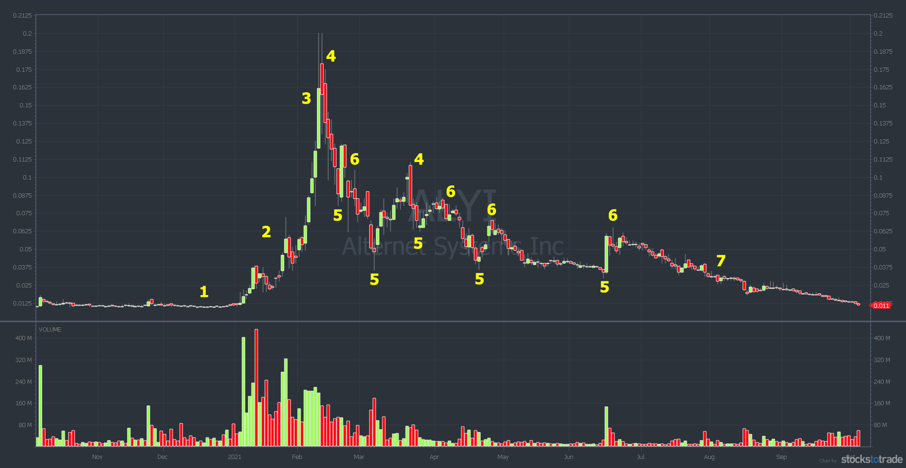
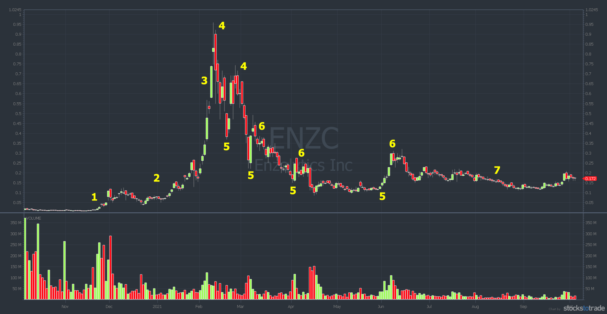
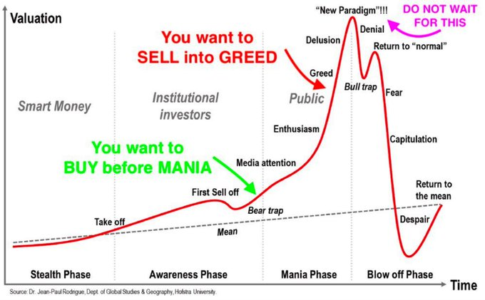
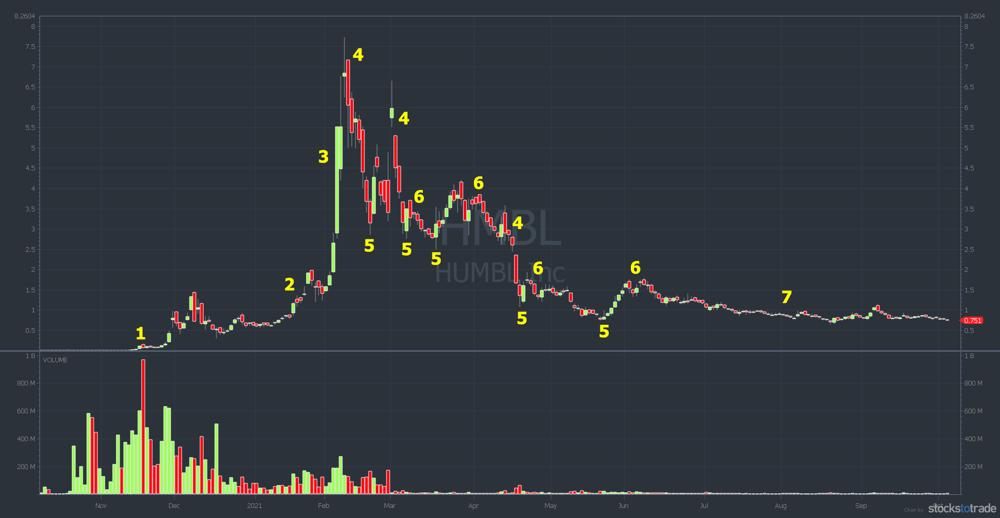
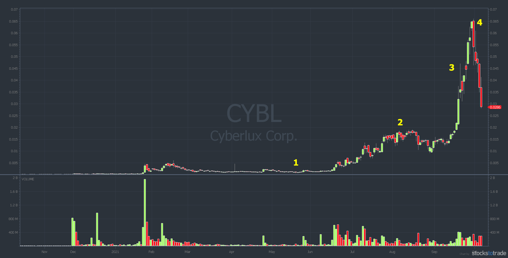
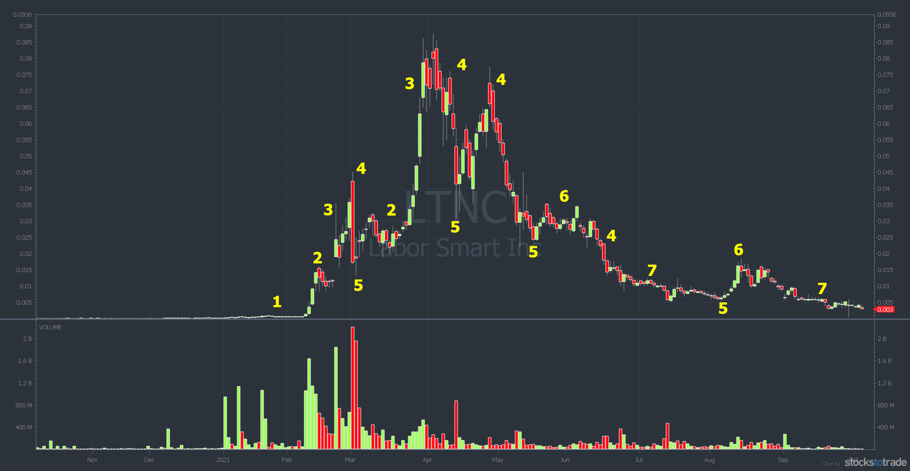
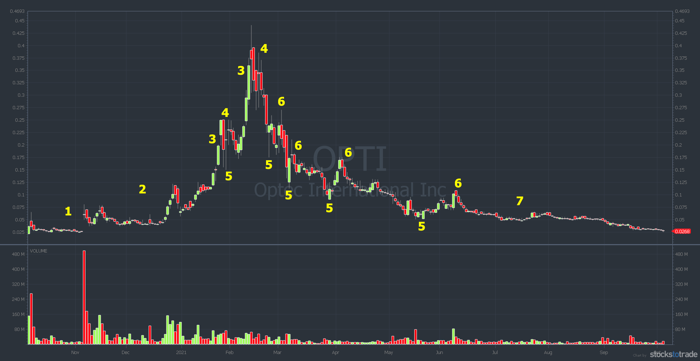
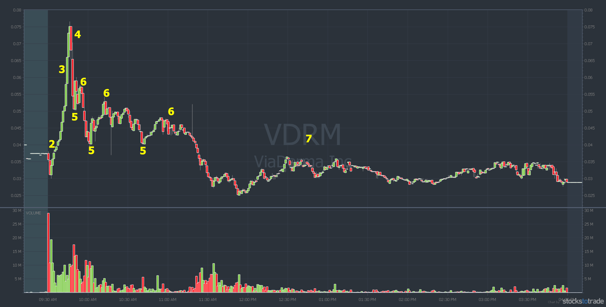

# arquitectura de trabajo

**Detectores operativos**

> El despertar `00_wake_up_event/` y   
la terminación `01_frontside_termination_event/`   
son los dos anclajes del episodio `00_MARKET_EPISODE_MODEL/`.  
>
>Todo lo que ocurre entre ambos es la ***trayectoria de estado***.   
Esa trayectoria puede contener ruido, pero también contiene la información necesaria para  
entrar, dimensionar, reducir riesgo, salir y distinguir una terminación real de un simple pullback.

## `frontside peak` no es un evento operable

El máximo exacto sólo se conoce retrospectivamente.  
puede significar dos cosas completamente diferentes:

**Como label retrospectivo**

```text
frontside_peak_outcome =
máximo identificado después de observar el futuro
```

Es útil para:

* Outcomes.
* Investigación.
* Medir cuánto tarde detectamos la terminación.
* Calcular *capture ratio*.
* Entrenar modelos.

Pero debe ser:

```text
research_only
outcome_adjacent
prohibited_as_predictive_input
```

**Como detector operativo**

Entonces no debería llamarse `peak`, sino:

```text
frontside_termination_event
```

Porque no está intentando afirmar:

```text
«éste es exactamente el máximo»
```

sino:

```text
«desde este instante ya no compensa mantener
la misma exposición long»
```

Nuestra propia arquitectura exige distinguir el timestamp retrospectivo del fenómeno y el instante real en que fue detectado;   
también separa Market State, Event State, decisión y ejecución. 


## Primer `benchmark` estratégico

Existe una política basal muy importante:

```text
WAKE_UP detectado
        ↓
abrir long
        ↓
mantener posición fija
        ↓
TERMINATION detectada
        ↓
cerrar long
```

Este debe ser probablemente el **primer benchmark estratégico**.

No:

* Banderas.
* VWAP reclaims.
* PMH breakouts.
* Añadidos.
* Scalping.
* Reentradas.
* Shorts.

Sólo:

```text
un episodio
una entrada
una salida
un tamaño fijo
```

Si esta política sencilla consigue capturar de manera robusta una parte relevante del movimiento neta de costes, habrás demostrado algo extraordinariamente valioso:

> ---
> Existe información suficiente en las fronteras del episodio para construir una estrategia simple.  
>   


Pero todavía no demostraría que lo intermedio sea ruido.   
Para demostrarlo hay que hacer una **ablación**.


## Determinación científica de si `trayectoria de estado` es ruido

Propondría esta secuencia:

```text
B0 — Boundary only
wake-up → posición fija → termination

B1 — Añadir Frontside Phase Tracker
healthy / stressed / recovery / termination risk

B2 — Añadir salida dinámica
reducir antes de termination completa

B3 — Añadir escalado de posición
añadir y quitar según el estado

B4 — Añadir reentradas
primer pullback / rebreak / reclaim

B5 — Añadir transición a short
flat → backside confirmed → short
```

Después comparamos fuera de muestra:

* Rentabilidad neta.
* Giveback evitado.
* Upside sacrificado.
* Tiempo expuesto.
* Turnover.
* Slippage.
* Número de cambios de decisión.
* Riesgo de cola.
* Capacidad.
* Complejidad añadida.

Si `B1–B4` no mejoran a `B0` netos de costes, entonces sí podemos concluir:

> La información intermedia no aporta utilidad económica para esta política.
>
> No que sea ruido universalmente, sino que es **redundante para ese consumidor concreto**.


**Por qué lo intermedio o `trayectoria de estado` no puede declararse ruido de antemano**

Hay una contradicción lógica:

```text
Quiero detectar el final del frontside
```

pero:

```text
Quiero ignorar todo lo que sucede
entre wake-up y peak
```

La terminación se detectará precisamente mediante cambios dentro de esa trayectoria:

```text
buy response decay
bid resilience decay
ask absorption
failed high acceptance
sell impact increasing
flow regime change
failed reclaim
```

Si eliminamos la trayectoria, el modelo sólo podría estimar la terminación usando:

* Tiempo desde wake-up.
* Extensión acumulada.
* Hora.
* Contexto histórico.
* Catalyst.
* Float.
* Volumen acumulado.

Eso puede aportar algo,   
**pero perderíamos la evidencia inmediata de que la maquinaria compradora se está deteriorando.**

La microestructura publicada respalda que el desequilibrio de eventos en bid y ask explica mejor movimientos de muy corto plazo que el volumen aislado, y que pueden detectarse online cambios de régimen en el flujo de órdenes. [arXiv: Price Impact de Book Events](https://arxiv.org/abs/1011.6402)

Por tanto:

```text
wake-up + termination =
anclajes

secuencia de Market States =
evidencia para identificar las transiciones
```


## Los eventos 

El despertar, la terminación y el backside son **fenómenos del mercado**,   
La estructura conceptualmente limpia sería:  

```text
00_MARKET_EPISODE_MODEL/
│
├── 00_wake_up_event/
├── 01_frontside_phase_tracker/
├── 02_frontside_termination_event/
├── 03_frontside_peak_outcome/
├── 04_backside_confirmation_event/
└── 05_episode_end_event/
```

Después, los consumidores:

```text
01_LONG_POLICIES/
│
├── 00_activation_entry/
├── 01_continuation_entry/
├── 02_long_inventory_policy/
├── 03_giveback_control/
└── 04_long_exit_policy/
```

```text
02_SHORT_POLICIES/
│
├── 00_short_eligibility/
├── 01_backside_entry/
├── 02_short_inventory_policy/
├── 03_short_add_reduce_policy/
└── 04_cover_and_resqueeze_policy/
```

Y finalmente:

```text
03_SHARED_EXECUTION_AND_RISK/
│
├── execution_model/
├── capacity_model/
├── halt_luld_policy/
├── cost_model/
├── borrow_locate_context/
└── portfolio_risk/
```

Esto coincide mejor con la filosofía:

```text
Market State / Event State =
representación reutilizable

Long / Short =
políticas consumidoras
```

Una representación canónica debe ser reutilizada por diferentes estrategias, predictores o políticas, y no reconstruida de forma distinta para cada patrón. 


## Tres regiones

```text
salir del long
≠
entrar short
```

Deben existir al menos tres regiones:

```text
LONG
↓
FLAT / UNCERTAIN
↓
SHORT
```

**Umbral de salida long**

Puede activarse pronto:

```text
FRONTSIDE_STRESSED
TERMINATION_WARNING
TERMINATION_RISK_HIGH
```

Su misión es proteger beneficios.

**Umbral de entrada short**

Debe exigir más:

```text
TERMINATION_DETECTED
+
BACKSIDE_CONFIRMATION
+
liquidez ejecutable
+
riesgo de squeeze aceptable
+
condiciones operativas de short
```

**Por qué hace falta un estado neutral**

Una pérdida de frontside puede terminar en:

```text
consolidación
reacumulación
segundo frontside
halt
chop
reversión parcial
backside completo
```

<table>
<tr>
<td></td>
<td></td>
<td></td>
<td></td>
</tr>
<tr>
<td></td>
<td></td>
<td></td>
<td></td>
</tr>
</table>

Las imágenes muestran precisamente que, después del primer máximo, aparecen:

* Rebotes violentos.
* Lower highs.
* Secondary squeezes.
* Failed reclaims.
* Tramos laterales.
* Fades prolongados.

Por tanto, un short no debería ser:

```text
entra una vez
y aguanta hasta el final
```

Puede necesitar:

```text
entrada
reducción
cover
reentrada
nuevo cover
```

Además, restricciones como la Rule 201 pueden modificar la ejecutabilidad del short después de una caída diaria del 10%, limitando el precio al que puede ejecutarse una venta corta.  
[SEC Restricciones de short selling (Rule 201)](https://www.sec.gov/news/press/2010/2010-26.htm)


Una máquina de estados razonable sería:

```text
FRONTSIDE_HEALTHY
        ↓
FRONTSIDE_STRESSED
        ↓
TERMINATION_WARNING
        ↓
TERMINATION_DETECTED
        ↓
FLAT_OBSERVATION
        ↓
BACKSIDE_CONFIRMED
        ↓
SHORT_ACTIVE
        ↓
SHORT_STRESSED
        ↓
COVER_WARNING
        ↓
COVERED
```

Y puede volver desde:

```text
SHORT_STRESSED
→ FRONTSIDE_REACTIVATION
```


## La arquitectura de trabajo que considero correcta

```text
MARKET DATA
trades · quotes · news · halts · reference
        ↓
MARKET STATE
estado observable en t
        ↓
EPISODE DETECTORS
wake-up · termination · backside confirmation
        ↓
PHASE ESTIMATOR
healthy · stressed · risk high · backside
        ↓
ALPHA / HAZARD MODELS
probabilidad de continuación, drawdown y recuperación
        ↓
POLICIES
long entry · long add/reduce · exit
short entry · short add/reduce · cover
        ↓
TARGET INVENTORY
posición objetivo
        ↓
EXECUTION MODEL
orders · fills · impact · latency
        ↓
LEDGER
PnL · exposure · costs · capacity
```

Esto conserva una separación esencial:

```text
Estado
≠
evento
≠
predicción
≠
política
≠
orden
≠
fill
```