# Práctica 02

1. [Construcción de Gráficos Continuos y Sistemas de Ruptura](#construcción-de-gráficos-continuos-y-sistemas-de-ruptura)
2. [Sistema de ruptura Canal de Donchian](#sistema-de-ruptura-canal-de-donchian)
   - [Planteamiento](#planteamiento)
3. [Preguntas](#preguntas)
   - [Evaluación preliminar típica](#evaluación-preliminar-típica)
   - [Datos de Forex](#datos-de-forex)
   - [Metodología BRaC: Build, Reveal and Compare](#metodología-brac-build-reveal-and-compare)
   - [Tratamiento holístico del portfolio](#tratamiento-holístico-del-portfolio)
   - [Regímenes de mercado y filtros](#regímenes-de-mercado-y-filtros)
   - [multidata y filtros](#multidata-y-filtros)

---

***code* : [ PRACTICE 02](../code/PRACTICA%2002.ELD)**

<figure>
  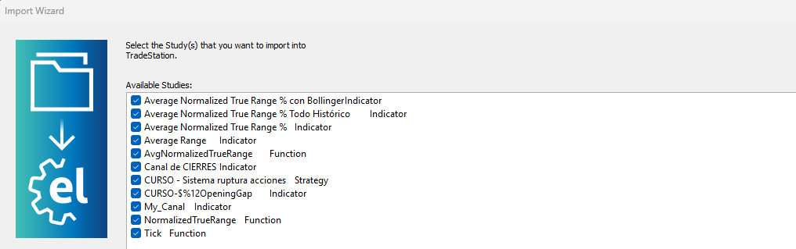
  <figcaption>Figura 2</figcaption>
</figure>


# Construcción de Gráficos Continuos y Sistemas de Ruptura


**Introducción y estructura de la clase**

Buenas tardes, aquí os saluda Sergi Sánchez por segunda vez. Si me dicen que se me oye, me veis, confirmad los alumnos a ver qué tal. Si me oís bien, si alguien no me oye escribid por favor ahí en el chat. Si todo el mundo oye, porque claro, si alguien no me oye no puede contestar que no me oye porque no me está oyendo, entonces hay que preguntarlo por escrito. Esto es de *parvulitos* de directo, de *parvulitos* en directo. Todo el mundo que me contesta a mí oye, porque claro, estoy hablando.

Pues vamos a empezar la clase de hoy. Recuerdo un poquito la estructura de las clases: al principio vamos a ir haciendo lo que tengo preparado, que siempre dejo un margen de improvisación que depende básicamente un poco del *feedback* que me va llegando, y en la parte final de la clase responderemos las preguntas. Normalmente lo haremos así. Si en alguna ocasión pues considero que hay demasiadas preguntas, pues otra tanda de preguntas, iremos un poco viendo sobre la marcha.

Recordar que el curso no acabará hasta que a mí me parezca, y eso será de aquí mucho tiempo. Quiere decir que tranquilos: habrá clases que haremos más material, habrá clases que haremos menos dependiendo. Habrá clases que haremos sólo sistemas, habrá clases que charlaremos más. Es decir, vamos un poco al ritmo que requiera el grupo, que es bastante amplio.

Ya comenté en la última, recordar las preguntas: podéis escribir, está siempre Alberto como mínimo ahí, también está Pilar, incluso Víctor. Hay varias personas pendientes de atender un poquito todas las preguntas que escribáis. Y Alberto, al principio, aquellas cosas más inmediatas ya os irá respondiendo. Si no, pues tomará nota para la ronda de preguntas de la parte final, que la haremos tras el descanso. Y sí que trataremos de hacer un pequeño parón de 5, como mucho 10 minutos, pero idealmente 5, y entonces ahí, post vuelta de este pequeño descanso, abordaremos las preguntas.

Ya hay varias pendientes del día anterior, algunas que se han puesto en *Discord*. Aquellos que todavía no estéis en el *Discord*, os recuerdo que hay un *Discord* que bueno, que es para cualquiera, pero que hay un grupo reservado de alumnos donde ahí podéis poner preguntas, y hay un canal que se llama "pregunta aquí" y ahí podéis preguntar. Alguna que a lo mejor no es propiamente del curso pues ya os respondemos, pero normalmente la responderemos en directos porque al final entendemos que pueden aportar valor al resto de alumnos. Entonces ese es un poco el criterio.

También hay algunas pendientes por email y siempre intentaremos responderlas en la clase. Ya comenté el otro día que había muchas referentes al tema de la construcción de los datos. Como es algo que me interesa bastante, pues voy a empezar hoy hablando otra vez, insistiendo en esto, porque me gustaría que quedara bastante claro cómo se construyen los gráficos.


**Construcción de gráficos continuos de futuros**

Entendemos qué diferencias hay entre un *futuro*, un *índice* y una *acción*. Normalmente los problemas de construcción de gráficos siempre se refieren a los futuros, porque está claro que un índice pues no tiene nada que construir: ya está construido, no es más que una fórmula. No es operable, pero es una fórmula matemática que recoge el comportamiento de una determinada cesta, normalmente de acciones, que puede ser de otra cosa. Y en sí no es operable un índice.

<div style="border-left: 4px solid #2196f3; background: #e3f2fd; padding: 10px 15px; margin: 10px 0; border-radius: 8px;">
  <strong>📊 Índice vs Futuro vs ETF</strong><br><br>
  Aquellos que tengáis menos experiencia, el primer aspecto que tenéis que tener claro es que hay un índice NASDAQ pero eso no es operable. Nosotros necesitamos un activo que sea operable. Por ejemplo, para operar el NASDAQ habría dos opciones de manera directa: el <em>futuro</em> (ahora vamos a hablar bastante de ello) y el <em>ETF</em>, que es el QQQ.
</div>

En acciones, al final, el único componente que podría ajustarse o no es el *dividendo*. Y ahí es verdad que no hay tanto consenso sobre si hacerlo o no. De hecho, por ejemplo, TradeStation no ofrece la posibilidad de ajustar acciones. El dividendo que se paga por los ETF, como cualquier acción, se va descontando del precio y eso no se ajusta. AmiBroker sí que ofrece la posibilidad de ajustarlo, y otros vendedores de datos también ofrecen la posibilidad de ajustar. Pero no os liéis ahora con eso, vale.


**Por qué ajustamos los futuros**

Vamos un poco al tema de los futuros. Primero, entender por qué ajustamos los futuros. Y esto voy a volver a incidir un poco, pero con datos recientes y pudiendo interactuar un poquito. Recordar que podéis escribir, insisto en las preguntas, Alberto está ahí atento.

En los futuros se genera la necesidad de unir distintos vencimientos porque los futuros vencen, *expiran*, vale, por utilizar una palabra más propia. En el caso de futuros sobre NASDAQ, Dow Jones, S&P 500 o DAX, cualquier índice, suelen tener cuatro vencimientos al año. Pero no es único: el CAC 40, por ejemplo, francés, vence cada mes.

Es decir, los hay que vencen trimestralmente, que es lo más usual sobre todo en el caso de acciones, pero los hay también que vencen mensualmente. El CAC, pero también, saliendo de acciones, en el tema de commodities, el petróleo por ejemplo vence cada mes. Esto es una regulación del propio mercado que cuando nació, nació así, normalmente por criterios seguramente de producción o de necesidad de variación de precios del que fuera, pero en su momento pues partió con X vencimientos.

Pero ya digo, los más conocidos, porque son los de acciones (S&P 500, NASDAQ, Dow Jones, los americanos), vencen cuatro veces al año, es decir, trimestralmente. Quiere decir que cada tres meses el contrato expira y por lo tanto ahí estamos en la obligación de cambiar. Si yo estoy operando, es lo que nos importa, ahora mismo, al final me voy a encontrar cuando llegue ese periodo que tengo que cerrar mi posición en el contrato antiguo y abrirla en el nuevo.


**Vencimientos y letras de los meses**

Ahora mismo, por ejemplo, para que hablemos de un caso práctico, estamos operando el contrato de marzo porque ya venció diciembre. En el caso de índices americanos, vencen el tercer viernes del trimestre, o sea, tercer viernes del último mes del trimestre. Es decir, el tercer viernes de marzo acabará, expirará el contrato. En este caso concreto será el 15 de marzo. El 15 de marzo expirarán los futuros que ahora tienen la letra H.

<div style="border-left: 4px solid #4caf50; background: #e8f5e9; padding: 10px 15px; margin: 10px 0; border-radius: 8px;">
  <strong>📅 Letras de los meses de vencimiento</strong><br><br>
  <ul>
    <li><strong>F</strong> - Enero</li>
    <li><strong>G</strong> - Febrero</li>
    <li><strong>H</strong> - Marzo (trimestral)</li>
    <li><strong>J</strong> - Abril</li>
    <li><strong>K</strong> - Mayo</li>
    <li><strong>M</strong> - Junio (trimestral)</li>
    <li><strong>N</strong> - Julio</li>
    <li><strong>Q</strong> - Agosto</li>
    <li><strong>U</strong> - Septiembre (trimestral)</li>
    <li><strong>V</strong> - Octubre</li>
    <li><strong>X</strong> - Noviembre</li>
    <li><strong>Z</strong> - Diciembre (trimestral)</li>
  </ul>
  Los cuatro más usuales son H, M, U, Z. Pero el petróleo, por ejemplo, los tiene todos porque es de cada mes.
</div>

Esto de las letras, H es marzo, igual que M es junio. Esos son los más usuales: H, M, U, Z. Este tipo de cosas que parecen cuando empiezas complicadas, son siempre igual. No cambia, siempre es la misma rutina: tercer viernes del mes que acaba, siempre es la letra H, y siempre es la letra U, M... No tiene más que tenerlo apuntado, sabérselo, y ya está. Con el tiempo ya es, podemos decir, uso y costumbre. Y lo mismo los símbolos de la plataforma.


**El valor temporal del dinero y los futuros**

Veis, yo tengo aquí abajo, que es la manera en que TradeStation da información, que le llamamos *rolos*, y lo tengo creado para eso, para ver los rolos. Lo que hago es comparar el vencimiento, podemos decir, que va a expirar con el futuro. Ahora queda mucho, ahora estamos en marzo.

Fijaros en un detalle importante: marzo ahora mismo se refiere a 17.577-78 más o menos, y el siguiente está a 17.800, más de 200 puntos por encima. El índice, recordar, el índice que replican todos, es decir, esto es el futuro, al final sigue a un subyacente. ¿Cuál es el subyacente? Aparte, es el NASDAQ 100, a 17.469 también, es decir, por debajo.

Esto es normal, es usual. Y lo que no es estable, podemos decir, es cuánto por encima. **El futuro normalmente va a estar por encima, va a estar por encima del contado**, cuanto más alejado esté de la fecha de vencimiento. ¿Por qué? Bueno, porque el tiempo vale dinero. Hablamos del *valor temporal del dinero*.

Aquel que no lo haya visto, es el tema 0 del curso, que no corresponde al trading algorítmico pero pues para aquellos que no tuvieran idea pues decidimos hacer ese tema. Y algunos nos habéis preguntado por qué hicimos eso y a lo mejor no hemos hablado de órdenes. Bueno, hemos hablado de órdenes, de hecho hemos hablado, pero es verdad que siempre puedes hablar más de todo y nunca sabes dónde cortar.

Volviendo al tema del dinero, el motivo uno es ese: el tiempo vale dinero. Y eso viene reflejado sobre todo por el tipo de interés, que sabéis que es variable, que hay momentos de tipos más alto y de tipos más bajo. Ahora mismo pues estamos en, si no recuerdo mal, el cuatro y medio en EEUU. Hace tres años era muy inferior y por lo tanto la diferencia era menor porque el tiempo valía menos dinero. Ahora el tiempo vale más dinero porque los tipos de interés son más altos.

También influyen los dividendos que pagan las acciones. Básicamente es eso: el tiempo y los dividendos que pagan las acciones. El coste de financiación. Entonces eso es el motivo por el que el futuro suele estar por encima. El cuánto está por encima ya os digo es algo que es variable. Y como veis, el índice está a 17.400 y pico, marzo está a 17.600 y junio está a 17.800. Si vamos más atrás pues seguramente estará más arriba. Esto normalmente es así.


**La necesidad de unir contratos: el gráfico continuo**

Entonces claro, como yo tengo un vencimiento, si yo quiero hacer análisis, quiero hacer sistemas, quiero hacer *backtest*, yo tengo que unir distintos contratos y construir un *gráfico continuo*. De aquí viene la necesidad de unir.

¿Cuál es el criterio para unir? Bueno, hay varios, pero en general el consenso utiliza un criterio bastante coherente y sencillo: o bien el que tiene más volumen, o bien el que tiene más *open interest*. A mí me interesa operar aquel que el mercado concibe como el *front*, y ¿cuál es el front? Pues aquel que está haciendo más volumen. Ahora no hay duda.

A medida que nos acercamos a la expiración, normalmente, por uso y costumbre, en 5, 6, 7 días antes de la fecha de expiración, es decir, ese tercer viernes, el contrato de junio va a empezar a hacer más volumen que el de marzo. Eso va a pasar pocos días antes. En ese momento, cuando detecta que un día tiene más volumen, cambia.


**Forward vs Backward: dos maneras de ajustar**

¿Cómo unimos estos contratos? Aquí es donde vendría la problemática y donde he visto que hay bastante confusión. Esto lo hablamos en la parte de teoría, pero estaba explicado en el vídeo de aspectos previos, si no recuerdo mal. Sería el punto 5, del desarrollo del sistema, aspectos previos que hablaba de tecnología, y ahí hablaba también de esto, de los futuros, de construir los gráficos continuos, por qué rolamos.

<div style="border-left: 4px solid #9c27b0; background: #f3e5f5; padding: 10px 15px; margin: 10px 0; border-radius: 8px;">
  <strong>📖 Forward vs Backward</strong><br><br>
  <ul>
    <li><strong>Forward:</strong> El ajuste se hace hacia adelante. El único contrato que refleja el precio real es el primero (el del inicio). Todos los siguientes están ajustados. El precio actual no refleja el valor real.</li>
    <li><strong>Backward:</strong> El ajuste se hace hacia atrás. El único contrato que refleja el precio correcto es el actual. Los anteriores están ajustados. Es el que solemos usar para operar.</li>
  </ul>
</div>

Si yo hago *forward*, el precio empieza en su valor real, es decir, el que tuvo ese día. Y lo que hago es que los ajustes que haya que hacer los hago hacia adelante, es decir, los sumo al resto, pero al siguiente contrato, no al anterior. Es decir, el único que refleja el valor real que tuvo en ese día es el del inicio.

En el caso del *forward*, el precio del contrato ajustado por diferencia marca 15.900 puntos cuando el índice está a 17.400. El *forward* tiene ese problema: el precio actual no es real. Por eso no solemos usarlo para operar. En tiempo real plantearía un problema de ajuste: habría que estar ajustando en tiempo real.

En cambio, en el *backward*, que es el que solemos usar, pasa justo lo contrario: el único contrato que refleja el precio bien es el actual. Por eso los *backwards* reflejan el precio actual y son los que usamos.


**El problema del gráfico no ajustado**

El gráfico no ajustado simplemente une todos los contratos pero sin hacer ningún ajuste. Por tanto, refleja todos los precios de los contratos reales porque no hay ningún ajuste. ¿Qué problema tiene? Que esa diferencia que habéis visto, que ahora veíamos por ejemplo en el caso real actual, de 240 puntos aproximadamente, en el momento de unir esos dos contratos aparecen con 200 puntos de diferencia.

Todos los precios que tienes son reales, pero habrá algunos *gaps*. Sobre todo cuando hay, pues como ahora en la actualidad, unos tipos altos, pues hay momentos de un *gap* fuerte.

Si tú dices: "bueno vale, pero si los precios son correctos, ¿por qué realmente lo ajustamos?" Lo ajustamos porque esa diferencia de esos 200 puntos no es fruto de la oferta y la demanda, no es real que el mercado abriera 200 puntos por encima. El mercado habría estado plano probablemente, las acciones que al final hacen subir al índice no estaban subiendo. Por tanto, tú ahí no ganabas 200 puntos.

Si venías largo en ese gráfico continuo, ese día no deberías ganar nada. En cambio, si no ajustas, en ese *gap* de pronto ganas 200 puntos. No es real, no estás ganando 200 puntos. Entonces tú ahí lo que tienes que hacer es cerrar en uno y abrir en el otro y seguir la posición, y el precio subirá o bajará.


**Ajuste por diferencia vs ratio**

Hay dos maneras de ajustar en cuanto a qué hacemos con esa diferencia de puntos entre contratos:

<div style="border-left: 4px solid #ff9800; background: #fff3e0; padding: 10px 15px; margin: 10px 0; border-radius: 8px;">
  <strong>⚠️ Diferencia vs Ratio</strong><br><br>
  <ul>
    <li><strong>Por diferencia:</strong> Sumo o resto a todos los datos los puntos de diferencia. Si hay 220 puntos de diferencia, se lo suma a todo.</li>
    <li><strong>Por ratio:</strong> Divido los dos precios y multiplico/divido toda la base de datos por ese ratio (por ejemplo, 1.013). Es como la escala logarítmica vs lineal.</li>
  </ul>
  <strong>¿Por qué es mejor multiplicar/dividir?</strong> Porque no es lo mismo 200 puntos a 2.000 que a 17.000. El porcentaje mantiene mejor la relación.
</div>

El ajuste por diferencia es exactamente eso: o bien sumo o bien resto a todos los datos los 220 puntos que decía que había de diferencia. Vamos a suponer que el día en que tiene que hacer el programa el enlace hay 220 puntos, pues se lo suma a todo o se lo resta. Eso es por diferencia.

Y cuando es por ratio, bueno, pues lo que hace es dividir los dos precios, es como si fuera un porcentaje. Si tiene ahora más o menos 17.830 y tiene 17.600, pues divido uno por otro y el ratio es 1.013. Por ese ratio multiplico toda la base de datos.

¿Por qué es mejor multiplicar/dividir? Bueno, por lo que hemos hablado muchas veces en el curso, de los porcentajes, de la escala, de la diferencia de precios. No es lo mismo 200 puntos cuando el precio está a 2.000, como habéis visto al inicio del contrato, que cuando está a 17.000. Cada 100 puntos, si yo le quito 100 puntos de ahora, 200 puntos de ahora, le quito 200 al contrato de inicio también. Porque lo que hago es restar a toda la base de datos.

El ajuste por ratio también evita que los contratos vayan a negativo. Es más ortodoxo.


**El problema de los decimales con el ajuste por ratio**

¿Qué problema plantea ajustar por ratio? Es verdad que el decimal es otro tema. Al dividir o multiplicar, los precios anteriores al contrato actual van a tener valores tipo 2450.14, 92.68... No va a respetar el valor del *tick*. Y por eso hay gente que eso no le gusta nada. Pero no es nada problemático porque puedes usar el redondeo. De hecho, TradeStation mismo ya lo hace, ya redondea al *tick* siguiente. Es buena práctica redondear por código.


**Configuración en TradeStation**

En TradeStation, cuando tú vas a meter un símbolo, en *Symbol Lookup* hay uno que se llama *Custom*: ahí es donde tú haces el futuro personalizable. Os recomiendo siempre usar la ayuda de TradeStation porque es bastante potente.

Las letras de los símbolos significan:
- El número (5, 6, 7) indica cuántos días antes de la expiración se hace el *rolo*
- **XC** es cuando es valor absoluto (diferencia)
- **XR** es cuando es por ratio
- **XN** es sin ajuste

Por defecto, TradeStation usa ajuste por diferencia (@NQ). No es el mejor en mi opinión, pero si lo usas tampoco va a ser el fin del mundo.

<div style="border-left: 4px solid #2196f3; background: #e3f2fd; padding: 10px 15px; margin: 10px 0; border-radius: 8px;">
  <strong>📊 Recomendación</strong><br><br>
  Si usáis el que viene en TradeStation por defecto, está bien. No es ningún drama. Lo que pasa es que quería que lo entendierais y vierais por qué veis gráficos que ponen @NQ=105XN, @NQ=105XC o 106.
</div>

El gráfico no ajustado solo es recomendable en aquel caso que operéis un sistema muy intradía y que al final podáis asumir cerrar posiciones totalmente cuando por código se acaba el contrato y empezar en el nuevo. Entonces puede tener sentido y puede ser hasta preferible, porque entonces sí que evitas totalmente las distorsiones.

Tener en cuenta que los vencimientos y todo esto son totalmente estables, es decir, son conocidos previamente. No es ninguna incertidumbre, no es algo que no pueda programar. Yo puedo fácilmente en un código programar que el tercer viernes de cierre de trimestre, a X hora, cierre los sistemas y reabra posiciones si quiero. Esto es perfectamente viable.

Claro, en sistemas que sean medianamente *swing* y que sigan posiciones a lo largo del día, esto no es posible. Y como vamos a ver, vamos a empezar sobre todo en este tipo de sistemas, pues por eso creía oportuno dejar acabado todo esto sobre los contratos y demás.


**ETFs y acciones**

En el caso de los ETF o acciones, ya no hay tanta problemática porque no hay este efecto de vencimientos. Las acciones no tienen vencimiento, por lo tanto no hay este problema.

Lo que puede haber es:
- El pago de los dividendos (hay más o menos consenso)
- Los *splits* o *contra-splits*

Os enseño el TLT porque es el caso más paradigmático: realmente TradeStation no lo ajusta, y eso hace que tenga un valor muy inferior al que debería para reflejar el valor de una inversión en el TLT, que debería reflejar un índice. Entonces ahí hay un eterno debate. Esto es más debatible, y no perdemos más el tiempo porque hay bastante opinión sobre que no hay que hacerlo. Yo creo que sería mejor hacerlo, pero es verdad que no es dramático no hacerlo, porque aquí no es el mismo efecto: es un valor monetario que sale, te pagan el dividendo y tú lo cobras, entonces la acción sigue cotizando.

Hay proveedores que permiten ajustar ese pago de dividendos también. Os lo digo por si lo veis. Si alguien nos quiere preguntar pues que nos pregunte, pero como nosotros en este caso no lo vamos a tratar específicamente, no dedico más tiempo.

Si no hay más de este tema, doy por cerrado el tema este.


# Sistema de ruptura `Canal de Donchian`
¿Cómo hemos empezado? Porque hay otro de los eternos debates, y eso sí que vamos a hacer varias clases, por varios métodos: la búsqueda de ideas.

Es un tema que creo que siempre preocupa y ocupa, y de hecho ahí es seguramente el motivo por el que triunfan tanto estos programitas de buscador de estrategias: Quant Alfa, todos estos programas que sirven para empezar la casa por el tejado, mejor dicho, empezar la casa por el tejado. Cuando realmente hay muchas ideas disponibles y no hace falta. Hay muchas maneras de encontrarlas e iremos viendo muchas. En la teoría habéis visto algunas.


## Planteamiento

No va a ser el único sistema que vamos a usar. Este lo vamos a usar para hacerlo crecer. Este sistema sigue una entrada tipo *Donchian*: una ruptura de canal. De *Donchian* he hablado mucho, empecé hablando incluso en la historia del trading algorítmico, recordáis. Y hablamos de los canales de *Donchian*. Ya os dije que siguen totalmente en vigor, y hablé mucho de ellos. Y ya veis que es el primer sistema que os presento, que es un canal de *Donchian*.

<div style="border-left: 4px solid #4caf50; background: #e8f5e9; padding: 10px 15px; margin: 10px 0; border-radius: 8px;">
  <strong>✅ Sistema de ruptura Donchian</strong><br><br>
  El sistema Donchian es un sistema de <strong>ruptura (breakout)</strong> puro.   
  
  Funciona así: cuando el precio <strong>cierra por encima del máximo</strong> de los últimos <strong>X cierres</strong> (por ejemplo 20), se entra en <strong>largo</strong>. Si el precio <strong>cierra por debajo del mínimo</strong> de esos mismos X cierres, se entra en <strong>corto</strong>.<br><br>
  No intenta anticipar el mercado ni buscar suelos o techos. El objetivo es <strong>subirse a movimientos fuertes</strong> cuando el precio sale de un rango y comienza una tendencia. Es un sistema mecánico, objetivo y ampliamente utilizado en acciones, futuros y ETFs, famoso por su uso en los <em>Turtle Traders</em>.
</div>

Esto es `Apple` en velas diarias.

<figure>
  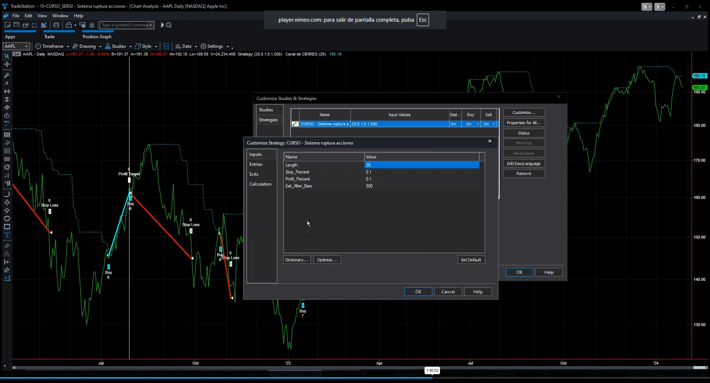
  <figcaption>Figura 5</figcaption>
</figure>

<figure>
  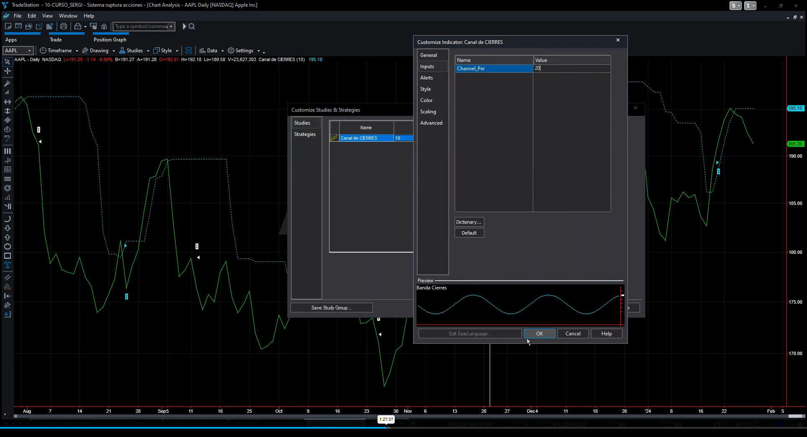
  <figcaption>Figura 1</figcaption>
</figure>

Le he puesto:
- Canal de 20 días
- *Stop* y *TP* del 10% (simétricos)
- Salida por tiempo en 10 barras (lo puse a propósito 500 barras para no salir nunca, solo por tp o sl)

No he hecho ningún proceso de optimización, nada, cero. Simplemente lo he creado. Sé que un *Donchian* es una estrategia que puede funcionar en muchos activos.

***Consulta en Discord***

Aprovecho una pregunta que había en el *Discord* relacionada con la validación de entradas. Había alguien que decía que tenía un *setup* tendencial y que le daba un porcentaje de aciertos muy bajo, y eso lo descartaba Recordar una cosa: un porcentaje de acierto en sí, por sí solo, no dice nada.

De ahí es donde parte esa idea de decir que una manera sencilla, a veces, de evaluar un *setup* de entrada rápido es: si yo igualo *stop* y *TP*, tiene que acertar más de la mitad. Entonces volviendo a la pregunta: ¿descartarías el sistema porque el *setup* de entrada no tiene ventaja estadística? No es que no tenga ventaja estadística. Un sistema puede tener un *win rate* del 30% y eso en sí no es nada malo. Pero verás que tiene un *payoff* muy alto. Ahí está. Si quieres evaluar la entrada sola, tienes que tener *payoff* de 1. Ese es el truco para evaluar de manera rápida, sin hacer todo un proceso.

* **Sistemas tendenciales** tienen un porcentaje de aciertos bajo pero un *payoff* bastante alto. 
* **Sistemas antitendenciales** tienen un porcentaje de aciertos elevado y un *payoff* bajo. Las dos cosas van combinadas.

<div style="border-left: 4px solid #9c27b0; background: #f3e5f5; padding: 10px 15px; margin: 10px 0; border-radius: 8px;">
  <strong>📖 La esperanza matemática mide si un sistema es rentable en el largo plazo<br><br></strong>
  <br><br>
  <strong>Esperanza = (% de aciertos × ganancia media) − (% de fallos × pérdida media)</strong><br><br>
  Si el <em>Take Profit</em> y el <em>Stop Loss</em> son iguales, el sistema tiene un <em>payoff</em> aproximado de <strong>1</strong>.<br>
  En ese caso, basta con tener <strong>más de un 50 % de aciertos</strong> para que la esperanza sea positiva.<br><br>
No importa ganar siempre, sino que el balance entre lo que se gana y lo que se pierde sea favorable.
</div>
<br>
<br>

<div style="display: flex; flex-direction: column; gap: 15px;">
  <!-- Fila superior: 2 imágenes -->
  <div style="display: flex; gap: 10px; justify-content: center;">
    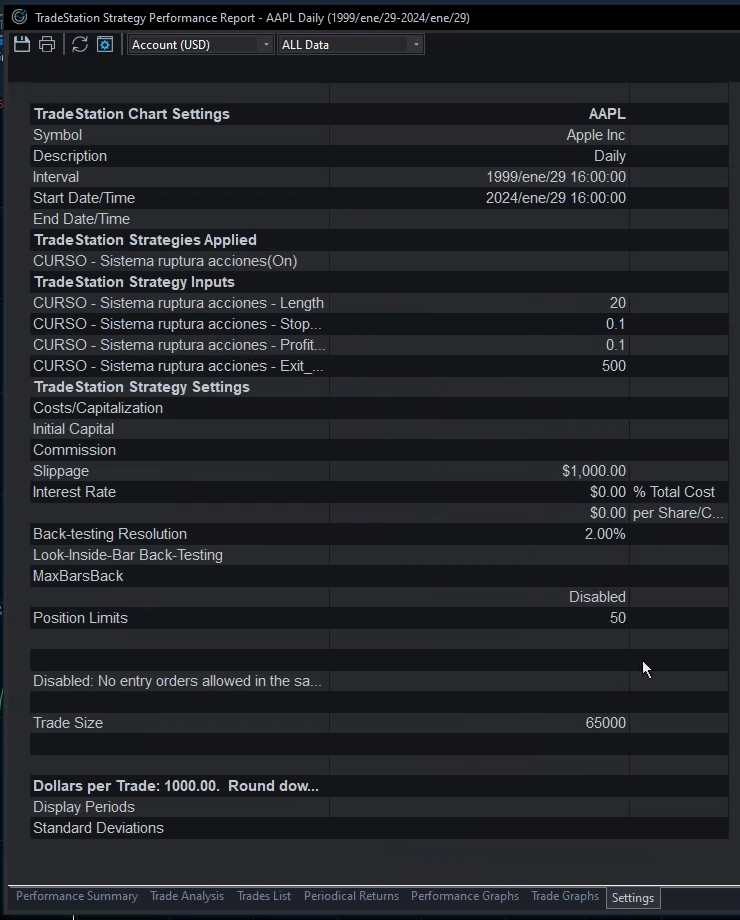
    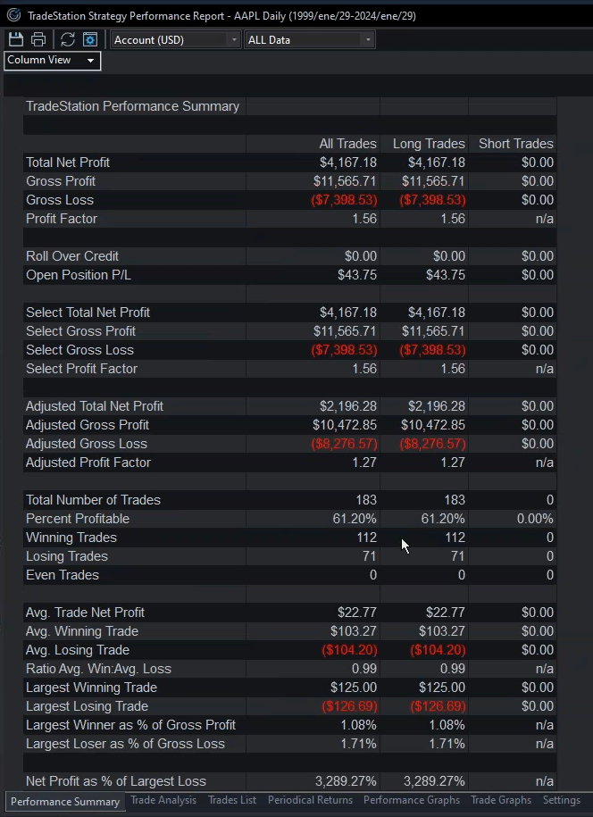
  </div>
</div>

Le puse de `setup` de mil dólares, Mil dólares de momento,,, y no tiene `costes` porque esto en acciones plantea un problema que luego hablaremos. Tiene un `porcentaje de aciertos` del **61%**.  Este es un ejemplo de lo que os decía. Yo le he igualado el riesgo y el TP,   

¿actúa a los dos? Parece que sí que actúa a los dos, porque si no actuara no tendría sentido. Hay que ver que los dos actúen bastante, porque si no me estoy engañando, ¿eh? , en este caso actúa porque no puede salir de otra manera, de hecho, perdón, acabo de caer que le he quitado el factor temporal, es decir, todo el rato sale por SL o por TP. 
<div style="display: flex; flex-direction: column; gap: 15px;">
  <div style="display: flex; justify-content: center;">
    
  </div>

</div>

Claro, va solo largo, o sea, este es muy fácil, esta ventaja, ¿eh? Dice, hombre, sí, sí, tienes razón, es fácil porque es solo largo. Pero bueno, lo usamos para explicaros y no quiere decir... O sea, el hecho de que sea una ventaja ir largo no es algo malo. O sea, en bolsa no es algo malo, es algo que podemos aprovechar a nuestro favor, ¿no? No se trata de decir... O sea, nosotros trataremos de aprovechar eso a nuestro favor. De hecho, ya os lo enseñé en la teoría, pero lógicamente, una de las cosas que también quiero enseñaros hoy, y a partir de ahora, en esta parte que vamos a entrar en estos sistemas, que vamos a hacer varios, como os dije en la teoría, vamos a hacer sistemas de muchos tipos, pero os dije que vamos a empezar por el perfil más tranquilo. Perfil aquel de operador que tiene autotrabajo y que solo puede operar por las tardes y que no quiere dedicar muchas horas al día, ¿de acuerdo? Pero es que ese perfil, que es el que yo recomiendo empezar si tienes poca experiencia, también debes tener sistemas operando aquí si tienes experiencia. 

Esta es la curva del sistema con $1000

<div style="display: flex; flex-direction: column; gap: 15px;">
    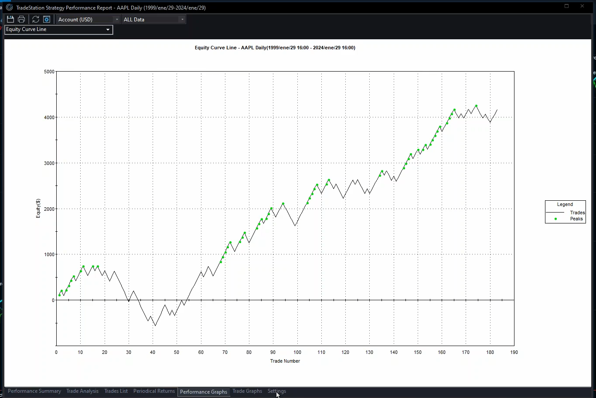
</div>

**Perfiles de operador**

Este perfil, que es el que yo recomiendo empezar si tienes poca experiencia, también debes tener sistemas operando si tienes experiencia. Nosotros tenemos, o sea, este perfil no quiere decir que si tienes mucha experiencia todo lo vas a operar intradía. Porque al final, si queremos un *portfolio*, queremos diversificar las maneras por estrategias, necesitas tener estrategias de este tipo. Todos los perfiles entonces empezamos por este porque este sí que es verdad que es para todo el mundo y es en el que recomendamos empezar. Y el que recomendamos abordar algo algorítmico antes en este tipo de estrategias porque? porque son estrategias más universales, más fáciles de validar, etcétera. Y lo iremos viendo. Pero sirven para todo el mundo. 

También los perfiles más activos, está bien que tengáis estrategias que van en un minuto si son rentables y las habéis validado, pero la mejor diversificación que podéis hacer es meter alguna diaria, porque seguramente conseguís `descorrelación`.

**Evaluación preliminar de entradas  - Benchmark**

<figure>
  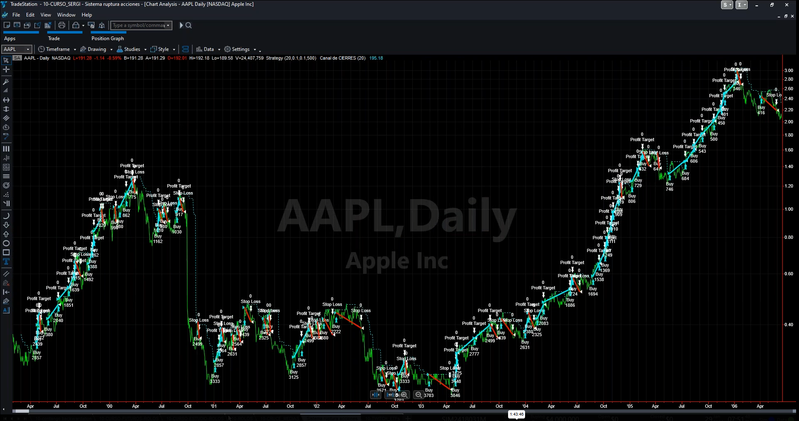
  <figcaption>Figura 9</figcaption>
</figure>

Entonces tenemos una acción que ha sibudo bastante y por lo tango un sistema largo tiene  ventaja. Hemos cargado desde bastante linea temporal para que tubiera sus problmeas pero como tiene terreno a favor sale ese ratio importante ¿Donde nos podemos referenciar? nuestro mínimo *benchmark* (resultado mínimo aceptable) en este tipo de sistemas (acciones), es el *buy and hold*. Si yo no soy capaz de batir al *buy and hold*, pues apaga y vámonos. Lógicamente lo haremos con el *ratio de retorno/riesgo*, porque habrá muchas veces en este tipo de sistemas en que el *buy and hold* nos ganará más que nosotros, pero ¿a qué riesgo? Ese es el tema siempre que nos interesa.


**Backtest : *Buy and hold***

Ahora voy hacer un backtest de *buy and hold* de $1000 del 29/01/99 hasta ayer. Money management 100%.  
Bueno, lo normal es comparate con el índice, aunque lógicamente te tienes que comparar también con el activo que vas. 

<figure>
  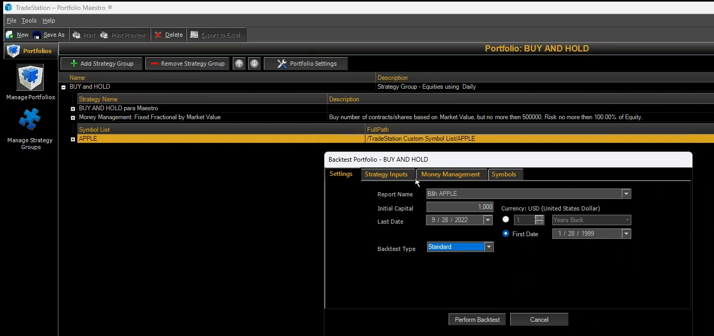
  <figcaption>Figura 14</figcaption>
</figure>

<figure>
  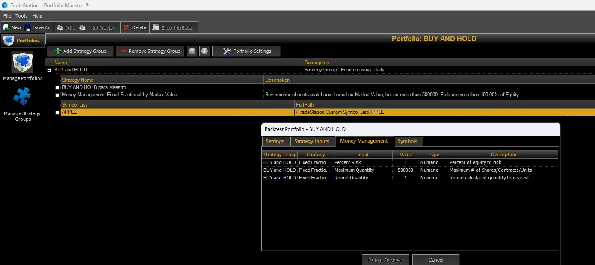
  <figcaption>Figura 15</figcaption>
</figure>

<figure>
  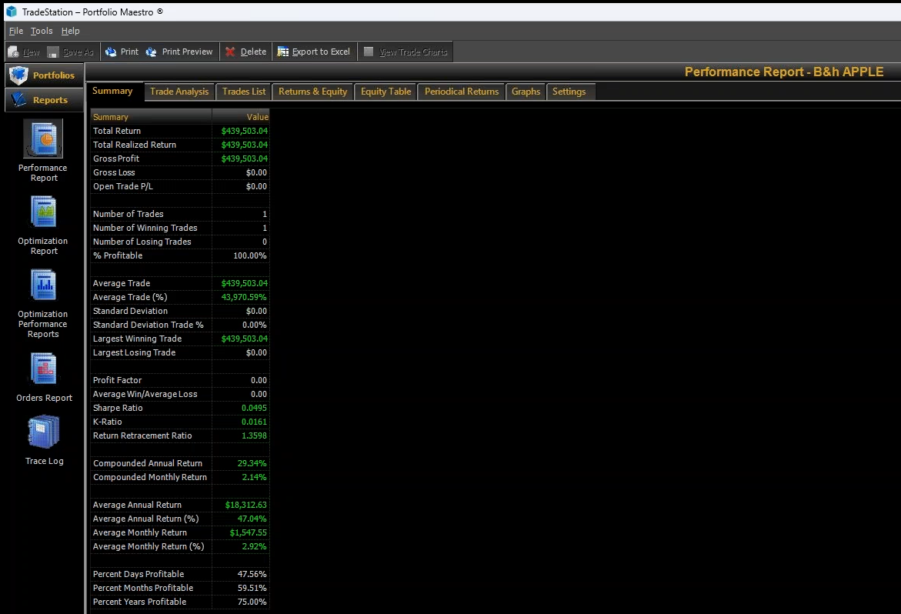
  <figcaption>Figura 16</figcaption>
</figure> 

<div style="display: flex; flex-direction: column; gap: 15px;">
  <!-- Fila superior: 2 imágenes -->
  <div style="display: flex; gap: 10px; justify-content: center;">
    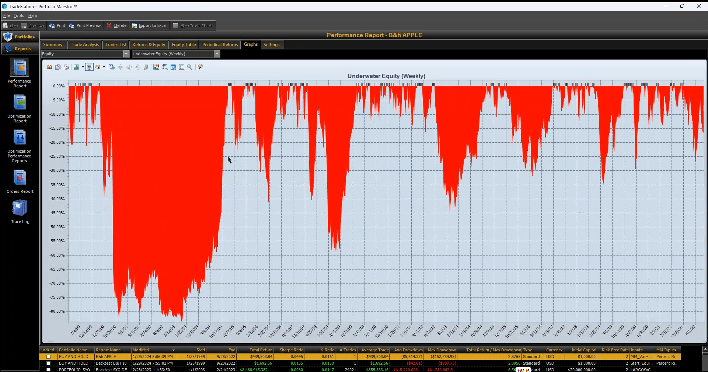
    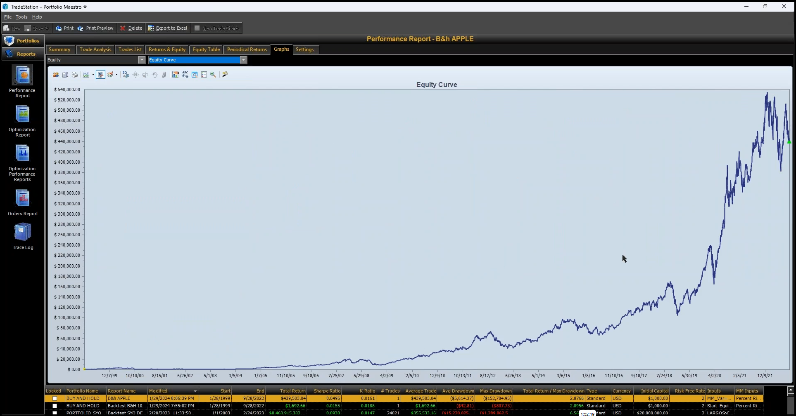
  </div>
</div>


En este caso vamos con una acción, que ahora mismo no nos importan tantos los datos. Si estamos viendo protocolos, claro, es una locura. Estamos viendo una acción que está a 0.32 y está en 190$. Es completamente absurdo. Lo que ha ganado no tiene ningún tipo de sentido. Pero es igual. Quedémonos con la idea de que, evidentemente, lo haremos con `ratio de retorno de riesgo`, porque habrá muchas veces en este tipo de sistemas, lo vais a ver, en que, no me refiero a este, a otros, en que el *buy and hold* nos ganará más que nosotros. ¿De acuerdo? Con un sistema. Pero ¿a qué riesgo? Este es el tema siempre que nos interesa y que tenemos que ver. Tenemos que ver a qué riesgo lo hacemos. 

| Métrica | Buy & Hold + MM | Sistema Ruptura |
|---------|-----------------|-----------------|
| **Capital Inicial** | $1,000 | $1,000 |
| **Retorno Total ($)** | **$439,503.04** | $4,167.18 |
| **Retorno Total (%)** | **43,970.59%** | 416.72% |
| **CAGR** | **29.34%** | ~6-7% |
| **Sharpe Ratio** | 0.0495 | — |
| **K-Ratio** | 0.0161 | — |
| **Return Retracement Ratio** | **1.3598** | — |
| **Profit Factor** | n/a | 1.56 |
| **Nº de Trades** | 1 | 183 |
| **% Trades Ganadores** | 100% | 61.20% |
| **Avg. Winning Trade** | $439,503.04 | $103.27 |
| **Avg. Losing Trade** | $0.00 | ($104.20) |
| **Max Drawdown (%)** | **~80%** | ~30-40% |
| **Money Management** | Fixed Fractional 1% | Fijo por trade |


El **Buy & Hold con reinversión de beneficios** genera **105x más retorno** ($439K vs $4K) porque:

1. **Composición de beneficios**: Reinvierte ganancias comprando más acciones
2. **Captura toda la tendencia**: No corta ganancias con TP del 10%
3. **Apple subió ~440x** en ese periodo

**Pero el precio es brutal**:  
* `Drawdowns` del **80%** (2000-2003 y 2008). 
* El sistema activo tiene drawdowns más controlados (~30-40%) pero sacrifica el crecimiento exponencial.


<figure>
  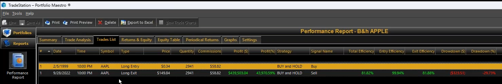
  <figcaption>Figura 19</figcaption>
</figure>  

Yo aquí compro 2.900 acciones a 0.34 y las cierro el último día. Es como funciona este código de *buy and hold*. Y me da un retorno un poquito alto. 

<figure>
  
  <figcaption>Figura 20</figcaption>
</figure> 

Pero ya está. Es simplemente un ejemplo. Claro, esto es a costa de tener un drawdown del 87%. 83% drawdown. No está mal. Y a ver la exposición si está bien. Esto ya lo iremos trabajando más. Sí, está un poquito pasado de 100, pero está bien. Está bien. Entonces, esta sería una de las comparaciones. Qué duda cabe. Con el índice y con el activo en que operas. Con el activo en que operas. Aquí ya digo, el dimensionamiento es tremendamente tramposo, porque aquí empezamos con 2.000, pero lo voy cerrando. Y no acumulo tantos datos en él. Ya veremos qué cambios vamos haciendo a este sistema y cómo lo validamos, etc. Simplemente quería plantearoslo y ahora os enseño el código. Ahora os enseño el código. Y cuál es la idea de este sencillísimo sistema. 

Vamos a ver hasta qué punto lo aprovechamos. Creo que sí que lo aprovecharemos. Pero vamos a tener que trabajarlo. En esta configuración inicial es tremendamente básico y tendrá que crecer un poco. Ahora mismo, cómo funciona. Para aquellos que tengáis un poquito de código, los que no, simplemente quedaros con una explicación. El código en sí no es más que una explicación de la idea que ya os he dado.


<div style="border: 2px solid #ff9800; background: linear-gradient(135deg, #fff3e0 0%, #fafafa 100%); padding: 20px; margin: 15px 0; border-radius: 12px; font-family: 'Segoe UI', Arial, sans-serif;">

<h3 style="color: #e65100; margin-top: 0; border-bottom: 2px solid #ff9800; padding-bottom: 10px;">📋 Configuración Inicial del Sistema — Evaluación Rápida</h3>

<div style="background: #fff8e1; padding: 12px 15px; border-radius: 8px; margin-bottom: 15px; border-left: 4px solid #ffc107;">
<p style="margin: 0; font-size: 14px;"><strong>⚠️ Estado actual:</strong> Configuración <em>tremendamente básica</em>. No se ha hecho ningún análisis ni estudio previo. Simplemente se ha creado un Donchian sabiendo que puede funcionar en muchos activos.</p>
</div>

<div style="background: white; padding: 15px; border-radius: 8px; border-left: 4px solid #4caf50; margin-bottom: 15px;">
<h4 style="color: #2e7d32; margin-top: 0;">🎯 REGLA DE ENTRADA</h4>
<p style="margin: 0; font-size: 14px;">Compra si el <strong>cierre es mayor o igual</strong> que el máximo cierre de los últimos 20 días</p>
<p style="margin: 8px 0 0 0; font-size: 13px; color: #666;"><em>Filtro de volatilidad: desactivado (quitado de momento)</em></p>
</div>

<h4 style="color: #e65100; margin-bottom: 10px;">🚪 SALIDAS CONFIGURADAS</h4>

<div style="display: grid; grid-template-columns: 1fr 1fr; gap: 12px; margin-bottom: 15px;">

<div style="background: white; padding: 12px; border-radius: 8px; border-left: 4px solid #2196f3;">
<h5 style="color: #1565c0; margin: 0 0 8px 0; font-size: 14px;">📊 Take Profit</h5>
<p style="margin: 0; font-size: 13px;"><strong>10%</strong> simétrico</p>
<p style="margin: 5px 0 0 0; font-size: 12px; color: #666;"><em>Puesto solo para evaluación rápida del setup</em></p>
</div>

<div style="background: white; padding: 12px; border-radius: 8px; border-left: 4px solid #f44336;">
<h5 style="color: #c62828; margin: 0 0 8px 0; font-size: 14px;">🛑 Stop Loss</h5>
<p style="margin: 0; font-size: 13px;"><strong>10%</strong> simétrico</p>
<p style="margin: 5px 0 0 0; font-size: 12px; color: #666;"><em>Está un poco elevado, prácticamente no actúa</em></p>
</div>

</div>

<div style="background: white; padding: 15px; border-radius: 8px; border-left: 4px solid #9c27b0; margin-bottom: 15px;">
<h4 style="color: #6a1b9a; margin-top: 0;">⏱️ SALIDA TEMPORAL (Recomendada)</h4>
<p style="margin: 0; font-size: 14px;">Sale a las <strong>10 barras</strong> si no se cumple el objetivo</p>
<p style="margin: 8px 0 0 0; font-size: 13px; color: #555;"><em>"No tiene sentido estar infinitamente en el mercado. Estar en el mercado es un riesgo."</em></p>
<p style="margin: 5px 0 0 0; font-size: 12px; color: #888;">→ Con esta configuración, casi siempre sale por tiempo</p>
</div>

<div style="background: #e8f5e9; padding: 12px 15px; border-radius: 8px; border-left: 4px solid #4caf50;">
<h5 style="color: #2e7d32; margin: 0 0 8px 0;">💡 Nota sobre activos tendenciales</h5>
<p style="margin: 0; font-size: 13px;">Lo normal en un activo tendencial es <strong>no usar salidas simétricas</strong>, sino dejar ratio <strong>2:1</strong> (TP más amplio que Stop). La configuración simétrica era solo para probar si acertaba más del 50%.</p>
</div>

<div style="background: #fafafa; padding: 10px 15px; border-radius: 8px; margin-top: 15px; font-size: 12px; color: #666; text-align: center;">
<strong>Probado en:</strong> Apple y otras acciones del Nasdaq 100
</div>

</div>

Bueno, porque seguramente el stop  debería estar un poquito elevado. ¿Veis? Prácticamente así no actúo nunca. 

<figure>
  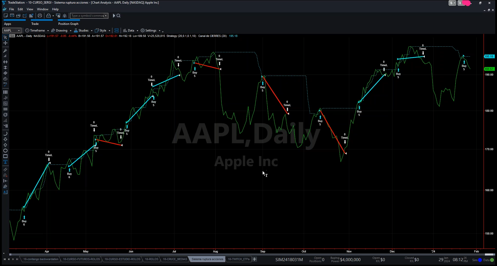
  <figcaption>Figura 21</figcaption>
</figure>

Aquí ahora mismo... No hemos hecho ningún análisis, no hemos hecho nada. Todo esto... De verdad, no lo he hecho. No he mirado nada todavía en el sistema. ¿Vale? No he mirado nada, no lo he estudiado. Simplemente le he metido a un Donchian, lo he creado. Sé que un Donchian es una estrategia que puede funcionar en muchos activos y ya está. Sin más, lo he metido y ya está.

<figure>
  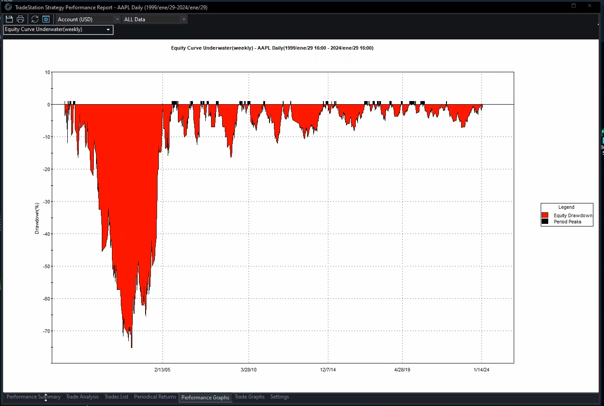
  <figcaption>Figura 22</figcaption>
</figure>

<figure>
  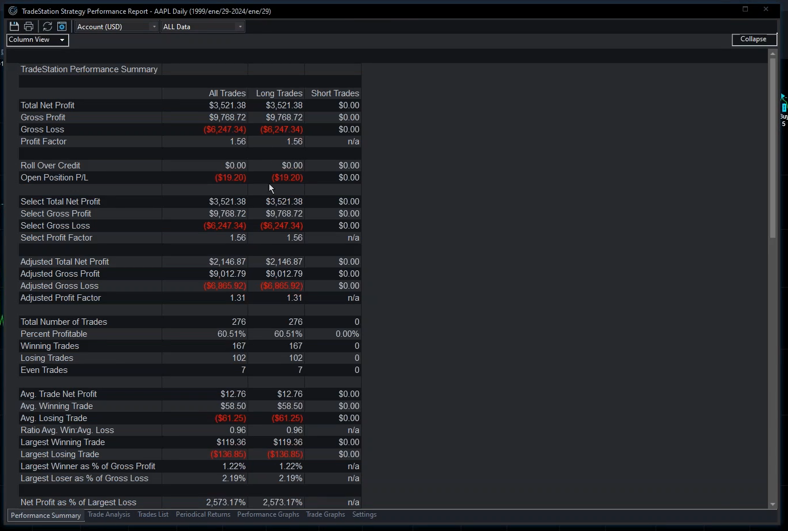
  <figcaption>Figura 23</figcaption>
</figure>

Espera, vamos a mejorar esto. Vamos a... Sí que estamos viendo que el TP no actúa. Vamos a ponerle... Que no tienen ni por qué ser simétricos, ¿eh? Lo normal es que en un activo tendencial es que le dejáramos a lo mejor dos a uno. Esto era solo por probar si le acertaba más de un 50%.

<figure>
  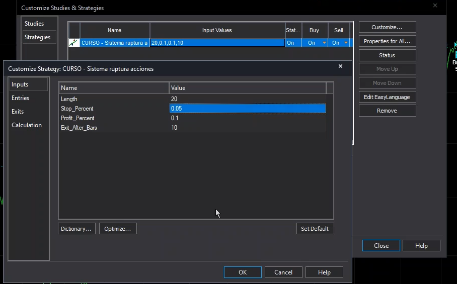
  <figcaption>Figura 24</figcaption>
</figure>

Esto luego ya veremos que haremos un multiplicador de tp más el stop. Si queréis uno, dos, etc. En esta fase inicial tenemos un sistema muy básico, que simplemente entra en roturas en cierres, por encima del cierre de hace 20 velas. 

Tenemos también otras estrategias que tienen otras entradas, otras salidas rápidas, veremos varias cosas. Este es solo un primer planteamiento muy básico de algo, de un mecanismo que ya habíamos visto en el curso, y que seguro que habéis oído hablar. Es una entrada lógicamente tendencial de ruptura. Puede hacerse tendencial pura, es decir, como lo estamos planteando, pero tbn tratar de dejarlo correr incluso ATP muy cercanos, para coger poco movimientos explosivos y rápidos. Ya veremos que podemos meterle filtros de volatilidad, etc. 

Trabajaremos el próximo día en profundidad.

<div style="display: flex; flex-direction: column; gap: 15px;">
  <!-- Fila superior: 2 imágenes -->
  <div style="display: flex; gap: 10px; justify-content: center;">
    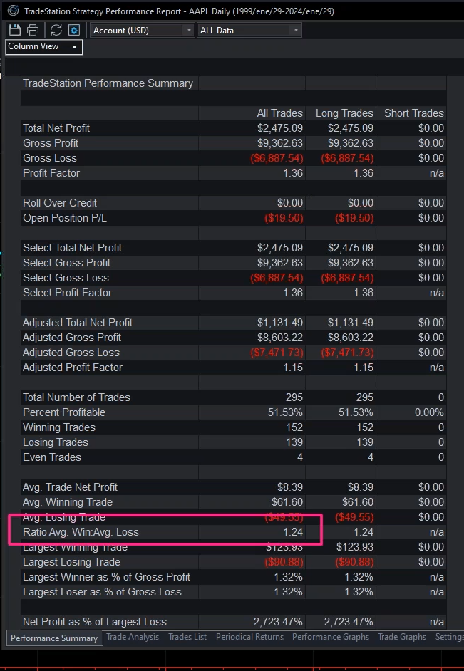
    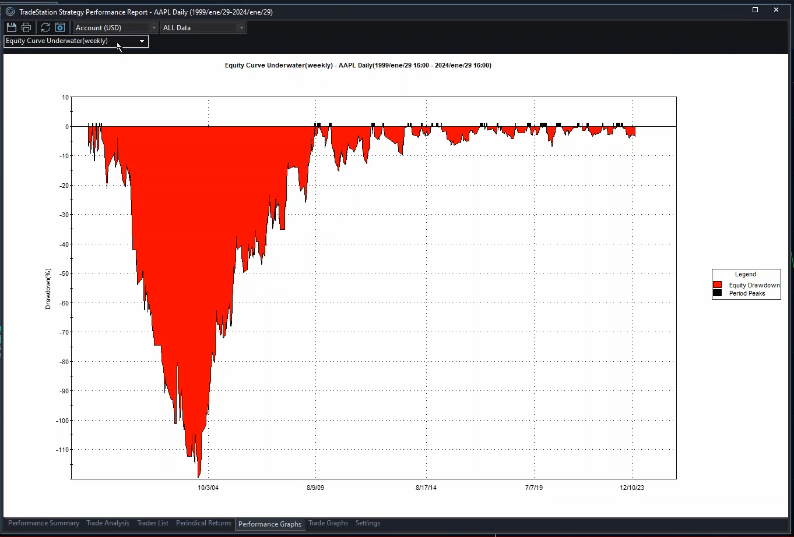
  </div>
</div>


Os acordáis que antes teníamos un `Percent profitable` 60, ahora ya tenemos un 51. ¿De acuerdo? Pero claro, ahora ya ganamos más de lo que perdemos. Aquí tenemos un 1.24. Ahí lo veis. Aunque era antes 1, ahora es 1.24. 

Entonces ya hemos bajado un poquito el % de acierto. A ver, el sistema sí está muy justito. Tirando... El sistema sí está tirando a verde. Cuidado. Simplemente hemos hecho un tratamiento inicial. Hemos hecho un tratamiento inicial. El sistema sí está tirando a verde. 

**Cruce de medias `cruce dorado`**

Para acabar de complementar esto que os he enseñado, tenía aquí el típico cruce de medias que usamos en el curso que os enseñé, el cruce dorado, pero lo he puesto en 60 minutos para que operara más. Aquí probablemente no es rentable, y le he metido simplemente un stop y un TP simétrico, ¿vale? 
<div style="text-align: center;">
  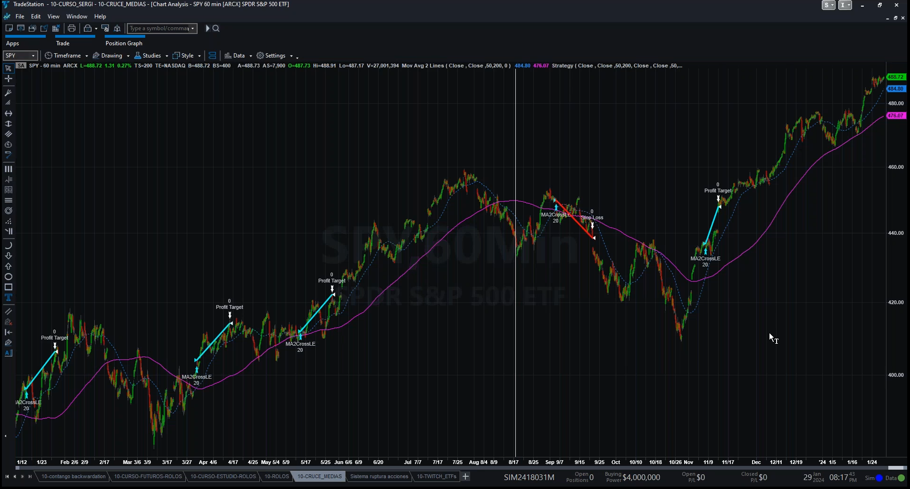
</div>


**Evaluación de entradas con Stop y TP simétricos**

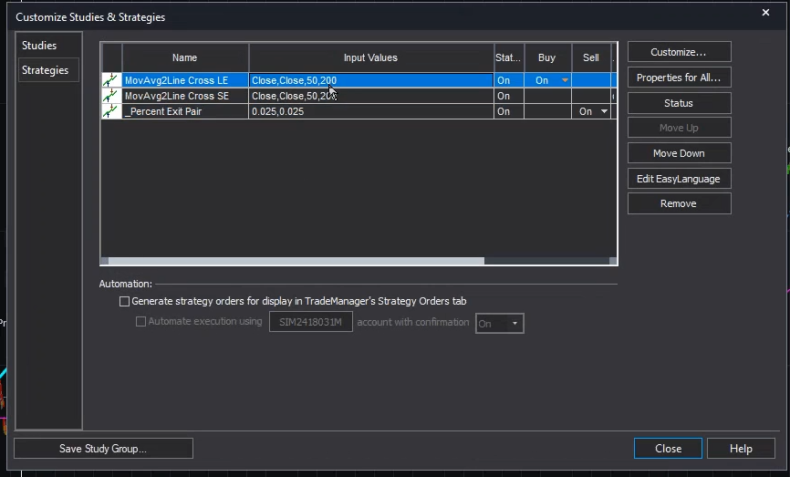

El porcentaje es media, compra y compra, y cruce es la media de 50-200. Simplemente para enseñaros lo que os decía de la evaluación de señales de entrada, o este truco de que tienen que acertar más del 50%. Y en este caso le he puesto un *stop* y *TP* de 2.5%. ¿Por qué? Lo he puesto un poco más alto, ahora os lo subiré antes, pero claro, actúa muy poco. Actúa muy poco y es lo que decía, necesitamos que actúe.

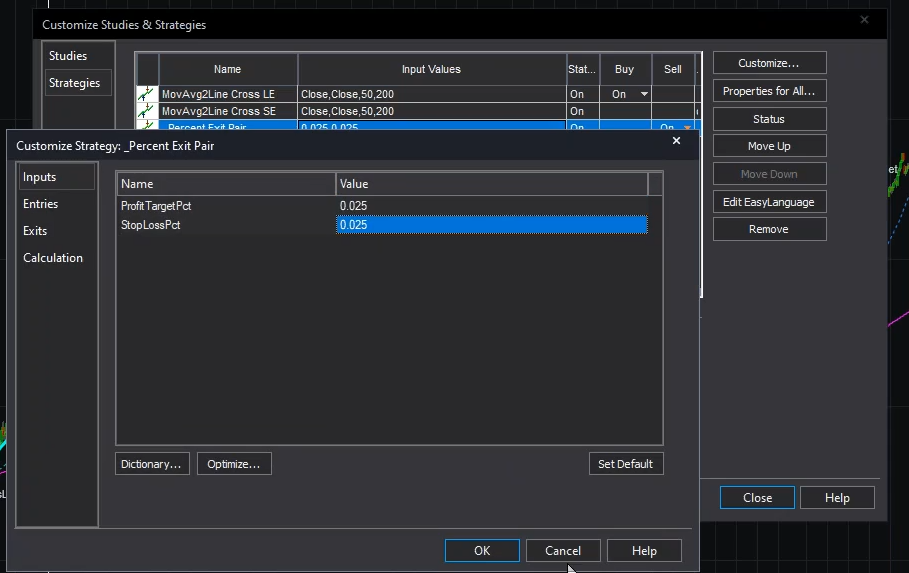

¿Y aquí qué hemos conseguido? Hemos conseguido que el sistema sea una birria en sí, pero bueno, no es tan birria, es viejo, no es una birria enorme. Tenemos ya 53% de acierto.

<div style="display: flex; flex-direction: column; gap: 15px;">
  <!-- Fila superior: 2 imágenes -->
  <div style="display: flex; gap: 10px; justify-content: center;">
    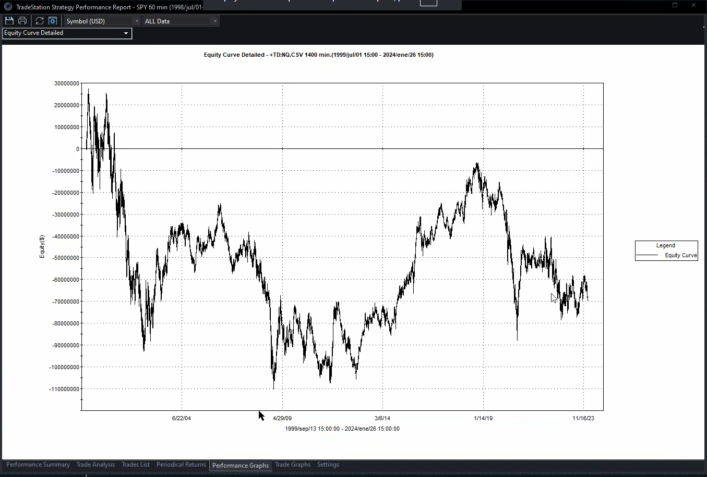
  </div>
</div>

**El cruce de medias como entrada tendencial por antonomasia**

¿Por qué os he querido poner esto? Porque el sistema con cruce de medias de entrada es *tendencia por antonomasia*. Es lo más antonomásico que hay. Esto si lo dejo correr, si no le pongo *TP*, este tiene un porcentaje de aciertos bajísimo, muy bajísimo. Pero al meterle *TP* y *stop* simétrico, fijaros que lo he subido del 50%. Casi lo he dejado *antitendencial*. ¿Por qué? Porque las salidas son lo que marca mucho.

<div style="border-left: 4px solid #2196f3; background: #e3f2fd; padding: 10px 15px; margin: 10px 0; border-radius: 8px;">
  <strong>💡 Principio clave: las salidas definen el carácter del sistema</strong><br><br>
  Una misma entrada puede comportarse como <em>tendencial</em> o <em>antitendencial</em> dependiendo de cómo se configuren las salidas. Con TP y Stop simétricos, un cruce de medias (entrada tendencial por excelencia) puede alcanzar más del 50% de aciertos, comportándose casi como un sistema antitendencial.
</div>

**La importancia de las salidas**

Sigo un poco con este comentario de Alejandro, que luego había alguien más también que en el disco insistía en ello, que quería que profundizara sobre esto. Al final las salidas es lo que le marca mucho, le marca mucho porque yo, lógicamente, no es al 100% uno, no es al 100% uno. Fijaros que es más de 1 en todo, cosa que aún va más a favor del sistema, es 1.07 del ratio. ¿Por qué? Porque al final, aunque yo le ponga *TP* y *stop*, hay algunos *trades* que salen por el propio cruce de la media y no todos el 100% de los *trades* van a salir por esa condición.

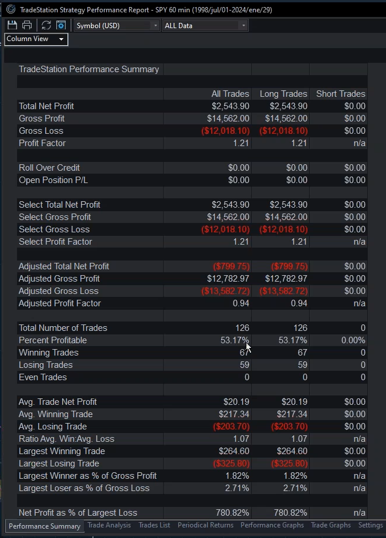

Entonces, aún así, fijaros que yo he conseguido un *average win/loss* de 1.07, creo que no hay comisiones, pero aquí da igual. Y he conseguido un porcentaje de aciertos por encima de 53, es decir, tengo una *esperanza positiva* ahora mismo, con un simple cruce de medias con un *stop* igualado. Lado largo, otra vez el activo. Hombre, es que el activo ya, por eso funciona, ya lo sé. Pero es que hayan condiciones como que un activo tenga mucha tendencia, se ha lanzado a la baja, no quiere decir que yo no pueda aprovecharla.

**No os quedéis con los resultados actuales**

Tenemos que aprovecharla mejor. No os quedéis, por favor, con los resultados que estamos viendo, que no importan para nada ahora mismo. Los resultados son una birria. Es decir, simplemente estoy respondiendo al requisito de evaluar, al requisito de si el *win-rate* del 50% era condición necesaria para evaluar la entrada.

No es que sea condición necesaria, sino que es verdad que es un truco rápido muchas veces. A unos *setups*, mirad, *setups* incluso intradía, igualar casi conseguiría donde van mejores intradía. Es decir, si en un *setup* rápido yo puedo evaluar si ese tiene sentido, yo igualo *stop* y *TP* y tiene que acertar más de la mitad de las veces. Tiene que acertar más porque si no, realmente no hay ventaja.

**¿Y si acierta menos del 50%?**

También había una pregunta ligada con esto que decía: bueno, entonces, si es menos de 50, ¿no vale el sistema? No lo diría al 100%, pero es verdad que empiezas con un *handicap*. Pero las salidas podrían recuperar esa desventaja. Así que podría ser. O sea, las salidas son muy importantes.

<div style="border-left: 4px solid #ff9800; background: #fff3e0; padding: 10px 15px; margin: 10px 0; border-radius: 8px;">
  <strong>⚖️ Entrada vs Salida: el debate eterno</strong><br><br>
  Siempre hay autores que defienden qué es más importante: la entrada o la salida. Para nosotros no hay duda: <strong>la salida es lo que condiciona claramente el carácter del sistema</strong>. Entrando de la misma manera, modificando las salidas cambio totalmente el sistema. Lo cambio totalmente modificando las salidas.
</div>

Realmente es importante todo, pero siempre hay autores que deciden qué es la entrada y autores qué es la salida. Para mí no hay duda que es la salida lo más, lo que condiciona claramente el carácter del sistema. Y nosotros decimos, hola, esto luego lo cambia todo. O sea, yo aquí, entrando así, modifico las salidas, cambio totalmente el sistema. Evidentemente, es importante la entrada y una manera fácil, repito, de evaluar esto es esta que os he dicho. Y sobre todo, especialmente útil en entradas intradía. Y ya lo veremos a medida que avancemos en la complicación del curso. Estaremos viendo todos los procesos desde la manera más fácil y luego los iremos complicando.

Es lo que os decía, yo ahora aquí pongo 0.5. No, 0.5 no. 0.5 es 50%. 0.05 es 5%. Es esto. 5% es esto. Ahora le puso un 5%. Y ya deja correr un poquito más. Y estamos en 49. Ese no sé.


**Configuración de Stop y Take Profit simétricos**

Le he puesto un 5% y ya deja correr un poquito más. Estamos en `profit` 49%, se nos ha caído, de 50 nos ha caído, pero a cambio fijaros que ha hecho el `win/los` 1.61. Ahí está el tema.

Si tú ves con 49,21%, hombre, ¿pero no ves que tienen unos 1.60? No está siendo simétrico, no está ganando lo mismo que lo que pierde. Gana $380 pero pierde ($236). ¿Por qué? Porque el SP salta menos. Al final no está actuando lo suficiente para que eso tenga sentido tienes que igualar el retorno y riesgo, y esto te lo va a decir el *`ratio win/loss`*, de acuerdo?. 

## Preguntas


### Evaluación preliminar típica

***Aureli preguntaba sobre el vídeo de evaluación preliminar, y hemos hablado un poco de ello porque ya trato de aprovecharlo. Hemos hablado un poco de ello. Decía que qué métrica usamos para decidir si pasa la evaluación o no.***

En una evaluación preliminar básicamente se trata de que la idea tenga ventaja. Es esto que estamos viendo ahora un poco, Aureli, vale. El que la idea tenga una cierta ventaja sin haber forzado mucho las cosas. Fíjate, yo te he puesto esto sencillo: y a partir de ahí podemos ver si trabajamos; idealmente en varios activos. Idealmente varios activos. Sobre todo en este tipo de sistemas tiene que ser en varios activos. En este tipo de sistemas tiene que ser en varios activos.

Y ahora aquí esto lo tenía antes en *Apple*, Le ponemos, por ejemplo, *Google*, y tenemos que ver qué tal funciona. Lo ideal sería que en diversos activos nos mantuviera un poquito.

Esto por ejemplo *Maestro* lo podría mirar en varios, en una cesta de acciones. No sé si me va a dar tiempo a hacerlo más o menos rápido. A ver, vamos a intentarlo.


<div style="display: flex; flex-direction: column; gap: 15px;">
  <div style="display: flex; gap: 10px; justify-content: center;">
    
  </div>
</div>

<div style="display: flex; flex-direction: column; gap: 15px;">
  <div style="display: flex; gap: 10px; justify-content: center;">
    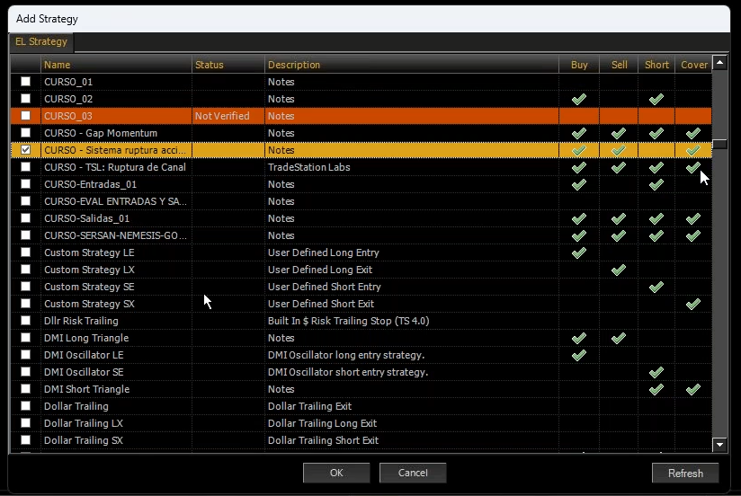
    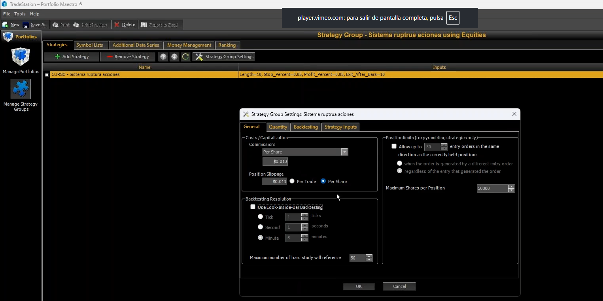
  </div>
</div>

<div style="display: flex; flex-direction: column; gap: 15px;">
  <div style="display: flex; gap: 10px; justify-content: center;">
    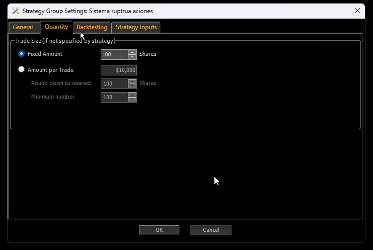
    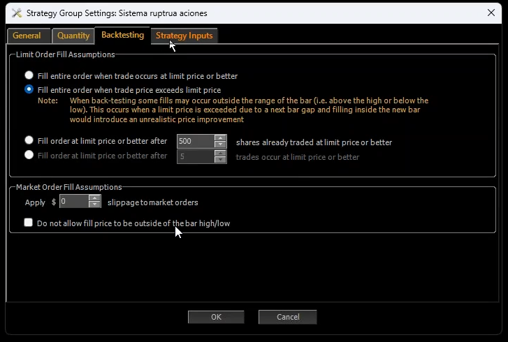
  </div>
</div>

<div style="display: flex; flex-direction: column; gap: 15px;">
  <div style="display: flex; gap: 10px; justify-content: center;">
    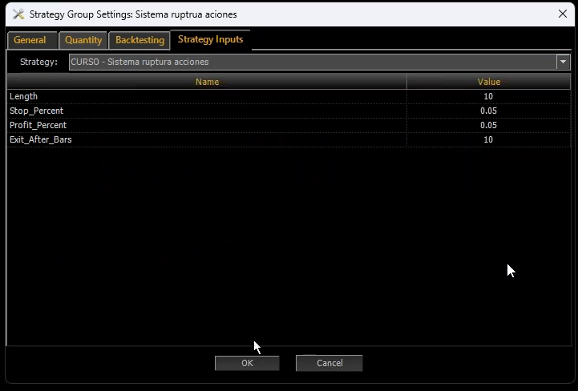
  </div>
</div>

<div style="display: flex; flex-direction: column; gap: 15px;">
  <div style="display: flex; gap: 10px; justify-content: center;">
    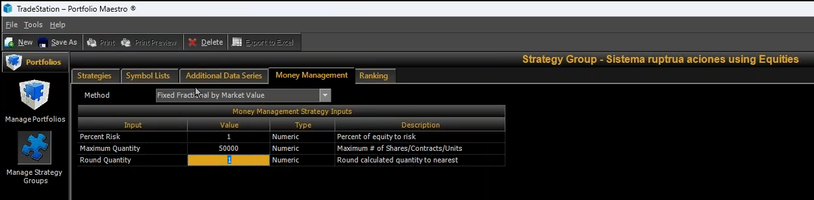
  </div>
</div>

<div style="display: flex; flex-direction: column; gap: 15px;">
  <div style="display: flex; gap: 10px; justify-content: center;">
    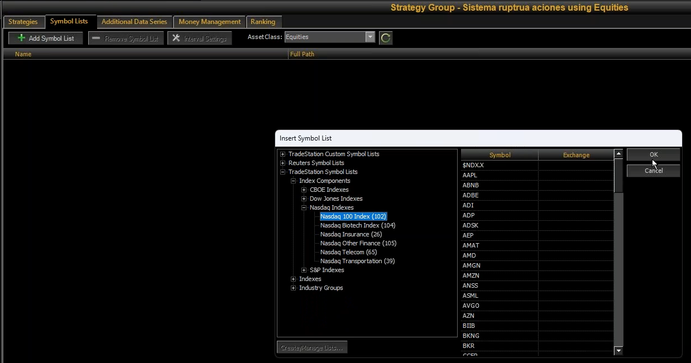
    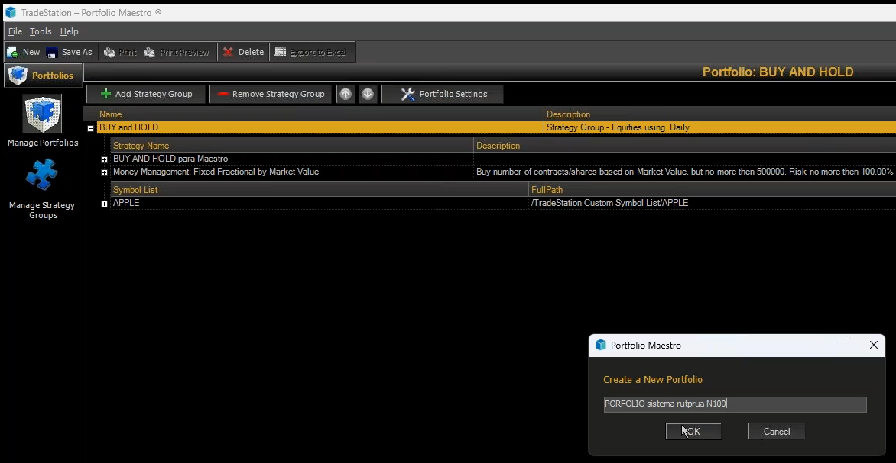
  </div>
</div>

<div style="display: flex; flex-direction: column; gap: 15px;">
  <div style="display: flex; gap: 10px; justify-content: center;">
    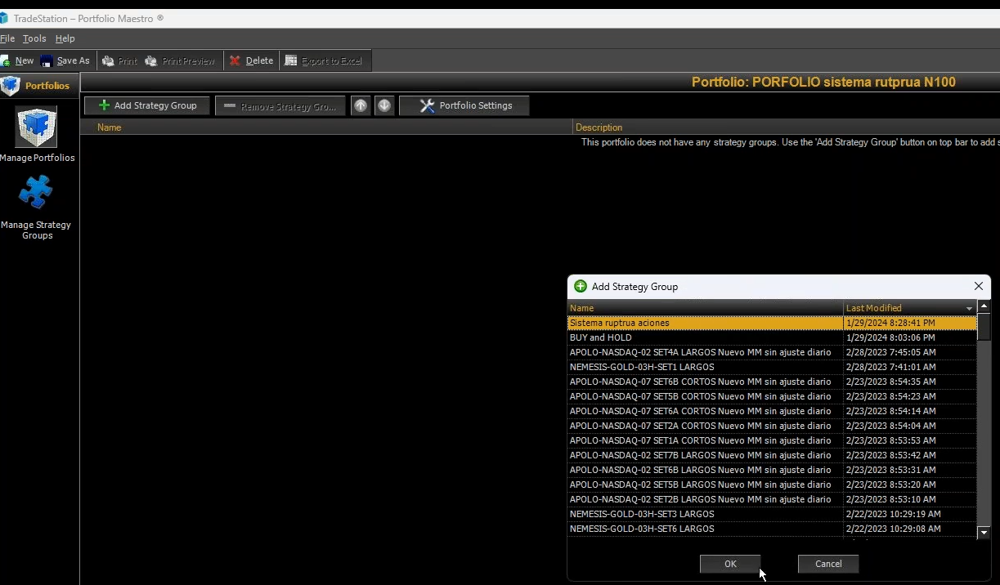
    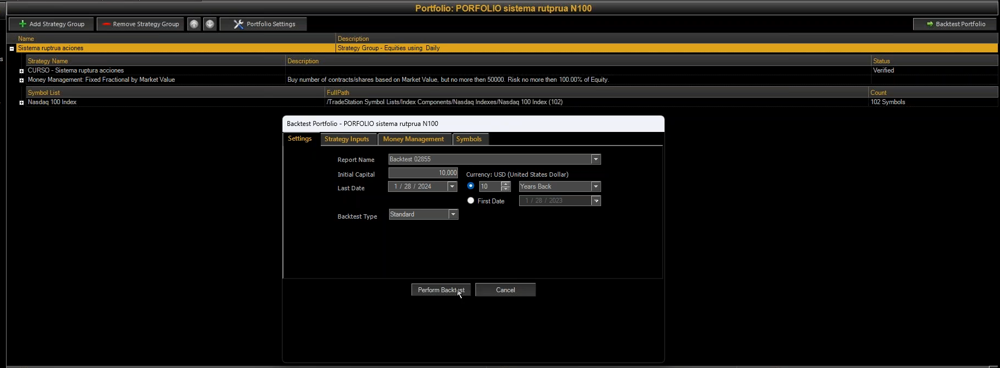
  </div>
</div>

<div style="display: flex; flex-direction: column; gap: 15px;">
  <div style="display: flex; gap: 10px; justify-content: center;">
    
  </div>
</div>

<div style="display: flex; flex-direction: column; gap: 15px;">
  <div style="display: flex; gap: 10px; justify-content: center;">
    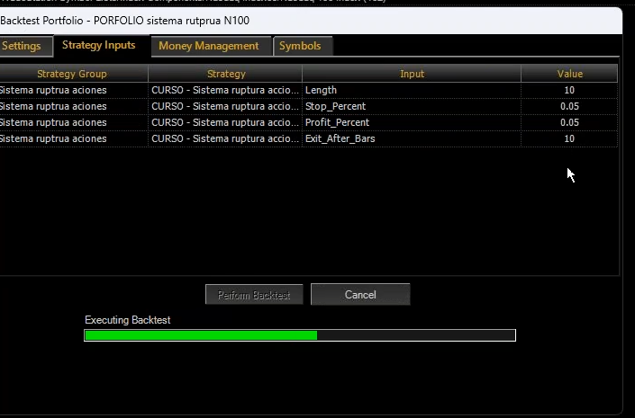
  </div>
</div>

Lo he configurado SP y TP 0.5 y 0.5, con salida en 10 barras, la evaluar la entrada no me sirve pero lo volveré hacer ahora.

**Análisis de resultados en el NASDAQ 100**

Aquí lo tenemos. Aquí podemos ver todas las cestas de acciones, le quito el índice. 

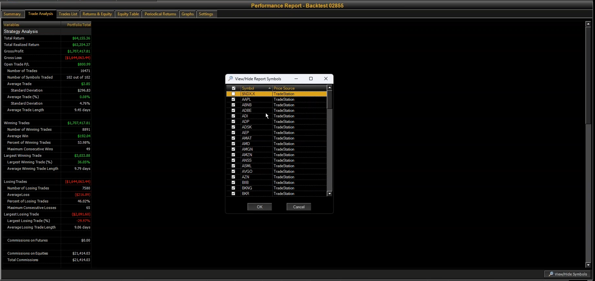

Vemos algunas cosas rojas, tenemos bastante verde en general, verde.

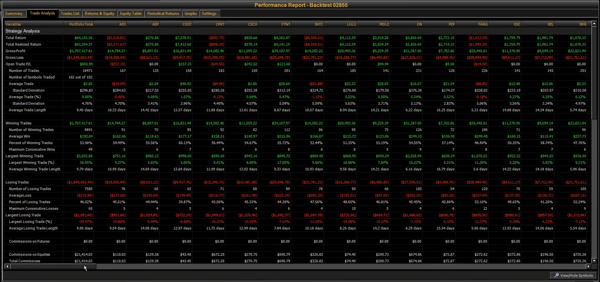

Y podemos ver el gráfico de todas y nos rompe la curva tremendamente dramática, 

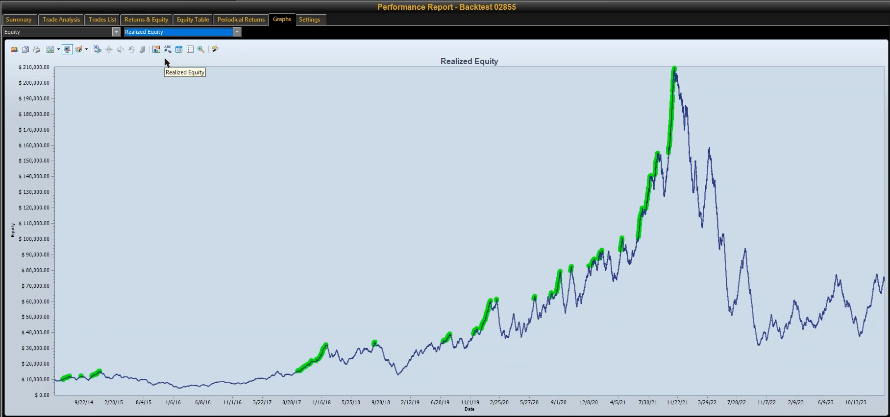

un *drawdown* gigantesco. 

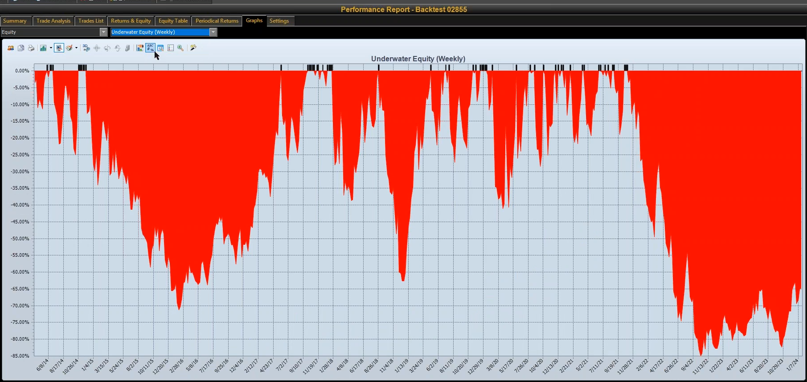

Y esto es por acción, ahí lo vemos, vale.

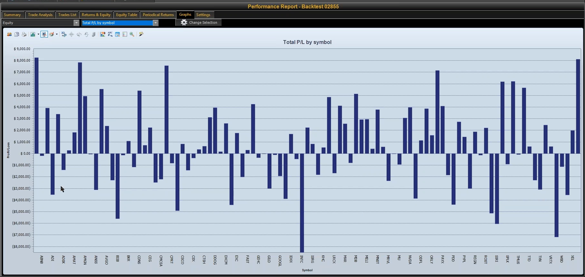

Bueno, hay bastantes perdedoras, algunas ganadoras. Hay un poco de todo. Lo que pasa es que la idea que llevaba no era esta, sino ésta, que lo voy a hacer ahora. Y hacer lo mismo que habíamos hecho antes, es decir: meterle aquí 20, 0.10, 0.10. Aquí meterle pues 500 para que no actuara. Y aquí pues lo voy a dejar.

<div style="display: flex; flex-direction: column; gap: 15px;">
  <div style="display: flex; gap: 10px; justify-content: center;">
    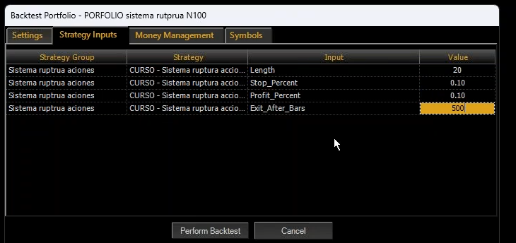
    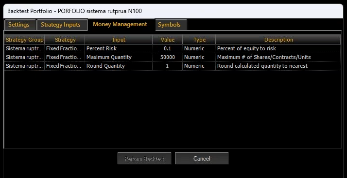
  </div>
</div>

**Aclaración sobre el objetivo de la práctica**

Cuando digo que es una evaluación de ahora, es que de verdad no nos paremos en esta hora, que ya llegaremos. Ya llegaremos, llegaremos. Es decir, una vez ya, porque la curva era bastante lamentable, tenía *profit factor* bastante bajo para acciones en diarias.

No estoy haciendo hoy un sistema de uso operable. Antes hemos explicado los datos y ahora estaba simplemente introduciendo el primer paso de un sistema. Acordaros los que, espero que muchos, es la primera parte de la teoría. La mayoría habéis hecho la primera parte de la teoría. Hablamos de perfiles y luego el desarrollo. Hablamos de *setups* de entrada, filtros, etcétera.

Simplemente he planteado un *setup* de entrada. Es lo que he hecho, de acuerdo. Simplemente eso. He planteado un *setup* de entrada que es un *Donchian*, y a partir de ahí le he puesto un *stop* y un *TP* simétrico, porque tengo que cerrar la operación. Acordaros que para evaluar entradas hay que hacer algo. Yo le he puesto un *TP* simétrico y le he puesto una salida temporal, pero la he anulado poniéndole 500 barras. Entonces la he anulado para que me saliera obligatoriamente por esto: *Stop* y *TP*.

Y ahora, ¿qué he hecho? eso mismo que habéis visto en TradeStation, pero lo he aplicado a todo el *NASDAQ 100*. Porque bueno, pues así puedo ver muchas acciones. Así puedo ver muchas acciones, vale.

**Interpretación de los resultados**

Entonces aquí veis: cada barrita esto es una acción. Veis que hay muchas ganadoras y hay muchas perdedoras. 


Entonces, al final, en el sumario veo que gana 208 mil, veo que tiene un *profit factor* de 1.04, que es bajísimo. Fijaros que tiene un *average win* de solo 0.74. Y % de acierto es el 58%.


<div style="display: flex; flex-direction: column; gap: 15px;">
  <div style="display: flex; gap: 10px; justify-content: center;">
    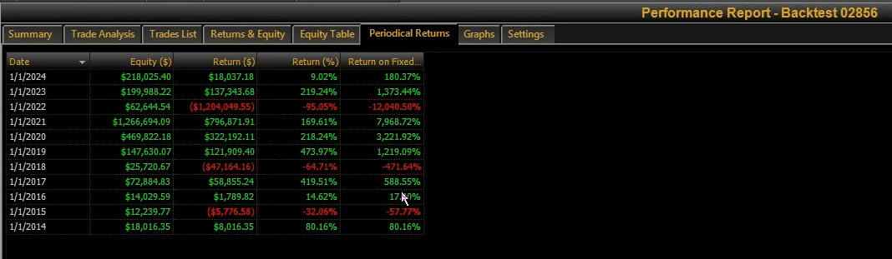
  </div>
</div>

Es justito, porque tiene un *win/loss* bastante bajo, pero tiene un porcentaje de aciertos superior al 50%, que es lo que ahora mirábamos de manera rápida aquí. Simplemente evaluaba eso, nada más.

Pensar que esto no está ni bien dimensionado, vale. No está ni bien dimensionado. Y aquí lo expuesto: veis, 600%.

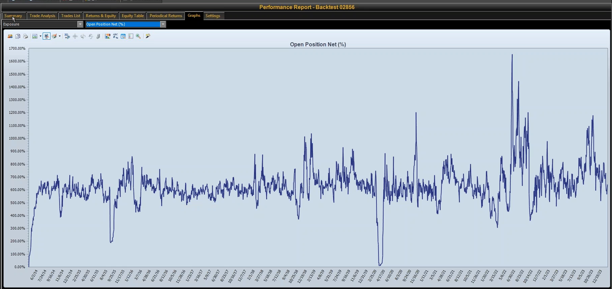

Realmente está totalmente sobreexpuesto porque tenía que haberle puesto no `0.10` sino `0.01`.


**Rectifico**

<div style="display: flex; flex-direction: column; gap: 15px;">
  <div style="display: flex; gap: 10px; justify-content: center;">
    
    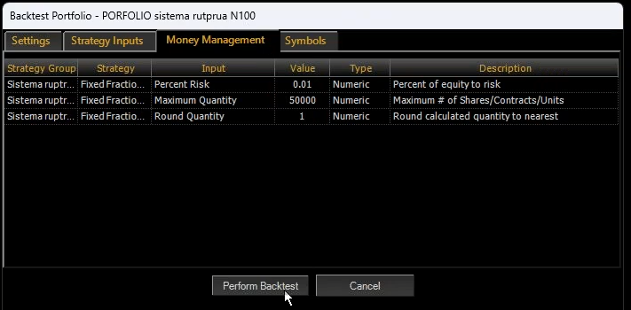
  </div>
</div>

<div style="border-left: 4px solid #2196f3; background: #e3f2fd; padding: 10px 15px; margin: 10px 0; border-radius: 8px;">
  <strong>📊 Evaluación preliminar</strong><br><br>
  Esto es simplemente evaluación preliminar, nada más, vale. Es decir, al final los ratios que miramos en aquí de evaluación preliminar no son... simplemente es esto: es que tenga un porcentaje de aciertos ahora superior al 50% y que tenga ganancias positivas. Poco más en este punto, poco más.
</div>

**Resultados finales de la evaluación**

Bueno, esto ya empieza ahora a tener más sentido. Ya empieza a tener más sentido, vale. Ya lo hemos dimensionado correctamente. Empieza a tener un poco más de sentido. Al final, dimensionar las cosas bien, como visteis en la práctica de money management.


Ahora estoy 60-50 por ciento expuesto. Todavía está poco expuesto, pero bueno. Pero ya lo hemos expuesto un poco más, ya lo hemos expuesto un poco más. 


Pero es que tendrá un *compuesto* anualizado poco, pero tenemos una *win/loss* muy casi del 1 y un porcentaje de aciertos del 59%. Casi estoy al uno. Es decir, ***parece que hay ventaja en la entrada***. Parece que hay ventaja en la entrada.

<div style="display: flex; flex-direction: column; gap: 15px;">
  <div style="display: flex; gap: 10px; justify-content: center;">
    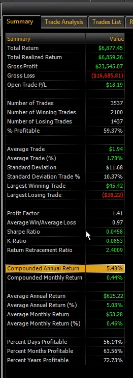
    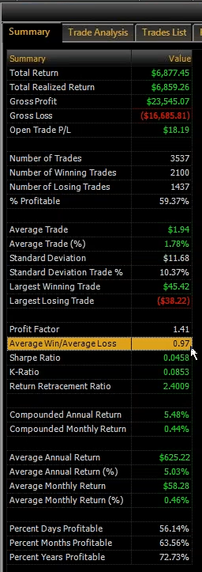
    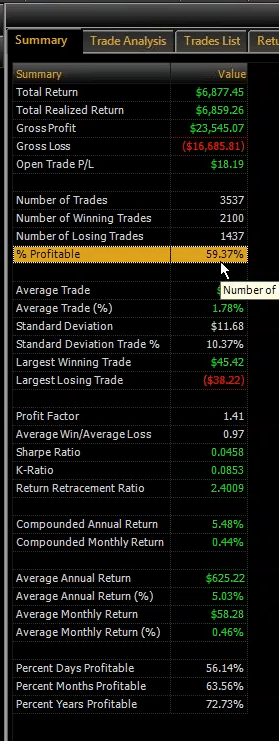
  </div>
</div>

En una evaluación preliminar lo que vamos a decir es eso. No vamos a decir nada más. Es decir, que parece que hay ventaja, nada más. Ya veremos si a partir de ahí hacemos algo. A lo mejor después lo trabajamos y resulta una porquería. Pero ahora mismo vemos que el sistema ha ganado dinero. Anualizado 5 por ciento expuesto 60-50 por ciento, es decir, prácticamente un 10 por ciento anualizado al 100 por ciento exposición. Tiene un *average win/loss* de 0.97, es decir, casi 1. Y da un *profitable* de 59 por ciento. Es decir, acierta 6 de cada 10 operaciones. En todas, en todas las acciones. Es decir, estos son 3500 *trades*, vale. En todas las acciones del *NASDAQ 100*. En muchas pierde, pero en muchas gana. Muchas pierde y en muchas gana. Y entonces eso es lo que yo ahora mismo quiero.

Simplemente le he puesto un *stop* simétrico. No he optimizado nada. Le he puesto un *Donchian* de 20 barras por defecto. No he tocado nada. Y no he dejado ni salir por tiempo porque le he obligado a salir por *Stop* y *TP*. Bien. Veo que puede haber cierta ventaja en un *Donchian* en diario en acciones americanas, porque lo he probado en 100 acciones, vale.

Eso es un poco una evaluación preliminar típica.

# Consultas

## Datos de Forex**

Se preguntaba los datos de *Forex*. Esto ya te contestó Alberto, pero bueno, como antes comentaba, los datos de *Forex* cada *broker* del mercado tiene los suyos. Eso es así. Es como los CFDs, no tienen que ser iguales.

**Pregunta sobre el vídeo 5.7.7 y Walk Forward**

***Luego comentaba sobre el vídeo 5.7.7, que también liga un poquito con esto que hemos visto hoy. Comentaba que yo comentaba en la teoría que para sistemas con poco o ningún parámetro, el proceso finalizaría en el *forward testing*. A falta de pocos parámetros, el paso de la evaluación preliminar al *forward testing* sin hacer el paso de la optimización clásica ni la *Walk Forward*. ¿Es correcta esta afirmación?***

Bueno, esto lo vamos a ir viendo mucho. Un poco ya has visto por donde van los tiros hoy. Yo lo que puedo hacer es probar el sistema en muchas acciones, por ejemplo. Si no puedo sacarlo en una sola acción, a lo mejor lo puedo probar en muchas. Puede ser un camino, puede ser un camino.

Pero vamos a intentar hacerlo, porque cuando hablamos de *Walk Forward*, hablamos que había dos: había el *cluster*, vale. Y dentro del *cluster* estaba el *anchored* y no *anchored*, de acuerdo. Yo puedo usar *anchored* y entonces ahí gano muestra. Entonces hay distintas maneras, distintas maneras.

```
┌─────────────────────────────────────────────────────────────────────┐
│         SISTEMAS CON POCOS O NINGÚN PARÁMETRO                       │
└─────────────────────────────────────────────────────────────────────┘
                                │
                                ▼
        ┌───────────────────────┴───────────────────────┐
        │                                               │
        ▼                                               ▼
┌───────────────────┐                       ┌───────────────────────┐
│  OPCIÓN DIRECTA   │                       │   OPCIÓN ALTERNATIVA  │
│                   │                       │                       │
│  Evaluación       │                       │  Probar el sistema    │
│  Preliminar       │                       │  en MUCHAS ACCIONES   │
│       │           │                       │  (ganar muestra)      │
│       ▼           │                       └───────────────────────┘
│  Forward Testing  │
│  (sin optimización│
│   ni Walk Forward)│
└───────────────────┘


┌─────────────────────────────────────────────────────────────────────┐
│                         WALK FORWARD                                │
└─────────────────────────────────────────────────────────────────────┘
                                │
                                ▼
                        ┌───────────────┐
                        │    CLUSTER    │
                        └───────┬───────┘
                                │
                ┌───────────────┴───────────────┐
                │                               │
                ▼                               ▼
        ┌───────────────┐               ┌───────────────┐
        │   ANCHORED    │               │ NO ANCHORED   │
        │               │               │               │
        │ (Gana muestra)│               │               │
        └───────────────┘               └───────────────┘
```

Explicación detallada del **Cluster Analysis** en el contexto de Walk Forward:

```
┌─────────────────────────────────────────────────────────────────────────────┐
│                     CLUSTER ANALYSIS (Walk Forward)                         │
│                                                                             │
│  Definición: Análisis matricial que ejecuta MÚLTIPLES Walk Forward          │
│  con diferentes combinaciones de parámetros para validar robustez           │
└─────────────────────────────────────────────────────────────────────────────┘

┌─────────────────────────────────────────────────────────────────────────────┐
│       MATRIZ DEL CLUSTER  DE 5 FILAS × 6 COLUMNAS                           │
│                                                                             │
│         Nº de Walk Forward Runs (iteraciones)                               │
│              5      10      15      20      25      30                      │
│         ┌──────┬──────┬──────┬──────┬──────┬──────┐                         │
│    10%  │      │      │      │      │      │      │                         │
│         ├──────┼──────┼──────┼──────┼──────┼──────┤                         │
│    15%  │      │  ██  │  ██  │  ██  │      │      │   ██ = Un "cluster"     │
│  O      ├──────┼──────┼──────┼──────┼──────┼──────┤       es una celda      │
│  O  20% │      │  ██  │ [OK] │  ██  │      │      │       + sus 8 vecinos   │
│  S      ├──────┼──────┼──────┼──────┼──────┼──────┤                         │
│  %  25% │      │  ██  │  ██  │  ██  │      │      │   [OK] = Centro óptimo  │
│         ├──────┼──────┼──────┼──────┼──────┼──────┤                         │
│    30%  │      │      │      │      │      │      │                         │
│         └──────┴──────┴──────┴──────┴──────┴──────┘                         │
│                                                                             │
│  OOS% = Porcentaje Out-of-Sample (datos de validación)                      │
│  Total combinaciones: 5 OOS% × 6 Runs = 30 tests                            │
│                                                                             │
│                                                                             │
│                        Nº de Runs (columnas)                                │
│                    5      10      15      20      25      30                │
│                 ┌──────┬──────┬──────┬──────┬──────┬──────┐                 │
│  OOS%    10%    │  1   │  2   │  3   │  4   │  5   │  6   │  ← 6 tests      │
│ (filas)         ├──────┼──────┼──────┼──────┼──────┼──────┤                 │
│          15%    │  7   │  8   │  9   │  10  │  11  │  12  │  ← 6 tests      │
│                 ├──────┼──────┼──────┼──────┼──────┼──────┤                 │
│          20%    │  13  │  14  │  15  │  16  │  17  │  18  │  ← 6 tests      │
│                 ├──────┼──────┼──────┼──────┼──────┼──────┤                 │
│          25%    │  19  │  20  │  21  │  22  │  23  │  24  │  ← 6 tests      │
│                 ├──────┼──────┼──────┼──────┼──────┼──────┤                 │
│          30%    │  25  │  26  │  27  │  28  │  29  │  30  │  ← 6 tests      │
│                 └──────┴──────┴──────┴──────┴──────┴──────┘                 │
│                                                                             │
│                 5 filas × 6 columnas = 30 celdas = 30 TESTS                 │
│                                                                             │
└─────────────────────────────────────────────────────────────────────────────┘

┌─────────────────────────────────────────────────────────────────────────────┐
│                    TIPOS DE WALK FORWARD EN CLUSTER                         │
└─────────────────────────────────────────────────────────────────────────────┘

╔═══════════════════════════════════════════════════════════════════════════╗
║                           NO ANCHORED (Rolling)                           ║
╠═══════════════════════════════════════════════════════════════════════════╣
║                                                                           ║
║   Tiempo ──────────────────────────────────────────────────────────►      ║
║                                                                           ║
║   Run 1:  [████ IS ████][OOS]                                             ║
║                    ↓                                                      ║
║   Run 2:           [████ IS ████][OOS]     ← La ventana SE DESPLAZA       ║
║                         ↓                                                 ║
║   Run 3:                [████ IS ████][OOS]                               ║
║                              ↓                                            ║
║   Run 4:                     [████ IS ████][OOS]                          ║
║                                                                           ║
║   • Ventana In-Sample SIEMPRE del mismo tamaño                            ║
║   • Punto de inicio se mueve hacia adelante                               ║
║   • Más reactivo a cambios recientes del mercado                          ║
║   • Menos datos históricos por iteración                                  ║
╚═══════════════════════════════════════════════════════════════════════════╝

╔═══════════════════════════════════════════════════════════════════════════╗
║                              ANCHORED                                     ║
║                         (GANA MUESTRA)                                    ║
╠═══════════════════════════════════════════════════════════════════════════╣
║                                                                           ║
║   Tiempo ──────────────────────────────────────────────────────────►      ║
║   ANCLA                                                                   ║
║     ↓                                                                     ║
║   Run 1:  [██ IS ██][OOS]                                                 ║
║     │                                                                     ║
║   Run 2:  [████████ IS ████████][OOS]      ← IS CRECE                     ║
║     │                                                                     ║
║   Run 3:  [████████████████ IS ████████████████][OOS]                     ║
║     │                                                                     ║
║   Run 4:  [██████████████████████████ IS ██████████████████████████][OOS] ║
║                                                                           ║
║   • Punto de inicio FIJO (anclado al principio)                           ║
║   • Ventana In-Sample CRECE con cada iteración                            ║
║   • Usa MÁS DATOS → "GANA MUESTRA" (como dice el texto)                   ║
║   • Parámetros basados en más historia                                    ║
║   • Mejor para estrategias que funcionan con patrones de largo plazo      ║
╚═══════════════════════════════════════════════════════════════════════════╝


┌─────────────────────────────────────────────────────────────────────────────┐
│                    ¿QUÉ BUSCA EL CLUSTER ANALYSIS?                          │
├─────────────────────────────────────────────────────────────────────────────┤
│                                                                             │
│  1. VALIDACIÓN DE ROBUSTEZ                                                  │
│     └─► Un solo WFA puede dar resultados aleatorios                         │
│     └─► Múltiples WFAs prueban/refutan validez con mayor certeza            │
│                                                                             │
│  2. INTERVALO ÓPTIMO DE RE-OPTIMIZACIÓN                                     │
│     └─► ¿Cada cuánto debo re-optimizar mi estrategia?                       │
│     └─► El cluster identifica la frecuencia ideal                           │
│                                                                             │
│  3. ZONA ESTABLE                                                            │
│     └─► Buscar un cluster donde TODAS las celdas vecinas sean rentables     │
│     └─► Evitar picos aislados (posible sobreajuste)                         │
│                                                                             │
│  Criterios de éxito típicos:                                                │
│     • Rentabilidad positiva en múltiples runs                               │
│     • Walk Forward Efficiency ≥ 50%                                         │
│     • Drawdown máximo < 40%                                                 │
└─────────────────────────────────────────────────────────────────────────────┘


┌─────────────────────────────────────────────────────────────────────────────┐
│              RESUMEN: ¿CUÁNDO USAR CADA TIPO?                               │
├─────────────────────────────────────────────────────────────────────────────┤
│                                                                             │
│  ANCHORED                          │  NO ANCHORED (Rolling)                 │
│  ─────────────────────────────────────────────────────────────────────────  │
│  ✓ Pocos datos históricos          │  ✓ Muchos datos históricos            │
│  ✓ Quieres máxima muestra          │  ✓ Mercado cambia rápido              │
│  ✓ Patrones de largo plazo         │  ✓ Solo datos recientes importan      │
│  ✓ Sistemas con pocos parámetros   │  ✓ Adaptación rápida a cambios        │
│    (como menciona el texto)        │                                        │
│                                                                             │
└─────────────────────────────────────────────────────────────────────────────┘
```

Cuando se dice que con **Anchored "gana muestra"**, se refiere exactamente a esto: al mantener el punto de inicio fijo, cada iteración usa más datos históricos, lo cual es especialmente útil cuando tienes sistemas con pocos parámetros y necesitas compensar con más datos para tener significancia estadística.


**Los detractores del Walk Forward**

También, todo esto ya lo comenté un poco, pero comentaré: los detractores. Es decir, es un debate que me resulta interesante y me gusta abordarlo.  hay gente que que no le gusta *Walk Forward*... más gente que a mí me merece todo mi respeto y admiración. Es decir, no es algo... no es algo que sea la biblia, de acuerdo.

Es decir, todo lo que tiene que ver con la manipulación de datos, siempre hay debate. Siempre hay debate. No se ponen de acuerdo con los datos *COVID*. Imaginaros, que con los mismos datos hay gente que defiende que las vacunas funcionan. Sí, es difícil analizar datos. Con los mismos datos, con los mismos datos. O sea, porque intervienen sesgos, la manipulación. Y ahí hay, como ya he dicho muchas veces, es fácil hacerse trampas al solitario con la manipulación de datos. Es muy fácil, es muy fácil. Entonces, por eso digo que... y luego también hay un factor de gusto, cuidado. Pero bueno, eso ya en este tema debería ser menos importante.

Sigo. Y él, en la aonda en esto, dice: si es correcto esto, que no se puede hacer *Walk Forward* o *forward testing*, ¿sería válido efectuar la metodología de Fitchen , el antiguo *forward*, para estos casos? ¿Se mostrará un ejemplo de la metodología *Brak*?

Bueno, podemos verlo. Podemos ver algún ejemplo con el *Brak*. Es que el *Brak*, en mi opinión, tiene mucho de... ¿cómo te lo diría yo? Tiene mucho de estética. O sea, es que no me sale la palabra ahora. Es que *Brak*, si tú lo piensas, al final, Aureli, que entiendo que eres quien me pregunta... ¿Es que has leído sobre él, no? Aparte de lo que expliqué yo. De hecho, el libro de  Fitchen es recomendable.

<div style="background: #f5f5f5; border: 1px solid #bdbdbd; border-radius: 8px; padding: 12px 16px; margin: 15px 0;">

**Nota:**   
En el texto también se menciona a "Fitchen", que probablemente se refiere a **Robert Pardo** (autor de *"The Evaluation and Optimization of Trading Strategies"*) o es una transcripción fonética de otro autor. El libro de Pardo sobre Walk Forward Analysis es referencia obligada en este campo.
</div>

Al final simplemente lo que hace es una optimización completa, de acuerdo. Acordaros cuando hemos hecho nosotros tema de perfil, que hicimos incluso hablamos de 50 a 50. Hablamos cortar por delante, cortar por detrás. Es algo bastante parecido a esto si lo piensas. Es algo bastante parecido.

No es exactamente igual, porque nosotros lo que hacemos es un trozo *in-sample* y dejamos uno fuera, y luego lo hacemos por otro lado. Él lo que hace es toda la optimización, excluye una parte post-optimización, y optimiza ahí. Pero olvídate del orden de las cosas, de acuerdo.

Esa segunda optimización que hace él es nuestra primera *in-sample*. 

## Metodología BRaC: Build, Reveal and Compare


La imagen muestra un esquema comparativo entre la **optimización clásica** (In-Sample / Out-of-Sample) y la **metodología BRaC**.

```
┌─────────────────────────────────────────────────────────────────────────┐
│                    OPTIMIZACIÓN CLÁSICA (IS/OOS)                        │
├─────────────────────────────────────────────────────────────────────────┤
│                                                                         │
│   ├──────────────── 75% ────────────────┼────── 25% ───────┤            │
│   │                                     │                  │            │
│   │            IN-SAMPLE (IS)           │   OUT-OF-SAMPLE  │            │
│   │          (Optimización)             │      (OOS)       │            │
│   │                                     │   (Validación)   │            │
│   └─────────────────────────────────────┴──────────────────┘            │
│                                                                         │
└─────────────────────────────────────────────────────────────────────────┘

┌─────────────────────────────────────────────────────────────────────────┐
│                        METODOLOGÍA BRaC                                 │
├─────────────────────────────────────────────────────────────────────────┤
│                                                                         │
│   BUILD (B): Optimización excluyendo una parte                          │
│   ├──────────────────────────────────────────────────────────────┤      │
│   │░░░░░░░░░░░░░░░░░░░░░░░░░░░░░░░░░░░░░░░░░░░░░░░░░░░░░░░░░░░░░ │      │
│   └──────────────────────────────────────────────────────────────┘      │
│                                                                         │
│   REVEAL (R): Parte excluida donde se testean los parámetros            │
│   ├──────────────────────────────────────────────────────────────┤      │
│   │                              ████████████████████████████████│      │
│   └──────────────────────────────────────────────────────────────┘      │
│                                                                         │
│   → COMPARE: Se comparan los resultados de B con R                      │
│                                                                         │
└─────────────────────────────────────────────────────────────────────────┘
```

<div style="border: 2px solid #9c27b0; background: linear-gradient(135deg, #f3e5f5 0%, #fafafa 100%); padding: 20px; margin: 15px 0; border-radius: 12px;">

<h3 style="color: #6a1b9a; margin-top: 0;">📚 Sobre el autor: Timothy Masters</h3>

La metodología **BRaC** (*Build, Reveal and Compare*) fue desarrollada y popularizada por **Timothy Masters**, autor de varios libros técnicos sobre trading algorítmico:

- *"Testing and Tuning Market Trading Systems"* (2018) — donde explica BRaC en detalle
- *"Statistically Sound Machine Learning for Algorithmic Trading of Financial Instruments"*
- *"Deep Belief Nets in C++ and CUDA C"*

Masters es un estadístico y programador con décadas de experiencia en análisis cuantitativo. Su enfoque es muy riguroso estadísticamente.

<h4 style="color: #6a1b9a;">🔄 Diferencia clave con IS/OOS clásico</h4>

| Aspecto | IS/OOS Clásico | BRaC |
|---------|----------------|------|
| **Orden temporal** | IS antes, OOS después | Flexible (puede invertirse) |
| **Objetivo** | Validar en datos no vistos | Comparar comportamiento en ambos periodos |
| **Filosofía** | "¿Funciona fuera de muestra?" | "¿Se comporta igual en ambos periodos?" |

<p style="margin-top: 15px; font-size: 14px;"><strong>💡 Conexión con lo visto en clase:</strong> Cuando hacemos el ejercicio de <em>"cortar por delante, cortar por detrás"</em> y comparamos ambos Out-of-Sample, estamos haciendo algo muy parecido a BRaC. La segunda optimización que hace Masters en BRaC equivale conceptualmente a nuestro primer In-Sample invertido.</p>

</div>

<div style="background: #f5f5f5; border: 1px solid #bdbdbd; border-radius: 8px; padding: 12px 16px; margin: 15px 0;">

**Nota:**   
En el texto también se menciona a "Fitchen", que probablemente se refiere a **Robert Pardo** (autor de *"The Evaluation and Optimization of Trading Strategies"*) o es una transcripción fonética de otro autor. El libro de Pardo sobre Walk Forward Analysis es referencia obligada en este campo.

</div>


Al final también luego hay otros autores que lo defienden. Prado (probablemente Marcos López de Prado, autor de *"Advances in Financial Machine Learning"*) lo defiende. Que veáis, es que metes mucho sesgo ahí. Yo creo que con el *cluster* no es cierto que haya sesgo, pienso de verdad. Pero es verdad que hay otras metodologías que también son interesantes, son muy interesantes: permutación de periodos, modificación del periodo de barras. Y es que hay mil maneras de validar.

Lo que ocurre es que yo creo firmemente que ésta valida. Que hay otras que validan, seguro. Por lo que sí.

**Conclusión sobre Brak**

Entonces, al final, el **BRaC** al final en todos sus ejemplos que pone es una muestra gigantesca. Él, al final, construye una muestra enorme con un montón de operaciones, y comparando esto con esto te dice: pues ya está.

Es que es verdad. O sea, es que yo si hago esta optimización, vamos a suponer, tengo un único parámetro y esto tiene 5.000 operaciones. Un único parámetro distribución. 

Acordaros las cosas que dijimos: distribución de *trades* uniforme, bla, bla, bla. Es que no hace falta que hagas nada aquí sólo operar, me explico?.

Si tú consigues una distribución de trades uniforme con 5.000 operaciones, me explico?, es que no te hace falta ni *out-of-sample*. O sea, al final es todo una... un sitio común y una coherencia. Es decir, al final, si tú consigues suficiente significación estadística, además con simplicidad, con idea robusta y con todo aquello... insisto, que os comenté.


<div style="border-left: 4px solid #4caf50; background: #e8f5e9; padding: 10px 15px; margin: 10px 0; border-radius: 8px;">
  <strong>✅ Características de una estrategia robusta</strong><br><br>
  Si yo tengo una distribución uniforme de operaciones, si yo tengo una distribución uniforme de los <em>trades</em> y de su beneficio, tengo un mapa estable. Con 5.000 <em>trades</em> ni "Rendimiento aceptable en varios mercados" hace falta. Y número significativo de <em>trades</em>, como te decía, y muestra representativa, y una curva estable. Es que esto es robusto. Esto es muy probablemente robusto. Con <em>Brack</em>, sin <em>Brack</em>, y hasta <em>sin walk forwark</em> muy probablemente.
</div>

Ahora, el tema es dónde está esa barrera. Y que al final siempre mayor seguridad es mejor. O sea, ¿dónde está esta barrera?  
Este número, **"Un número estadísticamente significativo de trades"**, este número, que ya dices: oye, que me da igual todo. Ahí es donde entra mucho *Brack*.

Entonces, si yo te digo, meto sistemas de este tipo, y luego te digo: vamos a hacer un sistema inverso y le ponemos nombre. Esto nos reíamos nosotros aquí, porque todos los grandes otros que hacen cursos ponen nombre. Nos reíamos. Le tenemos que poner un nombre, ¿sabes? Porque es que es esto: sacas un libro y le tienes que poner un nombre a tu historia. Y al final todas son más o menos la misma con su toque, pero pues se pone el nombre porque es así. Es verdad, está bien, a nivel de *marketing*. Entonces tú le pones un nombre y sacas un libro y lo vendes y hasta ahí te haces millonario. Bueno, pues nosotros no le hemos puesto nombre. No somos buenos en *marketing*, como ya hemos dicho muchas veces. No le hemos puesto nombre a nada, vale.

Entonces esto era un poco lo que te explicó sobre *Brack*. Entonces sí que se puede hacer. Y al final, si tú haces *Brak* y tienes esto que te he enseñado ahora. Probablemente te saldrá bien, te funcionará. Y sin *Brak* también. Y sin *Brak* también te funcionará. Entonces ya está, vale.

## Tratamiento holístico del portfolio

**Pregunta sobre Stop y Take Profit global del portfolio**

***¿Qué más me preguntabas? También me preguntabas, también, vale. Ya estaba esto. Para hablar del *portfolio*, si hablabas de que había comentado del tratamiento *holístico* del *portfolio*, es decir, como un conjunto. Si tendría sentido un planteamiento de *Stop/TP* global para el *portfolio*, cerrando todas las posiciones en el caso de llegar a *Stop* global, independientemente de cada una de las unidades que forman sistemas tuvieran positivas o negativas en el instante en que el global llegara al objetivo. De ser esto cierto, ¿cómo se puede evaluar?***

Esta es muy buena pregunta, Aureli. Y sí tiene sentido. Nosotros hoy en día no lo hacemos, pero tiene totalmente sentido. Esto tiene sentido. Sí, sí, sí, esto es correcto. Y hay muchos autores que lo hacen, de acuerdo. Es decir, *stop* o *stop* y *TP* de *portfolio*. Sí, sí, sí, totalmente. Esto tiene sentido.

**Cómo evaluarlo**

¿Cómo lo evalúas? Bueno, pues con un *software* que lo evalúe. No tiene más. *Maestro* lo puede hacer. *MSA* ahora mismo creo que también. *Quant Analyzer* lo hace, creo. Simplemente con una regla de código, con una regla del código que lo haga. Sí, no tiene mayor historia.

En *EasyLanguage* puede, porque hay alguna librería de *Maestro*, además, que *Maestro* se hace. Y *Portfolio Trader* esto que es, seguro que también. Los *software* de *portfolio* suelen permitirlo, ya código, vía *interface*. Pero sí, sí, sí, tiene sentido. Y tiene sentido y se puede evaluar. Por si cualquier otra cosa, vale.


## Regímenes de mercado y filtros

**Pregunta de Carlos sobre regímenes de mercado**

Luego Carlos apuntaba sobre los regímenes de mercado. Irá saliendo, irá saliendo. Si tenemos algún *paper* que recomienden para estudiar los distintos regímenes, por ahora mismo sí que hay. Seguro que tengo alguno, seguro que tengo alguno. Entonces hay bastante tema.

Yo te digo una cosa. Nosotros ***hemos estado mucho tiempo sin filtrar regímenes de mercado. Ahora lo estamos empezando a hacer***, pero no porque no supiéramos o lo hubiéramos evaluado antes. Porque lo que digo siempre, al final, este tipo de implementaciones del sistema de regímenes se meten vía filtro, siempre vía filtro.

Si tú tienes, imagínate, ese sistema sencillo que hemos visto antes. Y yo veo que pues no va bien, como casi ninguno, en volatilidad. Y yo meto un filtro de volatilidad. La mayoría de filtros de este tipo van por volatilidad, pero pueden haber otros: tendencial, etc. Entonces, al final no deja de ser un filtro. No deja de ser una regla más. No deja de ser una posible *sobreoptimización* más.

<div style="border-left: 4px solid #ff9800; background: #fff3e0; padding: 10px 15px; margin: 10px 0; border-radius: 8px;">
  <strong>⚠️ Regímenes de mercado: formas de implementación</strong><br><br>
  Los <em>regímenes de mercado</em> (tendencial, lateral, alta/baja volatilidad) se implementan típicamente mediante <strong>filtros</strong> que activan o desactivan la operativa según las condiciones detectadas. Los más comunes son:
  <ul style="margin: 8px 0 0 0;">
    <li><strong>Filtros de volatilidad:</strong> VIX, ATR, desviación estándar</li>
    <li><strong>Filtros de tendencia:</strong> ADX, pendiente de medias, Donchian</li>
    <li><strong>Filtros de momentum:</strong> RSI, ROC, fuerza relativa</li>
  </ul>
</div>

**El debate sobre los filtros**

Entonces, ahí es donde siempre tienes la duda de que tú, mediante ese filtro, vas a eliminar *trades*. Imagínate que yo tengo 800 *trades* y mi filtro me quita 300 *trades* y me quedo con 500 *trades*. He mejorado el sistema, pero he perdido *significación estadística*. Ahí está. ¿Mejora lo suficiente? Bueno, ese es el debate. Habrá veces que sí, habrá veces que no.

Y yo es verdad que tengo bastante tendencia a eso. Incluso alguna vez te diría demasiado. En determinados momentos creo que hasta lo he llevado demasiado lejos, creo. Y puedo haberme equivocado en haberlo hecho en ese aspecto en concreto. Es decir, de ser demasiado persistente en no querer filtrar demasiado.

**El peligro de filtrar en exceso**

Porque al final filtrar es una de las maneras más fáciles de *sobreoptimizar*, Carlos. Porque tú estás justamente eliminando lo malo. O sea, tú tienes un *setup* como esto sencillo que yo te he enseñado ahora. Y luego digo: mira, le quito por la volatilidad, le quito unas cuantas operaciones, ahora por la tendencia... Tienes la tentación de empezar a filtrar, a filtrar, filtrar. Y te queda un *backtest* pero guapo, guapo, guapo. Una cosa impecable. Ahora luego resulta que el sistema en real pues va mucho peor de lo que se esperaba.

Claro, nuestros sistemas suelen ir bastante en línea con lo esperado. Y en desviaciones bastante... cuando hay desviaciones, que las ha habido, es público, hemos explicado todo lo que nos ha pasado, aunque a pesar de todos los problemas que hemos tenido, hemos batido nuestro *benchmark*. Pero bueno, aún así han habido errores y ha habido cosas. Hay cosas que mejorar.

**Conclusión sobre filtros**

Pero lo que digo de los filtros, entonces al final, no sé, siempre ese debate, siempre esa duda. Y siempre te quedas con filtros y filtros no. Los filtros se pueden usar. No hay que criminalizarlos de entrada, pero prudencia, prudencia ante ellos. Porque al final, filtrar mucho es un camino directo al *overfit*. Es un camino directo al *overfit*. Hay que filtrar con mucha prudencia.

<div style="background: #ffebee; border: 2px solid #f44336; border-radius: 8px; padding: 12px 16px; margin: 15px 0;">

**⚠️ Regla práctica:** En caso de dudas, no filtres. Eso te lo digo: en caso de dudas, no filtres.

</div>

## multidata y filtros

**Pregunta de Senén García sobre multidata**

Comentaba él que había hecho un *backtest* en *multidata*, que ha intentado crear una estrategia con acciones donde ha añadido un filtro de que el *S&P 500* estuviera por encima de una media. Necesita dos *datas* y tenía problemas con el tema de los datos.

Bueno, esto creo que ya tenemos contestado directamente allí. Decías que no entendías mucho esto. Hombre, tiene su lógica, porque al final si las bases de datos no se alinean igual, cuesta de tomar. Pero bueno, al principio ya te lo hemos solucionado. Haremos estrategias de dos datos.

<div style="border-left: 4px solid #9c27b0; background: #f3e5f5; padding: 10px 15px; margin: 10px 0; border-radius: 8px;">
  <strong>📊 Estrategias Multidata</strong><br><br>
  Las estrategias <em>multidata</em> utilizan información de varios instrumentos simultáneamente. Un caso típico es filtrar la operativa de acciones individuales usando el estado del índice de referencia (ej: operar largos en acciones solo si el S&P 500 está por encima de su media de 200 sesiones). El desafío técnico principal es la <em>alineación temporal</em> de las distintas series de datos.
</div>

Este que usas tú es una estrategia bastante común de filtro, es decir, usar una acción de filtrar en ese otro... Bueno, aplica lo que he dicho ahora. Aplica totalmente lo que he dicho ahora: filtrar puede ser, pero prudencia con ello, porque puede ser que te salga mal.

***En un vídeo comentaba que cuando añades un filtro tiene que filtrar bastantes para que no sobreoptimices. ¿Puede ser?***

Bueno, más que filtrar tiene que... las dos cosas. Y al final, cualquier regla que tú evalúas, José, tiene que tener *implicación*. Fíjate, fíjate aquí, a ver si esto me va ahora. Cuando yo te decía en el sistema tendencial que te decía: he bajado el *stop* y el *TP* para que actuara más. ¿Por qué? Porque si yo implemento una regla que casi no actúa, no la estoy evaluando. Me estoy engañando, me explico.

Eso que decimos 30 por grado de libertad. Sí, dijimos un poco de 30, 50. Pero claro, que actúe. Si yo pongo un *TP* que pasa dos veces, evaluado no está. Que puedes usarlo o no, pero no está evaluado estadísticamente.

**Reglas de gestión vs reglas del sistema**

Nosotros tenemos algunas estrategias de salida que tienen una ejecución muy baja. Pero bueno, yo la quiero. Yo la puedo poner, por ejemplo. Hablaba antes, creo que Aureli, no recuerdo, de un *TP* o un *stop* en el *portfolio*. A lo mejor no actúa nunca, pero es igual. Yo quiero, por ejemplo, que nunca en un mes pueda perder más de tanto. Pues punto. Pues yo lo pongo, ya está, y si pierdo, lo cierro. "¡Ohhh, es que no se valora...!" Ya, bueno, pero yo no puedo, no puedo o no quiero perder más de un 5 por ciento. Si llego a esa pérdida, cierro el mes, por ejemplo.

Pueden haber reglas que sean por gestión, por requisitos de riesgo del regulador, o requisitos de riesgo tuyos, por lo que sea, que te sobrepasan por encima de la evaluación. Pero en términos generales hablamos de reglas del sistema, no de *gestión monetaria*, que eso va aparte.

**Requisitos de significación para filtros**

Filtro, como esto que comentas, sí que debe estar evaluado por un mínimo de operaciones que lo respalden. Y luego lo que te decía: que se queden en el sistema también respaldadas. Es decir, las dos cosas. El filtro tiene que estar respaldado, y el sistema antes del filtro y post-filtro se tiene que quedar respaldado por una suficiente muestra que me dé *significación estadística*.

<div style="background: #e8f5e9; border: 2px solid #4caf50; border-radius: 8px; padding: 12px 16px; margin: 15px 0;">

**✅ Regla para validar filtros:** El filtro debe tener suficientes operaciones donde actúe (mínimo 30-50), Y el sistema resultante post-filtro debe mantener suficiente muestra para tener significación estadística. Las dos condiciones deben cumplirse.

</div>

