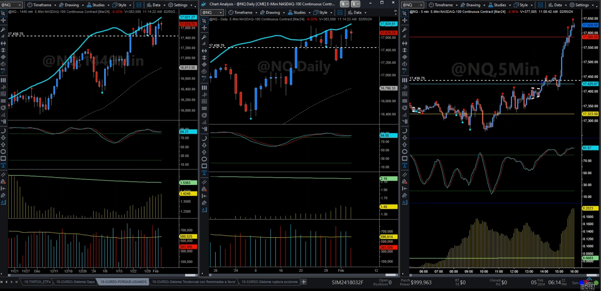
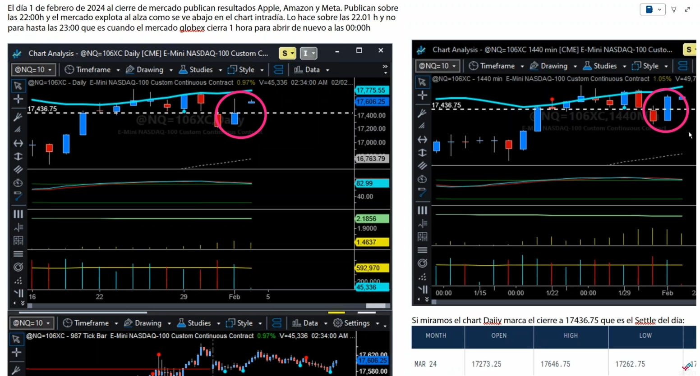
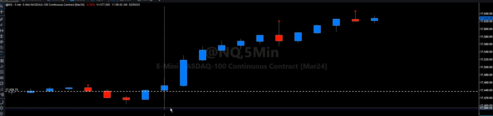
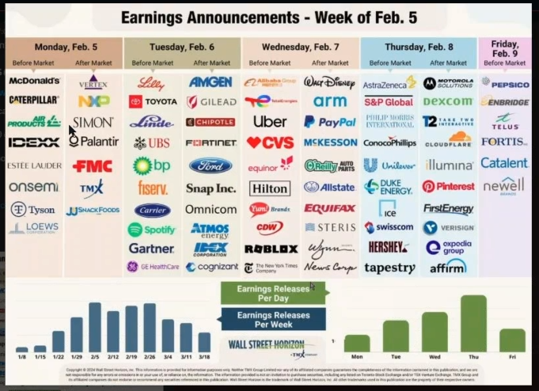
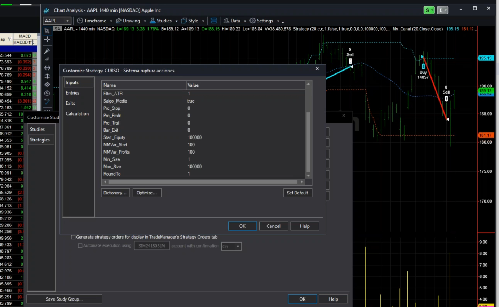

## Índice

- [Bases diarias vs Bases intradiarias (1440 minutos) - Recordatorio del tema anterior](#bases-diarias-vs-bases-intradiarias-1440-minutos---recordatorio-del-tema-anterior)
- [Introducción al trabajo con canales de `Donchian`](#introducción-al-trabajo-con---canales-de-donchian)
	- [El sistema original de Donchian y las reglas de las cuatro semanas](#el-sistema-original-de-donchian-y-las-reglas-de-las-cuatro-semanas)
	- [La importancia de acudir a las fuentes originales](#la-importancia-de-acudir-a-las-fuentes-originales)
	- [Uso intradiario y dificultad en tendencia pura](#uso-intradiario-y-dificultad-en-tendencia-pura)
	- [Psicología del trader y tipos de sistemas](#psicología-del-trader-y-tipos-de-sistemas)
	- [Control del riesgo: intradía vs swing trading](#control-del-riesgo-intradía-vs-swing-trading)
	- [Diversificación y la importancia del sistema tendencial](#diversificación-y-la-importancia-del-sistema-tendencial)
	- [🟦 Aplicación práctica: Donchian en Apple AAPL](#-aplicación-práctica-donchian-en-apple-aapl)
	- [🟦 Aplicación práctica: Donchian en XLK](#-aplicación-práctica-donchian-en-xlk)
	- [🟦 Aplicación práctica: Donchian en XLF](#-aplicación-práctica-donchian-en-xlf)
- [¿Preguntas?](#preguntas)


# Bases diarias vs Bases intradiarias (1440 minutos)

La semana pasada introdujimos los **canales de Donchian**, y hoy, antes de continuar con ese tema (aunque está relacionado), quiero enseñaros algo que ha pasado esta semana.
Es una de las cosas bonitas del curso: poder seguir la actualidad del mercado en tiempo real.

Durante la teoría, los que hayáis podido asistir, recordaréis que comenté que las bases de datos se podían cargar en **modo diario**.
Incluso recuerdo que alguien me preguntó por qué usábamos, por ejemplo, un gráfico de **500 minutos** o **1.440 minutos** (que equivalen a un día entero: 24 horas × 60 minutos = 1.440).
Eso equivale a una **vela diaria**.

Ahí estáis viendo tres gráficos del Nasdaq:

* A la izquierda, en 1.440 minutos.
* En el centro, en diario.
* A la derecha, en 5 minutos.

Visualmente son muy parecidos, pero no exactamente iguales, como ahora veréis.

<figure>
  
  <figcaption>Figura 8</figcaption>
</figure>

**Temporada de resultados y diferencia entre cierres**

Esta semana ha ocurrido algo interesante. Estamos en temporada de **publicación de resultados empresariales**.
Cuando una gran empresa publica resultados al cierre, pueden producirse movimientos muy bruscos. El **jueves 1**, al cierre, publicaron resultados **Apple, Meta y Amazon**. Meta, en particular, tuvo una subida estratosférica. Esto ocurrió justo después del cierre, alrededor de las **22:15** hora española (15:15 en horario de Nueva York). El contado acababa de cerrar y el futuro seguía cotizando un poco más, hasta las 22:45. Ahí es cuando se produce lo que llamamos el **SETTLE**, el precio de liquidación oficial del futuro.   Ese es el precio que el mercado utiliza como **referencia de cierre diario**.

Aquí lo tengo documentado: podéis ver el gráfico diario a la izquierda y el de 1.440 minutos a la derecha.
En la mayoría de días, ambos gráficos son iguales, pero cuando hay resultados, las diferencias pueden ser enormes.

<figure>
  
  <figcaption>Figura 9</figcaption>
</figure>

En este caso, la línea blanca en el gráfico (marcada en **17,436.75**) indica el precio de liquidación oficial del futuro. Ese es el precio que todos los fondos usan para su **mark-to-market** diario. Sin embargo, no es el precio real negociado en el mercado durante el día.

De hecho, minutos después del cierre, el precio ya estaba **200 puntos por encima**. Por eso, si operas con un sistema basado en gráfico diario, y usas ese precio de liquidación, tu análisis no refleja la realidad intradía.

**Diferencias entre la base diaria y la intradiaria**

Si usas el gráfico diario estándar, éste no permite cambiar la sesión horaria, y siempre refleja el precio de liquidación oficial. En cambio, si construyes la vela diaria con **datos intradiarios (1.440 minutos)**, reflejarás el `precio real de mercado`, el que se generó con las órdenes reales de compra y venta. Esto es muy importante para los que trabajamos con *sistemas automáticos*:

* La base diaria usa el *settle* (precio calculado por el mercado), no permite modificar la sesion y esta base recoge el precio de liquidacion oficial (en futuros).
* La base intradiaria usa los precios de negociación reales. Deja cambiar la configuración horaria, yo puedo elegir cargar los datos en aquel periodo que yo quiera (pero la diaria no). 

Por eso, es preferible construir las velas diarias con la base intradiaria, ya que muestra lo que realmente ocurrió en el mercado. 

**Ejemplo detallado del caso Meta**  

En el ejemplo concreto de Meta, el precio oficial fue **17,436.75**, lo ves en la linea blanca

<figure>
  
  <figcaption>Figura 10</figcaption>
</figure>


pero el precio real en el gráfico intradiario cerró cerca de **17,628**, unos **200 puntos por encima**.

Esto demuestra que, cuando hay resultados, las diferencias pueden ser muy notables.
El *settle* no se conoce en tiempo real; aparece después, cuando el mercado calcula el precio de liquidación oficial.

Por tanto, 
>si un sistema compró intradía porque detectó una señal alcista, pero el *settle* diario se publicó más bajo, al día siguiente ese sistema aparecería “no comprado”.
Esto se debe a que el precio oficial fue corregido posteriormente.

**Recomendaciones para operar con `sistemas diarios`**

> Cuando operamos con sistemas en gráfico diario, y especialmente con datos de **futuros**, es mejor `construir la vela diaria a partir de la intradiaria (1440 minutos)`. Así evitamos los efectos del precio de liquidación oficial (*settle*), que puede distorsionar la operativa. Esto también se aplica a los **ETFs** que replican el índice: cierran a precios similares al *settle*, pero no reflejan necesariamente la reacción inmediata a los resultados de las empresas.

 

**Temporada de resultados y observaciones finales**

Durante estas semanas, hay muchas velas distintas debido a la temporada de resultados.
Normalmente, las velas son parecidas, pero cuando grandes empresas publican, surgen diferencias notables. Esta semana fue un ejemplo clarísimo, y por eso lo documenté para enseñároslo.


<figure>
  
  <figcaption>Figura 11.</figcaption>
</figure>

Recordad que publicamos cada semana la imagen con el calendario de resultados (fuente: *Earnings Whispers*). Por ejemplo, esta semana publican McDonald’s, Disney y Pepsi, entre otras. Las grandes tecnológicas ya lo han hecho: Apple, Meta, Amazon, Google, Netflix, y probablemente NVIDIA próximamente.


**Configuración de sesiones y recomendaciones técnicas**

Para terminar, recordad lo siguiente:

* El gráfico de **1440 minutos** equivale a una vela diaria completa. 
* Es recomendable configurar *For bar building, use:* `Session Hours` , para que la primera barra empiece al inicio de la sesión (ahí empieza a contar la barra de 5min, 30' o lo que sea, de 1440' en este caso).

<figure>
  
  <figcaption>Figura 14.</figcaption>
</figure>

* En los gráficos **intradiarios**, podéis cambiar la configuración de la sesión (por ejemplo, para cerrar el sistema antes del cierre de mercado).
* En cambio, en los **diarios**, no se puede modificar la sesión: siempre recoge la jornada completa.

Esto es otra razón para trabajar con la base intradiaria cuando queréis controlar la hora de cierre o adaptar la operativa.


# Introducción - `canales de Donchian`


*code* : [ PRACTICE 02](../code/PRACTICA%2002.ELD)


He querido empezar por este sistema porque es uno que, más o menos, todos los que llevan un tiempo en los mercados han oído mencionar alguna vez. Quien nunca haya hecho *trading* quizá no lo conozca, pero quienes ya tienen cierta experiencia saben que los **canales de Donchian** son bastante conocidos y respetados.

Durante el curso, quien no hubiera oído hablar de ellos antes, ya los habrá visto en la **parte de historia del trading algorítmico**. A quien no haya hecho todavía esa parte, le recomiendo hacerlo, porque es muy curiosa y está al principio del curso. En ella hablamos de Donchian, que fue uno de los primeros en operar de forma sistemática —no automática, porque en su época no se podía como ahora—, pero sí con un *enfoque metódico*, con reglas claras, estrategias bien definidas y diversificación en muchos activos (*commodities* y demás).

<div style="border-left: 4px solid #2196f3; background: #e3f2fd; padding: 10px 15px; margin: 10px 0; border-radius: 8px;">
  <strong>📜 Richard Donchian (1905-1993)</strong><br><br>
  Considerado el <em>padre del trading sistemático</em> y de los fondos de futuros gestionados (<em>managed futures</em>). Fue pionero en aplicar reglas mecánicas al trading de commodities en los años 1930-1960. Su trabajo influyó directamente en el famoso experimento de las Tortugas (<em>Turtle Traders</em>) de Richard Dennis y William Eckhardt en 1983.
</div>

**El sistema original de Donchian y las reglas de las cuatro semanas**

Donchian utilizaba un sistema muy popular basado en `20 periodos`, que equivalen a `cuatro semanas`. De hecho, se le conocía como la *regla de las cuatro semanas*. Él trabajaba principalmente en gráfico semanal y, a partir de su enfoque, nació posteriormente el famoso **sistema de las tortugas** (*Turtle System*).

Tengo preparados algunos documentos sobre esto, que voy a subir también a la plataforma y al Discord. Veréis una sección llamada "Documentos" donde aparecerán tres archivos que acabo de subir. Nosotros estamos suscritos a la revista *Stocks & Commodities* y, haciendo un ejercicio curioso, busqué simplemente "Donchian's" y me aparecieron 58 referencias. He seleccionado tres de las más recientes para compartirlas con vosotros, porque están muy bien y explican el sistema con bastante claridad.

Aquí tenéis los tres artículos:

1. pdf [Stocks & Commodities V. 10:8 (328-331): SIDEBAR: DONCHIAN'S TRADING GUIDES](../../13-practice-03/Donchian-01.pdf)
2. pdf [Using Price Channels](../../13-practice-03/Donchian-02.pdf)
3. pdf [Donchian Breakouts](../../13-practice-03/Donchian-03.pdf)

Estos artículos, en apariencia, reproducen las reglas originales de *Donchian's Trading*. No existe un libro oficial de Donchian, pero se sabe que publicó sus ideas en distintos diarios y revistas, y de ahí se extrajeron estos textos.

**La importancia de acudir a las fuentes originales**

Siempre insisto en algo que considero muy importante: cuando utilicéis cualquier indicador o estrategia, id siempre al autor original. La comunidad de *trading*, con el tiempo, tiende a modificar o simplificar conceptos, a veces ignorando partes esenciales de una regla o de la filosofía del autor. Por eso, leer la fuente original os permite entender el propósito real del creador, su lógica y las condiciones bajo las que diseñó el indicador.

En términos generales, el sistema de Donchian `marca un canal de precios`, y cuando el precio `rompe ese canal`, se interpreta como el `inicio de una nueva tendencia`. Lógicamente, es un sistema más eficaz en activos con *comportamientos tendenciales* y en periodos más largos.

**Uso intradiario y dificultad en tendencia pura**

Personalmente, es un indicador que recomiendo, especialmente para marcar `estructuras de tendencia`.

Sin embargo, cuando se usa de forma *intradiaria*, las cosas se complican un poco. No es imposible, pero lograr una *tendencia pura* en marcos tan cortos es mucho más difícil. En teoría, un `sistema tendencial puro` debe *dejar correr los beneficios*, lo que implica `no tener Take Profits (TPs)`. Si uno quiere diversificar de verdad, necesita sistemas de este tipo, aunque sean menos cómodos psicológicamente o tengan peores ratios de acierto.

**Psicología del trader y tipos de sistemas**

En las clases teóricas ya comentamos la parte psicológica. Recuerdo que hicimos un ejercicio para medir la *aversión al riesgo*, y la próxima clase os preguntaré los resultados por curiosidad, para ver si coinciden con los ratios esperados.

Normalmente, tanto los *traders* principiantes como muchos avanzados se sienten más cómodos con `sistemas antitendenciales`, es decir, aquellos con una *alta tasa de acierto*. Por ejemplo, un sistema que acierta seis de cada diez operaciones se percibe como más estable, más tranquilo y psicológicamente más llevadero. Estos sistemas suelen tener *rachas de fallos más cortas* y resultados más regulares, aunque no siempre sean los más rentables. En general, son estrategias más *intradiarias*, que cierran posición al final del día o incluso antes, y permanecen poco tiempo en el mercado.

Esto no significa que sean mejores, pero es normal que al principio uno se incline hacia ellos. De hecho, muchos *traders* novatos comienzan por el *intradiario*, y no está mal, porque ahí se puede *controlar mejor el riesgo*.

<div style="border-left: 4px solid #ff9800; background: #fff3e0; padding: 10px 15px; margin: 10px 0; border-radius: 8px;">
  <strong>⚖️ Tendencial vs Antitendencial: perfil psicológico</strong><br><br>
  <table style="width:100%; font-size: 14px;">
    <tr><th></th><th>Sistema Tendencial</th><th>Sistema Antitendencial</th></tr>
    <tr><td><strong>Win Rate</strong></td><td>30-45%</td><td>55-70%</td></tr>
    <tr><td><strong>Ratio W/L</strong></td><td>2:1 a 4:1</td><td>0.5:1 a 1:1</td></tr>
    <tr><td><strong>Rachas perdedoras</strong></td><td>Largas y frecuentes</td><td>Cortas</td></tr>
    <tr><td><strong>Comodidad psicológica</strong></td><td>Baja (requiere experiencia)</td><td>Alta (más llevadero)</td></tr>
  </table>
</div>

**Control del riesgo: intradía vs swing trading**

En intradía, si haces bien tu trabajo y diseñas un sistema sólido, puedes controlar mejor el riesgo porque no estás expuesto a los *gaps* entre sesiones. En cambio, si operas en *swing* o tendencia diaria, estás sujeto a lo que ocurra entre el cierre y la apertura siguiente.

Imagina, por ejemplo, lo que ocurrió con Meta: quien estaba largo ganó mucho, pero quien estaba corto sufrió un salto de más de 200 puntos en contra. En cambio, un *trader* intradiario que cierra posición antes del final del día no queda expuesto a ese tipo de eventos.

Por eso, los *traders* con cuentas pequeñas o poca experiencia suelen preferir sistemas intradiarios o antitendenciales: pueden *controlar mejor el riesgo*, tener *menores drawdowns* y *requerir menos capital*.

**Diversificación y la importancia del sistema tendencial**

Ahora bien, si ya estás en ese punto y quieres *diversificar de verdad*, lo mejor que puedes hacer es incorporar un *sistema tendencial puro*. Un tendencial puro *no tiene TP*; deja correr las posiciones mientras exista tendencia. Puede ejecutarse en gráficos intradiarios, pero debe mantener posiciones entre sesiones si hay continuidad en el movimiento.

¿Puede hacerse tendencia intradiaria?

Sí, puede hacerse, pero ya no sería un tendencial puro: los ratios se acercan más al 50% o incluso al 40%. En esos casos sí conviene tener *Take Profit*, porque vas a cerrar al final del día igualmente. Esto lo vimos también en la parte teórica del curso.

<div style="background: #e8f5e9; border: 2px solid #4caf50; border-radius: 8px; padding: 12px 16px; margin: 15px 0;">

**📏 Regla práctica sobre diversificación:** La mejor diversificación no es solo por activo, sino por *tipo de estrategia*. Si ya tienes sistemas antitendenciales o intradiarios, incorporar un sistema tendencial puro aporta una diversificación real, aunque sea psicológicamente más difícil de operar.

</div>


## 🟦 Aplicación práctica: Donchian en Apple `AAPL` 

En este punto del curso, hemos planteado un *sistema Donchian* basado en datos diarios. La última vez lo probamos con *Apple*, y hoy vamos a retomarlo con el mismo activo. Solo he hecho un pequeño cambio: ahora el gráfico está cargado en *1440 minutos*.

Precisamente por eso, esta semana aproveché para introduciros el tema de los cierres y las diferencias entre las bases diarias e intradiarias. Me vino muy bien que ocurriera el caso de Meta, porque nos permitió ilustrar el concepto de forma visual: un cambio de más de 200 puntos en un solo día.

Si lo hubiera hecho la semana pasada, habría sido menos claro, pero esta coincidencia nos ha servido perfectamente para ver cómo aplicar *el sistema Donchian* en la práctica, utilizando la base intradiaria de 1440 minutos.


**Retomando el sistema y contexto de código**

Tenemos desarrollado el [código](../../12-practice-02/PRACTICA%2002.ELD) en *EasyLanguage*. He trabajado bastante un código con algunas cositas que ya de hecho sirven para varios; esto es habitual —llamadlo manías o prácticas de programación— y os las iré comentando. Evidentemente tenéis los tres PDFs que os he pasado, que también son un "segundo código", porque es Donchian explicado; pero me refiero a las partes que ahora vais a ir viendo que yo he incorporado al sistema a modo de posibilidades.

**Inputs del sistema y objetivo de evaluación**

**Punto 1: muchos inputs y su papel**

El sistema ahora mismo veréis que tiene muchos inputs.

```sh
input:
	Per_Canal (20),
	Price_Up (Close),
	Price_Dw (Close),
	Bar_Filtro (0),
	OperoCortos (false),
	Filtro_ATR (0.00),
	
	Salgo_Media (false),
	Prc_Stop (0.00),
	Prc_Profit (0.00),
	Prc_Trail (0.20),
	Bar_Exit (0),
	
	Start_Equity (100000),
	MMVar_Start (100),
	MMVar_Profits (100),
	Min_Size (1),
	Max_Size (100000),
	RoundTo (1);
```

Esto es habitual en un sistema: un *input* es todo aquel parámetro susceptible de ser variado desde fuera del código y también de ser optimizado.

<figure>
  
  <figcaption>Figura 1. Nuestros inputs vistos desde TradeStation</figcaption>
</figure>

Pero recordad que no todo *input* debe ser optimizado; de hecho, casi siempre es así: la mayoría de los inputs son de *configuración* —lo que llamamos "al core"— y no tienen por qué tocarse o, simplemente, como en este caso, son *instrumentales*, es decir, de *análisis*.

Estamos, podemos decir, en una *fase de evaluación preliminar*, de crear nuestra idea y construir nuestro sistema. Una forma de hacerlo es implementar varias posibilidades en el código para que, mediante la *observación*, la *optimización* y distintas herramientas, yo pueda ir construyendo la idea, partiendo ya de una ventaja que sé que existe y que he evaluado de manera sencilla; a partir de ahí, la vamos a ir edificando.

**Diario y semanal: pocos trades y optimización instrumental**

En sistemas diarios y más aún semanales (este lo podíamos haber hecho perfectamente semanal, pero no he querido irme de entrada a un extremo; veremos sistemas semanales, pero ahora prefiero un término medio), ocurre que un diario muchas veces tiene muy pocos *trades* como para permitir un proceso de optimización "al uso" (para elegir parámetros). Aun así, sí puedo realizar *optimizaciones instrumentales* para analizar información, construir mapas o perfiles de optimización (como vimos con Excel) y ver cómo se comporta el sistema ante distintos parámetros.

Por ejemplo, los canales de Donchian por defecto o definición se calculan en 20: pero yo ahora puedo ver cómo va con otras variables 20-19-18, o pasarlo al optimizador, exportarlo a Excel y analizarlo en una tabla. Entonces "optimizo", pero no para elegir o cambiar el parámetro, sino para entender cómo se mueve el sistema ante cambios. Además, lo puedo hacer en un activo o en varios; a partir de diario es más que recomendable —en intradiario también—, pero en diario diría obligado, y en semanal/mensual, ultra-obligado.

<div style="border-left: 4px solid #e74c3c; background: #fdedec; padding: 10px 15px; margin: 10px 0; border-radius: 8px;">
  <strong>⚠️ Principio fundamental en timeframes altos</strong><br><br>
  Es casi imposible trabajar con un solo activo: hay que analizar vía <em>cestas de activos</em>, porque no hay suficientes trades; cuanto más alto el timeframe, más universal debe ser la idea.
</div>

**Cómo trabajamos una idea: búsqueda dirigida y concepto primero**

Llegamos a la idea: imaginemos que ya hemos encontrado una idea de sistema.

**Búsqueda dirigida vs fuerza bruta**

Veremos muchas ideas y algunas mediante código; no tardaremos en hacer una clase de búsqueda de ideas a través del código, pero muy dirigida. La gran diferencia entre nuestras *búsquedas dirigidas* y los buscadores por *fuerza bruta* es que aquí la búsqueda está totalmente dirigida, muy cerrada y central. Yo marco cuatro, cinco o seis cosas a buscar y ya las he elegido yo.

El problema de los programas "todo-terreno" es que la búsqueda es tremendamente variable; además, modifican inputs de la propia idea, y eso deriva en *sobreoptimizaciones* muy fáciles. Aquí también podríamos caer en ello, pero es más difícil, porque parto de un principio, de un concepto.

Ese es siempre lo importante y necesario.

<div style="border-left: 4px solid #f39c12; background: #fff8e5; padding: 10px 15px; margin: 10px 0; border-radius: 8px;">
  <strong>⚠️ Regla</strong><br><br>
  Una búsqueda dirigida siempre debe partir de un concepto bien definido. Evita modificar parámetros sin una justificación teórica clara: la sobreoptimización destruye la validez del sistema y genera resultados irreproducibles.
</div>

**Setup de entrada y variantes de ruptura**

Hemos cargado el [file](../../12-practice-02/PRACTICA%2002.ELD) en *TradeStation*:

```sh
# file : PRACTICA 02.ELD
Strategy  - CURSO - Sistema ruptura acciones
```

Os enseño el código porque ahí voy a explicarlo; pero no es lo importante ahora. El código, como he dicho en la teoría, es una herramienta, ni más: es la forma en que el ordenador me entiende.

¿Cuál es el *setup* de entrada general del sistema? Respecto a la semana pasada, he incorporado una pequeña variación, y ahora os voy a explicar las dos o tres variantes que hay de Donchian, o cómo interpretar una ruptura.

Esto no sirve solo para Donchian: *sirve para cualquier ruptura*.

Hay un componente de gusto y un componente de probar para ver cuál puede ir mejor en cada activo, pero hay bastante consenso.

**Setup: Entrada estándar**

```sh
Inputs:
    Per_Canal(20),
    Price_Up(Close),
    Bar_Filtro(0);

Vars:
    MP(0);

// Alias de posición
MP = MarketPosition;
```

```sh
// TÍPICO SISTEMA DE RUPTURA: el cierre supera el máximo del CIERRE DE 20 barras
if Close > 0 and Condition1 and MP <> 1 and (BarsSinceExit(1) >= Bar_Filtro or TotalTrades = 0) then
Begin
	if Close > Highest(Price_Up, Per_Canal)[1] then
 		Buy Contratos contracts Next Bar at Market;
End;
```

Esto viene a decir: si el cierre de una vela es mayor (o igual) que el mayor cierre de las últimas N barras —por defecto 20, marcado por el input `Per_Canal`—, entonces compra en la apertura de la siguiente barra el número de contratos correspondiente.

<div style="border-left: 4px solid #3498db; background: #ebf5fb; padding: 10px 15px; margin: 10px 0; border-radius: 8px;">
  <strong>📝 Notas sobre el operador de comparación</strong><br><br>
  
  <strong>Usar <code>></code> (mayor estrictamente) — la opción más común</strong><br>
  <code>If Close > Highest(Price_Up, Per_Canal)[1] then</code><br><br>
  
  <em>Cuándo usarlo:</em>
  <ul>
    <li>Cuando buscas una ruptura real del canal, no solo tocarlo.</li>
    <li>Evita entradas falsas por empates (cierres iguales al máximo anterior).</li>
    <li>Es el estándar en casi todos los sistemas Donchian clásicos y en el <em>Turtle System</em> original.</li>
  </ul>
  
  <em>Ventajas:</em> Más robusto ante datos con cierres repetidos. Genera menos operaciones falsas.<br>
  <em>Desventajas:</em> Puede entrar una vela más tarde (pierde algo de inmediatez).<br><br>
  
  <strong>Usar <code>>=</code> (mayor o igual) — ruptura más sensible</strong><br>
  <code>If Close >= Highest(Price_Up, Per_Canal)[1] then</code><br><br>
  
  <em>Cuándo usarlo:</em>
  <ul>
    <li>Cuando trabajas con activos poco volátiles o datos redondeados (por ejemplo, precios con pocos decimales).</li>
    <li>Si quieres más frecuencia operativa y no te importa asumir alguna entrada adicional.</li>
  </ul>
  
  <em>Ventajas:</em> Captura rupturas en el mismo nivel exacto del canal. Puede adelantarse una barra antes a una tendencia incipiente.<br>
  <em>Desventajas:</em> Aumenta el ruido y la tasa de señales falsas.
</div>

Entrada estándar:

<div style="border-left: 4px solid #27ae60; background: #ecf9f1; padding: 10px 15px; margin: 10px 0; border-radius: 8px;">
  <strong>📏 Regla práctica</strong><br><br>
  En la mayoría de los sistemas Donchian y de ruptura tendencial, se recomienda usar <code>></code> (mayor estrictamente) para evitar señales duplicadas o falsas. Reserva <code>>=</code> únicamente para activos discretos o series con baja variación de precios.
</div>

```sh
	if Close > Highest(Price_Up, Per_Canal)[1] then
 		Buy Contratos contracts Next Bar at Market;
```

**¿Por qué `[1]`?** En `Highest(Price_Up, Per_Canal)[1]` usa el máximo de las últimas N barras excluyendo la barra actual, evitando *look-ahead*. El *look-ahead bias* (sesgo de anticipación o de "mirar hacia adelante") ocurre cuando, sin darte cuenta, tu sistema usa información que en la realidad aún no existía en el momento de la decisión.

<div style="border-left: 4px solid #0077b6; background: #e8f4fa; padding: 10px 15px; margin: 10px 0; border-radius: 8px;">
  <strong>🧠 Nota técnica</strong><br><br>
  El desplazamiento <code>[1]</code> impide el uso de datos del futuro (<em>look-ahead bias</em>). Cualquier referencia sin este desplazamiento invalidaría el backtest al incorporar información no disponible en el momento real de la decisión.
</div>

La diferencia que he hecho hoy es incorporar el uso del cierre de manera explícita. El otro día lo dejé con cierres a propósito, porque quería forzar el debate: lo habitual en un canal de Donchian no es usar el cierre como máximo, sino usar el máximo (*high*).

Esta línea (el canal azul de Donchian) de la siguiente imagen pinta los máximos de 20 velas *pero de los cierres*.

<figure>
  
  <figcaption>Figura 1</figcaption>
</figure>

Yo puedo pintarlo de lo que quiera.

<figure>
  
  <figcaption>Figura 2</figcaption>
</figure>

Puedo hacerlo del *HIGH* y del *LOW*, que es lo habitual; y en la siguiente imagen ahora sí veréis que es el máximo. Es el máximo hasta la vela en curso (si no, nunca rompería). Se entiende: si cuento el máximo de la vela en curso, no rompe nunca. Entonces es el 20 hasta el anterior; ahora está hecho con máximos y mínimos: este es el canal habitual.

<figure>
  
  <figcaption>Figura 4</figcaption>
</figure>


**Por qué priorizar el cierre en diario (y cuándo no hacerlo) — Cierre como señal dominante en diario**

Una de las reglas que nosotros más usamos para elegir esto es que, en diario, cuando trabajamos la base diaria, *el cierre* lo consideramos muy importante; por lo tanto, normalmente —y todavía más en acciones—, preferimos calcular máximos y mínimos con los cierres.

En este ejemplo no lo he probado aún; lo podemos probar ahora; pero creo que funcionará mejor —o, al menos, me genera más confianza y seguridad— que los máximos y mínimos se calculen con cierres. ¿Por qué? Porque el cierre es el final de un periodo. El mercado abre la sesión, acaba a las 22:00, hay una larga pausa y vuelve a abrir. Hay mucho operador intradiario que abre y cierra posición durante el día, y el precio de cierre define mejor que el máximo o mínimo la tendencia de fondo del activo. Esto es especialmente cierto en activos con largas pausas, como las acciones.

En futuros, si la vela diaria está construida con el *Globex* (23h), seguramente es menos relevante; pero si vas a operar el futuro en horario regular (15:30–22:00), ocurre lo mismo: hay muchas horas de pausa, y el cierre gana importancia. En estos casos, nos gusta trabajar con el campo `Close`, más que con `High`/`Low`.

<div style="border-left: 4px solid #f39c12; background: #fff8e5; padding: 10px 15px; margin: 10px 0; border-radius: 8px;">
  <strong>⚠️ Regla</strong><br><br>
  En marcos <em>diarios</em>, cuando trabajamos con la base diaria, el <em>precio de cierre</em> adquiere una importancia fundamental. Por ello —y especialmente en acciones—, es recomendable calcular los máximos y mínimos utilizando los cierres. 
  Durante la sesión, muchos operadores intradiarios abren y cierran posiciones constantemente, pero el cierre representa el punto en que el mercado "decide" la dirección final del día. 
  Este valor sintetiza la presión neta de compradores y vendedores y define mejor la tendencia de fondo del activo, sobre todo en instrumentos con pausas largas entre sesiones, como las acciones.
</div>

<div style="border-left: 4px solid #c0392b; background: #fdecea; padding: 10px 15px; margin: 10px 0; border-radius: 8px;">
  <strong>🔍 Criterio operativo</strong><br><br>
  Cuando el timeframe diario se construye a partir de datos intradiarios, es crucial definir qué campo de precio se usará para los cálculos del canal (Close, High o Low). Este ajuste altera significativamente la lógica de entrada y salida.
</div>

**Intradía: cierre irrelevante; usar High/Low o Typical Price**

Si fuera *sistema intradiario*, entonces 100% el cierre de una vela de cinco minutos tiene casi cero relevancia; importa entre 0 y 0,1. Ahí, el cierre no dice nada: o bien usamos *máximos/mínimos*, o un precio centrado como el `TypicalPrice` (media de High, Low y Close: `((H+L+C)/3)`), que es un precio más centrado.

**Input de cálculo del canal (`Price_Up`)**
```sh
if Close > Highest(Price_Up, Per_Canal)[1] then
	Buy Contratos contracts Next Bar at Market;
```

Como aquí, de entrada, empezamos con acciones, definimos los canales con campo *Cierre*; por eso, en el código, `Price_Up` lo he dejado como *input* de configuración, para poder cambiar rápido si quiero calcular el canal con Close, High o Low:

```sh
input:
	Per_Canal (20),
	Price_Up (Close),
```

Y lo puedo cambiar desde aquí:

<figure>
  
  <figcaption>Figura 5</figcaption>
</figure>

También podría hacerlo con `TypicalPrice`; puedo escribirlo directo:

<figure>
  
  <figcaption>Figura 6</figcaption>
</figure>

`TypicalPrice` también funciona porque es una función que devuelve un precio en el código. Si no existiera como función, me daría error. Cualquier valor que devuelva un precio lo puedo usar ahí.

<figure>
  
  <figcaption>Figura 7</figcaption>
</figure>

<div style="border-left: 4px solid #2980b9; background: #eaf3fb; padding: 10px 15px; margin: 10px 0; border-radius: 8px;">
  <strong>⚙️ Nota de implementación</strong><br><br>
  El propósito de declarar un parámetro como <em>input</em> no es siempre optimizarlo, sino <strong>facilitar la experimentación controlada</strong>. 
  Permitir modificar un valor directamente desde la interfaz acelera el análisis comparativo y evita tener que editar el código cada vez que se prueban distintas configuraciones.<br><br>
  En este ejemplo, <code>Price_Up</code> puede alternarse fácilmente entre <code>Close</code>, <code>High</code>, <code>Low</code> o <code>TypicalPrice</code> para observar cómo cambia el comportamiento del sistema.
  Esta flexibilidad es clave en la fase de <em>evaluación preliminar</em>: se busca entender la sensibilidad del modelo ante diferentes tipos de precios, no optimizar el valor "perfecto".
</div>

**Evaluación del setup básico y simetría riesgo/beneficio**

Vamos a centrarnos en este punto:

El **cierre** de la vela que ves marcada en la imagen es el que **rompe el canal superior** (línea azul). Ese *cierre por encima del canal* es el que genera la señal de entrada. Por tanto, el sistema *ejecuta la compra en la apertura de la siguiente vela*. Para que esto funcione correctamente, el *canal* debe **calcularse hasta la vela anterior**, **sin incluir la barra actual**. Si el canal incluyera la vela en curso, el cierre nunca podría superar su propio máximo, y la ruptura no se produciría.

<figure>
  
  <figcaption>Figura 15. Ruptura del canal de Donchian y entrada en la barra siguiente.</figcaption>
</figure>

Entonces este ejemplo corresponde al *setup básico*. Por ahora, al sistema le retiramos la salida central para centrarnos solo en la **salida simétrica**, y después analizaremos las demás (salida por media, *trailing*, etc.). Empecemos evaluando esta primera configuración:

<figure>
  
  <figcaption>Figura 16. Configuración base del sistema con riesgo y beneficio simétrico.</figcaption>
</figure>

En esta prueba hemos fijado un **riesgo (Stop)** y un **profit target** idénticos: ambos al **5% (0.05)**. De este modo, el sistema solo puede cerrar posiciones mediante esta salida —no hay cierre por número de barras, por *trailing stop* ni por ninguna otra condición—.

El objetivo es **igualar el ratio win/loss**, para evaluar el comportamiento puro del *setup* sin sesgos externos. Esta configuración sirve para medir la **eficiencia del patrón de entrada** sin interferencia de gestión monetaria.

```sh
# menu chart TradeStation
Data → Strategy Performance Report
```

<figure>
  
  <figcaption>Figura 17. Resultado inicial del setup simétrico (0.05 / 0.05): sistema en pérdidas.</figcaption>
</figure>

En esta configuración inicial el sistema arroja pérdidas:

* **Total Net Profit:** ($14,306.94) — valores en paréntesis (rojos) indican pérdida.
* **Profit Factor:** 0.95 → por debajo de 1, el sistema pierde más de lo que gana.
* **Avg. Trade Net Profit:** ($52.22) → pérdida media por operación.

Por tanto, el **setup base no es rentable** en este punto.

**Segunda prueba: ajuste del rango de riesgo/beneficio**

Aumentamos el rango a **0.10 / 0.10**, manteniendo la simetría pero con un espacio más amplio para que las operaciones respiren.

<figure>
  
  <figcaption>Figura 18. Ajuste de riesgo y beneficio al 10%.</figcaption>
</figure>

Con esta modificación los resultados mejoran significativamente:

<figure>
  
  <figcaption>Figura 23. Performance con 0.10 / 0.10 — mejora sustancial del Profit Factor y tasa de acierto.</figcaption>
</figure>

**Interpretación:**

* **Win Rate (Percent Profitable):** 66.01%.
  → Dos de cada tres operaciones resultan ganadoras.
* **Ratio Win/Loss:** 0.81
  → Cada pérdida media es un 20% mayor que una ganancia media, pero el alto porcentaje de acierto compensa.
* **Profit Factor:** 1.58
  → Muy sólido. Por cada dólar perdido, el sistema gana 1.58.

Esto demuestra que el **setup de entrada es sólido**, aunque aún con margen de mejora en la gestión de riesgo monetario.

**Configuración monetaria y control de tamaño**

Ahora bloqueamos el número de acciones para uniformar la gestión monetaria. De este modo eliminamos distorsiones provocadas por el cambio de precio del activo a lo largo de los años (acciones de Apple desde pocos dólares hasta más de 180 USD).

```sh
Properties for All...
```

<figure>
  
  <figcaption>Figura 20. Propiedades generales de backtesting en TradeStation.</figcaption>
</figure>

```sh
Customize...
```

<figure>
  
  <figcaption>Figura 21. Bloqueo de número de acciones para pruebas uniformes.</figcaption>
</figure>

Fijamos el tamaño a **1,000 acciones** constantes. Esto permite comparar *trades* históricos de forma homogénea y mantener un riesgo porcentual estable.

<figure>
  
  <figcaption>Figura 22. Efecto del bloqueo de tamaño: homogeneización del riesgo relativo.</figcaption>
</figure>

Aun así, observamos que las variaciones monetarias entre épocas siguen siendo elevadas: las operaciones mantienen un **riesgo relativo del ~10%**, pero el valor absoluto varía con el precio del activo.

**Diferencias monetarias a lo largo del histórico**

Lógicamente en dólares, a medida que va avanzando, pues cambia bastante porque depende bastante del precio del activo. Estamos hablando ya de lo que tengo cargado, 25 años, los cargados 25 años, pues claro tenemos compras aquí a céntimos y compras aquí a 180 dólares. Entonces el problema de las acciones es muy importante, la diferencia es gigantesca. Los *trades* son del orden del 10 por ciento, pero el valor monetario no es del orden del 10 por ciento, es imposible.

Si lo hubiéramos hecho el *Stop Loss* en valor monetario ecualizaría mejor en ese sentido, en el sentido de los ratios. Pero ahora mismo eso me da igual, no me importa, simplemente era para que lo ecualizara a un nivel de riesgo en porcentaje igual o muy parecido. Y aquí como tenéis eso me lo calcula, luego yo en Excel lo podría calcular como quisiera, ya lo visteis que lo hicimos y con muchos *fitness* y demás. Pero aquí el ratio me lo calcula, pero bueno, todo caso ya se ve que es claramente, claramente tiene un *avg* y un porcentaje de aciertos bastante elevado. Es decir, el *setup* de entrada en sí es bueno, es claramente bueno y permite seguir trabajando con él, que es lo que queremos.

<div style="background: #e8f5e9; border: 2px solid #4caf50; border-radius: 8px; padding: 15px; margin: 15px 0;">

**✅ Conclusión parcial:**

El *setup* base, con una ruptura Donchian clásica (`Close > Highest(Price_Up, Per_Canal)[1]`) y gestión simétrica 0.10 / 0.10, demuestra una **estructura robusta**: una tasa de acierto del 66% y un *profit factor* superior a 1.5.

Esto confirma que la **lógica de entrada** tiene validez estadística y es apta para seguir construyendo sobre ella —por ejemplo, añadiendo filtros direccionales o salidas adaptativas—.

</div>


## Aplicación práctica: Donchian en `XLK`

Como ya comentamos, es esencial probar el sistema en distintos activos. Aquí lo aplicamos sobre el **ETF sectorial de tecnología `XLK`**.

Mientras se carga el gráfico en *TradeStation*, volvemos brevemente al código:

**Gestión monetaria dinámica**

He incorporado una **gestión monetaria dinámica**, es decir, una lógica que ajusta el número de contratos en función del capital disponible y del precio del activo.

```sh
# { Money Management }
Profits = NetProfit + OpenPositionProfit;

If AbsValue(Close * BigPointValue) > 0 Then
	Value1 = AbsValue(Close * BigPointValue)
Else
	Value1 = 0.01;
	
Contratos = ((Start_Equity * MMVar_Start * 0.01) + (Profits * MMVar_Profits * 0.01)) / Value1;
Contratos = IntPortion(Contratos / RoundTo) * RoundTo;
Contratos = MaxList(Contratos, Min_Size);
Contratos = MinList(Contratos, Max_Size);
```

Esto, como recordáis, es especialmente recomendable en activos con gran variación de precio, ya que permite ajustar el tamaño de las posiciones a lo largo del tiempo. De lo contrario, un mismo número de acciones implicaría riesgos completamente diferentes.

```sh
# chart TradeStation: doble click en icono de entrada de la estrategia
Customize Studies & Strategies > Properties for All...
```

<figure>
  
  <figcaption>Figura 20. Propiedades generales del backtesting en TradeStation.</figcaption>
</figure>

```sh
Customize Studies & Strategies > Customize...
```

<figure>
  
  <figcaption>Figura 24. Personalización de parámetros monetarios del sistema.</figcaption>
</figure>

La lógica implementada es muy sencilla y puramente nominal (no basada en riesgo o volatilidad):

```sh
Contratos = ((Start_Equity * MMVar_Start * 0.01) + (Profits * MMVar_Profits * 0.01)) / Value1;
```

En esta parte del código, la fórmula invierte aproximadamente el **100% del capital disponible** en cada operación, ajustando el tamaño en función del precio del activo. Cuando el precio sube o baja (por ejemplo, de $1 a $300), el número de acciones se recalcula automáticamente, manteniendo una exposición constante en porcentaje.

<div style="border-left: 4px solid #3498db; background: #ebf5fb; padding: 10px 15px; margin: 10px 0; border-radius: 8px;">
  <strong>📊 Gestión monetaria dinámica: cómo funciona</strong><br><br>
  
  La estrategia está haciendo <em>gestión monetaria dinámica</em>, es decir, el número de contratos o acciones (<code>Contratos</code>) no es fijo, sino que se recalcula en cada operación según el valor total de la cuenta (<em>equity</em>) y el precio del activo (<code>Close</code>).<br><br>
  
  Cada vez que cambia el precio del activo, cambia el tamaño de la posición, para mantener una exposición más estable en términos de porcentaje de la cuenta. De esta forma, el sistema mantiene la misma exposición en porcentaje, aunque el precio del activo cambie drásticamente.<br><br>

  <table style="width:100%; font-size: 14px; border-collapse: collapse;">
    <tr style="background: #d6eaf8;">
      <th style="padding: 8px; border: 1px solid #aed6f1;">Precio de acción</th>
      <th style="padding: 8px; border: 1px solid #aed6f1;">Capital</th>
      <th style="padding: 8px; border: 1px solid #aed6f1;">Nº acciones aproximado</th>
      <th style="padding: 8px; border: 1px solid #aed6f1;">% invertido</th>
    </tr>
    <tr>
      <td style="padding: 8px; border: 1px solid #aed6f1;">$1</td>
      <td style="padding: 8px; border: 1px solid #aed6f1;">10,000 $</td>
      <td style="padding: 8px; border: 1px solid #aed6f1;">10,000 acciones</td>
      <td style="padding: 8px; border: 1px solid #aed6f1;">100%</td>
    </tr>
    <tr>
      <td style="padding: 8px; border: 1px solid #aed6f1;">$300</td>
      <td style="padding: 8px; border: 1px solid #aed6f1;">10,000 $</td>
      <td style="padding: 8px; border: 1px solid #aed6f1;">33 acciones</td>
      <td style="padding: 8px; border: 1px solid #aed6f1;">100%</td>
    </tr>
  </table>
</div>

<div style="border-left: 4px solid #e74c3c; background: #fdedec; padding: 10px 15px; margin: 10px 0; border-radius: 8px;">
  <strong>⚠️ El problema del lote fijo en backtests largos</strong><br><br>
  
  Si usaras un <em>lote fijo</em> (por ejemplo, 1.000 acciones) durante 25 años de datos:<br><br>
  
  <ul>
    <li>Cuando Apple cotizaba a <strong>$1</strong>, 1.000 acciones = <strong>$1.000</strong> invertidos (poca exposición).</li>
    <li>Cuando Apple vale <strong>$300</strong>, 1.000 acciones = <strong>$300.000</strong> invertidos (enorme exposición).</li>
  </ul>
  
  Eso distorsiona completamente los resultados del <em>backtest</em>, porque <strong>el riesgo y la exposición crecen con el precio del activo</strong>.<br><br>
  
  La gestión monetaria activada corrige eso: <em>normaliza la exposición</em> a un porcentaje constante del capital (por ejemplo, 100%). Así, el riesgo y el rendimiento se mantienen proporcionales en todo el histórico.
</div>

No significa que el sistema esté apalancado o que eso sea lo ideal para operar real. Significa que, para fines de *backtesting* y comparación, la estrategia:

* ajusta el tamaño de cada operación para reflejar un *porcentaje constante de capital*,
* permite comparar períodos históricos con precios muy diferentes (de $1 a $300) sin que el resultado quede distorsionado,
* y facilita calcular ratios, *drawdowns* y rendimientos relativos en *Excel* después.

Por eso, esta aproximación es más razonable para estudios históricos, aunque no sea el enfoque exacto que usaríamos en operativa real. Permite **comparar resultados entre épocas** sin que los precios extremos alteren la evaluación del sistema.


### Regla de entrada


La entrada sigue siendo la ruptura clásica de Donchian:

```sh
Begin
	if Close > Highest(Price_Up, Per_Canal)[1] then
 		Buy Contratos contracts Next Bar at Market;
End;
```

Es decir, cuando el **cierre actual** supera el **máximo de las últimas N barras (por defecto 20)**, se compra en la **apertura de la siguiente**. Este tipo de entrada es la base del *Donchian Channel Breakout* clásico.

El activo `XLK` (tecnología) es altamente tendencial a largo plazo, por lo que el lado largo tiende a generar resultados positivos de forma más estable.

**Reglas de salida**

Tal y como está configurado ahora mismo, el sistema **entra solo por Donchian** y **sale por un Take Profit del 10%**.

<figure>
  
  <figcaption>Figura 59. Performance de la estrategia Donchian sobre XLK con Take Profit del 10%.</figcaption>
</figure>

<figure>
  
  <figcaption>Figura 26. Aplicación de la estrategia Donchian sobre XLK.</figcaption>
</figure>

<figure>
  
  <figcaption>Figura 27. Señales de entrada y salida por TP del 10%.</figcaption>
</figure>

El Donchian original no define una salida precisa; muchos autores interpretan que la posición debe mantenerse **hasta una ruptura contraria**, lo que implica una salida muy tendencial.

En cambio, aquí incorporamos una **salida por media central**, más reactiva.

<figure>
  
  <figcaption>Figura 28. Visualización de la media central como posible salida.</figcaption>
</figure>

<figure>
  
  <figcaption>Figura 29. Donchian con media de 20 cierres como línea de salida alternativa.</figcaption>
</figure>

Esta media blanca representa la media de los **20 cierres previos**, coincidiendo con el período del canal Donchian.

**Salida por media central de 20 cierres previos con SL/TP 10%**

```sh
input:
	Salgo_Media (false)
```

Este control booleano (`Salgo_Media`) permite **activar o desactivar** fácilmente esta regla desde los parámetros del sistema.

```sh
// salida por la media central del canal Donchian
If Salgo_Media Then
Begin
	If Close < Average(Close, Per_Canal) Then
		Sell next bar at Market;
		
	If Close > Average(Close, Per_Canal) Then
		Buytocover next bar at Market;
End;
```

Además también tiene metido el SL/TP 10%, que se lo podría perfectamente quitar.

<figure>
  
  <figcaption>Figura 31. Activación de la salida por media central (booleano True/False), con SL/TP 10%.</figcaption>
</figure>

<figure>
  
  <figcaption>Figura 31. Performance con salida por media central (booleano True/False) y con SL/TP 10%.</figcaption>
</figure>

**Salida versión tendencial: por media central de 20 cierres previos (sin TP/SL)**

Ahora desactivamos el *Stop* y el *Take Profit* (ambos a 0) para dejar que el sistema **siga la tendencia completa**.

<figure>
  
  <figcaption>Figura 32. Desactivación de Stop/Profit para comportamiento puramente tendencial.</figcaption>
</figure>

De este modo, las operaciones permanecen abiertas hasta que el precio **pierde la media central**, o bien se produce una señal opuesta. Esto permite capturar grandes tramos de tendencia, aunque también implica soportar retrocesos más amplios. También `se podría poner en el lado corto`, veríamos cómo degrada mucho, pero puede hacerse.

**Fuentes de las variantes de salida**

Luego por supuesto todo esto lo evaluaremos, ahora simplemente lo estamos planteando, vamos planteando posibilidades. ¿De dónde las sacas? Estas las saco de la conferencia, me dices. Hombre, la entrada en este caso hay muchas que las sacaré completas de manuales. Ella ya habló de este libro y veremos, esto no es este libro, bueno seguramente casi todos los libros manuales completos van de Donchian y este libro habla de todos, así ahora no recuerdo, yo estoy seguro que habla de Donchian. Entonces bueno, no está sacado específicamente de él, pero también está ahí, están esos artículos que habéis visto de *Stock & Commodities*, está por internet.

Pero Donchian como tal no es un *setup* claro de entrada que tenga una salida, pero sabemos que es una entrada tendencial. La estamos probando en gráfico diario y por lo tanto pues al final puedo salir o bien no salir, o bien no salir por *TP* y poner solo *stop*, o bien salir mediante alguna salida también un poco lenta como la media. También podría probar y lo probaremos: habilito otra vez esta salida, no le meto el *TP* y le saco por esto de un 5%, y ahora solo va a salir si cae un 10%.

**Salida con Stop Loss y Trailing Stop**

Otra variante que probamos consiste en mantener el *TP* deshabilitado y salir únicamente con **Stop Loss o Trailing Stop dinámico**.

<figure>
  
  <figcaption>Figura 33. Activación de Stop dinámico (Trailing Stop) con 10% de SL.</figcaption>
</figure>

Un *Trailing Stop* actualiza continuamente el nivel de salida a medida que la posición avanza a favor. En el caso de posiciones largas, se mueve con el **High** (máximo alcanzado), restándole un porcentaje definido (por ejemplo, 10%). Esto permite capturar el movimiento principal y proteger beneficios sin salir prematuramente.

```sh
// Trailing Stop
If Prc_Trail > 0 Then
Begin
	If MP <> 1 Then
		Trailing_Long = 0;

	If  MP <> -1 Then
		Trailing_Shrt = 99999;
	
	Begin
		if MP = 1 then // Para posiciones largas
		begin 
    		Trailing_Long = maxList(Trailing_Long, High - (High * Prc_Trail));
    		Sell ("Trai_Lng") next bar at Trailing_Long stop;
		end;

		if MP = -1 then // Para posiciones cortas
		begin 
    		Trailing_Shrt = minList(Trailing_Shrt, Low + (Low * Prc_Trail));
    		BuytoCover ("Trai_Shrt") next bar at Trailing_Shrt stop;
		end;
	End;
End;
```

Así, el *trailing* protege beneficios acompañando el movimiento favorable del precio, sin reducir nunca la distancia una vez que el precio se aleja en contra.

**Trailing al 20%: tendencia pura**

Un 10% de *SL* es un *trailing* un poquito más holgado, y de hecho en tendencia larga hay muchos autores que hacen esto al 20%.

<figure>
  
  <figcaption>Figura 62</figcaption>
</figure>

Salen a 20%, consideran que es una tendencia bajista y se salen a 20% de caída, que es bastante. Pero como todo tiene su parte buena y su parte mala: quiere decir que vas a devolver mucho al mercado, pero te va a mantener dentro en las grandes tendencias. La única manera de mantener las grandes tendencias es esa. Pues es demasiado, te va a dar un *drawdown* muy elevado, pero como vais a ver el retorno da muchísimo, es el que más retorno da.

<figure>
  
  <figcaption>Figura 36</figcaption>
</figure>


Da *Profit Factor* de 2.31, solo 17 operaciones, pero al final pues se consigue subir.

<figure>
  
  <figcaption>Figura 37</figcaption>
</figure>

El problema es cuando hay toda esa costa de caída, pues como vais a ver bastante elevados, del 60% y demás.


<figure>
  
  <figcaption>Figura 38</figcaption>
</figure>

Este es el ejemplo, no tiene por qué ser en este caso tan extremo, para nada es recomendable así, pero es el caso extremo de lo que os decía de tendencia. Así sí que voy a tendencia puro, y veréis ahí que tengo un ratio de aciertos del 41%. ¿Cómo es tendencial puro? Porque deja correr mucho los beneficios, acierta 41% de las operaciones pero tiene un ratio *avg win/loss* de 3.30, espectacular, muy elevado, más de tres veces lo que pierde.

Pero claro, se deja mucho en el camino y provoca grandes riesgos.

<div style="background: #f5f5f5; border: 1px solid #bdbdbd; border-radius: 8px; padding: 12px 16px; margin: 15px 0;">

**Nota:** Este se podría dejar como un *setup* de salida en tendencia y luego buscar uno más rápido, simplemente usar este bastante más acelerado como ya teníamos puesto, por ejemplo la mitad, en 10%.

</div>

**Trailing al 10%: equilibrio tendencial**

<figure>
  
  <figcaption>Figura 33</figcaption>
</figure>

Donde va a seguir siendo tendencial pero menos, a ver qué va a estar ahí, seguramente 45% por ahí quizás.

<figure>
  
  <figcaption>Figura 39</figcaption>
</figure>

49% de *profitable*, incluso se acerca bastante al 50%, ya está casi equilibrado ahí en acierto con fallos, pero con un *average win/loss* de casi 3, en 2.80. Como veis, un *Profit Factor* muy elevado, ha bajado el *drawdown* prácticamente a la mitad.

<figure>
  
  <figcaption>Figura 40</figcaption>
</figure>

Pero al final está controlando un poco mejor el riesgo. **Esta es entrada Donchian, salida *trailing*, nada más.**

<div style="border-left: 4px solid #2980b9; background: #eaf3fb; padding: 10px 15px; margin: 10px 0; border-radius: 8px;">
  <strong>⚙️ Nota de implementación</strong><br><br>
  
  Este sistema, tal como está planteado, constituye un <em>setup</em> que probablemente —esto tendremos que evaluarlo— sería válido por sí mismo. No me refiero necesariamente a esta configuración concreta de <em>inputs</em> de Donchian y <em>trailing stop</em>, sino al conjunto estructural del sistema. Fijaos que, en este punto, estamos manejando esencialmente dos <em>inputs</em> principales. Hay más elementos, pero ahora mismo la atención se centra en esos dos.<br><br>
  
  Si quisiéramos construir un <strong>mapa de optimización</strong>, lo haremos más adelante; no quería introducirlo todavía para mantener el enfoque conceptual. En la próxima sesión, trabajaremos precisamente eso: veremos cómo plantear la optimización, cómo configurarla correctamente y cómo interpretar los resultados. Hoy el objetivo era <strong>definir las variantes del sistema</strong> —dejarlas estructuradas— para que, en la siguiente fase, podamos analizarlas cuantitativamente.<br><br>
  
  Este <em>setup</em>, con entrada por <strong>Donchian</strong> y salida por <strong>trailing stop</strong>, ya podría considerarse un <strong>sistema completo</strong>.<br><br>
  
  A partir de aquí, el proceso consistiría en:
  <ol>
    <li>Evaluarlo de forma preliminar.</li>
    <li>Verificar que tanto la entrada como la salida funcionan correctamente en distintos activos.</li>
    <li>Confirmar que el comportamiento mantiene coherencia ("cara y ojos") en diferentes contextos de mercado.</li>
  </ol>
  <br>
  Una vez hecho esto, pasaríamos a analizarlo mediante una <strong>optimización controlada</strong>, permitiendo cierta oscilación en los parámetros. Esto es importante, como expliqué antes, para observar cómo varía el rendimiento y poder construir un <strong>perfil o mapa de optimización</strong>, algo muy útil para comprender la sensibilidad del sistema.<br><br>
  
  No es necesario usar la optimización para cambiar parámetros —por ejemplo, sustituir 20 por 18—; puede hacerse, pero no es su único propósito.
</div>

<div style="border-left: 4px solid #f1c40f; background: #fff9e6; padding: 10px 15px; margin: 10px 0; border-radius: 8px;">
  <strong>💡 Recordad esta idea fundamental:</strong><br><br>
  La optimización no sirve únicamente para elegir parámetros óptimos, sino para estudiar el comportamiento del sistema y analizar sus datos en profundidad.
</div>

**Configuración de referencia del setup**

Entonces, este sería un posible *setup*. En este caso, lo tengo cargado sobre un **SPDR**, que no deja de ser un índice. Podemos verlo también aplicado a otro activo dentro de este mismo *setup*, que —recordemos— es un sistema basado en **Donchian**. En los **ajustes (`Settings`)**, se observa lo siguiente:

<figure>
  
  <figcaption>Figura 41</figcaption>
</figure>

* **Donchian con cierres** (no con máximos o mínimos).
* **Salida por *trailing stop*** al **10%** desde el máximo alcanzado durante la operación.
* **Exposición total (100%)** del capital disponible.
* **Comisión simulada:** 5 USD por *trade* (coste estándar por operación).
* **Deslizamiento (*slippage*):** un *tick* añadido por operación.
* **Capital inicial:** 100.000 USD.
* **Gestión monetaria:** exposición calculada dividiendo el capital disponible entre el precio de cierre actual. Es decir, si la cuenta comienza con 100.000 USD, se divide esa cantidad por el precio de cierre para determinar cuántas acciones se pueden comprar. Este cálculo se actualiza dinámicamente en cada operación, de modo que siempre se utiliza aproximadamente el *100% del capital* en cada entrada.

Este es, por ahora, el planteamiento de referencia. Más adelante revisaremos otras configuraciones, pero este punto de partida ya nos ofrece un *Profit Factor* de 2.71. Por ejemplo, puedo aplicarlo al ETF `XLF`, que es un activo muy líquido, con un volumen elevado y adecuado para este tipo de pruebas.

**Por qué este podría ser un setup válido**

Mientras tanto, os comento las **otras variantes del código** (no activas en este momento). ¿Por qué este podría ser un *setup*? Podría serlo porque:

* estoy en un diario y sé que tengo seguramente pocos *trades*, y
* por lo tanto, no quiero añadir demasiadas restricciones, demasiados filtros, y
* no quiero, básicamente, complicarme la vida.

Entonces, de entrada, quiero probar un *setup* muy básico y sencillo: si con él puedo ganar dinero y controlar el riesgo, vale.

**Enfoque tendencial**

Partimos de un planteamiento *tendencial*: si queremos capturar grandes movimientos, debemos *dejar correr los beneficios*. Y para dejar correr los beneficios, *no debemos cerrar por Take Profit*. El control del riesgo se realiza con un *stop dinámico tipo trailing*, que se mueve junto con el precio. Esto permite proteger las ganancias sin limitar el recorrido de la tendencia.

¿Podría usarse otro método? Sí: podría emplearse un `Parabolic SAR`, o un `trailing anclado a cierres`, o uno que solo devuelva un porcentaje de las ganancias desde el máximo. Existen múltiples variantes, pero esta versión —basada simplemente en el máximo y un porcentaje fijo— es *limpia, intuitiva y con un solo parámetro*: el porcentaje de distancia al máximo. Sencillo, claro, eficiente.

<div style="background: #e8f5e9; border: 2px solid #4caf50; border-radius: 8px; padding: 12px 16px; margin: 15px 0;">

**📏 Principio clave:** Las reglas deben ser simples. No es necesario construir un *trailing* con tres o más variables; solo complica el sistema sin aportar valor real.

</div>

Este tipo de salida podríamos haberla diseñado cualquiera, sin importar el nivel de experiencia. La entrada procede de una fuente pública (revistas especializadas) y el *trailing stop* es igualmente estándar: ya está implementado como función nativa en la propia plataforma. Por eso, es una **salida muy sencilla y transparente**, perfecta para un primer *setup* robusto y verificable.

<br>

 

<br>

## 🟦 Aplicación práctica: Donchian en `XLF`

Seguimos con más opciones, ya me ha cargado el sector financiero `XLF` que es tremendamente volátil 

<figure>
  
  <figcaption>Figura 42</figcaption>
</figure>

vale vamos a ver cómo queda con este mismo setup que tiene run-ups chulos con este 10% le da margen le da un margen interesante pero es aquí falsas entradas también que se las traga con patatas vale pero seguramente es bastante bastante profit 

<figure>
  
  <figcaption>Figura 43</figcaption>
</figure>

`no es profit`, no es porque mira que lo parece aquí seguramente es por la parte final 

<figure>
  
  <figcaption>Figura 44</figcaption>
</figure>

tiene un coste de comisiones muy elevado pero bueno se va adaptando se va adaptando el tema es que cuando compras muchas acciones que ahora te meten mucha mucha mucha slippage pero si si esta fase es tremendamente volátil que la caída se los traga se los traga todos 


### ¿que salidas hemos visto ya?

Bien, continuamos analizando las demás posibilidades. El otro día recordaréis que ya implementé la *salida por tiempo*, una opción que personalmente me gusta mucho. Sin embargo, si lo que buscamos es un *setup tendencial*, debemos asumir que no hay demasiadas alternativas: al final, hay que dejar correr el mercado y ver hasta dónde llega.

Las combinaciones posibles son limitadas, pero eso no es algo negativo. De hecho, *una de las ventajas de tener pocos parámetros —o casi ninguno— es que el sistema conserva un margen real de optimización y de elección*. Más adelante hablaremos en profundidad de los *grados de libertad*, pero por ahora basta con entender que cuantos menos parámetros intervengan, más fiable será la evaluación y más robusto el comportamiento del sistema.


**salida por un número n de barras**

```sh
// salida por tiempo, n barras
If Bar_Exit > 0 Then
Begin
	if MP = 1 and barssinceentry > Bar_Exit then
		sell("TimeL") next bar at open;
	
	if MP = -1 and barssinceentry > Bar_Exit then
		BuytoCover("TimeS") next bar at open;
End;
```

**¿Qué salidas hemos visto ya?**

`Bar_Exit (0)` ya la implementamos el otro día.  
En esta sesión hemos visto:  
`Prc_Stop (0.00)` – porcentaje de stop  
`Prc_Profit (0.00)` – porcentaje de profit  
`Prc_Trail (0.20)` – porcentaje de trailing stop  
`Salgo_Media (false)` – salida por la media central  

La *salida por la media central* está actualmente activada.
Esta salida utiliza la *media central del mismo período que el canal de Donchian*, es decir, calcula la media de los últimos *n* cierres (por defecto, 20).

 

### implemento salida en el canal contrario

También podríamos haber definido una *salida en el canal contrario*, una alternativa más de largo recorrido.
Esa opción, de hecho, ya está implementada, porque *TradeStation* permite hacerlo de forma muy sencilla gracias a su estructura de programación.

Ahora vamos a activar los *cortos*:

<figure>
  
  <figcaption>Figura 45</figcaption>
</figure>

Para ello, contamos con una variable booleana (`OperoCortos`) que controla si el sistema puede o no abrir posiciones cortas.
Al establecerla en `true`, el sistema podrá operar también en corto.

Sin embargo, podemos hacer algo interesante: *usar la señal del corto para operar en largo*.
Es decir, aunque el sistema detecte una señal bajista, podemos reinterpretarla para entrar en el lado opuesto.
Esto permite estudiar cómo se comporta la estrategia al *invertir las condiciones de entrada*, aprovechando las rupturas en dirección contraria.

<figure>
  
  <figcaption>Figura 46</figcaption>
</figure>

Como se ve, el corto aún rinde peor que el largo, lógicamente, pero lo que voy a hacer es que la regla del corto y el `sell short` se usen solo para *exit only*.

<figure>
  
  <figcaption>Figura 47</figcaption>
</figure>

De esta manera, la regla del corto se utiliza para cerrar, junto con el stop correspondiente.
Así, en el momento en que se produce una ruptura por la banda inferior, la posición también se cierra —además del trailing que tenga activo—.

El trailing podría eliminarse, y ese sería el caso extremo: entrar largo por la banda superior y salir únicamente por la inferior.
Esa sería *la versión más tendencial de todas*, porque, cuando el sistema entra en una tendencia fuerte, tarda mucho en cerrar por debajo del canal.

<figure>
  
  <figcaption>Figura 48</figcaption>
</figure>

<figure>
  
  <figcaption>Figura 49</figcaption>
</figure>

Aun así, sin *take profit*, obtiene 41 aciertos, pero no genera beneficios, probablemente por un conjunto de comisiones elevadas.

<figure>
  
  <figcaption>Figura 50</figcaption>
</figure>

En la primera parte del histórico, se hunde durante 2008–2009 —la crisis de Lehman Brothers—, donde realiza muchas entradas durante la caída que no consigue evitar.
Esa es la clave de cualquier sistema: *no va a ganar dinero en mercados hostiles, pero tiene que sobrevivir*.
En esta versión, no lo logra del todo: después tiene buenos momentos, pero no logra compensar las pérdidas anteriores.

<figure>
  
  <figcaption>Figura 51</figcaption>
</figure>

<div style="border-left: 4px solid #f1c40f; background: #fff9e6; padding: 10px 15px; margin: 10px 0;">
<strong>Regla fundamental:</strong><br>
Evitar el daño en mercados adversos.  
<br><br>
Esa es la esencia de cualquier sistema robusto: no tiene por qué ganar dinero en todo tipo de entornos, pero debe ser capaz de resistir y preservar el capital cuando las condiciones del mercado son desfavorables.
</div>
<br>
<div style="border-left: 4px solid #2980b9; background: #eaf3fb; padding: 10px 15px; margin: 10px 0;">
  <strong>Composición global del portafolio:</strong><br> 
  Podría convertir el sistema en una versión no puramente tendencial, es decir, una variante que no busque capturar toda la tendencia completa. 
  Este enfoque puede tener mucho sentido en determinados contextos, especialmente desde una perspectiva de cartera.
  <br><br>
  Recordad que, al final, <em>todo depende de la composición global del portafolio</em>.  
  Si mi cartera ya cuenta con suficientes sistemas tendenciales, quizás me interese introducir un modelo 
  <em>más equilibrado o mixto</em>, uno que mantenga un comportamiento intermedio —por ejemplo, con una tasa de acierto más cercana al 50 %— 
  y que <em>no asuma el mismo nivel de riesgo</em> de dejar correr tanto las operaciones.
  <br><br>
  También puede ocurrir lo contrario: si tengo demasiadas estrategias tendenciales, añadir un sistema más 
  <em>estable o de reversión parcial</em> puede ayudar a <em>diversificar el perfil de riesgo</em>.
  En ese caso, el objetivo sería construir un sistema <em>semi-tendencial</em>: uno que siga operando rupturas de tendencia, 
  pero que <em>no persiga extenderlas indefinidamente</em>, sino capturar solo una parte del movimiento, 
  aportando así mayor estabilidad al conjunto de la cartera.
</div>

Volviendo al resto de las salidas vistas hasta ahora:

`Bar_Exit (0)` – salida por tiempo (ya implementada).  
`Prc_Stop (0.00)` – salida por stop-loss porcentual.  
`Prc_Profit (0.00)` – salida por take profit porcentual.  
`Prc_Trail (0.20)` – salida por trailing stop porcentual.  
`Salgo_Media (false)` – salida por la media central.  


### Combinación práctica de salidas: media, tiempo y stop porcentual

...entonces vamos a desactivar los cortos; lo voy a dejar así para que salga por la media, va a salir por el `true`.
Le pongo que, como mucho, esté por ejemplo 10 días, y que salga por la media.

<figure>
  
  <figcaption>Figura 52</figcaption>
</figure>

Y entonces, pues bien, sale o bien por la media o bien tras 10 días.
En este caso, esto no tendría mucho sentido; tendría más lógica usar *una u otra* —o bien la salida por la media, o bien la salida por la banda—, pero no ambas simultáneamente.
Por ello, anularía la salida por cortos (que activa la media y la banda contraria) y podría añadir un *stop* del 5 % para movimientos más rápidos.

<figure>
  
  <figcaption>Figura 53</figcaption>
</figure>

En resumen: *salgo por tiempo o por pérdida del 5 %, o por la media; no salgo por el canal contrario.*
Vemos que se trata de un *setup muy distinto*, realmente un sistema que permanece poco tiempo en el mercado y busca *entradas rápidas y de corta duración.*

<figure>
  
  <figcaption>Figura 54</figcaption>
</figure>

Incluso aquí tendría más sentido, porque ya estoy fijando un tiempo de salida.
Además, voy a añadir un *profit target*:

<figure>
  
  <figcaption>Figura 57</figcaption>
</figure>

En este caso, usaré un ratio 2:1 —*profit* de 0.10 y *stop* de 0.05—.
Más adelante explicaré otra cosa que solemos hacer: relacionar ambos, de forma que uno sea múltiplo del otro (por ejemplo, *1:1 o 2:1*).
Así, tengo 0.10 de *profit*, 0.05 de *stop*, y desactivo la salida por media y por tiempo.

Esta es una configuración bastante habitual: una *combinación de stop, take profit y límite temporal*.
Es decir, si ninguno de los dos primeros se activa en un número determinado de barras, la operación se cierra igualmente.
Es una estructura muy común en sistemas *de rotura rápida o momentum*, donde el objetivo es capturar impulsos breves.

<figure>
  
  <figcaption>Figura 64</figcaption>
</figure>

Con este enfoque, el sistema mejora ligeramente: aguanta mejor los periodos adversos, aunque sigue mostrando debilidad estructural, especialmente en el ETF financiero.

<figure>
  
  <figcaption>Figura 65</figcaption>
</figure>


### Filtros de entrada

En este mismo *setup*, para no complicar demasiado la explicación, repasaremos algunos posibles filtros de entrada.

#### Filtro que evita reentradas inmediatas `Bar_Filtro`**

El primero es un filtro diseñado para evitar que ocurra lo que se observa en la imagen: una *reentrada inmediata* tras una salida.
Es decir, una vez que el sistema cierra una operación, debe esperar un número determinado de velas antes de volver a entrar.

Esto tiene bastante sentido, ya que, sin ese control, el sistema podría caer en un bucle de entradas y salidas continuas, generando ruido y sobreoperación.
Este filtro se gestiona mediante la variable `Bar_Filtro`.

<figure>
  
  <figcaption>Figura 67</figcaption>
</figure>

<figure>
  
  <figcaption>Figura 68</figcaption>
</figure>

Ahora, como se observa, el sistema espera al menos tres barras antes de permitir una nueva entrada.
Este tipo de filtros es habitual y recomendable, especialmente para quienes programáis estrategias: evita que un sistema entre y salga en la misma vela, lo cual no tiene sentido operativo.
Una buena práctica consiste en establecer siempre una condición mínima de espera entre operaciones, utilizando `BarsSinceExit`.

```sh
// TÍPICO SISTEMA DE RUPTURA: el cierre supera el máximo del cierre de 20 barras
if Close > 0 and Condition1 and MP <> 1 and (BarsSinceExit(1) >= Bar_Filtro or TotalTrades = 0) then
Begin
	if Close > Highest(Price_Up, Per_Canal)[1] then
 		Buy Contratos contracts Next Bar at Market;
End;
```

El fragmento `or TotalTrades = 0` asegura que la condición también se cumpla si el sistema aún no ha realizado ninguna operación.
La variable `TotalTrades` cuenta el número total de operaciones cerradas y permite controlar la lógica del sistema desde el inicio.
Es un filtro menor, pero útil para garantizar la coherencia de la secuencia de operaciones.

#### Filtro de volatilidad

El siguiente filtro es algo más elaborado y, de hecho, uno de los más importantes.
Ya hemos mencionado en la parte teórica que *la volatilidad es uno de los vectores más potentes* tanto para operar como para gestionar el riesgo y ajustar la exposición monetaria.
Puede utilizarse como filtro, como medida de gestión o incluso como componente principal de una estrategia.

En este caso, todavía no se ha implementado, pero podría incorporarse fácilmente una condición basada en volatilidad: por ejemplo, exigir que la vela actual sea *más o menos volátil que las anteriores* antes de permitir una entrada.
Este tipo de filtros ayudan a calibrar las condiciones del mercado y a evitar señales falsas durante fases de compresión o exceso de ruido.


**Filtro basado en tipo de precio**

Además, conviene recordar que el *canal de Donchian* puede construirse de varias formas según el tipo de precio que se utilice para calcularlo. Hasta ahora hemos visto la versión donde la condición de entrada se cumple cuando *el cierre supera el máximo de las últimas n barras*.

Sin embargo, existe otra variante igual de válida:

```sh
// Buy Contratos contracts Next Bar at Highest(Price_Up, Per_Canal)[1] stop;
```

En esta alternativa, la orden de compra se coloca directamente *en el nivel del canal superior* —es decir, en el valor de `Highest(Price_Up, Per_Canal)[1]`— sin esperar a que el cierre lo supere. De esta forma, el sistema mantiene una *orden stop activa en el canal* durante todo el tiempo, esperando que el precio la ejecute cuando se produzca la ruptura real.

La diferencia es conceptual:

* En la versión anterior, el sistema necesita *confirmación por cierre*.
* En esta, el sistema actúa *de forma anticipada*, ejecutando la entrada al tocar el canal.

Ambos enfoques son válidos, y la elección depende del tipo de sistema que se quiera construir: uno *más conservador y reactivo* (por cierre confirmado) o uno *más agresivo y anticipativo* (por ruptura intrabarra).

Todo el rato la orden es la línea azul, hasta que entra; luego ya no.

<figure>
  
  <figcaption>Figura 69. Orden stop activa en el nivel del canal superior hasta que se ejecuta la entrada.</figcaption>
</figure>

Es otra posibilidad, una posibilidad que opera más rápida, con más fallos. A mí me gusta bastante así como está puesta ahora, pedirle un cierre por encima, pero depende, depende realmente. De hecho lo que os decía antes va todo un poco relacionado, y lo que también dije en las prácticas: esto es verdad que se cultiva con la experiencia. El sentido común muchas veces se cultiva mucho con la experiencia; sin experiencia es complicado tener sentido común en algo, porque al final se va adquiriendo por propia experimentación.

En lo que os decía antes de los cierres en relación al gráfico diario y demás: en el gráfico diario yo creo que nos gusta más esta manera que hemos planteado aquí, es decir, que cierre por encima de la banda. Pero en *intradía* seguramente iríamos más directo al canal, contando que te vas a quedar dentro, o sea, que vas a salir al final del día como máximo, en el que buscas una explosión. Ahí sí, ahí sí que entonces todavía será más importante filtrar.

**El problema de filtrar según el timeframe**

Pero es verdad que cuando vas a intradía, sobre todo si vas a *timeframes* cortos, filtrar ya no es tan problema. Puede serlo, porque si yo tengo solo 200 operaciones, filtrar empieza a ser complicado por el número de *trades* que voy a obtener. Porque al final filtrar quita *trades*, y es muy fácil caer en una sobreoptimización; es tan fácil que casi es mejor, es más recomendable, no hacerlo, no filtrar.

Pero si yo me voy a intradía, la tortilla se gira. Si tengo mil *trades*, o tengo quinientos *trades*, o tengo dos mil *trades*, si tengo mil, bueno, si filtro me quedo con 600-700. Si no tengo tampoco muchos *inputs*, probablemente puedo conseguir un sistema robusto con esas cifras. Entonces cuando yo me voy a intradía, filtrar ya no es tan problema. Entonces ahí sí que a lo mejor iría más al *stop* directo pegado a la banda, pero a ver qué filtro usaba para entrarle más. En unas notas, pero al cierre en gráfico diario quizás mejor así como se ha planteado, es decir, pedirle que haga un cierre por encima de la barra. Al final estoy confirmando que el precio rompe una secuencia de máximos.

**Variantes más exigentes de confirmación**

Podría pedirle más cosas. Podría pedirle dos cierres si quisiera; por código podría programar que fueran dos cierres. O podría programarle —ese es un filtro bastante interesante y que hemos de hecho usado— hacerlo todavía más conservador. Pero aquí ya digo, no tenemos muchos *trades*. Pero si tú lo necesitaras, podrías pedirle que toda la vela estuviera por fuera. Es tremendamente exigente, y con un canal de veinte seguramente tendría que ser un canal más corto; nos va a costar mucho conseguirlo, que toda la vela cierre por encima del canal. Esto es más típico con medias o con *Bandas de Bollinger*, pero con un canal de Donchian es complicado conseguirlo. Puede ser, o que al menos el cierre y el mínimo también, buscar varios campos o alguna cosa de este tipo. Pero ya digo, con bandas muy lentas es muy difícil.

**ATR: Filtro de volatilidad**

Entonces volviendo, ya explicada la otra opción del Donchian —ir contra la banda en *stop*— vamos a ver ahora el filtro de volatilidad, que para eso está puesto este ATR. Los sistemas de *breakout*, vamos a ver la volatilidad, donde tengo yo mis notas.

La única diferencia entre el *Range* y el *True Range* es que el *Range* es el rango de toda la vela sin contar el *gap* anterior, es decir, *High* menos *Low*, eso es el *Range*. Y el *True Range* es el *High* menos *Low*, pero si hay *gap* cuenta el cierre anterior, ¿se entiende? Se entiende un poco la idea. Es decir, el *Range* es esto: *High* menos *Low*. El *True Range* en cambio, bueno, es el *True High* menos el *True Low*. Es más fácil en el que tengo yo, es más fácil. Y esto es exclusiva. El normalizado, ¿qué hace? Normalizado, que esto es nuestro:

```sh
var: double NATR (0); 
NATR = MaxList(H - L, C[1] - L, H - C[1]) / TypicalPrice * 100;
NormalizedTrueRange = NATR
```

Lo único que lo dividimos por *TypicalPrice*, como yo os había dicho antes. Pero es el mayor de tres: el *High* menos *Low*, que eso sería el *Range*, pero también el cierre anterior menos el *Low*, o el máximo anterior menos el cierre anterior. Este es el valor del *True Range*. Esto ahí en código supone lo que os he dicho, que es la diferencia entre el máximo y el mínimo, pero tiene en cuenta el cierre anterior para restarlo o bien al *High* o bien al *Low*. Entonces cuando haya un *gap* lo considera.

<figure>
  
  <figcaption>Figura 70. Diferencia visual entre Range y True Range en presencia de gap.</figcaption>
</figure>

Es decir, donde se ve muy claro, por ejemplo aquí: el *True Range* de esta vela es la diferencia entre el máximo y el cierre. En cambio el *Range* sigue siendo solo el máximo y el mínimo de esta vela, ¿se entiende? El máximo menos el cierre es el *True Range*; el máximo menos el *Low* es el *Range*. Esa es la única diferencia entre el *Range* y el *True Range*. Entonces se puede hacer el *Average True Range* y el *Average Range*, porque es el promedio de los distintos *Range* o el promedio de los distintos *True Range*.

<figure>
  
  <figcaption>Figura 71. Comparación entre ATR y Average Range superpuestos.</figcaption>
</figure>

En la imagen, esto no es más que uno encima del otro, porque eso al final lo que relaciono es la volatilidad de la vela actual con relación a las volatilidades anteriores.

<div style="border-left: 4px solid #3498db; background: #ebf5fb; padding: 10px 15px; margin: 10px 0; border-radius: 8px;">
  <strong>📊 Range vs True Range vs ATR</strong><br><br>
  <table style="width:100%; font-size: 14px; border-collapse: collapse;">
    <tr style="background: #d6eaf8;">
      <th style="padding: 8px; border: 1px solid #aed6f1;">Concepto</th>
      <th style="padding: 8px; border: 1px solid #aed6f1;">Fórmula</th>
      <th style="padding: 8px; border: 1px solid #aed6f1;">Considera gaps</th>
    </tr>
    <tr>
      <td style="padding: 8px; border: 1px solid #aed6f1;"><strong>Range</strong></td>
      <td style="padding: 8px; border: 1px solid #aed6f1;">High - Low</td>
      <td style="padding: 8px; border: 1px solid #aed6f1;">No</td>
    </tr>
    <tr>
      <td style="padding: 8px; border: 1px solid #aed6f1;"><strong>True Range</strong></td>
      <td style="padding: 8px; border: 1px solid #aed6f1;">Max(H-L, |H-C[1]|, |L-C[1]|)</td>
      <td style="padding: 8px; border: 1px solid #aed6f1;">Sí</td>
    </tr>
    <tr>
      <td style="padding: 8px; border: 1px solid #aed6f1;"><strong>ATR</strong></td>
      <td style="padding: 8px; border: 1px solid #aed6f1;">Media móvil del True Range</td>
      <td style="padding: 8px; border: 1px solid #aed6f1;">Sí</td>
    </tr>
    <tr>
      <td style="padding: 8px; border: 1px solid #aed6f1;"><strong>NATR (Normalizado)</strong></td>
      <td style="padding: 8px; border: 1px solid #aed6f1;">ATR / TypicalPrice × 100</td>
      <td style="padding: 8px; border: 1px solid #aed6f1;">Sí (en %)</td>
    </tr>
  </table>
</div>

**La volatilidad es cíclica**

Esto es un filtro que al final busca una cosa que a veces es contraintuitiva. Sabéis que la volatilidad es totalmente *cíclica*. Aquí se ve realmente con bastante claridad. Voy a ocultar ahora el de uno, voy a ocultar un momento el de uno para explicaros esto, luego lo vuelvo a poner.

La volatilidad es cíclica, de manera más o menos marcada. Hay activos que más, activos que menos. Al final esto es un índice, pero es financiero, que está bastante sometido a una época concreta.

<figure>
  
  <figcaption>Figura 72. Ciclos de volatilidad en el sector financiero XLF.</figcaption>
</figure>

Y de hecho aquí no lo vemos del todo bien. Lo vais a ver mejor en el que tenemos nosotros, el normalizado. En este se ve muy bien, lo voy a poner para verlo, luego lo quitaremos. Este ahora lo voy a ocultar también para verlo mejor, que me interesa explicaros esto, que es de concepto.

Aquí se ve un poco mejor. Este gráfico está bastante roto, no roto porque esté roto, sino porque al final tuvo unas volatilidades tan brutales y casi no hay nada comparable a ello. Pero bueno, la volatilidad como veis es bastante cíclica: hay momentos que entra en momentos de mucha volatilidad, luego de poca. Entonces es bastante cíclica, creo que se ve bastante claro. Tiene sus picos del 8 al 9, que son bastante bestias.

<figure>
  
  <figcaption>Figura 74. Volatilidad normalizada con media histórica del 2.03% para el sector financiero.</figcaption>
</figure>

Y esta rayita que veis es el 2.03%, no sé si se ve bien, es la media histórica, pero es la media histórica de este concreto que es el sector financiero.

**Volatilidad y breakout: el concepto clave**

Entonces al final los sistemas *breakout*, que es lo que estamos buscando ahora —y esto aplica más a los *breakouts* que a los tendenciales— es decir, aquí como es un *breakout* lo he aprovechado para explicároslo, pero sinceramente aquí no creo que lo podamos aplicar por lo que os decía. Primero porque conceptualmente es un poco más dudoso, tiene un pequeño matiz, ahora os lo explico. Pero sobre todo por lo que os decía antes: el número de *trades*, que vamos a tener que juntar activos, va a ser más complicado. No digo rotundamente no, pero digo que es más difícil y más arriesgado, cuando vamos a sistemas diarios, y ya no te digo semanal o mensual.

Entonces conceptualmente ¿por qué? Porque al final el sistema *breakout*, donde es ideal, es lo que os decía en los temas intradiarios. Por ejemplo, este mismo sistema, que ya lo veremos más adelante, cogeremos este mismo y haremos estas pequeñas modificaciones que hemos hecho para intradía, lo probaremos en intradía. Por ejemplo, lo podemos probar en el oro, un activo tendencial, en el petróleo, lo probaremos los dos. Trataremos de sacar, a ver si lo sacamos, un Donchian que nos funcione en el oro y en el petróleo, pero lo buscaremos como *breakout* solo, no como tendencial. Aquí ahora hemos partido tendencial, estamos viendo todas las posibilidades, pero como os he dicho para el día siguiente lo trabajaremos sobre todo como tendencial y trataremos de evaluarlo como tendencial.

**Diferencia entre volatility breakout y tendencial**

Si fuera *breakout*, volatilidad y *breakout*, entonces la diferencia principal entre un tendencial y un *volatility breakout* es simplemente que al *volatility breakout* le busco cerrar pronto. Es decir, busco una explosión de volatilidad, la cojo y me voy para casa. Ese es un poco el planteamiento. En cambio el tendencial busca largas tendencias, por lo cual necesita activos con buena tendencia, que las acciones no es el mejor.

De hecho este sectorial va mal porque como veis aquí simplemente no hay tendencia, es decir, el gráfico está en el mismo sitio. Estos son años y está en el mismo sitio.

<figure>
  
  <figcaption>Figura 75. XLF: ausencia de tendencia clara en el largo plazo (de $19 a $38 en años).</figcaption>
</figure>

Al final gana algo de altura, pero realmente no tiene nada que ver, como habéis visto en la tecnología. Dejadme el precio arriba: está en 38 y al principio del gráfico está en 19; ni tan solo ha doblado en años. Es el 2000. Cuando habéis visto el Nasdaq, Apple, que estaba por debajo de uno y estaba en 300. Pero claro, le cuesta porque buscamos tendencia en algo que no tiene tendencia. Entonces claro, pero es pedir peras al olmo. Eso es lo primero: trabajar en mercado que funciona. Pero bueno, se ha querido probarlo porque ya sabía que era hostil, quería verlo.

**Cuándo entrar en un volatility breakout**

A lo que iba. Entonces en un *volatility breakout* al uso yo busco una explosión de volatilidad. ¿Y cuándo se da una explosión? Como la volatilidad es cíclica, ¿cuándo es más probable que haya una explosión o que haya una rotura que sea buena? Es tras un periodo de *contracción*, tras un periodo de contracción.

Por lo tanto, a mí, contrariamente a lo que defienden muchos manuales que defienden que las roturas tienen que ser con volatilidad —bueno, es que sí que tiene sentido el concepto de que tiene que ser con volatilidad—, pero realmente tienen que ser en un momento donde la volatilidad *no sea alta*. Porque si la volatilidad ya es alta, es probable que el movimiento ya se haya dado.

<div style="border-left: 4px solid #e74c3c; background: #fdedec; padding: 10px 15px; margin: 10px 0; border-radius: 8px;">
  <strong>⚠️ Concepto contraintuitivo pero fundamental</strong><br><br>
  En un <em>volatility breakout</em>, las mejores entradas NO se producen cuando la volatilidad ya es alta, sino tras periodos de <strong>contracción</strong> de volatilidad. Si la volatilidad ya es elevada, el movimiento probablemente ya se ha producido y la entrada llega tarde.
</div>

Por esto os decía que es más dudoso y más contradictorio con un tendencial. Porque un tendencial por definición entra tarde para salir aún más tarde, es decir, un tendencial entra cuando hay tendencia. Y ahí sí que es más dudoso y puede ser que entres en un inicio de una tendencia que empiece una expansión de volatilidad y acabe siendo buena tendencia. Pero no en un *volatility breakout*, que lo que yo busco es una expansión de volatilidad. Si la expansión de volatilidad ya se ha producido, es señal de que probablemente el mercado ya ha desarrollado un movimiento tendencial, y por lo tanto nuestra configuración probablemente será menos eficaz.

Así que es en las fases de *contracción* de la volatilidad cuando el mercado aún no ha desarrollado el movimiento. Ahí es donde sí que yo sé que no ha desarrollado el movimiento, y por lo tanto, aunque pueda parecer contraintuitivo, en un *volatility breakout* —que no es exactamente este, esto es diario lo que explicaba ahora— aprovecho para introducirlo porque como os digo la principal diferencia entre un *volatility breakout* y un tendencial prácticamente es las salidas. La entrada puede ser igual, la entrada puede ser igual, por eso lo explico aquí. Cambiaría bastante la salida.

<figure>
  
  <figcaption>Figura 77. Tendencia acompañada de subida de volatilidad: el movimiento ya se ha desarrollado.</figcaption>
</figure>

Entonces aquí veis un poquito el ejemplo que os digo. Aquí yo tengo una clara tendencia y viene acompañada de una clara subida de volatilidad. Entonces me puede decir: "Hombre, pero sí, pero aquí todavía queda mucha tendencia." Bueno sí, claro, esto una vez visto todos listos, claro. Pero es verdad que ya se ha desarrollado el movimiento. En tendencia tendría sentido, pero si yo busco explosiones, es más probable que hayan explosiones en la parte del círculo que aún no se ha dado, es decir, en el círculo bajo, que en el círculo segundo más arriba donde ya se dio la explosión. ¿Se entiende? Eso es un poco el concepto.

<figure>
  
  <figcaption>Figura 78. Zona ideal de entrada: tras contracción de volatilidad, antes de la explosión.</figcaption>
</figure>

Y por lo tanto os puedo asegurar que los *volatility breakout* como funcionan mejor es con filtro de volatilidad que detecte cuando es baja en relación a la histórica. ¿Y cómo podemos implementar esto? Pues realmente muchas maneras, como casi todo. El concepto es el concepto. El concepto es: yo en un *volatility breakout* me interesa más entrar aquí, lo ideal es aquí. Entonces a mí me interesa eso; suelen ir mejor de esta manera. Además tiene menos riesgo porque estamos entrando en volatilidades más bajas, y tienen menos riesgo.

**Implementación en código**

¿Cómo podemos implementar esto en el código? Vamos a cambiar de activo porque este ya hemos visto que sobre todo el lado largo es bastante dudoso como *volatility breakout*. Vamos a... bueno, cualquier acción es bastante explosiva. Bueno, hemos visto lo de Facebook, pues mira, vamos a ver a ver qué tal Facebook, por meter otra que vaya cargando, y mientras vamos al código.


#### **Volatility breakout en `META`**

Yo tengo este filtro que lo tengo aquí:

```sh
//Filtro de volatilidad
If Filtro_ATR > 0 then
	Condition1 = TrueRange < AvgTrueRange(22)[1] * Filtro_ATR
else
	Condition1 = true;
```

Como que el `TrueRange`, que al final ya habéis visto lo que era, es el rango de una vela, sea menor que el *Average True Range* del periodo del canal, que son 20 por defecto (si fuera otro pues se cambiaría), calculado en la vela anterior —esto lo que decía antes—. Y le añado un filtro, le añado un multiplicador a este vector para poder trabajarlo. Que si lo dejo en uno, quiere decir que simplemente la volatilidad de esta vela sea menor que la volatilidad de las últimas 20. Si modifico esto, pues puedo modificar la sensibilidad de cuánto hago esto grande o pequeño. Pero así por defecto lo puedo dejar en uno, creo que es como está.

Y este sería un posible filtro de volatilidad:

```sh
// TÍPICO SISTEMA DE RUPTURA: el cierre supera el máximo del CIERRE DE 20 barras
if Close > 0 and Condition1 and MP <> 1 and (BarsSinceExit(1) >= Bar_Filtro or TotalTrades = 0) then
Begin
	if Close > Highest(Price_Up, Per_Canal)[1] then
 		Buy Contratos contracts Next Bar at Market;
End;
```

Esto cómo lo he añadido yo a la regla de entrada. Posiblemente a la entrada, es que antes había dicho que no le daba muchas vueltas a esto porque me daba igual, pero lo repasamos ahora. La condición para entrar largo en realidad era que *Condition1* fuera *true*, pero lo tenía activado en *true* para que no molestara. *Condition1* es esto que he dicho, es decir, que la volatilidad esté como yo creo que es más favorable para que haya una ruptura buena. Si no, prefiero no entrar; si la *Condition1* no da *true*, no entraría. Que es esta volatilidad. Dos, que no esté largo. Que haga menos de tres barras —perdón, que como mínimo haga tres barras— desde que haya salido del mercado, y que al menos haya hecho una operación.

Esa es la regla para entrar. Cuando esto es afirmativo, si el cierre es mayor que la banda, entra. Si no se da esto —que ya digo, el único cambio que implementamos ahora es este filtro de volatilidad—, este filtro de volatilidad. Yo de entrada, como voy a *breakout*, voy aquí, sí que vamos más bien a *TP*. Vamos a suponer que saliera en 10 velas y dejamos los filtros así.

<figure>
  
  <figcaption>Figura 79. Configuración inicial del volatility breakout en META.</figcaption>
</figure>

Aquí por defecto, tal como está ahora, que es más un *volatility breakout*, está 49% de *profitable*.

<figure>
  
  <figcaption>Figura 80. Performance inicial: 49% de aciertos con ratio 2:1.</figcaption>
</figure>

Está ahí justito, porque le he puesto el doble. Si ahora lo igualo, si yo le igualo *TP* y *stop*, los dos los pongo al 10%:

<figure>
  
  <figcaption>Figura 81. Configuración con TP y Stop simétricos al 10%.</figcaption>
</figure>

Ahora solo quiero que salga, a veces que se va solamente abajo, y que salga en 10 barras.

<figure>
  
  <figcaption>Figura 82. Performance con salidas simétricas.</figcaption>
</figure>

Pero si estoy en 53%, ya lo he hecho más *breakout*, que ya no tiene ratios tendenciales, ya está ahí más justito. Y al final, pero es que muchas veces sale por 10 barras.

<figure>
  
  <figcaption>Figura 83. Mayoría de salidas por tiempo (10 barras).</figcaption>
</figure>

Al final estoy buscando explosiones que no pilla, porque no hay tanta explosión en el diario. Eso sería, y alguna aquí ves, pero la mayoría al final no explota; pues en 10 velas sales, no quiero quedarme en el mercado.

**Activación del filtro de volatilidad**

Pero ahora le implemento este otro filtro, a ver qué efecto provoca. Estoy con 1.33 de *Profit Factor*. Ahora activo la condición, que no estaba activa. Fijaros, tengo 108 *trades*, se va a bajar seguramente.

<figure>
  
  <figcaption>Figura 84. Activación del filtro ATR.</figcaption>
</figure>

El *MaxBarsBack* me ha petado, esa es una opción. Miro más atrás de 25 para ver cómo quedaba.

<figure>
  
  <figcaption>Figura 85. Resultado con filtro ATR activado: pérdida de 23 trades.</figcaption>
</figure>

Bueno, un poquito mucho peor. Así ya perdió 23 *trades*. En este caso va mucho peor esa condición. Ahora, a ver que lo tengan en uno el `Filtro_ATR`.

<figure>
  
  <figcaption>Figura 86. Filtro ATR configurado en 1.</figcaption>
</figure>

Y realmente quitarle la salida por tiempo, a ver qué provoca.

<figure>
  
  <figcaption>Figura 87. Desactivación de la salida por tiempo.</figcaption>
</figure>

Que solo va a 10% de *stop* y 10% de *TP*.

<figure>
  
  <figcaption>Figura 88. Performance con solo TP/SL al 10%: 57% de aciertos.</figcaption>
</figure>

El porcentaje de aciertos ahora es prácticamente elevado, es 57%. Ya lo hemos convertido: entrando en ruptura, lo hemos convertido en una *antitendencia* totalmente. Al final las salidas, como yo os comenté, es lo que marca mucho el carácter.

Ahora vuelvo a **activar el filtro**, qué nos provoca:

<figure>
  
  <figcaption>Figura 89. Efecto del filtro ATR: empeora ligeramente el Profit Factor.</figcaption>
</figure>

Sigue empeorando un poco el ratio *Profit Factor*. Aquí en principio no parece rentar así la opción. Por defecto esto sí que, en estos casos, habría que ver. Normalmente va por debajo de uno; con esto mide también un poco el carácter.

**Optimización instrumental del filtro**

Vamos a hacerle muy rápido, muy breve, y esto es instrumental totalmente, simplemente para ver cómo oscila.

<figure>
  
  <figcaption>Figura 90. Configuración de optimización del filtro ATR.</figcaption>
</figure>

<figure>
  
  <figcaption>Figura 91. Resultados de la optimización.</figcaption>
</figure>

Nada bueno. Entonces hacemos más antitendencial, claro. Si fijaros aquí:

<figure>
  
  <figcaption>Figura 92. Resultados: en valores donde no actúa (0) obtiene 64% y 1.5 PF; con filtro activo empeora.</figcaption>
</figure>

Veis que en estos no actúa: 64%, 1.5. Y donde en uno y medio, filter a poco... no, no lo quiere. En este caso Facebook no lo quiere, no quiere este filtro de volatilidad. En este caso no le aportaría nada.

Pero ya os digo, esto normalmente es más útil en intradía y no quiere decir que en todos los activos vaya a funcionar. Al final la volatilidad es bastante característica en cada índice, y realmente ya incluso visualmente fijaros que es muy abrupto Facebook. Las acciones en sí siempre son mucho más volátiles que los índices y son bastante complejas de operar para filtrar volatilidad.

<div style="border-left: 4px solid #f39c12; background: #fff8e5; padding: 10px 15px; margin: 10px 0; border-radius: 8px;">
  <strong>⚠️ Recomendación para principiantes</strong><br><br>
  Al final recordar que siempre, sobre todo al principio, a no ser que te pongas en una cartera gigantesca, <strong>no es recomendable operar en acciones</strong>. Siempre es más recomendable operar índices, al menos en estos tipos de sistemas <em>breakout</em> que hemos visto.
</div>

**Prueba en QQQ (Nasdaq ETF)**

Aquí tienes el que equivale al Nasdaq. Vamos a cargar el QQQ.

<figure>
  
  <figcaption>Figura 93. Carga del ETF QQQ (Nasdaq 100).</figcaption>
</figure>

<figure>
  
  <figcaption>Figura 94. Performance inicial en QQQ: 61% de aciertos.</figcaption>
</figure>

A ver aquí qué tal se nos da. Aquí ahora estamos otra vez con volatilidad, con tres barras, seguramente con ratios por encima del 50%. En 61% porque estoy entrando en ruptura, pero estoy cortando los beneficios. Estoy cortando los beneficios y por eso al final hago más *trades*, pero realmente no dejo correr los beneficios.

**Ahora vuelvo a activar el filtro:**

<figure>
  
  <figcaption>Figura 97. Activación del filtro ATR en QQQ.</figcaption>
</figure>

<figure>
  
  <figcaption>Figura 98. Con filtro: 2.11 Profit Factor con 81 trades.</figcaption>
</figure>

Veis, aquí sí que hay una mejora. Tiene 2.11 con 81 *trades*.

**Le quito el filtro:**

<figure>
  
  <figcaption>Figura 99. Sin filtro: 1.65 Profit Factor con 108 trades.</figcaption>
</figure>

Tiene 1.65% *Profit Factor* con 108 *trades*. El cambio es notable: de 2.11% a 1.65%. Aquí sí que se nota bastante el sesgo de volatilidad, es decir, simplemente le he dicho **"solo entra cuando la volatilidad es un poquito más baja"**.

<figure>
  
  <figcaption>Figura 991. Comparativa visual del efecto del filtro de volatilidad.</figcaption>
</figure>

Una cierta mejora, una cierta mejora seguramente de las entradas. Y eso que aquí va muy largo, va muy largo el *TP*. En esto realmente está bastante tendencial, pero aún así pues ya veis que aporta cierto valor.

<figure>
  
  <figcaption>Figura 990. Configuración tendencial con filtro de volatilidad.</figcaption>
</figure>

**Prueba con salidas muy rápidas**

Si le forzamos mucho que salga muy rápido, le pongo 0.05 y 0.05 de *SL* y *TP*, pero otra vez simétricos. Es decir, estoy forzando a que se comporte bastante *antitendencialmente*, porque no le dejo correr; rápidamente lo saco, lo saco, lo saco.

<figure>
  
  <figcaption>Figura 992. Configuración con TP/SL muy ajustados al 5%.</figcaption>
</figure>

Pero aún como es un activo que ha subido mucho, pues se dan *profits* interesantes.

<figure>
  
  <figcaption>Figura 993. Performance con salidas rápidas en QQQ.</figcaption>
</figure>

**Prueba del lado corto**

He hecho... vamos a activar los cortos ya para acabar. Vamos a activar los cortos, pero le vamos a dejar cortos normales.

<figure>
  
  <figcaption>Figura 994. Activación de operativa en corto.</figcaption>
</figure>

Cortos puros, a ver qué tal es capaz de gestionarlo.

<figure>
  
  <figcaption>Figura 995. Performance del lado corto.</figcaption>
</figure>

Con *SL/TP* simétrico. Luego le subiremos el *profit*.

<figure>
  
  <figcaption>Figura 996. Configuración simétrica para cortos.</figcaption>
</figure>

Lógicamente pierde, lógicamente pierde bastante con los cortos. No consigue, lógicamente la tendencia al alza es fuerte y le hemos dado muy pocas opciones para salir más que *TP* y *stop*, que hemos dejado poco margen.

<div style="border-left: 4px solid #e74c3c; background: #fdedec; padding: 10px 15px; margin: 10px 0; border-radius: 8px;">
  <strong>⚠️ Cortos en renta variable</strong><br><br>
  En cortos en renta variable se pueden hacer —nosotros hacemos, los que nos seguís lo sabéis—, pero realmente <em>TPs</em> muy cercanos. De hecho funciona más bien dejarle un poco más de margen al <em>SL</em> e ir al <em>TP</em> rápido. Porque si no, no da margen. Para cortos hay que ir un poco al revés.
</div>

**Filtro ATR con cortos activados**

Pero ahora lo que me interesaba, lo quería ver, era un poco activar ahora **el filtro ATR aquí**, con el corto activado, ver qué efecto tenía.

<figure>
  
  <figcaption>Figura 997. Efecto del filtro ATR con cortos: empeora el resultado.</figcaption>
</figure>

Ahora estamos en uno. Aquí sí que empeora; con el corto activado no consigue mejorar con el filtro de volatilidad. Y es normal, porque la volatilidad del largo y del corto se comporta de manera muy distinta. Seguramente requerirían un filtro distinto.

**Conclusión de la sesión**

Y para un sistema diario es inviable. Es decir, esto ahora lo estamos mirando en el diario, pero como ya os he comentado, he querido introducirlo porque al final he desarrollado el concepto de *tendencial* y *volatility breakout* en el mismo día. Y hoy lo que me interesaba era esto: desarrollar este concepto.

Iremos desarrollando los conceptos de distintos sistemas usando ejemplos, porque eso es la parte práctica un poco de la teoría. Y luego por supuesto hacer los sistemas completos bien hechos. O sea, este ahora el próximo día lo desarrollaremos como tendencial, como he dicho.

<div style="background: #e8f5e9; border: 2px solid #4caf50; border-radius: 8px; padding: 15px; margin: 15px 0;">

**📌 Resumen conceptual: Tendencial vs Volatility Breakout**

Yo he querido introducir la parte de tendencial y *volatility breakout*, cómo funciona y cómo tienen ese punto en común: **prácticamente pueden usar la misma entrada, pero las salidas lo cambian todo**. La salida define el carácter del sistema.

</div>

## ¿preguntas?

**Preguntas**

**Ejemplos de mecanismos para la identificación de tendencia y del régimen lateral —el falso "santo grial"**

En realidad, ese es uno de los grandes temas, y lo abordaremos más adelante con profundidad. Tengo previsto dedicar una clase completa exclusivamente a los **regímenes de mercado**, que en el lenguaje técnico se refieren justo a lo que mencionas: los distintos *estados* o combinaciones entre tendencia y volatilidad.

Podemos clasificar el mercado, de forma general, en **seis tipos principales**, resultado de la combinación de tres direcciones —alcista, lateral y bajista— con dos regímenes de volatilidad —creciente y decreciente—. Podrían establecerse divisiones aún más finas, pero esos seis estados describen bastante bien la mayoría de comportamientos de mercado.

<div style="border-left: 4px solid #3498db; background: #ebf5fb; padding: 10px 15px; margin: 10px 0; border-radius: 8px;">
  <strong>📊 Los 6 regímenes de mercado</strong><br><br>
  <table style="width:100%; font-size: 14px; border-collapse: collapse;">
    <tr style="background: #d6eaf8;">
      <th style="padding: 8px; border: 1px solid #aed6f1;"></th>
      <th style="padding: 8px; border: 1px solid #aed6f1;">Volatilidad Creciente</th>
      <th style="padding: 8px; border: 1px solid #aed6f1;">Volatilidad Decreciente</th>
    </tr>
    <tr>
      <td style="padding: 8px; border: 1px solid #aed6f1;"><strong>Alcista</strong></td>
      <td style="padding: 8px; border: 1px solid #aed6f1;">Tendencia alcista con expansión</td>
      <td style="padding: 8px; border: 1px solid #aed6f1;">Tendencia alcista con contracción</td>
    </tr>
    <tr>
      <td style="padding: 8px; border: 1px solid #aed6f1;"><strong>Lateral</strong></td>
      <td style="padding: 8px; border: 1px solid #aed6f1;">Rango con alta volatilidad</td>
      <td style="padding: 8px; border: 1px solid #aed6f1;">Rango con baja volatilidad</td>
    </tr>
    <tr>
      <td style="padding: 8px; border: 1px solid #aed6f1;"><strong>Bajista</strong></td>
      <td style="padding: 8px; border: 1px solid #aed6f1;">Tendencia bajista con expansión</td>
      <td style="padding: 8px; border: 1px solid #aed6f1;">Tendencia bajista con contracción</td>
    </tr>
  </table>
</div>

Con ellos es posible diseñar **filtros** que permitan identificar y controlar en qué entorno nos encontramos, y actuar en consecuencia. Es un camino de estudio profundo, que incluye herramientas avanzadas como el **VIX** o la **estructura del VIX**, las cuales pueden emplearse como filtros de volatilidad. No obstante, ese tipo de análisis lo veremos más adelante, cuando el grupo tenga una base más sólida, porque implica cierta complejidad técnica.

Por ahora, lo importante es comprender el **concepto general de filtro de volatilidad**: se trata de limitar las operaciones cuando la volatilidad es demasiado alta o demasiado baja, o bien cuando está creciendo o decreciendo. Estas magnitudes, en función del sistema, pueden ser filtros muy útiles y están estrechamente relacionadas con la idea de *régimen de mercado*, que conecta directamente con tu pregunta.

En cuanto a los mecanismos para detectar una **tendencia lateral**, ya hemos tratado algo en teoría y realizaremos prácticas específicas más adelante. De momento, he preferido que en estas primeras sesiones os centréis en desarrollar sistemas completos —porque sé que es lo que más os motiva—. En las siguientes fases volveremos a ejercicios de **búsqueda de ideas**, donde encajará también este tema.

**Indicadores para identificar regímenes**

El estudio de los regímenes de mercado está ligado al **perfil del activo** y al tipo de estrategia: en entornos tendenciales, buscamos rupturas; en entornos laterales o de reversión, el enfoque es distinto. Para identificar estas condiciones, pueden utilizarse indicadores clásicos como el **ADX** o el **ATR**, que permiten medir la fuerza de la tendencia y la volatilidad relativa de cada activo.

<div style="border-left: 4px solid #9c27b0; background: #f3e5f5; padding: 10px 15px; margin: 10px 0; border-radius: 8px;">
  <strong>📈 ADX (Average Directional Index)</strong><br><br>
  Indicador desarrollado por <em>J. Welles Wilder</em> que mide la <strong>fuerza de la tendencia</strong>, independientemente de su dirección. Valores típicos:
  <ul>
    <li><strong>ADX < 20:</strong> Mercado sin tendencia clara (lateral)</li>
    <li><strong>ADX 20-40:</strong> Tendencia moderada</li>
    <li><strong>ADX > 40:</strong> Tendencia fuerte</li>
  </ul>
  Se utiliza frecuentemente como filtro para activar sistemas tendenciales solo cuando el ADX supera cierto umbral.
</div>

Por ejemplo, en la práctica he mostrado el uso de estos indicadores normalizados junto con su valor histórico como referencia:

<figure>
  
  <figcaption>Figura 998. Indicador ADX normalizado con referencia histórica.</figcaption>
</figure>

<figure>
  
  <figcaption>Figura 999. Comparativa de ATR entre distintos activos.</figcaption>
</figure>

Al comparar activos mediante sus medias históricas de ADX o ATR, es posible estimar cuáles presentan **mayor comportamiento tendencial**. Sin embargo, conviene recordar que las medias suavizan los datos y que las diferencias entre activos no suelen ser muy grandes: la mayoría se mueve en rangos de valores entre **17 y 22**.

<figure>
  
  <figcaption>Figura 9991. Distribución de valores ADX por activo.</figcaption>
</figure>

<figure>
  
  <figcaption>Figura 9992. Tabla comparativa de medias históricas de ADX.</figcaption>
</figure>

**Relación entre tendencia y volatilidad**

En general, la relación entre **tendencia y volatilidad** es clave: los sistemas *breakout* (ruptura) funcionan mejor cuando la volatilidad crece, mientras que los sistemas de **reversión a la media** se benefician de la contracción de la volatilidad. El verdadero reto es identificar correctamente en qué punto del ciclo se encuentra el mercado, y eso —como veremos— no es nada sencillo.

<div style="background: #fff3e0; border: 2px solid #ff9800; border-radius: 8px; padding: 12px 16px; margin: 15px 0;">

**⚠️ El falso "santo grial":** Muchos traders buscan el indicador perfecto que les diga exactamente cuándo el mercado está en tendencia o en lateral. En la práctica, esto es extraordinariamente difícil porque los regímenes solo se identifican con claridad *a posteriori*. Los filtros ayudan, pero ninguno es infalible.

</div>

Por ahora, nos centraremos en **evaluar y consolidar el sistema actual**, para posteriormente decidir si formará parte del conjunto de estrategias que compondrán el **portafolio final** del curso. En próximas sesiones lo analizaremos a fondo y valoraremos si cumple con los criterios necesarios para integrarlo.

## Resumen

### 1. Fundamentos de la práctica

La práctica 03 se centra en comprender y analizar los **canales de Donchian** como estructura base de un sistema de ruptura tendencial. El objetivo principal no es construir un sistema final, sino **asimilar los conceptos** que definen su comportamiento, sus entradas, salidas y los factores que condicionan su rendimiento.

El enfoque es progresivo: primero se define la lógica básica del canal y las condiciones de entrada, luego se añaden distintos tipos de salida y finalmente se introducen los elementos de gestión monetaria y optimización. Todo el desarrollo está orientado a entender **cómo se comporta un sistema simple en distintas condiciones de mercado** y cómo se puede evaluar su consistencia antes de complejizarlo.

 

### 2. Los canales de Donchian

Los canales de Donchian representan un **envelope de precios** que delimita los extremos del mercado durante un periodo definido (por defecto, 20 barras). Conceptualmente, marcan los puntos donde el precio ha alcanzado un máximo o mínimo relativo dentro de una ventana temporal. Estos límites permiten identificar cuándo el precio se escapa de su rango habitual y, por tanto, puede estar iniciando una nueva tendencia.

#### 2.1. Cálculo y variantes

El canal puede construirse tomando distintos campos del precio:

* **High/Low:** es el cálculo clásico, mide el rango total del movimiento intradía y capta rupturas más agresivas.
* **Close:** se usa cuando se trabaja con base diaria, ya que el cierre resume la decisión final del mercado del día.
* **TypicalPrice:** opción intermedia, suaviza el efecto de los extremos intradía.

Cada elección tiene implicaciones conceptuales: el uso de *Close* introduce un enfoque más estable y orientado a la tendencia general; *High/Low* es más sensible y rápido para detectar rupturas, aunque genera más ruido.

#### 2.2. Lógica de exclusión de la barra actual

En el código y en la construcción del canal se excluye la barra actual (`[1]`) para evitar el sesgo de anticipación (*look-ahead bias*). Conceptualmente, esto garantiza que las decisiones se basan solo en información que estaba realmente disponible en el momento de la ejecución. Si el canal incluyera la barra actual, una ruptura nunca sería posible, porque el valor máximo del canal se actualizaría instantáneamente con el nuevo precio.

 

### 3. Tipos de entrada

El sistema implementa una **entrada estándar de ruptura**: cuando el cierre actual supera el máximo de los últimos *N* cierres, se abre una posición larga al inicio de la siguiente barra. Es la expresión más simple de un sistema tendencial.

#### 3.1. Variantes de ruptura

Existen dos variantes en la condición de entrada:

* `>` (mayor estrictamente): exige una ruptura real, evita duplicidad de señales y es más conservadora.
* `>=` (mayor o igual): más sensible, puede anticiparse una barra antes, pero introduce mayor ruido.

El concepto detrás de esta elección es **definir la naturaleza de la señal**: si se busca una confirmación (ruptura clara) o una anticipación (ruptura tentativa). Ambas aproximaciones son válidas según el activo y la volatilidad del mercado.

#### 3.2. Configuración mediante inputs

Los parámetros de entrada (`Per_Canal`, `Price_Up`, `Bar_Filtro`, etc.) se declaran como *inputs* para permitir un análisis flexible. Conceptualmente, esto no implica que deban optimizarse, sino que se puedan **explorar distintos escenarios de comportamiento** del sistema sin modificar el código. El objetivo es facilitar el aprendizaje empírico mediante la observación de resultados bajo condiciones variadas.

 

### 4. Tipos de salida

El módulo de salidas tiene distintas configuraciones que permiten evaluar cómo se comporta el sistema al modificar su forma de cerrar las operaciones. Las salidas se analizan no como parámetros de beneficio, sino como **métodos de control del riesgo y de lectura del cambio de fase del mercado.**

#### 4.1. Salida por media central

Esta salida utiliza la media móvil de los mismos períodos que el canal para cerrar la posición cuando el precio vuelve hacia el centro del rango. Representa una lógica de **reversión parcial**: el sistema deja correr la tendencia mientras el precio permanece por encima de la media, pero cierra cuando pierde impulso y regresa a su zona media.

#### 4.2. Salida por trailing stop

El trailing stop es un **mecanismo adaptativo de protección**. A medida que el precio avanza a favor de la posición, el stop se actualiza siguiendo al máximo alcanzado, restándole un porcentaje fijo (`Prc_Trail`). Esto permite conservar parte de las ganancias acumuladas y limitar la pérdida en caso de retroceso. Conceptualmente, el trailing combina libertad y control: deja correr las tendencias, pero no permite que se reviertan completamente.

#### 4.3. Salida simétrica (TP/SL)

Las pruebas con riesgo y profit simétrico buscan equilibrar el ratio win/loss. Conceptualmente, este enfoque permite evaluar la **efectividad de la señal de entrada** sin que la salida condicione el resultado. Si la entrada tiene sentido, incluso con TP y SL iguales, el sistema debería mostrar una ligera ventaja estadística.

#### 4.4. Salida por canal contrario

Aunque no se implementa directamente, se menciona como salida “natural” del Donchian clásico: salir cuando el precio rompe el canal opuesto. Es la opción más tendencial, pues mantiene la posición mientras la tendencia persista y solo revierte al detectar un cambio completo de dirección.

 

### 5. Gestión monetaria

El sistema incluye un módulo básico de **gestión monetaria nominal**, donde la exposición se ajusta en función del tamaño de la cuenta y del precio del activo. El número de contratos (`Contratos`) se recalcula para mantener una exposición constante (por ejemplo, el 100% del capital disponible).

Conceptualmente, esto permite **normalizar los resultados históricos**, evitando que las variaciones del precio (de $1 a $300, por ejemplo) distorsionen las métricas de rendimiento. El objetivo no es apalancar, sino **mantener la proporcionalidad del riesgo y del retorno** a lo largo del tiempo. Esta aproximación facilita la comparación entre distintos periodos y activos, y proporciona una visión más coherente de la efectividad del sistema.


### 6. Evaluación y optimización

En esta fase, el propósito no es encontrar el mejor conjunto de parámetros, sino **entender cómo responden las variables del sistema** ante los cambios. Este tipo de análisis se denomina *optimización instrumental* o *de observación*. Permite construir mapas de sensibilidad que revelan zonas estables, ineficiencias o comportamientos anómalos.

La **búsqueda dirigida** es un principio fundamental de este enfoque: se parte de una idea concreta, bien delimitada, y se exploran variaciones controladas. A diferencia de la búsqueda por fuerza bruta, que genera sobreajuste, aquí el análisis está guiado por hipótesis previas basadas en el comportamiento esperado del mercado.

 

### 7. Conclusión conceptual

El estudio del sistema Donchian en esta práctica muestra que un modelo simple, basado en rupturas de rango, puede capturar la estructura esencial de las tendencias de mercado. A través de sus variantes de cálculo, tipos de entrada, salidas y gestión monetaria, el alumno comprende que **un sistema no se define por su complejidad técnica, sino por la coherencia entre sus reglas y su propósito**.

La práctica enseña a observar cómo cada decisión —el uso del cierre frente al máximo, la elección del tipo de ruptura, el modo de salida o la forma de dimensionar posiciones— transforma la naturaleza del sistema y su interpretación del mercado. Este análisis sienta las bases para fases posteriores donde se abordarán filtros, optimizaciones más profundas y comparaciones entre activos y temporalidades.


