# Practice 7

## Menú de navegación

- [Practice 7](#practice-7)
  - [Cuestiones](#cuestiones)
  - [Refactory: `Strategy ORB`](#refactory-strategy-orb)
    - [Curso-ORB-02 : Strategy](#curso-orb-02--strategy)
    - [Filtros](#filtros)
    - [Filtro `Narrow Range`](#filtro-narrow-range)
    - [Resultados con comisiones y sin comisiones; trampas comunes](#resultados-con-comisiones-y-sin-comisiones-trampas-comunes)
    - [Exploración de variantes, salidas y optimizaciones](#exploración-de-variantes-salidas-y-optimizaciones)
    - [Pruebas con el DAX (futuros)](#pruebas-con-el-dax-futuros)
    - [Evaluación del sistema y criterios de validación](#evaluación-del-sistema-y-criterios-de-validación)

## Cuestiones

***1. ¿Podrías dar alguna referencia en cuanto a umbrales mínimos y máximos de variaciones de combinaciones posibles para una optimización?***

Voy a intentar incidir en esto cuando lo hagamos en un sistema en concreto, pero no es fácil dar una referencia. O sea, sí que hay una referencia; por ejemplo, una referencia en la que hay bastante consenso en la industria: podemos decir que el sistema debe aceptar una variación del orden de al menos un 10% de los parámetros. Eso puede ser una referencia. Es decir, sus parámetros deben poderse mover un 10% y no destrozarse el sistema. Esto de los sistemas sería una pequeña referencia que puedo darte.

Pero es que no es posible dar una referencia global, porque, claro, primero, todos los parámetros son muy distintos y depende. Por eso trataremos de ver sistemas de todo tipo, y os animo a que en cada caso vayáis preguntando para ir cogiendo ese punto de experiencia que es la práctica la que te lo da. Entonces es complicado, porque ya digo, varía mucho. Pero bueno, sí que ese rango que te digo de un 10% de variación en los *inputs* deberían aceptar.

Recordar que lo comentamos en la teoría, y lo voy a decir en la práctica: no todos los *inputs* son iguales; los hay más delicados que otros. Depende mucho del tipo de sistema. Y en un sistema, por ejemplo, como estamos ahora con este *ORB* intradía, donde podemos sacar *trades* como churros, aquí siempre hay más margen de maniobra. Siempre más margen de maniobra en el sentido de que puedes forzar un poco más a nivel de optimizar y demás, y abrir más los parámetros.

Lo que sí que recomiendo, bastante prudencia siempre, es en los incrementos. Los incrementos: no pasaros de la rosca. Y es buena práctica mirar. Por ejemplo, los *ORBs* los tuvimos que revisar otra vez. Si alguien estuvo el jueves en el directo, comenté que el viernes teníamos hueco para revisar *Apolo*, y está esta revisión. Y de hecho, estuve pensando si podía enseñar algo respecto a ese proceso. Y seguramente lo haremos; lo tengo que preparar un poco cuando ya lo acabemos. Pero creo que es un buen ejercicio explicarlo, explicar un poco lo sucedido y al final qué hemos hecho. Creo que eso es un buen ejercicio práctico. Entonces, no para esta, pero sí que creo que lo explicaré, porque creo que es muy bueno para que aprendáis un poquito la vida real de la operativa.


***2. Cuando tenemos un sistema que ha pasado la evaluación preliminar y queremos ver qué salidas son las más óptimas, tanto de SL como de TP, ¿se deben ir probando "a mano" varias o hay alguna forma sistemática o un consenso sobre cuáles van mejor según qué tipo de estrategia sean? Por ejemplo, para sistemas intradía mean reversion funcionan mejor el SL "%" y como TP "end of the day", o para un sistema en D tendencial long only SL "señal contraria" y TP "por días o TP %". Es decir, cómo tener una referencia de al menos por cuáles empezar a probar o cuáles directamente descartar para agilizar el proceso.***

Bueno, en esto lo que te puedo decir, Juan Manuel, es que —ya sé que me puedes responder "sentido común"—, al final la teoría, cuando hablamos de estos temas, insistía precisamente en eso. Y es verdad, es la realidad. Es cierto que el sentido común, con la experiencia y la práctica, se va educando o adaptando; la experiencia hace que aparezca de manera más clara, o con más criterio, podríamos decir. Pero sí, es así.

Tengo la sensación de que he hablado bastante de esto en la teoría, aunque entiendo que son muchas horas y que no siempre se puede estar igual de atento, ni tú al escucharlo ni yo al explicarlo. Estoy seguro de que si ahora volviera a ver todos los vídeos, diría cosas distintas, me daría cuenta de matices que no destaqué o pensaría: "aquí esto lo habría explicado mejor". Al final, aunque tengas un guion, hay detalles que van surgiendo de manera natural y que son diferentes.

De todos modos, creo que este tema lo tratamos bastante. Por ejemplo, cuando comentamos la primera estrategia que hicimos de ruptura en acciones. Un sistema tendencial puro, por ejemplo, no debería tener *take profit* (TP). Pero es verdad que eso hace que el sistema se degrade mucho con el tiempo. Por lo tanto, hay que analizarlo bien.

¿Y qué hay que ver exactamente? Lo que siempre os he comentado: ¿qué tengo yo en mi cartera? ¿Es ese mi único sistema o tengo varios sistemas? Si es mi único sistema, probablemente sea mejor que tenga TP, porque eso le va a mejorar los ratios, reducirá el *drawdown*, y en general lo hará más estable.

En definitiva, todo depende. Esa es la realidad: todo depende del contexto y de la función que cumple ese sistema dentro de la cartera.

Ahora bien, un tendencial puro debe dejar correr las operaciones, porque el ratio de acierto lo dice todo. Cuando tienes un sistema con un ratio de aciertos muy alto —imagínate un 70%—, eso suele corresponder a un sistema de tipo *mean reversion*. Ese tipo de sistema normalmente funciona con *stops* muy alejados o incluso inexistentes. ¿Se entiende? O con *stops* puramente catastróficos, de emergencia, que saltan muy pocas veces.

*Apolo*, por ejemplo, está en un término medio: no llega a ese extremo; a su *stop* le cuesta saltar, pero acaba saltando. Hay casos peores, claro, pero ese es un ejemplo equilibrado.

En cambio, en un sistema *mean reversion* puro, lo normal es tener un TP más cercano y un *stop* más alejado. Casi siempre ese tipo de sistemas llevan TP.

En cuanto al tipo de *stops*, te diría que la primera opción para mí siempre es ajustarlos por **volatilidad**. Siempre. Los *stops* basados en volatilidad son, en mi opinión, los más coherentes, porque se adaptan a las condiciones reales del mercado. Yo ya os hablé un poco de todas las opciones, pero si repasas lo que hemos ido diciendo, verás que esto estaba bastante implícito: al final, tienes que adaptarte a los movimientos del mercado, y la volatilidad te permite precisamente eso.

<div style="border-left: 4px solid #4caf50; background: #e8f5e9; padding: 10px 15px; margin: 10px 0; border-radius: 8px;">
  <strong>📊 Guía de stops y TP según tipo de sistema</strong><br><br>
  <ul>
    <li><strong>Tendencial puro</strong>: sin TP (dejar correr), stop por volatilidad o señal contraria. Ratio de acierto bajo (~30-40%).</li>
    <li><strong>Mean reversion</strong>: TP cercano, stop alejado o catastrófico. Ratio de acierto alto (~60-70%).</li>
    <li><strong>Breakout intradía</strong>: TP por volatilidad o cierre fin de día, stop por ATR. Ratio de acierto medio (~45-55%).</li>
  </ul>
  La regla general: <em>stops ajustados por volatilidad</em> son la primera opción por su capacidad de adaptación al mercado.
</div>


**Stops por volatilidad: debate porcentual vs. valor absoluto**

Donde sí que hay cierta controversia, en mi opinión de manera un tanto sorprendente, pero la hay, es en el uso de *stops* porcentuales o en valor absoluto. Hay bastantes autores que defienden usar el valor absoluto. Esto ya demuestra que no es *sota, caballo y rey*, que no hay una única manera correcta de hacerlo.

¿Por qué? Porque es verdad que cuando haces estudios, optimizaciones y demás, muchas veces consigues mejores resultados con el valor monetario que con el porcentual. Esto es cierto.

Ahora bien, para mí este es el tema importante. Cuando hacéis estudios —y, mira, justamente esta semana, o mejor dicho este mes, estaba revisando uno— quería mostraros esto porque realmente me parecía muy interesante. Creo que estos debates, aunque no sean formales, aportan muchísimo valor.

El bueno de **Andrea Unger**, que no es precisamente un cualquiera sino alguien con mucho prestigio y bastante conocido, escribió un artículo sobre este tema. Ya os lo comenté: hoy tenemos material, y todo lo que tratamos de conseguir lo preparamos y lo trabajamos para daros documentos útiles. Hoy tengo algunos que os daré luego, aunque ese en concreto no lo tenía preparado. Pero bueno, os lo muestro aquí.

Hacía un debate sobre esto: si el *stop* debía ser *fixed* o *porcentaje*. Y él mismo comenta que, aunque le sorprende, ha obtenido mejores resultados en ***valor absoluto*** que en ***porcentaje***. Lógicamente, solo es una opción más, no es una panacea. Ambos sistemas pueden funcionar si el sistema es bueno; puede ir bien.

El problema, para mí, es que ahí caen en un error, y lo tengo muy claro. Caen en un error porque, seguramente, es más fácil ajustar los datos en valor absoluto que en porcentaje, por distintos motivos. Pero yo no tengo nada claro que eso garantice que en el futuro siga siendo así.

Lo que no he visto nunca es a alguien —por ejemplo, el propio Unger— publicar un artículo diciendo: "Hace cinco años puse el mismo sistema, lo trabajé en porcentaje y en valor absoluto, los puse a operar los dos, y con 20 sistemas distintos, el 70% de los que usaban valor absoluto funcionaron mejor." Cuando vea eso, entonces, quizá cambie de opinión. Pero actualmente sigo pensando que no. A pesar de estos estudios —que yo también he hecho, por supuesto—, aunque puedan mostrar algún caso en que el valor absoluto funciona mejor, sigo pensando que no tiene sentido generalizar.

En casos intradía, donde la variación del precio no es tan elevada y no se retrocede tantos años, puede tener sentido. Pero cuando vas muy, muy atrás, para mí no tiene ningún sentido. Y aunque los datos muestren mejores ratios, en mi opinión, no tiene sentido, porque los datos demuestran que en el pasado, mirando hacia atrás, consigues mejores resultados, pero eso no significa que, operándolo en ese momento, los hubieras conseguido. Para mí eso es bastante precipitado de afirmar.

En general, no estoy de acuerdo. Hay que investigarlo, hay que tratar de entenderlo, pero no lo compro. No lo compro, especialmente en sistemas que operan en diario y tienen mucho recorrido.

Ahora bien, hay que entender que si ajustas a la ***volatilidad en valor absoluto***, en el fondo ya estás haciendo un porcentaje, aunque no lo estés haciendo directamente. No sé si me explico: el problema es que no es lo mismo un precio en 5.000 que en 10.000 o en 2.000. Ese componente porcentual ya está implícito, y la **volatilidad** también lo tiene en cuenta, porque el rango ya se ajusta.

En el momento en que aplicas un multiplicador al ***ATR***, eso es un porcentaje. Se entiende, ¿no? Es lo mismo hacerlo sobre el *close* que sobre el valor del ATR, que no deja de ser un precio. Eso se entiende. Entonces, cuando trabajas con volatilidad, aunque el ATR sea un valor en puntos, al multiplicarlo ya lo conviertes en un porcentaje: deja de ser un valor absoluto y pasa a ser relativo. No es magia, es simplemente una manera de adaptarte de forma proporcional a los valores que hay en ese momento de mercado. Por tanto, cuando usas **ATR**, estás haciendo porcentaje. Me refiero, en definitiva, a volatilidad.


**Aplicación práctica: mean reversion, intradía y portfolio**

Ya te digo, un *mean reversion* tiene TP y *stop*, y a final de día o no. Nuevamente te digo, de verdad, no hay una respuesta mágica. O sea, un intradía puro, el otro día creo que lo comenté, Juan Manuel, en principio debe cerrar a fin de día. Pero entramos un poquito en lo que te decía del *portfolio*. Es decir, si tú tienes ya dos sistemas que cierran a fin de día, mejor; pues te interesa uno continuo que corra, porque solo eso le va a dar una diversificación importante. No hay diversificación mejor que las distintas estrategias.

Ahora, si tú empiezas y tú tienes tu primer sistema y tú realmente tienes una cuenta pequeña, suponer, y por lo tanto necesitas un *drawdown* bajo, pues pon TP, pon *stop*, pon salida fin de día. Por lo todo, porque todo puede ayudar a reducir el riesgo. Y seguramente también la rentabilidad, pero a ti te interesa sobre todo más el riesgo. Entonces, por lo tanto, ponlo todo: me refiero TP, *stop* y salida fin de día.

<div style="border-left: 4px solid #4caf50; background: #e8f5e9; padding: 10px 15px; margin: 10px 0; border-radius: 8px;">
  <strong>📏 Regla práctica sobre diversificación</strong><br><br>
  La mejor diversificación no es por activo, sino por <em>estrategia</em>. Si ya tienes dos sistemas que cierran a fin de día, te interesa uno continuo (overnight) para diversificar. Es preferible tener estrategias muy distintas en el mismo activo que la misma estrategia en distintos activos.
</div>


**Breakouts: TP y cierre al final del día**

En cuanto a los *breakouts*, pues que es donde estamos ahora, un *breakout* al final no deja de ser un tendencial con TP. Porque si yo voy a salir a fin de día, no tiene sentido no tener TP. No tiene sentido no cerrar a fin de día porque no tener TP, porque yo voy a cerrar sí o sí. Entonces, hombre, es pensar que siempre el mercado va a cerrar a favor de tu posición; es ser muy optimista. Por lo tanto, si tú ya sabes que tienes que cerrar, hombre, pues ponte TP e intenta salir en una condición mejor. Que habrá días que a lo mejor eso sea cerca del cierre, pero muchos no.


**Alertas tempranas y workspace de control**

***3. ¿Cómo se podía programar el código para que nos avise en el plan de supervisión para alerta temprana?***

***4. ¿Sería posible tener el workspace de control para el plan de supervisión en TS mostrado en la teoría?***

Sí que haremos esta parte de supervisión, y ahí pues lógicamente enseñaremos material, claro, que es lo que tenemos. No podemos enseñar otra cosa.


***5. Una duda: si tienes un total de 10 sistemas con un capital de 100.000, si por ejemplo tenemos un sistema con un capital asignado de 10.000 pero con 4 sets diferentes (mezclamos parámetros, time frames y activos), el capital repartido entre los cuatro es 2.500 por set. ¿Cuenta como uno de 10 sistemas o se le asignan 10.000 a cada set como si fueran sistemas independientes y cuenta como 4 de 10 sistemas?***


**Plan para tratar portfolio y consideración de sets como sistemas**

El *portfolio* ya os comenté que sí que haremos. Lo que pasa es que sí que necesito tener 5-7 sistemas hechos. Entonces, cuando hagamos entre los que hagamos aquí y los que ya hayamos visto un poco en la teoría que nos sirvan, y los repasemos en directo en la práctica, pues trataremos de montar un *portfolio* y ver estas cosas.

Pero ya está claro que, a nivel de *portfolio*, un *set* de un sistema es un sistema. Es un sistema. De hecho, creo que enseñé una matriz de muestra segregada donde hay donde se ve algún sistema con mucha correlación. Eso es justamente eso: es el mismo sistema con otros parámetros. Porque si eso es robusto, es mejor eso que poner el mismo sistema doblado. Porque es poca diversificación, es muy poca, pero es alguna. Es más que poner el *set* doblado. Pero claro, eso te lo tiene que permitir el sistema, lo tiene que permitir el sistema, porque tenga varias zonas de trabajo, etcétera. Pero en principio son sistemas independientes.


**Peso de cada sistema y herramientas**

El cómo darle peso a cada sistema, esto ha habido varias preguntas. Ya he comentado que lo hablé algo en la teoría; quizá no profundicé mucho en ello. Pero se puede analizar junto con el *money management*. Pues nosotros lo puedes hacer con *Portfolio Trader*, lo puedes hacer con *Maestro*, lo puedes hacer con *MSA*, que es un programa sencillito y que os recomiendo bastante.

Pero al final, no os calentéis mucho, de verdad. Porque yo, y esto también lo he leído de varios autores, es realmente complicado que en el futuro, al menos yo hasta ahora no he visto cómo, mediante ***procesos de optimización*** realmente en el futuro acaben aportando mucho.

Al final, poder puedes, porque igual que tú optimizas un sistema, lo mismo: tú tienes la cartera de sistemas, has hecho todos tus sistemas, los mezclas en cualquiera de esos programas, y tú optimizas ahí si quieres. Puedes optimizar los parámetros, puedes optimizar la gestión monetaria, puedes optimizar muchas cosas. Pero no es recomendable.

Y el peso puedes decir: "pues mira, voy a ver el peso", porque al final a mí eso me da un *drawdown*, y puede haber cierto margen. Pues meter *Sortino*, puedes meter *Sharpe*, y tú dices: "voy a ver por *Sharpe* qué mix de sistemas me da mejor". Y me sale que a este le pongo 10.000, que a este le pongo X, que este pese un 20, que este pese un 10 y este pese un 30. Y yo entiendo que eso es tentador.

Y no digo que vayan al 100% igual, al 100% igual, pero yo recomiendo que tratéis de acercaros bastante a eso, a lo que llamamos *equal weight*. Igual *weight*, eso sí, ***ajustado por volatilidad***. Es decir, al final, pensar que el peso que le das a un sistema depende de la volatilidad del activo, lógicamente.

Ya lo veremos cuando lo tratemos, discutiremos sobre ello, y ya veréis que además hay opiniones distintas. Es interesante, es un tema muy interesante y que tiene mucho debate.


**Tratar sets como sistemas independientes y sentido común en el peso**

Pero sí que debería: trátalo como sistemas independientes, trátalo como sistemas independientes, porque en realidad lo son. Al final, cada uno tiene una curva, no. Por lo tanto, cada curva es un sistema. Entonces, al final, cada mix sistema-activo... "Pero es que es el mismo"... Ya, pero lo vas a operar con otra combinación de parámetros, por tanto la curva no es idéntica, no. Pues es otro sistema, es otro sistema.

Ahora, también sentido común, lo que decía antes en el peso. Al final, lógicamente, si solo tienes uno y tienes cuatro, al final hay que entender que estás mal diversificado. Es evidente. Es decir, al final, aunque le pongas el 20% el peso, un 20% a cada uno, en el fondo pues estás de lo mismo.


**Determinación de zonas, histórico, Monte Carlo y umbrales**

***6. En la supervisión de portfolio comentas que se trabaja con tres zonas clave de alerta: las zonas verdes, amarillas o rojas en cuanto a crisis-supervisión. ¿Cómo se determinan esas zonas? Es para que podamos tener unas referencias de cara al control de nuestros sistemas.***

*Monte Carlo* da como un escenario súper hostil. La mayoría de sistemas, es decir, es él es un poco el punto muy negro. Entonces, al final te puede servir para este tipo de cosas de referencia.

Si no, también una referencia, en un periodo que no sea *Monte Carlo*, por ejemplo, es ***dos desviaciones sobre su media***. Cosas así: dos desviaciones sobre su media estadísticamente suele estar bien. La media del ratio que tú mires, pues dos desviaciones.

Y el verde, amarillo, rojo: bueno, rojo es que se ha salido de cuerpo, y amarillo normalmente pues, por ejemplo, es lo que nos ha pasado a nosotros ahora. Que bueno, uno llegó a tocar, llegó a salirse, pero el resto estaban en amarillo, en zona cercana.

Hay veces que ni tan solo te saltará, que no te llega a saltar el aviso, pero tú ya lo ves, ¿sabes? Por lo que yo... si me seguís en los directos de *Twitter*, que llamo "la sensibilidad de los sistemas", al final, cuando tú llevas un tiempo con un sistema, pues tienes como sensibilidad a él. Los que tengáis hijos, pues bueno, ya sabéis por dónde peca cada uno, ya sabéis, ¿no? Hay cosas que ya las ves. Pero si no tienes sensibilidad, pues tienes ahí tus métricas que saltan.

<div style="border-left: 4px solid #f39c12; background: #fff8e5; padding: 10px 15px; margin: 10px 0; border-radius: 8px;">
  <strong>🚦 Zonas de alerta en supervisión de sistemas</strong><br><br>
  <ul>
    <li><strong>Verde</strong>: sistema dentro de parámetros normales (dentro de 1 desviación estándar).</li>
    <li><strong>Amarillo</strong>: sistema en zona de vigilancia (entre 1 y 2 desviaciones). Requiere atención.</li>
    <li><strong>Rojo</strong>: sistema fuera de rango aceptable (más de 2 desviaciones o peor que Monte Carlo). Considerar parar o revisar.</li>
  </ul>
  Referencia: usar <em>Monte Carlo</em> como escenario extremo y <em>2 desviaciones sobre la media</em> como umbral de alerta.
</div>


***7. Anteriormente pregunté sobre cómo montar una matriz en Excel para elegir sistemas descorrelacionados para diversificar y tener un portfolio lo más óptimo posible, y analizar el perfil de DD. Comentaste que ya se había visto en la teoría. En la teoría se muestra el Excel ya hecho sin saber de dónde provienen los datos. Entonces me gustaría saber si se hará en la práctica una construcción de un Excel teniendo los datos de varias estrategias, buscando sistemas descorrelacionados para formar un portfolio. En la teoría comentas que se verá en la práctica el tema de matrices de correlaciones.***

Sí, sí, esto será... Bueno, un poco, vi una, enseñé una en la teoría rápido. Pero sí que cuando hagamos el *portfolio* lo veremos en Excel. Sí, lo veremos en Excel, porque me gusta bastante enseñar el Excel porque se ven un poquito más los números, de manera más sin tanto software y tanta parafernalia. Se ve un poquito el origen de todo, el origen de todo, y se entiende. Creo que se entiende bien así, ¿no? En Excel sí que lo haremos. Sí, todo esto lo haremos.


***8. Durante la creación de portfolio se habla de que la correlación entre sistemas se puede y/o debe medirse en retorno (diario) y DD. El DD, ¿se trata del máx DD o del avg DD el que debemos tener como referencia?***

***9. Este Excel sobre MM se muestra brevemente durante la teoría. ¿Se trabajará en las prácticas?***

<figure>
  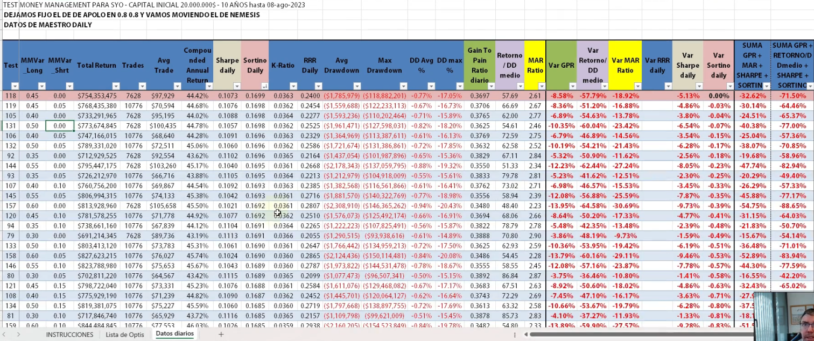
  <figcaption>Figura 0. Excel de Money Management mostrado en la teoría.</figcaption>
</figure>

Lo que comentas en el punto 7 está directamente relacionado con el tema del Excel y con la creación del *portfolio*. Cuando hablamos de la correlación entre sistemas —ya sea en retorno diario, semanal o mensual—, lo importante es entender que se puede medir de distintas formas según la escala temporal del estudio.

Normalmente, trabajar en mensual está perfectamente bien. De hecho, creo que la tabla que mencionas la mostré en base a datos diarios de unos diez años, pertenecientes al *Maestro daily*, pero eso fue solo un ejemplo. Si los datos están en mensual, también es completamente válido. No hay problema en hacerlo así.

No penséis que siempre tiene que ser en diario; a veces, incluso, trabajar en diario puede tener alguna desventaja, especialmente en estudios muy largos o con muchos sistemas, porque introduce más ruido.

En general, para este tipo de análisis de largo plazo, con múltiples sistemas y series de datos extensas, yo recomendaría trabajar en mensual. Es una escala suficiente como referencia para evaluar correlaciones, retornos y *drawdowns*, y resulta más estable y representativa a la hora de analizar la mezcla de sistemas dentro de un *portfolio*.


**Contexto del paper, escáner y limitaciones de herramientas**

***10. Contexto: En el paper "Opening Range Breakout ORB a profitable day trading strategy 5 minutes" se analiza una estrategia ORB en los primeros 5 minutos del mercado de acciones americanas, concluyendo un pobre retorno en su versión básica y mejorando más que notablemente cuando incorpora el concepto "Stocks in play". Este concepto juega con la métrica del volumen relativo (volumen de la barra de 5 minutos dividido por la media de volumen de 14 días anteriores) siendo esta usada para rankear las acciones. He intentado usar un scanner con un criterio cualquiera (acciones con un ROC(1) > 4%) con 3000 acciones con la herramienta SCAN de TS, y el tiempo de respuesta ha sido tan alto que lo convierte en invalidante (hipotéticamente hablando, el resultado debería estar listo a los pocos segundos de finalizar la vela de 5 minutos) para poder tomar una decisión de selección de las X mejores.***

Bueno, la verdad que el escáner nosotros últimamente lo usamos poco. Es posible que tengas razón. O sea, *TradeStation*, ya os lo vengo comentando, yo confío —y es solo confianza— que no tarden en lanzar alguna nueva versión que la convierta en más capaz. Porque tiene el problema de ser de base de 32 bits, y son algunas cosas como esta donde se nota.

De todas maneras, sí que te diré: nosotros tenemos este, por ejemplo, que escaneamos los volúmenes relativos automáticamente y demás. La única cosa que te puedo decir respecto a esto, entiendo que te refieres a escáner en órgano de *skin*, es que cuando tú tienes que usar un criterio que si *EasyLanguage*, tarda mucho más.

<figure>
  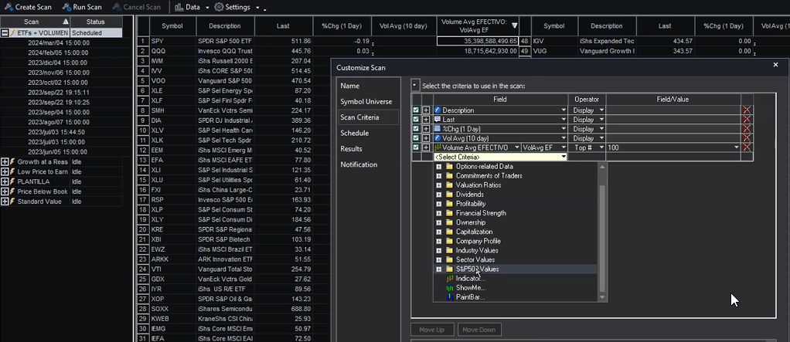
  <figcaption>Figura 1. Escáner de volumen relativo en TradeStation.</figcaption>
</figure>

Si puedes usar los que tiene precreados él, vas a conseguir mucha más velocidad. Eso sí te lo digo. Por lo demás, no te puedo decir. También depende de lo que filtres, cuántos enseñas. Al final, hay algunos que solo son *display*, *display*, *display*. Aquí ves: es elegir *top 100*.

<figure>
  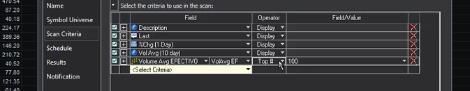
  <figcaption>Figura 2. Configuración del escáner con filtro Top 100.</figcaption>
</figure>

Cuando pones *top 100*, o mayor que un criterio, lo que sea... No sé si estarás a lo mejor siendo muy, muy exigente. Pero claro, si te he entendido bien, tú me estás diciendo que estás filtrando 3.000 acciones en 5 minutos. No sé cuánto cargas de datos ahí, pero claro, la vela de 5, pues seguramente es complicado. No sé si es viable o no si viable es segura. Seguramente, este tipo de cosas no es *TradeStation* la mejor herramienta hoy en día. Porque antes iba muy bien, pero lo que digo es que hay... Esto, mira: escáner, *Portfolio Maestro*, *Walk Forward Optimizer*, son herramientas que siempre han estado muy bien pero están igual hace como 10 años. Que ahora igual, pero igual igual.

Entonces, claro, vosotros si cogéis ahora un móvil de hace 10 años, va a pedales. Literal, literal, va a pedales. Entonces, pues ya está, ya se ha dicho todo. Entonces, realmente son herramientas que están bien, pero que cosas que no... Que están muy bien porque están muy bien, realmente el concepto, pues meter datos fundamentales... pero o sea, necesita mejorar en procesamiento de datos, necesita mejorar en capacidad de recibimiento. Y *Maestro* quizás la peor, porque si es... si *Maestro* igual lleva 15 igual. Entonces, ese es un poco el problema.


**Consejos de uso del escáner y observaciones sobre TradeStation**

Entonces, si ya lo has probado, lo único que te digo es eso: que trates de no usar *EasyLanguage* y que trates de usar las consultas suyas, porque verás que lo hace como en varias fases y verás que la que tarda es la fase de *EasyLanguage*.

Bueno, esto que comentas me sorprende que me lo preguntes porque lo he dicho varias veces, lo de las sensaciones en la pobreza de rendimiento de la herramienta de escáner de *TradeStation*. No es en la herramienta de escáneres, es en varias cosas. Lo que te digo es que, por ejemplo, a nivel gráfico, a nivel de la operativa para el que opera con el *Matrix*, está súper bien visual. A nivel de opciones, me dicen... yo no, pero me dicen que está muy bien, mejoró muchísimo. Y a nivel del *EasyLanguage*, optimizar y demás, también ahí mejoraron bastante porque fue así que usa todos los procesadores. Pero también puede mejorar.

Pero sí, o sea, yo tengo la sensación de que *TradeStation* no sé el motivo, pero se está como quedando atrás. Porque ya digo, hace muchos años es así. Los años. Haría falta una versión 11, supongo que ya sea de 64 bit, y que mejore un poco algunas de las herramientas que tiene.


**Comentarios en vivo: pruebas con Donchian, Maestro y optimización genética**

***11. En el chart no me permite hacerla genética y me la pasa directamente a exhaustive. En el caso del portfolio me responde algo similar. No sé si estoy haciendo algo de manera incorrecta o puede haber otro motivo.***

Bueno, y hasta luego añadí ahí para el tema de *Maestro* y demás. Y ahora, mientras escribíamos, Raúl estaba escribiendo. Ahora estaba escribiendo y decía que ha estado haciendo unas pruebas para optimizar el *Donchian* y ha tenido problemas. Bueno, el *Maestro* no... bien, bienvenido al club.

Tanto evitando estrategias en un *chart*, en un solo activo, con *Portfolio Maestro*, entonces ya no... tanto, eso ya si... bueno, esto no es un problema para un... Esto es que no tiene sentido hacer la genética. Esto no es un problema. Este aviso que te sale quiere decir que tú has querido hacer genética en una optimización que, haciendo la exhaustiva, tienen menos generaciones. Entonces te dice: "no tiene sentido hacer la genética porque el número que has elegido genético es mayor que la exhaustiva", así que te dice: "te la cambio a exhaustiva". Y es correcto, esto no es un fallo. Esto simplemente es que te la cambia a exhaustiva y es correcto.

Si tú quieres hacer genético, por lo que hemos hablado, que quizá por ahí la cosa de que el genético te permite esa búsqueda... que a mí por eso me gusta más el genético que otros ratios, que otros algoritmos: enjambre y esos nombres que alguna vez, que no me acuerdo... pero genético para mí es muy bueno para nuestro tipo de problema. No para encontrar soluciones a nuestro problema; yo creo que el genético es muy bueno.

Entonces, si quieres eso, pues tienes que abrir más, tienes que abrir más. No te queda otra: tienes que granular más el incremento, tienes que hacer que la población sea más grande, para que todo esto diga: "vale, ya la puedes hacer genética".


## Refactory: `Strategy ORB`

<div style="border-left: 4px solid #2196f3; background: #e3f2fd; padding: 10px 15px; margin: 10px 0; border-radius: 8px;">
  <strong>📚 Serie ORB - Toby Crabel (Stocks & Commodities)</strong><br><br>
  <table>
    <tr>
      <td>📄 <a href="../doc/ORB%2001.pdf">ORB 01</a></td>
      <td>📄 <a href="../doc/ORB%2002.pdf">ORB 02</a></td>
      <td>📄 <a href="../doc/ORB%2003.pdf">ORB 03</a></td>
      <td>📄 <a href="../doc/ORB%2004.pdf">ORB 04</a></td>
    </tr>
    <tr>
      <td>📄 <a href="../doc/ORB%2005.pdf">ORB 05</a></td>
      <td>📄 <a href="../doc/ORB%2006.pdf">ORB 06</a></td>
      <td>📄 <a href="../doc/ORB%2007.pdf">ORB 07</a></td>
      <td>📄 <a href="../doc/ORB%2008.pdf">ORB 08</a></td>
    </tr>
  </table>
</div>

Material:

- pdf : [OPEN RANGE BREAKOUT 2](../docs/CursoORB-02.pdf)
- code : [PRACTICA_07.ELD](../code/PRACTICA%2007.ELD)
  - code : [Curso-ORB Rupertacho — Strategy](../code/CURSO-ORB%20RUPERTACHO.ELD)
  - code : [Curso-ORB-02 — Strategy](../code/CURSO_ORB_02.ELD)
  - function : [NarrowRange — Function](../code/NARROW_RANGE.ELD)


<figure>
  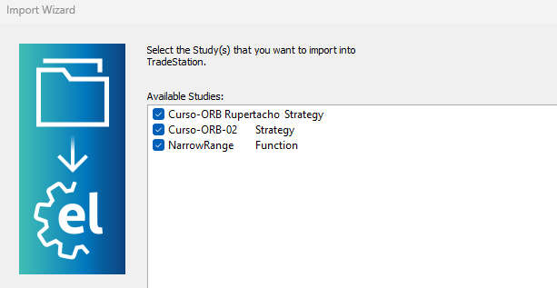
  <figcaption>Figura 084.</figcaption>
</figure>


Este es otro sistema que hemos visto en Discord de Rupertacho.  
Este es el código; lo tenéis también en el PDF [Curso-ORB Rupertacho — Strategy](../code/CURSO-ORB%20RUPERTACHO.ELD)


<div style="border-left: 4px solid #2196f3; background: #e3f2fd; padding: 10px 15px; margin: 10px 0; border-radius: 8px;">

**Sistema ORB Challenge 2019 by Rupertacho**

```sh
# Sistema Base para el reto ORBChallenge 2019 by Rupertacho
# Sobre el MiniSP500 @ES.D (velas de 15 minutos)
# https://www.youtube.com/watch?v=nWoqdDlqzl0

vars: HHH(0), LLL(0), RefPrice(0);

if time=1030 Then
Begin
# en chicago CME abre a las 0830, en NY a las 0930
# Maxlist(open, close) devuelve el mayor valor entre la apertura y el cierre de cada vela.
# Highest(..., 8) busca el máximo de los últimos 8 valores, es decir, el punto más alto 
# alcanzado en las primeras 8 velas (la hora inicial).
    HHH = Highest(Maxlist(open, close), 8); 
# Minlist(open, close) devuelve el menor valor entre apertura y cierre de cada vela.
# Lowest(..., 8) busca el mínimo de los últimos 8 valores, o sea, el punto más bajo 
# en ese mismo rango temporal.
    LLL = Lowest(Minlist(open, close), 8);  
    # HHH = Highest(TypicalPrice, 8);
    # LLL = Lowest(TypicalPrice, 8);
end;

RefPrice = CloseD(14);

if time >= 1030 and marketposition=0 Then
Begin
    if (close > RefPrice) then 
        Buy Next Bar at HHH stop;        # filtro momentum positivo: solo posiciones largas

    if (close < RefPrice) then 
        Sellshort Next Bar at LLL stop;  # filtro momentum negativo: solo posiciones cortas
End;

Setexitonclose;
```

**Definición del rango de apertura (Opening Range):**

`Maxlist(open, close)` devuelve el mayor valor entre la apertura y el cierre de cada vela. Esto es una manera de tratar de adelantar la entrada. Es decir, tiene suficiente capacidad predictiva ver los máximos entre el *open* y el *close*. Si la respuesta es sí, normalmente vas a entrar antes que con el `Highest`. Es más seguro, pero es verdad que es más lento.

Entonces, cuando estamos hablando del S&P, que no estamos hablando del activo más tendencial del mundo a nivel intradía, pues avanzarse es... Nosotros esto solemos hacerlo con el `TypicalPrice`, solemos hacerlo con el *Typical Price* en vez de usar esto, pero busca un poco lo mismo. Entonces, ahora luego lo probaremos.

</div>

Vamos a repasar el sistema que analizamos haoy para que lo entendáis.   
Lo tenéis también en el pdf:  

### [Curso-ORB-02 : Strategy](../code/CURSO_ORB_02.ELD)

```c
{
ORB con filtro de tendencia en diario, filtro NR y
ventana temporal de entrada y salida
chart en 10 minutos, 2 data, usar hora exchange
data2 en daily para calcular el narrow range
}

inputs:
	HoraInicio (0930),
	HoraFin (1530),
	BarrasRango (6), //barras del canal a romper para abrir posición
	PrecioAlto (High),
	PrecioBajo (Low),
	FiltroEntrada (0), //en tanto por ciento, 0 no actúa
	FiltroTendencia (0), //Media de cierres diarios, si es 0 no actúa
	Filtro_NR (0), //numero de barras diarias del Range, si es 0 no actúa
	TradesDia (1),
	Prc_Trail (0), //en tanto por 100, 0 no actúa

	//Gestión Monetaria
	Start_Equity (100000),
	MMVar_Start (100),
	MMVar_Profits (100),
	Min_Size (1),
	Max_Size (100000),
	RoundTo (1);

vars:
	Trailing_Long (0),
	Trailing_Shrt (0),
	RangoAlto(0),
	RangoBajo(0),
	TradesInicioDia (0),
	ContadorTrades (0),
	
	Contratos (0),
	Profits (0);

{ Money Management }
Profits = NetProfit + OpenPositionProfit;

If AbsValue(Close * BigPointValue) > 0 Then
	Value1 = AbsValue(Close * BigPointValue)
Else
	Value1 = 0.01;
	
Contratos = ((Start_Equity * MMVar_Start * 0.01) + (Profits * MMVar_Profits * 0.01)) / Value1;
Contratos = IntPortion(Contratos / RoundTo) * RoundTo;
Contratos = MaxList(Contratos, Min_Size);
Contratos = MinList(Contratos, Max_Size);

if date <> date[1] then # iniciamos día
	TradesInicioDia = Totaltrades; 

ContadorTrades = TotalTrades - TradesInicioDia; //contador de trades cerrados

If Time = HoraInicio then //calculamos el rango y los filtros
Begin
	RangoAlto = Highest(PrecioAlto, BarrasRango) * (1 + (FiltroEntrada / 100));
	RangoBajo = Lowest(PrecioBajo, BarrasRango) * (1 - (FiltroEntrada / 100));
	
	If FiltroTendencia > 0 Then
	Begin
		Condition1 = Close of Data2 > Average (Close of Data2, FiltroTendencia);
		Condition2 = Close of Data2 < Average (Close of Data2, FiltroTendencia);
	end Else
	begin
		Condition1 = True;
		Condition2 = True;
	End;
	
	If Filtro_NR > 0 Then
	Begin
		If Range of Data2 < Average(Range of Data2, Filtro_NR)[1] Then
			Condition3 = True
		Else
			Condition3 = False;
	End Else
		Condition3 = True;	
End;
		
If Time >= HoraInicio and Time < HoraFin and MarketPosition = 0 Then
Begin	
	If ContadorTrades < TradesDia then
	Begin
		If Condition1 and Condition3 then
			Buy Contratos contracts next bar at RangoAlto stop;
		
		If Condition2 and Condition3 then
			SellShort Contratos contracts next bar at RangoBajo stop;
	End;
End;

If MarketPosition <> 0 Then
Begin
	If Prc_Trail > 0 Then
	Begin
		Trailing_Long = 0;
		Trailing_Shrt = 99999;
			
		If MarketPosition = 1 then
		begin # Para posiciones largas
   			Trailing_Long = maxList(Trailing_Long, High - (High * Prc_Trail / 100));
   			Sell ("Trai_Long") next bar at Trailing_Long stop;
		End;

		If MarketPosition = -1 then
		begin # Para posiciones cortas
   			Trailing_Shrt = minList(Trailing_Shrt, Low + (Low * Prc_Trail / 100));
   			BuytoCover ("Trai_Shrt") next bar at Trailing_Shrt stop;
		End;
	End;
	
	If Time >= HoraFin then
	begin
		Sell ("Hora_Long") next bar at market;
		BuyToCover ("Hora_Shrt") next bar at market;
	End;
End;	

SetExitOnClose;
```


**Resultados iniciales y carencias a mejorar**
 
El PDF os lo pongo ahí porque así lo podéis vosotros también abrir e ir viendo, pero lo vamos a ir viendo en el gráfico.pdf :   
[OPEN RANGE BREAKOUT 2](../docs/CursoORB-02.pdf)

Hay un par de cosas que no hemos implementado porque todavía no lo hemos hecho, y para el siguiente ya metamos, que es lo que hablábamos antes: no hay *stop* de volatilidad aquí. Al final, los TP y estos que hemos hecho son por porcentaje, no son ajustados por *ATR*, y es bastante recomendable hacerlo.

<figure>
  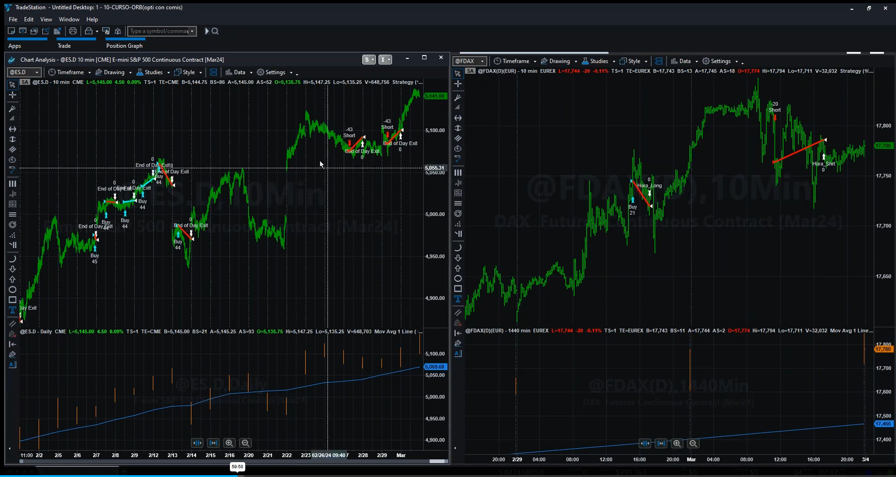
  <figcaption>Figura 085. Configuración de hora de inicio en el sistema ORB.</figcaption>
</figure>

`1.800 *trades*`, nada mal.

<figure>
  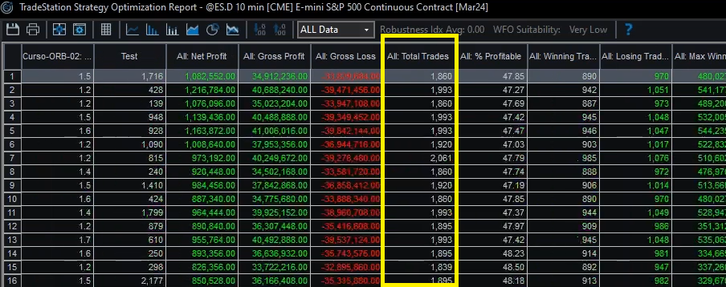
  <figcaption>Figura 4. Resumen de resultados con 1.800 trades.</figcaption>
</figure>

Tenemos `TSI bastante bajos`, los *TSI* bastante bajos. Sí, muy, muy bajo.

<figure>
  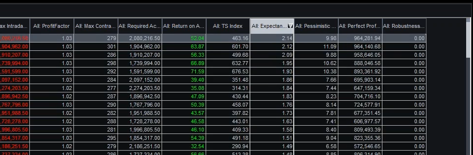
  <figcaption>Figura 5. Métricas TSI mostrando valores bajos.</figcaption>
</figure>

<figure>
  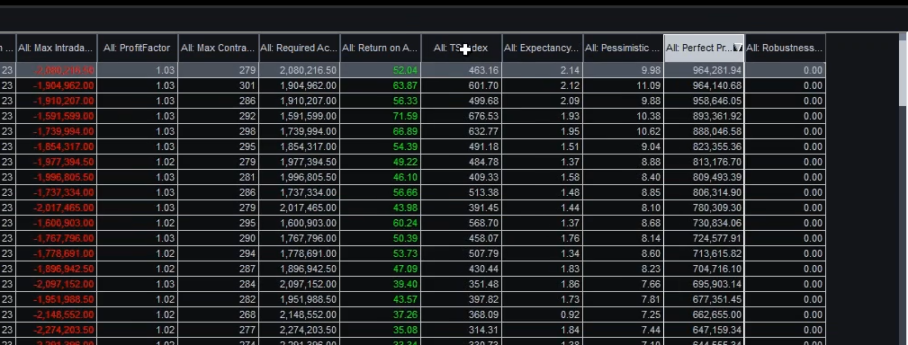
  <figcaption>Figura 8. Detalle de ratios del sistema.</figcaption>
</figure>

<figure>
  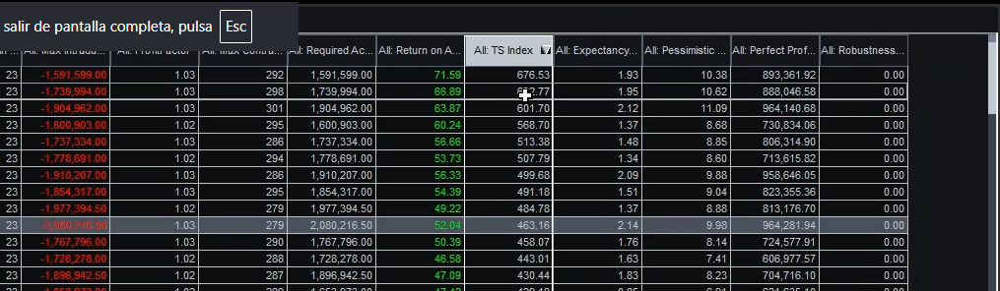
  <figcaption>Figura 7. Curva de equity inicial del sistema ORB.</figcaption>
</figure>

**Parámetros del sistema y referencia a Kaufman**


Bueno, volviendo al documento [OPEN RANGE BREAKOUT 2](../docs/CursoORB-02.pdf), simplemente veis ahí los parámetros que hemos incorporado, las cosas típicas:

- ***Ventana temporal***: en el que vimos del libro de Kaufman, que es uno de los más clásicos, basado en el rango de la primera hora. Basado en el rango de la primera hora. A partir de ahí tú puedes montarlo variando, poniendo una hora de inicio y un número de barras que en esa hora evalúe. Y eso es lo que hemos hecho aquí: tú pones una hora, pones las 10, y entonces a partir de ahí puedes trabajarlo poniendo una hora de inicio y un número de barras que en esa hora evalúe. Y eso es lo que hemos hecho aquí. 

	Yo aquí lo he cargado en el S&P 500 en horario regular y en 10 minutos, y es pobrísimo.

<figure>
  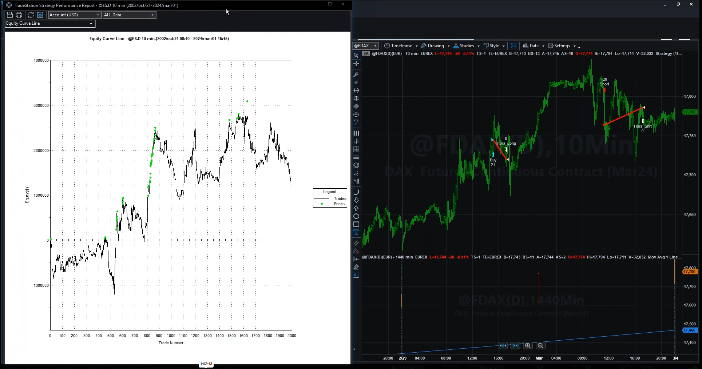
  <figcaption>Figura 10. Configuración del sistema en S&P 500, 10 minutos.</figcaption>
</figure>

<figure>
  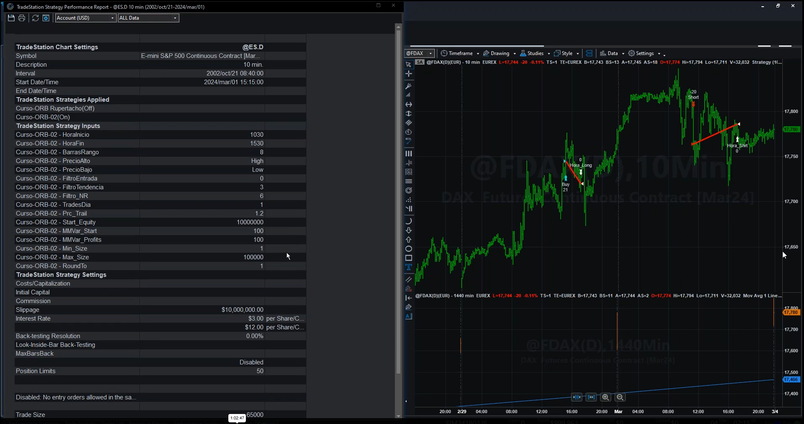
  <figcaption>Figura 11. Resultados iniciales mostrando rendimiento pobre.</figcaption>
</figure>

<figure>
  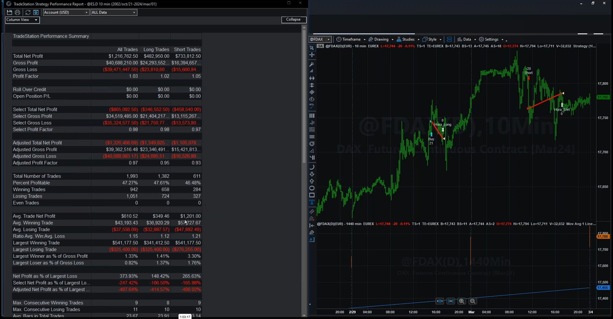
  <figcaption>Figura 12. Curva de equity del sistema sin optimizar.</figcaption>
</figure>

El sistema es realmente pobrísimo. No digo... tal como está puesto así, es pobrísimo, es realmente súper pobre:

- Con *high*, con *low*, sin filtro de entrada.
- Tres días de filtro de tendencia. Y curioso, bueno, y le metemos...
- 15 dólares de penalización, 15 dólares. Le metemos 15 dólares cuando tiene un *average trade* de 600.

El problema de los intradía siempre es eso. Pero tiene capacidad de mejora: esto se puede conseguir unos *ORBs* con una curva bastante más estable.


```sh
inputs:
	HoraInicio (0930), # ventana horaria
	HoraFin (1530), # ventana horaria
    BarrasRango (6) # cuento seis barras en esa hora calcula el rango previo que yo le diga
```

Esto es el S&P en horario regular, que abre a las 8:30, en velas de 10 minutos. Si le digo a las 10 AM:

<figure>
  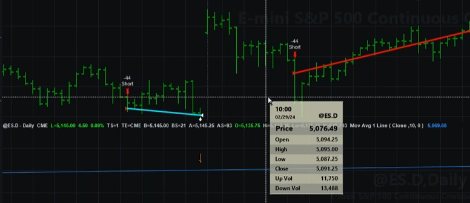
  <figcaption>Figura 14. Configuración de hora de inicio en el sistema ORB.</figcaption>
</figure>

Pues cuento las velas hacia atrás: tengo 1, 2, 3, 4, 5, 6, 7, 8 y 9. A las 10 tengo nueve. Quiero hacer así, pues algo así.

<figure>
  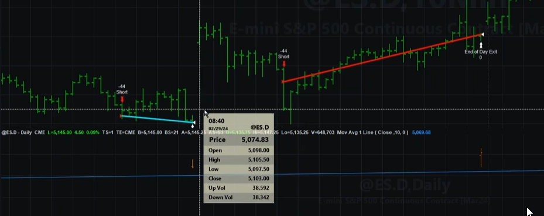
  <figcaption>Figura 15. Conteo de barras hacia atrás para definir el rango.</figcaption>
</figure>


Si no, pues puedo definir el rango como quiera. Lógicamente, puedo hacerlo también por optimización, pero es verdad que ahí tendríamos que hacer algún ajuste, porque optimizar los parámetros de velas al no estar en algebraico es un poco más complicado. Se puede, pero hay que hacer una conversión en el código que no hemos hecho, pero sé que se podría.

Aquí creo que tenemos 10:30.

<figure>
  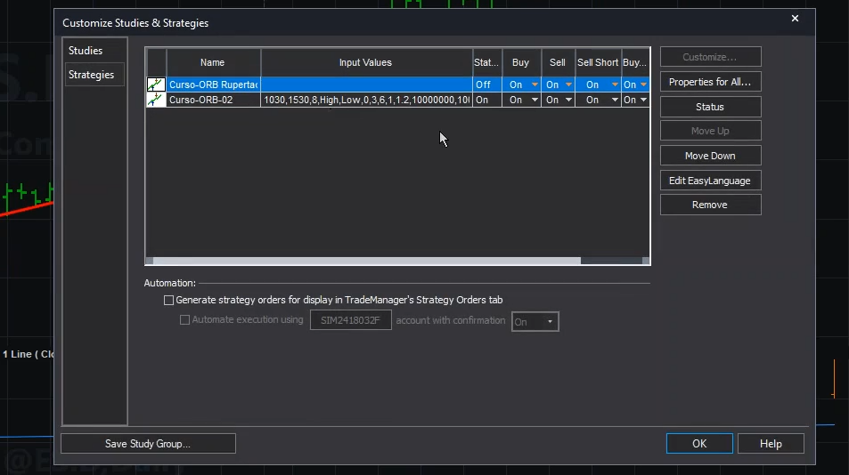
  <figcaption>Figura 086</figcaption>
</figure>

A partir de las 10:30 puede operar, define el rango, y ahí puede operar. Lo hemos hecho totalmente flexible en el sentido de que podéis hasta definir el precio que usa para calcular la banda alta y la banda baja:

```
PrecioAlto (High),
PrecioBajo (Low),
```

Lo que decía: ahora tú aquí puedes poner *Typical Price*, puedes poner *Typical Price*, o puedes poner `HHH = Highest(Maxlist(open, close), 8); ` como en el code de *Artacho* O sea, tú en los *inputs* de *TradeStation* puedes poner cualquier palabra reservada o función que como resultado dé un número que es un precio. Al final, bueno, que dé un número. Él lo va a usar: un número que en el código no dé un error. Cualquier cosa que dé un número pues no va a dar error. Al final está (por ejemplo `Highest(Maxlist(open, close), 8)`).

<figure>
  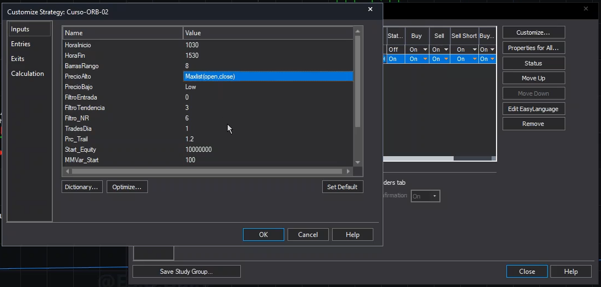
  <figcaption>Figura 087</figcaption>
</figure>

<figure>
  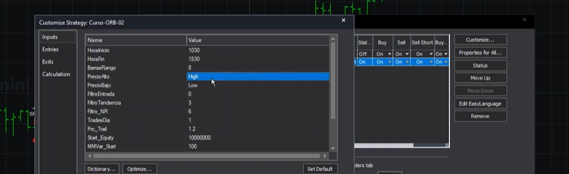
  <figcaption>Figura 16. Ejemplo de función personalizada para definir el precio de referencia.</figcaption>
</figure>


**Control del rango de entrada y hora de fin; utilidad en DAX**

Hemos puesto una hora de fin por lo que os decía: en el DAX, es decir, bueno, pues yo también quiero explorar el controlar el rango de entrada pero también el de salida, y en el DAX es especialmente útil, yo os lo comentaba.

Además, una cosa a explorar muy interesante en el DAX: aquí ahora mismo ese no lo hemos trabajado demasiado, pero lo tengo cargado creo que con sesión regular exactamente. 

<figure>
  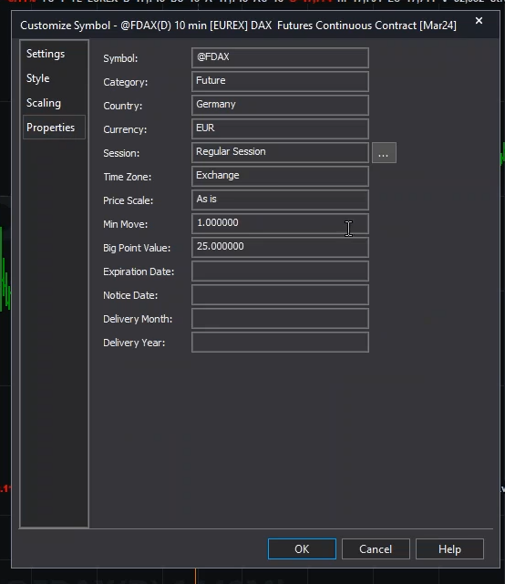
  <figcaption>Figura 088</figcaption>
</figure>

Pero puedes explorar el DAX, puedes probar por ejemplo cargarlo desde las 8, cargarlo desde antes. Y tú, a lo mejor, pones operativa a las 10 y le puedes decir que calcule de 30 barras antes. Es decir, que el rango use todo el previo, ¿entiendes? Es un ejercicio que os animo a probar. El código es el mismo, pero tú puedes cargar la sesión que quieras y le metes regular.

Son sistemas que les gusta anticiparse a poner a las 9.

<figure>
  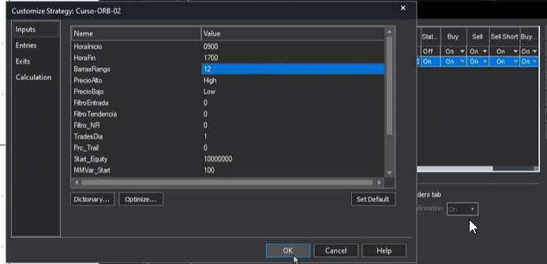
  <figcaption>Figura 17. Configuración de sesión anticipada para el DAX.</figcaption>
</figure>

Como cada hora son 6 barras de 10 minutos, ponemos las dos horas previas de 7 a 9, que define el rango (*BarrasRango*). Que estés en filtros de momento es para evaluarlo. Aquí es lo que os decía, por ir repasando conceptos.

<figure>
  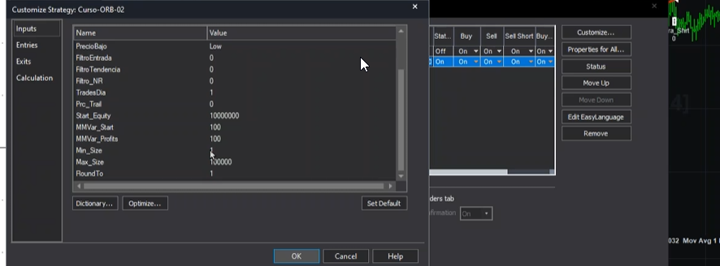
  <figcaption>Figura 18. Parámetros de rango con 12 barras (dos horas previas).</figcaption>
</figure>

Tú puedes definir la idea así. Cuando yo os digo incluso aún ***podíamos haberle metido algún filtro más***, no quiere decir que los uses todos. Faltaría el de volumen, por ejemplo. No quiere decir que los uses todos, pero sí los puedes usar para investigar. Pero hacerlo por separado, lo que os decía. Es decir, tú ahora pruebas el sistema, buscas tu entrada, lo trabajas, trabajas la entrada con distintas pruebas, haces alguna optimización de la entrada, solo la entrada, y vas haciendo así *input* por *input*.

Fíjate que si le damos la vuelta, ya lo tenemos:

<figure>
  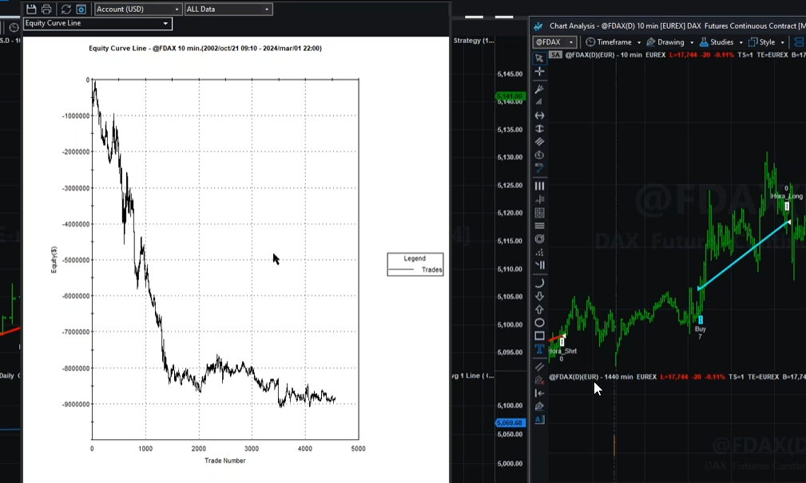
  <figcaption>Figura 19. Sistema configurado en dirección inversa.</figcaption>
</figure>

Se va a tomar viento la forma. Espera, pero la salida lo tengo cargado todo. Pero le voy a poner salida también a las 8:40, a las 8 y media, para que pierda un poco más.

<figure>
  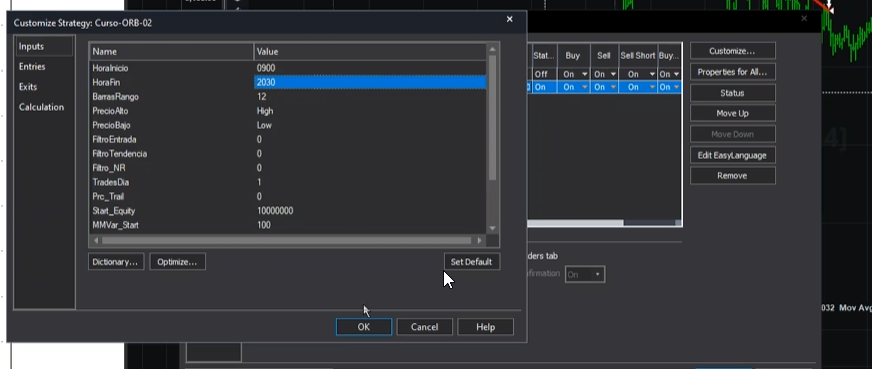
  <figcaption>Figura 20. Ajuste de hora de salida anticipada.</figcaption>
</figure>

<figure>
  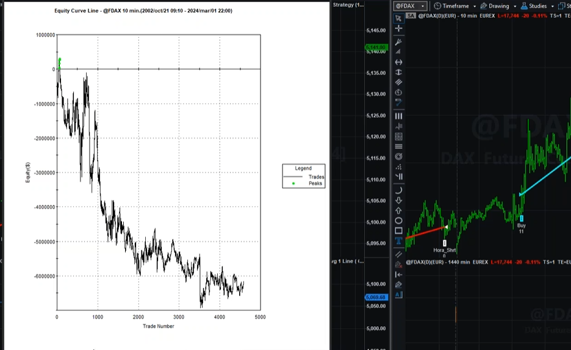
  <figcaption>Figura 21. Resultados con salida anticipada.</figcaption>
</figure>

Entonces, esto es la idea. Lo bueno, que es lo que os digo, lo bueno es que en los sistemas intradía tienes muchísimo margen de maniobra. Y aquí hay cargado mucho histórico expresamente, todo el que me deja tener *TradeStation*, que es desde 2002.

El `data2` es para el filtro de tendencia, 

<figure>
  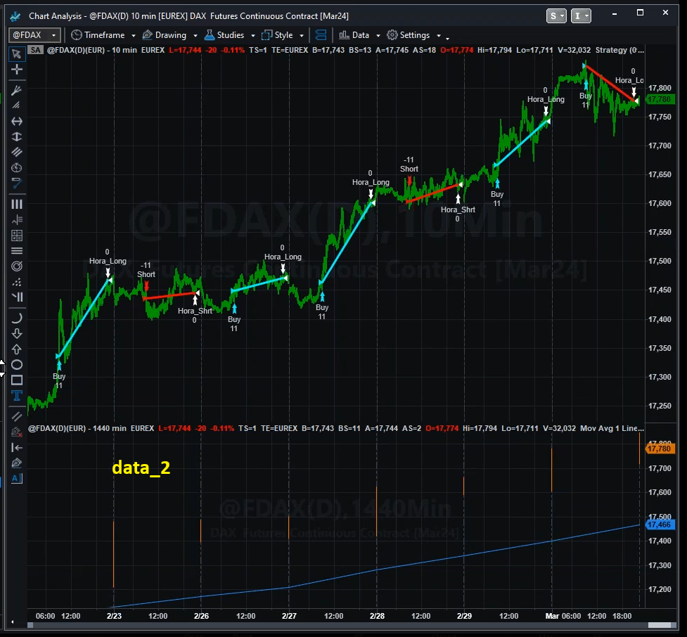
  <figcaption>Figura 089</figcaption>
</figure>

porque le puedes permitir que vaya, pero no se ha activado. Ahora está en bruto: a comprar a una hora y vender a la otra. No tiene nada, no puede ni salir por otro método. Es decir, que realmente ahora sí tendría bastante mérito en tantos años, porque claro, no tiene manera de salirse si se equivoca. No tiene manera de salirse si se equivoca: se lo traga.

Nada más que lo hubieras metido un *stop* aquí, pues no sé... Esto mismo le metes, creo, si solo hemos implementado el *trailing*, pero 5%. Lo normal es que tenga alguna mejora.

<figure>
  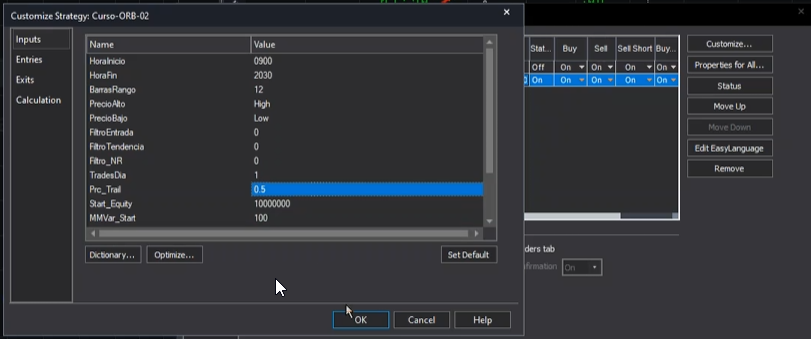
  <figcaption>Figura 22. Configuración del trailing stop al 5%.</figcaption>
</figure>

<figure>
  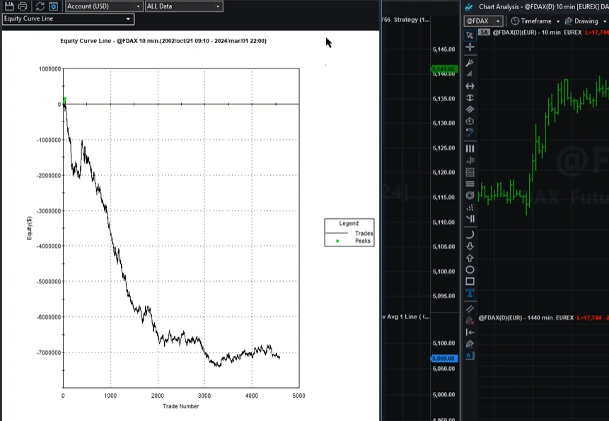
  <figcaption>Figura 23. Resultados con trailing stop activado.</figcaption>
</figure>

Aún va peor. Yo sugeriría aquí explorar el *stop* fijo, que de hecho lo tenía montado y lo saqué al final. Pero bueno, ya digo, al final no deja de ser un ejemplo para explicaros conceptualmente la idea.

De todas maneras, de este sistema ya os comenté que este sí que tengo la firme intención de entregaros uno que esté acabado. Pero me gusta que intentéis vosotros trabajarlo. La práctica no solo consiste... eso sí que era la teoría, donde yo soltaba el rollo. Aquí la idea es que vosotros lo tratéis de trabajar, bien en *TradeStation* o en otra plataforma igual. Por eso os paso el código, por eso os paso el pseudocódigo y os paso el código delante. Está explicado antes, el código está explicado, el código de cómo funciona, ese es el pseudocódigo. Yo os lo dije: os pasaríamos el pseudocódigo. Entonces os paso lo que hay; a partir de ahí yo también durante la clase comento distintas cosas, os explico lo que hace esta versión y os sugiero también otras cosas a probar. Y es lo que vamos a ver ahora.

La entrada es tan sencilla como esa, pero tiene cuatro filtros que se pueden activar o no activar. Nosotros casi siempre los filtros los diseñamos así, es decir, que el código ya permita activarlos o no. Un truco muy sencillo, ya lo visteis en el otro sistema, era esto: que con un valor de cero, simplemente con una simple condición de `if FiltroTendencia > 0`, entonces actúa. Si es que no, pues no actúa. Entonces ya le pasas que la condición quede en *true* para que si no interfiera el filtro. Entonces es un pequeño truco que puede servir para evaluar un filtro.


### Filtros

```sh
FiltroEntrada (0),      # en tanto por ciento, 0 no actúa
FiltroTendencia (0),    # Media de cierres diarios, si es 0 no actúa
Filtro_NR (0),          # número de barras diarias del Range, si es 0 no actúa
TradesDia (1),
Prc_Trail (0),          # en tanto por 100, 0 no actúa
```

Entonces, ¿cuáles son los cuatro filtros? Bueno, *filtro de entrada*: es decir, un tanto por ciento sobre el canal. Simplemente hemos añadido esa posibilidad. La verdad que lo normal es que se quede en cero, yo os lo digo también, pero ahí está, para si queréis darle un rango. Está en porcentaje: un rango al precio.

Luego hay un *filtro de tendencia*, que simplemente calcula la tendencia en el gráfico diario para permitirle ir solo largo o solo corto dependiendo de la tendencia. Es decir, dependiendo de si el cierre del *data2* es mayor que la media de *n* cierres del *data2*. En el gráfico se ve muy claro: es esta media móvil de aquí abajo.

<figure>
  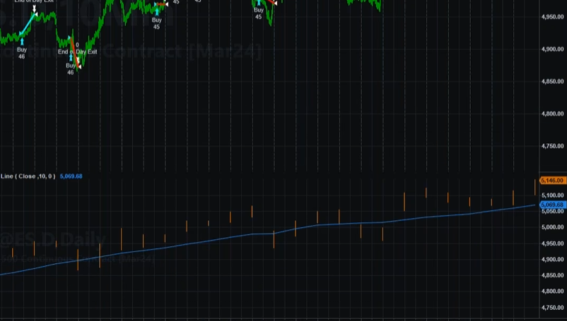
  <figcaption>Figura 24. Media móvil en el gráfico diario (data2) para filtro de tendencia.</figcaption>
</figure>

Se puede implementar de otra manera, y hay distintas opciones. En el ejemplo que pasó ser el de Roberto, creo que lo que tiene es un *momentum*: es ***un cierre menor que cierre anterior***, que eso es un *momentum*. Eso es exactamente lo que hace el indicador *Momentum*: comparar el cierre de un día con el cierre de *n* barras. *Momentum* de 14 pues es el cierre de hoy, o de la barra actual en el *time frame* que sea, con el cierre de 14. Entonces puede estar bien hacer de *momentum*, que es un poco... no es lo mismo, pero es un concepto totalmente análogo. O lo puedes hacer con una media; nosotros lo hemos implementado con la media móvil.

Entonces simplemente es eso: tú le dices, si activas el filtro, para que en este día, por ejemplo, para que pueda comprar, el día anterior tiene que haber cerrado por encima de la media.

<figure>
  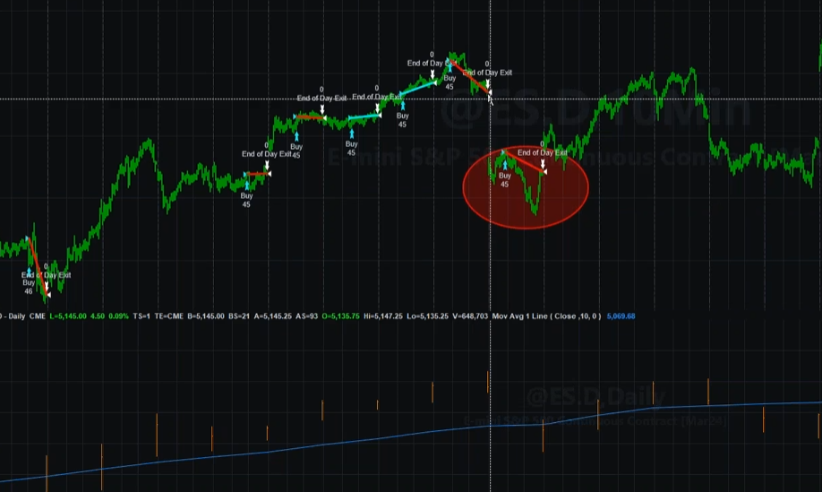
  <figcaption>Figura 25. Ejemplo de condición para entrada larga: cierre por encima de la media.</figcaption>
</figure>

Vamos a suponer que le activo. No sé cuánto tiene activo ahora; tiene activo en tres (*FiltroTendencia*). Para que sea un poco más visual, se lo voy a poner en 10. Igual lo pongo en 10.

<figure>
  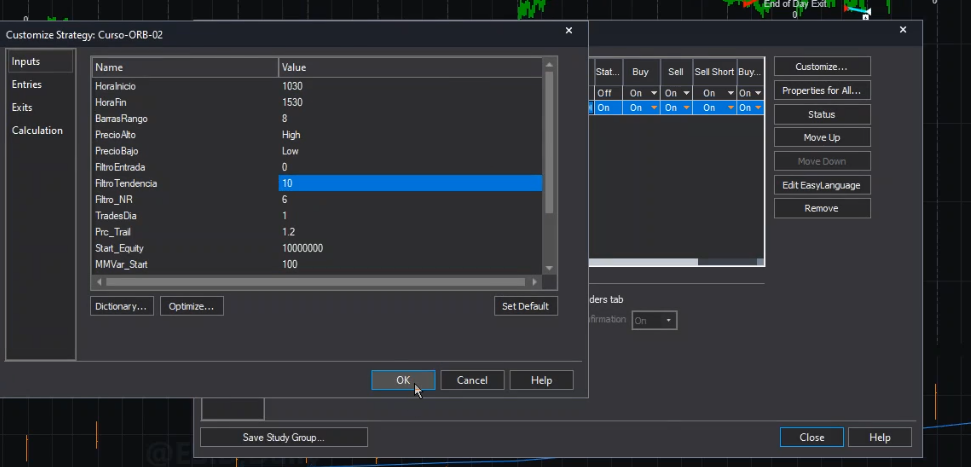
  <figcaption>Figura 90. Filtro de tendencia configurado en 10.</figcaption>
</figure>

<figure>
  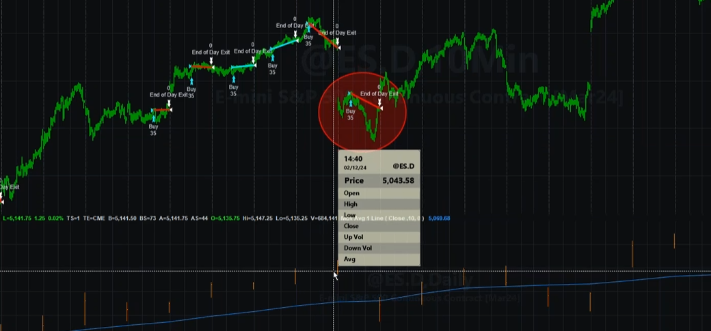
  <figcaption>Figura 27. Filtro de tendencia configurado en 10 para mejor visualización.</figcaption>
</figure>

Para ir largo en esta vela en data_2, es decir, la del día anterior. Tiene que estar por encima de la media. Eso es lo que hace ese filtro. De tal forma que aquí, en esta, solo puede ir corto, no puede ir largo al día siguiente. Por eso al final no compra.

<figure>
  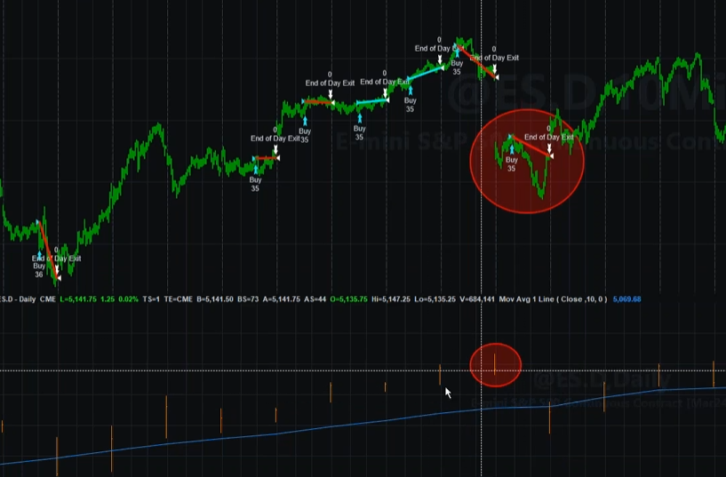
  <figcaption>Figura 28. Vela del día anterior que debe estar por encima de la media para permitir largos.</figcaption>
</figure>


Se puede activar, no se puede activar. Se puede usar una media, se puede usar otra. Es decir, ese es el concepto de decir "yo voy a favor o en contra".

<figure>
  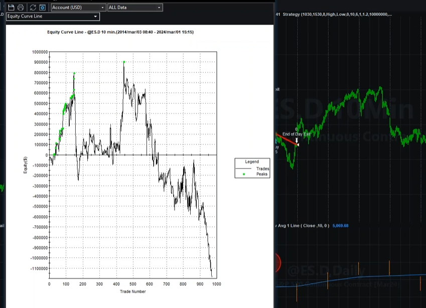
  <figcaption>Figura 29. Resultados con filtro de tendencia de media 10 activado.</figcaption>
</figure>

Como veis, el meterle la media de 10 ha ido mucho peor. Como veis, meterle la media 10 ha ido mucho peor. Pero ese es el filtro de tendencia.

Probarlo también con el *momentum*. Es decir, al final esto, como os digo, es probar. Y lo bueno en los intradía es que se puede probar con cierta tranquilidad. Pero a menos, lo que os decía: en los intradía es más difícil encontrar señal. Creo que sí, es más difícil encontrar señal. La señal es más sucia, y también es más fácil hacerse trampas al solitario. Entonces, si uno al final... Es muy habitual, porque "no pongo comisiones"... Al final, ¿me entiendes? Si yo no pongo comisiones, pues mejoro mucho el resultado. Pero mucho resultado, eso es así.

<figure>
  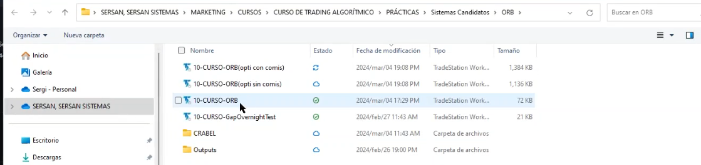
  <figcaption>Figura 092. Resultados con filtro de tendencia de media 10 activado.</figcaption>
</figure>


### Filtro `Narrow Range`

El otro filtro que tenemos, después del filtro de tendencia —que simplemente compara el cierre del día anterior del *data2* con la media de *n* barras del *data2*—, tenemos el filtro de *Narrow Range*. Acordaros que os expliqué y os comenté que una de las pautas que funciona mejor en general en los mercados, y por supuesto en *breakout* no va a ser de otra manera, es el concepto de expansión-contracción.

Hay varias maneras de mirar esto. Esta es una. Hemos querido implementar esta porque os hablé, porque os enseñé, los vimos, los artículos de ***Crabel*** (Toby Crabel, autor de *"Day Trading with Short Term Price Patterns and Opening Range Breakout"*). Es uno de los autores más reconocidos en el tema de los *ORBs*. Y como vi que estaba en esto con *Commodities*, pues ya os adelanto que los tenemos, los hemos traducido y demás. Nos hemos puesto un poco así bonitos, y ahora los voy a ir subiendo ahí. Como son 8, de momento voy a subir, voy a dejar ahí 4. Bueno, espérate, que si no... si no me... cuando acabe esto los otros subo, cuando acabe.


[](../doc/ORB%2001.pdf) [ORB - Stock & Commadities](../doc/ORB%2001.pdf)


Pero bueno, al final, un filtro de *Narrow Range* que es simplemente que el rango de la sesión se va estrechando. El rango de la sesión, el rango viene definido por la diferencia entre el máximo y el mínimo. Ya tenemos una función que se llama *Range*, pero si lo hubieras hecho restando el *high* del *low*, es lo mismo. Es lo mismo: el rango del *data2* que sea menor que la media de los rangos de las *n* barras anteriores. Este es un filtro.

Esto qué te está diciendo: bueno, que el mercado se está contrayendo. También es un filtro que se puede activar en el sistema.

<div style="border-left: 4px solid #4caf50; background: #e8f5e9; padding: 10px 15px; margin: 10px 0; border-radius: 8px;">
  <strong>📊 Filtro Narrow Range</strong><br><br>
  El <em>Narrow Range</em> (NR) identifica días donde el rango (High - Low) es menor que la media de los rangos anteriores, indicando <strong>contracción de volatilidad</strong>. El concepto subyacente es el ciclo <em>contracción → expansión</em>: tras periodos de bajo rango, es más probable una ruptura significativa.
</div>


```
                              NARROW RANGE
                    ═══════════════════════════════════
                         Ciclo Contracción → Expansión


    PRECIO
       ▲
       │
   520 │                                                          ╱
       │                                                        ╱
   510 │    ┌─────┐                                           ╱
       │    │     │  ┌───┐                                  ╱
   500 │    │     │  │   │  ┌──┐                          ●━━━━━━━▶ BREAKOUT
       │    │     │  │   │  │  │  ┌┐                    ╱
   490 │    │     │  │   │  │  │  ││  ▓▓              ╱
       │    │     │  │   │  │  │  ││  ▓▓  ← NR      ╱
   480 │    │     │  │   │  │  │  └┘                
       │    │     │  │   │  └──┘                   
   470 │    │     │  └───┘                        
       │    └─────┘                              
   460 │                                        
       │
       └────────────────────────────────────────────────────────────▶ TIEMPO
             Día 1   Día 2  Día 3  Día 4   NR    EXPANSIÓN
            ├─────────────────────────────┤
                    CONTRACCIÓN


    ╔═══════════════════════════════════════════════════════════════════════╗
    ║                                                                       ║
    ║   RANGOS:    50 pts → 40 pts → 30 pts → 20 pts → 15 pts → 80 pts     ║
    ║              ━━━━━━━━━━━━━━━━━━━━━━━━━━━━━━━━━━━   ════════════       ║
    ║                     compresión progresiva            explosión        ║
    ║                                                                       ║
    ╚═══════════════════════════════════════════════════════════════════════╝


                        ┌─────────────────────────────┐
                        │   CONDICIÓN DEL FILTRO:     │
                        │                             │
                        │   Rango_hoy < Media_rangos  │
                        │      15     <     35        │
                        │                             │
                        │         ✓ ACTIVAR           │
                        └─────────────────────────────┘
```


### Resultados con comisiones y sin comisiones; trampas comunes

Este, `sin comisiones`, pues seguramente ha encontrado mejores resultados. No, habrás encontrado mejores resultados.

<figure>
  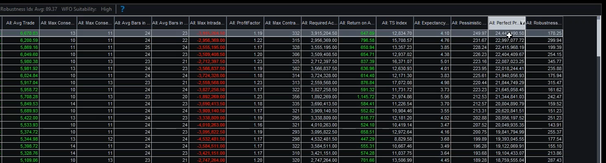
  <figcaption>Figura 30. Resultados sin comisiones.</figcaption>
</figure>

<figure>
  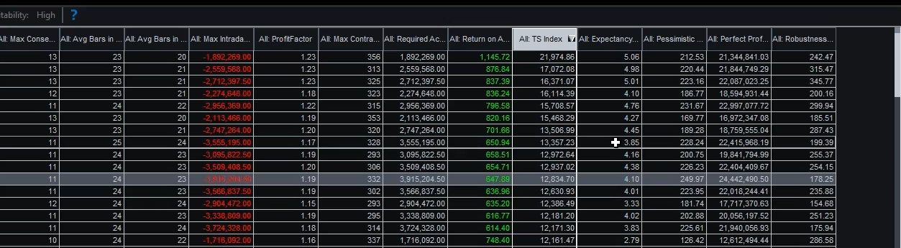
  <figcaption>Figura 31. Curva de equity sin comisiones.</figcaption>
</figure>

<figure>
  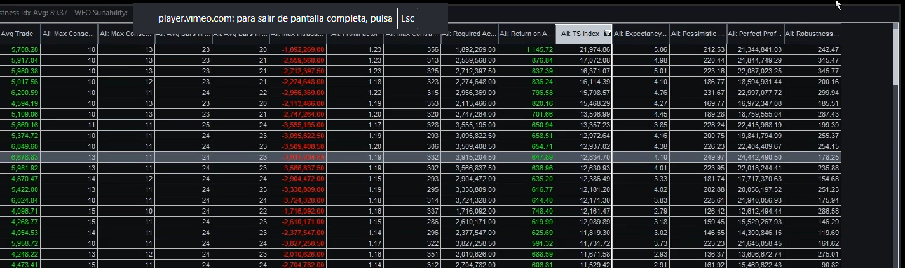
  <figcaption>Figura 34. Métricas del sistema sin comisiones.</figcaption>
</figure>

<figure>
  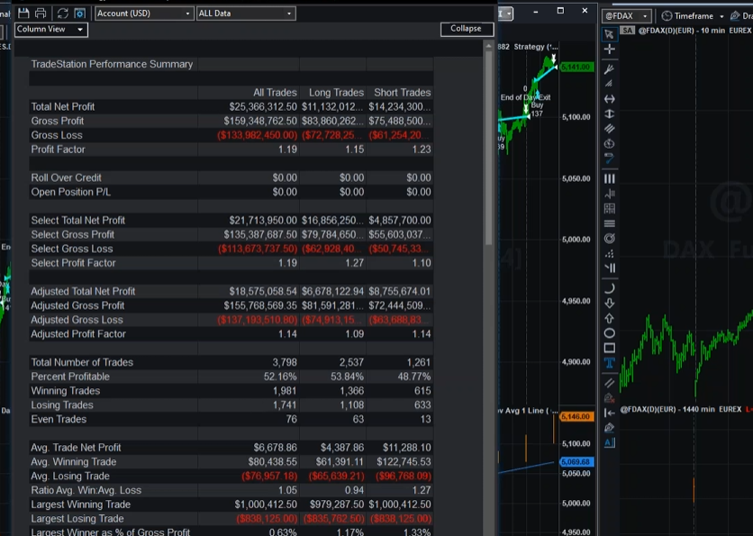
  <figcaption>Figura 33. Detalle de Profit Factor.</figcaption>
</figure>

Bueno, y *Profit Factor* 1.19 sigue estando justito. Pero pues ya mejor. No, tampoco mejor: **es lo que decíamos de las `trampas al solitario`, gente que le gusta hacerlo**. Pero porque sí. Ya, si ya te quito estos primeros 1.000 del gráfico que ha caído... ya ni te cuento. Al final, este sin comisiones. Entonces, ya de una curva más atractiva. Pero esa realidad no es verdad.

<figure>
  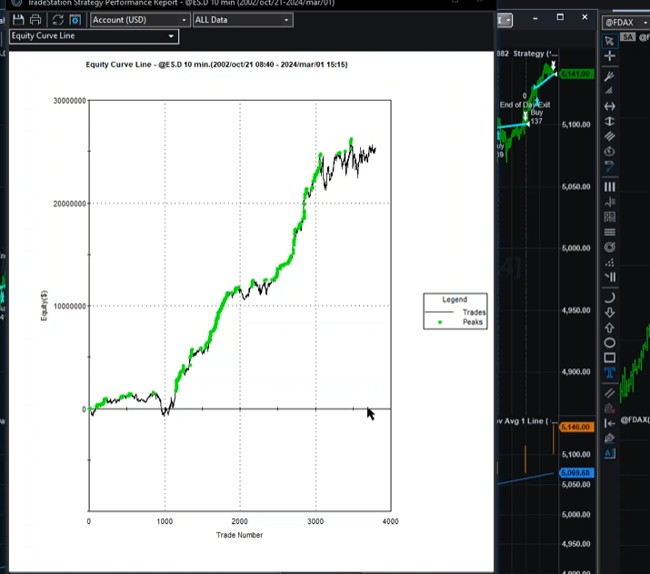
  <figcaption>Figura 32. Curva de equity recortando el periodo inicial desfavorable.</figcaption>
</figure>

***Abro Strategy Performance Report***

Busco uno que esté bien; el segundo se ve mejor. Y doble clic al segundo.

<figure>
  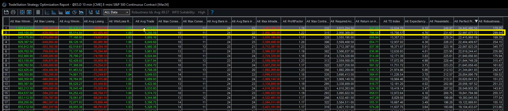
  <figcaption>Figura 093</figcaption>
</figure>

Hago click en el segundo resultado.

<figure>
  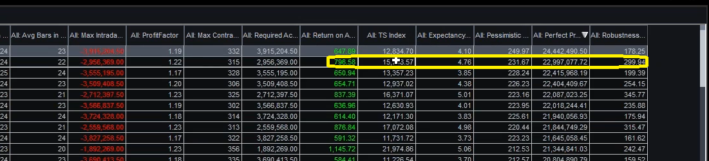
  <figcaption>Figura 35. Selección del segundo resultado en el Performance Report.</figcaption>
</figure>

<figure>
  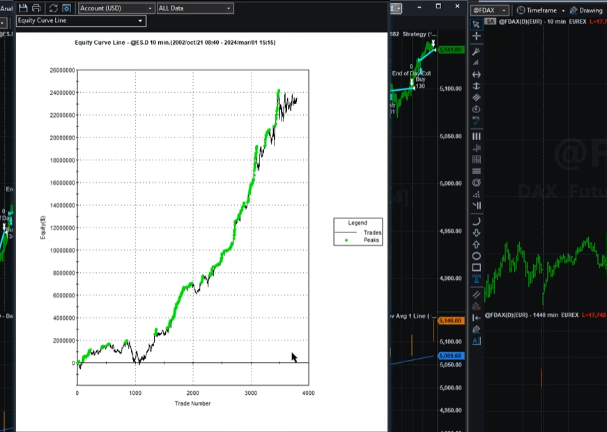
  <figcaption>Figura 36. Curva de equity del resultado seleccionado.</figcaption>
</figure>

La curva, ya verás, maravilla. Alberto, para maravilla no, pero bueno. Le quitamos, le quitamos esta parte. Todavía está más trampa: solo lo que dije, ya lo he hecho muchas veces esto en el curso. No esperéis, porque me niego absolutamente a hacer un curso donde solo enseñe cosas maravillosas. Porque este mismo, verás, te lo cargo desde 2008 y tienes aquí una maravilla. Todos contentos, joder, qué bien, qué fenómeno... No tiene comisiones... Está optimizado a saco... Pero, por lo menos, sirve para hacerse una idea del sistema, pero sin más.

Bueno, este es el filtro de *Narrow Range*. Crabel explicaba varios, y hay varios autores que hay varias maneras de mirarlo. Otro, simplemente, la volatilidad: es decir, que la volatilidad esté bajando. También es una manera sencilla de evaluar eso: que la volatilidad esté bajando, que la volatilidad actual sea más baja que la volatilidad media de *n* días, un poquito. Puede ser otra pauta. Pero, en definitiva, por ahí van los tiros en los *ORBs*. Por ahí van los tiros de mirar este tipo de pautas.

```sh
inputs: Length( numericsimple ) ;

condition1 = True;
for value1=1 to length
Begin
	condition1 = condition1 and range[value1] of Data2 > range of Data2;
	//condition1 = condition1 and ((HighSession(0, value1) - LowSession(0, value1)) > (HighSession(0, 0) - LowSession(0, 0))); //rangos diarios
end; 

Narrowrange = condition1; 
```

Una es volatilidad o volumen. Volumen, vale. Otro, relacionado con ello, contracción-expansión: bien por un *Narrow Range*, bien por un *inside bar*. También por un *inside bar*: es decir, que la vela del día anterior, por ejemplo, su máximo sea menor al máximo anterior y su mínimo sea mayor. ¿Que se entiende eso?

Qué es un *inside bar*, para los que no lo tengáis del todo claro: una *inside bar*, tienes una vela, desde que ha abierto aquí por ejemplo y ha cerrado aquí. Y la del día siguiente, da igual si cierra abajo o arriba, en general, términos generales, igual. Pues esta vela es una *inside bar*, y es un signo claramente de contracción (la vela del día siguiente queda envuelta).

<figure>
  
  <figcaption>Figura 37. Representación gráfica de una inside bar: la vela del día siguiente queda contenida dentro del rango de la anterior.</figcaption>
</figure>

Es una manera de identificar una contracción. Entonces, pues lo mismo que un *doji* o una vela cercana a un *quasi doji*, cosas así. O sea, este tipo de filtros se utilizan bastante en los sistemas de *breakout*, porque se considera que antes que una expansión viene anticipada por una contracción. Entonces, cualquier indicador que mire eso, como os digo, pues lo mismo: volatilidad decreciente, que tú veas un *ATR* que va bajando, que la volatilidad bajando. Pues un mercado así, normalmente, aumenta. Pero normalmente no: lo que haces es aumentar las probabilidades del siguiente. Porque cuando haya una rotura de rango, también, incluso, hay algunos *Volatility Breakouts* que podemos llamar *open* o no, que no solo utilizan el *Open Range*. Que basan el *range* del día anterior, así que pueden mover la ventana. Pueden mover la ventana. Es decir, yo puedo usar este rango.

De hecho, los *Pivot Points*, los *Pivot Points*, que los conocéis, basan un poco en eso. Porque, al final, su cálculo depende del cierre anterior, el máximo, el mínimo anterior. Con eso calcula los *pivots* del día. Entonces, al final, es una referencia, y hay muchas estrategias que utilizan, bien sea para *Volatility Breakouts* o para *Mean Reversion*. Porque ya os lo comenté esta semana: lo puedes explorar como *Mean Reversion*. Fíjate aquí.

Aquí, el rango, justo, compré. Se va para abajo. Ahí tú hubieras vendido.

<figure>
  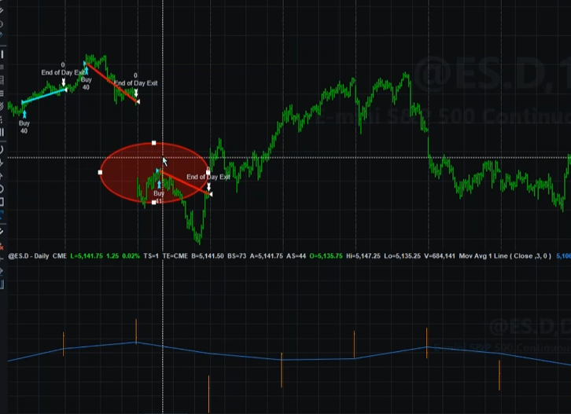
  <figcaption>Figura 39. Ejemplo de entrada fallida que se convierte en oportunidad de mean reversion.</figcaption>
</figure>

¿Lo veis? Que es justamente esto: sale del rango, pero vuelve, y ahí vendes. Es ese ejemplo clarísimo. Aquí sería un corto clarísimo, que, al final, es un fallo. Y buscarlo, puedes buscar eso también con la estrategia, porque buscas la rotura, buscas el fallo. Es decir, cuando sale de un rango y vuelve, él cierra por otra vez por debajo. Ahí entras, porque, nuevamente, provoca movimientos fuertes. Los fallos provocan movimientos fuertes. Ya os lo comenté, que la mayoría de sistemas se pueden explorar en varios lados.


### Exploración de variantes, salidas y optimizaciones

Bien, entonces, siguiendo con la explicación de la estrategia, siguiendo con la explicación de los filtros que hay, este simplemente: el rango.

```
If Filtro_NR > 0 Then
Begin
    If Range of Data2 < Average(Range of Data2, Filtro_NR)[1] Then
        Condition3 = True
    Else
        Condition3 = False;
End Else
    Condition3 = True;
```

Aquí lo tenemos puesto con las comisiones. Bueno, lo he ido tocando. Los parámetros ya no sé cuáles tengo puestos. Pero, por ejemplo, si lo dejamos desactivado:

<figure>
  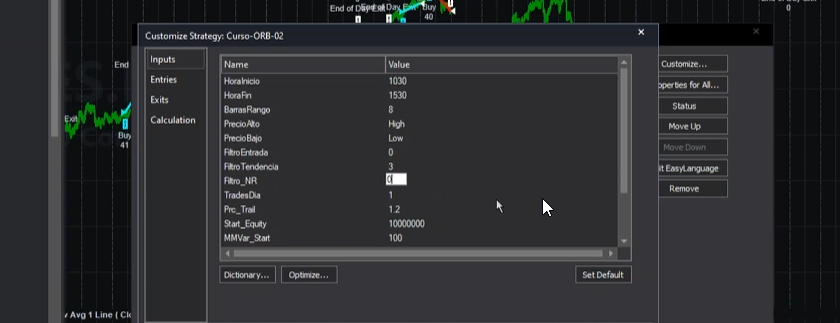
  <figcaption>Figura 40. Sistema con filtro Narrow Range desactivado.</figcaption>
</figure>

O no. Nada, nada, Alberto, no, me he dejado el café aquí a mitad de la... Es ahora. He desactivado el filtro; opera bastante más.

<figure>
  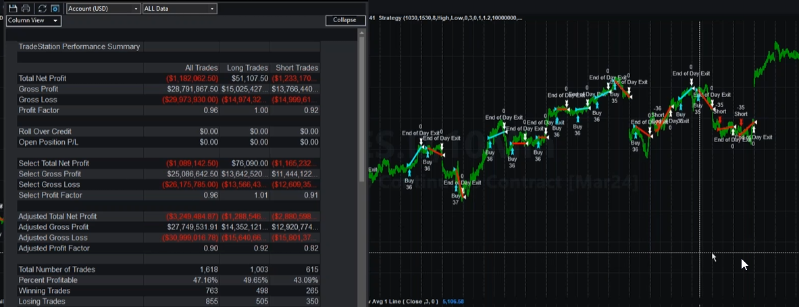
  <figcaption>Figura 41. Resultados con filtro desactivado: mayor número de operaciones.</figcaption>
</figure>

El filtro pues sí que estaba aportando. Estaba aportando algo. Normal es que aporten algo.

Este es el clásico sistema. Por eso me gustaba mucho como ejemplo. Y vamos a intentar en este hacer el procedimiento bien hecho, completo. Es decir, lo que explicaba: es el clásico donde tú empiezas primero evaluando la señal primaria, lo que se explicaba cuando hablamos de las entradas. Pones unas salidas fijas y vas evaluando la entrada primero. Y luego ya vas a los filtros. Es un ejemplo que se ve muy bien la idea.

Cuáles son las variables principales y las dependientes. Cuáles son las principales: pues lógicamente el horario y el rango, y, si me apuras, el campo que usas en la barra para saltar. Esas, solo, dejar la entrada.

Entonces puedes dejar la salida fija. Podías, y recomiendo hacerlo. Y de hecho, para nosotros hacer ese proceso lo vamos a hacer también: meter TP y *stop* fijos para poder usar, como hicimos en el de acción, el *trailing* o no usar el *trailing*, o usar SL y TP. Porque, para evaluarlo, viene bien. Porque ahí puedes ir a buscar riesgo 1:1 o 2:1, cosas así. Pues puedes evaluarlo mejor. Y si no, salida fin de día. Y hasta ahí evalúas la entrada, haces una optimización, puedes hacer un mapa y ver un poquito en qué horarios jugar, cómo se mueve. Y a partir de ahí es coger la ventana de entrada independientemente de los filtros. Luego ya pasamos a trabajar los filtros fase por fase.


**Optimización y análisis por fases**

Aquí el filtro, supongo, no lo hemos explorado en rangos muy amplios, porque al colocarlo en cortos se vuelve muy sensible. Pero podríamos, por ejemplo, probar con unos diez días, que ya es bastante. En un rango de diez días, los resultados han quedado más o menos similares.

<figure>
  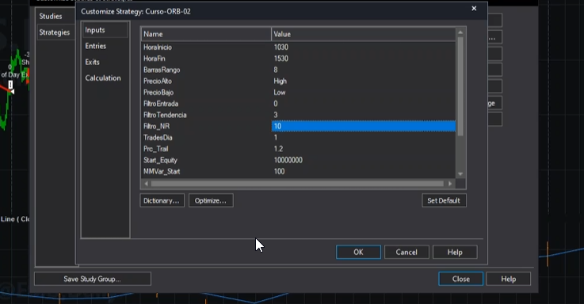
  <figcaption>Figura 42. Resultados con filtro Narrow Range de 10 días.</figcaption>
</figure>

Sin embargo, en un rango de cinco días sí muestra cierta mejora.

<figure>
  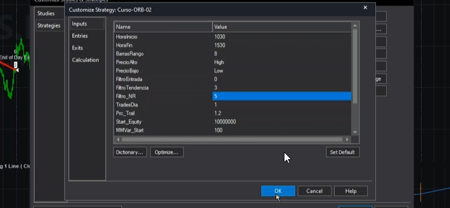
  <figcaption>Figura 43. Resultados con filtro Narrow Range de 5 días.</figcaption>
</figure>

<figure>
  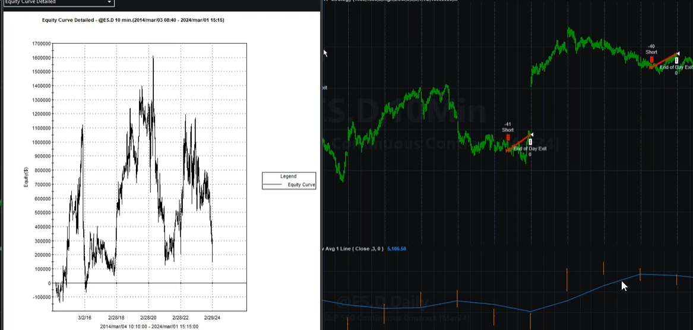
  <figcaption>Figura 44. Comparativa de métricas con diferentes configuraciones del filtro NR.</figcaption>
</figure>

Aun así, habría que estudiarlo a fondo, elaborar un mapa y analizarlo por fases, trabajando sobre múltiples bases para obtener conclusiones sólidas. Este es precisamente el filtro de rango que mencionaba: el filtro *Narrow Range*, bastante utilizado, aunque también se podrían emplear otros como volatilidad, volumen, *inside bars*, *dojis* o distintos componentes de este mismo estilo.


**Control del número de trades, salida y trailing**

En cuanto al número de operaciones que puede realizar por día, en un sistema intradía esto suele controlarse cuidadosamente, igual que las entradas.

Para las salidas, simplemente hemos implementado un *trailing stop* y una hora fija de cierre: cuando la hora es mayor que la definida, el sistema cierra en la apertura de la siguiente vela, a menos que el *trailing* haya cerrado antes.

Este control horario actúa como una medida de seguridad para garantizar que el sistema cierre sus posiciones en el *backtest*, incluso si ocurre algún fallo o el horario termina antes.

Ese es, en esencia, el código explicado. Las únicas variaciones que añadiría serían: probar una versión con *stop* y *take profit* limpios, sin *trailing*, y trabajar un filtro de volatilidad (que personalmente me parece más fiable que el de volumen, aunque ambos son válidos).

A partir de ahí, no hay mucho más. Se pueden explorar distintas ventanas, complicarlo todo lo que uno quiera, e incluso realizar análisis *intermarket* comparando con otros futuros similares —por ejemplo, el Nasdaq—. Pero, en esencia, esto es lo que define un sistema ORB: simple, estructurado y centrado en capturar el movimiento inicial del mercado.

<div style="border-left: 4px solid #4caf50; background: #e8f5e9; padding: 10px 15px; margin: 10px 0; border-radius: 8px;">
  <strong>📋 Resumen del proceso de desarrollo ORB</strong><br><br>
  <ol>
    <li><strong>Evaluar señal primaria</strong>: trabajar horario y rango con salidas fijas.</li>
    <li><strong>Optimizar entrada</strong>: crear mapa de parámetros, identificar ventanas óptimas.</li>
    <li><strong>Añadir filtros fase por fase</strong>: tendencia, Narrow Range, volatilidad.</li>
    <li><strong>Trabajar salidas</strong>: TP/SL fijos, trailing, salida por tiempo.</li>
    <li><strong>Validar con comisiones realistas</strong>: evitar trampas al solitario.</li>
  </ol>
</div>


### Pruebas con el DAX (futuros)

Tengo una idea con el DAX, acabando, que es bastante larga...


**Evaluación del DAX y configuración del tick**

A ver qué hemos encontrado...

<figure>
  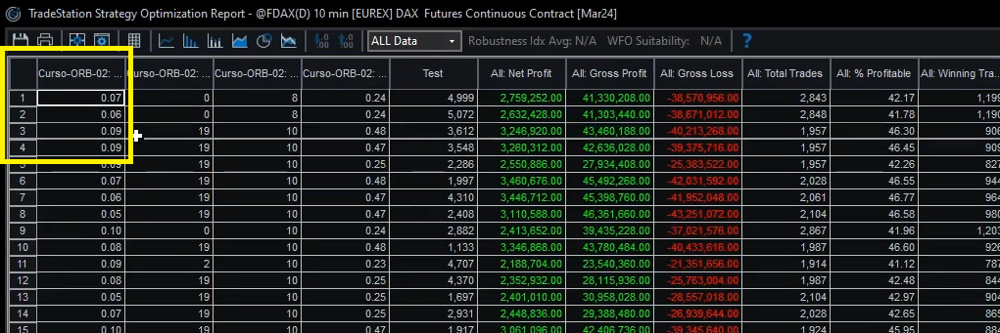
  <figcaption>Figura 45. Resultados iniciales de optimización en el DAX.</figcaption>
</figure>

Por aquí hubiera puesto un poquito de filtro. No sé por qué me lo olía, que en el DAX le pondría un poco... El DAX barre. Si además haber ordenado por *Robustness*:

<figure>
  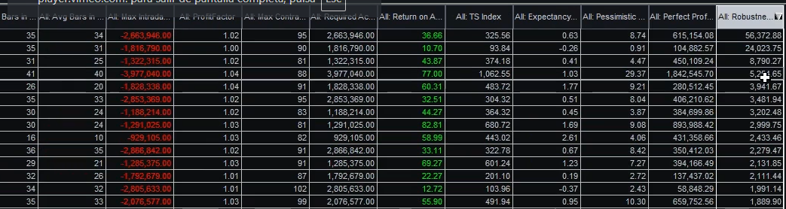
  <figcaption>Figura 46. Resultados ordenados por Robustness.</figcaption>
</figure>

<figure>
  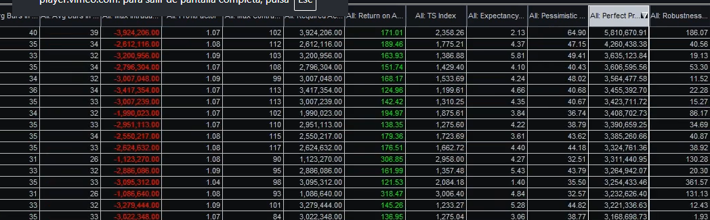
  <figcaption>Figura 47. Detalle de las métricas de robustez.</figcaption>
</figure>

Hago clic en la instancia 1 de la primera imagen:

<figure>
  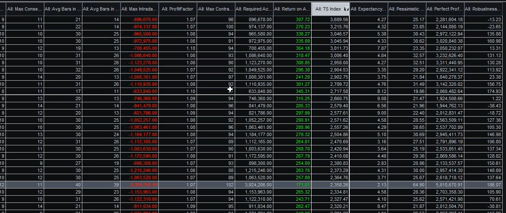
  <figcaption>Figura 48. Curva de equity de la instancia seleccionada.</figcaption>
</figure>

Parece bastante descompensada, muchas comisiones. Nosotros le metemos un *tick* entero. Bueno, igual al DAX no le he puesto un *tick* entero... A ver:

<figure>
  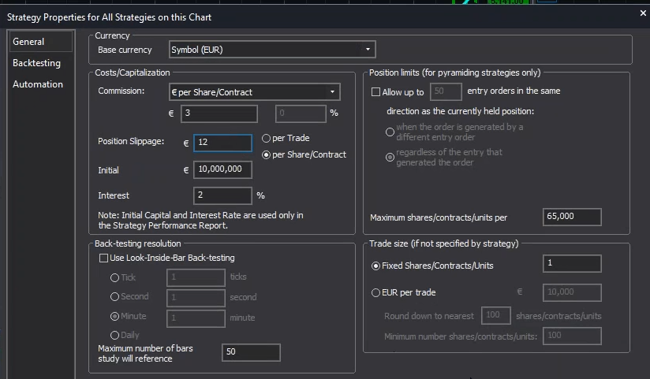
  <figcaption>Figura 49. Configuración de comisiones y slippage.</figcaption>
</figure>

<figure>
  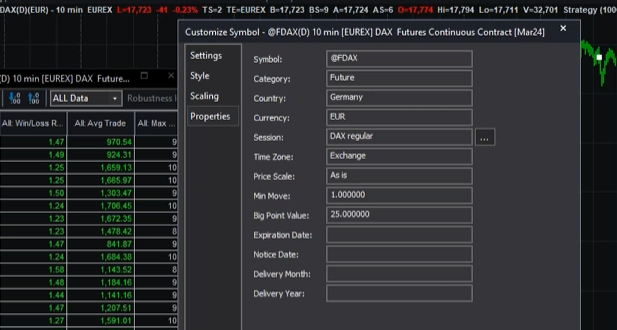
  <figcaption>Figura 50. Detalle del valor del tick en el DAX.</figcaption>
</figure>

12, un *tick*. El que va a medio punto es el mini. Si va a punto entero...


**Ajustes de stop loss y pruebas adicionales**

Es curioso: al no pararla, o sea, no dejarla parar, pues realmente es muy volátil. O sea, está ***muy dispersa todavía***; realmente no ha centrado nada. De todas maneras, como es más volátil que el S&P 500, aunque sigue siendo una curva súper loca, pues sí que tiene algo mejor.

<figure>
  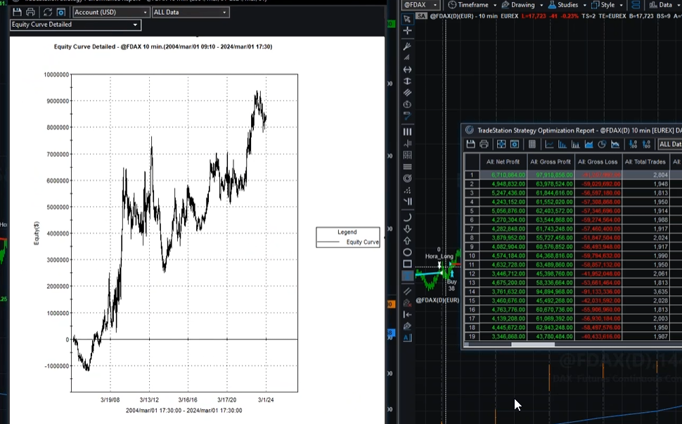
  <figcaption>Figura 51. Curva de equity sin stops definidos.</figcaption>
</figure>

Aquí realmente le podíamos meter *stop* y *TP*, porque yo creo que va a ir bastante mejor. Lo hacemos igual que con el *trailing*, configurado así:

```
# Strategy
inputs:
    ...
    ...
    Prc_Trail (0), 
    Prc_Stop (0),
    Prc_Profit (0),
```

```
...
...
# stop y profit no trailing

SetStopShare; // autostops van por acción

if marketposition <> 0 then  // set regular profit-target and stop-loss
begin
    if Prc_Stop > 0 then
        SetStopLoss(EntryPrice * Prc_Stop / 100 * Bigpointvalue);
        
    if Prc_Profit > 0 then
        SetProfitTarget(EntryPrice * Prc_Profit / 100 * Bigpointvalue);
        
end
else  // set entry-bar profit-target and stop-loss
begin
    if Prc_Stop > 0 then
        SetStopLoss(Close * Prc_Stop / 100 * Bigpointvalue);
        
    if Prc_Profit > 0 then
        SetProfitTarget(Close * Prc_Profit / 100 * Bigpointvalue);
end;
```

Dejo el *trailing* quieto y así ya lo dejamos.

Le he puesto una hora de análisis y con el *Typical Price*, de 9 a 10 que analice ahí. Y le dejo precio de entrada. La tendencia no la ha querido, pero ahora con el filtro se la voy a meter, por si no me va a tener muy pocas combinaciones.

<figure>
  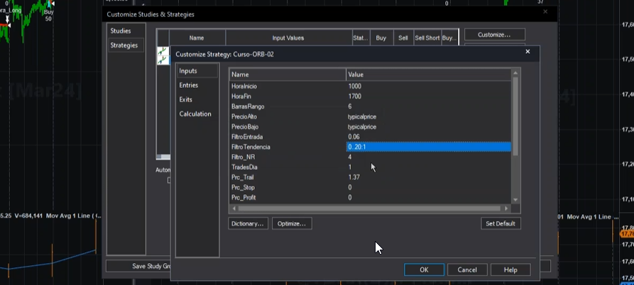
  <figcaption>Figura 52. Configuración de parámetros con Typical Price y ventana 9-10.</figcaption>
</figure>

El filtro *NR* lo dejo. El *trailing* me lo petó.

<figure>
  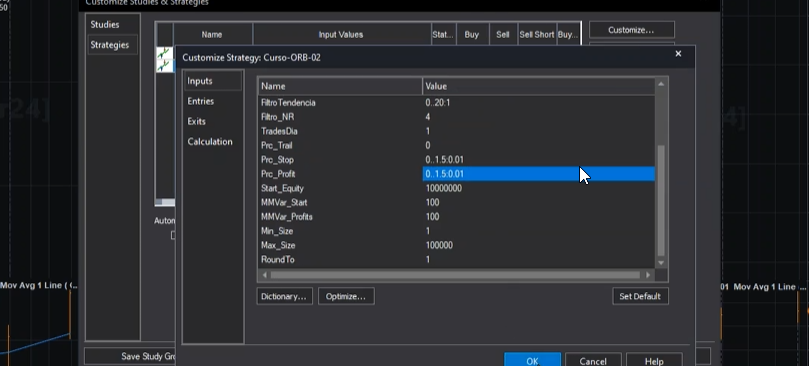
  <figcaption>Figura 53. Parámetros finales antes de optimización.</figcaption>
</figure>

Y le optimizamos el *stop*. Como tenemos muchos *trades*, le granulo bien. Esto solo para probar; habría que hacerlo con un poquito más de análisis que ahora. Pero es que no sé por qué me da la sensación que va a mejorar bastante ahora. Me la puedo comer con patatas, pero termina en 15.

<figure>
  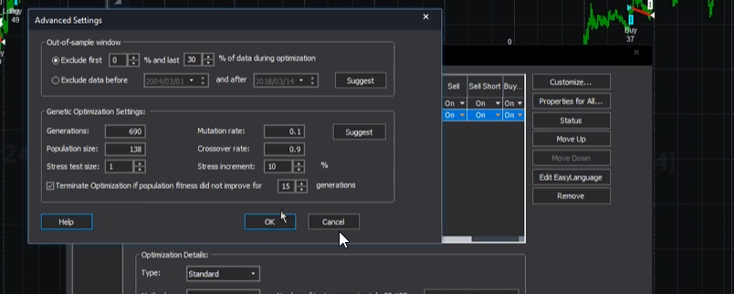
  <figcaption>Figura 54. Configuración del rango de optimización del stop.</figcaption>
</figure>

<figure>
  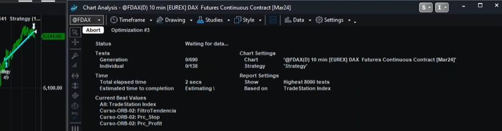
  <figcaption>Figura 55. Ejecución de la optimización.</figcaption>
</figure>


**Explicación técnica del trailing stop y gestión de órdenes**

No sé si habéis visto los *Power*, bueno, ahora ha quedado con el *stop* puesto. Ya lo habéis visto: esto no tiene ningún misterio. Fijaos que es muy similar al *trailing* clásico. El *trailing stop*, cuando estás en una posición larga, va tomando el valor más alto entre el *trailing* calculado previamente (el de la barra anterior) y el nuevo valor obtenido restando al máximo actual un porcentaje del propio máximo. En otras palabras:

- Si el precio sube, el *trailing stop* se actualiza hacia arriba.
- Si el precio no sube más, el valor anterior se mantiene.

Tan sencillo como eso: el *trailing* se actualiza dinámicamente y lanza la nueva orden de *stop* en la siguiente barra al precio recalculado.

En cambio, el *stop* funciona de manera muy similar. *TradeStation* ya tiene una palabra reservada que permite hacerlo directamente, así que simplemente la usas. Básicamente, se calcula a partir del **precio de entrada**, aunque la plataforma también ofrece una función que lo referencia automáticamente, lo que simplifica el proceso. Si no tuvieras esa opción, podrías implementarlo manualmente: guardar el precio de compra y calcular el *stop* como un porcentaje de ese precio (`porcentaje_stop / 100 * valor_del_punto`). Por ejemplo, en el DAX, donde el valor del punto es 20, se aplicaría esa relación y listo.

<div style="border-left: 4px solid #4caf50; background: #e8f5e9; padding: 10px 15px; margin: 10px 0; border-radius: 8px;">
  <strong>📐 Cálculo del Stop en EasyLanguage</strong><br><br>
  <code>SetStopLoss(EntryPrice * Prc_Stop / 100 * Bigpointvalue)</code><br><br>
  Donde:<br>
  • <em>EntryPrice</em>: precio de entrada de la posición<br>
  • <em>Prc_Stop</em>: porcentaje de stop (ej: 1 = 1%)<br>
  • <em>Bigpointvalue</em>: valor monetario de un punto (DAX = 25€, ES = 50$)
</div>


### Evaluación del sistema y criterios de validación

Si tú miras en *in-sample*, ya veis que *robustness* más bien negativos.

*In-sample:*

<figure>
  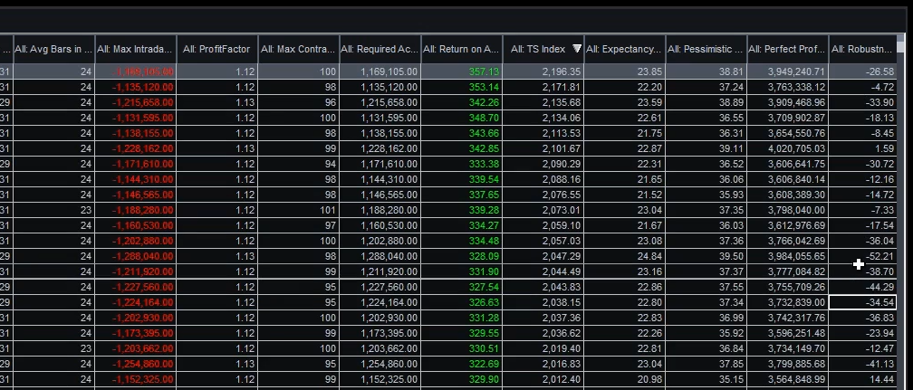
  <figcaption>Figura 56. Resultados in-sample con robustness negativos.</figcaption>
</figure>

No hemos mirado esto antes. Ya sabéis que me gusta, os lo expliqué: cortar, mirar bien dónde corta el 70 al 30. Es decir, hay que ver dónde corta el histórico, porque a veces vemos que casualmente cortamos en una zona donde es súper negativo para el sistema. Entonces tiene una clara desventaja.

Cuando hay muchos *trades*, es lo que os digo, es verdad que se facilita. Pero cuidado, no pensemos que porque hay muchos *trades*... pero tampoco hay tantos.

*All data:*

<figure>
  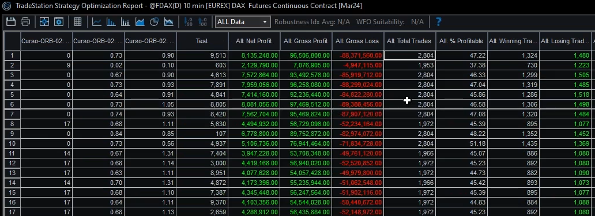
  <figcaption>Figura 57. Vista de todos los datos disponibles.</figcaption>
</figure>

Aquí, con este nivel de *trades*, tampoco podemos optimizar los ocho parámetros y quedarnos tan anchos. Es decir, hay que ir poco a poco, lo que decía: validando cada variable.

<figure>
  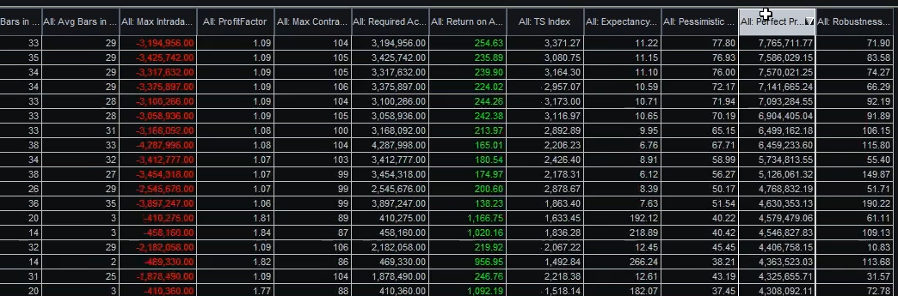
  <figcaption>Figura 58. Análisis de parámetros optimizados.</figcaption>
</figure>

Ver mapas, etcétera. Pero al final, claro, aquí hay una cosa que no está correcta, porque hemos guardado 8.000. Entonces, claro, entre los 8.000 hay combinaciones... no está bien. Pero ya digo, simplemente es para ver un poco el potencial del sistema.

<figure>
  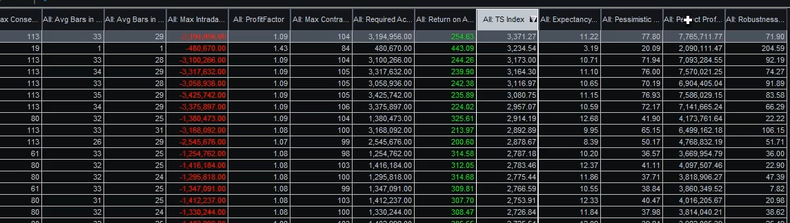
  <figcaption>Figura 59. Distribución de resultados de la optimización.</figcaption>
</figure>

Esto no estamos viendo una optimización bien hecha al uso, sino simplemente ver el potencial del sistema, a ver qué capacidades nos ofrece.

<figure>
  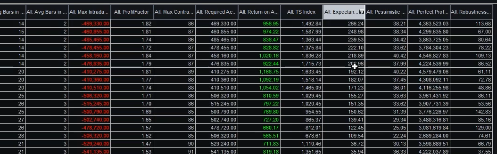
  <figcaption>Figura 60. Métricas generales del sistema.</figcaption>
</figure>

Además, hemos bloqueado la hora de entrada, la hora de salida. No hemos elegido una y está sin más.

<figure>
  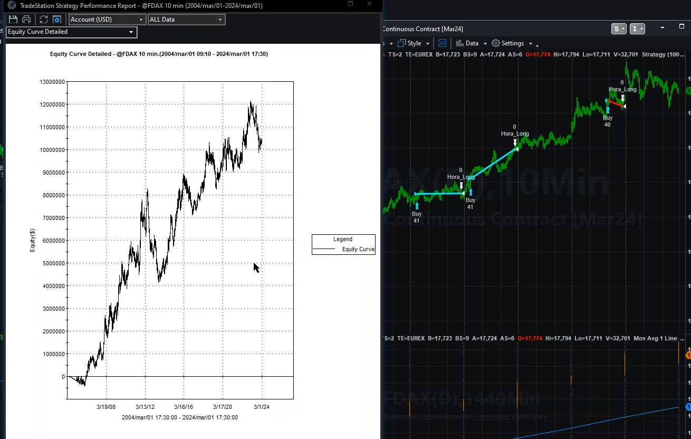
  <figcaption>Figura 61. Configuración de horarios bloqueados.</figcaption>
</figure>

<figure>
  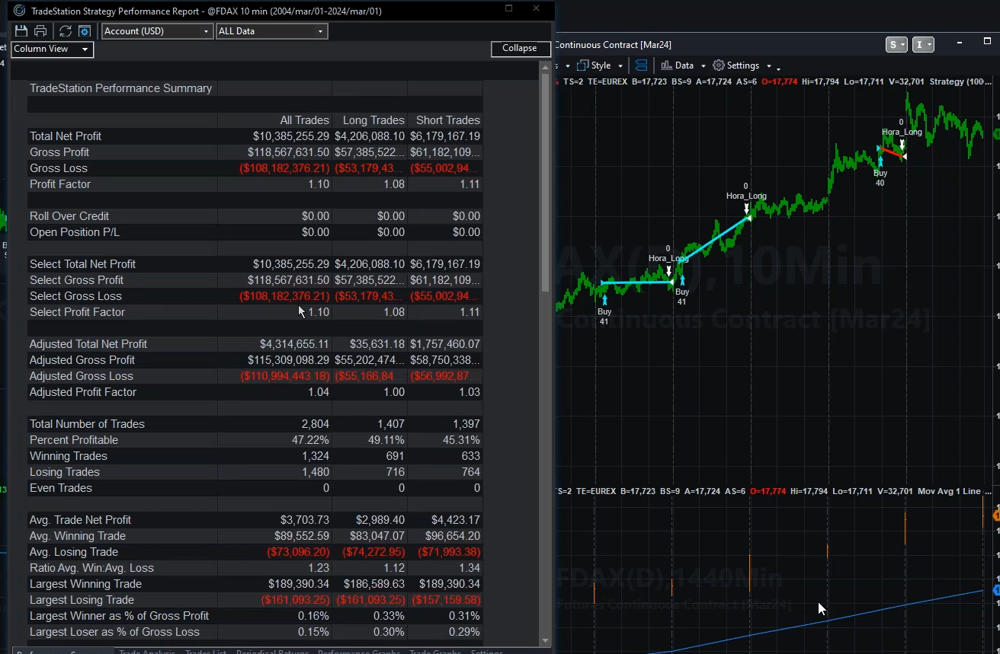
  <figcaption>Figura 62. Resultados con horarios fijos.</figcaption>
</figure>

Bueno, sí da la sensación de ir algo mejor, ¿no, Alberto? Algo mejor. 1.10 *Profit Factor* nos ha quedado ahora. Tampoco es una gran mejora, pero sí da la sensación de ir algo mejor que antes. Habría que ver. Ya digo, no está ni tan solo... le hemos dejado madurar. Y habría que primero mirar las entradas, trabajarlas bien. Además, en el DAX hay bastante trabajo, porque habría que mirar lo que os digo, primero mirar un poco, valorar el histórico. 

Trataremos de hacerlo un poco: es ir a hacer una optimización tratando de usar también el *premarket*... sin usarlo... Ahora está sin usarlo. Ahora está directamente abriendo en horario, lo que nosotros llamamos horario regular, que es eso: el equivalente con el contado. Es decir, de 9 a 5 y media. Porque aquí es cuando hay más volumen, es cuando hay más volumen, y es donde suele cortarse más el bacalao.

**Experimentación con ventanas de mercado**

Pero bueno, es verdad que en un *ORB* puede tener sentido a lo mejor evaluar también ese *premarket*. Además, curiosamente, es bastante simétrico en el largo que en el corto.

<figure>
  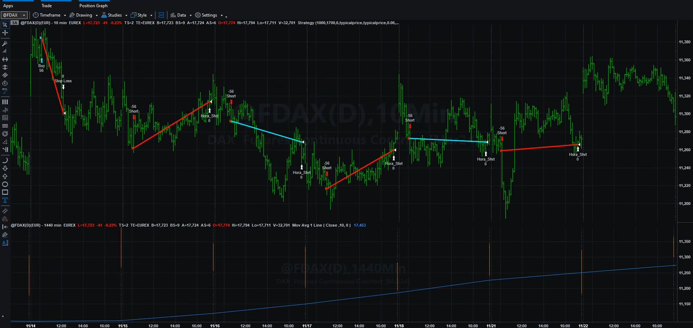
  <figcaption>Figura 63. Comparativa de resultados largos vs. cortos.</figcaption>
</figure>

Si además, a mí, la hora del DAX, que aquí no la he trucado, pero es verdad que empezando a probar una cosa vamos a ir muy fuerte. Es decir, empezar muy pronto. Es que le vamos a dejar solo tres velitas, tres velitas de margen. Y le vamos a salir a las 12. Aquí ya vamos a otra cosa, mariposa. Y le voy a quitar todos los filtros, le voy a dejar esto: *stop* y *TP*. No lo optimizo, que quiero verlo así, pero le pasaremos el optimizador.

<figure>
  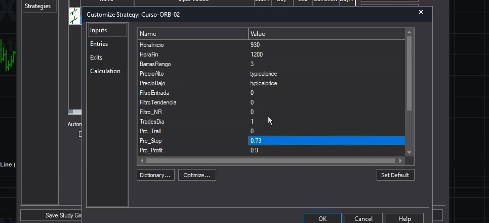
  <figcaption>Figura 64. Configuración con ventana reducida: 3 velas, salida a las 12.</figcaption>
</figure>

<figure>
  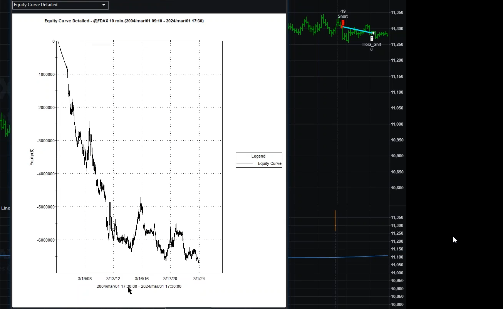
  <figcaption>Figura 65. Parámetros sin filtros activos.</figcaption>
</figure>

<figure>
  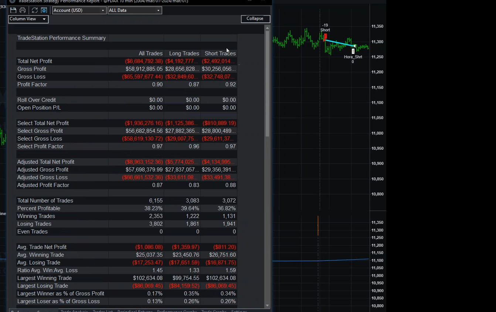
  <figcaption>Figura 66. Curva de equity con configuración agresiva.</figcaption>
</figure>

Va de puta madre...

Voy a probar.

<figure>
  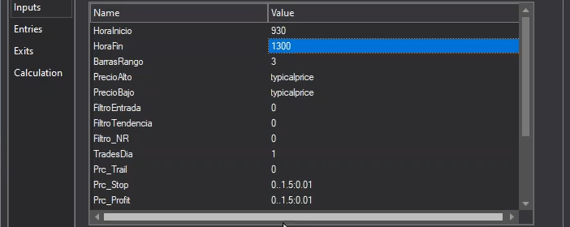
  <figcaption>Figura 67. Prueba adicional con ajustes.</figcaption>
</figure>

<figure>
  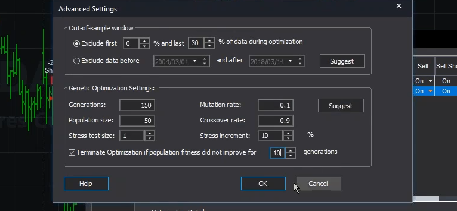
  <figcaption>Figura 68. Resultados de la prueba.</figcaption>
</figure>

Ahí los unos cuantos *papers* del de Crabel (Toby Crabel).

1.37 *Profit Factor*, ¡coño!

<figure>
  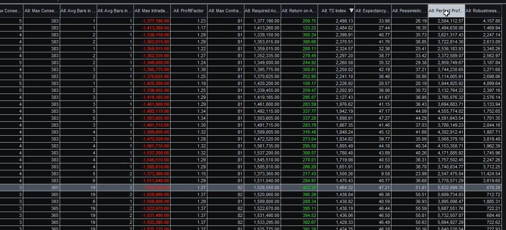
  <figcaption>Figura 70. Profit Factor de 1.37 obtenido.</figcaption>
</figure>

<figure>
  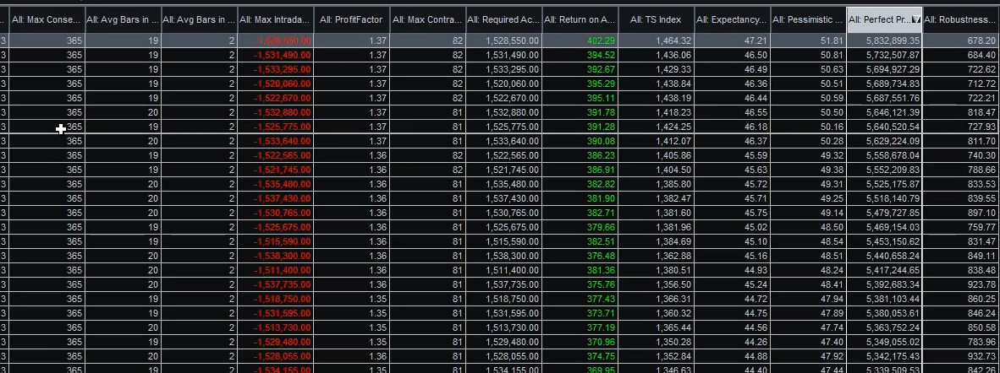
  <figcaption>Figura 71. Curva de equity con el mejor resultado.</figcaption>
</figure>

Ni tan mal. Pues el mejor que hemos sacado, es el mejor que hemos sacado.

¿Con 6.300 *trades*?

<figure>
  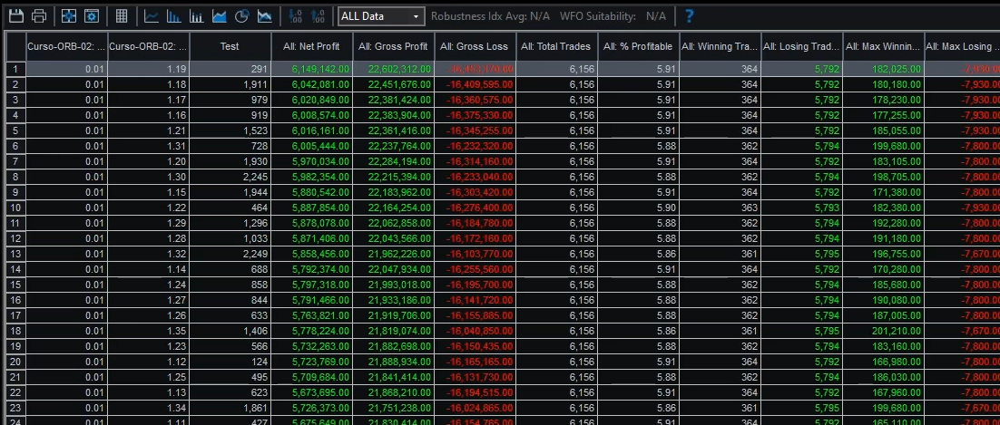
  <figcaption>Figura 72. Número total de trades: 6.300.</figcaption>
</figure>

¡A esto le falta el *LIBB*! Hombre, claro, está muy pegado. Nada, no os creáis nada. Y no lo he puesto porque no ajustaba tanto los *stops*, pero ahora los he ajustado. No me ha acordado, sí, sí.

<figure>
  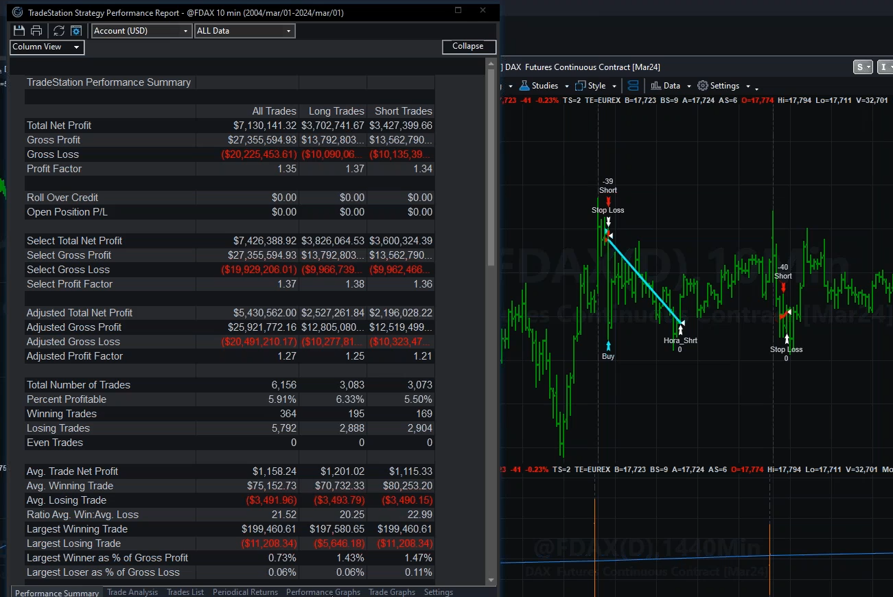
  <figcaption>Figura 73. Sistema sin LIBB activado.</figcaption>
</figure>

<figure>
  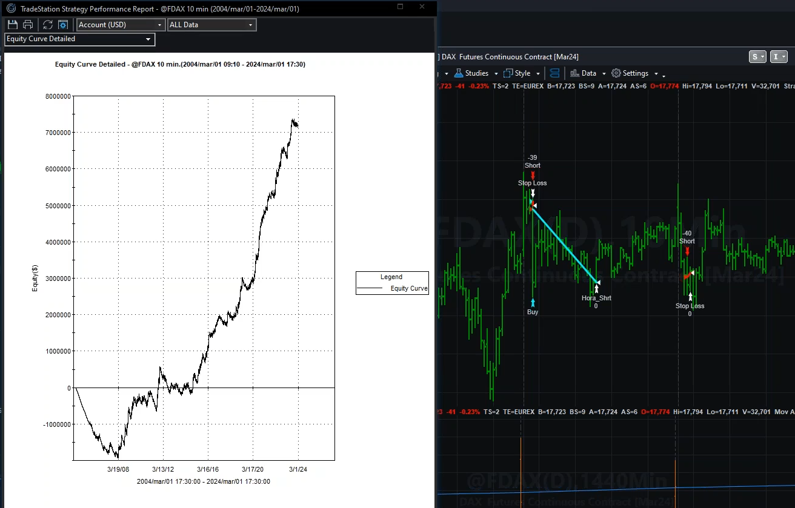
  <figcaption>Figura 74. Detalle de los stops ajustados.</figcaption>
</figure>

Ahora veréis, le pongo el *LIBB* y veréis... Sí, sí, ahora veréis en qué se queda la curva. Ahora veréis cuando llega la *fucking* realidad.

*Properties for All* → *Use Look-Inside-Bar Back-testing* → *Minute* → *Look-Inside_Bar-Testing*

<figure>
  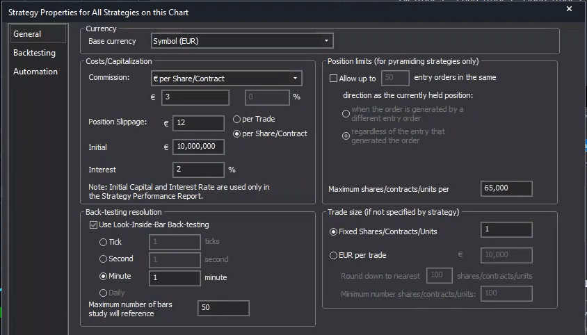
  <figcaption>Figura 75. Activación del modo LIBB (Look-Inside-Bar Back-testing).</figcaption>
</figure>


**Reflexión sobre validación realista y ejemplos de falsos positivos**

Bueno, y en un minuto, cuidado, porque estando en 10... Bueno, yo creo que sí, sí, para aquí es poco. Pero yo creo que le va a dar, le va a dar para... No hay que dejarlo tan abajo el *stop*; ahora lo subo y está...

Veréis en qué queda el 1.35.

<figure>
  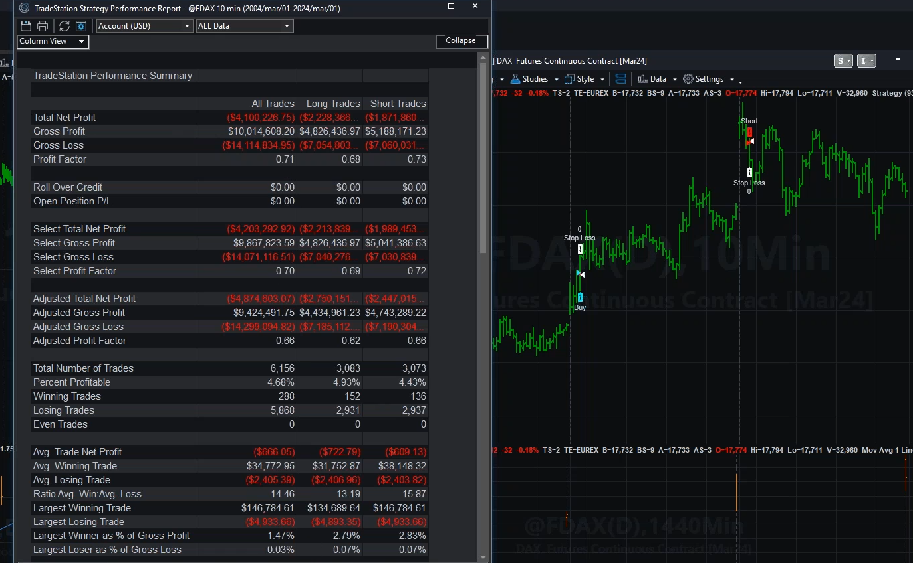
  <figcaption>Figura 76. Resultados tras activar LIBB.</figcaption>
</figure>

<figure>
  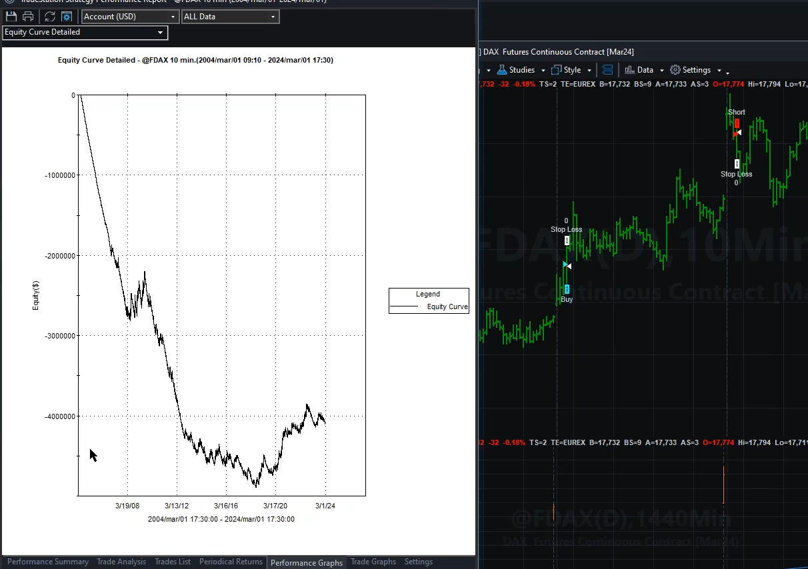
  <figcaption>Figura 77. Curva de equity con LIBB: la realidad.</figcaption>
</figure>

<figure>
  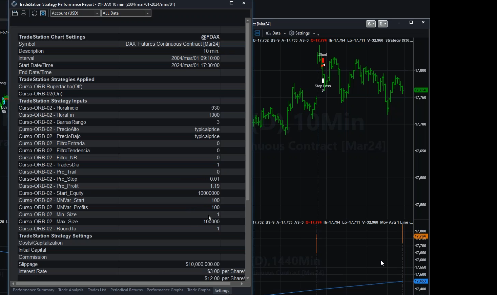
  <figcaption>Figura 78. Comparativa antes y después del LIBB.</figcaption>
</figure>

¿Habéis visto? La realidad. Es un buen ejemplo de lo que supone la realidad sin querer. Sin querer, en la teoría os dije, os enseñé alguno que estaba forzado. Pues mirar: sin forzar me ha salido sin querer. Pero esto porque yo lo he visto ya rápido, porque ya por la experiencia lo ves. Pero hay que vigilar. Que vigilar: `Prc_Stop: 0.01`. Nada, eso es mentira, eso es mentira. Incluso así podría ser mentira, incluso así puede ser mentira.

A ver, a ver el horario cómo ha cerrado. No ha dejado correr alguno, no ha dejado correr ninguno.

<figure>
  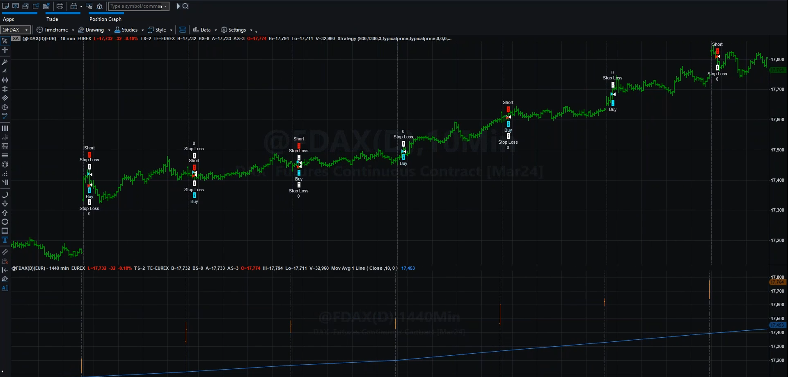
  <figcaption>Figura 79. Detalle de operaciones cerradas por horario.</figcaption>
</figure>

Es que...

<div style="border-left: 4px solid #f1c40f; background: #fff9e6; padding: 10px 15px; margin: 10px 0; border-radius: 8px;">
  <strong>📊 Data Analysis: Estudio de máximos y mínimos horarios</strong><br><br>
  Tenía un estudio de máximos y mínimos, aunque no recuerdo exactamente de cuántos años es. Si lo encuentro… ¿te acuerdas, Alberto, para qué revista lo hice? Era aquel estudio de máximos que desarrollé usando el trabajo de Kaufman.<br><br>
  Esto lo haremos aquí más adelante, ya lo veréis, porque para este tipo de sistemas resulta realmente útil. Es un código que permite analizar, por ejemplo, <strong>a qué hora se producen los máximos o mínimos del día</strong>, y genera un histograma muy práctico. Lo hice hace muchísimos años, así que probablemente no esté actualizado, pero sería interesante revisarlo porque sigue siendo un enfoque muy útil.<br><br>
  Para esto viene muy bien. La verdad es que en el DAX muchos máximos y mínimos se forman en la apertura, pero recuerdo que en esa franja entre las 12 y las 13 horas solían aparecer con frecuencia puntos de inflexión.<br><br>
  Por eso lo digo: hay que estudiarlo y analizar esas posibles ventanas de comportamiento. Si identificas una franja con una pauta repetitiva, puedes desarrollar un sistema específico para ese tramo del mercado. Y eso resulta <em><strong>extremadamente útil</strong></em>, porque este tipo de estrategias funcionan realmente bien cuando se adaptan a las características horarias del activo.<br><br>
  Pero ya no me refiero a este sistema en concreto, sino quizá a un <em>mean reversion</em> muy específico, centrado en una hora determinada. Hay activos en los que esto ocurre con frecuencia —por ejemplo, en las divisas—, y de hecho se puede aplicar a cualquier activo. Al final, solo se trata de analizar en qué momentos del día suele marcar los máximos o los mínimos, y a partir de ahí construir la estrategia.
</div>

Lo voy a probar más forzado. Ahora que ya tenemos el *LIBB*, ahora que también va a tardar más.

<figure>
  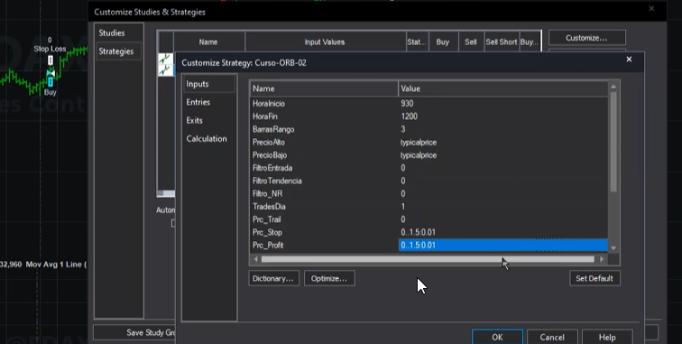
  <figcaption>Figura 81. Configuración forzada para nueva prueba.</figcaption>
</figure>

<figure>
  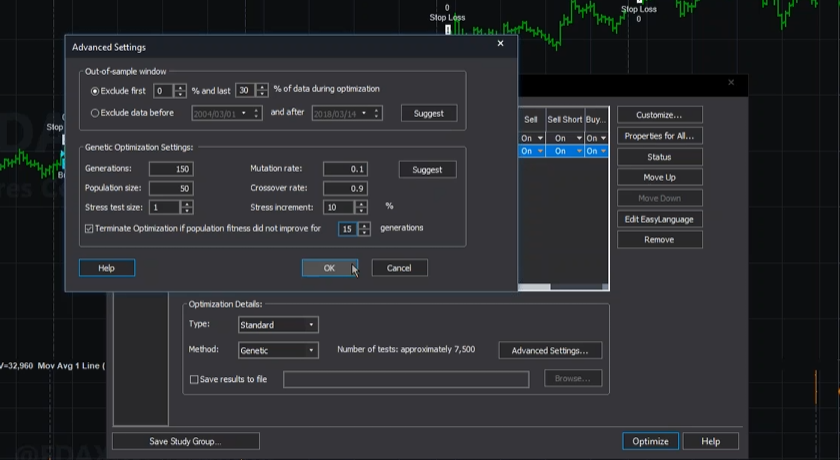
  <figcaption>Figura 82. Ejecución de la optimización forzada.</figcaption>
</figure>


> La sesión que viene cerraremos este y haremos *breakout* que no sea *ORB*, presentando alguna versión más aprovechable.


<figure>
  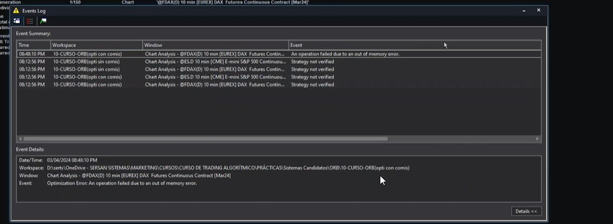
  <figcaption>Figura 83. Error de memoria durante la optimización.</figcaption>
</figure>

*Auto Memory Error*. Bueno, esto está probablemente es fruto de cuando... Sé que ahora ya no hay nada que hacer, o sea, ya pues que si ahora vuelves a optimizar pasa lo mismo. Hay que cerrarla, asegurarte que se han cerrado los procesos, todos los procesos, y ya está. *PC Administrador de Tareas: todo cerrado en TradeStation y Warehouse (EasyLanguage).*

<div style="border-left: 4px solid #e74c3c; background: #fdecea; padding: 10px 15px; margin: 10px 0; border-radius: 8px;">
  <strong>⚠️ Error de memoria en TradeStation</strong><br><br>
  Los errores de tipo <em>Auto Memory Error</em> suelen ocurrir cuando:<br>
  • Se ejecutan optimizaciones muy grandes con muchas combinaciones<br>
  • No se han cerrado correctamente procesos anteriores<br>
  • La memoria RAM disponible es insuficiente<br><br>
  <strong>Solución:</strong> Cerrar TradeStation completamente, verificar en el Administrador de Tareas que no queden procesos de TradeStation o EasyLanguage ejecutándose, y reiniciar la aplicación.
</div>


**Recomendaciones sobre lecturas y método histórico**

Ya tengo de hecho por ahí alguno, y os recomiendo que os leáis todo esto de Crabel, que me van a ver a ser muy antiguos. Es curioso cómo lo hacía él, porque él no era bien bien un rango, sino sentado mucho la apertura y mucha comparativa con las velas anteriores, de lo que había pasado antes. Porque al final, esto define mucho a los *ORBs*: es el fin de mucho la sorpresa. Y bueno, básicamente haremos eso.


**Pruebas con nuevos softwares y plataformas**

Estamos probando el software y, a lo largo del año, confío también en probar el de *Wealth-Lab*, porque como se vea que va bien y pueda más o menos integrarlo para lo que hacemos, pues igual nos pasamos a *Wealth-Lab* para, a nivel de ***análisis y backtest*** digo, sobre todo, una plataforma realmente muy guapa en su momento. Y ahora, cuando acabemos esto, lo iremos sacando.


**Despedida final y planificación próxima clase**

Bueno, pues nada, hoy acabamos un poquito antes y ya lo recuperaremos, que habrá tiempo. No os preocupéis. Y os voy a ir ya dejando hasta el lunes que viene, donde, como os digo, acabaremos el *ORB* y con total seguridad empezaremos otra estrategia.

Ya digo que esta, o muy parecida a esta, trataremos de presentar una muy parecida a esta que sea algo aprovechable. Que es aprovechable. Y ya explicaremos un poco lo que he dicho. Trataremos de tenerlo bastante avanzado, que lo enseñaremos aquí, pero tendremos que tenerlo avanzado, porque si no es imposible por tiempo. Pero porque ya veis: vete por esa, que optimizar un poco se te va la hora en un momento.

Entonces, trataremos de tenerlo hecho y lo iremos explicando paso a paso. Pero como os digo: primero entradas, filtros, salidas.

Así que nada más, familia. Hasta el lunes que viene. A ver, espera, espera...