# Practice 8

## Menú de navegación

- [Practice 8](#practice-8)
  - [Cuestiones](#cuestiones)
  - [ORB](#orb)
    - [Tipos de filtros aplicables y primeros ejemplos](#tipos-de-filtros-aplicables-y-primeros-ejemplos)
      - [`eleccionFiltro 1`](#eleccionfiltro-1)
      - [`eleccionFiltro 2`](#eleccionfiltro-2)
      - [`eleccionFiltro 3`](#eleccionfiltro-3)
      - [`eleccionFiltro 4`](#eleccionfiltro-4)
      - [`eleccionFiltro 5`](#eleccionfiltro-5)
      - [`eleccionFiltro 6`](#eleccionfiltro-6)
      - [`eleccionFiltro 7`](#eleccionfiltro-7)
      - [`eleccionFiltro 8`](#eleccionfiltro-8)
      - [`eleccionFiltro 9`](#eleccionfiltro-9)
      - [`eleccionFiltro 10, 11, 12`](#eleccionfiltro-10-11-12)
  - [Presentación del código 4 y estructura general del sistema](#presentación-del-código-4-y-estructura-general-del-sistema)
    - [Strategy : VB-01](#strategy--vb-01)
  - [Preguntas](#preguntas-)

[PRACTICA 2008.ELD](../PRACTICA%2008.ELD)

<figure>
  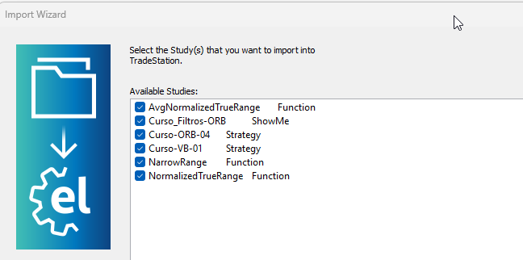
  <figcaption>Figura 107. Archivo de práctica cargado en TradeStation.</figcaption>
</figure>


## Cuestiones


**Configuración del horario del gráfico y diferencias entre "local" y "exchange"**

Cuando cargas un símbolo en el gráfico, puedes elegir aquí *local* o *exchange*.

<figure>
  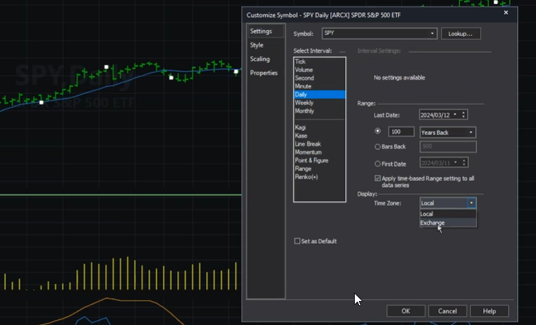
  <figcaption>Figura 0. Selección de zona horaria: Local vs Exchange.</figcaption>
</figure>

Dependiendo del tipo de sistema, si tú usas horas y te refieres a *time*, por ejemplo, pues *time* es la hora del gráfico. Entonces, tú le has puesto 9:30 y el gráfico va de 15:30 a 10 de la noche, que es lo que te pasa en este caso. Como yo lo tenía ahora en el *local*... Lo que pasa es que este sistema en concreto, lo veremos más adelante, es un *Volatility Breakout*, no es *ORB*, por lo tanto no usa horas y no importa.

Pero si tú usas horas, pues puede provocarte eso: que no opere. Porque la hora no existe. Si tú le dices "a partir de las 9:30 haz X cosa", y esa hora no está en el gráfico, pues ese puede ser un motivo.


**Configuración del Money Management y exposición del sistema**

Qué más comentaba Juan Manuel...

***Respecto a la configuración previa del MM para el sistema durante la evaluación, para saber qué exposición neta del sistema en % se recomienda por consenso en un sistema (apalancamiento) y cómo establecerlo por código o configuración en la plataforma. Es decir, qué pasos debemos seguir una vez queremos optimizar el sistema y ajustar su MM previamente. Por otro lado, el MM para ajustar la exposición a la volatilidad y su código, que tan comentado es, ¿lo veremos próximamente?***

Bueno, no hay una recomendación de apalancamiento. No, apalancamiento. Eso es algo que depende de muchísimos factores, desde uno personal. O sea, en evaluación preliminar, y lo que os comenté, es que nosotros, aunque también os lo dije, sigue habiendo cierto debate sobre el tema. Es decir, nosotros siempre os he intentado explicar las cosas que, digamos, la industria pues tiene ya establecidas, y cosas que al final hacemos nosotros porque nosotros las queremos así. Entonces, por haber distintas opiniones...

Nosotros creemos que es mejor usar un *money management*. Pero es verdad que si tú tienes el gráfico ajustado, si tú tus *stops* se ajustan a la volatilidad... no es grave, no es grave que vaya todo el rato con un contrato. Pero es importante que se ajuste.

Y aun así, habrán el ejemplo del Nasdaq, que es el que pusimos en el curso, es muy paradigmático. Porque la variación de precios, si miras en muy largo plazo, es bestial. Y claro, un contrato del 2000 no es un contrato del 2009, y mucho menos el 2024. Entonces, si tú todo el rato vas con un contrato, pues ese es el problema.

Entonces, realmente usamos un *money management* que simplemente permita que esos contratos varíen. El que estáis viendo hasta ahora en estos ejercicios que hemos hecho en la práctica es *a nominal*:

```
Contratos = ((Start_Equity * MMVar_Start * 0.01) + (Profits * MMVar_Profits * 0.01)) / Value1;
```

Simplemente utilizamos el importe que asignamos a la cuenta y lo multiplicamos por un factor de 100. Lo único que hacemos es separar el capital inicial del beneficio acumulado, aunque en la práctica ambos se tratan igual, ya que en los dos casos se multiplican por 100 y luego se suman. Por tanto, el resultado final es el mismo.

Esa cantidad se divide entre un valor que corresponde al cierre multiplicado por el *Big Point Value*, lo que representa el valor nominal del activo. En otras palabras, este cálculo refleja el importe total que controla un contrato en función de su precio y del valor monetario de un punto.

En este caso, la gestión monetaria que estás viendo equivale a operar con una exposición del 100% del capital, es decir, todo el capital disponible está invertido. Se trata de un modelo muy sencillo, pensado simplemente para evaluar cómo evoluciona el sistema sin añadir complejidad adicional.

Ya te digo, ese *money management* no deja de ser ***instrumental***, un poquito, para que no estés todo el rato con un contrato y te adaptes a los distintos precios a lo largo del activo. Se puede ajustar a la volatilidad, sí. Pero ya digo, el ***money management*** como tal, para operar en la práctica, uno lo hemos visto, y sí, en estas prácticas que te comentaba ahora pues lo veremos, y ahí sí que lo ajustamos a la volatilidad. Y sí que os enseñaremos lo que hacemos nosotros, que al final pues bueno, sí tiene algún detalle propio.

Pero que, como ya os comenté, la teoría se basa en ***Fixed Risk***. El único, podemos decir, particularidad que tú tienes, y mucha gente lo hace así, es decir, cómo mides ***risk***. Cómo mides *risk*. Es decir, al final el *risk* va en el denominador, y ya lo veremos, y pueden haber varias formas de hacerlo.

<div style="border-left: 4px solid #f1c40f; background: #fff9e6; padding: 10px 15px; margin: 10px 0; border-radius: 8px;">
<strong>📐 Explicación del cálculo de contratos y lógica de gestión monetaria</strong><br><br>

<em>Evitar el daño en mercados adversos.</em><br><br>

<code>Contratos = ((Start_Equity * MMVar_Start * 0.01) + (Profits * MMVar_Profits * 0.01)) / Value1;</code><br><br>

Esta fórmula representa un modelo de <strong>dimensionamiento dinámico de posición</strong> (<em>position sizing</em>) basado en la evolución del capital y en un apalancamiento porcentual configurable. En esencia, el sistema determina cuántos contratos debe operar en cada momento en función del capital inicial, las ganancias acumuladas y el valor nominal del activo.<br><br>

<strong>Desglose conceptual:</strong>
<ul>
  <li><code>Start_Equity</code>: es el capital inicial de la cuenta, el punto de partida.</li>
  <li><code>MMVar_Start</code>: es el porcentaje del capital inicial que se desea arriesgar o usar para abrir posiciones (por ejemplo, 100 equivale al 100%).</li>
  <li><code>Profits</code>: son los beneficios acumulados hasta el momento.</li>
  <li><code>MMVar_Profits</code>: es el porcentaje de los beneficios que se reinvierten en la operativa.</li>
  <li><code>Value1</code>: es el valor nominal de un contrato, calculado normalmente como <code>Close × BigPointValue</code>.</li>
</ul>

<strong>Interpretación práctica:</strong><br>
El numerador suma dos componentes: el <em>capital base ponderado</em> y las <em>ganancias acumuladas ponderadas</em>. Ambos se multiplican por 0.01 para expresar el riesgo en términos relativos. El resultado se divide entre el valor nominal de un contrato, obteniendo el número de contratos para mantener una exposición coherente con el tamaño de la cuenta.<br><br>

Este método es una aproximación simplificada al <strong>Fixed Fractional Method</strong> descrito por Ralph Vince (1989) en <em>"The Mathematics of Money Management"</em>, pero sin recurrir a fórmulas de riesgo complejo ni a fracciones óptimas (<em>Optimal f</em>).<br><br>

<strong>Ventajas y consideraciones:</strong>
<ul>
  <li>✅ <strong>Simplicidad:</strong> fácil de implementar y comprender.</li>
  <li>✅ <strong>Escalabilidad:</strong> al reinvertir beneficios, el sistema crece exponencialmente si la estrategia es rentable.</li>
  <li>⚠️ <strong>Riesgo:</strong> no incorpora control explícito de drawdown o volatilidad.</li>
  <li>⚙️ <strong>Equivalencia práctica:</strong> como tanto el capital inicial como las ganancias se multiplican por 100%, el efecto final es una exposición total al mercado (apalancamiento 1:1).</li>
</ul>
</div>


**Clases temáticas y prácticas sobre gestión monetaria**

En las prácticas, probablemente a partir de cuando acabemos ya este *Volatility Breakout*, que confío que va a ser hoy, entonces seguramente abordaremos algunas clases, como llamarlas, temáticas. No solo de hacer un sistema, aunque en los ejemplos pues se pueden hacer sistemas.

Pero pues ya lo comenté durante la teoría y también lo he hecho en las prácticas. Pues, por ejemplo, búsqueda de ideas. Por ejemplo, aprovechando la revisión que hemos hecho de *Apolo*, que lo comenté y ha habido algún comentario en el Discord, estoy de acuerdo que es interesante. Pues haremos una práctica de eso: mirar un sistema real que se sale de su zona, los revisamos, exponemos un poco esta práctica de un caso real de la revisión de un sistema que está operando, ¿entiendes? Entonces, porque creo realmente que es algo que puede aportar mucho, mucho, mucho valor.

Y por supuesto, gestión monetaria. Ahondaremos en la gestión monetaria de manera específica, lógicamente con ejemplos prácticos, pero que la clase estará más enfocada en la gestión monetaria que en el hecho de hacer un sistema, como por ejemplo hoy, que estamos más enfocados en hacer un sistema.


***Una vez tenemos un sistema en live o paper, ¿cómo crear y gestionar un backtest/performance report de los datos de live/paper de nuestro sistema de los trades efectuados?***

No entiendo.


***Tengo dudas sobre la configuración de slippage según activos, ejemplos en futuros y acciones, ya que he visto que a veces se pone una cantidad fija monetaria y a veces 0.01-2, y cuándo usar per trade o per share/contract, que vi que a veces usáis uno y otro.***

No, realmente siempre usamos la misma forma. Es verdad que *TradeStation*, aunque hizo un cambio hace mucho, ha cambiado un poco en eso. Lo que pasa es que cambia básicamente dependiendo del tipo de activo.

Para fijar la comisión y un sitio para fijar el *slippage*:

<figure>
  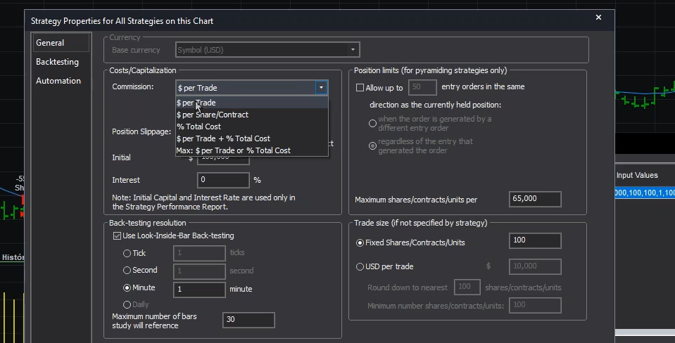
  <figcaption>Figura 2. Configuración de comisiones y slippage en TradeStation.</figcaption>
</figure>

La comisión es lo que evolucionaron. Y al final veis, te lo explica: *per trade*, *per share*. Al final no importa qué pones, son dólares. Si tú le pones *per trade*, son cinco dólares por cada *trade*, independientemente. Si le pones *per share*, pues cinco dólares por cada acción. *Total cost*: esto es un porcentaje total del coste, por si quieres imputar un porcentaje. Otra es una parte en fija dólar y una parte en porcentaje de coste. Es decir, al final es bastante autoexplicado. Si no, como siempre, la *Ayuda*.

<figure>
  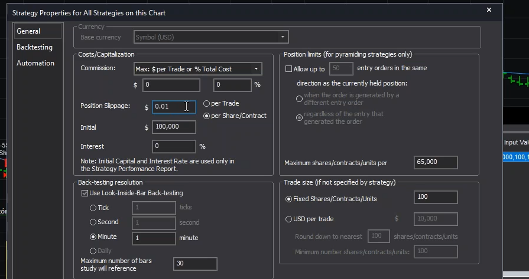
  <figcaption>Figura 3. Detalle de opciones de comisión.</figcaption>
</figure>

Ya digo, cuando ves ahí 0.01 es porque esto es una acción, el SPY. Por lo tanto, le penalizamos 0.01 dólares por acción, que es un *tick*. Es un *tick*. O sea, aquí casi siempre hay un *tick*. Cuando es un futuro dices: "bueno, es que a veces veo 10". Claro, es que el *tick* son 10. Esto depende de cuánto es el *tick*.

Básicamente, nosotros solemos poner *per share/contract*, y aquí nuevamente ponemos un *tick*, *tick* y medio, dos *ticks*. Sería un poco ya el límite. También depende del futuro: si pones el IBEX, a lo mejor tienes que poner tres *ticks*. Aquí no puede ser el IBEX, pero ya me entiendes. Entonces, depende un poco de los futuros.

Normalmente, un *tick*, *tick* y medio, es bastante pesimista-realista. Y la comisión, la que sea, que no tiene más. Este era porque le he puesto, porque *TradeStation* en modo internacional tiene cinco dólares por *trade* y se lo he puesto. Y eso que cierra es limitado, o sea que realmente este podría ponerle menos.


***Tras repasar vídeos donde comentas "este ratio es muy bajito", etc., quería saber si es posible sobre el TSI y Robustness, qué rangos numéricos son óptimos de este fitness, umbral mínimo aceptable.***

Me has preguntado varias veces. No sé, lo iremos viendo. El *TSI* es que depende del tipo de sistema. Es decir, hay tipos de sistema que lo normal es moverse en 2.000-3.000 y hay que se mueven más. Lo explico: es decir, el *TSI*, nuevamente, se mueve en miles. Podemos entender la *Expectancy Score*, que normalmente se mueve en unidades, tres. Pero cuando es un diario, pues ya es más grande.

Es que depende, porque al final no deja de ser fórmulas que se calculan dependiendo del valor del beneficio, del beneficio por *trade*, del *drawdown*. Entonces depende si hay gestión monetaria, si no la hay. Es decir, lo que importa ahí, cuando hablamos de *TSI*, estas cosas en los informes de optimización, es un ejercicio de comparación.

Si te lías y no lo ves claro, mira un poco el ***Profit Factor***, que sí que está, podemos decir, bastante normalizado. Y ya sabemos que se va a mover pues en dos, tres, en uno y pico. Es decir, es un poco donde se va a mover. El *Profit Factor* es el que te puede decir un poco, si vas de manera intuitiva, por buen camino o no.


***En la configuración del chart para la construcción de vela: natural or session hours, ¿cuál elegir, es relevante?***

Esto puede aplicar, y aplica, a otras plataformas. Cuando yo tengo un gráfico intradía (no es el caso, pero lo pongo ahora aquí), tengo aquí, se me abren unas opciones que me dice *For bar building, use: Natural Hours o Session Hours*.

<figure>
  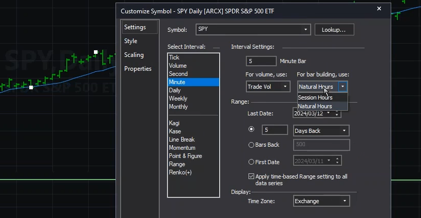
  <figcaption>Figura 4. Opciones de construcción de velas: Natural Hours vs Session Hours.</figcaption>
</figure>

Esto es importante. Fijaros que, por ejemplo, en Visual Chart, cuando teníamos el fondo, nos generaba muchos problemas, porque ellos van en *Natural Hours*. Es decir, ellos no tienen la concepción de *TradeStation* de sesiones, donde yo voy aquí y puedo controlar la sesión del símbolo dependiendo del horario y demás.

Porque hay futuros pues que su sesión no va en un día natural. En el caso del SPY, como este que estáis viendo, pues sí va de sus 9:30 a sus 4 de la tarde. Pero el Globex pues va de 12 a 11; puede coger dos días en muchos casos. Entonces, para este tipo de cosas es donde aplica esto.

Esto lo que quiere decir es: si para construir la vela, imagínate que tienes una vela de 7 minutos (porque la puedes tener, no tienes ninguna limitación en ese sentido; puedes poner velas de 86, y si quieres, en segundos también, de 83 segundos). Entonces te dice: "vale, yo cómo hago la vela, ¿me baso en el horario natural?"

¿Qué es horario natural? Pues de las 12 de la noche. Es decir, yo empezaría a construir independientemente de la sesión (la sesión es otro tema). Él empezaría a construir las velas de, imagínate, 7 minutos, a las 12:00. Por lo tanto, la primera sería a las 12:07, la siguiente sería a las 12:14, la siguiente a las 12:21, y así.

En cambio, si yo le pongo empezar a construir por *Session Hours*, que es lo más habitual y más recomendable, imagínate este caso: el SPY empieza a 9:30. ¿Cuál será la primera vela? Pues la primera vela será 9:37. ¿Se entiende? Será 9:37.

Si yo hubiera elegido *Natural Hours*, sería la que le tocara teniendo en cuenta que él hace el cálculo aunque el activo empiece 9:30; el cálculo lo empieza a hacer a las 12. Entonces, a las 9:30 ahora mismo no sé cuál le tocaría, pero habría que ver cuál le tocaría, porque él empezaría a construir las velas a las 12:00. Es decir, horario natural. Esta es la diferencia.

En muchos casos no te va a afectar, porque si tú usas velas de 30 y realmente el activo empieza a una hora en punto, que es lo normal (no empiezan al mercado a las 9:37, empiezan a las 9:30, empiezan a las 8:00, empiezan a las 9:00), entonces da igual. Pero si usaras un *time frame* distinto, pues sí que podría afectarte. Y a nosotros, con el oro, que lo hemos operado muchas veces en *time frames* extraños (ahora operamos en 28, pero lo hemos operado en otros), pues podía afectar.

Y luego, en el volumen, *For volume, use:*

<figure>
  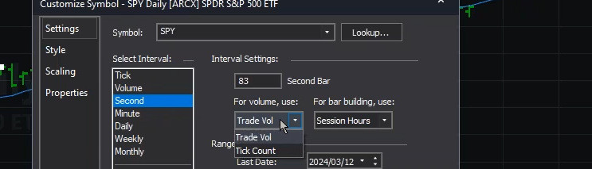
  <figcaption>Figura 5. Opciones de cálculo de volumen.</figcaption>
</figure>

Es un poco lo mismo. Si usas esto, te lo explica mejor en *Ayuda*, y es un poco largo. Porque prefiero no meterme en ese berenjenal, porque es un tema sobre todo de programación. Pero es que realmente hay un matiz dependiendo de si cargas un intradía o un diario, y luego si cargas qué activo, y hay una tabla.

Pero bueno, en términos generales, por simplificar, es lo que te dice aquí. Si *Trade Volume*, simplemente es lo obvio: cuenta acciones y acciones, o futuros que se cambian de manos. Y el *Tick Count* lo que hace es contar los *trades*. ¿Qué es un *tick*? Un *tick* al final es un *trade*, es un *trade*, independientemente del número de acciones que tenga lugar. Normalmente usamos *Trade Volume*.


**Gestión de performance report y estadísticas en Live Trading**

*TradeStation* tiene una función para eso. Que es verdad que en determinados momentos ha dado algunos problemas, sobre todo cuando hay multidivisas. Si no, no hay tanto. Hay aquí un botón *Apps* que es el *Trade Manager Analysis*:

<figure>
  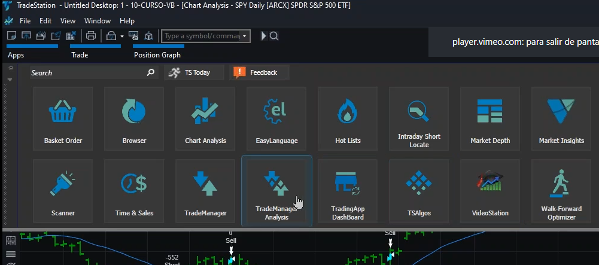
  <figcaption>Figura 6. Acceso al Trade Manager Analysis desde Apps.</figcaption>
</figure>

<figure>
  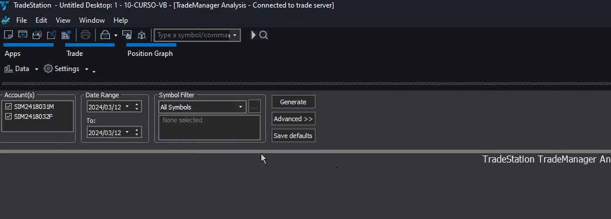
  <figcaption>Figura 7. Interfaz del Trade Manager Analysis.</figcaption>
</figure>

Que eso hace un *Performance Report* de la cuenta. Entonces ahí lo puedes seguir. Pero también te recomiendo que tú pues vayas llevando tu propio *log*, bien del programa, bien con Excel, bien con estas herramientas.

Y si ahora funciona bien... Que nosotros, ya digo, ahora no la usamos, por lo tanto no te puedo decir. Y los puedes ir cogiendo del ***Trade Manager*** directamente. La verdad que eso sí que va bien de copiar y pegar desde ahí a Excel. Y tienes que ir un poco generándolo tú.

Nosotros solemos hacerlo así, solemos hacerlo directamente en Excel, lo llevamos un poco por nuestra cuenta. Pero ya digo, esa realmente está ahí, y sé que había dado muchos problemas. Me dijeron que la habían arreglado, pero yo no lo he probado. Pero esto, de esto ya te digo, puedes sacar *Performance Report* de la propia cuenta. O sea, de hecho, es que si lo haces, sale igual.


***Sobre MaxBarsBack (MaxBarsBack setting), ¿cómo configurarlo según sistemas diferentes para que trabaje correctamente y no salgan errores?***

Sobre el *MaxBarsBack Setting*: esto es más de plataforma. Pero esto simplemente es el número de barras que necesita el sistema para calcular. Es decir, si tú vas a optimizar, si yo aquí tengo ese sistema y tiene esta media, por ejemplo... Bueno, aquí, por ejemplo, el sistema que luego lo veremos:

<figure>
  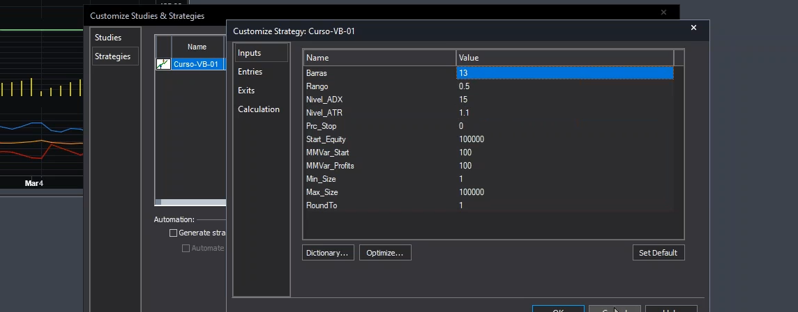
  <figcaption>Figura 8. Parámetros del sistema con media de 13 barras.</figcaption>
</figure>

En un *Volatility Breakout*, tiene un número 13 de barras, tiene un rango, tiene un *ADX*, un *ATR*. Bueno, pues si yo la media de 13 barras esta la voy a utilizar hasta 50, pues al *MaxBarsBack* la tengo que poner al menos 50 o 55, y ya está. Sin más, no tiene mayor historia.

Lo tienes que poner aquí y ya está:

<figure>
  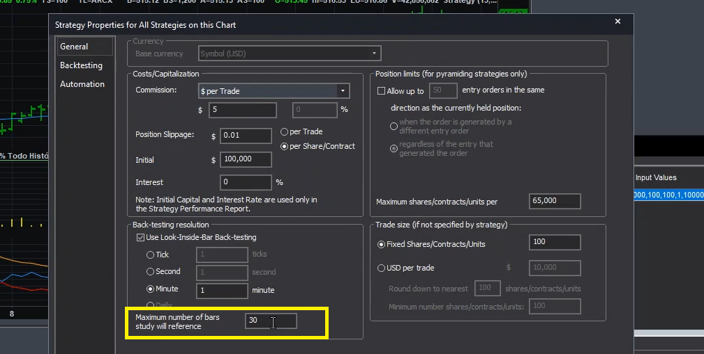
  <figcaption>Figura 11. Configuración del MaxBarsBack en propiedades.</figcaption>
</figure>

Le pones el valor que le quieras poner, o sea, que vayas a ponerle más de optimizar. Si te salta eso, es porque tú le has pedido un cálculo más allá de ese valor.

Esto en indicadores es automático, y en sistemas no lo es. ¿Por qué? Pues no sé, la verdad.


***En los tutoriales de TS se recomienda, para evitar esto, quitar el check de las dos primeras casillas que por defecto vienen marcadas como en la imagen. ¿Vosotr@s lo tenéis configurado de esa forma que comentan ellos para evitar esto?***

<figure>
  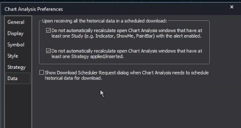
  <figcaption>Figura 9. Opciones de recálculo automático en TradeStation.</figcaption>
</figure>

Esta pestaña que comentas, de si operas... Normalmente lo pones para que no recalcule, porque te puede provocar un problema que recalcule. Si no, lo puedes activar porque entonces recalcula. Pero bueno, operativa, pues si operas directamente con la plataforma en *live*, pues es mejor activarlo.


***Tras revisar la teoría, se comenta que la opti genética es la que más usáis y la que es recomendable hacer generalmente si es posible, pero durante el curso se ha visto también mucha opti exhaustiva en los ejemplos. Por lo que, ¿en qué casos elegiremos exhaustiva sobre genética? En el PDF dice que exhaustiva solo es adecuada cuando el número de soluciones posibles es limitado. ¿Hay alguna condición del sistema, umbral mínimo o consenso para saber cuál hacer en cada caso? ¿Depende del número de parámetros o combinaciones posibles totales de la optimización, por ej. +10000 combinaciones → genética? Otra duda es, en caso de hacer la genética, qué configuración se debe aplicar.***

<figure>
  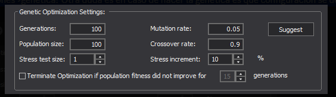
  <figcaption>Figura 10. Opciones de optimización: Exhaustiva vs Genética.</figcaption>
</figure>

En cuanto a la optimización genética, ha habido ya varios comentarios y dudas sobre su uso, y viene muy al caso aclararlo. Hay situaciones en las que **no tiene sentido utilizar la optimización genética**, simplemente porque el número total de combinaciones posibles en una búsqueda exhaustiva es menor que el número de parámetros seleccionados. En esos casos, el propio mensaje del sistema te indica que la búsqueda genética no procede, ya que no hay suficientes combinaciones que justifiquen su aplicación. Es decir, te está diciendo literalmente: "hazla exhaustiva".

Por tanto, ese es el criterio práctico. La optimización genética es más adecuada cuando el número de parámetros es grande y existen amplias zonas de búsqueda, porque su método evolutivo permite explorar mejor el espacio de soluciones. En cambio, cuando el conjunto de parámetros es pequeño, conviene utilizar la búsqueda exhaustiva, ya que evalúa todas las combinaciones posibles sin dejar huecos.

Por ejemplo, si lo que quieres es generar un mapa de resultados o un *heatmap*, la optimización exhaustiva es preferible, porque ofrece una visión completa y continua del comportamiento del sistema. En cambio, la optimización genética es ideal cuando el espacio de búsqueda es muy amplio y el tiempo de cálculo podría ser excesivo.

En resumen, la elección depende del contexto:

- Si el número de combinaciones es reducido o el tiempo de cómputo lo permite, usa una optimización exhaustiva.
- Si el número de combinaciones es muy grande o el tiempo de cálculo es limitado, la optimización genética suele ser suficiente y eficiente.

No hay una regla rígida ni un umbral fijo; la diferencia es puramente técnica y depende del tamaño del problema y de los recursos disponibles.

<div style="border-left: 4px solid #4caf50; background: #e8f5e9; padding: 10px 15px; margin: 10px 0; border-radius: 8px;">
  <strong>📊 Criterios para elegir tipo de optimización</strong><br><br>
  <table>
    <tr>
      <th>Criterio</th>
      <th>Exhaustiva</th>
      <th>Genética</th>
    </tr>
    <tr>
      <td>Combinaciones</td>
      <td>&lt; 10.000</td>
      <td>&gt; 10.000</td>
    </tr>
    <tr>
      <td>Objetivo</td>
      <td>Mapa completo / Heatmap</td>
      <td>Encontrar zonas óptimas</td>
    </tr>
    <tr>
      <td>Tiempo</td>
      <td>Disponible</td>
      <td>Limitado</td>
    </tr>
    <tr>
      <td>Parámetros</td>
      <td>Pocos (2-3)</td>
      <td>Muchos (4+)</td>
    </tr>
  </table>
</div>


***Me podéis indicar en el Portfolio Maestro, en Symbol List, ¿dónde se encuentran el grupo de ETFs de índices (SPY, QQQ, etc.) y sectoriales (XLF, XLU, etc.)? He buscado bastante y no acabo de encontrar ninguno.***


**Configuración y gestión de listas de símbolos (Symbol List)**

Cuando tú en un *Strategy Group* quieres poner un *Symbol List*, es súper primitivo. Entonces tú tienes los *Custom* y los suyos:

<figure>
  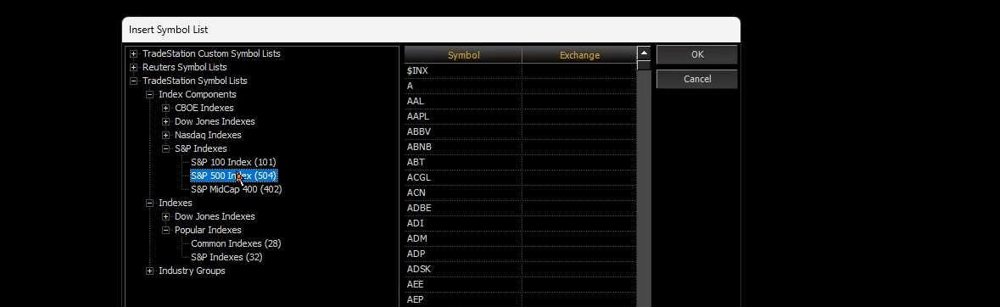
  <figcaption>Figura 14. Listas de símbolos disponibles en Portfolio Maestro.</figcaption>
</figure>

S&P 500, S&P 100, NASDAQ 100, etcétera, cajones. Tiene los típicos, entre *TradeStation Symbol List* y luego, ya digo, en *Index Components* o en *Index*.

Pero aun así, muchas veces pues te haces tú las listas y no te queda otra que hacértela. Y a veces la tienes que hacer hasta para un símbolo. Porque pues, si tú quieres a lo mejor poner un símbolo solo con varios sistemas, pues no te queda otra que hacer esto: hacer una lista que se llame QQQ y ponerle el QQQ dentro.

<figure>
  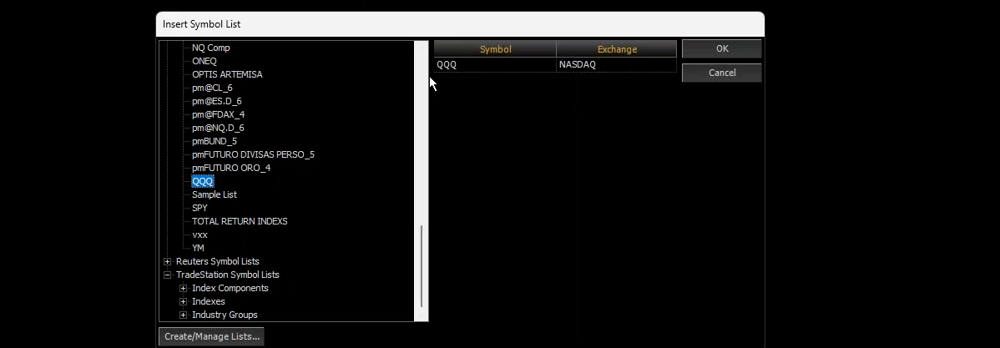
  <figcaption>Figura 15. Lista personalizada con un solo símbolo.</figcaption>
</figure>

Las listas se comparten. Si las has hecho en *TradeStation*, también están aquí. Eso sí que es correcto.


**Creación manual de listas personalizadas y ejemplos prácticos**

Si te fijas ahí, *Custom Symbol List > Create/Manage*. Le das a *Create* y te la creas, te creas una y la añades. Pero ya digo, el *interface* es bastante más cómodo y más fácil en *TradeStation*. Porque desde un *RadarScreen* los puedes seleccionar, pues al botón derecho y pones *Add to Symbol List*:

<figure>
  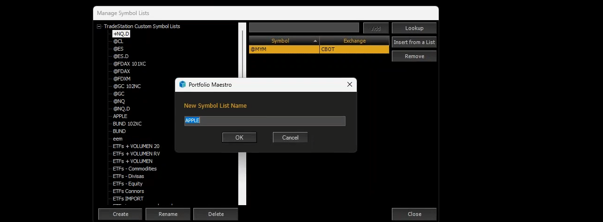
  <figcaption>Figura 16. Añadir símbolos a lista desde RadarScreen.</figcaption>
</figure>

Lo puedes hacer en *TradeStation*. Entonces es bastante más *friendly*. Desde aquí también puedes ir directamente a...

<figure>
  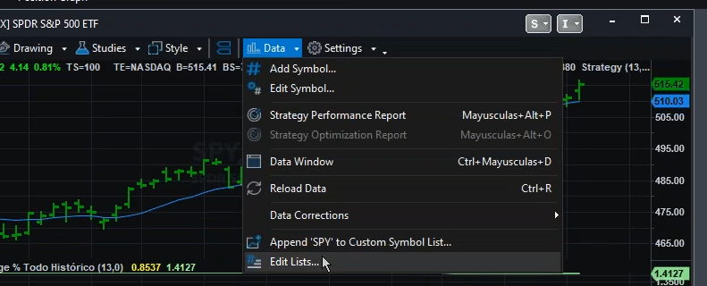
  <figcaption>Figura 17. Menú de gestión de símbolos.</figcaption>
</figure>

<figure>
  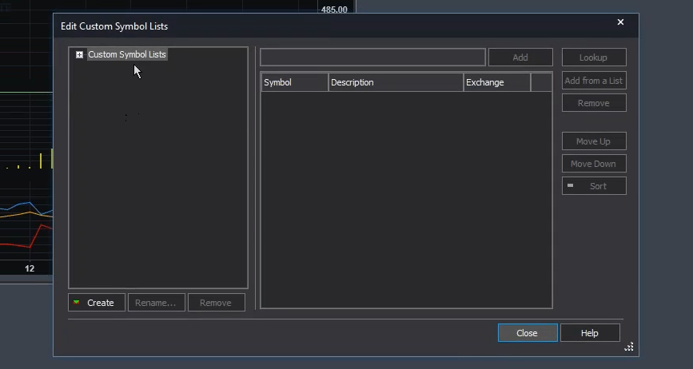
  <figcaption>Figura 18. Opciones del menú Data.</figcaption>
</figure>

A ver si me acuerdo el *shortcut*... No, para que me acuerde... No, no eres aquí, no eres aquí, eres aquí quizá. Exacto, aquí tienes *Edit List*, y aquí sale. Desde el menú de gráfico del *Chart*, desde aquí de *Data*.

Pero en un *RadarScreen*, lo que te digo, si tú tienes un *RadarScreen* abierto, que es la manera más sencilla en mi opinión:

<figure>
  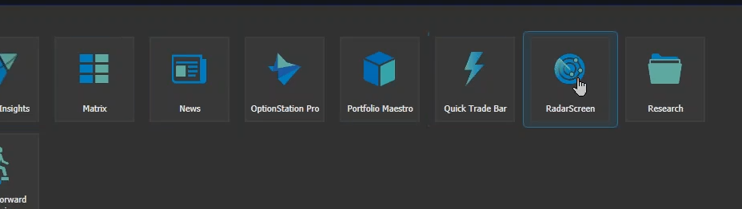
  <figcaption>Figura 19. RadarScreen con símbolos cargados.</figcaption>
</figure>

Y los escribes aquí:

<figure>
  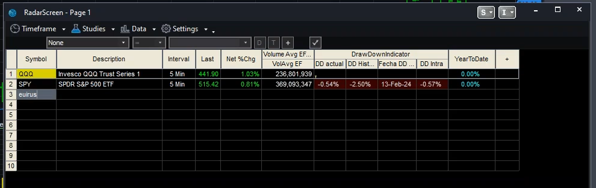
  <figcaption>Figura 20. Escribiendo símbolos en el RadarScreen.</figcaption>
</figure>

Lo que quieras. Y esto tú ahora lo seleccionas:

<figure>
  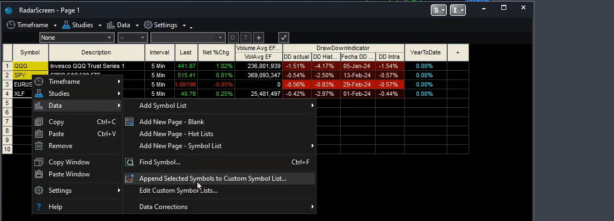
  <figcaption>Figura 22. Selección de símbolos para crear lista.</figcaption>
</figure>

Le das ahí, te abre la ventana y ahí ya te la creas:

<figure>
  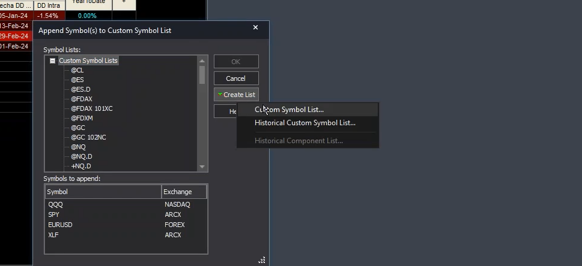
  <figcaption>Figura 23. Diálogo de creación de nueva lista de símbolos.</figcaption>
</figure>

La puedes añadir a una, o le creas una ***normal***, no una histórica. Entonces es más... Y luego la encontrarás allí. Entonces te pones uno, "ETF", o "Mis ETF", o lo que tú quieras, y te la creas. Esto es la manera más sencilla.


**Configuración genética sugerida y diferencias con el Walk Forward**

Manuel aboga en algún detallito más. Pregunta: si se hace genética, ¿se ve configurada a mano la configuración?

No, dale al *Suggest*. Está bien, está bien. De verdad, no te compliques. No te compliques, de verdad, no te compliques. El único caso donde tiene algún sentido es en el *Walk Forward*. En el *Walk Forward*. Pero por lo demás, dale al *Suggest* y es correcto. Es correcto.


## ORB


Al final, tú con un *Volatility Breakout* tal como lo hemos definido hasta ahora, que por supuesto es opcional (todo es opcional en un sistema), es decir, nosotros fijamos que a fin de día, pero podías quedarte a más de un día, digamos. Pero lo tratamos de plantear así, de esta manera.

Claro, tú estás operando un activo que es el que estáis viendo hoy en pantalla, que es el SPY, que es, yo diría, un poco alcista de largo plazo. Es un poco alcista de largo plazo.

<figure>
  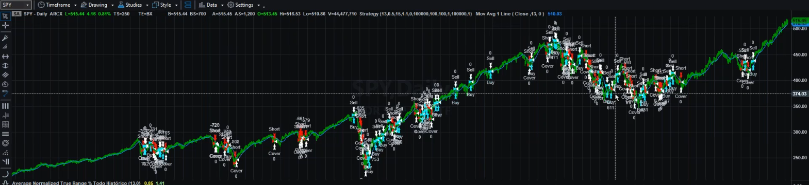
  <figcaption>Figura 24. Gráfico del SPY mostrando tendencia alcista de largo plazo.</figcaption>
</figure>

Que lógicamente tiene sus períodos bajistas, pero en el largo plazo es un poco alcista; subido un poco. Entonces, claro, cualquier cosa que frene, que vaya contra esa tendencia... Esto puede parecer contraintuitivo, pero verás que no lo es. Es complicado. Y entonces tú dices: "claro, pero a mí eso me hace pensar que es más fácil ganar en el largo que en el corto". Y sí que lo es, pero ***si quitas la restricción de cerrar a fin de día***, ¿entiendes?

Si quitas la restricción de cerrar a fin de día, porque acuérdate que ***el mercado sube con poca volatilidad y baja con mucha volatilidad***. Tú justamente lo que estás buscando es un *Volatility Breakout*, ¿entiendes? Entonces, claro, ***al alza hay menos volatility breakouts***. Hay mucha tendencia, hay mucho seguimiento de tendencia, hay mucha subida, pero no necesariamente *volatility breakouts*.

En cambio, abajo es todo lo contrario. Abajo es relativamente sencillo, aunque parezca contraintuitivo, pillar roturas de volatilidad, porque el mercado cuando cae, cae con volatilidad. Es verdad que no es fácil, ¿por qué? Porque la tendencia de fondo prevalece, y por lo tanto tienes que buscar, como ya has hecho tú, y por eso también estamos limitados en intradía, pues objetivos cercanos. ¿Por qué? Porque al final, cuando tú tienes la tendencia en contra, pues ahí es mejor ir rápido, salir rápido.

En cambio, en el lado largo verás que te resultará mucho más sencillo si eliminas la restricción de cerrar a fin de día. Entonces verás que es muy fácil encontrar roturas de volatilidad, porque entonces ya renta, deja correr más. Porque la mayoría de sesiones al alza, me refiero cuando el mercado entra en una tendencia alcista...

Imagínate este tramo aquí, mira esto:

<figure>
  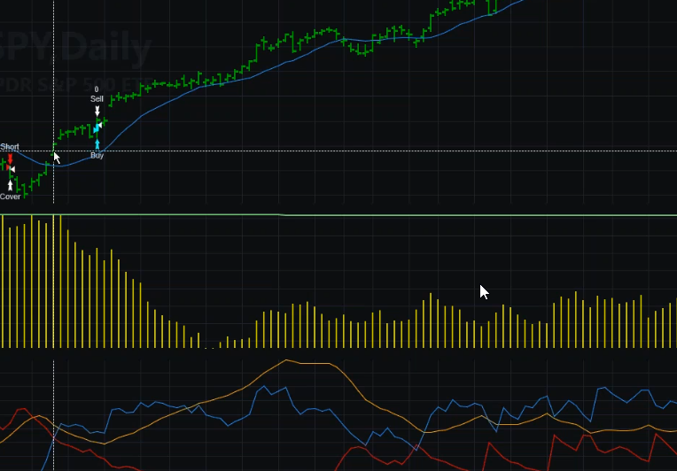
  <figcaption>Figura 25. Ejemplo de Volatility Breakout en tendencia alcista con corrección previa.</figcaption>
</figure>

Esto es un *Volatility Breakout* al uso, que tal como está, yo creo que es decente. Y verás que también se gana en el largo y en el corto, pero gana más en el corto. Y también buscando entradas muy rápidas y demás. Pero este entra en corrección, busca el *Volatility Breakout*, pero tras corregir. Muy habitual en sistemas de acciones.

De hecho, por ejemplo, ***Artemisa*** hace eso. Artemisa hace eso. Es algo... Lo que no es tan rápido es saliendo como este, pero porque este busca solo el *breakout* y se sale. En cambio, *Artemisa*, digamos que su *setup* de entrada es de este estilo, pero se queda. Lo que te decía un poco ahora, ¿no? Entonces, ya digo, si te quedas es más fácil.

Entonces no es tan raro, no es tan raro como te parece, por el hecho de obligarle a salir a fin de día y porque el mercado sube con poca volatilidad. Aun así es posible, no digo que no sea posible, pero es más complicado si no te quedas.

De hecho, por ejemplo, en los libros de Crabel (Toby Crabel) tenía varios apuntes donde no todo el mundo plantea los *Volatility Breakouts* o los *ORB* para ir obligatoriamente cerrando a fin de día. Eso es una... De hecho, en nuestro código había un *input* que lo controlaba. Pero sí que es verdad que yo hasta ahora lo he dejado bloqueado en uno, pero que podías plantearlo y darle dos o darle tres.

O también podías trabajar otra variante, porque ahora voy a hablar un poco de los distintos filtros y demás. Vamos a trabajar un poco en eso. Y de verdad, es el mundo, es infinito los filtros. Pero ahora se me ocurre uno que de hecho no hemos trabajado, que es que ***dependiendo del día de la semana que entres, quedarte o no quedarte***. Quedarte o no quedarte.

Esto tiene mucho sentido. Es muy importante el sentido común en los filtros, porque si no, no se acaba nunca. Tú le puedes poner 74 filtros al sistema; no hay que hacerlo. Entonces hay que usar pocos pero coherentes. Entonces **este es muy coherente**: ***dependiendo del día de la semana cerrar a fin de día o no***. Si es lunes, martes, miércoles, jueves o viernes, cerrar a fin de día o no.


**Evidencias estadísticas sobre rendimiento por día de la semana**

A ver si esto es el retorno del *overnight*, el *overnight* en S&P. Ahora no recuerdo en qué año está hecho. Esto es de *SentimenTrader*:

<figure>
  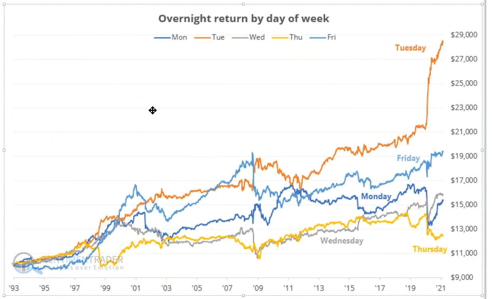
  <figcaption>Figura 26. Retorno del overnight en S&P por día de la semana (SentimenTrader).</figcaption>
</figure>

El *overnight* por día de la semana. Veis las enormes diferencias. Ya os la pasaré esa imagen. Y lo mismo pero durante el *daytime*, la sesión normal:

<figure>
  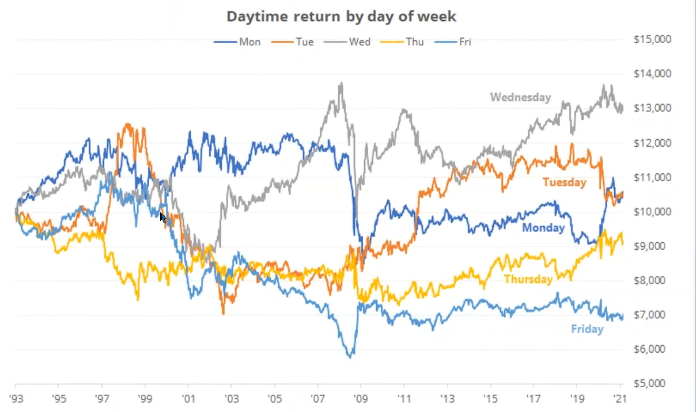
  <figcaption>Figura 27. Retorno del daytime en S&P por día de la semana.</figcaption>
</figure>

Es decir, este que veíamos ahora de 9:30 a 16, que sigue siendo bastante *heavy*. El viernes el más flojo, el miércoles el mejor. Y se pueden combinar uno con otro, mejor diurno. Aquí tenemos algunas notas, estrategias nuestras analizadas. Esto no deja de ser un blog de notas donde tomamos notas.

Pero a raíz de esto, lo que os decía: imaginaros, dependiendo si yo sé que es martes, si yo sé que estoy operando el martes y sé que el nocturno del martes es el mejor nocturno que hay, pues a lo mejor me cierro en la apertura de miércoles, por ejemplo. Me lo acabo de inventar, pero me entendéis ahí. Cosas de este tipo.

Entonces, vamos a ver un poquito todo el tema de los filtros.


**Valoración final sobre filtros, flexibilidad y criterios personales**

Ya he comentado lo que quería comentarle a Zenén. Era esto, ¿verdad? No tenía nada más. Comentaba el del... Bueno, él comentaba que le había quedado un sistema bastante decente de cortos. Estoy de acuerdo con lo que has enseñado ahí. Además, él decía que había seguido un procedimiento paso a paso, variable a variable y demás. Pues es interesante.

Sí que veo que tienes tu *take profit* en dólares. Ya sabéis que no soy amigo de ello. Pero oye, ningún problema; quiero decir que muchos grandes autores lo usan. Aunque ya os he comentado que no estoy de acuerdo, creo que se están haciendo trampas al solitario. Pero oye, al final, como te decía antes en otro tema, esto hay opiniones. Hay cosas que son bastante claras, hay cosas que hay debate, y os los explico.

Al final, tenéis que encontrar, en eso insisto mucho, vuestra manera. Evidentemente lo que nosotros decimos son cosas que no son tonterías, que son correctas, pero tenéis que encontrar vuestra manera. Vuestra manera al final puede ser, pues debe ser distinta a la nuestra, poco a poco.


**Estructura del ORB y materiales de referencia**

| Documento | Descripción |
|      --|        -|
| 📄 [Filtros-ORB.pdf](../docs/Curso_Filtros-ORB.pdf) | Documento de filtros para sistemas ORB |
| 📄 [ORB-04.pdf](../docs/CursoORB-04.pdf) | Cuarta versión del sistema ORB |

*ORB* al final tiene tres partes. La más obvia y más clara es:

- ***Su rango y sus horas***, que desata el *setup* de entrada.

Basados en distintas fuentes, en varias de las que habéis visto de Crabel, eh, también a un otro artículo, uno también desde el que he sacado este sistema, el sistema que luego os enseñaré, que es un *Volatility Breakout*, no un *ORB*, que es un subtipo de *Volatility Breakout*, que os lo dimos el otro día. Este os lo dimos el otro día, a ver que lo abra:

Aquí: ***[Designing Volatility Breakout Systems](../docs/volatlity%20breakouts.pdf)***

*Designing Volatility Breakout Systems*. Y bueno, hace una explicación básica de lo general, que es lo que estaba diciendo ahora. Es que no tiene... O sea, un *Volatility Breakout*, o decimos en catalán, son *faves juntades*.

Porque sí que es verdad que ***en el campo del filtro, en los ORBs, es donde especialmente está la clave***. ¿Por qué? Porque al final, tú aquí ves sesiones, sesiones, sesiones, y dices: "bueno, lo fácil, es lo intuitivo, es decir, pues bueno, un ranguito, yo ahí en sus roturas opero".

<figure>
  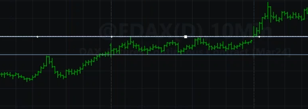
  <figcaption>Figura 28. Sesiones consecutivas mostrando rangos de apertura.</figcaption>
</figure>

Bien, es una solución. En algunos activos puede funcionar. Pero en la mayoría, directamente así, como que falta algo. ¿Y qué falta? Bueno, pues falta algún filtro que, mirando lo que ha pasado en las anteriores sesiones (puede ser que el anterior, puede ser que a veces algunas más), aumente las probabilidades de que la rotura de este día sea favorable. Es tan fácil como eso.

<figure>
  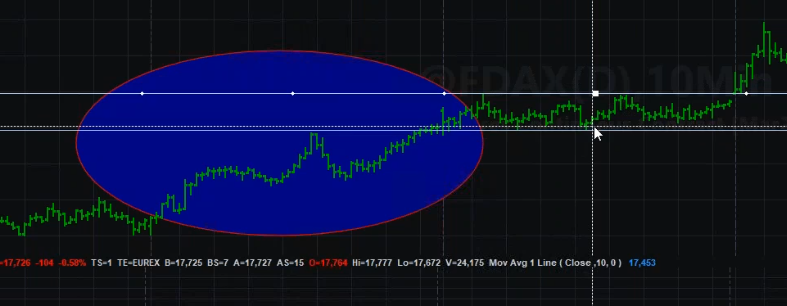
  <figcaption>Figura 29. Importancia de los filtros basados en sesiones anteriores.</figcaption>
</figure>


### Tipos de filtros aplicables y primeros ejemplos

¿En qué se basan esos filtros? Bien, en el que vimos de base había uno típico de tendencia:

- ***Momentum***: es decir, si el precio está mayor que *N*. Pues este, en esta versión que había del modelo de Rupertacho era este: simplemente el cierre es mayor que un precio de referencia, que es el cierre diario de 14 días. Esto es un *Momentum*.

```
# Curso-VB-01 Strategy
if time >= 1030 and marketposition=0 Then
Begin
    if (close > RefPrice) then     // filtro momentum positivo: solo posiciones largas
        Buy Next Bar at HHH stop;

    if (close < RefPrice) then 
        Sellshort Next Bar at LLL stop;  // filtro momentum negativo: solo posiciones cortas
End;
```

Es decir, el precio está subiendo, viene subiendo. Otro que implementamos en el nuestro, ahora ya estamos en la versión 4, que es la que hoy vamos a usar, pero bueno, más o menos la estructura es la misma: basado en un filtro de tendencia, una media de cierres diarios también, que esté por encima de esa media.

```
FiltroTendencia (0),  // Media de cierres diarios, si es 0 no actúa
```

Pues eso encajaría en los filtros de *Momentum*. Pero los que suelen ser más eficaces son los que hablan un poco de la pauta, ***de la estructura del mercado***. De la estructura del mercado. Y la estructura muchas veces se mira mejor en el gráfico diario que en el propio intradía donde vas a hacer el *trade*.

Y esto pues hay, como os digo, muchas figuras. Crabel habla de varias. Las más conocidas son, por las que habréis oído hablar, el *Narrow Range*. Zenén, por ejemplo, que hablaba, él le había usado, ahora no recuerdo si de 4 o de 7. Crabel hablaba bastante de esto, un *Narrow Range*. Ahora lo vamos, lo voy a poner ya:

<figure>
  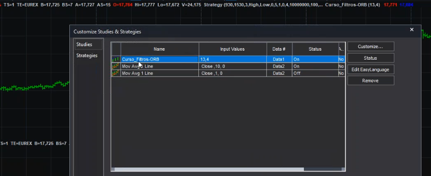
  <figcaption>Figura 30. Configuración del filtro Narrow Range.</figcaption>
</figure>

Pues empezamos por el 1, que empezamos por el 1, y allá vamos...

#### `eleccionFiltro 1`

<figure>
  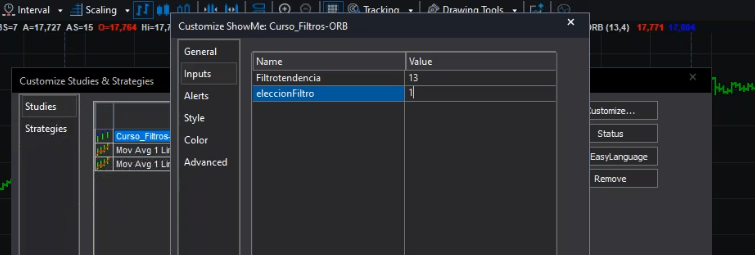
  <figcaption>Figura 31. Selector de filtros en el ShowMe.</figcaption>
</figure>


**Análisis del primer filtro: tendencia y momentum**

Empezamos en uno que me lo está marcando casi todo:

<figure>
  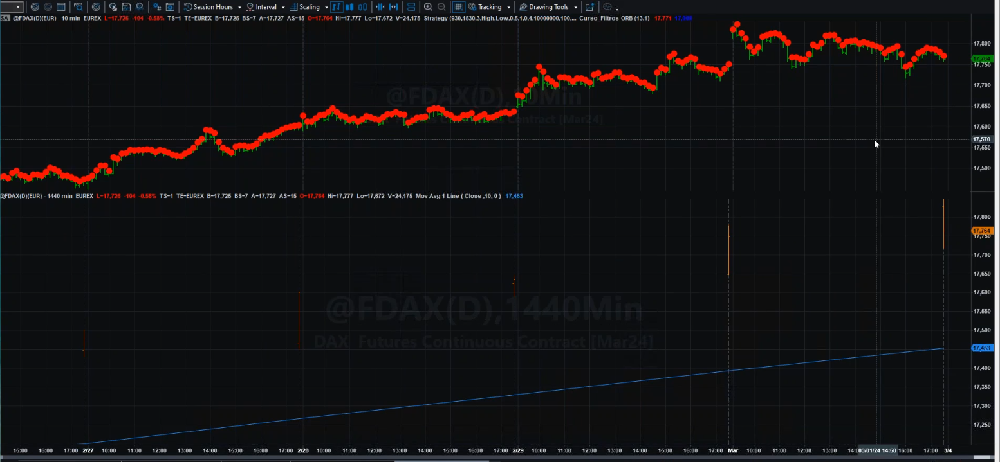
  <figcaption>Figura 33. Filtro 1 aplicado: marca la mayoría de sesiones.</figcaption>
</figure>

Estos son del artículo, como me decías, ¿verdad? Sí, ese es como el artículo: cierre mayor que la *average*, cierre mayor que la *average* y *high* mayor que *high* anterior.

<figure>
  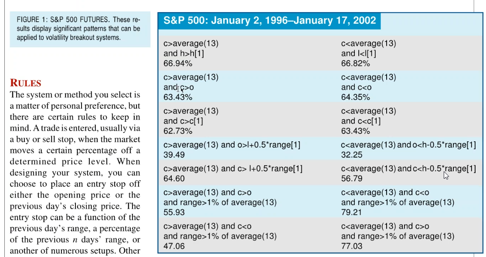
  <figcaption>Figura 37. Condiciones del filtro 1: C > Average(13) AND H > H[1].</figcaption>
</figure>

Bien, este tipo de pautas... Hay muchísimas. Aquí solo en ese artículo hay algunas. Pero creo que hay muchísimas. Aquí hay alguna que hemos mirado, ya os diremos cuáles hemos visto que van mejor. Pero hay muchísimas.

Como os decía antes también, los *Narrow Range*, los *Inside Range*, ya hablamos de ellos. También hay mucha gente que tiene especificaciones para los *gaps*, hay distintas variaciones. Hablaba antes de los días, cualquier indicador de *momentum*, es decir, cualquier variación.

Yo, por ejemplo, siguiendo este artículo, he utilizado también (hablaba, si no recuerdo mal, Crabel de ello) el *ADX*, aunque lo he hecho un poco distinto a como lo hacía él, pero he utilizado al final el ***movimiento direccional***. He utilizado también la ***volatilidad***. Al final son estos los vectores que hay, no hay más.

Lo que pasa es que sí que es verdad que la manera en que marcamos estas figuras, que nos hablan un poco de la estructura de precio, son bastante definitorias. Es decir, por mi experiencia, lo que más define que un *ORB* acabe funcionando es este tipo de estructuras. Que al final denotan, y como os digo, estructura de precios.

Bien. Esto, como os decía, lo Alberto lo ha programado en un *ShowMe*, que cuando se cumple la condición lo marca. Como estáis viendo en el caso de la primera, pues es un filtro bastante al uso de tendencia. El 1 es muy poco restrictivo.

<figure>
  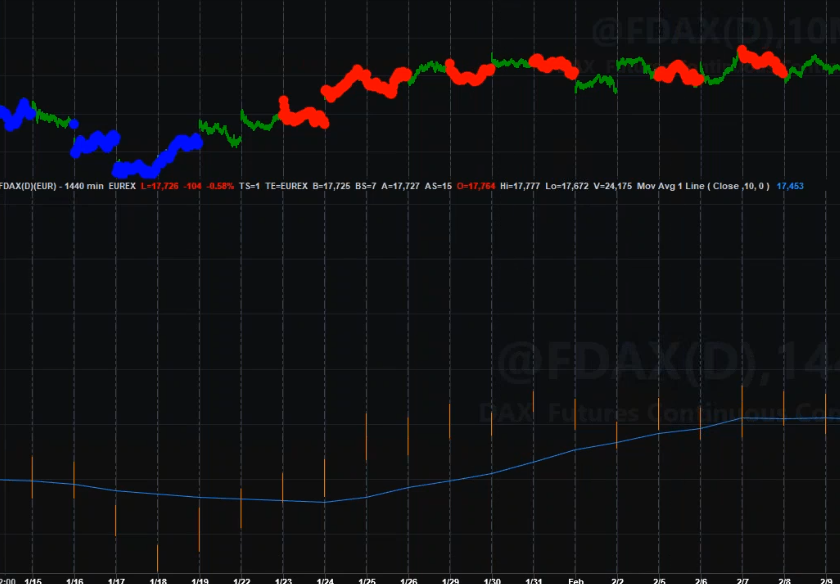
  <figcaption>Figura 34. Filtro 1 mostrando baja restricción (marca muchos días).</figcaption>
</figure>

Esto os lo recomiendo muchísimo hacerlo. Este código os lo pasaremos:

- [`filtros-ORB: ShowMe`](../PRACTICA%2008.ELD)

Esto os recomiendo mucho porque ya en la teoría os hablaba de ello. Y que también os hablaba que me sorprende, porque he hablado con colegas que dicen que ellos miran pocos gráficos, y a mí realmente me sorprende muchísimo, porque realmente es donde se ven las pautas. Donde se ven las pautas.

Entonces, al final, por mucho que tú te puedas hacer una idea, y ya sabes lo que es un cierre por encima de una media y todo lo que queráis, de esta manera entiendes muy bien el filtro. ¿Sabes? Entiendes muy bien el filtro y le coges lo que os he hablado siempre de la *sensibilidad*. Entonces es bastante útil. Ves incluso a qué nivel, a qué frecuencia actúa.

Así es. Porque ya veréis que hay algunos que constantemente dan, bueno, dan, nos queda en señal. Constantemente cumple las condiciones para pintar. Sin más, esto es tan sencillo como: si cumple, pintas, y no pues no pintas. En este caso, en el mismo `Case 1` pinta tanto el *Plot 1* como el *Plot 2*, ¿verdad Alberto? Exactamente.

Es importante para entender un poco la idea, el *setup*. Y os lo recomiendo en general con todos los *setups*. Es decir, verlos, mirar los *setups* en la pantalla. Porque ahí verás cuándo actúa o cuándo no.

Bien, ***este era el 1***:

$$
C > \text{Average}(13) \quad \text{and} \quad H > H[1]
$$

$$
\text{Cierre mayor que la media de 13 días y el máximo mayor que el máximo del día anterior}
$$

*Frecuencia: 66.94%*

Este buen hombre pues había hecho unos estudios aquí. ¿Cuál es el segundo? Este, como os digo, es un posible filtro. Este claramente es de *Momentum*. Y si no recuerdo mal, poco efectivo, ¿verdad Alberto? Este es poco efectivo. Como yo creo que ya sospechabais, porque al final es muy poco restrictivo por sí solo. Puede que a lo mejor en combinación con otro, ¿me entendéis? Es decir, a lo mejor este, este para simplemente filtro de *Momentum*, y luego una pauta de volatilidad, pues a lo mejor ya funciona, ¿me entendéis? Pero por sí solo, pues es poca cosa.

#### `eleccionFiltro 2`

***Bien, ahora le ponemos el 2***

$$
C > \text{Average}(13) \quad \text{and} \quad \text{Close} > \text{Open}
$$

$$
\text{Cierre mayor que la media de 13 días y cierre mayor que apertura (vela alcista)}
$$

*Frecuencia: 63.43%*

Es muy parecido. Lo único que, en vez de comparar... O sea, además del cierre por encima de la media (esto es igual, tiene el *Momentum*), pero además la pauta de estos, si os fijáis, es parecido al análisis *candlestick*, a aquellos que habéis hecho velas, ¿no? Y el cuerpo real. Todo este tipo de cosas.

El *candlestick* al final, cuerpo real es cierre menos *open*, *open* menos *high*, el rango es *high* menos *low*. Es decir, todo este tipo... Es muy usual trabajar este tipo de pautas.

En este caso comparaba el *high* con el *high*, muy obvio. Pero aquí lo que haces es comparar el cierre con el *open*. ¿Qué haces comparando el cierre con el *open*? Bueno, quiere decir que ha sido una vela alcista. No quiere decir que el día ha subido, fijaros. Porque el día si ha subido es cierre contra cierre anterior. Cierre contra *open* es que la vela es alcista, ¿entendéis? Es decir, que durante la jornada ha subido desde que ha abierto.

Pero ha podido abrir con un *gap*, ¿entendéis? Ha podido abrir con un *gap*. Como, por ejemplo, hoy el mercado ha abierto con un *gap* al alza, el mercado americano. Pues y desde ahí puede caer, y entonces el cierre no sería mayor que el *open*, aunque la sesión sea alcista, ¿entendéis?

Entonces esto al final es una figura de velas. Esto quiere decir que el cuerpo de la vela es azul, ¿entendéis? No es que sepáis *candlestick*. Y entonces ya marca distinto, porque como tiene que cumplir las dos:

<figure>
  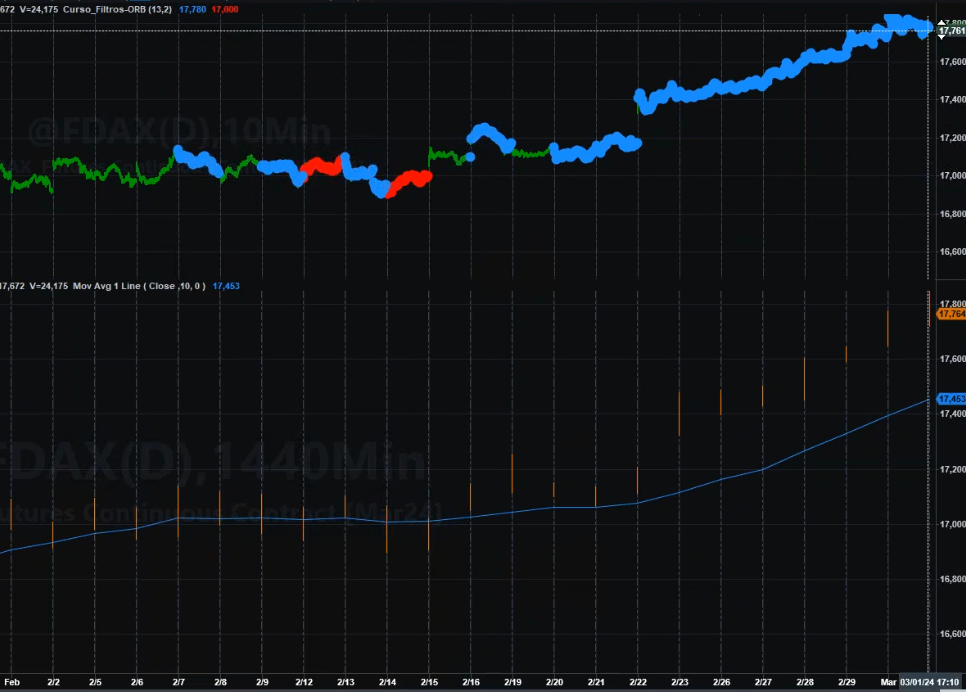
  <figcaption>Figura 35. Filtro 2 aplicado: marca días con vela alcista.</figcaption>
</figure>

Antes todo esto era igual. Bueno, no, porque era de 50, hay cuidado. Y ahora pues aquí ya tiene algunos días donde esto no se da. Esto no se da también. Bueno, es otro filtro. Bien, entonces este es otro nuevamente. Pues podemos, como os digo, va bien para verlo en el gráfico.


#### `eleccionFiltro 3`

<figure>
  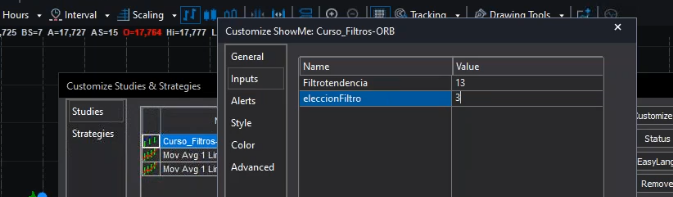
  <figcaption>Figura 36. Filtro 3 aplicado en el gráfico.</figcaption>
</figure>

$$
C > \text{Average}(13) \quad \text{and} \quad \text{Close} > \text{Close}[1]
$$

$$
\text{Cierre mayor que la media de 13 días y cierre mayor que el cierre del día anterior}
$$

*Frecuencia: 63.43%*

<figure>
  
  <figcaption>Figura 37. Condiciones del filtro 3.</figcaption>
</figure>

¿Qué más? El tercero, ya vais a ver que algunos cambia un poco más. Estos son bastante parecidos. Al final tenemos los de *Narrow* y demás, que son los que más utiliza la industria.

Aquí viene el 3, que nuevamente es muy parecido. Todos estos primeros mantienen el mismo criterio de cierre mayor que... Lo que cambia es un poco la segunda pauta.

Este es lo que os decía: es parecido al anterior, porque el anterior es cierre mayor que *open*, y la mayoría de veces que pase esto va a pasar que el cierre sea mayor que el cierre anterior, pero no siempre. Entonces bueno, es ese matiz. Probar uno contra otro, cual es, probar las diferencias. Y luego también dependerá de qué activo; habrán activos que cambie más que otros.

Pero bueno, este realmente es parecido, ¿ves? Aquí, por ejemplo, pues ya hay días más rojos. Vamos al siguiente, porque esos son muy similares.


#### `eleccionFiltro 4`

<figure>
  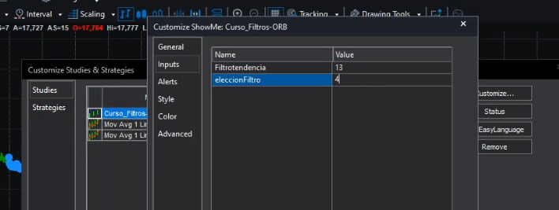
  <figcaption>Figura 38. Filtro 4 seleccionado.</figcaption>
</figure>

El cuarto ya es más interesante, y de esto lo veréis, es muy habitual. Y la primera vez que lo ves es como raro, pero ya os lo explico y veréis que no está raro. Es que no está raro.

Eso ya cambia más. Aquí ya la cosa ya no está tan clara. Veis, ya hay días que sí. Aquí sube, sube, sube, en cambio no lo ha marcado. No se le cumplía la condición.

<figure>
  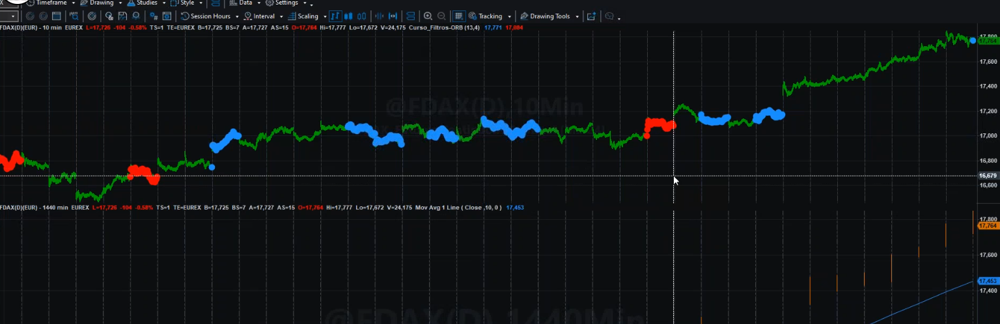
  <figcaption>Figura 39. Filtro 4 aplicado: marca menos días, más selectivo.</figcaption>
</figure>

¿Qué condición es esa?

$$
C > \text{Average}(13) \quad \text{and} \quad \text{Open} > \text{Low} + 0.5 \times \text{Range}[1]
$$

`C > Average(13)`: esta no es el problema. La que está marcando un poco la diferencia es la segunda parte, ¿no? Se tienen que cumplir las dos.

Es que el *open* sea mayor... La voy a leer mejor, en el código está: que el *open* sea mayor que `Low + una cantidad`. *Low* más una cantidad. No es simplemente el *open* contra el *low*. Es que el *open* sea mayor que el *low* más una cantidad. Y ***esta cantidad es la mitad de la vela, de todo el rango de la vela***.

Esto es muy habitual. Lo veréis muchas veces con un `0.5`, con la mitad. Y también a veces lo he visto yo bastante en tercios. Es decir, al final esto, ya digo, proviene bastante del *candlestick*. Esto hablaba bastante de ello. Se llamaba el autor este que se hizo tan popular, Nison (Steve Nison, autor de *"Japanese Candlestick Charting Techniques"*), de velas.

Es decir, al final tú tienes una vela. Y una vela al final...

<figure>
  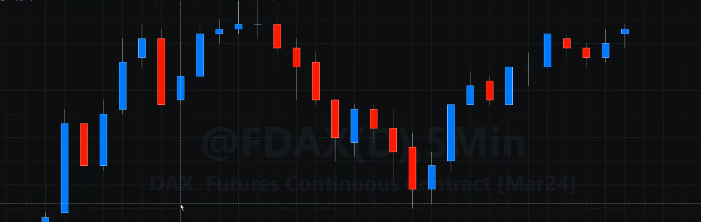
  <figcaption>Figura 40. Anatomía de una vela: Open, High, Low, Close y rangos.</figcaption>
</figure>

Pues casi todas estas figuras en el fondo vienen de esto. De entender esto y de entender que esto, que es verdad, que por sí solos tienen poco poder predictivo analizados solos. Como complementos de filtros son bastante útiles, porque al final esto te está hablando de la estructura del mercado y, por añadido, de las fuerzas del mercado.

El mercado es oferta y demanda. Y al final, una vela por sí sola, sobre todo esas de cinco minutos, pero evidentemente como siempre hay más ruido tal, en diario, al final te está diciendo mucho sobre la estructura y quién controla el mercado. La vela en sí.

Todo el rato. Hasta las más tontas. Y de hecho, las más tontas usualmente son las que más información dan. Y claro que no hay ciencias ciertas, pero fijaros que tras impulso muchas veces hay velas con mechas, con cuerpos pequeños. Lo veis.

Esto claramente está marcando un rango lateral. Tú, por ejemplo, tienes esta vela que es un tirón fuerte, y automáticamente luego qué te viene: ves una vela con un cuerpito de nada, mechita, mechita. ¿Qué es lo más probable de esto? Es lo más probable, es continuación. Es así. Que lo más probable ya indica que no es seguro, pero es así.

Pues esto al final es una estructura que a mí me hace, me puede hacer decir... Yo puedo utilizarlo a lo mejor en sistemas si puedo medirlo de alguna manera: que es probable que la siguiente rotura sea fuerte. ¿Por qué? Porque las congestiones de precios provocan, son un anticipo de expansiones. Y esto es siempre esta pauta que hay.

Que hay muchas veces que pues la contracción dura una eternidad y te duermes. Es decir, y esto pasa. Y aquí en toda esta estructura dices: "mira, pues aquí esta puede ser buena", y al final no lo ves y se va abajo. Claro que hay fallos.


**Relación entre estructuras de velas, breakout y tendencia**

Pero ligando un poquito con lo que decía antes de Zenén, antes del lado largo. ¿Qué pasa en el lado largo? Tú en el lado largo, ¿por qué es más complicado? Porque esto es muy aprovechable para un *Volatility Breakout*, pero ves, no marca tendencia:

<figure>
  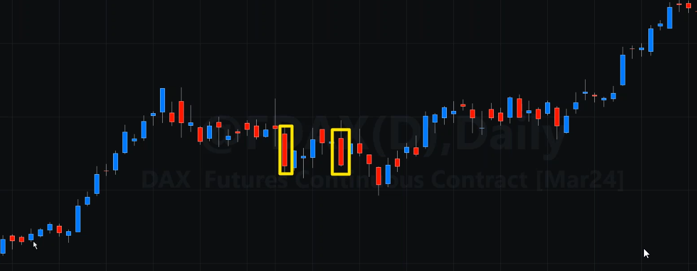
  <figcaption>Figura 41. Zona de congestión aprovechable para Volatility Breakout.</figcaption>
</figure>

En cambio, esto para un *Volatility Breakout* no es aprovechable:

<figure>
  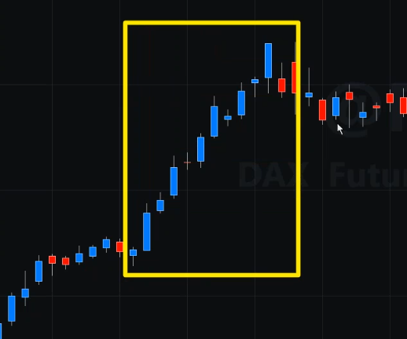
    <figcaption>Figura 42. Zona de tendencia: mejor para sistema tendencial que para breakout.</figcaption>
</figure>

Esto es aprovechable para un tendencial. Tenemos, eso es diario ahora. Entonces es otro tipo de sistema. Yo para operar aquí iré mejor en tendencial.

¿Puedo aprovechar el *Volatility Breakout* del lado largo? Sí que puedo. Pero entiendes, es distinto. Porque si puedo coger esta vela y me salgo:

<figure>
  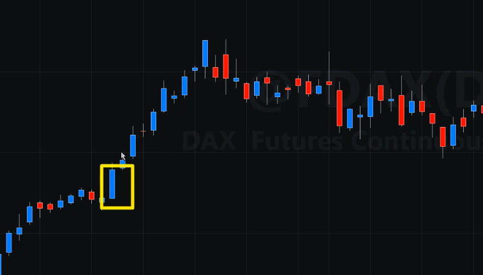
  <figcaption>Figura 43. Ejemplo de entrada y salida rápida en breakout dentro de tendencia.</figcaption>
</figure>

Pero luego ya está. Aquí ya es complicado entrar muchas veces. En muchos casos será complicado entrar, habrá muchos *Volatility Breakout*. De hecho, el otro que tenemos preparado, os lo entregaré al final. Si no os lo entrego el código hoy, os lo subiremos mañana. Pero ya os enseñaré seguro.

Al final, aquí no entra ya. No entra, porque su manera de identificar el *breakout* requiere descanso. Cuando ya está tendencia, no es su partida.

Pues todo esto que al final son figuras de velas, todas estas que os digo que vienen aquí, que son el rango, una parte del rango... Lo que hay detrás de `Open > Low + 0.5 × Range[1]` al final es una vela, es una figura de vela.


**Interpretación práctica y cálculo de la regla de mitad del rango**

Es decir, cuando yo estoy midiendo la mitad del rango... Esto, si os cuesta, la mejor manera es pasarlo a números. Un poco cuenta la vieja. Te coges unas cuantas velas y lo haces, y te haces el cálculo. Entonces lo entiendes. Te haces el cálculo de lo que está haciendo.

Porque así dices: "la mitad del rango más el *low*", como que suena raro. Pero vamos a intentar, a ver dónde tengo ahora el código. Aquí no. Vamos a intentar de esto que está aquí escrito `Open > Low + 0.5 × Range[1]`, pintarlo. A ver si lo consigo yo pintar en una vela.

En una vela que haya... Bueno, como lo tengo puesto... Bueno, en cualquiera de estas. Claro, cualquiera de estas me está dando *true*, lo cual está pintada. La alcista. Esto lo pinta para todo el día. Como usa el *daily*, se lo pintamos arriba. Pero en realidad usa datos de abajo, ¿se entiende esto? Usa datos de abajo.

Porque esas son pautas que se han analizado en el diario. Se han analizado en el diario. Es decir, en esta sesión toda ella cumple, quiere decir que en la anterior cumple.

<figure>
  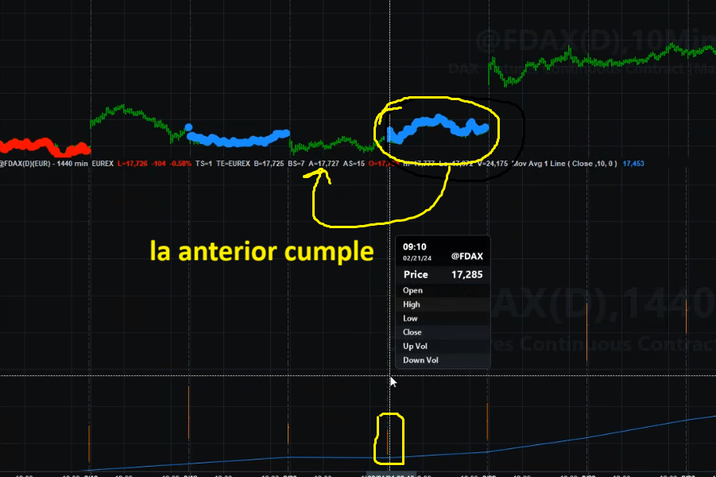
  <figcaption>Figura 44. Vela diaria que cumple la condición del filtro 4.</figcaption>
</figure>

Es decir, esta al cierre es la que desata la sesión. Entonces voy a ver si aquí abajo lo voy a hacer *candlestick*. Ah no, me lo he hecho arriba. Venga, perfecto, lo he hecho arriba. Pues entro aquí y me lo hago yo.

Aquí no me lo pone azul. Este servidor no es culé, Alberto. ¿Qué pasa aquí? Esto tiene que ser rojo y azul y grana. Esto no se repita. Bastante vales, estamos para al menos bajarlos del barco. Hay que apoyar ahí.

Bueno, esta es la vela. Espérate que ya me acerco. Ahí llegamos. Esta es la vela que aparte de ahí pinta. Porque ese es el cierre. Este es el *close*, 530. Las velas salieron al cierre y ahí empieza a pintar.

<figure>
  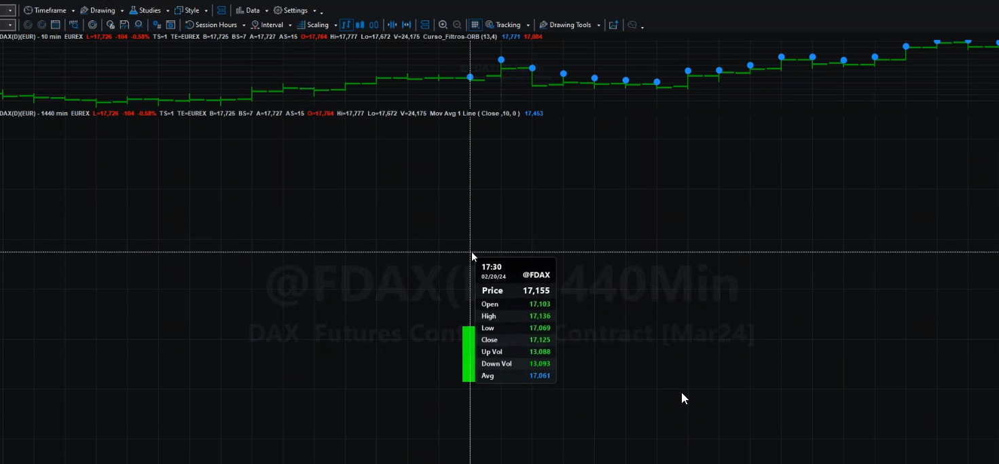
  <figcaption>Figura 45. Detalle de la vela con los valores OHLC para el cálculo.</figcaption>
</figure>

Entonces, ¿cuál es la regla que dice Fran?

La media es obvio que está por encima del 13. Pero luego además tenemos la otra condición. Os la enseño aquí para que la veáis:


**Código del filtro 4**

```
Case 4: 
    if Close of data2 > average(Close of data2, FiltroTendencia) 
       and Open of data2 > Low of data2 + 0.5 * range[1] of data2 then 
        Plot1( High, !("Filtro1 Lng") )
    Else
        Noplot(1); 
        
    if Close of data2 < average(Close of data2, FiltroTendencia) 
       and Open of data2 < High of data2 - 0.5 * range[1] of data2 then 
        Plot2( Low, !("Filtro1 Shrt") )
    Else
        Noplot(2); 
```

Porque es que en el PowerPoint está como que se ve muy rara, porque pone la *O* en esa minúscula y yo creo que casi no se entiende. A ver si aquí lo veis más fácil.

La primera es obvia. La segunda es esta. Perdón, si el *data2* es el *daily*, o sea, olvidaros del *data2*, no aporta nada al entendimiento. Simplemente que es el gráfico de abajo que está en diario.

Es decir: `Open of data2 > Low of data2 + 0.5 * Range[1]`. El *open* es mayor que *low* más la mitad del rango. El *open* tiene que ser mayor que *low*. A ver si lo pinto yo aquí.

Es decir, que participa aquí: participa el *open*, participa el *low*, y participa el *range* que es esto. Concretamente participa la mitad de esto. Es decir, este trozo. Bueno, este es igual. ¿Se entiende, no?

<figure>
  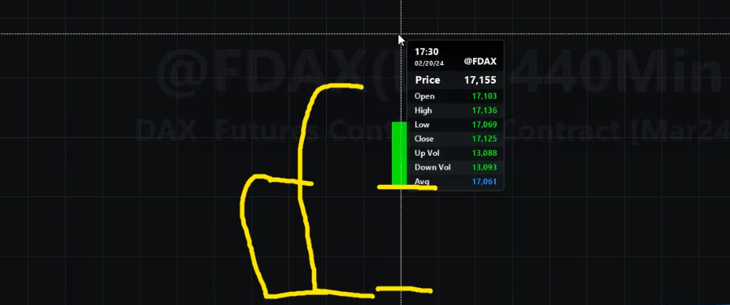
  <figcaption>Figura 46. Esquema visual de los componentes del cálculo: Open, Low y 50% del Range.</figcaption>
</figure>

¿Cómo? Perdón.

Tenemos un *low* que es 17069. Tenemos un *open* que es 17103. Esto es el *low*. A ver que lo he perdido. 17103, esto es el *open*. Y tenemos un *range* que es la resta entre el *high* y el *low*.

Siempre que veáis rango es *high* menos *low*. Es exactamente lo mismo. Que es 17136 menos 17069. Eso es el rango.

Yo calculo eso. Eso me da **67**.

Y eso me dice que lo multiplique por 0.5, que es lo mismo que dividirlo por 2, estamos de acuerdo, ¿no? La mitad. Que es **33.5**. El 0.5 es 33.5 puntos.

Y entonces a mí la regla para ser *true*, tiene que ser que el *open*... O sea, le tengo que sumar esto al *low*. El *low* era 17069 más 33.5, y me da **17102.5**. El *open* era 17103. Por medio punto es *true*. Medio punto.

<div style="border-left: 4px solid #4caf50; background: #e8f5e9; padding: 10px 15px; margin: 10px 0; border-radius: 8px;">
  <strong>📐 Cálculo paso a paso del Filtro 4</strong><br><br>
  <strong>Datos de la vela:</strong><br>
  • High = 17136<br>
  • Low = 17069<br>
  • Open = 17103<br><br>
  
  <strong>Cálculo:</strong><br>
  1. Range = High - Low = 17136 - 17069 = <strong>67 puntos</strong><br>
  2. Mitad del Range = 67 × 0.5 = <strong>33.5 puntos</strong><br>
  3. Umbral = Low + (0.5 × Range) = 17069 + 33.5 = <strong>17102.5</strong><br>
  4. Condición: Open > Umbral → 17103 > 17102.5 → <strong>TRUE</strong><br><br>
  
  <strong>Interpretación:</strong> El Open está por encima de la mitad del rango de la vela, indicando que la apertura ocurrió en la parte superior de la vela, señal de fortaleza.
</div>

Pero lo que quiero que entendáis es lo que significa. Fijaros que esto a mí me está diciendo: lo que en el fondo estoy comparando es la apertura. Lo que me está diciendo es que ***la apertura está lejos del mínimo***.

<figure>
  
  <figcaption>Figura 47. Visualización: el Open está en la mitad superior de la vela.</figcaption>
</figure>

¿Se entiende un poco la idea? ¿Por qué? Porque si el mínimo estuviera más cerca, si el mínimo estuviera más cerca, sumado a la mitad del rango al mínimo, superaría el *open*.

¿Entendéis un poco cómo juegan este tipo de figuras? Porque veréis muchas así. Que tú la lees, que tú la lees, es: "joder, esto qué es, la mitad del *low* más el *high*, no sé qué". Hay muchas versiones de este tipo.


**Reflexión sobre la importancia de entender los cálculos de los filtros**

En el fondo, es muy recomendable que hagáis este ejercicio de entenderlo, ¿entendéis? Cuando ya estén a consumirlo pues es igual. Pero es muy importante en cuantitativo entender el porqué de las cosas.

Esto en la teoría os lo decía mucho a partir de los indicadores. Todo, oye, ya no es el MACD, el RSI, el Estocástico. O sea, hay que entender qué hace cada cosa. Y lo mismo esto. O sea, no caer en meter filtros y meter y no saber ni qué metéis, ¿entendéis?

Es decir, coger una lista de 50 que podéis encontrar por ahí un montón y meterlos. O ir metiendo varios. Puedes probarlos, pero entendiendo qué hace. Entendiendo qué hace.

Bien, este es uno de ellos que pues da *true* en determinados casos. Bueno, porque esto lo que está indicando es esto. Lo que os digo. Al final, al comparar el *open*... A ver, estoy aquí arriba, aquí. Al comparar...

Bueno, primero, estoy en tendencia alcista:

$$
C > \text{Average}(13)
$$

Todos parten de eso. Estoy en tendencia alcista porque cierre mayor que una media. Estoy en tendencia alcista. Pero además de estar en tendencia alcista, yo pido esto:

$$
\text{Open} > \text{Low} + 0.5 \times \text{Range}[1]
$$

Luego veréis que hay otro que es con el *close*. O sea, no, no. ¿Por qué el *open*? Bueno, es porque hay varias. Hay varias. El *open* de a mentir la importancia. Ahora me gusta más el *close*. Perfecto. Ahora en la siguiente lo vemos.

Este es con el *open*. Este lo que está comparando es el *open* con el *low*, pero no directamente con el *low*. Le suma la mitad del rango. Pero esto ***es una manera de decir que está lejos***, ¿entendéis? Está lejos. Porque si no estuviera lejos, lo sobrepasaría. Y de hecho no lo sobrepasa por medio punto.

Con relación, o de hecho de otra manera: el *open* con relación al cuerpo... Bueno, no el cuerpo, perdón, porque el cuerpo es esto. Todo el rango. El *open* está por encima de la mitad.

<figure>
  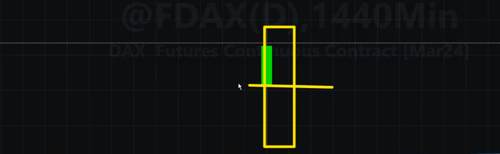
  <figcaption>Figura 48. El Open posicionado por encima del 50% del rango total de la vela.</figcaption>
</figure>

#### `eleccionFiltro 5`

**Preparación para el siguiente filtro: comparación con el cierre y cambios en la lógica**

Ahora vamos a hacer lo mismo pero con el cierre.


```
Case 5:
    if Close of data2 > average(Close of data2, FiltroTendencia) 
       and Close of data2 > Low of data2 + 0.5 * range[1] of data2 then 
        Plot1( High, !("Filtro1 Lng") )
```

En el 5 es muy parecido al anterior. Seguimos comparando el... O sea, seguimos estando en tendencia alcista y un cierre por encima de la media. Que esto podría haber hecho separado, pero bueno, hemos respetado al autor.

Tienes, pero, o sea, aquí hay dos filtros del uno: uno de *momentum* (cierre por encima de la media) y además de pauta. Hay dos: *momentum* y pauta de precio. Es súper habitual este concepto de uno de *momentum* y otro. O sea, ¿por qué? Porque yo voy a favor de tendencia, pero además de favor de tendencia quiero algo, ¿no?

Y también puede ser en contra de tendencia, cuidado. Es decir, es muy habitual lo que os decía antes, que esto no es *Artemisa*, es decir, lo contrario: es decir, el cierre es menor que el cierre anterior. O sea, yo estoy en tendencia alcista, pero el cierre es menor al anterior, es decir, estoy en una corrección. Sin llegar a perder la tendencia, estoy en una corrección. Esto también es muy habitual.

Pero aquí de momento es tendencia y una figura de velas que vamos tratando de analizar cada una, ¿no?

En este caso, lo que os decía, lo que compara es el *close* con el *low* más el rango: `Close of data2 > Low of data2 + 0.5 * range[1]`. Entonces, nuevamente tenemos los mismos elementos. Lo que pasa es que aquí ya no es el *open*, sino el *close*.

<figure>
  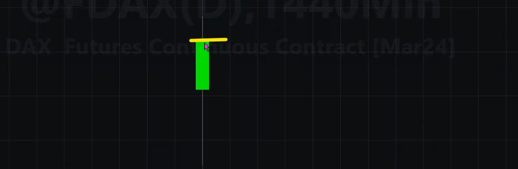
  <figcaption>Figura 49. Filtro 5 aplicado: comparación del cierre con la mitad del rango.</figcaption>
</figure>

Pero claro, aquí otra vez me está diciendo que lo que compara es el *close* sumándole la mitad del rango. Si le sumo la mitad del rango... El *close of data2* mayor que el *low* más la mitad del rango, exactamente. Es... Yo al *low* nuevamente tengo el rango aquí, y al *low* le sumo la mitad, poco más o menos, así a ojo.

Es ahí, ¿no? Cuidado, que estoy ya mejorando. Entonces, yo al mínimo le sumo esta mitad y me quedo aquí donde estaba antes.

<figure>
  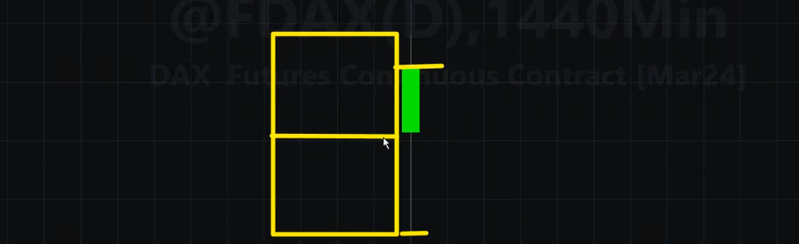
  <figcaption>Figura 50. Cálculo visual: Low + 50% del Range marca el umbral.</figcaption>
</figure>

Lógicamente, ahí me quedo en esta línea. ***¿El cierre es mayor que esta línea?*** Por mucho más que antes. Antes el *open* ya lo era, pero por poco; ahora es mucho más. ¿Entendéis un poco?

Entonces, yo le estoy pidiendo ***un cierre muy alejado del mínimo***, igual que antes con el *open*. Es más estricta con el *open*; el cierre es más fácil. Podemos decirlo así: con el *open* es más estricta. Pero entendéis un poco la diferencia entre una y otra: una con el *open* y la otra con el *close*.

Esta vela es claramente alcista. Le estoy pidiendo una vela que sea muy alcista o, para ser más ortodoxos, que cierre muy alejada del mínimo. Eso es lo que le está pidiendo esta pauta. Y así ya vamos entrando en la mentalidad de entender las pautas.


**Uso de las pautas y su función como filtros**

Esto no solo se usa en el *ORB*, cuidado. Este tipo de figuras os las estoy introduciendo aquí porque se utilizan mucho a nivel de filtros, y es muy típico en este tipo de sistemas, por lo que os decía: para aumentar la probabilidad de acierto.

Aunque, cuidado, no siempre ganan más. Mira, vuelvo a referirme al sistema, porque lo has pasado y se me olvidó comentarlo. Al leer tu email lo he pensado. Tú lo comentabas: creo que decías que no ganaba más, pero sí que aumentaba la probabilidad. Esto es muy habitual.

En el sistema que veréis ahora siempre aparece este dilema: filtrar más o filtrar menos. ¿Hasta dónde filtro? Porque si filtro más, aumento el acierto y el *Profit Factor*, pero pierdo *trades*, gana menos. Ahí está el equilibrio. Y no hay una respuesta única, no hay una fórmula que diga "hay que hacer esto y esto". Depende de la cartera, depende de qué busque cada uno. Ahí está esa parte de interpretación.

<div style="border-left: 4px solid #f39c12; background: #fff8e5; padding: 10px 15px; margin: 10px 0; border-radius: 8px;">
  <strong>⚖️ El dilema del filtrado</strong><br><br>
  <table>
    <tr>
      <th>Más filtros</th>
      <th>Menos filtros</th>
    </tr>
    <tr>
      <td>↑ Tasa de acierto</td>
      <td>↓ Tasa de acierto</td>
    </tr>
    <tr>
      <td>↑ Profit Factor</td>
      <td>↓ Profit Factor</td>
    </tr>
    <tr>
      <td>↓ Número de trades</td>
      <td>↑ Número de trades</td>
    </tr>
    <tr>
      <td>↓ Beneficio total potencial</td>
      <td>↑ Beneficio total potencial</td>
    </tr>
  </table>
  <br>
  No existe una respuesta única. El equilibrio depende del contexto de la cartera y los objetivos de cada operador.
</div>


**El componente humano en la operativa cuantitativa**

Esto me lo comentaba un colega que además está apuntado al curso. Me decía: "Yo pensaba que esto del trading algorítmico era como sota, caballo y rey, muy cuantitativo y cerrado, y estoy viendo que hay cierto grado de discreción". Y le respondí que sí, cierto grado hay, pero muy pequeño, porque todo está bastante estandarizado.

Aun así, es verdad que al final hay cierto margen. Y si no lo hubiera, todo sería igual: todo el mundo ganaría o todo el mundo perdería. No habría margen para que existieran operadores buenos que destaquen técnicamente, no habría diferencias entre los resultados. Si todo fuera tan rígido, no habría espacio para la excelencia.

Tratamos de protocolizar y estandarizar los procesos, pero siempre queda un pequeño margen, porque al final siempre hay una persona detrás. Eliminar eso al cien por cien es difícil, aunque tratamos de minimizarlo al máximo. Si me estás viendo en directo, salúdame por el chat, que ya sabes quién eres. Me he ido del tema, pero volvamos.


**Análisis del patrón número 5**

Ya estaba mirando el 5, creo. El 5 es el que hemos visto del cierre, aunque no hemos analizado el lado negativo. Lo pongo un momento aquí simplemente para que lo veáis, pero vaya, es un poco lo mismo.

Lo único es que en un mercado alcista cuesta más, porque recordad que se tienen que dar las dos condiciones: el cierre tiene que ser inferior a la media de cierres. Si esa ya no se da, da igual si se cumple la de velas. Se tienen que cumplir ambas. Aquí, por ejemplo, se da, ya lo veis.

<figure>
  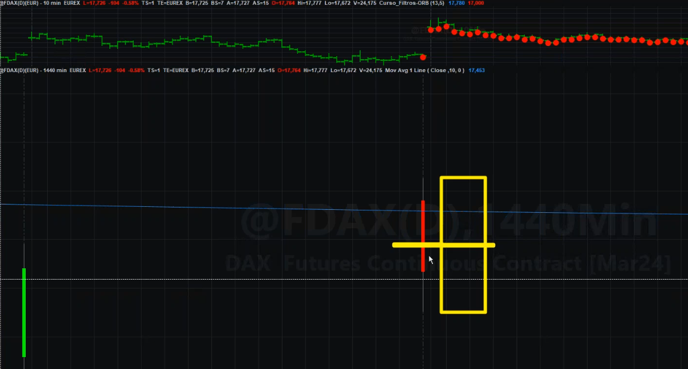
  <figcaption>Figura 52. Filtro 5 en el lado corto: cierre en la parte baja del rango.</figcaption>
</figure>

Tiene que ser una vela que cierre en la parte baja del rango. Eso es: al final es la mitad del rango. Al máximo le sumo la mitad del rango y me quedo más o menos ahí. Esa raya tiene que estar por debajo del cierre o por encima, y lo está: el cierre tiene que ser menor.

Esta con el *open* no lo cumpliría, ¿veis? Porque el *open* está arriba. Esta con el *open* no estaría pintada roja. La número 4 no estaría pintada porque la mitad del rango cae por debajo del *open*. Por el cierre sí, lo veis: el cierre está debajo de esta línea, pero el *open* está por encima. Así entendéis cómo funcionan estas figuras.


**Interpretación de las velas y la lógica detrás del candlestick**

Como os decía, al final detrás hay un *candlestick*. No en el sentido estético, sino técnico, aunque la estética ayuda mucho a entenderlo. El *candlestick* gusta porque es visual: esto por sí solo me da mucha información.

Me está diciendo que hemos cerrado muy alejados de la apertura, que ha sido una sesión de rango importante, que también hay bastante mecha en ambos lados y que tiene cierta indefinición, porque el precio ha vuelto bastante desde el mínimo. En otras velas hay indefinición absoluta: ha habido mucho rango, pero al final ha cerrado donde abrió. Las velas dan muchísima información y se usan mucho en este tipo de análisis.

#### `eleccionFiltro 6`

Está mezclando ya conceptos, porque sigue introduciendo la media, pero ahora compara el cierre con el *open*, que esto ya lo habíamos hecho antes. Es la 2 con algo más. ¿Y qué es ese "algo más"? Pues vamos a verlo:

$$
C > \text{Average}(13) \quad \text{and} \quad \text{Close} > \text{Open} \quad \text{and} \quad \text{Range} > 1\% \times \text{Average}(13)
$$

*Frecuencia: 55.93%*

El *range* —recordad, *high* menos *low*— debe ser mayor del 1% de la media de 13 días. Esto nos dice que debe ser un rango amplio, es decir, que haya sido una vela volátil. Es una manera de medir la volatilidad. ***Está incorporando la volatilidad***, porque uno de los indicadores que usamos para medirla es el *Average True Range* (ATR), que es la media de los rangos.

Esto lo que hace es comparar el *range* (de una vela) con la media de varios rangos. Tiene que ser mayor que el 1% de la media de los 13 días.

Esto lo veis en el código. Este era el 6:
```
Case 6:
    if Close of data2 > average(Close of data2, FiltroTendencia) 
       and Close of data2 > Open of data2 
       and range of data2 > average(Close of data2, FiltroTendencia) * 0.01 then 
        Plot1( High, !("Filtro1 Lng") )
```

<div style="border-left: 4px solid #4caf50; background: #e8f5e9; padding: 10px 15px; margin: 10px 0; border-radius: 8px;">
  <strong>📐 Explicación del Filtro 6</strong><br><br>
  Este fragmento de código define una <em>condición de filtro para entradas largas (long)</em> basada en tres requisitos simultáneos aplicados sobre <em>data2</em> (normalmente el timeframe diario):<br><br>
  <ol>
    <li><strong>Tendencia alcista:</strong> el cierre actual está por encima de la media de cierres de los últimos <em>FiltroTendencia</em> días.</li>
    <li><strong>Vela alcista real:</strong> el cierre es mayor que la apertura.</li>
    <li><strong>Volatilidad suficiente:</strong> el <em>range</em> de la vela (High - Low) supera al menos el 1% de esa misma media de cierres.</li>
  </ol>
  Si las tres condiciones se cumplen a la vez, el sistema dibuja un marcador visual (Plot1) en el <em>high</em> de la barra, señalando que esta vela cumple el filtro técnico "Filtro1 Lng".
</div>

Aquí hay que suponer que se refiere a la media de los *closes*, claro, porque si no, no tendría sentido. Este es menos intuitivo, así que vamos a tratar de verlo en pantalla. Los dos primeros eran claros, ya los hemos visto. Aquí ya pinta poco porque le pedimos muchas condiciones. Si te refieres al *data2*, la regla solo se evalúa en esa vela, por lo tanto todas las de la serie deberían estar pintadas.

<figure>
  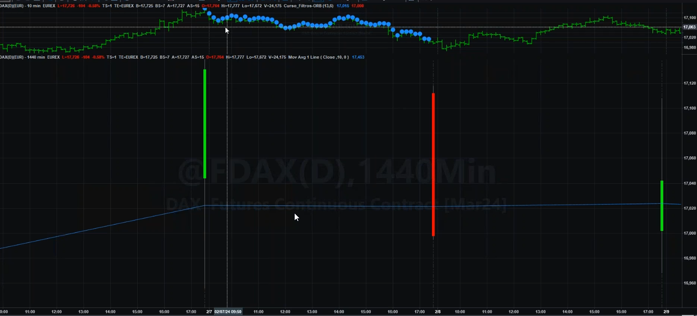
  <figcaption>Figura 54. Filtro 6 aplicado: pocos días cumplen las tres condiciones.</figcaption>
</figure>

Compara el *range*, nuevamente, *high* menos *low*. Nos dice que el *range* tiene que ser mayor que la media de los cierres, que es esta línea azul, la media de los cierres. Concretamente, el código indica: *data2 open range* mayor que la media por 0.01, es decir, por un 1%.

<figure>
  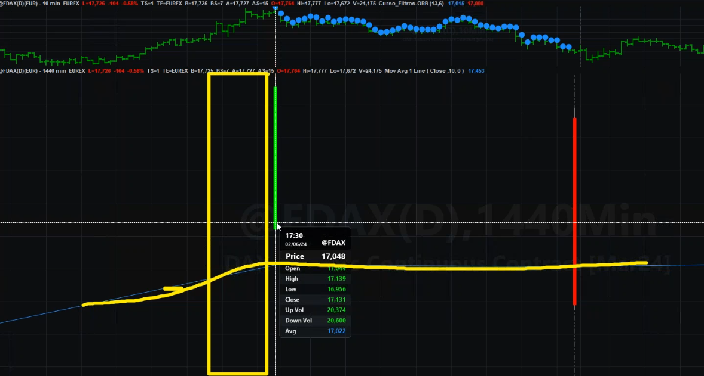
  <figcaption>Figura 55. Detalle del cálculo: Range > 1% de la media de cierres.</figcaption>
</figure>

Es un poco raro, porque al final multiplica esto por 0.01. Por ejemplo, si la media de cierres es 17.022, por 0.01 da 170 puntos, y el rango debe ser mayor que 170 puntos. Nuevamente, ***nos está diciendo que es una vela de mucho rango, una vela muy volátil***. Le veo bastante sentido. Al final creo que el 6 no era de los mejores, pero es parecido al 7. Este tiene sentido porque introduce la volatilidad.

Recordad que os hablé de las pautas: de ***momentum***, de ***volatilidad***, ***contracción-expansión***. La volatilidad casi siempre participa en este tipo de sistemas. Digo "casi" por prudencia, porque ¿qué hay más para definir el rango? Lo que os decía de estructura o no estructura: tendencia y volatilidad, los dos vectores básicos que mejor definen un mercado.

La tendencia la está metiendo todo el rato ($C > \text{Average}(13)$) en la primera regla. Y aquí mantiene la condición de cierre mayor que *open*. Es decir, la vela podría tener ese rango enorme y ser bajista, claro. Lo que quiere es tendencia alcista: que la vela sea verde y de mucho rango. Eso identifica este patrón. Y a lo mejor podría ir mejor en el contrario, es decir, el 7.

#### `eleccionFiltro 7`

El 7 pide que el cierre sea menor, es decir, que la tendencia sea alcista, haya volatilidad, pero que el día haya sido bajista. Esa configuración le gusta para el largo, y a mí también me gusta.

$$
C > \text{Average}(13) \quad \text{and} \quad \text{Close} < \text{Open} \quad \text{and} \quad \text{Range} > 1\% \times \text{Average}(13)
$$

*Frecuencia: 47.06%*
```
Case 7:
    if Close of data2 > average(Close of data2, FiltroTendencia) 
       and Close of data2 < Open of data2 
       and range of data2 > average(Close of data2, FiltroTendencia) * 0.01 then 
        Plot1( High, !("Filtro1 Lng") )
```

Claro, es complicado porque le está pidiendo tendencia alcista (además es de 13 días, que tampoco son muchos) y mucha volatilidad (recordad que la volatilidad es bajista). Y encima que haya corregido. Entonces, al final le está costando.

Ves, aquí la da por los pelos. La da por los pelos. La da y la marca toda.

<figure>
  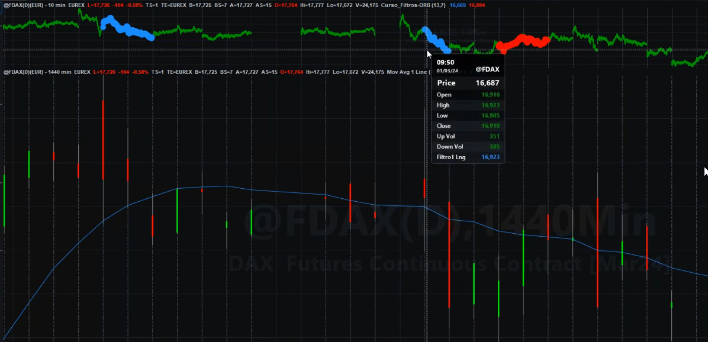
  <figcaption>Figura 56. Filtro 7: cumple por poco margen.</figcaption>
</figure>

Esta la da cómoda, porque cierra por encima, tiene mucho rango, es bajista y la cierra:

<figure>
  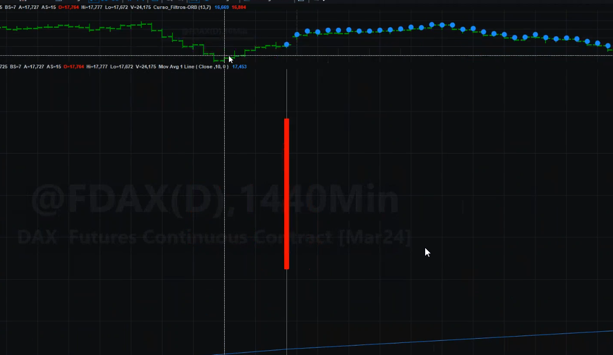
  <figcaption>Figura 59. Vela que cumple cómodamente el filtro 7.</figcaption>
</figure>

Es aquí donde ya se va a invertir.

<figure>
  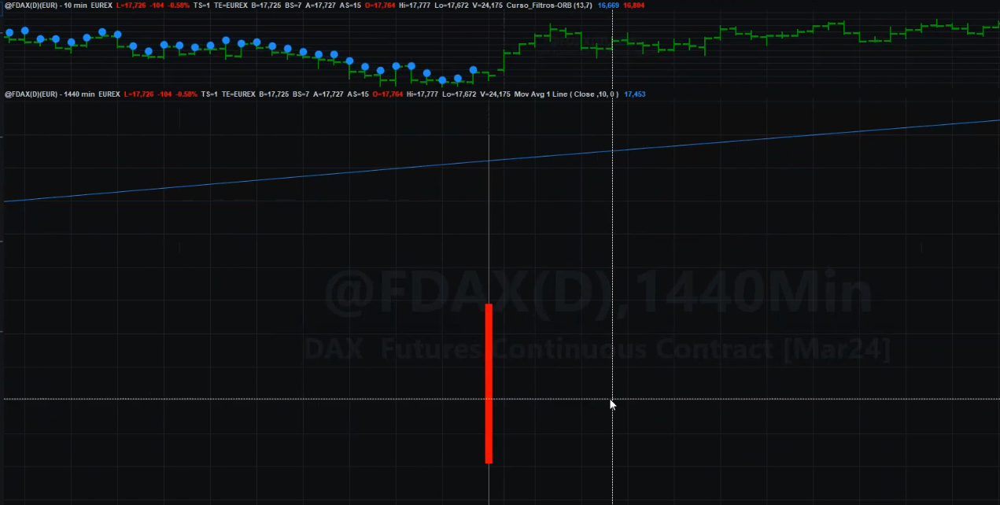
  <figcaption>Figura 60. Punto de inversión tras señal del filtro 7.</figcaption>
</figure>

Esta vela ya está por debajo de la media. La vela es verde, de acuerdo, y de mucho rango. Es decir, esta es muy, muy interesante.

<figure>
  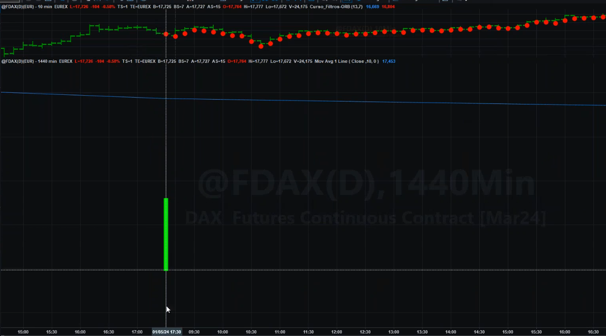
  <figcaption>Figura 57. Vela interesante: verde, mucho rango, en zona de soporte.</figcaption>
</figure>

Bueno, pues todas estas no las vamos a repasar todas. Ya os digo que este código ya os lo haremos llegar. Son estos códigos, en realidad son reglas, son filtros. Esto con un *ShowMe* se pinta.

Además de estas, como veis —ya digo— ahí hay otras. No, aquí hay otras. O sea, hay siete, pero en el indicador que ha hecho Alberto en el *ShowMe* hay más, porque están los *Narrow Range* y todas estas que ya habíamos comentado.

#### `eleccionFiltro 8`

***Bien, ahora le ponemos el 8 - función: Narrow Range de cuatro velas***
```
inputs: Length( numericsimple );

condition1 = True;
for value1 = 1 to length
Begin
    condition1 = condition1 and range[value1] of Data2 > range of Data2;
    // condition1 = condition1 and ((HighSession(0, value1) - LowSession(0, value1)) 
    //              > (HighSession(0, 0) - LowSession(0, 0)));  // rangos diarios
end; 

Narrowrange = condition1; 
```

La 8 es un *Narrow Range*. Si os abre la función, veis que es un *Narrow Range* de N velas. En este caso creo que está definido para cuatro, pero puede ser para siete...
```
# Filtros_ORB : ShowMe
Case 8:
    if NarrowRange(4) of Data2 then   // NarrowRange(4)
        Plot1( High, !("Filtro1 Lng") )
    Else
        Noplot(1); 
    if NarrowRange(4) of Data2 then   // NarrowRange(4)
        Plot2( Low, !("Filtro1 Shrt") )
    Else
        Noplot(2); 

Case 9: 
    if NarrowRange(7) of Data2 then   // NarrowRange(7)
        Plot1( High, !("Filtro1 Lng") )
    Else
        Noplot(1); 
    if NarrowRange(7) of Data2 then   // NarrowRange(7)
        Plot2( Low, !("Filtro1 Shrt") )
    Else
        Noplot(2);
```

Digamos que tú le pasas el *input* que defines. Simplemente es que durante un número de velas (que puede en este caso ser cuatro) se cumple una determinada condición: que el rango de la siguiente sea menor.

Durante las cuatro tiene que dar *true*, exactamente. Tiene que mantenerse el rango menor. Solo que en alguna no se dé, pues ya no será, o sea, ya es *false*. Esto puede ser para cuatro, puede ser para siete.

El primero que, bueno, yo diría que es el primero, luego ha habido muchos autores, pero Crabel lo explicaba en esta serie de artículos que os pasamos. Es correcto, pero no lo pasamos así. Y ya digo, se usa bastante este, el 8.

<figure>
  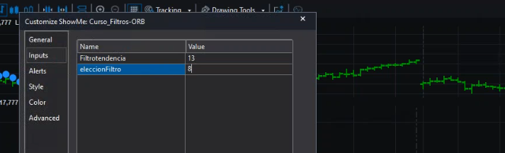
  <figcaption>Figura 61. Filtro 8: Narrow Range de 4 velas aplicado.</figcaption>
</figure>

Este es solo el *Narrow*, pero puedes añadirle además tendencia y *Narrow*, *momentum*.

Como os decía antes, es bastante habitual incorporar el *momentum*; siempre es bastante habitual. Entonces, aquí tienes el *ORB*. El *ORB 8* es lo que os decía: aquí simplemente se cumple el *Narrow 4*, que se cumple en esta:

<figure>
  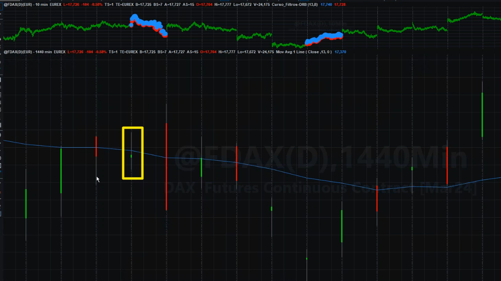
  <figcaption>Figura 62. Vela que desencadena el Narrow Range 4.</figcaption>
</figure>

Quiere decir que todas las cuatro velas anteriores tienen un rango mayor que esta. Todas ellas. Solo que una no tuviera, ya no. La vela que desencadena el *Narrow* es esta, porque está en correlación a anteriores y tiene un rango inferior. Ese es un poco el *Narrow 4*. Si es de 7, pues pasa en 7 velas.

#### `eleccionFiltro 9`

***Bien, ahora le ponemos el 9 - función: Narrow Range de 7 velas***

A veces la gente la confunde con los *Inside*. El *Narrow* es una pauta de ***volatilidad***, o mejor dicho, es ***la mejor pauta que hay de contracción***. ¿Entendéis? Cuando hablaba de contracción y expansión. Y por eso la usa como ejemplo, porque un *Narrow 4* quiere decir que el mercado está comprimido, el mercado está perdiendo ***volatilidad***, aunque tenga direccionalidad. Luego yo puedo añadir ***direccionalidad*** y usarlo si quiero, pero quiere decir que:

> El mercado está perdiendo volatilidad.
> ¿Y qué pasa? Que se anticipa expansión.

<figure>
  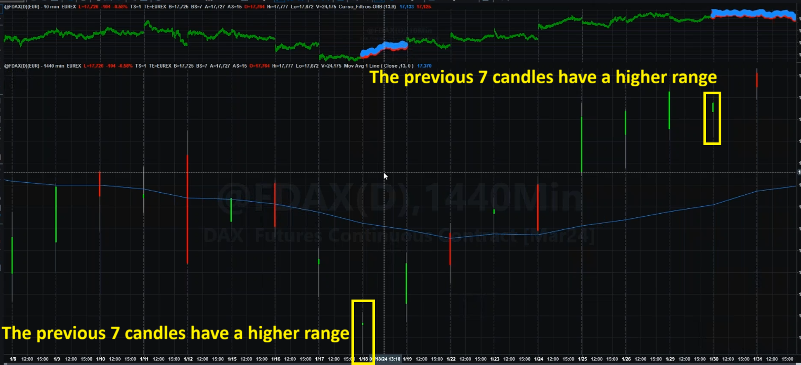
  <figcaption>Figura 63. Narrow Range 7: las velas siguientes muestran expansión.</figcaption>
</figure>

Fijaros que las velas siguientes son de buen rango, ¿lo veis? Es así, casualmente. Y eso es bastante habitual: cuando un mercado tiene un *Narrow 7*, lo normal es que las velas siguientes sean de expansión. No el cien por cien de las veces, pero es bastante habitual.

<div style="border-left: 4px solid #4caf50; background: #e8f5e9; padding: 10px 15px; margin: 10px 0; border-radius: 8px;">
  <strong>📊 Narrow Range vs Inside Bar</strong><br><br>
  <table>
    <tr>
      <th>Narrow Range (NR)</th>
      <th>Inside Bar</th>
    </tr>
    <tr>
      <td>Compara el <em>rango</em> de la vela actual con las N anteriores</td>
      <td>La vela actual está <em>contenida</em> dentro de la anterior</td>
    </tr>
    <tr>
      <td>Todas las N velas previas tienen mayor rango</td>
      <td>High actual < High anterior AND Low actual > Low anterior</td>
    </tr>
    <tr>
      <td>Pauta de <strong>contracción progresiva</strong></td>
      <td>Pauta de <strong>contracción puntual</strong></td>
    </tr>
    <tr>
      <td>Anticipa expansión de volatilidad</td>
      <td>Anticipa ruptura direccional</td>
    </tr>
  </table>
</div>

#### `eleccionFiltro 10, 11, 12`

**Otras variantes: reglas 10, 11 y 12**

La 10 niega el *Narrow 4*, al revés: se va a cumplir mucho.

<figure>
  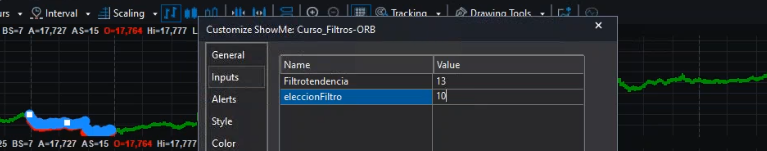
  <figcaption>Figura 64. Filtro 10: negación del Narrow 4.</figcaption>
</figure>

<figure>
  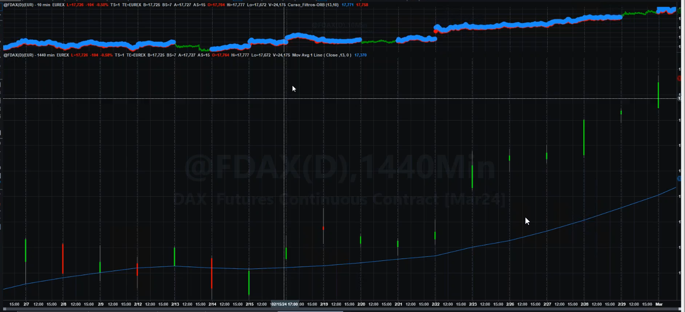
  <figcaption>Figura 65. Alta frecuencia de cumplimiento al negar NR4.</figcaption>
</figure>

La 11 es cuando no es un *Narrow 7*.

<figure>
  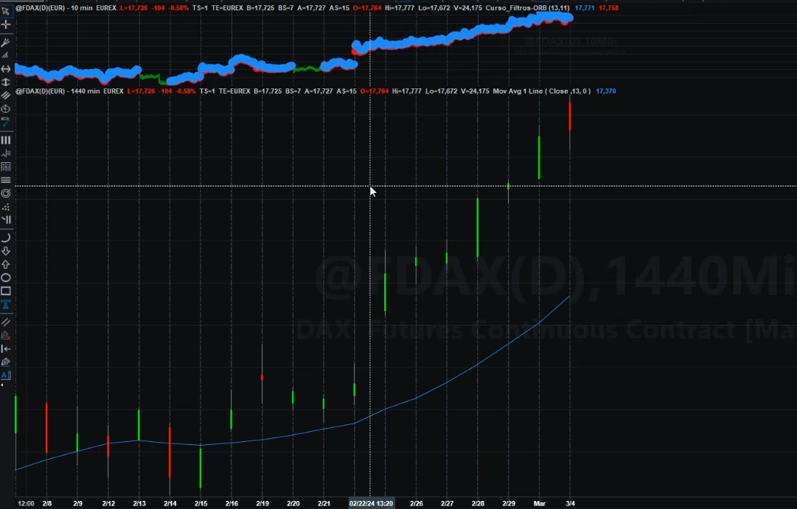
  <figcaption>Figura 66. Filtro 11: negación del Narrow 7.</figcaption>
</figure>

A veces se va a cumplir mucho, todavía más, porque hay pocos *Narrow 7*. Por lo tanto, cuando no es 7, es la mayoría del tiempo.

**La 12:**

Y luego, a partir de la 12, ya mezcla tendencia. La 12 —esto ya os lo pasaré— porque si no, nos quedamos aquí clavados toda la clase, y ya casi estamos terminando. Pero quiero pasar un poco al código, al sistema en sí.

<figure>
  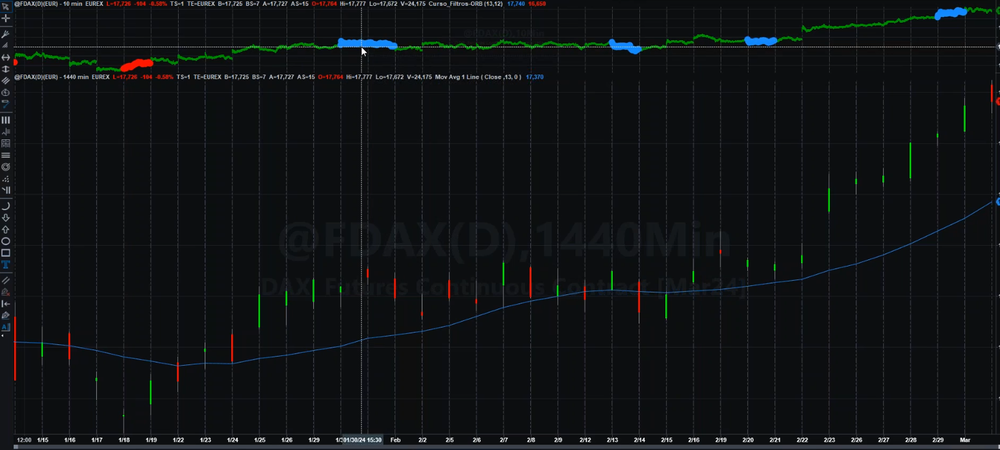
  <figcaption>Figura 68. Filtro 12: Narrow 4 combinado con tendencia alcista.</figcaption>
</figure>

Esta ya es un poco más elaborada. A mí me gusta más. Es decir, es *Narrow 4*, pero con cierre mayor que la media. Tendencia también. Es decir, tienes que tener una ruta. Entonces, ahí yo voy para el largo, voy para el largo. Puede funcionar o no, pero en principio es buena.

  


**Las buenas, las mejores**

Sé que las buenas fueron la 4 y la 7. Las buenas, las mejores, en el DAX, por ejemplo, fueron la 4 y la 7. Pero esto puede cambiar mucho según el activo.

Además, a estas mismas ya os las voy a pasar todas. Jugad con ellas, combinadlas, analizadlas, hacedlas vuestras. Al final, con todo esto que os hemos pasado, prácticamente todas las demás —no están todas, pero son derivadas de ellas— ya es el concepto.

| Documento | Descripción |
|      --|        -|
| 📄 [Filtros_ORB : ShowMe](../PRACTICA%2008.ELD) | Código con todos los filtros implementados |

No están todas porque todas es imposible; no se acaba nunca. Pero ahí están. En total, en estos *ShowMe*, hay 19 pautas.

Son las que luego podéis usar también para los sistemas. Lo mismo: igual que aquí es un *case* para pintar, luego la puedes usar para la estrategia. Está hasta la 18, que es "*Go Buy/Soldado*", y la 19 vuelve a meter la tendencia.

Luego pide otra vez el rango: solo el rango, quitando figura de velas. Es muy simple, es esta, la de aquí, pero quitando cierre mayor que *open* o cierre menor que *open*. Vale, es solo tendencia alcista: cierre mayor que la media de 13 cierres y *range* mayor que el 1% de la media de los cierres. Estas dos, la 19.

Y ese es el código 4, el que tenemos. Es el *Huerta*.


## Presentación del código 4 y estructura general del sistema

Este es el *paper* del código número 4:

| Documento | Descripción |
|      --|        -|
| 📄 [Paper del código número 4](../docs/CursoORB-04.pdf) | Documentación completa del sistema |
| 📄 [STRATEGY_ORB_V4.ELD](../code/STRATEGY_ORB_V4.ELD) | Código fuente en EasyLanguage |

<div style="border-left: 4px solid #2196f3; background: #e3f2fd; padding: 10px 15px; margin: 10px 0; border-radius: 8px;">
<strong>📋 Estructura del Sistema ORB V4</strong><br><br>

Esta estrategia es un <strong>Open Range Breakout (ORB)</strong> en un gráfico de 10 minutos, reforzado con filtros procedentes del timeframe diario (Data2). Combina tres pilares:
<ol>
  <li>Un rango inicial calculado a una hora concreta</li>
  <li>Filtros de tendencia/volatilidad provenientes del diario</li>
  <li>Un sistema de gestión monetaria y salidas configurable</li>
</ol>

<hr>

<strong>1. Inputs: el panel de control completo</strong><br>
Los inputs permiten ajustar el comportamiento de la estrategia sin tocar el código:
<ul>
  <li><strong>HoraInicio / HoraFin</strong> → delimitan la ventana en la que puede abrir y cerrar posiciones.</li>
  <li><strong>PrecioAlto / PrecioBajo</strong> → campos para decidir qué precios usar en la construcción del rango.</li>
  <li><strong>Prc_ATR_Open</strong> y <strong>Prc_Open</strong> → amplían el rango inicial usando ATR o un porcentaje fijo.</li>
  <li><strong>ATR_Per</strong> → periodo del ATR usado para trailing y stops si se activa.</li>
  <li><strong>eleccionfiltro</strong> y <strong>FiltroTendencia</strong> → activan filtros basados en Data2 (diario): tendencia, NR4/NR7, rango mínimo, etc.</li>
  <li><strong>TradesDia</strong> → limita el número de operaciones por día.</li>
  <li><strong>UsoATR, Prc_Trail, Prc_Stop, Prc_Profit</strong> → definen si los stops/take profit se calculan con ATR o porcentaje puro.</li>
  <li><strong>Money management</strong> (Start_Equity, MMVar_Start, MMVar_Profits, Min/Max_Size, RoundTo) → determina cuántos contratos abrir según capital inicial y beneficios acumulados.</li>
  <li><strong>minutosOptimizacion</strong> → desplaza la hora de inicio para optimizaciones de la ventana ORB.</li>
</ul>

<hr>

<strong>2. Construcción del rango inicial</strong><br>
En la hora exacta definida por <em>HoraInicioTrading</em>, la estrategia calcula un <strong>RangoAlto</strong> y un <strong>RangoBajo</strong> a partir de las últimas barras desde la apertura:
<ul>
  <li>Si se usa <strong>Prc_ATR_Open</strong>, el rango se expande con ATR.</li>
  <li>Si se usa <strong>Prc_Open</strong>, se expande con un porcentaje fijo.</li>
</ul>
Este rango será el nivel para lanzar las órdenes stop de ruptura.

<hr>

<strong>3. Filtros del timeframe diario (Data2)</strong><br>
Según <em>eleccionfiltro</em>, la estrategia puede activar diferentes condiciones que definen si solo se permiten largos, cortos o ambos. Estos filtros combinan:
<ul>
  <li>Tendencia diaria (cierre vs. media de cierres).</li>
  <li>Comportamiento de la vela diaria (cierre vs. apertura).</li>
  <li>Volatilidad mínima (range diario > 1% de la media).</li>
  <li>Narrow Range (NR4, NR7).</li>
</ul>
Si el filtro da señal alcista → se activa <strong>Condition4</strong>.<br>
Si es bajista → <strong>Condition5</strong>.

<hr>

<strong>4. Entrada ORB</strong><br>
Dentro de la ventana de tiempo permitida y si no se han superado los trades diarios:
<ul>
  <li>Si <strong>Condition4</strong> (filtro largo) es verdadero → <strong>Buy stop</strong> en <em>RangoAlto</em>.</li>
  <li>Si <strong>Condition5</strong> (filtro corto) es verdadero → <strong>SellShort stop</strong> en <em>RangoBajo</em>.</li>
</ul>
Las órdenes no son a mercado, sino <strong>orden stop de ruptura</strong>.

<hr>

<strong>5. Gestión monetaria dinámica</strong><br>
El número de contratos se calcula así:
<ul>
  <li>Se suma: capital inicial + beneficio acumulado.</li>
  <li>Se aplican multiplicadores configurables (<em>MMVar_Start</em>, <em>MMVar_Profits</em>).</li>
  <li>Se divide por el valor nominal del activo (<em>Close × BigPointValue</em>).</li>
  <li>Se redondea y se limita a mínimos y máximos.</li>
</ul>
Resultado: la exposición crece o se reduce según rendimiento, simulando un <em>position sizing</em> proporcional.

<hr>

<strong>6. Gestión de salidas</strong><br>
<ul>
  <li><strong>Trailing stop:</strong> puede funcionar con ATR (trailing dinámico según volatilidad) o sin ATR (trailing en porcentaje puro sobre High/Low).</li>
  <li><strong>Stop Loss y Profit Target:</strong> pueden basarse en ATR × porcentaje, o precio de entrada × porcentaje.</li>
  <li><strong>Cierre forzado por tiempo:</strong> al llegar a <em>HoraFin</em>, se cierra cualquier posición al mercado.</li>
  <li><strong>SetExitOnClose:</strong> añade un cierre extra al final de la sesión si algo quedase abierto.</li>
</ul>
</div>


Que al final, lógicamente, es parecido a los otros que habíais visto. Es simplemente una revisión de los conceptos y una organización más limpia de todos los filtros. Los filtros los hacemos con *switch* y *cases*. Luego hay salidas posibles por *trailing stop*, por *ATR* (o sin *ATR*), por *profit target*; es decir, todo lo que habíais visto hasta ahora, pero desarrollado de forma más completa. También incluye la gestión monetaria general (*money management*).

Aquí está explicado solo el código, para que podáis adaptarlo fácilmente si es necesario a otro lenguaje. Y, por supuesto, también está el código en *EasyLanguage*, donde está todo implementado. Ahora os lo enseño dentro de *EasyLanguage*, que se lee mejor que aquí, pero os lo paso igualmente.

Este es el mismo concepto. Recordad que hay que usar dos *data series*. En el gráfico hemos incorporado también una variable que os mencioné antes: *UseATR*. Esta variable sirve para definir si queremos los *stops* basados en múltiplos de *ATR* o simplemente en un porcentaje. Es decir, tenemos tres variables: el multiplicador, el precio y el *ATR*. Dependiendo de si *UseATR* está en *false* o en *true*, el cálculo cambia, tal como se explica en el código.


**Continuación del análisis del código**

Bueno, entonces seguimos hablando del código que estábamos comentando. Acaba de cargar. Ya está cargado.

Lo que os decía: estamos comentando las distintas *inputs*, que ya habíais visto ahí. La elección del filtro, que no es más que los filtros que habéis visto.

No sé si en esta versión están todos, porque hay varios comentados, ya que los hemos ido probando. Por un tema de limpieza, dejamos varios comentados y solo se han quedado los que eran el 4 y el 7: condición 4, condición 5, que era el 7.

Hemos ido haciendo distintas pruebas, y al final nos hemos quedado con estas. Pero, insisto...


**Experimentación y variaciones del canal**

Al final podéis —y debéis— experimentar. En la parte del canal hay una variación importante: si queréis usar el *ATR* o no, también está comentado arriba en el código. Podéis añadirle algo más al canal y experimentar con las horas, que es lo que iba a explicar ahora. Para hacerlo, necesito abrir el archivo dedicado al rango temporal. No lo tengo abierto aquí, así que lo abriré. Es igual, ya lo hemos visto muchas veces.


**Optimización de horas de inicio y final**

| Documento | Descripción |
|-----------|-------------|
| 📄 [STRATEGY_ORB_V4.ELD](../code/STRATEGY_ORB_V4.ELD) | Código fuente de la estrategia ORB versión 4 |

El código v4, como os decía, plantea sobre todo una mejora: es optimizable. Se puede marcar una hora de inicio y una de final, que aparecen como *inputs*, igual que en versiones anteriores. En el código, esto se utiliza para que puedas optimizar esas dos variables.

La variable que se optimiza es *MinutosOptimización*. Esta es la variable clave. ¿Cómo funciona? Si cargas el gráfico, por ejemplo, en velas de 10 minutos, al optimizar, esa variable se va incrementando: si partes de las 9:00, se probarán valores como 9:10, 9:20, 9:30, 9:40, 9:50, 10:00, y así sucesivamente. Es decir, el sistema irá desplazando el inicio según el incremento definido, de 10 a 240 minutos.

<figure>
  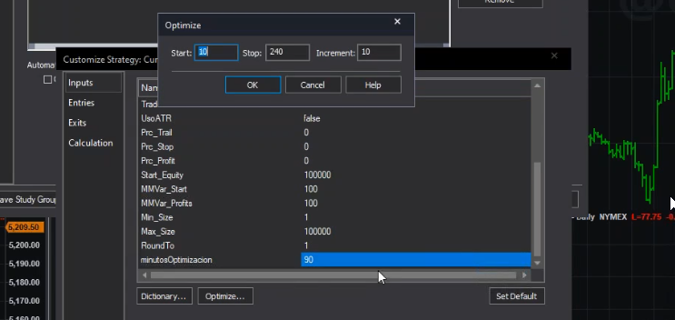
  <figcaption>Figura 69. Configuración de la variable MinutosOptimización en el optimizador.</figcaption>
</figure>

Si no hay ningún *bug*, funcionará correctamente. Esto se hace así porque, al optimizar, el sistema debe manipular las horas, y como el tiempo no es una variable numérica al uso, hay que convertirlo. Hay funciones en *EasyLanguage* que permiten hacerlo (*MinutesToTime*, *TimeToMinutes*). Son algo avanzadas, pero están explicadas en la documentación. Quien tenga el manual, puede consultarlas y ver cómo están implementadas.

<figure>
  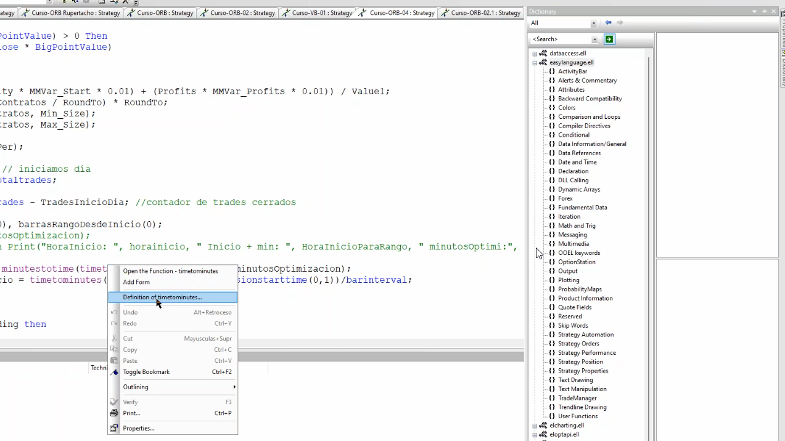
  <figcaption>Figura 70. Funciones de conversión de tiempo en EasyLanguage.</figcaption>
</figure>


**Manipulación del tiempo y cálculo del rango**

Este código está preparado para manipular el tiempo correctamente y poder modificar las horas de inicio o final según se desee. En caso de no querer hacerlo, simplemente se deja el valor por defecto. El rango no hace falta configurarlo manualmente porque se calcula de forma automática.

Por ejemplo, si cargas datos desde las 8:00 y el mercado abre a las 9:30, y usas velas de 30 minutos, el sistema calcula tres barras antes de apertura. Ya sabe cuándo abre el mercado y lo calcula correctamente. Si quisieras usar el día anterior, este código no está preparado para ello, pero podría adaptarse fácilmente.

El código está pensado para calcular el rango desde que el mercado abre hasta la hora que se indique, y esa hora es optimizable a través de la variable *MinutosOptimización*.


**Optimización práctica y resultados en DAX**

Hemos hecho algunas pruebas. Por ejemplo, Alberto ha estado trabajando con una optimización de minutos de tiempo, cambiando la barra. Si exportas los datos a Excel, verás que los valores aparecen en minutos (por ejemplo, 90 significa una hora y media). Al valor de inicio le añade esos minutos para probar distintos escenarios.

<figure>
  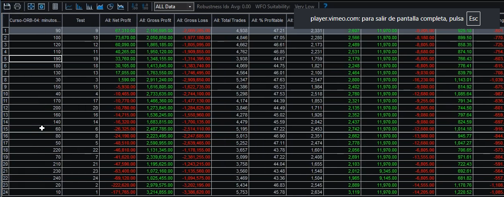
  <figcaption>Figura 71. Exportación de resultados de optimización a Excel con valores en minutos.</figcaption>
</figure>

En el DAX, el sistema estaba funcionando bastante bien. Sin hacer grandes ajustes, los resultados eran decentes. Al ordenar los resultados en Excel y buscar equilibrio entre beneficios y consistencia, se encuentra un punto óptimo.

<figure>
  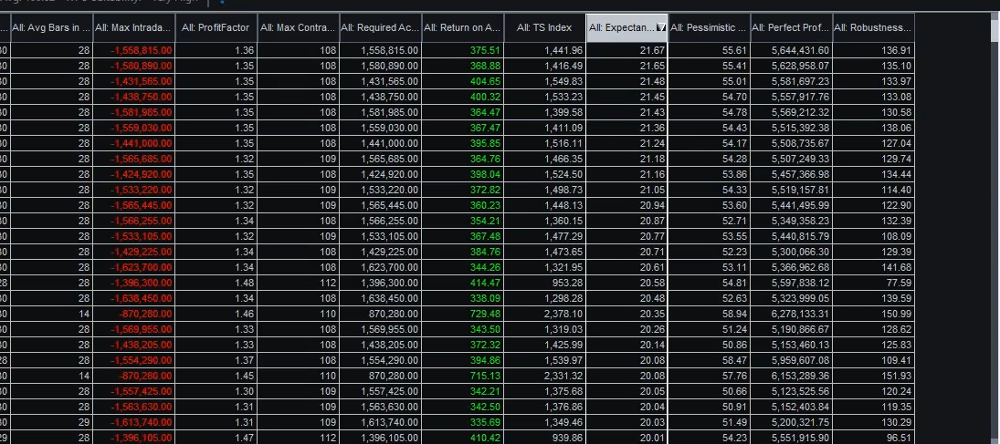
  <figcaption>Figura 74. Resultados de optimización en DAX ordenados por beneficio.</figcaption>
</figure>

<figure>
  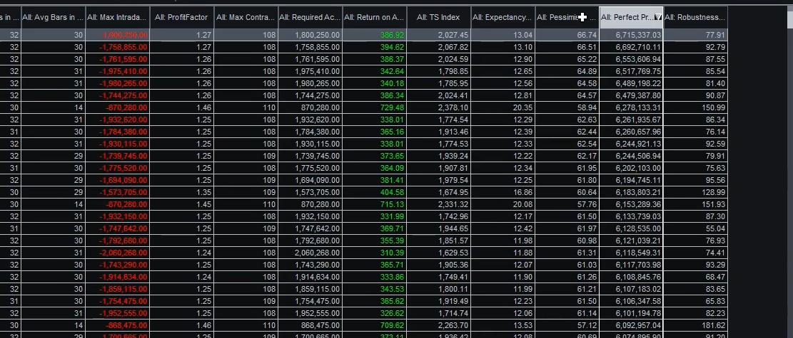
  <figcaption>Figura 75. Análisis de consistencia en los resultados del DAX.</figcaption>
</figure>

<figure>
  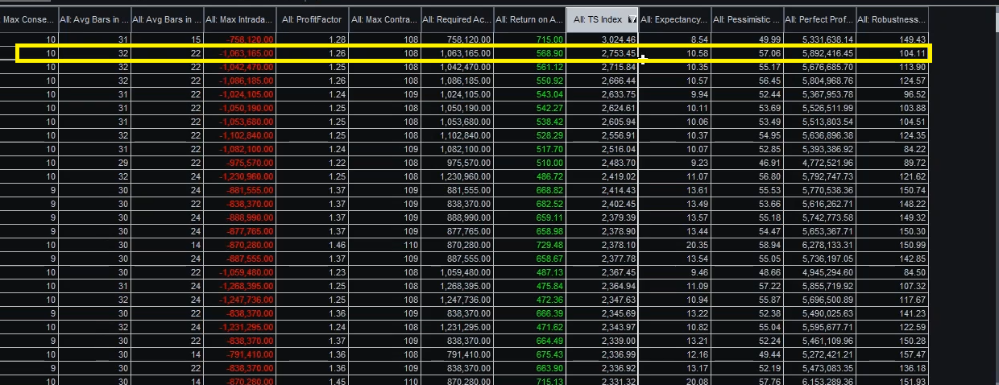
  <figcaption>Figura 77. Búsqueda del punto óptimo entre beneficio y consistencia.</figcaption>
</figure>

<figure>
  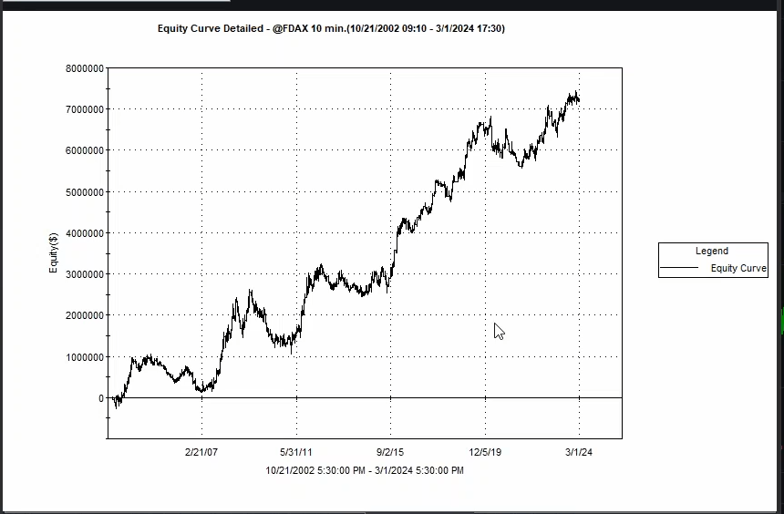
  <figcaption>Figura 78. Curva de equity del sistema ORB en DAX.</figcaption>
</figure>

<figure>
  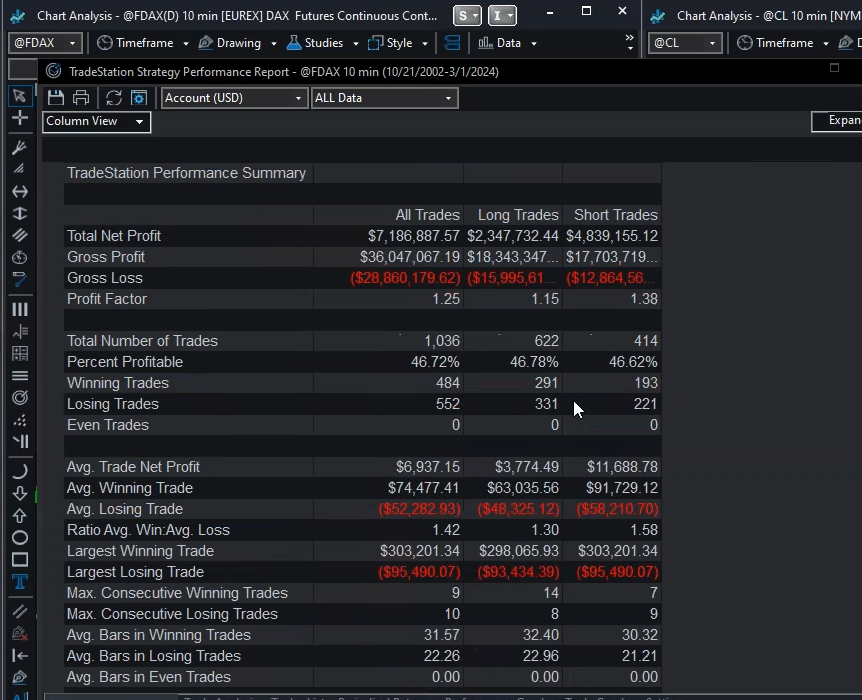
  <figcaption>Figura 79. Detalle del rendimiento por lado (largo vs corto).</figcaption>
</figure>

El *setup* no es perfecto, pero es sólido. En muchos casos, el lado corto ofrece mejores resultados que el largo, lo cual no es raro en un ORB, porque al cerrar siempre a fin de día, no lo olvidéis, ***el largo paga esa restricción más que el corto***. Por eso, un camino interesante en el lado largo es dejar correr las posiciones, no cerrarlas siempre al final de la sesión.


**Posibles ajustes y comportamiento por tipo de activo**

Se podrían diseñar variaciones: por ejemplo, dejar correr las posiciones largas cuando hay una pauta muy fiable (como un *Narrow 7*), o dependiendo del día de la semana o de la hora... En estos puntos el largo va a salir ganando de quedarse varios días, y el corto no necesariamente.

El sistema tiene unas 1.000 operaciones, con comisiones incluidas.

<figure>
  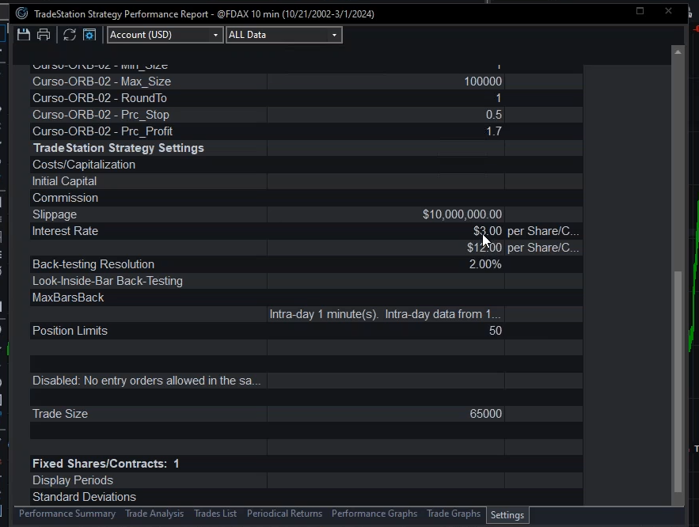
  <figcaption>Figura 80. Estadísticas del sistema: aproximadamente 1.000 operaciones con comisiones.</figcaption>
</figure>

El *setup* está configurado con tres barras de rango en velas de 10 minutos, usando *high* y *low*, lo que produce un rango bastante estrecho. Esto puede mejorarse.

<figure>
  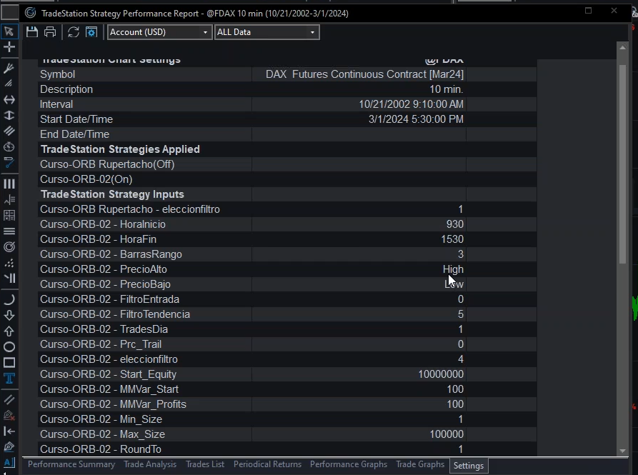
  <figcaption>Figura 81. Configuración del rango: 3 barras de 10 minutos usando High/Low.</figcaption>
</figure>

Probad también el *Typical Price* o modelos como el de **Rupertacho**, que usaba el mayor valor entre el *open* y el *close*:

```
Begin
   HHH = Highest(Maxlist(open, close), 8);  // En Chicago CME abre a las 08:30, en NY a las 09:30
   LLL = Lowest(Minlist(open, close), 8);
   // HHH = Highest(TypicalPrice, 8);
   // LLL = Lowest(TypicalPrice, 8);
end;
```

El *high* y *low* es la opción más intuitiva, pero a veces hace que el sistema entre tarde en activos muy volátiles, porque ya parte de una expansión. Si buscas aprovechar la contracción antes de la expansión, anclarte al *high* puede ser contraproducente.

También se podrían diseñar canales basados en medias de los máximos, no necesariamente en los extremos de las velas. Esto cambiaría el enfoque: ya no sería un *ORB* clásico, pero sí una versión más flexible.

En este caso, el filtro que aportaba más valor era el 4, el que usaba el *open*. Era más restrictivo que el del *close*. También el 7 dio buenos resultados. Las combinaciones entre *take profit* y *stop loss* cambian mucho el comportamiento, pero estas versiones con estos filtros ya son bastante aprovechables, especialmente en el DAX y en el S&P.

**En el petróleo**, sin embargo, la cosa se complica más. Como los futuros de energía tienen sesión *Globex*, hay que estudiar las horas activas.

Primero deberíamos trabajar antes estas tres partes que dije:


**1. Setup clásico de entrada**

```
inputs:
    HoraInicio (0930),
    HoraFin (1530),
    //BarrasRango (6),      // Anulamos este input
    PrecioAlto (High),
    PrecioBajo (Low),
    Prc_ATR_Open (0.0),
    Prc_Open (0.0),         // En tanto por ciento, 0 no actúa
    ATR_Per (14),
```

Esta parte consiste en definir la hora, el rango, si utilizo el *High* o el *Low*, si aplico algún filtro, o si establezco un pequeño rango adicional para la entrada. Eso constituye la entrada.

En activos como el petróleo, donde las horas son muy relevantes, hay muchísimo trabajo por hacer, porque todos los futuros que operan en *Globex* no deben analizarse únicamente en su sesión oficial. Hay que identificar cuál es la ***sesión operativa efectiva***.

Por tanto, el primer trabajo consiste en localizar esa sesión real. Con este código podéis hacerlo: podéis investigar, cargar históricos empezando en una hora u otra, y a partir de ahí intentar encontrar una optimización genérica, utilizando algún filtro que ya hayáis comprobado mínimamente y sin modificar nada más, es decir, algo sencillo.

A partir de ahí, vais comparando diferentes configuraciones para ver qué rango presenta más contracciones o expansiones. Observad esos gráficos. También os puede resultar muy útil el código del *ShowMe* porque es muy visual y permite ver si realmente existen sesiones diferenciadas o patrones de comportamiento ligados a determinadas horas.

Recordad, por ejemplo, que las noticias tienen mucho peso en esto. ¿A qué hora se publican los inventarios de petróleo? Pues en ese momento aparece volatilidad. Quizá un rango previo a esa hora puede construirse.

Lo mismo ocurre en acciones: en lugar de aplicar un *Open Range Breakout* al SPY —como había hecho Zenén, o como hacemos nosotros en el futuro— utilizando únicamente el horario regular, quizá podéis trabajar con todo el continuo (el *Globex* completo), pero definiendo un rango entre la 1 y las 2, porque sabéis que a las 2:30 salen noticias. Sabéis que hay volatilidad, y buscáis exactamente esa expansión.

Es decir: podéis buscar vuestras propias sesiones. No es obligatorio utilizar la sesión oficial que marca el mercado. Esto aplica sobre todo a los mercados que funcionan casi 23 horas, como petróleo, NASDAQ, oro. Dentro de una sesión oficial, en realidad existen muchas micro-sesiones, y no tenéis por qué ceñiros siempre a la misma.

<div style="border-left: 4px solid #2196f3; background: #e3f2fd; padding: 10px 15px; margin: 10px 0; border-radius: 8px;">
  <strong>💡 Concepto clave: Micro-sesiones</strong><br><br>
  En mercados con horario extendido (Globex), existen múltiples <em>micro-sesiones</em> dentro de la sesión oficial. Identificar estas ventanas de actividad —a menudo ligadas a publicación de datos económicos— permite construir rangos más efectivos para estrategias ORB.
</div>


**2. Trabajo de filtros, stops, TPs, etc.**

```
    eleccionfiltro(0),
    FiltroTendencia (0),    // Media de cierres diarios, si es 0 no actúa
    TradesDia (1),
    
    UsoATR (false),         // False: stops/profits % sobre precio. True: porcentaje ATR
    Prc_Trail (0),          // En tanto por 100, 0 no actúa
    Prc_Stop (0),
    Prc_Profit (0),         // Stop y profit no trailing en tanto por 100, 0 no actúa
```

 

## Strategy: VB-01

| Documento | Descripción |
|-----------|-------------|
| 📄 [STRATEGY_VB_01.ELD](../code/STRATEGY_VB_01.ELD) | Código de la estrategia Volatility Breakout |
| 📄 [Volatility BreakOut](../docs/volatlity%20breakouts.pdf) | Artículo base del sistema |

Este código está basado en este mismo artículo. Para este son reglas muy sencillas que son estas de aquí:

<figure>
  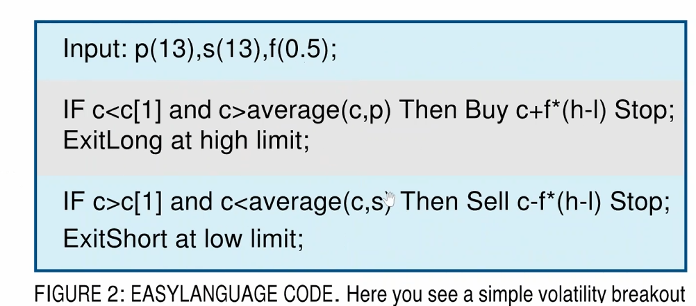
  <figcaption>Figura 82. Reglas del Volatility Breakout según el artículo original.</figcaption>
</figure>

Un *breakout* al uso. Esto está mal expresado en el lenguaje porque es antiguo, pero es algo similar. Y, al final, he explicado: cierre mayor que cierre anterior, cierre menor que cierre anterior, y cierre mayor que la media. Y la regla de compra es una regla que lleva implícita una expansión.

```
Input:
    Barras (13),
    Rango (0.5),
    Nivel_ADX (16),
    Nivel_ATR (1.15),
    
    Prc_Stop (0.0),
    
    // Gestión Monetaria
    Start_Equity (100000),
    MMVar_Start (100),
    MMVar_Profits (100),
    Min_Size (1),
    Max_Size (100000),
    RoundTo (1);

var:
    FiltroDMIPos (false),
    FiltroDMINeg (false),
    FiltroATR (false),
    Profits (0),
    Contratos (0),
    ATR (0);

{ Money Management }
Profits = NetProfit + OpenPositionProfit;

If AbsValue(Close * BigPointValue) > 0 Then
    Value1 = AbsValue(Close * BigPointValue)
Else
    Value1 = 0.01;
    
Contratos = ((Start_Equity * MMVar_Start * 0.01) + (Profits * MMVar_Profits * 0.01)) / Value1;
Contratos = IntPortion(Contratos / RoundTo) * RoundTo;
Contratos = MaxList(Contratos, Min_Size);
Contratos = MinList(Contratos, Max_Size);

If Nivel_ADX > 0 Then
Begin
    FiltroDMIPos = DmiPlus(Barras) > Nivel_ADX;
    FiltroDMINeg = DmiMinus(Barras) > Nivel_ADX;
end Else
Begin
    FiltroDMIPos = True;
    FiltroDMINeg = True;
End;

If Nivel_ATR > 0 Then
    //FiltroATR = AvgTrueRange(Barras) / Average(Close, Barras) > (Nivel_ATR/100);
    FiltroATR = AvgNormalizedTrueRange(Barras) > (Nivel_ATR)
Else
    FiltroATR = True;
    
If Close < Close[1] and 
    Close > Average(Close, Barras) and
    FiltroATR and
    FiltroDMIPos and
    (Close + Rango*Range) < High and
    Open of next bar < High Then
        
        Buy Contratos contracts next bar at Close + Rango*Range Stop;
    
Sell next bar at High limit;

If Close > Close[1] and
    Close < Average(Close, Barras) and
    FiltroATR and
    FiltroDMINeg and
    (Close - Rango*Range) > Low and
    Open of next bar > Low Then
        
        SellShort Contratos contracts next bar at Close - Rango*Range Stop;

BuyToCover next bar at Low limit;

Setstopshare;
ATR = AvgTrueRange(Barras);

if Prc_Stop > 0 then
    SetStopLoss(ATR * Prc_Stop * Bigpointvalue);
```

Este lo he trabajado un poco hoy y le he añadido algunas cosas. Os lo he incluido en *EasyLanguage*, que ahora voy a subir a Discord si me deja. Este código os lo he incluido. No he optimizado nada más que los filtros. He dejado por defecto el *setup* de entrada, pero sí he estado trabajando en los filtros.

Él recomendaba usar —bueno, "recomendaba"— decía que había muchos más, pero había probado un par. Uno era el *ADX* y el *ATR*. Ambos los he modificado un poco porque el *ADX* en sí —esto no sé si lo sabéis, pero si no os lo explico ahora mismo— es un indicador compuesto que yo tengo aquí. El *ADX* es la línea marrón que veis abajo. En la mayoría de plataformas también lo podéis insertar de forma independiente.

Voy a insertarlo y veréis que el *ADX*... aquí está. Hay varios. Hay que revisar también el *ADXR*. Esto procede del *Directional Movement*.

Os recomiendo —como ya he dicho por activa, por pasiva y por perifrástica— que reviséis los códigos y, como mínimo, si no conocemos el código interno, que leamos qué es el *ADX*. Si no es aquí, buscad por internet.


**Explicación del ADX y el Directional Movement**

El *ADX* es un indicador compuesto. Al final tiene dos líneas que forman su base conceptual. Su creador, J. Welles Wilder Jr. (autor de *"New Concepts in Technical Trading Systems"*, 1978) —inventor de muchísimos indicadores— desarrolló lo que llamó el *movimiento direccional*. El *ADX* era solo una parte, pero, por algún motivo, se ha popularizado muchísimo, quizá por su simplicidad (solo una línea). Pero en realidad era parte de todo un conjunto que se llamaba *Directional Movement*. De ahí viene esta DM.

Ahora veis aquí el *ADX*, y como podéis observar, tiene el mismo valor que la línea naranja de abajo. No sé si se aprecia bien, pero creedme: tiene el mismo valor.

<figure>
  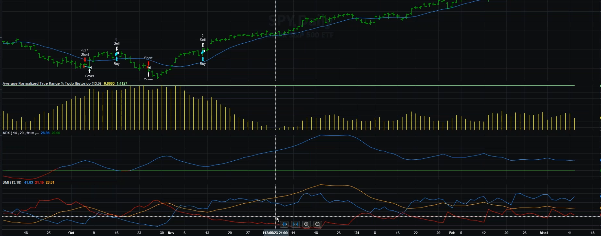
  <figcaption>Figura 83. El ADX y sus componentes: DM+ (azul), DM- (rojo) y ADX (naranja).</figcaption>
</figure>

El *ADX* es la suma de las dos líneas inferiores, azul y roja, que son los componentes del *DM positivo* y del *DM negativo*. El *DM positivo* identifica la tendencia alcista, el *DM negativo* la bajista. Y la suma de ambos da el *ADX*. Por eso se considera que el *ADX* no muestra dirección. Es cierto, pero las líneas sí la muestran.

Yo, al final, prefiero usar las líneas; me parecen una señal más limpia. Pero eso no significa que usar el *ADX* esté mal: simplemente son componentes distintos.

Entonces yo lo he planteado así:
- Para largos, el filtro es el *DM+*
- Para cortos, el filtro es el *DM–*
- Ambos por encima de un nivel, igual que se haría con el *ADX*

Es la misma idea, pero con un único parámetro, el mismo para ambos, usando la línea azul y la roja.

<div style="border-left: 4px solid #9c27b0; background: #f3e5f5; padding: 10px 15px; margin: 10px 0; border-radius: 8px;">
  <strong>📊 ADX vs DM+ / DM-</strong><br><br>
  <table>
    <tr>
      <th>Indicador</th>
      <th>Qué mide</th>
      <th>Uso en filtros</th>
    </tr>
    <tr>
      <td>ADX</td>
      <td>Fuerza de la tendencia (sin dirección)</td>
      <td>Filtro único para ambos lados</td>
    </tr>
    <tr>
      <td>DM+</td>
      <td>Fuerza del movimiento alcista</td>
      <td>Filtro específico para largos</td>
    </tr>
    <tr>
      <td>DM-</td>
      <td>Fuerza del movimiento bajista</td>
      <td>Filtro específico para cortos</td>
    </tr>
  </table>
  <br>
  <em>Usar DM+ y DM- por separado permite filtros más específicos según la dirección del trade.</em>
</div>


**Adaptación del filtro de volatilidad normalizado**

En cuanto al filtro de volatilidad (*ATR*), he mantenido el original del autor, aunque lo he adaptado al sistema de normalización que solemos emplear. La idea es sencilla: que el rango sea mayor que la media de los cierres multiplicada por un 1%, lo que equivale a exigir una cierta amplitud o volatilidad mínima antes de permitir una operación. En la práctica, esto garantiza que el mercado se esté moviendo lo suficiente como para justificar una entrada.

El filtro de volatilidad está normalizado dividiendo el *ATR* por el *Typical Price*. De esa manera, los valores del *ATR* se convierten en proporciones relativas y no en magnitudes absolutas de precio. Esto permite comparar la volatilidad de distintos activos o de diferentes periodos temporales sin sesgos.

Por ejemplo, si el *ATR* es 141 y el *Typical Price* del activo es 14.100, el resultado sería un 1%, lo que nos indica que el rango medio equivale al 1% del precio. El sistema puede usar ese valor para filtrar operaciones cuando la volatilidad es demasiado baja.

Si los valores del filtro se ponen en cero, el filtro no se aplica, dejando el sistema "en bruto", sin restricción alguna.

<figure>
  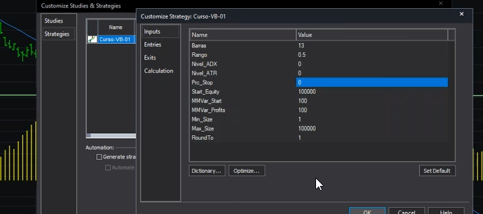
  <figcaption>Figura 84. Configuración del filtro de volatilidad normalizado.</figcaption>
</figure>

<figure>
  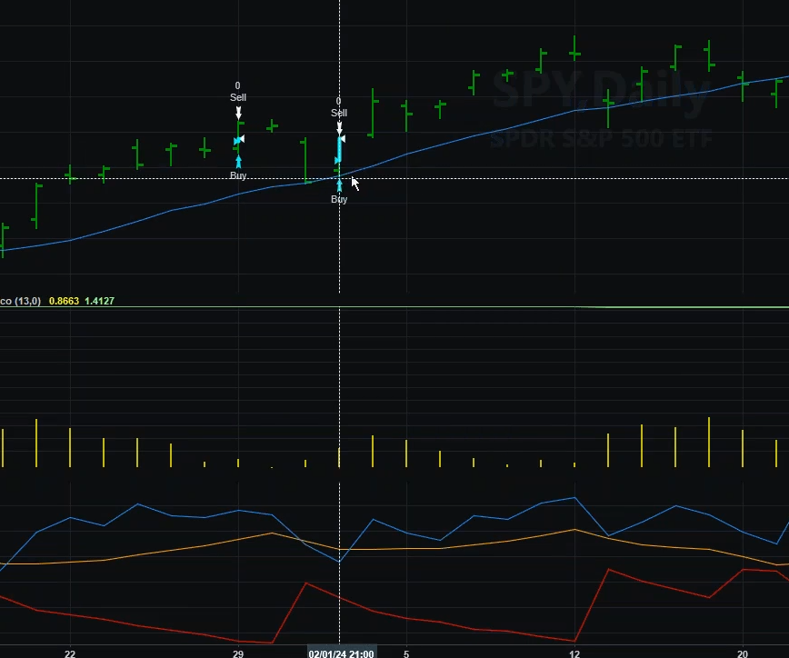
  <figcaption>Figura 85. Ejemplo de cálculo del ATR normalizado.</figcaption>
</figure>


**Pauta de entrada del sistema VB-01**

Utiliza una pauta de entrada muy similar a la que hemos visto antes: utiliza cierre más el rango por 0.5. Le suma al cierre el rango por 0.5 (`Close + Rango*Range Stop`). Es decir, busca una expansión del día anterior y cerrar en el *high* del día anterior (`Sell next bar at High limit`).

Fijaos lo restrictivo que es. Es un *Volatility Breakout* al uso. Es decir, entro y salgo rápido. Entro cuando hay una expansión y me voy rapidísimo. Casi siempre hace *take profit*. Tiene un porcentaje de aciertos muy elevado.

```
If Close < Close[1] and 
    Close > Average(Close, Barras) and
    FiltroATR and
    FiltroDMIPos and
    (Close + Rango*Range) < High and 
    // Si el precio es menor que el high, abrimos y cerramos al mismo precio
    Open of next bar < High Then 
    // Si el precio abre por encima del high, abrimos y cerramos al mismo precio
        
        Buy Contratos contracts next bar at Close + Rango*Range Stop;
    
Sell next bar at High limit;
```


**Reglas añadidas para evitar señales absurdas**

Aquí yo he incorporado dos reglas que él no había incorporado, que son para evitar señales absurdas:

```
    (Close - Rango*Range) > Low and 
    // Si el precio es mayor que el low, abrimos y cerramos al mismo precio
    Open of next bar > Low Then 
    // Si el precio abre por encima del low, abrimos y cerramos al mismo precio
```

Esto se detecta observando el gráfico. ¿Por qué? Porque muchas veces el rango, la apertura ya supera al precio al que vas a vender. Entonces no tiene sentido comprar, porque compra y cierra directamente. Seguro que habéis visto algún sistema al que le ocurre esto: compra, abre y cierra al mismo precio. Eso es un error de programación. No podemos permitirlo. Es absurdo hacer eso. Pues no hagamos absurdidades.

Entonces, lo que he hecho es añadir una regla que evite este problema. Es decir, le exijo que para poder comprar, el rango sea menor que el *high*, y le digo que la apertura del día siguiente sea menor que el *high* también. Porque si ya va a abrir por encima del objetivo, no compres. Para abrir y cerrar al mismo precio, no compres. Así que, simplemente, son dos reglas añadidas para evitar *trades* —digamos— absurdos, porque implican abrir y cerrar al mismo precio. De hecho, pasaba: abrir y cerrar al mismo precio. Para eso no abro, ¿no? Estamos de acuerdo, ¿no?

Entonces realmente esas reglas son esas. La regla en sí, el *setup* en sí, es esto:

```
If Close < Close[1] and 
    Close > Average(Close, Barras)
```

Cierre menor que cierre anterior y cierre mayor que la media de 13, lo que habíais visto antes. Y la expansión está delimitada en un *stop*: `Close + Rango*Range Stop`.

```
Buy Contratos contracts next bar at Close + Rango*Range Stop;
```

Es decir, yo lanzo la orden *next bar at close* más rango por *range*, que es 0.5. Y no he optimizado nada de esto; lo he dejado todo por defecto.


**Resultados del sistema VB-01 en SPY**

Esto, ya sin filtros, en el SPY en diario, en todo el histórico, con comisiones realistas, da esto:

<figure>
  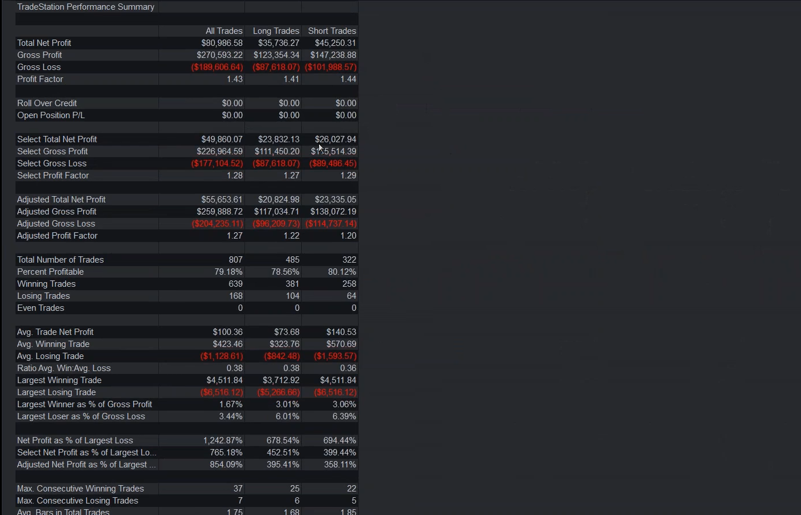
  <figcaption>Figura 86. Curva de equity del sistema VB-01 en SPY diario sin filtros.</figcaption>
</figure>

Un 1.43 de *Profit Factor*, 41 en el largo, 44 en el corto. Bastante bien.

Creo que tenía las comisiones realistas:

<figure>
  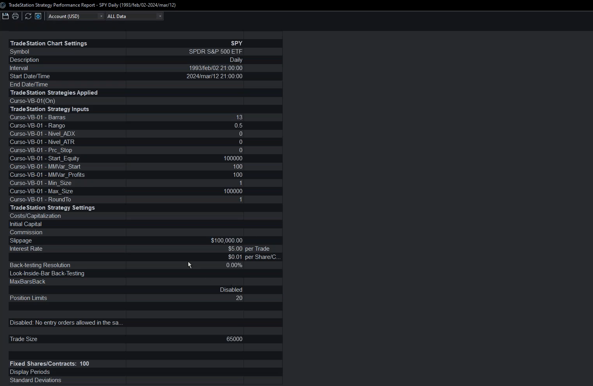
  <figcaption>Figura 87. Configuración de comisiones del backtest.</figcaption>
</figure>

Ahora no tiene el LIBB (*Look-Inside-Bar Backtesting*), pero se lo había puesto. De hecho, creo que hasta ha ido mejor con el LIBB. A ver.

*Backtest* delimitado negativo, porque cierran limitada, es decir, que sobrepase el precio.

<figure>
  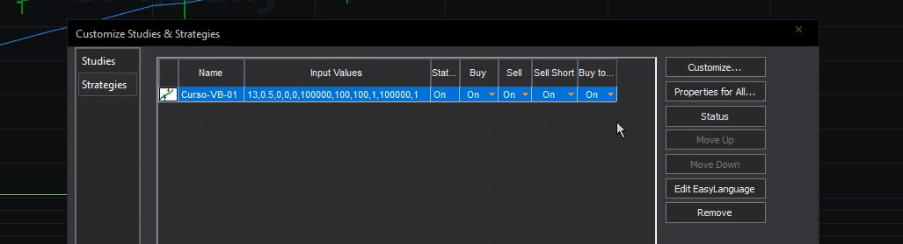
  <figcaption>Figura 88. Configuración del backtest con órdenes limitadas.</figcaption>
</figure>

Yo siempre *backtesteo* así. O es muy pesimista. Bueno, pues no uses limitadas. Ya está. Si no quieres ser pesimista, no usas limitadas. Vas a mercado y ya está. Si quieres usar limitadas, pues vas pesimista. Y ya está. Cuenta con que será mejor que eso y ya está. Oye, al final será mejor que eso. Es decir, el sistema irá mejor. Porque ejecutarás algún día mejor. Y seguro, seguro, que todos los *trades* los haces. Harás algún *trade* que será bueno y que él no contempla, seguro, porque no habrá hecho el *TP*. Y tú sí lo harás.

Le añado el LIBB: `Use Look-Inside-Bar Backtesting`

<figure>
  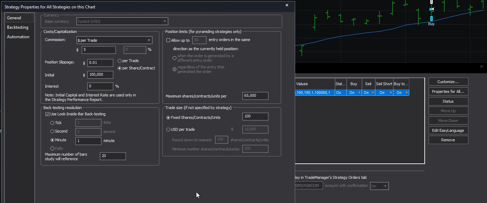
  <figcaption>Figura 89. Activación del Look-Inside-Bar Backtesting.</figcaption>
</figure>

Esto va a tardar un poco.

Ya digo que no tenéis el *paper* de esto. Pero sí tenéis el código. Y el código está bastante comentado. Pero el *paper* intentaré hacéroslo mañana.

Y ya está. Las salidas, ya digo, simplemente tienen el *stop* y, si queréis usarlo o no, con *ATR*. Que, en realidad, no aporta nada porque casi nunca... O sea, casi siempre sale. Ahora ya tiene el *Look-Inside-Bar Backtesting* para estar seguros de que no hemos caído en ningún error. Porque en un minuto diario es 100% que va bien.

Y todavía ha mejorado. Es lo que me suena: 1.61. 1.57 y 1.64 con comisiones.

<figure>
  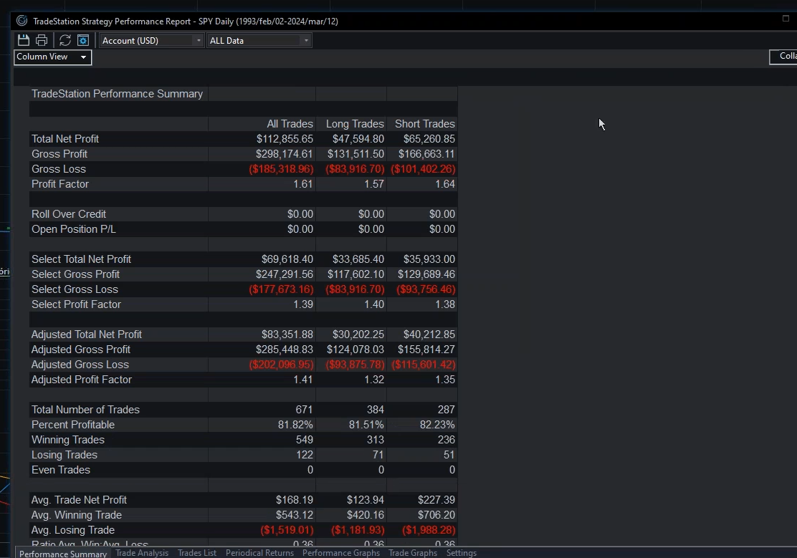
  <figcaption>Figura 90. Resultados mejorados con LIBB: Profit Factor 1.57 (largo) y 1.64 (corto).</figcaption>
</figure>

Esto está bastante bien. Opera poco.

Pero aquí, ya digo, hay una optimización implícita, que es el periodo que él ha usado: 13. 13 y 0.5. Pero ya lo habéis visto, lo digo y lo sabéis, que es muy común. Multiplica por 0.5 y usa 13.

<figure>
  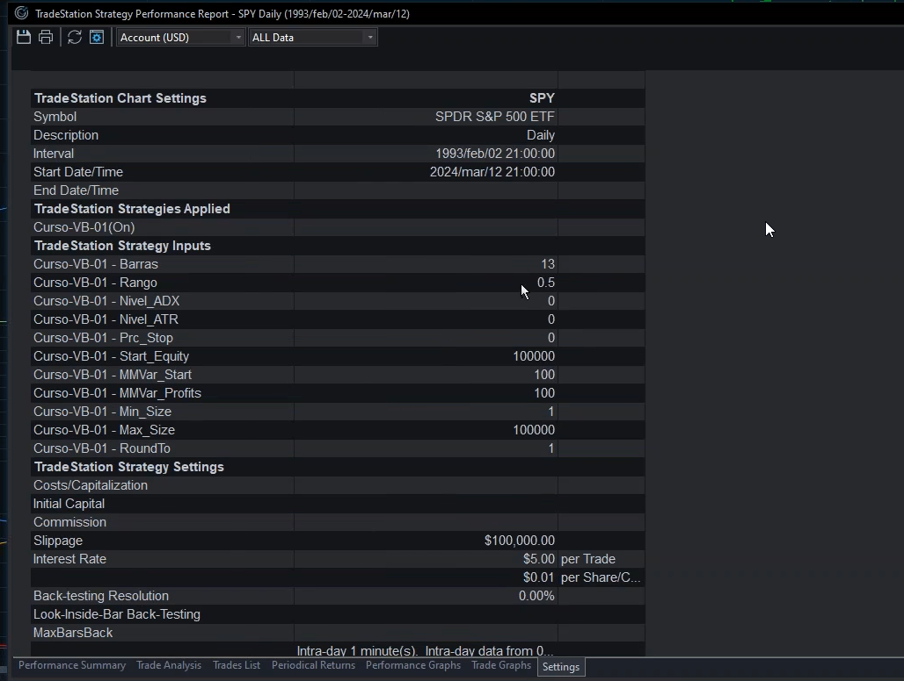
  <figcaption>Figura 91. Parámetros del sistema: Barras=13, Rango=0.5.</figcaption>
</figure>

A mí también me gusta el 13. ¿Por qué? Porque no soy supersticioso. Es un número de Fibonacci y, para usar el 14, uso el 13. Pero da igual, de verdad. Si usáis 21, el sistema también funciona. ¿Entendéis? No cambia nada. Es un valor muy poco restrictivo.

Y si activáis los filtros en el orden de 1 o 1.25, que es lo que salía —este creo que era 1.25 o por ahí— y el del *ADX*, no sé si era 15, 16, por ahí. Por ahí era.

<figure>
  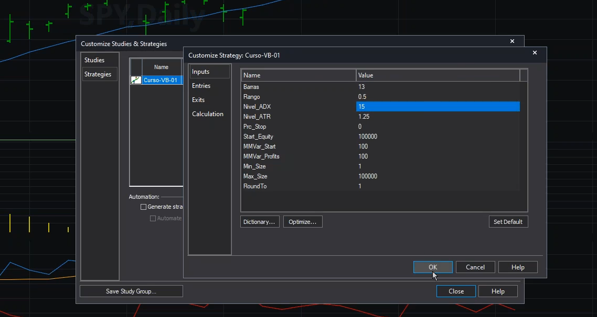
  <figcaption>Figura 92. Configuración de filtros: ATR ≈ 1.25, ADX ≈ 15-16.</figcaption>
</figure>

Ya veréis que aportan. Los dos los he mirado por separado. Los dos aportan. Aporta más la volatilidad que el *ADX*. Si quisiera quedarme con uno, me quedaría con la volatilidad y prescindiría del *ADX*.

Entonces, ya os digo que está bastante bien.

Claro, aquí filtras, y es lo que os decía. "¡Hostia, es que he operado muy poco!" Ya, ya, claro, pero es que esto no es una expansión de volatilidad.

<figure>
  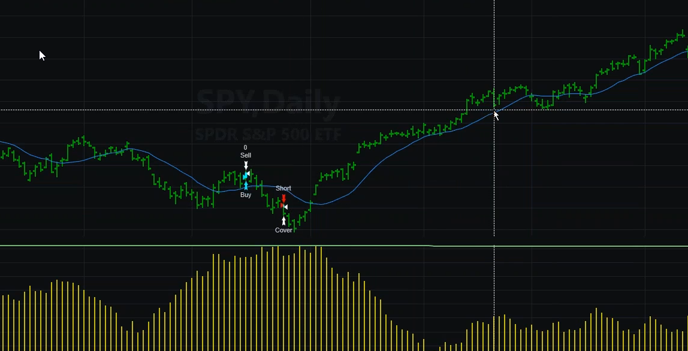
  <figcaption>Figura 93. Periodos sin señales debido al filtrado.</figcaption>
</figure>

Es lo que os decía: hay que entender que, si esto te sabe mal porque te quedas fuera, lo entiendo, lo comparto, pero entonces tienes que operar un tendencial, no un *Volatility Breakout*. Entonces es otra cosa. Al final, un *Volatility Breakout* es eso, un sistema de oportunidades. ¿Que aquí son demasiado pocas?

<figure>
  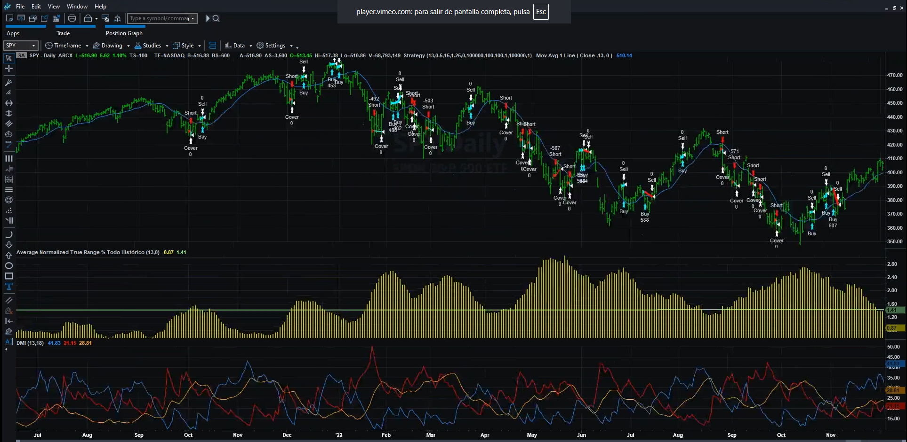
  <figcaption>Figura 94. Número reducido de operaciones con filtros activos.</figcaption>
</figure>

Bueno, perfecto. Si le quitas el filtro, opera más. Pero cuando hay mucha tendencia, le cuesta más.

Para acabar de ver esto, a ver, ahora voy con las preguntas. Aquí, ¿cómo mejoraba esto? Bueno, estos 12, 205, 217... tenemos 369 *trades*. Son muy pocos *trades*. 74% de acierto, está muy filtrado. Pero ya habéis visto que sin filtros iba hacia el pico. La curva está bastante correcta.

<figure>
  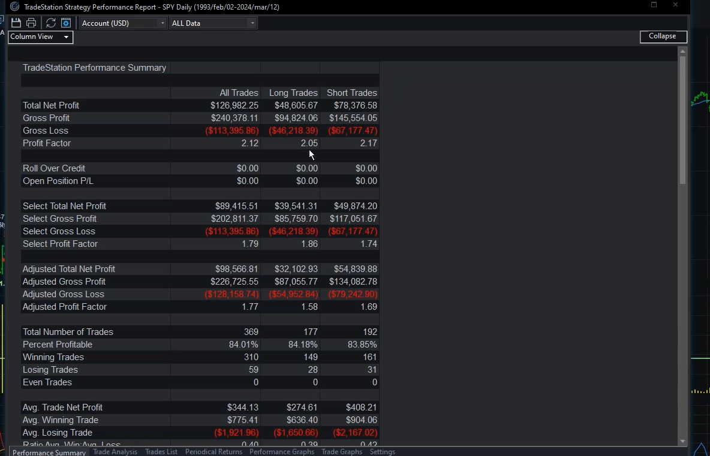
  <figcaption>Figura 95. Estadísticas: 369 trades, 74% de acierto.</figcaption>
</figure>

Sin *stop*, por cierto.

<figure>
  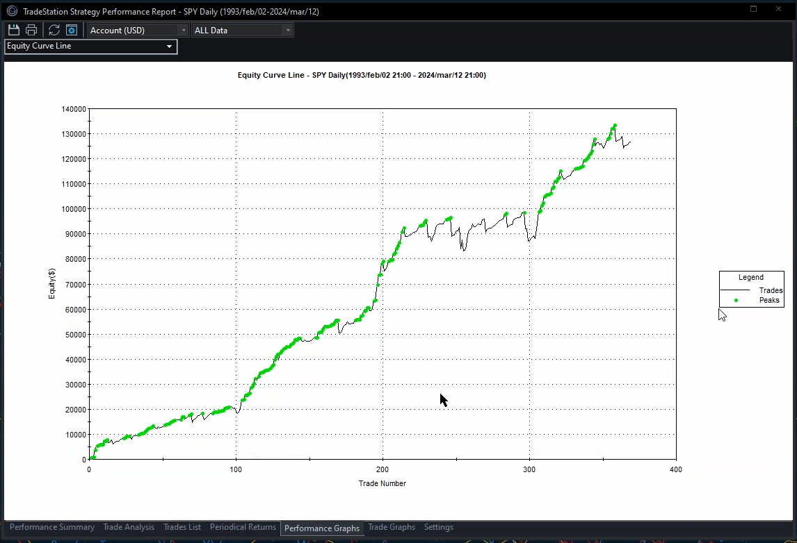
  <figcaption>Figura 96. Configuración sin stop loss.</figcaption>
</figure>

<figure>
  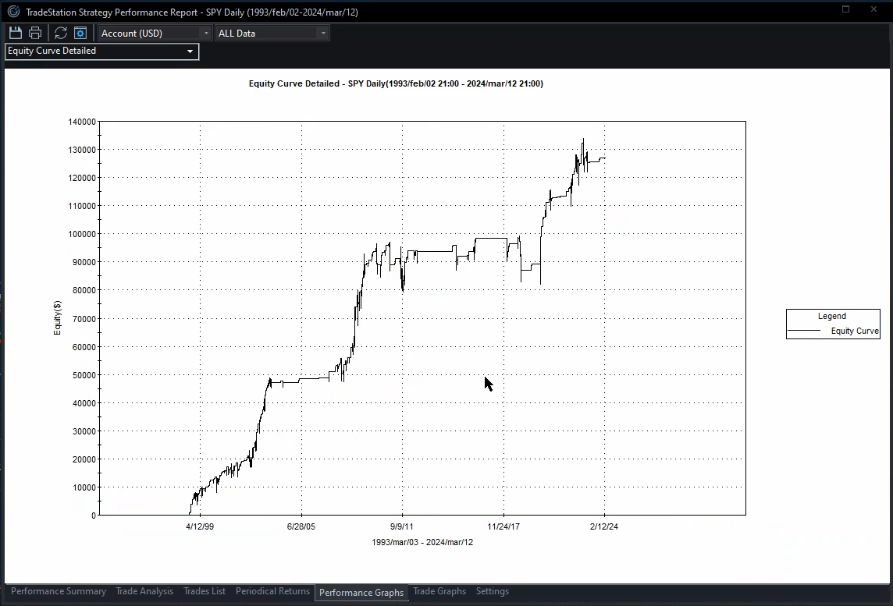
  <figcaption>Figura 97. El sistema sale por objetivo, no por stop.</figcaption>
</figure>

Pero es que sale, ya veis que no engancha. Pero puedes ponerle *stop*, está preparado para el *stop*, está preparado para ponérselo. Degrada, ya os lo digo, pero eso es casi siempre así.

Y eso que os digo: si queréis —creo que el del *ADX*... a ver, ¿cuál es el más restrictivo?— lo voy a dejar aquí para que se vea. Tenemos 369 *trades*. Creo que si el del *ADX* lo ponemos en cero... Si lo ponéis en cero, no actúa.

<figure>
  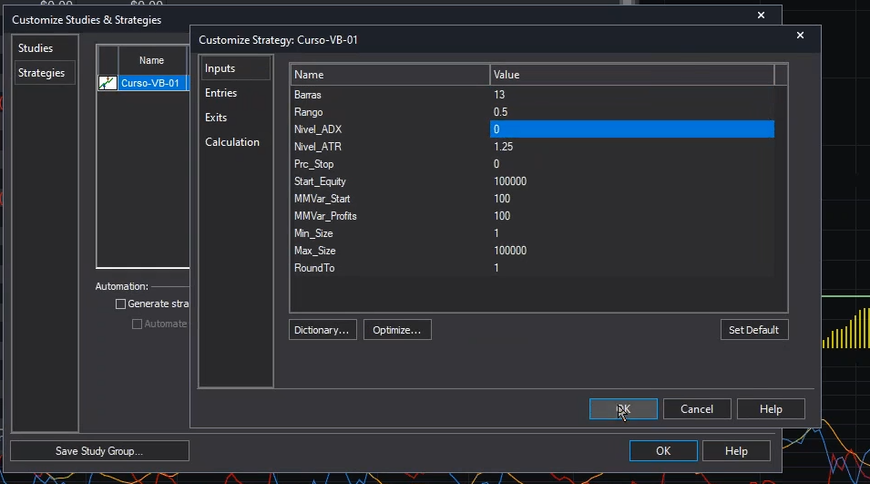
  <figcaption>Figura 100. Filtro ADX desactivado (valor = 0).</figcaption>
</figure>

Solemos poner las curvas así porque es muy incómodo. Antes 369 *trades*. Ahora 370 *trades*.

<figure>
  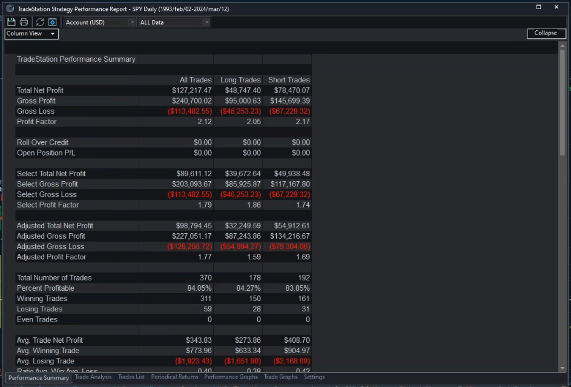
  <figcaption>Figura 103. Comparación: 369 trades vs 370 trades sin filtro ADX.</figcaption>
</figure>

El que filtra más es el de la volatilidad entonces, ¿no? El que filtra más es el de la volatilidad.

Este de *ATR*... bueno, claro, también depende del valor que le pongas aquí...

<figure>
  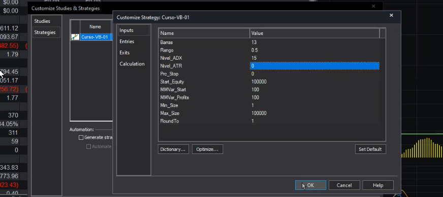
  <figcaption>Figura 104. Ajuste del valor del filtro ATR.</figcaption>
</figure>

Ahora verás cómo tiene más de 370 al quitarle el filtro de volatilidad. Seguramente también empeorará. ¿Eh? El de la volatilidad es muy bueno.

<figure>
  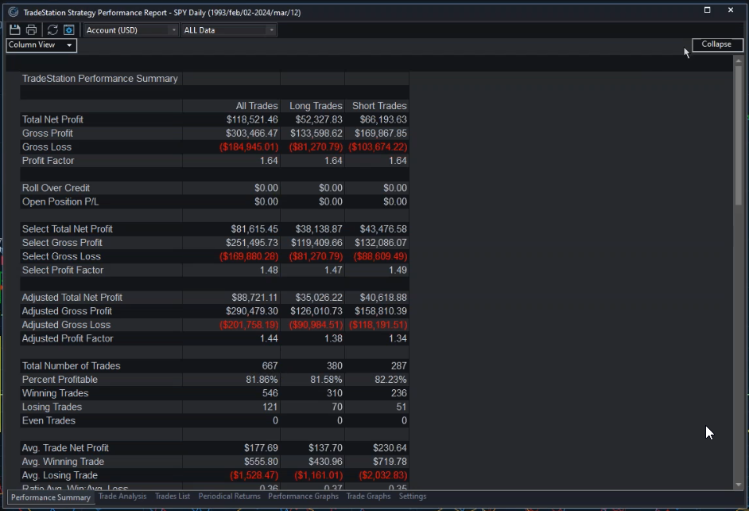
  <figcaption>Figura 105. Resultado sin filtro de volatilidad.</figcaption>
</figure>

Cada vez que quitamos el filtro de volatilidad, nos hemos ido a 677. O sea, el que filtra más es el filtro de volatilidad. También depende del valor que le des, claro. Porque el *ADX*, si ahora le meto 20, veréis que filtra más, claro.

<figure>
  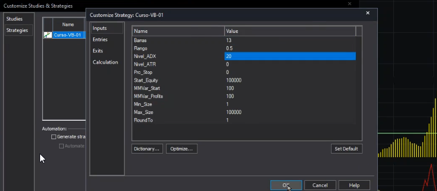
  <figcaption>Figura 106. Filtro ADX con valor 20: mayor restricción.</figcaption>
</figure>

Y ahora es: oye, si no pasa de 20, no verás largo o corto, la línea, cada una de ellas. Entonces lo estoy filtrando más. Depende del valor que le des: filtra más o filtra menos. Eso está claro.

 

## Preguntas


***¿El ATR medido al peak es una forma de normalizar el ATR?***

Sí, es una manera de normalizar el *ATR*. Sí, sí, correctísimo.

De hecho, nuestra forma de normalizar el *ATR* te la enseño inmediatamente, que para eso te has gastado las panojas en el curso.

```
# VB-01 : Strategy
If Nivel_ATR > 0 Then
    //FiltroATR = AvgTrueRange(Barras) / Average(Close, Barras) > (Nivel_ATR/100);
    FiltroATR = AvgNormalizedTrueRange(Barras) > (Nivel_ATR)
```

<figure>
  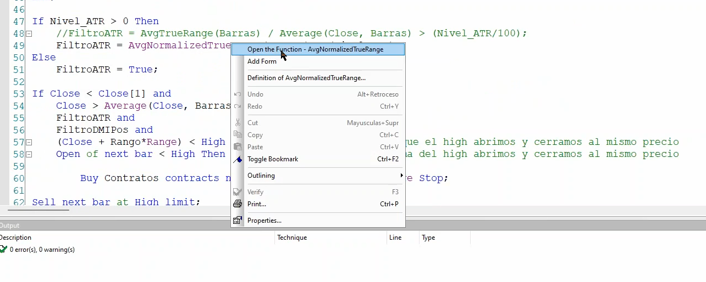
  <figcaption>Figura 101. Implementación del filtro ATR normalizado.</figcaption>
</figure>

```
# AvgNormalizedTrueRange()
inputs: Length (numericsimple);
var:    double NATR (0);

NATR = Average(NormalizedTrueRange, Length);
AvgNormalizedTrueRange = NATR;
```

Esto es un *ATR* normal. O sea, el *ATR* es igual.

<figure>
  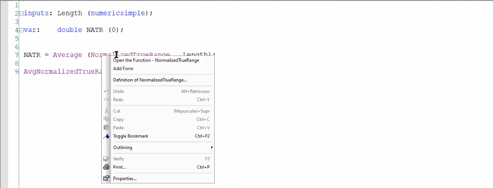
  <figcaption>Figura 102. Código de la función NormalizedTrueRange.</figcaption>
</figure>

```
# NormalizedTrueRange
var: double NATR (0);

NATR = MaxList(H - L, C[1] - L, H - C[1]) / TypicalPrice * 100;
    // NormalizedTrueRange = TrueRange / TypicalPrice * 100;
NormalizedTrueRange = NATR;
```

El único cambio que hay es que nosotros dividimos por *Typical Price*. Pero sí, puedes dividir por *close* igual. O sea, sí, es lo mismo, de verdad. Esto es el *ATR* normal y corriente: `MaxList(H - L, C[1] - L, H - C[1])`. Eso es el *ATR*. Lo único que lo hacemos en cada cálculo. Es mejor hacerlo así, porque así en cada cálculo te lo normaliza. Y luego hace la suma del *average* de cada uno de ellos. Ya te lo hace en porcentaje cada una de ellas.

Es decir, al final, cada vela... ¿Qué vela es esta? ¿1.2? Vale, pues 1.2. ¿1.3? Vale, 1.3. Pues 1.2 más 1.3... Eso normaliza. ¿Entiendes? No normaliza todos los valores de *ATR* si lo divide por el valor de *ATR*, porque eso no es del todo correcto. En valores largos cambia un poco eso. ¿Me explico?

Es decir, yo sumo 100 puntos, 200 puntos, 600 puntos y normalizo eso. No. Es mejor calcular el porcentaje y luego normalizar los porcentajes, que es como se ha hecho aquí.

Es sencillo. No tiene más. Pero sí, normalizar el *ATR* es eso. Esto, al final, si lo ves en un gráfico... muchos gráficos hemos visto aquí.

<div style="border-left: 4px solid #ff9800; background: #fff3e0; padding: 10px 15px; margin: 10px 0; border-radius: 8px;">
  <strong>📐 Normalización del ATR: método correcto</strong><br><br>
  <strong>Método incorrecto:</strong><br>
  <code>ATR_Normalizado = Average(TrueRange, N) / Close</code><br>
  <em>Problema: normaliza después de promediar, sesgando valores históricos.</em><br><br>
  
  <strong>Método correcto:</strong><br>
  <code>ATR_Normalizado = Average(TrueRange / TypicalPrice, N)</code><br>
  <em>Cada barra se normaliza individualmente ANTES de promediar.</em><br><br>
  
  $$
  NATR = \frac{1}{N} \sum_{i=1}^{N} \frac{TR_i}{TP_i} \times 100
  $$
  
  Donde:<br>
  • $TR_i$ = True Range de la barra i<br>
  • $TP_i$ = Typical Price de la barra i = (H + L + C) / 3
</div>


