# Practice 10

## Cuestiones

**El debate entre Builders y No Builders en el Trading Algorítmico**

Es interesante porque se abrió un debate ahí entre *builders* y *no builders*. Para quien no lo sepa, Andrea Unger es un trader algorítmico bastante conocido que también, como Iván Scherman, ha ganado el campeonato del mundo de trading varias veces y que está considerado pues uno de los grandes. En *Stocks & Commodities* encontrarás varios artículos de él; entre él, Kevin Davey, Perry Kaufman (autor de *"Trading Systems and Methods"*), hay bastantes: Larry Williams, distintos, pero más antiguos quizás. Unger ya es mayor pero es más moderno que Perry Kaufman o Williams. Son grandes estrellas del trading algorítmico, podemos decir, que destacan por su formación. Por el caso de Kevin Davey y Andrea Unger, pues tienen bastante formación, son conocidos por ello. Pero también han ganado, o bien han ganado el campeonato, tienen operativa y demás.

Entonces es verdad que Andrea Unger al final sobre todo es conocido por sus formaciones, pero como digo, ha ganado el campeonato del mundo. No es fácil ganarlo porque es un año de operativa real. Pero sí que es verdad que su *focus* es academia. Y de hecho incluso yo estoy dado de alta y esa está un poco, en mi opinión, mareante. Es muy agresivo. Es decir, si tú no... Yo os lo digo: si yo no supiera que Andrea ha ganado el campeonato, si no supiera que es un buen trader porque lo sé de buena tinta —no tengo ninguna duda de ello—, pensaría que es humo, porque su marketing es tan agresivo. De verdad, es de los más agresivos que yo he visto. Normalmente cuando ves tanta agresividad con la venta de cursos de material, tanto *spam*, tienes a pensar que no hay nada. Pero bueno, ya digo que cero dudas respecto a él. Pero vaya, que sí que tienen un *focus* venta de producto muy *heavy*, están muy enfocados en eso. Tiene un equipo enorme de gestión de la academia, además.

Y esto, en mi opinión, puede ser —pero solo puede ser, es una teoría— que genere un cierto sesgo. Un cierto sesgo a la necesidad de siempre estar generando contenido, nuevas ideas. Tienen como un concurso además para los alumnos; siempre hay que estar como generando movimiento, porque si no pues no puede... Si nosotros ahora, por ejemplo, nuestro *focus* cambiara y de pasar a dedicarnos principalmente a la operativa decidiéramos dedicarnos principalmente a la formación, pues claro habría que estar todo el rato generando cosas, y habría que seguramente tener mucha más gente trabajando para poder hacerlo, porque es que sería imposible. Entonces, para generar el producto formativo pues hay que estar todo el rato dedicado a ello, y hace falta muchísimo trabajo.

Entonces, esto en mi opinión pues genera un cierto sesgo. Él tiene un método, porque le ha puesto nombre, que se llama *Andrea Unger Method*. También, el de Andrea tiene una particularidad: ellos tienen unas especies de librerías de filtros o de señales de entrada, de *setups*, y es interesante —no digo que no lo sea—, es interesante. Y ahí se abrió el debate respecto a esto.


**Comentarios del debate sobre filtros y optimización**

<div style="border-left: 4px solid #2196f3; background: #e3f2fd; padding: 10px 15px; margin: 10px 0; border-radius: 8px;">
  <strong>💬 Comentario de un alumno</strong><br><br>
  <em>"Al hilo de la pregunta de Juan Manuel que se comentó al comienzo del último directo, dice Sergi que no es recomendable optimizar también los valores del filtro. Al final esto es una optimización implícita. Entiendo que sería aconsejable hacer aunque sea pequeñas variaciones de ese valor del filtro para comprobar la robustez. Que el filtro funcione es una cosa, pero que sea robusto es otra."</em>
</div>

<div style="border-left: 4px solid #2196f3; background: #e3f2fd; padding: 10px 15px; margin: 10px 0; border-radius: 8px;">
  <strong>💬 Comentario de Rubén</strong><br><br>
  <em>"Siguiendo con el hilo este de los filtros, hay algunos traders famosos como Andrea Unger que tiene su propia base de datos con múltiples entradas y lo que hace es un poco lo que ha propuesto Juan Manuel. Tiene un switch (también se puede hacer con if then) para probar cuál de sus entradas funciona mejor en ese activo/TF. Para mí esto es muy interesante, por si alguien quiere investigar..."</em><br><br>
  <em>"O sea, ya no se trata de un filtro en sí sino de seleccionar el gatillo de entrada. Y esto se puede extrapolar a otros bloques de la estrategia, claro."</em>
</div>

Comentó primero que tenía una base de datos y que le parecía un tema interesante a nivel de *switch*. Que es, si buscas aquí *switch*:

<figure>
  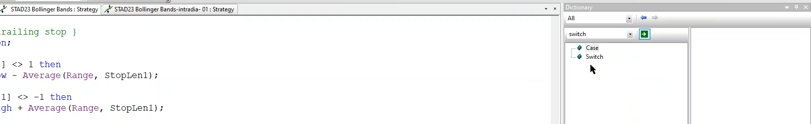
  <figcaption>Figura 0. Documentación de la función Switch en sh.</figcaption>
</figure>

<div style="border-left: 4px solid #27ae60; background: #ecf9f1; padding: 10px 15px; margin: 10px 0; border-radius: 8px;">
  <strong>📐 Función Switch en sh</strong><br><br>
  La función <code>switch</code> permite evaluar múltiples casos de forma eficiente, especialmente útil para probar diferentes condiciones de entrada y salida sin necesidad de anidar múltiples declaraciones <code>if-then-else</code>. Es fundamental para implementar sistemas de trading con múltiples estrategias seleccionables.
</div>

Sirve para probar distintos tipos de entrada y salida. Nosotros, de mucho menos evolucionado que esto que comentaba Rubén, enseñamos algo en la clase 5.6.3 —la evaluación preliminar— y dijimos que lo haríamos en la práctica, y lo haremos. La práctica, tenemos pendiente una práctica exclusivamente de eso. Decidimos empezar de esta manera haciendo algún sistema y luego ir aprovechando también nuestro propio trabajo para hacer cosas, como la revisión de Apolo que hicimos la semana pasada. Iremos haciendo distintos temas que complementan la teoría. Porque al final la teoría, que creemos que en general está bastante desarrollada, pues al final la práctica lo que pretende es complementar, añadir contenido a lo que ya hemos hecho en la teoría. Y también pues el tener acceso a vosotros, a poder preguntar abiertamente sobre todo.

Entonces haremos una práctica de eso en la que evaluaremos señales de entradas, y esto se hace siempre con `case`, como visteis ya digo en el 5.6.3 hacia la parte final. Pero habrá muchas más que las que visteis ahí; se hace así.

Entonces pues bueno, él tiene un montón de *setups* y él lo va probando de manera —para mí hasta un poco exagerada— probando distintos y lo optimiza y demás. El aspecto que concretaba Rubén, ahora luego voy a mi respuesta y se abre otro debate, pero el concepto que preguntaba de eso del *switch* para probar distintas entradas, que funciona, y dice que para él esto es muy interesante por si alguien quiere investigar: sí que es interesante, pero más que investigar es un camino que, insisto, visteis en el 5.6.3 y que veréis en la práctica. Es correcto, eso está bien.

Ya en la respuesta a Juan Manuel le comentamos en directo la clase pasada que sí, que eso es buena práctica, que como todo pues hace falta buen criterio y prudencia, pero es buena práctica. Y que esto de la evaluación preliminar está bien: ir probando distintos gatillos, *triggers* o *setups*, pues enfocarlo desde distintos puntos de vista. Y también pues, por qué no, con las salidas. Se puede probar con cualquier cosa.


**Mi respuesta sobre el método de Unger**

Entonces ahí en mi respuesta, pues no sé si quizá no me expliqué bien:

<div style="border-left: 4px solid #ba7bf5ff; background: #e7ddf0ff; padding: 10px 15px; margin: 10px 0; border-radius: 8px;">
  <strong>📝 Respuesta sobre Builders</strong><br><br>
  <em>Hola Rubén, gracias por la aportación, pero intentemos dejar la sección de preguntas solo con preguntas por favor.</em><br><br>
  <em>Es un tema interesante como dijimos en la pregunta de Juan Manuel. Mañana profundizamos en ello en la clase, pero a ver si podemos dejar claro nuestro punto de vista aquí en el Discord.</em><br><br>
  <em>Tanto en la teoría como en la pregunta de Juan Manuel dijimos que sí se puede hacer eso. Al final eso no deja de ser una especie de Builder, pero hecho directamente en el sh y mucho más acotado y dirigido que un Builder externo. Lo que no haría es meter un montón de tipos de entrada distintas y encima optimizar también el input en ese momento en cada uno de los setups.</em><br><br>
  <em>En nuestro procedimiento se haría un poco en la evaluación preliminar. Tú ahí puedes buscar qué tipo de entrada le va mejor a un activo y puedes usar un código que pruebe distintos tipos de entrada con un parámetro general. Pero o no optimizaría el valor del input o lo haría muy ligeramente, pero claro, esto siempre depende de grados de libertad, trades, histórico...</em><br><br>
  <em>En la teoría vimos un ejemplo de esto en el vídeo 5.6.3 hacia la parte final de la clase, incluso enseñamos un código de sh sencillo. Dijimos entonces y sigue en pie, que haremos una práctica de esto, de búsqueda de entradas con código (también puede hacerse con las salidas). Esto también puede servir para ver qué características tiene un activo.</em><br><br>
  <em>Una vez evalúas esto en la evaluación preliminar ya sigues para adelante en la evaluación con la idea ya más definida y ahí sí que podrías optimizar el input o no. Y obviamente, como hemos dicho varias veces, hay veces que las fases se mezclan y se puede hacer casi conjuntamente porque el sistema ya es muy sencillo o tiene pocos trades y no lo vamos a optimizar, con lo cual la evaluación preliminar y la evaluación son muy similares.</em><br><br>
  <em>Lo que comentas de Unger es la máxima expresión de esto, ya que él tiene una biblioteca enorme de setups, lo cual puede ser interesante si se usa correctamente y si se tienen las bases para saber elegir y manejar toda esa información, que es lo que pretendemos con este curso. Es un poco como decimos de los Builders. ¿Pueden ser útiles? Sí, pero no para empezar y siempre con mucha prudencia. Mañana en la clase más y mejor.</em>
</div>

Diciendo que es una especie de *builder*: sí, eso para mí sí que es una especie de *builder*, en el sentido de que es un buscador. Es un *builder* bueno, está mucho mejor hecho que un *builder* externo, porque un *builder* al final tiene millones de combinaciones y lo puede reoptimizar todo. Que también lo puedes acotar tú, y ahí es donde puede tener sentido el *builder* —ya lo he comentado en la teoría—. Pero para mí, el objetivo del curso que lo decía aquí es una de las cosas que quiero dejar claras. Es esta frase de aquí:

<div style="border-left: 4px solid #ba7bf5ff; background: #e7ddf0ff; padding: 10px 15px; margin: 10px 0; border-radius: 8px;">
  <em>"Lo que comentas de Unger es la máxima expresión de esto, ya que él tiene una biblioteca enorme de setups, lo cual puede ser interesante si se usa correctamente y si se tienen las bases para saber elegir y manejar toda esa información, que es lo que pretendemos con este curso."</em>
</div>

Esa es la máxima expresión: el derecho de combinar un montón de posibilidades y hacer un `case` que tiene una biblioteca enorme, y que puede ser interesante si se usa correctamente y si se tienen las bases para saber elegir y manejar esa información. Y ese es el objetivo, siempre ha sido nuestro objetivo del curso: al final enseñaros a tener criterio.

Pero el criterio al final se consigue mediante conocimiento y práctica. Al final todo depende de eso. Porque por mucho que tratemos de objetivizarlo todo al máximo, siempre va a haber un grado de subjetividad porque quien decide es un sujeto, aun basado en reglas objetivas. Y esto lo veis, lo he explicado otras veces con muchas cosas, y es así.

Quizá haya gente que se acerca al cuántico que le parezca extraño, pero si pensáis en la vida real veréis que no es tan extraño. Lo podéis pensar, lo puse como ejemplo: yo qué sé, el tema del COVID, por ejemplo. Con la misma información hay gente que defiende una cosa y gente que defiende justo la contraria, y tienen exactamente la misma información. Y bueno, y con muchas más cosas. Y bueno, no digo ya con una imagen de fútbol, porque entonces ya nos volvemos locos. Es decir, hasta con un fuera de juego o hasta con un penalti, hay gente que dice que sí es y gente que dice que no es. Todo el mundo tiene la misma información disponible.

Entonces, al final, evidentemente esto del fútbol es un extremo porque además incluyen sentimientos. Pero eso, vale, tú dices "pero es que hay sentimientos". Ya, pero es que el sentimiento, si hablamos de ciencia o hablamos de datos, se traduce mediante sesgos. Y también los hay con los datos. Y también los hay con el hecho de que un sistema sea tuyo, etcétera. Entonces, lo mismo que un equipo tuyo, un sistema tuyo, etcétera. Entonces, al final los hay. Pero lógicamente, con más información, viendo distintas opciones, viendo ejemplos y tratando de hablar de ello, pues insisto, los conocimientos y procedimientos adecuados pues se puede reducir a la máxima expresión, que es lo que intentamos.


**Ejemplo de código con múltiples entradas y salidas**

Entonces aquí, repreguntaba, hablaba de *mean reversal*, por ejemplo. Es verdad que yo lo he hablado muchas veces; él por eso seguramente me lo soltó. Y decía si creía que era igual que un *builder*. Y yo digo que no, no es igual que un *builder*. Al final lo que hace Unger es esto:

<figure>
  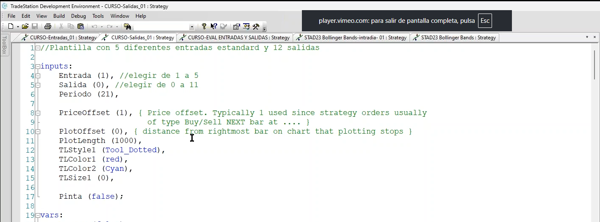
  <figcaption>Figura 1. Código con múltiples opciones de entrada y salida mediante switch/case.</figcaption>
</figure>

El que enseñé durante la clase [18-practice-08](02_practice/02_workshops/18-practice-08/code/STRATEGY_VB_01.ELD). Esto es una plantilla con cinco diferentes entradas estándar y 12 salidas. Aquí, con esto le das un *input* y esto, cada `case`, va del 1 al 5. Normalmente lo ponemos en comentarios: "elegir de 1 a 5", "salida 0", "elegir de 0 a 11". Y aquí, de un indicador para bueno, eso es un código que permite pintar directamente el gráfico desde un sistema, es un poco complicado, no nos paramos. Pero aquí ves que tienes tu `switch`: aquí eligiendo 1 o 2 pues eliges una distinta entrada o eliges una distinta salida:

<figure>
  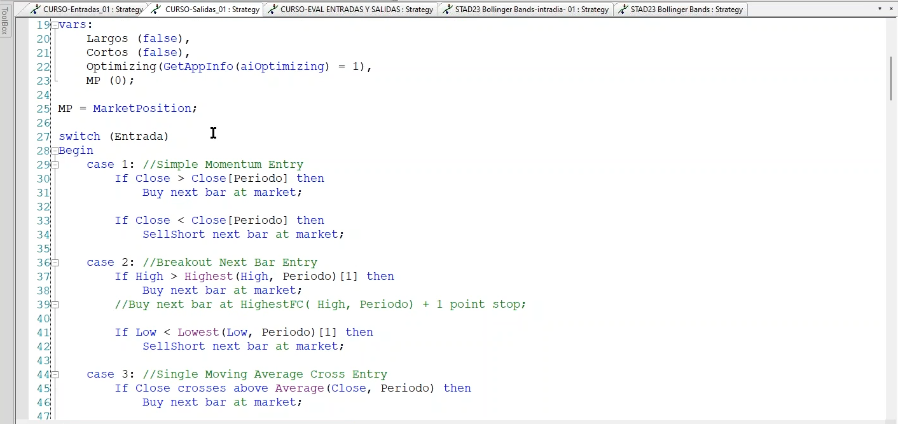
  <figcaption>Figura 3. Estructura switch/case para selección de entradas y salidas.</figcaption>
</figure>

Esto es un código de este tipo. Que él, al final, lo que importa es lo que hay en cada `case`, pues para que me entendáis, uno que en total pues tiene 100 y 200, que son todos los distintos *setups*. Y eso es interesante porque tú puedes crearte unos filtros —10 filtros que tú crees que son potentes para tal—, te los pones aquí y los puedes probar rápidamente en un sistema, poniéndole aquí en el *input* 1: perfecto, probó volatilidad tal. 2: probó volatilidad. 3... Es buena práctica hacerlo así.

Nosotros un código como tal, ya os lo dije, no tenemos, porque nunca hemos sido especialmente amantes de los filtros. Pero eso también es porque nuestros sistemas, la mayoría de los sistemas que hemos operado a lo largo de los años, tienen un sesgo más bien de medio plazo. También los hay intradía, pero hay más de diario que de intradía.

Entonces, al final, a medida que vas aumentando en diario, que también se puede filtrar, es más complicado. Y aunque por ejemplo Unger sé que lo hace y otros lo hacen, a mí me cuesta mucho. Reconozco que a mí ahí, cuando ya tengo un número —yo qué sé— inferior a 500 *trades* por poner un número, filtrar me cuesta mucho. Si ya tengo algo aceptable, prefiero lo aceptable sin filtrar que lo muy bueno muy filtrado y quitando la mitad de *trades*, ¿me entiendes?

Entonces es verdad que ese sesgo lo tenemos, y puede estar bien, puede estar mal. Como decía en la respuesta, "no siempre es seguro sí o no". Sí que sabemos cosas que no están bien, pero a veces este ejemplo que te digo yo: ¿es malo filtrar? No, no es malo filtrar. Pero evidentemente sabemos que aumenta el riesgo de sobreoptimizar, eso es así. Ahora, ¿es malo? No, no es malo filtrar.

Entonces siempre hay esa balanza donde tienes que jugar. Y a lo mejor, pues si fuerzas un poco, pues necesitas mayor seguridad mediante más pruebas de robustez, o más tiempo de *paper trading*, o a lo mejor *paper* pero probado con un lotaje inferior en real para ver cómo va. Es decir, bueno, al final dependiendo de lo que saques pues tienes que jugarlo de una manera o de otra. Pero no quiere decir que necesariamente esté mal.


**Discrepancias con la metodología de Unger**

<div style="border-left: 4px solid #2196f3; background: #e3f2fd; padding: 10px 15px; margin: 10px 0; border-radius: 8px;">
  <strong>💬 Pregunta de Rubén</strong><br><br>
  <em>"Por si quieres recoger el guante, te lanzo desde ya la pregunta: me gustaría saber exactamente en qué consideras que fuerza y en qué discrepas. Sé que no forma parte del contenido del curso pero ahí lo dejo por si de forma directa o indirecta quieres comentarlo. Saludos 😉"</em>
</div>

Me pinchaba que le dijera... Bueno, a mí la metodología en sí... Para mí, cuando él va probando y probando, él tiene una metodología en intradía como una especie de plantillas, aunque él dice que... Por ejemplo, él no optimiza los *inputs*, pero luego optimiza mucho las pautas. Entonces, para mí sigue teniendo el riesgo de sobreoptimización en lo que él hace.

Es decir, acepto que es inferior a modificar el *input*. Entiendo que tiene más riesgo optimizar —yo qué sé— una media, por poner un dato, o el valor de un ATR si quieres, que el hecho de probar entre 10 pautas distintas que detectan un patrón de volatilidad, etcétera, sin optimizar el *input*. Pero claro, si tú vas constantemente optimizando, utilizando, al final para mí también tiene el riesgo.

Yo creo que él simplifica mucho algunas partes y algunas aparentemente las quiere simplificar, y también cae en el riesgo de sobreoptimización. Y luego la prueba que hace de *Out of Sample*, pues para mí es demasiado laxa. Es decir, haría falta un perfil de optimización... Para mí, en la evaluación tiene una evaluación poco laxa.

Me gusta mucho la metodología de búsqueda de patrones, pero yo luego eso lo llevaría a una metodología más convencional de evaluación: hacerte un perfil, hacerte un mapa, etcétera. El mapa, aunque puede parecer que no los hace, los hace. Luego en una optimización lo enseño.


**El debate sobre Stop Loss fijo vs porcentual**

No solo de esto: este y además no solo de Andrea, ha hecho un montón de artículos sobre eso. Estoy totalmente en desacuerdo de esta idea que tanto él como... Esto lo hablé con Iván, en... No recuerdo, no lo digo porque no recuerdo cuál era su punto de vista exacto porque hablamos un poco de esto de tal. Y yo le dije que yo no era partidario, él no me lo dijo exactamente, pero esto para mí cae en un error. Tanto Kevin Davey como Andrea Unger dicen que las pruebas que han hecho les sale mejor resultado usar *Stop Loss* fijo que porcentual o variable. Para mí caen en un error absolutamente clarísimo.

<div style="border-left: 4px solid #9b59b6; background: #f5eef8; padding: 10px 15px; margin: 10px 0; border-radius: 8px;">
  <strong>📄 Referencia</strong><br><br>
  <em>Stock & Commodities V. 42:03 → "Fixed Stop-Loss And Percentage Stop-Loss In Comparison" by Andrea Unger</em>
</div>

Que es una de esas cosas que yo veo tan obvias a veces que no necesitan ser demostradas. Pero parece ser que sí.

Al final nos conocemos un poco todos del estilo. Tampoco es que sean contrarios. Siempre dicen que les da mejor resultado el *stop* monetario. Igualmente, Andrea es contrario a *Walk Forward* y Kevin es muy favorable a *Walk Forward*. Es decir, cada maestrillo tiene su librillo, y ambos son grandes profesionales.


**Demostración visual del error**

Tengo ya un pequeño detalle para que lo veáis. Intento demostrar visualmente por qué les pasa eso. A la izquierda, creo que teníamos un *stop* en dólares: 4.000 dólares. Y a la derecha está en porcentaje.

Más o menos, bueno, más o menos es el mismo activo. Como veis, he tratado de calcular el porcentaje que aproximadamente ahora vale. Me parece que es uno más o menos. Aproximadamente ahora daría esto similar. Se ven al punto rojo bastante parecido a precios actuales. Claro, esa es la gran diferencia: a precios actuales, a más o menos valores parecidos. Veis 4.000 dólares y tal. Desde el máximo anterior, calculamos desde algún sitio que contarlo. Entonces, desde el máximo anterior calcula una caída de ese valor de 4.000 dólares o de un 1.05%.

<figure>
  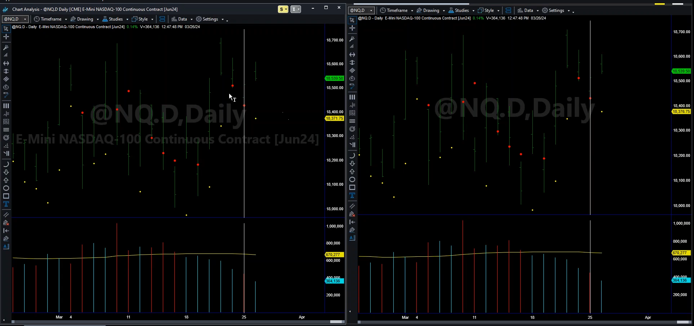
  <figcaption>Figura 4. Comparación inicial: Stop monetario (4.000$) vs Stop porcentual (1.05%) a precios actuales.</figcaption>
</figure>

Entonces ahora están igualados. ¿Y qué pasa? Cuando está rojo es que ha saltado, y cuando está amarillo es que no ha saltado. Es la manera visual de verlo. Entonces ahora me voy separando, y a la izquierda y derecha pues vemos poco más o menos cosas relativamente similares:

<figure>
  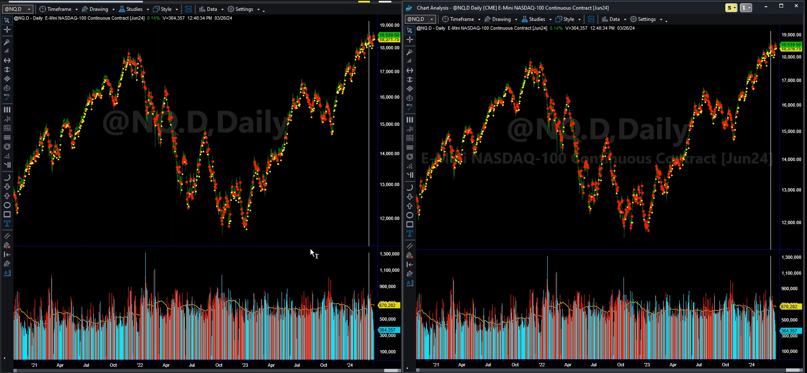
  <figcaption>Figura 5. Comportamiento similar en zona de precios cercanos al actual.</figcaption>
</figure>

Si quizá aquí abajo se vea un puntito más, pero se ven cosas relativamente similares. Pero, ¿qué va a pasar si yo me voy yendo hacia la izquierda? ¡Oh, misterio!

<figure>
  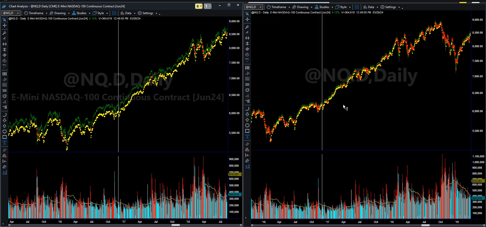
  <figcaption>Figura 6. Al retroceder en el tiempo, el stop monetario casi no salta.</figcaption>
</figure>

Aquí ya casi no saltan *stops*. Mismo valor: 4.000 dólares. Esto lo tengo puesto para que se me muevan conjuntamente. Aquí a la derecha también saltan pocos, porque no lo he ajustado por volatilidad, que sería otro debate. Y lógicamente, un mercado alcista tiene menos volatilidad y por tanto menos veces cae un 1%. Pero así como veis, alguna vez cae. A la izquierda, aquí apenas tenemos un *SL*. En toda esta subida no hay ni una sola vez donde el mercado caiga 4.000 dólares.

En la derecha, aquí en cambio, como veis, hay muchas. Y fijaros aquí en la caída —que esta es la más *heavy* de todas— cuando vemos que ahí también hay volatilidad, por lo tanto no era ese vector. Veis aquí apenas hay unos pocos puntos, y fijaros ahí cómo salta sin parar (la línea vertical es el mismo punto en cada gráfico):

<figure>
  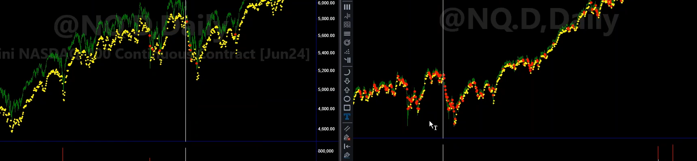
  <figcaption>Figura 7. En la crisis, el stop porcentual salta constantemente mientras el monetario apenas actúa.</figcaption>
</figure>

Casi cada día salta el *stop*. Vamos yendo hacia atrás. Claro, el precio cae, y lógicamente 4.000 dólares, veis la línea ahora lo lejos que está. Está lejísimos del precio:

<figure>
  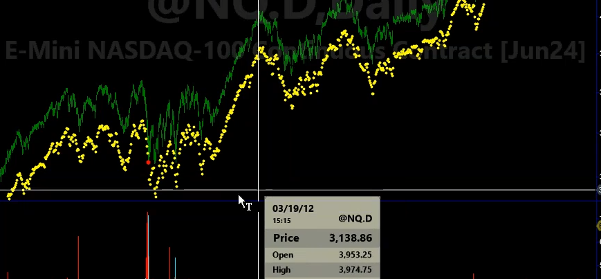
  <figcaption>Figura 8. A precios históricos bajos, el stop de 4.000$ queda completamente fuera de rango.</figcaption>
</figure>

Y por lo tanto deja de tener sentido, ¿entendéis? Solo salta uno aquí, y es que no salta nunca. Cuando a la derecha sigue saltando todo el tiempo porque es un 1% todo el tiempo. Esto sigue hasta incluso aquí en el 2008, donde es un *crack* como una casa y ahí salta cada día. Nuevamente, cada día. Aquí ni salta. ¿A quién le salta el *stop* de 4.000?

<figure>
  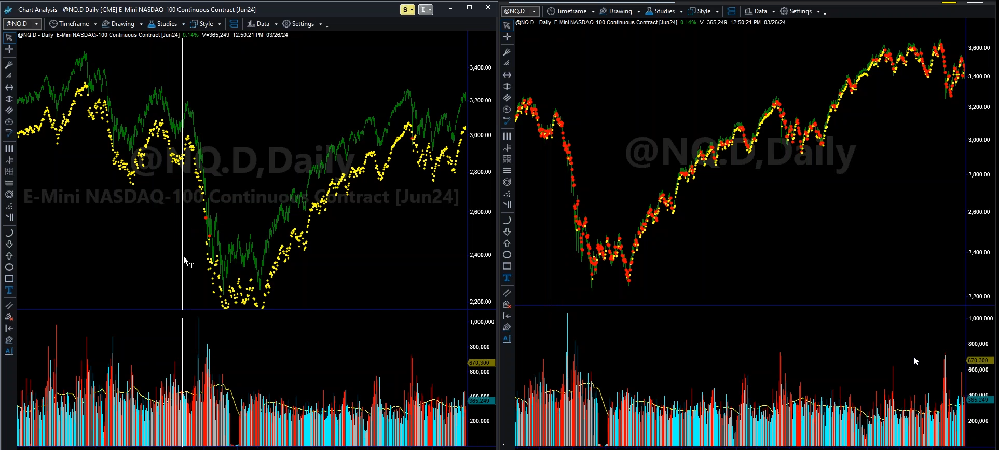
  <figcaption>Figura 9. Crisis 2008: el stop porcentual salta diariamente, el monetario no actúa.</figcaption>
</figure>

Dices: "Claro, porque esto no tiene sentido a ese nivel de precios". ¡Exacto! No tiene sentido porque no se ajusta a la base del precio.


**Por qué les da mejor resultado el stop monetario**

Entonces, claro, ¿qué pasa si yo hago una optimización como hace aquí en ese artículo el bueno de Andrea? Concretamente, ¿qué fechas usa? Usa desde... Él además pone el 2008 justamente. Dice: "Ves la diferencia". Hace esa explicación que hago yo, dice son 4.000, dice "la lógica dice que sería mejor". Pero claro, Jaimito —con perdón, perdona Andrea, perdóname Andrea—, Jaimito es que... ¡estás evitando que actúe!

Es decir, si tú le haces buscar al optimizador, si tú optimizas —que lo hace—, no estás ecualizando el riesgo igual. Entonces claro que te va a salir mejor este. Pero, ¿por qué te sale? Porque no salta. Simplemente por eso.

En la gran mayoría de sistemas, usar *stop* es peor a nivel de *profit*, salvo en casos donde no haya salida. Y entonces claro, el salir, por ejemplo en el caso de Bollinger —era hora de que veremos después, veréis un ejemplo donde puede ser— porque no hay más que salida en límite de *profit*. Entonces claro, evidentemente, si a mí no me dejas salir de ninguna manera y te pongo un *stop*, pues mejora. Porque es que no me dejaba salir en caso de fallo.

Pero si yo tengo la salida contraria del sistema, es también el lado perdedor. Imaginaos un sistema que sea un cruce de medias: cuando se acaben cortando, se sale. Pues vale, a lo mejor no tiene un *stop* monetario pero se acaba saliendo, porque va yendo a la contra.

En cambio, si yo compro en la banda de Bollinger de abajo —luego lo veréis— y automáticamente el precio sigue cayendo, y yo solo salgo en *profit* en la banda contraria, para que pase eso es muy difícil. Tiene que rebotar mucho el precio. Si no rebota, sigue perdiendo. En ese caso, un *stop* suele aportar.

Pero en la mayoría de casos, donde la salida contraria contempla también salir a la contra, pues ya digo, el *stop* suele restar rendimiento. En algunos casos puede mejorar los ratios de retorno-riesgo, pero en el mejor de los casos el *profit* lo deja parecido, poco, en la zona. No hay una gran ventaja prácticamente nunca en beneficio en poner *stop*. Prácticamente nunca. El beneficio viene por el riesgo.

Entonces claro, y no siempre es visible en ratios de retorno-riesgo. No siempre es visible. Pero entonces, ¿qué pasa?

Que en este gráfico de la izquierda, si yo optimizo el *stop* de 1.000 a 5.000 —por decir algo—, normalmente me va a salir un valor alto. Porque me va a salir el valor que se ajusta a la parte alta del precio, no necesariamente a la actual, a la parte que el precio esté más alto. Porque si no, imaginaos aquí, ya salta mucho si le pongo 1.000:

<figure>
  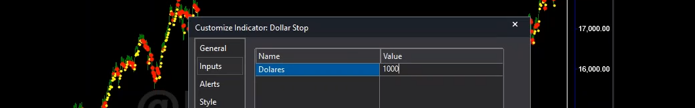
  <figcaption>Figura 10. Con stop de 1.000$, el sistema ni siquiera puede operar en la zona baja del histórico.</figcaption>
</figure>

Es que ni abre, ¿entendéis? Si yo pongo un *stop* aquí para que salte en la parte baja del precio, es que ni abre. Es que cierra, abre y cierra. ¿Entendéis? Entonces es absurdo.

Este a lo mejor sí que salta aquí en el 2008, ¿entendéis? Este a lo mejor sí que salta. Claro, pero le he tenido que poner 1.000. Y aun así, fijaros que aquí muchos sitios donde no salta:

<figure>
  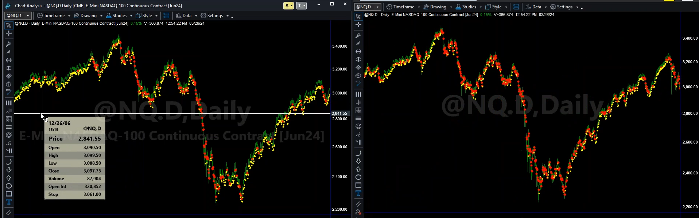
  <figcaption>Figura 12. Incluso con 1.000$, hay muchas zonas donde el stop monetario no actúa.</figcaption>
</figure>

Cuando aquí en la izquierda con un 1% salta. Entonces, simplemente es que no salta el *stop*.

Entonces, ¿por qué les da mejores resultados en monetario? Porque salta menos. Simplemente por eso.

¿Nos parece obvio? A mí me parece obvio. Pues hay muchos autores que defienden eso, entre ellos Andrea Unger. Es que es de cajón. Si te pones este indicador ya lo ves claro.

Aquí, fijaros, yo le he puesto 1.000 ahora, que podemos decir que estaría más o menos —tampoco mucho— pero fijaros, parece más razonable en la zona baja de los precios, que son precios que tocaron en 2008. Porque es que hace años, pero que en un sistema diario —ya no te digo semanal— tenía mucho sentido que lo cargaras hasta ahí. Pero claro, a la parte alta ya es que fijaros, aquí es que ni operamos casi. No hay puntos amarillos, casi no hay puntos amarillos:

<figure>
  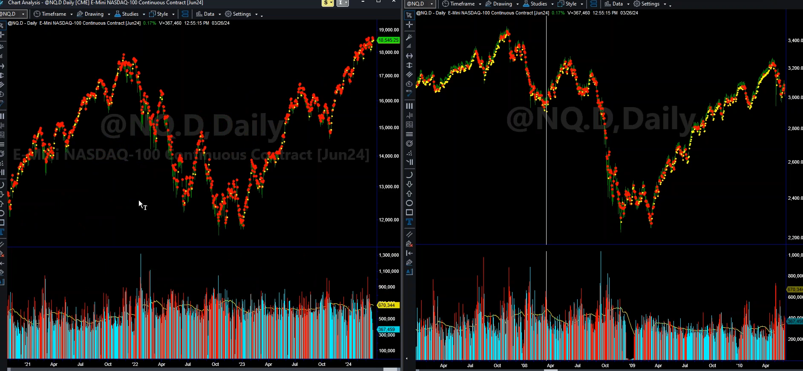
  <figcaption>Figura 13. A precios altos, el stop de 1.000$ impide prácticamente toda operativa.</figcaption>
</figure>

Entonces, ese es el motivo. Por lo tanto, no es que sea mejor o no mejor. A mí no me da igual si es mejor o no: es que es absurdo usarlo. Es absurdo.

Solo tiene sentido, como ya os comenté, era mejor en un sistema intradiario donde el movimiento del precio no sea tampoco muy exagerado, porque a lo mejor se mantiene en rango. Porque su rango entre el máximo y el mínimo no es demasiado elevado, entonces puede ser que tenga sentido.

Pero no en un histórico que la mayoría es así, que se haya movido mucho de máximo a mínimo. Hay que usar porcentual, por volatilidad, o cualquier caso que se ajuste al precio de cada momento. Y usar un valor monetario —Andrea lo hace siempre así, todos sus sistemas—, para mí no tiene sentido. Aunque te dé mejores resultados. Porque tú no estás *backtesteando* bien. Tú no estás evaluando de verdad si ese *stop* tiene sentido en el histórico, o es que me da mejor el resultado.

Bueno claro, pues mira, pues no sé, pues lee futuro y todavía te dará mejor. ¿Sabes que si lees a futuro te da mejor? Pero no es reproducible. No es verdad.

Entonces este es un caso típico de esto. Y entonces bueno, entre otras muchas cosas, hablaremos de esta. Una de las cosas cuando me refería a Andrea, una que no me gusta de Andrea es esta: esta continua persistencia en usar *Stop Loss* monetario. Por más que te dé mejor resultado, es que me da igual.

En muchos sistemas, si no utilizas *Look Inside Bar Backtesting*, también da mejor resultado. Que es que, no sé... O sea, al final hay cosas que pasan por delante del resultado. Esto lo he dicho muchas veces: cosas que pasan por delante del resultado. No se trata de conseguir un buen *backtest*. Eso es fácil. Yo lo he dicho muchas veces: es fácil si me da igual todo, como este caso. ¿Entiendes? Me da igual. Pues fácil.

No es fácil si se hace bien hecho. Pero si el objetivo es ese, es muy fácil. El objetivo es conseguir un buen *backtest*, es fácil. Pero ese no es el objetivo.

<div style="border-left: 4px solid #e74c3c; background: #fdf2f2; padding: 10px 15px; margin: 10px 0; border-radius: 8px;">
  <strong>⚠️ Conclusión sobre Stop Loss monetario vs porcentual</strong><br><br>
  El <em>Stop Loss</em> monetario (fijo en dólares) produce mejores resultados en backtest porque <strong>simplemente no salta</strong> en gran parte del histórico cuando los precios eran más bajos. No es que sea mejor: es que no actúa.<br><br>
  <strong>Recomendación:</strong> Usar siempre <em>Stop Loss</em> porcentual, por volatilidad (ATR), o cualquier método que se ajuste al precio de cada momento. El objetivo no es obtener un buen backtest, sino un sistema que funcione en tiempo real.
</div>


## Apolo - tema cerrado


El tema de Apolo quedó claro. No hay más que añadir. Si alguien tiene algo que hable ahora o calle para siempre. Ya si lo preguntáis en Discord le contestaré, pero en general dejo cerrada la clase.

Ya os dejé el Excel subido:

- [MAPA Excel subido](../../19-practice-09/data/MAPA%20ES%20SHORT%20zona%203.xlsx)
- Tema Apolo : [Sesión: 19-practice-09](https://github.com/alexjust-data/Professional-Trading-System/blob/clean-main/02_practice/02_workshops/19-practice-09/transcripts/practice_09_revised.md)

Hicimos un par de cambios:  

1. Nosotros lo hemos hecho otra con 30, que os lo comenté en directo: nos dimos cuenta de que el corte era un poco asimétrico en los tipos de mercado, y vimos que probablemente era mejor acortar al 30 para ganar más mercado alcista en la parte *Out of Sample*, porque había quedado un poco cojo de mercado alcista. Era un pequeño matiz, no cambia prácticamente nada, pero queríamos verlo.

2.  Y luego también en la regulación de los incrementos. Al final optamos por bajar un punto. Recordar que os expliqué que viendo el análisis vi que había un salto demasiado grande, y optamos por bajarlo. Está en la nuestra, lo hemos hecho simplemente para comentarlo.

Este ya estaba bien. Las mapas y las conclusiones son interesantes, y nosotros en el otro pues hemos sacado conclusiones bastante similares. Pero simplemente comentaros eso y daros cuenta de que esa es la realidad: que hay veces que pues tomas una decisión a hacer una cosa, y bien analizando los datos —pues para eso hay que analizarlos de la forma más *estéril* posible, para no empeñarte, no ofuscarte, tratar de ser al analizar la información lo más estéril— oye, pues aquí lo aumenté. Yo esto hacía en la revisión preliminar, decidí subirlo, y ahora he vuelto a decir bajar. Porque pues la verdad que no sé por qué, pero ahora lo he visto clarísimo. Lo hemos analizado y lo hemos visto clarísimo que tenía que ser 0.0125:

<figure>
  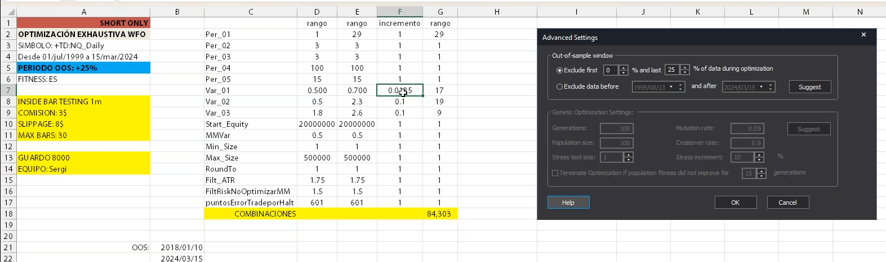
  <figcaption>Figura 14. Ajuste del incremento a 0.0125 tras revisión del análisis.</figcaption>
</figure>

Pero ya os digo que esto pues puede pasar. Porque al final tratas de no sobreoptimizar, por eso en caso de duda siempre mejor incrementos más altos. Pero también hace falta la suficiente señal. Ya que en el mapa sí que se veía un poco —aquí ya estaba bajado un poco— pero estos saltos al final apuntaban un poco en esa dirección. Apuntaban viendo el mapa, pero luego había que ver que efectivamente era así. Como vimos que había saltos de bastantes *trades* de un *tick* a otro *tick*, entonces esto ya lo doy por cerrado.


**Discusión sobre drawdown y Stop Loss monetario**

*Decía Rubén ahí de si había drawdown relativamente iguales.*

Bueno, pero es que el perfil de *drawdown* seguro que no era igual. Puede ser que el valor absoluto, Rubén, porque al final el ejemplo... En ese ejemplo podríamos mirarlo algún día con algún sistema. Nosotros en alguno lo he mirado pero no lo tengo listo ahora. Pero sí que, a ver si lo puedo abrir:

<div style="display: flex; flex-wrap: wrap; gap: 10px; justify-content: center;">
  <figure style="margin: 0; flex: 0 0 48%;">
    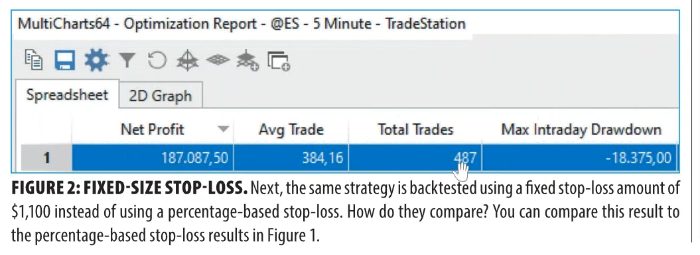
    <figcaption>Figura 16. Artículo de Andrea Unger sobre Stop Loss fijo vs porcentual.</figcaption>
  </figure>
</div>

[Stock & Commodities V. 42:03 → "Fixed Stop-Loss And Percentage Stop-Loss In Comparison" by Andrea Unger](../docs/FIXED%20STOP-LOSS%20vs%20PERCENTAGE.pdf)

Probablemente sí, porque al final el problema es que el otro se ajusta. Bueno, tiene menos con el *fixed*, tiene menos con el *fixed*. Pero es que igualmente no me sirve, Rubén, de verdad. No me sirve. A mí me gustaría ver el gráfico. Es que lo que te he enseñado en el gráfico para mí es clarísimo. Es decir, al final simplemente no es homogéneo. No estás probando... Igual que tú en el resto de variables tratas de hacerlo, esa variable no se ajusta bien.

O sea, cualquier dato que usas al final está estandarizado: porque yo qué sé, un MACD, un estocástico, un ATR, una media móvil, un Donchian... Al final utiliza el precio de manera que se va normalizando al precio de ese momento. En cambio, esa variable no se normaliza al precio de ese momento. Luego lo puedes normalizar de una manera u otra. Tú puedes decir que no te gusta más ATR, que te gusta más *trailing*, que no... Oye, pero un valor monetario por sí solo no se homogeniza, no se normaliza al precio. Y en esa imagen que hemos visto en los gráficos, para mí era muy evidente.

Entonces es que a mí me dan igual los datos, de verdad. En este caso está bien analizarlos y lo haremos. Trataré de reproducir este mismo, y si no buscaré dos artículos, porque este artículo lo he leído varias veces ya, y también a Kevin Davey he leído varias veces este artículo con ejemplos.

Pero bueno, ya te digo: al final si tú optimizas el fijo, se te va a adaptar a una parte del histórico. Te va a saltar en una y en otra no te va a saltar. Prácticamente siempre te va a pasar eso. No te va a saltar, y por eso va mejor: porque como no salta y el *stop* acostumbra a restar, pues le va mejor.

Y el *drawdown* en valor absoluto —nuevamente, ya digo que muchas plataformas, TradeStation la primera, aunque MultiCharts lo da en porcentaje, pero aquí no— en valor absoluto, nuevamente en un histórico largo así, comparando uno con otro no nos dice absolutamente nada. Porque depende en qué momento lo tengas.

Es decir, 25.000, volviendo al ejemplo que estábamos antes... Lo ves un poco, un valor monetario calculado desde los máximos. Vamos a suponer que yo a esto ahora le pongo línea, le pongo línea, y le pongo 20.000:

<figure>
  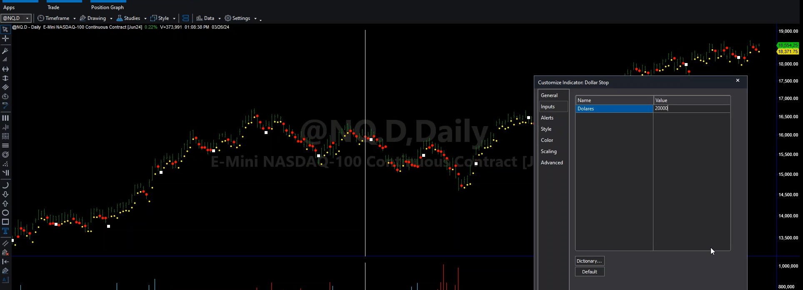
  <figcaption>Figura 17. Configuración de línea de referencia a 20.000.</figcaption>
</figure>

50.000, para que me veas. Entonces tú fíjate a cuánto está del precio:

<figure>
  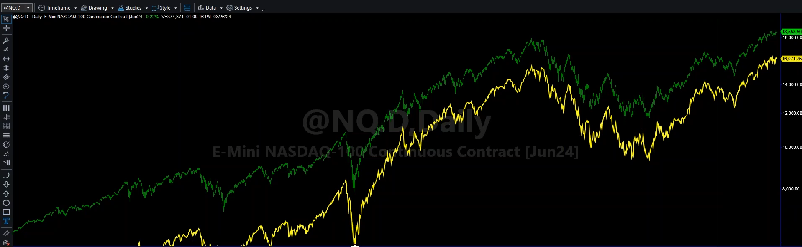
  <figcaption>Figura 19. El drawdown de 50.000 a la izquierda no equivale a la misma distancia relativa a la derecha.</figcaption>
</figure>

El *drawdown* de 50.000 de la izquierda no es el mismo que la distancia entre el precio y el *drawdown* de la derecha. Es relacionado al precio, no tiene nada que ver. Entonces, el valor absoluto en un histórico largo, nuevamente el *drawdown* no nos dice nada.

Al final, la referencia así mirada tampoco nos dice mucho. Habría que verla en porcentaje, habría que verla medio, y habría que verlo el gráfico. Que esto, como ya os he comentado muchas veces, es otra discrepancia con algunos colegas también bastante reputados, que yo los he oído decir que no miran gráficos. De verdad, yo alucino. Algunas cosas que los datos, las medias, disimulan mucho las cosas. Las medias disimulan las cosas que solo se ven en el gráfico, como esta por ejemplo:

<figure>
  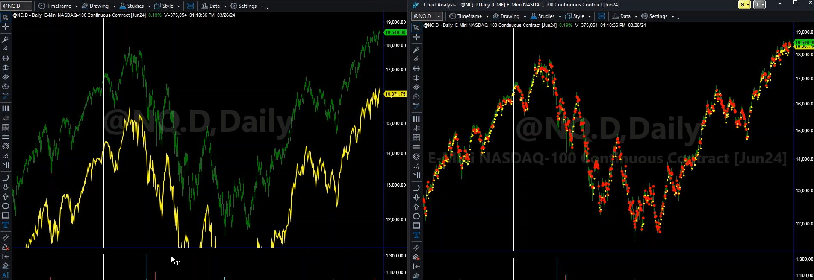
  <figcaption>Figura 20. El drawdown de 20.000 hoy vs en 2008: porcentajes completamente diferentes.</figcaption>
</figure>

El hecho de que el *drawdown* sea 20.000 hoy es una cosa; si lo tiene en el 2008 es otra cosa. Allí es un porcentaje abrumador, a lo mejor de un 70%, ¿me entiendes? Y ahora aquí pues es 20%. Igual, estoy inventando totalmente. Entonces, al final no tiene nada que ver.


## Strategy `Bandas de Bollinger` - Antitendencial

Hoy vamos a empezar por la parte *antitendencial*. Aprovecho para enseñaros esto. Yo creo que sí que lo podemos dar, Alberto, porque esto es del siglo pasado literalmente. Es del siglo pasado literalmente, veces del 98. Yo creo que esto ya no debe...

[Omega Research System Trading and Development Club](../docs/STAD03.pdf)


**La biblioteca del Club STAD de Omega Research**

Este material está hecho en el *sh* antiguo; incluso hay algún código que no funcionará como tal y habría que hacer pequeños cambios. Es una serie de artículos que hizo TradeStation cuando era *Omega Research*, como una especie de boletines.

De hecho, hay el *Trading Concept* que no os lo puedo subir, aunque he enseñado alguno en directo y alguna cosa he subido. Intentó volver a hacer más moderno y tal, pero esto ya te digo, esto lo tengo todo, es súper antiguo. Lo tenemos aquí todo y entonces ya os lo subiré, lo paquetaremos. A ver cómo, porque no deja subir de todo.

El primero aquí explica un poco de qué va y tal; era como un *club*, pero está fantástico porque estamos hablando de 87 páginas: habla de indicadores, tipos de sistema... Está muy bien a nivel de la plataforma (es una versión mega antigua), pero está muy bien. La verdad que lo que explica está muy bien, es muy completo y de consulta. Tiene al final, habla de todo tipo de indicadores. Y eso es lo mismo, no hay muchas novedades en ese sentido.

Entonces ya os lo subiré enterito. Todas estas, ya digo, cada una tiene... En total no sé si me va a decir el total de páginas... Windows no me dice el número de páginas, me dice que tiene 20 megas y ya está, no me dice nada más. Pero ya digo, pueden ser de 70 a 100 páginas cada uno, así que ya veis que tenemos más de 1.000 páginas de contenido.

<figure>
  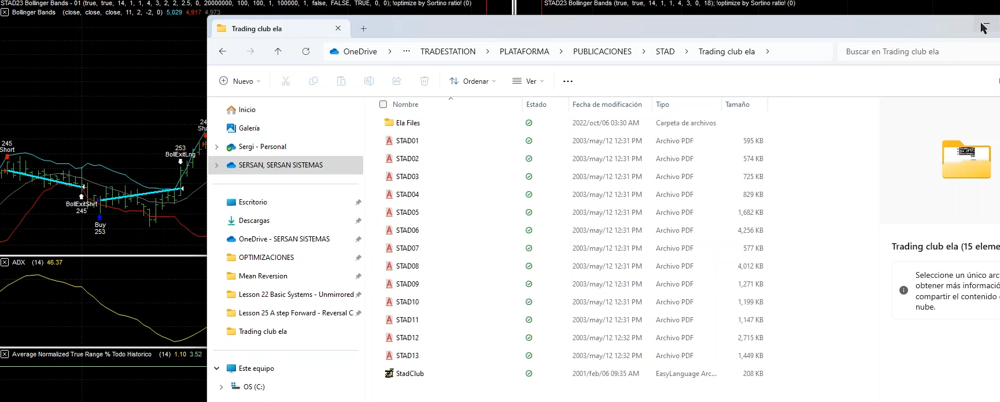
  <figcaption>Figura 21. Biblioteca completa del Club STAD de Omega Research.</figcaption>
</figure>


**La Número 3: Bandas de Bollinger**

La número 3 hablaba de las *Bandas de Bollinger*, entre otras muchas cosas. Entonces, aquí es como en toda esta biblioteca, en todo este *Club del STAD*: pues primero hablaba el indicador, lo explicaba, luego pues explicaba un poco el sistema.

Entonces, a raíz de él pues hemos partido, para, como siempre os dije, ir partiendo de ideas: algunas de libros, otras de experiencia.

Esta podemos decir que es súper antigua, clásica; no aporta nada en concreto ahora mismo, pero aquel que empiece y que no sepa de qué va nada, pues es un sitio fantástico para empezar.

<figure>
  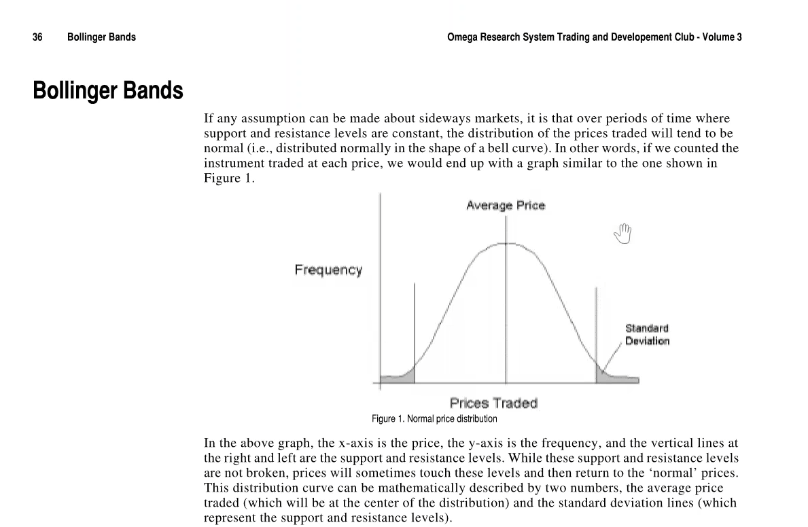
  <figcaption>Figura 22. Artículo original sobre Bandas de Bollinger del STAD Club.</figcaption>
</figure>


**El valor de revisar ideas antiguas**

Además tiene una cosa muy interesante: que es *revisar ideas antiguas*. Como ya os he dicho, pues te da mucha *fuera de muestra* ya de empezar, y eso es un *backtest* de mucho valor.

<div style="border-left: 4px solid #27ae60; background: #ecf9f1; padding: 10px 15px; margin: 10px 0; border-radius: 8px;">
  <strong>📐 Forward Testing con sistemas antiguos</strong><br><br>
  Directamente poner el sistema como está y ponerlo... que no va a funcionar este por ejemplo, pero imaginaos que encontráis uno que va, que a veces encuentras. Tienes un <em>Out of Sample</em>, bueno, más que un <em>Out of Sample</em>, en ese caso es un <em>Forward Testing</em> para mí (aunque también hay otros que dicen que no, pero para mí eso es un <em>Forward Testing</em> como una casa) fantástico.<br><br>
  Hay que revisar bien que no lea futuro, que sea reproducible, todo que esté bien, revisarlo bien. Pero si conseguimos eso y el sistema funciona sin ajuste, sin hacer la optimización ni nada, imaginaros: sacas un montón de años de <em>Forward Testing</em> que te dan muchísima tranquilidad para ir a operar con el sistema. Y eso pasa.
</div>


**La función MRO (Most Recent Occurrence)**

Entonces, además esto incorpora una cosa que no vamos a perder mucho tiempo. Voy a explicar lo que hace una función que se llama *MRO*. Y el 80% o el 90% del que lo va a oír, sea en directo sea después, no lo va a entender; por su cuenta tendrá que entenderlo.

A ver, podemos explicar, lo explicaré un par de veces, lo enseñaré la ayuda y tal, pero eso no es curso de programación. Esa función sale en el curso de *sh*, creo que en el inicial no, pero también sale en el máster; creo que ya sale en el inicial al final, y siempre es una clase. Los que ya hayáis hecho el *sh* ya os ha salido, así que seguro que ya se os ha atragantado allí. Y bueno, a lo mejor al final pues en la explicación con un profesor de extrema calidad en *sh* como yo —pues seguro, y modesto, muy modesto— pues lo entendisteis.

Voy a enseñar el código y a partir de ahí vamos tirando. Esto hoy no lo tenemos listo en PDF pero lo pondré.

- [PDF MeanReversion-01](../docs/MeanReversion-01.pdf)
- [PDF MeanReversion-02](../docs/MeanReversion-02.pdf)

### La versión original - Strategy : STAD23 Bollinger Bands

Entonces, bueno, la versión principal que la he revisado bien, explicado, también os la pondré al final.

<figure>
  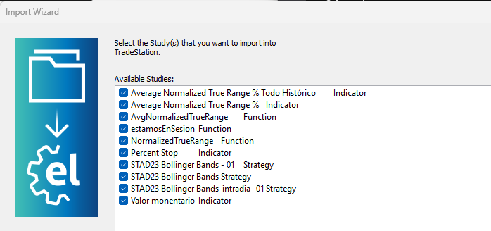
  <figcaption>Figura 164</figcaption>
</figure>

**Strategy** : [STAD23 Bollinger Bands](../code/SATD23%20BOLLINGER%20BANDS.ELD)   
**tws** : [10-Curso_MeanReversion.tws](../code/10-Curso-MeanReversion(fesx).tsw)


Es un sistema que si lo vemos en la pantalla de manera general (ahora veremos, entraremos en el detalle), pero de manera general compra... Este yo creo que sí que tiene, a ver dónde está el *Bollinger Bands*. Uno *Bollinger* normal es este:

<figure>
  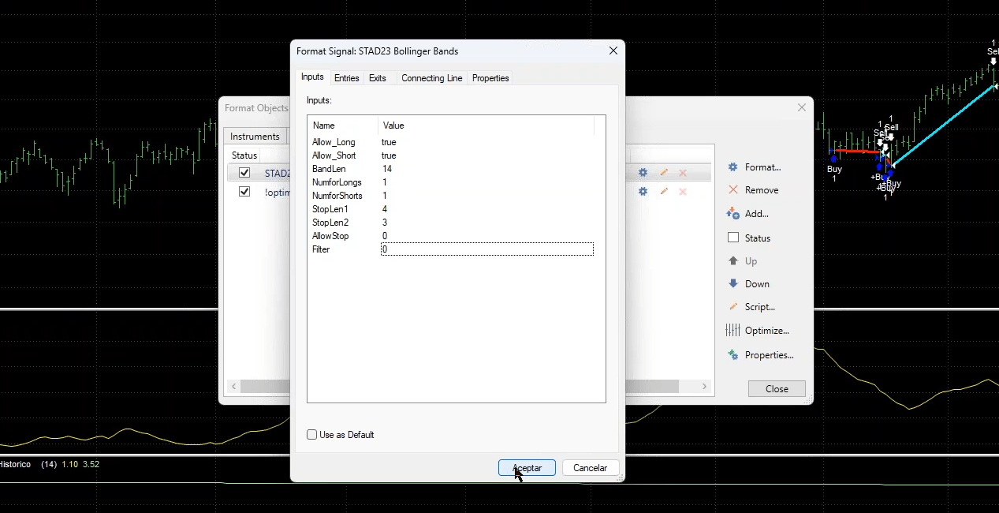
  <figcaption>Figura 24. Sistema Bollinger Bands sin filtrar.</figcaption>
</figure>

Sin filtrar, perfecto.


**Configuración original del sistema**

En su versión, ellos lo hicieron *piramidando*, es decir, que añade. Nos da igual eso ahora mismo, simplemente hemos respetado un poco lo que ellos hicieron.

<figure>
  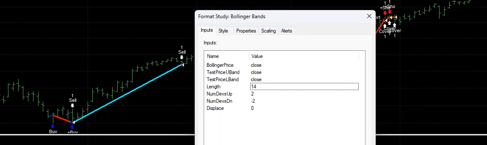
  <figcaption>Figura 25. Configuración original con piramidación.</figcaption>
</figure>

<div style="border-left: 4px solid #27ae60; background: #ecf9f1; padding: 10px 15px; margin: 10px 0; border-radius: 8px;">
  <strong>📐 Lógica básica del sistema Bollinger antitendencial</strong><br><br>
  Esto qué hace: cuando hay un cierre por encima de la banda, vende básicamente; y cuando hay un cierre por debajo, compra. Pero esto hay muchas maneras de abordarlo, y vamos a dar algunas ideas y unos consejos para que cada uno explore.
</div>

<figure>
  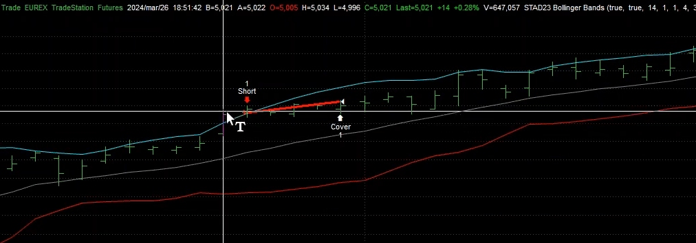
  <figcaption>Figura 26. Lógica de entrada: compra en banda inferior, venta en banda superior.</figcaption>
</figure>

Vamos a operar *Bandas de Bollinger* de manera en *mean reversion*, que es la más habitual diría. Y ya digo, funciona en general bastante bien. Por ejemplo, en el lado largo de bolsa es espectacular: en cualquier activo le metes un sistema de compra normal y corriente, nada, y vender en la banda de arriba, lo vais a ver, y ganar bastante dinero. Es decir, un sistema muy sencillo y muy bueno. Este *trade* que veis aquí es bastante habitual, este tipo de operativa. Hay que ver aquí en qué rango y qué tal, pero este *EuroStoxx* tampoco es que sea especialmente bueno, pero ahí está.

<figure>
  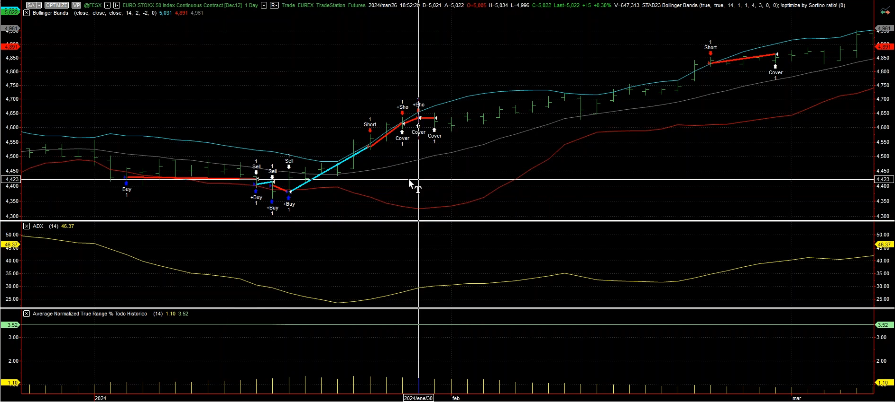
  <figcaption>Figura 27. Ejemplo de trade típico en EuroStoxx con Bollinger antitendencial.</figcaption>
</figure>

Pero tiene una particularidad. Aquí hay varias maneras de abordar la banda de *Bollinger*. Una, que lo voy a poner aquí...

<figure>
  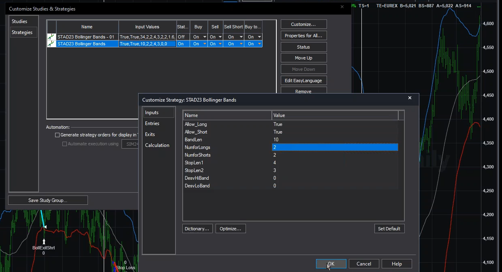
  <figcaption>Figura 28. Configuración alternativa.</figcaption>
</figure>

Bueno mira, lo voy a dejar en su versión original que es *S&P* cinco minutos en el *S&P*:

<figure>
  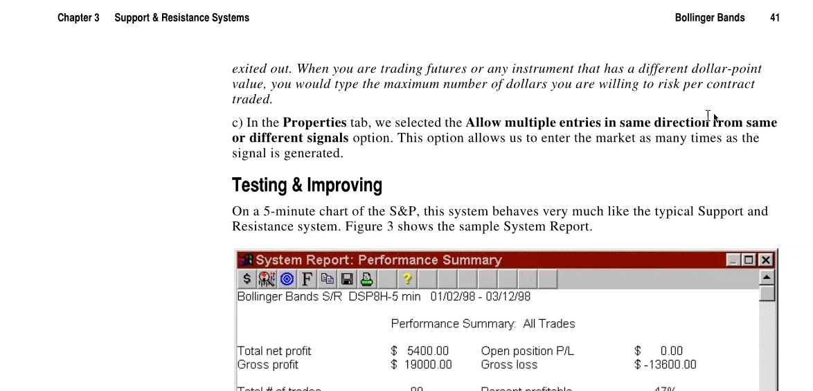
  <figcaption>Figura 29. Versión original: S&P 500 en 5 minutos.</figcaption>
</figure>

Y bueno, tengo puesto aquí el original con 10 minutos. Pues vamos a poner las *Bandas de Bollinger* en 10:

<figure>
  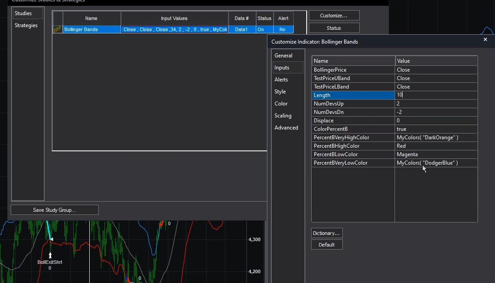
  <figcaption>Figura 30. Configuración con barras de 10 minutos.</figcaption>
</figure>

Y así de esta manera tiene que ir bastante rápido. Además *piramida*, pero es que opera poco porque por la función *MRO*.

<figure>
  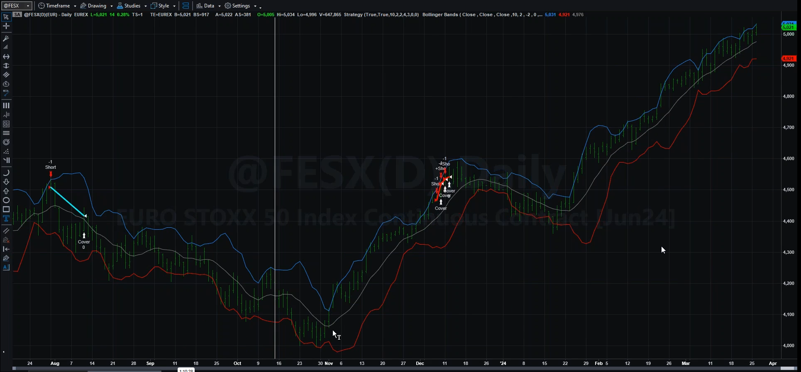
  <figcaption>Figura 31. Operativa con piramidación y función MRO activa.</figcaption>
</figure>


**Explicación de la función MRO**

La función *MRO* sirve en este caso para contar el número de veces que cierra por encima o por debajo de la banda, pero lo hace de una manera que a veces no es del todo intuitiva, porque es *negándola* un poco. Esto como siempre es muy utilizado, siempre para contar casos, para contar cosas digamos. Es muy utilizada y casi siempre se usa *por pasiva*.

<figure>
  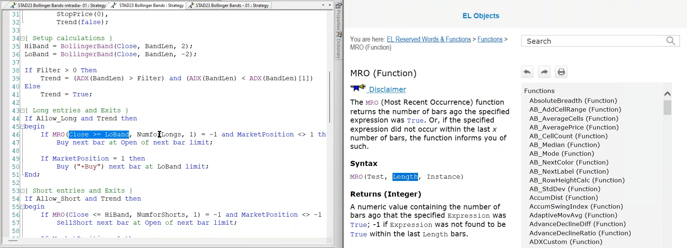
  <figcaption>Figura 34. Documentación de la función MRO en sh.</figcaption>
</figure>

Me explico mejor:

```sh
# { Long entries and Exits }
If Allow_Long and Trend then
begin
    If MRO(Close >= LoBand, NumforLongs, 1) = -1 and MarketPosition <> 1 then
        Buy next bar at Open of next bar limit;
        
    If MarketPosition = 1 then
        Buy ("+Buy") next bar at LoBand limit;
End;
```

<div style="border-left: 4px solid #3498db; background: #eaf4fc; padding: 10px 15px; margin: 10px 0; border-radius: 8px;">
  <strong>📐 Función MRO (Most Recent Occurrence)</strong><br><br>
  Lo que analiza la función <code>MRO</code> es de las siglas de <em>Most Recent Occurrence</em>. Aunque en realidad puede medir cualquier ocurrencia: la más reciente, la primera, la segunda, etcétera. Eso se controla con el tercer parámetro de la función.<br><br>
  <strong>La función tiene tres parámetros:</strong><br><br>
  <code>MRO(Test, Length, Instance)</code><br>
  <code>MRO(Close >= LoBand, NumforLongs, 1)</code><br><br>
  <ol>
    <li><strong>La señal que evalúa:</strong> es decir, el test que hace (true/false), que puede ser cualquier cosa que yo evalúe. En este caso es que el cierre sea mayor o igual que la banda <code>Close >= LoBand</code>, menor o igual, lo que yo quiera. Es la prueba que hace: cierre mayor o igual que banda baja, en este caso.</li>
    <li><strong>El número de barras que lo evalúa:</strong> esto es un parámetro del sistema, que ahora por defecto está en dos, aunque como funciona mejor es en uno (luego lo veremos).</li>
    <li><strong>Qué instancia evalúa:</strong> casi siempre está en uno. Esto es lo que evalúa: si es la más reciente, o la segunda más reciente, la tercera más reciente... Normalmente es la más reciente.</li>
  </ol>
</div>

También está la función *LRO* (*Least Recent Occurrence*), la menos reciente, es un poco más y esta no me consta haberla utilizado.

Esta función, cuando tú la consultas, le dices: **"a ver, ¿cuándo ha cerrado por encima de la banda en las últimas tres barras?"**, y ***te devuelve el número de barras que hace que eso ha pasado***.

¿Entendido? Es decir:
- Si me devuelve 0, es que ha pasado en la actual.
- Si me devuelve 1, es que ha pasado en la anterior.
- Si me devuelve 2, es que ha pasado hace dos.
- Y si me devuelve menos uno, quiere decir que *no ha pasado*. Y eso es lo que normalmente utilizamos, es decir, ***lo miramos por pasiva***.

Me interesa mirar cuando da menos uno, es decir, cuando **no** ha pasado una determinada cosa en unas determinadas barras. En este caso `MRO(Close <= HiBand, NumforShorts, 1)`: yo le digo "¿el cierre está por debajo de la banda alta en las últimas dos velas?". ¿Entendéis? Está por debajo. Si me devuelve que no, ¿qué quiere decir? Que ha estado *por encima*, que es lo que a mí me interesa.

Entonces, ¿por qué se cuenta *por pasiva*? Porque yo así puedo contar varias barras. Porque el saber cuándo ha pasado algo solo es una. ¿Entendéis? También podría hacerla más complicada, sería análogo: hacer *MRO* en la barra anterior y la barra anterior, dos funciones de *MRO* que no valieran menos uno sino que valiera cero y que valiera uno; en la barra actual sería cero. Pero es más eficiente hacerlo solo con una.

Entonces esto verifica que no ha pasado algo en *n* barras. ¿Qué utilidad tiene? Pues eso, que yo puedo ponerle 5 si quiero y lo que va a hacer es que las últimas 5 no haya pasado. Claro, entonces no va a operar, pero yo le voy a poner 5. Iba a hacer muy poco, o sea, o ninguna, igual no sé si alguna vez ha estado cinco veces por encima de la Bollinger en cierre por encima de la banda. Es muy complicado porque *Bollinger* siempre vuelve el precio.

<figure>
  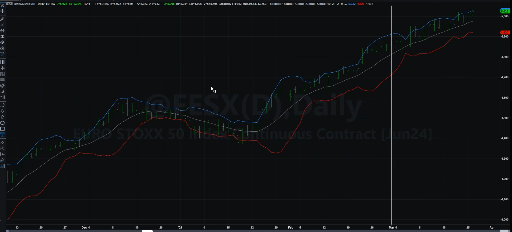
  <figcaption>Figura 35. Prueba con 5 cierres consecutivos fuera de banda.</figcaption>
</figure>

Bueno vamos a ver si ha pasado alguna vez... ¿Ha pasado una vez? No ha pasado. No ha pasado porque vende si no ha pasado más de cinco cierres por encima... ¿Por qué pita?


**El problema del MaxBarsBack y CurrentBar**

Bueno, esto es por el *MaxBarsBack*, creo. Efectivamente es un error. Esto a veces en el código, en algún tipo de indicadores, tenemos que utilizar `CurrentBar` para ver cuándo estabiliza. Hay indicadores que no estabilizan. Las *Bandas de Bollinger*, aunque ahí estén bien pintadas, todavía no deben estar bien calculadas porque no hay tutía, es decir, no puede vender ahí, no puede vender. Es porque algunos indicadores no están estabilizados, no están dando cálculo correcto. Seguramente eso pasa con algunos indicadores al principio de los gráficos.

Pero bueno, en definitiva se entiende la idea. Yo busco por eso, aquí prácticamente lo pasa si le pones tres. Por eso a tres al final lo dejamos otra vez en dos que es como estaba por defecto.

<figure>
  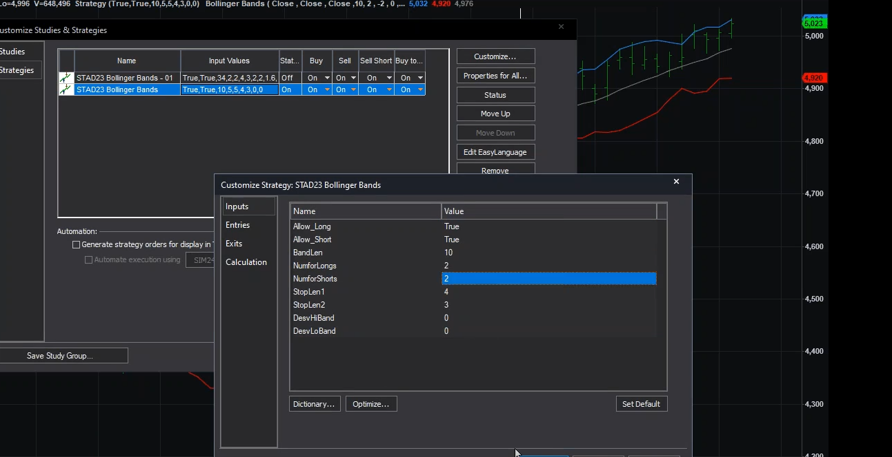
  <figcaption>Figura 37. Configuración estabilizada con NumCierres = 2.</figcaption>
</figure>


**Pruebas con diferentes configuraciones**

Esa es un poco la versión de... Mira, ya que estamos, ya que hemos visto que lo probaba en el índice *S&P*, lo que vamos a hacer es probarlo en el... Como decían en 5 o 6 meses, no, porque si no vamos a ver nada. Más que nada es curiosidad a ver qué hace esto.

<figure>
  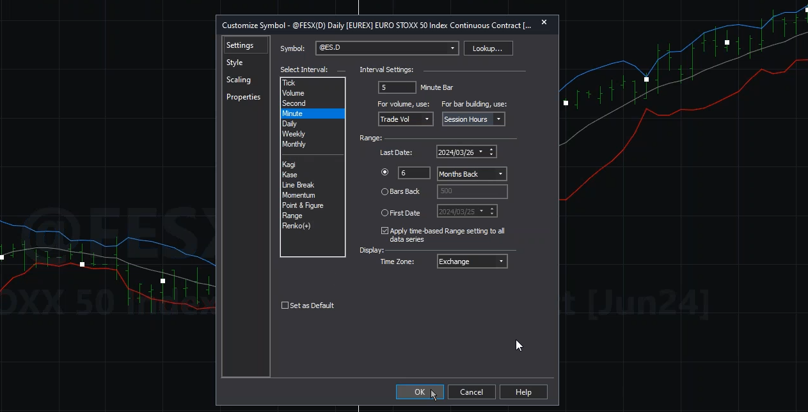
  <figcaption>Figura 38. Prueba en periodo de 5-6 meses.</figcaption>
</figure>

Eso es como estaba, como estaba definido con dos cierres. Estaba así definido.

<div style="display: flex; flex-wrap: wrap; gap: 10px; justify-content: center;">
  <figure style="margin: 0; flex: 0 0 49%;">
    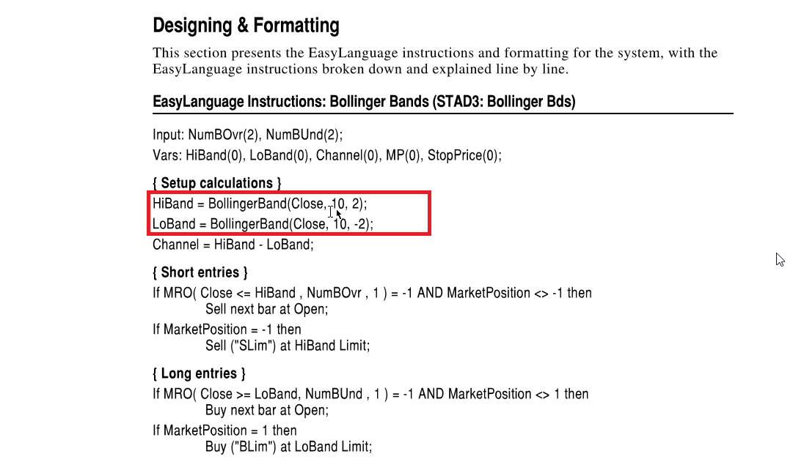
    <figcaption>Figura 39. Configuración original.</figcaption>
  </figure>
  <figure style="margin: 0; flex: 0 0 49%;">
    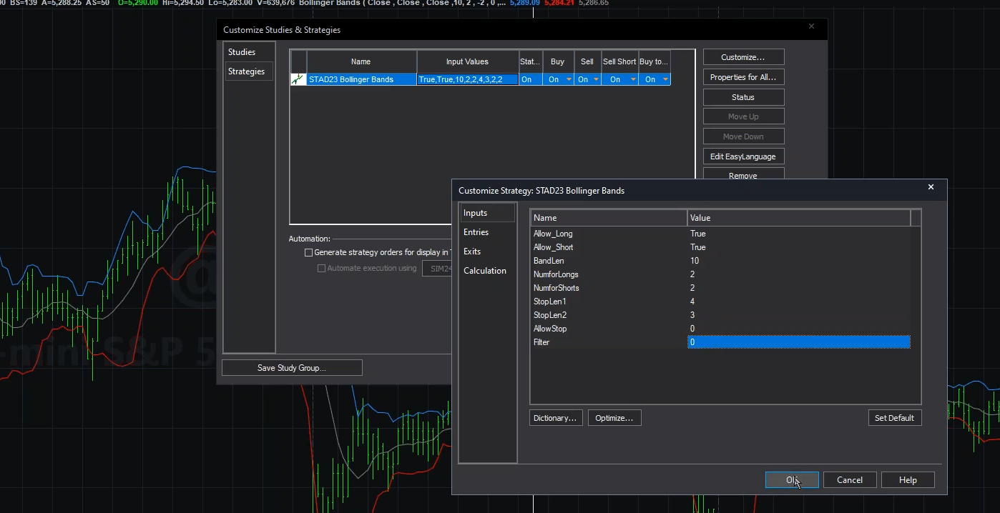
    <figcaption>Figura 41. Resultado con dos cierres.</figcaption>
  </figure>
</div>

<figure>
  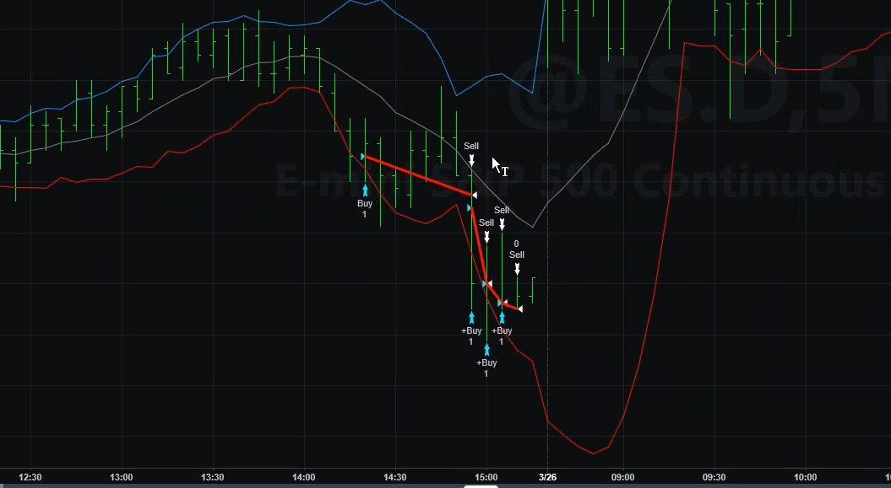
  <figcaption>Figura 42. Operativa resultante.</figcaption>
</figure>

Bueno, lo dicho, con el *Most Recent Occurrence* controlas un poco eso.   

Al final, esta es la versión original que le damos pocas opciones:

<figure>
  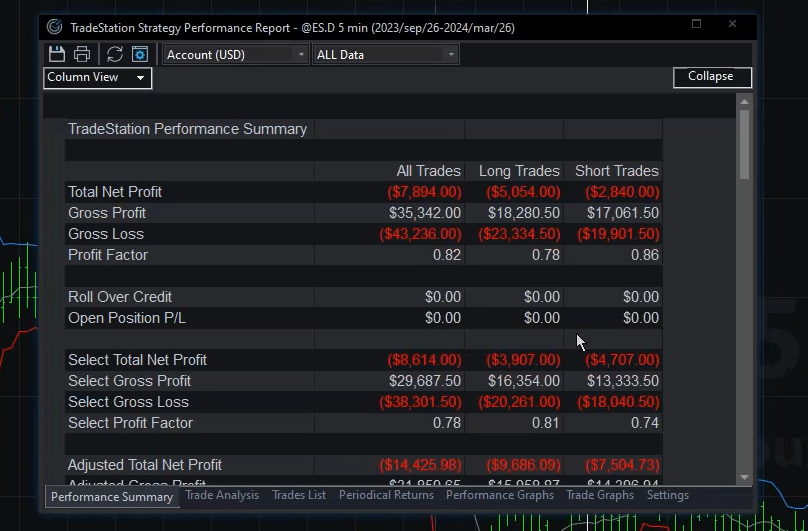
  <figcaption>Figura 195.</figcaption>
</figure>


### Refactoring - Strategy : STAD23 Bollinger Bands 1

Strategy : [STAD23 Bollinger Bands 1](../code/SATD23%20BOLLINGER%20BANDS%2001.ELD)

**Maneras de tratar las bandas de Bollinger**

Entonces, maneras de tratar la banda de *Bollinger*: la más habitual es trabajar el cruce, pero este estaba el original, el *MRO*, y pues he preferido dejarla para que la vierais.

Nosotros hemos hecho esta versión donde hemos incorporado algunas otras cosas partiendo de esa misma.

```sh
{ Long entries and Exits } 
If Allow_Long then begin
    If Trend and Vol and MRO(Close >= LoBand, NumforLongs, 1)[1]= -1 and Close cross over LoBand and MarketPosition <> 1 then
        Buy Contratos shares next bar at Market;
        
    if salidaBanda and marketposition <> -1 then
        Sell ("BollExitLng") next bar at HiBand limit;
End;

{ Short entries and Exits } 
If Allow_Short then begin
    If Trend and Vol and MRO(Close <= HiBand, NumforShorts, 1)[1]= -1 and Close cross under HiBand and MarketPosition <> -1 then
        SellShort Contratos shares next bar at Market;
    
    if salidaBanda and marketposition <> 1 then
        BuytoCover ("BollExitShrt") next bar at LoBand limit; 
End;
```

Donde el *setup* de largos/cortos simplemente hemos mantenido la función *MRO*, `MRO(Close >= LoBand, NumforLongs, 1)[1]`, porque el *MRO*, si le das un valor 1, es lo mismo que cerrar por encima/por debajo. Entonces lo hemos dejado, se podía haber quitado pero lo hemos dejado.

Pero le hemos añadido además... Lo que pasa es que así va a quedar un poco lioso de entenderlo, pero creo que se va a entender. Es decir, lo que hemos añadido es que el *Most Recent Occurrence* no lo evalúe en la barra actual sino en la anterior `MRO(Close <= HiBand, NumforShorts, 1)[1]= -1`, y que en la actual haya *cruzado al alza* `and Close cross under HiBand`.

<figure>
  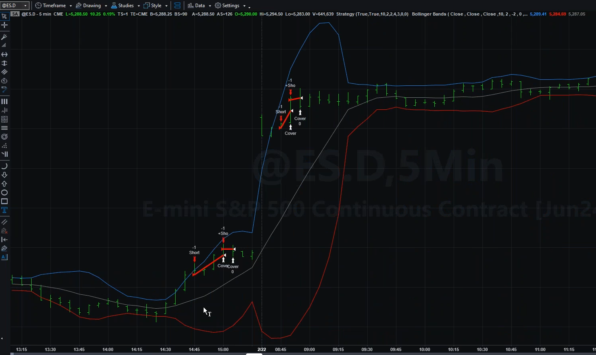
  <figcaption>Figura 43. Código con MRO en barra anterior más cruce en actual.</figcaption>
</figure>

Solo con el cruce ya se puede hacer. Es decir, realmente es *redundante*. De hecho, si lo piensas, no aporta. El *MRO*, si le das valor 1, no aporta nada. Lo podías borrar del código y no haría nada.

¿Porque no hace nada? Porque el cruce lo que está evaluando es esto: está evaluando exactamente esto, es decir, que en la anterior esté por debajo...

Pero que vuelto a caer en... Esto es corto. Al final TradeStation tiene este indicador compuesto, ese comparador compuesto que te evita hacer que "el anterior cierre por debajo y el actual por encima". Eso es *cross under*:

<figure>
  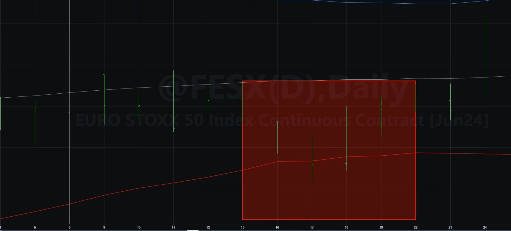
  <figcaption>Figura 44. Documentación del operador Cross en sh.</figcaption>
</figure>

Entonces, si tú haces *cross under*, por narices para ser *true* la anterior tiene que estar por debajo. Por lo tanto es redundante *MRO*.

El *MRO* puede tener sentido poniéndole 2, pero pidiéndole 2 es muy exigente. Puede tener sentido a lo mejor en un *intradía* en un activo además extremadamente volátil que se salga mucho de las bandas. Puede tener sentido, y por lo tanto no está mal dejarlo porque te permite esa configuración, pero ni mucho menos el *EuroStoxx* se encaja con este tipo de activo que es bastante pesado.

<figure>
  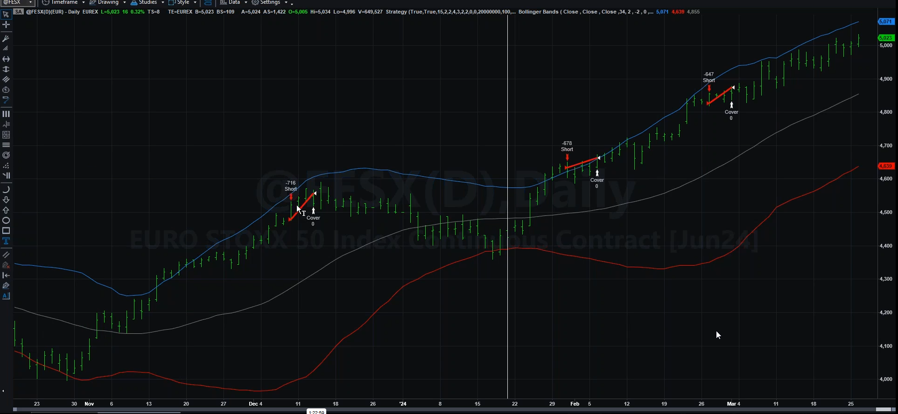
  <figcaption>Figura 45. EuroStoxx: activo poco adecuado para MRO exigente.</figcaption>
</figure>


**Ajustes de desviación y número de cierres**

Pero aun así ya digo, si le fuerzas tanto, lo que vas a tener que hacer es bajarle mucho... Si yo aquí le pongo que tenga que hacer 2, al 0-1 es lo poco que opera.

<figure>
  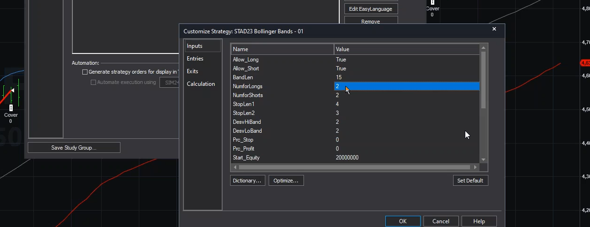
  <figcaption>Figura 46. Configuración con NumCierres = 2.</figcaption>
</figure>

Yo tengo cargados aquí 10 años y he hecho 63, y solo por eso.

<figure>
  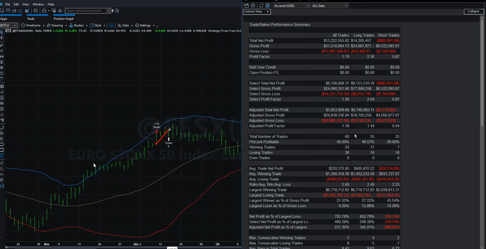
  <figcaption>Figura 47. Solo 63 trades en 10 años con configuración exigente.</figcaption>
</figure>

Pero es como yo le pongo ahora uno, es igual el resultado que no me importa ahora. En este momento ya lo, le pongo uno aquí:

<figure>
  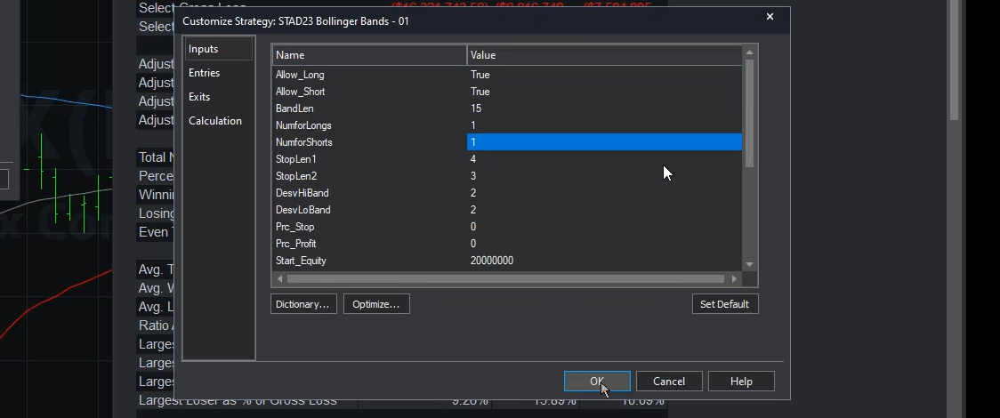
  <figcaption>Figura 48. Cambio a NumCierres = 1.</figcaption>
</figure>

Y veréis cómo se va a multiplicar, probablemente por bastante más, más de doblar va a hacer seguramente. Es un poco más de doblar: 141, ha hecho más del doble *trades* para añadirle una barra.

<figure>
  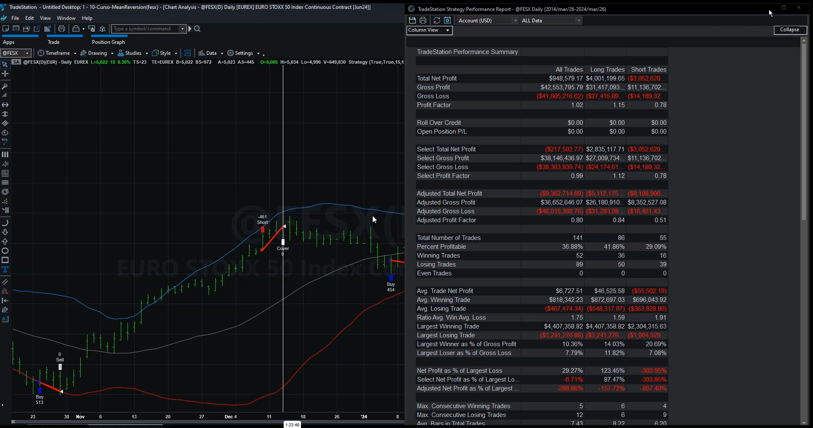
  <figcaption>Figura 49. Con NumCierres = 1: 141 trades (más del doble).</figcaption>
</figure>

Que ahora sigue teniendo dos condiciones. Bueno, el cruce son dos: la barra anterior y la barra actual.

Pero es lo que os digo, si yo esto lo llevo otra manera. Es decir, bueno, pues yo le quiero dejar dos, le quiero dejar dos. Ya veré, porque quiero dos cierres, quiero una *sobreventa bestial* que el mercado ya ha caído como un animal, entonces exijo dos.

<figure>
  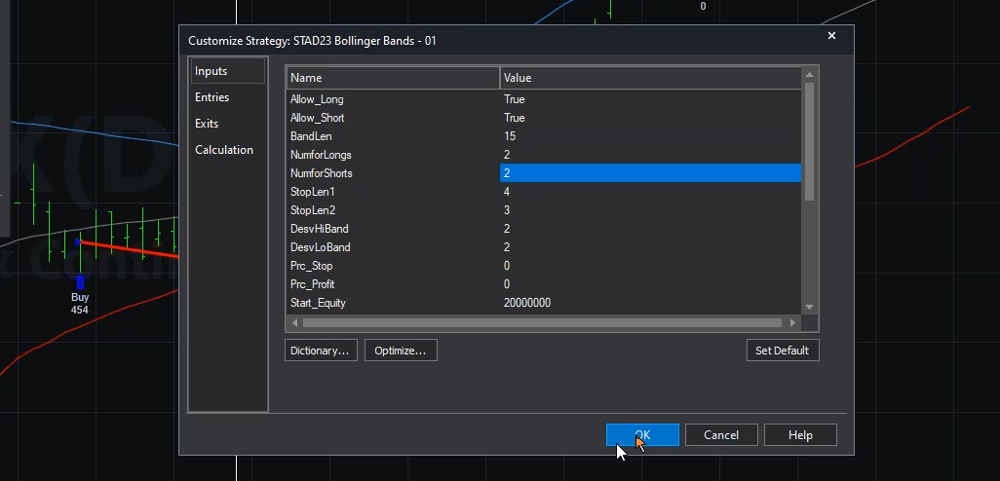
  <figcaption>Figura 50. Configuración buscando sobreventa extrema.</figcaption>
</figure>

Pero entonces ya, pues a lo mejor la banda esta de 5... Me lo estoy inventando:

<div style="display: flex; flex-wrap: wrap; gap: 10px; justify-content: center;">
  <figure style="margin: 0; flex: 0 0 48%;">
    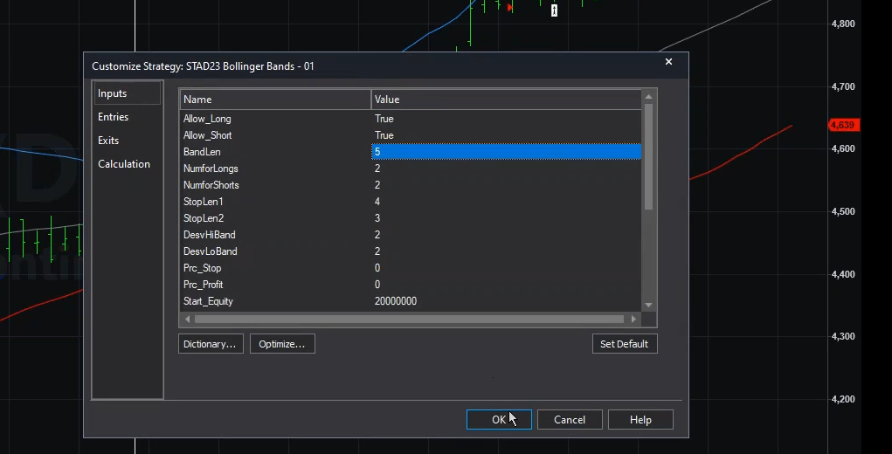
    <figcaption>Figura 51. Prueba con banda de 5.</figcaption>
  </figure>
  <figure style="margin: 0; flex: 0 0 48%;">
    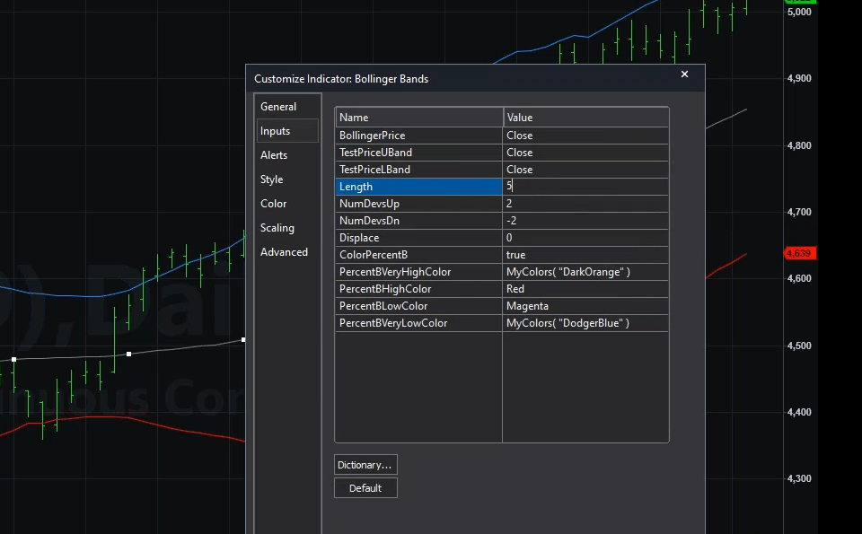
    <figcaption>Figura 52. Resultado.</figcaption>
  </figure>
</div>

<figure>
  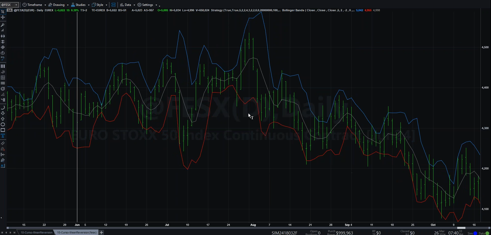
  <figcaption>Figura 53. Operativa resultante.</figcaption>
</figure>

O a lo mejor la desviación de que sea más estrecha. Para, lógicamente, las *Bandas de Bollinger*, poniéndolo más bajo no va a cerrar más, es porque siempre se van a adaptar al precio, siempre recoge la *normalización* del precio. Entonces no va a saltar más, al revés, va a saltar hasta menos. Lo que habría que hacer es bajar la *desviación típica*, habría que bajar la desviación típica.

Pero se tiene un poco lo que quiero decir, es decir, que si al final tú le obligas a más cierres, a lo mejor tienes que reducir, que se acerque, que la *volatilidad* que le pides no sea tanta. Entonces ahora a lo mejor sería más bajando la desviación. Aquí pues poniéndole 1.5... A ver:

<figure>
  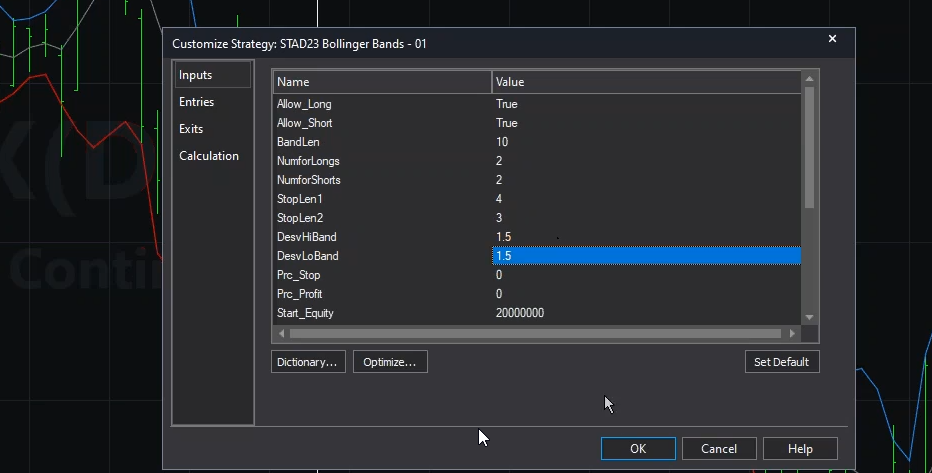
  <figcaption>Figura 54. Configuración con desviación 1.5.</figcaption>
</figure>

Seguirán habiendo pocos porque estrecha, porque pedirle dos cierres por debajo no es fácil. Pero evidentemente, como veis, ya aumentó bastante más la operativa:

<div style="display: flex; flex-wrap: wrap; gap: 10px; justify-content: center;">
  <figure style="margin: 0; flex: 0 0 48%;">
    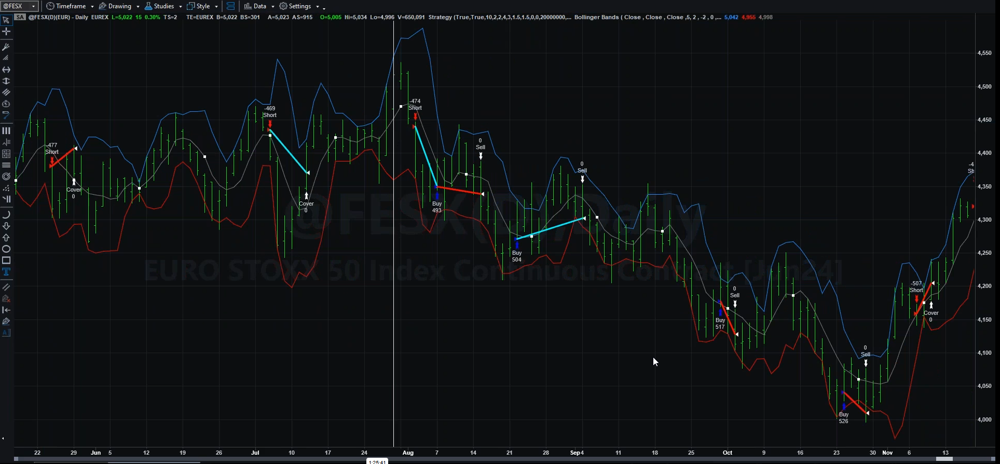
    <figcaption>Figura 55. Aumento de operativa con desviación 1.5.</figcaption>
  </figure>
  <figure style="margin: 0; flex: 0 0 48%;">
    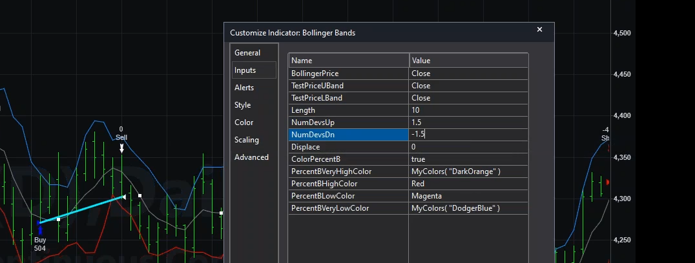
    <figcaption>Figura 56. Detalle de trades.</figcaption>
  </figure>
</div>

Donde ahora aquí le he puesto 10 y aquí le he puesto 1.5 y aquí menos 1.5. Ahí se ve: 1, 2 y vuelta. Veis, aunque parece rara pero es así. Lo veis: un cierre fuera, otro cierre fuera, y el siguiente compra. En principio siempre así: cierre fuera, cierre fuera, el siguiente dentro, compra.

<div style="display: flex; flex-wrap: wrap; gap: 10px; justify-content: center;">
  <figure style="margin: 0; flex: 0 0 48%;">
    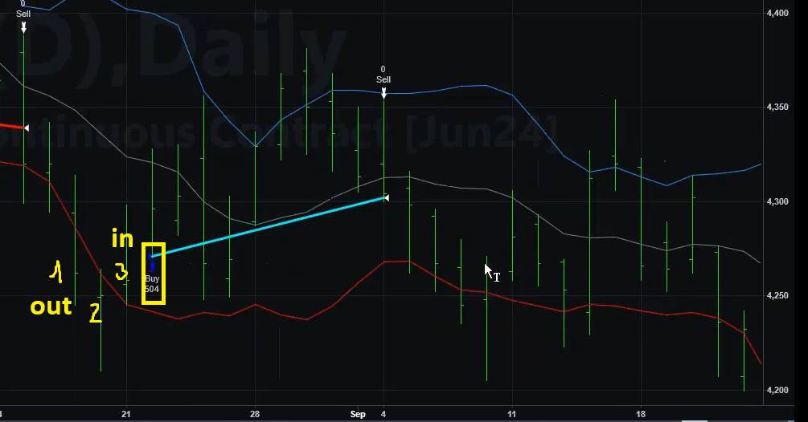
    <figcaption>Figura 57. Secuencia de entrada: cierre fuera, cierre fuera, compra.</figcaption>
  </figure>
  <figure style="margin: 0; flex: 0 0 48%;">
    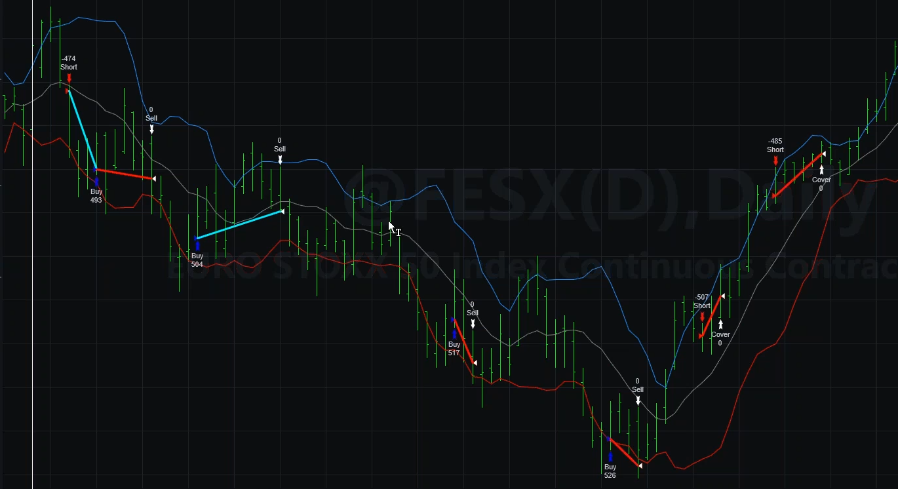
    <figcaption>Figura 58. Confirmación del patrón de entrada.</figcaption>
  </figure>
</div>


**Filtrar por ADX en Mean Reversion**

Este es un tipo de sistema donde *filtrar por ADX* suele aportar. Porque ese tipo de entradas, cuando el *ADX empieza a subir*, puede evitarte de entrar, puede evitar... Que ver qué valores y demás. Pero ya digo, es un indicador donde puede tener cierto valor.

<figure>
  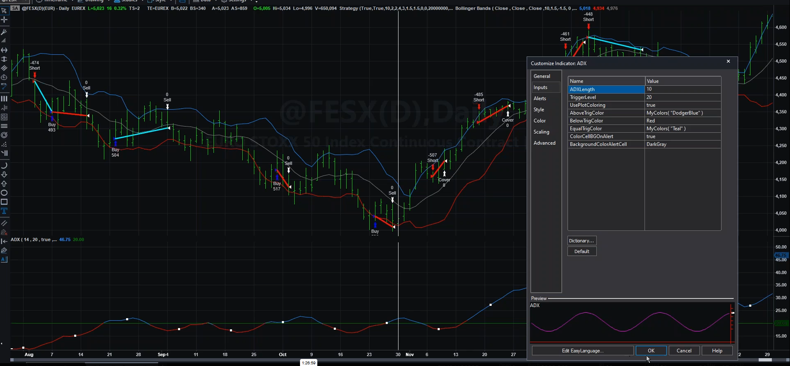
  <figcaption>Figura 60. Añadiendo filtro ADX al sistema.</figcaption>
</figure>

Aquí lo normal es trabajarlo en el mismo periodo para no añadir *inputs*. Entonces ahora, que esté por encima de determinado valor, hay que ver cuál... Decir: **"oye, no jugamos, no jugamos"**.

Incluso también funciona muy bien en los *mean reversion* el filtro a la contraria. Es decir, aquí podrían funcionar los dos: es decir, que tuviera una franja de trabajo, que no te interesa. Ya que te interesa que el *ADX* no esté muy movido, es donde es más probable que vaya bien.

Eso es un poco podemos decir *experiencia*. Aquí es donde normalmente es más probable que yo tenga un mercado adecuado.

<figure>
  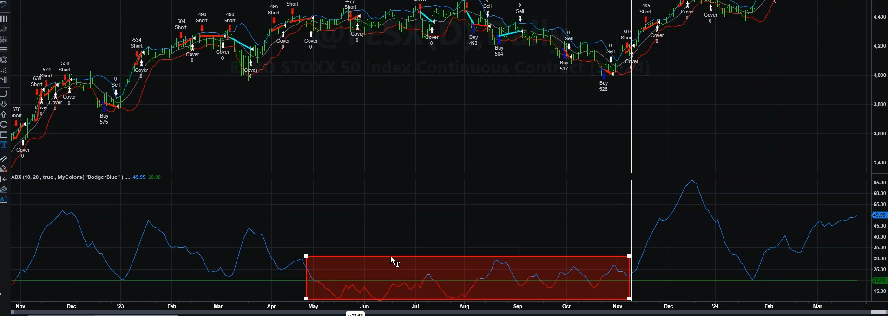
  <figcaption>Figura 61. Zona óptima de ADX para mean reversion.</figcaption>
</figure>

Pero si lo que busco es eficacia de entrada, normalmente en los *mean reversion* se suele encontrar problemas identificarlo aquí, ¿entiendes? Se suele encontrar aquí, cuando ya ha habido *expansión*. El problema es que eso, ¿cómo lo identifico? Aquí lo hemos hecho bajando, en la bajada...

<figure>
  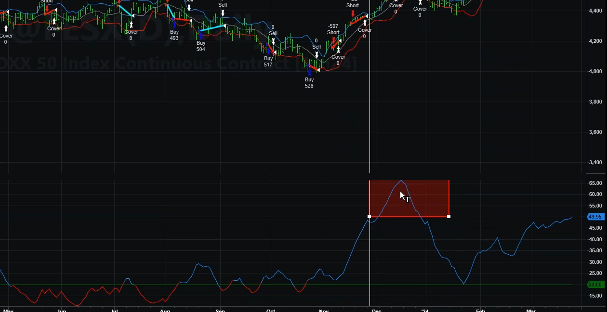
  <figcaption>Figura 62. Identificación de expansión mediante ADX.</figcaption>
</figure>

Pero yo creo que el mejor filtro puede ser doble aquí, en ese sentido: usando ADX, usando el de la última imagen para entrar, pero también que no esté demasiado alto. Hay que verlo. Bueno, lo veremos.

Entonces esto ya os digo es una ***variación de la entrada*** en la estrategia. Ahora vamos a ver las distintas opciones que tenemos para la salida.

Pero ahora, por ejemplo, si esto mismo lo volvemos a pasar a cinco minutos y le cargamos...

  <figure style="margin: 0; flex: 0 0 31%;">
    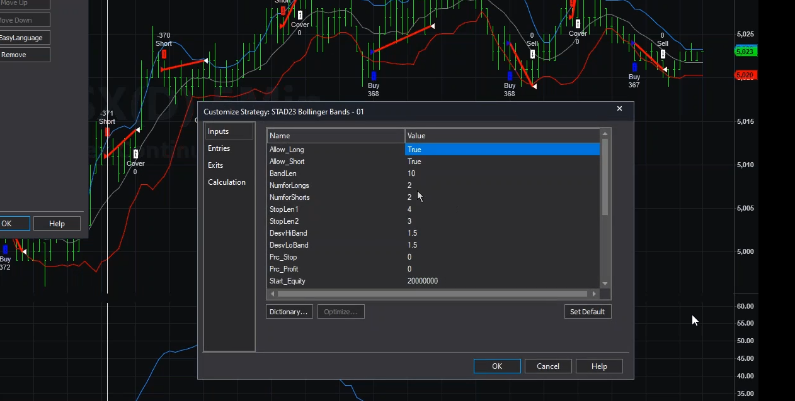
    <figcaption>Figura 63. Cambio a 5 minutos.</figcaption>
  </figure>
  <figure style="margin: 0; flex: 0 0 31%;">
    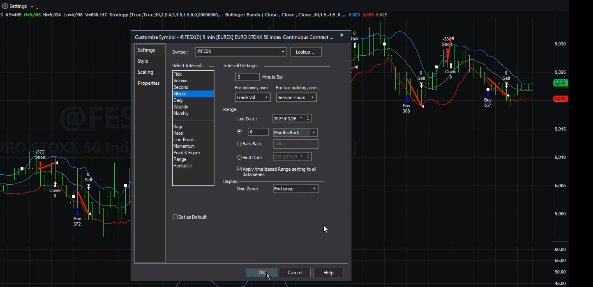
    <figcaption>Figura 64. Configuración.</figcaption>
  </figure>
  <figure style="margin: 0; flex: 0 0 31%;">
    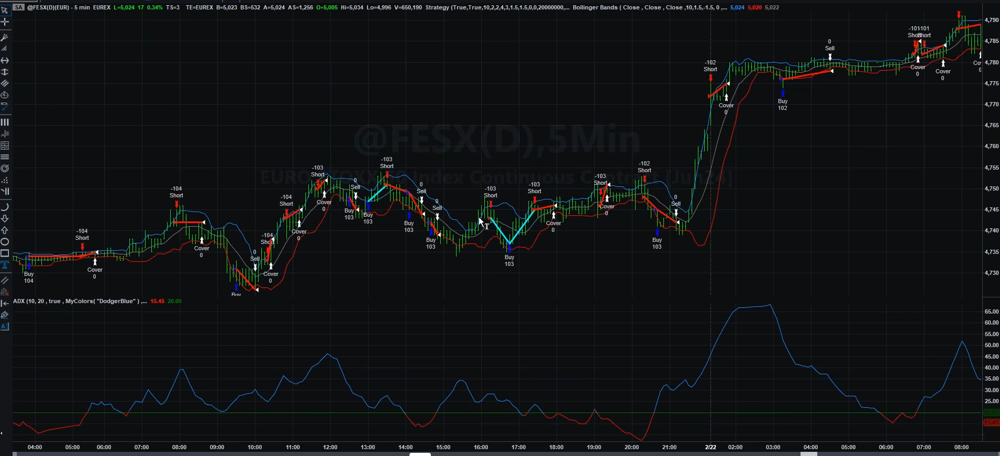
    <figcaption>Figura 65. Resultado.</figcaption>
  </figure>

Lógicamente hay que investigarlo, pero sería otra opción. Lo estoy mirando ahora por primera vez en cinco minutos y no nos pensé. Es que lo hemos trabajado mucho, pero este no es lo comentado ahora, para verlo por curiosidad porque era un poco como lo había definido el autor.

Pero aparte, el *EuroStoxx*, ya os digo que si no me parece no... Mejor aquí ir al otro extremo, vamos a ir al otro extremo: al NQ.

<figure>
  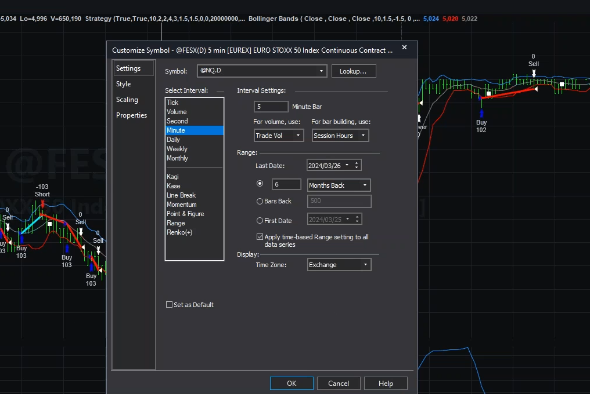
  <figcaption>Figura 66. Prueba en Nasdaq (NQ).</figcaption>
</figure>

La verdad que aquí la sensación que da es que opera bastante, así que igual aquí ya le vamos a quitar que tenga dos. Y no tenemos salida original, mira le voy a poner salida original *false*, luego salir en la banda.

<div style="display: flex; flex-wrap: wrap; gap: 10px; justify-content: center;">
  <figure style="margin: 0; flex: 0 0 48%;">
    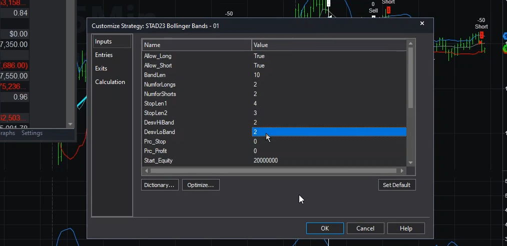
    <figcaption>Figura 67. Configuración salida original false.</figcaption>
  </figure>
  <figure style="margin: 0; flex: 0 0 48%;">
    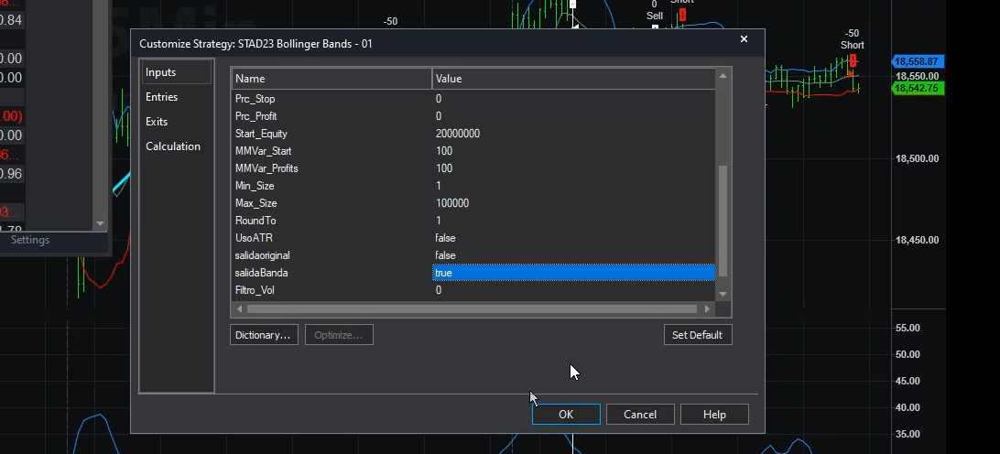
    <figcaption>Figura 68. Resultado.</figcaption>
  </figure>
</div>

Aquí también hay que moverlo que no lo he movido:

<figure>
  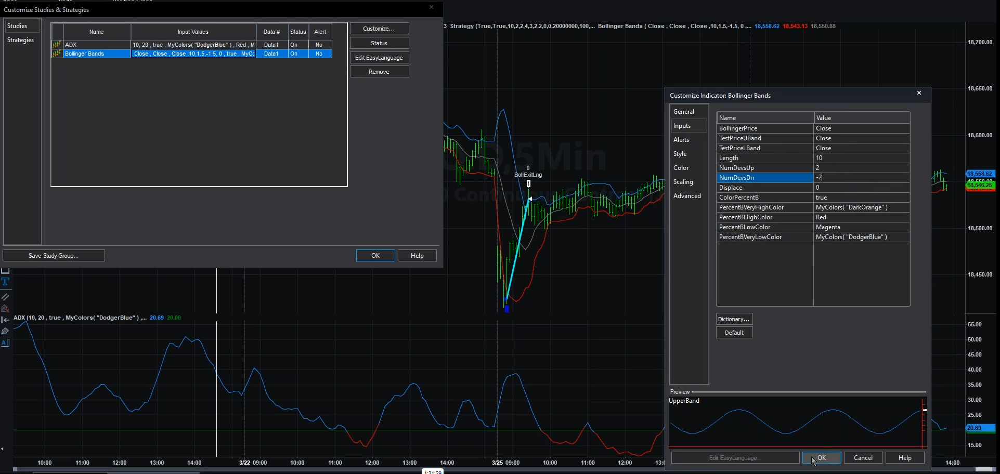
  <figcaption>Figura 70. Ajuste adicional necesario.</figcaption>
</figure>


**Salida en la banda contraria**

<figure>
  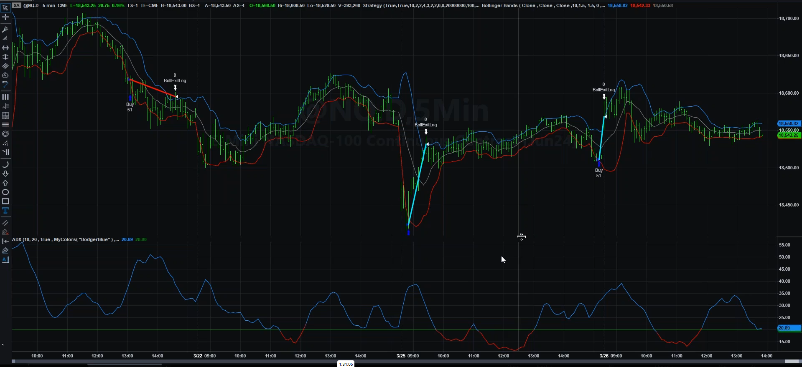
  <figcaption>Figura 69. Configuración de salida en banda contraria.</figcaption>
</figure>

Y así ya os introduzco el otro caso típico de salida positiva de *Bollinger* en tendencia: que es *salir en la banda contraria*. Eso es un poco la entrada típica.

<div style="border-left: 4px solid #27ae60; background: #ecf9f1; padding: 10px 15px; margin: 10px 0; border-radius: 8px;">
  <strong>📐 Setup clásico antitendencial Bollinger</strong><br><br>
  Este es un ejemplo clásico de operativa que está con dos. La típica entrada de <em>Bollinger</em> que, sobre todo en el lado largo, pues suele dar resultados bastante buenos.
</div>

Aquí, por lo que hemos visto, no gana dinero porque no tiene salida. Lo que decía, os decía antes: claro, ese es el ejemplo claro. En un sistema así, el STOP va a añadir 100% porque no puede salir:

<figure>
  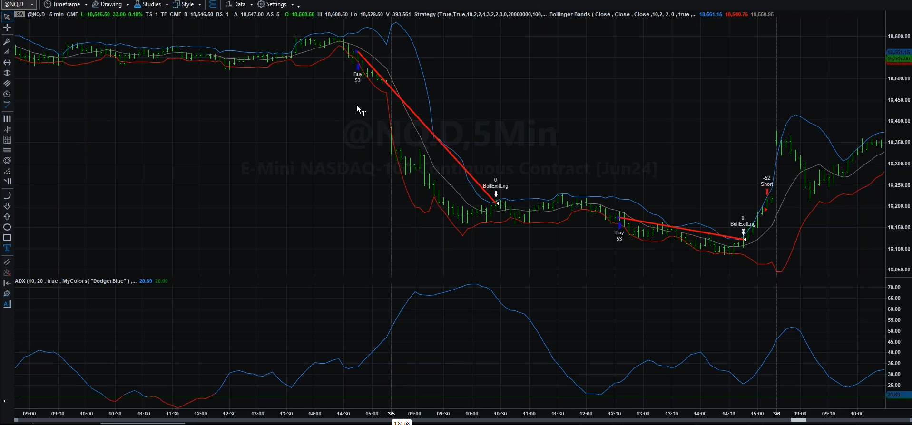
  <figcaption>Figura 71. Sin salida definida: el sistema no puede cerrar posiciones perdedoras.</figcaption>
</figure>

Solo sale hasta que vuelva, entonces es demasiado. Va a tener enganchadas. Imaginaos el lado corto: va a tener algunas, porque lo saca casualmente. Es en el lado largo, pero va a tener algunas. Pero claro, en el lado largo, pero por las caídas; en el corto también, porque el mercado va a subir, va a subir, y va a tener como enganchadas considerables.

A fin de día está pensado para eso. Quizá aquí para operarlo así sería mejor operarlo en el *NQ continuo*:

<figure>
  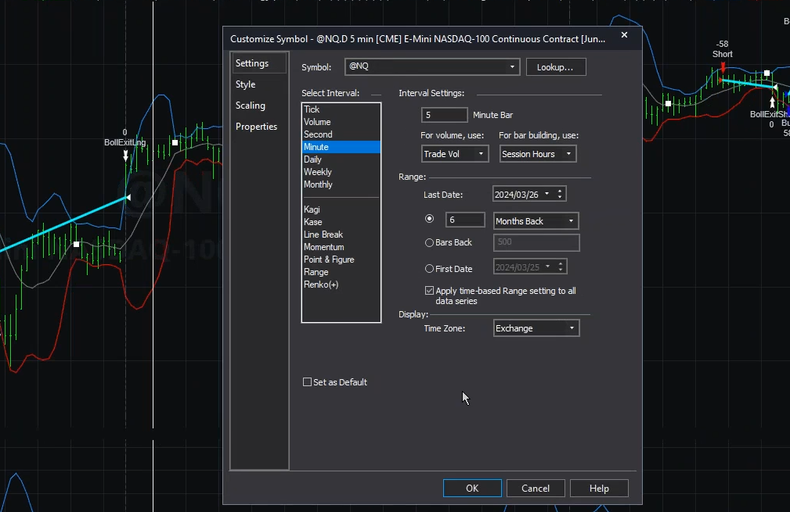
  <figcaption>Figura 72. Opción de usar NQ continuo para mantener posiciones.</figcaption>
</figure>

Y hasta si vas continuo pues te quedas ahí. Pero es realmente para que veáis el *clásico setup antitendencial de Bollinger*. Este es el clásico setup: que cierre por debajo.

<figure>
  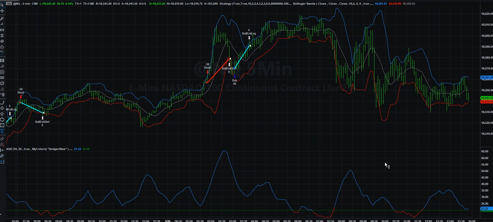
  <figcaption>Figura 73. Setup clásico: compra cuando cierra por debajo de banda inferior.</figcaption>
</figure>

Aquí tiene el componente del *MRO* que ahora está actuando porque está en dos, pero que lo podemos quitar.

Estamos aquí, bueno, no sé ni cómo de comisiones, igual estoy aquí súper metido de comisiones. Bueno, seguimos con el 12, no viajan entonces. Pero bueno, sigue siendo muy alto, pasa.

<div style="display: flex; flex-wrap: wrap; gap: 10px; justify-content: center;">
  <figure style="margin: 0; flex: 0 0 48%;">
    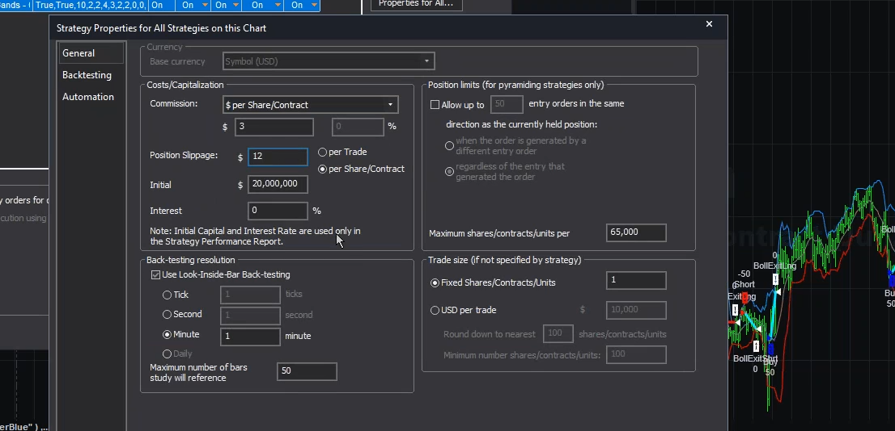
    <figcaption>Figura 74. Configuración de comisiones.</figcaption>
  </figure>
  <figure style="margin: 0; flex: 0 0 48%;">
    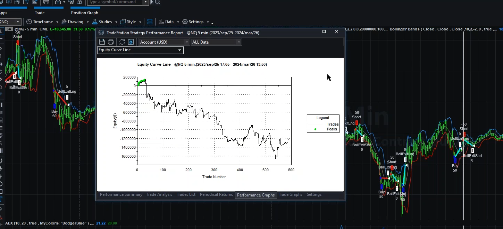
    <figcaption>Figura 75. Performance con comisiones.</figcaption>
  </figure>
</div>

Y pues bueno, todavía digo, es bastante churro en 5 minutos porque no estaba, como os digo, estudiado ni ningún tipo de optimización. Simplemente que el autor aquí lo había puesto cinco minutos, pues bueno, vamos a ponerlo.

Pero me parece demasiado sencillo para un 5 minutos. Ya se ve que hay *setups* que tienen cierto sentido aquí. Incluso jugando, asumiendo que dejamos esto en 10-2-2 y su salida, bueno, que la salida original suya, la verdad que metido así podría ser que aportar:

  <figure style="margin: 0; flex: 0 0 31%;">
    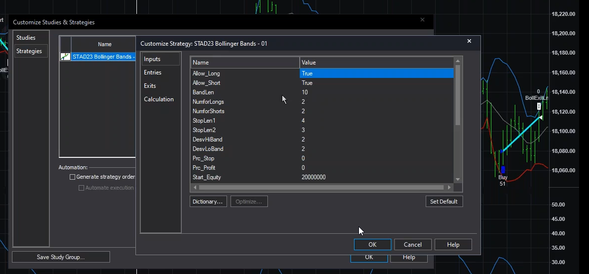
    <figcaption>Figura 76. Configuración 10-2-2.</figcaption>
  </figure>
  <figure style="margin: 0; flex: 0 0 31%;">
    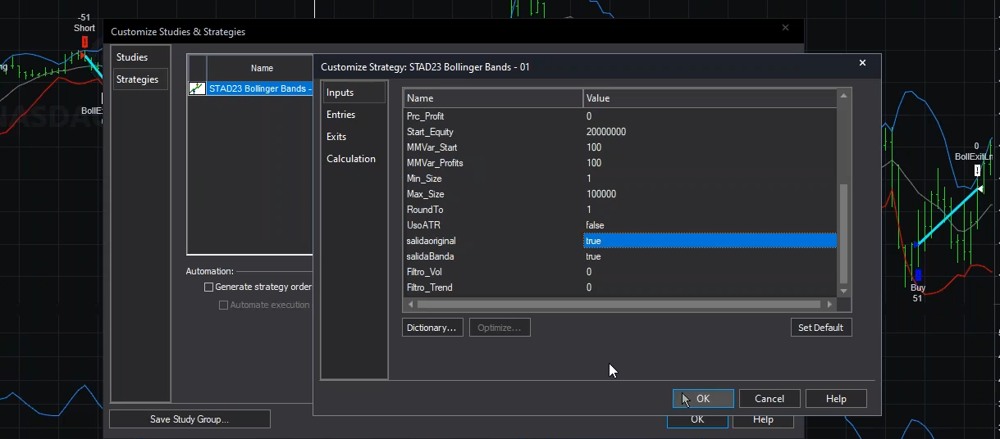
    <figcaption>Figura 77. Resultado.</figcaption>
  </figure>
  <figure style="margin: 0; flex: 0 0 31%;">
    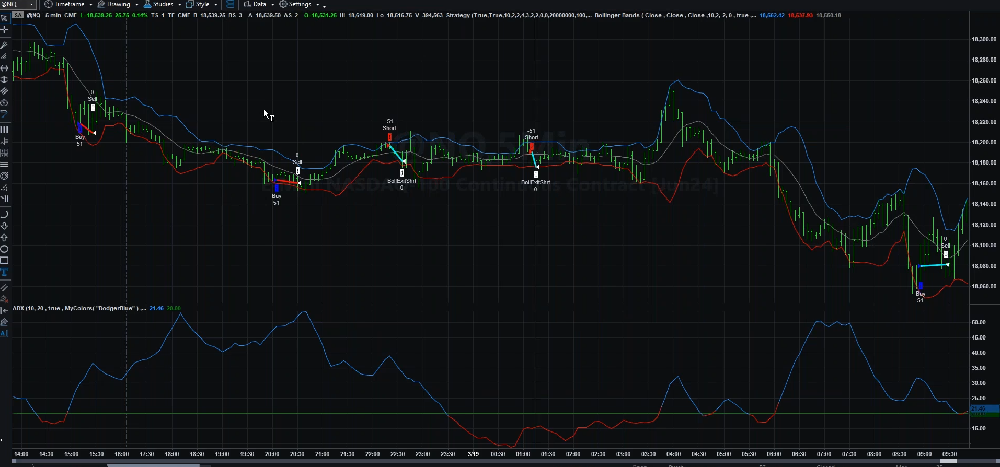
    <figcaption>Figura 78. Detalle operativo.</figcaption>
  </figure>

Porque se le va a permitir salir a los malos también. Es que va a permitir salir a los malos. Entonces, ¡no! No aporta:

<figure>
  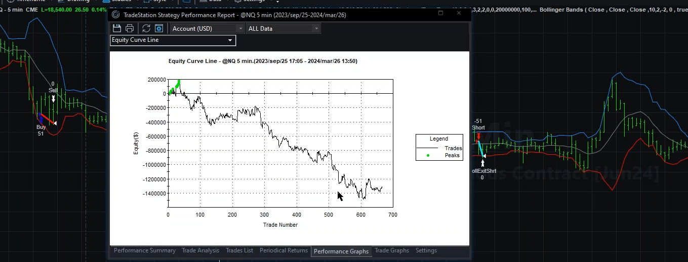
  <figcaption>Figura 79. La salida anticipada no aporta: saca de los malos pero corta los buenos.</figcaption>
</figure>

Porque te saca de los malos, pero te evita tener bastante recorrido con los buenos. Algunos tiene, pero la mayoría salen antes de llegar a la buena. Entonces son pocos *trades* realmente largos.


**Versión convencional con salida a la media**

Vamos a seguir evolucionándolo. Bien, lo que os decía, en su versión más convencional que podemos tener es salida a la media.

<figure>
  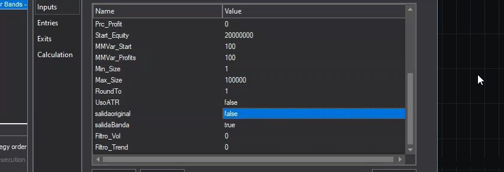
  <figcaption>Figura 80. Configuración con salida a la media.</figcaption>
</figure>

Lógicamente un *stop*, un *stop* que podemos regular. Está, lo voy a dejar en 1 y esto lo vamos a subir a 14 por usar un valor así más clásico. Número de cierre es 1, esto me da igual porque la he anulado. La desviación la dejo en 2 por defecto. Es decir, de momento aquí no optimizado nada, dejo todo por defecto.

<div style="display: flex; flex-wrap: wrap; gap: 10px; justify-content: center;">
  <figure style="margin: 0; flex: 0 0 48%;">
    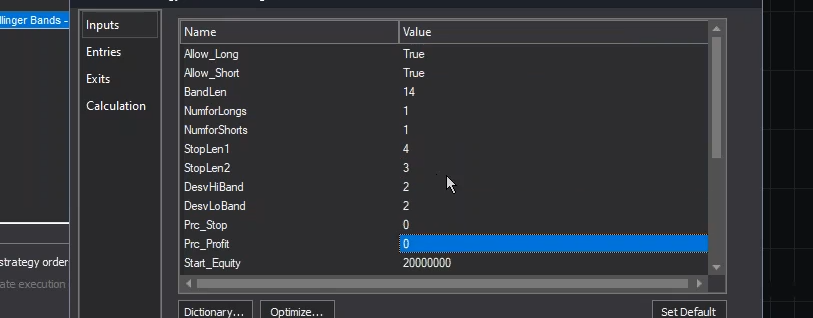
    <figcaption>Figura 81. Parámetros: periodo 14, desviación 2.</figcaption>
  </figure>
  <figure style="margin: 0; flex: 0 0 48%;">
    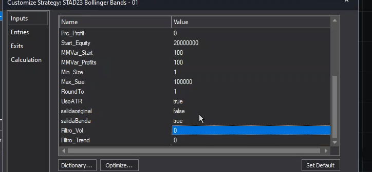
    <figcaption>Figura 82. Configuración completa.</figcaption>
  </figure>
</div>

Por *uso de ATR* para la salida, para pasar, vamos a poner *true*. Y le vamos a dejar salida original *false*, salida en banda *true*, y filtro *vol*, filtro *tren*, paso del. Pues esto lo tengo ahora mismo en cinco minutos y opera mucho más, porque ahora estoy en cinco minutos. Lógicamente hay mucho más *ruido* y el mercado se sale muchas más veces de su banda, pesar de ser dos desviaciones y 14.

<figure>
  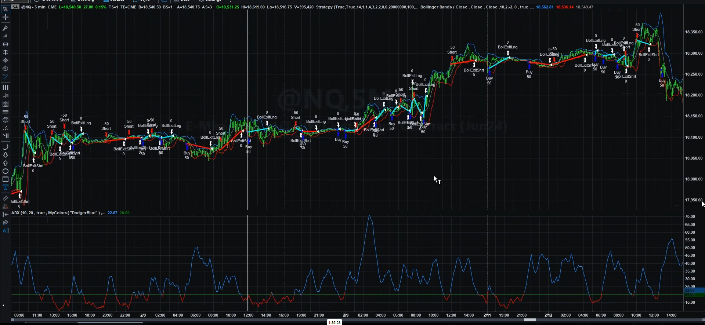
  <figcaption>Figura 83. Alta operativa en 5 minutos por mayor ruido.</figcaption>
</figure>

Y esto es perdido al 100%. En el largo parece asomar la cabeza, pero en el corto es demolido. Lógicamente tiene el mercado en contra. Pero bueno, empezamos ya a operar un poco más.

<figure>
  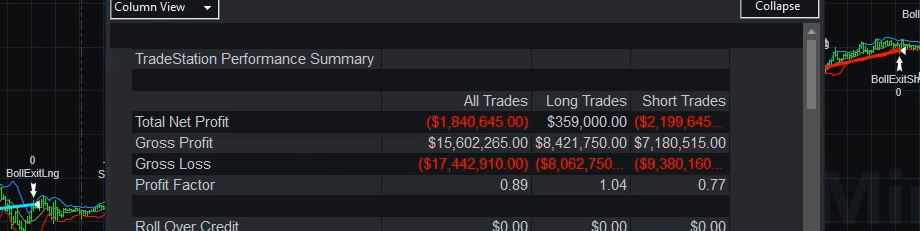
  <figcaption>Figura 84. Largo mejora ligeramente, corto demolido por sesgo alcista del mercado.</figcaption>
</figure>


**Pregunta sobre Williams %R**

Ahora no salta nunca, para perfecto, le hemos quitado dos decimales. Ahora yo creo que va a ser ya más normal, no le quito uno, entonces le pongo dos pero es para ver solo si actúa.

*Pregunta de Fran: ¿Con el Williams %R porcentaje en franja central para activar operaciones, puede ir bien?*

*Williams* es un *estocástico* al final, sí. O sea, cualquier indicador es un indicador también de rango, podemos decir, aunque también se puede usar en tendencias. Es que en la mayoría de esos, recomendado es explorarlo. Nosotros hemos operado un sistema de *estocástico* que es muy parecido, en tendencia, con valores muy duros, es decir, no con sus valores por defecto sino con valores muy elevados. Al final también puede funcionar, y un *Williams* puede utilizarse de la misma manera: de rango o de tendencia.

Pero sí, es un buen indicador el *Williams*. Creo que tiene una pequeña variación del estocástico simplemente, es muy similar.


**Optimización del Stop**

Vamos a ver qué pasa simplemente con una sencillísima y ligerísima optimización del *stop*.

Esto, este número de *ATR*... Se imagina que será un valor alto, aunque no tengo dudas, pero lo vamos a resolver de seguida muy breve. Esto no voy a hacer nada porque es solo para *evaluación preliminar*, nada especialmente sacable, para ver un poquito si el *stop* respira, le da un poquito de aire o no le hace nada.

  <figure style="margin: 0; flex: 0 0 31%;">
    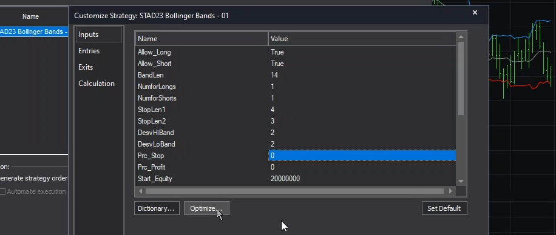
    <figcaption>Figura 85. Configuración optimización Stop.</figcaption>
  </figure>

  <figure style="margin: 0; flex: 0 0 31%;">
    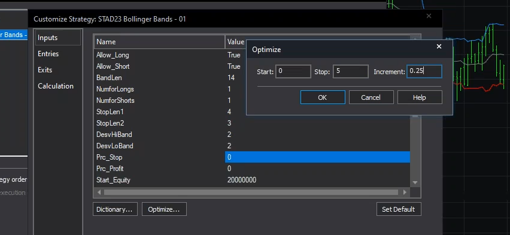
    <figcaption>Figura 86. Rango de optimización.</figcaption>
  </figure>

  <figure style="margin: 0; flex: 0 0 31%;">
    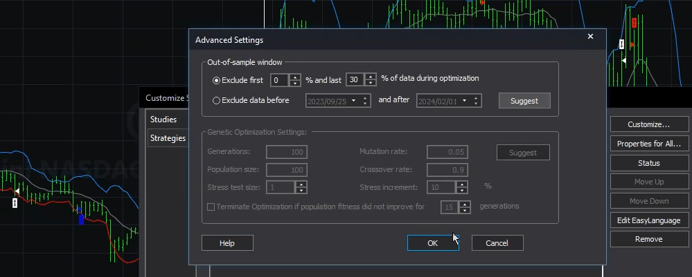
    <figcaption>Figura 87. Ejecución.</figcaption>
  </figure>

Bueno pues no sirve prácticamente, no sé, pero nada. De hecho va mucho peor con esto. Pero aunque número de *trades* tiene muchos más de decir, actúa demasiado Alberto, parece que no se viene bien ecualizado con el *ATR*. Todos operan lo mismo en `All: Total Trades`, parece no funcionar:

<figure>
  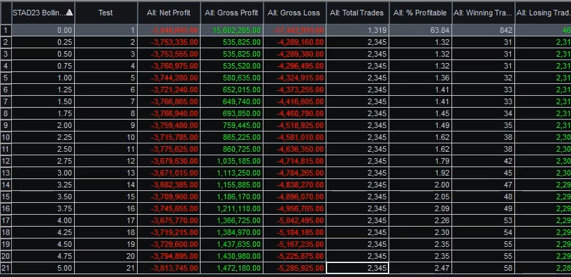
  <figcaption>Figura 88. Resultados de optimización: el stop ATR no mejora el sistema.</figcaption>
</figure>

A ver, hacemos click en la fila 21 en el 5 de la columna 1 `SATD23` y fíjate cómo ha cambiado el gráfico. Te saca todo el rato, te saca casi todo el rato.

<div style="display: flex; flex-wrap: wrap; gap: 10px; justify-content: center;">
  <figure style="margin: 0; flex: 0 0 48%;">
    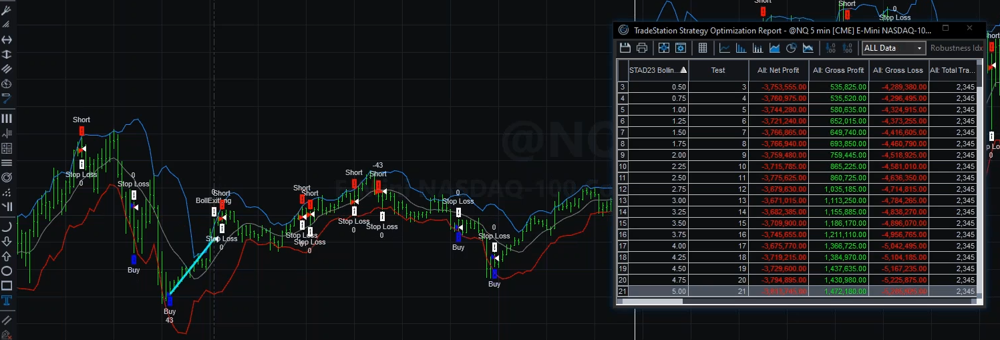
    <figcaption>Figura 89. El stop ATR saca constantemente.</figcaption>
  </figure>
  <figure style="margin: 0; flex: 0 0 48%;">
    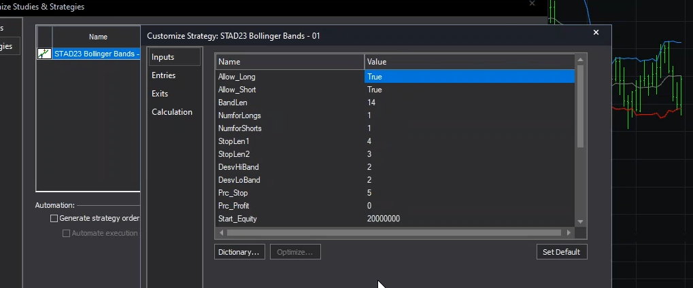
    <figcaption>Figura 90. Detalle de salidas prematuras.</figcaption>
  </figure>
</div>

Espera que no sé si tengo el *LIBB*... Sí lo tengo.

<figure>
  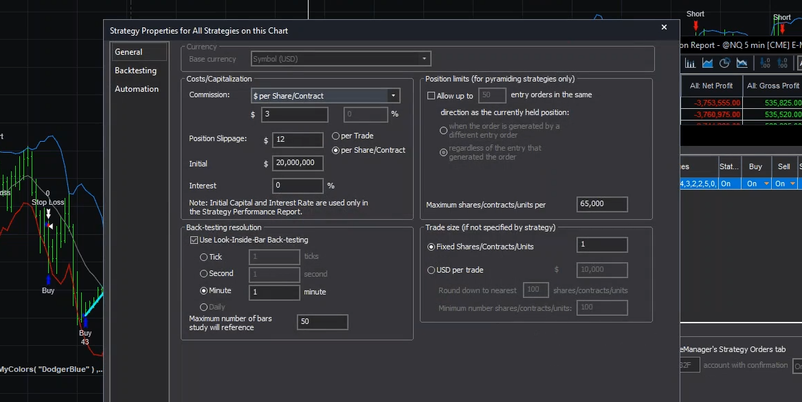
  <figcaption>Figura 91. LIBB activado.</figcaption>
</figure>

¿Y por qué saca tanto? Debe ser un *bug*, porque con *ATR* está calculado sí por el número de barras que tenga *ATR*: `ATR * Prc_Stop / 100 * Bigpointvalue`

```sh
If UsoATR Then
Begin //stops y TP usan el ATR
	If marketposition <> 0 then { establecemos target y stop cuando hay posición abierta }
	begin
		if Prc_Stop > 0 then
			SetStopLoss(ATR * Prc_Stop / 100 * Bigpointvalue);
		
		if Prc_Profit > 0 then
			SetProfitTarget(ATR * Prc_Profit / 100 * Bigpointvalue);
		
	end else { establecemos target y stop para la barra de entrada }
	begin
		if Prc_Stop > 0 then
			SetStopLoss(ATR * Prc_Stop / 100 * Bigpointvalue);
		
		if Prc_Profit > 0 then
			SetProfitTarget(ATR * Prc_Profit / 100 * Bigpointvalue);
	end;

end Else
```

A ver... voy a cambiar esto

```sh
If UsoATR Then
Begin //stops y TP usan el ATR
	If marketposition <> 0 then { establecemos target y stop cuando hay posición abierta }
	begin
		if Prc_Stop > 0 then
			SetStopLoss(ATR * Prc_Stop * Bigpointvalue);
		
		if Prc_Profit > 0 then
			SetProfitTarget(ATR * Prc_Profit  * Bigpointvalue);
		
	end else { establecemos target y stop para la barra de entrada }
	begin
		if Prc_Stop > 0 then
			SetStopLoss(ATR * Prc_Stop  * Bigpointvalue);
		
		if Prc_Profit > 0 then
			SetProfitTarget(ATR * Prc_Profit  * Bigpointvalue);
	end;

end Else
```

<figure style="margin: 0; flex: 0 0 31%;">
  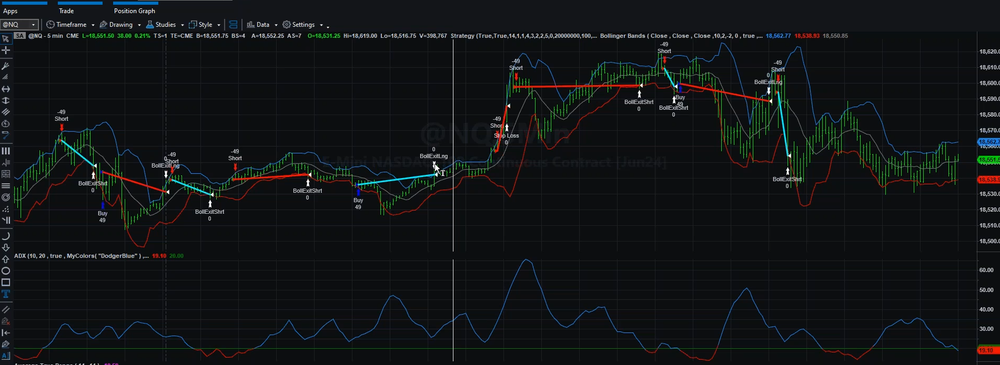
  <figcaption>Figura 92. Configuración del código.</figcaption>
</figure>

<figure style="margin: 0; flex: 0 0 31%;">
  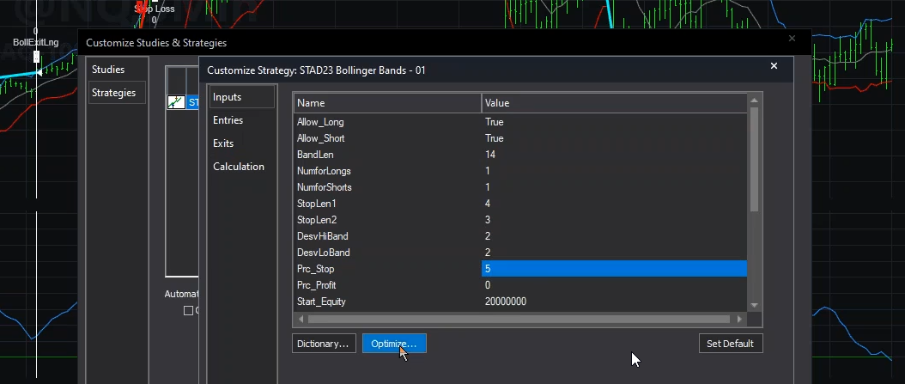
  <figcaption>Figura 93. Detalle del código.</figcaption>
</figure>

<figure style="margin: 0; flex: 0 0 31%;">
  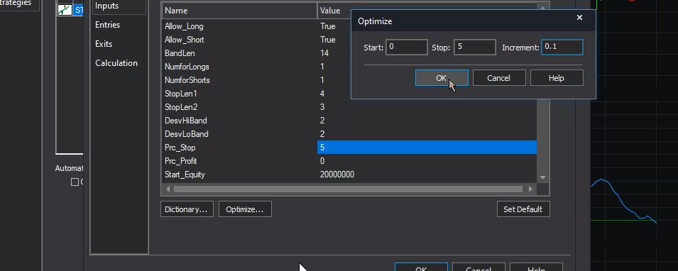
  <figcaption>Figura 94. Resultado.</figcaption>
</figure>

Para aquí no sé si ahora hemos hecho algo, no. A ver, más que nada para entenderlo, como el interior no lo he mirado, pues es lo que pasa. Bueno, ahora sí que se nota una variación de *trades* al menos, se nota una variación de *trades*.

<figure>
  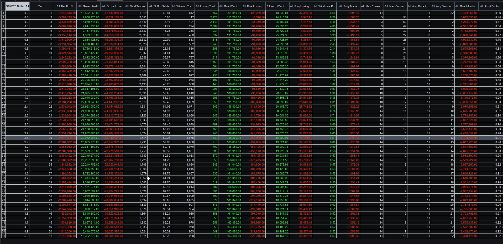
  <figcaption>Figura 95. Variación de trades según configuración del stop.</figcaption>
</figure>

Aquí se acerca pero aún no llega. Es decir, a un 5 aún está saltando (última línea), porque tiene más *trades* que aquí. Es decir, que aún le faltaría un poco, pero bueno, ya empieza a tener más sentido. Sigue siendo una porquería, pero tiene más sentido. No, ninguno aporta. No, es curioso que no tenga ningún... Si el 5 parece ir mejor, le faltaría subir un poco para quitar alguno.

Pero bueno, es igual, lo volvemos a 5 y está. Es igual, si era por verlo.

<div style="border-left: 4px solid #3498db; background: #eaf4fc; padding: 10px 15px; margin: 10px 0; border-radius: 8px;">
  <strong>📐 Efecto del Stop según Timeframe</strong><br><br>
  También es verdad que en 5 minutos, pensar que el <em>stop</em>, donde más se nota su efecto —que os decía que se iba a notar— es en gráficos de más largo plazo. Porque en 5 minutos, aún con <em>enganchadas</em>, su pérdida entre tampoco es tan importante, y el precio acaba volviendo de mucho más ruido.
</div>

<figure>
  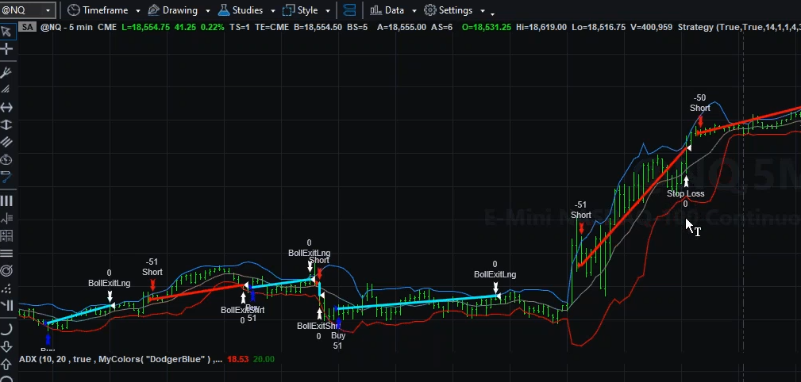
  <figcaption>Figura 96. Ejemplo de trade cerca de salida por banda contraria.</figcaption>
</figure>

Aquí fíjate que ha salido por... Bueno, no ha salido, pero hubiera salido ya en nada, ha salido muy cerca. De hecho está muy, muy cerca de salirse. Aquí fijaros, por poco no, una pequeña corrección. Porque al final en 5 minutos hay tanto ruido que es más frecuente que haya un movimiento a la contra suficiente para cerrarle la banda contraria, lo cerca que está normalmente la banda contraria.

Ahora, el diario eso cambia totalmente. El diario, la banda contraria puede estar muy lejos. Entonces, aunque lógicamente está todo autoescalado, hay más ruido en 5 minutos que en diario. Entonces al final esto acaba provocando que el *stop* muchas veces no rente. Aquí por ejemplo renta el caso típico, pero de manera general le cuesta, le cuesta que rente.


**Bollinger Antitendencial en 5 minutos: necesidad de filtros**

Pero bueno, que ahora sí habéis visto que estaba cerca de que rentara. Esto aquí en 5 minutos es muy complicado. Creo que podría conseguirse que funcionara un 5 minutos con *Bollinger antitendencial*, creo que se podía conseguir. Pero había que trabajarlo mucho. Seguramente con *pautas de precio* habría que filtrar mucho.

<div style="border-left: 4px solid #27ae60; background: #ecf9f1; padding: 10px 15px; margin: 10px 0; border-radius: 8px;">
  <strong>📐 Regla: filtros en timeframes bajos</strong><br><br>
  Habría que filtrar mucho. A medida que bajas más de <em>timeframe</em>, es más imprescindible el filtro, ¿entendéis? Y también tienes menos problema en usarlo porque, fíjate, aquí yo tengo en seis meses y tengo 1.500 <em>trades</em>, y solo estoy en seis meses. Entonces el problema de <em>trades</em> no tengo.
</div>

<figure>
  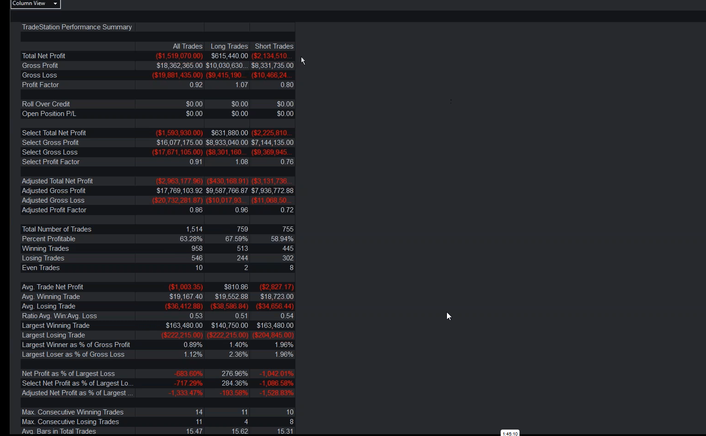
  <figcaption>Figura 97. 1.500 trades en solo 6 meses de datos.</figcaption>
</figure>

Entonces aquí yo tengo, por ejemplo, lo que os decía del simple filtro de *ADX*. Mira, voy a pasar, bueno, le voy a dejar ese filtro, le voy a dejar ese *stop* y vamos a probar esto da por el número de *ADX* que filtraba, aunque creo que no lo hemos puesto como decía.

<div style="display: flex; flex-wrap: wrap; gap: 10px; justify-content: center;">
  <figure style="margin: 0; flex: 0 0 48%;">
    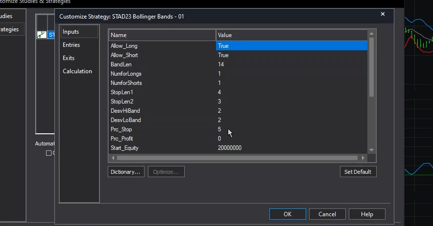
    <figcaption>Figura 99. Configuración del filtro ADX.</figcaption>
  </figure>
  <figure style="margin: 0; flex: 0 0 48%;">
    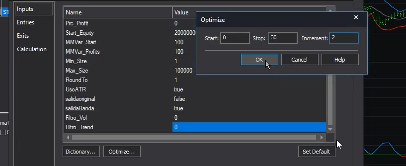
    <figcaption>Figura 98. Parámetros del filtro.</figcaption>
  </figure>
</div>

Pero aun así yo creo que puede ser que aporte valor. A ver, me reduce mucho, reduce muchísimos *trades*, y en todas las combinaciones, todas las combinaciones reducen muchísimos.

<figure>
  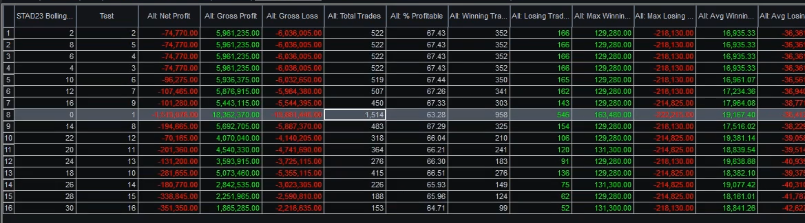
  <figcaption>Figura 100. Reducción significativa de trades con filtro ADX.</figcaption>
</figure>

A ver cómo tengo puesto el filtro de tendencia, que hemos tocado si tenía que la de que fuera mayor que un nivel para habilitarlo:

```sh
If Filtro_Trend > 0 Then
    Trend = (ADX(BandLen) > Filtro_Trend) and (ADX(BandLen) < ADX(BandLen)[1])
Else
    Trend = True;
```


**La extrapolabilidad de Bollinger Bands**

Bueno, esto habría que trabajarlo bien. Y ya digo, en cinco minutos, lo bueno para este tipo de... Nos puede venir bien para hasta estudiar el activo. Es decir, el *antitendencial*, porque te va a dar mucha información. Porque aunque la entrada sea distinta, la entrada *tendencial* es bastante limpia; la entrada de *mean reversion* de *Bollinger Bands*, porque *Bollinger Bands* al final es un indicador que simplemente es las *desviaciones sobre una media*, y por lo tanto ya sabes que recoge más del 90% el movimiento del precio, etcétera. Es decir, es un indicador que está muy bien *normalizado*.

Entonces, al final, vender siempre en su banda es normalmente vender en un nivel de desviación de precio muy bueno, y sus estudios suelen ser bastante *extrapolables*. Quiero decir, si ahora aquí le pongo dos años:

<figure>
  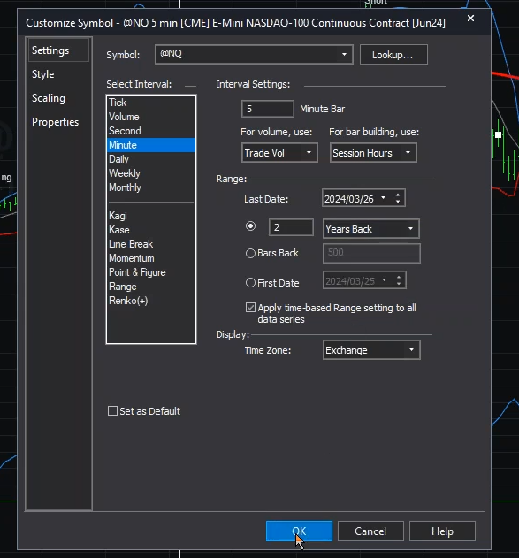
  <figcaption>Figura 101. Ampliación del histórico a 2 años.</figcaption>
</figure>

Y le hago un estudio al filtro del *ADX* en bruto, es probable que ese filtro me sirva para otro *antitendencial*. No sé si me estoy explicando. En el *Nasdaq*, que no, no quiero decir que va a ser exacto, pero es probablemente bastante extrapolable.


**Explorando filtros con ADX**

Entonces aquí os voy a hacer ahora una pequeña prueba. Pues nada, le voy a quitar el *stop* a esta, le voy a quitar el *stop*. Vamos a volver a jugar con el *ADX*, pero le voy a hacer tres, lo voy a probar tres combinaciones. Le veo `filtro Trend`, le voy a probar 3 combinaciones para ver si me aporta.

<div style="display: flex; flex-wrap: wrap; gap: 10px; justify-content: center;">
  <figure style="margin: 0; flex: 0 0 48%;">
    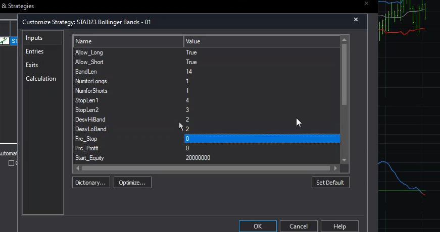
    <figcaption>Figura 103. Configuración de optimización ADX.</figcaption>
  </figure>
  <figure style="margin: 0; flex: 0 0 48%;">
    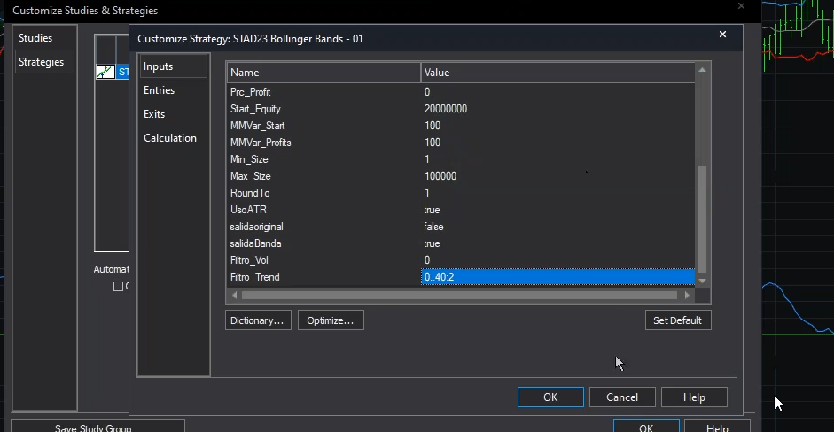
    <figcaption>Figura 102. Rango de valores a probar.</figcaption>
  </figure>
</div>

<div style="border-left: 4px solid #27ae60; background: #ecf9f1; padding: 10px 15px; margin: 10px 0; border-radius: 8px;">
  <strong>📐 Técnica para desactivar filtros con cero</strong><br><br>
  Esta manera de poner los filtros es la que comento mucho, bueno, en general, porque así el cero se te queda dentro. Es decir, usas que el cero, si es cero, no trabaje.

```sh
Inputs:    
    Prc_Stop(0),
    Prc_Profit(0),
    Filtro_Vol(0),
    Filtro_Trend(0);
```

```sh
If Filtro_Trend > 0 Then
    Trend = (ADX(BandLen) > Filtro_Trend) and (ADX(BandLen) < ADX(BandLen)[1])
Else
    Trend = True;
```

Entonces le dices: si es mayor que cero, vamos, y si no es <em>true</em>, y así no actúa. Es una manera bastante chula.
</div>

Entonces es que me da la sensación que sobre todo intradiría, va a aportar mejor al revés. Mira que te digo, a lo mejor aporta más al revés.


**Técnica para analizar mapas sin gráfico**

<figure>
  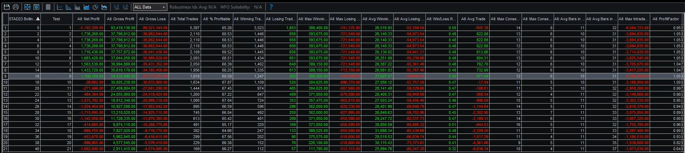
  <figcaption>Figura 104. Datos ordenados por input para visualizar el mapa mentalmente.</figcaption>
</figure>

Hay una técnica que os decía de los mapas, cuando ya le tienes experiencia, de mirar los mapas sin mirarlos. En vez de ordenarte las tablas por *TSI*, por *PPC*, por lo que quieras, te lo ordenas por el *input* de 0 a 40, y así tú en tu mente haces el mapa. Tienes que, de hecho en 2D también lo puedes hacer aquí. Es cutre, pero se puede.

Pero así ya lo ves, pues ya ves un poco el mapa. Es el mapa:

<figure>
  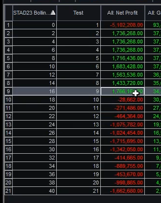
  <figcaption>Figura 105. Visualización del mapa ordenando por input.</figcaption>
</figure>

Ves que de `16` a `18` salta mucho el `net profit`, pero es que del `4` al `12` pues hay una buena zona, es que hay una buena zona en *profit*. Puedo mirar también el *drawdown*, aunque está el *drawdown monetario*, pero aquí es poco importante. Aquí yo si pusiera un *stop monetario* podría ir bien y no tendría problema, porque estoy hablando de dos años que sí que se mueve, pero es más adaptable. Hay tanto movimiento de precio.

Entonces aquí, por ejemplo, en 8 me sabe, tiene 2.000 operaciones. Pensar que con 0 voy con 5.000, la mitad. Pero veis cómo está aportando. Está aportando. Ahí tenemos 1.500-1.700. Está aportando en ese *setup*.


**Filtros contraintuitivos**

Este es un filtro que repito, estamos solo investigando ahora mismo el *ADX*.

<figure>
  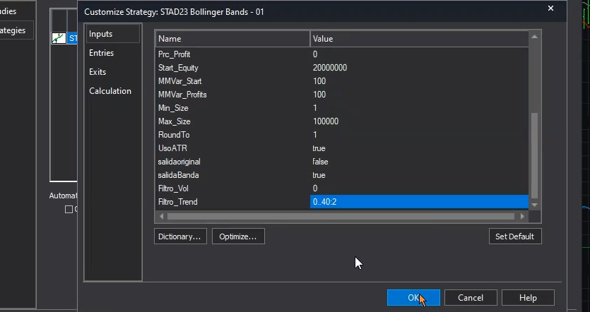
  <figcaption>Figura 106. Análisis del filtro ADX.</figcaption>
</figure>

Porque tengo aquí una condición. Ahora estamos mirando que el ADX sea mayor que un nivel, mayor que un nivel, que sea mayor. Es decir, eso que os digo: para aumentar la eficacia de entrada, es buena.

<div style="border-left: 4px solid #9b59b6; background: #f5eef8; padding: 10px 15px; margin: 10px 0; border-radius: 8px;">
  <strong>📐 Filtros contraintuitivos en Mean Reversion</strong><br><br>
  Es verdad que este tipo de filtros muchas veces son <em>contraintuitivos</em>, por lo que os decía antes: ¿no es mejor que no haya tendencia? Sí, pero muchas veces en muchos activos, cuando no va a haber tendencias, después de haber mucha tendencia, tenéis <em>contracción-expansión</em>. ¿Pero no se está mucho tiempo con la de que está bajo? Puede ser que sí. Entonces esa es un poco la lógica, y hay que investigarlo.
</div>


**Filtro ADX mayor con condición de bajada**

Entonces aquí volvemos por cero, y como veis:

<figure>
  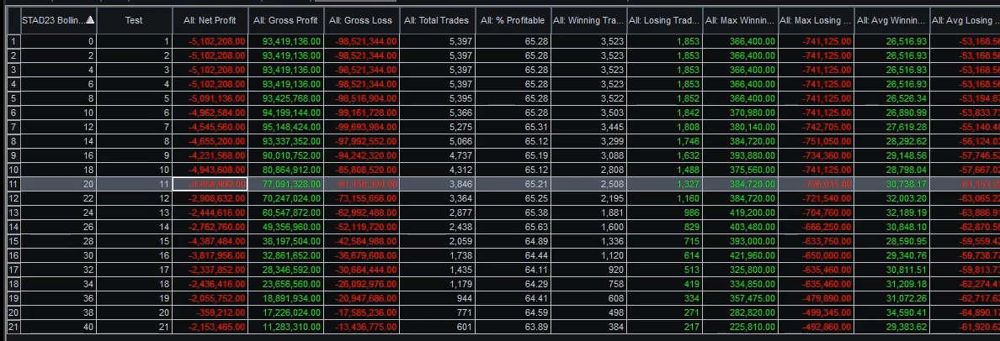
  <figcaption>Figura 107. Configuración con filtro en cero.</figcaption>
</figure>

La condición que le he quitado, que está así, que sospechaba que iría bien, pero la tengo en bruto. Lo que le he añadido, porque esta es la condición que la verdad que esa no lo hemos visto en muchos autores, la explico brevemente, que aportaba bastante como habéis visto. Es: yo te digo que vaya alto, tú solo puedes comprar (o vender, da igual) cuando el *ADX* esté mayor de cierto nivel. Es decir, cuando está bajo de cierto nivel, entiendo no, no te dejo.

<figure>
  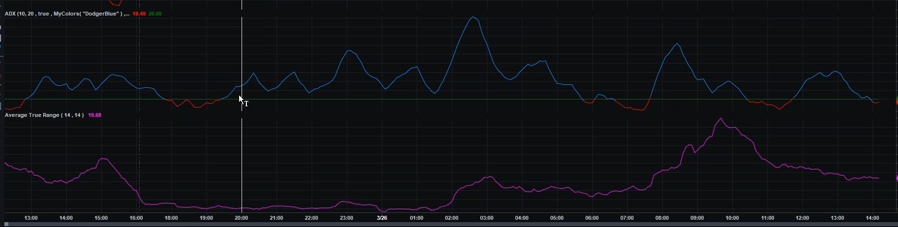
  <figcaption>Figura 108. Gráfico con filtro ADX: solo opera cuando ADX > nivel (zona azul).</figcaption>
</figure>

No quiero, quiero que sea mayor que, era 16, y cuando está muy, muy bajo no me interesa.

Entonces eso es como está ahora. Pero ves, ahora ya no acaba de aportar:

<figure>
  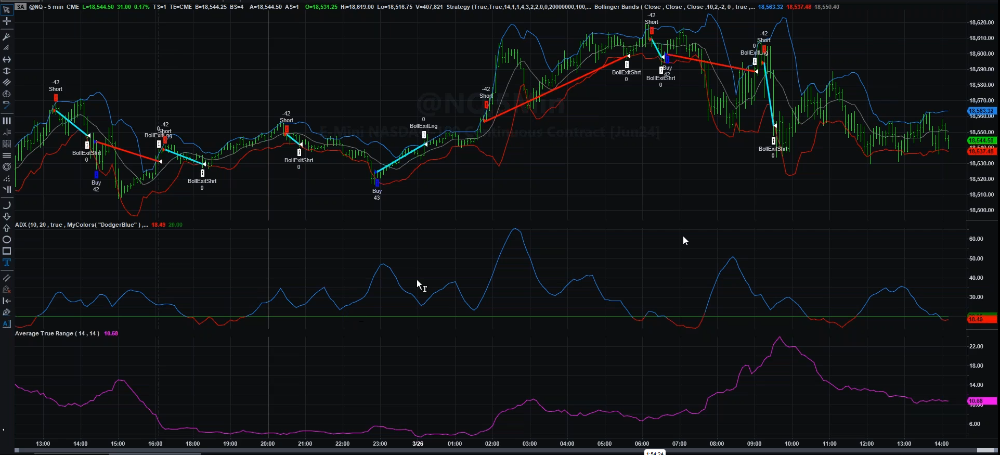
  <figcaption>Figura 109. Resultado con solo la condición de ADX mayor que nivel.</figcaption>
</figure>

Pero además le he añadido donde tengo otra condición que es: ***que estés alto, pero que estés bajando***. Y esa es la que ahora había quitado:

```sh
If Filtro_Trend > 0 Then
    Trend = (ADX(BandLen) > Filtro_Trend) # and (ADX(BandLen) < ADX(BandLen)[1])
Else
    Trend = True;
```

Es, es decir, que el *ADX* actual sea menor que el *ADX* anterior, se ha dado un valor mayor.

El *ADX* es igual que el sistema:

<figure>
  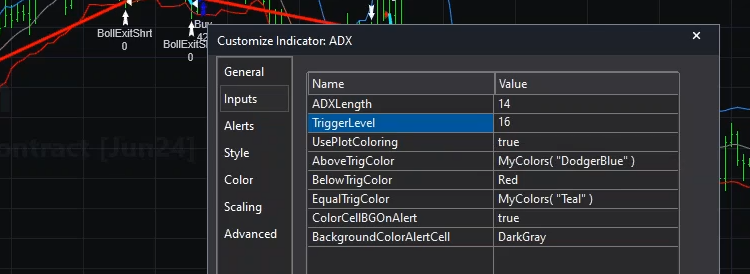
  <figcaption>Figura 110. Visualización del filtro ADX en el gráfico.</figcaption>
</figure>

¿Qué hacía el filtro? Que ***solo podría abrir cuando estuviera por encima de la línea verde***, es decir, ***cuando está en azul*** (la línea verde que corta el filtro ATR entre azul y rojo). Cuando está en azul, solo puede abrir. Por debajo no. Pero le añadimos el requisito de que estuviera *bajando*, que además la línea azul estuviera bajando, y eso le aportaba bastante.

Se ha quedado en 20, me da igual, y va como vaya:

<div style="display: flex; flex-wrap: wrap; gap: 10px; justify-content: center;">
  <figure style="margin: 0; flex: 0 0 48%;">
    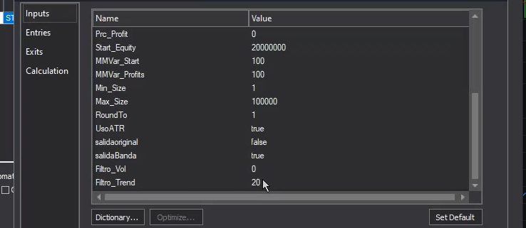
    <figcaption>Figura 111. Configuración con nivel 20.</figcaption>
  </figure>
  <figure style="margin: 0; flex: 0 0 48%;">
    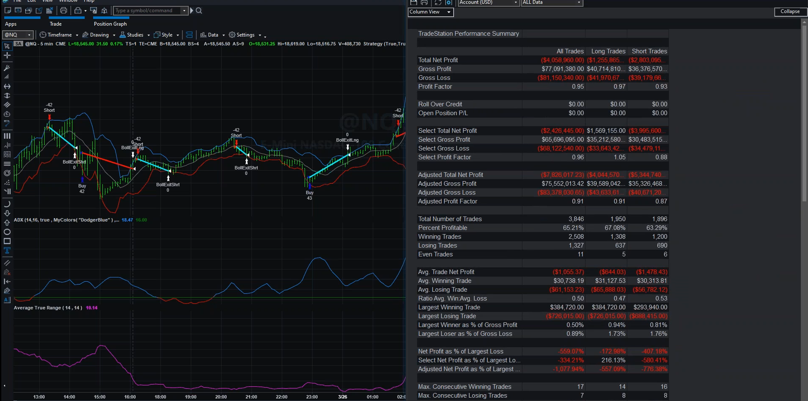
    <figcaption>Figura 124. Resultado.</figcaption>
  </figure>
</div>


**Añadiendo los dos filtros**

Y ahora, si estamos en lo cierto, debería mejorar con la condición añadida. De hecho, ahora se lo voy a añadir directamente así como veis:

```sh
If Filtro_Trend > 0 Then
    Trend = (ADX(BandLen) > Filtro_Trend) and (ADX(BandLen) < ADX(BandLen)[1])
Else
    Trend = True;
```

Ahora debería de mejorar, va a recargar, y creo que sería algo mejor ahora. Confío, aunque igual salía de zona. Recordaros que ahora el nivel puede ser otro. Pero en principio... A ver cuando recargue...

<figure>
  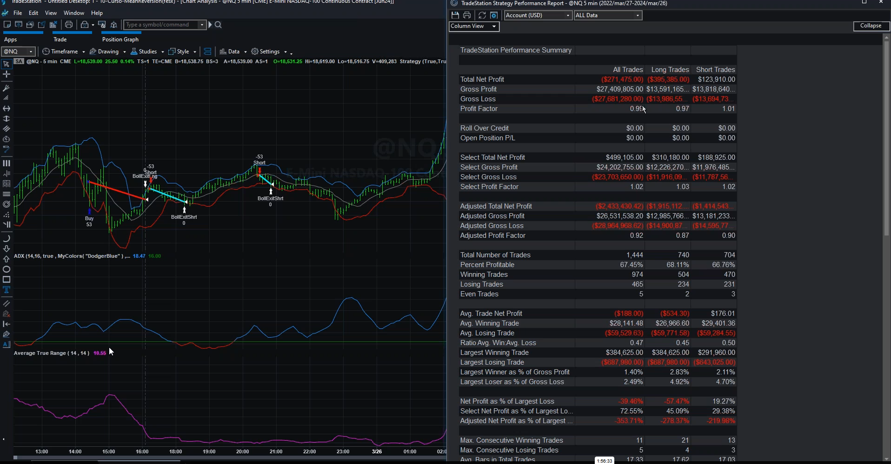
  <figcaption>Figura 112. Mejora con ambas condiciones: ADX alto y bajando.</figcaption>
</figure>

Ha mejorado un poco, ha mejorado un poco. Todavía está ahí justito, pero es que ha subido. Ha subido porque salen la zona un poquito más. Ha quitado más *trades*, porque le exijo que esté bajando.


**Significación vs Representatividad en Intradía**

Este es un poco el tema que os decía. Estos, los *intradía*, que son muy necesarios, pero hay bastante margen de investigación. Puedes tranquilamente jugar con ellos, puedo decir, porque tienes muchos *trades*, es mucha *significación*, y puedes todo el rato jugar con el filtro.

Esto está bastante correcto, y esto lo que hablaba antes que dijo Rubén con la librería de filtros, lo puedes hacer así. Y en un *intradía* no tienes ningún problema.


**Invirtiendo la condición del filtro**

Entonces ahora lo que vamos a invertir es la condición. Pero le voy a quitar la del más, porque sí que os confieso tener bastantes dudas sobre, en un *intradía*, por lo que os decía, el ruido. Pero esa tendencia tan persistente a la *lateralidad* en los *intradía*, donde es posible que perdure el suficiente tiempo para que le rente filtrar al revés: filtrar solo a que esté para debajo `(ADX(BandLen) < Filtro_Trend)`:

```sh
If Filtro_Trend > 0 Then
    Trend = (ADX(BandLen) < Filtro_Trend) # and (ADX(BandLen) < ADX(BandLen)[1])
Else
    Trend = True;
```

Pues ahora esto así directamente ya está es positivo, fijaros. Simplemente le he invertido el signo. Ahora lo que voy a decirle es que solo puede abrir si está *por debajo* del *ADX*:

<figure>
  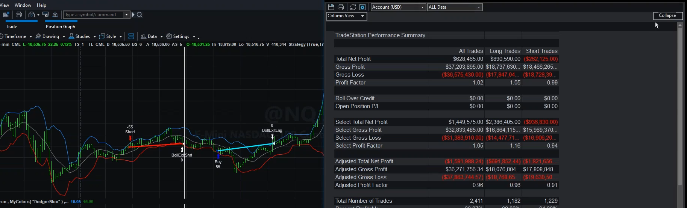
  <figcaption>Figura 113. Resultado con condición invertida: ADX menor que nivel.</figcaption>
</figure>

<div style="border-left: 4px solid #f39c12; background: #fef9e7; padding: 10px 15px; margin: 10px 0; border-radius: 8px;">
  <strong>💡 Usando MRO para persistencia</strong><br><br>
  De esa manera, aquí yo creo que puede mejorar evolucionando un poco. ¿Y cómo? Os doy una pista, para que lo podemos tratar de sacar con el <em>MRO</em>:<br><br>
  Es decir, no solo pidiéndole el <em>MRO</em>, sí para este tipo de cosas, pero no pedirle una vela, algo, y sí varias velas. Es una manera de conseguirlo: en las últimas cinco velas esté por debajo de cierto nivel, o por encima. Entonces esa manera yo le puedo pedir una cierta <em>persistencia</em> de algo, no que solo me pase en una vela.
</div>

Pero le vamos a dar otra optimización al filtro:

<figure>
  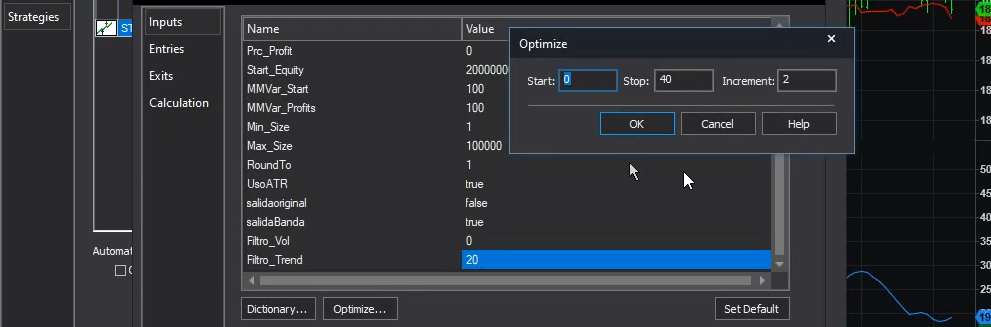
  <figcaption>Figura 114. Nueva optimización del filtro.</figcaption>
</figure>

Y... Como veis, era bastante mejor el contrario:

<figure>
  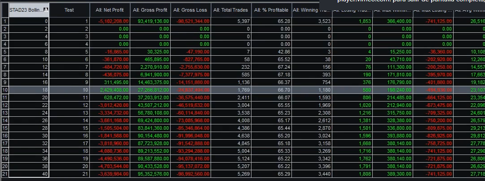
  <figcaption>Figura 115. Comparativa: el filtro "mayor que" supera al "menor que".</figcaption>
</figure>

<div style="border-left: 4px solid #e74c3c; background: #fdf2f2; padding: 10px 15px; margin: 10px 0; border-radius: 8px;">
  <strong>⚠️ Mean Reversion y volatilidad alta</strong><br><br>
  Como veis, era bastante mejor el contrario, que es el que aparentemente es <em>contraintuitivo</em>.<br><br>
  Pero es que ya os digo, las pruebas que hace, siempre acaba pasando. Tenía dudas aquí y no, al final sigue saliendo lo que siempre sale: que es <em>por encima</em> <code>(ADX(BandLen) > Filtro_Trend)</code>.<br><br>
  Y con la <em>volatilidad</em> pasa igual: los <em>mean reversion</em> van mejor filtrando en volatilidad, es decir, que puedan operar en <em>volatilidad alta</em>, porque a partir de ahí va a bajar. Ahí aumenta mucho el porcentaje de aciertos.
</div>

Es lo mismo que hemos visto aquí: aquí le hemos pedido que solo puede abrir si el *ADX* es `menor` que cierto nivel, y veis que nos está saliendo aquí 18 y tal. Se lo pongo aquí ahora para que lo veáis, es decir, solo puede operar por debajo de 18:

  <figure style="margin: 0; flex: 0 0 48%;">
    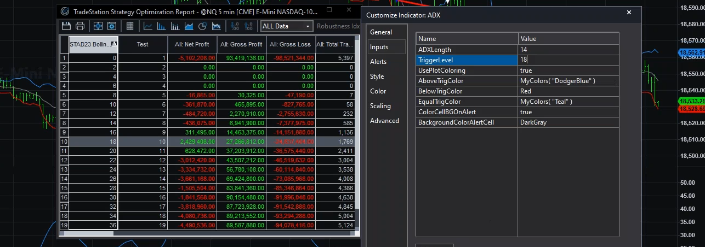
    <figcaption>Figura 117. Configuración: solo opera si ADX < 18.</figcaption>
  </figure>

  <figure style="margin: 0; flex: 0 0 48%;">
    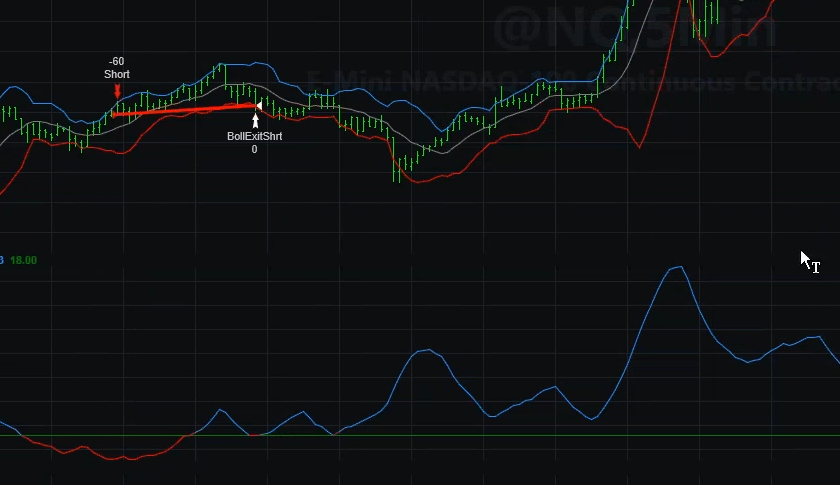
    <figcaption>Figura 119. Gráfico: solo puede operar en zona roja.</figcaption>
  </figure>

Ahora es al revés, es por debajo. Ahora solo puede operar con ese `rojo`, solo puede operar con ese rojo. Por eso veis que no, que solo abre a saber, no puede abrir.

Y como veis, pues va peor. Aunque solo lleva un filtro y no está tan mal... Porque aquí solo hay uno de los dos:

```sh
Trend = (ADX(BandLen) < Filtro_Trend) # and (ADX(BandLen) < ADX(BandLen)[1])
```

<figure>
  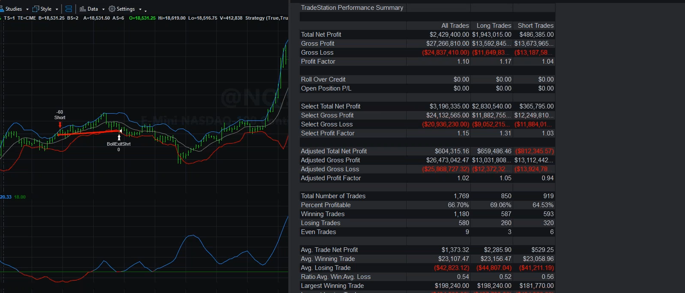
  <figcaption>Figura 120. Performance con filtro "menor que" sin condición de dirección.</figcaption>
</figure>

Pero bueno, ahí lo tenéis, ahí lo tenemos, cómo ha mejorado un poco más:

<div style="display: flex; flex-wrap: wrap; gap: 10px; justify-content: center;">
  <figure style="margin: 0; flex: 0 0 48%;">
    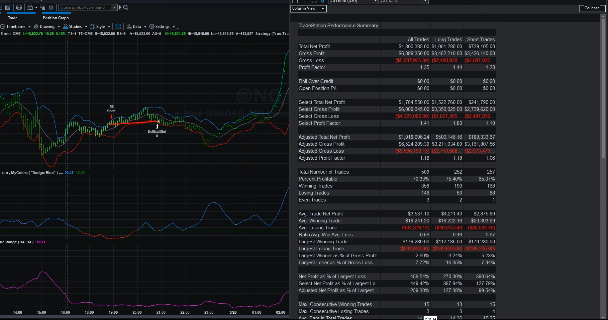
    <figcaption>Figura 125. Mejora adicional.</figcaption>
  </figure>
  <figure style="margin: 0; flex: 0 0 48%;">
    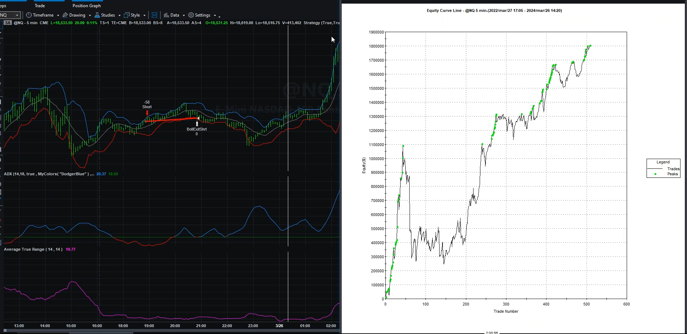
    <figcaption>Figura 122. Detalle de resultados.</figcaption>
  </figure>
</div>

Recordar que solo hemos tocado el *ADX*, pero ahora le hemos añadido que esté en negativo, y entiendo que así va a empeorar bastante. Esperaros, lo quiero comprobar. Ahora debería dar peor el resultado, os enseño.


**Pruebas**

Ahora lo tenemos así:

```sh
Trend = (ADX(BandLen) < Filtro_Trend) and (ADX(BandLen) > ADX(BandLen)[1])
```

<figure>
  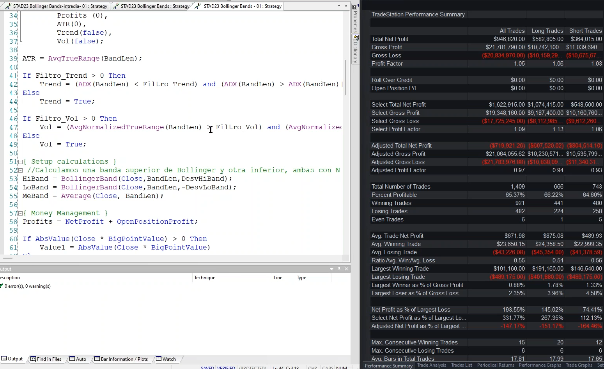
  <figcaption>Figura 126. Resultado con condición de ADX menor y subiendo.</figcaption>
</figure>

Es, sí, era como esperaba. Es ***filtrado, pero además añadiéndole que esté subiendo o bajando***. Lo veis en el gráfico.

De hecho, el nivel de *trades* así no va a cambiar mucho. Es decir, este pequeño cambio veréis que volviendo al que estaba, ahora no debería cambiar muchísimo el número de *trades*. Vamos a 1.000-1.400, tenemos comisiones puestas. Ya sabéis que me gusta incluso en la evaluación preliminar ponerlo a... Pero sí que me baja mucho.

<figure>
  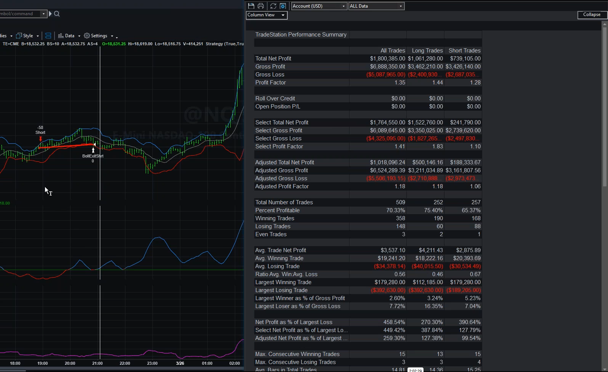
  <figcaption>Figura 127. Reducción significativa de trades con la doble condición.</figcaption>
</figure>

Espérate, que no he entendido yo aquí bien. Amigo, claro, claro, porque en este nivel le cuesta mucho. Cuidado, porque en este nivel le cuesta mucho que estés menor y que estés bajando. Aquí que más es bajando te pido, claro, ya le cuesta mucho ser bajando.

Ahí no me convence mucho ese filtro. Me da la sensación de que está *sobreoptimizado*. Quitado así, habría que verlo:

<div style="display: flex; flex-wrap: wrap; gap: 10px; justify-content: center;">
  <figure style="margin: 0; flex: 0 0 49%;">
    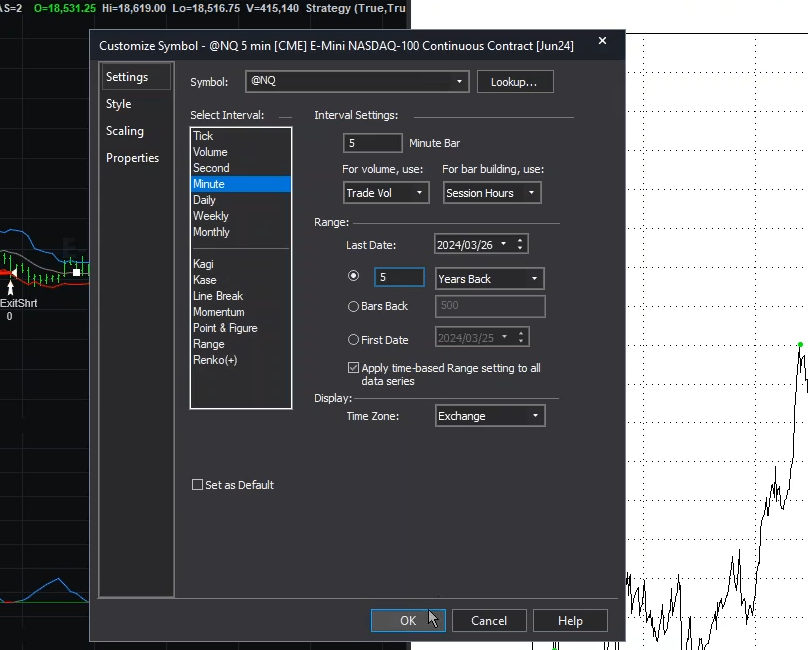
    <figcaption>Figura 128. Revisión del filtro.</figcaption>
  </figure>
  <figure style="margin: 0; flex: 0 0 49%;">
    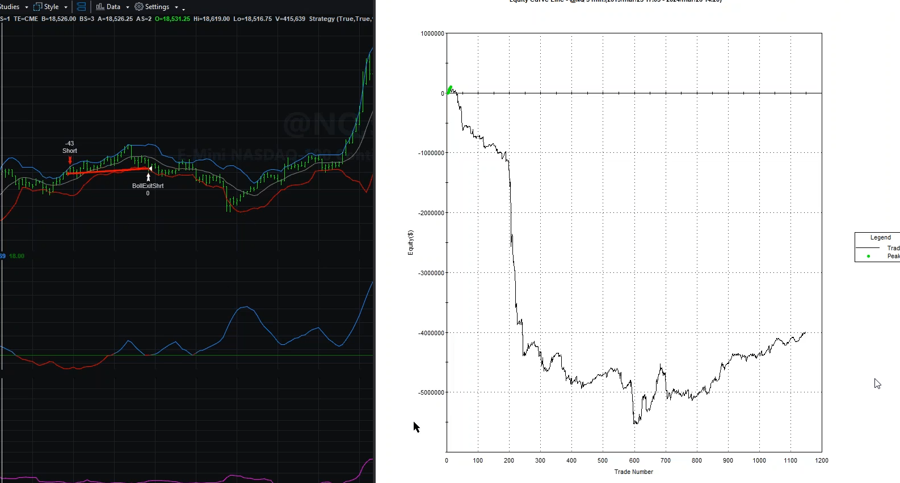
    <figcaption>Figura 129. Ajuste.</figcaption>
  </figure>
</div>

<div style="display: flex; flex-wrap: wrap; gap: 10px; justify-content: center;">
  <figure style="margin: 0; flex: 0 0 60%;">
    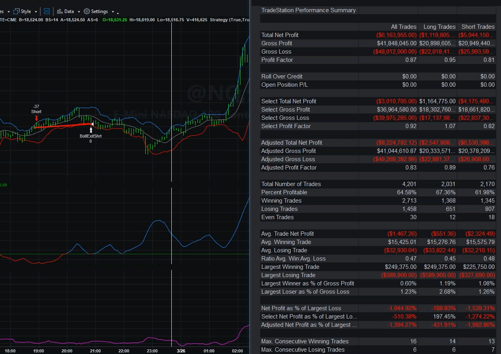
    <figcaption>Figura 131. Resultado final.</figcaption>
  </figure>
</div>

Que os he dicho, que os he dicho, cuando tú tienes un gráfico de *intradía* tienes que evitar...

Acordaros cuando hablamos de los datos de la muestra, hablamos de dos características: hablamos de *representatividad* y hablamos de *significación*.

<div style="border-left: 4px solid #e74c3c; background: #fdf2f2; padding: 10px 15px; margin: 10px 0; border-radius: 8px;">
  <strong>⚠️ Representatividad vs Significación en muestras</strong><br><br>
  Tener en cuenta que cuando yo tengo un <em>intradía</em> es muy fácil tener <em>significación</em> pero no tanto tener <em>representatividad</em>.<br><br>
  Hay que vigilar de no dejarse llevar por eso, decir "hostia, 4.000 trades, esto es la hostia, esto es indestructible". No, porque al final sigo estando en seis meses de mercado, bueno lo que esté, en dos años si quieres. Y si esos dos años están muy sesgados respecto a la muestra y el mercado cambia, por más que tenga no se va a comportar igual, ¿se entiende?<br><br>
  Entonces el diario es un poco al revés: yo tengo mucha <em>representatividad</em>, es decir, realmente lo he evaluado en muchos tipos de mercado por la teoría creciente: de creciente, alcista, bajista, lateral, <em>pensionista</em>, de todos los tipos. A lo mejor tengo menos <em>trades</em>, pero tengo un análisis de tipos de mercado muy representativo de lo que es él, y es más probable que se sostenga en el tiempo, si no he <em>sobreoptimizado</em>.
</div>

En cambio, en la *intradía* es muy fácil encontrar *significación*, y esto es muy representativo. Pero si a lo mejor me quedo muy poco tiempo de mercado, me he adaptado mucho a un estilo de mercado. Gente que le gusta hacer eso, y en las técnicas más *adaptativas* como ML, etcétera, se juega más eso.

Es decir ahí, porque al final yo me voy autorregulando, el algoritmo va entrenando, y la lógica o la teoría hace esto de manera permanente: se va entrenando con los datos en principio más recientes (aunque también pueden ser históricos), pero digamos que lo más reciente lo va incorporando y por lo tanto va haciendo una adaptación a esos cambios.

Entonces es importante que quede claro: ¿entonces aquí ahora cómo se ha roto tanto? Pues porque seguramente lo que tenía cargado no era representativo de lo que le he cargado luego, y simplemente hemos ido a tomar viento. Pero es correcto, es decir, no quiere decir que no esté bien mirarlo.


**Pausa y cambio a MultiCharts**

Y aquí ahora, por ejemplo, pues para simplificar ahora vamos a analizar el filtro en bruto, ahora otra vez sin mayor o menor. Filtro bruto *ADX* menor o *ADX* mayor. Para que vaya un poco más rápido le voy a hacer de 3 en 3:

<figure>
  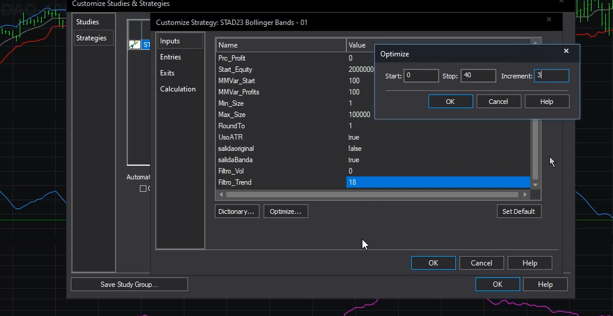
  <figcaption>Figura 132. Optimización de 3 en 3 con 5 años de datos.</figcaption>
</figure>

Le he metido cinco años en vez de dos pero tenemos muchísimas más barras.

Hemos quedado sin *trades*, he hecho así, así va mejor. No, pero y es perfecto, ha decidido no operar y está perfecto. Es el mejor: mejor es no operar. Si vas para casa le pones una de x de 6, no operas, y es como va mejor el sistema.

<figure>
  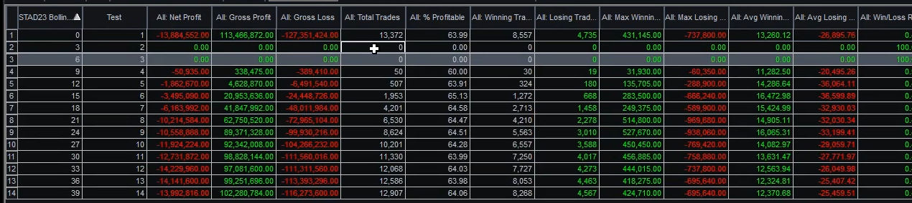
  <figcaption>Figura 133. Resultado: el sistema decide no operar (mejor opción).</figcaption>
</figure>

Cinco minutos es muy complicado, os lo digo. Que lo normal es que haya que filtrar por pautas.


**Ventanas horarias: casi imprescindible en Intradía**

<div style="border-left: 4px solid #f39c12; background: #fef9e7; padding: 10px 15px; margin: 10px 0; border-radius: 8px;">
  <strong>💡 Nota importante</strong><br><br>
  Una cosa que no estamos haciendo, casi casi imprescindible en un <em>intradía</em> de cinco minutos: la gracia es que tengo un código que permite hacerlo. Eso es lo que tiene más delito, de verdad, porque tengo un código que permite hacerlo pero yo estoy usando uno que no lo permite.<br><br>
  Porque como os digo, así para que es filtrar <strong><em>ventanas horarias</em></strong>.
</div>

Pongo este ahora:

<figure>
  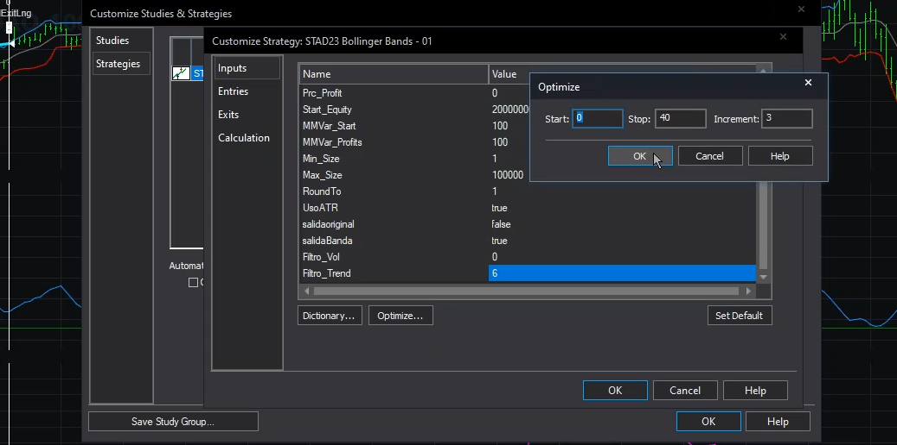
  <figcaption>Figura 134. Cambio a código con filtro de ventanas horarias.</figcaption>
</figure>

A igual, y sí que mejor va a ir seguro porque francamente era fácil. Y le doy al relojito, vale el relojito, que ya pausita de cinco minutitos.

### Análisis del Sistema Original en Diario

tsw : [10-Curso-MeanReversion(esd).tsw](../code/10-Curso-MeanReversion(esd).tsw)

Tengo 4 gráficos abiertos con 4 variaciones de la estrategia:


<div style="display: flex; flex-wrap: wrap; gap: 10px; justify-content: center;">
  <figure style="margin: 0; flex: 0 0 48%;">
    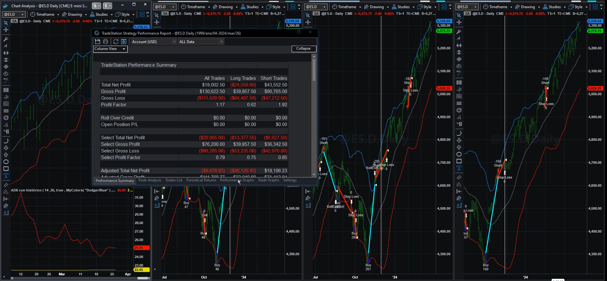
    <figcaption>Gráfico 1. Versión original con filtros.</figcaption>
  </figure>
  <figure style="margin: 0; flex: 0 0 48%;">
    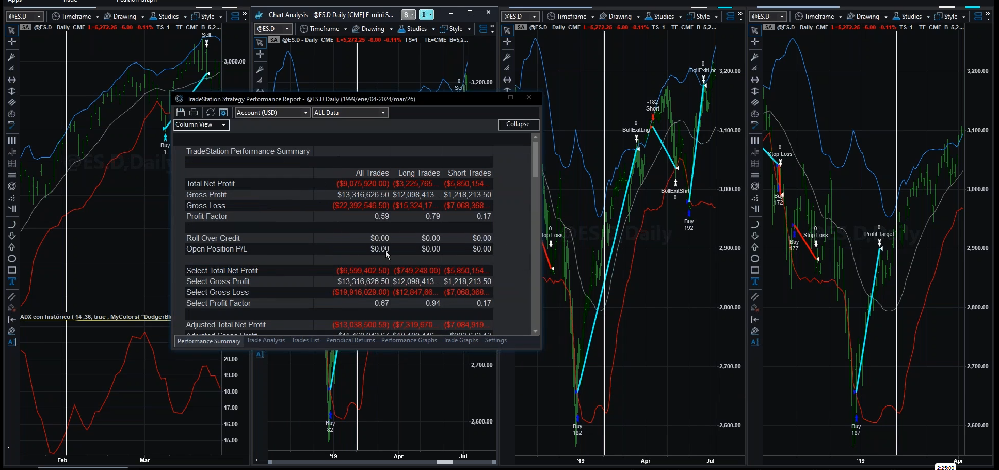
    <figcaption>Gráfico 2. .</figcaption>
  </figure>
  <figure style="margin: 0; flex: 0 0 48%;">
    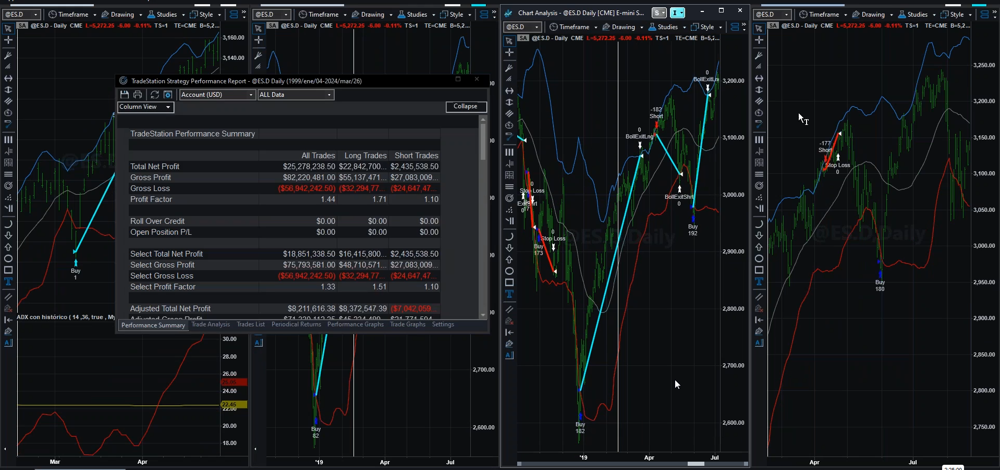
    <figcaption>Gráfico 3. .</figcaption>
  </figure>
  <figure style="margin: 0; flex: 0 0 48%;">
    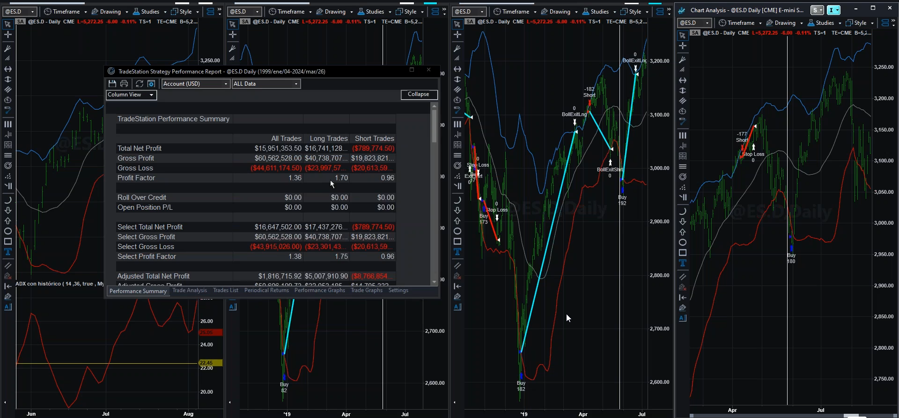
    <figcaption>Gráfico 4. .</figcaption>
  </figure>
</div>

<br><br>

**Gráfico 1** [SATD BOLLINGER BANDS](../code/SATD23%20BOLLINGER%20BANDS.ELD)

Bueno, aquí tenemos el original y tenemos un poco todo. Curiosamente gana en el corto solo con 1 a 1, ahí filtrando. Hemos hecho una, se, hemos hecho. Ese es el original que habéis visto ahora, lo único que es en diario y tiene filtro el ADX. El filtro de, creo que era el día, de que solo lo tenía implementado, también se lo hemos puesto. Porque ellos en el *paper*, que ya os he comentado que los haremos al final, da unas sugerencias. Dice: bueno, lo mismo que hay que vigilar el comprar reiteradamente en una tendencia bajista o viceversa, es filtrar los *stages* cuando hay una tendencia fuerte detectada, y relajando los criterios de entrada cuando soportes y resistencias libres empiezan a aparecer. Entonces bueno, pues ahí hay un poco de camino a seguir.

**Sugerencias del Paper**

<figure>
  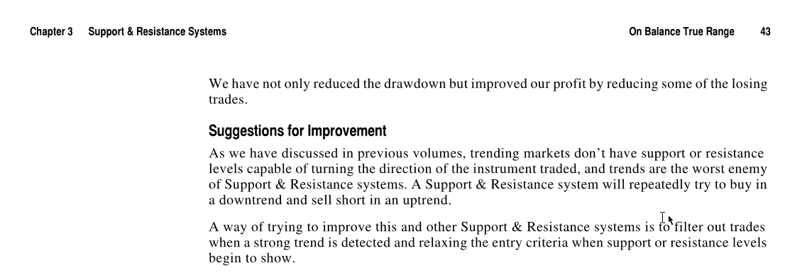
  <figcaption>Figura 136. Sugerencias del paper original sobre filtrado.</figcaption>
</figure>

Y bueno, pues habíamos implementado esto de aquí. Entonces, aquí en su versión original —que ahora ya estamos en la otra— pues simplemente le metimos, dejamos el código puesto ahí original pero añadimos una variable como *filter*:

```sh
Inputs: Allow_Long(True),
        Allow_Short(True),
        BandLen(10),
        NumforLongs(2),
        NumforShorts(2),
        StopLen1(4),
        StopLen2(3),
        AllowStop(0), # Si es > 0 activa stop monetario
        Filter(0);    # Si es > 0 sirve de filtro: ADX(BandLen) < Filter
```

Que dijimos: bueno, y un *stop*, porque ven, decían ellos de ponerlo. Lo puse monetario para el fácil. Y *filter*, pues que lo mismo: si es cero pues se activa el filtro este de la de que es mayor que el filtro y que esté cayendo, que es el que habíais visto ahora.

Y aquí pues se aprecia de cero a bien cómo, bueno, sí que tiene una zona de cierta mejora, sin ser tampoco muy radical. Porque los valores bajos lógicamente no actúa; empieza a actuar aquí en `10` columna 1:

<figure>
  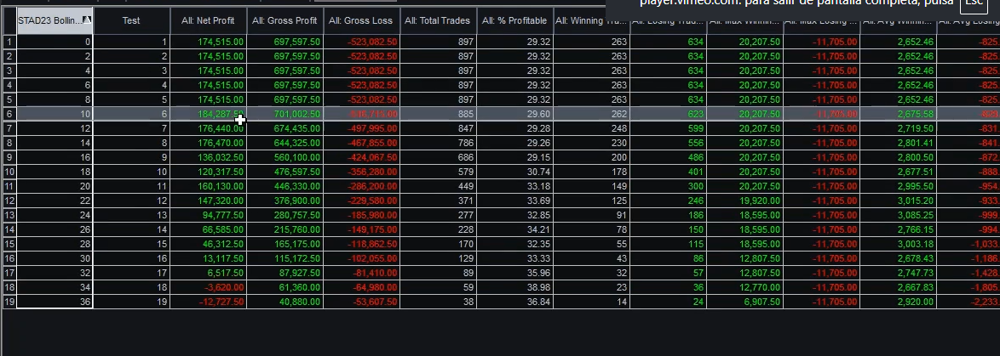
  <figcaption>Figura 137. Zona de mejora con filtro ADX activándose en nivel 10.</figcaption>
</figure>

Pero ya se sube mucho más, pues degrada. Pero bueno, sé que tiene aquí una cierta mejora muy pequeñita. De hecho ya con cero también da buenos valores, sobre todo en el lado corto. Curiosamente, donde da mejores valores es en el corto. Recordar que este promedia:

<figure>
  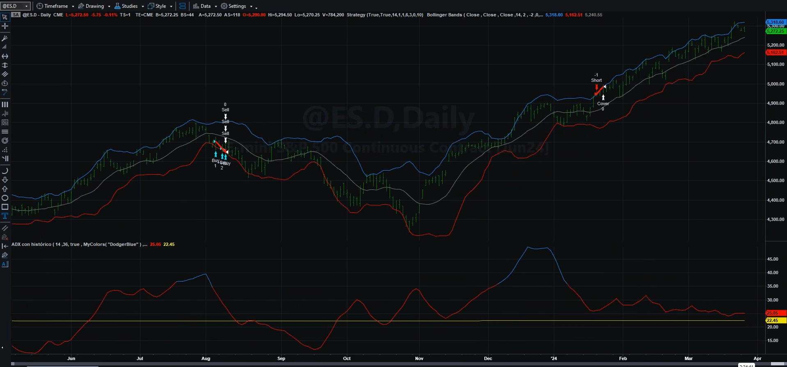
  <figcaption>Figura 138. Resultados: el lado corto muestra mejores valores.</figcaption>
</figure>


**Explorar el camino de los filtros**

Bueno, esta es lo que os digo, quería, había que explorar el camino como os decía de los filtros. Hay que explorar el camino de los filtros, pero sobre todo en el lado largo. Lógicamente en el corto es más difícil, pero también se pueden sacar, como veis. Se pueden explorar distintos caminos, sobre todo por la vía de filtrado.

<figure>
  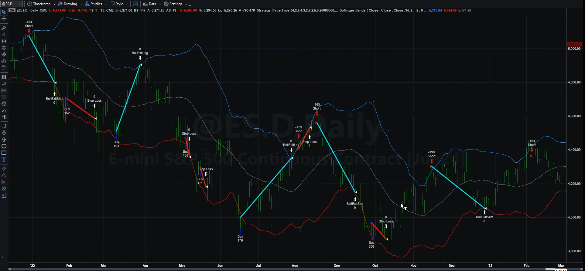
  <figcaption>Figura 144. Exploración de diferentes filtros.</figcaption>
</figure>

A mí en el diario, como os decía, me cuesta más. Pero bueno, sí que abordaría, intentaría explorar el camino de filtrar bien de *volatilidad*. Se puede hacer por varios caminos. Aquí no está filtrado ahora, varios caminos. El que hemos implementado aquí es no muy sencillo, pero hay otros.

<div style="border-left: 4px solid #27ae60; background: #ecf9f1; padding: 10px 15px; margin: 10px 0; border-radius: 8px;">
  <strong>📐 Caminos para filtrar por volatilidad</strong><br><br>
  También vía figuras de <em>congestión-expansión</em>, poco lo que vimos en el <code>ORB</code>. Acordaros que allí sí que montamos un <code>case</code> con el <code>ORB</code>, de este tipo de esto que decíamos con los setups. Teníamos todo un <em>switch</em> de distintos filtros que vimos en las revistas, ¿acordáis?
</div>

Este es lo que hablaba Rubén de los filtros, exactamente. Esto de aquí tenemos 19 casos para probar distintos elementos:

ShowMe [Filtros Orb](../code/CURSO_FILTROS_ORB_SHOWME.ELD)

<figure>
  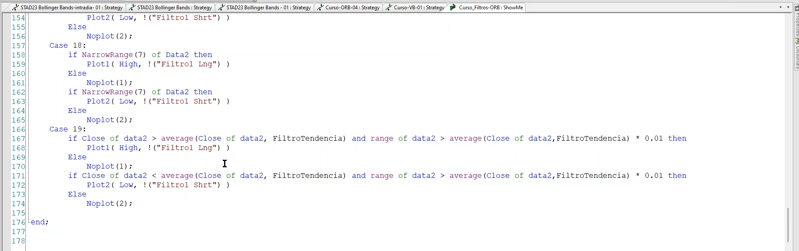
  <figcaption>Figura 146. Switch con 19 casos de filtros diferentes.</figcaption>
</figure>

Lo único que es lo que yo os decía: aquí no metería de más, optimizaría la media tal, ¿sabes decir? Se complica poco todo, vamos a forzarlo demasiado. Pero probar distintas *pautas de precio* así con los filtros para ver cómo se mueve, y si puede ser distintos activos. Porque la idea debería de ser bastante extrapolable. Cada activo tiene su comportamiento, pero deberían de ser filtros del mismo estilo y muy, muy similares en activos similares. De tipos distintos no.

Pero esto es un poco con los *plots*, que esos son los *show me*, para ver las velas que se cumple un determinado caso. Entonces con esto luego en el sistema pues podemos usar uno, podemos usar otro. Es acordar es que eso lo vimos. Entonces esto proviene un poco de esa idea que hablamos antes: con cuando vemos más señales de entrada, más evaluamos entrar, pues lo haremos de esta manera porque es la manera más rápida hacerlo.


**El camino es infinito**

Todo lo que os decía: los filtros los hemos implementado estos dos, pero el camino es infinito.

[STAD23 Bollinger Bands 01](../code/PRACTICA%2010.ELD)

```sh
{ Setup calculations }
# Calculamos una banda superior de Bollinger y otra inferior, ambas con N desviaciones típicas.
HiBand = BollingerBand(Close, BandLen, DesvHiBand);
LoBand = BollingerBand(Close, BandLen, -DesvLoBand);
MeBand = Average(Close, BandLen);

# Filtro Tendencia
If Filtro_Trend > 0 Then
    Trend = (ADX(BandLen) > Filtro_Trend) and (ADX(BandLen) < ADX(BandLen)[1])
Else
    Trend = True;

# Filtro Volatilidad
If Filtro_Vol > 0 Then
    Vol = (AvgNormalizedTrueRange(BandLen) > Filtro_Vol) and (AvgNormalizedTrueRange(BandLen) < AvgNormalizedTrueRange(BandLen)[1])
Else
    Vol = True;
```

El camino, hemos probado *ADX*, hemos probado *volatilidad*, y mirando solo el porcentaje de volatilidad que no sea mayor que cierto nivel y que esté bajando junto, simplemente es muy sencillo.

La volatilidad se puede explorar por muchos caminos como os decía. Como simplemente el concepto de *contracción-expansión*, no directamente una sino una figura que indique contracción. Que indica contracción pues el rango bajando como vimos en el *RV*, el rango más pequeño, una *inside bar*. También los filtros con tal que no sea un día volátil, que no sea un día de rango muy elevado el anterior. Cosas así, que eso es un poco lo que miramos con el normalizado. Pero que hay distintas maneras de buscar un poco lo mismo. El camino es bastante infinito.


**Bollinger 34 de artículo antiguo**

Aquí ahora mismo tenemos cargado desde el 99 al 24:

<div style="display: flex; flex-wrap: wrap; gap: 10px; justify-content: center;">
  <figure style="margin: 0; flex: 0 0 48%;">
    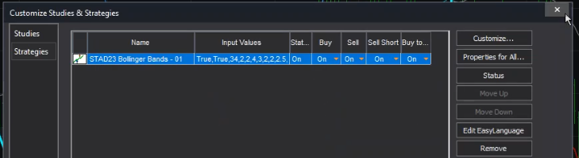
    <figcaption>Figura 149. Datos cargados 1999-2024.</figcaption>
  </figure>
  <figure style="margin: 0; flex: 0 0 48%;">
    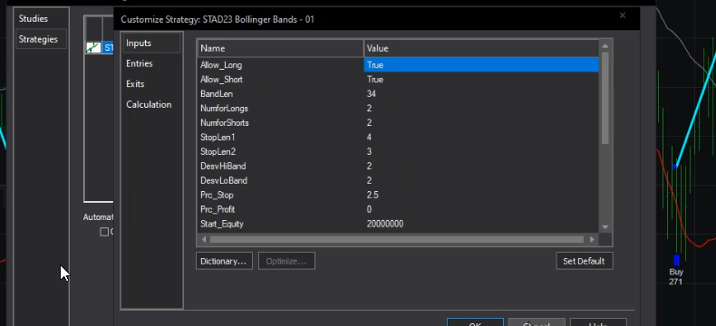
    <figcaption>Figura 148. Configuración.</figcaption>
  </figure>
  <figure style="margin: 0; flex: 0 0 48%;">
    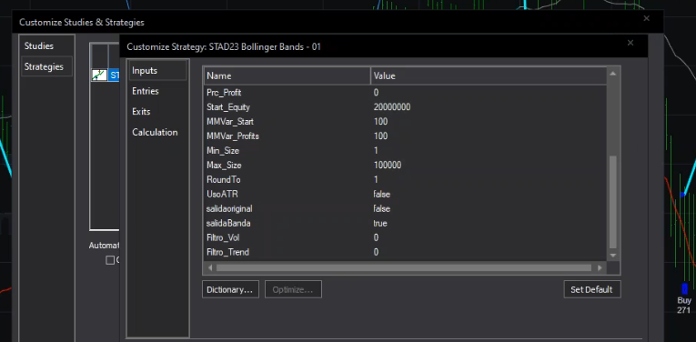
    <figcaption>Figura 147. Parámetros.</figcaption>
  </figure>
  <figure style="margin: 0; flex: 0 0 38%;">
    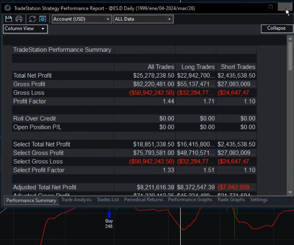
    <figcaption>Figura 150. Resultado.</figcaption>
  </figure>
</div>

Y ya digo, aquí habría que explorar brevemente pequeño filtro. Y es lo último que hago aquí para irme a *MultiCharts*. Si esto es el *Bollinger* del 34, me parece que lo Alberto de un artículo mío bastante antiguo, donde hice un análisis antitendencial así con tres medias fáciles en muchos activos, y vimos muchos que iban, que van bien.

Esto lo podemos buscar, Alberto, está por ahí, me ha acordado, está por ahí. Si buscas *Bollinger* en artículos en la carpeta de marketing te sale seguro. Y lo publicó no sé qué revista, no me acuerdo en cuál nos lo publicaron, y estaba todo. Es antiguo, pero bueno, pues sirve, y era simplemente muy, muy sencillo.

Este es el mismo filtro que hemos hecho antes, ponemos 40 de 2 en 2:

<figure>
  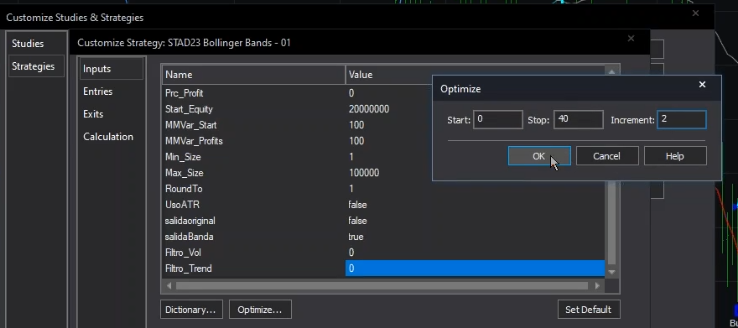
  <figcaption>Figura 151. Configuración de optimización del filtro.</figcaption>
</figure>

Bueno, esto como es diario lo voy a poner de 1 en 1 porque va a tardar entiendo que bastante poco:

<figure>
  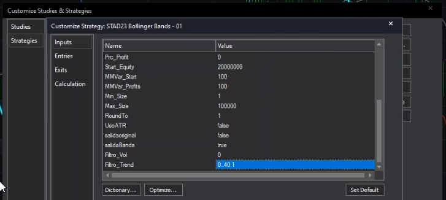
  <figcaption>Figura 152. Optimización de 1 en 1 en diario.</figcaption>
</figure>

Va a tardar bastante poco. Bueno pues nada más, lo que pensaba, pensaba que sería más rápido, va a tardar un minuto pero pensaba que sería. Bueno pues nada, no aporta ciertamente nada. Para mí que debe estar al revés el filtro otra vez, porque si no parece demasiado *heavy*.

<div style="display: flex; flex-wrap: wrap; gap: 10px; justify-content: center;">
  <figure style="margin: 0; flex: 0 0 48%;">
    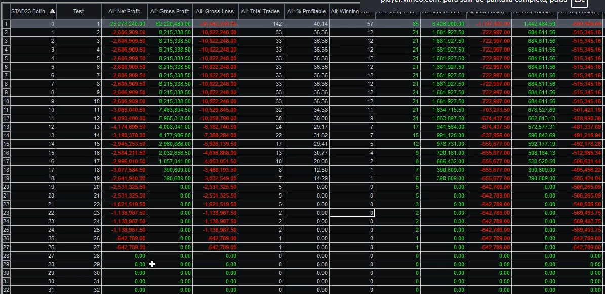
    <figcaption>Figura 153. Resultados de optimización.</figcaption>
  </figure>
  <figure style="margin: 0; flex: 0 0 48%;">
    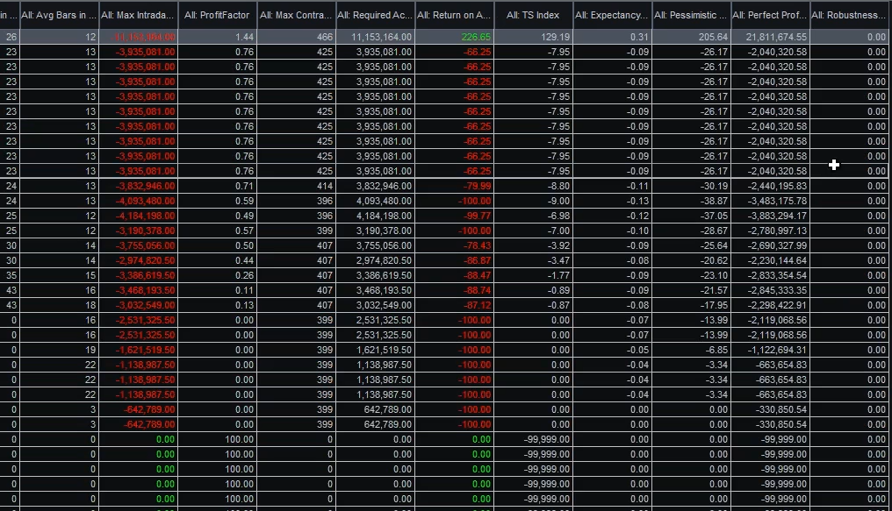
    <figcaption>Figura 154. Detalle.</figcaption>
  </figure>
</div>

No, debe estar al revés del filtro. ¿Cuál he mirado? El filtro *trend*:

<figure>
  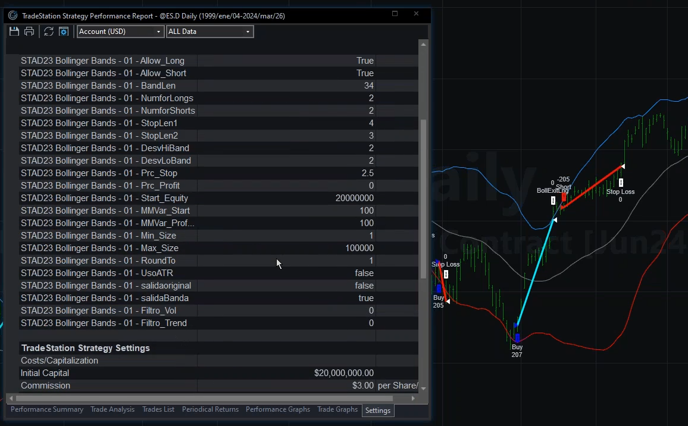
  <figcaption>Figura 155. Revisión del filtro trend.</figcaption>
</figure>


### Comparación Diario vs Intradía

- [STAD23 Bollinger Bands-intradia-01](../code/STAD23%20BOLLINGER%20BANDS-INTRADIA-%2001.ELD)
- [STAD23 Bollinger Bands-01](../code/SATD23%20BOLLINGER%20BANDS%2001.ELD)

Bien, aquí tenemos, también intradía, tenemos otra versión que es basada en esta también, partiendo de la misma pero añadiendo alguna evolución más que hemos comentado brevemente. Luego ya lo miraremos de demostrar el día siguiente y el *paper* y demás, que la siguiente clase intentaremos hacer otra cosa porque si no no avanzamos.

Pero que ya mostraremos un poco mejor, porque nos va a dar del todo tiempo. Pero que es lo mismo, no hay cambios. Queríamos ver un poco toda la curva para que vierais qué cambios puede tener un diario de un *intradía*.


<figure>
  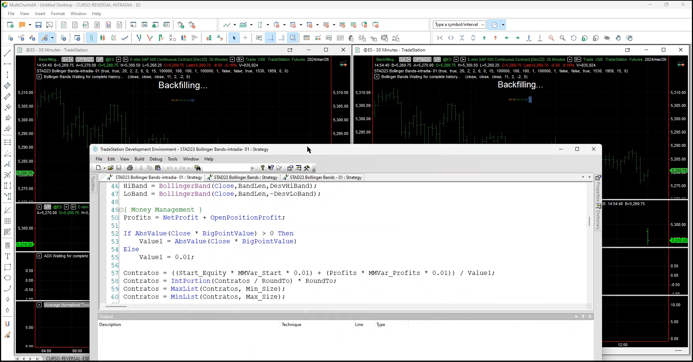
  <figcaption>Figura 156. Versión intradía del sistema Bollinger.</figcaption>
</figure>

```sh
{ Setup calculations }
# Calculamos una banda superior de Bollinger y otra inferior, ambas con 2 desviaciones típicas.
HiBand = BollingerBand(Close, BandLen, DesvHiBand);
LoBand = BollingerBand(Close, BandLen, -DesvLoBand);
```

<div style="border-left: 4px solid #27ae60; background: #ecf9f1; padding: 10px 15px; margin: 10px 0; border-radius: 8px;">
  <strong>📐 Bollinger Bands en Intradía: conclusión</strong><br><br>
  Al final la banda de <em>Bollinger</em> es igual, funciona igual, funciona muy bien el <em>intradía</em>. Antes hemos ya hemos visto una prueba de cinco minutos de que funciona muy bien, que daba buenas entradas, es un buen <em>setup</em> de entrada. Porque <em>intradía</em> el mercado de equity tiene bastante a la <em>reversión</em> y por lo tanto va bien. El tema es lo que decía: hay que filtrar en el <em>intradía</em>, así que hay que filtrar, hay que buscar unos filtros. Hay mucho camino para explorarlo.
</div>


**Filtros implementados y Data 2**

```sh
Contratos = ((Start_Equity * MMVar_Start * 0.01) + (Profits * MMVar_Profits * 0.01)) / Value1;
Contratos = IntPortion(Contratos / RoundTo) * RoundTo;
Contratos = MaxList(Contratos, Min_Size);
Contratos = MinList(Contratos, Max_Size);

# Filtro Tendencia
If Filter > 0 Then
    Trend = (ADX(BandLen) of data2 > Filter) and (ADX(BandLen) of data2 < ADX(BandLen)[1] of data2)
Else
    Trend = True;

# Filtro Volatilidad
If FilterVol > 0 Then
    Vol = (AvgNormalizedTrueRange(BandLen) of data2 > FilterVol) and (AvgNormalizedTrueRange(BandLen) of data2 < AvgNormalizedTrueRange(BandLen)[1] of data2)
Else
    Vol = True;
```

¿Y cuáles hemos mostrado aquí de entrada? Bueno, hemos programado los dos que habéis visto. Lo único que hemos incorporado otro *data* para hacerlo en base diario, para no hacerlo en el mismo *intradía*. Es decir, analizar un poquito cuál es la volatilidad general de este mercado y la tendencia general de este mercado. Se puede referir al mismo *data*, si también podías hacerlo con el mismo *data*, pero bueno, hemos querido incorporarlo así para basarnos más en la tendencia de fondo del activo.

Es una manera de mirar a otros días. Podría hacerse también buscando pautas del día anterior, usando bien sin usar el *data 2*. Porque ni si ya sabéis que está el `close_d`, el `close_d` es el cierre diario, el `close_w` es el cierre semanal, el `close_m` es el cierre mensual:

<figure>
  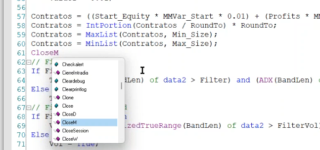
  <figcaption>Figura 157. Variables de tiempo en sh: close_d, close_w, close_m.</figcaption>
</figure>

Eso en un *intradía* te puedes referir a cualquier vela diaria usando esto, y lo mismo para el *high*, para el *low*, para *open*. Yo puedo hacer `open_d`, es el *open* diario. Es decir, todos los cuatro precios están construidos con *arrays*, yo puedo llamarlos o usarlos en el gráfico *intradía*.

Pero la manera más sencilla para que no se hagan muchos problemas es usar esto, el *data 2* en diario. Pero yo podría haber hecho un cálculo diario sin llamarlo, usando casi sin meter el *data 2*, recuerdo sin meter el *data 2*, utilizando estos campos del `close_d`, ejemplo el `close_d` y de lo que era.


**Pautas de precio y rangos**

Y lo mismo para figuras de velas, o sea, *pautas de precio* como hablamos en un *side*, de un *narrow range*. Lo vimos para los *revés*. Todo esto sigue perfectamente aplicable. Yo puedo valorar entrar o no *mean reversion* dependiendo de si el día anterior o los días anteriores hubo mucha tendencia, poca tendencia, mucha volatilidad, poca volatilidad. Y una manera de mirar mucho eso es los *rangos*.

Ya vimos, usando `range`, recordar que *range* es *high* menos *low*, y también los cuerpos de las velas puedes usar que es *open* menos *close* o *close* menos *open*. Esas comparaciones que son las figuras de velas podemos decir, pues de los campos que define a una vela o una barra (*open*, *close*, *high*, *low*), pues te dan juego para definir los rangos.


**Filtrar por horario en Intradía**

Entonces el código tiene esto prácticamente igual. Aquí entra un poco el *tema horario*, una función que calcula la sesión que nosotros definimos:

```sh
# Elección de Horario        
InicioSesion(0),    # Inicio sesión de trading
FinSesion(2300),    # Fin sesión de trading

if estamosEnSesion(InicioSesion, FinSesion) then
```

Nuestro horario que decimos abrir posición. Esto en el *intradía*, como os decía, es bastante habitual y casi obligatorio. Casi obligatorio para un *intradía* puro.

Es verdad que si vamos sobre todo pensando en *breakout*, y en *breakout* sea *Opening Range Breakout* o ahora *mean reversion* que es un poco el lado contrario, ya vamos. En tendencia pura es más complicado, no digo que no se pueda, pero es un poco más complicado. Porque al final en una tendencia pura, que al final va a ser casi un *swing*, yo puedo estar varios días comprado que se entran, y entonces la hora que compre no es tan importante.

Al final, donde es importante filtrarle el horario, sobre todo si yo no voy a estar dentro del mercado demasiado tiempo. Entonces yo quiero maximizar mis oportunidades, y por lo tanto es muy claro que los mercados tienen *estacionalidad* en todos los mensuales, diarios. Y por supuesto diarios suelen tener ciertas pautas de comportamiento que pueden utilizarse para maximizar mis entradas.

Es decir, yo sé que el mercado habitualmente hay unas horas que suele estar tranquilo, pues a lo mejor a mí para esas horas no me sirven para operar. O si me sirven para *mean reversion*, que hay que jugar un poco con ello y analizarlo, y también por supuesto vía optimización.


**El código con horario**

Entiendo que este código, Alberto, está preparado para optimizar el horario, ¿no? Porque bueno, para utilizar tiene su particularidad. Pero al final este código respecto al otro, lo que decía, plantea básicamente esta diferencia: tiene aquí un código, tiene una función que le habilita para operar en caso de que esté dentro de su horario. Si no, pues no puede abrir:

```sh
Inputs: Allow_Long(True),
        Allow_Short(True),

if estamosEnSesion(InicioSesion, FinSesion) then
begin

    { Long entries and Exits }
    If Allow_Long then begin
        # Si cruza por encima de la banda inferior entra largo
        If Close cross over LoBand and MarketPosition <> 1 and Trend and Vol then
            Buy Contratos shares next bar at Market;
        
        # Take Profit en la banda de Bollinger contraria
        if salidaBanda and marketposition <> -1 then
            Sell ("BollExitLng") next bar at HiBand limit;
    End;
    
    { Short entries and Exits }
    If Allow_Short then begin
        # Si cruza por debajo de la barra superior entra corto
        If Close cross under HiBand and MarketPosition <> -1 and Trend and Vol then
            SellShort Contratos shares next bar at Market;
        # Take Profit en la banda de Bollinger contraria
        if salidaBanda and marketposition <> 1 then
            BuytoCover ("BollExitShrt") next bar at LoBand limit;
    End;
end;
```

Además también tenemos el `Allow_Long` al uso, que no lo he explicado antes, pero tenemos un *true* o *false* para decir solo largos, solo cortos, si quisiera para trabajar un lado solo. Y además, bueno, tiene lo que tenía el otro, la misma entrada.

Aquí `If Close cross over LoBand` ya directamente hemos planteado solo el cruce. Se puede meter el *MRO* para usar más de un día. Al final el *MRO* recordar que lo único que hace es que puedo evaluar varias velas que estén por debajo. Lo hemos dejado así para que veáis la otra manera directa.

***Este es el cruce más típico, de la manera de entrar más típica de Bollinger en antitendencia es esta***: que el cierre cruce para arriba la banda de abajo, en ese caso yo voy largo, y que cruce para abajo la banda de arriba, en ese caso voy corto. Además tengo los filtros `Trend` y `Vol` que ya habéis visto antes, que hemos jugado un poco con ellos. Y poco más.

La salida original que tenía el otro sistema, bueno, esta no es la original original Alberto, esta es una variación que tenían ellos. Te la voy a copiar:

```sh
{ Long and short trailing stop }
MP = MarketPosition;

if salidaoriginal then
begin
    If MP = 1 and Barssinceentry = 0 then
        StopPrice = Low - 2*Average(Range, BandLen);
    If MP = -1 and Barssinceentry = 0 then
        StopPrice = High + 2*Average(Range, BandLen);
        
    If MP = 1 and Low < StopPrice then
        Sell ("Stop_Long") next bar at market;
    If MP = -1 and High > StopPrice then
        BuytoCover ("Stop_Short") next bar at market;
end;
```

Lo mismo, salida por *stop* y *TP*, no *trailing*, con *ATR*, no *TR*, en porcentaje, que este módulo pues ya lo habéis visto en muchos códigos:

```sh
# Salida por stop y TP no trailing
SetStopShare; # Autostops van por acción

If UsoATR Then
Begin # Stops y TP usan el ATR
    If marketposition <> 0 then { establecemos target y stop cuando hay posición abierta }
    begin
        if Prc_Stop > 0 then
            SetStopLoss(ATR * Prc_Stop / 100 * Bigpointvalue);
        
        if Prc_Profit > 0 then
            SetProfitTarget(ATR * Prc_Profit / 100 * Bigpointvalue);
        
    end else { establecemos target y stop para la barra de entrada }
    begin
        if Prc_Stop > 0 then
            SetStopLoss(ATR * Prc_Stop / 100 * Bigpointvalue);
        
        if Prc_Profit > 0 then
            SetProfitTarget(ATR * Prc_Profit / 100 * Bigpointvalue);
    end;

end Else
Begin # Stops y profit no usan ATR
    if marketposition <> 0 then { establecemos target y stop cuando hay posición abierta }
    begin
        if Prc_Stop > 0 then
            SetStopLoss(EntryPrice * Prc_Stop / 100 * Bigpointvalue);
        
        if Prc_Profit > 0 then
            SetProfitTarget(EntryPrice * Prc_Profit / 100 * Bigpointvalue);
        
    end else { establecemos target y stop para la barra de entrada }
    begin
        if Prc_Stop > 0 then
            SetStopLoss(Close * Prc_Stop / 100 * Bigpointvalue);
        
        if Prc_Profit > 0 then
            SetProfitTarget(Close * Prc_Profit / 100 * Bigpointvalue);
    end;
End;
```

---

## Optimización en MultiCharts

Vamos a ver qué tenemos por aquí, todavía estamos cargando. Bueno pues nada...

Bueno, tengo este abierto aquí. De momento vamos a trabajar previamente este que ya lo habéis visto:

<figure>
  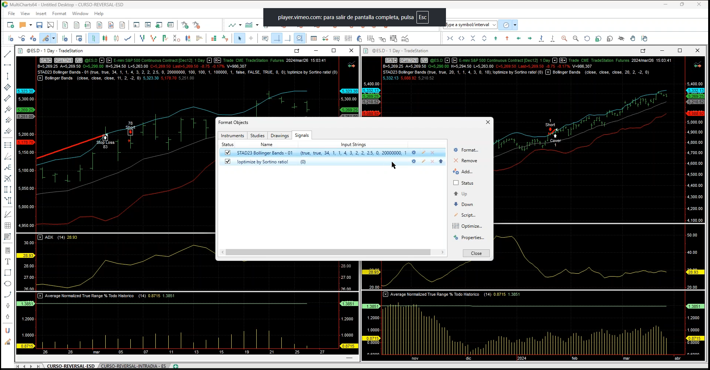
  <figcaption>Figura 158. Sistema cargado en MultiCharts.</figcaption>
</figure>

La única gracia que tiene *MultiCharts* es que es bastante más rápido de optimizar, y es verdad que para hacer pequeñas pruebas así a nivel de *evaluación preliminar* viene bien.

A mí no me gusta que no tenga la *Out of Sample*, no me gusta. Es decir, que no te permita dejar a *Out of Sample* como te deja *TradeStation* a sacar los datos ahí en tres hojas. Me gusta mucho esa metodología. Y aquí pues no te permite, lo tienes que hacer tú aparte. Entonces su poco es un poco más rollo.

Bueno, sí que te permite hacer luego el *Walk Forward* y la *matrix*, pero en una regular, si ya puedo hacer este cual *forward* y al final pues no deja de ser... Si lo depende cómo lo configure pues no puedo dejar una especie de optimización normal. Pero estaría bien aquí que te dejara poner *Out of Sample*. Luego también tienes la *matrix*, la más compleja.

Aquí es donde Alberto ha optimizado antes, a menos de esto creo. Y esto sigue, sí sí sí, esto sigue. Eso sí, paciencia:

<figure>
  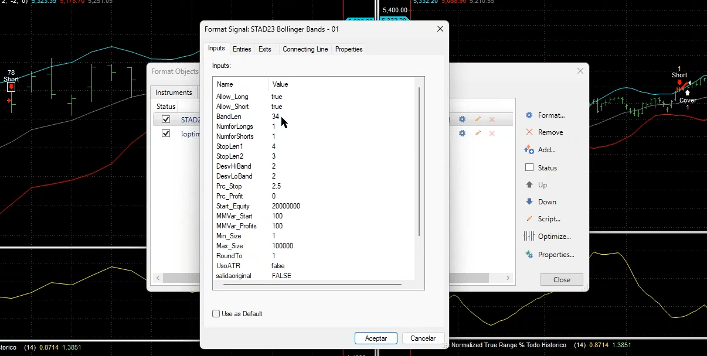
  <figcaption>Figura 159. Optimización en proceso.</figcaption>
</figure>

¿Aquí qué tenemos puesto? El 1, control, control, control, de 4 es el de 4. Es un poco largo, ¿no lo has probado en 14? A ver, *false*, *true* por el 0, 0, 0, y filtro *stop* te ha salido 2 y medio, se ha optimizado:

<figure>
  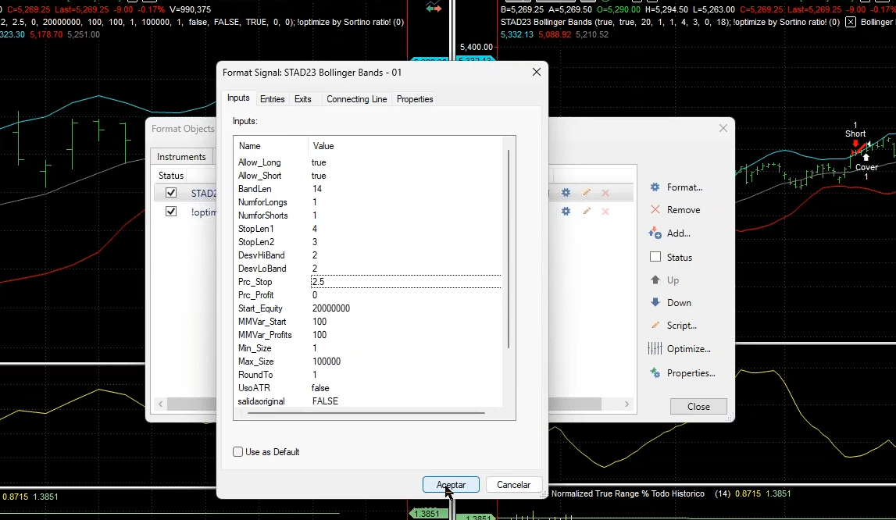
  <figcaption>Figura 160. Resultado de optimización con stop 2.5.</figcaption>
</figure>

Vamos a ver qué nos da. Y en dos y medio, cuidado que nos ha metido un corto ayer, ya que nos ha metido un corto ayer y va bien también. Que es decir, en la barra, espera que aclare porque no me carga por eso, abierto, se ha muerto, está por aquí:

<div style="display: flex; flex-wrap: wrap; gap: 10px; justify-content: center;">
  <figure style="margin: 0; flex: 0 0 48%;">
    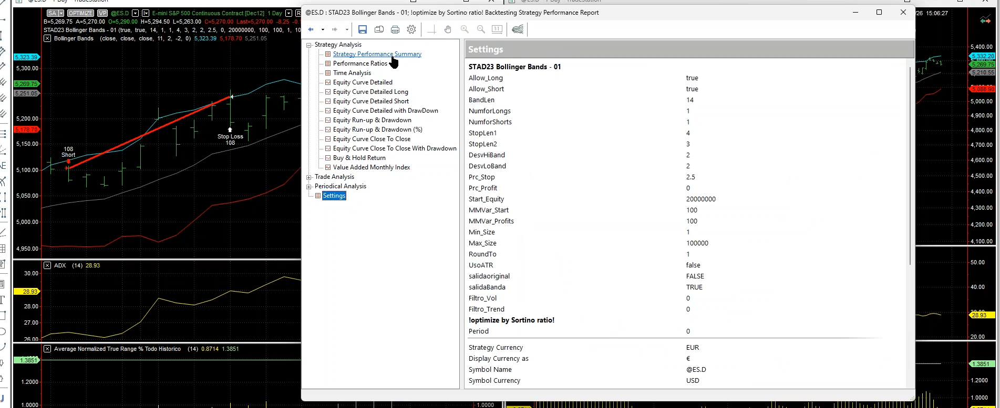
    <figcaption>Figura 161. Posición corta abierta ayer.</figcaption>
  </figure>
  <figure style="margin: 0; flex: 0 0 48%;">
    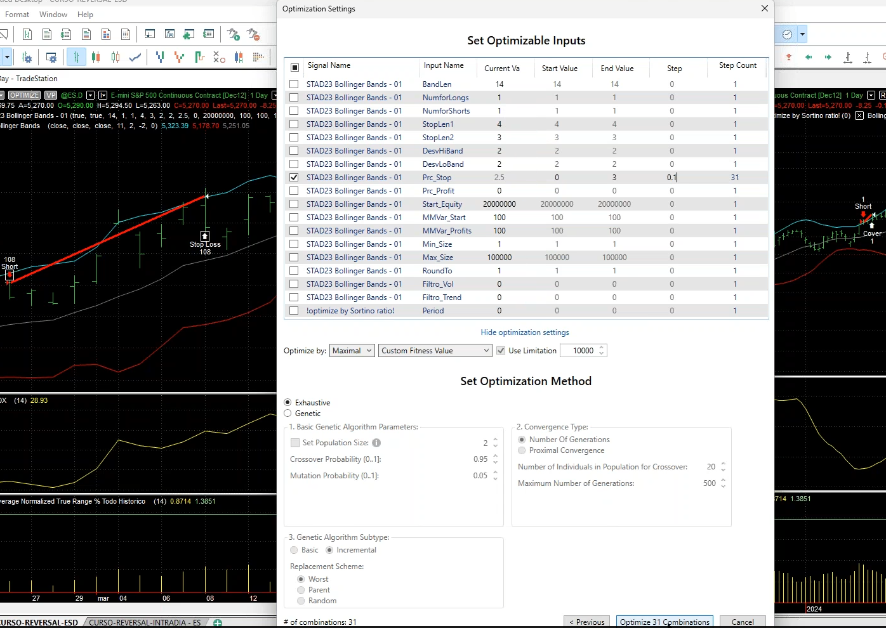
    <figcaption>Figura 162. Detalle del trade.</figcaption>
  </figure>
</div>


**Análisis de zonas**

Esto bueno, esto como veis no lo quiero mucho. Hay una zona donde parece rendir algo que es muy poco:

<figure>
  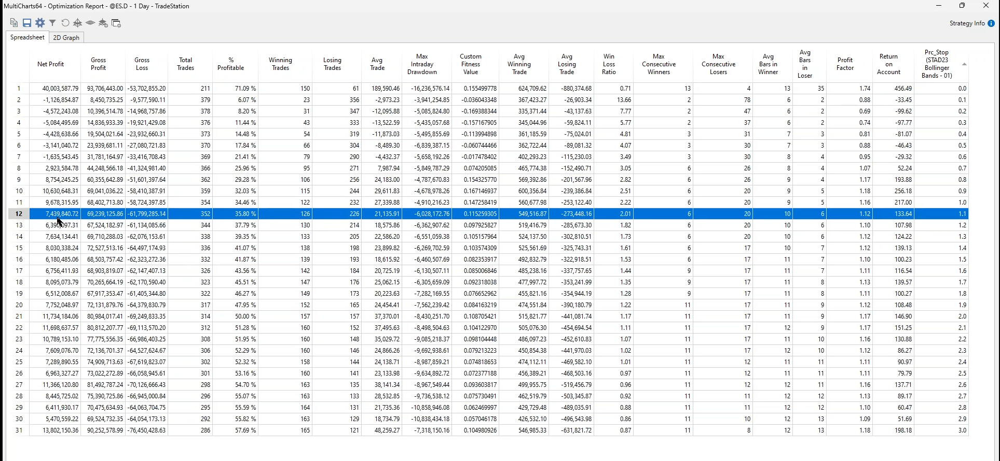
  <figcaption>Figura 163. Zona con rendimiento marginal.</figcaption>
</figure>

Pero bueno, recordar que está por defecto, el por defecto no es porque es 20. De hecho porque le he puesto 14, bueno por la costumbre de los indicadores:

<figure>
  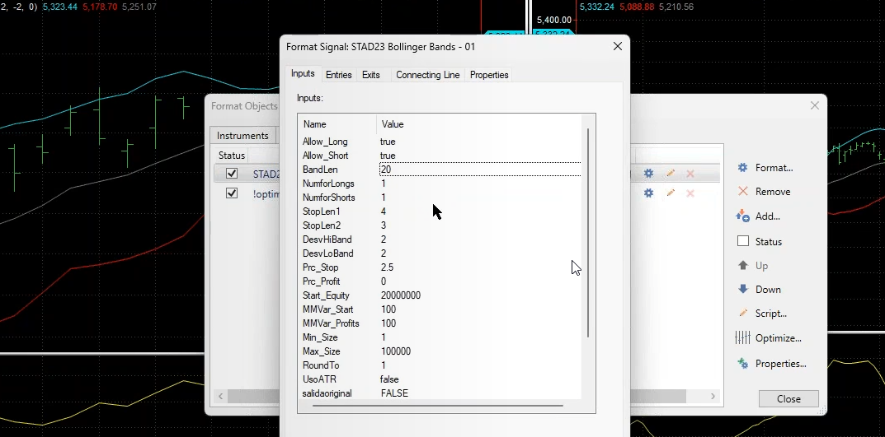
  <figcaption>Figura 164. Configuración con periodo 14.</figcaption>
</figure>

Probablemente por defecto *Bollinger* es 20, por defecto *Bollinger* es 20. Así que vamos a ver ahora, parecido, parecido, parecido:

<figure>
  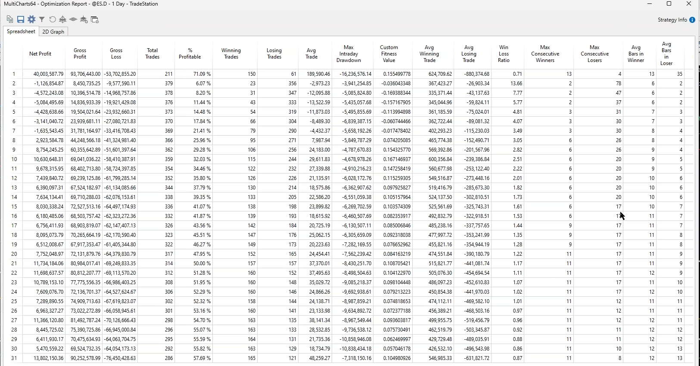
  <figcaption>Figura 165. Resultados con periodo 20.</figcaption>
</figure>

Así que aquí pues bueno, quizá tener algún que tan cercano pero que pida tener una zona. Es lo que decía: el mapa pues al final tú lo ves un poco ahí, lo mismo que verlo así:

<figure>
  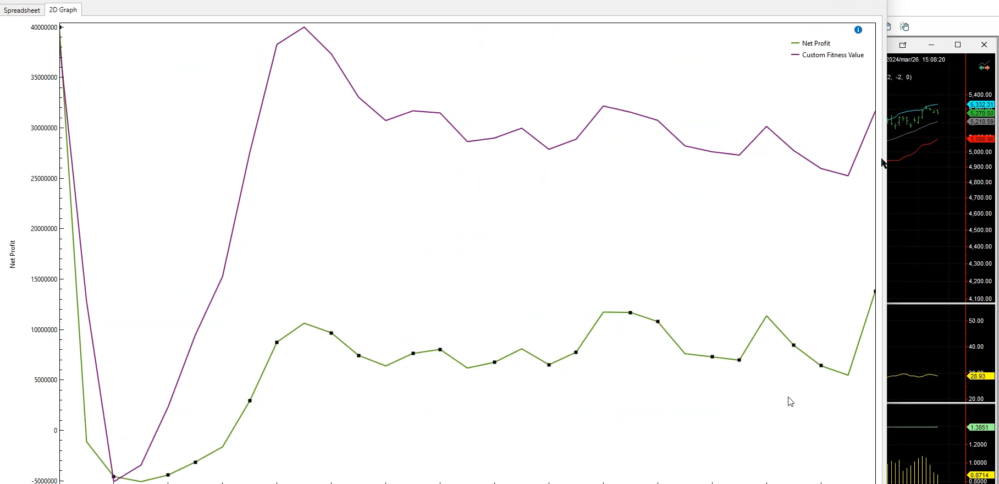
  <figcaption>Figura 166. Visualización del mapa de optimización.</figcaption>
</figure>

En una zona donde es bastante estable y tiene una cierta componente de actuación bastante alto porque mete muchas más operaciones. Entonces bueno, podías dejarlo por aquí, habría que verlo en esas dos zonas, podría a lo mejor trabajar un poquito el nivel esto de la zona del 2:

<figure>
  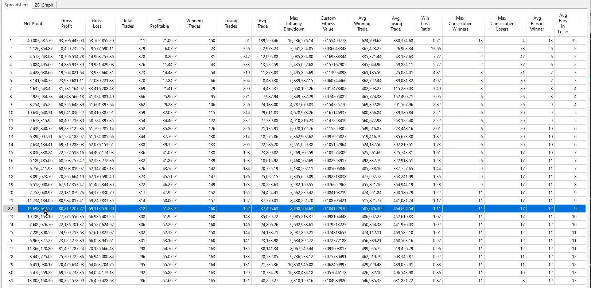
  <figcaption>Figura 167. Zona 2 identificada para análisis.</figcaption>
</figure>


**Probando el filtro de volatilidad**

Bueno, aquí empezamos a filtrar, a filtrar, a filtrar:

<figure>
  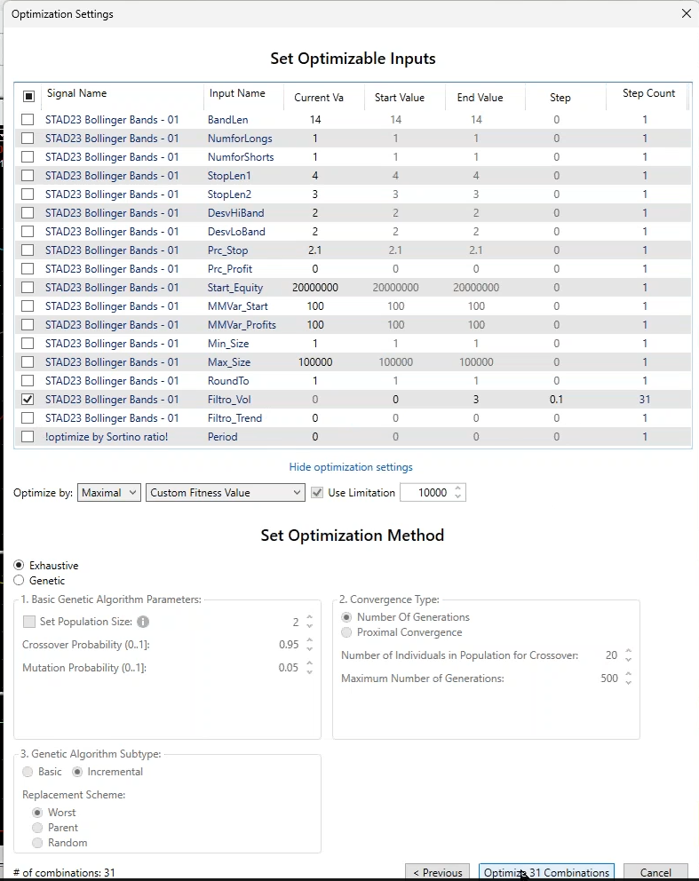
  <figcaption>Figura 169. Aplicando filtro de volatilidad.</figcaption>
</figure>

Y bueno, pues sí que parece. No, pero filtra mucho el *trade*, muchísimo:

<figure>
  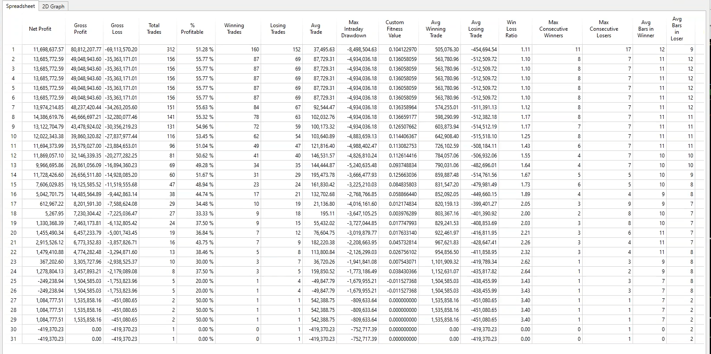
  <figcaption>Figura 170. Reducción excesiva de trades con el filtro.</figcaption>
</figure>

Quizá aquí sí que igual valdría la pena explorarlo sin añadirle la segunda condición. Estamos todo el rato con 13 y de *fitness* que nos ha dado más. Mira, 0.13-6. 0.13-6 me gusta más que *Sortino*, 0.13-6.

Y aquí el *Bolo*, ahora se lo voy a quitar:

<div style="display: flex; flex-wrap: wrap; gap: 10px; justify-content: center;">
  <figure style="margin: 0; flex: 0 0 48%;">
    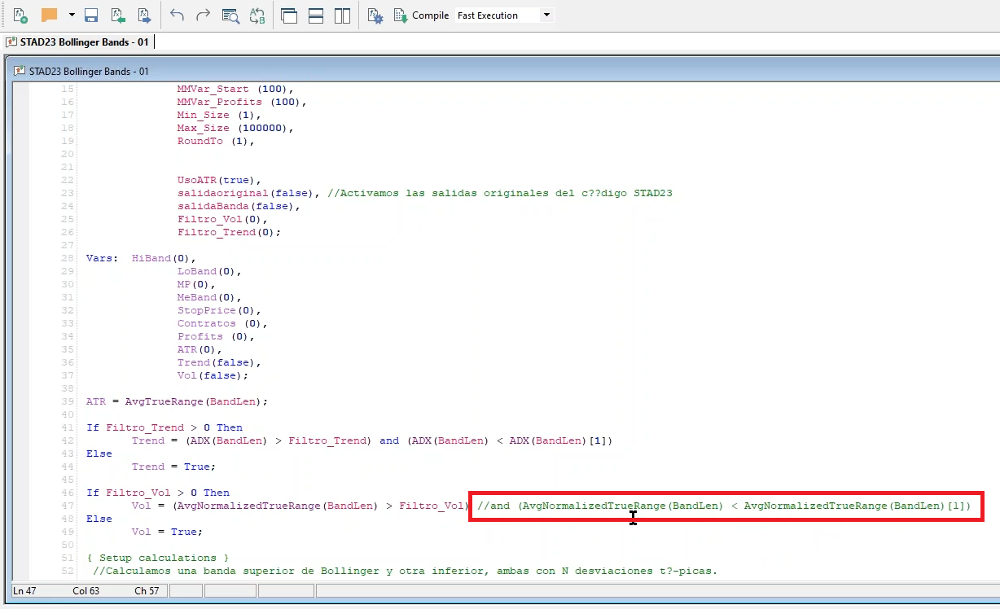
    <figcaption>Figura 171. Quitando segunda condición.</figcaption>
  </figure>
  <figure style="margin: 0; flex: 0 0 48%;">
    
    <figcaption>Figura 169. Resultado sin segunda condición.</figcaption>
  </figure>
</div>

Entonces no, lo que he hecho es quitar este segundo componente, porque volatilidad es donde nada, que sí que le veo más. Aquí tengo bastantes dudas, tengo bastantes dudas, y creo que aquí puede ser que vaya más en bruto. Entonces ahora vamos a ver. Igual mismo filtro, antes tan 0.13-6, parecido, muy parecido, algo mejor parece. Era 0.3 o 0.11, pues era mejor pero filtra menos. Es que de la otra manera me filtra mucho para mi gusto, demasiado, y más en un diario:

<figure>
  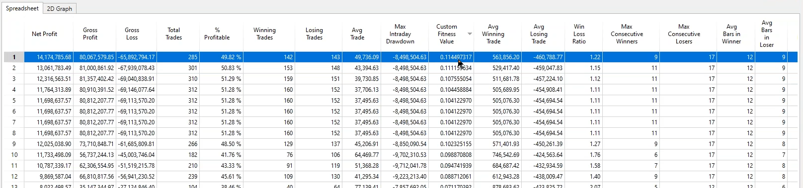
  <figcaption>Figura 172. Comparativa de resultados con diferentes configuraciones.</figcaption>
</figure>

Pero sí que aquí ves que consigue algo menos, algo mejor el resultado, aunque tiene el peor *Sortino*:

<figure>
  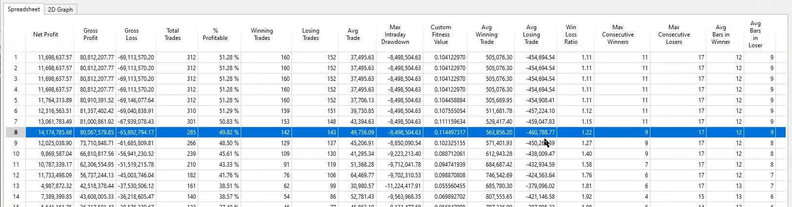
  <figcaption>Figura 173. Análisis de métricas: mejor resultado pero peor Sortino.</figcaption>
</figure>

Pero aquí sí que parece el *trade* un poco aquí. No sigue siendo bastante justita la cosa. Pero bueno, está algo mejor. Sufre mucho en esta primera parte hasta el 2008 en el lado largo, luego pues ya va mejor, simplemente aguanta. Me pasa que en el corto tampoco acaba de aprovecharlo del todo:

<div style="display: flex; flex-wrap: wrap; gap: 10px; justify-content: center;">
  <figure style="margin: 0; flex: 0 0 31%;">
    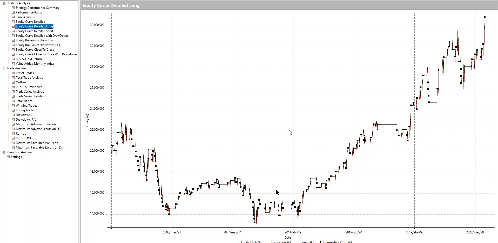
    <figcaption>Figura 174. Curva de equity.</figcaption>
  </figure>
  <figure style="margin: 0; flex: 0 0 31%;">
    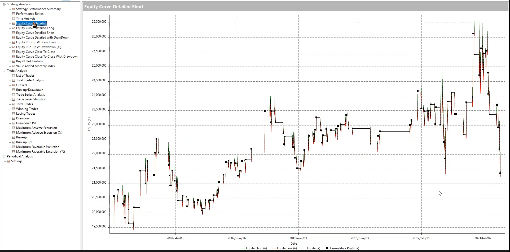
    <figcaption>Figura 175. Lado largo vs corto.</figcaption>
  </figure>
  <figure style="margin: 0; flex: 0 0 31%;">
    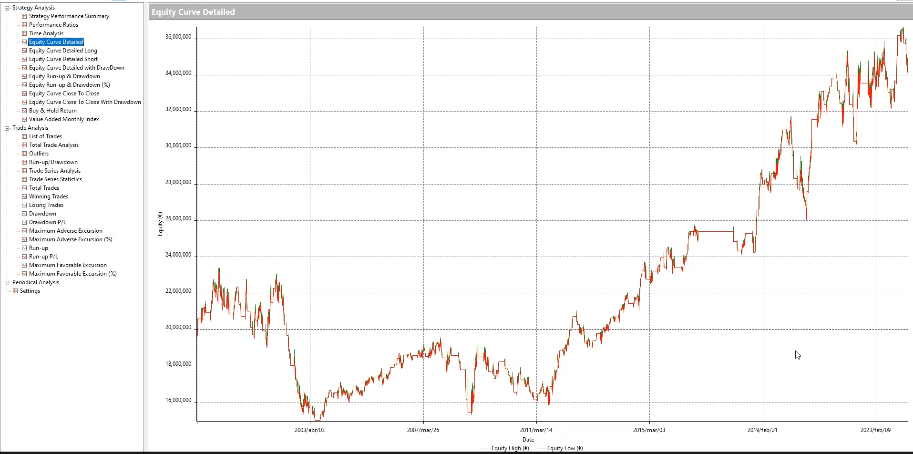
    <figcaption>Figura 176. Detalle de performance.</figcaption>
  </figure>
</div>


**Versión Intradía**

A ver si me ha cargado esto. Bueno, ya ha cargado, perfecto. Pero si al menos podemos darle un vistazo rápido, y que sea ni que sea, tenemos un vistazo rápido aquí a la versión del lado de *intradía*:

<div style="display: flex; flex-wrap: wrap; gap: 10px; justify-content: center;">
  <figure style="margin: 0; flex: 0 0 31%;">
    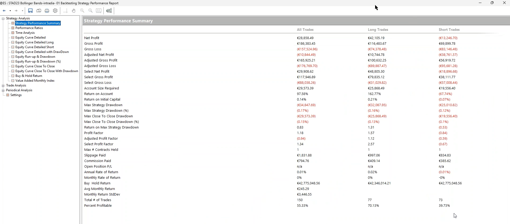
    <figcaption>Figura 177. Versión intradía.</figcaption>
  </figure>
  <figure style="margin: 0; flex: 0 0 31%;">
    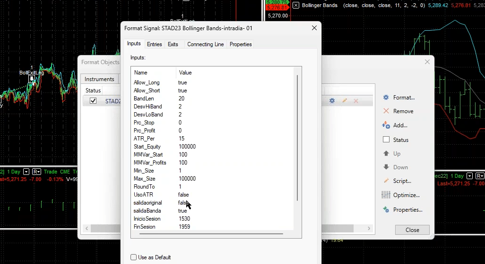
    <figcaption>Figura 178. Configuración.</figcaption>
  </figure>
  <figure style="margin: 0; flex: 0 0 31%;">
    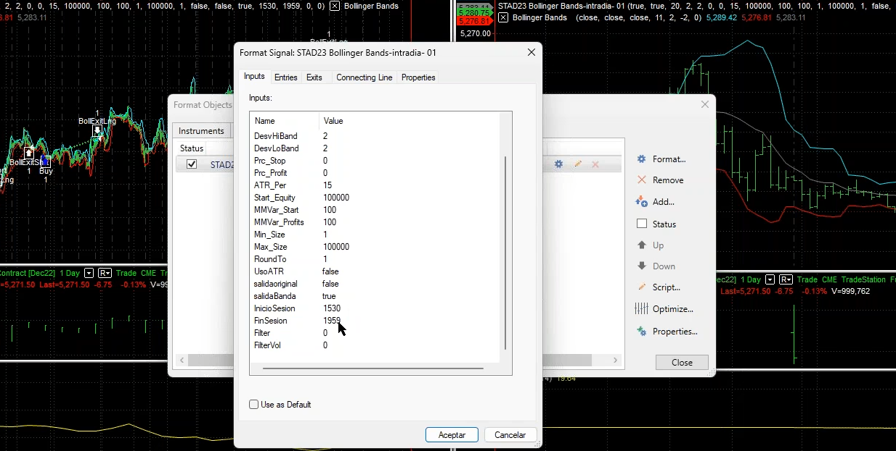
    <figcaption>Figura 179. Resultado.</figcaption>
  </figure>
</div>

Entonces aquí, bueno, ya el código es lo enseñado antes. Aquí simplemente tenemos este, ese por un lado pasando parecido al otro. Si os habéis fijado, a lo mejor tiene alguna función mal o algo, pero 0 sin esto para terrín 15 por sols y banda *true* y las horas 15 38 te ha quedado. Es que no se guarda las *optis* aquí tío. A ver si lo puedo abrir aquí, era este, ahora que acabó el otro, a ver si se abre este, aquí. Aquí sé que tengo la base de datos creo ya bajada:

<figure>
  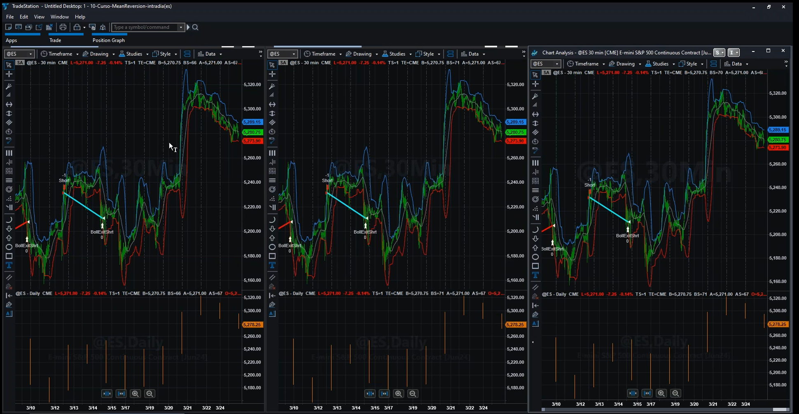
  <figcaption>Figura 180. Carga de base de datos.</figcaption>
</figure>

Es que yo creo que tenemos algo mal, tenemos a lo mejor el bueno. La primera parte también va justo, pero no da lo mismo.

**Chart 1:**

<div style="display: flex; flex-wrap: wrap; gap: 10px; justify-content: center;">
  <figure style="margin: 0; flex: 0 0 31%;">
    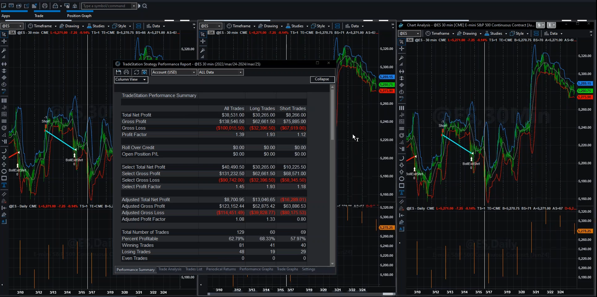
    <figcaption>Figura 181. Chart 1 - Vista general.</figcaption>
  </figure>
  <figure style="margin: 0; flex: 0 0 31%;">
    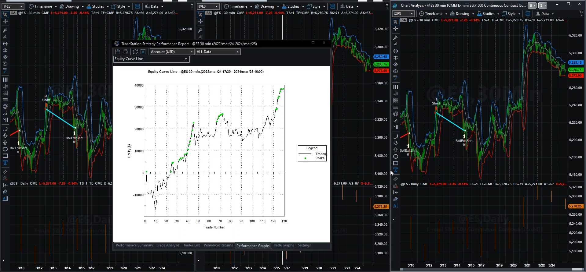
    <figcaption>Figura 182. Chart 1 - Detalle.</figcaption>
  </figure>
  <figure style="margin: 0; flex: 0 0 31%;">
    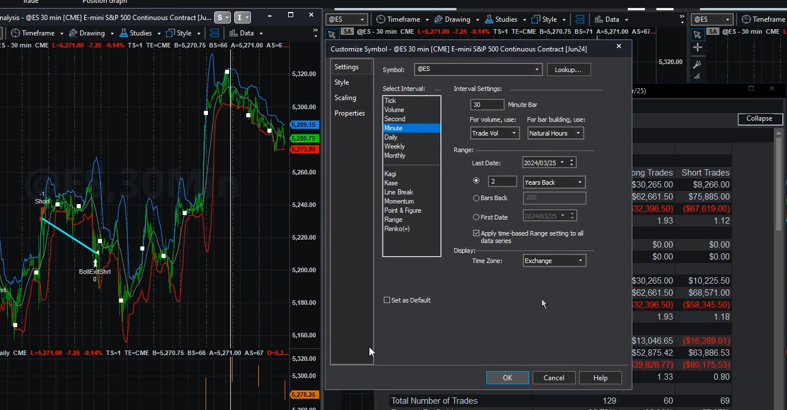
    <figcaption>Figura 183. Chart 1 - Trades.</figcaption>
  </figure>
</div>

Puede ser que la función del tiempo no es igual, o que no le hayas metido *change*. Acuérdate que las funciones de tiempo son bastante sensibles a eso, que no sé que el *local* o algo no está en el *change*. Bueno, ya lo miraremos. Porque la gracia de *MultiCharts* porque lo puedes ver separado, lo puedes ver.

**Chart 2:**

Lo aquí tenemos 123, está muy filtrado, son 10 años, últimos 10 años están todos los casos muy, muy filtrado, es el mismo:

<figure>
  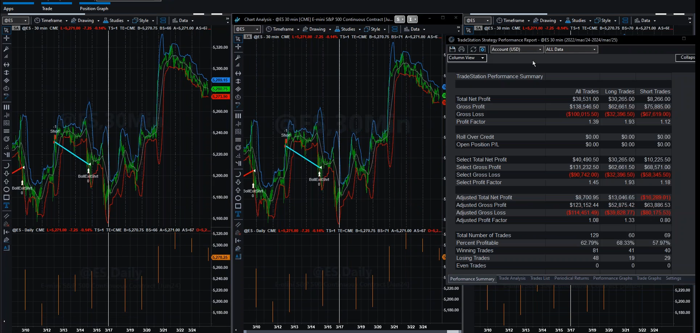
  <figcaption>Figura 184. Chart 2 - 123 trades en 10 años (muy filtrado).</figcaption>
</figure>

Los tres tengo el mismo, pero los tres:

  <figure style="margin: 0; flex: 0 0 31%;">
    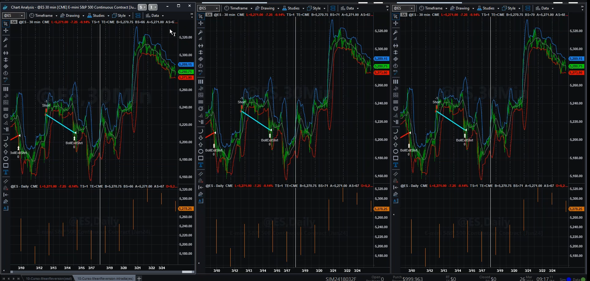
    <figcaption>Figura 185. Comparativa charts.</figcaption>
  </figure>
  <figure style="margin: 0; flex: 0 0 31%;">
    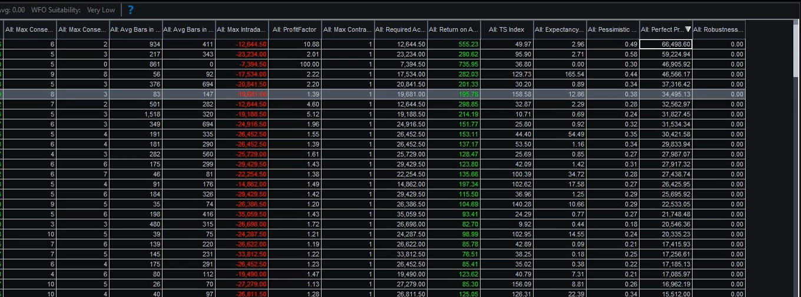
    <figcaption>Figura 186. Sesión configurada.</figcaption>
  </figure>
  <figure style="margin: 0; flex: 0 0 31%;">
    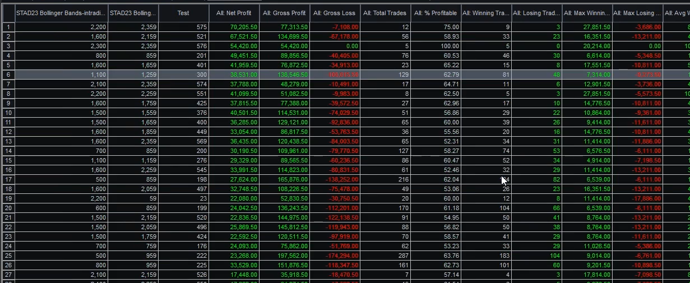
    <figcaption>Figura 187. Detalle de filtro horario.</figcaption>
  </figure>

Si aquí tienes la hora que has utilizado, la sesión. Pues no filtra, filtra mucho. Que mirar un poquito más de histórico, haría que mirar un poquito más histórico porque tenemos muy pocos *trades*.


## Pregunta: Optimizar Timeframe

***Prueba de estrés***

Y bueno, vamos a ir. Preguntaba José por el tema de optimizar el *timeframe*. No, no me consta que haya una forma ni sencilla ni complicada. Se me ocurre de hacerlo, ni en uno ni en otro. No Alberto, el *MultiCharts* tampoco, no se me ocurre optimizarlo directamente. Sí creo que *Ninja* tiene esa capacidad.

Bueno, es una herramienta más, puede estar bien, no digo que no, tampoco me volvería loco con ellos. Lo que te digo, al final utilizando pues es lo que hablamos siempre: más riesgo de todo, no. Pero me gusta, me gusta más como *prueba de estrés*. Como *prueba de estrés* lo veo bastante bueno.

De hecho me gusta mucho probar a mejor barras parecidas, ¿sabes?, un al lado y tal, y ir viendo a ver cómo degrada el sistema. Igual que haces un mapa de optimización de los parámetros, pues lo mismo en el *timeframe*. Como prueba de estrés me gusta bastante más que el hecho de optimizar a ver cuál va mejor. Como prueba de estrés sí que le veo bastante potencial.


**Material a subir**

Y bueno, a ver, a lo largo de la semana tratamos de daros los códigos. Os voy a subir todo el *STAD*, *STAD* lo pondré ahí todo como material enterito. A ver cómo lo subo porque es un montonazo de documentos, pero os subiremos en material todo el código del *STAD*. Bueno, este lo subiré con él con el que volen que y tal. Entonces *paper Bollinger*, o sea el *paper Trading* y todo, todo el PDF. Bueno, ya va a punto PDF *Bollinger*. Y hasta luego lo que nos había pedido por ahí que lo crea José, también en el disco hay que mirarlo a ver qué faltaba y demás.


**Próximos pasos**

Y entonces veremos la semana que viene, trataremos de acabar este, bueno de acabarlo, de dejarlo un poquito más maqueados, con alguna combinación más aprovechable. Solamente le haremos alguna optimización y demás poco más seria más que esto. Esto que hemos hecho encaja en la ***evaluación preliminar***, por el poquito de mirar, investigar de cientos activos tal, pero por donde se mueve, probar filtros, probar horario que ahora no hemos podido mucho, y a partir de ahí quedaría pues ya evaluarlo un poco mejor.

<div style="border-left: 4px solid #e74c3c; background: #fdf2f2; padding: 10px 15px; margin: 10px 0; border-radius: 8px;">
  <strong>⚠️ Conclusión: Intradía necesita filtros</strong><br><br>
  Pero sobre todo al <em>intradía</em>, faltan filtros. En los diarios sí que algo se puede filtrar, pero no filtraría mucho más. Aquí sí que hay que trabajar mejor los filtros, probablemente añadiendo alguno como se decía de pauta de precio, alguna de pauta de precio que identifique un poco las <em>contracciones y expansiones</em>. Porque al final en <em>intradía</em> es lo que os explicaba: hay que buscar maximizar un poquito las oportunidades.
</div>

Y que aquí parece que está yendo bastante bien, pero a nivel de salidas pues en alguna *enganchada* que no está mal. Por ejemplo hay que ver cómo conseguimos solucionar estas *enganchaditas*. Pues esta es la típica entrada:

<figure>
  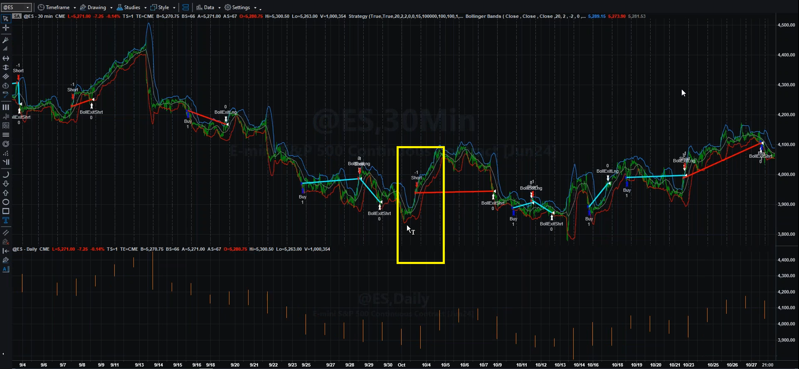
  <figcaption>Figura 188. Entrada típica que debería evitarse: viene con incremento de volatilidad.</figcaption>
</figure>

De entrada que deberías evitar, que parece que viene con incremento de volatilidad, es lo que os decía, es esta. Este es el típico comportamiento que a veces no funciona. Vez tras esto, normalmente hay tendencia. Pero aquí fíjate, tras esto normalmente contracción y en cambio de tendencia, se la pega.

Que nunca, que nunca hay garantías. Nunca hay garantías, siempre es una parte contraria. Pero bueno, ya digo, más veces después de contracción y expansión y viceversa. Es un poco lo que hay que jugar:

<figure>
  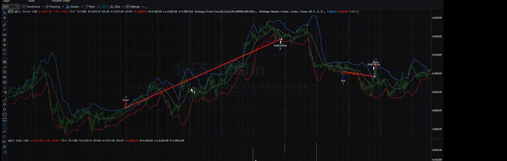
  <figcaption>Figura 192. Patrón contracción-expansión.</figcaption>
</figure>

Porque aquí no sé si al final tenemos *stop*, pero aquí hay que conseguir algún *stop* un poco más eficaz:

<div style="display: flex; flex-wrap: wrap; gap: 10px; justify-content: center;">
  <figure style="margin: 0; flex: 0 0 48%;">
    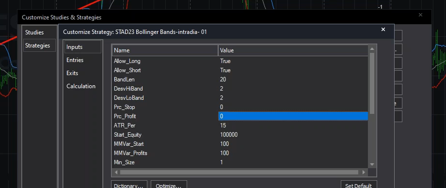
    <figcaption>Figura 190. Trade sin stop.</figcaption>
  </figure>
  <figure style="margin: 0; flex: 0 0 48%;">
    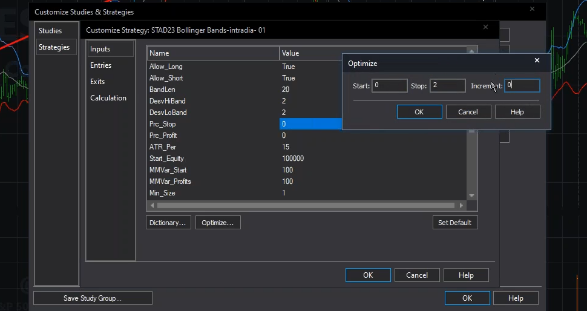
    <figcaption>Figura 191. Enganchada por falta de stop.</figcaption>
  </figure>
</div>

Aquí no hay *stop* todavía no, no hay *stop*. Aquí seguramente a lo mejor un simple *stop* ya nos mejora un poquito la cosa, y se queda ya más apañado.

Porque realmente, claro, sigue teniendo el problema de las *enganchadas*. Pero es aquí, ya os digo, habría que definir zona horaria, habría que trabajar algún filtro. Por supuesto bajar a un *stop* sería un poquito en lo que quedaría en el *intradía*. Y yo creo que podemos conseguir algún *setup mean reversion* bastante aprovechable partiendo de *Bollinger Bands*.


**Bollinger Tendencial: el lado contrario**

Entonces enseñaremos lo que hayamos conseguido de cara al día siguiente y le daremos la vuelta. Porque esto sí que lo dije en la teoría: le daremos el *Bollinger Bands tendencial*, haremos el lado totalmente contrario.

Idealmente, pero no sé si podremos, será combinarlos para ver un poquito el qué tal trabajo hacen junto: un sistema partiendo del mismo indicador pero utilizando pues exactamente una operativa casi, casi no, totalmente contraria. Entonces ahí, si lo consigues en otro activo, podéis ver que puede ser una *diversificación* bastante aceptable. Solamente dos estrategias, pero hay que primero conseguir esta y luego conseguir la tendencial.


**Despedida**

Pues nada más. No veo más preguntas, no tengo nada marcado, ¿verdad Alberto? Donde a la última se comenta que sí que utiliza la utilización del también para la prueba de estrés, pero también para ver dónde va mejor. Bueno, ya te digo, si no, no hombre, entiendo que al final es una información que te puede servir, pero tendría que mirarlo poco con calma. Pero para ver en qué tipo va mejor está bien, está bien, lo veo no lo veo mal también.

Pues nada más familia. Hasta en principio el martes que viene. Os veo, a ver que pongo la caraturita para que quede así grabado más chachi. Y por mi parte nada más. ¡Hasta pronto, chao!

<div style="border-left: 4px solid #9b59b6; background: #f5eef8; padding: 10px 15px; margin: 10px 0; border-radius: 8px;">
  <strong>📋 Resumen de la sesión: Bollinger Bands Antitendencial</strong><br><br>
  <table>
    <tr>
      <th>Aspecto</th>
      <th>Diario</th>
      <th>Intradía</th>
    </tr>
    <tr>
      <td><strong>Filtro ADX</strong></td>
      <td>Aporta ligeramente</td>
      <td>Necesario, mejor "mayor que" + bajando</td>
    </tr>
    <tr>
      <td><strong>Filtro Volatilidad</strong></td>
      <td>Opcional</td>
      <td>Imprescindible</td>
    </tr>
    <tr>
      <td><strong>Filtro Horario</strong></td>
      <td>No aplica</td>
      <td>Casi obligatorio</td>
    </tr>
    <tr>
      <td><strong>Stop</strong></td>
      <td>Añade poco</td>
      <td>Necesario para evitar enganchadas</td>
    </tr>
    <tr>
      <td><strong>Problema principal</strong></td>
      <td>Sufre hasta 2008</td>
      <td>Enganchadas sin salida</td>
    </tr>
    <tr>
      <td><strong>Próximos pasos</strong></td>
      <td>Optimización seria</td>
      <td>Filtros de pautas de precio</td>
    </tr>
  </table>
  <br>
  <strong>Pendiente:</strong> Desarrollar versión tendencial (lado contrario) para combinar ambas estrategias y lograr diversificación.
</div>