**Consultas Pendientes**

***Una pequeña duda con respecto a cuándo un filtro se puede considerar bueno. En la última sesión cuando se está trabando con la estrategia de BB se añade un filtro de stop que reduce las operaciones de 5400 a 2100 y comenta Sergi que el filtro aporta. Pero si nos fijamos por ejemplo en el PF, pasa de 0,95 a 1,05, lo cual no parece demasiado; sobre todo teniendo en cuenta que se eliminan más de la mitad de los trades. Realmente aporta el filtro? Es complicado, pero alguna pauta para estandarizar esto? Por ejemplo, si se reduce el nº de trades a la mitad debemos exigirle una mejora de (lo que sea)..***

**Filtros y Pérdida de Trades**

Vale entonces dije que el filtro aportaba, y lo cual no parece demasiado, decía él, se cuestionaba si aportaba. A ver, que el filtro aporte no quiere decir que sea válido para operar, de vuelos decir, cuando digo que aporta todas estas pruebas que hacemos de filtro y demás al final son prácticamente siempre ***evaluaciones preliminares***, entonces decir que aporta no que sea válido porque podría ser que a partir de ahí pues tuvieras que hacer pruebas pruebas adicionales. Todo caso en este caso ejemplo que no recuerdo el filtro concreto que eran y demás, es cierto la mejora es pequeña para la pérdida de trades, aún así te siguen quedando muchos trades, de 2.100 sigue siendo una muestra probablemente muy significativa, pero sí que el filtro aporta poco, es cierto, el filtro aporta poco, vale, no no diría que que aporta mucho, ya digo no recuerdo el caso el caso pero esa frase que comentas al final es cierta y te la compro, es decir si se reduce el número de trades a la mitad lo que quieres es una regla objetiva porque ya nos conocemos y lo entiendo no, entiendo porque es como debe ser, pero a este nivel no la hay, no hay una regla tan objetiva para decir tanto número de trades nos aporta, pero el *sentido común* es bastante útil y tú lo tienes y es cierto lo que ya has dicho, es verdad, es decir me pierde la mitad de trades y me mejora tan poco, no aporta mucho, vale, pero bueno habría que seguir investigando.

**salidas**

El hecho de que lo que quiero dejar claro es que el hecho de que diga yo que aporta no quiere decir que el sistema es operable, vale, decir al final para operar, para operar seguramente hacían falta otras otras cosas que más. Ya os adelanto que la siguiente clase que por cierto tengo ponencia en Robot Trader, os invito, os invito a asistir, hablaré de salidas y justamente la clase que viene pues aprovecharemos para trabajar salidas más en profundidad con las seguro que con los sistemas que ya hemos hecho, ya veremos si con alguna otra cosa no, pero seguro que con los que ya hemos hecho, es decir trabajaremos tanto el concepto de filtro, el concepto de salidas, sobre todo salidas, pero puede ser que en algún caso pues de evento que hemos algún filtro y trataremos de ella y hacerlo en sentido que podamos obtener algún código operable por decir ya o que digamos esto esto es operable, vale, eso será el día que viene.

**Consulta de Ríg sobre Uso de Futuros para Backtestear ETFs**

***Tengo una duda que parece obvia, pero prefiero hacer la pregunta. Mi idea es operar ETFs, talvez acciones, pero principalmente ETFs  y en algunos la data es muy limitada, hay algunos que no tienen mas de 4 años, y esto para optimizar creo que se me queda la muestra muy justa así que mi pregunta es… ¿seria correcto utilizar el futuro de un instrumento como muestra INS y usar el periodo que nos da el ETF (4años por ejemplo) como OOS, para después usar estos inputs o zonas en el ETF?, entiendo que habrían temas de programación y de sistema que se deberían de adaptar al ETF pero mi duda es si es una buena practica ¿o es mejor trabajar con lo que tenemos? esta pregunta me surge también porque para optimizar las estrategias de SYO  y OYS, lo haréis de manera parecida ya que en Tradestation no hay CFDs***

que es bastante bastante buena, plantea que si tú por ejemplo en ETFs tienes datos limitados pero tienes el futuro que sí que tiene más, si se puede usar el futuro para para *backtestear* datos del ETF. Sí se puede, vale, de hecho comentas el caso de nuestro caso con los futuros y los CFDs y es cierto, sí se puede, no es lo ideal, bueno sería mejor poderlo hacer en el en el dato del ETF pero como tú comentas si no hay datos lógicamente es mucho mejor backtestear en el futuro que no backtestear. Esto dices que parece obvio y lo es, estás en lo cierto, es es así, siempre va a ser mejor backtestear en un activo que al final lógicamente está muy correlacionado y a lo mejor podrías en algún caso pues hacer alguna adaptación del imagínate el valor del tick aspectos que puedan tener, si te lo permite el programa o te lo permite la uno puedes construir datos, ahí podías hacer cosas, pero bueno por simplificar si tú tienes un ETF que tiene cuatro años y tienes el futuro que tiene muchos más puedes usar el futuro, puedes usar el futuro y como dices tú dejar fuera de muestra el ETF, también probarlo en el mismo futuro pero también luego probarlo en el etf.

Lógicamente hay que vigilar lo que te decía, temas de tick, incluso tú a nivel de a nivel de programación en este caso que también lo comentas podrías con dos datas poner en, ya luego para la operativa incluso te hablo, es decir coger la señal del futuro que es donde los backtesteado y luego lanzar la orden al ETF, podrías podrías hacerlos, esto hay veces que lo que lo hacemos, es decir utilizar un código, un activo para el backtest y otro para operar, que repito no siempre va a ser, no es lo el escenario absolutamente ideal pero hay veces que no hay otra alternativa me acuerdo, entonces al final si no hay alternativa pues hay que hacerlo, no hay más, siempre va a ser mejor conseguir un buen backtest de una de una base de datos que tenga mucha correlación que no tener.

**Supervisión de Sistemas y Protocolo de Sincronización entre Live y Backtest**

***Supervisión de sistemas: @Sersan opera un fondo en MT4 en darwinex. La supervisión la hace en TS, corriendo los mismos sistemas con los mismos parámetros? (para ver el informe de supervisión via prints de Alberto) O solo corre los sistemas en TS cuando hay alarma en el protocolo de supervisión?***

Y luego a más Rugat te refieres a esto de la supervisión de sistemas es que yo creía que sí que habíamos hablado de ello. A ver decías supervisión de sistemas operamos en algún ex la supervisión la hace entre este son corriendo los mismos sistemas con los mismos parámetros, pregunta si principalmente sí para ver el informe de expresión vía Prince Alberto, sí es correcto, o sólo corre los sistemas de interés y cuando hay alarma en el protocolo de supervisión. No, nosotros los sistemas los tenemos cargados en los dos sitios, siempre están operando y simultáneamente están siempre en TradeStation corriendo a nivel de supervisión de supervisión, y de hecho ya te digo incluso si hay alguna descoordinación entre el live y el backtest el que manda nuestro protocolo, éste es casualmente hoy, que la verdad que pasa muy pocas veces porque con el tiempo más buscando la manera de que de que se repliquen bien, hoy ha habido una una pequeña diferencia, hoy ha habido una pequeña diferencia en la operación y se ha tenido que ajustar, es decir ha salido ha salido una orden en MetaTrader que no ha salido en el futuro entonces esto nosotros lo revertimos, lo revertimos porque el que manda es el futuro del futuro, que ya te digo hay una serie de ajustes en un código y en otro para para tratar de que sean análogos, pero a veces pues pues pasa que no.

Entonces espero ahora que sí, en este caso claro se identifica la orden, claro no no es que la paramos, es que bueno sí, ya digo es algo que pasa muy muy poco, por lo tanto entonces no es algo que pase ni tan solo pasa para que me entiendas cada mes, de acuerdo, es decir puede pasar no sé dos veces al año, dos veces al año puede pasar, una vez al año, sabes decir de este orden en este orden, entonces sí como una época que pasaba un poco más porque ya lo había comentado pero ahora hablamos de este de este momento. Si nos damos cuenta antes que hoy no ha sido así, vale, si nos damos cuenta antes que hoy no ha sido así pues evidentemente se anula si es un orden para abrir, pero en este caso ya digo no nos hemos dado cuenta antes y nos hemos dado cuenta porque se ha ejecutado una orden que no se debería haber ajustado, pues lo que se ha hecho es cerrar la posición sin más, se ha cerrado la posición porque pues había hecho una operativa, una operación incorrecta. Pero repito esto hablamos de una o dos veces al año.

Esto está parcialmente automatizado en darnos cuenta pero tampoco está totalmente automatizado y la solución es el manejo, no hay ningún procedimiento aquí automático para solucionarlo, porque eso que te digo se podría implementar, sí se podía implementar, vale la pena no, vale la pena porque el tiempo de desarrollo luego encima también puede fallar, no vale la pena. Hay que ser *pragmático* y lo que os digo siempre, hay que tener en cuenta el tiempo que dispones, los recursos que tienes sean humanos, sean de tiempo, sea de software, de todo, y aprovecharlos en la mejor manera que puedes, y eso implica como ya os he explicado que hay cosas que se pueden mejorar y siempre va a ser así de hecho, y asumirlo y tratar de mejorarlas, tratar de conseguir más recursos para mejorarlas las que no puedes, etcétera, pero hay que, no todo es perfecto ni idílico porque a lo mejor desarrollarlo de la manera idílica pues supone una cantidad de horas que prefiero dedicar a otra cosa, entonces eso eso es así. Entonces este tipo de fallos tan puntuales se resuelve a maneja, vale.

# Sistema Mean Reversion

**Material Subido: PDFs del Sistema Mean Reversion**

Vamos, vamos con donde nos quedamos. Bueno, a mí me he subido ahí en material, habéis visto en material que subí los dos PDFs, es de que da el de la *intradía*, vale. Todavía no lo tenemos acabado, Alberto, por favor apúntatelo para hacerlo mañana ya sin falta, vale. Ahora ya que tenemos la clase mañana, hacemos ese, ese es *intradía*, y si yo lo dejaría hecho aunque luego, por ejemplo, porque si el *Mean Reversion* 03, el *Mean Reversion intradía* que ahora de hecho vamos a enseñar, falta hacer el PDF. Sí, sí, ves, ahí el viernes estuve yo haciendo estos dos y los subí ahí al disco, el uno y el dos los subí. Entonces ya queda el 3, queda el 3, y ahora vamos de hecho a enseñarlo brevemente, comentar alguna cosita respecto a él, vale, pero faltaría de esa clase, faltaría el PDF, luego faltarán los de la semana que viene.

* [Sistema Mean Reversion pdf](../docs/MeanReversion(intradía)-03.pdf)
* [Using Bollinger Bands Width](../docs/USING%20BOLLINGER%20BAND%20WIDTH.pdf)
* [Bollinger Antitendencial](../docs/Bollinger%20antitendencial%20(1).pdf)
* [Aberration (intradía)](../docs/Curso-Aberration(intradia).pdf)
* [Aberration](../docs/Curso-Aberration.pdf)

Ya os digo que sin duda estos van a trabajar, tanto el *Mean Reversion* de la semana pasada como el *tendencial* de hoy, ambos con *Bollinger*. Estos seguro que con salidas los vamos a mejorar; de hecho ya lo hemos mejorado un poco, pero seguro que lo vamos a poder conseguir una versión más aprovechable. Más el de la semana pasada que el de ésta, porque el de ésta es un sistema apto para muy pocos activos, un sistema apto para muy pocos activos, pero para algunos lo es. El *AvgRatio* que ahora veremos cómo funciona, y ya digo, con salidas y demás aprovecharemos para enseñar y trabajar un poquito lo que ya vimos en la teoría: distintas salidas, algunas, y lo trabajaremos por código. Lo explicaremos para aquel que no trabaje con *EasyLanguage*, pueda adaptar.

**Debate sobre Filtros de Unger y Selectores de Salidas**

Y veremos un poco algo que comentó en el debate que tuvimos la semana pasada con aquellos filtros de *Unger* (Andrea Unger, tetracampeón del World Cup Trading Championships) y demás, y eso podría hacerse con otras cosas, y yo le contesté: efectivamente. De hecho, en la teoría lo visteis, no me acuerdo cuál era ahora, en el 5.6.3 me suena de memoria, pero no me hagáis mucho caso, donde enseñé distintos tipos de salida en un código. Pues bueno, esto ya lo hemos evolucionado un poco más, y aquí al martes que viene pues todavía lo evolucionaremos un poco más, y veremos distintas salidas para poder aplicar a distintas entradas. Que en *EasyLanguage* es bastante sencillo; en otros lenguajes hay que implementarlo a lo mejor de, a lo mejor no, hay que implementarlo todo junto en el mismo código. En cambio, en *EasyLanguage* también lo puedes hacer así, pero lo puedes meter como un código aparte, de acuerdo: meter las entradas por un lado, las salidas por otra. Esto es bastante interesante en ese lenguaje. Ya lo vemos el martes, el martes que viene, vale.

<div style="border-left: 4px solid #27ae60; background: #ecf9f1; padding: 10px 15px; margin: 10px 0;">
  <strong>📘 Nota técnica</strong><br>
  La modularidad que ofrece <em>EasyLanguage</em> permite separar la lógica de entradas y salidas en archivos independientes (<em>signals</em>), facilitando la reutilización de componentes y la combinación flexible de distintas estrategias de entrada con múltiples esquemas de gestión de salidas, algo más complejo de implementar en lenguajes como <em>Pine Script</em> o <em>Python</em>, donde típicamente toda la lógica reside en un único script.
</div>

**Problemas Técnicos con MultiCharts y TradeStation**

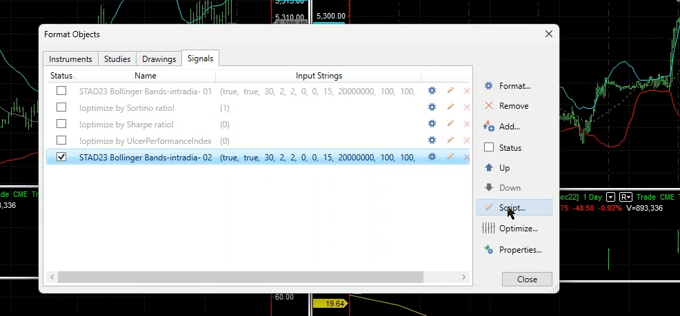

## Revisión del Sistema Bollinger Bands Mean Reversion

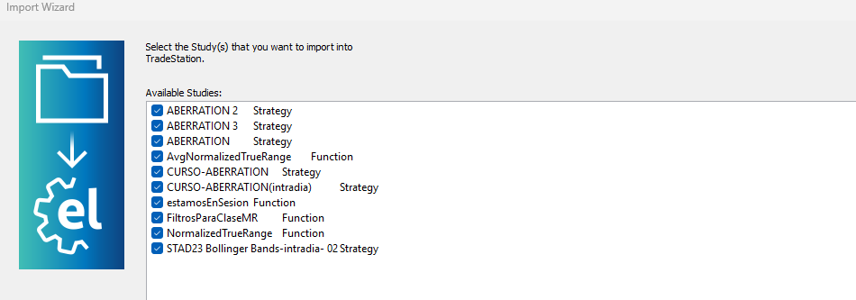

***Code*** : [PRACTICA 11](../code/PRACTICA%2011.ELD)  
***WorkSpace*** : [10-Curso-MeanReversion-intradia(es)](../code/10-Curso-MeanReversion-intradia(es).tsw)   
***Strategy*** : [STAD23 Bollinger Bands-intradia- 02](../code/STAD23%20BOLLINGER%20BANDS-INTRADIA-%2002.ELD)

Bueno, esta es la versión que ya vimos del *Bollinger Bands*. Por el código, acordaros: simplemente compramos en banda baja, vendemos en banda alta, y vimos distintas posibilidades de cara a la salida de *TP's*, *SL's* con *ATR*, sin *ATR*. Vimos distintas salidas, vemos algún filtro de *ADX*, de volatilidad, hablamos de otros filtros, desde donde haya habido alguna evolución.

Salida: implementamos también varias salidas, una de ellas en la banda contraria, vale, es quizá la más razonable, y también hablábamos de trabajar con filtros horarios aquí,

**TradeStation**

A ver si mientras carga lo monto, lo monto aquí en TradeStation, a menos lo podemos ver mientras no carga, 

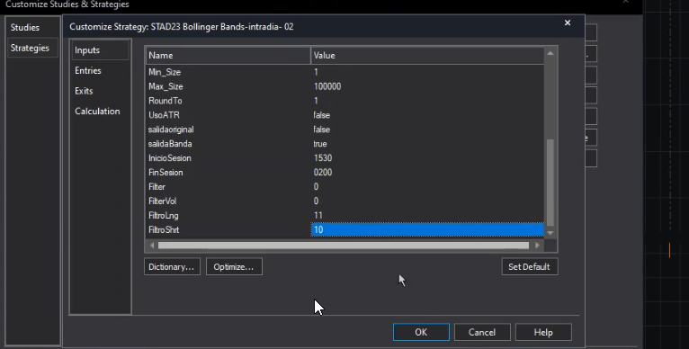

sí este en el 10 era donde mejoraba mucho verdad? 

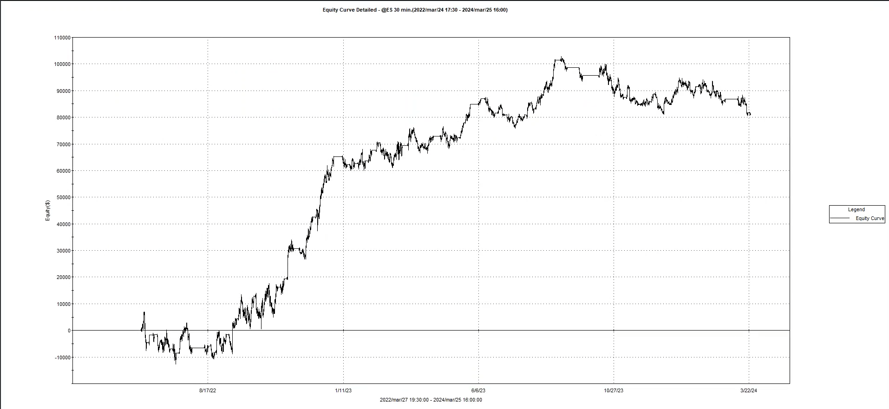

no, mucho tampoco de cortos  

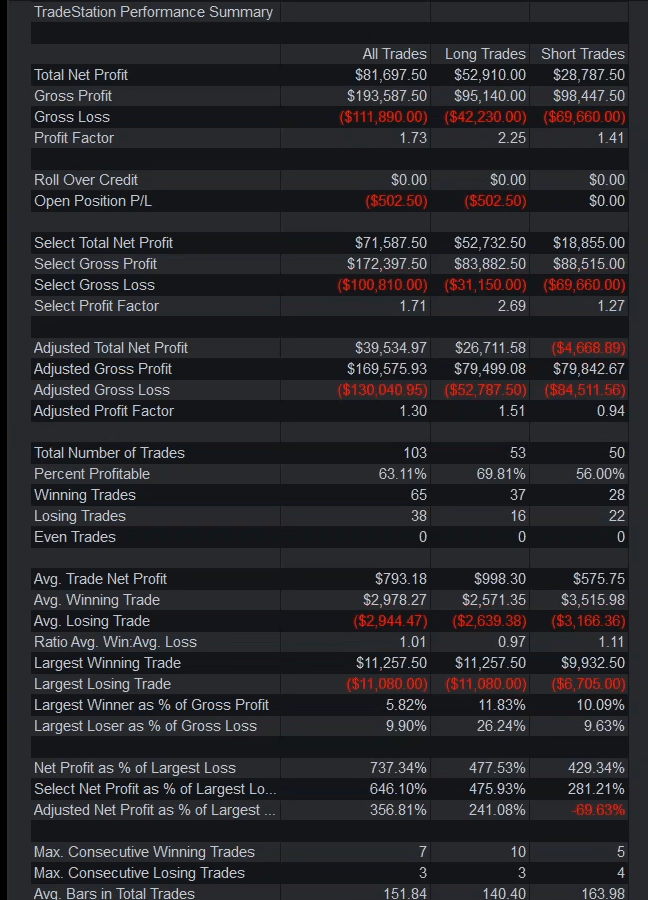

mejora poquísimo el filtro de cortos de 11 a 10

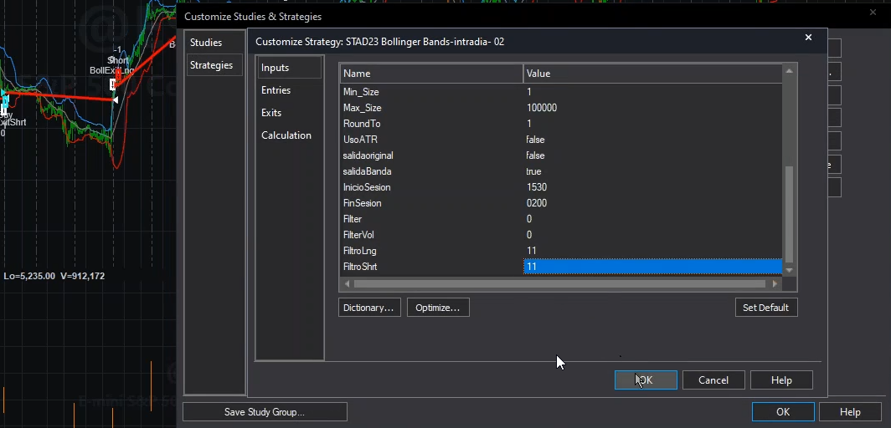


**Referencia al PDF del Test para Revista**

*[Test a otro sistema con las bandas de Bollinger](../docs/Bollinger%20antitendencial%20(1).pdf)*

Y en por qué recapitular, recordaros que este es el sistema que ya os pasé. Este ya lo subimos, que era el test que hicimos para una revista, os lo recopilé así en un artículo nuestro. Esto lo habíamos hecho para, no me recuerdo qué revista, vale, y aquí probamos distintas versiones y bueno, poquito, con había algunas métricas y demás, no, simplemente un test sencillo con distintas medias en las bandas en distintos futuros. Y bueno, pues ahí podéis compararlo, jugar, y así tenéis una referencia de qué activos pues va un poco mejor este tipo de estrategia. Lógicamente en las *materias primas* va mal, suele ir mal, y donde suele ir un poco mejor puede ser en *bolsa*, puede ser en *bonos*, vale. Es un poco el inicio, es un poco el sitio donde puede ser que vaya mejor. En la mayoría iba bastante flojo, sobre todo en eso está hecho en *diario*, eso está en diario, vale.

**Aplicación de Filtros en Largos y Cortos**

Y la única diferencia ya para acabar y pasarme al tendencial que habíamos probado era la aplicación de algunos filtros en largo y en el corto, probamos ya de manera sencilla, 

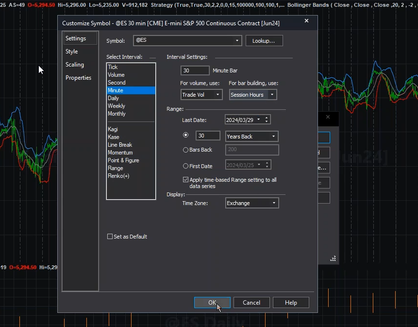

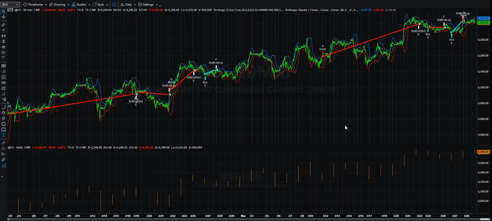

bueno aquí sencillamente teníamos la versión misma, así es como estaba, 
así creo que está sin filtros, sí, 11 está sin filtros

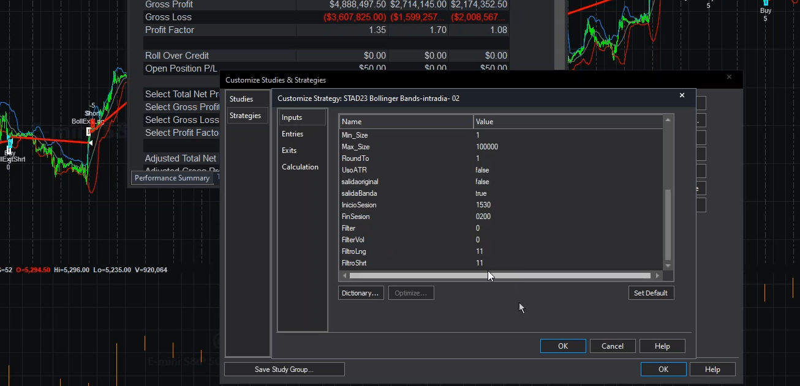

simplemente está filtrado pues la entrada y la salida, y ahí está,  
está que es algo, con ***gestión monetaria*** que trae, lado largo muy decente, el lado corto muy cojo, corto está ahí con dificultad.

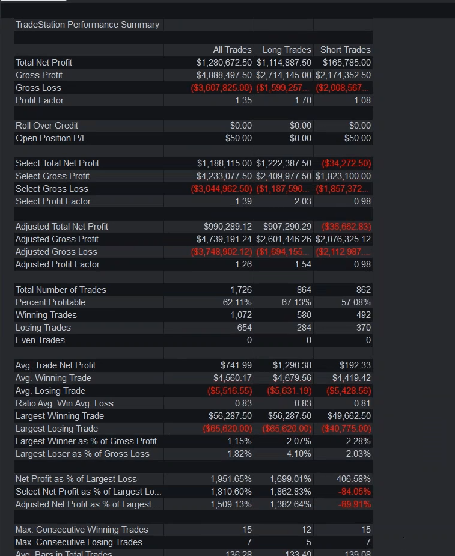
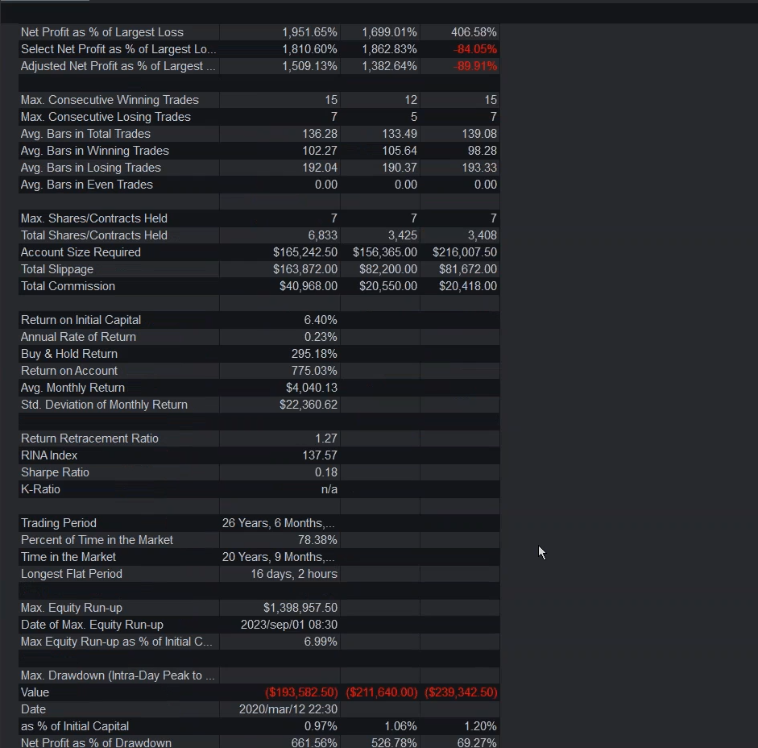
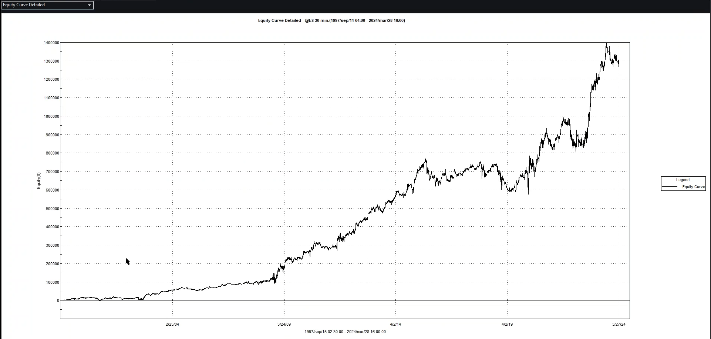


**Análisis de Curvas de Largos y Cortos con MultiCharts**

Con filtros es lo que quería enseñaros porque MultiCharts permite enseñar la curva de los dos lados, por eso estoy insistiendo en él, no es que tenga un capricho, es que al final TradeStation no puede enseñar la curva de largos y cortos y en MultiCharts sí, entonces pues esa era la gracia pero de momento no va a poder ser.

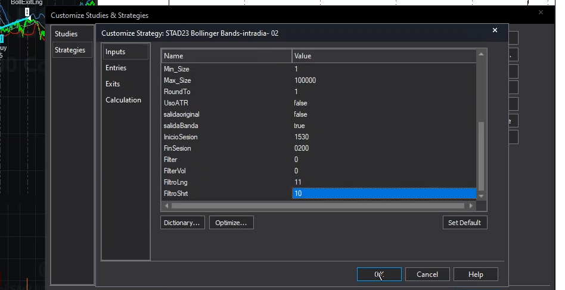

Y por otro lado es lo que os digo, aquí hay unos cuantos filtros que estuvo trabajando Alberto ayudándose un poquito de fuerza bruta, estuvo explorando un poquito algunos filtros. Esto es un poco lo que hablamos con quien me preguntó de *Unger* (Andrea Unger), son filtros de este tipo que puedes encontrar en muchas revistas, y que ahora os voy a enseñar algunos de ellos. Son filtros sencillos, en el fondo ya son todos, provienen de velas. Cuando hablamos de los *ORB* vimos muchos conceptos sobre ellos: *narrow range*, *inside bar*, *outside bar*, cierre positivo, cierre negativo, cierre mayor que máximo, menor que, filtros realmente sencillos, vale.

**Mejora de la Pata Corta con Filtros**

Ahora ya se había cargado bien, 

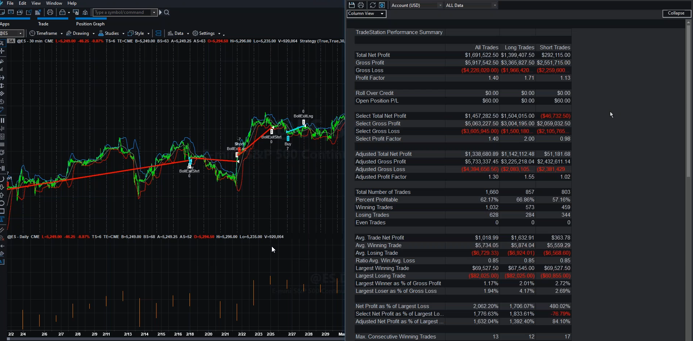

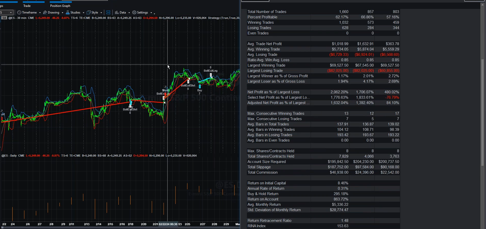

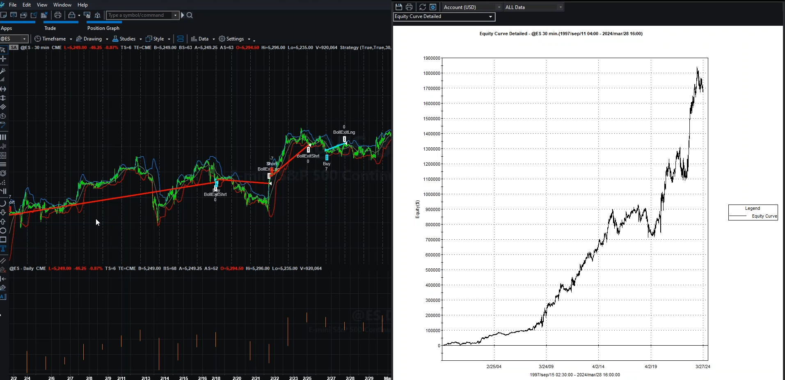

<div style="border-left: 4px solid #f39c12; background: #fff8e5; padding: 10px 15px; margin: 10px 0; border-radius: 8px;">
  <strong>💡 Concepto </strong><br>
en un sistema de este tipo *contratendencial* es importante tener salidas más o menos rápidas,   
</div>

ahora veis, hemos mejorado un poquito la pata corta, hemos mejorado un poquito la pata corta sin ser nada espectacular, sin ser nada espectacular. Aquí seguimos teniendo, a la semana que viene lo trabajaremos, mi opinión: aquí hay camino de mejora vía salidas. Recuerdo el camino de mejora salidas porque en uno, y es verdad, estamos dejando correr bastante.

**El Problema de las Operaciones Enganchadas**

El problema siempre son las *perdedoras*, en este caso especialmente, porque es verdad que acertamos pero vez tenemos enganchadas muy muy, heavys, y ahí es donde realmente habría que salir,

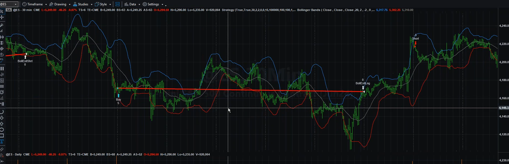

 que camino hay? bien, si vía pérdida no lo conseguimos que es muy habitual, es muy habitual que la pérdida siempre enpeore el sistema, 
 
mira que enganchada aquí 

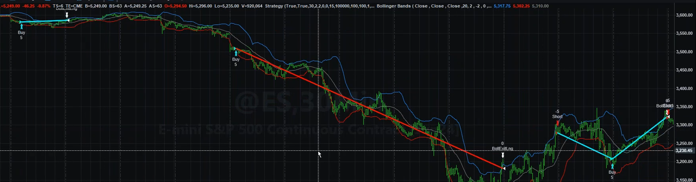

esto no puede ser, es evidente que esto tiene camino de mejora, de acuerdo no?

### Salidas por tiempo

Una solución, ya la semana que viene lo probamos pero ya os adelanto alguna, una solución que viene bien cuando no encontramos solución vía pérdida, típico *stop de pérdida*, es *salida temporal*, salida temporal. Porque al final, el tiempo, en la teoría lo vimos, acordaos que os lo comenté: salida en N barras, o diferenciando, si se quiere, entre ganadoras y perdedoras. 

Pero fijaros, acordaros que un sistema, porque un sistema *antitendencial* como este, acordaros que lo que tiene es un porcentaje de aciertos elevado, tiene un porcentaje de aciertos elevado, un porcentaje de aciertos que es 50%. Al final la salida, todo el sistema debe ser coherente, lógicamente. Pero para aplicar las salidas es muy importante el sentido común, y el sentido común al final se va educando un poco con la experiencia y la práctica.

**Análisis del Porcentaje de Aciertos y Ratio en Sistemas Antitendenciales**

¿Qué quiere decir que yo tengo un porcentaje de aciertos elevado? En este caso es del 60 por ciento. Acordaros que ahí siempre se mueven uno en contra del otro, de acuerdo: si yo acierto mucho quiere decir que tengo un ratio *Avg Winner/Loss* bajo, que en este caso incluso es inferior a 1, es inferior a 1. Y esto en la práctica, ¿en la práctica qué quiere decir? Quiere decir que tengo perdedoras muy grandes en relación a las ganadoras, o sea que tengo mayores perdedoras que ganadoras, vale, y también que mi pérdida media es mayor que mi ganancia media, y que en cualquier caso mis pérdidas en valor monetario pues corren más, corren más que mis ganancias, vale.


**Tiempo Medio de Operaciones Ganadoras vs Perdedoras**

Por lo tanto, si yo pongo una salida por tiempo, a ver, este dato lo tenemos aquí, fijaros un momentito que estoy buscando un dato en el *Performance Report* pero no lo encuentro, aquí, aquí, aquí, vale. Ahora cuando *MultiCharts* cargó, *MultiCharts* carga un seguido de estos y no lo cerraré porque parece que está un poco colgado, vale.

Es el *Performance Report* de ese sistema, 

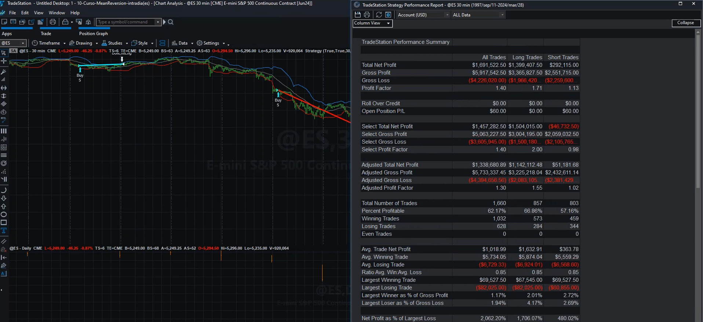

es igual, más allá del resultado ahora mismo me da un poco igual, pero eso que os decía de aciertos, 

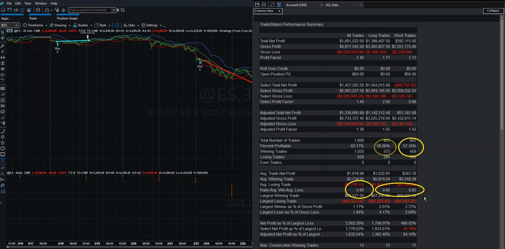

Lo que decía: porcentaje de aciertos 62 por ciento, vale, lógicamente más en los largos que en los cortos, pero aun así los cortos también por encima de 50 como veis, vale. Y eso implica un ratio, a ver, a ver, de 0,85%, que además es igual en este caso, es igual en largos y cortos. Y eso qué significa: que la media de *trade* ganador, $5.734 es menor, ahora se verá, que la de perdedor en valor absoluto, lógicamente es mayor la pérdida, vale.

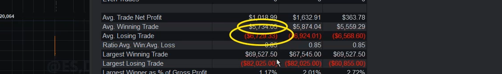

Y esto también se traduce en otra cosa frecuentemente. Yo aquí tengo los tiempos medios, vemos el tiempo medio de generar una operación, pero fijaros que las ganadoras están mucho menos tiempo que las perdedoras, las ganadoras están mucho menos tiempo.

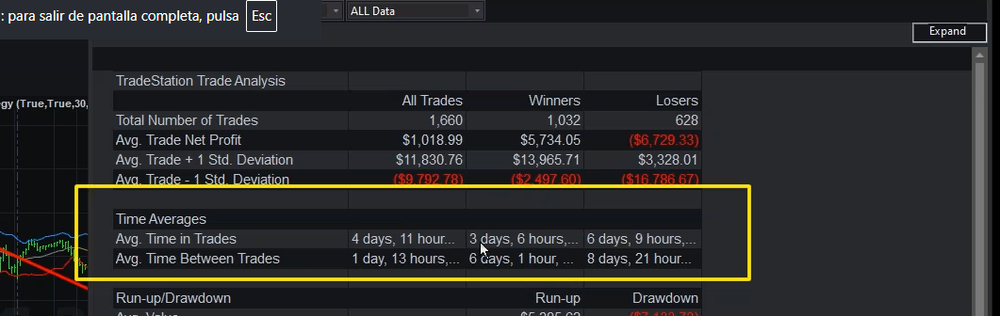


Qué quiere decir esto? porque eso es lo que hay detrás, salir por tiempo suele rentar, porque cuando yo me quedo mucho tiempo normalmente es para perder, cuando acierto suelo hacerlo rápido, lógicamente hay excepciones, pero de media cuando acierto hago las ganancias antes que las pérdidas en valor absoluto.

Por lo tanto cuando yo no consigo mejorarlo vía salida, sea absoluta, sea porcentual, sea ATR, lo que sea, una de las maneras es salir por tiempo. 

La semana que viene jugaremos con esto pero es probable, lo veremos, que la salida por tiempo nos ayude a evitar esto, es decir yo pongo una salida que puedo diferenciar si estoy en ganancias o estoy perdida, y puedo diferenciarlo. Pero incluso sin diferenciarlo por no sobre-optimizar veréis que es probable que nos rente salir en N barras, porque se va a quedar enganchado al final y si no cierra por su objetivo pues se sale, pasa las que sean barras y se sale, y vas a evitar quedarte mucho tiempo.

<div style="border-left: 4px solid #f39c12; background: #fff8e5; padding: 10px 15px; margin: 10px 0; border-radius: 8px;">
  <strong>💡 Regla práctica </strong><br><br>
  En sistemas anti-tendenciales (Mean Reversion), las operaciones ganadoras suelen resolverse rápidamente, mientras que las perdedoras tienden a quedarse "enganchadas" mucho más tiempo. Por eso las salidas temporales (N barras) suelen funcionar bien: cortan pérdidas prolongadas sin afectar demasiado a las ganancias que ya se han materializado.
<br><br>
  Por lo tanto cuando yo no consigo mejorarlo vía salida, sea absoluta, sea porcentual, sea ATR, lo que sea, una de las maneras es salir por tiempo. 
</div>


**Análisis de Run-ups y Drawdowns en el Performance Report**

Veréis que el *run-up* nos dice el mayor valor, nos lo dicen como valor medio de los run-ups y de los drawdowns, y demás, vale.

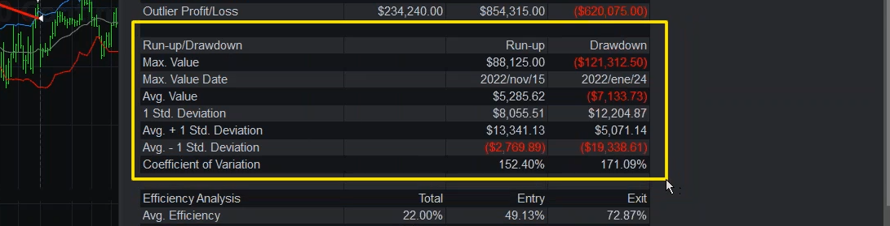

Esto es referido a los trades, es decir, nos está diciendo que el trade que más valor acumulado ha tenido ha sido $88.000, pero fijaros que la pérdida que más ha acumulado ($121.312) es mayor. Nos da las fechas, que es normal que sean cercanas porque es por volatilidad, y también nos da el valor medio de los *run-ups* y de los *drawdowns* de los trades —repito, de los trades—. Siempre es mayor, como veis, la pérdida; vale, también la primera desviación.

Entonces, al final, esto es lo que os digo: suele llevar a salidas temporales, que rentan bastante en este tipo de sistemas *anti-tendenciales* (Mean Reversion).

**Comportamiento en sistemas tendenciales versus anti-tendenciales**

En un *tendencial* es distinto, porque es justo lo contrario; entonces ahí a lo mejor no me renta tanto una salida por tiempo. En un tendencial no renta que quite colas, o sea, que este tipo de salidas suelen mejorar anti-tendenciales, Mean Reversion, sistemas intradiarios; incluso *breakout* puede mejorar. Pero un tendencial puro no es habitual que lo mejore. Un tendencial puro hay pocas salidas que puedan ayudar a mejorar —esto que no sean casuales o fruto de la sobreoptimización—, porque un tendencial necesita estos trades de muy largo recorrido para ser rentable, porque acierta muy poco.

<div style="border-left: 4px solid #3498db; background: #eaf4fc; padding: 10px 15px; margin: 10px 0; border-radius: 8px;">
  <strong>📊 Diferencia clave</strong><br><br>
  <strong>Anti-tendencial:</strong> run-ups cortos, drawdowns largos → salidas por tiempo <em>sí</em> mejoran.<br>
  <strong>Tendencial:</strong> run-ups largos, drawdowns cortos → salidas por tiempo <em>no</em> mejoran (cortan las colas ganadoras).
</div>

Entonces pasa justo lo contrario: ahí veréis *run-ups* muy largos y pérdidas menores, vale. Pero aquí estamos en la situación contraria; por lo tanto, cualquier trade o cualquier salida que a mí me saque del mercado simplemente por tiempo —sin tener en cuenta si va bien, si gano, si pierdo— normalmente me va a rentar, porque me va a quitar más pérdidas que ganadoras. ¿Se entiende?

**Variante condicional de la salida por tiempo**

Aun así, también se puede hacer la regla —repito, si hay suficientes trades puedo hacerlo—: se puede hacer la regla de decir "si estoy en pérdidas, salir en N barras; si no, seguir días". Es decir, si `OpenPositionProfit` es menor que cero, aplico la salida en N barras; si no, no lo aplico, por ejemplo.

Pero fijaros que siempre los perdedores suelen... veréis muy pocas flechas, alguna hay, pero ha estado en pérdidas. Trades ganadores que sean muy largos de tiempo, me refiero —mira, esas seguramente de las más largas—, pero no es nada habitual.

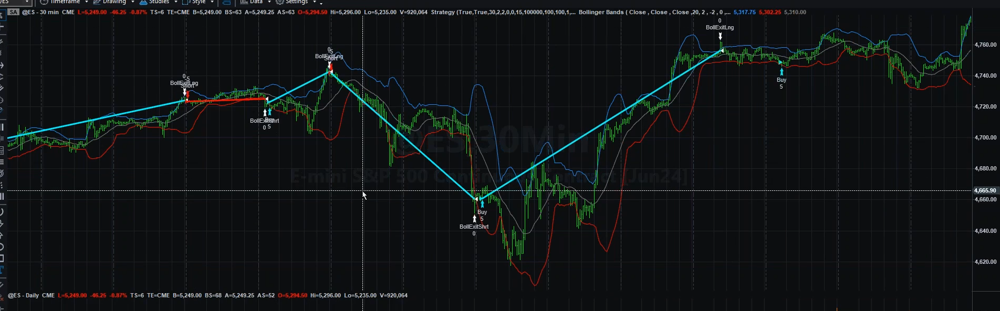


### Introducción a los Selectores de Filtros

***code*** : [FiltrosParaClase_MR.ELD](../code/FILTROSPARACLASEMR.ELD)

**Estructura del Selector con Switch**

Lo que os decía, tenemos unos filtros para largos y unos filtros para corto.

Está hecho con dos datos Data1 y Data2 Así puedes operar en intradía pero filtrar con condiciones diarias y como os conté hay un *switch* de diversos que es porque así tú puedes llamar a cada una de ellas de manera muy sencilla, vale, 

```sh
# FILTROSPARACLASEMR.ELD

# Lo aplicamos en Data2 para los calculos de los filtros
[LegacyColorValue = true]; 

input: selector(numericsimple);

var: opend0(0),opend1(0),opend2(0),opend3(0),opend4(0), opend5(0);
var: highd0(0),highd1(0),highd2(0),highd3(0),highd4(0), highd5(0);
var: lowd0(0),lowd1(0),lowd2(0),lowd3(0),lowd4(0), lowd5(0);
var: closed0(0),closed1(0),closed2(0),closed3(0),closed4(0), closed5(0);
var: body1d(0),range1d(0),body5d(0),range5d(0);

# Así puedes operar en intradía pero filtrar con condiciones diarias.
# Data1 es el timeframe de operación (ej: 5 min) 
# Data2 es un timeframe superior (ej: diario). 
# Extracción de datos de Data2
opend0 = Open of data2; highd0 = High of data2; lowd0 = Low of data2; closed0 = Close of data2;  
opend1 = Open[1] of data2; highd1 = High[1] of data2; lowd1 = Low[1] of data2; closed1 = Close[1] of data2;  
opend2 = Open[2] of data2; highd2 = High[2] of data2; lowd2 = Low[2] of data2; closed2 = Close[2] of data2;  
opend3 = Open[3] of data2; highd3 = High[3] of data2; lowd3 = Low[3] of data2; closed3 = Close[3] of data2;  
opend4 = Open[4] of data2; highd4 = High[4] of data2; lowd4 = Low[4] of data2; closed4 = Close[4] of data2;  
opend5 = Open[5] of data2; highd5 = High[5] of data2; lowd5 = Low[5] of data2; closed5 = Close[5] of data2;  
# Cálculos auxiliares
body1d = absvalue(opend1-closed1); range1d = (highd1-lowd1);
body5d = absvalue(opend5-closed1); range5d = maxlist(highd1, highd2, highd3, highd4, highd5) - minlist(lowd1, lowd2, lowd3, lowd4, lowd5);


Switch(selector) Begin
    # Consolidación: el cuerpo de 5 días es < 75% del rango → mercado lateral
	case 1: FiltrosParaClaseMR= body5d < 0.75 * range5d; 
	# Tendencia fuerte: cuerpo > 90% del rango → movimiento direccional
	case 2: FiltrosParaClaseMR= body5d > 0.9  * range5d;	
	# Rango mínimo hoy: al menos 0.5% entre high y low
	case 3: FiltrosParaClaseMR= ((highd0>(lowd0+lowd0*0.5 *0.01)));
	# Rango mínimo hoy: al menos 1.5%
	case 4: FiltrosParaClaseMR= ((highd0>(lowd0+lowd0*1.5 *0.01)));
	# Rango máximo hoy: menos de 2.5% → día tranquilo
	case 5: FiltrosParaClaseMR= ((highd0<(lowd0+lowd0*2.5 *0.01)));
	# Vela bajista ayer (cierre < apertura)
	case 6: FiltrosParaClaseMR= (closed1<opend1);	
	# Gap alcista: ayer cerró > 1% por encima de anteayer
	case 7: FiltrosParaClaseMR= ((closed1>(closed2+closed2*1  *0.01)));
	# Mínimo de hoy superior al de ayer + 0.5%
	case 8: FiltrosParaClaseMR= (lowd0>(lowd1+lowd1*0.5*0.01));	
	# Contracción de rango (volatilidad decreciente)
	case 9: FiltrosParaClaseMR= (highd1-lowd1)<(highd2-lowd2);
	# Precio actual por encima de la apertura del día
	case 10: FiltrosParaClaseMR= (C>opend0);
	# Sin filtro (siempre pasa)
	case 11: FiltrosParaClaseMR= true;
	# Bloquea todo
	case >11: FiltrosParaClaseMR= false;
end;

```


**Patrón de selector true/false**

Siempre se hace así: poniendo una de ellas que la deja en *true* y una de ellas que la deja en *false*, que normalmente es la última, porque así, en caso de que te equivoques, pues simplemente ves que no actúa. Si tú le pones 12, no hará ningún trade porque le dará valor *false* a la función y no operará, vale. En cambio, el caso contrario: se pone 11, que siempre es *true*, es decir, que por lo tanto es *no filtrar*. De esa manera tú puedes incorporar la función en cualquier parte; esto siempre es así. Lo que cambia es el contenido, no deja de ser una *plantilla*, un *selector*, vale.

Esto se hace así para las salidas, así para todo. Es decir, es un `selector` que se va haciendo de sí o no, de esa manera: tú, llamando ese selector en tu condición de entrada, le dices aquí qué debe hacer.

**Por otra parte tenemos la Strategy** : [STAD23 Bollinger Bands-intradia- 02(](../code/STAD23%20BOLLINGER%20BANDS-INTRADIA-%2002.ELD)


Hay una un input para largos y otro para cortos porque así le puedes poner un valor distinto, de acuerdo, 

```sh
if estamosEnSesion(InicioSesion, FinSesion) then 
begin

	{ Long entries and Exits } 
	If Allow_Long then begin
		//Si cruza por encima de la banda inferior entra largo
		If Close cross over LoBand and MarketPosition <> 1 and Trend and Vol and FiltrosParaClaseMR(FiltroLng) then 
			Buy Contratos shares next bar at Market;
		
		// Take Profit en la banda de Bollinger contraria
		if salidaBanda and marketposition <> -1 then
			Sell ("BollExitLng") next bar at HiBand limit;
	End;
	
	{ Short entries and Exits } 
	If Allow_Short then begin
		//Si cruza por debajo de la barra superior entra corto
		If Close cross under HiBand and MarketPosition <> -1 and Trend and Vol and FiltrosParaClaseMR(FiltroShrt) then 
			SellShort Contratos shares next bar at Market;
		// Take Profit en la banda de Bollinger contraria		
		if salidaBanda and marketposition <> 1 then
			BuytoCover ("BollExitShrt") next bar at LoBand limit; 
	End;
end;
```

**Exploración de Filtros con Fuerza Bruta**

¿y cuando es cada una de ellas true? Bueno probar varias de distinto tipo, probar algunas, realmente es que hay a montones librerías por ahí, ya os pasaremos algunas, y la semana que viene que nos dedicaremos un poco sólo a practicar con selectores pensado más para la salida. 

Pero como os digo es una herramienta que se utiliza también para filtros y para todo, así que lo veremos un poco para todo, pero sobre todo sobre todo como digo para las salidas.

Que implican? bueno, por eso que os digo, este simplemente valora que el cierre sea menor que la apertura diaria, vale, esto lo tienes, lo ha definido aquí    

fácil hacerlo como como lo hecho, como lo hecho Alberto, porque si no pues hay que hacerlo con las arrays y demás es muy complicado, pero así así es bastante sencillo, simplemente pues guardas el valor de cada de cada una de las campos de la barra *open*, *high*, *low*, *close* y le le asignas una variable, vale, para no estar cada cada vez escribiendo hay tal no sé qué, vale.

```sh
# FiltrosParaClase_MR.ELD
opend0 = Open of data2;
    highd0 = High of data2; 
    lowd0 = Low of data2; 
    closed0 = Close of data2;  
opend1 = Open[1] of data2; 
    highd1 = High[1] of data2;
    ...
    ...
opend2 = ...
opend3 = ...
opend4 = ...
opend5 = ...
```

Sobre todo porque en este caso está referido a un Data 2 y habría que escribir cada vez High of Data 2 low of data2, entonces lo ha guardado ya todo aquí en una variable, open de 0 es open Data 2, hay de 0 es hay porque en el Data 2 está en diario, de acuerdo, el Data 2 en este caso está en diario, por eso le llama `d` pero realmente en este en este en este caso podría haberse haberse hecho porque en Easy Language existe esta palabra `Closed`, pero lo hemos hecho así para simplificar, o sea en Easy Language existe el *close de* es el cierre diario, vale, se puede ser una función que llama cierre diario, vale, ya lo tiene lo tiene implementado TradeStation, igual que el `HighD` eso es el máximo diario aunque estés en una entrada, vale, así así queda mucho más queda mucho más claro, vale, queda muchísimo más más claro.

**Filtros para Largos: Evaluación Preliminar**

Y hay distintos distintos filtros por no alargarnos tampoco a tetérnum en este en verlos 1 1 1 ahora que ya repito que esto os lo pasaré en ese sistema. En el caso largo que era algo probable, no no es seguro pero es probable, porque en el lado largo no hay mucho problema en el sentido de que pues siempre vas a operar a favor de tendencia y por lo tanto es más sencillo, de acuerdo, que no haga, que no sea necesario filtrar entradas porque acordaros que estás en una anti-tendencial y que por lo tanto ya estás entrando en una cierta sobreventa para ir largo, de acuerdo.

Es decir cuando va a entrar largo?, 

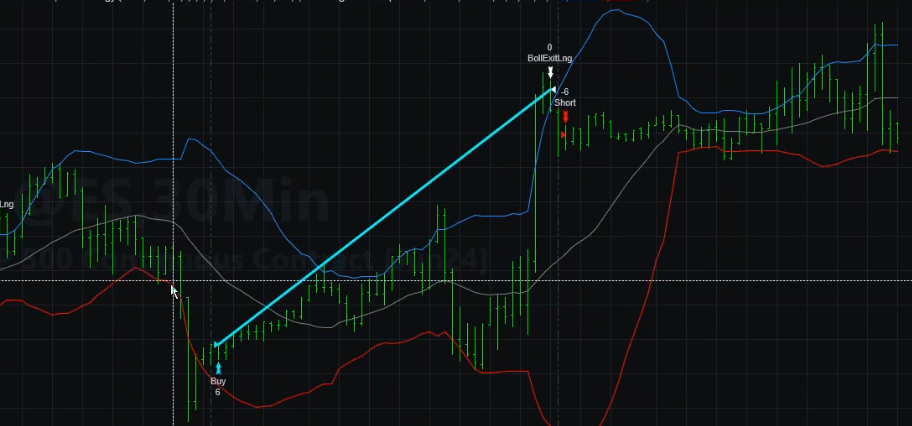

cuando el precio ha caído un poco no, porque para ir a la banda abajo y cerrar por debajo tiene que haber caído, vale, entonces en un activo que tiene una evidente tendencia alcista de largo plazo, comprar cuando cae pues normalmente es más probable que sea buena cosa que vender, entonces normalmente puede ser que no haga falta filtrar. No es, no quiere decir que sea imposible encontrar un filtro para mejorar largo, que quede claro, pero a priori es algo que puede que es que es fácil.

**Filtros para Cortos: Donde Está el Trabajo**

Donde está donde está el trabajo lógicamente aquí es para mejorar los cortos, y de hecho hemos encontrado que los mejora un poco pero sólo un poco, es realmente tiene bastante campo de mejora de mejora, vale, porque donde ha habido quizá más mejores en la *ventana horaria*, en trabajar unas ventanas horarias que se centra mucho intenta aprovechar una pauta que seguro que habéis oído hablar que no se centra solo en ella pero indirectamente, en la pauta del *overnight*, vale.

**La Pauta del Overnight en el S&P 500**

Que por cierto lleva tiempo funcionando mal, pero hay mucha gente que opera sistemas de overnight porque durante muchos años tanto la subida del S&P como del Nasdaq ha estado más de los dos tercios de ella centrada en el overnight, de acuerdo, es decir venía el mercado con gap y una vez abría el mercado regular la, de media la subida era era inferior a la que había habido durante el overnight, es decir desde que cierra Wall Street a las 22:15 a la apertura del día siguiente tres y media.

Entonces aquí por ejemplo el filtro que nos ha venido saliendo era justamente ese, es decir se, a abrir justo cuando el mercado está cerrando, a partir de las cinco y media que es que cierran tres y media regular pues a partir de ahí empezar a buscar entradas ahí, porque porque hay un sesgo ahí, pues tengo que poder largo poder corto y seguramente otra posible mejora, cuidado con la sobre-optimización, es las ventanas temporales trabajarlas distintas, vale.

**Riesgo de Sobre-Optimización con Ventanas Temporales**

Es recomendable hacerlo?, bueno tiene riesgo de sobre-optimización lógicamente, es decir hay que hay que hay que vigilar, hay que tener una muestra muy significativa, muchos años, hay que vigilar pero en intradía pensar que siempre hay más margen. Es lo que la teoría insistíamos mucho en esto, no es lo mismo trabajar un sistema que va más diaria, a un intradía de 240, o un intradía, ya no te digo 30 sino 15 minutos imagínate, a veces puedes hacer eso, decir bueno pues sabes que voy a hacer, voy a bajar time frame, ***mantengo histórico porque quiero `representatividad`*** pero si voy a buscar operar más claro que no me sirve, luego bajar a 15 minutos y hacer 503, explico decir si voy a conseguir a lo mejor 5.000 operaciones, entiendes, si a lo mejor consigo 5.000 operaciones pues entiendes, siempre es mejor, de acuerdo, siempre es mejor, voy a ***ganar ahí mucha `significación`*** y puedo aumentar mi, puedo decir bueno pues voy a probar en este caso a separar el tiempo a ver qué veo.

Si mi análisis da que no me da una gran diferencia pues no lo cambio, entiendes, decir si en una me sale que entro 15:30 y la otra me sale las 16:00 no lo cambio, es decir sólo lo cambiaría el mismo criterio que decía antes hablando con Rubén en el Discord, que sea significativa la mejora, es decir, lo mismo si yo voy a separar largos y cortos, tengo que hacerlo teniendo una muestra muy importante de trades, teniendo una representatividad de mercados muy elevada.

Es una práctica de riesgo y hay mucha gente que no le gusta, a mí personalmente me gusta mucho, pero es verdad que hay que tener claro que aumenta el riesgo de sobre-optimizar, es decir es así, y por eso que gente que no es partidaria. Es verdad que yo he operado casi toda mi vida muchos sistemas que operaban el mercado de acciones, entonces claro tienes, eres un poco fruto de tu experiencia pero vengo de ahí y ahí es donde más falta hace eso.

**Diferencias entre Mercados: Acciones vs Commodities**

Si tú ya vas a mercados más simétricos no hace no hace tanta falta, y entonces es peor práctica, pero en acciones es muy buena práctica. Pero cuidado con la con sobre-ajustarse, a lo mejor también podemos encontrar ventanas distintas horarias, hay que vigilar con esto que os digo, seguro casi seguro está 

>apuntadolo para probarlo Alberto de probar la de la versión 3 que hay ventana distinta para largo que para corto, ventana distinta, en vez de hacer 2, no haría 2 y 2, es decir lo que haría es un una hora de entrada de corto, una hora de entrada de largo, y un número de barras, vale, para los 2, un número de barras para los 2, sí, para quitar una variable, para quitar un input, así tendrías 3 en vez de 4, sí porque no va a ser va a ser más crítico la hora que si le das 3, 4, 5, 6 barras, me explico.

Es decir iba a variar mucho porque si te fijas esta esta búsqueda de horas te ha dado claramente la ventana nocturna, y la ventana la ventana nocturna es alcista, entiendes, entonces la corta nunca te va a dar eso, yo creo que la corta te va a dar todo la contraria, te va a dar probablemente probablemente cerca de las ocho las nueve exactamente, probablemente te va a buscar cortos entre las ocho las nueve, me me sospecho.

**Ventanas Horarias Diferentes para Largos y Cortos**

Esto esto es lo que os digo de la de la experiencia, de la sensibilidad de lo del mercado, pero hay que verlo, entonces probablemente te va a dar eso, te va a buscar ventanas distintas. Y esto de verdad no no es mala práctica, esto es, ya ya en intradía no sólo no es malas, no que es buena práctica, de acuerdo, las ventanas horarias entre ellas son claves, ya os lo comenté, y no tienen porque ir sobre todo en acciones.

Si esto lo estuviéramos haciendo en otro activo es otra cosa, me refiero oro, me refiero petróleo, me refiero cacao, zumo naranja, es decir, soja, lo que sea. En acciones largo y cortos no tienen nada que ver, no tiene nada que ver casi en nada, ni en horas, ni en dinámica, ni en duración de trades, volatilidad, vale, es como otra cosa, es como otro activo.

¿hay que hacerlo junto? No sé por qué hay que hacerlo junto, es decir puedes buscar un equilibrio sí. Bueno esto es como si tú tienes un coche y lo hay y tienes que ir a correr en un circuito, tienes que ir a correr por la montaña, puedes montar un coche equilibrado entre las dos cosas, seguramente sí puedes, pero no irá bien ni en uno ni en otro, estamos de acuerdo, porque en la montaña necesitarás amortiguadores altos, altura del suelo muy elevada, unas ruedas muy altas y en el circuito necesitas de suelo rueda muy ancha, perfil bajo porque no puedes pinchar, es distinto.

Habrán momentos que a mejor no puedo permitirme tener dos setups distintos, pues busco un intermedio, bueno, en el caso del coche puede ser por pasta, puede ser por lo que sea, porque me lo obliga al reglamento, pero pero aquí si no puedo por tres por significado, vale, pues perfecto, pero si yo me voy a ir a la entrada y si puedo pues sí intentémoslo. Si vemos que es parecido no lo hago, si vemos que no lo veo robusto pues no lo hago, hay que hay que lógicamente tener mayor precaución, el precaución, pero sí que lo haría.

**Sistemas Anti-Tendenciales: Búsqueda de Entradas y Salidas Rápidas**

Y en un anti-tendencial donde ya digo donde busco ventanas, donde busco entrar y salir y quedarme pues X tres, dos días, tres días, no busco swing, un largo recorrido, busco estar en el mercado relativamente poco tiempo, es bastante importante en qué horas aumento. Y aquí digo ahí hay versiones, este yo creo que la semana que viene tenemos una versión un poquito más rápida que esta, creo, haciendo esto, creo que conseguiremos una versión un poquito más rápida, es decir que estén menos tiempo en el mercado que el que tenemos estamos ahora.

Pensando en la en esto de las salidas que os digo, en esto de las salidas que os digo, trabajando trabajando ventanas horarias, salidas por separado incluyendo casi con total seguridad la salida temporal como os decía porque nos va a cubrir muy bien las malas las malas.

**Comentario de Mario sobre los Switches**

Comenta Mario lo comento ahora, ya sé que digo siempre al final pero como va muy ligado y seguramente no saldrá más esto, si el tema el tema de los *switches* que son sólo para hacer el testeo, bueno también puede ser por cuestiones de configuración del sistema, o sea. Y comenta el que siempre es bueno dejar los códigos sencillos, sí sí es cierto, pero es que un *case* es sencillo esa pues no tiene nada, al final el que es piensa que además a mí me gusta mucho easylenguaje, al final tú lo tienes en un bloque *begin end* y tal, pero bueno si si tú luego cuando quieres dejar el sistema ya limpio lo dejas el filtro implementado y el resto fuera puedes hacerlo.

Pero piensa que esto es la función, o sea esto no es el código, el código al final llama a la función, o sea es una línea, de acuerdo, es decir la función lo que sí que es buena y buena práctica trabajar con funciones para no no tenerlo todo puesto en él en el código, de manera más sencilla de final es más más más limpio, pero tú al final la línea que usa esto en el sistema es esta, es esa, son, es una palabra, es la función, sí que lleva su trabajo y su historia, vale.

**Tipos de Filtros: Expansión, Contracción y Figuras de Velas**

Bueno no las hemos mirado pero que ya os digo todas tienen que ver normalmente todas tienen que ver con figuras de como se decía de velas, o el tamaño de la vela, expansiones de volatilidad, como se mira una expansión de volatilidad? 

`case 3: FiltrosParaClaseMR= ((highd0>(lowd0+lowd0*0.5 *0.01)));`


Aquí por ejemplo hay alguna de ellas `((highd0>(lowd0+lowd0*0.5 *0.01)))` es verdad que la primera vez que la vez es como no intuitiva, pero esto al final esto que veis aquí es una expansión de volatilidad, te está diciendo que el máximo, recordar que `highd0` está aquí definido es el Data 2, 

```sh
opend0 = Open of data2;
    highd0 = High of data2; 
    lowd0 = Low of data2; 
    closed0 = Close of data2; 
```

por tanto es diario, es decir yo estoy en el intradía pero estoy usando una vela diaria para referirme, para para mirar si ha habido expansión, vale.

Es decir por lo tanto en el fondo estoy mirando el del día anterior, no sé si esto se entiende, voy a voy a voy a explicarlo un poco un poco más en el gráfico. Esto es porque esto es verdad que no lo he explicado, y para para usuarios no muy familiarizados con esta herramienta puede, me acaba dar cuenta que puede ser por sentar una cosa que no hay que dar, la rectificó, la rectificó.

**Explicación del Multi-Data: Data 1 (30 min) y Data 2 (Diario)**

Vuelvo vuelvo el gráfico, vale, Data 1 arriba 30 minutos, Data 2 abajo diario, de acuerdo,


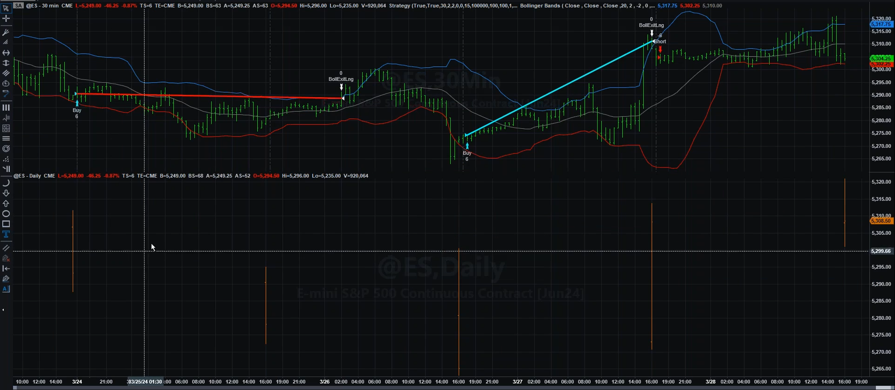

es el mismo activo en este caso, podría ser otro, en este caso lo es. 

Lo que se decía, arriba tenemos un 30 minutos, de acuerdo, cargado con todo el horario disponible del S&P 500 que son pues casi 23 horas, y abajo tenemos un diario, de acuerdo. Donde se alinean los datos, lógicamente se alinean a una hora que es al cierre, 

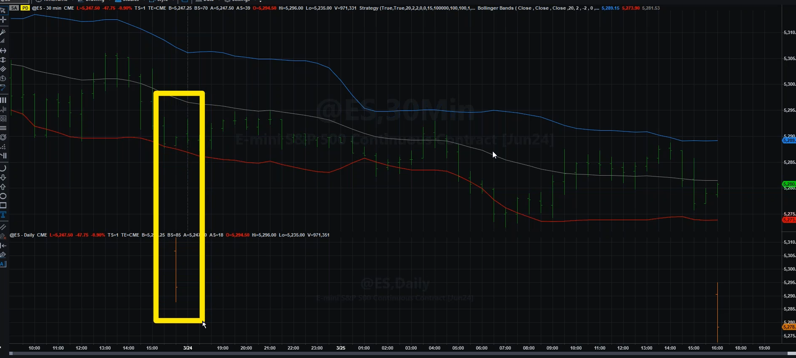

esta es la práctica común excepto Meta tener por ejemplo que es otra cosa pero da igual no importa ahora, no nos perdamos.

En la barra de cierre se alinean, quiere decir que hasta durante hoy, mira mira lo vais a ver súper fácil, cargando tiempo real 

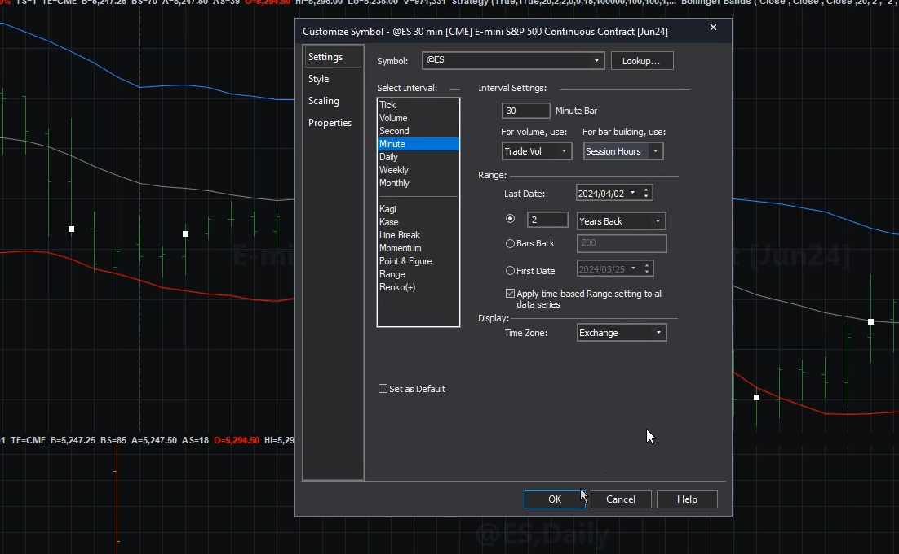

lo vais a ver súper fácil, cargando tiempo real, y ahora cargo tiempo real, cargó tiempo real, y si no se rompe nada a mí me está, así que me está dibujando la diaria, podemos decir a futuro pero como veis no me deja consultarla.

Es decir yo yo ahora no tengo acceso al cierre diario, esto es obvio no, es obvio, por lo tanto si yo ahora consulto el cierre diario el cierre que estoy consultando es este, 

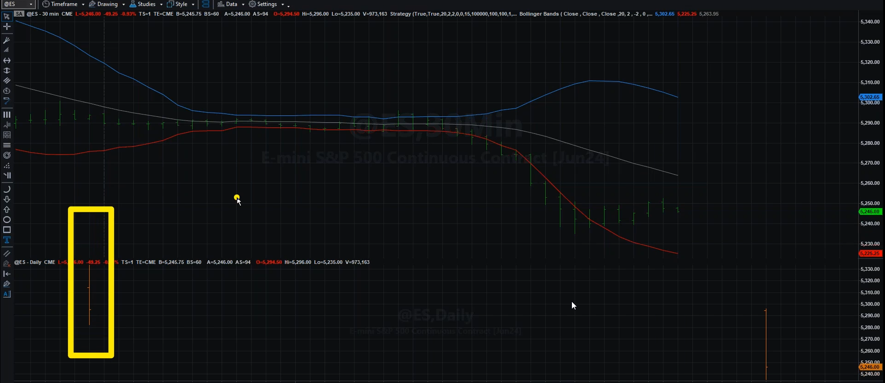

se entiende. Durante el día de hoy el cierre último diario es este, es decir si yo cuando abre el mercado que es aquí, recordar que esto es el cierre de, recordar que aquí, para que lo voy a lo voy a poner en en el mismo TradeStation, porque aquí no se va, aquí esta es la vela de cierre, esta de ahí, y abajo pues pues la misma, de acuerdo, la misma, esa es la vela de cierre intradía, y abajo tengo la vela de cierre diaria en esa, va en esa en esa barra.

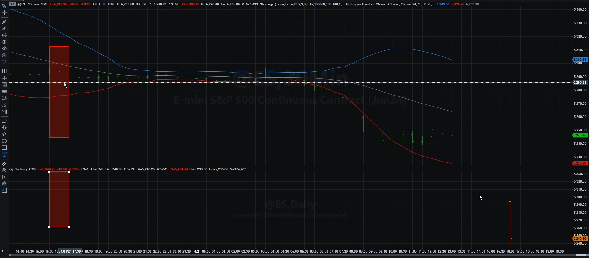

Si yo ejecuto el código ahí, que arriba se ejecutan todas las velas al cierre de cada vela, de acuerdo, en esa vela yo consulto el cualquier dato y están alineadas y sí que coinciden en el tiempo, pero a partir de la siguiente, de acuerdo, a partir de la siguiente vela la cada cada vela de 30 minutos, cada vela de 30 minutos que cierra, cualquiera de ellas, voy a apuntar la hora en círculo para que sea otra imaginaros esta, de acuerdo.

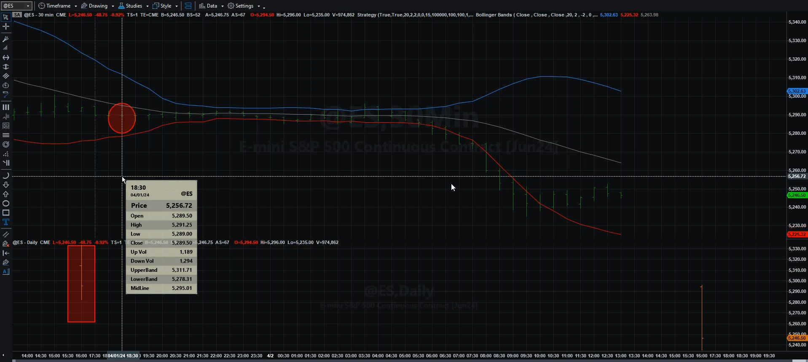

El código del Easy Language se procesa y lógicamente le evaluará dónde está el precio, si cierra por debajo de la banda si se va por encima, por lo que sea, las reglas del código, de acuerdo, el evaluar esta vela. Pero si yo le consulto algún dato de la `diaria`, es obvio verdad que es obvio, aquí ahora lo veis, pero hay que entenderlo a nivel de evaluación, es obvio que no puede consultar esta, no es obvio no, 

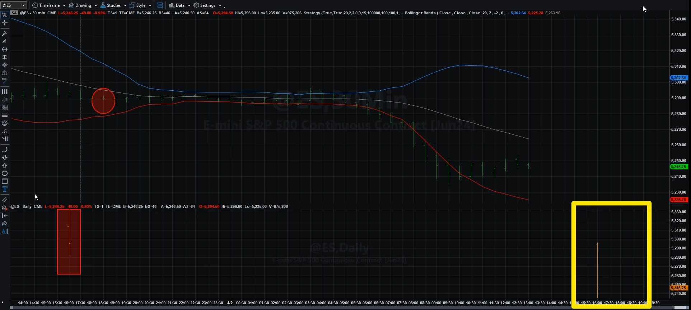

la que está consultando es esta.

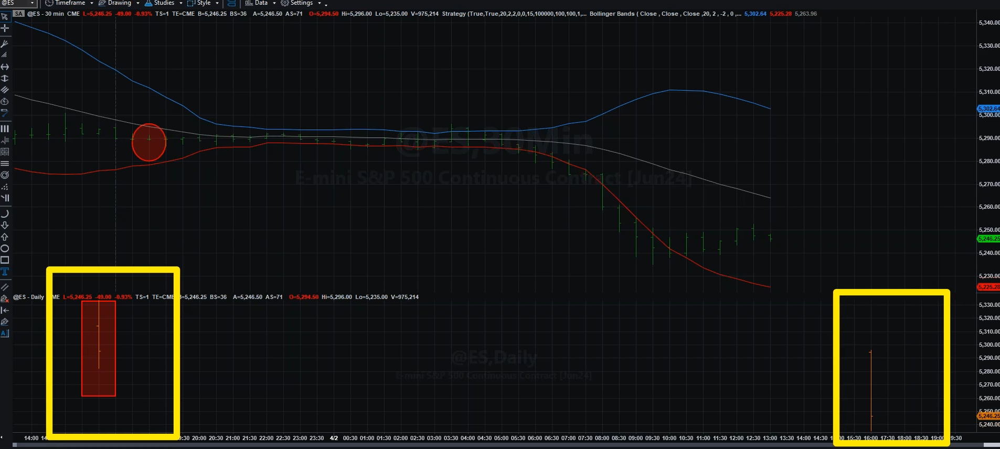 

Por lo tanto cuando yo estoy usando un filtro diario, lo que estoy valorando, puedo valorar datos de esta, pero los compararía con los compararía con la con la anterior, de acuerdo, con el cierre de ayer, se entiende. Si me refiero a la diaria me referiría al datos de la vela de ayer o de anteriores y quisiera, en cambio a las velas de intradía me puede referir a la actual, el anterior, anterior, a las que quiera.

**Filtros de Velas Diarias desde el Intradía**

Bien, volvemos un poco al Easy Language, entonces yo cuando estoy consultando lo voy a dejar aquí en el lateral para que se veáis eso, cuando yo estoy consultando un filtro, y aquí veis todos estos datos que ha calculado Alberto se refieren al Data 2, vale.

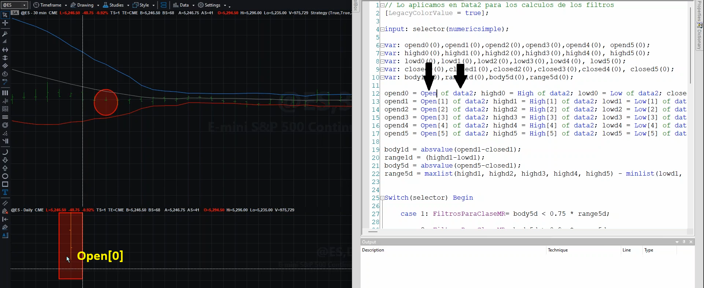 

Y el *open* cuando no pone nada es 0, es decir el open 0 es esa que veis roja, ese es el open 0, esta es el open 0, esta de aquí la primera, el open 1 es la del día anterior, y el anterior, y lo mismo para el *close* para el *high* para el *low*, vale. Esto que estoy seguro que mucha gente está diciendo esto es obvio, estoy seguro que hay otros que no, vale, entonces es importante entenderlo.

Porque cuando yo estoy aquí buscando filtros que están basados en la vela diaria o que comparan a lo mejor datos de la intradía con la diaria, hay que entender esto, porque aquí lo veis muy claro, pero es que esto en la penúltima del día también pasa, en la *penúltima vela del día* sigo consultando la *diaria*, hasta que no estén alineadas es decir hasta la vela de cierre intradía del día no estaré consultando, no será la open 0, será la del día, la de hoy al cierre será la de la de hoy, vale.

Bien, entiendo que todo el mundo esto lo ve claro, si alguien no lo ve claro o lo comenta por favor ahí en el chat.

**Ejemplos de Filtros: Close vs Open**

Entonces volviendo un poco a los filtros, alguno de ellos, a ver alguno muy obvio, vale, aquí ves dice close de 1, open de 1, 

`case 6: FiltrosParaClaseMR= (closed1 < opend1);`

está de hecho aquí Alberto podíamos haber usado también el 0, podrías haber usado close de 0, no hemos hecho pues por lo que sea porque hemos probado algunos entre entre muchos, como ya os digo no deja de ser un ejercicio para el día siguiente, ya trataremos de afinarlo sobre todo insisto con las salidas.

Aquí sé que está el cierre, 

`case 10: FiltrosParaClaseMR= (Close > opend0);`

fijaros que este close es la diferencia que es muy importante, se lee bien no en la pantalla Alberto, el código se le viene, vale. Aquí fijaros esto recordar que es lo mismo que close, lo escribo para que para que así lo veáis más claro, vale. Fijaros que aquí `Close` no pone no pone la variable que ha guardado porque porque se está refiriendo al Data 1, de acuerdo.

Es decir esto qué está haciendo para que lo entendáis bien, todo esto eso está comparando el cierre de cualquiera de estas velas intradía, de cualquiera de estas 

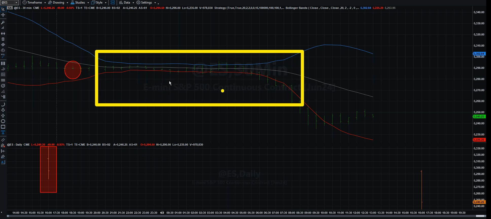 

bueno en la que la que analice en cuestión, en cada momento no, vale, con aunque con el `opend0` con el open del día anterior, de acuerdo, con el open del día anterior, es decir con este valor de aquí, con este 

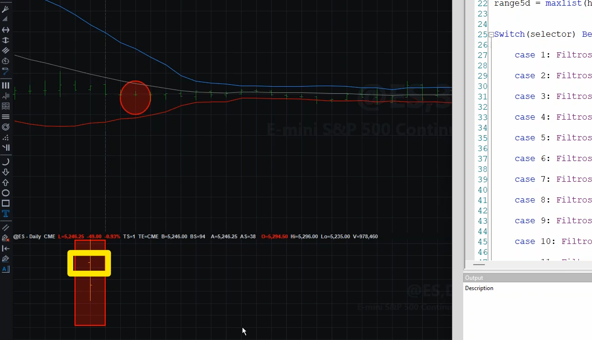 


Este compara el close de la vela que estemos en cuestión pues lo que sé, por ejemplo esta es hablando de esta regla para que entendáis la diferencia entre Data 1 el close de esta con el open de cero que es la anterior diaria disponible, esta, 

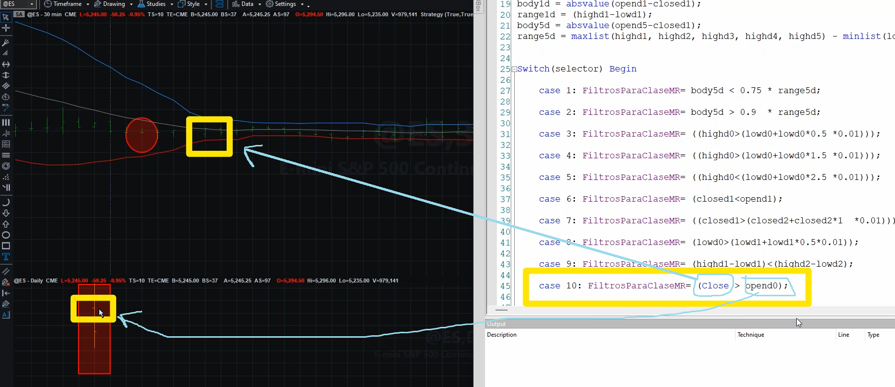 

podría haber sido también con el close, podría haber sido, a mí me parece que es más lógico, pero estos son son filtros que están probados, así que Alberto ha elegido algunos pues ahora mismo no sé bajo qué criterio, el que sea no importa, no importa porque la importante de las clases es la que entendáis las cosas.

A medida que vamos avanzando pues también iremos sacando cosas más más acabadas podemos decir, pero sobre todo el importante es sacar las ideas y los conceptos, eso lo he insistido hasta la saciedad en todo el curso, y hasta con alguien que ha hablado antes del curso recuerdo que siempre me lo preguntaba, oye pero salen muchos sistemas de curso, del curso salen algunos sistemas, pero no es el objetivo, no es el objetivo, o sea no estáis comprando sistemas de esfuerzo, para comprar sistemas se compran los temas y punto, es otra cosa, estamos comprando un curso y en un curso hay que aprender a aprender a hacer las cosas y entenderlas sobre todo.

**Filtros de Expansión y Contracción de Volatilidad**

Entonces al final entender tipos de filtros de este tipo, donde digo pueden haber, que hay aquí aquí que compara por ejemplo a close de 1, bueno está está sí, bueno está por ejemplo, está comparando el máximo de esta vela, de la vela que tenemos encuadrada abajo, vale, para que entendáis mira vamos a marcar uno, este estos que son más complicados, vale, son más con más que tiene más largos más largos, vale.

`case 3: FiltrosParaClaseMR= ((highd0>(lowd0+lowd0*0.5 *0.01)));`

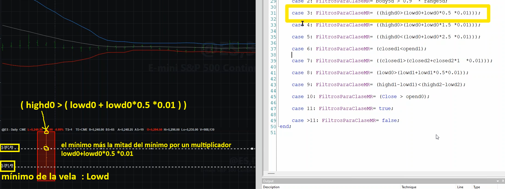 


El highd de esta vela que está marcada que sea mayor que el mínimo, esto es muy habitual porque es una manera de añadirle algo, es decir al final fijaros que estoy añadiendo un precio, un trozo de precio, estoy pidiéndole en este caso que el máximo sea mayor que el mínimo más la mitad del mínimo por un multiplicador, vale, por un multiplicador que es un porcentaje, 0,01 es esa manera de hacerlo porcentaje, vale.

Entonces simplemente le estoy sumando la mitad, estoy multiplicando por 0,5, es decir la mitad, entienden, a la mitad estoy sumando, se sumando la mitad de la vela, y lo multiplico por 0,01, vale.

Y eso qué me da, pues me da concretamente 5307, me da otro precio, de acuerdo, porque pues me da este precio que es la mitad, bueno es un poco más de la mitad, vale. Entonces lo que estoy pidiendo es que el máximo sea mayor que eso,

 
La misma regla, por eso la puesto Alberto para que yo os lo explicara, se puede hacer con 1,5, con 2,5, desde lo que estoy pidiendo es una mayor expansión del precio, es pidiendo una mayor expansión, y puede ser mayor o puede ser menor, puede pedir la expansión o contracción.

```sh
	case 3: FiltrosParaClaseMR= ((highd0>(lowd0+lowd0*0.5 *0.01)));
	case 4: FiltrosParaClaseMR= ((highd0>(lowd0+lowd0*1.5 *0.01)));
	case 5: FiltrosParaClaseMR= ((highd0<(lowd0+lowd0*2.5 *0.01)));
```

Pero es que la 5 pide que sea menor, y la 3 y la 4 pide que sea mayor, es decir una es una regla de expansión y otra es una regla de contracción, al final compara rangos de precios para rangos de precios. Eso cuando va a ser true, no, en este caso en esta vela por ejemplo estuvo, porque es una vela de expansión, de gran expansión, el máximo es mayor que eso, pero si fuera una vela chiquitita donde el máximo no se ha alejado mucho del mínimo, tenés la idea, el máximo no se ha alejado mucho del mínimo, eso sería false, porque ese valor el 5307 sería por debajo del máximo, se entiende la idea.

Si esto no lo miras en una vela que tienen menor rango, vale, sería false, y a medida que le voy aumentando el número pues le pido más expansión. Si lo miro con 1,5 pues a lo mejor ya no da, si yo este mismo cálculo, vale, 5281 que hemos hecho antes porque el máximo, vale, para para que veáis cuál es el máximo más o menos, da igual si es exacto, es lo que importa es lo que importa es la idea.

Entonces lo que tiene que ser vez, 5307 es menor que 5200, o dicho de otra manera 5331 el máximo es mayor que 5200, que quiere decir que el filtro 3 es true, si yo le estuviera pidiendo eso para comprar pues me daría que sí, y eso me está mediando una expansión.

<div style="border-left: 4px solid #f39c12; background: #fff8e5; padding: 10px 15px; margin: 10px 0;">
  <strong>⚠️ Regla de Filtros de Volatilidad</strong><br>
  <b>Concepto:</b> Los filtros de expansión/contracción miden si el rango de una vela supera un umbral mínimo respecto a su propio mínimo.<br><br>
  <b>Fórmula base:</b> <code>high > (low + low * multiplicador * 0.01)</code><br><br>
  <b>Justificación teórica:</b><br>
  • El multiplicador (0.5, 1.5, 2.5) define el % de expansión requerido sobre el mínimo<br>
  • Case 3-4: <code>high > umbral</code> → Filtro de EXPANSIÓN (momentum/breakout)<br>
  • Case 5: <code>high < umbral</code> → Filtro de CONTRACCIÓN (consolidación/reversión)<br><br>
  <b>Aplicación práctica:</b><br>
  • <b>0.5%:</b> Detecta cualquier movimiento (filtro suave)<br>
  • <b>1.5%:</b> Requiere volatilidad moderada (filtro estándar)<br>
  • <b>2.5%:</b> Solo velas muy expandidas (filtro agresivo)<br><br>
  <b>Advertencia:</b> No modifiques estos multiplicadores sin backtesting estadístico. Cada valor tiene una razón probabilística: 0.5% captura ~80% de las velas, 1.5% captura ~40%, y 2.5% captura ~15% en condiciones normales de mercado.
</div>

**Filtros de Expansión vs Contracción**

Entonces hay algunas que hay filtros que son de expansión y de contracción que son de este tipo, normalmente sumándoles algo al mínimo comparándolo con un multiplicador porque eso es una manera de ver que el rango es mayor. Puede hacerse también como vimos comparando la volatilidad directamente también hay de comparación de apertura y cierre, vale, de apertura y cierre.

**Inside Bar: Explicación del Concepto**

Y también como este tipo de aquí,

```sh
	case 8: FiltrosParaClaseMR= (lowd0>(lowd1+lowd1*0.5*0.01));	
	case 9: FiltrosParaClaseMR= (highd1-lowd1)<(highd2-lowd2);
```

vale, que es highd1 menos lowd1, que es highd1-lowd1 es *range*, es el rango de la vela sea menor que el rango de la anterior. Eso qué es?, eso es una `inside bar`, esto es una inside bar, es una manera de llamar un inside bar, se entiende, decir que highd1-lowd1 del anterior sea menor que el highd2-lowd2 del anterior más pequeño, es decir un rango menor, se entiende no.

Es eso si lo pintáramos el de la derecha sea menor que el valor de la izquierda de máximo a mínimo, eso qué es, es una inside bar, entendéis.

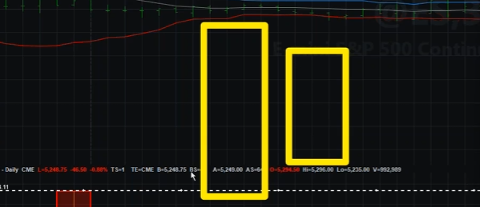

Hay muchas veces que las figuras de velas es como se dice pues todos todos con campo de precio, todo es sumando el restando *high*, *low*, *open*, *close*, todo es lo mismo. Como se mide el cuerpo de una vela, en el cuerpo de una vela es esto, 

Qué es el `cuerpo` *open* menos *close* o *close* menos *open*, y el rango *high* menos *low* es `range` o cuerpo. Y con esas con esas dos, con esos cuatro campos podemos relacionar distintas distintas figuras prácticamente todas.

**Narrow Range: Definición y Aplicación**

Y lo mismo de volatilidad porque muchas de expansión, de contracción, acordaros que vimos brevemente, acordaros del *narrow range*, esto es un narrow range, se va haciendo pequeño, 

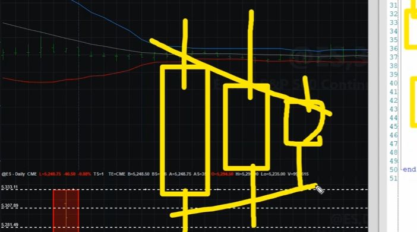

`narrow range` de 3, de 4, acordáis que lo vimos, pero no necesariamente alineado, cuidado.

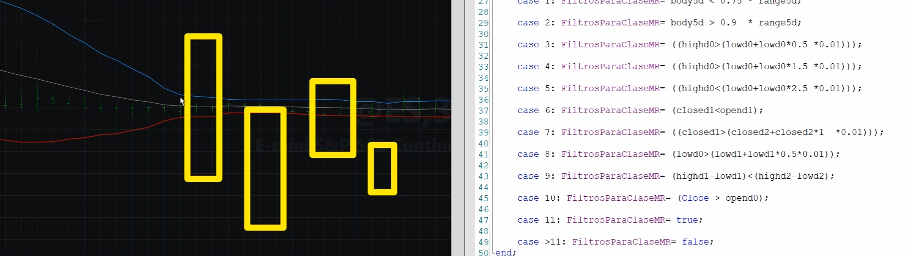

esto es un `narrow range` de 4, porque el rango cada vez es más narro, más pequeño, es esta tiene mayor, esta menor, esta menor, y esa menor, es un narrow range de 4.

Bueno todo esto al final es comparar el rango, se compara simplemente hay menos lo, entendéis, como como se relaciona no, se analizan los filtros, todo esto es así, o sea de esto puedes hacer infinitos, bueno infinitos no pero puedes hacer muchos, algunos con sentido otros absurdos, otros que son pasarse de frenada, hay distintos tipos.

**Comentario sobre Filtros de Días Anteriores**

Pero este que os digo pues aquí hay alguno por ejemplo a mí este no es un poco orgado Alberto porque es el cierre, o sea no es, esta es la anterior ya del, de uno pen uno, no sé si es que a lo mejor nos hemos equivocado que Alberto, pero el de uno, no se sabe las anterior durante la intradía, habría que ver cómo va, de cero menos de menos open de cero.

Al final aquí casi todas para mí las que tiene más sentido es usar cero más que 1 o 2, o cero con unos y, pero pero esto de 1 contra 2, para mí rebuscado, 1 contra 1 también, la de 5 días aún porque esas muchas que es como los narro de 3 de 2, hay mucha gente que lo usa porque es una semana con 5 días, no es que sea nada es que son es una semana son 5 días es una unidad, es la semana es una unidad en el mercado, las pautas estacionales tienen sentido.

<div style="border-left: 4px solid #27ae60; background: #ecf9f1; padding: 10px 15px; margin: 10px 0;">
  <strong>📏 Regla práctica</strong><br>
  La unidad de 5 días (una semana de mercado) es muy utilizada en filtros porque representa un ciclo natural del mercado. Las pautas estacionales tienen sentido en esta escala temporal, por eso muchos filtros comparan datos de hace 5 días.
</div>

Y entonces es por eso que al final la unidad de 5 días es una unidad de mercado, es una semana de mercado, entonces por eso tiene tiene sentido, siempre hay que buscar el sentido de esas cosas.

Pero todas las que son cero comparando con 1, con 2, o con 3 sí, pero comparando de 1 con de 1 o de 1 con de 2, para mí está un tantito rebuscadas. Está por ejemplo 10 está muy bien porque simplemente que el cierre sea mayor que López, pero también se podría haber mirado el cierre mayor que el cierre anterior, puedes buscar esta, de acuerdo, o close mayor es lo mismo pero close mayor que close de 0 que es lo que hemos guardado arriba porque ésta esto es esta vela, eso es esta vela son distintas, se entienden.

**Consulta de Aureli sobre la Función "De"**

acordaros una cosa que ellos que tengan easylenguaje porque esto es es importantísimo, importantísimo, porque la mejor manera que tenéis a aprender, pero que ver el código, ahora habló de decir la función de `Closed` se puede abrir, se puede abrir, 

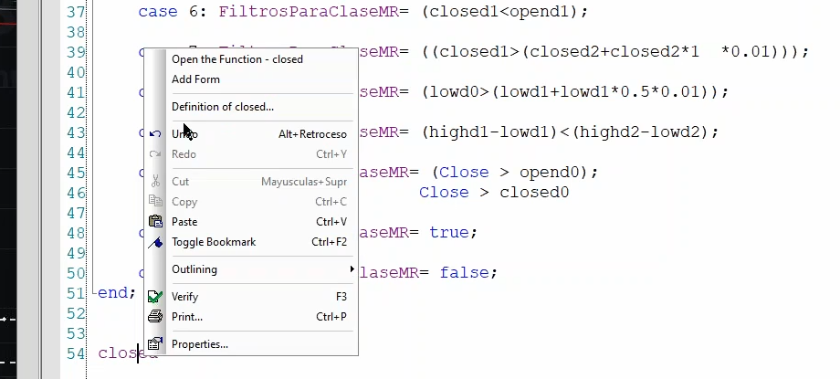
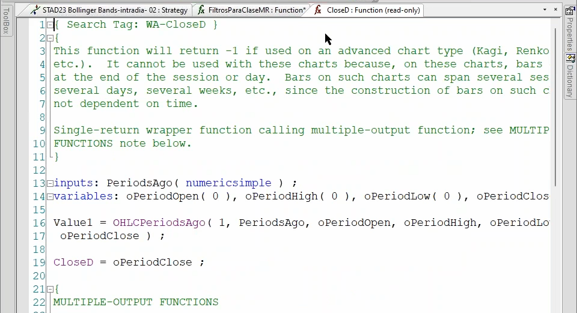

es una función de esta que son que son un poco avanzadas podemos decir, pero bueno pero no se pueden abrir, y la otra cosa que se puede hacer es pulsar encima F1 e ir a la ayuda de la misma función y esa es la mejor manera de entender bien lo que se está refiriendo, esto es lo más importante.

**Transición al Sistema Tendencial: Vez Ratio**

Entonces bueno aquí también está trabajando un poquito en él y sí que había algún filtro que aportaba algo a los cortos, 

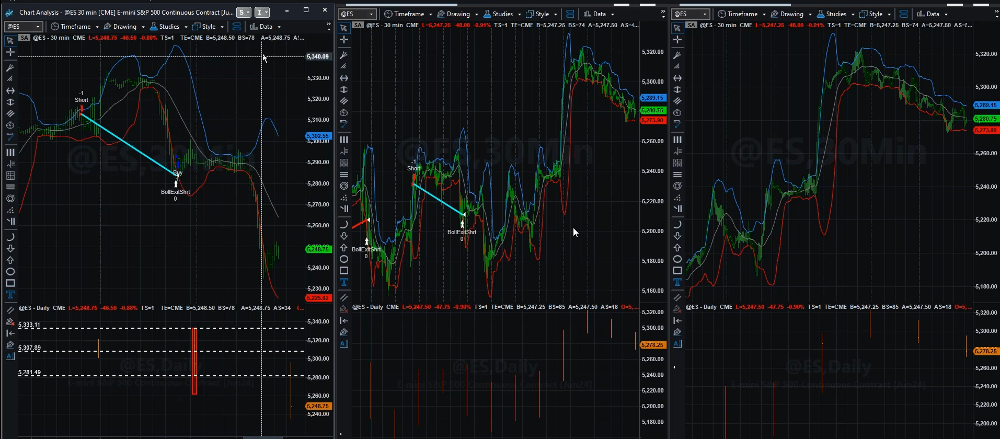

chart1: 

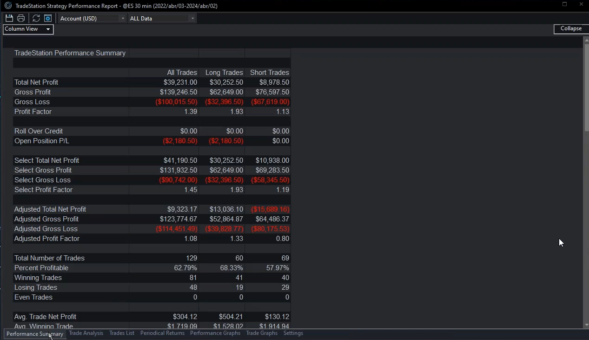
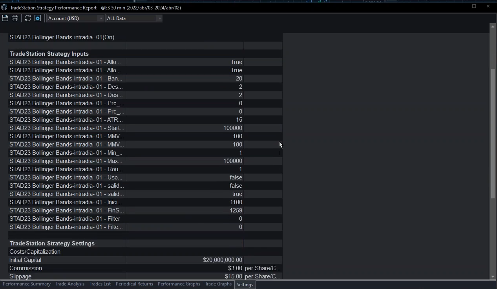
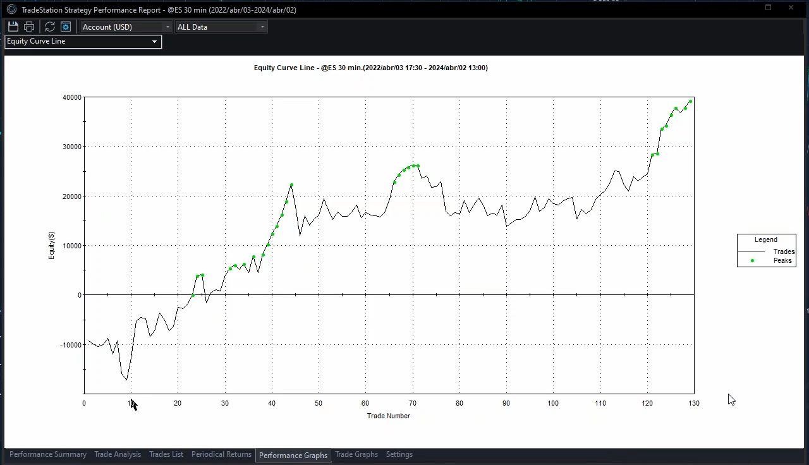

no está mal del todo, y tiene su valor, de acuerdo, tiene su valor sin demasiadas complicaciones sin demasiadas complicaciones. Hay que buscarle, recomiendo buscar una *ventana horaria* lo que os decía, y buscarle algún tipo de salida, a mí la salida en banda contraria ese tipo de estrategias creo que va que va bien.

Y luego hay que buscar alguna ***salida para los fallos***, que cuesta con esto, pero se puede buscar también salida, y hay versiones que he visto pues buscando doble, salido otra vez en la banda, es decir por ejemplo aquí 

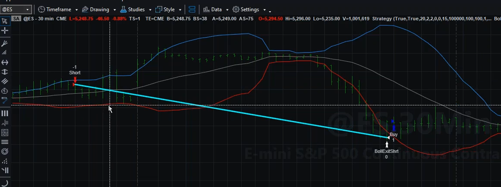
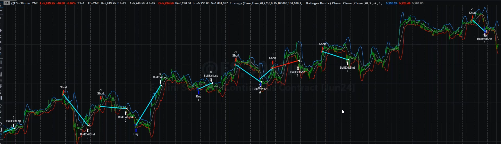

cuando te vuelve a cerrar otra vez por la banda sales, cosas así. O también la salida temporal, la salida temporal, hay que buscar mejorar los fallos porque es verdad que tiene pocos en el sentido que es buena es buena entrada, pero en general también da bastantes fallos. Y lo que os digo de las ventanas horarias suele funcionar también bastante bastante bien.


## Sistema *ABERRATION STRATEGY*

**Introducción al Sistema Vez Ratio (Volatility Breakout)**

Hablamos también de el de probar la estrategia podemos decir contraria, durante la teoría lo vimos. Aquí lo tengo se lo tengo todo en MultiCharts 

*ABERRATION STRATEGY* os lo comenté, y es un sistema que fue muy famoso durante muchos muchos años, pueden haber variaciones, pueden haber distintas distintos conceptos del mismo tema. 

> Al final el concepto básico, es es justo el contrario justo el contrario de del que hemos visto ahora de Mean Reversion, es decir si antes lo que hacíamos era comprar cuando estábamos por debajo de la media inferior, aquí lo que vamos a hacer es vender cuando rompemos la banda inferior y comprar cuando lo hacemos por la banda superior.

**Características del Sistema Tendencial Extremo**

Es un sistema duro, decir muy tendencial, es el súper extremo de las más tendenciales que hay, porque llegamos que lleva al extremo aquello de que tendenciales compras caro para vender más caro, decir o vendes caro para luego recomprar más caro, en este caso es muy llevado al extremo, vale, muy llevado al extremo, y pues porque normalmente cuando compras o vendes tiene siempre la sensación que lo haces como tarde, que lo haces como tarde.

En sí el código es sencillo pero como todos pues puede tener distintas distintas variantes. Tampoco en este le hemos dado muchas vueltas, vale, no le hemos dado muchas vueltas pero yo os explico las vueltas que se le puede dar, porque a partir de ahí pues podéis explorar hacerlo.

**Variantes para la Entrada: Retrasar Señales**

Hay hay vueltas para la entrada para retrasar la entrada, por ejemplo pedirle dos cierres en vez de un cierre, pedirle que sí pues lo que os digo que es que sea dos cierres por encima, pedirle alguna figura de velas determinada, que además esté que además del cierre por encima de la banda para evitar algunas señales un poco tontas, pues que además cierre por encima del máximo del día anterior, que casi siempre es así pero puede haber algún caso que no, casi siempre se va a dar pero vais a ver algún caso.

A ver si encuentro alguna hora en que haya caído así tonto y no lo espero, primero que tenga la misma banda puesta que en el gráfico, tengo la banda 47, que entiendo que aquí le hemos dado un poquito al optimizador. Normalmente normalmente siempre va a ser así para pintar también las líneas más gruesas porque si no creo que no las van a ver del todo del todo bien.

**Entradas Tendenciales: Comprar Caro para Vender más Caro**

A mí es una entrada que me gusta mucho, pero por ejemplo el todo no le gusta nada, es decir esto yo es que tengo una mentalidad tremendamente tendencial y me gusta, pero es verdad que un sistema muy duro, muy duro y muy difícil, muy difícil, lo sabe, puede pasar épocas muy largas contra dos fuertes, y sólo apto para activos muy tendenciales.

Entonces a ver si encuentro alguna, no es habitual ya os digo, normalmente cuando va a romper la banda va a ver cerrado, pero puede haber algún caso, puede haber algún caso en que no, puede haber algún caso.

**Filtro Adicional: Stop de Compra en el Máximo**

mira este aquí se me da, 

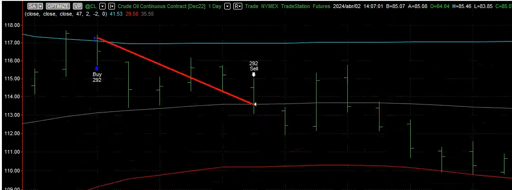

por eso lo explico ahora es, entonces una vez pasa eso poner un *stop de compra* en el máximo de esta vela en vez de comprar al mercado, 

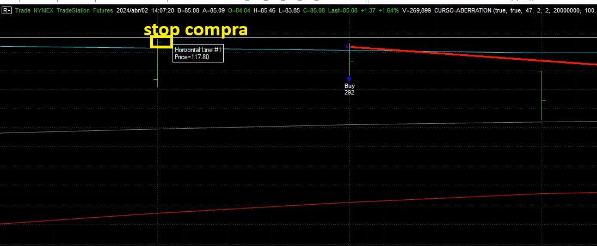

vale, porque entonces le pides que siga el impulso, entendéis. Es decir en vez de pedirle comprar al mercado le pido le pongo un stop de compra aquí, por ejemplo aquí no hubiera entrado, aquí no hubiera entrado, porque? porque le estoy pidiendo que siga con impulso.

Porque es verdad que hay muchas veces que eso es lo que hace el anti-tendencial, que justo va a la banda y vuelve, como pasa aquí, no cierra, como pasa aquí no es. 

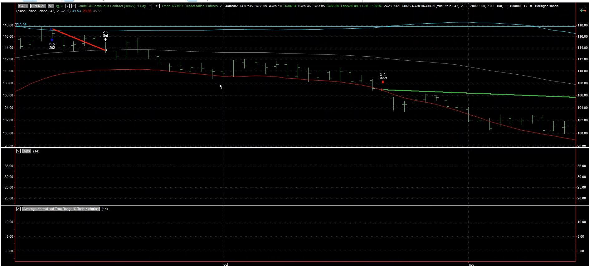

Entonces para evitar esas entradas se puede poner ese filtro añadido, pero le ven, hay activos que no acaba de ir bien porque acaba entrando igual y entra más más caro, entonces todo tiene un precio y todo tiene un precio.

Normalmente un activo que tú estés viendo como este que optimizando te pone una banda de 47 quiere decir que quiere frenarte un poco porque es muy volátil, necesita oscilar más sin que eso supongan entradas. Puede ser que te vaya bien algún filtro de este tipo, es retrasar un poco la entrada, retrasar un poco la entrada para evitar algunas entradas en falso, pero claro el precio ese tipo de sistemas es este, ves pillar estos trades tan magníficos, de acuerdo.

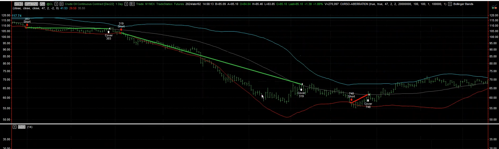

Es decir es lo que pasa luego cuando el activo pues se pega a una host increíble, o pega tirones fuertes pues se queda adentro.

**Salidas en Sistemas Tendenciales: La Media Central**

Y lo mismo para la salida, la salida más convencional y más conservadora es en el mínimo, aquí nuevamente tenemos implementar una versión que es un poco extraña, es un poco porque realmente, bueno hay dos, hay con la media puede salir directamente a esto con la media central, o pedirle un cierre por debajo, de acuerdo.

```sh
If Allow_Long then begin
	# Entra largo con un cierre por debajo
	If MarketPosition <> 1 and Close > UpBand then Buy next bar at market;
```

Y hay versiones que usan doble, vale, que es un poco un poco esto, vale, es un poco esto es decir como un como un esto de seguridad, lo que pasa que aquí está un poco al revés eso es un poco extraño, no sé la verdad me acuerdo porque lo pusimos así, igual estamos haciendo pruebas o lo que sea, pero poner cierre de stop en la banda, vale, y que no deja de ser un stop de seguridad, vale.

```sh
If Allow_Long then begin
	# Entra largo con un cierre stop por encima de la Banda Superior
	If MarketPosition <> 1 and Close > UpBand then Buy Contratos shares next bar at market;
	If MarketPosition = 1 then begin
		# Salida por stop en la banda central
		Sell next bar at Ave Stop;
			If Close < DnBand then Sell next bar at market;
	End;
End;
```

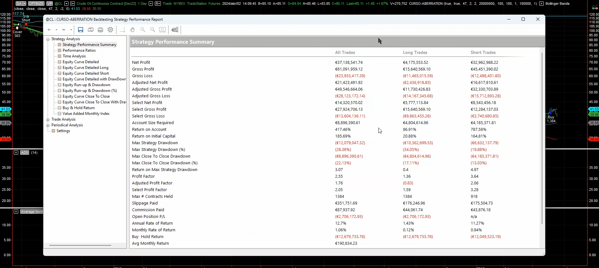

**Prueba Rápida: Cerrar con Cierre por Debajo de la Media**

Vamos a hacer esa prueba rápida aquí ahora a ver si nos en este caso nos mejora o nos empeora, lo normal es que nos empeore porque está está optimizado, lo normal es que nos empeore.

Aquí la versión lo que hace es cerrar en stop en la  `media`, cierra en stop en la media. 

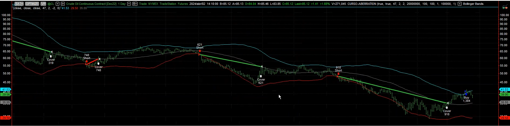

>Lo que vamos a hacer es pedirle que cierre por encima de la media, y le vamos a dejar de stop la banda contraria por si hay un latigazo fuerte sin cerrar, que tenga esa seguridad de salirse, de acuerdo, no quedarse ahí enganchado, vale?.

Es decir vamos a invertir un poco un poco el mecanismo, no es que invertir es que ahora tiene los dos pero no actúa el segundo porque ahora lo que hace es cerrar si en stop en la banda central.

Entonces por ejemplo aquí no saldría, saldría dos velas después, 

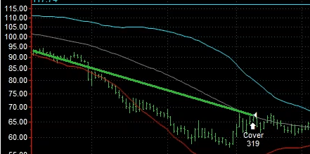

y probablemente peor, en este caso es decir ahora a veces muchas veces saldrá peor, otra saldrá mejor, hay que hay que verlo. A mí me gusta un poco más así.

simplemente estoy invirtiendo esta estas dos variables `Ave` `DnBand`

```sh
BuytoCover next bar at UpBand Stop;
			If  Close > Ave then BuytoCover next bar at market;
```
le he pedido que cuando cierre por encima de la media entonces le cierre mercado en la siguiente

```sh
If Allow_Long then begin
	# Entra largo con un cierre por encima de la Banda Superior
	If MarketPosition <> 1 and Close > UpBand then Buy Contratos shares next bar at market;
	If MarketPosition = 1 then begin
		# Salida por stop en la banda central
		Sell next bar at DnBand Stop;
			If Close < Ave then Sell next bar at market;
	End;
End;

If Allow_Short then begin
	# Entra corto con un cierre por debajo de la Banda Inferior
	If MarketPosition <> -1 and Close < DnBand then SellShort Contratos shares next bar at market;
	If MarketPosition = -1 then begin
		# Salida por stop en la banda central
		BuytoCover next bar at UpBand Stop;
			If  Close > Ave then BuytoCover next bar at market;
	End;
End;
```

Bueno lógicamente como suponíamos ha empeorado, Profit Factor y demás general empeora, si empeora a los dos lados pero era un simple para que vieras la diferencia, para que vieras la diferencia.

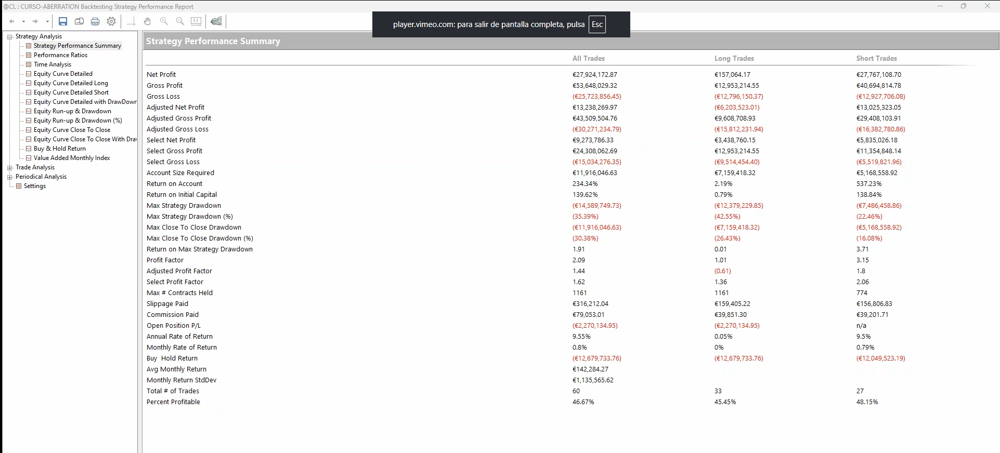

Aquí ahora le estamos pidiendo que cierre por encima para poder saber, hasta que no cierran por encima no sale, no lo hacen, aquí antes lo había hecho, aquí ahora pues cierra un poquito después.

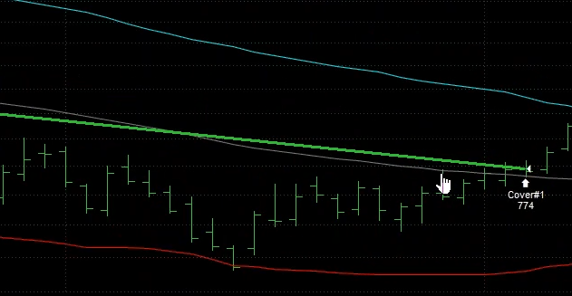

Y más, a mí me gusta un poco más así pero no quiere decir que ahora no vaya mejor porque repito este está el canal optimizado, y es totalmente normal con un canal optimizado lo normal es que es que vaya es que vaya peor. Pero habría que ver si ahora probando otro canal pues mejor o va peor, o sea no necesita tener un canal de esa forma.

Simplemente son distintas opciones o distintas maneras de el mismo concepto, de acuerdo, del mismo concepto, 

**El tema de filtros o tema de salidas**

**Salidas en Tendenciales: No Marear la Pérdida**

Vamos a ir filtros más salidas, vale, en salidas sí que no hay, mi opinión muchas cosas que hacer con un tendencial, no hay muchas cosas que hacer con un tendencial. 

Mirar que tenemos ahora mismo:

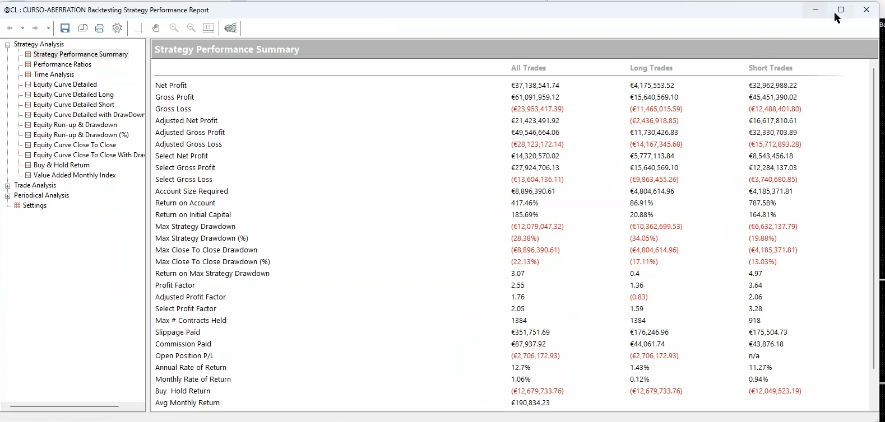

Que lo estamos viendo ahora en MultiCharts, aquí tenemos un porcentaje de aciertos, y ahora cuando lo encuentre os lo os lo digo, cuando lo encuentre 58 por ciento, nunca me acuerdo cambio de programa y nunca me acuerdo donde saca la cosa de verdad es un drama esto.

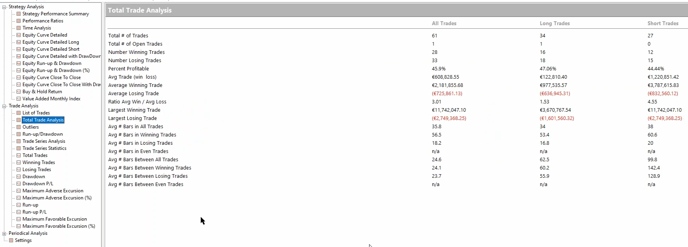

Aquí aquí tenemos los datos que buscábamos, vale, aquí tenemos un 45,9% `Percent Profitable` , tampoco es muy muy bajo pero es más bajo. Y fijaros que tenemos un una `Avg Ratio winning` de 2 millones y un `Avg Losing` ($625000) de situación realmente muy superior el `Avg Ratio winning`, tanto en el largo como en el corto aunque esto habría que verlo porcentaje pero bueno ya no se ve aquí.

Aquí podemos ver el análisis un poco mejor este que veíamos antes en TradeStation, de los run-ups y de los y demás, es que aquí es 63 por ciento por daros que el petróleo llegó a ser negativo, por ser magnitudes muy bestias de un menos 8 y el average value 8 por ciento, con 2 por ciento.

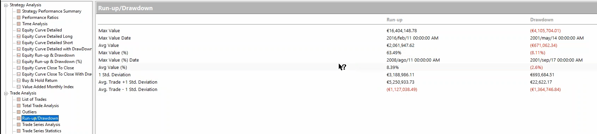

Aquí tenemos que los positivos, los positivos corren muchísimo más que antes, es justo lo contrario, lo contrario que teníamos antes, lo contrario que teníamos antes, y de esta forma se invierte se invierte totalmente la tortilla con el caso anterior.

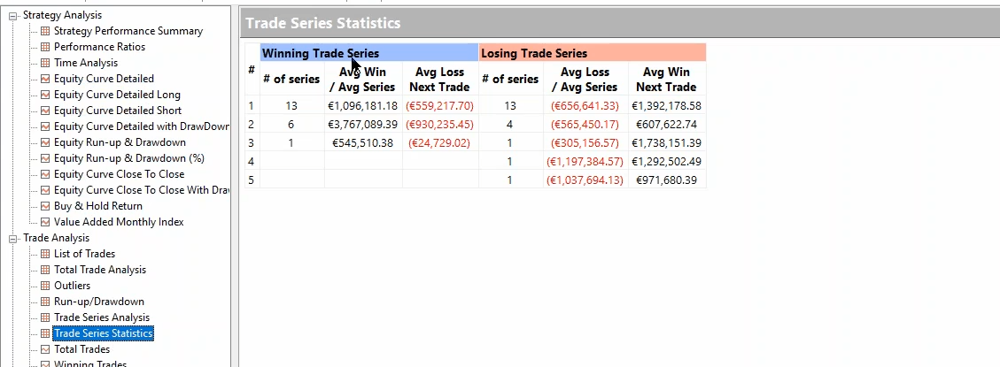

Y aquí por lo tanto es lo que os digo, aquí hay que vigilar por no cortar, es complicado, por eso es complicado gestionar las salidas de un tendencial, porque necesita dejar correr. Donde sí que se puede mejorar un tendencial es filtrando entradas, lógicamente filtrando entradas, aumentando las probabilidades se puede filtrar entradas, y se debe filtrar entradas en muchos casos.

Pero en las salidas no recomiendo marear mucho la pérdida, no os recomiendo marear mucho la perdiz. Al final hay que salir por un estilo trailing, esto no deja de ser un trailing, la media móvil, 

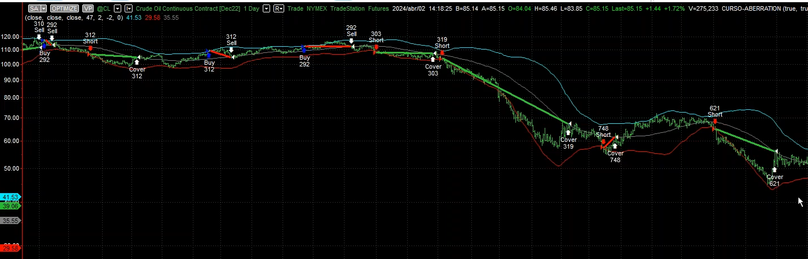

pero podéis buscar otra, podéis buscar, pero tiene que ser una salida que le deje volver, tiene que ser una salida que le deje volver.

De Hecho a lo mejor esta es demasiado justa es, tiene que ser una salida que le deje volver, puede ser un trailing, puede ser la misma media por simplificación y no añadir grados de libertad. Pero no es conveniente ya os digo darle darle muchas vueltas porque es necesario, es necesario dejarle que desarrolle los trades para un tendencial, sino ya no va a ser un tendencial.

<div style="border-left: 4px solid #27ae60; background: #ecf9f1; padding: 10px 15px; margin: 10px 0;">
  <strong>📏 Regla práctica</strong><br>
  En sistemas tendenciales, no uses nunca objetivo de beneficio (take profit) fijo. La salida debe ser tipo trailing que permita al mercado retroceder parcialmente mientras la tendencia se desarrolle. Marear las salidas destruye la esencia del sistema tendencial.
</div>

Si quieres otra cosa pues puedes perfectamente entonces convertirlo en un ***breakout***, de acuerdo, y entonces ya sí que tiene sentido TP, tiene sentido protegerlo, etcétera, vale. Pero en un ***tendencial*** en mi opinión no hay que usar nunca objetivo, vale, y hay que poner un una salida tipo trailing que le permita al mercado volver y que nos garantice con todas las comillas del mundo de que la tendencia se ha acabado, es lo que buscamos, nosotros lógicamente no nos vamos a conseguir en todas las ocasiones, pero la mayoría de personas hay que intentar conseguir eso.

**Problema de los Laterales en Tendenciales**

Qué problema tienen esos sistemas?, que este mismo tipo de salida le va a hacer sufrir mucho cuando no hay una tendencia, y ahí está el problema de `Avg Ratio`.

¿Entonces qué más podemos hacer?, bueno vamos aquí este tipo de sistemas se puede trabajar también interdiariamente, o se puede trabajar en la versión original de hace muchísimos años que la creó él lo operaba en horizontes de diario, incluso se comenta que podían ser a semanal, pero bueno, y lo hacía en una *cesta de commodities* bastante grande.

**Portfolio de Sistemas Tendenciales**

Es decir al final este tipo de sistemas la única manera de trabajarlos es agrupándolos en otros, hemos intentado evaluar o mirar un poco algo algo parecido, algo parecido, lo hemos hecho aquí en el *Portfolio Trader*,

Bueno tenemos uno aquí con algunos activos seleccionados, eso no me acuerdo como estaba de gestión de gestión monetaria, 

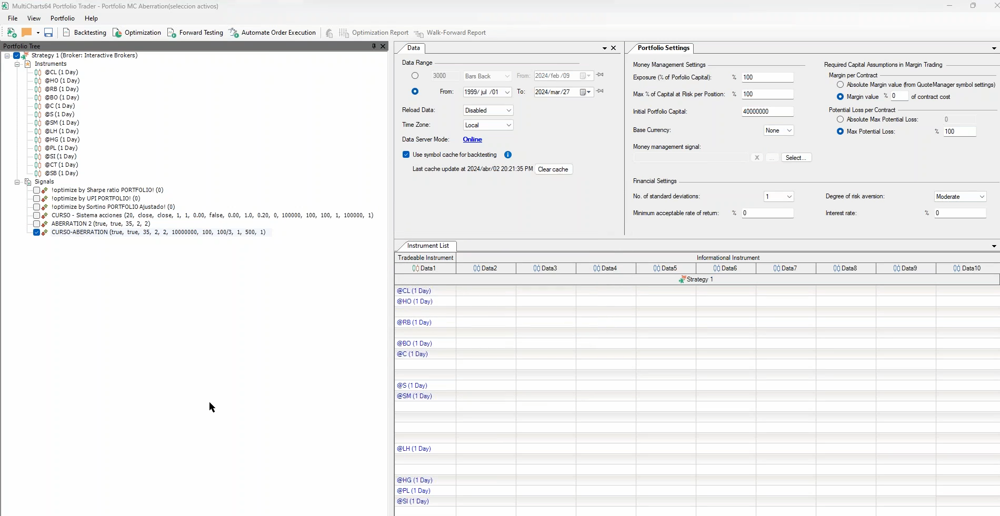

y esto es un poco la manera de trabajar este tipo de estrategias, de acuerdo, de trabajar este tipo de estrategias, que tienen su buen momento pero tienen su mal.

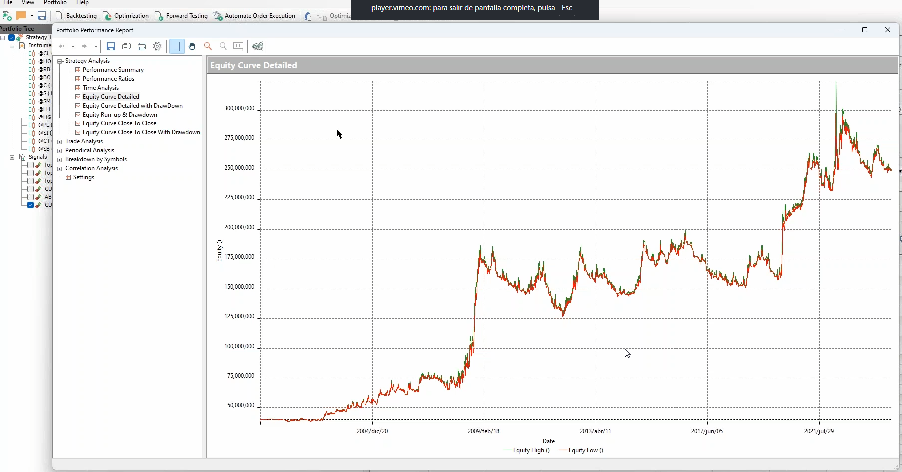

Entonces al final en un portfolio tendencial puede tener su cabida, pero necesita como como ya hemos hablado siempre de tener otro tipo de sistemas en el portfolio que compense en estos pésimos momentos que va a tener.

**Movimientos Explosivos en Commodities**

Es lo que os digo, son sistemas, y cuando hay tendencia, cuando pasan cosas ya veis que van pasando no, del petróleo, del oro, cosas de pronto increíbles, de subidas, de caídas, o el cacao ahora recientemente no, pues ahí están, de acuerdo, ahí ahí están. No sé si teníamos el cacao aquí metido 

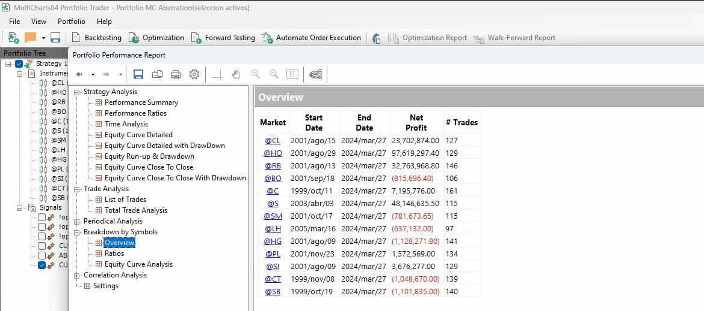

unos gana otros pierde, ahí está un poco la dificultad, 

En fin es lo bueno y malo de este tipo de estrategias, sufren lo que no está escrito los laterales, porque de manera tiene un montón de señales falsas, y lo que decía y hay que buscar la manera y buscar algún filtro para que para retrasar las entradas en algunos casos, porque cuando coja tendencia pues ya da igual que entre más caro no, pero porque si no los laterales lo cosen.

**Diferencia entre Bolsa y Commodities**

Aún así por eso os digo que la bolsa es muy complicado ese tipo de sistemas, pero en commodities suele ir bien, pero necesita filtros, necesita buscar filtros de tendencia que son de este tipo, de ese tipo que habéis visto, o simplemente añadir algún otro algún otro filtro de tendencia como puede ser otra media o tipo de X como habéis visto, de este tipo, de este tipo, una de X puede valer. 

**Versión Intradía del Sistema Tendencial**

Y también hay versiones intradiarias como puede ser esta que vais a ver ahora 

[ABERRATION_INTRADIA_STRATEGY](../code/CURSO_ABERRATION_INTRADIA_STRATEGY.ELD)

```sh
Inputs: Allow_Long(True),
		Allow_Short(True),
		Length(35),
		StdDevUp(2),
		StdDevDn(2), 


		Prc_Stop(0),		//Si StopLoss > 0 se utiliza el stop loss. 
		Prc_Profit(0),		//Si Prc_Profit > 0 se utiliza el TP. 
		ATR_Per(15),
	
		
		Start_Equity (100000),
		MMVar_Start (100),
		MMVar_Profits (100),
		Min_Size (1),
		Max_Size (100000),
		RoundTo (1), 
		UsoATR(false),		  //Usamos Stops y Profits ajustados por inflación
		
		// Eleccion de Horario		
		InicioSesion(0), 	//Inicio sesion de trading
		FinSesion(2300), 	//Fin sesion de trading
		
		FiltroLng(11), //Selector de filtros de 1 a 12. 11 siempres es verdadero. > 12 siempre es falso
		FiltroShrt(11); //Selector de filtros de 1 a 12. 11 siempres es verdadero. > 12 siempre es falso
```

Aquí el bueno de Alberto simplemente hemos hecho una versión intradía, planteándolo como como habíamos hecho anteriormente con unos filtros ya está con horario y tal, poco para que veáis el esquema básico, sin más, el esquema básico.

Este es un poco el esquema entre a diario siempre va un poco así, siempre va un poco así, filtros horarios, filtros de largos y/o de cortos, que pueden ser el mismo o no es decir en ambos casos en tiempo y en filtro puede ser o no puede ser es las dos las dos cosas hay que considerarlas.

Aquí tiene mucho sentido filtrado separado?, aquí empieza a tener menos, es lo que os decía, de acuerdo, podemos evaluarlo, podemos hacer una evaluación preliminar, mirarlo, de acuerdo, pero aquí empieza a gustarme menos, vale.

En bolsa es muy claro, a la que ya vamos a ir a commodities es más duro, y puede ser que utilicemos el mismo filtro, con lo cual ya el mismo filtro quiere decir que lógicamente si es de tendencia pues será el cista por encima, imaginaos una media, y bajista por debajo, porque que no usaremos uno distinto para largos que para cortos.

Si es de volatilidad pues lo mismo, si hay volatilidad para operar bien, o sea puedo negar el filtro pero que las reglas es el mismo, puede ser que lo lógico es que sea la contraria, en algunos casos no, en algunos tipos de filtro volatilidad o expansión es la misma regla para largo para corto, pero lógicamente si es por encima de una media no será igual, será lo contrario pero no es otra media o tal. 

Y lo mismo para el tema de filtros horarios ahora, es lo mismo para el tema de filtros.

No no quiere decir que sea obligatorio usarlo, es decir que es una opción que en intradía tiene mucho sentido evaluar, y que normalmente en intradía la evaluamos, normalmente luego puede descartarse, dice oye pues no, voy toda la sesión, perfecto, pero que tiene sentido evaluarlo, se entiende no.


**Código Intradía: Mismo Esquema con Filtros**

[ABERRATION_INTRADIA_STRATEGY](../code/CURSO_ABERRATION_INTRADIA_STRATEGY.ELD)


Bueno pues lo que os digo el código es este como ya habéis visto, mismo historia que es un monetario igual, simplemente añadimos la regla de los filtros, 

```sh
...
	If Allow_Long then 
	begin
		If MarketPosition <> 1 and Close > UpBand and FiltrosParaClaseMR(FiltroLng) then 
			Buy Contratos shares next bar at market;
...
```


que no sé si Alberto ha hecho los mismos o no,  ha hecho los mismos, vale, ha hecho los mismos, y ya está sin más, vale, si más.

miremos el filtro por dentro `FiltrosParaClaseMR`

```sh
// Lo aplicamos en Data2 para los calculos de los filtros
...
opend0 = Open of data2; highd0 = High of data2; lowd0 = Low of data2; closed0 = Close of data2;  
opend1 = Open[1] of data2; highd1 = High[1] of data2; lowd1 = Low[1] of data2; closed1 = Close[1] of data2;  
opend2 = Open[2] of data2; highd2 = High[2] of data2; lowd2 = Low[2] of data2; closed2 = Close[2] of data2;  
opend3 = Open[3] of data2; highd3 = High[3] of data2; lowd3 = Low[3] of data2; closed3 = Close[3] of data2;  
opend4 = Open[4] of data2; highd4 = High[4] of data2; lowd4 = Low[4] of data2; closed4 = Close[4] of data2;  
opend5 = Open[5] of data2; highd5 = High[5] of data2; lowd5 = Low[5] of data2; closed5 = Close[5] of data2;  

body1d = absvalue(opend1-closed1);
range1d = (highd1-lowd1);
body5d = absvalue(opend5-closed1);
range5d = maxlist(highd1, highd2, highd3, highd4, highd5) - minlist(lowd1, lowd2, lowd3, lowd4, lowd5);

Switch(selector) Begin
	case 1: FiltrosParaClaseMR= body5d < 0.75 * range5d;
	case 2: FiltrosParaClaseMR= body5d > 0.9  * range5d;	
	case 3: FiltrosParaClaseMR= ((highd0>(lowd0+lowd0*0.5 *0.01)));
	case 4: FiltrosParaClaseMR= ((highd0>(lowd0+lowd0*1.5 *0.01)));
	case 5: FiltrosParaClaseMR= ((highd0<(lowd0+lowd0*2.5 *0.01)));
	case 6: FiltrosParaClaseMR= (closed1<opend1);	
	case 7: FiltrosParaClaseMR= ((closed1>(closed2+closed2*1  *0.01)));
	case 8: FiltrosParaClaseMR= (lowd0>(lowd1+lowd1*0.5*0.01));	
	case 9: FiltrosParaClaseMR= (highd1-lowd1)<(highd2-lowd2);
	case 10: FiltrosParaClaseMR= (C>opend0);	
	case 11: FiltrosParaClaseMR= true;
	case >11: FiltrosParaClaseMR= false;
end;
```


Para la clase siguiente evaluaremos un poquito, era la idea, claro la idea es verla, a que no, era la idea que no, que, vale vale, no no pasa nada que no tiempo de trabajar lo más, bueno esta semana de más y un poquito más complicada por los días festivos que ya el viernes viene viene también a trabajar y ayer también pero lógicamente pues las mismas horas, y encima mañana también tenemos un poquito más complicado.

**Plan para la Siguiente Sesion: Salidas y Filtros**

Entonces aquí sí que queríamos mirar unos filtros específicos y no nos llegaba pero pero como os decía trabajaremos todo esto los selectores la semana que viene sobre todo para las salidas, pero intentaremos al menos estos estos de Bollinger pues darles un una capita pintura para acabar de dejarlos más más limpios y más aprovechables.

Entonces seguramente en estos dos al menos también veremos los filtros, para la semana que viene trabajaremos más los los que espero, el concepto repito que es el mismo, acuerdo, el concepto es el mismo, trabajar filtros que sí que pueden ser unos más para tendenciales que para Mean Reversion, es verdad, pero en algunos casos son similares, y que y que se basan sobre todo en pautas de precios.

Pero sí que hay algunos que son más de tendencia y otros que son más de no tendencia, eso eso es así, porque al final bueno la tendencia no deja de ser una expansión, vale, y la y la anti-tendencia normalmente es una contracción. Entonces eso ya te marca te marca una situación inversa, a veces es el mismo filtro pero al revés, de acuerdos, decir ya ya os explique aquello de que las expansiones a veces son contraintuitivos porque lo que anticipa una expansión es una contracción, y lo que anticipa una contracción es una expansión.

<div style="border-left: 4px solid #27ae60; background: #ecf9f1; padding: 10px 15px; margin: 10px 0;">
  <strong>📏 Regla práctica</strong><br>
  Las mejores entradas de sistemas anti-tendenciales se dan post-expansión (después de un movimiento fuerte). Las mejores entradas de sistemas tendenciales se dan post-contracción (después de un periodo de baja volatilidad). A veces el mismo filtro sirve para ambos, pero invertido.
</div>

Entonces los mejores entradas de los anti-tendenciales se dan post-expansión, y al revés, y el revés no, hoy está el cacao no, donde tenía la expansión después de un tiempo de contracción. Entonces hay veces que es el mismo filtro pero invertido, entonces esto suele darse.

**Compromiso: Lista de Filtros Útiles antes de Fin de Curso**

Pero bueno sí que sí que algunos, aunque ya hemos visto bastantes, pero sí que antes de final de curso trataremos de crearos un poco una una lista un poco más más útil de algunos filtros especialmente útiles, vale.

Y esto me comprometo, me comprometo a daros lo antes de antes de acabar, antes de que probablemente la última, probablemente la última clase donde hagamos el repaso y tal pues el repaso y recopilación de todo, y reuniremos ya lo mejor de lo que tengamos, pues seguramente la última clase creo que es el día de darlo esto ya, dar las las perlas no Alberto, las perlas hay que dar las el último el último día, el último día me las guardo para el último día las perlas

**Avance de la Siguiente Clase: Salidas**

Entonces la semana que viene lo acabamos, tenemos tenemos pensado hacer el tema de trabajar salidas con las estrategias que ya hemos hecho hasta ahora, los traemos hechos, explicaremos realmente las salidas pero pero luego ya las aplicaremos, traemos algunos aplicados, y tenemos aplicar aplicar algunos indirectos también para que veáis cómo se hace.

Y y veremos también si si nos da tiempo que creo que sí, intentaremos aplicar filtros a este y a los dos de Bollinger, vale, para justo con las salidas y los filtros dejar estos dos ya redondos para para que podáis darle algún tipo de uso.

**Sistemas Cerrados vs Todo-Terreno**

Hay que tener claro que son sistemas sencillos, aplicables bastante a bastantes cerrados de mercado, es decir no son todo-terreno, de acuerdo, son sistemas todo-terreno y hay sistemas poco más cerrados, estos son sistemas cerrados, es decir muy específicos de activos que tienen una, valga me el juego de palabras, tienen tendencias ser tendenciales o tendencia no serlo.

Entonces pero bueno ese tipo de sistemas también son útiles y también van bien en esos activos, ya digo las materias primas generalmente suelen ir bastante bien, pero hay que mejorarlo, como está si es demasiado duro, demasiado duro, hay que mejorarle un poco las entradas al tendencial sobre todo, vale.

