# Práctica 12 - Salidas y Gestión de Stops


1. [Consultas](#consultas)
2. [Análisis de Stops: Monetario vs Porcentual](#análisis-de-stops-monetario-vs-porcentual)
3. [Strategy `Salidas_02` : Código con 32 salidas](#strategy-salidas_02--código-con-32-salidas)
4. [Strategy `ABERRATION`](#strategy-aberration)
5. [Aplicando Strategy `Salidas` a Strategy `ABERRATION`](#aplicando-strategy-salidas-a-strategy-aberration)
   - [`Case 1` Salida monetaria : Stop $](#case-1-salida-monetaria--stop-)
   - [`Case 8` Salida por volatilidad: Trailing por ATR](#case-8-salida-por-volatilidad-trailing-por-atr)
     - [Chandelier vs. Trailing](#chandelier-vs-trailing)
   - [`case 11` Salida combinada : Combinación Trailing + Take Profit](#case-11-salida-combinada---combinación-trailing--take-profit)
   - [`Case 16` Salida porcentual: Stop% + Profit%](#case-16-salida-porcentual-stop--profit)
   - [`case 20` Salida combinada : Chandelier + temporal](#case-20-salida-combinada--chandelier--temporal)
   - [`case 24` Salida por Break-Even](#case-24-salida-por-break-even)
6. [Homogeneización de parámetros](#homogeneización-de-parámetros)
   - [`Case 6` Salida por volatilidad : Profit ATR con suelo y techo](#case-6-salida-por-volatilidad--profit-atr-con-suelo-y-techo)
   - [`case 23` Salida parabólico : ParabolicSAR Exit](#case-23-salida-parabólico--parabolicsarexit)
7. [Salidas para tendenciales vs. antitendenciales](#salidas-para-tendenciales-vs-antitendenciales)
   - [`Case 12` Salida por volatilidad: Chandelier puro](#case-12-salida-por-volatilidad-chandelier-puro)
8. [Mean Reversion intradía](#mean-reversion-intradía)
9. [Probando en oro](#probando-en-oro)
   - [`Case 6` Salida por volatilidad : Profit ATR](#case-6-salida-por-volatilidad--profit-atr)
   - [Búsqueda de `entradas` con `salidas`](#búsqueda-de-entradas-con-salidas)
10. [Pregunta sobre optimización por TSE vs. PPC](#pregunta-sobre-optimización-por-tse-vs-ppc)
11. [Referencias](#referencias)
    - [Autores citados](#autores-citados)
    - [Libros y recursos](#libros-y-recursos)
    - [Conceptos técnicos clave](#conceptos-técnicos-clave)

<br>


## Consultas

> *Ando trasteando con el mercado de Forex, mercado donde nunca he conseguido nada interesante, dicho sea de paso. Pero viendo tus clases en la práctica comentabas que los pares contra el yen suelen ser más tendenciales. Tengo esta estrategia. Está sin optimizar nada, eh. Ha sido lo primero que ha salido (lo que pasa es que al optimizar queda algo parecido, con menos DD y la subida más parabólica, pero en general la forma es igual: muchos años en plano para luego despegar).*
>
> *La estrategia es long only, tendencial, con el USDJPY. Timeframe 15 minutos, 725 trades. Data desde 2015 hasta hoy. Se pasa 4 años prácticamente sin romper ATH.*
>
> *¿Tú echarías a andar este sistema o uno similar? Que un sistema no gane en 4 años es un poco triste, pero ojo, porque tampoco nada se rompe ni hay un DD desmesurado ni nada de esto.*
>
> *Es que estoy en un punto en que me cuesta muy poco sentarme con la creatividad a validar ideas y probar cosas. Pero luego ya sentarte a decidir qué sí poner a operar y qué no... 👀*
>
> *Con este tengo muchas dudas, a ver qué opinión te merece.*

<figure>
  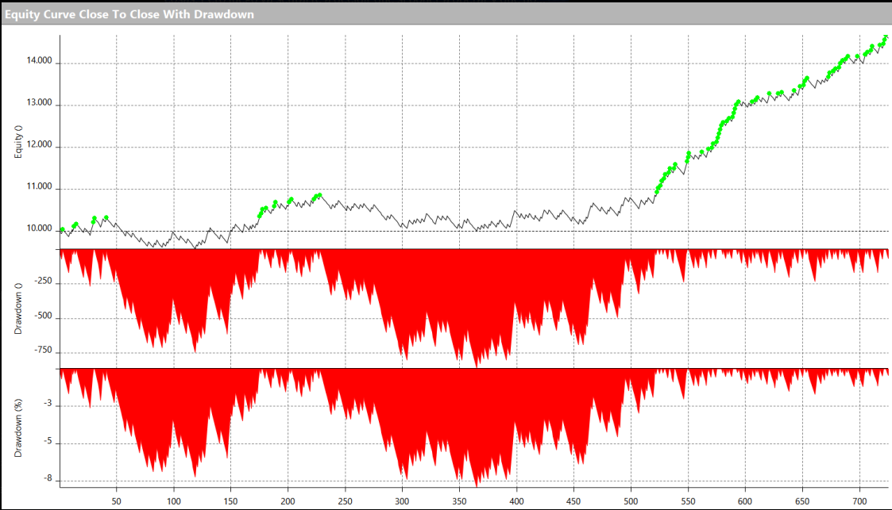
  <figcaption>Figura 000</figcaption>
</figure>

Dice si echaría a andar un sistema así; podría ser. La verdad es que sí, sería ideal mejorar todo ese periodo tan largo que dices de cuatro años; habría que estudiarlo un poco y ver. Pero es verdad que decías que es un *tendencial*, ¿no? Ese es un dibujo bastante típico de los tendenciales en intradía. Es decir, no es fácil conseguir un intradía tendencial *hormiguita* estable, vale.

Esto lo vas a encontrar más en *Mean Reversion* que en tendencial. Entonces, al final, es lo que hablamos siempre: si a ti te inspira confianza, es robusto, etcétera, y tienes ya una cartera y demás, pues por lo del *portfolio*. A nivel de análisis ya haremos, como digo, al menos una clase de esto: ver si aporta al portfolio, me explico. Es decir, si este fuera tu único sistema, probablemente no —es seguro que no—, diría que no. Pero si tú tienes un *portfolio* de estrategias, puede ser que aporte al portfolio; de hecho, es probable que lo haga, vale, es probable que lo haga si en él no hay muchos sistemas de este estilo.

Entonces, al final, siempre es ese un poco el punto. El comentario que haces de "que no gana en 4 años es un poco triste" es cierto, pero no es tan extraño en un tendencial; no es tan extraño en un tendencial real. O sea, claro, en *backtest* es verdad que... el tema es que si eso fuera *live* es triste, pero aceptable a nivel de *portfolio*. Repito: como *backtest* es más dudoso, es más dudoso, es más dudoso.

<div style="border-left: 4px solid #ff9800; background: #fff3e0; padding: 10px 15px; margin: 10px 0; border-radius: 8px;">
  <strong>⚠️ Backtest vs Live en períodos planos</strong><br><br>
  Un sistema que pasa 4 años sin romper <em>ATH</em> (máximo histórico) en <em>backtest</em> genera más dudas que si lo hiciera en <em>live</em>. ¿Por qué?<br><br>
  • En <em>live</em>, ya has demostrado que aguantas psicológicamente y que el sistema no se ha roto<br>
  • En <em>backtest</em>, no sabes si ese período plano es señal de robustez o de que el sistema simplemente no funciona y los buenos años son <em>overfitting</em><br><br>
  Por eso dice "como backtest es más dudoso".
</div>

<div style="border-left: 4px solid #4caf50; background: #e8f5e9; padding: 10px 15px; margin: 10px 0; border-radius: 8px;">
  <strong>✅ Criterio de decisión: ¿lo pongo a operar?</strong><br><br>
  <strong>NO</strong> si es tu único sistema → demasiado riesgo de pasar años sin ganar<br><br>
  <strong>SÍ, posiblemente</strong> si:<br>
  • Ya tienes un <em>portfolio</em> diversificado<br>
  • No tienes muchos sistemas tendenciales en él<br>
  • Te inspira confianza y lo ves robusto<br>
  • Lo analizas desde la perspectiva de <em>aportación al portfolio</em>, no como sistema aislado
</div>

<br>

## Análisis de Stops: Monetario vs Porcentual

<video width="640" controls>
  <source src="../media/Estrategia_de_salida_eficaces.mp4" type="video/mp4">
</video>

[Ver video: Estrategia de salida eficaces](../media/Estrategia_de_salida_eficaces.mp4)

Como introducción a lo que vamos a hacer, porque digamos que es una continuación de esto, vale. Hablamos de la parte que ya habéis visto de salidas; no paro ni un segundo ahí, y me voy a centrar un poco en algo que ya habíais visto y que ya os he comentado varias veces, pero quiero enseñaros algún ejemplo, algún ejemplo práctico, y eso es lo que os quería enseñar.

En la derecha es *porcentual*, en la izquierda es en *valor absoluto*. Este es un extremo, pero pasaba en más activos; los que más, pasan en bolsa.

<figure>
  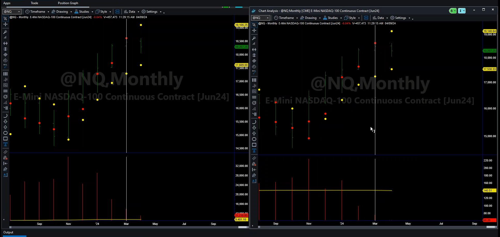
  <figcaption>Figura 001</figcaption>
</figure>

A la izquierda llega un momento en que el *stop* simplemente no actúa. A la izquierda llega un momento en que el *stop* simplemente no actúa. Tú tienes un *stop* a precios actuales que está parecido al actual, es decir, que la relación que va saltando con la que no es relativamente similar. Lógicamente hay alguna diferencia, pero es similar. Es decir, hay puntos amarillos, hay puntos rojos: cuando es rojo es que ha saltado, cuando es amarillo es que no ha saltado. Por arriba y por abajo. Entonces la relación, como veis, es bastante similar, con algún pequeño matiz, pero ya digo que es similar.

La cuestión es que ahora es parecido. El de la derecha todo el tiempo tiene una cierta armonía. Lógicamente, cuando no hay volatilidad salta menos, pero salta. Como veis, también va saltando.

<figure>
  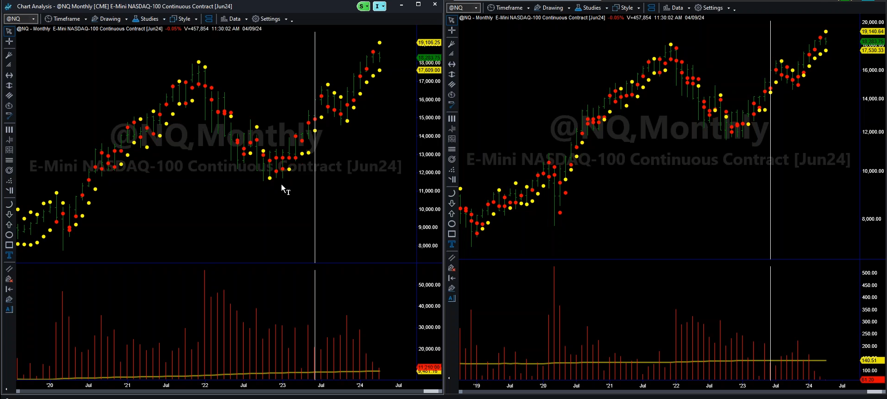
  <figcaption>Figura 003</figcaption>
</figure>

Y esto provoca simplemente que el *stop*... Si dimensionamos los *stops* en periodos un poco antiguos —y no hace falta irse al 2000; aunque te vayas al 2009, o incluso al 2010, incluso al 2012, depende del activo— ya se nota mucho. Es decir, aquí fijaros que ya se nota en el 2019. O sea, y en el 20, y ahora te cuento: en el 12, en el 13. Es decir, cualquier *backtest* te va a incorporar esos datos.

**El Argumento de Andrea Unger y la Normalización**

Entonces, ¿qué está pasando? Recordad que ya lo explicaba en la ponencia que recomiendo que veáis, y ya lo sabéis, porque esto lo he explicado bastantes veces: normalmente el *stop* rara vez va a mejorar el retorno. Casi todos estos análisis que hacen algunos analistas, como el que comenté —Andrea Unger—, se basan en el retorno. Y el retorno va a ser más en el de la izquierda. ¿Por qué va a ser más en el de la izquierda? Porque no salta el *stop*. Porque si aquí no hay *stop*, y sabemos que no tener *stop* aumenta el beneficio, pues es obvio que es mejor el de la izquierda.

Pero el hecho de que sea mejor —en el sentido de que gane más—, mejor dicho, el hecho de que gane más no quiere decir que sea mejor. En este caso quiere decir todo lo contrario.

Y por lo tanto, en un activo *intradiario*, vale, que no haya demasiada variación de precios, puede usarse el monetario. No se trata de decir —ahora vais a ver que nosotros también lo hemos puesto—, no se trata de decir "no, no, oye, nunca monetario", vale. Pero *en caso de duda, porcentual*. O mejor aún, *ajustado por volatilidad*, vale. En caso de duda, siempre ajustado por volatilidad.

Y no se trata de que el *backtest* sea mejor o peor; simplemente es *más realista*, es más realista. No se trata de conseguir un *backtest* mejor —eso siempre es muy atractivo—, pero se trata de conseguir un *backtest* mejor siendo realista y siendo robusto. Porque conseguirlo mejor pues es relativamente sencillo, de acuerdo.

<figure>
  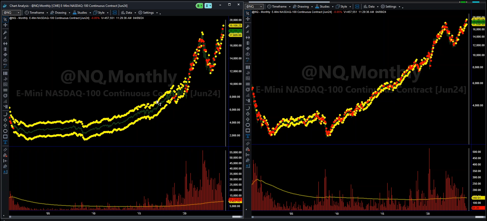
  <figcaption>Figura 002</figcaption>
</figure>

Abajo también se ve, porque abajo tenéis la volatilidad: a la derecha el valor del mercado en porcentaje y a la izquierda en dinero.

<figure>
  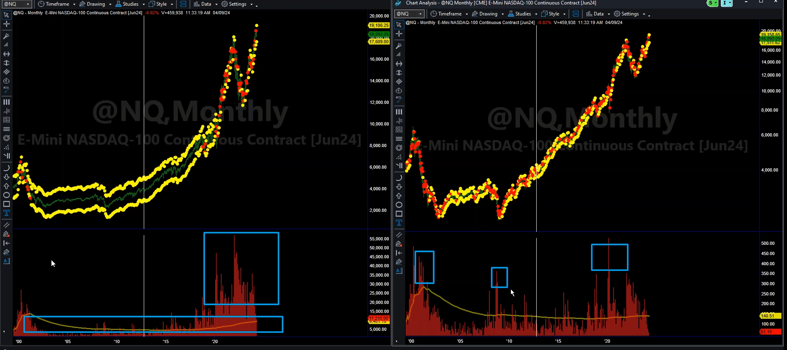
  <figcaption>Figura 008</figcaption>
</figure>

Y como veis, pues el de la derecha se mantiene bastante estable dentro de sus lógicas volatilidades, pero veis que tiene niveles y picos también bastante parecidos. Y fijaros la media de abajo, ¿no? La media es esta línea amarilla, bastante estable, vale. Y aquí pues lógicamente lo es menos; ahora últimamente ha ido subiendo y subiendo porque el precio se lo lleva, y ahora pues está viviendo precios que no ha visto nunca, vale.

Cuando el de la derecha, como veis, también los ha visto aquí y aquí, y son bastante parecidos. Entonces, bueno, el de la derecha está *normalizado*; el de la izquierda, no.

Entonces, no sé, a mí me sorprende que todo el mundo diga "hay que normalizar los precios, hay que normalizar los indicadores", y en cambio los *stops* parece que no hay que normalizarlos. Entonces, no sé, es una cosa tremendamente contradictoria y que a mí me sorprende mucho. Y ya digo, en absoluto pongo en duda la calidad técnica de estos traders, pero a mí este argumento de verdad no lo entiendo, no lo entiendo.

Y es verdad, hay algunos activos donde se puede hacer, sobre todo de *intradía* y más pensando en materias primas y demás. Pero defenderlo de esta manera... a mí me... Y no explicar en el artículo esto que os digo yo... Dice que lo lógico sería ponerlo en porcentual, no, sería lógico. Luego dice que sería lógico, pero que los datos no lo confirman. ¡Coño, no lo confirman por lo que estoy diciendo! Estás haciendo una *trampa estadística* como una catedral, porque cualquier *stop* que tú ajustes aquí, a la izquierda, no va a saltar. Es posible en el pasado, pero la diferencia de precios es tan gigantesca...

<div style="border-left: 4px solid #e91e63; background: #fce4ec; padding: 10px 15px; margin: 10px 0; border-radius: 8px;">
  <strong>⚠️ La trampa del stop monetario en backtest</strong><br><br>
  Si un activo costaba 50$ en 2010 y ahora cuesta 500$, un <em>stop</em> de 20$ (monetario):<br><br>
  • <strong>En 2010</strong> → representa un 40% del precio → salta con frecuencia<br>
  • <strong>En 2024</strong> → representa un 4% del precio → casi nunca salta<br><br>
  Resultado: el <em>backtest</em> muestra mejor retorno porque en el pasado el <em>stop</em> no actuaba. Pero eso no es una virtud del sistema, es una <strong>distorsión estadística</strong>.
</div>

<div style="border-left: 4px solid #27ae60; background: #ecf9f1; padding: 10px 15px; margin: 10px 0; border-radius: 8px;">
  <strong>📏 Regla práctica: Jerarquía de stops</strong><br><br>
  <strong>1º Mejor:</strong> Ajustado por volatilidad (ATR)<br>
  <strong>2º Aceptable:</strong> Porcentual<br>
  <strong>3º Con precaución:</strong> Monetario (solo en intradía con poca variación de precios)<br><br>
  El <em>stop</em> rara vez mejora el retorno. Pero el objetivo no es mejorar el retorno del <em>backtest</em>; es que el <em>backtest</em> sea <strong>realista y robusto</strong>. Si normalizas precios e indicadores, normaliza también los <em>stops</em>.
</div>

<div style="border-left: 4px solid #3f51b5; background: #e8eaf6; padding: 10px 15px; margin: 10px 0; border-radius: 8px;">
  <strong>📚 Referencia: Andrea Unger</strong><br><br>
  Andrea Unger es un trader italiano, cuatro veces campeón del <em>World Cup Trading Championship</em>. Es una referencia técnica reconocida en trading sistemático. La crítica aquí no es a su calidad técnica, sino a un argumento específico sobre <em>stops</em> monetarios que, según el ponente, no tiene en cuenta el efecto de la normalización de precios a lo largo del tiempo.
</div>
<br><br>


## Strategy `Salidas_02` : Código con 32 salidas

[Strategy: Salidas_02](../code/CURSO-SALIDAS_02.ELD)

Bueno, vamos con la clase de hoy. Queríamos hablar de salidas. Tenemos un código bastante chulo que os voy a compartir, que es el siguiente; vamos a enseñarlo. Es un código de salidas.

Aquí lo que creamos son unas especies de códigos que sirven para el desarrollo; que no es el sistema en sí, sino que es un código totalmente *instrumental*, que solo está pensado para desarrollar. Y que por supuesto le puedes modificar. Ahora hemos añadido algunos —ya teníamos alguno hecho, pero hemos añadido algunos más—, y es posible que con el tiempo añadamos y quitemos otros, de acuerdo.

Yo he incluido aquí todos los que he podido, los que hemos podido, y a lo mejor hasta nos hemos dejado alguno para poderlos explicar, y cómo funciona todo esto, vale.

Fijaros que al final hay cuatro *inputs* solo en el sistema:

```sh
inputs:
	Entrada ( 0 ),         # elegir de 0 a 14
	Periodo_Entrada ( 46 ),
	
	Salida ( 26 ),         # elegir de 0 a 33
	Periodo_Salida ( 46 );
```

Los *inputs* son los parámetros que te permiten cambiar rápidamente en un gráfico: uno que define la entrada, otro que define la salida, y luego dos *periodos* para cada uno de ellos, por si quieres usar un periodo distinto. Por defecto lo dejo en 22, porque 22 es un mes más o menos, vale. Si va en diario, esto viene a ser parecido a un mes, pero da igual; tiene mayor importancia el periodo, que es el que puedes usar: 14, pues 14; 15, es igual.

A la entrada, 0 —o de 0 a 14—, ahora lo veis qué es. Y salida, de 0 a 32.

El `case 0`, aunque en la entrada lo he definido para que lo tengáis claro: si no lo defines, es igual. Si yo no hubiera puesto un `case 0`, si yo pongo cero, no hace nada, vale.

<div style="border-left: 4px solid #2196f3; background: #e3f2fd; padding: 10px 15px; margin: 10px 0; border-radius: 8px;">
  <strong>🛠️ Código instrumental vs código de producción</strong><br><br>
  Este tipo de código no está pensado para operar en <em>live</em>, sino para <strong>explorar y desarrollar</strong>. Permite probar rápidamente múltiples combinaciones de entradas y salidas cambiando solo un número en los <em>inputs</em>, sin tocar el código. Es una herramienta de laboratorio, no un sistema final.
</div>

<div style="border-left: 4px solid #9c27b0; background: #f3e5f5; padding: 10px 15px; margin: 10px 0; border-radius: 8px;">
  <strong>⚙️ Estructura del selector</strong><br><br>
  <code>Entrada (0-14)</code> → Selecciona entre 15 tipos de entrada diferentes<br>
  <code>Salida (0-33)</code> → Selecciona entre 34 tipos de salida diferentes<br>
  <code>Periodo_Entrada / Periodo_Salida</code> → Parámetro numérico para cada una<br><br>
  El valor por defecto de 22 representa aproximadamente un mes en <em>timeframe</em> diario (22 días de trading).
</div>
```

```sh
inputs:
	Entrada ( 0 ), #elegir de 0 a 14
	Periodo_Entrada ( 46 ),
	
	Salida ( 26 ), #elegir de 0 a 33
	Periodo_Salida ( 46 );
	
vars:
	MP (0);
	
MP = MarketPosition;
		
switch (Entrada)
Begin
	case 0: #No entries
	case 1: #Simple Momentum Entry
	case 2: #Breakout Next Bar Entry
	case 3:	#Single Moving Average Cross Entry
 	case 4: #Bollinger Band Entry
 	case 5: #Volatility Entry
  case 6: #Bollinger trend
  case 7: #Donchian
  case 8: #Key Reversal
	case 9: #Entramos en un Pullback contra la tendencia primaria
	case 10: #Entramos en un Pullback a favor de la tendencia primaria
	case 11: #Breakout + momentum
	case 12: #RSI entrada saliendo de sobrecompra/sobreventa MR
	case 13: #RSI entrada en tendencia
	case 14: #RSI entrada saliendo de sobrecompra/sobreventa MR
End;

switch (salida)
Begin
	case 0: #No exits
	case 1: #Stop $ - Input: C01_Stop_$(1000);
	case 2: #Stop % - Input: C02_Stop_Pct(02);
	case 3: #Stop ATR - Input: C03_NumATRs (3), Periodo_Entrada(14), ATR_suelo ( 0 ), ATR_techo ( 10 );
	case 4: #Profit $ - Input: C04_Profit_$(1000);
	case 5: #Profit % - Input: C05_Profit_Pct(2);
	case 6: #Profit ATR - Input: Periodo_Salida(14), C06_NumATRs(3);
	case 7: #Breakeven $ - Input: C07_BreakEven_$(1000);	
	case 8: #Trailing ATR - Input: Periodo_Salida(14), C08_NumATRs(3);
	case 9: #Salida por Tiempo - Input: C09_N_Bars(10);
	case 10: #Salida al cierre
	case 11: #Trailing ATR + Profit ATR - Input: Periodo_Salida(14), C11_NumATRs_01 ( 2.5 ), C11_NumATRs_02 ( 4.75 );								
	case 12: # Chandelier - Input: Periodo_Salida(14), C12_NumATRs(3);
	case 13: #Bollinger banda contraria - Inputs: C13_DesvHiBand(2), C13_DesvLoBand(2), Periodo_Salida(10); 	
	case 14: #Salida Trailling % - Inputs: C14_Prc_Trail(2);
	case 15: #Stop $ + Profit $ - Input: C15_Stop_$(1000), C15_Profit_nxStop(1);
	case 16: #Stop% + Profit% - Input: C16_Stop_Pct(2), C16_Profit_NxStopPct(1);
	case 17: #Stop ATR + Profit ATR - Input: Periodo_Salida(14), C17_NumATRs (3), C17_Profit_NxStopATR (1.0);
	case 18: #Chandelier + Profit% - Input: Periodo_Salida(14), C18_NumATRs(3), C18_Profit_Pct(2);
	case 19: #Stop% + temporal - Input: C19_Stop_Pct(2), C19_N_Bars(10);
	case 20: #Chandelier + temporal - Input: C20_StopPriceCanDecrease(0), C20_StopPriceCanIncrease(0), Periodo_Salida(14), C20_NumATRs(3), C20_N_Bars(10);
	case 21: #Bollinger banda contraria + temporal - Inputs: C21_DesvHiBand(2), C21_DesvLoBand(2), Periodo_Salida(10), C21_N_Bars(10); 
	case 22: #Bollinger banda contraria + Stop% - Inputs: C22_DesvHiBand(2), C22_DesvLoBand(2),
	case 23: #ParabolicSAR Exit - Inputs: C23_AfStep(.02), C23_AfLimit(0.2);
	case 24: #Profit% + BreakEven$ - Input: C24_Profit_Pct(2), C24_BreakEven_$(1000);
	case 25: #Stop% + BreakEven$ - Input: C24_Stop_Pct(2), C24_BreakEven_$(1000);
	case 26: #Profit% + BreakEven% - Input: C26_Profit_Pct(2), C26_BreakEven_Pct(0.5);
	case 27: #Stop% + BreakEven% - Input: C27_Stop_Pct(2), C27_BreakEven_Pct(0.5);
	case 28: #BreakEven% - Input: C28_BreakEven_Pct(0.5);
	case 29: #Stop% + Profit% + BreakEven% - Input: C29_Stop_Pct(3.75), C29_Profit_Pct (9.75), C29_BreakEven_Pct(6.5);
	case 30: #Stop $ + Profit $ + BreakEven $ - Input: C29_Stop_$(1000), C29_Profit_$ (1000), 
	case 31: #Stop ATR + Profit ATR + BreakEven%- Input: Periodo_Salida(14), C31_NumATRs (3), C31_Profit_NxStopATR (1.0), C31_BreakEven_Pct (6.5);
	case 32: #Cierre Media - Input: Periodo_Salida
  case 33: #Key Reversal (si vemos que funciona la combinamos con otras salidas)
End;
```

Esto es muy útil, yo lo puedo usar a cualquier sistema, yo lo puedo usar por ejemplo alternando entre gráfico y código para explicaros.  

## Strategy `ABERRATION`

Este gráfico que ahora enseño, si no recuerdo mal es el `ABERRATION` más original, es decir el `Bollinger tendencial`,  os lo enseño porque éste es el que está ahora en TradeStation, aunque le he puesto : "*copiado del TSM Bands que es el Bollinger Bands*" que está en el libro este que os he hablado tantas veces de Kaufman (Perry Kaufman - "Trading Systems and Methods") es el que vimos, no tiene ninguna modificación sólo le he añadido la posibilidad de usar media normal o media exponencial.

[Strategy : ABERRATION](../code/ABERRATION.ELD)

```SH
# Strategy : ABERRATION
{ Copiado de TSM MA BBands: Moving average with Bollinger bands
  Moving averge systems with entries using Bolllinger bands
  Copyright 1999-2004, P J Kaufman.  All rights reserved. }

{ period = length of moving average
  nsd = number of standard deviations for the Bollinger band
  }
input:
	period(22),
	nsd(2.0),
	AvgOrXAvg("Avg");

vars:
	ma(0),
	bandup(0),
	banddn(0),
	pippo(0);

{ Moving average trend }
	pippo = nsd * (-1);
	bandup = BollingerBand(close,period,nsd);
	banddn = bollingerband(close,period, pippo);
	
	If AvgOrXAvg = "Avg" Then
		ma  = average(close,period)
	Else
		If AvgOrXAvg = "XAvg" Then
			ma  = xaverage(close,period)
		else
			RaiseRunTimeError("AvgOrXavg tiene que ser Avg o XAvg");
		
{ long signal : close must penetrate upper band  }
	if close crosses above bandup then
		Buy next bar market;
		
{ short signal : close must penentrate lower band }
	if close crosses below banddn then
		Sell Short next bar market;

  if marketposition > 0 and close crosses below ma then
  	Sell next bar market;
  
  if marketposition < 0 and close crosses above ma then
  	Buy to Cover next bar market;
```

De inicio yo tengo un código normal y este es su gráfico... 

<figure>
  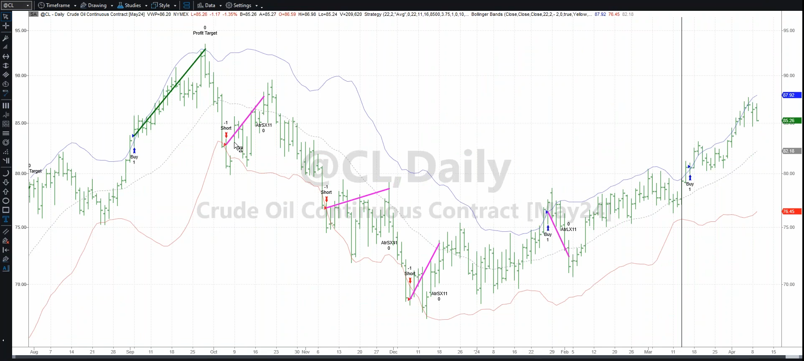
  <figcaption>Figura 009</figcaption>
</figure>

Entonces la base de Strategy : ABERRATION es la misma, si el cierre cierra por encima de la banda alta compra mercado, 

```sh
{ long signal : close must penetrate upper band  }
	if close crosses above bandup then
		Buy next bar market;
```

si cierre cruza la banda baja vende corto a mercado, 

```sh
{ short signal : close must penentrate lower band }
	if close crosses below banddn then
		Sell Short next bar market;
```

y sale en la media central, cuando el cierre cruza la media central para arriba, para abajo, sale.   
Esta es la mecánica normal de ABERRATION.

```SH
  if marketposition > 0 and close crosses below ma then
  	Sell next bar market;
  
  if marketposition < 0 and close crosses above ma then
  	Buy to Cover next bar market;
```

Entonces aquí os lo voy a explicar en este porque es muy sencillo, muy intuitivo, porque al final sí que tiene una salida pero tiene una salida como bastante lenta que está el propio sistema, entonces yo le puedo probar otras, le puedo probar otras, y es aquí donde entra un poco lo que os decía yo de la gracia de Easy Language, de TradeStation.

**Procesamos distintos códigos en un mismo gráfico como si fueran una única señal**

yo puedo introducir distintos códigos en un mismo gráfico y todos se procesan como si fueran una única señal, de acuerdo?

<figure>
  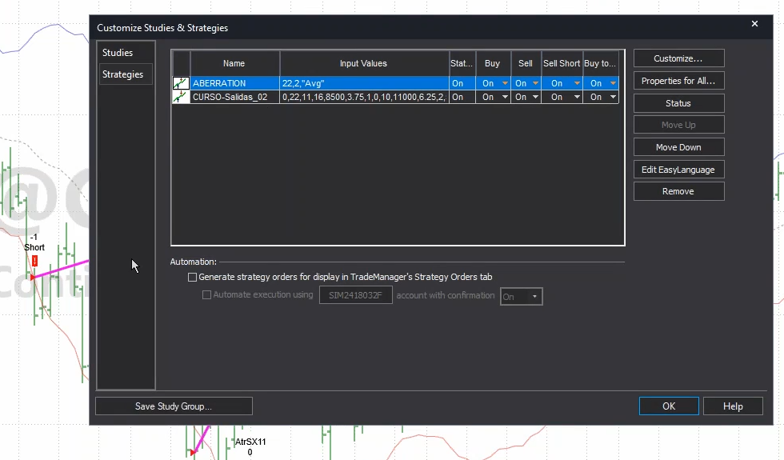
  <figcaption>Figura 010</figcaption>
</figure>


Por lo tanto si yo tengo este sistema `"Strategy : ABERRATION"` y además introduzco unas salidas `"CURSO - Salidas_02"`, fíjate en la imagen. Esas salidas se van a procesar normalmente igual que si estuvieran dentro del código, sin ninguna diferencia. Lo único que tengo que hacer es que no tome señales de entrada,

<div style="border-left: 4px solid #ffc60dff; background: #f4fce8ff; padding: 10px 15px; margin: 10px 0; border-radius: 8px;">

  <strong>🔀 Dos strategies en un gráfico: separar entradas y salidas</strong><br>
  
  En TradeStation puedes poner <strong>varias strategies en el mismo gráfico</strong> y se procesan como una única señal. En este caso:<br>
  
  • <strong>ABERRATION</strong> → genera las ENTRADAS (compra/vende cuando rompe la banda)<br>
  • <strong>CURSO-Salidas_02</strong> → genera solo las SALIDAS alternativas que quieres probar<br>
  
  Para que no se pisen, en <code>CURSO-Salidas_02</code> pones <code>Entrada = 0</code>. El <code>case 0</code> no hace nada, así el código de salidas <em>no genera entradas propias</em> y solo añade salidas al sistema ABERRATION.
  
  <strong>Resultado:</strong> Puedes probar 32 tipos de salida diferentes sobre el mismo sistema de entrada sin modificar el código original. Solo cambias el número en el <em>input</em> <code>Salida</code>.
</div>


<figure>
  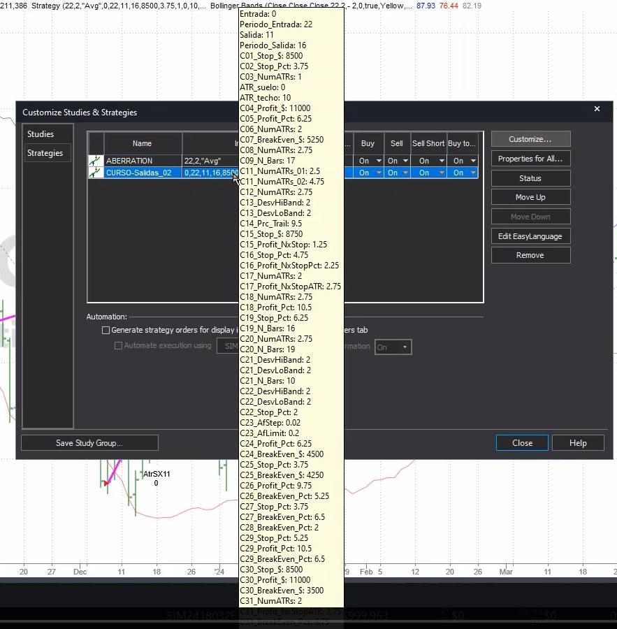
  <figcaption>Figura 011</figcaption>
</figure>


que si quisiera probar las entradas podría, pero no, no en este caso no me interesa porque lo que quiero es añadir, más que añadir quiero probar de manera con un solo código distintas salidas al sistema.

Lo normal es que no hayan tantas porque esto hasta este día es difícil de manejar, 


<figure>
  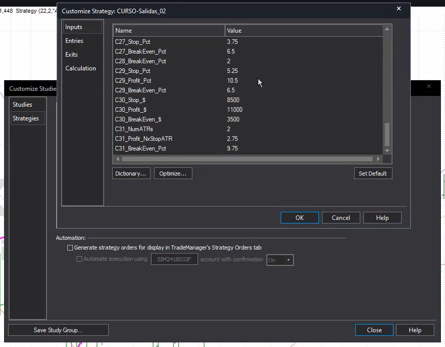
  <figcaption>Figura 012</figcaption>
</figure>

pero yo he puesto muchas para que lo veáis, pero lo normal es que no tengas tantas, que tengas las 3, 4, 5 que a ti te gusten y ya. Pero para que lo veáis y las tengáis todas y os lo pase pues las hemos metido un montón de salidas.  Pero insisto que se puede manejar por cómo lo hemos hecho, pero lógicamente es más complicado manejar 32 tipos de salida que es lo que hay en esa hoja, que 5 ó 6, porque 32 por son muchas.

Entonces insisto en que, donde está la gracia es que yo simplemente cambiando, dejando la entrada en cero quiere decir que no hace nada, 

<figure>
  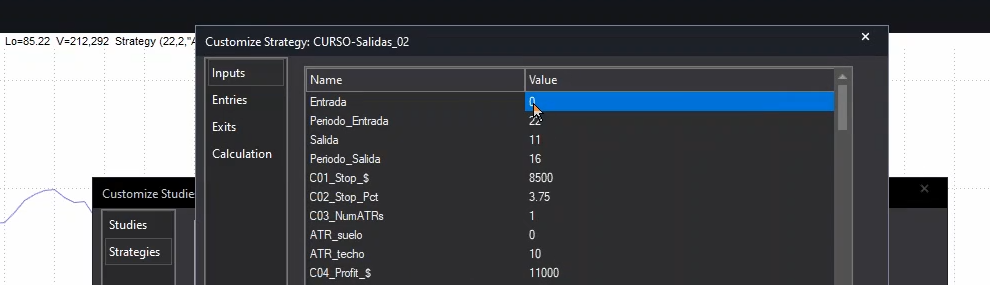
  <figcaption>Figura 033</figcaption>
</figure>


y cambiándole esta variable de salida, 

<figure>
  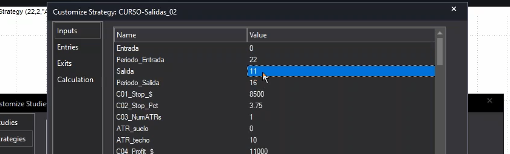
  <figcaption>Figura 013</figcaption>
</figure>

si le pongo 0, automáticamente veréis que las líneas verdes y rosas que son las que me marca la salida desaparecerán y seguirá saliendo por las que salía el sistema normalmente.

| Acción | Condición |
|--------|-----------|
| **Compra (Buy)** | Cierre cruza por ENCIMA de la banda SUPERIOR |
| **Vende corto (Short)** | Cierre cruza por DEBAJO de la banda INFERIOR |
| **Cierra largo (Sell)** | Cierre cruza por DEBAJO de la media central |
| **Cierra corto (Cover)** | Cierre cruza por ENCIMA de la media central |

<figure>
  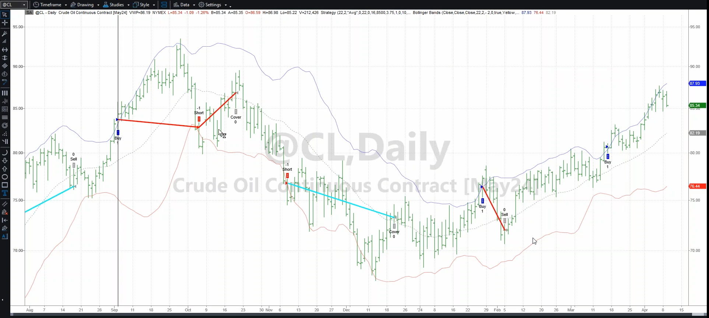
  <figcaption>Figura 014</figcaption>
</figure>


```
                    ═══════════════ Banda Superior
                         
        ┌─────┐                    
        │ Buy │ ← Cierre cruza ENCIMA de banda superior → COMPRA
        │  1  │     
        └──┬──┘     
           │        - - - - - - - Media Central - - - - - -
           │              
           ▼ (línea roja = posición larga)
        ┌──────┐
        │Short │ ← Cierre cruza DEBAJO de banda inferior → GIRA A CORTO
        │ -1   │    (cierra el largo + abre corto)
        └──┬───┘
           │
           ▼ (línea roja = posición corta)
        ┌──────┐
        │Cover │ ← Cierre cruza ENCIMA de media central → CIERRA CORTO
        │  0   │
        └──────┘
                    ═══════════════ Banda Inferior
```


<figure>
  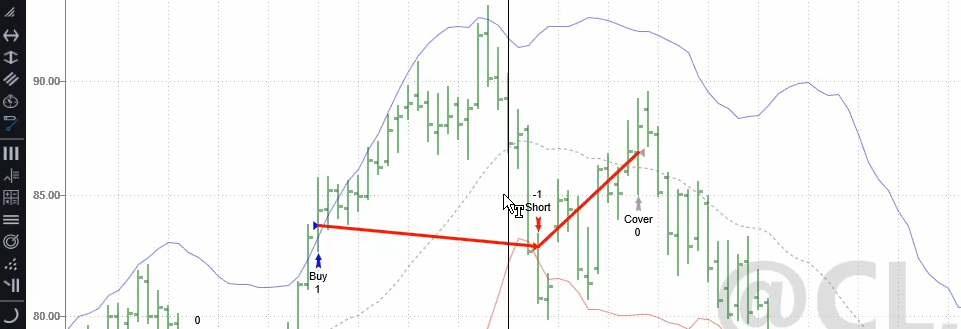
  <figcaption>Figura 015</figcaption>
</figure>

*Imagen (el óvalo azul):*

La vela marcada con el óvalo es especial porque **hace dos cosas a la vez**:  

1. Cierra por debajo de la **media central** → cerraría un largo si lo hubiera
2. Cierra por debajo de la **banda inferior** → abre corto

Como es una vela tan brusca (gráfico diario), cumple ambas condiciones simultáneamente y el sistema se **gira corto** directamente.


<figure>
  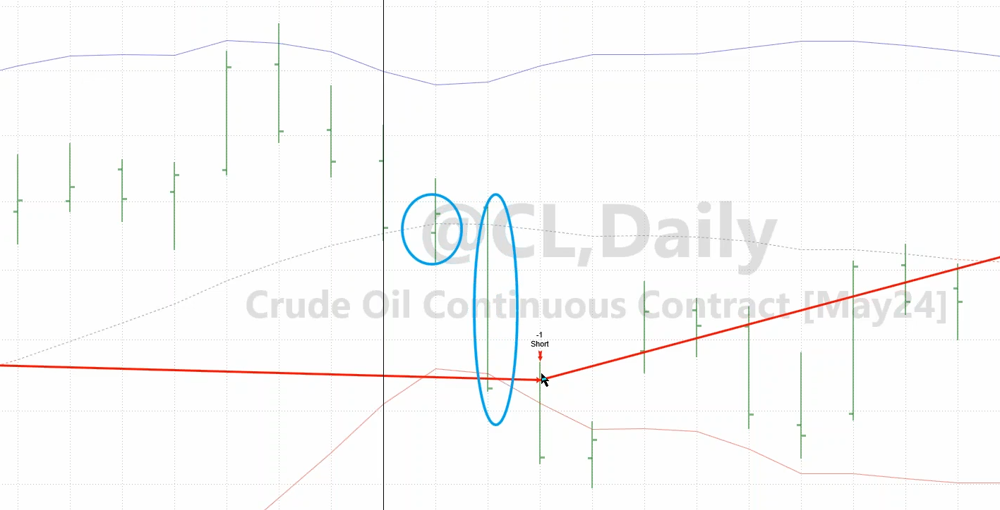
  <figcaption>Figura 016</figcaption>
</figure>


Aquí lo que pasa es que eso coincide, o sea, es una vela tan brusca, pues es que esto es un gráfico diario, que la misma vela que cierra por debajo, la del círculo no lo hace, esta no lo hace por poco. La del óvalo ya cierra por debajo de la media y por debajo de la banda, con lo cual lo que hace es girarse corto y hace girarse corto porque hace las dos cosas a la vez, ¿de acuerdo? 

Vale, estas son las originales del sistema, salidas originales del sistema. 

<figure>
  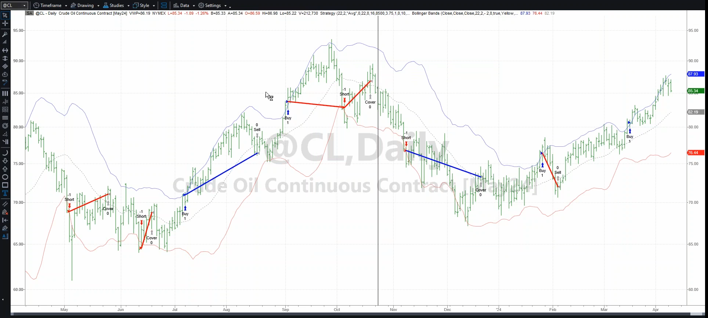
  <figcaption>Figura 034</figcaption>
</figure>

## Aplicando Strategy `Salidas` a Strategy `ABERRATION` 

Entonces yo ahora aquí activo las salidas. Vamos a empezar por el 1, poco a poco, por partes, como diría Jack. 

<figure>
  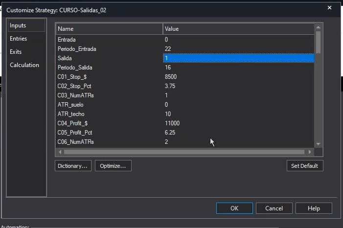
  <figcaption>Figura 035</figcaption>
</figure>

tengo una chuleta aquí, porque os imagináis con 32, con la memoria que tengo, pues no puede... 

[Strategy : Salidas_02](../code/CURSO-SALIDAS_02.ELD)

```sh
inputs:
	...
	...
	Salida ( 26 ), #elegir de 0 a 33
	Periodo_Salida ( 46 );
...
switch (salida)
Begin
	case 0: #No exits
	case 1: #Stop $ - Input: C01_Stop_$(1000);
	case 2: #Stop % - Input: C02_Stop_Pct(02);
	case 3: #Stop ATR - Input: C03_NumATRs (3), Periodo_Entrada(14), ATR_suelo ( 0 ), ATR_techo ( 10 );
	case 4: #Profit $ - Input: C04_Profit_$(1000);
	case 5: #Profit % - Input: C05_Profit_Pct(2);
	case 6: #Profit ATR - Input: Periodo_Salida(14), C06_NumATRs(3);
	case 7: #Breakeven $ - Input: C07_BreakEven_$(1000);	
	case 8: #Trailing ATR - Input: Periodo_Salida(14), C08_NumATRs(3);
	case 9: #Salida por Tiempo - Input: C09_N_Bars(10);
	case 10: #Salida al cierre
	case 11: #Trailing ATR + Profit ATR - Input: Periodo_Salida(14), C11_NumATRs_01 ( 2.5 ), C11_NumATRs_02 ( 4.75 );								
	case 12: # Chandelier - Input: Periodo_Salida(14), C12_NumATRs(3);
	case 13: #Bollinger banda contraria - Inputs: C13_DesvHiBand(2), C13_DesvLoBand(2), Periodo_Salida(10); 	
	case 14: #Salida Trailling % - Inputs: C14_Prc_Trail(2);
	case 15: #Stop $ + Profit $ - Input: C15_Stop_$(1000), C15_Profit_nxStop(1);
	case 16: #Stop% + Profit% - Input: C16_Stop_Pct(2), C16_Profit_NxStopPct(1);
	case 17: #Stop ATR + Profit ATR - Input: Periodo_Salida(14), C17_NumATRs (3), C17_Profit_NxStopATR (1.0);
	case 18: #Chandelier + Profit% - Input: Periodo_Salida(14), C18_NumATRs(3), C18_Profit_Pct(2);
	case 19: #Stop% + temporal - Input: C19_Stop_Pct(2), C19_N_Bars(10);
	case 20: #Chandelier + temporal - Input: C20_StopPriceCanDecrease(0), C20_StopPriceCanIncrease(0), Periodo_Salida(14), C20_NumATRs(3), C20_N_Bars(10);
	case 21: #Bollinger banda contraria + temporal - Inputs: C21_DesvHiBand(2), C21_DesvLoBand(2), Periodo_Salida(10), C21_N_Bars(10); 
	case 22: #Bollinger banda contraria + Stop% - Inputs: C22_DesvHiBand(2), C22_DesvLoBand(2),
	case 23: #ParabolicSAR Exit - Inputs: C23_AfStep(.02), C23_AfLimit(0.2);
	case 24: #Profit% + BreakEven$ - Input: C24_Profit_Pct(2), C24_BreakEven_$(1000);
	case 25: #Stop% + BreakEven$ - Input: C24_Stop_Pct(2), C24_BreakEven_$(1000);
	case 26: #Profit% + BreakEven% - Input: C26_Profit_Pct(2), C26_BreakEven_Pct(0.5);
	case 27: #Stop% + BreakEven% - Input: C27_Stop_Pct(2), C27_BreakEven_Pct(0.5);
	case 28: #BreakEven% - Input: C28_BreakEven_Pct(0.5);
	case 29: #Stop% + Profit% + BreakEven% - Input: C29_Stop_Pct(3.75), C29_Profit_Pct (9.75), C29_BreakEven_Pct(6.5);
	case 30: #Stop $ + Profit $ + BreakEven $ - Input: C29_Stop_$(1000), C29_Profit_$ (1000), 
	case 31: #Stop ATR + Profit ATR + BreakEven%- Input: Periodo_Salida(14), C31_NumATRs (3), C31_Profit_NxStopATR (1.0), C31_BreakEven_Pct (6.5);
	case 32: #Cierre Media - Input: Periodo_Salida
  case 33: #Key Reversal (si vemos que funciona la combinamos con otras salidas)
End;
```

Y en cuanto a las salidas:
- *Case 1*, con un comentario de qué hace y qué obtiene. Case 1 es un *stop* monetario.
- El *Case 2* es un *stop* porcentual, vale.
- El *Case 3* es un *stop* por ATR.
- El 4 es un *profit* monetario.
- El 5 es un *profit* porcentual.

Y así sucesivamente hasta 32, vale. Ya lo teníamos viendo un poco sobre la marcha; vamos a verlos todos ahora.   
El 6, *profit* por ATR. A partir del 8 se van combinando. Como veis, aquí hay muchísimo código ya desarrollado, y esto creo que puede tener bastante utilidad para todos. Vamos a empezar por lo más sencillo. Los primeros `case` están más o menos ordenadas; he llegado a un punto en que ya las he ordenado desordenadas. Al final, simplemente hemos añadido las nuevas abajo.

### `Case 1` Salida monetaria : Stop $

La primera es salida monetaria: `case 1: #Stop $ - Input: C01_Stop_$(1000);`.   
Entonces, aquí yo le he añadido ahora un *stop monetario*, que, por lo que veo, no está saltando demasiado:

<figure>
  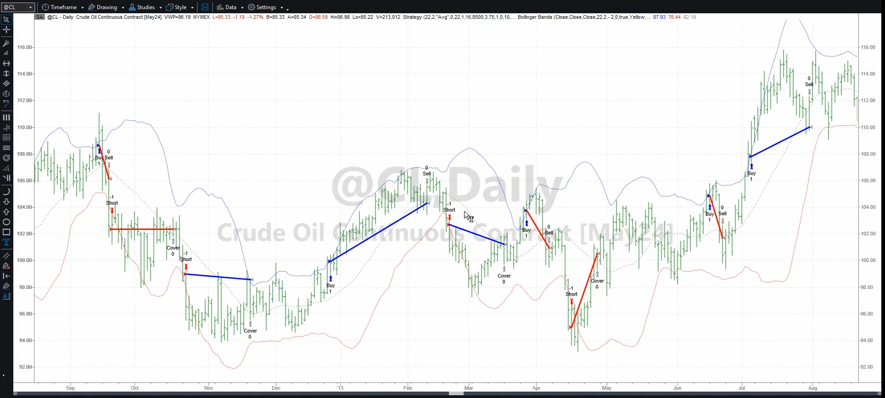
  <figcaption>Figura 036</figcaption>
</figure>

**Estructura del código de salidas**

Entonces, lo que os decía: es el código de salidas, tiene de 0 a 32 salidas, y de 0 a 7 entradas, como lo veremos también.

*Me escondo ahora las entradas.*

<figure>
  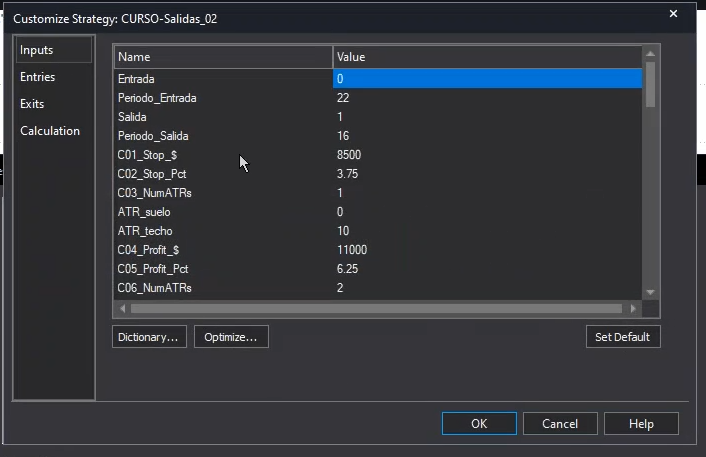
  <figcaption>Figura 037</figcaption>
</figure>

**Sistema de nomenclatura de inputs**

Esto tiene la ventaja de que en el mismo código yo puedo probar varios. Yo ya he estado antes investigando un poquito con él. Cada uno de ellos, casi todos, tienen unos *inputs*, y por eso, si ahora desplegamos aquí, veis que aquí hay un montón de *inputs*. 

```sh
switch (salida)
Begin
	case 1:
		Input:
			C01_Stop_$ ( 4000 );
	case 2:
		Input:
			C02_Stop_Pct ( 3 ); //en tanto por 100
	case 3:
		Input:
			C03_NumATRs ( 14 ),
	case 4:
		Input:
			C04_Profit_$ ( 7500 );	
...
...
	case 11:	
		Input:
			C11_NumATRs_01 ( 7.75 ),
			C11_NumATRs_02 ( 7.25 );
...
---
	case 29: 	
		Input:
			C29_Stop_Pct ( 3.5 ),
			C29_Profit_Pct ( 2 ),
			C29_BreakEven_Pct ( 1.75 );
	case 30:	
		Input:
			C30_Stop_$ ( 4000 ),
			C30_Profit_$ ( 8000 ),
			C30_BreakEven_$ ( 3000 );	
	case 31:	
		Input:
			C31_NumATRs ( 3 ),
			C31_Profit_NxStopATR ( 2.5 ), 
			C31_BreakEven_Pct ( 2.5 );
```

¿Qué hemos hecho para que sean más o menos fáciles de seguir?   
Pues ponerle delante el `C01`, `C02`, `C03`, `C04`, luego os diré estos dos qué son, `C05`, `C06`. De esta manera sabes a qué *case* se refiere.

Si yo pongo arriba salida `case 11`:

<figure>
  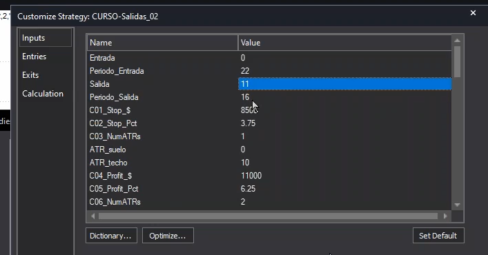
  <figcaption>Figura 038</figcaption>
</figure>

Sé que la `case 11` tiene dos ATRs. Voy a mi lista de `cases`y veo que es el *trailing* ATR con *profit*.   
Sé que los que tengo que ir a tocar son los imput `C11_NumATRs_01` o `C11_NumATRs_02` del  

```sh
#Trailing ATR + Profit ATR
case 11:
    # Input: Periodo_Salida(14), C11_NumATRs_01 ( 2.5 ), C11_NumATRs_02 ( 4.75 );
	Input:
		C11_NumATRs_01 ( 7.75 ),
		C11_NumATRs_02 ( 7.25 );
```

<figure>
  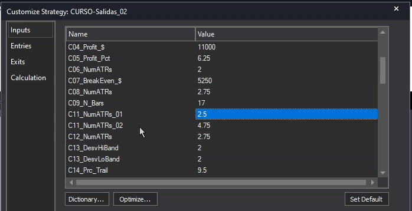
  <figcaption>Figura 039</figcaption>
</figure>

**Uso instrumental, no para optimización masiva**

Claro, esto no penséis que es para optimizarlo todo. Esto sería una locura. Pero sí que puedes optimizar alguno de ellos e ir probando. Ahora pongo el *case* 5 y optimizo el *case* 5. Pero pruebo un poco, vale. Optimizar a nivel *instrumental*.

Esto sobre todo es base de desarrollo, de evaluación preliminar y demás. Pues para diseñar, para ayudarte a diseñar el sistema si todavía no tienes claro por dónde ir, o para probar rápidamente distintas versiones: "Voy a probar esta salida, voy a probar otra, y hay distintas", vale.

<div style="border-left: 4px solid #2196f3; background: #e3f2fd; padding: 10px 15px; margin: 10px 0; border-radius: 8px;">
  <strong>🛠️ Código instrumental vs optimización masiva</strong><br><br>
  Este código de 32 salidas no está pensado para optimizar todos los parámetros a la vez (sería <em>overfitting</em> garantizado). Su uso correcto es:<br><br>
  • Probar rápidamente distintos <em>tipos</em> de salida<br>
  • Hacer optimización <em>instrumental</em> (para entender comportamiento, no para elegir parámetros finales)<br>
  • Evaluación preliminar durante el diseño del sistema
</div>

<br>

### `Case 8` Salida por volatilidad: Trailing por ATR**

Entonces, ya digo, están las principales. Voy a explicar quizá un poquito las más extrañas o las que hemos visto menos. Porque, a ver, *stop* monetario, *stop* porcentual mezclado, todo el mundo tiene claro qué es esto, ¿no? Entonces, al final, un *trailing* también. Vamos a poner algunas así un poco más rebuscaditas poco a poco. 


Vamos a empezar por la 8 que es un *trailing*.

```sh
case 8: # Trailing ATR 
begin	
	Input: # Input: Periodo_Salida(14), C08_NumATRs(3);
		C08_NumATRs ( 9 );
```


<div style="border-left: 4px solid #ffd460ff; background: #fffbebff; padding: 10px 15px; margin: 10px 0; border-radius: 8px;">
  <strong>🔄 Trailing ATR: `Case 8` - Cómo funciona</strong><br><br>
  
  <strong>Cálculo base:</strong><br>
  <code>ATRCalc = ATR(Periodo) × NumATRs</code><br><br>
  
  <strong>Para LARGOS (MP = 1):</strong><br>
  • Guarda el máximo más alto desde la entrada (<code>PosHigh</code>)<br>
  • Stop en: <code>PosHigh - ATRCalc</code><br>
  • El stop <em>sube</em> cuando el precio hace nuevos máximos, pero <em>nunca baja</em><br><br>
  
  <strong>Para CORTOS (MP = -1):</strong><br>
  • Guarda el mínimo más bajo desde la entrada (<code>PosLow</code>)<br>
  • Stop en: <code>PosLow + ATRCalc</code><br>
  • El stop <em>baja</em> cuando el precio hace nuevos mínimos, pero <em>nunca sube</em><br><br>
  
  <strong>Ejemplo con ATR = 2$ y NumATRs = 3:</strong><br>
  <code>ATRCalc = 2 × 3 = 6$</code><br>
  Si <code>PosHigh = 100$</code> → Stop en <code>94$</code><br>
  Si precio sube a <code>105$</code> → Stop sube a <code>99$</code><br>
  Si precio baja a <code>102$</code> → Stop se queda en <code>99$</code> (no retrocede)
</div>


El *trailing* "persigue" el precio a una distancia fija en ATRs, adaptándose a la volatilidad del activo.

<figure>
  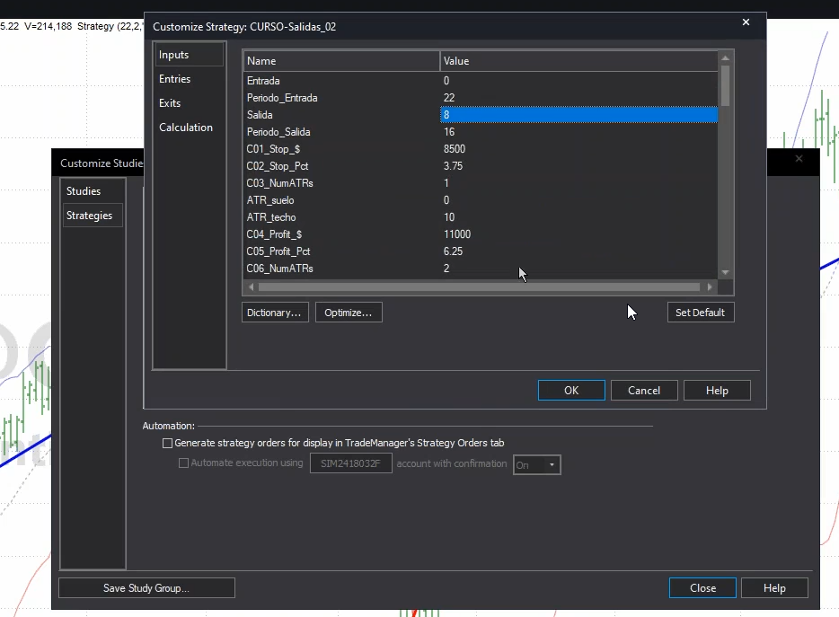
  <figcaption>Figura 40</figcaption>
</figure>
<figure>
  
  <figcaption>Figura 41</figcaption>
</figure>


Un *trailing* que tiene solo un parámetro, que es el número de ATRs.   
Voy a ponerme el ATR debajo. Siempre que hay un periodo, el periodo lo hemos puesto arriba.
<div style="border-left: 4px solid #2196f3; background: #e3f2fd; padding: 10px 15px; margin: 10px 0; border-radius: 8px;">
  <strong>⚙️ Parámetros del indicador ATR en TradeStation</strong><br>
  
  <strong>ATRLength</strong> → Es el que importa para el cálculo. ATR de 22 barras significa que calcula la volatilidad media de las últimas 22 velas.  
  <strong>AlertLength</strong> → Es solo para el sistema de alertas de TradeStation (avisos sonoros, popups, etc.). No afecta al cálculo del ATR ni al <em>trailing</em>. Puedes ignorarlo para efectos prácticos.
</div>

<figure>
  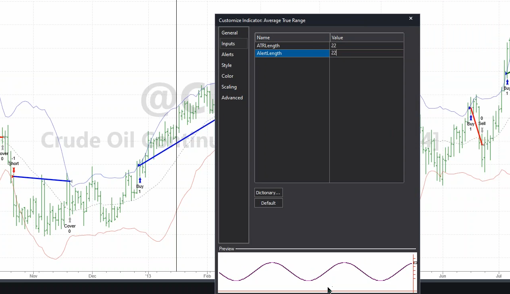
  <figcaption>Figura 042</figcaption>
</figure>

Entonces, ¿ves? Aquí tenéis verdes y rosas, ¿ves? Esto quiere decir que ha salido por ese mecanismo de salida, de acuerdo.

<figure>
  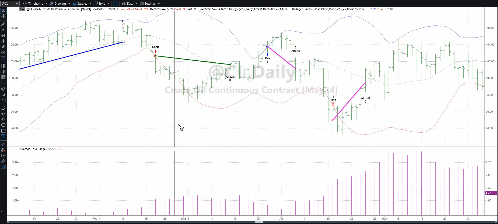
  <figcaption>Figura 043</figcaption>
</figure>

**Desactivar salidas originales del sistema**

Muchas veces, en este caso, claro, ese sistema ya tiene implementadas las salidas. Que yo podría inhabilitarlas. Podría decir: "Bueno, yo no quiero que salgan". Esto también se podría hacer mediante código, y es habitual hacerlo, pero en TradeStation tenemos estas pestañitas de aquí:

<figure>
  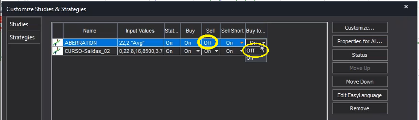
  <figcaption>Figura 044</figcaption>
</figure>

Esto, por ejemplo, a veces viene bien. Son las cuatro señales que hay en el sistema: `BUY`, `SELL`, `SELL SHORT`, `BUY TO COVER`. Al final te permite, tanto en el `BUY` que son los de abrir, como en el `SELL SHORT`, activarlo, desactivarlo, o dejarlo de salida solo. Pero también me permite que las que son solo de salida, como el `SELL` y como el `BUY TO COVER`, desactivarlas. 

De esta manera yo ahora, al `ABERRATION`, le desactivo sus señales primarias. Y automáticamente sólo podrá salir por las de ATR. Todas son rosas y verdes porque no puede salir de otra manera. 

<figure>
  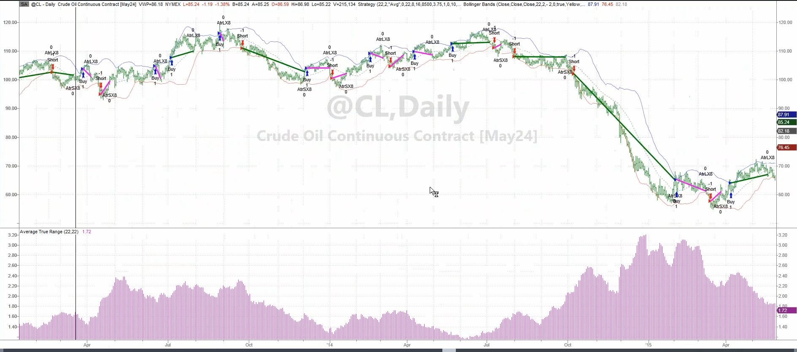
  <figcaption>Figura 045</figcaption>
</figure>

Esto desconozco si es mejor o peor, porque no lo he probado. Hemos hecho antes alguna optimización para ver que estuvieran bien hechos. En principio, creo... puede ser que se nos haya colado un *bug* en algún rato; si nos habéis detectado alguno, claro que hemos hecho mucho código, y podría ser que hubiera un *bug*. Pero vaya, en principio está repasado; debería estar bien, vale.

**Comparativa: con y sin salidas originales**

Y ahora aquí, básicamente, en este sencillo sistema, os puedo evaluar qué datos me da con las salidas de ATR, solo una u otra, vale.

<figure>
  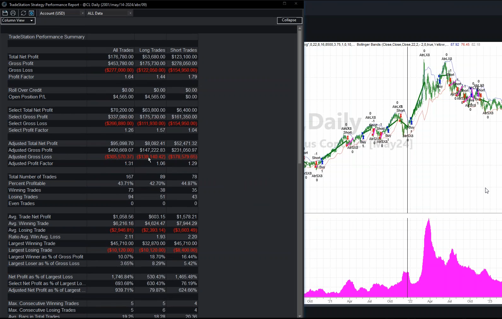
  <figcaption>Figura 046</figcaption>
</figure>
<figure>
  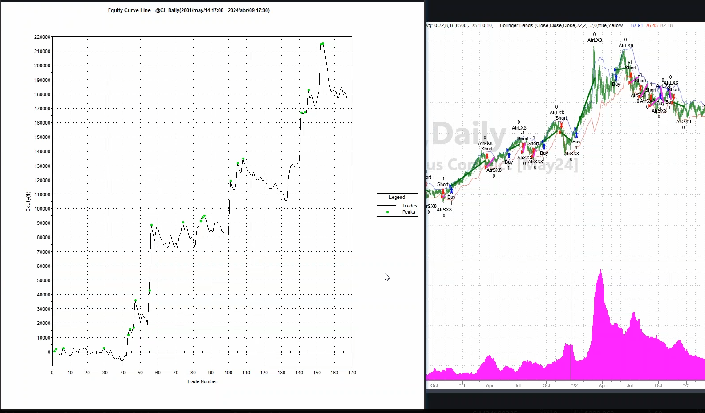
  <figcaption>Figura 047</figcaption>
</figure>

Introduciendo esta. Ahora vuelvo a activar sus salidas originales, complementarias a las otras, complementarias a las otras salidas.

<figure>
  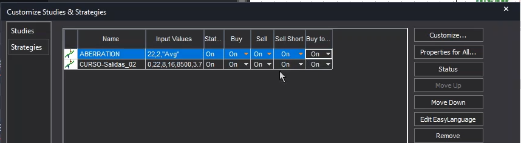
  <figcaption>Figura 048</figcaption>
</figure>

Y aquí veremos que, pues, pues, que empeora. Es decir, al final, la salida del sistema original **no** está aportando.

<figure>
  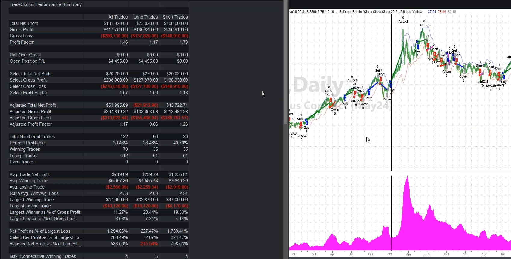
  <figcaption>Figura 049</figcaption>
</figure>

Miremos Ratios retorno riesgo: 

<figure>
  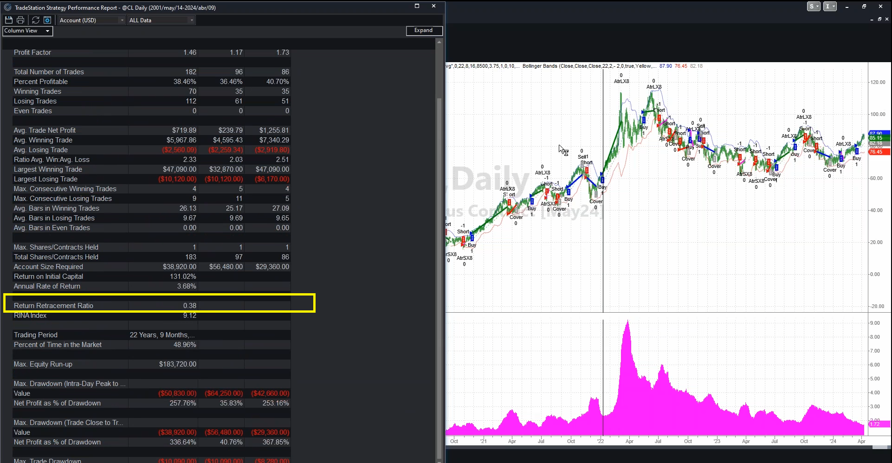
  <figcaption>Figura 203</figcaption>
</figure>


Había puesto los colores para diferenciar las salidas del sistema original con nuestras `salidas 32`, pero ahora estoy pensando que dejamos todo el rato las que pongamos nosotros.

<figure>
  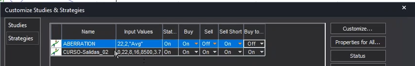
  <figcaption>Figura 051</figcaption>
</figure>

**Comportamiento sin salida propia: solo banda contraria**

Claro, en este caso sí que ya no nos valen... ,  
buenos sí nos valen, porque el sistema puede hacer *reverse*. Es decir, puede ir al lado contrario. Es decir, si yo le pongo una que solo es *stop*, vale?, imaginemos ahora que le pongo la 1, que es dinero, *salida 1*, dinero, vale. 

<figure>
  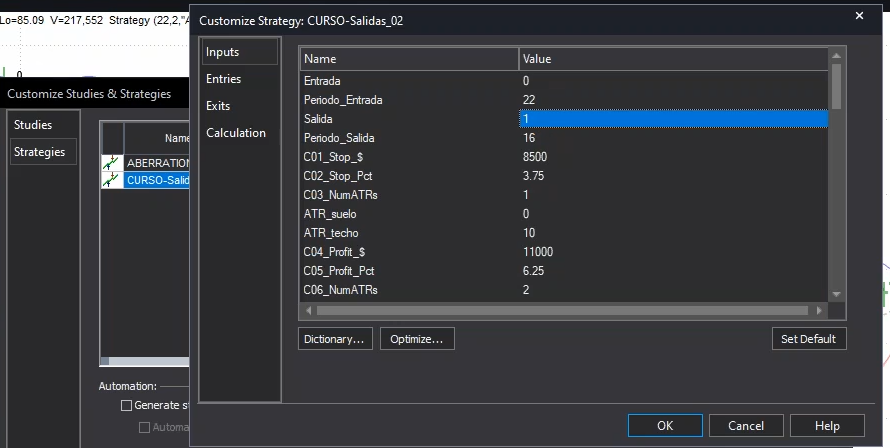
  <figcaption>Figura 052</figcaption>
</figure>

Le pongo `stop`; vamos a bajarlo a 5.000, porque si no pues creo que va a costar mucho que salte. 5.000 dólares, vale.

<figure>
  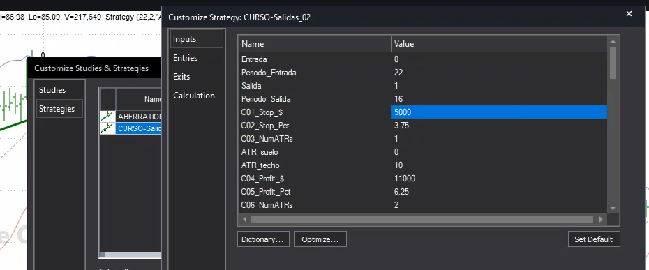
  <figcaption>Figura 053</figcaption>
</figure>

Cuando gana, no puede salir; no tiene salida. ¿Cuál es su salida? Solo la banda contraria.

<figure>
  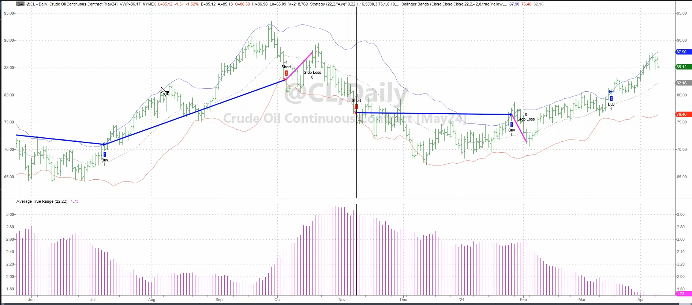
  <figcaption>Figura 054</figcaption>
</figure>

Entonces, este probablemente es poco eficiente, sobre todo en términos de retorno-riesgo, porque fijaros aquí el *drawdown* que se traga volviendo:

<figure>
  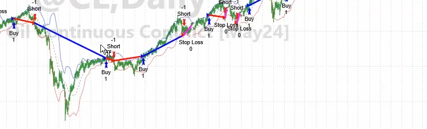
  <figcaption>Figura 055</figcaption>
</figure>

Como no tiene otra salida que la contraria, en la banda contraria, pues no puede salir.  
Esto probablemente no es tampoco súper eficiente en datos de retorno-riesgo:

<figure>
  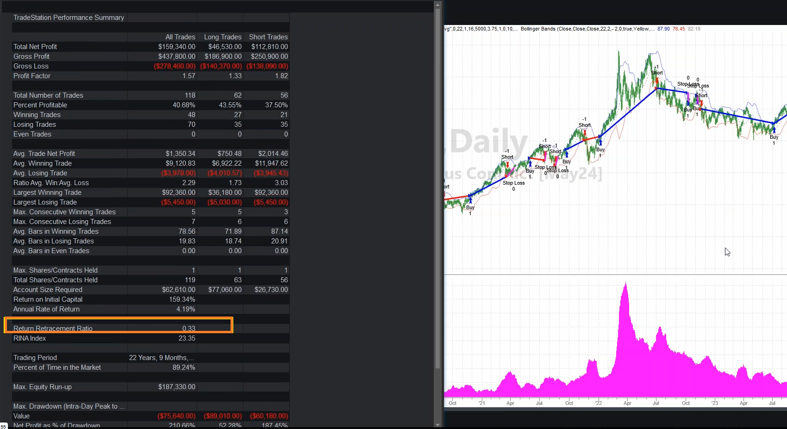
  <figcaption>Figura 056</figcaption>
</figure>

Aunque, como vemos en el retorno, aguanta bien. Es que Bollinger, Bollinger solo, ABERRATION en petróleo va bastante bien. Tiene un *drawdown* fuerte, como ya os comenté, pero va bien en diarios. Es un sistema que aguanta bien. ABERRATION en una cesta de materias primas aguanta bastante bien el tipo, y además con la suerte de que lleva muchísimos años de funcionamiento. Es un sistema que sigue una pauta muy lógica: expansión de volatilidad.

<figure>
  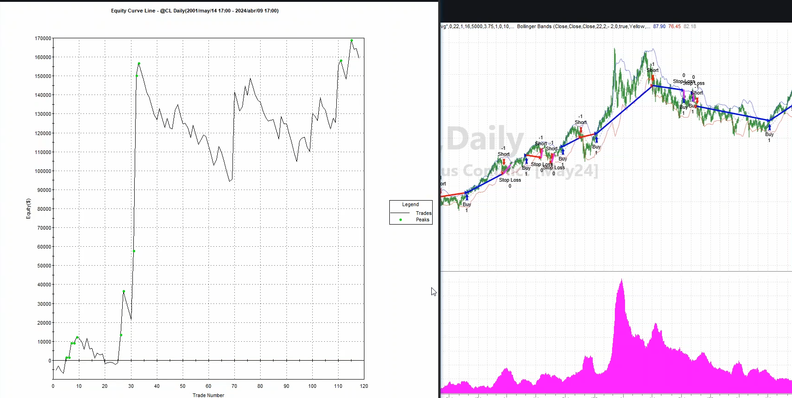
  <figcaption>Figura 057</figcaption>
</figure>


**ABERRATION en cesta de materias primas**

Y por lo tanto, os animo a aquellos que tengáis cuentas grandes —porque esto tiene que ser con cuentas grandes— a probarlo en una cesta de distintas materias primas. Pues yo qué sé: maíz, soja, petróleo, oro, y más que ahora no me salen, pero que sean de bastante tendencia. Carne... bueno, tienen poca liquidez algunas, pero se pueden explorar perfectamente. Y ahí explorar la idea básica con alguna salida; incluso buscaría trabajarlos de manera conjunta en diario para evitar un poco la sobreoptimización.

Pero es una cesta viable, una cesta que tendrá puntos débiles, muchos, pero en la parte de tendencia será una buena cesta, en la parte tendencial. Necesitaremos a lo mejor estrategias *antitendenciales* que pueden ir en S&P, pueden ir en Nasdaq, pueden ir en bonos, vale. Pero la parte de tendencia, seguramente tendremos una cartera que pasará un poco lo que hablábamos antes en el ejemplo ese que ponía Alejandro: que tendrá periodos muy largos muy planos, pero que luego tendrá periodos de locura de ganancias. Esto, esto pasa.

<div style="border-left: 4px solid #4caf50; background: #e8f5e9; padding: 10px 15px; margin: 10px 0; border-radius: 8px;">
  <strong>📦 Cesta de commodities para ABERRATION</strong><br><br>
  <strong>Activos sugeridos (tendenciales):</strong> Petróleo (CL), Oro (GC), Maíz (ZC), Soja (ZS), Carne (LE/HE)<br><br>
  <strong>Requisitos:</strong><br>
  • Cuenta grande (por los márgenes de futuros)<br>
  • Timeframe diario<br>
  • Trabajar la cesta de forma conjunta para evitar sobreoptimización<br><br>
  <strong>Complemento:</strong> Estrategias <em>antitendenciales</em> en índices (S&P, Nasdaq) o bonos para compensar los periodos planos.
</div>

<br>


**Continuación: Trailing (Case 8)**

Este ya os digo que solo es el del *stop*. Entonces, vamos a dejar deshabilitadas las de ABERRATION original:

<figure>
  
  <figcaption>Figura 051</figcaption>
</figure>

Y así vamos viendo algunas más, vale. El *trailing*, ¿cómo funcionaba el *trailing*? Que me ha ido un poco, como me suele pasar... Estábamos con la 8, estamos con la 8.

<figure>
  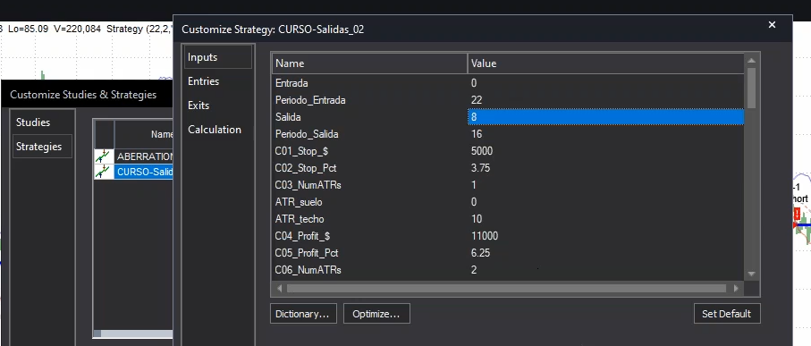
  <figcaption>Figura 058</figcaption>
</figure>

Eso sale por este código nuestro, a medida que le indiquemos cómo.

<figure>
  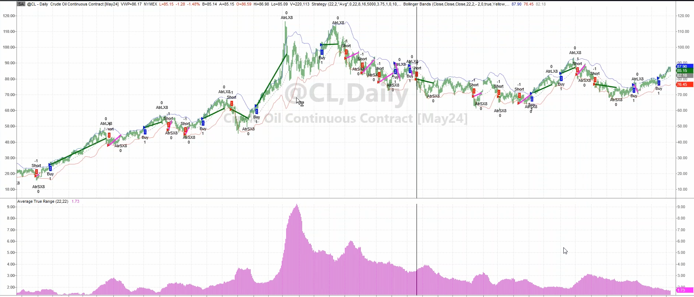
  <figcaption>Figura 059</figcaption>
</figure>

¿Qué hace un *trailing*? Bueno, un *trailing*, al final, recordad que va siguiendo el precio. Este es tan simple como la mayoría de los que habéis visto: calculo un periodo de ATR por un multiplicador:

```sh
ATRCalc = AvgTrueRange(Periodo_Salida) * C08_NumATRs;
```

El periodo de ATR es más que esto de aquí abajo del gráfico, el histograma, que es el rango de las sesiones media. Le he puesto 22 y no lo he optimizado, pero podría investigar por él.

Aquí hay poco margen porque es diario, pero si juntamos unos cuantos futuros a lo mejor podemos investigarlo un poco. De todas maneras, estaría bien investigarlo, hacer un mapa ahora por ejemplo, para que entendáis.

**Explicación del código: casos especiales**

Y simplemente aquí hay un código que es un poco más rebuscado que algunos que habéis visto, porque contempla un poco aquellos casos extraños, aquellos casos que se escapan:

```sh
If MP = 1 then 
begin
    if TT <> TT[1] or MP[1] <> 1 or High > PosHigh then 
        PosHigh = High;
        
    Sell ("AtrLX8") next bar at PosHigh - ATRCalc stop;
end else
    Sell ("AtrLX-eb8") next bar at High - ATRCalc stop;

if MP = -1 then 
begin
    if TT <> TT[1] or MP[1] <> -1 or Low < PosLow then 
        PosLow = Low;
    
    BuyToCover ("AtrSX8") next bar at PosLow + ATRCalc stop;
end else
    BuyToCover ("AtrSX-eb8") next bar at Low + ATRCalc stop;
```

Pero bueno, no sé si vale la pena... bueno, os lo explico un poco, os lo explico un poco. Mira, voy a ponerme el puntero aquí para ir ayudándoos, vale, para que aquellos que no sabéis todavía mucho de programación me vayáis siguiendo, vale.

Esto me interesa que lo entendáis porque esto es buena práctica:

- Empezamos aquí: `If MP = 1 then`, que procesa si *MarketPosition* es 1, si estamos largos.

- Esto `TT`, como veis aquí, es *TotalTrades*. Esta es una manera muy útil de programación para identificar en qué barra ha cerrado un trade: `TT <> TT[1]`. Porque *TotalTrades* recoge el número de trades cerrados, de acuerdo, el número de trades cerrados. De tal manera que, en el momento en que se cierra un trade, aquí, ¿qué estoy comparando? Yo estoy diciendo: *TotalTrades* en la barra actual es distinto de *TotalTrades* en la barra anterior. Recordad que, entre corchetes, a cualquier función o palabra reservada mayoritariamente yo puedo referirme a su valor en la barra anterior. En EasyLanguage esto es tan sencillo como hacer eso: `TT[1]`.

	<div style="border-left: 4px solid #9c27b0; background: #f3e5f5; padding: 10px 15px; margin: 10px 0; border-radius: 8px;">
	<strong>💡 TotalTrades: detectar cierre de operación</strong><br><br>
	
	<code>TT <> TT[1]</code> solo es <em>true</em> en la barra exacta donde se ha cerrado un trade, porque <code>TotalTrades</code> incrementa en ese momento. Es una técnica muy común en EasyLanguage para detectar cambios de estado.
	</div>

	Entonces, eso ocurre solo en la barra en que ha habido un cierre de trade. Fijaos que esto recoge un caso curioso: cuando se cierra un trade y se abre otro en la misma barra. Porque yo ya parto de que estoy largo, ¿entendido? Parto de que estoy largo. Pero además le pregunto... vale, ahora veréis para qué, que es para actualizar la variable, para empezar a guardarla. Es igual, ahora os explico para qué lo hace.

	**Desglose de las tres condiciones**

	Ahora llego yo y os digo: si estás largo, luego le pregunto si además de estar largo —si además de estar largo— o bien el número de trades de esta barra es distinto de la barra anterior. Esto solo puede pasar si se ha cerrado un trade. Pero insisto, estás largo, para que os acordéis: estás largo.

	```sh
	if TT <> TT[1] or MP[1] <> 1 or High > PosHigh then
		PosHigh = High;
	```

	O en la barra anterior *MarketPosition* era distinto de largo, es decir, era cero (cerrado) o corto, que es lo normal. Fijaos que esta condición solo cubre un caso. Normalmente con esto ya valdría. ¿Por qué? Porque yo le digo: tú estás largo y en la anterior no estabas largo, de acuerdo, en la anterior no estabas largo. En ese caso, actualiza. Entonces yo le digo "actualiza", es decir, dale a la variable `PosHigh` el valor del máximo de la vela para inicializar la variable.

	¿Este qué caso cubre? El caso de que en la barra anterior se hubiera cerrado un largo. Porque si en la barra anterior yo estoy largo, `MP[1] <> 1` no pasaría, este daría *false*, ¿se entiende? Daría *false*. Por eso es uno u otro. En cambio, `TT <> TT[1]` se quedaría *true*, sería verdadero, porque el número de trades ha cambiado.

	Y además también le pide que el máximo sea mayor, porque si el máximo no es mayor que el que tiene guardado, no tiene sentido actualizar la variable. Ya está.

	<div style="border-left: 4px solid #4caf50; background: #e8f5e9; padding: 10px 15px; margin: 10px 0; border-radius: 8px;">
	<strong>🔍 Las tres condiciones explicadas</strong><br><br>
	
	<code>if TT <> TT[1] or MP[1] <> 1 or High > PosHigh then PosHigh = High;</code><br><br>
	<strong>1. <code>TT <> TT[1]</code></strong> → ¿Se ha cerrado un trade en esta barra?<br>
	<em>Cubre:</em> Giro de posición (cierra largo, abre largo en misma barra)<br><br>
	<strong>2. <code>MP[1] <> 1</code></strong> → ¿En la barra anterior NO estaba largo?<br>
	<em>Cubre:</em> Primera barra de la posición (caso normal de entrada)<br><br>
	<strong>3. <code>High > PosHigh</code></strong> → ¿El precio ha hecho nuevo máximo?<br>
	<em>Cubre:</em> Caso normal del <em>trailing</em>: actualiza para subir el stop<br><br>
	Si <strong>cualquiera</strong> de las tres es <em>true</em> → actualiza <code>PosHigh = High</code>
	</div>

No profundizo más, pero era simplemente porque este tipo de estructura es bastante usual en EasyLanguage para actualizar variables. Y como ya os paso el código, pues os la podéis guardar, porque recoge algún caso un poco atípico. Recoge un caso, por eso hay tres condiciones:

1. Si *TotalTrades* es distinto de *TotalTrades* anterior
2. Si *MarketPosition* en la barra anterior era distinto de largo
3. O si el *High* era mayor

En cualquiera de esos tres casos, actualiza. En este caso actualiza porque tiene que actualizar siempre que hace un máximo, vale, tiene que inicializarla. En este caso, porque insisto, estás largo. Insisto en que todo esto pasa solo si estás largo. Por lo tanto, si estás largo, me interesa eso: me interesa actualizar si hace máximos.

Pero además, si eso no pasa y pasa cualquiera de los dos casos, también debo hacerlo. ¿Por qué? Porque lo que estoy identificando es que acabo de iniciar una posición. ¿Entendéis? Con `High > PosHigh` identifico que hago máximos. Con los otros dos trato de identificar que acabo de abrir, que es la primera barra. De acuerdo, sea: lo que identifico con estos códigos es la primera barra, vale, para que se me entienda: esta barra, la primera. Y ahí, a partir de ahí, es donde me interesa a mí actualizar.

Y a partir de ello calculo el *trail* que se va actualizando. Como os digo, a medida que yo hago máximos, cada vez que hago un máximo donde *High* es mayor que `PosHigh`, por tanto `PosHigh` vale *High*. Y automáticamente yo a esa cantidad le resto el ATR.

#### Chandelier vs. Trailing

Veremos cuando veamos el *Chandelier*, que es relativamente similar. A ver, es que el *Chandelier* es relativamente similar. Ese es un poco el *trailing* clásico. Bueno, le llamamos *trailing*, pero es que el *Chandelier* al final es muy similar, muy similar, y por eso os lo quería enseñar.

Os lo enseño un momento ahora. Ya que he hablado del *Chandelier*: lo que hace es, desde una banda —que en este caso no actualiza—, también desde un máximo de N barras, le resta el ATR. Vale, la particularidad o la única diferencia que tiene es esa: el *Chandelier* no está condicionado. Su autor en su momento no lo condicionó así: "estás largo, no estás largo, cuándo has entrado". Es decir, es una banda que está siempre.

```sh
ATRCalc = AvgTrueRange(Periodo_Salida) * C12_NumATRs;
BandaSuperior = Highest(High, Periodo_Salida) - ATRCalc;
BandaInferior = Lowest(Low, Periodo_Salida) + ATRCalc;
```

<div style="display: flex; gap: 20px; margin: 15px 0;">

<div style="flex: 1; background: #e3f2fd; padding: 12px; border-radius: 8px; border-left: 4px solid #2196f3;">
  <strong>🔔 Chandelier</strong><br><br>
  • Calcula <code>Highest(High, N) - ATR</code><br>
  • La banda existe <em>siempre</em>, estés o no en posición<br>
  • No depende de cuándo entraste<br>
  • Es una banda fija que se recalcula cada barra
</div>

<div style="flex: 1; background: #fff3e0; padding: 12px; border-radius: 8px; border-left: 4px solid #ff9800;">
  <strong>📈 Trailing</strong><br><br>
  • Calcula <code>PosHigh - ATR</code><br>
  • Solo empieza cuando <em>abres posición</em><br>
  • Guarda el máximo <em>desde tu entrada</em><br>
  • Requiere código adicional para detectar la primera barra
</div>

</div>

En cambio, un *trailing* empieza a calcularse cuando tú abres. Por eso hay todo ese código que pretende actualizar la variable, de acuerdo. Pretende recoger los máximos desde el momento en que abras. Es decir, insisto, para que se entienda bien —que veo que hay alguna pregunta— vuelvo aquí al *trailing* número 8, vale, número 8.

**Explicación visual del código**

Insisto, es para que entendáis un poco la jugada. Empezamos aquí con `If MP = 1`. Eso solo es *true* en este trade. Vamos a evaluar este trade, vale, este. Eso solo es *true* en esta barra, al cierre de esta barra.

<figure>
  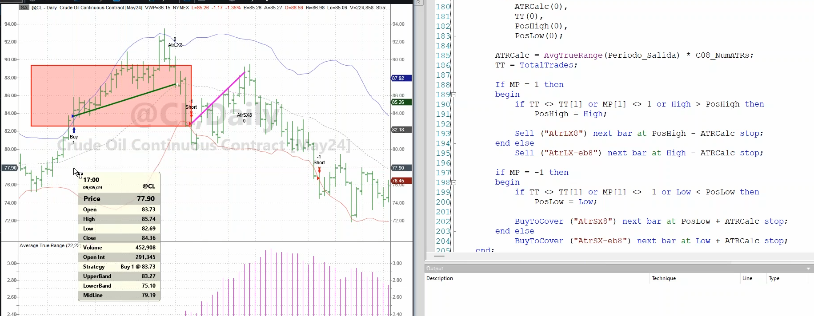
  <figcaption>Figura 060</figcaption>
</figure>

En la anterior es *false* y no entra, de acuerdo, ahí no entra. Se va a:

```sh
end else
    Sell ("AtrLX-eb8") next bar at High - ATRCalc stop;
```

Tira un *stop* —que esto está preparado para lanzarse— para que la vela de entrada tenga *stop* puesto, vale. Pero el *true*, el primer *true* de esta sentencia, es en esta vela.

De acuerdo, entonces ahí es lo que os digo: para iniciar la variable ahí no habría problema, porque como veis el máximo... a ver, esto que creo que está otra vez oscurecido, lo voy a quitar, que nos va a ir mucho mejor. En esa vela donde se compra, fijaos que el máximo es mayor que la vela anterior, con lo cual no hay problema.

<figure>
  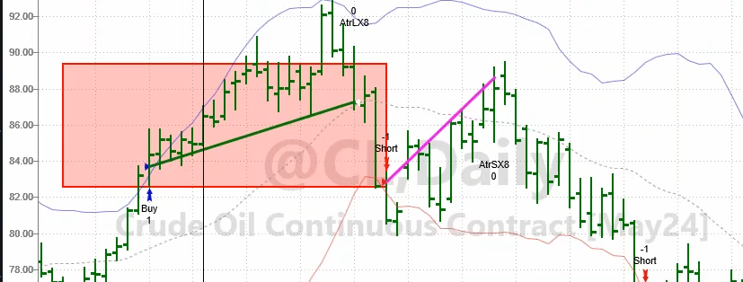
  <figcaption>Figura 061</figcaption>
</figure>

Ahí se hubiera actualizado sin esto también: `TT <> TT[1] or MP[1] <> 1`.

**El problema: si no hubiera hecho máximos**

El problema es si no hubiera hecho máximos. De acuerdo, a mí me interesa igualmente actualizarla porque es la vela en la que yo entro, y a mí me interesa en este tipo de sistemas calcularlo desde que entro. No me interesa desde antes, como hace *Chandelier*.

Aquí, repito, ha hecho máximos y por lo tanto no hay problema. Pero hay que contemplar todos los casos. Si no hubiera hecho máximos, vale, en la anterior, ¿cómo daría? ¿Cómo esto `if TT <> TT[1] or MP[1] <> 1 or High > PosHigh then` sería *true* para actualizar? Porque tiene que ser *true* en esa primera vez, vale. Pues podría ser por `MP[1] <> 1`, porque me dice: en la vela anterior, *MarketPosition* era distinto de 1. Es verdad, en la vela anterior *MarketPosition* era cero. Por lo tanto no hay problema, no hay problema, ahí actualizaría.

Pero si en la vela anterior hubiera estado largo, vale... ¿y cómo puede ser? Porque podría haber estado largo de otra operación anterior, vale, y el *High* no ser mayor. Podría haber estado largo y cerrar. Vale, no, pero en ese caso no sería... vale.

Podría tener que ser distinto de largo, vale. Bueno, si es en la vela de entrada, va a ser *true*. En las siguientes va a ser *false*, de acuerdo, en las siguientes va a ser *false*.

**Resumen de las tres condiciones**

`TT <> TT[1]` cubre el caso en que cierre y entre en la misma vela, básicamente. Y `MP[1] <> 1` cubre el caso de la primera barra normal. Y `High > PosHigh` cubre la actualización normal y corriente, que es cuando haga máximo. Si no hace máximos, no tienes que actualizar; se queda guardado con el máximo, vale.

Pero estas dos primeras pretenden que se actualice igualmente si no hace máximos en esas velas. ¿Por qué? Porque es la vela en la que me interesa estar seguro de que ahí lo identifico. Si no, podría... esas son casuísticas muy, muy especiales. Si yo eso lo anulo, veréis que normalmente hay muy pocos casos donde se da que actúe, vale. Pero de esta manera están contemplados todos los casos.

<div style="border-left: 4px solid #9c27b0; background: #fdf5feff; padding: 10px 15px; margin: 10px 0; border-radius: 8px;">
  <strong>📖 TotalTrades: Uso del diccionario de EasyLanguage</strong><br><br>
  
  Recordad los que tengáis EasyLanguage: el fenomenal uso del diccionario, que yo os recomiendo siempre tenerlo aquí a la derechita. Le pones aquí EasyLanguage, le pones aquí <em>TotalTrades</em>, si lo pones junto te dará <em>TotalTrades</em>, y ya tienes ahí la explicación:<br>
  
  <em>"Number of all closed out trades in the life of a strategy"</em><br>
  
  Un ejemplito, y además te sale el botoncito para abrir la ayuda y obtener más ayuda. En este caso no hay mucho que ayudar porque es lo que es: el número de trades. Es extremadamente útil.<br>
  
  Y recomiendo siempre, cualquier palabra reservada o cosa que no veáis, darle a eso, porque es la manera de aprender de verdad. Todas las palabras que salen aquí, todas las funciones, todas las podéis buscar aquí y las podéis buscar en la ayuda. No hay mejor manera de aprender, de verdad.
</div>

**Trailing y actualización continua**

Entonces, ya está. El *trailing* al final simplemente va actualizando a medida que el precio sube. Para que lo entendáis, como tengo aquí el Chandelier puesto, lo voy a activar 

<figure>
  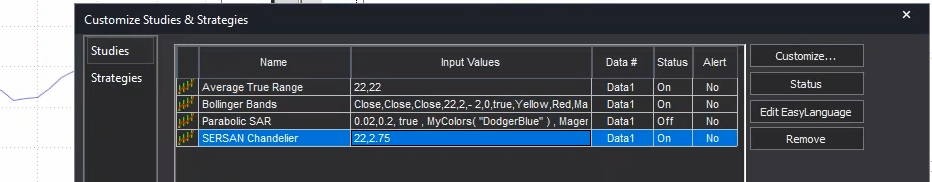
  <figcaption>Figura 063</figcaption>
</figure>

—que no es exactamente ese porque actualiza todo el rato— pero ese es el cálculo del Chandelier, vale. Que al final, para largos y para cortos, de acuerdo: el azul me va poniendo el *stop* de los largos, el rojo me va poniendo el *stop* de los cortos.

<figure>
  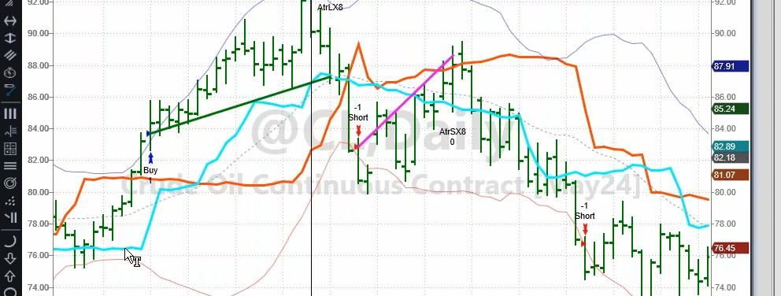
  <figcaption>Figura 064</figcaption>
</figure>

Así es un poco raro de ver, pero puedo ocultar una de ellas un momento para que así... a lo mejor es más fácil de entender. Vale, ese es el *stop* de los largos. ¿Por qué? Porque le resto al máximo el ATR. No olvidéis que al final le resto al máximo, al máximo de N barras menos el ATR. Por eso va siguiendo al precio, de acuerdo.

<figure>
  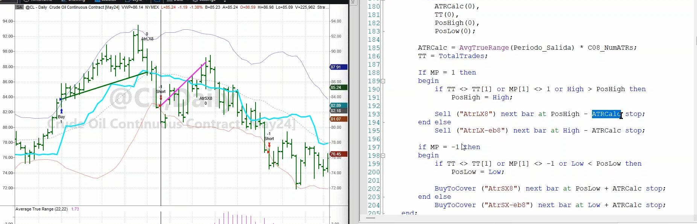
  <figcaption>Figura 065</figcaption>
</figure>

Esta línea azul que veis es un típico *trailing* por ATR, vale, es un típico *trailing* por ATR, que es el que recogemos en el número 8, solo es el 8. Que no va mal, no va mal por cierto, vale. Y se adapta a la volatilidad, de acuerdo. Es decir, esto si tú lo miras en todo el histórico, al final se va adaptando a la volatilidad. Es algo bastante, bastante intuitivo.

<figure>
  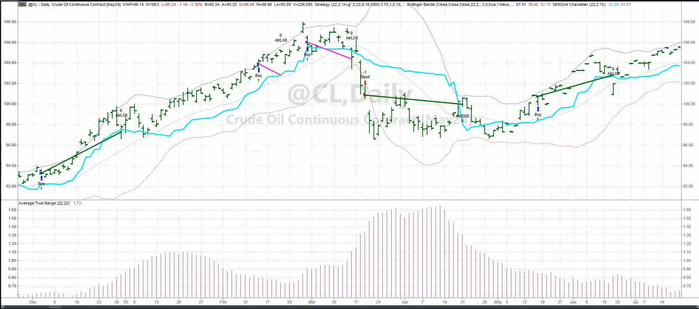
  <figcaption>Figura 066</figcaption>
</figure>

El histórico, como veis, está hecho polvo, pero es igual, nos da igual ahora. Siempre va siguiendo al precio por debajo. Llega un punto que deja de tener sentido. Porque al final recoge el máximo de unas barras atrás —en este caso pues debe estar en 22— y le resta una cantidad. Entonces llega un punto que no tiene sentido: cuando ya lo cruza, debería de dejarse de pintar, eso se puede hacer por código, pero no lo hemos hecho. Esto deberíamos, en este momento cuando lo perfora, dejar de pintarlo Para hacerlo bien hecho

<figure>
  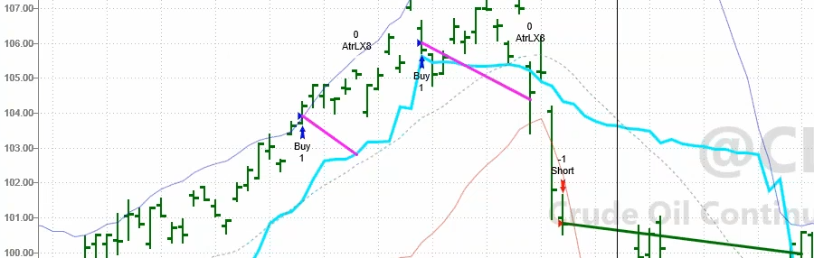
  <figcaption>Figura 067</figcaption>
</figure>

por código se puede hacer eso: solo pintarlo cuando sea superior, cuando su valor sea inferior al mínimo, de acuerdo. Al mínimo. Y el del corto pues lo mismo pero al revés, de acuerdo.

Si queréis, oscurezco un momento este para que lo veáis más claro. Ahí, ahí tenéis un poco la contraria. Ves que aquí solo tendría sentido pintarlo cuando el máximo esté por debajo, de acuerdo. 

<figure>
  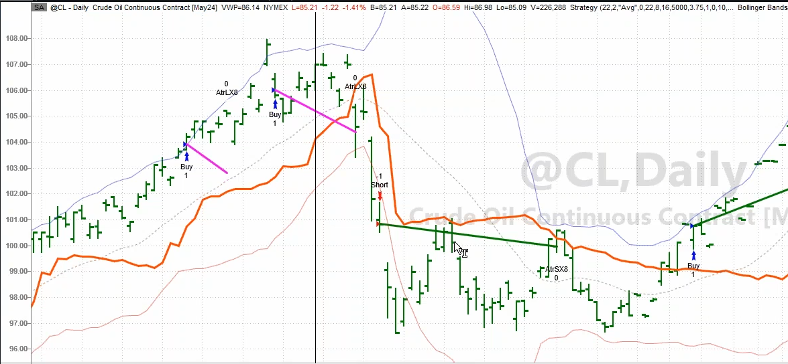
  <figcaption>Figura 068</figcaption>
</figure>

En el momento que el máximo ya esté por encima de esa línea, pues no la deberíamos de pintar porque es absurda.

Vamos a la derecha, que es el gráfico un poco más decente, vale. Y ahí está ese tema marcando un poco las líneas donde salta el *stop*, vale, el *stop* de los cortos. En este caso sí que la vamos a poner un poquito transparente, no, porque así cuando lo pongamos no molesta tanto. Ahí está, ahora la voy a ocultar.

<figure>
  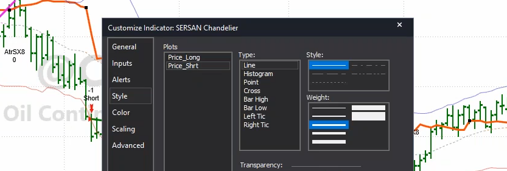
  <figcaption>Figura 069</figcaption>
</figure>

Y este, como os digo, pues es el *stop* de salida *trailing*, que es un *stop* tipo *trailing*. Solo tenía esta, esta era la número 8. 

### `case 11` Salida combinada  :  Combinación Trailing + Take Profit

En la 11 además hemos incorporado que además puede cerrar por *take profit*.

```sh
# Trailing ATR + Profit ATR
case 11: 								
	Input: # Input: Periodo_Salida(14), C11_NumATRs_01 ( 2.5 ), C11_NumATRs_02 ( 4.75 );
		C11_NumATRs_01 ( 7.75 ),
		C11_NumATRs_02 ( 7.25 );
```

Que pueda cerrar por *take profit*, que no sea tendencial puro... esto necesito aclararlo porque también me ha llegado un comentario. Es decir, cuando digo que un tendencial puro no tiene que tener *take profit*, no quiero decir que no haya que ponerle *take profit* a los tendenciales, de acuerdo?. Si quieres que sea puro, yo recomiendo no ponerlo. Pero también puede ser tendencial con *take profit*.

Y si tienes nuevamente lo que decía antes de la cartera de las materias primas, pues a lo mejor estaría bien mezclar: alguno con que lo tenga, otro que no lo tenga. De acuerdo?, esa también es una diversificación muy útil. En este caso, un sistema lo usaría con un *trailing*, otro con *take profit*. ¿Por qué? Porque al final, contra más tendenciales, más pasa este efecto que decía aquí Alejando en el ejemplo, más pasa:.

<figure>
  
  <figcaption>Figura 000</figcaption>
</figure>

Entonces al final, todo tiene lo bueno y todo tiene lo malo. Entonces si yo quiero tener varios, pues a lo mejor en uno lo hago tendencial puro, pero luego otros algo tendencial, no tan puros. ¿Por qué? Porque los voy estabilizando. Contra más bajo el *take profit*, ya os lo comenté, estabiliza mucho los sistemas.

**Stop y Take Profit fijos vs. adaptativos**

Es decir... mira, ya veréis, tengo salida por *stop* y *profit por ATR*

```sh
case 6: # Profit ATR 
	Input: # Input: Periodo_Salida(14), C06_NumATRs(3);
		C06_NumATRs ( 13.5 );
```

*Profit por ATR* número `salida 6` y `periodo salida` pongo 22 a todos

<figure>
  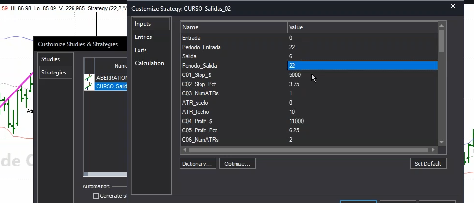
  <figcaption>Figura 071</figcaption>
</figure>

Mira, vamos a optimizar un momento por curiosidad. Es igual, es por jugar. Yo qué sé, esto que es *profit ATR*, y le ponemos de 0.25 a 25... no, va a ser muy alto. Yo qué sé, de 5 a 15 o que de 0.50 o algo. Eso es un momento, para jugar, para ver un poco.

<figure>
  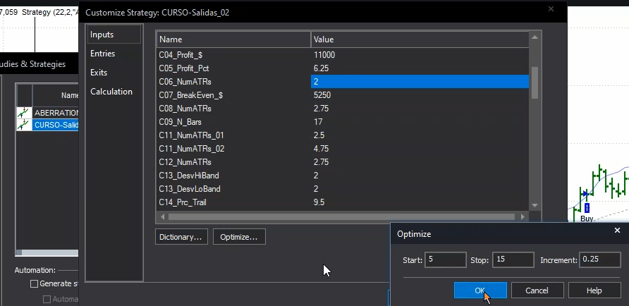
  <figcaption>Figura 072</figcaption>
</figure>


**Resultados de optimización**

Ahora lo hemos dado aquí al optimizador, y lógicamente es un punto de sobre-optimización probablemente, pero bueno, que nos da igual, que es para jugar un poco con el tema. Y ahí vemos que hemos conseguido un sistema súper top, hemos mejorado muchísimo lo que había.

<figure>
  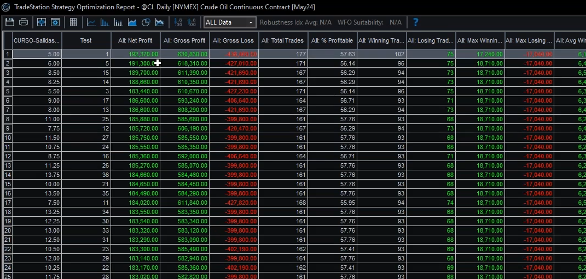
  <figcaption>Figura 073</figcaption>
</figure>
<figure>
  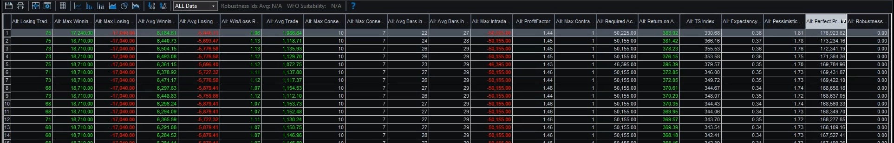
  <figcaption>Figura 204</figcaption>
</figure>


Y este es seguramente de los mejores que hay. ¿Por qué? Porque al final es un tendencial, no le dejo salir con la media ahora, no os olvidéis. 

Y por lo tanto pues bueno, le deja el *take profit* muchas veces muy, muy arriba, bueno 5, de hecho no es que sale... seguramente aquí tiene *drawdown* más elevado,  este todos van a tener *drawdowns* muy fuertes porque no le hemos dejado quitar el *drawdown* de ninguna manera. ¿Entendéis? Ya no le hemos dejado más que ganar dinero. Entonces gana mucho dinero, pero debe tener unos *drawdowns* bastante bestias. Seguramente es de los que más gana este, pero también es de los que más *drawdown* tiene, seguro.  ¿Por qué? Porque no puede salir más que girándose, vale, no puede salir más que girándose. Entonces debe tener alguna enganchada.


<figure>
  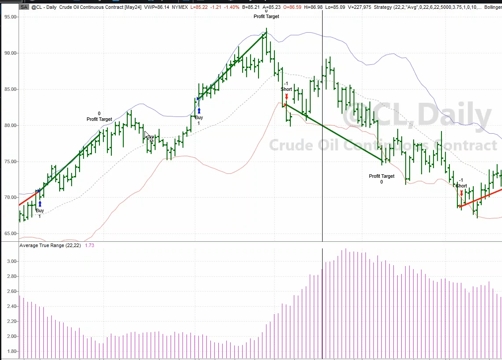
  <figcaption>Figura 074</figcaption>
</figure>

<figure>
  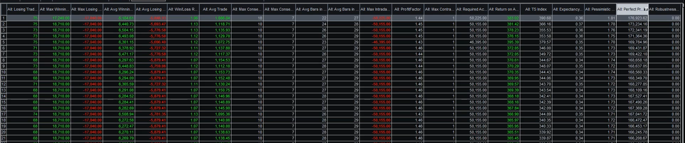
  <figcaption>Figura 075</figcaption>
</figure>

<figure>
  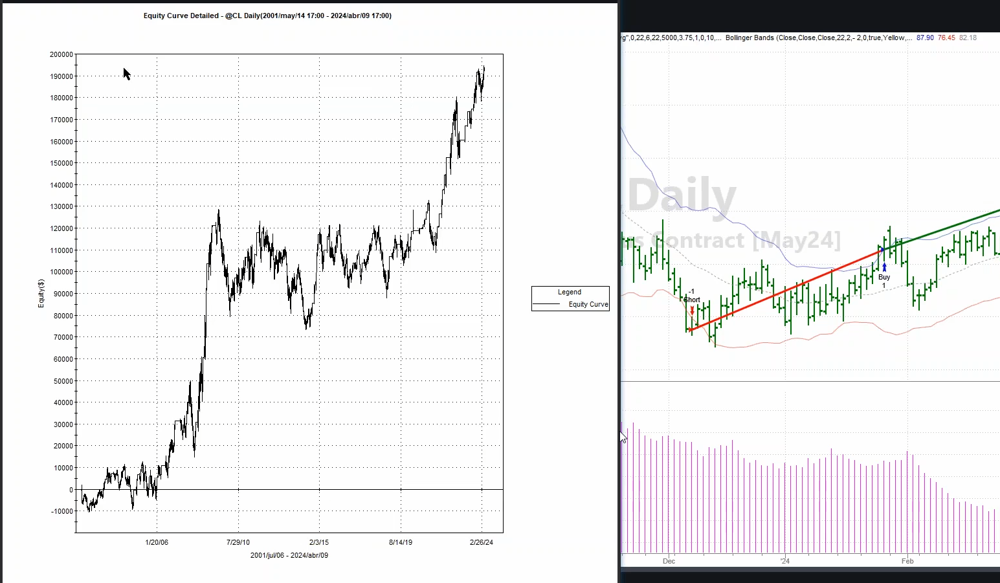
  <figcaption>Figura 076</figcaption>
</figure>

<figure>
  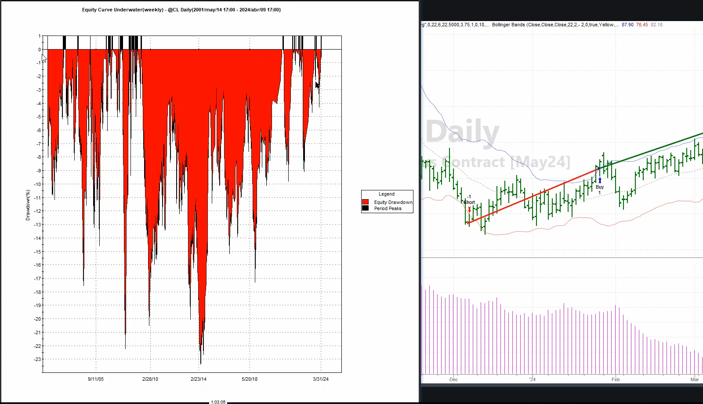
  <figcaption>Figura 077</figcaption>
</figure>


<figure>
  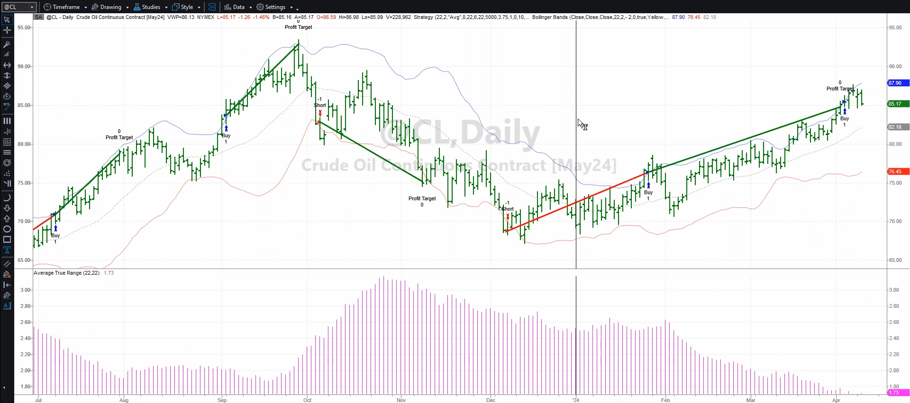
  <figcaption>Figura 078</figcaption>
</figure>

Tiene que tener muy buenos pero una enganchada como estas, bastante macabra. Y tendrá peores. Era una enganchada espectacular. ¿Por qué? Porque no se va a poder cerrar hasta que tenga una señal contraria. Bueno, no le he dejado salir de ninguna manera, vale. Pero claro, así cuando pilla tendencia —que ya sabéis que las materias primas, mira el oro ahora — luego lo podemos probar también en el oro diario y seguramente nos va a ir bien también. Luego lo probamos.

Y porque solo le dejamos por *profit*. Entonces yo esto puedo usarlo en un tendencial, que es esto. Si no, pasa nada. Pero veréis que sus ratios de acierto siendo inferior a 50, casi con total seguridad... no, ya es por encima de 50. Pensaba que aún así aguantaría, bueno, porque al final le ha quedado un valor relativamente bajo.

<figure>
  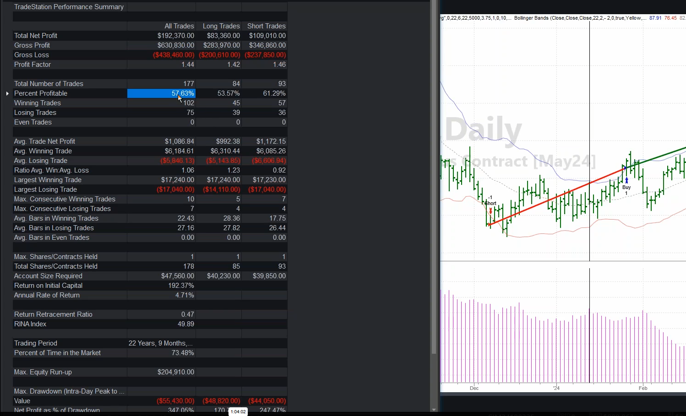
  <figcaption>Figura 079</figcaption>
</figure>

Si le hubiera puesto más alto, es decir, si en vez de 5, en vez de 5 pues yo qué sé, le hubiera puesto otro valor que equilibre mejor en alguna otra cosa, que no sé si lo va a haber... no, creo que lo haya, al final ninguno equilibra mejor en nada, ninguno equilibra mejor en nada, vale.

Que sería ese, claramente, pero es igual. Que lo hubiera puesto 11... Imagina que lo hubiera puesto 11 (hago click en 11), por allá lo veis. Aquí, aquí creo que sale el porcentaje de aciertos... no sale aquí, no sale. Bueno, se puede ver aquí: 57.76%. No, todos son muy altos, todos son muy altos, todos son muy altos. La verdad que me sorprende, esperaba que tuviera menos porcentaje de aciertos al ponerle *take profit*.

<figure>
  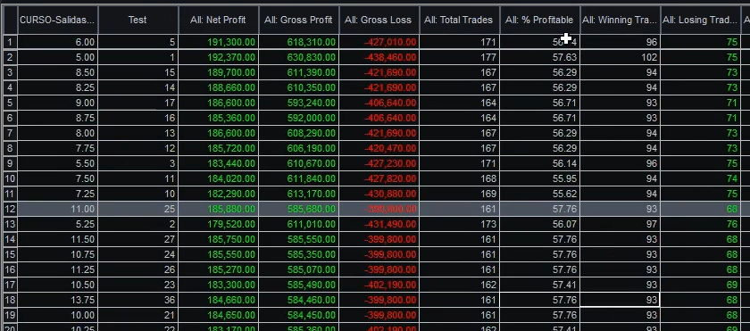
  <figcaption>Figura 081</figcaption>
</figure>

Pero fijaos, ya lo deja... lo convierte en bueno, sigue siendo tendencial pero ya su carácter es menos tendencial

<figure>
  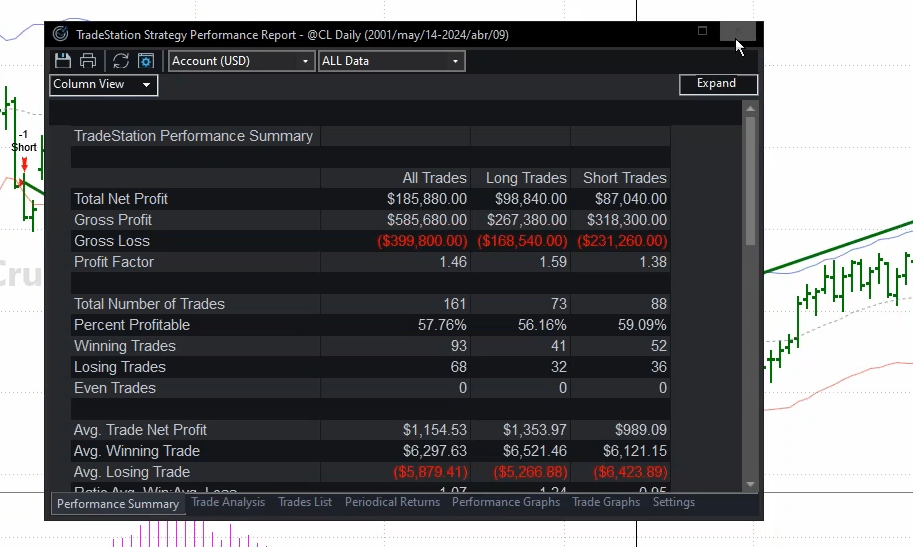
  <figcaption>Figura 082</figcaption>
</figure>

porque ya no acierta tanto... porque su porcentaje de aciertos ya es muy elevado. También en este caso casi con total seguridad es un poco fruto de sobre-optimización, fruto de sobre-optimización. Que eso también es señal sospechosa de que un sistema no rula, que hay ratios que no esperas.

Pero bueno, para que veáis el ejemplo que os decía. 

Esa tiene *trailing*, además *take profit*. Va a hacer *take profit* en algunos momentos, pero se protege mediante el *trailing*, que lo mantiene pegadito ahí.

<figure>
  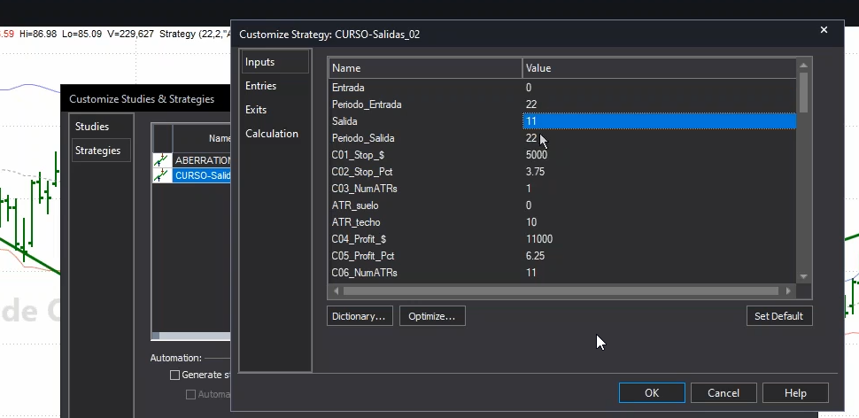
  <figcaption>Figura 083</figcaption>
</figure>
<figure>
  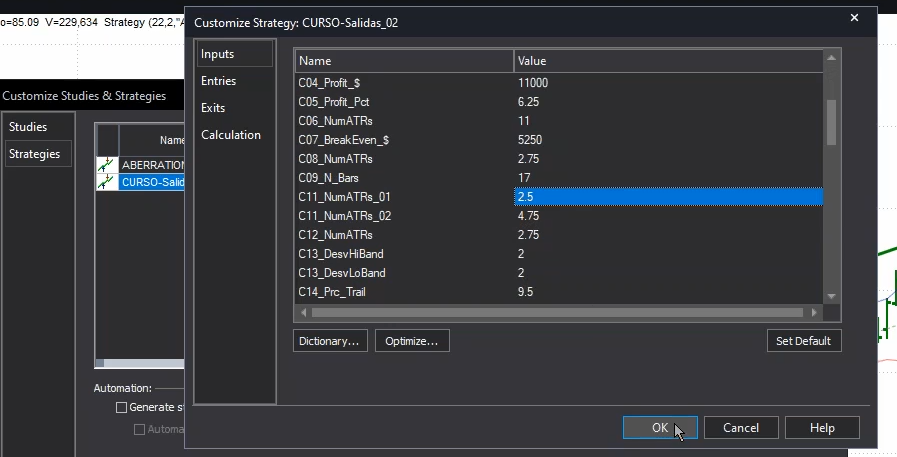
  <figcaption>Figura 084</figcaption>
</figure>
<figure>
  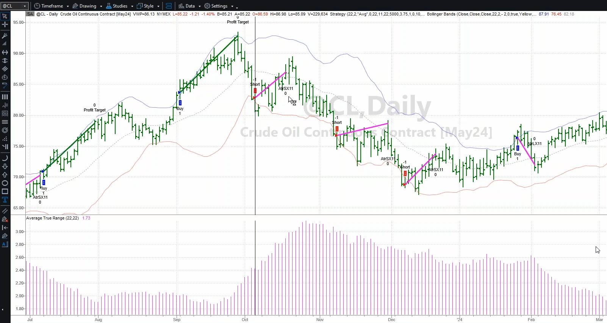
  <figcaption>Figura 085</figcaption>
</figure>

Todos estos, ya digo, en general todos aseguro que ganan bien. Ganan bien porque son salidas que van muy bien al tendencial: lo dejan correr. Fijaos, este al final lo ha dejado más acompañado.

<figure>
  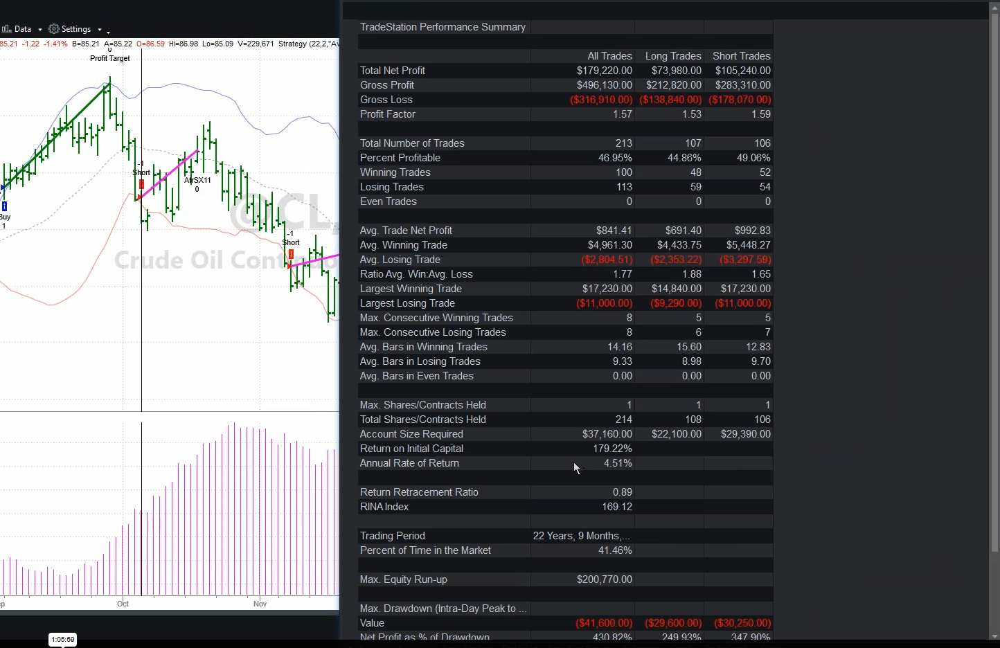
  <figcaption>Figura 086</figcaption>
</figure>
<figure>
  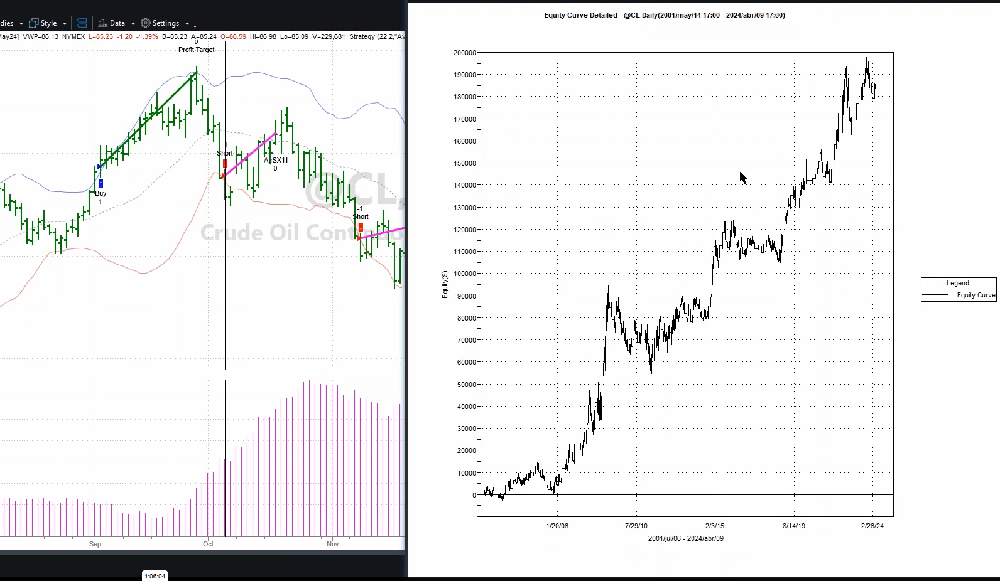
  <figcaption>Figura 087</figcaption>
</figure>

¿Por qué? Porque sale por *take profit* y además tiene un nivel que lo protege, lo protege de las vueltas. Entonces este ya no tiene enganchadas, ya no tiene enganchadas; prácticamente ya la cosa mejora. Este es *trailing* con *profit*; ese está bastante bien. ¿Por qué? Porque al final, cuando uno habla de *stop* y *take profit* al uso, tened en cuenta que son *stops* que van mejor en los *antitendenciales*, vale. Yo, en un tendencial, necesito acompañar al precio. Porque si yo quiero que corra mucho, ¿qué sentido tiene que el *stop* lo ponga en la entrada?

**Stop y Take Profit porcentuales: Case 16**

Al final, un *stop*, sea monetario o sea porcentual... mira, tengo el porcentual y monetario. Lo tengo en el caso 16, ahora os lo enseño. Lo tengo en el 16.

```sh
case 16: # Stop% + Profit% - Input: C16_Stop_Pct(2), C16_Profit_NxStopPct(1);
	Input:
		C16_Stop_Pct ( 2.25 ),        # en tanto por 100
		C16_Profit_NxStopPct ( 0.7 );
```

<figure>
  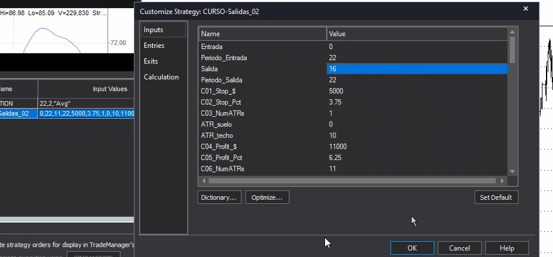
  <figcaption>Figura 088</figcaption>
</figure>

Entonces yo, con *stop* y un *profit* porcentuales, solo puedo salir por eso... y por el giro, claro. ¿Qué pasa? Pues es muy errático, porque al final no le estoy dejando al sistema salir de ninguna manera.

<figure>
  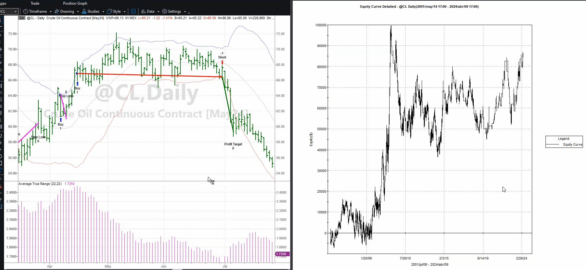
  <figcaption>Figura 089</figcaption>
</figure>
<figure>
  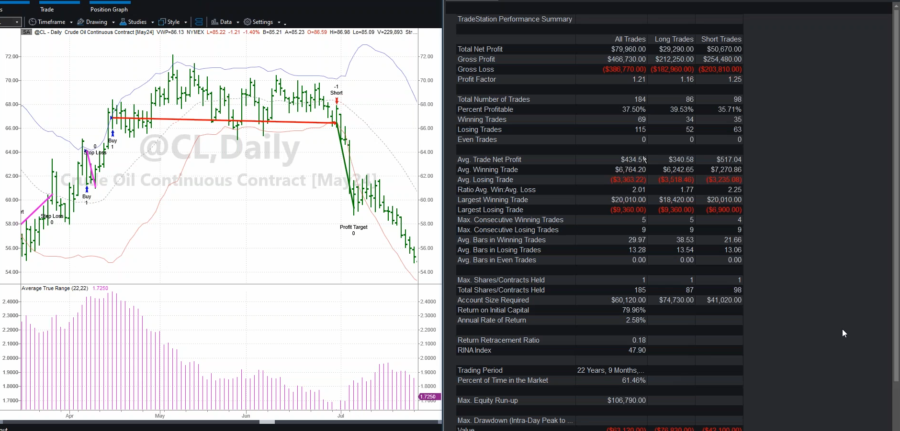
  <figcaption>Figura 090</figcaption>
</figure>

Si aquí yo...

```sh
C16_Stop_Pct ( 4.75 ), 
C16_Profit_NxStopPct ( 2.25 );
```

Si lo hago así...

```sh
C16_Stop_Pct ( 4.75 ), 
C16_Profit_NxStopPct ( 1 );
```

Como esto, el `C16_Profit_NxStopPct()`, es multiplicador:

<figure>
  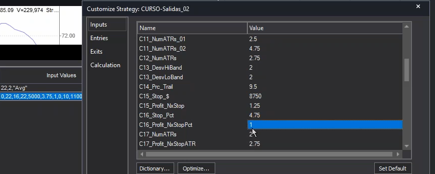
  <figcaption>Figura 091</figcaption>
</figure>

Lo he dejado *stop* y *take profit* simétrico. Tengo una entrada que es tendencial, pero le he obligado a que tenga una salida *antitendencial*.

<figure>
  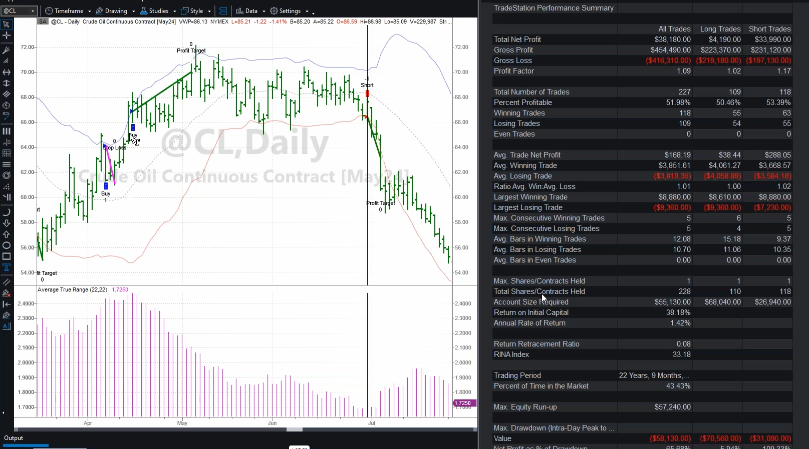
  <figcaption>Figura 092</figcaption>
</figure>

**Análisis de ratios: simétrico vs. asimétrico**

Ahora me da ratios por encima del 50%; en concreto, `51,98%`. El otro me daba `37,50%` porque era un tendencial; ahora lo he vuelto a tendencial. Aun así me da 52%, que me está diciendo que alguna ventaja tiene, pero es muy justita, muy justita, puesto así.

Pero ahí estoy poniendo *stop* y *take profit* simétrico. Acordaos que esto os lo dije, que es una manera de evaluar a veces ventajas. Pero sobre todo en el caso *antitendencial*; también puede servir aquí para evaluar un poco la entrada, vale. Porque yo me estoy saliendo de manera simétrica.

Pero esto, para que se entienda, quiere decir que yo... cuando el precio sube, el precio cae un porcentaje que nos dijera un `4.75`, y que ahora lo pongo en un `5` para redondear. Tiene un *stop* del 5% y un TP del 5%. Cuando tiene un *stop* de un 5% y un *take profit* de un 5%, según uno, lo que hace es el multiplicador del mismo: 5 y 5.

<figure>
  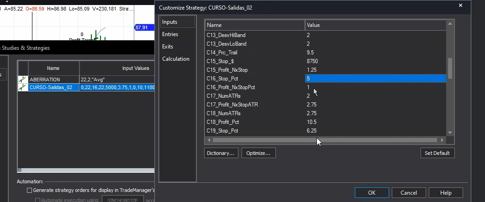
  <figcaption>Figura 093</figcaption>
</figure>
<figure>
  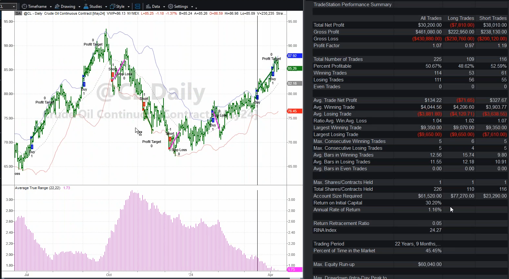
  <figcaption>Figura 094</figcaption>
</figure>

Claro, al final es justito. Así es muy justito, porque esa es una salida más apta para tendencial. ¿Mejorará? Sí, mejorará, claro que mejorará. Pero como yo ahora le he quitado la salida... así, dejándole su salida de media, tendría cierto sentido. Pero quitándole esa salida, tiene muy poco sentido, ¿entendéis?

<div style="border-left: 4px solid #2196f3; background: #e3f2fd; padding: 10px 15px; margin: 10px 0; border-radius: 8px;">
  <strong>🎯 Configuración del multiplicador de Profit</strong><br><br>
  
  <code>C16_Stop_Pct</code> → Porcentaje de <em>stop</em> (ej: 5 = 5%)<br>
  <code>C16_Profit_NxStopPct</code> → Multiplicador del <em>stop</em> para el <em>profit</em><br>
  
  • Si <code>NxStopPct = 1</code> → Profit = Stop (simétrico, 1:1)<br>
  • Si <code>NxStopPct = 2</code> → Profit = 2× Stop (asimétrico, 1:2)<br>
  • Si <code>NxStopPct = 3</code> → Profit = 3× Stop (asimétrico, 1:3)<br>
  
  Para tendenciales, usar multiplicadores >1 para dejar correr los beneficios.
</div>

**Reflexión: sentido común en las salidas**

Esto es lo que hablaba en la ponencia de Robotrader. Yo os dije que la enseñaría aquí hoy. Era esto, era reflexionar y entender la que ya he hablado de sentido común, que a veces es fruto —muchas veces— de la experiencia: de buscar las cosas que tienen sentido para cada tipo de entrada. Entonces, si yo al final busco tendencia, no tiene sentido poner un *stop* y un *take profit* al uso, a no ser que tenga la otra salida.

**Mejora con Take Profit asimétrico**

Ahora le pongo 2, vale, y el *profit* es 10%. Ahora le he puesto 10%.

<figure>
  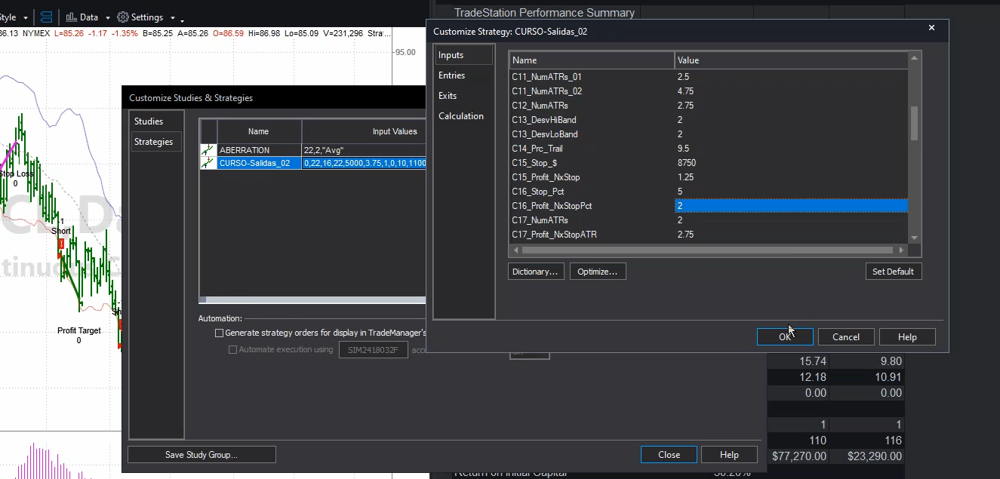
  <figcaption>Figura 205</figcaption>
</figure>

Ahora ya se vuelve más tendencial y ha mejorado un poco; mira el *Profit Factor*, este y el anterior. ¿Por qué? Porque es un activo que quiere tendencia, porque tiene muchas colas largas. Entonces las colas largas tienen que pagar los fallos. Tienen que hacer estos grandes *tricks* para pagar los fallos.

Ya ha caído del 50% de aciertos y es un típico tendencial. Así tengo que hacerlo, así. Sí, puedo hacerlo, pero aun así seguramente no es eficiente. ¿Por qué? Porque pone TP y SL donde toca y se olvida. Y ya está. Y le da igual lo que haga el precio, vale.

<figure>
  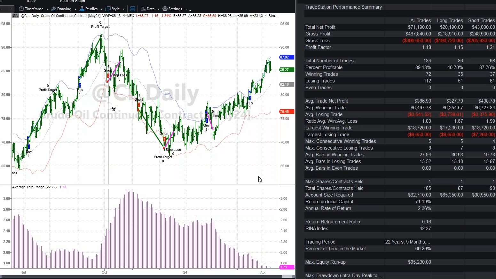
  <figcaption>Figura 096</figcaption>
</figure>

**La diferencia con el Trailing**

Esa es la diferencia con un *trailing*. Un *trailing* es un poco como la media: la media va subiendo. Por eso es lo que os decía: si yo activo la media, va a mejorar. ¿Por qué? Porque la media al final me está haciendo de *trailing*, ¿entendéis? Me está haciendo de *trailing*.

<figure>
  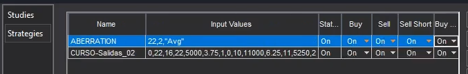
  <figcaption>Figura 097</figcaption>
</figure>

Entonces, si yo quiero usar ese tipo de *stops*, mejor que deje activada la salida del sistema, que probablemente mejore. Bueno, ahora habrá que ver si el *take profit* queda demasiado lejos y tal. Pero solo con eso ya ha mejorado.

<figure>
  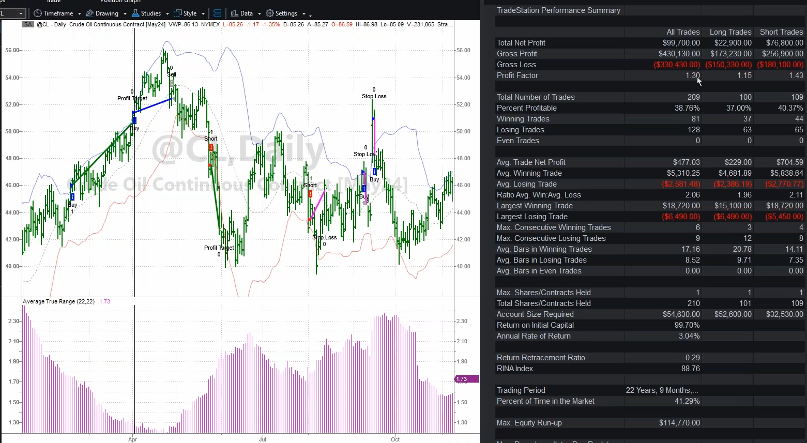
  <figcaption>Figura 098</figcaption>
</figure>

Pues ya ha mejorado. ¿Por qué? Porque cuando vuelve, veis aquí qué pasa en el trade azul del pico... Este que ha vuelto, pero la media lo saca. La media le hace de *trailing*, vale.

En un tendencial no tiene sentido que yo vaya *stop* y *profit* si no tengo otra salida. Insisto, pues ahora vuelvo a desactivar la media, porque así entendemos bien las salidas, vale. Vamos en bruto en este ejercicio hoy de completo de salidas.

Que al final, como sabéis y se dice, es muy, muy importante y marca mucho el carácter y el perfil de un sistema. Porque al final es lo que ejecuta la ganancia, la pérdida. Aunque todo es importante, lógicamente.

<div style="border-left: 4px solid #4caf50; background: #e8f5e9; padding: 10px 15px; margin: 10px 0; border-radius: 8px;">

  <strong>💡 Principio fundamental</strong><br>

  • <strong>La ventaja la da la entrada</strong><br>
  • <strong>La salida es lo que acaba de materializar el resultado</strong><br>
  
  La entrada define <em>dónde</em> tienes ventaja estadística. La salida define <em>cómo</em> capturas esa ventaja. Un sistema tendencial con salida <em>antitendencial</em> (TP fijo cercano) destruye su propia ventaja.
</div>


<figure>
  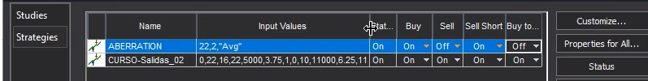
  <figcaption>Figura 099</figcaption>
</figure>


### `Case 16`  Salida porcentual: Stop% + Profit%

Yo tengo los *inputs* y simplemente le digo: si *MarketPosition* es distinto de cero, vale, es distinto de cero, lanza un *SetStopLoss*. Porque esto... tengo una palabra reservada que me lo calcula y me ayuda mucho: `SetStopLoss(EntryPrice * C16_Stop_Pct / 100 * Bigpointvalue);`. Si no, pues puedo calcularlo de otra manera, de acuerdo, puedo calcularlo, vale.

Pero en EasyLanguage tiene una palabra reservada que es esto, que no sé... diccionario, diccionario. Es que no sé si lo pregunto... a ver, si no, no se lo pregunto. A ver si lo busco aquí, lo leo, y entonces si después de leerlo y tal no lo entiendo, le pregunto. Lo primero, lo busco, porque de verdad, la manera... eso es lo que hablaba varias clases: de la teoría, el carácter del cuantitativo algorítmico exige esto, exige esta inquietud. Si no, os va a costar mucho. Exige esta inquietud de la búsqueda, del análisis, de entender las cosas, vale. No ir a lo fácil simplemente, de acuerdo. Hay que entender, hay que tener las cosas y buscarlas.

Y ya digo, una de las cosas buenas que tiene TradeStation es su fantástica ayuda, de verdad, que es de las mejores. Está todo normalmente muy bien explicado. Aquí es lo que digo: es un *built-in stock reservoir*. Los que tenéis el curso de EasyLanguage, que sois la mayoría, pues ya está, está ahí explicado, y lo explico más en detalle. Pero que también la ayuda viene bien.

```sh
case 16: //Stop% + Profit% - Input: C16_Stop_Pct(2), C16_Profit_NxStopPct(1);
begin	
	Input:
		C16_Stop_Pct ( 2.25 ),        # en tanto por 100
		C16_Profit_NxStopPct ( 0.7 );
		
	SetStopShare;

	If MP <> 0 then 
	begin
		SetStopLoss (EntryPrice * C16_Stop_Pct / 100 * Bigpointvalue); 
		SetProfitTarget (EntryPrice * (C16_Stop_Pct * C16_Profit_NxStopPct) / 100 * BigPointValue);
	end else 
	begin
		SetStopLoss (Close * C16_Stop_Pct / 100 * Bigpointvalue); 
		SetProfitTarget (Close * (C16_Stop_Pct * C16_Profit_NxStopPct) / 100 * BigPointValue);
	end;
end;
```

**Cálculo del Stop porcentual**

Al final tú puedes sacar ahí un valor monetario directamente, al uso, 500 o 1.000. O un cálculo, que es lo que hacemos aquí: un cálculo `SetStopLoss(EntryPrice * C16_Stop_Pct / 100 * Bigpointvalue);`. Esto al final acaba siendo dinero, pero ¿cómo se calcula? Se calcula multiplicando el precio de entrada por un porcentaje —que está en tanto por cien, un 2%, un 3%—, lo divido por 100 porque para multiplicarlo por el precio de entrada, y lo multiplico por *BigPointValue*, que es lo que convierte puntos en dinero. Es lo que convierte puntos en dinero. Y ya está, ya con eso ya me tira el *stop* del precio que quiero.

Y el *SetProfitTarget* es igual: `SetProfitTarget(EntryPrice * (C16_Stop_Pct * C16_Profit_NxStopPct) / 100 * BigPointValue);`, pero veis que además multiplico el *stop percent* por esa variable que os decía, que es múltiplo de él. Si esa variable vale 1, pues son iguales. Si esa variable vale 2, pues el doble. Ese número que da se divide por 100, se multiplica, y lo mismo.

<div style="border-left: 4px solid #2196f3; background: #e3f2fd; padding: 10px 15px; margin: 10px 0; border-radius: 8px;">
  <strong>🔢 Fórmula del Stop porcentual</strong><br><br>
  
  <code>SetStopLoss = EntryPrice × (Stop% / 100) × BigPointValue</code><br><br>
  
  • <strong>EntryPrice</strong> → Precio de entrada de la operación<br>
  • <strong>Stop%</strong> → Porcentaje deseado (ej: 5 = 5%)<br>
  • <strong>BigPointValue</strong> → Convierte puntos a dinero (valor del tick × multiplicador)<br><br>
  
  Ejemplo: Entrada a 100$, Stop 5%, BPV=1 → <code>100 × 0.05 × 1 = 5$</code>
</div>

**El problema de la barra de entrada y EntryPrice**

Y esto que veis aquí detrás del *else*:

```sh
	end else 
	begin
		SetStopLoss (Close * C16_Stop_Pct / 100 * Bigpointvalue); 
		SetProfitTarget (Close * (C16_Stop_Pct * C16_Profit_NxStopPct) / 100 * BigPointValue);
	end;
```

Es porque aunque *SetStopLoss* se usa... lo explico porque puede generar confusión, porque aquellos que no tengáis mucha experiencia digáis: "Coño, pero si es que *SetStopLoss* y *ProfitTarget* a mí me has dicho en el curso de EasyLanguage que es un *stop* que va en la barra de entrada".

Y te digo: tienes razón, es cierto, va en la barra de entrada, vale. "Y me dices: es porque me pones este bucle `If MP <> 0 then` de 'si es distinto de cero' y luego me pones que cuando no", es decir, cuando es cero, `end else`.

Esta parte de aquí se calcula solo cuando está cerrado. ¿Qué sentido tiene calcularlo cuando está cerrado?

```sh
# Se calcula solo cuando está cerrado
	end else 
	begin 
		SetStopLoss (Close * C16_Stop_Pct / 100 * Bigpointvalue); 
		SetProfitTarget (Close * (C16_Stop_Pct * C16_Profit_NxStopPct) / 100 * BigPointValue);
	end;
```

El sentido es que, cuando entra, tened en cuenta cómo se procesa el código, muy breve, porque eso no es... Cuando yo abro esta posición, hasta que no cierre la barra no se leerá *MarketPosition* igual a 1, vale.

<figure>
  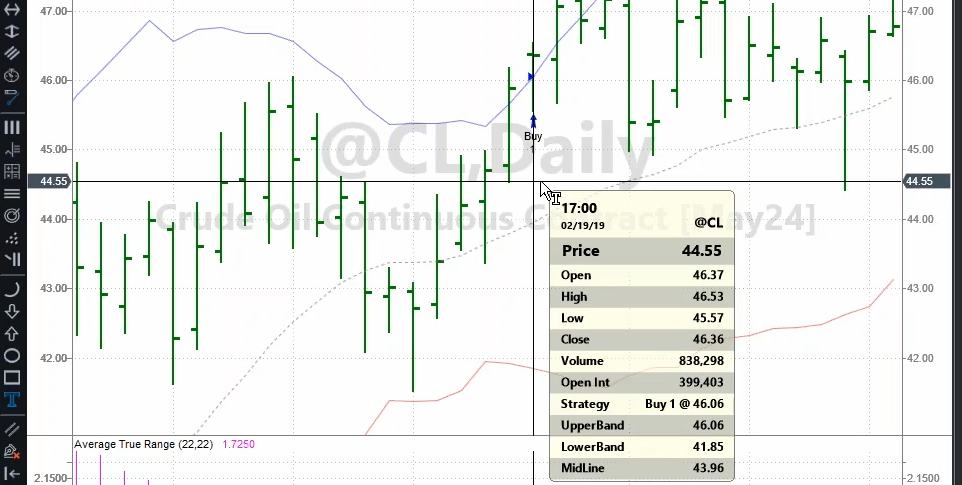
  <figcaption>Figura 100</figcaption>
</figure>

Por lo tanto, las órdenes que se tienen en esa barra se han calculado en la anterior, vale.

Es decir, todo lo que se tira en la barra que estamos comprados se ha calculado en esta de la imagen que marco. Por lo tanto, el *stop* no se ha calculado, porque esta barra era 0; *MarketPosition* en esta barra era cero, no era 1. Cuando esta cierre —la que está larga, donde estaba— y cuando esta cierre, *MarketPosition* será 1, pero el anterior era cero, *MarketPosition*. Por lo tanto, no hay *stop* en esa barra en teoría.

Como hay esto, ¿con esa barra? Con esto hay *stop* en esa barra:

```sh
	end else 
	begin
		SetStopLoss (Close * C16_Stop_Pct / 100 * Bigpointvalue); 
		SetProfitTarget (Close * (C16_Stop_Pct * C16_Profit_NxStopPct) / 100 * BigPointValue);
	end;
```

<div style="border-left: 4px solid #ff9800; background: #fff3e0; padding: 10px 15px; margin: 10px 0; border-radius: 8px;">
  <strong>⚠️ El problema de EntryPrice en la barra de entrada</strong><br><br>
  
  En EasyLanguage, las órdenes se calculan al <em>cierre</em> de cada barra para ejecutarse en la <em>siguiente</em>. Esto genera un problema:<br><br>
  
  <strong>Barra de señal (MP=0):</strong> Se calcula el <em>stop</em> → pero <code>EntryPrice = 0</code> (aún no hay entrada)<br>
  <strong>Barra de entrada (MP=1):</strong> Ya hay entrada → pero el <em>stop</em> se calculó en la barra anterior<br><br>
  
  <strong>Solución:</strong> Usar <code>Close</code> en vez de <code>EntryPrice</code> cuando <code>MP = 0</code>, así la barra de entrada tiene <em>stop</em> aunque <code>EntryPrice</code> aún no esté disponible.
</div>

**¿Por qué no sacarlo fuera del if?**

Y tú, que eres un alumno avanzado y que te has estudiado muy bien el EasyLanguage, podrías decirme: "Joder, vaya, pero llegar a estas alturas... ¿por qué no lo sacas del *MarketPosition* y se acaba el problema? No, pues no lo pongas, directamente abajo del código". Que muchos códigos lo hacemos así, lo habéis visto, solo por una cosa.

Si tienes que usar *EntryPrice*, vale, si tienes que usar *EntryPrice*, tienes que hacer esto. ¿Por qué? Porque *EntryPrice* en esa barra te va a dar cero, y entonces se te va a romper, se te va a romper, no te va a calcular bien.

Y esto, si queréis, lo demuestro un momentito. Haciendo así:

```sh
	# Comentado el if para demostrar el problema
	# If MP <> 0 then 
	# begin
		SetStopLoss (EntryPrice * C16_Stop_Pct / 100 * Bigpointvalue); 
		SetProfitTarget (EntryPrice * (C16_Stop_Pct * C16_Profit_NxStopPct) / 100 * BigPointValue);
	# end else 
	# begin
		# SetStopLoss (Close * C16_Stop_Pct / 100 * Bigpointvalue); 
		# SetProfitTarget (Close * (C16_Stop_Pct * C16_Profit_NxStopPct) / 100 * BigPointValue);
	# end;
```

Dejando solo el *stop* normal, vale. Dices: "Así, lo normal, si no voy a usar *EntryPrice* podría dejarlo así", vale, sin *MarketPosition*. Pero ahora... y ahora voy a compilar esto, voy a tratar de abrir aquí el gráfico lo máximo posible que se me vean algunas varias operaciones, y voy a compilar.

<figure>
  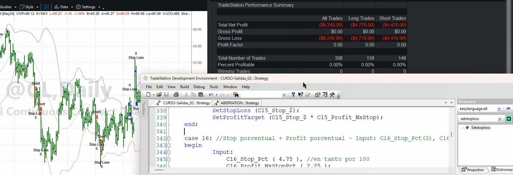
  <figcaption>Figura 101</figcaption>
</figure>

Veis, se ha roto, ya no está haciendo lo que tiene que hacer, vale. No está haciendo lo que tiene que hacer. ¿Por qué? Porque *EntryPrice* muchas velas no calcula bien, de acuerdo. *EntryPrice* no calcula. Si esto fuera cierre, entonces sí. Pero claro, entonces no lo calcularía del precio de entrada, y lo quiero calcular realmente sobre el precio de entrada. Tengo que hacer esta *martingala*, vale.

**Caso simple: Stop monetario fijo**

Si aquí yo pusiera 10.000 directamente, no hace falta. De hecho, por ejemplo aquí:

```sh
case 1: //Stop $ - Input: C01_Stop_$(1000);
begin
	Input:
		C01_Stop_$ ( 4000 );
	
	Setstopcontract;
	SetStopLoss(C01_Stop_$);
end;
```

Es así, punto. Da igual si está largo, si está corto, si está pensionista, si lo que sea, no importa. En ese caso es porque yo quiero usar la barra... calcularlo de *EntryPrice*, ¿se entiende, verdad?

Venga, seguimos.


### `case 20` Salida combinada : Chandelier + temporal

Hemos visto antes por encima Chandelier. Bueno, por encima y no tanto por encima. Es decir, Chandelier al final no deja de ser un *trailing*, vale. Lo tenemos combinado. Hemos hecho un Chandelier solo, hemos hecho un Chandelier con salida temporal, vale. Hemos hecho varias, varias opciones, vale. Varias opciones.

```sh
	case 20: //Chandelier + temporal - Input: C20_StopPriceCanDecrease(0), C20_StopPriceCanIncrease(0), Periodo_Salida(14), C20_NumATRs(3), C20_N_Bars(10);
	Begin		
		Input:
			C20_NumATRs ( 5 ),
			C20_N_Bars ( 59 );
		
		ATRCalc = AvgTrueRange(Periodo_Salida) * C20_NumATRs;
		BandaSuperior = Highest (High, Periodo_Salida) - ATRCalc;
		BandaInferior = Lowest (Low, Periodo_Salida) + ATRCalc;
		
		Sell ("Cxn_Lng_20") next bar at BandaSuperior stop;
		Buytocover ("Cxn_Shr_20") next bar at BandaInferior stop;
		
		If BarsSinceEntry >= C20_N_Bars then
		begin
   			Sell next bar at market;
   			BuyToCover next bar at market;
		end;
	end;
```

Aquí, una de las cosas que sí puedes hacer —lo que pasa que claro hay que tener en cuenta que yo ahora antes sí que lo he dimensionado, ahora creo que he tocado alguno, entonces, una de las cosas que sí puedes hacer, pero claro, tienen que tener sentido las variables, es colocarlo...

Sí que puedes hacer una pequeña búsqueda así rápida en las salidas. Vamos a ver de 0 a 32 cómo va, vale. 


<figure>
  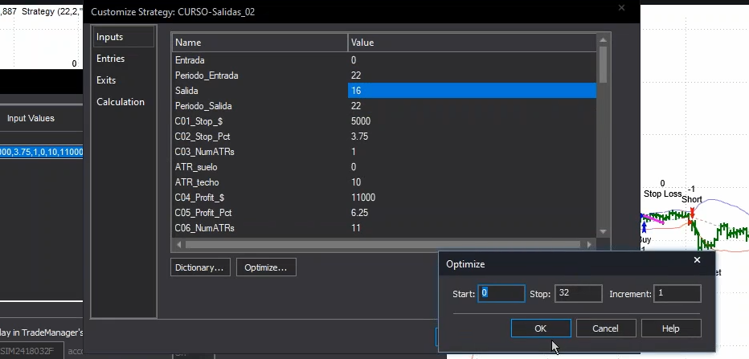
  <figcaption>Figura 102</figcaption>
</figure>

Pero insisto, si no le has dado a los *inputs* un cierto sentido, es complicado. Tiene que tener cierto sentido.

Pero sí que puedes, por ejemplo, igualar todos los *stops* porcentuales., monetarios..., siempre los *trades* , a hacer un pequeño montaje previo. Dedicarle 15 minutos a dejarlos todos iguales, vale. Proporcionales. En un tendencial pues ya eso que te digo: 

* le pongo el *profit* el doble que el *stop*, ¿sabes? Entonces, estas cosas coherentes que decíamos. 
* Y al *trailing* pues le dejo oscilar en dos ATRs. A todos los que uso ATR pues uso dos ATRs. 
* Uso el mismo periodo, 
* etc 

es decir, todos de manera homogénea, vale.

Y entonces paso la búsqueda directa de todos, y así veo por dónde van los tiros, de acuerdo. no Quiere decir que directamente con eso me quede. Pero ahora yo puedo mirar, vale, automáticamente con la optimización cuáles han dado mejor valor.

<figure>
  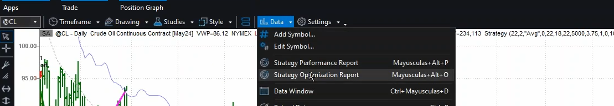
  <figcaption>Figura 206</figcaption>
</figure>

Aquí veo que el número 18, el número 11, etc. 
* El número `18` pues es el Chandelier con *profit* porcentual, oh sorpresa. 
* `11` es *trailing* ATR con *profit* ATR, oh sorpresa. 
* El número `24` es *profit* porcentual con *break-even*.

<figure>
  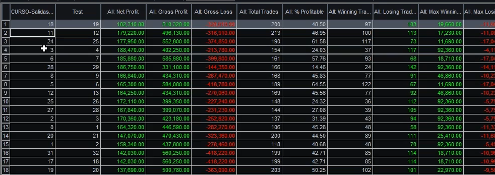
  <figcaption>Figura 103</figcaption>
</figure>

Bueno, pues este era... este es muy interesante, vamos a trabajarlo : click al `24`

### `case 24` Salida por Break-Even 

Bueno, pues este era... este es muy interesante, este lo vamos a trabajar ahora. ¿por qué? Porque ***cubre la salida***. antes decía el *profit* porcentual*... ¿Qué problema tiene el *profit* porcentual? Que no tiene ningún *trailing*. Claro, el *break-even* le hace *trailing* y le llega a compensar. Él dice: "Oye, a mí hazme *take profit*, y cuando falle, con que me cierre cuando vuelva... con que me cierre a precio de entrada, ya me vale". 

El 24 hace exactamente eso. 

<figure>
  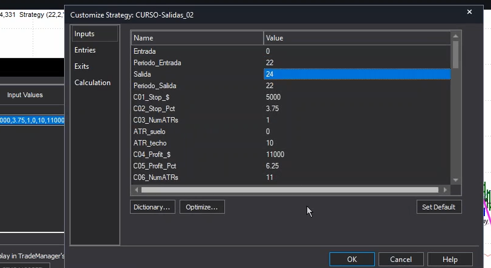
  <figcaption>Figura 104</figcaption>
</figure>

Tiene un *take profit* que no sé cuánto está puesto —ahora lo miro—. Ves, tiene un *take profit* que muchas veces se ejecuta lógicamente. 

<figure>
  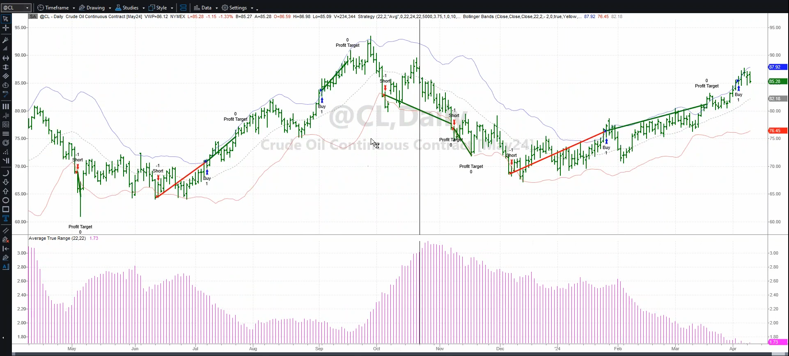
  <figcaption>Figura 207</figcaption>
</figure>

Cuidado porque hay lineas en rojo...  ah, vale, hace *stop and reverse*, claro, hace *stop and reverse*, porque va a la banda contraria. Cuando acumula cierto beneficio... entonces... claro.... también es un tema importante ¿cuánto beneficio le he puesto al *break-even*?, ese también es un tema importante.

<figure>
  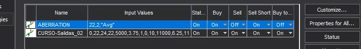
  <figcaption>Figura 105</figcaption>
</figure>

Pero mira, vamos hacer el ejercicio de dejarlo todo bastante homogeneo

## Homogeneización de parámetros

Pero bien, vamos a hacer un poco este ejercicio que os decía: de dejarlos pues más o menos coherentes.   
Voy a configurar todos los `cases` para que sean redondos y coherentes igulando todo lo que pueda


| Input | Valor | Descripción | Cuándo usarlo |
|-------|-------|-------------|---------------|
| **Inputs Generales** | | | |
| `Periodo_Salida` | 22 | Período para cálculos (ATR, medias, etc.) | Base para todos los cálculos adaptativos |
| **Stops simples** | | | |
| `C01_Stop_$` | 8500 | Stop monetario ($) | Intradía o activos con precio estable |
| `C02_Stop_Pct` | 4 | Stop porcentual (%) | Activos con variación de precio histórica |
| `C03_NumATRs` | 1 | Stop por ATR (multiplicador) | Adaptarse a volatilidad cambiante |
| `ATR_suelo` | 0 | ATR mínimo | Evitar stops demasiado cercanos en baja vol |
| `ATR_techo` | 10 | ATR máximo | Evitar stops demasiado lejanos en alta vol |
| **Profits simples** | | | |
| `C04_Profit_$` | 11000 | Profit monetario ($) | Objetivos fijos en intradía |
| `C05_Profit_Pct` | 6 | Profit porcentual (%) | Objetivos proporcionales al precio |
| `C06_NumATRs` | 1 | Profit por ATR (multiplicador) | Objetivos adaptativos a volatilidad |
| **Breakeven, Trailing, Tiempo** | | | |
| `C07_BreakEven_$` | 5000 | Breakeven monetario ($) | Proteger entrada tras ganancia mínima |
| `C08_NumATRs` | 1 | Trailing ATR (multiplicador) | Tendenciales que necesitan dejar correr |
| `C09_N_Bars` | 15 | Salida temporal (barras) | Limitar exposición, evitar decaimiento |
| **Combinaciones Trailing + Profit** | | | |
| `C11_NumATRs_01` | 2 | Trailing ATR (componente trailing) | Tendencial con protección + objetivo |
| `C11_NumATRs_02` | 4 | Trailing ATR (componente profit) | Captura grandes movimientos con red de seguridad |
| `C12_NumATRs` | 1 | Chandelier (multiplicador ATR) | Trailing sin depender del momento de entrada |
| `C13_DesvHiBand` | 2 | Bollinger banda contraria (desv. sup.) | Salida en sobrecompra/sobreventa |
| `C13_DesvLoBand` | 2 | Bollinger banda contraria (desv. inf.) | Mean reversion con bandas |
| `C14_Prc_Trail` | 9 | Trailing porcentual (%) | Trailing simple sin calcular ATR |
| **Stop + Profit combinados** | | | |
| `C15_Stop_$` | 8500 | Stop$ + Profit$ (stop) | Gestión de riesgo fija en intradía |
| `C15_Profit_NxStop` | 1.5 | Stop$ + Profit$ (multiplicador profit) | Ratio riesgo/beneficio definido |
| `C16_Stop_Pct` | 4 | Stop% + Profit% (stop) | Ratio R:B proporcional al precio |
| `C16_Profit_NxStopPct` | 2 | Stop% + Profit% (multiplicador profit) | Fácil ajuste de asimetría ganancia/pérdida |
| `C17_NumATRs` | 1 | Stop ATR + Profit ATR (ATRs) | Ratio R:B adaptativo a volatilidad |
| `C17_Profit_NxStopATR` | 1.5 | Stop ATR + Profit ATR (multiplicador) | El más robusto para activos volátiles |
| **Combinaciones con temporal** | | | |
| `C18_NumATRs` | 1 | Chandelier + Profit% (ATRs) | Tendencial con objetivo y trailing |
| `C18_Profit_Pct` | 6.25 | Chandelier + Profit% (profit) | Captura parcial + dejar correr |
| `C19_Stop_Pct` | 4 | Stop% + temporal (stop) | Limitar pérdida y tiempo en mercado |
| `C19_N_Bars` | 15 | Stop% + temporal (barras) | Antitendencial con salida por tiempo |
| `C20_NumATRs` | 1 | Chandelier + temporal (ATRs) | Tendencial con límite de tiempo |
| `C20_N_Bars` | 15 | Chandelier + temporal (barras) | Evitar operaciones que no arrancan |
| `C21_DesvHiBand` | 2 | Bollinger + temporal (desv. sup.) | Mean reversion con timeout |
| `C21_DesvLoBand` | 2 | Bollinger + temporal (desv. inf.) | Salida por banda o por tiempo |
| `C21_N_Bars` | 10 | Bollinger + temporal (barras) | Operaciones rápidas en rango |
| **Bollinger + Stop, Parabolic SAR** | | | |
| `C22_DesvHiBand` | 2 | Bollinger + Stop% (desv. sup.) | Mean reversion con protección |
| `C22_DesvLoBand` | 2 | Bollinger + Stop% (desv. inf.) | Salida técnica + stop de seguridad |
| `C22_Stop_Pct` | 2 | Bollinger + Stop% (stop) | Limitar pérdida si la banda no llega |
| `C23_AfStep` | 0.02 | Parabolic SAR (step) | Trailing clásico que acelera con tendencia |
| `C23_AfLimit` | 0.2 | Parabolic SAR (limit) | Controlar agresividad del SAR |
| **Profit/Stop + Breakeven** | | | |
| `C24_Profit_Pct` | 6 | Profit% + BreakEven$ (profit) | Objetivo fijo + proteger entrada |
| `C24_BreakEven_$` | 5000 | Profit% + BreakEven$ (breakeven) | Psicológicamente cómodo: no perder |
| `C25_Stop_Pct` | 4 | Stop% + BreakEven$ (stop) | Stop inicial + mover a BE tras ganancia |
| `C25_BreakEven_$` | 5000 | Stop% + BreakEven$ (breakeven) | Reducir riesgo tras movimiento favorable |
| `C26_Profit_Pct` | 6 | Profit% + BreakEven% (profit) | Todo proporcional al precio |
| `C26_BreakEven_Pct` | 5.25 | Profit% + BreakEven% (breakeven) | Más robusto para distintos activos |
| `C27_Stop_Pct` | 4 | Stop% + BreakEven% (stop) | Gestión porcentual completa |
| `C27_BreakEven_Pct` | 2.5 | Stop% + BreakEven% (breakeven) | BE cercano para proteger rápido |
| `C28_BreakEven_Pct` | 2.5 | BreakEven% solo | Solo mover stop a entrada, sin TP |
| **Combinaciones triples** | | | |
| `C29_Stop_Pct` | 4 | Stop% + Profit% + BE% (stop) | Gestión completa porcentual |
| `C29_Profit_Pct` | 6 | Stop% + Profit% + BE% (profit) | Sistema con las 3 protecciones |
| `C29_BreakEven_Pct` | 4 | Stop% + Profit% + BE% (breakeven) | Máxima gestión de riesgo |
| `C30_Stop_$` | 8500 | Stop$ + Profit$ + BE$ (stop) | Gestión completa monetaria |
| `C30_Profit_$` | 11000 | Stop$ + Profit$ + BE$ (profit) | Intradía con control total |
| `C30_BreakEven_$` | 5000 | Stop$ + Profit$ + BE$ (breakeven) | Valores fijos conocidos |
| `C31_NumATRs` | 1 | Stop ATR + Profit ATR + BE% (ATRs) | Lo más adaptativo posible |
| `C31_Profit_NxStopATR` | 1.5 | Stop ATR + Profit ATR + BE% (mult.) | Combina volatilidad + protección |
| `C31_BreakEven_Pct` | 2.5 | Stop ATR + Profit ATR + BE% (BE) | El más robusto de todos |

<figure>
  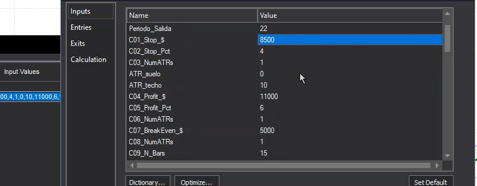
  <figcaption>Figura 114</figcaption>
</figure>
<figure>
  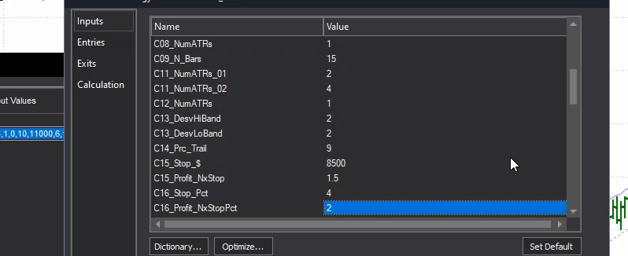
  <figcaption>Figura 112</figcaption>
</figure>
<figure>
  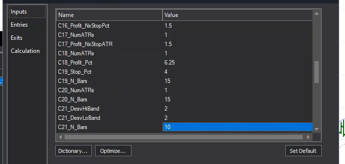
  <figcaption>Figura 111</figcaption>
</figure>
<figure>
  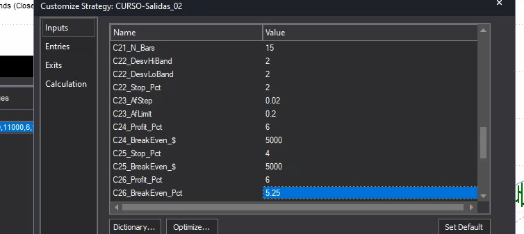
  <figcaption>Figura 110</figcaption>
</figure>
<figure>
  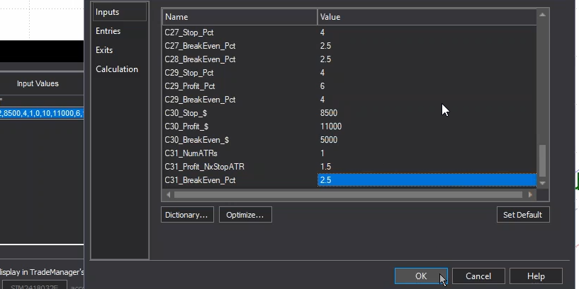
  <figcaption>Figura 109</figcaption>
</figure>

Pues ya está.


<div style="border-left: 4px solid #ff9800; background: #fff3e0; padding: 12px 15px; margin: 10px 0; border-radius: 8px;">
<strong>⚠️ Cuidado Àlex, Inconsistencias detectadas en los parámetros de las imágenes</strong><br><br>
<table style="width:100%; border-collapse: collapse; font-size: 13px; margin-bottom: 10px;">
<tr style="background:#ffe0b2;"><td style="padding:4px; border:1px solid #ffb74d;"><strong>Aspecto</strong></td><td style="padding:4px; border:1px solid #ffb74d;"><strong>¿Homogéneo?</strong></td><td style="padding:4px; border:1px solid #ffb74d;"><strong>Acción</strong></td></tr>
<tr><td style="padding:4px; border:1px solid #ffb74d;">Multiplicadores (NxStop)</td><td style="padding:4px; border:1px solid #ffb74d;">✅ Bien</td><td style="padding:4px; border:1px solid #ffb74d;">Poner todos a 2 para 1:2R</td></tr>
<tr><td style="padding:4px; border:1px solid #ffb74d;">Stops %</td><td style="padding:4px; border:1px solid #ffb74d;">❌ 1.5%→6.75%</td><td style="padding:4px; border:1px solid #ffb74d;">Unificar a 4%</td></tr>
<tr><td style="padding:4px; border:1px solid #ffb74d;">NumATRs</td><td style="padding:4px; border:1px solid #ffb74d;">❌ 3→14</td><td style="padding:4px; border:1px solid #ffb74d;">Unificar a 2</td></tr>
<tr><td style="padding:4px; border:1px solid #ffb74d;">N_Bars</td><td style="padding:4px; border:1px solid #ffb74d;">❌ 10→79</td><td style="padding:4px; border:1px solid #ffb74d;">Unificar a 15</td></tr>
<tr><td style="padding:4px; border:1px solid #ffb74d;">BreakEven</td><td style="padding:4px; border:1px solid #ffb74d;">❌ Dispersos</td><td style="padding:4px; border:1px solid #ffb74d;">Unificar a 4%</td></tr>
<tr><td style="padding:4px; border:1px solid #ffb74d;">Desviaciones BB</td><td style="padding:4px; border:1px solid #ffb74d;">✅ Todos a 2</td><td style="padding:4px; border:1px solid #ffb74d;">Mantener</td></tr>
</table>
<strong>Problemas:</strong> Si Case 16 tiene stop 2.25% y Case 27 tiene 6.75%, no puedo saber si la diferencia viene del <em>tipo</em> de salida o del <em>parámetro</em>. ATR×14 vs ATR×1 no son comparables. 79 barras vs 10 es brutal.<br><br>
<strong>Propuesta homogénea (tendencial 1:2R):</strong><br>
<code>Periodo=22 | Stop%=4 | Profit%=8 | Mult=2 | ATRs(stop)=2 | ATRs(profit)=4 | BE%=4 | N_Bars=15 | BB=2</code>
</div>

<br>


seguimos... 

**Evaluación comparativa de salidas**

Y ahora sí que vuelvo a utilizar esto. Tenéis un poco la cuadra. Entonces yo tengo valores entre todos lo más homogéneos posibles, y evalúo sin tener que optimizar todos. Es decir, a lo mejor miro uno, miro esto, miro tal, y lo saco un poco de manera análoga al resto.

Seguramente donde está más el lío es... porque había algún ATR que era de *trailing* y tal, y creo que la he liado un poco con los ATRs. Pero todo lo demás no. *Break-even*, tal, tal... todo esto le ponemos el mismo a todos. Y con eso ya tienes que ver cuál sale más o menos mejor, que ya lo habíamos visto más o menos.

Serán parecidos, serán parecidos. Y con esto tenemos un poquito un estudio de por dónde respira cada estrategia.

<figure>
  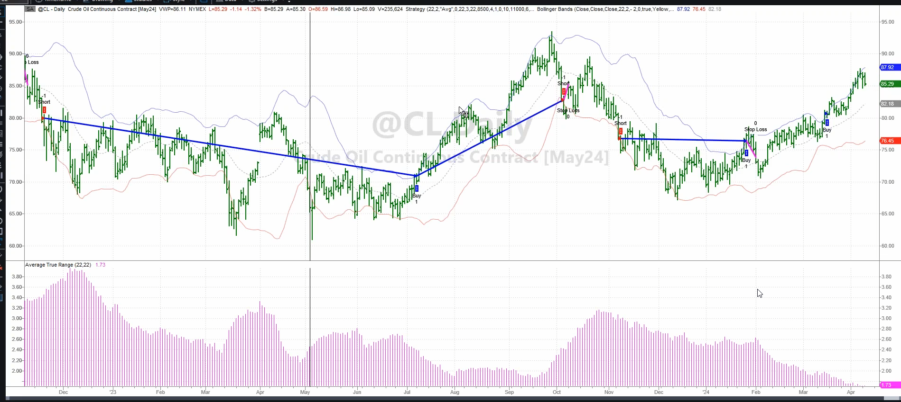
  <figcaption>Figura 115</figcaption>
</figure>
<figure>
  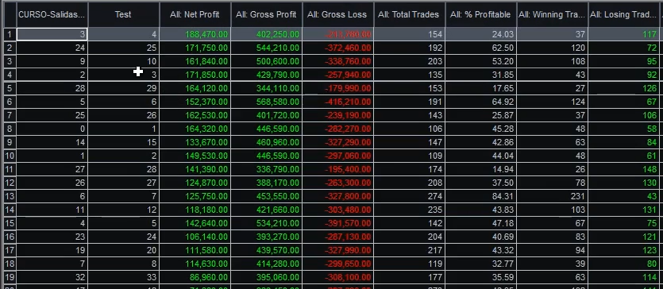
  <figcaption>Figura 116</figcaption>
</figure>

Cuidado, ahora me sale `3`, que es ATR. Ahora me sale muy bien. `24`, que ya creo que salía antes, que era el *profit* porcentual con *break-even*. El `9`, el 9 temporal. Eso me sorprende, eso me sorprende. El `2`, *stop* porcentual. Y `28`.

Bueno, ha cambiado un poquito, ha cambiado un poquito. Pero bueno, esta era un poco la idea: para echar un vistazo rápido de por dónde va la cosa, por dónde van los factores. Luego podemos analizar cada uno de ellos en más profundidad, lógicamente, vale.


### `Case 6` Salida por volatilidad : Profit ATR con suelo y techo

*Chandelier* tiene una particularidad que no hemos usado. Hay dos cosas que no os he explicado, vale, que aprovecho para explicároslas ahora.

```sh
case 6: //Profit ATR - Input: Periodo_Salida(14), C06_NumATRs(3);
begin
	Input:
		C06_NumATRs ( 13.5 );
		
	Value1 = C06_NumATRs * AvgTrueRange(Periodo_Salida) * BigPointValue;
	Value2 = ATR_suelo / 100 * C * Bigpointvalue; 
	Value3 = ATR_techo / 100 * C * Bigpointvalue;

	Value1 = MaxList(Value1, Value2);
	Value1 = MinList(Value1, Value3);
	
	SetStopContract;
	SetProfitTarget(Value1);
end;
```

**Suelo y techo del ATR**

Mira, una es esto del suelo y techo que habéis visto.

```sh
	Value2 = ATR_suelo / 100 * C * Bigpointvalue; 
	Value3 = ATR_techo / 100 * C * Bigpointvalue;
```

Esto es un poco porque a nosotros nos gusta. Lo hemos dejado sin configuración. Cuando veamos la gestión monetaria ya os dije que os explicaría nuestro ratio de gestión monetaria principal, y viene muy relacionado con esto.

Al final, aquí tenemos un valor de ATR `Value1 = C06_NumATRs * AvgTrueRange(Periodo_Salida) * BigPointValue;` que al final se calcula simplemente —ya sea un *profit*, ya sea un *stop*, ya sea lo que sea— un multiplicador por el ATR, de acuerdo.

Y esto os comenté cuando hablaba, por ejemplo, también en el Robotrader y en el curso lo hemos comentado: que es una manera al final de *normalizar*. Al final esto es un porcentaje, vale. ¿Por qué? Porque el ATR, como al final va calculándose por el precio, al yo añadirle un multiplicador —multiplicador que es constante en todo el histórico— me estoy adaptando a los precios, de acuerdo. No estoy usando un valor de *stop* constante de 5.000 o 6.000. Estoy usando un multiplicador del precio, vale. Añadiendo un multiplicador, que es lo mismo que un porcentaje, de acuerdo.

**El problema del ATR en alta volatilidad**

Entonces, al final, ¿qué problema tiene el ATR? Vale, el problema que tiene el ATR, visualmente ya se nota, es que si yo añado un... vamos a suponer que sea un *stop*, vale, que sea un *stop* que multiplique este valor del ATR. Bueno, pues, pues no sé, por dos, vale.

Quiere decir que cuando yo estoy, por ejemplo, aquí:

<figure>
  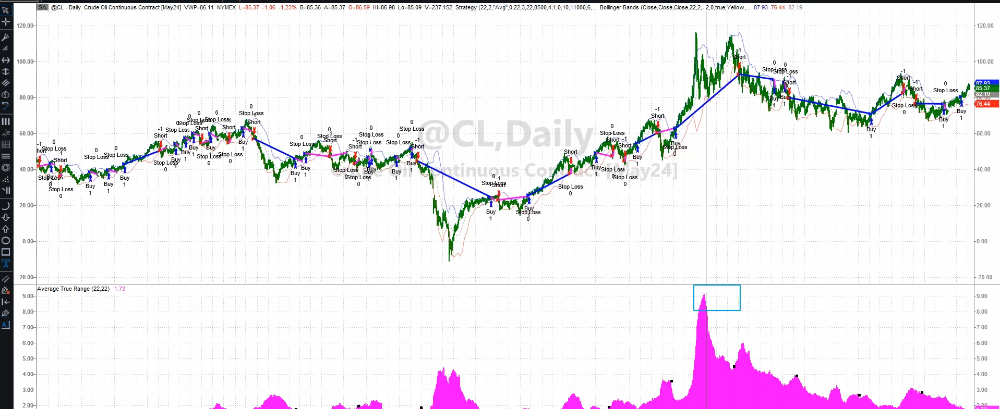
  <figcaption>Figura 208</figcaption>
</figure>

Aquí estoy multiplicando... Vamos a suponer que es 9. Imaginamos que lo multiplico por *stop*, por 3 ATR. Y lo multiplico por *BigPointValue*, que es 1.000:

`9 × 3 × 1000 = 27000`

Quiere decir que yo a este valor estoy poniendo un *stop* de 27.000, vale.

Imaginaos. De aquí, vamos a suponer a ese máximo, yo a ese máximo le estoy restando 27.

<figure>
  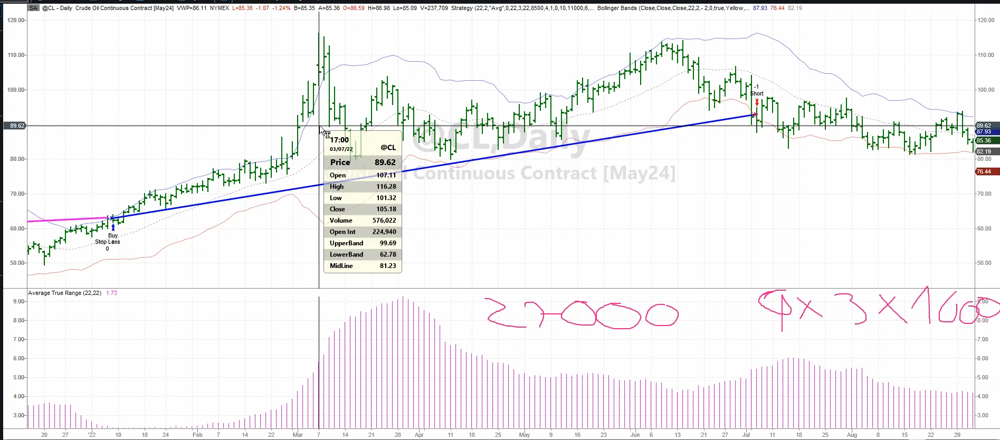
  <figcaption>Figura 117</figcaption>
</figure>

Bien, hay gente que puede considerar que eso está demasiado alejado. Ahora vamos otra vez a ver ese supuesto, ahí, en ese máximo, vale. Que lo voy a dejar puesto con un círculo suyo para que quede claro cuál es, vale.

**Caso de muy baja volatilidad**

Bien, ahora vamos a ver un poco el caso contrario. El caso contrario, vale, sitio donde esté muy baja, aunque sea ahora, precios más o menos actuales. Hm, ha intentado poner que aquí tras esta vuelta, bueno, esta zona parece de muy baja volatilidad, vale.

Vamos a poner que es `1.16`. Entonces quiere decir que a este precio de aquí, a este nivel de aquí del máximo, el *stop* es quitarle 3: `52.23` menos 3.

<figure>
  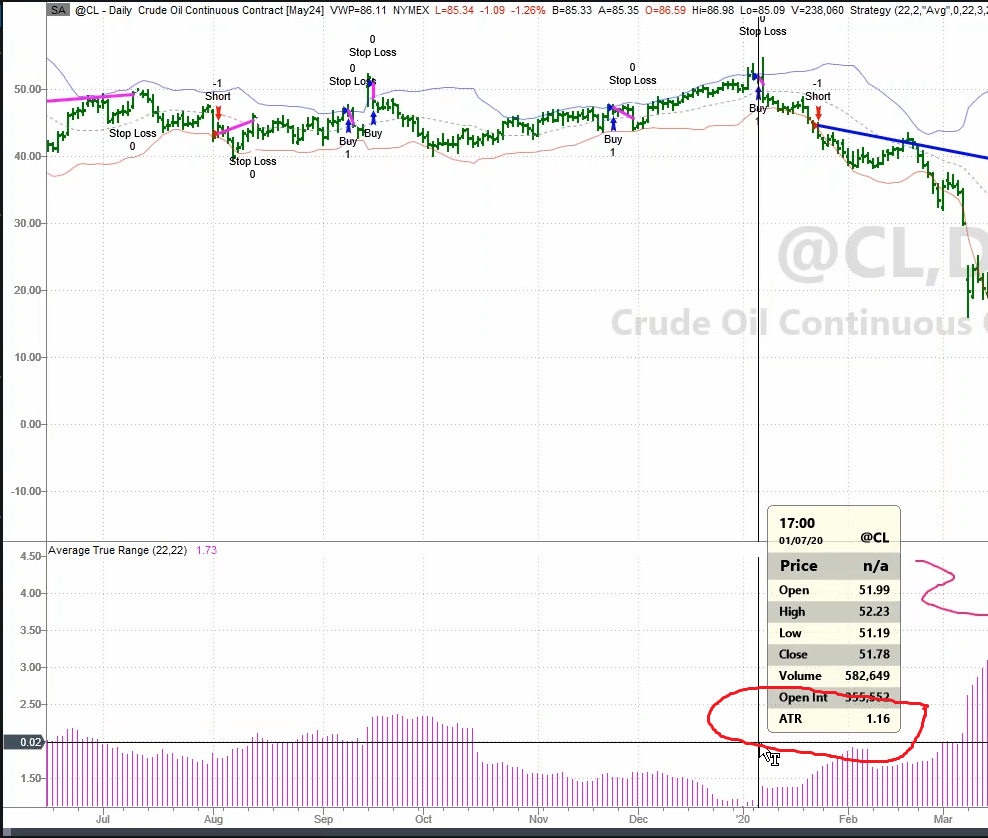
  <figcaption>Figura 119</figcaption>
</figure>

El *stop* es `52.23 - 3 = 47.68`, vale.

<figure>
  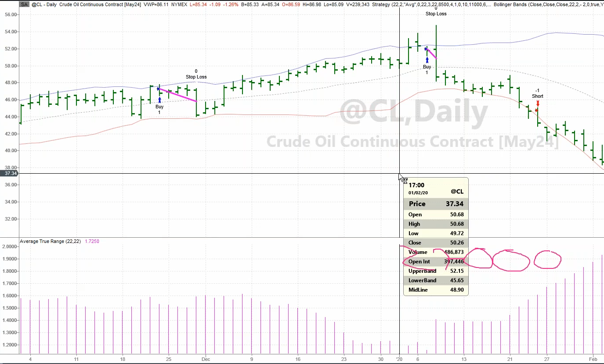
  <figcaption>Figura 121</figcaption>
</figure>

El *stop* es 47.68, vale.

<figure>
  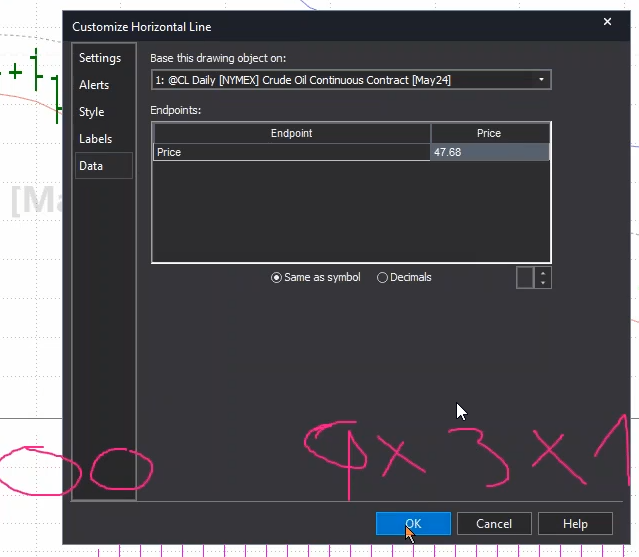
  <figcaption>Figura 122</figcaption>
</figure>

Estamos hablando de este día. Y entonces ahí hay quien puede considerar que es muy cerca. Es un poco la jugada, ¿no?

Era este, era aquí, vale. Que tampoco lo parece tanto. Es mucho mejor mirarlo normalizado, vale. ¿Por qué? Porque realmente mirar qué día hay poca y mucha volatilidad...

<figure>
  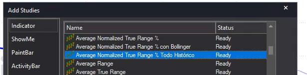
  <figcaption>Figura 123</figcaption>
</figure>

Y claro, aquí el normalizado se rompe porque entró negativo. No me acordaba, no me acordaba que entró negativo, y entonces se nos rompe. Así que es complicado de mirar, es complicado de mirar.

<figure>
  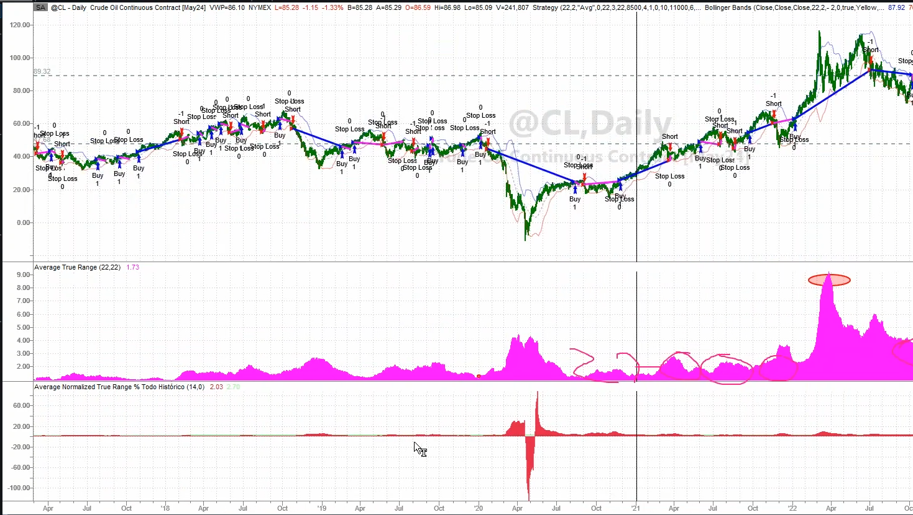
  <figcaption>Figura 124</figcaption>
</figure>

Pero bueno, hasta que entró en negativo sí que es verdad que teníamos valores de 2. No parece ese tan bajo, era más bajo en la parte derecha. Aquí es 2, 2%. Claro, dónde es más bajo es relativo porque, de hecho, fijaos ahora donde está: parece muy baja, vale. Porque es lo que digo del valor del punto, sube. Por lo tanto, fijaos, ahora que está en el 2.03, esa es ahora donde sería más claro mirarlo, vale.

<figure>
  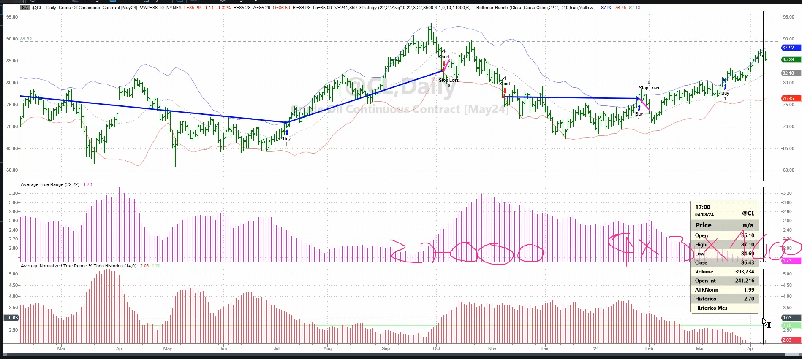
  <figcaption>Figura 126</figcaption>
</figure>

Porque ahora es donde parece que esté muy bajo. No veo antes niveles tan bajos en ningún momento. A ver, aquí, antes de que se rompa, 2.40. Si el más bajo es ahora, aquí también, aquí también. Sí, sí, donde lo estábamos mirando era bajo. Era bastante baja, era 2.20. No era tan baja como ahora, pero era baja, era baja, era baja. Y aquí al principio es muy baja también, vale, vale.

Aquí al principio, no es que aquí las velas están rotas, vale. Pero bueno, es igual, me entendáis el ejemplo.

**Función de suelo y techo para el ATR**

Entonces, esto aquí no lo usamos siempre, y de hecho lo tenemos configurado para usarlo. Y ahora mismo, por ejemplo, no lo estamos usando. Pero os lo explico porque lo he puesto ahí en el código para que lo entendierais, vale.

Lo que hace es *poner un valor mínimo y máximo*, ¿entendéis? Es decir, no permitir que el valor del ATR baje demasiado, ¿entendéis? Para evitar esos picos que a lo mejor son excesivos.

<figure>
  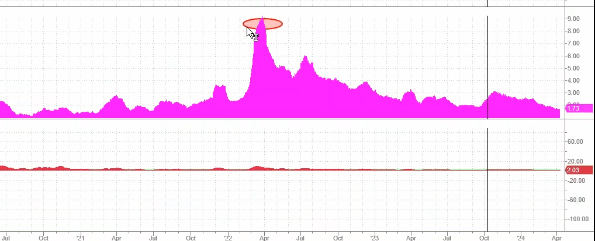
  <figcaption>Figura 127</figcaption>
</figure>

Y qué hay detrás de eso, ¿no? Puedes decir: "Hombre, pero si es excesivo, es excesivo". Sí, pero el mercado *sobrereacciona* —mejor dicho: sobre reacciona— y entonces hay muchas veces que ese pico de volatilidad automáticamente va seguido de baja volatilidad, de acuerdo. Entonces, realmente a ti te están poniendo un *stop* súper, súper alejado, que está haciendo que sea imposible de que salte y que no acabe de ser realista al movimiento del mercado, vale. ¿Por qué? Porque el indicador de volatilidad va un poquito retrasado.

<figure>
  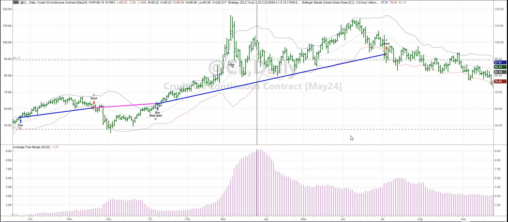
  <figcaption>Figura 128</figcaption>
</figure>

Y al revés también pasa un poco lo mismo. Es decir, baja tanto la volatilidad que hace que, en el momento que empieza a dispararse, realmente me salta el *stop* en nada, vale. Me salta demasiado, coge un valor demasiado bajo.

<figure>
  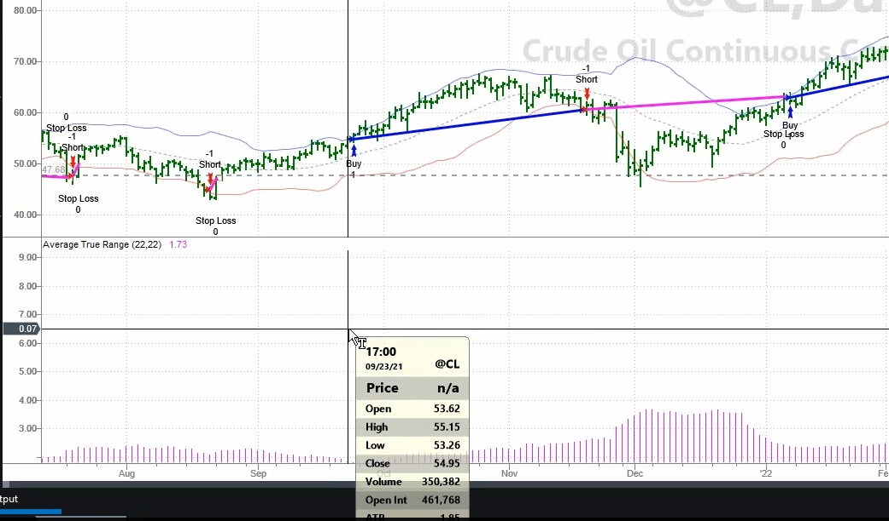
  <figcaption>Figura 129</figcaption>
</figure>

<div style="border-left: 4px solid #2196f3; background: #e3f2fd; padding: 10px 15px; margin: 10px 0; border-radius: 8px;">
  <strong>🔧 Función MaxList / MinList para limitar el ATR</strong><br><br>
  <code>Value1 = MaxList(Value1, Value2);</code> → Asegura que el valor no baje del <em>suelo</em><br>
  <code>Value1 = MinList(Value1, Value3);</code> → Asegura que el valor no suba del <em>techo</em><br><br>
  Esto evita <em>stops</em> irrealmente alejados (alta volatilidad) o demasiado cercanos (baja volatilidad).
</div>

Entonces, al final, esto que habéis visto aquí en el código lo que hace es limitar. Yo le puedo dar un ATR suelo y un ATR techo si quiero.

```sh
	Value2 = ATR_suelo / 100 * C * Bigpointvalue; 
	Value3 = ATR_techo / 100 * C * Bigpointvalue;
```

Si a esos valores les pongo un valor muy elevado, pues no hace nada. Porque al final eso pasa por esta función *MaxList* / *MinList*.

```sh
	Value1 = MaxList(Value1, Value2);
	Value1 = MinList(Value1, Value3);
```

Y por lo tanto te limita. Esto lo hacemos igual —ya lo adelanto— en la gestión monetaria, y ahí es mucho más crítico, vale.

**La importancia del suelo de ATR en gestión monetaria**

Muy breve, porque lo explicaremos cuando lo hagamos. Pero imaginaos aquí:

<figure>
  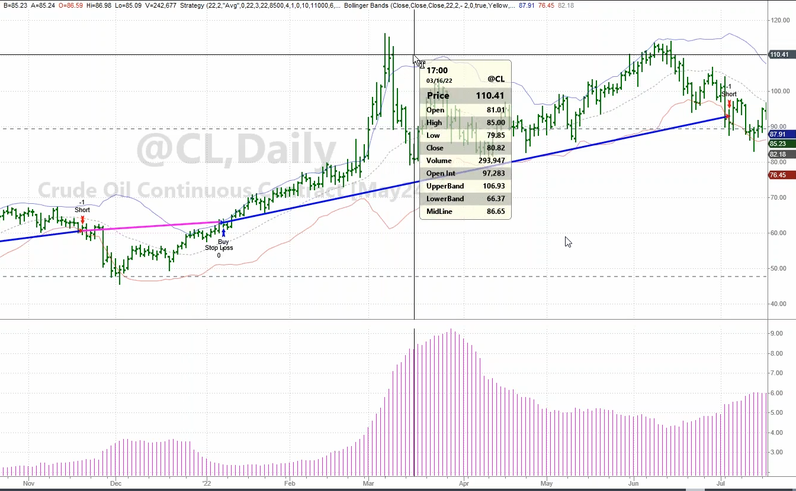
  <figcaption>Figura 130</figcaption>
</figure>

¿Qué hace la gestión monetaria? Porque eso va en el denominador. Poner muy pocos lotes, eso puede tener sentido, vale. Pero donde tiene menos es el lado contrario.

Es decir, yo ahora tengo muy poca volatilidad, ¿y qué hago si uso gestión monetaria dependiendo del ATR?

<figure>
  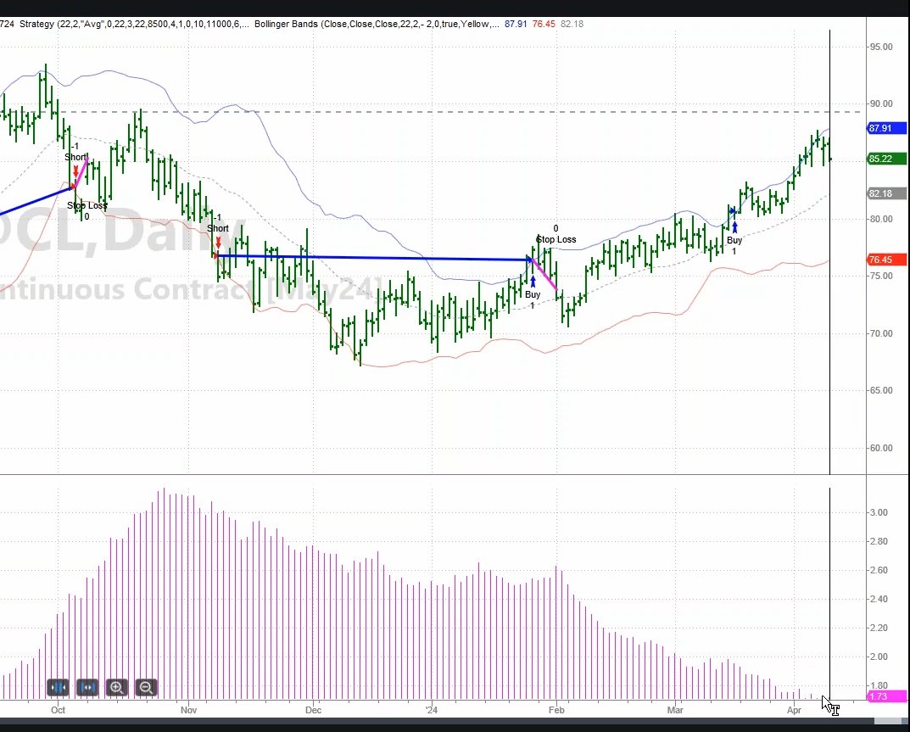
  <figcaption>Figura 131</figcaption>
</figure>

Como el divisor es muy pequeño, me pone muchos contratos. Y como me pone muchos contratos, si ahora viene una expansión de volatilidad —que es algo frecuente, acordaros que las expansiones vienen precedidas de contracciones y viceversa— automáticamente me coge la hostia con una exposición muy alta. Porque como el ATR está en el denominador, divido por muy poco, vale.

<div style="border-left: 4px solid #ff9800; background: #fff3e0; padding: 10px 15px; margin: 10px 0; border-radius: 8px;">
  <strong>⚠️ Riesgo del ATR bajo en gestión monetaria</strong><br><br>
  <strong>Fórmula típica:</strong> <code>Contratos = Capital / (ATR × Multiplicador)</code><br><br>
  Si ATR es muy bajo → divisor pequeño → muchos contratos → <strong>sobreexposición</strong><br>
  Si luego viene expansión de volatilidad → pérdida amplificada<br><br>
  <strong>Solución:</strong> Poner un <em>suelo</em> al ATR para limitar el número máximo de contratos.
</div>

¿Cómo se soluciona? Poniendo unas bandas de mínimo y máximo, o solo de mínimo, de acuerdo. Nosotros ahora mismo trabajamos solo con mínimo, pero lo tenemos configurado para usar los dos. Es decir, que nos limite el mínimo, dejamos que reduzca al máximo.

Sí que actualmente no dejamos que baje de un lote. Pero se puede hacer que lo haga, y muchos autores lo hacen. Y nosotros podríamos hacerlo. Ahora mismo no lo hacemos porque, con la cartera que tenemos, preferimos que tengan exposición todos, aunque sea la mínima. Pero podría bajarse la exposición hasta el nivel de decir: "Si hay tanta volatilidad, yo te pongo cero", vale. Nosotros no lo hacemos, lo dejamos al mínimo.

Pero por abajo sí que limitamos el hecho de poner demasiadas posiciones. Ya lo veremos cuando lo hagamos, vale.

**Chandelier: sin acercamiento**

Bien, acabo brevemente la explicación.

Entonces, *Chandelier* es lo que os decía. *Chandelier* tiene esta configuración.

```sh
case 6: //Profit ATR - Input: Periodo_Salida(14), C06_NumATRs(3);
begin
	Input:
		C06_NumATRs ( 13.5 );
		
	Value1 = C06_NumATRs * AvgTrueRange(Periodo_Salida) * BigPointValue;
	Value2 = ATR_suelo / 100 * C * Bigpointvalue; 
	Value3 = ATR_techo / 100 * C * Bigpointvalue;

	Value1 = MaxList(Value1, Value2);
	Value1 = MinList(Value1, Value3);
	
	SetStopContract;
	SetProfitTarget(Value1);
end;
```

*Chandelier* tiene otra cosa aparte. Esto que os decía ahora lo tienen los ATRs, vale: esta capacidad de limitar el suelo y el techo siempre que hay un ATR. Pues le metemos esta capacidad de limitarlo. Pero es una capacidad que, si tú le das un valor alto —tú le das al ATR un valor de 20— nunca actúa, porque es en porcentual. Y le pones cero y ya está, no actúa. ¿Entendéis?

Es decir, estos códigos a nosotros nos gustan mucho, que son lo que llamamos *generalización*. Es decir, yo le puedo poner este módulo que simplemente me permite regular las bandas. Pero si las quiero usar, las uso; si no las quiero usar, no las uso.

*Chandelier* es lo que os digo. *Chandelier* tiene... ah no, no lo tiene. No tiene al final, hemos quitado aquello de si se acercaba. No lo hemos quitado, lo hemos quitado porque hemos pensado que no tenía sentido, vale. Vale, lo hemos quitado.

Bueno, *Chandelier* es lo que decía: son esas bandas que habéis visto todo el rato calculadas, y ya está. Vale, ya está.


### `case 23` Salida parabólico : ParabolicSAR Exit

El *Parabólico* os lo quiero poner para que lo veáis, porque es muy visual. Es una salida que en algunas estrategias puede ir bien. No es seguramente la más eficiente, pero hay gente que le gusta. Y oye, también es importante operar con cosas con las que te sientas cómodo. Y pues la voy a... no, perdón, esto no es.

Salida 23, yo os la voy a poner en pantalla porque ya tengo aquí el indicador para que lo veáis. 

<figure>
  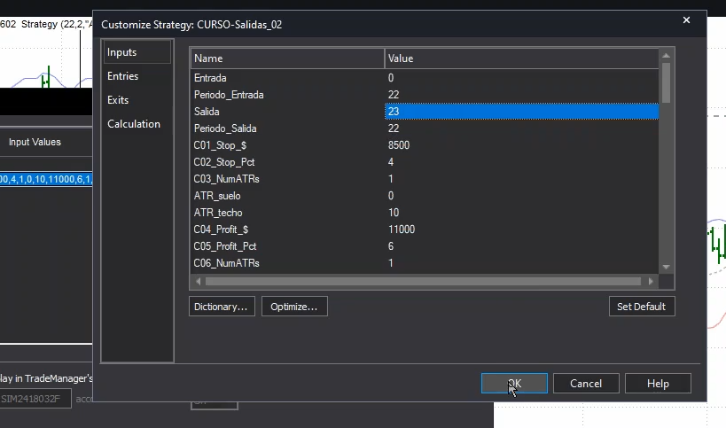
  <figcaption>Figura 132</figcaption>
</figure>
<figure>
  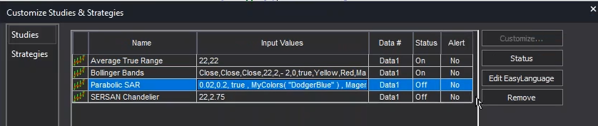
  <figcaption>Figura 133</figcaption>
</figure>

No más, *Parabólico* lo inventó Wilder (J. Welles Wilder Jr., autor de *New Concepts in Technical Trading Systems*, 1978), y además él lo usaba... se llama *Parabólico* porque es *stop and reverse*. Él decía que era un indicador para girarse, es decir, no decía que era solo para *stop*.

Para que lo tengáis en la ayuda explicado: *Parabólico*, vale, explicado.

<figure>
  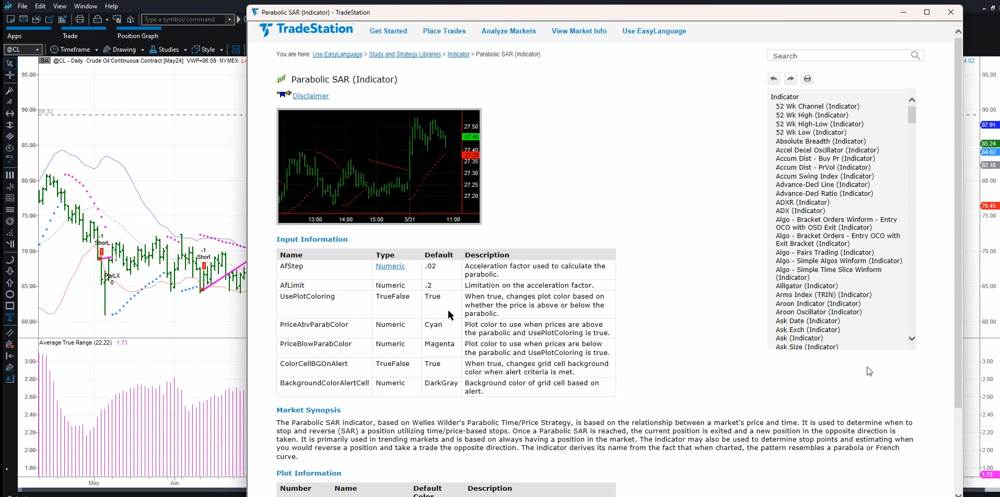
  <figcaption>Figura 134</figcaption>
</figure>

Es de Wilder. Wilder era un autor que le debemos muchas cosas, porque fue muy prolífico. El ATR, el movimiento direccional, bueno, muchas cosas.

<div style="border-left: 4px solid #9c27b0; background: #f3e5f5; padding: 10px 15px; margin: 10px 0; border-radius: 8px;">
  <strong>📚 J. Welles Wilder Jr. - Contribuciones al análisis técnico</strong><br><br>
  Wilder desarrolló indicadores fundamentales que siguen vigentes hoy:<br>
  • <strong>ATR</strong> (Average True Range) → Medida de volatilidad<br>
  • <strong>RSI</strong> (Relative Strength Index) → Oscilador de momentum<br>
  • <strong>ADX/DMI</strong> (Directional Movement Index) → Fuerza de tendencia<br>
  • <strong>Parabolic SAR</strong> → Stop and Reverse dinámico<br><br>
  Todos publicados en <em>"New Concepts in Technical Trading Systems"</em> (1978).
</div>

**Funcionamiento del Parabolic SAR**

Y bueno, él habla de eso. Tiene dos parámetros: uno que limita su capacidad, uno que es la *aceleración* —es un *trailer* que se va acercando, vale— y el otro que regula la posición inicial, podemos decir, de lo alejado que está.

Ahora en sus valores por defecto, y entonces cuando el precio toca, pues sale, vale. Es muy rápido, como veis, vale. Para un sistema tendencial como este es muy rápido, y le va a evitar las colas largas, sin duda. Eso sí, protege mucho, de acuerdo, protege mucho, protege mucho el beneficio, protege mucho, pero hay que verlo.

<figure>
  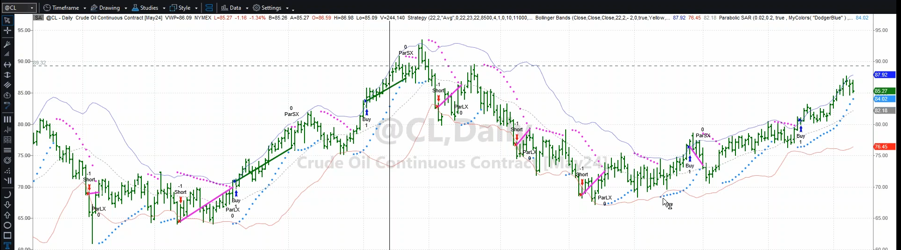
  <figcaption>Figura 135</figcaption>
</figure>

Cuando se regula de entrada es mejor, porque entrando... se hubiera entrado aquí. Tenemos aquí:

<figure>
  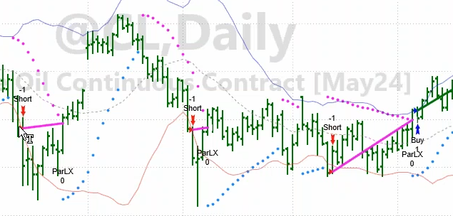
  <figcaption>Figura 147</figcaption>
</figure>

Una entrada que es solo por Bollinger, por lo tanto es más lenta que *Parabólico*. Y salida por *Parabólico*. La salida parabólica sí es un poco rápida, vale.

Porque fijaros, la entrada —para que me entendáis lo que digo— cuando cambia es que tiene puntitos. Se ven. A ver, los voy a poner un poquito más gruesos, porque me imagino que estando aquí se deben ver regular. A ver, vamos a poner ahí bien gordito. Y el *cross* no hace falta, no hace falta nada.

**Interpretación visual del Parabolic SAR**

Entonces, al final ves: cuando se gira es para los giros, de acuerdo. Es decir, aquí está protegiendo, está protegiendo el *stop* del corto.

<figure>
  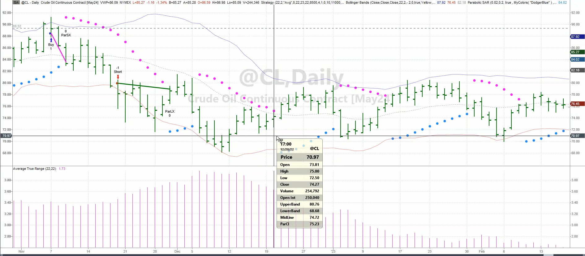
  <figcaption>Figura 136</figcaption>
</figure>

Que es que aquí te compra, es un poco así.

Entonces aquí hubiera vendido. Donde cierra, es donde vende; ahí se pone corto.

<figure>
  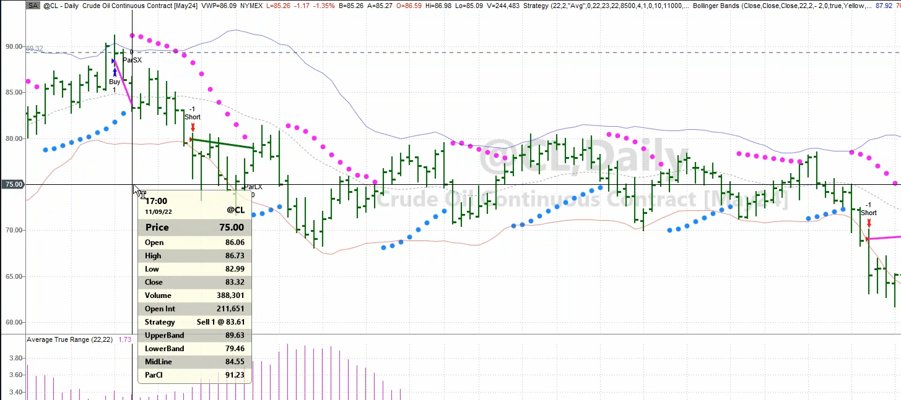
  <figcaption>Figura 139</figcaption>
</figure>

Aquí se pone largo y pasiva así un poco. Aquí no hay posición y no cierra.

<figure>
  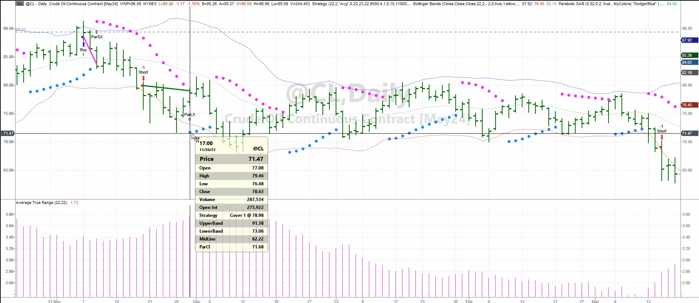
  <figcaption>Figura 138</figcaption>
</figure>

Pero cada vez que hay un cambio de color —de viene en azul y se pone rojo o morado— en este caso va corto. Cuando se pone azul, va largo. Y de hecho, en EasyLanguage está ya como sistema. Está como sistema, lo puedes meter. Es decir, bueno, hay activos que puede ir bien.

Pero ya veis que va como acelerando con el precio. Se puede regular, ese se puede regular y puede tal. Pero bueno, al final como todo.

**Parámetros del Parabólico**

Así acelera más.

<figure>
  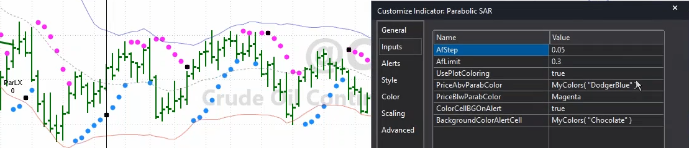
  <figcaption>Figura 145</figcaption>
</figure>

Así es más lento. No, pues solo cuando... solo si lo aceleras mucho se nota.

Entonces, para que veáis un poco cómo funciona, cómo funciona, vale. Simplemente ya está. Ese es el *Parabólico*.

Entonces ahí lo mismo, pues después salidas. Aquí, en este caso, para un sistema tan tendencial le cuesta, le cuesta. Porque entra demasiado tarde. Pero bueno, y ahí lo tenéis puesto en el código.

<figure>
  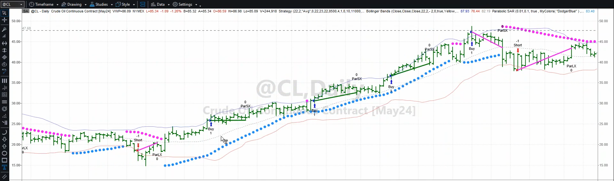
  <figcaption>Figura 148</figcaption>
</figure>

Y como digo, hay gente que le gusta mucho el *Parabólico*, vale.

## salidas para tendenciales vs. antitendenciales

Al final, tendenciales, como ya os comenté —y lo decía en una diapositiva, aquellos que no hayáis visto de Robotrader, ya lo hemos comentado en la clase— pero yo tenía un título de... no era esto, no era esto.

<figure>
  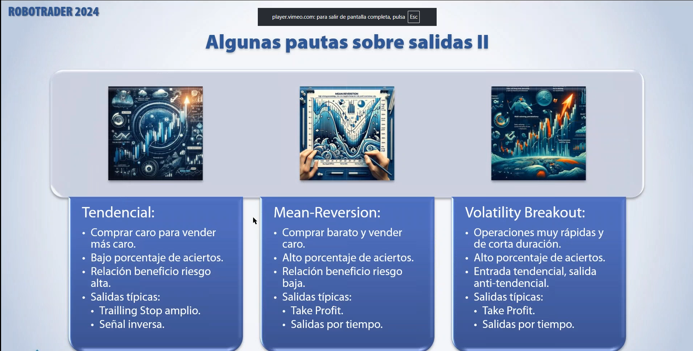
  <figcaption>Figura 149</figcaption>
</figure>

Un tendencial al final o no sale, de acuerdo. O no sale, ¿se entiende? Sale por fin de su señal contraria. En ese caso sería la media central. Un *trailing*, de acuerdo. Un *trailing* es lo que normalmente va a pedir. *Trailing* hay el *trailing* puro, hay *Chandelier*, distintas opciones.

En cambio, *mean reversion* sí que es más típico que use... es casi obligado su *stop*, su *take profit*.

El tendencial también la salida por tiempo. En todos aporta, de acuerdo. En todos suele aportar salir por tiempo como complemento, vale. Pero es lo que os decía: tened en cuenta que os quita la capacidad tendencial. Es decir, le quita pureza, vale. Pero puede añadir, puede añadir en algunos casos.

Y la salida por tiempo es bastante intuitiva, vale. Porque es lo que os enseñaba, lo que os decía. Porque al final, la mejor manera de quitar el riesgo del mercado es estar fuera.

<div style="border-left: 4px solid #4caf50; background: #e8f5e9; padding: 10px 15px; margin: 10px 0; border-radius: 8px;">
  <strong>📋 Resumen: Salidas según tipo de sistema</strong><br><br>
  <strong>Tendencial:</strong><br>
  • Señal contraria (media central, banda opuesta)<br>
  • <em>Trailing</em> (puro, Chandelier, Parabolic SAR)<br>
  • Salida por tiempo (complemento, quita pureza tendencial)<br><br>
  <strong>Antitendencial (Mean Reversion):</strong><br>
  • <em>Stop</em> fijo (casi obligado)<br>
  • <em>Take profit</em> fijo (casi obligado)<br>
  • Salida por tiempo (muy útil)<br><br>
  <em>"La mejor manera de quitar el riesgo del mercado es estar fuera."</em>
</div>


**Buscando combinaciones con salida temporal**

Entonces aquí, por ejemplo, había alguno que era...

—Chandelier temporal tenemos, 20.
—Pero ves, no está en *trailing* con tiempo. Apúntalo, *please*.

—Tengo el Chandelier, vale. Me quedo con el Chandelier, que es el número 20.

<figure>
  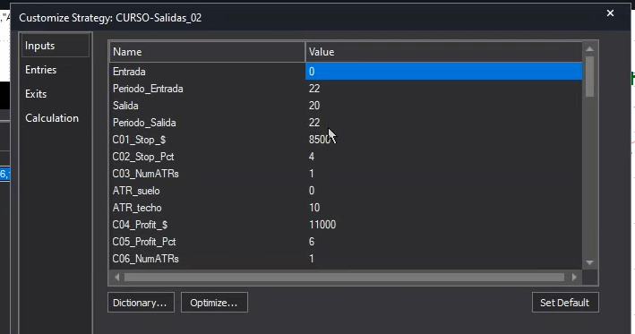
  <figcaption>Figura 150</figcaption>
</figure>
<figure>
  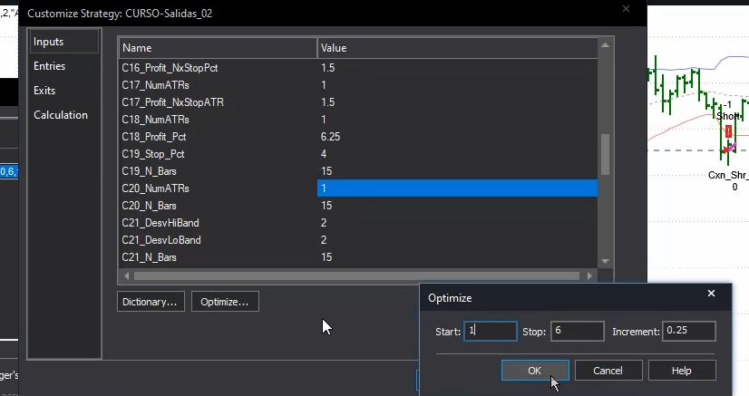
  <figcaption>Figura 151</figcaption>
</figure>

Voy a pasarle *un momentito una optimización*, porque me ha quedado... es lo que os decía, este le he capado demasiado el *take profit*. Este es muy bueno, me ha quedado el *take profit* muy capado. Es el número 20, número 20.

Esas optimizaciones son de investigación. Que de, claro, esto va a salir alto seguro. Voy a poner hasta de 1 a 6. Y barras, yo creo que va a salir alto. Esto va, esto va rápido, esto va...

<figure>
  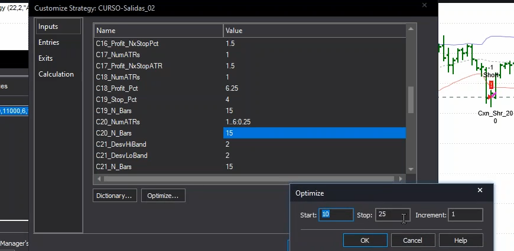
  <figcaption>Figura 152</figcaption>
</figure>

Sí, faltaría, faltaría este por tiempo. De hecho, en base a que hay muchos, no hay Chandelier temporal, *stop* porcentual temporal por él solo, y sí nos falta algún temporal. Hay que meterle caña a la temporal. O sea, *trailing*, algún otro tal. Mira, los temporales complementan bastante bien. Y falta alguno, falta alguno más con temporal. Alguno más con temporal.


**Personalización del código**

—Sí, pregunta si puedes añadir...

—Que sí, sí, tú puedes añadir. Esto al final, yo te doy el código, tú puedes añadir aquí lo que quieras. Es decir, es tuyo, uso libre. Y cualquiera que es, y reproduces, mezclas uno con otro, como ahora he visto. Pues se nos ha olvidado este, por ejemplo, tiene...

Entonces, al final es que hay muchas combinaciones. Al final tú, en `case`, te quedas con los simples y luego vas haciendo compuestos. El `case 16`, por ejemplo, *stop* porcentual. El *profit* porcentual, el 17, *stop* va a tener un *profit* ATR, vale. El 18, Chandelier y *profit* porcentual. Entonces así, un poquito, poquito.

Y yo recomiendo más porcentual o ATR que valores absolutos. Pero también están, y en muchos casos pueden dar buenos resultados. Pero ya os he explicado por qué, vale. Os da buenos resultados porque salta menos, y en algunos casos eso viene bien.

**Resultados de la optimización**

Y acabado, se vale. Es igual que aquí. No, esto no es un ejercicio de optimización podemos decir serio. Simplemente para ver cuál salía mejor, y ya está.

<figure>
  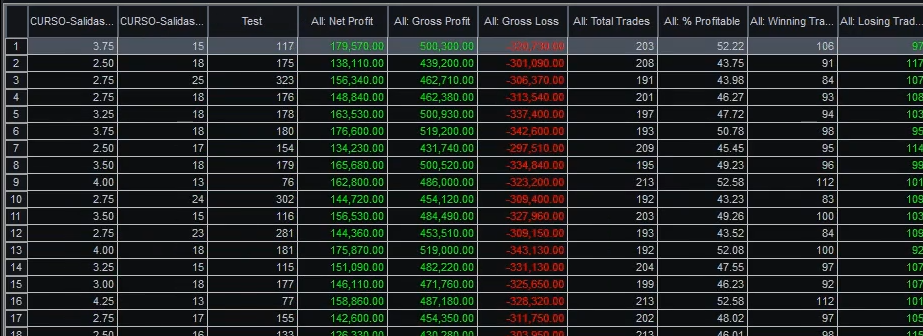
  <figcaption>Figura 153</figcaption>
</figure>
<figure>
  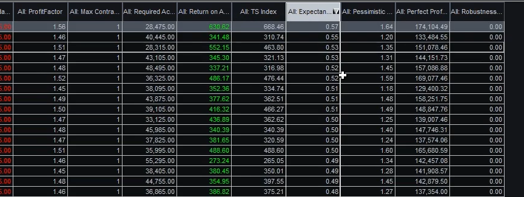
  <figcaption>Figura 154</figcaption>
</figure>

Y el que sale mejor es el que ya ha elegido, que es 3.75 y 15. ¿A ver? Sí, 15 me sonaba, a las 15. Pero ves, el 3.75 porque era multiplicado por poco. Era el número 20, el Chandelier.


```sh
	case 20: 
	#Chandelier + temporal 
	#Input: 
	#    	C20_StopPriceCanDecrease(0), 
	#    	C20_StopPriceCanIncrease(0), 
	#    	Periodo_Salida(14), 
	#    	C20_NumATRs(3), 
	#    	C20_N_Bars(10);
	Begin		
		Input:
			C20_NumATRs ( 5 ),
			C20_N_Bars ( 59 );
		
		ATRCalc = AvgTrueRange(Periodo_Salida) * C20_NumATRs;
		BandaSuperior = Highest (High, Periodo_Salida) - ATRCalc;
		BandaInferior = Lowest (Low, Periodo_Salida) + ATRCalc;
		
		Sell ("Cxn_Lng_20") next bar at BandaSuperior stop;
		Buytocover ("Cxn_Shr_20") next bar at BandaInferior stop;
		
		If BarsSinceEntry >= C20_N_Bars then
		begin
   			Sell next bar at market;
   			BuyToCover next bar at market;
		end;
	end;
```

Este es al final ATR por el número de ATRs, vale. Y eso se lo resta. 

```sh
		ATRCalc = AvgTrueRange(Periodo_Salida) * C20_NumATRs;
		BandaSuperior = Highest (High, Periodo_Salida) - ATRCalc;
		BandaInferior = Lowest (Low, Periodo_Salida) + ATRCalc;
```

Entonces claro, si no le doy un poco de margen, lo hago de acuerdo. Entonces, eso los tendenciales necesitan un poco de espacio. Lo que decía de *stops*, *trailing*, pero un poco amplios. Lo podría ir en la diapositiva, no. Porque si no, no le vas a dejar que corra, vale.


<figure>
  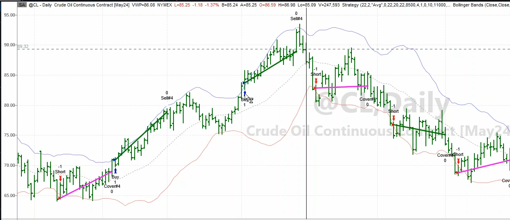
  <figcaption>Figura 155</figcaption>
</figure>

Este, mira, como tengo el indicador aquí os lo puedo poner. Chandelier, que lo tengo para ver estatus. 

<figure>
  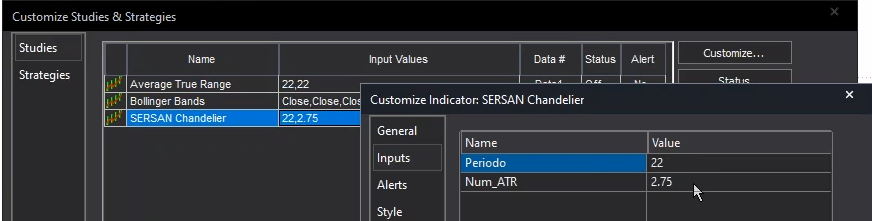
  <figcaption>Figura 156</figcaption>
</figure>

Este es... cuando veáis que sale por el Chandelier, que hay veces que no. Es este que pone `sell 4`, es por tiempo. Es por tiempo.

<figure>
  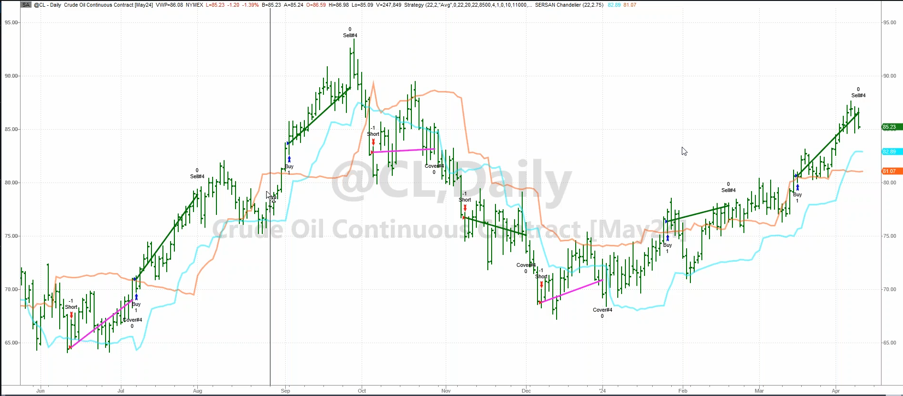
  <figcaption>Figura 157</figcaption>
</figure>

Esto al final suele ser bien. Porque al final, muchas veces aquí, por ejemplo, no corría más. Pero habitualmente en los mercados son cíclicos, y tú coges un número de barras y, para bien y para mal, muchas veces ya está. Veces, oye, yo me quedo en este caso 15 días y ya está. Y antes me voy protegiendo, vale, por si va mal. Pero mientras, me quedo 15 días, vale.


Aquí, por ejemplo, me ha salido por *reverse*, porque al final el Chandelier este tiene cierto margen.

<figure>
  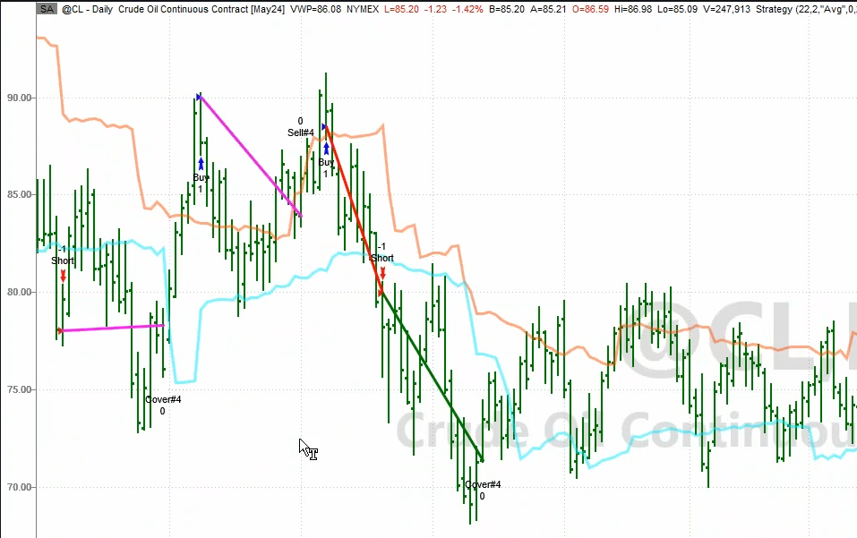
  <figcaption>Figura 158</figcaption>
</figure>

Este va bastante más sólido, más sólido. Ya al final, al meter tiempo, ves, `porcentaje de aciertos` se va para arriba. Es decir, le quitas totalmente la capacidad tendencial. Pero cuidado, que no quiere decir que no sea bueno. Repito, es otro tipo de sistema. Que no tendrá colas tan largas. Más estable.

<figure>
  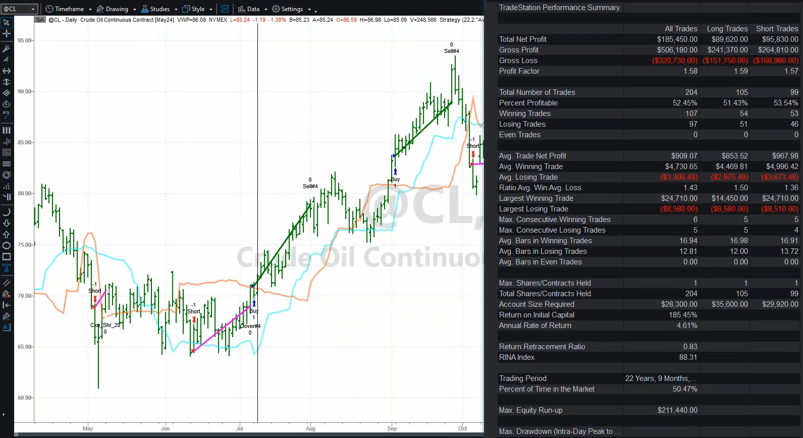
  <figcaption>Figura 160</figcaption>
</figure>

<figure>
  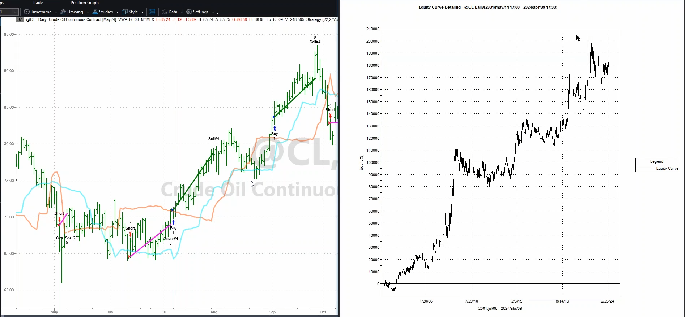
  <figcaption>Figura 161</figcaption>
</figure>

Claro, con salida por tiempo, tened en cuenta que el Chandelier debe actuar poco. Debe actuar poco. La mayoría de veces lo saca el tiempo.

Si ahora, mira, para que actúe, le pongo al valor del Chandelier... ¿Que era el Chandelier solo? Era el 12. Al 12, pongo el Chandelier solo.

<figure>
  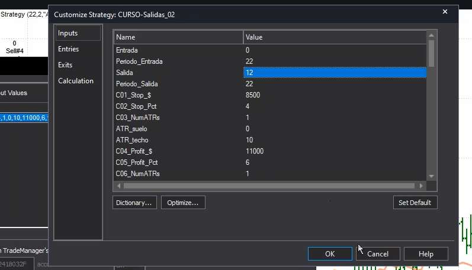
  <figcaption>Figura 159</figcaption>
</figure>


### `Case 12` Salida por volatilidad: Chandelier puro

Si ahora vamos al *Chandelier* original, que es el 12, 12, y le pongo 2.75 igual. 2.75, no era 2.75 para que esté configurado igual que la banda.

<figure>
  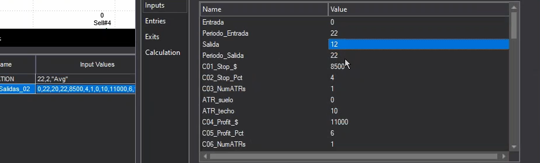
  <figcaption>Figura 162</figcaption>
</figure>
<figure>
  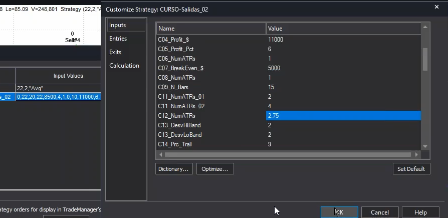
  <figcaption>Figura 163</figcaption>
</figure>

Ahora sí que me sale por la banda, ¿lo veis?

<figure>
  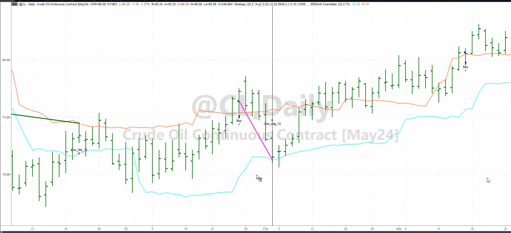
  <figcaption>Figura 164</figcaption>
</figure>

A veces cuando llega aquí la banda... para que se vea en alguno. Es ahí, sale la banda. Es que ahora solo puede salir por la banda. Es decir, no tiene ninguna otra salida, no tiene la media. Entonces le devuelve 2.75, no puede salir por objetivo.

<figure>
  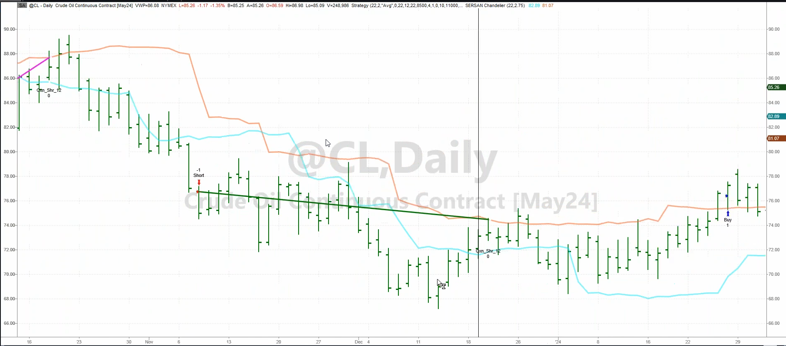
  <figcaption>Figura 165</figcaption>
</figure>

Este es un poco pobre en el sentido de que al final... bueno, no es pobre en el sentido tendencial. Es bueno, es bueno. Al final te deja correr mucho. Pero seguramente en valor absoluto no gana tanto.

Y ese es un poquito más abrupto. Pero sí, sigue estando muy bien la verdad. Sigue estando muy bien.

<figure>
  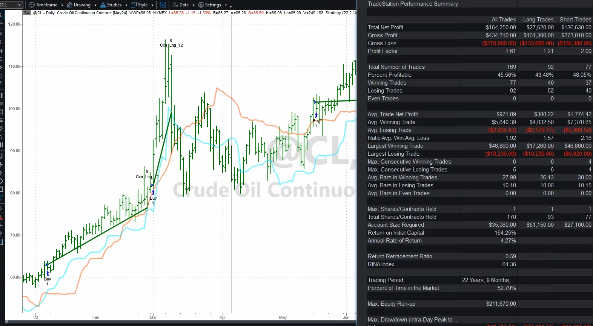
  <figcaption>Figura 166</figcaption>
</figure>
<figure>
  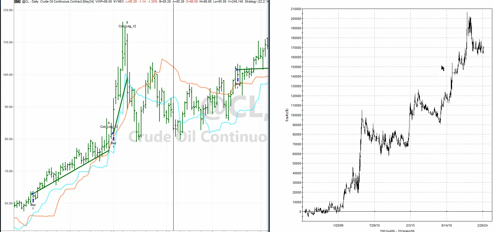
  <figcaption>Figura 167</figcaption>
</figure>

Gana creo que menos que antes, pero está muy bien también. Porque es *trailing* puro. Y lo deja, lo deja correr.

Aquí ves, ya ha bajado de 50 `Percent profitable`, vale. Ya ha bajado de 50. Porque ya digamos que tiene más carácter tendencial, más carácter tendencial.

<figure>
  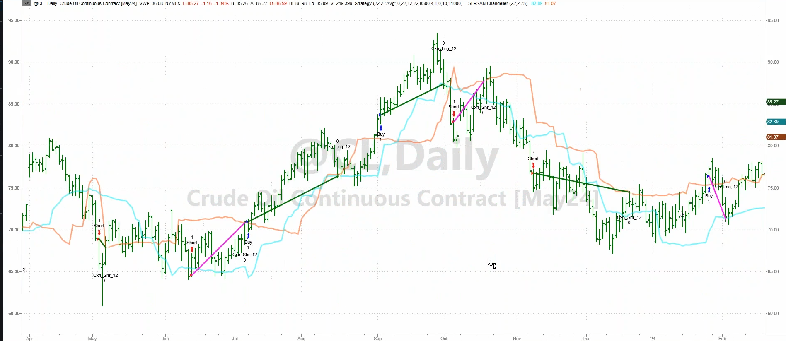
  <figcaption>Figura 168</figcaption>
</figure>

Aquí sí que va siempre a que vuelva, de acuerdo. Así no vuelve, pues no sale. Él se queda dentro. Este es un *stop* muy tendencial, vale. Muy tendencial. Aquí lo deja correr, lo deja correr, hasta que vuelve, hasta que vuelve.

<figure>
  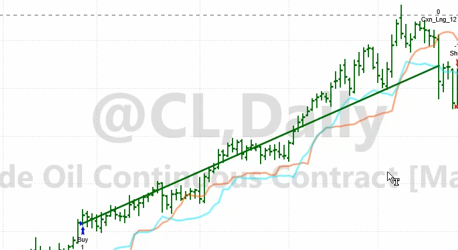
  <figcaption>Figura 169</figcaption>
</figure>

**Cargando variables por defecto**

Entonces, aquí simplemente, ¿qué he hecho ya? Ahora metido esto, no sé con cuál cargado. 17, a ver así cómo quedaba, así cómo quedaba mejor. ¿Cuál queda mejor así? Porque antes lo he estudiado con la salida de su media, de acuerdo.

<figure>
  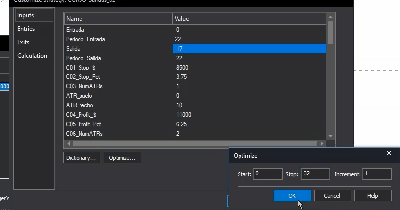
  <figcaption>Figura 170</figcaption>
</figure>
<figure>
  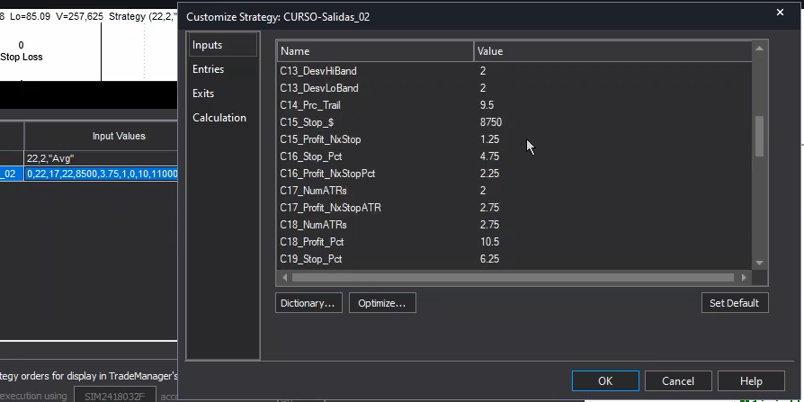
  <figcaption>Figura 171</figcaption>
</figure>
<figure>
  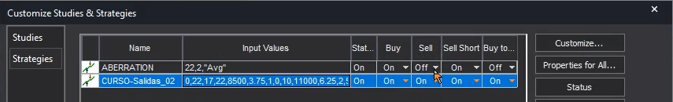
  <figcaption>Figura 172</figcaption>
</figure>

Ahora le he quitado la media, con lo cual la cosa cambia, cambia un poco. Claro, porque la media le hace *trailing*. Entonces todos los que no le siguen el precio penaliza mucho más que antes.

Antes tenías ese colchón de *trailing*, por tanto las salidas directamente por *take profit* o incluso por *stop* a bruto pues tenían esa ventaja de no salir tan penalizadas. Ahora, en cambio, los *stops* directos salen seguramente muy penalizados al no poder salir por arriba o por un *trailing*, que es lo suyo, ¿no?

<figure>
  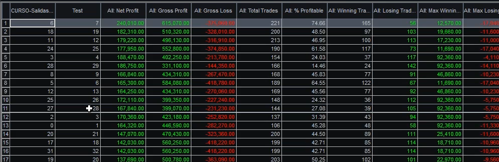
  <figcaption>Figura 173</figcaption>
</figure>

Si aquí ahora, simplemente por ver un poco cómo quedaba la cosa... el 6, *profit* ATR, muy interesante, interesante. Sí, sí, *profit* ATR es el que le da más *profit*.

Pero si ya te digo, tiene un punto bastante importante de *sobreoptimización*. No pensar que esto puede ir así directamente. Esto es un ejercicio teórico para que veáis cómo usar las salidas y cómo tener software que te ayude un poco a probar varias cosas directamente, sin tener que hacer todos los sistemas en uno, ¿no? Sino un poco por partes, de acuerdo.

**Elementos precreados en EasyLanguage**

Esto es interesante. Antes no sé si alguien preguntaba por el máster, y creo que esa del máster, y que hay un ejercicio de eso de elementos precreados.

Es un poco los elementos precreados en EasyLanguage. Es una manera muy útil. O sea, hay un montón de estrategias. Todas, el *Parabólico* por ejemplo está hecho entrada. O sea, todo está hecho: entrada y salida. Y un montón de *stops*. O sea, yo esto lo he hecho en un código, pero realmente sueltos están todos. Toda la mayoría de salidas están hechas.

Incluso, incluso para —aunque no las uses— para ver el código y aprender de ellos. Una maravilla, realmente. Eso tiene muchísima ventaja, tener EasyLanguage y plataforma. Genial para empezar.

**Pregunta sobre trailing con media desplazada**

*—¿El trailing de una media... a una TEMA, una Triple Exponential Moving Average?*

—¿A una TEMA, una Triple Exponential Moving Average?

—Es decir, yo... yo hace tiempo la verdad. Pero hemos, yo he hecho varios estudios sobre medias. Nunca he encontrado nada demasiado concluyente. Ni tan solo de la exponencial, que conceptualmente dices: "Joder, qué bien, qué limpio parece, todo muy lógico". No he encontrado significativa diferencia con la simple, ¿sabes? Entonces, casi antes exploraría las *medias adaptativas*, ¿entiendes? Que es la vez hoy más... o sea, las medias adaptativas. Por ejemplo, una muy conocida es **KAMA**, que es de nuestro amigo que hablamos antes: Kaufman (Perry Kaufman, autor de *Trading Systems and Methods*). Kaufman Moving Average. Pero hay varias. Incluso una se llama **Adaptive Moving Average**. Son del palo, vale. Es decir, son del estilo.

<div style="border-left: 4px solid #9c27b0; background: #f3e5f5; padding: 10px 15px; margin: 10px 0; border-radius: 8px;">
  <strong>📊 Medias Adaptativas más conocidas</strong><br><br>
  • <strong>KAMA</strong> (Kaufman Adaptive Moving Average) → Ajusta velocidad según eficiencia del precio<br>
  • <strong>AMA</strong> (Adaptive Moving Average) → Similar concepto, distintas implementaciones<br>
  • <strong>MAMA/FAMA</strong> (MESA Adaptive Moving Average) → De John Ehlers, basada en análisis espectral<br>
  • <strong>TEMA</strong> (Triple Exponential Moving Average) → Reduce el <em>lag</em> mediante triple suavizado<br><br>
  La ventaja principal: se adaptan a la volatilidad, evitando señales falsas en laterales.
</div>

Pero sí que las adaptativas tienen, tienen su... Moving Average Adaptatives. También tienes la MAMA, tienes las, tienes la TEMA que es de Mesa (John Ehlers, MESA Software). Ese es un proveedor de software muy, muy conocido. Hay un montón.

A ver, como todo, pues lo puedes explorar. Todas, todas no he explorado, la verdad. La FAMA, por ejemplo, no la he explorado. La veo aquí ahora y no la he explorado. No sé ni qué es la FAMA, vale.

Entonces, bueno, pues es adaptativas. Hay varias. Al final normalmente, pues utilizan la volatilidad para adaptarse a los criterios.

Ya te digo, a mí la de KAMA me gustaba bastante. Yo de hecho operé mucho tiempo en un institucional, un sistema, un *mean ratio*, un *mean ratio* que en vez de estar calculado con la media simple estaba calculado con la KAMA. Iba mucho mejor, iba mucho mejor, iba mucho mejor.

¿Por qué? Porque las bandas tendían a no... no se separaban tanto a la baja. No este efecto que tiene siempre la banda de Bollinger, no. Este efecto que tiene siempre la banda de Bollinger. A ver un momentito, que voy aquí a cambiar esto.

Este efecto. Cuando hay mucha volatilidad, cuando no pasa, ves, este efecto.

<figure>
  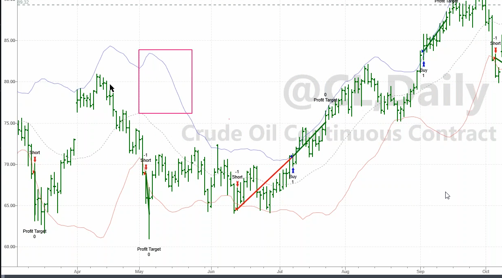
  <figcaption>Figura 174</figcaption>
</figure>

Este efecto de aquí, este efecto de aquí. Cuando el precio cae mucho a la baja o tal, se aleja muchísimo, tarda mucho en volver, ¿no? Con la KAMA se mitiga bastante. Recuerdo, una media me gustaba, me gustaba.

Pero ahora sí, porque no la operamos. Pero es una de esas cosas ahí pendientes y apuntadas, apuntadas para mirar, vale. Porque sí que puede tener su interés, puede tener su interés, vale.

Entonces, ya te digo, más exploraría por medias adaptativas que dobles, triples. No sé, sin decir que no. Todo se puede investigar y todo es bien a nivel de investigación, vale. Pero ya te digo, normalmente me he quedado bastante en la simple porque no he encontrado claras ventajas de otras. Y al final, en caso de duda, simplicidad. Siempre. Eso grábatelo con fuego.

<div style="border-left: 4px solid #4caf50; background: #e8f5e9; padding: 10px 15px; margin: 10px 0; border-radius: 8px;">
  <strong>💡 Principio fundamental</strong><br><br>
  <em>"En caso de duda, simplicidad."</em><br><br>
  Si no encuentras ventaja clara y demostrable de un indicador complejo sobre uno simple, quédate con el simple. Menos parámetros = menos riesgo de <em>overfitting</em>.
</div>

**¿Parabólico para trailing?**

—Si no lo ves muy claro, bueno, dices para hacer un *trailing*, sí, ¿por qué no? ¿Por qué no? Sí, sí, ¿por qué no?

Dependerá un poco de la entrada, eso que te decía. El *Parabólico* puede ir bien, pero en el Bollinger no es muy adecuado. ¿Por qué? Porque el Bollinger en tendencial es una entrada muy retrasada, con lo bueno y malo que eso trae. ¿Tenéis?

Y *Parabólico* es un... de estos necesita entradas rápidas, de acuerdo. Es una salida para entradas rápidas. Entonces claro, pues depende. ¿Si el concepto media *trailing*? ¿Por qué no? Pero tienes que ver si te aporta más eso que un *Chandelier* o un canal de... que es lo que es un canal de mínimos al final, ¿no?

Porque también puedes usar un *Chandelier* con ATR cero. Es decir, puede perfectamente usarse. Es decir, al final un canal de mínimos o de máximos. O sea, bueno, no, no, no, un *Chandelier*. Un *Chandelier* al final resta del máximo, vale. Pero puedes usar un canal, un canal de Donchian, para entendernos. Lo puede usar de *stop*, ¿no? Puede usarle *stop*, vale.


## Mean Reversion intradía

Cambio de tercio para dar una vuelta, una vuelta rápida, vale.

Esto es el el *mean reversal* de intradía que teníamos en MultiCharts trabajado, vale. Que hicimos algunas pruebas con él. Y bueno, pues hemos tratado también jugando un poquito con las salidas.

Esto estaba Alberto antes dándole caña. Y bueno, era un sistema que ya estaba, ya tenía alguna situación aprovechable. Que es un, se puede partir perfectamente de él. Se puede buscar más. Es que hay mil, mil opciones de pivots. Por ejemplo, si ideas, no nos faltaba nunca. Como ya os hablé de revistas, os hablé de demás... y al final sí que me gustaría, de alguna manera, acabar dando algunas ideas más. Como para que pudierais trabajar vosotros ya post-curso. Pero bueno, esto ya lo iremos viendo las cuatro, o no sé si cuatro o cinco, gracias que me quedan. Las tengo que ir preparando.

<figure>
  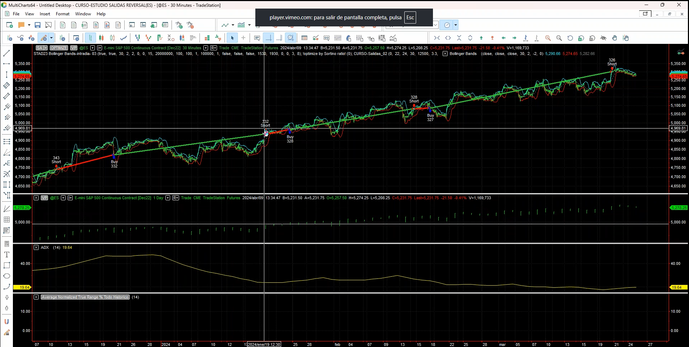
  <figcaption>Figura 175</figcaption>
</figure>

Bien, aquí tenemos nuevamente un poco el mismo sistema que ya vimos, pero aplicando el módulo de salidas que habéis visto ahora, de acuerdo.

<figure>
  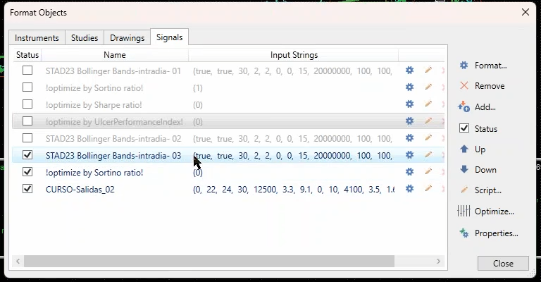
  <figcaption>Figura 176</figcaption>
</figure>

- [Strategy : STAD23 Bollinger Bnads-intradia-03](../code/STAD23%20BOLLINGER%20BNADS-INTRADIA-03.ELD)  
- [Strategy : CURSO-Salidas_02](../code/CURSO-SALIDAS_02.ELD)  


A partir de ahí, pues nuevamente lo puedes trabajar. Si tú tienes un código con muchas salidas, aquí lo que puedes hacer es bloquear las salidas, vale. Por un poco, iba a decir "cuenta la vieja", no. Es decir, al final, como no se pensó así el sistema —porque se podría— esto la manera buena de hacerlo es ponerle una variable *true/false*. Y en el código le pones: salidas *true*, salidas *false*, ¿se entiende?

<figure>
  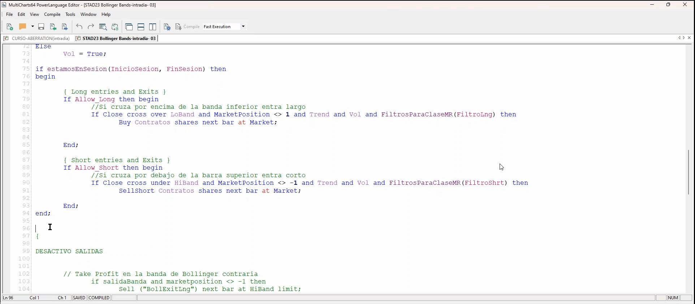
  <figcaption>Figura 177</figcaption>
</figure>

Es decir, le pones aquí: ¿quiero salidas? No, vale, den no. Y pones la variable "quiero salidas control" *false*, y ya está. De acuerdo, sería la manera un poco más limpia de hacerlo.

Hoy, ¿qué hemos hecho? Pues le hemos hecho un corchete y hemos comentado toda la parte de salidas. Y a tomar, bien. La manera rápida y fácil de hacerlo: comentado.

Entonces el sistema ahora no tiene salidas, de acuerdo. El Bollinger de intradía no tiene salidas, vale. Para automáticamente usar las salidas que hemos aplicado aquí. Ya está. Desde ver, haber, todo. Antes ha estado investigando un poco, se me está saliendo algún aviso por ahí.

Y tenemos este informe de utilización que ha hecho Alberto. Facilito, bueno, esto no tarda mucho.

<figure>
  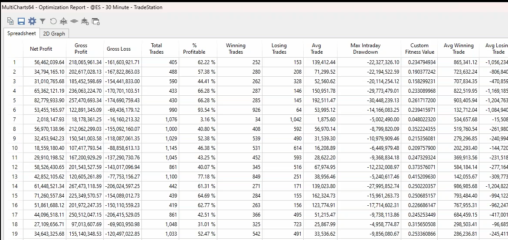
  <figcaption>Figura 178</figcaption>
</figure>

<figure>
  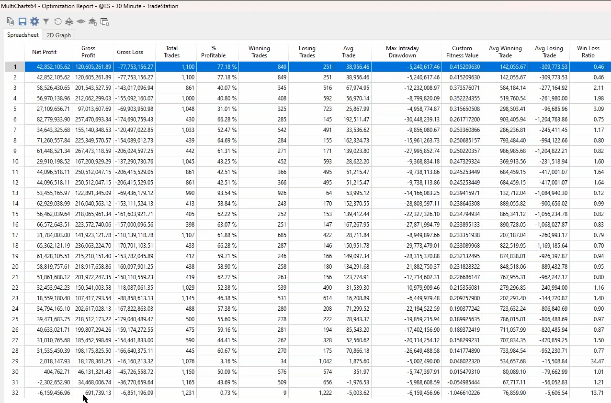
  <figcaption>Figura 179</figcaption>
</figure>

Aquí hay algunas que deben ser incoherentes, no. Porque están con muy buenos. No, bueno, la realidad es bastante estabilidad. Que excepto unas, bastante estables todas, no. Muy, muy anti-tendencial con tal.

<figure>
  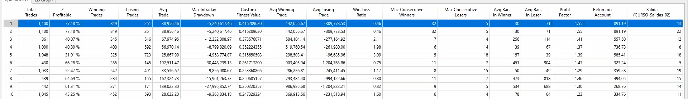
  <figcaption>Figura 180</figcaption>
</figure>

Aquí, ¿qué números tenemos? Y tenemos la `13` y la `22`, no, que están saliendo más top.

—Ahí lo tienes, claro. Entra anti-tendencial y la banda contraria te saca, ¿para qué está? Bastante filtrado. Bueno, porque está, eso está en 30 minutos continuo

<figure>
  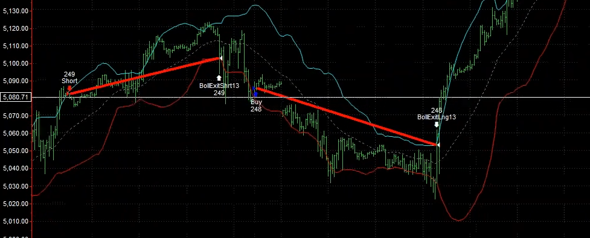
  <figcaption>Figura 181</figcaption>
</figure>

—Claro, salir en la banda contraria es bien, es bien. salir en la banda contraria acostumbra ser bien. Y no tiene ninguna otra salida en este caso. 

Y es curioso que le salga la mejor esa, no. Sí, bueno, luego también estaba la `22`. Y la 22 es Bollinger con *stop* porcentual. Bollinger con *stop* porcentual, no. Y además, con un número detrades realmente elevado. Por número de trades bastante, bastante elevado. Esto porque no le hemos dejado outofsample, creo, no. Pero dejando outofsample hubiera estado bastante guapo.

Hay que mirarlo porque tiene bastante... tiene una muestra muy importante. *Trades*, era una muestra muy importante de *trades*.

También estamos ahí con el 12, con el 12, que es el Chandelier. Nuestro gran amigo Chandelier. Que hay que invitarle algo. Chandelier, un día al mono de Chan. Al mono de Chan hay que invitarle algo. Me gusta mucho Chandelier a mí.

`8`, *trailing* ATR muy bien. El *trailing*, que es, muy bien. También va bien. Ante, el final simplemente es coherente: acompaña el precio, de acuerdo.


**Ajuste de parámetros: valor absoluto vs. porcentual**

Lo único, dimensionar siempre en este tipo de cosas. Por mucho que yo os sigo recomendando encarecidamente que no os dejéis llevar por... no que no os dejéis llevar por el tema de los números para elegir valor absoluto o porcentual, vale.

Hay que ajustarlo de acuerdo a la base de datos. Si no, no tiene sentido que salga peor, vale.

Y cuidado con la optimización en este tipo de cosas. Es decir, los *trailing* tienen fama de acoplar, y es verdad. Pero también porque a veces nos pasamos, de acuerdo.

A ver, no hace falta optimizar el 0.01. Es decir, mirar, evaluar las variaciones. Lo que os expliqué cuando hicimos la revisión de Apolo, nosotros lo tuvimos que cambiar.

Si yo estoy aquí utilizando este ATR o este tal de 0.25, 0.25, comprobar... que no lo he hecho ahora, pero para que lo sepáis: comprobar si variar de 0.25 tiene sentido. O realmente variar de 0.25 es demasiado poco. 

Es decir, que tiene que tener una significación.

Cambiar de cada incremento del valor en una variable que yo pase por un optimizador tiene que tener sentido. En los mapas, se ve muy bien, vale. Los mapas se ve muy bien. Que habría que hacer el mapa.

Todo, todo esto hay que hacerlo todo, vale. Decir, ***aquí estamos un poco rastreando, investigando***, vale.

Esto estaría entre la teoría —insistí mucho en ello y me repito— es decir, lógicamente, tú para explicarlo tienes que explicarlo como un proceso. Pero muchas veces es todo un uno, y donde vas y vienes arriba y atrás, de acuerdo.

No necesariamente es pam, pam, pam. ***Esto está evidentemente en investigación, evaluación preliminar, y también evaluación***. Es decir, está un poco a caballo. Pero más en evaluación preliminar que en evaluación. Más en evaluación preliminar que en evaluación. Pero que también tiene mucha importancia.

Y hay veces que la evaluación preliminar pasa ya a la evaluación limpia. Ya cepilladito y limpio, es decir, ya simplemente con alguna prueba de estrés, mapa, en algunos casos *walk forward*, etcétera, vale. Ya probar un poquito, estresar el sistema para ver cómo se mueve, de acuerdo. Cómo se mueve en esas pruebas finales, vale.


## Probando en oro

<figure>
  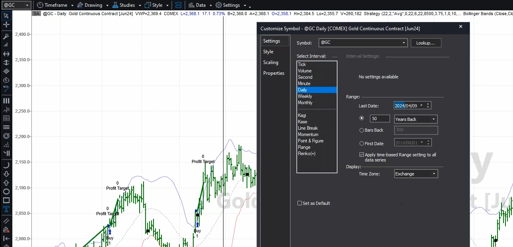
  <figcaption>Figura 182</figcaption>
</figure>

Bien, pues vamos a ver si nuestro amigo oro ha acabado de cargar. Parece que sí, parece ser, parece ser que sí.

No sé, esto directo cómo está. Así es mal, está mal, es un churro patatero.

<figure>
  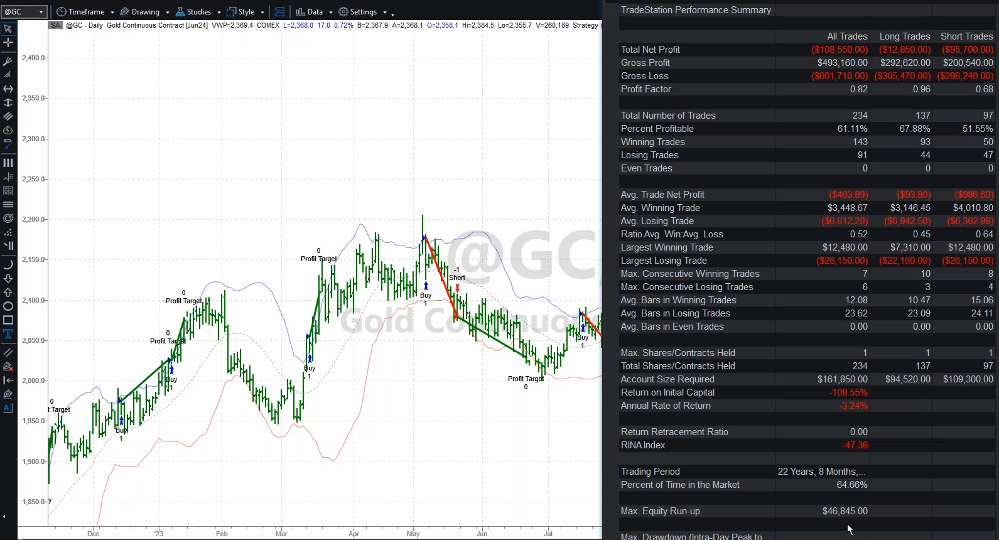
  <figcaption>Figura 184</figcaption>
</figure>
<figure>
  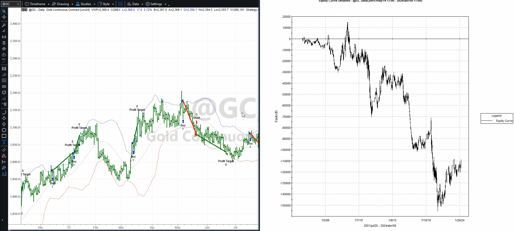
  <figcaption>Figura 185</figcaption>
</figure>

<div style="border-left: 4px solid #ffc107; background: #fff8e1; padding: 10px 15px; margin: 10px 0; border-radius: 8px;">
  <strong>🥇 Particularidad del oro como activo</strong><br><br>
  El oro es un activo que es <em>tendencial</em>, pero también es <em>antitendencial</em>. Es tendencial, pero también es antitendencial. Tiene esa particularidad de ir bien en ambos entornos, realmente.
</div>

Aquí va muy tarde con esta banda de Bollinger. No sé cuánto tengo puesta. ¿Tengo 20 por defecto? ¿Qué tengo? 22, tengo 22 y dos desviaciones... que es un mes. Tengo puesto un mes.

<figure>
  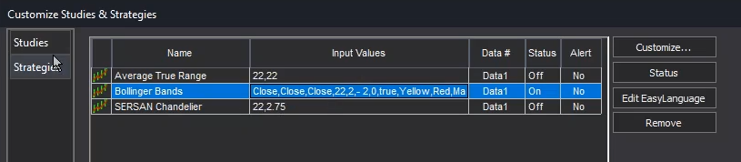
  <figcaption>Figura 186</figcaption>
</figure>
<figure>
  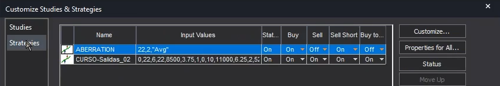
  <figcaption>Figura 187</figcaption>
</figure>

### `Case 6` Salida por volatilidad : Profit ATR

Está cargado en `Time zone: Exchange`. Bueno, vamos a ver si con las salidas podemos hacer algo. Aparentemente hay poco que rascar aquí. Pero vamos a ver si nos da una pista. No creo que nos dé una pista de por dónde va a ir mejor, alguno que vaya muy, muy bien. Pero sí que nos va a poder dar una pista de por dónde van los tiros. Y por dónde puede mejorar, por dónde las salidas pueden un poco respirar. Porque no sé cuál estaba puesta mejor. Estaba puesta una condicionada.

<figure>
  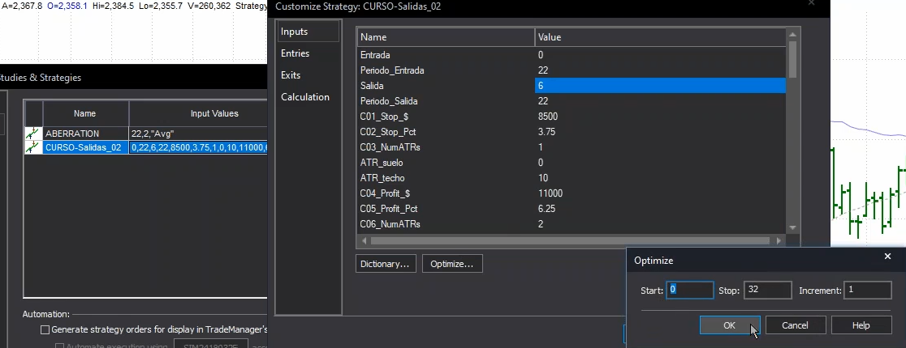
  <figcaption>Figura 188</figcaption>
</figure>
<figure>
  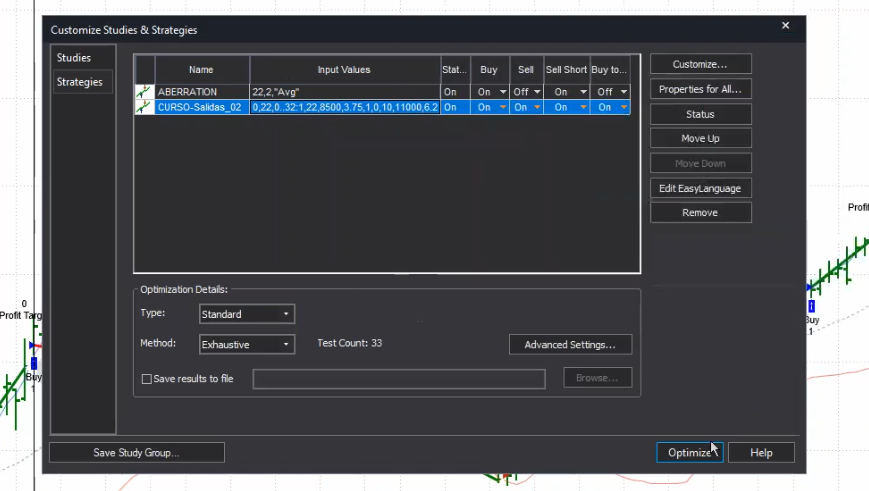
  <figcaption>Figura 209</figcaption>
</figure>

Sí, parece que saca alguna que gana.

<figure>
  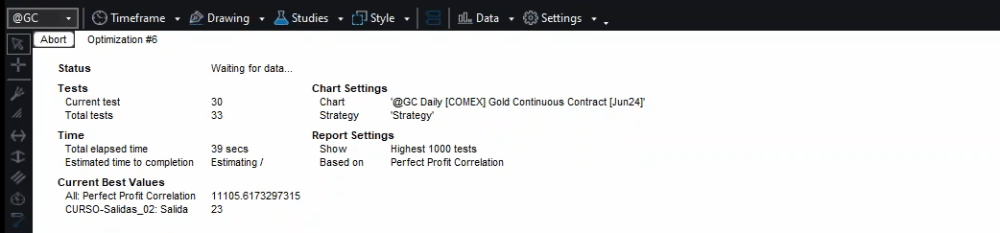
  <figcaption>Figura 210</figcaption>
</figure>

Aquí, con los datos que habíamos obtenido del petróleo, no olvidemos. Tenemos algo bueno. Alguno ha salido verde, alguno ha salido verde. Solo mejora tocando las salidas: 23 y 10, vale.

<figure>
  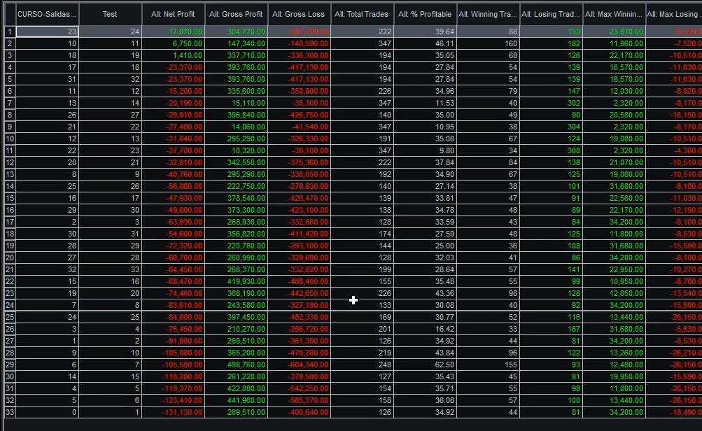
  <figcaption>Figura 189</figcaption>
</figure>

23 y 10. *Parabólico*, curiosamente. Curiosamente el *Parabólico*. Curiosamente el *Parabólico*. Y luego el 10, es al cierre puesto. Es raro. Muy mala señal.

Y 18. Y 18, el *Chandelier* con *profit* porcentual. Bueno, habría que ver, habría que ver alguno de estos y hasta trabajarlo un poquito, ¿entendéis?

Mirar a ver qué *inputs* tiene. Porque es posible que la volatilidad de más del oro, no sé, no se active, no tenga mucho sentido.

**Ajuste de períodos en intradía**

También es verdad que mucha gente es reacia... yo no lo soy, de verdad, porque me parece que es vital para adaptar las bandas de Bollinger si hay muestra. No en el diario. En el diario es más complicado. Pero si tú vas en el intradía tienes margen de tocar el periodo.

Podéis tocar los periodos. No tengáis tampoco... no hagamos tampoco cosas muy raras, vale. Pero puedes tocar si hay muestra y si lo permiten los grados de libertad, de acuerdo. Porque la volatilidad de un activo viene muy condicionada por eso, vale.

Sobre todo las bandas, y a nivel de intradía normalmente las bandas suelen ir mejor abrirlas un poco más. Hay mucho ruido en un intradía, y el tener las mismas desviaciones en dos hace que salga con más frecuencia.

Aquí parece que le cuesta más salir que al petróleo. Entonces, pero aunque eso ya pretende ajustarse, pues habría que verlo, habría que verlo.

<figure>
  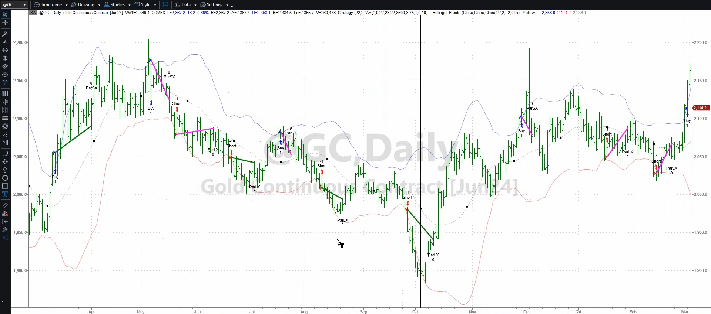
  <figcaption>Figura 190</figcaption>
</figure>

Pero aquí, pues mira, con el *Parabólico*. En este caso le va, le va mejor. Sin haber tocado nada, simplemente las entradas y dejando el *Parabólico*, ha mejorado algo. Sigue siendo bastante churro, que nada es nulamente aprovechable así.

<figure>
  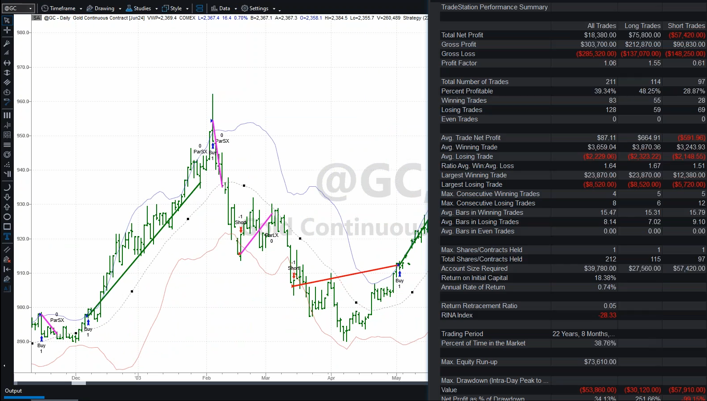
  <figcaption>Figura 191</figcaption>
</figure>

**Asimetría largos vs. cortos en oro**

Pero en el lado largo, fijaros que ya ha empezado a tener datos bastante positivos. El lado largo, de hecho, muy positivos. Muy positivos. En el largo está muy bien, en el largo está muy bien. Pero en el corto está rotísimo. Sirve fatal en el corto. Así que no nos da para...

Y es verdad que *commodities* es mejor trabajarlo con reglas simétricas. Así que deberíamos de darle más vueltas.

**Reflexión sobre Bollinger en oro**

Bollinger en ABERRATION, que es esta combinación, es una ventana de operativa muy cerrada. Es decir, no es una... hay sistemas cuál que yo sigo, por ejemplo las reglas de Apolo, que es una especie de *mean reversion* tendencial raro. Pero extrapola a bastantes activos. ABERRATION no, la idea de Bollinger tendencial requiere activos muy tendenciales, muy volátiles. No, no le da. Y el oro sí que lo ha sido muchos años. Pero fijaros aquí, si yo ahora abro el histórico, la cantidad de periodo que tenéis ahí ahogado.

Es decir, igual que os decía que antes la bolsa de ser más *mean reversion*, también ha mejorado a nivel tendencial. El oro le ha pasado lo contrario, se diría. Ha empeorado de tendencial a *mean reversion*. Manteniendo un poco las dos vertientes. Pero pasó años muy, muy tendenciales.

Ahora de hecho, los últimos meses está volviendo un poco, está volviendo un poco. Y está mejorando ese nivel. Pero le cuesta, le cuesta un enfoque como este, tan tendencial, que necesita colas tan largas. Le cuesta mucho, de acuerdo. Le cuesta. Hay mejor, me cuesta mucho.

Porque sí que tiene tramos bastante limpios, pero luego también tiene tramos de congestión bastante durilla. Y le cuesta mucho. Muchas idas y venidas, muchas idas y venidas.

<div style="border-left: 4px solid #2196f3; background: #e3f2fd; padding: 10px 15px; margin: 10px 0; border-radius: 8px;">
  <strong>📈 Evolución del carácter del oro</strong><br><br>
  <strong>Antes:</strong> Muy tendencial, con colas largas y movimientos limpios<br>
  <strong>Ahora:</strong> Más <em>mean reversion</em>, con congestiones frecuentes<br><br>
  <strong>Implicación:</strong> Sistemas ultra-tendenciales como ABERRATION (Bollinger Breakout) le cuestan más. Funciona mejor en activos con tendencias sostenidas sin tanto ruido intermedio.
</div>


### Búsqueda de `entradas` con `salidas`

**Ejercicio de curiosidad: búsqueda combinada de entradas y salidas**

Es lo que os decía: probar brevemente. Yo aquí ahora tengo ABERRATION y bloqueo esto, vale.

<figure>
  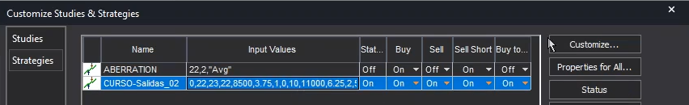
  <figcaption>Figura 192</figcaption>
</figure>

Y aquí activo entradas:

<figure>
  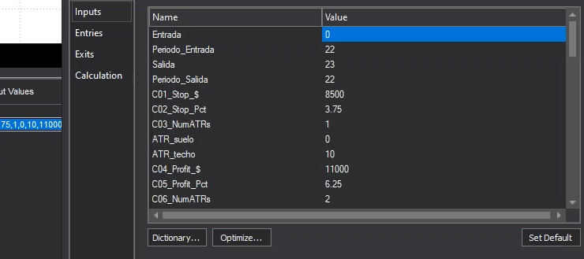
  <figcaption>Figura 193</figcaption>
</figure>

Yo aquí, entradas —no sé si lo habéis visto en el código— tengo 5 o 6 básicas. Puedes poner las que queráis. Lo he puesto solo unas básicas para podéroslo mostrar.

```sh
inputs:
	Entrada ( 0 ),        // elegir de 0 a 14
	Periodo_Entrada ( 46 ),
	
	Salida ( 26 ),        // elegir de 0 a 33
	Periodo_Salida ( 46 );
	
vars:
	MP (0);
	
MP = MarketPosition;
		
switch (Entrada)
Begin
	case 0:  // No entries
	case 1:  // Simple Momentum Entry
	case 2:  // Breakout Next Bar Entry
	case 3:  // Single Moving Average Cross Entry
	case 4:  // Bollinger Band Entry
	case 5:  // Volatility Entry
	case 6:  // Bollinger trend
	case 7:  // Donchian
	case 8:  // Key Reversal
	case 9:  // Entramos en un Pullback contra la tendencia primaria
	case 10: // Entramos en un Pullback a favor de la tendencia primaria
	case 11: // Breakout + momentum
	case 12: // RSI entrada saliendo de sobrecompra/sobreventa MR
	case 13: // RSI entrada en tendencia
	case 14: // RSI entrada saliendo de sobrecompra/sobreventa MR
End;

switch (salida)
Begin
	case 0:  // No exits
	case 1:  // Stop $ - Input: C01_Stop_$(1000);
	...
	...
	case 32: // Cierre Media - Input: Periodo_Salida
	case 33: // Key Reversal (si vemos que funciona la combinamos con otras salidas)
End;
```

No sé, vamos a probar la 5, por ejemplo. Volatilidad, entrada número 5, vale.

<figure>
  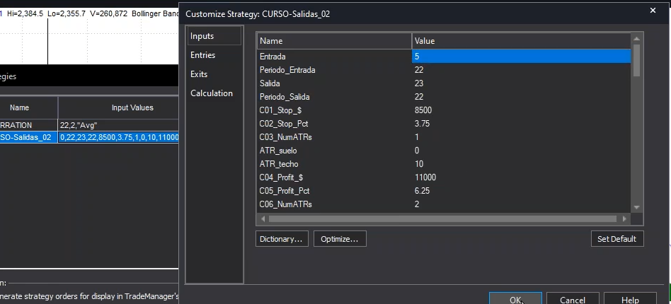
  <figcaption>Figura 194</figcaption>
</figure>

Y bueno, aquí puedes un poco jugar. O bueno, mira, vamos a hacer... porque eso, como estamos en diario, nos lo va a permitir hacer a nivel de investigación. Claro, bueno, tengo 22 de periodos, vale. Pues lo dejo ahí.

El tema es que aquí los *stops* y tal, esto sí que se adapta mucho a la volatilidad del activo. Y están puestos para el oro. Entonces habría que verlo un poco cómo va. Pero bueno, que es igual, ya digo, esto es para darle un poco.

**Configuración de la optimización**

Le pongo de 1 a 7 —porque el cero no me vale— 7, no tengo 7, no. Desde 1 a 7, entrada. Y de periodo no toco nada. Salida, le pongo de 0 a 32. Periodo no toco nada. Y bueno, pues no sé, esto no... no sé. No toco nada tampoco. Venga.

<figure>
  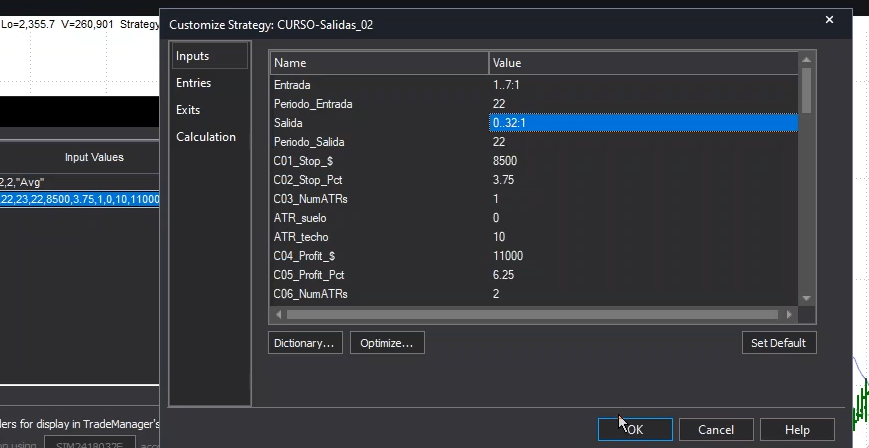
  <figcaption>Figura 195</figcaption>
</figure>

Y aquí tengo 231. 231. Yo creo que me va a dar, me va a dar en exhaustivas, ningún tipo de problema.

<figure>
  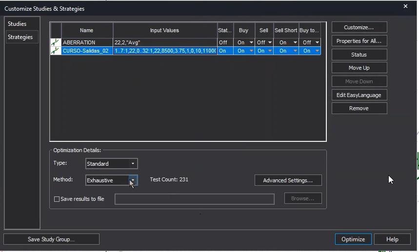
  <figcaption>Figura 196</figcaption>
</figure>

Por curiosidad, eso es una... ahí ha sido un ejercicio absoluto de curiosidad.

<figure>
  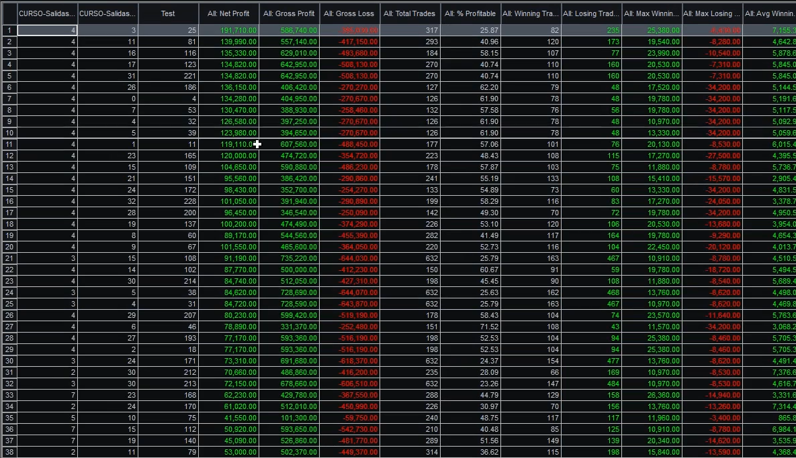
  <figcaption>Figura 197</figcaption>
</figure>

**Resultados: Bollinger antitendencial prometedor**

Bueno, aquí ves, ya automáticamente hemos encontrado algunas cosas decentes, de acuerdo. Es decir, que se ha adaptado a tal vez...

Parece que la `entrada 4`, no recuerdo cuál era. Tal, pues bueno, es esto. Simplemente a la que veáis líneas de investigar, a mirar. Es la Bollinger, `Bollinger 4`. Pero en *antitendencial*, claro. En *antitendencial*, la Bollinger en *antitendencial* le va, le va bastante bien. Y `salida con la 3` o con la 11, con varias.

Y luego, a nivel de entradas, parece que también la 3 tiene algo. ¿Que sea mucho peor? Pensar que luego se cuenta bajar las salidas, filtrar, se cuenta bajar muchas más cosas.

Simplemente aquí no se trata de quedarse la mejor. Es un poco ver cuáles sacan algo positivo para partir de ahí, empezar a seguir el hilo.

Pero evidentemente la 4 es muy prometedora. Porque la 4, fijaros que tiene hasta un montón de salidas. En la 4, apúntatela, Alberto. Apúntatela, porque no recuerdo haber estudiado al oro con este, con Bollinger *antitendencial*. Y la verdad está...

—Sí, sí, pero fíjate cómo va el cabrito. Tiene, es bastante prometedora esta entrada Bollinger *antitendencial*, porque la verdad da resultados bastante sólidos.

—Vamos a ver si...

<figure>
  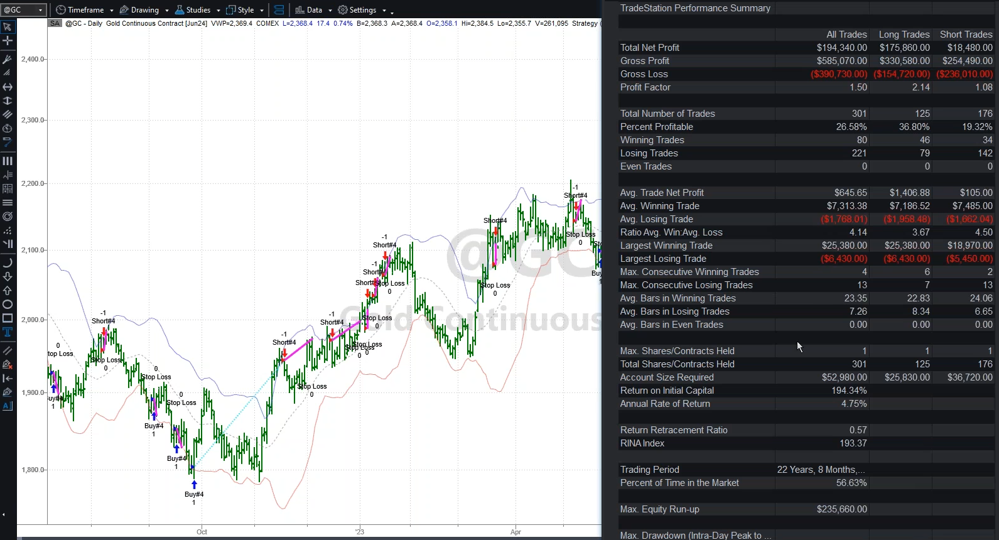
  <figcaption>Figura 198</figcaption>
</figure>

—Aquí la salida 3, muy flojo en el corto pero muy destacado en el largo, Alberto.

<figure>
  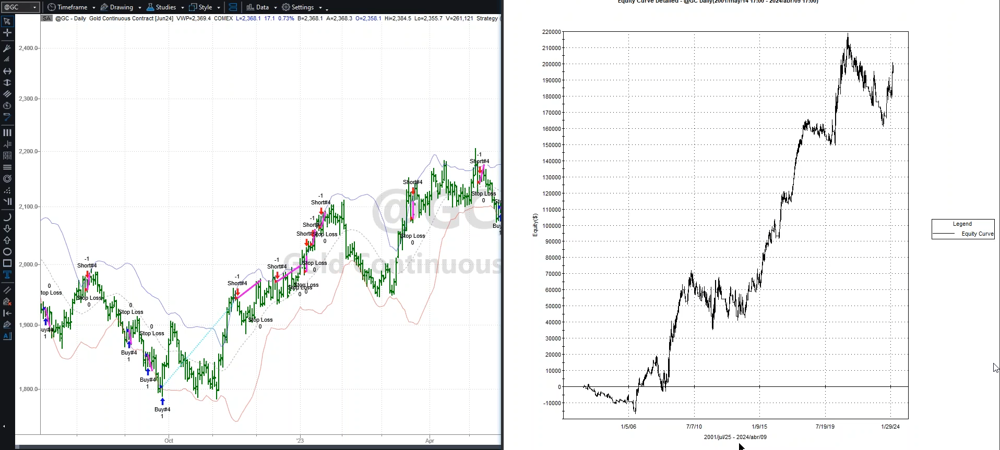
  <figcaption>Figura 199</figcaption>
</figure>

Y bueno, y general, general, pues bueno. No es mal, no es mal. Se puede mirar, se puede mirar. Tiene datos más que decentes para un primer análisis. Tiene datos más que decentes.

<div style="border-left: 4px solid #4caf50; background: #e8f5e9; padding: 10px 15px; margin: 10px 0; border-radius: 8px;">
  <strong>💡 Hallazgo: Bollinger antitendencial en oro</strong><br><br>
  <strong>Entrada 4:</strong> Bollinger Band Entry (antitendencial)<br>
  <strong>Salida 3:</strong> Stop por ATR<br><br>
  <strong>Resultado:</strong> Muy destacado en largos, flojo en cortos. Prometedor para seguir investigando.
</div>
<br>

***Verificando el código***

Lo que pasa, ¿esta entrada está entrando bien así?

<figure>
  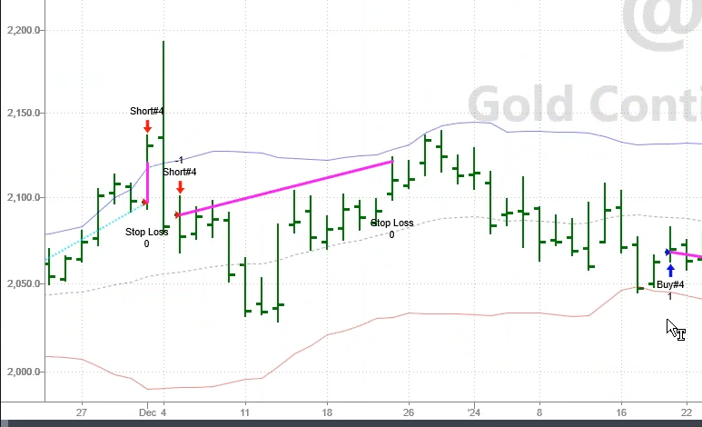
  <figcaption>Figura 200</figcaption>
</figure>

Claro, cuando cruza. Claro, cuando cruza. Pero está... no sé por qué entra aquí. A ver si está mal esto. 22, entrada 4. A ver código, entrada 4.

```sh
case 4: //Bollinger Band Entry
begin
	If Close crosses above BollingerBand(Close, Periodo_Entrada, -2) then // largos cuando recupera banda inferior
		Buy next bar at market;
		
	If Close crosses below BollingerBand(Close, Periodo_Entrada, +2) then // cortos cuando pierde banda superior
		SellShort next bar at market;
end;
```

Tenemos un *close cross above* Bollinger Band, *close*, periodo entrada, en menos 2. Y los *cross below* Bollinger Band, en *close*, periodo entrada. Pues no tiene mucha historia.

22, y al cierre. Así que debería de estar correcta. Está deshabilitada entrada 4, 22, salida 3, 22. Y la 3 me está usando.

La 3 es realmente simple. La 3 es al final un *stop* por ATR, *stop* por ATR, y punto. Ya. Esto para el *reverse*, bastante curioso.

<figure>
  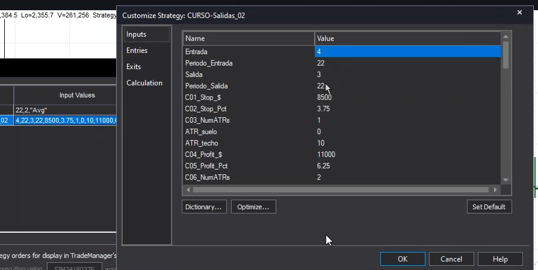
  <figcaption>Figura 2001</figcaption>
</figure>
<figure>
  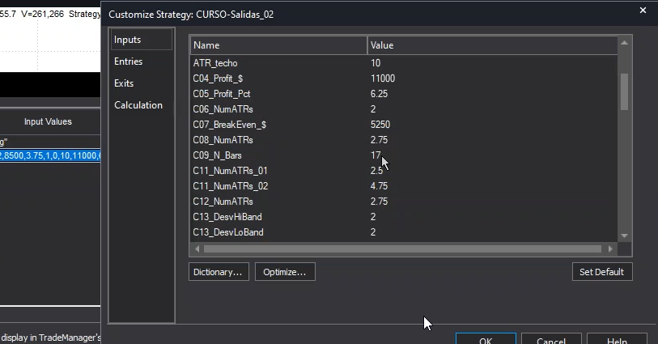
  <figcaption>Figura 202</figcaption>
</figure>

Bueno, pues la verdad que sí que es prometedor. Así, no está mal. No está mal la verdad, no está mal. Se puede dar una vuelta a esto.

<figure>
  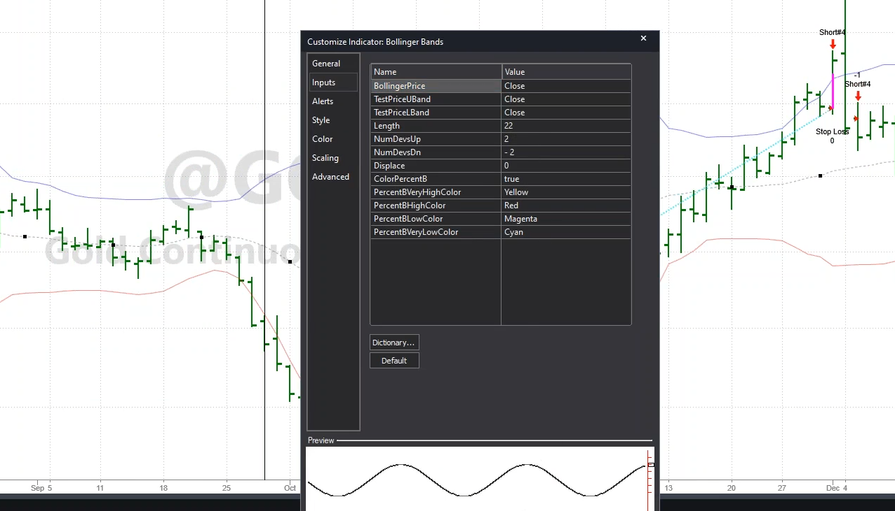
  <figcaption>Figura 2003</figcaption>
</figure>


## Pregunta sobre optimización por TSE vs. PPC

***porque a veces optimizamos por TSE y otras por PPC?***. 

Bueno, no sé si es que no has acabado la teoría, José, pero en la teoría hablamos de esto. Nosotros en TradeStation utilizamos por los tres siempre. Optimizamos por los tres y buscamos equilibrio.

Cuando utilizamos por MultiCharts, normalmente usamos Sortino. Aunque también tenemos Ulcer, y también tenemos CSI, también tenemos Expectancy Score, y tenemos una especie de Performance Calculado. Pero a mí me gusta mucho Sortino. Entonces, como en MultiCharts lo tengo calculado, tanto para sistemas como para portfolios, pues lo tengo ahí. Desde aquí tengo el Sortino, también sharpe, el Ulcer.

<figure>
  
  <figcaption>Figura 176</figcaption>
</figure>

Entonces, a veces mira, solemos hacer varias. Podemos hacer en MultiCharts vamos a hacer el Sortino y Ulcer, vale. Y en, ahora actualmente, en MultiCharts solemos hacer TSE y SPP y PPC, y las cruzamos, vale.

Es decir, en los ejes, acordaros que es lo solo lo habéis visto. La teoría 100% está en la teoría 100% comentado. Vamos a decir la lección, pero está comentado.

Así lo hacemos nosotros. Se puede hacer en TradeStation por ejemplo podrías usar la API. Pero nosotros nos hemos hecho... y hacer una mezcla de los tres, eso creo que sí que se podía. Pero vimos seguía teniendo algunas limitaciones y no lo abordamos porque no le vimos tanta ventaja hacerlo, vale.


## Referencias

### Autores citados

| Autor | Descripción | Contexto en la clase |
|-------|-------------|----------------------|
| **Andrea Unger** | Trader italiano, cuatro veces campeón del *World Cup Trading Championship* | Referencia sobre el debate *stop* monetario vs porcentual. Defiende el *stop* monetario, aunque el ponente discrepa por el efecto de normalización de precios |
| **Perry Kaufman** | Autor de *"Trading Systems and Methods"*, obra de referencia en trading sistemático | Creador de la estrategia *ABERRATION* (Bollinger tendencial) y de la media adaptativa *KAMA* |
| **J. Welles Wilder** | Analista técnico, creador de indicadores como RSI, ATR y *Parabolic SAR* | Se menciona el *Parabolic SAR* como salida tipo *trailing* para entradas rápidas |
| **Mesa Software** | Proveedor de software de análisis técnico | Creador de medias adaptativas como *MAMA*, *TEMA*, *FAMA* |

### Libros y recursos

| Título | Autor | Tema |
|--------|-------|------|
| *Trading Systems and Methods* | Perry Kaufman | Libro de referencia que incluye la estrategia *ABERRATION* (TSM MA BBands) |

### Conceptos técnicos clave

- **ABERRATION**: Estrategia tendencial basada en *Bollinger Bands*, entrada por rotura de banda y salida por media central
- **Chandelier Exit**: *Stop* dinámico que resta ATR desde el máximo de N barras (banda siempre activa)
- **Trailing Stop**: Similar al Chandelier pero se calcula desde el momento de entrada
- **KAMA** (*Kaufman Adaptive Moving Average*): Media adaptativa que ajusta su sensibilidad según la volatilidad
- **ATR** (*Average True Range*): Medida de volatilidad usada para normalizar *stops* y *take profits*
- **SetStopLoss / SetProfitTarget**: Palabras reservadas de EasyLanguage para gestión automática de salidas
