# Práctica 13 - Sistemas Tendenciales en el Oro

## Índice

1. [Consultas](#consultas)
2. [Sistemas del Oro](#sistemas-del-oro)
3. [Sistema `Parabolic SAR`](#sistema-parabolic-sar)
4. [ORO con Sistemas tendenciales](#aplicacion-de-sistemas-tendenciales-en-el-oro)
   - [Implementación con switch-case](#implementación-con-switch-case)
   - [Tipos de medias disponibles](#tipos-de-medias-disponibles)
   - [Análisis de optimización de medias](#análisis-de-optimización-de-medias)
   - [Resultados de optimización por tipo de media](#resultados-de-optimización-por-tipo-de-media)
   - [Visualización de los `cases`](#visualización-de-los-cases)
     - [Caso `Fast_Avg 7` con `media 3`](#caso-fast_avg-7-con-media-3)
     - [Caso `Fast_Avg 20` con `media 11`](#caso-fast_avg-20-con-media-11)
     - [Caso `Fast_Avg 33` con `media 2`](#caso-fast_avg-33-con-media-2)
     - [Caso `Fast_Avg 7` con `media 3`](#caso-fast_avg-7-con-media-3-1)
5. [Añado `salidas` a los Sistemas tendenciales](#implementación-de-salidas-a-los-sistemas-tendenciales)
   - [Resultados con salidas implementadas](#resultados-con-salidas-implementadas)
   - [`case 17` Salida : Stop ATR + Profit ATR](#case-17-salida--stop-atr--profit-atr)
6. [Optimización en MultiCharts](#optimización-en-multicharts)


## Consultas

Bien, empezamos como siempre dando un repasito breve al *Discord*. Había alguna cosita que comentar. Bueno, Alejandro había añadido al hilo de... 

***Buenas de nuevo @Sersan Sistemas Al hilo de la pregunta del otro día. Sigo peleado con que sistemas poner a operar. Por seguir con el ejemplo en el USDJPY. El activo se pega 4-5 años en rango, y entonces mi sistema tendencial no gana. Luego resulta que entra en tendencia (alcista) unos años, y entonces este sistema va muy bien. Pero claro, uno 'nunca sabe'. Si yo hubiese tenido también funcionando un tendencial bajista o un mean reversion, me estarían dando candela de igual forma. Mi inquietud es que esto pasa no solo en este activo, sino en otros muchos. El oro por ejemplo se ha tirado 10 años en un rango antes de volver a pegarse una arrancada. ¿Cómo se lidia con esto?*** 

<figure>
  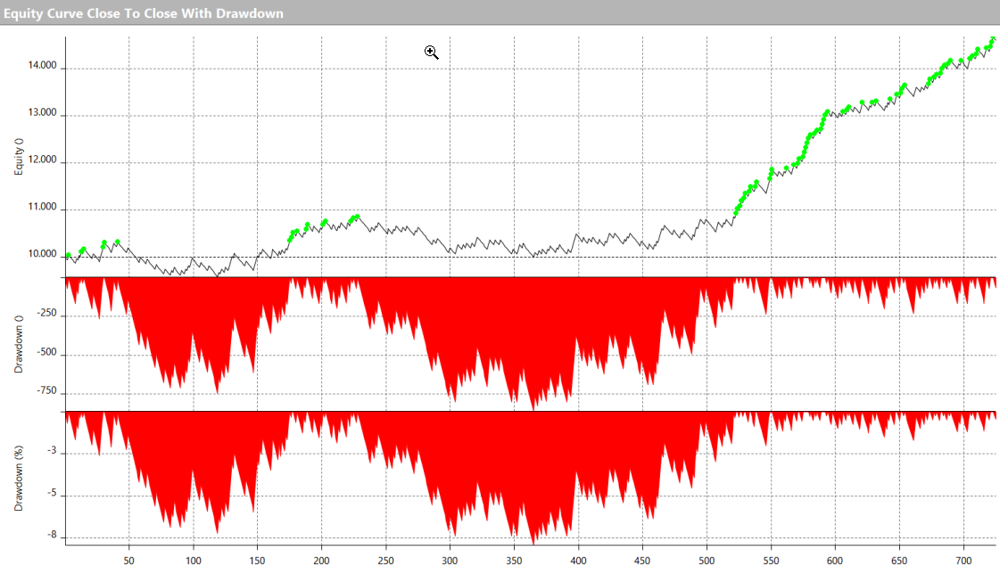
  <figcaption>Figura 000</figcaption>
</figure>

**Sistemas tendenciales y diversificación**

Hoy vamos a ver un *sistema tendencial* porque siempre, como os digo, el curso es un ente vivo que voy adaptándolo un poco a lo que veo, a vuestros comentarios, a lo que creo también que es mejor para todos. Y hoy justamente vamos a ver algún sistema de este estilo.

Yo el otro día dije que eso es algo que pasa y que se soluciona con *diversificación*. Es verdad que hay que intentar que no pase, eso es obvio, ¿de acuerdo? Es decir, no quería decir que no hay que intentarlo, pero un tendencial puro, contra más puro es, más le pasa. Y hoy veréis que al final, aunque es un sistema basado totalmente en tendencial puro, al final el sistema quiere salir, pero eso va a ser siempre así, quiere salir. Si le obligas a elegir una salida, pues al final busca un TP (*Take Profit*), un *stop*, ¿de acuerdo? Porque, y aun así lo mantiene tendencial, porque evidentemente el hecho de poner un TP no anula que sea tendencial, porque todo depende del TP que ponga. Si pongo un TP que está a un 8%, seguramente va a ser tendencial porque va a saltar solo en pocas veces y en ocasiones en que haga un *run-up* muy largo. Entonces al final todo depende de la relación de uno con otro.

Pero evidentemente un tendencial puro, que son los que pueden tener este tipo de curva que se ve ahí, que enseñaba Alejandro, pues puede pasar. Pero como bien él comenta, nunca se sabe lo que va a pasar. Entonces en tal tendencia, esto lo hemos vivido ahora mismo en el oro.

Como hoy vamos a ver un sistema en el oro, bueno, vamos a ver dos, pero vamos a trabajar uno y vais a ver pues que esto pasa, esto pasa, vale. Eso es algo que ocurre.

Y la inquietud dice, dice Alejandro, que si esto no, esto pasa no solo en este activo, sino en otros muchos. Porque, insisto, insisto Alejandro, que no sé si no lo has oído. La mejor *diversificación* no es por activo, esto lo hemos hablado ya en la teoría, lo he dicho muchas veces en la práctica, es por *estrategia*. Es mejor en el mismo activo tener estrategias muy distintas que tener la misma estrategia en distintos activos, pero evidentemente combinar ambas cosas es lo ideal, vale. Y pones el ejemplo del oro, efectivamente, se lidia, como dije, con diversificación, pero diversificación, sobre todo por estrategia, vale.

<div style="border-left: 4px solid #4caf50; background: #e8f5e9; padding: 10px 15px; margin: 10px 0; border-radius: 8px;">
  <strong>📏 Regla práctica sobre diversificación</strong><br><br>
  La mejor diversificación no es por activo, sino por <em>estrategia</em>. Es preferible tener estrategias muy distintas en el mismo activo que la misma estrategia en distintos activos. Lo ideal es combinar ambos enfoques.
</div>

**Temas pendientes del curso**
***Hola compañeros, a raíz de que Sergi comentara que el final del curso se aproximaría durante las próximas semanas, he recapitulado los temas pendientes de gran relevancia con el fin de que se traten antes de que acabe para que el curso no quede incompleto, si falta algún tema no duden en añadirlo. Saludos!***
* ***vix external, su uso como filtro, régimen de mercado***
* ***sistema cot***
* ***matriz en excel para elegir sistemas des correlacionados para diversificar y tener un portfolio lo más óptimo***
* ***posible y analizar perfil de DD***
* ***MM + algoritmo***
* ***búsqueda de ideas***
* ***plan de supervisión para una “alerta temprana” + código de avisos+ workspace puesta a punto de un servidor nuevo (se comentó que se valoraría el añadirlo al final como vídeo grabado y editado)***

Bien, lo del *VIX*, no sé si lo veremos como tal. Comenta también un sistema del *COT*; si eso me comprometo, aunque sea en la clase final. Pensar que luego, después de estas cuatro, Juan Manuel, prácticamente seguro habrá otra que podemos ubicar alrededor de un mes o quizá mes y medio después, por dar una fecha, ya la fijaremos, lógicamente. Pero esa será posterior y para, pues, acabar que todo el mundo vea el curso, incluso aquel que lo pueda volver a ver, y entonces ahí sí que, pues, este tipo de cosas que pueden quedar, pues, ya se pueden ahí repasar, vale. Pero el COT sí que entiendo que sí que en algún momento lo veré.

*Matriz de Excel con Money Management algorítmico*, esto va a la clase de portfolio. Esto en principio tengo dos pensadas, probablemente serán no la siguiente sino la otra y la otra, vale. Es decir, 30 de abril y 7 de mayo, probablemente.

*Plan de supervisión*, ya hemos hablado y enseñamos el código y algo hemos visto en la práctica. No tenía pensado ver mucha cosa más, pero sí que dijimos que os haríamos el código. Somos conscientes de que tenemos cosas pendientes de daros, eso sí que tranquilos, que de hecho hoy voy a pronunciar que os voy a dar más. Voy a tener que ir parando por la tos, eh, disculpadme, pero es lo que hay.

**Buscador de ideas**

Entonces sí que intentaremos daros este código y somos conscientes de que quedan algunas cosas, que tengo algunas cosas anotadas, pero no os las he dado. Por ejemplo, porque en el de salidas de la semana pasada quiero desarrollar un poco más las entradas, vale. Para poneros alguna entrada más y dejaros ahí un *buscador de ideas*, que es un poco lo que me comentas ahí, un buscador de ideas. Es eso, es eso Juan Manuel. Es decir, hoy vas a ver, por ejemplo, un buscador de ideas aplicado al sistema tendencial, vale, que vamos a ver.

Entonces, un buscador de ideas, hay varias maneras, eh, hay varias maneras, también hay código. Pero es que como os dije Juan Manuel, en algún sitio tengo que parar, yo lo entiendo, o sea, porque por ejemplo de Kaufman (Perry Kaufman, autor de *Trading Systems and Methods*) tenemos también buscadores de ideas. Pero en algún sitio hay que parar, es decir, ya vamos a pasar de las 90 horas, creo, al final. Entonces en algún sitio hay que parar.

Entonces yo, yo, yo, porque por material de verdad, eh, no pararíamos nunca, no pararíamos nunca. Se podrían ir haciendo talleres, se podrían ir haciendo temáticas, se podrían ir haciendo mil cosas. Más adelante, de aquí a un tiempo, pues ya valoraremos si alguien quiere hacer cosas, talleres, no sé, ya veremos. Pero ahora mismo no está en mente, eh, como ya os he comentado.

O sea, esto al final, aquí tenemos unas entradas y unas salidas. Esto lo quiero desarrollar más, vale, quiero poner más entradas para que ya tengáis esto de buscador de *setups* de entrada y todas las 32 salidas que hay. Esto es un buscador de ideas, de acuerdo.

```sh
inputs:
  Entrada ( 0 ), #elegir de 0 a 14
  Periodo_Entrada ( 46 ),
  
  Salida ( 26 ), #elegir de 0 a 33
  Periodo_Salida ( 46 );
  
vars:
  MP (0);
  
MP = MarketPosition;
    
switch (Entrada)
Begin
  case 0: #No entries
  case 1: #Simple Momentum Entry
  case 2: #Breakout Next Bar Entry
  case 3:	#Single Moving Average Cross Entry
  case 4: #Bollinger Band Entry
  case 5: #Volatility Entry
  case 6: #Bollinger trend
  case 7: #Donchian
  case 8: #Key Reversal
  case 9: #Entramos en un Pullback contra la tendencia primaria
  case 10: #Entramos en un Pullback a favor de la tendencia primaria
  case 11: #Breakout + momentum
  case 12: #RSI entrada saliendo de sobrecompra/sobreventa MR
  case 13: #RSI entrada en tendencia
  case 14: #RSI entrada saliendo de sobrecompra/sobreventa MR
End;
```

Esto tú lo puedes ir aplicando a cualquier código. De hecho, esto hoy lo vamos a aplicar al sistema tendencial del oro, vamos a usar este módulo para buscarle salidas, de acuerdo. Entonces esto es un buscador de ideas, que hay más, hay más cosas siempre, pero este es uno, uno de ellos.

Eh, hemos visto ya varias maneras, os he hablado mucho de *Stocks and Commodities*, os di todo el código de STAD, acordaros, todo el código de STAD. Y hoy ya os avanzo, pero no lo avanzo, lo diré después, porque quiero enseñaros una cosa de él. Aquí os he dado todo el código de STAD, que son dos mil y pico páginas, o sea, y ahí hay cosas aprovechables, eh, de verdad, y mucho contenido. O sea, como idea, no, no, no os quedéis con, no os quedéis igual que aquí en las clases, con todo un sistema cerrado, no. Es decir, se trata de trabajar las cosas, mezclarlas e ir aprendiendo, vale.

Entonces, eh, ya digo, de ideas ahí tenéis a patadas, a patadas, vale, y hoy vamos a ver algunas, algunas más, eh, vale.

## Sistemas del Oro

**El oro como activo tendencial**

Bien, vamos a trabajar un *tendencial* en el oro. ¿Por qué un tendencial en el oro? Bueno, el oro es un activo bastante tendencial, aunque también los sistemas *mean reversion* pueden funcionar. Es decir, no es un activo, sobre todo en los últimos años, tan tendencial como para excluirlo del *mean reversion*, porque también pasa épocas de bastante congestión. Puede ir bien en ambos casos, pero a priori es uno de esos sitios donde los tendenciales pueden ir.

Es que no hay muchos sitios donde pueden ir los tendenciales de largo plazo, eh, cuidado, de medio plazo. No hay muchos sitios, y en general las *materias primas* son uno de ellos, en general son uno de ellos, vale.

**Material del Strategy Concept**

[Material del Strategy Concept](../docs/STRATEGY%20CONCEPTS/)

Y en línea con esto quería enseñaros un sistema que ya está hecho y para aprovechar y comentaros el material que os voy a entregar, como he dicho.

Entonces aquí en la revista de julio, la revista de julio, la revista de julio, porque he estado haciendo un análisis, ya os lo pasaremos con el material, vale. Pero en definitiva, a ver dónde tengo todo esto, se trata de todas las revistas del *Strategy Concept*. Esto teníamos dudas a la verdad si darlo o no, porque esto al final no deja de ser la continuación del STAD pero mucho más nuevo. Como veis, pues fue de 2015-2016, se dejó de hacer. Era de pago, era una revista por suscripción de TradeStation, bastante interesante la verdad.

Nosotros entonces éramos *partners* y nos la enviaban. Y bueno, pues uno de los ejercicios que hemos hecho es repasar, porque como ya os he comentado es muy buena práctica esto. Es decir, ideas que están hechas hace un tiempo cómo van ahora, ¿no? Y en términos generales todo está muy degradado, había un proceso de *sobreoptimización* bastante evidente en muchos de ellos, pero sí que hay dos, tres cosas que mantienen perfectamente el nivel.

Y cuidado, aun así, aunque las que hayan degradado no pensar que no sirven. Porque ellos, todas sus revistas, esto lo vamos a entregar entero, lo vamos a entregar entero. Entero quiere decir que incluye la revista excepto la muestra, que no sé por qué no hemos conseguido encontrarla, estaba, pero no he conseguido encontrarla, así que no os la puedo enseñar. Ahí solo estará el código y el *workspace*.

En todos viene el material incluido, que es: todos tenían dos o a veces tres sistemas de un bonus comentado, trabajado, y viene el *workspace*, viene el EasyLanguage. Tenéis que importar primero el EasyLanguage y luego pues abrir el *workspace*. Y os recomiendo encarecidamente leer la revista, no centraros solo en el código, porque la revista es bastante interesante, en el sentido de que explica un poco la idea y además siempre plantea alguna sugerencia de mejora.

[Revista: January 2015](../docs/STRATEGY%20CONCEPTS/STRATEGY%20CONCEPTS/2015-01/SCC%20Issue%201%20Jan%202015.pdf)

Es interesante y algunas de ellas seguramente, por ejemplo, pueden hacer que el sistema incluso funcione ahora. Es decir, que era, o sea, está pensado un poco, como os digo yo en el curso, es para dar ideas, de acuerdo. No pensar en, ya está, que hay una idea, que una posible idea. Entonces es realmente muy, muy, muy interesante, os recomiendo, os recomiendo que os los leáis todos poco a poco, con el tiempo.

<div style="border-left: 4px solid #2196f3; background: #e3f2fd; padding: 10px 15px; margin: 10px 0; border-radius: 8px;">
  <strong>📚 Strategy Concepts de TradeStation</strong><br><br>
  Publicación por suscripción de TradeStation (2015-2016) que incluía:<br>
  • 2-3 sistemas completos por número<br>
  • Código EasyLanguage importable<br>
  • Workspace configurado<br>
  • Revista explicativa con la idea y sugerencias de mejora<br><br>
  <strong>Recomendación:</strong> Leer la revista, no solo el código. Las sugerencias de mejora pueden hacer que sistemas degradados vuelvan a funcionar.
</div>

¿Por qué lo hemos dado finalmente? Bueno, porque no está disponible en ningún sitio, no lo he encontrado, ni en la página de TradeStation he conseguido encontrarlo. Y por eso hemos dicho, oye, no creo que nadie vaya a decir nada, con algo que realmente no está disponible ni a la venta, ni en ningún sitio. Entonces, pues, esa ha sido, al final, la decisión, darlo, vale.

Ya digo, es un material de bastante valor, también el de STAD lo era. El de STAD tiene más información en cuanto a técnica, podemos decir, pero este a nivel de práctica es realmente muy, muy valioso, muy valioso. Ya digo, están todos los sistemas hechos, vale.

## Sistema Parabolic SAR

[Revista: July 2015](../docs/STRATEGY%20CONCEPTS/STRATEGY%20CONCEPTS/2015-07/SCC%20Issue%207%20Jul%202015.pdf)

<figure>
  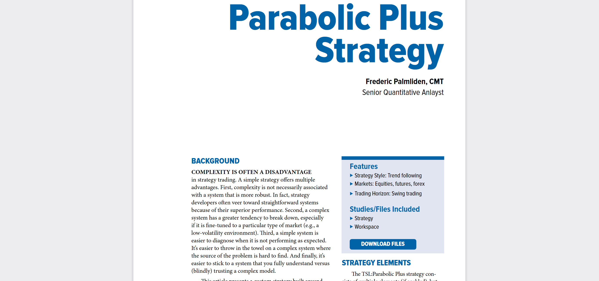
  <figcaption>Figura 190</figcaption>
</figure>

Y casualmente, casualmente, había un sistema en la revista de julio del 15 que os voy a enseñar, que os voy a enseñar y que, como digo, os entregaremos, eh. Si no, mañana, eso sí que os lo haré, porque solo lo tengo que empaquetar y ya lo estuve revisando y lo tengo que empaquetar y, pues, me lleva tampoco mucho, mucho, ya hice ese trabajo que también os voy a entregar, vale.

Que es un trabajo de analizar desde una fecha que le puse yo cargada, que era desde la fecha del *workspace*, el código mismo original, tal qué datos de rendimiento daba en el *long* y en el *short*, qué *trades* tenía y algún comentario por mi parte.

**Análisis de los sistemas del Strategy Concept**

Entonces, bueno, veréis que hay algunos, hay algunos intradiarios que están perdiendo, pero no, los tienen bastante valor. Es decir, por ejemplo, bueno, este, por ejemplo, es el *Parabolic*, que sé que vais a ver ahora, que está fantástico. Pero luego hay algún intradía con muchísimos trades que ha perdido, por ejemplo, este, que merece la pena darle una vuelta, o este, el *NeckFade*, este con 2.704.000 trades y tiene 0.96 de *Profit Factor*, merece la pena darle una vuelta porque, repito, tiene algunas sugerencias y es posible, yo creo que es probable que la ventaja sea aprovechable con un poco de trabajo, de acuerdo.

<figure>
  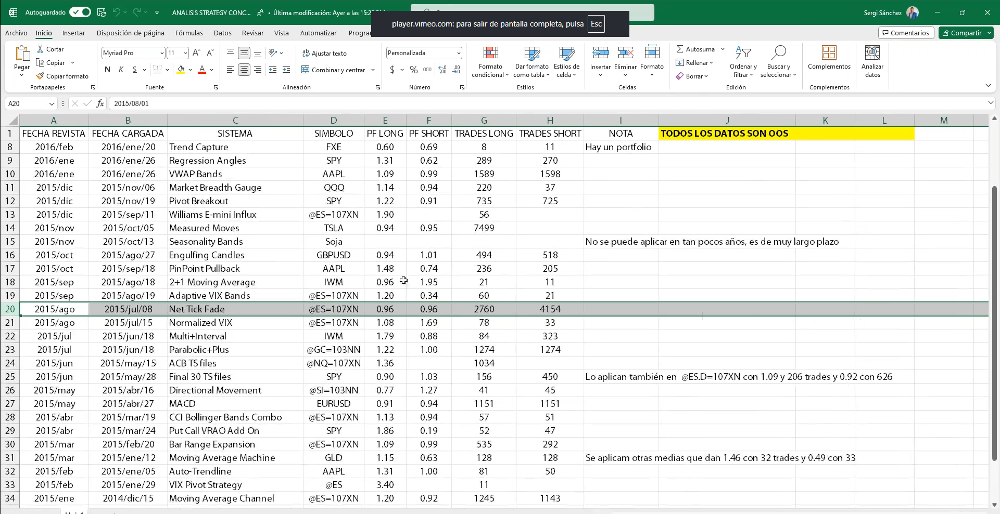
  <figcaption>Figura 001</figcaption>
</figure>

Hay varios del VIX, eso me comentaba Juan. Bueno, hay algunos que usan el VIX, no operan el VIX, operan el S&P, pero derivadas del VIX. Hay intradiarios, hay diarios de largo plazo, hay algunos muy interesantes. Este también lo tenía apuntado para enseñaros hoy, lo enseñaremos probablemente el próximo día, probablemente trabajaremos este, que es una especie de *mean reversion*, vale.

Pero ahora vamos al *Parabolic*. Esto ya lo digo, os lo entregaré. Esto me lleva bastante tiempo hacerlo, pero tiene bastante valor porque así ves un poquito por dónde van los tiros y que hay alguno que está fatal, por ejemplo, este, vale. Pero aquellos que tengan 0.90 y pico, sobre todo con muchísimos trades, caso de este:

<figure>
  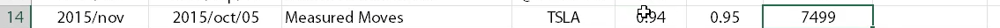
  <figcaption>Figura 002</figcaption>
</figure>

Darle una vuelta, darle una vuelta porque probablemente hay, con algún trabajo, hay muchos *stops*, por ejemplo, monetarios, ya sabéis lo que pienso. A lo mejor solucionando algunas cosas es probable que puedan funcionar, que puedan funcionar. Sobre todo repito aquellos que tienen muchísimas operaciones y que la degradación tampoco es brutal, la degradación tampoco es brutal, vale.

<div style="border-left: 4px solid #ff9800; background: #fff3e0; padding: 10px 15px; margin: 10px 0; border-radius: 8px;">
  <strong>🔍 Criterio para recuperar sistemas degradados</strong><br><br>
  Priorizar aquellos que tengan:<br>
  • <strong>Muchos trades</strong> (muestra estadística significativa)<br>
  • <strong>Profit Factor > 0.90</strong> (degradación no brutal)<br>
  • <strong>Sugerencias de mejora</strong> en la revista original<br><br>
  Posibles soluciones: cambiar <em>stops</em> monetarios por porcentuales o ATR, ajustar parámetros, añadir filtros.
</div>

**Material del sistema Parabolic Plus**

Pero alguno, sobre todo este, por ejemplo, en el oro, os digo, es tendencial y como venía al pelo para la clase, os lo voy a enseñar. Es uno de los dos que, no, no es este, debía ser julio igual, ese es:

- [2015-07/Parabolic+Plus](../docs/STRATEGY%20CONCEPTS/STRATEGY%20CONCEPTS/2015-07/Parabolic+Plus/TSL%20PARABOLIC%20PLUS.ELD)
- [TSL Parabolic Plus](../code/TSL%20Parabolic%20Plus.tsw)
- [Práctica 13](../code/PRACTICA%2013.ELD)

Ya lo tengo importado el EasyLanguage, abro el código, os lo quiero enseñar porque ya hablamos del *Parabolic*, que además os dije, os dije que me gustaba y os dije que era un indicador que originariamente el autor (J. Welles Wilder Jr.) lo había ideado para hacer un, esto va en *reverse*, esto se llama *Parabolic SAR* (Stop And Reverse).


```sh
# TradeStation Labs
# Frederic Palmliden
# June 2015
# TSLabs@TradeStation.com
  
# Parabolic Plus Custom Strategy.

Inputs:  AfStep                ( 0.01 ) , 
       AfLimit               ( 0.2 ) ,
       My_Stop_Loss          ( 2000 ) ,
       Enable_Price_Channel   ( 2 { 1 for Yes, 2 for No }) ,
       Trail_Stop_Length_LX  ( 15 ) ,
       Trail_Stop_Length_SX  ( 10 ) ,
       Enable_Volume_Filter  ( 2 { 1 for Yes, 2 for No }) ,
       Volume_Average_Length ( 5 ) ;

Variables:  oParCl            ( 0 ) , 
        oParOp            ( 0 ) , 
        oPosition         ( 0 ) , 
        oTransition       ( 0 ) ,
        VolCondition      ( False ) ,
        Volume_Identifier ( 0 ) ;

If BarType < 2 then
  Volume_Identifier = Ticks
Else
  Volume_Identifier = Volume ; 

Value1 = ParabolicSAR( AfStep, AfLimit, oParCl, oParOp, oPosition, oTransition ) ;

If Enable_Volume_Filter = 2 then
Begin
  If oPosition = -1 then
    Buy ( "ParPlus LE" ) next bar at oParOp stop ;
  If oPosition = 1 then
    Sell Short ( "ParPlus SE" ) next bar at oParOp stop ;
  
  If Enable_Price_Channel = 1 then
  Begin
    If ( MarketPosition = 1 ) and ( Low < Lowest( Low, Trail_Stop_Length_LX )[1] ) then 
      Sell ( "ParPlus LX" ) next bar at Market ;
    If ( MarketPosition = -1 ) and ( High > Highest( High, Trail_Stop_Length_SX )[1] ) then 
      BuytoCover ( "ParPlus SX" ) next bar at Market ;		
  End ;
End
Else If Enable_Volume_Filter = 1 then
Begin
  VolCondition = Volume_Identifier > average( Volume_Identifier, Volume_Average_Length ) ;
  If ( oPosition = -1 ) and VolCondition then
    Buy ( "ParPlus Vol LE" ) next bar at oParOp stop ;
  If ( oPosition = 1 ) and VolCondition then
    Sell Short ( "ParPlus Vol SE" ) next bar at oParOp stop ;
  
  If Enable_Price_Channel = 1 then
  Begin
    If ( MarketPosition = 1 ) and ( Low < Lowest( Low, Trail_Stop_Length_LX )[1] ) then 
      Sell ( "ParPlus Vol LX" ) next bar at Market ;
    If ( MarketPosition = -1 ) and ( High > Highest( High, Trail_Stop_Length_SX )[1] ) then 
      BuytoCover ( "ParPlus Vol SX" ) next bar at Market ;		
  End ;
End ;

SetStopPosition ;
SetStopLoss( My_Stop_Loss ) ;	
  
# Copyright (c) 2015 TradeStation Technologies, Inc. All rights reserved.  
```

<div style="border-left: 4px solid #3498db; background: #ebf5fb; padding: 10px 15px; margin: 10px 0;">
  <strong>📚 Sobre el Parabolic SAR</strong><br>
  El <em>Parabolic SAR</em> (Stop And Reverse) fue desarrollado por J. Welles Wilder Jr. y presentado en su libro "New Concepts in Technical Trading Systems" (1978). Es un indicador de seguimiento de tendencia que proporciona puntos potenciales de entrada y salida. El "SAR" significa que cuando el precio toca el indicador, se invierte la posición (de largo a corto o viceversa).
</div>


Acordaros que os comenté de la ayuda, ahí lo tenéis explicado. Aquí si no, la mejor manera de ir es desde los indicadores desde aquí, pero si no desde el EasyLanguage, aquí tenéis en *Help*, tenéis aquí *Studies and Strategies* y aquí están todos, vale. Aquí están todos los indicadores, las estrategias. Tú le pones aquí *Parabolic* y te va a salir el indicador, la estrategia, te va a salir todo lo que hay, ves: *Parabolic Long Entry*, *Short Entry*, indicador, la función, etcétera, etcétera, distintas opciones. Y además normalmente, normalmente viene explicado, vale. Algunos más que otros, pero normalmente viene explicado y comentado y demás, vale.

Está bien el autor que es Wilder (J. Welles Wilder Jr.), ya lo hablamos de él, vale. Entonces él siempre lo relató, lo explicó como un mecanismo de giro basado en tiempo y precio que acelera y que hace esto para el revés. Bueno, pues este sistema se basa en él y es bastante original, es decir, creo que tenía, si no recuerdo mal, pocas variaciones respecto a la idea original, aplicado a un activo tendencial.

**Cargando el sistema en oro**

Espera, voy a cargar directamente el GC (Gold Futures) porque va a ir más rápido, vale. Le vamos a cargar, bueno, hasta ahora, *Change*, bueno, del 2010, pues 2010, no da igual, seguramente con el GC lo tengo en el caché y abrirá rápido.

<figure>
  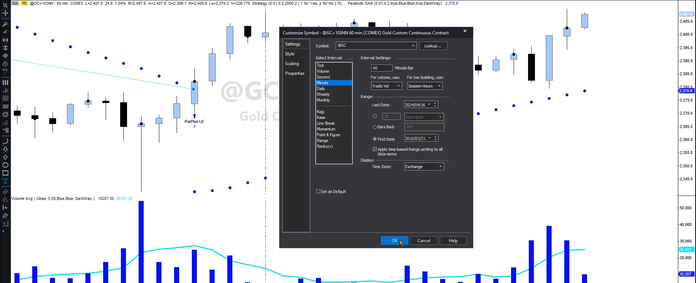
  <figcaption>Figura 003</figcaption>
</figure>

Y aquí está el sistema, que no se ve porque este es el original suyo, que es lo que vamos a hacer, entregaros el material original. Pero voy a pintar las flechitas. Él ha ideado unos filtros pero están desactivados.

<figure>
  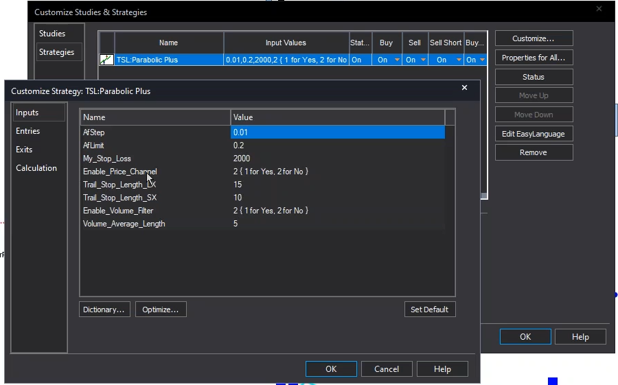
  <figcaption>Figura 004</figcaption>
</figure>

Cambio colores:

<figure>
  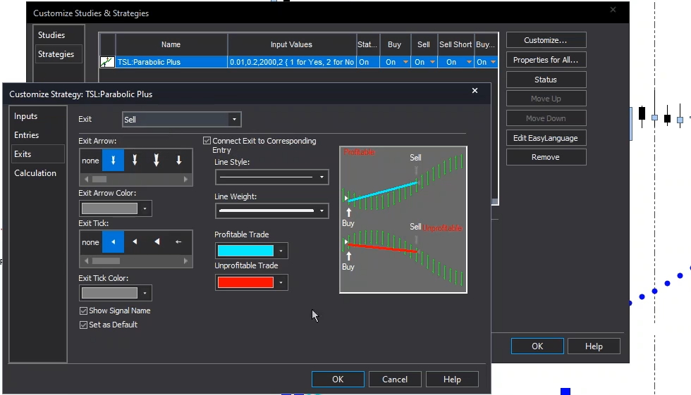
  <figcaption>Figura 192</figcaption>
</figure>

Están desactivados, filtros en mi opinión bastante pobres. Nuevamente *stop* de 2000, aunque es verdad que el oro, el oro no es uno de esos activos donde más se nota cambiar de porcentaje o no, vale.

Es decir, está bien porque al final, como habéis visto, el rango mayor lo tocó hace mucho tiempo. Sí que ha variado mucho de precio pero comparativamente no como el Nasdaq, dependiendo de cuánto vayamos atrás, pero en términos generales la variación porcentual no es tan elevada y por eso al final pues puede aceptar *StopLoss* monetarios, aunque ya digo que en caso de dudas siempre usar ajustados por volatilidad, vale.

Bueno, es igual, aquí ya vemos las líneas un poco más. Casi que espérate que te las voy a poner porque es que esto yo sé por experiencia que luego se ve mucho peor por el vídeo. Así en blanco siempre es mejor que este oscurito, ¿no? Entonces yo creo que ahí ahora se nos va a ver un poco mejor todo, vale.

**Funcionamiento del sistema**

Entonces esto está, como habéis actualizado, ahora mismo está largo porque esto hace *stop and reverse*, es decir, está todo el tiempo en el mercado excepto cuando salta el *stop loss*. Parece que 2000 dólares ahora es un poquito justo, por lo que veo, pero ahora sí no salta tanto tampoco, mirad que no va saltando tanto, pero sí que es un poquito justo. El indicador, estas líneas azules que veis, es el *Parabolic*, de acuerdo. Es el *Parabolic* que va, como veis, pegándose a la tendencia, vale.

<figure>
  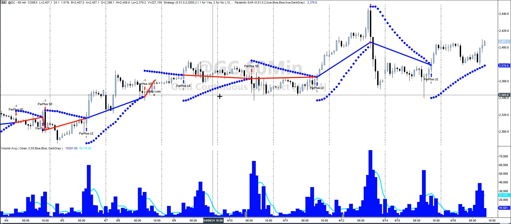
  <figcaption>Figura 005</figcaption>
</figure>

Bueno, el sistema no va nada mal, el sistema no va nada mal. Teniendo en cuenta, repito, que es un sistema que estaba en la revista de mayo de junio de 2015, es decir, hace pues ya nueve años prácticamente que se emitió esta revista. Y lo he abierto original y que además usa el *Parabolic* prácticamente virgen, es decir, prácticamente no tienen nada distinto, de acuerdo.

<figure>
  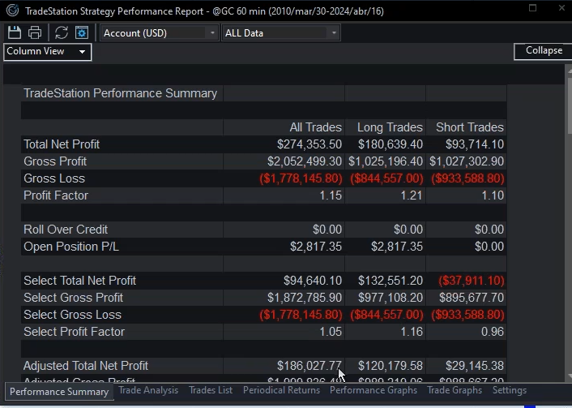
  <figcaption>Figura 008</figcaption>
</figure>

Esto es el sistema al uso del *Parabolic*. Si lo metéis vosotros en el oro, que está, como os he dicho, ahora lo podemos probar, y al final pues es un sistema que, como es un activo tendencial, suele ir bastante bien, vale.

<figure>
  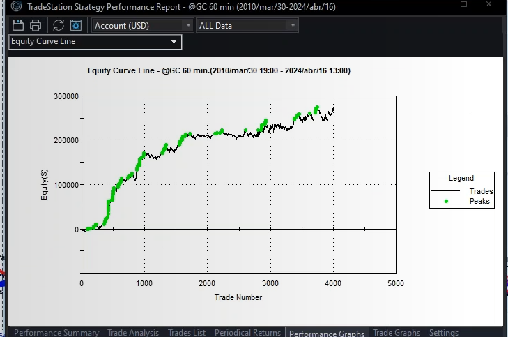
  <figcaption>Figura 007</figcaption>
</figure>

Yo le regularía el *stop*. Ya habéis visto la curva que no está mal. Es verdad que lleva unos años bastante planos, pero eso es, el oro estaba así, es lo que hablábamos antes. Aun así pues ha aguantado bien, es decir, la verdad que estos *drawdowns* así pues son bastante tendidos, son agradecidos, digamos, no son *drawdowns* muy profundos y son bastante llevaderos, podemos decir, vale.

<figure>
  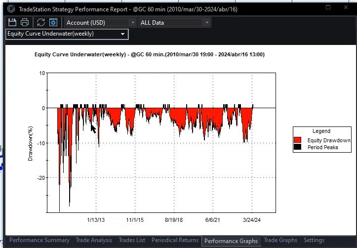
  <figcaption>Figura 009</figcaption>
</figure>

**Elementos precreados de TradeStation**

Pero ya digo que esto no tiene simplemente el *Parabolic* directamente metido. Esto, como os digo para los que estáis iniciando, esto estaba en 60 minutos. Recordad aprovechar también todos estos elementos precreados que os facilita TradeStation, vale.

<figure>
  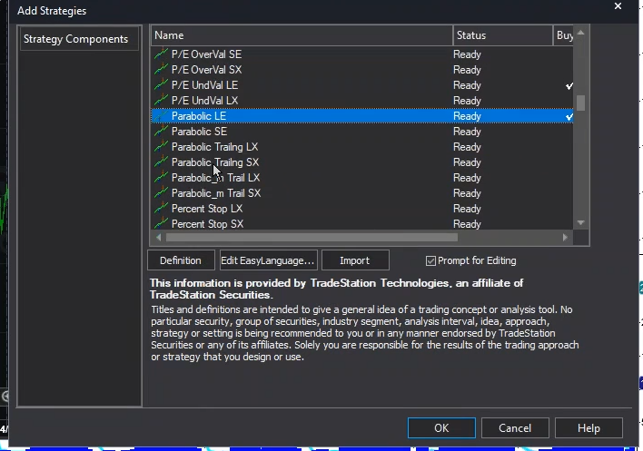
  <figcaption>Figura 010</figcaption>
</figure>

*Parabolic Long Entry*, *Parabolic Short Entry*, de acuerdo. Todo lo que acaba en *entry*, todo lo que acaba en *exit*, de acuerdo.

Entonces tú puedes usar el *Parabolic Long Entry*, le pones a aceptar, no tocas nada y vais a ver que era básicamente lo que estaba haciendo ahí, básicamente lo que estaba haciendo ahí. Veréis que los trades creo que no había ninguna optimización, no lo he mirado pero me parece recordar que no. Ahora había alguna, pero ahora que yo recuerde simplemente con el *stop* este sí que parece que tiene alguna pequeña diferencia, ¿no?

<figure>
  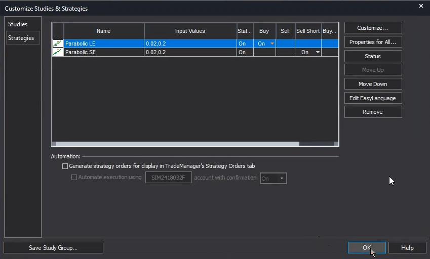
  <figcaption>Figura 011</figcaption>
</figure>
<figure>
  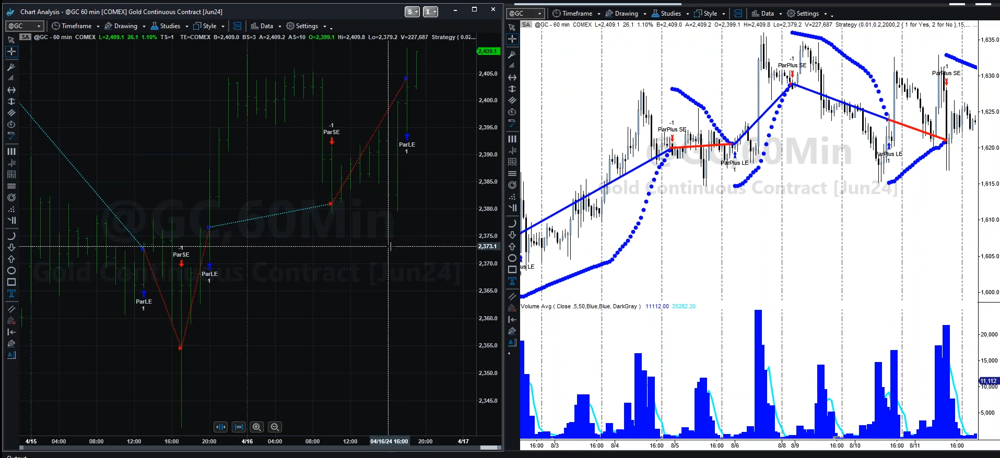
  <figcaption>Figura 012</figcaption>
</figure>

Igual tenía alguna, no lo recuerdo. Lo miramos en el código rápido. El *Parabolic* es normal, *nextbar*, compro el *Parabolic stop*, es el *short*. Bueno, tiene un *trailing*, vale. Tiene un *trailing*, veo aquí. Ah bueno, pero solo cuando activa el, no, no, si no lo activa, no, si no lo activa, no, pues debería ir igual. No sé por qué. A 0.01, 0.02, vale, porque está en 0.01 creo. Por defecto lo pusieron más sensible, vale, lo pusieron más sensible, vale, para el oro.

Exacto, ves, está en 0.02, lo pusieron un poquito más sensible. Lo vamos a poner en 0.01, que es como está en el sistema y vais a ver que es lo mismo.

<figure>
  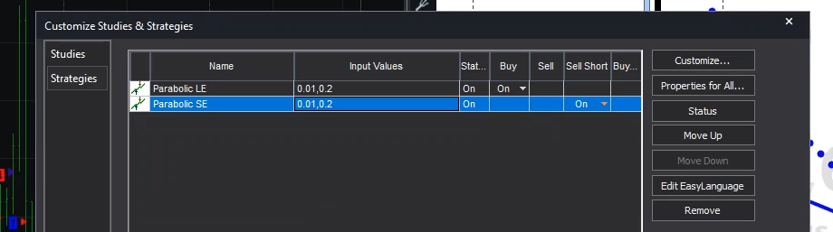
  <figcaption>Figura 013</figcaption>
</figure>
<figure>
  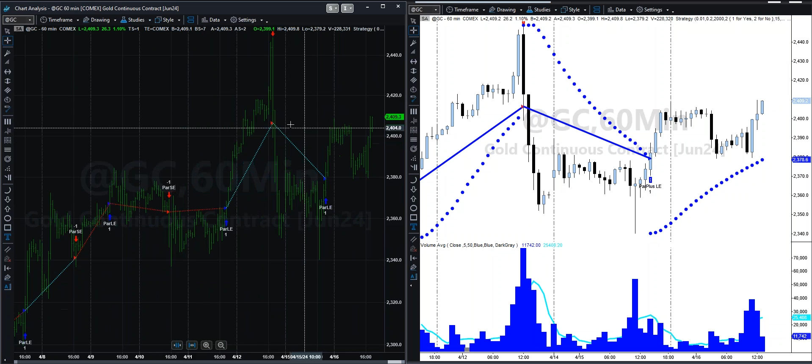
  <figcaption>Figura 014</figcaption>
</figure>

<div style="border-left: 4px solid #4caf50; background: #e8f5e9; padding: 10px 15px; margin: 10px 0; border-radius: 8px;">
  <strong>💡 Reflexión sobre la búsqueda de ideas</strong><br><br>
  Porque es que, es que era esto, vale. Esto a veces hablamos de: "Oh, qué complicado buscar ideas y necesito gastarme 4000 euros en comprar la <em>Strategy One</em>, porque es imposible encontrar ideas, no sé cómo". Pues mira, aquí tienes una idea la mar de sencilla, ahí lo tienes.<br><br>
  Que se puede mejorar, sí, claro que se puede mejorar, se puede filtrar, se le pueden buscar salidas. Pero ya veis que es un sistema que incluso solo eso, elemento precreado de TradeStation metido a grosso modo, sin <em>stop</em>, sin nada, pues está ganando.
</div>

<figure>
  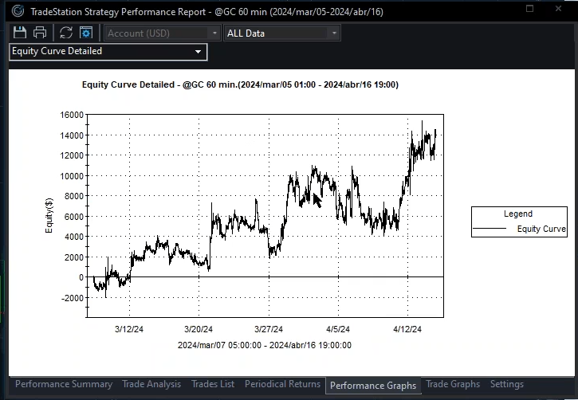
  <figcaption>Figura 015</figcaption>
</figure>

Está ganando poco, está justito, pero queda la sensación de que en el largo plazo, pues como veis, obtiene retorno positivo simplemente usando el *Parabolic*, porque es un activo que en sí tiene una base bastante tendencial. Es verdad que pasa por periodos laterales, pero cuando aguza tendencia tira mucho y entonces compensa. Esa es un poco la clave.

Y ya está, esto como os digo os lo daremos. Todo este material creo que tiene mucho valor y os recomiendo encarecidamente leer la revista de todos, poco a poco, empezáis por el principio, con calma, y ya digo que es bastante interesante.

**STAD vs Strategy Concepts**

Este es realmente el de STAD. Para aquel que esté iniciando, que se esté iniciando en el *trading* algorítmico prácticamente con el curso o casi, es recomendable leerlo porque tiene bastante teoría también de mercados. Viene el rollo dosier, cien páginas cada uno y tal, y va explicando cosas y luego pone ejemplos. Desde ese punto de vista está muy bien, está muy bien, ni que sea, incluso el que tenga experiencia, yo recomiendo hacer una lectura diagonal. Es decir, bueno, lo abro, lo miro, por si ves que es lo que explica, pues no te interesa, da igual.

Este en cambio es muy técnico, este es muy técnico. Este ya es para, pero por eso yo creo que para todos los que ya vayáis, estáis ya pues acabando el curso, os puede aportar mucho valor. Este puede aportar muchísimo, muchísimo valor trabajarlos, y además viene con los *workspaces*, con esto que habéis visto. Que no solo importéis, sino que los leáis, leerlos porque es importante lo que explica, porque al final ellos lo plantean como ideas. Cuando enseñen las curvas está muy bien, pero lo plantean como ejercicios de trabajo.

<div style="border-left: 4px solid #2196f3; background: #e3f2fd; padding: 10px 15px; margin: 10px 0; border-radius: 8px;">
  <strong>📚 Comparativa: STAD vs Strategy Concepts</strong><br><br>
  <strong>STAD (Stocks & Commodities):</strong><br>
  • Más teórico, explica conceptos de mercados<br>
  • Dosiers de ~100 páginas con teoría + ejemplos<br>
  • Recomendado para iniciantes o lectura diagonal<br><br>
  <strong>Strategy Concepts (TradeStation):</strong><br>
  • Muy técnico y práctico<br>
  • Sistemas completos con código + workspace<br>
  • Recomendado para nivel avanzado<br>
  • <strong>Importante:</strong> Leer la revista, no solo importar el código
</div>

## Aplicación de sistemas tendenciales en el oro

Bien, vamos al oro, vamos al otro sistema tendencial de base, que hemos hecho aquí. Hemos dicho, oye, ¿cuál es el indicador tendencial por excelencia? Yo creo que todo el mundo respondería las *medias móviles*. Pues vamos a usar las medias móviles, que pocas cosas más simples hay que unas medias móviles.

Bien, la pregunta del millón: si buscáis por internet qué medias móviles usar en trading algorítmico, saldrán 748 artículos, porque siempre es un eterno debate, ¿qué medias uso? Y os recomendé, ahí os comenté que nosotros nos solemos decantar por *simples*, pero que estamos abiertos a estudiarlo y hemos aprovechado este ejercicio para hacerlo.

**Implementación con switch-case**

¿Cómo podemos hacer esto? Bueno, pues la manera más sencilla es un poco del mismo modo que abordamos las salidas. Como veis, están aquí metidas:

<figure>
  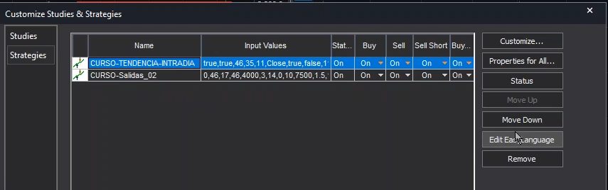
  <figcaption>Figura 016</figcaption>
</figure>

Porque las usamos para este ejercicio, es decir, plantear distintas alternativas. Esto en EasyLanguage se puede hacer con estructuras *if-then*, pero se hace muy fácil con la *switch*, con el *switch case*.

```sh
TP = TypicalPrice;
switch (media) 
Begin
	case 1:  # Medias simples
	case 2:  # Medias exponenciales
	case 3:  # Kama
	case 4:  # Fama + Mama
	case 5:  # Simple + Exponencial
	case 6:  # Simple + Kama
	case 7:  # Simple + Mama
	case 8:  # Exponencial + Simple
	case 9: 
	case 10: # Exponencial + Mama 
	case 11: # Kama + Simple
	case 12: # Kama + Exponencial
	case 13: # Kama + Mama
	case 14: # Fama + Simple
	case 15: # Fama + Exponencial
	case 16: # Fama + Kama 
	case 17: # Simple + Fama 
	case 18: # Exponencial + Fama
	case 19: # Kama + Fama
end;
```

¿Por qué? Porque, ves, yo aquí ahora lo dejo todo comprimido dentro de este *begin-end* y queda ahí de coña, cerradito con la media que yo haya escogido. Le pongo un *input* que es la media, y con eso elijo el tipo de media.

```sh
{ Variables }
inputs: 
		media( 1 ),
```

Si vale uno, *case 1*; si vale 2, *case 2*; si vale 3, *case 3*; si vale 4, *case 4*. Y ahí hemos ido metiendo medias a saco, a saco. Es decir, un poco sin sentido casi, es decir, por supuesto hemos metido las más razonables o las más típicas, pero hemos ido ya, ya que estábamos, ya que estábamos, hemos ido viniéndonos arriba.

**Tipos de medias disponibles**

Y os recomiendo buscar información sobre ellas porque si me paro a explicároslas todas, pues vamos a tardar mucho. Recordad también en EasyLanguage que podéis abrir las funciones, podéis ir a las definiciones si son funciones suyas, que hay algunas que no son suyas y por lo tanto no estarán, pero esta sí lo es, la MAMA. La MAMA y la FAMA son medias de MESA, que era un software muy, muy famoso, que se hicieron bastante populares en una época, son del tipo *adaptativas*.

<div style="border-left: 4px solid #9c27b0; background: #f3e5f5; padding: 10px 15px; margin: 10px 0; border-radius: 8px;">
  <strong>📊 Medias adaptativas implementadas</strong><br><br>
  • <strong>MAMA/FAMA</strong> (MESA Adaptive Moving Average) → Desarrolladas por John Ehlers con su software MESA<br>
  • <strong>KAMA</strong> (Kaufman Adaptive Moving Average) → Creada por Perry J. Kaufman, ajusta sensibilidad según volatilidad<br>
  • <strong>Xaverage</strong> → Media exponencial con coeficiente adicional<br><br>
  Las adaptativas ajustan su velocidad según las condiciones del mercado, reduciendo señales falsas en laterales.
</div>

Yo os hablé un poco de ellas, yo os hablé que me gusta mucho la KAMA, que es la que viene antes, Kaufman Moving Average. Esta no sé si es suya o no, esta está sacada del libro, pero creo que estaba la KAMA también, pero hemos usado la original de Kaufman.

Ya que el que la quiera se la paso, si no encontrará mucha, ¿eh? Kaufman buscándola en los foros. No, va a seguir, tampoco hay nada de Kaufman, pues nada, pues no está la KAMA, pues nada. Aquí la estáis viendo ahora, este es el original de Kaufman (Perry Kaufman, autor de *Trading Systems and Methods*), de hecho viene con el libro y es fácil de encontrar. Recordad los foros de TradeStation, tras ahí los foros, buscáis, hay 700 páginas, bando de KAMA y cualquier cosa. Es decir, los foros de TradeStation son extremadamente útiles porque son solo de clientes.

Claro, es que ahora ya hablo un poco más de código porque vamos avanzando. Insisto que el código es una herramienta, pero es una herramienta que hay que usar. Que no sea lo más importante, no quiere decir que no haya que usarla. Entonces el KAMA es otra media adaptativa, simplemente otra media adaptativa, vamos a enseñar el gráfico.

La MAMA y FAMA que vienen de esta función, ya os lo he comentado, era de MESA (John Ehlers). Y luego pues tienes la *Xaverage*. Por cierto, hay otra *Xaverage* que es *Xaverage original*, que simplemente una está más, la exponencial tiene como un coeficiente, una está más acercada que la otra. Bueno, yo por defecto uso esta, pero están las dos.

Y luego hemos ido mezclando *simple* con *exponencial*, *simple* con KAMA, *simple* con MAMA, *exponencial* con *simple*, *simple* con *exponencial*, un poco ahí, como os digo, dándole vueltas a todo. Porque al final esto una vez está puesto no cuesta nada, es decir, esto está hecho y puedes meter medias. Tienes aquí 19 medias, 19 cruces de medias, que simplemente se controlan con este *input*. Si yo pongo uno uso *simple*, si pongo dos uso *exponenciales*, si pongo tres uso KAMA, si pongo cuatro FAMA más MAMA, etcétera, etcétera. De esta manera controlo un poco todo esto.

**Opciones adicionales del sistema**

También hemos implementado la posibilidad de que sea cruce o no, que sea simplemente que la media sea mayor.

```sh
if senyalencruce then # En caso de usar una señal que necesite confirmación hay que ponerlo en False
Begin
	Cond_Long = Fast crosses over Slow; 
	Cond_Shrt = Fast crosses under Slow; 
End Else
begin
	Cond_Long = Fast > Slow;
	Cond_Shrt = Fast < Slow;
end;
```

Esto cuando hay salidas es importante, normalmente es mejor con cruce, yo lo he trabajado así, pero bueno, hemos dejado la opción, pero ni he valorado otra cosa. Y bueno, pues ya está. Hay distintos filtros de volatilidad, porque hay un Donchian implementado también, hay un Donchian implementado para, en caso de que además del cruce de medias se quiera usar un Donchian. Un Donchian es un canal, es decir, que una vez cruzado, además yo le exija superar unos máximos. De momento no lo he implementado, lo dejo como un filtro.

Y bueno, esta es la versión 1. Espérate, tengo la, aquí tengo la 2 metida, no, no la tengo la 2 metida, aquí no he metido la 2 aún. Bueno, pues ahora la meto, la tengo en el, la tengo metida en el otro. Lo que pasa es que si, bueno, me da igual, me da igual porque eso lo tengo todo guardado, esto lo tengo todo guardado.

<figure>
  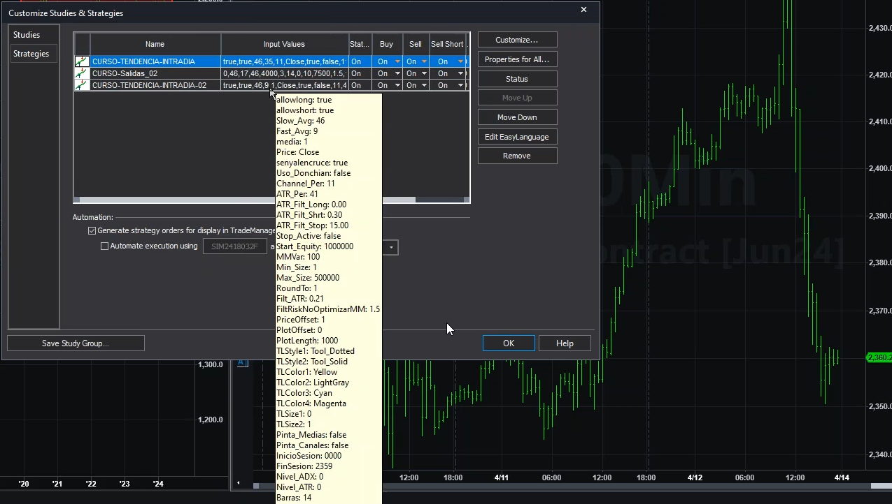
  <figcaption>Figura 018</figcaption>
</figure>

Aquí meto, a ver, la del curso, entraría a la 02, aunque no sé si lo tengo bien con parámetros. Bueno, me da igual, como luego lo voy a, luego lo voy a meter, me da igual, lo dejo así por defecto. A ver que esté, como digo, hay *inputs* para si quiero activar largos o cortos. Esto está pensado más para MultiCharts, porque aquí puedo hacerlo de otra manera. La media, *slow* y *fast*, que ahora os explico una cosa. La media, qué campo uso, el cruce, si hay Donchian, si hay Donchian, todos estos son de Donchian, pero no sé, no se usa de momento.

Lo mismo si quiero esto, nuestro monetario típico puesto ahí por ATR clásico. Esto lo ponemos siempre nosotros por defecto, si no quiero activarlo activo, si no, no activo, pero como vamos a probar las salidas, pues lo he dejado desactivado. Y el *money management*, que aquí lo hemos desactivado, porque en el oro eso que os decía, se puede trabajar bien desactivado y lo hemos dejado desactivado.

<figure>
  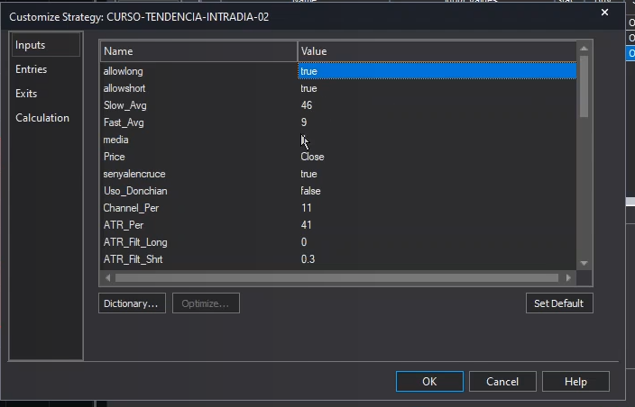
  <figcaption>Figura 019</figcaption>
</figure>
<figure>
  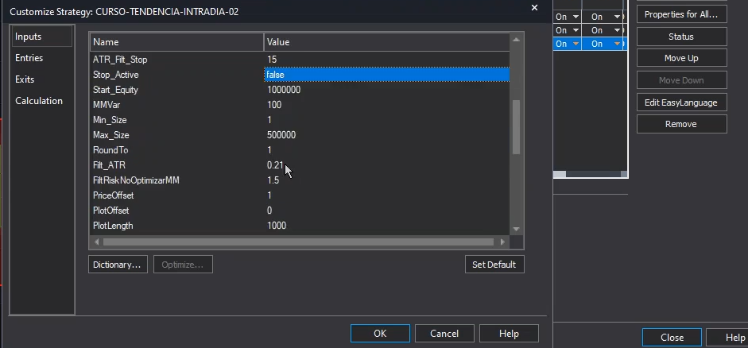
  <figcaption>Figura 020</figcaption>
</figure>

**Pintado de medias desde la estrategia**

Y luego hay una cosa bastante interesante y bastante avanzada, y que sí que esto no lo vamos a explicar, porque es el hecho de poder pintar a través de una estrategia. Esto en principio en EasyLanguage no se puede hacer por defecto, es decir, solo puede pintar un indicador. Hay lenguajes que permiten que una estrategia pinte en el gráfico, pero mediante objetos se puede hacer. Aquí tenemos un código que lo hace, de tal manera que viene muy bien para ver las medias. Ya no os lo voy a activar para hacer eso.

<figure>
  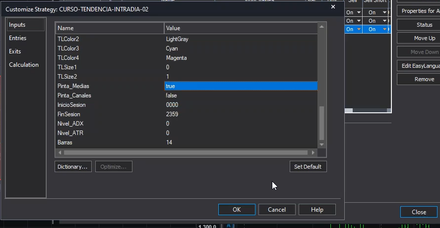
  <figcaption>Figura 021</figcaption>
</figure>

También hay filtros de horarios, pero no lo hemos activado, y los filtros de volatilidad, que de momento no están activados. Estas barras, que es Alberto, que no me acuerdo, al final de todo barras, para la ADX y la TR, podríamos haber usado el de arriba. Vale, ok, ok. Esto lo dejo así, ahora le he puesto que pinte, y ahí vais a ver que automáticamente cuando acabe, claro, le va a costar un poco más, pinta las medias. Estas medias me las está pintando el propio sistema.

<figure>
  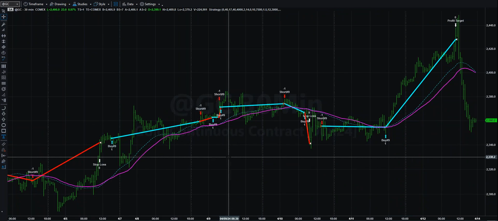
  <figcaption>Figura 022</figcaption>
</figure>

Esto porque viene bien. Esto consume muchos recursos y además a veces si le vas cambiando acaba *bugueando* el ordenador, pero para hacer esto que vamos a hacer ahora viene muy bien, porque simplemente cambiando el *input*, cambiando la media, me la va a cambiar.


**Truco de vinculación de medias**

Y yo, pues bueno, quiero ahora enseñaros alguna. Antes que nada, siempre un consejo: siempre que uséis un sistema de medias, en este caso de cruce de medias, os recomiendo encarecidamente usar un truco en el código que consiste simplemente en vincular una con otra. Aquí lo hemos hecho con la `slow`. Hemos fijado la *slow*, y a la *fast* le restamos, o sea, a ver, empiezo por el principio.

```sh
switch (media) 
Begin
	case 1: #  Medias simples
		Fast = AverageFC (Price, Slow_Avg-Fast_Avg);
		Slow = AverageFC (Price, Slow_Avg);
		
	case 2: #  Medias exponenciales
		Fast = XAverage (Price, Slow_Avg-Fast_Avg);
		Slow = XAverage (Price, Slow_Avg);
		
	case 3: #  Kama
		Fast = Kama (Slow_Avg-Fast_Avg);
		Slow = Kama (Slow_Avg);
		
	case 4: #  Fama + Mama
		variables:	
			int ReturnValue( 0 ),
			double oMAMA( 0 ),
			double oFAMA( 0 );
		ReturnValue = MamaBase( Price, 0.5, 0.05, 0.5, oMAMA, oFAMA );
		Fast = oFama;
		Slow = oMama;
		
	case 5: #  Simple + Exponencial
		Fast = AverageFC (Price, Slow_Avg-Fast_Avg);
		Slow = XAverage (Price, Slow_Avg);
  ...
  ...
  ...
```

Yo en el código, en *inputs*, tengo dos valores para la media, un *slow average* y un *fast average*:

```sh
inputs: 
		Slow_Avg ( 46 ),
		Fast_Avg ( 9),
```

Que son las medias, pero eso no es la media realmente que yo pinto en el gráfico. La *slow* sí que es la que pinto en el gráfico, le pongo 46, ahora os explicaré por qué, y veis que cuando hago el cálculo de cualquiera de las *slow*, efectivamente como periodo le paso el *slow*: `Slow = AverageFC (Price, Slow_Avg);`.

En cambio la *fast*, cuando yo calculo la media *fast*, la calcule como la calcule para los distintos *case* que hay, no le paso el parámetro de la *fast*, le paso el periodo, perdón, para ser más exacto, de la *slow* menos la *fast*: `Fast = AverageFC (Price, Slow_Avg-Fast_Avg);`.

<div style="border-left: 4px solid #2196f3; background: #e3f2fd; padding: 10px 15px; margin: 10px 0; border-radius: 8px;">
  <strong>🔧 Técnica de vinculación de medias</strong><br><br>
  <strong>Problema:</strong> Al optimizar dos medias independientes (ej: fast 10-20, slow 10-20), se generan combinaciones absurdas donde fast > slow.<br><br>
  <strong>Solución:</strong> Definir <code>Fast = Slow_Avg - Fast_Avg</code><br><br>
  <strong>Ejemplo:</strong> Con Slow_Avg=46 y Fast_Avg=9 → La media rápida real es 46-9=37<br>
  Si Fast_Avg=45 → La media rápida real es 46-45=1 (el cierre)<br><br>
  Esto garantiza que la <em>fast</em> siempre sea menor que la <em>slow</em>.
</div>

De tal manera que en esta configuración que veis aquí de 46 y 9, las medias que realmente están en el gráfico y usa el sistema para operar son la 46 como *slow* y como *fast* usa 46 menos 9, es decir, 37, perdón, 37, para ver si estabais atentos. Entonces, de tal manera que si yo le pongo 45 es la 1.

<figure>
  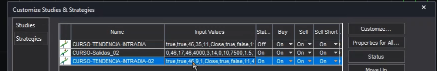
  <figcaption>Figura 023</figcaption>
</figure>
<figure>
  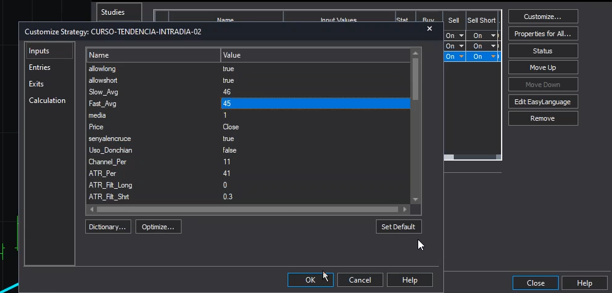
  <figcaption>Figura 024</figcaption>
</figure>

Lo vais a ver ahora, yo le voy a poner ahora solo para que lo veáis, estoy ahora con el 2, le voy a poner al *fast* 45 y vais a ver que me va a pintar la media de 1. Va a tardar un poco porque esto es así. Esto simplemente es para facilitar los procesos de *optimización* de iteración, porque si no duplico medias y hago medias absurdas, porque si pongo la *fast* 20 y al *slow* 30, me entiendes, o si optimizo 10 a 20, 10 a 20, cruzo medias que son absurdas.

Pinta la media verde que es la 1, la que va entre las velas en el cierre:

<figure>
  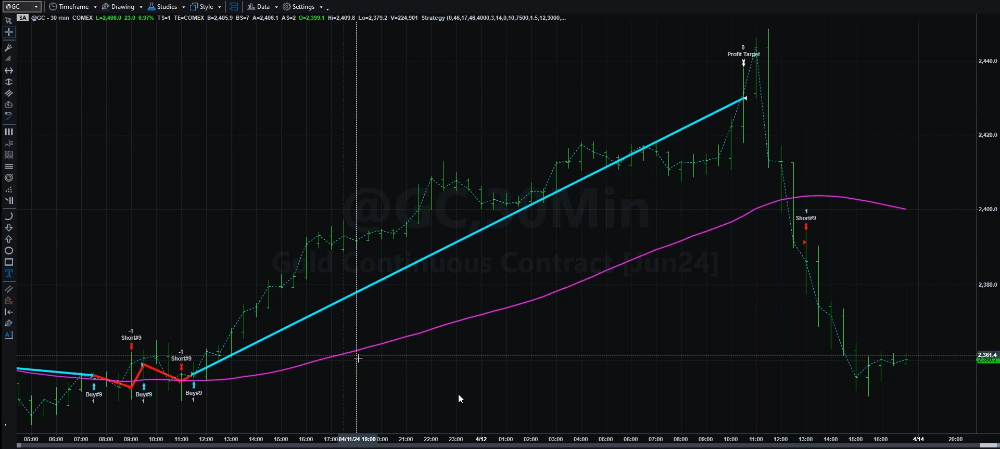
  <figcaption>Figura 025</figcaption>
</figure>

De esta manera veis ahora que la ha pintado aquí la 1, esta la ha dejado igual y esta es la 1. Y el sistema ahora está operando con eso, con la 1, que es lo mismo que no tener media. Es el cierre, la media de 1, simple, claro, es el cierre, es el cierre. Entonces de esta manera yo mejoro mi proceso de eficiencia.

**Selección de periodos con sentido de mercado**

¿Cómo hemos planteado este sistema? De entrada, en un sistema intradiario, cuando uno trabaja en un sistema de medias, en barras diarias, siempre se recomienda usar períodos que tengan que ver con alguna pauta del mercado. Por ejemplo, pues unas semanas sabemos que son cinco días de mercado, por ejemplo, sabemos que un mes son 22 días, sabemos que un año son 250 más o menos laborables y podemos hacer por ahí, o que sea un trimestre, un cuatrimestre, entendéis un poco la idea, ¿no? O la mitad de un trimestre, es decir, podemos hacer cálculos.

Pero es recomendable porque al final una media no deja de ser un *ciclo*, una media es una de las maneras más sencillas que hay de eliminar el ruido. Simplemente yo trato de dibujar la tendencia de ese mercado agrupando valores en ellos, por lo tanto trato de esta manera aprovecharme de esas tendencias. En este caso lo hacemos con dos medias, como os decía.

Y que ahora mismo son *simples*, porque yo he elegido la 46. Bueno, porque en intradía esto que os digo de los períodos recurrentes es un poco más complicado. Y nosotros de entrada partimos de la hipótesis de usar como lenta la media de una sesión, una sesión. En este caso en 30 minutos una sesión son justamente 46 velas. Podría usar otras, sí, podría usar otras, pero hemos partido con esta hipótesis de trabajo. Entonces hemos permitido optimizar la *fast* y el tipo de media para hacer este estudio que os digo, que ahora lo vamos a enseñar, pero he bloqueado la *slow* en 46, que es la que veis granate lila, porque insisto eso es la media de una sesión, una sesión, 46 velas.

<figure>
  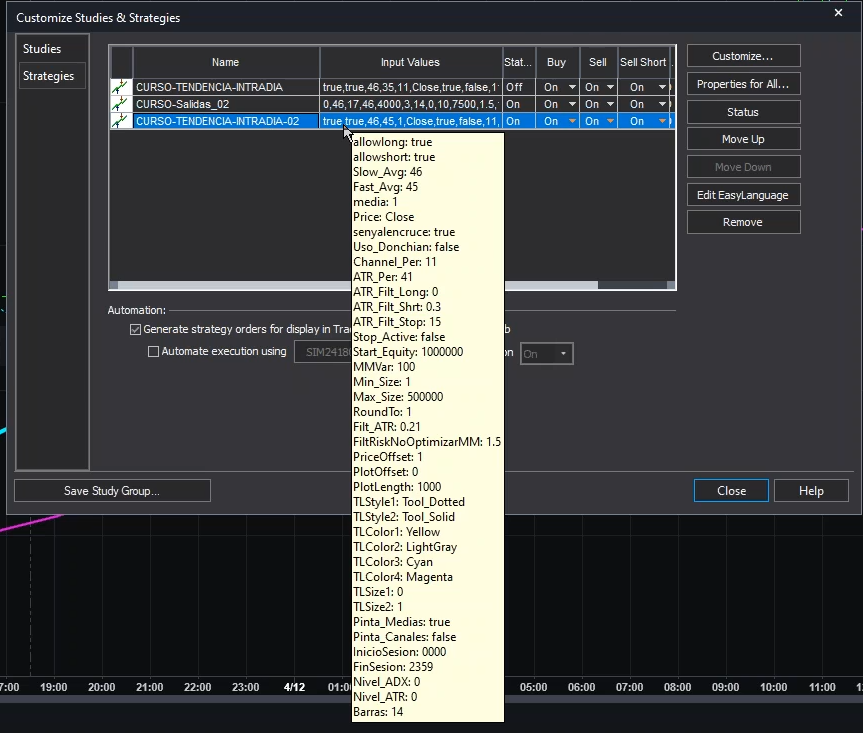
  <figcaption>Figura 026</figcaption>
</figure>

**Análisis de optimización de medias**

Bien, vamos a ver estos primeros estudios de las medias, vamos a ver primero estos estudios de las medias. El sistema en sí no tiene nada más, perdón, antes para acabar de explicar. El sistema, como os digo, por repasarlo, luego hablaremos de los filtros pero ahora mismo no me importan.

El núcleo principal del sistema es un cruce de medias que, como veis o como os he dicho, puede valer por muchos y es un simple cruce. Cuando hay cruces, la señal que desencadena la posibilidad de comprar, que es con *long* y con *short*, no es más que la rápida cruza por encima de la lenta y viceversa para el lado corto.


```sh
TP = TypicalPrice;
switch (media) 
Begin ... end;

if senyalencruce then # En caso de usar una señal que necesite confirmación hay que ponerlo en False
Begin
	Cond_Long = Fast crosses over Slow; 
	Cond_Shrt = Fast crosses under Slow; 
End Else
begin
	Cond_Long = Fast > Slow;
	Cond_Shrt = Fast < Slow;
end;

...
...

{ Orders }
If Cond_Long then 
begin 
	if allowshort then 
	begin
		If Marketposition = -1 then
			Buytocover next bar at market;
	end;
	#Calculamos los máximos y mínimos en el momento del cruce de medias}
	#La variable Hay precio sirve para actualizar el canal cuando salta el stop
	
	If Uso_Donchian and (Fast cross over Slow or not hayPrecio) then 
	Begin
		Channel_Up = HighestFC (High, Channel_Per);
		hayPrecio = true;
	end;
	
	if allowlong and estamosEnSesion(InicioSesion, FinSesion) and Curso_Filtros(+FiltroY,Nivel_ADX,Nivel_ATR, Nivel_Stddev, Barras, Rango1, Rango2) and not Curso_Filtros(+FiltroN,Nivel_ADX,Nivel_ATR, Nivel_Stddev, Barras, Rango1, Rango2) then
	begin		
		If Marketposition <> 1 then
		begin
			If Uso_Donchian Then
			Begin
				Price_Long = Channel_Up + ATR_Long;
				Buy lotes contracts next bar at Price_Long stop;
			end Else
				Buy lotes contracts next bar at market;
		end else
			hayPrecio = false;
	end;
End;

If Cond_Shrt then
begin ... End;

...
...
```

Y a partir de ahí simplemente el código para desencadenar las órdenes es: si *con long is true*, es decir, si ha habido un cruce. Aquí implemento la salida al lado contrario porque evidentemente si yo he cortado al lado largo le implemento esto. Esto es por si yo tengo inhabilitadas, si no hago *stop and reverse*, que lo he pensado así por eso lo he puesto. Porque si hago *stop and reverse*, como habéis visto antes con el *Parabolic*, entre abrir largos y abrir cortos ya cierra en el otro lado. No es obligatorio pero es buena práctica hacerlo, es buena práctica hacerlo porque así yo permito al sistema salir sin necesidad de entrar, aunque en este caso la condición sea la misma podría no serlo, podría no serlo.

Aquí habilito la posibilidad de que si uso *Donchian*, que lo tengo en *false*, pues lógicamente implemento, calculo el canal y todo esto. Y aquí hay un tema ahora que no iré a cuento simplemente por evitar lecturas falsas y temas de programación que ahora mismo no viene a cuento.

**Estructura de filtros del sistema**

Y aquí ya está. Simplemente, si tengo permitido abrir largos y estamos en la sesión, que esto es al final el filtro horario que no he usado pero lo tengo en el código para que lo podáis usar si lo deseáis, es decir, que para abrir tenga que estar en unas horas. En un tendencial puro tiene menos sentido filtrar horario; contra más largo el recorrido tenga el *trade*, menos sentido tiene. Pero el sistema está, como casi todos los que hemos ido enseñando para desarrollar, implementado para probar distintas opciones. Son códigos de desarrollo, no son códigos de operativa, son códigos de desarrollo. Y por lo tanto yo, no hay problema en implementar 70 posibilidades, luego puedo usarlas o no usarlas ya, me permiten investigar, me permiten investigar y analizar distintas cosas, pero no quiere decir que las tenga que usar.

Esto automáticamente, como yo le he puesto de 0:00 a 23:59, pues no actúa porque siempre es *true*. Como siempre es *true*, pues siempre opera por horario, pero podría cambiarlo. Lo mismo con el filtro y el filtro ATR, que si lo tengo en 0 es *true*, por lo tanto no actúa. Y lo mismo con el *Donchian*.

**Implementación del canal Donchian como filtro**

Entonces automáticamente pues simplemente tiro la orden, la orden de lotes al precio del canal en el caso que use Donchian, y si no uso Donchian lo tira a mercado, que es como está ahora. Si yo usara Donchian, en el momento que hay el cruce de medias, ¿qué pasaría? Pues aquí yo imaginaros que el Donchian fuera, que me lo invento absolutamente, tras el cruce el Donchian estuviera aquí en esta línea de puntos:

<figure>
  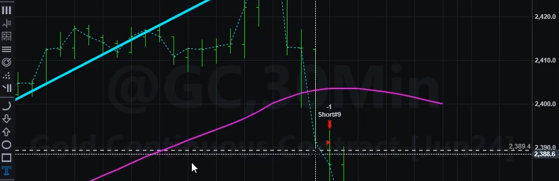
  <figcaption>Figura 027</figcaption>
</figure>

Pues podría un *stop* aquí para vender aquí. Pero insisto que de momento lo he hecho solo al cruce, es decir, una vez cierra la cruza vende a mercado. Esto es como está configurado el sistema ahora mismo pero está preparado para que podáis probar distintas alternativas.

<div style="border-left: 4px solid #9c27b0; background: #f3e5f5; padding: 10px 15px; margin: 10px 0; border-radius: 8px;">
  <strong>📊 Filtros implementados en el sistema</strong><br><br>
  • <strong>Filtro horario:</strong> Restringe operativa a horas específicas (menos útil en tendenciales puros)<br>
  • <strong>Filtro Donchian:</strong> Exige superar canal de máximos/mínimos tras el cruce de medias<br>
  • <strong>Filtro ATR:</strong> Filtra por nivel de volatilidad<br>
  • <strong>Filtro ADX:</strong> Filtra por fuerza de tendencia<br><br>
  Todos están desactivados por defecto (valor 0 o rango completo = siempre <em>true</em>).
</div>

No es mala práctica probar un Donchian, suele mejorar, retrasa la entrada pero mejora bastante los períodos laterales, no deja de ser un filtro. Podemos, hemos implementado filtro por Donchian, hemos implementado filtro por volatilidad y filtro por ADX. Se pueden buscar otros, sí se pueden buscar otros, ya al final lo comento, se pueden buscar otros, pero hemos implementado estos tres para daros ya algunas herramientas y a partir de ahí podéis seguir.

**Lado corto espejo**

```sh
{ Orders }
If Cond_Long then 
begin ... End;

If Cond_Shrt then
begin
	if allowlong then 
	begin
		If Marketposition = 1 then 
			Sell next bar at market;
	end;
	{Calculamos los máximos y mínimos en el momento del cruce de medias}
	# La variable Hay precio sirve para actualizar el canal cuando salta el stop
	
	If Uso_Donchian and (Fast cross under Slow or not hayPrecio) then
	Begin
		Channel_Dw = LowestFC (Low, Channel_Per);
		hayPrecio = true;
	end;
	
	if allowshort and estamosEnSesion(InicioSesion, FinSesion) and Curso_Filtros(+FiltroY,Nivel_ADX,Nivel_ATR, Nivel_Stddev, Barras, Rango1, Rango2) and not Curso_Filtros(+FiltroN,Nivel_ADX, Nivel_Stddev, Nivel_ATR, Barras, Rango1, Rango2) then
	begin
		If Marketposition <> -1 then
		Begin
			If Uso_Donchian Then
			Begin
				Price_Shrt = Channel_Dw - ATR_Shrt;
				SellShort lotes contracts next bar at Price_Shrt stop;
			end Else
				Sellshort lotes contracts next bar at market;
		end else	
			hayPrecio = false;	
	end;
End;
```

Y el lado corto pues es espejo, este sistema es espejo. Podría separarse largos y cortos, podría, pero en un activo, en las materias primas, suele ser buena práctica no hacerlo. Pero sí que podríamos porque vamos a conseguir 5.000 *trades* y si queremos 10.000 los conseguimos, entonces al final le podríamos hacer, pero es buena práctica de desarrollo. Y la idea en principio estaría más validada, estaría más validada que fuera espejo, se llama.

No porque en principio el oro, al igual que las divisas, no tiene un motivo especial de sesgo de volatilidad como sí tienen los bonos y las acciones que es más evidente. El oro puede tener subidas y bajadas con volatilidad, , no hay un sesgo claro, un sesgo claro como lo hay en las acciones que es clarísimo y también normalmente los bonos.

Entonces a partir de ahí, a priori trabajamos espejo, pero podemos implementarlo. Y por eso hay estas dos variables, estos dos *inputs* *true-false* de decir, yo lo le pongo *false* en el corto y solo va largo, le pongo false en el largo y solo va corto. Puedo si quiero habilitarlo para uno de los dos lados del mercado.

```sh
inputs: 
		allowlong( true ),
		allowshort( true ),
```

**Resumen del código**

Y poco más, el código no tiene, no tiene mayor historia. Aquí tiene el tema de pintar, es lo que os digo, este código simplemente pinta. Que tiene una variable que calcula cuando está optimizando pues que no pinte. Entonces pero aquí con esto pinta las medias y más este código, que al final es el encargado de pintar las medias. 

```sh
# plot only when NOT optimizing 

# Multicharts no permite usar objetos y _TLPlotVec los usa
	
if Optimizing = false then
Begin
	If Pinta_Medias Then
	Begin    	
    	value1 = _TLPlotVec (1, Fast, PlotLength, 0, 0, TLStyle1, TLColor3, TLSize1);
    	value2 = _TLPlotVec (2, Slow, PlotLength, 0, 0, TLStyle2, TLColor4, TLSize2);
  	End;
  	
  	If Pinta_Canales Then
  	Begin
		once (Marketposition <> 0)
		Begin
			If Marketposition = 1 Then
				Largos = True;
			If Marketposition = -1 Then
				Cortos = True;	
		End;

		If Largos and Marketposition <> 1 and Fast > Slow then
			value3 = _TLPlotVec (3, Price_Long, PlotLength, PriceOffset, PlotOffset, TLStyle1, TLColor1, TLSize1);
	
		If Cortos and Marketposition <> -1 and Fast < Slow then
    		value4 = _TLPlotVec (4, Price_Shrt, PlotLength, PriceOffset, PlotOffset, TLStyle1, TLColor2, TLSize1);
	end;
end;
```

Muy sencillo, un sistema de cruce de medias al que le hemos habilitado la posibilidad de tres filtros de entrada y que mediante todo el código que ya conocéis de salidas vamos a probar distintas salidas con otro código externo, que en TradeStation esto se puede hacer de manera muy práctica.

<figure>
  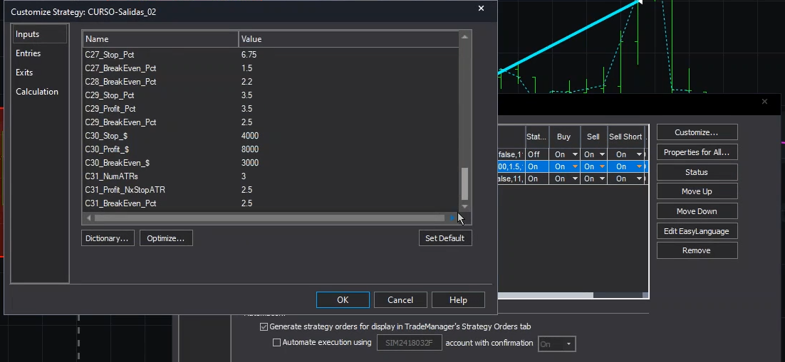
  <figcaption>Figura 028</figcaption>
</figure>

De momento ahora lo desactivo, lo desactivo y dejo simplemente a bruto la media.

<figure>
  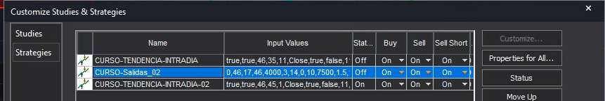
  <figcaption>Figura 030</figcaption>
</figure>

Estaba ahora, está con una media cierre contra media porque le he puesto el 45, he puesto que la media rápida que opere es 1 y la media lenta 46, entonces pues va a 1 contra 46. Esto está hasta el viernes, hasta el viernes, podemos cargarlo hasta hoy, no tiene mayor problema para ver cómo va ahora, que siempre hace como gracia, no como gracia, verlo en tiempo real.

**Datos Excel preparados para el análisis**

Nosotros hemos trabajado por temas de procesamiento de datos hasta ahora. Y entonces pues vamos a ver algunos datos que lógicamente he preparado antes porque si no sería bastante, bastante inviable, entonces sería bastante inviable. Por lo tanto, por eso pues yo ahora lo he preparado previamente. Aquí tengo algunos, algunos datos, el tendencial del oro. Aquí tengo las optimizaciones:

- [ANALISIS MEDIAS 20-30_00S.xlsx](../data/ANALISIS%20MEDIAS%20-30_00S.xlsx)

**Resultados de optimización por tipo de media**

Hemos hecho, vamos por el principio, vamos por partes que diría Jack. Bien, Excel que ya habéis visto, *donde proveniente de TradeStation*, recogemos datos *in-sample*, datos *out-of-sample*, datos *all data*. Aquí no he puesto ficha, fallo mío, debería de haberla, pero no la he hecho, se me perdone. Y os explico lo que hemos hecho.

<figure>
  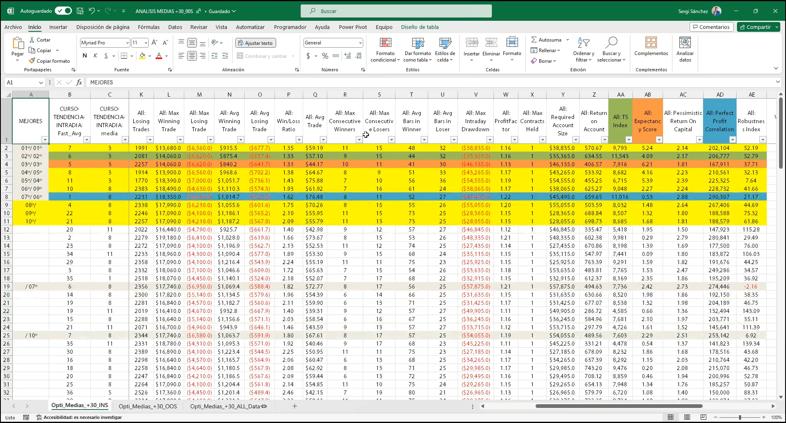
  <figcaption>Figura 031</figcaption>
</figure>
<figure>
  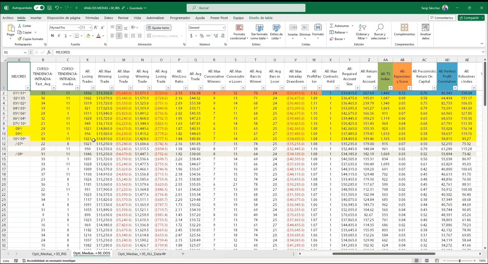
  <figcaption>Figura 032</figcaption>
</figure>
<figure>
  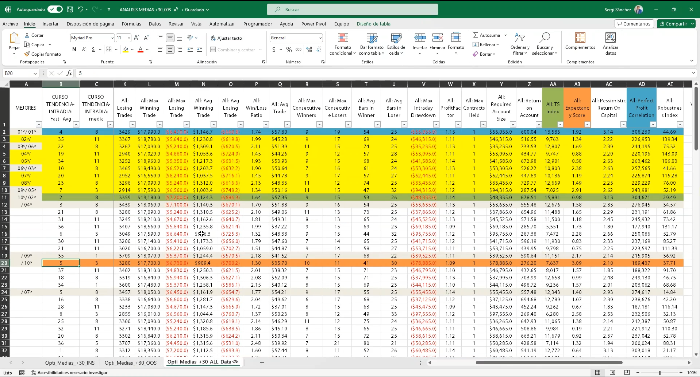
  <figcaption>Figura 033</figcaption>
</figure>

Simplemente como os decía, la *slow* queda fijada en 46 y he optimizado la *fast* desde 1 hasta 45.

<figure>
  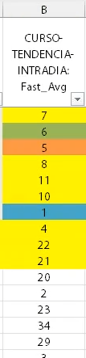
  <figcaption>Figura 035</figcaption>
</figure>

Más de 45 no puede ser porque acordaros que le resto la *fast* al *slow* y si le resto 46 pues da 0, y la media de 0 estáis de acuerdo conmigo que no se puede representar en un gráfico entonces sin usar para operar. Entonces de 1 a 45, que equivale a usar la *slow* siempre en 46 y la *fast* desde 1 hasta 45. Eso es lo que hago al optimizarla de esta manera, y con los 19 tipos de media.

<figure>
  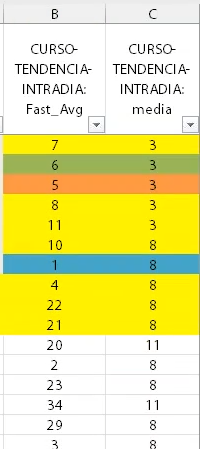
  <figcaption>Figura 036</figcaption>
</figure>

Y como solo he guardado 100, ya porque ya he querido no hacerla demasiado amplia de guardarlas todas, digo, bueno, que me coja los 100 mejores y hasta. Y automáticamente he hecho esta primera optimización.

Lo primero que vemos aquí en la ficha en *in-sample* es que obtenemos unos *robustness* bastante pobres:

<figure>
  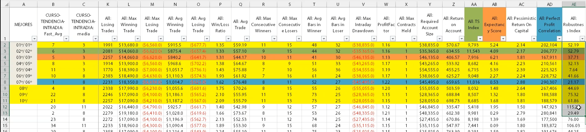
  <figcaption>Figura 037</figcaption>
</figure>

Hay que ir al número 11 para obtener un positivo. Está bien que es la media *fast* 20 que, recuerdo, insisto, se resta, se resta, con la combinación 11.

Fijaros que en *in-sample* todas las medias que me salen son 3, 8, 11. Aquí 1 que acordaros es *simple-simple*, pero ahora vemos 3, 8, 11, se repite muchísimo 3, 8, 11. Prácticamente hasta aquí casi todo es 3, 8, 11.

<figure>
  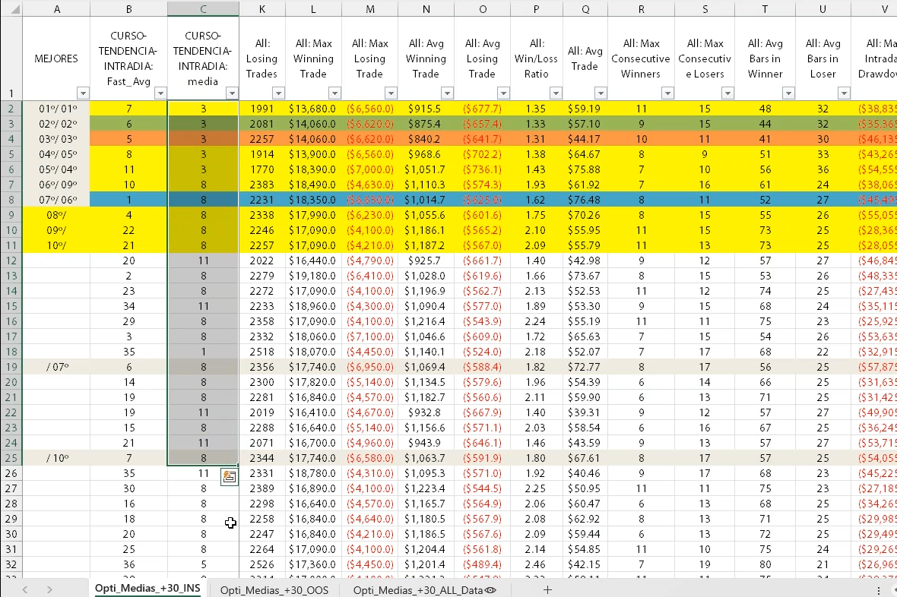
  <figcaption>Figura 038</figcaption>
</figure>

Que era 3 es KAMA con KAMA. 8 es *exponencial* con *simple*, bastante interesante, ¿verdad?, y coherente, ¿no? Es, hombre, la rápida exponencial y la lenta simple, ¿verdad que sí? Es una cosa que le, que la vemos, la vemos razonable, ¿no? Es razonable. Y luego la 11 que es KAMA de rápida con *slow* con normal con *simple* de *slow*, también lo vemos bastante razonable, también lo vemos bastante razonable.

```sh
TP = TypicalPrice;
switch (media) 
Begin
		
  ...

	case 3: // Kama
		Fast = Kama (Slow_Avg-Fast_Avg);
		Slow = Kama (Slow_Avg);
		
  ...
		
	case 8: // Exponencial + Simple
		Fast = XAverage (Price, Slow_Avg-Fast_Avg);
		Slow = AverageFC (Price, Slow_Avg);
		
  ...
		
	case 11: // Kama + Simple
		Fast = Kama (Slow_Avg-Fast_Avg);
		Slow = AverageFC (Price, Slow_Avg);
```

## Visualización de los cases

Vamos a poner esto en el gráfico para que lo veáis, para que lo veáis un poco en la práctica. Veis qué pasa con una media muy rápida con una lenta, esto pasa: continuas señales falsas en el lateral.

### Caso Fast_Avg 7 con media 3

Recordar que el parámetro que pongo, bueno, por eso lo pinto en el gráfico y viene muy bien:
- La media *slow* siempre es 46.
- La *fast*, si ponemos aquí una de las que nos salía, por ejemplo, bueno, la que ha salido mejor en *in-sample*, sería la 7 con la 3.

<figure>
  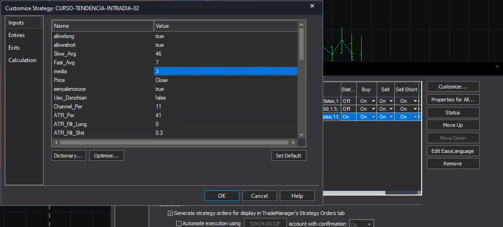
  <figcaption>Figura 039</figcaption>
</figure>

Y esto las medias no usan nada más, no he filtrado nada, no tengo salidas, nada. Simplemente estoy evaluando las medias, voy a *stop and reverse* todo el rato en el mercado, quiero ver a ver qué media es la que mejor sigue la tendencia del oro. Esto es un poco la idea, que luego puedo a lo mejor afinarla una vez, simplemente filtros, podría ser, pudiera ser, pero yo de entrada quiero ver un poco la media. Al final una media no deja de ser el resumen de la tendencia de un activo, estamos de acuerdo, no deja de ser o trata de resumir.

Entonces digo, bueno, yo no he explicado desde dónde he cargado el gráfico, ahora os lo enseño. Quiero ver qué gráfico saqué, qué media representa mejor al oro, ¿no? Bueno, de momento he puesto esta que la 3, hemos dicho que era KAMA con KAMA, y la 7, que recordar la resto de 46, es decir, en realidad es la de 39, es decir, es una media bastante lenta, bastante lenta. Lo vais a ver, es una media que se parece mucho a la, a ella misma, se parece mucho.

<figure>
  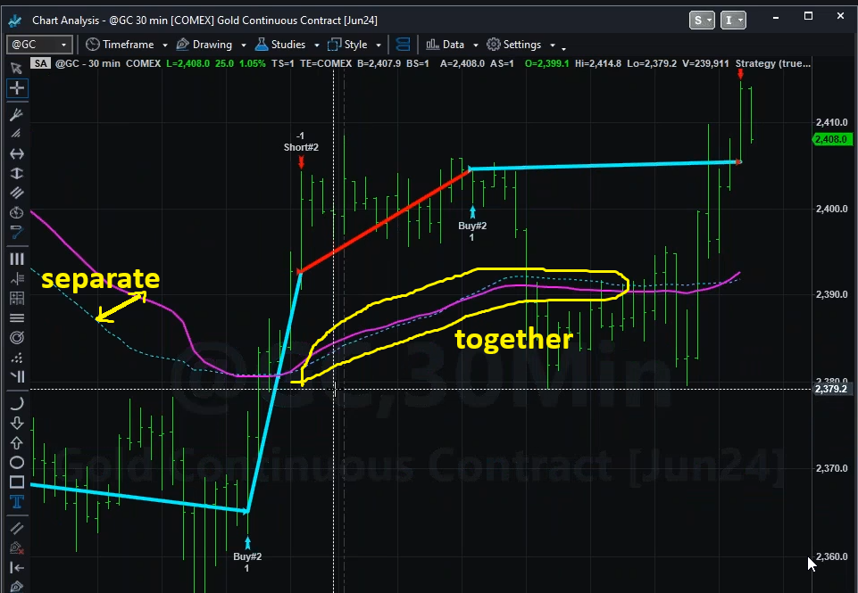
  <figcaption>Figura 040</figcaption>
</figure>

Lo que pasa que son medias KAMA que son medias *adaptativas* que en este valor no se nota mucho. Luego veréis una que se va a notar más porque será como más lenta más rápida. Pero fijaros que la media KAMA es adaptativa dependiendo de la volatilidad que hay. Se acercan más, caros aquí que se mantienen muy separadas, y en cambio aquí están juntas, no realmente no van, no siguen la misma sincronía porque al tener un periodo distinto su nivel de ajuste es distinto, pero se parecen bastante, se parecen bastante.

Y son medias pues realmente que provocan situaciones un tanto extrañas. Dejarme aquí que ha sido casi capaz de vender en el máximo simplemente con una media, no dices, ¿cómo puede ser? No, bueno, esos son particularidades de las *medias adaptativas*, con una media simple sería imposible.

<figure>
  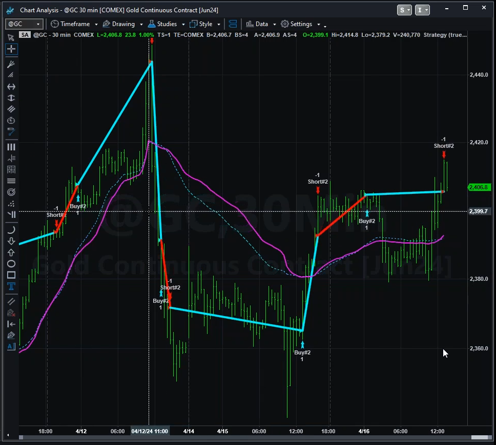
  <figcaption>Figura 041</figcaption>
</figure>

**Funcionamiento de las medias adaptativas**

Pues las medias adaptativas al llevar un ciclo, llevar un parámetro que ajusta la media, que cuando decimos que ajusta la media quiere decir que regula su velocidad. Es decir, una media *simple* es una medida aritmética de 10 periodos, todos los 10 periodos valen lo mismo, de 10, de 20, de 50, de los que sea. En la media *exponencial*, cada, los más cercanos valen lo mismo, valen más, pero por un coeficiente estable, entonces la exponencial le da más importancia a los recientes pero de manera proporcional siempre igual. Y lo mismo para una *ponderada*, etcétera.

En cambio, este tipo, ya sean la, ya sea la KAMA, sea la MESA, la FAMA, tienen algún tipo de cálculo distinto que trata de modificar la velocidad y ¿en base a qué criterio? Básicamente a la volatilidad y al rango de las velas, velas, decir cuando hay más volatilidad pues le dan más margen y tienen estas particularidades.

<div style="border-left: 4px solid #9c27b0; background: #f3e5f5; padding: 10px 15px; margin: 10px 0; border-radius: 8px;">
  <strong>📊 Comparativa de tipos de medias</strong><br><br>
  <strong>Simple (SMA):</strong> Todos los periodos tienen el mismo peso → Media aritmética pura<br>
  <strong>Exponencial (EMA):</strong> Más peso a los recientes, pero coeficiente fijo → Siempre proporcional<br>
  <strong>Ponderada (WMA):</strong> Peso lineal decreciente hacia el pasado<br>
  <strong>Adaptativas (KAMA, MAMA, FAMA):</strong> Ajustan velocidad según volatilidad → Pueden "vender en máximos"
</div>

**Evaluación con comisiones**

¿Esto sirve para algo? Vamos a verlo, vamos a verlo si esto sirve para algo.

<figure>
  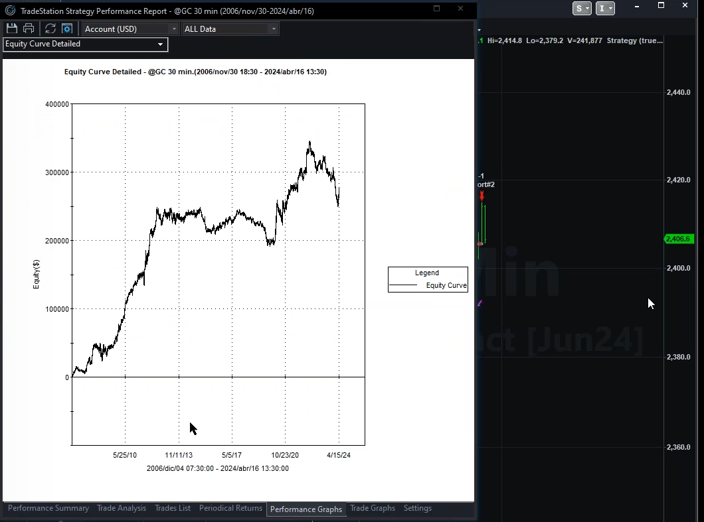
  <figcaption>Figura 042</figcaption>
</figure>
<figure>
  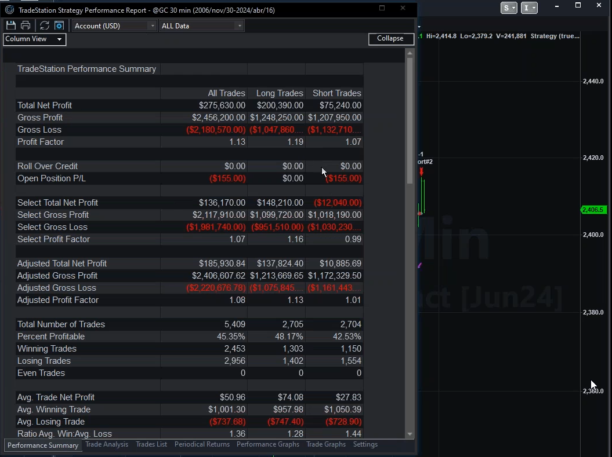
  <figcaption>Figura 043</figcaption>
</figure>

Hombre, para algo sirve, para algo sirve. No, pero recordar que solo son dos medias, solo son dos medias, largo y corto, ganan los ambos lados del mercado. *Profit factor* bajo, pero cuidado que estamos con comisiones, no lo he dicho, ahora lo digo, he puesto 15 dólares de penalización. Es más que razonable, le he puesto 5 dólares de comisión y 10 de *slippage*, que es un tick, un tick entero, es razonable, es bastante razonable.

<figure>
  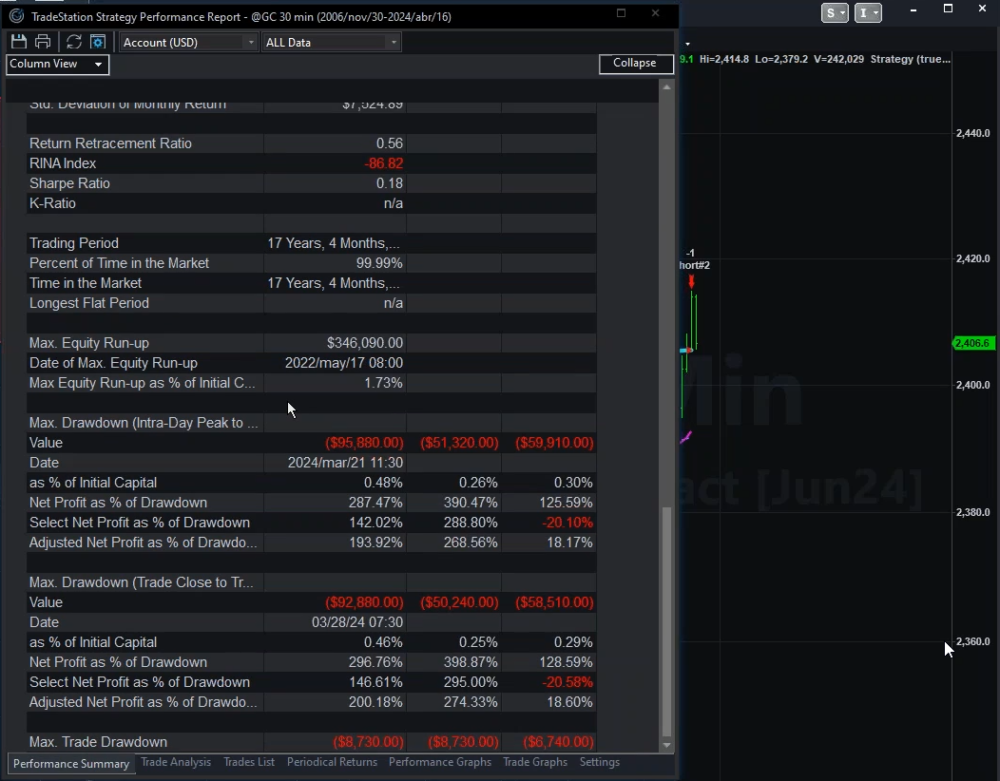
  <figcaption>Figura 044</figcaption>
</figure>

15 dólares de penalización por operación quiere decir que es 30 por lado. Fijaros que yo tengo un *average*, un *average trade Net Profit* de 50, que si le sumara los 30 que me lo han quitado serían 80. Yo a mí me gusta trabajar así, hay autores que trabajan sin comisiones. Yo personalmente no le veo ninguna ventaja de este criterio, no le veo, no le veo. Ellos dicen que así evalúas la señal en bruto, sí, sí, vale, pues en bruto, pero de esta manera si tú haces comparación, cuando haces un proceso de optimización de análisis, al final estás comparando.

Si yo no tengo en cuenta esto, todas las combinaciones que están aquí y que pueden variar el número de *trades* desde un máximo de 4700 hasta un mínimo de 2500, y porque solo he guardado 100, pero es bastante rango:

<figure>
  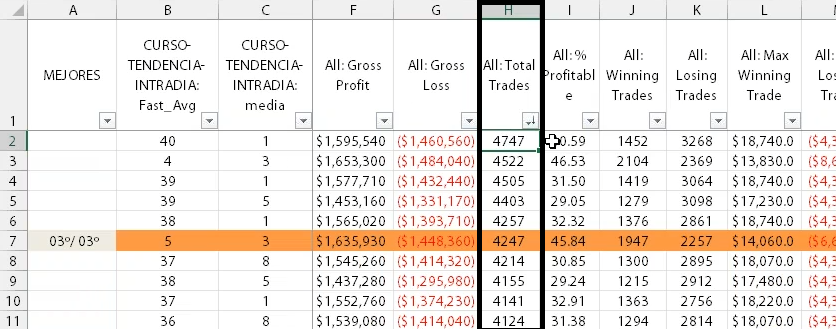
  <figcaption>Figura 045</figcaption>
</figure>

Casi no llega pero se acerca a doblar, se acerca a doblar, tendrían el mismo, la misma penalidad. Y en realidad no es lo mismo. Al final el hecho de operar más o menos tiene un coste y yo creo que es más buena práctica implementarlo. Hay gente que en fases iniciales como esta le gusta no meterlo, nosotros solemos meterlo en todo el proceso.

Pero yo os lo explico, como siempre he hecho en todo el curso, de distintos puntos de vista y ellos entienden que así se evalúa la ventaja en bruto.

**Análisis de ventaja del sistema**

Yo creo que aquí queda claro que hay ventaja, es decir, queda muy claro que aquí hay una ventaja porque estamos en un sistema totalmente simétrico que solo compra y vende cuando hay un cruce de medias y que así ha ganado dinero, además bastante dinero con un *profit factor* bajo. Sí, un tendencial en 30 minutos con 5409 *trades*, para tener un *profit factor* bajo, eso es así, sería mejor más alto, sí, sería mejor pasar de 1.20, pero bueno, estamos ahí de momento en 1.13.

<figure>
  
  <figcaption>Figura 043</figcaption>
</figure>

Notar aquí, recordar que no tengo que ser monetaria, por eso sí que puedo comparar en bruto el dinero, más bien que el porcentaje. De hecho ahora aquí no tiene sentido mirar porcentaje, no tiene sentido mirar porcentaje.

Fijaros que estas medias KAMA al ser tan cercanas tienen una pequeña paradoja, de ahí que la curva sea relativamente estable para ser un tendencial:

<figure>
  
  <figcaption>Figura 042</figcaption>
</figure>

Que tiene un periodo ahí muy malo de años, además esos son muchos, esos son 8, 7, 8 años, que tiene un ratio de aciertos tendencial pero no muy tendencial, porque la media KAMA como habéis visto ajustada de esta manera permite hacer cosas tan surrealistas como que casi ha vendido en el máximo, que lógicamente un tendencial nunca hace.

No es normal, no es una media, o sea, solo esto ya, no hacer cosas raras, es decir, uno puede buscar usos distintos al indicador pero si uno busca un tendencial esto no es un tendencial, a un tendencial no hace esto, no puede haber vendido en el máximo, es decir, empecemos por ahí. Pero bueno, estamos viendo un poco las primeras para que las veamos, para un ejercicio de comprensión del sistema y de análisis.

**Análisis del Robustness**

Un detalle muy, muy importante, un detalle muy importante que tenemos aquí es que las que, a ver, aquí como tengo el más 30, sumo con *rob* acordaros, incluido *robustness*, es la teoría. Como os decía, en general todos tienen bastante bajo, no vamos a probarlos todos pero mira, sé que aquí veo por ejemplo, por curiosidad, este 1-8 es como muy distinto, que curiosamente es el que tiene mayor *profit perfect correlation*.

<figure>
  
  <figcaption>Figura 043</figcaption>
</figure>

Pero dejaros que tiene un *robustness* muy bajo, que quiere decir que en los últimos años ha ido mal, eso a priori no es buena señal, ¿verdad? Abajo tenemos el resumen, acordaros que lo ponemos siempre, y ahí vemos que tenemos una mediana de 42 en el *robustness* con un peor valor de -71 negativo y un mejor valor de 143.

<figure>
  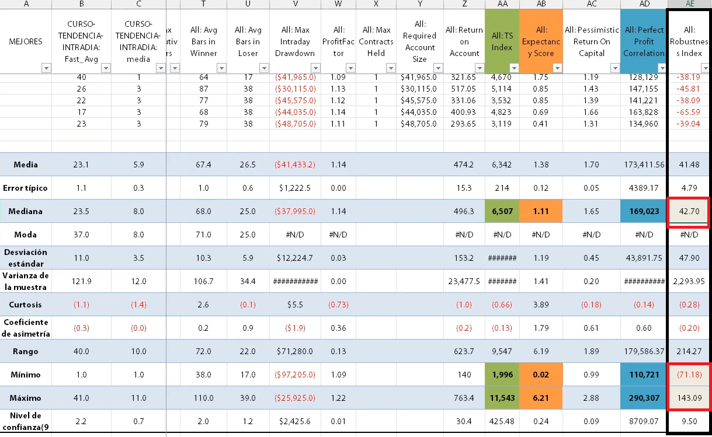
  <figcaption>Figura 047</figcaption>
</figure>

Un valor de 42 la verdad que no es tan malo como parece, sobre todo teniendo en cuenta lo que luego os enseñaré el motivo. Esto hablamos en una teoría sobre ello y quiero insistir ahora porque es muy, muy importante. Tenéis que analizar los datos, yo expresamente no lo he hecho ahora, que quería llevaros a esta encrucijada y entonces analizarlo.

**Calidad de los datos históricos**

Pero acordaros lo que os dije, hay que ver el gráfico, hay que entender los datos y revisar si son coherentes. Por eso, por ejemplo, hemos empezado en 2006. Nosotros tenemos bases de datos de *tick data* que llegan más lejos hasta 2003 de buena calidad, pero aquí por un tema de procesamiento, porque es mucho más lento cuando usas datos de *tick data*, he cargado desde 2006.

Voy a copiaros esta ventana ahora para hacer dos cosas, una de ellas simplemente es cargar, cargar un poquito más de histórico porque vais a ver cómo la base de datos es absolutamente lamentable, absolutamente lamentable, se vuelve absolutamente lamentable.

Si yo aquí le cargo un poquito más, estoy aquí pues le voy a poner un año más, le voy a poner un año más:

<figure>
  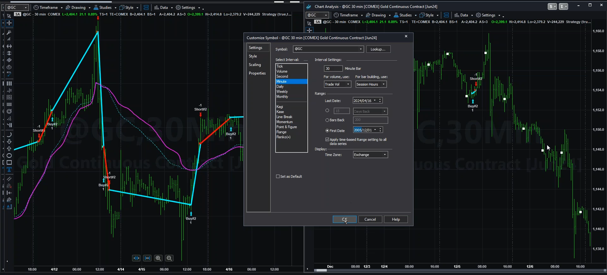
  <figcaption>Figura 048</figcaption>
</figure>

Han salido ya las alineaciones Alberto, todavía no, las alineaciones, tenemos alineaciones ya o no, todavía no. Aquí tenéis la, aquí tenéis la, aquí tenéis el motivo, ¿veis este queso gruyere?, que como este lo voy a, lo voy a luego lo voy a, luego lo voy a copiar, no pasa nada, lo quito todo porque quiero quiero que veáis bien el código.

<figure>
  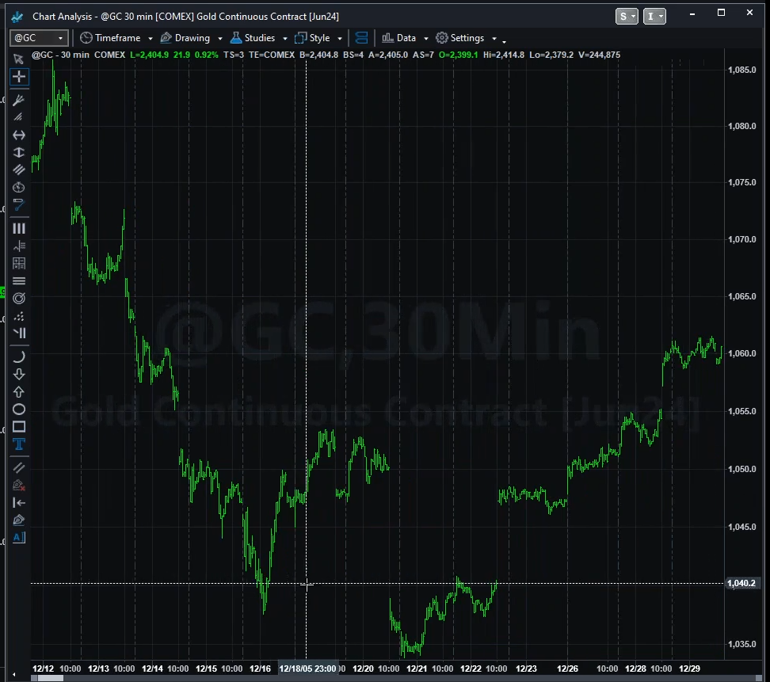
  <figcaption>Figura 049</figcaption>
</figure>

¿Veis ahí? ¿Veis en la base de datos? Eso es una porquería, nos sirve para ir al lavabo con ello, primero en un papel y usarlo de papel higiénico, pero poco más. ¿Veis? Esto es un desastre, a los que velas ahí, esto es un desastre, esto no se puede usar, chicos, no se puede usar para tratar de evaluar una ventaja en este activo. *Garbage in, garbage out*, recordaros, si meto porquería, a tomar viento.

<div style="border-left: 4px solid #f44336; background: #ffebee; padding: 10px 15px; margin: 10px 0; border-radius: 8px;">
  <strong>⚠️ Garbage in, garbage out</strong><br><br>
  Principio fundamental en análisis de datos: si la materia prima (datos históricos) es de mala calidad, los resultados serán inútiles independientemente de lo sofisticado que sea el sistema.<br><br>
  <strong>Señales de datos defectuosos:</strong> Gaps excesivos, velas faltantes, "queso gruyere" en el gráfico.
</div>

> *¿Los datos históricos se podrían utilizar si unimos los extremos de los gaps al estilo del rolo, del rolo?*

Bueno, pero es que esto ya está unido, o sea, podrías, podría ser, o sea al final tú tienes que conseguir una buena base de datos. Si no te la dan tienes que conseguir otra. Aquí la verdad no vale la pena complicarse, Francis, porque desde 2006 a 2024 ya tenemos muchos datos. No me hace falta. Pero evidentemente si yo no tuviera buenos datos tenía que conseguirlos, tenía que conseguirlos, bien en otro proveedor de datos, de otra plataforma, o bien comprándolos, o cambiando de proveedor. Como digo, porque muchos proveedores al final, pero evidentemente la materia prima hay que cuidarla, esto ya lo comentamos en la teoría brevemente.

Entonces, ¿dónde empieza a hacerse decente?

<figure>
  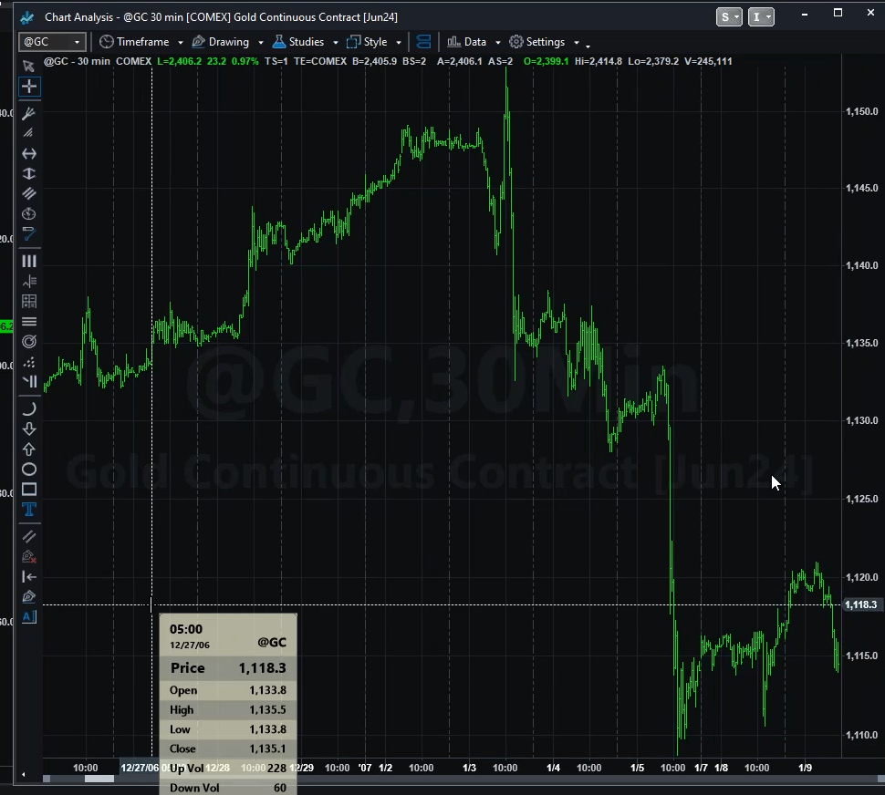
  <figcaption>Figura 050</figcaption>
</figure>

Justo en diciembre del 06, que es donde cargamos. Es ahí que ya está bien, lo vais a ver, lo vais a ver, se nota, se nota. Además fijaros la distancia, aquí veis la distancia de sesiones, que menos hay en ese *gap*. A partir de hemos cargado, 1 del 12 del 06, hemos cargado desde ahí. Si tuviera más datos cargaría más, podía cargar más, pero ya está bien, 16 años está muy bien, estamos hablando en un 30 día, incluso podría ser menos. Cierro esto y vuelvo a donde está.

**Análisis in-sample vs out-of-sample**

Ese ha sido el motivo. Entonces segunda cosa que os decía, el tema del *in-sample* y el *out-of-sample*. Este análisis lo tengo hecho aquí a la izquierda, no he ido antes expresamente porque quería ir ahora cuando llegáramos a ver esto. Es decir, oye, 42 de media y todos los que me salen arriba me sale muy bajos, me sale muy bajos. ¿Esto quiere decir que no vale? ¿Que el sistema no tiene capacidad predictiva? ¿Qué opináis? ¿Creéis que sí, que esto ya descartaría la capacidad predictiva del sistema?

<figure>
  
  <figcaption>Figura 047</figcaption>
</figure>

La respuesta es no, pero también os digo que muchos autores os dirán que sí, mi opinión de manera muy equivocada. ¿Por qué? Porque al final, especialmente en un tendencial, un tendencial depende mucho de la tendencia, valga el juego de palabras. Pero que todos los sistemas dependen de su tipo de mercado.

<figure>
  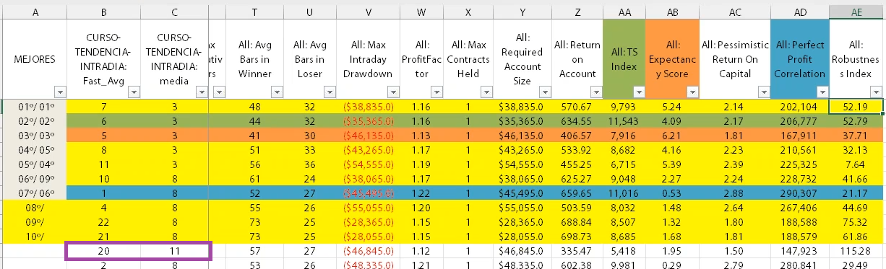
  <figcaption>Figura 051</figcaption>
</figure>

Pero igual que un *mean reversion* que haya poco movimiento le puede perjudicar, pero aún así puede ser capaz de moverse el rango porque normalmente siempre compra más cerca de mínimos y vende más cerca de máximos, un tendencial si no hay rango lo tiene prácticamente imposible. A lo que pueda aspirar es a no perder, a aspirar a no perder o a no operar incluso, pero ganar lo tiene imposible.

Entonces al final tenemos que hacer un análisis del activo y entender esto. Que, antes voy a poner este 20-11 porque este sí que es uno de los pocos que aquí arriba demuestra tener muy buen resultado, bueno había dicho antes de poner un 8 pero lo pongo el 20-11, os explico la tendencia, luego probamos esto.


#### Caso `Fast_Avg 20` con `media 11`

<figure>
  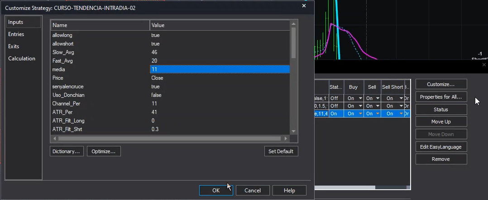
  <figcaption>Figura 052</figcaption>
</figure>

**Análisis del periodo de mercado**

```sh
TP = TypicalPrice;
switch (media) 
Begin
  ...
  ...
	case 11: // Kama + Simple
		Fast = Kama (Slow_Avg-Fast_Avg);
		Slow = AverageFC (Price, Slow_Avg);
  ...
```

Vamos a ver este 20-11 que realmente tengo mucha curiosidad por verlo la verdad. 20-11, estamos aquí, por dar que la media simple no se toca. Vamos a ver qué es el 11: 20 recordar que es el periodo que yo le resto a 46, por lo tanto va a ser la media de 26 con la media de 46, no tan forzado como antes. Y es 11 que es KAMA contra *simple*, KAMA contra simple, interesante, bastante interesante.

<figure>
  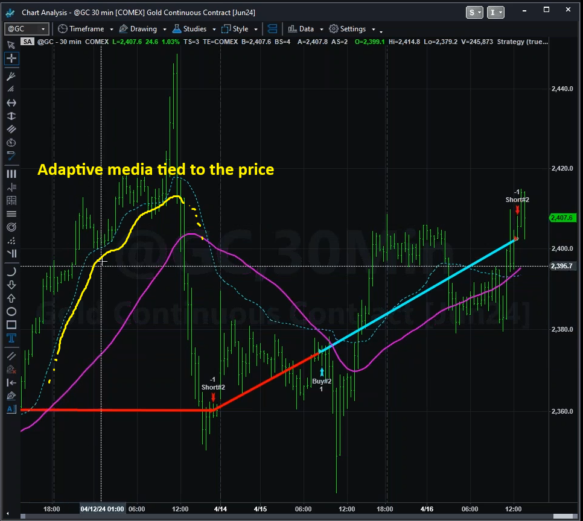
  <figcaption>Figura 053</figcaption>
</figure>

Una media más cercana que es la que desencadena la señal, la que va más pegada entre comillas al precio, más *adaptativa*, y en cambio la media de fondo, que es toda una sesión, acordaros 46 velas, *simple*. Suena, suena, suena bien, suena razonable, suena razonable.

Aquí lo veis pintado, aquí veis la media, efectivamente como veis, aunque es aparentemente mucho más lenta, como es adaptativa veis se pega bastante más al precio, se pega bastante más al precio. Ahora sí que ocurre que este tipo de sistema, si no tiene una salida que luego le pondremos, cuando tienen estos giros en vertical, que el oro es bastante tendiente, bastante tendiente a hacerlo, sobre todo por noticias, cosas así, ahí es donde se puede notar alguna salida.

Normalmente no va a utilizar las salidas un tendencial, pero estos giros en vertical que te hacen polvo, que fíjate el dinero que venías ganando aquí al final lo devuelves todo para ponerte corto y ahora encima volver al lado largo y ahora volver al corto, ¿no? Pero aquí lo que nos resultaba curioso es que realmente sí que en *out-of-sample* había mantenido el rendimiento del *in-sample*.

<figure>
  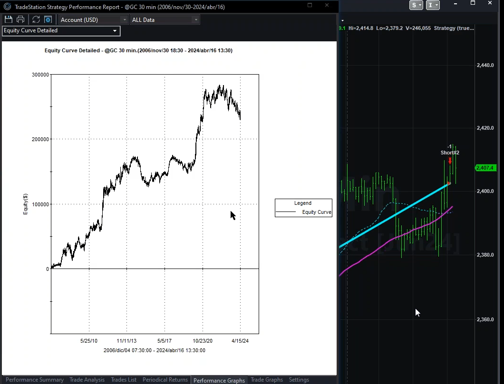
  <figcaption>Figura 054</figcaption>
</figure>
<figure>
  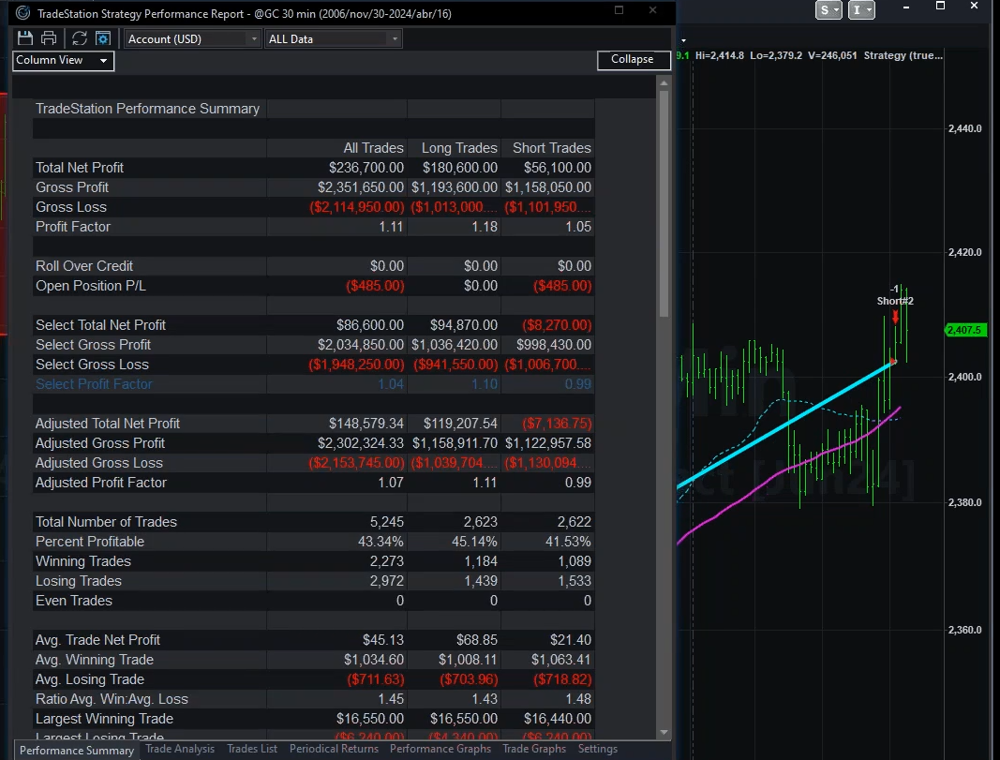
  <figcaption>Figura 055</figcaption>
</figure>

¿Esto por qué es? Bueno, pues porque este tipo de media más adaptativa ha ido mejor en este mercado, justamente esa es la gracia. Lo que pretende la adaptativa ciertamente parece que en cierta medida lo consigue, en cierta medida lo consigue.

Para ver un poco aquí el sistema pues bueno, vemos que aquí ha ido mejor en este periodo más adaptativo, también en el pasado ha ido bien.

<figure>
  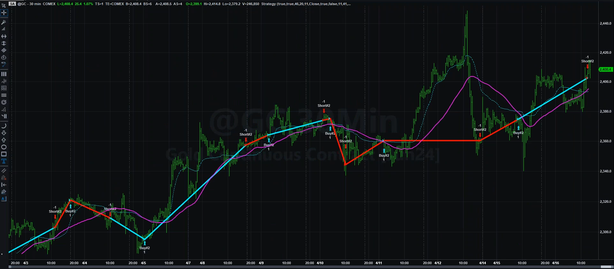
  <figcaption>Figura 056</figcaption>
</figure>

**División in-sample y out-of-sample**

Esto es el gráfico del oro en el mismo periodo que está cargado a la derecha en el intradía, pero en velas mensuales para poder verlo todo porque si no pues no, no me llegaría no la pantalla para que lo viera es todo.

Además voy a volver a esto porque siempre lo hago porque me gusta pero para el directo no viene, ahí se ve mejor. Lo mismo con las líneas, las líneas que las voy a pintar, les voy a quitar transparencia, las voy a poner de absoluto blanco para que así tengáis un desprendimiento de retina del brillo que os va a provocar la media y la raya y la veáis, que son estas dos líneas.

Bien, la línea de la derecha divide el histórico entre primera parte *in-sample*. Es decir, a ver, vamos a intentar con ese arte que sabéis ya porque ya lo habéis visto, ese gran arte que me ha dado Dios, capacidades de dibujo. Esto de aquí es *out-of-sample* y todo esto, todo, olvidaros de esta raya ahora, esto sería *in-sample*.

Esta opti habéis visto era así:

<figure>
  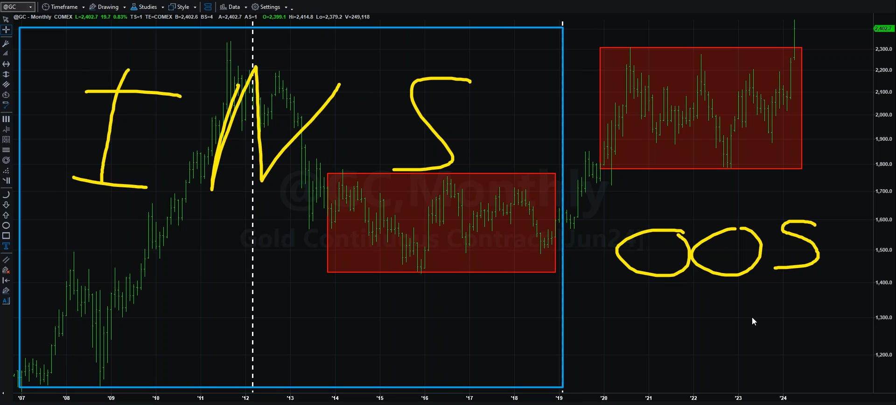
  <figcaption>Figura 059</figcaption>
</figure>

Esta, esta era así, 30% detrás, exactamente era así.

<figure>
  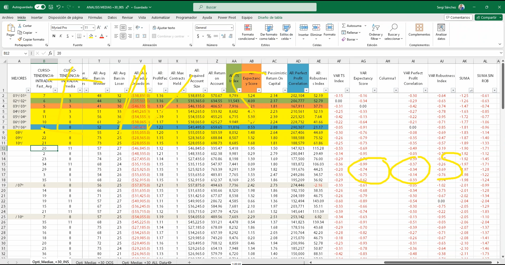
  <figcaption>Figura 058</figcaption>
</figure>

Toda esta parte, toda esta parte que os voy a pintar ahora con un cuadrado en color azul, toda esta era *in-sample*, toda esta, y la de la derecha era *out-of-sample*. ¿Queda claro, verdad?

¿Qué vemos? ¿Qué vemos aquí? Cogeremos todos los dibujitos y demás, ¿qué vemos aquí? Hombre, vemos dos partes muy distintas. El de la derecha apenas tiene un único tramo de tendencia, apenas tiene un único tramo de tendencia que es este, y luego tiene un absoluto lateral que ahora está resolviendo.

Y tú me puedes decir, hombre, alguno, alguno tiene, tiene, tiene tramos. En algún tramito, sí, algunos son aprovechables, te digo que no, puede tener este, puede tener este, incluso estos. Bien.

<figure>
  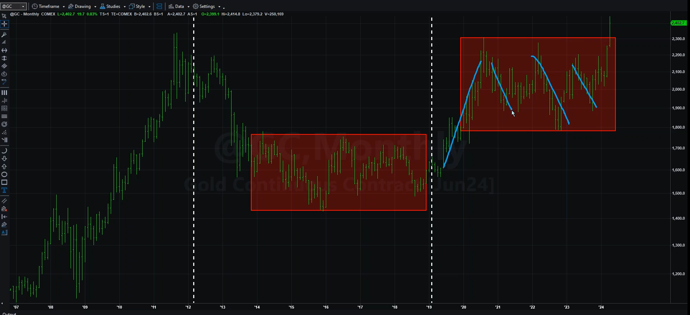
  <figcaption>Figura 060</figcaption>
</figure>

**Periodos hostiles para tendenciales**

¿Por qué os he marcado esos cuadrados rojos? Porque fijaros en esa similitud, de acuerdo. Tienen tanto el periodo *in-sample* como el periodo *out-of-sample* tiene un periodo que vamos a considerar hostil para un tendencial. Que no quiere decir que ahí no vaya a ganar nunca porque esto es mensual y ahí hay intradía, pero al final el mercado es *fractal*, quiere decir que aunque han habido tramos de tendencia buenos ahí, en general el mercado ha tendido a volver mucho y a ser bastante sucio intradía. Y es así, es así.

También lo veríamos, lo puedo poner en un momento con un, aunque lo que os decía antes, no, en un indicador de, en un oro no se ve ese sesgo de volatilidad tan, tan claro, es distinto con relación a la bolsa. Aquí la volatilidad es más variable. Le pongo sobre la volatilidad de un año, no, entonces aquí cuesta, cuesta de ver, cuesta de ver. Aquí de hecho se ve bastante, bastante volatilidad, que eso a priori es bueno, pero la verdad que no nos aporta mucha información, pero quito porque nos voy a marear más que otra cosa.

**Desequilibrio entre periodos**

Entonces lo que vemos es un periodo que a priori es potencialmente hostil y con un pequeño tramo de tendencia. El problema que tiene este periodo de la derecha que es el *out-of-sample*, repito, es que la relación entre el periodo hostil y periodo favorable está muy descompensada.

En cambio aquí es todo lo contrario, aquí fijaros qué tramos de tendencia tenemos. Todo esto es simplemente espectacular, donde ha sido facilísimo ganar dinero con un tendencial, incluso aquí, incluso aquí, incluso aquí.

<figure>
  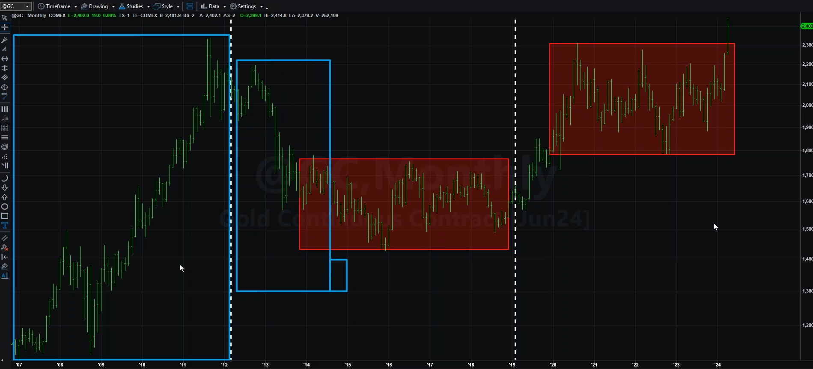
  <figcaption>Figura 061</figcaption>
</figure>

Al final llegó el periodo malo, también ha tenido un periodo que le ha costado *in-sample*, pero proporcionalmente *out-of-sample* tiene más.

**Análisis con out-of-sample adelante**

Esto es uno de los motivos por lo que muchas veces, como os expliqué en la teoría, nosotros hacemos más 30, es decir, *out-of-sample* detrás como os he explicado ahora, y menos 30 que es *out-of-sample* delante. ¿Qué caso era este? Bueno, en este caso era esta otra línea.

<figure>
  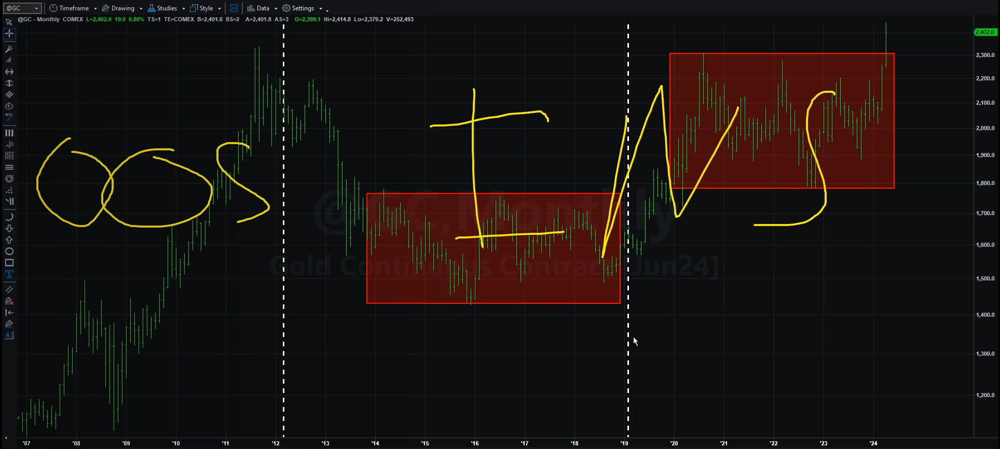
  <figcaption>Figura 062</figcaption>
</figure>

Aquí quería *out-of-sample* este periodo e *in-sample* todo este, todo el barrio. Emitir la línea. Aquí pasa todo lo contrario. Tengo un *in-sample* con dos periodos realmente hostiles y algún tramo de tendencia aprovechable, que está más equilibrado que antes pero que sigue estando desequilibrado porque al final tenemos esto, y uno en medio y tal, pero tenemos dos tramos potencialmente malos.

<figure>
  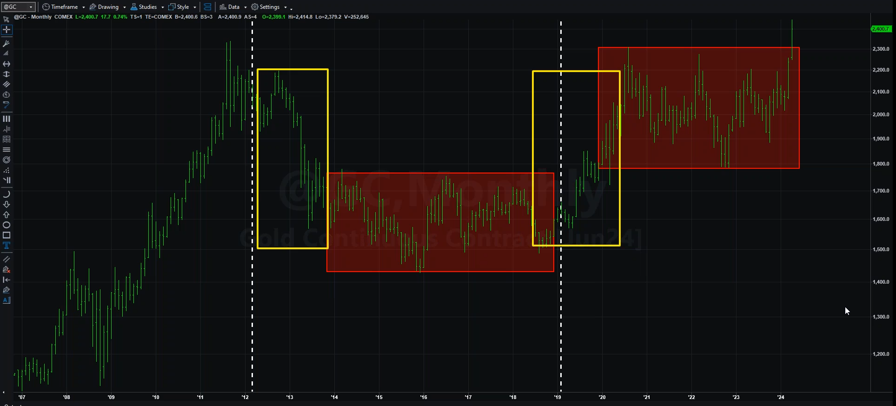
  <figcaption>Figura 063</figcaption>
</figure>

Y un periodo *out-of-sample* que es el paraíso, que es el paraíso.

<figure>
  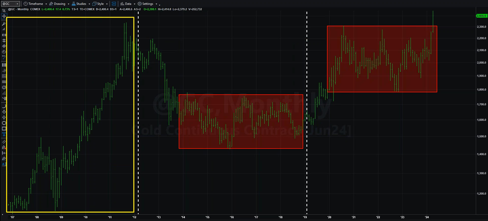
  <figcaption>Figura 064</figcaption>
</figure>

Por lo tanto aquí cabría esperar que cualquier optimización sobre este periodo *in-sample*, en el *out-of-sample* fuera la leche. Es así, vamos a verlo porque hemos hecho esa optimización también.

**Comparativa de ambos análisis**

Esta es la *out-of-sample* a la derecha y esta otra es *out-of-sample* a la izquierda. Y sorpresa, aquí todos los periodos *out-of-samples* son absolutamente la hostia.

<figure>
  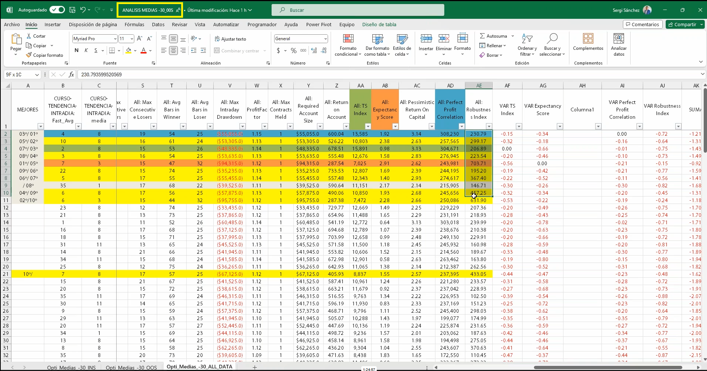
  <figcaption>Figura 065</figcaption>
</figure>

De hecho es que si vamos abajo, el peor, el peor da positivo, el peor periodo de los 100, la peor combinación de medias, la media 1, aquello que habéis visto que giraba todo el rato, la media 1 gana en *out-of-sample*. Y la mejor es 800, es una locura.

<figure>
  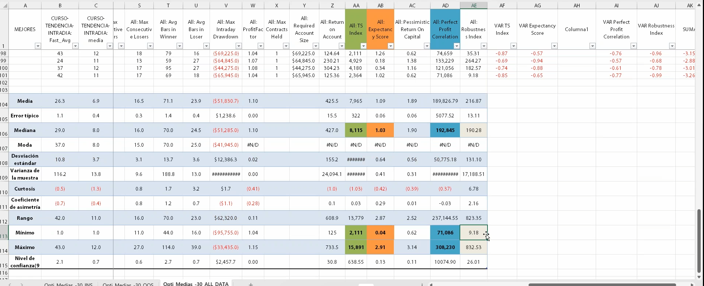
  <figcaption>Figura 066</figcaption>
</figure>

<div style="border-left: 4px solid #ff9800; background: #fff3e0; padding: 10px 15px; margin: 10px 0; border-radius: 8px;">
  <strong>⚠️ Cuidado con out-of-sample demasiado buenos</strong><br><br>
  Tampoco es bueno que sea demasiado bueno, porque quiere decir que el <em>in-sample</em> ha sido muy malo. Cuidado con eso, que esto es relación a <em>in-sample</em>: cuando <em>out-of-sample</em> es tan bueno quiere decir que el <em>out-of-sample</em> ha ganado mucho pero <em>in-sample</em> no ha ganado nada.
</div>

**El vector principal de un tendencial**

¿Esto qué nos dice? Que los sistemas tendenciales, al final el sistema lógicamente hay que trabajarlo, hay que estudiarlo, pero si bien esto es así en todos, en el tendencial es en la máxima expresión de lo que os voy a decir ahora: el vector principal de un tendencial es el mercado, mucho más que el sistema.

Por más bueno que sea el sistema, como lo pongas en un activo que no tiene tendencia, lo máximo que va a perder poco. Aquí ganaba cualquier cosa, es igual lo que pusieras.

<div style="border-left: 4px solid #f44336; background: #ffebee; padding: 10px 15px; margin: 10px 0; border-radius: 8px;">
  <strong>🎯 Principio fundamental de sistemas tendenciales</strong><br><br>
  El <em>vector principal</em> de un sistema tendencial es el mercado, mucho más que el sistema en sí. Un tendencial en un activo sin tendencia solo puede aspirar a perder poco. En cambio, en un mercado con tendencia, prácticamente cualquier sistema tendencial ganará dinero.
</div>

De tal manera que volvemos a mirar estos datos, vamos a la parte de arriba, pero miramos primero *in-sample*, y aquí vemos que en el periodo *in-sample*, que recordemos en este caso es el hostil, nuevamente vemos ahí 11 también, el 1 bastante destacable, este simple. El hostil, pero es un hostil más grande, es un hostil que tiene un poco más de margen para trabajar, y de paso tiene 3.903 y consigue sacar 140 mil dólares, 160.

<figure>
  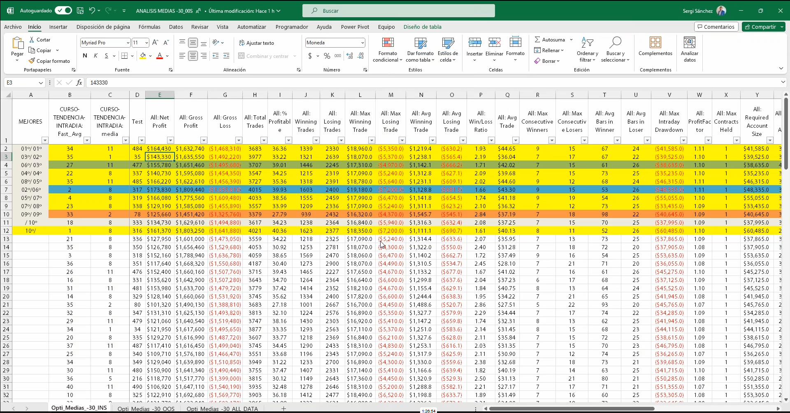
  <figcaption>Figura 067</figcaption>
</figure>

Es decir, no lo tiene tan fácil como antes, pero al tener mucho margen de trabajo y tener un periodo muy largo pues se van sucediendo pocas buenas y malas, aunque hayan como digo algunas muy malas, ¿no? Y aquí pues tenemos otra vez 11, 1, 8, 11, son algunos que habíamos visto antes, un 2 ahí también. Un 2 es el mejor *expectancy*, que normalmente nos da aquel que controla mejor el riesgo por *trade*, nos da aquel que mejora con el riesgo por trade. Y es un `33-2`, podemos probarlo por curiosidad, podemos ponerlo por curiosidad.


#### Caso `Fast_Avg 33` con `media 2`

<figure>
  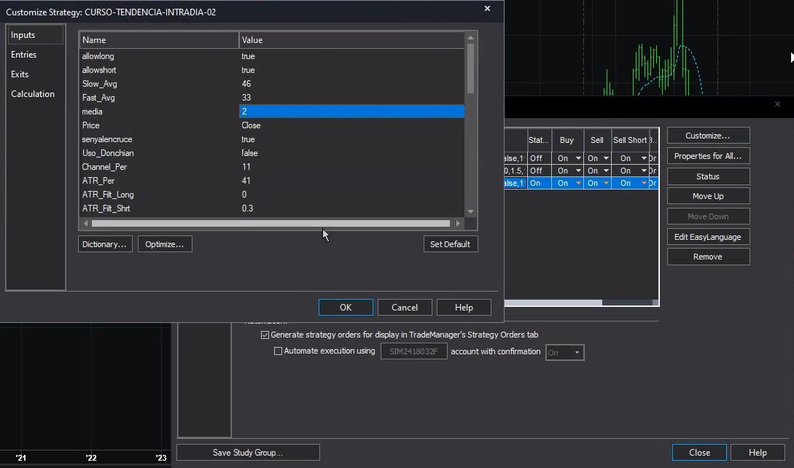
  <figcaption>Figura 068</figcaption>
</figure>

Volvemos aquí, 33-2, esto lo dejo quieto, acordaros el de 33-2 sin salidas. Y recordar que yo estoy esto para el revés, estoy evaluando las medias, simplemente evaluando qué capacidad tiene, qué media, qué periodo consigue un equilibrio mejor entre la porquería, o sea, la birria de mercados que tiene de vez en cuando, como estos tramos planos, y aprovechar los buenos mercados.

<figure>
  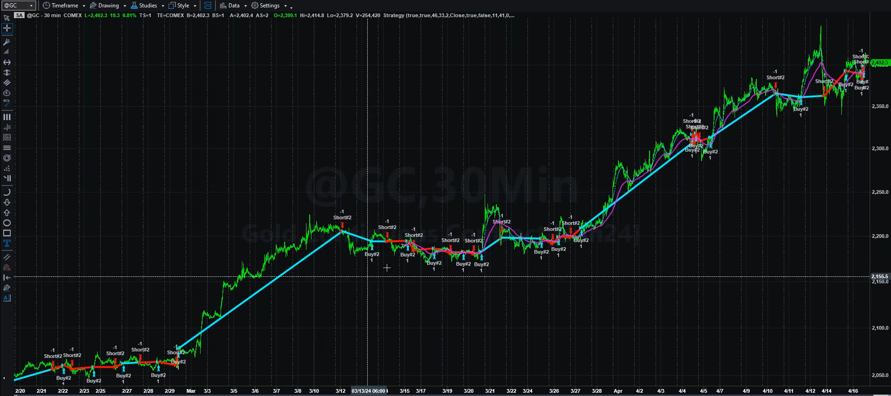
  <figcaption>Figura 069</figcaption>
</figure>

**Comportamiento en periodos difíciles**

Porque esto puede parecer muy malo, y lo es, pero a veces hay, muchas veces que si no lo puedes esquivar es mejor ser rápido, porque esto parece muy nefasto pero esto son muy pocas pérdidas en realidad, total más cuando te engancha aquí tal, esto realidad es muy poca pérdida.

<figure>
  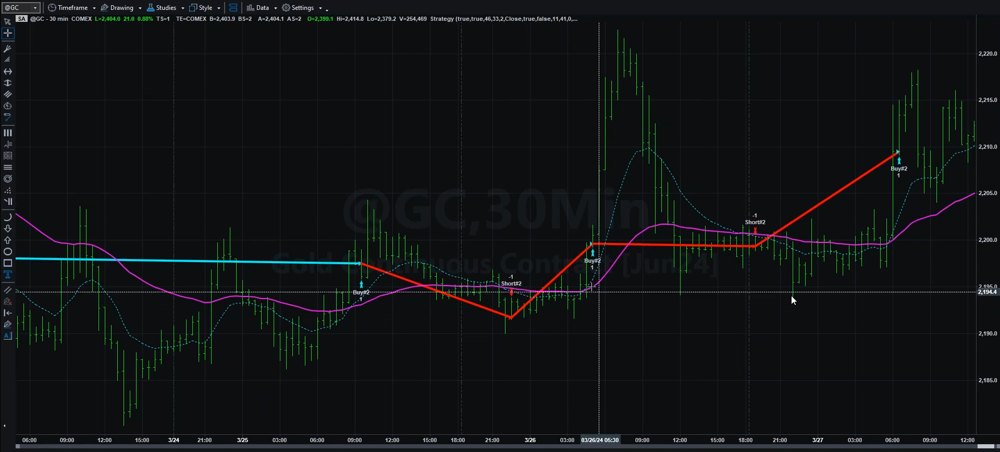
  <figcaption>Figura 070</figcaption>
</figure>

Esto está bien para un tendencial, supera potencial, está bien, porque por eso muchas veces, por eso las adaptativas a veces va muy bien porque tratan de regular eso, ¿no? Y si lo consiguen, casi jode más esto, ¿no? Devolver tanto, devolver tanto.

<figure>
  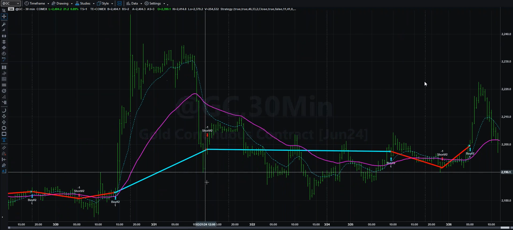
  <figcaption>Figura 071</figcaption>
</figure>

Pero veis este periodo así lateral, bueno, casi va cerrando a coste, va muy rápido. Este ya duele más, tendéis, ¿no? Al final, claro, para pillar esto hay que hacerlo así, fijaros qué *trade*:

<figure>
  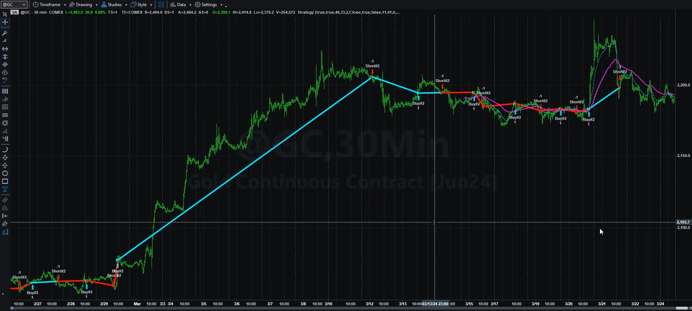
  <figcaption>Figura 072</figcaption>
</figure>

¿Quién es capaz de aguantar ese tren si no es con un tendencial? Imposible, imposible, imposible.

Luego hablaremos de filtros para tratar de minimizar eso, pero estamos hablando solo de las medias. Y vamos al periodo bueno para que lo veáis, donde claro, aquí claro, la autoescala parece que sea igual pero fijaros aquí los grandes recorridos que tiene, ¿no?

**Análisis del periodo favorable**

También falla *trades* lógicamente, pero los recorridos son tan largos, tan largos, tan largos, que simplemente es espectacular la cantidad de beneficio que acumula, acumula, acumula:

<figure>
  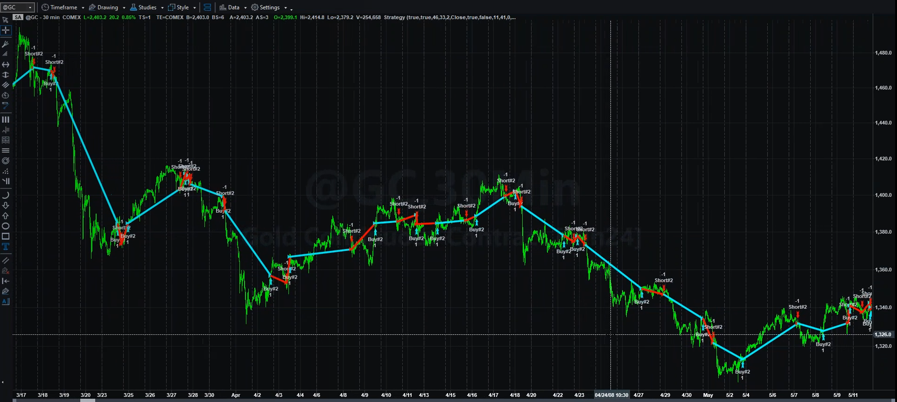
  <figcaption>Figura 073</figcaption>
</figure>

Porque el mercado coge tendencias absolutamente bestiales. Y también falla trades pero es lo que os digo, esto queda compensado ampliamente por esos mega trades.

Ahora de esos había menos y ahora ha vuelto alguno, ha vuelto alguno, veis. Pero esto si lo veis aquí un poco más atrás vais a ver que llevábamos mucho tiempo en el oro con muchas dificultades, muchas dificultades. Con periodos demasiado largos, veis aquí, demasiado largos.

<figure>
  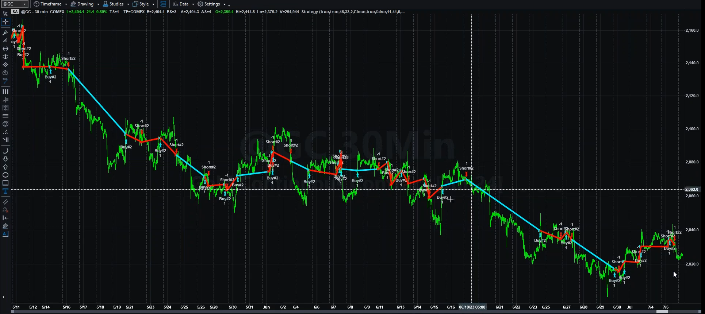
  <figcaption>Figura 074</figcaption>
</figure>

Esto ya aquí se complica, es porque va, vuelve, ¿no?, entre el lateral se hace muy largo. Veis aquí sí que va ganando pero no son *trades* de un gran recorrido, y entonces no te da para compensar las pérdidas. De vez en cuando hay uno bueno, siempre va a pasar eso, pero te da uno bueno que te compensa esta, luego viene otra y acaba siempre que no compensa.

Y por eso te pasas años, veis esos laterales, te pasas años, puedes pasarte años si no hay filtros con resultados muy malos porque no compensa las pérdidas. Pero están fijados que al final se ha defendido muy bien, y también el *out-of-sample* con beneficios bastante buenos. Seguramente estaremos en *profit factor*, vez inferior incluso antes, 1.09, bastante, bastante líneas, bastante líneas.

<figure>
  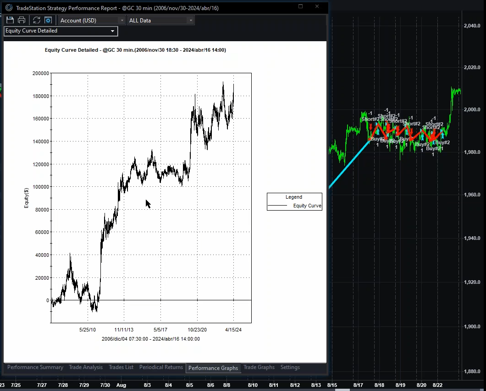
  <figcaption>Figura 075</figcaption>
</figure>
<figure>
  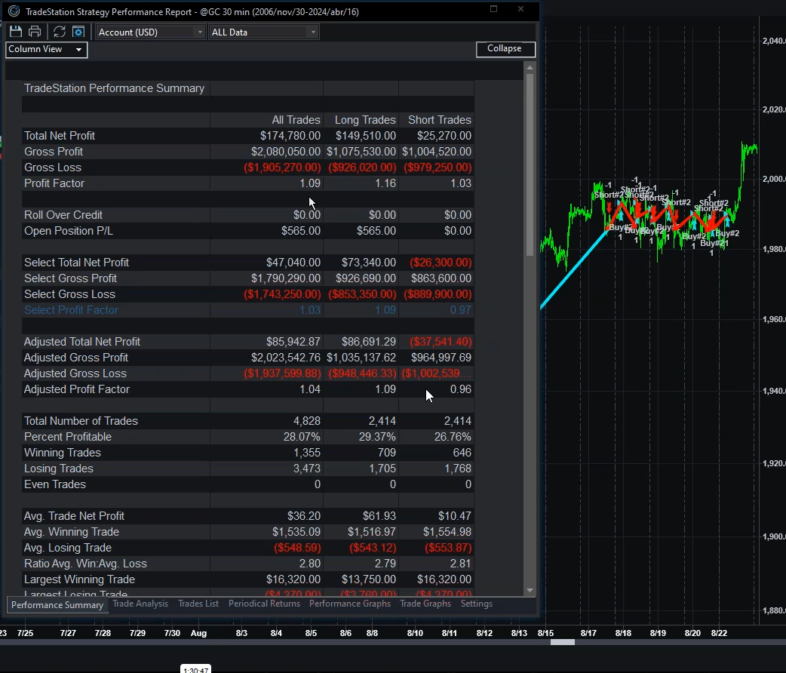
  <figcaption>Figura 076</figcaption>
</figure>

**Selección de medias candidatas**

Y esta era para cerrar, este ya no, ciego, este era por curiosidad. Este que habíamos visto aquí, bueno, aquí pues ya digo, ¿cuál elegiríamos aquí? Bueno, no es fácil, porque aquí lo recomendable sería conseguir un equilibrio de los dos *all data*. ¿Por qué? Porque el *all data* acordar que al final equilibra *in-sample* y *out-of-sample*.

Aquí hemos visto que teníamos razón y efectivamente el por qué había ido mal el otro. Teníamos entre los mejores, no teníamos muchos buenos datos de *robustness* era por el tipo de mercado. Pero también me da una información, eso me da una información. Me da primero, porque alguno lo consigue, ¿no? Me da esa información, cuáles lo han conseguido, cuáles no han conseguido. Me da esa información.

<figure>
  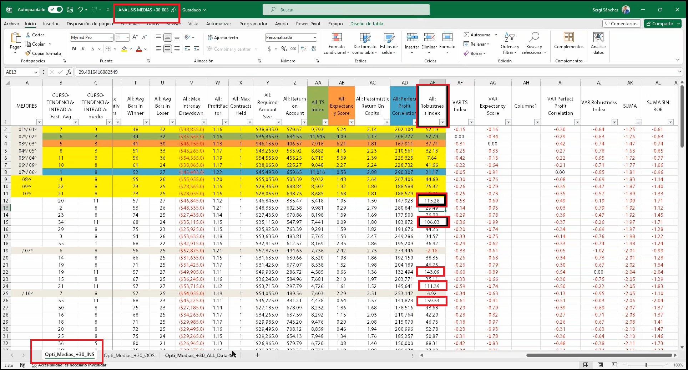
  <figcaption>Figura 077</figcaption>
</figure>

Y de los que lo han conseguido, aquí tenemos 100, y evidentemente la que vamos en el *all data* se va igualando todo, se va igualando todo, pero para eso viene bien. Entonces entre los dos podemos ver, es que como os decía, 8, 11, 3 son las medias que claramente dominan, con alguno apareciendo:

<figure>
  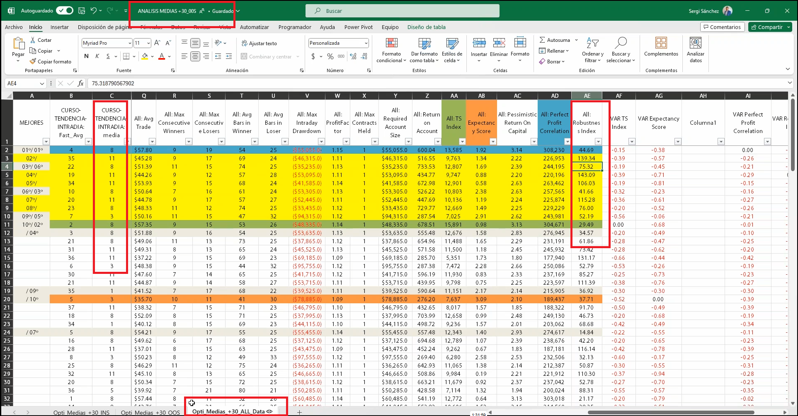
  <figcaption>Figura 078</figcaption>
</figure>

En este caso aquí también 8, 3, algún uno. Pero en general vemos que ese 8 es bastante, bastante repetido, también aquí el 11.

<figure>
  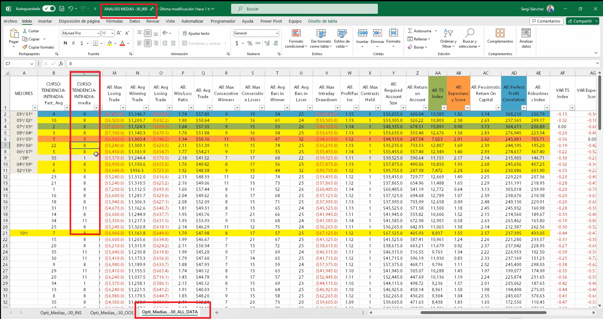
  <figcaption>Figura 079</figcaption>
</figure>

**Conclusión sobre la media KAMA**

En definitiva, aquí a mí una que me ha gustado mucho, porque además el 11, lógicamente al final voy a buscar alguno, eso sí, voy a tener en cuenta todos los datos, pero le voy a dar importancia a lo actual, le voy a dar la importancia actual. Entonces yo estoy viendo aquí alguno que gana bastante bien pero que realmente me ha conseguido mantener un buen *out-of-sample* ahora que es el KAMA, es el 11, es el 11.

<figure>
  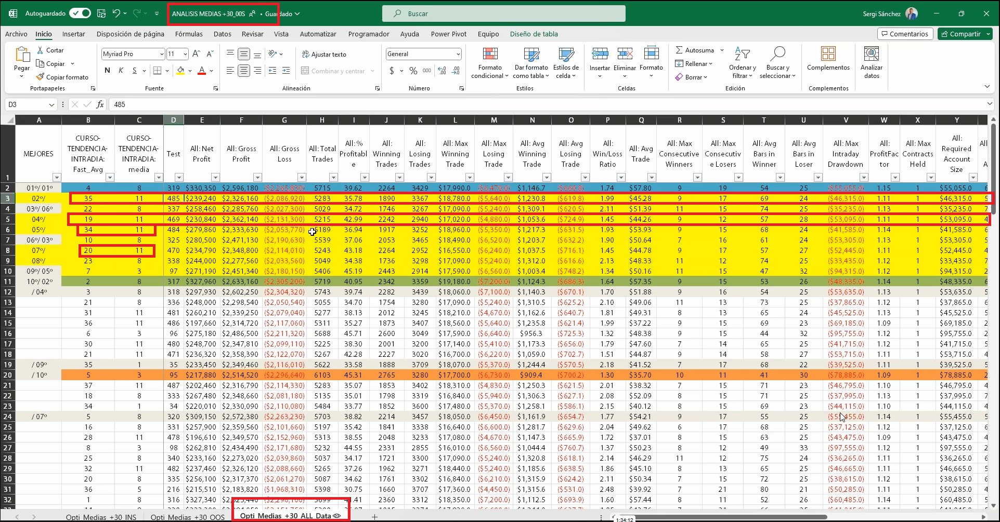
  <figcaption>Figura 080</figcaption>
</figure>

```sh
case 11: // Kama + Simple
	Fast = Kama (Slow_Avg-Fast_Avg);
	Slow = AverageFC (Price, Slow_Avg);
```

Que viene con KAMA con `AverageFC`. 35-11 es un buen candidato.

Hay más, hay más buenos candidatos porque también tenemos aquí este que tiene `143` de *robustness* que es el `19-11`. También esto para esto el mapa nos puede venir bien en esta fase. También aquí, 34-11, es casi todos los KAMA, 20-11, para todos estos son los que están dando un buen, buen rendimiento, los KAMA en el otro.

<div style="border-left: 4px solid #4caf50; background: #e8f5e9; padding: 10px 15px; margin: 10px 0; border-radius: 8px;">
  <strong>📊 Medias candidatas destacadas</strong><br><br>
  Las combinaciones con <strong>case 11 (KAMA + Simple)</strong> dominan consistentemente:<br>
  • 35-11, 34-11, 20-11, 19-11<br><br>
  También aparecen con frecuencia:<br>
  • Case 8 (Exponencial + Simple)<br>
  • Case 3 (KAMA + KAMA)<br><br>
  <strong>Criterio:</strong> Buscar equilibrio entre <em>in-sample</em> y <em>out-of-sample</em> en <em>all data</em>.
</div>

**Out-of-sample es al final**

<figure>
  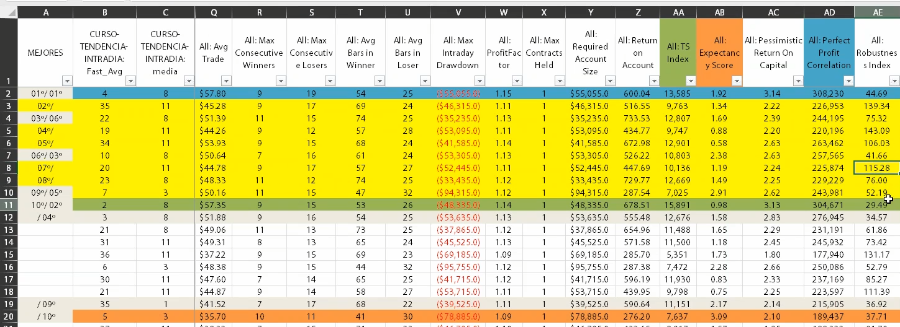
  <figcaption>Figura 081</figcaption>
</figure>

Aquí acordaros que yo cuando tengo esto más 30 la lista la ordeno con `suma`, ¿por qué?, porque el *Robustness* me ayuda, que me parece bien que el ROB añada un punto más a la decisión:

<figure>
  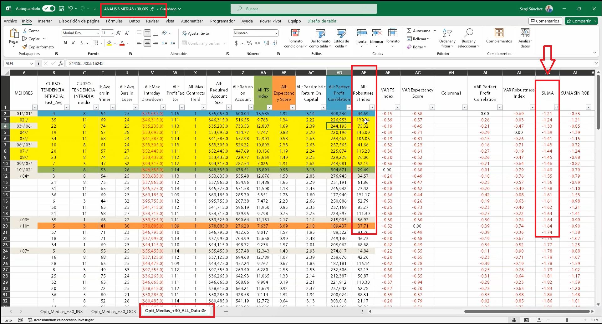
  <figcaption>Figura 082</figcaption>
</figure>

**Out-of-sample es a principio**

Y cuando al final es sin el *out-of-sample* es a principio, entonces prefiero ordenar por suma sin ROB, que a veces cambia poco, pero simplemente no le añado más por este valor `All: Robustness Index` que está desorbitado.

<figure>
  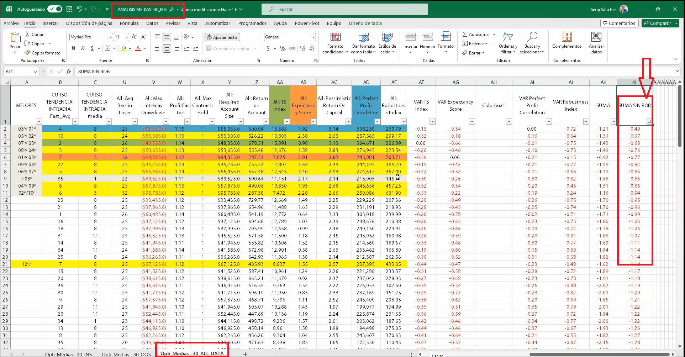
  <figcaption>Figura 083</figcaption>
</figure>

**Análisis de combinaciones de medias**

Aquí `All: Robustness Index` es lo que os digo, cuidado, porque no necesariamente es bueno, aunque ya en el *all data* tiende a equilibrarse. Pero a mí este `703.71` no me gusta, este 700 no me gusta. Si lo ponemos ahora `7-3` por ejemplo vais a ver que probablemente ha ido muy, muy bien en una parte y mal en la otra. Era 7-3, era 7-3, 7-3.

#### Caso `Fast_Avg 7` con `media 3`

<figure>
  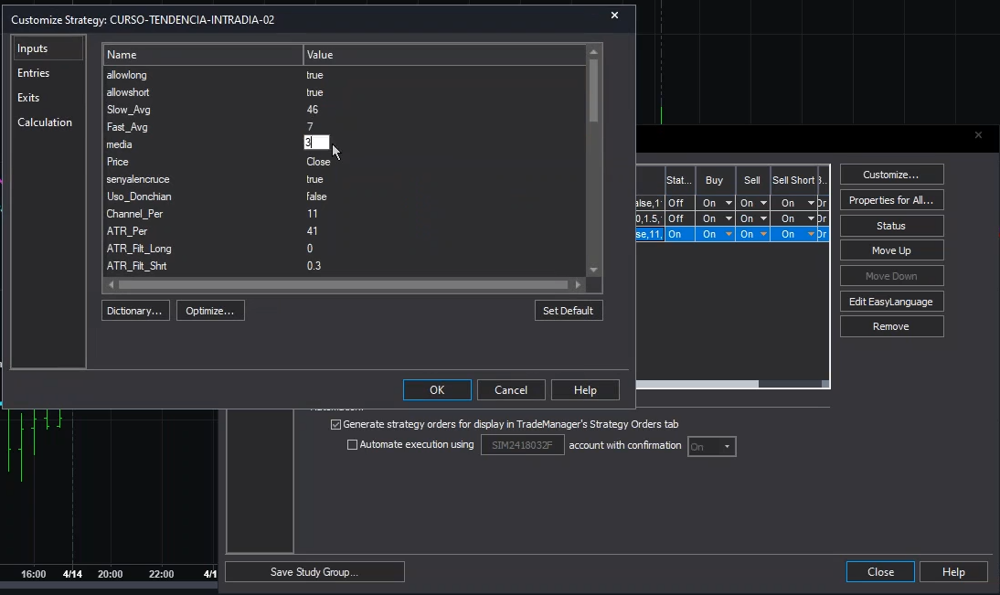
  <figcaption>Figura 084</figcaption>
</figure>

Entonces 7-3, esto, fijaros las medidas cómo cambian, que esto es muy interesante por código para este tipo de desarrollo. Esto ya os digo que es bastante avanzado, como que el código es, lo daré y lo veréis. Pero ves, ha ganado muchísimo más en esta, en este periodo AL PRINCIPIO:

<figure>
  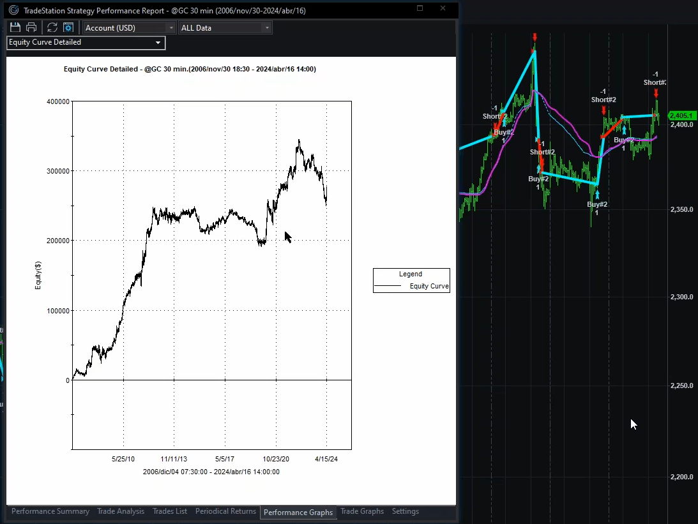
  <figcaption>Figura 085</figcaption>
</figure>

En cambio luego tiene el periodo pero se está hundiendo, ¿no? Entonces pues no acaba de ser una curva que veamos que una media que va siguiendo bien al mercado, recuerdo, es lo que os decía, parece una cosa más casual y demás, no nos inspira a una buena estabilidad, una buena distribución del beneficio, pues no nos gusta.

<figure>
  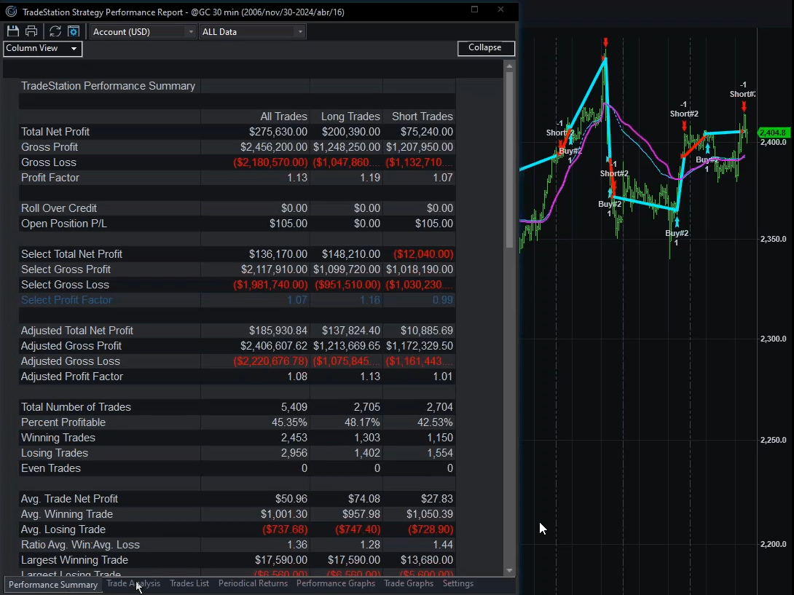
  <figcaption>Figura 086</figcaption>
</figure>

Entonces esto ya os digo que tampoco nos interesa. Nos interesa que haya bastante equilibrio entre una y otra. Y aquí ya digo, podría estar en estas, o podría, podría estar aquí, en cualquiera, cualquiera, cualquiera de estas. Para cualquiera de estas que equilibrara bien distintos vectores, entre estas que bueno ganan bastante, esa de 279 que parece bastante, 34-11, bastante bien equilibrada, bastante bien equilibrada.

<figure>
  
  <figcaption>Figura 080</figcaption>
</figure>
<figure>
  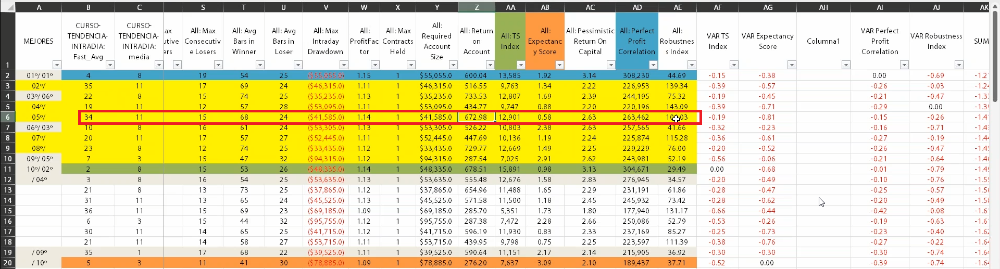
  <figcaption>Figura 087</figcaption>
</figure>

A ver, aquí dónde están, aquí también es bueno ver dónde están, aquí, 34-11 la tengo aquí, la veis, 34-11 la tengo aquí, 35-12 la tengo aquí un poco más abajo.

<figure>
  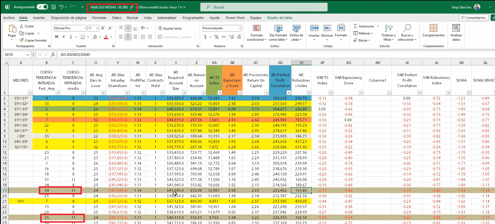
  <figcaption>Figura 088</figcaption>
</figure>

Veis 34-11 se coloca un poco mejor en esta, en esta tabla, en esta tabla, en este periodo. Así que bueno, vamos a poner 34, 34-11, vamos a poner 34. No, al final de todo el proceso podríamos revisarlo.

<figure>
  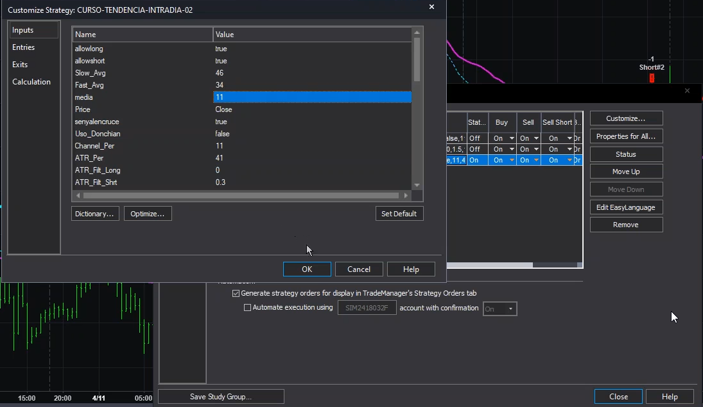
  <figcaption>Figura 089</figcaption>
</figure>

34-11, que recuerdo, el 34 se resta al 46, es decir, estoy haciendo una *fast* que parece más *fast*, ¿no?, como que nos parece más coherente, ¿no?, una fast que va más pegada al precio. La lila no se, la lila no se mueve nunca, bueno, se mueve porque cambio el tipo de media, recuerdo, cambio el tipo de media, pero no se mueve el periodo.

Pero fijaros aquí que tengo una *fast* que va más pegada pero la lila es una *simple*, por lo tanto es muy lenta. Y aquí pues no le da tiempo, y como veis pues devuelve mucho dinero al mercado.

<figure>
  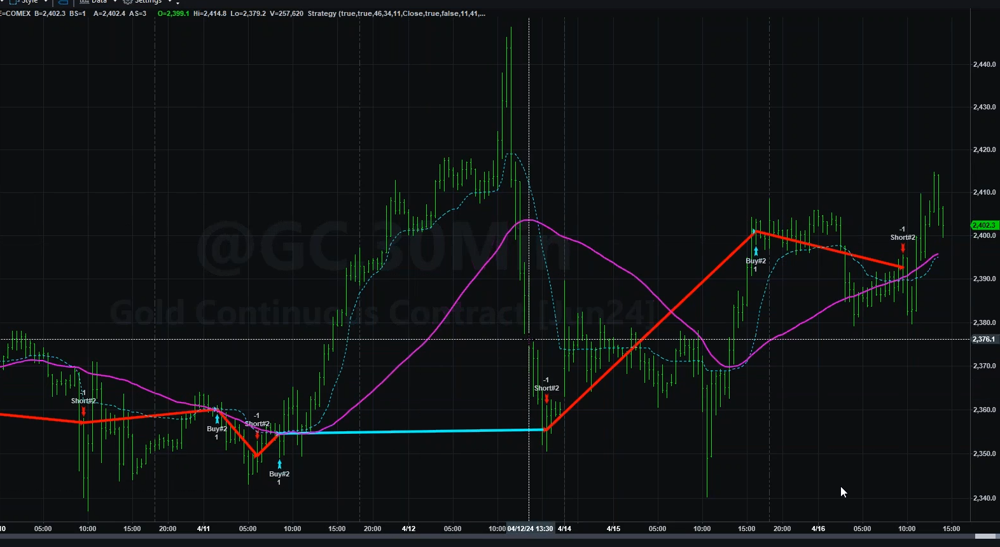
  <figcaption>Figura 090</figcaption>
</figure>

Pero ese principio debería tener una curva algo mejor que la que, la anterior, a verla.

Es un poco mejor, sí que tiene sus periodos malos. Es lo que os he dicho que fijaros, coincide, desde agosto del, noviembre, enero del 15, enero del 15, enero del 20, enero del 15, enero del 20:

<figure>
  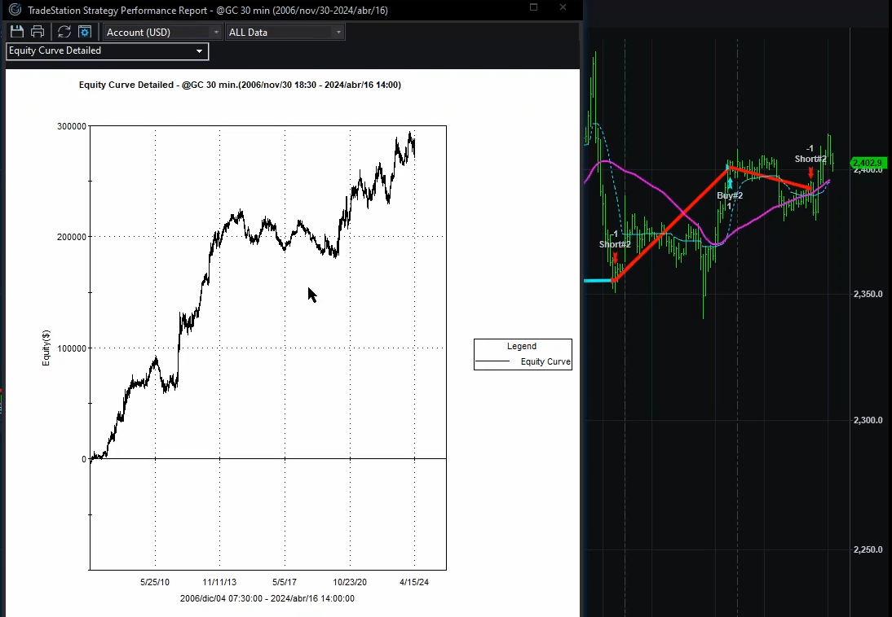
  <figcaption>Figura 091</figcaption>
</figure>

Enero del 15, enero del 20, enero del 15, o sorpresa, es desde aquí desde, por aquí a, o sorpresa, hasta aquí, hasta por aquí.

<figure>
  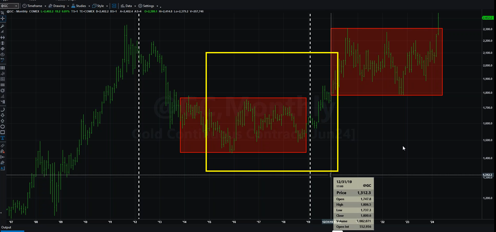
  <figcaption>Figura 092</figcaption>
</figure>

Porque aquí veis también es lateral pero es verdad que tiene más rango, y ahí pues seguramente ha conseguido con la media KAMA adaptarse, pero aquí no lo conseguimos, de su periodo gran periodo malo. Entonces aquí veis un poquito lo que os decía del mercado.


## Implementación de salidas a los sistemas tendenciales

Bien, pues con esto teníamos un poquito dos medias elegidas. Vamos a ver si podemos a través de las salidas, a través de las salidas, mejorar un poquito, un poquito el tema. ¿Cómo podemos hacerlo eso?

Bueno, tenemos, antes de probarlo aquí os enseño también unos, estos dos nuevamente *Excels* que tenemos donde he guardado ya los datos, estos que estaban bien hechos con las medias. Ya después vamos a empezar nuevamente con el más 30. Aquí lo que no sé cuál, creo que no he elegido ese, que he elegido otro, pero es igual, es que me da igual, me da igual porque casi mejor, así lo independizo uno de otro.

Aquí claro hay menos salidas porque antes hemos hecho en el código este, como ya hicimos el otro día, una pequeña adaptación en ciertos, en ciertos rangos. Alberto está trabajando un poquito las salidas y ver por sí solas a ver dónde podía ir, ¿no?, para ver, para ver un poco cuál, cuál usábamos, ¿no?, para ver qué valor de los periodos, de dejado 46, es para no complicarnos.

<figure>
  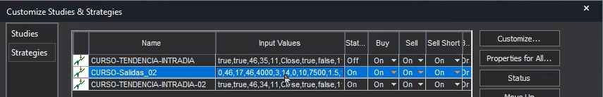
  <figcaption>Figura 093</figcaption>
</figure>
<figure>
  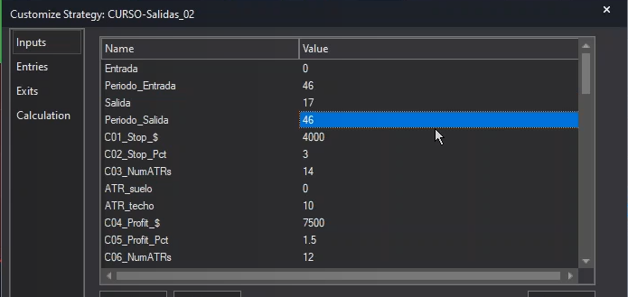
  <figcaption>Figura 094</figcaption>
</figure>
<figure>
  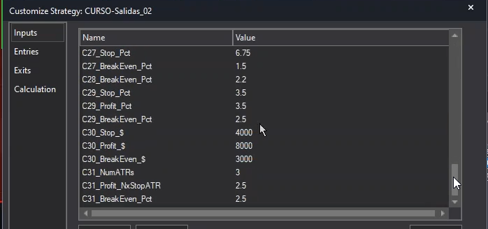
  <figcaption>Figura 095</figcaption>
</figure>

Y ahí pues lo que os digo hay un, esto porcentaje, entonces claro esos valores tenemos que poner algo medianamente coherente. Luego a partir de ahí puedes incidir y al final en otra fase tratar de hacer otra optimización con un mapa y demás. Pero de momento para hacer una búsqueda pues hemos buscado unos valores que pudieran estar bien y son estos.

**Resultados con salidas implementadas**

Entonces, simplemente hemos *optimizado las salidas* y aquí hemos visto que la 17, la 17 y la 20 parecen colocar bien:

<figure>
  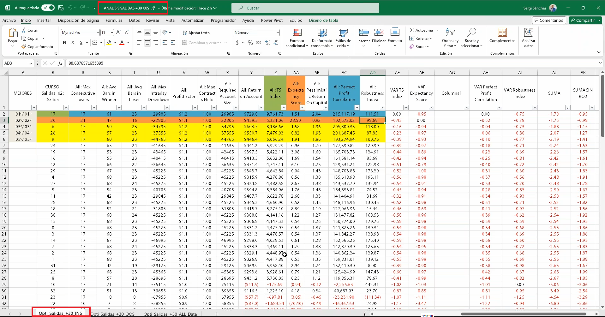
  <figcaption>Figura 096</figcaption>
</figure>

La 6 muy curiosa, la 6 nos ha sorprendido, luego os la enseño porque aparentemente es muy poco tendencial, pero ahí están los resultados con muchísimas operaciones. 17, 6, 20, 26, 24, entonces un poquito los que parecen aportar, aportar más.

<figure>
  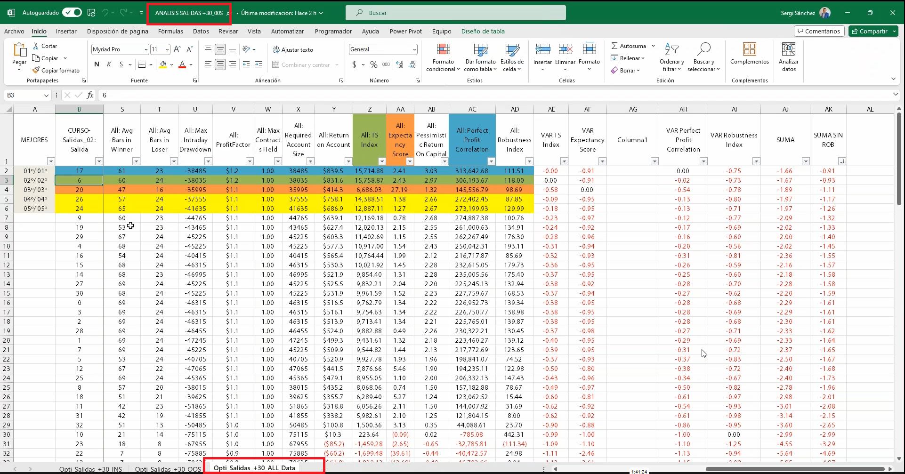
  <figcaption>Figura 097</figcaption>
</figure>
<figure>
  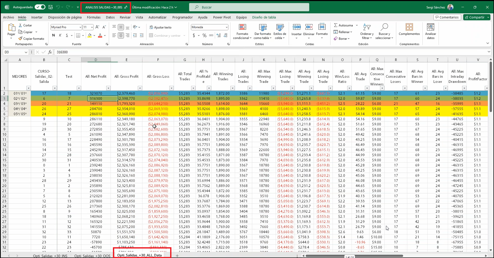
  <figcaption>Figura 098</figcaption>
</figure>

Aquí hay pocas variaciones porque al final el vector, claro, es la media, de acuerdo, en este caso. Luego veremos si podemos filtrar, filtrar la salida. Podríamos haber puesto aquí un simple *stop* y dejarlo de *stop and reverse*... Pensar que los sistemas de medias en sí tienen salida. Entonces no están imprescindibles un *stop*, pero al final ya veis que sale, que sí que a veces sale tarde y mal, ¿no?, pero pero sale, ¿no?, sale.

<div style="border-left: 4px solid #2196f3; background: #e3f2fd; padding: 10px 15px; margin: 10px 0; border-radius: 8px;">
  <strong>📋 Salidas destacadas en la optimización</strong><br><br>
  • <strong>Case 17:</strong> Stop ATR + Profit ATR<br>
  • <strong>Case 20:</strong> Chandelier + temporal<br>
  • <strong>Case 6:</strong> Profit ATR (sorprendente, poco tendencial pero buenos resultados)<br>
  • <strong>Case 26:</strong> Profit% + BreakEven%<br>
  • <strong>Case 24:</strong> Profit% + BreakEven$
</div>

Entonces aquí pues miramos a probar, por ejemplo, en este caso el más 30 y el menos 30. Como ya hemos elegido una media que equilibraba, vemos menos diferencias, vemos menos diferencias, se parecen muchísimo, de hecho son prácticamente iguales.

<figure>
  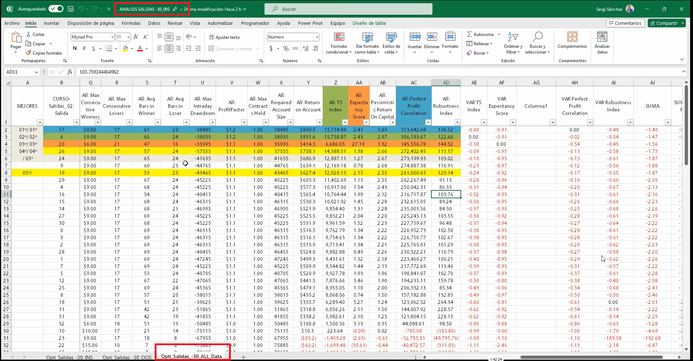
  <figcaption>Figura 0999</figcaption>
</figure>

Si miramos en el *in-sample* sí que veremos más diferencias, pero si miramos el *all data* ya no se aprecia casi, casi diferencias, de acuerdo. En *in-sample* alguna diferencia, pero tiene bastante cerrado porque, porque en primer lugar no actúa tanto las salidas. Ya vais a ver que le cuesta, le cuesta elegir una porque le cortan la tendencia.

<figure>
  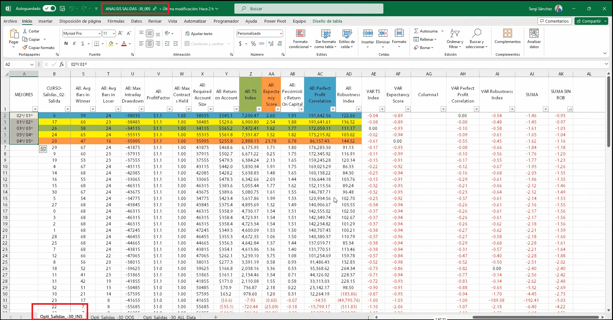
  <figcaption>Figura 100</figcaption>
</figure>
<figure>
  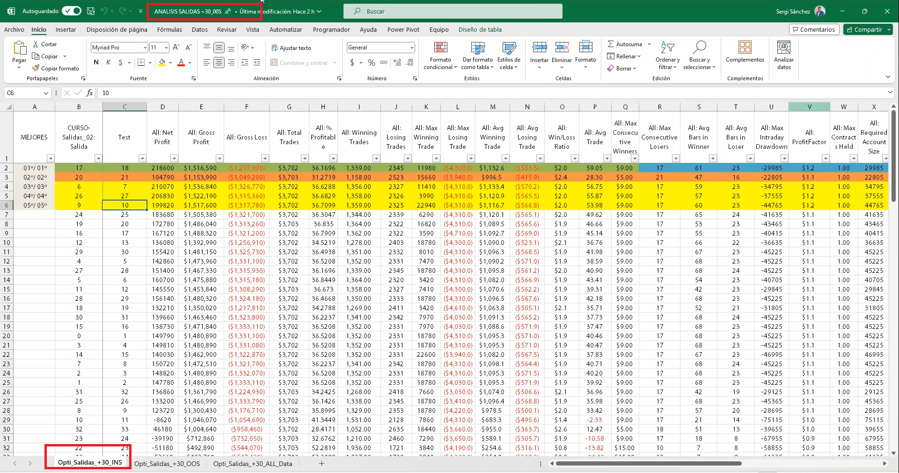
  <figcaption>Figura 101</figcaption>
</figure>

Entonces al final normalmente el tendencial le cuesta elegir una salida que mejore claramente. Aquí ahora mismo tengo puesta la 17, de acuerdo, tengo puesto la 17, que era efectivamente la mejor *in-sample* y también la mejor en el *all data*, para con el `+30` la que tiene mejor equilibrio entre todos los `fitness` que usamos, o el mejor `robustness`. Bueno, parece un buen, buen equilibrio.

<figure>
  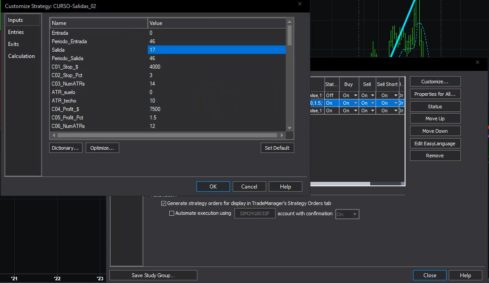
  <figcaption>Figura 102</figcaption>
</figure>


#### `Case 17` Salida: Stop ATR + Profit ATR

Y vamos a ver que efectivamente la 17, si no recuerdo mal, este, vamos a las salidas, no esto no lo tengo aquí. A ver que lo abro un momentito, 17 he dicho, 17 teníamos de salidas, es el código del otro día. Esto va a tener un *profit ATR*, con la que usamos un *input* que era el *stop* y un multiplicador del stop.

```sh
case 17: // Stop ATR + Profit ATR - Input: Periodo_Salida(14), C17_NumATRs (3), C17_Profit_NxStopATR (1.0);
begin	
		Input:
			C17_NumATRs ( 5 ),
			C17_Profit_NxStopATR ( 2.5 );
			
		Value1 = C17_NumATRs * AvgTrueRange(Periodo_Salida) * BigPointValue;

		Value2 = ATR_suelo / 100 * C * Bigpointvalue; 
		Value3 = ATR_techo / 100 * C * Bigpointvalue;
		
		Value1 = MaxList(Value1, Value2);
		Value1 = MinList(Value1, Value3);
		
		Value4 = C17_NumATRs * C17_Profit_NxStopATR * AvgTrueRange(Periodo_Salida) * BigPointValue;
		Value4 = MaxList(Value4, Value2);
		Value4 = MinList(Value4, Value3);
		
		SetStopContract;			
		SetStopLoss(Value1);
		SetProfitTarget(Value4);	
end;
```

Aquí fijaros que contradice un poco, bueno no es que lo contradiga, ya os he dicho que no quería decir que no hubiera que poner, que decir que si queremos un tendencial puro tiene que ser sin TP ni *stop*, pero no quiere decir que no hay que usarlo. A lo mejor no lo quiero tan puro, y me va mejor, ¿entiendes? Que es lo que acaba pasando.

¿Por qué? Porque esta curva que teníamos, ahora veremos que la curva pues mejora un poco. Ves, este periodo malo ya no está malo, ya no está malo. Ahora la curva ya ha mejorado bastante solo poniéndole esta salida, de acuerdo.

<figure>
  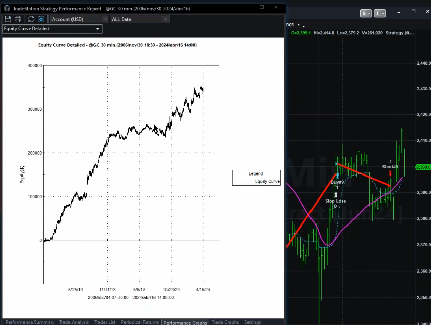
  <figcaption>Figura 103</figcaption>
</figure>
<figure>
  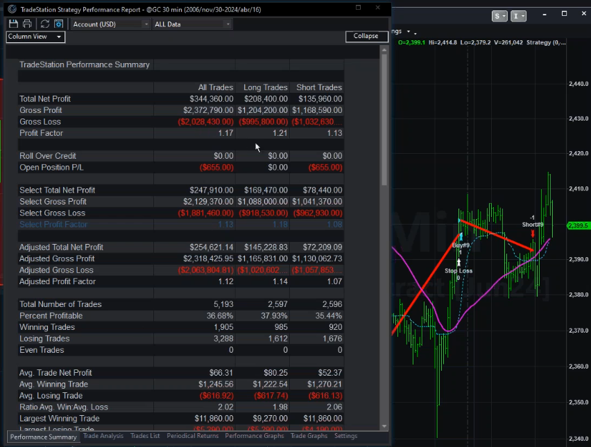
  <figcaption>Figura 104</figcaption>
</figure>

Sigue teniendo un *profit factor* que no es muy elevado, pero fijaros aquí ya tenemos 1.17, con 1.21 y 1.13. Y con comisiones está bastante razonable. Esto es un sistema probablemente operable así, no hemos filtrado todavía, no hemos aplicado ningún filtro, ningún filtro. Simplemente cruce de medias con salidas y *stop* que a veces salta, como veis.

**Parámetros de la salida**

¿Qué valores tiene? Bueno, solo habíamos hecho un estudio antes, puede hacer también, vamos a tratar de hacer este par de estudios que hemos dicho si nos deja, lo intentaremos. Quitaré la cámara no sé, quitaré de compartir la pantalla que me lo sugería antes creo Aureli, para ver si es eso aún un problema con el controlador de la tarjeta gráfica, no sé.

Aquí era la salida 17, acordaros que cada uno tenía un *input*. Ves, 5 ATRs y el *profit* es 2 y medio más, quiere decir que es 12 y medio. 5 ATRs de *stop*, 12 y medio de TP.

<figure>
  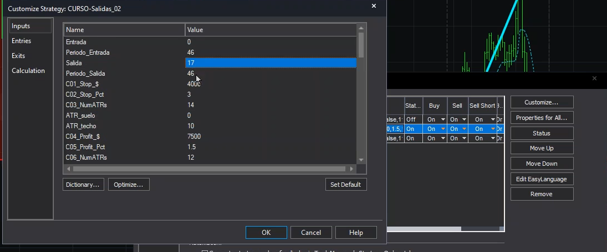
  <figcaption>Figura 105</figcaption>
</figure>
<figure>
  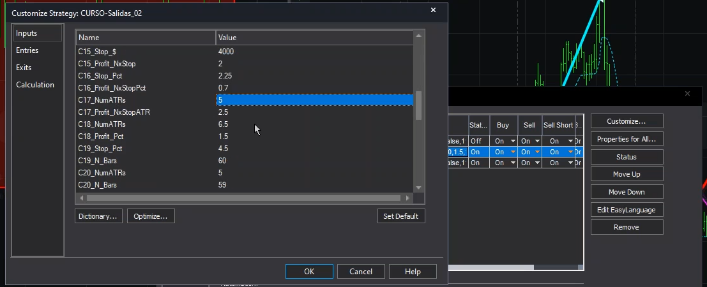
  <figcaption>Figura 106</figcaption>
</figure>

Por eso que os decía, hombre no hay que poner TP, bueno, hombre, le puesto 12 ATRs de TP, es decir, le puesto un TP que lógicamente algunas veces va a dejar, a dejar correr. Esto aquí parece una sobreutilización pero acordaros que estamos con 5.000 *trades*, es que hay momentos que sale antes, hay momentos y muchos no sale.

<figure>
  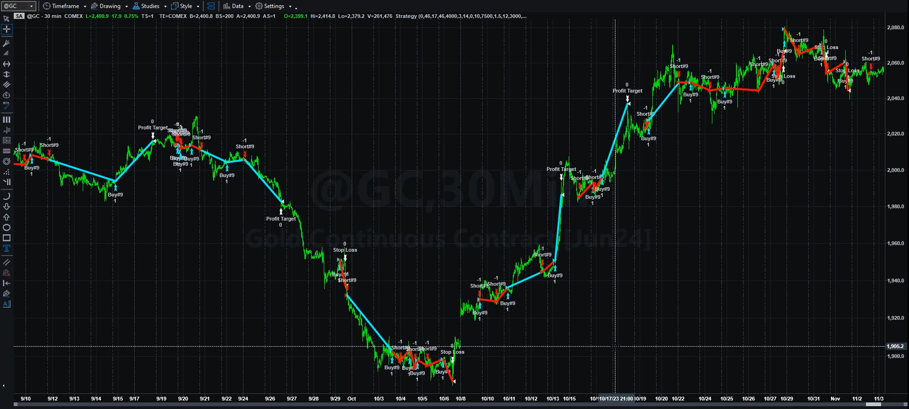
  <figcaption>Figura 107</figcaption>
</figure>

Realmente no sale tantas veces, pero al final cuando pones un TP, miramos aquí:

<figure>
  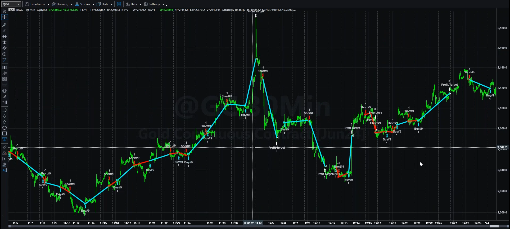
  <figcaption>Figura 108</figcaption>
</figure>

Aquí deja perder mucho tramo de tendencia, pero hubiera pillado más. Bueno, solo hubiera pillado más con un TP más alto pero no lo hubiera pillado, sino porque ves que provoca una vuelta espectacular y te la pierdes. Al final vendemos.

**Dinámica del Take Profit en tendenciales**

Entonces al final cuando haces estos TPs que buscas una dinámica de volatilidad que normalmente sabes que el mercado a través de esa expansión, recordar el mercado siempre expande, contrae, expande, contrae. El mercado ya agota, ya no hay fuerza para seguir. Como veis casi siempre es así, van a haber excepciones, 100%, sobre todo en este primer tramo donde habíamos visto que subía tanto, para haber excepciones.

Pero fijaros que con caídas muy fuertes y subidas a veces no hacen TP:

<figure>
  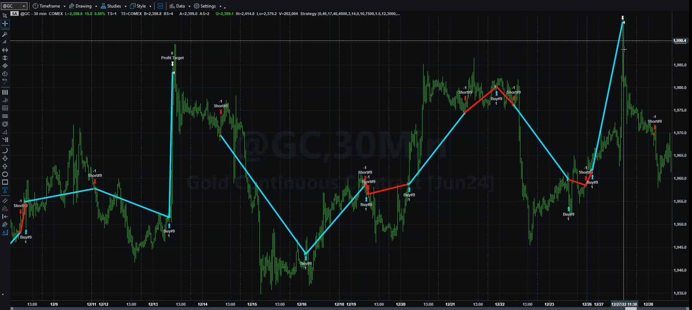
  <figcaption>Figura 109</figcaption>
</figure>

Pero a veces que sí que pilla, está casi el máximo, ¿por qué? Porque no es que sea un ejercicio de sobreoptimización, es que al final del mercado tiene esa dinámica de expansión.

Aquí fíjate que no hace TP y devuelve, veis, y no le da ni para el *stop*:

<figure>
  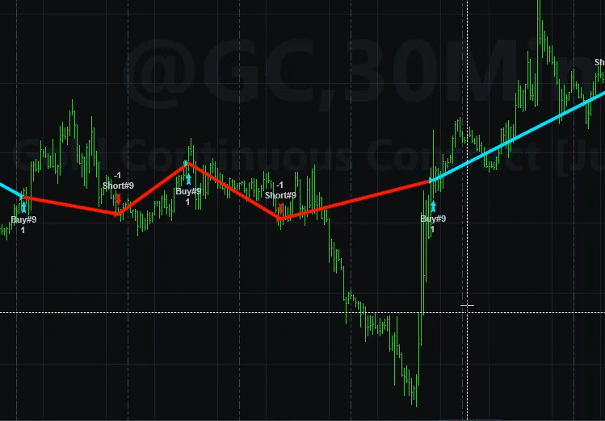
  <figcaption>Figura 110</figcaption>
</figure>

¿Por qué? Porque no *trailing*, también ahí estaba el *trailing* y también, pero considera que le va peor el *trailing*. Hay veces que hace TP es fantástico, es que devuelve todo esto, todo, es un coste de oportunidad, ventaja, desventaja, es.

Aquí fijaros que subida pero no le da para hacer el TP. Hubiera tenido un TP más cercano pues hubiera cerrado aquí, pero a cambio pues no hubiera hecho esos grandes *trades*.

<figure>
  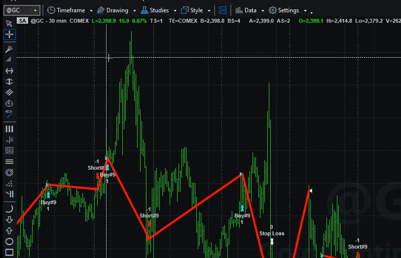
  <figcaption>Figura 111</figcaption>
</figure>

<div style="border-left: 4px solid #ff9800; background: #fff3e0; padding: 10px 15px; margin: 10px 0; border-radius: 8px;">
  <strong>💡 Sobre el Take Profit en tendenciales</strong><br><br>
  En un tendencial solo tiene sentido usar "TPs medio locos" que solo saltan en movimientos de mucha expansión. Esto permite capturar grandes trades mientras protege de devoluciones completas. Es un equilibrio entre coste de oportunidad y protección de beneficios.
</div>

Entonces hay que, en un tendencial solo tiene sentido de esta manera con TP, es muy locos. Esto no es un TP loco pero se le acerca, es un TP medio loco. Pero fijaros la cantidad de bienes que tiene fuertes donde no hace TP, solo lo hacen movimientos de mucha expansión.

Y algunas veces ves, aquí hubiera podido sacar más, pero fijaros que casi siempre después vuelve vertical porque el mercado es así. Ves, aquí fijaros todo lo que pierde de ganancia, aquí sí que realmente hubiera ganado mucho más, pero a cambio otros no hubiera hecho TP y lo verá de vuelta. Entonces es lo que, es lo que os digo.

<figure>
  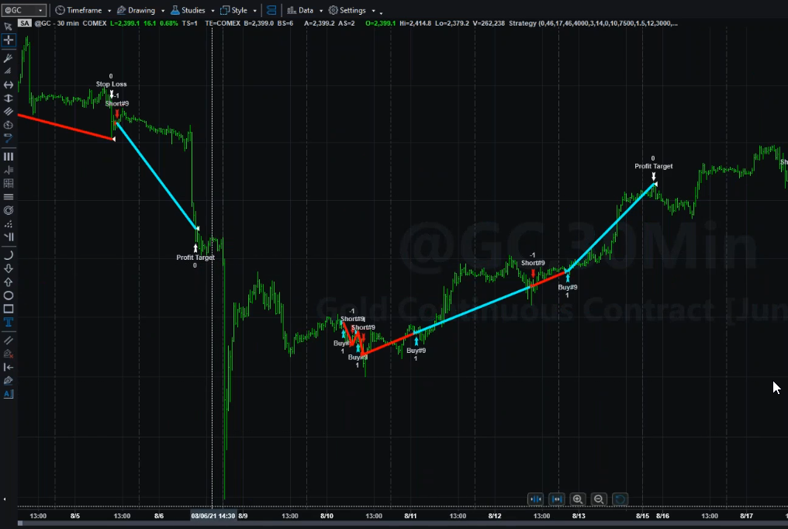
  <figcaption>Figura 113</figcaption>
</figure>

**Mejora de la curva con salidas**

Y hay, esto se lo habéis ido viendo también. Esto es esta salida, parece un buen equilibrio entre *stop* y TP, y convierte la curva en bastante más llevadera ajustado por volatilidad. También el porcentaje bruto no iba mal.

Vamos a la parte inicial del gráfico, vamos a la parte inicial del gráfico, donde ahí veremos enganchadas fuertes.

<figure>
  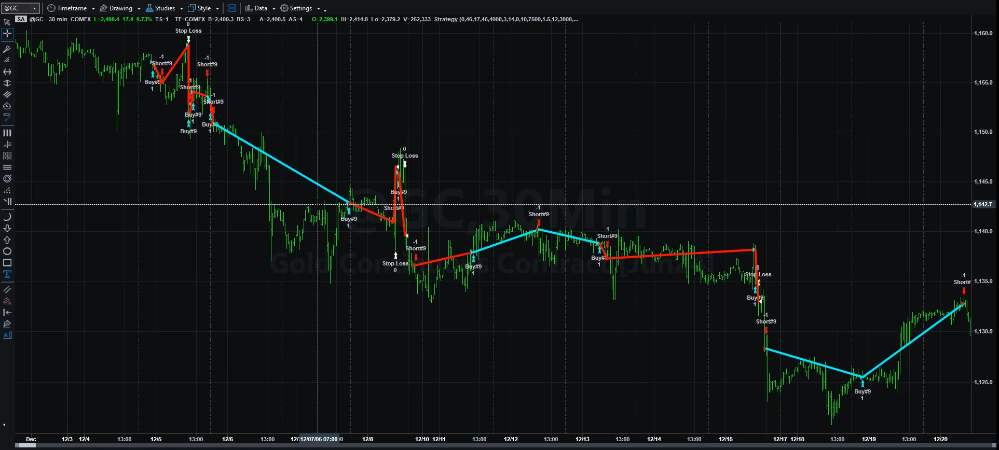
  <figcaption>Figura 114</figcaption>
</figure>

Aquí algunas, mira algún *stop* aquí, aquí también, vamos aquí que enganchada para empezar.

Aquí rápidamente ya empieza. Y ves aquí donde donde hay muchos tramos de tendencia limpios, aquí mira nos saca y en falso, este te saca por poco de esto y se pierde la caída.

<figure>
  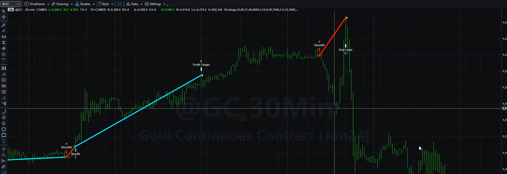
  <figcaption>Figura 115</figcaption>
</figure>

Se pierde la caída porque no hay un cruce, este con el hecho de no de no ir por cruce hubiera vuelto a entrar seguramente, pero esto esto cambia mucho el sistema.

**Opciones de señal por cruce vs continua**

Pero esto, os quiero decir, esto de señal cruce *true*, señal cruce *false*, a ver qué pasa.

<figure>
  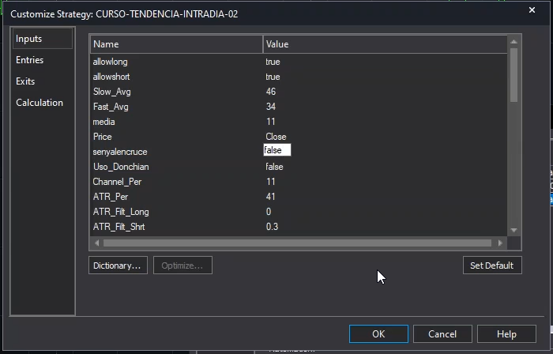
  <figcaption>Figura 116</figcaption>
</figure>

No pasa que aquí solo tiene sentido en el *Donchian*, porque realmente va a vender directo.

<figure>
  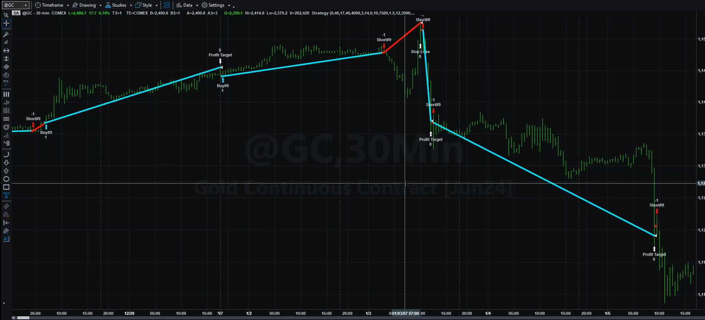
  <figcaption>Figura 117</figcaption>
</figure>

Es para vender directo, no tiene sentido, no tiene sentido el *stop* así ni el TP ni nada porque va a vender directo si se siguen dando las condiciones a vender directo.

O sea, así este *setup* de tal solo tiene sentido con *Donchian*, no va a ir mal tampoco pero pero va a ir peor, peor, porque ya digo que solo tendría sentido con el Donchian si porque necesite algo más al salir.

Porque si no sale y vuelve a entrar, porque en ese, en ese caso siempre que la media esté cortada él vende o compra, entonces se sale y al siguiente vela va a volver a entrar. Habría que controlar eso para que tuviera sentido, ya digo habría que activar el Donchian.

**Prueba con filtro Donchian**

Entonces en *true*, bueno aquí en true-true:

<figure>
  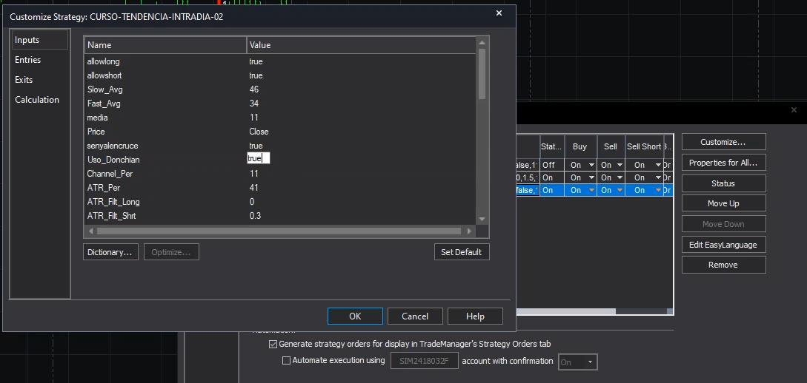
  <figcaption>Figura 118</figcaption>
</figure>

Lo que pasa que evidentemente en momentos pues que tarda mucho, habría que ver el *Donchian* así cómo queda. Esto sería con el filtro Donchian activado, pero no está, no está mirado nada del filtro, es decir, seguramente no tiene ningún tipo de sentido como está puesto ahora.

Pero así sería con un filtro Donchian. Como habéis entrado mucho menos, mejora, mejora en sobremanera la curva. Es otra curva, es otro sistema.

<figure>
  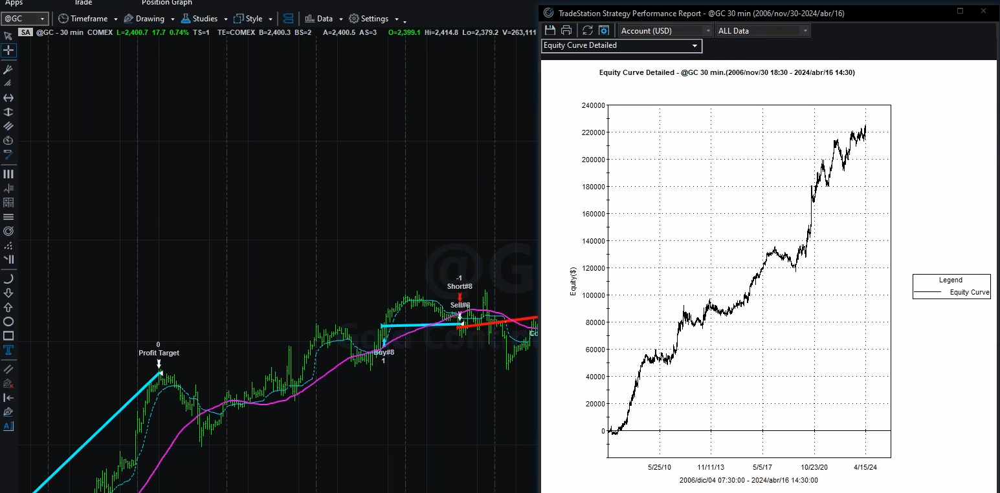
  <figcaption>Figura 119</figcaption>
</figure>
<figure>
  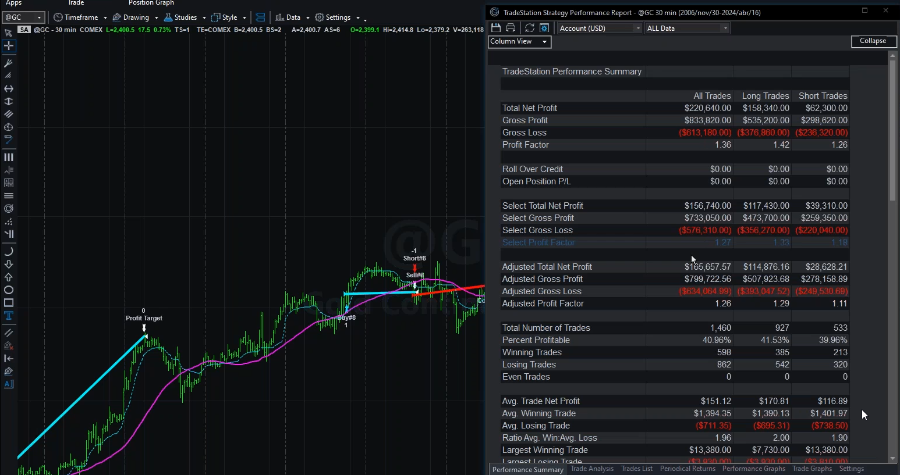
  <figcaption>Figura 120</figcaption>
</figure>

Pero simplemente para que lo veáis, así ya es otro sistema. Opera menos, aunque tiene 1400 *trades*, pero ya hemos mejorado mucho los ratios. Este fijaros si es robusto a la media y la salida.

Sí, con esta dinámica que metiendo los Donchian, que ni lo hemos mirado, es decir, este Donchian yo lo activado ahora:

<figure>
  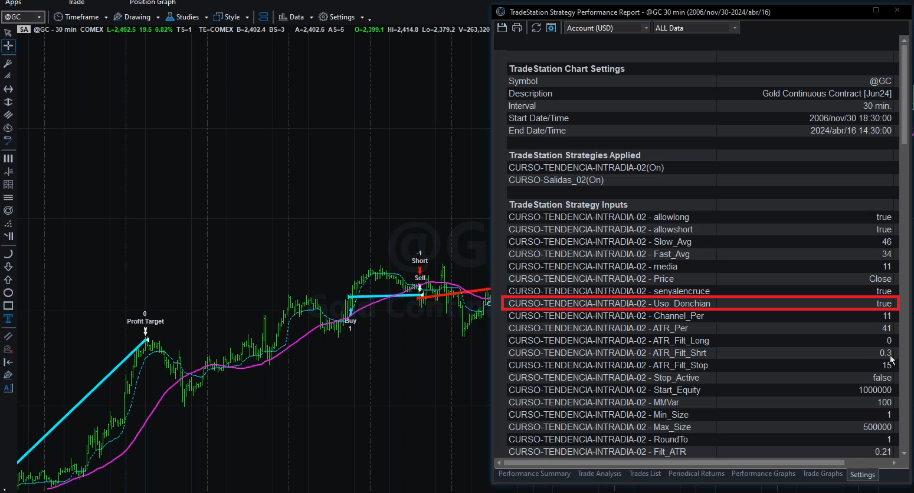
  <figcaption>Figura 121</figcaption>
</figure>

Este simplemente ahora activado el Donchian, para que lo veáis activado el Donchian, pero dejado un parámetro que nos estaba puesto antes, 41. Porque me de 46 que lo que usábamos antes. Y aquí hay un par de filtros que en un Long está cero y 0.3 Short pero está totalmente casual de verdad, o sea, no tiene, no se ha mirado nada de esto, esto.

**Consideraciones sobre el periodo del canal**

<figure>
  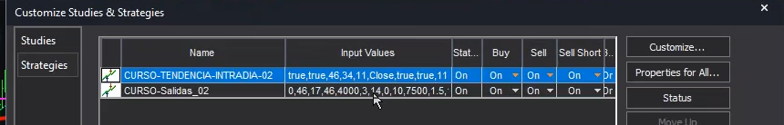
  <figcaption>Figura 124</figcaption>
</figure>
<figure>
  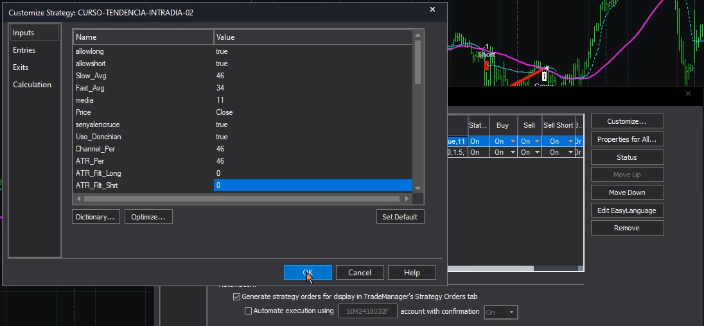
  <figcaption>Figura 122</figcaption>
</figure>

Y ya solo esto, de hecho para nuestra opinión lo mejor no tocarlo sería en 46, o sea, este habría que dejarlo, este 46, el periodo y el canal que en una sesión también abierto es demasiado duro, ¿no?, es demasiado, así yo creo, haber así es demasiado duro, es entrará muchísimo, si operará muy poco.

Así seguramente se podría plantear, así pero ahora analizar las medias de nuevo, ¿entendéis?, decir, bloquear el Donchian como está ahora en 46, decirle, bueno, tienes que superar los máximos de una sesión, de 46 velas en *trailing*. Cuidado que equivale a una sesión de duración, pero analizo las medias para ese condicionante.

Porque si no el Donchian es muy restrictivo, entonces opera muy poco. Seguramente va a ganar:

<figure>
  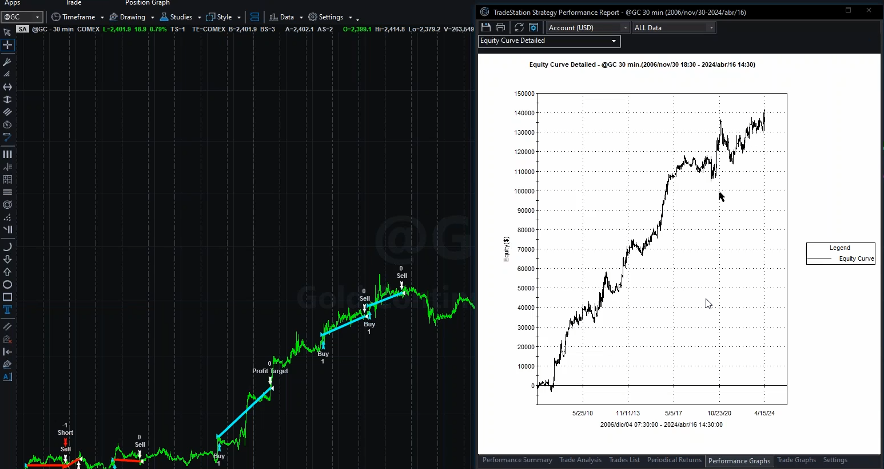
  <figcaption>Figura 126</figcaption>
</figure>
<figure>
  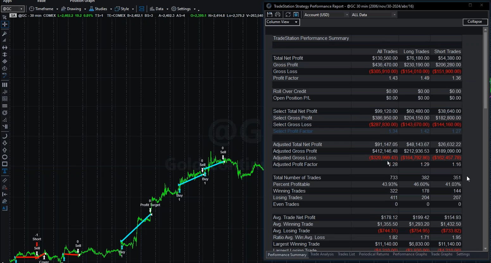
  <figcaption>Figura 125</figcaption>
</figure>

Fijaros esta curva es muy bien, aún así tiene 700 *trades*, pero es muy restrictivo. Tenemos una curva mucho más estable así, estoy entrando prácticamente por Donchian, pero es verdad que las medias me dan un plus. Es medias más Donchian, de acuerdo.

**Sistema con Donchian como entrada principal**

Se podría perfectamente trabajar. No lo hemos trabajado porque lo he dejado para el final como filtro, pero puede, puede implementarse en este caso como considerarse señal básica de entrada, bloquearlo ahora y trabajar las medias con este Donchian. Seguramente que haga unas medias más rápidas.

Pero obligar en la media de 46 y el canal de 46 es muy restrictivo, pero es válido, o sea, restrictivo es válido. Y me atrevería a decir con toda potencia del mundo que probablemente es *robusto*, probablemente es robusto. Porque es un activo muy tendencial y es muy lógico.

Ya veis que que los ratios son buenos, gana menos que el otro porque es menos tendencial, es tendencial pero es menos tendencial. Pero fijaros qué curva:

<figure>
  
  <figcaption>Figura 126</figcaption>
</figure>
<figure>
  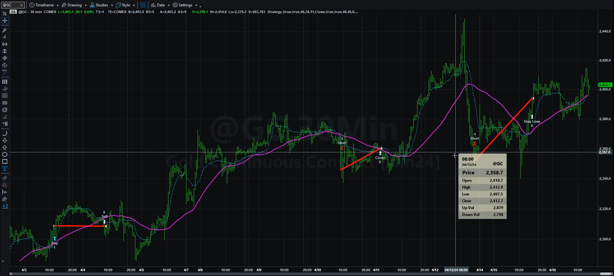
  <figcaption>Figura 127</figcaption>
</figure>

Está en máximos prácticamente ahora, ahora acaba de ser el sede, máximos porque ha fallado estos dos, aquí parecía que rompía, se ha fallado, aquí parecía que rompía, ha fallado y se ha salido por estos.

Y ahora vamos a esperar siguiente rotura, pero evidentemente es un, es un sistema que de esta manera pues da bastante, bastante recorrido. O sea, es un condicionante tan grande que habría que replantear las medias y incluso las salidas, pero hacerlo de manera independiente es buena práctica.

<div style="border-left: 4px solid #4caf50; background: #e8f5e9; padding: 10px 15px; margin: 10px 0; border-radius: 8px;">
  <strong>📏 Principio de independencia de reglas</strong><br><br>
  Y ya veis que cuando las reglas son sólidas el sistema aguanta porque esta es la gracia: la <em>independencia de las reglas</em>. Si son buenas, a mejor no son las mejores, pero deben aguantar el tipo al cambiar.
</div>

**Retorno al sistema base**

Bien, volvemos a donde estábamos porque eso simplemente quería mostraros un momento el Donchian, el hecho de cruce, no cruce, y ya lo hemos hecho los, un caso si tenemos tiempo volvemos. Dejamos el Donchian en *false* y nos quedamos con nuestras medias que operan mucho más, también ganan más pero lógicamente la curva no están estables, más tendencial, y también devuelve más dinero a veces y opera mucho más, aunque recuerda que las condiciones están implementadas para que se pueda comparar todo.

<figure>
  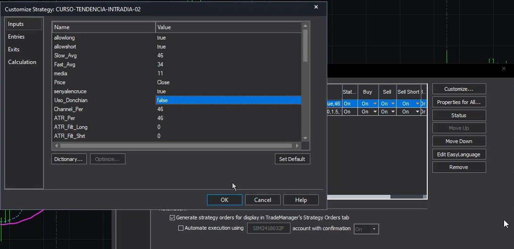
  <figcaption>Figura 128</figcaption>
</figure>

Así que ya la curva no es tan estable como está, pero no está nada mal para un tendencial, no está nada mal.

<figure>
  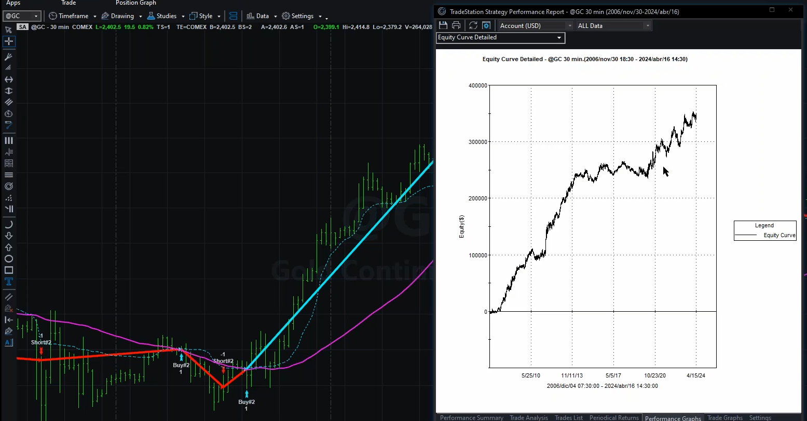
  <figcaption>Figura 129</figcaption>
</figure>
<figure>
  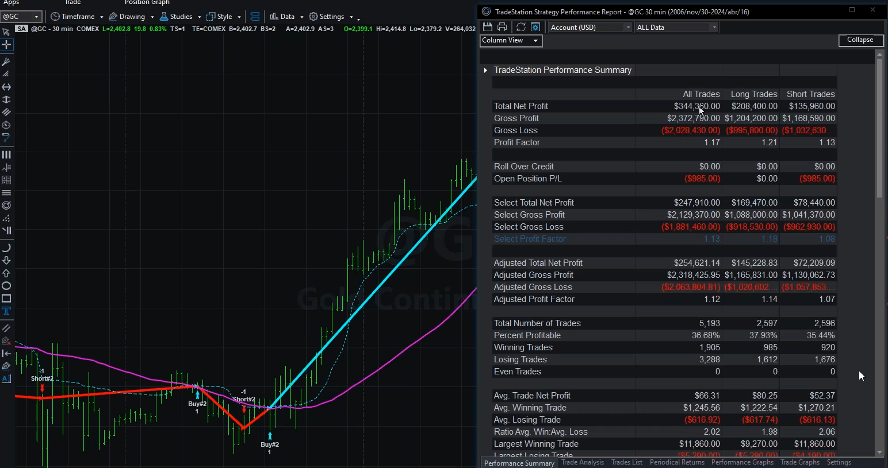
  <figcaption>Figura 130</figcaption>
</figure>

Y fijaros que gana bastante más, 344, antes creo que estábamos en ciento y pico en un contrato, cuidado que no hay aquí gestión monetaria, importante, pero 1.21, 1.17 peor *profit factor*, pero muchísimas más operaciones.

Y veis, 36% `profitable` a pesar de tener TP, sus ratios son de muy tendencial, porque es un TP que en la mayoría de las veces no salta, y cuando salta en una aplastante veces el mercado revierte.

<figure>
  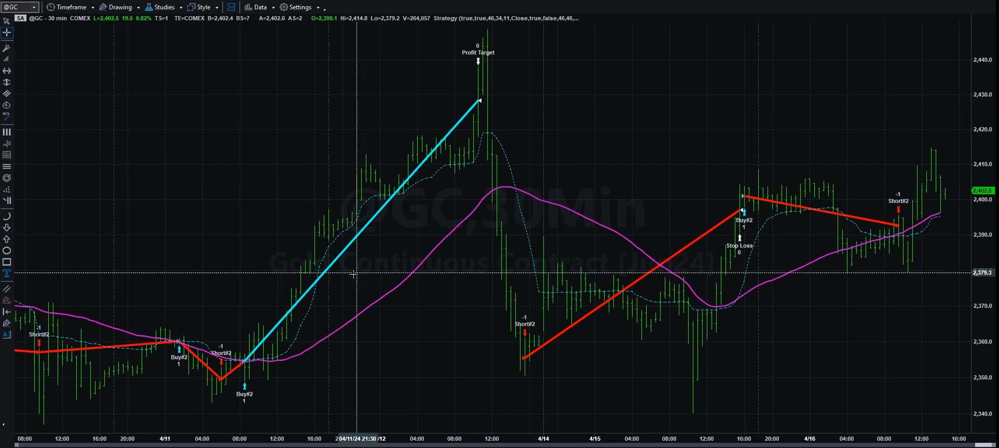
  <figcaption>Figura 131</figcaption>
</figure>

O sea, el mercado es lo que os digo, es un, es un TP casi loco, no, no, no es loco porque salta bastante, pero es casi loco, es casi loco. Realmente las subidas son de un tramo muy importante.

Es aquí fijaros que este *trade* compra en 2354:

<figure>
  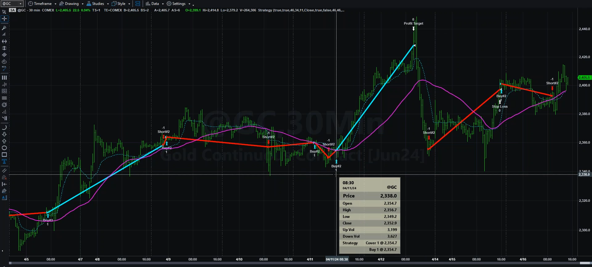
  <figcaption>Figura 132</figcaption>
</figure>

Y cierra en 2428:

<figure>
  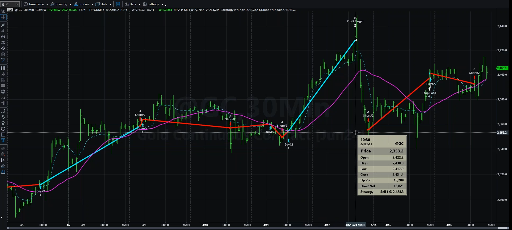
  <figcaption>Figura 133</figcaption>
</figure>

Son 75 puntos, $7.500.

**Sistema operable**

Entonces así como está es un sistema que entra en operable, en operable, es un tendencial puro y tal. Ahora qué podríamos hacer con él, podríamos tratar de filtrar. Aquí simplemente hemos hecho un análisis, yo lo que voy a hacer de las salidas con un primer análisis de medias, de acuerdo, primero uno y luego otro.

De momento no he analizado filtros, bueno, he hecho una pequeña prueba ahora con el con el Donchian que no lo había hecho, o sea, le ha hecho a ciegas, y habéis visto que iba, iba bien, iba bien.

## Optimización en MultiCharts

Entonces ahora lo que vamos a hacer es intentar abrir MultiCharts con el mismo, el mismo sistema, el mismo sistema.

<figure>
  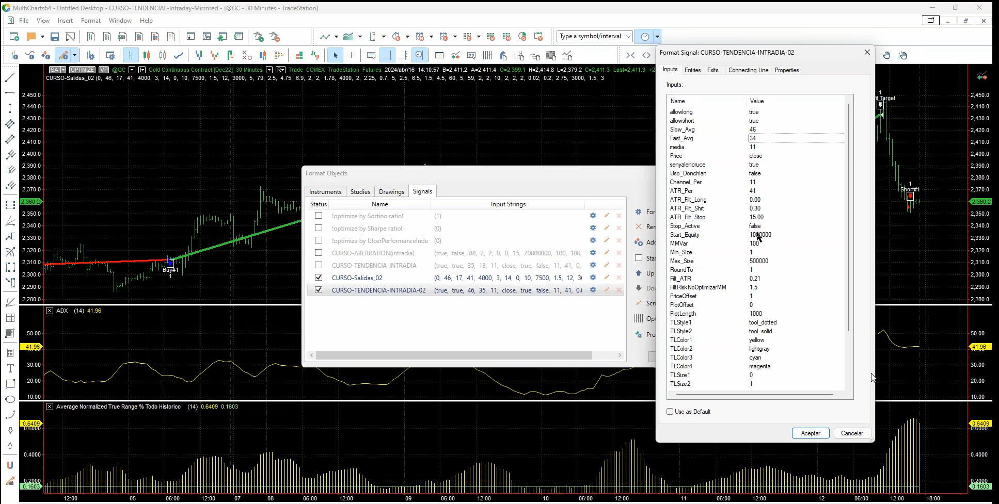
  <figcaption>Figura 135</figcaption>
</figure>

**Configuración para el mapa de calor**

A ver si lo tengo, esto con qué *input* tengo, tendencia 2, 35, bueno, antes he puesto 34. Por mantenerlo esto no actúa, no actúa nada. Y lo de la ADX, vamos a ver ahora.

Antes voy a hacerlo de las medias, que creo que lo voy a poner y mientras hablo y tal no va, no va a tardar mucho para que veáis el mapa. A ver si me lo deja hacer.

Eso en principio es bastante sencillo porque simplemente vamos a salidas. Aquí tendencia es el *slow* fijo, este lo optimizo desde 1 a 45. Y está la media era de 1 a 19, Alberto, 1 a 19, verdad, perfecto.

<figure>
  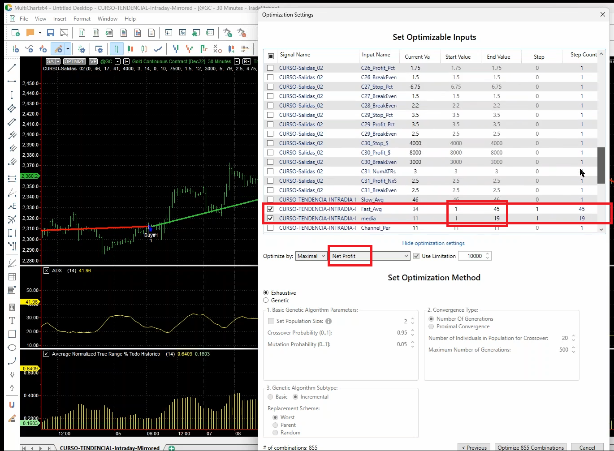
  <figcaption>Figura 136</figcaption>
</figure>

Esto tengo, tengo, tengo metido aquí el *Sortino*, no, no está metido, no, a mí no me da, no lo tengo, no es activado. Joder, pues igual a lo, por el *profit* de esa, lo por el profit. Venga, venga.

<figure>
  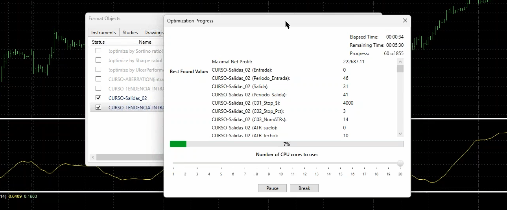
  <figcaption>Figura 137</figcaption>
</figure>

**Resultados de la optimización**

A ver, este es el mapa de la variable *`fast_Avg`* y la variable `media`. Aquí el mapa en sí no, no vais a ver una progresión porque claro, el tipo de media no es una variable que tenga una progresión de sí, no hay ninguna relación entre 1 el 2 el 3 el 4. En el número de medias.

<figure>
  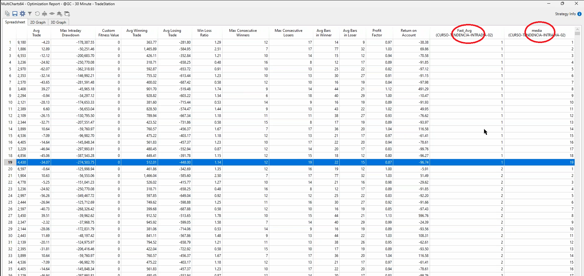
  <figcaption>Figura 138</figcaption>
</figure>

Y lo más interesante de ver aquí si os fijáis es que una vez elegida la `media`, el `periodo` no es tampoco súper crítico. Hay mucha *estabilidad*, un poco lo, la una de las pocas cosas que podemos que podemos ver, que a lo largo de las medias hay, hay bastante estabilidad.

<div style="border-left: 4px solid #2144f3ff; background: #f2faffff; padding: 15px 20px; margin: 15px 0; border-radius: 8px;">
  <strong>📊 Cómo interpretar la estabilidad en el mapa 3D</strong><br><br>
  
  <strong>Ejes del gráfico:</strong><br>
  • <strong>Eje X (horizontal):</strong> Tipo de media (1 a 19)<br>
  • <strong>Eje Y (profundidad):</strong> Fast_Avg (periodo de la media rápida, 5 a 45)<br>
  • <strong>Eje Z (altura/color):</strong> Net Profit (beneficio neto)<br>
  
  <strong>Qué buscar:</strong><br>
  • <span style="color: #2e7d32;">✅ <strong>Cordillera larga y plana (meseta):</strong></span> Estable → Muchos valores de Fast_Avg funcionan bien<br>
  • <span style="color: #c62828;">❌ <strong>Pico aislado y puntiagudo:</strong></span> Inestable → Solo un valor específico funciona (sobreoptimización)<br>
  • <span style="color: #1565c0;">🔵 <strong>Valle profundo (azul):</strong></span> Zona de pérdidas, evitar<br>
  
  <strong>En las imágenes:</strong><br>
  Las medias <strong>1, 2 y 8</strong> (zona derecha) muestran una superficie verde <em>continua y extendida</em> a lo largo de casi todo el rango de Fast_Avg. Esto significa:<br>
  
  <em>"Me da igual si elijo Fast_Avg = 10, 20 o 30... mientras use la media tipo 8, voy a tener beneficios similares"</em><br>
  
  <strong>La clave:</strong> Buscar zonas donde la superficie sea lo más <strong>plana y extendida</strong> posible en verde, no picos puntiagudos. Eso es <em>robustez</em>.
</div>

<figure>
  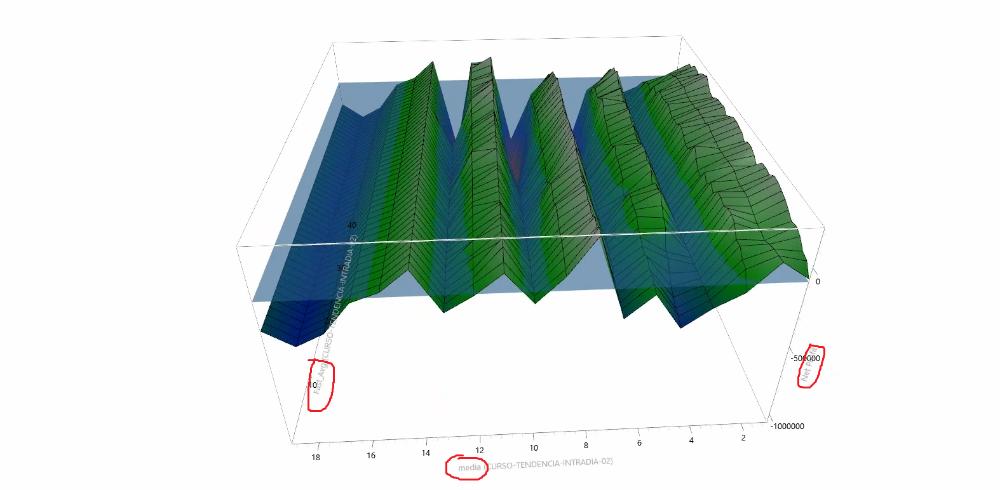
  <figcaption>Figura 139</figcaption>
</figure>
<figure>
  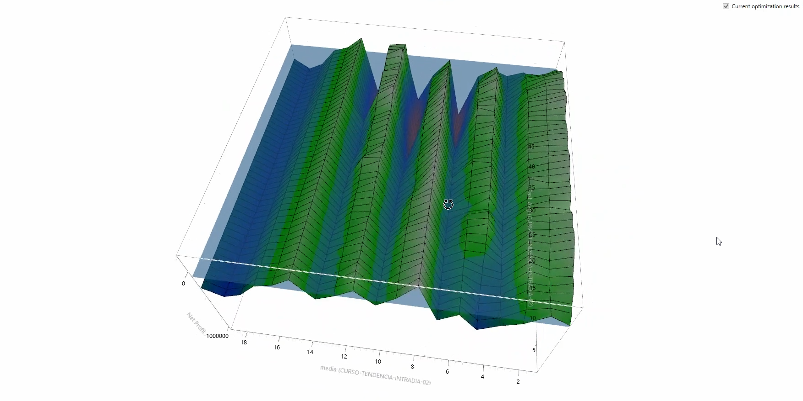
  <figcaption>Figura 140</figcaption>
</figure>
<figure>
  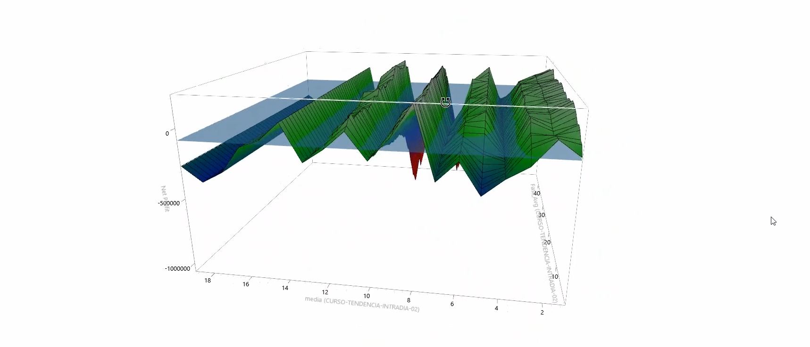
  <figcaption>Figura 141</figcaption>
</figure>
<figure>
  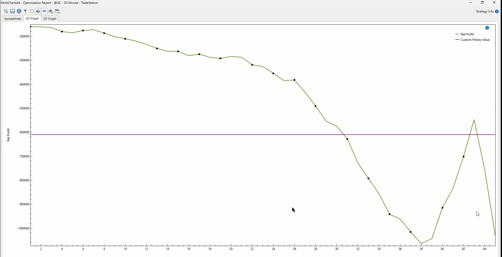
  <figcaption>Figura 142</figcaption>
</figure>

### Análisis de estabilidad por tipos de media (bloqueando `cases`)

Aquí incluso a veces sí que viene bien coger y eliminar que hayan dos.   
Porque no hemos cargado el *Sortino*, ahora meter solo *net profit*:

<figure>
  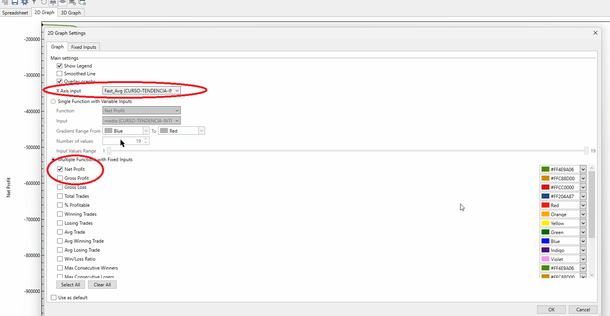
  <figcaption>Figura 143</figcaption>
</figure>

Y aquí en *fixed imputs*, bloquear la que hemos usado creo que era la `11`.

```sh
case 11: // Kama + Simple
	Fast = Kama (Slow_Avg-Fast_Avg);
	Slow = AverageFC (Price, Slow_Avg);
```

<figure>
  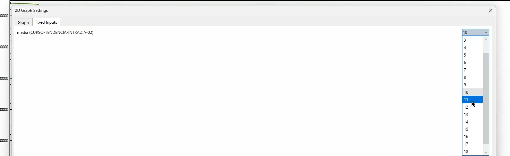
  <figcaption>Figura 144</figcaption>
</figure>

Mira, entonces lo que hace aquí la `11`, ves un poco el mapa en 2, para la 11. Ves cómo evoluciona la *fast* para la `11`. Entonces aquí sí que se ve un poco mejor sus zonas de trabajo, ¿no? 

<figure>
  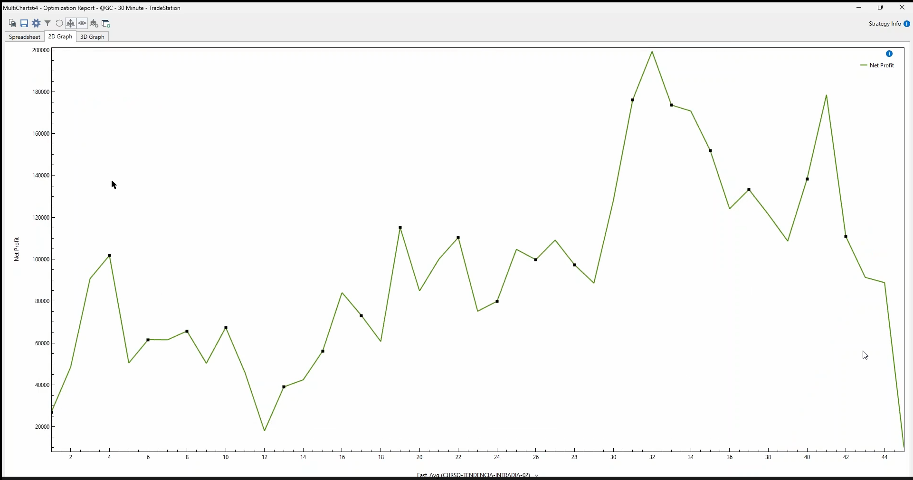
  <figcaption>Figura 145</figcaption>
</figure>

Bueno, evidentemente en toda la, en toda la zona tiene retorno positivo, que eso es importante, pero sí que es verdad que tiene unos picos aquí `[31 - 33]` que son un poquito bruscos, es verdad que son un poquito bruscos, aunque aquí `[32 - 36]` sí que podemos dar cierta estabilidad en toda esta zona, pues sí que decae pero, pero se sigue manteniendo los ritmos que no están mal. Pero sí que la verdad que sería mejor un poco más amplia, sería mejor un poco más amplia.

<div style="border-left: 4px solid #9c27b0; background: #f3e5f5; padding: 15px 20px; margin: 15px 0; border-radius: 8px;">
  <strong>📈 Cómo interpretar el mapa 2D de optimización</strong><br><br>
  
  <strong>Ejes del gráfico:</strong><br>
  • <strong>Eje X:</strong> Fast_Avg (periodo de la media rápida, de 2 a 44)<br>
  • <strong>Eje Y:</strong> Net Profit (beneficio neto en dólares)<br>
  • <strong>Contexto:</strong> La media está bloqueada en <code>case 11</code> (KAMA + Simple)<br>
  
  <strong>Qué buscar - Estabilidad vs Sobreoptimización:</strong><br><br>
  
  <span style="color: #c62828;">❌ <strong>PICOS BRUSCOS [31-33]:</strong></span><br>
  Mira cómo en Fast_Avg=32 hay un pico de ~200,000$ que cae bruscamente a ~170,000$ en 33-34. Esto es <em>peligroso</em>: un pequeño cambio de parámetro produce una caída grande. Señal de <strong>sobreoptimización</strong>.<br>
  <span style="color: #2e7d32;">✅ <strong>ZONA ESTABLE [32-36]:</strong></span><br>
  Aunque decae, los valores se mantienen entre 120,000-180,000$. Es aceptable pero <em>estrecha</em>.<br>
  <span style="color: #ff9800;">⚠️ <strong>ZONA VOLÁTIL [2-30]:</strong></span><br>
  Mira las oscilaciones: sube a 100k, baja a 50k, sube a 65k, baja a 20k... Esto indica que el sistema es muy sensible al parámetro en este rango.<br>
  
  <strong>Lo ideal sería:</strong><br>
  Una línea más <em>horizontal</em> (meseta plana), donde aunque cambies Fast_Avg de 20 a 35, el beneficio se mantuviera similar (~100k-120k constante). Eso indicaría robustez real.<br>
  
  <strong>Conclusión del instructor:</strong><br>
  <em>"Sería mejor un poco más amplia"</em> → La zona estable es demasiado estrecha. El sistema con media 11 funciona, pero es sensible. Por eso luego prefiere la <strong>media 8</strong> que tiene una meseta mucho más amplia.
</div>


**Comparativa entre tipos de medias**

<figure>
  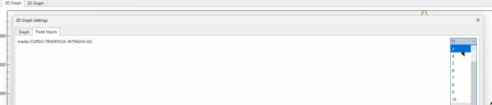
  <figcaption>Figura 146</figcaption>
</figure>

Y esto lo podemos hacer para todas, de acuerdo, podemos mirar lo mejor si estábamos entre varias, ¿no? Decíamos antes, me acuerdo por ejemplo también la 3, ¿no? Vamos a ver hoy, siglo que la 3, a ver qué tal lo, cómo de estable es la 3.

<figure>
  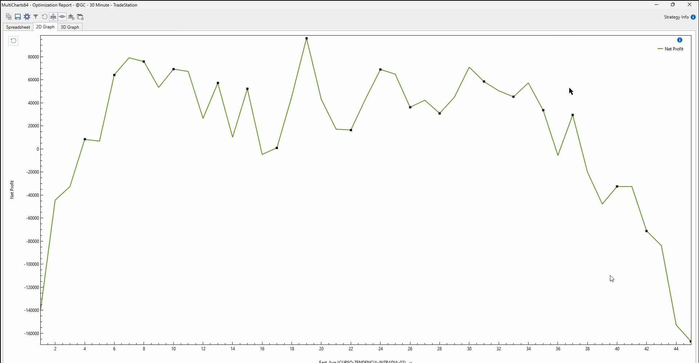
  <figcaption>Figura 147</figcaption>
</figure>

Pero parece más estable la 3, ¿no? Parece más estable la 3. Veis un poco la idea, ¿no?, podemos un poco jugar con esto y ver un poco.

La 1 incluso, no, la 1, pero la *simple* con *simple*, simple con simple es muy estable también, ¿no? Al final en caso de duda, quedarnos con la simple.

<figure>
  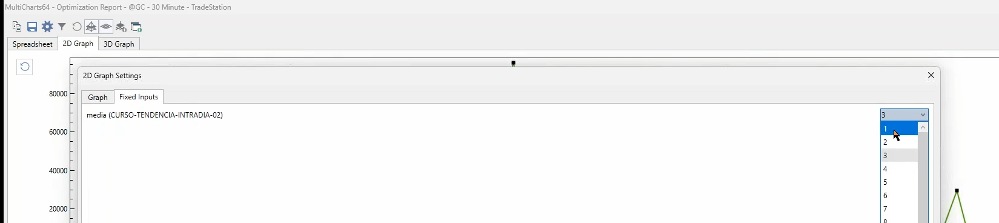
  <figcaption>Figura 148</figcaption>
</figure>
<figure>
  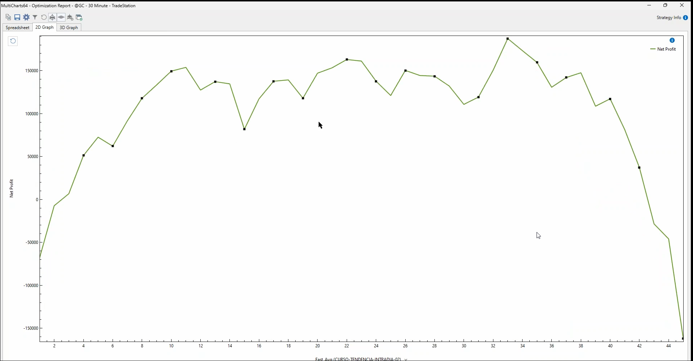
  <figcaption>Figura 149</figcaption>
</figure>

Pero también no veíamos que nos gustaba, me acuerdo antes que había *exponencial* con KAMA, ¿no?, recuerdo, ¿cuál era?, ¿no?, *simple* con KAMA era, ¿no?, siempre con KAMA, sí. ¿Cuál era la?, era la 11, era la 11, era la que estábamos mirando ahora antes, no se ha salido.

```sh
case 11: // Kama + Simple
	Fast = Kama (Slow_Avg-Fast_Avg);
	Slow = AverageFC (Price, Slow_Avg);
```

La 8 recuerdo, 8 que era exponencial con normal:

```sh
case 8: // Exponencial + Simple
	Fast = XAverage (Price, Slow_Avg-Fast_Avg);
	Slow = AverageFC (Price, Slow_Avg);
```

Muy estable, está en esta casa que es la mejor, en esta casa que es la mejor en estabilidad. Fijáis en esto, da un margen de maniobra absolutamente gigantesco.

<figure>
  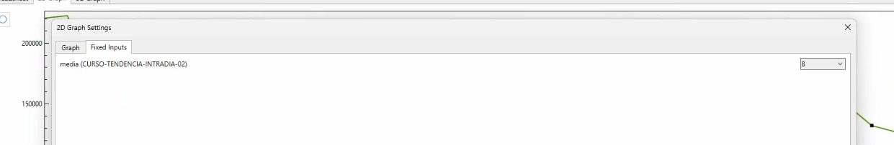
  <figcaption>Figura 151</figcaption>
</figure>
<figure>
  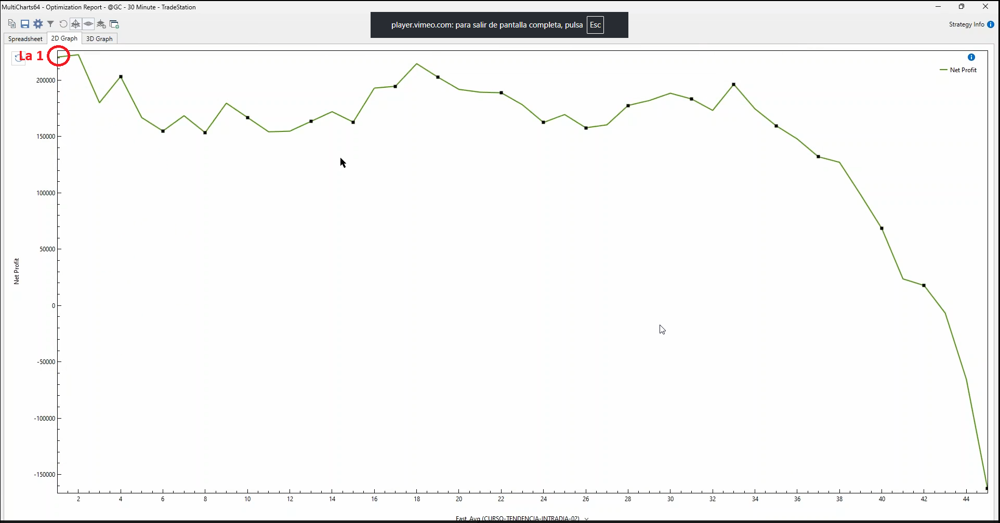
  <figcaption>Figura 150</figcaption>
</figure>

Esto te colocas aquí y estás ahí en el absoluto paraíso. Viendo el mapa la verdad que esta parece la mejor. Habría que ver a ver si podemos con esta media, conseguir mediante las salidas, ¿entendéis?, un poco los filtros y tal, que este tenga un rendimiento como el que tenemos ahora.

Porque es mejor, es mejor, es el que parece más estable. De acuerdo, porque si hemos tenido el `11` que nos da mejores resultados, pero si, ahora viendo las otras, no nos acaba de gustar.

<figure>
  
  <figcaption>Figura 145</figcaption>
</figure>

```sh
case 11: // Kama + Simple
	Fast = Kama (Slow_Avg-Fast_Avg);
	Slow = AverageFC (Price, Slow_Avg);
```

Esto, esto, KAMA con *simple*, muy bien, muy bien, valores hay muy todo pero degrada fácil, poco estable. Cuidado, esto es probable, es más fácil que degrade en el futuro, ¿entendéis?

En cambio fijaros no, con la `1`, con lo más sencillo, siempre es lo que ocurre, pero para eso son los datos.
- Es la 1 la *simple*, muy estable.
- La 2 exponencial con exponencial también súper estable pero no tanto. Con *simple* con *exponencial*.
- La 3 KAMA con KAMA, a ver, bueno, ya ves, las dos KAMA, sigue siendo más volátil, lo veis, sigue siendo más volátil y además degrada mucho negativo y todo es, acaba, con KAMA no funciona, KAMA tiene que ir con algo.

<figure>
  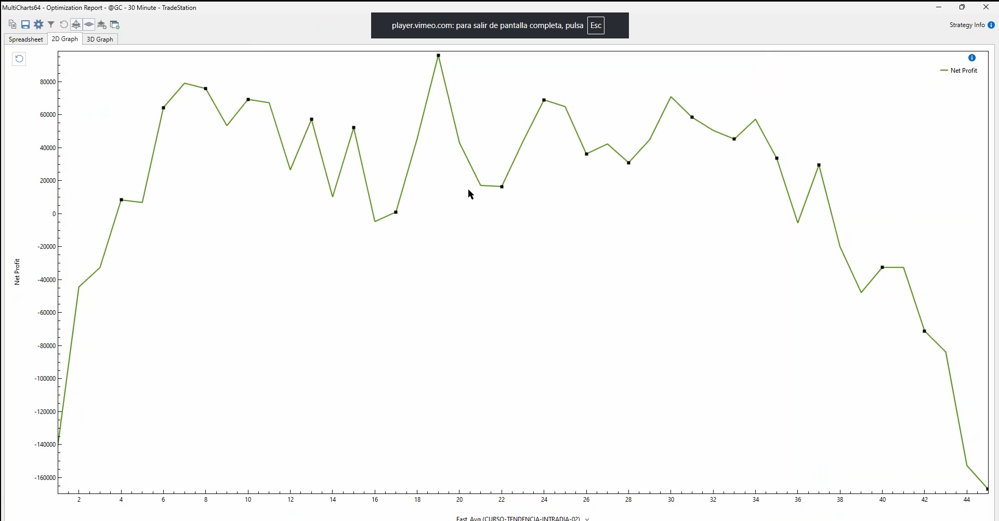
  <figcaption>Figura 152</figcaption>
</figure>


**Selección final de la media**

Pero ahí ya metemos 8:

<figure>
  
  <figcaption>Figura 151</figcaption>
</figure>

```sh
case 8: // Exponencial + Simple
	Fast = XAverage (Price, Slow_Avg-Fast_Avg);
	Slow = AverageFC (Price, Slow_Avg);
```

<figure>
  
  <figcaption>Figura 150</figcaption>
</figure>

Y dices, hostia, cuidado, cuidado con la 8, que está en el 1. Fijaros dices, hostia, la 1 muy bien, la 8, a ver, es que no hay, y acordaros que salía, y ahora mismo me quedaría con la 8 aquí, chicos y chicas, que no me acuerdo, ser chicas normalmente hay pocas chicas, no sé por qué, la verdad es una lástima, pero pero así es, así se van apuntando más.

- [ANALISIS MEDIAS -30_00S](../data/ANALISIS%20MEDIAS%20-30_00S.xlsx)
- [ANALISIS MEDIAS +30_00S](../data/ANALISIS%20MEDIAS%20+30_00S.xlsx)

Salidas, medias, aquí era esto, me parece que el 8 estaba bien también. Veis tenemos 8 ahí, fijaros muy bien el 8. Nos pasamos al 8, en familia nos pasamos al 8, claramente nos pasamos al 8, claramente.

<figure>
  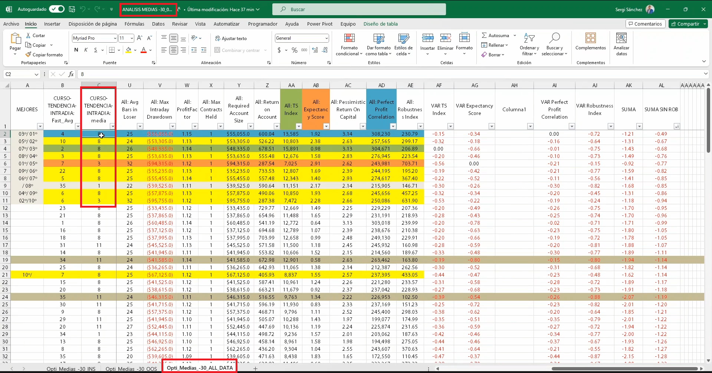
  <figcaption>Figura 153</figcaption>
</figure>

Para estos son los mapas, veis, nos pasamos al 8 claramente porque aquí en menos 30 fijaros que arrasa, muy bien, casi todos, es el que más sale de calle. Pero aquí también, en el que, en el que es más 30, también. O sea, en el menos 30 es el que sale mejor, pero es que en el más 30 es el mismo, que no me había dado cuenta antes. Poco jaimito por mi parte porque fijaros que es el mismo y no tiene por qué, porque el orden cambia.

<figure>
  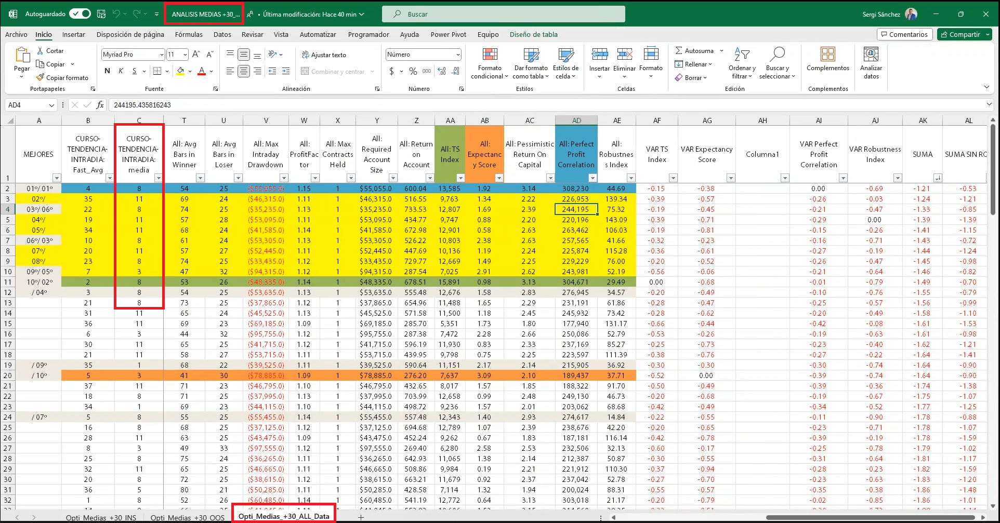
  <figcaption>Figura 154</figcaption>
</figure>

Y a ver, en el *in-sample*, en el in-sample también tenemos a 8 aquí:

<figure>
  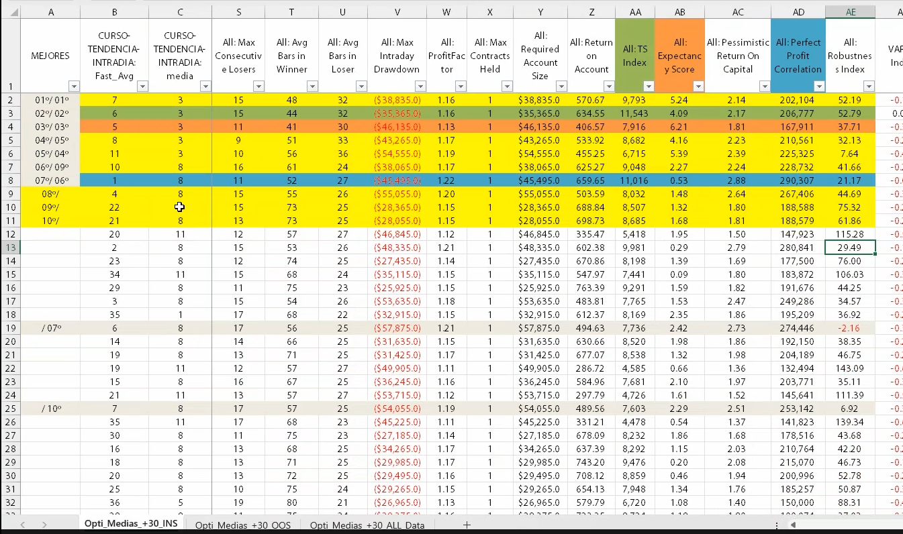
  <figcaption>Figura 155</figcaption>
</figure>

Y aquí también tenemos 8. Muy bien, 8, muy bien, 8. Sí, sí, sí, sí, muy claro, muy claro, 8.

<figure>
  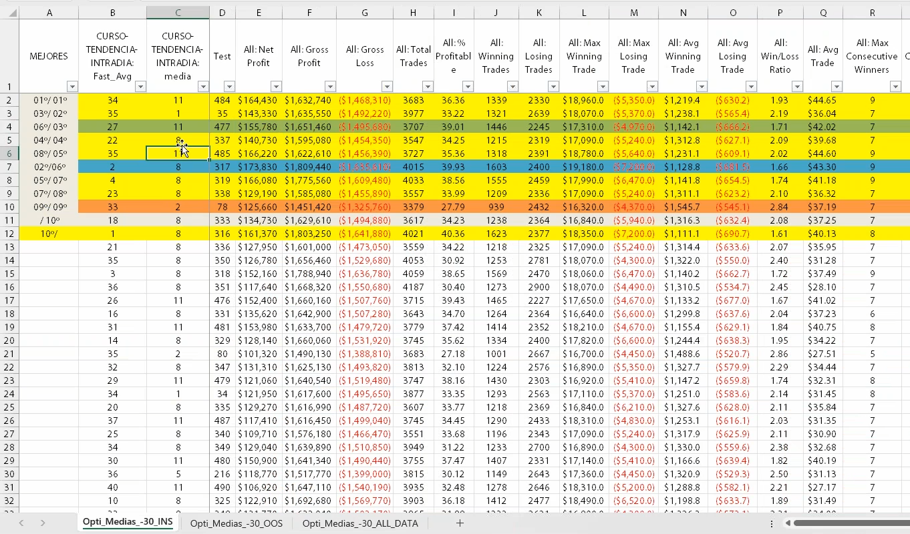
  <figcaption>Figura 156</figcaption>
</figure>

<div style="border-left: 4px solid #4caf50; background: #e8f5e9; padding: 10px 15px; margin: 10px 0; border-radius: 8px;">
  <strong>✅ Conclusión sobre la media 8</strong><br><br>
  <strong>Case 8 (Exponencial + Simple)</strong> destaca consistentemente en:<br>
  • Out-of-sample -30%: El que más sale de calle<br>
  • Out-of-sample +30%: También el mejor<br>
  • In-sample: Presente en las mejores posiciones<br><br>
  La coincidencia en ambos análisis (que no tiene por qué ocurrir) refuerza la robustez de esta combinación.
</div>

**Análisis del rendimiento reciente**

<figure>
  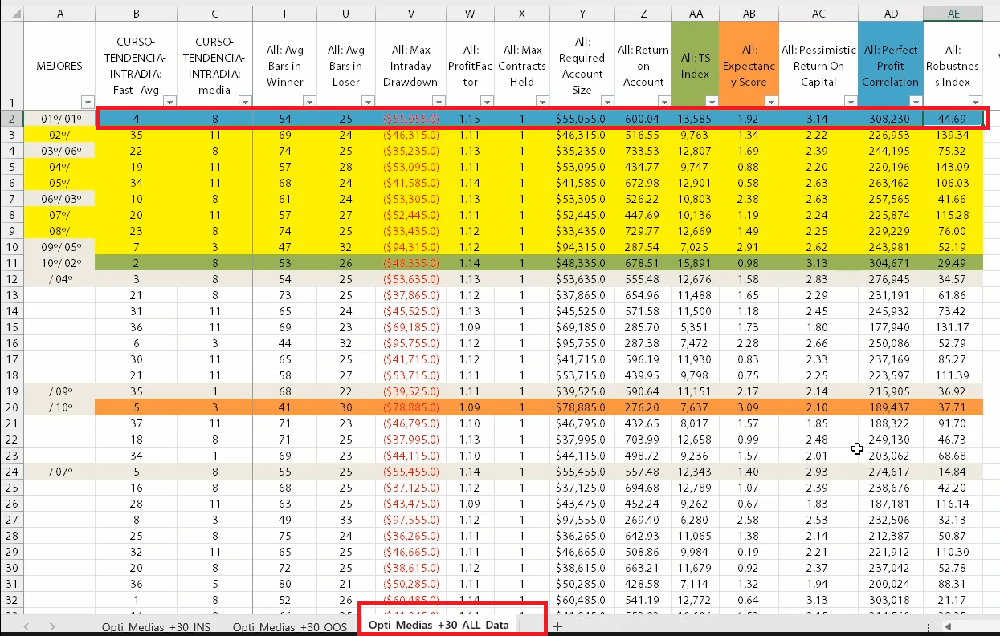
  <figcaption>Figura 158</figcaption>
</figure>

Aquí ahora claro, el tema es que este 4-8 sí que ahora recientemente nos ha parecido degradar.

<figure>
  
  <figcaption>Figura 150</figcaption>
</figure>

Pero teniendo en cuenta esto que estamos viendo, aún así tendría sentido valorar si lo asumimos, si lo asumimos, porque sabemos que el mercado ha ido mal, que no le ha ido suyo, y podemos asumirlo.

<figure>
  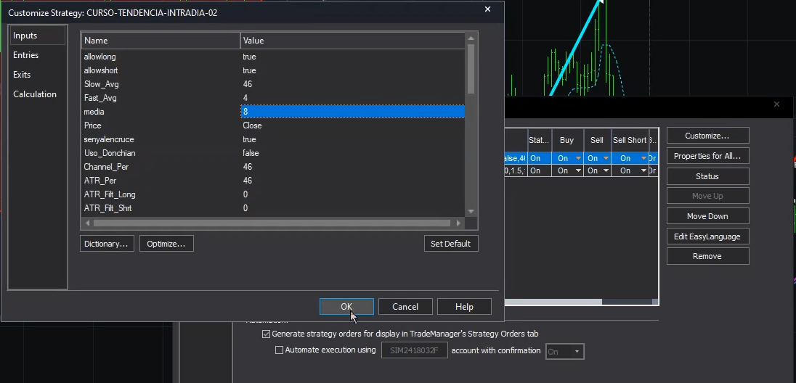
  <figcaption>Figura 159</figcaption>
</figure>

Podemos también valorar otro, también hay que ver las salidas cómo le afectan, porque ahora este estudio antes lo hemos hecho con la otra media. Ahora habría que hacer el estudio de salidas.

Vamos a pasarlo, eso sí que es un momento, ya con eso lo acabaremos. Ese es ahora el 4-8 pero con las salidas que ya hemos elegido, 1, 14, 19 y 10, para ver lo que decía ahora.

<figure>
  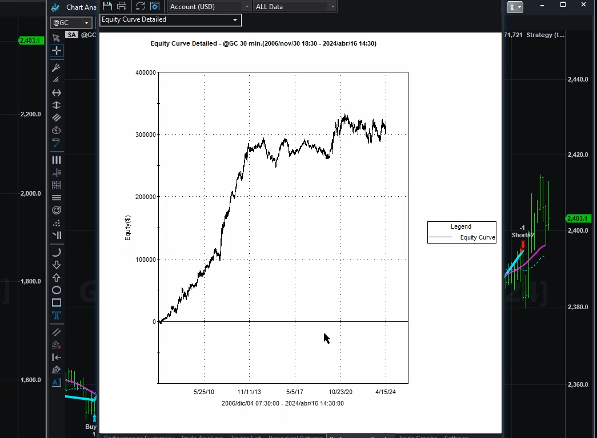
  <figcaption>Figura 160</figcaption>
</figure>
<figure>
  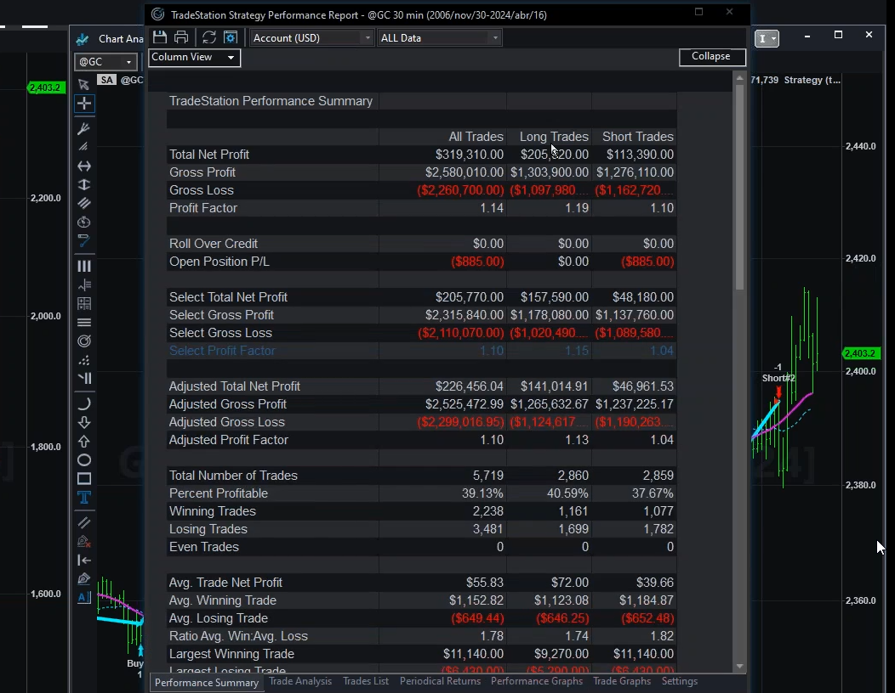
  <figcaption>Figura 161</figcaption>
</figure>

Ha costado más pero habría que ver, habría que hacer un juego de salidas. Por lo mejor, en vez de esta tan rápida, es que está muy, muy, está muy pegada. Y a lo mejor buscar otro, otro 8, ¿no?, a lo mejor buscar otro 8 que nos haya dado un mejor resultado.

Aquí por ejemplo este da 75, aquí 22-8, podemos marcarlo aquí en marrón, no sé si no porque no se ve, lila, este `22-8`, este aquí tenemos otros 76, `23-8`.

<figure>
  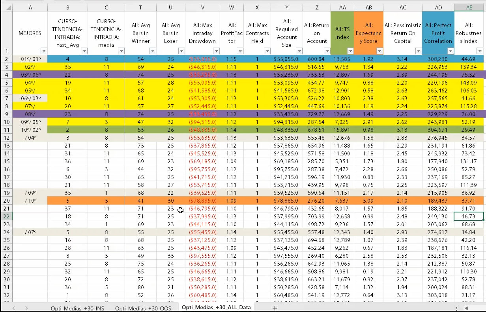
  <figcaption>Figura 162</figcaption>
</figure>

**Análisis con la media 8 seleccionada**

Cuesta con los 8 aquí conseguir buenos, buenos retornos. Bueno, habría que ver si con este 22 y 23-8 podemos ver, podemos ver que vaya, que vaya un poco mejor, y ver un poco jugando con las salidas.

Pero es perfectamente, hecho este periodo lo ha clavado, bastante clavado, bastante parece:

<figure>
  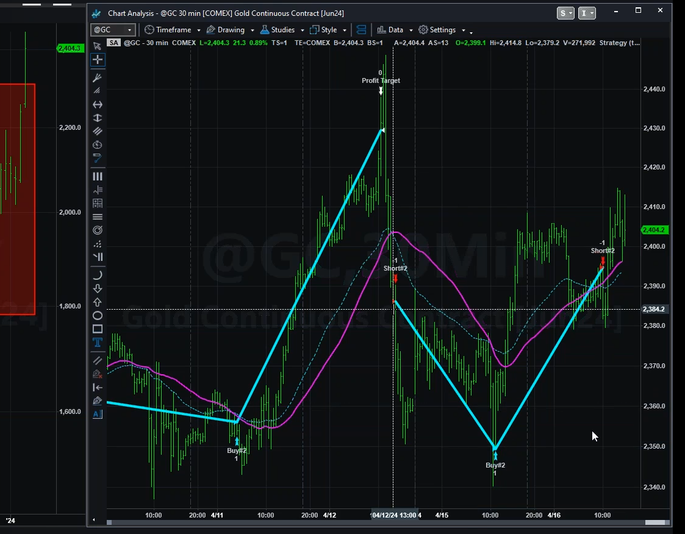
  <figcaption>Figura 163</figcaption>
</figure>

Es lo que os digo. Al final van a sufrir todos en temas, buscar qué equilibrio, cómo sufre, dónde, pero donde no hay tendencia, normalmente van a sufrir.

<figure>
  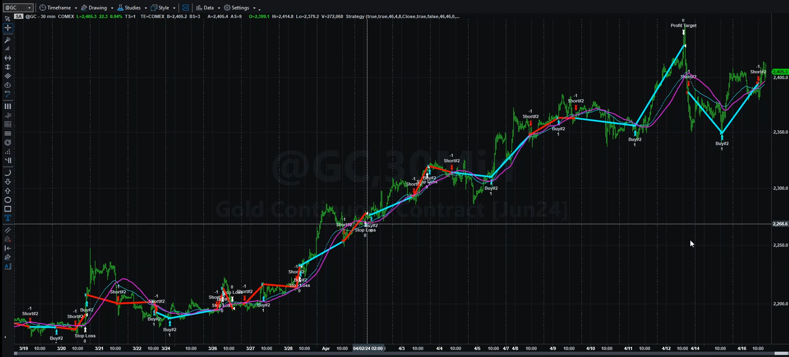
  <figcaption>Figura 164</figcaption>
</figure>

Puede que yo aquí siempre me encargaría por la *robustez*, por lo tanto elegiría de esta zona, elegiría un tipo 8.

<figure>
  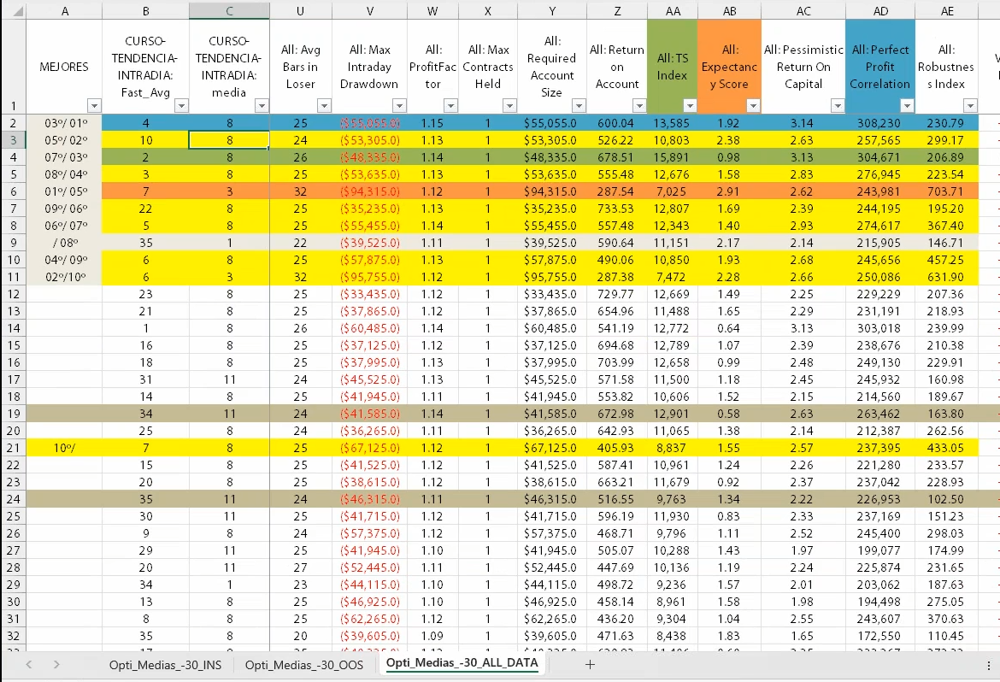
  <figcaption>Figura 165</figcaption>
</figure>

Y ahora viendo esto el mapa podríamos incidir en ello, bloquear el 8, ver a ver la media, trabajarla, ver a ver las salidas, pero ya bloqueando el 8.

<figure>
  
  <figcaption>Figura 150</figcaption>
</figure>

Oye, el 8 me ha gustado mucho, veo que hay mucha, mucha robustez, aquí me quedo con ella. Porque además fijaros que es que me da igual desde el `1` hasta el `30` puedo elegirla en *fast_avg*, me da igual, sabes que tengo una curva muy estable, hasta que no llega muy arriba, no degrada mucho porque se acerca que es casi igual, ¿no? Entonces pierde totalmente rendimiento pero realmente se mantiene muy bien, muy bien en esta primera zona de muy, muy lenta, acordaros que resta de la lenta. Por lo tanto esto es media lenta y esto es media rápida, media más rápida.

### Prueba con media más rápida `media 8`

Entonces a ver, en esta que habíamos visto, 22 o 23... vamos a probar 22, `22-8`.

<figure>
  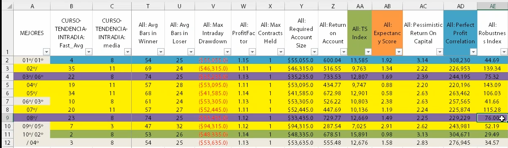
  <figcaption>Figura 166</figcaption>
</figure>
<figure>
  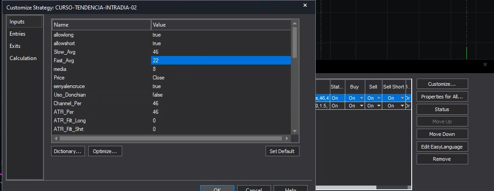
  <figcaption>Figura 167</figcaption>
</figure>

Verás como la media ahora va a quedar más cerca del precio porque resta de la *slow*, acordaros, es ahí 22-8. Veis ahora que es más rápida, aquí ya por ejemplo ves, ya pues ya no, ya no ha hecho un *trade* tan bueno, pero ha seguido haciendo este TP. Aquí no, bien.

<figure>
  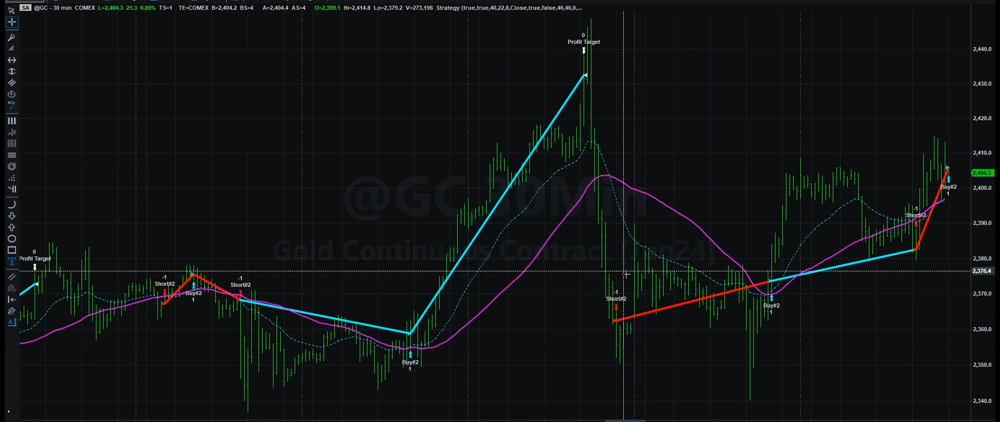
  <figcaption>Figura 168</figcaption>
</figure>

**Optimización de salidas con la nueva media**

¿Ahora qué podemos hacer aquí? Mira vamos a hacer, vamos a hacer lo mismo que hemos hecho aquí ahora con las salidas. Dejamos 22-8, dejamos 22-8, *true*, *false*, y está todo lo demás no juega.

<figure>
  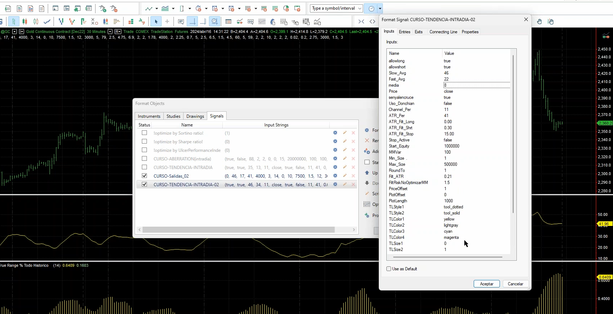
  <figcaption>Figura 169</figcaption>
</figure>

Y yo solo, estoy prácticamente estoy optimizando solo una media y he analizado los distintos tipos de media, pero prácticamente estoy utilizando una media y ahora luego un poco las salidas. Decir realmente no he optimizado mucho, no he hecho una optimización muy intensiva de muy máxima. Y tengo 5.000, que podría hasta darle un poco más, pero estoy, estoy de momento sin, sin forzar las cosas.

Entonces yo ahora aquí lo que no sé si esto lo tengo bien puesto, pero vamos a probarlo, vamos a probarlo así directamente. Esto ya está aquí, lo voy a optimizar. Y esto era salidas, aquí no es de 0 a 32, o 31, 31 o 32, 32, 0-32. No optimizo nada más es, porque no, no lo he metido.

<figure>
  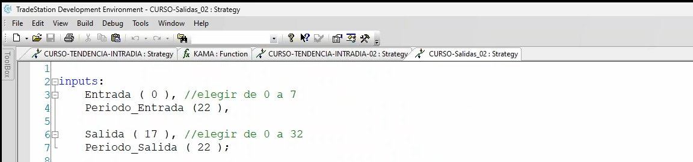
  <figcaption>Figura 170</figcaption>
</figure>
<figure>
  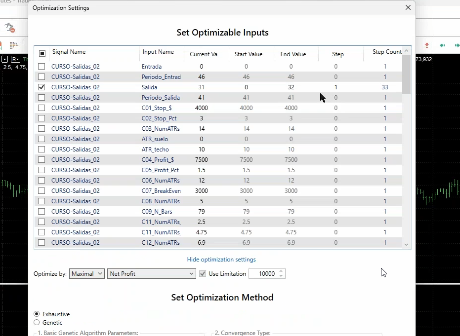
  <figcaption>Figura 171</figcaption>
</figure>

Y vamos con ello. Esos son 33, o sí que va a durar pues nada, minutos, minutos no, minuto nada, y eso que le dejo los 16 *cores* por tranquilidad a dar. Segundos esto.

**Resultados de optimización de salidas**

Bueno, vemos aquí, no tiene mucho sentido, es simplemente es por ver a ver cómo van.

Ordenamos por *net profit*, vemos que la 26, a 16 y la 5, bueno aquí sí que iría bien ahora aplicarlo.

<figure>
  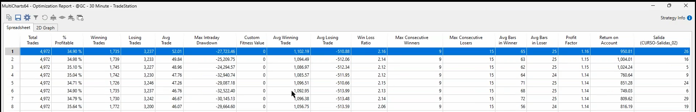
  <figcaption>Figura 172</figcaption>
</figure>

Vamos a cerrar aquí, a no, espérate, vamos a abrir otra vez el informe de optimización y les voy a, las voy a ir aplicando. Simplemente las que ganan más, por verlas.

Esta era la número 26, salida 26, que luego habría que hacer otro ajuste porque al final los *inputs* que hemos elegido no son los óptimos, simplemente es por tener una pequeña referencia.

```sh
case 26: // Profit porcentual + BreakEven% - Input: C26_Profit_Pct(2), C26_BreakEven_Pct(0.5);
```

Vamos a ver la 26, la 26 es un *profit* porcentual con *breakeven*, curioso, *profit* porcentual con breakeven. Esta es nuestra curva global, y la vemos en el largo y la vemos en el corto.

<figure>
  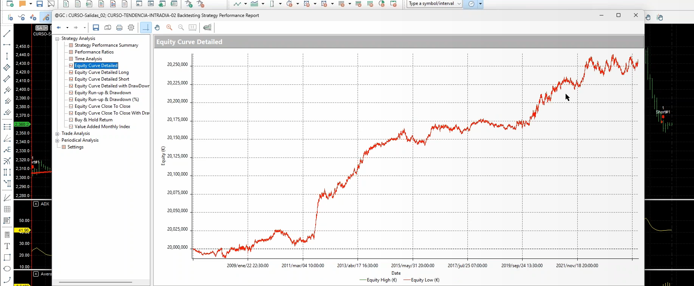
  <figcaption>Figura 173</figcaption>
</figure>

Tenemos un *profit factor* de 1.16, 1.22, 1.09, quizá el corto un poquito cojo, pero bueno, pero al final es un activo que ha subido mucho, es complicado. No está mal, no, no, no está mal, no está mal. Pero bueno, todavía yo creo que tiene camino de mejora vía, vía la salida, dejarla más fina, y vía también la filtro, de acuerdo.

<figure>
  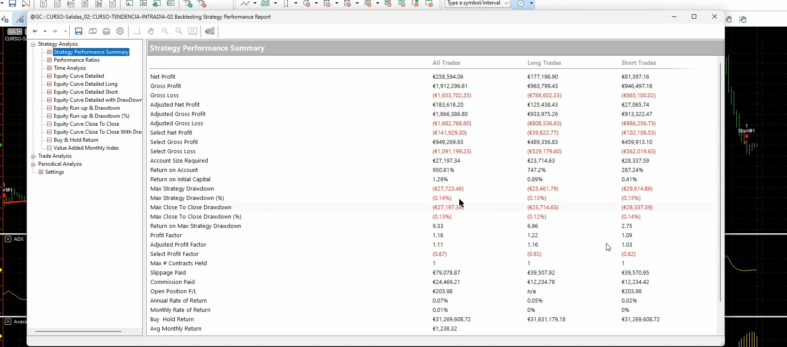
  <figcaption>Figura 174</figcaption>
</figure>

Aquí se puede tratar de filtrar. Tenemos tres caminos, de acordar, *Donchian*, ADX y ATR. 16.

**Análisis de la salida 16**

<figure>
  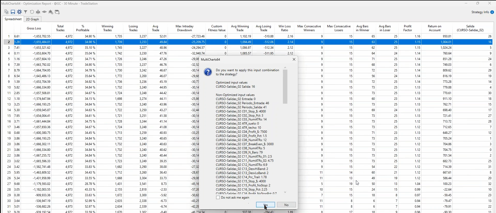
  <figcaption>Figura 175</figcaption>
</figure>

```sh
case 16: // Stop% + Profit% - Input: C16_Stop_Pct(2), C16_Profit_NxStopPct(1);
```

Bien, este es este es uno. El otro que le daba era, a ver, distintas salidas tengo aquí. Tenemos esta también que era la número 16, número 16. A ver qué era esto, porcentual y *profit* porcentual, bueno, esto ya es más con un multiplicador, sabe, usa un poco más, vamos a ver cómo queda. *Performance report*.

O veis ahí los *trades*, vamos a poner el tiempo real no porque no es el otro, hemos cargado lo cargado hasta el viernes hoy que así nos meterá también un poco lo actual.

**Filtros pendientes de explorar**

Ahí hay poco madera, a ver, que ya voy a cerrar esto. Aquí el camino de los filtros no lo hemos, no lo hemos trabajado mucho, los que más probado ADX y ATR, no nos han aportado realmente en los tendenciales.

Lo que más aporta de acuerdo, lo que más aporta en un tendencial y *breakout*, es no operar más que operar, es no operar cuando hay expansiones muy fuertes de volatilidad. Esto es lo que suele aportar más valor.

<div style="border-left: 4px solid #9c27b0; background: #f3e5f5; padding: 10px 15px; margin: 10px 0; border-radius: 8px;">
  <strong>🎯 Clave de filtrado en tendenciales</strong><br><br>
  Lo que más aporta en un sistema tendencial y <em>breakout</em> es <strong>NO operar</strong> cuando ya ha habido una expansión de volatilidad. Tras expansión normalmente viene reversión. Es mejor filtrar para no entrar que buscar momentos específicos para entrar.<br><br>
  <strong>Formas de identificarlo:</strong><br>
  • Con ATR (expansión del rango)<br>
  • Con pautas de precio<br><br>
  Te ahorras más disgustos cuando ya se ha producido una expansión: <em>espérate</em>.
</div>

Esto hay varias maneras de identificarlo, puede ser con ATR, puede ser con pautas de precio, pero quedaros con esta idea. Más filtra no operar cuando ha habido mucha expansión, porque ya cuando ha habido expansión normalmente es tarde para entrar.

Te ahorras más disgustos cuando ya se ha producido una expansión, espérate.


**Ejemplo práctico del filtro de expansión**

Es decir, por ejemplo este corto probablemente con un filtro de expansión no lo hace, porque tras expansión normalmente viene reversión, veis, esta es la idea.

<figure>
  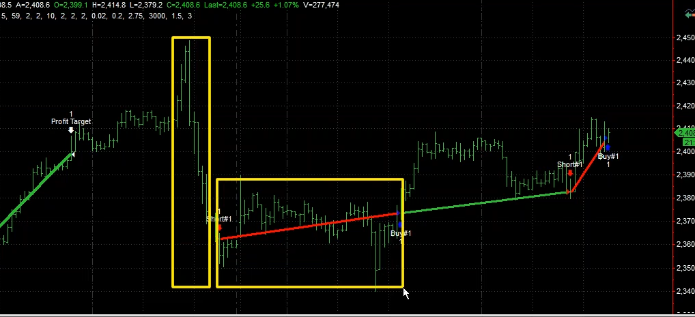
  <figcaption>Figura 177</figcaption>
</figure>

Este de verdad que es un ejemplo muy bueno, es, tras una expansión así normalmente bien, esto, y a veces hasta más, ¿entendéis? Esto es lo que hay detrás de la, de esta lógica, de acuerdo.

<figure>
  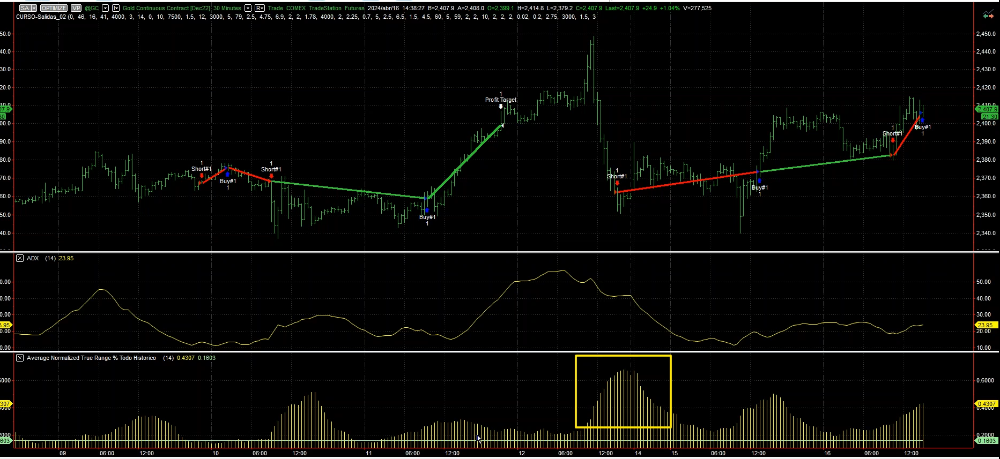
  <figcaption>Figura 178</figcaption>
</figure>

Entonces tras expansión, que veis aquí que ha habido abajo, es, subida volatilidad. Entonces normalmente, aunque me, dice la verdad que lo estoy mirando, no, no parece aportar mucho.

Normalmente tras subida volatilidad, a veces es cómo lo identificas, con puede ser con un *average* normalizada que esté subiendo además, hay que verlo, hay que hay que trabajarlo un poco. Pero normalmente las expansiones de volatilidad, que es volatilidad más de cierto nivel y subiendo, normalmente esto, esto suele filtrar bien.

Y habrá excepciones, habrá excepciones siempre, pero ya digo, es más no operar en esos momentos que el hecho de operar en determinados momentos. Habéis más, más filtra más el no, sabéis, el que el sí, ¿entendéis? Decir, en este caso no.

**Resultados finales del sistema**

<figure>
  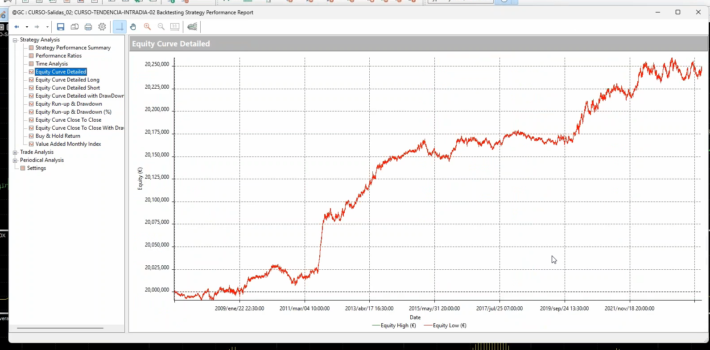
  <figcaption>Figura 179</figcaption>
</figure>
<figure>
  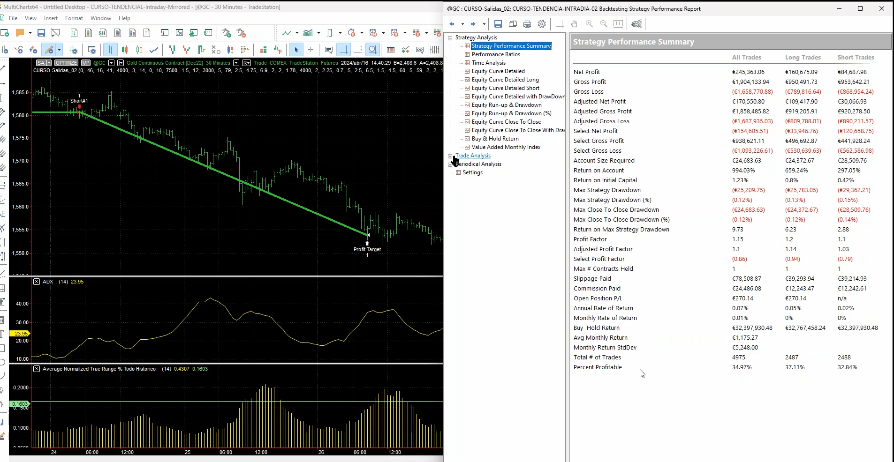
  <figcaption>Figura 181</figcaption>
</figure>

Y aquí tenemos cómo quedaba este *performance* pero bastante similar al anterior. Ahí se ve la curva, pues para una curva típica de un tendencial está, está bastante bien, es bastante estable en todos los períodos.

Aquí tenemos el largo, que tenemos el corto, que tiene, ha ido bien, lógicamente ahora está, pegado un tiro muy fuerte, ya ha sufrido, pero en términos generales pues no lo está haciendo mal.

Tenemos un *Sharpe* normalizado 78, un 0.45 de *Sortino*, que si lo anualizamos, 0.45 por raíz de 12 nos da un 1.55, si lo dividimos por raíz de 2, acordaros para compararlo con *Sortino*, lo vimos en la práctica, nos da 1.10, que es bastante más que 0.78. Quiere decir que tenemos mucha más volatilidad buena que mala, siempre es bueno.

<figure>
  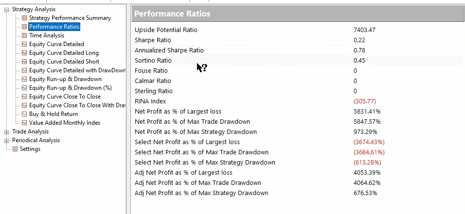
  <figcaption>Figura 180</figcaption>
</figure>

**Valoración del sistema**

Entonces bien, la verdad que así, así me parece a mí un sistema que ya es, es, es bueno para un tendencial del oro. Pero tenemos camino de mejora, vía filtros, ya hemos visto en una cosa rápida que por filtros de *Donchian* mejorábamos, pero nos quedaría valorar el filtro de ATR.

Lo tenemos aquí en el código, pero en la versión que hemos probado no ha aportado, nivel ATR mayor que cero de tal. Y lo de igual a mayor que ATR, le tienes que pedir no mayor o no, tiene que ser menor para pegar. A no, claro, claro, no, o sea que sea *true*.

Por la idea es lo que, la cosa he dicho, es eso, es claro, la cosa es cómo lo, lo consigas plasmar. Pero pero la, la clave, la clave es la que os digo, la clave es la que os digo.

**Concepto clave del filtro de volatilidad**

Cuando ya ha habido una expansión de volatilidad, es que el mercado ya ha desarrollado su movimiento. Entonces esa es la idea, momento bueno de un *breakout* o de un tendencial es más cuando hay menos volatilidad.

Pero ya digo, para un *breakout* puede valer los dos lados, para un tendencial vale más la contraria. Es decir, por eso intentaba negarlo, pero creo que lo he hecho bien, o que pensarlo con calma para traducir esta idea que os digo, recuerdo que es no entrar cuando ya ha habido expansión, es decir, cuando la volatilidad salta, no entra. Ese es un poco el, el concepto.

<div style="border-left: 4px solid #e74c3c; background: #fdedec; padding: 10px 15px; margin: 10px 0; border-radius: 8px;">
  <strong>⚠️ Concepto fundamental: Filtro de expansión de volatilidad</strong><br><br>
  <strong>Principio:</strong> Cuando ya ha habido una expansión de volatilidad, el mercado ya ha desarrollado su movimiento.<br><br>
  <strong>Aplicación:</strong><br>
  • <strong>Tendencial:</strong> NO entrar cuando la volatilidad está alta y subiendo<br>
  • <strong>Breakout:</strong> Puede funcionar en ambos sentidos<br><br>
  <strong>Identificación:</strong> ATR normalizado por encima de cierto nivel + pendiente ascendente<br><br>
  <em>"Más filtra el NO que el SÍ"</em> → Es más efectivo evitar malos momentos que buscar buenos momentos.
</div>

**Cierre y conclusiones**

Y ya está. Hasta aquí el sistema tendencial. Queda pendiente de hoy, ya sé que tengo pendiente de subir los otros de las salidas, pero quiero complementarlo con algunas entradas, para que tengáis varias entradas ya en ese código, sea un código para que probéis cosas de manera muy práctica.

Queda enviaros ese, enviaros este por supuesto, y enviaros lo que hemos dicho hoy de la *Strategy Concepts*, que esto sí que seguro que lo que queda de semana os lo subo en el disco, de acuerdo.

Así que nada más, si no hay más preguntas, por hoy lo vamos a dejar aquí. Muy interesante, creo que es muy interesante hoy la parte que habéis visto, que con un simple cruce de medias, trabajando un poquito, se puede sacar algo bastante útil. Así ya es útil, muy útil diría yo.

**Aplicabilidad a otros activos**

Y esto mismo va en el petróleo, por ejemplo, pero perfectamente, o sea, es posible, es posible que cambiado así directo, vamos, que no, no me va a cargar, me va a reventar, me va a reventar. Pero es posible que así mismo vaya en el petróleo, no óptimo pero vaya.

Y ya os digo, son activos que este tipo de sistemas sencillos tendenciales les van bien. Como habéis visto el *Parabolic* que también va muy bien, estos dos sistemas en el oro pueden funcionar perfectamente.

Y queda pendiente aplicar algún filtro que funcione, que se puede hacer, se puede hacer, para evitar algunas entradas en momentos de poca eficiencia, de acuerdo.

Así que pongo la carátula que siempre para despedir nos queda mejor, y doy por acabada la clase de hoy. Hasta pronto, chao.
