# Práctica 14 - Buscador de Entradas y Sistema Tomorrow's Trend

## Índice

- [Consultas](#consultas)
- [Repaso del sistema de sesion pasada: medias móviles](#repaso-del-sistema-de-sesion-pasada-medias-móviles)
  - [Prueba del filtro Donchian](#prueba-del-filtro-donchian)
  - [Walk Forward: análisis con programa externo](#walk-forward-análisis-con-programa-externo)
- [Buscador de entradas con diversas estrategias](#buscador-de-entradas-con-diversas-estrategias)
- [Prueba de las entradas en SP](#prueba-de-las-entradas-en-sp)
- [Sistema Tomorrow's Trend: patrón de corrección a favor de tendencia](#sistema-tomorrows-trend-patrón-de-corrección-a-favor-de-tendencia)
- [Pregunta sobre trailing y cierre temporal](#pregunta-sobre-trailing-y-cierre-temporal)

---

## Consultas

**Respuestas a preguntas sobre estrategias y diversificación**

> *Buenas @Sersan Sistemas. Misma pelea de los últimos comentarios jaja, pero a ver tu opinión sobre esto. Mira esta estrategia a 1H, TP y SL fijos (pero en % no en monetario). Data desde 1 de Enero 2020 hasta la actualidad.*
>
<figure>
  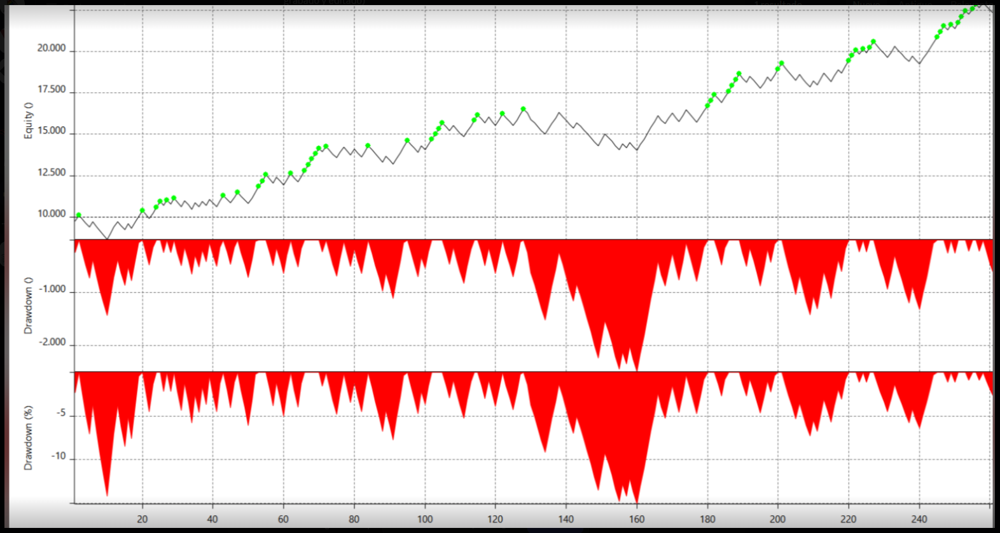
  <figcaption>Figura 000</figcaption>
</figure>
>
> *Ahora, mira qué ocurre si corro esta misma estrategia, en una BBDD de otro Broker con data desde 2015. Desde 2015 hasta hasta 2017 me parten la madre, 30% de DD. Pero desde 2017 hasta 2020 va excelente (ojo en data que no ha visto, donde no se ha optimizado nada, inclusive hay variaciones de precios medio sensibles porque esta BBDD es de un CFD de ooootro broker, importante esto).*
>
> *Mi pregunta de nuevo es, ¿qué hace uno en estas ocasiones? Porque si uno arranca en 2017, cae en DD, y en el plan de supervisión saltan las alertas y apaga la estrategia, resulta que luego viene el mejor periodo de la historia que existe para la estrategia. Entonces, mi duda es: ¿Qué pasa si yo ahora arranco la estrategia y entramos en un periodo como el de 2015-2017? ¿Cómo te proteges frente a eso?*
>
> *Sé que el portafolio es lo importante, pero es que todas las estrategias se funden en algún punto.*
>
<figure>
  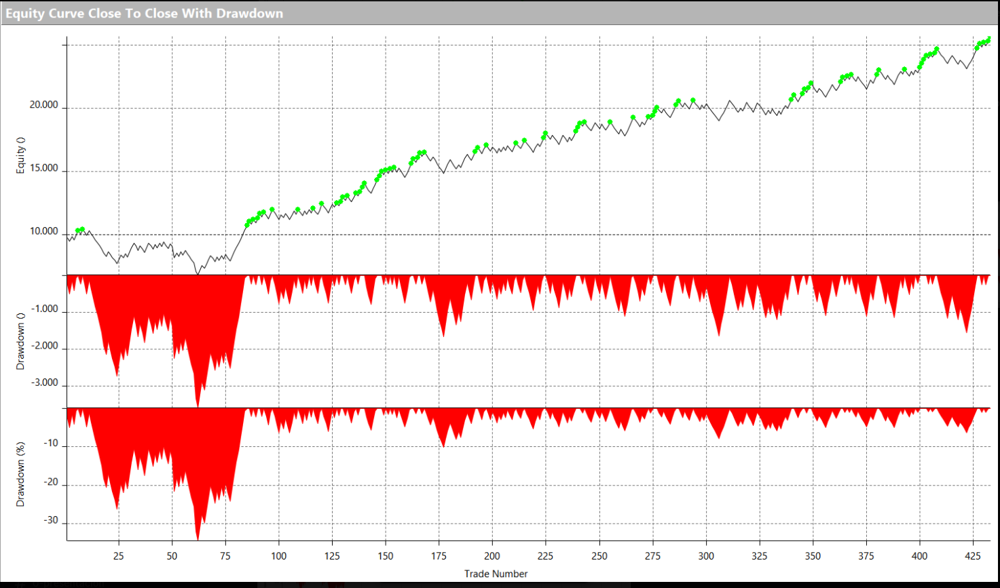
  <figcaption>Figura 001</figcaption>
</figure>

Bueno, ahí comentas que la base de datos cambia bastante y sí, puede ser. ¿Y qué pasa en un período 2015 donde dices pues, pues que te lo tragas, Alejandro? Es que la pregunta no es qué pasa, o sea, realmente esto te va a pasar, ¿me entiendes? Es decir, no es nada extraño. Es decir, claro, si pensamos que vamos a poner un sistema y va a funcionar siempre, ¿verdad? Llevamos creo que un menos cuatro este mes, ¿me entiendes? Quiero decir que al final en esto no hay nada infalible y por supuesto que hay momentos donde se pierde dinero y se acierta y se equivoca. No hay magia, no hay trucos y no hay nada que sea absolutamente infalible.

Entonces yo te voy explicando las maneras de protegerte, pero bueno, no quiere decir que no te vaya a pasar. Tú comentabas sobre el *portfolio*, te he dicho, sí, es que no hay otra, ¿de acuerdo? No hay otra, ¿vale? La semana que viene, confío, empezar todo el tema del *portfolio* y ya pues iremos viendo ejemplos y demás de cómo aporta una estrategia con otra, etcétera, ¿no? Y cómo recomendamos nosotros hacerlo incluso pues con cuentas grandes, cuentas pequeñas, etcétera, ¿vale?

Pero no hay magia y no solo es que pasa en esos casos, sino que es seguro que te va a pasar que vas a poner una estrategia y va a estar dos años. Ojalá te pase que solo esté dos años en lateral, ¿de acuerdo? Eso ojalá sea ese el peor escenario, porque la realidad es que probablemente vas a poner algún sistema y va a ir fatal. Esto probablemente va a pasar en algún momento porque nos ha pasado a todos. No es infalible.

Ah, bueno, tú también comentabas lo de apagar las estrategias. Sí, bueno, claro, hay que ver también cuando saltan las alertas. Claro, las alertas tienen que estar adaptadas al tipo de sistema. Creo que comentamos nuestro ejemplo con *Némesis* que saltaron y no llegamos a pararlo. O sea, no lo quitamos, los redujimos de peso, y ahora ha tenido una época muy buena. Es decir, esto puede pasar. Claro, esto puede pasar, la supervisión tiene que tener en cuenta esto.

Es decir, tú tienes un sistema *tendencial* como el que hicimos el otro día, que ahora vamos a ver un poquito rápidamente otra vez, y es un sistema que tiene períodos malos. Pero es que en los *tendenciales* es habitual que con los filtros puedes tratar de mejorarlo. Sí, puedes tratar de mejorarlo, pero bueno, a lo mejor también estás *sobreoptimizando*, ¿entiendes?

Entonces nunca hay una respuesta fácil si es mejor filtrar y filtrar y filtrar hasta que te quede muy fino, o es mejor asumir que no vaya tan bien y no filtrarlo tanto, ¿entiendes? Es un tema controvertido y que no hay una respuesta verdadera o falsa, porque como ya hemos hablado y sabéis ya, nada garantiza la *robustez*, nada la garantiza. Tratamos de fomentarla, pero no la garantiza. Entonces siempre hay un nivel de duda a este respecto, ¿no?

Y por lo tanto un *tendencial* puro, a más tendencial más se parece a la curva de arriba, más se parece a la primera imagen y menos se parece a la segunda imagen, que es más estable, aunque también tiene un período malo ahí en el inicio, ¿vale? Pero para entendernos, más errática es la curva tendencial a más puro, ¿vale?

Entonces la supervisión, claro, tiene que tener en cuenta eso. O sea, la supervisión o la alerta de parar un sistema tiene que entender si el sistema hace algo que no debe hacer. O sea, que un *tendencial* se pase tiempo lateral no es algo que no deba hacer un tendencial, me explico. Es decir, entonces lo que tiene que saltar es cuando algo pasa, algo anormal o fuera de lo previsto. Entonces, claro, eso tiene las relaciones de supervisión que están adaptadas, ¿no?

<div style="border-left: 4px solid #e74c3c; background: #fdedec; padding: 10px 15px; margin: 10px 0; border-radius: 8px;">
  <strong>⚠️ Principio clave sobre supervisión de sistemas</strong><br><br>
  La alerta de parar un sistema debe detectar cuando el sistema hace algo <em>anormal o fuera de lo previsto</em>, no cuando hace lo que es natural para su tipo. Un tendencial pasando tiempo en lateral es comportamiento esperado, no una señal de fallo.
</div>

**Tamaño mínimo de cuenta para operar futuros**

> *Hola @sersan, expongo mis dos últimas inquietudes:*
> *1- ¿Qué tamaño (mínimo y razonable-ideal) debería tener una cuenta particular para operar futuros?*

Bueno, es una muy buena pregunta y para la cual, nuevamente, no hay una respuesta única.

Así que te diría que hoy en día esta cantidad se ha reducido mucho, se ha reducido mucho. Bien, tema cuenta, tema riesgo, ¿no? Bien, como decía, los *micros* han ayudado, han ayudado mucho. Para esto podemos usar la, por ejemplo, la página de TradeStation de *margin* que puede ser una referencia buena de cuánto pide el mercado, para pensar un poco en unos mínimos, que nos puede ayudar, aunque no es la respuesta única. Pero a partir de ahí podemos empezar a pensar. Pues claro, también los mercados han ido subiendo y esto ha ido dificultando, pero al final, fijaros que tenemos ahora un *micro SP*, un *micro NASDAQ*, que están en mil y pico de mantenimiento. Están en mil y pico, mil cien, mil setecientos. Es una cantidad que está bien. También tenemos incluso el *Russell* y el *Dow Jones* por debajo de esa cantidad, por debajo de los mil dólares.

Lógicamente un *mini SP* pues ya son doce mil, *mini NASDAQ* son diecisiete mil. Ya empieza a ser palabras bastante mayores para empezar. Pero a nivel de *micro SP* y *micro NASDAQ*, incluso tenemos también *mini DAX* y *micro DAX*. El *micro DAX* tenemos también a mil cien euros y tenemos también el oro, por ejemplo, que es un futuro que está bien a nivel de *micro*. Son mil dólares, son mil dólares el *micro*, el *micro oro*.

Entonces en esta cantidad de los mil dólares tenemos ya varios futuros para abrir. Quiere decir que hoy en día, para empezar, podrías hacer una cartera con una cantidad relativamente pequeña. Con diez, con veinte mil dólares se podría hacer una cartera razonablemente diversificada. Incluso se podría con menos empezar, pero ya hablando de una aceptable diversificación, se podría con no demasiada dificultad.

Insisto que con menos, porque al final, sí, bueno, ahora no lo tengo aquí listo, pero a ver, lógicamente las garantías, muy muy importante, no es el vector importante para la cuenta, pero al final es un punto de partida, es un punto de partida para comparar. Que antiguamente esto no existía y realmente era mucho más complicado, es un punto de partida, pero no es lo, no usarlo de referencia. Realmente hay que tener bastante más esa cantidad.

Bueno, una regla estándar básica para empezar y no complicarse, pues seguro que lo habéis oído: dos, tres veces el *drawdown*. Esto es una regla básica. Pero bueno, ya veremos, lo veremos la semana que viene con el portfolio. Se puede dar la paradoja que incluso reduzcas el *drawdown* o lo mantengas, ¿de acuerdo? Mantengas. A lo mejor pones un sistema, tienes un *drawdown*, metes otro y no aumentas el *drawdown*, o lo aumentas o muy poco. Entonces claro, esto es un poco la idea y lo iremos viendo la semana que viene, confío.

Pero puede estar por esta cantidad que he dado de manera cómoda. Y ya te digo, a este nivel seguro que puedes meter varias estrategias. Por meter uno, seguramente depende de qué sistema, con bastante menos podría operar. Con bastante menos, seguramente con 5000 podrías, pero mejor tampoco, como os digo, seguramente ahí te costaría diversificar.

<div style="border-left: 4px solid #2196f3; background: #e3f2fd; padding: 10px 15px; margin: 10px 0; border-radius: 8px;">
  <strong>📊 Referencia práctica sobre garantías y tamaño de cuenta</strong><br><br>
  <strong>Garantías de mantenimiento aproximadas (2024):</strong><br>
  • Micro SP, Micro NASDAQ: ~1.100-1.700$<br>
  • Micro Oro: ~1.000$<br>
  • Micro DAX: ~1.100€<br>
  • Mini SP: ~12.000$ | Mini NASDAQ: ~17.000$<br><br>
  <strong>Regla básica:</strong> Cuenta = 2-3× el drawdown esperado<br><br>
  <strong>Orientación:</strong> Con 10.000-20.000$ se puede construir una cartera razonablemente diversificada en micros. Con 5.000$ se podría operar un sistema, pero costaría diversificar.
</div>


> *2.- En la teoría recuerdo que valorabas pros y cons de los futuros vs CFDs.*
> *2.1- Si no me falla la memoria decías: los CFDs tienen SWAP, en los futuros va implícito? Sí, ya sé que debería saberlo, pero si me lo refrescas te lo agradecería.*

Decías también en esta línea que la teoría recuerdo que valoraba a favor o en contra de futuros, CFDs, ¿no? Sí, bueno, el *swap*, eso es un error también que comete mucha gente: pensaba es que el CFD me cobra un *swap*, el futuro no. Y esto es solo verdad a medias, ¿de acuerdo?

Es decir, es cierto que el futuro no te lo cobra como una comisión al uso, pero veréis que el futuro pues está por encima del... es decir, el tipo de interés lo lleva implícito. Es verdad que claro, ahí depende porque si estás corto pues lo puedes, ese *gap* al final se va cerrando, puedes decir que lo puedes jugar. Es distinto realmente, es mejor en el futuro, es mejor.

Pero el CFD te va a cobrar un *swap*, un interés implícito por tener las operaciones abiertas, y el futuro esa cantidad no te la va a cobrar, la tiene implícita en el precio metido, ¿vale? Sin más.

También diferencia principal es que el CFD es un mercado *OTC*, ¿vale? Y en cambio un futuro o un ETF, también hablabas ahí, pues es un mercado regulado, ¿vale?

> *2.2- En la teoría no hay referencia de comparación de ETFs vs CFDs. Un ETF cotiza como una acción, y el CFD ya hemos dicho que tiene SWAP. Si opero ETFs (por ejemplo SPY en lugar del CFD sobre el SPY) ¿ahorraría el SWAP? ¿En los ETFs me castigarían por otro lado?*

En la teoría no hay referencia de comparación ETF CFD, es bueno porque un CFD es un derivado, ¿vale? Y por eso lo comparo con el futuro, ¿de acuerdo? Tiene aparatura. En cambio un ETF en sí es una acción, entonces se podía, bueno, se puede comparar con una acción, pero es que es una acción, ¿de acuerdo?

Entonces un ETF al final, sí, si operas el SPY en vez del CFD ahorras el *swap*. Sí, en el ETF te castigarían por otro lado, bueno, lo único que puede haber son custodias, pero realmente es algo muy insignificante. En principio no se me ocurre con qué te castigan.

La diferencia es que tú no tienes apalancamiento, aunque en realidad un *broker* puede dar algo de apalancamiento. El producto en sí no tiene un apalancamiento implícito, ¿de acuerdo? En cambio un futuro o un CFD permite apalancarse, ¿vale? Un futuro o un CFD permite apalancarse y un ETF en principio no.

<div style="border-left: 4px solid #4caf50; background: #e8f5e9; padding: 10px 15px; margin: 10px 0; border-radius: 8px;">
  <strong>📏 Diferencia clave: productos derivados vs contado</strong><br><br>
  Un <em>ETF</em> es un producto de contado y un <em>CFD</em> o un <em>futuro</em> es un producto derivado que tiene un subyacente que replica y permite apalancarse. Para exponerte igual comprando un contrato de <em>micro SP</em> (que requiere ~1.180 USD de garantía), necesitarías depositar ~25.000 USD si operas el <em>SPY</em>. Esa es la ventaja del apalancamiento: con 1.100 dólares te expones a 25.000.
</div>

Un ETF es un producto de contado y un CFD o un futuro es un producto derivado que al final tiene un subyacente que replica y permiten apalancarse, ¿vale? Esa es un poco la diferencia, ¿vale?

Es decir, para que entiendas, para exponerte igual usando este mismo ejemplo que hemos visto del SP con el *micro SP*. El *micro SP*, la única diferencia, como veis cotizan igual al mismo precio, la única diferencia que tienen es lógicamente su valor nominal, su *tick*. El SP vale 50 dólares el punto, el *mini SP*. En cambio el *micro SP* vale 5 dólares el punto. Entonces eso lo multiplicas por su precio, ese es el nominal.

Es decir, ¿cuánto es el nominal del *micro SP*? Pues 25 mil dólares, ¿de acuerdo? Es decir, tú para exponerte igual al mercado que lo que te estás exponiendo con un contrato, comprando un contrato del MES, ¿de acuerdo? Un contrato. Tú compras un contrato, tendrías que comprar 25 mil dólares del SPY, ¿vale? Y tú estás expuesto igual al mercado, lo mismo. Probablemente ganarás o perderás algo muy parecido. El futuro va a tener la diferencia de pues lo que hablamos, vencimientos, etcétera, hay que *arrolar*, pero en sí tú estarías expuesto muy parecido.

Si ahora aquí te pongo el SPY verás que el gráfico es tremendamente similar. Ahí ya no el precio, porque digamos que tiene otro nivel de escala, ¿vale? Pero es muy similar, ¿vale? Es muy similar. No va a ser exacto porque lo que te hablé de los vencimientos, etcétera.

Aparte de, bueno, aquí para que se parezca más tendríamos que hacer esto, que es abrir el continuo, solo el horario regular, ¿vale? Que es coincidencia con el contado y ahí aún se parece más, ¿vale? Aún se parece más.

Pero tú te puedes exponer igual, pero para exponerte igual a la izquierda te compras un contrato de futuros, para lo cual en la cuenta te retienen, si lo mantienes, 1.180 dólares. Ese nivel de exposición te cobran una comisión, no me acuerdo si son dos dólares, no me acuerdo, y te retienen en la cuenta 1.180. Y si lo quieres hacer con el SPY tienes que comprar 25 mil dólares y depositar 25 mil dólares.

Es la diferencia. Entonces eso es apalancamiento: que yo con 1.100 dólares me expongo a 25 mil. Entonces espero que esto más o menos haya quedado clara la diferencia. Entonces la diferencia ante comprar un contado es ésta. Es decir, no todo tiene su bueno y su malo.

Entonces comprar y operar ETF está muy bien, pero ya digo, necesitas 25 mil dólares para exponerte igual que con un *micro SP* y eso solo te pedirá en la cuenta 1.100 dólares. A ver un momento. Bien.

**VPS y equipos dedicados para trading**

Bueno, había habido preguntas relacionadas con VPS dedicados. Esto al principio estaba explicado. Yo creo que lo había explicado tanto en otras prácticas como en la teoría. Pero lo normal si no queréis gastar mucho es que el PC de investigación sea el vuestro, ¿de acuerdo? Y para operar que uséis un VPS, porque al final lo suyo es usar un dedicado.

Pero ya cuando tienes recursos para optimizar, porque quieres tener libre el tuyo, pero si no, pues con el tuyo vas haciendo análisis y demás y ya con el dedicado con el VPS operas. Claro, tiene que ser un procesador potente. Y eso ya os hablé creo que de *CPU Benchmark*, que mirarais ahí pues cuánto rinde el procesador.

Cuando os compréis un PC o vayáis a hacer uno o alquiléis un dedicado, más que fijaros en qué modelo si es i7 si es no, buscarlo aquí. Venís aquí y ponéis yo que sé i7 lo que sea, el número exacto, que eso siempre lo encontráis ahí en el sistema. Porque al final no os guíais por i7. Yo tengo un i7 que tiene 7 años y es una tartana el pobre. Al final, i7 dice poco. Entonces hay que buscarlo aquí y ver cuánto puntúa. Entonces cuanto más puntúe mejor. Entonces hay que ver cuánto vale y todo en la vida.

<div style="border-left: 4px solid #ff9800; background: #fff3e0; padding: 10px 15px; margin: 10px 0; border-radius: 8px;">
  <strong>💻 Recomendación sobre hardware para trading</strong><br><br>
  No os guiéis solo por el nombre del procesador (i7, i9, etc.). Un i7 de hace 7 años rinde mucho menos que uno actual. Usad <strong>CPU Benchmark</strong> (<a href="https://www.cpubenchmark.net">cpubenchmark.net</a>) para comparar la puntuación real del procesador antes de comprar un PC o alquilar un VPS dedicado.
</div>
<br>
<br>

## Repaso del sistema de sesion pasada: `medias móviles`

Bien, por hacer un pequeño recordatorio, acordaros que probamos distintas medias, vimos, hicimos un *switch* con diferentes medias para probar distintas. Vimos varias que podían ir bien, vimos por ejemplo *MultiCharts* que parecía por ejemplo la 8 bastante estable, que no era muy afectada, que además nos gustaba porque era como lógica. La 8, la 8 *Exponential Average* para la *fast* y *Average Simple* para la más lenta.

* [Strategy : CURSO-TENDENCIA-INTRADIA-02](../code/CURSO-TENDENCIA-INTRADIA-02.ELD)

```sh
TP = TypicalPrice;
switch (media) 
Begin
  case 1: #  Medias simples
  case 2: #  Medias exponenciales
  case 3: #  Kama
  case 4: #  Fama + Mama
  case 5: #  Simple + Exponencial
  case 6: #  Simple + Kama
  case 7: #  Simple + Mama
  case 8: #  Exponencial + Simple
  case 9: 
  case 10: #  Exponencial + Mama 
  case 11: #  Kama + Simple
  case 12: #  Kama + Exponencial
  case 13: #  Kama + Mama
  case 14: #  Fama + Simple
  case 15: #  Fama + Exponencial
  case 16: #  Fama + Kama 
  case 17: #  Simple + Fama 
  case 18: #  Exponencial + Fama
  case 19: #  Kama + Fama
end;
```


Bien, por hacer un pequeño recordatorio, acordaros que probamos distintas medias, vimos, hicimos un *switch* con diferentes medias para probar distintas. Vimos varias que podían ir bien, vimos por ejemplo *MultiCharts* que parecía por ejemplo la 8 bastante estable, que no era muy afectada, que además nos gustaba porque era como lógica. La 8, la 8 *Exponential Average* para la *fast* y *Average Simple* para la más lenta.

- [Strategy: CURSO-TENDENCIA-INTRADIA-02](../code/CURSO-TENDENCIA-INTRADIA-02.ELD)

Que habían varias que daban buen resultado. Lógicamente, un sistema que tiene que suele ir bien con tendencia, un sistema muy sencillo. Ni tan sólo probamos a meter el *Donchian* de filtro, *que ya os digo que mejora*. Ya os digo que mejora. Estaba implementado pero no lo metimos. Sé que tengo pendiente de daros el código.

Y bueno, y hablamos de algunos filtros y había ahí un nivel de posibilidad de mejora. Y ya dimos algunos *tips* por donde podían ir los tiros, ¿vale? Entonces a partir de ahí...

**Uso de indicadores `Show Me` para evaluar filtros**

Bien, esto os quería enseñar cuatro cositas, ¿vale? Mira, igual voy a quitar esto, voy a quitar, ocultar esto para que sea más fácil y que vean mejor la pantalla. Y venga, y ya estamos más o menos.

Entonces, esto de los puntitos en los indicadores que se llaman *Show Me* en TradeStation, que por ejemplo para evaluar filtros os lo recomiendo mucho. Entonces, realmente insistiendo mucho en lo que hemos comentado en la clase de que hay que ver las cosas en el gráfico, ¿vale?

<figure>
  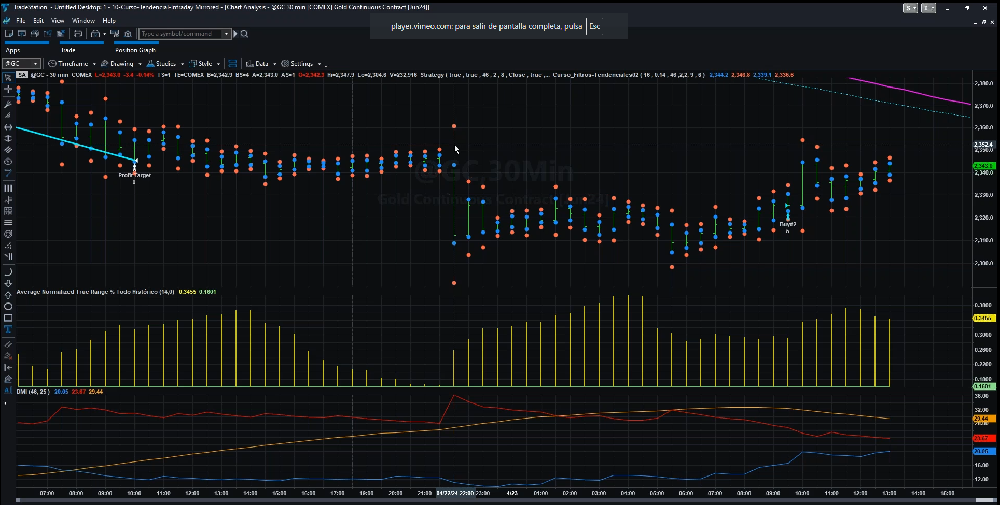
  <figcaption>Figura 002</figcaption>
</figure>

Vosotros tenéis el sistema en bruto. Aquí ahora ya está el sistema. Espera, que voy a hacer que no pinte.

**Sistema de medias con Walk Forward**

Entonces, si tenemos, tenemos el sistema, podemos decir en bruto, al cual ya le hemos hecho un *Walk Forward*, ahora luego os enseñaré, ¿vale? Hemos hecho un *Walk Forward* hoy, ¿vale? Incluso creo que el *Walk Forward* no está del todo bien hecho. Ahora cuando llegue os lo explico.

Porque bien, tenemos aquí el sistema en bruto con la entrada. Al final nos quedamos, recordad, bloqueamos la media lenta en *slow*, calculamos la *fast* restando la vela *slow*. Y al final ha quedado con una media en realidad de 44, 46, que ya se autopinta.

**Funcionamiento del filtro Donchian**

Pero acordaros con el tipo 8, que es *exponencial* y *simple*. Dejamos esta porque vimos que era bastante robusta. Ni probamos el *Donchian*, que os recomiendo que lo exploréis como filtro adicional, ¿vale? De tendencia, suele mejorar bastante los laterales y retrasar poco la entrada.

<figure>
  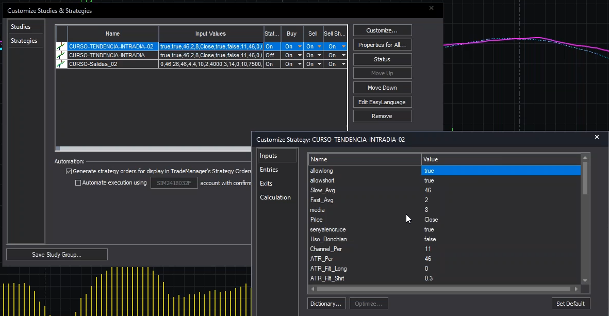
  <figcaption>Figura 003</figcaption>
</figure>


Es decir, al final lo que añade es un canal. Es decir, que cuando corta no solo necesita la media. Para que entendáis, ¿vale? Qué quiere decir el filtro *Donchian*: pues que además de cortar tiene que superar, por ejemplo, el máximo de n velas, este máximo.

Entonces en vez de comprar por debajo de la línea de puntos pues hubiera comprado por encima, ¿entendéis?

<figure>
  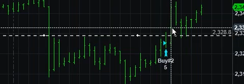
  <figcaption>Figura 004</figcaption>
</figure>

En este caso hubiera comprado más tarde, pero sí que a veces puede hacer que aquí pues no te venda, ¿vale? A lo mejor te hubiera vendido aquí igual perdiendo, pero a lo mejor este largo no entra, por ejemplo, porque no sube lo suficiente, ¿entendéis?

Es decir, suele mejorar los laterales, también algunos los va a sufrir, pero hay algún tipo de lateral que el canal de *Donchian* te va a ayudar un poco a sortearlo, porque no solo va a usar la media, va a usar también, por ejemplo, este que aseguro que no hubiera entrado, porque no hubiera roto este nivel de aquí, el mínimo de n barras y no hubiera entrado.

<figure>
  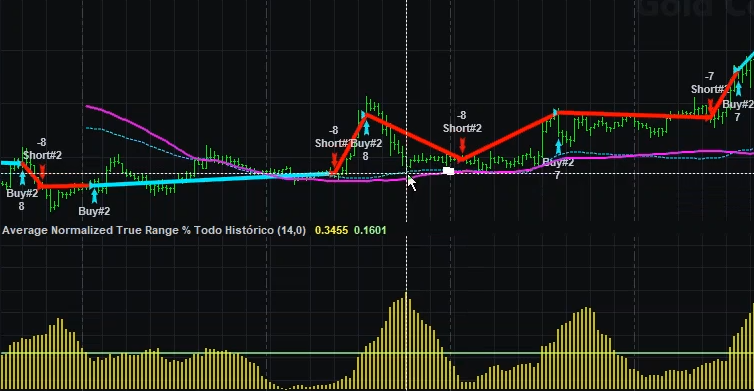
  <figcaption>Figura 005</figcaption>
</figure>

Entonces esta es un poco la idea. Entonces el canal de *Donchian* suele complementar bien a un sistema de tendencias como filtro, como filtro de precios. Pues os lo recomiendo explorar.

Aquí no lo hemos explorado. Si queréis ahora por probarlo un momentito, no lo he probado la verdad porque he preferido, este ya lo sé que mejora, entonces no quería tampoco perder el tiempo en dejarnos pelearnos, ¿vale?

<div style="border-left: 4px solid #4caf50; background: #e8f5e9; padding: 10px 15px; margin: 10px 0; border-radius: 8px;">
  <strong>📊 Filtro Donchian como complemento a sistemas de medias</strong><br><br>
  El canal Donchian añade una condición adicional: además del cruce de medias, el precio debe superar el máximo (para largos) o mínimo (para cortos) de las últimas N velas.<br><br>
  <strong>Ventajas:</strong><br>
  • Mejora comportamiento en laterales<br>
  • Filtra entradas falsas que no tienen momentum suficiente<br>
  • Retrasa poco la entrada en tendencias fuertes<br><br>
  <strong>Consideración:</strong> Si se añade el Donchian, hay que revisar las salidas porque estarán adaptadas a entradas más rápidas.
</div>

**Estado actual del sistema y métricas `Fast 2` y `media 8`**

Eso es cómo estaba la curva que ya habíamos hecho otro día con comisiones, ¿vale? Y sin demasiada tampoco locura a nivel de optimización. Es decir, esto es bastante razonable.

<figure>
  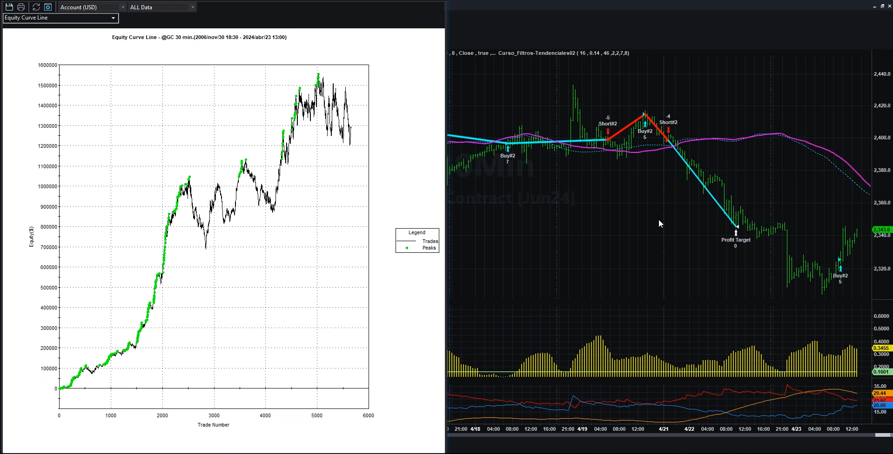
  <figcaption>Figura 006</figcaption>
</figure>
<figure>
  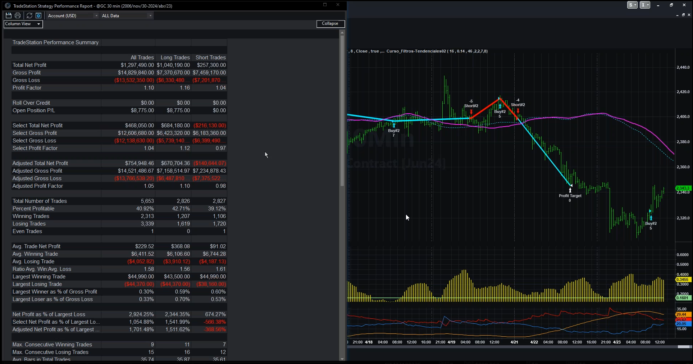
  <figcaption>Figura 008</figcaption>
</figure>
<figure>
  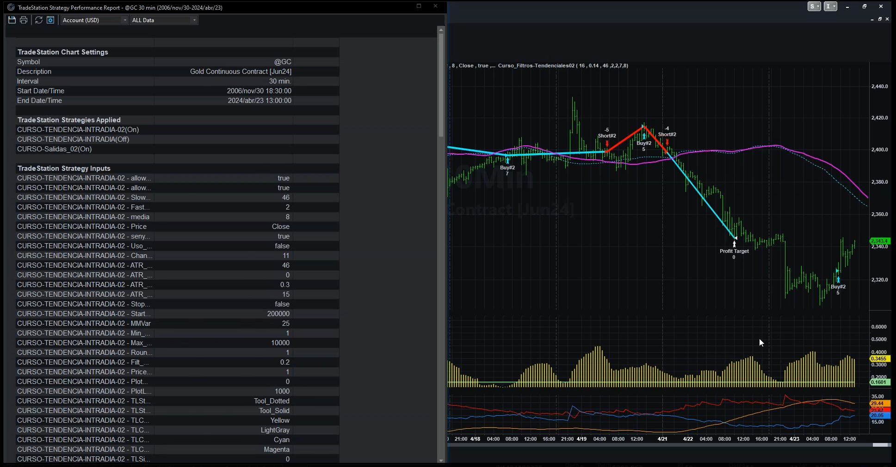
  <figcaption>Figura 007</figcaption>
</figure>

Recuerda que tenemos 5.600 *trades*, muchos años, ¿vale? Muy justito en el lado largo pero aceptable. Demasiado justo en el corto, es verdad que demasiado justo en el corto. Este `1,04` en realidad no es operable, es muy bajo. Pero bueno, global `1,10` es demasiado justo.

Deberíamos de mejorarlo un poco más para que fuera totalmente operable, pero está en un punto interesante para trabajarlo, porque son 5.000, todavía no hemos filtrado nada. Simplemente hemos trabajado un poco las salidas, que sí que ya lo hemos mejorado con las salidas y le hemos quitado un poquito de *tendencialidad*.

Pero lo hemos dejado un 40% de acierto, sigue siendo bastante tendencial aunque no lo hemos dejado totalmente tendencial en el sentido que corra, porque si no pues puede deteriorar un poco más. Pero ya digo, aún tiene camino de mejora.

### Prueba del filtro `Donchian`

Posible mejora es lo que os decía, simplemente activar el *Donchian*.

<figure>
  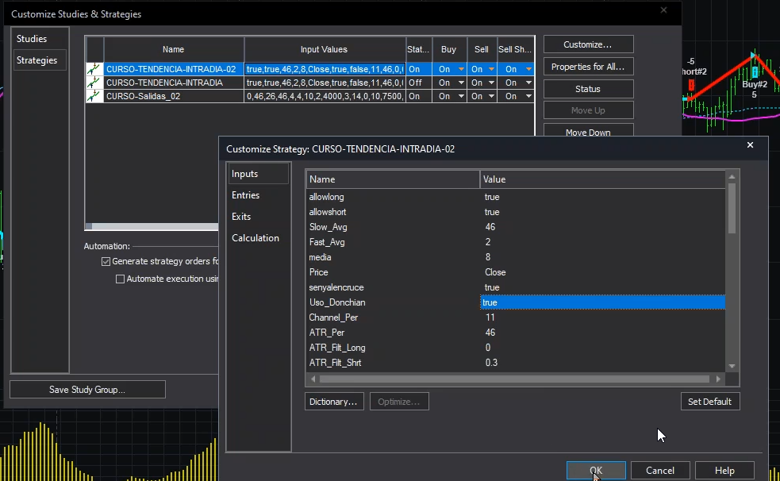
  <figcaption>Figura 009</figcaption>
</figure>

Bueno, aquí ahora tengo las salidas adaptadas, seguramente había que darle una vuelta a través a las salidas activando esto. Pero aquí activo el canal, creo que estaba en 11. Y de hecho hemos empeorado así solo. El lado corto claramente, bueno hemos empeorado todo, pero aquí ahora mismo, ya digo, las salidas están un poco adaptadas al otro, habría que ver. Si meto *Donchian*, porque ahora cuántos *trades* tengo, 1.200, le he bajado mucho los *trades*.

<figure>
  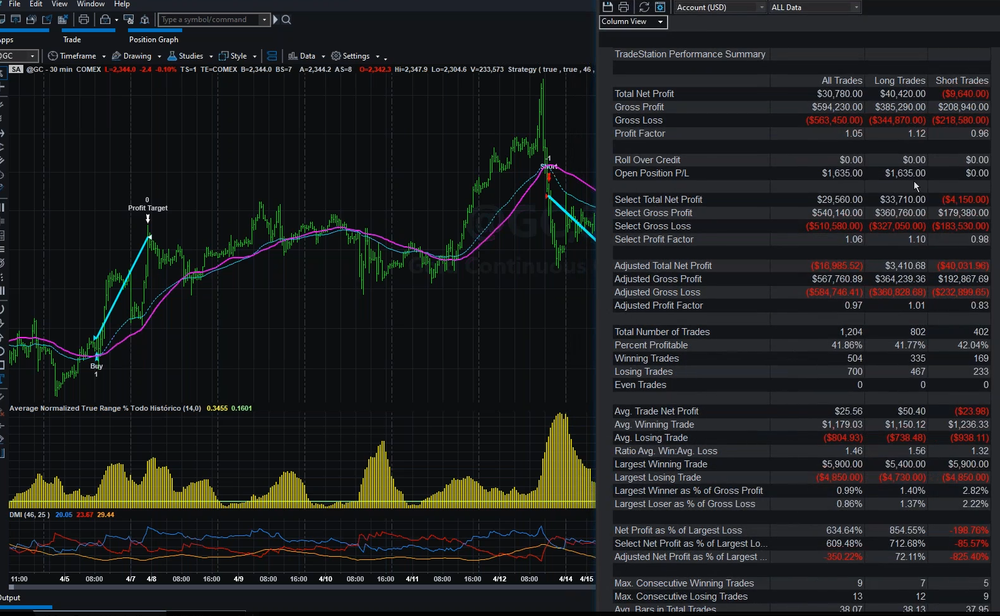
  <figcaption>Figura 010</figcaption>
</figure>

Bueno, este creo que era mejor en *false*, *false true*.

<figure>
  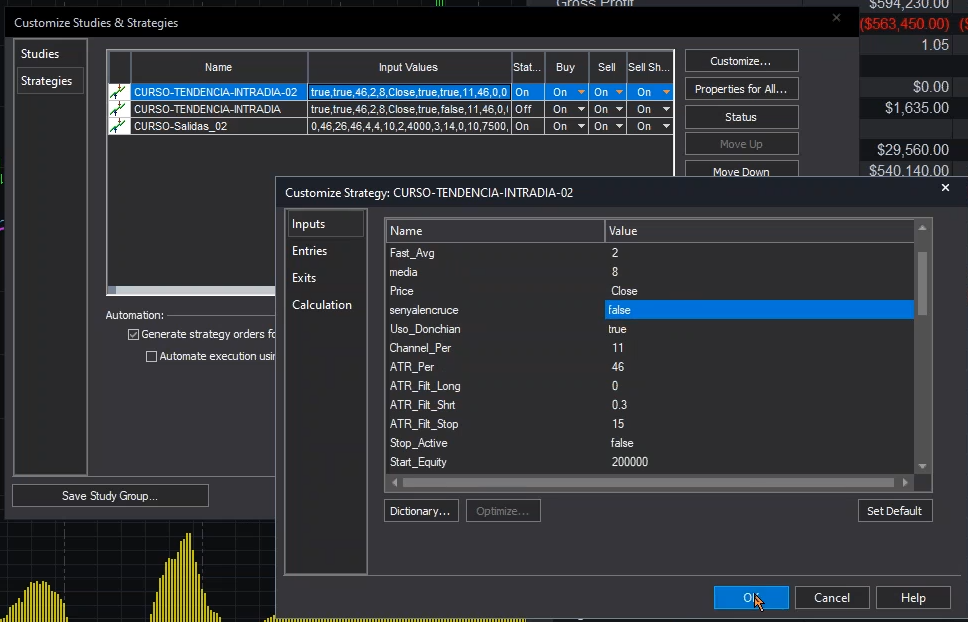
  <figcaption>Figura 011</figcaption>
</figure>
<figure>
  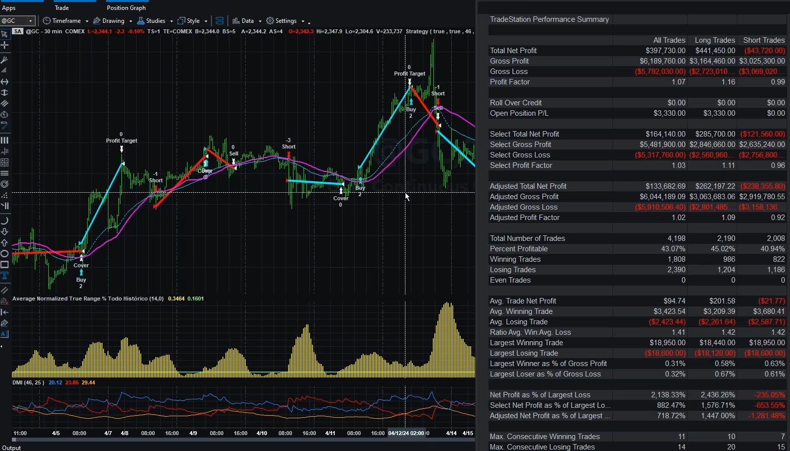
  <figcaption>Figura 012</figcaption>
</figure>

Aquí ya estamos otra vez más parecido a la cruz en 4.400.

Pues aquí es lo que os digo, aquí ya depende de un canal de *Donchian*. Que lo normal, habría que ver, habría que ver cuánto, qué canal. Repito que hubiera sido previo, yo lo hubiera hecho previo a las salidas. No he querido usarlo porque ya sé que no voy a mejorar así y automáticamente. Ahí pues jugar un poco con el canal, ver a ver dónde podemos jugar. No sé, pero dejamos por ejemplo un efecto en una sesión como está todo lo demás, así va a ser bastante restrictivo y yo diría que así puede ser que mejore algo.

<figure>
  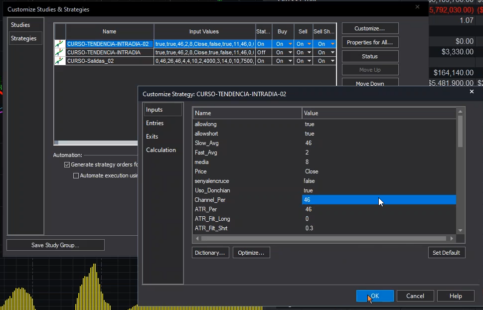
  <figcaption>Figura 013</figcaption>
</figure>

No, el problema es que las salidas están un poco adaptadas ahora al otro metro. Bueno poquito, poquito estamos en 1,12, no es significativo, pero ya digo, las salidas están adaptadas. Así como se han mejorado, de hecho en este último período va a ir realmente mal porque las salidas están adaptadas.

<figure>
  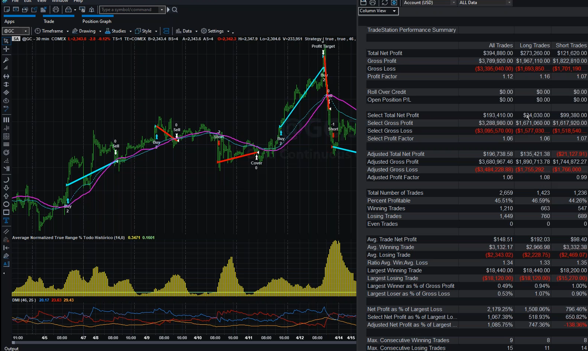
  <figcaption>Figura 014</figcaption>
</figure>
<figure>
  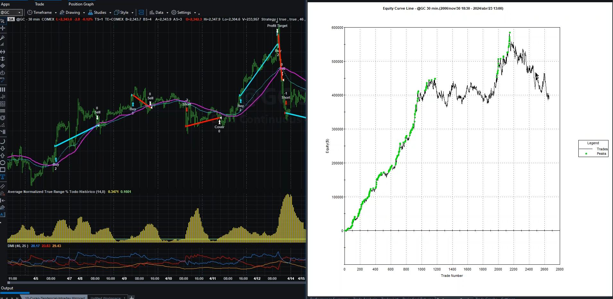
  <figcaption>Figura 015</figcaption>
</figure>

Habría que haber revisado las salidas con posterioridad, porque las salidas ya os digo están adaptadas a no usar canal de *Donchian*, a entradas muy rápidas. Entonces ese es el problema que tiene y además no estamos controlando las reentradas.

Había activado un poquito de gestión monetaria, por eso habéis visto mejor los datos un poco distintos. Había activado un poquito de gestión monetaria para hacerlo un poquito más real, por eso estaba un poquito distinto. Volvemos aquí a como estaba antes.

<figure>
  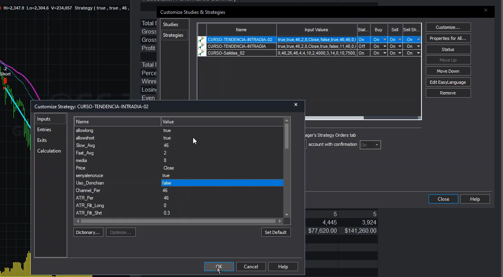
  <figcaption>Figura 016</figcaption>
</figure>
<figure>
  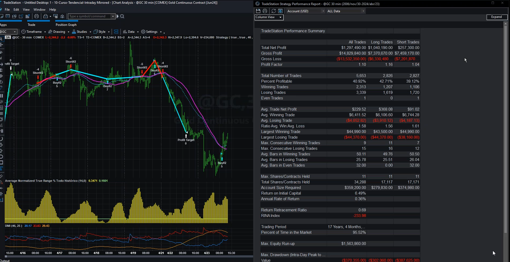
  <figcaption>Figura 017</figcaption>
</figure>

### Walk Forward: análisis con programa externo


Bien, vamos a ver lo que os decía, estáis viendo aquí un *Walk Forward*. Tenemos un programa externo, pero da igual, le podéis usar el de TradeStation, ¿de acuerdo? No difiere, este es más rápido simplemente, pero es totalmente comparable y no tiene mayor problema. Este lo hemos estado probando y de hecho todavía lo estamos probando, ya lo compramos, no era muy caro, era de 500 dólares. Lo estábamos probando un poco.

<figure>
  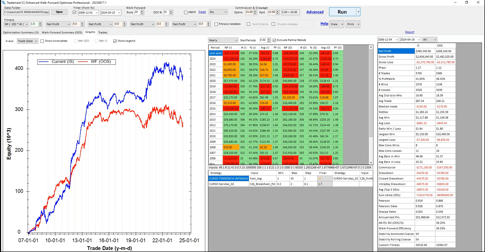
  <figcaption>Figura 018</figcaption>
</figure>

<div style="border-left: 4px solid #2196f3; background: #e3f2fd; padding: 15px 20px; margin: 15px 0; border-radius: 8px;">
  <strong>📊 Guía de interpretación del Walk Forward (imágenes 018-022)</strong><br>
  
  <strong>🖼️ Imagen 018 - Panel principal de Trademaid:</strong><br>
  • <strong>Curva azul (Current IS):</strong> Rendimiento en In-Sample (datos de entrenamiento)<br>
  • <strong>Curva roja (WF OOS):</strong> Rendimiento en Out-of-Sample (datos no vistos)<br>
  • <strong>Tabla central:</strong> Resultados año a año, con columnas IS y OOS separadas<br>
  • <strong>Walk-Forward Efficiency: 39.33%</strong> → Justito (se busca >50%)<br>
  • La curva roja debería seguir a la azul; si diverge mucho = sobreoptimización<br>
</div>

Bien, hicimos una prueba rápida de *Walk Forward* a nivel de *cluster*, no sé si era este o era el otro. Me parece que era este otro, vale. Que es un *Walk Forward* bastante justito. Pero es verdad que aquí decidimos por probar, salen todos los *inputs* de ese programa. Es la verdad que no me gusta porque es mareante, están todos. Hay las salidas las que no usamos también.

Esta es la ficha del *Walk Forward*, esta es simplemente las que optimizamos. Nos quedamos con el filtro 26, con la salida 26, la verdad que habían varias, habían varias. Y simplemente variamos esto.

<figure>
  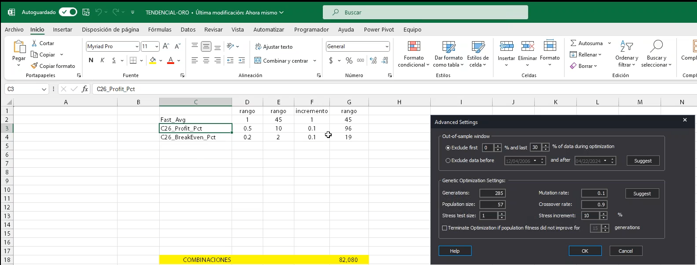
  <figcaption>Figura 019</figcaption>
</figure>

<div style="border-left: 4px solid #2196f3; background: #e3f2fd; padding: 15px 20px; margin: 15px 0; border-radius: 8px;">
  
  <strong>🖼️ Imagen 019 - Parámetros optimizados (Excel):</strong><br>
  • <code>Fast_Avg</code>: 1-45 (periodo de media rápida)<br>
  • <code>C26_Profit_Pct</code>: 0.5-10% (take profit)<br>
  • <code>C26_BreakEven_Pct</code>: 0.2-2% (breakeven)<br>
  • <strong>82,080 combinaciones totales</strong> → El instructor critica dejar oscilar tanto las salidas<br>
</div>

Sinceramente no veo muy claro el hecho de dejar oscilar las salidas, ni menos tanto para hacer *Walk Forward*, pero bueno, no está mal mirarlo, no está mal mirarlo. Pero eso va a dificultar bastante pasarlo, porque además están en porcentaje, desde que están bien dimensionadas.

Y sí que a nivel de entradas valorar distintas medias puede tener más sentido por el hecho de los distintos ciclos del mercado y tratar de a lo mejor buscar una media que se adapte más a un mercado u otro, o ver cómo puede variar eso. Al final es una prueba de estrés.

Pero a nivel de filtros y de aquí, dejar oscilar tanto no lo tengo muy claro. Al menos en *Walk Forward* convencional. *Walk Forward anchored* sí que puede tener más sentido, que es este.

Estáis viendo que es *anchored*. Tal como habéis visto, esta optimización hecha en *Walk Forward non-anchored* no nos lo ha pasado por muy poco. El *anchored* lo ha pasado pero también por poco, también por poco lo ha pasado. De hecho, sobre todo por el *efficiency*. Como veis, está siempre alrededor de 50, bastante justito. El resto da bastante bien y todos por medias, si os fijáis, da *pass* claramente (en la columna `result`).

<div style="border-left: 4px solid #2196f3; background: #e3f2fd; padding: 15px 20px; margin: 15px 0; border-radius: 8px;">
  <strong>🖼️ Imágenes - Cluster Analysis:</strong><br>
  • <strong>Matriz OOS% \ Runs:</strong> Prueba diferentes configuraciones de Walk Forward<br>
  • <strong>Celdas verdes/azules:</strong> Valores de efficiency (buscar >50%)<br>
  • <strong>Columna Result:</strong> Pass/Fail por cada criterio<br>
  • <strong>Img 021:</strong> Non-anchored → OVERALL: <span style="color: red;">FAIL</span> (por Walk-forward Robustness)<br>
  • <strong>Img 020/022:</strong> Anchored → OVERALL: <span style="color: green;">PASS</span> (pero justito, ~50%)<br><br>
  
  <strong>🎯 Conclusión:</strong><br>
  El sistema pasa el WF Anchored por poco. Los tendenciales tienen dificultad para pasar Walk Forward porque dependen mucho de los ciclos del mercado. El instructor recomienda NO optimizar las salidas en WF (dejarlas fijas) y solo variar las medias.
</div>

<figure>
  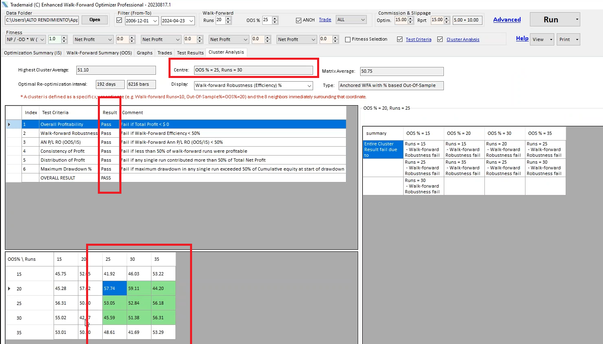
  <figcaption>Figura 020</figcaption>
</figure>

</strong> Non-anchored → OVERALL: <span style="color: red;">FAIL</span> (por Walk-forward Robustness)<br>


<figure>
  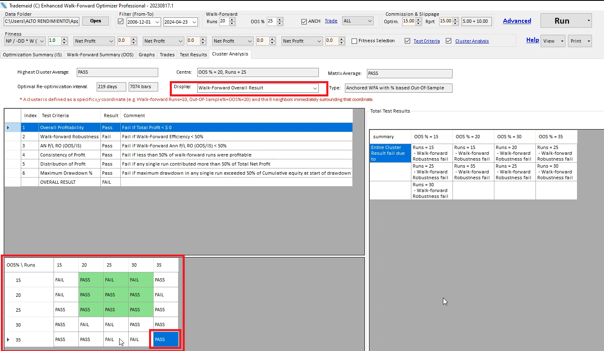
  <figcaption>Figura 021</figcaption>
</figure>

Pero en cuanto al *Walk Forward* es más justito. El global es *pass*, pero ya digo es justita, pero sobre todo por el *Walk Forward efficiency*.

</strong> Anchored → OVERALL: <span style="color: green;">PASS</span> (pero justito, ~50%)<br>

<figure>
  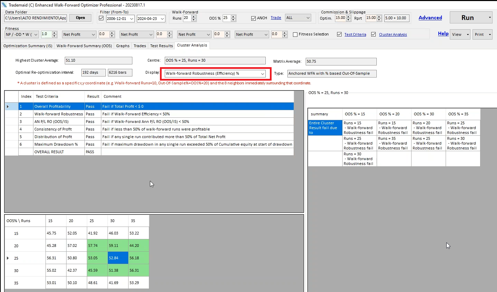
  <figcaption>Figura 022</figcaption>
</figure>

<div style="border-left: 4px solid #ff9800; background: #fff3e0; padding: 10px 15px; margin: 10px 0; border-radius: 8px;">
  <strong>⚠️ Walk Forward en sistemas tendenciales</strong><br><br>
  Es verdad que para <em>tendenciales</em> es muy complicado pasar el <em>Walk Forward</em>. ¿Por qué? Porque tiene muchos ciclos. Por supuesto, si tuviérais un filtro aplicado, tampoco lo apliquéis en <em>Walk Forward</em>. No tiene ningún sentido ir aplicando ahora un filtro y valorar en un momento u otro. No es buena práctica, no va a propagar. En un <em>anchored</em> es más posible.
</div>

Es verdad que para *tendenciales* es muy complicado pasar el *Walk Forward*, ya os lo comenté. Es más complicado, ¿por qué? Porque tiene muchos ciclos. Por supuesto, si tuviérais un filtro aplicado, tampoco lo apliquéis en *Walk Forward*. No tiene ningún sentido ir aplicando ahora un filtro y valorar en un momento u otro. No es buena práctica, no va a propagar. En una *anchored* es más posible, en una *anchored* es más posible.

Porque en *anchored* al final lo que vamos haciendo, recordaros lo que hace la *anchored*, la *anchored* aquí, las fechas veis va de 2006-2009, 2006 va alargando pero la inicial es la misma.

<div style="border-left: 4px solid #2196f3; background: #e3f2fd; padding: 15px 20px; margin: 15px 0; border-radius: 8px;">
  <strong>📊 Interpretación de Walk Forward Anchored</strong><br><br>
  
  <strong>🖼️ Imagen - In-Sample Summary (Anchored):</strong><br>
  • <strong>Columna "Period":</strong> Observa que TODAS las filas empiezan en <code>2006/12/04</code><br>
  • La fecha final va creciendo: 2009/03/12 → 2009/12/10 → 2010/09/14 → ...<br>
  • <strong>Esto es "Anchored":</strong> El inicio está "anclado", la muestra crece con cada run<br>
  • Cada fila = una optimización con más datos históricos<br>
  • Métricas: Net Profit, Drawdown, % Profitable, Sharpe, etc.<br>
</div>

<figure>
  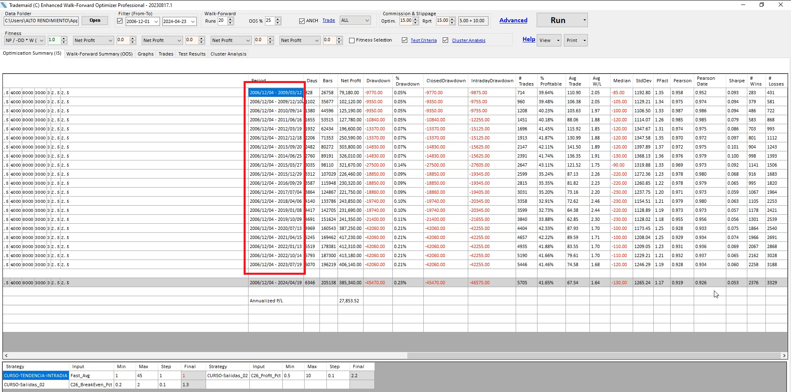
  <figcaption>Figura 023</figcaption>
</figure>

Esto es *anchored*, la inicial es la misma. Vamos aumentando la final, cada vez la muestra es mayor.

Lógicamente el *out-of-sample* sí que va cambiando, es el que va consecutivamente detrás y vamos eligiendo los parámetros. Y ves que ahí ves que realmente hay una degradación en los períodos del final, aunque ya sabíamos porque es así. El mercado se ha detenido mucho y le ha costado. Aunque ha habido una parte que ha mejorado pero aquí recoge una parte mala y una parte buena, y por eso aún ha quedado mala. Pero realmente el oro ha ido perdiendo *tendencialidad*, al igual que la bolsa ha ido perdiendo *anti-tendencialidad* en los últimos años, el oro ha ido perdiendo.

<div style="border-left: 4px solid #2196f3; background: #e3f2fd; padding: 15px 20px; margin: 15px 0; border-radius: 8px;">
  <strong>📊 Interpretación de Walk Forward Anchored </strong><br><br>
  
  <strong>🖼️ Imagen - Out-of-Sample Summary:</strong><br>
  • <strong>Columna "Period":</strong> Ahora los periodos son consecutivos (no anclados)<br>
  • Ejemplo: 2009/03/12-2009/12/10, luego 2009/12/10-2010/09/14, etc.<br>
  • <strong>Cada OOS = el periodo inmediatamente posterior al IS correspondiente</strong><br>
  • <strong>Columna Net Profit:</strong> Los valores en <span style="color: red;">ROJO</span> son negativos (pérdidas)<br>
  • <strong>Walk-Forward Efficiency: 50.80%</strong> → Apenas pasa el umbral del 50%<br>º

</div>

<figure>
  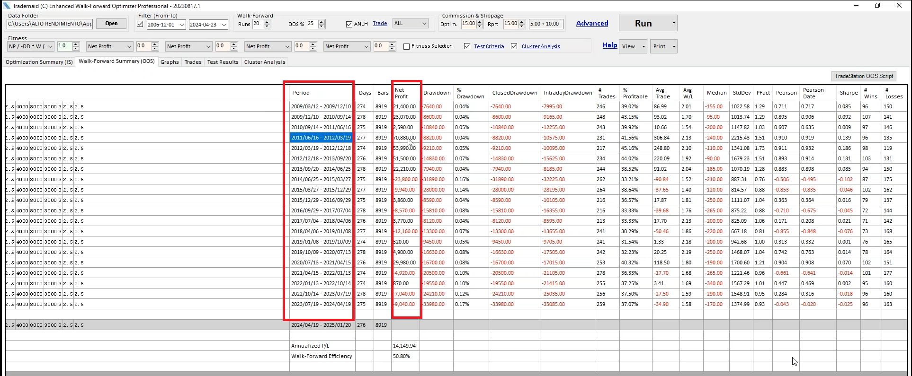
  <figcaption>Figura 024</figcaption>
</figure>

<div style="border-left: 4px solid #2196f3; background: #e3f2fd; padding: 15px 20px; margin: 15px 0; border-radius: 8px;">
  
  <strong>🔍 Qué revela la degradación:</strong><br>
  • Periodos 2014-2015: Net Profit negativo (-23,800, -9,940)<br>
  • Periodos 2016-2019: Negativos o muy bajos<br>
  • Periodos 2022-2024: Degradación clara (-7,040, -9,040)<br>
  • <strong>Conclusión:</strong> El oro ha perdido tendencialidad en los últimos años, por eso los periodos recientes muestran peor rendimiento OOS.<br><br>
  
  <strong>📐 Diferencia Anchored vs Rolling:</strong><br>
  • <strong>Anchored:</strong> IS siempre empieza igual, crece → más datos, más estable<br>
  • <strong>Rolling:</strong> IS se desplaza → ventanas fijas, más adaptativo pero menos robusto
</div>

**Diversificación con distintos sistemas en el mismo activo**

Y mira, ligando con esto que decía Alejandro en su mensaje que lo quería comentar antes, se me ha olvidado. Pensar que una de las mejores... esto lo veréis cuando haya *portfolio*, pero tú, una de las mejores cosas que puedes hacer para diversificar, ¿de acuerdo?, es justamente ahora trabajar otro sistema para el oro. Otro sistema para el oro.

No necesariamente que sí, que sí que está bien si lo tienes ya en otro, pero a lo mejor en activos que lo permita. El oro ya os comenté que va bien a tendencia pero también va bien en *mean reversion*. También se puede operar en *mean reversion*, en eventos o *breakouts*. No es necesariamente, aunque lo ha sido, lo ha sido, ya se que no en esta época mucho tiempo.

Pero realmente ya en los últimos años le ha ido costando y alternando tanto períodos de tendencia con tendencia que empieza a ser rentable. Entonces claro, en estos períodos que os ha ido mal a tendencia os va a ir bien la *anti-tendencia*, igual aquí. Y aquí os va a ir mal. Entonces bueno, así lo complementas, ¿entiendes? Así lo complementas.

Si lo haces en otro activo pues también está bien. Pero ya os digo que si tú tienes buen control de este activo y puedes perfectamente hacerlo, buscarle otro sistema que lo descorrelacione. Y luego ya ir a otros activos, y luego ya ir a otros activos.

Pero ya digo que es una manera muy buena de mejorarlo, porque ahí vas a ver directamente  en qué momentos ha ido bien uno y qué momentos ha ido bien otro. Y puedes comparar. Tú quieres un sistema que vaya bien en pues no sé, los años que ha ido mal en tendencia. Puedes centrarte en ese período y de esa manera, ya digo, se puede conseguir un buen resultado.

**Análisis del Walk Forward global**

Bien, entonces ya digo, al final en global es *pass*, global es *pass*, pero es justito, es justito. Sobre todo por esta parte, 

Para sacar el informe y el gráfico de uno de los períodos que nos gustaran más, Esto al final es 30% *out-of-sample*, 

Vamos a probar. 

<figure>
  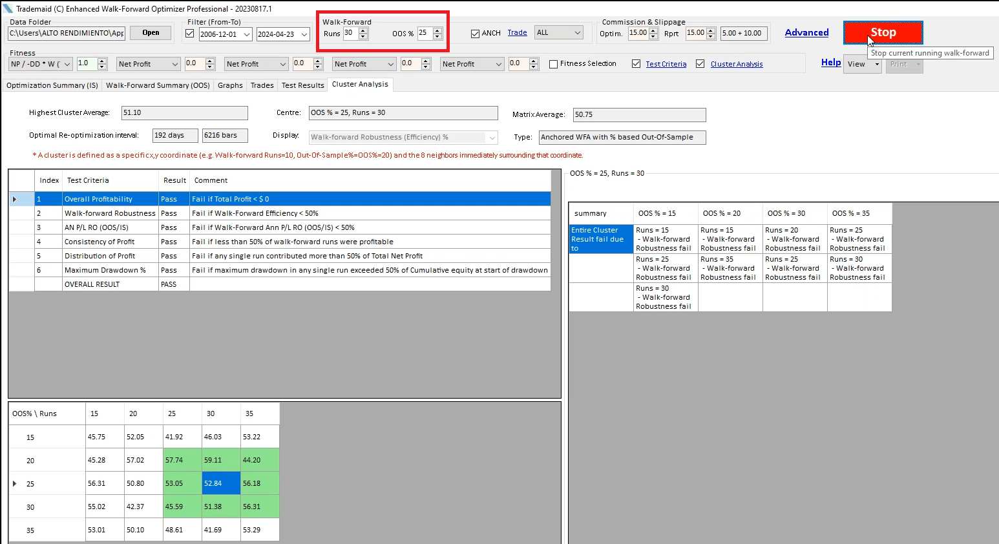
  <figcaption>Figura 026</figcaption>
</figure>

<div style="border-left: 4px solid #673ab7; background: #ede7f6; padding: 15px 20px; margin: 15px 0; border-radius: 8px;">
  <strong>🔬 Qué está haciendo?</strong><br><br>
  
  <strong>🖼️ Imagen 026 - Configuración del Walk Forward:</strong><br>
  • <strong>Runs = 30, OOS% = 25</strong> → 30 periodos de optimización, 25% out-of-sample<br>
  • <strong>OVERALL RESULT = PASS</strong> → El sistema pasa la prueba<br>
  • <strong>Matriz inferior:</strong> Prueba diferentes combinaciones de Runs/OOS%<br>
  • Valores ~50% de efficiency → "justito" pero pasa<br>
  • <strong>Botón STOP:</strong> El WF está corriendo, puede tardar<br>
</div>

Bueno, me gusta, está por aquí. Una de las cosas que me gusta, poder elegir creo que estaba Pearson esta correlación. Ahora sí debería tardar poco si no se nos rompe, que a veces se rompe el programa. Esto es sin filtro ni nada, es simplemente la tendencia con las salidas, o sí, las salidas.

<figure>
  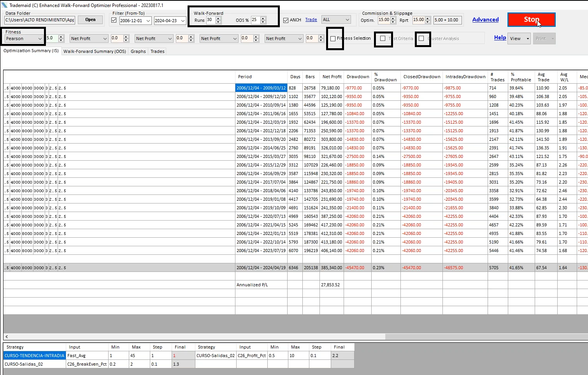
  <figcaption>Figura 027</figcaption>
</figure>

<div style="border-left: 4px solid #673ab7; background: #ede7f6; padding: 15px 20px; margin: 15px 0; border-radius: 8px;">
  
  <strong>🖼️ Imagen - Cambio de criterio de Fitness:</strong><br><br>
  • <strong>Fitness = "Pearson" con valor 5.0</strong> (marcado arriba-izquierda)<br>
  • <strong>Fitness Selection activada</strong> (checkbox marcada)<br>
  • <strong>¿Qué es Pearson?</strong> Correlación que mide la linealidad de la curva de equity<br>
  • Una curva más "recta" y consistente = mayor Pearson<br>
  <strong>📋 Tabla de la imagen :</strong><br>
	• Cada fila = un periodo de IS anchored (todos empiezan 2006/12/04)<br>
	• <span style="color: red;">Números en rojo</span> = Drawdowns (negativos, es normal)<br>
	• Columnas clave: Net Profit, % Profitable, Avg Trade, Sharpe<br>
  • <strong>Annualized P/L: $27,853.52</strong><br><br>
  
  <strong>🎯 ¿Por qué cambia a Pearson?</strong><br>
  <ol>
    <li>El WF con Net Profit como fitness pasaba "justito"</li>
    <li>Pearson busca curvas más estables, no solo las que ganan más</li>
    <li>Puede producir parámetros más robustos aunque ganen menos</li>
  </ol>
</div>

**Objetivo principal del Walk Forward**

Para aquellos que no les gusta el *Walk Forward*, que es respetable, y sé que mucha gente... al final insisto que el principal, lo dije en la teoría, principal objetivo del *Walk Forward* no es usarlo para elegir parámetros. No deja de ser más que una prueba de estrés. Pueden haber otras pero es una prueba de estrés. Ya está, ¿de acuerdo?

Al final yo optimizo y aplico, optimizo y aplico. Es algo parecido a lo que hubiera hecho en esos momentos, ¿de acuerdo? Si yo estuviera operando el sistema en esa época seguramente hubiera hecho eso. Hubiera operado, hubiera optimizado hasta ese momento, hubiera dejado un período fuera de muestra y eso es lo que hago. Ahora tienes lo que lo hago en muchos distintos períodos y además acumulo mucha información a nivel de *trade*, ¿de acuerdo?


---

***Resultados***

Fijaros en el enorme lateral que ha hecho el *Walk Forward*, que es lo que veíais. 

<figure>
  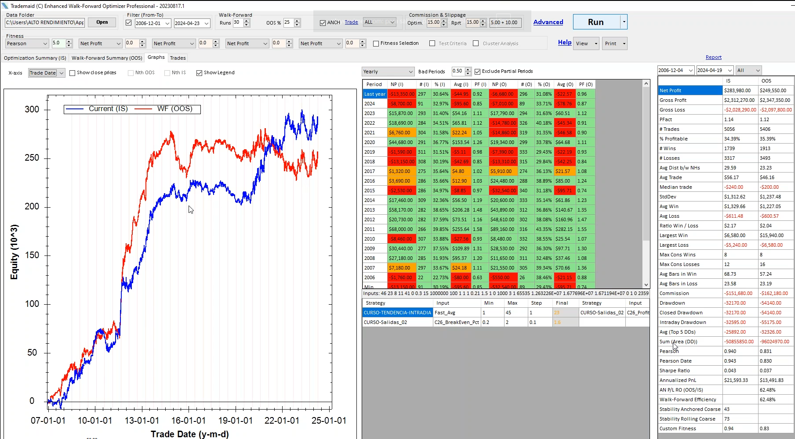
  <figcaption>Figura 028</figcaption>
</figure>

<div style="border-left: 4px solid #ffcf54ff; background: #fffbe5ff; padding: 15px 20px; margin: 15px 0; border-radius: 8px;">
  <strong>📈 Análisis de resultados del Walk Forward</strong><br><br>
  
  <strong>🖼️ Imagen 028 - Gráfico de curvas IS vs OOS:</strong><br>
  • <strong>Curva azul (Current IS):</strong> Rendimiento si aplicaras el último set de parámetros a TODO el histórico<br>
  • <strong>Curva roja (WF OOS):</strong> Rendimiento REAL del Walk Forward (lo que hubieras ganado reoptimizando)<br>
  • <strong>Walk-Forward Efficiency: 62.48%</strong> → Aceptable (>50%)<br>
  • <strong>Net Profit OOS: $249,550</strong> vs IS: $283,980<br>
  • <strong>Periodo lateral 2015-2020:</strong> La curva roja sufre mucho, no aguanta bien<br>
  • <strong>Último periodo (2023-2024):</strong> Mejora clara, el oro ha vuelto a ser tendencial<br>
</div>


El programa simplemente coge el último *set* que elegiría, el *current* es el que tocaría para operar ahora, El *current* al final es el *set* que tocaría para operar, que en teoría iría hasta octubre del 24, ¿vale? Octubre del 24. Ya está. Entonces ese *set* lo pone en todo el histórico y eso es lo que para compararlo con el *Walk Forward*, ¿vale?

Entonces aquí fijaros que el *Walk Forward*, así que el último ya ha ido bien porque se está mejor. Como se ha empezado en octubre 24, ese último ya ha ido, ya ha ido bien ese período. Bueno, que ya es que ya os he dicho algunas veces, bueno tanto en el curso como los directos que hago, que había hecho un buen momento el oro, que es al final del veto lo principal y ha vuelto.

Pero fijaros todos los *Walk Forward* los anteriores cómo había ido teniendo muy buenos porque el mercado estaba tendencial. Y está entonces en los períodos malos. Y que lo ideal es que aguante. Aquí no aguanta mucho, aquí no aguanta mucho. Es decir, estos períodos son demasiado malos.

<figure>
  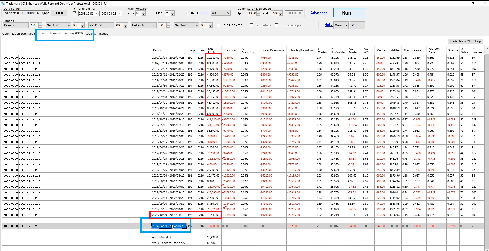
  <figcaption>Figura 029</figcaption>
</figure>

<div style="border-left: 4px solid #ffcf54ff; background: #fffadeff; padding: 15px 20px; margin: 15px 0; border-radius: 8px;">
  <strong>🖼️ Imagen - Detalle de periodos OOS (Rolling):</strong><br>
  • <strong>Periodos consecutivos</strong> (no anchored): cada fila = un periodo OOS independiente<br>
  • <strong>Columna Net Profit:</strong> <span style="color: red;">Rojo = pérdida</span><br>
  • <strong>Periodos 2014-2016:</strong> Pérdidas fuertes (-17,120, -21,010, -980)<br>
  • <strong>Periodos 2017-2019:</strong> Muy malos (mercado lateral)<br>
  • <strong>Periodo final 2023/10-2024/04:</strong> +12,440 → El oro vuelve a funcionar<br>
  • <strong>Annualized P/L: $13,491.83</strong><br>
</div>

Entonces aquí sí que ***el *Walk Forward* recordar que siempre es con gestión monetaria, no se puede pasar sin gestión monetaria***. Entonces aquí pues bueno te enseña un gráfico. En *TradeStation* también te puedes sacar todo el gráfico y de hecho me gusta más porque te añade los que va uniendo, los *Walk Forward*.

Aquí se ve, ve que uniendo los *Walk Forward*, pues sí que realmente lleva mucho tiempo sufriendo. En cambio, todo este último *set* que tocaría ahora en histórico, pues la verdad que es bastante aceptable.

<figure>
  
  <figcaption>Figura 028</figcaption>
</figure>

En definitiva, no son malos datos para un *tendencial*, ¿de acuerdo? No son malos datos para un *tendencial* sencillo que no lo hemos activado en el *Donchian*. Está totalmente en bruto. Tiene más de 5.000 *trades* el oro. Está en bruto absoluto, recuerdo. Es decir, a partir de ahí se puede aplicar el *Donchian*, se puede luego buscar salidas y se puede tratar de filtrar, ¿vale?


<div style="border-left: 4px solid #ffcf54ff; background: #fffadeff; padding: 15px 20px; margin: 15px 0; border-radius: 8px;">
  <strong>💡 Conclusión:</strong>
  <em>"No son malos datos para un tendencial sencillo en bruto (sin Donchian, sin filtros), con más de 5.000 trades. A partir de aquí se puede mejorar."</em>
</div>


## Filtros para sistemas tendenciales: evitar expansión

A nivel de filtros, para acabar ya esto, ¿vale?, ir un poco a algo... bueno creo que eso también es interesante. Pero para ir a otro tema, ¿vale?

A ver si puedo ahora, a ver si puedo ahora en este... me salgo. A nivel de filtros lo que decía, podéis activar aquí los filtros. Normalmente los *breakout tendenciales*, por experiencia os diré que normalmente vais a poder filtrar más bien por evitar cuando ha habido mucha expansión, ¿de acuerdo? Eso es lo contrario de los *mean reversion*.

<div style="border-left: 4px solid #9b59b6; background: #f5eef8; padding: 10px 15px; margin: 10px 0; border-radius: 8px;">
  <strong>🎯 Regla práctica para filtros</strong><br><br>
  En sistemas <em>tendenciales</em> y <em>breakout</em>, el filtro más efectivo suele ser evitar operar cuando ya ha habido mucha expansión de volatilidad. Cuando ya ha habido una expansión en una dirección, normalmente cuesta que haya más. Lo contrario aplica para sistemas de <em>mean reversion</em>.
</div>

Entonces ese es un poco el tema. Es decir, y a partir de ahí hay que explorar. Hemos probado algunos, hemos probado algunos sencillitos y pues bueno hemos mejorado algo, no muchísimo, pero sé que algo, ¿de acuerdo? Sé que algo.

<figure>
  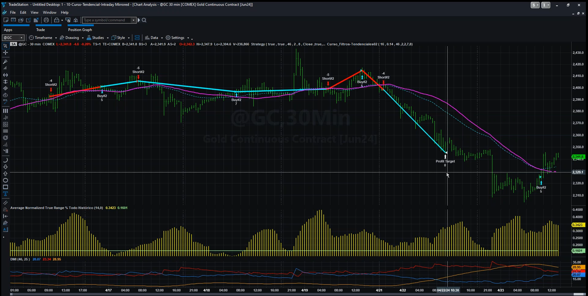
  <figcaption>Figura 030</figcaption>
</figure>

<div style="border-left: 4px solid #ff5722; background: #fbe9e7; padding: 15px 20px; margin: 15px 0; border-radius: 8px;">
  <strong>🖼️ Imagen 030 - Gráfico principal con indicadores:</strong><br>
  • <strong>Medias móviles:</strong> Cyan (lenta) y Magenta (rápida)<br>
  • <strong>Panel inferior 1:</strong> "Average Normalized True Range % Todo Histórico" = ATR normalizado (0.34 y 0.16 son los niveles)<br>
  • <strong>Panel inferior 2:</strong> DMI (46, 25) con valores ADX<br>
  • Señales Buy#2 y Short#2 del sistema tendencial<br>
</div>

<figure>
  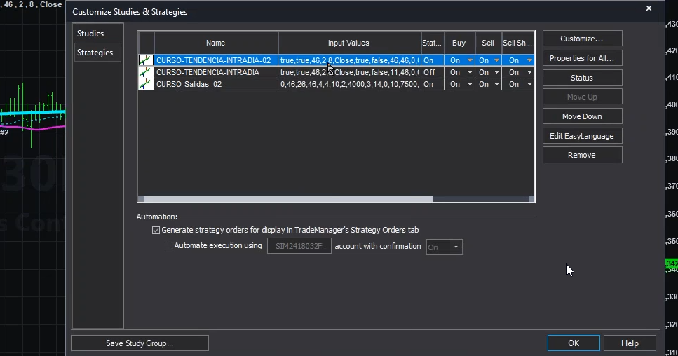
  <figcaption>Figura 031</figcaption>
</figure>

<div style="border-left: 4px solid #ff5722; background: #fbe9e7; padding: 15px 20px; margin: 15px 0; border-radius: 8px;">
  <strong>🖼️ Imagen 031 - Lista de estrategias:</strong><br>
  • CURSO-TENDENCIA-INTRADIA-02: <span style="color: green;">ON</span> (activa)<br>
  • CURSO-TENDENCIA-INTRADIA: OFF (desactivada)<br>
  • CURSO-Salidas_02: <span style="color: green;">ON</span><br>
</div>

<figure>
  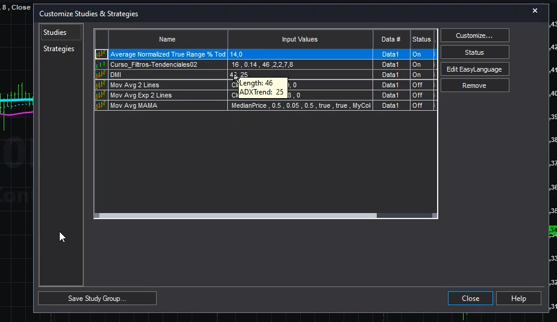
  <figcaption>Figura 033</figcaption>
</figure>

<div style="border-left: 4px solid #ff5722; background: #fbe9e7; padding: 15px 20px; margin: 15px 0; border-radius: 8px;">
  <strong>🖼️ Imagen - Lista de indicadores (Studies):</strong><br>
  • Curso_Filtros-Tendenciales02: <span style="color: green;">ON</span> → Este es el indicador "Show Me" que pinta los filtros<br>
  • Average Normalized True Range: ON<br>
  • DMI: ON<br>
</div>

**"Show Me"** : [Curso_Filtros-Tendenciales02](../code/CURSO_FILTROS-TENDENCIALES02.ELD)

```sh
# FILTROS "Show Me"** : Curso_Filtros-Tendenciales02  	
Input: 	Nivel_ADX( 16 ),
		Nivel_ATR( 0.14 ),
		Barras( 46 ),
		Rango1 (2),
		Rango2 (2),
		FiltroY( 9 ), 
    	FiltroN( 6 );
    	
if not NuestrasPatternDirectionalFast(+FiltroY,Nivel_ADX,Nivel_ATR, Barras, Rango1, Rango2) then 
		Plot1( High, !("FltTrue_LE") )  # pinta cuando el filtro NO permite operar
	Else
		Noplot(1);
		
	if NuestrasPatternDirectionalFast(+FiltroN,Nivel_ADX,Nivel_ATR, Barras, Rango1, Rango2) then 
		Plot2( High + ((H - L) / 2), !("FltFalse_LE") ) # pinta cuando el filtro NO permite operar
	Else
		Noplot(2); 

if not NuestrasPatternDirectionalFast(-FiltroY,Nivel_ADX,Nivel_ATR, Barras, Rango1, Rango2) then 
		Plot3( Low, !("FltTrue_SE") ) # pinta cuando el filtro NO permite operar
	Else
		Noplot(3);
		
	if NuestrasPatternDirectionalFast(-FiltroN,Nivel_ADX,Nivel_ATR, Barras, Rango1, Rango2) then 
		Plot4( Low - ((H - L) / 2), !("FltFalse_SE") ) # pinta cuando el filtro NO permite operar
	Else
		Noplot(4); 
```

## Uso de indicadores `Show Me` para visualizar filtros

A nivel sobre todo para que veáis lo que os decía, me voy a poneros un ejemplo que casi va a ser más fácil que lo veáis. Por ejemplo, el `case` *wide spread* ¿Cuál es el *wide spread*, Alberto? Son `case 4`

[Function: NuestrasPatternDirectionalFast](../code/NUESTRASPATTERNDIRECTIONALFAST.ELD)

```sh
# Function: NuestrasPatternDirectionalFast.ELD

input: 	numeropattern(numericsimple),
		Nivel_ADX(numericsimple),
		Nivel_ATR(numericsimple),
		Barras(numericsimple),
		Rango1(numericsimple),
		Rango2(numericsimple);

var:	FiltroADX(False),
		Filtro_ATR(False),
		oDMIPlus(0),
		oDMIMinus(0),
		oDMI(0),
		oADX(0),
		oADXR(0),
		oVolty(0);


Value1 = DirMovement (H, L, C, Barras, oDMIPlus, oDMIMinus, oDMI, oADX, oADXR, oVolty);


Switch(numeropattern) Begin
  case 1:     
  begin
  		If Nivel_ADX > 0 Then
		Begin	
			FiltroADX = oDMIPlus > Nivel_ADX;
		end Else
		Begin	
			FiltroADX = True; 
		End;
		NuestrasPatternDirectionalFast = FiltroADX;
  end;
  
  case -1:
  begin
  		If Nivel_ADX > 0 Then
		Begin	
			FiltroADX = oDMIMinus > Nivel_ADX;
		end Else
		Begin	
			FiltroADX = True; 
		End;
		NuestrasPatternDirectionalFast = FiltroADX;
  end;
  
  Case 2:  
  begin 
  	If Nivel_ATR > 0 Then	
		Filtro_ATR = AvgNormalizedTrueRange(Barras) < (Nivel_ATR)
	Else
		Filtro_ATR = True;
	NuestrasPatternDirectionalFast =Filtro_ATR;
  end;
  
  case -2:
  begin
  	If Nivel_ATR > 0 Then	
		Filtro_ATR = AvgNormalizedTrueRange(Barras) < (Nivel_ATR)
	Else
		Filtro_ATR = True;
	NuestrasPatternDirectionalFast =Filtro_ATR;
  end;
  
  Case 3:    	
  		NuestrasPatternDirectionalFast = NarrowRange(RANGO1); 
  		  		
  Case -3:   
  		NuestrasPatternDirectionalFast = NarrowRange(RANGO1); 	
  				
		 		
  Case 4:
  		NuestrasPatternDirectionalFast = widespread(RANGO2); 
  		
  Case -4:
  		NuestrasPatternDirectionalFast = widespread(RANGO2); 

  			
  case 5:     
  begin
  		If Nivel_ADX > 0 Then
		Begin	
			FiltroADX = oDMIPlus < Nivel_ADX;
		end Else
		Begin	
			FiltroADX = True; 
		End;
		NuestrasPatternDirectionalFast = FiltroADX;
  end;
  
  case -5:
  begin
  		If Nivel_ADX > 0 Then
		Begin	
			FiltroADX = oDMIMinus < Nivel_ADX;
		end Else
		Begin	
			FiltroADX = True; 
		End;
		NuestrasPatternDirectionalFast = FiltroADX;
  end;
  
  Case 6:  
  begin 
  	If Nivel_ATR > 0 Then	
		Filtro_ATR = AvgNormalizedTrueRange(Barras) > (Nivel_ATR)
	Else
		Filtro_ATR = True;
	NuestrasPatternDirectionalFast =Filtro_ATR;
  end;
  
  case -6:
  begin
  	If Nivel_ATR > 0 Then	
		Filtro_ATR = AvgNormalizedTrueRange(Barras) > (Nivel_ATR)
	Else
		Filtro_ATR = True;
	NuestrasPatternDirectionalFast =Filtro_ATR;
  end;
  
  case 7:    NuestrasPatternDirectionalFast = true;
  case -7:    NuestrasPatternDirectionalFast = true;
  case >8:    NuestrasPatternDirectionalFast = false;
  case <-8:    NuestrasPatternDirectionalFast = false;
end;

```

```sh
# NUESTRASPATTERNDIRECTIONALFAST.ELD
  Case 4:
  		NuestrasPatternDirectionalFast = widespread(RANGO2); 
  		
  Case -4:
  		NuestrasPatternDirectionalFast = widespread(RANGO2); 
```

**Show me `wide spread(RANGO2)`**

<figure>
  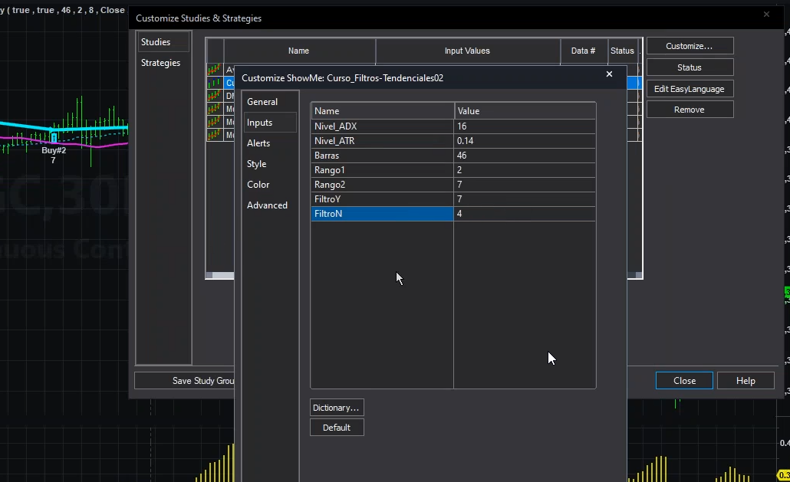
  <figcaption>Figura 034</figcaption>
</figure>


<div style="border-left: 4px solid #2196f3; background: #e3f2fd; padding: 15px 20px; margin: 15px 0; border-radius: 8px;">
  <strong>🖼️ Imagen - Configuración del Show Me "Curso_Filtros-Tendenciales02"</strong><br><br>
  
  <strong>Parámetros generales (se pasan a la función):</strong><br>
  • <strong>Nivel_ADX = 16:</strong> Umbral para filtros basados en DMI (cases 1, -1, 5, -5)<br>
  • <strong>Nivel_ATR = 0.14:</strong> Umbral para filtros basados en volatilidad (cases 2, -2, 6, -6)<br>
  • <strong>Barras = 46:</strong> Periodo de cálculo (una sesión de 30 min)<br>
  • <strong>Rango1 = 2:</strong> Para NarrowRange, case 3 (vela más estrecha que las últimas 2)<br>
  • <strong>Rango2 = 7:</strong> Para WideSpread, case 4 (vela más grande que las últimas 7)<br><br>
  
  <strong>Los selectores de filtro:</strong><br>
  • <strong>FiltroY = 7:</strong> Usa el case 7, que siempre devuelve <code>true</code>. No hay condición especial para permitir operar, siempre permite.<br>
  • <strong>FiltroN = 4:</strong> Usa el case 4 = <code>WideSpread(Rango2)</code>. Cuando detecta una vela expandida respecto a las últimas 7, devuelve <code>true</code> y el Show Me pinta un punto (bloqueo).<br><br>
  
  <strong>Lo que verás en el gráfico:</strong><br>
  • Como FiltroY = 7 (siempre true), Plot1 y Plot3 <strong>nunca pintarán</strong> (porque <code>not true = false</code>)<br>
  • Como FiltroN = 4 (WideSpread), Plot2 y Plot4 <strong>pintarán los puntos naranjas</strong> cada vez que haya una vela con rango mayor que las últimas 7<br><br>
  
  Esos puntos naranjas son los momentos donde el filtro WideSpread <em>bloquearía</em> la entrada si estuviera activo en el sistema real.
</div>

Esto lo tengo activado en el momento que filtraría si lo hubiera, si lo hubiera activado simplemente para que entendáis la manera de mirar los filtros, ¿vale?

Al final los programas, un indicador es un ejemplo, es un indicador que pinte la pantalla cuando actuaría el filtro, ¿vale? Y de esta manera yo os recomiendo muchísimo mirar los gráficos. Os lo dije mucho en la teoría y como digo no entiendo la gente que no lo hace. Recuerdo, hay que mirar el gráfico porque tienes que entender por qué y ver qué buscáis y si está haciendo lo que queréis que haga, ¿vale? Entonces esta es una de las maneras.

<figure>
  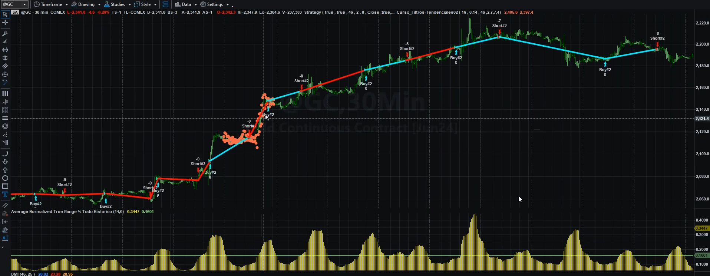
  <figcaption>Figura 035</figcaption>
</figure>

<div style="border-left: 4px solid #ff5722; background: #fbe9e7; padding: 15px 20px; margin: 15px 0; border-radius: 8px;">
  <strong>🖼️ Imagen 035 - Visualización del filtro (puntos naranjas):</strong><br>
  • Los <span style="color: #ff9800;"><strong>puntos naranjas</strong></span> = velas donde <code>WideSpread(7) = TRUE</code> (rango mayor que las últimas 7 velas)<br>
  • <strong>Interpretación:</strong> Si el filtro estuviera activado en el sistema y este intentara entrar en esos puntos, NO lo permitiría<br>
  • Observa que los puntos naranjas aparecen en la zona lateral/consolidación (2120-2140)<br>
  • El filtro hubiera evitado entradas malas tras expansiones fuertes<br><br>
  
  <strong>💡 Metodología recomendada:</strong><br>
  <ol>
    <li>Crear un indicador "Show Me" que pinte cuando el filtro actuaría</li>
    <li>Visualizar en el gráfico si tiene sentido</li>
    <li>Ajustar parámetros viendo el gráfico (no solo optimizando a ciegas)</li>
    <li>Probar con el optimizador una vez entendido visualmente</li>
  </ol>
</div>


## Implementación de filtros con switch-case

Entonces hemos probado distintos filtros. Nuevamente, la manera de programarlos es igual con el *case*, ¿vale?

- [Function: NuestrasPatternDirectionalFast](../code/NUESTRASPATTERNDIRECTIONALFAST.ELD)

```sh
# NUESTRASPATTERNDIRECTIONALFAST.ELD
input:
var:
Value1 = DirMovement (H, L, C, Barras, oDMIPlus, oDMIMinus, oDMI, oADX, oADXR, oVolty);

Switch(numeropattern) Begin
    case 1: ...
    case -1: ...
    Case 2: ...
    case -2: ...
    Case 3: NuestrasPatternDirectionalFast = NarrowRange(RANGO1);
    Case -3: NuestrasPatternDirectionalFast = NarrowRange(RANGO1);
    Case 4: NuestrasPatternDirectionalFast = widespread(RANGO2);
    Case -4: NuestrasPatternDirectionalFast = widespread(RANGO2);
    case 5: ...
    case -5: ...
    Case 6:
    case -6:
    case 7: NuestrasPatternDirectionalFast = true;
    case -7: NuestrasPatternDirectionalFast = true;
    case >8: NuestrasPatternDirectionalFast = false;
    case <-8: NuestrasPatternDirectionalFast = false;
end;
```

**Cases positivos y negativos**

- **Case 1** → Filtro para LARGOS (usa DMI+)
- **Case -1** → Filtro para CORTOS (usa DMI-)
- **Case 2** → Filtro para LARGOS (usa ATR)
- **Case -2** → Filtro para CORTOS (usa ATR)

El signo permite aplicar filtros diferentes según la dirección de la operación. Aunque en muchos casos (como WideSpread) el filtro es igual para ambos lados. El código está preparado para que puedas tener un filtro diferente para largos y para cortos, aunque en este ejemplo no lo usa así. Es una flexibilidad del diseño.

**Las funciones NarrowRange y WideSpread**

- **NarrowRange(n)** → TRUE si la vela actual es más estrecha que las últimas n velas
- **WideSpread(n)** → TRUE si la vela actual es más grande que las últimas n velas

Son opuestos.

**Sobre el ADX**

Menciona que han probado con las líneas del DMI separadas (DMI+ y DMI-), pero que también se puede probar con el ADX general. Sugiere dos ideas:
- No operar cuando ADX muy alto (tendencia ya establecida, llegas tarde)
- Operar cuando ADX muy bajo (antes de que empiece la tendencia)  

Es decir, probar distintas reglas de filtrado.  

**La metodología**

Está diciendo que los filtros se prueban igual que las entradas y salidas:
1. Optimizar para ver resultados numéricos
2. Pero también verlo en pantalla con el Show Me
3. Combinar ambos enfoques

Y las vais probando de la misma manera que las entradas y las salidas. Esto, insisto, ya sabéis que el código tenemos la intención de dároslo todo. Y de esta manera vais probando y vais por un lado probando los resultados con el optimizador, entenderlo, pero también viéndolo en pantalla. Al final es hacéis el indicador que lo pinta, hasta el indicador que lo pinta, y de esta manera lo veis.

<div style="border-left: 4px solid #2196f3; background: #e3f2fd; padding: 10px 15px; margin: 10px 0; border-radius: 8px;">
  <strong>📊 Funciones de filtrado disponibles</strong><br><br>
  <strong>NarrowRange(n):</strong> Detecta velas con rango más estrecho que las últimas n velas. Indica compresión de volatilidad, potencial previo a expansión.<br><br>
  <strong>WideSpread(n):</strong> Detecta velas con rango expandido respecto a las últimas n velas. Indica que ya ha habido expansión de volatilidad.<br><br>
  <strong>ADX:</strong> Indicador de fuerza de tendencia (Average Directional Index). Se puede filtrar por ADX alto (tendencia establecida) o ADX bajo (sin tendencia clara).
</div>


### `case 4` Filtro : Wide Spread

Es decir, evitar entrar después de mucha expansión, ¿entendéis? Es decir, una vela de expansión de novedad, evitar entrar ahí. Eso es un poco lo que busca. Por ejemplo, evitar entrar después de tres días de subida, ¿entendéis? De tres días de bajada. Este tipo de filtros donde ha habido ya mucha expansión o mucha direccionalidad. Y tener imaginación, tener imaginación en eso con la observación del gráfico, con la experiencia.

Esto ya digo que en general los de expansión suelen aportar. Evitar momentos de fuerte expansión, ¿por qué? Porque cuando ya ha habido una expansión en una dirección, normalmente cuesta que haya más. Que hay momentos que sí, sí, pero normalmente cuesta. Entonces si filtráis eso pues suele aportar.

Aquí, si no recuerdo mal, con el *wide spread* 9 o algo así solía dar buenos. Parece que sí que mejoraba algo. 

>Rango2 es el parámetro que se pasa a la función WideSpread().  
>Cuando el instructor dice "wide spread 9", se refiere a:
>
> - WideSpread(9) → Comparar la vela actual con las últimas 9 velas  
> - Si la vela actual es más grande que las 9 anteriores → devuelve TRUE  

Cambio Rango2 de 7 a 9 en el indicador Show Me. Esto hace que el filtro sea menos restrictivo (necesita una vela mayor que las últimas 9, no 7). Eso significa que configuro WideSpread(9) para visualizar en qué momentos la vela actual supera el rango de las últimas 9.

<figure>
  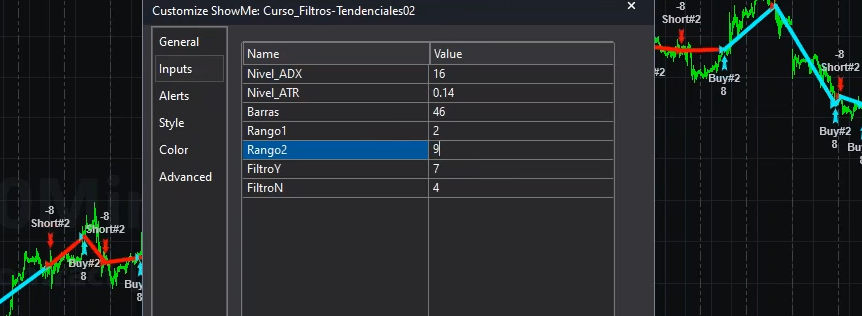
  <figcaption>Figura 036</figcaption>
</figure>


Muestra el resultado visual después de configurar Rango2 = 9. Los puntos naranjas marcan dónde WideSpread(9) = TRUE. Estoy verificando visualmente si tiene sentido antes de subir a 10 y activarlo en el sistema real.

<figure>
  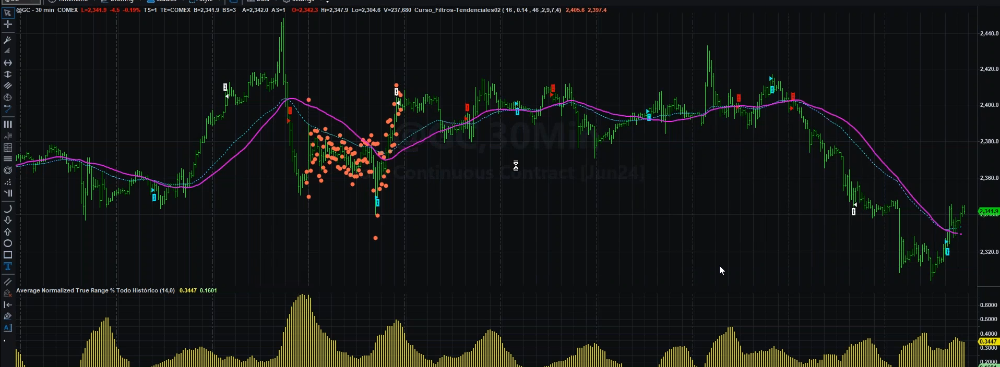
  <figcaption>Figura 039</figcaption>
</figure>

A ver, incluso hasta 10. Evitar entrar cuando haya habido una vela que tiene mayor rango que las nueve anteriores, ¿vale? Eso es un *wide spread* de 10. Lo vimos con el *RV*, lo comentamos con los dos. 

Aquí configuro el sistema real (CURSO-TENDENCIA-INTRADIA-02):

| Parámetro |  |  | Qué detecta |
|-----------|-----------|---------|-------------|
| **Rango1** | Case 3 / -3 | `NarrowRange(Rango1)` | Velas estrechas (compresión) |
| **Rango2** | Case 4 / -4 | `WideSpread(Rango2)` | Velas grandes (expansión) |

Configuro `Rango2 = 10` → Le dice al case 4 (WideSpread): "Compara con las últimas 10 velas"

| |  | Cuándo actúa |
|-----------|-------------|--------------|
| **FiltroN** (No) | Condición para **BLOQUEAR** operar | Si es TRUE → bloquea |
| **FiltroY** (Yes) | Condición para **PERMITIR** operar | Si es FALSE → bloquea |


Configuro `FiltroN = 4` → Le dice al sistema: "Usa el case 4 como filtro de bloqueo"  


<figure>
  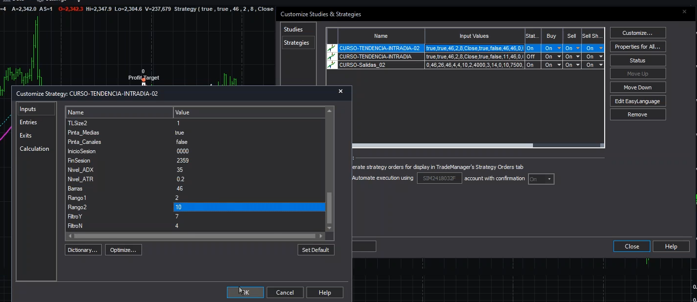
  <figcaption>Figura 038</figcaption>
</figure>

Y vemos que hay momentos que evita y que creo que ha mejorado algo.   
Esto significa que el sistema realmente bloquea entradas cuando `WideSpread(10) = TRUE`.

Sí ha mejorado algo, sí, sí, ha mejorado algo. Esto ya ha quitado simplemente algunas operaciones. 

<figure>
  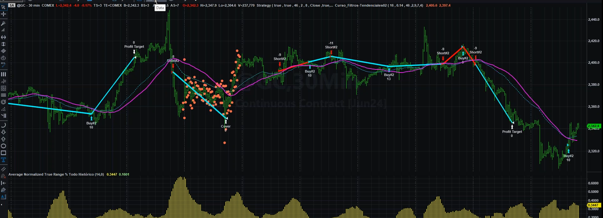
  <figcaption>Figura 040</figcaption>
</figure>

También se puede buscar, ya os digo, también abrir cuando haya *narrows*, ¿vale? Pero en un *tendencial*, estos filtros van muy bien en *breakouts*, ¿vale? Porque en el *breakout* al final es un movimiento puntual. Pero los *tendenciales* para entrar cuesta más, porque al final te va a evitar pillar tendencias un poco más largas. Pero también puede ser.

<figure>
  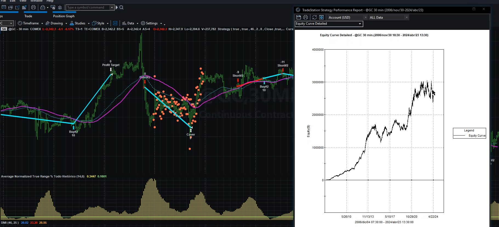
  <figcaption>Figura 041</figcaption>
</figure>
<figure>
  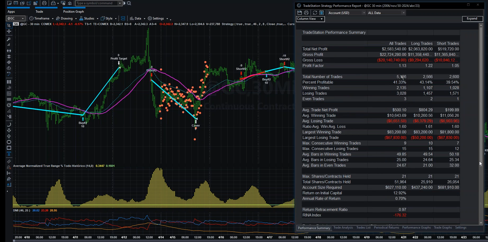
  <figcaption>Figura 042</figcaption>
</figure>


### `case 3` Filtro : Narrow Range

A ver, podemos probarlo rápidamente porque no tarda mucho. Sea un el *narrow* que era 3, 

```sh
  Case 3:    	
  		NuestrasPatternDirectionalFast = NarrowRange(RANGO1); 
  		  		
  Case -3:   
  		NuestrasPatternDirectionalFast = NarrowRange(RANGO1); 	
```

sí, le pongo *narrow* en el 3. Este yo creo que si le pongo cero no actuaría, ¿o cómo va? Lo podíamos poner que sí, que es con cero no actúe. Es una manera así de filtrarlo fácil.

Ahora activar *AMBOS filtros* a la vez:

| Parámetro | Valor | Case que usa | Qué hace |
|-----------|-------|--------------|----------|
| **FiltroY** | 3 | NarrowRange(Rango1) | Solo PERMITE operar si hay compresión |
| **FiltroN** | 4 | WideSpread(Rango2) | BLOQUEA si hay expansión |

Configuración:
- `Rango1` → Para NarrowRange (vela más estrecha que las últimas N)
- `Rango2 = 10` → Para WideSpread (vela más grande que las últimas 10)

<figure>
  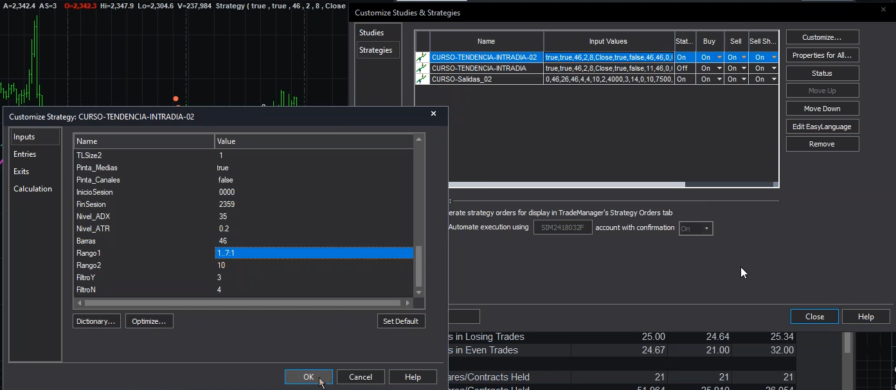
  <figcaption>Figura 043</figcaption>
</figure>

Pero vaya, yo creo que mucho irá con uno. Es que es muy restrictivo esto, creo que no va a aportar lo que para entrar, no va a aportar, porque es demasiado, es muy restrictivo. Si al final estás pidiendo que haya un *narrow* para entrar, entonces muchas veces si no lo hay, no entra. Tienes nada, va a ir mucho peor.

Es muy restrictivo el *narrow*, Alberto, para entrar. Es muy restrictivo en un *tendencial*. Es mejor por el lado contrario: evitar aquellos momentos de mercado que no te van bien, que el hecho de favorecer mercados que te van bien. Solo entrar cuando te vaya, entonces te filtra demasiado.

Te filtra demasiado. Es más fácil filtrar por el caso, por el lado del no, de las maneras. Podemos mirar los datos ahí o no te creo. Le he dado al sí, ves, nada, muchísimo menos, todo es mucho peor, todo es mucho peor, todo es mucho peor.

<figure>
  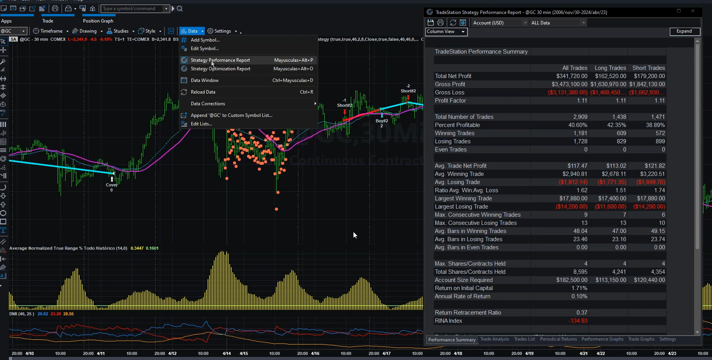
  <figcaption>Figura 045</figcaption>
</figure>
<figure>
  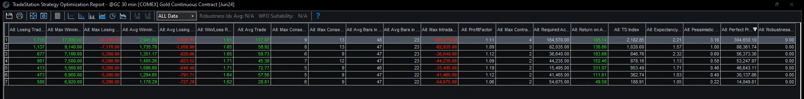
  <figcaption>Figura 044</figcaption>
</figure>

O no, el filtro de *narrow* es demasiado restrictivo para un *tendencial*. Es filtro demasiado restrictivo para un *tendencial*. Creo que miramos que el *ADX* se aportaba algo, pero no vamos a perder más tiempo en esto. Ya os pasaremos todos estos códigos.

### `case 7` WideSpread 

7 y 8 es el *wide spread*. Incluso a ver, una cosa, ya tengo curiosidad si ya está aquí. 

```sh
  case 7:    NuestrasPatternDirectionalFast = true;
  case -7:    NuestrasPatternDirectionalFast = true;
```

<figure>
  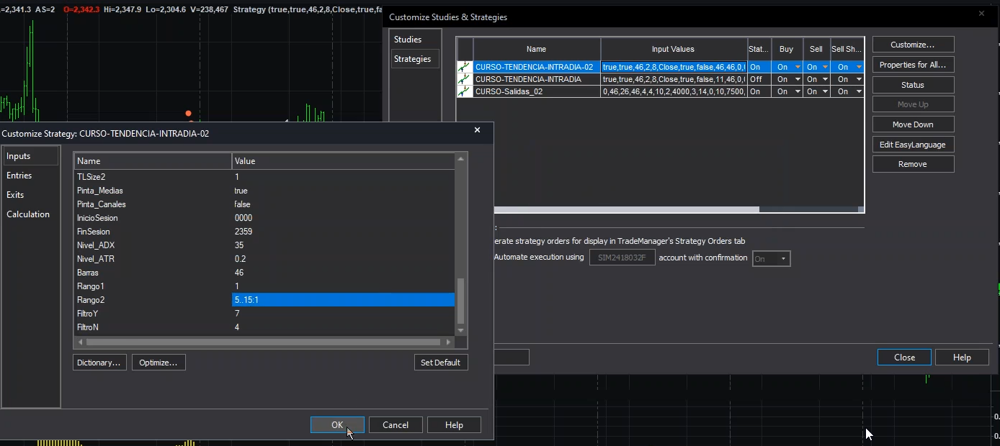
  <figcaption>Figura 046</figcaption>
</figure>


Tenemos aquí, sé que ya se ve bastante mejora, bastante mejora. Ya es otra cosa, bastante mejora, ahí lo he puesto. Bueno, era una prueba tampoco, 900 y con 10.

<figure>
  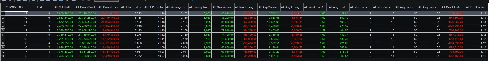
  <figcaption>Figura 047</figcaption>
</figure>
<figure>
  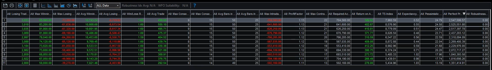
  <figcaption>Figura 049</figcaption>
</figure>

click en el `2`

<figure>
  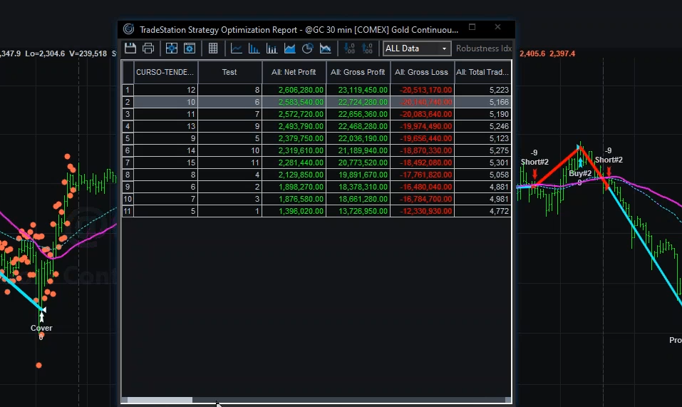
  <figcaption>Figura 050</figcaption>
</figure>

Con 10, que ya lo habíamos mirado pero tenía curiosidad porque no había mirado más arriba. Con 10 queda un poco mejor. Era un poco mejor que no usarlo. 

Al final, por nosotros que os digo: simplemente cuando ya ha habido mucha expansión, en un *breakout* o incluso *tendencial*, cuando ya ha habido mucha expansión, suele venir bien filtrar para no operar ya, ¿entendéis? Y lo contrario en el *mean reversion*. Eso suelen ser filtros. ¿Temas cómo detectas? Es una manera fácil como os digo. Es lo que ya una *wide spread*, que lo vimos en el *RV* y creo que además os di algún PDF que lo explicaba, algún PDF que explicaba qué era una vela tipo *wide spread* o una *narrow range*.

## buscador de entradas con diversas estrategias

Vamos ahora con otro tema, vamos a trabajar un poquito con el código que ya habéis visto a nivel de salidas, pero que ya os dije que lo estábamos complementando con diversas entradas. Sobre todo pensando en enseñar en un *mean reversion*, porque va bien aunque aquí no va mal, como os dije, ya en tendencia el *SP* otro tipo de estrategias. Pero bueno, sobre todo pensando en el concepto que la bolsa suele ir muy bien de subirse a la tendencia, es decir, comprar a favor de la tendencia principal pero tras una corrección. Este concepto suele ir bastante bien en renta variable, ¿de acuerdo? Y hay bastantes maneras de abordarlo.

<figure>
  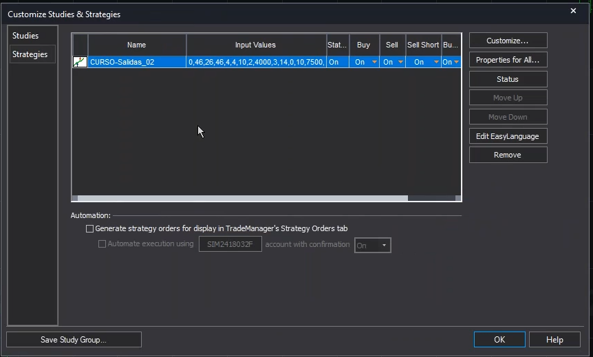
  <figcaption>Figura 051</figcaption>
</figure>
<figure>
  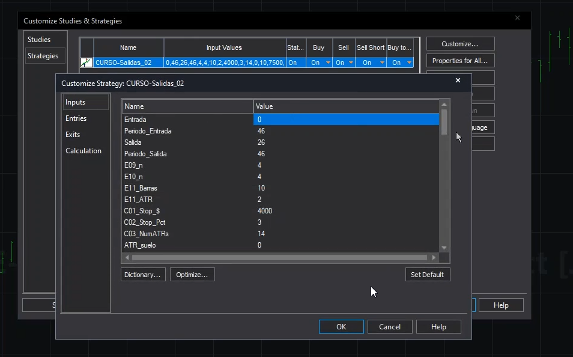
  <figcaption>Figura 052</figcaption>
</figure>

Entonces aquí, ¿qué hemos hecho? Tenemos el código que ya conocéis, que ya hemos visto para las salidas, pero que ya os dije, os enseñé, que le había puesto algunas entradas y que le íbamos a poner más. 

Qué entradas? vamos a verlas, 

* [Strategy : Salidas_02](../code/CURSO-SALIDAS_02.ELD)

```sh
inputs:
  Entrada ( 0 ), #elegir de 0 a 14
  Periodo_Entrada ( 46 ),
  
  Salida ( 26 ), #elegir de 0 a 33
  Periodo_Salida ( 46 );
  
vars:
  MP (0);
  
MP = MarketPosition;
    
switch (Entrada)
Begin
  case 0: #No entries
  case 1: #Simple Momentum Entry
  case 2: #Breakout Next Bar Entry
  case 3:	#Single Moving Average Cross Entry
  case 4: #Bollinger Band Entry
  case 5: #Volatility Entry
  case 6: #Bollinger trend
  case 7: #Donchian
  case 8: #Key Reversal
  case 9: #Entramos en un Pullback contra la tendencia primaria
  case 10: #Entramos en un Pullback a favor de la tendencia primaria
  case 11: #Breakout + momentum
  case 12: #RSI entrada saliendo de sobrecompra/sobreventa MR
  case 13: #RSI entrada en tendencia
  case 14: #RSI entrada saliendo de sobrecompra/sobreventa MR
End;
```

**Entrada 0: sin hacer nada**

Bueno, he puesto aunque es que si ya por este no hace nada, pero lo he puesto para que quede claro, que quede claro que no hace nada, ¿vale?

**Entrada 1: Momentum**

Ya teníamos puesto una entrada de *momentum*, ¿de acuerdo? Un *momentum* no es más que cierre mayor que cierre un período. Tenemos un *input* ya puesto que es período de entrada, número de entrada de período de entrada. Siempre se va a usar y ya lo hemos puesto arriba, ¿vale? Si necesitamos más para cada uno de los *case*, pues lo iremos incorporando, ¿vale?
```sh
	case 1: # Simple Momentum Entry
	Begin 
  		If Close > Close[Periodo_Entrada] then
  			Buy next bar at market;
  			
  		If Close < Close[Periodo_Entrada] then
  			SellShort next bar at market;
	End;
```
**Entrada 2: Breakout**

Tenemos luego un *breakout* que entra en la siguiente barra. Esto nuevamente hay varias maneras de abordarlo y hemos abordado varias en el código. Pero una es que el *high* sea mayor que el mayor *high* anterior. Por eso me refiero a la vela anterior, porque si uso la vela actual, el *high* nunca va a superar el máximo del actual, va a ser igual como mucho.

Esto hay gente que lo plantea así incorporándolo, entonces es mayor. En el momento en que sea igual, mayor igual ya es lo bueno. Podemos implementar así: *high* mayor que el mayor máximo que haya habido en n entradas. Es un *breakout*, así como un *Donchian*, ¿de acuerdo? Pero hay varias maneras de abordarlo. Ya luego veréis que he puesto otra.

```sh
	case 2: # Breakout Next Bar Entry
	Begin
  		If High > Highest(High, Periodo_Entrada)[1] then
  			Buy next bar at market;
  		# Buy next bar at HighestFC( High, Periodo_Entrada) + 1 point stop;	
  			
  		If Low < Lowest(Low, Periodo_Entrada)[1] then
  			SellShort next bar at market;
	end;
```

**Entrada 3: Cruce de cierre con media móvil**

Bueno, cruce de medias. Una entrada 3 que es una *moving average cross entry*. Pues no, perdón, cruce de medias no, es cierre cruza una media, ¿de acuerdo? En este caso hemos puesto una *media simple*, la *media simple* que ya vimos que iba bien. Ya vemos que no, estaba entre las buenas, entre una de las mejores y además bastante muy robusta. Entonces por eso digo, cuando veáis que cambiar la media es mejor, a poco, quedaros con la *simple*.

También el lado corto igual, están los dos lados de momento. Lo hemos planteado simétrico. Para bolsa usualmente no lo hacemos simétrico, ya veremos. Podríamos poner otro período, ya veremos, ya veremos cómo abordamos esto. De momento hemos hecho el código general pensado espejo. Pero si quieres ser separado se puede hacer.

```sh
	case 3:	# Single Moving Average Cross Entry
	Begin
  		If Close crosses above Average(Close, Periodo_Entrada) then
  			Buy next bar at market;
  			
  		If Close crosses below Average(Close, Periodo_Entrada) then
  			SellShort next bar at market;
 	end;
```

**Entrada 4: Banda de Bollinger anti-tendencia**

Qué más. Una entrada por banda de *Bollinger*, ¿vale? En este caso, tipo *Bollinger* band, tipo *aberración*, ¿vale? Tipo... entra en tendencia rotura, ¿de acuerdo? Que el cierre supera la banda de *Bollinger*. A no, perdón, perdón, perdón, esta no es en tendencia sino en *anti-tendencia*, ¿de acuerdo?

Porque lo que hago es que cruce la de abajo. Es menos 2, más 2. Compro cuando el cierre cruza para arriba la de abajo, ¿vale? Es decir, cuando el precio vuelve, ¿vale? El precio vuelve, ¿vale?

Compro. Voy a poner un comentario aquí: largos cuando recupera banda inferior, ¿vale? Y cortos cuando recupera, pero cuando pierde, no. Banda superior. Los comentarios siempre vienen bien.


```sh
 	case 4: # Bollinger Band Entry
 	begin
      # largos cuando recupera banda inferior
  		If Close crosses above BollingerBand(Close, Periodo_Entrada, -2) then 
  			Buy next bar at market;
  		#cortos cuando pierde banda superior
  		If Close crosses below BollingerBand(Close, Periodo_Entrada, +2) then 
  			SellShort next bar at market;
 	end;
```

**Entrada 5: Volatilidad con ATR**

Esa sería otra entrada para entrar por volatilidad. Recuerdo simplemente una volatilidad, una expansión de volatilidad, ¿vale? Le pido que el cierre sea mayor que el cierre anterior más una cantidad de *ATR*.

Esto normalmente se pone como hemos puesto fijo, pero lo voy a cambiar, ya está, lo voy a cambiar. Porque lo normal es ponerlo como un *input*. *Input*, ponemos bueno, le ponemos como hemos hecho con todos, entrada más. Abajo lo veréis, *ATR* coef 5 n n y *ATR* n. Por defecto vemos 1.5 y... hasta, ¿vale?

Este valor pues lo vamos a poner aquí. En este tipo de, en este caso estos casos, si va a ser para bolsa, lo usual es separarlo para largos y cortos. ¿Cómo separarlo para largos y cortos? Siempre que nos lo permita el número de *trades*. Pero lo dejamos de momento, de momento así. Venga.

```sh
 	case 5: #Volatility Entry
 	begin
 		input:
 			E05_n (1.5);
 			
  		If Close > Close[1] + AvgTrueRange(Periodo_Entrada) * E05_n then
  			Buy next bar at market;
  			
  		If Close < Close[1] - AvgTrueRange(Periodo_Entrada) * E05_n then
  			SellShort next bar at market;
  	end;
```

**Entrada 6: Bollinger en tendencia**

Qué más, *Bollinger trend*, es este, es en *Bollinger* pero ese sí que es el *Bollinger* en tendencia. Aquí sí que entramos largos y cruzamos arriba a banda de *Bollinger*. Es un poco el que vimos, *aberration*. Bueno, vimos un poco los dos.

```sh
  	case 6: # Bollinger trend
  	Begin
  		If Close crosses above BollingerBand(Close, Periodo_Entrada, 2) then
  			Buy next bar at market;
  			
  		If Close crosses below BollingerBand(Close, Periodo_Entrada, -2) then
  			SellShort next bar at market;
  	End;
```

**Entrada 7: Donchian con ventana temporal**

E indamos 7 y mira, aquí pues, pensando en el intradía, hemos incorporado una, un tiempo que podía haberse hecho con *inputs*, ¿vale? Para poner un tiempo, una ventana de entrada, ¿vale? Por incorporar algo distinto. Ya que fijaros que directamente compra en el máximo de los períodos que le pongamos, en stop, todo el rato, tira la orden en el canal. Simplemente, si es la hora, le tira la orden en el canal. Es otra manera de abordar el *Donchian*.

```sh
  	case 7: # Donchian
  	Begin
  		If Time >= 0000 and Time <= 2359 Then
  		Begin
  			Buy next bar at Highest(High, Periodo_Entrada) stop;
  			Sellshort next bar at Lowest(Low, Periodo_Entrada) stop;
  		End;
  	End;
```

**Entrada 8: Key Reversal**

```sh
  	case 8: # Key Reversal
  	Begin
  		If Low < Lowest(Low, 3)[1] and Close > Close[1] then
			Buy ("KeyRevLE") next bar at market;
			
		If High > Highest(High, 3)[1] and Close < Close[1] then
			Sell Short ("KeyRevSE") next bar at market;
	End;
```

Un *case reversal*, entrada bastante sencilla y que muchas veces da entradas malas, incluso salidas, incluso salidas. De hecho, casi os diría que da mejores salidas que entradas. Eso está de hecho implementado en *TradeStation* como entrada y creo que también como salida.

Al final es que el mínimo sea menor que el mínimo de n velas. Esto normalmente es 3. En este caso lo voy a dejar fijo, en este caso lo voy a dejar fijo porque si no es muy extremo. Que sea el mínimo de n barras anteriores y el cierre mayor. Por eso es una vuelta. Eso para comprar. Y para vender, para el corto, lo contrario, ¿vale?

Si es otro tipo, otra entrada típica que es eso que en diario se llama una vuelta en un día. Pero bueno, al final le pedimos que el mínimo sea menor que de tres días para que realmente esté cayendo y se ve la vuelta, ¿de acuerdo? Es una entrada muy anticipada, muy anticipada con poca probabilidad de éxito lógicamente, porque al final te anticipas mucho.


**Entrada 9: Pullback contra tendencia primaria**

```sh

	case 9: # Entramos en un Pullback contra la tendencia primaria
	Begin
		Input: E09_n ( 3 ); # multiplicador para el periodo de largo plazo
	
		If Close > Close[Periodo_Entrada] and Close < Close[Periodo_Entrada * E09_n] then
			Buy  next bar at market;
			
		If Close < Close[Periodo_Entrada] and Close > Close[Periodo_Entrada * E09_n] then
			Sellshort next bar at market;
	End;
```

Aquí otra, ya poco, vamos ya complicando un poco más, ¿no? Ya por eso habíamos metido *inputs*. Entramos en un *pullback* contra la tendencia primaria. Aquí es cierre mayor que el cierre del período de entrada pero cierre menor que un período mayor que está multiplicado.

Es decir, aquí estamos entrando cuando el precio se ha dado la vuelta pero está cayendo. ¿Se entiende? Porque estamos pidiendo que el cierre sea menor, sería un poco mejor. Ahora no, un poco ahora no. Cierre menor que un cierre muy lejano pero el de ayer mayor. ¿De acuerdo? Es decir, *pullback*.

Entraría ahora, después de una caída a la que ya empieza a subir, compro. Ese sería un poco este concepto, para que entendáis un poco la idea, ¿no? Un *pullback* contra la tendencia primaria. Esto normalmente es tipo *mean reversion*. Decir, aquí sería para incluso, esto se puede usar como complementado con un *key reversal*.

*key reversal* hace un poco eso, pero es muy rápido, al final, se puede añadir este como que el cierre sea mayor que el período de entrada, el pedido de entrada mejor, pues un poco menos restrictivo. Aquí es 1, que es 1.

Fijaros, este sería esta parte. No solo es la anterior, y cierre menor que un período lejano. Es un poco parecido al *key reversal*.


**Entrada 10: Pullback a favor de tendencia primaria**

```sh
	case 10: # Entramos en un Pullback a favor de la tendencia primaria
	Begin
	
		If Close < Close[Periodo_Entrada] and Close > Close[Periodo_Entrada * E09_n] then
			Buy  next bar at market;
			
		If Close > Close[Periodo_Entrada] and Close < Close[Periodo_Entrada * E09_n] then
			Sellshort next bar at market;
	End;
```

Aquí otra, que se entramos en un *pullback* a favor de la tendencia primaria, que a los que es al revés del anterior, al revés.

Aquí sí que el período largo, en el período largo está subiendo pero en el corto cae. Es decir, aquí podría ser que un poco sería entrar aquí. Es decir, yo el cierre de hoy, el de 20 es mayor, imaginaos, este cierre con este, pues es mayor. Pero el de corto es menor. A lo mejor se va a entrar pues en pequeñas correcciones, ¿no?

<figure>
  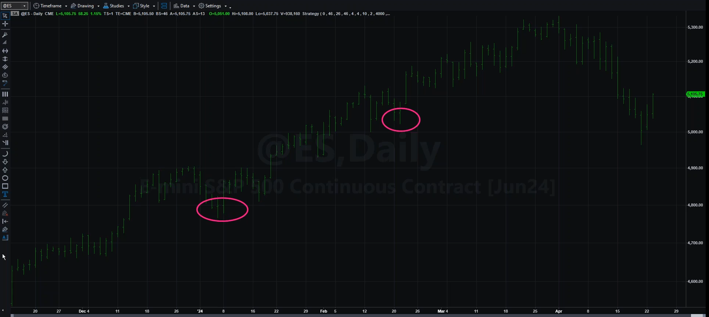
  <figcaption>Figura 053</figcaption>
</figure>

Ya ser entrar o no, que estoy preparado. A lo mejor se va a entrar pues aquí, tenéis un poco de las pequeñas correcciones. Es decir, a corto baja pero viene subiendo de largo, viene subiendo de largo, de algo viene subiendo. Entonces yo entro dentro a corto pero a lo largo viene subiendo. Sería un poco este tipo de entrada.


**Entrada 10-11: Breakout más Momentum**

```sh
	case 11: # Breakout + momentum
	Begin
		Input:
			E11_Barras( 10 ),
			E11_ATR( 2 );
		
		var: canal(0);
		
		canal =(highest(high, E11_Barras) + lowest(low, E11_Barras)) / 2;
		
		If close > close[Periodo_Entrada] then
			buy next bar at canal + E11_ATR * AvgTrueRange(Periodo_Entrada) stop;
			
		If close < close[Periodo_Entrada] then
			sellshort next bar at canal - E11_ATR * AvgTrueRange(Periodo_Entrada) stop;
	End;
```

*Breakout* más *momentum*. Bueno, aquí ya hemos incorporado un poco canal, canal, ¿vale? Pero además también le pido que el cierre sea mayor que el cierre. Es decir, le pido un *momentum*, le pido que esté subiendo, ¿vale? Le pido que esté subiendo respecto a un período n pero le meto volatilidad.


Al final es un, bueno, es un poco como lo que os decía del de medias con *Donchian*, pues aquí es *momentum* más *Donchian*. Aquello que os decía es entrar en cruce de medias más *Donchian*, ¿vale? Activarlo, os decía, en el otro sistema.

Aquí hablamos de entrar en *momentum* más *breakout*..., pedirle que haya: yo te pido que el cierre sea mayor que la barra anterior, pero además que supere su nivel de 10 barras anteriores.

Pues entonces, hasta que no supere este no me vale, solo que suba esta. Sino que además supere un máximo, ¿por qué? Porque si no, lo mejor tengo pequeñas superaciones, por ejemplo. Imaginaros, pero alguna que no funciona, bueno es que ahora todas las que veo aquí funciona, pero es que en *equity* pasa.

En *equity*, bueno, imaginaros que el cierre mayor que cierre dos o tres días. En esta vela, no, esta vela tiene el cierre mayor que las dos anteriores aunque por poco. Pero en cambio no supera ningún nivel, no supera esto de aquí, ¿entendéis? Pues yo puedo decir que el cierre sea mayor que tres velas, pero además que rompa el máximo de 10. En eso sería un poco *breakout* más *momentum*. Un poco de ejemplo es amplificado.

<figure>
  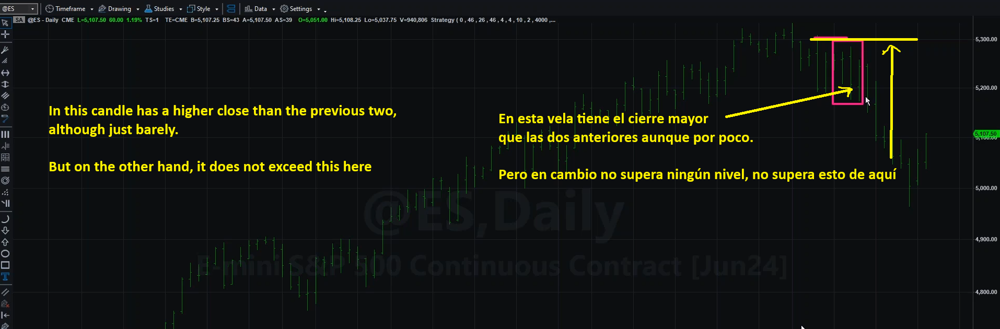
  <figcaption>Figura 054</figcaption>
</figure>


**Entrada 12-14: RSI de tres maneras distintas**

**RSI Entrada 12: Cruce arriba de banda inferior**

```sh
	case 12: # RSI entrada saliendo de sobrecompra/sobreventa MR
	Begin
		input:
			minRSI(30),
			maxRSI(70);
		
		var:
			RSI_value (0),
			Cond_Long(false),
			Cond_Short(false);
				
		RSI_value = RSI(Close, Periodo_Entrada);
	
		Cond_Long = RSI_value crosses over minRSI; # largos en cruce arriba de banda inferior
		Cond_Short = RSI_value crosses under maxRSI; # cortos en cruve abajo de banda superior
	
		If MarketPosition <> 1 and Cond_Long then
    		Buy next bar at market;

		If MarketPosition <> -1 and Cond_Short then
    			Sell short next bar at market;
	End;
```

Pero vamos a hacer primero el más obvio, ¿vale? El más obvio, el más típico de *RSI*, que es el *RSI* que entra. Vamos a meterlo en el gráfico, que eso siempre viene bien para entender. Me da igual ahora el *input*, me da igual un poco. Yo tengo ahí un *RSI*.

Entonces, yo lo que voy a hacer ahora es en *RSI*, y cuando hace esto que he hecho aquí es que ahí lo marca azul porque está configurado así por defecto. Porque se ha salido, aunque se ha salido por poco. Ha estado por debajo de 30, 29.51, y luego recupera. Es decir, cruza arriba la banda inferior. eso es compra.

<figure>
  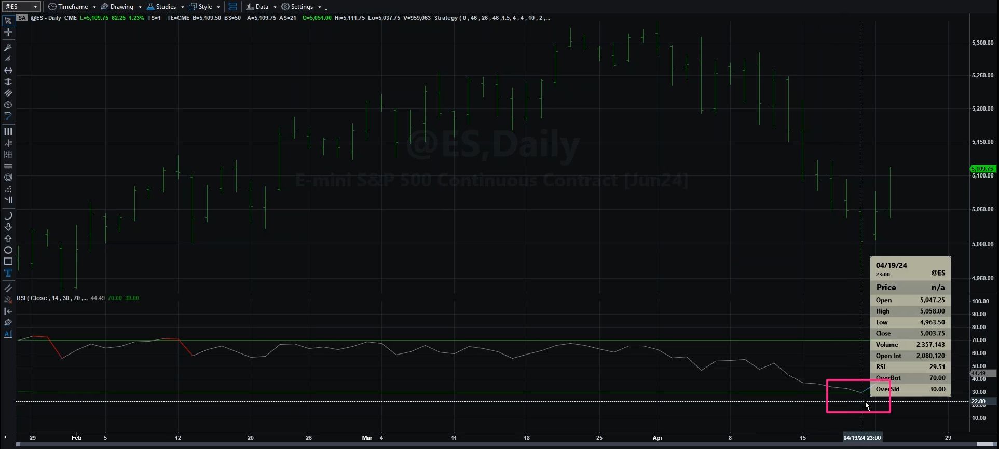
  <figcaption>Figura 055</figcaption>
</figure>

Cruza arriba la banda inferior. *RSI value crosses over min RSI*. Largos en cruce arriba de banda inferior, ¿vale? 

Y el con *short* es al revés. Cuando el valor del *RSI* y cruza abajo la banda inferior. Es decir, cortos en cruce abajo de banda superior, , decir cortos aquí cuando se sale esta vela.

<figure>
  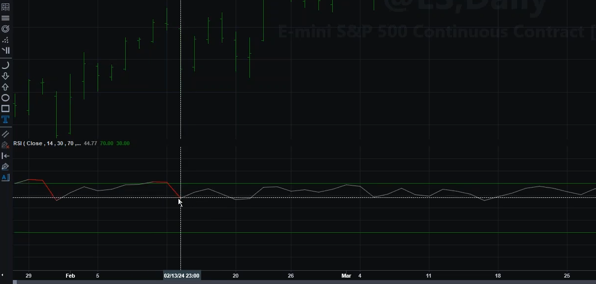
  <figcaption>Figura 056</figcaption>
</figure>


**RSI Entrada 13: Cruce arriba de banda superior (tendencia)**

```sh
	case 13: # RSI entrada en tendencia
	Begin	
		RSI_value = RSI(Close, Periodo_Entrada);
	
		Cond_Long = RSI_value crosses over maxRSI; # largos en cruce arriba de banda superior
		Cond_Short = RSI_value crosses under minRSI; # cortos en cruce abajo de banda inferior
	
		If MarketPosition <> 1 and Cond_Long then
    		Buy next bar at market;

		If MarketPosition <> -1 and Cond_Short then
    			Sell short next bar at market;
	End;
```

vamos a hacer esta muy parecida. Vamos a poner la 13. No vamos a modificar los *inputs* porque al final vamos a mantener el mismo, pero aquí lo que vamos a hacer es en vez de entrar en cruce por encima de la banda de la banda de abajo, vamos a entrar en cruce por encima de la banda de arriba.

Esto es bastante aparentemente extraño. Es un poquito como *aberration*, ¿no? En tendencia, ¿vale? Es decir, largos en cruce arriba de banda superior. Esto, aunque os pueda sorprender, para *breakouts* va bastante bien en general, ¿vale? Porque cuando hay tendencia, ¿de acuerdo?

* Entra a favor de la tendencia principal cuando el RSI rompe por encima de su banda superior.  
* Entra en cortos cuando el RSI rompe por debajo de su banda inferior, solo si hay tendencia bajista.
* Si hay tendencia y el RSI rompe la banda extrema, entro a favor de esa ruptura al mercado en la siguiente barra. 

*Condiciones exactas*

Largos
* ✔ RSI cruza por encima de maxRSI
* ✔ El precio está por encima de la media 200 (tendencia alcista)
* ➡ Buy next bar at market

Cortos  
* ✔ RSI cruza por debajo de minRSI
* ✔ El precio está por debajo de la media 200 (tendencia bajista)
* ➡ Sell short next bar at market

Es decir, en el momento en que cruzo aquí, meto largos. 

<figure>
  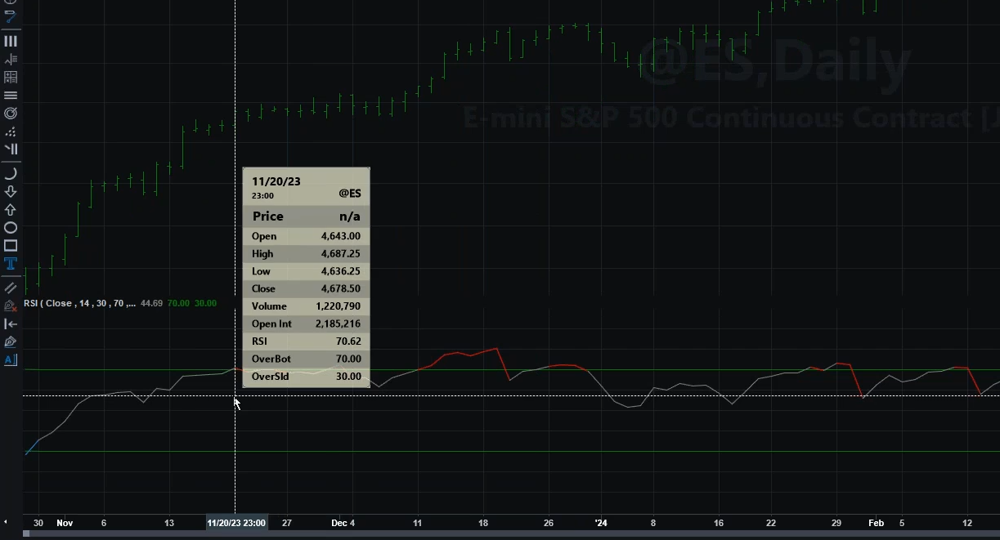
  <figcaption>Figura 057</figcaption>
</figure>

Lo hay que ver dónde me salgo. Pero normalmente es bueno por el pillar movimientos buenos. Por decir, cuando una tendencia es fuerte, se sale mucho, que permanece mucho. Sobre todo en el lado largo.

Aquí hubiera sido, si lo aplicamos al corto, corto aquí. al día siguiente la apertura, el día siguiente. 

<figure>
  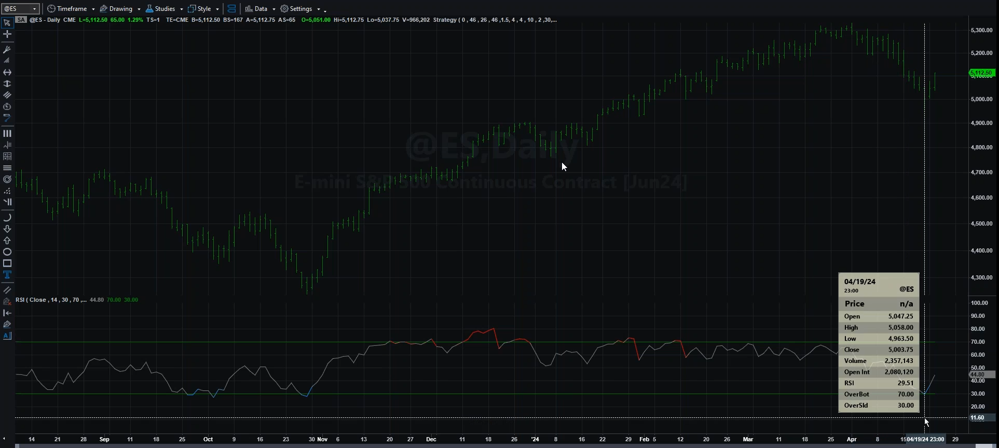
  <figcaption>Figura 058</figcaption>
</figure>

Igualmente esto se puede trabajar y mejorar de varias maneras. En un sistema, en el *Mastering* que contaba, ¿te acuerdas, Alberto? Las veces, las barras que hacía que lo habías hecho, etcétera, ¿no?

Es decir, aquí en el lado corto es más complicado, lógicamente. Solo suele ir mejor en el largo. Pero esa es la idea, ¿de acuerdo? Es aquí la primera vez que entra, te pones corto. 

<figure>
  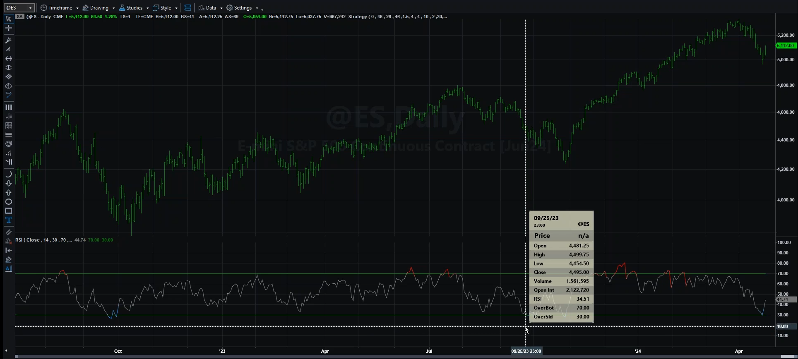
  <figcaption>Figura 062</figcaption>
</figure>

<div style="border-left: 4px solid #3498db; background: #ebf5fb; padding: 10px 15px; margin: 10px 0;">
  <strong>📊 Filtro de tendencia recomendado</strong><br>
  Este tipo de entradas normalmente conviene tener un filtro de <em>momentum</em>. Es decir: hago esto pero solo si, imaginaros, por encima de la media 200 largo, por debajo de la media 200 corto. Así evitamos señales contradictorias con la tendencia principal.
</div>

Normalmente, lo normal es tener un filtro también de *momentum*. Es decir, hago esto pero solo si, imaginaros, por encima de la media 200 largo, por debajo de la media 200 corto. Es decir, aquí por ejemplo, 

<figure>
  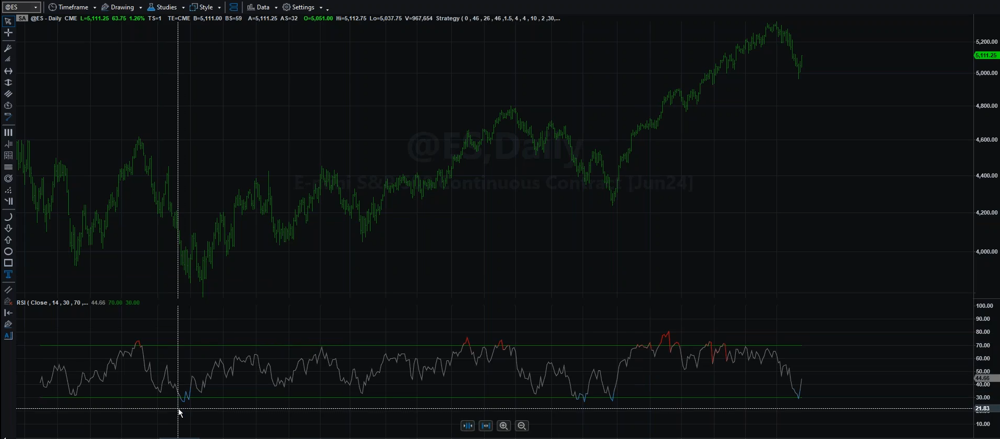
  <figcaption>Figura 063</figcaption>
</figure>

este no le haría caso, no le haría caso porque estoy alcista (la media 200 largo). Entonces al estar alcista solo quiero comprar, pero no me pondría corto al salir, pero si estoy por debajo de la media si compro.

<figure>
  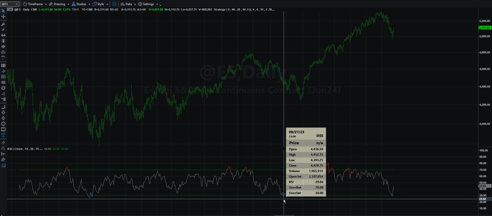
  <figcaption>Figura 064</figcaption>
</figure>

Esas es un poco, en ambos casos se puede usar en ambos casos.

<figure>
  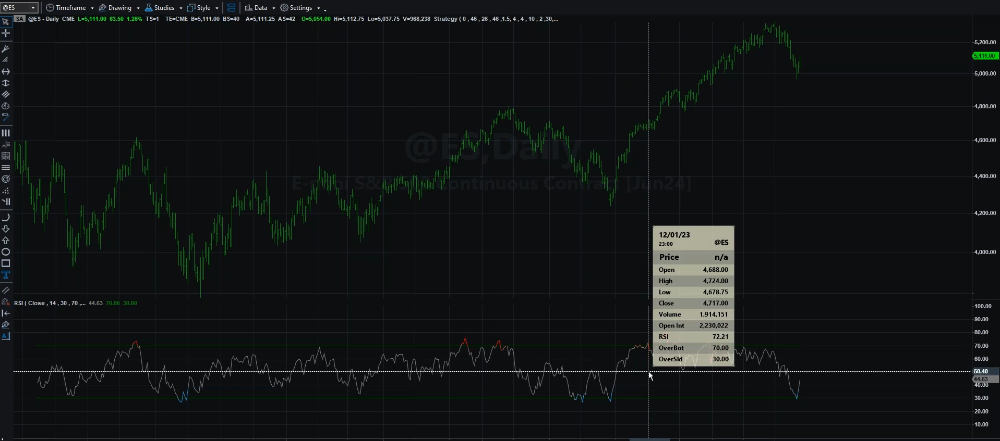
  <figcaption>Figura 061</figcaption>
</figure>

Entonces claro, esto ***luego va la salida va acorde***, claro. Un sistema que hace eso, este caso que hemos dicho, probablemente es un *breakout* o un sistema que tiene que tener un *TP*, etcétera, ¿de acuerdo? Porque al final trata de buscar un movimiento un poco contra, a favor de tendencia pero con este que está iniciada.

Entonces como digo, la salida al final depende mucho de la entrada. Es decir, seguramente la salida que te saldrá mejor en el `case 12` no será la que te saldrá mejor en el que es `13`, ¿entendéis? Porque al final tienen componentes muy distintos. Este entro en corrección y este entro en rotura, para entendernos. Es decir, es muy distinto.

Pero yo digo siempre hay que explorar distintos usos de las tendencias principales. 

Ya digo, no es mala práctica distintos, pero en este caso que es el mismo indicador, pues todo igual. Pues simplemente que cambia la regla, pues lo dejo. Entonces largos en cruce arriba, ¿vale? Y en cruce abajo, ¿vale? Ese sería otro posible, otra posible entrada en el *RSI*.

**RSI Entrada 14: Anticipación (cruce abajo de banda inferior)**

```sh
	case 14: # RSI entrada saliendo de sobrecompra/sobreventa MR
	Begin	
		RSI_value = RSI(Close, Periodo_Entrada);
	
		Cond_Long = RSI_value crosses under minRSI; # largos en cruce abajo de banda inferior
		Cond_Short = RSI_value crosses over maxRSI; # cortos en cruce arriba de banda superior
	
		If MarketPosition <> 1 and Cond_Long then
    		Buy next bar at market;

		If MarketPosition <> -1 and Cond_Short then
    			Sell short next bar at market;
	End;
```

La lógica de esta entrada con RSI 14 consiste en **anticipar** el rebote propio de un entorno tendencial, en lugar de esperar a que el indicador salga completamente de la zona extrema. En vez de utilizar la señal clásica de *“salir de sobreventa para comprar”*, aquí se hace lo contrario: **se abre la operación justo cuando el RSI cruza hacia abajo la banda inferior (para largos) o hacia arriba la banda superior (para cortos)**. Es decir, se toma la entrada en el momento de “exceso” y no en la confirmación posterior.

Esto tiene sentido en mercados en tendencia porque, en la práctica, esperar a que el RSI vuelva a entrar dentro de sus bandas suele retrasar demasiado la entrada: el precio ya ha rebotado, o incluso ha continuado la tendencia sin dar oportunidad de incorporarse. Por eso esta variante funciona como **entrada anticipada dentro de una estructura direccional**.

En condiciones normales de tendencia, el mercado apenas permanece tiempo en sobrecompra o sobreventa: suele tocar la banda y reaccionar rápido. Por eso, aunque la entrada se realiza al cruzar hacia abajo la banda inferior, pocas velas después el RSI ya ha vuelto al rango y el sistema habría acabado comprando igualmente. Anticipar simplemente evita quedarse fuera del movimiento.

El punto débil aparece durante caídas violentas o rupturas impulsivas contra la tendencia principal. En esos casos, el RSI puede perforar la banda y seguir deslizándose sin revertir, lo que provoca que la entrada anticipada se quede atrapada y el sistema “se coma” toda la extensión del movimiento. Es el riesgo inherente a cualquier aproximación *mean–reversion* aplicada fuera de contexto: cuando la presión es muy fuerte, no hay rebote inmediato y la operación entra demasiado pronto.

por ejemplo aquí:

<figure>
  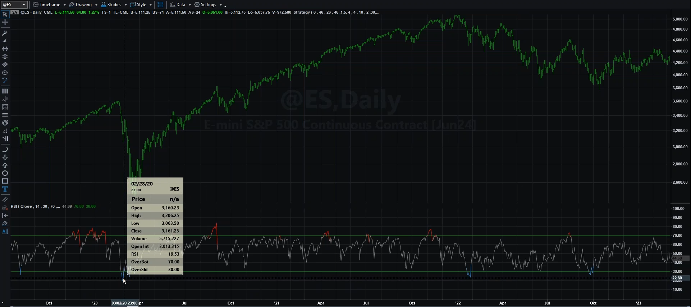
  <figcaption>Figura 066</figcaption>
</figure>

En resumen: este modo de entrada con RSI 14 busca capturar el rebote típico de fases tendenciales entrando un paso antes del setup tradicional. Funciona bien cuando el mercado respeta la estructura direccional y reacciona rápidamente en las zonas extremas, pero puede generar pérdidas rápidas en episodios de fuerte momentum en contra. Por eso suele complementarse con filtros o salidas adicionales en los casos en que el impulso invalida la lógica *mean–reversion*.


### Analisis de las entradas en SP500

Bueno, aquí para probar simplemente podemos dejarlo simétrico de momento, ¿vale? Dejarlo simétrico de momento. Y bueno, podemos probar, podemos cargar aquí. De momento vamos a cargar en horario regular, estamos en diario, pues le vamos a meter 20 años. Y vamos a ver, ya lo teníamos, ya lo teníamos.

Ponemos 1 a 14, ¿vale? 

<figure>
  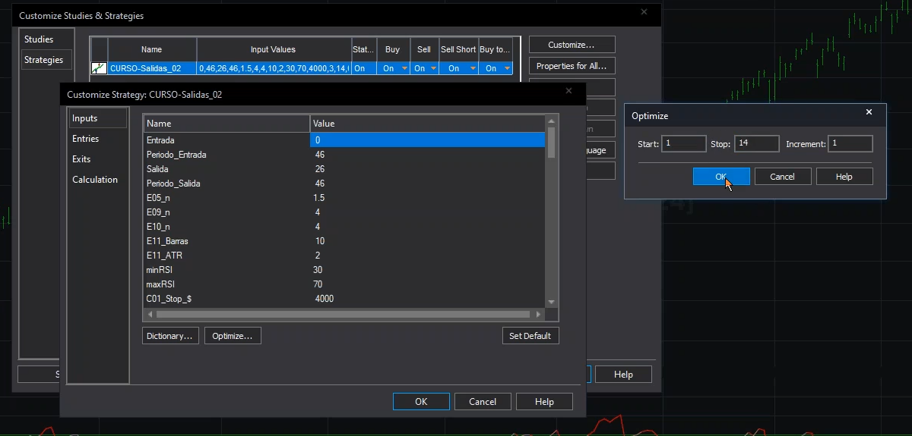
  <figcaption>Figura 067</figcaption>
</figure>

Y de período, no sé, vamos a poner 14. Abierto, por poner que suelen llevar los indicadores, aunque quizá podíamos dejarle optimizar un poco, que va a ir muy rápido. Más que nada porque hay algunos cierres de *momentum* que es un poco mucho.

<figure>
  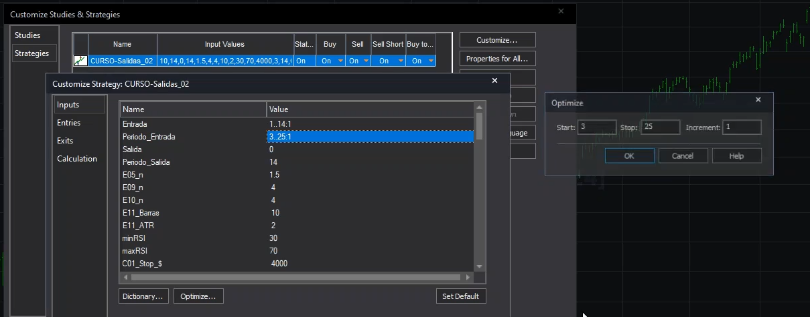
  <figcaption>Figura 071</figcaption>
</figure>

Vamos a poner de 3 a 21 pero que no va a tardar mucho esto así. 

<figure>
  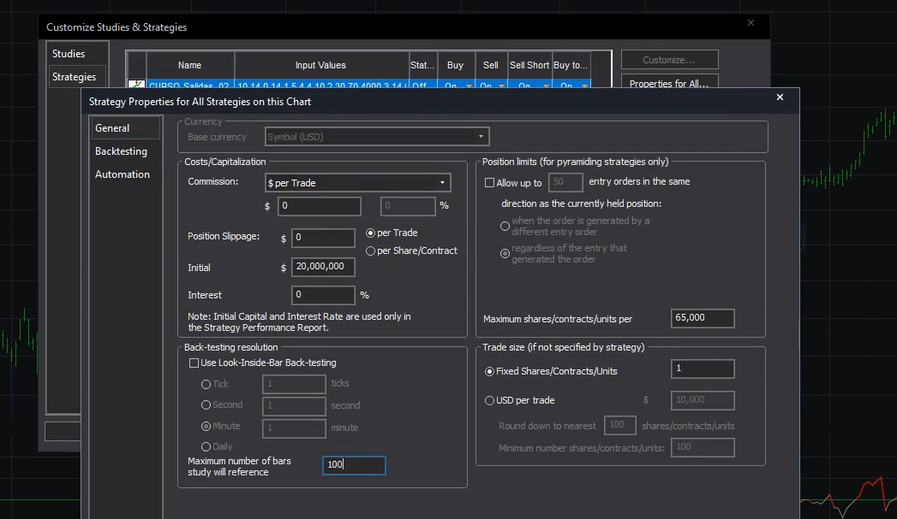
  <figcaption>Figura 070</figcaption>
</figure>

<figure>
  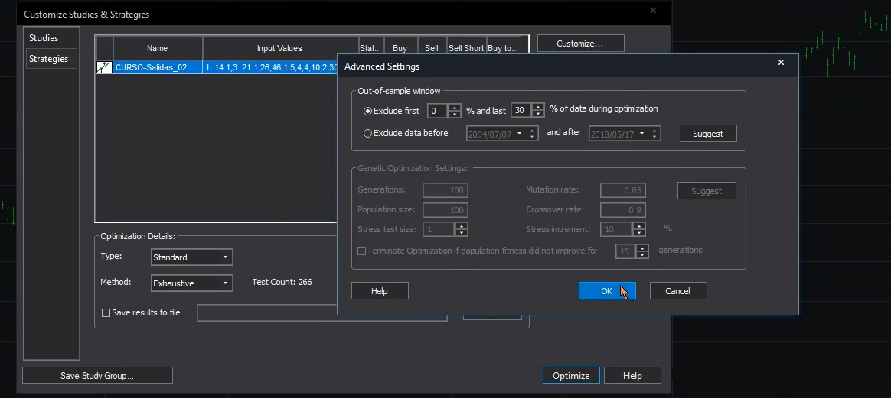
  <figcaption>Figura 069</figcaption>
</figure>

**Resultados de la optimización de entradas**

<figure>
  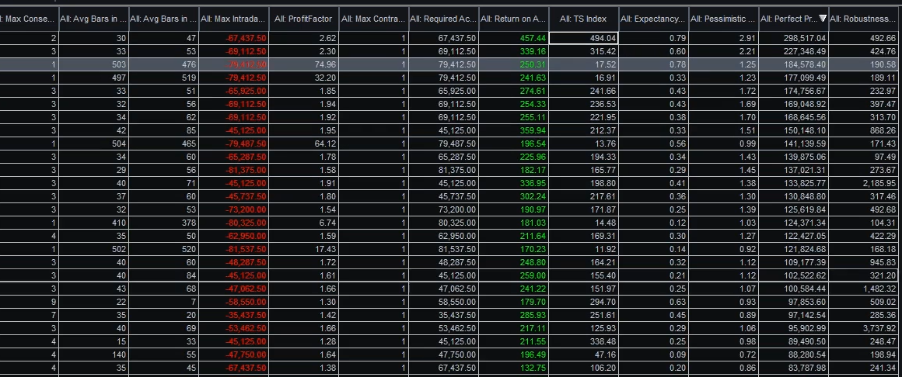
  <figcaption>Figura 072</figcaption>
</figure>

<figure>
  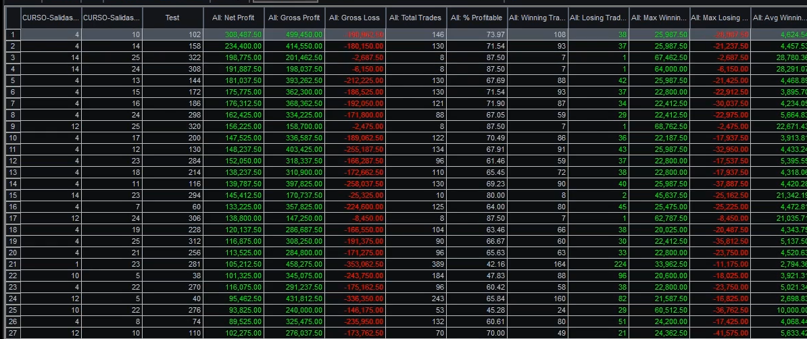
  <figcaption>Figura 073</figcaption>
</figure>

`click a la 4`

```sh
 	case 4: # Bollinger Band Entry
 	begin
  		If Close crosses above BollingerBand(Close, Periodo_Entrada, -2) then # largos cuando recupera banda inferior
  			Buy next bar at market;
  			
  		If Close crosses below BollingerBand(Close, Periodo_Entrada, +2) then #  cortos cuando pierde banda superior
  			SellShort next bar at market;
 	end;
```

Bueno, aquí tenemos algunas. 

Vemos que la 4 es *Bollinger entry*, entrando en *anti-tendencia*. Lógicamente el lado largo era muy bien. Y la 14 que es el *RSI* de entrada abajo, no efectivamente. Las dos muy parecidas, las muy parecidas. 

<figure>
  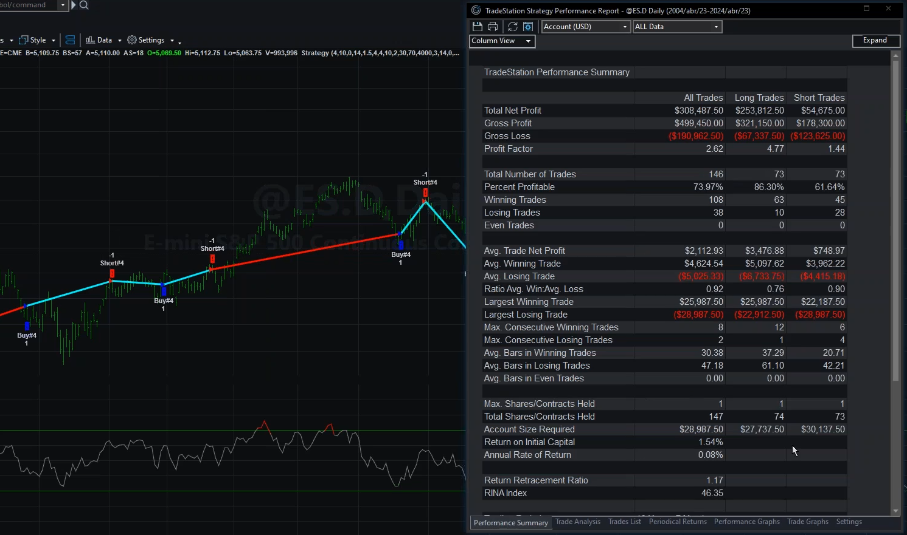
  <figcaption>Figura 074</figcaption>
</figure>
<figure>
  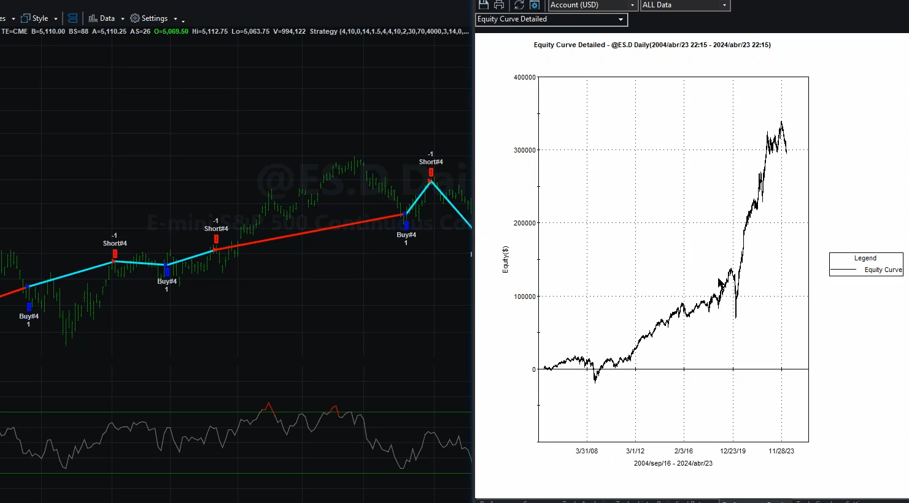
  <figcaption>Figura 075</figcaption>
</figure>

Pues van, van bien. Que es, como os digo, de entrada pues las *mean reversion* suelen ir bien.

Realmente esto es muy sencillo, se tiene que mejorar, pero es simplemente para que veáis maneras de entrar. Pasa que es en diario, es en diario. Y pues fácilmente en diario en el *SP* consigues cosas que están muy bien, porque sube mucho. Entonces al final aunque bueno, ganas en el corto, ganas en el corto.

---

pero este es un poco planteamiento de buscar ideas cuando no sabéis por dónde tirar, que recuerdo que hablamos de libros, de distintas fuentes, de distintas fuentes. Ahora, antes de acabar, enseñaremos algo de este estilo 

`click encime de short `

<figure>
  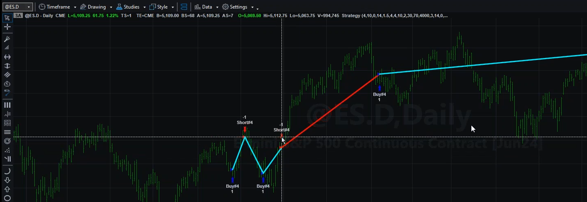
  <figcaption>Figura 077</figcaption>
</figure>
<figure>
  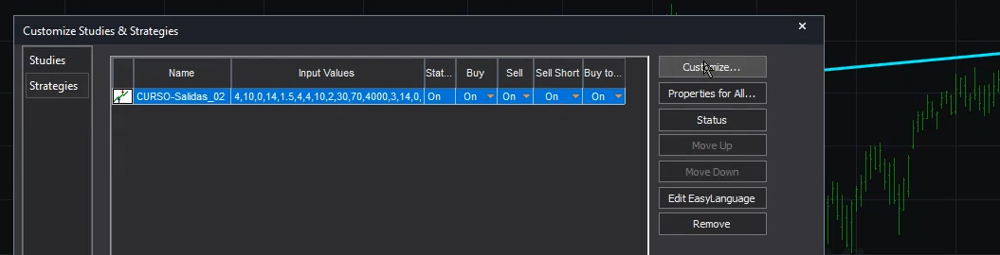
  <figcaption>Figura 078</figcaption>
</figure>
<figure>
  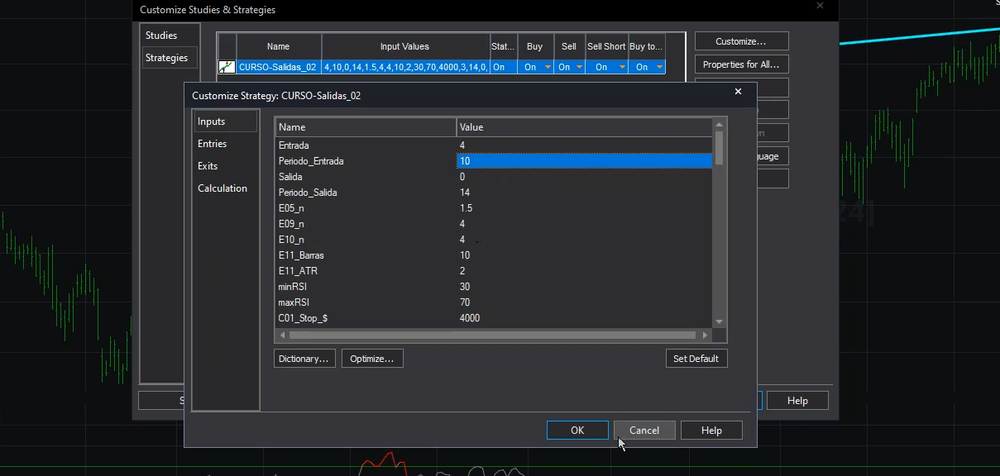
  <figcaption>Figura 079</figcaption>
</figure>

¿qué período ha cogido, por cierto? También ha cogido 10, cogido 10, no está mal. Y bueno, pues salida, pues ya que ha cogido 10, bueno, le voy a dejar fijo.

Bueno, aquí claro, aquí el tema ahora es las salidas. Seguramente están adaptadas un poco al otro. No, solamente están un poco adaptadas al otro. Entonces hay que ver, no tendrán mucho sentido en ese *frame*, pero bueno, mira, vamos a hacer otra cosa por complicar un poco más, aplicar un poco más el tema. Poner en 60 minutos. Lo vamos a poner en el continuo, sea en todo el rato, ¿vale? Es en 60 minutos, vamos a poner los cinco años. A recordar que no teníamos comisiones. 


<figure>
  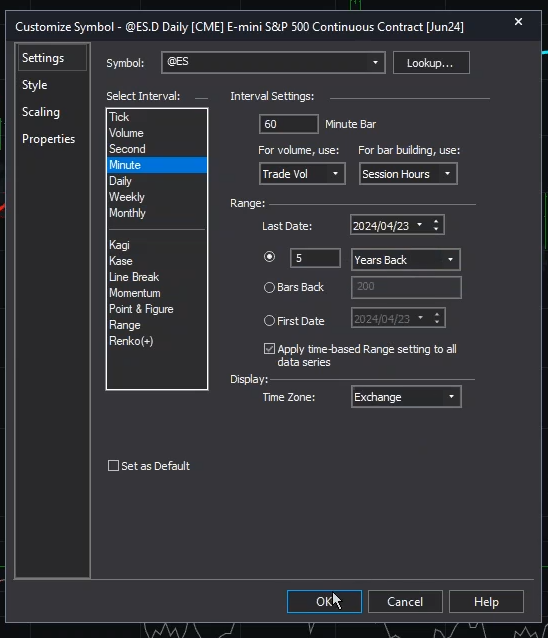
  <figcaption>Figura 080</figcaption>
</figure>

Aunque el diario no es tan crítico, pero recordar que no teníamos comisiones.

Ahora ya va a empezar a ser lo más crítico. Entonces vamos a ponerle comisiones, 3 y 12, 200 mil dólares. no activamos el *LIFO* que nos va a hacer ir más lentos y ahora mismo no hace falta. 

<figure>
  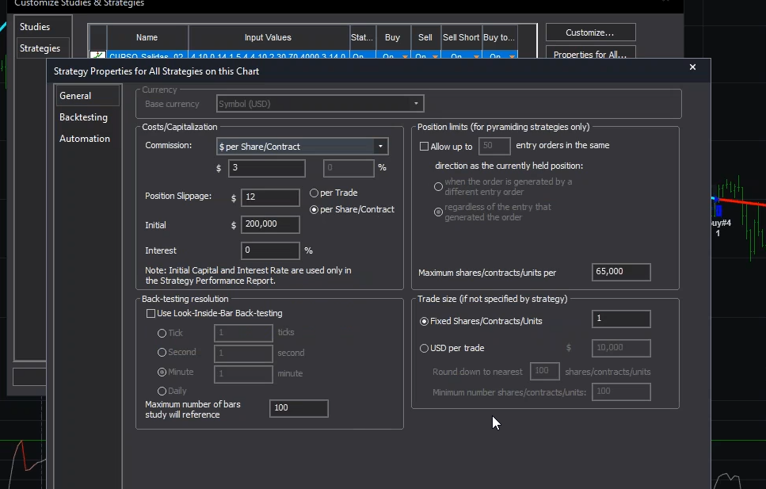
  <figcaption>Figura 081</figcaption>
</figure>

ahí mientras me va, me va bajando el histórico, el histórico.

<figure>
  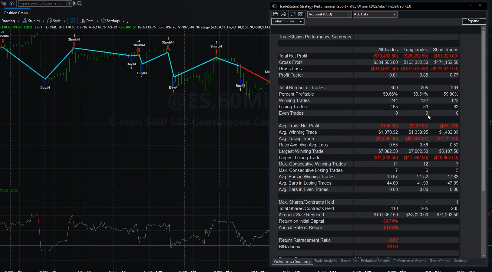
  <figcaption>Figura 082</figcaption>
</figure>
<figure>
  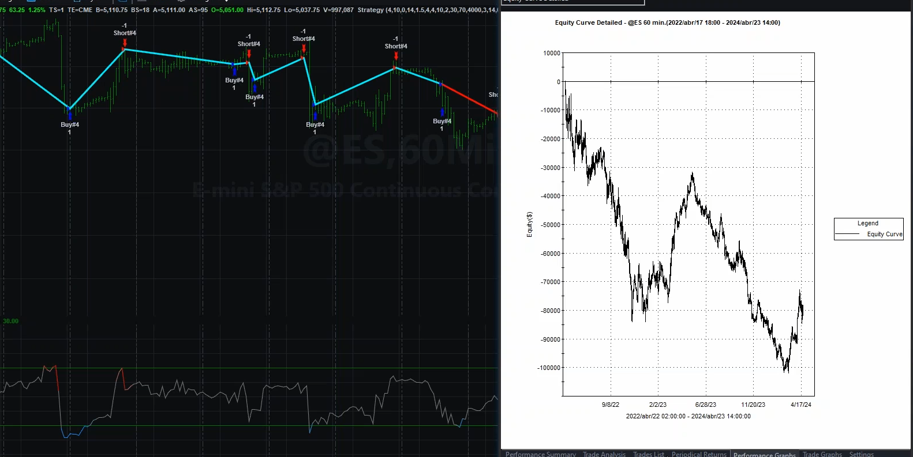
  <figcaption>Figura 083</figcaption>
</figure>
<figure>
  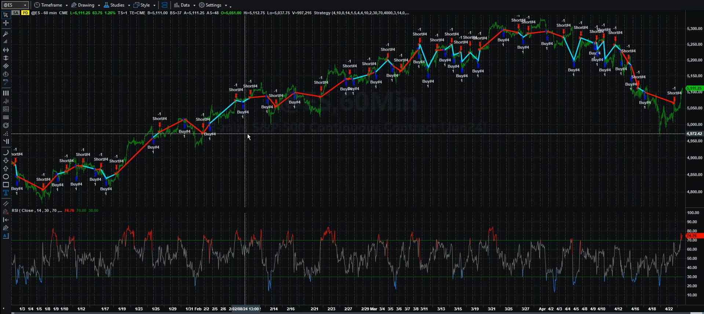
  <figcaption>Figura 084</figcaption>
</figure>

Aquí ya pues, ya la cosa cambia, también. O sea, ya no va nada bien. Pero esto es bastante raro, no es tan difícil encontrar estrategias robustas y que funcionen bien sin complicarnos mucho la vida. Pasa y claro, ahí no abusar de optimización, porque al final tenemos menos *trades*, etcétera, ¿no? Pero realmente no es tan difícil, sobre todo en el lado largo. 

Pero incluso aquí, probablemente ahora cuando acabe de cargar el histórico, volvemos a pasar brevemente el motor de las entradas pero simplemente dejando por defecto el período en 14, 15. Bueno, vamos a poner que tenemos 20, 20. Vamos a poner las velas de una sesión, que es una manía que tenemos. Eso deben ser 23 velas, ¿no Alberto? 23 velas, ¿no? Un día del *SP*. Afirmativo. ¿Y tres barras, verdad? No falla. Pues le vamos a poner 23.

<figure>
  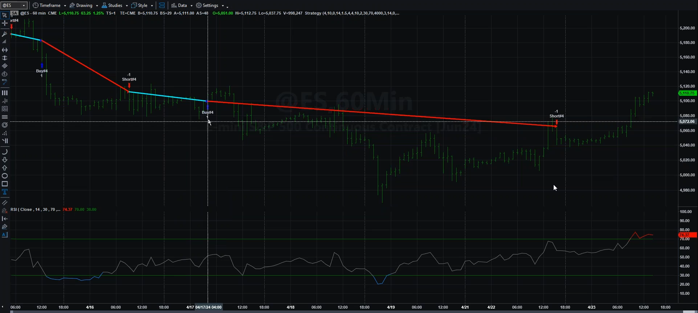
  <figcaption>Figura 085</figcaption>
</figure>

Entonces vamos a hacer eso, le ponemos, hemos hecho 23. Y aquí pues otra vez de 1 a 14 a ver, con 23 en principio. Vamos a poner una salida, bueno, luego lo miramos, 3 por 3, con 70 ya le da,,, si lo he calculado bien.

<figure>
  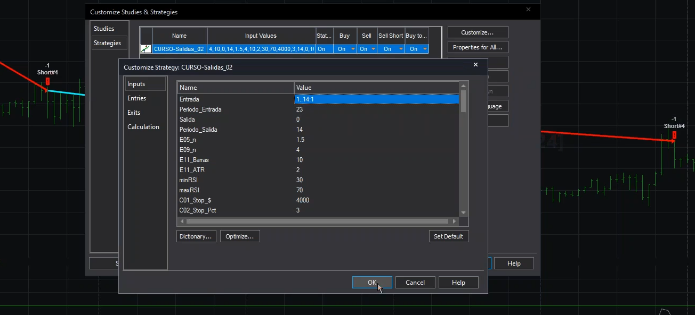
  <figcaption>Figura 086</figcaption>
</figure>
<figure>
  
  <figcaption>Figura 081</figcaption>
</figure>

Y vamos a romper. ¿Que es realmente curioso lo que está pasando ahora? Sí, es curioso que no enseña a ninguno, no entiendo.

**Resultados en 60 minutos**

<figure>
  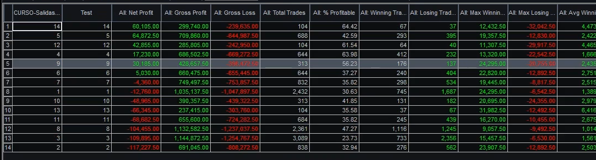
  <figcaption>Figura 088</figcaption>
</figure>
<figure>
  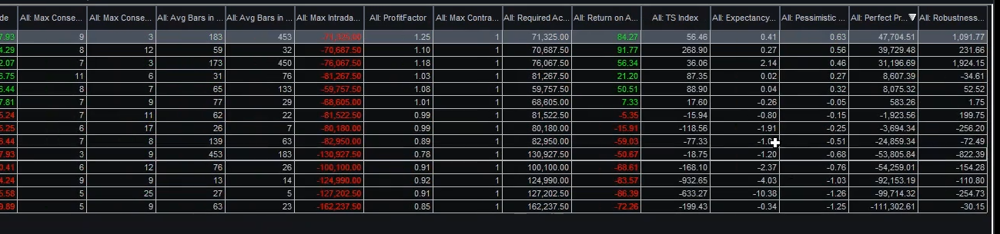
  <figcaption>Figura 089</figcaption>
</figure>

Bueno, aquí pocos ya aguantan el tipo. Lo sé que tenemos que el 14 puede aguantarlo muy justito todo, el 5. ¿Cuál era 14? El *ADX*. 

`click al 14` 

```sh
	case 14: # RSI entrada saliendo de sobrecompra/sobreventa MR
	Begin	
		RSI_value = RSI(Close, Periodo_Entrada);
	
		Cond_Long = RSI_value crosses under minRSI; # largos en cruce abajo de banda inferior
		Cond_Short = RSI_value crosses over maxRSI; # cortos en cruce arriba de banda superior
	
		If MarketPosition <> 1 and Cond_Long then
    		Buy next bar at market;

		If MarketPosition <> -1 and Cond_Short then
    			Sell short next bar at market;
	End;
```

`click al 5` 

Y el 5 era por *volatility*, 

```sh
 	case 5: # Volatility Entry
 	begin
 		input:
 			E05_n (1.5);
 			
  		If Close > Close[1] + AvgTrueRange(Periodo_Entrada) * E05_n then
  			Buy next bar at market;
  			
  		If Close < Close[1] - AvgTrueRange(Periodo_Entrada) * E05_n then
  			SellShort next bar at market;
  	end;
```

también le podíamos dar una vuelta ese 1 y medio, a ver. Porque realmente con ese 1 y medio no creo yo que sea lo más óptimo.  
Estamos siempre simplemente haciendo prospección, nada más.  

<figure>
  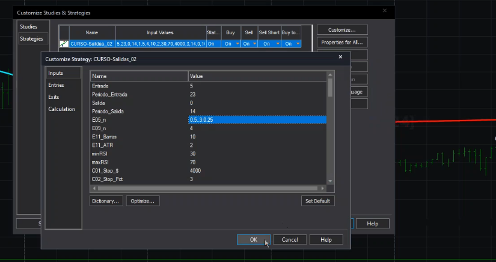
  <figcaption>Figura 090</figcaption>
</figure>
<figure>
  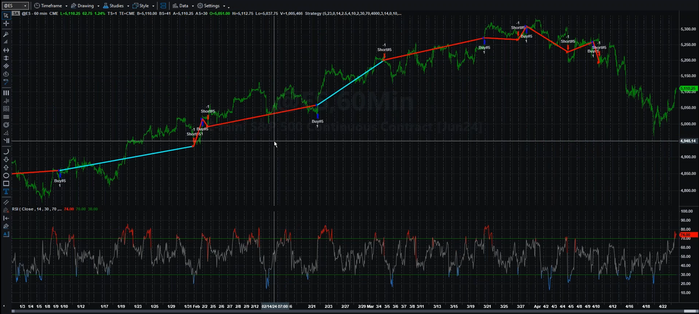
  <figcaption>Figura 091</figcaption>
</figure>
<figure>
  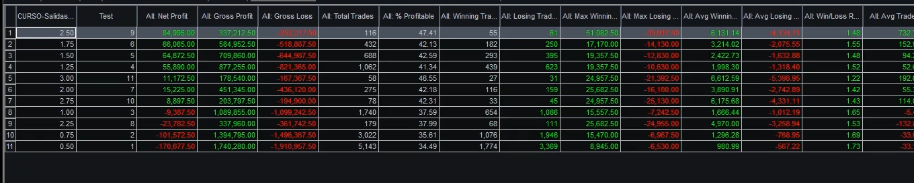
  <figcaption>Figura 092</figcaption>
</figure>
<figure>
  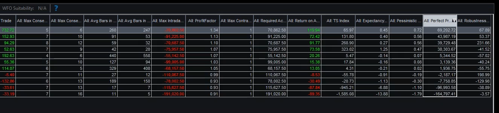
  <figcaption>Figura 093</figcaption>
</figure>


Esto está medio roto todo ayer. A no, vale, porque se queda corto de prospección de nada más. Tenemos muy pocos *trades*, de hecho ahí, pero menos, pero menos.

Habría que habría que ver, seguramente ahora deberíamos de abrir un poquito más. Pero es igual, simplemente ahora quiero enseñaros otra cosa antes de acabar: ***que las expansiones de volatilidad también son entrada muy buena.***

**Entradas por expansión de volatilidad**

Y de hecho esta acompañada... este `case 5` es cierre un *ATR*. Pues si esto además lo que os decía, le añadís un filtro de tendencia o algo así, es súper, súper buena entrada por las de volatilidad. En general, la mayoría activos, pero particular en bolsa.

<div style="border-left: 4px solid #27ae60; background: #ecf9f1; padding: 10px 15px; margin: 10px 0;">
  <strong>💡 Entradas por volatilidad recomendadas</strong><br>
  Simplemente añade una regla que le incorpore un <em>momentum</em> tendencia, y que solo vaya a favor de ella. Son muy buenas entradas. Por ejemplo: cierre mayor que cierre anterior más una cantidad de <em>ATR</em>, combinado con un filtro de dirección.
</div>

Simplemente añadís es una regla que le incorpore un *momentum* tendencia, ¿no? Y que solo vaya a favor de ella y muy buenas entradas.

### Prueba con salida porcentual

Pero bueno, para empezar a definir niveles, vamos a poner la salida que era solo porcentual. Salida porcentual que era el case 16.

```sh
	case 16: # Stop% + Profit% - Input: C16_Stop_Pct(2), C16_Profit_NxStopPct(1);
	begin	
			Input:
				C16_Stop_Pct ( 2.25 ), # en tanto por 100
				C16_Profit_NxStopPct ( 0.7 );
				
			SetStopShare;
	
			If MP <> 0 then 
			begin
				SetStopLoss (EntryPrice * C16_Stop_Pct / 100 * Bigpointvalue); 
				SetProfitTarget (EntryPrice * (C16_Stop_Pct * C16_Profit_NxStopPct) / 100 * BigPointValue);
			end else 
			begin
				SetStopLoss (Close * C16_Stop_Pct / 100 * Bigpointvalue); 
				SetProfitTarget (Close * (C16_Stop_Pct * C16_Profit_NxStopPct) / 100 * BigPointValue);
			end;
	end;
```

<figure>
  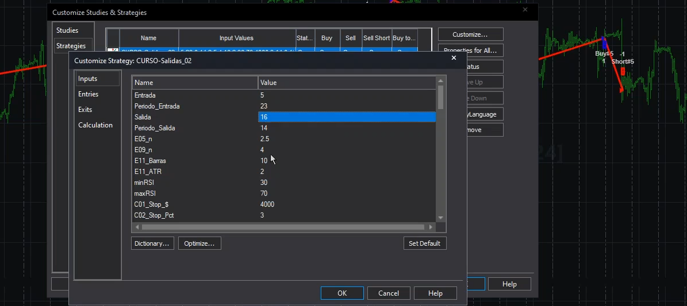
  <figcaption>Figura 094</figcaption>
</figure>
<figure>
  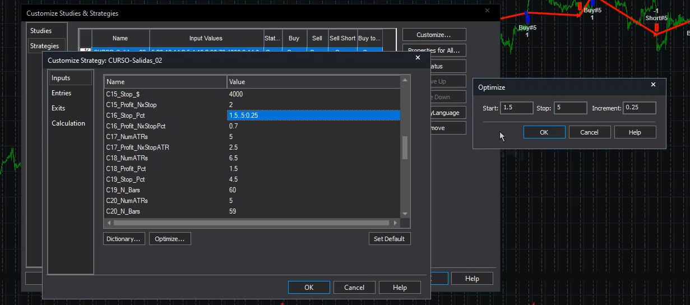
  <figcaption>Figura 098</figcaption>
</figure>
<figure>
  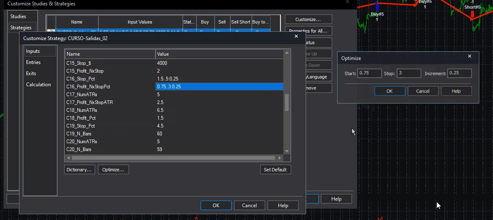
  <figcaption>Figura 099</figcaption>
</figure>
<figure>
  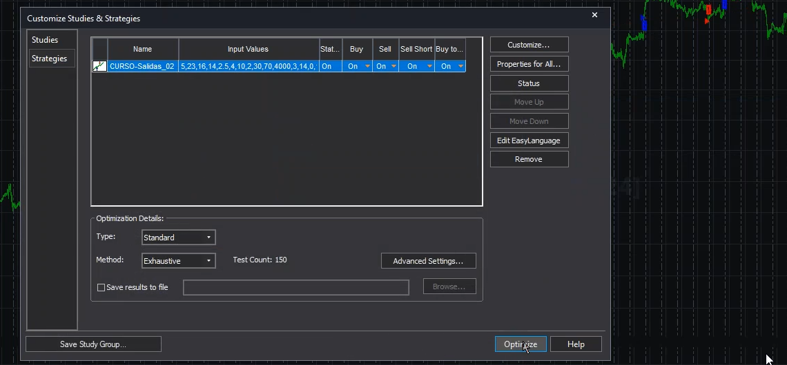
  <figcaption>Figura 100</figcaption>
</figure>

A ver si esto tiene algún tipo de sentido, o es poco mucho. 

<figure>
  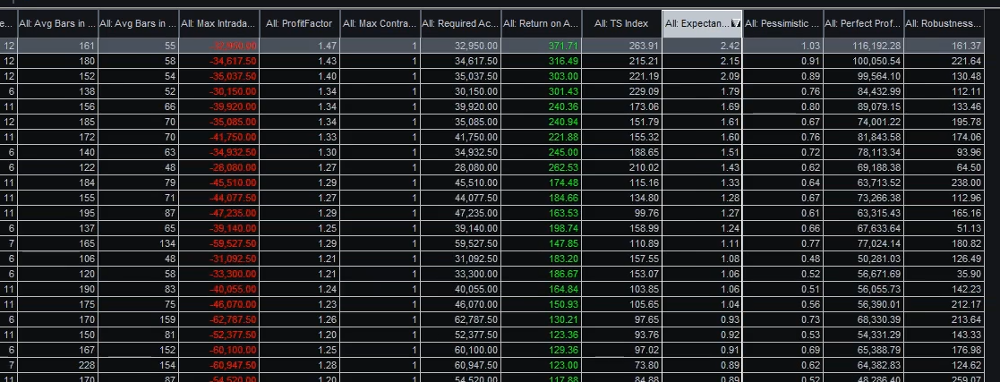
  <figcaption>Figura 101</figcaption>
</figure>

<figure>
  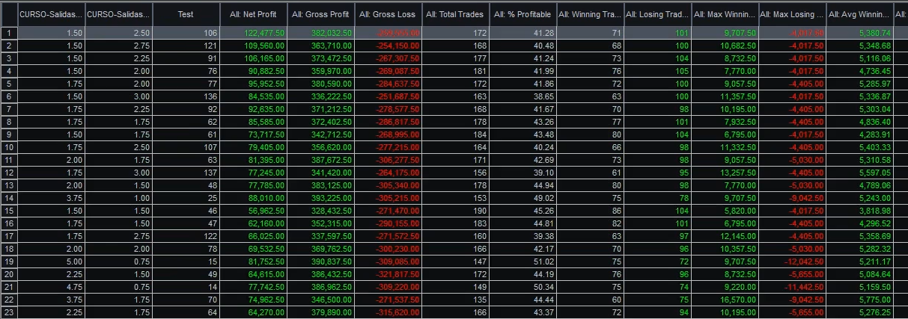
  <figcaption>Figura 102</figcaption>
</figure>

<figure>
  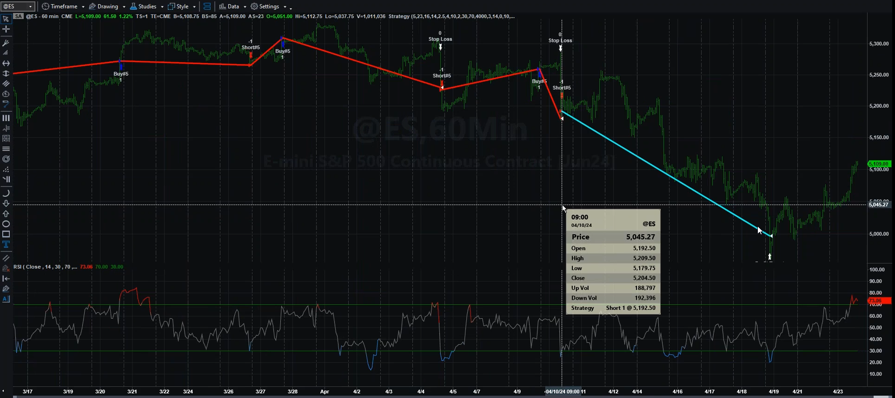
  <figcaption>Figura 103</figcaption>
</figure>

<figure>
  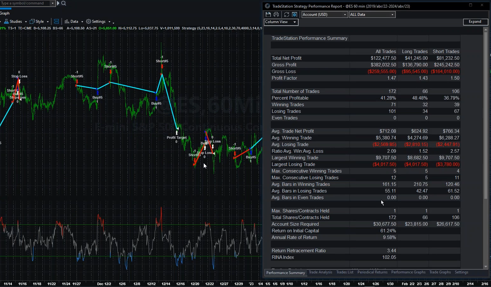
  <figcaption>Figura 104</figcaption>
</figure>

<figure>
  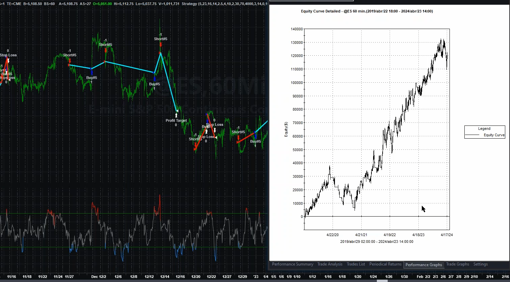
  <figcaption>Figura 105</figcaption>
</figure>

Digo que ahora seguramente a la que lo pongamos más histórico, se va, se va, se va a deteriorar. Decir, que lo decís vosotros antes que los que están en el despacho. O, tiene gracias, gracias, gracias. Digo, claro es que lo despacho me oye, ese es el problema.

eso es solo un ejercicio de investigación, por lo que no os quedéis tampoco con los resultados que ahora parece que sean decentes. Buenos, no importa. Ahora seguramente al cargar más años se va a deteriorar, ¿de acuerdo? Desde está bastante probablemente está ***sobreoptimizado***, pero repito que es un ejercicio de investigación para ir buscando, enseñaros lo que os digo de los buscadores de ideas a través de código.

Y podéis ir trabajando distintos activos y distintos *times frames*, ¿vale? Tener distintos códigos. Incluso podéis hacer uno más pensado para investigar *mean reversion*, solo *mean reversion*, otro para más *tendenciales*, ¿vale? Otro de filtros, ¿de acuerdo? Es decir, ir trabajando bloques para investigar, para investigar.

<figure>
  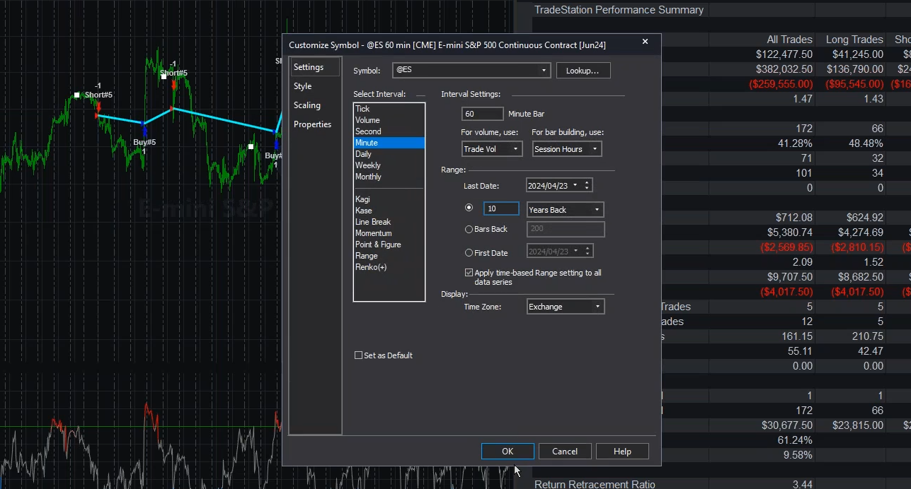
  <figcaption>Figura 106</figcaption>
</figure>

<figure>
  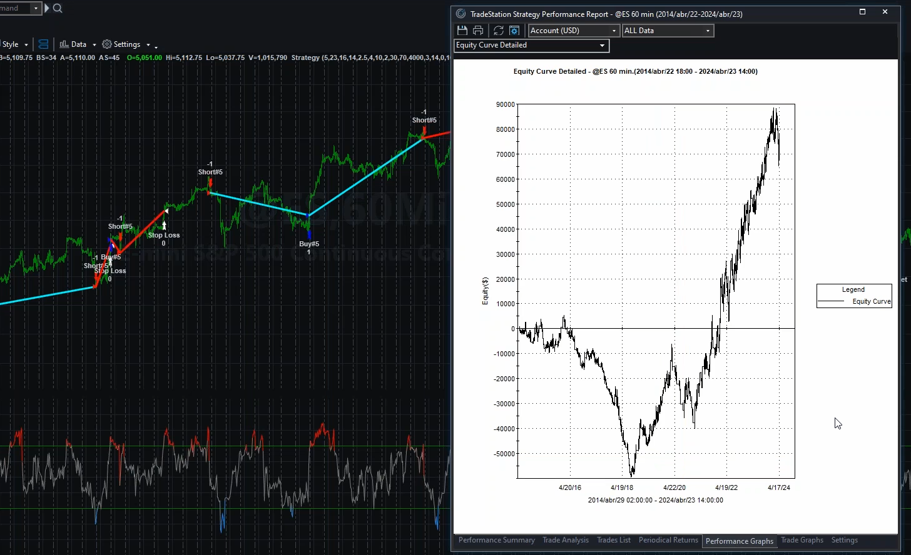
  <figcaption>Figura 107</figcaption>
</figure>

Eso que os decía, esto normal es que se rompiera por el lado, ¿vale? Es un ejemplo muy bueno lo que cuando hablamos de que *sobreoptimizar* y qué es esto.

Simplemente, repito, que estamos simplemente investigando y viendo códigos en el tipo de mercado que hay en cada momento. Por eso hay que mirar antes las bases de datos que ajusta, que no es aquí, por ejemplo.

<figure>
  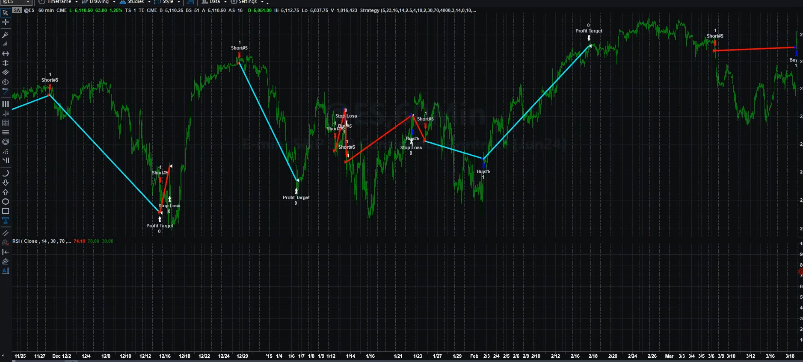
  <figcaption>Figura 108</figcaption>
</figure>


Es el problema de los *stop* sin *TP*, ¿no? Es bastante problemático como veis, bastante poco eficiente la salida así a bruto, realmente es una salida para empezar a trabajar base, pero normalmente no suele ser la mejor. Si no haces *TP*, te quedas muy, muy enganchado. 

De hecho, ahora si dejamos el *stop* y variamos el *TP* solo, veréis cómo nos intenta hacer *TP* mucho antes para evitar ese problema. Con lo cual se hace más *mean reversion*, porque ahora de esta manera se ha quedado relativamente *tendencial*, relativamente no, se ha quedado muy *tendencial* (`Percent profitable` 37.66%). Porque la *variable del *TP** ha salido multiplicando por mucho.

<figure>
  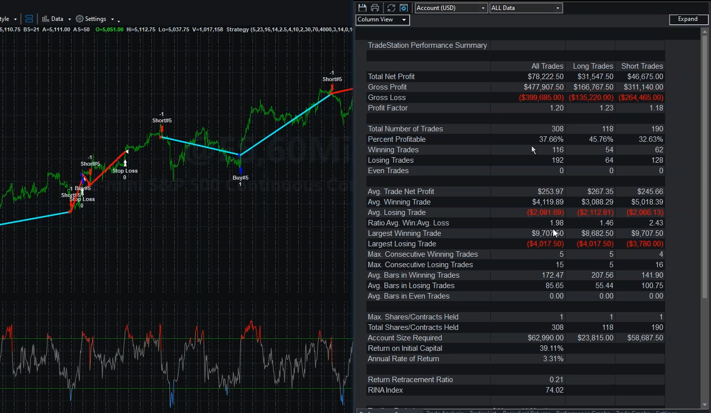
  <figcaption>Figura 109</figcaption>
</figure>

Esto es el problema, sobre todo para el lado corto, pero todo para el lado corto, aunque datos bastante similares, ¿vale?

## Sistema Tomorrow's Trend: patrón de corrección a favor de tendencia

Entonces lo que os quería enseñar es en la base del *Tomorrow* que visteis. Os comenté de la revista de la revista. 

* [Strategy : TOMORROW](../code/CURSO%20-%20TOMORROW.ELD)

```sh
# TradeStation Labs
# Strategy courtesy of Joe Krutsinger
# April, 2016
# TSLabs@TradeStation.com

# { A pattern of a Short Term Reversal against the minor trend
# with a breakout in the direction of the major trend,
# all coupled with a walk away.}
 
Input: BuyBO(6), SellBO(27), Walk(50), Trend(10), PositionBasis(false), Amount(1330);
 
If Close <= Close[2] and Close > Average(Close, Trend)[1] then
	Buy ("JKtt LE") next bar at Open of next bar + (Range * 0.10 * BuyBO) Stop;

If MarketPosition = 1 and BarsSinceEntry >= Walk then
	Sell ("w LX") next bar at Market;

If Close > Close[2] and Close < Average(Close, Trend)[1] then
	Sell Short ("JKtt SE") next bar at Open of next bar - (Range * 0.10 * SellBO) Stop;

If MarketPosition = -1 and BarsSinceEntry >= Walk then
	Buy to Cover ("w SX") next bar at Market;

If PositionBasis then
	SetStopPosition
else
	SetStopShare;

SetStopLoss(Amount);

# Copyright (c) 2016 TradeStation Technologies, Inc. All rights reserved.
```

Este código, recordar que es lo que os dije que era uno de los que iba mejor en mí, en fuera de muestra.

Y esta regla misma la hemos puesto antes, era una de las que está metida. Es una regla como muy sencilla y sigue un poco en la línea de lo que os decía: una corrección de corto plazo a favor de la tendencia. Es decir, es incorporarte a esa. Hay muchas maneras de añadirlo y de controlarlo.

<div style="border-left: 4px solid #27ae60; background: #ecf9f1; padding: 10px 15px; margin: 10px 0;">
  <strong>💡 Patrón Tomorrow's Trend</strong><br>
  Simplemente añade rotura de volatilidad para entrar, exige que el precio se mueva a favor. Es tremendamente efectivo. Es el mismo concepto que usa el sistema <em>Artemisa</em>: un indicador de <em>momentum</em> y una media para incorporarse a favor.
</div>

Simplemente añade rotura de volatilidad para entrar, exige que el precio se mueva a favor. Es tremendamente efectivo.

Y simplemente a esto LE vamos a eliminar las salidas.

**Adaptación del sistema con módulo de salidas propio**

<figure>
  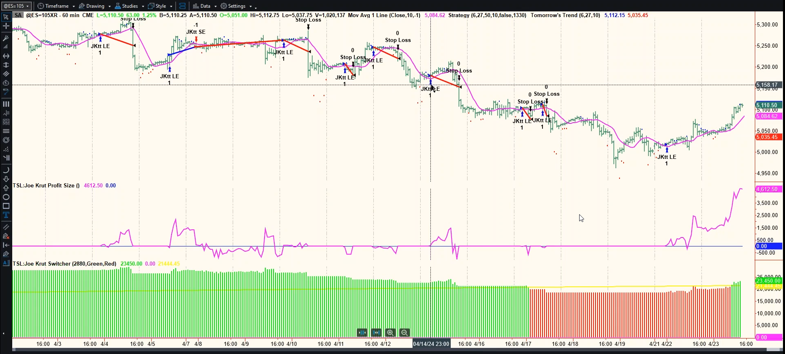
  <figcaption>Figura 111</figcaption>
</figure>

Y a ver, por no complicarnos, por no complicarnos, simplemente vamos a hacer eso. Manera muy sencilla de hacerlo, muy sencilla de hacerlo que ya os enseñé, es a esto le pones un valor astronómico, lo cual no puede saltar, puede saltar, es imposible que salte, nunca salta, ¿vale?

<figure>
  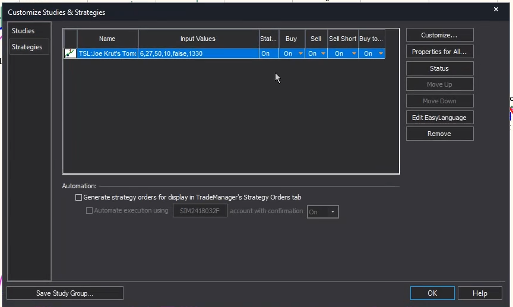
  <figcaption>Figura 112</figcaption>
</figure>

<figure>
  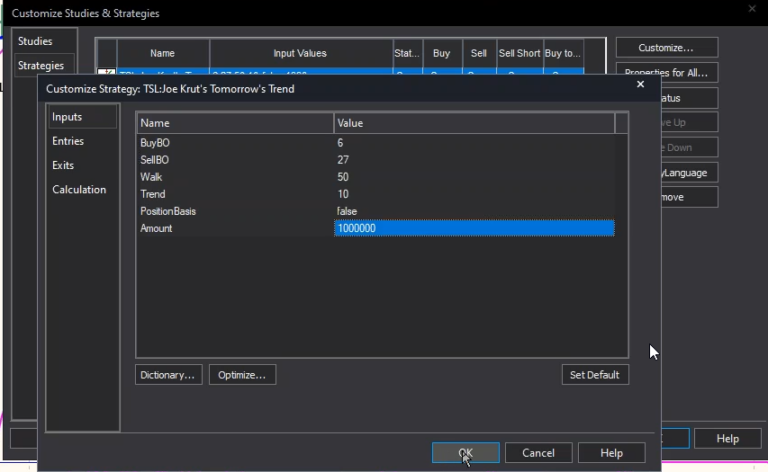
  <figcaption>Figura 113</figcaption>
</figure>

<figure>
  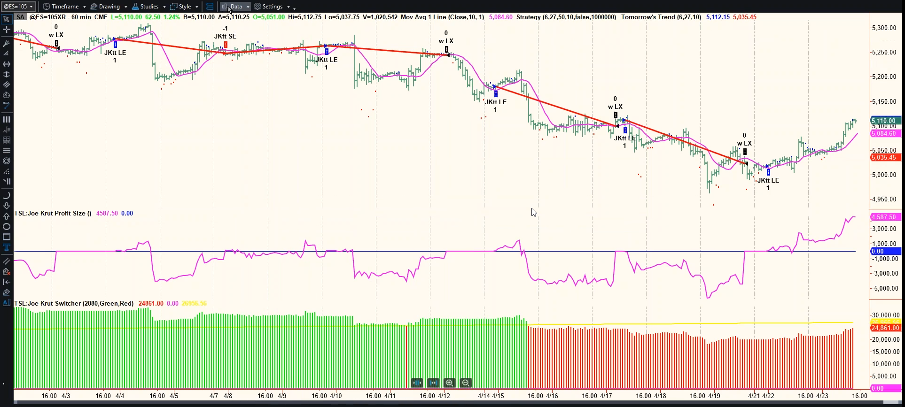
  <figcaption>Figura 114</figcaption>
</figure>

Añadimos nuestro módulo de salidas dejando las entradas en cero, que ya lo están por defecto.

<figure>
  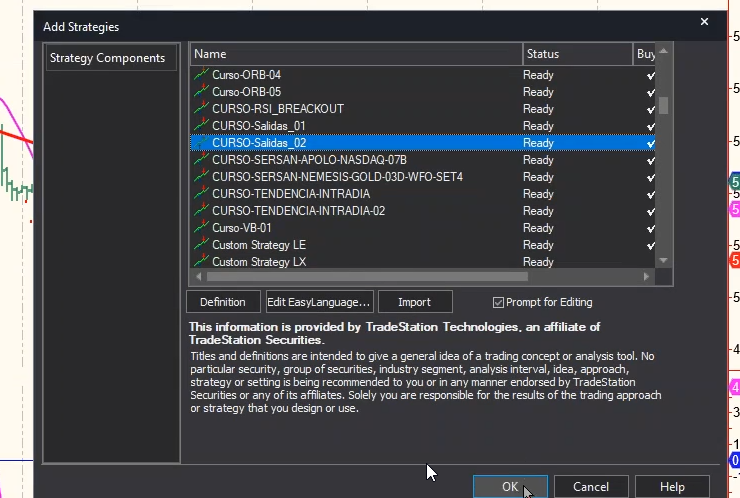
  <figcaption>Figura 115</figcaption>
</figure>

<figure>
  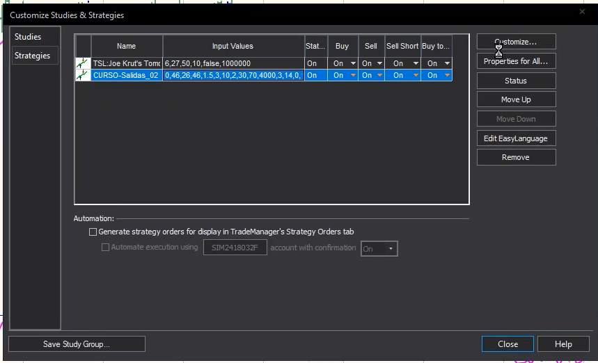
  <figcaption>Figura 116</figcaption>
</figure>

<figure>
  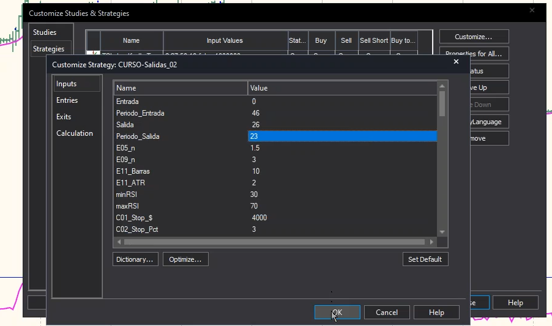
  <figcaption>Figura 117</figcaption>
</figure>

Que estamos en 60, es decir, podemos estar en esas 23, 23 barras (PERIODO SALIDAS). Y aquí podemos pues trabajar un poco con las salidas.

Es verdad que, tal como estamos ahora, cuántas salidas tengo, pues no sé si los *inputs* están bien o no. Pero vamos a tener una pasada rápida de momento, momento. Salidas, estamos en 32. PoNer de 1 a 32, porque alguna tienes que elegir, 

<figure>
  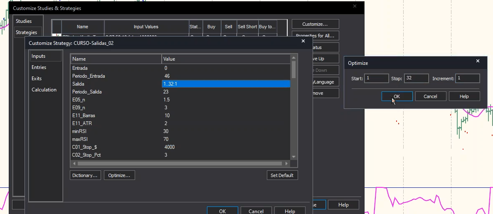
  <figcaption>Figura 118</figcaption>
</figure>

y vamos con ello, vamos con ello.

<figure>
  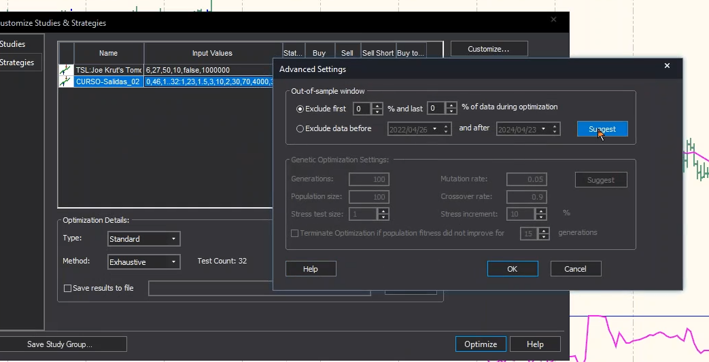
  <figcaption>Figura 119</figcaption>
</figure>

De momento no sé ni cuánto tengo cargado aquí, honestamente os lo digo. Y hacer un sistema que en fuera hemos aguantado muy bien. Un sistema que es lo que esta pauta en nuestro sistema ***Artemisa*** explota exactamente esta pauta. Es la misma prácticamente, no está hecho igual pero usa lo mismo, ¿vale?

**El indicador Momentum**

Al final usa un indicador de *momentum* y una media para incorporarse a favor. Y ya está. Que és lo que hace este *momentum*. Para el que no esté familiarizado, esto `Close <= Close[2` es el indicador de *momentum*, eso es el *momentum* de 2.

El indicador de *momentum*, si lo abrís, es esto: es cierre menos cierre anterior. Es la comparación del cierre con el cierre de n velas.

Entonces aquí lo que pide es que el *momentum* sea negativo, el *momentum* de 2 sea negativo o igual, pero menor o igual que cero. Y que el cierre sea mayor que una media que fija en 10, ¿entienden?

Esto puede hacerse de más períodos, de menos, se puede poner un *input*, ¿de acuerdo? Es decir, se puede buscar un poco grados de tendencia, porque es verdad que eso entra muy rápido, entra muy rápido.

Aquí ahora el problema que tenemos seguramente es que no estamos bien dimensionados de los *inputs*, ¿vale? Porque estábamos antes, se quedaron en el oro, 30. Que estamos ahora en 60. Bueno, como hay más volatilidad, puede ser que sea algo medianamente razonable, pero seguro que no es lo que hay que trabajar, lo más, y que adaptarlos.

<figure>
  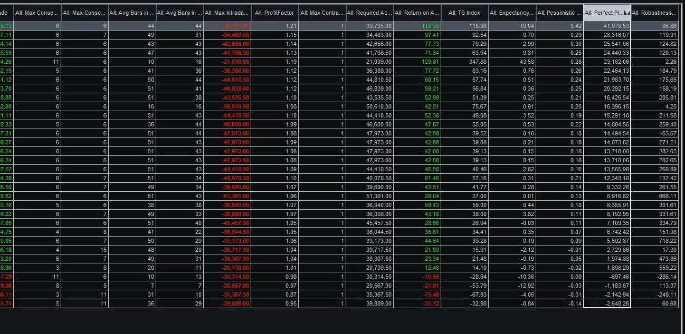
  <figcaption>Figura 120</figcaption>
</figure>

<figure>
  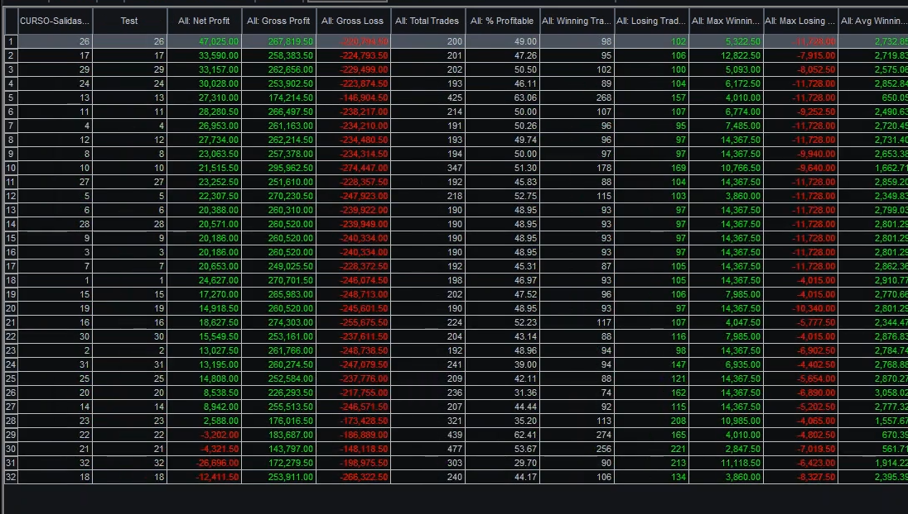
  <figcaption>Figura 121</figcaption>
</figure>

Pero si vemos un poco cuál ha quedado mejor, qué valores tiene, y con ese poco podemos extrapolar. Bueno, vemos que por aquí por esto, se ha elegido este 41, que era el número `26`. 26 que era *profit* y *break even*. Al en porcentaje.

```sh
	case 26: # Profit% + BreakEven% - Input: C26_Profit_Pct(2), C26_BreakEven_Pct(0.5);
	begin		
		Input:
			C26_Profit_Pct ( 2.2 ),
			C26_BreakEven_Pct ( 1.6 ); # en tanto por 100
			
		SetStopShare;
		
		If MP <> 0 then
		Begin 
			SetProfitTarget (EntryPrice * C26_Profit_Pct / 100 * BigPointValue);
			SetBreakeven(EntryPrice * C26_BreakEven_Pct / 100 * Bigpointvalue);
		end else 
		Begin
			SetProfitTarget (Close * C26_Profit_Pct / 100 * BigPointValue);
			SetBreakeven(Close * C26_BreakEven_Pct / 100 * Bigpointvalue);
		End;
	end;
```

**Cambio a stop ATR respetando la idea original**

Bueno, de hecho, mira, vamos a hacer, él tenía un esto monetario, vamos a pasar, vamos a pasar el esto porcentual más que es respetar totalmente su idea pero adaptándolo a lo que creemos que es más razonable por el tiempo que ha pasado. Y así le utilizamos un poco ese stop pasamos stop para *ATR*, esto para *ATR*, esto para *ATR*, es el número 3. Es el número 3.

```sh
	case 3: //Stop ATR - Input: C03_NumATRs (3), Periodo_Entrada(14), ATR_suelo ( 0 ), ATR_techo ( 10 );
	begin	
		Input:
			C03_NumATRs ( 14 ),

			ATR_suelo ( 0 ), //límite inferior del stop ATR en tanto por 100
			ATR_techo ( 10 ); //límite superior del stop ATR en tanto por 100
			
		Value1 = C03_NumATRs * AvgTrueRange(Periodo_Salida) * BigPointValue;
		Value2 = ATR_suelo / 100 * C * Bigpointvalue; 
		Value3 = ATR_techo / 100 * C * Bigpointvalue;

		Value1 = MaxList(Value1, Value2);
		Value1 = MinList(Value1, Value3);
		
		SetStopContract;		
		SetStopLoss(Value1);
	end;
```

Antes déjame mirar cuánto histórico hay aquí cargado. Tenemos muy poco histórico. 

<figure>
  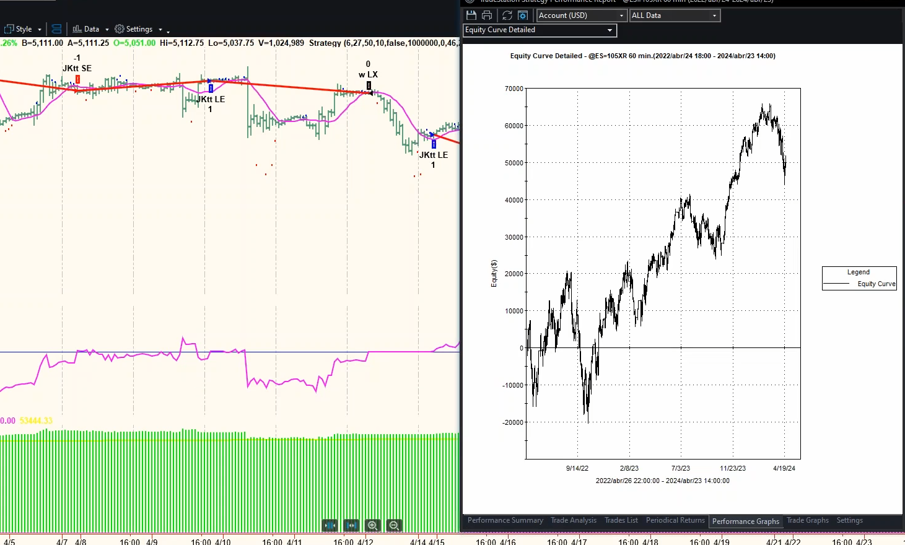
  <figcaption>Figura 122</figcaption>
</figure>

Esto hay que  cargar más, esto que cargar más, esto que cargar más. Hay que meterle al menos cinco años, y le voy a meter 10. A ver, le voy a meter 10, me va a tardar un poco claro, un poco, pero me voy a esperar.

<figure>
  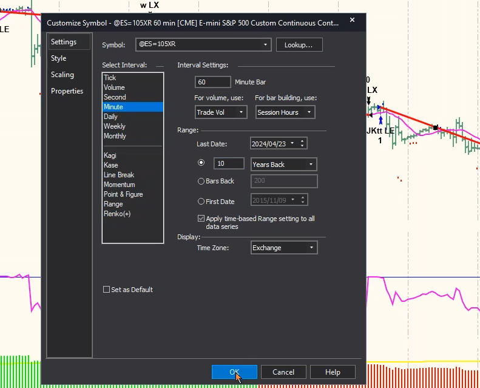
  <figcaption>Figura 123</figcaption>
</figure>

Y ha puesto, se voy a pedir al *max bar* el, bueno, no lo ajustaré mucho y así no me hace falta.

Y esto, pensar que en mi opinión 2 es muy justo, pero bueno, lo definió así, lo hemos respetado. En mi opinión, cierre al *momentum* de 2 pide como muy poca caída, pero es verdad que la línea del tampoco están tan estricta. Pero sí que me parece un poquito rápido, no, me parece un poquito rápido. Se incorpora, veis, aquí muy rápidamente quiere comprar.

<figure>
  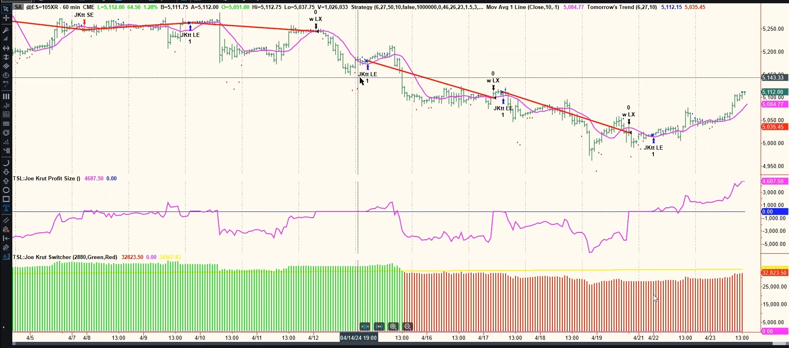
  <figcaption>Figura 124</figcaption>
</figure>


Esto ya está cargado, tenemos más histórico. Tenemos mil operaciones. Entiendo que debemos tener comisiones... si... $7, Ya teníamos el *LIFO* activado y todo, ya teníamos activado. 

<figure>
  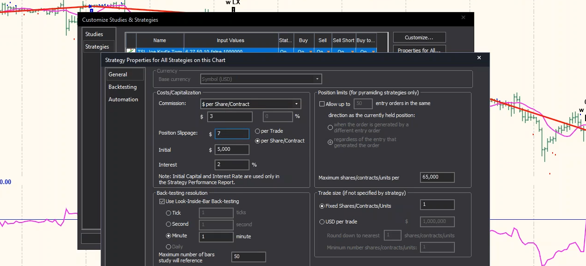
  <figcaption>Figura 126</figcaption>
</figure>


Pues vamos a meterle simplemente el esto para respetar su idea de momento. Simplemente él tiene un esto monetario, no me gusta, no nos gusta. Por lo tanto, vamos a respetando su criterio y hacemos un esto *bater*, que es adaptarlo. Ya no me acuerdo con lo dicho que era, que lo que era el 5. El 3, perdón, era el 3.

<figure>
  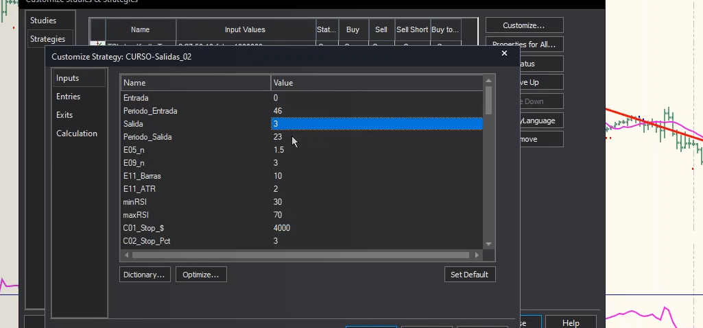
  <figcaption>Figura 128</figcaption>
</figure>
<figure>
  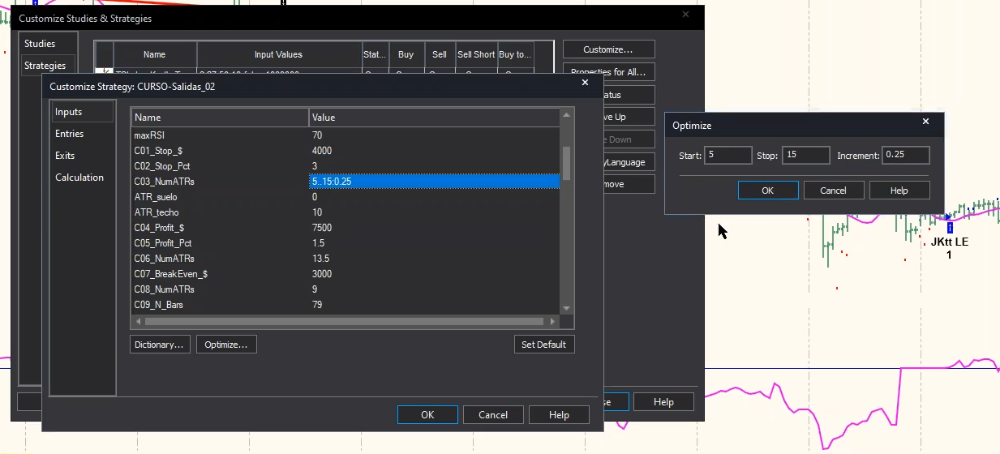
  <figcaption>Figura 127</figcaption>
</figure>

Y *c* 3, solo tengo el número de *ATRs* en intradía, pues no tengo ahora mismo ni la más absoluta idea. Así que vamos a ir de 5, creo que 15 *ATRs* son muchos, ¿no? vamos a poner 0.25.

Como no tenemos muchas variables, esto lo creo que tarde demasiado, aun siendo en intradía, aun siendo en intradía. Creo que va a tardar un poco. Y de mientras lo carga ...

**Qué es el Chandelier**

... voy a buscar aquí un momentito

<div style="border-left: 4px solid #9b59b6; background: #f5eef8; padding: 10px 15px; margin: 10px 0;">
  <strong>📝 Sobre el Chandelier Exit</strong><br>
  Un <em>chandelier</em> es un <em>trailing stop</em> clásico. Es una banda superior a la que le restas el <em>ATR</em> por un multiplicador. Se llaman candelabros. Lo que va desde el máximo, le resta una cantidad. Se va poniendo: es del máximo, el resto una cantidad. Es un <em>trailing</em> típico, lo único que no depende de cuándo entras, y eso a veces da problemas: se sale no más entrar, cosas así.
</div>

Las maneras, aprovecho, mira, para enseñarle antes de que lo pasaremos, este código. Pasa que no lo había hecho porque quería incorporar las entradas en el mismo. Entonces ya cambiamos el nombre, poner "entradas más salidas". Quería ponerlos todos y me parece que tenía alguna más y todo, pero lo miraré mañana con calma. Si hay alguna más los pasaré con todas y así tenéis un código para trabajar vosotros, ¿no?

Pero el *chandelier*, yo diría que era el 20 algo. Lo pasado 20. Bueno, aquí está el *chandelier* más temporal, solo aquí *profit* solo, no lo veo. Sí, pero era con algo, ya era esto más *profit*, esto para que ésta. *Chandelier* más *profit*, no es raro. No, no lo he visto solo. Sí, yo también me suena solo.

12, al final es una banda superior. Hay al que le restas la *ATR* por un multiplicador, ¿entiendes? Pero se llaman candelabros, lo que va desde el máximo le resta una cantidad. Se va poniendo, es del máximo el resto una cantidad. Pero es un *trailing* típico. Lo único que no depende del cuándo entras, y eso a veces da problemas: se sale no más entrar, cosas así.

Pero simplemente es un *trailing* típico. Es el máximo le resta es una cantidad de *ATRs*. Eso es un *chandelier* clásico.

Y es un sistema realmente sencillo. Ya digo, es explorar con este concepto porque es un concepto realmente sencillo y potente, ¿de acuerdo? Y no tiene, no tiene ninguna dificultad.

Y, o corrección contra la tendencia principal va muy bien en renta variable. Y a menos generales, y muchas estrategias utilizan ese concepto de distintas maneras. No hace falta, ya digo, es que ni complicarse mucho la vida. Una salida temporal también muy habitual, y os lo comenté que mejora mucho los sistemas. Y un *stop* en este caso tipo *ATR*, que igual iría mejor *trailing*, pero es igual.

Hemos puesto su patrón porque lo había puesto habiendo salida por tiempo. Ya pierde sentido tanto el *trailing*, ¿de acuerdo? Porque al final *trailing* es si tú no usas nada más para acompañarlo. No, pero yo ya tengo una manera de salir por tiempo. Ya está, paso x barras. Si no, si en esas x barras antes pues caes mucho, pues me salgo, ¿de acuerdo? Pero mientras no te vayas a la contra, yo te espero que salgas. Pues ahí, ahí está.

**Resultados de la optimización**

<figure>
  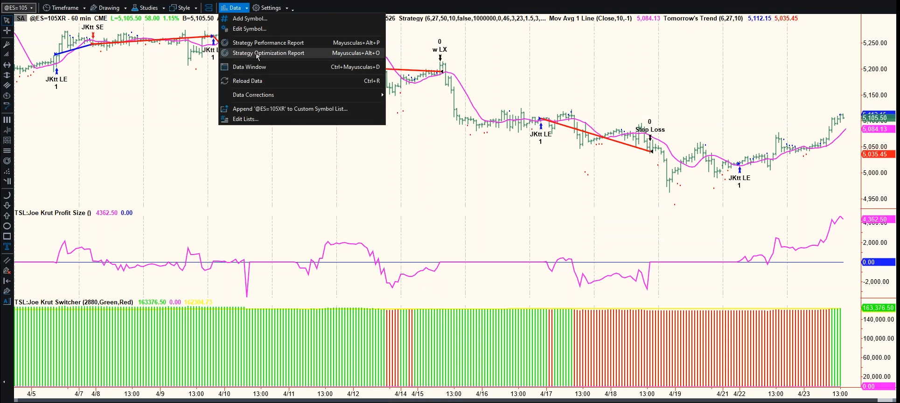
  <figcaption>Figura 129</figcaption>
</figure>

**Robustez en out-of-sample**

Acuerdo, qué tenemos ahora la optimización con un multiplicador de *ATR*, con lo cual nos hemos adaptado un poquito mejor a las distintas épocas del mercado.

Y ahora veréis, fíjate ya el que te está saliendo mejor en *insample*, el que te salía mejor en *in sample* por *PPC* Es el mismo que Por *TSI*, sí es el mejor, ¿vale? 

<figure>
  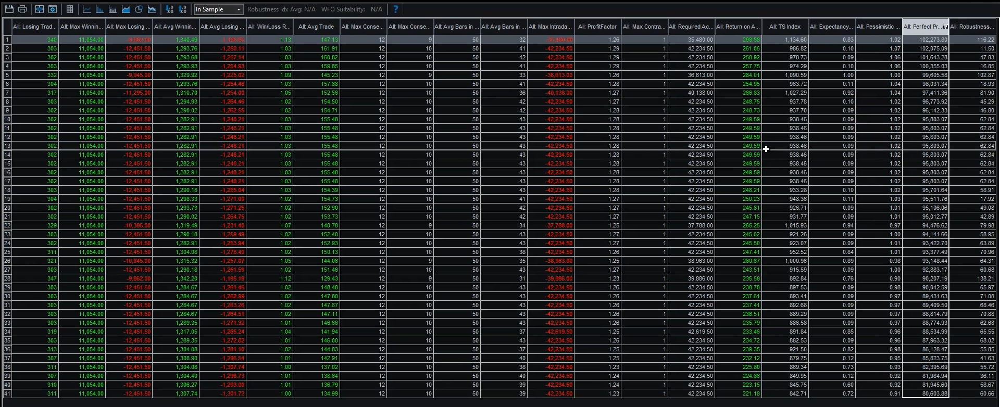
  <figcaption>Figura 130</figcaption>
</figure>

Y en *out-of-sample*, fijaros que era el segundo mejor, ¿de acuerdo? Es decir, está totalmente perfectamente robusto.

<figure>
  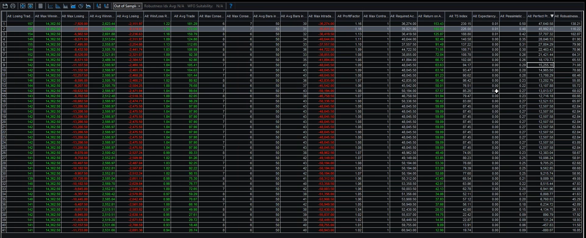
  <figcaption>Figura 131</figcaption>
</figure>

A principio eliminar a que nos quedamos ya incluso con ese, ningún tipo de problema. 

<figure>
  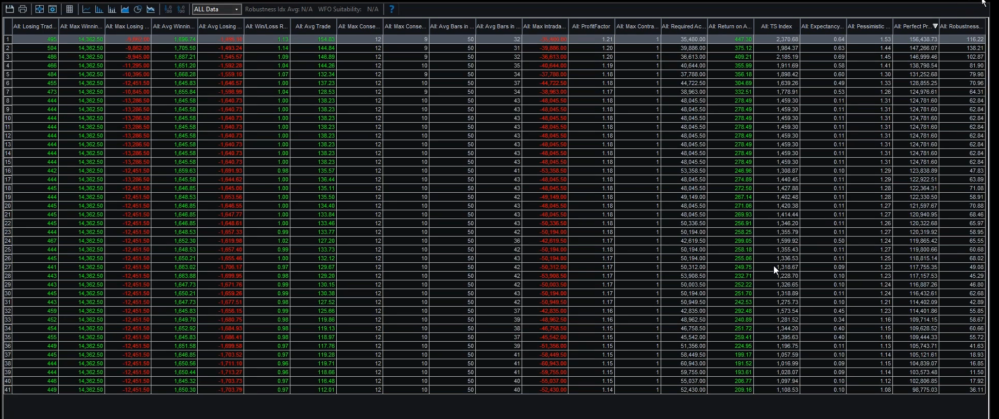
  <figcaption>Figura 132</figcaption>
</figure>

Y nos está dando, esta es la idea original. Hemos hecho nada solamente. Quería mostraros la, sistema más que apto y así como está por defecto, ¿de acuerdo?

<figure>
  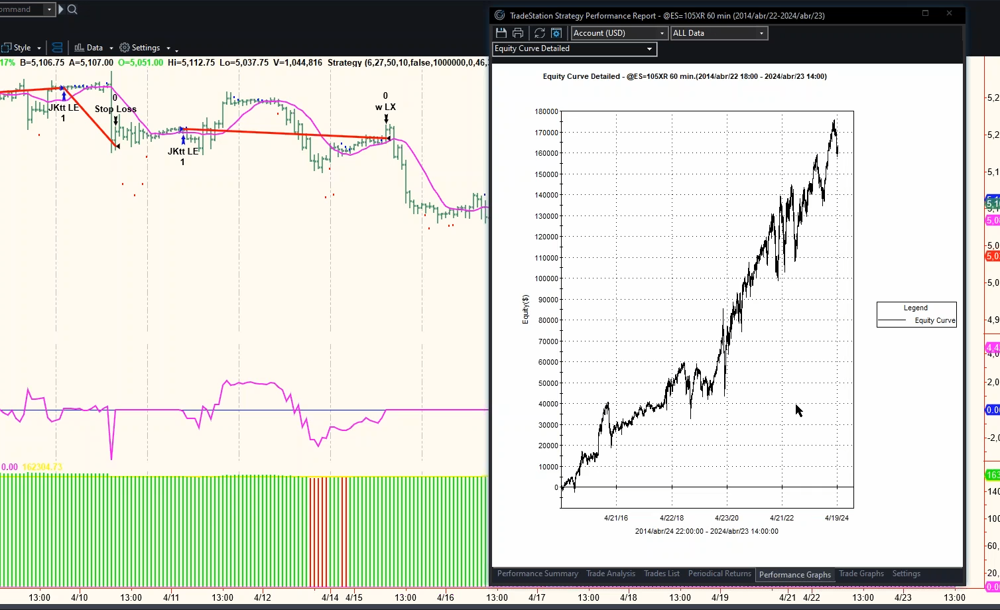
  <figcaption>Figura 133</figcaption>
</figure>
<figure>
  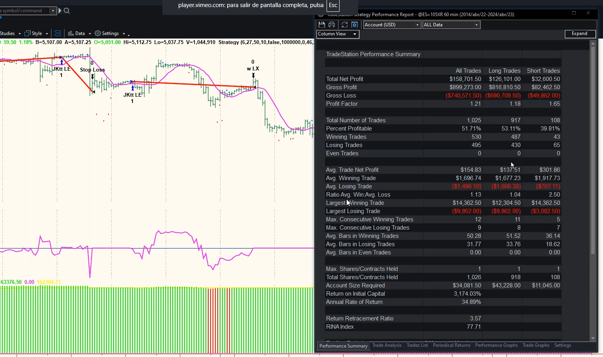
  <figcaption>Figura 134</figcaption>
</figure>

Mil operaciones, 1,21 *profit factor*. También se puede mejorar, puede mejorar. Porque podéis perfectamente explorar a nivel de *trades*, filtrar un poco. Podéis incluso explorar variar a lo mejor el cierre, variar, buscar otra salida más óptima. 

<figure>
  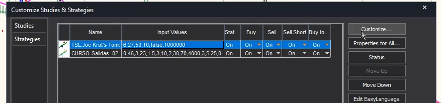
  <figcaption>Figura 135</figcaption>
</figure>

Sin duda, sin duda cabe anular todas las suyas, decir, quitar el tiempo, quitar, y automáticamente ir a bruto a buscarlas nosotros.

Eso por un lado. Y por otro, quizá no me preocuparía mucho de filtrar, pero sí que a lo mejor trataría de darle alguna, probaría quizá a este 2 `Close <= Close[2]`. Bueno, las variables que él tiene, trabajarlas un poco, ¿de acuerdo? Pero cuidado.

* [Strategy : TOMORROW](../code/CURSO%20-%20TOMORROW.ELD)

```sh
# TradeStation Labs
# Strategy courtesy of Joe Krutsinger
# April, 2016
# TSLabs@TradeStation.com

# { A pattern of a Short Term Reversal against the minor trend
# with a breakout in the direction of the major trend,
# all coupled with a walk away.}
 
Input: BuyBO(6), SellBO(27), Walk(50), Trend(10), PositionBasis(false), Amount(1330);
 
If Close <= Close[2] and Close > Average(Close, Trend)[1] then
	Buy ("JKtt LE") next bar at Open of next bar + (Range * 0.10 * BuyBO) Stop;

If MarketPosition = 1 and BarsSinceEntry >= Walk then
	Sell ("w LX") next bar at Market;

If Close > Close[2] and Close < Average(Close, Trend)[1] then
	Sell Short ("JKtt SE") next bar at Open of next bar - (Range * 0.10 * SellBO) Stop;

If MarketPosition = -1 and BarsSinceEntry >= Walk then
	Buy to Cover ("w SX") next bar at Market;

If PositionBasis then
	SetStopPosition
else
	SetStopShare;

SetStopLoss(Amount);

# Copyright (c) 2016 TradeStation Technologies, Inc. All rights reserved.
```

Y seguramente meter más histórico si vamos a tocar y vamos a tocar. Vamos a ver si metemos 5.000 *trades*, si podemos. Entonces empezamos a trabajar y vamos viendo distintas combinaciones que sean, vamos viendo los dos mapas con *MultiCharts*, lo que vimos el otro día con las medias variable por variable, ¿vale? Vemos que sean estables, ¿de acuerdo?

Y prácticamente seguro que sacamos un sistema `TOP` para operar en el *SP*, y probablemente muchas acciones, muy sencillo. Y es lo que hablamos muchas veces, no pensaros que necesariamente hace falta sistemas muy complicados. Temas muy sencillos que explotan pautas muy, muy universales.

Y fijaros que en 60 minutos, lo cual tiene un gran, gran mérito. Tiene un excelentísimo dato de cortos, ¿de acuerdo? 

<figure>
  
  <figcaption>Figura 134</figcaption>
</figure>

Hace muchos menos *trades* porque lógicamente, acordaros, tiene un filtro. Aunque digo que no filtrar más porque ya está filtrado, porque el parer corto que le pide que el cierre sea menor a una media, tiene que estar bajista. Entonces entra en la corrección.

Pero aquí entra, aquí sí que es simétrico, si os fijáis, simétrico. 

```sh
If Close <= Close[2] and Close > Average(Close, Trend)[1] then
	Buy ("JKtt LE") next bar at Open of next bar + (Range * 0.10 * BuyBO) Stop;

If MarketPosition = 1 and BarsSinceEntry >= Walk then
	Sell ("w LX") next bar at Market;

If Close > Close[2] and Close < Average(Close, Trend)[1] then
	Sell Short ("JKtt SE") next bar at Open of next bar - (Range * 0.10 * SellBO) Stop;
```

Lo cual tiene bastante mérito y no es tan habitual. Pero es verdad que lo ha hecho simétrico y funciona bien. Perfecto. O sea, como yo os decía, normalmente no se trabaja simétrico en *equity*, pero si funciona, ningún problema. Mejor aún de hecho. No lo hace así, que el código es simétrico, y eso está bien que sea así.

**La clave de la asimetría en equity**

Pero tiene un multiplicador que lo cambia todo. Por decir, al final aquí fijaros que es la clave, la clave. Esta es la clave de la simetría de bolsa y el por qué muchos filtros de bolsa no van en, por ejemplo, vimos en el oro es distinto, ¿vale?

Porque la pauta de volatilidad de *equities* y de bonos también es claramente distinta el subir que al bajar, ¿vale? Esto hace que cuando implicamos rangos de precios necesitemos pedirle más al corto.

Pero es verdad que trabaja el *stop* igual, trabaja el *TP* igual, y eso tiene bastante mérito. Pero tiene, aquí os habéis fijado, un multiplicador del rango `* BuyBO` (en  `(Range * 0.10 * BuyBO)`)

El esto es igual todo, la regla es simétrica, le pide dos barras. Pero al filtro de volatilidad que le pide para ir, para entrar al *stop* que pone el largo, lo multiplica solo por 6 `Input: BuyBO(6)`. Y el corto por 27  `Input: BuyBO(6), SellBO(27)`. ¿Lo ves ahí, no? 

* `(Range * 0.10 * BuyBO)`
* `(Range * 0.10 * SellBO)`

Al corto le pide mucha más explosión para abrir corto, y ahí también que habrá menos cortos.

Entonces, yo que sí que parece que no, pero que sí que están distintas las reglas. Y por eso el porcentaje de aciertos largos es 53 y de cortos 39. Pero consigue uno de esa manera los resultados fantásticos. Los resultados fantásticos, un por ciento de unos 65 en total. Mil operaciones está bastante bien.

Va a mostrar, más que aceptable para un sistema que opera en ambos lados del *SP* en 60 minutos y además en horario continuo. 

<figure>
  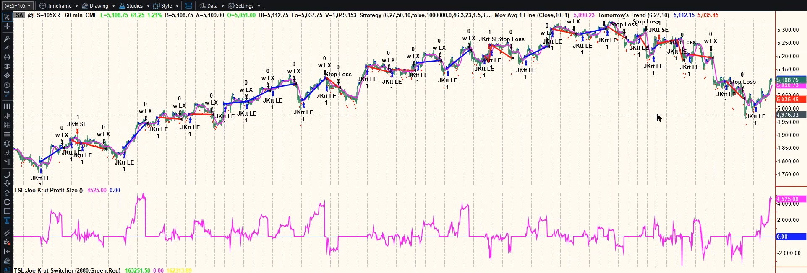
  <figcaption>Figura 136</figcaption>
</figure>

Ahora en esta caída pues no acaba de desarrollarse del todo bien, porque bueno pues lo que sigo, ha entrado rápidamente por la media y la caída seguido.

<figure>
  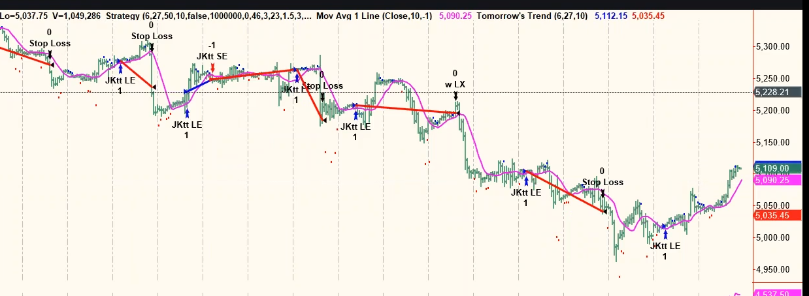
  <figcaption>Figura 137</figcaption>
</figure>

Pero ahora en cambio, los fijaros, ahí lo tenemos subido. Ahí lo tenemos subido. 

<figure>
  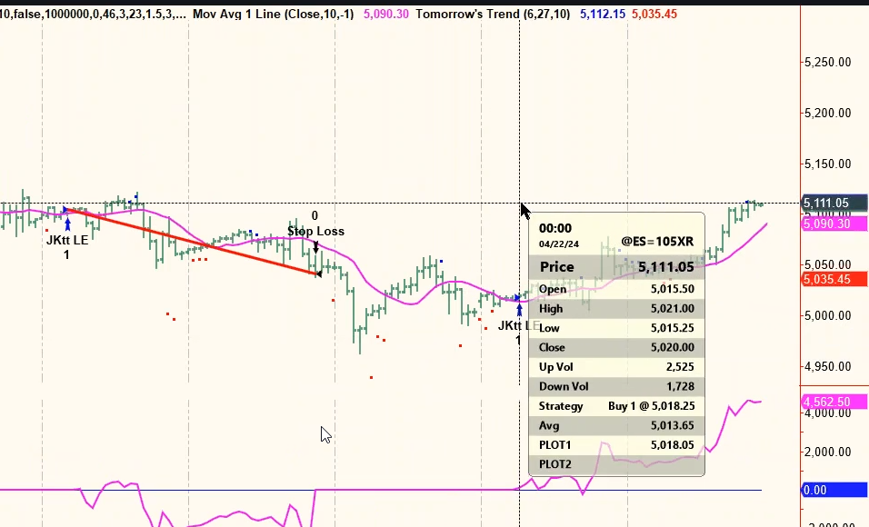
  <figcaption>Figura 138</figcaption>
</figure>

Ya ha entrado, al *momentum* que ha superado la media, ya se ha subido. Y ahí estamos, estamos esperando. 

Esos son los niveles de entrada, si están bien puestos, 627 y 10.

<figure>
  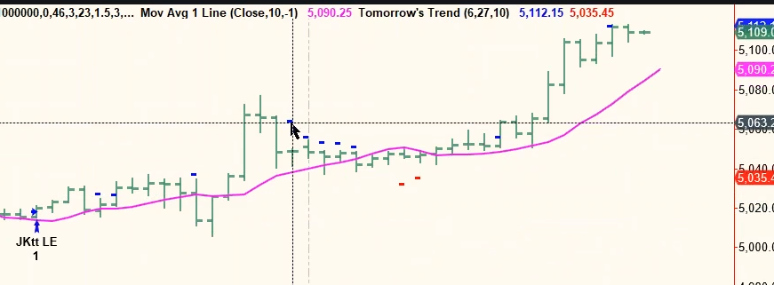
  <figcaption>Figura 139</figcaption>
</figure>
<figure>
  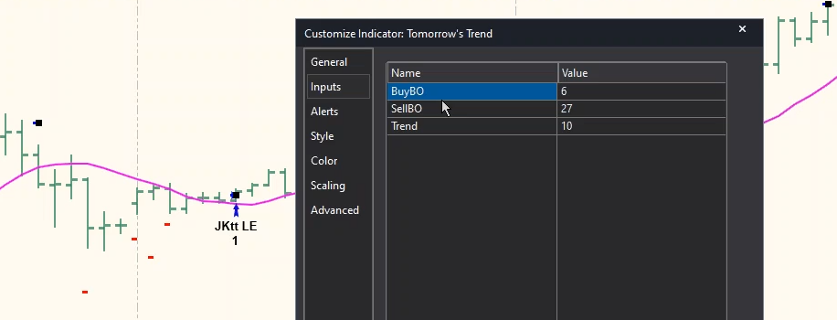
  <figcaption>Figura 140</figcaption>
</figure>


## Pregunta sobre trailing y cierre temporal


Fran: teniendo un *trailing*, ¿puede tener sentido mantener el cierre temporal solo si el *profit* es negativo y no ha llegado a *stop*?

A ver, déjame que lo procese. En el sentido temporal, yo tengo cierre temporal. Es el caso, es ejemplo. Pero me dice si tiene sentido el *trailing* solo si el *profit* es negativo. Entendido. Y no ha llegado a SL... 

Bueno, veo muchas variables ahí.

Porque, ¿quiere decir que, bueno, no ha llegado SL? Que es decir, no ha llegado a *trailing*. Si tienes *trailing*, un *trailing* ya es SL, ¿vale? 

También con las salidas, intentemos no duplicar, ¿tendéis? No duplicar reglas.

Pero si tú tienes temporal, al final, acordaros que las salidas y demás, siempre es normalmente SL resta *performance*. Hay que tenerlo, pero resta *performance*. Entonces en la salida temporal es una manera de evitar SL.

Aquí tienes un ejemplo de salida 

<figure>
  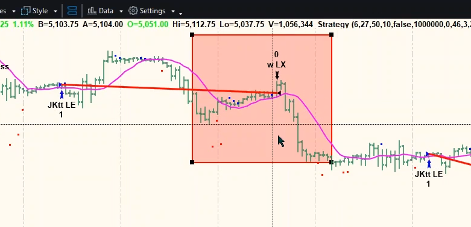
  <figcaption>Figura 141</figcaption>
</figure>

Casualmente se debajo se podría haber ido arriba, pero esto pasa bastantes veces, pasa bastantes veces. Yo les dices, bueno, yo al final si pasa x tiempo yo me salgo. Porque ya está, yo quiero seguir una dinámica de mercado.

Creo que la 50, 50, 50, 50 velas que son dos días aproximadamente, dos días. Porque he estudiado, él habrá estudiado que es la dinámica del *SP*, lo que sea. Y ya está, y a partir de ahí si no hay o hay una, o una salida contraria lógicamente, puede salir también por reversión, porque abre un corto, ¿de acuerdo? Entonces estás largo y habrá un corto. Pero en términos generales, el sistema al final, o bien sale su salida es, acordaros, por el *Walk*. 

```sh
If MarketPosition = 1 and BarsSinceEntry >= Walk then
	Sell ("w LX") next bar at Market;
```

Esa es su salida primaria, podemos decir. Y luego pues lógicamente, si hay un *sell short*, ¿de acuerdo? Si hay una entrada no, otra entrada en la corto.

Pero si no, sale por tiempo o por *stop*, ¿vale? No tiene *TP*. Sí tenía sentido tener *TP*, sí tenía sentido tener *TP*.

**Trailing vs salida temporal**

Pero al final el *trailing* un poco, no deja de ser un SL que te va acompañando. Si tú ya tienes una salida por tiempo, en mi opinión tiene menos sentido. ¿Por qué? Porque, ¿para qué te pegas? Al final el *stop*, ya acuérdate que resta, ¿vale? Que normalmente resta *profit factor*.

Entonces tú tienes un *stop* que está ajustado por volatilidad o porcentual de seguridad, ¿vale? Para cuando hay, como aquí no, a caída brusca, oye, me salgo, no quiero problemas, ¿de acuerdo? No me quiero quedar enganchado. Aquí por ejemplo también.

Pero si no salta eso, yo sigo el plan del sistema. Si yo tengo un *trailing*, al final me voy a ir pegando más a él.

Entonces, si tienes *trailing*, yo no tendría temporal seguramente. Pero lógicamente todavía hay que investigarlo, dependerá de los activos. Pero seguramente con  traling no tendría tiempo, y no tendría sl, ya tendría *trailing*.

El *trailing* es normalmente, va bastante solo, bastante solo. Es un tipo de salida que va bastante solo. Poco como el *parabólico*. Son salidas que se pegan bastante al precio, como norma. Como un *chandelier*, *chandelier* va muy bien solo. El *chandelier* va muy bien solo. Aquí mismo, por ejemplo, si yo ahora te meto un *chandelier* `case 12`, 

<figure>
  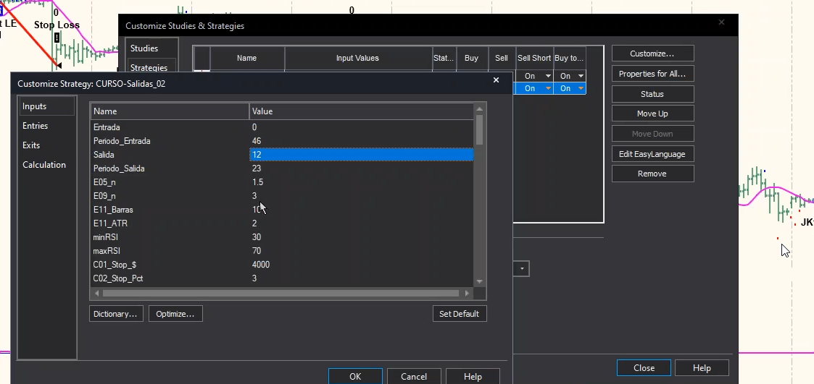
  <figcaption>Figura 142</figcaption>
</figure>

Entonces un *chandelier*, que no deja de ser un *trailing*... Antes teníamos que la *ATR*, aquí cuando nos ha salido el 3, nos ha salido 5 *ATRs*. Aquí como se pega en el precio, lo normal es que sea un poco mayor. Vamos a probar, ¿vale? Pero no optimizar mucho.

<figure>
  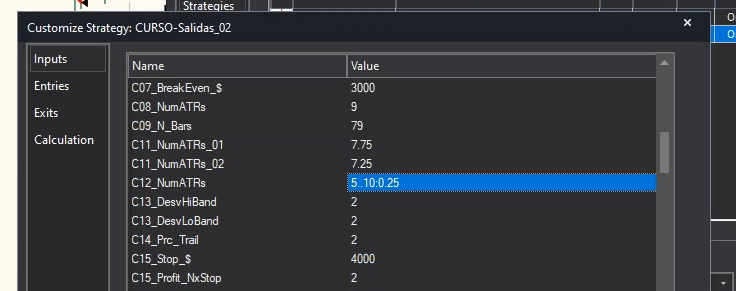
  <figcaption>Figura 143</figcaption>
</figure>

Que aquí mantengo salida temporal, no, no lo he tocado, no lo he tocado. Bueno que todo, todo, todo es, todo es explorarlo y investigarlo. Ahora mismo te lo estoy pensando ante tu pregunta. Mejor lo pongo en el gráfico, me lo miro y pues, pues, pues, quizás si tienes...

Entonces al final hay que mirarlo, hay que mirarlo todo. Y lógicamente pues me preguntas y te contesto lo que me parece, pero hay que mirarlo.

Al final, la respuesta que debería de darte más correcta sería: hay que mirarlo, ¿de acuerdo? Todo hay que, así que es verdad que al final pues ya por experiencia pues tienes unas ideas, ¿no? Pero que hay veces que nos pasa: tenemos unas ideas y luego pues los datos no la confirman.

Entonces bueno, le dedicas más tiempo porque cuando eso pasa, no solo quedarnos con los datos, acordaros la frase. No todos están los datos para, pues si yo no sale lo que espero, tengo que entenderlo.

**La importancia de entender el gráfico**

¿Cómo entenderlo? Hay que mirarlo. ¿Porque a ver si no es culpa del *LIFO*? A ver si no sé qué, a ver si no sé cuántos. Miro el gráfico y pues sí, pues es verdad, no va mal, ¿vale?

Porque mira, fíjate, a veces vuelve tal. Hay que entenderlo, hay que entenderlo, ¿vale? Si no, no nos vale lo que salga. Mira, pues va mejor el *bowling* era con doble tirabuzón inverso que hay que entenderlo. Para eso es básico, insisto, en ver el gráfico.

Por eso vamos, yo por ejemplo pintar, yo siempre las salidas. Yo sé, puesto el *show me*, pero también hay esta línea, ¿habéis visto esta linda que hay? Que esto venía con el código que tenéis, esto lo tenéis, esto lo tenéis ya en *Tomorrow*, lo tenéis.

¿Os acordáis? En todos estos lo he pasado ya. Cuidado, aquel que no lo haya visto, todo esto es material megatop, ¿vale? Está aquí dentro. Está de ese concepto, está aquí.

* [STRATEG CONCEPTS](../../../../02_practice/02_workshops/23-practice-13/docs/STRATEGY%20CONCEPTS/STRATEGY%20CONCEPTS/2016-04/SCC%20Issue%2016%20Apr%202016.pdf)

**Material de la revista**

La última revista, ¿vale? Aquel que no lo que no lo recuerde, estaba, a ver, los estoy buscando que veáis la revista, esto está explicado y que veáis que esto lo tenéis ahí, se lo tenéis ahí todo.

Y vaya, ya os lo comenté. Yo os lo haría, trabajaría todas las revistas. Muy mucho nivel y mucha calidad. Esta es la revista, la última. Creo que salían varios. Bueno, el cruce que no llegaron ni a explicar. Lo que me sorprendió, porque normalmente los explican, ¿se lo explicó? No, no explicaron, no explicaron.

Es verdad que es raro porque casi todos, también había uno de Williams. Revistas anteriores lo explicaron. Aquí lo comentan, lo comentan. Aquí en algún sitio, creo. No, no comentan de bonus. Sí, sí, sí, aquí. No veo, no, aquí.

Pero no sé por qué no explicación, porque las otras había habido explicación. Pero en esta no hubo explicación del *Tomorrow*. Simplemente estaba ahí el material que lo tenéis, repito, y punto. Está ahí, lo sacaron en un par de revistas porque normalmente cuando hay algún bonus de estos normalmente lo repiten en un par de revistas. No, en esta solo lo sacaron en la última. Y ahí lo tenéis todo. Baja este código, está todo.

**Resultados con Chandelier**

Parece que ya ha acabado aquí. Tenemos ahora nuestro informe con *chandelier*, que también parece que coloca, que coloca bien. No me acuerdo qué daba el otro. ¿Se acuerda?

<figure>
  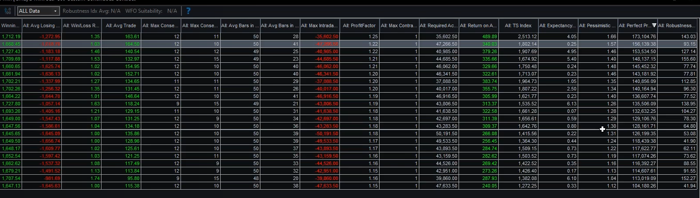
  <figcaption>Figura 144</figcaption>
</figure>
<figure>
  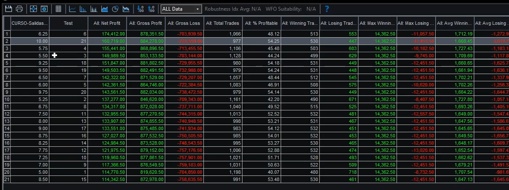
  <figcaption>Figura 145</figcaption>
</figure>

`click al 10`

Aquí sí que parece que este ha ido mejor *out-of-sample*. El último pedido con 625 para probar, vamos a probar este. Más opera, más es bastante más rápido, ¿vale?

Y bueno, él lo tiene aquí, había uno que salía antes, veces mucho más rápido, que lo saca antes, ¿no? Saca antes, vez, ¿no saca antes? Bueno, hay que probarlo.

<figure>
  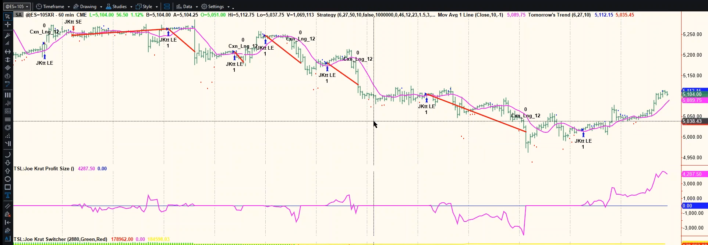
  <figcaption>Figura 146</figcaption>
</figure>

Entonces, claro, este te saca antes muchas veces, cuando te vaya en contra te va a salir por el *chandelier*. Cuando no, pues se saldrá por él por el *TP*, por el temporal. Es bastante parecido a los resultados anteriores. Parecido como os digo, son temas hay que explorarlo, ver mapas.

<figure>
  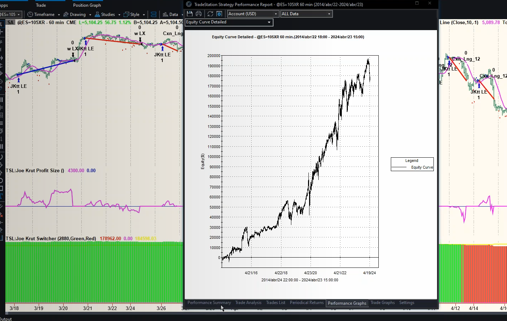
  <figcaption>Figura 147</figcaption>
</figure>
<figure>
  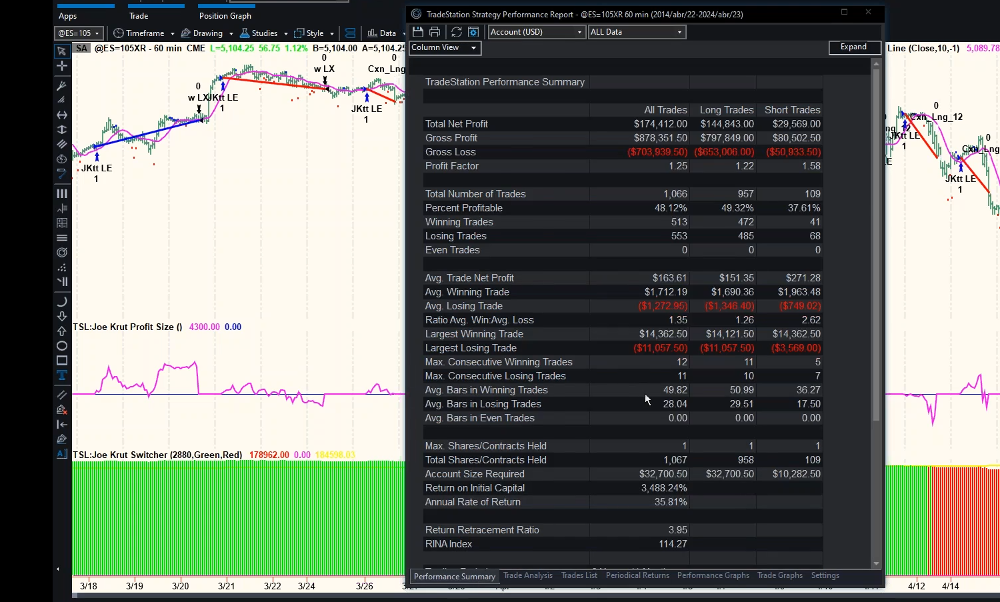
  <figcaption>Figura 148</figcaption>
</figure>

**Sobre la gestión del stop con diferentes tipos**

Es una idea muy sencilla y muy aprovechable. Todos los tipos de cada esto, ¿cómo tienes el esto? No suma, ¿no? Pero bueno, cuando tienes un *COVID* por ejemplo, pues bueno, lo que os digo, tienes un *COVID*, pues no viene mal esto.

<figure>
  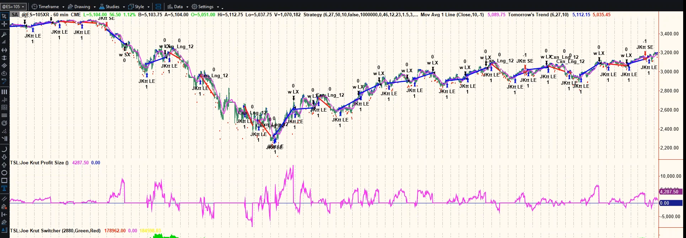
  <figcaption>Figura 149</figcaption>
</figure>

Aun así veréis que en un intradía seguro, es aquí no, seguro que se tragó varios. Pudo aprovechar algún tramo de caída muy bien, ¿vale? Incluso aquí en el rebote, fijaros, es esto.

El *COVID*, pero fijaros ahí como se tragó algo más de una. Aquí es, aquí entra, y acaba claro, el *chandelier* al final ajusta la volatilidad. 

<figure>
  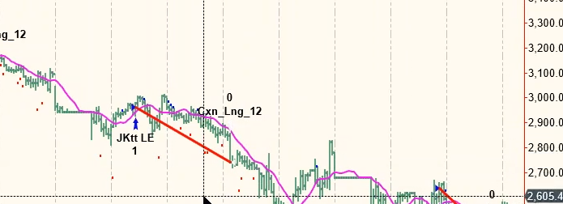
  <figcaption>Figura 150</figcaption>
</figure>

Por eso al final aquí tiene que dar más rango. Pero al final acaba saliendo, y bueno, y no consiguió encontrar el suficiente también para volver a entrar corto, que sé que había entrado en algún momento.

Pero aquí ya no, no le dio para entrar corto. Y aquí, mira, entró largo, saltó porque eso es el problema del *chandelier* muchas veces, que salta directamente. Pero también aprovechó bastante bien.

**Indicador de equity curve**

Pero es aquí que, qué hostia, este indicador, también lo puso Cruz Singer, que repito lo tenéis todo ahí. Es un indicador que calcula la *equity curve*. Eso se puede hacer con *EasyLanguage*, una cosa avanzada. Bueno, usar un indicador, se llama *`I_open equity`*, es muy fácil para pintar la *equity* del sistema donde esté este gráfico. Pero bueno, lo tenéis.

Repito que lo, todo este lo tenéis.

es probar simplemente este *setup* de entrada muy sencillo pues para una salida.

**Versatilidad del sistema**

Pero ya digo, va con cualquiera. Va con cualquier *stop* porcentual, temporal. Va a ir, que te gusta más uno, te gusta más otro. Ya digo, hay que darle oxígeno porque es así.

Pero con el tiempo tiene menos. De hecho tú a esto le quitas el *stop* y creo que probablemente funcionará. Probablemente funcionará.

Es decir, le pongo, mira, que tengo la 12, pues le pongo, le pongo la 12, y le pongo yo que sé, cien *ATRs*, no va a saltar nunca. Yendo sin esto, y sin el suyo, eso lo sale por tiempo, ¿no? Se le pille en contra, pues me pillan contra.

<figure>
  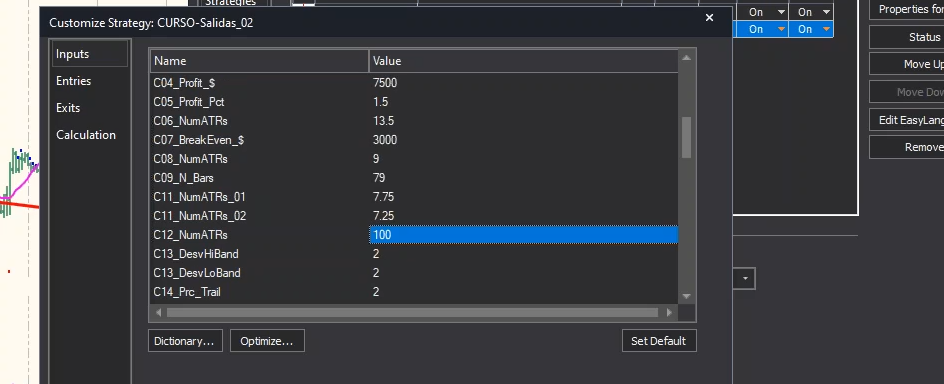
  <figcaption>Figura 151</figcaption>
</figure>
<figure>
  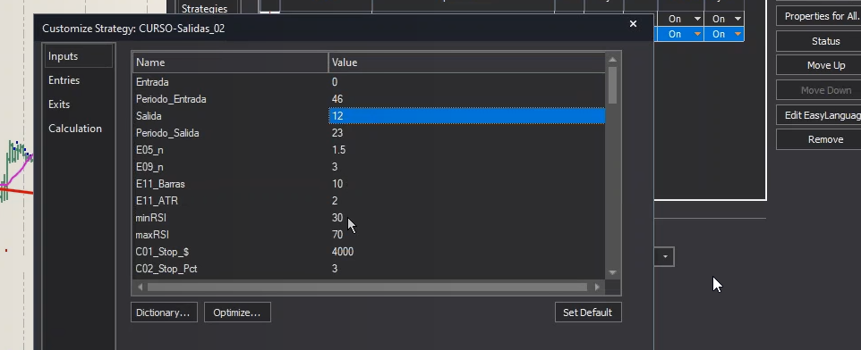
  <figcaption>Figura 152</figcaption>
</figure>

Ya lo tenéis en el corto. 162, es más volátil, prácticamente más abrupto. Tiene momentos más complicados. Seguramente por retorno riesgo, no, pues va a estar mejor.

<figure>
  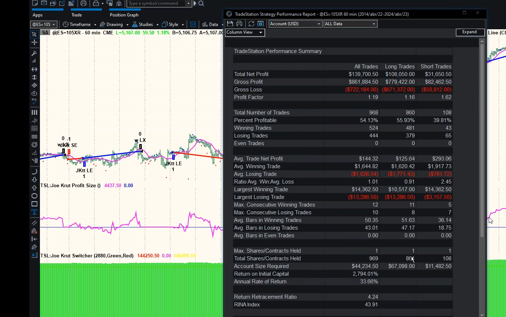
  <figcaption>Figura 153</figcaption>
</figure>
<figure>
  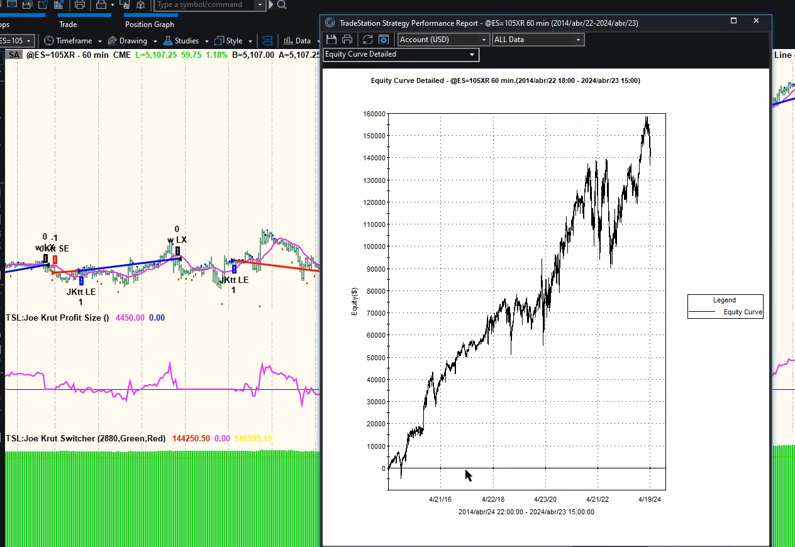
  <figcaption>Figura 154</figcaption>
</figure>
<figure>
  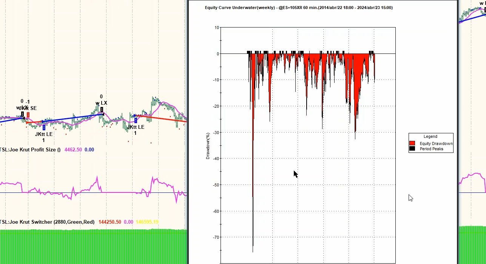
  <figcaption>Figura 155</figcaption>
</figure>

**Trailing stop: reflexiones finales**

Y todo, pero bueno, eso es lo que os digo. Al final se ha hecho que un peor trae peor, etcétera. Al final con sustos muy bestias controlados, más importantes. No está dimensionado, pero al final el sistema, ya digo, el *stop* en sí no suele aportar rentabilidad porque al final muchas veces sale para volver a entrar más caro. O sea, peor. Es así.

Ahora claro, aquí pasó en el *covid*, seguramente tiene alguna enganchada. Por ejemplo el *covid*, como puede decir otra, es una enganchada aquí pues bastante. Es el tema, pero ya siempre.

Entonces cuando hablamos del *trailing* es eso. El *trailing* es un concepto que intelectualmente es muy atractivo pero muchas veces no funciona bien. Es así. Entonces hay que, sobre todo si lo queremos pegar al precio porque es muy atractivo, pero hace que te saque muchas veces en falso. Es así el problema.

El *parabólico* también es conceptualmente muy atractivo y puede haber el sistema que le vaya bien, pero te saca muy rápido. Eso tiene cosas buenas, cuidado, pero tiene cosas malas para sistemas que a lo mejor tienen tasa de acierto elevado. Pues bueno, puede a lo mejor venirte bien, depende. Pero como términos generales, al final no poner stop acostumbra a dar mas rendimiento, mejores *ratios*. Así que insisto, ya hemos hablado mucho de ello. No quiere decir que recomienden stop, puede tener sentido, que lo veremos en el *portfolio*, en alguna estrategia cuando haya muchos sistemas, vale.

Qué más. 

***Podemos considerar el *trailing* para ejecutar sólo con *profit* positivo***. 

Sí, o sea, el hecho de ejecutar un *stop* sólo en determinadas condiciones, esto sólo si está en pérdidas o en ganancias. Esto es algo a explorar, , es por eso los sí está siempre, pero repito, hay que explorarlo. No tengo mucho más que añadir a lo que hemos comentado.

** `Darwinex cero`  plataforma recomendada**

Iniciarnos con `Darwinex cero` podría ser una buena opción. Creo que la buena se dice en mil. Claro, claro que sí, es una excelente opción. Y así si alguien lo quiere hacer, por cierto, tenemos enlace, enlace de descuento que no lo sabemos publicar, pero si alguien lo tiene, porque me parece que nos dan algo, no sé qué, y a vosotros también os dan algo, no sé qué, es un descuento. No sé los detalles porque no me encargo yo de eso, carga tú, Pili.

Pero sí que te dan un descuento si alguien le interesa que nos lo pida, que le damos enlace, y que lo habrá si de algo. Es ser una excelente opción. Al final tienes ahí, puedes hacer *track trading* gratuito, bueno, gratuito pagando una cuota, pero joder, te puedes hacer un *paper trading* sin arriesgar tu dinero más que lo que pagas 


