# Práctica 15 - Money Management y Position Sizing

## Índice

- [Consultas](#consultas)
- [Entradas](#entradas)
- [Salidas](#salidas)
- [Money management: introducción](#money-management-introducción)
- [Exportación a MSA](#exportación-a-msa)

## Consultas

***estructura de código para stops***

***Buenas! Alguno sabría explicarme para que sirve este fragmento de código? No termino de entender***

<figure>
  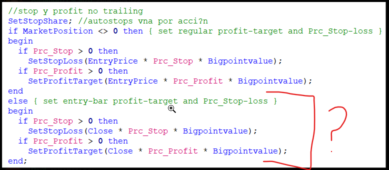
  <figcaption>Figura 000</figcaption>
</figure>

Es el fragmento que se ejecuta cuando MarketPosition NO es distinto de 0 (else)  lo que equivale a que MarketPosition = 0 Como dice Raul, es para que en la barra de entrada haya stop y profit.
Es cierto que si usas SetStopLoss u otras órdenes predefinidas ya van implícitamente en la barra de entrada y por tanto no sería necesaria, pero preferimos ponerlo así en el bloque para que vierais como se hace si usas órdenes "normales" Sell o Buy to cover, etc.
Mañana profundizo en ellos.

Vale, pero *EasyLanguage* tiene lo que llamamos los *stops* predefinidos. Vale, los *stops*, perdón, *stops* y *take profits* y varias cosas. Pero eso que habéis visto, *SetStopLoss* por ejemplo, *SetProfitTarget*, *SetTrailing*, hay varios, vale. La ayuda los podéis ver, enseños de estos, los... esto es lo que llamamos, le llama los *built-in stop reserved word*. Vale, hay varias palabras que veis va aquí, las veis aquí abajo. Vale, *SetProfitTarget*, hay varias palabras de este de este tipo.

<figure>
  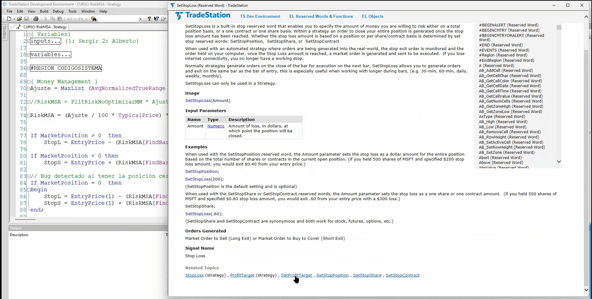
  <figcaption>Figura 001</figcaption>
</figure>

Este tipo de *stops* automáticamente ya van en la barra de entrada. Tenéis todos el curso de *EasyLanguage* inicial o casi todos, y ahí está explicado para repasarlo. Vale, ¿qué desventaja tienen? Que no puede separar largos y cortos. Es la única en realidad. Si tú quieres poner largos y cortos ya tienes que hacerlo distinto.

Entonces ese código que veis ahí que pusimos, en ese código, por cierto, ahora os lo voy a enseñar porque lo he evolucionado bastante. Lo conscientemente, conscientemente lo pusimos siendo un poco absurdo, es decir, entre ese son hacer esto es absurdo. Porque ponerse de estos los *SetStopLoss* es absurdo porque el que pongas ya sin *MarketPosition*, o sea, lógicamente cuando usas esta sentencia no hay que ponerlo dentro de un *if* de *MarketPosition*, hay que ponerlo fuera, directamente en la raíz del código. ¿Por qué? Porque se ejecute siempre.

Si yo le pongo una restricción, le digo *if MarketPosition*", entonces sí que se ejecutará en ese momento porque yo le he implementado una restricción como yo he hecho en esta en esta imagen. Pero esto, si no hubierais usado *SetStopLoss*, por ejemplo, hubierais usado *buy to cover next bar* a 5300, estop vale, así se haría, de acuerdo. Esa sería la manera de hacerlo.

En el primero, en el primer bloque, el caso del, el caso de que *MarketPosition* distinto de 0 es *true*, vale, es decir, ¿cuándo es *MarketPosition* distinto de 0? Pues cuando está largo, cuando está corto. Pero bueno, si lo separara de largos y cortos, podía, cuando *MarketPosition* es igual a 1, o mayor o igual que 0, o distinto de distinto de de menos 1, por ejemplo, también se puede hacer. Hay distintas maneras. Pero digamos para si yo me quiero referir al lado largo, de acuerdo, pues poner la instrucción del barrio del la de largo con *buy to cover*.

Bueno, pero con *sell* no, para cerrar el largo pongo *sell*, vale. Y en el pondría igual el *sell* pero con un cálculo que, si os fijáis, sólo cambia. Insisto que eso está hecho expresamente. Aquí uso *EntryPrice* porque lógicamente he entrado. Aquí no puedo usar *EntryPrice* porque si es si esto no es *true*, que es *false*, quiere decir que *MarketPosition* es igual a 0. 

<figure>
  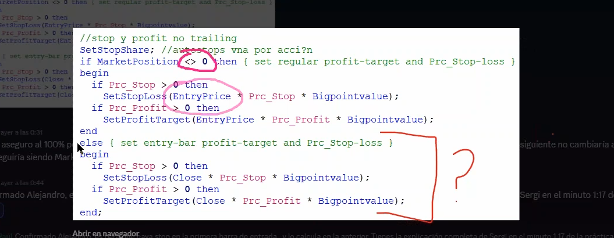
  <figcaption>Figura 002</figcaption>
</figure>

O sea, este bucle, esta estructura, 

<figure>
  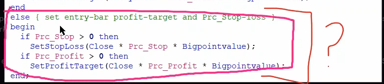
  <figcaption>Figura 003</figcaption>
</figure>

se ejecuta sólo cuando *MarketPosition* es igual a 0, vale. Por lo tanto yo ahí no tengo *EntryPrice*, por eso uso *close*. Vale, esto insisto, cuando uso estas estructuras no hace falta. Pero si tú usas un *sell* o usas un *buy to cover*, esta es la manera, vale.

Pues por eso pusimos esta estructura para que ya la tuvierais. Aunque repito otra vez, en *SetStopLoss* usándose y *SetProfitTarget*, si no separó largos de cortos, si el *stop* es el mismo en ambos lados, es simplemente con una única línea que ponga *SetStopLoss* el stop, y *SetProfitTarget* el target, se acabó. Dos líneas, no hay que hacer nada más. Creo que ya está claro esto, pero era interesante por eso quería aclararlo la clase aunque sea del bar. Vale.

***¿Este sistema finalmente lo vais a poder hacer intradía?***

* `MeanReversion-01.pdf`

***Yo he estado haciendo pruebas de todo tipo, con el ADX como mostráis, pero tirándo yo el código***

***No he encontrado nada realmente bueno y que tenga muchos trades. He probado a 1h, a 4h y a 5 minutos.***
***Con 1 y 2 velas por fuera de las Bollingas, con el ADX bajando y sin bajar, por encima y por debajo de X nivel Pero cuando tiro los mapas de optimización todo parece estar cogido con pinzas y ser un churro.***

***A ver si de ahí puedo sacar algo en claro, que ando en la búsqueda de un mean reversion que funcione en short. Que se supone en el SP debería funcionar pero en mi caso me está siendo imposible de conseguir***

Eso Alberto sobre todo ha estado trabajando más, está centrado más en el *money management* y el *portfolio*. Hoy vamos a hacer más, veréis también *portfolio*, pero más centrado en el *money management*, vale. Y el siguiente día veremos también *portfolio*, pero más centrado *portfolio*. Entonces seguramente el próximo día veremos todos los sistemas que hemos visto. Pero prefiero empezar primero por el *money management*, entonces.

Pero sí, sí que, sí que hay el *ADX*. En principio son filtros, pero hay hay muchos, no, no, ya es. Ahora, ahora os enseñaré cuando acabe esto el código que lo evolucionado más para ayudaros de filtros. También tenemos algo por ahí. A ver si antes del último clase podemos también añadir algo de eso.

Pero ahí hay un tema también de búsqueda, hay un tema de búsqueda. Ahora, ahora os voy a conocer el código, hablamos de ello. Pero hay un tema de búsqueda. Yo he dado dos genéricos, de volatilidad y de de tendencia, muy genéricos. Incluso de tendencia se puede componer en sus componentes, el de volatilidad es un ejemplo y puedes usar desviación típica, puedes usar otros.

Cuáles, al final no dejan de ser ejemplos. Puedes buscar figuras de velas, eso y lo hemos comentado los *ORB`s* por ejemplo, los *narrow range*, los *white outside bars*, *inside bars*, *gaps*. Es decir, cualquier cualquier estructura de precio la puedes implementar a nivel de filtros, como ahora veremos en las entradas y salidas después, que ya os lo he dejado listo este código.

Vale, claro que puedes ver más. Y al final es ese es un poco la búsqueda. Pero en un intradía, al final sí que es más bien esa la pauta. Lo comentamos: setup tan básico, setup tan sencillo, análisis horario, vale, filtro que puede ir o no ir, de acuerdo no es obligatorio, y salidas. Ese es un poco el mecanismo.

**Mean reversion y comportamiento del mercado**

y en un *mean reversion*, a ver, comentabas que funciona el *short*, que se supone que siempre debería funcionar, sí, pero te está siendo imposible. Bueno, ya comenté, comenté que en los últimos años sigue siendo *mean reversion*, o sea, sigue yendo bien y sigue siendo un activo que no es malo. Pero es verdad que en los últimos años se han han revertido un poco a la media, vale, los índices americanos, en el sentido que han ido un poco más hacia la tendencia.

Y los *tendenciales* han ido bien, y el oro por ejemplo al revés, de acuerdo, también era tendencial y le ha ido mejor en *mean reversion*, de tal forma que ahora casi podemos decir que tanto oro como como bolsa pueden ser de ambos lados, vale. Puede ser un poco de ambos lados, aunque tienen más sesgo tendencial en caso del oro, *commodities*, y antitendencial en el caso de índices. Se pueden trabajar en ambos, en ambos estilos, vale.

Y quizás está pasando eso, que en los últimos años cuesta más la reversión en los índices que hace 10 años, por entendernos, vale. Cuesta más ahora que antes. Antes era más fácil, antes era más fácil. Vale, pero el próximo día lo veremos. Y si por lo que sea no entramos en detalle, me lo pones y tranquilo que la de último lo veremos.

***Buenas Sergi y Alberto, viendo la última sesión, la estrategia que se trabaja deja muchos trades del lado largo pero bastante pocos del lado corto (100), tan pocos que me genera la duda de si es un número aceptable para operarlo. Si la respuesta es sí entiendo que es porque va acompañado de los largos, pero no sería conveniente evaluar esto de forma individudal en cada sentido? Poner un filtro de que como mínimo cada lado tenga 300 trades?***

A lo que iba, hablaba de lado corto, decía que en el largo había muchos *trades* y que en el corto había menos, y que no le generaba, le generaba dudas.

Bueno, no recuerdo este, este qué sistema era. ¿Te acuerdas tú Alberto? El de la última sesión, tendencial, oro. Vale, bueno, es evidentemente que no es, que no es una... bueno, no es una buena señal. Es decir, que evidentemente es menos significativo. Si no, no hay, no hay mucho mucho que decir. ¿Ahora es suficiente para descartarlo? No necesariamente, vale. No necesariamente.

Es verdad que si tú lo trabajas de manera conjunta, el análisis es conjunto. Pero no me parece mal que hagas esa distinción, no me parece, no me parece mal. No te digo un rotundo, pero sí que te digo que el análisis es conjunto. Para eso lo hace, ese *espejo*, vale. Para eso lo espejo, para eso tienes reglas en ambos, en ambos lados.

De todas maneras, cien *trades* son pocos. Son pocos, pero que pueden ser, pueden ser suficientes, sobre todo si vienen apoyados del largo. Y luego hay que ver también por qué no va, de acuerdo. Es decir, al final si tú usas un activo que no hecho más que subir, hombre, que haga pocos cortos es deseable, de acuerdo. Decir, al final, al final es ese es el sentido común del motivo.

Pero que no, no veo mal que tú ante esa inquietud, al final cuando uno tiene una inquietud la tiene que resolver, que antes plantes un análisis separado. No haría un análisis totalmente individual en un activo que se puede hacer. Nosotros ahora mismo estamos operando el oro así, estamos operando el oro así separado. Pero pero pero ya te digo que la siguiente revisión lo volveremos a juntar.

Es decir, al final, como te hemos hablado tú y yo muchas veces, a veces en en otras conversaciones que nos hemos encontrado, no existe una una respuesta única. Es que es verdad, no es que quiera esquivarles, que es la realidad, de acuerdo. Es decir, nosotros mismos nos equivocamos. Fíjate el mes de abril que llevamos, nos han dado hasta en el carné identidad. Y por supuesto el vector principal es el mercado, pero también pues seguramente hemos cometido errores en los últimos años, y vamos a seguir cometiendo.

Decir, no, no, ser profesional no te exime de cometer errores. Y al final hay un aprendizaje continuo y un prueba error de ciertas cosas, porque el mercado es un ente vivo, como te decía ahora, cambia ciertas cosas, cambia comportamientos, y tú tienes que moverte con él, entiendes. Entonces al final es así, y vas a seguir probando.

Entonces yo el oro, aunque aún lo estamos operando separado, casi con otra seguridad que lo volveré a operar *espejo*. Ya digo, vale, porque no me parece suficiente motivo por la experiencia que hemos visto para separarlo. Aunque sí que es una de las *commodities* que tienen más sesgo distinto de largo de corto. Pero el hecho de que de que sea sólo por tendencia no lo que marcan, para mí eso, el separarlos es la pauta de volatilidad, de acuerdo.

Y sí que en el oro tiene un poquito más de sesgo abajo que arriba. Es decir, cuesta más, normalmente hay que filtrar más el corto, es más más sucio, sabes. Parecidó a la bolsa un poco en eso, vale. Pero no tanto, en la bolsa es muy *heavy*, la bolsa es muy claro en cambio. En en la en oro no lo es, no lo es tanto, aunque un poco también se da, vale. Un poco también se da. Pero pero ahora, por ejemplo, aunque lo hemos operado así, pues nos quedamos más por tratar de juntar otra vez. Pero bueno, veremos, veremos, vale. Veremos, veremos cómo nos, como nos sale.

Pero porque por cada lado 300 *trades*, no, no pondría un filtro tan rotundo, tan rotundo como ese, porque es, es depende, es depende. También habrá que ver pues cuánto, cuantos grados de libertad tenemos, si le hemos optimizado poco, ese sistema se tenía pocas optimizaciones, al final era una media sólo, si no recuerdo mal. Bueno, hay que ver, hay que ver qué grados y qué. Depende, depende de los grados de libertad como siempre, y de lo que lo hayas optimizado, vale. Si al final la optimización es leve y demás, pues seguramente necesitas menos desde el final. Y es un poco, es un poco eso no, vale.

**MultiCharts y configuración de swaps**

***Buenas noches. Dos estrategias que tenía ya casi listas para empezar a rodar, quise validar con otro compañero el mismo backtest en MT5. Y para mi sorpresa, el swap (cosa que no se puede configurar en Multicharts para tener en cuenta en el backtest) se come literalmente todo el profit. Vaya grandísima putada. En la de swing en long incluso lo puedo entender. Pero es que en la que es intradía y hace muchos trades, ocurre exactamente lo mismo. Porque al final se pasa mucho tiempo invertido. ¿Cómo tenéis esto en cuenta ustedes? Porque según tendo entendido Darwinex Zero también funciona con CFDs, verdad? Mantener un largo en el SPX500 es carísimo***

Sí que se puede. Si al final *MultiCharts*, te lo explico en todo caso, tiene, es muy flexible en eso, vale. Tiene muchas configuraciones de cómo configurar el *slippage* y el *comisión*. Puede ser el porcentaje. Entonces, al final, a lo mejor no lo vas a penalizar exacto, pero lo vas a poder penalizar con una comisión fija más uno variable.

Entonces puedes jugar con eso. Y al final un *swap* no deja de ser una comisión, de acuerdo. Un porcentaje, de acuerdo. No deja de ser un porcentaje que lo tienes que ir estimando y aproximado, de acuerdo, que no será exacto. Pero no te va, no te va a hacer que vaya o no vaya, eso, o no debería si lo digo, si lo estimas, si lo estimas.

Entonces, al final también te digo que si te está pasando esto es porque te gustan mucho los sistemas de intradía de con muchas operaciones, que está bien, tienen cosas buenas, pero tienen esta mala, vale. Son muy sensibles a las desviaciones, también al ruido se acoplan más. Es decir, necesitan revisiones más frecuentes. Y todo tiene su parte buena, su parte mala. Pero pero bueno.

Si no, aunque es verdad lo dices, el *swing*, el *swing* por ejemplo en Apolo que es un sistema *swing*, le afecta, le afecta. Y claro que le afecta.

**Futuros vs CFDs**

Y claro que es la pregunta, si la pregunta es operar futuros o *CFDs*, sobre esto no hay debate. En el curso he hablado de eso. Es mejor futuros, eso está claro. Pero hay veces que por distintos motivos yo no voy a poder hacerlo. En nuestro caso es porque hasta ahora, por ejemplo, donde tenemos los dos darwinex no nos ha permitido. Y sabéis aquellos que nos seguís que es algo que ha provocado hasta tensiones importantes por nuestro lado. Porque porque es algo que estaba pedido y hasta acordado hace muchos años y no se ha dado.

Pero bueno, eso es otro tema. Y es algo que nos sigue provocando problemas, y que sabemos con ningún, ningún tipo de duda, que seremos mejores en futuros. No hay ningún debate posible ante eso. Es decir, si tú puedes, es mejor operar futuros. Pero puede ser que no puedas, porque la cuenta tiene que ser un poco mayor. Cada vez menos, que ya lo comenté, porque tenemos *micros*, tenemos ya buenos *micros* en, tenemos *micros* en DAX operables bien, en S&P, en NASDAQ, en oro, todo eso es operable. En euro dólar también, por ejemplo, es bueno. Tenemos ya bastantes *micros*.

Y como vais a ver más el próximo clase que hoy, ***con tres sistemas en tres activos se puede hacer un *portfolio* muy bueno, muy bueno***. Eso es posible, que es mejor con diez sistemas, si claro. Pero con tres, si nosotros trabajamos tres sistemas con poca correlación entre sí, en tres activos con poca correlación entre sí, probablemente diversificaremos de una manera más que aceptable. No aceptable, no, muy buena. Vale, muy buena. Eso es posible, y lo veremos, vale. Y lo veremos.

Entonces, por lo tanto, para operar tres sistemas, ¿en cuánto hace falta? Bueno, trataremos de hacer simulaciones sobre esto cuando trabajaremos. Lo haremos en *Portfolio Trader* o lo haremos en *maestro*, vale. Hoy vamos a ver más *MSA*, vale. Para el pero veremos para trabajar más esto que os digo ahora, tamaños de cuenta, *mix* de sistemas, uno u otro. Vale, usaremos más *Portfolio Trader* y *MultiCharts*, más sobre todo el próximo día.

Entonces, a partir de ahí si tú puedes, dices he entendido, comentas que en DarwinexCero también funciona con *CFD* es, pero ahora DarwinexCero ya se puede hacer futuros. Yo creo que yo ya también puedo hacer futuros en cero, pero claro, a mí me interesaría poder pasar lo que tengo. Tienes empezar de cero en futuros. Bueno, me puede interesar para hacer pruebas, y de hecho lo tenemos planeado cuando acabamos el curso de muchas más cosas.

Pero pero me interesa insisto poder poder poder adaptar, o sea, lo que tengo ya, que siga ahí con inversores y demás, sería que todos los inversores que tengo pueden operar en futuros. No, no, no. Yo tienes eso es lo que a mí me interesa. ¿Por qué? Porque nosotros ganamos lo que ganan los inversores. Vale.

¿Qué más? *Mantener un S&P en el algo es carísimo* sí para los swaps, ers verdad que son caros, eso es así, son caros. Es un tema que tienes que considerar y ya está. Pero en cero, en cero, yo casi casi te aseguraría que ya puedes hacer futuros en cero. El problema es hacerlo en la en la en la normal donde operas con tu dinero, de acuerdo. Entonces en cero, y yo estoy prácticamente seguro que ya puedes hacer, vale.

**Tipo de interés implícito en futuros**

***Tengo ahí un dilema. Porque sí, yo entiendo la parte de que el mercado lo descuenta y por eso los futuros siempre están en contango y etc etc Pero, para una estrategia intradía por ejemplo, pero que mantiene posiciones por 2-3 días, y que se te va todo el profit en el swap por fines de semana y todo, ¿no sería más conveniente tradearlo en el futuro? Porque si por ejemplo es un tendencial o un semi-tedencial con TP y SL cortitos. Aunque haya contango, igual te da lo mismo. O así lo veo yo, ¿no?***

Sí, bueno, comentamos el futuro. En tu siguiente mensaje, que será mejor. Si, si es mejor, es mejor. Lo que lo que explicaba, y que eso es así, es decir, pensar que el tipo de interés está implícito en el futuro, no quiere decir que no esté. Y por eso, cuando cuando los tipos son altos, se separa mucho más el índice, bueno, porque porque el tipo de interés lo separa.

Pero pero bueno, que sí que es mejor futuro. Simplemente lo explicaba como como conocimientos. Al final depende si vas largo corto, te puede beneficiar o perjudicar el tipo de interés. Como con opciones, no. Al final el tipo de interés y el tiempo va, sabéis un poco aquellos que sepáis opciones. Pero sigue siendo mejor el futuro.

Pero pero daros cuenta que el *CFD* ahora, por ejemplo, su justo sobre todo cuando empieza el vencimiento, está un precio X, y el futuro está muy pues por encima bastante por encima, porque el tipo de interés lo lleva implícito. Y en cambio el *CFD* lo tiene mediante *swap*, lo tiene fuera. Pero siento que aún así es mejor en el futuro, vale.

**Estrategia de rolling en futuros**

Aquí, Amarrugada, estas que vienen después no las he leído, es decir, que las voy a ver ahora, las voy a ver ahora, así que confío poderlas responder. Porque porque bueno, de Amarrugar las ha puesto la post hoy y ya no la he leído. Vale.

***a mi también me pareció carísimo Alejandro. No veo instrumento que no haya alguna "trampa" que cercene los beneficios obtenidos. Hecho que lo hace todo aún más difícil***  
***-------------------------------***  
***A la atención de @sersan***.  

***Mis últimas inquietudes: En un escenario de operación en futuros, al acercarse al vencimiento, conviene definir la estrategia de "rolling".***  
***-> 1) Si no recuerdo mal @sersan comentaba que cierto día cercano al vencimiento, cuando el volumen descendía por debajo de cierta media esto marcaba el día a realizar la operación.***   
***-> 2) si la operativa es llevada a cabo con bots, eso significa que hay que programar al bot para que cierre lo que tenga abierto (de acuerdo con la estrategia anterior de determinación de día), "roll-ee" y reabra lo que tenía abierto en el anterior vencimiento? (o se tiene que hacer a mano?)***  
***En los BT en los que se usa MM con compounding (como regla MM me refiero ahora a todo el capital en la posición) observo que la volatilidad de los rendimientos en los tramos finales se incrementa mucho más que en los inicios, debido en parte a la incorporación de más capital en la operativa gracias a los beneficios acumulados reinvertidos.***  
***Teniendo en cuenta que la volatilidad es un indicador "negativo" a ojos de la industria, que lo asocia a riesgo, existe alguna técnica para mantener las curvas de profit "suavizadas" sin perjudicar en exceso los rendimientos?***

Se puede automatizar? si, vale la pena? Normalmente no, normalmente no vale la pena. Pero si se puede, se puede automatizar. Pero normalmente no vale la pena. Normalmente nosotros, cuando hemos operado, siempre lo hemos hecho a mano, lo hemos hecho a mano el *rolo*.

Ahí pues sentido común, amigo. Al final, por ejemplo, nosotros cuando operábamos Artemisa,s. Pues es un sistema tipo Apolo, *swing*. Pero qué pasa, a ver esto, mira, Imagínate que el vencimiento es este día

<figure>
  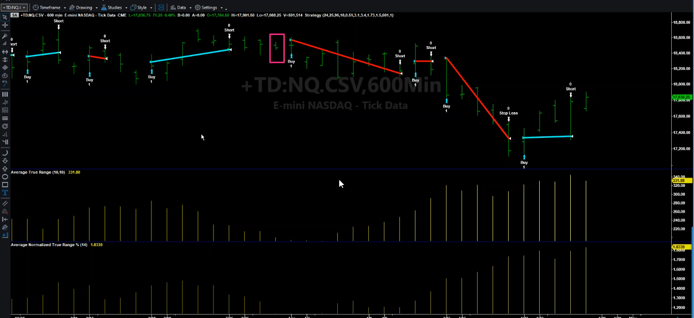
  <figcaption>Figura 004</figcaption>
</figure>

y nosotros tenemos el *rolo* seis días antes. Vamos a suponer que es aquí el *rolo* previsto, pero yo veo, yo estoy ahí largo, vale. 

<figure>
  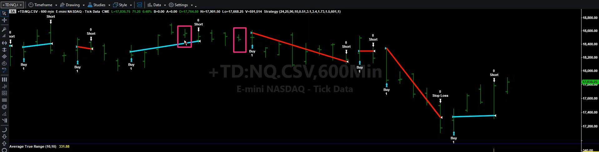
  <figcaption>Figura 005</figcaption>
</figure>

Y bueno, sé que el sistema puede cerrar, porque ya lo sé que puede cerrar. Entonces pues a lo mejor me espero que cierre, y ya si no cierra, pues rolo, me entiendes.

Es decir, lo que os quiero decir que en los futuros índices americanos, como tienen una ventana muy grande, porque porque ellos vencen el tercer viernes de mes, pero por uso y costumbre se suele rolar entre 5, 6, 7 días antes. Es decir, desde la semana anterior. Pero los días siguientes del *rolo* óptimo, del *rolo* del gráfico para entendernos, sigue habiendo un volumen más que aceptable. Donde ya no hay aceptable es el día antes. Donde empieza ya a ser preocupante es el día antes, por ejemplo.

Entonces tú ahí tienes margen de *rolo*, el cambio de contrato. Si tú estás en tu posición, tú puedes tener tu día óptimo y puedes hacerlo ahí si quieres. Siempre sería pues, si tú aquí estabas largo, vale, imagínate que tienes que rolar aquí, vale. Pues oye, cuando el futuro abre, vendes este y compras el siguiente. Y está, es que no hay más, de acuerdo. Es vendes este y compras el siguiente, y ya ha rolado.

Pero tú también puedes esperar a ver si cierra, y entonces ya, una vez ha cerrado y ha rolado solo. Explico en el sentido que te ha cerrado la posición, y tú ya la nueva la abres en el nuevo. Al final, el que a ti te manda, vale, porque una cosa es la operativa real, decir de abrir y cerrar, y la otra el que manda en el mercado, vale.

El que te manda es el continuo, que tú tienes ya rolado. Por ejemplo, en los índices americanos ahora es`@105XR` mediante *ratio* y cinco días antes. Porque? porque ese es el que tiene el volumen óptimo. Eso que decías, no, yo sé que es ese. Yo ese lo puedo hacer operable. Aquellos que seáis de *TradeStation*, sino el que no, pues en otro sitio. Mediante aquí, este es de *Tick Data*, pero es igual para que me entendáis. Vale, aquí en el en el perdón, en el *Custom Features*, vale. Yo le pongo en EQ, vale, y aquí ya me sale. Yo aquí le pongo que rolo cinco días antes, vale, y le digo que use este para *trading*. Automáticamente me lo hace operable, vale.

Pues ratio, perdón, cómo lo hace operable. Si os fijáis, le añade el contrato, veces este es arroba NQM24 igual @105XR. Esto sería operable. 

<figure>
  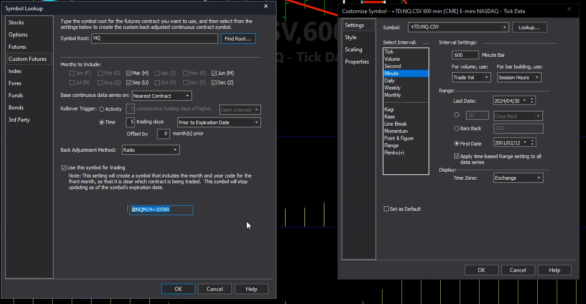
  <figcaption>Figura 008</figcaption>
</figure>


Es decir, yo esto le puedo tirar órdenes a este. Si le quito esto, no le puedo tirar órdenes. 


<figure>
  
  <figcaption>Figura 008 - copia</figcaption>
</figure>

Pero al anterior `@105XR` este sí le puedo tirar órdenes. Pero este `@105XR`, cuando acabe el vencimiento, se acaba, hay que cambiarlo de letra, vale. Pero entendéis ya día.

Entonces yo ya puedo jugar con ello. Porque puedo incluso, si quiero, pues ponerlo en el vencimiento directo. Si es intradía, yo puedo operar en el NQM24 o en el arroba `NQM24`. Al final, al final, en esos días pues normalmente tenemos, como ya viste en la teoría, tenemos ahí un gráfico que vemos cuándo es el momento óptimo. Y pues tienes que tener el sistema puesto a lo mejor en el NQM24.

Y también puedes jugar con este día. Pues le pones 6, le pones 5, le pones 7, dependiendo de que si te interesa o no que refleje el precio del antiguo, el precio del nuevo, vale. Esto es un tema de práctica que no es más que cuando lo tengáis que hacer en simulado, probar el simulado, y se ve muy fácil de verdad.

Ya lo enseñé la teoría, pero lo podéis ver. Poner poner un vencimiento, poner el otro. Hice una práctica, ¿os acordáis que tenía con el S&P? Creo, distintos días, tenía @105, @106, @107, @108, vale. Pues tú con eso vas cambiando el día en que se hace el *rolo* en ese continuo. Y con eso pues tú es una manera de jugar el día del vencimiento. Si haces esto que te he dicho aquí, es decir, si haces esto de que te esperas, si no tú quieres ir al @105, pues @105, miras qué día es, y ese día vendes, compras, compras y vendes, y está. Te olvidas, cambia, se cambia ese contrato de la M a la N.

Pero que es lo que te digo, al final es, normalmente lo lo hacemos a mano. Se puede hacer por código, si se puede hacer por código. Puede tener un código muy complejo que tenga todas las letras de los vencimientos y que se encargue de eso y hasta. ¿Pero vale la pena? Pues no, no sé si va la pena. Si no tienes una cartera muy, muy grande, seguramente no. Seguramente no vale la pena por pragmatismo, por el tiempo, por recursos, por siempre. Vale.

**Money management en backtests**

Pero lo del *money management*, lo de *money management* en las bases de *backtests* es importante aclarar. Porque sí que he visto que en ciertos momentos, de hecho en la práctica os he fijado, o le he usado en algunos y en otros no.

Es decir, no tomarlo como una ley divina, de acuerdo. Es, en el caso en que se use, recordaros que os dije que hay que usar *money management* poco agresivo, vale. Simplemente es para para que la cuenta, para usar, para simular también el efecto del uso de la cuenta. Y donde se nota mucho es en bolsa, recuerdo, en NASDAQ se ve, de acuerdo. Y se nota mucho. A lo mejor en otros activos no es necesario. Puedes hacerlo con un contrato, de acuerdo, y no y no pasa nada.

Pero si lo haces con *money management*, tiene que ser poco agresivo. Y recuerda que entonces, sobre todo, tienes que mirar porcentajes. Al igual que si no usas *money management*, tienes que mirar retornos brutos, decir el dinero. Si usas *money management*, tienes que mirar porcentaje. En porcentaje verás que no es tan abrupto, es tan abrupto en  valor, en valor absoluto. Porque además, como Tradestation no te pone el gráfico de la *equity* en logarítmico, te lo pone en lineal. Pues se te vuelve una curva muy exponencial, porque es lo que dices tú, el dinero es mucho más. Pero el porcentaje debe ser proporcional. Esa es la clave. Rebaja un poco el *money management*, no lo hagas tan agresivo, y te compondrán, te compondrá menos.

O pruébalos. al final, pruébalo. Al final, como todo, es es es prueba error, y tienes que ir viendo un poco qué es lo que encaja más con lo que tú buscas y quieres. Yo os explico las maneras de hacerla, las que usamos nosotros, ventajas, desventajas. Y además, que hay cosas como he dicho antes y que hemos cambiado de opinión, y que a mejor en el futuro cambiamos otra vez. Es decir, esto es así, si esto es así. Al final hay que ir siempre con la mente abierta y valorando, valorándolo todo, cuestionándotelo todo. Se ve con rigor y con criterio, pero hay que cuestionárselo todo.

***Buenas tardes. Os paso algunas dudas que me han ido surgiendo: El fin de semana estuve trasteando  algunas de las estrategias del Strategy Concepts y me encontré con alguna que tenía un data 2 basado en un símbolo en tiempo real, por ejemplo la Net Tick Fade Strategy que se basa en el $TICK en data2. En estos casos parece ser que TS no permite mezclar este data 2 con el data 1  para hacer backtesting. Hay alguna manera de superar ese problema en TS?***  

***También probé la Auto-Trendline en @NQ y en intradía 30 min cambiando parámetros,  me da buen resultado los últimos 5 años pero si te vas más atrás se queda lateral o incluso pierde un poco. La pregunta es , si pensamos que el motivo es porque  ha habido un cambio muy claro de tipo de mercado de hace 5 años hacia aquí , como es el Nasdaq por ejemplo, que a mi parecer se ha vuelto mucho más tendencial, sería buena idea ponerlas a operar  en intradía mientras se mantenga ese comportamiento  o mejor no y buscar ideas más robustas en el tiempo? Paso captura en 5 y 10 años de la curva.***

<figure>
  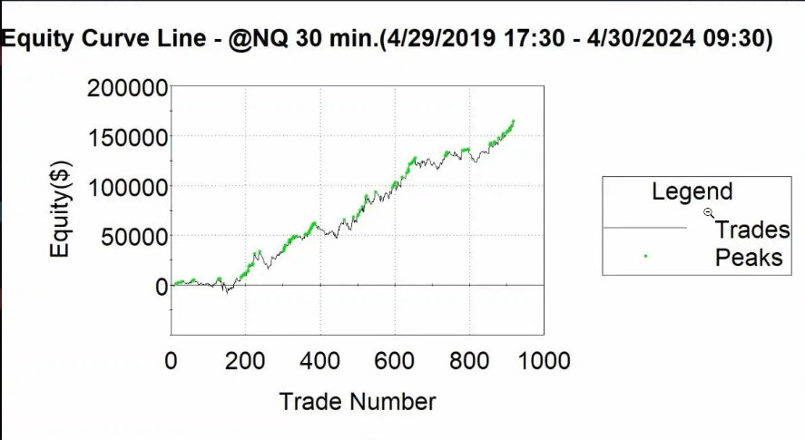
  <figcaption>Figura 009</figcaption>
</figure>
<figure>
  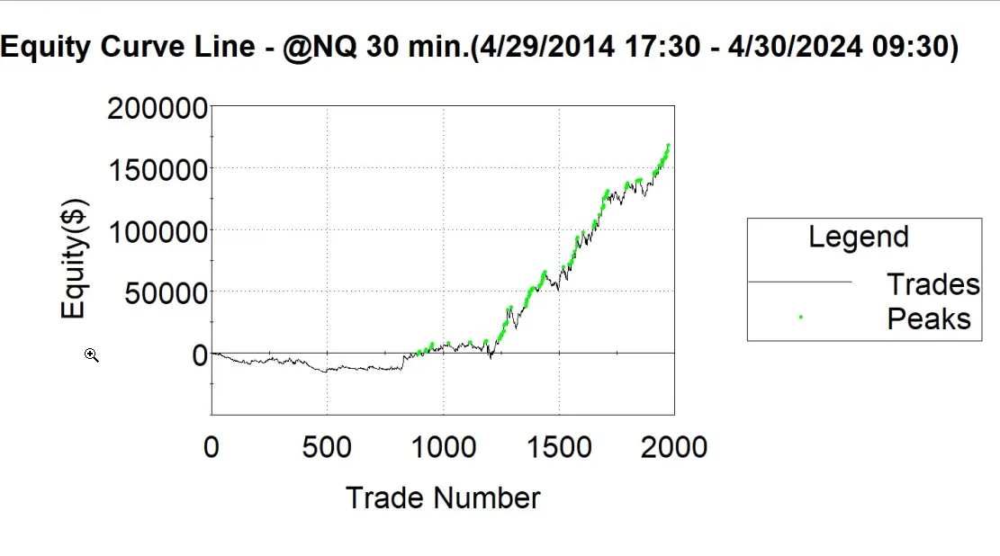
  <figcaption>Figura 010</figcaption>
</figure>


Sí, claro que hay. Pagar el tiempo real de eso, o bien usar otro *data* en caso que se pueda.

Si quieres ver ese específicamente, solo tienes que ir a tu cuenta en el *Client Center*. Es casi fuera del curso de preguntas, a Pilar en el WhatsApp y a nosotros, ya te lo explicaremos. Pero no vale la pena ahora porque vamos a estar un rato ahí. Y en el *Client Center*, la web puede después pagar ese tipo. Ahora mismo no recuerdo cuál es, hay que mirarlo cuál es. Supongo que es el del New York, pero no sé, parece que es raro que no venga. Es bueno, hay que mirarlo, hay que mirarlo en qué viene, qué viene.

También hay algunos, cuidado, por ejemplo, el *tick*, el *tick* no deja de ser un indicador de *TradeStation* de muchos datos, que los da como fuente. Pero algunos a lo mejor los puedes calcular tú. Entonces cuidado, el *tick* puede ser que sea uno de ellos. El *tick* puede ser que sea uno de ellos, vale. Habría que mirarlo, habría que mirarlo. Vale.

**Análisis de la curva de auto-trendline**

También dice que probó una *auto-trendline* y se queda lateral, incluso pierde poco. La pregunta es a pasar ideas, pasar a la captura aquí. A ver, es buena curva en comisiones. Es muy buena curva. Pero esto 14, 24, 24, 24, 14, 24, 14. Hombre, tan extremo tiene pinta de sobreoptimización. Pero es verdad que es posible, esto pasa sobre todo en los sistemas tendenciales. Es algo normal, es algo normal.

Todo al final depende un poco. Y lo que tiene es un sistema ideal. Hombre, pues puede ser que no lo sea, pero si en una cartera puede, puede ser que aporte valor. Pero sí que es verdad que ahí, sobre todo teniendo tantos *trades*, quizá la solución sería filtrar, de acuerdo. En ese caso parece el típico caso de filtrar, de buscar algún filtro que evite que opere ahí, que evite que opere ahí, porque es muy excesiva la diferencia.

Cuidado porque puedes caer en el problema de los filtros. Problema de los filtros porque no soy especialmente amigo. Lo he dicho muchas veces. No digo que no tengan utilidad en intradía, nosotros no operamos mucho en intradía, vale. Pero intradía tienen su utilidad sin duda alguna, y hay que usarlos casi siempre en intradía. O sea que estamos de acuerdo.

Pero mucha prudencia, porque es muy fácil ajustar filtrando, de acuerdo. Es muy, muy fácil. Y a veces yo creo que se abusa de los filtros para hacer pasar una idea que es justita por buena. Hay veces, si tiene suficientes *trades* como aquí parece, pues puede que tenga sentido, puede que tenga sentido. Que trabajarlo, hay que trabajarlo.

Pero al final lo que comentas y te cuestionas es inteligente y es el camino. Es decir, oye, ¿hay un motivo para este cambio? Hay que ser muy objetivo, muy estéril con los análisis, y cuidado con engañarse, que no es fácil. Pero es verdad, estoy de acuerdo en que el NASDAQ este, lo comentado antes, los índices se han tendencializado más. Por lo tanto, eso es correcto, ese análisis desde mi punto de vista. Y además lo puedes analizar con datos objetivamente, por lo tanto es verdad, hay una razón que puede justificar eso. Hay una razón.

Ahora bien, a lo mejor podemos ahí, por lo tanto, filtrar con algo razonable que tenga sentido, que tenga sentido. Y que lo mejor es con prudencia y demás. O sea que yo miraría de explorar el camino de los filtros.

**Strategy Concepts Club y material de aprendizaje**

Me gusta que trabajes en *Strategy Concepts*. Ya os lo recomendé. Ahora tendréis un mes hasta la siguiente clase, porque hay material muy, muy útil para hacerlo crecer. Es decir, como os pasé ese Excel que también os trabajé, que también creo que puede resultar útil de cómo habían ido las ideas, algunas bien, otras mal, y algunas poco mal pero no muy mal.

Esas intradías con muchas operaciones pueden tener camino de mejora con salidas, entradas, y pueden trabajarse, y pueden dar camino a buenos sistemas, de acuerdo. Y por eso os he dado todo ese material, os di el *STAD*, para que por favor huyáis de las churrerías de sistemas, no son necesarias para encontrar ideas, como veis ideas en [**Stocks & Commodities**](https://store.traders.com/stcodiedsu.html) te suscribes, al año es mucho más barato que comprar el *Strategy Concept Builder* que nosotros tenemos, por ejemplo. Es decir, no hace falta. De verdad, no hace falta. Y además os podéis hacer pues otros constructores, como el que tengo hecho en el PDF, os lo pasaré también en *paper* escrito, vale. Para que lo podáis usar. Pero aquí lo tengo, lo presento brevemente para que quede grabado en el vídeo.

- [Strategy: BUSCADOR E_S](../code/BUSCADOR%20E_S.ELD)

Aquel código que teníamos de salidas y demás, bueno, le he cambiado el nombre, le he llamado *Buscador*, vale. Y ahora tiene 23 entradas y 35 salidas, de acuerdo.

```
inputs:
    Entrada (0),   // elegir de 0 a 23
    Per_E (15),
    
    Salida (2),    // elegir de 0 a 35
    Per_S (15);
```

Puede tener más. Algunas de hecho las he puesto un poco para ayudar, para haceros pensar. Es decir, como un camino de para una entrada. Por ejemplo, clásico, clásico de velas, vale. Os he puesto una de velas.

**Figuras de velas**

Imaginaos las figuras de velas que hay. Podéis sacar, podéis hacer uno de 30 solo de velas, solo de velas. Ah, por cierto, ***tema de velas para filtros también vienen bien, vale. Todas las estructuras de velas***. Que lo peor que tienen es el nombre, porque viene un nombre de esos nombres así raros. Pero al final son cosas muy lógicas. Son cosas en la mayoría de casos muy lógicas que reflejan el comportamiento de la oferta y la demanda.

Pueden venir bien para muchos tipos de sistemas, vale. Tanto como señal primaria como como filtros. Qué tipo de vela hay antes o después. El hecho de operar solo cuando hay una, o no operar cuando hay una determinada vela. Ya lo hablamos, el clásico de los *breakouts* y los tendenciales. Normalmente ahí vienen bien los filtros de cuando ya ha habido expansión no operar, normalmente ese tipo de filtros, vale. Ya os lo comenté.

Y los *mean reversions* al contrario, al contrario. ¿Por qué? Porque cuando ya ha habido expansión, normalmente entrar en *breakout* ya nuevamente anticipa contracción. Pues ahí a lo mejor es mejor operar un *mean reversion*, en ese momento. Y cuando el mercado ya está contraído, a lo mejor ya es mejor no entrar en un *mean reversion*, porque ya está cerca de que acabe ese periodo.

Hay que jugar un poco con esto. Y qué figuras de velas pueden indicar eso.

<div style="border-left: 4px solid #e67e22; background: #fef5e7; padding: 10px 15px; margin: 10px 0;">
  <strong>🕯️ Figuras de velas como filtros</strong><br>
  Las estructuras de velas japonesas (<em>candlestick patterns</em>) pueden utilizarse tanto como señales primarias de entrada como filtros contextuales. En sistemas <em>breakout</em> y tendenciales, filtrar cuando ya ha habido expansión (velas grandes, <em>wide spread</em>) suele mejorar resultados. En <em>mean reversion</em>, el criterio es inverso: tras expansión se anticipa contracción, momento óptimo para reversión a la media.
</div>

## Entradas

Entonces aquí, por repasar brevemente, vale. Ya sabéis, va a un *input*, hay un periodo de entrada, porque como muchos tienen, pues ya está puesto ahí para directamente ponerlo tanto de entrada como de salida. Per, per ese. Vale. Y luego algunos más tienen algunos *inputs* más añadido porque lo exige, vale.

```sh
inputs:
	Entrada (0), #elegir de 0 a 23
	Per_E (15),
	
	Salida (2), #elegir de 0 a 35
	Per_S (15);

switch (Entrada)
  Begin
    case 0: #No entries
    case 1: #Momentum
    case 2: #Breakout
    case 3: #Cruce de medias simples
    case 4: #Bollinger Band MR
    case 5: #Volatilidad
    case 6: #Bollinger Band trend
    case 7: #Donchian clásico
    case 8: #Key Reversal
    case 9: #Nos incorporamos a la tendencia primaria tras un pullback
    case 10: #Entramos en el pullback contra la tendencia primaria
    case 11: #Breakout + momentum
    case 12: #RSI entrada saliendo de sobrecompra/sobreventa MR
    case 13: #RSI entrada en tendencia
    case 14: #RSI entrada saliendo de sobrecompra/sobreventa MR
    case 15: #Nos incorporamos a la tendencia primaria tras un pullback (otra forma)
    case 16: #Entrada en velas muy expansivas
    case 17: #entrada en una hora buscando expansión con un dato
    case 18: #entrada en bajo volumen en reversión (o en tendencia comentado en código)
    case 19: #variación de key reversal
    case 20: #candlestick con martillo/hombre colgado (ejemplo de uso de funciones candle)
    case 21: #Otro Breakout + Momentum
    case 22: #Momentum corto plazo + Momentum largo plazo
    case 23: #candlestick con martillo/hombre colgado invertido
  End;

switch (salida)
  Begin
    case 0: #no exits
    case 1: #Stop $
    case 2: #Stop %
    case 3: #Stop ATR
    case 4: #Profit $
    case 5: #Profit %
    case 6: #Profit ATR
    case 7: #Breakeven $
    case 8: #Trailing ATR
    case 9: #Salida por Tiempo
    case 10: #Salida al cierre (necesita modificar la sesión para que acabe n minutos antes del cierre real)
    case 11: #Trailing ATR + Profit ATR
    case 12: # Chandelier
    case 13: #Bollinger banda contraria
    case 14: #Salida Trailing %
    case 15: #Stop $ + Profit $
    case 16: #Stop% + Profit%
    case 17: #Stop ATR + Profit ATR
    case 18: #Chandelier + Profit%
    case 19: #Stop% + temporal
    case 20: #Chandelier + temporal
    case 21: #Bollinger banda contraria + temporal
    case 22: #Bollinger banda contraria + Stop%
    case 23: #ParabolicSAR Exit
    case 24: #Profit% + BreakEven$
    case 25: #Stop% + BreakEven$
    case 26: #Profit% + BreakEven%
    case 27: #Stop% + BreakEven%
    case 28: #BreakEven%
    case 29: #Stop% + Profit% + BreakEven%
    case 30: #Stop $ + Profit $ + BreakEven $
    case 31: #Stop ATR + Profit ATR + BreakEven%
    case 32: #Stop ATR + Profit ATR + BreakEven $ (potencial extensión)
  End;
```


**Descripción de las Entradas**

Pero veréis que hay entradas pues yo que sé, un *momentum* simple, *breakout*, cruce de medias simples, hay un *Bollinger Band* en *mean reversion*, hay una expansión de volatilidad de cierre más volatilidad más *ATR*, hay un *Bollinger Band* en tendencia, lo vimos. Hay un *Donchian* clásico, que es parecido a un *breakout* pero es otra manera de ver el *breakout*. Hay un *key reversal* que os hablé de ellos, también puede venir bien para filtrar, y como salida a veces más que como entrada.

**Case 1: Momentum**

<div style="border-left: 4px solid #3498db; background: #ebf5fb; padding: 10px 15px; margin: 10px 0;">
  <strong>📈 Momentum simple</strong><br>
  Compara el cierre actual con el cierre de hace N periodos. Si el precio actual es mayor → largo. Si es menor → corto. Es la forma más básica de medir la fuerza direccional del precio. Sencillo pero efectivo para detectar tendencias.
</div>

```
case 1: // Momentum 
Begin 
    If Close > Close[Per_E] then
        Buy ("E01_LE") next bar at market;
        
    If Close < Close[Per_E] then
        SellShort ("E01_SE") next bar at market;
End;
```

**Case 2: Breakout**

<div style="border-left: 4px solid #3498db; background: #ebf5fb; padding: 10px 15px; margin: 10px 0;">
  <strong>🚀 Breakout de máximos/mínimos</strong><br>
  Entra largo cuando el precio supera el máximo más alto de los últimos N periodos. Entra corto cuando pierde el mínimo más bajo. Es la ruptura clásica de rangos, buscando continuación del movimiento tras la rotura.
</div>

```
case 2: // Breakout
Begin
    input:
        E02_Precio (High);
    
    var:
        Precio_Corto (0);
    
    If E02_Precio = High Then
        Precio_Corto = Low
    Else
        Precio_Corto = Close;
    
    If E02_Precio > Highest(E02_Precio, Per_E)[1] then
        Buy ("E02_LE") next bar at market;
              
    If Precio_Corto < Lowest(Precio_Corto, Per_E)[1] then
        SellShort ("E02_SE") next bar at market;
end;
```

**Case 3: Cruce de medias simples**

<div style="border-left: 4px solid #3498db; background: #ebf5fb; padding: 10px 15px; margin: 10px 0;">
  <strong>📊 Cruce de precio sobre media</strong><br>
  Entra largo cuando el precio cruza por encima de su media móvil simple. Entra corto cuando cruza por debajo. Es una variante simplificada del clásico cruce de medias, usando el precio como "media rápida".
</div>

```
case 3: // Cruce de medias simples
Begin
    If Close crosses above Average(Close, Per_E) then
        Buy ("E03_LE") next bar at market;
        
    If Close crosses below Average(Close, Per_E) then
        SellShort ("E03_SE") next bar at market;
end;
```

**Case 4: Bollinger Band MR (Mean Reversion)**

<div style="border-left: 4px solid #3498db; background: #ebf5fb; padding: 10px 15px; margin: 10px 0;">
  <strong>🔄 Bollinger Band en reversión a la media</strong><br>
  Entra largo cuando el precio recupera (cruza hacia arriba) la banda inferior → el precio estaba sobrevendido y empieza a recuperar. Entra corto cuando pierde (cruza hacia abajo) la banda superior → el precio estaba sobrecomprado y empieza a caer. Busca la vuelta al centro tras tocar extremos.
</div>

```
case 4: // Bollinger Band MR
Begin
    input:
        E04_Desv (2);
        
    If Close crosses above BollingerBand(Close, Per_E, -E04_Desv) then
        Buy ("E04_LE") next bar at market;
        
    If Close crosses below BollingerBand(Close, Per_E, E04_Desv) then
        SellShort ("E04_SE") next bar at market;
end;
```

**Case 5: Volatilidad (ATR)**

<div style="border-left: 4px solid #3498db; background: #ebf5fb; padding: 10px 15px; margin: 10px 0;">
  <strong>📏 Expansión de volatilidad con ATR</strong><br>
  Entra cuando el precio se mueve más de N ATRs respecto al cierre anterior. Es decir, detecta movimientos explosivos que superan la volatilidad normal. Si sube más de 1.5 ATRs → largo. Si baja más de 1.5 ATRs → corto. Ideal para capturar arranques de tendencia.
</div>

```
case 5: // Volatilidad
Begin
    input:
        E05_ATRs (1.5);
        
    If Close > (Close[1] + AvgTrueRange(Per_E) * E05_ATRs) then
        Buy ("E05_LE") next bar at market;
        
    If Close < (Close[1] - AvgTrueRange(Per_E) * E05_ATRs) then
        SellShort ("E05_SE") next bar at market;
end;
```

**Case 6: Bollinger Band trend**

<div style="border-left: 4px solid #3498db; background: #ebf5fb; padding: 10px 15px; margin: 10px 0;">
  <strong>📈 Bollinger Band en tendencia</strong><br>
  Lo contrario al case 4. Entra largo cuando el precio supera la banda superior → fuerza alcista, continuación. Entra corto cuando pierde la banda inferior → fuerza bajista, continuación. Busca seguir el momentum en la dirección de la rotura.
</div>

```
case 6: // Bollinger Band trend
Begin
    input:
        E06_Desv (2);
        
    If Close crosses above BollingerBand(Close, Per_E, E06_Desv) then
        Buy ("E06_LE") next bar at market;
        
    If Close crosses below BollingerBand(Close, Per_E, -E06_Desv) then
        SellShort ("E06_SE") next bar at market;
End;
```

**Case 7: Donchian clásico**

<div style="border-left: 4px solid #3498db; background: #ebf5fb; padding: 10px 15px; margin: 10px 0;">
  <strong>📦 Canal Donchian clásico</strong><br>
  Coloca órdenes stop en el máximo y mínimo de los últimos N periodos. Cuando el precio rompe el canal → entra en esa dirección. A diferencia del breakout (case 2) que entra a mercado, este usa órdenes stop que se activan solo si el precio llega. Popularizado por las <em>Tortugas</em> de Richard Dennis.
</div>

```
case 7: // Donchian clásico
Begin
    Buy ("E07_LE") next bar at Highest(High, Per_E) stop;
    Sellshort ("E07_SE") next bar at Lowest(Low, Per_E) stop;
End;
```

**Case 8: Key Reversal**

<div style="border-left: 4px solid #3498db; background: #ebf5fb; padding: 10px 15px; margin: 10px 0;">
  <strong>🔑 Key Reversal (Vuelta clave)</strong><br>
  Patrón de agotamiento. Para largos: el mínimo hace nuevo mínimo (por debajo de los últimos N), pero el cierre es superior al cierre anterior → los vendedores no pudieron mantener el control. Para cortos: el máximo hace nuevo máximo, pero el cierre es inferior → los compradores perdieron fuerza. Señal de posible cambio de dirección.
</div>

```
case 8: // Key Reversal
Begin
    If Low < Lowest(Low, Per_E)[1] and Close > Close[1] then
        Buy ("E08_LE") next bar at market;
        
    If High > Highest(High, Per_E)[1] and Close < Close[1] then
        SellShort ("E08_SE") next bar at market;
End;
```

---

Aquí hay una entrada con *pullback*. Es cierre que no deja de ser un cierre mayor que un cierre anterior, y otro de un periodo más largo. Es decir, en el largo plazo cierres crecientes, pero en el corto cierres decrecientes. Una corrección, vale. Este sería la 9. Vale.

Aquí tiene otro *input* porque tiene el primario, pero luego tiene un multiplicador para relacionar la tendencia corta con la larga. Eso es también un truco que lo uséis así. Voy a usar una media corta y una media rápida, usar un multiplicador, multiplicador. Porque así las relacionas una con la otra. Y también un truco como os hablé en los *stops* y *take profits*, así bien hacerlo así, relacionar uno con otro por multiplicadores más que con valores absolutos.

**Case 9: Nos incorporamos a la tendencia primaria tras un pullback**

<div style="border-left: 4px solid #3498db; background: #ebf5fb; padding: 10px 15px; margin: 10px 0;">
  <strong>🔙 Entrada en pullback a favor de tendencia</strong><br>
  Busca incorporarse a una tendencia establecida tras una corrección. Para largos: el precio está por encima del cierre de largo plazo (tendencia alcista) PERO por debajo del cierre de corto plazo (corrección reciente). Usa un multiplicador para relacionar el periodo corto con el largo, técnica recomendada para vincular parámetros.
</div>

```
case 9: // Nos incorporamos a la tendencia primaria tras un pullback
Begin
    Input:
        E09_n (3); // multiplicador para el periodo de largo plazo

    If Close > Close[Per_E * E09_n] and Close < Close[Per_E] then
        Buy ("E09_LE") next bar at market;
        
    If Close < Close[Per_E * E09_n] and Close > Close[Per_E] then
        Sellshort ("E09_SE") next bar at market;
End;
```

---

Aquí al revés, entramos en el *pullback* contra la tendencia primaria. En este caso el cierre, el cierre de largo plazo bajista, pero a corto alcista. Un poco lo contrario al otro. Habrá activos que funcionen de una manera u otra.

**Case 10: Entramos en el pullback contra la tendencia primaria**

<div style="border-left: 4px solid #3498db; background: #ebf5fb; padding: 10px 15px; margin: 10px 0;">
  <strong>🔄 Entrada contra-tendencia en pullback</strong><br>
  Lo opuesto al case 9. Para largos: tendencia de largo plazo bajista PERO rebote alcista a corto plazo → apuesta por continuación del rebote. Es más arriesgado porque va contra la tendencia principal. Útil en activos con reversiones frecuentes.
</div>

```
case 10: // Entramos en el pullback contra la tendencia primaria
Begin
    Input:
        E10_n (3); // multiplicador para el periodo de largo plazo
        
    If Close < Close[Per_E * E10_n] and Close > Close[Per_E] then
        Buy ("E10_LE") next bar at market;
        
    If Close > Close[Per_E * E10_n] and Close < Close[Per_E] then
        Sellshort ("E10_SE") next bar at market;
End;
```

---

Aquí un *breakout* junto a un *momentum*, un *RSI*. Y aquí tengo tres *RSIs* distintos: resistencia, sobreventa, *RSI* de expansión. Bueno, podéis usar el *RSI*, podéis usar el *estocástico*. Repito, son plantillas con modelos para usarlo, vale. Para usarlo, y que podéis vosotros adaptarlo, vale.

**Case 11: Breakout + momentum**

<div style="border-left: 4px solid #3498db; background: #ebf5fb; padding: 10px 15px; margin: 10px 0;">
  <strong>🎯 Breakout filtrado por momentum</strong><br>
  Combina dos conceptos: primero confirma la dirección con momentum (cierre vs cierre anterior), luego coloca órdenes stop en un canal central ± ATRs. Solo entra si el momentum confirma Y el precio rompe el nivel. Doble filtro para reducir falsas señales.
</div>

```
case 11: // Breakout + momentum
Begin
    Input:
        E11_ATRs (1.5),
        E11_Per (10);
    
    var: canal (0);
    
    canal = (highest(high, E11_Per) + lowest(low, E11_Per)) / 2;
    
    If Close > Close[Per_E] then
        Buy ("E11_LE") next bar at canal + E11_ATRs * AvgTrueRange(E11_Per) stop;
        
    If Close < Close[Per_E] then
        SellShort ("E11_SE") next bar at canal - E11_ATRs * AvgTrueRange(E11_Per) stop;
End;
```

**Case 12: RSI entrada saliendo de sobrecompra/sobreventa MR**

<div style="border-left: 4px solid #27ae60; background: #e9f7ef; padding: 10px 15px; margin: 10px 0;">
  <strong>📉 RSI Mean Reversion clásico</strong><br>
  Entra largo cuando el RSI cruza hacia arriba el nivel de sobreventa (30) → el activo estaba sobrevendido y empieza a recuperar. Entra corto cuando cruza hacia abajo el nivel de sobrecompra (70) → estaba sobrecomprado y empieza a caer. Estrategia clásica de reversión a la media.
</div>

```
case 12: // RSI entrada saliendo de sobrecompra/sobreventa MR
Begin
    input:
        E12_minRSI (30),
        E12_maxRSI (70);
    
    var:
        RSI_value (0),
        Cond_Long (false),
        Cond_Short (false);
            
    RSI_value = RSI(Close, Per_E);

    Cond_Long = RSI_value crosses over E12_minRSI;
    Cond_Short = RSI_value crosses under E12_maxRSI;

    If MarketPosition <> 1 and Cond_Long then
        Buy ("E12_LE") next bar at market;

    If MarketPosition <> -1 and Cond_Short then
        SellShort ("E12_SE") next bar at market;
End;
```

**Case 13: RSI entrada en tendencia**

<div style="border-left: 4px solid #3498db; background: #ebf5fb; padding: 10px 15px; margin: 10px 0;">
  <strong>📈 RSI en tendencia (momentum)</strong><br>
  Lo contrario al case 12. Entra largo cuando el RSI supera 70 → fuerza alcista extrema, apuesta por continuación. Entra corto cuando pierde 30 → debilidad extrema, apuesta por más caídas. Sigue el momentum en lugar de apostar por reversión.
</div>

```
case 13: // RSI entrada en tendencia
Begin
    input:
        E13_minRSI (30),
        E13_maxRSI (70);
        
    RSI_value = RSI(Close, Per_E);

    Cond_Long = RSI_value crosses over E13_maxRSI;
    Cond_Short = RSI_value crosses under E13_minRSI;

    If MarketPosition <> 1 and Cond_Long then
        Buy ("E13_LE") next bar at market;

    If MarketPosition <> -1 and Cond_Short then
        SellShort ("E13_SE") next bar at market;
End;
```

**Case 14: RSI entrada saliendo de sobrecompra/sobreventa MR (expansión)**

<div style="border-left: 4px solid #3498db; background: #ebf5fb; padding: 10px 15px; margin: 10px 0;">
  <strong>⚡ RSI en expansión (entrada agresiva)</strong><br>
  Entra cuando el RSI ENTRA en zona extrema (no cuando sale). Largo cuando cruza hacia abajo de 30 → "está cayendo fuerte, compro". Corto cuando cruza hacia arriba de 70 → "está subiendo fuerte, vendo". Es la entrada más agresiva, anticipando el giro antes de que ocurra.
</div>

```
case 14: // RSI entrada en expansión
Begin
    input:
        E14_minRSI (30),
        E14_maxRSI (70);
        
    RSI_value = RSI(Close, Per_E);

    Cond_Long = RSI_value crosses under E14_minRSI;
    Cond_Short = RSI_value crosses over E14_maxRSI;

    If MarketPosition <> 1 and Cond_Long then
        Buy ("E14_LE") next bar at market;

    If MarketPosition <> -1 and Cond_Short then
        SellShort ("E14_SE") next bar at market;
End;
```

---

Aquí otra manera de mirar un *pullback* con un percentil de corrección. Esto creo que se lo vi, no sé a quién se lo vi, se lo vi a alguien.

**Case 15: Nos incorporamos a la tendencia primaria tras un pullback (otra forma)**

<div style="border-left: 4px solid #3498db; background: #ebf5fb; padding: 10px 15px; margin: 10px 0;">
  <strong>📊 Pullback con percentil</strong><br>
  Versión sofisticada del pullback. Para largos: precio por encima de la media (tendencia alcista) Y (precio en el percentil 10 más bajo O tres cierres consecutivos bajando). Combina confirmación de tendencia con detección de corrección usando estadística (percentiles) o patrones de precio.
</div>

```
case 15: // Pullback con percentil
Begin
    inputs:
        E15_Per (15);
    
    Condition1 = Close > Average(Close, Per_E);
    Condition2 = Close < Percentile(.10, Close, E15_Per);
    Condition3 = Close < Close[1] and Close[1] < Close[2] and Close[2] < Close[3];

    If condition1 and (condition2 or condition3) then
        Buy ("E15_LE") next bar at market;

    Condition4 = Close < Average(Close, Per_E);
    Condition5 = Close > Percentile(.90, Close, E15_Per);
    Condition6 = Close > Close[1] and Close[1] > Close[2] and Close[2] > Close[3];
    
    If condition4 and (condition5 or condition6) then
        SellShort ("E15_SE") next bar at market;	
End;
```

---

Entrada en velas muy expansivas aquí, jugando con la desviación estándar en vez de con el *ATR*, para que veáis también otra manera, además de añadir el *ATR*. Es como una banda de *Bollinger*, pero aplicada al rango de la vela. Cuando una vela se expande mucho, pues, y además el cierre es alcista, vamos a entrar en expansiones.

**Case 16: Entrada en velas muy expansivas**

<div style="border-left: 4px solid #3498db; background: #ebf5fb; padding: 10px 15px; margin: 10px 0;">
  <strong>📏 Vela expansiva con desviación estándar</strong><br>
  Detecta velas con rango anormalmente grande usando desviación estándar (como Bollinger pero sobre el rango). Si el rango supera la media + N desviaciones Y el momentum confirma la dirección → entrada. Captura arranques explosivos de precio.
</div>

```
case 16: // Entrada en velas muy expansivas
Begin
    Inputs:
        E16_Desv (2);

    value1 = (E16_Desv * stddev(Range, Per_E)) + (Average(Range, Per_E));

    if Range > value1 and Close > Close[Per_E] then
        Buy ("E16_LE") next bar at market;

    if Range > value1 and Close < Close[Per_E] then
        SellShort ("E16_SE") next bar at market;
End;
```

---

Mira, esta, por ejemplo, para noticias. Entrando poniendo *stops* de largo y corto a una hora concreta. Esto, para noticias hay que explorarlo. Pues mira, yo voy a operar a las 2:30 el jueves del viernes tal. Puedes añadir el día. Pues un sistema especialista para meter eso. A ver qué tal va, eso qué tal va el día de paro, el primer viernes de mes. Pues venga, ese día, cuando es primer viernes de mes, se puede detectar fácilmente con código. Y además en el minuto antes en un gráfico de minuto. Yo pongo una orden esto por arriba y una orden esto por abajo, entro. Y ahí luego le pruebo una salida que va aparte. Eso es entrada salida, ya tenemos 30 más por probar.

**Case 17: Entrada en una hora buscando expansión con un dato**

<div style="border-left: 4px solid #1abc9c; background: #e8f8f5; padding: 10px 15px; margin: 10px 0;">
  <strong>📅 Entrada por evento/noticia (Straddle)</strong><br>
  Coloca órdenes stop de compra y venta justo antes de un evento (dato económico, noticia). A la hora especificada, pone un stop de compra encima del máximo y un stop de venta debajo del mínimo. El precio decide la dirección. Ideal para NFP, FOMC, etc. Solo funciona en intradía.
</div>

```
case 17: // Entrada en hora específica (straddle para noticias)
Begin
    Input:
        E17_Time (828); // hora previa que colocará las órdenes
    
    Var:
        Price_Long (0),
        Price_Short (0);
    
    If BarType = 1 then // esto es true en un chart intradía
    Begin
        If time = E17_Time then
        Begin
            Price_Long = high + (3 * tick);
            Price_Short = low - (3 * tick);
         
            Buy ("E17_LE") next bar at Price_Long stop;
            SellShort ("E17_SE") next bar at Price_Short stop;
        End;
    end else
        
        Raiseruntimeerror("Esta entrada solo funciona en intradía, se recomienda 1 min");
End;
```

---

Entonces todo esto lo podéis ir combinando, combinando de manera realmente flexible. Porque aquí, por ejemplo, con volumen, entrando cuando hay volumen bajo. Puedes hacerlo con alto también.

**Case 18: Entrada en bajo volumen en reversión**

<div style="border-left: 4px solid #34495e; background: #ebedef; padding: 10px 15px; margin: 10px 0;">
  <strong>📉 Volumen bajo + extremo de precio</strong><br>
  Entra cuando el volumen es inferior a la media Y el precio está en un extremo. La idea: bajo volumen en mínimos indica agotamiento vendedor (oportunidad de compra). El código tiene comentadas las variantes para operar en tendencia en lugar de reversión.
</div>

```
case 18: // Entrada en bajo volumen en reversión
Begin

    If V < Average(V, Per_E) then
    Begin
        // If Close = Highest(Close, Per_E) then
        If Close = Lowest(Close, Per_E) then
            Buy ("E18_LE") next bar at market;
            
        // If Close = Lowest(Close, Per_E) then
        If Close = Highest(Close, Per_E) then
            SellShort ("E18_SE") next bar at market;
    end;
End;
```

---

Una otra variación de *key reversal*.

**Case 19: Variación de key reversal**

<div style="border-left: 4px solid #3498db; background: #ebf5fb; padding: 10px 15px; margin: 10px 0;">
  <strong>🔑 Key Reversal con secuencia</strong><br>
  Variante del case 8. Para largos: tres mínimos descendentes consecutivos (vela 3 > vela 2 > vela 1) seguido de un cierre que supera el máximo de ayer. Para cortos: tres máximos ascendentes seguido de cierre bajo el mínimo de ayer. Busca agotamiento con más confirmación.
</div>

```
case 19: // Variación de key reversal
Begin
    If low[3] > low[2] and low[2] > low[1] and Close > high[1] then
        Buy ("E19_LE") next bar at market;
        
    If high[3] < high[2] and high[2] < high[1] and Close < low[1] then
        SellShort ("E19_SE") next bar at market;
End;
```

---

Aquí viene más el *candlestick* con martillo, vale, martillo *candlestick* con martillo. Entrada con un martillo, bastante interesante, estaba bastante bien.

**Case 20: Candlestick con martillo/hombre colgado**

<div style="border-left: 4px solid #3498db; background: #ebf5fb; padding: 10px 15px; margin: 10px 0;">
  <strong>🕯️ Patrón de vela: Martillo / Hanging Man</strong><br>
  Usa la función nativa de <em>EasyLanguage</em> para detectar martillos (alcista en suelo) y hombres colgados (bajista en techo). Combina el patrón de vela con confirmación de momentum y nuevo extremo. Entra con orden stop para confirmar que el precio sigue en la dirección esperada.
</div>

```
case 20: // Candlestick con martillo/hombre colgado
Begin
    inputs:
        ES20_Per (15),  // periodo para calcular el cuerpo medio
        ES20_n (2);     // factor: cuántas veces debe ser mayor la sombra que el cuerpo

    variables:
        oHammer(0),
        oHangingMan(0);
        
    Value1 = C_Hammer_HangingMan(ES20_Per, ES20_n, oHammer, oHangingMan);
    
    if Close < Close[Per_E] and L < L[1] and oHammer = 1 then
        Buy ("ES20_LE") next bar at H stop;
        
    if Close > Close[Per_E] and H > H[1] and oHangingMan = 1 then
        SellShort ("ES20_SE") next bar at L stop; 
End;
```

---

**Funciones candlestick de EasyLanguage**

Pero además he posado como filtro, y os he puesto para que veáis que esto de *C_Hammer*. De todas las que empiezan por C, aquellos que tengan TradeStation, es que hay muchas, son funciones *candlestick*. Que casi todas creo que están hechas *ShowMe's* para pintarla, vale.

<figure>
  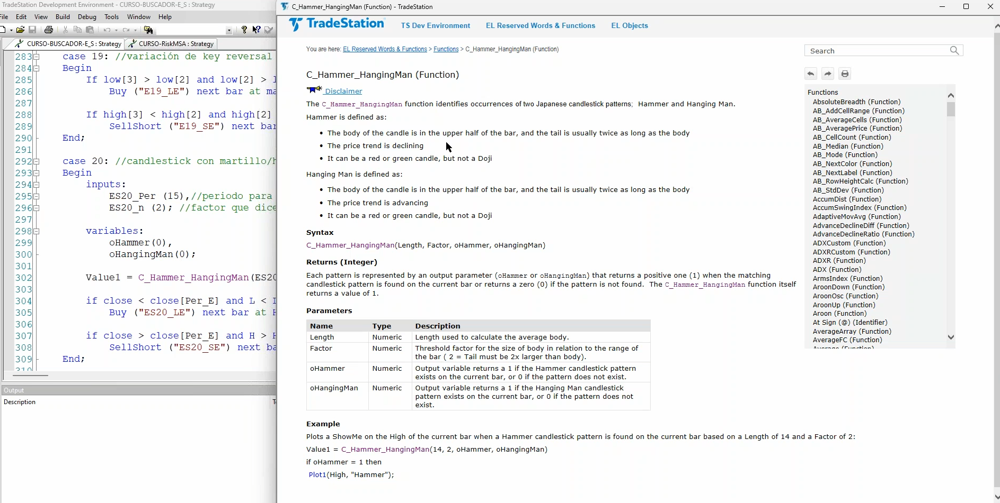
  <figcaption>Figura 011</figcaption>
</figure>

Esto recomiendo hacer los *ShowMe's* para ver las reglas en la pantalla y mirar el gráfico de entrada y de salida. Vale, ver, entender las cosas a pintar. Esto que he dicho, ¿qué significa esto de *pullback* contra la tendencia primaria? Vale, pues que lo pinte un *ShowMe's*, y así lo veo en qué velas eso se da. Y lo veo, y lo intento entender. Y a lo mejor, porque a raíz de ahí, a lo mejor lo puedo modificar, y puedo modificar la idea, y cambiar cosas.

Pero aquí hay un martillo, vale, de entrada. Que no sé si os hice dos, si os hice dos, la misma al revés. Y otro *breakout* con un *momentum*, un *momentum* más corto y *momentum* largo. Es decir, cuando una media de un cierre, un cierre sea superior a un cierre de muy largo plazo, y el de corto también. Entonces, cuando se dan esas dos *momentums*, entra, entra en el largo. Y al revés en el corto.


**Case 21: Otro Breakout + Momentum**

<div style="border-left: 4px solid #2980b9; background: #ebf5fb; padding: 10px 15px; margin: 10px 0;">
  <strong>🎯 Breakout + Momentum simplificado</strong><br>
  Combina confirmación de momentum (cierre > cierre de N periodos) con breakout de máximos (cierre = máximo del periodo corto). Más simple que el case 11: no usa ATR ni órdenes stop, entra directamente a mercado cuando ambas condiciones coinciden.
</div>

```
case 21: // Otro Breakout + Momentum
Begin
    inputs:
        E21_Per (10);
 
    if Close > Close[Per_E] and Close = highest(Close, E21_Per) then
        Buy ("ES21_LE") next bar at market;
        
    if Close < Close[Per_E] and Close = lowest(Close, E21_Per) then
        SellShort ("ES21_SE") next bar at market;
End;
```

**Case 22: Momentum corto plazo + Momentum largo plazo**

<div style="border-left: 4px solid #2980b9; background: #ebf5fb; padding: 10px 15px; margin: 10px 0;">
  <strong>📈 Doble confirmación de momentum</strong><br>
  Exige que tanto el momentum de largo plazo como el de corto plazo confirmen la misma dirección. Para largos: cierre > cierre largo plazo Y cierre > cierre corto plazo. Es lo opuesto al case 9 (pullback): aquí no hay corrección, ambos plazos están alineados. Entrada conservadora que busca tendencias claras.
</div>

```
case 22: // Momentum corto plazo + Momentum largo plazo
Begin
    If Close > Close[Per_E * E09_n] and Close > Close[Per_E] then
        Buy ("ES22_LE") next bar at market;
        
    If Close < Close[Per_E * E09_n] and Close < Close[Per_E] then
        SellShort ("ES22_SE") next bar at market;
End;
```

---

Y aquí ya repito, está el *candlestick*. Pero igual que tenéis el *hammer*, pues podéis probar cualquier tipo de velas. Están todas y buscáis aquí en el diccionario mismo, vale. Que están las funciones. Vale, a ver si pongo C, a ver si me salen así de manera fácil. Igual hay mucho, no ves, con C guión me salen todas.

<figure>
  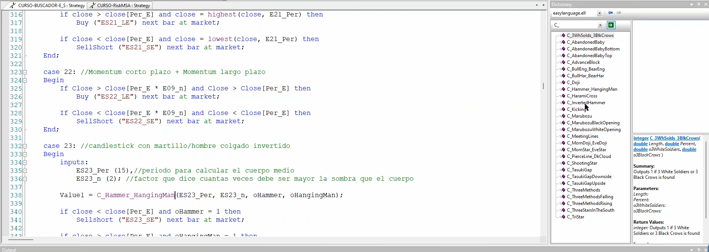
  <figcaption>Figura 012</figcaption>
</figure>

<div style="border-left: 4px solid #16a085; background: #e8f6f3; padding: 10px 15px; margin: 10px 0;">
  <strong>🕯️ Funciones de Candlestick en EasyLanguage</strong><br>
  <em>TradeStation</em> incluye funciones predefinidas para detectar patrones de velas japonesas. Todas empiezan con <code>C_</code> seguido del nombre del patrón: <code>C_Hammer_HangingMan</code>, <code>C_Doji</code>, <code>C_Harami</code>, <code>C_Engulfing</code>, <code>C_MorningStar</code>, <code>C_EveningStar</code>, <code>C_ThreeWhiteSoldiers</code>, <code>C_AbandonedBaby</code>, etc. Podéis abrir el código de cada función para entenderla o modificarla.
</div>

Ahí están todas las funciones. El 3 soldados, el bebé abandonado, bueno, el nombre es lo peor, pero es igual.

Entrar, recordaros que está la ayuda, y ahí os la explica, vale. Si no, buscáis en Internet, qué es un *abandoned baby*, que encontraréis 74 páginas que hablan de ello, vale. Entonces, lo bueno es que están ya programadas, podéis abrir el código para entenderlas y cambiarlas si queréis, vale. Pero hay un montón. Las típicas más conocidas, *harami*, *doji*, bueno, todas, *gaps*, alguno talas, triple, estrella de amanecer, de anochecer, envolventes. Vale, que todo este tipo de figuras que hay bastante conocidas y bastante usadas por la literatura técnica.

Aquí las podéis evaluar, vale. Las podéis evaluar. Porque podéis programarlas y montar una estrategia de entrada con ellas. Aquí os he puesto el martillo. Podemos usar otras con la función que ya está incorporada y programar un montón de entradas, vale. Y también podéis hacer como salida, como entrada.

**Case 23: Candlestick con martillo/hombre colgado invertido**

<div style="border-left: 4px solid #2980b9; background: #ebf5fb; padding: 10px 15px; margin: 10px 0;">
  <strong>🔄 Martillo invertido (contra-señal)</strong><br>
  Usa el mismo patrón que el case 20 pero invierte la lógica. Si hay martillo (normalmente alcista) pero el momentum es bajista → entra corto. Si hay hombre colgado (normalmente bajista) pero el momentum es alcista → entra largo. Es una apuesta contra la interpretación tradicional del patrón, útil para testear si la señal clásica funciona o no en un activo.
</div>

```
case 23: // Candlestick con martillo/hombre colgado invertido
Begin
    inputs:
        ES23_Per (15),  // periodo para calcular el cuerpo medio
        ES23_n (2);     // factor: cuántas veces debe ser mayor la sombra que el cuerpo
        
    Value1 = C_Hammer_HangingMan(ES23_Per, ES23_n, oHammer, oHangingMan);

    if Close < Close[Per_E] and oHammer = 1 then
        Sellshort ("ES23_SE") next bar at market;

    if Close > Close[Per_E] and oHangingMan = 1 then
        Buy ("ES23_LE") next bar at market;
End;
```

---

**Resumen del código Buscador: 23 entradas y 35 salidas**

Entonces ahí están las 23 entradas. Podríamos haber hecho 74. Es decir, se ve claro, ¿no? Pues un ejemplo hecho de *RSI* y varios para que, picadores, medias, pautas de *momentum*, de precio, poco de todo, un poco de todo. Pero solo lo podéis evolucionar lo que queráis.

Esto es al final un código que permite rápidamente probar, ahora por el 23, 22, 21, y voy probando con un mismo código. Buscador de, buscador de qué tipo de señales le gusta a un activo. Por ejemplo, ¿qué tipo de señales le gusta a un activo? Vale.

<div style="border-left: 4px solid #8e44ad; background: #f4ecf7; padding: 10px 15px; margin: 10px 0;">
  <strong>🔍 Filosofía del Buscador</strong><br>
  El código <em>Buscador E_S</em> permite probar rápidamente 23 tipos de entrada × 35 tipos de salida = 805 combinaciones posibles. Cambiando solo dos números (<code>Entrada</code> y <code>Salida</code>) puedes explorar qué tipo de señales funcionan mejor en cada activo. Es una herramienta de exploración, no un sistema final. Las ideas que funcionen se desarrollan después de forma independiente.
</div>

---

### Salidas

Y para salida, pues había muchos más. El he puesto el cero como no, éxito, *no entries*. Pero realmente no haría falta, sería igual, pero lo he puesto para que os quede claro.

Y aquí ya lo vimos, vale. Estop porcentuales solos, *ATR*, un montón. Vale, aquí ven lo empezamos a mezclar, *Bollinger* salidas. Y he añadido alguno más, no recuerdo mal. Final cierre por *Donchian*, cierre por un *momentum*, vale. En algunos indicadores típicos de entrada, *key reversal*, vale.

Aquí os he puesto, si veis que funciona, lo podéis meter con algo más. Pues un *Donchian* es *key reversal* más esto, *key reversal* más TP. Añadirlo vosotros, vale. Esto da una media móvil para cerrar, y a los que ya viste, esto, *parabolic*, *trailing*, *profit trailing*, *breakeven* porcentual. Bueno, está todo. Acordaros que hay un montonazo, vale. Hay un montonazo.

Os he etiquetado todas, vale. Porque así ya veis en la pantalla: es `"S35_LX"`, S34, `"S33_LX"`, vale. Con el número de qué es que es. Vale, *long exit*, *short exit*. Vale. Y en y en entre, es *long entry* L y S. Vale.

```sh
switch (salida)
  Begin
    case 0: #no exits
    case 1: #Stop $
    case 2: #Stop %
    case 3: #Stop ATR
    case 4: #Profit $
    case 5: #Profit %
    case 6: #Profit ATR
    case 7: #Breakeven $
    case 8: #Trailing ATR
    case 9: #Salida por Tiempo
    case 10: #Salida al cierre (necesita modificar la sesión para que acabe n minutos antes del cierre real)
    case 11: #Trailing ATR + Profit ATR
    case 12: # Chandelier
    case 13: #Bollinger banda contraria
    case 14: #Salida Trailing %
    case 15: #Stop $ + Profit $
    case 16: #Stop% + Profit%
    case 17: #Stop ATR + Profit ATR
    case 18: #Chandelier + Profit%
    case 19: #Stop% + temporal
    case 20: #Chandelier + temporal
    case 21: #Bollinger banda contraria + temporal
    case 22: #Bollinger banda contraria + Stop%
    case 23: #ParabolicSAR Exit
    case 24: #Profit% + BreakEven$
    case 25: #Stop% + BreakEven$
    case 26: #Profit% + BreakEven%
    case 27: #Stop% + BreakEven%
    case 28: #BreakEven%
    case 29: #Stop% + Profit% + BreakEven%
    case 30: #Stop $ + Profit $ + BreakEven $
    case 31: #Stop ATR + Profit ATR + BreakEven%
    case 32: #Stop ATR + Profit ATR + BreakEven $ (potencial extensión)
  End;
```

---


Esto por supuesto os lo doy. Intentaremos, no lo tengo aún hecho PDF, lo pasaremos a un PDF. A ver que pasarlo aún a un PDF, y subiremos el código y el PDF, vale.

Este no, no, o sea, es que *EasyLanguage* ya es lenguaje hablado. Yo creo que todo el mundo lo va a tener. Lo que voy a hacer es copiarlo, porque si lo tengo que hacer el lenguaje hablado, me va a llevar a 200 horas, que ya me ha llevado 200 hacerlo. Pero es que ya se entiende, o sea, explico. Es decir, el *EasyLanguage* es es realmente muy cercano al lenguaje hablado. Es un lenguaje de muy alto nivel y es muy, muy cercano.

Por lo que yo creo que tampoco hace falta cada entrada, cada salida. Si alguien no entiende alguna, que me lo pregunte. Si alguien no entiende alguna, que me lo pregunte. Que nos lo pregunte en el *Discord*, y se lo aclaramos.

Pero yo creo que copiando y pegando el texto directamente, vale. Para aquel que no pueda compilarlo en un *EasyLanguage*, lo ponemos en un PDF que lo pueda copiar y trasladar a lo que quiera la idea. Pues yo creo que ya vale.

**Workspace de prácticas**

Pero esto no era propiamente de hoy, pero sí os lo quería presentar y entregar. Porque creo que es un código, nuevamente material, creo que bastante útil, bastante, bastante útil.

Tengo un *workspace* y también os lo, os lo pondré ahí también en esto. Es lógicamente sólo sirve para aquel que tenga, aquel que tenga *TradeStation*. Pero tengo un *workspace* donde estás curso, prácticas, clases, cada una de las. Vale, bueno, simplemente es para que lo veáis que digo. Con esto podíamos haber hecho sólo una que se entera, pero pero aquí pues eso que os digo.

Vale, al final tú es aquí tienes es 23 *long entry*, vale. Esto los, estos los que le solos no se etiqueta. Este es la 23. Entonces, así lo veis ya en pantalla cuál tenéis.


<figure>
  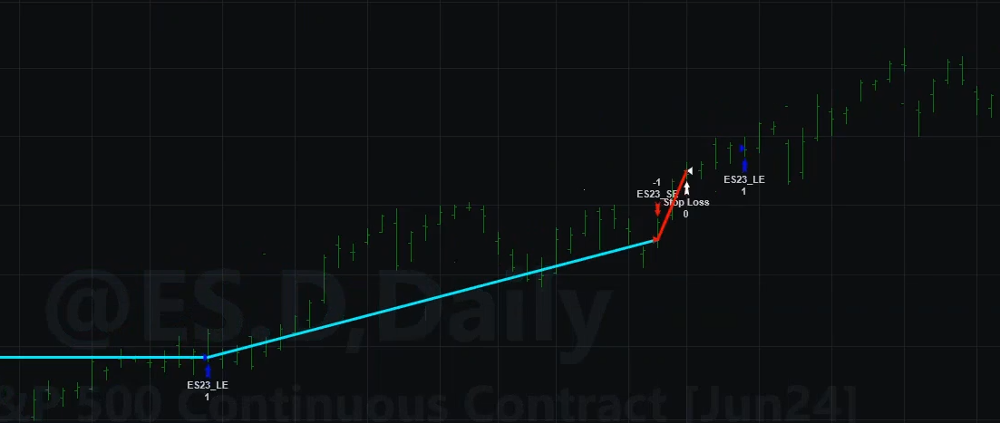
  <figcaption>Figura 013</figcaption>
</figure>


Simplemente tú tienes aquí los *inputs* de todos. 

<figure>
  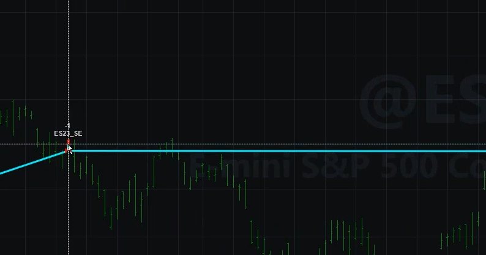
  <figcaption>Figura 014</figcaption>
</figure>
<figure>
  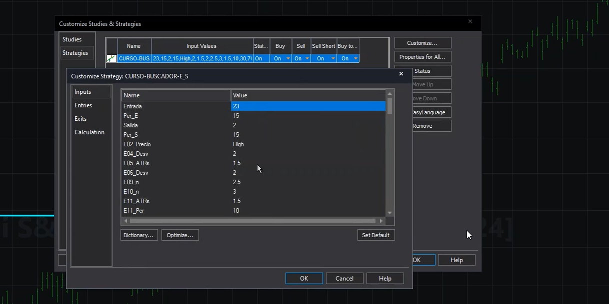
  <figcaption>Figura 015</figcaption>
</figure>

Pero los primeros son entrada, salida, periodo entra, periodo salida. 15 entrar a 23 con salida 2. Perfecto. Luego además yo tengo aquí los *inputs* 02, 05. Ya veo rápidamente a qué se refiere cada uno de 14, 5, 17, 20. 

<figure>
  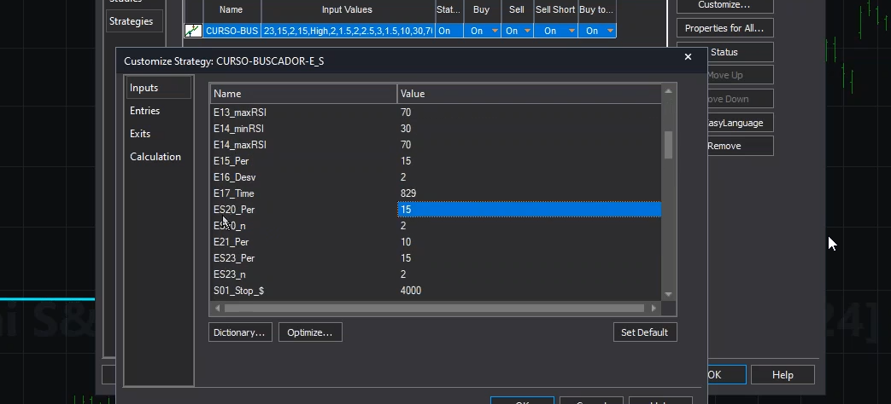
  <figcaption>Figura 016</figcaption>
</figure>

A todos le he puesto, vale. Para que rápidamente. Los que tenían un *input* la otra vez estaban como aprovechados. Ahora no, cada entrada y salida tienen el suyo, aunque esté usado en otro. Para que sea fácil. El 31, pues son estas. El 30, pues son estas. 29, pues son estas.

Vale, yo ahí puedo con un mismo código ir probando distintas combinaciones, vale. Distintas combinaciones. Pero esto ya digo, está aquí en el S&P, lo podéis poner en cualquier activo y probar lo que queráis. Intradía, tal, podéis ir probando de manera rápida, vale.

Cómo funciona una entrada, una salida, y a partir de ahí ver por dónde tirar. Porque esto os va a dar mucha pista de qué tipo de estrategia va mejor para cada activo. Os va a dar una pista bastante, bastante potente.

Insisto, con el objetivo de hacer las vuestras. Un ejemplo para que hagáis las puestas. A partir de ahí, tengáis un módulo de útil, interesante, potente, es decir que sirve. Y todas las salidas están todas prácticamente, además recordar que TradeStation ya tiebe muchas ya pre-instaladas. Pero bueno, os he puesto todas ya en un mismo código. Pero con el objetivo de que vosotros hagáis las vuestras, vale.

## Money management: introducción

Vamos con el *money management*, que era lo que tenía tratado nuevo. Es verdad que casa, o casa no era, pero pero era, creo, importante todo, todo esto, vale.

Entonces, qué vamos a ver. Sobre, como os decía, vamos a trabajar sobre todo, sobre todo en **MSA**, sobre todo en MSA. Acordaros, pero tenéis las las prácticas y la teoría la que ya enseñé alguna cosa de MSA. Hoy vamos a enseñar alguna, alguna más, pero una más encima y más detalle, vale.

Pero también, vista las preguntas y comentarios que he ido recibiendo, pues voy también insistiendo en aquellas cosas que creo que son más útiles, necesarias, o que veo que quizá podéis ir más más verdes, vale. Más verdes.

**Martingala y anti-martingala**

Esto al final es el material que yo utilicé para hacer las clases teóricas. No voy a hacerlo todo, pero simplemente se quería recordar algunos casos, algunos casos en cuanto al tema del *Martingala* y *Anti-Martingala*. Porque esto es un tema realmente muy importante que, tristemente, aquellos que operáis pues seguro que lo habéis visto. Está relativamente de moda, y hay gente que aún las defiende.

Y al final, las *Martingala* simplemente se inventaron para superar la vez ventaja del sistema. Entonces, nosotros lo que tenemos que hacer es encontrar ventajas, de acuerdo. Y no tratar de, con la, con algo que no tiene ventaja, pues conseguir que gane, vale. Esa es un poco la idea. Si yo tengo ventaja, no tiene ningún sentido usar *Martingala*. 

**MSA: exportación de datos desde TradeStation**

De todas maneras, vamos aquí vamos a ver un poquito de código, porque os hablé de alguna cosita de distintas maneras y demás.

<figure>
  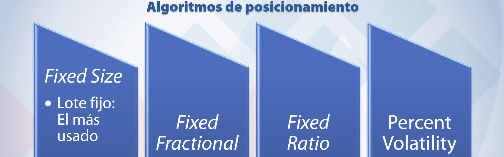
  <figcaption>Figura 019</figcaption>
</figure>

En la teoría visteis un poco cómo lo vimos en MSA, pero no visteis cómo íbamos desde el código. Ahora vamos a trabajar desde cómo nosotros, desde *TradeStation*, pues enviamos ese ese material a MSA.

Por cierto, recuerdo aquellos que no lo vierais, o que nosotros es, entiendo que debe seguir la oferta. Esto nosotros no tenemos ningún tipo de beneficio. Simplemente le envié un email preguntando si podía haber algún tipo de descuento y me lo ofreció, y os lo puse ahí en el disco, vale. Entonces yo ya os lo dije, que os recomiendamos, lo recomiendo.

Tiene pendiente de sacar una nueva versión, hace mucho tiempo lo dice, y supuso que algún día la sacará. Pero es un programa que es útil, es útil, como ahora vais a saber.

**Fixed Fractional vs Fixed Ratio**

Entonces, al final, no os compliquéis. O no nos al final el *money management* es todo bastante parecido. Sí que es verdad que *Fixed Ratio* es un poco distinto. A mí me gusta más *Fixed Fractional*, pero podéis también probar *Fixed Ratio*, de acuerdo.

<figure>
  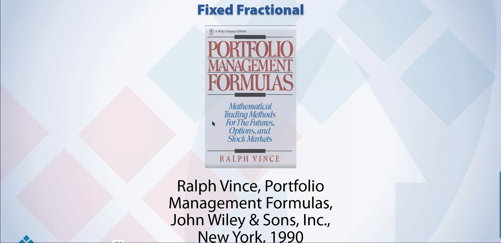
  <figcaption>Figura 020</figcaption>
</figure>

Y es verdad que en cuentas a lo mejor pequeñas puede ir mejor, porque tiene un crecimiento más lento, vale. Más lento. Y cuando *Fixed Risk*, lo mantiene de manera constante y proporcional, *Fixed Ratio* es decreciente. Y es verdad que es un poco más prudente, es un poco más.

<figure>
  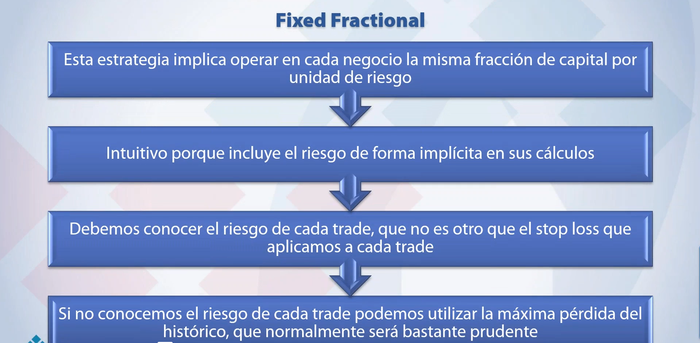
  <figcaption>Figura 021</figcaption>
</figure>

Pero bueno, en definitiva, al final *Fixed Fractional*, que es esta fórmula, ahora vamos a ir al *EasyLanguage*, es realmente sencilla. Y de hecho, hasta hasta se puede hacer a manija para quien es discrecional, de acuerdo.

<figure>
  
  <figcaption>Figura 022</figcaption>
</figure>

**Fórmula del Fixed Fractional**

Al final no se trata más que de una F, una cuenta y un riesgo. Y ahí es donde está un poco la madre del cordero: cómo fijamos ese riesgo, cómo fijamos ese riesgo. La manera convencional y más intuitiva, y es correcta, es el *stop*. Es decir, si tu sistema tiene *stop*, de acuerdo, a ese denominador le pasas es el *stop*.

El tema es que si aquellos sistemas que tienen *stops* muy alejados que actúan poco, o incluso supongo alguno en una cartera bien diversificada que no tenga, entonces hay que medir de alguna manera ese riesgo. Entonces nosotros, por ejemplo, lo estimamos. Ahora os voy a enseñar cómo. Que voy a repetir muchas veces esto hoy: no tenéis que usarlo igual. Puede no gustaros. A nosotros nos gusta, pero no es tan solo el más eficiente creciendo la cuenta, para nada. Es bastante conservador.

También depende de la F siempre esto, vale. Pero no tiene por qué ser el mejor, vale. Al final hay muchas versiones que juegan simplemente con lo que incluyen en ese denominador, en ese *trade risk*. Porque como veis, es igual que cuando hablamos en *drawdown* de los ratios de retorno riesgo, no. El retorno en el numerador, riesgo. Es muy importante porque actúa de divisor. De aquí igual. Si el riesgo es 1000 o es 2000, pues es invertir la mitad de contratos, recuerdo. Entonces, al final es muy, muy importante, vale. Es muy importante.

**Volatility Position Sizing**

Y ahora lo vamos a ver. Ahora me paso ya al Alex. Nosotros de hecho hacemos algo parecido a esto. No es exactamente igual, pero hacemos algo parecido al *Volatility Position Sizing* de Vince, de acuerdo. Algo muy parecido.

<div style="border-left: 4px solid #27ae60; background: #ecf9f1; padding: 10px 15px; margin: 10px 0;">
  <strong>📊 Volatility Position Sizing</strong><br>
  Es un método de dimensionamiento de posiciones basado en la volatilidad actual del activo, popularizado por Ralph Vince. En lugar de usar un <em>stop</em> fijo como riesgo, utiliza una medida de volatilidad (como el <em>ATR</em>) para ajustar dinámicamente el tamaño de la posición.
</div>

<figure>
  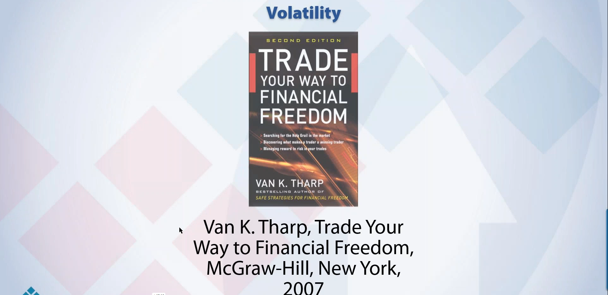
  <figcaption>Figura 023</figcaption>
</figure>
<figure>
  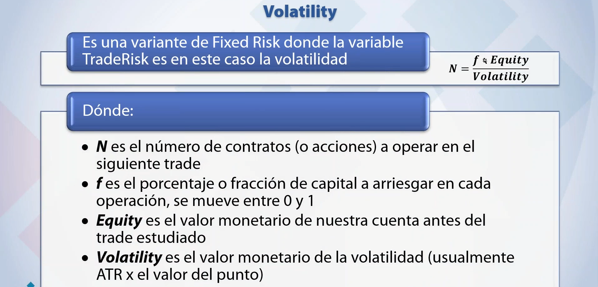
  <figcaption>Figura 024</figcaption>
</figure>

De hecho es y no es para nada el más eficiente, pero sí que suelen momentos de fuerte volatilidad pues suele reducir rápido, y eso es importante. Pero veréis, veréis que tiene, tiene algunos problemas. Y nosotros los hemos solucionado de la siguiente manera que vais a ver.

Bien, vamos primero al al código vía *EasyLanguage* para llevar los datos a MSA.

Yo al final MSA, vale, que insisto que os lo os lo recomiendo, al final no es más que un programa en el que yo le tengo que llevar *trades*. ¿Cómo le llevo los *trades*? Bueno, esto la ayuda lo explica, pero básicamente hay o bien leyendo un *performance report*, o bien que, por ejemplo, ya importa cuando tú le pones un sistema, un sistema nuevo, y tú le añades un sistema.

<figure>
  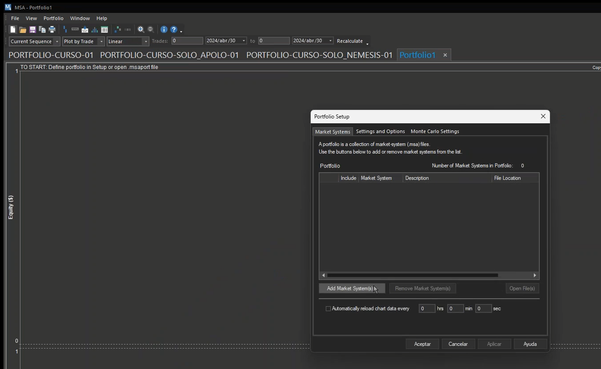
  <figcaption>Figura 025</figcaption>
</figure>
<figure>
  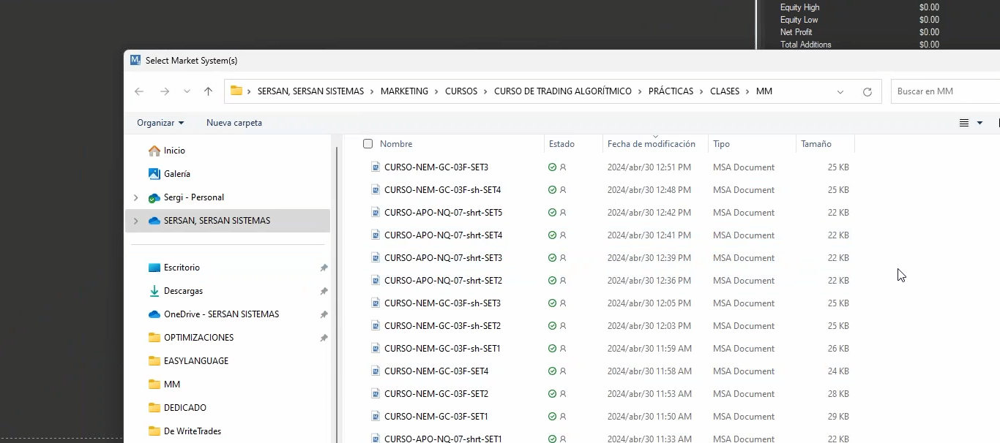
  <figcaption>Figura 026</figcaption>
</figure>

Puedes bien cargarle ya un archivo de eso. Ya es para abrir uno que tienes, vale, no *portfolio*, no, *portfolio* no, no sea *fail*, vale. Cuando yo meto un sistema y le quiero añadir datos, 

<figure>
  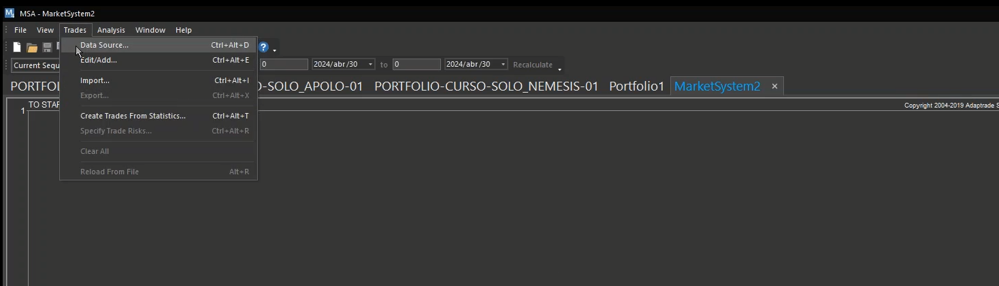
  <figcaption>Figura 030</figcaption>
</figure>
<figure>
  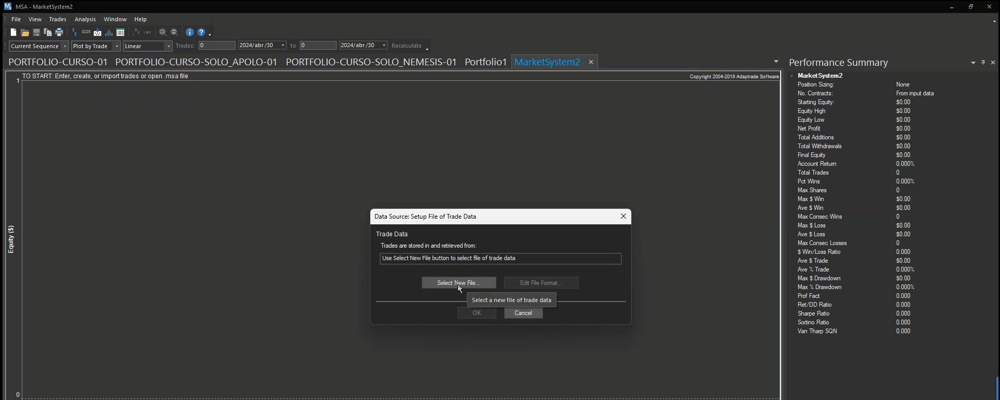
  <figcaption>Figura 029</figcaption>
</figure>
<figure>
  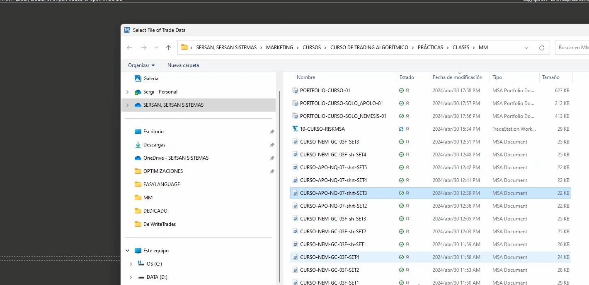
  <figcaption>Figura 031</figcaption>
</figure>

al final tiene como unas plantillas. Espera que esto ya es cuando ya se ha cargado data. Son los otros. Tiene como unas plantillas, vale, que detectan que te van a decir igual.

<figure>
  
  <figcaption>Figura 031</figcaption>
</figure>

Y ahora te pongo cualquiera, luego no lo importaré, no lo importaré. Sólo es un archivo de Excel, pero eso es lo que lo que veáis. Esto, vale, porque aquí tiene distintos plantillas de formato, vale. 

<figure>
  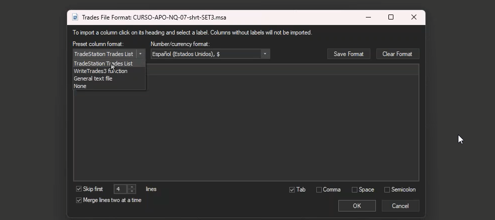
  <figcaption>Figura 032</figcaption>
</figure>

Ciertas plantillas de formato. Ves, tiene *TradeStation*, tiene *Bright Ray*. Ya veréis que es en general. Esto le ayuda, os lo os lo explica, vale.

Pero normalmente, si tú tienes *TradeStation*, lo puedes llevar bien leyendo un *performance report*, que lo lee, o bien usando esta función que ahora os voy a enseñar, que es bastante práctico. 

Es un poco cuando saque alguna versión, pues acara más más posibilidades. Como lo como lo como lo saca esto, vale. De momento os voy a enseñar la función.

**Función de exportación a MSA**

El programa trae esta función `WriteTrades32`, que es una función bastante compleja, que viene muy bien explicada, muy bien comentada. Y aquel que quiera avanzar un poco en código, pues es interesante, porque puede poder también aprender con ella. Tiene bastante explicado.

<figure>
  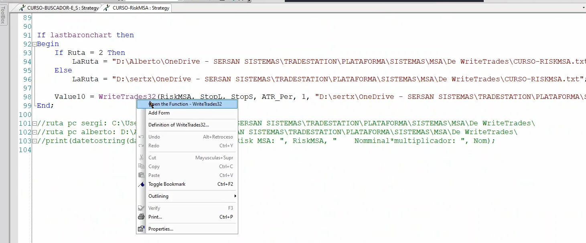
  <figcaption>Figura 033</figcaption>
</figure>

Pero al final no es más que una función que genera, exporta información a un archivo texto o CSV. 

```sh
{ User function: WriteTrades32
  Use this function to write out the trades generated by a trading system to a text file.
  This function is designed to provide the input files needed by Market System Analyzer 3.2. To
  use this function, call it as the last line in your trading system. Make sure the function
  call is outside of all loops and other control statements.
  
  INPUTS:
    TrRisk:	risk for current trade in dollars; should be positive. This number can be different
      for each trade if desired. TrRisk should be for the same number of contracts or shares as 
      the profit/loss.
    StopL: initial stop price for a long trade.
    StopS: initial stop price for a short trade.
	NATR:  Averaging period for average true range calculation.
    FName: full name of file for writing trade profit/loss and risk data to, including drive and 
      path; e.g., "C:\Futures\Data\out1.csv". This file, if already present, will be deleted 
      before being re-written.

  Notes: 
  1. It is not necessary to use both TrRisk and stop prices (StopL, StopS). Use one or
  the other to define the trade risk.
  2. The average true range (ATR) value output by this function is the value calculated on the bar
  immediately prior to the bar of entry for the trade.
  3. The symbol name is retrieved from the built-in TradeStation function GetSymbolName.

  OUTPUT:
  The function writes the entry and exit dates/times, trade profit/loss, risk, entry price, 
  exit price, stop price, size (contracts or shares), market position (long or short), symbol name, 
  and the average true range for each trade to the text file specified by FName. 
  The function returns the number of trades.
  
  Copyright 2006 - 2009 Adaptrade Software
 }

 input: TrRisk      (NumericSeries),    { risk for current trade }
        StopL       (NumericSimple),    { initial stop price for long trade }
        StopS       (NumericSimple),    { initial stop price for short trade }
        NATR        (NumericSimple),    { period for average true range }
        CurrConv    (NumericSimple),    { currency conversion factor }
        FName       (StringSimple);     { file name to write results to }
		
 Var:   TradePL   (0),                  { Trade profit/loss }
        NTrades   (0),                  { Number of trades } 
...
...
```


Mediante pues simplemente importa, pues por supuesto fechas, horas, y lo la información que necesita para recoger los *trades*. Aquí ahora se abrió el precio de compra, precio de venta, el resultado, etcétera, vale.

Y para que veáis, todo eso es perfectamente posible con palabras reservadas de *EasyLanguage*. Al final, mediante un código que no vale la pena ahora profundizar en él, este código lo da MSA, está explicado la ayuda, pues te genera un archivo. Que lo hace con esta función, palabra reservada, que se llama *FileOpen*, que genera un archivo. Ya está. Genera un archivo, escribe, perdón, envía, escribe información en un archivo.

¿Y qué información escribe? Pues toda esta, vale. Toda esta que está aquí, que la imprimen este en este archivo. Y por lo tanto, tú a través, como cualquier otra función, de acuerdo. Tú sabes que tienes 1, 2, 3, 4, 5, 6 *inputs*. 

```sh
 input: TrRisk      (NumericSeries),    { risk for current trade }
        StopL       (NumericSimple),    { initial stop price for long trade }
        StopS       (NumericSimple),    { initial stop price for short trade }
        NATR        (NumericSimple),    { period for average true range }
        CurrConv    (NumericSimple),    { currency conversion factor }
        FName       (StringSimple);     { file name to write results to }
```

Puedes usarla en el código, vale, para extraer información.

```sh
Value10 = WriteTrades32(RiskMSA, StopL, StopS, ATR_Per, 1, "D:\sertx\OneDrive - SERSAN SISTEMAS\TRADESTATION\PLATAFORMA\SISTEMAS\MSA\De WriteTrades\CURSO-RISKMSA.txt");
```

El primer *input* es el riesgo, segundo el *stop* de largos, *stop* de cortos, el periodo de *ATR*, la conversión de divisa, y la ruta. Esto ahora mismo no es importante. Simplemente que entendáis que mediante el uso de esta función de MSA, aquellos que lo vayáis a usar, pues podéis, podéis exportar fácilmente los datos, más fácilmente los datos, vale.

Esto siempre se mete en un *`If lastbaronchart then`*, vale, para no hacer, procesar todo, vale. Para que no se procesen todas las barras, o se procesen la última barra del gráfico. Y primero esto simplemente es para sacar información al MSA. Se ejecuta y punto. 


Como siempre digo, no obligamos ni recomendamos específico, bueno, si os lo recomiendo, es igual que aquel que no hubiera, que hubiera conocimientos de ningún lenguaje, le recomendamos easylenguaje para empezar, *EasyLanguage*, lo comenté al principio. Si os lo recomiendo, vale. ¿Ahora es obligatorio? Bueno, no es obligatorio. Hay otros programas y directamente dentro de *TradeStation* tienes  *Maestro*, que lo veremos el próximo día. Y también se puede mirar gestion monetaria también allí. Pero MSA la verdad que es un programa sencillo de manejar, fácil, muy enfocado en eso, vale. Y es muy útil.

Y la verdad, no recuerdo el precio como salía. Pero con el descuento este, ¿dónde está el disco que no lo veo? Aquí el disco. Aquí. Pues esto, no sé dónde lo puse, el material, el descuento de MSA. Ponen bienvenido igual no, un buscador. Gracias. Pues no sé, pero lo busca en todos los charches. Todo que material, no me ha salido, no me ha salido a coño, aquí sí sí, vale. 100 dólares de descuento con este, con este. No sé cuánto salía, a ver lo miro. 400. Bueno, si lo pagas en unos 400 euros, pues sale por 300 euros, por 300 euros. Pero no es caro, no es caro, y viene bastante bien. Pues estoy a cada uno, repito. Yo para analizar la gestión monetaria os lo recomiendo.

Entonces, de esta manera nosotros sacamos a MSA nuestras estrategias cuando queremos analizar el MSA. Que se puede hacer en otros sitios, pero cuando queremos hacer en MSA lo hacemos ahí.

**Cálculo del riesgo con volatilidad normalizada**

Bien, ¿cómo sacamos nosotros el riesgo? Esa es una de las maneras. Cuando tú no tienes un sistema con un *stop* fijo y que actúa frecuentemente, vale. Esa es una de las algoritmos que más usamos ahora, vale.

```sh
Ajuste = MaxList (AvgNormalizedTrueRange (ATR_Per), Filt_ATR); 
#Usado para evitar que la volatilidad tome valores demasiado bajos lo que implicará lotajes demasiado altos
```

Hemos usado distintas versiones, de acuerdo, pero esta es la que usamos ahora. Simplemente tenemos una que ya habéis visto: el *Average Normalizado de True Range*. Esto es la volatilidad, pero medida en porcentaje. Calculada así, vale.

```sh
NATR = MaxList (H - L, C[1] - L, H - C[1]) / TypicalPrice * 100;
```

Al final se calcula de cada día el el *True Range*, que es el mayor de estos tres `(H - L, C[1] - L, H - C[1])`. Esto es el *True Range*. Se divide por el *Typical Price*, se multiplica por 100 por una representación gráfica, sin más. Multiplicarlo por cien es porque en pantalla pues se ve a 1.6, no se ve a 0.16. Porque si va a ser intradía, pues a lo mejor se ve 0.21 por ciento, y si no pues sería 0.021. Es como menos vistoso. Entonces, por una tema de representación gráfica, se multiplica por cien.

Entonces, esto no deja de ser el rango porcentual, el rango porcentual medio en que se mueven de cada activo, de acuerdo. Entonces usamos eso como estimador de volatilidad.

**Problema del ATR en largo plazo**

Porque esto ya lo comentaba desde la práctica: el *ATR* tiene el eterno, problema. Que ya lo habéis visto muchas veces en activos de muy largo plazo. Aquí tenéis abajo cargado, Vamos a cargarlo a 22, porque es un mes. Estamos en diario y hasta, vale.

Pues al final, a la que cargas bastante tiempo, se nota mucho, de acuerdo. 

<figure>
  
  <figcaption>Figura 034</figcaption>
</figure>

El de abajo es un buen estimador de volatilidad. El de arriba no lo es, de acuerdo. Ahora está muy alta, y no es verdad que esté alto. Está alto porque ha subido el precio, es claro, es comparable, ¿entendéis?

Entonces, como estimador de volatilidad, no es un buen estimador de volatilidad en mucho plazo. En cambio, el de abajo sí lo es. Es un buen actual, que está en un rango ahí bastante estandarizado, normal. En cambio, de arriba pues pues no lo está, porque final que no mide puntos. Los puntos de ahora no son los mismos, de acuerdo.

Es el de abajo es el que usamos, vale. Pero luego lo convertimos a puntos actuales, porque lógicamente hay que convertirlo.

**Limitación con MaxList**

Ahí la gran, la gran cosa, o la cosa que os recomendamos mucho, es este cálculo que hacemos con el *MaxList*. 

```sh
Ajuste = MaxList (AvgNormalizedTrueRange (ATR_Per), Filt_ATR);
```

Tenemos un *input*, simplemente un *input* `Filt_ATR`, que puede ser la volatilidad media un poquito más. Esto ya depende la sensibilidad que le quedamos dar. Como como muy poco, la media histórica del activo. Que esto también lo habéis visto, que lo en algún gráfico lo hemos metido, y es muy fácil, los enseñado, como se decía acumulando. Habéis visto ya.

Para que nunca sea menor que es esto. Esto hacemos, ***repito: estoy midiendo la volatilidad del activo, la volatilidad del activo***. Yo la uso mediante este `AvgNormalizedTrueRange`, pero lo paso por un *MaxList* entre estos dos valores: `AvgNormalizedTrueRange (ATR_Per)` el valor de la volatilidad que habéis visto el gráfico + uno que es un *input* `Filt_ATR`.

¿Por qué? Porque no quiero que sea más baja que esa nunca. Es decir, si yo este valor le pongo, vamos a suponer 1, vale? `MaxList (AvgNormalizedTrueRange (ATR_Per), 1 );`, que es 1%, y la volatilidad (`AvgNormalizedTrueRange (ATR_Per)`) es 0.5, de acuerdo, la volatilidad es 0.5, el valor que va a tomar esta variable es 1. ¿Se entiende no?

Es decir, imaginarnos esta línea que la he pintado ahora, si es demasiado baja, esos momentos donde está por debajo de ese 1, que hay algunos, no muchos, el valor que va a tomar no va a ser los que estén por debajo de la linea, este tan bajo. Va a ser va a ser 1.

<figure>
  
  <figcaption>Figura 035</figcaption>
</figure>

Esto, ¿por qué es? Esto es porque al final nosotros lo pasamos como riesgo. Ahora veréis, lo pasamos como riesgo como denominador. Muy parecido a lo que hacía Vince. Ahora lo veremos. Pero no le limito, no le dejo que tome valores demasiado bajos. ¿Por qué? Porque si yo esto lo estoy pasando como el riesgo y no le hago ese límite, en momentos de muy baja volatilidad ***me va a meter muchísimos contratos***, vale.

Y sabemos, por lo que os decía antes justamente, de cuándo va bien un *mean reversion*, cómo viene un tendencial, que los momentos de baja volatilidad frecuentemente, frecuentemente, anticipan momentos de fuerte volatilidad, de acuerdo. Esto es bastante frecuente. Como veis, esto incluso niveles más altos, esto es bastante frecuente. Como veis, vale.

<figure>
  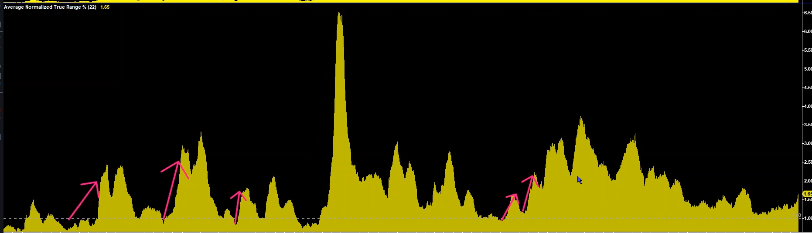
  <figcaption>Figura 036</figcaption>
</figure>

Y por lo tanto, esto puede hacer que yo arranque esos momentos de alta volatilidad, de alta volatilidad, o de inicio de alta volatilidad, y por tanto de mucho riesgo, muy cargado de contratos, vale. Demasiado cargado. Y ese primer *trade*, o segundo, tercero, que si lo acierto, bien, pero si los fallo, me pueden destrozar la cuenta, ¿me entendéis?

Y esto puede pasar. Entonces, una de las maneras de evitarlo es limitar el valor. Hay varias maneras. Yo, como siempre, voy a tratar de explicar varias.

**Límites mínimo y máximo de contratos**

La una manera es tener un mínimo y máximo, que ya sabéis que lo solemos tener en el código, vale. Lo solemos tener. Esto ahora, creo que no puedo enseñar los *inputs*, Alberto. No puedo, no puedo enseñar los los *inputs*. Pero bueno a, no, en este código no lo tenemos puesto eso, vale. Es que este es el de MSA, vale.

Vale, bueno, lo habrá que enseñar uno del *money management* del curso, no el de Apolo. Creo que lo tenía preparado. A ver lo miro, lo miro

**Variable ajuste con límite**

Estamos aquí. Tenemos una variable ajuste que simplemente recoge la volatilidad, 

```sh
Ajuste = MaxList (AvgNormalizedTrueRange (ATR_Per), Filt_ATR);
```

pero insisto en el límite, de acuerdo. Que quede claro esto. Que esto es arbitrario. De hecho ahí, en ese sistema, acabo de ver y era un inmedio, que lo que era, que era real para que lo veáis, vale. No se supone que sea este límite, vale.

<figure>
  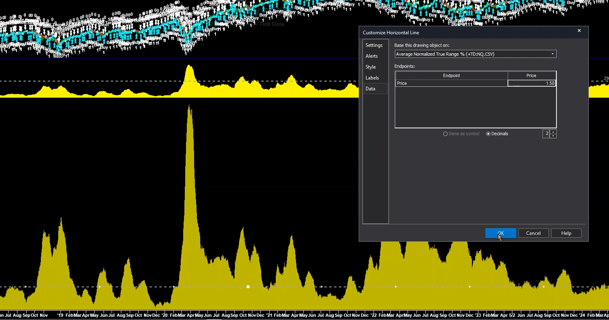
  <figcaption>Figura 037</figcaption>
</figure>

por debajo de uno y medio, toma uno y medio. Para arriba, sí toma más. Porque es el denominador, y puede restar, puede bajar mucho los contratos. Pero lo que no le dejo es subir demasiado. Por decir, tengo esa limitación.

sé que eso estoy frenando crecimiento exponencial. Eso es una, es una ***variable conservadora***, de acuerdo. Una variable conservadora. Una variable que va a hacer que gane menos. Seguro que, seguro que va a hacer que mi cuenta crezca más lentamente, seguro, vale.

A cambio de pagar ese precio, pues soy mucho más conservador en abruptas caídas. Y porque, por ejemplo no, este ejemplo que os ponía aquí. Esto todo esto es real y todo esto se ha operado. 

<figure>
  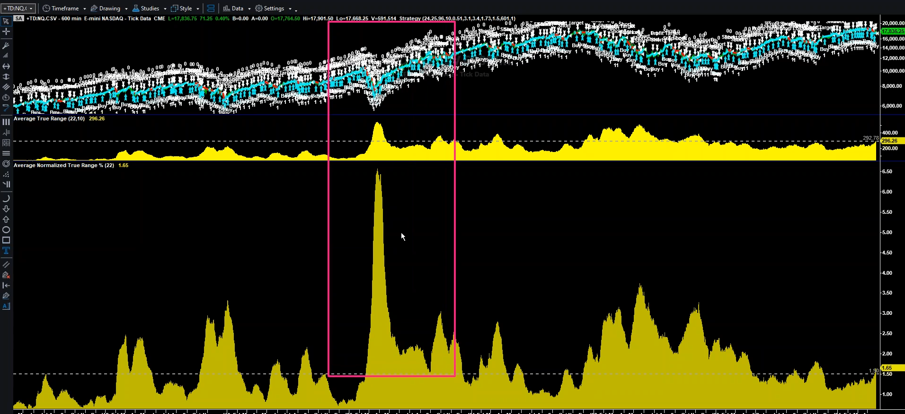
  <figcaption>Figura 038</figcaption>
</figure>

Esto debe ser el COVID, no, debe ser el COVID, o no. Pues, 2008, no. Eso es el COVID. Yo vengo ahí en el COVID. Bueno, 

**Ejemplo real: operativa durante alta volatilidad**

Aquí no hay, arriba de bores malas, porque éste es el que exporta MSA, vale. Y lo hay exporto sin gestión monetaria, exporto bruto. Porque allí le aplicaré, vale. Y le aplica.

Pero para que entendáis la idea no, caros, aquí que yo vengo con poca volatilidad, todo lo que está debajo. Entonces yo aquí estoy metiendo muchos contratos, me está yendo muy bien, lo que os digo. Veis, estoy petándolo, se petando, no. Porque voy haciendo largos y largos, qué bien.

<figure>
  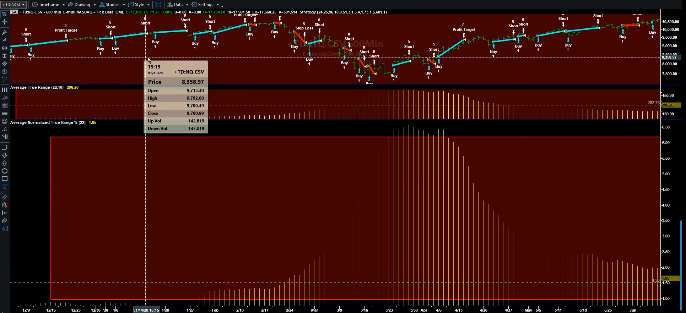
  <figcaption>Figura 039</figcaption>
</figure>

Fallo uno, pero pierdo poco. Aquí ha, cuidado, que ya meto uno y ya fallo más, me dan, me dan un poquito ahí, acabo el *stop*, vale. 

<figure>
  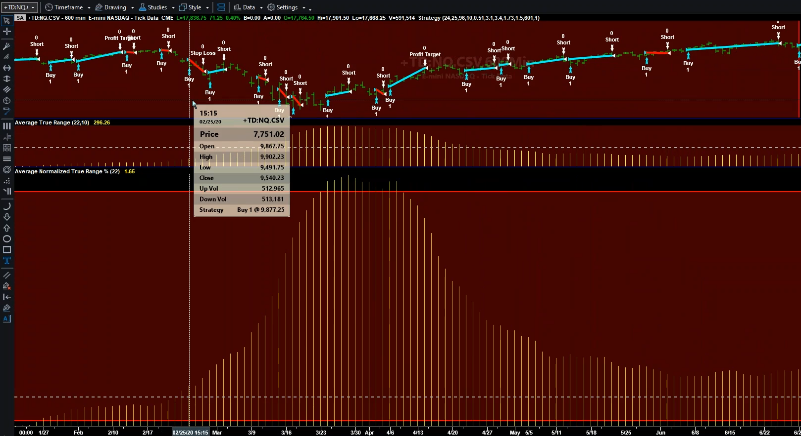
  <figcaption>Figura 040</figcaption>
</figure>

Aunque ya empezaba a subir la volatilidad, por lo tanto ya ha empezado a reducir un poco de contratos. Seguramente siguen siendo muchos entendéis.

Entonces, el problema es real. Aquí no se ha acabado de ver, que no acaba de ser, porque afortunadamente este movimiento fue más o menos paulatino, vale. Fue más o menos paulatino. El tema es si a veces ese brusquedad se produce de manera más abrupta que esta, vale.

A ver si hay alguna que lo sea, es arlo ido a mirar del tirón. La verdad que no recordaba cómo había, cómo había ido. Y por ejemplo, aquí tiene que ser que venga de abajo realmente, pues hayan pérdidas fuertes no.

El 2008. 2008 ya estaba volátiles. Realmente el 2008 no es un buen ejemplo para casi nada. Porque era, el 2008 era bastante fácil de predecir, en el sentido de que venía ya al mercado claramente. 2008 de Lehman vino avisado, no. Lo siguiente. De hecho estábamos con la volatilidad altísima ya. El mercado ya había caído, y vino Lehman y acabó de reventarlo. Pero ya estaba altísima. Bueno, altísima, pero ya estaba alta, y estaba bueno.

Creo que se entiende a encontrar un ejemplo ideal, pero creo que se entiende. Esto ya digo, tanto por experiencia como lo hemos vivido, pasa.

**Ejemplo de riesgo con baja volatilidad**

Aquí, aquí tienes un ejemplo. Aquí tienes un ejemplo. El mercado empieza a girarse, y tú tienes, tienes aquí largos, tienes aquí largos, y estás casi en mínimos de volatilidad. Estás abriendo a volatilidad de 1.3, 1.29. Lo cual estás metiendo muchos, muchos contratos, y fallas, vale.

<figure>
  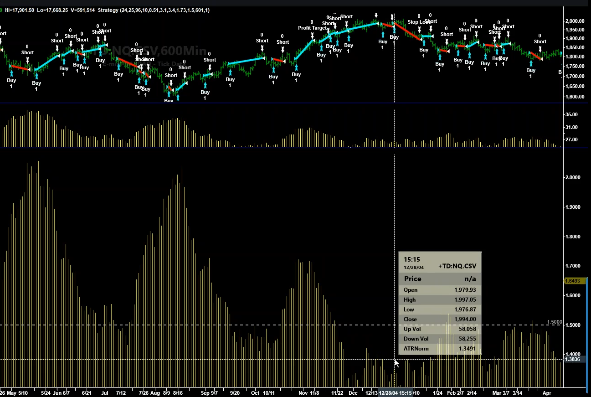
  <figcaption>Figura 041</figcaption>
</figure>

Claro que si luego la volatilidad sigue subiendo, tú vas a ir ajustándote. Pero no siempre. Verás que te la vas a ir tragando con muy poca volatilidad vas a tener fallos gordos, incluso consecutivos, te van a provocar una pérdida demasiado grande.

Entonces, una manera de controlar eso es limitar, limitar el número mínimo de contratos. Esto se puede hacer de varias maneras.

**Inputs de min size y max size**

También aquí, en un código real, vais a ver cómo lo, cómo lo lo pasamos siempre. Esto, creo que alguno ya lo habíais visto, pero para que lo veáis, vale. 

<div style="border-left: 4px solid #3498db; background: #ebf5fb; padding: 10px 15px; margin: 10px 0;">
  <strong>📚 Strategy : SISTEMA APOLO - NASDAQ 07B</strong><br>
 Definitivamente falta código,,, estas partes son las que hemos podido ver de la esttrategia original.  
 Lo que tenemos es solo la parte de Money Management / Position Sizing. Faltan varias partes críticas:

 Lo que sí tenemos  
✅ Declaración de inputs y variables  
✅ Cálculo del ATR normalizado con suelo (Ajuste)  
✅ Cálculo del riesgo monetario (Risk)  
✅ Position sizing completo (Trade_Long, Trade_Shrt)  
✅ Límites de tamaño (Min/Max)  
✅ Redondeo de contratos  

 ```sh
{
    Código para curso
    SERSAN-APOLO-NASDAQ-07B
}

{ Variables }
inputs:
    Start_Equity (20000000),
    
    MMVar (0.5),
    Min_Size (1),
    Max_Size (500000),
    RoundTo (1),
    
    Filt_ATR (1.75),
    Per_05 (5),
    
    puntosErrorTradeporHalt(601);

# El mercado abre con Halt el 16/03/2020 con muchísimo volumen
# Esto hace imposible operar el lado corto en el tick de apertura

Var:
    ATR (0),
    Price_Long (0),
    Price_Shrt (0),
    
    Fast (0),
    Slow (0),
    Nivel_Dw (0),
    Cond_Long (false),
    Cond_Short (false),
    Trade_Long (0),
    Trade_Shrt (0),
    Profits (0),
    
    TP (0),
    Ajuste (0),
    Risk (0),
    ATR2 (0);


{ Money Management }
Ajuste = MaxList (AvgNormalizedTrueRange (Per_05), Filt_ATR);

Risk = (Ajuste * 0.01) * c * Bigpointvalue;
# Risk = C * Bigpointvalue;  # nominal
# print (riskMSA);

Profits = NetProfit + OpenPositionProfit;

# Trade_Long = ((Start_Equity * MMVar_Start * 0.01) + (Profits * MMVar_Profits * 0.01)) / AbsValue(Price_Long * BigPointValue
Trade_Long = ((Start_Equity + Profits) * MMVar * 0.01) / absValue(Risk);

# Trade_Shrt = ((Start_Equity * MMVar_Start * 0.01) + (Profits * MMVar_Profits * 0.01)) / AbsValue(Price_Shrt * BigPointValue
Trade_Shrt = ((Start_Equity + Profits) * MMVar * 0.01) / absValue(Risk);

    #  187 acciones / 10

Trade_Long = IntPortion(Trade_Long / RoundTo) * RoundTo;
Trade_Shrt = IntPortion(Trade_Shrt / RoundTo) * RoundTo;

Trade_Long = MaxList(Trade_Long, Min_Size);
Trade_Long = MinList(Trade_Long, Max_Size);
Trade_Shrt = MaxList(Trade_Shrt, Min_Size);
Trade_Shrt = MinList(Trade_Shrt, Max_Size);


{ Entry orders }
If MarketPosition <> 1 and Cond_Long then begin
    #  Lógica de entrada larga
end;

If MarketPosition <> -1 and Cond_Short then begin
    #  Lógica de entrada corta
end;
 ```
---
**¿qué partes del codigo faltan?** Pero esto lo tenemos en las otras estrategias


  ```sh
  { Indicadores - FALTA }
  { Niveles de entrada - FALTA }
  { Condiciones de entrada - FALTA }
  { Entry orders - INCOMPLETO }
  { Salidas - FALTA COMPLETAMENTE }
  ```
</div>

**¿Cómo pasamos siempre el *money management*?**

Ese es el filtro que os decía, vale. 

<figure>
  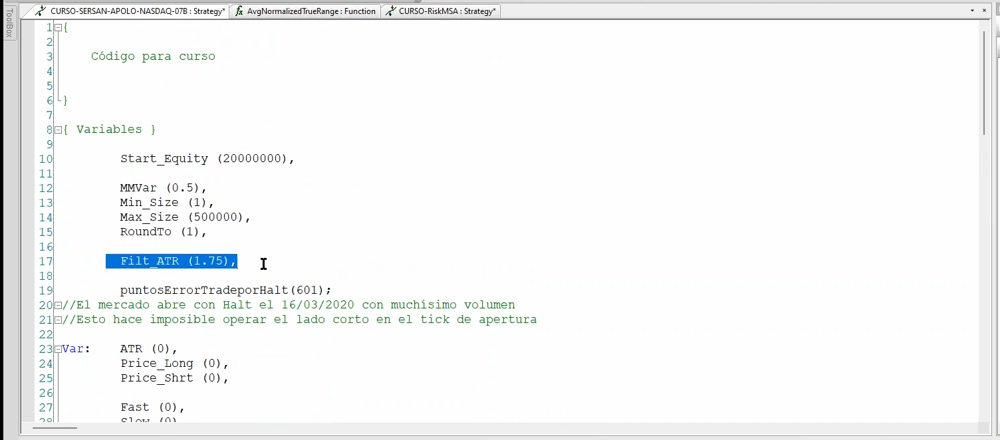
  <figcaption>Figura 042</figcaption>
</figure>

Y luego hay el MM bar, y un *min size* y un *max size*. Si tú quieres, aquí puedes limitar el mínimo, 

```sh
Min_Size (1),
```

decirle: bueno, yo puedo hacer que puedes cero, puedo hacer que el cálculo de cero que los mínimos solo opere 2, o opere 3, o lo que quiera. Y el *max* es lo mismo.

```sh
Max_Size (50000),
```

Y yo puedo hacer que no pase nunca de 10, de 20, etcétera. Puedo jugar con esas dos variables a maneja, limitando el crecimiento.

Y luego hay esta manera que ya habéis visto.  limitando este, este, con esta buena variable *ATR* que usamos para calcular `Filt_ATR` en `(AvgNormalizedTrueRange (ATR_Per), Filt_ATR);`. Este es el periodo que usamos `ATR_Per` Que está, normalmente es estable en diario, usamos 15, normalmente. Y este *FileATR* que puede ser pues uno y medio, por ahí, vale. Esto ya es un poco depende.

Y automáticamente de esta manera limitamos lo que os decía, que la volatilidad no tome un valor demasiado bajo.

**Conversión a puntos actuales**

Y aquí simplemente. Esto `Ajuste` es la volatilidad, de acuerdo. Esto es esta volatilidad con este *MaxList*. Le quito el porcentaje, de acuerdo. Le quito el porcentaje. Falta otra cosa que me ha dejado, falta esto, vale.

```sh
Ajuste = MaxList (AvgNormalizedTrueRange (ATR_Per), Filt_ATR); 
#Usado para evitar que la volatilidad tome valores demasiado bajos lo que implicará lotajes demasiado altos
RiskMSA = (Ajuste *0.01 * TP) * Bigpointvalue; #(volatilidad) * nominal
```

Lo multiplico por el *Typical Price*, y luego lo multiplico por el *Big Point Value*. en programación es mejor práctica hacer esto, vale. Que lo sepáis. Es mejor multiplicar que dividir. Siempre que podáis, siempre que podáis. En un número redondo, si no es redondo ya igual ya lo compensa. Pero lo siempre que podáis, es mejor que sea multiplicar que dividir, vale.

Entonces hacemos esto. Lo multiplicamos por el *Typical Price* TP. Es decir, lo hemos vuelto a puntos. Esto simplemente es deshacer el efecto que hemos hecho con la volatilidad porcentaje. Pero tener en cuenta que yo le he calculado en porcentaje, ahora la paso a puntos. Pero la paso al final a puntos día a día. La calculo en porcentaje de los 15 días, y el valor que de 1.6, 1.3, 1.4, evidentemente lo paso a porcentaje porque lo multiplico por *Typical Price*.

¿Se mete por *Close*? Pues mira, hay un punto de manía, y hay un punto de que el *Typical Price* al final no deja de ser una media. Por tanto está un poco más centrado que el *Close*, que es un único dato. Al final *Typical*, para eso, en tres datos. Hay más, *Low* más *Close* partido por tres. Es un dato un poquito más centrado, y por lo tanto por eso lo usamos. Pero si usas el *Close*, es perfecto. No hay ningún problema, vale.

Esto es efecto volatilidad `(Ajuste *0.01 * TP)`, y luego lo multiplicamos por `Bigpointvalue` para añadir el componente nominal, o precio, de acuerdo.

**Big Point Value para componente nominal**

Y esta es la variación, vale. Esta es, bueno, la variación. La variación respecto al *Volatility* y al *Volatility* y clásico de Vince es que él simplemente pone la *ATR* en el denominador.

Nosotros usamos una *ATR* normalizado en porcentaje, limitado a que no pueda tomar valores más bajos de un determinado valor. Y además lo multiplicamos por el valor del punto, por el valor del punto.

**Nominal vs Volatility Position Sizing**

<figure>
  
  <figcaption>Figura 043</figcaption>
</figure>

Esto, si veis, aquí vuelvo ahora al otro. Aquí está comentado este otro *risk*, porque eso es el nominal. Antiguamente, por ejemplo, o en una SICAP, por ejemplo, si tú operas un vehículo que que es, que no te permite apalancar, que no te permite apalancar, esta es la manera de calcular nominal.

Esto, *Typical Price* o *Close*, para ser, en este caso, para ser más ortodoxos, mejor el *Close*. Porque es el valor que toma el regulador como cierre del mercado, de acuerdo.

Entonces, al final sería *Close* por *Big Point Value*. El valor del futuro o del activo en cuestión. Eso es el valor nominal que tiene el activo que operas. Y por lo tanto es lo que vale multiplicado, lógicamente, por las acciones que tú tengas abiertas. Sería el valor de tu posición.

Pero si yo lo paso en el denominador, hago cuenta por F partido por esto, por *risk* calculado así, lo que estoy invirtiendo es el nominal de la cuenta desde.

Si yo tengo 100 mil euros estoy, y le pongo 100% en esa F, lógicamente aquí le pongo 100, automáticamente se meten al 100% de la cuenta, de acuerdo. O dicho de otra manera, la F regula el porcentaje de la exposición que yo tengo. Si yo me quiero exponer un 100%, usando esto, y poniendo como F 100%, automáticamente invirtiendo el 100%.

Entonces, en vez de usar el nominal, usamos una mezcla ante volatilidad normalizada con un límite, insisto, multiplicado por el punto, vale.

**Relación entre nominal y volatilidad**

Si fuera sólo nominal, todo esto simplemente sobraría esto `Ajuste *0.01`, al final, la diferencia entre el nominal y este y este algoritmo es esto `TP) * Bigpointvalue;` es esto, es nominal. Repito, si le pongo cierre, es igual, casi es nominal. Esto es nominal. Por lo tanto es nominal por volatilidad.

Podría hacerse dividido. Es que no importa ahora no vais a entender por qué. Bueno, más que muchos lo habéis entendido, pero voy a tratar de añadir otra capa para explicarme mejor, vale.

De porque no importa. Al final, todo esto está multiplicado y dividido. Por tanto, no importa. Y va en el ratio, que todo está multiplicado y dividido. Por lo tanto, al final todos los datos se van, podemos decir, auto-ajustar.

Cuando yo los los, es decir, si yo en vez de hacer este cálculo de ajuste dividido por 100, no divida por 100, pues no importaría. Y si en vez de multiplicarlo, lo dividiera todo por ajuste, pues tampoco importaría.

Entonces, al final, porque al final es un producto Entonces, al final no importa. 

**Código de Fixed Risk en EasyLanguage**

Esto, `RiskMSA` acordaros que es el *risk* que yo paso al denominador, que es al final *Fixed Risk*. *Fixed* el final es esto, es esto. Yo aquí lo calculo separado para tenerlo con *TradeStation*, pero es esto. Esto es *Fixed Risk*.

<figure>
  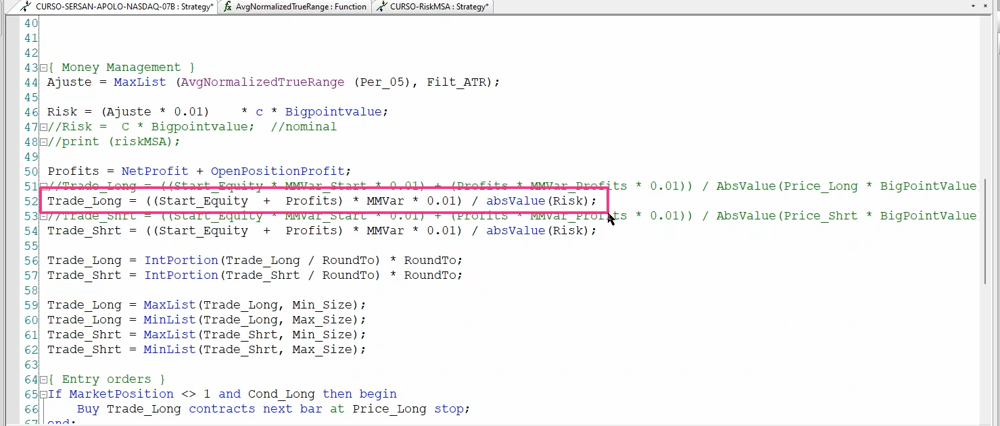
  <figcaption>Figura 044</figcaption>
</figure>

El número de contratos largos o que abriría yo es la cuenta más el beneficio, que es el *NetProfit* más el *OpenPositionProfit*. Es decir, la cuenta inicial `Start_Equity` más el beneficio `Profits`, por una F que es `NMVar`a, que la multiplico por 0.01, porque me gusta más ponerle en porcentaje. Por lo que os decía antes, simplemente de un aspecto visual.

Es decir, aquí a mí me gusta más poner 100 por 100. Lo que decía nominal, no. Yo podría decir por 100 por 100. Podría 100 por 100, porque al final eso es el tiempo de la cuenta, porque luego lo multiplico por 0.01. De esa manera le quito el porcentaje, vale. Y lo divido por el riesgo en valor absoluto, vale.

El riesgo es esta variable, pero podría ser esta, o podría ser el *stop*, o podría ser cualquiera. Esto al final es *Fixed Risk* en un código. Yo aquí lo separo para largos y cortos. Si el sistema no se quiere usar largos y cortos, pues se se pone una única variable el *lot_test_trade*, lo que quiera. Y de esa manera sale, sale el *risk*.

**Módulo de redondeo**

Además de eso, también siempre en todos estos códigos tenemos este módulo de redondeo, vale. Que es, podéis hacer un *copy paste* porque es así, es muy sencillo. Vale.

<figure>
  
  <figcaption>Figura 045</figcaption>
</figure>

Aquellos que no que no conozcáis esta palabra, no se parece que es, *IntPortion* simplemente devuelve la parte entera de una fracción. 

<figure>
  
  <figcaption>Figura 046</figcaption>
</figure>

Para la gestión monetaria os recomiendo encarecidamente hacerlo así. Es decir, si el número de contratos que sales 4.9, se coge 4. Es que es un caso extremo, pero es así. No se coge 5, se redondea abajo siempre.

¿Por qué? Porque yo estoy diciéndole qué parte del riesgo quiero arriesgar, quiero invertir, quiero exponer. Y no quiero que sea más que ese, aunque sea poco más. Entonces, si yo quiero exponerme un 100% de la cuenta, no me puedo exponer un 101. Si yo quiero arriesgar un 2% de la cuenta, no puede ser un 2,2, un 2,4. Tiere que ser un 2 como máximo. Y la manera de hacer como máximo es hacerlo así: usar `IntPortion(4.5) returns 4`, vale. Con lo cual me quedo sólo el valor de la porción, el valor de la entera de la fracción. Es, en menos 172 me quedó menos 1. En 4 y medio me quedó 4, vale. Con *IntPortion*, tendéis. 

Entonces, si el valor de *trade_long* diera 7,84, esto haría que fuera 7, vale.

```sh
Trade_Long = IntPortion(Trade_Long / RoundTo) * RoundTo;
Trade_Shrt = IntPortion(Trade_Shrt / RoundTo) * RoundTo;
```

Porque esto es la manera de redondear. Imaginaos que hay operaciones que los rondes, redondear de 10 en 10. Pues en *round_to* le pongo 10, y esto al final me hace que me divida, entiendes, me hace.

Si yo tengo aquí 100, para que lo veáis, vale. Yo tengo 187 Y esto lo divido por 10, porque quiero redondear de 10 en 10, me da 18.7. ¿Estamos de acuerdo? 18.7. Pero que hace *IntPortion*, se queda, se queda solo el 18. 

```sh
Trade_Long = IntPortion(Trade_Long / RoundTo) * RoundTo;
Trade_Long = IntPortion(187 / 10) * RoundTo;
Trade_Long = IntPortion(18.7) * RoundTo;
Trade_Long = IntPortion(18) * RoundTo;
Trade_Long = IntPortion(18) * 10;
180 = IntPortion(18) * 10;
```

Esa es la manera de redondear, de redondear en la gestión monetaria.   
Os los recomiendo siempre hacerlo así, vale.

**Uso de MinList y MaxList para límites**

Y luego entra el módulo de *MinList*, *MaxList*, en caso que hayáis hecho. Acordaros que aquí `MaxList(Trade_Long, Min_Size)` en `Min_Size` podés tener un 1, y aquí `Trade_Long = MinList(Trade_Long, Max_Size);` en  `Min_Size` podés tener pues 20. Por lo tanto, yo paso primero *trade_long*, en los dos casos es igual. *trade_long* por el *MaxList*, vale.

```sh
# venimos de 180 = Trade_Long

Trade_Long = MaxList(Trade_Long, Min_Size);
Trade_Long = MaxList(180, 1);
Trade_Long = 180

Trade_Long = MinList(180, Max_Size);
Trade_Long = MinList(180, 20);
Trade_Long = 20 # me quedo con 20 que es el limite que había fijado como máximo

```

Imaginaos que esto ha dado, esto ha dado 180, hemos dicho antes, vale. 180. *MaxList* de 180 y 1, ¿qué es? 180, vale. Ahora *trade_long* vale 180. *MinList*, ¿qué es? 180, 20. Entre *MinList*, ¿qué es? 20. Y me quedo con 20. Al final me he quedado con 20, que es el límite que había fijado como máximo.

Siempre se hace así: se pasa primero por el *MaxList*, luego se pasa por el *MinList*, de acuerdo. Porque así redondeo el valor máximo y luego me quedo con el mínimo. Al final, si yo he puesto que de mínimo quiero 1 y el máximo quiero 20, y el valor que entra es 180, me quedo con 20. ¿Se ve no?

Esta es la manera de usarlo. El hecho de que haya *trade_long*, *trade_short*, es simplemente si quiero diferenciar en acciones para largo o para corto, o contratos, lo que sea, de acuerdo. Ese es un poco el único criterio, no es obligatorio, no es obligatorio, vale.

Ya está, aquí salían las órdenes de entrada, salida, ya está.

**Fórmula de Fixed Risk**

Entonces, simplemente que quede claro, entonces vuelvo sobre el *risk*, vale. Quedaros con esto, vale, que es al final la fórmula, vale. 

```sh
Trade_Long = ((Start_Equity + Profits) * MMVar * 0.01) / absValue(Risk);
```


Y esa fórmula es exactamente esta fórmula, de acuerdo. Es exactamente esta fórmula.

<figure>
  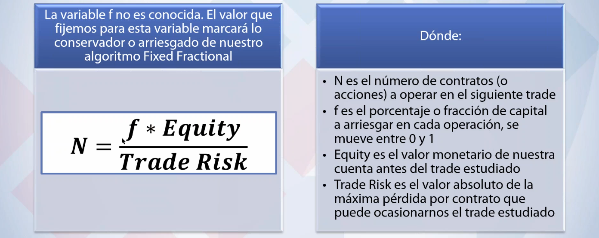
  <figcaption>Figura 057</figcaption>
</figure>

Está, F es el valor que habéis visto que se llama *MM_bar*. *Equity* es *StartEquity* más *profits*, vale. Que es *NetProfit* con *OpenPositionProfit*. Y *trade_risk* es lo que regula la agresividad.

Pero como veis, todo está multiplicado. Si yo al final tengo que elegir una F, y para eso voy a MSA, ahora vale. Verdad que al final el hecho de que yo multiplique, como veis antes, por 100 o divida por 100, *trade_risk*, lo que va a hacer es que una F sea más grande más pequeña.

Pero al estar todo multiplicado, de acuerdo. Esto es F partido por *trade_risk*, o *equity* partido por *trade_risk*. No deja de ser un valor, un número. Todo eso al final es un número, una N, ¿entendéis?

Entonces, por eso os decía que este ajuste en sí,
```sh
Risk = (Ajuste * 0.01) * c * Bigpointvalue;
```
lo que importa son los componentes que yo uso. Y esto, sobre todo, 

```sh
Ajuste = MaxList (AvgNormalizedTrueRange (Per_05), Filt_ATR);
```

que limito en la volatilidad, acuerdo. Pero al estar todo multiplicado, y todo el *risk*, al final la F me va a acabar de regular la agresividad.

Es decir, los dos elementos que regulan la agresividad es la F, por supuesto, y el *risk*, vale. Y el *risk*, ahí está la clave, es móvil. Ahí está lo que hace regular la volatilidad. Lo que hace regular la agresividad de la cuenta. Lo veréis muy bien en *MultiCharts*, en *Maestro*.

<div style="border-left: 4px solid #3498db; background: #ebf5fb; padding: 10px 15px; margin: 10px 0;">
  <strong>📚 Dominar la agresividad de la cuenta</strong><br>
Los dos elementos que regulan la agresividad es la <strong>F</strong> y el <strong>risk</strong>, vale. Y el *risk*, ahí está la clave, es móvil. Ahí está lo que hace regular la volatilidad. Lo que hace regular la agresividad de la cuenta.
</div>

Pero ya os enseñé en la teoría algún gráfico de esto, se veía. Por daros aquello de la exposición. Pero lo volveremos a ver el próximo día, porque quiero trabajar en ese un poco ahora en lo que nos queda.

**Efecto de la volatilidad en los contratos**

Al final, esto está, subida y bajada de volatilidad, es lo que va a dar. Pero lo va a dar sólo en la parte alta, en la parte alta. Es decir, aumentando el *risk* aquí para que meta menos contratos, de acuerdo.

<figure>
  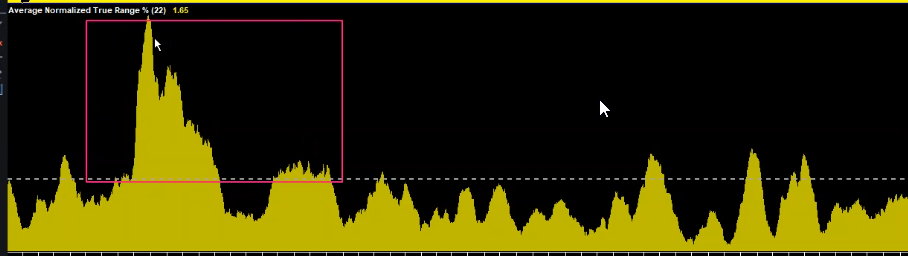
  <figcaption>Figura 058</figcaption>
</figure>

De tal manera que aquí, a ver, voy a poner un largo para ver un poco el los datos en sí. No, no importa, simplemente que veáis que los contratos cambian, que veis que los contratos cambian.

Yo aquí voy a cargar, creo que no va a llevar de más. 

<figure>
  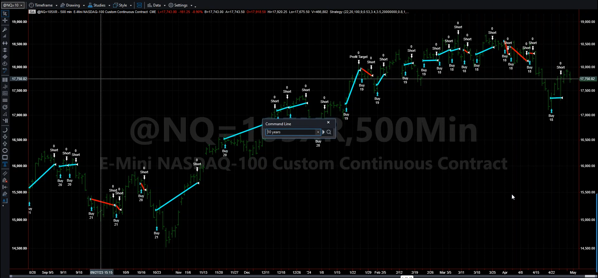
  <figcaption>Figura 059</figcaption>
</figure>

mientras carga ....


**Optimal F y otros métodos**

Entonces, mientras vuelvo aquí un poco porque es efecto y y notar lo que os digo. Al final 

[Teoría : Gestión monetaria 6.1 ](../../../../01_theory/08-theory-06-exposicion-gestion-monetaria/GLOSARIO%20TEMA%206.1.pdf)  
[Teoría : Gestión monetaria 6.2 ](../../../../01_theory/08-theory-06-exposicion-gestion-monetaria/GLOSARIO%20TEMA%206.1.pdf)  

* Fixed Fractional: Algoritmo de gestión monetaria en el que cada trade opera la misma 
fracción de capital por unidad de riesgo. 
* Fixed Ratio: El algoritmo de gestión monetaria "Fixed Ratio" es una estrategia de gestión de 
riesgo y tamaño de posición en el trading, desarrollada por Ryan Jones. La estrategia tiene 
como objetivo equilibrar el crecimiento y el riesgo al aumentar el tamaño de la posición a 
medida que crece la cuenta, pero de una manera más controlada en comparación con otras 
estrategias de gestión monetaria. La característica clave del método "Fixed Ratio" es su uso de 
un "delta" fijo para determinar cuándo aumentar el tamaño de la posición. 
* Fixed Size (Lote fijo): Algoritmo de gestión monetaria en el que siempre abre la misma 
cantidad de contratos. 
* F-Óptima: La F-óptima es una estrategia de gestión monetaria en el trading que busca 
maximizar la tasa de crecimiento geométrico de una cuenta de trading. Fue desarrollada por 
Ralph Vince, y es una parte fundamental de su teoría de gestión monetaria. Se determina a 
través de un análisis histórico de las operaciones de trading, encontrando la fracción óptima de 
capital que se debe arriesgar en cada operación para maximizar el crecimiento de la cuenta. 
* Fórmula de Kelly: Es un método matemático para determinar el tamaño óptimo de una serie 
de apuestas o inversiones, con el fin de maximizar el crecimiento del capital a largo plazo. La 
fórmula se basa en la relación entre las probabilidades de ganar y perder y la magnitud de las 
ganancias y pérdidas. En términos simples, la fórmula de Kelly calcula la proporción del capital 
total que se debe apostar en cada operación. 


... todo es lo mismo. 

Lo único que la manera de calcular la F o la manera de calcular el *risk* en algunos ratios cambia. 

**Fixed Ratio**, este sí que es un poco distinto, aunque también se puede adaptar.

$$N = \frac{\sqrt{(2 \cdot N_0 - 1)^2 + 8 \cdot \frac{P}{Delta}} + 1}{2}$$

Y este ***Volatility***, 

$$N = \frac{\text{f * Equity}}{\text{Volatility}}$$

eso que os digo, al final en el denominador él pone volatilidad. Fijaros que nosotros también usamos la volatilidad, pero no sólo, no sólo la volatilidad. Incorporamos el precio como constante, vale.

Porque no te sé que *BigPointValue* es una, es variable, porque es depende del precio. Pero es una constante. Es decir, siempre vale lo mismo, de acuerdo. Lo que pasa que es función del precio, de acuerdo. Pero siempre vale, en el caso del NASDAQ 20, en el caso del oro 100, de acuerdo, siempre vale lo mismo.

Lo que pasa que, evidentemente, al multiplicarse por, al multiplicarse por la volatilidad, eso que al final es una manera también de pasarlo a dinero, ¿no? ¿Se da cuenta? No te sé que esa manera de de pasarlo a dinero, no. Lo que hacemos es que sea variable dependiendo de la volatilidad.

Por lo tanto, tenemos el tanto del componente fijo vía precio, vía *BigPointValue*, como el componente volatilidad vía ese ese volatilidad normalizada. Repito, con un límite inferior, que también puede ser superior.

**Límite superior e inferior de volatilidad**

Hay autores que lo hacen, que esta misma horquilla que os he puesto, os la os la presentan para, os la presentan doblemente, de acuerdo. Es decir, tanto por la parte baja, como hacemos nosotros, como por la parte alta.

Pero por la parte alta se puede hacer con la manera que os decía, no. Planteando, planteando el, planteando el mini, el *max*, de acuerdo. Se puede hacer, y también se puede hacer vía volatilidad. Es decir, igual que yo he hecho aquí un *MaxList* o hacemos aquí un redondío *MaxList*, o yo podía hacer un *MinList* detrás, de acuerdo. ¿Entienden? Imagina que eso toma 1.6, y ahora aquí pasa un *MinList*, y lo mismo le puedo poner un *filter_ATR_A* y *filter_ATR_down* como quiera, revés. Y automáticamente le paso un valor que no puede ser menor a un valor y no mayor a otro.

**Visualización del Average Normalizado**

Entonces, aquí ahora voy a meter para que lo veáis también el *Average Normalizado*. 
Además me la voy a aprovechar para meter el de la media de método. Estos diarios, 22 días. Así tenemos más o menos un mes, vale. Así. Esta es la media histórica de todo lo que hay cargado. Que como veis, lógicamente es móvil. Pero al final llega a un punto que casi no se mueve. Es 68, 50, 170.

<figure>
  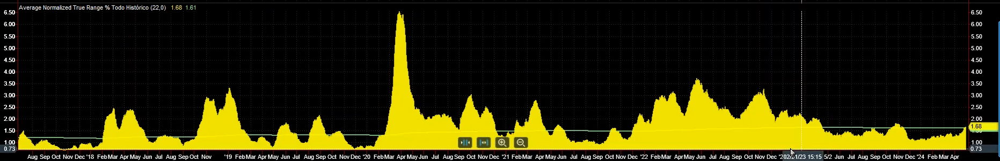
  <figcaption>Figura 062</figcaption>
</figure>

Es probar, es probar un poco. Entonces, aquí como veis, esto va moviendo. Entonces aquí en valores por debajo, esto ahora no sé qué valor filtra. A ver, espérate que ahora se abro esto pantalla, 

<figure>
  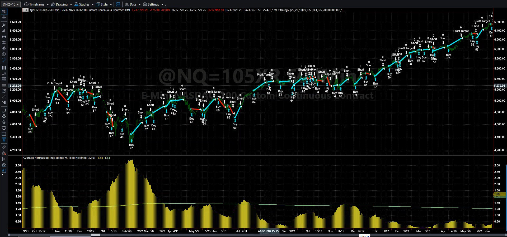
  <figcaption>Figura 064</figcaption>
</figure>

Entonces, esto está limitado en 1.75 (habla de `APOLO`)

> esto sí que es el de operar EN REAL. Y claro, hemos enseñado muchísimas cosas, muchísimas. Pero claro, cien por cien,,, igual Alberto me mata. Pues no me mate.

Entonces, esto está limitado en 1.75 (habla de `APOLO`)

Entonces que es más o menos la media, de hecho por la media actual, pero está por debajo. Voy a ponerle la línea como está, en 1,75.  Ahí, ahora se va a ver mejor, o lo que bien se ve. Ahora se mejora. Ahora no se ve mejor, se va a ver mejor.

<figure>
  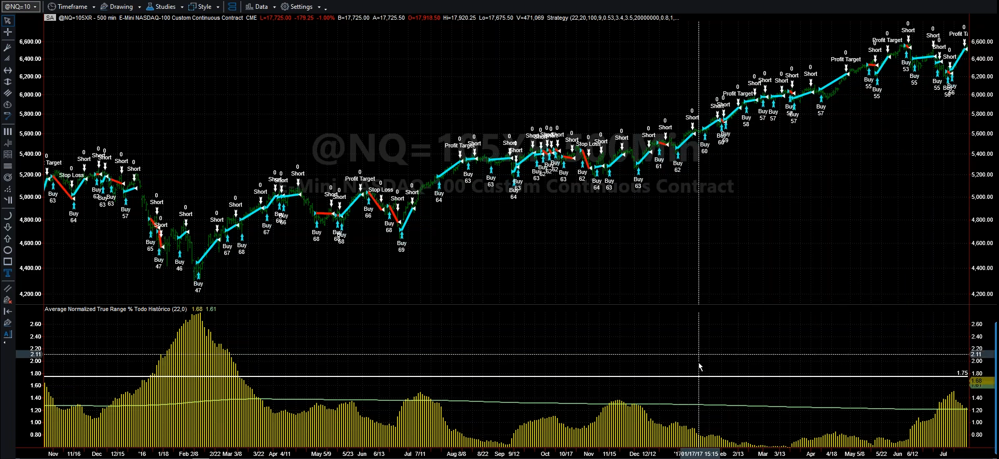
  <figcaption>Figura 065</figcaption>
</figure>

**Efecto del límite de volatilidad**

¿Qué quiere decir esto? Que esto viene desde muy atrás. No sé cuándo se había cargado sólo 10, sólo 10, para ver un poco. Aquí empieza con los cálculos, se empieza con 70. Porque depende del precio también, no olvidéis. Por eso aquí mete muchos y aquí mete menos.

<figure>
  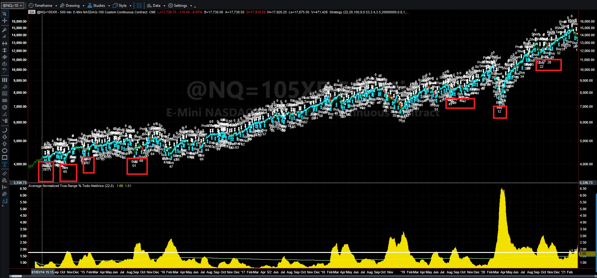
  <figcaption>Figura 066</figcaption>
</figure>

Ya lo veréis mucho de MSA, que en Apolo, a pesar de ir creciendo la cuenta, el crecimiento de contratos no es tal porque el nominal sube tanto. Y nosotros metemos el valor del precio en él, en el componente. Porque creemos que la exposición también es un componente importante. No queremos exponernos a más de N. Y esa es una manera también de controlarlo, a incorporar el precio ahí con el límite de la volatilidad. Y estoy evitando exponerme demasiado, vale.

<div style="border-left: 4px solid #3498db; background: #ebf5fb; padding: 10px 15px; margin: 10px 0;">
  <strong>📚 Dominar la agresividad de la cuenta II</strong><br>
a pesar de ir creciendo la cuenta, el crecimiento de contratos no es tal porque el nominal sube tanto. Y nosotros metemos el valor del precio en él, en el componente. Porque creemos que la exposición también es un componente importante. No queremos exponernos a más de N. Y esa es una manera también de controlarlo, a incorporar el precio ahí con el límite de la volatilidad.
</div>

Lo veréis muy bien cuando veamos *Maestro*. Lógicamente los contratos han ido subiendo, pero no de manera lineal.

**Ejemplo práctico: comportamiento antes de caídas**

Donde si se ve aquí, quiero que veáis, aquí, por ejemplo, previo, previo una caída. Aquí, mira, aquí. Aquí es que yo aquí estoy metiendo 26, veis 28. Y aquí fijaros cómo baja la volatilidad, y tengo ahí 30, y tengo 29.

No sé si llega a ver, lo voy a dejar porque está por debajo de la línea todo el rato. Aquí realmente no sube cuando debería de subir porque baja la volatilidad. Y veis que aún ahí hasta me mete menos porque ha subido el precio.

Pero estamos aquí, 28, 29, 30, 38, que está ganando, está subiendo la cuenta, y está bajando la volatilidad.

<figure>
  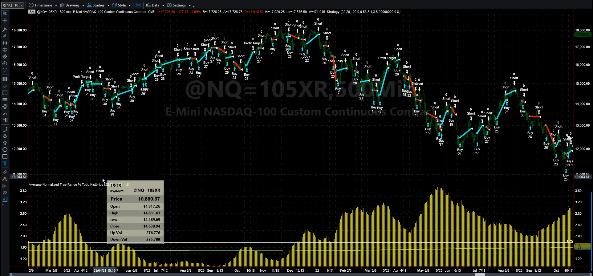
  <figcaption>Figura 067</figcaption>
</figure>
<figure>
  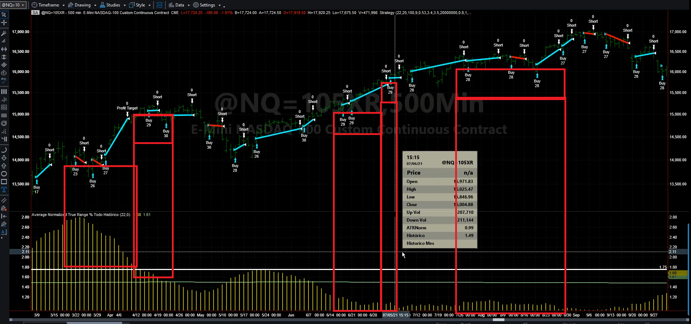
  <figcaption>Figura 068</figcaption>
</figure>

**Comparación: con y sin límite**

Esto siguió, le quito el límite. Le voy a poner ahora cero, vale. Para que veáis que gana mucho más. 

Esto ahora mismo es así, (sistema `APOLO`)

En los últimos 10 años, lado largo, ha subido un poco. 

<figure>
  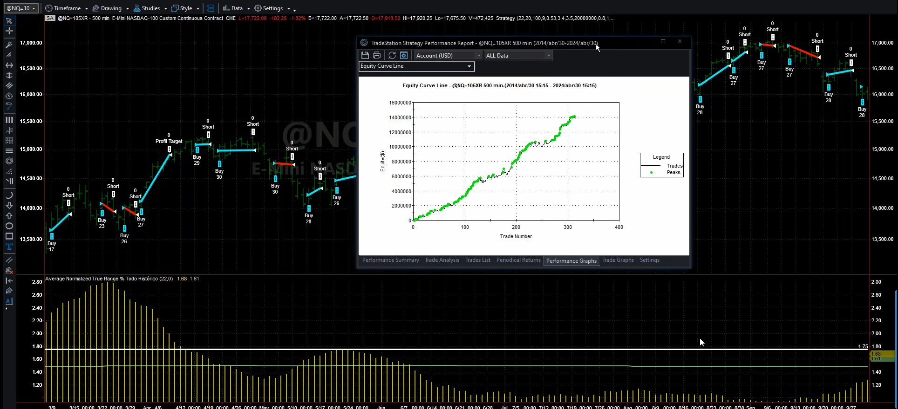
  <figcaption>Figura 073</figcaption>
</figure>
<figure>
  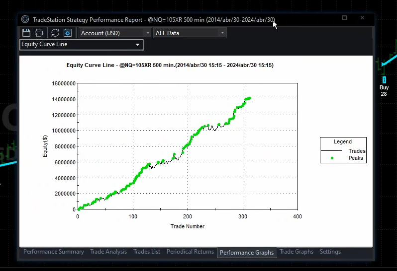
  <figcaption>Figura 074</figcaption>
</figure>

Pero ahora fijaros que yo tengo aquí 2.19, con 13 millones. Yo le voy a quitar el límite.

Fijaros aquí que estamos, claro, también también va a venir más que nada. Fijaros la variación, porque va a cambiar todo, porque va a cambiar desde el inicio, vale. Pero fijaros aquí, por ejemplo, que ahí a la izquierda vez que tiene 17, 17, 26, 30, vale. Va de 17 a 30. 17 a 30, 17 a 30. Y esta zona fijaros se mantiene muy estable cuando llega.

<figure>
  
  <figcaption>Figura 070</figcaption>
</figure>

Y no, yo le voy a quitar el límite, le voy a quitar el límite. Le voy a poner cero, con lo cual no va a actuar el límite. Es este límite, entiendo que eso va a limitar ahora, y va a cambiar.

<figure>
  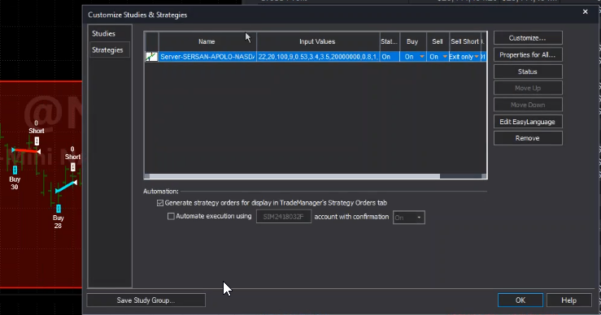
  <figcaption>Figura 075</figcaption>
</figure>

Fijaros que ha pasado a 20 millones en vez de 13. 20. Pero fijaros lo que os digo. Aquí hasta tiene, tenía 17, aquí tiene 20. Pero fijaros aquí cómo oscila, ¿lo veis? 46, 49, 43, 32, 30, 65, 67, ¿lo veis?

<figure>
  
  <figcaption>Figura 071</figcaption>
</figure>
<figure>
  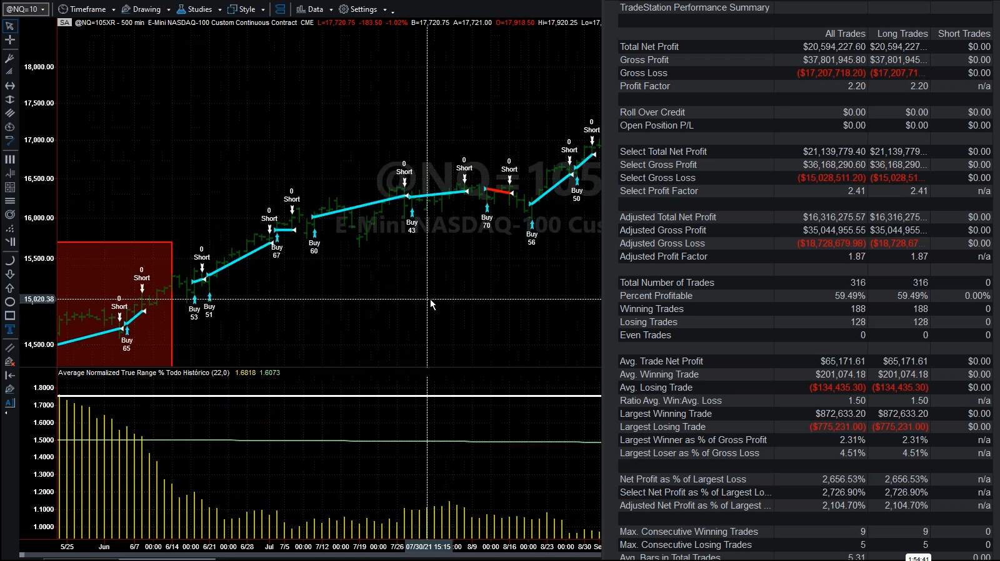
  <figcaption>Figura 076</figcaption>
</figure>


De 30, aquí me ha metido 65, 67. Claro, va perfecto porque está acertando, veis. Ahí muy bajo. Aquí ya no baja, no sube tanto, porque también sube el precio. Aquí mete 70.

Pero como falla, y seguramente el cálculo de volatilidad le ha subido un poco. A bueno, la volatilidad seguramente no tiene el de abajo. Espérate que, ya que lo hacemos, lo hacemos bien. Porque esta versión no sé si es la actual. Para 04, la tierra, Alberto. Sí, claro, este tenía esta hora, ya no. Pero así, pero bueno, es igual, es muy parecido.

<figure>
  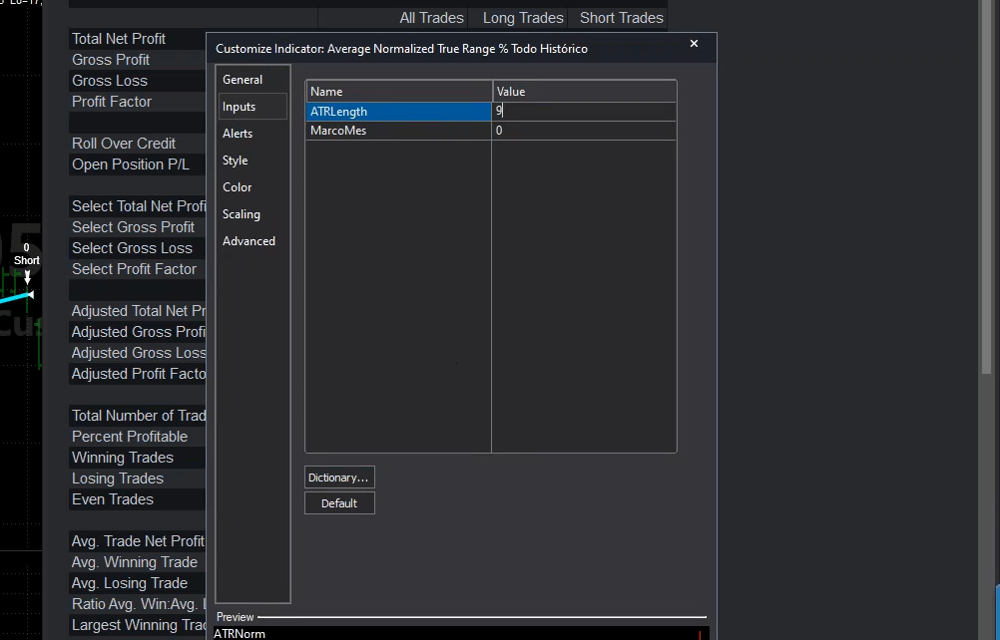
  <figcaption>Figura 077</figcaption>
</figure>

Simplemente esto es para que para que vean los cálculos, vale. Operaba con 9. Entonces, por eso veíais más oscilación. La media sí que es la blanca. Pero fijaros ahí, 70 es porque ha subido, ha subido la volatilidad, por totalmente menos.

<figure>
  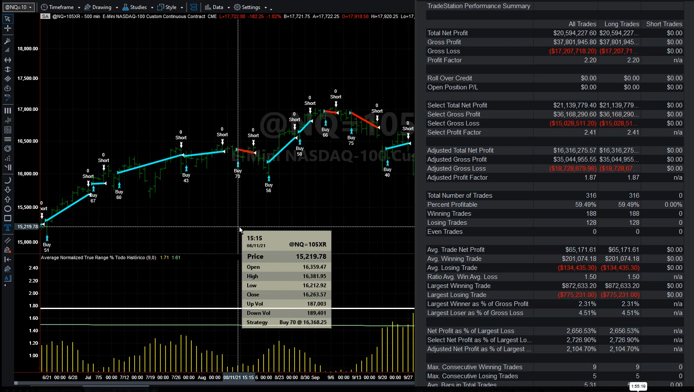
  <figcaption>Figura 078</figcaption>
</figure>
<figure>
  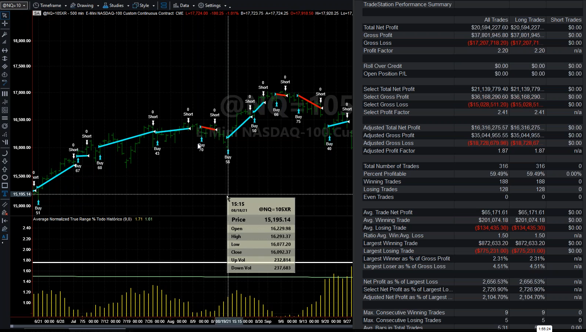
  <figcaption>Figura 079</figcaption>
</figure>

**Reacción rápida con ATR más corto**

Pero veis cómo reacciona, con una *ATR* más rápido reacciona mucho más rápido. Pero veis la enorme variación. El problema es ese, ahí lo tienes.

Es, este me lo mete con 75. 

<figure>
  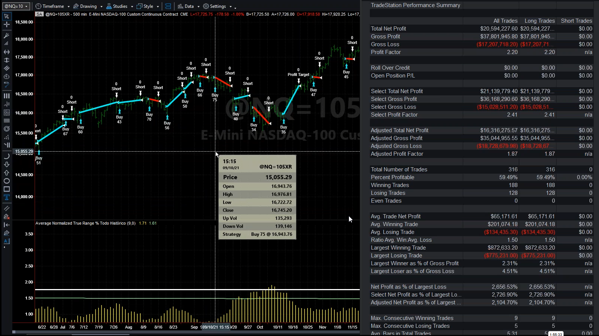
  <figcaption>Figura 080</figcaption>
</figure>

Luego ya se ha ajustado y ha bajado. Cuando hay una caída fuerte, bajará muy rápido, bajará muy rápido. Eso no es problema. El problema es que con baja volatilidad me pille dos o tres fallos importantes. Que esto pasa, vale. Y si pasa, pues te puede hacer mucho, mucho daño, vale. Este es un poco el problema que puede tener.

Simplemente que lo que lo veis así. Ahora está, aquí está reaccionando sin filtro. Al final, el sistema va a ganar igual. Pasa que seguramente a nivel de riesgo tiene momentos un poco más, poco más abruptos, vale. Pero va a ganar igual.

<figure>
  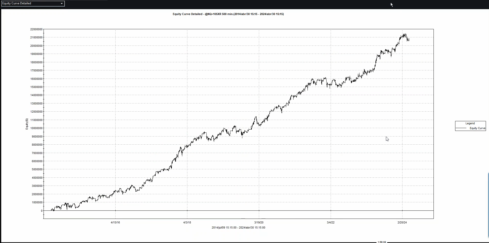
  <figcaption>Figura 081</figcaption>
</figure>

<figure>
  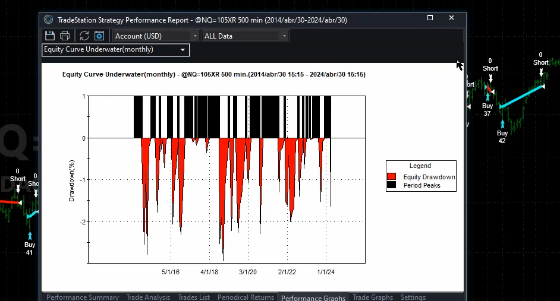
  <figcaption>Figura 082</figcaption>
</figure>

**El caso del COVID**

Aquí, pensar que hemos cogido una época donde prácticamente sólo el solo está el COVID de grandes, grandes caídas. Fue muy rápido. Fijaros cómo reacciona, que llega hasta meter 14. Tremendo, llega al final a meter en este tan volátil. 

Aquí, afortunadamente, es lo que os decía antes. El primer fallo ya le pilla con un poquito de ajuste de volatilidad. Ya está ahí. Ya ves, ya se ha levantado un poco, ha bajado un poco más. Y son 53 contratos.

<figure>
  
  <figcaption>Figura 084</figcaption>
</figure>

Y fíjate, ya el siguiente le ve de 33. Y es de 14. Y menos mal porque falla, ¿lo veis?

<figure>
  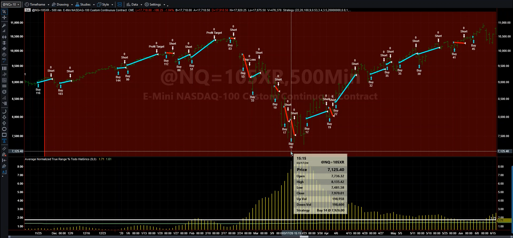
  <figcaption>Figura 085</figcaption>
</figure>

**Mecanismo de ajuste por volatilidad**

Y este, este es, este es el mecanismo que hace este tipo de ratio, y cualquiera que ajuste por volatilidad, que no es el más eficiente, os lo digo, porque frena mucho el crecimiento. Que veis automáticamente a frenar, y bajado el otro.

Si yo lo vuelvo a poner a 1.75, vas a ver que hace lo mismo, pero no habrá este rango de 83 a 14. Lo que hago es reducir un poquito 

<figure>
  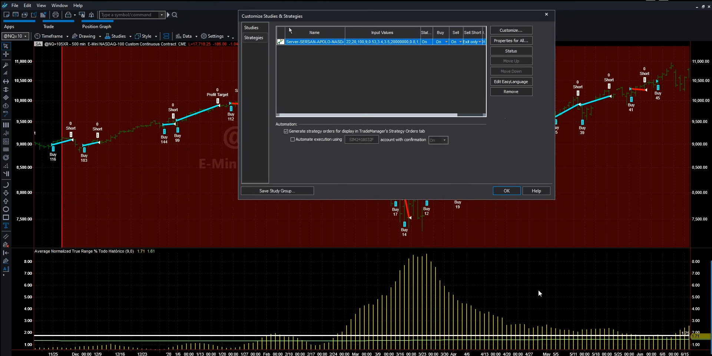
  <figcaption>Figura 086</figcaption>
</figure>

<figure>
  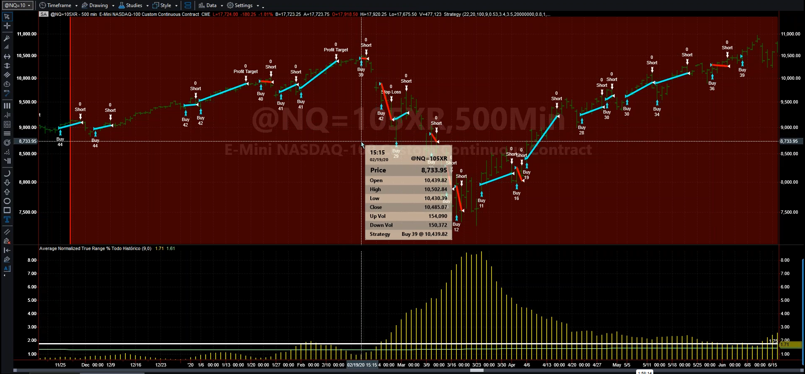
  <figcaption>Figura 087</figcaption>
</figure>

Ves, ahí ya tiene 39, 42, y 12 es 70, 80, no sé cuánto era. La mitad arriba está muy frenado. Arriba, para que para que esa variación no sea tan importante. 

<figure>
  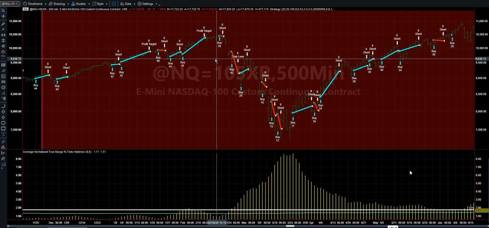
  <figcaption>Figura 088</figcaption>
</figure>

Porque si te coge bien, bien. Se te coge mal, te puede hacer mucho daño.

Así, lógicamente, aquí te mete 42 contratos. Decir, la cuenta ha crecido y ha ganado mucho dinero. Pero viste, reduce, reduce Simplemente que la horquilla es un poquito menor, es un poquito menor. Mediante ese control de no dejar que la volatilidad tome valores demasiado bajos, simplemente para protegerte de los riesgos. Es una manera conservadora. Tú quieres no usarlo? puedes no usarlo. Vas a piñón todo el rato. Pero con cuidado, porque cuando te pille depende qué sistema.

**Consideraciones sobre el periodo del ATR**

Depende, a lo mejor en este caso, usar una *ATR* como este rápido, que reaccione rápido. Porque esta es verdad que es 9, ahora usamos 15, es más lento. Nos gusta más, pero es un poquito más lento reaccionar a estos cambios. Un poquito más lento.

<figure>
  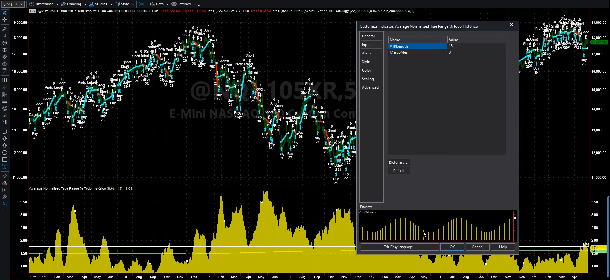
  <figcaption>Figura 089</figcaption>
</figure>

Pero en determinadas, terminadas cuentas, está, es un poco la idea. Ves, ahora todo el rato, fijaros que está la volatilidad limitada. Ahora mismo está a punto de empezar, o sea, está operando con la misma, con este 1.75, es bastante agresivo.

<figure>
  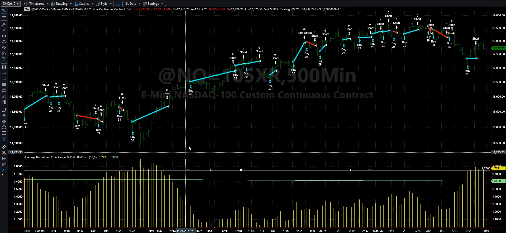
  <figcaption>Figura 090</figcaption>
</figure>

Esto es, ahora tenemos, no acabamos el curso, tenemos un simposio interno de trabajo muy *heavy*, semanas de desarrollo y mejoras de cosas. Porque aunque la realidad es que no debería ser así, pero la realidad es que tenemos cosas atrasadas, no nos da como como ya os comenté.

Y aquellos que seguid esto le sabéis que no habíamos hecho el curso nunca para, porque por tiempo, aunque gracias a toda la ayuda de Víctor, que ha sido muy importante en la parte teórica. Y realmente el freno a nuestro día a día está siendo tremendo, es así.

Por eso al final ahora pues habrá que trabajar duro para, muy fuerte para. Aún así insisto, el mes no es por eso, es porque el mercado. Creo que hay trabajo pendiente.

**Resumen del algoritmo de position sizing**

Entonces, bueno, esto es un poco lo que hace el algoritmo. El algoritmo hace eso, funciona de esta manera.

Insisto, yo os recomiendo trabajar con *Fixed Risk*, es muy cómodo. Y ahí ya valorar vosotros cómo trabajáis el *risk*. Trabajar, hacer pruebas, investigar. Depende también del tipo de sistema, como siempre.

Pero yo iría a *Fixed Risk* y trabajaría el *risk*. Probar volatilidad, probar nominal, probar distintas combinaciones. Es un poco el *stop*. Al final es investigar.

Pero en ambos, todos los casos, pensar un poco lo que os digo del *min* *max*, de acuerdo. Puedes bien trabajarlo con algún, con algún cálculo del indicador que uses, como este. Y también, como no, con el *min* y el *max* size, de acuerdo. Vida de código, limitar que no crezca de más X cantidad, vale.

## Exportación a MSA

Bien, volvemos a lo que os decía para pasar el código. Y esto simplemente es un código que sólo hace eso, sólo pasa. Aquí no hay gestión monetaria al uso. Aquí sólo calcula el riesgo, pero no en las entradas. Porque esto al final genera estos archivos que os he que os he enseñado. Para estos archivos que os he enseñado, los envía a MSA, y ya está.

- [Strategy : RiskMSA](../code/RISKMSA.ELD)

**Demostración en MSA**

Y ahora vamos a dedicarle un ratito, vale. Aquí yo tengo un *portfolio* completo de todos los lotes. Bastante no exacto, pero bastante, bastante aproximado a lo que está operando actualmente nuestra cartera Alfa.

<figure>
  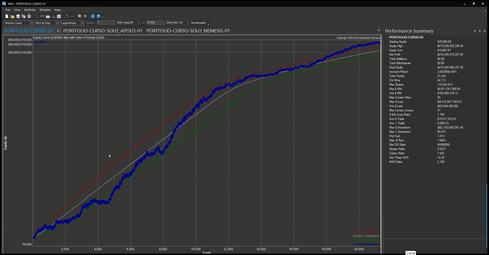
  <figcaption>Figura 091</figcaption>
</figure>

Es un *portfolio* que sólo tiene dos familias de sistemas, lado largo y lado corto separado. Una de las cosas que tenemos ahora, como ya os he comentado, pendientes: volver el oro a *espejo*, y algunas pruebas pendientes de Apolo. Además de a ver si de una vez podemos sacar Artemisa por volumen, por liquidez, y historias varias que, varias de ellas son ageras a nosotros.

Pero en algo tengo que meter Artemis, que hace años que Artemis en un sistema que va muy, muy, muy bien en este *mix*.

Entonces, bien, eso es el llorikeo nuestro, y sigo.

Entonces aquí, al final hay un *portfolio* que es una suma de estrategias. 

<figure>
  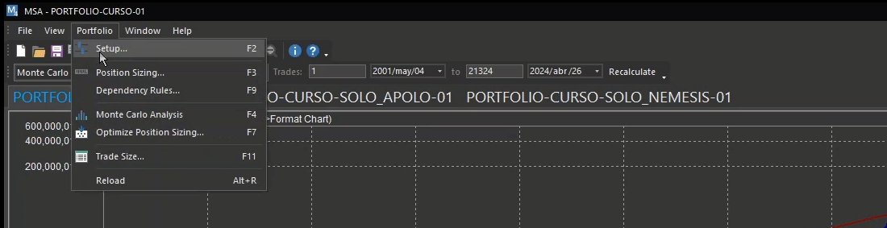
  <figcaption>Figura 092</figcaption>
</figure>  
<figure>
  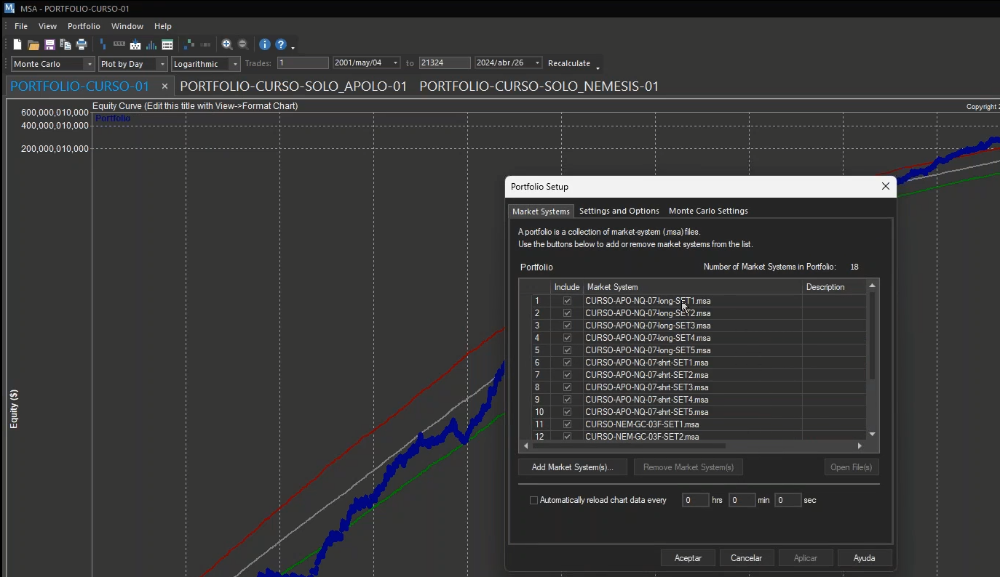
  <figcaption>Figura 093</figcaption>
</figure>

Yo estas las puedo abrir, vale. Las voy a abrir ahora para que las veáis, algunas de ellas, vale. Para. Esas son todas las que son del lado largo, acuerdo. Apolo del lado largo.

<figure>
  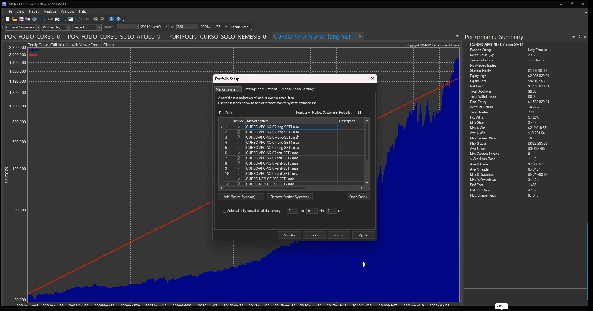
  <figcaption>Figura 094</figcaption>
</figure>
<figure>
  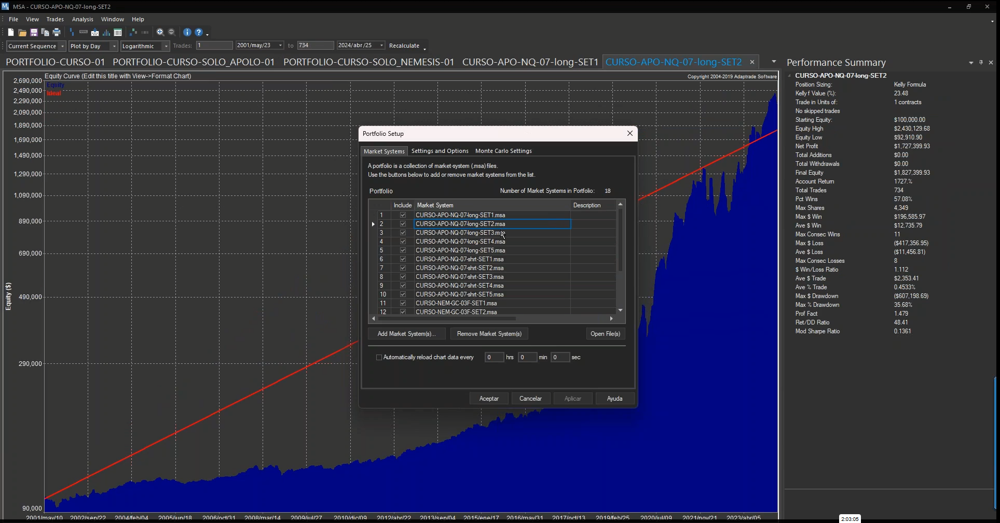
  <figcaption>Figura 095</figcaption>
</figure>
<figure>
  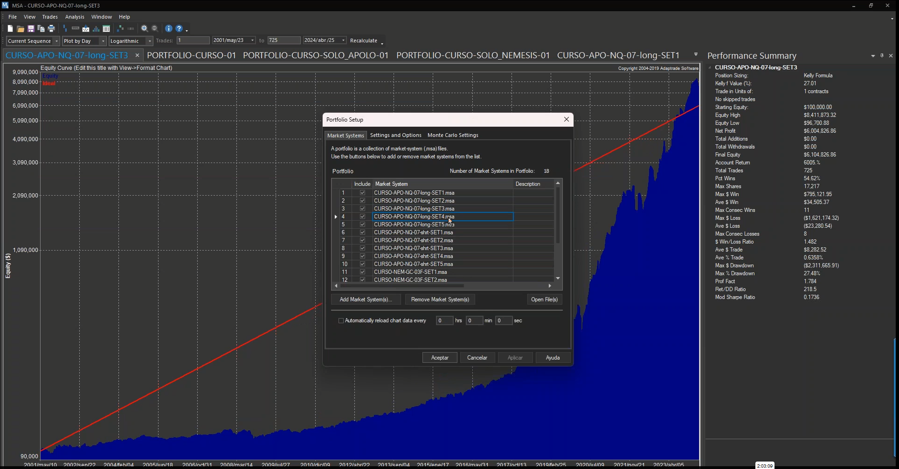
  <figcaption>Figura 096</figcaption>
</figure>
<figure>
  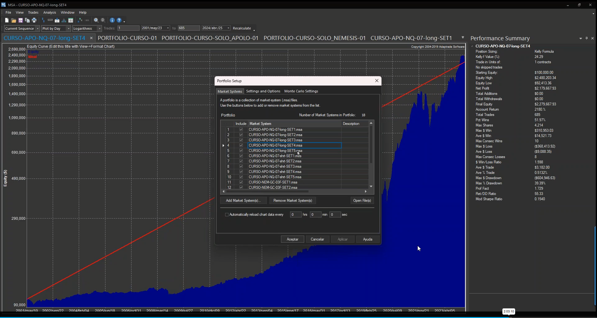
  <figcaption>Figura 097</figcaption>
</figure>
<figure>
  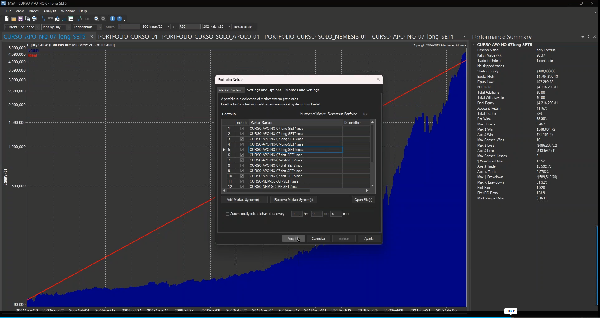
  <figcaption>Figura 098</figcaption>
</figure>

Estos son las estrategias individuales de Apolo. Esto es lo que os digo. Esto carga, yo abro aquí los datos, 

<figure>
  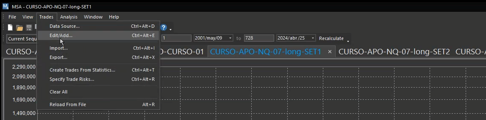
  <figcaption>Figura 099</figcaption>
</figure>
<figure>
  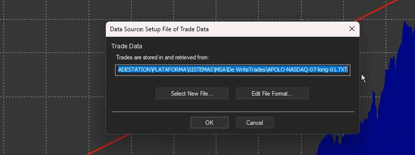
  <figcaption>Figura 102</figcaption>
</figure>
<figure>
  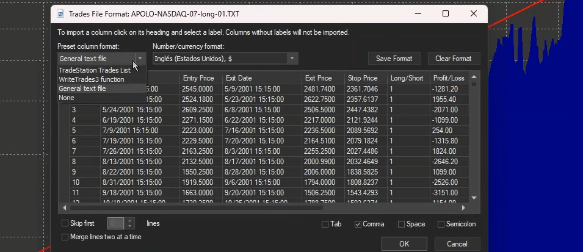
  <figcaption>Figura 103</figcaption>
</figure>

y esto lo ha cargado ese archivo, acuerdo. Lo ha generado. ¿Cómo lo genera? Cuando lo cargo, ya está automatizado. Una vez ya está hecho la primera vez, pues ya su trabajo es cargue ese archivo, tiene un formato, lo que os decía *Bright Function*.

Y esto ya automáticamente le mete la fecha, la impresión entrada, el riesgo  *Risk*, vale. Y yo le paso el riesgo mío es como dinero. 

<figure>
  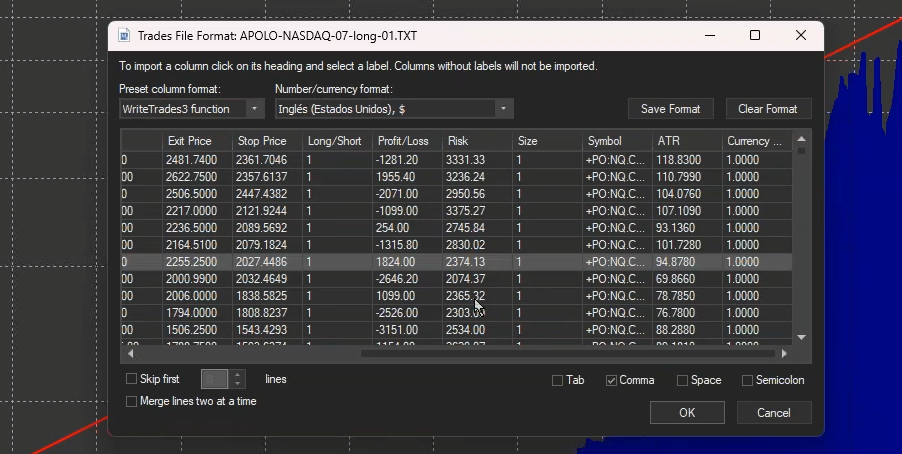
  <figcaption>Figura 106</figcaption>
</figure>

Que es al final el cálculo proveniente de esto, de acuerdo. Esto es el riesgo se calculó. 

<figure>
  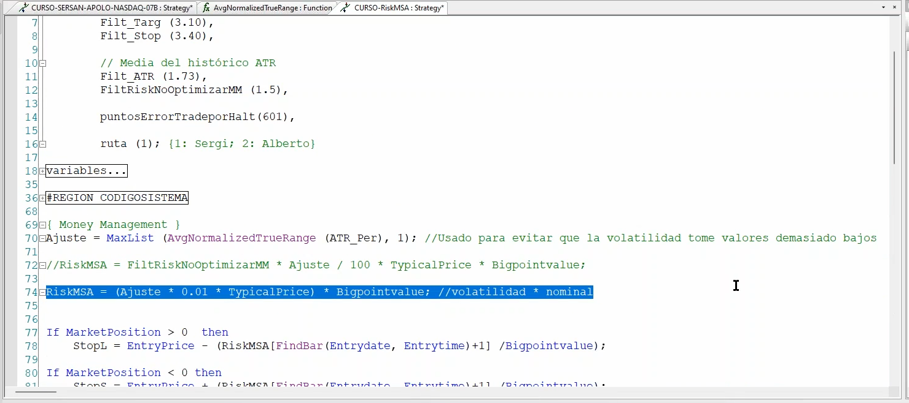
  <figcaption>Figura 105</figcaption>
</figure>

Yo lo paso aquí como el riesgo que me sea, ¿lo veis?

<figure>
  
  <figcaption>Figura 107</figcaption>
</figure>

Y ese es el valor, el valor de riesgo es el denominador de *Fixed Risk*,,, y esto es si quiero usar *Fixed Risk*. Porque ahora vais a ver que yo aquí puedo usar lo que quiera. ***Este programa es para analizar, investigar la gestión monetaria***. Yo os he hablado de lo que nosotros hacemos. Pero ahora aquí vais a ver las posibilidades del programa. 

Y os explico cómo hemos hecho hasta ahora lo que hacemos, y también otras cosas que no hacemos, para si las queréis hacer.

Entonces, este viene los datos de ese fichero. Viene también en la *ATR*, por si queremos usar la *ATR*, etcétera. Y yo aquí tengo los datos en bruto, tengo los datos, tengo la *equity table*.

<figure>
  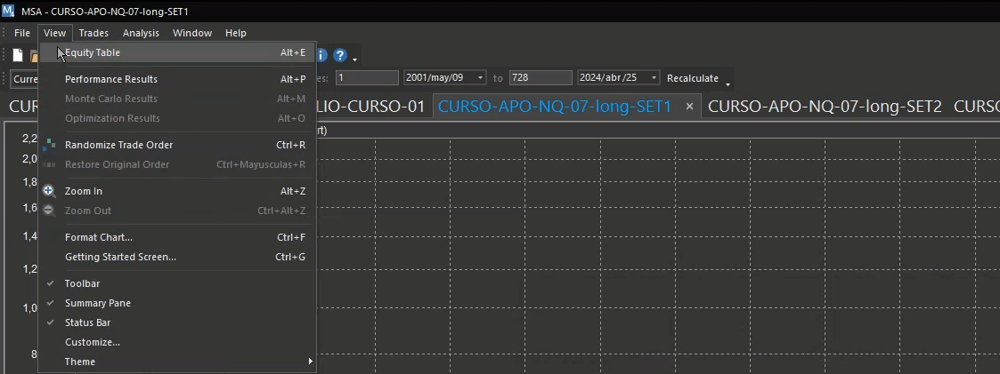
  <figcaption>Figura 108</figcaption>
</figure>
<figure>
  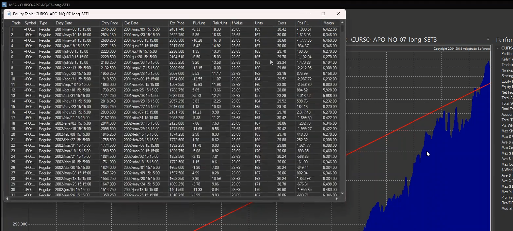
  <figcaption>Figura 109</figcaption>
</figure>

Aquí ahora tengo ya aplicado una gestión monetaria. Pero el programa me permite no. Vamos a lógicamente repasar en profundidad el programa. Enseñó lo imprescindible para que lo veáis.

Pero veis, aquí tengo, lógicamente hay unas opciones de configuración del *setup*, de qué tipo de futuro, el valor por punto. Lo que hemos adaptado, el *CFD* viene del futuro, pero está adaptado al *CFD*. Bueno, hay historias, no.

<figure>
  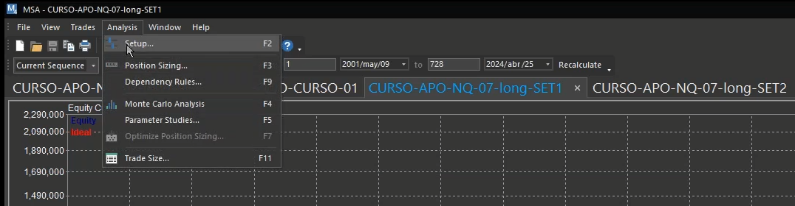
  <figcaption>Figura 111</figcaption>
</figure>
<figure>
  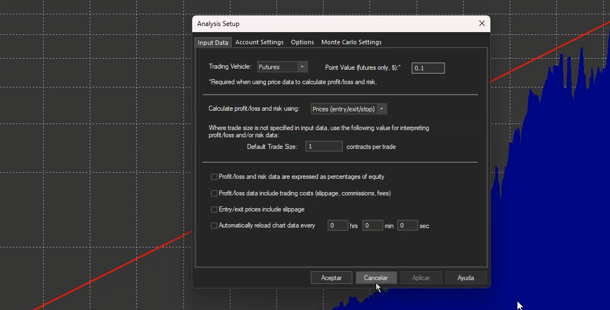
  <figcaption>Figura 112</figcaption>
</figure>

Pero al final, al final, el *position size*, que es lo que más nos interesa. Yo aquí, si le pongo no, automáticamente está como viene, es decir, un contrato. Viene sin gestión monetaria. Podría venir también como se monetaria.

<figure>
  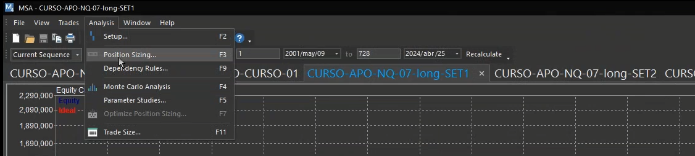
  <figcaption>Figura 110</figcaption>
</figure>
<figure>
  
  <figcaption>Figura 113</figcaption>
</figure>

Nosotros lo llevamos sin que sea monetaria. Automáticamente, yo esto está ahí porque yo le he dicho que la cuenta es de 100 mil, y punto y aparte de ello puedo probar cualquier ratio. Y cualquier ratio.

<figure>
  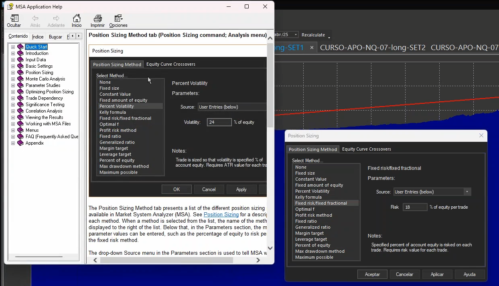
  <figcaption>Figura 114</figcaption>
</figure>
<figure>
  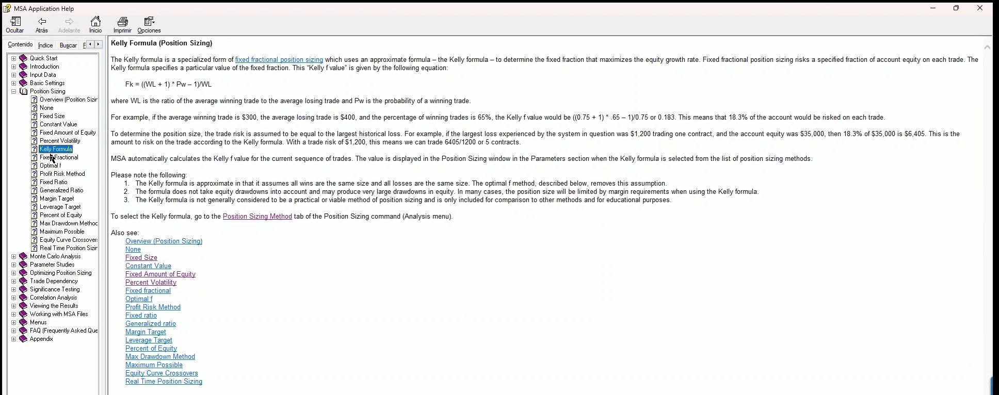
  <figcaption>Figura 115</figcaption>
</figure>

**Recursos del programa MSA**

Y aquí en la ayuda los tenéis todos explicados, vale. Sólo por eso ya el programa es realmente útil, porque tenéis todos los ratios explicados, cómo van, cómo se calculan. Un montón de literatura aquí en el apéndice, está muy bien. Métricas. En fin, de verdad que está muy bien el programa.

Incluso tiene para cálculo el tiempo real, 

<figure>
  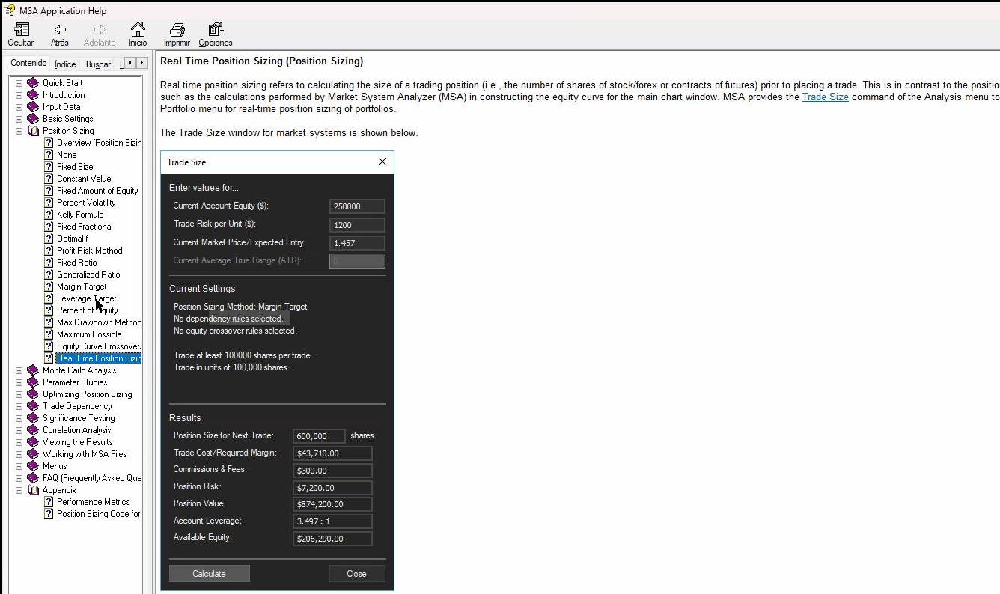
  <figcaption>Figura 116</figcaption>
</figure>

le pones cuánto tiene la cuenta, cuánto tal, cuánto tocaría de contratos. Y tiene un código también para llevarlo al código, tiene también un código que puedes usar si no recuerdo mal en TradStation cogiendo el *money management* que proviene de aquí, vale.

Entonces, al final viene todo muy, muy explicado, vale.

**Probando ratios en MSA**

Pero bueno, vamos a centrarnos en lo que hemos visto. Si esto le pongo *Kelly*, él me la calcula. Y me meten 23 de ratio de F, vale.

<figure>
  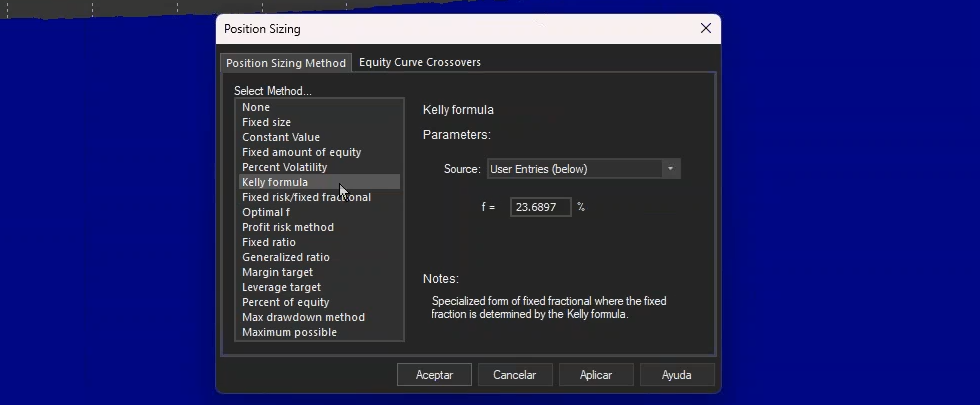
  <figcaption>Figura 117</figcaption>
</figure>
<figure>
  
  <figcaption>Figura 118</figcaption>
</figure>

Esto da un *drawdown*, un módico *drawdown* de un 31 por ciento, de un 31 por ciento. Que para ser *Kelly*, no está mal. Para ser *Kelly*, no está mal.

Pero ya digo, yo puedo aquí hacer pruebas. Luego, cuando yo lo pongo en el *portfolio*, y ahí los trabajo conjuntamente. Pero esto es a nivel individual.

**Optimización en MSA**

Incluso puedo optimizar, de acuerdo. 

<figure>
  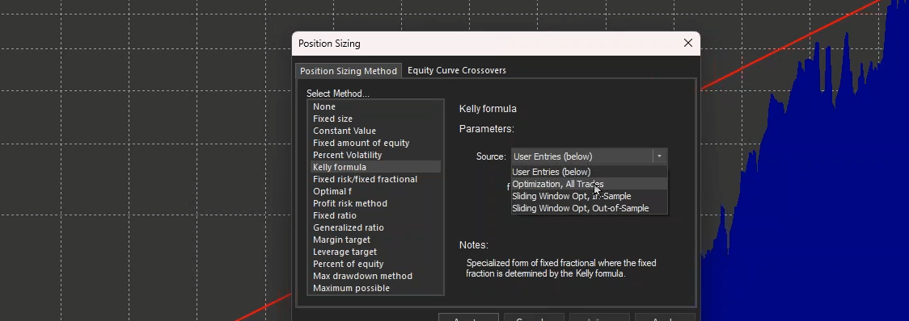
  <figcaption>Figura 119</figcaption>
</figure>

Yo puedo venir ahí un optimizador, vale, y que sí que os recomiendo usar a nivel de investigación, como os he dicho siempre. Es decir, yo tengo aquí un *position size* y le pongo *Fixed Risk*, vale.

<figure>
  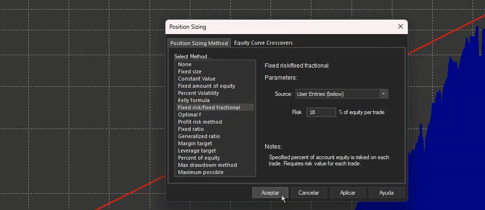
  <figcaption>Figura 120</figcaption>
</figure>

Y automáticamente vengo aquí a optimizar, 

<figure>
  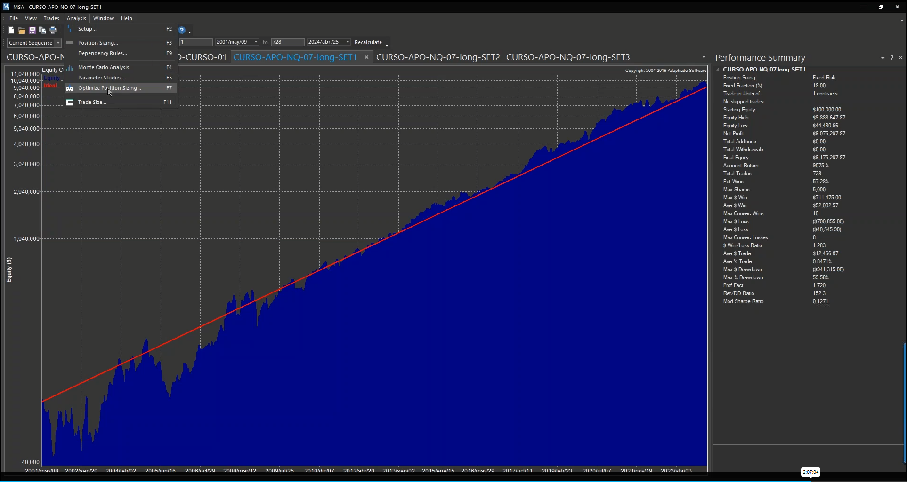
  <figcaption>Figura 121</figcaption>
</figure>

y analizo, vale. Y le pongo, por ejemplo, *net profit* con un límite de *drawdown* de 20 por ciento máximo. Y él busca aquí rápidamente combinaciones, vale.

<figure>
  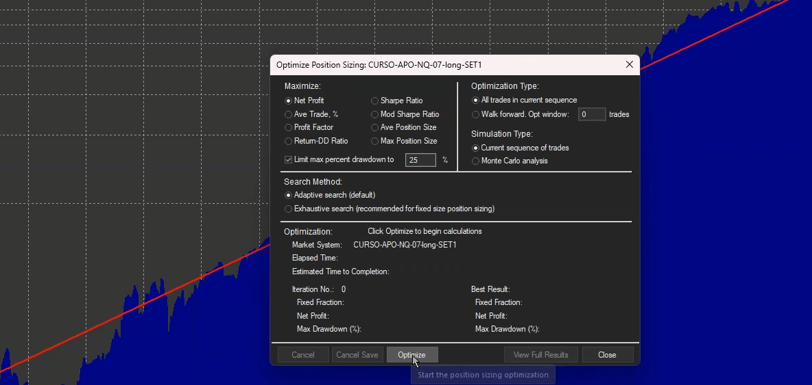
  <figcaption>Figura 122</figcaption>
</figure>

Ya es muy rápido. Aquí me ha buscado pues está que la óptima fracción es un 4.1, ya está, vale. Me he hecho que es 4.11 la óptima que me da, justo el 25, está.

<figure>
  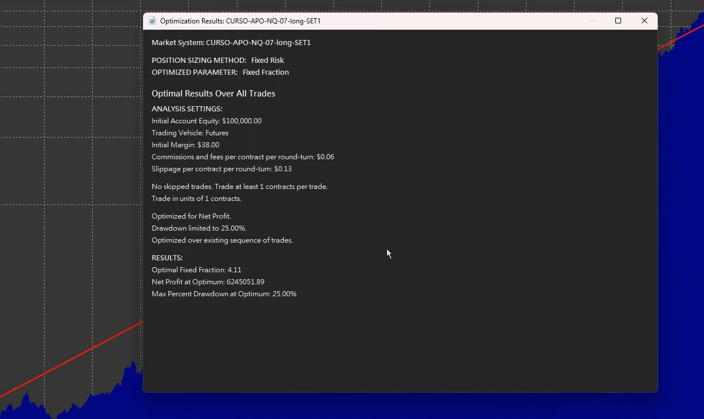
  <figcaption>Figura 123</figcaption>
</figure>

Pues yo ahora quiero que me la dé con un 15. 

<figure>
  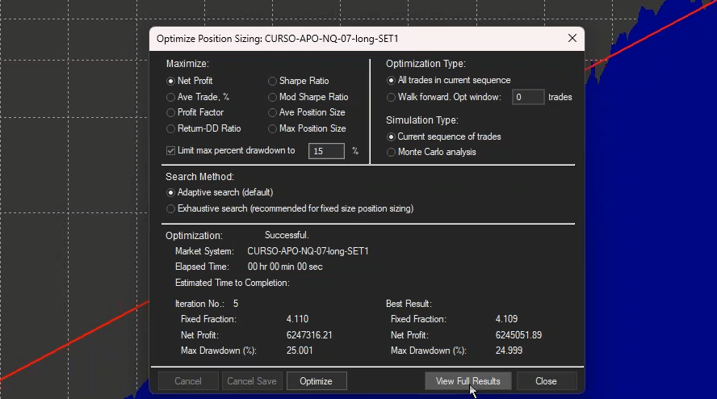
  <figcaption>Figura 124</figcaption>
</figure>

Perfecto. Pues lo utilizo, y con un 15, me dice que la óptima es un 2.35. El máximo beneficio, pero limitando la 15, de acuerdo.

<figure>
  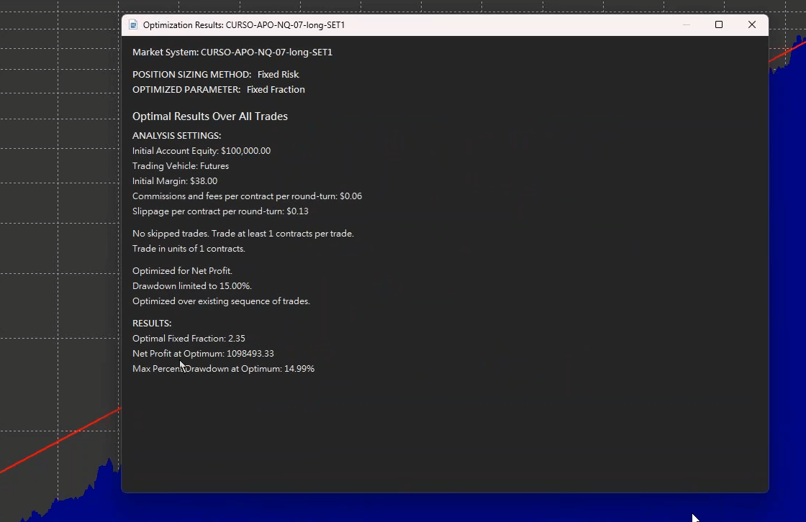
  <figcaption>Figura 125</figcaption>
</figure>

Esto puede investigar, investigar. No quiere decir, como digo siempre, que lo que salga es lo que voy a usar. Puede investigar, puedo hacer, puede hacer algunas cosas. Pero no es objeto tampoco mirar eso.

**Análisis de parámetros**

Puedo analizar algunos parámetros, cómo se mueven, pintar la curva de *profit* de haber *straight*, *profit factor*, distintos factores, dependiendo. Distintos factores como, por ejemplo, la volatilidad. 

<figure>
  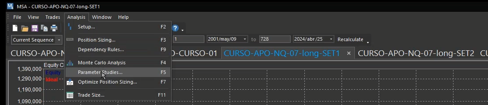
  <figcaption>Figura 126</figcaption>
</figure>
<figure>
  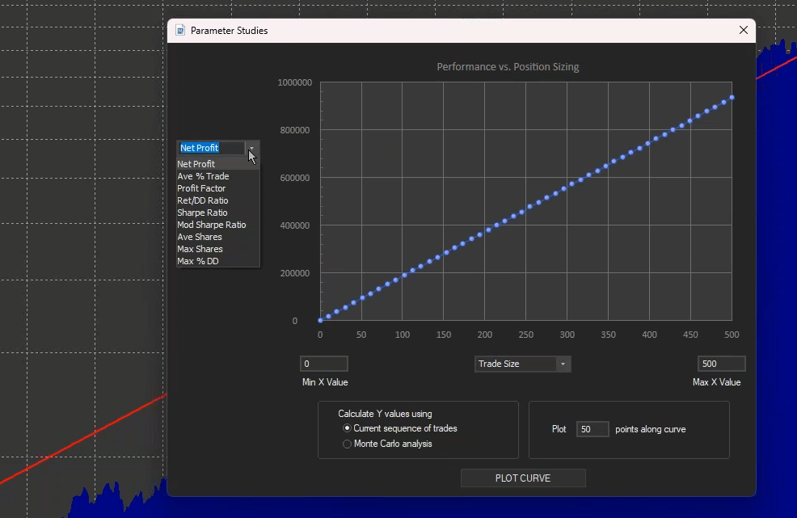
  <figcaption>Figura 127</figcaption>
</figure>
<figure>
  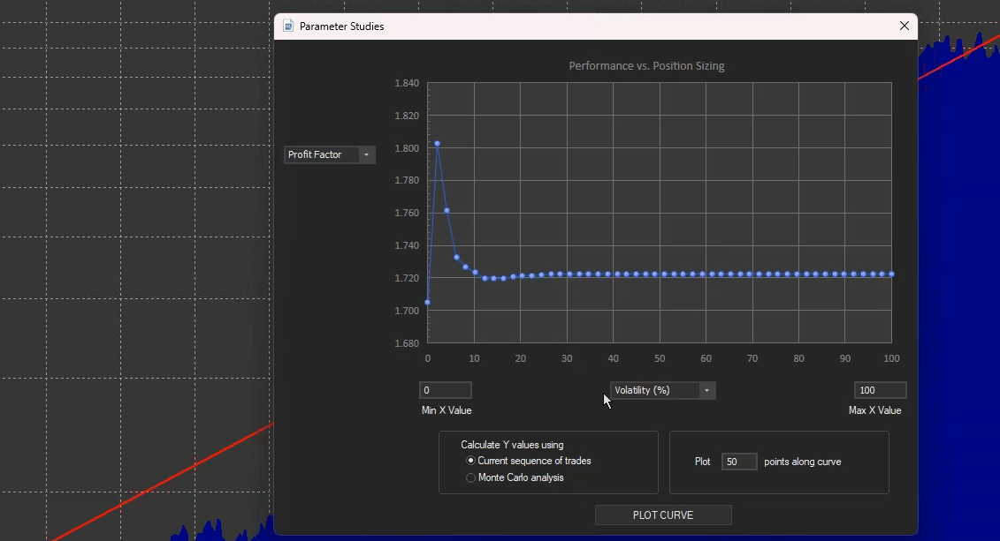
  <figcaption>Figura 129</figcaption>
</figure>

Es igual. Esto sería un poco temas del programa y no los objetos.

Simplemente os enseño lo que lo que os digo, y lo que os permite: analizar la gestión monetaria y el efecto de distintos ratios.

**Tipos de position sizing disponibles**

Que tiene, por ejemplo, a destacar: *Fixed Risk*, *Fixed Ratio*, por supuesto, los dos típicos. 

<figure>
  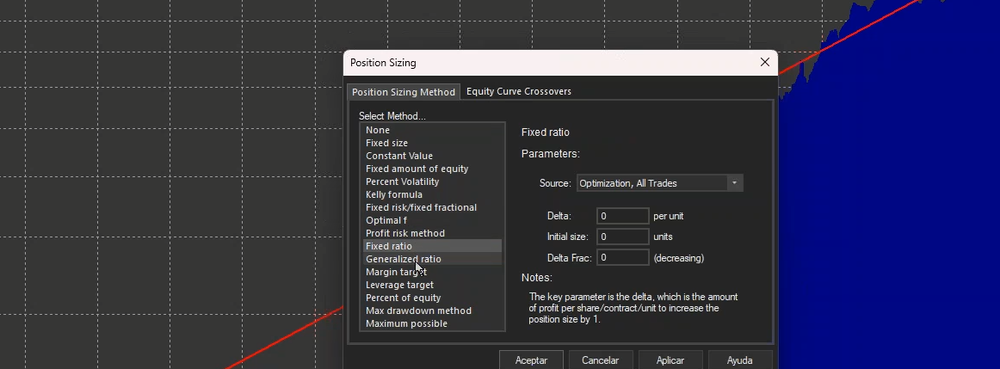
  <figcaption>Figura 130</figcaption>
</figure>

Generalized el ratio, que es la forma generalizada de *Fixed Ratio*, que os lo expliqué en la presentación, y *Profit Risk*, que es la forma generalizada de *Fixed Fractional*, vale, separando *profits* de inicial. 

<figure>
  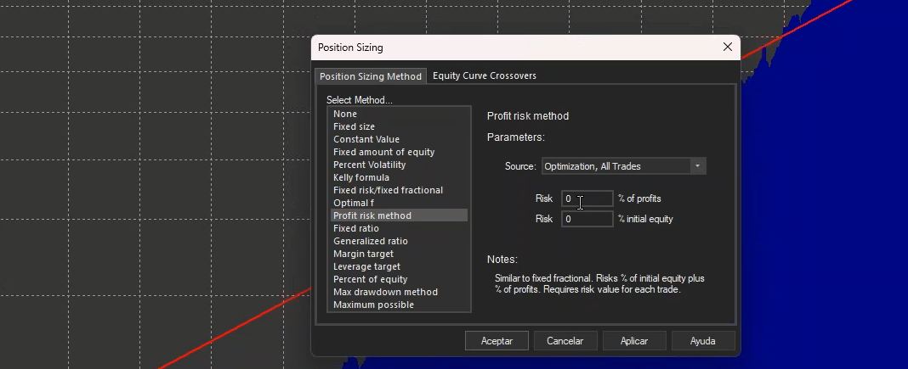
  <figcaption>Figura 131</figcaption>
</figure>

Nosotros lo tenemos así, aunque en realidad no lo usamos. Lo tenemos configurado así para que puedas invertir un porcentaje distinto de la cuenta que de las ganancias.

Luego tiene *Leverage*, esto es apalancamiento: 1 a 1, 2 a 1, 3 a 1. Esto es como exposición, de acuerdo, es lo mismo. 

<figure>
  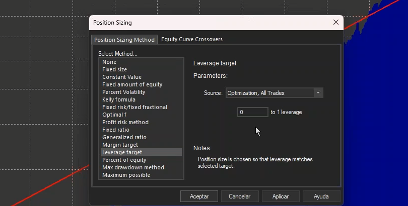
  <figcaption>Figura 132</figcaption>
</figure>

También tiene porcentaje de la cuenta directo. También tiene un máximo método de máximo, simplemente que no pueda pasar el *drawdown* de cierta cantidad

<figure>
  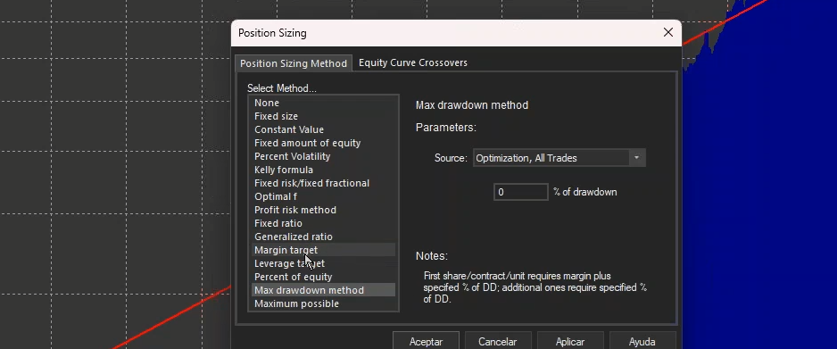
  <figcaption>Figura 133</figcaption>
</figure>

margen como objetivo tiene. Y tiene también, ¿dónde está el de avanzar? No lo veo ahora aquí, pero es en volatilidad. Es en volatilidad, que es el ATR.

<figure>
  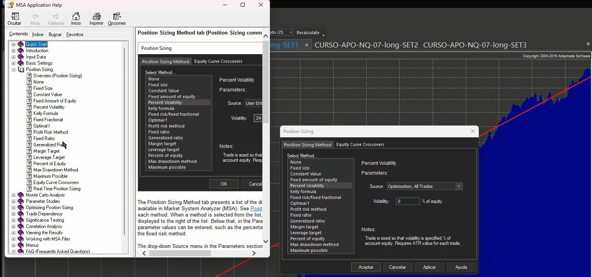
  <figcaption>Figura 134</figcaption>
</figure>

Si vais a la ayuda, os explica todo. Repito, están todos explicados, vale. Aquel que tenga el programa, que lo quiera comprar, que como digo os lo recomiendo porque vale y tiene mucha capacidad de analizar bien curvas y demás. Y también a nivel de *portfolio*, de los más baratos que hay a este nivel. Es un dinero bien invertido.

**Volatility Position Sizing en MSA**

el ATR, como se lo hemos pasado podemos probarlo. como yo se lo he pasado el ATR, le puedo poner esto. Le tengo que optimizar porque no le he puesto. 

<figure>
  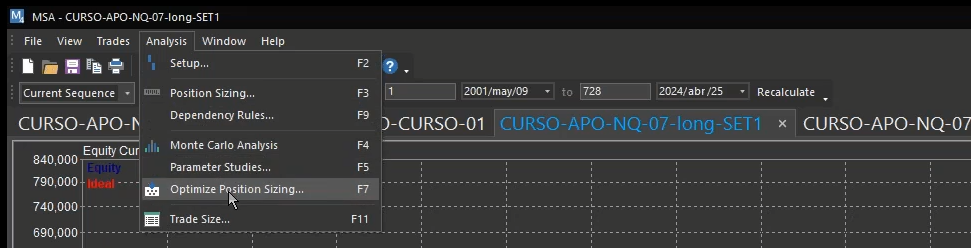
  <figcaption>Figura 135</figcaption>
</figure>

Y le digo, pues, como por este ratio con 15, ¿cuál sería? 

<figure>
  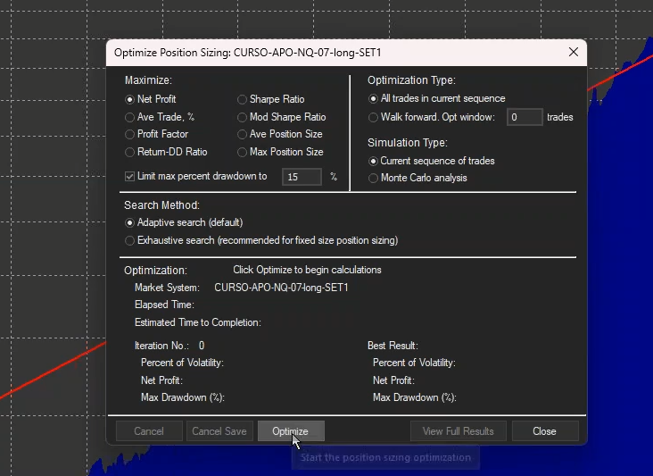
  <figcaption>Figura 136</figcaption>
</figure>
<figure>
  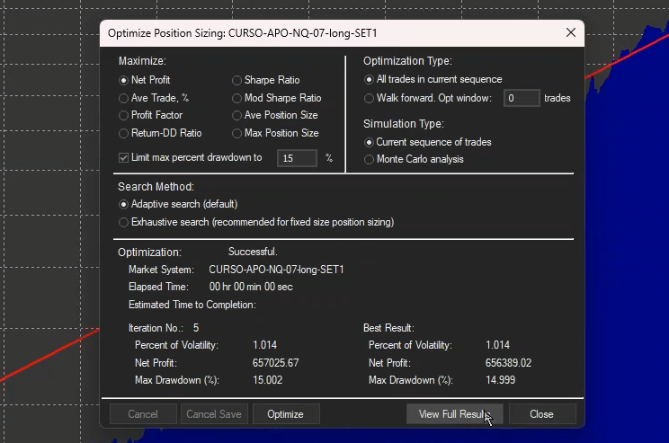
  <figcaption>Figura 137</figcaption>
</figure>

Y me dice que por el ATR sería el ATR que le he pasado yo. Cuidado, sería 1.01. Perfecto.

<figure>
  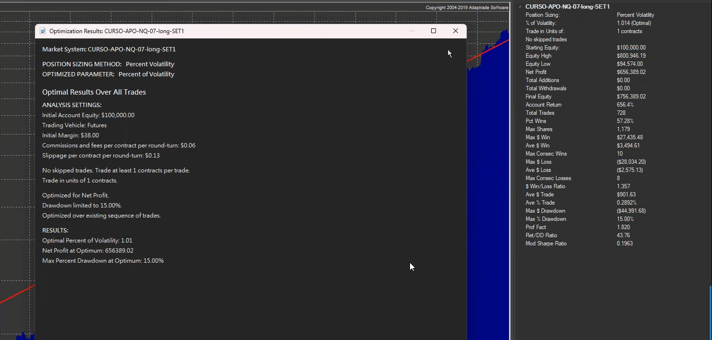
  <figcaption>Figura 138</figcaption>
</figure>

Pues a este, de esta curva, de estos ratios, yo lo analizo, lo estudio, y puedo ver aquí distintas cosas, vale. La gracia es que lo puedo analizar a cada sistema por supuesto, pero que lo puedo analizar a cada *portfolio*. Esta es la gracia.

**Advertencia sobre Money Management**

Aquí lo dije en la teoría y lo voy a repetir algunas veces más, espero, durante las prácticas, ésta y la siguiente. Mucho cuidado con esto, vale. Mucho cuidado con esto. Esto lo aguanta todo. Este *portfolio* está ahora fortísimo, y ni lo veis ahí. Y lo está. Para fortísimos era un *drawdown* y ni lo veis.

<figure>
  
  <figcaption>Figura 139</figcaption>
</figure>

Entonces, cuidado, cuidado. Porque realmente el *money management* engaña mucho, de acuerdo. Porque las curvas son muy chulas, son muy potentes. El crecimiento es muy importante. Esto es una simulación, lógicamente, de contratos de todos los sistemas. Y tiene un *drawdown* de 50%. Está muy, muy bestia.

<figure>
  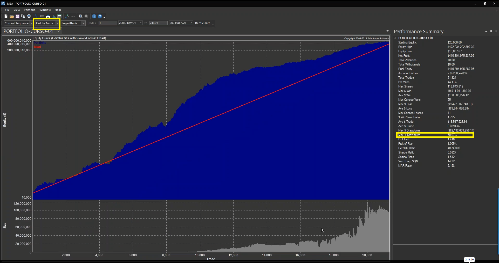
  <figcaption>Figura 140</figcaption>
</figure>

**Análisis manual vs optimización**

Yo puedo aquí, además de optimizar, también puedo probar a mano. Que casi es lo que más os recomiendo. Sí que os recomiendo hacer algún estudio para analizar uno y otro y aprender y conocerlo y entender. Pero luego ya casi os recomiendo más usar probar, vale.

<figure>
  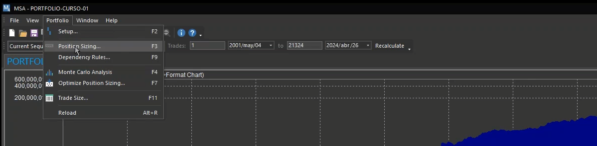
  <figcaption>Figura 141</figcaption>
</figure>

Aquí, por ejemplo, usar todos igual puede tener sentido. 

<figure>
  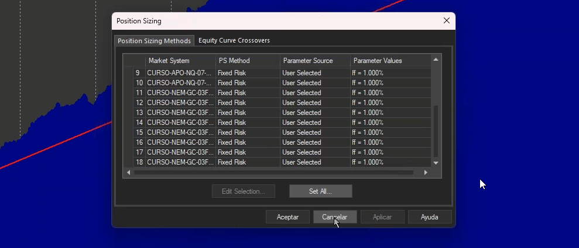
  <figcaption>Figura 142</figcaption>
</figure>

`Set All`

<figure>
  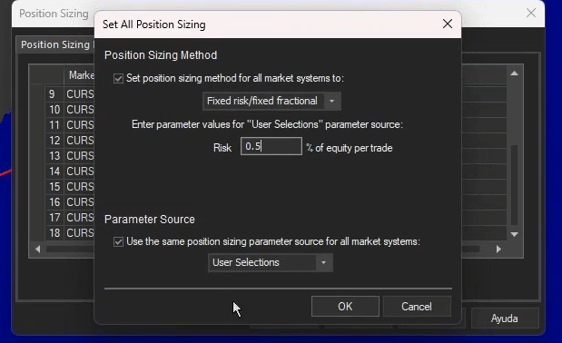
  <figcaption>Figura 143</figcaption>
</figure>
<figure>
  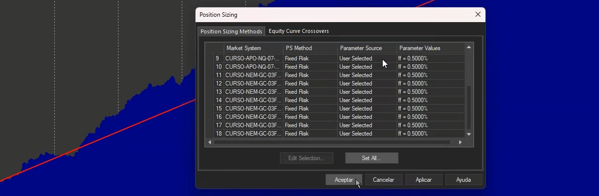
  <figcaption>Figura 144</figcaption>
</figure>

Aquí es bastante parecido porque están ecualizados de manera parecida, pero es igual. Si no, pues se puede poner a cada uno. Ahora 0.5, vale. A todos, a todos, a todos le ponemos el mismo 0.5, vale. Y automáticamente, 0.5 me va a decir que tengo ya un 28 por ciento de *drawdown*. Siendo un drawdown interesante. 

<figure>
  
  <figcaption>Figura 145</figcaption>
</figure>

Aquí ya veis el crecimiento de todo el *portfolio*. Lógicamente, si quiero ver fechas más cercanas, pues puedo hacerlo. De hecho, se podía hacer zoom, pero a veces esto se cuelga. A ver si puedo hacer zoom aquí. A la que te sale se desactiva. Ahí estamos, vale. Un poquito depende un poquito del ratio de eje simulataria que usemos.

<figure>
  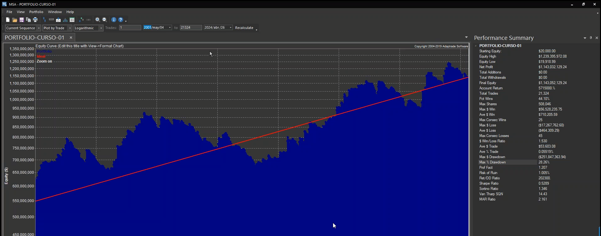
  <figcaption>Figura 146</figcaption>
</figure>

**Crecimiento exponencial y prudencia**

Entonces, lo que os quiero decir es que las curvas al final... Esto pasa también en los sistemas. A la que ponemos gestión monetaria, ese crecimiento exponencial que tienen, camuflan un poco las caídas. Y siempre las mismas las menosvaloramos porque, además, la realidad que siempre va a ser peor.

Entonces, al final hay que ser muy prudente. Y por eso, en caso de duda, tirar, como os decía, redondear abajo, limitar el crecimiento de los contratos. Decir, cuidado, vale. Porque al final es muy tentador meterle más caña porque lo vas viendo aquí, tú ahora le vas subiendo, pues gana mucho más, gana tal, hostia, y total, bueno, *drawdown* 5% más poder, luego lo recupera que haya.

Cuando estás en *drawdown*, no piensas recuperar. Al final se hace duro. Entonces, eso, yo os recomiendo prudencia extrema, de acuerdo. Prudencia extrema y un nivel conservador, de conservadurismo muy, muy elevado.

**Análisis por familias de sistemas**

<figure>
  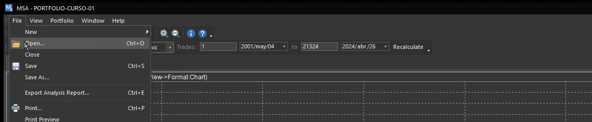
  <figcaption>Figura 147</figcaption>
</figure>
<figure>
  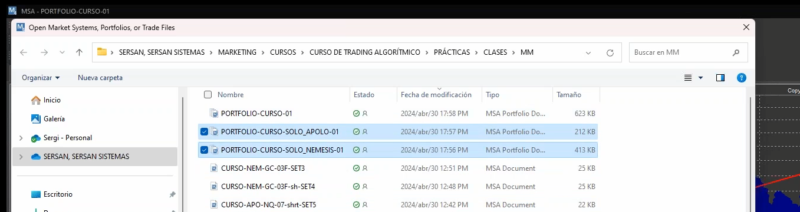
  <figcaption>Figura 148</figcaption>
</figure>

Pero sí que podéis investigar un poco a nivel. Yo os comenté ya que nosotros, cuando son familias, nos tratamos de manera conjunta. Yo, por ejemplo, tengo un *portfolio* aquí de Apolo solo y de Nemesis solo. Un poco para todos los mix, cómo trabajan, de acuerdo. Para ver cómo trabaja un Nemesis con su lado largo y corto. Y lo mismo, cómo trabaja Apolo con su lado largo y corto.

<figure>
  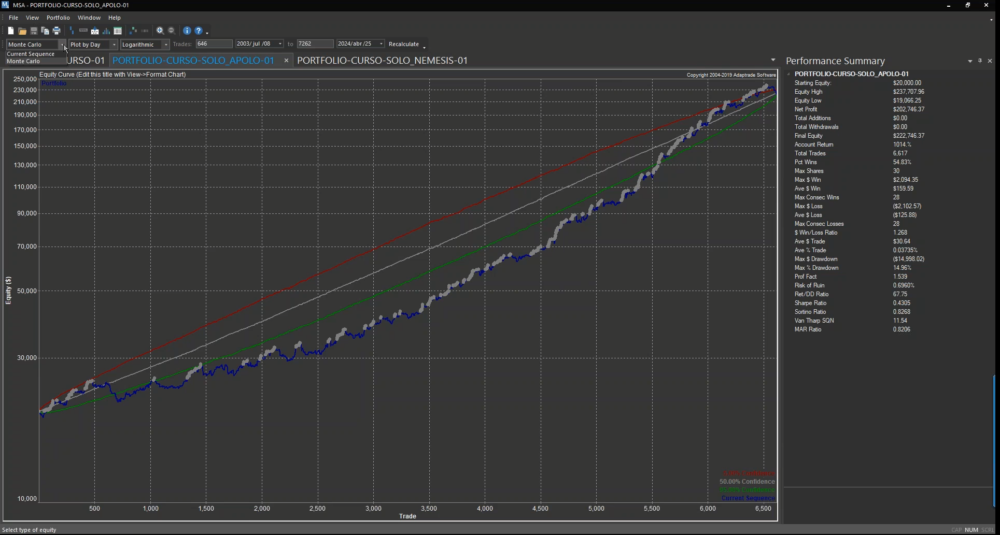
  <figcaption>Figura 149</figcaption>
</figure>

Nemesis trabaja... No trabaja mal, o trabaja peor porque es un tendencial puro. Y los tendenciales puros, fijaros, veis lo que hablaba y los enseñado nosotros, lo hemos operado.

<figure>
  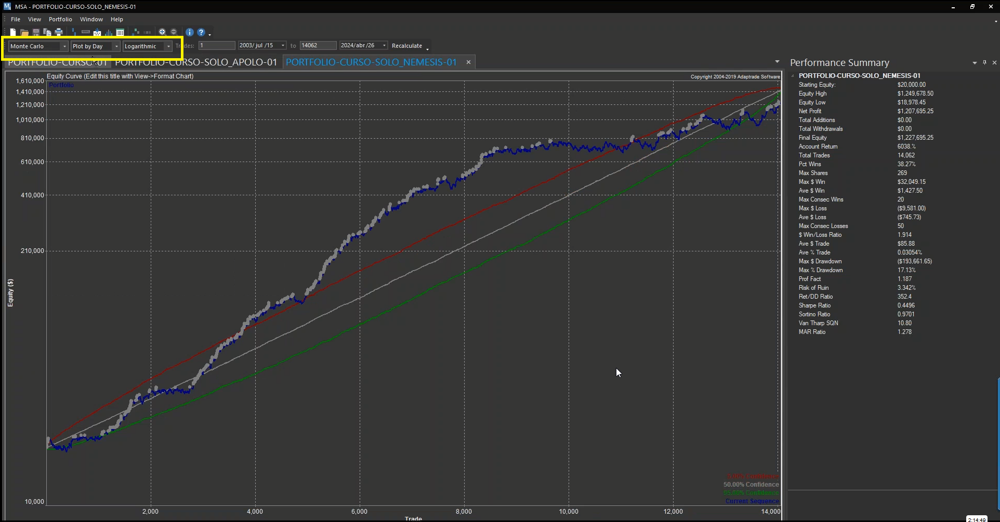
  <figcaption>Figura 150</figcaption>
</figure>

veis lo que hablaba y los enseñado nosotros, lo hemos operado. Y llevaba... Ahora, por ejemplo, ha vuelto a despertar y llevaba un tiempo bastante largo. Que es lo que os digo. Parece que no, pero es largo. Y aquí, fijaros, larguísimo, vale.

<figure>
  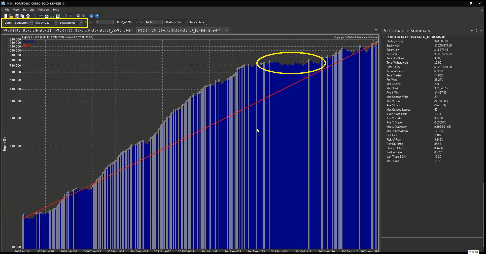
  <figcaption>Figura 151</figcaption>
</figure>

**Cambio de dinámica del oro**

Y ya como os he comentado, el oro ha deteriorado mucho tendencia. No es fruto solo del de sobre-optimización, porque incluso este periodo optimizado da estos datos. Es decir, no tendéis ya... No es un tema de cambio de dinámica de mercado, que esto pues ocurre y ha pasado.

Pero esta parte, la útltima de hace meses, como veis, pues ha estado aquí mucho tiempo en *drawdown*, sufriendo mucho. Al final ha hecho máximo, parece que está otra vez respirando, vale. Parece que está otra vez respirando.

<figure>
  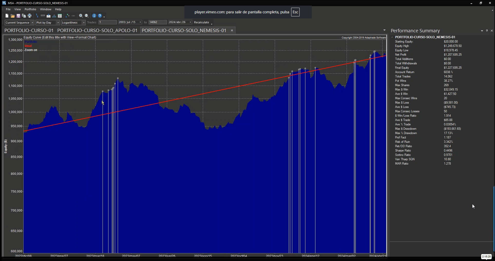
  <figcaption>Figura 152</figcaption>
</figure>

**Comportamiento complementario de sistemas**

Y la cartera de Apolo pues al revés. Ahora parece que ha estado... También ha pasado sus momentos. Fijaros aquí la cantidad de tiempo que pasa, de acuerdo. 

<figure>
  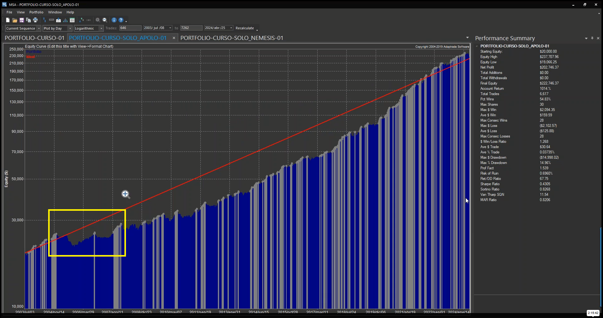
  <figcaption>Figura 153</figcaption>
</figure>

Y esto ya digo es fruto incluso pero siempre yo puedo ser que está... Este optimizado.

Fijaros, no decir. Final todos los sistemas tienen la clave Un poco es que yo ahora cargo esto. 2003 los tengo cargados más o menos igual. Fijaros cómo el buen momento viene con este malo. Y ahora aquí, este que venía muy bien, este venía más flojo. Y ahora parece que éste está bien y éste está mal. Se ve, ¿no?

<div style="display: flex; gap: 10px;">
  
  
</div>

Esto no va a ser siempre así. Y lógicamente, como ya os he dicho, estos sistemas empastan muy bien y tienen un mérito enorme, que con dos familias del sistema consigamos diversificarnos tan bién. Pero sabemos que tenemos camino de mejora, como ya he dicho mil veces. No me escondo de ello. Y hay varios motivos por el que no se hace. Ya lo he explicado. No quiero incidir. Pero el principal principal siempre han sido los futuros.

**Diversificación y consejos prácticos**

Pero ahora, veis Apolo, pues ha entrado ahí un poquito dedrawdown. Esto está actualizado hasta el viernes pasado, creo, vale. Entonces, entrado ahí en un *drawdown* que pues bueno, ha caído con cierta velocidad. Que parece que no es tanto, pero sí lo es, de acuerdo, sí lo es.

Aquí al final está en *drawdown* del 6%. 

<figure>
  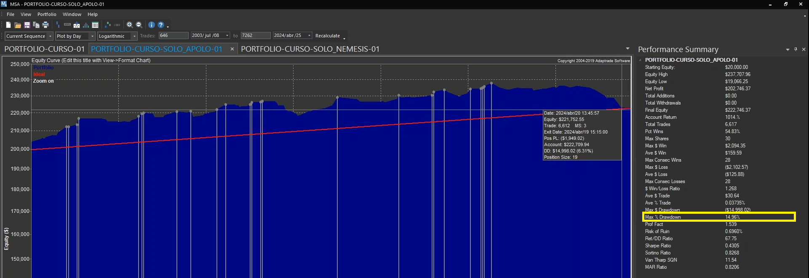
  <figcaption>Figura 154</figcaption>
</figure>

Es para que... No solo Apolo. Apolo metió un 6% en nada, en apenas una semana, con este nivel de gestión monetaria. No tiene por qué ser la de la cartera. Es un ejemplo para que lo entendáis.

Pero que te quiero decir: que el máximo aquí es un 14, 15. Y fíjate que ya están 6 aquí. No prácticamente es la mitad, 6, 7, casi prácticamente es la mitad. Decir, tenéis... Y no lo parecía. así prácticamente ha hecho la mitad del drawdown. Ahora es un *drawdown* histórico casi, casi. Y ahí no lo parece, ni que sea drawndown

<figure>
  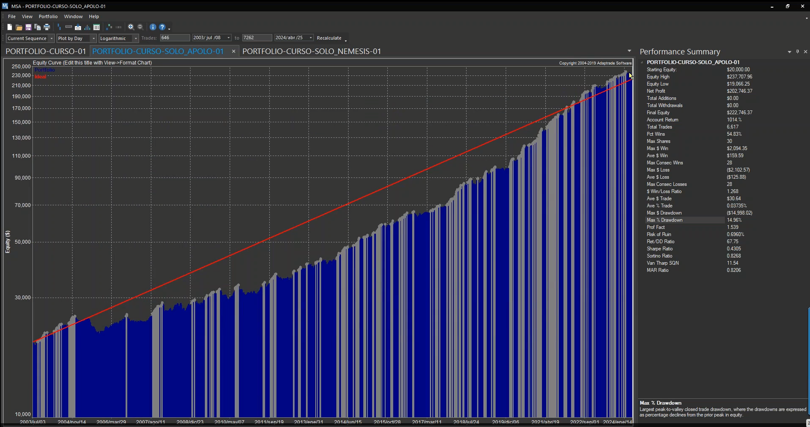
  <figcaption>Figura 155</figcaption>
</figure>

Es por eso os digo que cuidado. Siempre, siempre tiremos a prudente. Ya tenemos a prudente, pues aquí tienen que mezclarse entre sí. Y lo ideal es mezclarlos. 

**Recomendaciones de mix de activos**

Aquí, por ejemplo, nosotros, y ese objetivo ha sido siempre ese problema que hemos tenido principal a esta cartera. Pero vosotros tenéis que buscar, vosotros, los consejos que os doy: el mix Nasdaq, oro, y por ejemplo, luego el Bund alemán o un bono americano. Va muy bien, casi mejor os recomendaría el bono europeo. Va muy bien este mix. 

Entonces, hay que ver sistemas que tengan poca correlación entre sí. Por eso decía que con tres tipo de sistemas, que luego los puedes evidentemente buscar distintos sets, distintas zonas, que entre sí tengan una moderada diversificación.

Esto al final, lógicamente, entre sí dices, hombre, todos son Nemesis. 

<figure>
  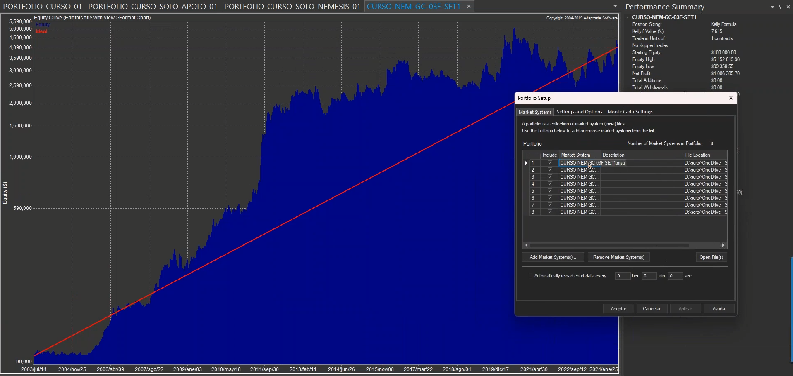
  <figcaption>Figura 156</figcaption>
</figure>

Sí, bueno, todos son Nemesis. Pero vais a ver que los hay muy, muy parecidos, como éste. Pero éste ya no se parece tanto, ¿verdad? 

<figure>
  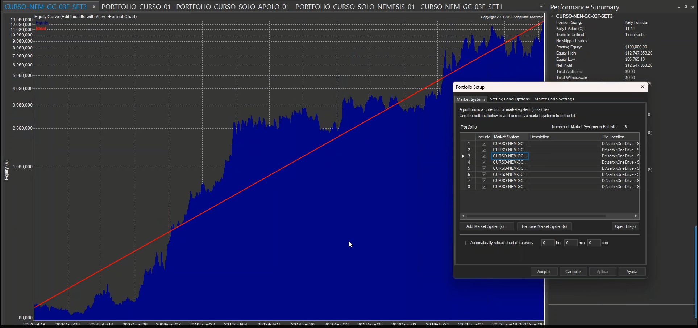
  <figcaption>Figura 157</figcaption>
</figure>
<figure>
  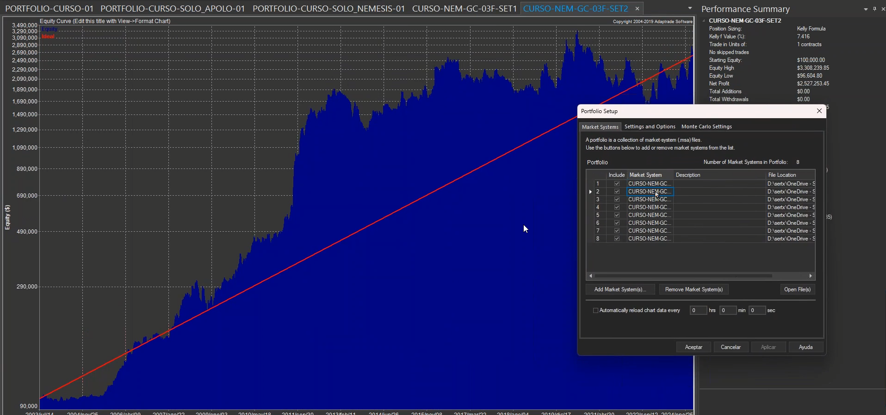
  <figcaption>Figura 158</figcaption>
</figure>

Y ahora que vamos con el corto, pues todavía menos. Entre los cortos hay un poco más de parecido, pero tampoco lo veis cómo cambian a pesar de ser el mismo sistema.

<figure>
  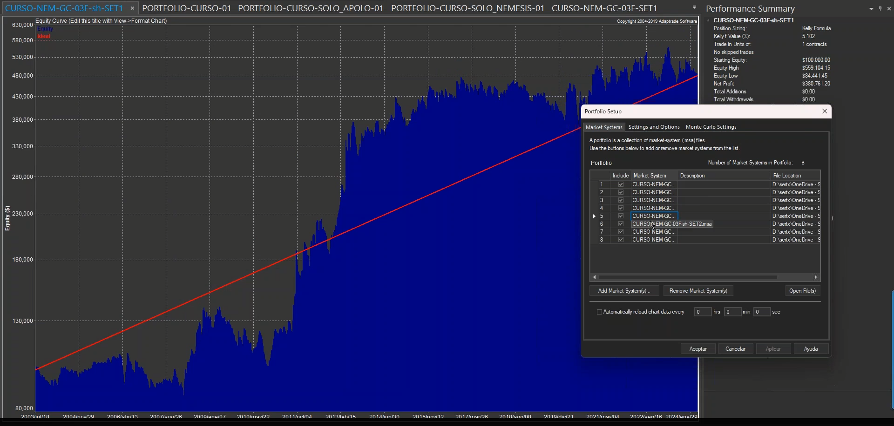
  <figcaption>Figura 159</figcaption>
</figure>
<figure>
  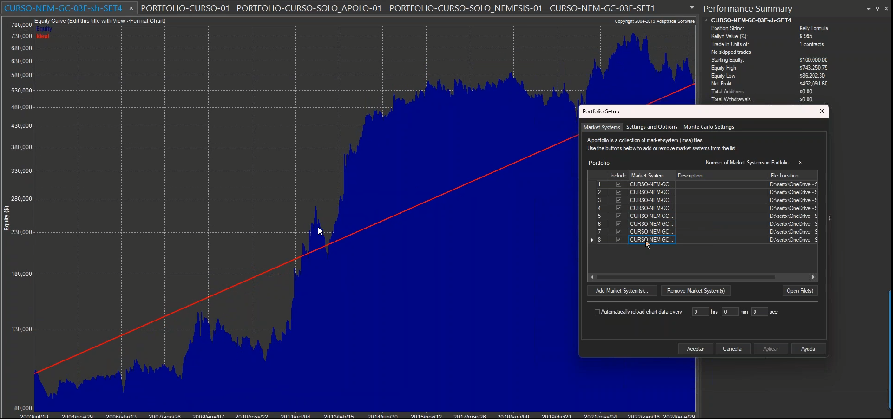
  <figcaption>Figura 160</figcaption>
</figure>

**Robustez y correlación**

Si tienes, si trabajas sistemas robustos, sistemas que van bien en muchos tipos de *frame*, etcétera, al final puedes conseguir que un sistema como éste, que es el lado largo, los 2, 2 y 3, veis cómo cambia realmente la curva. Y es el mismo. 

<div style="display: flex; gap: 10px;">
  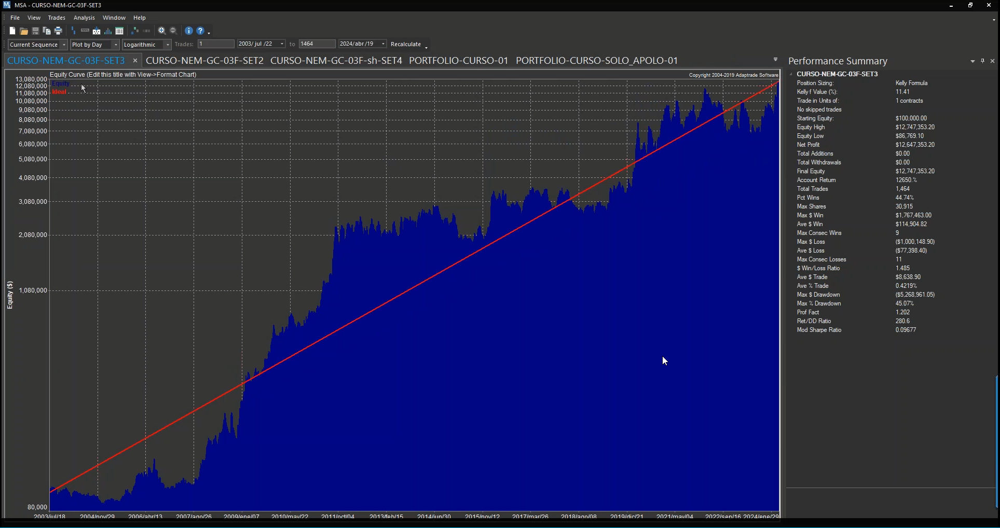
  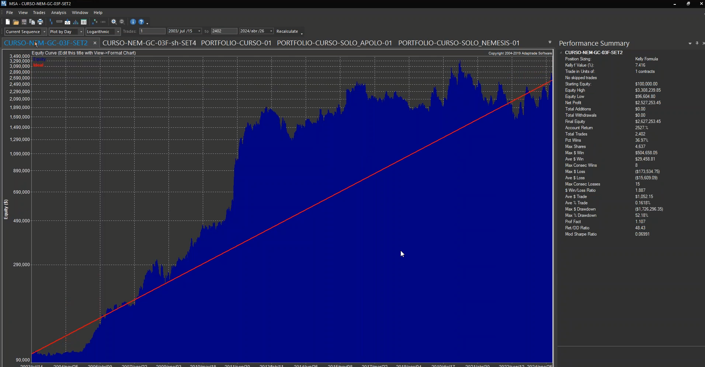
</div>


Seguramente de una correlación a mejor de 0.6 por ahí. Es elevada, pero es menos que 0, de que 100.

Entonces, lógicamente, lo ideal es tener 10 sistemas distintos desglosados en 5 sets y en 5 activos, que a lo mejor nos da 50 estrategias. Perfecto. Y es algo que nosotros tenemos la capacidad de hacer. Y que el motivo de no hacerlo, es sobre todo los CFD´s eso ya es sabido por todos. Pero que aún así hay que buscarse la vida y tratar de conseguirlo vía CFD´s hacerlo mejor de lo que lo que hacemos.

Pero es verdad que cuando tienes cierto dinero CFD´s se complica, al menos para nuestras estrategias. Y esta plantea problemas. 

**CFDs como alternativa**

Porque es muy bien para cuando el bróker es bueno. Hay que vigilar porque los hay muy piratas. Pero *Darwinex* por ejemplo es un buen bróker. El CFD pues da muchas posibilidades. Te permite diversificarte bien. Y es una herramienta que puede ser útil.

Pero como comentaba antes en el Discord, no hay debate sobre si qué es mejor el futuro o el CFD. El CFD lo que yo quiero insistir es que la obsesión... Porque hay gente que lleva esto a una obsesión. Dicen, no, no, es que el futuro es mucho mejor, el futuro es mucho mejor.

Pero si tú no puedes diversificarte bien en futuros, es mejor que te diversifiques bien en CFDs. ¿Entiendes? Decir, no porque el CFD, el CFD... No, no, voy a diversificar bien. Voy a operar solo un sistema en futuros, mejor que operes 5 en CFD. Es que uno en futuros, ¿entiendes?

Ahora, ¿mejor operar 2 en futuros que 3 en CFDs? Bueno, estaría dudoso y ahí, dudoso. Puede que tres. Antes de saber que verlo, porque estás mejor Tres no, ¿pero me entiendes? Ahora, si yo puedo futuros, pues en futuros. Si no puedo, pues en CFD. Al final hay que hacer lo que uno puede, muchas veces no lo que quiere.

**Limitaciones regulatorias**

Sobre todo cuando ya tienes una dedicación profesional. Que al final tienes que operar muchas veces. Pues igual que cuando, por ejemplo, operaba en determinados futuros y no podía operar otros porque el regulador no me permitió operar el oro, por ejemplo. Hubo épocas en futuros. Porque su retiro entregable y el regulador pues no te deja. Yo qué sé, o no te deja exponerte más de un 100 por ciento, no te deja operar lo que sea.

Entonces, al final pueden haber condicionantes operativas, por dinero, por mil factores, vale. Pero si eso no existe y tú solo vas a operar tu cuenta, pues en principio, y por futuros, siempre va a ser mejor, vale. Siempre va a ser mejor.

**ETFs como alternativa**

Y el ETF, no olvidar el ETF. El ETF va muy bien también. Hablamos de futuros también muchas veces se olvida porque es verdad que el lado corto pues a veces no va tan... No es tan fácil. Pero sí que muchos permiten el corto en tiempo real, vale. Entonces también se puede mirar el ETF, de acuerdo. No lo olvidemos.

**Análisis de portfolios en MSA**

Entonces vuelvo al MSA. Me quedo solo con los *portfolios*. Entonces aquí es la mezcla de todos, de acuerdo.

Y yo, como os decía, incluso puedo optimizar. Es verdad que el optimizador, ésa es una parte que tiene pendiente, sobre todo la mejora. Y os recomendaría antes hacer una pequeña optimización de todo, de cada uno de los sistemas.


Yo aquí los sistemas los tengo guardados. A ver, creo que los tenía con Kelly. 

<figure>
  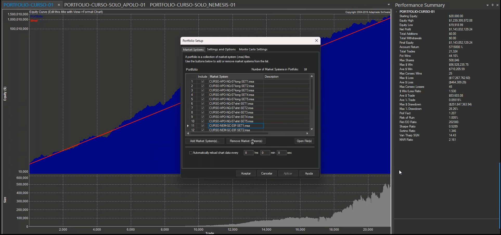
  <figcaption>Figura 163</figcaption>
</figure>

Pero os recomendaría... Porque eso sí que es rápido. Hemos hecho antes un polo rápido. Vamos a hacer ahora un MSA rápido, vale. 

<figure>
  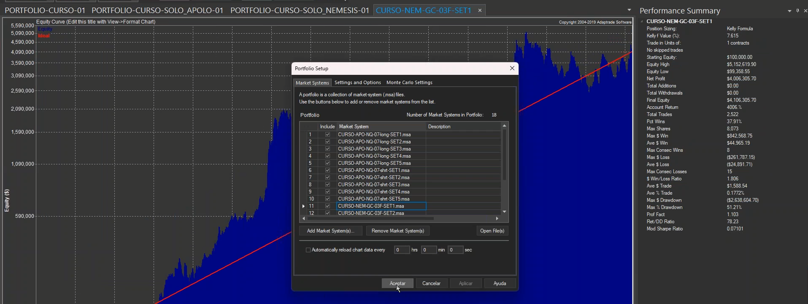
  <figcaption>Figura 164</figcaption>
</figure>

<figure>
  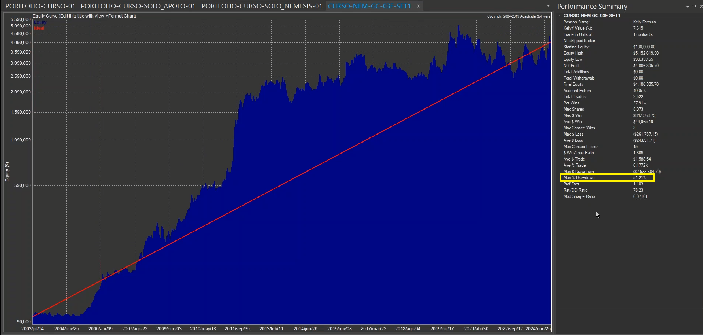
  <figcaption>Figura 165</figcaption>
</figure>

Lo tengo guardado con Kelly, vale. Por guardar uno loco, vale.

Es que así veo rápidamente que de la onda, porque que es verdad que sé que tiene un indicador de la calidad del sistema. Aunque cuidado que él y él en general penaliza mucho. O sea, en general, el *money management*, ya lo comenté, siempre los sistemas tendenciales salen muy penalizados. Pero vía *portfolio* de venir bien, por eso ahí Montecarlo a veces hasta cosas raras.

Porque? porque un sistema como éste, mira, aquí lo debe decir. Y ahora voy con Kelly, vale. Me da igual. Es una locura, pero simplemente porque hay que ver eso que os digo, vale. Si el *performance report* con 100.000 dólares usando Kelly, caros que Kelly ya me da un valor de `Kelly f Value` 7% de exposición pequeño.

<figure>
  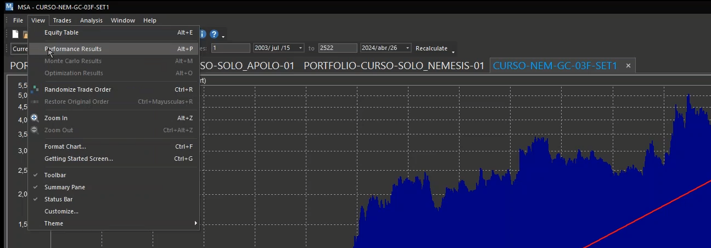
  <figcaption>Figura 166</figcaption>
</figure>

<figure>
  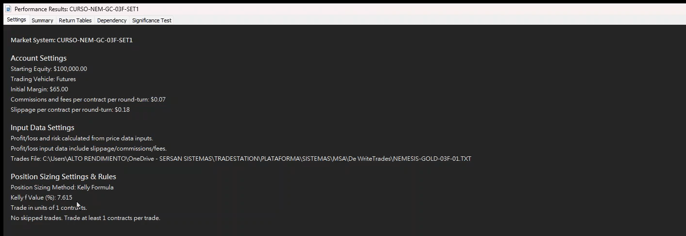
  <figcaption>Figura 167</figcaption>
</figure>

Pero tendencial, es verdad que está bastante afectado.

**Análisis de trades individuales**

Con mirar una cosa que no me leía ahora. Perfecto. Si no, no quería mirar aquí la equidad un segundín. Aquí creo que le he pasado. Aquí estamos. Aquí, aquí podéis ver, o también estos, que es analizar. Ves todos los trades que hace cada estrategia, si es el *portfolio* también, vale.

La fecha de todo, el riesgo que le calcula, la F que es lineal en este caso, vale, para este caso. Que lotes le salen, vale, vale. Y el riesgo que tenía cada, cada por unidad, cada trade.

Pero aquí, cuando es Kelly, ahora, ahora cuando os ponga *Fixed Fractional*, veréis que esto aquí cambia bastante. 

<figure>
  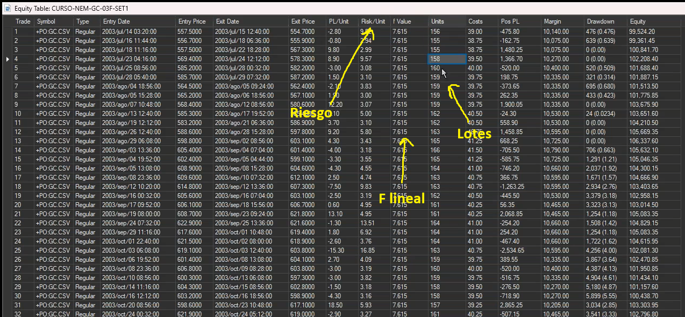
  <figcaption>Figura 168</figcaption>
</figure>

Y no en Kelly. Porque al final, Kelly calcula, acordaros que, dependiendo del porcentaje de aciertos, poco, los componentes de la esperanza matemática, obtenemos Kelly.

**Series de fallos consecutivos**

Al final, el número de contratos, como veis, es relativamente estable. Que va a ir aumentando, aumentando, aumentando, aumentando. A nivel de locura. Pero los tendenciales, lo que os digo, normalmente tienen niveles de rotura muy elevados. Y es verdad que Kelly en ese sentido tiene lógica y ya los penaliza.

Es decir, normalmente un tendencial te va a dar una Kelly más baja que un anti-tendencial, vale.

Porque estaba aquí buscando la fórmula. Aquí la tengo, aquí la tengo. 

$$Kelly = W - \left[\frac{(1 - W)}{R}\right]$$

```
$$Kelly = W - \left[\frac{(1 - W)}{R}\right]$$
```
| Variable | Significado |
|----------|-------------|
| **Kelly** | Fracción óptima del capital a arriesgar |
| **W** | Win rate (probabilidad de ganar) |
| **R** | Ratio Win/Loss (ganancia media / pérdida media) |

<figure>
  
  <figcaption>Figura 169</figcaption>
</figure>

También estaba ahí explicada. Y te viene a explicar un poco el tema, vale. Con el *average win*, los de porcentaje de aciertos, los elementos de la esperanza matemática, te acaba calculando la F que inviertes, de acuerdo.

Pero claro, como tiene el R en el denominador, Pues eso, el R normalmente es un dato elevado en los tendenciales, que tienen un porcentaje de aciertos pequeño pero tienen un ratio *average win* / *average loss* generalmente elevado. Al final, es el divisor, Como el riesgo, Entonces automáticamente provoca que tenga ratios de Kelly poquito más bajos.

**Impacto de fallos consecutivos**

Aún así, aún así, vais a ver que acumula, que es lo que os quería enseñar antes. Antes quería explicaros esto interesante. Acumula series de fallos realmente dependencia. No, que no. A ver, ¿dónde estaba esto? Número 3, número 3. *Consecutive wins*: 8. *Consecutive losses*: 15.

<figure>
  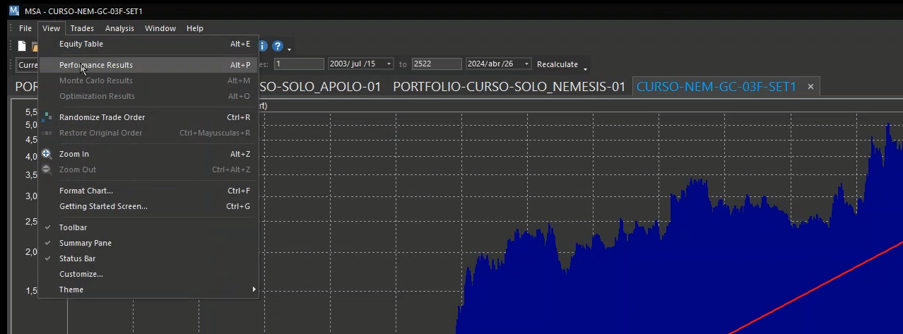
  <figcaption>Figura 172</figcaption>
</figure>
<figure>
  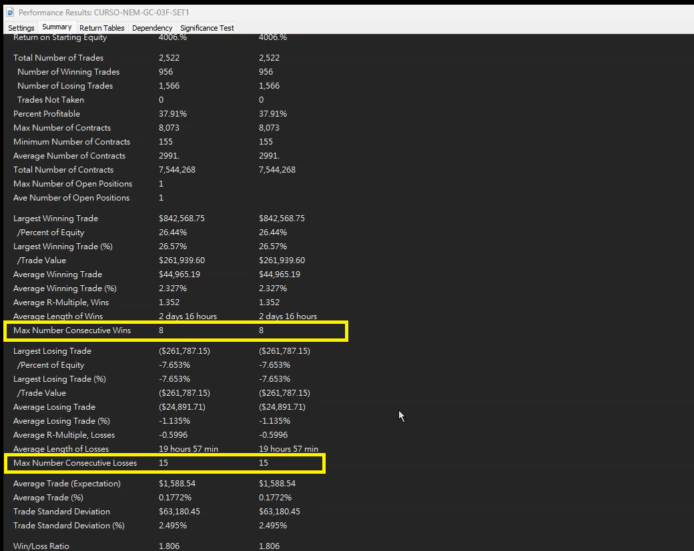
  <figcaption>Figura 171</figcaption>
</figure>

Mira, que te digo creo que esto con el fosforito va a ir bien. A ver. Ahí se ve, ¿no? 15.

Vale. Máximo tiene 8 aciertos seguidos y 15 fallos seguidos, vale. Esto en el gestión monetario es dramático, porque 15 fallos seguidos es donde casi siempre va a hacer el *drawdown*.

Entonces, esto es lo que al final es una losa gigantesca para los tendenciales. Como digo, Kelly afortunadamente... Bueno, afortunadamente sigue teniendo un *drawdown* brutal del 50 por ciento, pero con una `F` pequeñísima de 7. Porque por eso de componente que os digo, vale. Tienen *drawdowns* muy heavies. Porque cuando viene la serie de fallos, destruye la cuenta.

Como te pille en un nivel muy alto de *equity*, le va a costar mucho reducir, vale. Porque no va a reducir más. Que como no tiene el componente riesgo, como la volatilidad que le va a hacer reducir, solo es por la el descenso de la cuenta. Al final retrocede la cuenta relativamente, la reducción de contratos es relativamente lenta.

Si vemos aquí esto, es septiembre del 20. Que lógicamente se va a notar porque el número absoluto es mucho. Pero para que veáis el efecto de Kelly en un tendencial. También en un anti-tendencial, porque encima le va a exponer más.

Pero aquí el 33. Aquí *drawdown*. Y estamos 30.

<figure>
  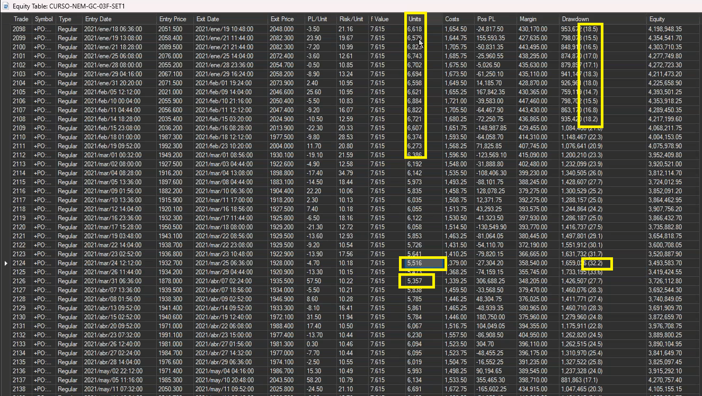
  <figcaption>Figura 174</figcaption>
</figure>

Entonces fijados aquí. Por ejemplo, es 5.500. Aquí venía en 6.000, 7.000. Llegó a marcar 7.100 aquí. Y aquí me llega a meter 5.300.

Y como eso es una locura. Pero la cuenta de creciendo mucho, pero para que veáis la reducción, vale. Porque al final el riesgo no le afecta. Aunque hay volatilidad, no le afecta. Él va metiendo su F, su F. Para que la cuenta va cayendo. Claro, la cuenta va cayendo bastante es la cuenta. Aquí estaba en 4 millones no sé qué, ya que están 3, 4. Es que le cuesta, le cuesta un poco ese ajuste.

Si metes un ***volatilidad***, pues ajusta más. 


Entonces lo que os digo, aquí te permite este estudio, vale.

**Comparación Fixed Fractional vs Kelly**

Y ahora aquí pues digo, venga, vale, perfecto. 

<figure>
  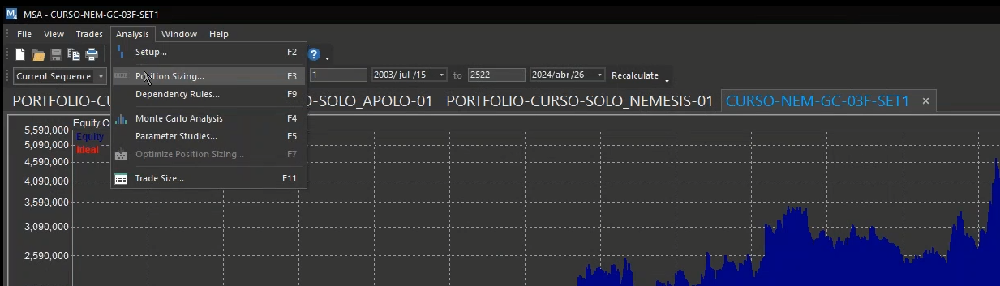
  <figcaption>Figura 175</figcaption>
</figure>


Pues he visto que Kelly es 7, vale. 

<figure>
  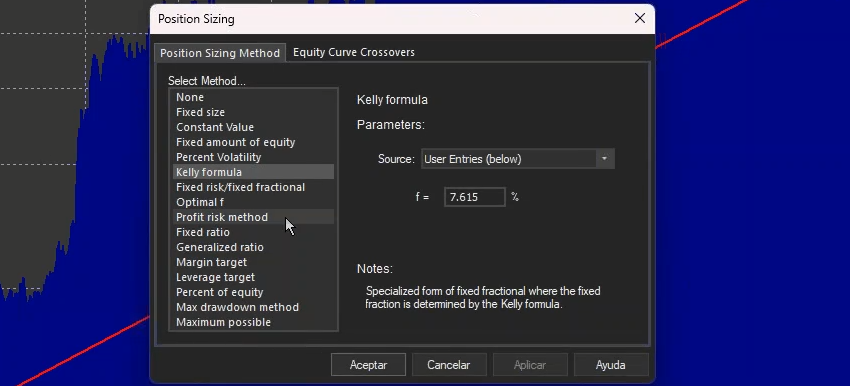
  <figcaption>Figura 176</figcaption>
</figure>

Lo voy a poner *Fixed Fractional* 
* 5%. Qué pasa... 55%. *Drawdown* es demasiado. 
* 3%... 45%. Locura todavía. 
* 1%. 1% ya estoy en 17 *drawdown*, vale. Perfecto.

<figure>
  
  <figcaption>Figura 178</figcaption>
</figure>
<figure>
  
  <figcaption>Figura 179</figcaption>
</figure>

Voy a ver, voy a ver ahí qué tal, no. Y ahí ya lo puedo ver. Pues este crecimiento, este análisis, lo que os decía, de acuerdo. Puedo ver un poco esta equidad misma en 2020 que aquí ya veréis mayor oscilación, vale. Mayor oscilación, vale.

<figure>
  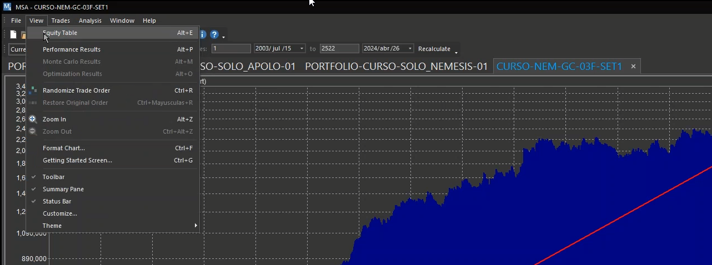
  <figcaption>Figura 180</figcaption>
</figure>

Volvemos aquí. Aquí ya no es tan fuerte el *drawdown*. Claro que ve un 7.8 aquí. Que ve un 8. Pero fijaros, aquí ves que ya tenemos saltos: 1.800, 600.

<figure>
  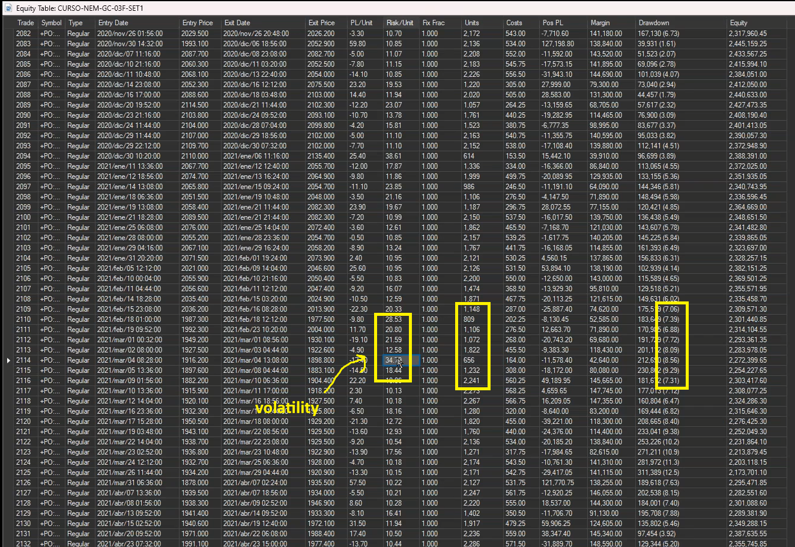
  <figcaption>Figura 181</figcaption>
</figure>

Porque mete ahí volatilidad. Y éste está contando nuestro riesgo. Veis ahí la reducción de contratos en la columna `units`. Está demasiado abrupta. Es demasiado abrupta. Pues habría que ver aquí qué para el riesgo, pasamos todo esto. Al final depende del riesgo que le pasemos.

Y tú mismo aquí ves que esto no te gusta. Pues oye, pues yo quiero limitar lo elevado que es el riesgo, etcétera. Aquí podéis un poco investigar y analizar cómo funciona.

**Optimización sencilla**

Y lo que os digo, yo puedo ver aquí en una sencilla optimización, que os recomiendo hacer simplemente para investigar, por no complicarnos. Como es un sistema solo, 20 con la F, vale. Y automáticamente, fijaros que me sale una F de 1.19 al 20, vale.

<figure>
  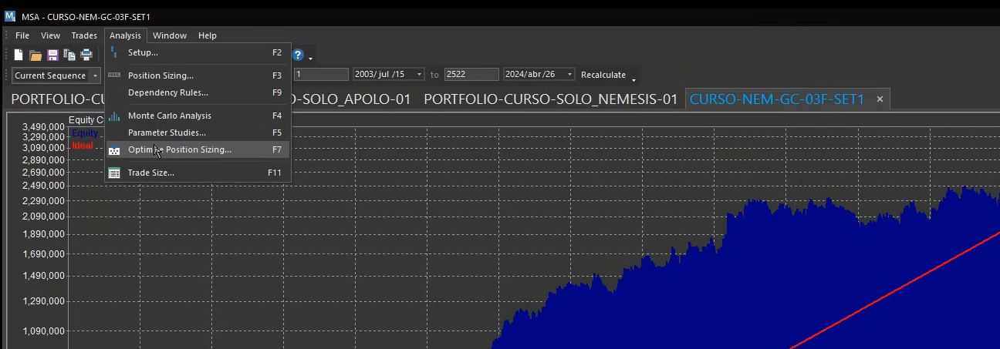
  <figcaption>Figura 182</figcaption>
</figure>
<figure>
  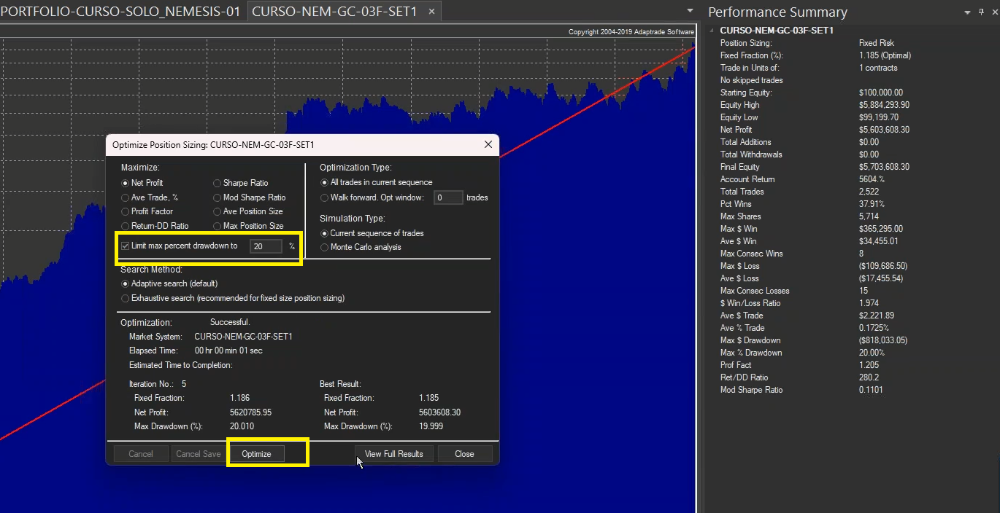
  <figcaption>Figura 183</figcaption>
</figure>
<figure>
  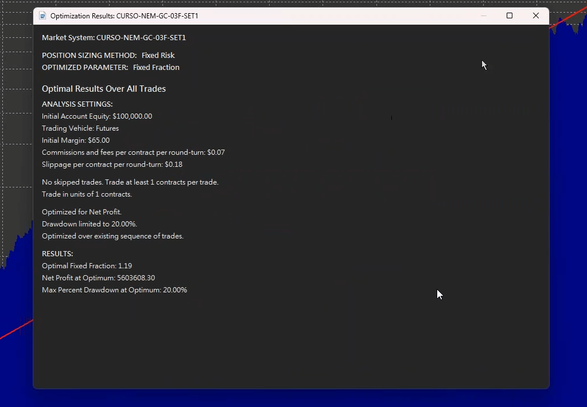
  <figcaption>Figura 184</figcaption>
</figure>

Y quedaros un poco con los datos. 

Pero simplemente voy a guardar esto un poquito para compararlo rápido, 

**Comparación Fixed Ratio**

Y ahora tengo pues, por ejemplo, *Fixed Ratio*. Vamos a poner *Fixed Ratio*, el ratio pasando le pongo solo Delta porque solo va a utilizar una de ellas. Lo mismo 20%. Y pues ya está, vale.

<figure>
  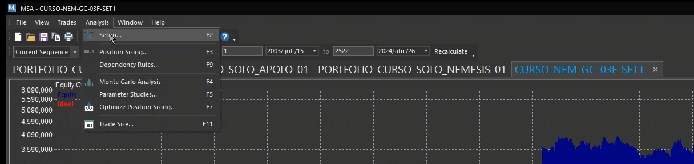
  <figcaption>Figura 185</figcaption>
</figure>
<figure>
  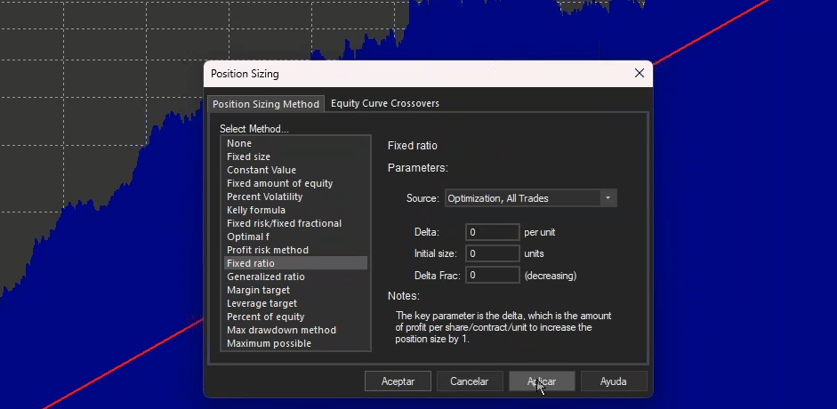
  <figcaption>Figura 186</figcaption>
</figure>
<figure>
  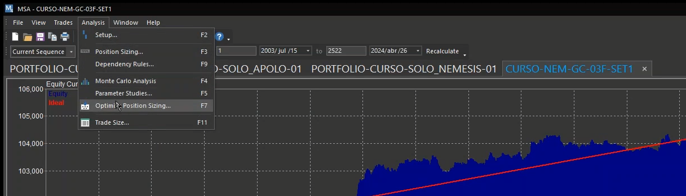
  <figcaption>Figura 187</figcaption>
</figure>
<figure>
  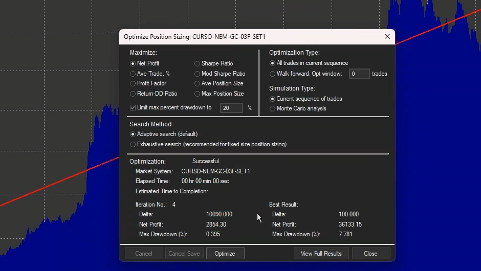
  <figcaption>Figura 188</figcaption>
</figure>

Y me sale esto. Sale esto por *Fixed Ratio*. Y así, vale. Esto estoy haciendo una simplificación absolutamente casi insultante. Pero para que, para que veáis un poco lo quiero decir. Habría que ver muchas más cosas.

<figure>
  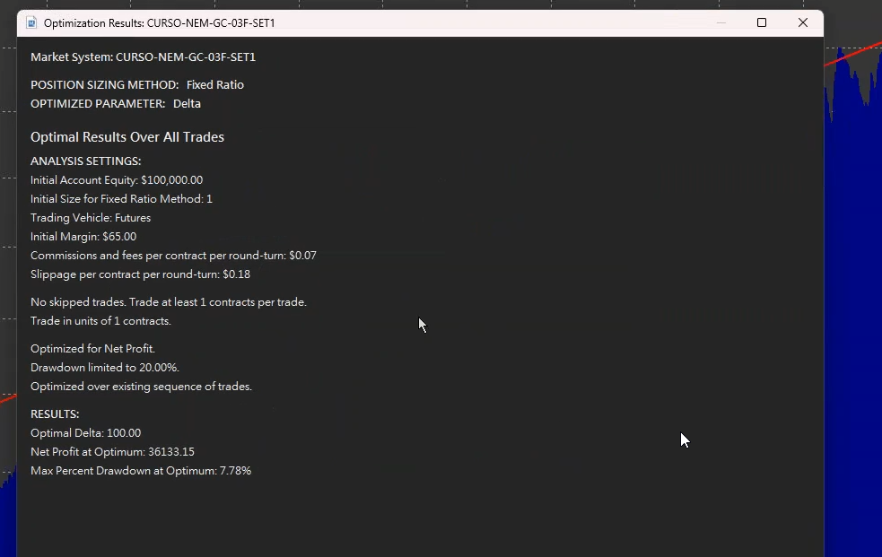
  <figcaption>Figura 189</figcaption>
</figure>
<figure>
  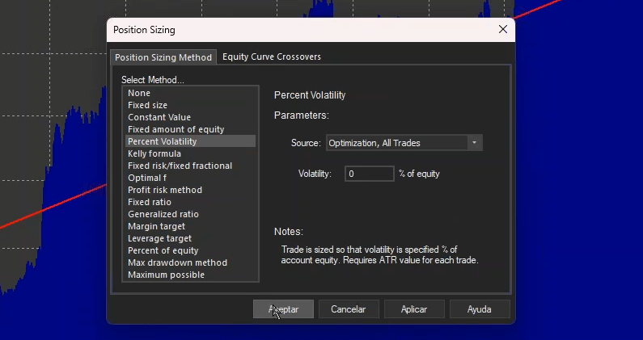
  <figcaption>Figura 190</figcaption>
</figure>
<figure>
  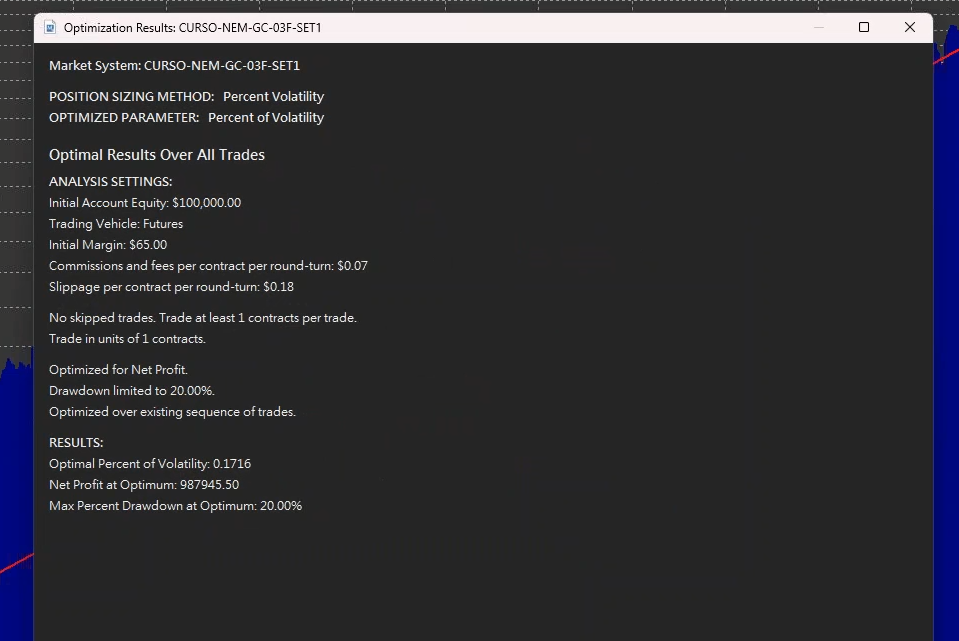
  <figcaption>Figura 192</figcaption>
</figure>

Pero esto lo haces un sistema de otros. Deberéis que cambia bastante el perfil. quería hacer volatilidad. Volatilidad al uso. El que hace Avanzar, vale. 

Como cambia el perfil de un sistema a otro.

<div style="display: flex; gap: 10px;">
  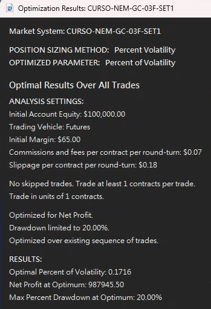
  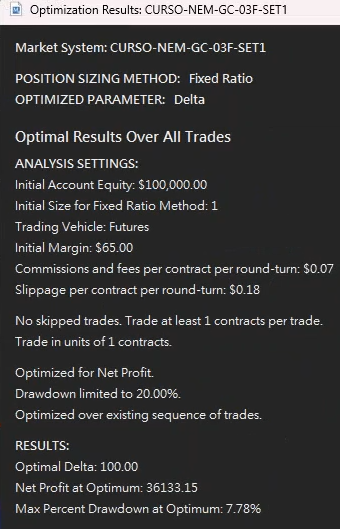
  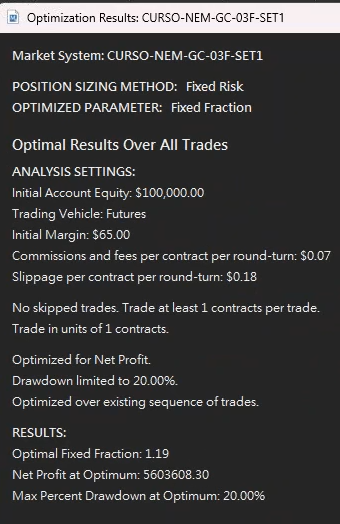
</div>


* *Percent Volatility*, vale. Al mismo más o menos nivel de riesgo limitado, nos ha conseguido un *drawdown* 20%  y un *net profit* 987000. Este siemrpe pasa el ATR

* *Fixed Ratio*: *net profit* 336 mil. Bastante menos ratio. Éste pasa el *Fixed Risk*. Pero le he empezado en un contrato y a lo mejor era poco, vale. Porque ese es el problema de *Fixed Ratio*, que ya os lo expliqué en la teoría. Que seguramente al exponer con él, con ese tamaño de cuenta que tiene predefinido, empezar con un contrato es muy poco. Entonces limita.

* *Fixed Risk* : *net profit* ha conseguido 5 millones, vale. 

Que cuidado, que no estoy diciendo que tengas que operar éste, por ejemplo. El que parece que ha tenido bastante más es hecho bien o no. 

**Estudios sobre Fixed Ratio**

Y hay algún estudio hecho interesante sobre sobre eso. Porque si no lo igualas, no son tan distintos. Yo te pongo aquí *Fixed Ratio* y *Detail Size*. A ver con optimización cuánto, cuánto queda.

Aquí ha quedado con un *drawdown* del 7. Muy pequeño porque le ha costado mucho. Entonces ahora aquí le pongo que empiece con 3 contratos. Pongo que empiece con 3, vale. Y le optimizo ahora, vale. 

<figure>
  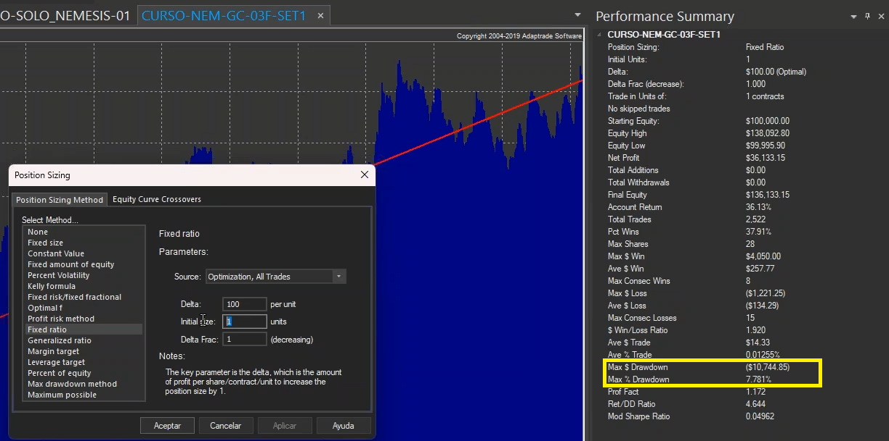
  <figcaption>Figura 198</figcaption>
</figure>
<figure>
  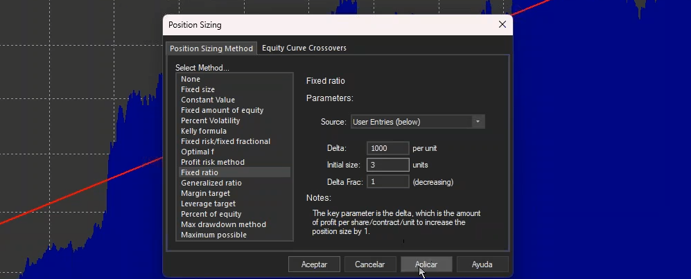
  <figcaption>Figura 201</figcaption>
</figure>
<figure>
  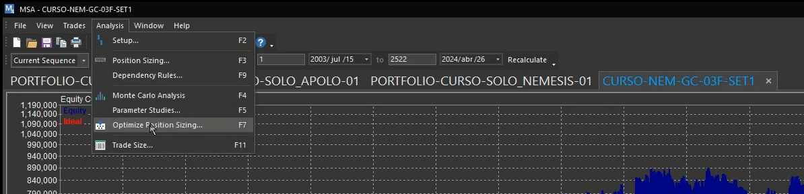
  <figcaption>Figura 196</figcaption>
</figure>
<figure>
  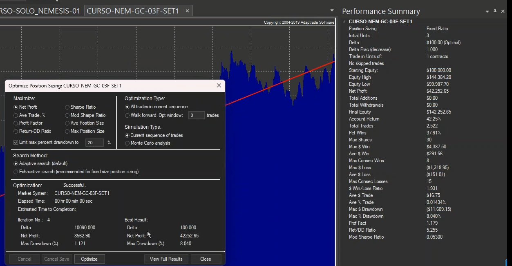
  <figcaption>Figura 199</figcaption>
</figure>
<figure>
  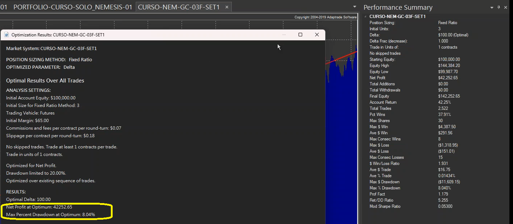
  <figcaption>Figura 200</figcaption>
</figure>


Y ahora pues igual de otro, sigue siendo bastante churro. Sigue siendo bastante churro.

Es igual, a ése era, era solo un ejercicio podemos decir didáctico. 


Pero ya digo, si ahora miráis Apolo, que es un sistema más bien anti-tendencial con un perfil realmente distinto, pues seguramente cambia.

**Análisis de Apolo con Kelly**

No tengo abierto a ninguno, Apolo. Voy abrir un largo y un corto de APOLO. Va a ver los dos.

Que veis cómo cambia la cosa. 

<div style="display: flex; gap: 10px;">
  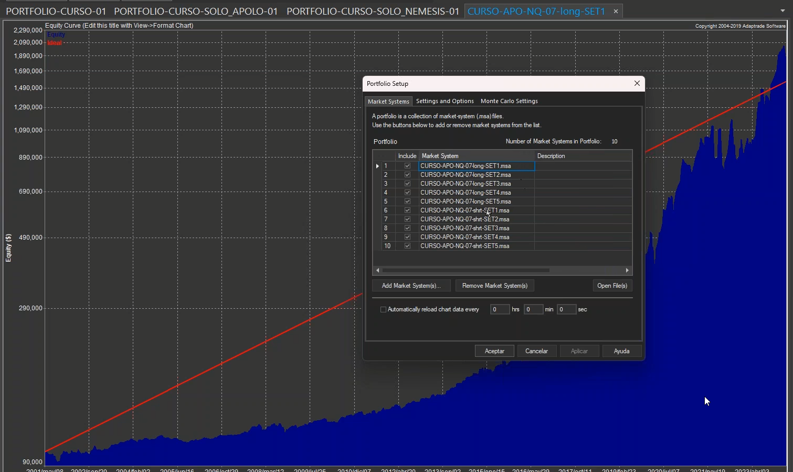
  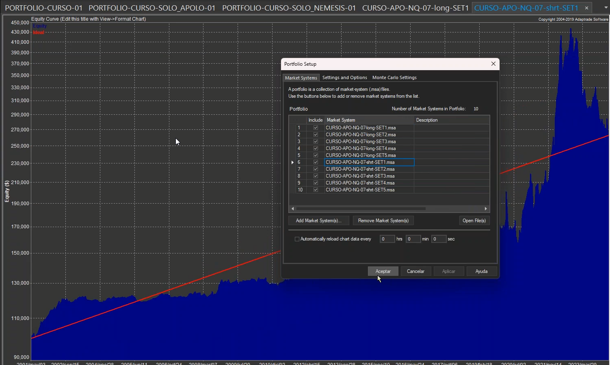
</div>

fíjate el drawdiwn del lado corto de ahora

<div style="display: flex; gap: 10px;">
  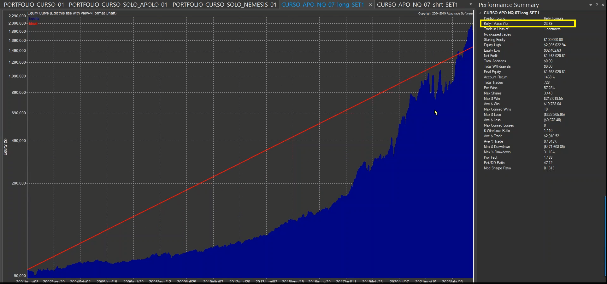
  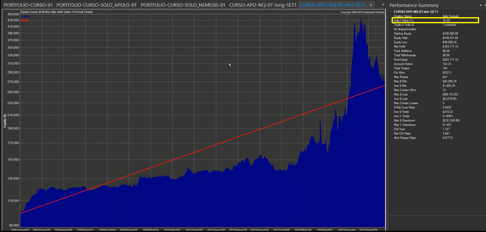
</div>

**Comparación Kelly en sistema anti-tendencial**

Entonces ahora que estoy con Kelly, vale. Fijaros que aquí tengo kelly 23 y aquí tengo kelly 16. Que tiene peor propiedades el sistema. Es obvio que le calcula eso. Pero yo ahora mismo volvemos un poco a *Fixed Fractional*. Y aquí le ponemos a mano a mejor el 1, nos va a ir más o menos bien. Y a los 7% está poco expuesto éste. Al 1, pongo 2, 2.

Entonces puedo ver un poquito pues, pues dónde, dónde respirar, de acuerdo. 

<figure>
  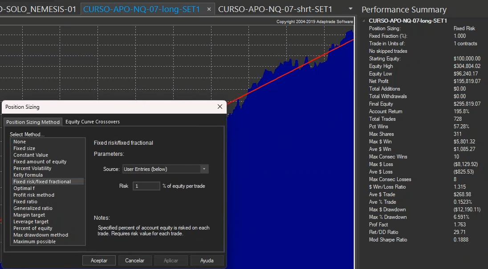
  <figcaption>Figura 206</figcaption>
</figure>
<figure>
  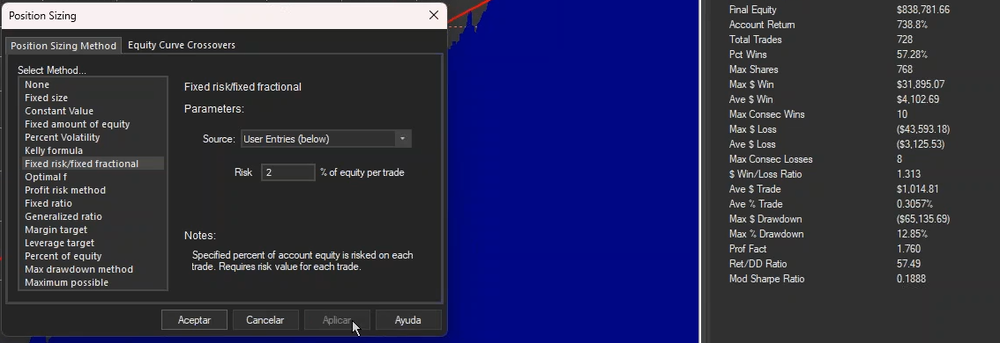
  <figcaption>Figura 207</figcaption>
</figure>
<figure>
  
  <figcaption>Figura 208</figcaption>
</figure>

Hay que verlo con el mix largo corto. Por eso estaría bien incluso podría mezclarlos en uno. Y aquí no lo he hecho pero podía ver en un mismo archivo mezclarlos. Y es buena práctica, de acuerdo.

Pero también puedo hacerlo así. Porque ahora un *portfolio*, que es lo que he hecho. El *portfolio* junto y nos analizo juntos, es lo que he hecho. Ahora, ahora os enseño, vale.

**Comparación Fixed Risk**

Pero así veo un poco el mix largo / corto. 

Aquí estoy en 20% con un 3, con un 3%. Pero puedo hacer un poco la misma película. Y vais a ver cómo *Fixed Risk*... 

<figure>
  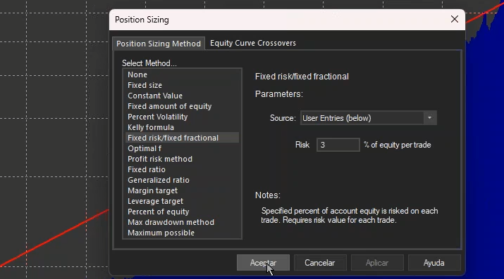
  <figcaption>Figura 209</figcaption>
</figure>

Optimizamos lo mismo con 20. No le había puesto el *Profit* 20, vale. Por simplificar, no vamos a perder mucho tiempo aquí. 20. Veis.

<figure>
  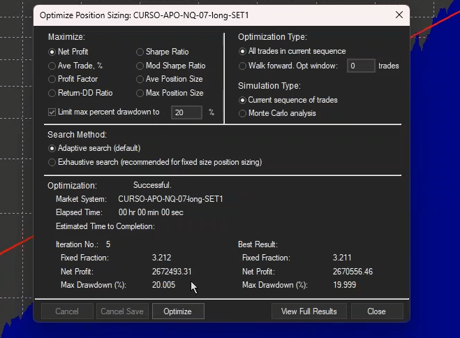
  <figcaption>Figura 210</figcaption>
</figure>

<figure>
  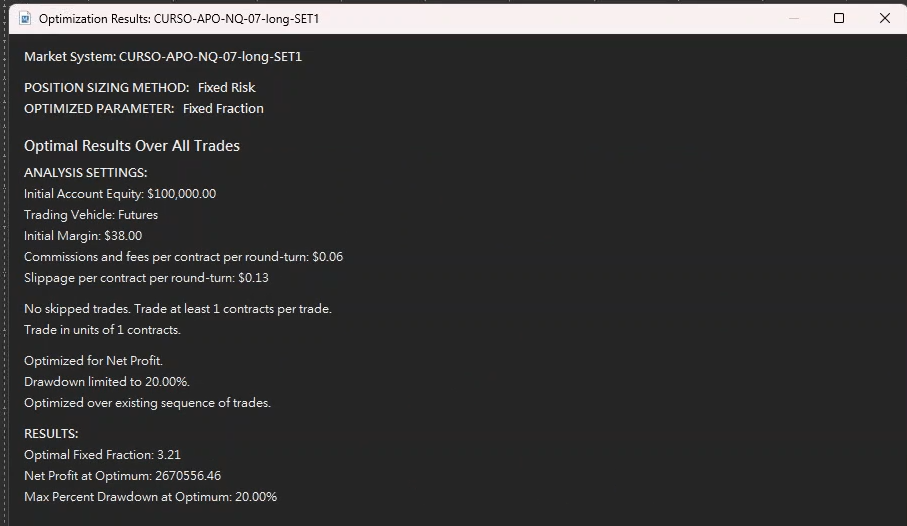
  <figcaption>Figura 211</figcaption>
</figure>


Y ahora yo aquí tengo lo que os decía que veis un poco el cambio de un perfil más bien anti-tendencial, vale. Donde me está metiendo 321. Donde se me está metiendo 3.21% No sé si el período del mismo, la verdad, no me acuerdo. Creo que éste tenía un poco más de período. Es un tema que además va en diario.

**Análisis de volatilidad**

Ya la voy a meter volatilidad. La voy a meter volatilidad. 

<figure>
  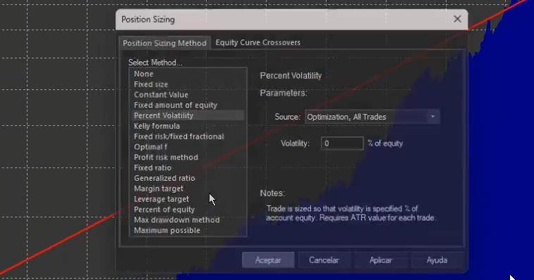
  <figcaption>Figura 212</figcaption>
</figure>

Vamos a ver a volatilidad bruta cómo consigue bajar.

<figure>
  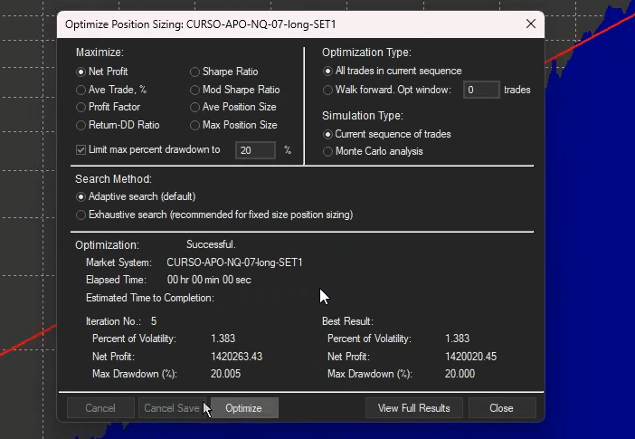
  <figcaption>Figura 213</figcaption>
</figure>

Aquí fijaros que ya tenemos un resultado notablemente peor a el ratio que exportamos nosotros, a pesar de que también es de volatilidad. Pero no es volatilidad, es volatilidad primero normalizada, vale. Y luego ajustada por el nominal, y con un límite de volatilidad.

<figure>
  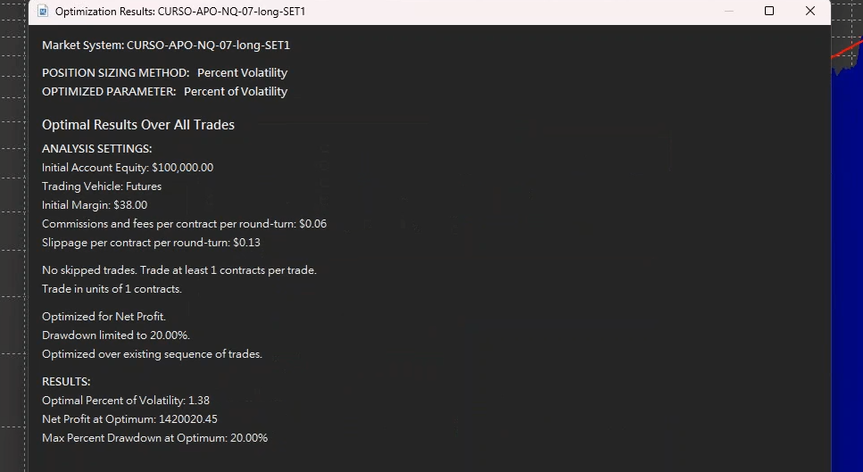
  <figcaption>Figura 214</figcaption>
</figure>

Y esos dos componentes pues, como veis, al principio parecen mejorar el resultado. Al menos en estos dos estrategias.

**Prueba con Fixed Ratio**

Vamos aquí con *Fixed Ratio* para ir acabando. Y no, no, no, no, no. Si, si, si, optimizas. Y ya estás. 

<figure>
  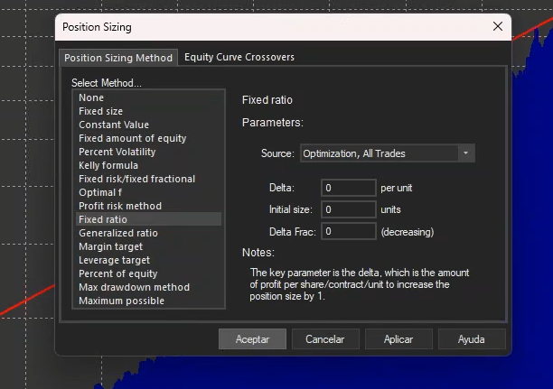
  <figcaption>Figura 215</figcaption>
</figure>
<figure>
  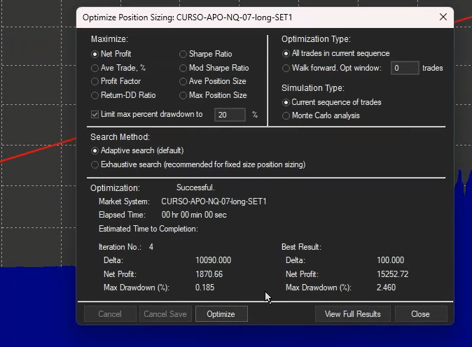
  <figcaption>Figura 216</figcaption>
</figure>
<figure>
  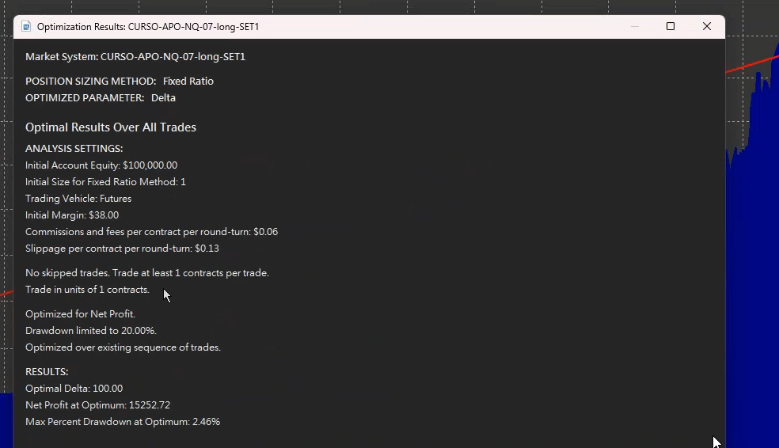
  <figcaption>Figura 217</figcaption>
</figure>

Aquí tenemos 15.000. Este al final, lo que le está pasando es lo que os digo, que está muy infra-expuesto mucho tiempo.

Eso no tiene un *drawdown* del 2 por ciento. Esto realmente el problema aquí es que habría que meterle a lo mejor de entrada 5 contratos. A lo mejor hay que meterle aquí *Initial Size* 5. Igual le meto 5 y a ver ahora qué delta me saca.

<figure>
  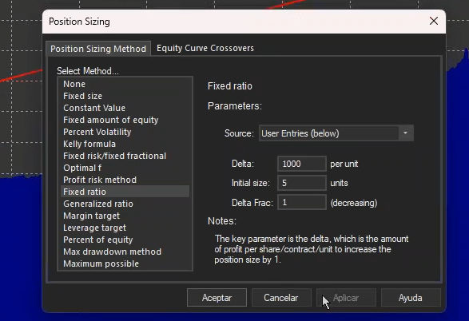
  <figcaption>Figura 218</figcaption>
</figure>
<figure>
  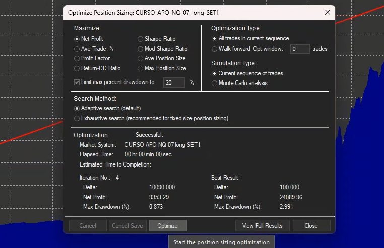
  <figcaption>Figura 219</figcaption>
</figure>

Todavía está con un *drawdown* ridículo. No sé por qué expone tampoco. No!!! es al revés. es al revés. Lo que 

tienes poca cuenta, claro. Claro, no, no. Es al revés, al revés. Lo que tienes poca, poca cuenta. Es equivocando. Tiene poca, poca cuenta.

<figure>
  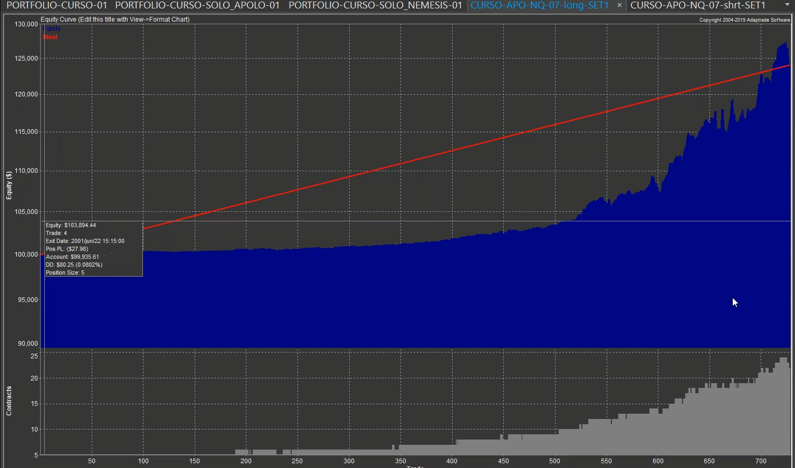
  <figcaption>Figura 220</figcaption>
</figure>


**Ajuste de parámetros**

Entonces la delta ahora, delta de 100 en el óptimo. 

<figure>
  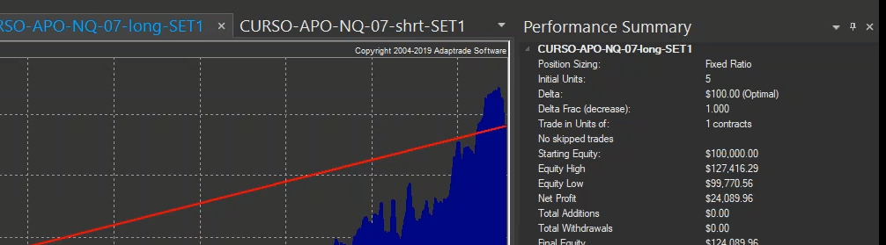
  <figcaption>Figura 221</figcaption>
</figure>

Claro, no puede, no puede, no puede sacar esa vez. Tiene falta dinero. Aquí habría que optimizar la delta. Y no consigue subirla, vale. No consigue. Necesitaría...

<figure>
  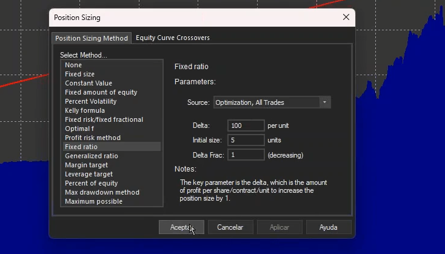
  <figcaption>Figura 222</figcaption>
</figure>
<figure>
  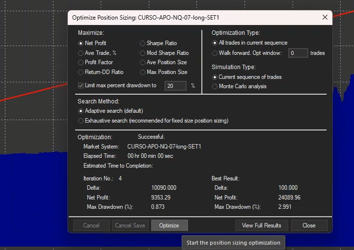
  <figcaption>Figura 223</figcaption>
</figure>

Ahora ya tenemos una delta de 10.000. Pero sigue teniendo un *drawdown* pues muy bajo, muy bajo. Está usando muy poco. Ahora, pero ahora empieza con 5??. 

<figure>
  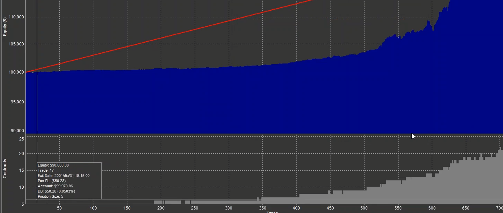
  <figcaption>Figura 225</figcaption>
</figure>

Porque le he puesto 5. Porque si no le pongo eso, no me lo deja tocar.

<figure>
  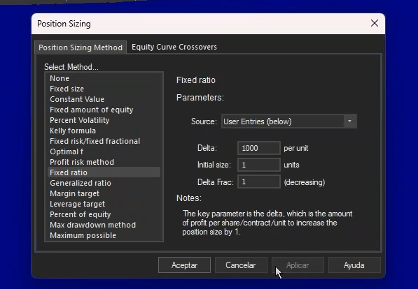
  <figcaption>Figura 224</figcaption>
</figure>
<figure>
  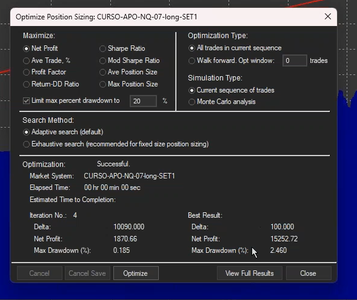
  <figcaption>Figura 226</figcaption>
</figure>

ahora si que es 10.090 y empieza con uno.. Y le cuesta mucho.

Al final dicen que dicen que *Fixed Ratio* va mejor para cuentas pequeñas. Pero bueno, ya digo, es depender un poco del tipo de sistema.

**Conclusiones de comparaciones**

Nuevamente vemos un poco otra vez que A un nivel de *drawdown* equivalente.

<div style="display: flex; gap: 10px;">
  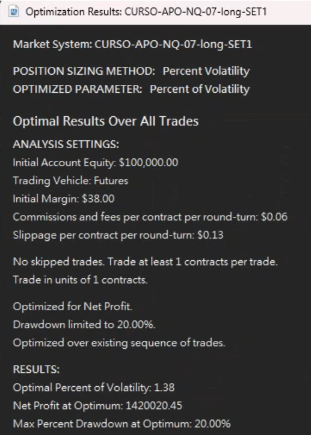
  
</div>

Fixed Risk en profits es mucho mejor...

Entonces, en principio, en principio, mucha prudencia. Parece mejor, pero yo aquí es lo que os digo. No quiere decir que usaría un 3% por ciento. Esto es lo que os quiero decir. No se trata de eso. Se trata un poco de ver la sensibilidad, la sensibilidad. De hacer análisis.

No se trata de eso. Hay que siempre mezclar los otros que os decía. 

**Apolo**

Aquí, , pasa que es muy, muy poco eficiente optimizador. Porque aquí no hay muchos sistemas, son diarios. Éste es yo creo que va a ser más o menos viable.

<figure>
  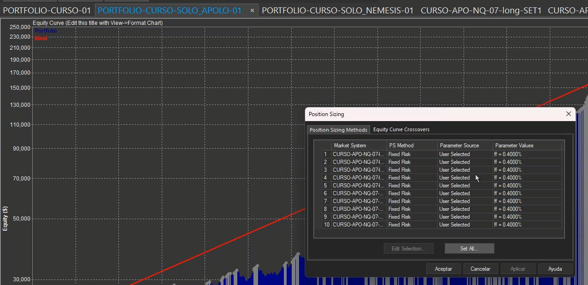
  <figcaption>Figura 229</figcaption>
</figure>
<figure>
  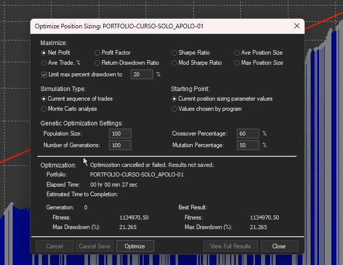
  <figcaption>Figura 230</figcaption>
</figure>

problemas de CPU.. no podemos seguir

Pero era MSA, absorberlo de una manera increíble. Me acordaba. Nos lo va, nos lo va a tirar. No puedo, no puedo hacerlo porque no lo puedo limitar de ninguna manera. Sé que me lo va... No lo puedo hacer.

Bueno, ya lo, ya lo miraré. Por lo miraré, por curiosidad. Como hemos empezado un poco más, no hacer descanso. Disculpadme. Pero bueno, vamos a ir ya acabando.

El de, además, Jose Donet seguro que ya se habrá ido supongo a ver su partido.

**Próxima clase**

Bueno, a lo que, a lo que iba. El próximo día me voy ahora a arriesgar porque ya si no se abre pues me da igual abrir *MultiCharts*, vale. Trabajaremos, trabajaremos sobre todo bueno las dudas que hayan sobre esto.

Repasar un poquito si tenéis dudas, tanto esta clase como la que vimos de *money management* número 1 y 2. Hicimos 2 en la teoría, vale. Porque al final ahí hay cosas interesantes.

**Trabajo con portfolios**

Entonces aquí veremos un poquito el trabajo de todos los sistemas y creo que meteremos alguno más que nos vamos mirando antes, vale. Pero aquí está todo lo que hemos trabajado, vale.

Y veremos un poquito distintas combinaciones, haremos distintas pruebas, 

No decía que aquí veis, tenéis un poco los sistemas que hemos trabajado. Y creo que meteremos alguno más, vale. Pero bueno, ahí está ya está todo lo que hemos trabajado. Ya se ha configurado con unas conexiones, otros con futuros. Bueno, lo que hicimos. Lo que hicimos el oro, de acuerdo.

Y hay distintas combinaciones para utilizarlo. Por los ratios que tenemos de *portfolio*, tenemos algunas historias en el centro. Bueno, ya lo comentaré, vale.

**MultiCharts vs MSA**

Entonces quiero enseñarlo aquí, que no sean los *MultiCharts*, los dos. Porque *MultiCharts* hay. Pero Maestro a mí tiene cosas que me gustan mucho. Pero ya os lo comentaba, es muy poco eficiente como programa, muy lento y tal.

Entonces, por tener un poco los dos, dependiendo como me vaya uno, me vaya otro, pues usaremos. Y vamos viendo un poco las dos, las dos opciones, vale. Para ver un poco distintas combinaciones. Que como veis es muy sencillo: marcas uno, desmarcas el otro y ve...

<figure>
  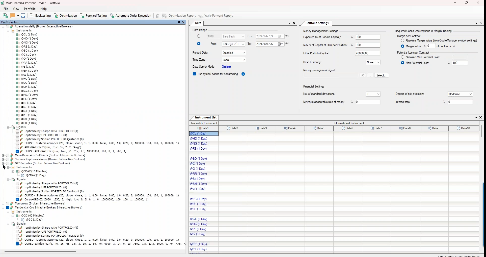
  <figcaption>Figura 231</figcaption>
</figure>

Ya los dejaré más o menos optimizados y analizados para poder os lo explicar. Y trabajaremos bastante sobre esto, de acuerdo. En ver distintos perfiles, ver qué aporta uno, cómo mezcla mejor, de acuerdo. Ir viendo distintos ratios para ayudaros un poco a la elección y ver cómo mezclar el gestión monetaria y *portfolio*, vale.

**Trabajo en Excel**

También seguramente algo de Excel para ver esta, la mezcla de sistemas, de acuerdo. Así que por hoy lo dejo aquí.

**Recomendación de MSA**

Quería ya digo centrarme en MSA. Yo os lo recomiendo. Es esto que no es, no es para nada obligación. Porque teniendo Maestro, en *Maestro* para esto tiene la parte, la parte de gestión bastante buena.

Es esta parte. Aquel que no lo haya trabajado, os lo abro brevemente. Lo usamos mucho más para unas cosas, porque para las cosas va bien. Tenemos aquí como veis un montón de *portfolios*. Pero para otras va fatal. Al final pues hay que, hay que mezclarlo.

Es aquí tenemos, por ejemplo, *Sistema de Ruptura*. Entonces lo que os digo, aquí cuando tenéis un *Strategy Group*, vale. Este *Ruptura Acciones*, vale.

**Money Management en EasyLanguage**

Aquí tiene un modo de modo *in bars meant*. Tú puedes llevar el modo *in bars meant* vía *EasyLanguage* o puedes usar éste. Y está muy bien porque ves, aquí tienes algunos. Ya *Fixed Fractional* y *Fixed Amount*, que es *Fixed Ratios*, tienes aquí algunos que te pueden venir bien para investigarlo y demás.

<figure>
  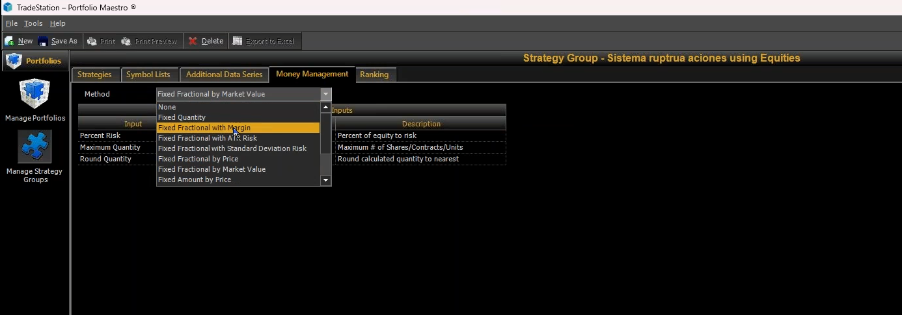
  <figcaption>Figura 232</figcaption>
</figure>

Luego vía código, que también os lo enseñaré alguno que tenemos vía código. Para, como muchos al final habéis habido cuenta en *EasyLanguage*, que veáis un poco la opción de controlar Maestro vía código.

