# Práctica 16 - Portfolio, Money Management y Diversificación

## Índice

- [Consultas](#consultas)
- [Papers y material de portfolio](#papers-y-material-de-portfolio)
- [Maestro](#maestro)
  - [Ejemplo de portfolio con dos familias](#ejemplo-de-portfolio-con-dos-familias)
- [Recomendación de activos](#recomendación-de-activos)
  - [Ejemplo de portfolio real](#ejemplo-de-portfolio-real)
- [Portfolio Trader](#portfolio-trader)
  - [Peso inicial de sistemas](#peso-inicial-de-sistemas)
  - [Rebalancear o no rebalancear](#rebalancear-o-no-rebalancear)

## Consultas

**Material subido**

Pues subí el *buscador de entradas salidas* que lo teníamos pendiente, con 23 entradas y no sé si dan 35 salidas.

* BUSCADOR_de_ENTRADAS_Y_SALIDAS.zip

Que recuerda, sólo no deja de ser un ejemplo. Por ejemplo, yo qué sé, indicador sólo hay el RSI, pero podéis poner otros. De figuras de velas pues está el martillo, pero podéis poner otras. Entonces al final no deja de ser una plantilla donde podéis hacer ahí 70, pero para que veáis un poco en la manera y el esquema, no, el esquema de que podéis poder trabajarlo y podéis desglosarlo, buscar sólo de indicadores o lo de tal, vale.

Decir, un poquito para trabajar y buscar y buscar ideas cuando uno no tiene. Que a veces no hace falta, es no hace falta y puedes sentarte en algunas, vale.

Luego, también he subido aquí un pack de Forex para responder a una pregunta que había. Ahora en pregunta, que lo vemos allí. 

* [29_practica-material-extra : pack de Forex](../../29_practica-material-extra/Forex%20Pack%20TradeStation/Forex%20Pack/)

Y he subido dos artículos bastante interesantes sobre *filtros* principalmente para las estrategias *breakout*. Como de esto hemos hablado bastante os pasamos y hablamos de las bastantes figuras de filtro, y quería ya esta imagen ponerla hace tiempo, que es un poco una imagen típica de cómo se filtra por volatilidad entradas, vale.

Artículos Filtros estrategias Breakouts
* [OutSide Bars](../../26-practice-16/docs/The%20Outside%20Bar.pdf)
* [Volatility Contractions](../../26-practice-16/docs/The%20Power%20of%20Volatility%20Contraction%20Patterns.pdf)

Todo siempre es discutible, todo hay que probarlo. Y al final el vector más, más, más importante de todos... Luego subiré un PDF de Kaufman que me gusta muchísimo, que ya lo tengo preparado hace tiempo. Lo quería subir el último día.

**El vector principal: tipo de mercado**

El vector principal para que un sistema funciona es el tipo de mercado. Entonces si te empeñas en un activo muy tendencial meterle *mean reversion*, pues va a ser complicado. Y viceversa. De ser un activo típicamente *mean reversion*, te empeñas en tendencia, pues complicado, vale.

  <strong>📊 El vector principal siempre es las características del activo</strong> 
El vector principal para que un sistema funciona es el tipo de mercado. Entonces si te empeñas en un activo muy tendencial meterle *mean reversion*, pues va a ser complicado. Y viceversa. De ser un activo típicamente *mean reversion*, te empeñas en tendencia, pues complicado, vale.

Entonces el vector principal siempre es las características del activo, vale. Y por eso también, por ejemplo, este buscador de entradas salidas se puede usar un poco para eso. Para ver qué tipo, qué tipo de entradas van mejor. Coger 2-3 típicas tendenciales, 2-3 típica *mean reversion*, y ver. Esa es una pequeña optimización rápida, y ver qué, cómo se respira el activo en ellas.

Pues es una manera también de ver qué tipo, cómo va. Es decir, las de *breakout* va muy bien para ver si el activo tiene tendencia. Es decir, si tú compras o vendes al máximo de ayer y cierras al final de día, esa es una manera, ya lo comenté creo que en la teoría y la práctica. Simplemente compra en stop en el máximo de ayer y venta en corto en el mínimo de ayer y cierre a fin de día, de acuerdo.

Eso una normalmente es un buen indicador de la tendencialidad de un activo. Pero ya digo, muchas de las entradas que ya hay os pueden servir para eso, pueden servir para eso de manera sencilla, de manera sencilla, sin complicarnos y buscar coeficientes de cursos y cosas más complejas, vale. Que al final se van a llevar al mismo sitio.

Entonces eso es, es útil para ver las capacidades de un activo. Bien, entonces lo que digo, aquí en los filtros viene así. Entonces es verdad que tú dices, hombre, sobre todo para la expansión o tendencialidad, a veces cuando empieza la tendencia puede haber una expansión y seguir la expansión y eso es verdad. O sea, no quiere decir ningún filtro actúa bien el 100% de las veces. Entonces al final si tú digamos que lo que aumentas es tu probabilidad de éxito. Reduces muchos *trades*, reduces buenos y reduces malos. Lo que tienes que hacer es reducir más malos.

Pero evidentemente no hay filtro perfecto. No te va a clavar siempre la situación. Y de hecho, hay veces que, como yo os he dicho yo muchas veces, que veo artículos de donde se filtra que yo no filtraría. Prefiero que el sistema rinda peor y opere más, que filtrarlo en exceso. Pero no deja de ser añadir la complejidad y dificultar la robustez.

Entonces tiene que hacer falta y tiene que haber una mejora significativa. Y seguir manteniendo un número de *trades*, porque si no a lo mejor no vale la pena filtrarlo. Vale la pena diversificarlo con otros sistemas. Como ahora vamos a ver maneras donde un sistema que no es tampoco especialmente bueno y aporta. Es decir, al final esto, esto pasa, vale.

**Preguntas del Discord**

Bien, en cuanto a preguntas, muy rápido. Aquí se me ha añadido más, ha habido más, ha habido más, que siempre apura esa última hora me preguntas. Albert, ya durante horario de clase, durante horario de clase me suelta es otra pregunta. Bien, no, no, que está bien, sabe saber.

Pero entonces no me dejáis leer. La manera, voy abajo arriba porque ya llegaré a todas, tranquilos, vale.

**Sobre matriz Excel para portfolios**

***Buenas tardes, tenía unas preguntas sobre el temario restante y el curso:***

***1.La matriz en excel para elegir sistemas des correlacionados para diversificar y tener un portfolio lo más óptimo posible se verá en lo que queda de clases? ya que entiendo que es algo muy relevante para la toma de decisiones y elaborar un portfolio.***  
***2.Aparte del sistema COT ( ¿el cual se vera en la última clase?) se verán por encima o se darán ideas de otros sistemas menos convencionales como multidata, rotacionales, fundamentales,etc?***  
***3.Finalmente se desecha la idea de tener un vídeo sobre como montar un servidor?***  
***4.Se cubrirá el vix external, su uso como filtro y régimen de mercado?***  
***5.Una vez termine la clase de junio, hay algún período para poder preguntar dudas futuras o al finalizar dicha clase finaliza el soporte(discord-correo)?***  

No sé a qué te refieres porque esto nosotros lo hacemos. Cada vez, es decir, al final un Excel no sé si es que en alguna clase te dije que te lo daré. No, no recuerdo la verdad, no recuerdo.

**Tema rotacionales**

A nivel de *rotacional* como tal, como tal, no hemos dado ninguno. Es verdad. No, no tenía pensado incluir nada específicamente rotacional. Es un tema muy, muy concreto. Es un tema muy, muy concreto y que podemos dar cuatro pautas, pero es que, es que ya digo, es un tema muy específico. Es un tipo de sistemas muy específico como los temas estacionales. Y al final no deja de ser aplicar un poco lo mismo pero de otra manera. Todo se basa un poco en lo mismo.

No lo de montar un vídeo como servidor sí que lo habíamos desechado con Manuel. Pero simplemente, simplemente por un tema, por un tema de coste beneficio. Es decir, realmente dedicar horas del curso a eso, ¿aporta más que dedicarlas a otra cosa?

La verdad que hemos tenido dudas porque encontrarás manuales de eso y no sé, no sé la verdad, ¿sabes? No, no, no tenemos la sensación que sea algo que aporte mucho. No, ya sé que aporta. Se me entiendo, se aporta, aporta todo. Pero, pero al final hay que elegir en qué gastar el tiempo.

**Tema de VIX como filtro**

Tema de VIX sí que es verdad que lo comenté, lo del VIX. Recuerdo. Y sí que había algún, tenemos algún sistema por ahí de VIX como, como filtro. Es un tema bastante avanzado, la verdad, es un tema bastante, bastante avanzado.

Y también lo habíamos decidido no darla por, por, por, por complejidad y por lo que, por lo mismo que te digo ahora, por tiempo, de acuerdo.

**Soporte post-curso**

¿Se podrá preguntar? Sí, sí, se puede preguntar. Se puede preguntar, de acuerdo. Se puede preguntar al Discord.

Al final el soporte va a seguir. El soporte, el soporte va a seguir. Pero claro, centrado en el curso. Es decir, al final lo que tampoco tiene, este creo que es obvio, no es centrado en lo que hemos dado. En dudas y demás cosas que salgan de ahí un poco. Pues bueno, ya digo es por ejemplo, son el mismo, pero pues podemos tratar de poner cosas más bien concretas, más bien concretas, podemos abordarlo.

***Buenas tardes, paso una duda sobre una estrategia que estoy evaluando:***
***En alguna clase creo recordar que  se comentó que no era buena idea hacer backtest con ordenes limit, si no me equivoco el motivo era que  en real es posible que no se diesen igual las ordenes, podríais explicarlo por favor? Si programo  esta estrategia con la salida en orden limit me gana bastante más y la curva es mas estable que en salida a market, pero me ha venido a la cabeza el comentario y por eso la duda,  podría influir mucho en la rentabilidad de la estrategia o no es tan relevante?***

  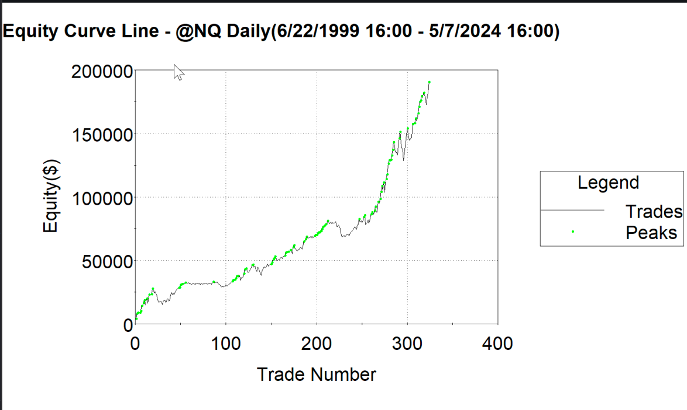
  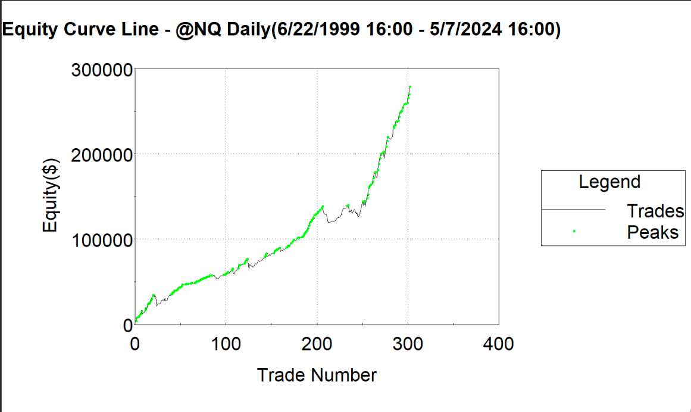

Raúl, Raúl comentaba que se había pasado de una estrategia. Mira, esto de la estrategia *limit*. Al final, a ver, a ver que puedo abrir.

Y ahora rápido, porque no tenía abierto TradeStation para darle rendimiento, pero podemos abrir algún, algún workspace por aquí los rápidos. A ver, clases para abro el buscador un momento y hasta abro el buscador un momento por el buscador un momento y listos.

Las dos curvas que enseñas, Raúl, están interesantes. El final, el limitado. No, no toque. Aclarar un par de cosas. También luego en Rick que es comprensible, siempre quedan, quedan dudas.

Que se comentó que no era buena idea hacer *backtest*. No es que sea buena idea, a lo mejor algunas veces, claro, cuando no habla tantas horas por algunas cosas se equivoca, es en el matiz. O no, no es que haya dicho cosas incorrectas, pero sí que a veces tengo la sensación que al mejor en un matiz pues me he podido equivocar.

**Look Inside Bar Testing**

Al final, cuando tú haces *backtest* el límite, por el tema del, de lo que expliqué del *backtest*, que eso está en la teoría. De por ejemplo el por qué usar el *Look Inside Bar Testing*.

Y acordaros, lo repaso muy brevemente, muy brevemente porque al final el motivo es un poco el mismo, de acuerdo.

Al final, de cualquier vela, vale, de cualquier vela, tú ahora aquí tienes esta vela que es en tiempo real, vale. Si eso está cargando datos, que no lo sé. Cargando datos. Se ha movido el precio. Aumento. Sí, sí, sí, sí, está tiempo real, vale.

Esta vela en tiempo real, si yo tuviera aquí órdenes, pues ejecutaría por motivos obvios. De cualquier vela anterior a la de tiempo real es igual si es en un minuto o en diario, de acuerdo.

La vela de tiempo real, la vela derecha del todo, de acuerdo, esa es la vela de tiempo real, vale. Y esa por lo tanto tiene sus propias reglas para ejecutar órdenes, que es bastante obvio. La que toca, antes no, porque este tiempo real, ahí no hay problema.

El problema es para las históricas, de acuerdo. La anterior a esa, es decir, ya la anterior, vale, esta vela de aquí, de acuerdo, ya es una vela histórica, vale.

<figure>
  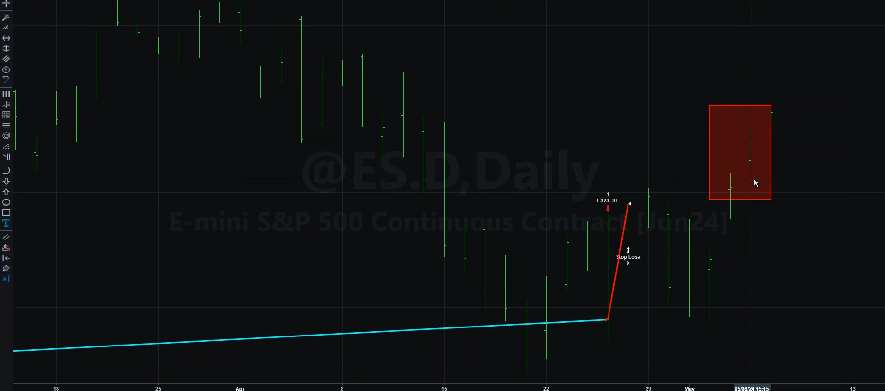
  <figcaption>Figura 003</figcaption>
</figure>

Y por lo tanto, a ver que voy a oscurecer, porque siempre pasa lo mismo. Venga. Esta vela ya se calcula por historia. Y de esa vela, en principio, tenemos el *high*, el *low*, el *open* y el *close*. Sólo esos cuatro datos, de acuerdo.

Y las reglas por la que va a ejecutar el sistema, si la orden se ejecuta, si hay dos y hay stops y hay *take profit* de orden para entrar o no, pues lógicamente depende del recorrido de la vela.

Muchas veces como en ésta, el recorrido parece obvio. Aún así, a veces el obvio no es obvio. Pero fíjate la anterior, que ya no es tan obvio, de acuerdo. Esta, ¿qué fue primero? ¿Para arriba, luego para abajo y volvió? O primero para abajo, luego para arriba.

<figure>
  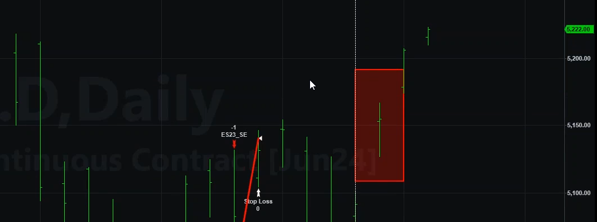
  <figcaption>Figura 004</figcaption>
</figure>

Claro, si tú vinieras comprado, o si tú tuvieras que abrir, imagínate primero el largo, primero va para arriba, te pone largo, luego para abajo, a lo mejor te salta el *stop*. En cambio, si va primero para abajo y luego va para arriba y se queda largo, perfecto, porque al día siguiente ha subido.

Cambia completamente la película. Entonces, sólo sabe por reglas de *backtest*, vale.

**Órdenes límite y la cola del mercado**

Bien. Pues las órdenes límite aún va a un paso más de eso, vale. Va un paso más de eso. Porque, porque yo al final cuando opero... es esto, el mercado es esto, el mercado es esto que ves, *bid*, *ask*, y demanda.

Y si me pongo aquí yo me pongo ahí limitado el simulado, me pongo ahí. Yo soy ahora comprando un contrato ahí, vale. 

<figure>
  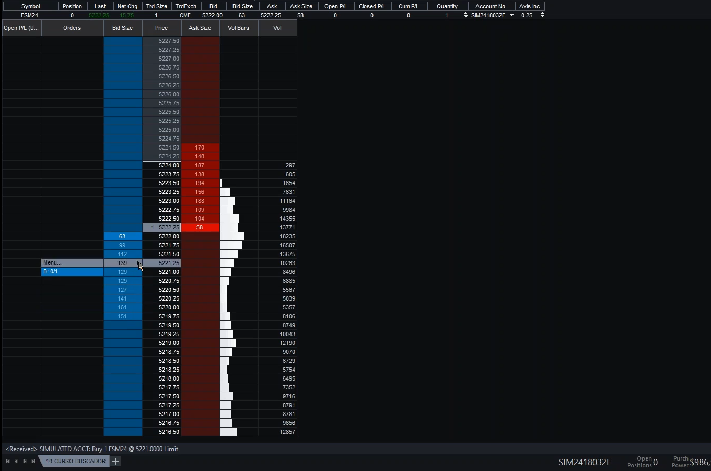
  <figcaption>Figura 005</figcaption>
</figure>

Si el precio llega, a ver si hay 129 órdenes, 130 contratos, bueno, no sé si lo veis, 135 va cambiando, esos tiempos real. Eso es en el simulado, y no va a simular la cola.

Pero en tiempo real llegaría y yo me he puesto cuando había 130. Que dice que a lo mejor soy el 131, vale. Entonces si se ejecutan sólo 50, mi, mi orden no se va a ejecutar porque yo estoy a partir del 130, ¿entiendes?

Entonces éste es el problema en las limitadas: garantizar que se ha ejecutado, vale. Entonces, ¿cómo lo garantizas? Pues cuando toca el *tick* siguiente. Es decir, si yo me he puesto comprando a 5221, si toca 5220 con 75, es 100% seguro que se ha ejecutado el 21.

Mientras no se ejecute, no toque el *tick* siguiente, yo puedo tener alguna duda de que se haya ejecutado, ¿entiendes? Que ése es el problema del *backtest*. Estar seguro.

**Configuración conservadora en backtest**

Hay gente, depende del sistema lo puedes ignorar más, depende del activo pues es más sensible. Que es lo que garantiza eso para cancelamos la orden, lo garantiza poner un *backtest*, activar esta opción en *Backtesting fill inter* orden o en *trade price exit, exit limit price*.

<figure>
  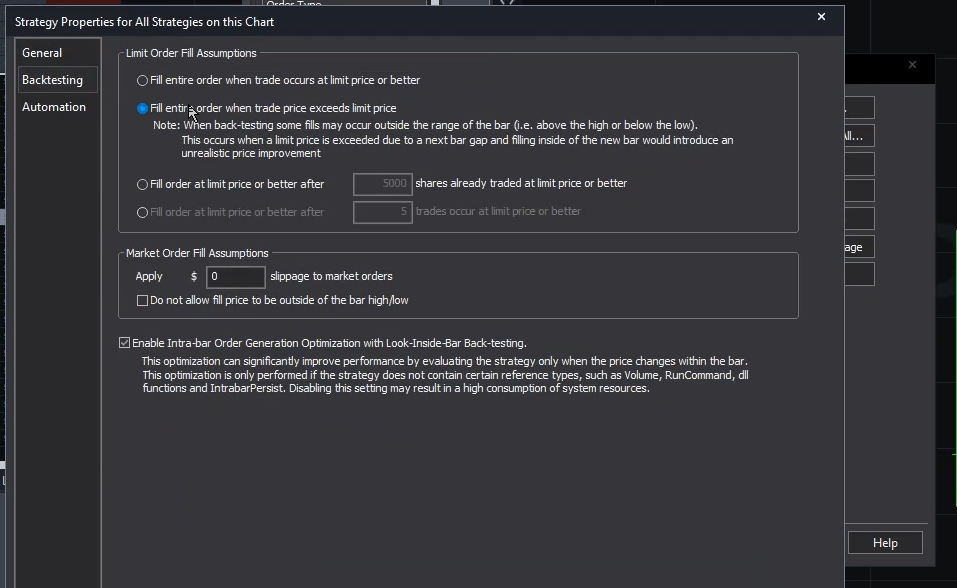
  <figcaption>Figura 006</figcaption>
</figure>

Es decir, sólo ejecutar, sólo marcarla ejecutada cuando se excede el precio. Esa es la manera más conservadora.

Hay gente que no lo hace y marca esta. Es menos conservadora, porque habrá veces que ejecutar, habrá veces que no. Y puede cambiar mucho, depende el tipo de sistemas.

<figure>
  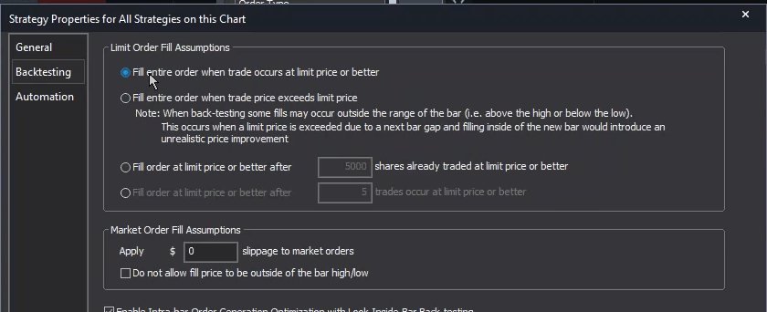
  <figcaption>Figura 007</figcaption>
</figure>

un sistema *mean reversion* que no tiene colas largas, no tiene su, su beneficio, su mejor operación no difiere demasiado de la, de la media. Al final, ejecutar uno no es determinante.

Pero ***en un tendencial, ejecutar o no es muy determinante*** porque normalmente el 20, el 80% del beneficio viene sólo del 20% de los *trades*, ¿entiendes? Entonces puede cambiar mucho las cosas ejecutar un *trade* o no.

Entonces al final depende un poco de eso. Ese es el criterio conservador. Yo te recomiendo usar éste siempre que siempre es mejor criterio de prudencia. Aquí para más detalles *Help* y te da detalles, vale.

En todas las plataformas está esto. Eso está en todas las plataformas, vale. No tiene más, más historia, vale.

Entonces esto es el tema. Si activas esto, no hay ningún problema. No es el límite. Activa esta opción. *MultiCharts* también está y en todas las plataformas, vale. Y de esa manera sabrás al 100% que tu precio se hubiera ejecutado.

Verás que cuando actives eso, alguna orden que habías puesto el límite no la ejecutará. Porque ahora va a ser, la idea que has clavado el mínimo para ponerte largo, el máximo a ponerte corto. Y cuando pasa eso, no sabemos seguro si has ejecutado, porque si habían 100 contratos en ante tuyo cuando te pusiste, tú?, no lo sabes, vale.

**Sobre Fixed Ratio**

***Viendo un video de la teoría dices que la formula del Fixet Risk que aparece no la usemos, por lo poco intuitiva que era, aun así, he intentado plantearla, pero no acabo de estar convencido de hacerlo nada bien, tal vez me he complicado la vida pero al final he planteado la formula tal cual cuentas en la teoria ¿podrías corregirme o plantear un código para el FIXET Risk?***
`Contratos = (((2 * Contratos_Inicial – 1 )^2 + 8 * (Netprofit / Delta))^ 0.5 + 1)/2;`

Bueno, te estás refiriendo a *Fixed Ratio*, es el intuitivo. Nuevamente, ya me expliqué mal, pero no es que no creo haber dicho que no la usaréis. No creo haber dicho que no la usaréis. Pero sí que dije que es más intuitiva la otra.

Al final tienes que analizarlo y estudiarlo, de acuerdo. Aquí no sé si adquiriste MSA o no. Está bastante bien explicado y también tienes hasta la fórmula. Tienes la fórmula de *Fixed Ratio*, vale, que es lo que tú buscabas, vale, que es lo que tú buscabas, vale.

<figure>
  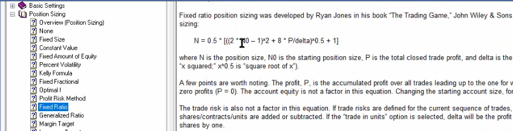
  <figcaption>Figura 008</figcaption>
</figure>

En *Fixed Ratio*, al final es la *delta*. Es verdad que programáticamente es poco más compleja, pero realmente es muy intuitiva a nivel de, de operar. Es decir, si tienes la *delta*, cuando yo digo que es poco intuitiva es decir, porque no, no, no, no va relacionado como al riesgo.

Es como decir, bueno, ¿qué delta uso? Es verdad que se recomienda la mitad. Si podéis usarla es cuestión de estudiarla.

A mí me gusta, ya expliqué la clase pasada cuál usamos para decir, no voy a darle más, más vueltas.

Pero aquí tienes la fórmula. Es ésta. No tiene, no tiene más, de acuerdo. No tiene más. Donde N0, donde N0 es la *equity*, vale.

**Fórmula generalizada de Fixed Ratio**

luego tienes otra que viene relacionada porque aquí están todas generalizadas. Es decir, adaptadas. Adaptas, por ejemplo, generalizada quiere decir que la puedes, que es que es *Fixed Ratio* porque la puedes adaptar a distintos. Puedes regular el exponente y puedes regular con cuántos contratos empiezas, vale. Simplemente.

Pero la fórmula es tan sencilla y tan difícil como ésta si la usas en su forma generalizada. Aquí tienes también en la N, que si usas 0.5 es el coeficiente de *Fixed Ratio* más visto, vale. Es el coeficiente *Fixed Ratio*, vale.

Y luego tienes la, la P, que es el beneficio de los trades cerrados. Sólo tienes que poner la *profit*, la P. 

La fórmula, así que se pone el *start* y *position size* y tal. Pero, pero no, no es como *Fixed Risk* que por eso digo que es más intuitiva en ese sentido. Pero sin más, o sea, poder por poder podéis usarla, de acuerdo. No tiene mayor.

Entonces tú aquí en la fórmula habías puesto. `Contratos = (((2 * Contratos_Inicial – 1 )^2 + 8 * (Netprofit / Delta))^ 0.5 + 1)/2;`

Bueno, partido por 2, que lo mismo que por 0.5. Pues sí que estaría bien, entiendo.

No, 2 por N0. Sí que es que sólo lo que más hay que poner en 0, un poco para, para usar la generalizada, que es lo que te digo, no. Que al final no puedes, 

Está, yo puesto a esto te superaría la generalizada, vale. Te lo voy a pregar y voy a pegar el inglés pero no voy a usar los traductores. La explicación debe ser, que como digo está muy bien y por lo tanto pues es poco sentido que yo ahora pegue algo más, vale. Ahí lo tienes en el Discord, vale.

<figure>
  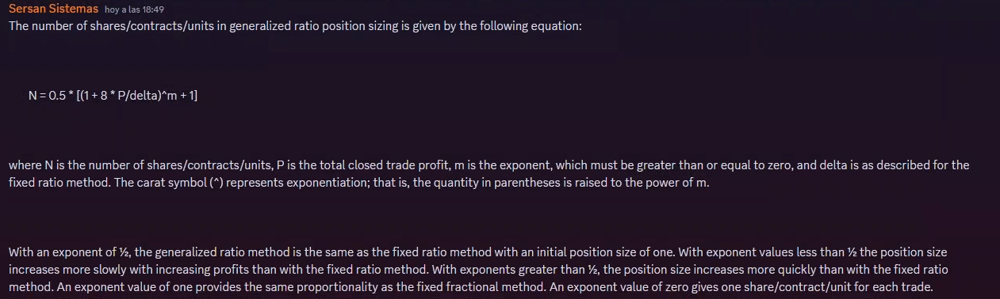
  <figcaption>Figura 009</figcaption>
</figure>

Esa es la forma generalizada. Con el M 0.5 es *Fixed Ratio* directamente, de acuerdo. Es decir, es la única, la única diferencia que puedes aplicar, vale.

Tú lo has puesto dividido en vez de multiplicado. Está perfecto, vale. Pero en programa, en programación ya os lo comenté, es un poco mejor multiplicar que dividir. Pues cuando puedes evitar dividir lo evitas. Cuando no, pues no pasa nada, no pasa nada. Simplemente es un poco más eficiente, simplemente es un poco más eficiente.

***Buenas noches, paso un par de dudas:***  
***1.-Respecto al MM que utilizamos en varios códigos para evaluar estrategias,  el hecho que el value1 sea =0.01 cuando el absvalue es <0 me genera dudas. He hecho el cáculo con algunos valores y lo que hace es multiplicar el valor de la Equity+profits por 100. Seguro que se ha comentado pero no recuerdo donde. Podrías explicar el motivo por el que se hace eso por favor?***  

<figure>
  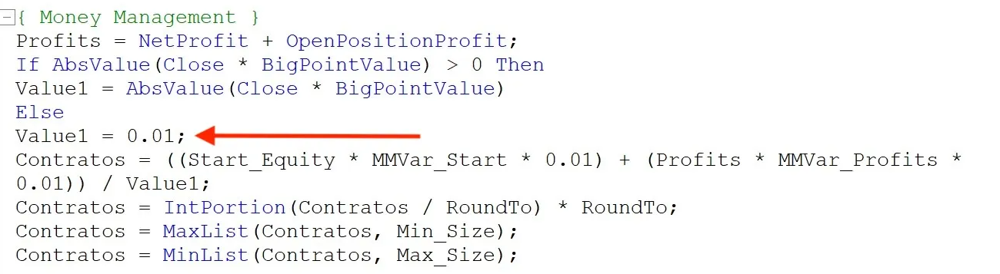
  <figcaption>Figura 010</figcaption>
</figure>

1 - Hola Raúl, es para no dividir por 0 al calcular los contratos, le pones un valor pequeño pero no 0. Cuidado con los valores negativos de los precios a la hora de aplicar MoneyManagement (de ahí el AbsValue()). Los futuros ajustados pueden resultar en valores negativos por los ajustes del contrato continuo, además de haberse dado precios negativos como el petróleo en el año 2020. 

*ok, muchas gracias Alberto. Entonces entiendo que entraríamos a mercado con el Max-Size, porque en el calculo me da un número de contratos desorbitado. Si por ejemplo tengo una cuenta de 100000 y un beneficio de 25000, pongamos que con el 100% en ambos, y esa suma la divido por 0,01 , me daría 12500000 contratos. Al pasarlo por el MinList(Contratos, Max_Size); entraríamos con el Max_Size que hayamos estipulado en el input. Es así?*

exacto

Porque dividir por cero es un error frecuente programación. No se puede dividir por cero. Y siempre que hay el riesgo de dividir por cero pues se hace un *if* antes, no, que si es mayor que cero tanto, si es igual que cero pues se le da cero, cero uno, se le da un valor. Tienes para evitar división por cero, pues esto siempre se hace, se hace así.

***2.-En las preguntas de la teoría hubo una relacionada con algún método  para trabajar las estrategias de TS en Darwinex y se respondió que no había método sencillo, que vosotros traducíais a MQL, y se hablaría en las prácticas. Podrías ayudarnos con eso? Gracias!***  

Y bueno, no es propiamente esto objeto del curso. No es propiamente. No es que haya un método, es decir, al final simplemente, que si tú quieres ir en algo de cero, pues hoy en día si tienes que empezar de cero, , quizás sería mejor ya empezar en MQL5 si tienes que empezar, de acuerdo.

Pero, pero no hay, no hay un, no hay un buen método de conexión vía TradeStation porque no puedes o sea, no, no hay una traducción directa de *EasyLanguage* a MQL5. No existe, de acuerdo.

Simplemente tienes que, si tú quieres usar *TradeStation* porque quieres va *backtestear*, que también puedes usar Meta de 5 con algún *add-on* lo que sea, o puedes usar cualquier otra. Como siempre hemos dicho, al final no te queda más que traducir el código.

Cuando al final puedas operar vía *MultiCharts*, que al principio es posible, probable que pase dentro del ecosistema *darwinex* me refiero, entonces sí que ya será más sencillo. Entonces ya no tengas problema porque lo harás con *MultiCharts*, lo podrás hacer con *MultiCharts*.

Pero no hay un conector directo, de acuerdo.

**Sobre uso de GPT para traducir código**

sí que es verdad que vía Meta de 5 puede ser vía Python, o sea, tu Meta de 5 sí que le puedes conectar otras cosas. Puedes ir con Python y no sé si con alguna más y puedes conectarla creo que también interactivo que es, no, Meta Trader. Pero lo que no vas a poder es llevar easylenguaje. 

Al final el broker te tiene que pasar por MetaTrader 5. Tienes que acabar Meta de 5. Y ahí pues ya tienes que verlo con el broker. Y mucha gente acaba yendo vía Python, por ejemplo, vale. O simplemente traduciendo el lenguaje MQL5, traduciendo el sistema MQL5.

Ahí ya pues puedes usar herramientas. Bueno, hay mucha gente que está usando GPT para esas cosas ahora. Hay que vigilar. Decir, hay que tener conocimiento por los de GPT. Ayuda, pues una ayuda para preguntarle cosas. Pero tampoco pensemos que te lo va a dar todo. Porque si no te traduce, me estoy sin lenguaje, tal, seguramente te va a responder porque te responde todo fenómeno. Si no lo sabes se lo inventa. Y se queda más ancho que espada. Si no lo sabes se lo inventa. Entonces pues hay que tener nociones. Pero así que tú le, se lo pones, y te lo va a traducir, te lo va a traducir.

Pero, pero si lo sabes dirigir, seguramente puedes llegar a una respuesta más o menos satisfactoria. Pero como digo, hay que tener conocimiento, de acuerdo. No, no sin tener ni idea yo no lo aconsejo, vale.

***Hago un par de comentarios/peticiones:

***Creo que sería interesante ver alguna estrategia en relación al mercado de divisas. Todas las estrategias que hemos visto las hemos probado en futuros o en acciones, y se adaptan a algún  comportamiento o característica de estos dos tipos de activos.***

***Si no vemos propiamente una estrategia con forex, sería interesante que nos dieras algunas pautas sobre qué tipo de estrategias pueden funcionar en divisas, así  como  las ventajas, inconvenientes, diferencias de comportamiento de las divisas con respecto a los futuros y a las acciones.***

***Me han salidos errores en dos códigos cuando he intentado verificarlos para trabajarlos en Tradestation:***     
* CursoORB-02

***Al verificar el código de la estrategia CursoORB-02, da error ya que falta un corchete al inicio. En este caso lo he podido solucionar fácilmente ya que sólo es necesario añadir un corchete al inicio.***

<figure>
  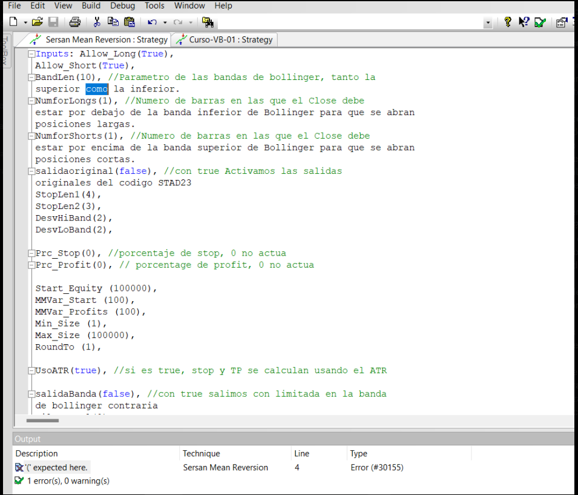
  <figcaption>Figura 011</figcaption>
</figure>

Bueno, leo antes, él leo dice que hemos visto futuros, acciones y tal, pero que no hemos visto estrategias de *Forex*, que sería interesante queremos algunas pautas, así como las ventajas y convenientes diferencias de comportamiento de divisas con respecto a los futuros y las acciones.

Bueno, tengo un artículo por ahí que no he encontrado para esta vez, me lo voy a apuntar también de referencia para la clase. Esto lo daré, he dado muchas, he dado muchas, pero, pero lo haremos de pasado referencias, características.

Es verdad que el *Forex* en sí es como muy variable. Siempre pensar que al final a medida que va subiendo el *timeframe*, un día comenté esto y creo que alguien me lo dijo, normalmente la tendencialidad gana. Se entiende. Es decir, hay más tendencia en diario que en intraría, y más en semanal o en mensual, no.

Y eso también pasa en el *Forex*, de acuerdo. Pero es verdad que el *Forex* un mercado bastante de rangos. Pero ya digo, prefiero acabártelo de concretar.

**Características de Forex**

De todas maneras, al final, Albert, no hay una, o sea, como decía antes, y que hay características de tipos de activo que van más en un tipo de activo u otro.

Pero al final, la mejor manera y lo que tenéis que ir viendo y probando es aprender a hacerlos vosotros. Que es lo que siempre desde el primer día, incluso en el marketing, que hemos dicho en el curso: nosotros pretendemos que seáis traders logarítmicos, no que salgáis con sistemas hechos.

dije, seguramente saldréis con ideas buenas, pero no es el objetivo, de acuerdo. Lo dije hasta las entrevistas con Víctor. no, no, el objetivo no es darte 10 sistemas. El objetivo es darte herramientas para que tú sepas moverte, vale.

Y espero estar consiguiendo. Pero lógicamente tienes que seguir a partir de ahí.

  <strong>📊 pautas, ventajas y convenientes diferencias de comportamiento de divisas, futuros y acciones</strong>  
La mejor manera para saber pautas y ventajas, y lo que tenéis que ir viendo y probando es aprender a hacerlos vosotros. Por ejemplo, el código de entradas y salidas es una herramienta bastante potente para esto. Que duda cabe que todo el manual que dimos de *Strategy Concepts*, que además os di un Excel donde hice un análisis de cómo habían ido todos fuera de muestra, que lo hice yo uno a uno, pues también es material muy útil, porque hay muchas ideas muy potentes y todas vienen con sugerencias. Es decir, que venían un poco también pensadas como ideas para hablar. No como para que cojas el sistema y lo operes. Siempre están así esas ideas. Y muchas, muchas eran aprovechadas, porque hasta había algunas intradiaras que estaban dando *profit factors* fuera de muestra de 0.90 y pico. Que eso fuera de muestra, teniendo en cuenta que es sólo la idea, es muy probable que sea aprovechable.
  
Es decir, ahí hay un montón de ideas, un montón de materiales. Hay que ir trabajándolo porque trabajando además es una gran manera de aprender esto.

Por ejemplo, el código éste de entradas y salidas es una herramienta bastante potente para esto. Que duda cabe que todo el manual que dimos de, de, ya lo diré, de *Strategy Concepts*, que además os di un Excel donde hice un análisis de cómo habían ido todos fuera de muestra, vale.

Todos fuera de muestra. Que lo hice yo uno a uno. Pues también es material muy útil, porque hay muchas ideas muy potentes y todas vienen con sugerencias. Es decir, que venían un poco también pensadas como ideas para hablar. No como para que cojas el sistema y lo operes, de acuerdo. Siempre están así esas ideas.

Y muchas, muchas eran aprovechadas, porque hasta había algunas intradiaras que estaban dando *profit factors* fuera de muestra de 0.90 y pico. Que eso fuera de muestra, teniendo en cuenta que es sólo la idea, es muy probable que sea aprovechable.

Es decir, ahí hay un montón de ideas, un montón de materiales. Hay que, hay que trabajándolo porque trabajando. Y además una gran manera de aprender esto, esto he dicho esto.

Pero ya digo, es verdad que sobre todo ***si vamos más a intradiario pues cuesta más tener tendencia***. Los rangos de las divisas son más estrechos, los rangos de las divisas son más estrechos. También eso permite menos riesgo, permite apalancar más. Y todo tiene su parte buena y su parte mala.

**Spread en Forex**

Pero al final no es tan distinto, vale. No es tan distinto. Al final es uno activo. Hay oferta y demanda.

Y lo que sí que tienes, lo mismo que los CFDs pues, que ahí tienes *bid* y el *ask*, de acuerdo. Y ahí es donde se plantea un poco el problema.

Que es verdad que *MultiCharts* permite gestionar eso. Permite gestionar eso. TradeStation no. Pero *MultiCharts* sí lo permite. Por un *MultiCharts* sí permite en una pestaña que puedes elegir *backtest* clásico, *backtest* avanzado, y le puedes decir el *bid* y el *ask*.

Y entonces puedes hacer un *backtest* más realista en Forex. Que TradeStation, por ejemplo, vale.

Pero dicho esto, dicho esto, se ha añadido este material, vale. Ese material es un material muy antiguo, vale.

* [29_practica-material-extra : pack de Forex](../../29_practica-material-extra/Forex%20Pack%20TradeStation/Forex%20Pack/)

El *Forex pack* a mí en algunos soneros me ha dado problemas de memoria. Si os da al final borrar la tabla es que porque tiene un montón de datos que se calculan, que algunos pues son para hacer bonito y hasta quedaros un poco con el, con el, con el gráfico de arriba y de la derecha, que lo voy a tratar de abrir, lo voy a tratar de abrir el que ya tengo yo por aquí.

porque es bastante interesante. Además ahí veis una pauta realmente curiosa, que para eso lo publicaron. Bueno, curiosa, interesante, que es lo que hemos hablado, lo que enseñaba antes, la volatilidad. Y viendo ese gráfico pues, esto me suena, no me suena a mí haber visto. A ver, a ver, me suena a mí algo. Me suena aquí una pauta de volatilidad clara, y por pues se puede eso aprovechar, se puede mejor aprovechar.

<figure>
  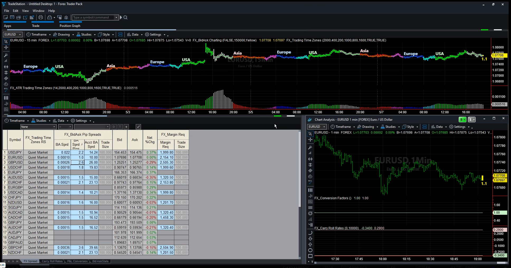
  <figcaption>Figura 012</figcaption>
</figure>

entonces esto si no os revienta pues lo dejáis, pero porque eso carga un montón, hace un montón de solicitudes.

<figure>
  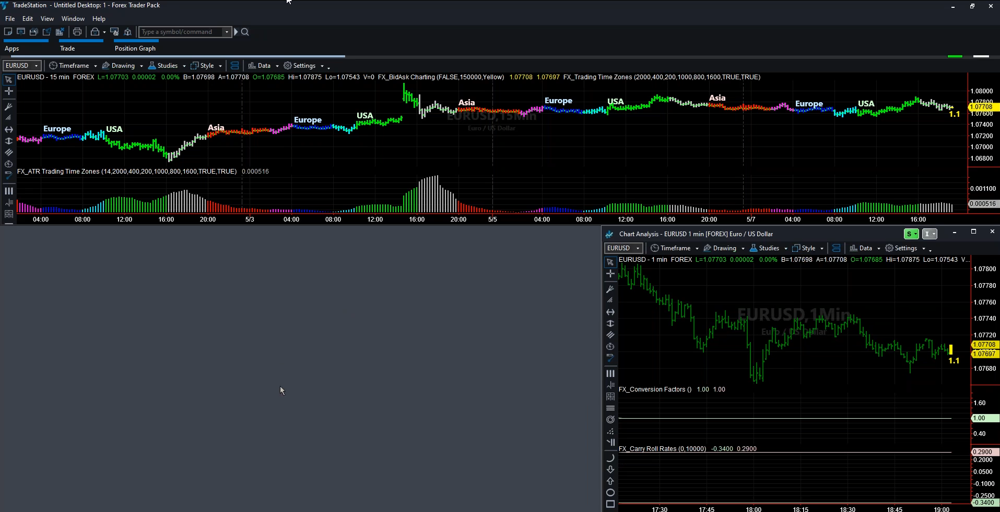
  <figcaption>Figura 013</figcaption>
</figure>

Esto que creo que ya lo puse ahí. Le tienes que poner el *change*, porque si no nos lo va a calcular bien, vale. Le ponéis el *change*.

<figure>
  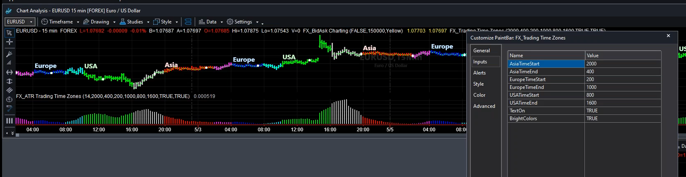
  <figcaption>Figura 014</figcaption>
</figure>
<figure>
  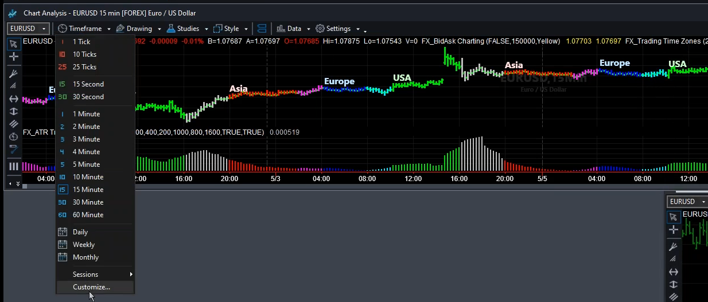
  <figcaption>Figura 015</figcaption>
</figure>
<figure>
  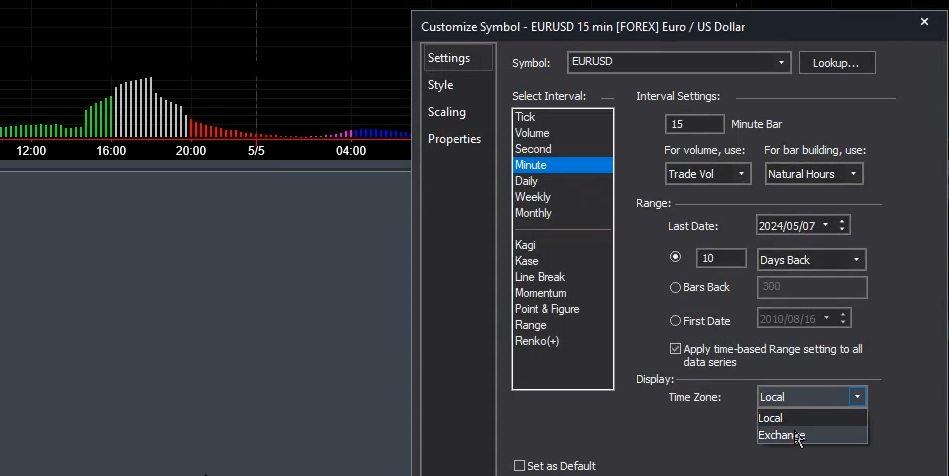
  <figcaption>Figura 016</figcaption>
</figure>

Ahora ya está bien donde pone USA, donde pone tal. Y eso está muy bien que el *Forex* y el libro que está ahí dentro tiene parte interesante donde explica esto. Al final, mercado de 24 horas, es referencia Londres, referencia New York, tal. Y etcétera, otros. Cada, cada, esto tiene su referencia.

Entonces el te pinta, te pinta el color.   
Me parece que ya se ha bugeado. Y, y hasta te pinta en color las diferentes patas de volatilidad.

Ya veréis que la volatilidad pues casi cada día un comportamiento muy cíclico. Hay unas horas donde es alta, donde es baja. Ergo, a lo mejor yo puedo en el *Forex* mismo, en esas pautas que veas el comportamiento tan típico con esta sencilla imagen, pues ya puedo ver qué tipo de estrategias en cada hora van mejor, de acuerdo.

<figure>
  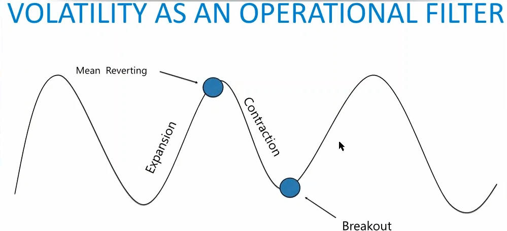
  <figcaption>Figura 017</figcaption>
</figure>

Esto es, esto es, esto es. Decir, normalmente cuando ya hay expansiones va a ser mejor **mean reversion**. Esto cuidado porque es sólo para abrir. Ya digo, parece contraintuitivo. Después una expansión... mean reversion?. Sí, porque el mercado, recordados que ya os pasé un artículo de Kraven el que lo explicaba, y lo explicado yo la teoría. Expansión es contracción, expansión, contracción.

Por lo tanto, cuando hay una expansión, anticipa contracción. Ya está. O sea, hubiera sido cuando hay una expansión, lo que hubiera estado bien era estar estaría a favor de ella. Pero se ya ha pasado, ya, ya está,, y , con la actual contracción pasa lo mismo.

Cuando, por ejemplo, decía antes este filtro que os decía, que usa el *range*, en ese documento que os he subido, usa el *range*, que busca contracción, es para buscar *breakouts*. Porque, porque es eso. Después de que hay dos o tres días de contracción, que el rango va estrechándose, es un buen momento para buscar expansiones o *breakouts*, de acuerdo.

Porque cuando el mercado se congestiona, la rotura suele ser buena, ¿se entiende no? Entonces es un poco lo que hay detrás de estas, estas ideas.

  
***Tengo tres dudas sobre Money Management (MM), asumiendo que todo se validará con backtest + WFO:***  

***1. **Piramidando (añadiendo a ganadora):** Si abro una segunda operación a favor manteniendo la primera, ¿qué MM aplico a esa segunda? ¿Misma F (duplicando riesgo)? ¿Pongo breakeven en la primera? ¿Divido la F entre el número de operaciones previstas? ¿Otra opción?***  

***2. **Añadiendo a perdedora (controlado, no martingala):** Si abro una segunda operación con la primera en contra, ¿qué MM aplico? ¿Misma F (más crítico al estar en negativo)? ¿Promedio los TP para tratarlas como bloque único? ¿Divido la F? ¿Descarto este enfoque? ¿Otra opción?***  

***3. **MM en fases de evaluación:** Para backtest y WFO previos (antes de aplicar el MM definitivo), ¿qué recomendáis: lotaje fijo, Fixed Fractional estándar, FF con volatilidad y límites, Fixed Ratio, Percent Volatility, u otra?***  

En términos generales, o sea, hay algun caso de ahí, algunos un poco extraños, un poco, esta es que lo decir de como rebuscados, vale.

Y en todo, en todo el tiempo hemos partido que la sencilla es, es importante. Entonces este, esta idea, tú cuando tengas dudas, piensa siempre está por lo que, piensa siempre es que, si si lo complicas demasiado, probablemente no funcionará.

Entonces, al final, cuando tú tienes a piramidar, al final lo que estás haciendo en el fondo, cuando tú haces *portfolio*, piramidas. Tú tienes si tú tienes varias estrategias, imagínate en el S&P, ahora veremos *portfolio*, y habrán un par. Yo meto un S&P, luego abre el otro sistema un S&P. En el fondo y piramidado. Porque abierto tres S&P largo a favor, tenía uno y habrá otro pues tengo dos.

Entonces que, que es fácil en estos términos pues pensar como una operación nueva, ¿entiendes? Pensar como una operación nueva.

**Consistencia en money management**

Entonces si tú tienes tu *money management*, ¿porque lo vas a cambiar? ¿Porque lo vas a cambiar? Es decir, al final el hecho de decir y aplico el mismo, aplico el doble. Pues no sé, es que eso estará dimensionado correctamente, estará analizado y dependerá de eso. Dependerá de cómo tú dimensionas tu *portfolio*, que ya dimos tips el otro día, y vamos otra vez. Voy a dar, si no, daremos el último día también.

Y por supuesto que si me quedara algo daría otra clase, nadie se piense que voy a decir algo por si no ha habido tiempo. No, no, lo que he dicho, lo que he dicho estos dos tres días de que iba a dar eso, sí que por supuesto va a pasar. Por eso tranquilos.

Pero entonces al final dices, volvería a aplicar la misma F, mantiene las posiciones ampliando, duplicando el riesgo. Así que eso ya estaría previsto antes.

Bueno, si tú tienes una, una, yo qué sé, un 0.5 de *money management*, porque, porque ya, por el riesgo que llevas y demás, por, por, por el que ahora vamos a hablar de ello, pues está, está dimensionado así.

**Ejemplo de TPS de Connors**

Lo mismo que, por ejemplo, si os acordáis cuando vimos el TPS de Connors, pues ya está previsto que hace cuatro entradas siempre. Así es decir, está dimensionado. Tú lógicamente, si haces un análisis de eso, pues tu cuenta tiene que estar dimensionada para que eso pase. Tu riesgo medido para que eso pase.

Entonces ya está estimado. Así que habrá veces que pondrá sólo dos y podrás menos. Y claro, por eso, por ejemplo, TPS de Connors al final es se expone muy poco y es difícil exponerlo mucho, porque claro que hay que dejar que puedas correr cuatro, pero la mayoría de veces no lo hace, ¿entiendes?

Entonces sí, es el problema también de piramidar.

**Mejor diversificar que piramidar**

Yo casi te recomendaría que de entrada no lo hagas, vale. Que cada entrada no lo hagas. Es decir, que porque por temas de diversificación, siempre es mejor tener la. Única motivo para hacerlo es decir, yo no tengo, tengo que empezar a operar y no tengo más estrategias. Eso puedes plantearlo así porque te gusta como idea. No es que sea mala, pero siempre va a ser mejor añadir otro sistema Para ese lote que vas a piramidar, otra estrategia distinta, otra estrategia distinta, siempre va a ser mejor.

Pero insisto, al final lo tratas como una operación nueva, y tiene que estar analizado antes. Por lo tanto, no metería F's distintas. No, no, no, no complicaría. No le daría tantas vueltas, de acuerdo. Usaría mi *money management* en el que sea y punto, de acuerdo. En el que se ponéis.

**Estrategias de salida distintas**

Lo que sí que puede tener distintas estrategias de salida, distinta estrategias de uno *take profit*, otro no. Eso sí. Eso es recomendable. Eso sí que puede tener, tener sentido. Y sí que puede estar definido el sistema. Es decir, yo primero meto un 50%, luego un 25, luego 25. Eso puede estar definido así.

No quita la otra. Pero la manera de medirlo, de estimar el riesgo y demás tiene que estar preestablecido ya  de entrada en ese supuesto. Decir, que hago una vez....???, no, no cabe. Porque eso ya lo sabes antes de abrir. Antes de abrir la primera ya sabes cómo abrirás la tercera y la cuarta y la segunda. No cabe esa duda.

**Añadir a perdedoras en índices**

Y luego hablas también del tema de que añade perdedora sin ser una *martingala* De hecho, te hablaba ahora de TPS de Connors, que hace eso, lo mismo lo explica. Lo dice, cuidado, eso sólo vale para ETF, para índices, de acuerdo. Por ejemplo, imagínate que haces eso con Google o con Meta, y te mete un 12% la baja de *gap* el día de resultados. Igual te hace un 30%.

Entonces al final claro, por eso ese tipo de cosas que tienen mucho riesgo, solo en índices. Porque, porque un índice está más diversificado, se ha protegido, está prohibido que caiga más un 7%, lo paran. Hay una serie de controles, no. Y es más difícil, más difícil, vale.

Entonces tú planteas distintas opciones, vale. Es que todas pueden valer o no. Pero hay que aplicar, si aplicaría es la misma y trataría los trades independientes. Es decir, no, eso de ***"bajaría el *take profit* de la primera al segundo intentando promediar"***. Ya digo, piénsalo como operaciones independientes. Cada *trade* que abres empieza. Tienes uno abierto y abres otro, gestionalo, gestionalo de esa manera.

**Money management en evaluación previa**

Luego hablabas también de que de usar *money management* en evaluación previa y demás. 

Sí, lo comentamos. Sobre todo, sobre todo, sobre todo, donde esto es importante, sobre todo es en el ...

Pero no está mal en distinto. Lo que único que hay que vigilar ahí, usar *money management* simplemente es para qué: para trabajar en porcentaje, de acuerdo. Para trabajar en porcentaje y adaptarnos un poquito al uso de la cuenta.

Pero no siendo agresivo, siendo muy moderado. Que si tenemos un backtest de muchos años nos va a hacer la curva muy geométrica y es poco útil. 

**Sobre Fixed Risk y Fixed Ratio**

Luego decías, entiendo que vosotros utilizas *Fixed Fractional* con tres *risk* por volatilidad, limitando un porcentaje máximo por baja volatilidad, el porcentaje mínimo. Si lo vimos en las primeras fases.

*"¿Cuál de estos sistemas de *money management* crees que son mejores para aplicar?"*

Bueno, al final, en general, a nosotros nos gusta ése. Lo cual no quiere decir que no, que no cambiemos en el futuro. Porque este, este *money management* lo estamos usando hace unos pocos años. Antes habíamos usado *Fixed Risk* midiendo el riesgo como la peor perdedora, la media. Hemos hecho varias, varias pruebas, ¿entiendes?

No hay, no hay tampoco una respuesta única.

Hay mucha gente que, aunque da peor el rendimiento, le gusta mucho volatilidad, la volatilidad de Avanzar se pone *Percent Volatility*, que MSA lo tiene. Aunque te va a dar peores ratios, pero le gusta porque conceptualmente es parecido al nuestro.

Ahora verías que el nuestro en el fondo es una, es un, es un, porque al final las matemáticas tienen eso, no. El nuestro al final no deja de ser un, que nosotros, al provenir de la gestión colectiva, yo he gestionado SICAPS y demás, y allí estás estás obligado a no pasarte del 100%, pues proviene un poco de ahí.

**Nuestro método de position sizing**

al final no deja de ser un nominal máximo, pero que se ajusta, ese límite, ese límite que le ponemos de cuando la volatilidad es baja, al final actúa del límite de nominal, ¿entiendes?

Porque yo ahí, al ponerle una variable fija y multiplicarlo, como te enseñé, si te fijas, eso acaba siendo nominal. Acaba siendo nominal por un multiplicador. Decir, nominal puede ser el 100%, 200, 300, el que sea.

Te enseñaré uno, creo que era 2.7. Pero baja cuando la volatilidad sube. Todo es baja. Entonces al final acaba siendo un nominal que reduce cuando la volatilidad sube.

> Es decir, eso es muy útil hacerlo, es muy útil hacerlo, todo es porque no usarlo, ¿entiendes?

Pero *Fixed Risk* y *Fixed Fractional* también está bien. *Fixed Ratio* al final lo importante es usar anti-martingales, de acuerdo. y sentirte tú cómodo, y explorarlo, y trabajarlo, vale.

Pero, pero incluso ya digo, nominal, nominal no está mal tampoco. Problema de nominal es que es contra el tuitivo sólo porque a medida que los precios caen te hace meter más. En bolsa, no acaba, no acaba siendo malo, pero es el único pero que puede, que puede tener, vale.

## Papers y material de portfolio

**Material adicional para portfolio**

En cuanto a *portfolio*, quería subiros dos papers que no, subiros dos papers, tres documentos.

Por un lado, esto, que es un de un libro que no recuerdo, que tengo hace muchos años impreso, lo escaneado para daros, lo que era un gestor de *commodities* que sugería *portfolio*. Es muy antiguo, en realidad es muy antiguo.

* [Portfolio Commodities](../docs/Portfolio%20Commodities.pdf)

Eso también en la relación, en la relación que en las referencias, características, tipos de activos y activos top. Me los estoy apuntando. En la última clase os los diré.

**Activos tendenciales en commodities**

Hay algunos activos en materias primas de activos que van muy bien y que va casi todo. Por ejemplo, por ejemplo, la gasolina. Un futuro que le ponéis un churro y saca, y saca algo. Estoy exagerando, pero me entendéis. Son activos que por lo que sea pues, pues bueno, en tendencia, en general, en general en *commodities* encontraréis muchos.

Si vais explorando las *commodities*, encontraréis muchas *commodities* que van bien, también que van bien en tendencia, vale. Y por lo tanto ahí, a nivel de futuros, explorar lo. Pasa que es verdad que en *commodities* ya la cosa se dispara de tema de garantías.

<figure>
  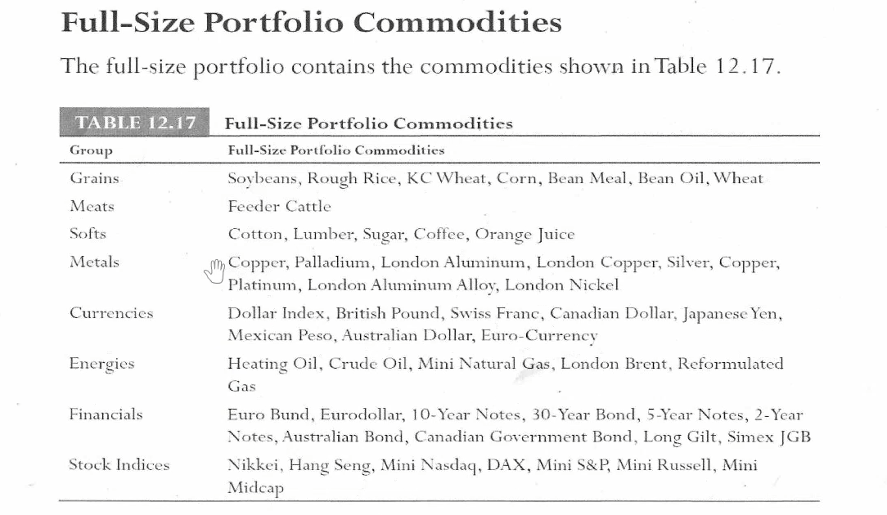
  <figcaption>Figura 018</figcaption>
</figure>

Por eso aquí había este *portfolio*, que habrá si esto es una pasta, pero con digamos una pequeña referencia sobre en caso que yo pueda hacer *portfolios* muy grandes, distintos, distintos *portfolios*. Lo tenía por ahí, he pensado en subirlo, sin más. Tampoco le deis mucha, mucha historia, vale.

**Paper de Kaufman sobre portfolio**

* [The Portfolio risk dilema](../docs/THE%20PORTFOLIO%20RISK%20DILEMMA.pdf)

Otro que me gusta, que ya lo tenía hace, hace días marcado, lo he recortado, es un *paper* de Kaufman. Sabéis que me gusta mucho, que habla del tema del *portfolio*. Ahora vamos a hablar un poco de todo esto. Vamos a hablar un poco de todo esto porque hay distintas cosas.

Vamos a explicar un poco ya cosas más de detalles de práctica que son la teoría. Lo dije, gente me dijo en el *portfolio* *TradeStation* qué acordó. Porque ya pensé es una mezcla de práctica de teoría. Pero pensé que era mejor tratarlo más en la teoría. Lo vamos a tratar hoy.

Y si no diera tiempo, que creo que sí, lo trataríamos el siguiente día, vale.

Pero aquí habla un poco de *The Portfolio risk dilema*. Es decir, `dejar lo correr` o `rebalancear`. 

> *Rebalancear* es modificar los pesos.

Cuando yo monto un *portfolio*, lo monto en un momento concreto en el tiempo, vale. Pero eso hay que modificarlo?. Y ¿si lo modificó en base a qué criterio lo modificó?

Digamos que habla sobre, sobre todo esto. Y hace un par de ejemplos y es interesante su lectura. Entonces yo os lo voy a pasar como material que me parece interesante del curso.

**Documentación de Portfolio Maestro**

* [50 Years on what have I learned](../docs/50%20YEARS%20ON%20WHAT%20HAVE%20I%20LEARNED.pdf)

Y otro que lo podía subir el último día, pero que lo quiero subir hoy. Así tenéis tiempo de trabajar a leerlo. Si hay dudas demás.

Uno que ya lo leí hace bastante tiempo, es del año, es el año pasado si no recuerdo mal. Y bueno, digamos que daba unos consejos que, de hecho, algunos, bueno, nos compartan. Es que no los comparta, es que todo depende del lector. A todo depende de para qué público lo dirijas.

Pero, pero no es que sea nada de lo que dices mentira. Todo está perfecto. Todo está, todo. Esto me acuerdo por sí que nosotros, por ejemplo, el punto uno no lo hacemos.

El dice, no, el uno no, el 2. Y se opera acciones sólo en el lado largo. Por cierto, con muy poco éxito en los últimos tiempos. Ahí está dicho. 

<figure>
  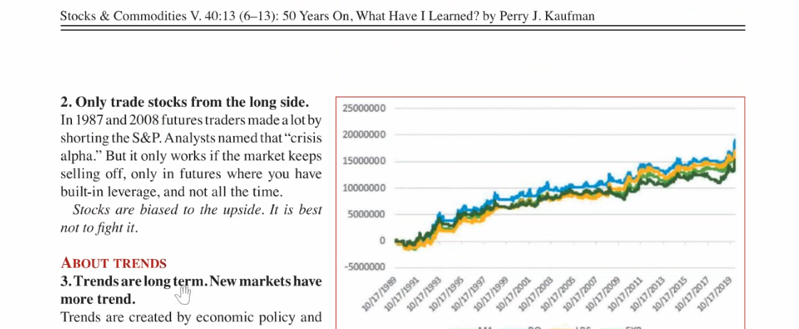
  <figcaption>Figura 019</figcaption>
</figure>

Pero es verdad que es más difícil. Y de hecho lo comenté en el curso, no os compliqueis esa vida de entrada.

Yo lo hago porque tengo que buscar alfa. Si yo lo operara para mi cuenta solo, a lo mejor no lo haría. A lo mejor buscaría el alfa por otro lado. Pero, pero yo al final tengo dos productos: uno que es *portfolio* alfa y otro *portfolios* Smart beta. Y, y por lo tanto claro, alfa tiene que tratar de aportar alfa. A mayor alfa posible es ir en corto de índices. Pero es difícil, es difícil.

Pues aquí da algunos consejos muy útiles. Me gusta mucho en general, este, este *paper* me gusta mucho. Es un, término en general, y me gusta mucho.

No los vamos a leer todos aquí porque tampoco hace falta. Ya los leeréis. Y si alguien quiere comentar algo, alguna duda, o incluso montar podéis montar un debate entre vosotros si queréis en el Bar, o hacer preguntas en preguntas en el Discord pensando en el último día.

Pero es realmente una serie de consejos muy, muy interesantes, muy interesantes.

**Equal weighting**

También habla del *equal weighting*, por ejemplo. Ya lo había dicho de esto. Pero lo vamos a ver a dos. Preferimos ir a igual, igual *weighting* para mezclar las estrategias. Creemos que es un camino bastante útil.

Y bueno, pues ya está. Ya lo, ya lo, ya lo leeréis, de acuerdo. Ya lo leeréis.

> Por cierto, una de las cosas que dice es que los sistemas correlacionan mucho. Es decir, que lo que depende más del resultado es el tipo de activo. Lo que decía antes.

**Manual útil Maestro**

* [1](../docs/PM%20Part%201.%20And%20Introduction%20to%20Portfolio%20Back-Testing.pdf)
* [2](../docs/PM%20Part%202.%20Ranking%20and%20Money%20Management.pdf)
* [3](../docs/PM%20Part%203.%20Constraints%20and%20Portfolio%20Stops.pdf)
* [4](../docs/PM%20Part%204.%20Optimization.pdf)

Entonces bueno, tengo, tengo un manual que es muy antiguo, pero como *Maestro* es súper antiguo. Hace, hace más tiempo. Publicó 2016, por ahí, incluso antes, no, 2013. Pero en 2013 publicó unos *papers* que explicaba, sigue totalmente en vigor porque es que no ha cambiado nada.

Bueno, yo diría que nada, pero ha cambiado alguna pequeña cosa. Pero, pero debe ser insignificante, insignificante.

Es decir, está totalmente en vigor. Por lo tanto estos documentos, que son de *Maestro*, porque creo que alguien me los había pedido, os los, os los subo también aquí como un material de *portfolio* más. Para aquel que quiera tener pues una cierta documentación de *portfolio* más.

## Maestro

### Ejemplo de portfolio con dos familias

Antes quiero esto, creo que ya lo puse, ya lo puse como material en el poder por ahora vamos a hablar un poquito de ello porque es un ejemplo muy bueno.

La lástima que quería haber podido enseñaros en las tripas de los *portfolios*, pero no he conseguido localizar esa información, porque sólo di en una ponencia de Robotrailer y no he conseguido darlo a encontrarlo. Misterios de la tecnología.

Pero sí quería igualmente hablaros de ellos igualmente para que entendáis bien el efecto del *portfolio*. Que os he comentado muchas veces que no hace falta que, no hace falta muchas veces tener un gran *portfolio*. Muchas veces estos tres estrategias pueden ser eficientes.

Porque eso mucha gente cuando empieza siempre le cuenta como una barrera: es muy complicado tener muchos sistemas.

Nosotros hoy en día, por distintos motivos que la mayoría seguramente conocéis, operamos dos familias de sistemas, que cada una de ellas tienen cuatro largos y cuatro cortos. Es decir 8 versiones.

Y que analizamos con ese Excel correlaciones, porque lógicamente hay que afinar mucho en la diversificación.

Sabemos es público y reconocido por nosotros que tiene camino de mejora el *portfolio* a nivel de diversificación. Ahora vamos a tratar de abordarlo por tratar de mejorar.

Aunque sabemos que la gran mejora vendá cuando podamos usar futuros. Porque hay más, más herramientas,

Pero aún así vamos a tratar de mejorar ahora en el ecosistema actual y queremos poder, poder conseguirlo.

**Efecto de la diversificación**

Pero, pero como os digo para ver este, para ver que se puede diversificar con uno. 

Entonces al final el tema, cuando yo tengo un solo sistema y por eso decimos muchas veces que es una mejora el riesgo. 

<figure>
  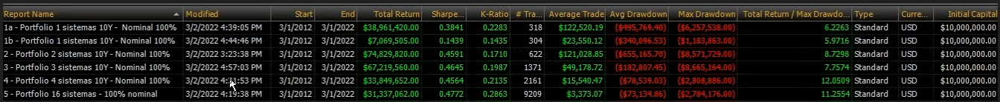
  <figcaption>Figura 020</figcaption>
</figure>

Pero yo tengo aquí uno que ha ido muy bien, que tiene un *Sharpe* de `0.38`, es éste de arriba. Y es el siguiente que tiene `0.14` más, atentados en el `Sharpe`, porque es el que tenemos aquí, vale. Que tenemos la diferencia de beneficio. Los dos tienen una curva que no es que esté mal. Todos esos eran datos de operativas real.

<figure>
  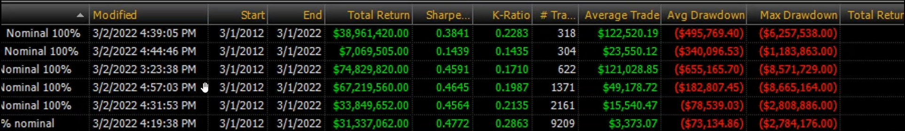
  <figcaption>Figura 021</figcaption>
</figure>

Todo y 38 el dimensionamiento era trades reales, pero dimensionados en nominal para este ejercicio.

Y veis la gran diferencia de uno y otro. Entonces, hombre, si yo cojo el primero, perfecto. El problema si cojo el segundo, ahí está el problema.

**El portfolio consigue mejor Sharpe**

Pero fijaros cómo cambia la mezcla de esos dos sistemas, de acuerdo. Donde cómo se amplifican, y realmente acaban ganando mucho más.

La cartera con 2, que es la misma cartera, es la misma cartera. Pero al final en un *portfolio* donde se retroalimentan y donde hay diversificación entre ellos, diversifican.

<figure>
  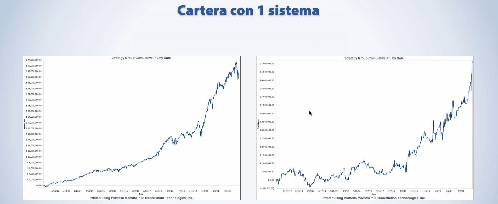
  <figcaption>Figura 023</figcaption>
</figure>

Al final juntos, como veis, consiguen un *Sharpe* de 0.45, muy superior al primero. Y ganan mucho más que la suma de los dos.
<figure>
  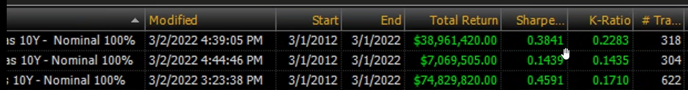
  <figcaption>Figura 022</figcaption>
</figure>

<figure>
  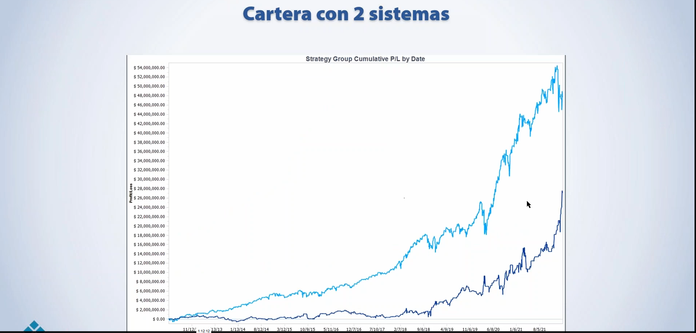
  <figcaption>Figura 024</figcaption>
</figure>

Eso es por el efecto diversificación, de acuerdo. Porque mejora. Por lo que mejora.

Y esto puede chocar, pero es así. Estos son datos, son datos reales. Está, está, está calculado. Se ha calculado.

**Datos reales del ejemplo**

Si alguien por curiosidad para que si alguien tiene es perspicaz, verá que la suma de operaciones de 318, 304, da 622, 622, porque son los dos. Es exactamente No hay, no hay trampa ni cartón.

Y fijaros cómo cambia el *Sharpe* y cómo cambia.

Y los dos empiezan con el mismo expectativa, con el mismo capital. Lo que pasa que al final cuando tú es un *portfolio*, los dos sistemas se van retroalimentando. Y esa es la gracia, esa es la gracia. Por eso se permite esa mejora.

**La mejora principal es meter dos sistemas**

Fijaros que realmente, a partir de los dos, mejoramos súper poco. La gran mejora es meter dos.

<figure>
  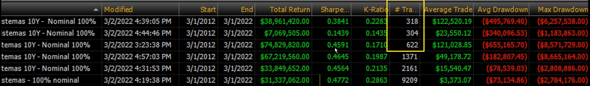
  <figcaption>Figura 026</figcaption>
</figure>

Y ésta es la reflexión que os quería llevar. Porque se ve la tendencia. No quiere decir que haya que operar dos.

Esto porque podríamos haber encontrado un mix mejor. Yo he usado los mismos. Esto simplemente al final pasa porque hay dos tipos de sistema. Si el tercero, si el tercero fuera muy distinto, mejoraría mucho más. No pasa porque no lo es más, de acuerdo?.

Decir, si yo el tercero, yo ahora metiera aquí una Artemisa, de acuerdo, pues iría mejor. Porque hay que un Nemesis , Apolo y metido una Artemisa, pues seguramente mejoraría 0.60, por 0.50 y pico.

Pero fijaros que al final aún así sí que consigo mejorar, pero ya de manera más residual, de manera más residual.

<figure>
  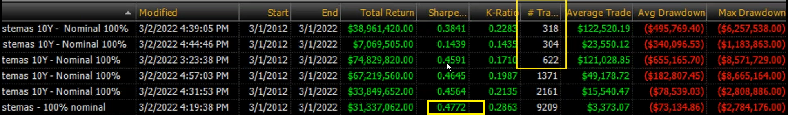
  <figcaption>Figura 025</figcaption>
</figure>

**La mejora principal es en riesgo**

La gran mejora, la gran mejora en rentabilidad / riesgo. Porque en rentabilidad, fijaros que no hay nada mejor que 2. Los 2, vale.

Porque al final lo que os he dicho siempre, la diversificar mejora el riesgo y puede mejorar los datos de retorno riesgo como aquí el *Sharpe*. Pero no normalmente no va a mejorar el `retorno`. El que más gana es el de, el de 2, el de 2.

Y eso si lo veis aquí en gráficos, esto ya lo vimos en la teoría, pero son los mismos sistemas. Lo único que el dimensionamiento pues provoca esa es efecto de, provoca ese efecto, provoca ese efecto.

<figure>
  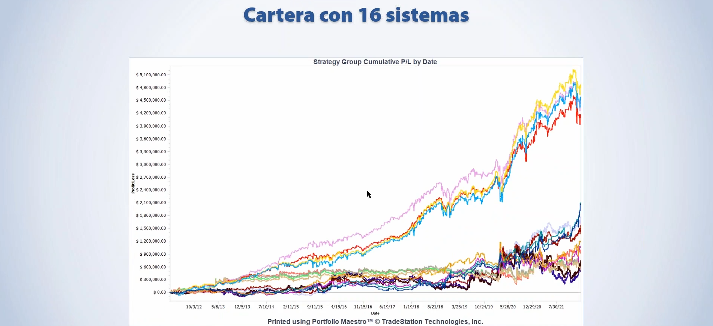
  <figcaption>Figura 027</figcaption>
</figure>

Pero como os digo, sólo metiendo 2, realmente conseguimos ya un efecto muy, muy positivo.

**No necesitas 20 sistemas**

Por lo tanto, esto simplemente que sirva como reflexión. Que no pensar que necesitáis una cartera con 20 sistemas. No es así, vale. No es así.

Podéis trabajar con carteras de dos o tres sistemas y diversificarlos bien. Si hay que trabajar bien ese concepto de 
* diversificación, 
* gestión monetaria. 
* analizar el riesgo 
* que sean robustos, 
* sencillos.

Pero con dos buenas estrategias podéis diversificarlos bien. Lógicamente en lo que hemos visto que sería pues un tendencial y un *mean reversion*, vale. Simplificando, un tendencial y un *mean reversion*.

**Recomendación de activos**

Y preferiblemente en activos distintos. Por ejemplo, 
1. un *mean reversion* en bolsa, en el S&P, en el *Dax*, en vale. 
2. Y un tendencial en una materia prima: petróleo, oro, gasolina, carne de vacuno, zumo de naranja, soja, vale. lo que os dé más rabia.

Y si luego metes tres o cuatro y puedes ir diversificando, pues uno en diario, otra lo entraría, perfecto.

Pero para empezar, con un *mean reversion* y un tendencial en activos descorrelacionados, si puede ser uno más en diario y otro más en entraría tal. Vais a conseguir una cartera suficientemente eficaz.

Eso es lo que hemos hecho nosotros en Darwinex, en principio, por, sobre todo, sobre todo, como sabéis, por problemas de liquidez y demás.

Pero ya digo que ahora vamos a tratar de abordar, a ver dónde metemos Artemis, para, para mejorar. Porque con ese mix ya estaríamos todavía mejor.

Pero es verdad que nos gustaría mucho meter a Nemesis en petróleo, por ejemplo. Pero no ... problemas de liquidez.

Pero, pero de esa manera podéis conseguir un *portfolio* satisfactorio y más equilibrado de lo que creéis. Más equilibrado de lo que creéis, vale. Eso es. Y por donde que lo tengáis en cuenta.

### Ejemplo de portfolio real

Bien. Aquí hemos hecho hoy un par de pruebas con ese *portfolio*. Son los sistemas que operan Sio en los últimos 10 años.

<figure>
  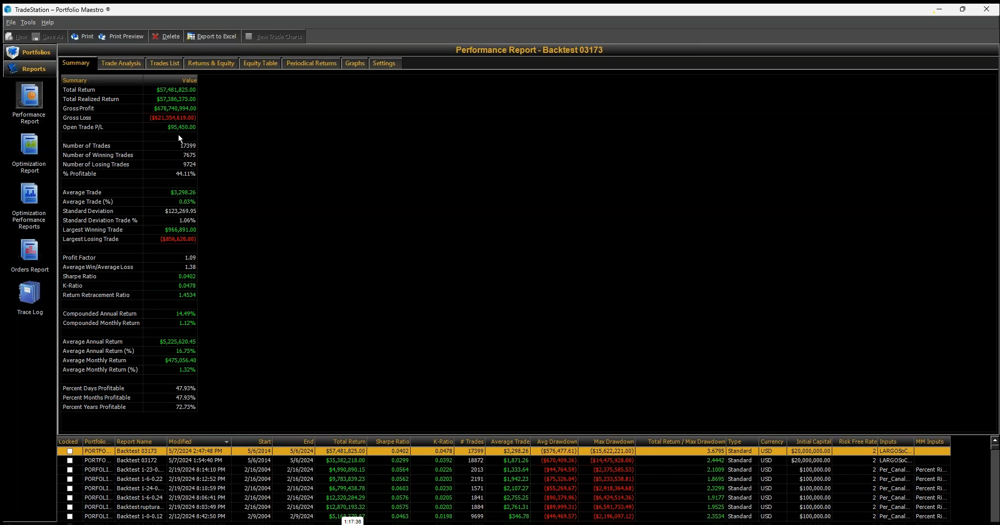
  <figcaption>Figura 029</figcaption>
</figure>

Toda operativa son sets que han operado todos en no el 100% de los que se han operado por sus que han operado todos. 

Esto como veis tenemos un `Profit Factor` bastante pobre 

<figure>
  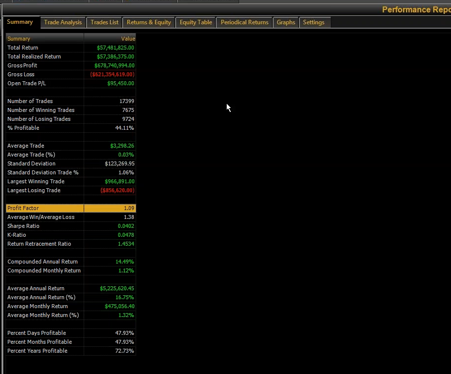
  <figcaption>Figura 030</figcaption>
</figure>

El hemos tocado un poco el *money management* y realmente porque tiene años en la primera parte un poco flojos, en años poco flojos. 2014 es donde está ahí la parte, la parte final.

<figure>
  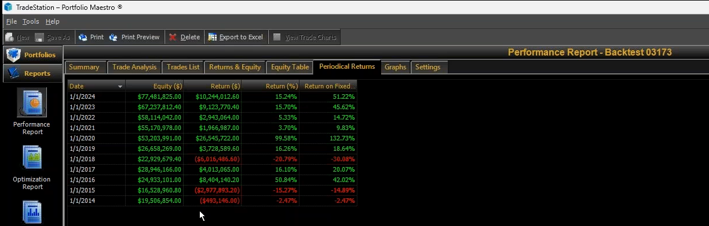
  <figcaption>Figura 031</figcaption>
</figure>

Pero simplemente quería que vierais curvas. Las curvas operativas reales se parecen más a esto que a las que salen de *backtest*.

<figure>
  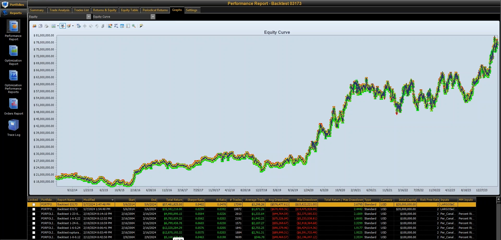
  <figcaption>Figura 032</figcaption>
</figure>

**Portfolio con sistemas perdedores**

Pero también quería que vierais un poco a lo que os digo. Que un *portfolio* evidentemente no es lo ideal. Y aquí pues tenemos estrategias que están algunas de ellas, algunas de ellas se van a ser bueno. Pero va a ser revisado ahora todo el *portfolio*.

Pero, pero hay alguna que estaba justita, justita, ya os lo he comentado en los directos. Está justita, esto ahí va.

Y ahí tenéis por ejemplo un ejemplo, vale. Esto es un *portfolio* con aquí 14 estrategias. Y habéis que hay varias que están perdiendo. Y algunas de ellas prácticamente casi ni han estado, han estado ganando. Seguramente son cortos. Lo que os digo. Las cortas de bolsa ha ido bastante mal. Tenemos que darles una vuelta importante a ellas. Hemos que darles una buena importante demasiado tiempo, demasiado tiempo sufriendo, vale.

<figure>
  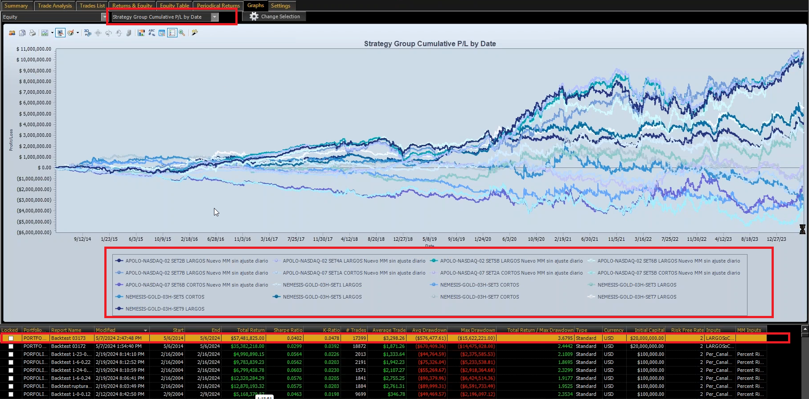
  <figcaption>Figura 033</figcaption>
</figure>

**El portfolio sigue siendo positivo**

Y aún así, aún así, a pesar de habiéndote estando con obtener ahora estrategias que en el pasado no han ido bien. Esto lógicamente no quiere decir que es todo lo que hemos operado, son los sets. Son los sets que de hecho no son ni los que están ahora 100% operando, los que seguramente elegimos aquí para entendernos, vale.

<figure>
  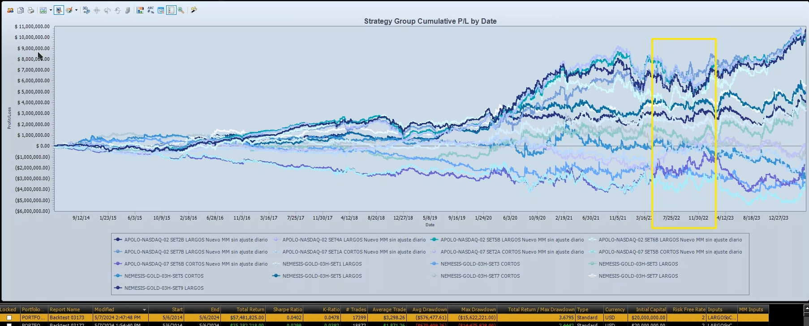
  <figcaption>Figura 034</figcaption>
</figure>

Que dijimos aquí o un poco antes. Puede ser un ejemplo de un *portfolio* que he mirado antiguo y que lo he actualizado. Pero esto no lo hemos operado todo así.

Pero, pero simplemente os lo enseño para que veáis esta reflexión. Aquí hay varias estrategias perdedoras. Y camisa curva es positiva. Esa curva ha ganado dinero.

<figure>
  
  <figcaption>Figura 032</figcaption>
</figure>

Que no ha ganado mucho dinero?. Bueno, no ha ganado mucho dinero, es verdad. Dinero teniendo varias estrategias que lo han perdido. Lo han perdido, no es que han ganado poco. Han perdido dinero.

Y esto es lo que hablaba en algunos medios broma, medio en serio, la teoría, cuando decía el santo creado es el *portfolio*, vale.

Este esto es, de acuerdo. Esto es. Este efecto, de acuerdo. Este efecto sólo lo vas a conseguir con un *portfolio*, porque tú nunca vas a saber si qué estrategia vas a elegir.

Lógicamente vas a intentar elegirla muy buena. Pero y aquí en este ejemplo que hemos puesto antes, lógicamente hemos puesto un ejemplo por lo que mente es que habían ido bien.

Pero podría haber sido una perdedora. Como has visto, como has visto ahora en el otro *portfolio*.

En cambio con la mezcla has conseguido que el *portfolio* gane dinero a pesar de esas estrategias.

Claro, si hubieras cogido la buena, perfecto. Pero si coges la mala?, ¿entiendes? Ahí está siempre el problema, vale.

**Dimensionamiento y exposición**

Bien. En cuanto al dimensionamiento, aquí *Maestro* es un programa que es un desastre muchas cosas. Pero tiene alguna que nos gusta mucho, que nos gusta mucho.

Que veis el *drawdown*, que está bastante, bastante bien ecualizado. Bastante bien ecualizado en los entornos del 25%.

<figure>
  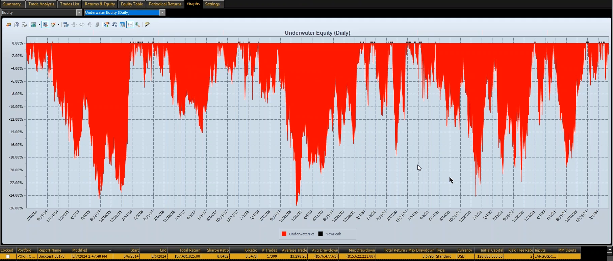
  <figcaption>Figura 035</figcaption>
</figure>

Y una cosa que nos gusta mucho de esto es ver este gráfico. Pero si no tienes que calcular en Excel y demás.

Y esto es la exposición, de lo que os decía antes. Tenemos una exposición en el lado largo máxima de 2.7 aproximada, y abajo de 2.1

<figure>
  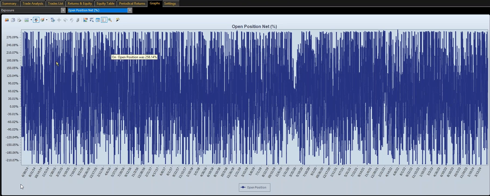
  <figcaption>Figura 036</figcaption>
</figure>

Esto está usando nuestro algoritmo, el que os enseñé el otro día.

**Efecto del límite de volatilidad**

Y veis el efecto que provoca. Porque tiene siempre ese efecto arriba, techo?. Es por el límite inferior, de acuerdo. Es el límite inferior lo que provoca eso.

Porque yo, en el momento en que, en el momento en que la volatilidad baja demasiado, no le dejo que exponga más. Ahí le pongo un tope, que no sé si recordáis que era, hablo de memoria, del orden del 1.75, por ejemplo, en Apolo Nasdaq, vale.

Pues si llega a eso, automáticamente implica un multiplicador por el nominal. Porque es una constante, una constante, se va a variar en base al precio el nominal, pero no va a variar por volatilidad.

Por lo tanto acaba siendo un multiplicador del precio. Es decir, el nominal.

En ese gráfico se ve muy claro. Si yo voy a nominal, lo que veríais es todo el rato una línea recta. Aquí como no es nominal puro, que es que es nominal pues ajustado.

En cambio, si yo ahora lo que pasa que vamos a hacer una cosa porque lo veáis.

**Prueba sin límite de volatilidad**

esto ahora, no lo voy a poner muchos años porque podemos morir en el intento, podemos bloquear. 

Simplemente para, para que veáis el gráfico voy a poner dos años. Pero lo que voy a hacer es bloquear lo que, o sea, quitar el límite, quitar el límite de, el tope éste. Quitar el tope, se lo voy a poner 0.

<figure>
  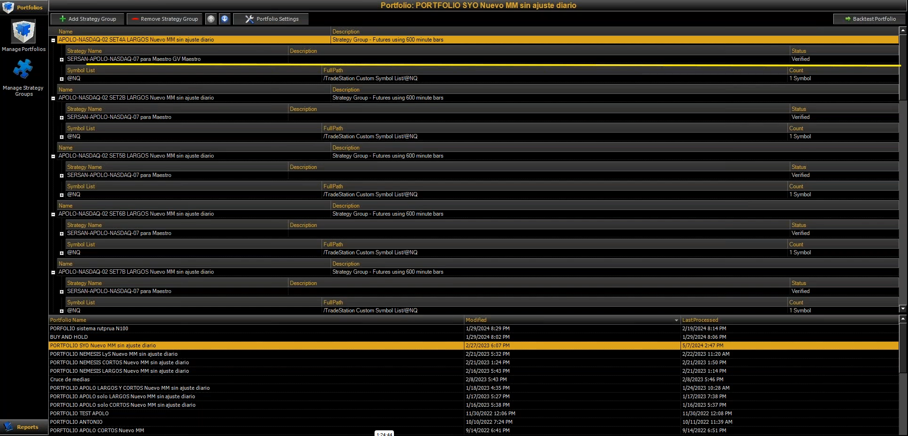
  <figcaption>Figura 037</figcaption>
</figure>

Ahora qué pasa, ahora estaría trabajando. Está trabajando. Y ya pues podemos ir a dar una vuelta así. Bueno, simplemente para que veáis ese tema. Luego, cuando acabe esto, vale, también os enseñaré.

Para que ya lo habéis visto de una manera sencilla, una manera sencilla de, para los enseñar dos trucos.

**Funciones avanzadas de portfolio**

Para, para más avanzados y para menos. Por un lado para los más avanzados, tanto *Portfolio Maestro* como *Portfolio Trader*, vale. Hay algunas librerías y algunas de *rebalanceo*.

Porque *Maestro* tiene opciones de rebalancear. Que si alguien las quiere, que me las pida. Porque no sé si están por defecto, la verdad que tengo dudas.

Pero hay unas, hay una serie de palabras reservadas de funciones que creo que no vienen instaladas. Creo que estaban en los foros que permiten controlar el *portfolio*.

<h3>Portfolio_Maestro_Constrain_Short_Position</h3>

<strong>Propósito:</strong> Limitar la exposición en posiciones cortas.

<strong>Lógica:</strong> Calcula el equity actual en cortos (posiciones abiertas + nueva orden). Si este valor supera un porcentaje máximo del equity total del portfolio, bloquea la orden (devuelve True). Si está dentro del límite, permite operar (devuelve False).

<strong>Uso:</strong> Control de riesgo direccional para no sobreexponerse en cortos.

<figure>
  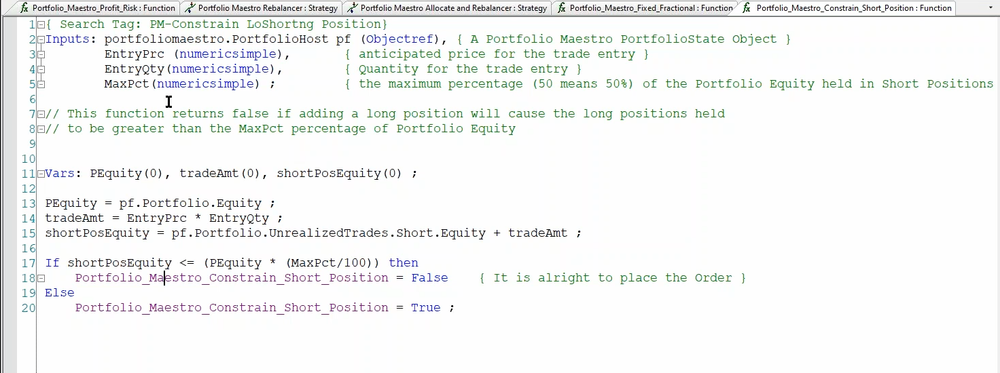
  <figcaption>Figura 039</figcaption>
</figure>

Por ejemplo, calcular el *money management*, coger la cuenta del *portfolio*, de acuerdo. Pasa que eso hay que hacerlo con objetos. Es una estrategia que lo hace, que usa esta función, esto la función:

<h3>Portfolio_Maestro_Profit_Risk</h3>

<strong>Propósito:</strong> Implementar gestión de riesgo diferenciada entre capital inicial y beneficios.

<strong>Lógica:</strong> Suma tres componentes de riesgo independientes:

<ul>
<li><strong>PctOfInitialEquity:</strong> % que arriesgas del capital inicial</li>
<li><strong>PctOfProfits:</strong> % que arriesgas de los beneficios acumulados del portfolio</li>
<li><strong>PctOfProfitsSistema:</strong> % que arriesgas de los beneficios del sistema individual</li>
</ul>

<strong>Uso:</strong> Permite ser más agresivo con beneficios (ej: 1% del capital + 5% de profits), protegiendo el capital base mientras aprovechas las ganancias.

<figure>
  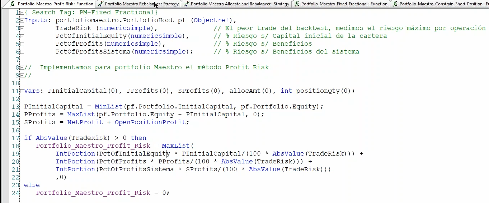
  <figcaption>Figura 038</figcaption>
</figure>

Y eso, por ejemplo, es una estrategia que lo usa. Hay que meter el objeto y tal.

<h3>Portfolio Maestro Rebalancer</h3>

<strong>Propósito:</strong> Rebalancear automáticamente un portfolio según ranking de activos.

<strong>Lógica:</strong> Define un RankCutoff (ej: 3 = mantener los 3 mejores). Si un activo cae por debajo del cutoff y tiene posición, vende. Si está dentro del cutoff y no tiene posición, compra.

<strong>Uso:</strong> Rotación sistemática de activos basada en un criterio de ranking (momentum, valor, etc.).

<figure>
  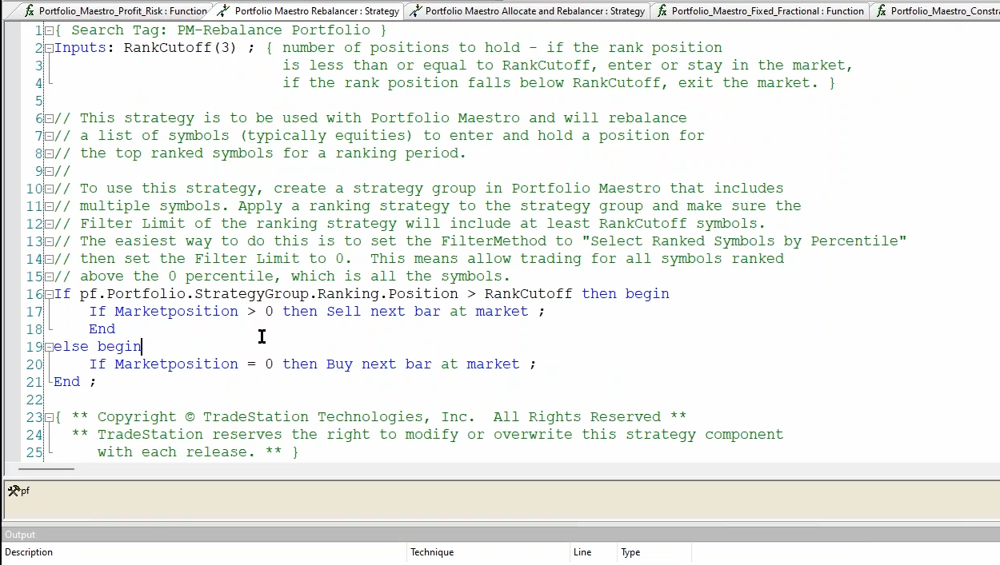
  <figcaption>Figura 040</figcaption>
</figure>

Pues eso es un poco avanzado. No, no quiero complicaros, complicaros la vida. Porque la única diferencia de esto es que yo puedo referirme a datos del *portfolio* en vez de sólo del sistema.

Que yo, cuando hago un sistema, me estoy refiriendo a los datos del sistema. Yo quiero referirme a datos del *portfolio*, pues lo tengo que hacer de esta manera. Tengo que usar este tipo de funciones. Como *Portfolio Maestro Profit Risk*, como *Portfolio Maestro Fixed Fractional*, pues esto nosotros pues lo tenemos algunas versiones de los sistemas que usan estas palabras y pasan el riesgo a través de este cálculo.

<h3>Portfolio_Maestro_Fixed_Fractional</h3>

<strong>Propósito:</strong> Calcular tamaño de posición con Fixed Fractional básico.

<strong>Lógica:</strong> Toma un porcentaje del equity del portfolio y lo divide entre el precio de entrada para obtener la cantidad de contratos/acciones.

<strong>Fórmula:</strong> Cantidad = (Equity × %Asignado) / PrecioEntrada

<strong>Nota:</strong> Es FF sobre equity, NO sobre riesgo (no considera distancia al stop).

<figure>
  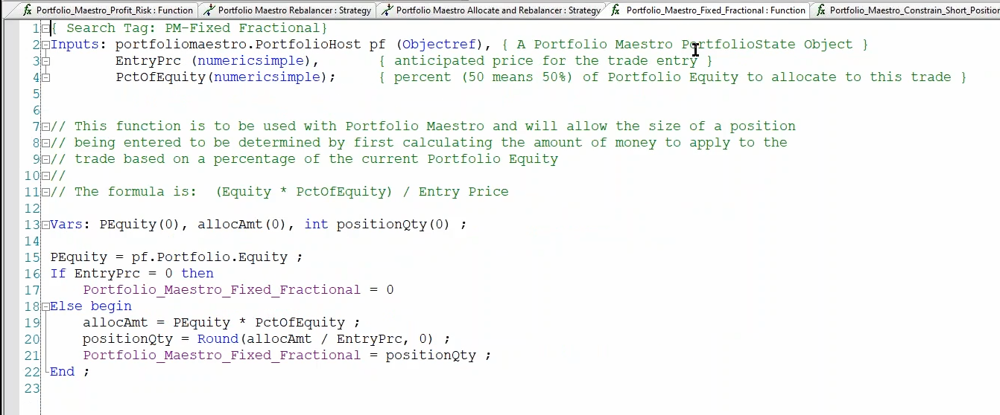
  <figcaption>Figura 041</figcaption>
</figure>

Simplemente para usar la *equity* del *portfolio*. Es la única diferencia que pasamos el riesgo de cada sistema, pero usamos la *equity* del *portfolio*.

Y hasta aquí te lo, te lo explica.

Y éstos son palabras reservadas. También *Portfolio MultiCharts* tiene, de hecho hasta tiene más. Y es un poco lo mismo. Simplemente para referirte a datos del *portfolio* en conjunto. El sistema en sí tiene datos del mismo. Si quiero usar datos del *portfolio*, pues tengo que usarlo como digo con este tipo de palabras, de palabras reservadas, vale.

Esta es la manera podemos decir más avanzadas.

También hay para referirse a esto de *allocate and rebalancer*.

<h3>🔄 Portfolio Maestro Allocate and Rebalancer (Configuración)</h3>

<strong>Propósito:</strong> Rebalancear portfolio + asignar tamaño de posición automáticamente.

<strong>Inputs clave:</strong>

<ul>
<li><strong>RankCutoff(3):</strong> Número de posiciones a mantener (los 3 mejores del ranking)</li>
<li><strong>AllocationPct(50):</strong> % del equity del portfolio asignado a este grupo de estrategias</li>
</ul>

<strong>Requisito:</strong> Crear en Portfolio Maestro varios strategy groups con diferentes listas de símbolos, aplicar un ranking a cada uno, y configurar el filtro para incluir al menos RankCutoff símbolos.

<h3>⚙️ Portfolio Maestro Allocate and Rebalancer (Ejecución)</h3>

<strong>Lógica de decisión:</strong>

<ul>
<li><strong>Si ranking > RankCutoff:</strong> El activo ya no está entre los mejores → Si tiene posición abierta, vende.</li>
<li><strong>Si ranking ≤ RankCutoff:</strong> El activo está entre los top → Calcula tamaño (Equity × AllocationPct / Precio) y compra si no tiene posición.</li>
</ul>

<strong>Resultado:</strong> Rotación automática: entra en los mejores rankeados, sale de los que caen del top, con sizing proporcional al equity del portfolio.

<figure>
  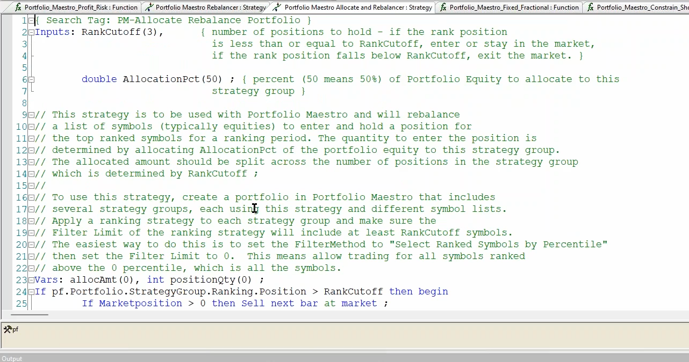
  <figcaption>Figura 042</figcaption>
</figure>
<figure>
  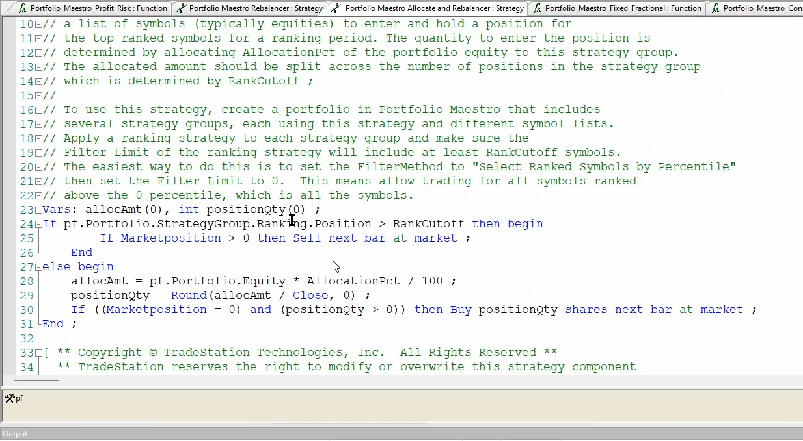
  <figcaption>Figura 043</figcaption>
</figure>

Por qué?, porque *Maestro*, que es muy breve. Ahora, en 5-10 minutos, aunque di los *PDFs*, os lo voy a enseñar. Porque eso sí que a nivel de acciones, por ejemplo, sistemas de rotacionales que alguien preguntaba, puede tener su utilidad, vale. Pero sobre todo ya digo, para nada optimizar y demás. Porque *maestro* más todo eso es inviable. 

**Seguimos con el backtest**

He acabado de hacer sólo el *backtest*, vale. Y ahora he hecho este mismo *backtest*, vale. Le he quitado el límite. Le he quitado el límite. Y no sé si ha ido mejor o peor.

<figure>
  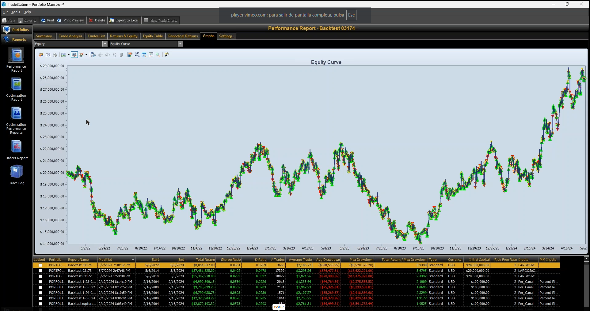
  <figcaption>Figura 044</figcaption>
</figure>

Ha ido peor. No ha ganado bastante, pero bastante peor. Bastante peor, vale. Ah, bueno, no, pero son menos años. No, no, no, es que ha ido peor. Es que son menos años, o menos años, que después son muchos menos años.

<figure>
  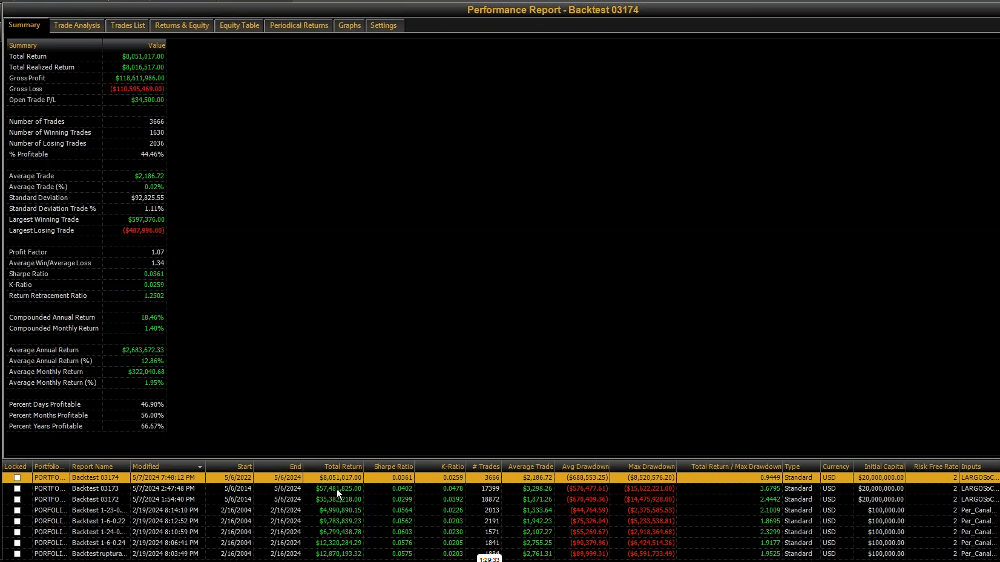
  <figcaption>Figura 045</figcaption>
</figure>

**Efecto de quitar el límite**

Era, era sólo para que verais esto. Veis, ahora ya no hay límite. Ahí está. Ahora es, ahora el límite es distinto.

<figure>
  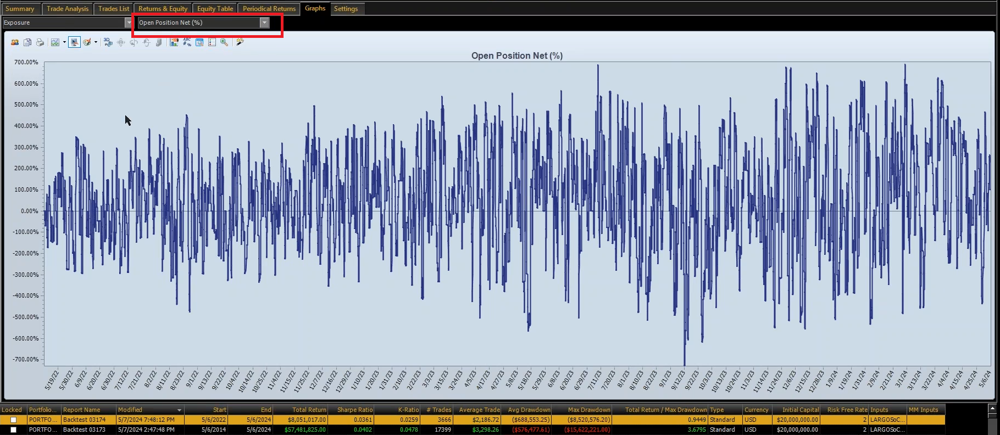
  <figcaption>Figura 046</figcaption>
</figure>

Porque, porque yo ahora no le he hecho un tope. Ahora está se llega a palancar 4-5 vez. Aquí se ha palancado siete veces.

Porque?, porque no había volatilidad. Esto, esto ahora alguien lo preguntaba, es *Percent Volatility*, de acuerdo. Es *Percent Volatility*. Y con el cálculo propio de volatilidad usando el ATR normalizado, vale. Con lo que quieras. Pero al final es por volatilidad. Es decir, cuando hay poca volatilidad, meto mucho. Cuando hay más volatilidad, meto menos. Es la diferencia.

Este es el efecto que provoca poner un límite en la parte baja.

<figure>
  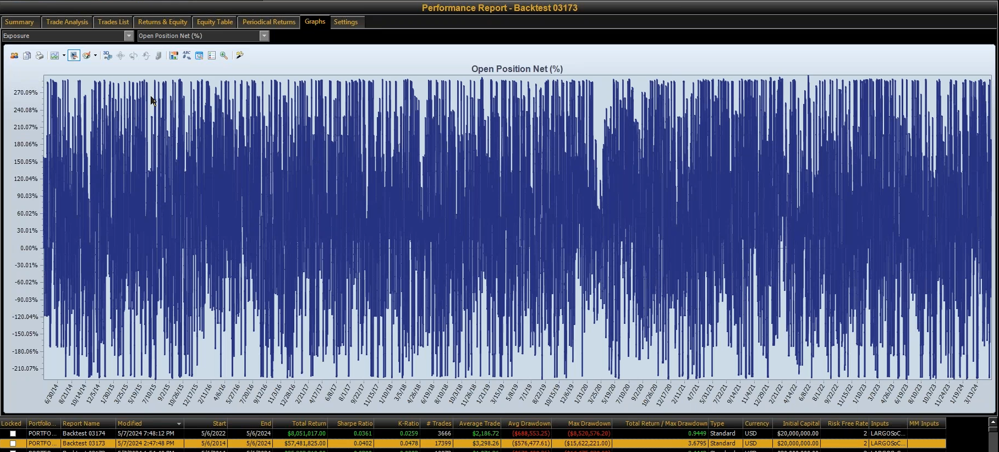
  <figcaption>Figura 047</figcaption>
</figure>

Esto así se ve muy bien, vale. Que al ***cuando actúa el límite, estoy yendo a un multiplicador el nominal***. No es que vaya al 100% nominal. Voy a 2.7.

Voy aún, aún a una exposición bastante estable con relación al nominal del activo. Sea acciones, sea futuros, lo que sea.

Cuando hay volatilidad, entonces baja. Y puede llegar a niveles muy bajos como es aquí. Que cuando es esto pues el COVID, 2020. ese pico ahí debajo es el COVID, donde la exposición baja pues mucho.

<figure>
  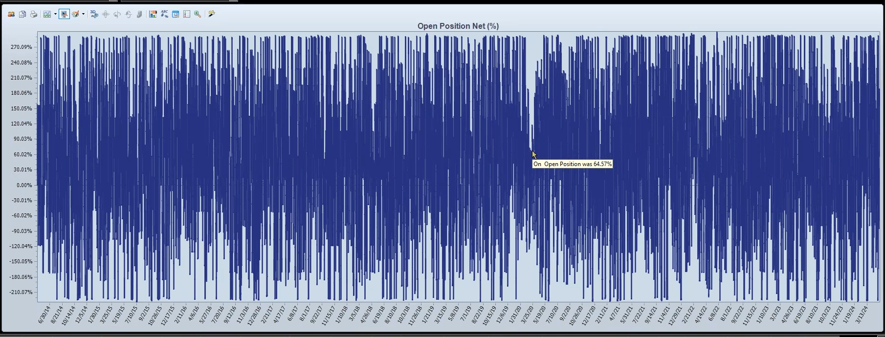
  <figcaption>Figura 048</figcaption>
</figure>

Aquí no hay como baja, porque ahí está el COVID también. También bajan en el otro. Decir en el otro también ha bajado. La diferencia no es que no baje el otro, sino que el otro sube más. El otro ahí también en el COVID. Si yo aquí busco el COVID, este cargo a menos, no he cargado el COVID. Bueno, que le he puesto menos antes para que fuera más rápido. No le he puesto el COVID. 

Pero bueno, ya veis que aquí hay más volatilidad. Aquí en esa parte, más volatilidad. Y aquí en esa parte, menos volatilidad. Mercado más. 

**Pregunta sobre elegir sistemas para portfolio**

***Comenta Juan, que si de cada *portfolio* si por ejemplo tenemos 20 sistemas estudiados con óptimizaciones,  métricas etcétera, que son viables, pero sólo queremos o podemos elegir 10. Entiendo que por un tema de capital. ¿Que menos correlación en la teoría se mostró la matriz de Excel de correlaciones? se Comentó que se vería realmente la parte.***

Bueno, no era consciente que dijera, dijera esto. Pero ahora te lo enseño, ahora te lo enseño.Es que esto, esto al final simplemente es una... Tú ahí lo que, lo que yo haría en este caso es un poco por donde iba este documento que os he enseñado antes.

**Criterios para elegir sistemas**

Muy sencillo. Es decir, ahí que deberías de hacer. Por un lado, deberías de elegir, por un lado, vale. Si tienes 20, no metamos porquería el *portfolio*. Luego habrá cosas que serán porquería, porque, porque nos habíamos equivocado, vale. Puede pasar. Pero digo de entrada, no metamos *portfolio*. Normalmente tú vas a tener sistemas que los ves mejor. Es decir, que son tus grandes sistemas.

Evidentemente ésos van. Entonces si tú de verdad tienes 20 que los 20 son top, entonces empezamos a hablar. Pero si no, elige los, los que de verdad concibidas que son más top.

**Sistemas robustos**

Y cuando digo más top, no quiero decir que ganen más. Sean más robustos. Por ejemplo, ¿qué es un sistema robusto? Antes en ese documento que se ha pasado, Kaufman, también lo ponía. Que es un sistema robusto?: un sistema que las pruebas de sensibilidad, que los mapas, que tiene muchas zonas de trabajo. Eso es un muy buen sistema. Y que da confianza.

<strong>Que es un sistema robusto?</strong>

Un sistema que las pruebas de sensibilidad, en los mapas, tiene muchas zonas de trabajo. Eso es un muy buen sistema. Y que da confianza.

Si tú tienes 20 así, perfecto. Entonces ahora, ahora te contesto. Pero no creo que tengas 20 así. Entonces si no tienes 20 así, elige los que son así. Elige los que son así. Los que son de ese tipo. Los que son súper robustos, sencillos, vale. No necesariamente los que ganan más.

Eso es lo tentador. Oye, si es el que gana más y además robusto, entonces perfecto. Pero me entiendes. 
* siempre más seguridad que el rendimiento. 
* Calidad más que calidad en el sentido de robustez.

**Matriz de correlaciones**

Bien. Entonces si tienes 20 de este tipo, vale. Entonces ahí el criterio siempre es correlación, correlación. Y ahí es donde entra la matriz, donde entra la matriz. Yo estoy prácticamente seguro que la teoría lo hice un poco lo de desglosar la matriz. Pero de todas maneras, entiendo que es un tema interesante.

La mayoría de programas para la mayoría de programas, en este caso tanto *Maestro* como como un *Portfolio Trader*, que ahora vamos a ir a él, ahora vamos a ir a él, te lo va a enseñar. Cuando cualquier problema que gestione *portfolios*, evidentemente una de las informaciones que te da es correlaciones de los miembros, porque es que es de cajón, vale.

En el caso de *Maestro*, lo tienes en `análisis`. Tienes aquí correlación análisis. Tú le eliges el *portfolio*, éste último que hemos mirado, por ejemplo. Le dices por `Symbol` o por `Strategy Group`. En este caso esto es un detalle. Bueno, en este caso va a ser lo mismo porque sólo hay dos *Strategy Groups* que son de símbolos distintos. En este caso no importa. Y lo puedes hacer bien diario y mensual. Aquí cuando ya le coges algo, ya lo calcula. Así que ahora lo está calculando diario. Si lo quiero cambiar a mensual, pues lo calculo. Y lo calcula. Y aquí tienes todas las métricas de las correlaciones.

<figure>
  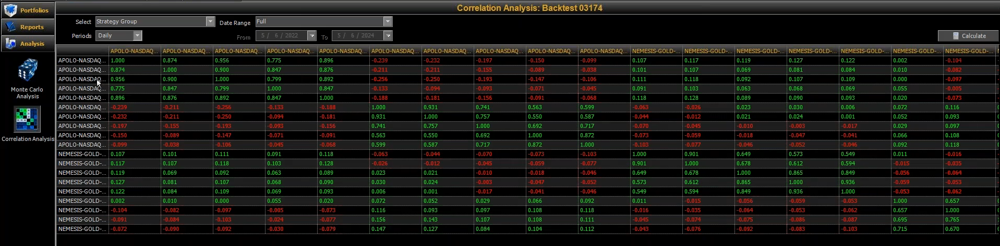
  <figcaption>Figura 049</figcaption>
</figure>

**Análisis de correlaciones**

Lógicamente hay algunos, como ya os comenté, que son muy parecidos. Pero eso siempre es siempre mejor si son robustos, que tener el mismo set. 

Y los hay que son muy distintos. Largos, cortos, vale. Entre oros, entre ellos mismos, son largos y cortos. Pero también entre, entre Apolos y oros, como veis, pues están entre 0.12, 0 menos algo. Es un poco buenas correlaciones. Cerca de 0, pero menos de 0.5, ya estamos diversificando. Obviamente 0.8, 0.9, diversificar muy poco, muy poco, casi nada.

Pero entonces tú ahí elegirías ésos. Elegirías los que mejor correlación te dé.

**Criterio de selección por categoría**

Y eso partiendo de lo que te decía en la entrada. Si tú tienes distintos sistemas, distintos activos, tienes que tener ahí una selección previa. Que era un poco por donde iba este documento que ellos por aquí de *portfolio*.

[doc : Portfolio Commodities](../docs/Portfolio%20Commodities.pdf)

un ejemplo aplicable a todo. Es decir, yo tengo unos grupos. Hay autores, por ejemplo, creo que era un que reconoce que creo que tiene 4 o 5 tipos. Y está correcto. O sea, tú tienes *equity* bolsa. Tienes tipos de interés, vale. Y luego dentro de materias primas, hablando de futuros, dentro de materias primas pues tienes distintos tipos. Aquí las que entran: divisas, energías, tienes granos, tienes plan de *soft*, financieras. Tienes distintas. Entonces ahí tú puedes ir eligiendo metales, no, que no acabe energía.

<figure>
  
  <figcaption>Figura 018</figcaption>
</figure>

**Diversificación por categoría**

Al final vas un poco por categorías. Si todas las estrategias las tienes de *equity*, pues ya va regular la cosa, ¿entiendes? Es mejor elegir de categoría distinta que repetir la misma categoría. Entonces si puedes poner una de *equity*, otra de interés de tipos intereses, otra de metales, otra de energía, y otra de granos, es perfecto, ¿entiendes? Ése sería un criterio.

Eso normalmente ya en esta matriz te va a salir así. Pero si por lo que fuera no te saliera, en caso de duda lo decides así. En caso de duda lo decides así. Es decir, los vas metiendo por distinta categoría, vale.

**Más importante estrategia que activo**

Y cuando digo categoría, cuidado, ahora te ha hablado de activos porque es el documento que te había enviado.  Pero ***es mucho más importante*** por estrategia que por activo. El primer criterio es estrategia y luego activo. 

Es decir, si tú tienes buenas estrategias, o sea de este tipo que te he dicho yo (súper estable, súper robustos) y tienes un tendencial en el Nasdaq y otro anti-tendencial en el S&P, y cumplen estos dos criterios (súper estable, súper robustos), es mejor que opere esos dos siendo los dos *equity* de la misma categoría, que operar un oro y un Nasdaq siendo que en el oro malo o que no funcione tan bien, ¿entiendes? Es más importante estrategia. 

Pero lo ideal, lógicamente, es las dos cosas. Es decir, en Nasdaq, S&P estrategia antitendencia, en oro estrategia tendencia. Ir combinándolo, en uno diario, el otro intradiario. Ir combinado. Eso es lo ideal, lo ideal.

<h3 style="color: #e94560; margin-top: 0;">🎯 REGLA DE ORO: DIVERSIFICACIÓN EN PORTFOLIO</h3>

<table style="width: 100%; border-collapse: collapse; margin: 15px 0;">
<tr>
<td style="background: rgba(233, 69, 96, 0.2); padding: 12px; border-radius: 5px; text-align: center;">
1️⃣ 
<strong style="color: #e94560;">ESTRATEGIA</strong> 
Prioridad máxima
</td>
<td style="padding: 0 10px; text-align: center; font-size: 1.5em;">→</td>
<td style="background: rgba(233, 69, 96, 0.1); padding: 12px; border-radius: 5px; text-align: center;">
2️⃣ 
<strong style="color: #e94560;">ACTIVO</strong> 
Prioridad secundaria
</td>
</tr>
</table>

<strong>✓ Mejor:</strong> Dos estrategias robustas en mismo sector (tendencial Nasdaq + anti-tendencial S&P) 
<strong>✗ Peor:</strong> Una estrategia robusta + una mediocre en sectores distintos (buen Nasdaq + mal Oro)

🏆 ESCENARIO IDEAL (combinar todo):

Estrategias robustas diferentes + Activos de distintas categorías + Temporalidades variadas 
Ej: Tendencial en Oro (diario) + Anti-tendencial en S&P (intradiario) + Reversión en Granos...

**Sesgos en el análisis**

Como no, normalmente esto que al final es el sentido común, que como he dicho todo el curso, es en la vida es importante, eso es. Y lo comentaba el otro día. Hacía una charla con, con un colega y le decía eso. Es verdad.

O sea, si hablando de broma de ya no te cuento de fútbol o sea de o de política, o sea al final tú piensa la cantidad de cosas que tenemos todos la misma información. Y de esa misma información se generan opiniones radicalmente distintas. Que no digo opiniones, perdón, conclusiones radicalmente distintas. Es porque hay muchos sesgos, vale. Entonces los datos para el final saber decidir y tratar de no tener sesgos. Por eso en el curso hablé una parte de sesgos, es muy importante en un análisis de datos. Es muy importante.

Esto pasa mucho, por ejemplo, en un tema súper científico que lo puse este ejemplo como tema del COVID. Es ciencia pura. Es, es pura ciencia la epidemiología, es pura ciencia. Y virus pero ciencia pura. Y la epidemiología es pura ciencia. Toda probabilidad es estadística absoluta. por ciento lo estudié bastante a nivel y a nivel de aficionado. Y hay gente que con esos mismos datos dice que, que no funciona no, que si funciona. O gente que ahora ha descubierto que los medicamentos tienen efectos secundarios. No sabían que la gente hay gente que se ha muerto por tomar una aspirina. Gente que no lo sabe. Pero yo ya os lo digo. Todos los medicamentos del mundo tienen efectos secundarios.

A finales y sesgos, falta de información, etcétera, ¿entiendes? Y esto pasa en todos los análisis de datos. Pues imagínate, imagínate con sistemas. Imagínate con sistemas. Pasa igual.

**Ser frío en el análisis**

Entonces al final los datos te van a dar información, pero también a veces los sesgos te cariñas, sistema éste es mío, éste tal, éste me gusta más, éste me dio muy bien. Entonces hay que tratar de ser lo más frío, lo más estéril posible. Por eso también os doy pautas podemos decir que no son puramente de datos. 

> Como os digo, primero por el sistema y muy importante la estrategia distinta... ese el vector más importante, sin duda alguna. De verdad. O sea, es el más importante.

También *Timeframe* distinto, *activo* distinto, etcétera, vale. Y por supuesto, matriz de correlaciones. Y aquí pues tienes que cruzarlas. Esto tú te lo puedes llevar a Excel. Puedes ver qué tiene cada uno con todos los demás. Puedes hacer promedios. Puedes trabajar lo estadísticamente. No hay más. No hay mucho secreto en ese sentido. O sea, no hay nada en ningún cálculo especial que puedas hacer. Es una tabla de correlaciones. Cada uno contra todos. Y ahí sale. No hay más.

**Correlaciones diarias vs mensuales**

***cuál es el valor de correlación. Con se verás que es muy correlacionado?***

Sí, esto es mensual. Esto, Aureli, que has visto, lo puedes poner en términos mensuales, de términos diarios. Bueno, míralo en los dos. Lo normal, lo normal es que haya datos muy similares. Lo normal es que haya datos muy similares.

Hay autores que defienden que mejor diario. Acordaros que hizo una práctica con Excel que muy trabajada con datos que la verdad recomiendo verlas varias veces. Es densa de narices, aquella que hice horas con el Excel. Que si tal `diario`, tal `ulseer`. Trabajé mucho ahí en los datos. Y viste. Entonces bueno, pueden cambiar,  diarios, mensuales. Hay cosas el diario siempre tiene mucho más detalle. Más de diario, evidentemente. Pero ya no tiene mucho más, mucho más detalle. El mensual a veces pierde cosas. Pero, pero normalmente es suficiente. Normalmente. Lo que hablamos siempre de un equilibrio entre productividad. COntra más detalle, más cuesta más, más cantidad de información.

Entonces siempre hay que tener un equilibrio. Está bien mirarlo por tal, pero normalmente no vas a obtener lecturas muy distintas, sobre todo en correlaciones diarias o demás, muy interesante.

Luego el efecto mensual, hay gente que también lo mide en *drawdowns* o ratos de pérdidas mensuales. Es correcto. Lo normal y lo fácil es mirar rendimientos, rendimientos como este caso, vale. Pero otra manera que hay bastante sencilla y visual, si no quieres sacar datos o el programa te los saca, ya lo hemos comentado. Al final lo que a mí me interesa más la descorrelación es por las pérdidas más que por las ganancias. Entonces desde ese punto de vista, sí que puede venir bien a mejor mirar pérdidas diarias. Los días malos que no coincidan. Y ahí sí que te puede venir bien la correlación en diaria, te puede dar más ese detalle.

Y luego incluso pues ver, ya te digo, los días malos, donde son. Puedes ver cuáles son los peores días de ese sistema, cuándo fueron. En uno, en otro. Que no sean en el mismo año, el mismo mes. Eso sí que es un detalle que puede venir bien. El caso, sobre todo de duda, no de elegir uno u otro. Porque al final a mí me interesa por eso, vale.

**Análisis de sistemas individuales**

Yo aquí ahora, por ejemplo, en éste, aquí no lo puedo ver. Lo puedo ver probablemente luego en cada el informe de cada sistema. Puedo ver cuándo tiene el drawdown. Pero yo aquí sí que me enseña en *Maestro*, por ejemplo, el detalle de cada uno de ellos, como habéis visto antes. Entonces pero no puedo ver el trabajo de cada uno de ellos de aquí. Podría haberlo. Hay una opción para sacar la curva de cada sistema, es que se puede cuando haces el informe.

Entonces a mí, a mí lo que me interesa es ver eso a la hora de elegir, que es lo ideal, pues que vayan distintos. Pero, pero lógicamente ganando. Es el problema que también en esta época. Aquí, aquí puedes decir, esto seguro que no, que no sirven.

<figure>
  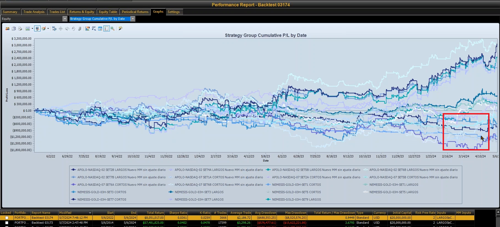
  <figcaption>Figura 050</figcaption>
</figure>

Bueno, seguro?, seguro?, habría que verlo, hay que verlo. Porque al final bueno, en su tipo de mercado, su tipo de mercado no es ese, han aportado en algunos momentos?. Si os fijáis aquí, no digo que eso sea correcto para que me entendáis.

Fijaros, por ejemplo, aquí, vale. Todo el de los, los, los buenos, no, los directores claramente parece que van a la baja, en cambio los de abajo están al alza...

<figure>
  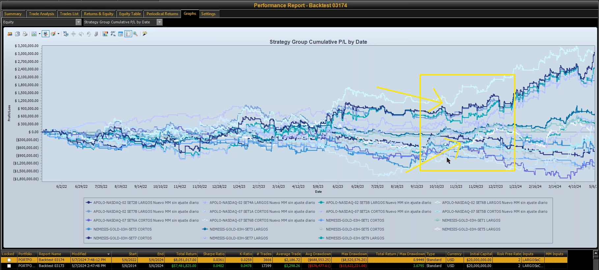
  <figcaption>Figura 052</figcaption>
</figure>

Entonces aquí de hecho hay un momento hasta que se acercan, porque diversificaban, realmente éstos han estado cumpliendo su labor. Es que sería mejor que lo hicieron ganando. Pero me entendéis?. Es el efecto la diversificación es ése. Claro, es lo ideal es que todos ganen. Pero hay veces que depende el tipo de mercado pero nos pierden. Y no necesariamente quiere decir que eso es malo. Que mirarlo, hay que analizarlo, que trabajarlo, y tratar de que ganen.

Pero dices que no puedes, de hecho, que hay alguno que nos acaba de. Ver, a ver si esto me lo marca. Y a éste que ha sido aquí un desastre a los. Ahora, ¿dónde está? Lo veis. Se ve un poco. Espera. cambio paleta 

<figure>
  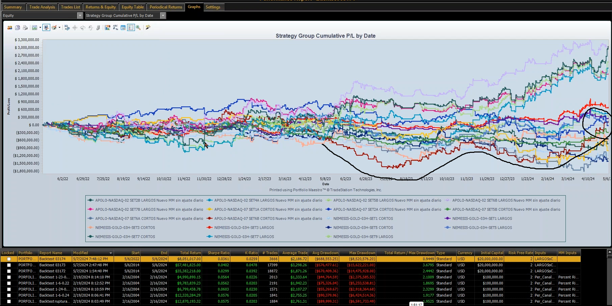
  <figcaption>Figura 053</figcaption>
</figure>

Entonces fijaros que ése rojo granate, ha sido el peor en más antes momentos. Y ahora pues ha remontado muchísimo. No está entre los mejores. Pero de este grupo peor, ha llegado casi a ser de los mejores.

Y el rojo puro, fijaros qué estable por ejemplo. Lo veis, no. La diferencia. Ahí se ven, se ven cosas.

<figure>
  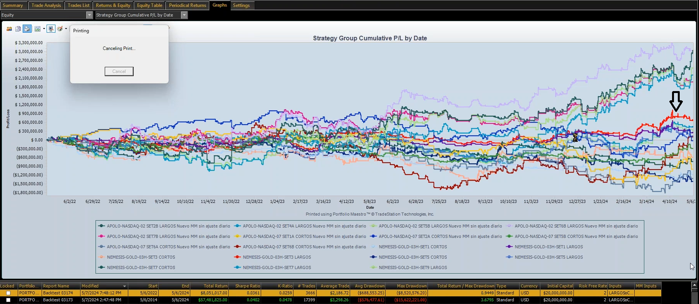
  <figcaption>Figura 054</figcaption>
</figure>

Luego hay algunos pues que como este gris que bueno, en ningún momento parece que ha dado la talla. Pero o este mismo.

Aquí, fíjate que está el peor es el verde. Aquí en la zona de 22, donde tengo el raton, fijaros que está ahí arriba él todo. Ahora está entre los mejores.

<figure>
  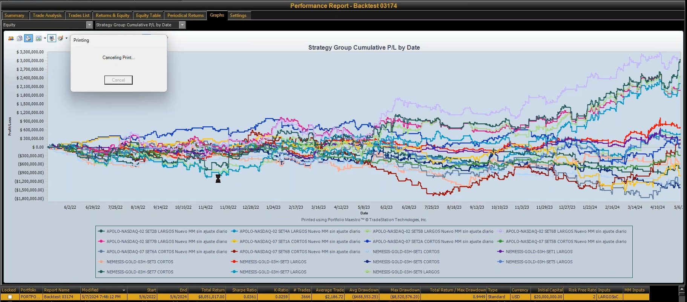
  <figcaption>Figura 055</figcaption>
</figure>

**Efecto de la diversificación con dos familias**

Esto es lo que se busca, al final, no es. Al final sólo con las dos familias para que veáis que con dos familias hemos conseguido una investigación satisfactoria, que es mejorable. Sí, es totalmente, es totalmente. De hecho, estamos en ello ahora.

> Y ésos son dos familias de sistemas que operan oro y Nasdaq. Un tendencial y un anti-tendencial. Sólo eso, con distintos sets, distintas zonas de trabajo.
>
>Entonces está con dos. Y idealmente os diría yo que con tres, con tres se puede conseguir muy buen trabajo. De verdad, con tres se puede conseguir muy buen trabajo.

**Pregunta sobre comparar sistemas**

***No sé si habría alguna herramienta, por ejemplo, *Maestro*, para comparar los sistemas y ver cuál funciona mejor con otro.***

Todo esto que estamos viendo es para comparar sistemas, de cierto. Aquí hay más pestañas, vale. El tema es que él es muy lento de procesamiento. Pero yo aquí puedo poner, por ejemplo, los dos activos que ha habido. 

<figure>
  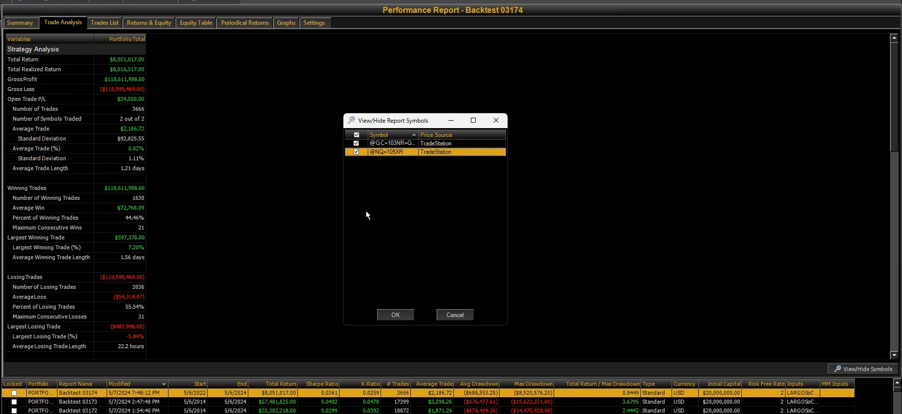
  <figcaption>Figura 056</figcaption>
</figure>

Puedo ver distintas, distintas cosas para analizar drawdowns. Distintas pruebas.

<figure>
  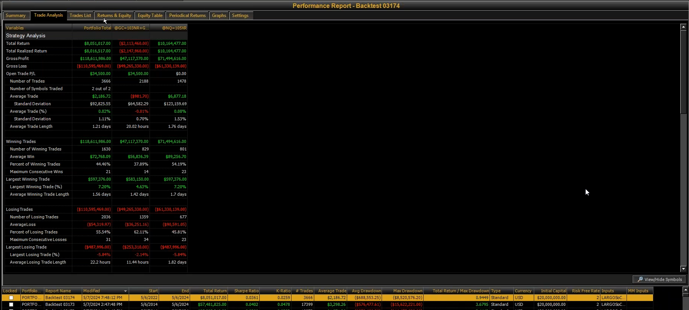
  <figcaption>Figura 057</figcaption>
</figure>

Los de la hora. Hay bastante información. Hay cosas interesantes en los gráficos también. A nivel de información está bastante bien. El problema es que es muy lento. Pero la información que genera los informes está muy bien.

**Ranking en Maestro**

Lo que os decía antes, vale. Para acabar brevemente en *Maestro*, me voy a *Portfolio 3*, vale.

<figure>
  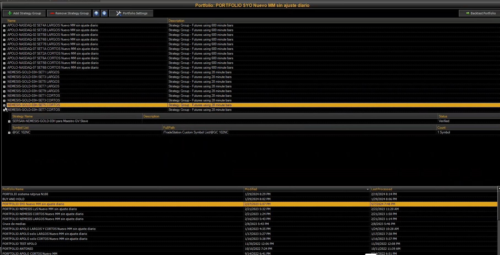
  <figcaption>Figura 058</figcaption>
</figure>

Os decía antes que habían varias maneras en el *money management* menos. He dicho algunas avanzadas y demás. También en *Maestro*, *Maestro* tiene incorporado un módulo de *money management* y *ranking*.

Cuando tienes el *Strategy Group*, yo cada *Strategy Group* le puedo asignar. Por ejemplo, teníamos éste de ruptura de acciones, vale. Le asignó un sistema. Le asignó pues unos, unas acciones. Y le puedo asignar una gestión monetaria, vale. Esto creo que está explicado. Se ha explicado. Básicamente está *Fixed Fractional* y *Fixed Amount per Price*, que viene a ser como una especie de delta.

<figure>
  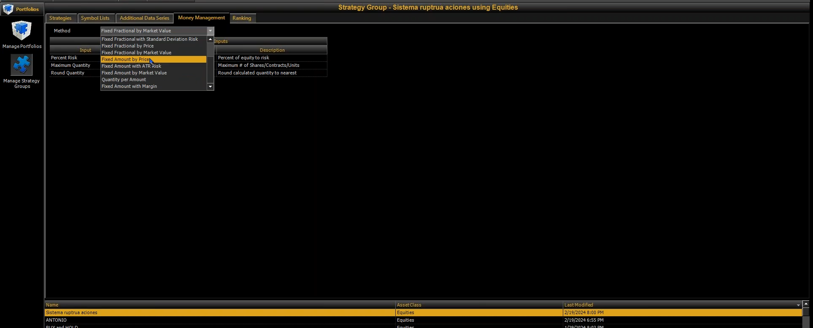
  <figcaption>Figura 059</figcaption>
</figure>

Entonces yo puedo aquí ya probar alguna cosa. Puedo ponerle una cantidad fija y demás, vale.

**Ranking para rotacionales**

Y luego esto del ranking, que es muy interesante. Para esto en línea con lo que hablaba antes no recuerdo quién de los rotacionales. 

<figure>
  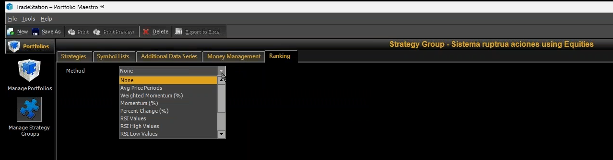
  <figcaption>Figura 060</figcaption>
</figure>

Yo aquí puedo elegir un ranqueo. Por ejemplo, por *performance*, por *percent change*, lo que sube el activo. Aquí se configura.

<figure>
  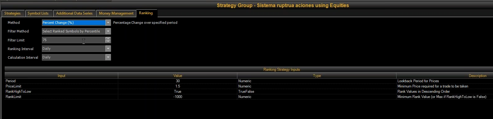
  <figcaption>Figura 061</figcaption>
</figure>

Esto, ya digo, puedes usar la ayuda o aquellos PDFs que os he dado os pueden ayudar, vale. Yo puedo decirle que coja un N número de activos sobre la lista. Imaginas que aquí tengo la lista del Nasdaq 100.

<figure>
  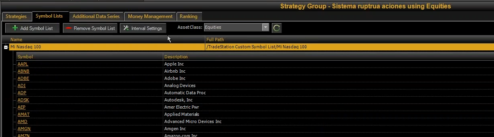
  <figcaption>Figura 062</figcaption>
</figure>

Pues yo puedo ranquear. 

<figure>
  
  <figcaption>Figura 061</figcaption>
</figure>

Esto es lo que, lo que hablábamos antes. Puede decir cada mes, o cada día de cada mes, por y por varios criterios.

<figure>
  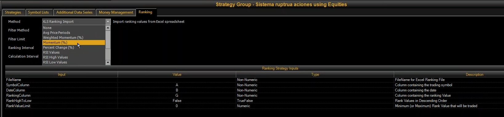
  <figcaption>Figura 063</figcaption>
</figure>

Se puede importar por un Excel que lo importas. Se puede hacer por varios criterios. Para los criterios, ya digo, no perdemos el tiempo porque es muy concreto. Quien lo quiera pues que lo explore. Al final simplemente que os explico lo que hace es ranquear.

Te permite elegir un número. Es otro sistema aparte del sistema que se encarga de elegir cuántas acciones normalmente, porque se hace más con acciones sobre una lista. Y le puedo poner todo el S&P 500, pero ***solo elige las 20 que cumplen ese determinado criterio***. Y cambiarlo cada mes. Es lo que es un rotacional.

Esto *Maestro* lo permite. Lo permite hacer. Y también tiene por código, como os decía antes, tiene alguno por código. Aquí esto lo usa el dato de *ranking* y tal, y lo puede elegir por código.

<h3>⚙️ Portfolio Maestro Allocate and Rebalancer (Ejecución)</h3>

<strong>Lógica de decisión:</strong>

<ul>
<li><strong>Si ranking > RankCutoff:</strong> El activo ya no está entre los mejores → Si tiene posición abierta, vende.</li>
<li><strong>Si ranking ≤ RankCutoff:</strong> El activo está entre los top → Calcula tamaño (Equity × AllocationPct / Precio) y compra si no tiene posición.</li>
</ul>

<strong>Resultado:</strong> Rotación automática: entra en los mejores rankeados, sale de los que caen del top, con sizing proporcional al equity del portfolio.

<figure>
  
  <figcaption>Figura 043</figcaption>
</figure>

Entonces un poco avanzado. Pero simplemente como antes lo había comentado alguien, lo tiene. El *ranking* y tiene *money management*.

Están ahí los PDFs. Luego también pues puedes recogir la ayuda de *Maestro* que también está más o menos. Aquí ver un poquito las, las distintas opciones. Esto está aquí en estrategygroup

<figure>
  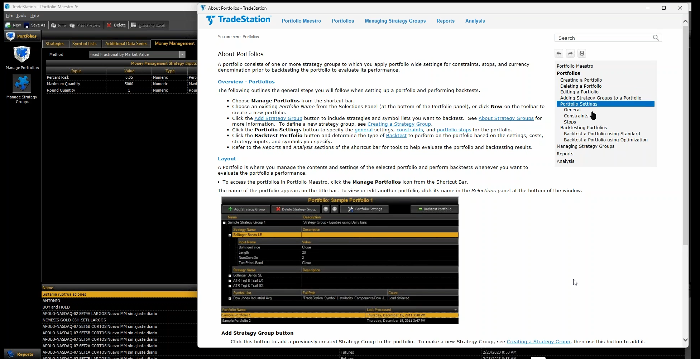
  <figcaption>Figura 064</figcaption>
</figure>

Pues es, por ejemplo, *money management*, aquí te las explica. Y también te es lo de el *ranking*. Ahora cuando lo vea, aquí está. Realmente, los PDFs aquí te explica un poco cómo funciona el *ranking*. Los cientos que hay. Como algunos de ejemplo, no están todos explicados, la mayoría así, vale.

# Construcción y gestión de portfolios

Ahí en ese documento que se ha pasado antes de Kaufman, fijaros que aborda el detalle de rebalancear o no rebalancear. Que no es exactamente esto que hablamos ahora, me refiero al nivel de los pesos de los *portfolios*. Ahí habéis visto en *Maestro*, por ejemplo, una lista, una cartera. Pero yo ahí no he rebalanceado. Si lo quiero rebalancear y quiero probar eso, lo debería haber hecho por código. No lo he hecho.

## Asignación de pesos iniciales

### Peso inicial de sistemas

En *Portfolio Trader* estoy un poco en la misma situación. Una cosa es montar un *portfolio* y ver a ver qué exposición le pongo, como puedo ver ahí por el *money management*. Pero yo tengo que tomar nuevamente una decisión que, aunque nadie creo que específicamente lo ha preguntado pero lo comento igual... es qué pesos doy de inicio, de acuerdo.

> Eso es una pregunta que frecuentemente se encuentra un trader. Y como siempre, como siempre hay varias posibles respuestas. Esa es una. Y luego rebalancear o no rebalancear, de acuerdo.

### Equal weighted por volatilidad

Al final recordar, ya os lo dije en la teoría y en algunos momentos de la práctica, lo más comentado también al ver el documento este que os decía de Kaufman, hablaba del *equal weighted*.

Al final nominal, por ejemplo, no deja de ser un *equal weighted*. Cuando hablamos de *equal weighted* es, la clave es por qué criterio se ***ecualiza***. Es decir, *equal weighted* es el mismo peso a cada uno. Pero el mismo peso ¿de qué? ¿De nominal? ¿Mismo peso es el mismo *stop*? ¿El mismo peso es el mismo dinero en bruto? ¿El mismo peso es el mismo riesgo por volatilidad?

Bueno, todo esto son respuestas posibles de la pregunta, de acuerdo. Respuestas posibles. Yo os puedo decir lo que a nosotros nos gusta más, de acuerdo. Que es como, que es lo mismo que hemos visto en el *money management*, ***por volatilidad***, de acuerdo. Es decir, *equal weighted* por volatilidad, vale.

Que si no recuerdo mal es lo que apuntaba también en este PDF.

- [THE PORTFOLIO RISK DILEMMA](../docs/THE%20PORTFOLIO%20RISK%20DILEMMA.pdf)

## Criterios para asignar capital inicial

### Múltiplo del drawdown

Bueno, no sé si así que no era. Que ese es el eso se ha recortado ya la parte es aquí.

Bueno, fijaros que hablaba de, hablaba del *portfolio*. Fijaros aquí, por ejemplo, que os dirá poco lo que decía el *portfolio*.

Y por ejemplo, un divisas, Nasdaq, no es repartido. No es repartido que revisa el *portfolio*. Es si, si él, él usaba volatilidad. Él usaba volatilidad para repartir.

Es decir, al final reparte el mismo peso pero por volatilidad. Es decir, al final, ¿cómo haces eso? Pues como lo hacemos nosotros, metiéndolo el *risk*, o sea, el componente *risk*. Al final, por eso decimos que el *money management* y el *portfolio* van totalmente conectados. Y acordaros que yo os decía, maneras de controlar el riesgo: otra exposición y otra diversificación.

- Exposición → *money management*
- Diversificación → *portfolio*

Pero van conectados. Porque yo al final decido con el *money management* la exposición de cada sistema. Pero luego también lo tengo que decir a vía de *portfolio*.

Por eso os decía el *portfolio* al final es lo mismo como sistema. Y al final de un sistema analizo las métricas, analizo la gestión monetaria. Pues lo mismo pasa en el *portfolio*. Y al final lo tengo que llevar a una plataforma, sea MSA, sea *Maestro*, sea *Portfolio Trader*, que las tres las habéis visto. Y ahí analizar en conjunto los datos que obtengo.

**Criterio de capital inicial, múltiplo del drawdown**

Pero es verdad que tengo que tomar alguna decisión que es la de inicio que os decía. En caso de duda, podéis recurrir al clásico pero no por ello menos útil: múltiplo del *drawdown*, de acuerdo. Este es un criterio bastante conocido y cómodo, y es útil y práctico y es eficiente para decidir el capital a asignar a un sistema.

Si yo tengo un sistema que tiene un *drawdown* de 10.000 euros, pues yo sé que una manera típica que se puede repartir el capital inicial es dos veces el *drawdown* más las garantías. Aquí cuidado. Más que deciros dos veces, os digo N veces. N veces. Porque depende mucho de qué *drawdown* hablemos. Si hablamos de un *drawdown* de operativa real, hablamos de un *drawdown* del sistema optimizado, hablamos del *drawdown* de Montecarlo. Claro, entonces depende. Un *drawdown* de Montecarlo, pues probablemente no hace falta ya darle mucho más margen. Si no proviene de unos datos sobreoptimizados.

Pero ahí todo, todo ya dependerá de nuestra calidad de procesos, de nuestro rigor en el análisis, de la robustez. En todo esto que si yo presento datos muy sobreoptimizados, me estoy haciendo trampas al solitario. Y al final pues el *drawdown* va a ser mentira. A lo mejor lo multiplico por dos y hasta es poco. Entonces ahí ya depende un poco, por eso decimos N veces el *drawdown*. Puede ser una, ser dos. Entonces es un criterio que es útil, clásico, pero que es muy, muy funcional para iniciar el *portfolio*, para iniciar el *portfolio*. Es decir, yo asigno capital de esa manera.

### Asignación por volatilidad

Otra manera, no mala, es simplemente por volatilidad. Es decir, el que hemos hecho nosotros en *Maestro*: simplemente yo asigno un porcentaje repartido por familia de sistema. Y luego entre familias los reparto a partes iguales. Lo puedo repartir a partes iguales. Pero cada uno ya ecualiza, esa parte igual es por unidad de riesgo. El cálculo por el que saca los lotes depende de la volatilidad. Pero como todos utilizan el mismo, todos utilizan el mismo ratio volatilidad con límites mínimos y máximos, pues de esa manera yo ya ecualizo bien el *portfolio*.

Esta es una respuesta que os puedo dar a cómo empezar.

## Métricas de portfolio

Luego a nivel de análisis de métricas, bueno, aquí un poco aplica lo mismo que el sistema. Recordaros que os hablé en el *portfolio*, os hablé de la teoría de carteras. Os hablé de la teoría que es también conocida como media-varianza, la teoría clásica de carteras, de donde proviene *Sharpe*. Eso es la teoría media-varianza. Y hablamos también de la teoría posmoderna, que era tema de *Sortino*, el *upside ratio*, que también hice un vídeo ahí bastante extenso. Toda esa parte, partes densas que recomiendo verlas varias veces.

Y ahí pues hablamos también del VaR, del C-VaR. El tema del VaR, C-VaR es tremendamente útil. A mí me gusta mucho. Pero más que no hay muchas plataformas que lo extraigan directamente. O sea, que ya te lo den. Entonces al final ya entramos en complejidad de cálculo. Yo os lo enseñé en Excel porque nosotros cuando lo calculamos, lo que hablamos que realmente no nos lo dan, no nos lo dan ni *Maestro*. Al final los que uséis Python, pues perfectamente calculártelo, vale. Y yo os lo recomiendo. Recomiendo calcularos el C-VaR. Aquellos que, como os digo, trabajéis vía Python, os recomiendo trabajar el C-VaR y trabajar con esas estimaciones.

### Sortino como alternativa

*Portfolio* lo que os digo igual, pero medir el análisis, el *fitness*, la función objetivo que yo puedo analizar, puedo usar C-VaR. Si no, podemos seguir con *Sortino* o incluso con *Sharpe*. No es ninguna aberración.

A mí, sobre todo a nivel de *portfolio*, a mí me gusta más *Sortino*. Ya lo dije. No es ninguna aberración. Más que tiene sus defectos y que es verdad que los retornos no están normalmente distribuidos. Ya lo sabemos y demás.

Pero al final, para hacer una comparación de volatilidad, no es absurdo. Porque es verdad que sabemos que muchas veces la volatilidad al alza acaba devolviendo, de acuerdo. Pero es verdad que eso viene mucho de los activos clásicos. Porque en una cartera diversificada no tiene por qué, vale. Pero de ahí, de ahí *plora la criatura* que decimos en catalán, de ese concepto de que lo que sube mucho luego también baja, ¿no?

Por eso al final considera la volatilidad buena y mala toda. En cambio *Sortino* considera la volatilidad mala solo la parte baja. Solo la parte baja. Pero el *Sortino* lo vais a obtener fácilmente. Y es un muy buen ratio. Es un muy buen ratio. También el *Ulcer Index* también. Y el *Performance Index* es el que usa él, vale.

## Rebalanceo de portfolios

Entonces a nivel de *fitness*, podéis trabajar perfectamente con estos. Luego el tercer elemento que es importante en el tema de *portfolio*, es lo que decía aquí de Kaufman, si es rebalancear o no rebalancear.

- [50 YEARS ON WHAT HAVE I LEARNED](../docs/50%20YEARS%20ON%20WHAT%20HAVE%20I%20LEARNED.pdf)

Lo normal es rebalancear. Eso es evidente. Por el mismo motivo que hablamos que los activos, no es lo mismo un NASDAQ a 5000 que a 15000. Al final los *portfolios* son dinámicos, se mueven. Y igual que revisas los sistemas, pues revisas el *portfolio*, eso es rebalancear. ¿Cuándo se rebalancea? Tampoco hay una respuesta única, de acuerdo. Yo esto creo ya lo contesté un día creo en el Discord. Nosotros solemos hacerlo una vez al año, si no se hace antes porque se revisa el *portfolio*.

Entonces ahora, por ejemplo, vamos a hacer una revisión completa del *portfolio*, que llevará pues el tiempo que lleve. Y pues lógicamente se rebalancea. Entonces porque al final, si lo que haces no tienes que rebalancear, es evidente. Pero aún así, si no se da el caso, yo recomiendo hacerlo por calendario.

**Rebalanceo por calendario**

Aquí también entran factores. Nuevamente, como os digo muchas veces, en nuestro caso, que no tiene por qué ser el vuestro de entrada, pero ojalá lo sea de un tiempo, o incluso puede que de alguien ya lo sea, algo de cero, lo que sea. Claro, no es lo mismo bajar tu cuenta que trabajar cuentas gestionadas o para otras personas. Que entran muchos factores distintos. Y a veces pues tienes que hacer una mezcla entre lo que quieres y lo que puedes. No como es nuestro *portfolio*.

Entonces aquí puede pasar, por ejemplo, por términos de regulador, que yo esté obligado a tener un nivel de VaR. En este caso no lo llevan ellos. Pero si yo, no lo llevan ellos, yo estaría obligado. Nosotros en el fondo que teníamos con que gestionaba yo, de Esfera, que la verdad que iba bastante bien, tuvimos problemas de lanzamiento porque muchos eran problemas técnicos. Pero la verdad que llevamos ya un año muy bueno cuando paramos. Y fue lástima. Pero bueno, así fue, el mercado quebró y se lo quedó Andbank. Y Andbank no quiso seguir el proyecto y hubo que cerrarlo. Pero la verdad que estaba ya muy bien. Con diversificación muy buena. Teníamos, operamos, yo qué sé, Bund, S&P, Nasdaq, petróleo, oro. Y teníamos ya preparados más cosas realmente.

**Control de VaR**

Pero ahí sí que teníamos un objetivo de VaR que había que controlar. Pues ahí pues tienes que controlarlo. Y pues hay que, mediante tu Excel y demás, pues vas viendo cuál es tu objetivo de VaR. Y cuando te desvías una tolerancia, pues tienes que ajustar. Puedes tener criterios pues bien por el regulador porque te los impone, bien porque tu cliente te los impone, bien porque lo que sea, distintos criterios exigidos por un condicionante, un condicionante.

Entonces si no, también en este caso, que estás obligado a controlar la volatilidad cada x tiempo, cada mes, cada vez. Si no, calendario suele ir bien, ¿entendéis? Decir, lo que decimos siempre, tiene un equilibrio entre práctica, recursos, tiempo que dedico. Los recursos no son infinitos. Y por lo tanto hay que dedicarlos a las cosas que son más productivas.

Normalmente tener una revisión del *portfolio* por calendario va a dar un resultado que quieres. Hacerlo cada trimestre, que quieres hacerlo cada mes, normalmente va a ser demasiado. Que tengas estrategias muy sensibles muy intradía pues todas igual, pues sí. Pero normalmente no te va a hacer falta cada mes revisar el *portfolio*. Aunque se haya desviado un poco, que al final tienes que tener una tolerancia.

Imagínate que tú decidieras mantener un nivel de volatilidad en el *portfolio* máximo de un 10%, que nunca la volatilidad, la desviación estándar, vale, simplemente el *portfolio* supera el 10%. Te pongas ese criterio. ¿Dónde revisarías? Al menos al 12 por ciento. Tienes un momento al 12% luego que vuelve a bajar. Tienes unas tolerancias, de acuerdo. Unas tolerancias.

**Nominal y exposición**

Entonces ahí hay distintos valores que tú puedes elegir. Lo que te decía, por ejemplo, también en la gestión. Tú vas por nominal, pues sabes que no te puedes pasar el 100 por ciento. Es sagrado y no puedes pasar ni un día. Entonces cada día tienes que medir que no te pases el 100% de exposición. Entonces depende. Pero por condiciones normales, un ratio de calendario, un criterio calendario está bien. Y no hace falta ni tan solo estar tan pendiente por vosotros. Decir, si está bien diversificado y bien dimensionado, es normal. Como habéis visto ahí en el gráfico, que él solo ya se autoajusta. No hay desviaciones. El mismo, el de volatilidad. Si tienes un método de gestión monetaria que controla volatilidad, el mismo ya se autoajusta. Tienes esta comodidad que prácticamente no se te va a desviar.

Lo puedes revisar a nivel de calendario. Pero casi es más por la revisión de los sistemas que por el propio *portfolio*. Porque los pesos, si el propio *money management* ya se autoajusta. Como habéis visto en el *Maestro*, quedaba era muy estable arriba la exposición. Pues ya está. Ya lo hace de manera automática.

No hace falta mucho, mucho más. Pero si no, ya os digo, yo recomiendo que de verdad una vez al año, no os volváis locos. Porque vais a ganar poco por estar ahí. Porque encima hay muchas dudas sobre el rendimiento exacto del *portfolio* mejor.

## La frontera eficiente y sus limitaciones

O sea, es muy claro en el *backtest* cuál va a ser mejor. Pero de elegir un peso u otro, hay mucha confusión. La frontera eficiente, muchos autores, entre ellos yo mismo, dicen que no acaba de funcionar. Que es el método clásico de media-varianza. Aquellos que hayáis estudiado teoría de carteras, es la frontera eficiente. ¿Qué es una frontera eficiente? Es decir, elegir aquel *portfolio* que da una mejor rentabilidad para misma unidad de riesgo. Es el concepto lógico que suena de puta madre, que es súper académico. La universidad te verán esto, le dices que lo haga, él te lo hará muy bien en un papel. El problema es que luego lo mirarás un año después y no habrá pasado lo que preveía que pasaría. Ese es el problema.

Entonces al final es muy difícil que cuando participan varios elementos de la cartera, o sea, ya no sobreoptimizar un sistema por sí mismo. Pero en este caso cuando tú metes varias estrategias entre sí, ver que los retornos se distribuyen de la misma manera que es lo que estás previendo, no es nada fácil. Es nada fácil. Y por lo tanto es complicado elegir mix.

**Recomendación: equal weighted por volatilidad**

Por eso al final lo mejor es elegir estrategias, como os digo, que sean buenas, robustas. No meter por meter. Mejor meter tres buenos que seis regulares, ¿me entiendes? Y *equal weighted* por volatilidad. Ajustar volatilidades que no se os vaya la volatilidad de madre.

Y ya está. Y si el propio *money management* ya controla la volatilidad, ya el *portfolio* va a estar ajustado bien. Una señal de aviso por alguna desviación. Y si no, una vez al año revisamos, revisamos. Que esté todo igual que lo normal es que sí, vale.

Que luego lo vas a optimizar, vas a tener un programa de *portfolio*, sin lo va a utilizar. Te va a decir sí, mira, mejor este un peso de 0.7 y este 0.2 y este 0.4 y hubieran ganado un 30% más. Vale. Muy bien. Bueno. Probarlo. Si al final no tiene, no tiene, no tiene tampoco ningún problema hacerlo.

Pero lo normal es que sea similar.

**Límites mínimos y máximos**

Siempre primar diversificación en cualquier caso. Lo que sí que os digo, en caso de que entréis en ese proceso de optimización de *portfolios* que hay programas que lo hacen, sobre todo, sobre todo, sobre todo mi consejo es que diseñéis todo siempre limitando mínimos y máximos.

Es decir, no permitáis que por el algoritmo, la función *fitness* que sea que le pongáis, ponga 0 a uno y mucho a otro. Tiene que pasar por delante la diversificación, y la diversificación pasa porque todo opere. Pero el único criterio para no operar es porque algún sistema, que nosotros no lo hacemos, ya diseñamos pensando que pueda operar siempre. Pero hay autores que lo hacen. Es decir, que puedan parar un sistema. Es decir, por exceso de volatilidad lo para. Si está estudiado así, es correcto. No es malo. Si tú ya lo estudias el sistema así, yo cuando la volatilidad es tanto se me separa, se ha analizado, se ha diseñado así, perfecto. Nosotros preferimos que opere siempre. Aunque a lo mejor en ese momento pues opere el mínimo posible, un lote.

En el caso de si por tamaño de tu cuenta, un lote es demasiado, pues a lo mejor es mejor pararlo.

## Portfolio Trader

Tenemos algunos *portfolios* de ejemplo. Tenemos un algo que francamente entra casi en el terreno de lo paranormal.

<figure>
  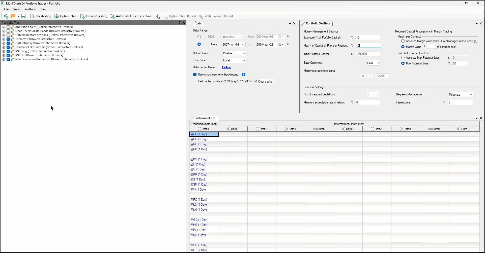
  <figcaption>Figura 066</figcaption>
</figure>

Ahora encima me pierde 10.000. Sólo Alberto. Vamos mejorando, vamos mejorando. Porque pero bueno, que viene muy bien a efectos de lo que queremos enseñaros. Porque aquí ha bajado la exposición. Ahora, ahora tengo la exposición un poco recortada.

**Ventajas de MultiCharts**

<figure>
  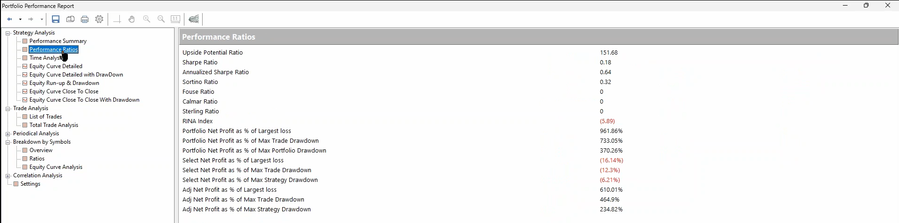
  <figcaption>Figura 067</figcaption>
</figure>

*MultiCharts* tiene cosas muy buenas a nivel de *portfolio*. Es mucho más eficiente.

Permite además enseñar un *portfolio*, luego operarlo. Está muy bien, de acuerdo. Permite hacer *backtest* incluso optimizar, hacer *forward testing*. También en teoría *Maestro*. Pero la práctica no por lento. Y como os digo, permite automatizar la operativa. Ya optimizar y luego ponerlo automatizar, directamente la ejecución, que es configurar lo demás. Pero lo puedes configurar para operar 

por lo demás A mí esto parece bastante rudimental y bastante pobre. Hay una página de ayuda y los que lo uséis que explica un poco todo esto. Lo explica regular, pero bueno, ahí está.

**Palabras reservadas de portfolio en MultiCharts**

Y también lo que os decía antes, para aquellos que tengáis más, poco más de desperté de conocimiento programación y demás, pues saber que también hay palabras reservadas de *portfolio*. Lo que os decía también para lo, para las propiedades, para las propiedades, margen, cintas opciones. Y también para el estado de simposición, de acuerdo.

<figure>
  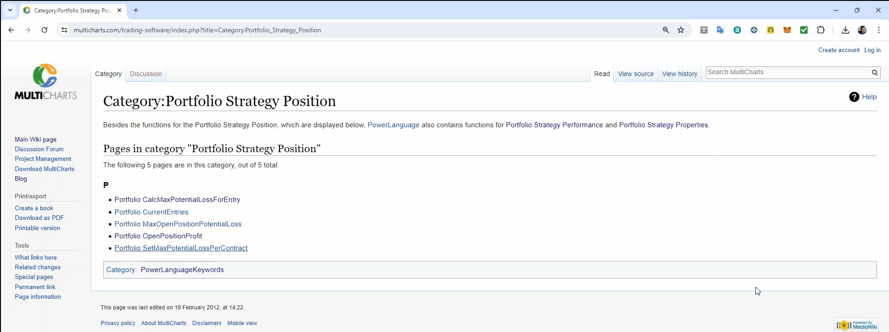
  <figcaption>Figura 068</figcaption>
</figure>

Pues. Y como no, pues el *Open Position Profit* de *Portfolio*, el *Net Profit* del *Portfolio*, que es quizá lo más, lo más interesante, lo más interesante. Para aquellos que lo quieran, esto está, está, está explicado. Ya que lo quiera usar pues que lo sepa.

**Configuración del portfolio de ejemplo**

Nosotros en este *portfolio* no lo hemos usado. Va todo con las definiciones generales del programa que están aquí. Esto no sé por qué, porque a mí todo lo pero paso. Y ya está. Que no, tenéis un poco, poco explicado.

Simplemente, simplemente un par de aclaraciones. aquí tú le puedes fijar unos límites de cuánto capital del *portfolio*, cuánto le dedicas a cada posición.

<figure>
  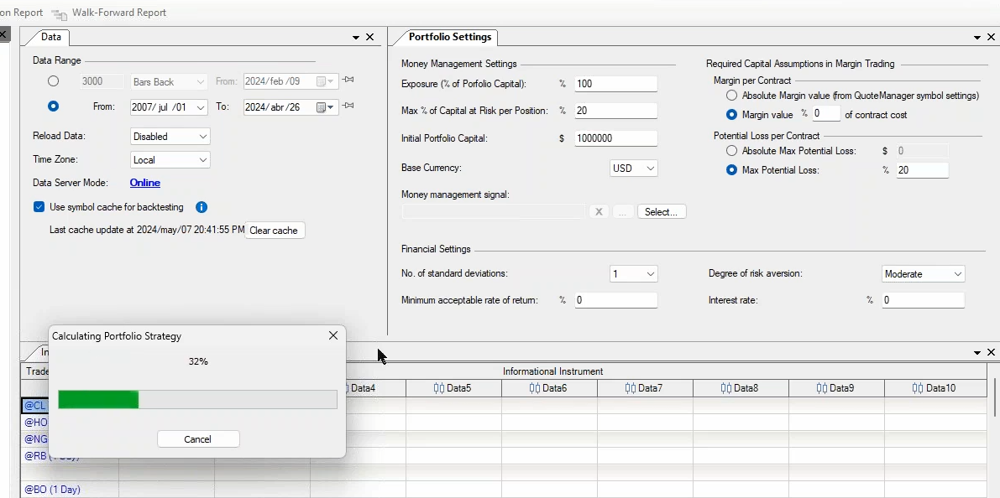
  <figcaption>Figura 069</figcaption>
</figure>

Pero eso al final actúa de límite. No quiere decir que uses eso. Al final tú el *money management* lo vienes fijado por el sistema. También lo puedes cargar aquí como una señal. Nosotros lo tenemos ya puesto en el sistema. Por lo tanto, es el que cuenta. Esto actúa de límite, ¿entiendes? Decir, si, si el *money management* del sistema pasara ese límite, no entraría. Pero lo normal es que ya tuvo con el que tienes implementado en el sistema ya lo tengas calculado. A cada, cada uno una parte. Y está, ¿entiendes? Es un poco la idea.

**Sistemas del portfolio**

<figure>
  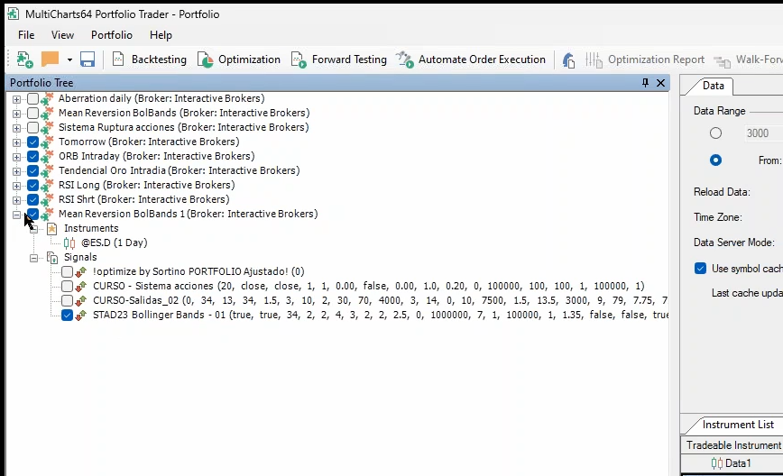
  <figcaption>Figura 070</figcaption>
</figure>

Aquí hemos puesto algunos de los temas que hemos visto. Sin más, no nos hemos vuelto muy locos. Hay *Bollinger Bands* en este caso, en el mismo version de *Bollinger Bands* que eran si se más. La mayoría no todos son muy justos. Hay un RSI short y un RSI long, que esto es del RSI de *breakout* con salidas. Pero bueno, viene, viene de la, es parecido a las salidas. En las salidas hay un RSI. El tendencial que hicimos intradía. El ORB intradía que eran todos bastante justitos. El *Tomorrow*, que no quise un poco mejor.

Es decir, hay unos cuantos de los que hemos, de los que hemos visto, de acuerdo.

<figure>
  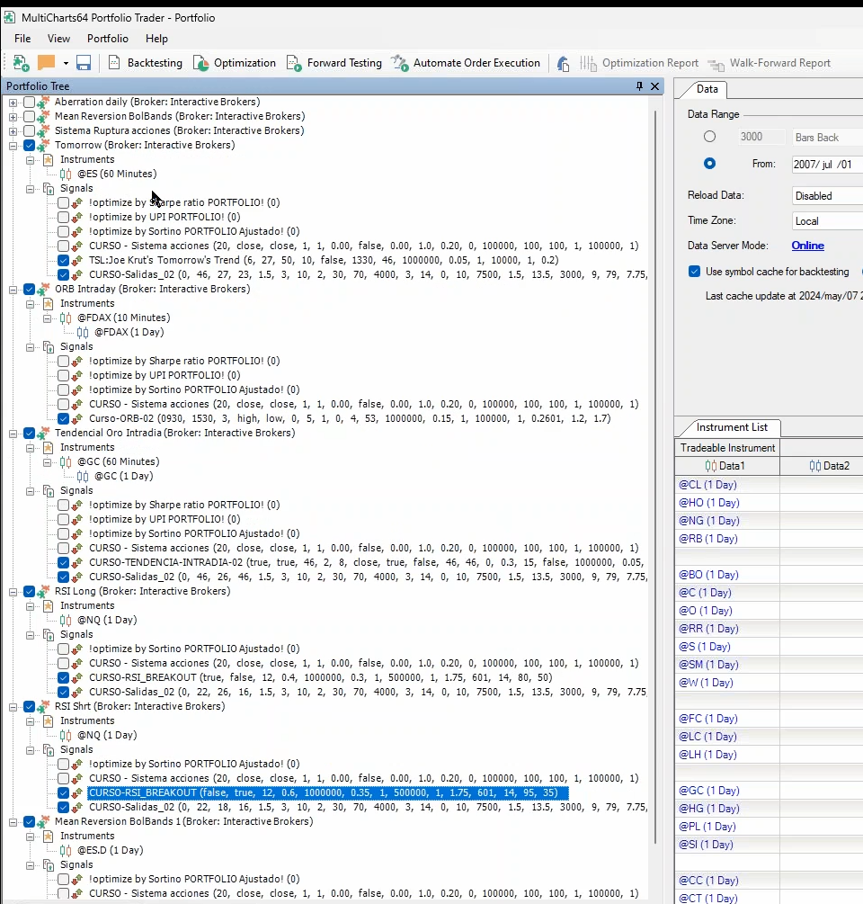
  <figcaption>Figura 071</figcaption>
</figure>

Y está hecho expresamente, de acuerdo. Está hecho expresamente para que veáis que incluso con una mezcla de sistemas bastante pobres, se puede conseguir una curva estable.

<figure>
  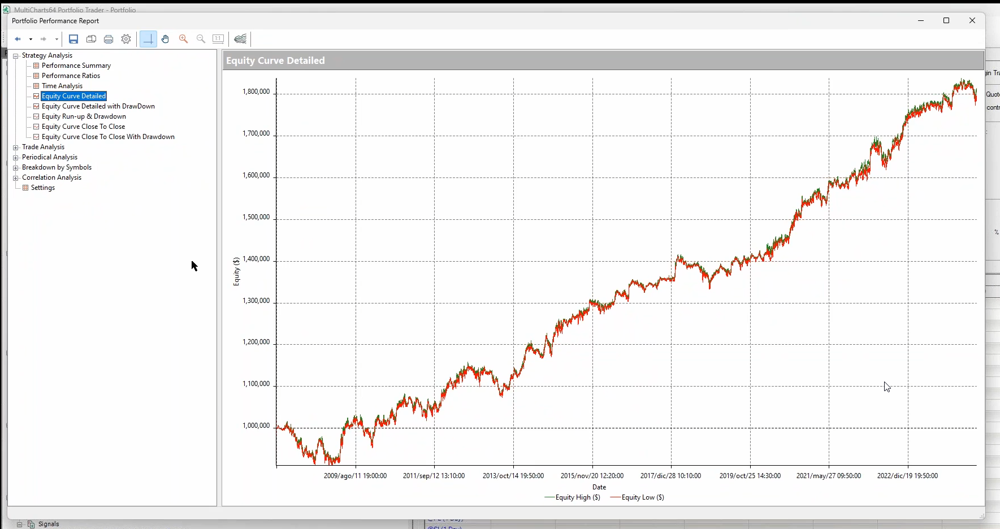
  <figcaption>Figura 072</figcaption>
</figure>

**Demostración del efecto diversificación**

Esto, como ya os comenté cuando los íbamos haciendo, os dije que lo veríais. Que es así, por lo veríais. Que es así. Porque es que es así. Si realmente son sistemas distintos que descorrelacionan activos, prácticamente es imposible que no lo sea. Es imposible que no, que no lo sea.

Aquí además pasa una curiosidad porque Alberto del DAX le gana. Y no hemos conseguido entender por qué Aquí pierde. Incluso tenemos un sistema que pierde dinero, también como habéis, habéis visto antes.

<figure>
  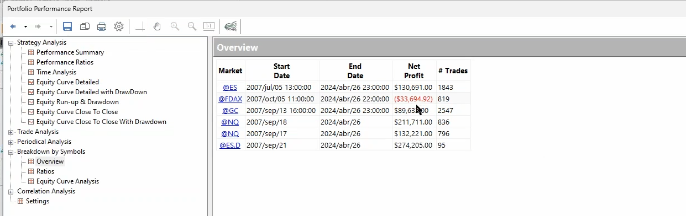
  <figcaption>Figura 073</figcaption>
</figure>

Del DAX, Alberto le gana. No, no hemos conseguido está guardado igual no entiendo. Es un fenómeno como os digo que está alcanzando casi lo paranormal. Porque no entendemos esto de igual mismo proveedor de datos. No los hemos bajado el caché de datos. No se ve el problema con los datos. No sé si nos está escapando algo es evidente. Pero es que está guardado en su ordenador, y yo abierto aquí. Pero bueno. 

Aquí lo que os decía antes de los programas. Todos tienen sus buenas y malas.

<figure>
  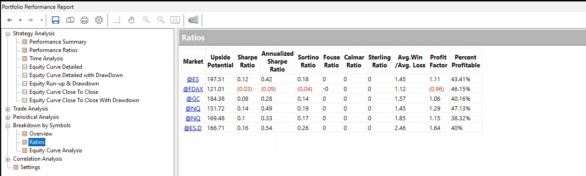
  <figcaption>Figura 074</figcaption>
</figure>

**Portfolio Trader vs Maestro**

*Portfolio Trader* en global es mucho mejor que *Maestro*. Simplemente por, por su eficiencia. Pero es, y porque puede operar. Pero es verdad que a eso tiene gráficos muy chulos. Pero ya digo, este es tema de poder operar es muy potente. Aquí, fijaros que obtenemos ratios por cada sistema. Eso está, está realmente bien.

Y te da también lo que decíamos antes, vale.

**Correlaciones en Portfolio Trader**

Pero ahí está. No es que no tiene sentido, no tiene sentido, no tiene sentido.

<figure>
  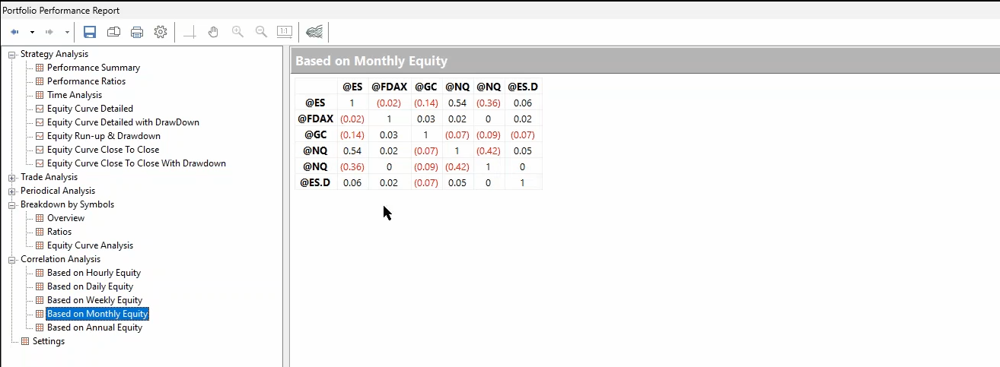
  <figcaption>Figura 075</figcaption>
</figure>

Que tenéis ver las correlaciones en base a todos. Fijaros que sólo el Nasdaq con el S&P. En este caso lo hace por símbolos. Ahí, por ejemplo, en *MultiCharts* te deja verlo por *Strategy Group*, que está muy bien. Que al final puedes hacerlo por estrategia. Aquí te lo dice por activos, porque al final es verdad que tiene 1, 2, 3, 4, 5, 6 que en realidad son sistemas. Que fijaros que el Nasdaq que se ha repetido, porque el sistema, el sistema, realidad el *portfolio* donde lo tengo es aquí debajo.

Es 1, 2. El primero es en el S&P 60, segundo DAX diario, oro 60 en Nasdaq diario, Nasdaq diario.

<figure>
  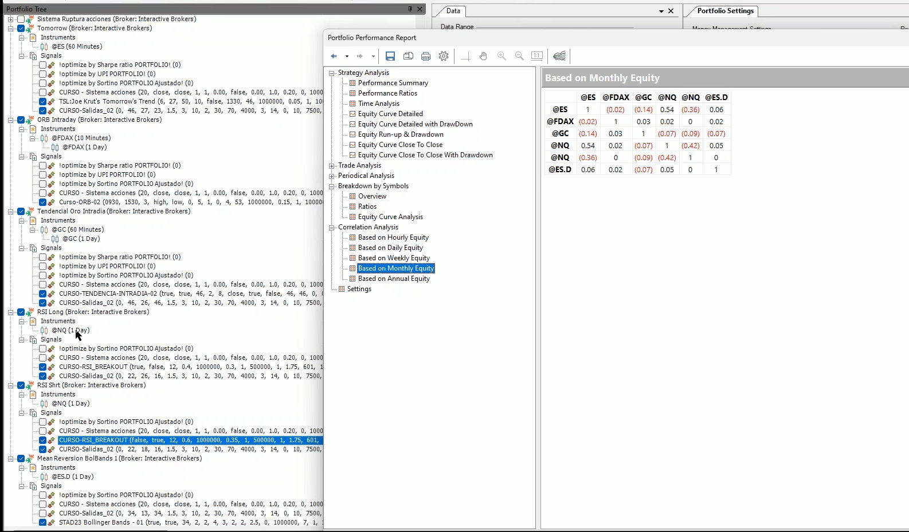
  <figcaption>Figura 076</figcaption>
</figure>

Esos son los dos Nasdaq. Se está ordenando. Esto es *Tomorrow*, esto es ORB entraría, esto es tendencia al oro entraría. Esto es RSI long, esto es RSI short. Que son los dos en el Nasdaq.

**Correlaciones entre estrategias**

Fijaros que, fijaros que el Nasdaq RSI long tiene 0.5 con *Tomorrow*, que los dos van largos. Eso que os decía. Siendo activos con mucha correlación, pero los dos tendenciales tienen 0.5, que es bastante, que es bastante. Pero oye, siendo los dos largos y los dos de activos con mucha correlación, tampoco está mal del todo.

Pero fijaros del resto, donde todos están en cero prácticamente. Es decir, estamos explicando muy bien. Porque son muy distintos, muy distintos. Porque tenemos un S&P diario con las dos Daenas de diario. Pero luego tenemos un S&P en 60 que va más bien en tendencia. Porque *Tomorrow* es más bien casi tendencia.

En cambio, el otro S&P es muy *mean reversion* con lo cuanto es que tenemos los dos S&Ps SD con tenemos 0.06. Siendo el mismo activo. lo hemos montado un poco para que veáis este tipo de cosas.

Cada uno lo hemos montado pensando en que veáis una cosa.

Es aquí veis el mismo activo y tienen 0.06. Porque tienen sistemas muy distintos, y te hay *frame* distinto incluso. El DAX, fijaros, con el, con Nasdaq y con S&P casi tiene cero. Con todos. Y oro pues prácticamente con todos, con todos cero. Prácticamente con todos tiene cero. Y DAX, da y da casi también siendo bolsa también. Porque, porque el DAX estamos hablando de uno ORB 10 minutos. No tiene que ver con por mucho que sea S&P y Nasdaq, activos que tienen mucha correlación entre sí. Tienen cero.

Porque?, porque la mejor diversificación es por sistema. si el sistema es parecido, como pasa en Nasdaq, S&P, pues da 0.5 que aún así es, no, no es mala. Y no pasa nada que haya uno sí. Pero lógicamente pues mejor que no.

**Diversificación por sistema**

Está realmente bien. Aquí podéis ver un poco la diversificación.

<figure>
  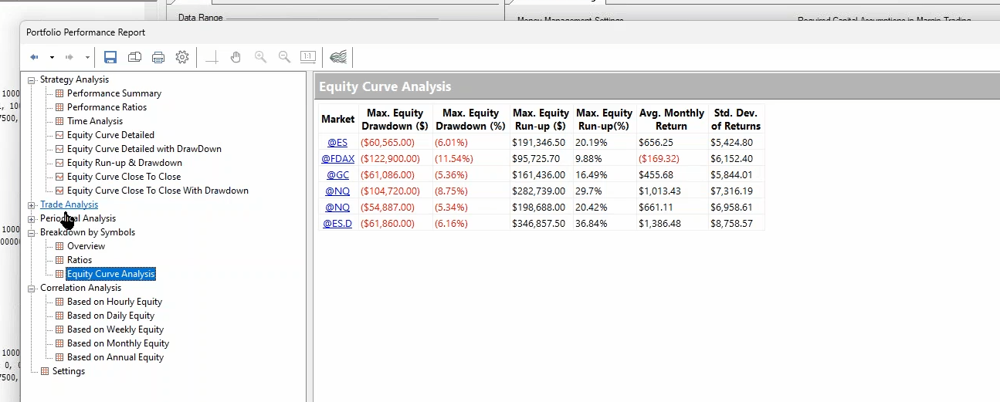
  <figcaption>Figura 077</figcaption>
</figure>

Esto está también con nuestro ratio de gestión monetaria. Y al final aquí, por ejemplo, está falta ese gráfico, gráfico de exposición. En la exposición me acuerdo se veis aquí en el *Tech Analysis*. Pues ves que va a 1, 2 lotes, 3, va moviéndose por eso, porque va variando por base a la volatilidad.

<figure>
  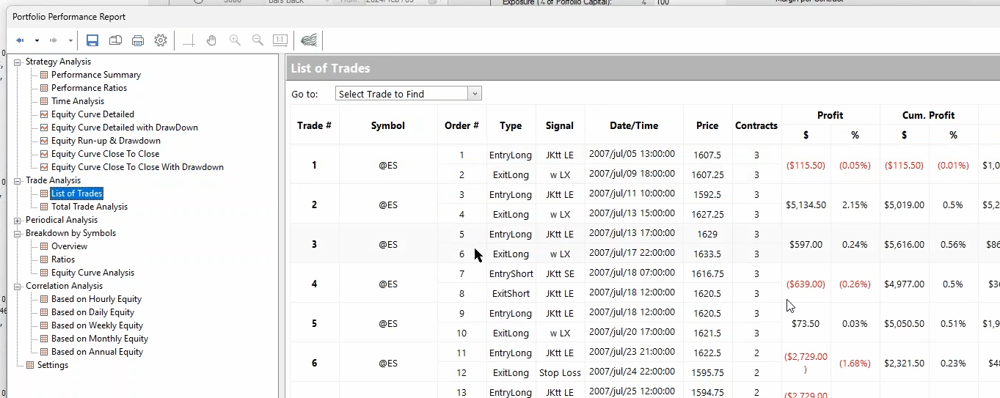
  <figcaption>Figura 078</figcaption>
</figure>

Al final es veríais lo mismo que el *Maestro*, porque es el mismo. Va capando. Pasa que aquí como hay menos capital, realmente al final cuando va creciendo acaba operando uno. Porque el valor del nominal se hace muy alto. de todas maneras, seguramente lo puedo mitigar. Bueno, le puedo añadir.

**Prueba con Portfolio Net Profit**

Si le pongo aquí `Initial Protfolio Capital` que vaya al límite que uso del algoritmo. Puedo poner un 0 más. Lo que pasa que he quedado como en el sistema está capado. No va a ir, no va a hacer nada. No va a hacer nada. Porque manda el sistema. Y el sistema tiene un multiplicador.

Si yo aquí en vez de usar el *equity* del sistema, como hacemos también el *Maestro*, vale. Yo hubiera usado en cada sistema, ¿entendéis? En vez de usar el *Net Profit*, *Portfolio Net Profit*, ¿entendéis? Hubiera usado *Portfolio Net Profit*.

Entonces sí que ahora al mover el capital, esto movería. Ves, no se ha movido que da igual. Porque aunque yo le aumento el *portfolio* y le aumentó estos límites, yo tengo un cálculo en el sistema que se acordáis para que lo veáis en cualquiera.

Este aquí al final pues acaba usando lo que ya sabéis. 

<figure>
  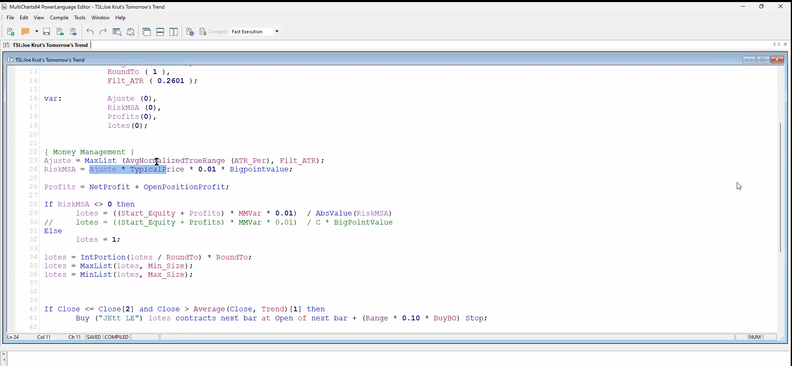
  <figcaption>Figura 079</figcaption>
</figure>

Es que MSA con ese ajuste normalizada, tal, tal, tal. Pero al final que tiene un *Net Profit*. Y no puede ser un *profit* que depende del valor que tiene el propio sistema, de acuerdo. Por lo tanto tiene un capital y asignado, ¿entendéis?

**Diferencia con Portfolio Net Profit**

Que pero realmente si yo no, si yo ahí en vez de usar *Net Profit*, hubiera usado el *profit* del *portfolio*, 

<figure>
  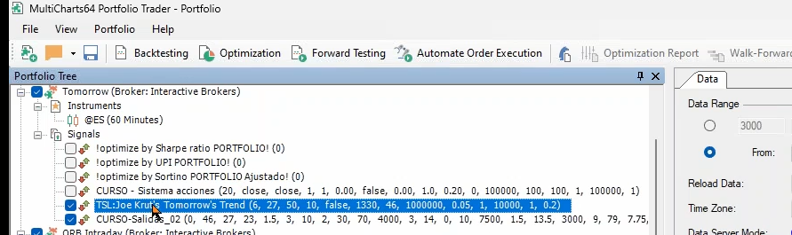
  <figcaption>Figura 080</figcaption>
</figure>

yo ahora al mover este importe  `Initial Protfolio Capital` , hubiera movido todos los sistemas, ¿entendéis? Ahí. Entonces por eso puede venir bien, puede venir bien adentrarse un poco en esto. Que no es muy complicado tampoco. Son cuatro o cinco palabras. Simplemente es eso. Yo le pongo aquí en el codigo *Portfolio el Profit*. Y punto. Y esto, en principio, cambia.

**Conclusiones del ejemplo**

Bien. La otra cosa quería, en todo caso, insisto igual al final. Quería enseñaros era, era esto, de acuerdo. La mezcla de distintas estrategias.

Hemos dicho cómo partir del capital inicial. Y que vierais aquí simplemente pues que consigues curvas, puedes conseguir curvas estables simplemente diversificando por estrategias bastante cómodas.

<figure>
  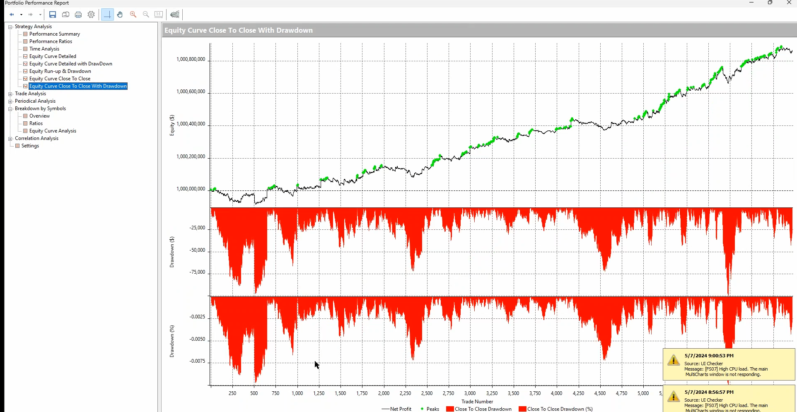
  <figcaption>Figura 081</figcaption>
</figure>

Aquí el sistema para quien lo ha visto gana poco.
Ahora aquí esta vez tiene un 5 por ciento. Pero tiene un 845 de retort sobre el máximo de lo que está bastante bien.

<figure>
  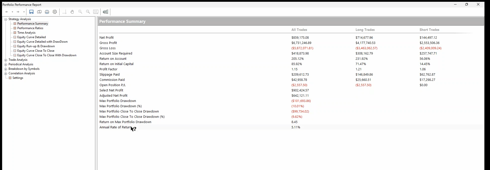
  <figcaption>Figura 082</figcaption>
</figure>

Al final el *drawdown* máximo que tiene y caros que es un 8. Aquí en el inicio está mal dimensionado en realidad.

<figure>
  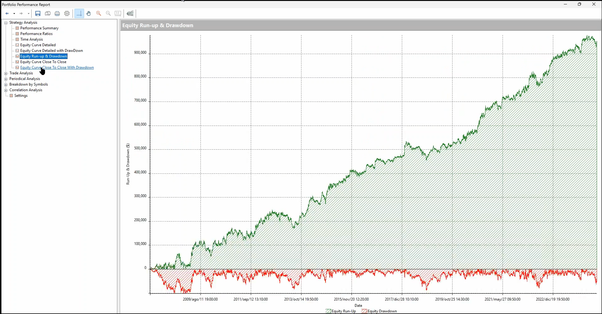
  <figcaption>Figura 083</figcaption>
</figure>

Porque tiene el problema del apalancamiento asimétrico. Por eso deberíamos haberle puesto mucho más capital.
Por eso cuando los vamos a hacer eso, porque ése es el problema.  Cuando lo hagáis, a menos lo recomiendo hacer. Aunque penséis que no es realista, si queréis ver un poco cómo se mueve realmente el comportamiento de cada estrategia. Dimensionar a más de lo que operaréis. Luego ya lo probaréis también con el que operaréis.

Pero esto, esto que veis aquí, todo el rato operando un contrato genera muchos problemas.

<figure>
  
  <figcaption>Figura 078</figcaption>
</figure>

Porque al final cuando salta de 1 a 2, dobla el riesgo. Si este *trade* lo falla, está expuesto el doble que el anterior. Entonces ese problema del apalancamiento que llamamos asimétrico, que luego subir y bajar no es igual. Entonces cuando hay muy pocos contratos, un poco cuenta, tienes ese problema en futuros.

**Recomendación: empezar con mínimo 2**

Así que sí que es verdad que es mejor si puedes, problema, pero es que no hay más remedio. sí que es verdad que es útil que al menos empiece como mínimo con 2. Porque ya de 2 a 3 el salto es menor que de 1 a 2 Entonces al menos. Pero es que no puede ser hoy, es no puede ser, pues no puede ser. Bueno. Hablamos de lo ideal y como lo que puedes y lo que quieres y todo eso, no.

Pero por eso os digo que aquí no se aprecia es el, el *drawdown* abajo. Porque el capital ha ido subiendo. Las cuentas, el S&P, todo ha ido subiendo.

Acordaros que también se tiene en cuenta el nominal. Y por lo tanto no se puede exponer más. No le da tiempo a saltar a más contratos. Por eso parece que esté muy poco expuesto que tenga menos nada. Si eso estuviera igual todo en 10, 12, 15 contratos, seguramente del lado abajo sería más estable, ¿se entiende verdad?

<figure>
  
  <figcaption>Figura 081</figcaption>
</figure>

**Reducir exposición por drawdown**

Ya para acabar también quiero, no quería dejar de mencionar porque aunque no me lo habéis preguntado también es un tema que a veces sale y que es interesante. Que hay autores que hablan de ello, que es el tema de reducir o no en base al *drawdown*, reducir la exposición.

Es decir, tú, tú evidentemente, nosotros, fijaros aquí que hemos hablado antes de reducir la exposición no cuando hay volatilidad, vale. Porque hago es estimado de los. Y yo también tengo una mala racha en el sistema. Puede parecer que sea lógico también reducir la exposición cuando tengo pérdidas, independientemente de la volatilidad. Es decir, o sea, incorporar ese cálculo. Incorporar ese cálculo. Y no había sistemas, no había *portfolios*. Decir, imaginaos que yo aquí, en este gráfico, 

espara que le voy a quitar, le voy a quitar un cero para que me, me haga mucho *drawdown*.

**Control de drawdown por portfolio**

Entonces imaginaos que yo tengo un *drawdown* muy elevado. Yo tengo un criterio que a la que me acerco, porque sé, este es el *drawdown*. Es el *drawdown* de De syo, 

<figure>
  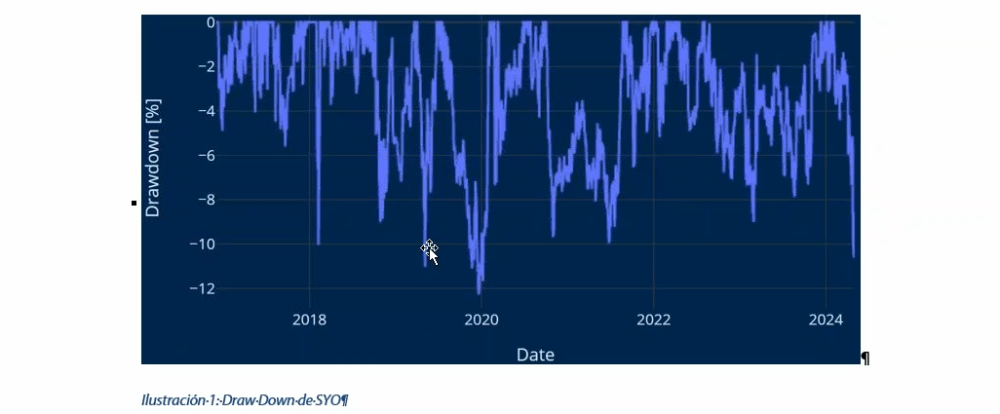
  <figcaption>Figura 084</figcaption>
</figure>

recuerdo, real de operativas reales. Estos del *drawdown* de operativas real. Que ahora hemos estado cerca del 10. Entonces fijaros que aquí, desde el punto de vista conceptual, yo veo por un lado que tengo aquí un *drawdown* siempre de esta zona.

<figure>
  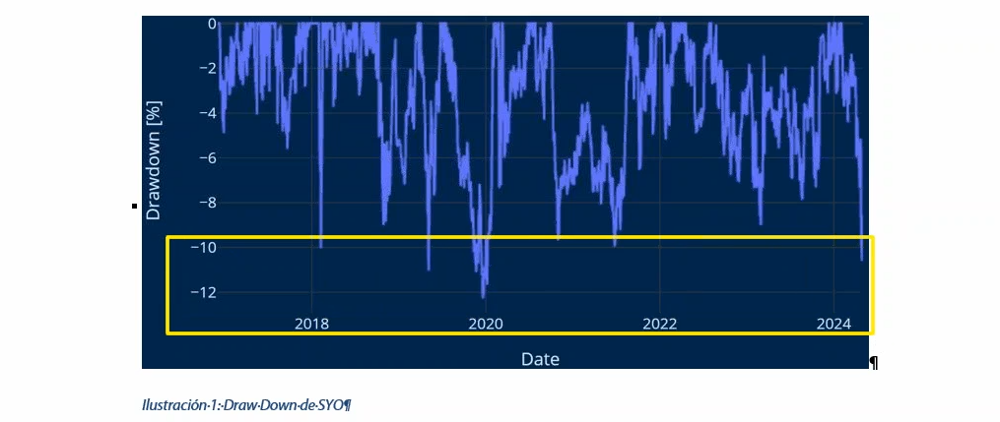
  <figcaption>Figura 085</figcaption>
</figure>

Entonces esto, imaginaos que yo tengo que fijaros aquí en la zona 10, 12, no parece que es la zona de lado máximo. A veces era un poco más, poco menos. Podría ser un poco más. Pero se ve, no. Hay varias zonas. Y es verdad que se aprecia que luego tiene otra zona. No puede estar aquí. Es que también está aquí. 

<figure>
  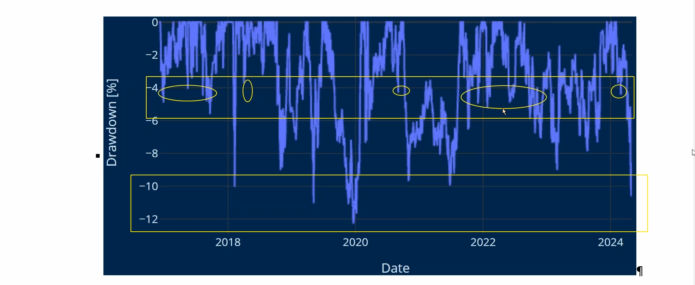
  <figcaption>Figura 086</figcaption>
</figure>

Cuando llega pues se visita. Y ahí tiene, tiene cierta vez no es ahí era. Y otro la zona pues más intermedio, no. Más intermedio.

**Reducir exposición cuando supera cierto drawdown**

Que sobre todo que cuando se sale de ahí, de acuerdo. Cuando se sale de ahí. Me voy a poner otro color. Lo voy a hacer con esto, vale. Cuando se sale de ahí, veis, aquí pues se puede pensar que la mayoría de veces acaba yendo a la zona de abajo. No siempre, pero entienden a la idea.

<figure>
  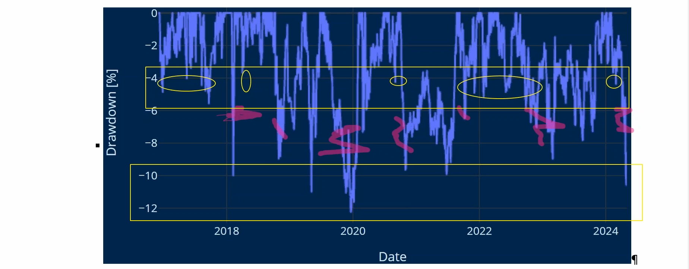
  <figcaption>Figura 087</figcaption>
</figure>

Y entonces hay autores que defienden, nosotros esto hoy en día no lo hacemos. Pero tiene sentido hacerlo. Te explico, como os he dicho de todo el curso, explico cosas que hacemos, cosas pues que no hacemos. Pero que a lo mejor podríamos hacerlas un día. O no, ¿entiendes? Decir no, no, no. Las cosas pueden cambiar.

reducir la exposición simplemente porque el *portfolio* el *drawdown*, por, por, por, por tener una variable que controla el *drawdown* del *portfolio*, vale. Y ahí por decir pues un 30% la exposición, o un 20, o lo que, lo que sea, vale. Esto tiene sentido. Recuerdo hay autores que lo hacen. A mí me genera dudas, me genera dudas. Pero como os digo, lo explico. Me genera dudas porque el problema siempre que hago este tipo de ajustes es ¿cuándo vuelvo y cómo? ¿Cuándo vuelvo y cómo?

Entonces si al final tú vas por volatilidad demás y crees que el sistema está bien, pues ya todo debe devolver a la normalidad, de acuerdo. Por sí solo. Pero sí que es verdad que esto te puede prevenir. 

Mirar, aquí estabas cargado el *drama*. Y tenemos mucho más fuertes. Pues a lo mejor te puede prevenir de la duda es un poco más catastróficos. Que queda un poco sea medio roto. Porque, porque seguramente ha entrado, se ha sobre expuesto aquí demás.

<figure>
  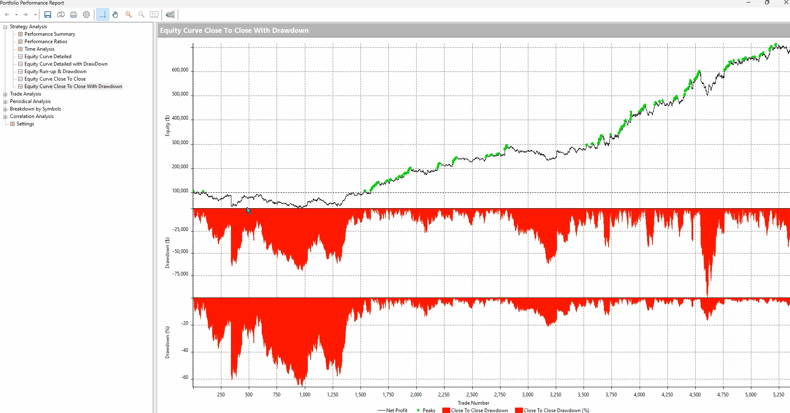
  <figcaption>Figura 088</figcaption>
</figure>

Pero sí que a lo mejor pues puede tener sentido. Puede tener sentido. Que sea partir en este gráfico de locos. Pues yo qué sé, si es 65 el máximo, pues en 40 no, en 40 reduzco. Tendréis un poco la idea. O es igual. Aquí en 50. En 30 mil, 30 mil, 30 mil.  Para que se entienda un poco la idea, no. A lo mejor tiene sentido. Puede tener sentido. El tema es que tienes que fijar si haces esto. Esto sería por *portfolio*, de acuerdo. Y tendrás que reducir todos los sistemas. Y automáticamente fijar una reanudación, que debería de tener un margen de tolerancia nuevamente, de acuerdo.

Esto puede tener sentido hacerlo. Yo lo explico porque es algo que hay autores que hacen. Y que nosotros, como digo, ahora no lo hacemos. Pero podríamos hacerlo. No es nada, no es nada que sea una tontería. Y es verdad que tiene que, es criterio de prudencia. ***Al final es criterio de prudencia***.
