# Práctica 17 - Clase Final de Repaso y Dudas

# Consultas

***He estado trabajando en conformar carteras con el Portfolio Maestro  y tengo varias preguntas:***  
***1. No veo cómo configurar  para aplicar a una estrategia con dos  Timeframe distintos, por ejemplo en la ORB4 sobre el @ES,  se trabaja en  chart de 10min y Diario.***  
***2. Habría qué configurar un MM de cartera o el configurado en las estrategias es el que manda.***  
***3. Cómo ponderar el peso que tiene cada sistema en la cartera, hay alguna regla a seguir que me aclare el tema.***  
***4. Sugerencia.  Se podría trabajar una cartera con portfolio Maestro en clase para ver cómo ustedes configurarían la parte de portfolio Settings.***

Comentaba el sector respecto a cómo añadir los datos, esto en los *Strategy Groups* se hace aquí.

<figure>
  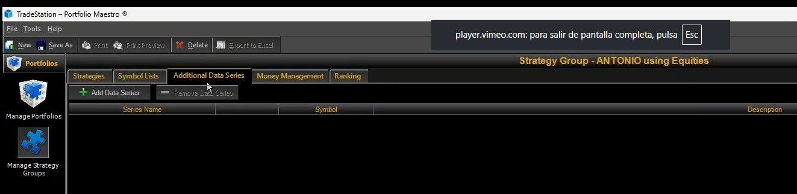
  <figcaption>Figura 000</figcaption>
</figure>

Aquí añades el data, el data 2, data 3. 

<figure>
  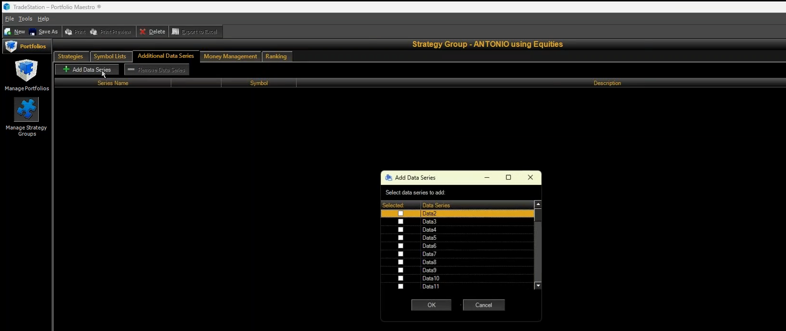
  <figcaption>Figura 001</figcaption>
</figure>

Lo añades y lo defines, data símbolo, buscas o lo escribes. Símbolo que sea, etcétera, lo tienes que configurar aquí. Ya está, sin más, no tiene más. 

<figure>
  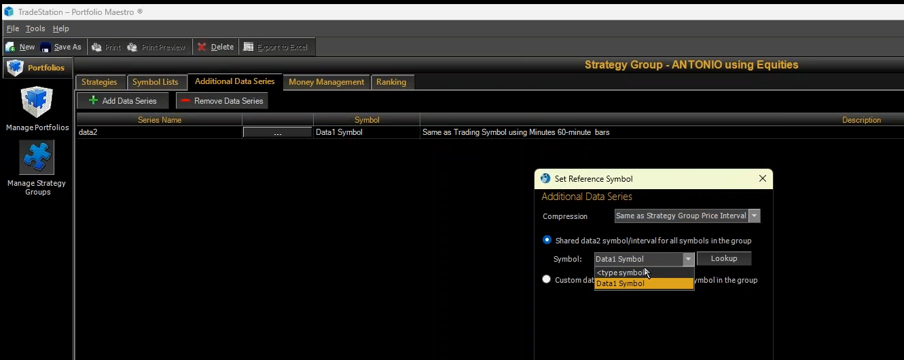
  <figcaption>Figura 002</figcaption>
</figure>

El data va aquí, tú tienes aquí tu *Symbol List* con tu historia, estrategia, y aquí tienes tu adicional data, adicional data, *data series*.

**Portfolio Maestro y Herramientas de Análisis**

*Maestro*, yo os comenté, *Maestro* está bien, tiene sus cosas buenas pero tiene cosas malas. Yo sigo recomendando, ya sé que implica un cierto coste, puede que haya gratis, no conozco lógicamente todo el mercado porque al final no estás con sus cosas y no siempre estás al día de todo lo que sale. Pero de lo que conozco, MSA, os recomiendo, os conseguimos un descuento ahí que no estaba mal, del cual no tenemos absolutamente ningún solo beneficio.

Y os recomiendo porque es un programa como ya habéis visto tanto en la teoría como en la práctica bastante potente para esta parte de gestión monetaria, *portfolio* y demás. Que las hay más potentes, claro, más potentes. Y puedes buscar en internet, encontraréis. Pero está bien, sobre todo para iniciar, para iniciarse. Y para, tampoco para, ya digo nosotros lo usamos. También usamos *Portfolio Trader*, tenemos *Quant Analyzer*, lo usamos poco pero planeamos usarlo. En el curso lo hemos visto, no sé si algo, nada, pero lo tenemos. Pero no lo usamos mucho, pero tenemos pendiente revisar otra vez *Weblab* Yo os lo comenté porque es un programa muy bueno, pero hoy en día lo que más usamos pues es *Maestro*, ese *Portfolio Trader* y *Excel* y *MSA*. Es un poco el mix que usamos más para nivel de *portfolio*. Creo que no se me está olvidando algo.

<div style="margin-left:20px; margin-top:10px; margin-bottom:10px; padding:10px; background-color:#f5f5f5; border-left:3px solid #ccc;">
<em>MSA</em>: <em>Market System Analyzer</em>, software especializado en análisis de sistemas de trading y gestión de carteras. Permite realizar análisis de <em>Monte Carlo</em>, optimización de pesos y simulaciones de <em>portfolio</em>.
</div>

*Maestro*, al final os vais a, yo os lo digo, os vais a desesperar cien por ciento en algún momento. Entonces está bien que la conozcáis, está bien que lo trabajéis porque al final tiene sus cosas buenas y por qué no usarlas. Pero tiene, como os comenté, es un software demasiado antiguo y lento.

Que es idéntico, los materiales que os pasé y los vídeos, y aprovecho para introducir eso de nuestra web. Esto ya os lo comenté pero brevemente. Aquí en formación, acordaros que hay todo esto de "Aprende a usar *TradeStation* Securities". 

https:#www.sersansistemas.com/formacion/aprende-tradestation-espanol-2/

Este vídeo de *TradeStation* es obligatorio verlo, lo toca bastante todo. Es verdad que se centra en toda la plataforma, pero bueno, pues interface de estos temas. Y no sé si llega a tocar algo de *Maestro*. No creo, aquí no. Pero esa es justamente lo que os digo, en "Aprende a usar *TradeStation*" 9.5, las lecciones que son de *Walk Forward* y *Maestro*, prácticamente hay cero cambios. Es decir, puede haber un micro cambio de verdad.

https:#www.sersansistemas.com/formacion/webinars-tradestation/

Entonces todo lo que es el vídeo 6, y sobre todo los nuestros, quería ir ahí, me equivocaba. Aquí sobre todo ver el vídeo, aunque repito que los que están ahí de Jesús nada, referentes a *Walk Forward* y demás. Pero creo que son los 6. En los nuestros aquí sí que si ves los primeros lo verás todo muy distinto porque es 9 y medio, pero a la que llegues a la parte del 6, donde aquí hablo de algo de *Walk Forward* y *Maestro*, y creo que el 7 también, exactamente el 7, sobre todo es súper parecido, es súper parecido de verdad, pero extremadamente parecido.

Entonces ver este vídeo. Luego en la web también, de en YouTube, en el canal de YouTube de *TradeStation*, en el canal de *TradeStation* de YouTube, ellos hacen vídeos, totalmente la mayoría en inglés eso sí. Sabéis que YouTube la mayoría puede traducir, mejor lo hará, peor, pero hay vídeos de YouTube ordenado de la plataforma bastante apañado. Y van haciendo ellos contenido formativo.

Con lo cual lo mismo, por supuesto esto, como os digo, esto claro no podemos hacer un curso al uso de *TradeStation* porque si no pues estamos horas y horas solo eso de vídeo. Creo que solo hablando de *Walk Forward* y *Maestro*, y obviamente no lo toqué absolutamente en profundidad bastante bien, pero eran tres horas. Y entonces claro, al final no es aquí.

Tú si tú vas a listas, hay algunos, ves ya ordenaditos, tienes aquí el *Platform Training*, tienes el *Getting Started*, que esos son esta serie de vídeos que habéis visto allí, es esto. Se llama, cómo empezar, y ahí lo tienes un poco todo y más avanzando. Y me imagino que habrá alguno, bueno los caros. Y no buscáis *Maestro TradeStation* pero ya digo, ellos tienen bastante material, bastante material aquí sobre la plataforma. Que buscarlo lógicamente, pero lo tenéis.

Si alguien no lo encuentra lo puedo, que ya os lo dirigiré. Porque realmente tenemos algunos enlaces guardados pero no los había preparado porque son antiguos. Entonces yo creo que es mejor buscar los nuevos, es mejor buscar los nuevos que buscar los antiguos. Pero si hace falta pues ya digo los buscamos nosotros.

**Configuración de Portfolio y Equal Weighted**

Tema de cartera, tema de *portfolio*. Entonces ahí sí que quería ver algo, sí que he hecho un poquito, os quería enseñar hoy algunas cosas. Tenía aquí preparadas un pequeño ejercicio sencillo en *Excel* para mostrar un poco también cómo hicimos bastante en la teoría o con las cosas más no recuerdo tanto herramientas, porque las herramientas se pueden tener, se pueden no tener.

Y de hecho este documento que os enseño, y ahora tenía las *equities* 2007, tenía un tocho también espectacular. Se lo puedo enseñar, esto era una de las hojas que cada día revisábamos del fondo. Teníamos con *Esfera* desde la fecha de noviembre del 20, los precios son de entonces, y con esto lo íbamos controlando. Teníamos aquí un poco, esto era el supervisión con los *drawdowns* esperados, etcétera, ratios esperado.

Eran hojas que teníamos. Lógicamente teníamos los software, pero aquí teníamos en *Excel* donde calculábamos un poquito el apalancamiento, para sobre todo el tema regulatorio porque ahí tienes unos compromisos de volatilidad, los compromisos de *VaR*, y vamos monitorizando para que no nos desviáramos.

Y a raíz de esto he querido mostraros pues un poco unos ejemplos, porque creo que habrá otra pregunta en esta línea. Ya introduzco el tema ahora referido a esto: cómo configurar el *money management* y cómo hablar de la cartera, etcétera.

<figure>
  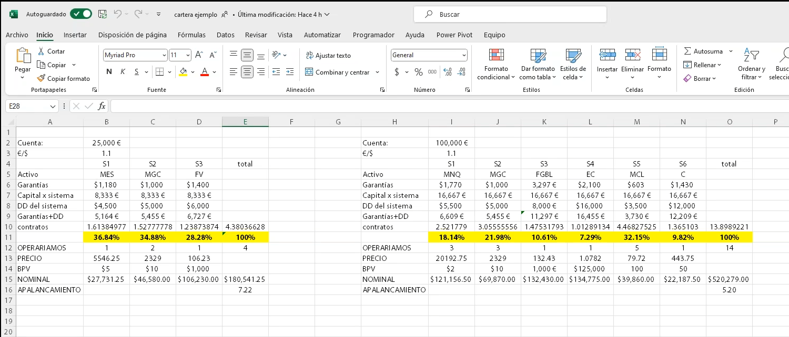
  <figcaption>Figura 003</figcaption>
</figure>

Esto donde más lo vimos sobre todo era en *MSA*. Donde más lo vimos, en *MSA*. Yo os enseñé que incluso puedes optimizarlos, y os dije que sí que se optimizaba, pero lo cual no quería decir que usáramos directamente lo que sacaba el optimizador.

<div style="margin-left:20px; margin-top:10px; margin-bottom:10px; padding:10px; background-color:#f5f5f5; border-left:3px solid #ccc;">
<em>Equal Weighted</em>: Método de ponderación de carteras donde cada activo o sistema recibe el mismo peso. Cuando se aplica "por riesgo", cada sistema recibe un peso proporcional a su riesgo, normalmente medido por el <em>drawdown</em> esperado.
</div>

Pero si os acordáis, porque esto en algunas preguntas que me habéis insistido, no sé si esa clase no se ha visto, no se ha entendido, no lo sé exactamente, pero esto se hizo. Se hizo con un *portfolio* que montamos de además sistemas reales de la operativa nuestra, que os lo comenté, *Apollo*, *Nemesis*, de casos reales. Con eso seguíamos trabajando, hemos el optimizador aquí un poco.
 
<figure>
  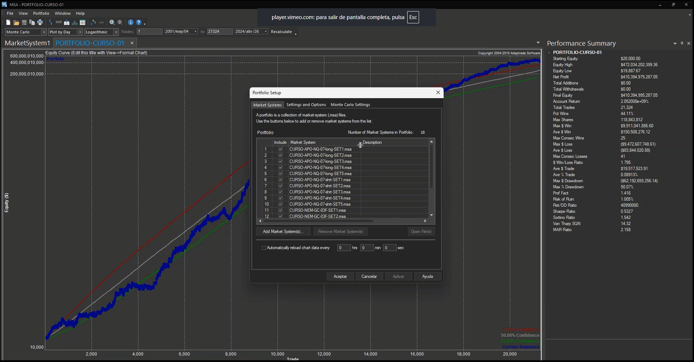
  <figcaption>Figura 004</figcaption>
</figure>
<figure>
  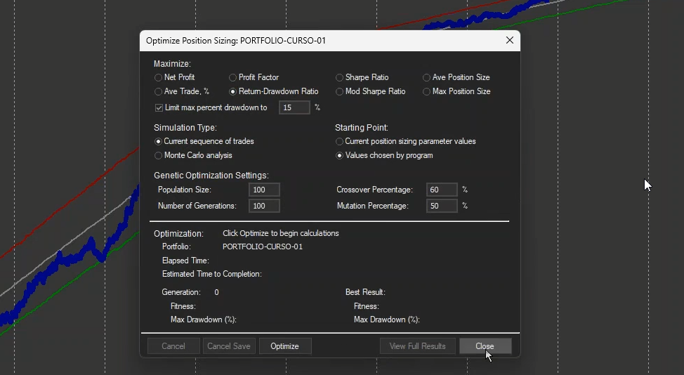
  <figcaption>Figura 005</figcaption>
</figure>

Esta es una herramienta con la que tú al final puedes ver los pesos, tu aquí en *Position Sizing* están todos iguales. 

<figure>
  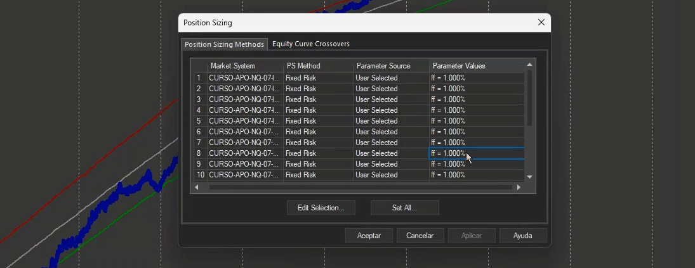
  <figcaption>Figura 006</figcaption>
</figure>

Que hablamos, si os acordáis de la *equal weight*, os dije, y aquí he contestado un poco en el chat también, que un poco lo que yo os recomiendo. Hay muchas metodologías y algunas súper complicadas y historias y conexas. Se puede hacer hasta con *Solver*, pero de verdad que no os aconsejo complicaros tanto la vida.

El *portfolio* es evidentemente el santo grial, cuando he insistido mucho en eso creo que en decir que Santo Grial del *portfolio*, creo que algunos habéis interpretado que os iba a dar algo a nivel de *portfolio* súper especial, alguna teoría. No, lo que simplemente os vamos a dar, sí que trabajamos bastante el *money management* que no deja de ser parte del *portfolio*. Recordar: `riesgos`, `exposición`, `diversificación`. Al final la exposición es el cuánto es el *money management*, y la diversificación es el *portfolio*. Y los dos trabajan un poco de la mano.

Entonces esa es la idea. La idea es que yo cuando mezclo estrategias mejoro la cartera de manera dramática incluso con tres, que es un ejemplo que os he puesto ahora. Entonces, y esto es así, lo habéis visto en la teoría. Os hice una práctica también, el ejemplo que os enseñé de una ponencia que ha hecho *Robotrading* los distintos sistemas de la curva, como mejoraba con un sistema, donde vimos todo este efecto.

Pues esta es la idea que tiene que quedar. Bien, dicho esto, es muy pertinente decir cómo decidir el peso de cada sistema. Esto está muy bien. Yo os recomiendo, porque sobre todo al principio no vais a tener, ojalá tengáis una cuenta de cinco millones de euros, si es así pues me llamáis y hoy ya llegamos a un tipo de acuerdo. Pero si al final les vamos a hablar de lo normal, que sean cuentas pues a nivel usuario, no vas a poder tampoco abrir sobre todo si vamos por futuros, que es preferible. Pero como ya hemos comentado tanto en teoría como práctica pueden haber distintos motivos por el que no pueda usar futuros. Por ejemplo porque no los tiene el sitio donde me obligan a operar, por lo que sea. Pero si tú es tu cuenta para ti y tú estás aprendiendo, tienes que aprender a operar en futuros. Luego ya irás tú, entiendo que quieres empezar. Y tú quieres operar en *Darwinex* porque quieres montarte tu Darwin y luego quieres operar en K lo que sea, en otro sitio. Pero lo primero es que aprendas tú, lo primero es que aprendas tú. No vas a poder hacer un *Darwin* si no eres rentable tú solo antes. Puedes hacerlo directamente *Darwinex* y claro que puedes, pero yo creo que te va a ayudar a aprender a operar en futuros por tu cuenta. Para eso la cuenta de *TradeStation* te puede servir, o *Interactive Brokers*, lo que sea,

**Ejemplo Práctico: Cartera de 25.000 Euros**

Lo que os decía cada sistema lleva su peso lógicamente. Pero en la práctica 16, aquí que vimos, porque está el tema de la exposición y es lo que se había preparado aquí. Donde está aquí, he hecho un supuesto con ejemplos tipo lo que os enseñaba del fondo.

<figure>
  
  <figcaption>Figura 003</figcaption>
</figure>

Si yo tengo una cuenta tengo una cuenta de 25 mil euros, en la cuenta de 100 mil euros, 

lo que voy a tratar hoy no lo he subido aún porque prefería enseñarlo aquí, luego subirlo. Porque si lo subo ya lo empecéis a mirar, entonces prefiero subirlo post clase. Todo lo que voy a enseñar los *Excels* lo voy a subir y va a haber mucho material. Pero prefería antes sacarloahora.

> al mix `sistema / activo` le llaman vector

Que tenemos? Al final un ejemplo. Hay muchos autores, nosotros de hecho también, que al mix `sistema-activo` le llaman `vector`. Todo esto es un vector operativo, otro vector es igual, es un sistema-sistema que opera en un activo. Pero si yo pero el `columna S1` en el MES y luego pero el S1 en otro activo, nosotros esto hoy en día lo hacemos como sabéis, 

* ***Tabla 1 (25,000€):*** 3 vectores (S1-MES, S2-MGC, S3-FV)
* ***Tabla 2 (100,000€):*** 6 vectores (S1-MNQ, S2-MGC, S3-FGBL, S4-EC, S5-MCL, S6-C)

Cada vector = sistema + activo.  
Si pusieras el mismo sistema S1 en dos activos distintos, serían 2 vectores diferentes.

<div style="background-color: #f0f0f0; border: 1px solid #ccc; padding: 15px; border-radius: 5px; margin-bottom: 20px;">
<table style="font-size: 10px; border-collapse: collapse; margin-bottom: 20px;">
<tr><td><b>Cuenta:</b></td><td>25,000 €</td><td></td><td></td><td></td></tr>
<tr><td><b>€/$</b></td><td>1.1</td><td></td><td></td><td></td></tr>
<tr><td></td><td><b>S1</b></td><td><b>S2</b></td><td><b>S3</b></td><td><b>total</b></td></tr>
<tr><td><b>Activo</b></td><td>MES</td><td>MGC</td><td>FV</td><td></td></tr>
<tr><td><b>Garantías</b></td><td>$1,180</td><td>$1,000</td><td>$1,400</td><td></td></tr>
<tr><td><b>Capital x sistema</b></td><td>8,333 €</td><td>8,333 €</td><td>8,333 €</td><td></td></tr>
<tr><td><b>DD del sistema</b></td><td>$4,500</td><td>$5,000</td><td>$6,000</td><td></td></tr>
<tr><td><b>Garantías+DD</b></td><td>5,164 €</td><td>5,455 €</td><td>6,727 €</td><td></td></tr>
<tr><td><b>contratos</b></td><td>1.61384977</td><td>1.52777778</td><td>1.23873874</td><td>4.38036628</td></tr>
<tr><td></td><td style="background-color: yellow;"><b>36.84%</b></td><td style="background-color: yellow;"><b>34.88%</b></td><td style="background-color: yellow;"><b>28.28%</b></td><td style="background-color: yellow;"><b>100%</b></td></tr>
<tr><td><b>OPERARIAMOS</b></td><td>1</td><td>2</td><td>1</td><td>4</td></tr>
<tr><td><b>PRECIO</b></td><td>5546.25</td><td>2329</td><td>106.23</td><td></td></tr>
<tr><td><b>BPV</b></td><td>$5</td><td>$10</td><td>$1,000</td><td></td></tr>
<tr><td><b>NOMINAL</b></td><td>$27,731.25</td><td>$46,580.00</td><td>$106,230.00</td><td>$180,541.25</td></tr>
<tr><td><b>APALANCAMIENTO</b></td><td></td><td></td><td></td><td>7.22</td></tr>
</table>
</div>

Yo tengo aquí tres vectores muy sencillos. 

* *Tabla 1 (25,000€):* 3 vectores (S1-MES, S2-MGC, S3-FV)

Esto es una cartera muy real. Nosotros esta cartera como está le hemos operado con además enorme éxito. Y de hecho hubiera sido la primera Darwinex si hubiéramos podido operarla. Ya lo sabéis los que nos seguís, hemos puesto aquí el bono americano, pero realmente era con el bono alemán `FGBL`, que luego aquí en la otra lo he puesto. Pero bueno por daros distintas, hablar de otras cosas, pues lo he puesto aquí.

Entonces yo tengo aquí un sistema que va en MES. Eso es el *micro S&P*. Fijaros que el *micro S&P* me pide TradStation hoy en día de mantenimiento 1180 dólares. Los he puesto de mantenimiento, ignoro las entradas, que de hecho son un 10%, es decir esto para abrirlo intradía me están pidiendo 117 dólares. Yo con 117 dólares puedo abrirlo. Evidentemente hace falta más en la cuenta, pero me entendéis, en un sistema estrictamente intradía donde cierre garantiza porque hay unas reglas para eso. Pero he ignorado esta parte, yo he ido a mantenimiento.

Tengo un *micro oro* que nosotros cuando montamos, lo tenía aquí de hecho.

<figure>
  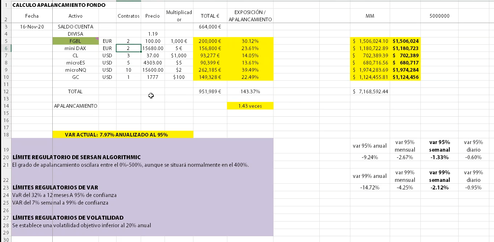
  <figcaption>Figura 007</figcaption>
</figure>

Si os habéis fijado aquí son las reales, bueno aquí estaba, en ese momento concreto estábamos en posición, podemos llevar tres contratos. Es igual, no importa. Del Bun alemán, creo que podíamos llevar más también sí, 
Este vector va con *micro S&P*, *micro NASDAQ*.

Veis por qué, porque nos granula muy bien. Pero el oro en ese momento no nos dio confianza de volumen, era muy grande. Esto te permite diversificarlo peor porque tampoco teníamos capital, si hubiéramos tenido pues 20 millones más fácil era un fondo. Pero ahora hoy en día el micro tiene bastante volumen, bastante volumen. Ahora os lo voy a enseñar todo esto.

**Problema de las Garantías y Granularidad**

Entonces claro, qué problema tienes, pues es este. El problema del futuro antiguamente, que cada vez se ha ido reduciendo, es que esto un contrato del oro pues puede ser muy grande. Hasta aquí uno solo nos copaba 149 mil euros de nominal, un 22%, cuando en cambio teníamos 5 S&Ps micros y era un 13%.

Entonces esta es la gracia, que lógicamente ganas menos pero te permite pues repartir mejor tu exposición. Y en caso que tengas una cuenta pequeña, que es lo normal, pues te permite acceder con una cuenta de 25 mil euros perfectamente a 2-3 estrategias. Y he sido súper pesimista con los *drawdowns* y demás, es decir eso se puede mejorar mucho.

Entonces yo tengo aquí 

<div style="background-color: #f0f0f0; border: 1px solid #ccc; padding: 15px; border-radius: 5px; margin-bottom: 20px;">
<table style="font-size: 10px; border-collapse: collapse; margin-bottom: 20px;">
<tr><td><b>Cuenta:</b></td><td>25,000 €</td><td></td><td></td><td></td></tr>
<tr><td><b>€/$</b></td><td>1.1</td><td></td><td></td><td></td></tr>
<tr><td></td><td><b>S1</b></td><td><b>S2</b></td><td><b>S3</b></td><td><b>total</b></td></tr>
<tr><td><b>Activo</b></td><td>MES</td><td>MGC</td><td>FV</td><td></td></tr>
<tr><td><b>Garantías</b></td><td>$1,180</td><td>$1,000</td><td>$1,400</td><td></td></tr>
<tr><td><b>Capital x sistema</b></td><td>8,333 €</td><td>8,333 €</td><td>8,333 €</td><td></td></tr>
<tr><td><b>DD del sistema</b></td><td>$4,500</td><td>$5,000</td><td>$6,000</td><td></td></tr>
<tr><td><b>Garantías+DD</b></td><td>5,164 €</td><td>5,455 €</td><td>6,727 €</td><td></td></tr>
<tr><td><b>contratos</b></td><td>1.61384977</td><td>1.52777778</td><td>1.23873874</td><td>4.38036628</td></tr>
<tr><td></td><td style="background-color: yellow;"><b>36.84%</b></td><td style="background-color: yellow;"><b>34.88%</b></td><td style="background-color: yellow;"><b>28.28%</b></td><td style="background-color: yellow;"><b>100%</b></td></tr>
<tr><td><b>OPERARIAMOS</b></td><td>1</td><td>2</td><td>1</td><td>4</td></tr>
<tr><td><b>PRECIO</b></td><td>5546.25</td><td>2329</td><td>106.23</td><td></td></tr>
<tr><td><b>BPV</b></td><td>$5</td><td>$10</td><td>$1,000</td><td></td></tr>
<tr><td><b>NOMINAL</b></td><td>$27,731.25</td><td>$46,580.00</td><td>$106,230.00</td><td>$180,541.25</td></tr>
<tr><td><b>APALANCAMIENTO</b></td><td></td><td></td><td></td><td>7.22</td></tr>
</table>
</div>


un sistema en el MES, un sistema en el *micro oro* que pide solo mil dólares de garantías y tiene volumen ahora os lo enseñaré. Y tengo aquí el bono americano `FV`, por el tema de divisas podría haber sido otro, que creo que es a cinco años. 

Esto recordar que en cualquier otra página yo lo estoy consultando la de *TradeStation* por lo que me es muy cómodo, pero esto es igual, esto realmente son los datos del mercado. Normalmente la mayoría de brokers no piden más que el mercado, la que más piden. Pero en la web del CME también están las especificaciones. Esto es la parte de la teoría, os insistí mucho que esas cosas hay que mirarlas, hay que ser responsables.

<figure>
  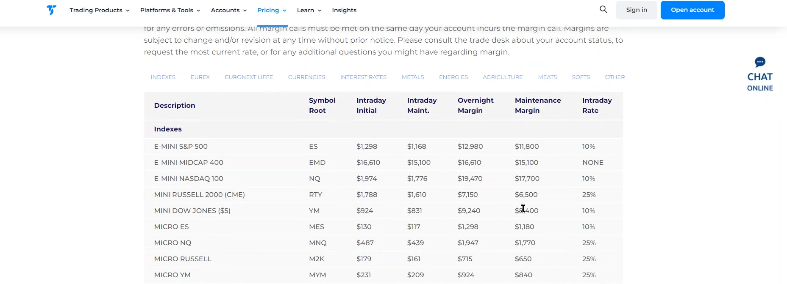
  <figcaption>Figura 008</figcaption>
</figure>

Ahora cuando llegue a los rolos que tengo que explicaros también.

Los bonos, los bonos les interesa es este ZF, creo que era, si es el cinco años, es el cinco años americano, que nos pide mil cuatrocientos dólares. Y también nos deja garantías intradía al cincuenta por ciento. *TradeStation* en esto es bastante conservador, es un broker conservador, no te da mucho apalancamiento, no te da mucho en intradía. Dices es una putada, bueno si es una putada pero quiere decir que es un broker más seguro. Al final todo tiene su balanza. Acordaros cuando salió la teoría de los riesgos, no todos los riesgos que hay. Bueno, el riesgo de que el broker quiebre, pues bueno, pues en *TradeStation* es menos, bastante conservador. Lógicamente siempre será pequeño, pero al final pues estas cosas también tienen su importancia.

**Equal Weighted por Riesgo**

Entonces yo aquí tengo un ejemplo con la manera sencilla de decidir los pesos por *equal weighted*. Cuando hablamos de *equal weighted* os dije *equal weighted* por riesgo, *equal weighted* por riesgo. Entonces bien, por un lado como decía tengo 

* el sistema con sus `garantías`, con el activo, con sus garantías. 
* Tengo qué `capital x sistema` le tocaría cada sistema, porque si decimos *equal weighted* quiere decir que yo reparto a partes iguales. Tengo tres sistemas, que decir que a cada sistema para empezar le coloco 25 mil entre tres: 8 mil 373 euros, eso le coloco cada sistema. Pero cuando decimos *equal weighted* por riesgo, qué quiere decir. Tengo que repartir esos 8 mil según el riesgo de cada estrategia. 

    Se podría hacer otra manera, sí, se puede hacer *equal weighted* por volatilidad, también *equal weighted* así a pelo, etc hay que verlo, pero es más razonable por riesgo. Es más razonable por riesgo, que a veces a mentir es un hándicap, por ejemplo lo vais a ver ahora, lo voy a explicar en los bonos un poco, pero porque depende del *ratio rentabilidad-riesgo* que tenga cada sistema. Pero se puede hacer a lo mejor también por un *ratio rentabilida riesgo*, es decir al final la cuestión es ***repartir el peso en cada sistema por alguna métrica que incorpore el riesgo***.
    
    Esto usualmente se hace con el *drawdown*. Pero insisto, entender la idea, me interesa que entendáis la idea. 
    
* Y si se hace por `drawdown`, yo he apuntado aquí un *drawdown* teórico, razonable pero es inventado, inventado de cada uno de los sistemas y cada uno de estos activos. Al bono le he puesto bastante y es fácilmente mejorable. De hecho un intradía tendría probablemente la mitad o debería de tener la mitad, pero un diario podría tener esto. Yo he trabajado más o menos contra *drawdowns* esperados diarios. 

    Aquí simplemente sumado. pues tengo garantías, más nada las sumo y tengo esas cantidades. 5.000 euros. Bueno, porque lo tengo aquí el cambio, al rodo le he puesto 1.1 más o menos y pues lo he pasado a euros. Porque si la cuenta está en euros y sigo operando activos dólares, pues claro peras con manzanas no suman. Esto ya lo vimos cuando hacíamos matemáticas en primaria, 

* entonces al final he ajustado a euros y sumo `Garantías + DD del sistema` y lo divido por 1.1 que es el cambio euro-dólar, y tengo los euros para pasar dólares a euros. 
    
    Bien, ya sé que cada, a este sistema tiene un riesgo de la manera que lo calculado de 5.100, es el 5.400, 6.700. 

* `Cálculo de Contratos` Bien, y cómo calculo los contratos? Pues simplemente dividiendo el `capital x sistema` por `Garantías + DD del sistema` eso sería *equal weighted*, a este le tocaría 1.61, 1.52, 1.23.

    Oh problema, no se puede partir un micro. Bueno, el problema es cierto, ahí está el problema. Y ahí es donde realmente las cuentas pequeñas, por eso muchas se van a CFD´s porque cuesta. 

    <div style="background-color: #f0f0f0; border: 1px solid #ccc; padding: 15px; border-radius: 5px; margin-bottom: 20px;">
    <table style="font-size: 10px; border-collapse: collapse; margin-bottom: 20px;">
    <tr><td><b>Activo</b></td><td>MES</td><td>MGC</td><td>FV</td><td></td></tr>
    <tr><td><b>Garantías</b></td><td>$1,180</td><td>$1,000</td><td>$1,400</td><td></td></tr>
    <tr><td><b>Capital x sistema</b></td><td>8,333 €</td><td>8,333 €</td><td>8,333 €</td><td></td></tr>
    <tr><td><b>DD del sistema</b></td><td>$4,500</td><td>$5,000</td><td>$6,000</td><td></td></tr>
    <tr><td><b>Garantías+DD</b></td><td>5,164 €</td><td>5,455 €</td><td>6,727 €</td><td></td></tr>
    <tr><td><b>contratos</b></td><td>1.61384977</td><td>1.52777778</td><td>1.23873874</td><td>4.38036628</td></tr>
    </table>
    </div>


Esto insisto que se puede mejorar porque encima yo si voy a ir estrictamente intradía, `garantías` lo puedo dejar acordaros en 120, y `Garantías + DD del sistema` a lo mejor lo puedo dejar en 4.000. 

<div style="background-color: #f0f0f0; border: 1px solid #ccc; padding: 15px; border-radius: 5px; margin-bottom: 20px;">
<table style="font-size: 10px; border-collapse: collapse; margin-bottom: 20px;">
<tr><td><b>Activo</b></td><td>MES</td></tr>
<tr><td><b>Garantías</b></td><td>$120</td></tr>
<tr><td><b>Capital x sistema</b></td><td>8300 €</td></tr>
<tr><td><b>DD del sistema</b></td><td>$2,500</td></tr>
<tr><td><b>Garantías+DD</b></td><td>2,382 €</td></tr>
<tr><td><b>contratos</b></td><td>3.4987277</td></tr>
</table>
</div>

Entendéis? eso al final, ya este ya podría caberle tres contratos y medio. Entendéis un poco la idea, no yo lo he hecho extremo para que veáis un caso negativo. Lo fácil es ponerlo lo bueno. Entonces y esto se puede hacer así. Esto no es realista, eso también realista incluso con 3.000 seguiría cambiando tres contratos. Fíjaros, y con 25.000, lo bajas aquí a 15000, aún te cabría un contrato con tres sistemas. Entonces esa es un poco la idea.

Entonces yo tengo aquí 

<div style="background-color: #f0f0f0; border: 1px solid #ccc; padding: 15px; border-radius: 5px; margin-bottom: 20px;">
<table style="font-size: 10px; border-collapse: collapse; margin-bottom: 20px;">
<tr><td><b>Cuenta:</b></td><td>25,000 €</td><td></td><td></td><td></td></tr>
<tr><td><b>€/$</b></td><td>1.1</td><td></td><td></td><td></td></tr>
<tr><td></td><td><b>S1</b></td><td><b>S2</b></td><td><b>S3</b></td><td><b>total</b></td></tr>
<tr><td><b>Activo</b></td><td>MES</td><td>MGC</td><td>FV</td><td></td></tr>
<tr><td><b>Garantías</b></td><td>$1,180</td><td>$1,000</td><td>$1,400</td><td></td></tr>
<tr><td><b>Capital x sistema</b></td><td>8,333 €</td><td>8,333 €</td><td>8,333 €</td><td></td></tr>
<tr><td><b>DD del sistema</b></td><td>$4,500</td><td>$5,000</td><td>$6,000</td><td></td></tr>
<tr><td><b>Garantías+DD</b></td><td>5,164 €</td><td>5,455 €</td><td>6,727 €</td><td></td></tr>
<tr><td><b>contratos</b></td><td>1.61384977</td><td>1.52777778</td><td>1.23873874</td><td>4.38036628</td></tr>
<tr><td></td><td style="background-color: yellow;"><b>36.84%</b></td><td style="background-color: yellow;"><b>34.88%</b></td><td style="background-color: yellow;"><b>28.28%</b></td><td style="background-color: yellow;"><b>100%</b></td></tr>
<tr><td><b>OPERARIAMOS</b></td><td>1</td><td>2</td><td>1</td><td>4</td></tr>
<tr><td><b>PRECIO</b></td><td>5546.25</td><td>2329</td><td>106.23</td><td></td></tr>
<tr><td><b>BPV</b></td><td>$5</td><td>$10</td><td>$1,000</td><td></td></tr>
<tr><td><b>NOMINAL</b></td><td>$27,731.25</td><td>$46,580.00</td><td>$106,230.00</td><td>$180,541.25</td></tr>
<tr><td><b>APALANCAMIENTO</b></td><td></td><td></td><td></td><td>7.22</td></tr>
</table>
</div>

Entonces, esto aquí me da simplemente, aquí sumo los contratos totales, calculo el porcentaje que supone cada uno de ellos. 

Entonces mediante este método de *equal weighted por riesgo* usando el riesgo de *drawdown*, el `vector 1` tendría 36.8%, este 34.8% y 28%, bastante parecido a 30, pero podía ser que no, en el otro caso se ha puesto un caso distinto, luego lo veremos. 

Y yo cómo reparto `OPERARIAMOS`?. Hombre dices 1 o pongo 2. Esto ya lo veo que esto no quiere decir que obligatoriamente opere esto, pero aquí quiero llegar. Cuando al principio sobre todo operéis en futuros, vais a operar un contrato. Vais a operar un contrato. No os compliquéis la vida. 

Cuándo tengo que añadir sistemas? que alguien me lo decía. Tengo más dinero, qué hago?. 
> Si tienes sistemas añade sistemas y le metes un contrato. 

Y entonces que vas a estar mucho tiempo haciendo eso: sistema con contrato, sistema con contrato. Entiendes, porque hasta que no tengas más capital, entonces va a ser difícil, pero difícil pero no imposible. Porque si yo ya puedo meter más, los meto, los meto, lo dos. Y a mejor aquí puedo meter otro S&P y hacer lo que hacemos nosotros con el NASDAQ, meter otro vector y repartir el *drawdown* en dos porque me interesa. 

O viendo que tal dice oye pues yo necesito un intradía puro aquí, pues mira vamos a trabajar un *ORB* como vimos, que me cuesta, voy a buscar un activo que funcione, voy a buscar un tendencial que cierre, que al final no deja, es una ruptura en una *commodity* muy tendencial como el oro, como yo que sé la gasolina, como lo que sea. Y ahí pues voy a ver qué garantías intradía me deja *TradeStation* en cuál me deja más.

Porque no en todos me deja, en todos no me deja. En todos es, en el que me pide mal, no solo en S&P. en *commodities* no me deja, en *Eurex* ahora no me deja, antes me dejaba. En divisas me deja 50%, algo es algo. En metales me deja 50%, bueno algo es algo. En petróleo 25%, bueno y algo es algo. Y ya en agricultura no me deja nada, en esas ya no me deja intradía. Pero es verdad que normalmente las garantías son menores, son menores.


**Benchmark y Optimización de Portfolio**

Luego volveré aquí en esta tabla. Eso es un poco la idea. Entonces yo tengo estos pesos. Luego yo con mi herramienta, sea *Maestro*, sea *MSA*, he hecho también optimizaciones. He visto *Monte Carlos*, he visto cómo qué hace allí, que me elige... allí mantiene más o menos estos pesos? o no?, o este lleva 70 y este 20.

Entonces yo aquí miro un poco la relación que yo quiero mantener. Que insisto va a ser 1-1 igualmente, pero vamos a suponer que no como será en el siguiente, lo veremos. Pues yo uso esa relación para adaptarla a la cuenta simplemente. A mí me interesa este amarillo, de este método. 

<div style="background-color: #f0f0f0; border: 1px solid #ccc; padding: 15px; border-radius: 5px; margin-bottom: 20px;">
<table style="font-size: 10px; border-collapse: collapse; margin-bottom: 20px;">
<tr><td><b>Cuenta:</b></td><td>25,000 €</td><td></td><td></td><td></td></tr>
<tr><td><b>€/$</b></td><td>1.1</td><td></td><td></td><td></td></tr>
<tr><td></td><td><b>S1</b></td><td><b>S2</b></td><td><b>S3</b></td><td><b>total</b></td></tr>
<tr><td><b>Activo</b></td><td>MES</td><td>MGC</td><td>FV</td><td></td></tr>
<tr><td><b>Garantías</b></td><td>$1,180</td><td>$1,000</td><td>$1,400</td><td></td></tr>
<tr><td><b>Capital x sistema</b></td><td>8,333 €</td><td>8,333 €</td><td>8,333 €</td><td></td></tr>
<tr><td><b>DD del sistema</b></td><td>$4,500</td><td>$5,000</td><td>$6,000</td><td></td></tr>
<tr><td><b>Garantías+DD</b></td><td>5,164 €</td><td>5,455 €</td><td>6,727 €</td><td></td></tr>
<tr><td><b>contratos</b></td><td>1.61384977</td><td>1.52777778</td><td>1.23873874</td><td>4.38036628</td></tr>
<tr><td></td><td style="background-color: yellow;"><b>36.84%</b></td><td style="background-color: yellow;"><b>34.88%</b></td><td style="background-color: yellow;"><b>28.28%</b></td><td style="background-color: yellow;"><b>100%</b></td></tr>
<tr><td><b>OPERARIAMOS</b></td><td>2</td><td>1</td><td>1</td><td>4</td></tr>
</table>
</div>

Aquí he hecho un supuesto, es real porque me interesa ver el apalancamiento, pero esto me interesa `el amarillo`, es mi punto de partida.

Hay autores que esto lo utilizan de *benchmark* bien, y utilizan una optimización. Pero cada una optimización, yo os lo he dicho, optimizar siempre es complicado. Pero en este caso es todavía más porque estás mezclando sistemas entre sí, estas mezclando trades continuos, y alterar la distribución de esos, muy complicado que sea reproducible.

Y veis cómo cambia cuando le aplica *Monte Carlo*. Por eso sí que aquí a nivel de *portfolio*, es recomendable usar *Monte Carlo* para ser pesimista simplemente, va ser pesimista, sin más. Como visteis en *MSA*, recordaros que eso lo vimos, porque al final es difícil, es difícil mantener.

Y a mí la optimización a nivel de *portfolio*, repito que la hacemos, pero digo utilizarla de manera estricta lo que sale me cuesta optimizar. Porque al final como hemos hablado ya harto y tendido es la manera de obtener datos muchas veces, de esa manera yo puedo analizar la información y hacer perfiles. Y en el *portfolio* pasa igual, puedo hacer distintas pruebas como vimos en *MSA*, le pongo dos o le pongo un uno, como se mueve... ahora le hago *Monte Carlo*, qué pasa. Y voy viendo cómo se mueve el *portfolio* haciendo cambios.

Pues ese sería un punto de partida. Y a partir de ahí puedo usar *MSA* para complementarlo, para modificarlo ligeramente, y ver por dónde van los tiros. Y ver qué sistema a lo mejor pues peca más en *Monte Carlo* porque su distribución de trades pues tiene muchos negativos. Como ya hablamos, esto los tendenciales lo sufren. Y por eso a nivel de *Monte Carlo*, por ejemplo, los antitendenciales que tienen porcentajes de aciertos más elevados pues suelen ser más benévolos, Porque? porque no tienen tantos trades acumulados, no tienen 10, 11, 12, 15, 13 seguidos negativos. Que esto al final te matan cuando pilles un *drawdown*.

Y por eso hace que al final siempre que hay una optimización ahí de *money management*, normalmente en un tendencial es más conservador por lo que os digo. Porque *Monte Carlo* que haces muchas ordenaciones, siempre hay alguna que te destroza, que te destroza. Entonces única manera de paliarlo es ser conservador. 

Por eso ya digo los antitendenciales con porcentajes de acierto mayores son más cómodos.


**Cálculo del Apalancamiento y Nominal**

Entonces aquí he hecho el 
* `precio de cierre de ayer de los activos`, 
* `BPV` su valor por punto, el *big point value*, lo que vale cada futuro un punto. 

Y de ahí sale el nominal, el nominal de un futuro, lo que vale un futuro es esto. 


<div style="background-color: #f0f0f0; border: 1px solid #ccc; padding: 15px; border-radius: 5px; margin-bottom: 20px;">
<table style="font-size: 10px; border-collapse: collapse; margin-bottom: 20px;">
<tr><td><b>Cuenta:</b></td><td>25,000 €</td><td></td><td></td><td></td></tr>
<tr><td><b>€/$</b></td><td>1.1</td><td></td><td></td><td></td></tr>
<tr><td></td><td><b>S1</b></td><td><b>S2</b></td><td><b>S3</b></td><td><b>total</b></td></tr>
<tr><td><b>Activo</b></td><td>MES</td><td>MGC</td><td>FV</td><td></td></tr>
<tr><td><b>Garantías</b></td><td>$1,180</td><td>$1,000</td><td>$1,400</td><td></td></tr>
<tr><td><b>Capital x sistema</b></td><td>8,333 €</td><td>8,333 €</td><td>8,333 €</td><td></td></tr>
<tr><td><b>DD del sistema</b></td><td>$4,500</td><td>$5,000</td><td>$6,000</td><td></td></tr>
<tr><td><b>Garantías+DD</b></td><td>5,164 €</td><td>5,455 €</td><td>6,727 €</td><td></td></tr>
<tr><td><b>contratos</b></td><td>1.61384977</td><td>1.52777778</td><td>1.23873874</td><td>4.38036628</td></tr>
<tr><td></td><td style="background-color: yellow;"><b>36.84%</b></td><td style="background-color: yellow;"><b>34.88%</b></td><td style="background-color: yellow;"><b>28.28%</b></td><td style="background-color: yellow;"><b>100%</b></td></tr>
<tr><td><b>OPERARIAMOS</b></td><td>1</td><td>2</td><td>1</td><td>4</td></tr>
<tr><td><b>PRECIO - cierre de ayer</b></td><td>5546.25</td><td>2329</td><td>106.23</td><td></td></tr>
<tr><td><b>BPV</b></td><td>$5</td><td>$10</td><td>$1,000</td><td></td></tr>
<tr><td><b>NOMINAL</b></td><td>$27,731.25</td><td>$46,580.00</td><td>$106,230.00</td><td>$180,541.25</td></tr>
<tr><td><b>APALANCAMIENTO</b></td><td></td><td></td><td></td><td>7.22</td></tr>
</table>
</div>

Ahora lo pongo todo a uno. Esto es lo que vale un MES, un *micro S&P* ayer a cierre: 27 mil dólares. Un *micro oro* vale 23 mil. Y un bono vale 106 mil. Aquí hay un matiz a dar, 

<div style="background-color: #f0f0f0; border: 1px solid #ccc; padding: 15px; border-radius: 5px; margin-bottom: 20px;">
<table style="font-size: 10px; border-collapse: collapse; margin-bottom: 20px;">
<tr><td><b>Activo</b></td><td>MES</td><td>MGC</td><td>FV</td><td></td></tr>
<tr><td><b>OPERARIAMOS</b></td><td>1</td><td>1</td><td>1</td><td></td></tr>
<tr><td><b>BPV</b></td><td>$5</td><td>$10</td><td>$1,000</td><td></td></tr>
<tr><td><b>NOMINAL</b></td><td>$27,731.25</td><td>$23,290.00</td><td>$106,230.00</td><td></td></tr>
<tr><td><b>APALANCAMIENTO</b></td><td></td><td></td><td></td><td>7.22</td></tr>
</table>
</div>

Los bonos tienen un problema. Al final parecen que son poco rentables porque es verdad que te copan mucho capital, sobre todo si tú vas por exposición. Claro, si vas por *VaR* ya no importa tanto. Por eso como nosotros íbamos por *VaR* pues lo podríamos usar sin problema. Pero aquí veis, lo veis, que un solo contrato, y esto al final no tendría una expectativa de beneficio cuatro veces como parece apuntar su nominal para nada. 

Aquí en contratos le sale un peso menor `1.23873874` que en el SP. Y aquí fíjate que tiene un `nominal` de 106, usa mucho capital.

<div style="background-color: #f0f0f0; border: 1px solid #ccc; padding: 15px; border-radius: 5px; margin-bottom: 20px;">
<table style="font-size: 10px; border-collapse: collapse; margin-bottom: 20px;">
<tr><td><b>Activo</b></td><td>MES</td><td>MGC</td><td>FV</td><td></td></tr>
<tr><td><b>contratos</b></td><td>1.61384977</td><td>1.52777778</td><td>1.23873874</td><td></td></tr>
<tr><td></td><td style="background-color: yellow;"><b>36.84%</b></td><td style="background-color: yellow;"><b>34.88%</b></td><td style="background-color: yellow;"><b>28.28%</b></td><td></td></tr>
<tr><td><b>OPERARIAMOS</b></td><td>1</td><td>2</td><td>1</td><td></td></tr>
<tr><td><b>PRECIO - cierre de ayer</b></td><td>5546.25</td><td>2329</td><td>106.23</td><td></td></tr>
<tr><td><b>BPV</b></td><td>$5</td><td>$10</td><td>$1,000</td><td></td></tr>
<tr><td><b>NOMINAL</b></td><td>$27,731.25</td><td>$46,580.00</td><td>$106,230.00</td><td>$180,541.25</td></tr>
<tr><td><b>APALANCAMIENTO</b></td><td></td><td></td><td></td><td>7.22</td></tr>
</table>
</div>

Si yo voy por nominal como iba en el fondo había ido en la SECA y no me podía apalancar, el `apalancamiento` tenía que ser uno. Imaginaros,, yo esta cuenta necesitaría 150 mil euros para operar. En un fondo 160 esto mismo un contrato de cada. Para operar un contrato solo de esto en un fondo que no me permita apalancarme necesitaría 150 mil euros. Y eso que es micro y micro, porque el bono ocupa mucho. 

Es verdad que me permite, aunque aquí cambia poco, hay veces que en el bono puede cambiar más porque está un precio mayor. Este es el cinco años, bueno o estaba un precio mayor que han caído muchos los bonos.

<div style="margin-left:20px; margin-top:10px; margin-bottom:10px; padding:10px; background-color:#f5f5f5; border-left:3px solid #ccc;">
El regulador aquí, no sé si alguien se ha fijado, tenía una notita ves aquí en verde que lo pone, ves el bono puede contarse el apalancamiento por nominal del bono si el regulador te permita contar el futuro por nominal. Pero eso es un detalle que si alguien lo ha visto se lo explico: el nominal nocional es 100.000. Entonces me permitía que en vez de 106 aquí contaran 100.000. Pero en este caso cambia muy poco, pero ha habido momentos donde eso cambia bastante.

<figure>
  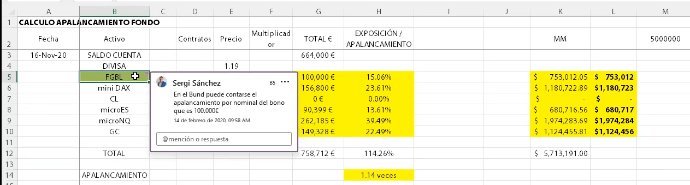
  <figcaption>Figura 011</figcaption>
</figure>
</div>

Pero ahora sí el bono, si tú vas por exposición parece que te ocupa mucho. Pero no va a ser por exposición si operas para ti, no va a ser por exposición si operas en *Darwinex*,,,, tu va a ser por *VaR*. Y por *VaR* es otra cosa, por *VaR* ya puedes hacer, te comillas, lo que quieras a este nivel. Porque a ti te va a contar el riesgo, el *VaR*.

**Cálculo del VaR Paramétrico**

Que ya hablamos la teoría, acordaros porque en la práctica no hemos hablado creo demasiado de ello. Y lo comentábamos, acordaros, que la manera fácil y rápida de calcular el *VaR* es el *VaR paramétrico*.

El *VaR paramétrico* no es más que la rentabilidad menos el valor Z, que es conocido: 1.64. Esos valores son conocidos, siempre es igual. Al 95%, 1.64, y el 99%, 2.33. Te los apuntas en un papel y ya está. Nos manda que te los calcula el *Excel* con una forma, porque no cambia. Eso sí, asumiendo distribución normal, gran pero bueno.

<figure>
  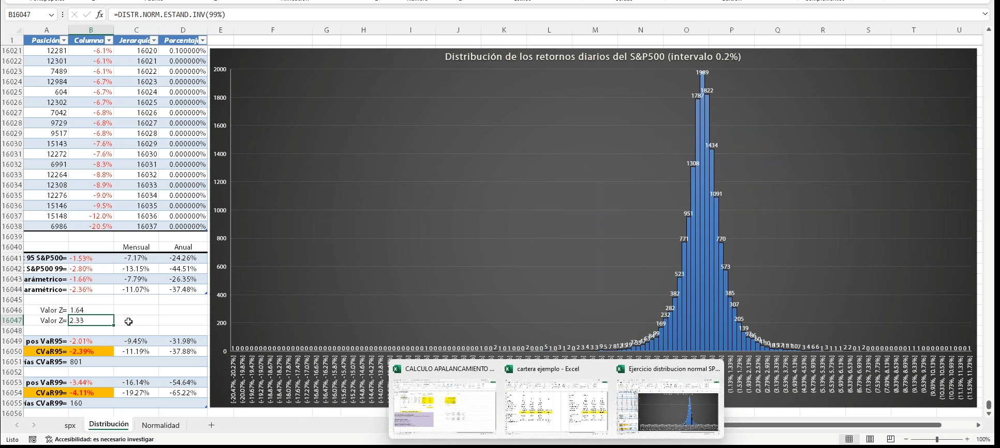
  <figcaption>Figura 012</figcaption>
</figure>

Suponiendo que yo no tenga la lista de operaciones, si yo tengo el retorno medio de un periodo o de un trade, yo tengo en un *Performance Report* un sistema, yo tengo el *average trade*, sé lo que de un trade puedo esperar de él, no, 100 dólares, 230. Bien, y se la desviación típica, sí, si lo sé. Todas las plataformas me lo dan también. *TradeStation* en *Trade Analysis* me da la desviación típica, una desviación. Pues con eso ya tengo el *VaR* estimado, aproximado, ya tengo el *VaR* por trade.

Si lo quiero por día pues necesito los períodos. Caros, y lo quiero por un mes, eso ya es otra cosa. Esto aquel que no se acuerde, por favor ver aquel ejercicio donde hablé de todo esto en la teoría del *VaR* y trabajamos en profundidad con *Excel*. Súper denso aquellas clases, verlas cinco veces por favor, no una ni dos, cinco veces. Con un sistema que calculé el *ratio K*, cálculo el *VaR*. Y aquí lo calculé ya digo por paramétrico, por histórico. Es cierto esto, pues repasarlo. 

Yo de un sistema puedo sacar el *VaR* por el *average straight* y si me dan los resultados medios de un periodo que creo que ahora de memoria, hablo, *MultiCharts* me lo da, lo puedo sacar de ese periodo. Solo necesito un retorno medio y una desviación típica, nada más. Con eso sacó el *VaR*, el *VaR paramétrico*. Entonces con eso ya tengo el *VaR*. 

Bueno, y lo mismo para el *portfolio*, necesito la media del *portfolio* y la desviación típica *portfolio*, los da por operación. Si necesito por tiempo, pues tengo que sacar una medida temporal.

Automáticamente yo aquí en la tabla he sacado el `apalancamiento` porque es una medida estándar que siempre al final tiene bien saberlo. Seis veces apalancamiento es apalancamiento potente, potente. 

<div style="background-color: #f0f0f0; border: 1px solid #ccc; padding: 15px; border-radius: 5px; margin-bottom: 20px;">
<table style="font-size: 10px; border-collapse: collapse; margin-bottom: 20px;">
<tr><td><b>Activo</b></td><td>MES</td><td>MGC</td><td>FV</td><td></td></tr>
<tr><td></td><td style="background-color: yellow;"><b>36.84%</b></td><td style="background-color: yellow;"><b>34.88%</b></td><td style="background-color: yellow;"><b>28.28%</b></td><td></td></tr>
<tr><td><b>OPERARIAMOS</b></td><td>1</td><td>2</td><td>1</td><td></td></tr>
<tr><td><b>PRECIO - cierre de ayer</b></td><td>5546.25</td><td>2329</td><td>106.23</td><td></td></tr>
<tr><td><b>BPV</b></td><td>$5</td><td>$10</td><td>$1,000</td><td></td></tr>
<tr><td><b>NOMINAL</b></td><td>$27,731.25</td><td>$46,580.00</td><td>$106,230.00</td><td>$180,541.25</td></tr>
<tr><td><b>APALANCAMIENTO</b></td><td></td><td></td><td></td><td>7.22</td></tr>
</table>
</div>

Lo normal, aunque esto depende porque aquí hay la trampa, está el bono, la trampa está el bono.

Lo normal en una exposición así es que esto fuera un *VaR* a lo mejor puede ser que fuera menos, pero puede ser *VaR* 15 perfectamente, incluso puede que 20. Pero yo creo así a ojo que esto estaría por ahí. Ese nivel de *VaR* es un *VaR* asumible, es un *VaR* fuerte pero asumible.

Y si esto fuera a 50 mil, que con otro sistema de este estilo, de este estilo, pues sería igual. No menos, digo cómo me ha subido que me he puesto un 0 de más. Sería solo apalancamiento de 3, eso es un *VaR* bastante modesto. 

<table style="font-size: 9px; border-collapse: collapse;">
<tr><td><b>Cuenta:</b></td><td>25,000 €</td><td></td><td></td><td></td></tr>
<tr><td><b>€/$</b></td><td>1.1</td><td></td><td></td><td></td></tr>
<tr><td></td><td><b>S1</b></td><td><b>S2</b></td><td><b>S3</b></td><td><b>total</b></td></tr>
<tr><td><b>Activo</b></td><td>MES</td><td>MGC</td><td>FV</td><td></td></tr>
<tr><td><b>Garantías</b></td><td>$1,180</td><td>$1,000</td><td>$1,400</td><td></td></tr>
<tr><td><b>Capital x sistema</b></td><td>8,333 €</td><td>8,333 €</td><td>8,333 €</td><td></td></tr>
<tr><td><b>DD del sistema</b></td><td>$4,500</td><td>$5,000</td><td>$6,000</td><td></td></tr>
<tr><td><b>Garantías+DD</b></td><td>5,164 €</td><td>5,455 €</td><td>6,727 €</td><td></td></tr>
<tr><td><b>contratos</b></td><td>1.613849765</td><td>1.527777778</td><td>1.238738739</td><td>4.380366282</td></tr>
<tr><td></td><td style="background-color: yellow;"><b>36.84%</b></td><td style="background-color: yellow;"><b>34.88%</b></td><td style="background-color: yellow;"><b>28.28%</b></td><td style="background-color: yellow;"><b>100%</b></td></tr>
<tr><td><b>OPERARIAMOS</b></td><td>1</td><td>1</td><td>1</td><td>3</td></tr>
<tr><td><b>PRECIO</b></td><td>5546.25</td><td>2329</td><td>106.23</td><td></td></tr>
<tr><td><b>BPV</b></td><td>$5</td><td>$10</td><td>$1,000</td><td></td></tr>
<tr><td><b>NOMINAL</b></td><td>$27,731.25</td><td>$23,290.00</td><td>$25,000.00</td><td>$76,021.25</td></tr>
<tr><td><b>APALANCAMIENTO</b></td><td></td><td></td><td></td><td style="border: 1px solid green;">3.04</td></tr>
</table>

Apalancamiento puede estar alrededor del 5, puede ser bastante en línea de lo que es el *VaR* del Darwinex aproximadamente. Aproximadamente, así a ojo, estoy haciendo estimaciones, no me lo toméis esto como una sentencia porque no importa, simplemente lo doy como referencia.

**Volumen de Futuros y Selección de Activos**

Pero esos son detalles que tratan de ayudaros a responder esa pregunta reiterada de cómo configuro los pesos, como qué estrategia manda. Bueno, manda un poco, a mí me gustaría más hacer una métrica de rentabilidad-riesgo. Bueno, es igual, al final va a ser el divisor. Aquí al final vas a tener un total y al final vas a salir un porcentaje. Me entiendes, el final es igual el número que salga aquí.

Yo lo voy a sumar y luego voy a dividir, y lo que importa es este valor de peso `amarillo`. Si aquí en `contratos` es el número de 7, aquí es 8, y aquí es 9, sale igual el peso. Entiendes, decir este número, aquí son contratos pero es igual. Todo el final divides el capital que tienes que es el mismo, *equal weighted* repartido del sistema por una variable de principio riesgo. Pero yo puedo usar otra métrica que sea la misma en los tres, claro. Porque si no, no estoy peras y peras y manzanas y manzanas.

Pero ya está, divido por eso y reparto. Y yo ya sé que el sistema me compensa más. La industria suele hacerlo por ese variable, como os lo he hecho yo. Pero yo entiendo que también tiene sentido por un ratio de retorno-riesgo. Que el valor contrato pondría más divisor, resulta. Le pones resultado, y ya está. Y lo que te de aquí tu sacas su porcentaje, y ya sabes que al final esa es la cantidad que le tocaría a cada para hacer *equal weighted* pero por riesgo. Entendido.

Y aquí calculado el apalancamiento para una referencia que será apalancamiento, pues simplemente la `cuenta` partido por el `nominal` de los futuros, el nominal. Y ya digo, está la trampa, está que nos rompe, por eso lo puesto expresamente para que evidencie este problema de los bonos que realmente parece que no compensan. Y es verdad que si vas a exposición cuesta que compensen.

[File : XLSX del ejemplo $25000](../data/cartera%20ejemplo.xlsx)

**Ejemplo con Cuenta de 100.000 Euros**

Otro ejemplo, tenemos una cuenta de 100.000, ya es un poco mayor. Y aquí decimos, yo tengo 6 vectores ahora, 6 vectores. 

<div style="background-color: #f0f0f0; border: 1px solid #ccc; padding: 15px; border-radius: 5px; margin-bottom: 20px;">
<table style="font-size: 10px; border-collapse: collapse;">
<tr><td><b>Cuenta:</b></td><td>100,000 €</td><td></td><td></td><td></td><td></td><td></td><td></td></tr>
<tr><td><b>€/$</b></td><td>1.1</td><td></td><td></td><td></td><td></td><td></td><td></td></tr>
<tr><td></td><td><b>S1</b></td><td><b>S2</b></td><td><b>S3</b></td><td><b>S4</b></td><td><b>S5</b></td><td><b>S6</b></td><td><b>total</b></td></tr>
<tr><td><b>Activo</b></td><td>MNQ</td><td>MGC</td><td>FGBL</td><td>EC</td><td>MCL</td><td>C</td><td></td></tr>
<tr><td><b>Garantías</b></td><td>$1,770</td><td>$1,000</td><td>3,297 €</td><td>$2,100</td><td>$603</td><td>$1,430</td><td></td></tr>
<tr><td><b>Capital x sistema</b></td><td>16,667 €</td><td>16,667 €</td><td>16,667 €</td><td>16,667 €</td><td>16,667 €</td><td>16,667 €</td><td></td></tr>
<tr><td><b>DD del sistema</b></td><td>$5,500</td><td>$5,000</td><td>8,000 €</td><td>$16,000</td><td>$3,500</td><td>$12,000</td><td></td></tr>
<tr><td><b>Garantías+DD</b></td><td>6,609 €</td><td>5,455 €</td><td>11,297 €</td><td>16,455 €</td><td>3,730 €</td><td>12,209 €</td><td></td></tr>
<tr><td><b>contratos</b></td><td>2.521779</td><td>3.05555556</td><td>1.47531793</td><td>1.01289134</td><td>4.46827525</td><td>1.365103</td><td>13.8989221</td></tr>
<tr><td></td><td style="background-color: yellow;"><b>18.14%</b></td><td style="background-color: yellow;"><b>21.98%</b></td><td style="background-color: yellow;"><b>10.61%</b></td><td style="background-color: yellow;"><b>7.29%</b></td><td style="background-color: yellow;"><b>32.15%</b></td><td style="background-color: yellow;"><b>9.82%</b></td><td style="background-color: yellow;"><b>100%</b></td></tr>
<tr><td><b>OPERARIAMOS</b></td><td>3</td><td>3</td><td>1</td><td>1</td><td>5</td><td>1</td><td>14</td></tr>
<tr><td><b>PRECIO</b></td><td>20192.75</td><td>2329</td><td>132.43</td><td>1.0782</td><td>79.72</td><td>443.75</td><td></td></tr>
<tr><td><b>BPV</b></td><td>$2</td><td>$10</td><td>1,000 €</td><td>$125,000</td><td>100</td><td>50</td><td></td></tr>
<tr><td><b>NOMINAL</b></td><td>$121,156.50</td><td>$69,870.00</td><td>$132,430.00</td><td>$134,775.00</td><td>$39,860.00</td><td>$22,187.50</td><td>$520,279.00</td></tr>
<tr><td><b>APALANCAMIENTO</b></td><td></td><td></td><td></td><td></td><td></td><td></td><td>5.20</td></tr>
</table>
</div>

Seguramente podría tener más porque esos sistemas, la mayoría, si tú tienes sistemas diarios. os lo comenté, nosotros tenemos estudios hechos de *Apollo* y *Artemisa* en un montón de activos. Y por eso he insistido hasta hacer muy pesado, con total seguridad que cuando podamos operar en futuro seremos mucho mejor.

Porque yo puedo operar, aunque sí que es verdad que ahora voy a saltar ahí al volumen. Mira, voy a hacerlo ahora porque así vamos un poco no siguiendo tanto el *Excel*.


Lo que os decía de los volúmenes y demás, de cara a elegir futuros os puse ahí por ejemplo, recordaros en el *Discord*, algún ejemplo de *portfolios* de materias primas. Que no tiene porque ser solo de eso. Pero el *Discord*, a nosotros aquí, si lo puse, lo puse pero estaba dentro de algo. No, en esto, quizás era esto, es esto. Esto, esto que sobre los *portfolios* de ejemplos, son ejemplos.

* [Portfolio Commodities](../../26-practice-16/docs/Portfolio%20Commodities.pdf)

Pero esto más allá de ese ejemplo de los *power* o referencias, el que pueda operar futuros es bueno que vosotros miréis esto que yo os enseño ahora.

<figure>
  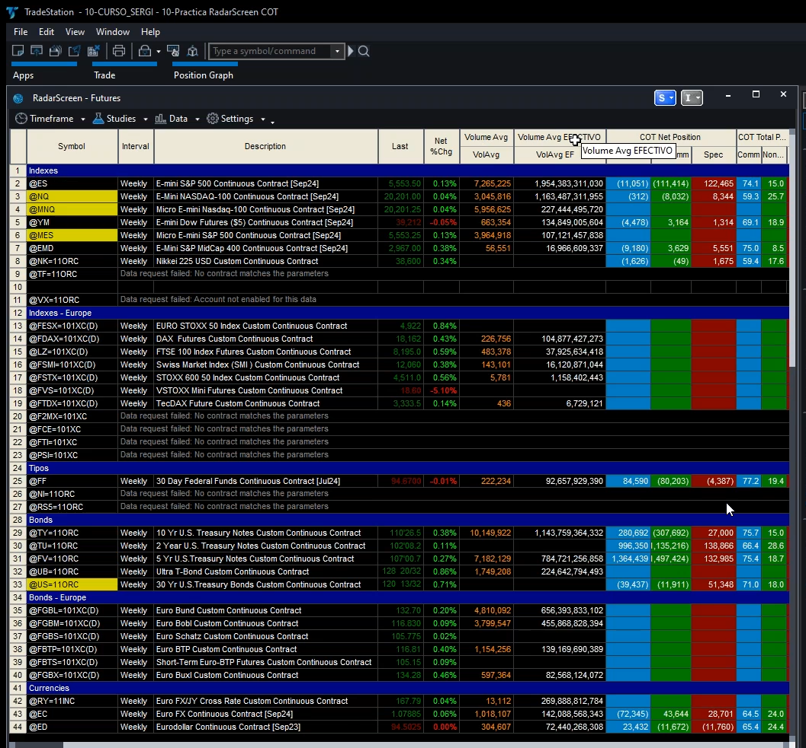
  <figcaption>Figura 014</figcaption>
</figure>

Yo tengo aquí una columna en que me dice el volumen medio, no sé si tengo de un mes, y tengo aquí el volumen efectivo que es un indicador hecho por nosotros que simplemente es el nominal, o sea simplemente es el nominal, simplemente multiplicado por el cierre. Porque? porque depende del coste que qué precio tenga un activo pues realmente necesito más dinero menos.

Si solo cuento el volumen a mí, el hecho que un activo opere 50.000 contratos no me dice nada por sí solo. Porque depende de cuánto sean, a cuánto cotiza, si cotiza un dólar o a 100, a 100 pues siempre es más usar contratos. Entonces de esta manera es donde lo tratamos de calcular. 

Entonces fijaros aquí que salen cantidades de dinero muy grandes, que nos da igual, pero es una manera de ver un poco los futuros qué volumen tienen. Se han ordenados por esto, es un *skin* que se lo puede hacer cualquiera, todo esto es información de la plataforma, no es nada especial.

Los símbolos los puedes ir escribiendo y, pero esto ya digo, si alguien lo quiere se lo paso también. Tienes aquí por ejemplo en metales por ejemplo es el oro, la plata, el cobre. Y tengo el *micro oro*, que como no está el continuo hecho lo tengo que hacer personalizado porque hay algunos que no tienen continuo hecho. Que fijaros que tiene un volumen aún así mayor que el platino.

<figure>
  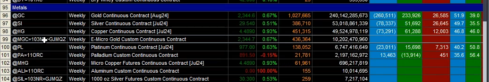
  <figcaption>Figura 015</figcaption>
</figure>

Y con esta información y con las garantías 

<figure>
  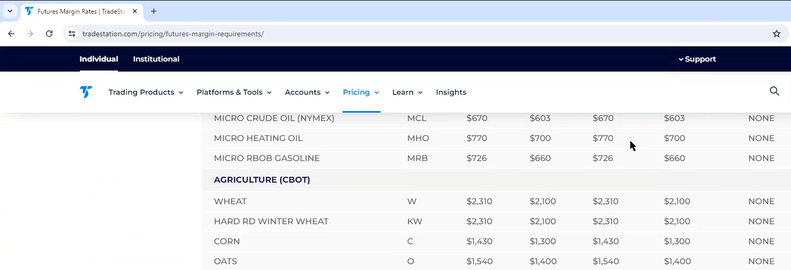
  <figcaption>Figura 016</figcaption>
</figure>

y también con alguna prueba que yo haga, acordaros que miramos con aquel *workspace* de tendencia en futuro, os acordáis. Y miramos pues a de X, average de volatilidad. 

<figure>
  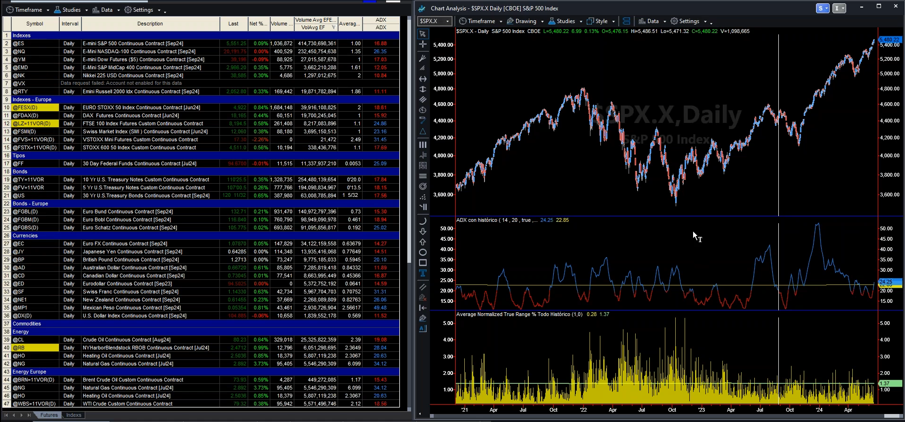
  <figcaption>Figura 017</figcaption>
</figure>

Puedo tener un sistema, yo he hecho cualquiera de los que tengo hecho estándar, uno tendencial, no tendencial. Ponerlo, hacerle una pequeña o sin hacérsela, a ver cómo va en un tendencial. Referencias para ver un poco activos.

Maneras sencillas de hacer las cosas porque hay un coeficiente de *Hurst* por ejemplo que se usa para esto. La verdad no os compliquéis la vida porque no lo vais a sacar igual así.


Entonces por este lado lo que sigo aquí ves un poquito pues qué volumen tienen. Y por otro lado pues aquí ves un poquito qué garantías tenemos.

**Análisis de Volumen por Tipo de Futuro**

Por ejemplo aquí se da una curiosidad que os quiero llamar la atención donde, por ejemplo dice eso, mira eso es muy interesante operar la gasolina, porque me ha hablado muy bien de la gasolina. Es verdad muy bien, yo sé, yo veo que hay un *mini* de la gasolina en el NYMEX muy interesante con 3400. Pero veo algo mejor, lo que hay un *micro* de la gasolina con 660 dólares. esto parece bastante potente. 

<figure>
  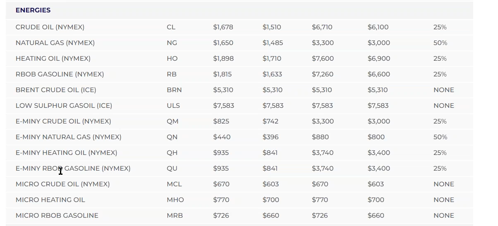
  <figcaption>Figura 018</figcaption>
</figure>

Pero voy a probar, a ver si lo tengo por aquí ya abierto. Tengo aquí @MRB. Que además tiene hasta continuos, qué maravilla. Y resulta que hace dos contratos de media. Y eso es así, lo he mirado varias veces.

<figure>
  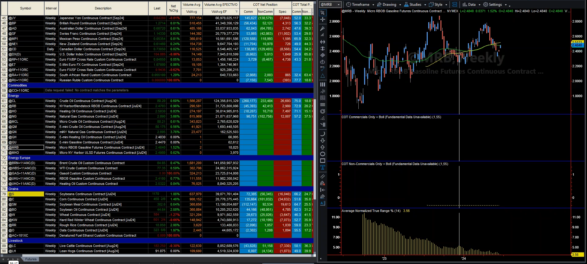
  <figcaption>Figura 019</figcaption>
</figure>

Eso se lo pongo ya en diario, ya no hace barras 

<figure>
  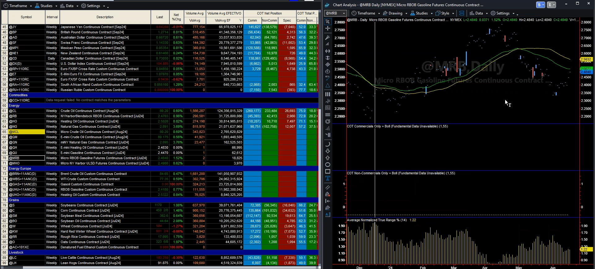
  <figcaption>Figura 020</figcaption>
</figure>

porque el mercado pues saca su producto de funcionar o puede no funcionar. Porque a ver, podría ser que yo me hubiera,,, 

como ahora mismo no lo operamos, no lo operamos. Podría ser que tuviera el mes corrido porque por ejemplo el petróleo tiene. Y esta manera pues puedo tratar de verlo así.

<figure>
  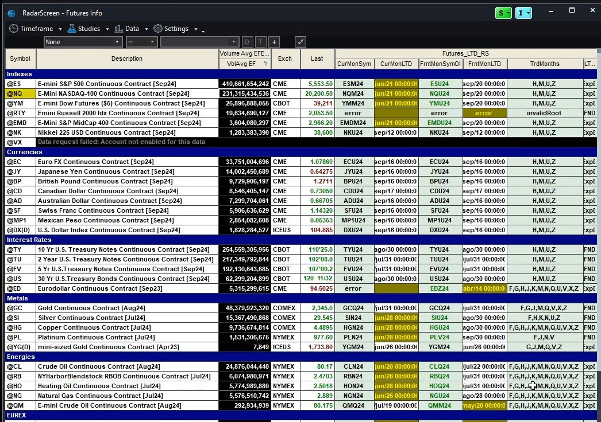
  <figcaption>Figura 021</figcaption>
</figure>

sí que sé que tiene 12 meses.  Consultarlo, que averiguarlo, pero lo tiene. Entonces cada mes de mes vence, pero va corrido. Luego cuando nos siguen los rolos vais a ver aquí que es muy interesante. Porque es ahora acaba de saltar, pero acaba de saltar ahora al Q, que es el de agosto. 

<figure>
  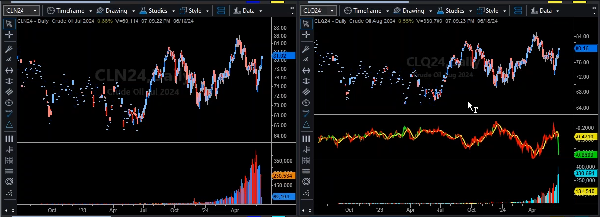
  <figcaption>Figura 022</figcaption>
</figure>

Ha vencido julio, ha vencido julio y ha saltado agosto. Como por delante ya salíamos en el Q.  
Pero es igual, sea N o sea Q, si yo vuelvo aquí ahora que vamos a ver ahora. Porque mejor, me he equivocado perfectamente, pasar no encuentre aquí. Aquí tengo MRB Q24, abro el vencimiento en curso y habéis que no. MRB N24, si este no va corrido, es julio, es que no va corrido. Igual es que no va corrido, hay que hacer el continuo propio, podría pasar. Porque es muy raro, a ver si ahora el M24 tiene volumen.

Es lo que veis aquí, efectivamente el continuo que ha hecho no tiene volumen, no es operable. Entonces está muy chulo en la tabla pero no sirve para nada.

**Micro Petróleo: Un Caso de Éxito**

Entonces, pero en cambio como veis aquí en la tabla tenemos el MCL que es el mismo, es también *micro petróleo*, 

<figure>
  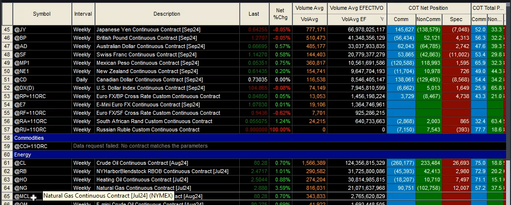
  <figcaption>Figura 023</figcaption>
</figure>

que sí que tiene volumen. 

<figure>
  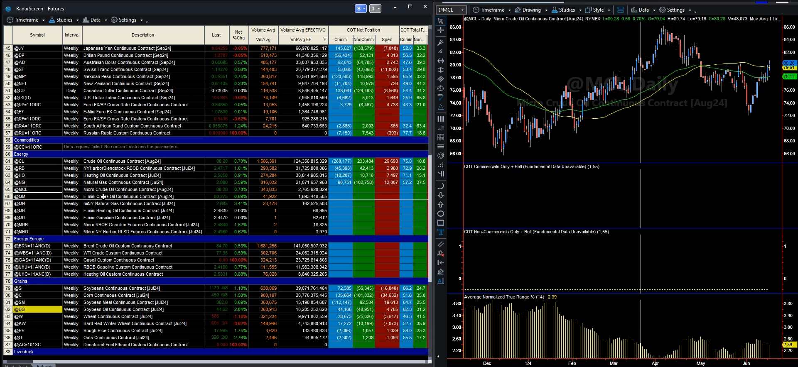
  <figcaption>Figura 024</figcaption>
</figure>

Tiene más volumen que el QM, que el *mini* crudo. Que esto siempre, cuando empezaron a sacar los micros, los *mini*, pensé qué pasaría. Porque al final yo me puedo granilar mejor, entendéis. Al final saca un euro y hay un euro-dólar grande, hay un euro-dólar micro. Es hombre, pues el micro es el que más volumen hará porque al final yo me puedo granular mejor.

Pues no, no es así en la mayoría de futuros, tampoco ha pasado en el NASDAQ, que operan bastante volumen pero no en nominal. En nominal no operan, cuando haces el cálculo no operan más, no operan más.

<figure>
  
  <figcaption>Figura 018</figcaption>
</figure>

En cambio en el *micro petróleo* sí pasa. El *micro petróleo* de media mueve 342 mil contratos. El QM que es el *mini petróleo* mueve 41 mil. Es que el grande mueve un millón, sigue siendo otra liga. Pero es, como veis el *micro*, fieles son 2.700.000, es mucho más, pero es más el *micro CL*, multiplicarlo por el valor del futuro, es más. Por lo tanto está moviendo más volumen.

<figure>
  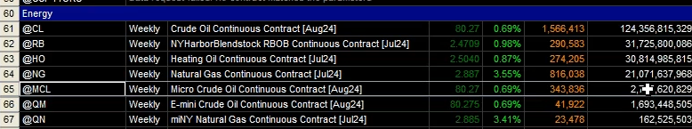
  <figcaption>Figura 026</figcaption>
</figure>

Aquí sí que compensaría operar el *micro CL* que tiene un volumen aceptable. Esto lo vamos a ver en un momentito de cinco minutos y vais a ver que es operable en cinco minutos. Tengo velas normales en cinco minutos, incluso. 

<figure>
  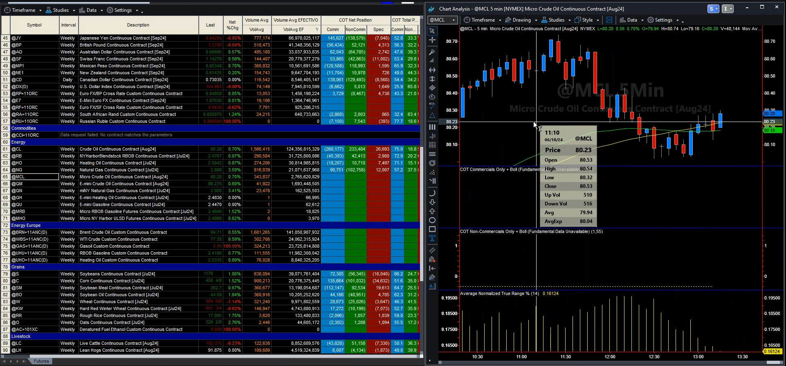
  <figcaption>Figura 027</figcaption>
</figure>

Va tener poco volumen, va tener poco volumen. Son cosas que tengo que mirar, pero tiene volumen. Tiene volumen, por cada cinco minutos 280 contratos, 170, 400. Es un volumen que está bastante bien, un volumen que seguramente es muy superior al IBEX por ejemplo.

<figure>
  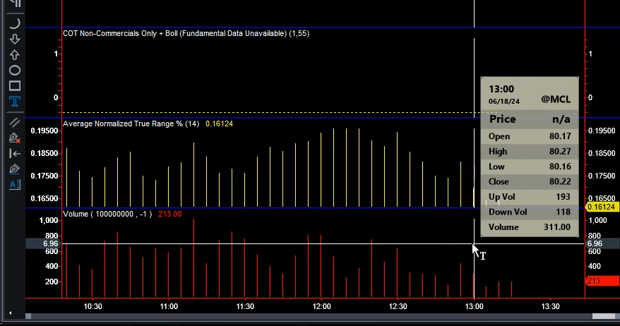
  <figcaption>Figura 028</figcaption>
</figure>

Al menos que lo que era, no sé cuánto mueve el IBEX ahora por contratos el futuro del IBEX en un día, pero antiguamente movía a 30.000, no sé, no sé. Hace muchos años, pero está muy bien. Entonces esto permite que sea operable. Me interesa el número de contratos también, por eso miro las dos cosas, las dos cosas. Entonces el *micro petróleo* es muy operable.

Y cuidado porque el *micro petróleo*, esto me lo he hecho explicar porque quería, solo son 600 dólares de garantías. Claro, básicamente todo esto, voy a ganar menos de, con el grande, pero lo puedo operar, me entendéis. Con 600 euros, dólares lo puedo operar. No me permite garantías intradía, pero es que el mantenimiento son 600, son 600. Tengo que mirar un poco, tengo que mirar las garantías, que tenga volumen, etcétera.

Entonces este tipo de tablas me pueden venir bien para eso, tanto volumen como volumen efectivo. 

<figure>
  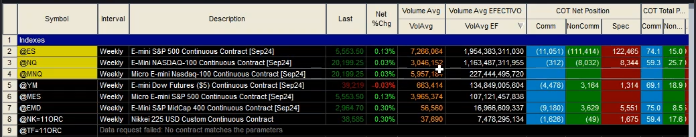
  <figcaption>Figura 029</figcaption>
</figure>

Quedaros en lo en las *equities* que se da que el S&P, una la locura, tiene 7 millones de contratos diarios. El NASDAQ tiene, el *mini NASDAQ* tiene 3 millones de contratos diarios. Y el *micro NASDAQ* tiene 5-6 millones, más, muy bien. Es tremendamente operable, lógicamente, lógicamente. Pero tiene, vale menos, es decir su volumen efectivo es menor. Pero oye, está moviendo más volumen en contratos que en el DAX por ejemplo, al menos hasta un tipo no pasaba esto.

Está muy bien porque quiere decir que a mí el *mini NASDAQ* me es totalmente operable. Que luego a lo mejor por comisiones es más caro, puede ser. Pero me va a permitir operarlo, tengo hasta más contratos en volumen medio, el número de contratos que el NASDAQ es el *micro NASDAQ*, me viene muy bien? Porque me viene muy bien porque el NASDAQ como no para de subir, las garantías van subiendo. El NASDAQ ya, el *mini NASDAQ*, son 17 mil dólares de garantía. Y lo van a subir en cualquier momento. Y el micro son 1770, ya siguen siendo porque antes eran hasta menos de mil casi

Y el micro SP 1180, que sigue siendo operable. No llega a tantos micros, pero tenemos aquí, mueve 3 millones al día, 7 millones mueve el grande, 3 millones mueve el micro. En este caso no es tan, no llega a hacer más. Claro es que se opera mucho más el *micro* el NASDAQ que el S&P en el *micro*, tiene el doble de contratos casi en nominal y en el número de contratos. Y en nominal, en efectivo opera más en el *mini*, se opera más el S&P. Pero en el micro se opera más el NASDAQ.

Entonces bueno, esto me viene bien a mí porque puedo operar perfectamente cualquiera de los dos, tienen volumen, tienen garantías pequeñas.

**Garantías Intradía**

Y cuidado que aquí puedo hacer intradía, en este caso sí que puedo con el *micro NASDAQ* a un 25%. Son 400 dólares y 177. Y en el Russell, el que todavía son menos, también puedo, y son 160 dólares. Intradía con 200 dólares de garantías puedo abrir  un Russell, en *micro*.

<figure>
  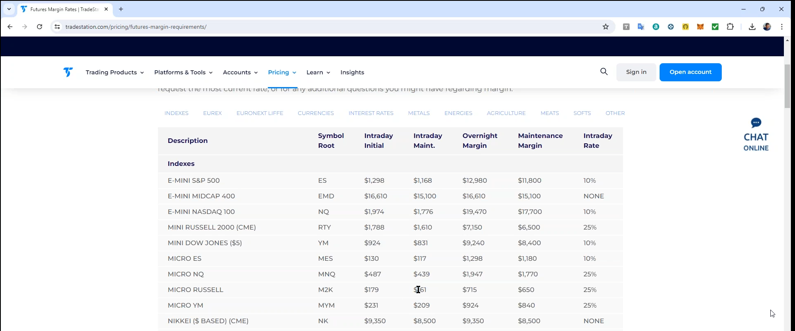
  <figcaption>Figura 030</figcaption>
</figure>

Entonces estos tipos de cosas son las que hay que mirar y trabajarlas y analizarlas, por ejemplo en *Excel* de este tipo. Claro, si yo quiero operar materias primas es lo que hablábamos antes, ahí sí que algunos tienen como habéis visto. Pero fuera del *micro petróleo* cuesta encontrar cosas operables.

Es verdad que la mayoría de ellas ya tienen menos. Sería una soja, o por ejemplo un maíz, un *corn*, que son 20 millones y 900 mil de media, de media. Son pocos contratos, pero oye no está mal, no está mal. Son más que el MD, el *mid cap* es muy grande, el *mid cap*. Bueno, tengo ahí cositas que digo no llegan al volumen pero se puede. Aún sobre todo para uno operar, pero ahí sí que ya no voy a poder encontrar.

<figure>
  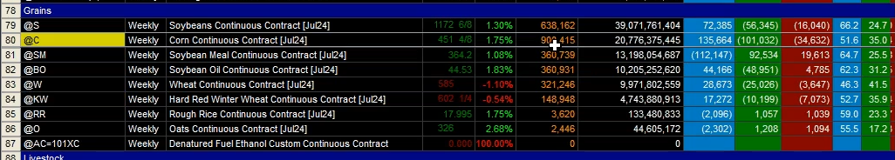
  <figcaption>Figura 031</figcaption>
</figure>

Porque en el caso que los hubiera, que no creo que no los hay, la agricultura por ejemplo, granos no va a tener volumen. Pero es la *soft*, al final aquí sí que la *soft* sí que pican algunas un poco más. Café, carros, el cacao, 14 mil dólares para abrir un cacao. Encima no creo que tiene un gran volumen, el CC *soft*, 100 mil de contratos al día. Es un tronco, esto es un tronco marco, no se puede operar. Esto sería solo apto para grandes cuentas.

<figure>
  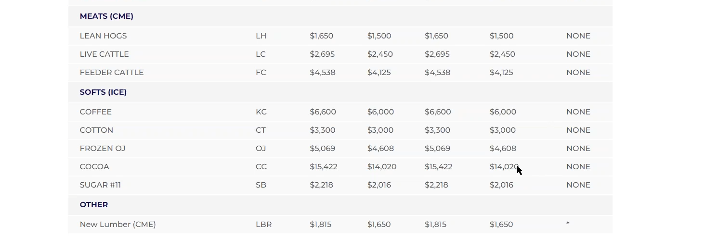
  <figcaption>Figura 032</figcaption>
</figure>

<figure>
  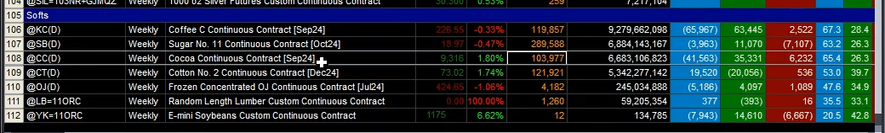
  <figcaption>Figura 033</figcaption>
</figure>

<figure>
  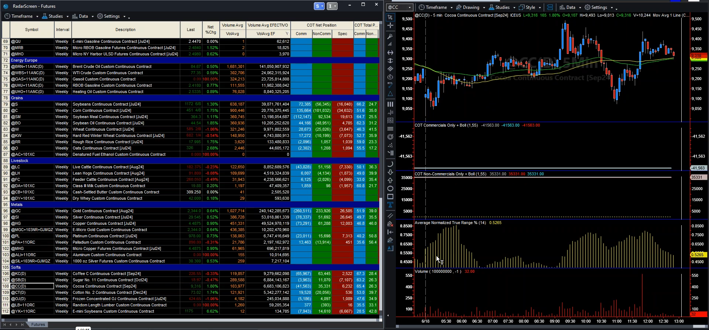
  <figcaption>Figura 035</figcaption>
</figure>

Pero ya digo, *micro oro* bien, puedo operar un *micro oro*. Puedo operar un *micro petróleo*, puedo operar un *micro cobre*. Bueno, podría operarlo, podría operarlo. *Micro cobre* está ahí, 60 mil, está ahí. Podría operarlo a los cinco minutos, estoy todavía en 40 contratos, 50, 70, mejor en un 100, 120 minutos. Podría operarlo seguramente un *micro cobre*.

<figure>
  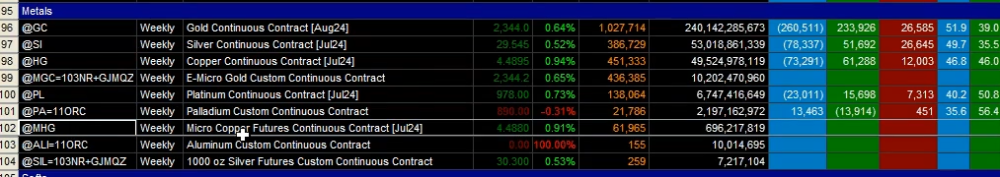
  <figcaption>Figura 036</figcaption>
</figure>

<figure>
  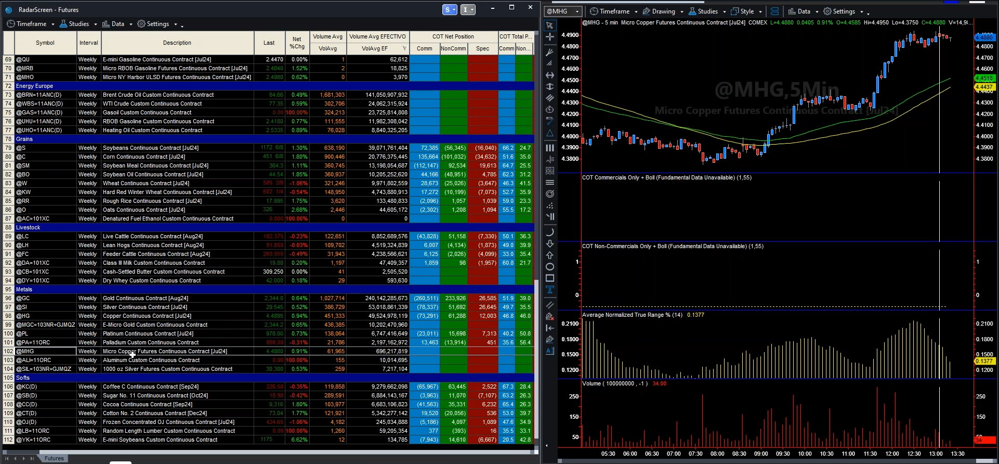
  <figcaption>Figura 037</figcaption>
</figure>

podría operar quiero decir haciendo *trading*, el poder operarlo. Se puede operar todo porque se cotiza, se puede operar, entiendo yo. Si queremos hacer el *trading*, y hablo intradía, en diario, lo podéis operar prácticamente todo. Todo! 

Entiende que lo que habéis visto antes de la gasolina, no, se entiende. 

Pero cualquier cosa que tenga una barra completa en que visualmente sea completa en 60 minutos es operable en día. Es decir no, no, el problema ya directamente me estoy refiriendo al intradía.

Un cobre pues tiene un volumen razonable y estamos con un 400 dólares, estamos con 400 dólares de garantías. Es ya no me dejan intradía, que es muy pequeño. 


Y estos son las cosas que uno ya tengo que mirar para definir la cartera, sobre todo cuando es pequeña.

> *A ver cómo tal. Venga, voy a meter un bolsa. Bueno, venga pues. Oye si voy más, tengo más margen a mejor, voy por el *micro NASDAQ*. Si no tengo tanto porque es más volátil y además tiene las garantías un poco mayores, pero si no, pues voy con un *micro S&P* que solo son 1180. Oye si no, me meto con un *micro Russell* que está de coña. Vas a meter con un *micro Russell* y empezando, cuando pueda ya me meto con un *micro NASDAQ*.*
> 
> *Venga, vamos a ver un *micro oro* y que ahora. Oye tengo, nosotros tenemos eso ahora mismo, recordaros en NASDAQ, a ver. Un *micro oro*, cuánto, qué garantías tengo, y estoy mirando solo mantenimiento. Un *micro oro*, venga con un *micro oro*, voy con mil. Bueno, un poquito más que el otro, pero está ahí, está ahí.*
>
>*Oye llamadas, aún me meto un *micro petróleo*. Y voy de lujo con un *micro petróleo*, me va a permitir hasta granularlo porque son 600 dólares solo. Entendéis, y ya hemos visto ahí *mini core*, *mini tal*. Sé que hay, bueno, complicado, no van a tener volumen, no van a tener volumen casi con total seguridad.*


Eso sería un poco lo que quería enseñaros de esta parte de carteras y demás cosas.

**Preguntas y Respuestas**

En la parte que final *Walk Forward* también, alguien hablaba de *Walk Forward*, pues lo mismo. Aquí lo ves, aquí lo ves. Eso lo podéis ver porque de verdad no han cambiado, no han cambiado, tienen cambios muy muy menores, muy muy muy menores. Entonces podéis ver aquí y aquí lo explico, unido al material que ya subí de *Portfolio Maestro*, aquellos PDFs.

Y si no, unido a lo mejor algún material de apoyo de lo que se llama de la web del canal de YouTube de *TradeStation*. Y si no, alguien me insista, hoy no encuentro tal, pues yo te lo busco.

Pero esto de verdad es más o menos lo mismo, es más o menos lo mismo. Y hay que hacer pues algún ejercicio y expliqué cómo funcionaba y demás. Entre esto, lo que había de Nava también que os he enseñado, que ahí creo que toca poco pero si no la lista, buscas el *Portfolio Maestro*, es lo que te recomiendo ver.

Y lo que ya hemos hecho nosotros que hicimos de las primeras clases, como te comentaba aquí en el foro, la práctica 2 y la 15-16 toqué *Maestro*. Entonces lo veis más, lo veis más.

**Teoría Moderna de Carteras**

Y lo del *portfolio*, lo que os decía que ya te comentaba. comenté las teorías: la *Teoría Moderna de Carteras*, la *Post Moderna de Carteras*. Cuando entras, todos estos modelos están pensados para operativa convencional de acciones y demás.

Al final a la que tú entras en sistemas donde hay vector largo-corto, activos distintos, todo lo que sale aquí optimizado, al final en el futuro no se mantiene, cuesta mucho de mantenerse. Entonces ya, yo prefiero priorizar la diversificación. Y eso cómo lo hago, pues por *equal weighted* por riesgo. 

Porque si te dejo optimizar, si tú puedes optimizar, te va a pasar al *MSA* verás cómo alguna vez un sistema le pondrá un 1% y otro un 30%. Dices, no quiero, no quiero. Porque no estoy diversificando. Porque ve que uno tal, lo que te decía, uno tiene unos trades, es más antitendencial, entonces el tendencial el *Monte Carlo* me lo penaliza mucho. A la larga no te va a dar buen resultado, o no te va a dar mejor resultado. 

*equal weighted* o parecido a *equal weighted*. Es decir, luego con *MSA* lo puede retocar, pero ese es el punto de partida. El *Excel* que os enseñé, bien.


**Preguntas de Raúl**

<strong><em>Planteo algunas dudas que tengo para la clase de mañana. Es posible que alguna respuesta esté en las prácticas anteriores pero no me ha sido posible repasar todo el temario. Alguna de ellas puede que no encaje en el temario previsto del curso, por lo que si es posible y hay tiempo para atenderlas se agradecerá, si no es posible se entiende que no se pueda abarcar todo. Gracias!

1.- Un sistema en diario que opere muy poco(menos de 100 operaciones en 20 años aprox.), pero que probado en Portfolio Maestro en una cesta grande tiene un resultado correcto con  trades suficientes, se podría dar por operable en un portfolio?</em></strong>

Sí, claro que sí. Claro que un sistema diario que opere menos, poco de 100 operaciones, probado en una cesta grande, hecho. Ese es el camino. Ahí no vamos a poder optimizar, no optimizamos. Pero lo que hacemos es validarlo.

Lo hicimos en la primera clase con las 100 con las 100 acciones del NASDAQ. Y por ejemplo, tanto nuestro *Apollo* con los *Artemisas*, siguen. Aunque sí que se pueden optimizar porque tienen un número suficiente de trades, pero aún así se validaron la renovación preliminar en una cesta muy grande. Y hoy mismo, por ejemplo, probando estábamos hace un rato mirándolo, y en un montón de *commodities* también.

Es decir, con los parámetros que usamos en el NASDAQ también en un montón de *commodities*. Es decir, al final claro que sí, ese es el camino, justamente para validar una estrategia que opera poco.

Otro sistema que tenemos así es *Iris*, también lo hemos comentado, y lo hemos comentado los directos. Os animo a seguir viendo los directos. Y por cierto, esto es algo que lo he comentado en el curso pero va a seguir. Vamos a seguir haciendo directos en principio todos los jueves.

Por lo tanto, eso está abierto a todo el mundo, pero también a un alumno. Quiero decir, a mí si tú me vienes en el chat, hoy soy alumno del curso, tengo esta duda, me la pones y te contesto. Entonces aprovechar eso y usarlo, este es el objetivo de esas web. Es que hay veces que hay más gente, veces que hay más menos. La mayoría de gente lo ve después.

Pero yo sobre todo los hago, no lo hago como una de marketing, supone eso es pequeño. Pero me gusta el hecho de tener un sitio donde todo el mundo puede ir a hablar conmigo. Y vosotros podéis usarlo ahora, cuando acabemos y ya no hagamos más clases. Pues puedes oye, esto no tengo, voy a el jueves que sé que a las cinco de media está Sergi y le preguntaré por tal. Perfecto, lo pone es que eres alumno y yo te contesto.

Entonces ese es el camino. El camino es el que comenta Raúl. Y hay que hacerlo así. La manera de buscar la robustez, el objetivo es buscar la robustez, es eso. Porque si un sistema en activos muy relativamente distintos aguanta el tipo con las mismas configuraciones sin optimizarlo, pues demuestra que realmente hay ventaja. , ese es el camino.

Se podía dar por operable en un *portfolio*, sí. Luego, a ver, en qué *portfolio* lo operas, pero sí, la respuesta es sí.

<strong><em> 2.- En cuanto al rolo de los futuros, lo cual sé que se ha explicado ampliamente, podríamos ver de manera práctica como cambiar de contrato? Se ha hablado de cerrar el contrato anterior y abrir posición en el nuevo, pero al no estar operando de momento con sistemas no acabo de tener claro la manera de ejecutarlo en la operativa. Se trataría de parar la estrategia, eliminar el símbolo en el momento que decidamos antes del vencimiento y añadir el símbolo del nuevo contrato a la estrategia e iniciar de nuevo?</em></strong>

<strong><em>3.-Es necesario cambiar la configuración del algoritmo genético  en algún caso ? Cómo sería la manera correcta de hacerlo?
</em></strong>


Voy a tratar de ilustrarlo. Voy a tratar de ilustrarlo. Yo creo aún así lo que te voy a dar, y creo que evidentemente va a salir para más gente. Aún así te voy a pedir que luego a días re-veas la teoría de esto, sobre todo la teoría de veas la teoría.

Porque al final, a lo mejor ahora te va a quedar alguna cosa más clara. Mira, este es el documento que nosotros cuando rolábamos futuros, como sabéis actualmente lo usábamos. Y ahora mismo lo he adaptado a un caso real, que es el petróleo.

Como vence cada mes, vence que además tiene entregable, nosotros porque tenemos que rolar? porque se acaba el contrato, expira. Entonces hay que cambiar, el broker normalmente si hay entregable como es el caso, yo tengo aquí una ventana de transición que es el mes 8 de D&T, que me está diciendo aquí, 

<figure>
  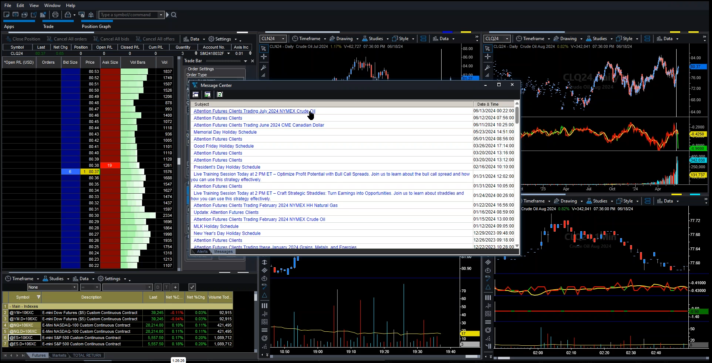
  <figcaption>Figura 038</figcaption>
</figure>

me está diciendo último día operable para el siguiente contrato es el jueves 20. 

<figure>
  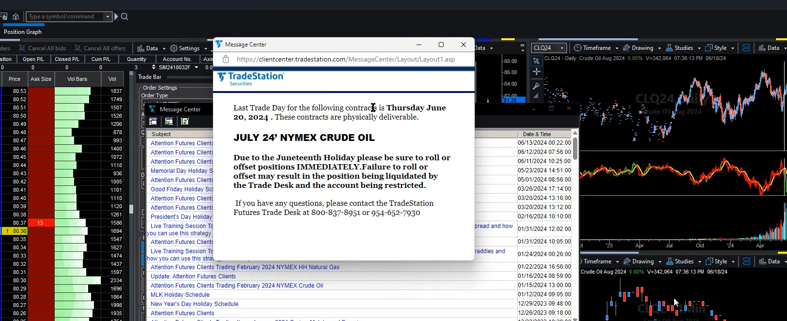
  <figcaption>Figura 039</figcaption>
</figure>

último día operable, me dice julio 24 es el que tengo aquí la izquierda. Esa es la información que a mí me resulta importante. Ya te avisa digo debido a la festividad, 20 de julio, 20 de julio es fiesta. Qué es el 20 de julio Estados Unidos, no sé. Que rolo inmediatamente, cuando te llega este mensaje de *TradeStation* ya puedes rolar, porque si no te van a cerrar en seguramente menos de X horas o minutos. Ya deberías estar cerrado. Esto es lo importante.

Vamos a ver, hay dos cosas en el rolo que la teoría os expliqué y traté de mostrarlo de manera distinta, pero entiendo que si no lo has hecho sera complicado. Tú tienes necesidad de rolar, pero una cosa es el sistema y otra cosa es la necesidad de rolar Porque apenas, porque un discrecional, da igual porque si está operando hasta ayer o antes ayer julio, y ahora pues tiene que pasarse a agosto porque aquí van mal corridos. 

A mí este mensaje me ha avisado antes de ese, me ha llegado otro antes de ese, me ha llegado. Lo que pasa es que igual en este caso por la fiesta no hay, pero normalmente hay uno que te avisa de la fecha y luego este del inmediato.

Y ya es el inmediato y es cuidado. Y este lo envió el 13, es la fiesta, entonces ya digo. Cuando llega de media y vamos mal, pero los que hay, los que no hay vencimiento, no te va a avisar. Los que no hay entregable, perdón, entregable, no te va a avisar.

Por ejemplo ese, pero se entrega y te avisa porque es muy grave. Y de hecho él te va a cerrar, pero cuidado que si no, te cierran responsable, eres tú. Te va a cerrar porque te va a cerrar, seguramente te va a multar, te va a poner una sanción en la cuenta. Entonces tienes tú que cerrar.

**Calendario de Vencimientos**

Esta es la parte técnica. ¿Cómo lo sabemos?. Bueno, nosotros todavía los tenemos, todavía los tenemos, lo voy a enseñar, todavía los tenemos en el calendario, todavía los tenemos en el calendario.

Pero eso es un poquito saturado. Ahora ya mañana no te enseño el calendario en mi vida. Esta es la cita que yo tengo puesta, tiene lugar el día 11, 9 de cada mes, y pongo ver notas en la del nombre arriba.

<figure>
  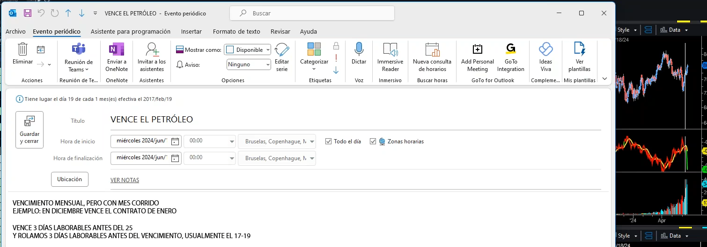
  <figcaption>Figura 040</figcaption>
</figure>

Ya en el Outlook se ve, tengo vencimiento mensual pero es mes corrido. Ejemplo: en diciembre vence enero, vence tres días laborables antes de 25. Cada contrato tiene sus normas, los hay que es el viernes de vencimiento, los hay que están este, tiene esta que es caprichosa. Vence tres días laborables antes de 25, y rolamos tres días laborables antes de vencimiento. Usualmente 17.

Es igual, eso es una vez que yo tengo que me salta, y lo tengo para todos los futuros programado, para que me siente bastantes días antes por si yo se me olvida. Bien. Esto es la necesidad de rolar porque vence. Esto da igual si el sistema, no es sistema, y tú tienes que rolar sí o sí haga lo que haga el sistema, esté metido a lo que haga.

**Momento Óptimo del Rolo**

Bien, dicho esto, cuál es el momento óptimo del rolo o cuál es el momento óptimo de hacer el continuo?, que es lo que sobre todo nos interesa. Esto porque yo tengo un continuo hecho que puedo usar @CL, pero puedo hacerlo yo. Recordáis que lo vimos, vimos una práctica.

Os acordáis que os enseñé este ejercicio, era para ilustraros esto. Esto es el mismo futuro CL pero rolando siete días, seis días, cinco días, cuatro días antes.

<figure>
  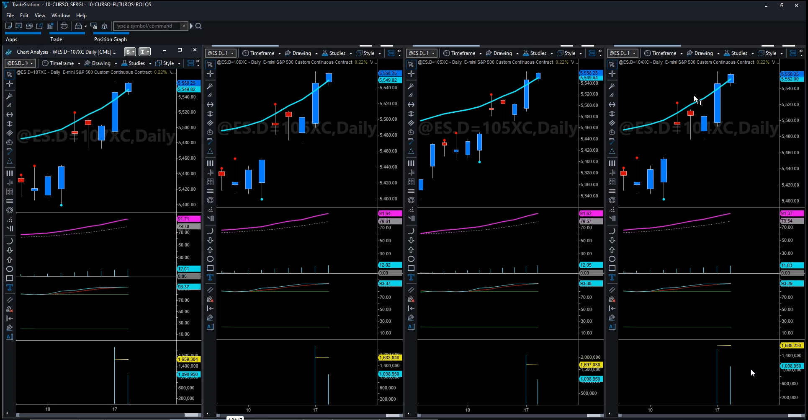
  <figcaption>Figura 041</figcaption>
</figure>

A lo mejor ahí no lo veis bien, pero yo os lo digo, es @CL punto de igual 107X, 106X, 105X, 104, que se. Y esto cambia solo el día que empalma el contrato. Entendéis, no tiene que ver con la operativa realidad.

Esto no tiene que ver con el día en que tú tienes que arrolar. Tú tienes que arrolar pues antes de esa fecha que te he dicho, dentro de lo óptimo cuando puedas, pero lo más cerca posible a lo óptimo. Simplemente porque tú, si consideras que el óptimo es el 107, lo ideal sería cambiar ese intervalo.

Pero como os dije aquí en la teoría, no obsesionaros con eso. Porque sobre todo si es un futuro que tiene mucho volumen, va a seguir haciendo volumen un día antes. Entonces claro, en los entregables sí que es muy peligroso y hay que ir con margen. Y a veces se ha dado la paradoja que yo me ha obligado a arrolar el broker por esta vez, puede ser que sea así por la fiesta esta que dice antes de cuando es óptimo. Entonces yo me tengo que buscar la vida.

**Adaptación del Continuo**

Es decir, cómo me tengo que buscar la vida. Si yo aquí tengo esto, yo al final lo estaré corriendo. Imagínate que yo esto lo estoy operando en automático con un sistema, da igual, en diario y por lo tengo.

Yo tengo, vamos a suponer @CL, y yo @CL sé que es, el @CL rola cuando sea. Pero ahora fíjate el número de contratos que lleva, lleva 350 que ya es el de la derecha, te das, lo llegáis a ver, verdad. Ya es el de la derecha, decir ya está, ya ha rolado, ya ha rolado este contrato.

<figure>
  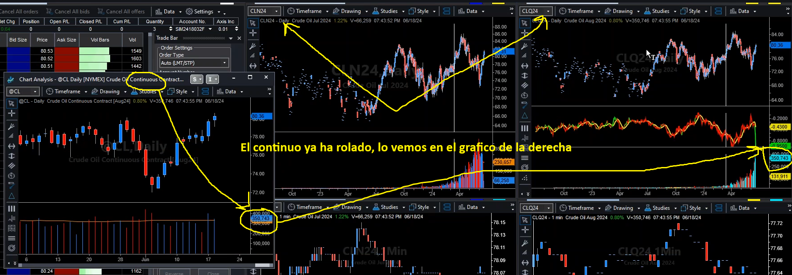
  <figcaption>Figura 042</figcaption>
</figure>

Pero si yo necesito crear el mío, que lo solemos hacer, acordaros que se puede hacer aquí. A lo mejor si me ha obligado a arrolar antes por lo que te decía, pues yo me hago un *custom*, aquí le puedo desplazar un día. Operando, marcando en el que estoy. Porque al final es toda la marca, que ya está en agosto.

<figure>
  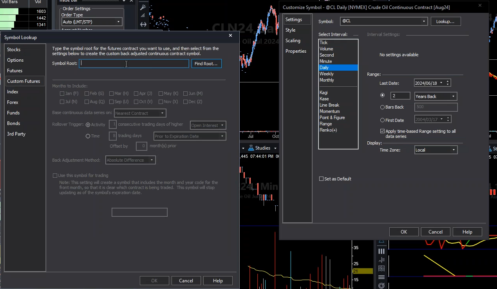
  <figcaption>Figura 043</figcaption>
</figure>

Tú ya deberías estar en julio porque ya lo hice. Aquí, cuando cambia verde este indicador, al final lo que usamos. Esto es simplemente cuando está verde es que ya está el nuevo haciendo más. Está configurado que ya ayer y ayer ya era.

Aquí, aquí empezaba el día 14 tal, y al 15 abre. El 17 el lunes, el lunes ya abre haciendo más el nuevo. Ves aquí el verdadero, el 17 ayer. Ayer ya abre el viernes, empieza Carlos al cerca del cierre. Hay algunas velas de un minuto que está haciéndolo al cierre diario, no lo haría seguro.

Y ya en la apertura del siguiente, prácticamente todas un minuto ya son con más volumen. Es decir, ya el mercado ha cambiado. Esto para qué lo uso, para ver qué está haciendo el mercado, qué está haciendo la gente.

<figure>
  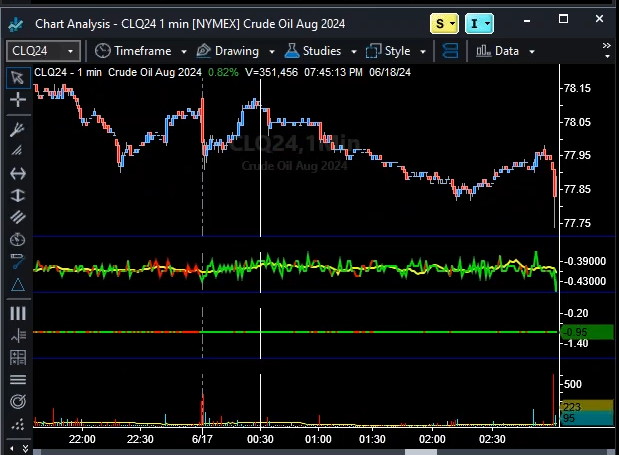
  <figcaption>Figura 044</figcaption>
</figure>

Yo simplemente miro el volumen de cuyo, miro el volumen de N, del siguiente, del nuevo, y voy comparándolos con un indicador que tengo. Y con esa comparación, pues me doy cuenta cuando el mercado empieza a considerarlo.

Pero cuidado, si a mí el broker me que me hace rolar, tengo que rolar. Si a mí el 13 me dice oye rola, súper automóvil por culo, yo rolo el 13. Oye y otro váreme, ya seguir el sistema como pueda. Ahí no hay debate. Así yo recibo un aviso de *TradeStation* en el rolo inmediatamente, tú rola, rola. Porque digo, nos están para tonterías. Porque eso tiene entregable, esto quedarse abierto es pupa.


**Algoritmo Genético**

En la 4 comentabas, a la 3. La 3 decía, si tienes a cambiar la configuración de algoritmo genético en algún caso. No. Nosotros no lo tocamos. El que recomienda nuevamente lo dejamos solo.

Lo único caso que lo, a veces lo tocamos es con el *Walk Forward*, porque como no te deja, aunque ahora tenemos un software que os lo comenté aparte. Pero en el *Walk Forward* de *TradeStation* está muy limitado por capacidad, por 32 bits, esos problemas.

Pero si tú lo ponemos fuera, te las deja tocar. Nosotros, antes de marcar *Walk Forward*, lo hacemos. Y depende cuánta nos sale, lo tocamos o no. Entonces lo tocamos, pero ahí sí que a lo mejor de manera que sale, pues lo tocas tú. Porque más o menos es múltiplo que cinco veces algo así, lo tocamos para que salgan menos. Porque si no el archivo es muy grande y no va. Al principio no, principio no, en principio no.

**Máxima Excursión Adversa y LookInsideBar**

<strong><em>
4.-En una de las clases en la que se ve el maximum adverse excursion, para colocar el stop, se habla de comprobar si  saltaría un stop en velas de 1 min en un data 2 para colocarlo correctamente, podríamos verlo de manera práctica?
</em></strong>

Y bueno, para comprobar en data 2, esto lo que quería decir era un poco esto que esto lo ves un poco en el *LIBBT*.

<figure>
  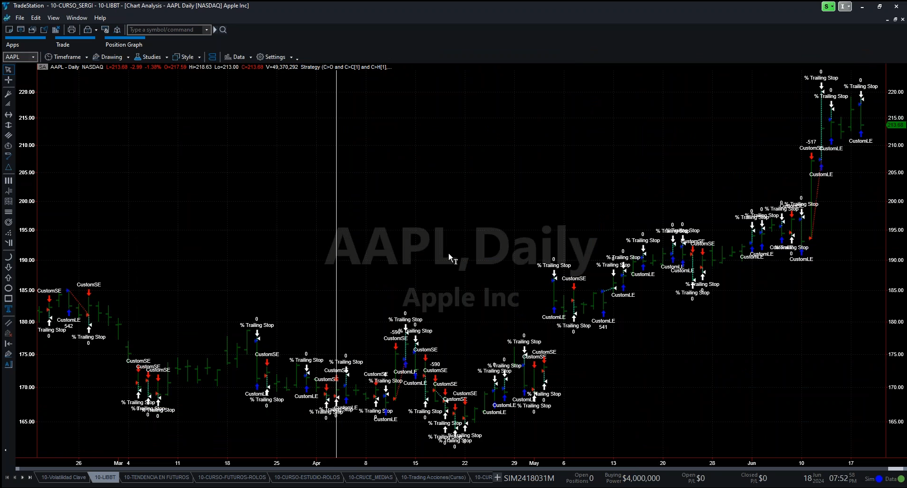
  <figcaption>Figura 045</figcaption>
</figure>

Es decir, tú es lo mismo que eso, mismo que porque en el *LIBBT* salta un stop o no. Decir si tú aquí añades un símbolo, le añades también Apple en un minuto bajo. 

<figure>
  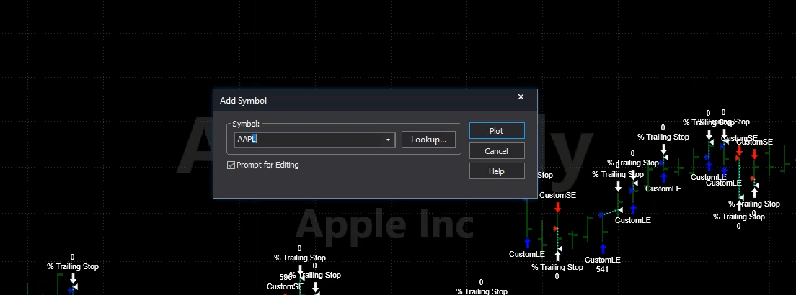
  <figcaption>Figura 046</figcaption>
</figure>

Yo tengo Apple aquí debajo, tengo arriba el diario, y se alinea a cierre, cierre, y hasta yo corre el sistema en el data 1 arriba. Y abajo, claro, yo aquí, esto aquí tienes un solo 5 minutos.

<figure>
  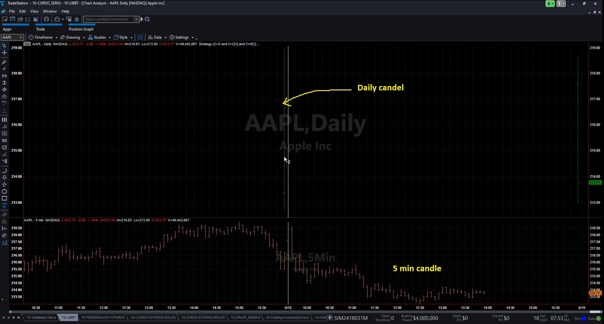
  <figcaption>Figura 048</figcaption>
</figure>

<figure>
  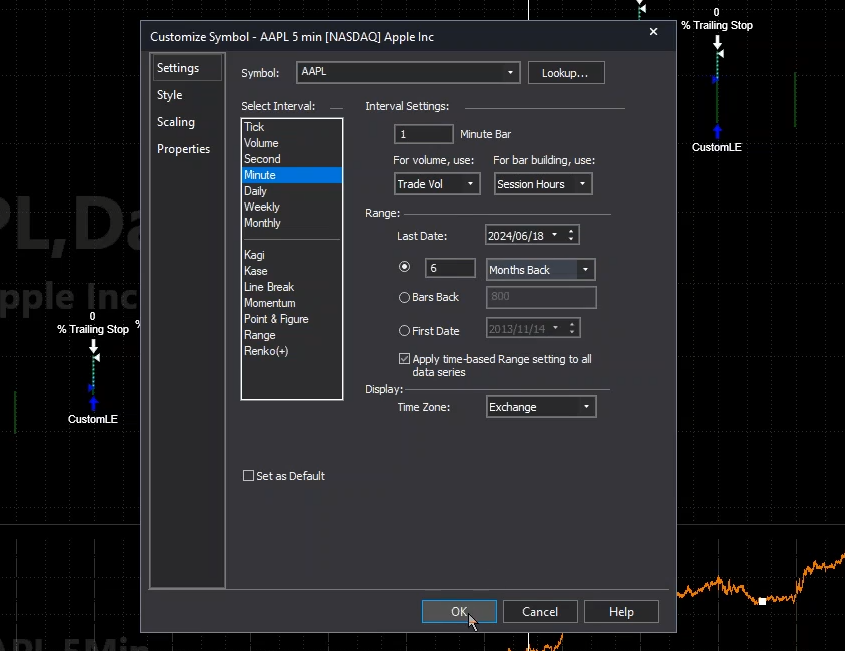
  <figcaption>Figura 049</figcaption>
</figure>
<figure>
  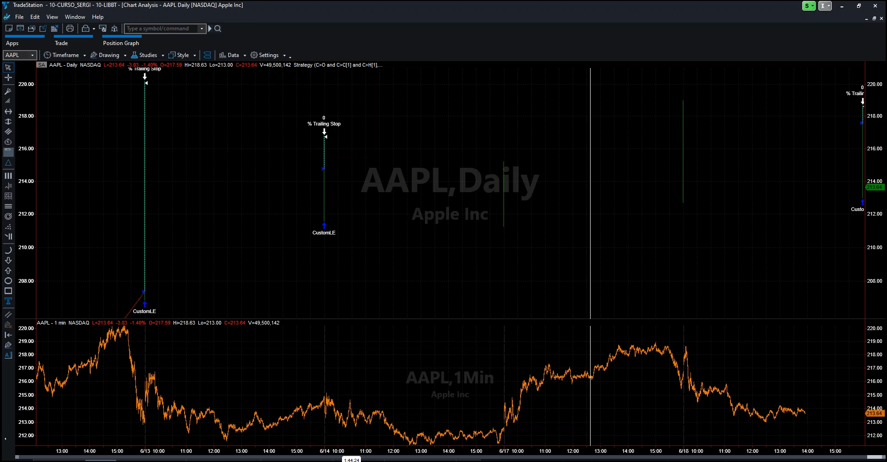
  <figcaption>Figura 050</figcaption>
</figure>

Entonces yo tengo aquí arriba el sistema, y eso es lo mismo. Por el que pasa esto, es lo mismo motivo. Pero para que lo entiendas lo mismo que pasa,  ahora aquí tengo el sistema que resulta que es la polla de vinagre.

<figure>
  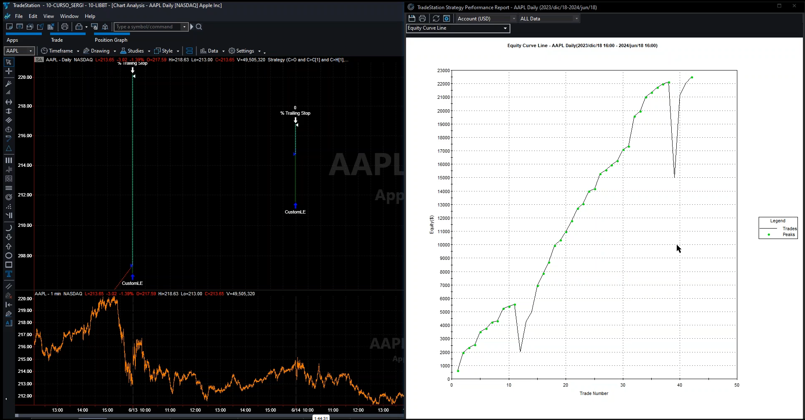
  <figcaption>Figura 051</figcaption>
</figure>

Y porque acordaros que cualquier vela que no sea la actual, es decir la que está operando ahora, y desde que abro, desde ese momento en que estoy abriendo la operativa, no me la ejecuta en tiempo real, las demás son históricas.

Entonces las reglas de qué toca, qué precio, qué orden se ejecuta antes, es una suposición. Él no lo sabe. Esto de abajo es lo que hace el *LookInsideBar*. Esto de abajo, el chart de debajo naranja, es lo que hace el *LIBBT*.

<figure>
  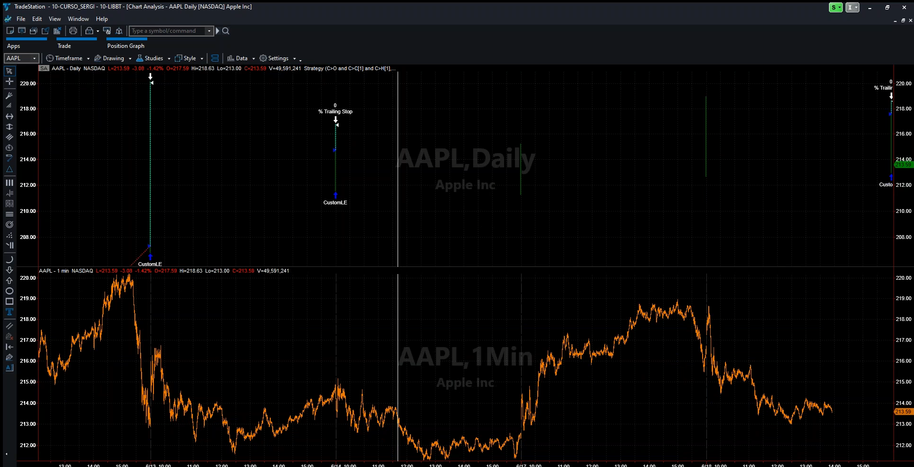
  <figcaption>Figura 052</figcaption>
</figure>

Entonces si tú quieres ver si un orden se ejecutaría, me refería a esto. A lo mejor lo ligué con la máxima excursión pero me refería a esto.

Si tú tienes que saber si recota de verdad o no, y ahora aquí tengo el *Performance Report*, 

<figure>
  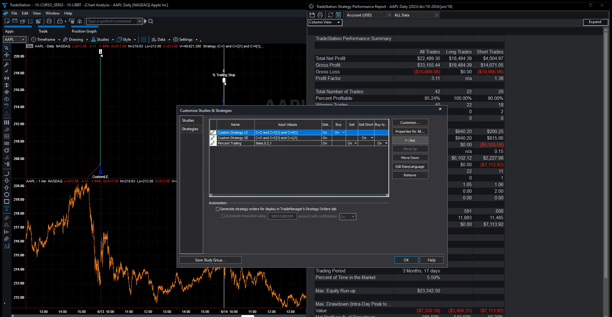
  <figcaption>Figura 053</figcaption>
</figure>

y ahora aquí le voy a activar el *LIBBT* en un minuto. 

<figure>
  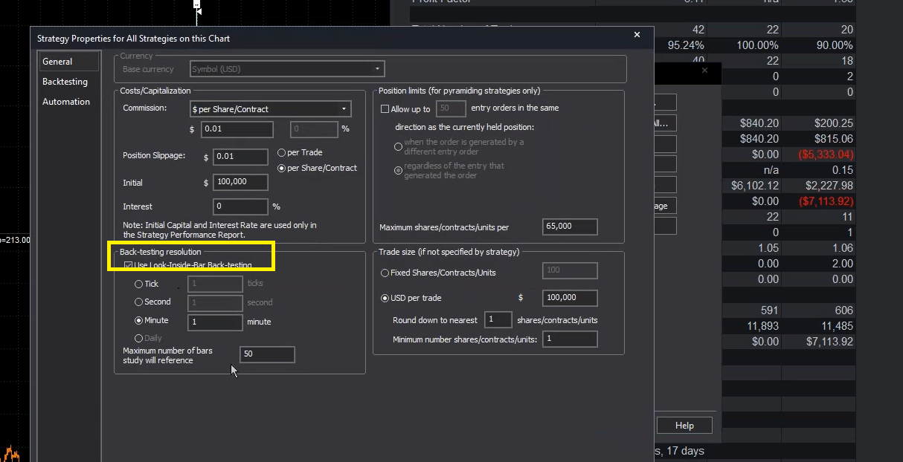
  <figcaption>Figura 054</figcaption>
</figure>
<figure>
  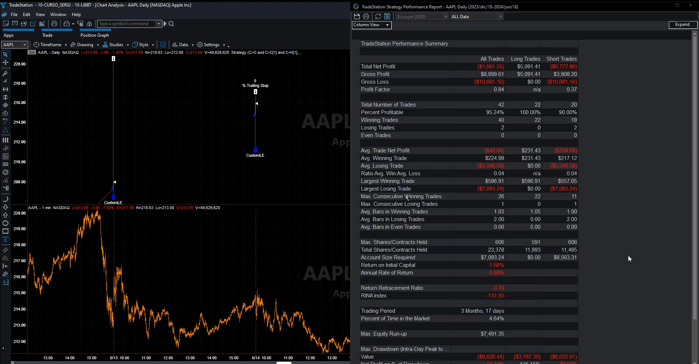
  <figcaption>Figura 055</figcaption>
</figure>

Y resulta que va a pasar a hacer 0.84 para dinero.

Pero a veces he visto casos y puede pasar, vamos a ver si con un ATR más bajo pasa. El *LookInsideBar* se lo traga. Y aquí ya empieza a ser positivo, no se lo traga del todo. Vamos a ver si con 0.05, si no voy a poner en cinco minutos para que me entiendas.

Porque hay casos, viví un caso de hecho una que pasa. Porque no sé qué ha pasado, ahora tiene operaciones ahí. Esta vez aquí, con el *LookInsideBar* se nos está tragando. Con el *LookInsideBar* se nos está tragando.

Es decir, ahora aquí yo, ahora tendría este sistema, esto ya digo, tú una práctica voy a para que lo veáis. Ahora aquí le quito el *LookInsideBar*, va a ganar mucho, va a ganar mucho. 4.64, era un susto ahí. Pero bueno, podría ser en algunos casos que ni lo tuviera, eso. Pero no sé por lo que se lo tiene.

Le activo el *LookInsideBar* y ya está, y sigo viendo que tiene una curva bastante alta que hay sus mechas que ya denotan que hay trampa. Que solo se ven así, pero esto porque es, esto es por un problema de que está saltando en un minuto.

Esto es lo que yo te quería decir. Es decir, tú tienes que ver en un minuto. Si yo le he puesto un stop de 0.05, al final el *LookInsideBar* qué hace. Él va a pasar el *backtest* teniendo en cuenta el histórico de abajo, el de un minuto. Pero es la misma regla.

Es decir, en la de un minuto qué va a hacer, solo sabe, acordaros, los cuatro campos del precio: *Open*, *High*, *Low* y *Close*. Sabe sus precios, no sabe cómo se recorrió la de un minuto tampoco. Ahora sí sabe cómo se recorrió la diaria, pero lo sabe en gran unometría de un minuto. No lo sabe menos, como no sabría menos tick a tick.

**Validación con Tick a Tick**

Si ahora te lo pondré tick a tick en seis meses, verás cómo la cosa ya se equivoca. Bueno, pero vamos a hacer ya, a no es que están seis meses, perfecto, perfecto.

Para no saber qué quiere decir que estos tres, siguen siendo falsos. Esos seis que ves siguen siendo falsos. Porque el rango de 0.05 es menor que el de un minuto, y por lo tanto le cuesta mucho moverse así. Por lo tanto, salta en falso igualmente. Me explico.

Que tú tienes que ver que aquí el rango es de 1.2. Hay que ver cuál es el rango medio, y ver si te está pasando. La manera más sencilla de hacerlo, o demás, es lo que te digo: carga seis meses aunque sea poco *trades*.

Y en esos seis meses, mira si ponerlo tick a tick cambia. Y ahora aquí tengo *Performance Report*, que es la leche. 

<figure>
  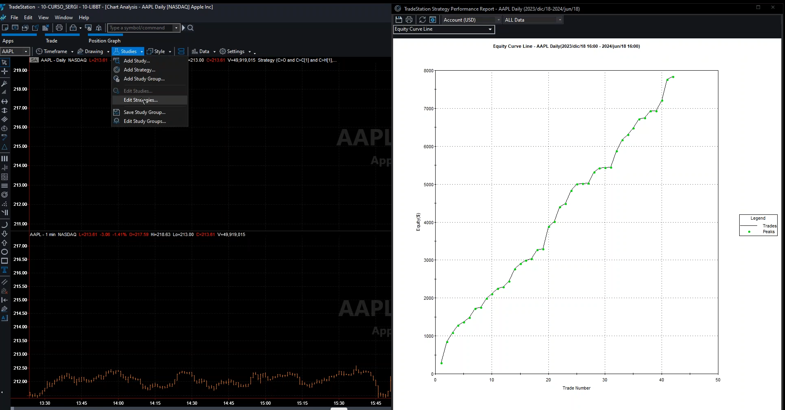
  <figcaption>Figura 056</figcaption>
</figure>

Ahora le voy a poner el, me va a tardar un poco pero lo vamos a hacer. Y vamos a tener paciencia porque me va a tener que bajar seis meses Apple en tick a tick.

<figure>
  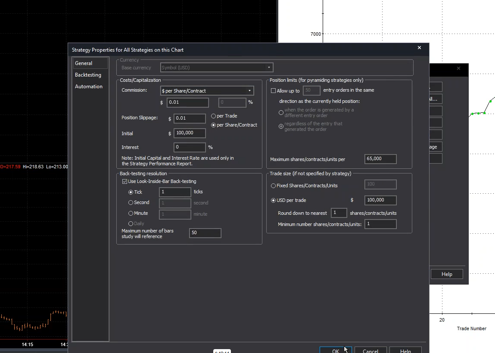
  <figcaption>Figura 057</figcaption>
</figure>

Lo vamos a dejar ahí trabajando. A dejar porque va a tardar mogollón. Y seguimos con las preguntas. Solo dejo y luego verás cómo eso ahora se ha roto, porque ahora sí que lo he verificado.

El problema es que tick a tick no puedo hacerlo mucho más atrás. No, pero si es así que debería tener.

**Small Caps y Escáner de Acciones**

<strong><em>5.-Qué opinión tenéis de programar una estrategia para aprovechar las grandes volatilidades en small caps? Podríamos ver algo de como hacer para que el sistema seleccione las acciones a operar durante la sesión según , por ejemplo,  su valor, capitalización, float, porcentaje de cambio de precio en un día , volumen y rango históricos,  u otros datos fundamentales? </em></strong>

Bueno súper breve Raúl, esto te voy a pedir otra vez lo mismo que se pidió con *Maestro*. Esto lo va a hacer *Scanner*. Para filtrar, *Scanner*. *Scanner* es esto.

<figure>
  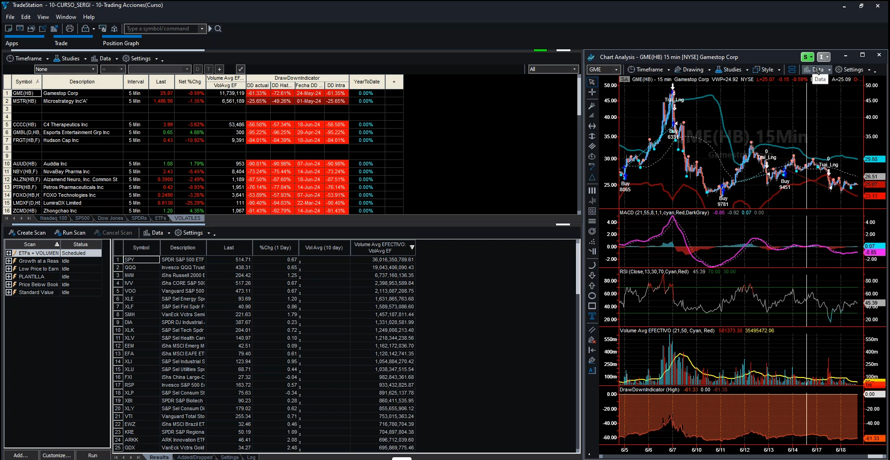
  <figcaption>Figura 058</figcaption>
</figure>

Yo te lo voy a enseñar aquí muy breve, pero te pido que veas un vídeo. Le vamos a poner tres meses a cualquier sistema de ruptura, mínimamente que se adapte. Habría que ver tal, que tenga esto. Debería de irte bien, debería irte bien en un sistema, en un activo mega volátil como estos.

<figure>
  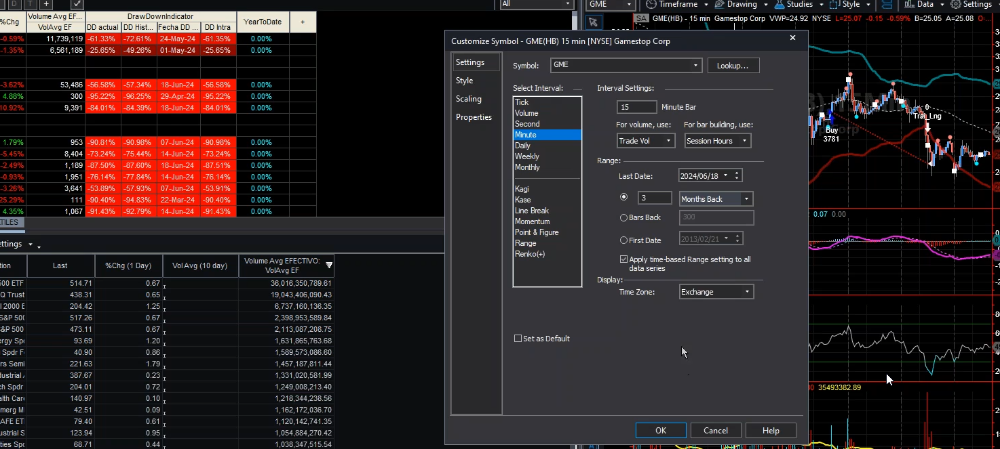
  <figcaption>Figura 059</figcaption>
</figure>

<figure>
  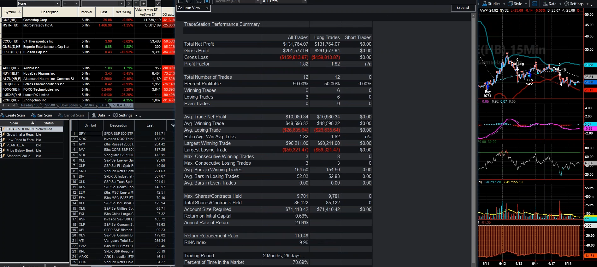
  <figcaption>Figura 060</figcaption>
</figure>

Aquí ya te gana, es que son `12` operaciones, da igual, da igual. Es simplemente un ejemplo para que lo veáis. Puede que no vaya en todas este, y habría que mirarlo y demás. Pero de verdad que son buenos. Que eso tiene un *traling* un poco holgado, no esto está atado a diario y habría que adaptarle listo. Por ser algo más cercano entiendo, habría que adaptarle esto. Cómo era esto, esto.

<figure>
  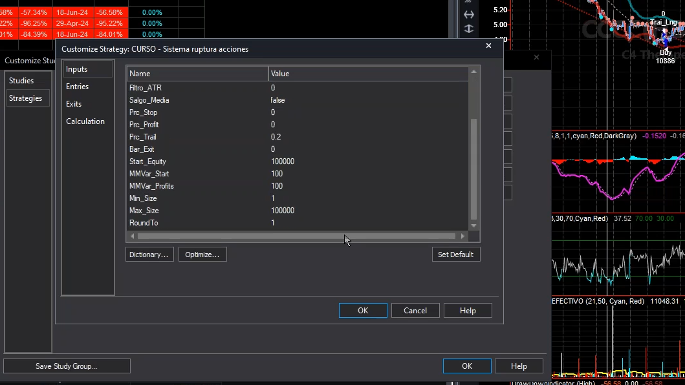
  <figcaption>Figura 061</figcaption>
</figure>

Pero no es eso, es un 0.2% para, 0.2 será para diario. Y además solo va largo, eso va bien de meter este activo. Debería haber ido corto, habría venido. Entonces sí que puedes.

Pero teniendo en cuenta las reglas del juego, ¿las reglas de juego con van a ser? 

acciones que deberás ir largo, porque por eso, pone *hard to borrow*. Que hace, que son difíciles, todas estas acciones van a ser *hard to borrow*. 

<figure>
  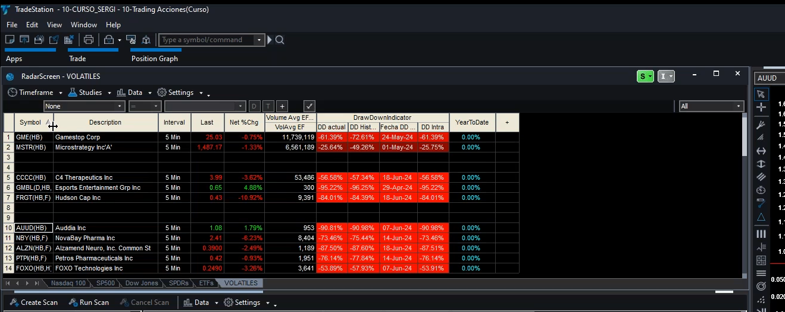
  <figcaption>Figura 062</figcaption>
</figure>

Por lo tanto, olvídate de ir de ir corto con ellas.  
Vas a tener que ir largo. Y claro que puedes, claro que puedes. El problema es que en la metodología que usan los pescadores, los *day traders*, que esto es típico operativa de traders, ellos buscan acciones y la operan. Y esto es complicado de implementar un sistema.

Tú lo que sí que puedes hacerte es una lista, ejecutarla cada día, y ir ahí distinto. Y a partir de ahí, en esa acción pasarle el sistema. Antes previamente ante un sistema, como decíamos, que vayan muchas. Lo preparas para hacer una cesta de bastantes acciones, y que sea flexible.

Y a partir de ahí, lo pones a operar en las acciones que te diga cada día. Que lo normal, esta la manera que trabajamos, es: tú lo sacas de una lista de estas.

**Configuración de Scanner**

Cómo haces esto?, un *Scan*. Tienes aquí un *Scan*, le puedes poner un folder. Y aquí tú creas qué símbolos a usar. Puedes aquí meter todas incluyendo OTC. Puedes buscar, *TradeStation symbols*, que la verdad no lo tengo muy mirado. Y no sé si hay algún índice específico de eso, no sé, sinceramente habría que mirarlo.

<figure>
  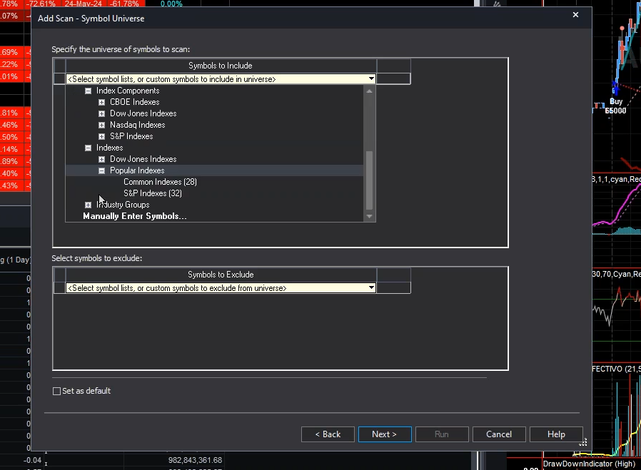
  <figcaption>Figura 063</figcaption>
</figure>

No sé, si no pues la haces a manija. Pero aquí le pones todas incluyendo OTC, le dices cuál es el que ir. Y aquí, por ejemplo, un criterio típico pues yo que sé, sería volumen. 

<figure>
  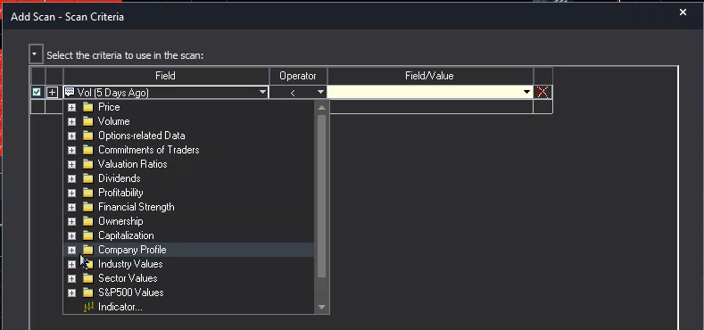
  <figcaption>Figura 065</figcaption>
</figure>

Volumen medio de cinco días, que sea menor que cuánto. Cuánto hace esto de volumen Alberto, no sé, no sé yo que sé. Cuántas acciones hacen esto, no perdona, mejor *market cap* Quizá las de *market cap*, dónde estaban. A ver que me acuerde, aquí hay un montón. Esto no lo usamos ahora mismo, pero ahí hay los de *market cap* también. En *market cap*, no, no es aquí, los de *market cap* estará capitalización. Aquí, margen capitalización. Yo sé que capitaliza esto, Alberto lo sabes, 5 millones, no sé. 

<figure>
  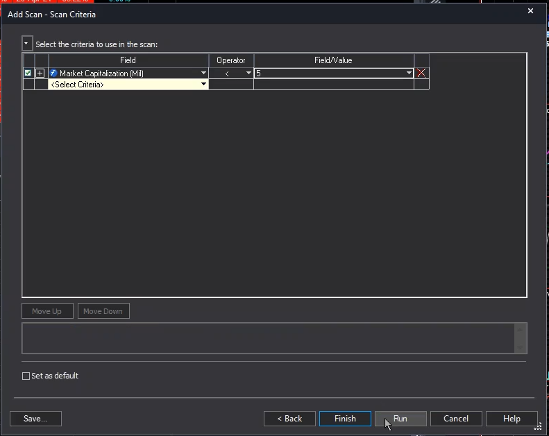
  <figcaption>Figura 066</figcaption>
</figure>

A ver si hay algo que capitaliza, si hay algo. Vale, hay muchas, hay muchas.

<figure>
  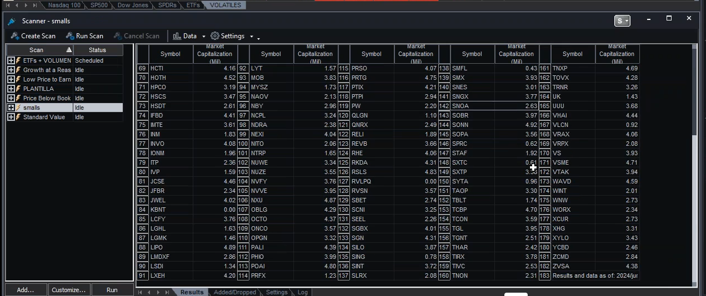
  <figcaption>Figura 067</figcaption>
</figure>

Entonces a partir de ahí te puedes crear otras reglas. Tú esto ahora yo puedes hacer que se configure, y me lo he saltado, pero una de las opciones que tienes es que tienes es programarlo automáticamente. 

<figure>
  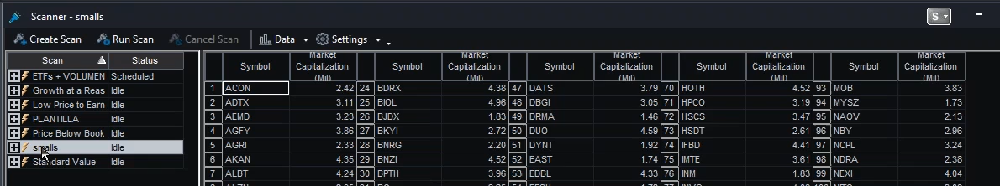
  <figcaption>Figura 068</figcaption>
</figure>
<figure>
  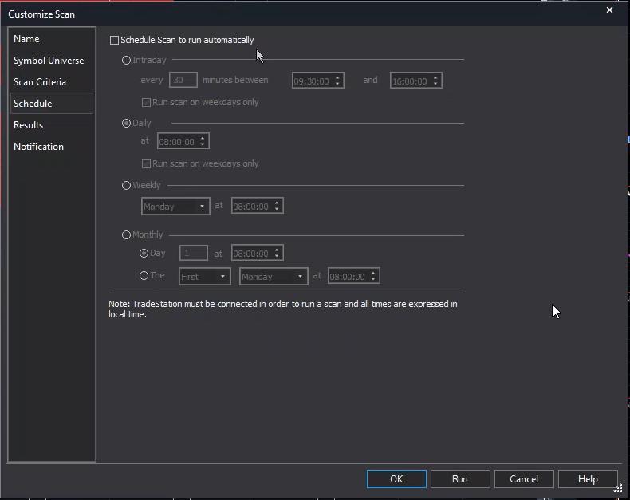
  <figcaption>Figura 069</figcaption>
</figure>
<figure>
  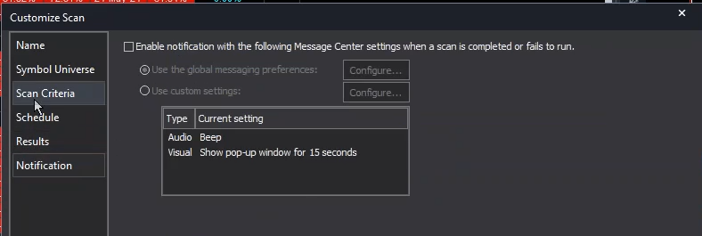
  <figcaption>Figura 070</figcaption>
</figure>

Que los resultados los guarde, que los resultados los guarde en un *Custom*, un *Symbol List*, que luego podrás abrir en un *Radar Screen*. Que te lo notifique por email. Entiendes, decir puedes hacer un montón de cosas de este tipo.

Entonces tú puedes crear un símbolo nivel, puedes poner aquí infinitos criterios. Hasta puedes poner un *EasyLanguage*, pero es mejor, o sea si tú usas un indicador, se ejecuta el local, es mucho más lento.

<figure>
  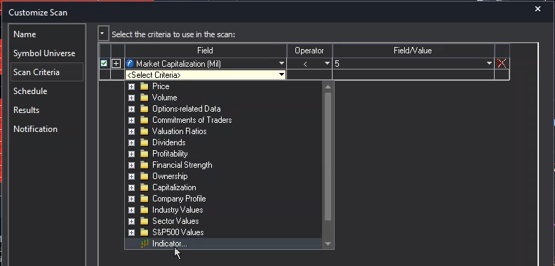
  <figcaption>Figura 071</figcaption>
</figure>

Todo lo que uses de que ya tenga él, que tiene como ves mil cosas, ya va vía automática en el servidor y va bastante más rápido. Entonces de precio que esté, era un precio mayor que tal.

<figure>
  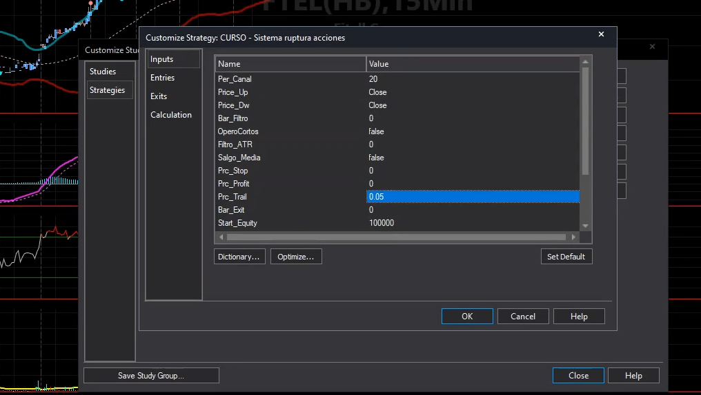
  <figcaption>Figura 072</figcaption>
</figure>

Esto normalmente la mayoría se hace hasta lo contrario. Es decir, este que los tiene hecho se ve, 

<figure>
  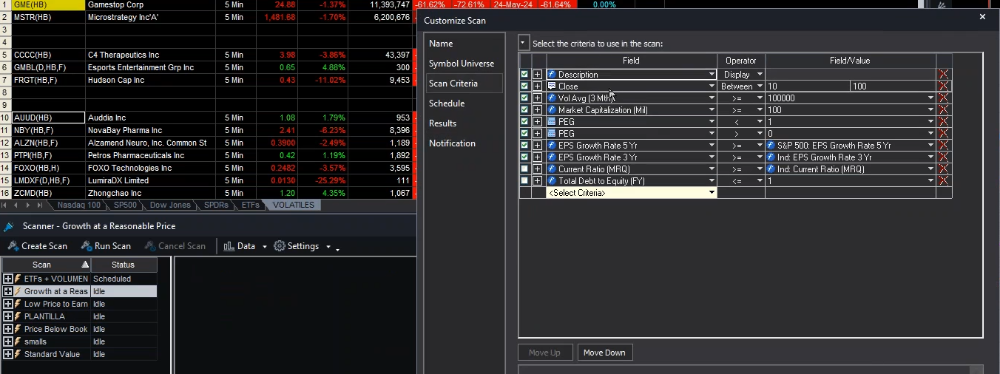
  <figcaption>Figura 073</figcaption>
</figure>

que te ponen descripción para que salga. Que el cierre esté entre 10 y 100, pues lo mismo al revés. Que el cierre sea menor de 5 porque yo quiero solo acciones pequeñas. Que el volumen de sea mayor post tú menor. El *market cap* sea. Entonces al final pues hacer un poco, es todo lo contrario a las mayorías que hay. Sabes, porque tiene aquí algunos de ejemplo que no me acuerdo dónde estaban los ejemplos. *Sample Scans*, era que algunos de este ejemplo los puedes abrir, ves algunos técnicos de crecimiento, *Program Value Technical*.

<figure>
  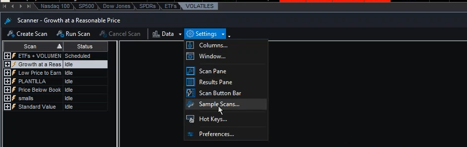
  <figcaption>Figura 074</figcaption>
</figure>
<figure>
  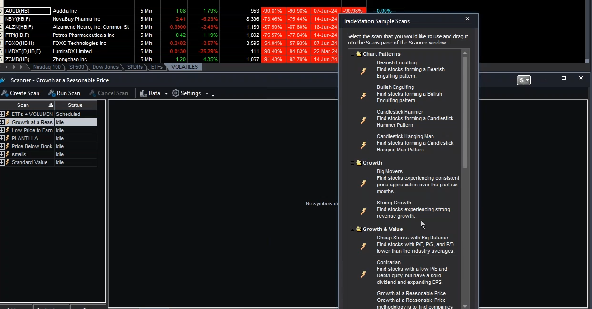
  <figcaption>Figura 075</figcaption>
</figure>

Y pues pues cualquiera de estas, cualquiera de estas. Pero que normalmente las que te filtra, las que te filtra pues es al revés. El test, el telas, filtra por los que tienes contrario a este.

Le hago, le puedo hacer un guardar como. No creo, a ver, *Copy Scan*, hasta *Scan*, venga. He hecho *my movers*, de unos así. No me ha sacado el otro.

Ya la sección se la conecto aquí con esto, pues la puedo abrir. Y está a porque le he puesto color, perfecto. También se está a porque es la *Global*, *Global* y saque la posibilidad, perfecto.

<figure>
  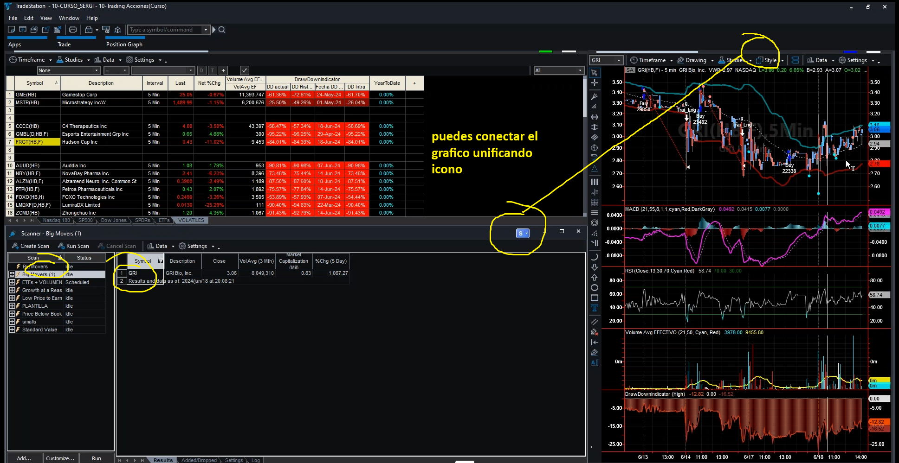
  <figcaption>Figura 076</figcaption>
</figure>

Lo que hacemos es esa asociación. No sé, no sé si eso. No yo no sigo, pero entiendes, es la manera de buscarlas. La manera de buscarlas es esta, para la manera de buscarlas es esta, eso es una *Scan*.

Tú le configuras a bueno, es que seguramente aquí en el universo estoy pensando que ya el universo habrá excluido OTC. Tienes que decirle incluir OTC, 

<figure>
  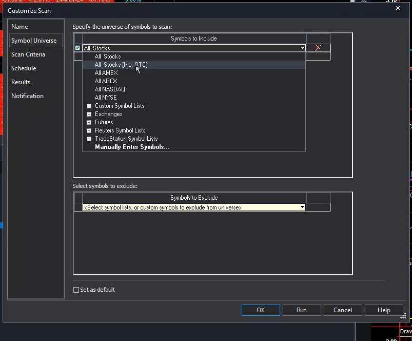
  <figcaption>Figura 077</figcaption>
</figure>

fíjate ya han salido 37 acciones que cumplen ese criterio. Que tienen menor *market cap* que tal y tal. Hay que incluirlo porque normalmente la gente no las quiere operar y las excluye.

Y pues bueno, no sé, alguno de vosotros conocéis estas acciones, pues ahí. Entonces sé que me da el valor de los indicadores. 

<figure>
  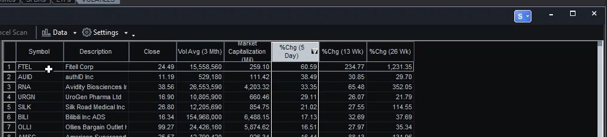
  <figcaption>Figura 078</figcaption>
</figure>

Ves que está bueno, he dejado este 5 días se han movido un 60 por ciento. Seguramente es una acción de este tipo.

Es ahí, pues está largo. 

<figure>
  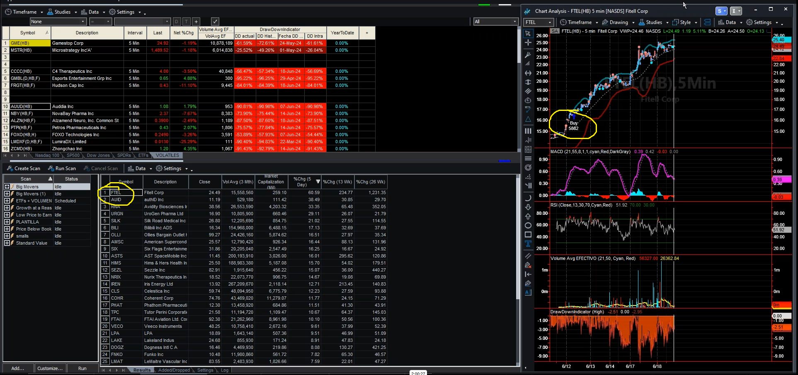
  <figcaption>Figura 079</figcaption>
</figure>

Es lo que te decía, es decir, al final el problema es que no tiene bien adaptada la salida. Pero este tipo de acciones de verdad, es que es igual, es como el *Bitcoin*. Tú le pones cualquier cosa que siga tendencia, y que luego salga con el método, y el margen es tan amplio que va a ganar. No hace falta ni que lo trabajes demasiado.

Pero claro, necesitas buscar cosas de este tipo. Es una locura que ha subido en cinco días, se ha multiplicado. Está ha comprado aquí en 15. Entonces esa es un poco la idea.

<figure>
  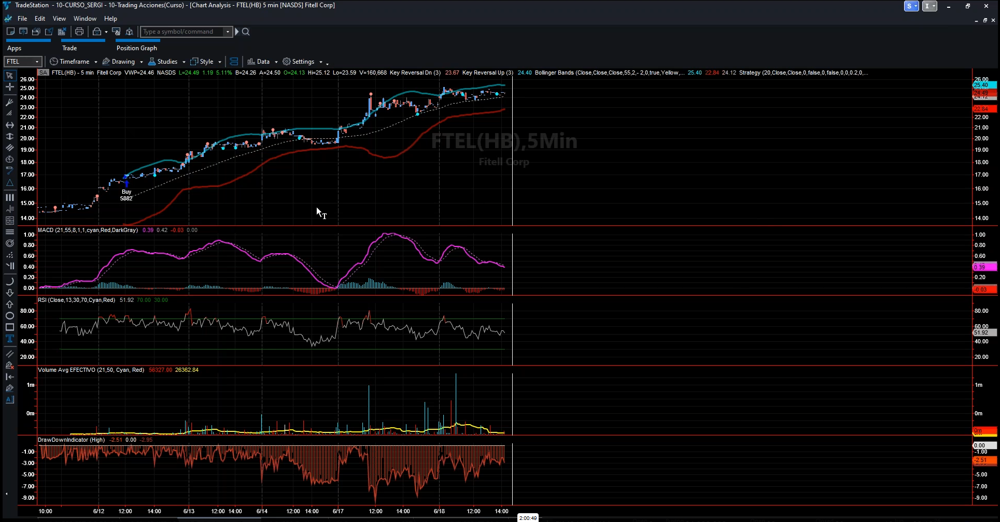
  <figcaption>Figura 080</figcaption>
</figure>

Pero ha comprado 16 y hasta 24. 

<figure>
  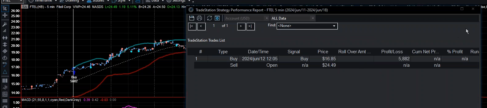
  <figcaption>Figura 081</figcaption>
</figure>

Eso es un poco la idea. Pero no está dimensionado bien para, no está dimensionado bien para intradía. Pues ha pensado para tal, y entonces el stop es demasiado elevado, a lo mejor de 0.05. Y el canal de video, está bien un poco mejor.

<figure>
  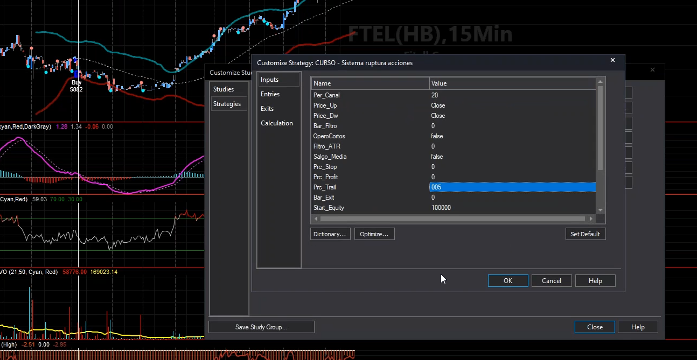
  <figcaption>Figura 082</figcaption>
</figure>
<figure>
  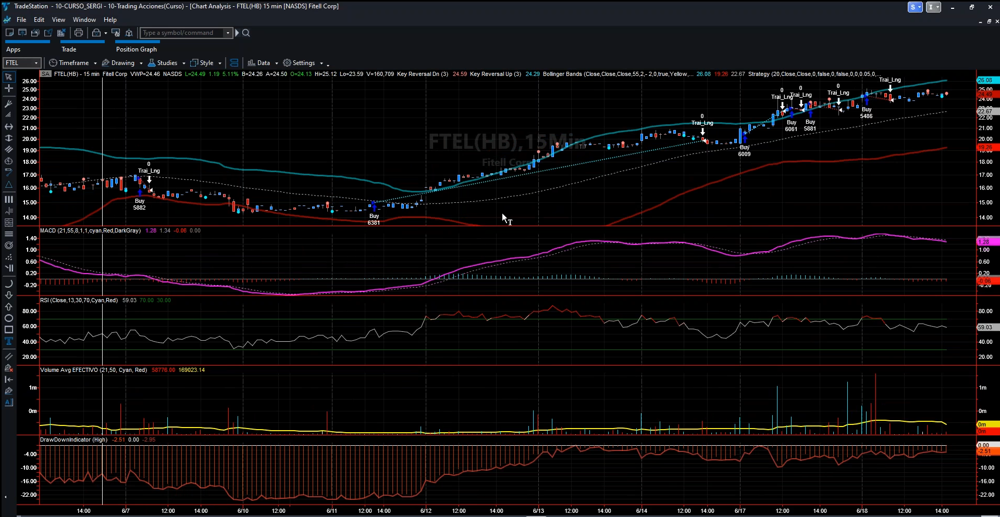
  <figcaption>Figura 083</figcaption>
</figure>

Ahora aquí ya saldrá, vez, haya salido antes, es salido. A lo mejor es demasiado poco, se sale demasiado pronto. Hay que verlo, es un poco ajustarlo a este tipo de acciones. Seguramente hace falta ajustarlo por volatilidad. Y hasta, y ese es un poco el tema.

<figure>
  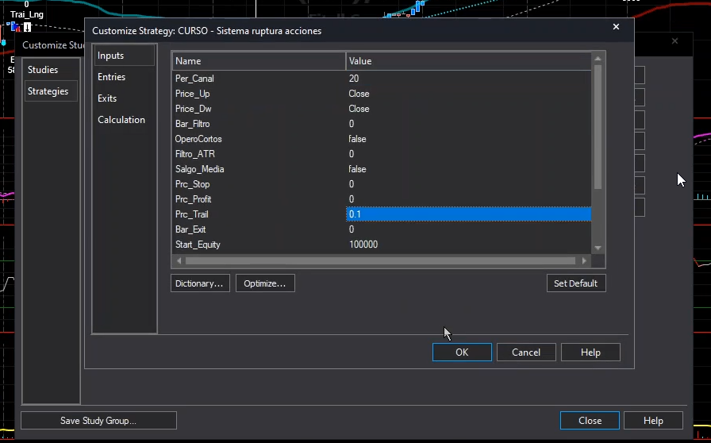
  <figcaption>Figura 084</figcaption>
</figure>

Si está esto te va a dejar dentro, te va a dejar dentro en la mayoría de veces. Claro que va a fallar, pero te va a dejar dentro. Pero insisto, solo largo. Mucho cuidado, mucho cuidado la exposición.

Riesgo gigantesco porque la volatilidad te puede matar. Aquí, aquí esta acción qué locura. Porque eso parece que los rangos gigantesco, de si ahí toca eso, en el mismo día toca 34 y 12. El mismo día, en una hora se divide por tres la acción. 300, 90%, 60%.

<figure>
  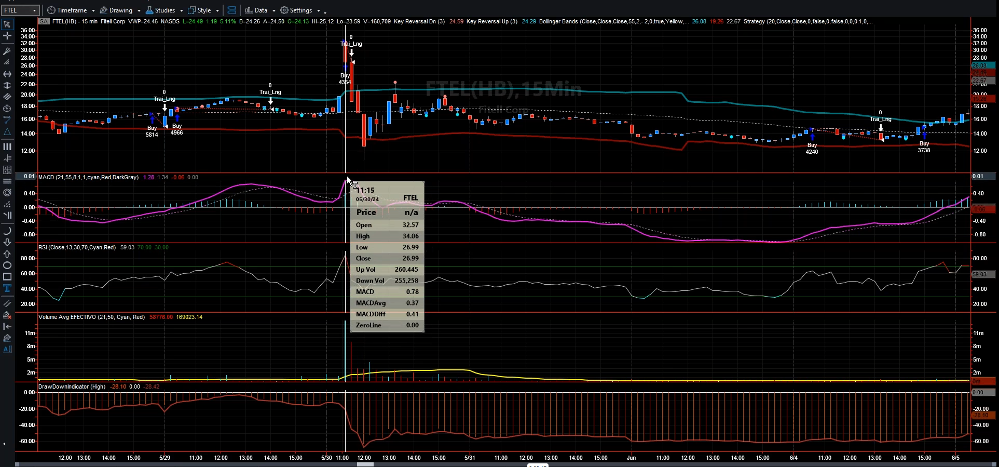
  <figcaption>Figura 085</figcaption>
</figure>
<figure>
  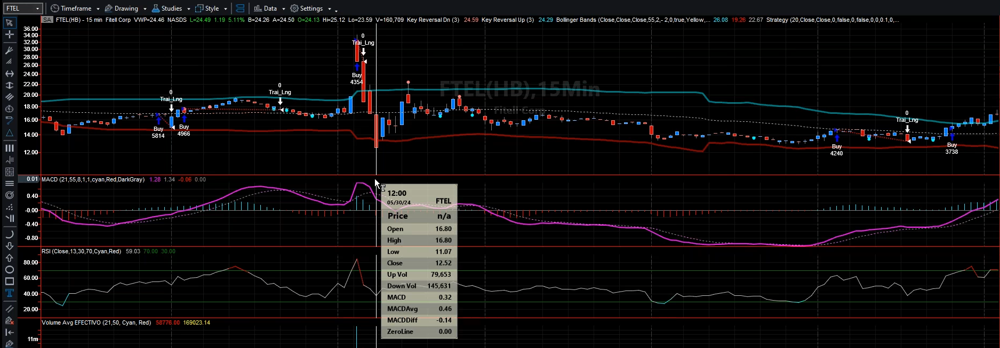
  <figcaption>Figura 086</figcaption>
</figure>

Entonces claro, pero sí, sí, pero este tipo de acciones con sistemas se pueden trabajar. No sé si está dimensionada bien, si las comisiones están bien, o se nada, y digo que esto habría que mirarlo todo.

El problema es eso, acciones están muertas hasta que no lo están. Y por lo tanto, operar un sistema permanente ahí, como lo hacen ellos, habría que hacerlo distinto. Como lo hacen ellos no sirve, no sirve.

Ahora puedes buscar un término medio. Es decir, a lo mejor buscar *medium cap*, seguramente no son tan volátiles pero son más que las otras. Que buscar un término medio.

Pero en las que usan los *day traders*, es muy complicado. Porque esa acción se ha podido pasar meses plana ahí. Es muy complicado. Tienes que filtrarlo, y cuando despierta, que despierte. Pero si puedes intentar, si quieres probarlo lo que te digo. En tu buscador, y aplicando el sistema cada día cambiado, sería un poco el camino.

<strong><em>
6.- Pueden ser efectivos los retrocesos fibonacci en un sistema? Si es así, podríamos ver como implementarlo?</em></strong>


Al final es uno de menos, seguramente voy a analizar. Podríamos no complementarlo, eso es programación. Y es probablemente avanzada, se puede implementar en código. Sí, claro que se puede, tampoco es extremadamente complicado. Pero no lo vamos a hacer en directo, es programación programación.

Y si se puede, claro que se puede. Pero tienes que computar, piensa que tienes que ir guardando los mínimos, los máximos. Puedes hacerlo con alguna función que se llama `pivot` . Tienes que ir guardando el mínimo, el máximo, y entonces calcular cuándo hay un mínimo, en qué momento ese mínimo es relevante. O sea, todo ese tipo de cosas, y contemplarlas. No es fácil, pero sí se puede.


<strong><em>7.- Es necesario ser autónomo para gestionar capital en Darwinex, verdad?Podríamos tener algún consejo de fiscalidad en el trading algorítmico, tanto en el caso de gestionar capital como para una cuenta particular?
</em></strong>

Pues no, no puedo, no podemos ver nada referente a fiscalidad. Lo único que le puedo decir, porque esto ya está hablado por mil preguntas al respecto de otra gente, que yo te puedo poner en contacto directo con `Joan Porcar`. Le puedes decir que vas de parte nuestra y te atenderá mal. Pero aún así.

Ya digo, son temas fiscales que la ley es muy puñetera y no te deja decir cosas este tipo. Entonces a ver, en principio para ti no hace falta, no hace falta. Ahora para gestionar capital de terceros en *Darwinex* bueno, pues hay que ver, al final es una actividad económica y entiendo que depende. Y lo que depende. Pero ya digo, yo no te puedo dar más datos.

Primero, no lo sé en detalle. Nosotros somos una SL y por supuesto tributamos de todo, de todo lo que ganamos, tristemente. Acabo de hacer mi renta justamente esta semana, la particular. La empresa de sociedades y va después, y hay que pagar. Eso está claro. Pero vaya, ya te digo, lo máximo que te puedo decir es eso, no te puedo ayudar mucho más. Pero evidentemente lo que sé que te digo, que cualquier operativa en bolsa al final no deja de ser un rendimiento, o bien el rendimiento de la actividad económica, o bien una incremento patrimonial como cualquier inversión.

Términos generales, esto no es que aplique a esto, no es una, en términos generales. Pero ya digo, si quieres me lo preguntas por el *Discord*, lo que sea, nos llamas y yo te pongo contacto directo con él, y saldremos. Nuestro y tal, seguro que atenderá como siempre hace pues muy amablemente.

**Preguntas de Juan Manuel**

<strong><em>
1.-En fase preliminar, si tenemos varias salidas para nuestro sistema que nos gustan, por ejemplo por tiempo, otra por señal contraria y otra por tp $, recomendarías optimizar las 3 para elegir 1 o probarías manualmente cada una de ellas para ver su comportamiento y elegir la más adecuada?</em></strong>

A ver, no solo puedes sino que muchas veces debes tener varias. Es decir, no hay ningún problema en tener varias salidas, no hay ningún problema tener varias salidas. Depende del tipo de sistema, claro. Porque si hablamos de optimizar y demás, ahí sí que la cosa pues se puede ir complicando.... grados de libertad, muestra, sentido común....

Lo que sí que no solaparía, es decir, tú me estás hablando de un tiempo, bien, señal contraria, bien, TP, bien. ningún problema, un problema, ningún problema.

A ver, optimizar la de señal, ya va optimizada con el sistema, es entiendo que sí. Y el TP, el tiempo, pues puedes utilizar las barras nuevamente. Pues así que puedes utilizar, en principio Sí puedes, pero poco y depende. Poco y depende. No abusaría en exceso de ello, no usar en exceso.

Y luego muy importante el tema de los `incrementos` lo vimos mucho tanto la teoría como la práctica, los *Excel* y demás. De hecho lo vimos que nosotros en *Apollo* hicimos hasta un cambio de eso.

<strong><em>
2.-En relación a lo anterior, en sus sistemas SERSAN tienen múltiples salidas o solo una simple?En que casos es mejor tener una o múltiples salidas y cuáles es vuestra opinión respecto a qué es más óptimo( salida simple vs salida múltiple)</em></strong>

Bueno sé, no sé qué importancia tiene esto, como el porque, o sea simplemente te lo digo porque sea como sea, puede cambiar mañana. Nosotros en Sersan hoy en día en ese gregado, como sabes por motivos diversos tenemos menos sistemas operando los que quisiéramos. 

Pero por ejemplo *Apollo* tiene dos salidas, no tiene tres salidas en Realidad TP, stop y contraria.

Y *Nemesis* tiene una salida. Entiendes. *Artemisa* que aún mismo no opera pero espero poderlo hacer operar pronto porque ahora lo que haremos Seguramente por eso, meter a la cuenta bastante más dinero. Y entonces meter a, meter a, mejorar un par de *Artemisas* ya veremos, veremos a ver cómo lo podemos hacer. Y probablemente porque ya nos han dicho que podemos ir a futuros en *Darwinex*, pues veremos a ver en *Darwinex* si podemos ir montando esa carterita de futuros.

Dices ¿qué es mejor?, la simplicidad siempre es buena. Pero tener dos salidas no tiene por qué ser contrario lo simple. Entiendes, decir, finales lo que necesito es, el sistema no debe tener demasiados grados de libertad, pero tampoco demasiado pocos.

Pues no le permites que capte la señal. Siempre es ese equilibrio entre señal y ruido. Esto creo que la teoría se habló bastante de ello. Entonces ambas cosas son varias. Como siempre depende del tipo de sistema. Y ya digo, la optimización depende de lo que lo conozca, etc. Nosotros en *Apollo* tenemos una gran ventaja con NASDAQ, que es que lo llevamos operando muchísimos años. Si habéis fijado en el fondo que estaba, y estaba en, operaba en las carteras antes de venir a dar con *Darwinex*. Y cuántos años puede de *Apollo*?, Alberto. 11 años que lleva. 11 años operando, operando futuros, CFD´s. Es claro, al final ya le tienes sensibilidad, te da más margen. Aún así te puedes equivocar, pero tienes más sensibilidad sistema. Ambas cosas pueden, pero sin dudas simple, sin dudas menos. Menos, siempre es más. Pero no llevemos al extremo eso, porque al final no opera, pero tiene que hacer falta captar la señal.

<strong><em>
3.-Leyendo una respuesta a Rubén sobre walkforward testing , repasé el temario y vi que se vió en una práctica por encima. En caso de que diera tiempo si fuera posible hacer un ejemplo de WFO en TS práctico.</em></strong>

Va a ser complicado, no va a ser posible, no va a ser posible. Lo que te recomiendo es lo que os he dicho antes. Ver el, ver el webinar. Ver el vídeo. En ese vídeo que os enseñaba antes TradeStation, en la web nuestra, hay hay bastante tema tratado del *Walk Forward*.

Y lo que vimos tanto en la teoría como en la práctica, pues te puede servir. Al final es que es lo que os digo. El hecho de usarte tradeStation o no es plataforma. Entonces he explicado el concepto y cómo va todo lo de lo de un *Walk Forward*. Yo creo que estaba muy claro como va, entendido por todo el mundo y demás.

Ahora la mecánica de *TradeStation*, cada uno pues tiene sus cosas, ya está. Pero esos tienes, tienes ya digo, tienes vídeos de *TradeStation*. Tienes material, los vídeos que veas de *Walk Forward* antiguos de *TradeStation*, ya te digo sin ningún problema están totalmente vigor, porque ha cambiado cero coma. Así que puedes usar esos vídeos.

<strong><em>
4.-En cuanto a portfolio sería interesante poner ejemplos según \$ cartera y cómo se progresaría. Por ejemplo idea de portfolio inicial 10k$ , cuántos sistemas , tipos de sistemas y mercados para ajustarse a la cuenta. Una vez que se avanza o se tiene mayor capital, con 20k$ portfolio ,qué cambios se harían respecto al anterior, añadir contratos? Añadir sistemas? Añadir mercados? Cuáles ?y así como guía general hasta  cómo formar un portfolio de +100k$</em></strong>

Bueno, yo creo que esto lo he respondido antes bastante porque ya había introducido el tema en compañero, el compañero Bisector. Y yo creo que ha estado bastante respondido, creo que ha estado bastante respondido.

¿Cuándo sistemas, tipo de sistemas?, es que esto la respuesta no está. Los sistemas No no es una frutería que vas y los compras. Entonces al final es, depende de los que tengas. Si tú tienes más es mejor también, pero más que estén bien, que sean buenos. Decir, si tú puedes y te caben más, no te caben, pues tengo que elegir. Es que no hay más.

Lo ideal al menos es tener tres. Ahora puede ser, no puede ser. Oye pues dos. Oye solo puede ser uno, pues uno. Es que no hay una respuesta mágica. Que añades capital y tienes sistemas, pues más sistemas siempre, siempre más sistemas.

¿Añadir mercados cuáles? Bueno, esto sí que ya os di, se habló bastante, he hablado hoy. Os puse este ejemplo de *commodities*. Hemos visto mi ejemplo, es decir acciones. Tienes ahí *mini NASDAQ*, *mini S&P*, *mini Russell*. Puedes tocar el bun, puedes tocar DAX, *mini DAX*, *micro gasolina*, volumen aceptable, hay que mirarlo bien. Pero el principio sí.Esto en cuanto a *equity*, algo de bonos. 

Y en *commodities*, por supuesto, `oro`, `petróleo`, si puedes `gasolina`. Y a partir de ahí, te da un poco esta referencia. Antes de para que veas esto, para que veas esto de los futuros por tipos de futuros. Ya os di una referencia también en *portfolio* de *commodities*. Los que pone son perfectamente válidos, pero mirar algunos por volumen también.

Y a partir de ahí, en todo lo que puedas. Es que en todo lo que puedas y te permitas. Que no hay mucha historia, es probar. Que si tú tienes, el tema es probar a ver los que me caben por garantías. Porque es que es eso. Voy a probar cómo van mis sistemas ahí. Que es buscar entre lo que tengo y lo que puedo. No es nada que yo te diga tienes que operar el futuro del uranio. Tú tienes un sistema que vaya ahí?, y puedes pagar las garantías?. Es que no se, entiendes, no es eso.

Los futuros más usados y más típicos, evidentemente *equity*, evidentemente `oro`, evidentemente `petróleo`. La también se opere el `gas natural` muchos momentos ha ido bien. La `gasolina` suele ir muy bien, el `gasóleo calefacción` también, `energía`. Y eso no te puedo decir.

Y en las *soft* ni bien, pero pican de garantías y tiene un volumen a decir, usted. Entonces ya está. La soja, por ejemplo, la soja va bien, sus variantes tampoco va mal, la aceite soja, la soja comercial. Maíz, trigo. Si hay, es que ya digo, es probarlo.

Tú tienes programado, no sé, un sistema *Minerva*. Bueno, pues los vas a ver, entre los que puedes operar. Oye, tengo *Minerva* en tal, de momento lo tengo. Si además tienes *Minerva*, *Saturno*, *Neptuno* y la galaxia Andrómeda, pues entonces, oye, te felicito. Y en los que lo hayas enseñado, en los que pruebes y puedas ir, pues adelante. Pero el camino inicial es más mercados. Bueno, pues a ver si *Minerva* va en la soja. A ver si *Minerva* va en el micro que hemos visto antes, petróleo. A ver si *Minerva* va en el micro no sé qué, porque estamos dando una cuenta pequeña. Entonces hay, aparte de lo que puedes, entonces hay que seguir viendo lo que puedes y lo que no. Como se ha enseñado antes un poco en el *Excel* y jugando y viendo el *Excel* y sea poder mirar *Maestro*, que me eso me dice la exposición. os enseñé la última clase las cosas que más nos gusta de *Maestro*. Entonces bueno, un poco esas, un poco las pautas que te puedo dar a este respecto.

<strong><em>
5.-Sobre el período de incubación. Recomiendas demo live o live con mínimo capital? Cuántos meses sería ideal tener un sistemas en incubación y cuánto sería el mínimo de meses aceptable? Hay algún caso donde se permita pasar a live cuenta real sin pasar por incubación? Cómo comparar los resultados del período de incubación con los del backtest para decidir si cumple requisitos para operar live, en qué nos debemos fijar?(curva,DD...) </em></strong>

Recomiendas demo, *live* o *live* con mínimo capital.

A ver, si tú estás empezando y no tienes experiencia sobre sistema, estamos hablando de un sistema nuevo de cero que no ha operado antes, y tú no tienes ya una cartera gran operando. Y yo sí recomiendo incubación pequeña. O sea, incubación pequeña, no sé darte un tiempo . Porque no es lo mismo un sistema que van 5 minutos o 15 o en 30, que va en diario o que va en semanal. Pero ya respondiendo a la siguiente pregunta, no es una barbaridad ir a *live* directo, para nada.

Pero depende de un par de cosas. 
* Una, tu experiencia, tu experiencia previa. Es decir, cuántas veces has llevado sistemas al *live*. Es decir, cómo cuánto te has demostrado a ti mismo que tu criterio para crear sistemas y evaluarlo es bueno para tener la confianza de llevarlo al mercado directo.
* Y otra sería si ya tienes cartera. Si ya tienes cartera, si tú ya tienes cartera, puedes meter a lo mejor un *live*. De hecho hay traders que lo que tienen es una cartera secundaria haciéndolo. 

    Por ejemplo, para eso hoy hay colegas que lo están haciendo. Nosotros ahora probablemente lo haremos cuando vamos a uno nuevo. Es decir, tú metes tu cartera normal en *Darwinex* en normal, y tienes otra en *Darwinex* para hacer eso. Metes *Darwinex* a probarlo.

    Pero aparte de eso, vamos a suponer que sea futuros, que no sea *Darwinex*, podrías meterlo a operar con muy poco capital. El problema es que estamos hablando de una cuenta pequeña con poco capital. Pues a lo mejor no va a ser posible que no va a haber, el futuro que menos vas a poder operar. Como hemos visto en el ejemplo la cartera de 25, que podía ir con 10, ya lo has visto, con 10.000 ya va a ser el peso. Un contrato va a ser el peso que le vas a poner, no vas a poder operar la con medio contrato. Entonces realmente, pero bueno, si podrías a lo mejor meterlo en un CFD. Y después te queda hacer incubación, por fuerza, te quedas en incubación, en ese caso por fuerza.

¿Cuánto tiempo? El mínimo posible. Hay autores que dicen tres meses, seis meses. A mí todo esto hasta y gente que dice un año, me parece gratuito. Es depende. 

¿cómo compararías métricas?. Bueno, pues lo mismo que la supervisión, al final qué va manteniendo los parámetros. Evidentemente la curva. Pero la curva, cuidado, que es muy engañosa porque no tiene nada que ver una curva de un mes con la curva de un año.

Y mira, ligado con esto, espérate que me acuerdo de Apple, porque a lo mejor puedo aprovechar eso para enseñarte un poco esto. Teníamos antes por aquí cargando a Apple, y quiero pensar, pero habrá que ya ha bajado los tics, está calculando porque lógicamente ahora está procesándolo en tic. Entonces también le va a costar un poco, pero bueno.

Respondiendo un poco a lo que decíamos, ya lo ha procesado. Ahora tenemos 136. Bueno, aún se ha aguantado en un tic 6 meses, y esto sí que es real.

Pero si tengo activado el *live*, ahora solo poso seis veces. Tiene un tic, un tic, y un tic. Esto sí que es real. Eso sí que es real. Porque en un tic sabe perfectamente cómo tuvieron en lugar los pedidos.

Esto es lo único real 100%. Esto sabe, es evidentemente cómo se ejecuta y cómo salta. Pero gente que salta en directos que se trata, es un, esto tan cercano que salta directo 

<figure>
  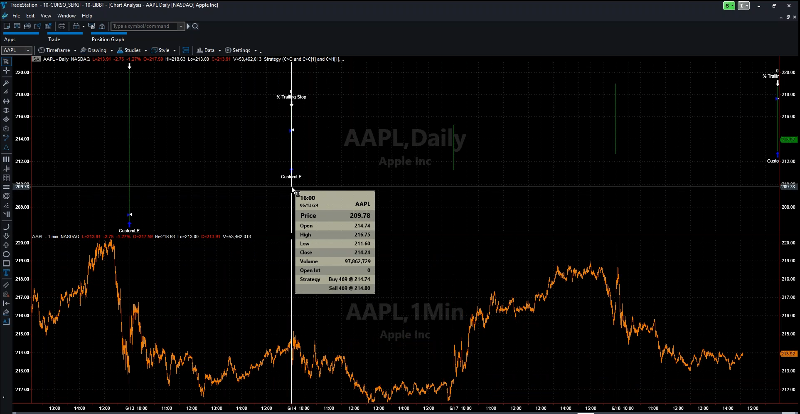
  <figcaption>Figura 090</figcaption>
</figure>

sé que es real? bueno sí, sé que es real, pero hace un montón de operaciones. son 42, no son tantos. Pero fíjate lo que gana. 

<figure>
  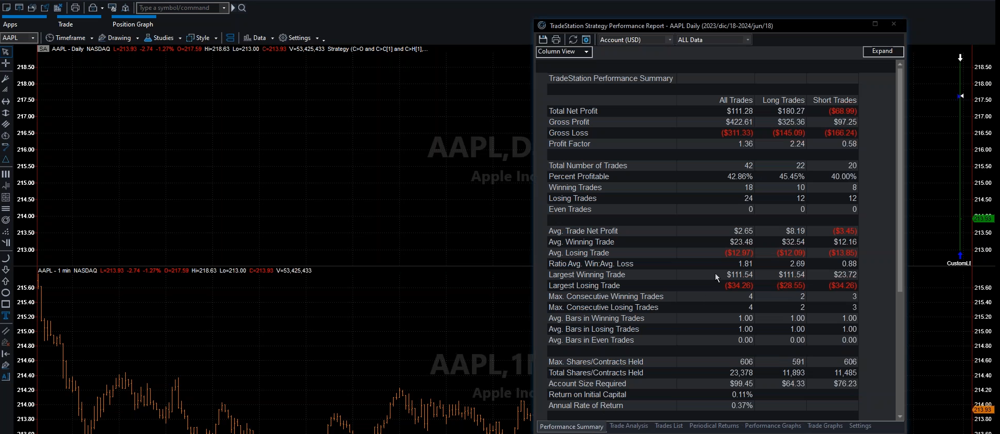
  <figcaption>Figura 088</figcaption>
</figure>

Nada más que le meta un tic más, tengo uno por contrato, y uno de Slippage,,, como me ponga dos lo rompo.

<figure>
  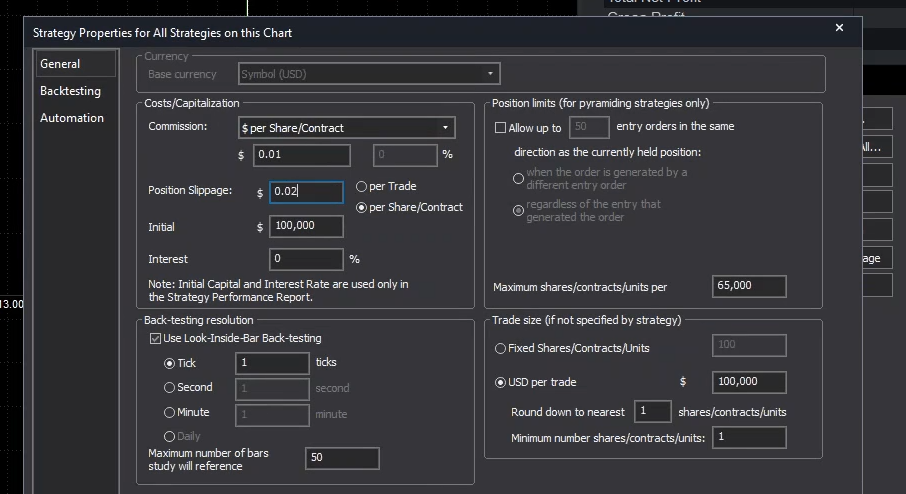
  <figcaption>Figura 091</figcaption>
</figure>

Bueno, ya está roto. Pero cada cálculo que la cuesta porque están un tic. Es ya está, ya a cero. Cuando solo por un tic más que es mucho los tics pero es muy sensible.

<figure>
  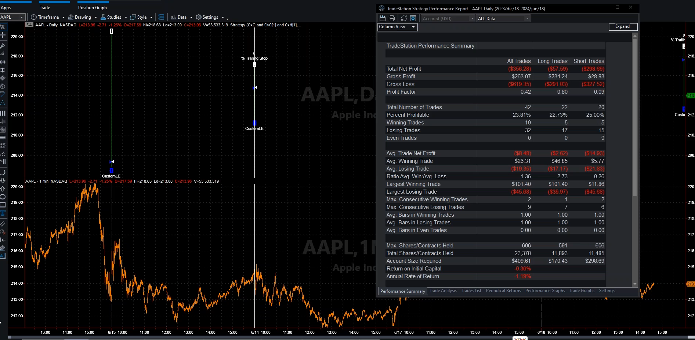
  <figcaption>Figura 092</figcaption>
</figure>
<figure>
  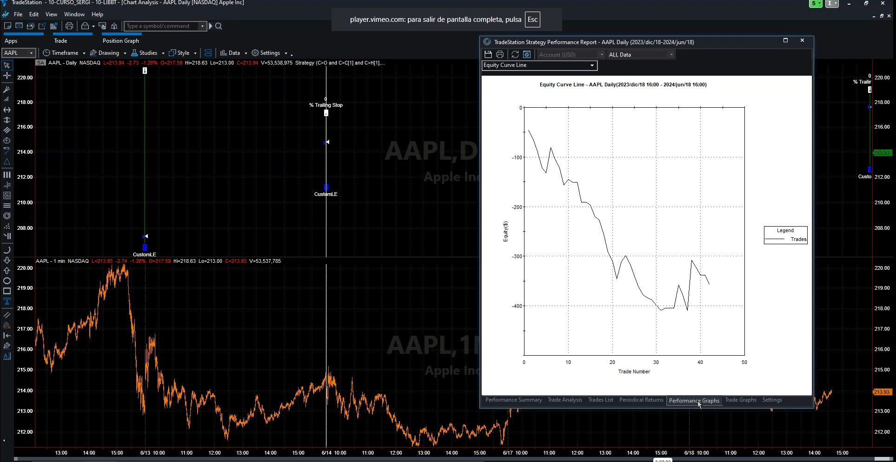
  <figcaption>Figura 093</figcaption>
</figure>

Es decir, realmente esto ahora mismo aunque tenga yo seis meses, yo ahora te quito. Te quito, vamos a hacer dos cosas. Pasar el *LookInsideBar* otra vez a un minuto, para que veamos aunque sea dos, dos tics.

<figure>
  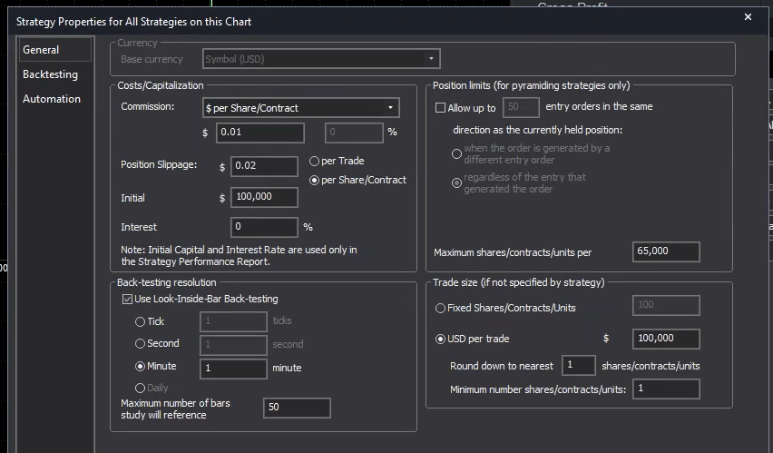
  <figcaption>Figura 094</figcaption>
</figure>

Fíjate cómo se ha como se ha quedado la curva. Eso es importante. Me acuerdo quién hablaba de esto, no sé lo que. El jate, el *LookInsideBar* en un minuto, ahí lo tienes.

<figure>
  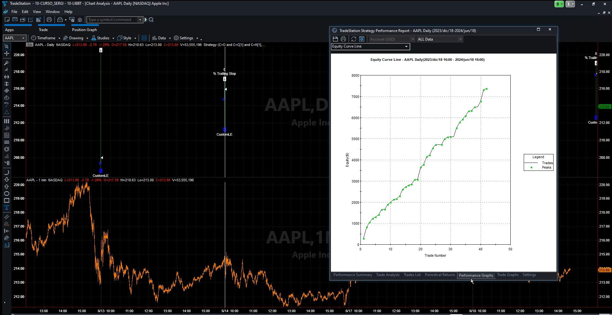
  <figcaption>Figura 095</figcaption>
</figure>
<figure>
  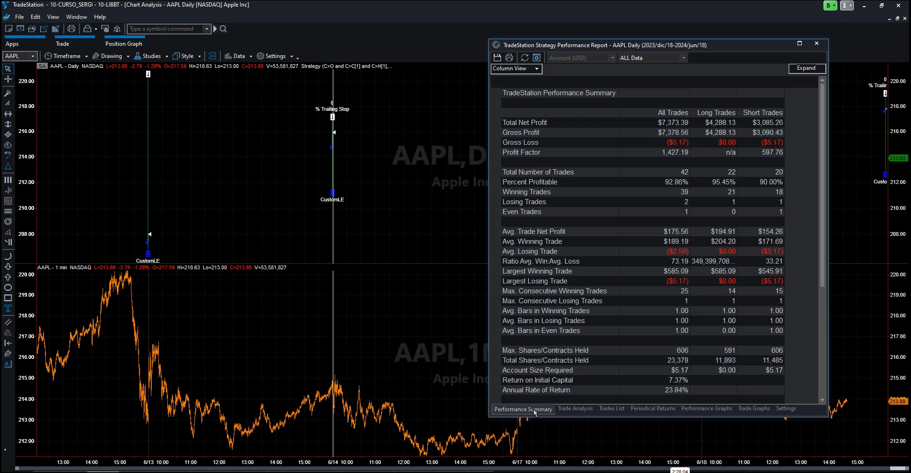
  <figcaption>Figura 096</figcaption>
</figure>

Entonces la única manera está seguro es esto. Aunque tu sistema sea de más tiempo. Porque si le afecta a esto, es que es de corto, plano, seguramente lo tienes que cargarle seis meses. Y ver si ese mes es idéntico. Tiene que ser idéntico, no ha de cambiar nada. Si cambia algo quiere decir que está tocado. 

Entonces este hasta en un minuto, es mentira.

Y ahora le quito el *LookInsideBar*, irá mejor o peor, pero irá bien 

<figure>
  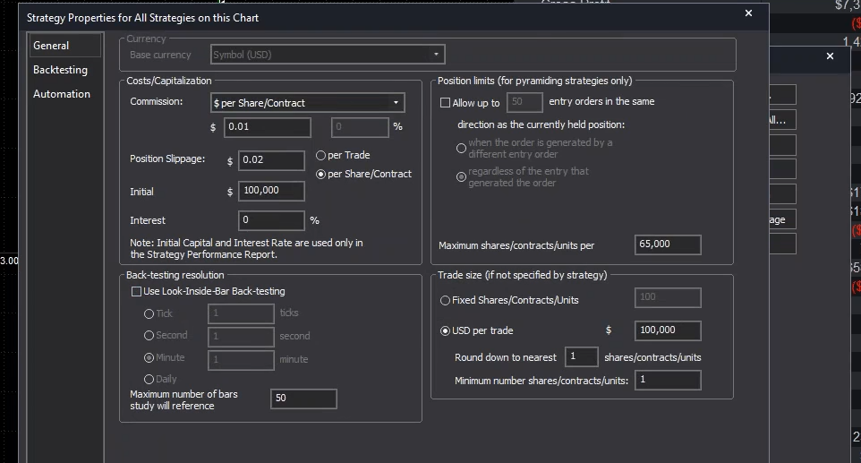
  <figcaption>Figura 097</figcaption>
</figure>

<figure>
  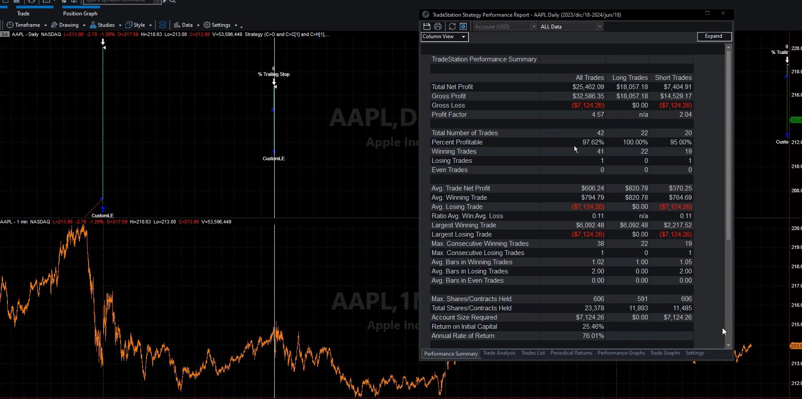
  <figcaption>Figura 098</figcaption>
</figure>

<figure>
  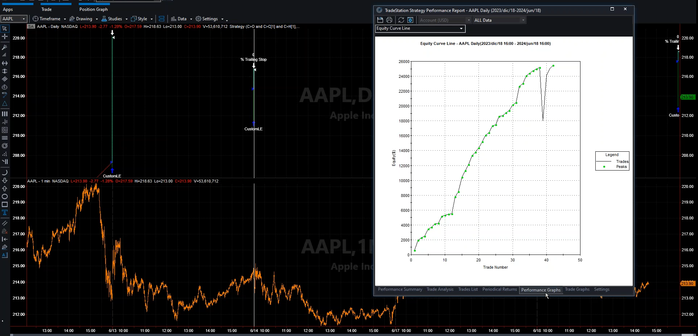
  <figcaption>Figura 099</figcaption>
</figure>

de locos, mucho más. Y es mentira... lo que veis antes. `Es mentira`. 

Fíjate que ahora le he puesto dos tics de coste. Con dos y de coste, aún así aquí no tiene ningún problema, y con el otro pues se rompe. Es decir, no tiene, no tiene ningún ningún sentido. 

Este es el ejemplo lo que decía. Tienes que ver que en un minuto la orden se mantenga bien. 

2:29

**Software para Walk Forward**

***¿Qué software alternativo para *Walk Forward* podías recomendar. Merece la pena.?***

A ver, yo creo que puedes manejarte. Ahora, si no hay problemas económicos y demás. Este, por lo que hemos visto de momento no parece ir mal, pero bueno, todavía lo hemos probado regular, cero responsabilidades por mi parte, pero no sé si hemos comprado 500 dólares, hemos comprado.

https:#trademaid.info/gsbhelp/EnhancedWalkForwardOptimizerforT.html

<figure>
  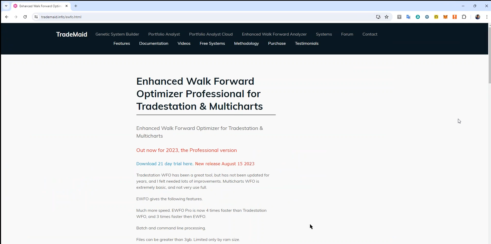
  <figcaption>Figura 100</figcaption>
</figure>

Y bueno, ya digo se puede. El de *TradeStation*, puedes usarlo. Tienes un limitación. Ahora que tiene el *Matrix*, ya si tienes los dos, yo los trabajaría bien los dos, los conocería bien. Entonces vas viendo.

Aquí tienes esa información y lo puedes ver. Ya digo, hacer o no sé. Nada, sé que lo he comprado y lo hemos probado un par de veces de momento.

Y a falta de hacer alguna prueba un poco más profunda, y está bien. A veces aquí entra y salta directo.

**Efecto de la Escala en los Gráficos**

El problema que tienes ahora de fijar, mínimo tienes las 30 operaciones. Es un problema que al final por las métricas de de todas las maneras que os he explicado técnicas, suelen ser más lentas que mirar la curva. Pero la curva es lo que te digo, cambia mucho, si tú miras una curva de corto plazo. 

A ver, vamos a ahora. Está con él, está con el tick, no.

<figure>
  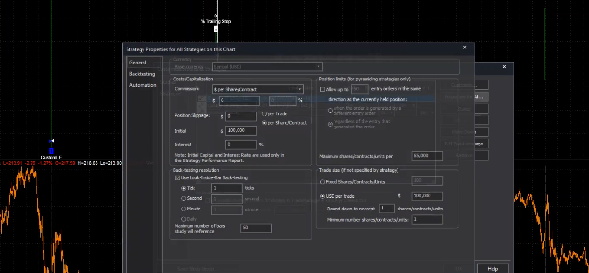
  <figcaption>Figura 101</figcaption>
</figure>

Mira, déjame ahora para, a ver si me sirve esto. Te voy a quitar las comisiones, más que nada para ver si al menos me deja una curva medio decente para, bueno, que no será medio decente, pero será una curva positiva, le para enseñarte lo que voy.

Y no, al final es un efecto del auto, de la autoescala. Como siempre decimos en la autoescala, tú los gráficos que autoescalan. Tienes este problema, que sin comisiones, hasta con el tick, fíjate que es la hostia. 

<figure>
  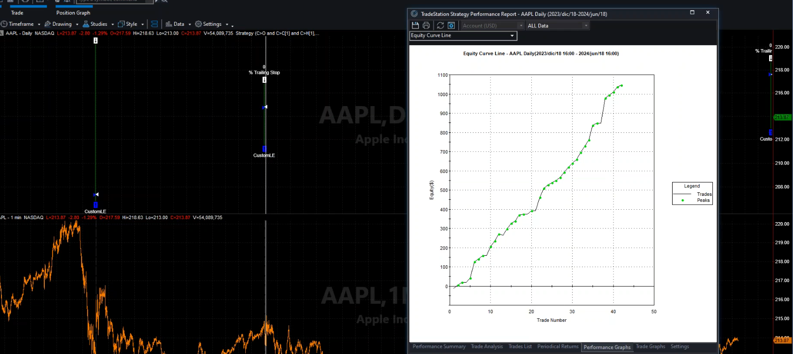
  <figcaption>Figura 102</figcaption>
</figure>

Pues está muy bien, está muy bien , le quitado las comisiones, y ahora siga a cabo es gratis operar. Ese tipo, esto, mucha gente cae cuando empieza, "que pasada", pero claro... operar no es gratis. Por eso, por ejemplo, los *market makers* lo tienen fácil. Porque si tú realmente te cuesta gratis real, es bastante fácil. O es mucho más fácil.

Porque gratis el todo, no, hay un *slip*, un *spread*, aquí en este ejemplo no hay nada. No hay contar el *spread* o contar. A los simplemente estoy comprando y vendiendo, haciendo trades de súper poco dinero de beneficio.

<figure>
  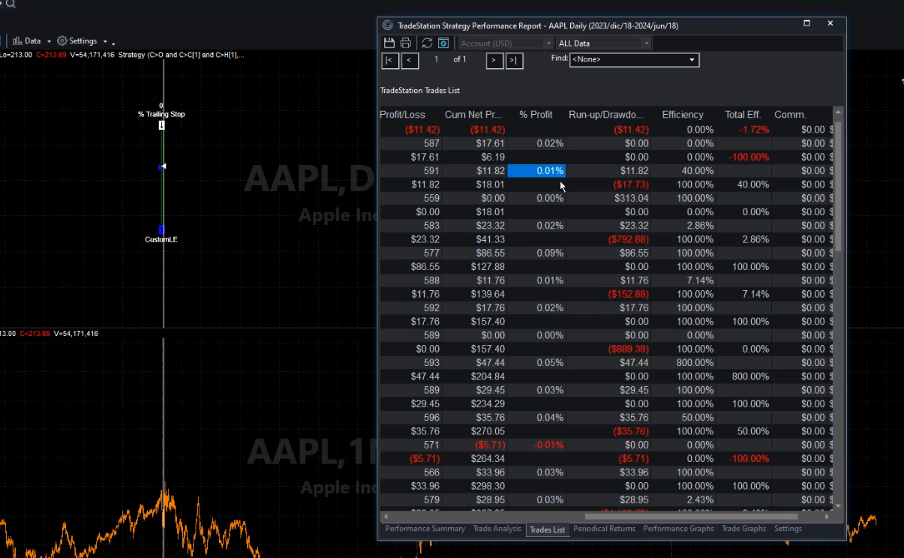
  <figcaption>Figura 103</figcaption>
</figure>

Es el otro lado de los otros, es haciendo eso. Es irreal. Tienes ustedes realmente no los podría hacer así nunca. Bueno, alguno, pero no es realista. Esto, pero efectos de lo que te quiero decir.

**Portfolio Trader en MultiCharts**

***cómo se hace para operar un *portfolio*. Se puede activar el *portfolio*, todos los sistemas a la vez de alguna manera, o sistema a sistema y ya está?***


*MultiCharts* si lo permite, esto es el *Portfolio Trader*, realmente útil. *TradeStation* no, tiene solo sistema, sistema, te lo montas, te lo dices tú.

La verdad que a nivel de operativa *MultiCharts* en ese sentido está mucho mejor. Tiene un *Stream Manager* que es muy chulo porque están trush. Pero bueno, la verdad que *MultiCharts* se ha ido mejorando en esta parte, y ahora está bastante guapo.


**Revisión de Walk Forward**

***Cuando pasa cierto tiempo y toca revisión de temas, actualizaciones de parámetros. En qué casos usáis el *Walk Forward*, es una optimización como en la práctica.?***

Depende, el rick, depende, depende de lo que esté. Y depende de las revisiones, de *Walk Forward*, pueden tocar por calendario, acordaros. Si tú has elegido, si no, si no en una revisión normal porque el sistema este más de flojo, lo normal es no hacer *Walk Forward*. *Walk Forward*, lo comentaba, recomiendo leer por si alguien no lo ha leído, una respuesta que le he dado a Rubén aquí esa sección, en principio. Pero bueno, no me ponen preguntas del curso, y entiendo que os confundáis.

Le respondí esto a Rubén que la marca del OK. Su pregunta relacionado un poco con el *Walk Forward*. Respondía ayer, hablaba de optimización de filtros. Este, te recomiendo leer esta respuesta.

> ***Buenas! una duda sobre el WF, no sé si se ha hablado sobre ello.. En caso de que una estrategia trabaje con varios filtros generales (supongamos el día de la semana, ventana horaria, el nº de velas atrás sobre las que se busca la entrada etc), cuál seleccionar para hacer el WF?***
>
>***La pregunta en realidad son dos, una es que si no trabajamos con indicadores cómo podemos usar adecuadamente el WF; y la otra es que en caso de tener varios inputs optimizables cuál seleccionar para el WF.***
>
>***El tema discurre también en que, por ejemplo, el día de la semana no es algo optimizable. Es un filtro fijo que puede condicionar demasiado; es decir, que puede ser la clave en la determinación de la ventaja. Mi percepción (quizá errónea) sobre esto es que este tipo de filtros no deberían optimizarse, no sé si es válida la hipótesis.***
>
> Por un lado, si tienes muchos filtros, malo. Si necesitas filtrar tanto la idea, quizá la idea no se aguante.
Dicho esto, si estás filtrando estamos hablando de un sistema intradiario con un número de trades considerable, ya que si no, no tiene sentido filtrar. En este caso, debes hacer el walkforward por todos los inputs que tengas (que nunca deben ser demasiados) y que lógicamente sean optimizables.
Los filtros en sí, los hay optimizables pero en general no es muy recomendable optimizar los filtros y de  hecho la mayoría no son optimizables. El tema es que a veces nosotros mismos nos liamos en que es señal y que es el filtro y todo se mezcla. Pero un filtro en su sentido estricto no se optimiza. Tu defines dos ejemplos de filtros típicos, día de la semana y ventana horaria. Estos no se optimizarían en el WF, los fijarías por backtest convencional e irían al WF prefijados. En cambio, luego dices otro como el nº de velas atrás sobre la que se busca la entrada que no sería un filtro, esto es el core del sistema y sí podría optimizarse (si podemos por muestra, trades...) y sí lo optimizaría en el WF.
>
>El objetivo del WF es estresar la estrategia, sin más. Al usar WF no os centréis en elegir sets, eso puede ser que sí o puede ser que no, pero es más una consecuencia de un gran walk forward que un objetivo en sí. El objetivo es medir la robustez del sistema y estresarlo para ver como se comporta "moviéndole" el histórico de distintas formas.
Sobre el filtro del día de la semana estamos de acuerdo, en caso de usarlo, no lo optimizaría.
Saludos.

Ahora recordar que el *Walk Forward* es estresar y nada más la estrategia. No tiene más finalidad, y tan solo fijar parámetros es una consecuencia que puede usarse o no, y hecho normalmente no se usa.

Es Decir, tú al final lo que quieres es ver si la estrategia se adapta al cambio de tipo de mercado. Porque voy a tener un cluster *Walk Forward*, todo el rato hace cortes distintos, en cada cluster. Con lo cual está obligando al sistema a adaptarse, a optimizar y probar, optimizar y probar. Que es lo que haces ahora en la realidad. Porque si tú ahora te pusieras a operar un sistema sin *Walk Forward*, optimizarías y probarías en *live*. Pues el *Walk Forward* hace eso, constantemente optimiza y prueba, te somete eso a pruebas.

Si tú eso te da paso, es el tema lo aguanta. Para eso con más de 50 de *Walk Forward* se considera aceptable, y los otros datos que ya conocéis. Pues es operable. Entonces, una vez el sistema es operable y te toca una revisión, en principio no debería tocar *Walk Forward*. Ahora bien, si eso supone la revisión un cambio importante del sistema, pues habrá que validar el cambio. Se entiende, ahí se depende un poco de qué cambiemos.

**MetaTrader y Herramientas de Backtest**

A nivel de MQL pensar que tiene como ados, buscarlos y tal. Nosotros no nos gusta demasiado. Yo sé que hay gente que tiene herramientas de *backtest* que no están mal. Son externas a *MetaTrader*, que es lo bueno que tiene *MetaTrader*, permite escalar. Es buscar cosas ahí y ver a ver si hay, y si os da algo.


## Regímenes de Mercado y el VIX Term Structure

Tengo dos cosas pendientes para empezar; voy a dejar el *COT* para el final, como puede ser que a alguien le interese, y después vale. Hoy voy con esto de *regímenes de mercado*. Vale, esto lo tenía apuntado desde el principio y al final pues ha llegado al final.

Cuando hablé del *VIX*, el *VIX* tiene muchas utilidades, pero es muy peligroso y muy complicado. Recordaros en la teoría, cuando se hizo ese ejemplo con el *VIX*, que parecía que iba bien y al final se iba a tomar viento. Vale, ¿por qué? Porque el histórico, que si *contango*, que si *van guards*... O sea, es un activo complicado de operar, porque el índice es muy chulo, le puedes coger cosas, va muy bien, pero tú no puedes operar el índice: tienes que operar futuros o *ETF*. Hubo un *ETF* que se rompió, no me acuerdo el nombre. O sea, al final tiene tiene tiene miga la cosa, es cuidado.

<div style="border-left: 4px solid #27ae60; background: #ecf9f1; padding: 10px 15px; margin: 10px 0;">
  <strong>📘 Nota técnica</strong><br>
  El <em>VIX</em> (Volatility Index) es el índice de volatilidad implícita del S&P 500, calculado a partir de los spreads de las opciones. El problema de operarlo directamente es que los instrumentos disponibles (futuros y ETFs) sufren el efecto del <em>contango</em> (cuando los futuros lejanos cotizan más alto que los cercanos), lo que erosiona el valor con el tiempo.
</div>

Ahora bien, el *VIX* también tiene alguna utilidad muy interesante, que es como la `estructura de la volatilidad`. Como al final es un indicador de miedo, porque mide el *spread* de las opciones de los S&P 500, y tiene distintos vencimientos, tiene *curvas de plazos*. El CME publica índices, vale. Aquí estás viendo uno que le llaman *VIX*, esto está en la plataforma,

<figure>
  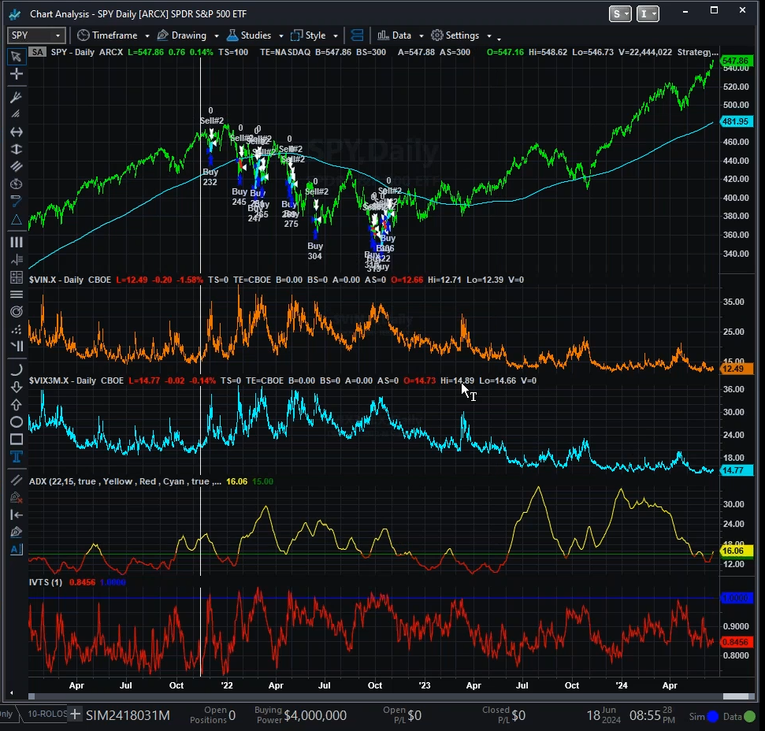
  <figcaption>Figura 106</figcaption>
</figure>


el *VIX Near Term*. 

<figure>
  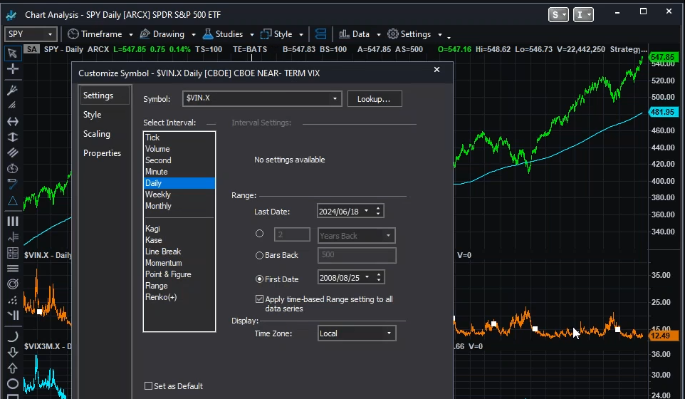
  <figcaption>Figura 104</figcaption>
</figure>

Estos los voy a dar, y aquí tengo el *VIX3M*. 

<figure>
  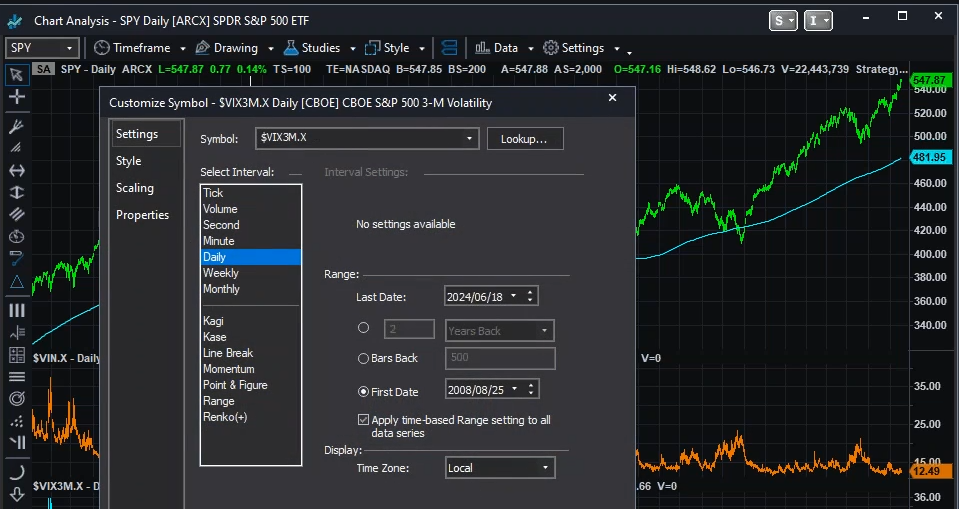
  <figcaption>Figura 105</figcaption>
</figure>

Y esto hay muchos autores, hay *papers*, os vamos a dar el *paper* también. Hemos visto el *SSRN* que tiene, sobre mañana... Esto es... Por favor, cuando acabe me voy a casa, pero subiré todo lo que he comentado. Esto hay *papers* que usan eso como indicador de *régimen de mercado*, pero un poco de... en este caso *régimen*, *régimen*, *modo alarma roja*, *modo alarma roja*.

**El indicador IVTS**

Entonces esto es un indicador muy sencillo que se llama *ASMR*, voy a empezar a hacer *ASMR*, 
Lo que os comentaba de los *regímenes*, hay un *paper* que ya os lo subo, como decía mañana, y bueno parece que ya haberlo se ha preparado varios, pero bueno el principal, que es el precursor, es éste

* paper : ***Implied Volatility Term Structure***   
  [IVTS: How to beat the market with the IVTS](../docs/How%20to%20beat%20the%20market%20with%20the%20IVTN.pdf)

<div style="border-left: 4px solid #27ae60; background: #ecf9f1; padding: 10px 15px; margin: 10px 0;">
  <strong>📘 Nota técnica</strong><br>
  El <em>IVTS</em> (Implied Volatility Term Structure) es un indicador que compara el VIX de corto plazo con el VIX a tres meses. Cuando el ratio supera 1, significa que la volatilidad a corto plazo ha superado a la de largo plazo, lo cual suele ocurrir en momentos de pánico o crisis de mercado (<em>backwardation</em>).
</div>

Ya os lo explico simplemente: divide el *VIX* por diferentes plazos, vale, 

<figure>
  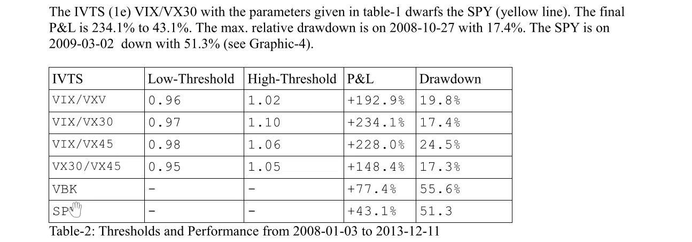
  <figcaption>Figura 107</figcaption>
</figure>

y con esto pues hace distintas... El que he visto más veces usado con el de tres meses, pero final para la estructura. Los futuros, acordaros, que normalmente están en *contango*. También el *VIX*, ¿qué quiere decir en *contango*? Lo vimos en la teoría, pero no recuerdo... Es lo lógico, es decir, que el futuro más lejano en el tiempo valga más que ahora. ¿Por qué? Porque el tiempo, solo el factor temporal, los tipos de interés, incorporan un coste. Recordaros el *valor temporal del dinero*, primera clase del curso. Para los no iniciados, si alguien iniciado se lo saltó, hombre, que habéis comprado el curso, yo recomiendo verlo, pero ahí hablamos un poco de esto y de otras cosas.

Y lo que digo, esto es lo normal. Que ahora mismo, por ejemplo, ¿qué pasa? Tenemos el *VIX* corto plazo a 12,47 y el *VIX* a tres meses 14,76. En *contango*, lo lógico, lo lógico, lo normal. Entonces este indicador `IVTS`, que lo tenemos aquí, pues recoge eso, está en 0,84, que está por debajo de 1. ***Cuando sube de 1, quiere decir que el tres meses ha superado al corto plazo***, bien. Eso usualmente pasa en momentos críticos de mercado.

<figure>
  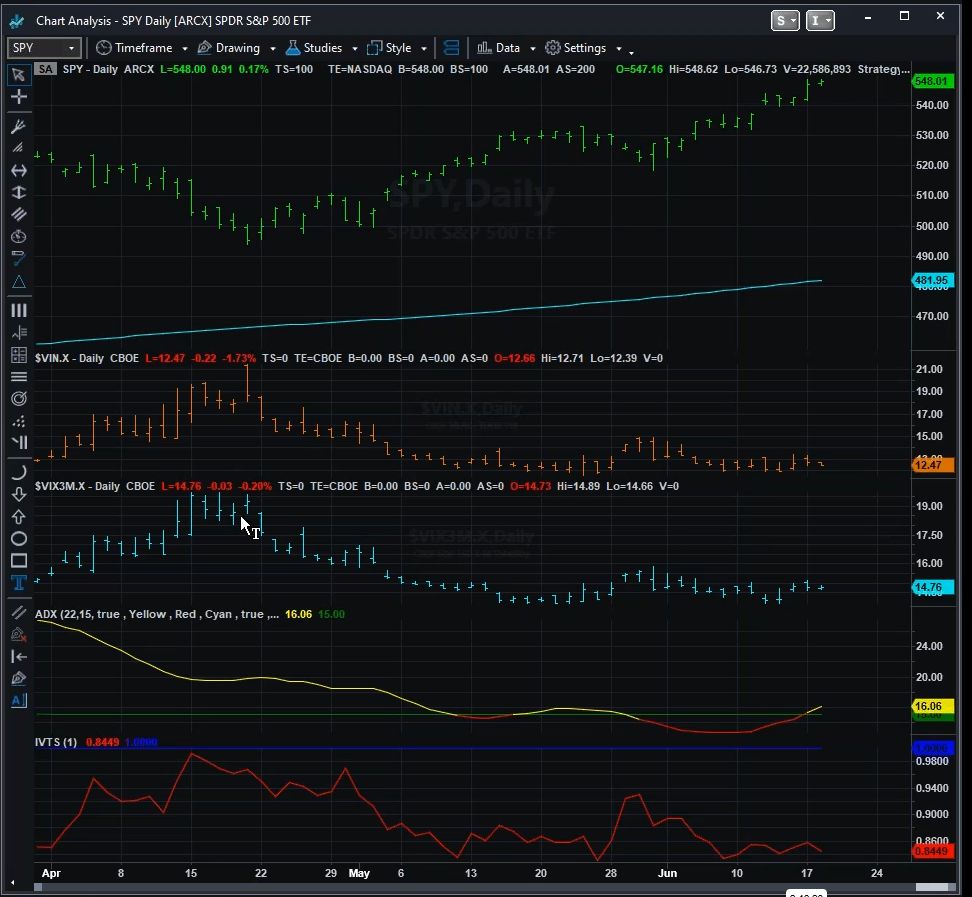
  <figcaption>Figura 108</figcaption>
</figure>

**Recomendación de uso del IVTS**

Entonces esto recomiendo explorarlo, probar dos meses, para cada uno tiene que trabajarlo. hemos hecho un código para que lo podéis trabajar, un código marco, no un código ya acabado. Y ya esto es todo. Esto es poneros súper *bonus*, de hecho os diría más. Esto, en el curso hay perfiles de todo tipo de gente: gente que está empezando, gente que ha hecho *trading* gente que no, y gente que ya incluso hacía *trading* algorítmico y está viendo a ver qué cuento, vale.

**Repaso del material del curso**

Y aprovecho para deciros una cosa: nosotros hemos, en este tiempo, hemos revisionado prácticamente todos los vídeos. En el curso hay cosas, hay perlas de muchísimo valor, lo que pasa que no están... No digo "ojo, voy a decir una perla", es decir, está todo comentado por ahí, está hablado, porque yo hablo y hablo y hablo y he soltado cosas de mucho valor, de acuerdo. Y el material al final que hemos dado es una locura, es una locura, mucho más de lo que pensábamos ahora de entrada, porque somos así. Es todo el material, solo solo lo de *Status and Concepts* es una bomba. Todo ese material ahí, con el Excel aquel que os dio el análisis, realmente ahí hay muchísimo material para trabajar y seguir aprendiendo. despues del curso, que hay que seguir aprendiendo, esto no acaba, no acaba ni mucho menos hoy, y cuando acabas hay que seguir trabajando permanente, bien.

Después de este rollo, que venía al caso, este *IVTS*, esto podemos considerarlo un nivel avanzado, podemos considerarlo un nivel avanzado. Entonces, si sois principiantes y demás, mirarlo, claro que sí, entenderlo, pero tampoco os vais locos, vale, tampoco os vais locos.

**Código marco para análisis de regímenes**

Entonces nada más. Entonces lo que os decía: os hemos hecho un sistema marco para... os lo enseño para valorar y para estudiar. Hay muchos códigos, como por ejemplo el que dimos, `*buscador de entradas*`, también bastante potente pienso yo, pensado con que crezca y lo adaptéis. Éste está más desarrollado que este, pero aun así es un marco, es un ejemplo de cómo trabajar estas cosas, no es directamente ya el sistema hecho. 

code : [RegimenMercado](../code/REGIMENMERCADO.ELD)
code : [practice 17](../code/PRACTICA%2017.ELD)

Lo mismo aquí: aquí hemos planteado un código marco para analizar *regímenes de mercado*, para que vosotros trabajéis y para valorar el *IVTS* y mostraros si tiene utilidad o no, vale. Y lo hemos hecho de una manera simple que nos ha parecido razonable y creemos que es así. Y hasta aquí está el código.

Al mismo tiempo pues hemos incorporado más maneras de mirar el *régimen*: manera súper fácil, una *media móvil*, el *ADX*, vale, y como os digo la volatilidad mediante el *IVTS* este. Entonces al final hemos creado aquí unos *cases* que definen un tipo de mercado:

```sh
´´´
	Código marco para analizar regímenes de mercado y el IVTS en particular
	Hemos planteado los 6 tipos de mercados de la forma más básica posible,
	pero se pueden plantear más escenarios y de formas distintas.
	P.ej. Media alcista, pero ADX bajista y viceversa.
´´´
switch tipomercado
Begin
	case 0: #BUY & HOLD
	case 1: #ALCISTA NO VOLÁTIL
	case 2: #ALCISTA VOLÁTIL
	case 3: #ADX- Y NO VOLÁTIL
	case 4: #ADX- Y VOLÁTIL
	case 5: #BAJISTA Y NO VOLÁTIL
	case 6: #BAJISTA Y VOLÁTIL
	case 7: #MERCADO NO VOLÁTIL
	case 8: #MERCADO VOLÁTIL
```

- ***Buy and Hold*** alcista no volátil quiere decir que está por encima de la media y el *ADX* por encima de su umbral, ahora lo miramos en el gráfico.
- ***Alcista volátil***: el mercado por encima de la media, el *ADX* por encima del umbral, pero el mercado está volátil, es decir, el *IVTS*, perdón, ya diré... *IVTS*, ese, venga, pues vamos, *IVTS* y *IVRS*, vale, *IVTS*.
- Pero no sé por qué tengo en la cabeza... Bueno, aquí está volátil, con eso disparado, no tienes el *ADX* negativo y no volátil, es decir, el mercado no tiene tendencia porque el *ADX* está indicando que se halla, podríamos decir que es lateral. Es decir, lateral, el *ADX* te puede decir eso con la volatilidad baja. Y el ***ADX*** con la volatilidad alta, o sea, el **ADX** bajo pero la volatilidad alta.
- ***bajista y no volátil***, que quiere decir bajista pues por debajo de la media pero con tendencia de mercado *ADX*, y así.
- ***mercado volátil***, el mercado no volátil, o sea, solo la volatilidad, solo el *IVTS* en *false* o *true*. Y hasta... Pero esto, como os pongo aquí arriba, puede crecer.

**Escenarios de régimen de mercado**

Realmente hemos puesto 6, pero se pueden plantear más escenarios. Por ejemplo, *media alcista pero el ADX bajista*, que quiere decir por debajo del umbral, es más que correcto, y viceversa. 

```sh
´´´
	Código marco para analizar regímenes de mercado y el IVTS en particular
	Hemos planteado los 6 tipos de mercados de la forma más básica posible,
	pero se pueden plantear más escenarios y de formas distintas.
	P.ej. Media alcista, pero ADX bajista y viceversa.
´´´
```

Es decir, se puede plantear distintos escenarios. Estos son los típicos, porque el *ADX bajista*, como pongo aquí, que no sé si es lo más correcto, prácticamente es lateral, pero se puede plantear distintos escenarios.

<figure>
  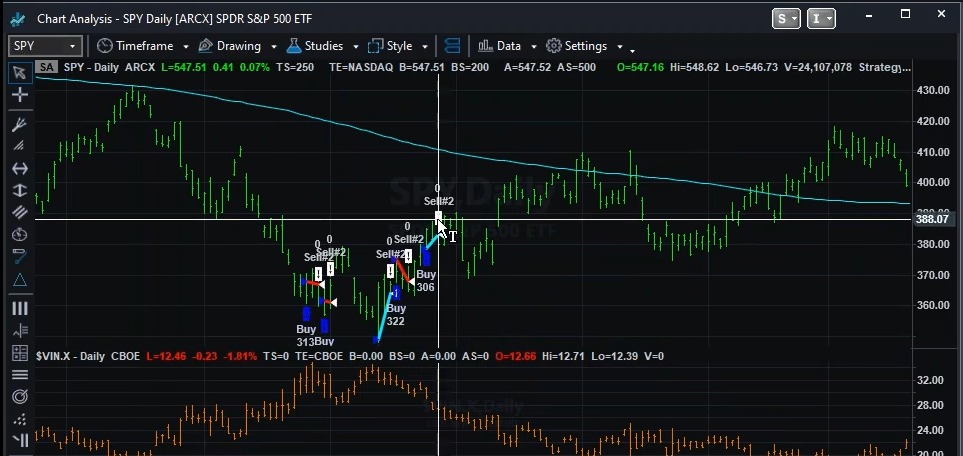
  <figcaption>Figura 109</figcaption>
</figure>
<figure>
  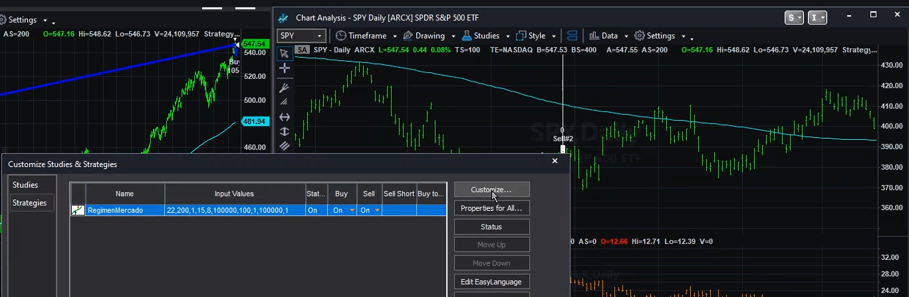
  <figcaption>Figura 110</figcaption>
</figure>

Esto al final, si hacemos aquí una sencilla prueba... solo sale el largo porque es el *SPY* de 0 a 8.

<figure>
  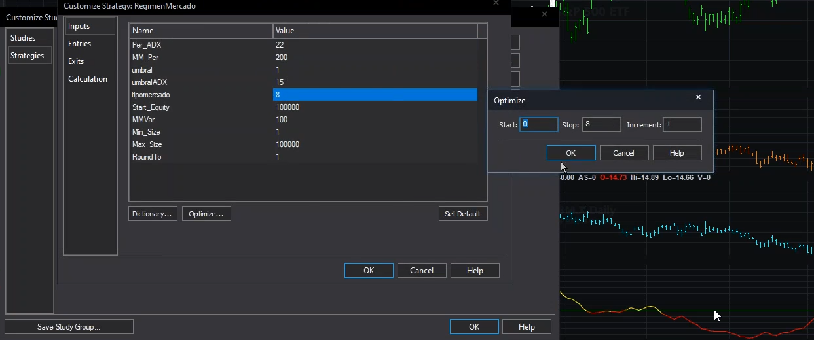
  <figcaption>Figura 111</figcaption>
</figure>

Nos va a decir que el que más gana es el 0, es decir *Buy and Hold*. Pero no es la que mejor es, que lo tiene... Pero me interesa sobre todo que veáis, acordaros que el 7 y el 8 eran el volatilidad, volatilidad. Y fijaros que el volatilidad gana 245 y volatilidad gana solo 17 con las más operaciones. Es decir, claramente confirma, vale.

<figure>
  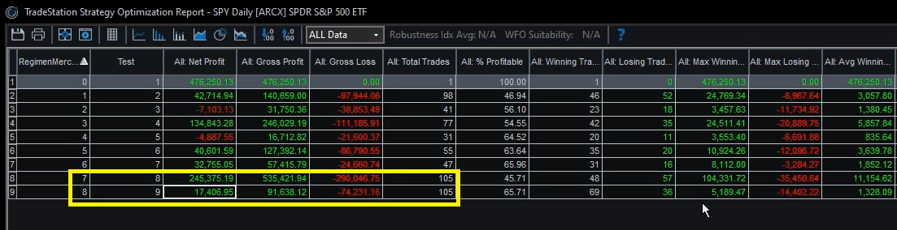
  <figcaption>Figura 112</figcaption>
</figure>

**Análisis del régimen de volatilidad**

Que ahora voy a poner el volatilidad... Y además se podía separar el *setup* de entrada y salidas, y todo esto está hecho para mostrar, simplemente mostrar, simplemente el ejercicio. O sea, está la misma regla para entrar que para salir.   
Es decir, esto compra cuando la volatilidad está alta y vende cuando está baja... 

<figure>
  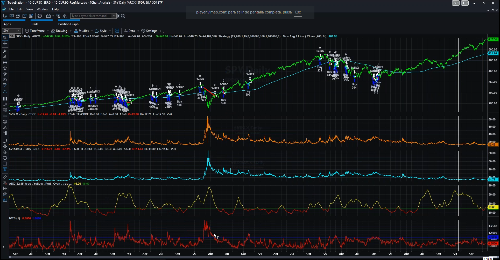
  <figcaption>Figura 113</figcaption>
</figure>

Fijaros cómo demuestra claramente que comprar cuando este indicador se dispara cuesta caro, casi no gana. Y de hecho, depende cómo, pierde.

Porque fijaros aquí, que ya se empieza a disparar, aquí da una señal de aviso,   

<figure>
  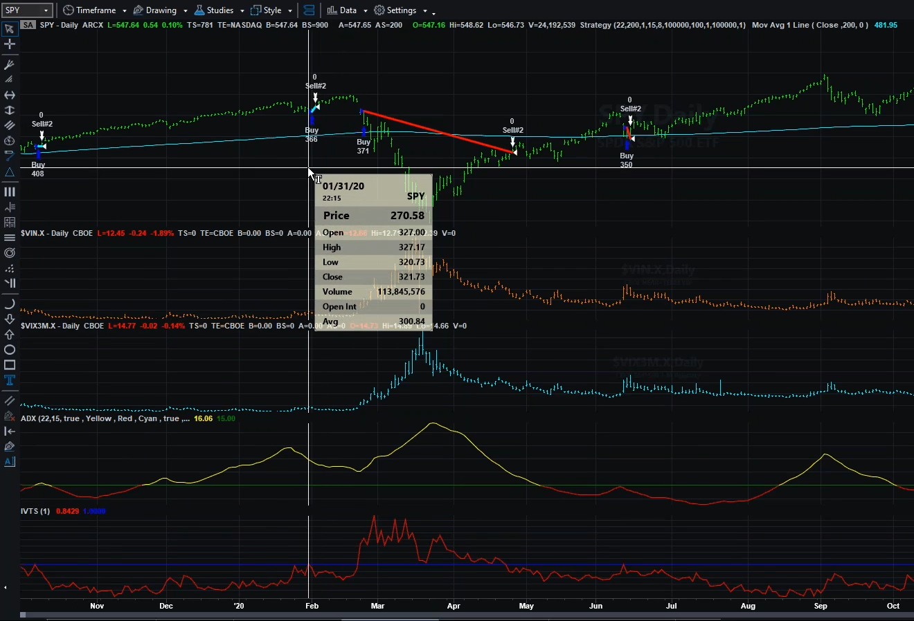
  <figcaption>Figura 114</figcaption>
</figure>

pero aquí ya en la primera caída,,, ya estaba a punto de romperse, por un poco, por no nada se... 

<figure>
  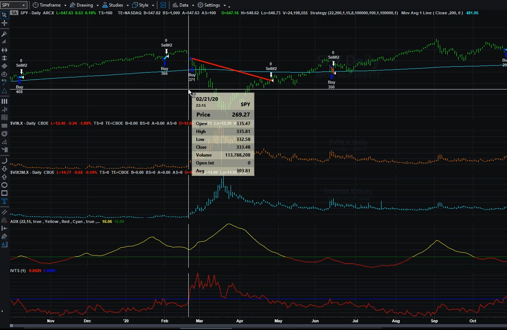
  <figcaption>Figura 115</figcaption>
</figure>

No lo compra antes, de hecho aquí ya corta, y compra y al final se mantiene alto. Aquí, que ya está recuperado, para que vuelva a bajar. Y entonces la mayoría de veces suponen tres perdedores comprar cuando eso está alto. de hecho fijaros que su porcentaje de aciertos es el, bueno, es el 65, gana un poco. Pensaba que me saldrían pérdidas.

<figure>
  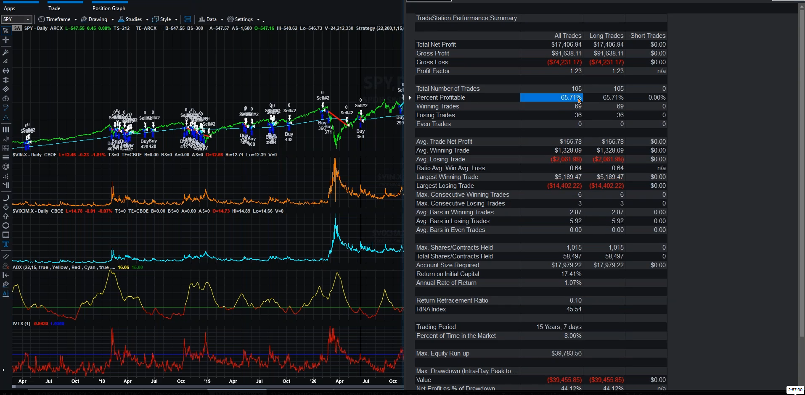
  <figcaption>Figura 116</figcaption>
</figure>

**comprar justamente cuando está bajo y mantener**

Sobre todo fijaros la diferencia. Lo que decía: con el otro, ahora pasamos al otro, al comprar justamente cuando está bajo y mantener. Y fijaros el cambio: 

<figure>
  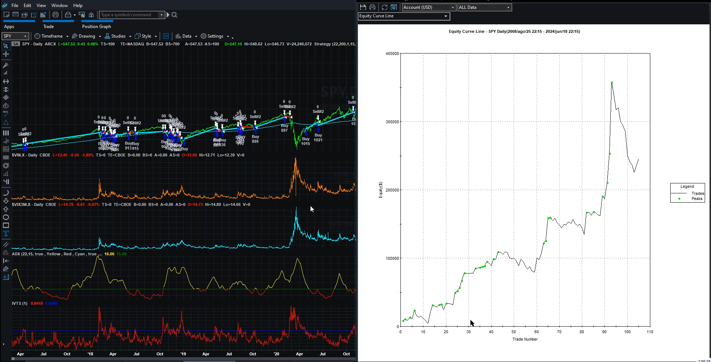
  <figcaption>Figura 119</figcaption>
</figure>
<figure>
  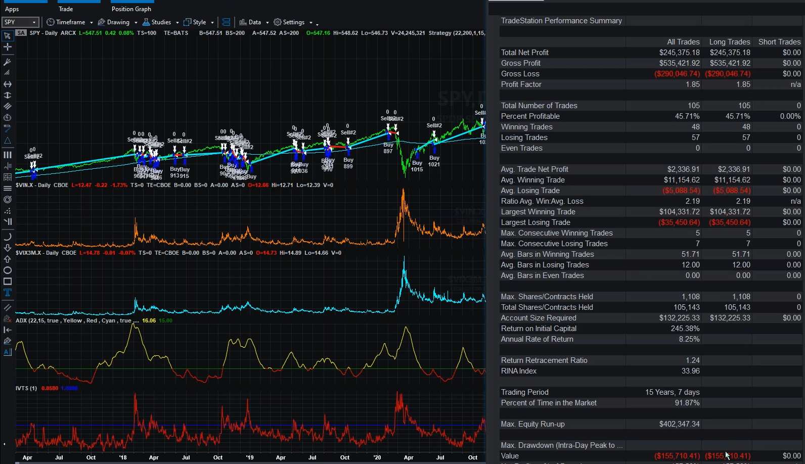
  <figcaption>Figura 118</figcaption>
</figure>

ya tenemos también 105 operaciones. Es otra cosa.  
Eso es un evaluador, no sale por ningún criterio, solo sale cuando la volatilidad sube.

**Evaluación de señales de alerta**

Aquí, fijaros, como la mayoría de veces también tiene trades perdedores, lógicamente aquí, porque aquí aquí sí que sale, pero vuelve a entrar muy rápidamente. 

<figure>
  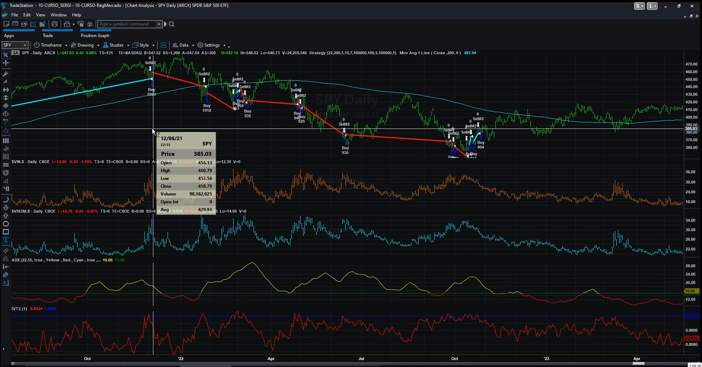
  <figcaption>Figura 120</figcaption>
</figure>

O sea, la señal de alerta no le dura nada, rápidamente vuelve y vuelve a caer, se vuelve a salir, va un poco persiguiendo la presión, está en este lateral. 

<figure>
  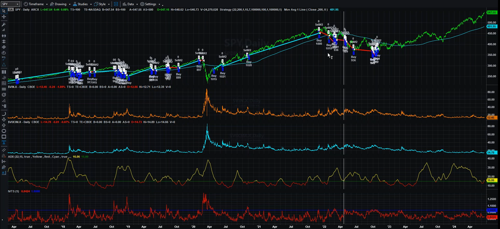
  <figcaption>Figura 121</figcaption>
</figure>

Pero al final es que es una corrección, que es corrección no es especialmente grave. Al final sí que es verdad que falla mucho. Al final está, sí que llegaba y justo al nivel para marcar el peligro, pero al final no había peligro, volvía. El mercado estaba fuerte, como aquí ha llegado, se ha acercado pero ha vuelto. Y al final aquí pues acaba entrando y se queda comprado. Así que, comprado, al final te muestra claramente como es un indicador de peligro muy claro, muy claro, vale.

**Análisis de otros cases**

También también lo vemos en otros, también vemos por ejemplo que el *case* que hay otro que pierde. Hay dos que pierden: el 2 y el 4. 

<figure>
  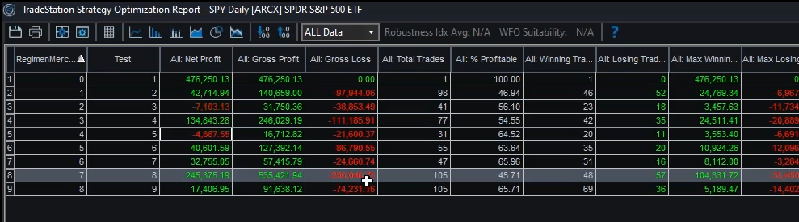
  <figcaption>Figura 122</figcaption>
</figure>

Ahora vamos a ver que son,,, 

```sh
switch tipomercado
Begin
	case 0: #BUY & HOLD
	case 1: #ALCISTA NO VOLÁTIL
	case 2: #ALCISTA VOLÁTIL
	case 3: #ADX- Y NO VOLÁTIL
	case 4: #ADX- Y VOLÁTIL
	case 5: #BAJISTA Y NO VOLÁTIL
	case 6: #BAJISTA Y VOLÁTIL
	case 7: #MERCADO NO VOLÁTIL
	case 8: #MERCADO VOLÁTIL
```


`case 2: #ALCISTA VOLÁTIL` Cuidado, el *alcista volátil*, con esto disparado, pierde dinero. Pero es que, su homólogo es *alcista no volátil*, es el 1, con 42000, 

<figure>
  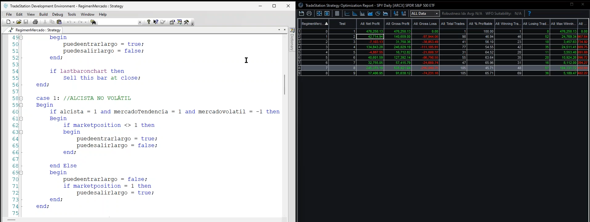
  <figcaption>Figura 123</figcaption>
</figure>

Y el, claramente vuelve a demostrar que el 1 acaba confirmando. Y el 4 va a ser lo mismo: el `case 4: #ADX- Y VOLÁTIL` es con el *ADX* por debajo, es decir *lateral y volátil*, otra vez volátil vuelve a perder. Y su homólogo, *ADX no volátil*, es el `case 3: #ADX- Y NO VOLÁTIL`, que es el segundo, gana gana bastante, 134k. Vale, el lateral gana gana cuando el *ADX* cae, comprar ahí le da bastante.

**Análisis de ratios riesgo-retorno**

Esto simplemente es un analizador, habría que contemplar más escenarios de salir de maneras distintas, un poco, pero fijaros que si ya miramos *ratios de retorno-riesgo*, la cosa ya no queda tan clara. Y el que da mejor es 3. Por ejemplo, el que da mejor es 3, en este caso por *TSI*, que es este del *lateral y no volátil*. 

<figure>
  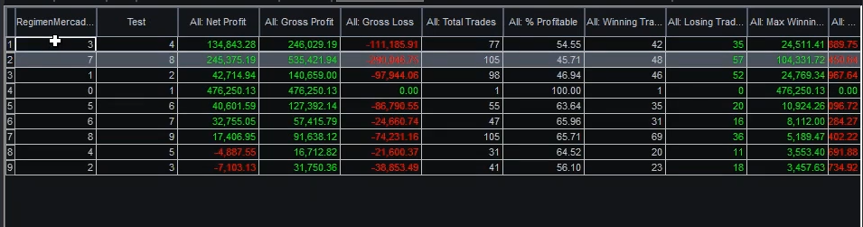
  <figcaption>Figura 124</figcaption>
</figure>

Es decir, es extraño, Pero tiene sentido, porque al final, si el mercado está lateral pero el indicador de volatilidad no marca peligro, lo normal, que va a hacer la bolsa, por subir, pues ahí es un buen momento para entrar. O sea, está marcando un buen *setup*, porque el problema, "problema" entre comillas, es que aquí para evaluar eso, sale a entrar la salida igual.

Entonces entonces al final, cuando corta se sale cualquiera de ellos. Es decir, si se corta el *ADX*, sale. Entonces está... entonces aquí necesita que los los 2. Entonces el 3 es lateral, que quiere decir que ignora la tendencia, es decir, aunque esté por debajo de la media, compra igual. Este ignora la tendencia, se ignora estar por debajo por encima de la media. Podría haberse complementado distinto, pero pero ve lo que compensa. Decir: solo opera solo con el *ADX*. Cuando el *ADX* no esté disparado, compras. 

<figure>
  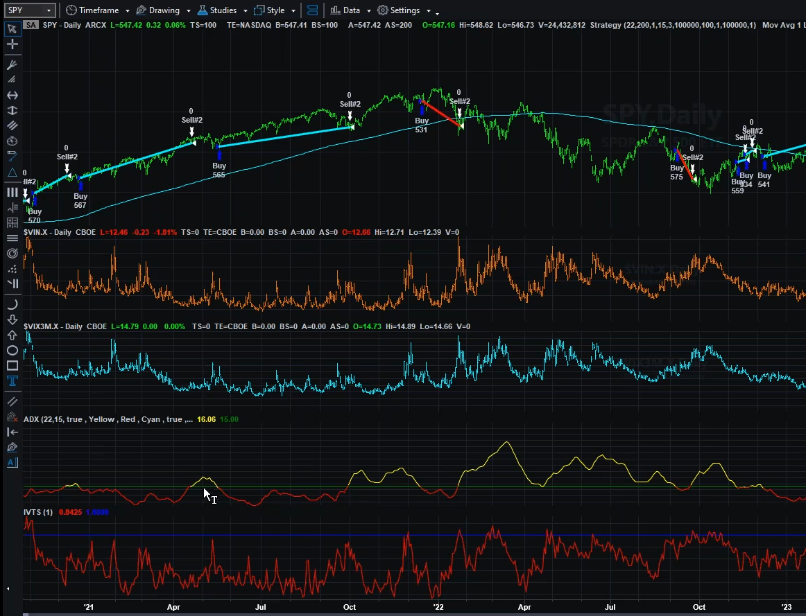
  <figcaption>Figura 125</figcaption>
</figure>

Es así. No, exacto, cuando el mercado en tendencia, menos 1, es decir, cuando el mercado esté, compra. Y se sale cuando *pueden estar largos false* si cualquiera de los 2, tienen que ser los 2 *true*, claro.

```sh
	case 3: #ADX- Y NO VOLÁTIL
	Begin
		if mercadoTendencia = -1 and mercadovolatil = -1 then 
		Begin
			if marketposition <> 1 then 
			begin
				puedeentrarlargo = true; 
				puedesalirlargo = false;
			end;
			
		end Else
		begin 
			puedeentrarlargo = false; 
			if marketposition = 1 then 
				puedesalirlargo = true;
		end;
	end;
```

Pero ese es el 3 activado, la situación activado el 3. El 3 es este, no lo ves, y a la que ya el *ADX* vuelve por arriba, es un tanto extraño, pero bueno le compensa. Cuando el *ADX* se empieza a disparar, es una vez entre las paradojas del *ADX*. Pero es verdad que los tramos de tendencia más fuerte se nos va a perder, como es aquí, ves. Pero sí que es verdad que la tendencia, como es un *ADX* que es muy lento, de 22, decir, de un mes... cuando ya está en tendencia fuerte, se sale. ¿Por qué? Porque digamos que está más cerca de acabarse la tendencia. ¿Entendéis? Un poco a la inversa.

<div style="border-left: 4px solid #27ae60; background: #ecf9f1; padding: 10px 15px; margin: 10px 0;">
  <strong>📘 Case 3: ADX- Y NO VOLÁTIL</strong><br>

```
mercadoTendencia = -1  →  ADX bajo (sin tendencia fuerte)
mercadovolatil = -1    →  Volatilidad baja
```

| Condición | Acción |
|-----------|--------|
| ADX bajo **Y** Baja volatilidad | ✅ Puede entrar largo / ❌ No puede salir |
| Cualquier otra situación | ❌ No puede entrar / ✅ Puede salir si está dentro |

**¿Qué busca?** : *Mercado lateral y tranquilo* → típico para:
- Estrategias de **reversión a la media**
- Entrar antes de una expansión de volatilidad
- Evitar mercados tendenciales donde el mean reversion falla

**En el gráfico**

- ***Panel ADX:*** Cuando está bajo (amarillo débil) = sin tendencia
- ***Panel IVTS:*** Cuando está bajo = volatilidad baja (VIX < VIX3M)

El filtro activa largos solo cuando **ambos están en modo "tranquilo"** → mercado en rango, ideal para comprar dips esperando reversión.
</div>

**Comportamiento en tendencias fuertes**

Ahora, ¿qué pasa cuando hay tantos son fuertes? Pues se queda fuera, se queda fuera. 

<figure>
  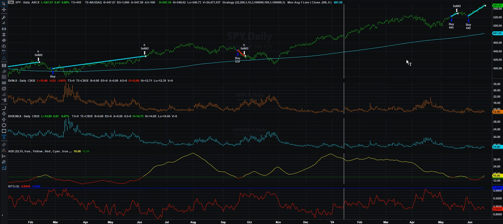
  <figcaption>Figura 126</figcaption>
</figure>

Al final lo que ha de centrar un poco en el mercado descansa. y porque le compensa, le compensa porque así tiene muy pocos *drawdowns*. Tampoco es que gane tanto, hay otros dos que ganan más: el *Buy and Hold* y el y el 7, el *no volátil*, estar comprado mientras no haya volatilidad. Pero el riesgo le compensa porque así se sale muy rápido, vale.

Pero insisto que esto estoy explicándolo para que entendáis por qué lo hace... Pero el objetivo de esto es es es daros el código, que entendáis un poco distintos mecanismos. Pueden haber otros, recordar que ya os enseñé en un ejercicio es componer el *DAX* en el de más y de menos. Se puede evaluar para evaluar, probarlo, a ver con el de más y con el de menos para alcista y para bajista. Hay que mirar los distintos umbrales, hay que trabajarlo. Esto simplemente era un ejemplo, vale.

**Prueba con volatilidad normalizada**

Hemos hecho otro ejemplo que no acaba de ir tan... Para nada, es decir, al final no deja de no deja de demostrar la validez del *IVTS* para esto, vale. Porque lo hemos probado con la *volatilidad normalizada*, probando distintos periodos, 60, 90. Y sí que sí que un poco lo detecta, pero mucho peor, vale, mucho peor. Es decir, o sea, este código de aquí es exactamente igual que el de la derecha.

Vamos a hacerle también la optimización, pero en vez de usar el *IVTS*, para poder usar más código, vale. De hecho me la voy a cargarle ya más código, porque claro aquí ya puedo meterle pues 30 años para poder meterle más código, más histórico. 

<figure>
  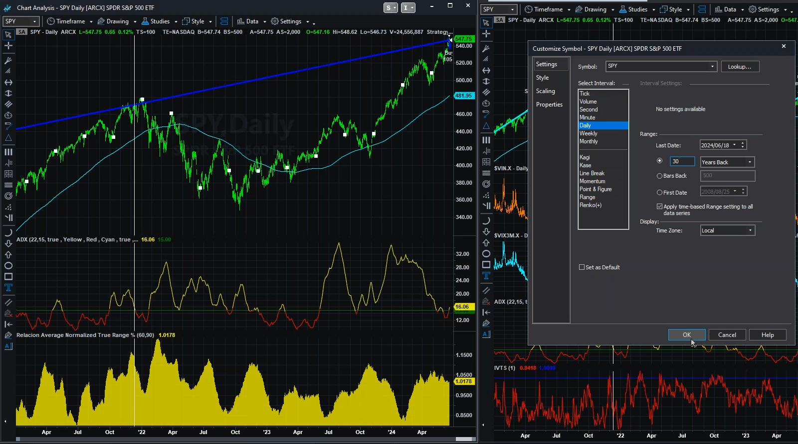
  <figcaption>Figura 127</figcaption>
</figure>

Entonces hemos usado el, como la *volatilidad normalizada*, haciendo lo mismo. Es un ratio, la volatilidad de 60 contra de 90, buscar un ratio de volatilidad, pues probar 60, 90, hay que probarlo. Entonces esto ya hay que hay que trabajarlo, no lo hemos trabajado porque repito el objetivo era daros el código.

**Resultados de la optimización**

Pero aquí podemos hacer la misma prueba, que va a tardar un poquito más, pero muy poco igualmente. 

<figure>
  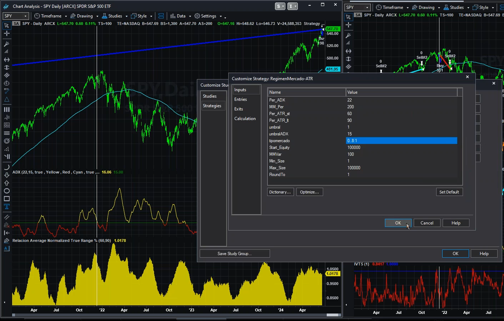
  <figcaption>Figura 128</figcaption>
</figure>

Y veréis veréis lo que nos da. En este en este caso, aquí vemos otra vez lógicamente el que más ganas es *Buy and Hold*. 

<figure>
  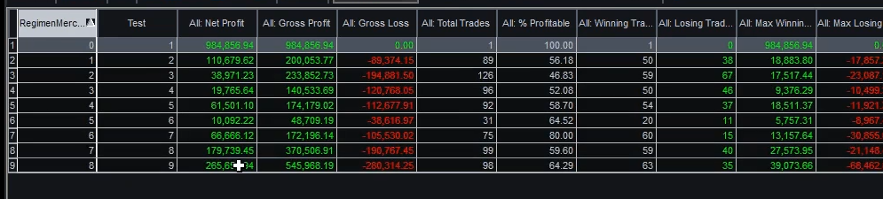
  <figcaption>Figura 129</figcaption>
</figure>

Vemos que el 8 gana más que el 7, pero así gana muy parecido. Es decir, no hay una gran diferencia, hay una gran diferencia, vale. Es decir, no parece... No, de hecho gana el volátil más que... No acaba de no acaba de tener sentido. Habría que ver, habría que ver un poco lo que se va, que hay que jugar con los términos, vale.

<figure>
  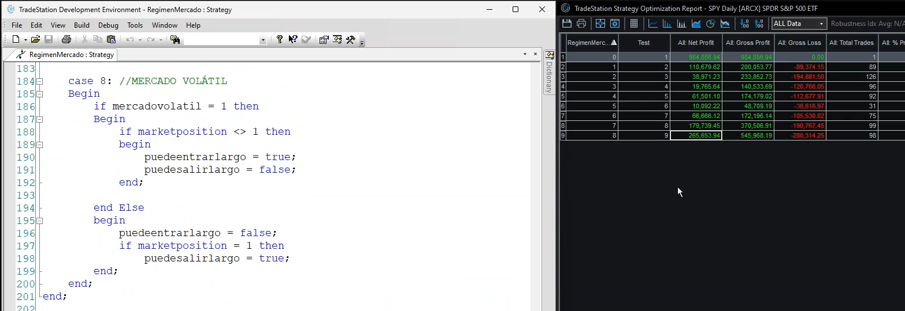
  <figcaption>Figura 130</figcaption>
</figure>

Porque ese ratio cambia mucho de si le pones a ver qué jugar, eso con el umbral, con las dos cosas, pues sé que el umbral se ha necesario más elevado, es complicado. Sí que cuando ves el dibujo, le ves le ves, que tiene que tiene cierto sentido, pero no acaba de no acaba de tirar. Así con el volátil, con el volátil, que es el 8, no... El 8 debería haber momento... 

<figure>
  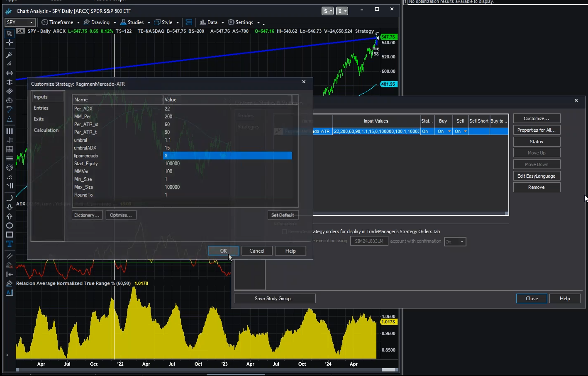
  <figcaption>Figura 132</figcaption>
</figure>

Aquí sí que ahora se ha caído, se ha caído más, se ha caído más. Ahora puede ser que con este 1,1, pero digo, es una sobreoptimización.

<figure>
  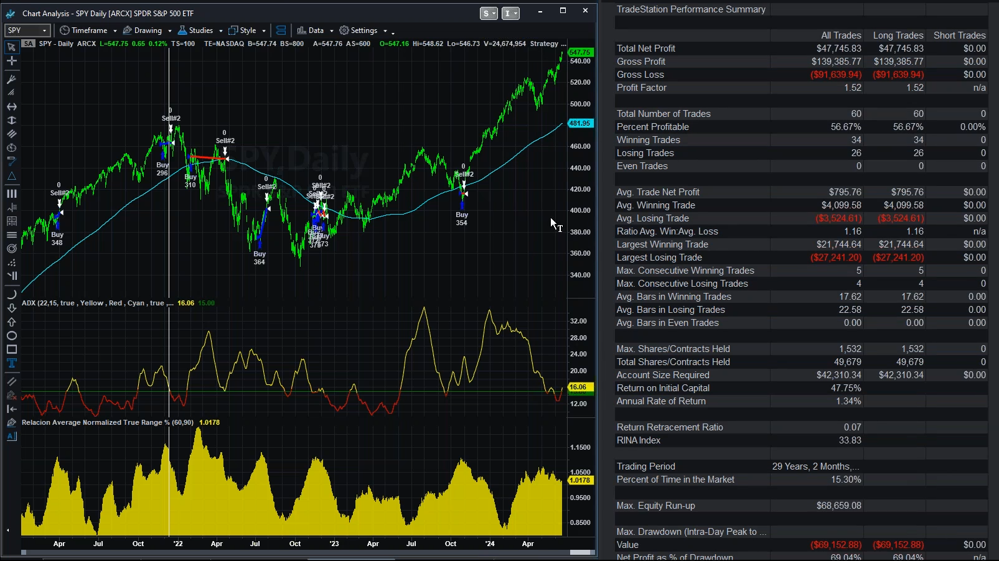
  <figcaption>Figura 133</figcaption>
</figure>

**Ajuste de parámetros**

En el final no deja de ser un intento por por enseñaros lo que queremos. Decir, es simplemente decir: poniendo 0,8, 0,60, parece que a lo mejor pues puede ir mejor. 


<figure>
  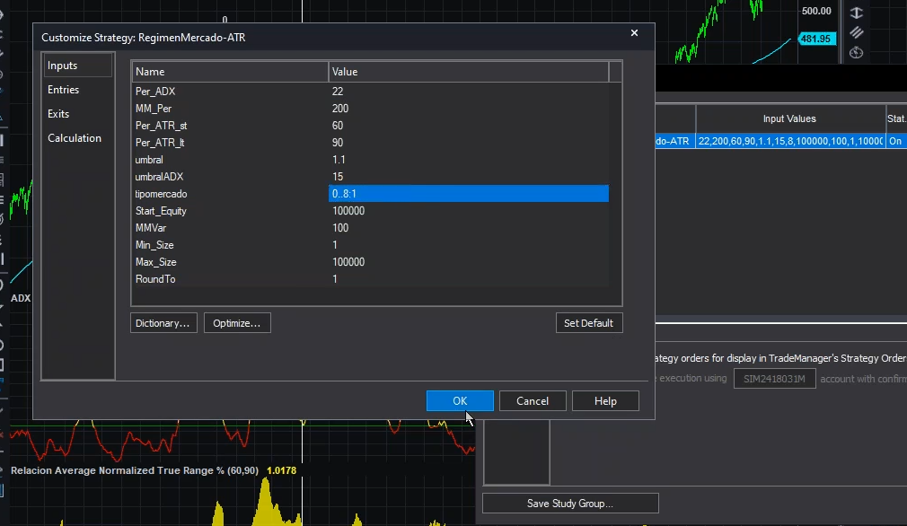
  <figcaption>Figura 134</figcaption>
</figure>

Pero ya digo, es solo para que entendáis la idea, para que entendáis la idea. Que sí, aquí sí que el 8 ahora vez, aquí sí que se ha penalizado la volatilidad, solo por poner 1,1. 

<figure>
  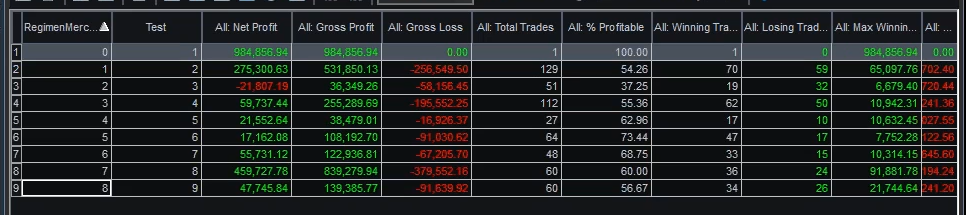
  <figcaption>Figura 135</figcaption>
</figure>

Pero aquí es muy sensible al indicador del *ATR*, entonces... Pero aquí sí que nos ha salido ya poco lo lógico: que el 8 más volátil gana menos, el 7 gana más. Tiene tiene tiene un poco más sentido, tiene un poco más sentido.

El *Buy and Hold* sigue siendo el mejor. Y así, con más histórico, por *TSI*, en este caso sí que el *Buy and Hold* gana tanto, gana tanto, que le compensa, le compensa el riesgo, y no tiene ningún tipo de problema. 


<figure>
  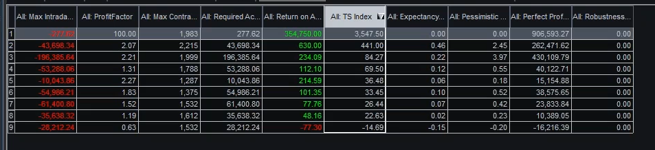
  <figcaption>Figura 139</figcaption>
</figure>


## Sistemas COT

<div style="border-left: 4px solid #27ae60; background: #ecf9f1; padding: 10px 15px; margin: 10px 0;">
  <strong>📘 Nota técnica</strong><br>
  Los <em>COT</em> (Commitment of Traders) son informes publicados semanalmente por la CFTC (Commodity Futures Trading Commission) que muestran las posiciones de los diferentes tipos de traders en los mercados de futuros: comerciales (hedgers), no comerciales (especuladores institucionales) y pequeños especuladores.
</div>

Vale, los *COT*, os voy a dar todo lo que tengo sobre los *COT*, porque había mucho interés, no sé exactamente motivo, pero había mucho interés, y por lo tanto voy a satisfacer vuestra curiosidad. Nosotros tenemos ahora mismo tres estrategias diseñadas. Que no son estrategias, están todas en preproducción, no se han acabado nunca, porque no viene el caso de operar en futuros. Y aun así, solo lo operaríamos en una cuenta muy grande, ya muy diversificada. Lo digo para para todos vosotros, es decir, no sería un tercer sistema, de acuerdo?. Sería como mínimo un décimo sistema, vale?. Son sistemas que van normalmente en *barras semanales*, vale, porque los *COT* es un dato que viene en semanal.

**Documentación de los COT**

* https:#www.sersansistemas.com/conoces-los-cot-sergi-sanchez/
* https:#www.sersansistemas.com/sistemas-de-trading-con-los-cot-por-sergi-sanchez/
* https:#www.sersansistemas.com/sistemas-de-trading-con-los-cot-ii-por-sergi-sanchez/

Pero yo os explico aquí lo que tenemos, vale. De momento os subiré esto, que hay tres artículos directamente de la web para que os veáis, vale, porque es el mejor sitio donde ir a leerlo. Me parece absurdo hacer el PDF cuando está online, vale. *¿Conoces los COT?* Vale, aquí explico qué son los *COT*, estos de 2017, totalmente en vigor. Hay un ejemplo, hablo de los *COT*, los *3C*, eso que los publica, patatín patatán, vale.

Y luego los sistemas. Aquí están, algunos explicado. Yo explico los otros, no está todo porque no se ha publicado, no es público. Explico el *COT Index*, vale, que es lo que se basa la mayoría de sistemas, vale. El *COT Index* no deja de ser una especie de estocástico de los *COT*. Es decir, normalizar los *COT*. El *COT Index* es normalizar los *COT*. Ahora veréis qué es eso. Y explico un sistema, muestro unos datos, vale. Estos los subiré al Discord, no hace falta ahora ni que os fijéis en la dirección ni nada, porque los subiré todo al Discord, vale, que las estáis viendo, pero no hace falta porque los subiré, vale. Aquí la segunda parte y demás. Esto por un lado, en cuanto a la documentación.

**Sistemas COT desarrollados**

Esos dos sistemas, los que vais a ver ahora, aquí con *Estrategia 1*, el 2 es este artículo, este artículo de *Traders*. 

* Artículo : [La señal COT](../docs/La%20señal%20COT.pdf)

El que hemos desarrollado, creo que no es impecable, porque hay cosas que hay que interpretarlas y demás. Por ejemplo, *money management* no lo implementamos, pero está bastante desarrollado. Y ahora sí os doy el código que hicimos nosotros, lo hicimos nosotros. El *COT 2* y el *COT 3* es el *COT de Kaufman* (Perry J. Kaufman, autor de *Trading Systems and Methods*). Ahora los veremos, vale.

**COT 1 - Sistema Rullero**

* code : [COT 1](../code/COT_1.ELD)

<figure>
  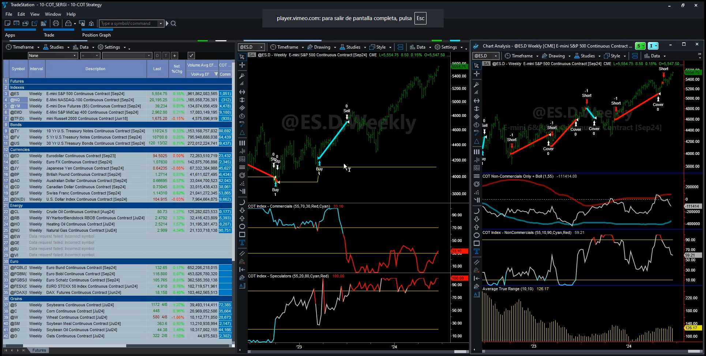
  <figcaption>Figura 140</figcaption>
</figure>

Vamos con el *COT 1*, que son los dos de los artículos que veréis en web. El *COT 1*: primero, los *COT*, este indicador que veis, son los que os decía, esa esa forma que habéis visto es el ***comercial***, hecho con 55 semanas, que es un año. 

<figure>
  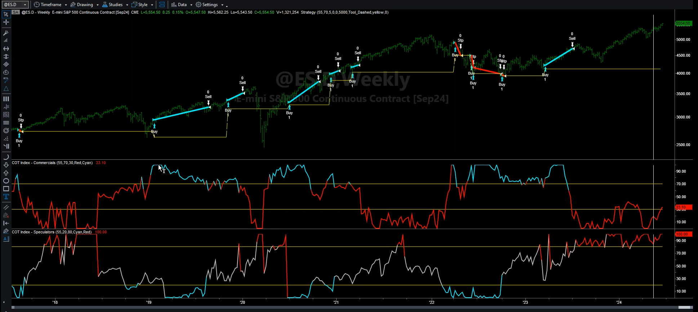
  <figcaption>Figura 142</figcaption>
</figure>

Es decir, el saldo de los *comerciales*, como hace un estocástico. Pero las cosas hay que entenderlas: un estocástico hace lo mismo. Cuando está arriba quiere decir que está en el máximo del periodo que está estipulando, pues esto es lo mismo. Cuando está aquí, que está en el periodo máximo, que un año, el saldo de los *COT*, vale, el saldo de los *COT*.

Y ese es el de los ***pequeños especuladores***. En los artículos iniciales explico qué es un *COT comercial*, qué es un *non comercial* y qué es un *pequeño especulador*. No voy ahora a recrearme mucho en eso porque no tenéis los artículos y quiero lo sepa.

<div style="border-left: 4px solid #27ae60; background: #ecf9f1; padding: 10px 15px; margin: 10px 0;">
  <strong>📘 Nota técnica</strong><br>
  <ul>
    <li><em>Comerciales</em>: Considerados las "manos fuertes". Usan futuros como cobertura, deben tener el activo subyacente en posesión.</li>
    <li><em>Non Comerciales</em>: Especuladores institucionales, hedge funds.</li>
    <li><em>Pequeños Especuladores</em>: Traders minoristas, considerados el "dinero tonto" en la teoría clásica.</li>
  </ul>
</div>

Pero los *comerciales* se consideran las *manos fuertes*, es un poco... El *pequeño especulador* somos nosotros, los pardillos, es un poco la idea. Y los *non comerciales* son los que consideran los *hedge funds*, eso es un poco la teoría. La diferencia entre estos *comerciales*, los *hedge funds*, es que los *comerciales* utilizan el futuro como cobertura, tienen que tener el activo en posesión y se están cubriendo, y el otro, el *hedge* no, por eso es uno u otro. Pero ya digo, es igual, eso al final da un saldo, y ese saldo se hace un *COT Index*.

**Datos COT en TradeStation**

Y aquí están bruto, que estos datos están todos aquí, es decir, estos *COT* están todos aquí publicabas. Este esto con *Net Position*, esto es de TradeStation. Solo tenéis ya esto. Si ahora aquí buscáis *EasyLanguage*, *COT Net Position*, este indicador existe la plataforma. 

<figure>
  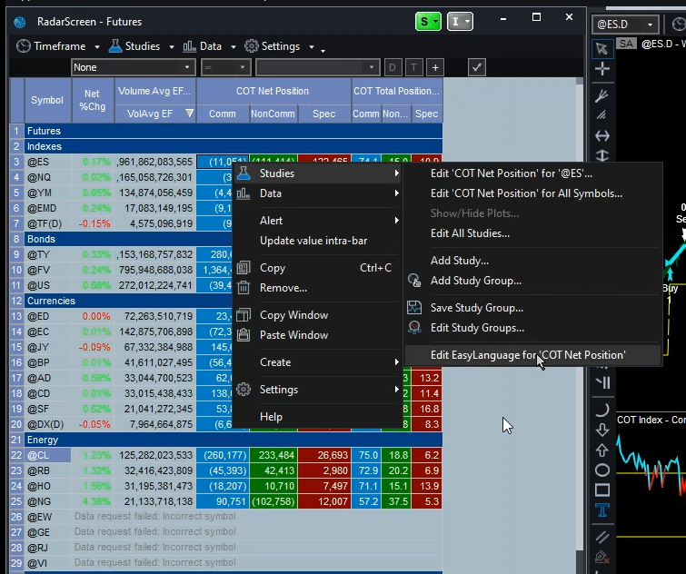
  <figcaption>Figura 143</figcaption>
</figure>
<figure>
  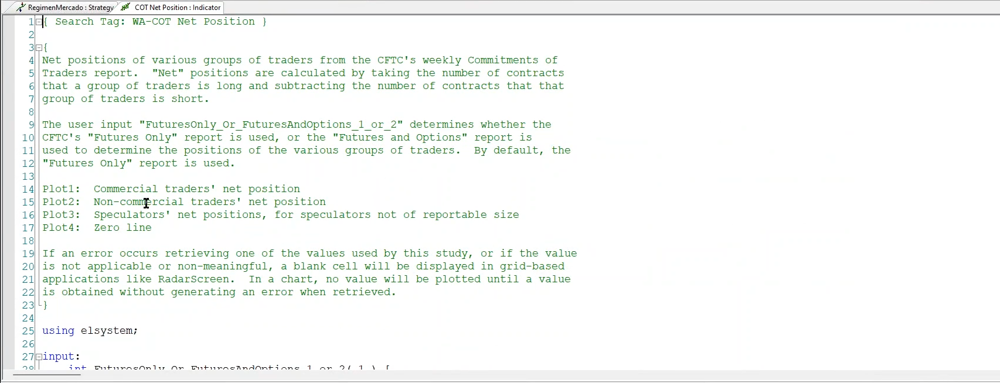
  <figcaption>Figura 144</figcaption>
</figure>

Lo tenéis vosotros pues si buscáis en aquí *COT*... 

<figure>
  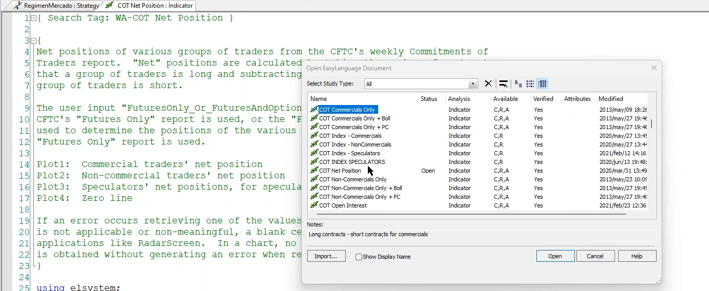
  <figcaption>Figura 145</figcaption>
</figure>

Yo tengo más porque tengo varios propios, pero veréis que tenéis ya muchos. Y os podéis abrir, pues leer el código, ver cómo está hecho, como siempre. Son datos *fundamentales*, esto lo coge de *Reuters* y lo y lo grafica, vale. Entonces ahí está hecho, eso ya lo tenéis.

Y aquí veis los saldos, es el porcentaje que tiene cada uno. Todos estos son indicadores que ya están y que tú no puedes hacer, tú no puedes... Que ya está toda esta información que veis aquí está disponible. La tienes que montar, lógicamente tiene que ser un futuro que publique esos datos. Estos no lo publican, por tanto no hay datos si no los publican, por nada, obvio.

<figure>
  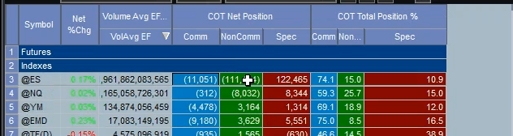
  <figcaption>Figura 146</figcaption>
</figure>

**El COT Index**

Y nosotros qué hemos hecho: pues el *COT Index*. Con esos datos hemos hecho el *COT Index*, que los datos son estos. Esto que tú quieres, aquí ves arriba el *non comercial*, y abajo ves el *index* son *comercial*. Ves cuando baja, pues se quiere la parte baja, cuando sube de 52 semanas, pues se ve. Es, este tiene puesta las bandas de... Son nuestras también. Y ya está. Pero es que la información saldo disponible.

<figure>
  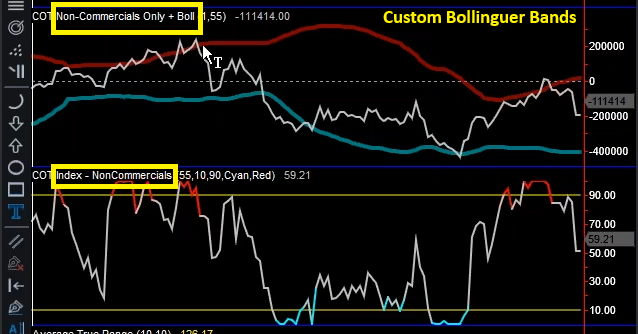
  <figcaption>Figura 147</figcaption>
</figure>

**Reglas del sistema COT 1**

```sh
#versión base con solo comerciales y pequeños
#setup entrada de Ruggiero
#usa 1 solo trigger para ambos
#usamos salida simple, cierre < n semanas y stop en n minimos

inputs:
	Length (55),
	C_Trigger (70),
	Per_Out (5),
		
	PriceOffset (1), { Price offset. Typically 1 used since strategy orders usually
    	               of type Buy/Sell NEXT bar at .... }
	PlotOffset (0), { distance from rightmost bar on chart that plotting stops }
   	PlotLength (5000),
	TLStyle (Tool_Dashed),
    TLColor1 (yellow),
    TLSize (0);

variables:
	S_Trigger (20),
	oCOTIndexComm (0),
	oCOTIndexNonComm (0),
	oCOTIndexSpec (0),
	Comm (0),
	Stop_Long (0),
	
	Optimizing(GetAppInfo(aiOptimizing) = 1);	

S_Trigger = 100 - C_Trigger;
Comm = COTIndex (Length, oCOTIndexComm, oCOTIndexNonComm, oCOTIndexSpec);

If oCOTIndexComm[1] > C_Trigger and oCOTIndexSpec < S_Trigger then
	Buy next bar at market;
	
If MarketPosition  = 1 then
Begin
	If Barssinceentry = 0 Then
		Stop_Long = Lowest (Low, Per_Out);
		
	#Stop_Long = MaxList (Stop_Long, Lowest (Low, Per_Out));
		
	If oCOTIndexComm[1] < C_Trigger and oCOTIndexSpec > S_Trigger then
		sell next bar at market;
		
	sell ("Stp") next bar at Stop_Long stop;
End;

	
if Optimizing = false then
Begin
	value1 = _TLPlotVec (1,  Stop_Long, PlotLength, PriceOffset, PlotOffset, TLStyle, TLColor1, TLSize);
end;
```

¿Qué hace ese sistema? Ese sistema en sí usa la idea de *Rullero*, pero realmente no tiene nada. Realmente la idea de *Rullero* es la idea más básica de los *COT*, vale. Es decir, simplemente tienes un *trigger* arriba y abajo, es un periodo que nosotros damos 55 semanas, no a conocieron sabes, si tienes un periodo para salir mal, centra.

**Lógica de entrada del COT 1**

¿Cómo funciona esto? Compra cuando se sobrecompra el *comercial*, vale. Compra cuando se sobrecompra en la barra anterior, es decir, cuando supera 70, y los *especuladores* están por debajo de la venta. ¿Por qué? Porque se considera que los pequeños no están nunca en el lado bueno. Por lo tanto, cuando los pequeños están comprando, el... Están abajo, están en mínimos. Compra, es decir, compra cuando éste entra en la banda arriba y éste la banda abajo. Esto es como compra.

<figure>
  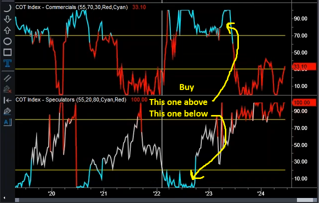
  <figcaption>Figura 148</figcaption>
</figure>

**Reglas de salida del COT 1**

Y sale, sale de dos maneras por lo que se había dicho antes: por la señal contraria, vale. Es decir, simplemente, ¿cuándo se sale? Cuando es menor que la de arriba y el otro cuando los dos son, se sale. O en un *stop* que es el mínimo de cinco barras, son cinco semanas, vale. Solo hace eso, nada más, semanal, es muy sencillo.

Esto funciona?

**Resultados del COT 1**

Bueno, no va mal en muchos futuros, muchos futuros no va mal, no en todos. 

<figure>
  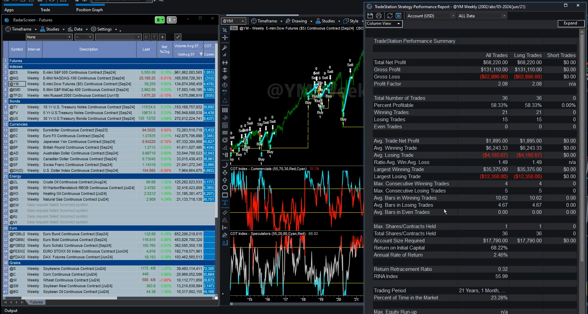
  <figcaption>Figura 149</figcaption>
</figure>
<figure>
  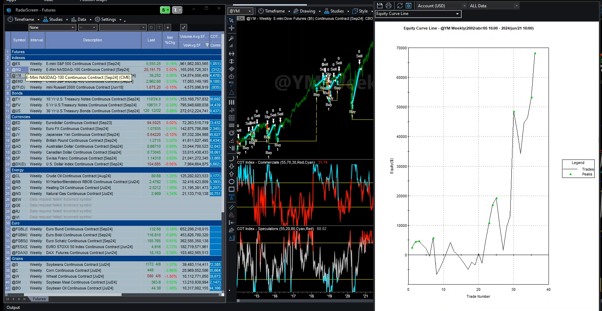
  <figcaption>Figura 150</figcaption>
</figure>

El número de operaciones pues que no es poco. En los de bolsa en general va bien. Pero digo, a lardes de sistemas estos sistemas no se optimiza nada, y cualquier análisis se hace conjunto, conjunto. Siempre se habrá que meter todos los futuros en RADAR y analizarlo. A lo mejor probar la salida por cuatro o cinco semanas, eso sí, pero con un montón de futuros dentro.

<figure>
  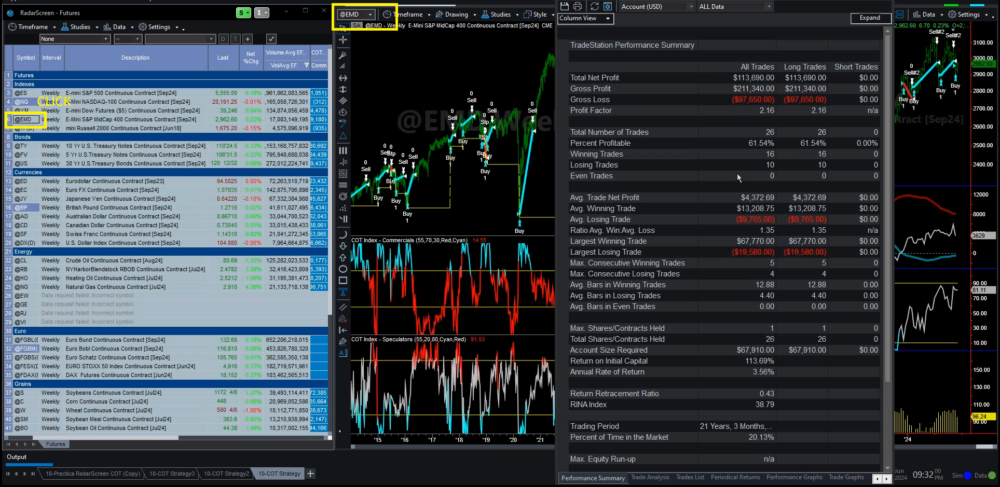
  <figcaption>Figura 151</figcaption>
</figure>

Está ahí en todos, acciones está ganando. Creo que el Dow Jones suele ir muy bien con con algunos generales y... 

<figure>
  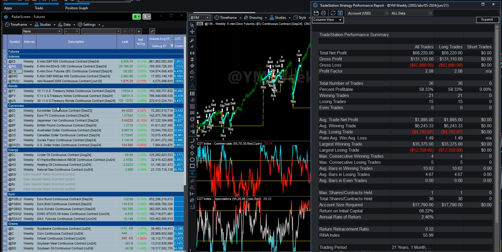
  <figcaption>Figura 152</figcaption>
</figure>

Pero hay otros que pierde. El petróleo no va casi ninguno, en el petróleo no va casi ninguno. No me acuerdo mal. Bueno, ahí usted ya, usted ya... 

<figure>
  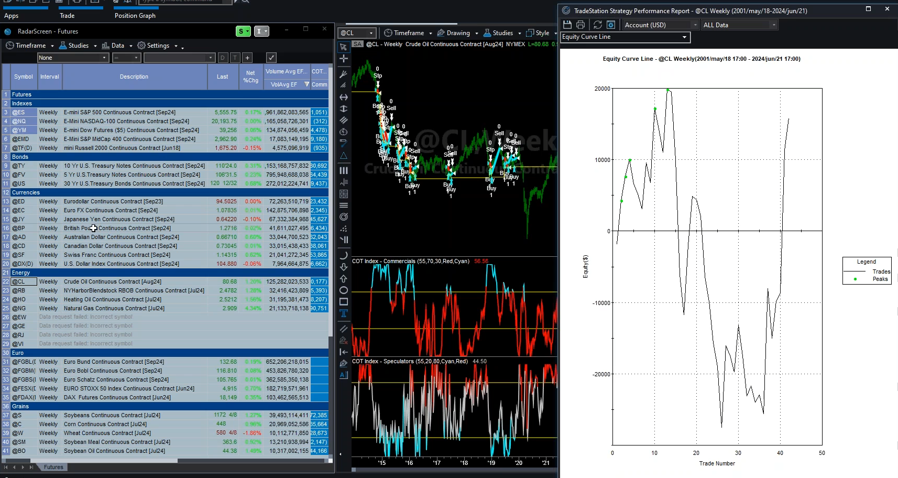
  <figcaption>Figura 153</figcaption>
</figure>

En el oro, algunos sí que van, otros no. Bueno, este parece que sí. A ver, solo va largo, está pensado más para bolsa. Solo va largo. Pero es también petróleo, en oro va bastante bien.

<figure>
  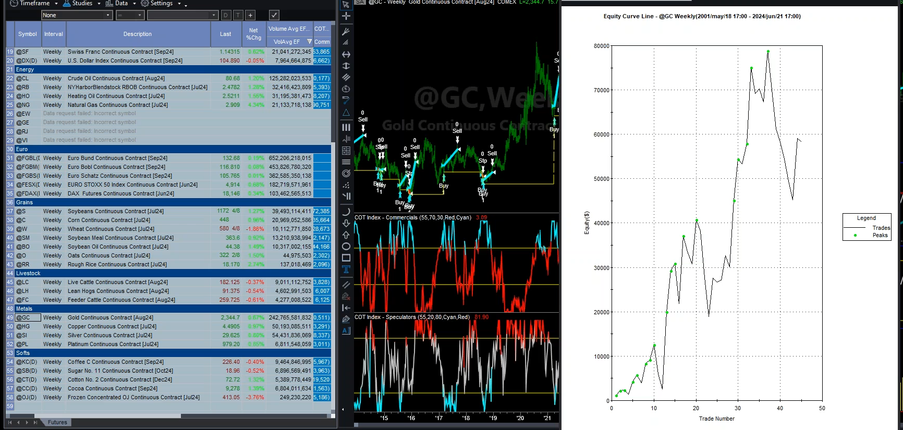
  <figcaption>Figura 154</figcaption>
</figure>

**Validación de los COT**

Bueno, eso es uno. Para el código, lo trabajáis, si queréis. Pero es una anécdota: al final estos sistemas, como puso los artículos, sirven para validar si hay algo o no, para mí es evidente que Esto demuestra que va, hay algo.

**Timing de los datos COT**

Porque entender cómo es el *COT*, que no lo he explicado muy breve, vale. Los *COT* se publican al cierre de los viernes, pero son datos recogidos hasta martes, son datos recogidos hasta martes. Y tú por lo tanto te va a dar la señal aquí, cierre de esta vela. 

<figure>
  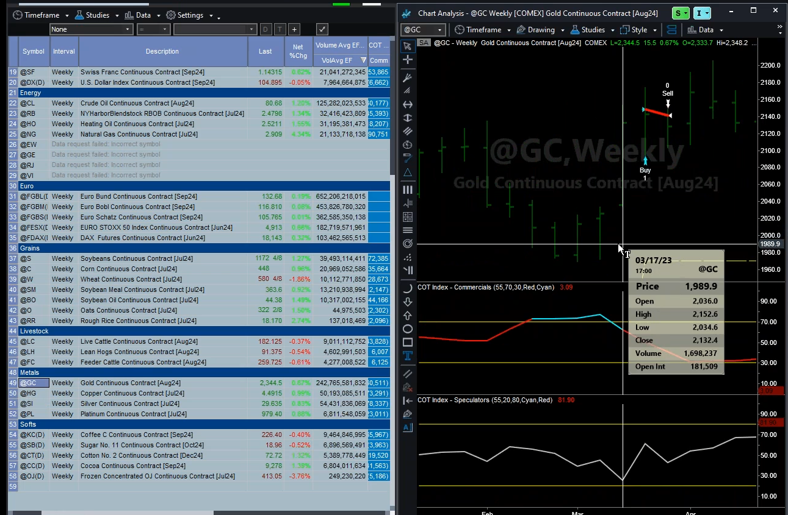
  <figcaption>Figura 155</figcaption>
</figure>

Esta semana va a coger el dato para entrar si le toca entrar lunes o cuando sea. El martes va a quedar la entrada, porque va a quedar toda la semana puesta. 

<figure>
  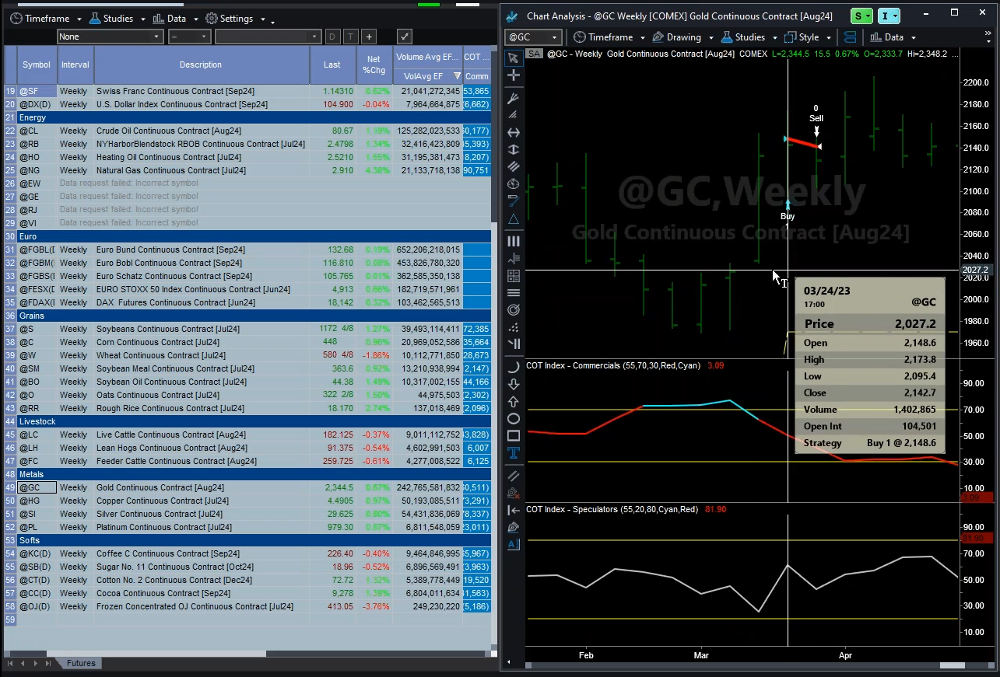
  <figcaption>Figura 156</figcaption>
</figure>

El final pues te va a entrar con datos, hasta el cierre del viernes no va no va a cambiar la señal, hasta el cierre del viernes no va a cambiar. Vamos de semana en semana. A mí el viernes me da señal de comprar, me compra vamos a suponer el lunes, y yo hasta el viernes ahí voy feliz de la vida. Se va a hacer mucho riesgo, es solo para complementar carteras.

**COT 2 - Versión propia con Non Comerciales**

Esta versión es una versión totalmente propia, 

* code : [COT strategy : Non-Commercials](../code/COT_NON_COMERCIAL.ELD)

que no deja de ser un ejercicio de curioso por experiencia de seguir muchos años, donde me planteé... Digo que los *non comerciales*, los *non comerciales* son los que más *correlación* tienen con el precio. Si tú ves aquí el gráfico de *non comercial*, 

<figure>
  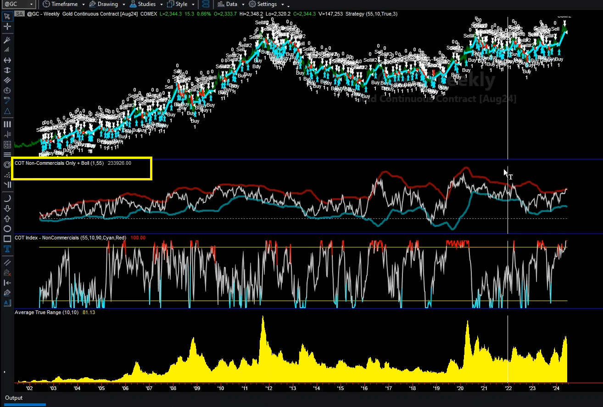
  <figcaption>Figura 157</figcaption>
</figure>

vas a ver este que tiene una bastante correlación con el precio. Cuando el precio sube, se sube, cuando el precio baja, baja. En tendencias más o menos moderadas. Suele ir bastante. Tú analizas la correlación, es indicador, este tiene bastante correlación.

Entonces me planteé hacer algo con él, con él, pero al revés, siguiendo el precio al inverso de los otros. Hice unas reglas, es un ejercicio didáctico. 

<div style="background-color: #FFFACD; padding: 15px; border-radius: 8px;">

**¿Qué es este código?**

Un sistema de trading que usa datos COT (Commitment of Traders) para detectar qué están haciendo los grandes especuladores del mercado y seguir su dirección.

**El indicador clave:** Calcula la *posición neta* de los Non-Commercials (fondos de inversión, hedge funds):
- Posición neta = Contratos largos − Contratos cortos
- Luego lo convierte a escala 0-100 comparando con su rango histórico de 55 períodos

| Compra (Long) | Vende (Short) |
|---------------|---------------|
| Los grandes están netos largos | Los grandes están netos cortos |
| El índice está aumentando | El índice está disminuyendo |
| Índice en zona media (10-90) | Índice en zona media (10-90) |

**Gestión del riesgo:**

- Stop loss dinámico en el mínimo de las últimas 3 barras
- Salida si el índice alcanza extremos o cambia el signo de la posición neta

</div>

```sh
# versión creada por Sergi desde cero con Non Commercials

inputs:
	Length (55),
	C_Trigger (10),
	Cortos (True),
	Per_Out (3);

variables:
	S_Trigger (90),
	COTIndexNonComm (0),
	NonCommNet (0),
	NonCommHighest (0),
	NonCommLowest (0),
	Stop_Long (0);

S_Trigger = 100 - C_Trigger;
Stop_Long = Lowest (Low, Per_Out)[1];

NonCommNet = Getfunddata("COTF-9", 0) -  Getfunddata("COTF-10", 0);
NonCommHighest = Highest (NonCommNet, Length);
NonCommLowest = Lowest  (NonCommNet,  Length);

if currentbar > 1 then
	COTIndexNonComm  =  100 * (NonCommNet - NonCommLowest) / IFF ((NonCommHighest - NonCommLowest) <> 0, NonCommHighest - NonCommLowest, 1);

If COTIndexNonComm > C_Trigger and COTIndexNonComm < S_Trigger and NonCommNet > 0
	and COTIndexNonComm > COTIndexNonComm[1] then
		Buy next bar at market;
		
If Marketposition = 1 Then
Begin
	If Barssinceentry = 0 Then
		Stop_Long = Lowest (Low, Per_Out);
	
	If COTIndexNonComm crosses below S_Trigger or COTIndexNonComm < C_Trigger or  NonCommNet < 0 then
		Sell next bar at market;
	
	sell next bar at Stop_Long stop;
End;

If cortos then
Begin
	If COTIndexNonComm < S_Trigger and COTIndexNonComm > C_Trigger and NonCommNet < 0
	and COTIndexNonComm < COTIndexNonComm[1] then
		Sell Short next bar at market;
		
	If COTIndexNonComm crosses above C_Trigger or COTIndexNonComm > S_Trigger or  NonCommNet > 0 then
		Buy to cover next bar at market;
End;
```

<figure>
  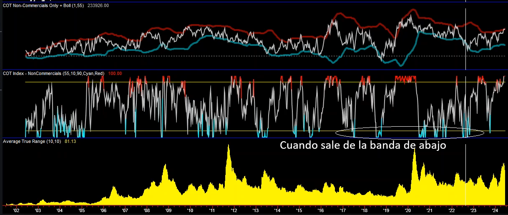
  <figcaption>Figura 158</figcaption>
</figure>

<div style="background-color: #FFFACD; padding: 15px; border-radius: 8px;">

**Panel Superior — Posición Neta (NonCommNet)** :   
La *línea blanca* es la resta: contratos largos − contratos cortos de los grandes especuladores.

- Cuando sube → los fondos están acumulando posiciones alcistas
- Cuando baja → están apostando a la baja
- Las bandas roja y cyan son los máximos/mínimos de 55 semanas

</div>
<br>
<div style="background-color: #FFFACD; padding: 15px; border-radius: 8px;">

**Panel Medio — El Índice COT (COTIndexNonComm)** :   
Transforma la posición neta en una **escala de 0 a 100**:

| Zona | Significado |
|------|-------------|
| **Rojo (>90)** | Especuladores muy largos — posible techo, momento de salir |
| **Blanco (10-90)** | Zona operativa — aquí se abren posiciones |
| **Cyan (<10)** | Especuladores muy cortos — posible suelo |

</div>
<br>
<div style="background-color: #FFFACD; padding: 15px; border-radius: 8px;">

**¿Cómo se traduce en operaciones?**

→ **Compra** 
* cuando la línea blanca del panel medio está subiendo dentro de la zona blanca y 
* la posición neta (panel superior) es positiva.

→ **Vende/Sale** 
* cuando la línea blanca toca la zona roja o 
* la posición neta se vuelve negativa.

**Ahora mismo:** El índice está en 100 (zona roja extrema) → el sistema NO compraría aquí, esperaría a que baje.

</div>

<br>

El sistema ***compra*** cuando el `COTIndexNonComm` supera el `C_Trigger` (10), es decir, cuando sale por arriba de la zona de sobreventa del índice COT.

Además se exigen tres condiciones adicionales:

1. Que `NonCommNet` sea positivo — un saldo neto negativo de Non-Commercials se considera señal bajista
2. Que el índice esté por debajo de `S_Trigger` (90) — para no comprar en zona de sobrecompra
3. Que `COTIndexNonComm > COTIndexNonComm[1]` — confirmando que el índice está en tendencia ascendente

Condiciones de ***salida LARGA***:

- Cuando el índice cruza por debajo de `S_Trigger` (90) — saliendo de sobrecompra
- O cuando cae por debajo de `C_Trigger` (10) — como seguridad si no llegó a cruzar
- O cuando `NonCommNet` se vuelve negativo
- Stop de protección en `Lowest(Low, Per_Out)` — mínimo de las últimas 3 barras

Operativa ***CORTA***: Lógica inversa: entra corto cuando el índice baja, el saldo neto es negativo, y sale cuando se dan las condiciones opuestas.

**Resultados del COT 2**

Esto opera muchísimo, pero muchísimo, al seguir un poco el precio, pero muchísimo, va fatal, fatal. 

<figure>
  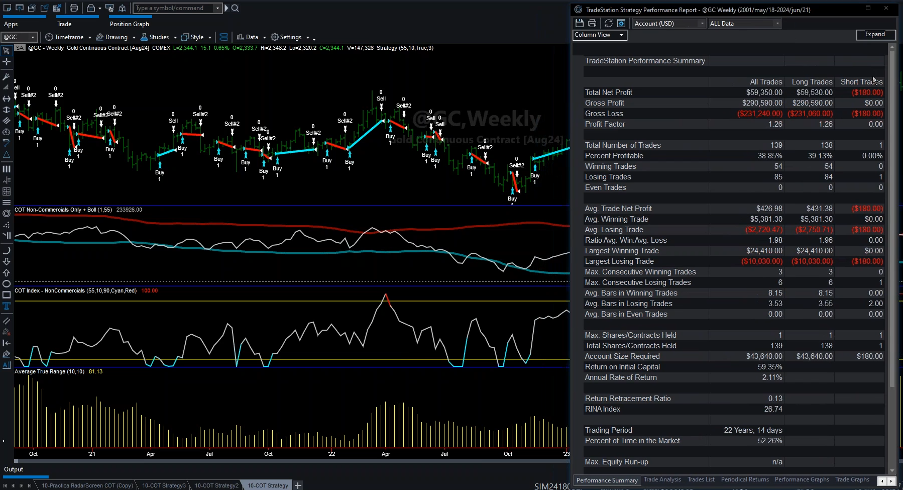
  <figcaption>Figura 160</figcaption>
</figure>

Pero bueno, por el largo en muchos tiene tiene *profit factor* positivo. Y bueno, sí sí que demuestra que tiene cierto sentido. Esto para nada recomiendo operarlo, sólo seguir investigándolo. Yo lo lo hice como un ejercicio didáctico.

<figure>
  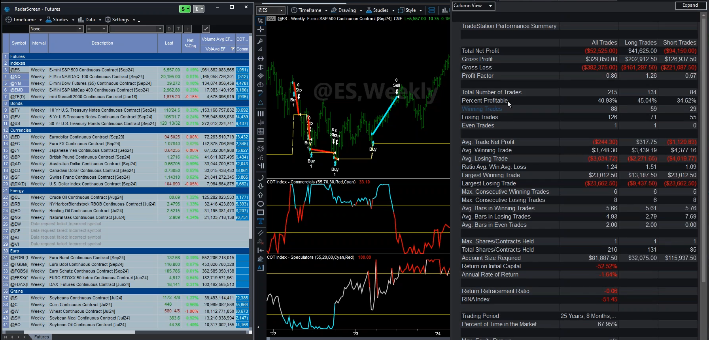
  <figcaption>Figura 161</figcaption>
</figure>

Es aquí, en el largo aquí sí que hay bastantes operaciones en el largo. En la mayoría hay muchos que va largo, en el corto... Pero es que en el petróleo tampoco debe ir, porque costaba mucho que funcionara 

<figure>
  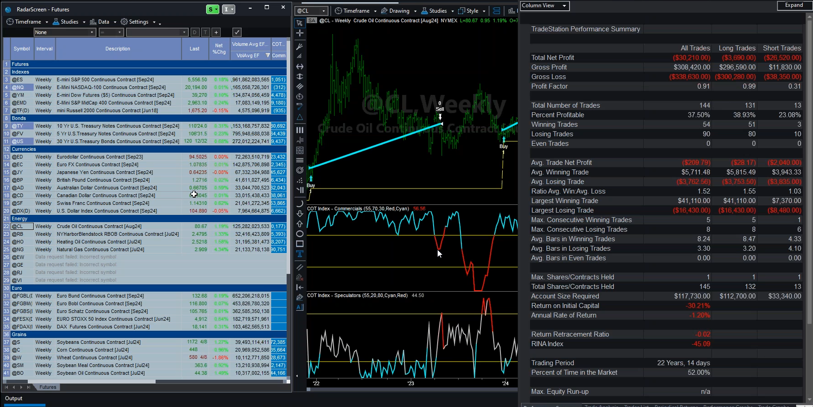
  <figcaption>Figura 162</figcaption>
</figure>

para no... Tampoco, tampoco, 

El *natural gas* es bastante curioso, porque era era un futuro que es súper bajista de aquí. Hay mucho problema con el conocido *contango*, *van guards* en todo esto que os he contado. *Natural Gas*, en este, como era... Y ves, este, curiosamente en el *gas natural* funciona funciona razonablemente bien. 

<figure>
  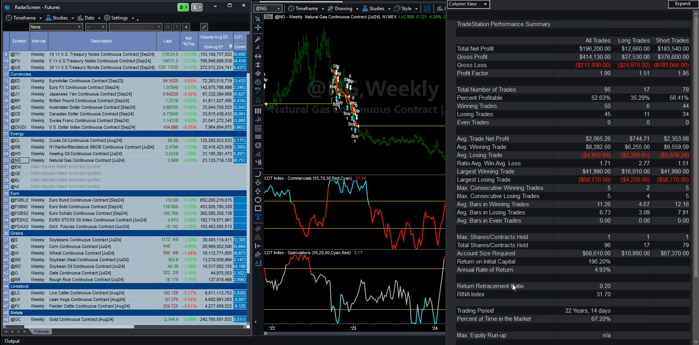
  <figcaption>Figura 163</figcaption>
</figure>
<figure>
  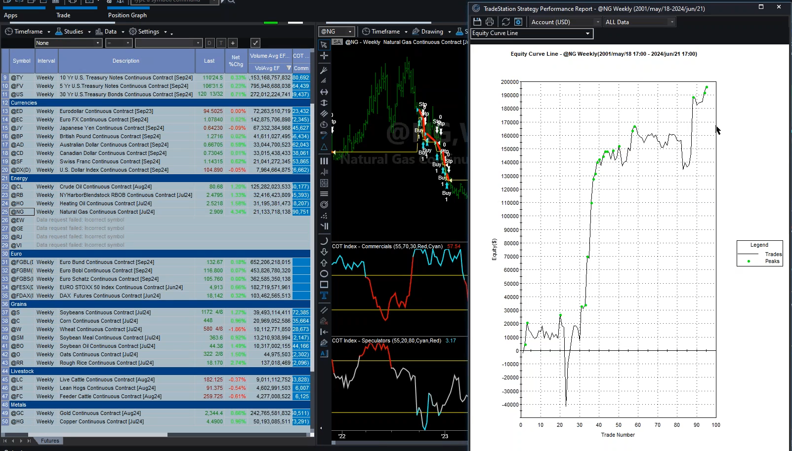
  <figcaption>Figura 164</figcaption>
</figure>

**v-1**

Bien, es la primera versión, vale, en los dos versiones. Yo los códigos los voy a dar todos. No vamos a hacerme pendiente de... Repito, esto es ahí, vamos a hacer el *paper*. Esto es material de *bonus*. Está el código ahí, lo podéis abrir en *EasyLanguage*. Y esto lo queríamos dar como *bonus*, está el código hecho nuestro, todo todo ello es propio y totalmente extra, no es un ejercicio un sistema luso, sino material de estudio. Esto es lo mismo, no es un sistema luso, vale.

**COT Strategy 2**

<figure>
  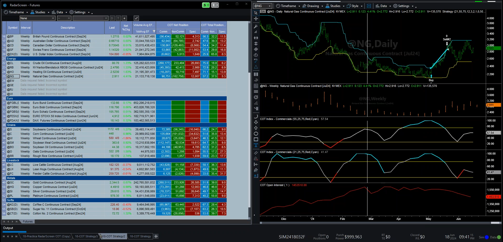
  <figcaption>Figura 171</figcaption>
</figure>

Este es lo mismo. Vimos el de la revista y de lo que se comentaba y lo programamos. 

<figure>
  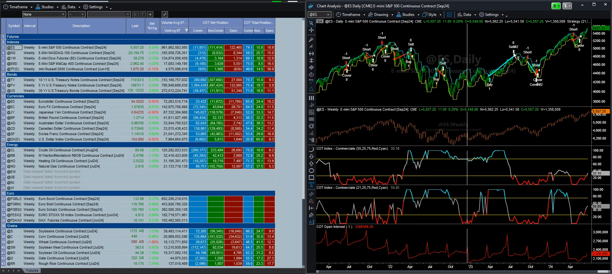
  <figcaption>Figura 165</figcaption>
</figure>

Puede haber alguna cosa que no esté bien, ya digo, no está el money managment, hay cosas que hay que interpretarlas. Y podría ser que no estuviera bien. Esto, ya los que pilotéis de programación pues es verlo. Ahí está el código, he sacado la revista, os damos el artículo, y hemos tratado de ser fieles a su a su idea. Pero ya digo, como siempre en estas cosas explicadas, y más en una revista, pues hay cosas que hay que interpretarlas. No tienes al autor para preguntarle. Entonces al final pues ese es el tema.

* code : [COT_ extraido_revista_Traders_11_2018](../code/COT_%20extraido_revista_Traders_11_2018.ELD)

<div style="background-color: #FFFACD; padding: 15px; border-radius: 8px;">

**Estructura del sistema:**

Usa dos timeframes: Data1 (diario) para precio, Data2 (semanal) para datos COT.

**Indicadores calculados:**

- `oCOTIndexComm1` → Índice COT de Commercials a 26 semanas
- `oCOTIndexComm2` → Índice COT de Commercials a 52 semanas
- `OI1` y `OI2` → Open Interest actual vs anterior
- `Banda_Up` / `Banda_Dw` → Canal de máximos/mínimos de 12 barras

**Condiciones de `Setup_Long`:**

| Condición | Significado |
|-----------|-------------|
| `oCOTIndexComm1 > 75` | Commercials muy largos a corto plazo |
| `oCOTIndexComm2 > 75` | Commercials muy largos a largo plazo |
| `OI1 < OI2` | Open Interest descendiendo → los débiles salen |

Cuando se cumple el setup, compra en **ruptura de `Banda_Up`** (orden stop).

**Condiciones de `Setup_Shrt`:**

Lógica inversa: ambos índices por debajo de 25, Open Interest subiendo. Vende en ruptura de `Banda_Dw`.

**Gestión de la posición:**

- **Stop Loss:** Mínimo de últimas 3 barras (`Per_Out`)
- **Take Profit:** `Banda_Up + (Banda_Up - Banda_Dw) × Factor` → proyección de 2× el ancho del canal

**Filosofía del sistema:**

Sigue a los Commercials (dinero inteligente) cuando están en posiciones extremas, esperando confirmación de precio mediante ruptura de canal. El filtro de Open Interest añade contexto de participación del mercado.

</div>

Este es más complejo, tiene dos datas, es complicado, pero bueno, también lo mismo. En algunos van, otros no. Pasa lo mismo que los *comerciales*, en largo bastante bien, corto no tanto. 

<figure>
  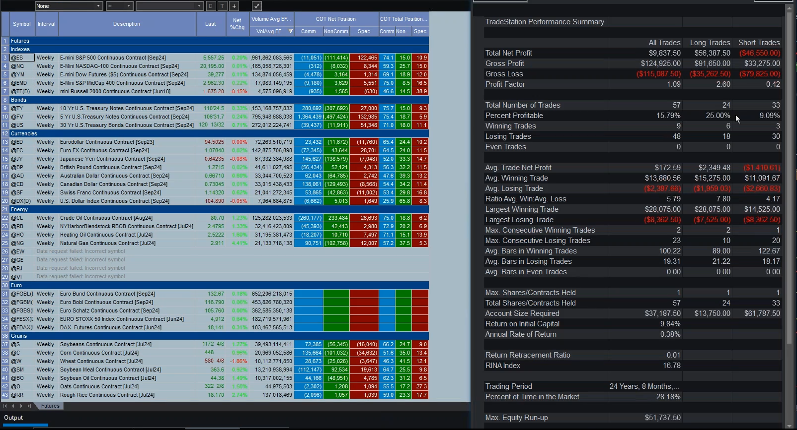
  <figcaption>Figura 166</figcaption>
</figure>

Bueno, pues lo que os digo, depende depende de cuáles. Hay algunos que van mejor que otros. Es un poco complicado. Estamos en las tres horas 26 minutos en en directo.

<figure>
  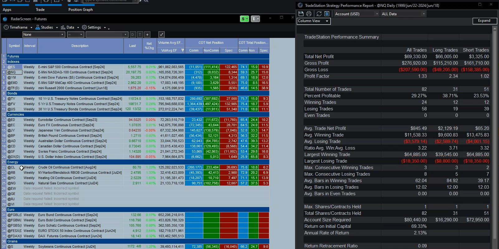
  <figcaption>Figura 167</figcaption>
</figure>

Este gana en los dos... En el petróleo, pues en el petróleo, por ver si va alguno, cargando, tampoco van... 

<figure>
  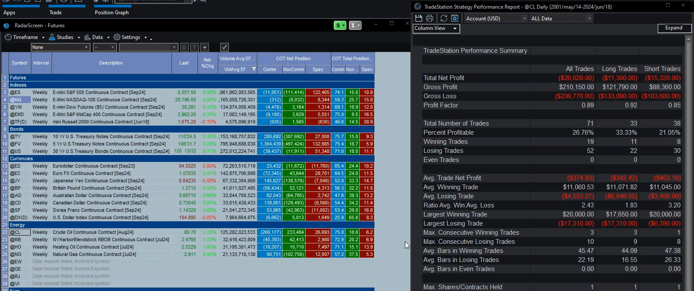
  <figcaption>Figura 168</figcaption>
</figure>

Este el oro es un poco más variable. En la web acordaros que tenía unos puestos en su momento, lo cual pues ahora podéis ver cómo han ido después. Interesante, esto siempre es un dato de 2017, creo. Pues aquí en el oro vuelve, en largo pero no en el corto.

<figure>
  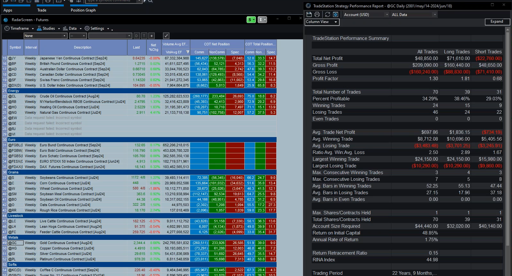
  <figcaption>Figura 169</figcaption>
</figure>

Y el *gas natural*, que siempre me da curiosidad, porque el *gas natural* es un activo realmente complejo. Cuando lo encuentre, aquí para el corto, para bajar mucho es... Ese día, el 2 y el 3 es de Kaufman, está en el libro de Kaufman, es más convencional.

<figure>
  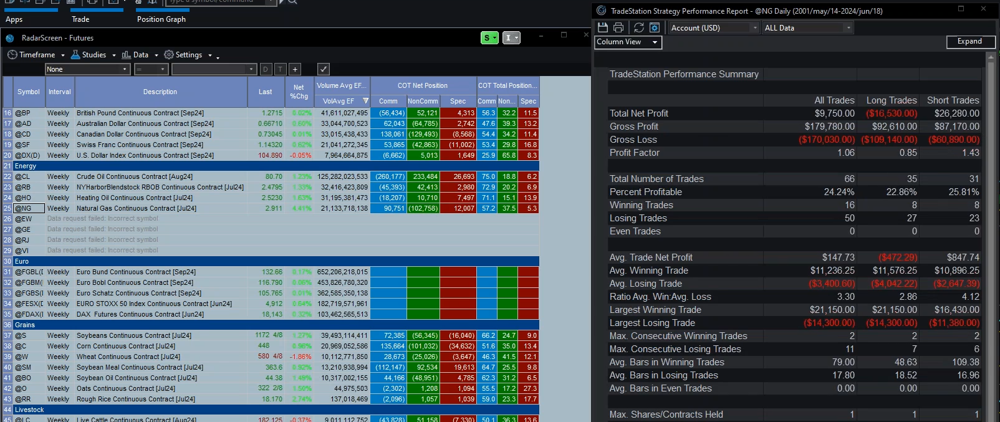
  <figcaption>Figura 170</figcaption>
</figure>

### COT 3 : Kaufman

<figure>
  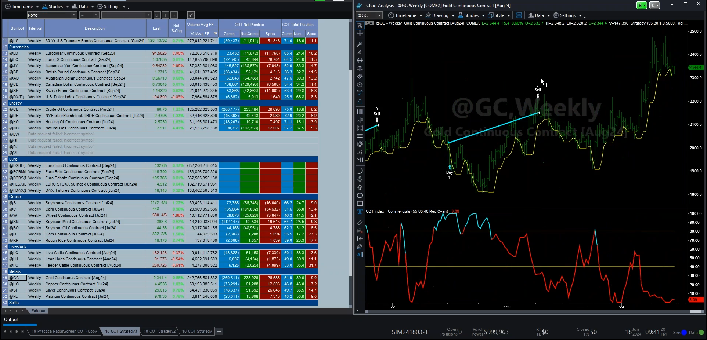
  <figcaption>Figura 172</figcaption>
</figure>

Es verdad que tiene una cosa interesante, me gustó probarlo, es una cosa más interesante. Y tiene realmente muchísimo mérito lo que hace, por eso quizá para mí es de los más destacados. Porque en este caso sí que al de *Rullero* le implementamos esta salida, creo que ya la llevaba, este cambio no lleva nada, es simplemente la regla en bruto.

<div style="background-color: #FFFACD; padding: 15px; border-radius: 8px;">

**Concepto del sistema:** Versión simplificada que combina posicionamiento de Commercials con debilidad de precio.

**Variables clave:**

- `oCOTIndexComm` → Índice COT de Commercials normalizado a 52 semanas
- `C_Trigger` = 80 → Umbral de sobrecompra
- `S_Trigger` = 20 → Umbral de sobreventa (calculado como 100 − 80)

**Condición de `Setup`:**

```
If Close < Close[3] Then Setup = True
```

El precio actual debe ser **menor que hace 3 barras** → confirma retroceso o debilidad.

**Condición de entrada LARGA:**

| Condición | Significado |
|-----------|-------------|
| `oCOTIndexComm[1] > 80` | Commercials muy largos (barra anterior) |
| `Setup = True` | Precio ha retrocedido |

Compra a mercado cuando el dinero inteligente está muy posicionado alcista **y** el precio muestra debilidad → entrada en pullback.

**Condición de salida:**

```
If oCOTIndexComm < 40 then sell
```

Sale cuando los Commercials reducen su posición por debajo de 40 → ya no hay convicción alcista.

**Filosofía:** Comprar cuando los Commercials están extremadamente largos pero el precio ha caído — es decir, comprar el retroceso respaldado por el posicionamiento institucional.

</div>

```sh

//versión de Kaufman
//usa solo COT index comercials para entrar
//pero con un filtro de precio, comprar si precio menor 3 semanas

inputs:
	Length (52),
	C_Trigger (80),
		
	PriceOffset (1), { Price offset. Typically 1 used since strategy orders usually
                     of type Buy/Sell NEXT bar at .... }
	PlotOffset (0), { distance from rightmost bar on chart that plotting stops }
   	PlotLength (5000),
	TLStyle (Tool_Solid),
    TLColor1 (yellow),
    TLSize (0);

variables:
	S_Trigger (20),
	oCOTIndexComm (0),
	oCOTIndexSpec (0),
	oCOTIndexNonComm (0),
	Setup (false),
	Comm (0),
		
	Optimizing(GetAppInfo(aiOptimizing) = 1);	

S_Trigger = 100 - C_Trigger;

If Close < Close[3] Then
	Setup = True
Else
	Setup = False;

Comm = COTIndex (Length, oCOTIndexComm, oCOTIndexNonComm, oCOTIndexSpec);

If oCOTIndexComm[1] > C_Trigger and Setup then
	Buy next bar at market;
	
If MarketPosition  = 1 then
Begin
	

	If oCOTIndexComm < 40 then
		sell next bar at market;
End;

if Optimizing = false then
Begin
	value1 = _TLPlotVec (1,  Lowest (low, 3), PlotLength, PriceOffset, PlotOffset, TLStyle, TLColor1, TLSize);
end;
```

Opera poquísimo. Este sí que habría que meterlo en 200 futuros, opera muy poco, es una regla muy estricta. A lo mejor se podía mirar de buscar a mejor periodos más cortos. Todo esto que veis, *offset*, tal, esto es es una función que pinta en el gráfico directamente, vale. TradeStation no permite que los sistemas pinten, y que eso es un truco. Es es un código, esto no es nuestro, están los foros de TradeStation, así os vendrá y tal, lo podéis abrir y utilizar. 

<figure>
  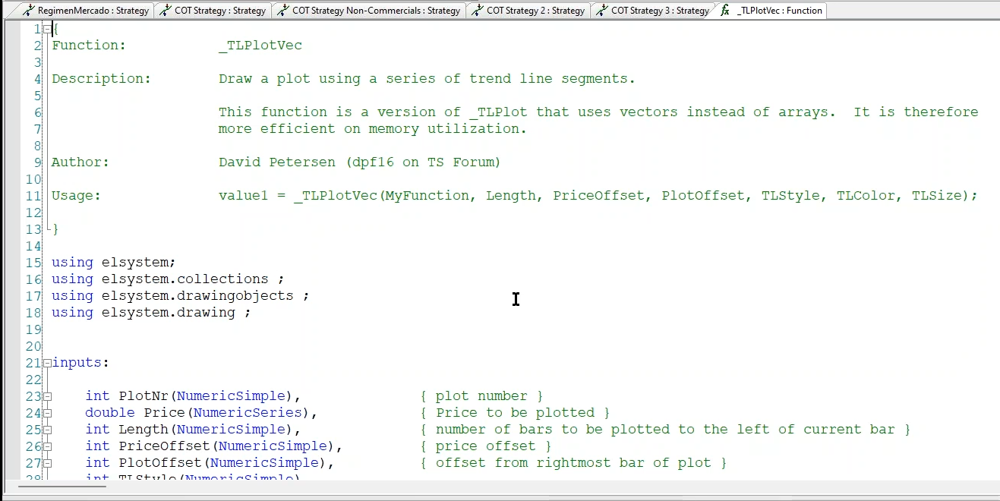
  <figcaption>Figura 173</figcaption>
</figure>


Creo que se utilizaba usaba vectores. Entonces al final esto lo que hace es pintar. El mismo código a veces satura poco el ordenador, pero es verdad que lo he ido mejorando.

**Lógica del COT 3 (Kaufman)**

Entonces, ¿qué hace el *COT 3*, vale, que es el de Kaufman, qué es lo que hace? Es un poco comprar igual, es decir, con los *COT Index* tienes el *COT Index* de *comerciales*. Y aquí usa el *comercial anterior* que sea mayor que el *set trigger*, vale, que es mayor que ochenta. Es decir, un poquito parecido al que había de... No, bueno, será distinto. Este este compra más bien cuando se sobrecompra, no... Eso es, entra cuando se sobrecompra.

Pero además, esta es la curiosidad, no compra en contra del precio. Es decir, le pide que el cierre sea menor que el cierre de tres semanas, que haya caído un poco, sino no entra. Le pide las dos cosas, exige este *setup*. Es a medio curiosidad de comprar contra, porque además lo realmente destacable es que no tiene nada de salir.

**Salida del sistema Kaufman**

Sale por señal contraria en el sentido: cuando está largo, solo sale si el *COT* es menor que 40, el *COT Index*. Mientras no pasa eso, no se sale. Ni mínimos, ni máximos, ni *stop*, ni nada, vale. Yo aquí tengo puesto, pero no está activo si no recuerdo mal en ese día. No tengo... En algunos tengo puesto un elemento precreado de tres veces o no a tener de lo que sea. No, aquí no hay nada. Es decir, esto está comprando, saliendo solo cuando cae de 40.

<figure>
  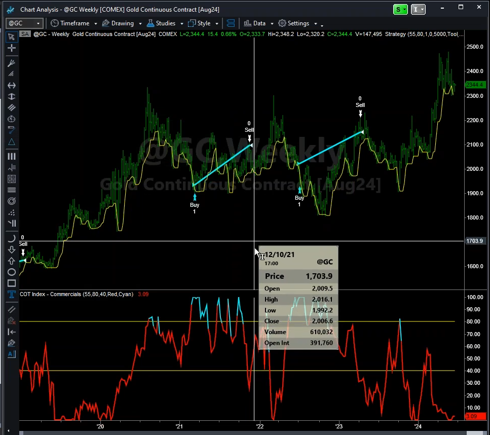
  <figcaption>Figura 174</figcaption>
</figure>
<figure>
  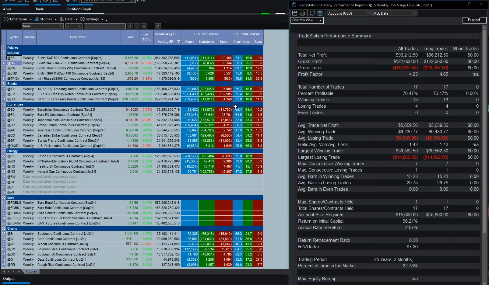
  <figcaption>Figura 176</figcaption>
</figure>
<figure>
  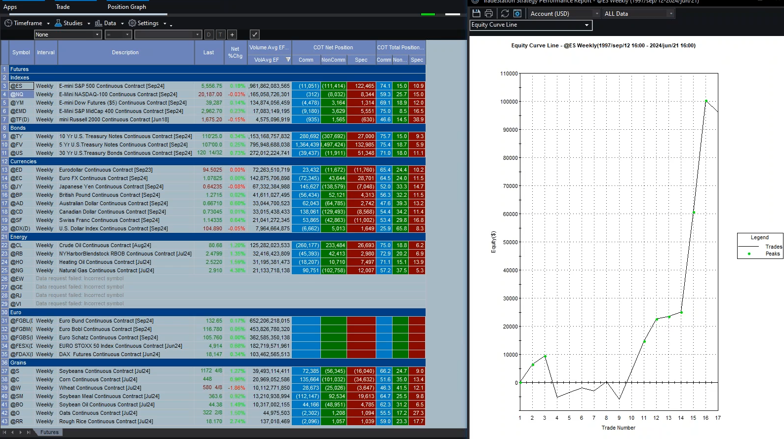
  <figcaption>Figura 175</figcaption>
</figure>

Es una auténtica locura porque no tiene salida, no tiene salida. Es decir, va pelo, va pelo. Y por eso hace que en algún futuro que tenga desastres. Pero realmente son poquísimos, en la mayoría gana dinero. En la mayoría, con muy pocos *trades*. Pero claro, es lo que decimos, al final es la misma regla. Solo utiliza los *COT*, está al final es el que más valida los *COT*.

**Resultados del sistema Kaufman**

Aquí, para que este del *NASDAQ* está en plano, podemos decir que, solo hay 10 operaciones, al final hay poco histórico. Pero en términos generales, es 77 por ciento de acierto. Se ha marcado *setup* de entrada bastante bueno. 

<figure>
  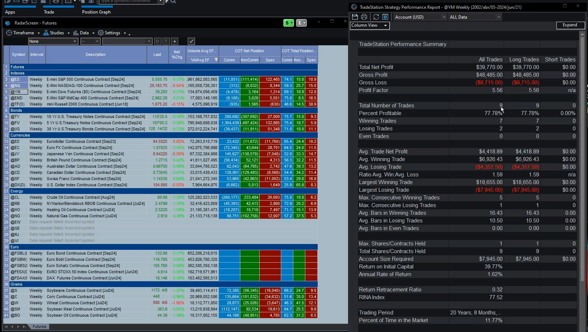
  <figcaption>Figura 177</figcaption>
</figure>
<figure>
  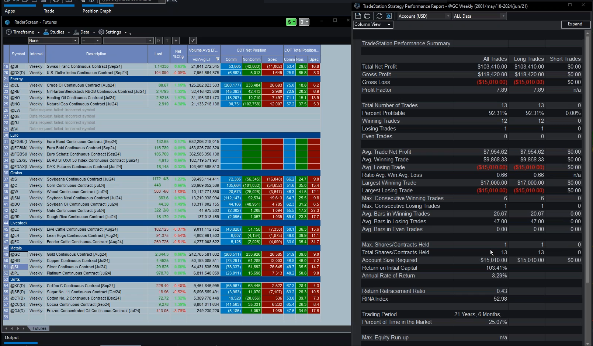
  <figcaption>Figura 178</figcaption>
</figure>

Es verdad que dices "hombre, claro, pero es que la bolsa es esa, son activos alcistas". Sí, sí, es verdad, hay un sesgo a favor, un viento de cola. Pero bueno, el oro también ha subido, pero no no tanto.

Y además se aprecia. A este sí que lo metes en el *gas natural* y dices "hombre, aquí no puede ser que vaya", y efectivamente no va. Habría que buscar, sabría que buscar el contrario para estos, probarlo. Usamos el código a ver el inverso como en cortos para un activo bajista, probar de salidas.

<figure>
  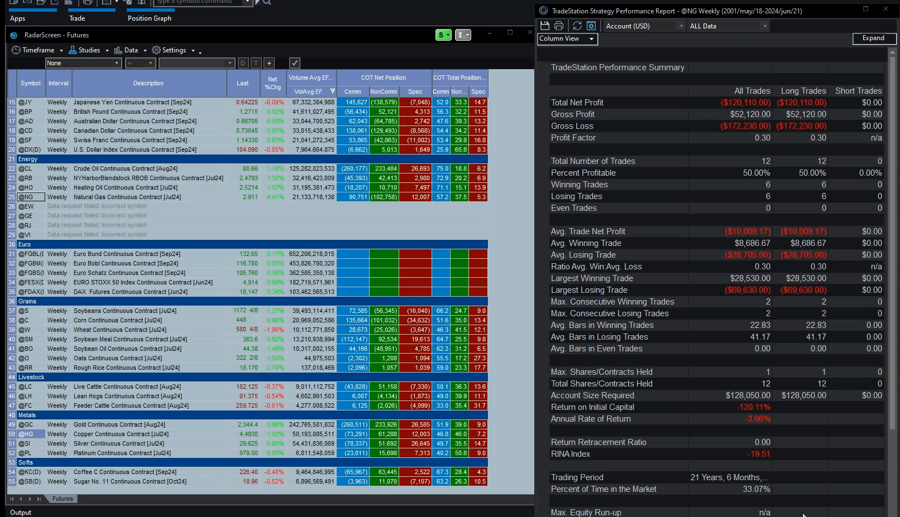
  <figcaption>Figura 179</figcaption>
</figure>

**Mérito del sistema Kaufman**

Pero ya digo, es es realmente es realmente destacable, porque tienes otros activos que al final muchos, la mayoría de activos a largo plazo tienden a subir, eso es así. Pero que tiene tiene muy pocos *trades*. Pero es verdad que sí sí que se nota que el *setup* suele estar bastante afinado, lógicamente no siempre. Al final, oye, puede ser un número casual.

Y está el que más opera es el que hemos hecho nosotros, que se puede trabajar y pulir más. Y todos estos ejercicios no dejan de ser ejercicios académicos para el mercado y realizarlo. Y pueden ser filtros y bases para sistemas.

**Conclusión sobre los COT**

Porque para mí queda, en general queda bastante claro con todos los sistemas, cuando los trabajas bien, que sí que es verdad que los *COT* tienen algo predictivo, tienen algo predictivo. Pero claro, es una señal muy retrasada, y claro se tiene un precio, se tiene un precio, social muy muy lenta, por muy lenta. Pero sí que sí que parece haber algo algo ahí.

Esto, como nos lo habíais pedido, pues ya digo, subiré todo este material de los de los *COT*, subiré el código y los sistemas, y así os lo dejaré subido repositorio para aquel que lo quiera aprovechar, vale.

## Despedida del curso

No veo preguntas, con lo cual despido lógicamente con unas palabras de despedida, vale. Que seguramente las mismas, o recordar que se os podía poner el vídeo del final de la teoría. Recuerdo, para insistir en ello, de acuerdo, lo dije mucho hasta por el marketing. No espero, creo que no ha pasado, pero por si alguien todavía queda que pensaba que hacer un curso con nosotros supondría ser al día siguiente, o sea hoy, *trader algorítmico profesional*, creo que sus expectativas no eran realistas, de acuerdo.

Yo creo que ha quedado un curso realmente potente. Por cierto, por favor, la encuesta que os va a llegar después, responderla, lo agradezco, lo agradezco mucho, y leeré todos vuestros comentarios con mucho interés.

**Recomendaciones finales**

Pero que tenéis que seguir trabajando. Volver a hacer el curso, por favor, entero, teoría, práctica. Podéis seguir preguntando, trataremos de responder a todo el mundo en el Discord. Y aprovechar todo el material, hay mucho material.

**Material destacado**

El de *Strategy Concepts*, este es muy potente, de acuerdo, trabajarlo mucho, os recomiendo buscar. Y por supuesto el *buscador de entradas*, de entradas y salidas. Todo el material de filtros creo que al final quedó muy muy completo. Con algunos todos los doy por desarrollar, es decir, nunca pensábamos que salierais aquí con un montón de sistemas hechos para operar, aunque hay cosas que son para operar o que son casi para operar con 2, 3 toques, vale.

**Filosofía del curso**

Pero como es aquella frase, ¿no?, de que no me des el pescado sino enséñame a pescar. Es un poco eso. No sé si era así la frase, pero bueno, algo es. Se trata de daros las herramientas. Yo espero haberlo conseguido. Le he puesto todo todo el cariño.

Y quedamos a vuestra disposición. Recordar los jueves, por favor, los directos. Nada más. Ahora sí ya que me despido. Mañana os subiré todo el material de hoy. Os mando un abrazo muy fuerte. Y con esto acaba el curso de *trading algorítmico*. Un abrazo muy fuerte y espero veros por los mercados. ¡Hasta pronto! Chao.