# Consultas

## Menú de navegación

- [Consultas](#consultas)
- [Entrevista de Iván Sherman y debate metodológico](#entrevista-de-iván-sherman-y-debate-metodológico)
- [*Continuación*: Canal de Donchian (13-practice-03)](#continuación-canal-de-donchian-13-practice-03)
- [Filtro de volatilidad](#filtro-de-volatilidad)
  - [PROCESO : Evaluando la idea](#proceso--evaluando-la-idea)
    - [Optimización 1](#optimización-1)
    - [Optimización 2](#optimización-2)
    - [Optimización 3](#optimización-3)
    - [Optimización 4](#optimización-4)
      - [Resultados In Sample](#resultados-in-sample)
      - [Análisis del Out of Sample](#análisis-del-out-of-sample)
      - [Análisis `All Data`: la información de ambos periodos](#análisis-all-data-la-información-de-ambos-periodos)
      - [Conclusiones de las optimizaciones](#conclusiones-de-las-optimizaciones)
    - [Análisis de Backtests en Maestro](#análisis-de-backtests-en-maestro)
    - [Backtest 6-0-0.2](#backtest-6-0-02)
    - [Backtest 6-1-0.27 - Portfolio con mejor retorno `Net Profit`](#backtest-6-1-027---portfolio-con-mejor-retorno-net-profit)
    - [Backtest 6-1-0.27 - Portfolio con menor `drawdown`](#backtest-6-1-027---portfolio-con-menor-drawdown)
    - [Backtest 4-1-0.24 - Portfolio con mejor `Sharpe ratio`](#backtest-4-1-024---portfolio-con-mejor-sharpe-ratio)
    - [Backtest 1-0-0.12 - Portfolio canal 1 el caso extremo](#backtest-1-0-012---portfolio-canal-1-el-caso-extremo)
    - [evaluando la idea, y luego ya decidiríamos cómo lo operábamos](#evaluando-la-idea-y-luego-ya-decidiríamos-cómo-lo-operábamos)
  - [próxima sesión - configuración de *full tendencia*](#próxima-sesión---configuración-de-full-tendencia)
    - [TradeStation MSFT - Backtest `6-0.20`](#tradestation-msft---backtest-6-020)
    - [¿Qué hacemos con los cortos?](#qué-hacemos-con-los-cortos)
  - [Cuestiones](#cuestiones)

Alejandro comentaba el tema de *portfolio* que echaba en falta alguna parte avanzada. Bueno, ya te comenté, Alejandro, tomamos nota y bueno, pues a medida que avancemos hacia la parte *portfolio*, que lógicamente todavía falta, porque quiero antes hacer bastantes estrategias más y pues ya veremos, a ver si podemos resolver un poquito esa inquietud que tienes. Hoy, de hecho, vamos a trabajar este sistema en 100 acciones en el Nasdaq, pero no con la finalidad de hacer un *portfolio* sobre ella, sino con la finalidad de validar la idea, de ver si el sistema funciona, etcétera, etcétera, ¿vale? Pero un poco otro camino que ya os comenté, que son **sistemas que tienen poca frecuencia operativa, pues una de las maneras de validarlo es juntando activos**, y esto es lo que vamos a hacer un poco con este sistema. ¿Podría hacerse por otro camino? Bueno, podría hacerse, pero a nosotros en este tipo de sistemas nos gusta mucho este método, es decir, meter todo el Nasdaq 100 o en una cesta de ETFs o en todo el SP500, en un montón de acciones que, lógicamente, pues se comportan de su manera, pues tratar de validar la idea ahí.

<div style="border-left: 4px solid #2196f3; background: #e3f2fd; padding: 10px 15px; margin: 10px 0; border-radius: 8px;">
  <strong>📊 Validación por agregación de activos</strong><br><br>
  Cuando un sistema tiene baja frecuencia operativa en un solo activo, una técnica de validación consiste en aplicarlo a una cesta amplia de activos similares (por ejemplo, las 100 acciones del Nasdaq). Si la lógica es robusta, debería funcionar de forma consistente en la mayoría de ellos, aumentando así la significación estadística de los resultados.
</div>
<br>

<br>

# Entrevista de Iván Sherman y debate metodológico

Iván, que es gestor de Emerging Funds, es una gestora que tiene oficina en distintos sitios, en Nueva York, en Dubái, es, la verdad que es todo con la suerte de que sea amigo personal, además de colega de profesión, y es un *trader* excelente, como ha demostrado en su, en el concurso, que es el mismo que ganó Larry Williams (probablemente referencia al World Cup Trading Championship), año pasado que lo ha ganado, ¿no?

Abrí el debate ahí un poquito, pero lo que quería es que vierais, como ya os he dicho insistentemente, la teoría que nosotros os explicamos, cómo hacemos nosotros las cosas, y os hemos explicado algunas que también no hacemos, ¿de acuerdo?, porque hay que explicar, hay que explicarlo todo y explicar lo que nosotros pensamos. Pero hay distintos caminos para llegar a Roma, y además en lo esencial, en lo esencial os aseguro que estamos 100% de acuerdo, porque es lo esencial, es lo esencial, ¿de acuerdo?, y de ahí no hay variación.

El hecho, como por ejemplo, cuando os expliqué, si os acordáis, el BRaC, y os dije que el BRaC, en mi opinión, a mí, no tiene mucho sentido, pero no tiene mucho sentido, lo que quiero decir es el nombre, ¿de acuerdo?, es decir, al final un BRaC, el BRaC es, es decir, una optimización convencional es muy parecida al BRaC, ¿vale?, y si tú haces una optimización convencional y le sacas 4.000 *trades*, y no tiene muchos grados de libertad, de verdad, seguramente no hace falta *Walk Forward*, ¿vale?, pero hazlo, ¿de acuerdo?, no está de más, no está de más.

> **Backtest – Re-optimization – and – Combination (BRaC)**
> El BRaC es una metodología alternativa al Walk-Forward Analysis (WFA).
> Su objetivo es el mismo: evaluar la robustez de un sistema sin sobreajustarlo.
> Pero lo hace con un enfoque algo diferente: reoptimiza varias veces el sistema y combina los resultados en lugar de "caminar" bloque a bloque por el histórico.

> **Walk-Forward Analysis (WFA)**
> Es un método de validación y optimización de estrategias de trading.
> Sirve para comprobar si una estrategia que ha sido optimizada en el pasado sigue funcionando en datos nuevos, sin caer en *overfitting* (ajuste excesivo al histórico).

Al final la mayoría de *traders* utilizamos varios métodos de evaluación, y realmente si están bien hechos, hay varios que son útiles, y es verdad que para algún tipo de sistema puede venir mejor, puede venir otro, pero la idea está clara, y acordaros cuando os dije, **significación estadística**, **representatividad de la muestra**, esto es los cimientos de la metodología clásica, y también es lo que hace Iván.

Él, por ejemplo, no le gusta *Walk Forward*, a Kevin Davey (probablemente referencia al autor de "Building Winning Algorithmic Trading Systems") le gusta, a Andrea Unger (campeón mundial de trading en múltiples ocasiones) por ejemplo, tampoco le gusta *Walk Forward*, es decir, hay distintas, hay distintas, como os digo, opiniones, y demás. A mí el *Cluster Walk Forward* me gusta mucho, ya trataremos de hacer en este sistema, como tal, no lo vamos a hacer, porque ahora a medida que avance la clase lo veréis, los problemas que te vas encontrando, pero en otros sistemas sí que lo haremos, haremos un *Walk Forward* al uso, pero en este no lo vamos a hacer como tal, y podemos acabar validando la idea, igual, ¿de acuerdo?, es decir, ahí está un poquito el tema.

<div style="border-left: 4px solid #ff9800; background: #fff3e0; padding: 10px 15px; margin: 10px 0; border-radius: 8px;">
  <strong>⚖️ Debate metodológico: WFA vs BRaC</strong><br><br>
  No existe consenso absoluto entre profesionales sobre el mejor método de validación. Traders reconocidos como Kevin Davey defienden el <em>Walk Forward</em>, mientras que otros como Andrea Unger prefieren enfoques alternativos. Lo fundamental es la coherencia metodológica: <em>significación estadística</em> y <em>representatividad de la muestra</em> son los pilares irrenunciables, independientemente del método elegido.
</div>
<br>
<br>

# *Continuación*: [Canal de Donchian (13-practice-03)](../../13-practice-03/transcripts/practica_03_revised.md)

El pseudocódigo de hecho en palabras no es más que tenemos una banda arriba de los n cierres anteriores, por defecto, acordaros que Donchian hablaba de 20 porque era más o menos un mes, más o menos cuatro semanas, más o menos la regla de cuatro semanas. Y entonces en este caso como eran acciones pues nosotros decidimos hacerlo con los cierres, se podría perfectamente haber hecho con el máximo, hoy no lo he probado, no lo he cambiado, el otro día ya lo jugamos un poco con ello pero lo vamos a dejar en el cierre pero podría ser que fuera mejor el máximo, ya digo que no he trabajado a fondo ese concepto, lo he dejado en el cierre porque a nosotros en acciones el cierre en gráfico diario normalmente el cierre le damos bastante importancia y por lo tanto pues ya nos parece bien trabajar con el *canal de cierres*. El canal de cierres también está la parte baja porque el sistema permite hacer cortos aunque no lo he trabajado, eso de hecho es lo que os voy a dejar para el que quiera trabajarlo para casa y ver a ver qué puede hacer.

<div style="border-left: 4px solid #2196f3; background: #e3f2fd; padding: 10px 15px; margin: 10px 0; border-radius: 8px;">
  <strong>📦 Canal de Donchian</strong><br><br>
  Desarrollado por Richard Donchian, considerado el padre del <em>trend following</em>. El canal original usa 20 periodos (aproximadamente un mes bursátil) y se construye con el máximo más alto y el mínimo más bajo del periodo. La "regla de las cuatro semanas" es una de las estrategias tendenciales más antiguas y documentadas.
</div>

Planteamos en el código distintas salidas pero hoy vamos a trabajar solo el **trailing**, también tenemos en el código planteado:
- salir por la `media central`, está planteado
- también salir en `n barras`
- salir en un `stop porcentual`
- salir en un `tp porcentual`
- y está planteado un `trailing`

Pero como ya comentamos y vamos a evaluar un tendencial puro y para eso necesitamos dejar correr los beneficios, si ponemos *tp* no vamos a cumplir ese requisito y por lo tanto decidimos solo entrar, hoy es lo que vamos a mirar, entrar por cierre por encima del canal y salir solo por *trailing*. Esta es la única salida. Además hablamos muy de pasada porque ya comenté que os lo enseñaría un filtro que hoy vamos a probar, este filtro *ATR* que simplemente es si el *true range* de la vela actual es menor que el *true range* medio mensual por un multiplicador:

```sh
# Filtro de volatilidad
If Filtro_ATR > 0 then
    Condition1 = TrueRange < AvgTrueRange(22)[1] * Filtro_ATR
else
    Condition1 = true;
```

Este multiplicador lo vamos a estudiar pero que al final acabaremos dejando en 1, porque era la idea pero como ya os comenté a veces podemos hacer optimizaciones instrumentales para coger información de la variable y este es un claro ejemplo.

## PROCESO : Evaluando la idea 

Empecemos por el principio ¿cuál es el principio? El principio es evaluar el canal, evaluar el canal ya lo hicimos por un lado igualando el *stop*, si os acordáis, igualando el *tp* creo que pusimos 0.5, pusimos uno a nivel de evaluación preliminar y hicimos un pequeño estudio rápido para ver si conseguimos seguir adelante por la señal de entrada, así que vimos que parecía tener cierta ventaja y hoy hemos continuado avanzando en esa idea pero ya con la versión *trailing*. Este es el primer estudio que hemos hecho, vamos a presentar 4 estudios.

Tenemos aquí la fichita en Excel, enseñaré el trabajo en sí de *Portfolio Trader* pero antes empezamos por la ficha. [**Excel con la ficha**](../../15-practice-05/OPTI4.xlsx)

Vamos a optimizar o estudiar o a backtestear el sistema de ruptura de acciones en todo el Nasdaq 100, en las cien acciones que hoy cotizan en las acciones. Cuidado aquí que esto no quiere decir que estemos haciendo una buena simulación de cartera porque no hemos tenido en cuenta las deslistadas y la mutuación que hay, pero nosotros estamos validando el sistema, no estamos montando una operativa en el NASDAQ 100, estamos evaluando el sistema, podíamos hacerlo en Apple, podíamos hacerlo en Microsoft, podíamos hacerlo en Google, pero eso tendría pocos *trades* y nos dejaría sin prácticamente margen de maniobra para poder analizar los parámetros porque habría una significación estadística que para nosotros no sería suficiente. Y una manera de hacer esto es evaluar todas las acciones a la vez de tal manera que el sistema tenga que tener un comportamiento bueno en la mayoría de ellas,  porque seguro que no ganan todas, al final pues puede de esta manera conseguir mayor número de operaciones y estaremos de acuerdo que son, que es un activo homogéneo entre sí, comparable y que tiene bastante correlación entre sí, aunque ya veréis que curiosamente al final cuando os muestre un *performance report* completo de una de la combinación, por ejemplo, que acabaríamos eligiendo para operar, y veréis que realmente muchas acciones de las acciones entre sí no tienen tanta correlación operando el sistema, los resultados mensuales no tienen tanta, pero eso lo veremos al final.

<div style="border-left: 4px solid #4caf50; background: #e8f5e9; padding: 10px 15px; margin: 10px 0; border-radius: 8px;">
  <strong>⚠️ Sesgo de supervivencia</strong><br><br>
  Al testear solo las 100 acciones que <em>hoy</em> cotizan en el Nasdaq 100, se ignoran las que fueron deslistadas o quebraron (<em>survivorship bias</em>). Esto puede inflar artificialmente los resultados. Para una simulación de cartera real habría que incluir el histórico completo con entradas y salidas del índice. Aquí el objetivo es validar la <em>lógica</em> del sistema, no simular una operativa real de portfolio.
</div>

Bien, aquí tenemos un poco todos los *inputs* que hay puestos en el sistema, nosotros aquí solo vamos a trabajar estos que os voy a marcar en **rosa**:

<figure>
  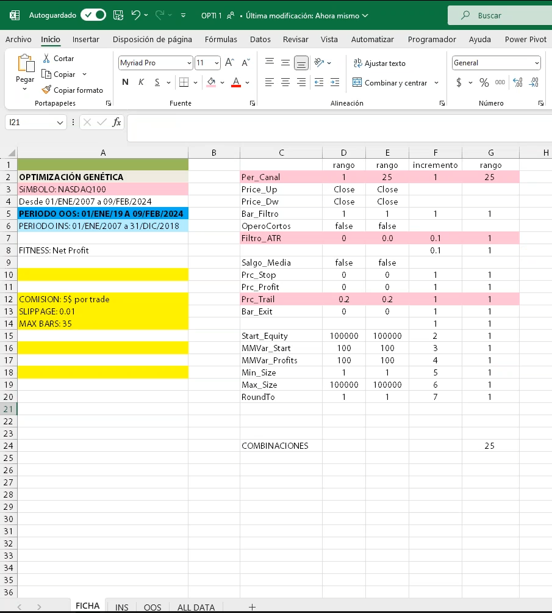
  <figcaption>Figura 190. Ficha</figcaption>
</figure>

Vamos a trabajar:
- `Per_Canal` - el periodo del canal, que esa es la que vamos a hacer en esta primera
- `Prc_trail` - *trailing*, y probaremos
- `Filtro_ATR` - el filtro, a ver si tiene algún sentido o no

Nada más por el momento, nada más. 

Se podría —y de hecho *debería*— evaluar también la parte `corta` del sistema. Nosotros hoy no lo hemos hecho, pero recomiendo que lo hagáis: quien tenga la capacidad técnica, que lo pruebe; y quien no, que lo trabaje al menos de forma conceptual. La próxima semana comenzaremos algo nuevo, pero haremos también un pequeño repaso a esta parte: el *lado corto* del sistema, para ver si realmente tiene sentido operarlo o qué ajustes podrían hacerse para hacerlo viable.

En esencia, la idea sigue siendo la misma: el *canal de Donchian* puede colocarse tanto arriba como abajo. De hecho, ya está implementado también en la parte inferior, ¿sería operable de igual manera?. 

<figure>
  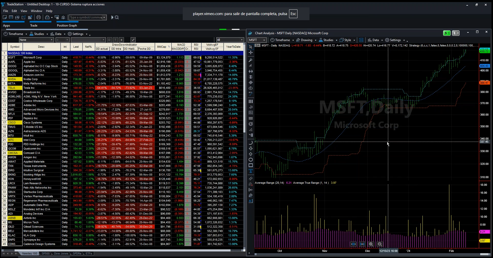
  <figcaption>Figura 191. Ficha</figcaption>
</figure>

En la práctica **no se comporta igual**, porque el mercado de acciones tiene un sesgo alcista muy marcado. Es posible operar el lado corto, sí, pero hay que hacerlo de una forma muy concreta, y `tendencialmente` no suele ser una de ellas.

Una de las cosas que no hemos hecho aquí —pero que veremos más adelante, cuando trabajemos la práctica de búsqueda de señales y evaluación de activos— está relacionada con la teoría que ya comentamos: si te planteas un *setup* tendencial, lo lógico es aplicarlo sobre activos que, por naturaleza, sean más tendenciales.

¿Son las acciones ese tipo de activo esencialmente tendencial? No exactamente. A nivel de índice, no lo son tanto; sin embargo, **a nivel de acción individual sí lo son bastante más**. A nivel de índice, las acciones muestran tendencia en el largo plazo, pero cuanto más bajas de *timeframe*, más el mercado de *equities* menos tendencial es y más se vuelve `antitendencial`. Por eso, muchos sistemas que operan sobre acciones —especialmente los que trabajan índices bursátiles— acaban comportándose más bien como **sistemas antitendenciales**, o versiones adaptadas a ese enfoque, y no como sistemas `tendenciales puros`, que son más propios de materias primas, divisas o acciones en contado, donde sí pueden capturarse tendencias amplias y sostenidas.

**Concepto**

Vamos un poco al concepto, que es este, y este es el concepto. Entonces, ¿cómo hemos evaluado esto? Bueno, lo hemos evaluado a través de *Portfolio Trader*, que es este programa que forma parte de *MultiCharts*.

<figure>
  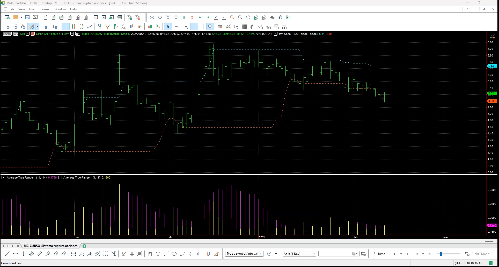
  <figcaption>Figura 192</figcaption>
</figure>

<figure>
  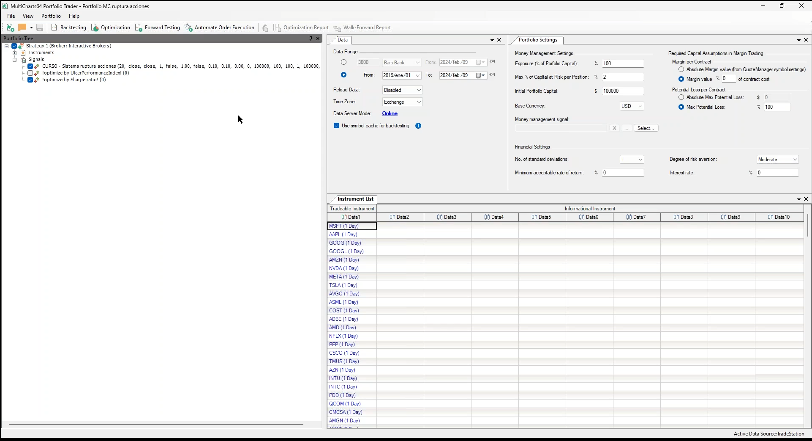
  <figcaption>Figura 002  Protfolio Trader forma parte de Multicharts</figcaption>
</figure>

Como decía, es el programa que hemos usado, aunque podría emplearse cualquier otro. Al final, lo que hemos hecho aquí —y ahora os explico— puede aplicarse en cualquier plataforma, quienes tengáis la posibilidad de hacerlo.

### Optimización 1

Hemos trabajado, como se ve en el Excel, con un periodo *in sample* que va desde el inicio de 2007 hasta finales de 2018, y a partir de ahí, es decir, desde principios de 2019 hasta el pasado viernes, hemos usado el periodo *out of sample*. 

<figure>
  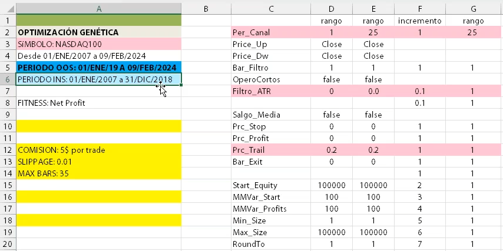
  <figcaption>Figura 193</figcaption>
</figure>

Podría haberse añadido un tercer periodo, y ya os he comentado que muchos autores lo hacen, llamándolo periodo de validación. Perfecto. Nosotros no lo hemos hecho porque nuestros procesos suelen durar bastante tiempo: imaginad que empezáramos a estudiarlo ahora y siguiéramos durante semanas o meses; esa observación continua fuera de muestra equivaldría a una especie de *paper trade*. En esa fase, ya estaría validado. Solemos hacerlo así, pero también es correcto dejar un tercer periodo; no es una práctica incorrecta en absoluto.

- Hemos adoptado cinco dólares por `$5 trade` (que es aproximadamente lo que cobra hoy en día *TradeStation*. Aunque tiene distintos planes, este es un plan común para la mayoría. Si haces más volumen, incluso puede resultar más barato).
- Y hemos asumido un `1 tick` de `slippage`.
- Hemos optimizado. Bueno, realmente lo hemos hecho de forma *exhaustiva*: hemos puesto *net profit*, pero en realidad, cuando haces una `optimización exhaustiva`, eso no importa porque se recogen todos los datos. 

  En realidad lo que es  *Portfolio Trader*, como os decía respecto a las plataformas, tiene algunas limitaciones a nivel de *backtesting*: por ejemplo, la información que ofrece es algo más pobre en términos de análisis. Su *Walk Forward* es bastante deficiente en configuración, especialmente en su versión *portfolio*. La versión para sistemas individuales es bastante mejor; ya lo veremos más adelante. 

  En cambio, tiene una gran ventaja: puede conectarse al mercado. Es decir, puedes completar el montaje del sistema, hacer *forward testing*, dejarlo en simulación —más adecuado para sistemas intradía, quizá— e incluso operar en tiempo real.

  Además, *Portfolio Trader* permite configurar reglas de prioridad por código dentro del propio portafolio. Por ejemplo, si finalmente fuéramos a operar las 100 acciones, podríamos establecer criterios para decidir cuáles ejecutar: las 10 que entren primero, las 10 que cumplan una determinada condición extra del portafolio, etc. Este tipo de configuración no es el objetivo ahora, pero lo comento ya que estamos viendo el programa. Más adelante, cuando trabajemos con portafolios de forma específica, entraremos en detalle sobre todo esto.

Entonces:
- Hemos puesto un 2% a cada acción con una cuenta de 100 mil dólares, hemos metido 2% de máximo a cada acción, por lo tanto permitiendo apalancar en el caso de que sea el caso y nada más
- Luego ya las reglas del sistema propiamente que ya conocéis en el sentido de cierre por encima de la banda y un *trailing stop*


<figure>
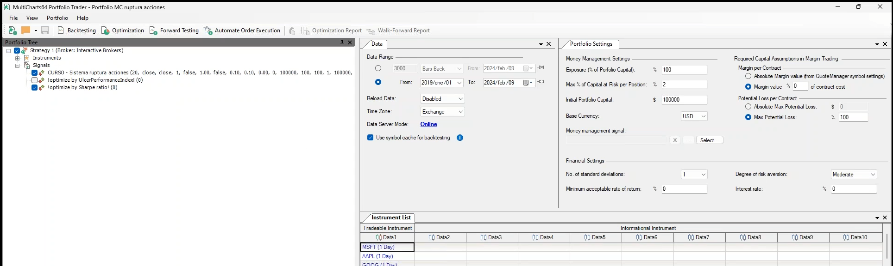
<figcaption>Figura 194</figcaption>
</figure>

En esta primera optimización, claro, cuando tú evalúas, recordar la teoría, una entrada hay que hacer una asunción para la salida, bueno yo le puse `20% de *trailing*`, podíamos haber puesto 10%, da igual, le puse 10%. 

<figure>
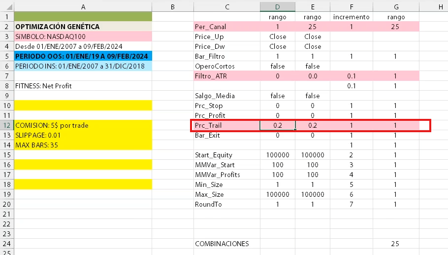
<figcaption>Figura 195</figcaption>
</figure>

Os decía que es pobre porque esos son los datos que facilita a nivel de *portfolio*:


Bueno, se le puede incorporar un **CustomFitnessValue**. Es cierto que aquí necesitamos crear uno propio, ya que el que viene implementado por defecto en *MultiCharts* utiliza un *Sharpe ratio*. Eso que veis justo en *Fitness Value* realmente es el *Sharpe ratio*, ¿de acuerdo? En su momento habíamos pensado en usar el *Sortino ratio*, pero finalmente no lo hicimos porque este ya está incluido por defecto. Así que utilizamos ese valor para el *Sortino*, y ahí fue cuando nos dimos cuenta de que no era un cálculo a nivel de *portfolio*, sino de *sistema individual*. Por lo tanto, los datos que devuelve no son correctos.

<figure>
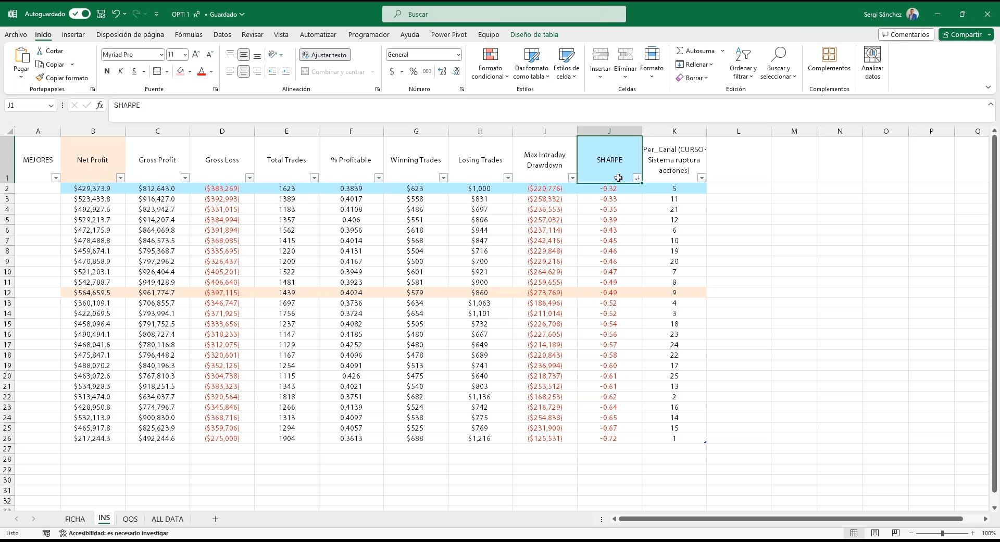
<figcaption>Figura 196</figcaption>
</figure>

<div style="border-left: 4px solid #ff9800; background: #fff3e0; padding: 10px 15px; margin: 10px 0; border-radius: 8px;">
  <strong>⚠️ Limitación de Portfolio Trader</strong><br><br>
  El <em>Sharpe ratio</em> y <em>Sortino ratio</em> que muestra <em>Portfolio Trader</em> se calculan sistema a sistema, no sobre el rendimiento consolidado del portfolio. Esto es incorrecto porque ignora el efecto de la diversificación. Para obtener el ratio real habría que programar un <em>CustomFitnessValue</em> que calcule sobre los rendimientos agregados. Aun así, sirve como referencia comparativa entre sets de parámetros.
</div>

Aun así, para este ejercicio sigue siendo un dato útil. Creo que la lectura que ofrece probablemente es extrapolable y resultaría bastante similar en caso de aplicarse correctamente al *portfolio*, pero técnicamente no lo es. Cuando trabajas con un portafolio, hay que tener en cuenta que existen reglas de prioridad: el motor de *Portfolio Trader* evalúa barra a barra, pasando todos los sistemas por cada una de ellas, y luego aplica las reglas de gestión monetaria definidas a nivel global.

Por eso, el *Sharpe ratio*, el *Sortino ratio* o cualquier otra métrica de rendimiento no pueden calcularse sistema a sistema. No se suman. Deben calcularse sobre el rendimiento consolidado del *portfolio*. Y eso, actualmente, no está implementado en la plataforma, así que habría que programarlo manualmente. No lo habíamos notado antes; pensábamos sinceramente que ya lo hacía. Pero no, y por tanto hay que volver a construir este cálculo del *Sharpe ratio* desde cero.

De todos modos, para el objetivo actual, nos sirve. No nos da el *Sharpe ratio* real del *portfolio*, es decir, hoy no conocemos ese valor exacto, pero sí es válido como referencia comparativa entre *sets* de parámetros —por ejemplo, para determinar si el canal de 8, 10 o 14 funciona mejor—. En ese contexto, sí consideramos que tiene relevancia.

Lo explico así con total franqueza para que se entienda el motivo de este valor negativo que aparece en la columna de `sharpe`. Tiene sentido porque no es el *Sharpe ratio* real del portafolio, sino la media de los ratios de los sistemas individuales, lo que distorsiona completamente el resultado. El cálculo correcto debería hacerse sobre los rendimientos agregados del *portfolio*, aprovechando la diversificación que aportan las distintas acciones entre sí. Aun siendo el mismo sistema, ya se aprecia que existe cierta descorrelación entre los componentes del conjunto. Por supuesto, es algo que puede mejorarse, pero aun así muestra una ligera descorrelación interna.


**Resultados obtenidos**


Bien, los datos de la imagen *003.png* son los resultados obtenidos al optimizar únicamente el canal de Donchian en el periodo *in sample*. Esta es la misma optimización mostrada en el Excel, pero recogida solo para el *in sample*.


Aquí lógicamente solo tenemos una variable y, por tanto, no podemos generar un gráfico en 3D, pero sí en 2D. En el eje izquierdo tenemos el `Net Profit` con la linea verde o el `Sharpe ratio` con la linea lila —este *Sharpe ratio* falso, como lo llamaré para que se entienda—, que, aunque su valor absoluto carezca de sentido, creemos que a nivel comparativo entre *sets* sí tiene relevancia. Y también está el *Net Profit*.


En realidad, aquí no existe una *función fitness* como tal, porque se incluyen todas las combinaciones posibles: solo hay 25, y por lo tanto se muestran las 25.

La *función fitness* es necesaria únicamente cuando hay que elegir entre muchas alternativas —por ejemplo, si tengo 1.000 combinaciones y quiero quedarme con 200, necesito un criterio para decidir cuáles conservar—. Pero si voy a conservarlas todas, entonces la función *fitness* es irrelevante.

En este caso, si quisiera analizar los datos en Excel, podría calcular cualquier métrica adicional directamente a partir de los resultados de cada optimización. Por tanto, no es necesario definir una función *fitness* específica. Esto suele ocurrir cuando el número de variables o *inputs* es pequeño, lo cual facilita el análisis. Aquí, de momento, hemos definido tres *inputs* posibles, aunque solo estamos trabajando con uno para centrarnos en evaluar la *entrada*, sin que los resultados se vean afectados por las *salidas*.

En otras palabras, dejamos la salida estática, con el filtro de volatilidad desactivado (`0`) y la salida por *trailing stop* fija en `0.20`, de modo que no varíe. Así podemos observar de forma aislada el comportamiento del canal Donchian por sí solo.

Tenemos por un lado como veis el dato *in sample*:


En el dato *in sample* aquí:


<div style="border-left: 4px solid #9c27b0; background: #f3e5f5; padding: 10px 15px; margin: 10px 0; border-radius: 8px;">
<strong>🔄 Heurística de Selección: La "Meseta de Robustez"</strong>

La delimitación de la zona (parámetros 6-15) no es un cálculo determinista, sino una <strong>validación visual de estabilidad</strong>. El objetivo es identificar regiones donde el sistema mantenga un rendimiento consistente frente a pequeñas variaciones del parámetro, minimizando el riesgo de <em>curve fitting</em> o sobreajuste.

**Criterios Técnicos de Selección:**

* **Estabilidad del Net Profit (Línea Verde):** Se busca una zona donde el beneficio sea alto y "plano" (~$475K-$565K), indicando que el sistema no es hipersensible al periodo exacto del canal.
* **Convergencia de Métricas:** Se marca el área donde los picos de eficiencia (Sharpe/Lila) coinciden con la meseta de beneficios (Verde), validando el "centro de masas" de la estrategia.
* **Análisis de Sensibilidad:** Científicamente, una zona estable es más robusta que un pico aislado; si el parámetro 9 es el máximo pero el 8 y 10 caen bruscamente, el resultado es probablemente ruido estadístico, no una ventaja real.

Métodos más rigurosos:  
* Tests estadísticos de sensibilidad paramétrica
* Análisis de varianza entre valores adyacentes
* Validación cruzada sistemática
* Métricas de estabilidad cuantificadas (no solo visuales)
</div>

Ya estamos viendo que en el gráfico se aprecia claramente que en el retorno, que es el **verde**, hay bastante estabilidad, y marcamos esa zona aparentemente bastante buena con bastante estabilidad del *in sample*, y en el *Sharpe* la **lila** podemos decir que hay estas dos o tres zonas con picos muy altos y un pico cae dentro de la zona marcada del retorno.


Vamos a ver el mismo en ***out of sample***, siempre es el que nos da más información... Aquí también hubiera sido interesante que en esa práctica, no la hemos hecho, pero si al final fuéramos a operar haríamos esta misma optimización invertida. Lo explicamos, que nos gusta mucho este ejercicio, es decir, hemos hecho *in sample* de 2007 a 2018 y *out of sample* de 2019 a 2024, así simplificando mucho, pues bueno esto total eran unos 17 años, 17 años, vale, pues hacemos más o menos entre 4 y 5, pues haber hecho de 2007 a 2011/12, dejarlo esa parte *out of sample* y hasta ahora *in sample*, al revés, *out of sample* al final y *out of sample* al principio, y luego comparar el *out of sample* que os sale de esa manera que os sale de la otra y coger esa información, porque cuando salen iguales eso sí que es una prueba fantástica de robustez.

<div style="border-left: 4px solid #9c27b0; background: #f3e5f5; padding: 10px 15px; margin: 10px 0; border-radius: 8px;">
  <strong>🔄 Validación cruzada temporal</strong><br><br>
Para saber si un sistema es realmente sólido (**robusto**), no basta con probarlo en una sola dirección. El autor propone un ejercicio de validación cruzada:

1. Lo normal (Lo que se hizo):
    * **In-Sample (Entrenamiento):** Usas los datos de 2007 a 2018 para encontrar los mejores parámetros.
    * **Out-of-Sample (Prueba real):** Evalúas esos parámetros con los datos de 2019 a 2024 (datos que el sistema "no conoce").


2. El ejercicio invertido (Lo que propone):
    * **Invertir los papeles:** Ahora usa los datos más recientes (2012 a 2024) como tu base de entrenamiento (*In-Sample*).
    * **Probar en el pasado:** Evalúa esos resultados usando los datos antiguos (2007 a 2011) como si fueran el futuro (*Out-of-Sample*).


**¿Por qué hacer esto?**
Si al optimizar hacia adelante (al futuro) y hacia atrás (al pasado) obtienes resultados similares y los parámetros ganadores son los mismos, has encontrado una **prueba fantástica de robustez**. Esto demuestra que el sistema funciona bajo diferentes condiciones de mercado, sin importar el orden cronológico de los datos.

</div>

Porque en un sistema tendencial como este es verdad que hay 100 acciones, todos estos datos al final hay mucho sesgo de muestra, la práctica hablamos mucho mucho de ello, si yo tengo un activo como este:


Aunque es verdad que en este caso creo que aplica bien, aplica bien, porque tienen en el periodo el *in sample* que empieza en 2007 nada más empezar pues tienen la crisis, la crisis del 2008-2009, aquellos pues que ya estuvierais en el mercado recordaréis. Es interesante esta mezcla porque ese mercado sí que es común, puede haber acciones que tengan otros porque lógicamente las 100 no tienen la *beta* que tienen Microsoft o que tiene Apple o Netflix que son acciones que tienen bastante *beta* con el mercado, pero claro la mayoría la tienen, la mayoría la tienen, y por lo tanto ahí sí que en esas crisis sistémicas de 2008-2009 y el tema del Covid 2020, ahí sí que cayeron todas, ¿de acuerdo? O para todas, se me entiende, prácticamente todas. A nosotros nos gusta mucho hacer esta doble, este doble juego por delante y por detrás del *out of sample*.

**Opti 1**

Tenemos el gráfico, prácticamente a medida que la **línea verde** aumenta va degradando.   
Es verdad que el *out of sample* aquí plantea cierto problema que tampoco lo es tanto al lado del *in sample* porque menos operaciones por lo normal... pero ya vamos viendo que la parte baja del canal, aunque en este caso por ejemplo el *out of sample* con **valor `1`** (última columna primera instancia) lo hizo bastante bien, de hecho el que más dinero gana, y a medida que va aumentando el canal va perdiendo, va perdiendo rendimiento, teniendo insisto el *trailing* fijo:


Aquí vemos el pico claro, sobre todo el *Sharpe ratio*, es aquí en 6 vemos un pico, que es verdad que hay un salto importante al 7, 5, 6, por ahí podía estar, podía estar bien.


El parámetro **Per_Canal** (abreviatura de "Periodo del Canal") se refiere a la configuración numérica del **Canal de Donchian** utilizado en el sistema de trading.

<div style="border-left: 4px solid #4caf50; background: #e8f5e9; padding: 10px 15px; margin: 10px 0; border-radius: 8px;">
<strong>⚙️ Definición Técnica: Per_Canal</strong>

Es el número de velas (períodos) que el sistema mira hacia atrás para calcular los máximos y mínimos que forman el canal. Actúa como el <strong>activador de la señal de entrada</strong>: cuando el precio rompe el máximo de esos "X" períodos anteriores, el sistema ejecuta una compra.
</div>

**Funcionamiento en la optimización:**

* **Variable de estudio:** En los gráficos, el eje horizontal (eje X) muestra los diferentes valores probados para `Per_Canal`, que van del **1 al 25**.
* **Sensibilidad:** Al cambiar este número, cambia la sensibilidad del sistema. Un `Per_Canal` corto (ej. 5) reacciona rápido a los movimientos del precio, mientras que uno largo (ej. 20) es más lento pero filtra más ruido.
* **Selección de la "Meseta":** El objetivo de marcar la zona entre 6 y 15 es encontrar un periodo de canal que no sea ni demasiado nervioso ni demasiado lento, y que haya demostrado ser rentable de forma estable en el pasado.

En resumen, es la "ventana de tiempo" que el algoritmo usa para decidir si un movimiento del precio es lo suficientemente importante como para entrar al mercado.


Vamos a acabar de ver el `all data`:

Uniendo los dos porque al final ahí se incorpora un poco todo y donde además tenemos una muestra pues que ronda las `2000 operaciones`, fijaros que ahí pues bueno estamos en esa zona de 6 y 10:

  
  
  

Es bastante estable, el Donchian en sí es bastante estable, fijaros que la zona podemos decir que... luego lo veréis optimizado todo junto, ya lo veremos... pero es bastante estable, el canal Donchian es bastante estable y en esta zona entre 5 y 10 pues está ahí bastante estabilizado. Aquí para irnos, para elegir uno de momento de cara a evaluar la salida, pues he cogido el 6, podríamos haber elegido otro, ¿de acuerdo?, es decir no tiene tampoco una brutal importancia en este momento, ¿de acuerdo?, pero el 6 me ha parecido un buen equilibrio y es el que he decidido bloquear para evaluar la salida. Luego ya veremos un *performance report* de todo esto puesto en conjunto.

<div style="border-left: 4px solid #9c27b0; background: #f3e5f5; padding: 10px 15px; margin: 10px 0; border-radius: 8px;"> <strong>🎯 El "Punto de Bloqueo" vs. El "Punto Óptimo"</strong>


El instructor no está eligiendo el parámetro final para operar, sino un <strong>valor de referencia estable</strong> para poder avanzar al siguiente paso: evaluar las salidas (stops y filtros). Para esto, prefiere un canal más reactivo (corto) que esté dentro de la zona ganadora. </div>

El 6 fijaros que al final tiene `2462 trades`, `40% de aciertos`, típico, típico tendencial, ¿vale? Luego ya veremos más datos porque aquí simplemente pues nos sirve a nivel de compararse, ¿de acuerdo?, no nos sirve de mucho más.


### Optimización 2


**¿Cómo hemos evaluado el *trailing*?** 

Como os digo bloqueando el 6... ahora os muestro el Excel de esta segunda optimización:

Simplemente aquí pues lo que os digo es la misma cantidad de datos, las mismas cien acciones, bloqueamos el canal en 6 y dejamos oscilar también 25 incrementos `Prc_Trail - rango entre 0.06 y 0.30` el *trailing*, hemos puesto 25 en uno y 25 en el otro, para que tuvieran la misma capacidad de variación.

<figure>
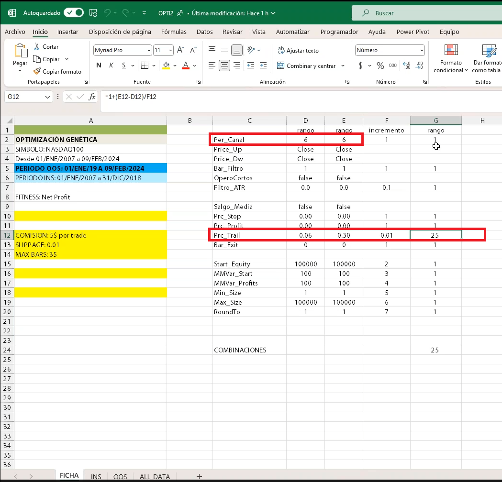
<figcaption>Figura 199</figcaption>
</figure>

Aquí tenemos los datos *in sample*:


Aquí sí que se aprecia claramente que los datos bajos deterioran muchísimo, es decir el *trailing* realmente deteriora mucho a medida que lo acercas mucho, claro estamos hablando de un sistema tendencial, opera muchísimo, 7000, 6300 *trades*, se lo lleva todo en comisiones y sale demasiado rápido, realmente no tiene sentido, habría que verlo evaluado desde bastante más arriba, como mínimo 0.10 y 0.15 y hasta más de 0.30 quizá para verlo (hablando de la columna **K** refiriéndonos de la columna **B** *net profit*).

Porque al final lógicamente estamos en diario, lo que quiere es que corran los beneficios, pero nosotros también nos interesa protegernos, protegernos de las caídas, ¿de acuerdo?, que es el problema, al final lógicamente si evaluamos solo *net profit* va a querer mantenerse dentro, por eso hay que evaluar alguna cosa más y aquí tenemos este ratio de *Sharpe ratio* que aunque no nos dé una buena lectura nos sirve para este cometido que os digo.


Y vamos a ver el **opti 2** , *in sample*:


Este perfil es bastante distinto al anterior porque en el anterior el Donchian era bastante armónico porque todo el rango mostraba cierto rendimiento y aquí pues claramente no es así, tiene los valores bajos pues prácticamente sin sentido hasta que no llega a la zona de 0.20, 0.20 y algo, nos estabiliza en un cierto rendimiento, lo cual pues como os digo habría tenido sentido dejarlo ir un poquito más, un poquito más, pero bueno lo hemos dejado ahí, está hasta el 0.30 que ya creo que es suficiente, bueno ahí habéis 0.20, está bien, es el que habíamos puesto antes por la que habíamos visto la evaluación preliminar, la zona de 0.20 pues puede estar bien, la verdad que 0.20 de momento no apunta a ir mal.


Si miramos el *out of sample* y nos fijamos, fijaros que ya por este "*Sharpe ratio* falso" (columna **K**), instancias 0.18, 0.27, 0.26, esa zona, 


y si nos fijamos en *net profit* ordenado pues clava el máximo 0.20, 0.21, 0.26, 0.18, es decir más o menos la misma zona. Vamos a ver este gráfico:


Vemos aquí el gráfico pues lo que veis, claramente las partes bajas, pues este especie de *Sharpe ratio* sí que es bastante volátil, pero ya veis que no es estable, es el clásico ejemplo donde se ve que no es estable, que varía mucho, que puede tener un valor bueno pero lo siguiente no, etcétera, y habéis que en la parte final sí que estabiliza y estabiliza en valores altos, veis claramente entre 0.20 y 0.25 todos son valores buenos, todos son valores buenos 


y donde además recogemos una cantidad importante de *trades*, estamos hablando todavía en este dato fuera de muestra *out of sample* de 900, 800 *trades* de ese orden (instancia 0.2).


Y si ya recogemos los dos unidos:

Pues nuevamente tenemos que se va muy arriba en 0.27 (columna K instancias de *profits*), el que más tirando hacia arriba 0.27, 0.26, 0.25, bastante bastante alto,


 pero aquí a ver que os la abro este gráfico:


Es el que tiene más *trades* y por lo tanto es el que está pues más estabilizado, pero aquí se aprecia claramente esta tendencia que ya veía bien, veis en el *in sample*, bueno pues a partir de 0.20 podríamos haber elegido uno más alto pero al final hemos preferido bloquear el 0.20, aunque repito podríamos haber cogido otro,


si os fijáis aunque los que dan mayor datos 0.26, 0.25, también el 0.20 fijaros que tiene el doble de operaciones. Siguen manteniendo, mantienen bastante buen equilibrio, ¿de acuerdo?, se está bien acompañado (fíjate en el gráfico) se nota que hay bajada que vuelve a subir, es decir bastante estabilizado y tiene muchos *trades*.


 

Nosotros en este tipo de situaciones solemos tirar siempre a más operaciones, solemos tirar más a más operaciones porque nos tira mucho la significación estadística, entonces aquí aunque estemos viendo mejores resultados en *profit* con 1500 *trades*, con 1300 *trades*, la zona de 0.25 por ejemplo, porque tampoco lo granularíamos demasiado esto a 0.26, 0.27, 0.20, 0.25, podríamos también haber elegido perfectamente estos que están bien, tiene un mejor resultado pero tiene como veis 900 *trades*, entonces siempre que estamos ante esa dicotomía siempre cogemos más *trades*, siempre cogemos más *trades* aunque suponga un poquito menos rendimiento, porque más *trades* significa mayor significación estadística y también significa mayor respuesta ante cambios en el mercado. Aunque gana mucho menos nuestra elección de 0.20, fijaros el *drawdown* que es bastante menos.

<div style="border-left: 4px solid #4caf50; background: #e8f5e9; padding: 10px 15px; margin: 10px 0; border-radius: 8px;">
  <strong>📊 Criterio de selección: más trades vs más profit</strong><br><br>
  Ante la dicotomía entre parámetros que dan más <em>profit</em> con menos operaciones vs parámetros con menos <em>profit</em> pero más operaciones, la recomendación es priorizar el número de <em>trades</em>. Razones: mayor significación estadística, mejor respuesta ante cambios de mercado, y normalmente menor <em>drawdown</em> relativo.
</div>

Si tiene sentido hacerlo porque realmente como hay gestión monetaria hay un 2 por ciento y las salidas son porcentuales, realmente el capital está bastante ecualizado aunque no sea en porcentaje, ¿de acuerdo?, pero aún así no nos convence del todo que no sea en porcentaje, ¿de acuerdo?, pero no nos convence del todo... pero bueno ya digo que no está mal tampoco hacerlo, y por eso añado esta columna *recovery factor*

La columna añadida **L** es lo que mucha gente llama un *recovery factor* que es *net profit* partido por *drawdown*:

*All data*


La verdad con los datos que tenemos aquí pues es de las pocas cosas que podemos hacer, ¿de acuerdo?, y pues podrías hacerlo y como veis 0.20 es el que mejor ecualiza sin haberlo hecho, pues ya veis, ya veíamos que esa zona es la que equilibra, porque tiene muchas operaciones y tener muchas operaciones normalmente mejora la respuesta ante, hablando de un tendencial, hablando de un tendencial, mejora la respuesta ante caídas y demás. 

Claro, hay que estimar bien los costes, ¿de acuerdo?, hay que estimar bien los costes porque dices tú, estimas que ***prefieres operar mil *trades* más*** pero eso solo te va a servir si has estimado bien los costes y si realmente tienes un *tick* de deslizamiento, podrías hacer ahí también una prueba de sensibilidad, deberías de mirar bien esto y probarla también en dos *ticks*: "es decir bueno pues mira no lo tengo claro voy a volver a hacer la optimización con dos *ticks* en vez de un *tick* a ver qué tal, a ver cómo lo veo", ¿de acuerdo?, y si ves que no lo ves claro pues podrías entonces decantarte más al 0.25. 

Pero nosotros aquí nos quedaríamos con el 0.20 porque 2400 operaciones con dos *inputs* solo, además optimizados de manera separada, está realmente bien.

Que es esto, luego no quiere decir que lo operemos en las 100 acciones, de esto ahora perfectamente podríamos luego pues operar las 10 acciones de mayor capitalización por ejemplo, por elegir un criterio, no debería de operar las 100, también podría hacerlo, pero que no es obligatorio, no quiero decir que esto lo estamos haciendo para validar la estrategia, para tener una mayor significación estadística, pero no es obligatorio que luego en nuestro plan operativo usemos todas las acciones.

Pues aquí hemos bloqueado 0.20:

*in sample*


0.20 está a mitad de tabla en el caso *out of sample*:

*Out of sample*:


### Optimización 3


**Filtro de volatilidad `ATR`**

Vamos con la tercera. La tercera hemos ido a probar un filtro que es totalmente opcional y no es obligatorio, pero hemos querido ver, hemos querido ver porque queríamos introduciros un filtro de volatilidad aquí para un tendencial y así pues ya explicároslo, pero como digo no es obligatorio, pero lo hemos probado. Bueno, para ver un poco cómo oscilaba, que este sí que teníamos muy claro que no le íbamos a dejar este nivel de granularidad, pero queríamos ver un poco, queríamos analizar cómo se movía el tema, de acuerdo, y hemos dejado el 6 fijo, hemos fijado el 20 y hemos dejado el filtro ATR que es el multiplicador.

<figure>
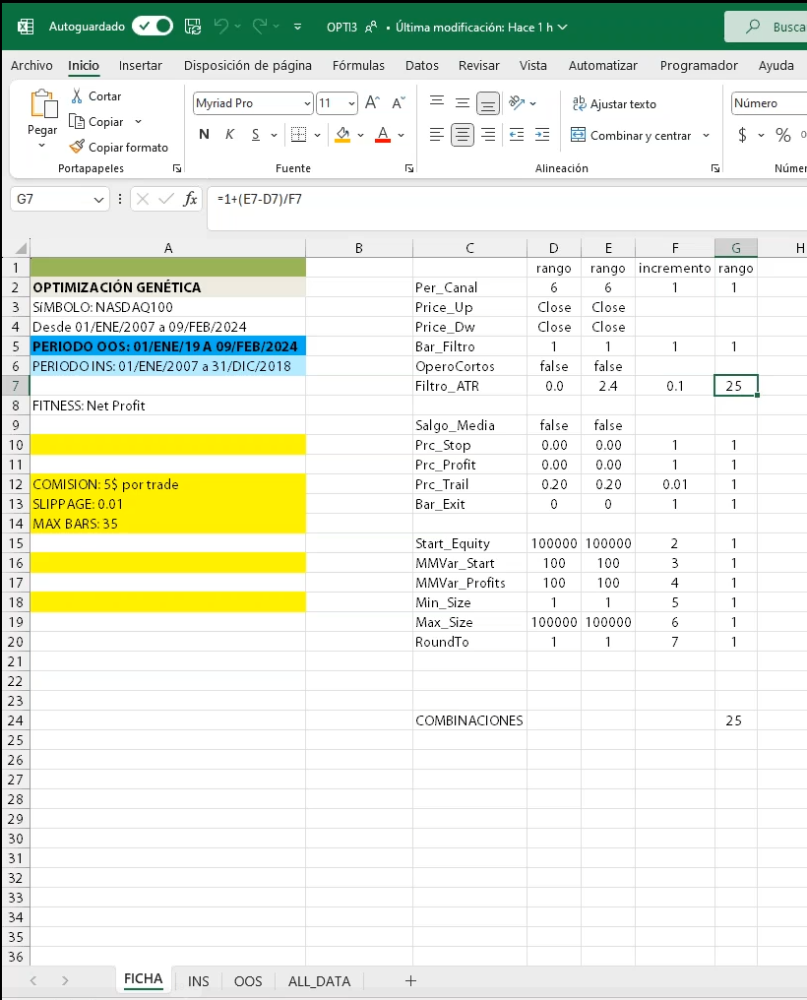
<figcaption>Figura 037</figcaption>
</figure>

Ahora os voy a enseñar en el gráfico. Ha quedado claro. También hemos dejado oscilar 25, vale. Esto, esto ¿cómo funciona?, vale, esto ¿cómo funciona?

En el gráfico, aquí abajo, fijaros, tengo dos ATRs pintados: es el de 22. ¿Por qué 22? Bueno, porque es un mes más o menos, sin más, no lo hemos optimizado. 

Al final lo que queremos es ver si la volatilidad va a variar, nos hace un filtro. Volatilidad lo que hace es comparar la volatilidad actual con la volatilidad de x periodo. Hay varias maneras de hacerlo: eso que te crea la `desviación estándar`, hay algún estudio con el `VIX` que espero en el curso poder mostrar alguno, de acuerdo, con la curva del VIX, método poco avanzado y creo que no tocaba en este momento del curso, y este es un método sencillo que al final tiene bastantes… aporta, aporta valor. Aporta más valor en los sistemas de ruptura y tendenciales que no en tendencia pura, pero bueno, lo hemos querido meter para explicároslo y ya está, y se puede usar.


Simplemente comparar, lo que os digo, la volatilidad actual —la volatilidad de hoy, de la vela actual, es Apple— y pues la volatilidad de hoy es la barra amarilla, con la volatilidad media del último mes. 


Como veis es bastante más alta, es decir, está haciendo todos estos últimos días, como veis, está teniendo una volatilidad baja, de acuerdo, para su volatilidad media del mes. Y esto es lo que evaluamos simplemente, de acuerdo. 

**code** : [../../13-practice-03/code/CURSO_SISTEMA_RUPTURA_ACCIONES.ELD](../../13-practice-03/code/CURSO_SISTEMA_RUPTURA_ACCIONES.ELD)

Ese filtro consiste en el código simplemente en que, si esa volatilidad por un multiplicador —que vamos a suponer que es uno, vamos a suponer que el multiplicador es uno, con lo cual no es importante decir que es la volatilidad— si esa volatilidad de hoy es menor que la volatilidad de todo el mes, si eso se cumple, es decir, si la volatilidad de hoy es menor, entonces puedo operar. Si la volatilidad es mayor, no.

```
// Filtro de volatilidad
If Filtro_ATR > 0 then
    Condition1 = TrueRange < AvgTrueRange(22)[1] * Filtro_ATR
else
    Condition1 = true;
```

<div style="border-left: 4px solid #ff9800; background: #fff3e0; padding: 10px 15px; margin: 10px 0; border-radius: 8px;">
  <strong>📉 Lógica del filtro de volatilidad</strong><br><br>
  El filtro compara el <em>True Range</em> de la vela actual con el <em>ATR</em> medio de 22 periodos (aproximadamente un mes). Si la volatilidad actual es <strong>menor</strong> que la media × multiplicador → permite operar. Si es <strong>mayor</strong> → bloquea. Esto se basa en que el mercado tiende a subir con baja volatilidad y caer con alta volatilidad.
<br><br>
  Esto es el filtro podemos decir natural para ir largo en tendencia, porque normalmente sabemos que el mercado sube con poca volatilidad y baja con más volatilidad. Entonces, cuando la volatilidad está alta, normalmente —por eso está el filtro así— lógicamente habrá veces que no, pero normalmente el mercado está nervioso, el mercado está tenso y así no se sube, de acuerdo. El mercado tiende a subir tranquilo. 
<br><br>
  Es verdad que cuando hay una vuelta del mercado bajista, pues ahí esto puede hacerte… este filtro que a lo mejor tardes un poco en volver al mercado hasta que no se tranquilice, pero bueno, pues perfecto. Al final lo que hace es tratar de eliminar operaciones cuando hay volatilidad elevada, es decir, cuando la volatilidad de hoy es más alta que la media.
</div>

Podría incluso probarse con más, que en vez de la del mes ***que fuera la del trimestre***. Es decir, estaría bien, es decir, estaría bien porque a lo mejor "es que no, yo sabes que como voy de largo plazo prefiero evaluar contra la volatilidad de más periodos". Lo podemos mirar. Hemos hecho con un mes, pero hubiera tenido perfectamente sentido hacerlo con más. Con lo que os digo, porque al final, pues yo que sé, vais a ver que se vuelve mucho más tranquilo. No le pongo pues 60 días, por decir algo. 60 días


es que, pues, se vuelve más estable, de acuerdo, se vuelve más estable. Seguimos teniendo una volatilidad baja pero se vuelve un poquito más… bueno, más cómo decirlo… más rígida. , pero al final tiene más periodos recogidos, entonces tendría las dos cosas sentido y habría que evaluar un poquito muchas acciones. Nosotros lo hemos hecho con un mes, en la **Optimización 3** rango `25` He dejado el *Filtro_ATR* de 0 a 2.40 por dejar 25, pero ya os digo que no en este caso no le vamos a hacer; queríamos simplemente analizarlo, ver un poco el mapa.

<figure>

<figcaption>Figura 037</figcaption>
</figure>


Y ese 73.94 (**L**) fijaros es el clásico ejemplo de poca significación estadística. Este, con un 0.2 multiplicador, pero tampoco… que realmente no opera nunca. Entonces bueno, no, lógicamente no tiene sentido. En la columna ATR con cero, con cero para que lo tengáis en cuenta, equivale a no usarlo. Es decir, `cero`, este valor que os marco equivale a no usar filtro. Es la versión sin filtro y da un *recovery* de 2.54. Aquí coloca muy bien. Hay alguno que coloca ligeramente mejor —ligeramente, sí, no, incluso bastante mejor— pero también el no usarlo queda bastante equilibrado. Vamos a ver el mapa, vamos a ver el mapa en *in sample*.


Aquí el 0.1, pues, queda esta bestial bajada y a partir de ahí, pues a partir de 1, estabiliza mucho por *Sharpe ratio* y sí que aquí, entre la zona de 0.9, 1, 1.1, es donde tienes… es decir, en `1`, de acuerdo. Ahí está claro que nos quedaríamos con 1, que es lo que os decía. Este realmente nunca lo dejaríamos así. Lo podemos usar en 0, en 1, en 2, si me apuras un 1 y medio, vale. 1 se suele hacer así: el ATR, un ATR y medio, 2 ATRs, 3 ATRs, de acuerdo. No vamos a ir a 1.3 ATRs, os decía del sentido común y la lógica en cuanto a los incrementos, de acuerdo. No vamos a poner 0.33 ATRs, vale, porque eso es una sobreoptimización de manual, de acuerdo, manual.

Aquí tienes la fórmula integrada de forma precisa para tu notebook:

<div style="border-left: 4px solid #4caf50; background: #e8f5e9; padding: 10px 15px; margin: 10px 0; border-radius: 8px;">
<strong>📊 Recovery Factor</strong>

El <em>recovery</em> —recovery simplemente el nombre, no importa porque no en todas las plataformas se llama recovery— es <em>net profit</em> partido por <em>drawdown</em>. Como el <em>drawdown</em> está negativo, se multiplica por menos 1, se cambia de signo para que no tenga un valor negativo. Es un buen estimador de retorno-riesgo a nivel de portfolio.

</div>

$$Recovery Factor = \frac{Net Profit}{|Max Intraday Drawdown|}$$

En *TradeStation* está el `TSI`, que es justamente este ratio multiplicado por los *winners*, que es el número, el porcentaje de ganadoras de *trades* acertados, vale. Es otro ratio que se llama *TradeStation Index*, que es de este estilo. Vale. Cuando hablamos de las funciones *fitness*, pues hablamos muchísimo de esto: de retorno y *drawdown*, y hablamos de retorno-riesgo. De muchos, y os dije que todos tienen mucha correlación y que a nosotros nos gusta mucho el *Sortino*, vale. Trabajé muchos *Sortinos*, ¿os acordáis? Y también nos gusta bastante *Loopy*, vale. Los iremos viendo durante el curso, de acuerdo, los iremos viendo, no os preocupéis.

Aquí me interesa ir introduciendo las cosas poco a poco, y en este sistema tendencial —que acordaros hablamos que es para un perfil de medio-largo plazo, que no necesita una implicación, una dedicación continua, que no quiere estar todo el día pendiente del mercado— pues bueno, buscamos de entrada una estrategia de este estilo y decidimos usarlo por Donchian porque había salido mucho en el curso. Haremos muchas más cosas y veremos distintos ratios, pero al final es un ratio de retorno-riesgo, de acuerdo. Que al final casi siempre son los que son más interesantes, de acuerdo. Ratios de retorno-riesgo. Porque al final retorno es lo que nos interesa ganar, pero el riesgo nos interesa mucho controlarlo, porque cuando uno no controla riesgos se va a tomar viento a la farola. Entonces no queremos irnos a tomar viento del mercado, y sobre todo cuando uno empieza debe fijarse más que nada en el riesgo, porque `el riesgo es lo que nos saca de la partida, es lo que nos envía para casa y no podemos permitir que nos envíen para casa`, de acuerdo. Eso es lo que no podemos permitir bajo ningún concepto, y por eso es vital, vital, vital controlar el riesgo.

Ale, vamos al *out of sample*, estamos evaluando el filtro, estamos evaluando el filtro por sí solo habiendo bloqueado el canal, habiendo bloqueado el canal en seis, que francamente podría haber estado en otro, y en 0.20 el *trailing*, que también había varios pero sí que pues por ahí parecía equilibrar bastante bien.

Aquí hay combinaciones como habéis visto antes 0.1, 0.2, pues el *out of sample* en este caso dan 0 y fijaros tiene divisor por 0 porque es que no llega ni a operar, el *out of sample* no hace *trades*, pero aparte de eso es que en *out of sample* justo el valor 1 es el que queda mejor colocado en el retorno, en retorno-riesgo.


Vamos a ver el mapa opti 3:

La parte baja pues no vale la pena ni comentarlo y a partir de ahí 0.9, 1, 1.1, 1.2, 1.5, toda esta zona, que ahí cuidado el caso 1.7 veces para que empieza a degradar, en la zona de 1 la verdad que está bastante, 1, 1.2 está bastante cómodo, bastante cómodo. Ahí también aquí en el *recovery* pues se aprecia poco, eso es el *recovery*, al final se aprecia un poco eso, el 0 coloca bien, en 0 coloca bien.


Vamos a ver en el *all data* que es donde al final siempre hay más *trades*, por lo tanto más significación estadística, y que al final recoge la parte optimizada y la parte no optimizada. Está bien analizar el *all data*, no penséis que la teoría que lo hicimos, al final está bien comparar el *in sample*, comparar el *out of sample* es muy importante, perfil de optimización acordaros, y bastante interesante esto del *out of sample* por delante, el *out of sample* por detrás, moverlo de acuerdo, mover la muestra, que es parecido a lo que hace el BRaC, pero nosotros no le hemos puesto nombre, pero es parecido a lo que hace el BRaC. Pero al final la elección puede perfectamente hacerse con el *all data*, de acuerdo, pero siempre que haya significación y que sea concordante con lo que hemos visto en el *out of sample* y el *in sample*, al final eso es la unión de los dos.

De hecho Kaufman, y es lo comparto, una cosa es la variación de la cosa y es la selección de parámetros, él decía "yo para elegir los parámetros cojo la optimización hasta ayer", solo decía Kaufman (probablemente referencia a Perry Kaufman, autor de "Trading Systems and Methods"), hasta ayer, ¿por qué?, porque me interesa, me interesan todos los datos disponibles, yo ya he evaluado el sistema, considero que es robusto, considero que la franja de optimización, imaginaos aquí la zona de entre 6 y 12 por ahí, vale, y el *trailing* pues lo voy a dejar ya fijo en 0.20, voy a ver el canal, bueno pues a lo mejor optimizo solo el canal con 0.20, filtro el filtro en 1 y el *trailing* en 0.20, y le voy a optimizar solo el canal, le meto todo el histórico que tengo y le meto hasta el último día, y con eso elijo... puedo perfectamente hacer eso. Sería un comportamiento correcto con la idea ya validada, con la idea ya validada y considerada robusta, y en la zona que yo voy a operar, y ahí la elección la haría mirando varios casos, miraría *Sortino*, de acuerdo, *in sample*, *out of sample* de distintos ratios, miraría aquí *recovery*, pero podría hacerlo con el *all data* y optimizado hasta el último día, perfectamente.


Aquí veis lógicamente los primeros con un *recovery* muy alto porque no operan, pero luego pues ya nos vamos a ir 1.4, 0.4, 0... aquí el 1 cae un poquito más, nos sale en *recovery* también puntual, de hecho el *recovery* sale bastante mejor el 0, bastante mejor el 0 que el 1. Con lo cual aquí operarlo o no está dudoso, está dudoso, está dudoso, ¿por qué dudoso? Bueno, es algo que es normal, porque eso que os digo, 

>en los tendenciales puros los filtros no son tan eficaces, donde son muy eficaces es en los sistemas de *breakout* 

que este lo haremos *breakout* no hoy, lo podemos plantear pero no lo hemos analizado, que hemos hablado de él, pero como *breakout* es probable que aporte más, es probable que aporte, que aporte más, aquí es discutible, aquí es discutible, pero lo queríamos explicar y ver cómo lo hubiéramos analizado, que es un poco al final, de acuerdo, no metido a saco todo optimizado y a ver qué nos sale, no claro, lo veremos eso también, ahora veremos todo optimizado a ver qué nos ha salido.

Vamos a ver el mapa y lógicamente los valores bajos, pero ahí veis a partir de 1 pues queda bastante estabilizado, lógicamente el 0 también está ahí pues bastante alto, vale, pero aquí eso, 0 o 1, de acuerdo, no hay más, es el juego que yo haría, un poco el 0 o 1. Por *recovery* aunque es un tanto precipitado, no es tan concluyente esto, *recovery* tampoco es la panacea, quiero decir que si *recovery* no da, pues ya no... no, no es así, hay otros factores, pero sí digo poco, los dos candidatos, de acuerdo, aquí tenemos 2.400 y tenemos 2.200.


Yo aquí francamente con esta información no lo veo muy claro, que habría que realizarlo un poco mejor, pero sí que perdemos 206 *trades*... en un filtro es para perder *trades*... cuidado... sí es lo que pasa, que fijaros que ganamos un poquito de *profit* pero perdemos *drawdown*... entonces a costa de ese *profit* no sales ganando, realmente no acaba de conseguir reducir el riesgo que es quizá donde más debe actuar el filtro, ¿de acuerdo? Saqué un filtro, al final, ¿qué estoy buscando yo? Estoy buscando pues evitar *trades* negativos, es verdad que mejora el porcentaje de acierto que es lo lógico, pero no mejora el *drawdown*, esto habría que profundizar un poco más. Podemos hacer *Maestro*, vamos a intentar mirarlo, *Maestro* había pensado cuando hagamos la pausita de cinco minutos tratar de montarlo y lo podemos mirar. Pero yo con esta información en el filtro la verdad no lo veo


<div style="border-left: 4px solid #e91e63; background: #fce4ec; padding: 10px 15px; margin: 10px 0; border-radius: 8px;">
  <strong>⚠️ Evaluación de filtros: criterio clave</strong><br><br>
  Un filtro debe principalmente <strong>mejorar el perfil de riesgo</strong> (reducir <em>drawdown</em>), no solo el <em>profit</em>. Si un filtro mejora ligeramente el rendimiento pero empeora o no mejora el <em>drawdown</em>, su utilidad es cuestionable. Los filtros de volatilidad son más eficaces en sistemas de <em>breakout</em> que en tendenciales puros.
</div>

### Optimización 4

Le he hecho toda junta porque queríamos mostraros el mapa 3D. Hemos hecho esta optimización junta. ¿Qué es la optimización junta? Pues:

* El canal de 1 a 25
* El `Prc_Trail` (*trailing*) de 6 a 30 — de 6 hemos visto que no, pero por hacer la misma
* Y el filtro `Filtro_ATR` 0 o 1, simplemente, es decir, no o sí pero con uno

También quizá mejor, en vez de 22, va mejor poniéndole más, un periodo mayor. La verdad que no lo hemos mirado, pero podríamos; podemos directamente mirarlo, nos llevaría mucho rato. Y puede ser porque a lo mejor simplemente la volatilidad de un mes pues es una comparación demasiado cercana, pudiera ser. Pero vaya, así justito sí que da una cierta mejora, pero no en el *recovery*: da una cierta mejora en rendimiento pero el *drawdown* empeora, así que no me convence porque **un filtro es, sobre todo, para mejorar el perfil de riesgo**.

<figure>
  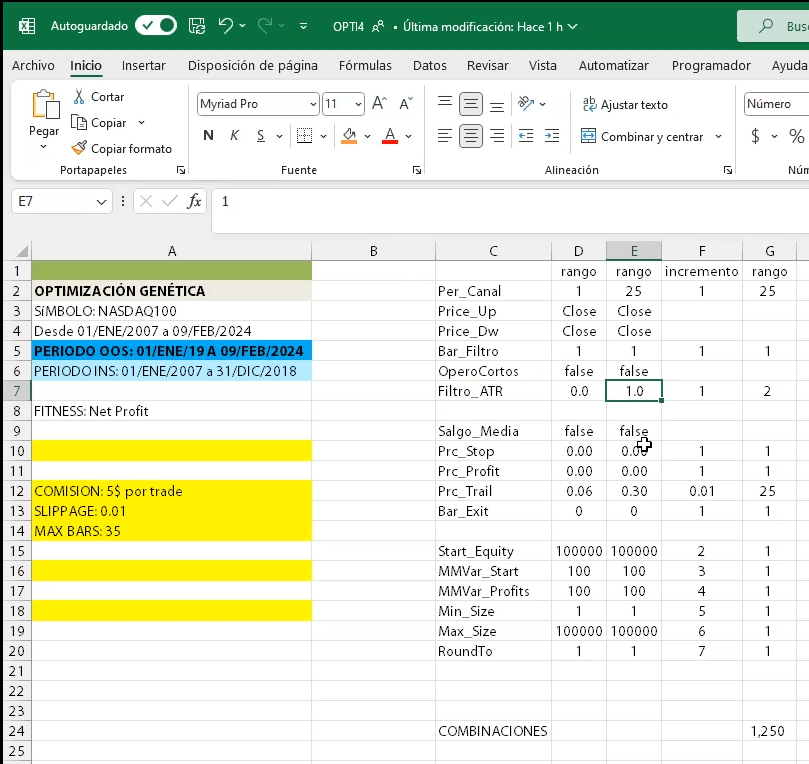
  <figcaption>Figura 213. Configuración de la optimización conjunta de 3 variables.</figcaption>
</figure>

Pero bueno, hemos hecho esa optimización. Aquí ya tenemos 1.250 combinaciones con las 100 acciones, ya es un poquito más intensiva. Pero realmente, por los grados de libertad que hay, se podría hacer. Pero bueno, yo he preferido enseñároslo así para que lo vierais paso a paso.

<div style="border-left: 4px solid #3498db; background: #ebf5fb; padding: 10px 15px; margin: 10px 0; border-radius: 8px;">
  <strong>📊 Grados de libertad en optimización</strong><br><br>
  Los <em>grados de libertad</em> se refieren a la relación entre el número de parámetros optimizados y el número de operaciones (<em>trades</em>) disponibles. A mayor número de combinaciones probadas respecto al número de <em>trades</em>, mayor riesgo de <em>overfitting</em>. Con 1.250 combinaciones y miles de operaciones agregadas de 100 acciones, la proporción sigue siendo razonable.
</div>

#### **Resultados In Sample**

Bien, tenemos aquí el *in sample*. Fijaros que nos da en el *in sample* el mejor: el filtro activado, 25 (**L**) y 0.12 (**M**), es decir, bastante distinto a lo que hemos elegido, muy distinto.

<figure>
  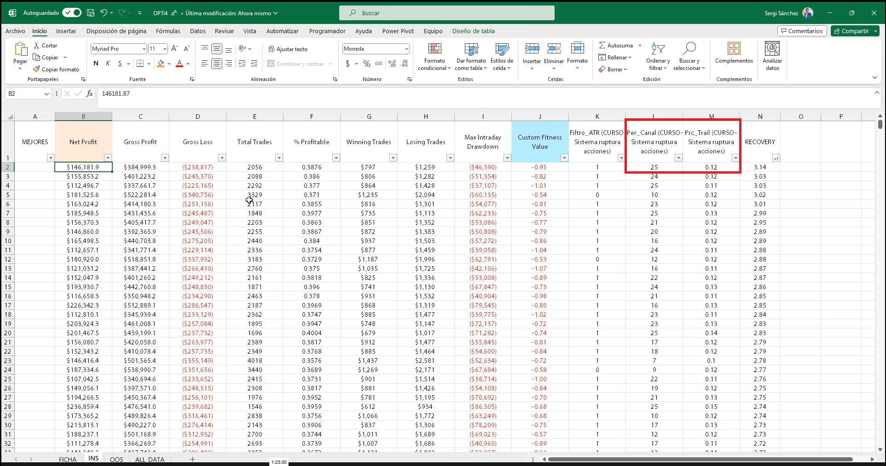
  <figcaption>Figura 049. Resultados de la optimización conjunta en periodo in sample.</figcaption>
</figure>

Vamos a ver el mapa de esto *in sample*. Aquí podemos ver el mapa en 2D mirando a una variable:

<figure>
  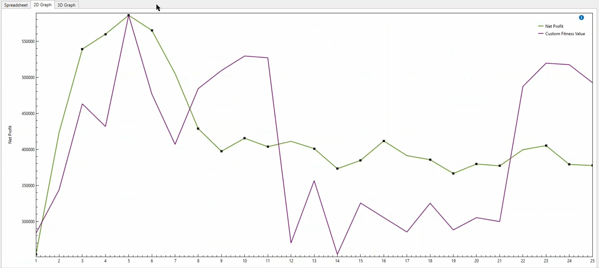
  <figcaption>Figura 050. Mapa de optimización 2D.</figcaption>
</figure>

O podemos mirar el mapa en 3D. Esto sería bloqueando el 1:

<figure>
  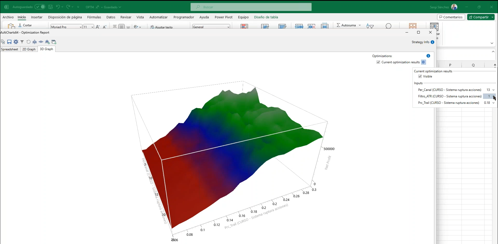
  <figcaption>Figura 214. Mapa de optimización 3D con filtro ATR bloqueado en 1.</figcaption>
</figure>

<figure>
  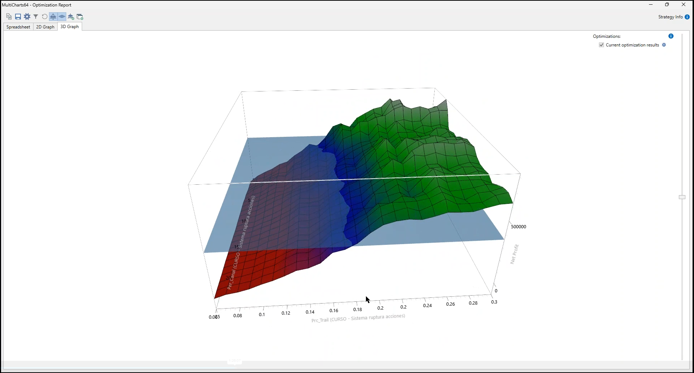
  <figcaption>Figura 215. Vista alternativa del mapa 3D.</figcaption>
</figure>

**Análisis de estabilidad del canal**

Lo que os decía: el canal, veis, el canal es muy estable.

<figure>
  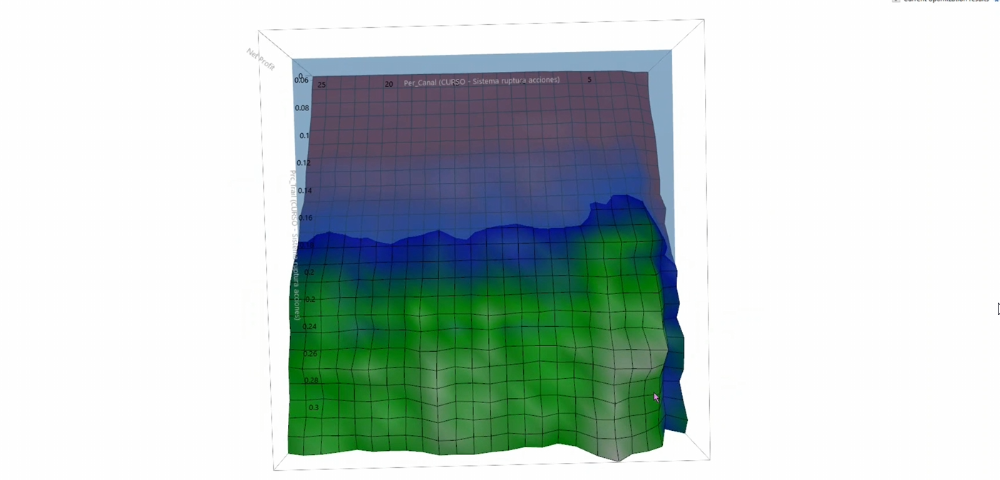
  <figcaption>Figura 052. Perfil de estabilidad del canal Donchian.</figcaption>
</figure>

<figure>
  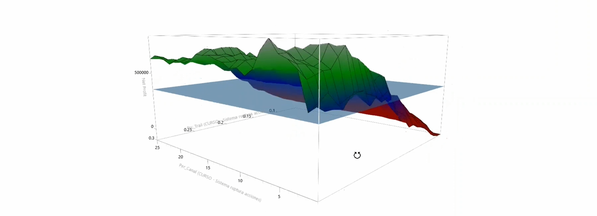
  <figcaption>Figura 053. Detalle de la zona estable del canal.</figcaption>
</figure>

<figure>
  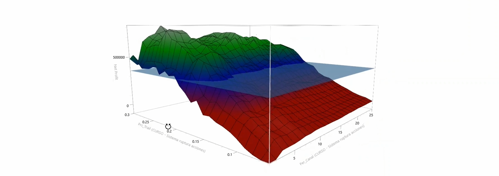
  <figcaption>Figura 054. Visualización del gradiente de rendimiento por canal.</figcaption>
</figure>

Acordaros lo que hicimos en Excel. Esto es lo que vemos en Excel, que ya os lo comenté. *MultiCharts* lo hace porque no tenemos en Excel — también lo podemos hacer en Excel, pero *MultiCharts* lo incorpora, es bastante interesante.

Aquí en las partes bajas del canal, cómo degrada muchísimo; pero a partir de 5 o 6 ya es bastante estable, bastante estable.

<figure>
  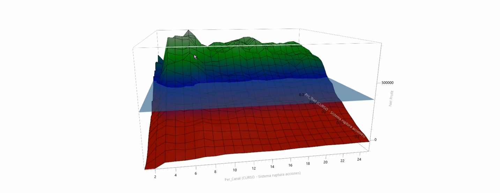
  <figcaption>Figura 055. Degradación en canales cortos vs estabilidad en canales 5-6 en adelante.</figcaption>
</figure>

**Zona del filtro ATR y trailing 0.20**

Y la zona del filtro ATR 1 en (0.20) sí que hemos quedado un poco bajo. Parece que es más alto, pero lo que les decíamos de los *trades*. Pero hay que verlo, hay que verlo: 0.20 está ahí al borde de degradar, está al borde de degradar, está un poquito justito. Pero 0.20 es un poquito justito. Ese es con el filtro activado:

<figure>
  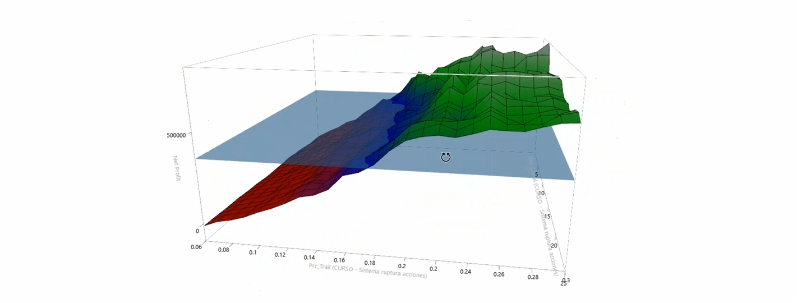
  <figcaption>Figura 056. Mapa con filtro ATR activado (=1) y trailing 0.20.</figcaption>
</figure>

<figure>
  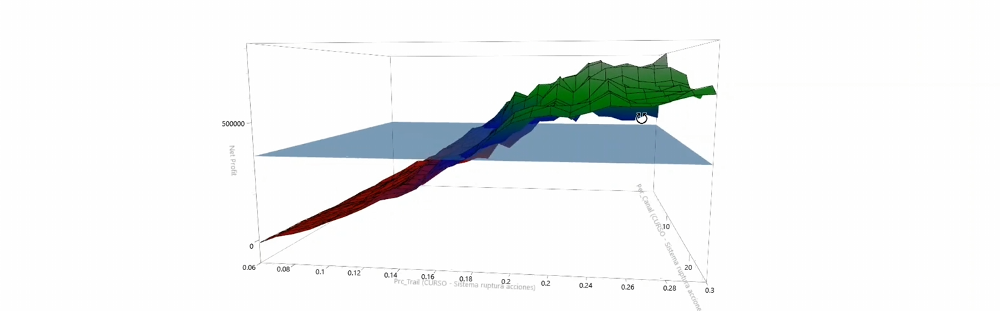
  <figcaption>Figura 057. Detalle de la zona crítica en trailing 0.20.</figcaption>
</figure>

<figure>
  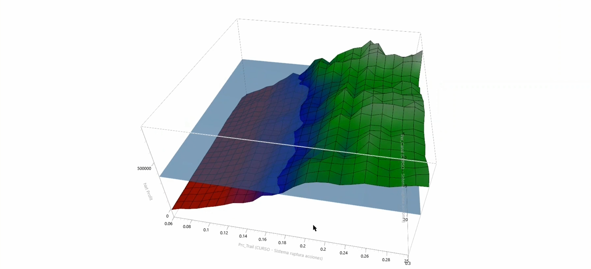
  <figcaption>Figura 058. Perspectiva adicional del mapa con filtro activado.</figcaption>
</figure>

**Análisis con filtro desactivado**

A partir de ahora con el **`filtro 0` - desactivado**:

<figure>
  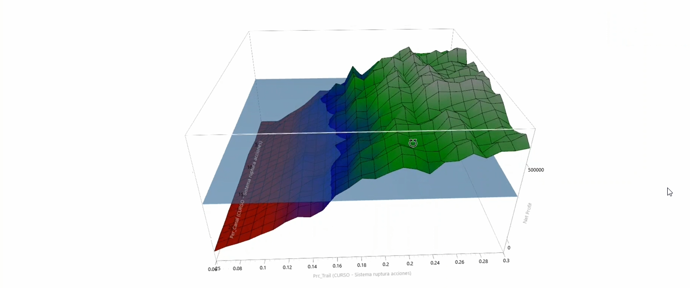
  <figcaption>Figura 059. Mapa de optimización con filtro ATR desactivado (=0).</figcaption>
</figure>

Fijaros: con el filtro desactivado parece que alarga un poco más esta zona de 0.20, parece que la llanura llega un poquito más allá.

<figure>
  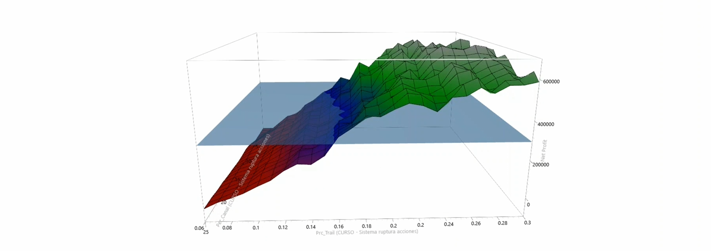
  <figcaption>Figura 060. Extensión de la zona estable con filtro desactivado.</figcaption>
</figure>

El perfil es muy parecido:

<figure>
  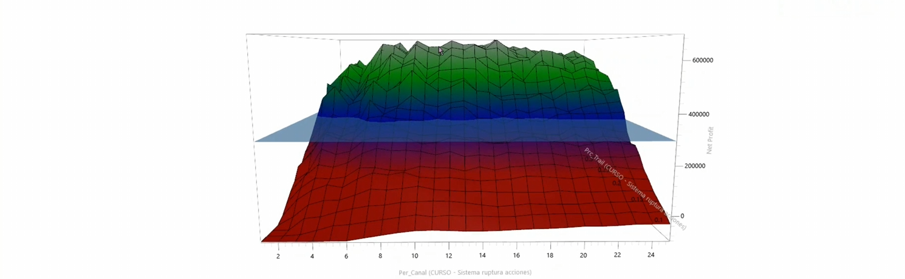
  <figcaption>Figura 061. Comparación de perfiles con filtro activado vs desactivado.</figcaption>
</figure>

Pero ya vemos que toda esta zona 0.20, 0.25, en el caso del filtro y Donchian, pues ya digo desde 6, 7, 8, 10, 20, es decir, es muy estable, es muy estable, tiene pocas diferencias.

<figure>
  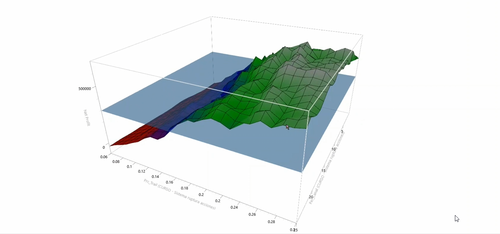
  <figcaption>Figura 062. Zona de estabilidad canal 6-20 con trailing 0.20-0.25.</figcaption>
</figure>

<figure>
  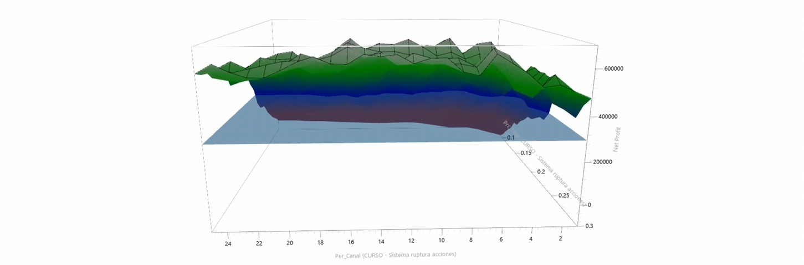
  <figcaption>Figura 063. Vista detallada de la meseta de estabilidad.</figcaption>
</figure>

<figure>
  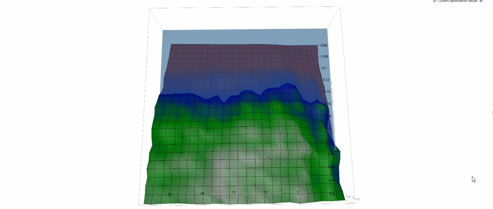
  <figcaption>Figura 064. Confirmación visual de la zona estable.</figcaption>
</figure>

**El concepto de mapa de optimización**

Al final, ¿qué está indicando? Lo que muestra es *estabilidad*, simplemente es estabilidad, lo que es lo que queremos. Esto es lo que llamamos un **mapa de optimización**, que hay muchos nombres en la literatura dependiendo de nombres más *guays* como todos, pero esto es el mapa de optimización de toda la vida que hemos hecho, que nos va a mostrar la sensibilidad de variables. A mí, ¿qué me interesa? Pues variables que sus vecinos estén bien, decir: esto es bien, esto es bien.

<div style="border-left: 4px solid #4caf50; background: #e8f5e9; padding: 10px 15px; margin: 10px 0; border-radius: 8px;">
  <strong>📏 Principio del "buen vecino"</strong><br><br>
  En un mapa de optimización, un parámetro robusto debe tener <em>buenos vecinos</em>: los valores adyacentes también deben funcionar bien. Un pico aislado (máximo rodeado de valores pobres) es señal de <em>overfitting</em> y probablemente no se mantendrá fuera de muestra.
</div>

**Análisis del trailing (Prc_Trail)**

Para el lado del canal, para el lado del *trailing* `Prc_Trail`, parece que degrada más:

<figure>
  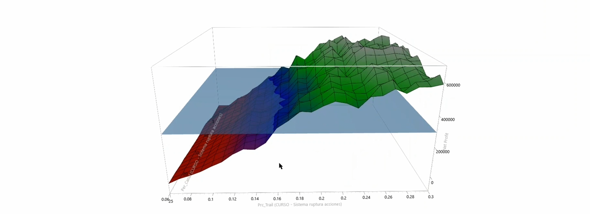
  <figcaption>Figura 065. Perfil de degradación del trailing stop.</figcaption>
</figure>

Pero tiene un punto falso porque, como lo hemos granulado tanto, la mente nos sesga un poco. Por eso viene bien el *watermark* este:

<figure>
  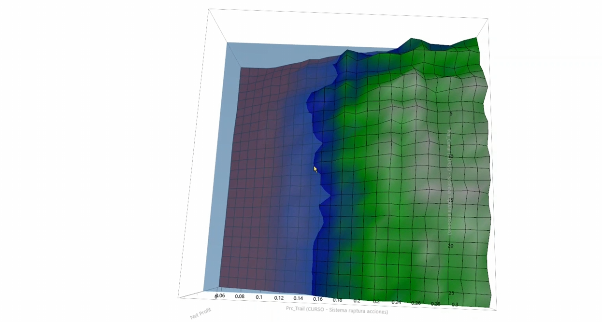
  <figcaption>Figura 066. Mapa con watermark para evitar sesgo visual.</figcaption>
</figure>

Para evitar no ver un poco eso, no nos sesga. Pero realmente también es bastante grande la zona, también es bastante grande. Tenemos una zona aquí en el lomo de la parte verde realmente grande. Que sí que quizás más 0.25 habría que estudiarlo mejor. Esto yo me he quedado en el 0.20 por lo que os he dicho, los *trades*, porque considero tener suficiente margen todavía para caerme mucho. Pero es verdad que 0.25 se ve más cómodo a nivel de estabilidad, se ve más cómodo, y que incluso el 6 lo mismo.

<figure>
  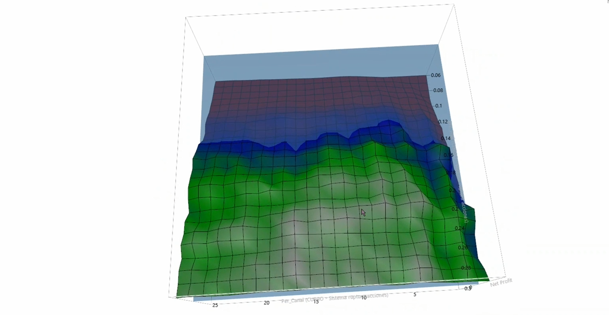
  <figcaption>Figura 067. Zona de confort: canal 6, trailing 0.25.</figcaption>
</figure>

En 6 quizá se ve un poco más cómodo. La zona de 15, de 12, 12, 0.25 quizá parece más estable, parece más estable en este gráfico, de ese orden. Pero bueno, que estamos en el *in sample*.

**Transición al Out of Sample**

Vamos ahora al *out of sample* a ver qué conclusiones sacamos aquí:

<figure>
  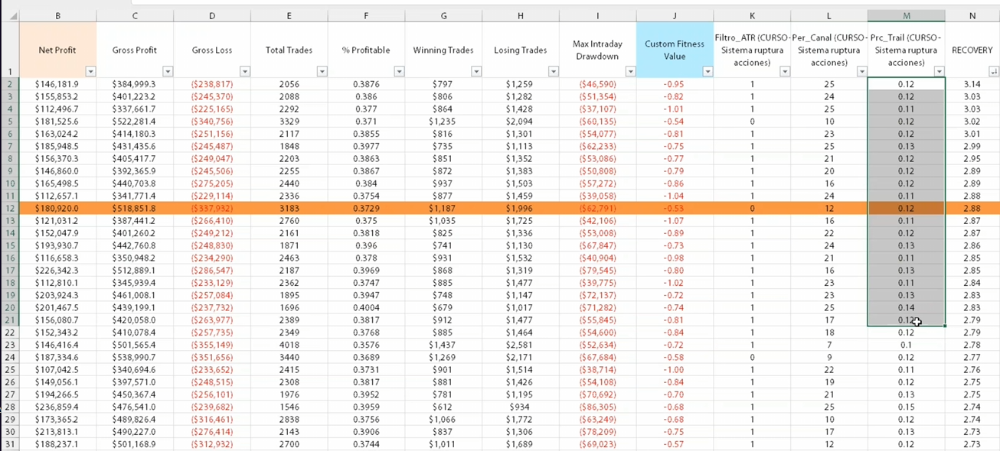
  <figcaption>Figura 069. Resultados de la optimización en periodo out of sample.</figcaption>
</figure>

Lo que hemos dicho. Aquí parece en el mapa, a mí lo que veo un poquito más estable es esta zona, aquí más o menos es **12**, es este **12** por ahí, 16, pero 0.12, 0.11 — claro, es que hay mucho *trailing* ahí, todos están ahí, es en la zona de *recovery* alto. **¡No 0.12 no! Perdón, 0.20 pico, perdón, perdón, me equivocaba.** Esto es demasiado bajo:

<figure>
  
  <figcaption>Figura 065. Referencia: trailing demasiado bajo.</figcaption>
</figure>

Fijaros que ahí nos están saliendo que los mejores da muy bajo. 0.12 da un *recovery* — *recovery* de equilibrio entre retorno y riesgo — da muy bajo. Que estamos mirando en el `profit`, podíamos mirar también *recovery*. Por el *recovery* no porque no lo metí en el modelo. Podría mirar *drawdown* por ejemplo, podría mirar el *drawdown*:

<figure>
  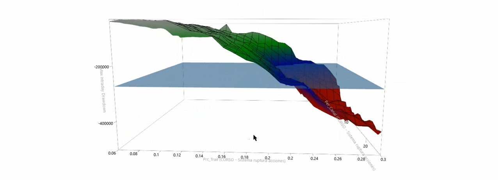
  <figcaption>Figura 070. Mapa por drawdown.</figcaption>
</figure>

**Análisis por drawdown**

Ese es el `drawdown`. Fijaros que cambia completamente: el `profit` lo da en la parte alta, el *drawdown* lo da bajo, en el 0 a 0.8.

<figure>
  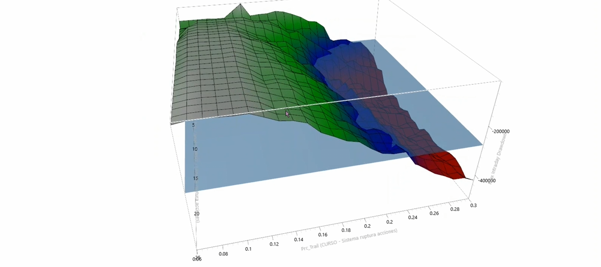
  <figcaption>Figura 071. Zona óptima por drawdown: trailing 0-0.8.</figcaption>
</figure>

Por eso viene bien el *recovery*. No lo podía haber metido como *fitness* pero no lo he hecho, entonces ahora no lo puedo. Lo podía hacer pero lo tendría que hacer, lo podía ver con un archivo, para prepararlo y no lo tengo listo.

**Análisis por Sharpe ratio**

Lo que sí que podemos meter aquí es el *Sharpe ratio*, el **Sharpe ratio este falso** que tenemos. Pero bueno, ya digo que es falso pero sirve un poco:

<figure>
  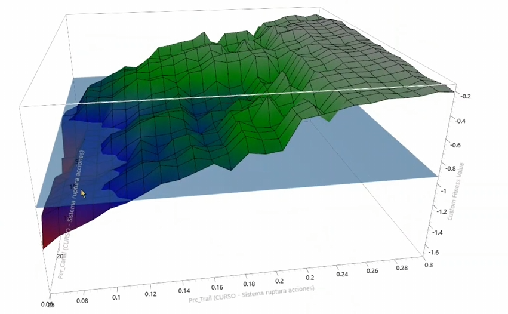
  <figcaption>Figura 072. Mapa por Sharpe ratio (calculado sistema a sistema).</figcaption>
</figure>

Veis como al final lo que os digo: en esas zonas sigue tirando más para el *profit* y aquí se ha igualado más, ya no es tan dramático la caída, porque el riesgo en la parte baja también lo considera bajo cuando lo consideraba. Pero estaría bien verlo en el *recovery*, que un poco lo vemos aquí, pero eso que os digo, el *recovery* cambia un poco. Pero por *net profit* ahí el mapa en el *profit* está bien, está bien, está bien también teniendo en cuenta dónde saldrá el *drawdown*. Pero *recovery* estaría muy bien.

Pero fijaros cómo estabiliza en este *Sharpe ratio*:

<figure>
  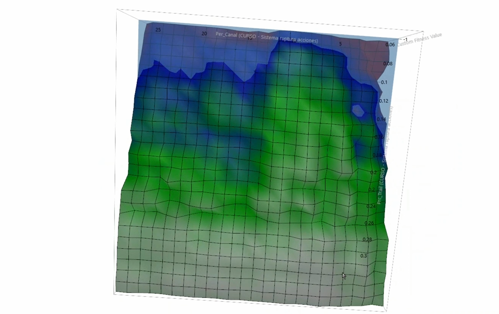
  <figcaption>Figura 073. Zona absolutamente plana en Sharpe ratio.</figcaption>
</figure>

La zona ya se vuelve absolutamente plana, plana, plana, tanto con 0 como con 1 ATR.

Se nota planísima, realmente es enorme. Aquí hay un poco de cráter pero si es ahí de la zona 0.25 es donde empieza la zona plana, lo que pasa que está ahí también lo de los *trades*.

<figure>
  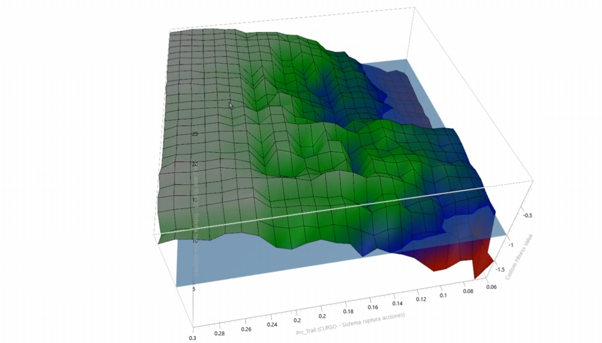
  <figcaption>Figura 074. Inicio de la zona plana en trailing 0.25.</figcaption>
</figure>

Bueno, este es el *in sample*.

#### **Análisis del Out of Sample**


<figure>
  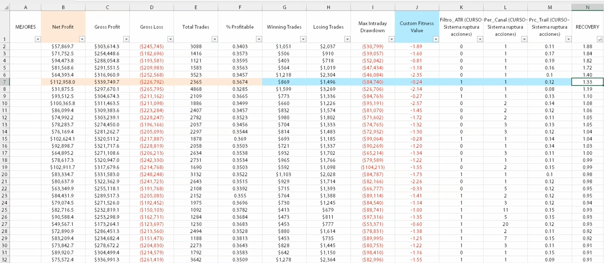
  <figcaption>Figura 075. Datos del periodo out of sample.</figcaption>
</figure>

Es muy, muy interesante, un poco para que veáis cómo tenemos que analizar los sistemas de este tipo, que al final tienen pocas operaciones. Lo que hacemos es juntar acciones y, a través de ellas — que esto quiere decir que no va a ir óptimamente en ninguna, pero va a tener un buen equilibrio entre todas — por tanto es más robusto. Mucho más robusto adaptarse a todas que adaptarse a una aparentemente mejor. Adaptarse a una, sí claro, si tienes la certeza de que el ajuste va a ser igual en el futuro, sí. Pero esto se explica mucho en la teoría: al final no tenemos certeza sobre el futuro, tenemos que tratar de poner las probabilidades a nuestro favor, y eso pues lo hacemos sobre todo priorizando la robustez, como con este ejemplo que estoy poniendo.

<div style="border-left: 4px solid #f39c12; background: #fff8e5; padding: 10px 15px; margin: 10px 0; border-radius: 8px;">
  <strong>⚠️ Filosofía de robustez sobre optimización</strong><br><br>
  La clave no es encontrar el parámetro que <em>mejor</em> funciona en el histórico, sino el que funciona <em>razonablemente bien</em> en múltiples condiciones. Un sistema que no va óptimamente en ninguna acción pero tiene buen equilibrio entre todas es más robusto que uno optimizado para una sola.
</div>

Bien, aquí en el *out of sample* bajamos número de *trades*. Y aquí fijaros que el mayor *recovery* lo da a cero, el canal en uno y 0.11 por decir súper rápido, operando un montón. Pero fijaros que, pues, bajando bastante el rendimiento pero también el *drawdown*… y cuidado, también el *drawdown*. Interesante, ¿no?

Aquí en la mayoría, todos, porque como ni fijaros que están en el 1, en el 2, en el canal… el canal súper bajo, hasta que no llegas aquí 11, 5, 20, no empiezan a aparecer algunos otros. Pero realmente lo dan los *sets* que son muy, muy rápidos.

**Consideraciones sobre slippage**

Aquí, insisto, que convendría hacer más sensibilidad al *slip* y tener claro que uno puede ser — dependiendo de qué acción — un poco justo, un poco justo. De hecho, en los futuros muchas veces metemos uno y medio aunque es… depende, porque aquí vamos, compramos en realidad en la apertura. La apertura tiene mucha, mucha volatilidad, entonces no necesariamente el *slip* de apertura tiene que ser contrario, porque como vamos en ruptura pero de datos de cierre, a veces entra mejor. Es decir, no es un *slip* como claro, pero hay que contar que de media lo normal es que sea negativo, pero habrá muchos que serán positivos en este tipo de entrada.

Es aquí lo que os digo: ya las optimizaciones como que no son tan claras porque hay demasiadas variables. Y por eso lo que os he enseñado de esto paso a paso. No siempre es mejor de esta manera, no hacerlo de manera independiente, que también se puede hacer y podemos también sacar conclusiones con una optimización global, no está mal. Pero es mejor práctica hacerlo una a una, hacer conceptos independientes: primero el canal para la entrada, luego para la salida.

**Mapas Out of Sample**

Bien, vamos a ver el mapa *out of sample* — estamos en `Net Profit`:

<figure>
  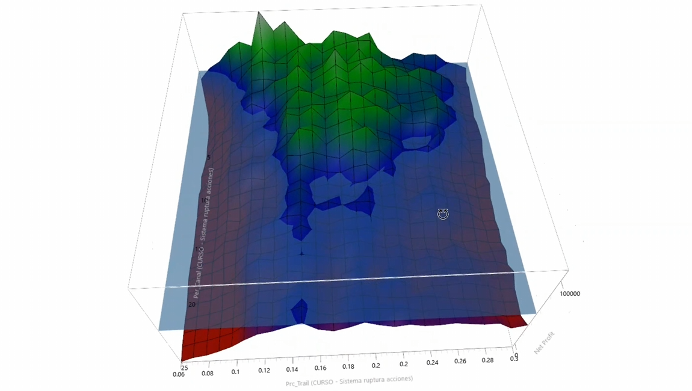
  <figcaption>Figura 076. Mapa 3D out of sample por Net Profit.</figcaption>
</figure>

Fijaros que los vértices, los vértices del `trailing` (Prc_Trail) ya se vuelven más ásperos, los vértices más ásperos. Estamos con el filtro activado pero el filtro activado es parecido:

<figure>
  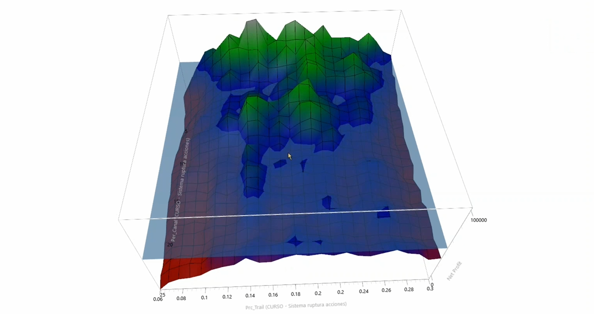
  <figcaption>Figura 077. Comparación con filtro activado en out of sample.</figcaption>
</figure>

Cambia un poco pero es parecido. El `netProfit` cae a medida que se va para hacer el canal:

<figure>
  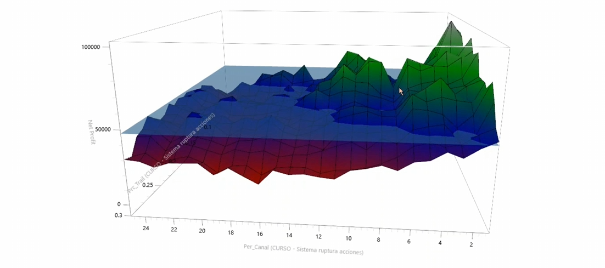
  <figcaption>Figura 078. Degradación del Net Profit con canales largos en out of sample.</figcaption>
</figure>

Aquí es un poco al revés lo que hemos visto antes: que el canal corto rápido — bueno, también porque está afectado por la última parte de mercado, los últimos años — y pues bueno, nos ha interesado ahí ser más rápido.

**Análisis por drawdown en Out of Sample**

Aquí si metemos *drawdown*, vamos a ver el gráfico por `drawdown`:

<figure>
  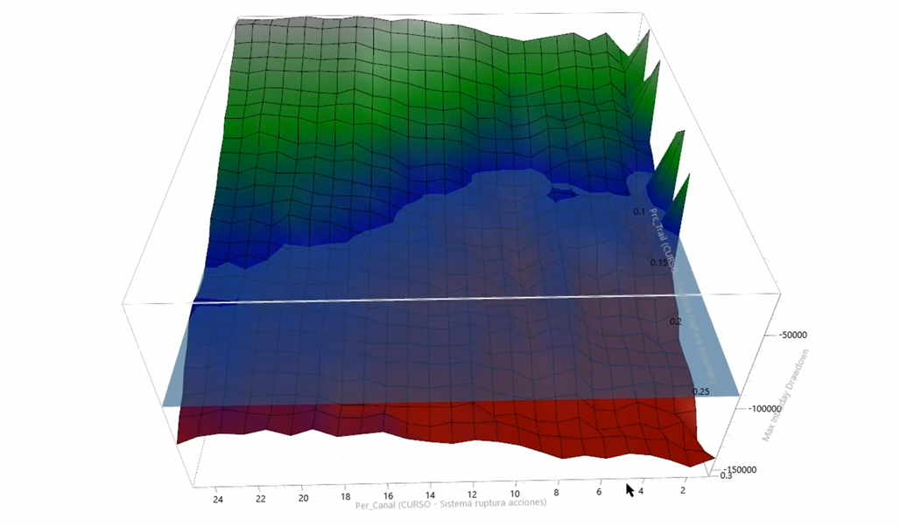
  <figcaption>Figura 079. Mapa out of sample por drawdown.</figcaption>
</figure>

Cómo cambia. Se vuelve absolutamente extraño. Donde quiere el canal, aquí todo lo contrario: es el canal muy elevado, muy elevado, y con un `trailing` muy rápido, ¿de acuerdo?, muy rápido. Eso es lo que quiere para no tener *drawdown*.

<figure>
  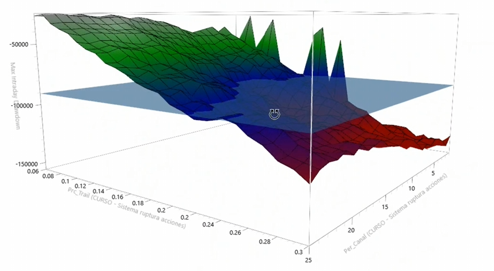
  <figcaption>Figura 080. Zona óptima por drawdown: canal alto + trailing rápido.</figcaption>
</figure>

Lógicamente, a nosotros nos interesa el equilibrio porque solo el *drawdown* por sí solo pues no aporta.

**Sharpe ratio en Out of Sample**

Vamos a ver este *Sharpe ratio* falso que tenemos:

<figure>
  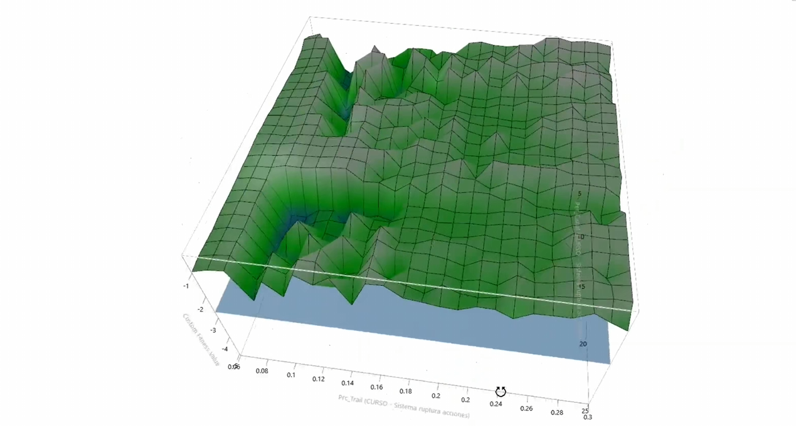
  <figcaption>Figura 081. Mapa out of sample por Sharpe ratio.</figcaption>
</figure>

Mucha estabilidad, muy extraño también, mucha, mucha estabilidad aquí pero más riesgo como veis en el canal corto.

<figure>
  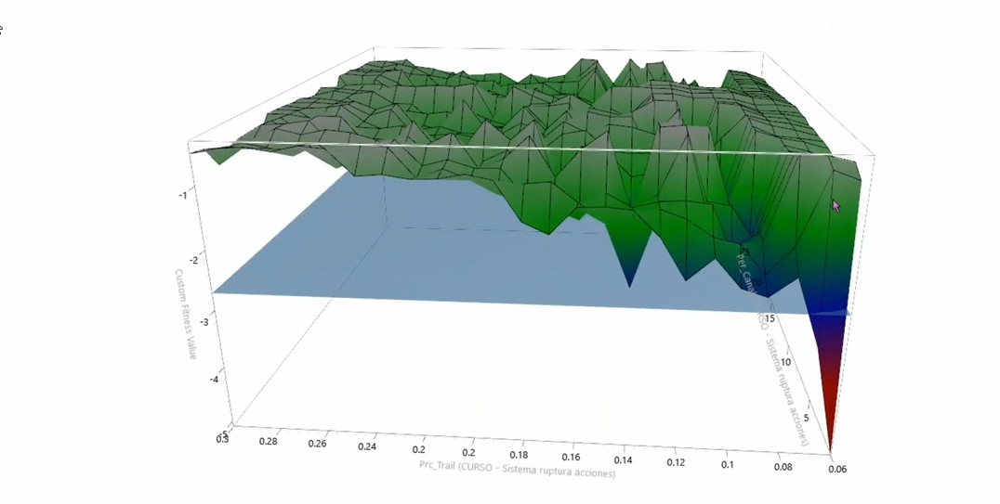
  <figcaption>Figura 082. Detalle de estabilidad con mayor riesgo en canales cortos.</figcaption>
</figure>

Curioso es que línea recta tira aquí con el *trailing* fijo, porque te saca muy rápido: seguramente sale, vuelve a entrar, sale, vuelve a entrar, sale, vuelve a entrar, y hace muchísimas operaciones. Pero bueno, de esa manera pues ha conseguido evitarse seguramente las correcciones.


#### **Análisis `All Data`: la información de ambos periodos**

Pues tenemos en `Per_canal` una sola en el 1 y se va rápidamente ya la zona de 20 del canal, alternando entre 0 y 1, no tiene mucho sesgo ahí. El *trailing* más bien bajito, claro, ser más bien bajito, que un poquito más de rapidez, y con muchísimos *trades*. Vamos a ver el mapa:

<figure>
  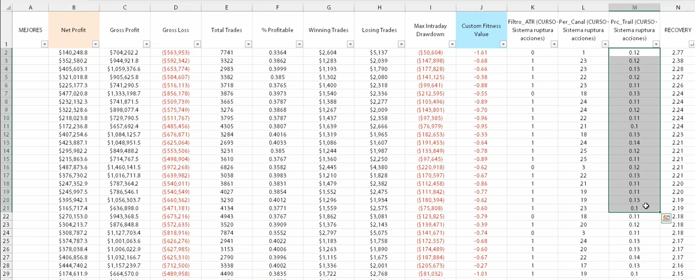
  <figcaption>Figura 083. Resultados all data ordenados por rendimiento.</figcaption>
</figure>

<figure>
  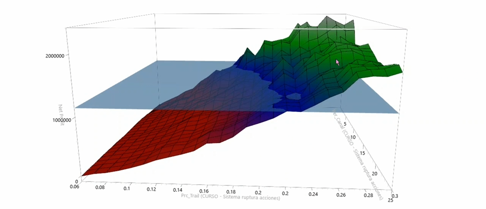
  <figcaption>Figura 084. Mapa 3D all data con filtro ATR=1.</figcaption>
</figure>

Aquí estamos ahora con `1 de filtro`. Pues vemos inicial subida por `net profit`, como pues lógicamente degrada mucho al principio en ese *trailing* tan rápido. 0.20 todavía está justo ahí; parece que 0.25 es mejor *profit*, se ve cómo se estabiliza:

<figure>
  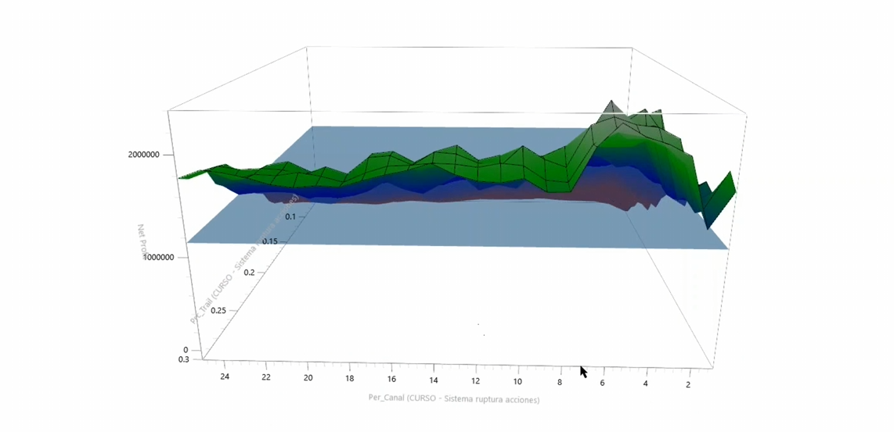
  <figcaption>Figura 085. Estabilización del profit en trailing 0.25.</figcaption>
</figure>

Y aquí sí que aparece el canal ya más bajito:

<figure>
  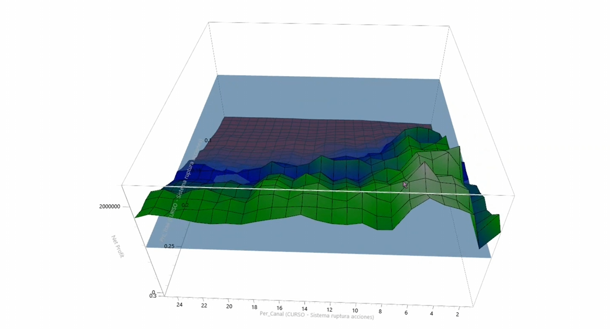
  <figcaption>Figura 086. Perfil del canal en all data.</figcaption>
</figure>

<figure>
  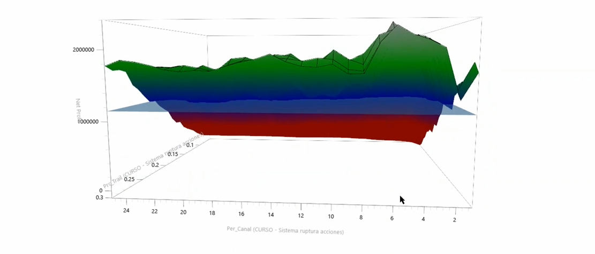
  <figcaption>Figura 087. Vista alternativa del perfil del canal.</figcaption>
</figure>

Es el canal, aparece ahí más bajito, está más bien en 4, 5 y 6, un pico pero baja rápido. Y cuidado: bajar rápido y mirar qué peligro tiene a la derecha el cercano. Parece mejor esta zona de 8, 10, porque la zona de 4 está muy sensible, muy sensible, y además con ese *trailing*:

<figure>
  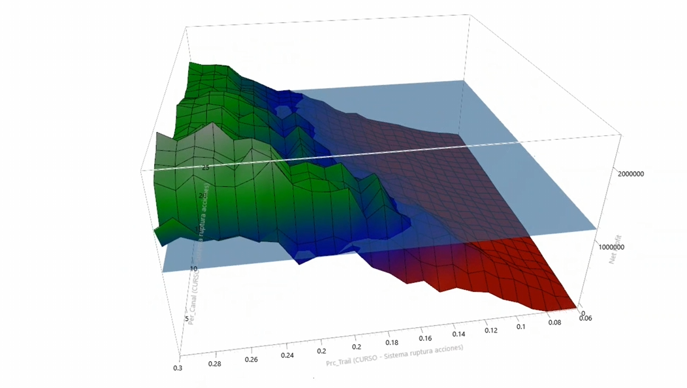
  <figcaption>Figura 088. Zona sensible en canal 4-6 con trailing elevado.</figcaption>
</figure>

Ahí al 0.30, acordaros, ya operando poco.

**Análisis por drawdown**

Si lo vemos en `drawdown`, es al revés:

<figure>
  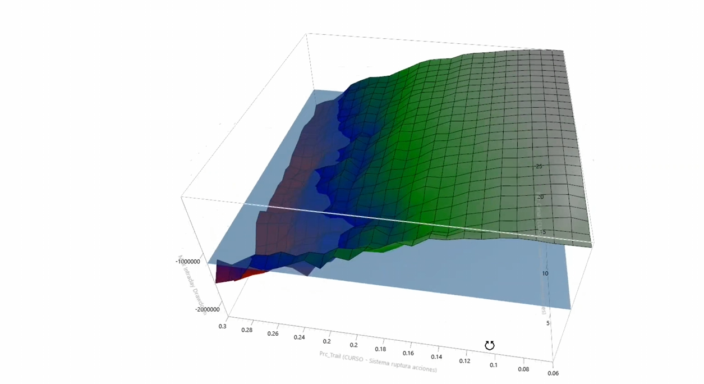
  <figcaption>Figura 089. Mapa all data por drawdown: totalmente inverso al profit.</figcaption>
</figure>

Es totalmente inverso. Llanura planísima y con el *trailing* muy, muy bajo haciendo un montón de operaciones, pero con muy poco retorno como habéis visto antes, tanto en 0 como en 1 de filtro. Entonces pues no equilibra.

**Análisis por Sharpe ratio**

Aquí el único dato que tenemos un poco para ver mixto es el *Sharpe ratio* falso:

<figure>
  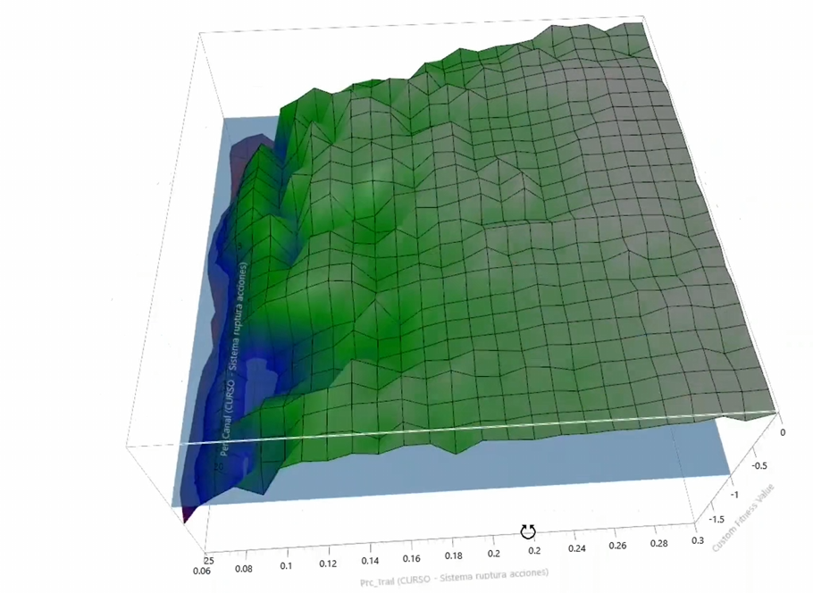
  <figcaption>Figura 090. Mapa all data por Sharpe ratio.</figcaption>
</figure>

Este que tenemos es el único que podemos usar un poco de retorno-riesgo de lo que nos permite a nivel de *portfolio*. A nivel de sistema individual tienen más margen. Y fijaros que aquí pues sí ya vemos que el Donchian da igual casi, que casi da igual qué Donchian cojamos, y que el *trailing* lo queremos elevado:

<figure>
  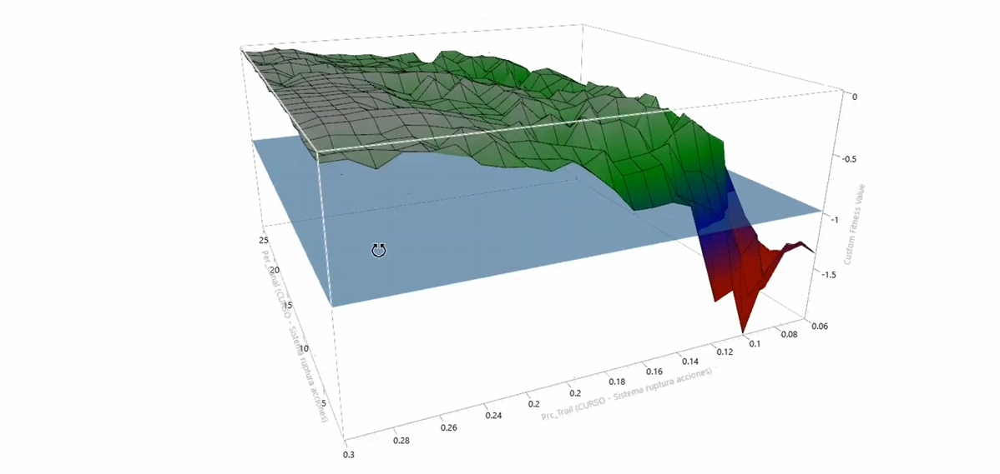
  <figcaption>Figura 091. Estabilidad del canal y preferencia por trailing elevado.</figcaption>
</figure>

Es verdad que aquí sí que el 0.20 parece tener margen, tener tranquilidad, está por aquí. Pero más estable 0.25. Así que viendo estos datos sí que quizá parece mejor el 0.25 que 0.20:

<figure>
  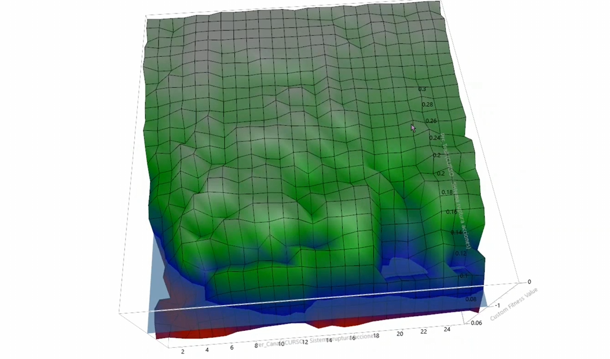
  <figcaption>Figura 092. Comparativa trailing 0.20 vs 0.25.</figcaption>
</figure>

<figure>
  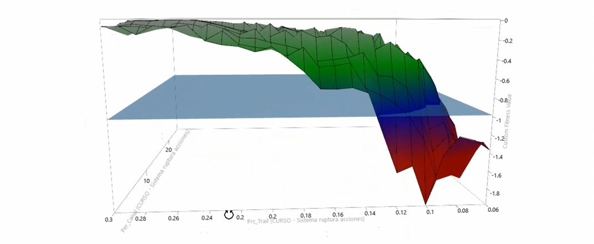
  <figcaption>Figura 093. Detalle de la zona estable en trailing 0.25.</figcaption>
</figure>

#### **Conclusiones de las optimizaciones**

Todo esto es en cuanto a las optimizaciones que ya tenía preparadas.

Al final, un gráfico 3D es una representación de parámetros. Lo hemos visto en la teoría, en Excel, aquí ya lo habéis visto con *MultiCharts*. Ya os lo dije que teníamos viendo todo de distintas fuentes porque lo que importa son los conceptos. No penséis, no queráis aprenderlo todo en un sistema porque vamos a ver muchos. Al final la idea es una zona estable, es la *estabilidad*, sin más, no tiene más que otro criterio.

Aquí, en mi opinión, el procedimiento más correcto era, es decir, 
 1. priemro la optimización 1, 
 2. luego la opti 2 
 3. y la opti 3, que finalmente decidimos no aplicar el filtro. 
 4. Os he querido hacer esta última 4 para que la vierais toda junta, pero es mejor práctica hacerlo de la otra manera, es mejor práctica hacerla.

<div style="border-left: 4px solid #4caf50; background: #e8f5e9; padding: 10px 15px; margin: 10px 0; border-radius: 8px;">
  <strong>📏 Mejor práctica en optimización</strong><br><br>
  Es preferible optimizar los parámetros <em>uno a uno</em> (primero el canal para la entrada, luego el trailing para la salida) que hacer una optimización conjunta de todas las variables. El enfoque secuencial permite entender mejor la sensibilidad de cada parámetro de forma aislada y reduce el riesgo de <em>overfitting</em>.
</div>

No nos quedemos ahora con elegir el gráfico 3D exacto, aparte que ahora voy a ir a *MultiCharts*, vamos a coger más información. En el mapa hay veces que nos servirá muy bien para elegir y hay veces que nos servirá poco para elegir la zona, pero sí para ver por dónde van los tiros. Y luego yo, como ya os he dicho, puedo acabar eligiendo en el Excel — Excel o *MultiCharts* — en otra herramienta. Me puede servir un poco para ver la zona; elegir el valor exacto a veces no me resultará evidente, hay veces que sí.

El mapa es una excelente herramienta de sensibilidad de parámetros, para ver por dónde van los tiros, pero no es sota, caballo y rey. La elección final, acordaros cuando vimos las clases en la teoría que teníamos un Excel que hacíamos trabajando en *in sample*, el *out of sample*, el *all data*, por un equilibrio de datos y demás.

Esto ***al final nosotros lo acabaríamos de afinar en *Maestro****. ¿Por qué? Porque a mí la información que me da *MultiCharts* es fantástico porque va muy rápido optimizando, es fantástico porque tiene los mapas, pero los datos que me da del *portfolio* son pocos. Entonces, como eso *Maestro* me da más, pues por eso acabo en *Maestro*.

### Análisis de Backtests en Maestro

Vamos a hacer un par o tres de *portfolios* rápidamente con esta información que teníamos. A ver dónde tengo el Excel. Por un lado tengo este y por otro lado tengo el Excel. 

Hemos hecho 4 fichas de optis:

<figure> 
<div style="display: grid; grid-template-columns: 1fr 1fr; gap: 10px; text-align: center"> 
<div> 
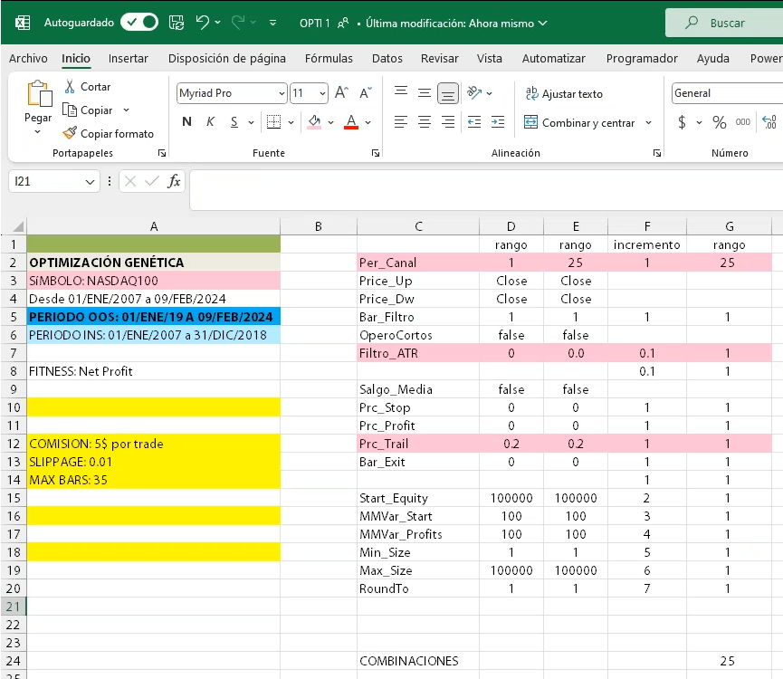 <p><strong>Opti 1</strong> </p> </div> <div> 
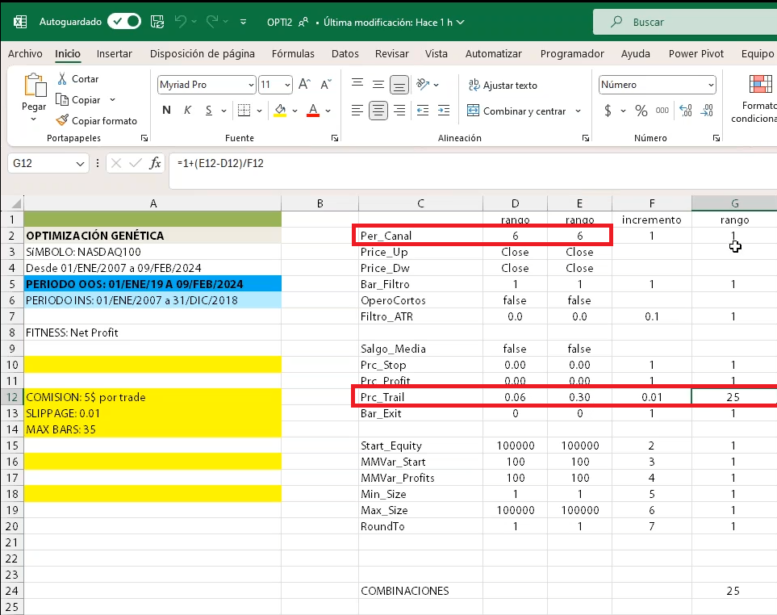 <p><strong>Opti 2</strong> </p> </div> <div> 
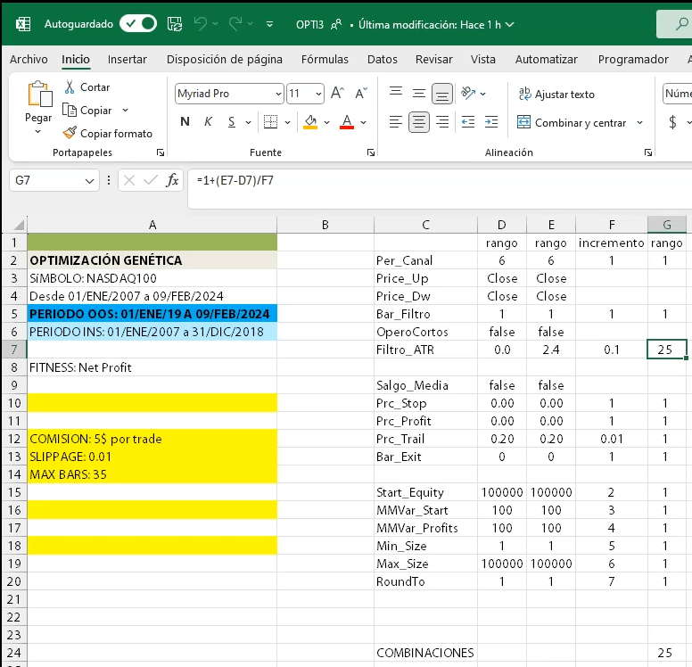 <p><strong>Opti 3</strong> </p> </div> <div> 
 <p><strong>Opti 4</strong> </p> </div> </div>
<figcaption>Figura XXX. Fichas de configuración técnica para las 4 fases de optimización del sistema Donchian.</figcaption> 
</figure>

| Optimización | Per_Canal | Filtro_ATR | Prc_Trail | Combinaciones | Descripción |
|--------------|-----------|------------|-----------|---------------|-------------|
| Opti 1 | 1-25 | 0 (fijo) | 0.20 (fijo) | 25 | Evalúa solo el canal. Salida y filtro bloqueados para aislar el efecto del periodo del canal. |
| Opti 2 | 6 (fijo) | 0 (fijo) | 0.06-0.30 | 25 | Evalúa solo el trailing. Canal bloqueado en 6 (elegido en Opti 1) para aislar el efecto de la salida. |
| Opti 3 | 6 (fijo) | 0.0-2.4 | 0.20 (fijo) | 25 | Evalúa solo el filtro ATR. Canal y trailing bloqueados para aislar el efecto del filtro de volatilidad. |
| Opti 4 | 1-25 | 0-1 | 0.06-0.30 | 1,250 | Optimización conjunta de las 3 variables para generar mapas 3D y visualizar interacciones entre parámetros. |

<div style="border-left: 4px solid #4caf50; background: #e8f5e9; padding: 10px 15px; margin: 10px 0; border-radius: 8px;">
  <strong>📏 Metodología de optimización secuencial</strong><br><br>
  El procedimiento recomendado es optimizar <em>una variable a la vez</em> (Opti 1 → Opti 2 → Opti 3), bloqueando las demás en valores fijos. Esto permite entender la sensibilidad de cada parámetro de forma aislada y reduce el riesgo de <em>overfitting</em>. La Opti 4 (conjunta) se usa principalmente para visualizar mapas 3D y confirmar zonas de estabilidad, pero no es la mejor práctica para selección de parámetros.
</div>


**Miremos que hay cargado en Maestro**

<figure>
  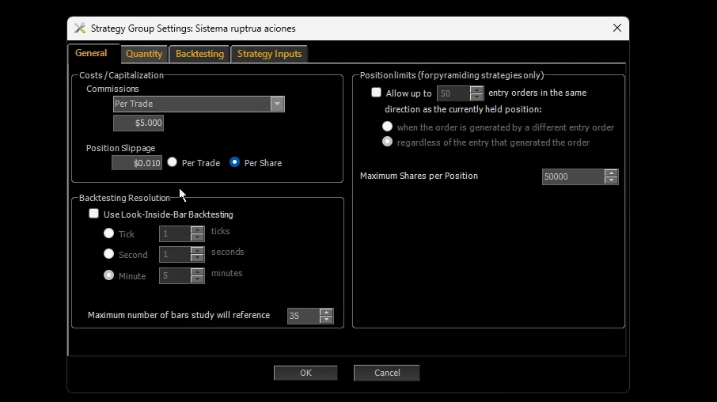
  <figcaption>Figura 097. Parámetros del canal Donchian.</figcaption>
</figure>

<figure>
  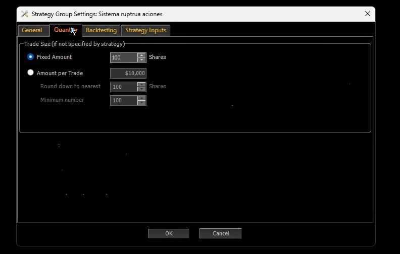
  <figcaption>Figura 098. Configuración del trailing stop.</figcaption>
</figure>

<figure>
  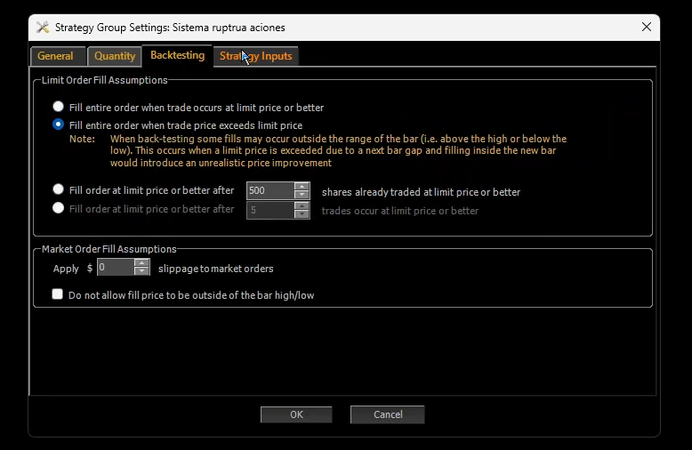
  <figcaption>Figura 099. Configuración del filtro ATR.</figcaption>
</figure>

<figure>
  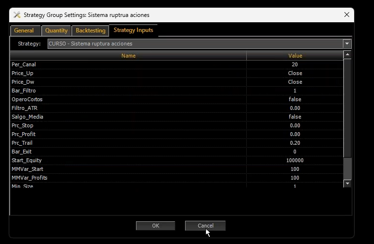
  <figcaption>Figura 100. Gestión monetaria.</figcaption>
</figure>

<figure>
  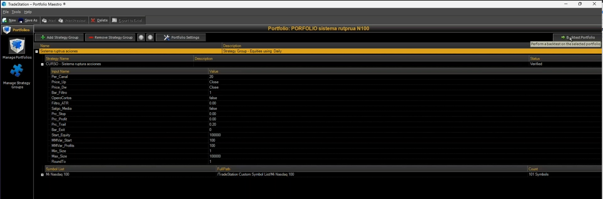
  <figcaption>Figura 101. Configuración de comisiones y slippage.</figcaption>
</figure>


### **Backtest 6-0-0.2** 


La transición desde la **exploración visual (mapas 3D)** hasta la **ejecución técnica final**. Se utiliza los mapas de optimización no para buscar "el punto más alto", sino para encontrar la "pista de aterrizaje" más segura. Este backtest es la **validación real** de lo que se ha observado en la Opti 1 y Opti 4. El instructor ha decidido "bloquear" estos valores basándose en el **Principio del buen vecino**.

<div style="border-left: 4px solid #4caf50; background: #e8f5e9; padding: 10px 15px; margin: 10px 0; border-radius: 8px;">
<strong>📏 Principio del "buen vecino"</strong>

En un mapa de optimización, un parámetro robusto debe tener <em>buenos vecinos</em>: los valores adyacentes también deben funcionar bien. Un pico aislado es señal de <em>overfitting</em>; el área entre el canal 6 y 15 con trailing 0.20-0.25 muestra una meseta plana y estable.
</div>

**Configuración bloqueada en Maestro:**

* **`Per_Canal 6` Entrada:**: Elegido por ser el inicio de la zona estable. Aunque canales más cortos (4-5) degradan rápido, el 6 ofrece un equilibrio entre rapidez y seguridad.
* **`Prc_Trail 0.20` Salida:**: El instructor nota que 0.25 podría ser "más cómodo" visualmente en el mapa 3D, pero mantiene el 0.20 para evaluar el sistema con un margen de seguridad razonable antes de que la rentabilidad degrade.
* **`Filtro_ATR 0` Filtro ATR:**: Se desactiva porque, al comparar los mapas con filtro 1 (activado) vs 0 (desactivado), la llanura de beneficios es más extensa y robusta sin el filtro.
- **`MMVar_Start 2` Money Management:** por operación. Esto, sumado al **trailing del 20%**, define un sistema que "deja correr los beneficios" (filosofía tendencial) pero corta las pérdidas de forma dinámica según el retroceso del precio desde máximos.

Es un sistema puramente tendencial que deja correr los beneficios hasta que el precio retrocede un 20% desde su máximo. Para evaluar este backtest de 20 años, utilizaremos el factor de recuperación:


<figure>
  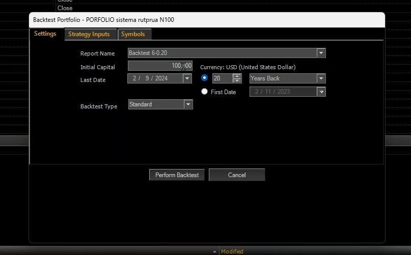
  <figcaption>Figura 102. Backtest 20 años.</figcaption>
</figure>

<figure>
  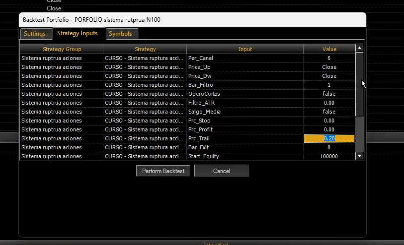
  <figcaption>Figura 103.</figcaption>
</figure>

<figure>
  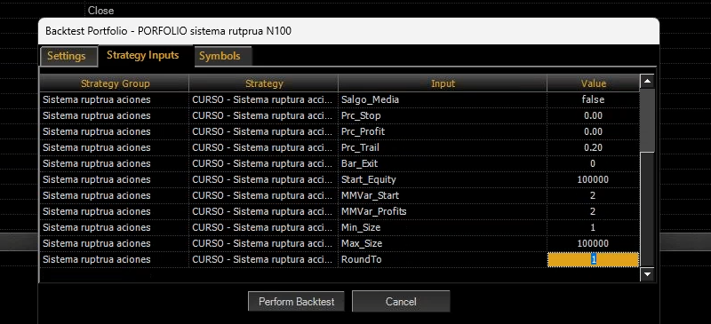
  <figcaption>Figura 104.</figcaption>
</figure>


| Categoría | Input | Valor | Función |
|-----------|-------|-------|---------|
| **Entrada** | `Per_Canal` | 6 | Periodo del canal Donchian. Calcula el máximo de los últimos 6 cierres. |
| **Entrada** | `Price_Up` | Close | Campo de precio para calcular el canal superior (cierre, no máximo). |
| **Entrada** | `Price_Dw` | Close | Campo de precio para calcular el canal inferior (para cortos). |
| **Entrada** | `Bar_Filtro` | 1 | Barras mínimas de espera entre salida y nueva entrada. Evita reentradas inmediatas. |
| **Entrada** | `OperoCortos` | false | Desactivado: el sistema solo opera en largo. |
| **Entrada** | `Filtro_ATR` | 0.00 | Desactivado (=0). Si fuera >0, solo entraría cuando TrueRange < ATR×Filtro_ATR. |
| **Salida** | `Salgo_Media` | false | Desactivada la salida por cruce de media central. |
| **Salida** | `Prc_Stop` | 0.00 | Sin stop loss fijo (desactivado). |
| **Salida** | `Prc_Profit` | 0.00 | Sin take profit fijo (desactivado). |
| **Salida** | `Prc_Trail` | 0.20 | **Trailing stop al 20%** desde el máximo alcanzado. Única salida activa. |
| **Salida** | `Bar_Exit` | 0 | Sin salida por tiempo (desactivada). |
| **Money Mgmt** | `Start_Equity` | 100000 | Capital inicial: $100,000 |
| **Money Mgmt** | `MMVar_Start` | 2 | Invierte el 2% del capital inicial por acción |
| **Money Mgmt** | `MMVar_Profits` | 2 | Reinvierte el 2% de los beneficios acumulados |
| **Money Mgmt** | `Min_Size` | 1 | Mínimo 1 acción por operación |
| **Money Mgmt** | `Max_Size` | 100000 | Máximo 100,000 acciones (sin límite práctico) |
| **Money Mgmt** | `RoundTo` | 1 | Redondea a 1 acción (sin lotes) |


Y eso sí, nos va a tardar un poco, nos va a tardar un poquito. Ese problema que tiene *Maestro* es que esto la verdad que es un problema. Realmente potente pero que técnicamente se ha quedado muy atrás y a nivel de procesamiento de información es súper lento. Otro día también trataremos de enseñaros algo con *Quant Analyzer* que es un poquito más rápido.


<figure>
  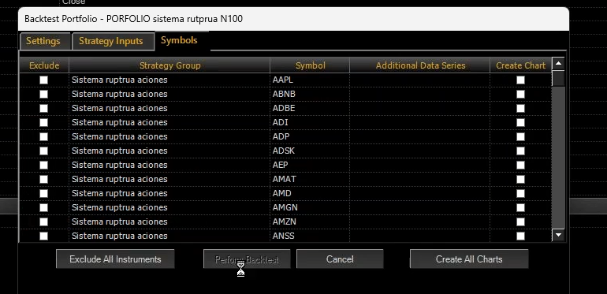
  <figcaption>Figura 105. Resultados preliminares.</figcaption>
</figure>


**Análisis de exposición**

Bien, lo bueno que tenemos aquí es que podemos mirar mucho más. Por ejemplo, la exposición que hemos ido teniendo:   
150 en algún momento, pero algo tengo en el *money management* mal. 

<figure>
  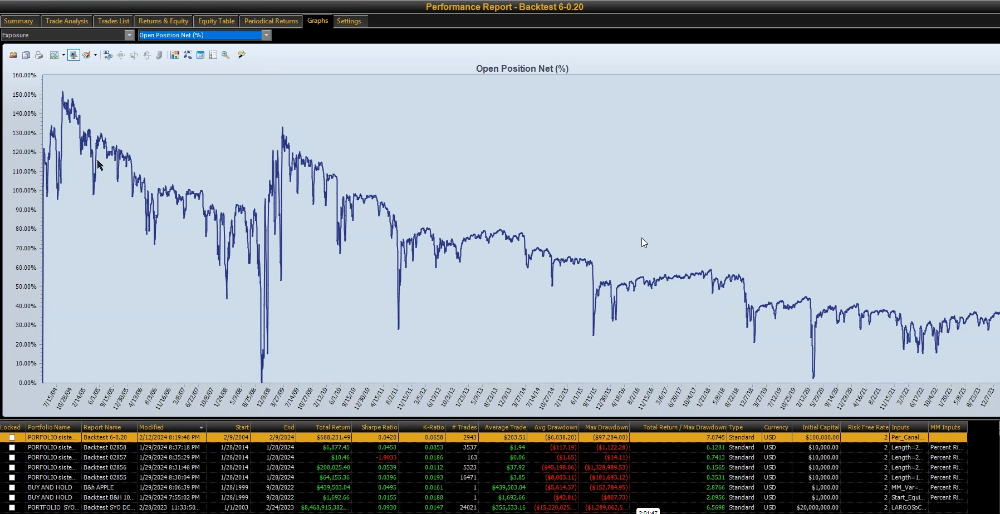
  <figcaption>Figura 106. Exposición del portfolio a lo largo del tiempo.</figcaption>
</figure>

Aquí tienes el análisis organizado dentro de un bloque visual para tu notebook:

<div style="border-left: 4px solid #e74c3c; background: #fdf2f2; padding: 15px; margin: 20px 0; border-radius: 8px;">
<h3 style="color: #c0392b; margin-top: 0;">📉 El Problema: Exposición Degradada (Figura 106)</h3>
<p>Al observar la <strong>Figura 106</strong>, el instructor detecta que "algo está mal" en el <em>Money Management</em>.</p>

<ul style="margin-bottom: 0;">
<li><strong>Anomalía visual:</strong> En lugar de que la exposición crezca o se mantenga estable a medida que el sistema gana dinero, la gráfica muestra una tendencia descendente muy marcada a partir de 2008.</li>
<li><strong>Baja utilización del capital:</strong> Hacia el final del periodo (2020-2023), la exposición cae por debajo del 40%, lo que significa que el sistema está operando con una fracción mínima de su capital disponible.</li>
<li><strong>Causa técnica:</strong> Esto suele ocurrir cuando el tamaño de la posición es fijo (siempre invierte la misma cantidad de dinero inicial) mientras que la cuenta crece, o cuando hay un error en la fórmula de reinversión de beneficios en el software. El sistema se vuelve "demasiado pequeño" para el tamaño de la cuenta.</li>
</ul>
</div>


Voy a usar el de *Maestro* que por *fixed fractional* que para acciones va muy bien:

<figure>
  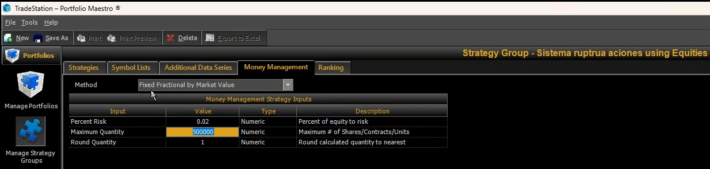
  <figcaption>Figura 219. Configuración fixed fractional en Maestro.</figcaption>
</figure>


<figure>
  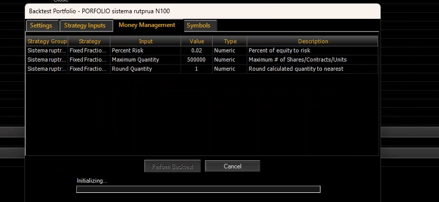
  <figcaption>Figura 112. Resumen de configuración.</figcaption>
</figure>

Todo lo demás lo he dejado igual, es la cartera 6, 0.20, 0, que es la que habíamos elegido inicialmente para ir avanzando en las validaciones, pero que la verdad que no tengo claro que sea la mejor. Ahora lo veremos combinado con los mapas.

Ahora está mucho más expuesto, ahora ha ido creciendo un poco, y bueno hemos ido a 1 y medio hasta dos veces de exposición:

<figure>
  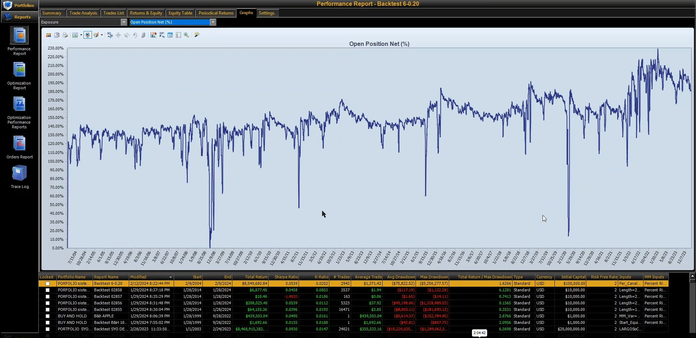
  <figcaption>Figura 113. Evolución de la exposición con nueva configuración.</figcaption>
</figure>

<div style="border-left: 4px solid #388f34ff; background: #f0fdf1ff; padding: 15px; margin: 20px 0; border-radius: 8px;">
<h3 style="color: #10540dff; margin-top: 0;">✅ La Solución: Exposición Correcta y Creciente (Figura 113)</h3>
<p>Tras corregir la configuración en <strong>Maestro</strong> utilizando el modelo de <em>Fixed Fractional</em>, los resultados reflejan el comportamiento esperado de un sistema tendencial robusto.</p>

<ul style="margin-bottom: 0;">
<li><strong>Ajuste Técnico:</strong> Se configuró un <strong>MMVar_Start de 2</strong>, lo que obliga al sistema a invertir siempre el 2% del capital disponible por cada acción.</li>
<li><strong>Crecimiento Orgánico:</strong> A diferencia de la degradación anterior, la exposición ahora tiene una pendiente alcista, lo que demuestra que el sistema reinvierte los beneficios de forma efectiva.</li>
<li><strong>Uso Eficiente del Margen:</strong> El sistema alcanza niveles de exposición de entre <strong>1.5 y 2 veces</strong> el capital (150% - 200%), aprovechando la diversificación para maximizar el retorno sin comprometer la cuenta.</li>
<li><strong>Impacto en Resultados:</strong> Este cambio permitió que el <em>Total Return</em> saltara de los ~$688k iniciales a una cifra superior a los <strong>$8.5 millones</strong> en el mismo periodo.</li>
</ul>
</div>

<figure>
  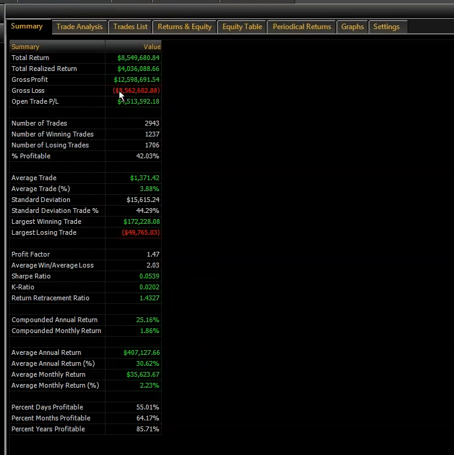
  <figcaption>Figura 114. Detalle de exposición máxima.</figcaption>
</figure>

**Correlaciones entre acciones**

Aquí una de las cosas interesantes que podemos ver es la seleccion de todas las acciones en conjunto:

<figure>
  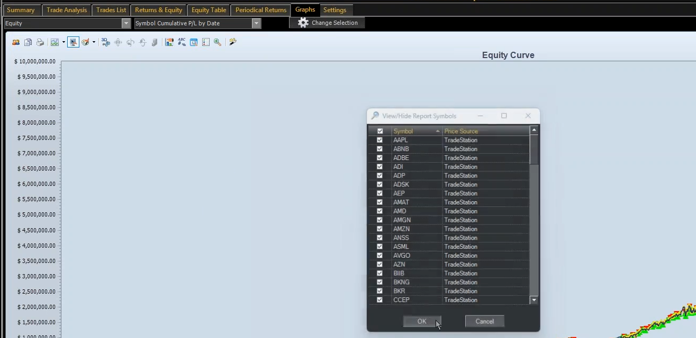
  <figcaption>Figura 115. Matriz de correlaciones entre acciones del portfolio.</figcaption>
</figure>

<figure>
  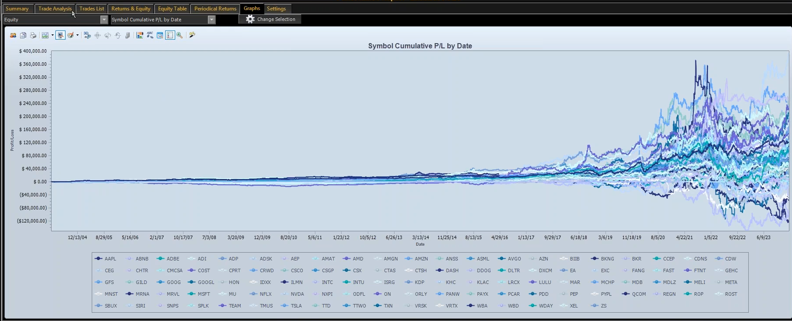
  <figcaption>Figura 116. Detalle de correlaciones.</figcaption>
</figure>

<figure>
  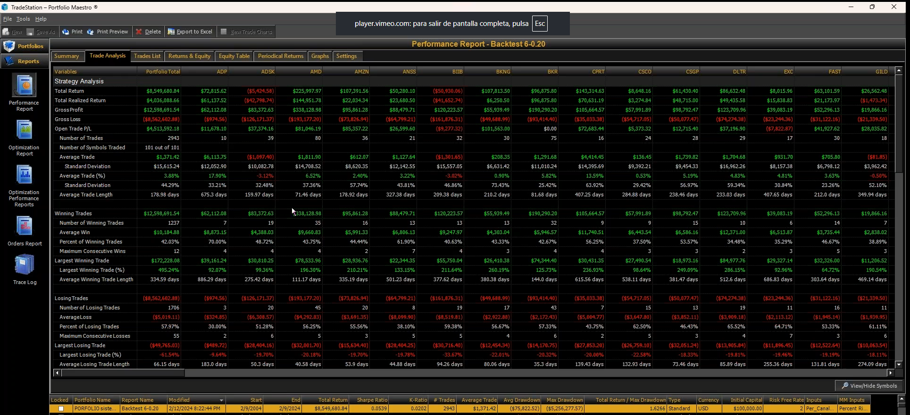
  <figcaption>Figura 221</figcaption>
</figure>

<figure>
  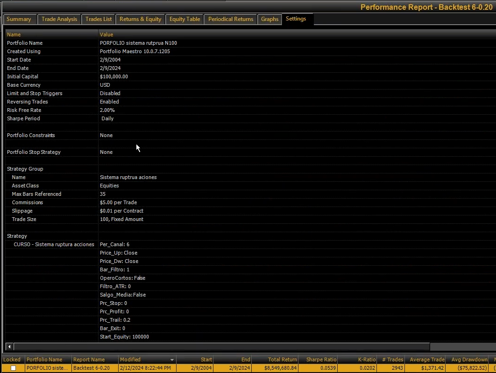
  <figcaption>Figura 222</figcaption>
</figure>

Aquí si miras por este *chart* que tenemos, si la miramos 6, 20, sería más o menos por aquí:

<figure>
  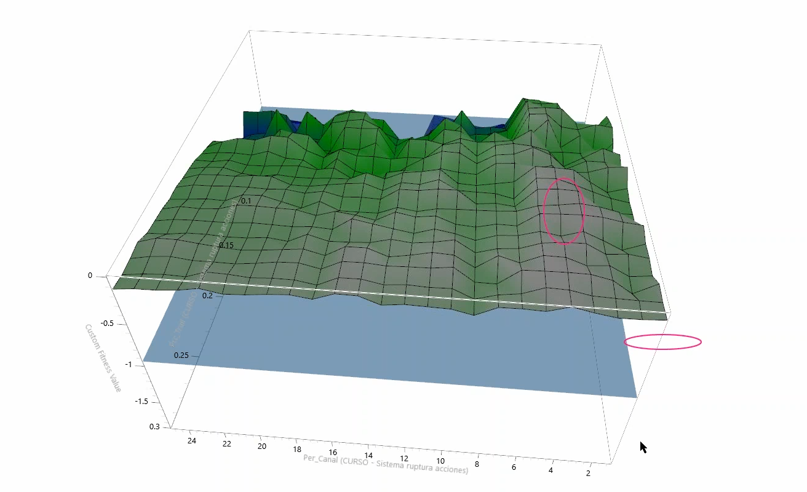
  <figcaption>Figura 118. Ubicación del set 6-0.20 en el mapa de optimización.</figcaption>
</figure>

<figure>
  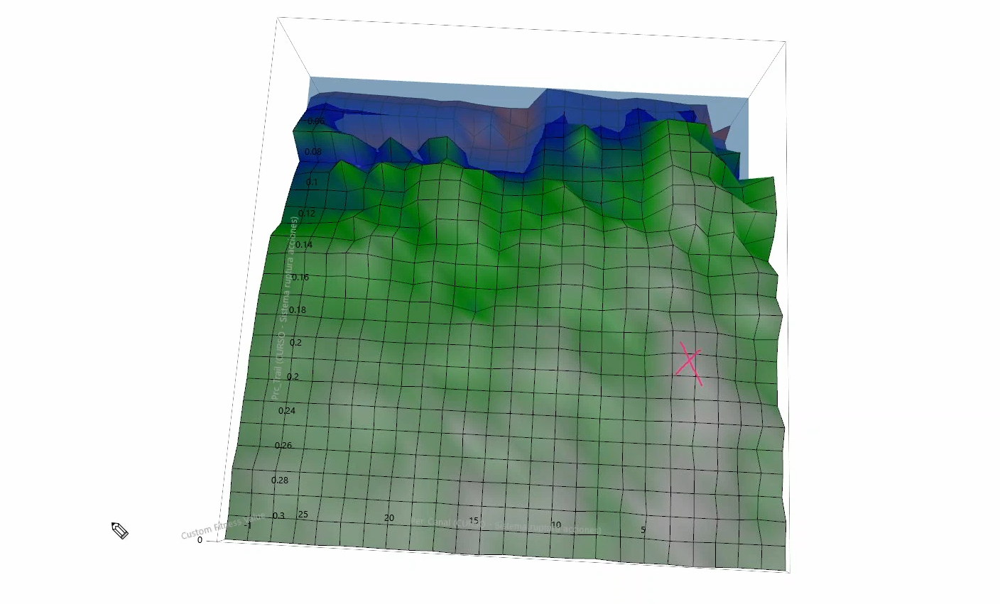
  <figcaption>Figura 119. Detalle de la zona seleccionada.</figcaption>
</figure>


Es más o menos, más o menos esta tenemos. Pero si miramos el Excel puramente por datos, por *recovery*, realmente le gusta mucho más aquí. Pero ahí vemos que tanto por `Sharpe ratio` como por `retorno` degrada muy rápido. ¿Quién gana ahí? Y el `drawdown`. Lo que pasa que el *drawdown*, en la teoría lo hablamos bastante: todos los ratios que tienen el *drawdown* en el denominador, al final el que dirige el ratio es el *drawdown*, porque como hace de divisor, tira muchísimo del ratio para él, y acaba viéndose muy afectado. El **TSI** lo trata de corregir añadiendo los *winners* al numerador, que eso hace que los sistemas que aciertan más, pues suban un poco en el ratio.

<div style="border-left: 4px solid #9c27b0; background: #f3e5f5; padding: 10px 15px; margin: 10px 0; border-radius: 8px;">
  <strong>📊 TSI (TradeStation Index)</strong><br><br>
  El TSI es un ratio propietario de <em>TradeStation</em> que combina el <em>recovery factor</em> (net profit / drawdown) con el porcentaje de operaciones ganadoras. Al añadir los <em>winners</em> al numerador, intenta corregir el sesgo que tiene el <em>drawdown</em> como denominador, favoreciendo sistemas con mayor tasa de acierto.
</div>

Para el próximo día me gustaría ver en esta cartera qué nos da *`Sortino`* para todo el rato, porque ahí es verdad que es donde realmente tenemos un buen equilibrio. Vamos a ver si para el próximo día, casi con total seguridad que lo tendremos, porque hemos visto el problema que tiene el que tienen ellos preinstalado y lo vamos a corregir y trataremos de traerlo.

Pero con esa información realmente en este mapa, para eso decía que no siempre vas a poder elegir, es complicado elegir porque realmente casi da igual — bueno, casi da igual me refiero en toda esta zona planicie:

<figure>
  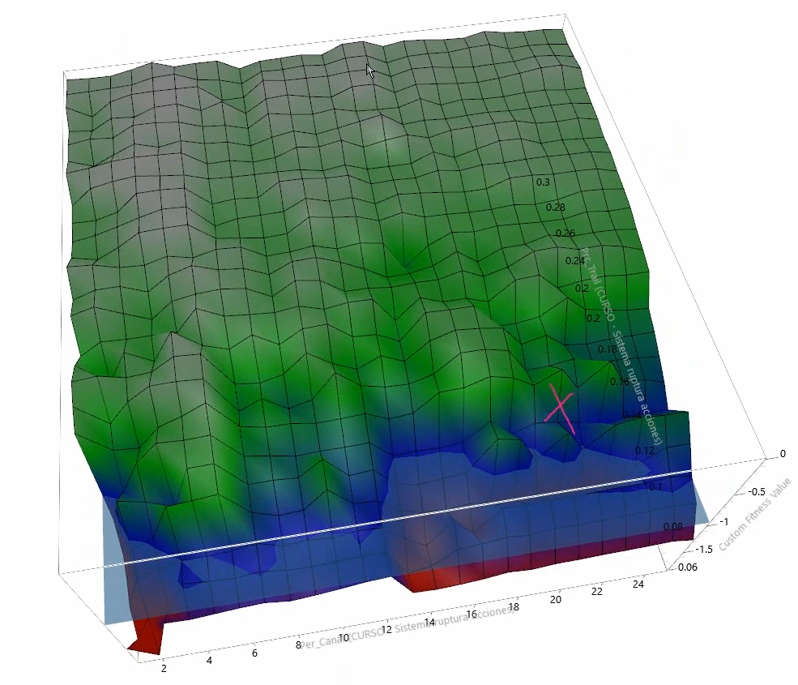
  <figcaption>Figura 120. Per_Canal vs CustomFitnessValue: zona de indiferencia.</figcaption>
</figure>

**Cambio chart al de net profit**

Si luego ya te fijas, el retorno **`net_profit`** es donde ya te vas para arriba. 


Decíamos que interesaba más el *trailing*, el porcentaje de *trailing* más a 0.25, porque en el 0.20 incluso estaba justo. Pero bueno, el 0.20 al final acaba, ha sido un poco un equilibrio entre lo que quieren los ratios de *drawdown*, lo que quieren los ratios de retorno-riesgo — porque al tener el *drawdown* en el denominador tira mucho de él — y el *profit*. El *profit* quiere uno muy elevado.

<figure>
  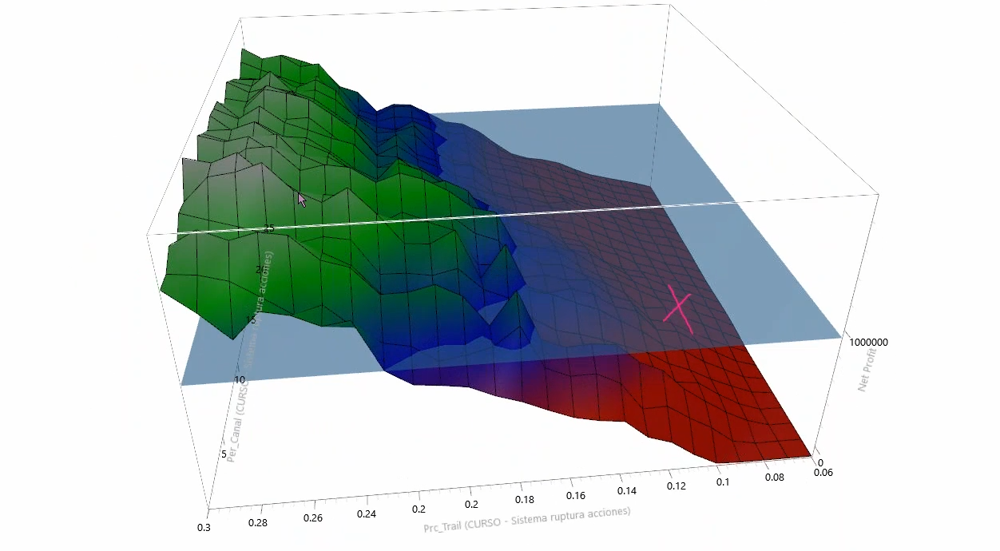
  <figcaption>Figura 121. Preferencia del profit por trailing elevado.</figcaption>
</figure>

**Ordenación por diferentes métricas**

<figure>
  
  <figcaption>Figura 226. Señalando los mejores por factor</figcaption>
</figure>


**`net_profit`**  

Si ordenamos solo por *profit*, fijaros:

<figure>
  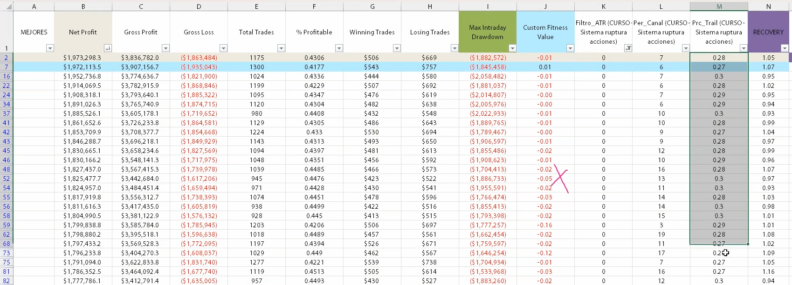
  <figcaption>Figura 122. Ordenación por Net Profit: trailing 0.27-0.30 dominante.</figcaption>
</figure>

Un poco más grande. Todo el rato 0.28, 0.27, 0.30. He bloqueado que no haya filtro.

**`drawdown`** 

Si en cambio ordeno por *drawdown*, lo contrario: 0.7, 0.8, 0.7, 0.6, lo más bajo:

<figure>
  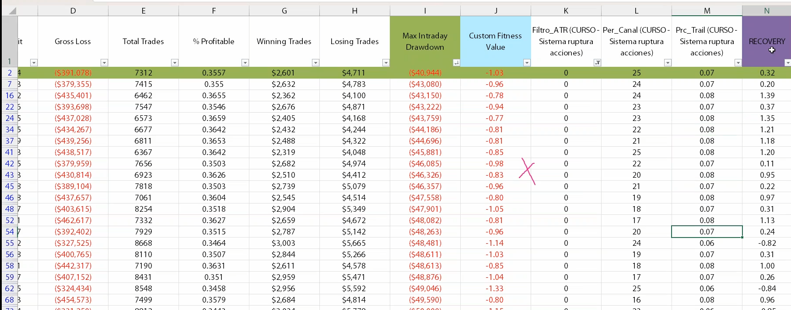
  <figcaption>Figura 123. Ordenación por Drawdown: trailing muy bajo dominante.</figcaption>
</figure>

**`recovery`** 

Si ordenamos por *recovery*, busca el término medio pero el *drawdown* tira mucho:

<figure>
  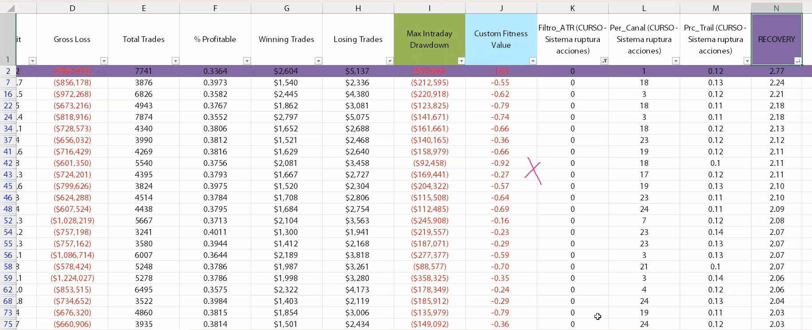
  <figcaption>Figura 124. Ordenación por Recovery: sesgo hacia drawdown bajo.</figcaption>
</figure>

**`Sharpe ratio`**

Por eso al final este *Sharpe ratio* (J), aunque es un poco como os he dicho antes falso, ahí cambia. Es verdad que también da los saltos por retorno, pero hay poca diferencia. Esos valores están todo el rato alrededor del 0:

<figure>
  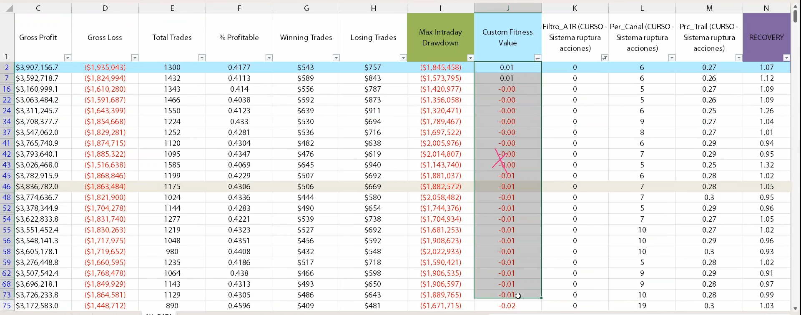
  <figcaption>Figura 125. Sharpe ratio: muy poca variación entre sets.</figcaption>
</figure>

Todos estos es lo mismo, es prácticamente lo mismo. Todo esto hay muy, muy poca variación, en el dato de 6 y 10 pero también bastante elevado el *trail*. Pero ya digo, con muy poca variación, pues al final nos hemos quedado con un compromiso.

**Comparación de portfolios con diferentes configuraciones :**

Vamos a ver, vamos a hacer rápidamente porque es un buen ejercicio. Hemos hecho este del 6, 20 y ahora vamos a ver todos estos. 

### **Backtest 6-1-0.27** - Portfolio con mejor retorno `Net Profit`

Vamos a ver por ejemplo el que mejor retorno da, es el canal primero y ordeno por `net_profit`:

<figure>
  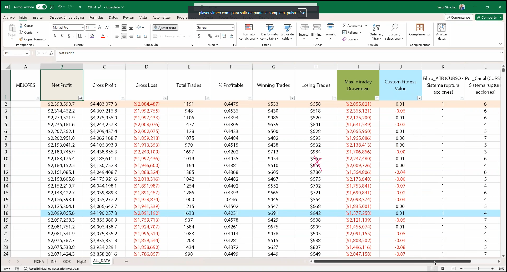
  <figcaption>Figura 225. Optimizacion 4</figcaption>
</figure>

<figure>
  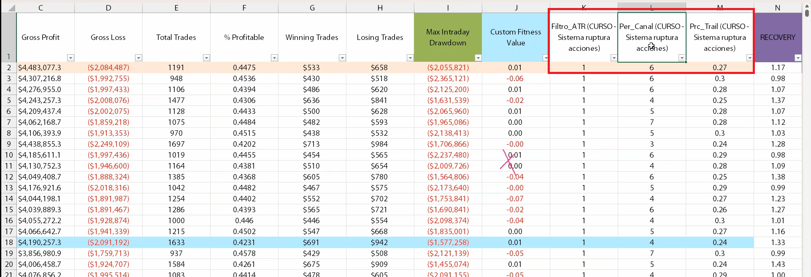
  <figcaption>Figura 126. Set con mejor retorno: canal 6, trailing 0.27, filtro 1.</figcaption>
</figure>

Sería `6, 0.27, 1`. Lo voy a poner, que es bastante parecido al que voy a dejar.   
La gestión monetaria igual para no tocar nada:

<figure>
  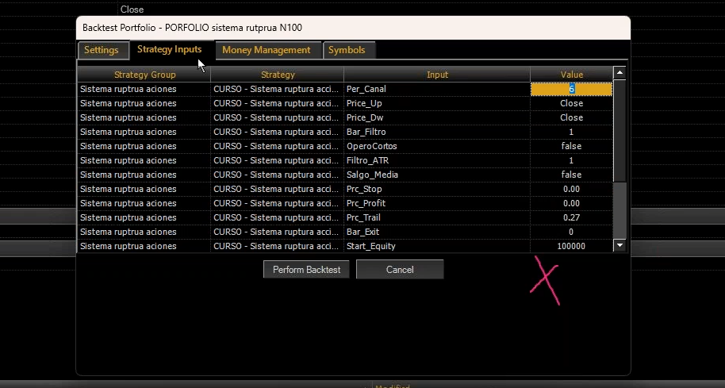
  <figcaption>Figura 127. Configuración del portfolio 6-0.27-1.</figcaption>
</figure>

<figure>
  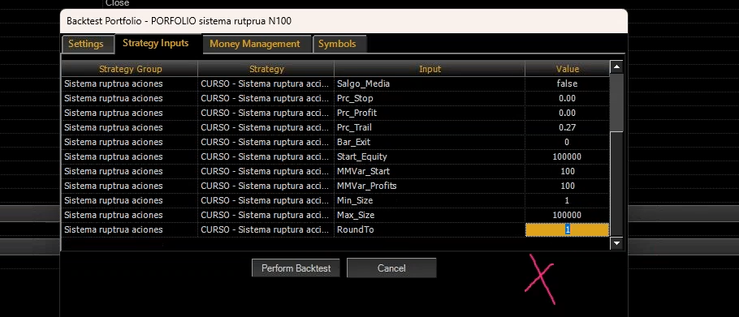
  <figcaption>Figura 129. Parámetros detallados.</figcaption>
</figure>

<figure>
  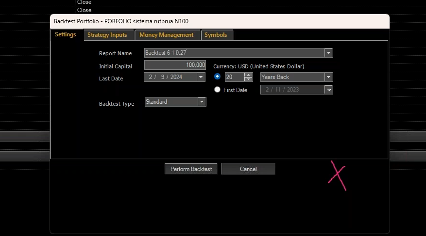
  <figcaption>Figura 128. Ejecución del backtest.</figcaption>
</figure>

<figure>
  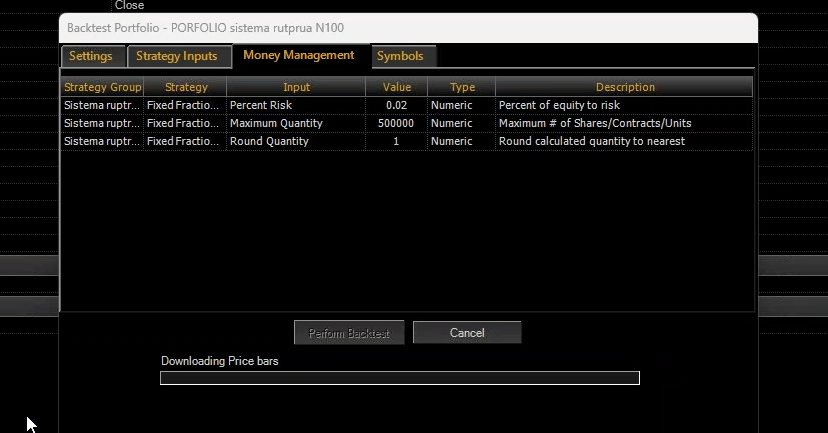
  <figcaption>Figura 130. Resultados del portfolio 6-0.27-1.</figcaption>
</figure>

Dejamos toda la gestión monetaria como hemos hecho el otro para poderlos comparar.

### **Backtest 6-1-0.27** - Portfolio con menor `drawdown`


El que menor *drawdown* obtiene (sort Excel por *drawdown*) que es muy raro ya os lo digo. Sería por `canal 25`, ahora viene el `filtro 1` y luego el `trailing 0.07`:

<figure>
  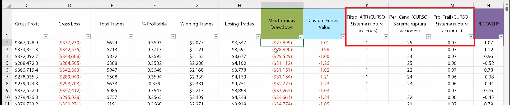
  <figcaption>Figura 131. Set con menor drawdown: canal 25, filtro 1, trailing 0.07.</figcaption>
</figure>

<figure>
  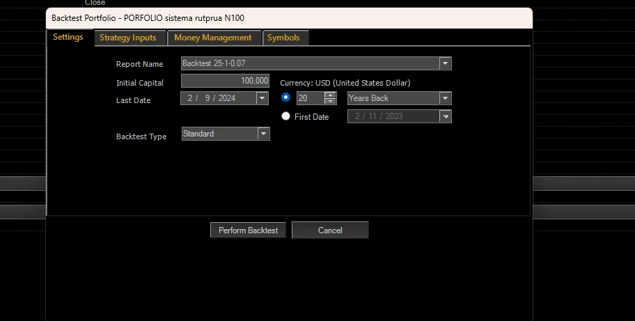
  <figcaption>Figura 133. Configuración del portfolio 25-1-0.07.</figcaption>
</figure>

<figure>
  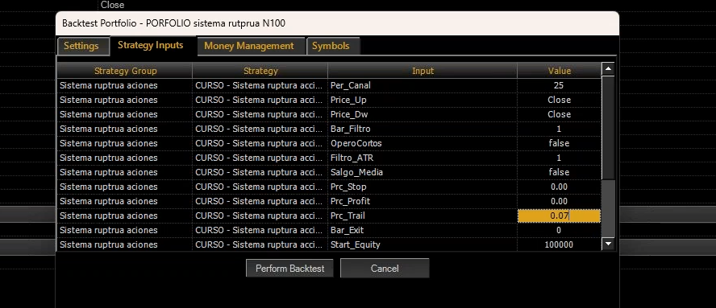
  <figcaption>Figura 134. Parámetros detallados.</figcaption>
</figure>

<figure>
  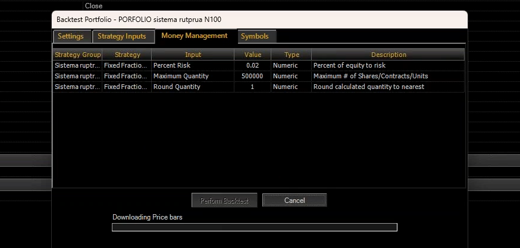
  <figcaption>Figura 135. Resultados del portfolio 25-1-0.07.</figcaption>
</figure>


### **Backtest 4-1-0.24** - Portfolio con mejor `Sharpe ratio`

El que mejor *Sharpe ratio* tiene, que es `4`, `1`, `0.24`:

<figure>
  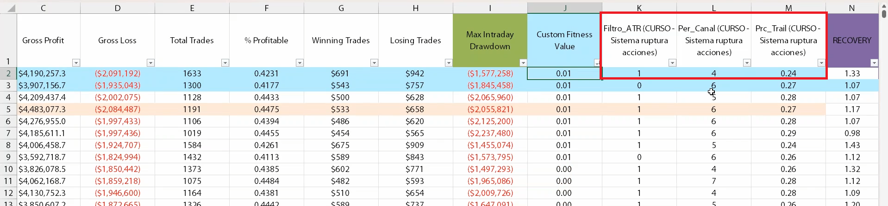
  <figcaption>Figura 132. Set con mejor Sharpe ratio: canal 4, filtro 1, trailing 0.24.</figcaption>
</figure>

<figure>
  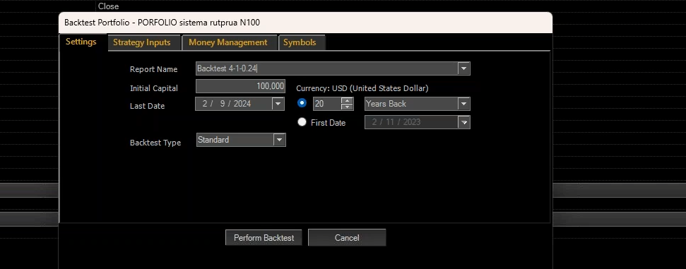
  <figcaption>Figura 137. Configuración del portfolio 4-1-0.24.</figcaption>
</figure>

<figure>
  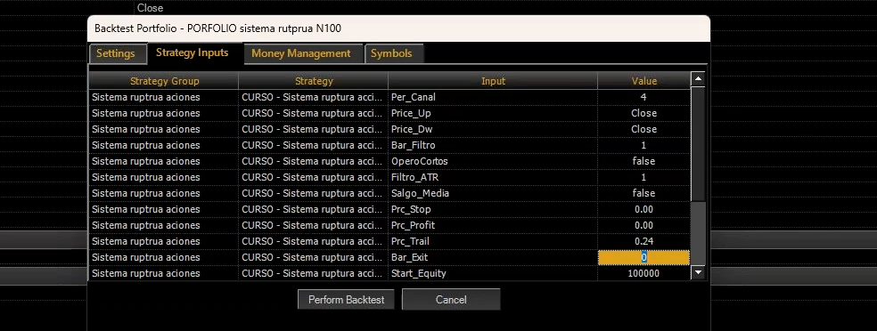
  <figcaption>Figura 138. Parámetros detallados.</figcaption>
</figure>

<figure>
  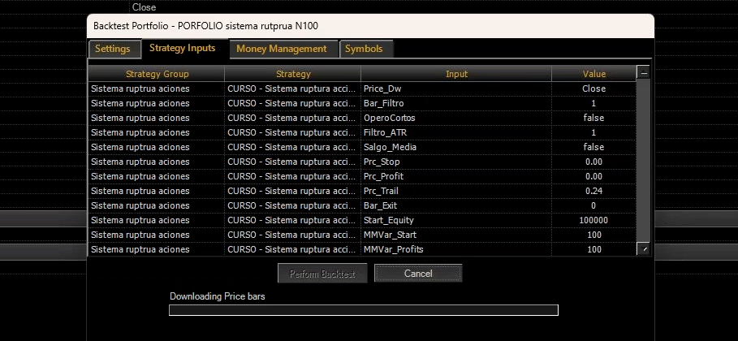
  <figcaption>Figura 139. Resultados del portfolio 4-1-0.24.</figcaption>
</figure>


### **Backtest 1-0-0.12** - Portfolio canal 1 el caso extremo

Ahora toca el de 1 que era el raro:

<figure>
  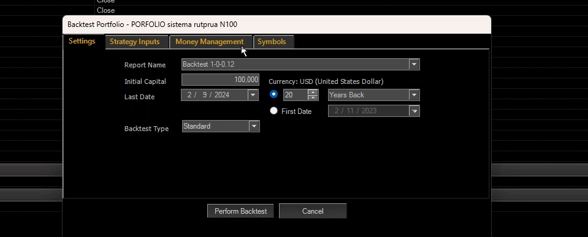
  <figcaption>Figura 140. Configuración del portfolio con canal 1.</figcaption>
</figure>

<figure>
  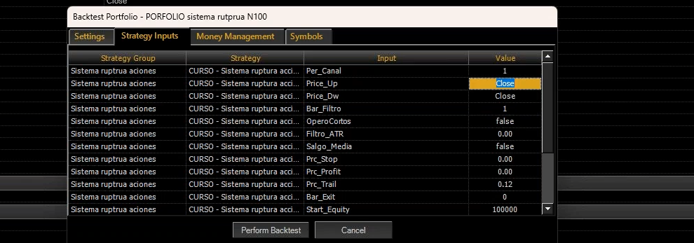
  <figcaption>Figura 141. Resultados del portfolio con canal 1.</figcaption>
</figure>

Luego los comparamos:

<figure>
  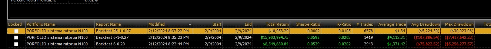
  <figcaption>Figura 136. Vista comparativa de los portfolios.</figcaption>
</figure>

**Limitaciones de Portfolio Trader y soluciones**

Esta optimización de *Portfolio Trader* tiene ese problema: da pocos datos, entonces los tienes que construir tú. El problema es lo que os digo, que al ver este problema con *Sharpe ratio* no hemos podido utilizar el *Sortino* que usamos para las estrategias sueltas, entonces hay que hacerlo para *portfolio*, porque pensamos que valía pero hemos visto que no. Entonces hay que hacer el *Sortino* para *portfolio*.

Y a veces lo que hemos hecho es hacer varias pasadas. Lo bueno es que modificar es muy rápido, y como el *custom fitness* es una fórmula que tú puedes programar, al final le puedes meter varios. Pasadas, recoges varios: uno pues le pones *Sortino*, *Sharpe ratio*, y el que quieras. Los pasas todos al Excel, y entonces ahí es donde ya tienes tú para hacer distintos cálculos o ratios que puedas calcular directamente en el Excel.

De momento solo puedo calcular el *recovery*, utilizar este *Sharpe ratio* que insisto que no es el valor correcto pero sí que es extrapolable para hacer la selección.

**Comparación de rendimiento: Maestro vs MultiCharts**

Todo esto es al final simplemente: estoy haciendo todo el *portfolio* con unos *sets* concretos.

Trataré de dejarlo mañana a ver si me acaba, porque ese fin de semana he intentado dos veces que *Maestro* me hiciera toda la optimización completa. Pero esta optimización que hemos hecho en *MultiCharts* también se puede hacer. Pero en *MultiCharts* he tardado unos, en hacer la larga de esto tardado unos 15 minutos, y *Maestro* se ha colgado después de llevar cada una de ellas como 20 pico horas y no había acabado. Esta es la relación, y era lo mismo, en verdad era lo mismo: mismo código, todo igual. Y esa es un poco la comparación, ¿no?

<div style="border-left: 4px solid #e74c3c; background: #fdedec; padding: 10px 15px; margin: 10px 0; border-radius: 8px;">
  <strong>⚠️ Comparativa de rendimiento: Maestro vs MultiCharts</strong><br><br>
  <table style="width:100%; font-size: 14px; border-collapse: collapse;">
    <tr style="background: #f5b7b1;">
      <th style="padding: 8px; border: 1px solid #e6b0aa;">Plataforma</th>
      <th style="padding: 8px; border: 1px solid #e6b0aa;">Tiempo optimización completa</th>
      <th style="padding: 8px; border: 1px solid #e6b0aa;">Informes</th>
    </tr>
    <tr>
      <td style="padding: 8px; border: 1px solid #e6b0aa;"><strong>MultiCharts</strong></td>
      <td style="padding: 8px; border: 1px solid #e6b0aa;">~15 minutos</td>
      <td style="padding: 8px; border: 1px solid #e6b0aa;">Básicos a nivel portfolio</td>
    </tr>
    <tr>
      <td style="padding: 8px; border: 1px solid #e6b0aa;"><strong>Maestro</strong></td>
      <td style="padding: 8px; border: 1px solid #e6b0aa;">+20 horas (sin completar)</td>
      <td style="padding: 8px; border: 1px solid #e6b0aa;">Muy completos</td>
    </tr>
  </table>
</div>

Entonces, que ya os lo había comentado alguna vez, es un drama de *Maestro*. Pues es, la verdad que es que ya digo, es súper potente. Luego a nivel de informes es brutal, ahora veréis todos los datos que nos saca, está fantástico. Y los hemos revisado — bueno hay uno por ejemplo que no está bien, ya lo pasamos — pero estos sí que están bien. Y bueno, pues es la lástima.


***Comentaba Frank que :***  

***la selección del filtro ATR volatilidad lo he hecho entre 0 y 1, pero que 1 y 4 tenía mejor, que decir, que estaba una zona robusta de estar, sería mejor***.   

Pues sí, pero ahí a mí me parece, podríamos trabajarlo un poco más, pero me parece sobreoptimizarlo, me parece demasiado. Los filtros a mí de norma me cuesta meter filtros, y a este tendencial para la ganancia que he visto, ya ya comentado, creo que no se lo metería, no se lo metería. Pero encima si lo metes tiene que ser o no optimizado o muy poco, ¿sabes? Es decir, esa, el filtro es la manera de sobreutilizar más, porque es cuando tú ya tienes tu sistema, vamos a suponer 6, 0.20, vale, venga, y ahora le meto un filtro que me va a eliminar los malos, hostias, eso dicho así ¿no te suena a una cosa fácil de sobreoptimizar? Porque al final le vas a quitar los cientos, tres cientos o cientos, es igual, ¿sabes?, que está muy bien, no quitar la parte mala, pero el problema es que estás aumentando el riesgo de que sea una sobreoptimización. Aunque en el mapa parece robusto, aunque en el mapa parece robusto, que entiendo lo que dices y tienes sentido, no te digo que no, pero le daría más vueltas, ¿por qué le daría más vueltas?

<div style="border-left: 4px solid #f44336; background: #ffebee; padding: 10px 15px; margin: 10px 0; border-radius: 8px;">
  <strong>⚠️ Riesgo de sobreoptimización con filtros</strong><br><br>
  Los filtros son especialmente propensos a la sobreoptimización porque su función es "eliminar los malos trades". Esto suena bien, pero en la práctica añades grados de libertad al sistema sin garantía de que el patrón se repita en el futuro. Regla práctica: si añades un filtro, que sea con valores redondos (0, 1, 2 ATRs) y nunca granulado (1.3, 1.4 ATRs).
</div>

Y ya digo, granularlo tanto explico, es como el filtro, no 0.20, ya te digo yo lo he optimizado los todos en 0.25, porque vierais el mapa bien granulado, pero realmente tampoco me gusta, es decir, en un sistema en diario con mil y pico *trades* de verdad prefiero ir de 0.5 en 0.5, ¿sabes?, es decir, ir a buscar tanto el detalle, explico, 0.21, 0.22, 0.23, ¿me explico? Es decir, al final recuerda que lo que estás viendo es lo que ha ido mejor en el pasado, entonces ya te digo, al final elegir siempre el mejor,,, UHMMM ya te digo,,, el tema del incremento es una cosa que es quizá la que más... Tú cuando tienes un canal, una media, esto es muy evidente porque va de uno en uno, vale, aquí sí que no hay mucha historia, pero cuando tienes filtros y cosas así que tú puedes hacer 0.1, 0.2, pero si por puestos ya podríamos hacer 0.01, 0.02, 0.03, y ¿por qué no 0.0001, 0.0002?, ¿sabes?, ¿me entiendes? Hay que cortarlo. Ya sé que tenía muchos trades, pero el filtro a otro no tenía tantos, o sea de cambiar el filtro has cambiado 300, o sea eso, el sistema tiene los 2400 con el filtro en 0 o el filtro en 1, y de 0 a 1 cambia 300, y de 1 a 4 igual cambiaba 200, ahora lo miramos.

El que tú dices es el de la línea verde, que te ha gustado es este como en verde, vale, este a ti te ha gustado porque bueno te ha dado un `recovery` bastante más elevado, mejorado, ha mejorado sobre todo el porque tienes ahí 1.430, este sí que te ha bajado el *drawdown*:


Pero de este (liena naranja, el que hemos elegido `6`) a este (línea verde el que le gusta `4`) tienes 100 *trades* de diferencia entre ellos, o sea poner ese filtro o no ponerlo son 100 *trades* de diferencia, y gana un poquito más y baja el *drawdown*, y dices "está muy bien", bueno sí claro, si de aquí cinco años eso se mantiene, es verdad. Ahora, ¿eso es seguro que se mantendrá? No, la realidad es que eso no es seguro. "Bueno, ¿tampoco no es seguro el cero?" Pues decir... bueno ya, pero el cero ***le he quitado un grado de libertad***. Al final, no he añadido variabilidad a la que yo meto `Filtro_ATR = 0`, estoy metiendo una, o sea estoy metiendo una condición más al sistema, porque este `Filtro_ATR = 0` no trabaja, estoy ignorando el ATR. Yo aquí le estoy ya asumiendo que cuando el ATR de un día con el ATR de un mes por multiplicado por un 4 sea mayor no opere, y de esa manera le he quitado 100 *trades*, que es un *trade* por acción de media, *trade* por acción.

Entonces... no, no es una certeza, es que esto va así, o sea no es una certeza, o sea no es que yo te diga esto seguro que luego no irá, no, para nada, no te lo puedo decir, no sería serio decirte eso, no lo sé. Seguro, pero estoy añadiendo un grado de incertidumbre más, para el beneficio que me da no me renta... ¿me explico? Es decir, para el beneficio que me dan, no me renta, a mí no me parece suficiente para añadir grados de libertad, para añadir posibilidades al sistema de oscilar. Siempre que añades *inputs*, como mínimo añades una, y a veces son varias, porque es la condición, o sea es el valor del ATR y que ATR de hoy sea menor que el ATR mensual, eso no es un grado de libertad, son como mínimo dos. Para añadir dos, necesito que me convenza mucho.

Pero de todas maneras lo estudiaría más, decir, miraría esto, miraría esto en el gráfico muchas acciones, y la otra cosa que ahora no hemos hecho es esa... que ahora lo vamos a hacer en *Maestro*, lo miraría un poco y un poco, pero también lo miraría en el gráfico. Nosotros miramos mucho, pero miramos mucho, ahora esto lo miraría en el gráfico en distintas acciones, miraría el gráfico, ya lo haremos, ya lo haremos, aunque no lo hagamos hoy lo haré, porque a esto tengo que volver, para necesito ver un `Sortino` ahí para estar más cómodo, ¿entiendes? Entonces necesito verlo, lo veré, pero el filtro no es concluyente, ni granulándolo al 1.4. Si el filtro...

***¿Si el filtro quitara 500 *trades* sería más válido, entiendo?*** 

Sí, sería más válido, sí, sería más válido, sería más válido. En el caso de los filtros es un poco al revés, y por eso es como lo diría, no es que sea contraintuitivo, es contraintuitivo para lo que he explicado. Me estás diciendo siempre cuantos más *trades* mejor, vale, pero ahora me dices que si el filtro quita más es mejor, ¿y en qué quedamos? Bueno, las dos cosas son verdad, las dos cosas son verdad. Quiere decir que para que el filtro me quite, tengo que tener muchos antes, si no, ya no me vale. Es decir, si tengo mil, ya no filtro, ¿me entiendes?, ya no filtro, ya no estoy suficientemente cómodo para que eso baje más, ¿me explico?

Entonces pero evidentemente el filtro valida, el filtro valida quitando, el filtro valida actuando. Las reglas para evaluarlas tienen que implicar cambios, si no implica cambios no está validada, y la significación pasa por ahí, vale, porque cada regla tenga un número de *trades* donde actúen y en distintos momentos, distintas condiciones de mercado, etcétera. Significación y representatividad, significación y representatividad, significación la dan las estadísticas, representatividad la da actuar en distintos mercados, vale. Por eso que ahora lo hemos metido 20 años a esto, para ver esta curva en 20.

<div style="border-left: 4px solid #2196f3; background: #e3f2fd; padding: 10px 15px; margin: 10px 0; border-radius: 8px;">
  <strong>📦 Canal de Donchian</strong><br><br>

Entender la ***sobreoptimización*** (o *overfitting*) en el trading algorítmico es, en esencia, distinguir entre la **señal** (el patrón real del mercado) y el **ruido** (movimientos aleatorios del pasado que no se repetirán). El instructor plantea un debate clásico: ¿Vale la pena añadir un filtro para ganar un poco más de rentabilidad a costa de añadir complejidad? 

**1. El Problema de los Grados de Libertad ()**  
Cada vez que añades un parámetro (un filtro ATR, un valor de trailing, etc.), estás consumiendo **Grados de Libertad**. En estadística, esto reduce la potencia de tus pruebas.

* **La trampa del filtro:** El instructor advierte que el filtro es la herramienta de sobreoptimización por excelencia porque su función es "eliminar los malos trades". Si un filtro solo quita 100 trades de 2,400 (un 4%), el cambio es estadísticamente poco significativo y probablemente se deba al azar del histórico.
* **Significación vs. Representatividad:** Para que una regla sea válida, debe actuar. Si un filtro quita 500 trades en diversos escenarios de mercado durante 20 años, tiene *significación estadística* y *representatividad**.

**2. Granularidad y el "Efecto de Búsqueda"**  
El instructor critica el uso de incrementos muy pequeños (0.1, 0.2 o incluso 0.0001).

* **Valores Redondos:** Se recomienda usar valores "robustos" (0, 1, 2 ATRs) en lugar de buscar el "pico" exacto (ej. 1.4 ATRs).
* **La Meseta de Robustez:** Si el sistema solo funciona bien en 1.4 pero falla en 1.3 y 1.5, has encontrado un "pico de ruido". Un sistema robusto debe funcionar bien en toda la vecindad del parámetro.


**3. Referencias Científicas sobre Sobreoptimización**  
Si deseas profundizar con rigor académico, estos son los pilares de la literatura financiera actual:

* **A. El Sesgo de Selección (Data Snooping Bias)** Propuesto por *Halbert White (2000)* en su obra *"A Reality Check for Data Snooping"*. **Concepto:** Si pruebas suficientes variaciones de un filtro, por pura probabilidad estadística, una de ellas parecerá "ganadora" en el pasado, aunque no tenga valor predictivo. Es lo que el instructor llama "ir a buscar tanto el detalle".

* **B. La "Falsa Transmisión" en Finanzas** *Bailey, Borwein, López de Prado y Zhu (2014)* publicaron *"The Probability of Backtest Overfitting"*. **Referencia científica:** Demuestran matemáticamente que cuanto más corto es el histórico y más combinaciones pruebas, mayor es la probabilidad de que tu *Sharpe Ratio* sea un espejismo. Coincide con la insistencia del instructor de mirar **20 años de datos** para buscar representatividad.

* **C. El Criterio de Información de Akaike (AIC)** Es un método científico para seleccionar modelos **Regla:** El AIC penaliza la adición de parámetros. Si añades un filtro que mejora el beneficio pero aumenta la complejidad del modelo (añade grados de libertad), el AIC te dirá si esa mejora es "real" o si solo estás ajustando el modelo al ruido pasado.

</div>


**Backtest 1-0-0.12**

Bien, aquí tenemos un resumen:


Vale, de entrada aquí *ratios que no valen para nada*, el esto que veis aquí si lo veis es el **total retorno partido por máximo drawdown**, aquí no vale para nada, aquí no vale para nada, porque bueno vale, bueno habiendo hecho gestión monetaria vale un poco, porque al final es lo que os decía antes, es decir, el *drawdown* no lo puedo meter en porcentaje, que es verdad que aquí como yo he regulado en 100 acciones y vengo con gestión monetaria, que es muy importante, muy importante, ¿por qué es muy importante? Porque si venís aquí a ver la lista de *trades*:


Pues yo al final he ido exponiendo. Si tú multiplicas, por ejemplo, da igual, esta acción, hemos comprado 60 por 33.14, al final he comprado 1988 dólares, que es más o menos el 2% que habíamos hablado al inicio, 2000 dólares, vale. 


Entonces si yo siempre he ido exponiendo esa misma cantidad, pues es mejor, sería mejor el porcentaje, sí, pero como yo siempre voy exponiendo, bueno, un 2% de la cuenta, ya estoy haciendo porcentaje, porque ahora tengo 100.000, 2%, pero cuando tenga 200.000 pues será el doble, pues ya voy exponiendo siempre una cantidad que depende del porcentaje, gracias a ese 2%, entonces las cantidades están más o menos ecualizadas. Pero como lo mismo que se ha hecho en el Excel os he dicho, no está mal, *recovery* sirve, pero sería mejor aún en porcentaje, sería mejor.

Vale, pero aquí como ya tenemos esa, tenemos `shad`, el `RR` calculado, tenemos algunos datos más que nos sirve, tenemos el `drawdown` real `(79.19%)` Aquí muy elevado, ¿por qué?, porque hemos metido la exposición a casi el 200, hemos metido un poco elevado la exposición, pero aquí sí que tenemos el *triple R* `Return Retracement Ratio` a `0.34`.


**Backtest 4-1-0.24**


`Return Retracement Ratio` a `0.92`, fijaos cómo cambia:


`Compounded anual return` 

**Backtest 25-1-0.07**


`Return Retracement Ratio` a `0.006`:


`Compounded anual return 0.08%` -> ahora analizamos 


**Backtest 6-1-0.27**

`Return Retracement Ratio` a `1.02`. Los cambios son bestiales.


`Compounded anual return 29%` 


**Backtest 6-0-0.20**

`Return Retracement Ratio` a `1.02`


`Compounded anual return 25%` 


**¿Error detectado?**

¿Cómo es posible un `Total Return` ($18.953) tan bajo con el `25` `1` `0.07`? no está bien porque operamuy poco....


**Por mirar un poco en el sumario**

En el sumario, fijaros, simplemente *profit factor*, aquí tenemos 1.39:

**Backtest 1-0 -0.12** `Profit factor 1.39` 


**Backtest 4-1-0.24** `Profit factor 1.59` 


**Backtest 25-1-0.07** `Profit factor 0.02`


**Backtest 6-1-0.27** `Profit factor 1.73`


**Backtest 6-0.20** `Profit factor 1.47`


Tanto por profict factor, como por R, incluso por Sharpe, el más parecido es el `6-01-0.27`, es el que daba más profit.

| Backtest      | Profit Factor | Sharpe Ratio | Avg Win / Avg Loss (R) |
| ------------- | ------------- | ------------ | ---------------------- |
| **1-0-0.12**  | **1.39**      | 0.0463       | 2.06                   |
| **4-1-0.24**  | **1.59**      | 0.0577       | 2.07                   |
| **25-1-0.07** | **1.02**      | –0.0002      | 1.79                   |
| **6-1-0.27**  | **1.73**      | 0.0598       | 2.04                   |
| **6-0-0.20**  | **1.47**      | 0.0539       | 2.03                   |

<div style="border-left: 4px solid #4caf50; background: #e8f5e9; padding: 10px 15px; margin: 10px 0; border-radius: 8px;">
<strong>✅ ¿Por qué la configuración 6-1-0.27 ofrece beneficios altos?</strong><br><br>

La estructura de esta combinación encaja de manera natural con el comportamiento de un sistema Donchian aplicado a acciones en gráfico diario.<br>

<strong>1. Canal de 6 barras → rupturas tempranas y frecuentes</strong>
<ul>
<li>Detecta rupturas recientes</li>
<li>Permite entrar muy pronto en los movimientos</li>
<li>Captura microtendencias antes de que se agoten</li>
<li>Genera un número elevado de operaciones</li>
</ul>

<strong>2. ATR = 1 → filtro suave que no elimina las buenas entradas</strong><br>
Con un canal corto, ATR=1 actúa como un <em>filtro de calidad</em>. Con un canal largo, ATR=1 se convierte en un <em>filtro que destruye señales</em>.<br>

<strong>3. Trailing del 27% → permite dejar correr la tendencia completa</strong><br>
En los sistemas tendenciales, una minoría de operaciones genera la mayoría del beneficio. Un trailing amplio hace posible que esas operaciones "grandes" aparezcan, de ahí el incremento del Profit Factor y del retorno compuesto.
</div>

<div style="border-left: 4px solid #f39c12; background: #fff8e5; padding: 10px 15px; margin: 10px 0; border-radius: 8px;">
<strong>⚠️ ¿Cómo es posible un Total Return ($18.953) tan bajo con el 25-1-0.07?</strong><br><br>

La clave está en cómo interactúan los tres parámetros: <code>25 – 1 – 0.07</code>

<ul>
<li><em>Período del canal</em> = 25 barras</li>
<li><em>Filtro de volatilidad ATR</em> = 1</li>
<li><em>Trailing stop</em> = 7% (0.07)</li>
</ul>

La combinación es por naturaleza muy poco adecuada para un sistema Donchian tendencial aplicado a acciones. Donchian funciona bien cuando detecta rupturas <em>tempranas</em>, no rupturas tardías. Con veinticinco días de canal, el sistema entra cuando el movimiento ya está maduro o directamente agotado.<br><br>

<strong>1. Un canal de 25 barras es demasiado lento en acciones</strong>
<ul>
<li>Se generan muy pocas señales</li>
<li>La entrada llega muy tarde en la tendencia</li>
<li>Gran parte del impulso ya se ha consumido cuando el sistema activa la operación</li>
</ul>

<strong>2. El filtro ATR = 1 elimina muchas entradas buenas</strong><br>
Este filtro exige que la volatilidad de hoy sea menor o igual que la volatilidad media del último mes. En muchas acciones del Nasdaq, los días de ruptura auténtica suelen ir acompañados de un repunte de volatilidad. Como consecuencia, el filtro impide entrar justo en las rupturas más potentes.<br>

<strong>3. Un trailing del 7% es demasiado ajustado para un sistema diario</strong><br>
Un trailing tan estrecho salta con facilidad ante cualquier retroceso normal del precio. Los retrocesos del 3% al 6% son habituales en acciones; con un trailing del 7%, la salida se produce antes de que la tendencia logre desarrollarse.<br>

<strong>4. La interacción entre los tres elementos es especialmente problemática</strong>

<table>
<tr><td><em>Canal 25</em></td><td>Entrada tardía</td></tr>
<tr><td><em>ATR = 1</em></td><td>Filtra las rupturas fuertes (las mejores)</td></tr>
<tr><td><em>Trailing 7%</em></td><td>Sale demasiado pronto</td></tr>
</table>

Con tantas restricciones simultáneas, el sistema reduce drásticamente el número de operaciones, pierde diversidad dentro del portfolio, limita la exposición útil y reduce la probabilidad de capturar movimientos de gran tamaño.
</div>

Vamos a ver el siguiente día si podemos sacar el *Sortino* vía *portfolio*, porque no está sacado.

**Backtest 6-0.20** `Profit factor 1.47`

Aquí `6-0.20` ya el *Sharpe ratio* ya lo tenemos positivo, y aquí lo que pasa que realmente la exposición es un poco elevada, teníamos que haberla regulado más. Hemos llegado a exponernos al 200%, dos veces nos ha apalancado hasta dos veces, 


claro tenemos niveles de *drawdown* muy severos a nivel de *portfolio*, tenemos *drawdowns* bastante elevados:

| Backtest      | Profit Factor | Sharpe Ratio | Avg Win / Avg Loss (R) | Max Drawdown (%) |
| ------------- | ------------- | ------------ | ---------------------- | ---------------- |
| **1-0-0.12**  | 1.39          | 0.0463       | 2.06                   | **–79.10%**      |
| **4-1-0.24**  | 1.59          | 0.0577       | 2.07                   | **–61.39%**      |
| **25-1-0.07** | 1.02          | –0.0002      | 1.79                   | **–29.83%**      |
| **6-1-0.27**  | 1.73          | 0.0598       | 2.04                   | **–60.14%**      |
| **6-0-0.20**  | 1.47          | 0.0539       | 2.03                   | **–63.58%**      |

### evaluando la idea, y luego ya decidiríamos cómo lo operábamos


**Recordar que no estamos evaluando el *portfolio* para operarlo así, estamos evaluando la idea, evaluando la idea, y luego ya decidiríamos cómo lo operábamos.**

Aquí tenemos muchas acciones en negativo lógicamente. Luego una vez el sistema está validado yo luego lo operaré a lo mejor no necesariamente las 10 mejores, pero así que serán de las mejores, de acuerdo. Es decir, al final yo valido la idea en las 100 acciones porque eso me da mayor robustez, digamos que la idea la pongo más a prueba en acciones, incluso no han ganado:


**Backtest 6-1-0.27 `Profit factor 1.73` en *Portfolio Trader***

Incluso aquí, incluso en el *Portfolio Trader*, que no es tan, no me dará tanta información, pero este mismo mirar para que veáis la comparación que es interesante de ver, pero pongo aquí:


Y ahora si le hacemos *backtest*, y aquí ya veréis que cambia mucho la cosa, aquí también tengo el *money management* a nivel *portfolio*, 2 por ciento, está bien:

Aquí ya hemos controlado mejor porque hemos controlado la exposición, claro también tiene un factor de 1.46 y ganar 52 mil poco, claro, todo lo uno depende del otro, uno depende del otro. Pero aquí por ejemplo, mirar lo que os quería enseñar antes, la correlación de los retornos mensuales, de acuerdo, de todas las 100 acciones.


Fijaros que hay datos en negativo porque hay acciones que pierden, que pero que siendo todo en el Nasdaq 100, claro es que Apple con Microsoft tiene 0.66, Apple con Google 0.48, con Amazon 0.55, con Nvidia 0.32, con Facebook 0.29, que son acciones directoras, de acuerdo, están ordenadas, están ordenadas por capitalización, vale, que es decir que todas las que veis primeras son acciones súper top para elegir. Y fijaros su nivel de correlación, bajar aquí no sé si se llega a ver bien, esperaros que os voy a poner el foco, lo que sea mejor con el foco es ahí. Fijaros, ahí veis Microsoft, mirar la columna para abajo, es 0.66, 0.67, 0.53, 0.69, 0.56, 0.55, 0.40 con Tesla pero 0.48, 0.36, 0.39, 0.68, 0.51. Es decir, es el mismo sistema en el mismo *timeframe*, vale, sus correlaciones mensuales son relativamente moderadas, pero no son 0.8, 0.9, está bien, tiene una diversificación moderada que es muy, mejora lógicamente.


<div style="border-left: 4px solid #2196f3; background: #e3f2fd; padding: 10px 15px; margin: 10px 0; border-radius: 8px;">
<strong>📊 Correlación intra-portfolio</strong><br><br>
Incluso aplicando el mismo sistema al mismo universo de acciones (Nasdaq 100), las correlaciones mensuales entre activos oscilan entre 0.29 y 0.69. Esto indica una diversificación <em>moderada pero real</em>: no son correlaciones de 0.8-0.9 que anularían el beneficio de diversificar. Esta descorrelación parcial es una de las razones por las que validar en múltiples activos aporta robustez.
</div>

Entonces aquí fijaros que ya con una exposición más controlada tenemos datos de retorno poquito más estables:


Es una curva muy muy justo, bastante virgen, pero es un sistema muy justo, pero con este nivel de `profit factor`, ese nivel de retorno, acepta algo de `apalancamiento` y tiene algo de mejora por delante.


Además le hemos cargado poco `size`.


Vamos a meter desde el 2007 al 2%, mira vamos a meter un 3% de *Max capital risk* y nos va a poner un poquito más:


Y veis, ya tenemos un *Sharpe ratio* calculado bien a 0.29, *Sortino* 0.45, es decir el *Sharpe ratio annualized* al uno es un *Sharpe ratio* bajito, es un sistema justo, pero bueno poco a poco lo podemos hacer crecer el sistema. **De hecho este set es el de mayor retorno, no es el que mejor equilibra**. 


de hecho, este *set* simplemente es el de mayor retorno, no es el que mejor equilibra.


Aquí ahora podíamos mirar varios, pero y hemos mejorado un poquito:


Ha sufrido bastante aquí porque es verdad que con este nivel de ratio del *trailing* pues le cuesta salirse. Esto ya os digo, había *sets*, este *set* tiraba más para el retorno, pero teníamos alguno que tiraba un poco más al equilibrio. 

Aquí podíamos encontrar alguno que mejorara esta caída del 2022 a cambio de un retorno un poco peor, es un poco la que hay. Que fijaros, hemos ganado un poco de histórico como tenemos ratios negativos en varias acciones:


A los ves, en Facebook perdemos dinero, en Google, en una de las Google también:


Porque al final tienen muy pocas acciones con este nivel de exposición, con este `canal` y con este `ratio`, realmente opera muy poco cada una de las acciones, de acuerdo, pero muy poco. Por eso al final nos vemos obligados a meter pues un análisis global que al final nos pueda meter más acciones, para que al final nos pueda meter 1.100 *trades* desde el 2007, desde 2007 nos mete 1.100 *trades*:


Aquí tienes el `<div>` con la conclusión final sobre la necesidad de aumentar la muestra de operaciones y la estrategia técnica para lograrlo, basándome en el análisis de robustez del instructor:

<div style="border-left: 4px solid #2196f3; background: #e3f2fd; padding: 10px 15px; margin: 10px 0; border-radius: 8px;">
<h3 style="color: #1976d2; margin-top: 0;"><strong>🚀 Conclusión: Robustez mediante el Volumen de Trades</strong></h3>
<p>La validación de un sistema tendencial "justo" depende de la <strong>significación estadística</strong>. Un sistema que opera poco de forma individual corre el riesgo de ser víctima del azar o de rachas negativas en activos específicos (como se ve en Facebook o Google).</p>

<p><strong>¿Por qué necesitamos más trades?</strong></p>
<ul>
<li>Para diluir el impacto de las acciones en negativo y aprovechar la <strong>descorrelación moderada</strong> (0.29 - 0.69) detectada en el Nasdaq 100.</li>
<li>Para transformar un sistema de parámetros "justos" en una curva de beneficios estable y profesional.</li>
</ul>

<p><strong>¿Cómo conseguirlo?</strong></p>
<ul>
<li><strong>Análisis Global (Universo Ampliado):</strong> No operar solo las 10 mejores, sino validar e integrar el máximo de acciones posibles (en este caso, las 100 del Nasdaq) para elevar la muestra a <strong>+1.135 trades</strong>.</li>
<li><strong>Gestión de Exposición:</strong> Incrementar el <em>Max Capital Risk</em> (ej. subir del 2% al 3%) y permitir cierto grado de apalancamiento para que el sistema "ponga a trabajar" el capital en más oportunidades simultáneas.</li>
<li><strong>Validación de la Idea, no del Portfolio:</strong> Priorizar la robustez de la lógica (Canal 6 / Trailing 0.27) sobre el resultado individual de cada activo.</li>
</ul>
</div>

Todavía no dejamos un *set* elegido porque me gustaría poder ver una optimización en el *chart* para el `*Sortino* de portfolio`, que aquí sí que lo veo pero no lo veo optimizando, porque es una cosa bastante extraña por parte de *MultiCharts*. Ahí en los foros de *MultiCharts* están con varios mensajes al respecto, es decir, que tienes *Sharpe ratio* metido como función, tienes *Sortino* metido como *fitness*, y que a mí no lo tienes como *fitness* ya por defecto de optimización, es un poco extraño. Es porque si ya lo tienes metido dentro del programa, o sea lo das, ese ratio lo das, lo puedes perfectamente usar como ratio de diana, porque es un dato que estás calculando. Si tú me lo estás calculando y aquí, pero curiosamente lo da para el *performance* pero no lo da como ratio de diana, lo tienes que meter tú por código, y el que tienes metido por sistema nos sirve por lo que os decía, tienes que hacer específico de *portfolio*, de acuerdo. Entonces tienes ese problema, pues es un tanto curioso, pero así es.

## próxima sesión - configuración de *full tendencia*

Para la próxima sesión vamos a tomar una decisión respecto a este sistema tal como está, es decir, en una configuración de *full tendencia*. Quien quiera —y quien tenga los recursos, el software y los conocimientos necesarios— también puede hacer alguna propuesta adicional. Es *súper bienvenida* como ejercicio para casa, porque quiero empezar a mandar algunos.

La regla de entrada es simplemente esta `if Close > Highest(Price_Up, Per_Canal)[1] then`, no tiene más:

```
// TÍPICO SISTEMA DE RUPTURA: el cierre supera el máximo del CIERRE DE 20 barras
if Close > 0 and Condition1 and MP <> 1 and (BarsSinceExit(1) >= Bar_Filtro or TotalTrades = 0) then
Begin
    if Close > Highest(Price_Up, Per_Canal)[1] then
        Buy Contratos contracts Next Bar at Market;
End;
```

Es decir: *cierre por encima del canal*, que está calculado por cierres y por el número de velas. En la apertura de la siguiente vela compra. Para evitar compras en acciones con cierres negativos, hemos añadido este `Close > 0`, porque en muchos años puede pasar. Ese `Close > 0` funciona como filtro: si vale 1, actúa como filtro; si el filtro vale 0, es *true* y no actúa.

También comprobamos que no esté comprado (`MP <> 1`) y que se cumpla el `Bar_Filtro`, que es simplemente una regulación para evitar reentradas inmediatas: que al menos haya pasado una vela desde la última salida para que no compre en la misma vela en la que cerró.

La condición `TotalTrades = 0` está puesta para permitir la primera operación del sistema, porque si no, al requerir que `MP <> 1`, no compraría nunca en la primera barra. Es una conexión típica que se suele incluir para que el sistema pueda arrancar correctamente. Pero, en esencia, la regla de entrada es esta y no tiene más.

El *trailing stop* que actúa es este de aquí:

```
// Trailing Stop
If Prc_Trail > 0 Then
Begin
    If MP <> 1 Then
        Trailing_Long = 0;

    If MP <> -1 Then
        Trailing_Shrt = 99999;
    
    Begin
        if MP = 1 then
        begin // Para posiciones largas
            Trailing_Long = maxList(Trailing_Long, High - (High * Prc_Trail));
            Sell ("Trai_Lng") next bar at Trailing_Long stop;
        end;

        if MP = -1 then
        begin // Para posiciones cortas
            Trailing_Shrt = minList(Trailing_Shrt, Low + (Low * Prc_Trail));
            BuytoCover ("Trai_Shrt") next bar at Trailing_Shrt stop;
        end;
    End;
End;
```

Si el `Prc_Trail` es mayor que cero, se inicializa la variable y ya está. Cuando el sistema está largo, el *trailing* se actualiza como el valor máximo entre:

- el *trailing* que ya tenía calculado (que solo puede subir), y
- el máximo de la vela (`High`) menos ese máximo multiplicado por el porcentaje del *trailing*.

Ese cálculo define el precio del *stop* dinámico. Con esta condición te aseguras de que el *trailing* **solo pueda subir**; nunca baja. No está basado en ATR —aunque podría hacerse así—, pero en este caso hemos querido hacerlo mediante porcentaje porque es mucho más sencillo. Más simple no puede ser: es un *trailing stop por porcentaje* totalmente directo y funcional.

### TradeStation MSFT - Backtest `6-0.20`

Vale, y visto aquí por ejemplo en el gráfico de alguno de ellos para acabar viendo alguno, lo vemos aquí en un momento en cualquiera, ahora estamos viendo 6 con el filtro en 1 y 0.27 (todavía opera menos):


Ya veis, claro, es un sistema que deja correr:


Deja correr, se ha comprado, deja correr, es un sistema de muy largo plazo, por eso la única manera de evaluarlo es metiéndolo en varias acciones, de acuerdo, y que cuando el mercado va a entrar lateral pues sufre, sufre mucho. 

Porque aquí fijaros, acaba entrando otra vez, el canal no está bien ajustado y vuelve a entrar:


El canal no está bien, no está bien, porque no está en 6, está en `Per_Canal 20`:


lo cambio


6 es muy rápido, entrar muy rápido, esta es la diferencia, habéis visto que había varios, varias zonas, esta es la versión súper rápida de entrar, habían otras versiones, hay que acabar de elegir. 


Aquel que quiera proponer, con el código del sistema que le daremos y demás, alguna que nos lo envíe, nos lo puede enviar, lo voy a poner el disco, lo puede enviar al email, y yo me comprometo a responderle.

Otra cosa que queda pendiente para el día siguiente, vamos a hacer esto, acabar de tomar una decisión, acabar de tomar una decisión con nuestro *Sortino* de *portfolio*, decisión de parámetros, de esta versión como está.

### ¿Qué hacemos con los cortos?

Esto es lo que os quería poner para casa, unido con esto, aquel que quiera en este *setup*, en este código, ¿qué haría con el lado corto? Si alguien quiere proponer o quiere trabajarlo, o simplemente puede proponerlo bien trabajándolo, o bien filosóficamente, podemos hacer las dos cosas, me valen las dos cosas. Aquel que quiera trabajarlo porque puede hacerlo, ya que lo haga. El que no quiera trabajarlo porque no es capaz, simplemente que lo conceptualice y que diga "pues mira, yo creo que en los cortos en esta versión haría esto, esto, esto y por qué". En acciones, en este mismo *setup*, en acciones, ¿qué hacemos con los cortos?

Y luego ya lo que vendría es lo mejor, tiene que ver con esto, vale, es que ¿qué otras variaciones hacemos? Este comentamos que el Donchian es un mecanismo de entrar en tendencia, pero es un mecanismo muy útil para hacer *breakout*, entonces esto ahora con lo que tiene ya en el código se puede hacer *breakout*, se puede hacer un *breakout*, ¿cómo haríamos?, sobre qué, tratamos de desarrollar.

Este serían un poco las cosas pendientes respecto a esta estrategia, que deberíamos de liquidarlo ya para entrar en otra cosa.

No le metamos más conceptos, ya sé que le podríamos meter un ATR, le podemos meter mil cosas, ya lo haremos, de acuerdo. El sistema este lo vamos a dejar así, con un Donchian sencillito, entre en la versión tendencial, que es muy mejorable, lo vamos a dejar así, y cortos, y haremos un *breakout* con este código también, vale, y a partir de ahí seguiremos en otras cosas.


## Cuestiones

**¿Se puede aplicar trailing stop y stop loss a la vez asegurando una pérdida fija?**

Sí, sí, sí, es posible y tiene sentido, pero en este caso, y el sentido, a ver, depende del tipo que vas, es realmente, digo, depende del tipo que vas, o sea, en el *trailing* que hemos puesto nosotros, en el *trailing* que hemos puesto nosotros, mucho mucho sentido no tiene, vale, porque ya hemos puesto, porque hay muchos, el concepto clásico de *trailing* hay muchas veces que se activa a partir de cierta cantidad, pues en esos casos mucha gente sí que usa un *stop*, un *stop* de seguridad podemos decir. Acordaros cuando hablamos un poco del *stop* de seguridad, ¿no?, y que entra ya nada más abrir, pues un poco por si se lía, ¿no?, es que me saque, no, pues no tener que, no me saca.

Pero en nuestro caso el *trailing* se activa desde la entrada, en el momento del cálculo se calcula del cierre anterior, y en el momento que el precio que acaba la barra en que ha entrado, ya entra en juego el valor máximo que haya, o el cierre anterior o el máximo que haya hecho ese día, el máximo que haya hecho ese día actúa de *trailing*, y entonces ya tienes *trailing*. Claro, que es un 20 por ciento, por eso has visto algunos aquí como este, o bueno incluso otros peores, que se va, se va para abajo y a tomar viento, a tomar viento.

El problema de los tendenciales puros es este, que si tú quieres un tendencial puro y quieres tres, como esta locura de que te pilla toda la subida no, esto, pues claro, solo ahí dejándolo, dejándole, tragándote estas cosas:


También ese problema, porque si yo le pongo una salida por tiempo, que va muy bien y evitará mucho esto, que evitará también que pille el recorrido. Por eso decía que un tendencial es bastante desagradecido, es muy desagradecido, te decía, el puro. Luego están los *breakout*, que también son tipo de tendencial, que ya se manejan mejor, y que este lo haremos también en mercado, vale. Entonces conceptualmente sí se puede, pero en esta configuración tal como está no tiene demasiado sentido porque ya actúa siempre.

Este lo que pasa que le da mucho margen, le da mucho margen, pero este desde el primer momento que entra ya va calculando, aquí le calcula un 27%:


Pero no ha saltado. Ahora, para que veas, este aquí le pongo 10 por ciento y seguramente salta:


Salta ahí, salta aquí, salta aquí, es un poco la idea, ¿no? Es claro, yo lo tengo siempre, siempre calcula, este que hemos hecho nosotros. Imagínate que le pongo 0.05, no va a parar de salirse todo el rato:


Ves, ya cambiado completamente el sistema, es otro sistema, no para, entrar, a salir, a salir, a salir, a salir, a salir, que cuesta mucho porque el precio va haciendo sus oscilaciones, y alguna vez, oye, y ahora un trocho grande, pero la mayoría de veces no, porque se va a salir todo el rato, y ahí está el equilibrio de los tendenciales. Este es el problema en los tendenciales, que para pillar largos recorridos y no caer en esto hay que dejarlo sufrir. Claro que hay maneras de utilizarlo más para evitar las otras, pero un tendencial puro es uno de los casos de *trailing*, aunque ya os lo comenté en la teoría, es verdad que *trailing* acopla bastante, acopla bastante, pero en porcentaje acopla menos. Entonces acopla bastante quiere decir que lo vas a, lo metes ahí, pero 25 y luego empezarás a ver que a veces ha degradado, ha degradado.

<div style="border-left: 4px solid #ff9800; background: #fff3e0; padding: 10px 15px; margin: 10px 0; border-radius: 8px;">
<strong>⚠️ Acoplamiento del trailing stop</strong><br><br>
El <em>trailing stop</em> tiende a "acoplarse" a los datos históricos, es decir, a ajustarse demasiado bien al pasado durante la optimización. Un <em>trailing</em> en porcentaje acopla menos que uno basado en ATR, pero aun así hay que vigilar que no esté sobreoptimizado. Síntoma típico: funciona muy bien en <em>in sample</em> pero degrada en <em>out of sample</em>.
</div>

**Es que el trailing hay veces que se va directo a pérdidas igual por el cierre o algo y hace más de lo configurado**

¿Que te pierde más de lo que tienes esperado?, ¿qué decir? Depende cómo lo tengas votado. Si lo pones desde el principio, si lo pones en principio que esté siempre puesto en mercado, al final claro te puede pillar un *gap*. Aquí en este caso vas a tendencia y te vas a tragar, claro, los resultados. El otro día lo hablaba en el directo del jueves, había no sé qué acción había caído 15, pues te lo tragas, claro, esto hay en acciones, tienes ese problema. Aquí muy diversificado, y porque te lo tragas en tendencia, tienes el problema.

Pero ya veremos otro tipo de estrategias, cuidado, es decir, al final ahora estamos viendo esta pero que tiene su lado bueno y su lado malo, al final. Y por eso la idea es tener varias, tener una así, tener otra que te lo compensa, y esta te queda enganchada pero a lo mejor tienes otra que había iba corto en petróleo y no sé qué, hay que ir diversificando.

Los tendenciales ya digo que son, de hecho cuando uno no tiene mucha experiencia, son sistemas bastante poco llevaderos, vale, lo hablamos en la teoría. Normalmente es más tendencial, hay más llevadero un sistema antitendencial, ¿por qué?, porque el antitendencial no deja, no tiene colas largas. En cambio los tendenciales, o sea, con dentro lateral no para de fallar, no para de fallar, no para de fallar, y te devuelve mucho el mercado.

**¿Tendencial puro no es usual poner un SL fijado mejor trailing?**

Depende en qué vayas, depende en qué vayas. Un *stop* en un tendencial, en un tendencial puro, el *trailing* y generando somos súper amigos de los, que los digo, estamos ahora empezando las prácticas como el que dice, vale, es la primera estrategia que hemos hecho, vale. Pero **si algún tipo de sistema va bien el *trailing* es en el tendencial**, en el tendencial puro si alguno, vale, va bien este.

Nosotros operando en *live* ahora no usamos *trailing*. Vamos a SL. Pero no es tendencial puro, no es tendencial puro. En un tendencial puro ya digo el *trailing* es el caso que más sentido tiene, sobre todo en acciones, sobre todo en acciones, buscando el largo recorrido, que es un poco la idea.

Este sistema que lo puedes configurar así pero no es la idea, ya ese sistema, y por eso lo hemos metido en las 100 acciones, es que corra, vale, es un sistema para correr. Esta es su idea, su sentido, y claro es un, o sea es un sistema que cuando Netflix sube un 200 por ciento lo pilla, ¿me entiendes? Ahora eso tiene un precio, ¿me entiendes?, eso tiene un precio. Cuando Meta está en lateral un montón de tiempo pues te lo tragas, ahora en cambio está en tendencia que alucinas.

Pero claro, tú imagínate ya en su *setup* básico, que no, no voy ahora a 6, 0.20, vale, que solo hablamos, y le quito el filtro, vale, esto ya es configuración básica original sin hacer nada, el largo que lleva en Meta:


Está comprado ahora mismo en 119.20, están 470, lleva 400 por ciento. Claro eso solo lo pillas así, solo pillas así, claro, a costa de eso aquí se te ha tragado tres hostias que te han dejado la cuenta bonita. Pero hay que estar dimensionado para ello, y cuando ha estado en lateral pues está cosido también, claro.

Bueno, en estas etapas ha aguantado muy bien porque claro tiene mucho margen, pero hay acciones o yo qué sé, cuando Netflix, mira Netflix es tremendo, porque Netflix tuvo, ahora sí, pero tuvo una época hace tiempo y ahí a la tragadita, perdona, venga, comprado en 95, 98 y te sacan 300:


Bueno, tiene lo bueno y tiene lo malo, pero cuando se pasa una época mala pues te hace polvo. Pero es aquí el tiempo que está que no hace nada, si no, si no, si no, al final coge tendencia en el tendencial.

Con SL puro tiene que tener otra salida. Si yo aquí este sistema tiene puesto un *stop*, pero ¿cómo salgo? Tengo que necesitar otras sí o sí, porque si no vuelve. Yo te desactivo el *trailing* ahora y te pongo el mismo en *stop*, el mismo 0.20:


No sale nunca:


Porque no cae 0.20 el precio de entrada nunca, ya tiene que caer 0.20 del punto de entrada. Al final no es igual, 0.10, necesita otra salida. Cambio el *trailing* no, el *trailing* garantiza que no necesita nada más. Entonces si yo no quiero muchos grados de libertad y demás, quiero **simple**, *trailing* me soluciona, que solo puedo usar esa salida. Yo aquí solo tengo un Donchian y una salida, nada más.

<div style="border-left: 4px solid #4caf50; background: #e8f5e9; padding: 10px 15px; margin: 10px 0; border-radius: 8px;">
<strong>✅ Ventaja del trailing en tendenciales puros</strong><br><br>
El <em>trailing stop</em> es autosuficiente como única salida: garantiza que eventualmente saldrás de la posición sin necesitar otras reglas adicionales. Un <em>stop loss</em> fijo, en cambio, solo te protege de pérdidas pero no te saca de operaciones ganadoras que se dan la vuelta. Por eso en tendenciales puros el <em>trailing</em> es la opción más simple y robusta.
</div>

**¿Pérdidas se podían compensar con el lado corto bastante bien?**

Cuando hablamos de si las pérdidas del lado largo se podrían compensar operando también el lado corto, la respuesta es que sí, en teoría es posible. Pero en la práctica es muy difícil operar cortos en acciones con un sistema tendencial como este. Es factible, pero muy complicado.

La estructura del mercado lo explica. Las acciones suelen mostrar caídas muy bruscas y recuperaciones igual de rápidas. Es decir, el precio baja fuerte, pero rebota enseguida. Esto hace que un tendencial corto tenga enormes dificultades para mantenerse en la operación: entra bien, el precio cae, pero el rebote lo expulsa casi de inmediato.

Para ilustrarlo, probamos exactamente el mismo Donchian pero aplicado al corto. En cuanto lo activamos correctamente (con el filtro bien configurado), se ve claro: pierde de forma sistemática. No porque el código esté mal, sino porque las acciones no desarrollan tendencias bajistas limpias con frecuencia suficiente. El precio retrocede constantemente hacia la media y rompe cualquier estructura tendencial bajista antes de que pueda generar beneficio.

En un gráfico se ve muy claro: el sistema entra en una ruptura bajista, el precio cae unos días, pero enseguida rebota con fuerza y te saca. Luego vuelve a caer, pero ya estás fuera; el sistema vuelve a entrar tarde, y vuelve a producirse otro rebote que lo vuelve a expulsar. Este comportamiento es habitual en acciones y explica por qué el lado corto, usando un Donchian tendencial, prácticamente no funciona.

Por esta misma razón, no basta con invertir el *setup* del lado largo. Para operar cortos en acciones suele hacer falta *otro tipo de lógica*, normalmente más rápida en las salidas y en muchos casos con componentes que se acercan más a *mean reversion* que a tendencia pura. Con un tendencial diario clásico, el lado corto acaba siendo estructuralmente inferior.

Incluso en nuestra operativa con el Nasdaq lo hemos visto: el lado corto se puede operar, pero es más volátil y más ingrato, y en varios años (como el pasado) sistemas sólidos como *Apolo* han acabado perdiendo en cortos a pesar de funcionar bien en largos.

<div style="border-left: 4px solid #e91e63; background: #fce4ec; padding: 10px 15px; margin: 10px 0; border-radius: 8px;">
<strong>📉 Asimetría estructural largos vs cortos en acciones</strong><br><br>
Las acciones tienen un sesgo alcista estructural: suben de forma gradual pero caen de forma brusca con rebotes rápidos. Esto hace que los sistemas tendenciales funcionen bien en largos (capturan subidas prolongadas) pero mal en cortos (los rebotes los expulsan antes de capturar la caída). Para operar cortos en acciones se necesitan estrategias diferentes, normalmente más cercanas a <em>breakout</em> rápido o <em>mean reversion</em>.
</div>

**¿A mejor bajar el frame más tendencia bajista más?**

Sobre si **bajar el *timeframe*** podría ofrecer más tendencia bajista: bueno, puedes hacerlo, sí, pero también puedes optar por operar *otro tipo de sistema*, Antonio. No hace falta limitarse a buscar tendencia. Perfectamente puedes buscar tendencia en el lado largo y trabajar *anti-tendencia* en el lado corto. Ambas cosas son válidas.

Bajar el *timeframe* también es posible; no digo que no. Pero hay que entender que el mercado es *fractal*: en el lado corto, si bajas el *timeframe*, ganarás algunas cosas pero perderás otras. No es necesariamente más sencillo; de hecho, suele ser más difícil. Aunque es cierto que en marcos temporales más cortos puede ayudarte en el *control del riesgo*, sobre todo reduciendo pérdidas cuando la operación falla. En ese sentido, sí puede funcionar mejor. Pero también te expulsará antes de las operaciones, así que no todo es ventaja.

Por eso *tendencia pura en cortos es complicado*. Muy complicado. En el lado corto hay que buscar otro enfoque, más basado en *breakout anti-tendencial*, en rupturas rápidas para salir pronto. Trabajar salidas por tiempo, por *take profit*, marcar un objetivo total o parcial, jugar con esas opciones. Ese es el camino más práctico.