# Cuestiones

## Menú de navegación

- [Cuestiones](#cuestiones)
- [Continuamos desde aquí practica_04_revised.md](#continuamos-desde-aquí-practica_04_revisedmd)
  - [OPtimizacion 4](#optimizacion-4)
  - [Optimización Sortino: filtro y trailing](#optimización-sortino-filtro-y-trailing)
    - [Optimización 1](#optimización-1)
    - [Optimizacion 2](#optimizacion-2)
  - [Maestro para tomar la ultima decisión](#maestro-para-tomar-la-ultima-decisión)
    - [Backtest `Filtro_ATR 1` - `Per_canal 6`- `Pcr_Trail0.24`](#backtest-filtro_atr-1---per_canal-6--pcr_trail024)
    - [Backtest `Filtro_ATR 1` - `Per_canal 6`- `Pcr_Trail 0.22`](#backtest-filtro_atr-1---per_canal-6--pcr_trail-022)
    - [Backtest `Filtro_ATR 1` - `Per_canal 23`- `Pcr_Trail 0.24`](#backtest-filtro_atr-1---per_canal-23--pcr_trail-024)
    - [Backtest `Filtro_ATR 1` - `Per_canal 5`- `Pcr_Trail 0.24`](#backtest-filtro_atr-1---per_canal-5--pcr_trail-024)
  - [Líneas de mejora](#líneas-de-mejora)
  - [Para acabar el sistema este: el tema de los cortos](#para-acabar-el-sistema-este-el-tema-de-los-cortos)

**Sobre el backtesting tick a tick y Bar Magnifier**

Recordar que cualquier optimización simplemente trata de reproducir, trata de simular lo que habría ocurrido, pero nunca lo va a conseguir exactamente; es muy difícil.

De hecho, para hacerlo habría que recurrir a lo que en TradeStation se llama *look inside bar backtesting* y en MultiCharts se denomina *Bar Magnifier*, pero habría que hacerlo tick a tick. Normalmente no tenemos muchos años de datos tick a tick; habitualmente disponemos de seis meses, y es complicado tener una base de datos muy larga con esa granularidad. Entonces, es muy difícil hacerlo tick a tick y, por lo tanto, a veces recurrimos a hacerlo en un minuto. Porque sí que en un minuto tenemos muchos años y nos es más fácil. Pero hay veces que en un minuto tampoco es real, y por eso a veces no pasa. Yo lo he visto en sistemas que en un minuto no estaba reproduciendo bien. Entonces, en este caso el Bar Magnifier también tendría su trampa. Pero de todas maneras, aquí ya comenta Alejandro que al activar el Bar Magnifier se ha dado cuenta que ya había fallo.

  <strong>📏 Bar Magnifier / Look Inside Bar</strong>  
  Técnica de backtesting que permite simular la ejecución intrabarra utilizando datos de mayor resolución temporal, mejorando la precisión del backtest especialmente en sistemas con stops y targets ajustados.

**Debate sobre Sharpe Ratio negativo**

Luego también había habido un debate bastante interesante sobre el *Sharpe negativo*, y esto sí que era bastante tema de la teoría y quería aclararlo. Preguntaba alguien qué significaba si teníamos el Sharpe negativo; le contestaba otra persona que no podía ser más que si el numerador era negativo. Esto es cierto, pero cuidado: el numerador recordar que tiene dos datos. El numerador —aunque nosotros, por simplificación, a este valor le ponemos cero— en TradeStation **no está a cero**, y eso cambia todo.

<figure>
  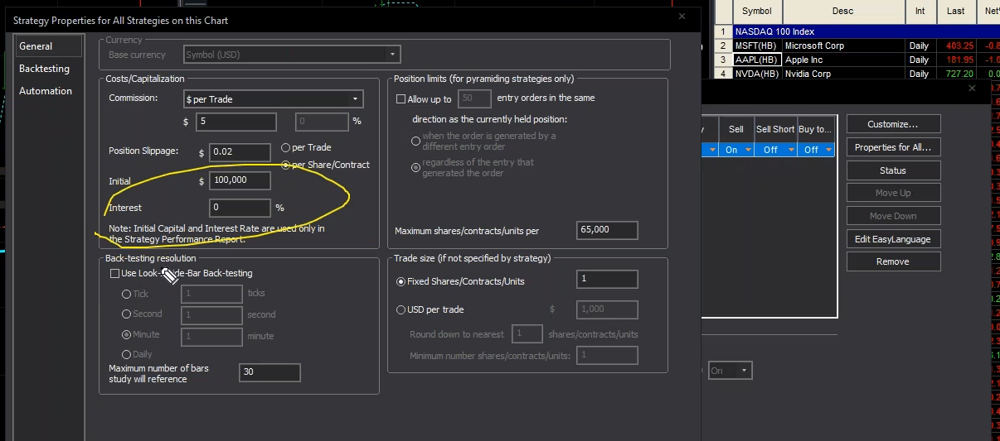
  <figcaption>Figura 000. Fórmula del Sharpe Ratio en TradeStation mostrando el componente de tasa libre de riesgo.</figcaption>
</figure>

Este valor es el que resta de Sharpe: esto aquí es el interés libre de riesgo, de acuerdo, esto es lo que se resta del numerador. Recordad que conceptualmente tanto Sharpe como Sortino miden *el retorno por encima de la tasa libre de riesgo*. Y esto lo dividen, en el caso de Sharpe, por la desviación típica de *todos* los retornos; en el caso de Sortino, por la desviación de los retornos *negativos*, porque considera que los positivos —con buen criterio en mi opinión— no tienen nada de malo, y por eso Sortino estima solo la desviación de los negativos. Pero en ambos casos, en el numerador, si tú pones aquí un 2%, él te lo resta.

* Sharpe (anualizado):
  $$
  \text{Sharpe} = \frac{\mu_R - r_f}{\sigma_R}
  $$

* Sortino (anualizado):
  $$
  \text{Sortino} = \frac{\mu_R - r_f}{\sigma_{R^-}}
  $$

Donde $\mu_R$ es el retorno medio, $r_f$ la tasa libre de riesgo, $\sigma_R$ la desviación estándar de *todos* los retornos, y $\sigma_{R^-}$ la desviación estándar solo de los retornos negativos.

Todo venía de la pregunta: **¿qué niveles de Sharpe son buenos o malos y qué significa un Sharpe negativo?**

De entrada, cuidado con los Sharpe en general: los ratios dependen de la temporalidad. Normalmente siempre nos gusta *anualizar los datos*. Y el que estás viendo tú en TradeStation es *mensual*, por eso ves un ratio muy bajo. Es mensual, pero representa lo mismo que el anualizado si aplicas la transformación.

Por ejemplo, tenías un Sharpe mensual de *0.3*. Si lo anualizas multiplicando por la raíz de 12, te da alrededor de *1*. Esa era la idea original: la cifra parecía pequeña porque era mensual, no anual.

El problema aparece cuando enseñas la curva y dices: *"Hombre, la curva está bien, pero tengo un Sharpe ratio negativo."*

<figure>
  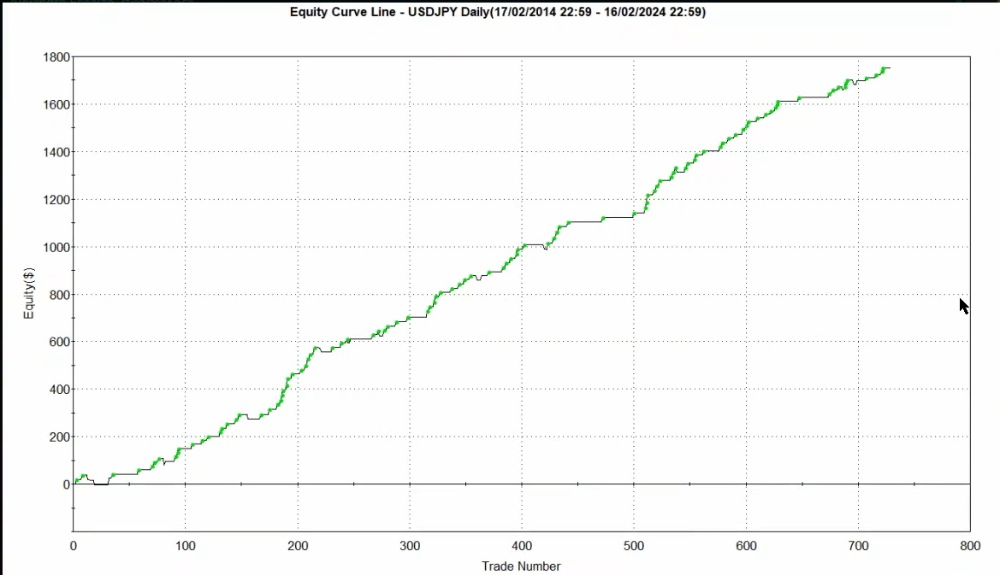
  <figcaption>Figura 001. Curva de equity mostrando resultados positivos con Sharpe aparentemente negativo.</figcaption>
</figure>

<figure>
  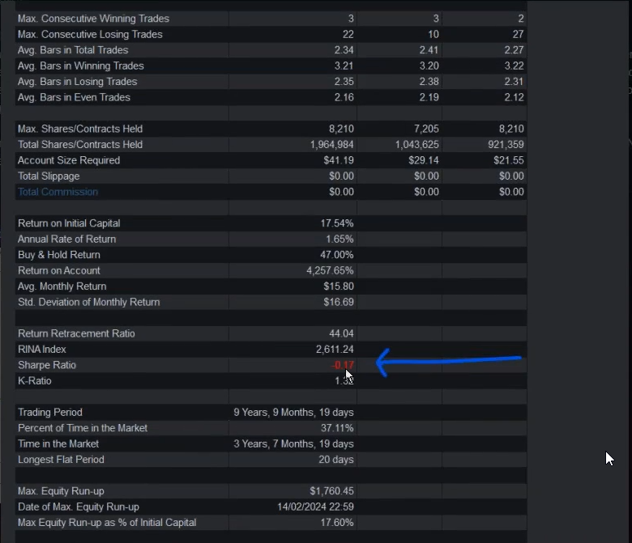
  <figcaption>Figura 002. Métricas del sistema con ratio Sharpe afectado por la tasa libre de riesgo.</figcaption>
</figure>

Vale, la curva está bien, **pero no está normalizada**. Que la curva gane dinero está bien, pero: ¿cuánto dinero es? A la izquierda ya se nota que es muy poco. Entonces al final puede ser por un tema de gestión monetaria: te estás exponiendo con muy poca cantidad.

Y si tú le restas un 2% mensual, le estás metiendo un palo bastante considerable.

Por ejemplo:

* Retorno mensual del sistema: +0.3%
* Tasa libre de riesgo configurada: –2%

**Numerador = 0.3% – 2% = –1.7%**
→ Numerador negativo
→ Sharpe negativo
→ Incluso aunque la curva sea positiva.

Si le pones cero (como hacemos en el curso) verás el Sharpe sin ese ajuste: lo que llamábamos *Sharpe bruto*. Nosotros solemos trabajar eliminando la tasa libre de riesgo para evaluar solo *el retorno del sistema* dividido por *la desviación de los retornos*. De esta manera no se ve alterado por ese componente externo, ya que siempre es igual y no depende del tipo de interés.

Conceptualmente tiene sentido pedir que un inversor rinda más que la tasa libre de riesgo, por eso está en la fórmula. Pero en backtesting, donde la posición monetaria puede ser muy pequeña, tiene efectos distorsionadores.

Entonces ahí radica el problema: seguramente te estabas exponiendo muy poco y si lo apalancas un poco más, ese 2% mensual ya da para que el Sharpe salga negativo. Te daba negativo porque, aunque los retornos son positivos (aunque sean poco positivos), le estás restando mucho por la tasa libre de riesgo. Por eso te da negativo.

Es interesante comentarlo porque había habido bastante debate sobre el tema, y quería aclararlo.

Los ratios de Sharpe que te comentaba, a nivel anualizado, a partir de 1 se considera un ratio de Sharpe válido, y 2 es bastante potentísimo. Pero anualizado, recordar que para anualizar —esto lo vimos en la clase— si es mensual multiplicas por raíz de 12. Vale, si el dato es semanal, por raíz de 52 semanas, y si es diario depende de 252 o 360, es un poco dependiendo del tipo de dato que sea. Pero esa es la manera en que anualizamos un dato diario o mensual.

Si tú tienes un 0.4 mensual, lo multiplicamos por raíz de 12 y nos da 1.39, de acuerdo. Un 0.4 mensual sería un 1.39 anualizado. Entonces ese es el dato a vigilar: el tema de los periodos.

**José comentaba que en cortos no sabía si estaba haciéndolo bien o que no le encontraba nada**

A ver, tal como hemos planteado este sistema, no sé cuántos habéis intentado trabajar el lado corto. Nosotros también lo hemos probado —aunque ya teníamos bastante claro lo que iba a pasar—, pero igualmente hicimos una prueba para verificarlo. Y sí: en cortos es muy complicado sacar algo en esta configuración.

Recordad que estamos operando acciones, y las acciones son todavía más tendenciales que el índice en términos generales. Tienen más desviación, más volatilidad, dejan correr las tendencias con colas más largas y se mueven de forma más abrupta tanto al alza como a la baja. En este contexto, encontrar algo que funcione en cortos simplemente entrando con un Donchian y saliendo con un stop porcentual o un trailing es complicado. Muy complicado.

Sí, a lo mejor si hubiéramos reducido la cesta de acciones podríamos haber encontrado algo sobreoptimizando, pero así no. Incluso sobreoptimizando sería difícil, porque la muestra es muy variada. Y precisamente por eso estas pruebas son tan buenas: cualquier regla que funciona aquí suele ser realmente robusta, porque la estás probando en muchísimos activos que tienen correlación entre ellos… pero no todos, como ya vimos. Aun así, en este setup es muy difícil encontrar cortos rentables en acciones.

En el curso veremos algo al respecto, seguro. En la práctica sí veremos estrategias de cortos en renta variable, pero no será con un canal Donchian, porque Donchian lleva un poco de retraso. Ese retraso, en la operativa de cortos, penaliza muchísimo.

Para cortos en acciones hay que buscar cosas rápidas, mecanismos de entrada que disparen muy pronto. Y Donchian no encaja bien con eso. Puedes ponerlo en una sola vela, sí, pero entonces ya no es Donchian, es simplemente el mínimo del día —que también puede valer, pero ya no es el concepto Donchian original.

Por eso es tan complicado utilizar un Donchian en acciones y pretender, al mismo tiempo, encontrar estrategias de cortos consistentes.

Pero bueno, quería que os enfrentarais a intentarlo. Alguien lo ha probado —porque me lo ha comentado— y me alegra. Cuando os diga estas cosas: probadlas, porque es como más se aprende.

**El Walk Forward de MultiCharts a mí no me gusta nada**

Tiene la ventaja de que es muy rápido, sí, pero aun así no me convence: su interfaz no me resulta cómoda. Me gusta mucho más el de TradeStation, aunque es verdad que es muchísimo más lento; no se puede tener todo. Aun así, este lo voy a mantener porque, lógicamente, durante las prácticas haremos casos de Walk Forward completo.

  <strong>📏 Walk Forward Analysis</strong>  
  Técnica de validación que divide el histórico en periodos <em>in-sample</em> (para optimización) y <em>out-of-sample</em> (para validación), repitiendo el proceso múltiples veces para evaluar la robustez de una estrategia ante cambios paramétricos y temporales.

También comenté en la otra clase que hubo dos o tres personas que opinaron sobre el tema, pero sois muchos más y os recomendé —y lo vuelvo a hacer para quienes no lo hayáis visto— que veáis el directo de la clase de Robotrader de Iván Sherman. Yo estaré allí en abril dando una ponencia. Ese vídeo es bastante interesante, y en esa ponencia él comenta que no es muy partidario del Walk Forward. A partir de ahí surgió un pequeño debate sobre el tema.

Para mí, el Walk Forward sí es importante y sí me gusta, pero tampoco es la panacea universal. Por ejemplo, a este sistema de acciones no le hemos aplicado Walk Forward, y esto lo comento ahora sobre todo pensando en Alejandro, porque todo lo que me ha ido mostrando y explicando está siempre basado en Walk Forward. Está bien pasarlo, pero el Walk Forward —y esto creo que quedó claro en la teoría, pero lo aclaro ahora— es simplemente una prueba de estrés. Hay otras pruebas de estrés posibles, y también pueden ser válidas. Esta es solo una de ellas.

Por eso, no significa que obligatoriamente tengamos que elegir parámetros usando Walk Forward. Ya dije que es una opción, válida en algunos casos, no tan útil en otros. No siempre es el mejor camino y no tenéis que ir siempre a buscarlo; a veces no merece la pena. El método convencional, la optimización convencional, puede dar un resultado igualmente bueno. Por ejemplo, Iván comentaba que él prefiere hacer validaciones moviendo la base de datos, haciendo pruebas de validación, y después seleccionar los parámetros mediante una optimización convencional.

Nosotros, de hecho, seleccionamos los parámetros de todos los sistemas que operamos actualmente usando optimización convencional, aunque ese sistema haya pasado Walk Forward. No es obligatorio. El Walk Forward es una prueba de estrés; hay otras, y esta es solo una más. Se puede usar o no, según convenga.

De todas formas, aclaro teóricamente que yo prefiero claramente el modo *anchored* (anclado) siempre que sea posible. A veces, el número de trades no permite hacerlo. En ese caso, es mejor probar con anchored que no hacerlo, pero recomiendo anchored siempre que se pueda.

Comento esto porque te veo —hablando de nuevo hacia Alejandro— muy centrado en comparar resultados, cuando el objetivo real del Walk Forward es otro: estresar la estrategia y comprobar su robustez. Lo que haces en el Walk Forward es someter la estrategia a cambios constantes de parámetros y a cambios del corte del histórico entre in-sample y out-of-sample, lo cual equivale a que la estrategia ha operado en muchos "mercados" distintos a nivel estructural.

Cuando hablamos del modo cluster, que es el que a mí me gusta —el de un único cluster, por ejemplo 7 runs y 20%—, entiendo que tenga cierto peligro y ahí sí que entraría un poco en el discurso de Iván y otros autores, que defienden que en algunos casos se puede caer fácilmente en sobreoptimización. Pero en el cluster generalizado no lo compro para nada. En la versión completa del cluster, no lo veo así, porque justamente lo que se hace es mover la ventana constantemente: se mueve el número de runs y también el porcentaje de out-of-sample (5%, 10%, 20%, 30%, etc.).

Esto provoca que todo tu histórico quede cortado de formas distintas una y otra vez. Esa es precisamente su fuerza: la estrategia demuestra que pasa la prueba debido a esa versatilidad.

Ese es el objetivo. Solo ese. No es comparar ni no comparar. La pregunta es: ¿la estrategia pasa la prueba o no la pasa? Ese es el objetivo principal. Una vez la ha pasado, ya se evalúa el resto.

**Divisas**

Cuidado, porque la comparación que estás haciendo me hace pensar que no tenemos claro qué significa realmente que un activo sea *tendencial*. Si miramos la renta variable, en términos generales (con excepciones, y en acciones con muchas más), lo lógico es que exista una tendencia alcista a largo plazo. ¿Por qué? Porque las empresas recogen beneficios y están diseñadas para ganar cada vez más dinero. Ese es su propósito de existencia. Por lo tanto, es normal que su tendencia a largo plazo sea crecer.

¿Y por qué caen entonces? Caen porque el mercado se excede, porque las empresas van mal, o por ciclos económicos. Pero su lógica empresarial —igual que la lógica biológica de los seres humanos, que nacen, crecen, se reproducen y mueren— es crecer mientras puedan. Algunas empresas fracasan y cierran, pero las que sobreviven tienden a subir con el tiempo.

`AAPL`
<figure>
  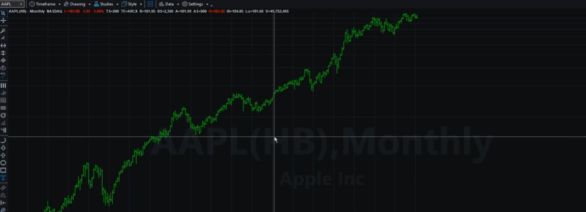
  <figcaption>Figura 006. Gráfico de Apple (AAPL) mostrando tendencia alcista estructural de largo plazo.</figcaption>
</figure>

`EUR/USD`
<figure>
  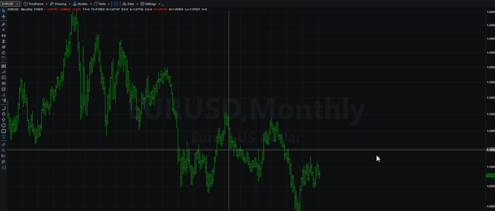
  <figcaption>Figura 005. Gráfico de EUR/USD mostrando comportamiento lateral característico de divisas.</figcaption>
</figure>

Ahora bien: cuando hablamos de si un activo es *tendencial* o no, nos referimos a otra cosa. Si observas un gráfico de largo plazo en **divisas**, normalmente no vas a ver tendencia. En la mayoría de los casos se mueven en rango. Quizás alguna pareja de divisas sea más tendencial que otra, pero en general, en teoría, muchas tienden a oscilar lateralmente.

Alberto lo comentaba con buen criterio: en divisas **siempre** cotiza una contra otra. Hay una divisa principal y una secundaria, y justamente por eso, a largo plazo, el movimiento tiende a ser lateral. Ninguna de las dos puede crecer infinitamente respecto a la otra porque representan economías grandes y relativamente estables.

Aun así, sí existen divisas que muestran cierta tendencialidad, pero si miras un gráfico mensual como este, lo normal es que **no aparezca**:

<figure>
  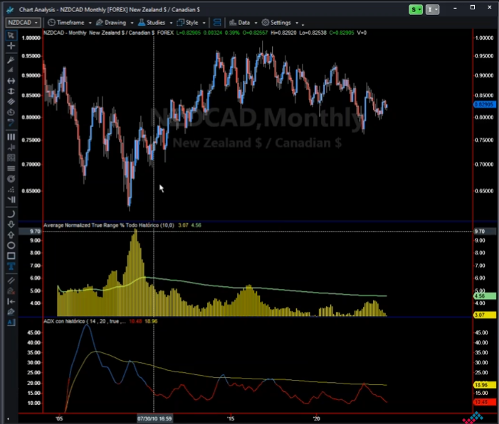
  <figcaption>Figura 008. Gráfico mensual de divisas mostrando valores de ADX bajos (18-19) indicativos de rango.</figcaption>
</figure>

Los datos de **ADX** también reflejan eso: valores 18–19, bastante bajos. Eso confirma que el rango domina. Sin embargo, en diario o intradiario, muchas divisas sí muestran tramos tendenciales claros. Por eso, es verdad que generalizar demasiado fue quizá exagerado: las hay más tendenciales que otras.

Normalmente, los pares relacionados con el yen suelen ser más tendenciales. Por ejemplo, USD/JPY en diario muestra un ADX de 29, lo cual ya indica fuerza de tendencia, aunque igualmente presenta rangos amplios.

Por otro lado, EUR/USD no es especialmente tendencial. Y aquí es importante entender una regla general (con excepciones, como todo):

Cuanto *más grande* es un activo —y mayor la economía que representa— más controlado tiende a estar su movimiento y más lateral suele ser.

Por ejemplo:

* El *S&P 500* es menos volátil que el *Nasdaq*.
* Las *small caps* son más volátiles que las *mid caps* y que las *blue chips*.

Esa relación entre tamaño y volatilidad se replica en divisas: cuanto más importante es una divisa, más estable tiende a ser, y por lo tanto, menos tendencial en el largo plazo. Entre las 28 principales divisas del mundo —las que solemos mirar— ninguna es propiamente "pequeña". Aun así, fuera de estas hay pares muy exóticos, de economías pequeñas, que pueden ser extremadamente volátiles y sí mostrar tendencias más claras… pero no son las que normalmente se operan.

En resumen: Sí, en un gráfico mensual la mayoría de divisas se mueven lateralmente. Pero en diario muchas presentan *buena tendencialidad operable*, y vale la pena explorarlo.

Eso sí: si comparas con un gráfico de equity (acciones), siempre verás en acciones una tendencia alcista a largo plazo. En cambio, en intradía, la historia cambia completamente. Cuando yo hablo de que un activo es tendencial, me refiero sobre todo a *su capacidad para dejar funcionar sistemas tendenciales*, no simplemente a si sube o baja mucho.

**¿Existe manera de analizar portfolios de divisas en Portfolio Maestro?** No.

***Él dice que hablabas de que lo probamos en el Nasdaq 100 pero que no necesariamente las tenemos que operar en ese, que lo que estamos haciendo es probar el sistema, crearlo, confeccionarlo, analizarlo, evaluarlo, pero luego ya lo montaremos para operar y dije que podrías operar las 10 de más capitalización, y él comenta que esto no tiene nada que ver con el desempeño del sistema. Viene a decir que por qué no elegir esas y no otras, y por qué no elegir en base al desempeño.***

Bien. Lo primero: no quise dar a entender que deban ser obligatoriamente las de mayor capitalización. Es verdad que el volumen es un factor importante y es cierto que nosotros, como solemos pensar en estrategias con **alta capacidad operativa** (por si algún día necesitamos mover millones sin problemas de ejecución), de forma casi automática nos orientamos hacia activos grandes y líquidos. Pero no es obligatorio. Para nada.

Puedes elegir otro criterio. Pero si escoges por rendimiento pasado únicamente, ahí sí estarías rozando la sobreoptimización. Y lógicamente entiendo que digas: "Es que hay 10 que funcionan de maravilla". Perfecto, no digo que no puedan estar dentro. Pero yo **no pondría solo esas 10**, porque siempre hay que tener presente el *error*, el *ruido* y el *riesgo de sobreoptimización*. Lo he repetido muchas veces: certeza absoluta no va a haber nunca. Lo único que podemos hacer es acercarnos lo máximo posible a una estrategia que consideremos robusta.

Por eso hay que pensar siempre en el riesgo: si te equivocas, y apuestas únicamente por las 10 que más ganan, probablemente te pegues un golpe.

Por lo tanto:
— No elegiría *solo* las que más ganan.
— Pero sí, perfectamente *podrían estar* dentro de la selección.

En nuestro caso probablemente escogeríamos las de mayor capitalización por capacidad operativa, porque suelen tener mejor ejecución, menos slippage, más estabilidad, etc. Pero comprendo que ese criterio no tiene por qué ser el único ni el obligatorio. El desempeño puede formar parte de la decisión, sí, pero no debería ser el único criterio.

Ahora, si quieres, volvemos al sistema para seguir avanzando.

***Comenta Juan Manuel si un mismo sistema con iguales o diferentes inputs se opera en corto y en largo por separado, ¿se debe contar como uno o como dos sistemas en el portfolio?***

En realidad da igual, pero yo lo consideraría como dos, porque en la práctica los tratamos como sistemas independientes. Esto no significa que todos lo hagan así; de hecho, este tema genera cierta controversia.

Hay quien defiende que un sistema verdaderamente robusto debe funcionar igual de bien en largo y en corto, con los mismos parámetros, y es cierto que cuando ocurre es una señal de fortaleza. Sin embargo, desde el punto de vista práctico y estadístico, suele ser mejor trabajarlos por separado, sobre todo en acciones. En renta variable existe un sesgo estructural al alza que condiciona el comportamiento: las acciones se mueven, crecen y se organizan de una forma muy diferente en el lado corto. Eso hace que un sistema que funcione bien en largo, en la mayoría de ocasiones, no funcione igual en el corto. El ejemplo del Donchian lo muestra de forma evidente: en largo funciona con relativa facilidad; en el corto se vuelve extremadamente difícil encontrar algo que tenga sentido.

Por eso puedes considerarlos como dos sistemas distintos. Ahora bien, si los parámetros son exactamente los mismos, entonces conceptualmente sería uno solo, aunque operativamente podría dividirse en dos módulos. En la práctica casi siempre existen pequeñas variaciones: quizá en el lado largo se aplica un filtro de volatilidad y en el corto no, o quizá se añade una regla específica para el corto. Mantenemos el núcleo común, pero adaptamos ciertos detalles porque el comportamiento del mercado no es simétrico.

Esto mismo ocurre en nuestras propias familias de sistemas, como Némesis, Artemisa o Apolo, donde el corazón del sistema es compartido, pero hay pequeños ajustes según si opera en largo o en corto. En divisas el comportamiento suele ser más simétrico, lo mismo que en algunas materias primas, pero donde menos simetría hay es en acciones. Las empresas, por su propia naturaleza, existen para crecer, y esa lógica se traslada al precio. Por eso cualquier acción relativamente sana presenta un sesgo alcista que hace que sea mucho más sencillo diseñar un sistema que funcione en largo que otro que lo haga bien en el lado corto.

## Continuamos desde aquí [practica_04_revised.md](../../14-practice-04/transcripts/practica_04_revised.md)

Ya os comenté que MultiCharts tenía un bug en este punto: las fórmulas que incorpora por defecto están pensadas para sistemas individuales y, cuando se aplican a un portfolio, dejan de funcionar correctamente. Da igual; lo que hemos hecho es calcular nuestras propias métricas directamente a nivel de portfolio.

Hemos recalculado tanto el Sortino como el Sortino ajustado. Recordad que el Sortino ajustado incluye aquella corrección de dividirlo por la raíz cuadrada de 2, precisamente para poder compararlo en igualdad de condiciones con el Sharpe y con el UPI (*Ulcer Performance Index*). El UPI, en esencia, es similar a un Sharpe pero con el *Ulcer Index* en el denominador. Ya os comenté en la parte teórica que el Ulcer Index me parece especialmente interesante, porque captura de manera muy efectiva la profundidad y duración de las caídas.

  <strong>📏 Ulcer Index / UPI</strong>  
  El <em>Ulcer Index</em> mide la profundidad y duración de los drawdowns. El <em>Ulcer Performance Index</em> (UPI) es el ratio entre el retorno y el Ulcer Index, permitiendo evaluar el rendimiento ajustado por la severidad de las caídas, no solo su magnitud máxima.

El Sortino también es muy útil. Si no tenéis otra métrica más completa, el Sortino sirve perfectamente, pero cuando podemos disponer de Sortino ajustado y UPI, la comparación y el análisis de robustez del portfolio se vuelven mucho más informativos.

Entonces, al final, ¿cómo lo hemos hecho? MultiCharts es lo que os decía: al final en algunas cosas es fantástico y tiene otras que no lo son tanto. Por ejemplo, a nivel de portfolio —bueno, a nivel de portfolio y a nivel de optimización normal también— no te deja hacer como tal un periodo in-sample y un periodo out-of-sample en la misma optimización, cosa que es muy práctica, pero no te deja. Entonces lo tienes que hacer tú, que no es lo mismo, pero a nivel de análisis ya te sirve.

Bueno, nosotros simplemente hemos recogido el periodo in-sample, hemos hecho el periodo out-of-sample y hemos hecho el periodo all data, que los tenéis aquí:

<figure>
  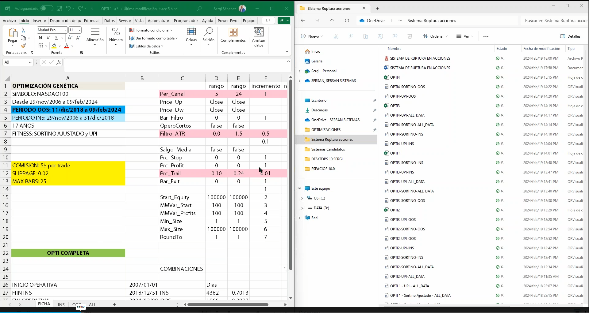
  <figcaption>Figura 010. Periodos de análisis: in-sample, out-of-sample y all data para evaluación del sistema.</figcaption>
</figure>

La sesión pasada ya vimos un poquito esto, pero recordaros: teníamos datos de UPI negativos, no teníamos Sortino, y ahora ya tenemos todos estos datos hechos para que juntos podamos tomar una decisión mejor. Es lo que os decía: aquí no vamos a hacer un Walk Forward, porque además con una cartera de múltiples activos es muy, muy complicado. En un sistema que opera realmente, uno de los problemas que tiene el Walk Forward es que cuando corta —y es justamente lo que los detractores dicen— muchos programas, de hecho ninguno de estos dos, lo hace: cierra la operación, no hace *mark to market*. 

Entonces, claro, si te dejan un trade abierto, ese trade no cuenta. Entonces en este sistema eso es muy crítico porque es de muy largo plazo, puede estar meses con una operación encima, tienes muchas acciones distintas, empiezan en fecha distinta. Es muy complicado hacer un Walk Forward riguroso en un sistema que lo vas a pasar en las 100 acciones Nasdaq. Al final no vale la pena, y además, como os digo, no nos hace falta. Realmente tenemos una cantidad de información que nos puede permitir considerar que el sistema es robusto sin hacer Walk Forward en este caso.

### OPtimizacion 4

Entonces la optimización grande, aquí recordar que inicialmente hemos hecho las dos cosas otra vez para que veáis la diferencia, de acuerdo, porque quería y ahora ya tenéis ahí el documento bien, y quería generar un debate interesante sobre esto y que os quedara realmente claro para pasar al siguiente:

Inicialmente hicimos, como hablamos en la teoría, la optimización paso por paso de acuerdo:
* **Periodo canal**
* Luego hemos hecho el trailing y
* Luego, en vez de hacer el filtro solo, he hecho el filtro con el ATR

<figure>
  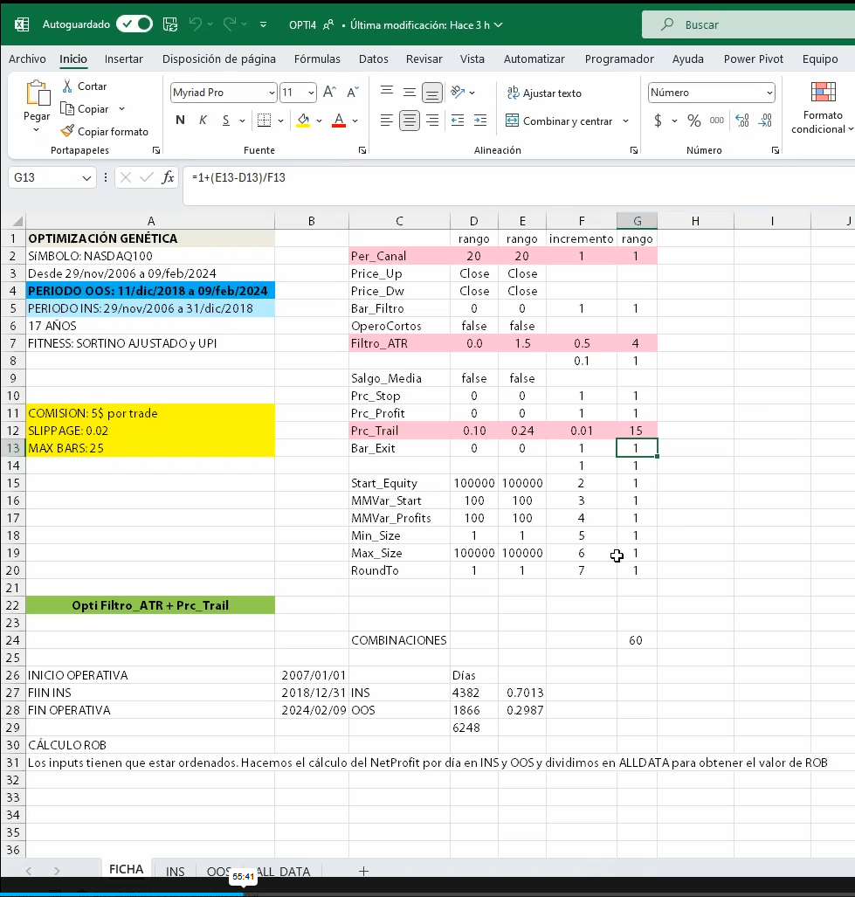
  <figcaption>Figura 121. Mapa de optimización del periodo del canal mostrando sensibilidad del parámetro.</figcaption>
</figure>

Esto es interesante para ver un par de cosas, pero también os digo que si tú tienes dos inputs, con solo dos normalmente vas a poder hacerlo en una. ¿Por qué? Porque aquí el mapa ya te va a salir con dos bien, y aquí el mapa te da mucha, mucha información visual y no tienes ahí mucho riesgo de caer en sesgos o sobreoptimizaciones. Es verdad que en el fondo teníamos tres variables, pero si tú empezabas solo por el canal, de esta manera nos hemos dado cuenta claramente que ya se veía un poco que en el canal, 

***abriendo `OPTI2-SORTINO-ALL_DATA` : bloqueado en `0.20 el trailing`***

<figure>
  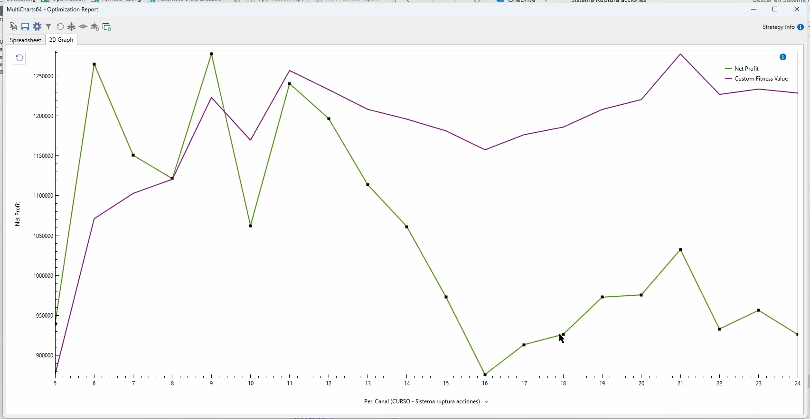
  <figcaption>Figura 012. Mapa de optimización del periodo del canal mostrando sensibilidad del parámetro.</figcaption>
</figure>

Cuando vemos una variable sola, lógicamente el aspecto visual es muy sencillo de interpretación. Simplemente tenemos una variable contra otra, de acuerdo. Aquí tenemos el `net profit`, pero podemos ver el `custom fitness`; tengo los dos lógicamente. Bueno, lógicamente tienen, como veis, una absoluta correlación; es decir, al final quiere decir que el **riesgo** está bastante igualado, de acuerdo. Pero es el tema, perdón, es la otra la que os quería enseñar. Ahora sí, venga, hablando del estrés, ahora sí, ahora sí, esta sí.

Aquí vemos simplemente que, dejando bloqueado en `0.20 el trailing`, vemos que el ***canal*** tiene poca influencia. Vemos que tienen muy poca influencia en `net profit` aún tiene un poco, aunque fijaros la escala. Cuidado con la ***autoescala*** (la escala de los valores del eje Y), que esto en los mapas es muy importante, y es un motivo por el que uno de los cambios que he hecho —no sé si os habéis fijado— es en reducir un poco la escala. 

Justamente en el Discord le sugería eso a Alejandro cuando preguntaba que le salía un dato demasiado bueno. A lo mejor a veces hay que quitarlos, porque a veces están saliendo buenos porque son malos, de acuerdo. Porque, por ejemplo, tienen muy pocos trades. Entonces hay que analizar siempre bien los datos y tener claro que a veces tienes que eliminar una parte del histórico. En este caso, por ejemplo, el otro día estábamos haciendo desde 1 hasta 20 y algo, y al final hasta más arriba. Aquí hemos empezado en 5 porque los de 1 a 5 no me interesan. No me interesan: rompen el concepto del Donchian que yo busco. 

<figure>
  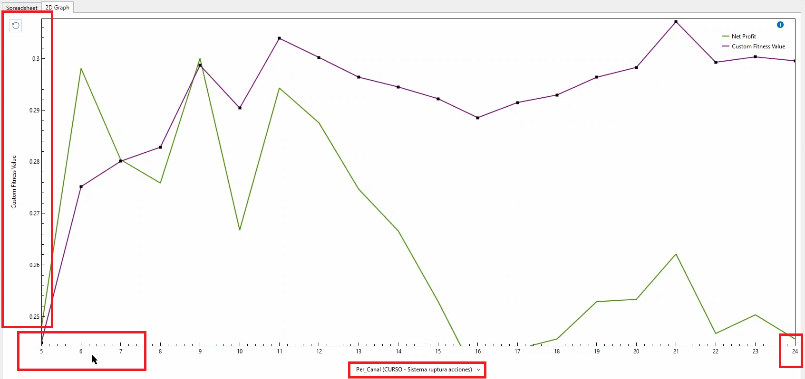
  <figcaption>Figura 123. Per_canal a partir de 5.</figcaption>
</figure>

Si yo lo miro en el gráfico, me doy cuenta que no me sirve ese tipo de estrategia; no es lo que yo estoy buscando.

Al final, el que gobierna directamente la estrategia es siempre el **trailing**. El **canal** tiene bastante relativa poca influencia, y por eso veis luego —lo veréis en la múltiple— que se verá muy claro, es muy estable: 

Fijaros en el ratio de `custom fitness eje Y`:   
tiene poca influencia. Sí que baja un poco más en los cortos (5, 6, 7) , pero a partir de 10 se estabiliza. Casi no cambia nada: da lo mismo usar 10, 11, 12, 13, 15 que 20. Más o menos son igual, pero me entendéis: tiene muy poca mejora o empeoramiento.

<figure>
  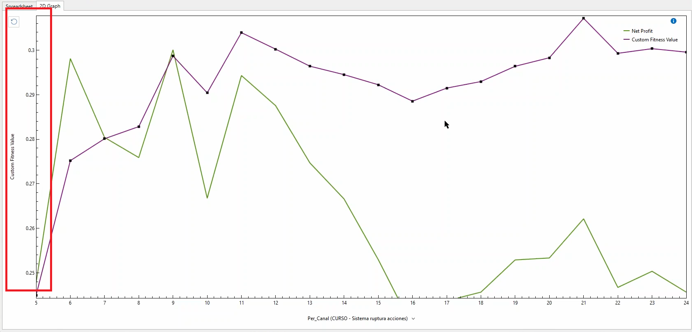
  <figcaption>Figura 126. Per_canal a partir de 5.</figcaption>
</figure>

Entendido. Voy a analizar las dos imágenes en el contexto del problema del autoescalado:

  <strong>⚠️ Cuidado con el autoescalado en los mapas de optimización</strong>  
  
  Compara las dos imágenes: ambas muestran los mismos datos (<code>Per_Canal</code> de 5 a 24), pero con <strong>escalas diferentes en el eje Y</strong>: 
  
  • <strong>Figura 012</strong> → Eje Y en escala de Net Profit (~850,000 a ~1,275,000) 
  • <strong>Figura 126</strong> → Eje Y en escala de Custom Fitness (~0.25 a ~0.31)  

  <ul>
    <li>🟢 Net Profit</li>
    <li>🟣 Custom Fitness Value = Custom Fitness es una métrica personalizada que combina rentabilidad y riesgo para evaluar la calidad de una estrategia. En este caso, según el documento ("OPTI2-SORTINO"), probablemente está basado en el Ratio de Sortino, que mide cuánto rendimiento obtienes por cada unidad de riesgo bajista (solo penaliza la volatilidad negativa, no la positiva).</li>
  </ul>

  <strong>¿Qué significa esto?</strong> 
  • <strong>Net Profit</strong> = ¿Cuánto gané? (varía mucho visualmente en el gráfico, pero el rango real importa) 
  • <strong>Custom Fitness</strong> = ¿Cuánto gané <em>en relación al riesgo</em>? (muy estable)  
<strong>Conclusión:</strong>  
Esto significa que <em>da casi igual usar 10, 12, 15 o 20</em> — el resultado ajustado por riesgo es prácticamente el mismo. El parámetro <code>Per_Canal</code> no es sensible; el que realmente gobierna la estrategia es el <strong>trailing</strong>.

En cambio, en el otro es todo lo contrario:

**`Sortino - all_data`**  

**Eje Y: `Net_Profit`**   
**Eje X: `Prc_Trail`**

<figure>
  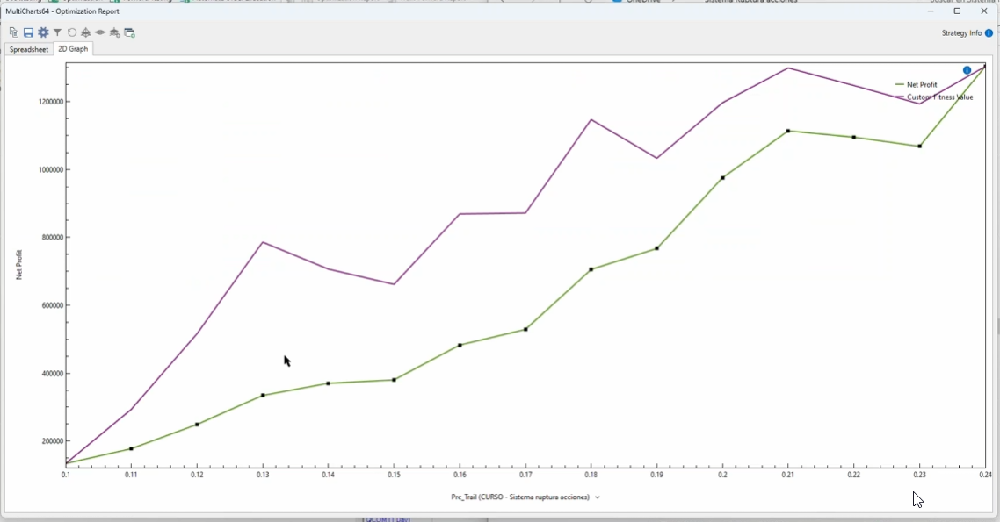
  <figcaption>Figura 011. Sortino en all data mostrando alta sensibilidad del trailing stop.</figcaption>
</figure>

Es el contrario: el trailing. Pero aquí dices: "Bueno, oye, parece que cada vez es mejor." Ya, pero es lo que os decía de la trampa antes con los trades. Si yo lo llevo hasta arriba, cada vez va a ir mejor. Cada vez es mejor, pero me va a hacer menos operaciones. Y esa es un poco la trampa. Por eso cada vez va bajando. 

Fijaros cómo baja linealmente a medida que sube el parámetro `Prc_Trail`. Es totalmente lineal: en relación con 0.10, 5000 trades; con 0.24, 1300; si le pongo 0.35, 200 trades con 100 acciones. Eso no es nada. Nos podemos aher trampas.

<figure>
  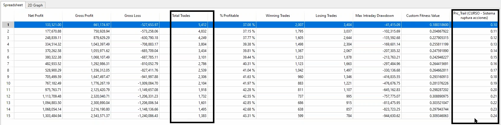
  <figcaption>Figura 014. Relación entre parámetro de trailing y número de trades mostrando reducción lineal.</figcaption>
</figure>

Entonces hay que vigilar, esto ¿dónde lo vemos?. Lo vemos mirando el gráfico. ¡Lo vemos en el gráfico de verdad! 

<figure>
  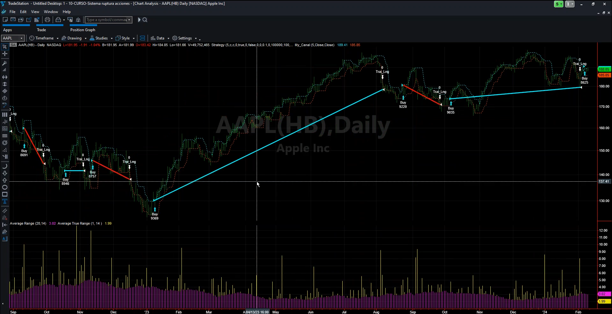
  <figcaption>Figura 127</figcaption>
</figure>

Ya lo comenté también en la teoría. Es una cosa que me choca de algunos colegas que a veces me dicen que no miran gráficos. De verdad no lo entiendo. No entiendo, porque los datos son muy tramposos a veces si no les ponemos contexto. Si yo a esto le pongo ahora un trailing de 0.30, un canal de 20, vas a ver las operaciones que os hace en Apple: es que no hace… no sale nunca… 

<figure>
  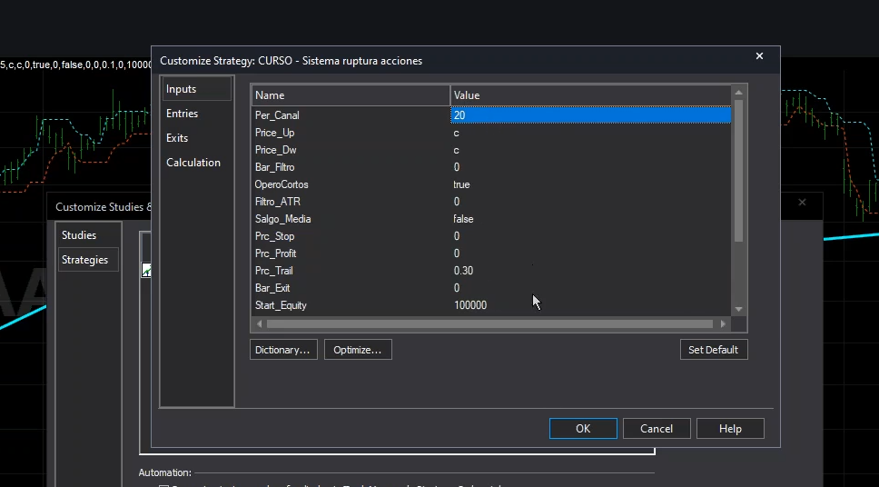
  <figcaption>Figura 128</figcaption>
</figure>

Le pongo 0.40 y me pone largo desde el siglo XIV. ¿Eso es lo que queremos? ¡Hombre, eso es buy and hold!

<figure>
  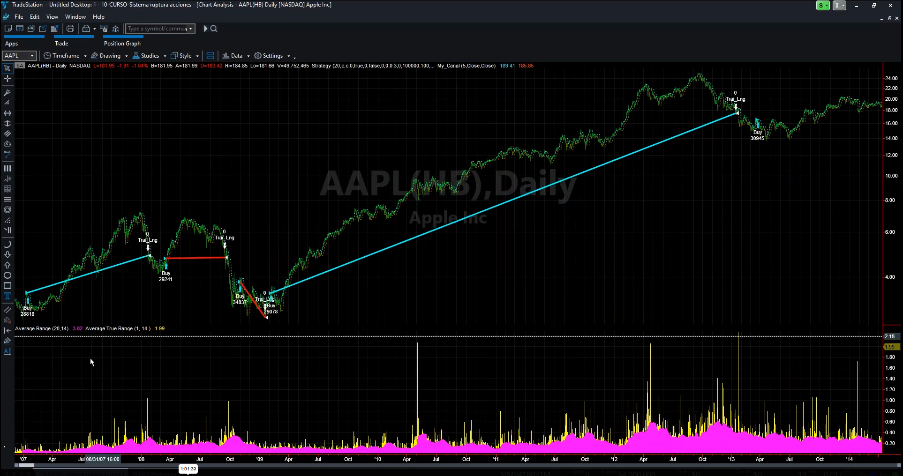
  <figcaption>Figura 016. Ejemplo extremo de sistema convertido en buy and hold por trailing excesivo.</figcaption>
</figure>

Entonces al final, cuidado, porque podemos caer en lo que no es lo que queremos. 
 
Entonces hay que buscar un equilibrio entre significación, lo que ya hemos comentado muchas, muchas veces. Entonces tú decides: tienes que dirigir un poco la optimización. Ese concepto lo hablábamos mucho cuando elegíamos los parámetros, ¿os acordáis de la teoría? Y decíamos que es importante fijarlo, limitar y controlar los parámetros, tanto los incrementos como los rangos. Este es un buen ejemplo de eso. Yo decidí cortar en `Prc_Traling 0.24`, ya está, hasta aquí. No lo llevo más, no lo quiero llevar más arriba, porque si no al final sube, sube, sube y ya está, no me interesa.

  <strong>🚨 La trampa del trailing excesivo</strong> 
  Un trailing muy alto (ej. 0.40) convierte tu sistema en <em>buy and hold</em> disfrazado. Sí, el backtest muestra más profit, pero: 
  <ul>
  • <strong>Pocas operaciones</strong> → sin significación estadística. ¿Cómo validas que tu estrategia funciona con tan pocos datos? No puedes. Es ruido estadístico. 
  • <strong>Siempre en mercado</strong> → sufres todos los drawdowns. Sufrir todos los drawdowns (mira el crash de 2008 en la imagen). Sin gestión activa del riesgo 
  • <strong>No es replicable</strong> → dependes de que el activo suba. Apple subió de ~$4 a ~$20 en ese período. El "rendimiento" no es mérito de la estrategia — es simplemente haber estado comprado en un activo que subió mucho. 
  </ul>
  Por eso se decidió cortar en <code>Prc_Trail = 0.24</code>. Hay que buscar equilibrio entre rendimiento y significación.

### Optimización Sortino: filtro y trailing
  
**Eje X: `Net_Profit`**  
**Eje Y: `Filtro_ATR`**   
**Eje Z: `Prc_Trail`**  

<figure>
  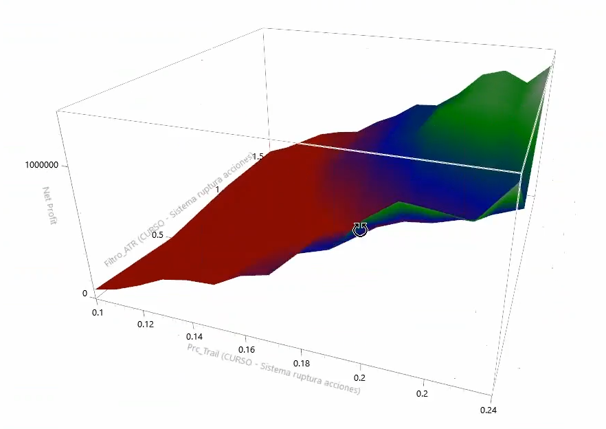
  <figcaption>Figura 129</figcaption>
</figure>

Este lo hemos hecho con filtro y con trailing. Lo hemos hecho con los dos, porque poner solo el filtro_ATR  era un poco… solo le puse para dejarle hacer 4 variaciones. Solo le he dejado hacer de 0.5 a 1.5, son 4 combinaciones:

<figure>
  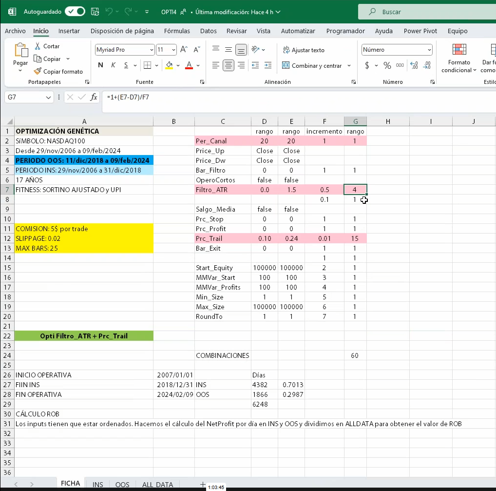
  <figcaption>Figura 130</figcaption>
</figure>

<!-- <figure>
  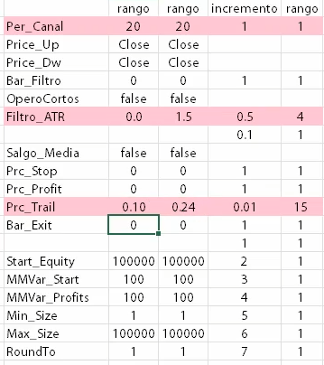
  <figcaption>Figura 017. Configuración de optimización del filtro ATR con 4 variaciones.</figcaption>
</figure> -->

Hacerlo solo con `Filtro_ATR` pues no tiene mucho sentido, entonces prefiero combinarlo con el `Prc_Trail`, porque como ya hemos visto, el canal es poco sensible. El canal es una variable que en este caso trabaja poco. 

Realmente la variable más directora, o que más marca el rendimiento del sistema, es el `Prc_Trail` en este caso. Y aquí pues hemos variado con el trailing, y como veis, la única conclusión que sacas es que el 0.5, que el 0.5 implica: Cuidado aquí porque es contraintuitivo. 0.5 implica que actúa mucho, implica que actúa mucho.

<figure>
  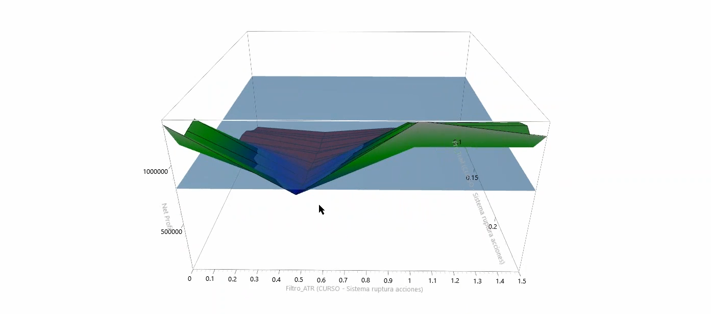
  <figcaption>Figura 018. Impacto del filtro ATR en combinación con trailing stop.</figcaption>
</figure>

 El PSE aquí, que de pronto 0 con 0 va desde 1600 trades a 5400, 
 
 <figure>
  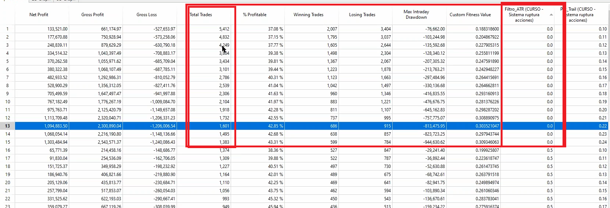
  <figcaption>Figura 131. Número de trades filtrados según nivel del filtro ATR.</figcaption>
</figure>
 
 y en 0.5 va desde 1300 a 600, de acuerdo. 
 

  
<figure>
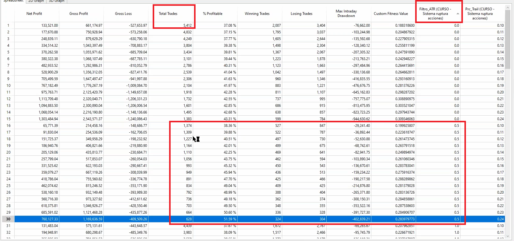
<figcaption>Figura 132. Número de trades filtrados según nivel del filtro ATR.</figcaption>
</figure>
 
Realmente es donde implica una mayor actuación, es decir, el `Filtro_ATR` filtra muchos trades en 0.5.

Aquí ya vimos que era `0` o `1`, ya os lo comenté, pero bueno, para poder analizarlo y poderlo ver, pues prefería hacer esta pequeña variación de hacer `0.5`  y ver un poco.  Se ve que en `0`, que es sin filtro, `0.5` ya veis, `0`, `1` es donde están ahí. 

<figure>
  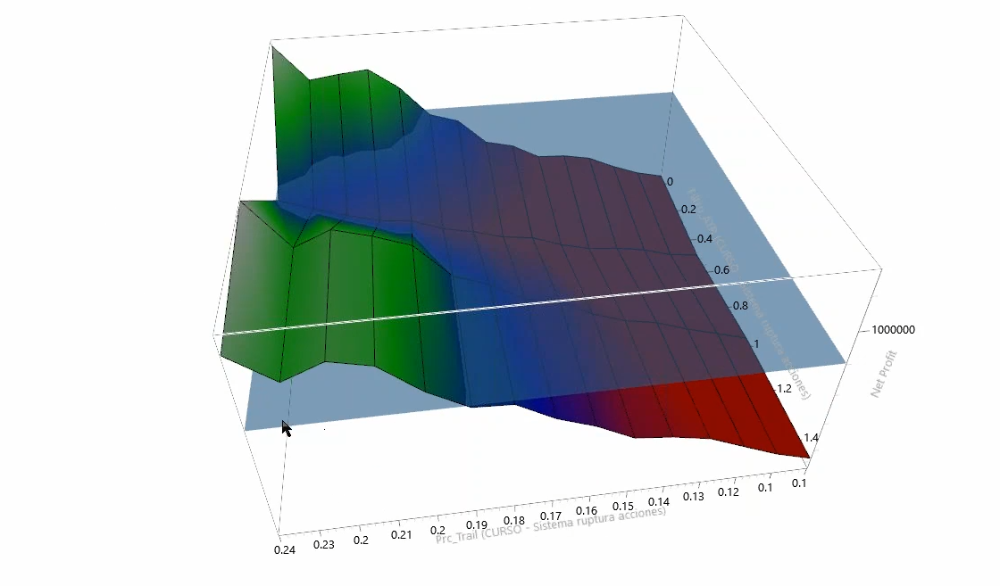
  <figcaption>Figura 020. Comparativa de actuación del filtro en diferentes niveles de ATR.</figcaption>
</figure>

En `2` también es… En `1` a partir de `2`, bueno, en `1.5` aún tiene bastante actuación. En `2` prácticamente equivale al `0`.

> Si os acordáis... esta es la regla de la volatilidad. La regla de la volatilidad. 

Yo creo que al final en 1, para lado largo, funciona bastante, bastante bien.

#### **Optimización 1**

En esto, pues, al final hemos traducido en estos 4 Excels que rápidamente os voy a enseñar ahora, y luego enseñaremos, trabajaremos el que es. 

<figure>
  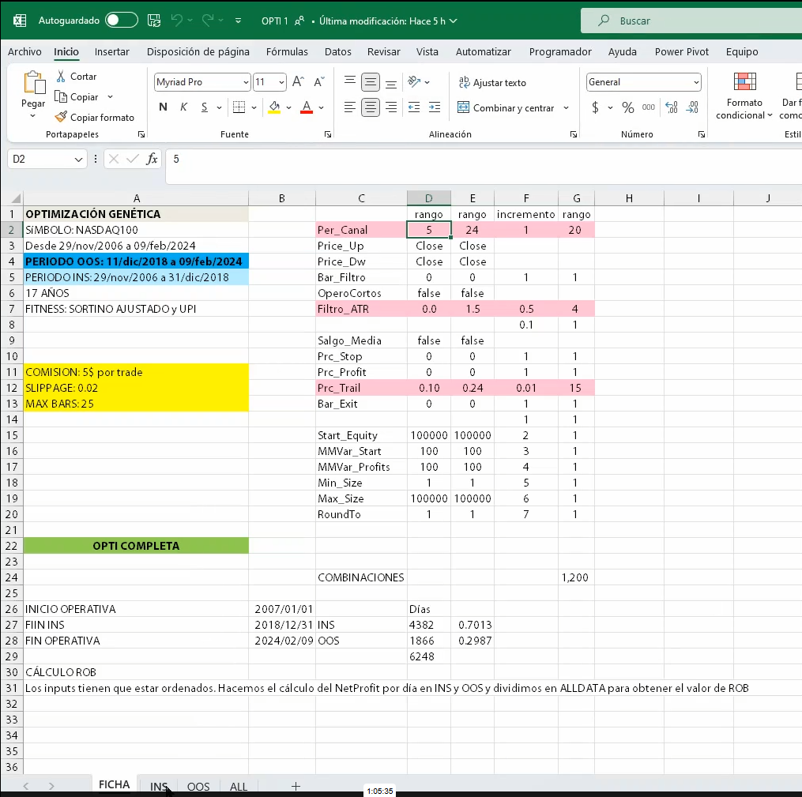
  <figcaption>Figura 133. Inputs.</figcaption>
</figure>

Al final lo hemos recogido en los 4 Excels. Como ya sabéis, haciendo este análisis que os enseñé que hacíamos siempre, este perfil de optimización, ¿os acordáis? Aquí, ¿qué hemos hecho?:
* Hemos recogido UPI
* El Sortino
* El recovery, que simplemente es el profit partido por drawdown
* Y hemos hecho estas variaciones que vimos que hacíamos en la teoría
* Y una suma con ROB
* Y una suma sin ROB

<figure>
  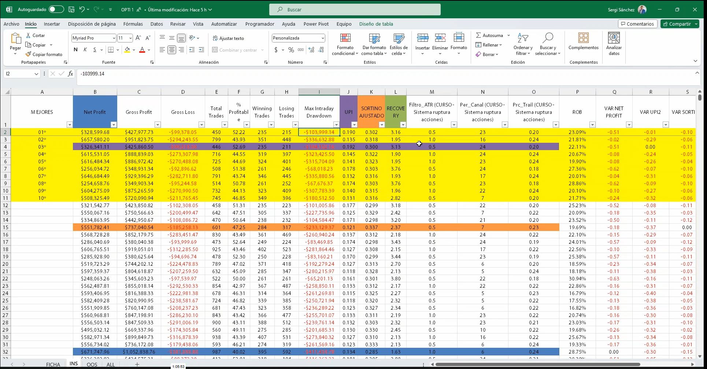
  <figcaption>Figura 134. Herramienta de estadística descriptiva en Excel para análisis de optimización.</figcaption>
</figure>

Ahora profundizamos en esta estadística descriptiva que salía de Excel; os acordáis de que ya aparece desde aquí, en Datos → Análisis de datos. Eso es bastante útil ponerlo debajo de aquí:

<figure>
  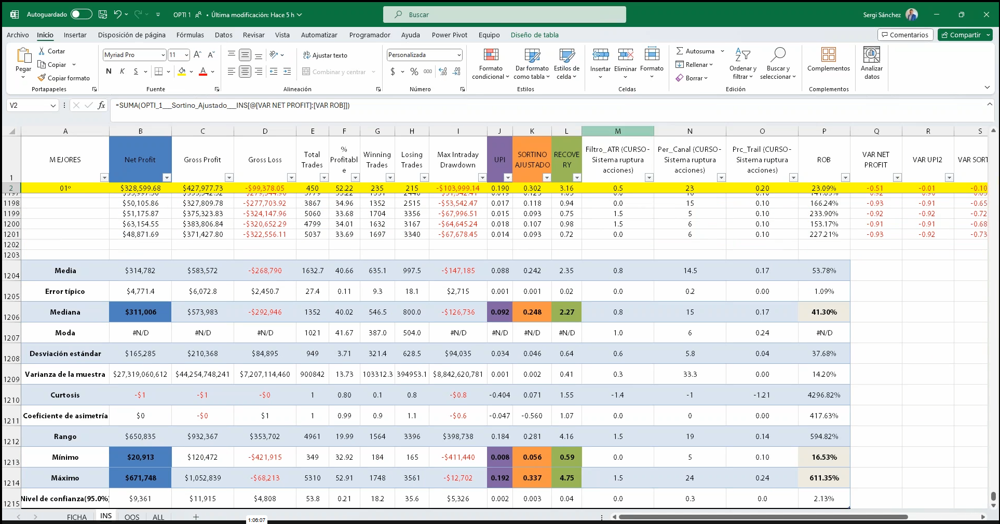
  <figcaption>Figura 021. Herramienta de estadística descriptiva en Excel para análisis de optimización.</figcaption>
</figure>

Esto es bastante útil porque, al final, te da valores de media, mediana, moda, kurtosis, te da la desviación, máximo, mínimo… y, a partir de ahí, puedes hacer estos cálculos de variación para simplemente normalizar las variables, porque cada una tiene un rango distinto de actuación.

Con esta división las normalizamos: restamos cada valor del máximo y lo dividimos por él. No es más que calcular el porcentaje que varía respecto al máximo; es decir, cuánto cae cada variable respecto al mayor valor alcanzado. De esa manera queda normalizada.

También podría hacerse —en algunos casos, aunque aquí no lo hemos hecho— fijar ese valor de máximo. Ese valor `máximo` lo puedes limitar tú para compararlas todas igual:

<figure>
  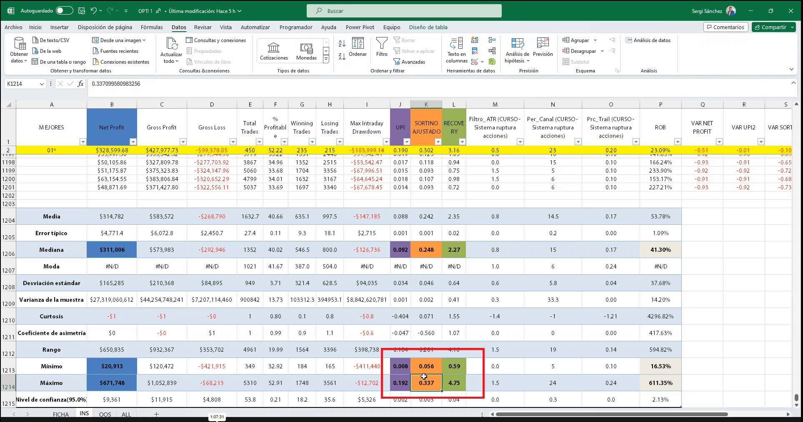
  <figcaption>Figura 023. Normalización de variables respecto al valor máximo.</figcaption>
</figure>

Esto se usa, por ejemplo, cuando quieres elegir sets: imagina que tienes distintas optimizaciones y quieres que todas usen el mismo `máximo`, para que el valor que salga aquí (media, suma, etc.) sea comparable entre todas ellas. Porque al final este máximo depende solo de este Excel.

Imagina que en otro Excel el `máximo` fuera `0.7`: lo justo sería calcularlo todo sobre 0.7. Esto solo haría falta si los valores máximos fueran muy distintos en cada optimización. Esto sirve para hacer esta división que hacemos en estas columnas, las que tienen el colorín:

<figure>
  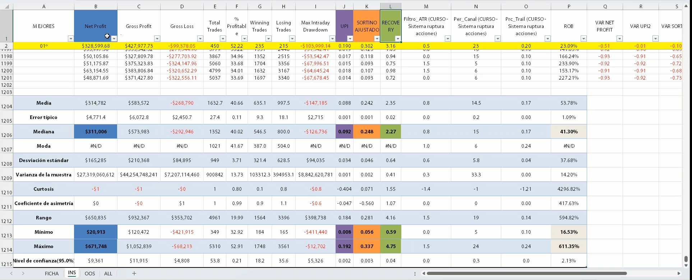
  <figcaption>Figura 135.</figcaption>
</figure>

Aquí hemos hecho net profit, UPI, Sortino ajustado y recovery. Repito: variación respecto al máximo. Simplemente ese cálculo: la variación. Por ejemplo, este varía –0.51%, este –0.02%, este –0.51%, y así sucesivamente. 

<figure>
  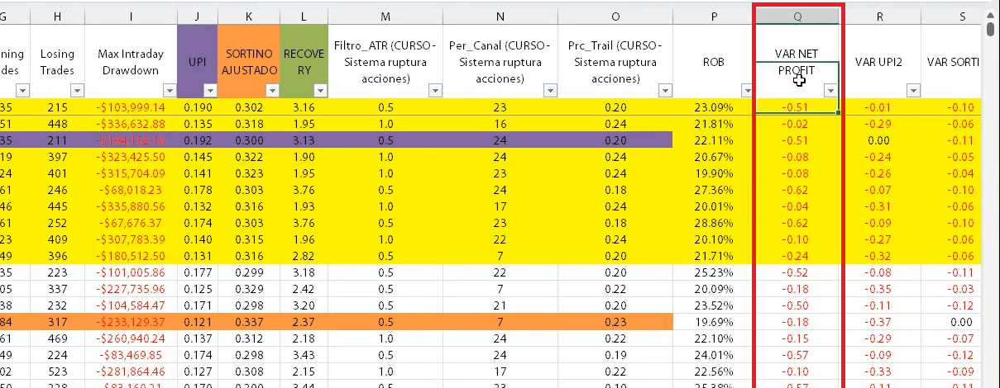
  <figcaption>Figura 024. Columnas de variación normalizada para cada métrica de rendimiento.</figcaption>
</figure>

Si ordenas del mayor al menor, verás que el que queda arriba del todo es el mejor net profit, que lo tengo marcado en azul:

<figure>
  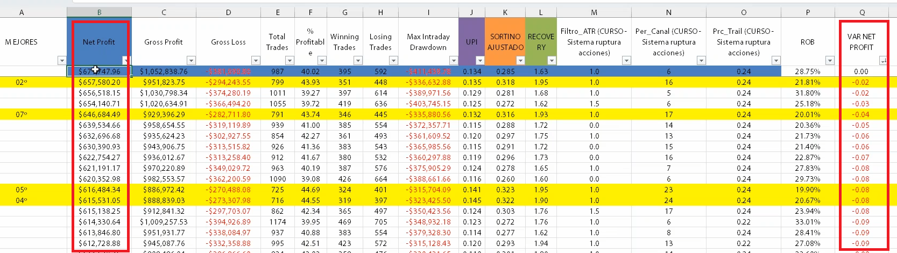
  <figcaption>Figura 027. Ordenación por net profit mostrando el mejor candidato.</figcaption>
</figure>

Del mismo modo, si ordeno por UPI, arriba queda el que tiene mejor UPI:

<figure>
  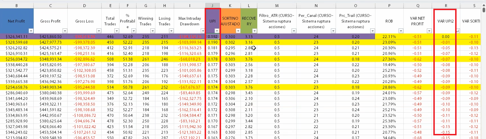
  <figcaption>Figura 026. Ordenación por UPI mostrando el mejor candidato.</figcaption>
</figure>

Y si ordeno por Sortino, arriba queda el que tiene mejor recovery, 2.37:

<figure>
  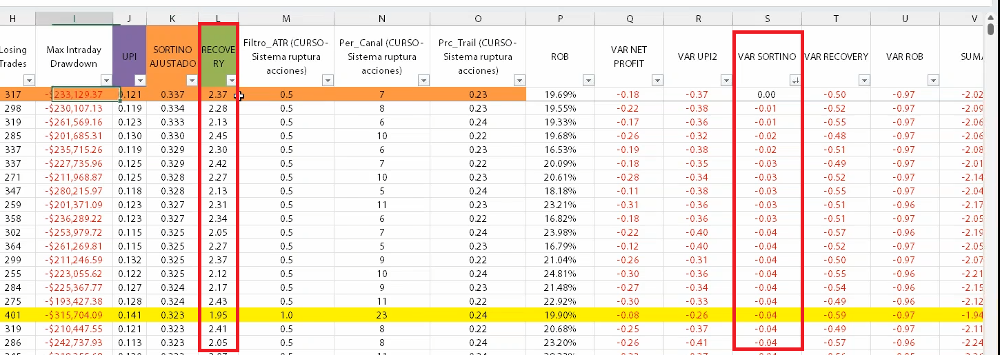
  <figcaption>Figura 028. Ordenación por Sortino mostrando mejor recovery.</figcaption>
</figure>

Y así sucesivamente. El valor `VAR ROB` dejará arriba el que tiene mayor robustez `ROB`. 

> Cuidado: el VAR ROB lo hemos calculado nosotros, porque MultiCharts no nos da esos valores. 

Como al final MultiCharts no nos proporciona todos los datos, simplemente con los días que hay en el in-sample y los días que hay en el out-of-sample hemos calculado qué retorno da en un periodo y qué retorno da en el otro, anualizado. Es decir: dividido por 365, multiplicado por los días, y dividido otra vez por 365. No deja de ser una regla de tres para que el dato sea comparable. En el in-sample tienes unos 400 y pico días; en el out-of-sample, unos 1.300 días. Hay que ajustar para que el beneficio sea comparable año a año. La idea es esa: hacerlo comparable.

<figure>
  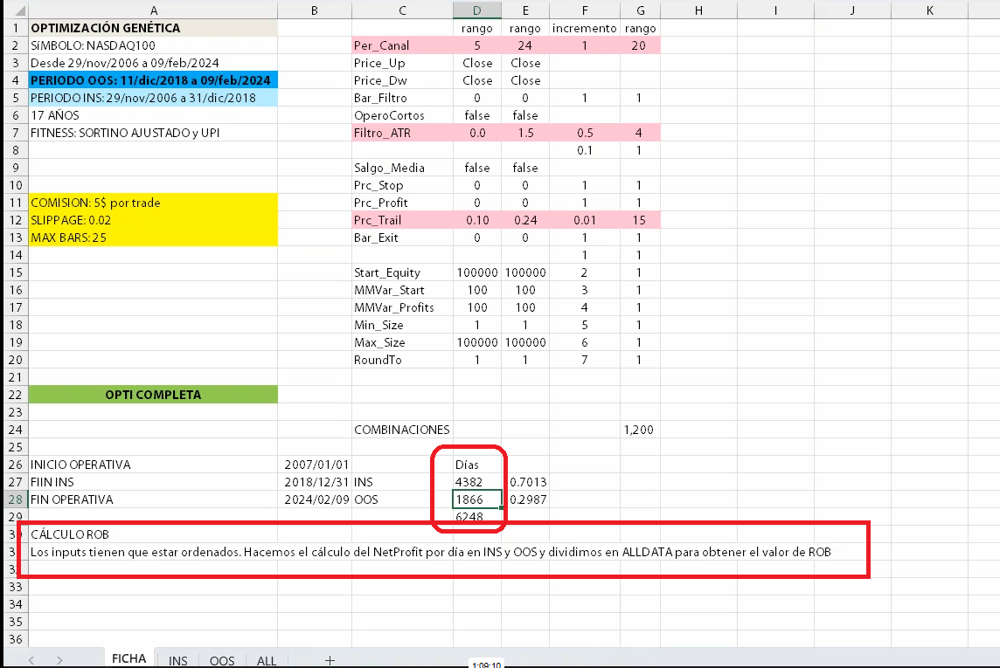
  <figcaption>Figura 136. calculo propio del ROB.</figcaption>
</figure>

Recordad que el `robustness` index* o `walk-forward efficiency` en algunos programas de walk forward,  compara el beneficio anualizado del periodo *out-of-sample* con el beneficio anualizado del periodo *in-sample*, porque no podemos compararlos directamente: lo que ganas in-sample es el 70% del tiempo y lo que ganas out-of-sample es el 30%. Lógicamente las magnitudes no son comparables a pelo; hay que ajustarlas por tiempo. Igual que con los ratios: hay que normalizar o estandarizar a un periodo común. Por eso hemos calculado directamente el robustness, ya que MultiCharts no nos lo ofrece.

Vale, y con eso pues hemos sacado aquí nuestros ratios de `SUMA`, que no deja de ser: qué parámetro equilibra mejor en todos los ratios. No es más que eso, es decir, porque al final hemos hecho 1, 2, 3, 4 y el ROB, 5, de acuerdo, sería el quinto. Entonces pues cada input pesa un 20%. Es decir, hacemos una media de estos inputs. Que podrían ser otros. Al final normalmente esto, si son buenos ratios, os van a dar… 

<figure>
  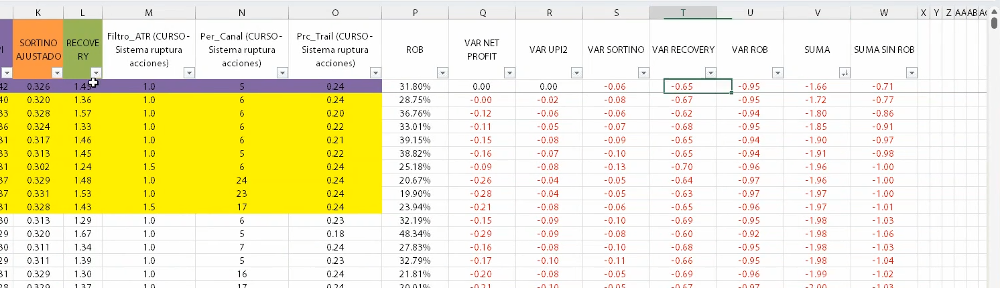
  <figcaption>Figura 030. Cálculo del robustness index manualmente en Excel.</figcaption>
</figure>

Aquí hemos metido 
* un `Sortino` que depende de la volatilidad de los retornos negativos en el numerador; que en realidadtodos son muy parecidos. 
* Un `recovery` que depende del drawdown a pelo, del drawdown máximo a pelo. 
* Un `UPI` que depende del drawdown y del tiempo que dura el drawdown. 
* Y para meterle el retorno a pelo también hemos metido el retorno directo `Net Profit`, para quitarle un poco de peso, porque había mucho peso. 

<figure>
  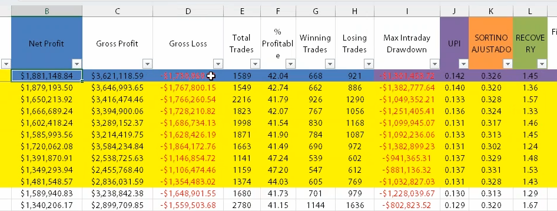
  <figcaption>Figura 137</figcaption>
</figure>

Porque estos tres ratios al final están muy gobernados por el riesgo, entonces también hemos metido el net profit a pelo, aunque eso se ha metido en el profit, estaría bien solo estos tres también. Cuidado, no estaría mal, no sería mal, y habría algún pequeño cambio, pero no sería muy significativo. 

Esto al final simplemente marca cuáles son los 10 mejores aquí, 

<figure>
  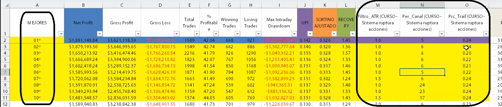
  <figcaption>Figura 139. Los mejores de los filtros añadidos</figcaption>
</figure>

No quiere decir que los 10 son los que se han operado. Ahora luego lo vemos.

Bien, entonces esta era la `opti 1`, que acordaros que es la completa.  
De acuerdo está así, que ahora os voy a enseñar el gráfico en el mapa en 3D. Esta es la que mide todos los ratios, o sea, todos los tres inputs. Tiene 1200 combinaciones: de 5 a 24 el canal; de 0 a 1.5 el filtro ATR variando 0.5, son solo 4; y el trailing de 0.10 a 0.24 variando de 1%, que nos da 15 combinaciones. Total: 1200. 

<figure>
  
  <figcaption>Figura 133. Optimización 1 completa con todas las combinaciones de parámetros.</figcaption>
</figure>

Esta es toda ella en in-sample, out-of-sample y all_data:

<figure>
  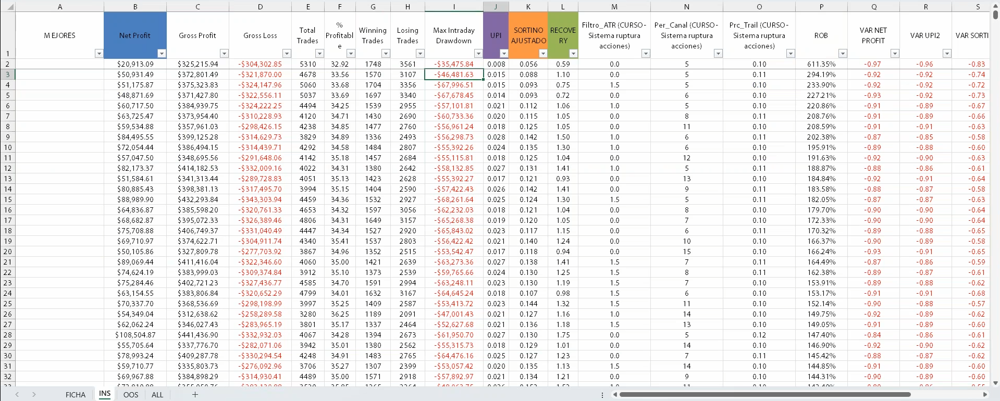
  <figcaption>Figura 034. Mapa 3D de optimización en periodo in-sample con 1200 combinaciones.</figcaption>
</figure>

Lógicamente, lo que añade capa de robustez y es interesante es que estos datos sean similares, que no ocurre del todo aquí. No ocurre del todo aquí. 

Es decir, 

**`in-sample`**

cuando ordenamos por `suma`, estamos viendo 
* `Filtro_ATR` 0.5, 1, 0.5, 1, 1, 1… hay un predominio de `1`, pero aparece bastante el `0.5` de por sí. Aparece bastante el 0.5
* El `Per_Canal`, esto ya lo hemos comentado antes, hay una cierta… Aunque el predominio de zonas altas hay un poco de todo, porque al final el Per_canal, lo que hemos dicho, no es muy director. 
*  `Prc_trailing` que mayormente se va a la zona alta: 0.20, 0.18, etc, como ya lo habíamos visto en el análisis solo. Acordaros que iba, los ratios para allá. Pues bueno, también en el conjunto aparece igual.

<figure>
  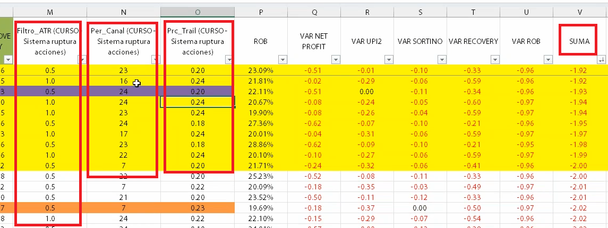
  <figcaption>Figura 140. <strong><code>in-sample</code></strong>.</figcaption>
</figure>

**`out-of-sample`**

Lo que ocurre es que si analizamos en el out-of-sample, ¿dónde vemos alguna variación?

*  `Prc_trailing` que mayormente se va a la zona alta: 0.20, 0.18, etc, como ya lo habíamos visto en el análisis solo. Acordaros que iba, los ratios para allá. Pues bueno, también en el conjunto aparece igual.
* `Per_Canal` Pero vemos que el canal se nos va más a la zona baja 5, 5, 5, 11, 6, 9, etc. Este es el principal cambio entre in-sample y out-of-sample en esta. Aquí se nos va a la zona baja. Ahora luego vamos a ver ella sola, a ver si pasa lo mismo, porque esto es de las típicas preguntas que nos tenemos que hacer. Y en principio esto no es preocupante porque ya es lo que hemos visto antes en el análisis solo, que no vamos a volver a ver. Lo que me estoy anticipando es que no es muy director este parámetro, de acuerdo. En todas las zonas va bastante bien, de acuerdo. Así que bueno, pues le ha dado aquí, pues perfecto, pues muy bien. Pero no es tampoco tremendamente crítico, de acuerdo. No es tremendamente crítico.
* `filtro_ATR` Sí que en el out-of-sample se va claramente al uno, pero es que todas las primeras son 1, 1, 1 hasta llegar bastante abajo

<figure>
  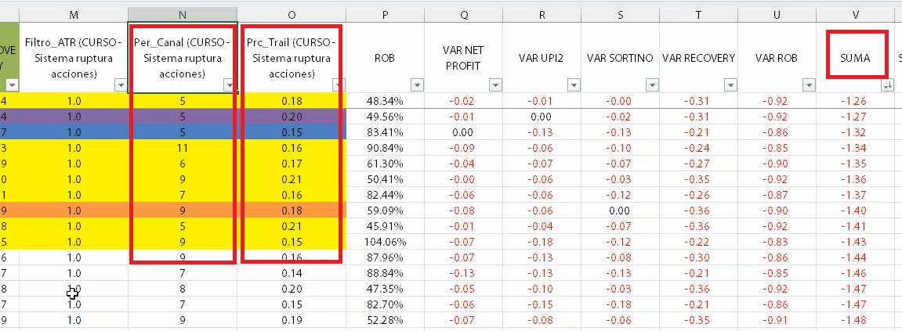
  <figcaption>Figura 141. Distribución de parámetros óptimos en <strong><code>out-of-sample</code></strong>.</figcaption>
</figure>

 Y de hecho, si vemos aquí los valores que nos da en cuanto a profit, pero si aquí arriba estamos $99-100K   
 Y vamos bajando y estamos en $80K, $60K, $70K… 

<figure>
  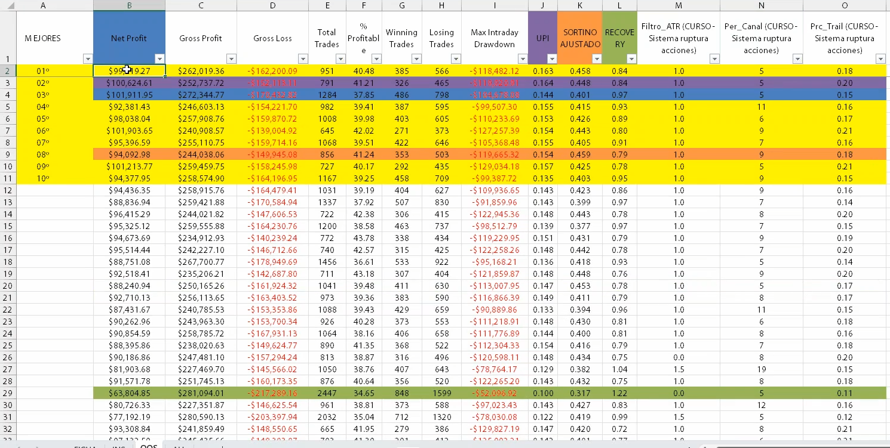
  <figcaption>Figura 037. Valores de profit en los mejores candidatos de optimización.</figcaption>
</figure>

Y en los ratios, en esta suma (**V**):  
Aquí la suma, fijaros que el que da menos da menos, `-1.26`, la suma de todos estos ratios (**Q+R+S+T+U**). Pero fijaros que no es muy abrupto, se va oscilando bastante. Si vas viendo y bajando por su columna hasta abajo de la columna, llega a doblar al final, casi llega a bajar bastante, aproximadamente la mitad. Está bien, es bastante progresivo, es bastante progresivo.

<figure>
  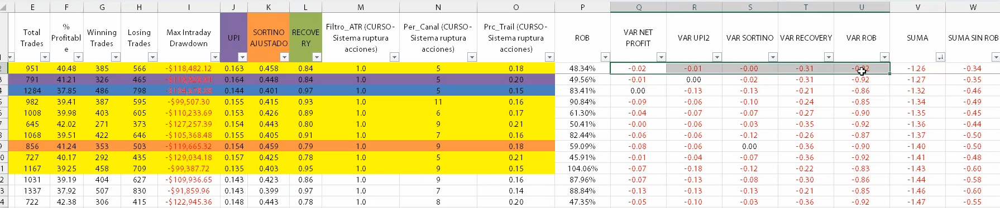
  <figcaption>Figura 038. Columna de suma de ratios normalizados para ranking de candidatos.</figcaption>
</figure>

**`all_data`**

Lógicamente, en el `all_data`, el all data al final es todo el periodo junto. ***¿Dónde tenía más sentido elegir los parámetros?***  

Donde tiene más sentido elegir los parámetros es en el `all_data`, en el all data, pero habiendo mirado también qué ha hecho `in-sample` y `out-of-sample` y qué ha hecho. Es decir, no quiere decir que ignoremos los otros datos. Al final, recordar que todas las, *la mayoría de trabajos que hacemos no son para elegir sets*. 

Al final la mayoría de procedimientos que hacemos son simplemente para evaluar la estrategia. Es decir, para considerar que la estrategia es apta para operar. Y cuando llegamos a esa conclusión, entonces elegimos set. Pero elegir set es al final… 

Elegir set es al final… todavía no hemos ni hablado de ello. Pero sí que lo haríamos en all data, si consideramos que la estrategia es robusta, que nos gusta para operar. No solo eso, que tiene un rendimiento aceptable mínimo, etcétera, etcétera, tiene un perfil de riesgo que nos gusta, etcétera. Pueden haber muchos motivos que nos lleven a no operar o sí operar esa estrategia. Pero de momento evaluaríamos simplemente la idoneidad de la estrategia.

Bien. De momento, por lo que os digo, esta comparación entre *in-sample* y *out-of-sample* sí que corrobora bastante que el trailing va en esta zona, pero hay esa ambigüedad. En cuanto al `filtro_ATR` Sí que en el out-of-sample se va claramente al uno, pero es que todas las primeras son 1, 1, 1 hasta llegar bastante abajo. Cuando en el in-sample pues no estaba tan claro, digamos que está más repartido.

En el all_data, usando los dos, 

* `Per_Canal` aparecen los dos lados: aparecen los que salían más en el out-of-sample y aparecen que salían más in-sample
* `filtro_ATR` también aparece el 1, 1.5, pero en general claramente el 1. Con lo cual sí que ahí parece apuntarse que el 1 es el que más claro. 
*  `Prc_trailing` Lo quiere muy alto, muy alto.

<figure>
  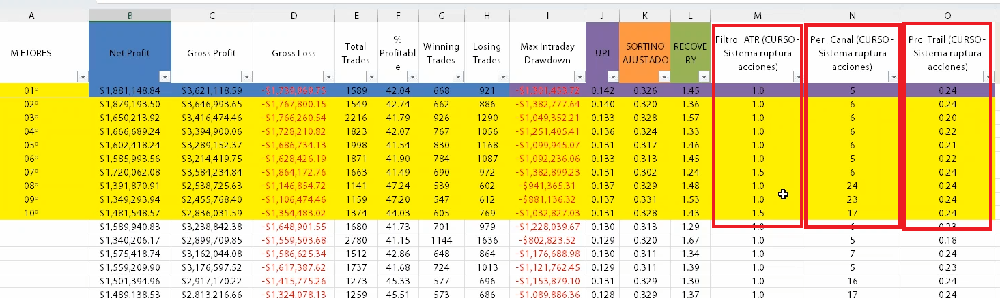
  <figcaption>Figura 142.</figcaption>
</figure>

Esto ya nos dice una cosa, y tampoco es muy buena señal, no es muy buena señal. ¿Por qué? ¿qué nos está indicando?   
Hay que ir aprendiendo a leer las optimizaciones. **nos está diciendo que no quiere salir**. 

Que veía yo aquí, estaba la… Si yo le pongo aquí `0.24`:

<figure>
  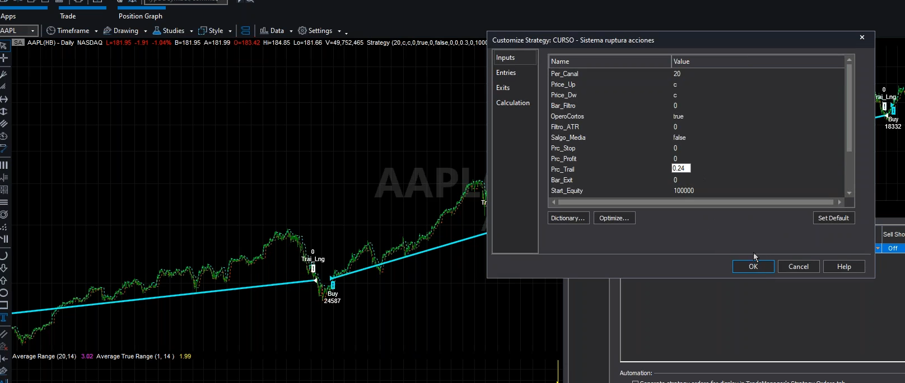
  <figcaption>Figura 044. Sistema con trailing en 0.24 mostrando reluctancia a ejecutar salidas.</figcaption>
</figure>

Veis que aún tarda bastante en salir, pero va saliendo, va saliendo en algunos casos:

<figure>
  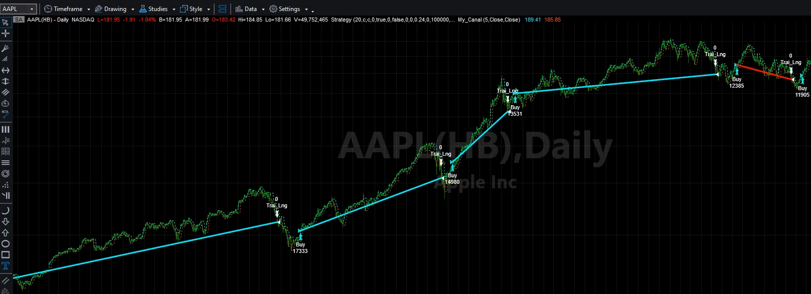
  <figcaption>Figura 046. Ejemplos de salidas con trailing amplio.</figcaption>
</figure>

Pero fijaros que la mayoría de veces aún me entra más caro, con alguna excepción importante, que esas son las que le cuestionan, los que le permiten. Habrá alguna excepción muy, muy importante como esta, que hay un salto muy grande: que ya justifica seguramente todo el stop. Pero es que los stops, como ya sabéis, ya os he comentado muchas veces, normalmente no vienen a aportar mucho al sistema en términos de retorno, pero sí que en términos de riesgo, vale. 

<figure>
  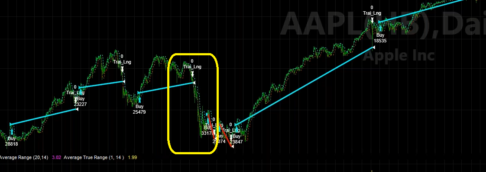
  <figcaption>Figura 045. Excepción con salto importante que justifica el trailing amplio.</figcaption>
</figure>

Pero aquí, que quiera cada vez el traling mayor, quiere decir que no es una salida muy eficiente, de acuerdo. Es decir, cuando tú tienes este tipo de mapa… comparemos

**Comparo cómo se comporta la optimización en diferentes funciones fitness**  

Vamos a comparar cómo se comporta la optimización cuando usas diferentes funciones de fitness para medir la "calidad" de cada combinación de parámetros.

Las variables a optimizar son las mismas (`Per_canal` y `Prc_Trail`)  
Lo que cambia es la métrica de evaluación (Sortino vs UPI en el `eje Z`)  

| OPTI 1 - `all_data` Sortino | OPTI 1 - `all_data` UPI |
|---------------------------|------------------------|
| Eje X: `Per_canal` | Eje X: `Per_canal` |
| Eje Y: `Prc_Trail` | Eje Y: `Prc_Trail` |
| Eje Z: `Custom_Fitness Sortino` | Eje Z: `Custom_Fitness UPI` | 

  <strong>📊 Métricas de Custom Fitness: Sortino vs UPI</strong>  
  
  <table style="width: 100%; border-collapse: collapse;">
    <tr>
      <td style="background: #fff; padding: 10px; border-radius: 5px; width: 50%; vertical-align: top;">
        <strong>Sortino Ratio</strong> 
        <em>Mide: Rendimiento por unidad de riesgo bajista</em>  
        <code>Sortino = (Rp - Rf) / σd</code>  
        Donde: 
        • <code>Rp</code> = Rendimiento del portfolio 
        • <code>Rf</code> = Tasa libre de riesgo 
        • <code>σd</code> = Desviación estándar de rendimientos negativos  
        <strong>Característica:</strong> Solo penaliza la volatilidad negativa. Si tu estrategia sube mucho, no te castiga.
      </td>
      <td style="width: 10px;"></td>
      <td style="background: #fff; padding: 10px; border-radius: 5px; width: 50%; vertical-align: top;">
        <strong>UPI (Ulcer Performance Index)</strong> 
        <em>Mide: Rendimiento por unidad de drawdown</em>  
        <code>UPI = (Rp - Rf) / Ulcer Index</code>  
        Donde Ulcer Index: 
        <code>UI = √(Σ Di² / n)</code> 
        (profundidad y duración de drawdowns)  
        <strong>Característica:</strong> Penaliza cuánto caes desde máximos y cuánto tardas en recuperarte.
      </td>
    </tr>
  </table>
  
  

    <strong>💡 ¿Cuándo usar cada uno?</strong>  
    • <strong>Sortino</strong> → Te importa la volatilidad negativa (dispersión de pérdidas) 
    • <strong>UPI</strong> → Te importa el drawdown (cuánto caes y cuánto tardas en recuperar)  
    <em>UPI es más "psicológico" — refleja mejor el estrés de ver tu cuenta en rojo durante semanas.</em>
  

<figure>
  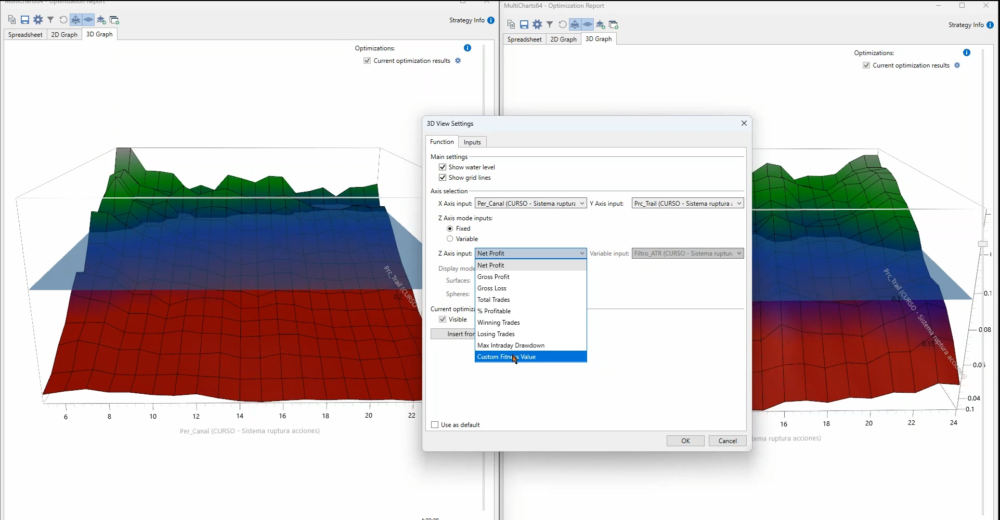
  <figcaption
  >Figura 143. Configurando custon fitnes en ambos gráficos</figcaption>
</figure>

Pero como veis, es bastante, bastante similar. Al final el objetivo es simplemente ver la estabilidad de los parámetros, de acuerdo. Ver la estabilidad de los parámetros, no es otro. 

<figure>
  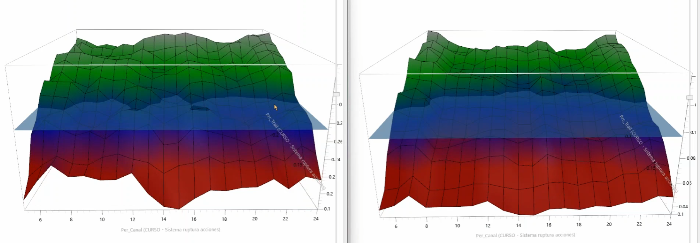
  <figcaption>Figura 047. Mapa de Sortino con filtro ATR fijado en 1.</figcaption>
</figure>

<figure>
  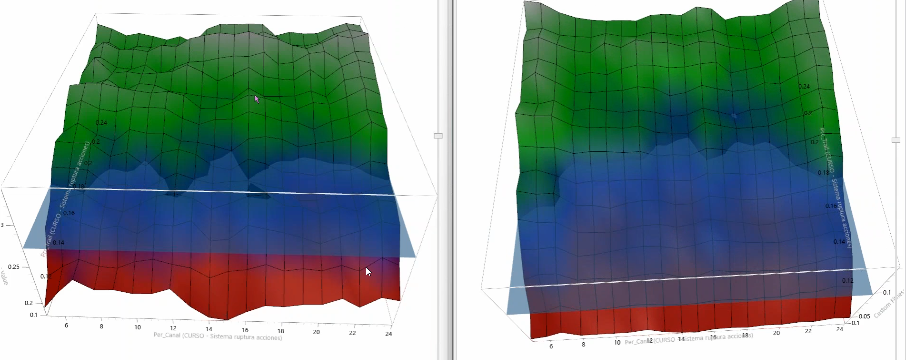
  <figcaption>Figura 048. Mapa de UPI con filtro ATR fijado en 1.</figcaption>
</figure>

<figure>
  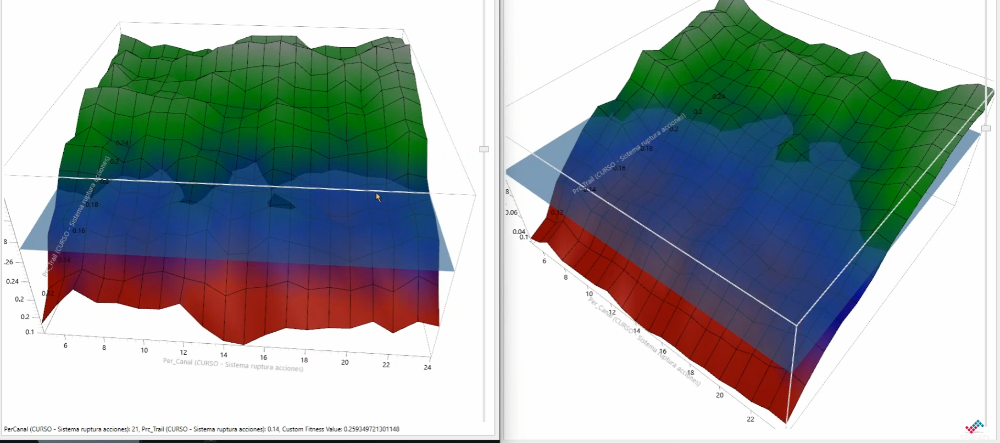
  <figcaption>Figura 049. Comparativa de Sortino y UPI mostrando estabilidad paramétrica.</figcaption>
</figure>

Bueno, se ven muy estables, se ven muy, muy estables. Sobre todo, repito, el `canal`. En lo que decía, pero sí que es verdad, aunque es verdad que aquí en la zona de `20` parece que quiere estabilizar, pero parece como que quiere más arriba:

<figure>
  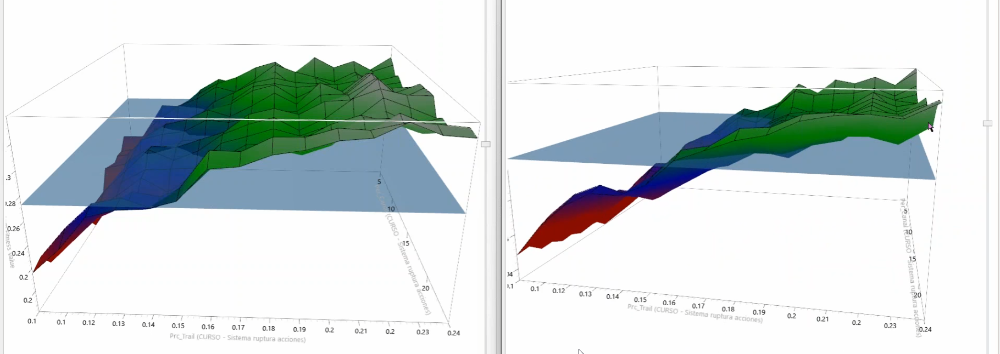
  <figcaption>Figura 050. Tendencia del trailing a buscar valores superiores a 0.20.</figcaption>
</figure>

Ya por tema de muestra, también de velocidad de optimización, pues no queríamos llevarla mucho más arriba. Pero tampoco estaría mal aquí ahora, tampoco estaría mal, pues, analizar y decir: "Pues mira, le voy a cortar aquí en `0.18` y lo vamos a llevar bastante más arriba con un límite de trades mínimo, pero para ver si sigue con la tendencia arriba". Porque si sigue indefinidamente queriendo subir, eso es un claro signo de que el stop no es eficiente y que no lo quiere. Y me puede decir: "Hombre, pero eso ya me lo has dicho, que suele pasar." Ya, pero no olvidar que este sistema no tiene otro mecanismo de salida. 

<figure>
  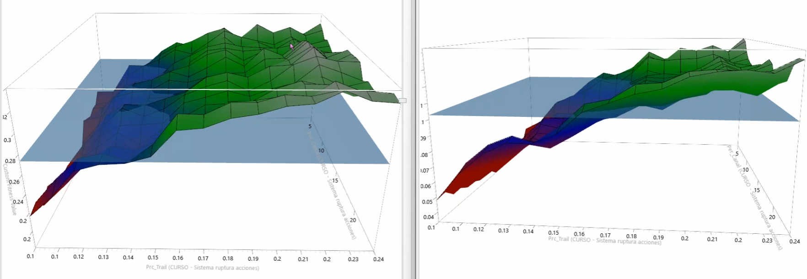
  <figcaption>Figura 051. Exploración de trailing por encima de 0.24 para verificar tendencia.</figcaption>
</figure>

Yo, por ejemplo, esto en Apolo, por ejemplo, el sistema que operamos, también ocurre que al final quiere un stop muy alto, pero tiene otro mecanismo de salida. Apolo puede salir por otros métodos, no solo por stop. El stop es como un *hard stop*, un hard stop que salta pocas veces, pero cuando salta te hace bastante daño. 

Aquí no es el caso: es su *único mecanismo de salida*. Le podríamos haber dejado que existe esa posibilidad, recordar: ***salir por la media***. Y tampoco estaría mal, porque también es tendencial en ese caso. Y en ese caso al final casi nunca habría salido por stop, solo en algún día de volatilidad salvaje que un día que era mucho y tanto. Pero casi nunca te hubieras salido por stop, siempre te hubieras salido por la media del canal, y entonces el canal se hubiera vuelto más director. Lo dejo también como ejercicio para que probéis vosotros. 

  <strong>📄 PDF código </strong>  
  
  Por cierto, no lo he abierto, pero lo enseño aquí en el <a href="../../12-practice-02/SISTEMA%20DE%20RUPTURA%20EN%20ACCIONES.pdf">PDF</a>.  
  
  Aquellos que ya lo habéis visto, lo tenéis ahí. Está explicada la estrategia y al final está el código. Digamos directamente, este está ya limpio, solo con lo que usamos. No está la media, pero podéis ponerla. Porque quería daros esta, la que estamos viendo, solo pura y dura. Si alguien quiere que le pase la de la media, pues es bastante sencillo, no tiene mucha historia. Pero si alguien lo quiere, se lo pasamos.  
  
  Pero recordar que teníamos una versión con más salidas: trailing, TP, salida por número de barras, y por media. Por número de barras, si buscamos un tendencial, no me convence, como ya os comenté. Pero en media sí tendría sentido. Y así el canal se volvería bastante más director. Lo dejo para que lo probéis vosotros.

<figure>
  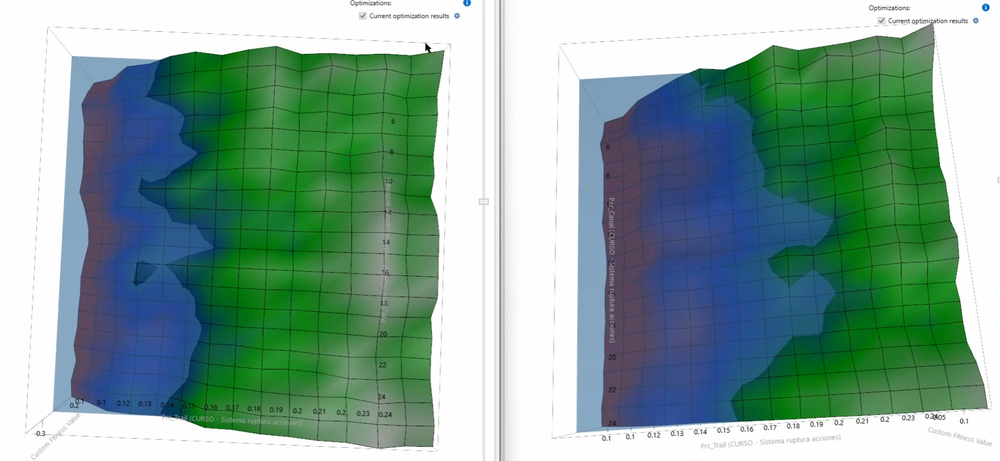
  <figcaption>Figura 052. Código del sistema con diferentes opciones de salida comentadas.</figcaption>
</figure>

Bien, entonces aquí el mapa se ve bastante bien, la verdad. El mapa, el mapa en general de los dos, tanto por UPI como por Sortino, se ve bastante bien. Se ve que el `Per_canal` no es director, y se ve que en esta zona de 0.20, 0.22, 0.24 hay bastante estabilidad, de acuerdo. Quizá aquí en 0.20 no es donde quizá se ve mejor, aunque aquí sí, sí parece que también ya podemos aún forzarlo más ahí. Y veis cómo sí que se quiere cerrar:

<figure>
  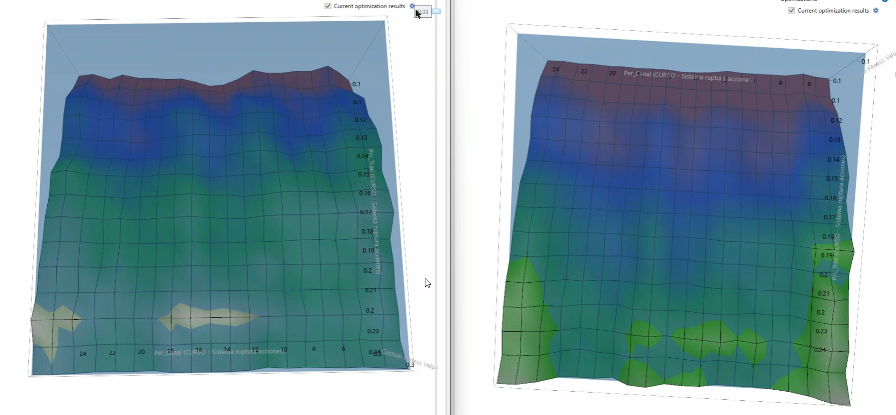
  <figcaption>Figura 053. Mapa mostrando zona de estabilidad entre 0.20-0.24 en trailing.</figcaption>
</figure>

Ahí veis entre una planicie y 0.20, es decir, esta zona un poco del pico:

<figure>
  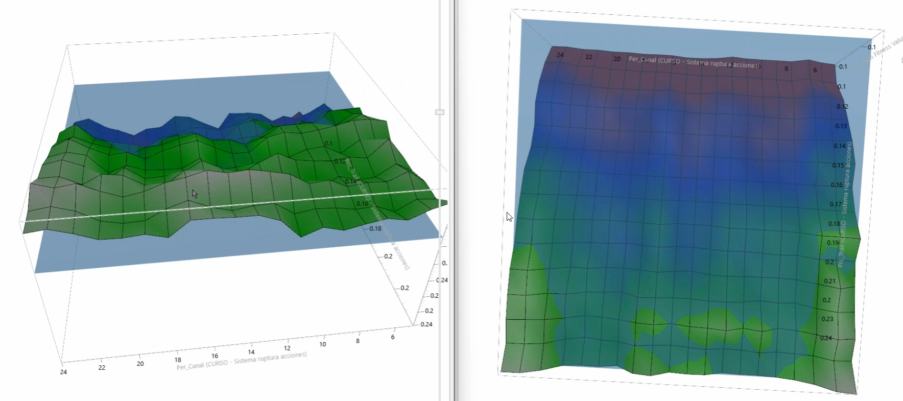
  <figcaption>Figura 054. Detalle de la zona de pico en el mapa de optimización.</figcaption>
</figure>

Pero bueno, todo el 0.20, fijaros que es muy, muy, muy estable. Pero bueno, en cualquier caso ya os digo, toda esta zona está bien. Aquí creo que está fijado en uno.

**`filtro_ATR = 0`**

Vamos a probar, por ejemplo, en el 0. 

<figure>
  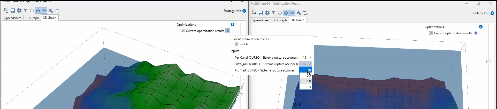
  <figcaption>Figura 144.</figcaption>
</figure>

Y el tema, lo que os decía de cuidado con las autoescalas, porque al final los gráficos se autoescalan. Y por eso os decía que había quitado un poco de aquí también, había quitado de lo había dejado, bajar el 0.10 para que no se me cayera tanto:

<figure>
  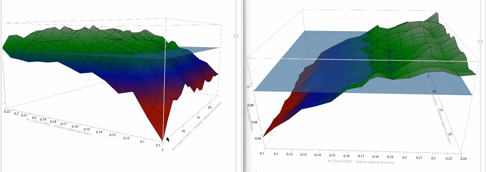
  <figcaption>Figura 055. Ajuste de escala para evitar distorsión visual en mapas de optimización.</figcaption>
</figure>

Porque si no, al final, como el gráfico se autoescala, el valor mínimo que coges es el mínimo que le da, entonces se la hace más o menos abrupta. Entonces por eso hay veces que interesa también cortarlas, porque meter mucho más hace que el valor inferior sea muy bajo o el valor superior sea muy alto. Y como los gráficos autoescalan, pues perdemos un poco de vista el dato.

Voy a quedarme solo con el de Sortino, y así creo que lo podremos ver mejor. ¿Ves a la izquierda la escala? He puesto `fitness_value`. ¿Es ahí, veis el valor de abajo y arriba?

<figure>
  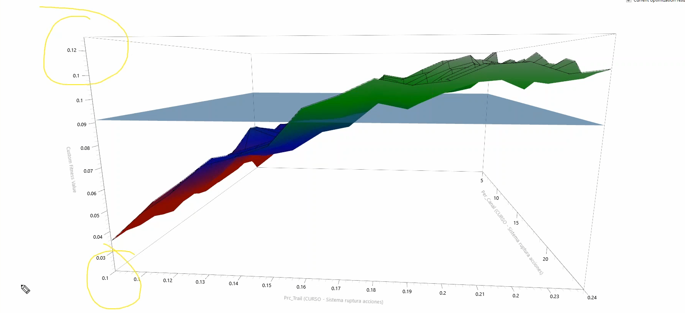
  <figcaption>Figura 056. Escala de fitness_value en mapa de Sortino.</figcaption>
</figure>

Fijaros ahora en **ATR 1.5**… Es otro… Como se autoescala, yo sigo viendo el dibujo que está muy bien, todo muy planito, pero está planito más arriba o más abajo. Entonces es el mismo problema que os digo siempre con los gráficos de acciones o de futuros, de que se autoescalan y a veces eso engaña mucho a la percepción de los movimientos. 

<figure>
  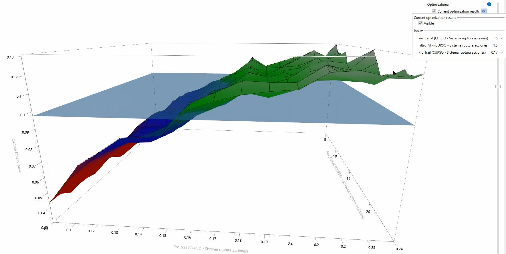
  <figcaption>Figura 058. Mapa con filtro ATR en 1.5 mostrando autoescalado diferente.</figcaption>
</figure>

Parece que no se ha movido, parece que se ha movido mucho, realmente no se ha movido nada, porque tú ves un gráfico que, ¡qué tendencia, qué pasada!, se ha movido un 0.20%, no es nada. Como el gráfico se autoescala a la pantalla, aquí pasa un poco lo mismo. Y como no te deja limitar este valor, sí que te deja elegir la variable y demás, pero no te deja elegir el valor, pues te puede pasar eso.

Para eso también tenemos luego, como habéis visto, los datos en Excel para poder aquí verlos, trabajarlos, y aquí podemos ver todos sus valores mucho mejor. Todo es complementario, no solo una cosa u otra, no es una cosa u otra:

<figure>
  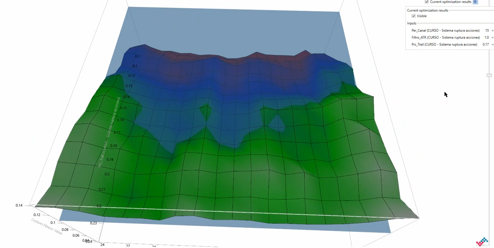
  <figcaption>Figura 059. Datos de optimización en Excel para análisis detallado.</figcaption>
</figure>

Nos dicen cosas distintas. Aquí vemos un poco, como decía, estabilidad. Y en general fijaros que hasta en todos ellos (**ahora ATR 1**) vemos estabilidad. Siempre habrá unos más que otros, pero en todos ellos vemos así. Lo que sí que viene muy bien para esto.

En definitiva, en el Excel lo hemos visto bastante claro: la zona que parecía más estable de más es en la zona de **uno**. Aunque eso que os digo, en todos va bastante bien, bastante. En todos los niveles de filtro va bastante bien. No es un filtro muy, muy, muy potente, pero sí que tiene para hacer cierto nivel de mejora. Yo, la verdad, cuando un filtro ya os lo comenté, solo aporta un cierto nivel de mejora, no soy muy partidario de meterlos.

Pero bueno, esto podemos hacer un análisis añadido. Es decir, ¿qué cambia?   
Por ejemplo, yo tengo aquí Este `5`, `0.24`:

<figure>
  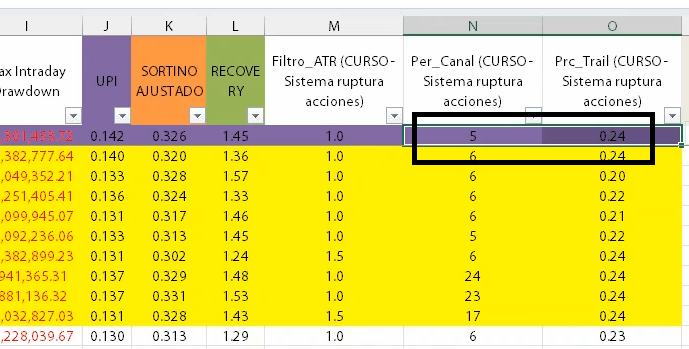
  <figcaption>Figura 062</figcaption>
</figure>

Por el **filtro ATR a cero**, Entonces de entrada puedo quitar los otros filtros para que no me molesten:

<figure>
  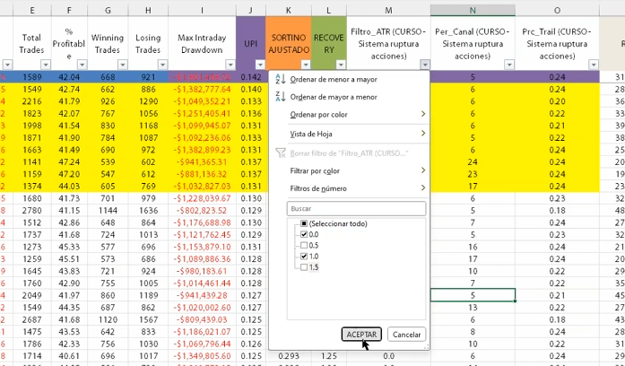
  <figcaption>Figura 063. Filtrado de datos para comparar solo filtro ATR en 0.</figcaption>
</figure>

Vale, y vamos a buscar el 5, por ejemplo, 0.24. Que es número 1, ahí está. Realmente está muy, muy abajo:  

Pero a mí me interesa ver los trades. Si miras la primera instancia (1589) con la seleccionada (1769), bueno, sí que son casi `200 trades de diferencia`. Sí, sí que tiene bastante. Bueno, tiene un cierto impacto. Al final son `dos trades por acción aproximadamente de media`, dos trades por acción. Entonces sé que tiene cierta implicación, y **sí que parece aportar bastante mejora, la verdad**.

<figure>
  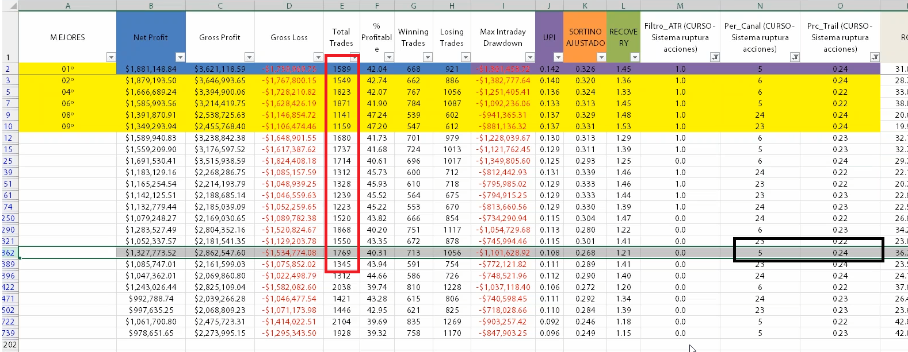
  <figcaption>Figura 065. Posición del set 5, 0.24 con filtro ATR en 0.</figcaption>
</figure>

#### **Optimizacion 2**

Este efecto, como has visto antes en el Per_canal… 

<figure>
  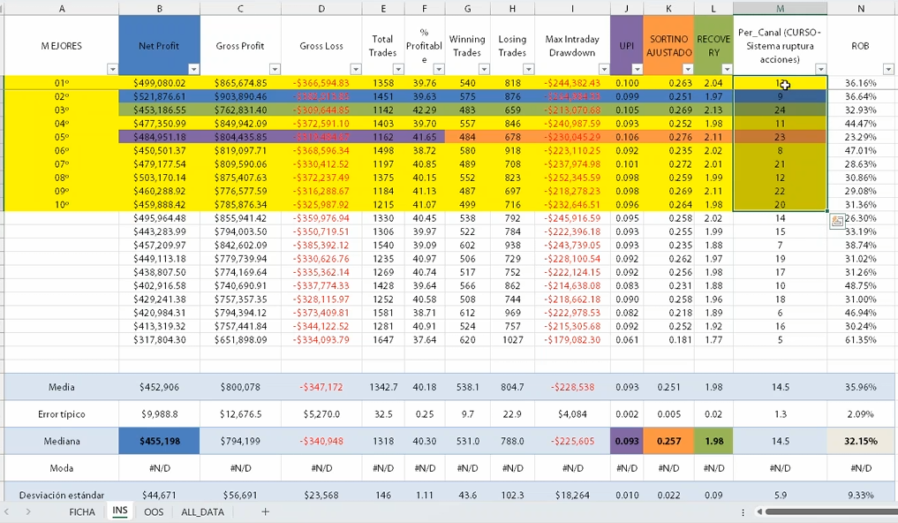
  <figcaption>Figura 066. Distribución del canal en in-sample mostrando dispersión.</figcaption>
</figure>

Fijaros que en este solo hemos analizado el canal y hemos bloqueado el filtro, el filtro en cero, Porque esto sí que, si estamos analizando el filtro, lo metemos al final. Y hemos dejado el trailing en `0.20`, era un valor que no está mal. Y vemos solo el canal, de acuerdo. 

<figure>
  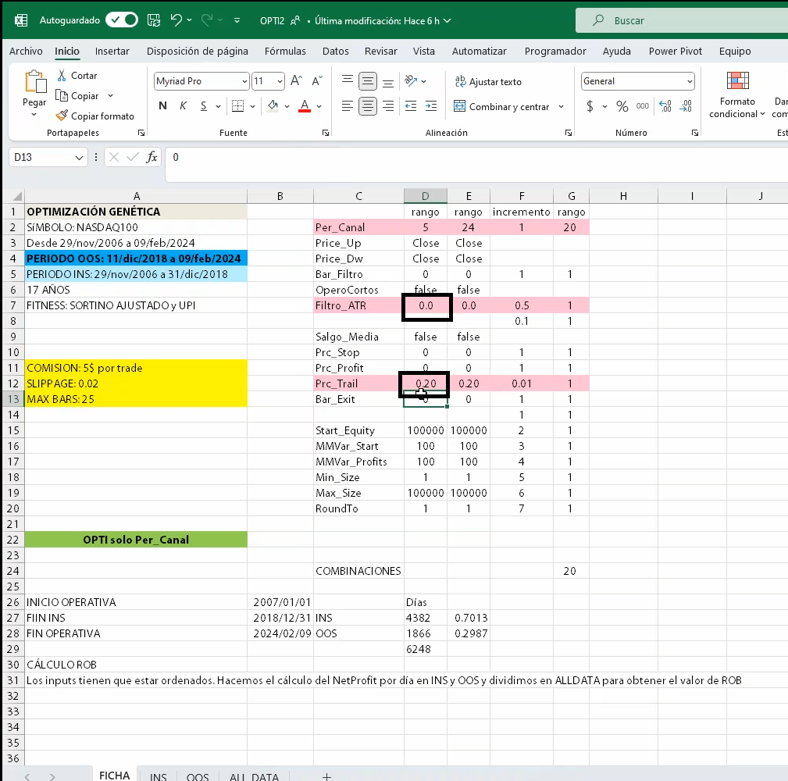
  <figcaption>Figura 064. Análisis del canal con filtro bloqueado en cero.</figcaption>
</figure>

Esto, digamos que es como podríamos haber empezado a analizar el sistema si no supiéramos por dónde pillarlo. "Voy a ver qué tal va el canal." Y vemos que en in-sample ya vemos un poco eso, Vemos que, fijaros, tienes 13, 9, 24, 8… No se ve una clara línea, se ve, bastante dispersión.

**`in-sample`**

<figure>
  
  <figcaption>Figura 066. Distribución del canal en in-sample mostrando dispersión.</figcaption>
</figure>

 Y en out-of-sample igual, aquí sí que se ve un poco lo mismo, Aunque sí que es verdad que el que está arriba es 8, 9, 10. Aquí el 8 está el sexto también, es decir, también está muy bien colocado. Y el 9 está segundo. Es decir, realmente aquí sí que en in-sample y out-of-sample, solo el canal fijando en 0.20 el trailing, los datos que vemos en in-sample y en out-of-sample son muy, muy parecidos. Son realmente muy parecidos.

**`out-of-sample`**

<figure>
  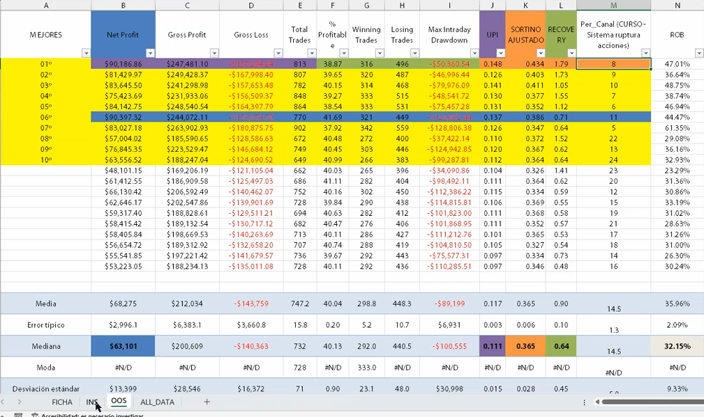
  <figcaption>Figura 067. Distribución del canal en out-of-sample confirmando dispersión.</figcaption>
</figure>

 El de más retorno, fijaros, me da 11. Aquí el de más retorno me da 9 en insample. El que da un pie sortino me da 23. Aquí en cambio da 8. Este sí que no concuerda, pero en general datos bastante, bastante parecidos a la que miramos esta mezcla de equilibrio entre las cuatro variables, de acuerdo: en el profit, UPI, Sortino ajustado y recovery. Tenemos bastante, bastante lo mismo. Esto es bueno. Esto es bueno. Y al final vemos en all_data, pues, es que hay valores altos y valores bajos, que esto es lo que hemos visto al final también: valores bajos y valores altos:

**`all_data`**

<figure>
  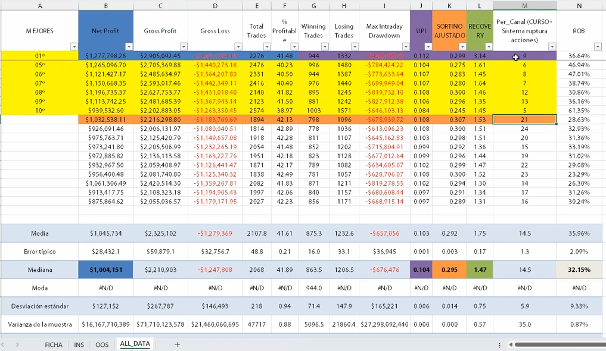
  <figcaption>Figura 068. All data mostrando distribución de valores altos y bajos del canal.</figcaption>
</figure>

***Bien, ¿cuál elegir si vemos que es lo mismo?*** 

Bueno, pero no es fácil. No es fácil. Es verdad que cuando un sistema… Esto también nos pasa bastante a veces en Apolo… Cuando un sistema es bastante robusto, que va muy bien en distintas zonas, pues no es fácil, no es fácil elegir. Porque hay que elegir alguno, y no es sencillo.

En todo caso, sí que lo haríamos ya en definitiva usando los datos completos, de la opti 1. Pero esto, como ya os comenté, nosotros cuando vamos a hacer la elección final no lo hacemos directamente desde aquí y ya nos quedamos, de acuerdo?. 

Vamos a ver algo más, de acuerdo. Vamos a ver el `performance report` y vemos algún dato más. Vemos la `curva`. Esto es lo que nos da ya un poco el filtrado final.

En este caso sí que lo que ya tenía hecho limpiaría el filtro. Diría:   
"Bueno, me voy a quedar con cero y con uno. Los demás los he usado instrumentalmente, pero no me interesan." , los quito. Voy a quedarme solo con cero y con uno.

En todos: `insample`, `outofsample`, `all_data`:

<figure>
  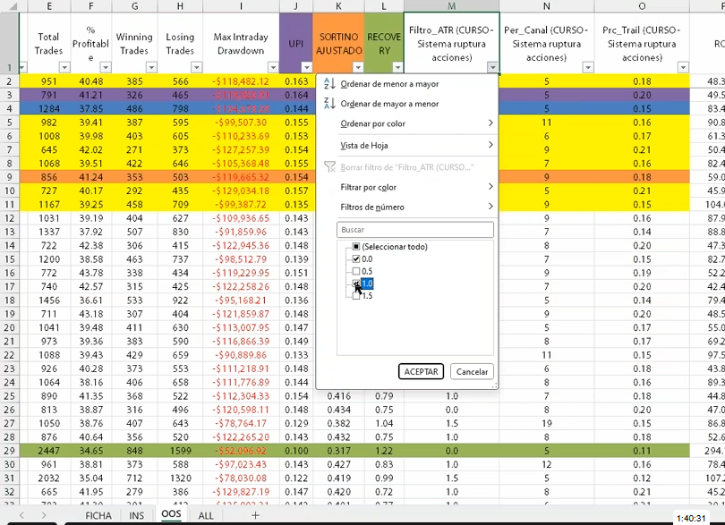
  <figcaption>Figura 069. Filtrado final quedándose solo con filtro ATR en 0 y 1.</figcaption>
</figure>

Pero sí que mirando aquí sí que en in-sample y out-of-sample vemos esa pequeña aparente contradicción en que en in-sample nos salen canales muy altos:

`insample`
<figure>
  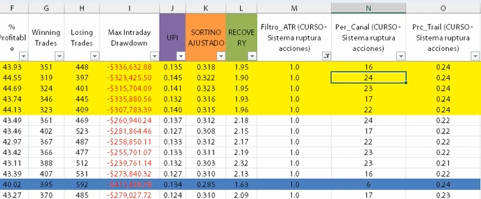
  <figcaption>Figura 070. In-sample mostrando preferencia por canales altos.</figcaption>
</figure>

`outofsample` y en un out-of-sample nos salen más bien canales bajos:
<figure>
  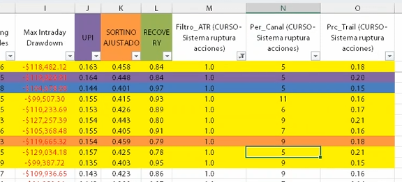
  <figcaption>Figura 071. Out-of-sample mostrando preferencia por canales bajos.</figcaption>
</figure>

`all_data` y en el all data nos salen los dos:

<figure>
  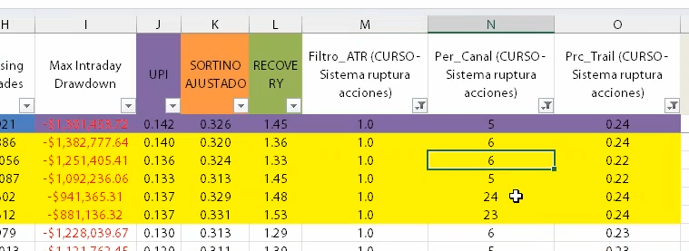
  <figcaption>Figura 145. All data mostrando ambas preferencias de canal.</figcaption>
</figure>

Pero sí que en el trailing vemos esa tendencia a la zona alta de `0.22`, `0.24`.  
Aquí sí que también te puede ayudar el mapa. 

### Maestro para tomar la ultima decisión

Aunque todos estos los llevaríamos, y en este caso en un sistema multi-activos, donde lo acabaríamos de afinar es el "maestro". Nosotros esto lo pasaríamos ya al ***maestro*** y guardaríamos estos sets, que lo vamos a hacer ahora mientras hacemos el descanso, para ya acabar de tomar la decisión. 

#### Backtest `Filtro_ATR 1` - `Per_canal 6`- `Pcr_Trail0.24`

Vamos a pasar algunos sets por maestro. He montado el visor, que estuviera por favor bien montado, y he hecho uno de prueba. Y simplemente pues vamos a hacer el :

<figure>
  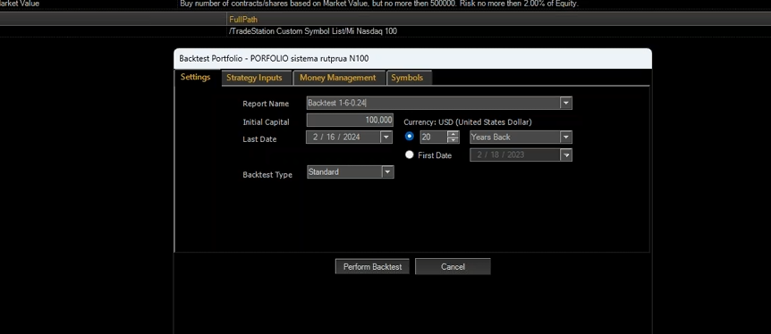
  <figcaption>Figura 074. Configuración de sets para análisis en Portfolio Maestro.</figcaption>
</figure>

<figure>
  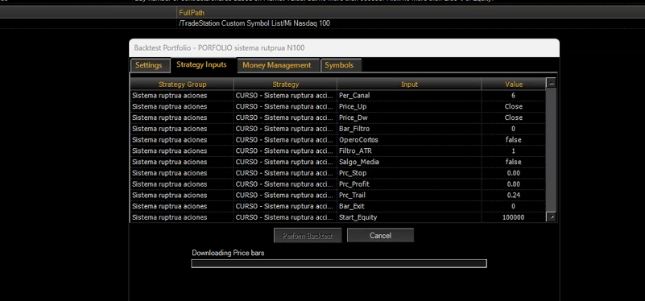
  <figcaption>Figura 075. Sets candidatos preparados para evaluación en Maestro.</figcaption>
</figure>

Al final aquí, no solo pensar que necesariamente, aunque sí que es verdad que hay un punto objetivo, objetivos podemos decir que son los amarillos. También solemos también mirar la distribución en todos los inputs por separados, miramos la `suma`, que es un poco el equilibrio de todos. Pero ves, yo ordeno por en el `Net profit`, y vemos que se quedan ahí bastantes amarillos en la parte alta. Está diciendo mucho:

<figure>
  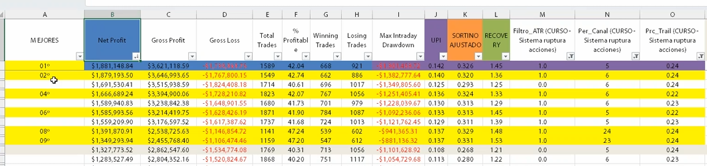
  <figcaption>Figura 076. Ordenación por profit mostrando concentración de candidatos amarillos.</figcaption>
</figure>

Veo que ordenando por `UPI` pasa un poco lo mismo:

<figure>
  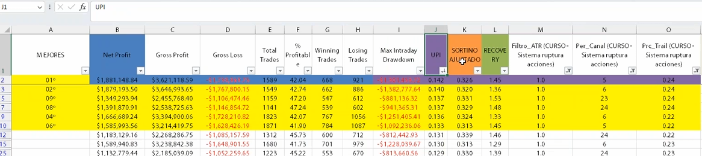
  <figcaption>Figura 077. Ordenación por UPI mostrando distribución similar.</figcaption>
</figure>

Vemos también que el `Sortino` pasa, pero menos. Los mejores de Sortino no están ahí. Los mejores de Sortino no están ahí:

<figure>
  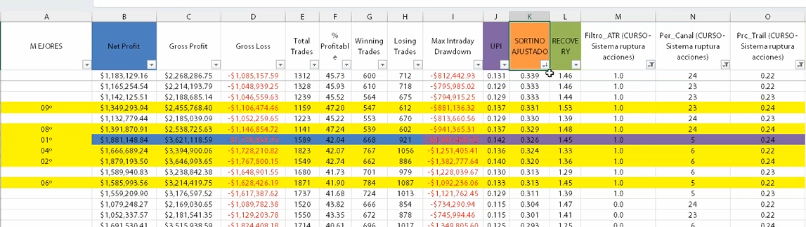
  <figcaption>Figura 078. Ordenación por Sortino mostrando distribución diferente.</figcaption>
</figure>

Sí que el mejor de `recovery`, aunque una posición bastante baja:

<figure>
  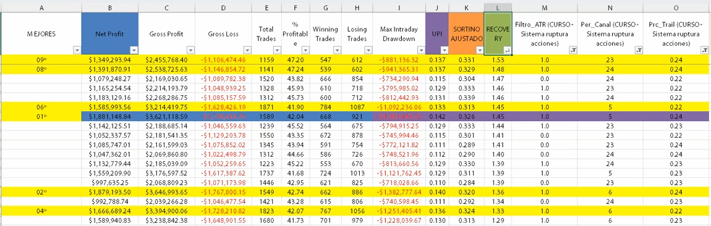
  <figcaption>Figura 079. Ordenación por recovery mostrando posición del mejor candidato.</figcaption>
</figure>

Y aquí ordenado por `ROB` quedan de hecho un poco más bajo, los hemos mezclado todos, quedan bastante bajo, cosa que ya empieza a hacerlo un tanto sospechoso, pero no necesariamente lo descarta. 

<figure>
  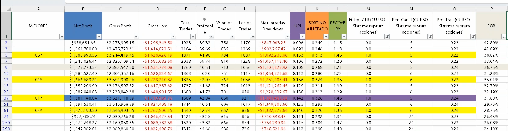
  <figcaption>Figura 146. Ordenación por recovery mostrando posición del mejor candidato.</figcaption>
</figure>

Que esto es lo que ya os comenté: es importante ver cómo se distribuye todos los históricos. Y es verdad que aunque tratamos de distribuirlo en proporción, tiene un poquito más de peso ***no tendencial*** la parte más reciente, la parte más reciente:

<figure>
  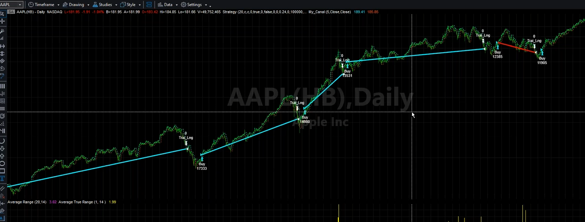
  <figcaption>Figura 080. Distribución del robustness en los candidatos seleccionados.</figcaption>
</figure>

Tiene un poquito más de peso ***no tendencial*** eso es porque tiene la parte del COVID, luego un tramo de tendencia bueno, otro más bien lateral como ahora. 

Y en cambio el `in-sample` sí que es verdad que tiene el 2010, en 2009 que es muy, muy duro, pero luego tiene una serie alcista espectacula, que le mete muchos años favorables. Así que está ligeramente sesgada el `in-sample`, pero bueno, lo dimos por bueno. 

¿por qué? Porque ***el mejor Sortino***, pues seguramente no está entre `0` y `1` del `Filtro_ATR`.  Entonces nosotros normalmente también somos bastante partidarios de **incluir los mejores de las variables en los sets**. 

Es decir, si:

- Ya me aparece... por ejemplo el mejor `net profit` es el 1º
<figure>
  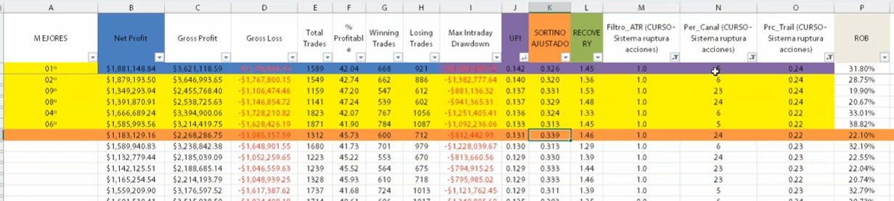
  <figcaption>Figura 081. </figcaption>
</figure>

- El mejor `UPI` también es el 1º,
<figure>
  
  <figcaption>Figura 081. </figcaption>
</figure>

- El mejor `recovery` también me sale 9º de los 10 mejores,

<figure>
  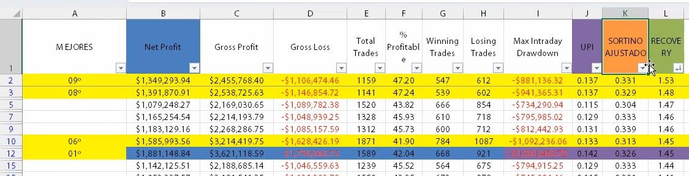
  <figcaption>Figura 147. </figcaption>
</figure>

- Pero el mejor `Sortino` no me salía,  así que lo meto. Lo meto y es un 24 `Per_canal`, 22 `Prc_Trail` y lo marco en naranja:

<figure>
  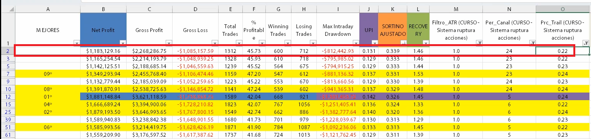
  <figcaption>Figura 148. </figcaption>
</figure>

Vuelvo a ordenar por suma:

<figure>
  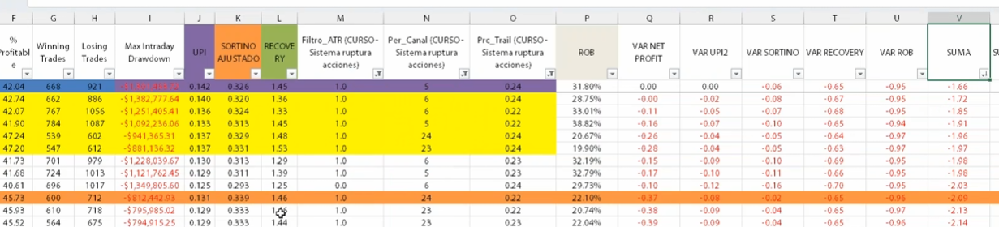
  <figcaption>Figura 082. Reordenación por suma incluyendo el nuevo candidato.</figcaption>
</figure>

<figure>
  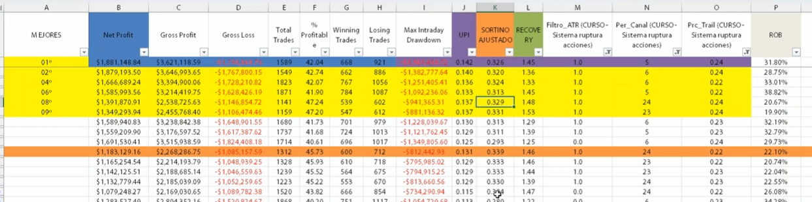
  <figcaption>Figura 083. Vista completa de candidatos ordenados por suma.</figcaption>
</figure>

Entonces ahora peus sigo montando estos últimos en los portfolios de ***Maestro** y los acabaremos comparando para terminar de hacer una decisión sobre este sistema. No los voy a meter todos porque lo que importa es la idea.

Voy a hacer solo algunos:

#### Backtest `Filtro_ATR 1` - `Per_canal 6`- `Pcr_Trail 0.22`

<figure>
  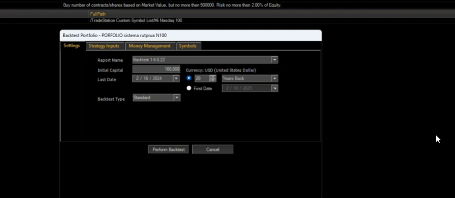
  <figcaption>Figura 084. Selección de candidatos para análisis final en Maestro.</figcaption>
</figure>

<figure>
  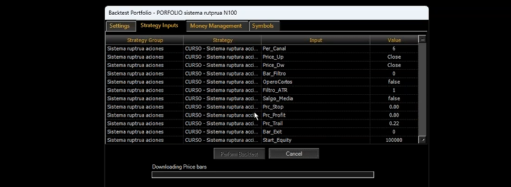
  <figcaption>Figura 085. Proceso de carga de sets en Portfolio Maestro.</figcaption>
</figure>

Tarda. Lo que pasa es que Maestro nos da una información más que Portfolio Trader, para que lo veáis también, porque me interesa que vayáis viendo cosas. Esto también lo veríamos bien en MSA, pero ya lo veremos otro tipo más, quizá de futuros, porque para llevar los 100 históricos a allí nos va a llevar a ser un trabajo tremendo…

Ya ha acabado este. Mira, voy a hacer otro para que tenga comparativa, el otro, el 23, también el que es el mejor Sortino, esa zona 1, 23, 23, pero 24, que también está entre los amarillos:

#### Backtest `Filtro_ATR 1` - `Per_canal 23`- `Pcr_Trail 0.24`

<figure>
  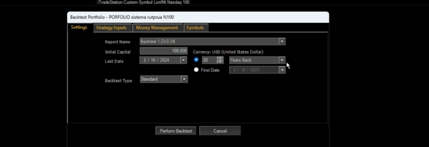
  <figcaption>Figura 086. Carga de set alternativo para comparación.</figcaption>
</figure>

Bueno, en general haríamos todos estos: Y ya digo, 
* los que destacan en algún ratio, 
* los que destacan en amarillos, 

todos estos serían los candidatos a llevarlos a ver su performance report completo. Y esto, cuando lo hacemos por sistema, lo hacemos así, pero 
* lo sacamos normalmente desde TradeStation o desde MultiCharts, 
* y sacamos el performance report a Excel. 

Y ya lo comenté en la teoría: de manera independiente, Alberto y yo pues analizamos los performance reports para tomar una decisión.

**Conclusión sobre el sistema**

De todas maneras, este sistema, ya ahora ya sí que ya lo voy a adelantar, yo creo que alguno ya se lo pensaba: yo no lo llevaría a operar. No es un sistema que operaría en su versión actual, de acuerdo. Es decir, ya os comenté que veríamos y acabaríamos procesos que llevarían sistemas a operar, y que acabarían los procesos que llevarían a sistemas a no operar. Y lógicamente explicaremos por qué.

Porque si no, al final, ver todo que sale perfecto, obras majestuosas y demás, es algo relativamente fácil. Pero no creo que sea el objetivo del curso, y de hecho no creo que se aporte nada. Entonces al final lo que aporta es ver un poco cosas que mejor, cosas que van. Ver las herramientas, ver los procedimientos varias veces, y repetirnos. Y a base de verlos, verlos, entender la filosofía.

Habrá algunos que serán procedimientos con un software, con otro, de distintas maneras. Pero no lo llevaría. No es que esté mal. No es que, o sea, al final como os comenté, creo que lo vimos en la primera clase: esto es al final con qué lo comparas. Y ahora mismo, hecho aquí de 20 años. En el buy and hold ya vimos con el Nasdaq que era imbatible. Es decir, imbatible: el retorno era una locura, ganaba mucho más que esto. ¿Por qué? Porque al final te quedas comprado en un nivel muchos años, ya has hecho un interés compuesto alucinante que aquí no conseguimos. Realmente ganamos muchísimo menos. Muchísimo menos que buy and hold:

<figure>
  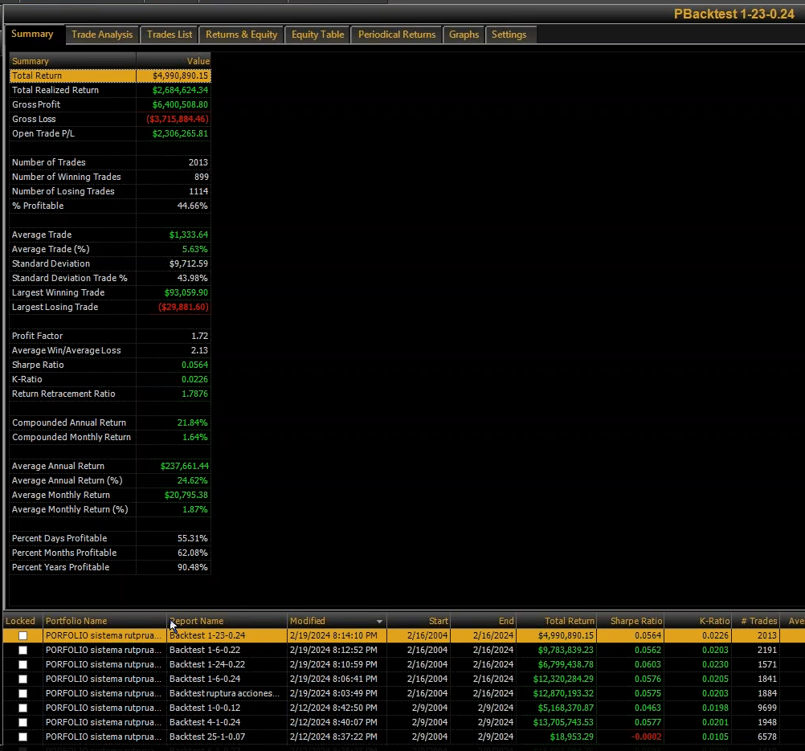
  <figcaption>Figura 149. Comparativa de rendimiento del sistema vs buy and hold.</figcaption>
</figure>

<figure>
  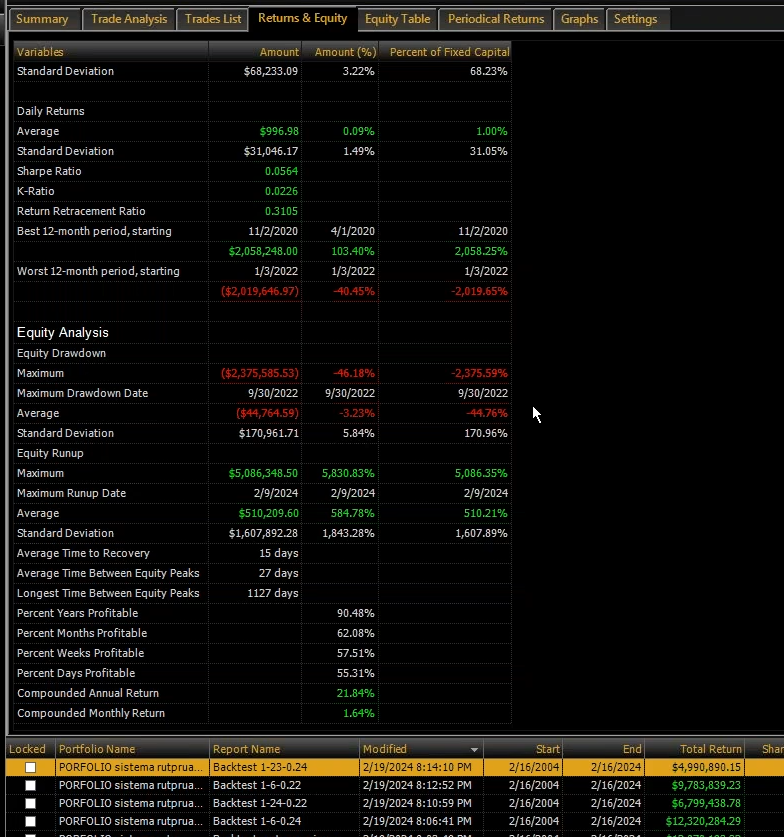
  <figcaption>Figura 087. Comparativa de rendimiento del sistema vs buy and hold.</figcaption>
</figure>

Ahora, ***¿lo hacemos mejorando el drawdown?*** Sí, mejoramos el drawdown, mejoramos mucho, pero no lo suficiente. No lo suficiente. Podríamos hacer más cosas. Es decir, realmente el sistema he querido simplificar la idea tendencial para que vierais el clásico sistema tendencial: entrada de ruptura y con un trailing. 

Se podrían hacer más cosas, y probablemente iría mejor con un `stop normal` sin ser trailing, de acuerdo. Yo lo que puedo decir es probarlo vosotros. Para dejar este trabajo en todos los sistemas os iré dejando cositas y días para probar. Probar que tenga un *hard stop*, lo que decía antes, y que salga con la `media del Donchian`, con la parte media del Donchian. O incluso otra versión muy *hard* es ir a la `banda contraria del Donchian`. Contraria el Donchian sería bastante, bastante hardcore, con `hard stop`, con stop de seguridad.

Pero así yo personalmente no lo operaría. Ya digo que sí que mejora el riesgo al buy and hold, pero no mejora lo suficiente para compensar la enorme pérdida de retorno que supone. Pero bueno, al final esto es como todo. La curva, además, fijaros qué curva tenemos:

<figure>
  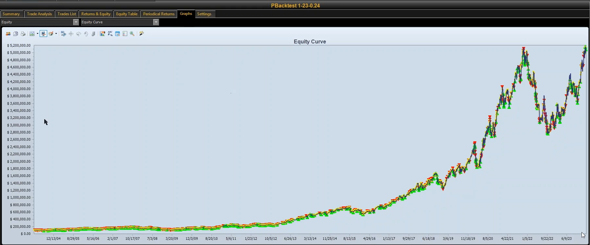
  <figcaption>Figura 088. Curva de equity del sistema en escala lineal.</figcaption>
</figure>

Que aquí uno de los problemas de este buen programa es que, aunque sí que se puede hacer en teoría logarítmico, pero ya veréis el logarítmico que sacamos cuesta una vida y es horroroso. Es infumable. Esto es el programa, no puedo hacer más. Hay que ir eligiendo los sets. Ya no, pero bueno, pero al menos, al menos lo veis el logarítmico que queda mejor, mejor. Porque al final en lineales se ve el drama mucho peor de lo que es:

<figure>
  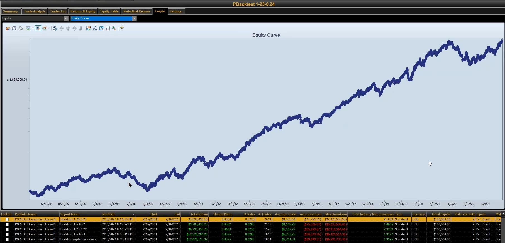
  <figcaption>Figura 089. Curva de equity en escala logarítmica para mejor perspectiva.</figcaption>
</figure>

Pero bueno, que sigue siendo importante. Estamos hablando de un setup que anualiza 21% compuesto:

<figure>
  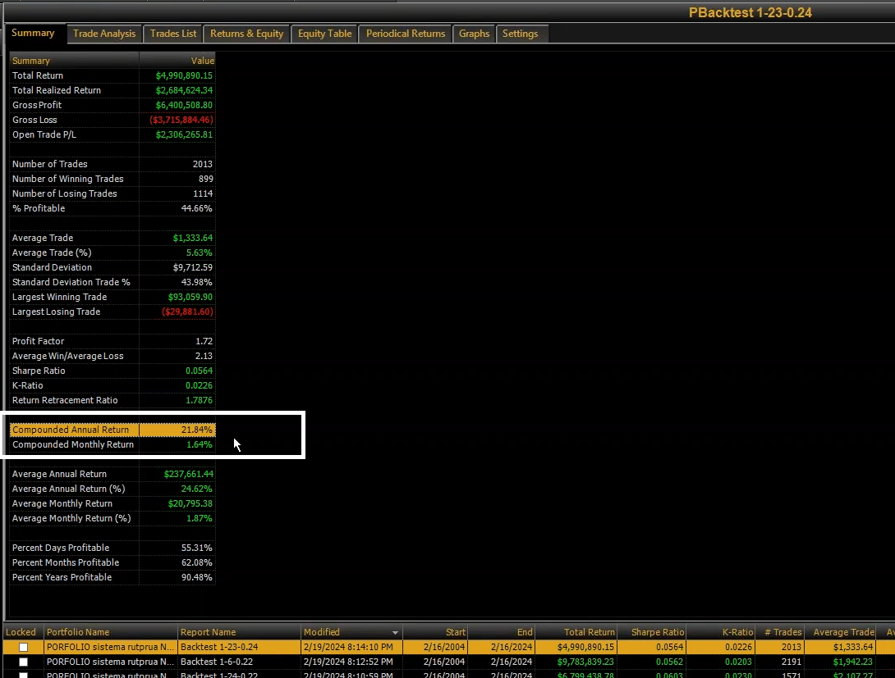
  <figcaption>Figura 090. Retorno anualizado compuesto del sistema: 21%.</figcaption>
</figure>

Con una exposición que no llega nunca a ser del doble. No está mal, No está muy mal. Llega un momento a ponerse a dos veces, a palanca dos veces:

<figure>
  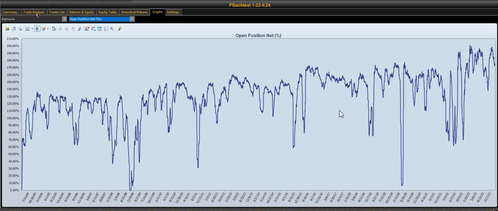
  <figcaption>Figura 091. Exposición máxima del sistema alcanzando apalancamiento 2x.</figcaption>
</figure>

Y tiene un drawdown de un 46%:

<figure>
  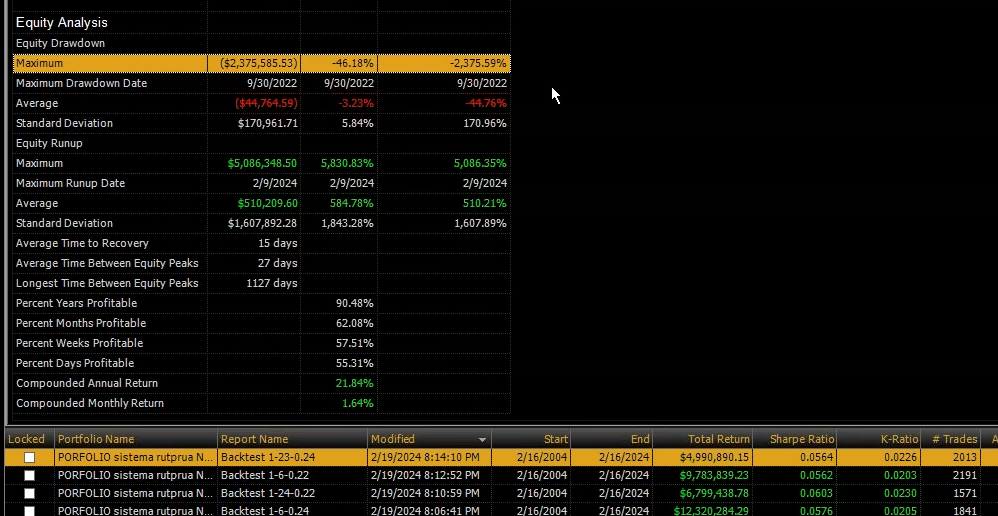
  <figcaption>Figura 092. Drawdown máximo del sistema: 46%.</figcaption>
</figure>

Es justo. Es pobre. Es pobre. Si hubiéramos hecho 20% anualizado y 20% anualizado de drawdown, por ejemplo, sería mejor. Bien, ahí estaríamos más razonable. Pero 20% anualizado con 45% de drawdown es demasiado para mí. No sería suficiente, no sería suficiente.

Pero bueno, la idea inicial, la idea inicial de entrada de Donchian es totalmente válida. Donde, por ejemplo, este sistema incluso así iría ***probablemente mejor en materias primas***. Seguramente oro, petróleo, puede ser que fuera, soja, cosas así. Pues así podría ser que fuera bien. Pero de otras maneras, insisto, que aun así creo que le plantearía algún cambio, le plantearía un cambio para mejorar.

#### **Backtest `Filtro_ATR 1` - `Per_canal 5`- `Pcr_Trail 0.24`**

De los sets que hemos hecho, para que veáis, en el caso que quisiéramos quedarnos con uno como ejemplo, hemos empezado por este hoy:

<figure>
  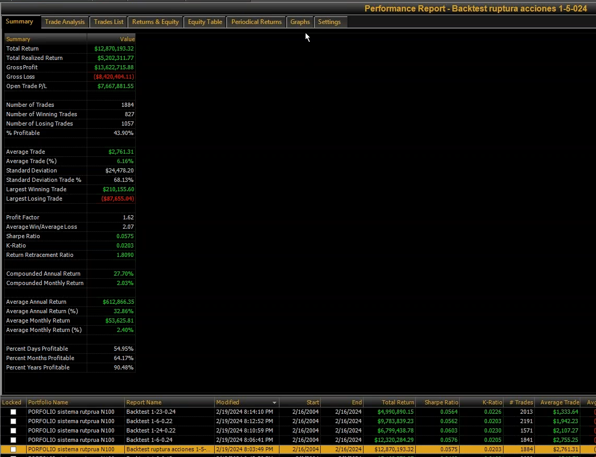
  <figcaption>Figura 093. </figcaption>
</figure>

Vale, y aquí, ¿qué miramos? Bueno, aquí miramos poco: 

* curvas, 
* drawdown, 
* `Return Retracement Ratio` anual:
* Aqui en esta parte el `Sharpe` es diario no está anualizado pero lo podmeos anualizar nosotros `0.075 * raiz(360) = 1.09`.

<figure>
  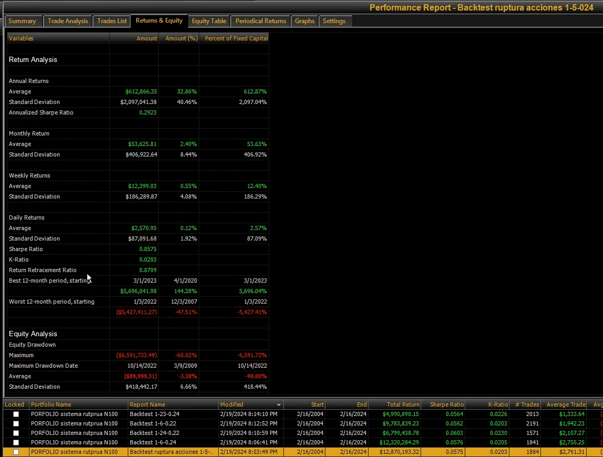
  <figcaption>Figura 094. </figcaption>
</figure>

**Backtest `Filtro_ATR 1` - `Per_canal 24`- `Pcr_Trail 0.22`**

Aquí de los que no hemos visto, aquí tenemos `Sharpe` es diario:

<figure>
  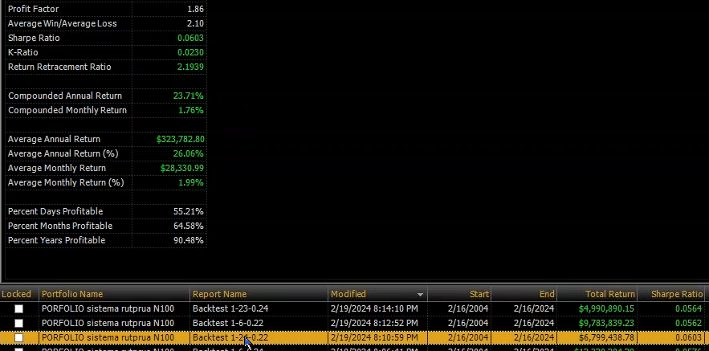
  <figcaption>Figura 101. </figcaption>
</figure>

<figure>
  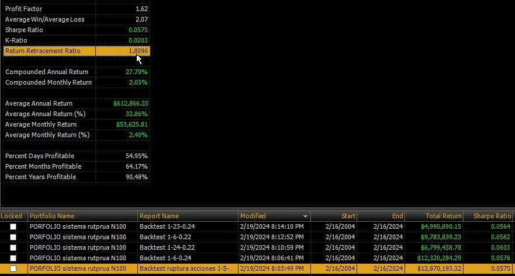
  <figcaption>Figura 102. </figcaption>
</figure>

**Backtest `Filtro_ATR 1` - `Per_canal 6`- `Pcr_Trail 0.24`**

<figure>
  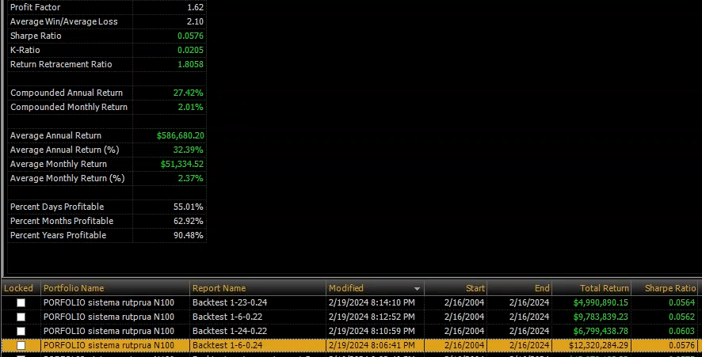
  <figcaption>Figura 103. </figcaption>
</figure>

**Backtest `Filtro_ATR 1` - `Per_canal 24`- `Pcr_Trail 0.22`**

<figure>
  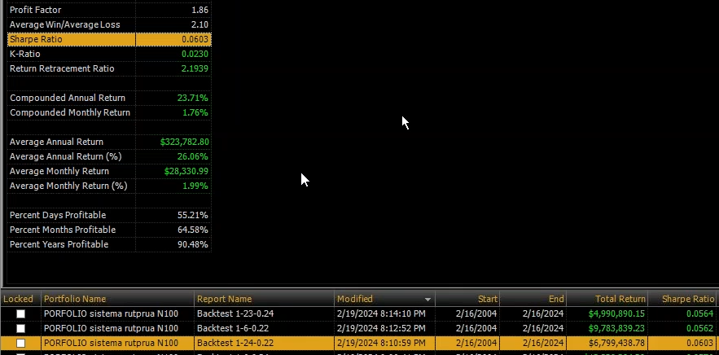
  <figcaption>Figura 104. </figcaption>
</figure>

Dentro de esos candidatos, el set ***`1-24-0.22`*** destaca porque logra el mejor `Sortino` y también un buen `UPI`, un `RRR` cercano a los máximos (2.19) y un `compuesto anual` del 23.7%, que es coherente para esta familia de parámetros. Aun así, el `drawdown` sigue en torno al 44 o 45%, lo que confirma que el sistema mejora la estabilidad respecto al buy and hold, pero no lo suficiente para compensar la enorme pérdida de retorno que implica dejar de estar comprado todo el ciclo alcista del Nasdaq.

El set **1-24-0.22** destaca porque:
- **Mayor Sharpe** (0.0603) → mejor relación riesgo/retorno
- **Mayor RRR** (2.19) → mejor recuperación de drawdowns
- Aunque tiene menor retorno total, el **riesgo ajustado** es mejor

**Comparando los sets:**

| Set | Sharpe | RRR | CAR | Total Return |
|-----|--------|-----|-----|--------------|
| 1-23-0.24 | 0.0564 | 1.78 | 21.84% | $4.99M |
| `1-24-0.22`| 0.0603 | 2.19 | 23.71% | $6.79M |
| 1-6-0.24 | 0.0576 | 1.81 | 27.42% | $12.32M |
| 1-5-0.24 | 0.0575 | 1.81 | 27.70% | $12.87M |

El Sortino se usó como **Custom Fitness** durante la **optimización** (los mapas de calor 3D que vimos antes con `OPTI2-SORTINO-ALL_DATA`). Ahí es donde se identificaron los candidatos.

  <strong>💡 ¿Por qué no el de mayor retorno?</strong>  
  El set 1-5-0.24 tiene más retorno ($12.87M vs $6.79M), pero:  
  • <strong>Menor Sharpe</strong> (0.0575 vs 0.0603) 
  • <strong>Menor RRR</strong> (1.81 vs 2.19)  
  El "mejor Sortino" no significa "más dinero", sino <em>mejor rendimiento por unidad de riesgo bajista</em>. El set 1-24-0.22 gana menos pero con menos estrés.

Los otros sets que aparecen repetidamente arriba (1-6-0.22, 1-23-0.24, 1-6-0.24) presentan curvas similares: ganan bastante, el Sharpe mensual ronda 0.056 a 0.06, pero ninguno consigue reducir de forma significativa la profundidad del drawdown ni aumentar de forma clara la robustez en las métricas de retracement o en el K-ratio. En conjunto, todos muestran una eficiencia moderada, pero ningún candidato destaca lo suficiente como para justificar operar el sistema en su forma actual.

### Líneas de mejora

Y aún así, aquí otra línea de mejora, la línea de mejora importante. Al final simplemente le hemos hecho, como decía, para validar la estrategia. Yo, en el caso como lo planteara operar, ¿qué haríamos? Otro tipo de análisis. Y miraríamos, reduciríamos, reduciríamos la cesta:

<figure>
  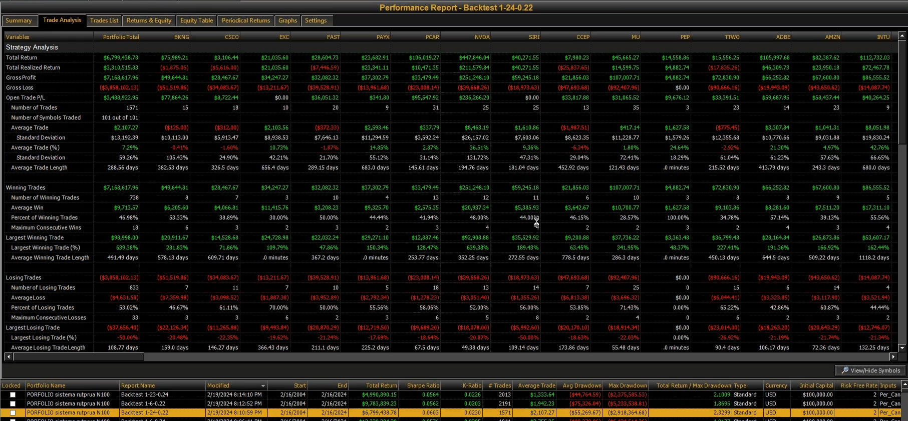
  <figcaption>Figura 105. Análisis por acción individual en Portfolio Maestro.</figcaption>
</figure>

Por ejemplo, lo que hemos hablado antes: 
* un criterio por supuesto de **rendimiento** sería válido. 
* Otro, no menor, de **histórico**. Es decir, donde podamos mirar más qué ha hecho esa acción, porque aquí no todas las acciones tienen el mismo histórico, de acuerdo. Este es un problema. Aquí no tenemos tampoco sesgo de supervivencia. 
* Aquí abajo nos ha hecho la t-Student, ya va a hacer el programa automática. En la mayoría, aunque va a haber salido alguno que no, la mayoría ves que te da que sí:

<figure>
  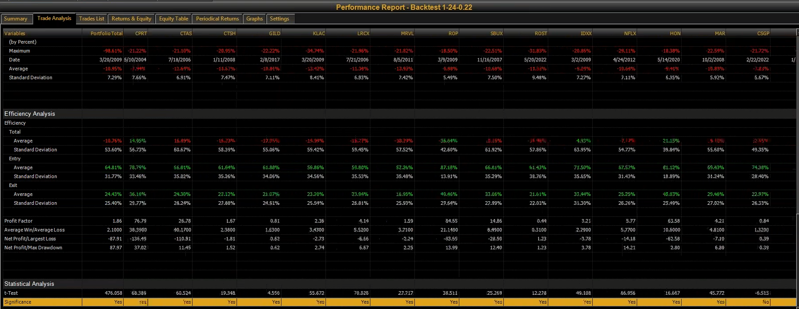
  <figcaption>Figura 106. Test t-Student automático mostrando significación estadística.</figcaption>
</figure>

Tienes alguno que no. Seguramente pierde dinero, y sabrás algunos que han perdido dinero, otros que ganan. Entonces yo aquí puedo analizar y puedo ver todas las acciones que me gusta el maestro, que tengo cien, repito. Puedo ver un poco pues dónde están aquellas, las puedo apuntar y puedo tratar de hacerme alguna cesta y ver en esas un poco cómo ha ido. Pero bastantes, recordar: acciones, lo que os dije, aquí el riesgo de gap es enorme. El riesgo de gap es enorme. Gaps del 10%. Entonces hay que ir a una exposición muy, muy baja, de acuerdo. Porque tú te has expuesto un 2% y te meten un gap de 10%, te has metido un 20%. Y estar expuesto un 2% es poco. Entonces este es el problema. Por eso tenemos también tanto drawdown, porque te han cazado muchas en algunos momentos, han cazado muchas, y te las tragas. Y además, cuando hay caídas de mercado globales, te las tragas todas, claro. Y te meten un gap y te comes el problema de este tipo de estrategias en acciones, que cuesta mucho de controlar riesgo. 

Con estrategia, o sea, con sobreoptimización es fácil. Pero en la realidad, con estrategias como esta que no están sobreoptimizadas, porque están miradas en cien acciones, no es fácil.

Pero aun así, fíjate: tienes aquí, está, que digamos ratio de profit factor, por ponerlo fácil no, que si no nos vamos a hacer un poco trampas viendo un poco el valor de cada uno profit factor. 

<figure>
  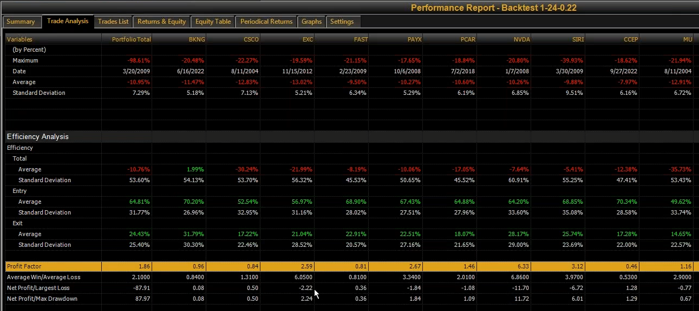
  <figcaption>Figura 150. </figcaption>
</figure>

Aquí mira, esto tenemos 2.59, pero ¿cuántos trades tiene? 10 trades. No van a tener mucho. Las que más van a tener van a tener 20 algo más. 

<figure>
  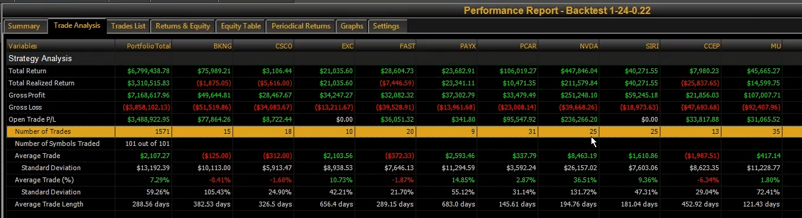
  <figcaption>Figura 151. </figcaption>
</figure>

Bueno, pues tienes aquí unas cuantas que pueden estar ahí en el ratio de profit factor de 2, que a lo mejor pues merecen una mayor… 11, estos demasiado, seguramente como si no muchos. A bueno, es **NVIDIA**, claro. Miras un cohete, claro, lógicamente las más volátiles se ayudarán más. Que aquí hemos metido de todo. 

Y eso mejoraría mucho la cartera. Y esto, ya digo, son deberes que los dejo a vosotros. Con esta simple estrategia, ahora probarlo en distintas acciones. Y lógicamente, si tú encuentras una cesta de 20 acciones…

***Pregunta de Aureli, ¿Cómo recomiendo rebajar el drawdown***

Sobre todo con diversificación. Porque al final, el problema de los sistemas tendenciales puros es este. Es decir, si tú tienes un tendencial puro. Una tendencial pura que es capaz de ganar lo que gana NVIDIA, esta locura, sufre drowdown fuertes… Porque para ganar esto también te has tragado alguna acción que no chuta. Entonces al final ese es el problema. Pues ahí lo hemos validado en todas, y conseguimos que tenga un drawdown muy fuerte. Y tú ahora podrías aplicarlo a lo mejor a 10 acciones, que ya te he dicho que no cogería las 20, al menos no cogería las 20 como estas. Pero a lo mejor 10 sí que cogería donde ha ido muy bien y tenga bastante histórico. Cuidado. 

Pero luego también cogería algunas que a lo mejor pues no tanto, por lo que fuera. A lo mejor porque está lateral ese activo, pero bueno, no tiene por qué estarlo siempre. A lo mejor ahora NVIDIA, de pronto se acaba esto y no sube nunca más. Es que al final el problema es que no conocemos el futuro. NVIDIA ahora va muy bien. ¿Qué va a hacer? ¿Irá siempre así? No sé. A lo mejor de pronto, no sé, Tesla de pronto su software de coches, que dicen que es el mejor de auto… Se ponen todos de moda, decide que todas marcas se lo voy a comprar a Tesla, y Tesla automáticamente empieza a vender software a todas las marcas de coches. Esto me lo he inventado totalmente, pero me entendéis. Entonces…

El tema, entonces, aquí: la diversificación, sobre todo la mejor manera, es con una cartera con portfolio a nivel de control de sistema. Es lo que te digo. Esto lo expliqué, y alguien creo que en el foro, en el chat, ya lo comentó.

**Las salidas: el TP es una cosa que mejora más el riesgo de lo que parece, mejora mucho**

El profit target de mejorar a las mejoras, a las salidas no. Que era contraintuitivo, algo así. Bueno, no recuerdo. Bueno…

Y en un tendencial no hay TP. Entonces si tú vas a tendencia pura…

Se aprende más del error del texto que del acierto. Y en el curso pues yo también lo he planteado así, de acuerdo. De cómo se aprende más del error. Pues aquí aprendemos cosas que no son perfectas, de acuerdo. Porque aprenderás más de ellas que enseñar que bien va esto, que qué bien va aquello.

**Pregunta sobre break even en pares del yen**

***Estoy buscando un sistema en el que digamos me haga un break even, y justo en los pares del yen me falla el porcentaje de recorrido que tiene que hacer para que entre en break even, y me entra en break even prácticamente al inmediato. Y cuál es mi sorpresa cuando paso por los pares del yen, veo esta maravilla de curva, que no solo sucede en esta, en muchos otros pares. Entonces ahora lo estoy intentando validar en MT4, porque claro, aquí que haga muy poquito recorrido y ponga break even, pues esto hace que nunca haya drawdown, porque solo quedan las buenas. Lo que pasa es que la entrada del sistema no casi nunca coincide con la entrada teórica que te plantas en TradeStation, ya sea en el open next bar, buy next bar, o bien on close, buy on close. Entonces esto, cuando lo intentas replicar en la vida real, lo estoy intentando hacer en MT4, no consigues esto.***

<figure>
  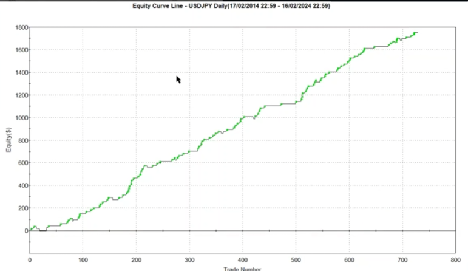
  <figcaption>Figura 107. Curva aparentemente perfecta en pares del yen con break even inmediato.</figcaption>
</figure>

Estás hablando de un error de backtest más bien.

***Realmente si tú miras la curva, o sea, mira esas operaciones que hace TradeStation, y son correctas. Pero luego en la vida real esas operaciones no se pueden ejecutar, o sea, nunca se ejecutan a ese precio, porque en la apertura en forex al día, es en daily además, la apertura del día siguiente suele haber unos deslizamientos, unas rupturas que dan miedo.***

Claro, pero eso es por el tema de spread, claro. O sea, porque en forex tienes bid y ask, y no tienes el last. Entonces ahí en TradeStation no estás backtestando contra el ask. No lo estás backtestando contra el bid y el ask.

***Yo no sé cómo se pueda…***

Cuando te quiero decir un error de programación es que estás haciendo algo que no es, que no puedes hacer. Es decir, estás leyendo a futuro. El error de backtest es que no estás consiguiendo replicar la realidad. Que es justo lo que dices tú: no estás consiguiendo replicar la realidad de lo que pasa en el backtest.

Queda entendido. En el forex, claro, por cierto Aureli, MultiCharts permite hacer eso. Te lo digo porque eso TradeStation no lo permite. Bueno, no lo permite en el sentido de dos datas. Y puedes penalizar con slippage. El hecho que también podrías hacerlo así, pero es bastante más real. Te lo voy a mostrar en MultiCharts porque MultiCharts sí lo permite. MultiCharts sí lo permite, y creo que te puede venir bien esta característica:

<figure>
  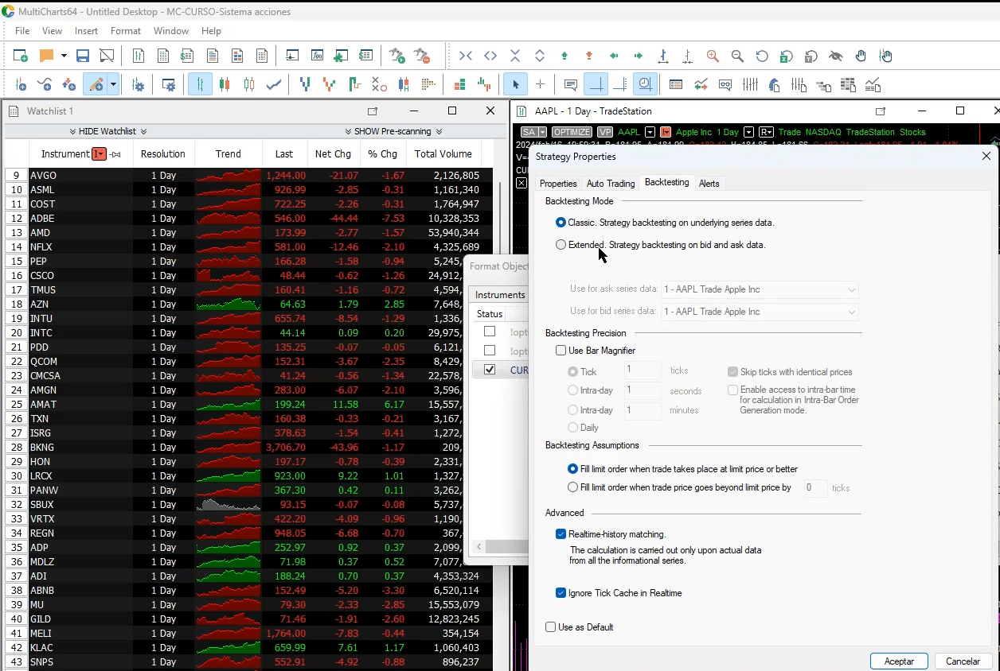
  <figcaption>Figura 108. Configuración de MultiCharts para backtest con bid y ask separados.</figcaption>
</figure>

Extended, que es backtest. Se abre en el bid y el ask. Tú le dices que para ask usa esta serie de datos, y para bid usa otra, que lógicamente también tienes que tener metida en el gráfico. Entonces tú le puedes meter la serie del bid, la serie del ask, que puede ser importada, puede ser de otro vendor, y backtestarlo así. Backtestarlo con ask-bid, y eso será bastante más real. Eso será bastante más real.

Porque eso te pasa porque la ventaja es estrecha. Cuando la ventaja es estrecha, claro importa, importa mucho. El break even, de todas maneras, tiene tendencia a tener problemas de este tipo, porque el break even al uso, que se activa a partir de una cierta cantidad, muchas veces nos pasa eso: que nos ejecuta muy rápido. Y ahí, por un lado, tienes que ir a lo que hablábamos antes del lift, de acuerdo. Tener muy claro cómo abre, y tener muy claro el slippage. A lo mejor tienes que penalizar con mucho slippage si no es reproducible.

Pero de todas maneras, el camino más cercano a probarlo va a ser probar esto que te he dicho. MultiCharts sí. Poniendo que tengas MultiCharts, que ahora no lo sé. Claro, si tienes MultiCharts, si tienes MultiCharts, te recomiendo probar esto a probar.

En TradeStation sí que tienes, no puedes directamente hacerlo, pero podrías hacerlo indirectamente. Podríamos, o sea, podrías montarte tú, pero no con datos de él.

Arriba tengo el ask. El ask que abajo tengo el bid:

<figure>
  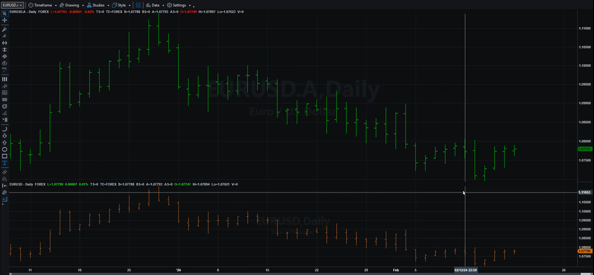
  <figcaption>Figura 109. Gráfico con series de ask y bid separadas para análisis.</figcaption>
</figure>

Yo siempre voy a tirar la orden al bid. Pero como puedo consultar, perdón, en este ejemplo que te estoy mostrando voy a tirar la orden al ask, que está arriba. Pero yo puedo consultar el data 2, de acuerdo, que es el bid. En el data 1 tengo el ask, en el data 2 tengo el bid. Ahora mismo, como puedo consultar uno u otro, pues puedo jugar un poco con eso y ver más cerca de la realidad. No sé si me estoy explicando… Aunque yo ejecuto arriba, puedo hacerlo con una regla que dependa del de abajo. Entonces penalizar en base a eso mejor. Puedes hacer un backtest un poco mejor así.

Recomiendo explorar esta opción, porque al final el problema aquí es este. Que en el forex, aunque las plataformas de futuros lo pintan porque va así, en realidad no hay ask como tal, ¿entiende la idea? Aquellos que no están familiarizados, aprovecho para introducir este concepto. Está el ask, que está el bid. Es que es este spread. Aquí está pintado ahora el euro. ¿A qué se es el ask? En realidad. Pero si ahora pinto aquí el euro dólar, que va a ser mejor, es el que es primario. Pues ves, aquí yo tengo que está el último cruce a 97. Pero ves, aquí está el ask, que está a 802, 7802, y el bid lo tengo a 7992. Entonces yo, si compro a mercado, lo que hago es atacar el ask, y si vendo a mercado, lo que hago es atacar el bid. Y entonces, bueno, como puedo pintar los dos en un gráfico, pues puedo tratar de mejorar el backtest con eso. Explora un poco ese camino.

**Comenta Fran, pregunta que si quiere hacerlo MetaTrader, se puede considerar un spread más elevado para que compense el spread de slippage**

Sí, el problema real del spread, Fran, de este problema en el fondo no es tanto de reproducir el slippage, porque eso es fácil, sino de ejecutar la realidad. Porque si yo, el de arriba es el ask y el de abajo es el bid. Es decir, el de arriba, para que me entendáis, pinta el rojo. El de arriba pinta la columna roja. Entonces al final, yo, el de abajo me está pintando la columna azul, esta casilla de aquí, ves esta casilla:

<figure>
  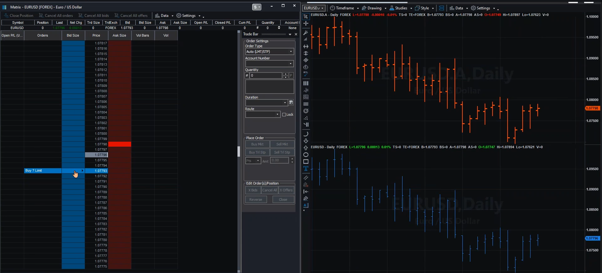
  <figcaption>Figura 110. Detalle de columnas de ask (roja) y bid (azul) en la cotización.</figcaption>
</figure>

Y eso es lo que se va moviendo. Y eso que no se mueve aquí porque estos son bueno. Pero esa era la que pinta cada uno, esa es la que pinta cada uno, de acuerdo. Eso es lo que cada uno va pintando.

Entonces el problema es que yo si pongo el sistema aquí, el que sea, yo pongo un sistema aquí. Cuando compre, sí que va a reflejar la realidad, porque yo compro, imagina que tiro a mercado contra el ask. Pero cuando venda, va a seguir vendiendo contra el ask, y realmente vende contra el bid. Pero el sistema que va a correr en este gráfico, el sistema que va a correr en este gráfico, algo que ejecute mucho, ahora, yo compro, vendo aquí, he comprado, y me dice que he comprado a unos 7819. Y ese precio probablemente ha sido real, porque como es el rojo, he comprado en este precio. Pero este me dice que ha vendido a 17756, y no es verdad. Ha vendido más abajo, ha vendido 45 ticks por debajo. No es verdad ese precio.

Entonces es un problema ya no tanto del deslizamiento, que lo puedo simular, sino que habrá veces que sea el mínimo o el máximo y marque ejecutado cuando realmente no ha ejecutado. ¿Tienes la idea? Sea, el problema es más de réplica.

Eso a nosotros nos ha pasado mucho. Este ya lo he contado, porque al subir los tipos de interés en los futuros ha subido mucho ese spread, esa diferencia entre el futuro y el CFD. Porque el CFD el tipo de interés lo tiene fuera, o tiene su swap, en cambio el futuro lo tiene implícito. Pero ahora es otro tema. Pero el problema ha sido el mismo, de que la compra va si yo ejecuto en este gráfico el sistema. La compra se hace correcta, la venta no. Y en este es lo contrario: la compra no se hace correcta, la venta sí. Entonces bueno, puedo jugar un poco con eso. Porque yo, como puedo consultar el de abajo, cuando calcula un precio de venta, estaba para Aureli, lo calculo en el de abajo. Cuando calcula un precio de compra, lo calculo en el de arriba. Y con eso puedes tirar un poco. Y luego aparte, también evidentemente con solucionarlo.

Pero el problema en el histórico, tiempo real, es simular que realmente ejecutó lo que tocaba. Y ese problema en el vídeo, las que hay es spread, que a veces ejecutas por poco. Cuando ejecutas por poco, no puede ser verdad. Pero puede ser que no.

### Para acabar el sistema este: el tema de los cortos

El tema de los cortos a nivel global es muy complicado. Lógicamente, si lo miras a nivel de algunas acciones lo vas a encontrar, y no es difícil, no es difícil. Pero al uso tendencial, no.

Por ejemplo, aquí en Tesla fíjate aquí que iría más bien… Pues seguramente entradas ruptura en un canal grande para entradas a largo plazo, no trailing, ir a salida puede por tiempo, no sé, tres cuatro barras, ST 0.05, TP 0.1, me lo invento todo, y a buscar explosiones:

<figure>
  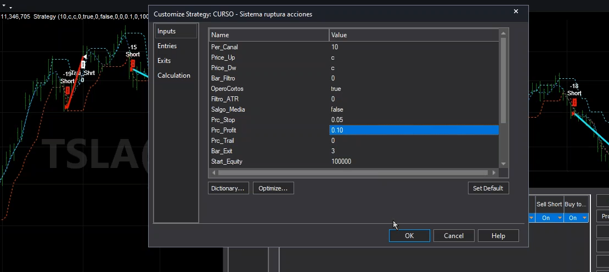
  <figcaption>Figura 111. Tesla: ejemplo de configuración para búsqueda de explosiones en cortos.</figcaption>
</figure>

<figure>
  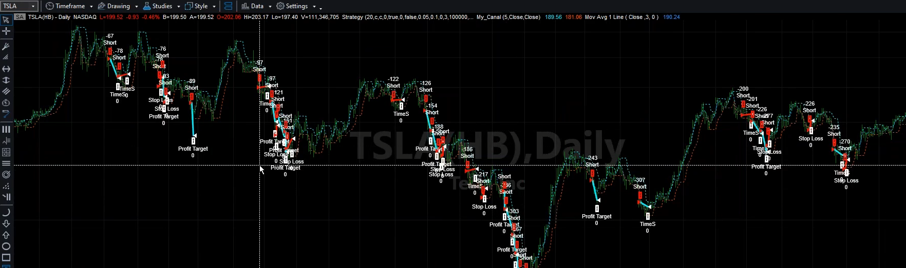
  <figcaption>Figura 112. Ejemplo de entrada por ruptura en canal grande.</figcaption>
</figure>

Pero es muy difícil. Recuerden que el 90% de los traders es una entrada muy lenta. Es una entrada muy lenta el Donchian. Y cuando te pilla las buenas, no lo vas a dejar correr, sabes. Pero la verdad es complicado. Te va a tragar muchas malas en ese tipo de entradas. Es complicado. Es mejor ir a expansión de volatilidad. Cuando detectes alguna expansión de volatilidad, entrar y a un TP no muy alejado. Al revés:

<figure>
  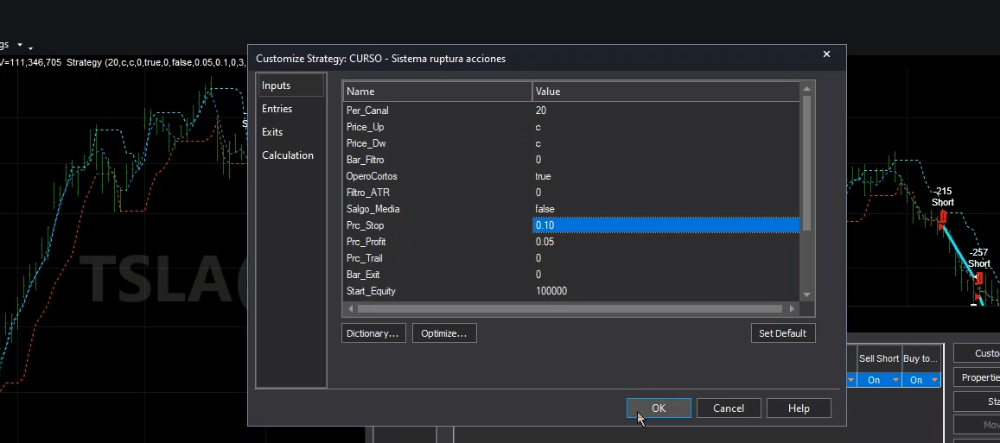
  <figcaption>Figura 113. Estrategia de expansión de volatilidad para cortos.</figcaption>
</figure>

Cuando falle te va a fallar mucho. Porcentaje de acierto algo, pero te fallará mucho… Nada… Un desastre… Es muy difícil, y más en una cartera de 100 acciones. Es muy difícil entrando con Donchian, porque es una entrada. El principal problema de esta entrada es que es muy retrasada.

**Un buen truco para medir un edge sobre Donchian: con ST y TP igual**

Vale, pero es verdad que para los tendenciales cuidado. Pero sí que es un buen, es un buen truco rápido para ver. Casi ninguna te pasaba del 50, claro. Y si calculado con ATR una unidad por cinco días. Si, el truco es bueno, pero es para evaluar la entrada de manera rápida.

Pero es verdad que los tendenciales, lo que te digo, tienen que correr. Entonces a veces a lo mejor te puedes probar a darle 2 a 1, dejarle así, y de eso stop. Bueno, que ya lo veremos en una clase. Quiero hacer una clase, que tengo que… Porque la tengo más o menos las clases pensadas y planeadas, pero no el orden. Pienso sobre la marcha, no como pide la clase, pero como van las preguntas y demás.

Pero sí que hay una que haremos: búsqueda de patrones. Y uno de ellos, por supuesto, es ese. Y hay otro que es con la rotura del máximo del día anterior y cerrar al cierre, por ejemplo. Y esto va bien para ver la tendencia de ese activo, sabes. Para ver si las roturas de un día marcan tendencia o no. Y también lo puedes hacer en intradía, para ver si en el intradía hay tendencia. Puedes tener fails, pero al final te dices: en intradía si tiene tendencia, yo si rompe el máximo de ayer, entro largo, y al cierre cierro. Con eso miras si el activo en el intradía tiene tendencia. Nos salen todas pero muchas acciones de muchos activos te sale. Veremos cositas de estas un día, que haremos con un código, lo haremos varias de ellas, y nos iremos pasando en distintos activos: de acciones, futuros de distinto tipo, para que veáis distintas maneras de encontrar entradas.

Que ya dijimos que veríamos bastantes. He querido empezar por el Donchian porque sé que ha hablado mucho de él en el curso, y además es bueno de verdad. Lo que pasa que tiene sus puntos débiles, tiene sus puntos débiles.

Y donde va mejor el Donchian, de salir, o sea, es lo mismo que has visto en el lado largo, que lo podéis explorar. En vez de trailing, en ruptura. No lo hemos hecho tal.

Pero yo lo dejo ahora. Bueno, da igual, porque está bloqueado para cortos. Pero voy a activar esto:

<figure>
  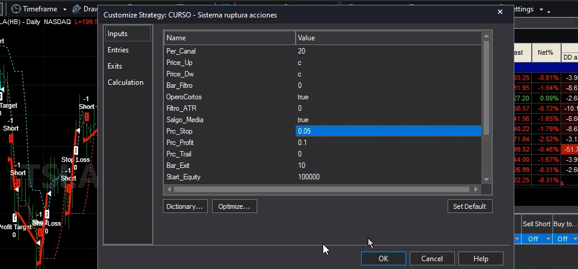
  <figcaption>Figura 114. Activación de configuración alternativa para explorar cortos.</figcaption>
</figure>

Lo mismo: buscar la explosión y salir de, buscar la explosión y salir de esto. Y hasta 20 es demasiado, podría ser mejor para 10. Pero bueno, ya digo, es poco sensible el canal, como hemos visto, es poco sensible. Con Donchian en general, esto lo puedes probar en las 100 acciones. Es decir, en vez de ir al trailing, o incluso dejando el trailing, incluso dejando el trailing hasta suponiendo pocos cambios de la versión actual. Es decir, no, mira, no liar. Lo mismo que tenías, pero al mismo tiempo lo que se ha dicho: le pruebas, le dejas la media puesta:

<figure>
  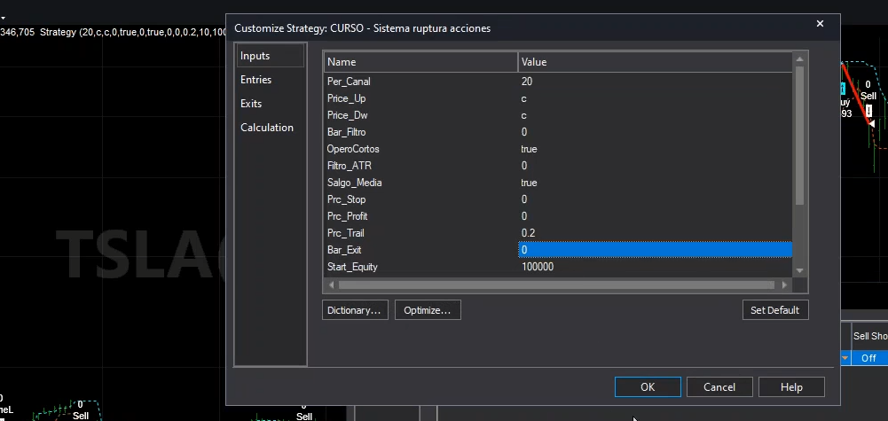
  <figcaption>Figura 115. Sistema con media del Donchian activada como salida adicional.</figcaption>
</figure>

Ya verás que el trailing no va a actuar casi nunca. Va a salir algunas veces por trailing, algunas veces por media:

<figure>
  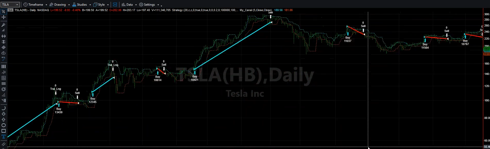
  <figcaption>Figura 116. Ejemplo de salidas combinadas por trailing y por media.</figcaption>
</figure>

Y así la media se le va a pegar mucho, se le va a pegar mucho. Y esta es otra variante que es un poquito más rápida, y que en muchos activos va a ir muy, muy bien. Pero muy bien. También es de dejar correr, pero dejar correr menos.

Luego ya, lo que os decía, es decir, en vez de esto a 10 días. Esta es la que en muchas rupturas se usa eso, y ya está. Incluso el trailing un poquito más cerrado:

<figure>
  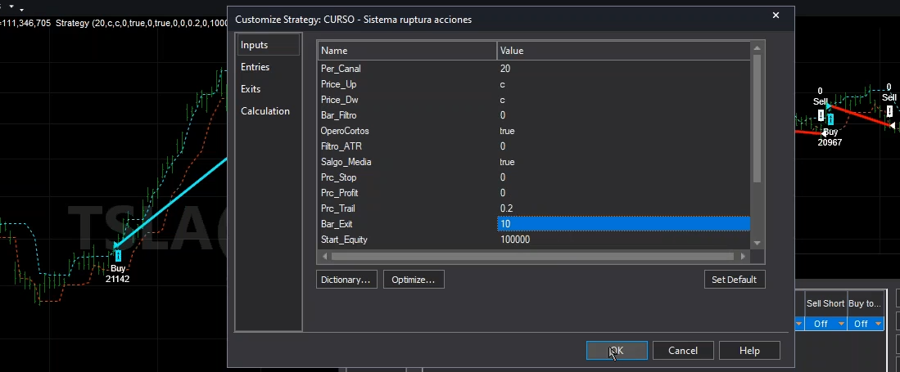
  <figcaption>Figura 117. Variante con salida por tiempo a 10 días y trailing más cerrado.</figcaption>
</figure>

Y os va a salir en muchas veces en tiempo. No va a salir el stop, pero esto va a salir en tiempo. Y se pueden hacer varias variantes que ya no sean el propiamente tendencial, y que va a ir en muchas, alguna mejor no irá también, pero va a ir para él muy bien en muchas. Porque al final sale el mercado antes. Tienen distintas maneras para salir. Sale por tiempo, que sí, que algunas veces pues saldrá mal. Pero mucho saldrá bien. Incluso, NVIDIA, que ya veréis, aquí no va a ser tan… Aquí por ejemplo seguramente irá típico. Pero también en las caídas veis, pues como se salen, 10 días, pues al final se sale:

<figure>
  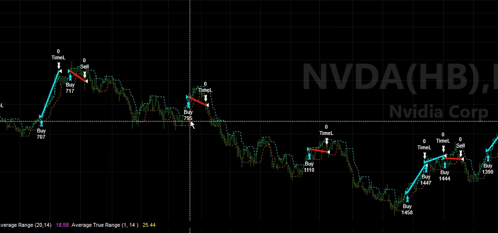
  <figcaption>Figura 118. NVIDIA mostrando salidas por tiempo en caídas del mercado.</figcaption>
</figure>

Antes, a lo mejor que con él, con el Donchian, pero claro, las subidas tendidas se va saliendo, se va metiendo, se va saliendo, se va metiendo. Pero esta es una variante. Esto no te va a dar ratios tan tendenciales, pero también te va a dar ratios tendenciales. Este es 46% Profitable. Antes no lo hemos mirado, antes, en maestro, pero da 47% en maestro. Pues mira, un dato más de lo que pensaba. Prácticamente da más de lo que pensaba. Pensaba que daría menos, pensaba que daría menos. Con este setup, 44-47%, dependiendo del set, 44-47%, pensaba que daría más. De verdad, se parece mucho, bueno, prácticamente el mismo.

Seguramente NVIDIA daba más. En este, este es seguramente NVIDIA. Era de las que más porcentaje daba de acierto, digo yo. Habíamos visto el gráfico antes, era espectacularmente tendencial, claro, una locura. NVIDIA estará por aquí. Nos ha ordenado esto por alfabético, no, porque está ordenado, no sé por qué se ha ordenado. Bueno, pues no sé, da igual. Habrá de aquí con porcentaje de acierto muy alto, y habrá con menos:

<figure>
  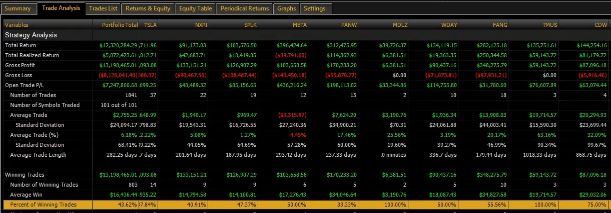
  <figcaption>Figura 120. Distribución de porcentaje de acierto por acción.</figcaption>
</figure>

***¿Para realizar los rangos de parámetros, pregunta Fran, es buen sistema usar que el cluster? Si lo hacemos, ¿no sesgamos la zona paramétrica?***

Darte más explicación que la que te he dado ahora, me voy a liar. No sé, no sé, no sé decirte nada más en concreto.

***Comenta Aureli lo de las tortugas***

Son exactamente un Donchian. Es exactamente. Lo que pasa es que es un Donchian. Las claves de las Tortugas era la gestión monetaria, que no se ha propagado, eso no se ha propagado totalmente eso. Pero tenían una gestión monetaria muy estricta, y era lo que iban promediando a favor. Era una manera de su… Fallaron muchísimo después de ciertos megabajos. Es decir, se iban un poco a buscar las NVIDIAs. Entonces cuando pillaban una NVIDIA, la añadían, añadían, añadían. Se iban apalancándose en ella, y claro, los revientas. Es que los revientas. Es verdad, son acciones. Es así, o sea, tú pillas la que lo revienta, y es tremendo. Y se basaban un poco en eso. Se basaban un poco en eso.

  <strong>📏 Sistema de las Tortugas</strong>  
  Sistema de trading tendencial basado en canales Donchian, desarrollado por Richard Dennis y William Eckhardt en los años 80. Su característica distintiva era la gestión monetaria basada en volatilidad (ATR) y la piramidación de posiciones ganadoras.

**Enjambre de partículas**

Al final yo no he leído nada ni visto nada súper concluyente que mejore el algoritmo genético, de verdad. Es que al final, y no creo honestamente, si hay algún paper por ahí que se me ha escapado, pues pásalo que lo leeré atentamente. Pero no creo de verdad que, incluso ya por mi sentido común de mi experiencia, que realmente haya un algoritmo que mejore mucho. Es la lógica que tiene el algoritmo genético, la misma que tiene enjambre de partículas. Y seguramente al final son lógicas de búsqueda de zonas robustas, que al final todos siguen un poco lo mismo. Y a mí la de algoritmo genético también me parece muy razonable, muy lógica, y fomenta totalmente eso.

Bueno, siempre hay algo que sale que es mejor en teoría, que no sé qué. Pero realmente, ¿es una gran mejora a eso?

Lo que importa son más las ideas. Entonces el algoritmo de búsqueda no creo yo que esté ahí la gran cosa. No creo, la verdad que no. Pero bueno, ya digo, al final evidentemente estar muy abierto siempre es muy importante a cualquier cosa nueva. Pero no es, lo que es muy antiguo. Pero prefiero que cualquier cosa que sale, ser atento a posibles mejoras. Pero ya digo, muchas al final acaban siendo poco de lo mismo, da una vuelta de otra manera, mejor, más rápido o lo que fuera. Pero es un poco. Y no acaban de provocar unas grandes mejoras. Porque siempre hay gente pues más defensora de una cosa y de la otra, y esto pasa mucho. Lo buscaré. Si tienes alguna fuente por ahí, me la pasas y la miraré con calma.

**Cierre de la sesión**

Pues voy a ir cortando ahora. Pues quería probar otro, un poco más de intradía. Así que tengo varios. Ya no lo sé seguro, pero puede que hagamos el `ORB` (*Opening Range Breakout*), o puede que hagamos el RB (*Range Breakout*), que tenía pensado hacer intradiario. Probablemente con el DAX empecemos, y veremos, lo extrapolamos a más activos.

Pero bueno, ya no me lo toméis seguro, pero ese es uno de los que tengo anotados para hacer. Uno de revés sobre el DAX, me gusta mucho. Un futuro que me gusta mucho. Eso sería intradía. Así que puede que vayamos con él el próximo día. Y en todo caso, casi con toda seguridad que haremos algo intradía, para entrar un poquito más en cosas de más datos y un poquito más complejas que estas.

Amigos, nada más. Os veo el lunes que viene. Recordar: enviar dudas al Discord, porque así las podemos compartir entre todos, y creo que eso pues añade. Tenerse aquí la sección de pregunta aquí para añadirlas, y tratamos de responderlas. Tratamos de responderlas. Bueno, algunas aquí y otras en la clase en directo, porque creo que aportan a todos.

Si alguien todavía no tiene acceso, enviarnos un email con vuestro usuario y os lo daremos.

Nada más, amigos. Hasta pronto. Que tengáis muy buena semana.