# Consultas

## Menú de navegación

- [Consultas](#consultas)
- [Estrategias ORB (Opening Range Breakout)](#estrategias-orb-opening-range-breakout)
  - [Definición de estrategia ORB clásica](#definición-de-estrategia-orb-clásica)
  - [Características principales](#características-principales)
  - [Análisis del sistema ORB en el DAX](#análisis-del-sistema-orb-en-el-dax)
  - [Cambios y configuraciones, refactorizando nuestro código](#cambios-y-configuraciones-refactorizando-nuestro-código)

**Pregunta de Alejandro sobre sistemas tendenciales**

***Para evaluar un sistema tendencial, que lógicamente funciona mejor en activos potenciales, comentaba en el curso que miraba el ADX y el ATR. El ADX, ¿utilizas la media histórica? ¿No te parece este dato un poco sesgado? Y decía también que si estás operando en temporalidad diaria y el activo tiene 15 años de historia, realmente, ¿tiene utilidad la media? ¿No sería más útil evaluar si está en tendencia por la media del ADX del último año o dos años? Es que la media, cuando hay tanto histórico, ya apenas cambia, y si el activo cambia su forma de actuar, tú no lo vas a estar leyendo.***

Sí, bueno, el ejercicio que hice, que entiendo que te refieres a él en la teoría, donde usaba el *ATR* y el *ADX*, usaba una media histórica de todos los datos que tiene cargados el *ADX* o el *ATR*, que no deja de ser un análisis comparativo entre distintos activos. Es un poco su utilidad; por eso el *ATR* era en porcentaje, porque en puntos no te da esa capacidad comparativa. Y el *ADX* en sí ya tiene un valor que está normalizado, por lo tanto ya es comparable entre distintos activos. Eso es un poco su lectura.

Lo que comentas no es que esté mal. El *ADX*, recordar que al final pretende decir si hay o no tendencia, no tanto si es a un lado o a otro, aunque el *ADX* se descompone en dos: el *D+* y el *D-*, que eso sí que cada uno por su lado, en teoría tiene... bueno, no es que sea en teoría, es que como todos los indicadores pretenden una cosa pero no siempre lo consiguen perfectamente. Pero sí, el principio es su objetivo, y como digo, se compone del *DI+* y el *DI-*.

<div style="border-left: 4px solid #4caf50; background: #e8f5e9; padding: 10px 15px; margin: 10px 0; border-radius: 8px;">
  <strong>📊 Nota técnica sobre el ADX</strong><br><br>
  El <em>Average Directional Index</em> (ADX) es un indicador de fuerza de tendencia desarrollado por J. Welles Wilder. Se compone del <em>DI+</em> (Directional Indicator positivo) y el <em>DI-</em> (Directional Indicator negativo). Un valor de ADX por encima de 25 suele indicar tendencia fuerte, mientras que por debajo de 20 sugiere ausencia de tendencia.
</div>


**Cómo se interpreta el ADX en distintos marcos temporales**

Bueno, entonces es un poco a nivel comparativo. Hay otras maneras; la más ortodoxa es usar el *coeficiente de Hurst*, ya os lo comenté, pero no es tan fácil de calcular, y al final esto puede ser una manera de hacerlo. Es verdad que en gráficos, aunque yo hice el análisis ahí, no es que esté mal hacerlo, pero cuanto más largo plazo tiene el gráfico, más fácil es encontrar tendencia. Esto donde se ve más claro es en el mercado de acciones; ahí es absolutamente el lugar perfecto para mostrarlo.


**Ejemplo visual de tendencia en distintos marcos (diario, semanal, mensual)**

Tú tienes, mira, esto en el gráfico cotidiano que tengo de seguir los futuros, se ve bastante bien.

<figure>
  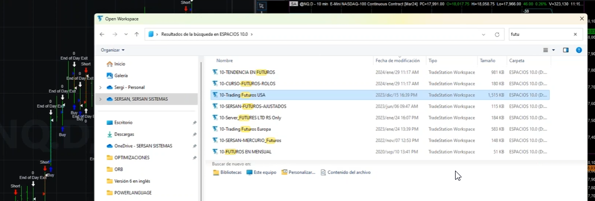
  <figcaption>Figura 1. Tradinf futuros USA tws</figcaption>
</figure>

<figure>
  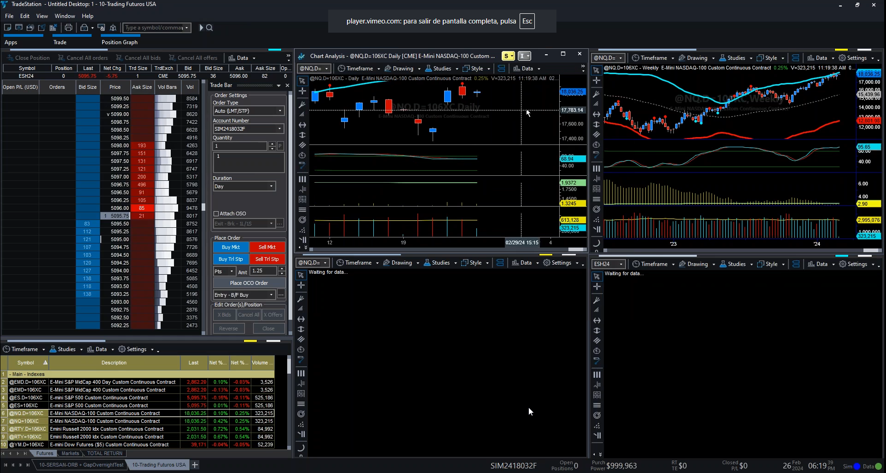
  <figcaption>Figura 2. </figcaption>
</figure>

Tú, en un intradía de acciones, la mayoría de días, lógicamente no siempre, el mercado es bastante *mean reverting*. De hecho, en acciones lo que mejor va es la reversión, pero sobre todo en intradía. En diario también, pero ya se puede encontrar tendencia. Y a medida que vamos subiendo el plazo, es decir, tú ves aquí este gráfico en un horizonte diario:

<figure>
  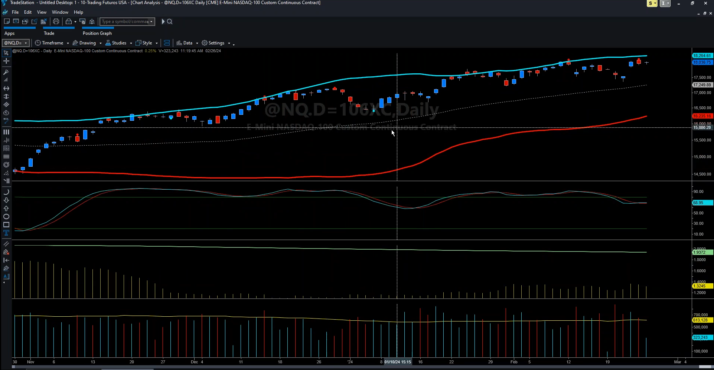
  <figcaption>Figura 3.</figcaption>
</figure>

Estamos viendo un gráfico bastante desarrollado, y de hecho aquí estamos cubriendo un período de barras bastante importante. Como vemos, tenemos una lateralidad bastante... aunque es alcista, tenemos una cierta lateralidad, podemos decir visual. Es verdad que el hecho de que haya tantos indicadores, que ahora quito, agrava esta sensación. Pero a medida que quitas indicadores, parece más alcista:

<figure>
  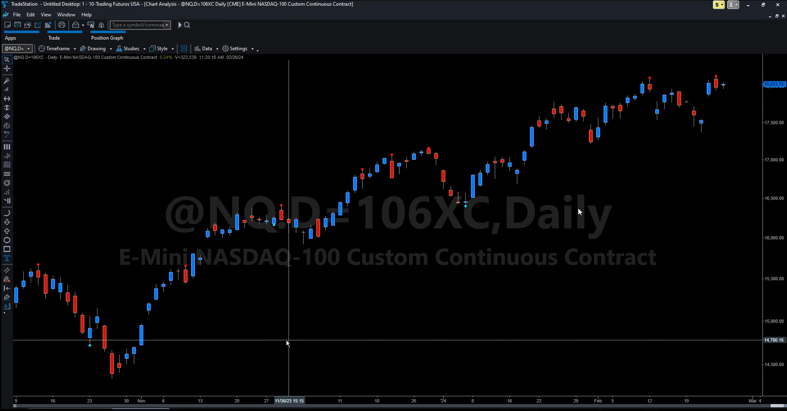
  <figcaption>Figura 4. </figcaption>
</figure>

Pero ya me entendéis. Y a medida que yo amplío mucho, prácticamente ya solo me parece que hay una tendencia alcista. Y esto como mejor se ve es, lo que te digo, si tú pones un gráfico mensual:

<figure>
  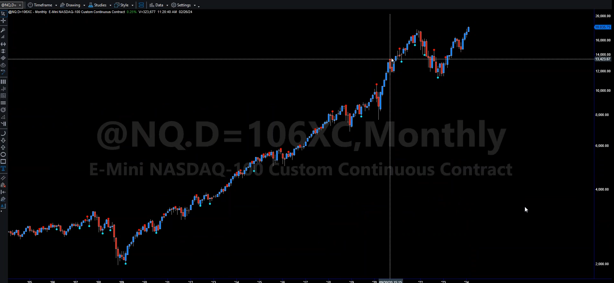
  <figcaption>Figura 5.</figcaption>
</figure>

Esto es alcista más no poder. Aquí se ve súper alcista, súper tendencial. Por lo que estoy hablando, alcista lógicamente, pero hablando de tendencial, en este caso alcista.

En cambio, te digo, a la que vamos al intradía, todo se vuelve mucho más lateral. Prácticamente es un *gap* y lateral:

<figure>
  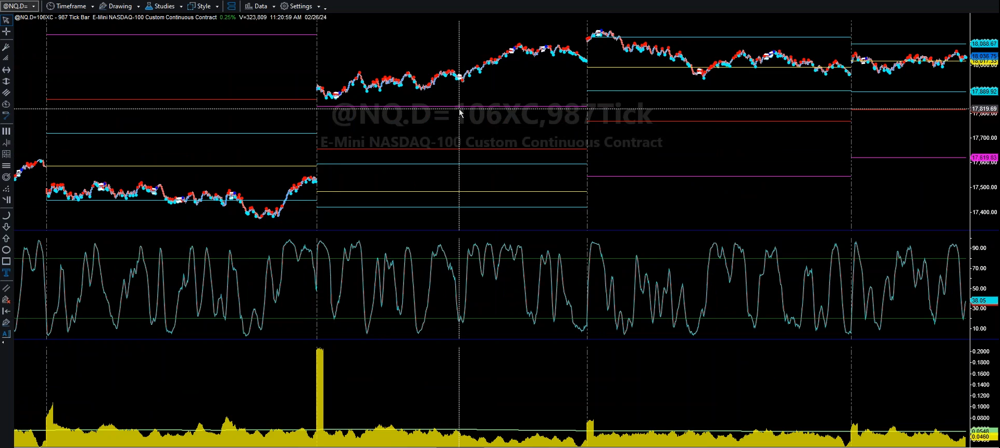
  <figcaption>Figura 6.</figcaption>
</figure>

Y esto es así. Pasa un poco en todos los tipos de activos, pero el *equity* quizás es el más paradigmático.


**Dificultad de detectar tendencia en intradía y tipos de estrategias**

Entonces, a nivel de mirar tendencialidad, ya digo, en diario y ya no te digo en semanal, casi todos los activos o son tendenciales, o en cualquier caso son más tendenciales que en una temporalidad más corta. En las temporalidades intradía realmente no es fácil encontrar tendencia en términos generales, y ahí normalmente suele ir mejor el *mean reverting*, o en el mejor de los casos el *volatility breakout*.

Porque al final, *volatility breakout*, recordar que en la teoría lo comentamos, no deja de ser un tipo de estrategia tendencial donde lo limitamos con objetivos y demás, por lo tanto ya pierde su clara tendencialidad. Pero digamos que busca entrar... o sea, entra tarde como un tendencial, entra en rupturas. Pero en *volatility breakouts*, cuya vida como digo es tendencial, el mecanismo de entrada podemos decir que es muy parecido al de un tendencial. Pero claro, cambian mucho las salidas, y eso totalmente cambia el comportamiento del sistema.

<div style="border-left: 4px solid #4caf50; background: #e8f5e9; padding: 10px 15px; margin: 10px 0; border-radius: 8px;">
  <strong>📏 Distinción entre estrategias</strong><br><br>
  <em>Mean reverting</em>: estrategias que apuestan por el retorno del precio a su media histórica.<br>
  <em>Volatility breakout</em>: estrategias que buscan capturar movimientos tras rupturas de rangos de volatilidad, con entradas similares a los sistemas tendenciales pero con salidas por objetivo o tiempo definido.
</div>


**Evaluación comparativa y búsqueda de señales tendenciales**

Entonces, estos análisis que hice en la teoría estaban básicamente en gráficos, no recuerdo si eran diarios o a lo mejor hasta eran en semanal quizá. Entonces ahí sí que todo es un poco más tendencial. Pero ahí yo te digo, Alejandro, es más bien un tema comparativo, comparar un activo con otro, el hecho de mirar si en ese hay mucha o poca tendencia.

Veremos también, cuando evaluemos... no tengo claro exacto si será en tres clases o en cinco, pero haremos una clase donde usaremos un *buscador de señales*. Digamos que haremos varios *setups* que nos permiten buscar mecanismos de entrada y que indirectamente también nos sirven para evaluar cómo de tendencial es un activo. Ya lo he comentado algunas veces: una bastante conocida y bastante fácil es simplemente, en una vela diaria, comprar ante la ruptura del máximo del día anterior y cerrar al cierre. Esto es un indicador de la tendencia. Y lo mismo para la parte baja: eso es un indicador de la tendencialidad del activo. Este tipo de cosas realmente pueden servir para ver hasta qué punto un activo es tendencial ante las rupturas, y también nos sirve para eso. Entonces hay un poquito varias maneras.


**Reflexión sobre el sesgo del ADX y comparaciones**

El *ADX*, de lo que dices tú del sesgo, yo lo veo un poco más al revés. Es decir, a medida que si tú reduces el periodo, es donde lo vas a sesgar. Si realmente es cierto, vas a ver si en el último año o dos años ha sido un activo bastante tendencial, pero en este ejercicio, como te digo, lo que mirábamos, tratábamos de ver, era por comparación qué características tenía ese activo con otros, comparado con otros. Era un poco la idea.


**Comentario de Carlos sobre algoritmos de posicionamiento**

Vale, qué más. Bueno, luego aquí también había un comentario de Carlos, que un artículo sobre el algoritmo de posicionamiento con una explicación y una comparativa entre *Fixed Fractional* y *Fixed Ratio*. Pues lo tenéis que repasar porque la verdad que tengo muchos apuntes sobre eso, y cuando volvamos a repasar y tratemos en las prácticas un poco esos temas, que ya lo haremos, podemos decir más bien de la mano del *portfolio*, que ahora por cierto quiero hacer un comentario al respecto y luego lo haré. Pues ahí lo trataremos más, y si acaso ya tenemos material, Carlos, pero ahora mismo tengo bastantes. Pero bueno, repasaremos.

<div style="border-left: 4px solid #4caf50; background: #e8f5e9; padding: 10px 15px; margin: 10px 0; border-radius: 8px;">
  <strong>💰 Algoritmos de gestión monetaria</strong><br><br>
  <em>Fixed Fractional</em>: arriesga un porcentaje fijo del capital en cada operación.<br>
  <em>Fixed Ratio</em>: método desarrollado por Ryan Jones que ajusta el tamaño de posición basándose en un parámetro delta y el beneficio acumulado.
</div>


**Pregunta de José Manuel sobre configuración del servidor**

Vale, José Manuel. Él hablaba de la guía de configuración del *server*. Bueno, la guía de configuración del *server*, la verdad que sinceramente aquí en la empresa tenemos dudas hasta qué punto es súper útil eso. Pero bueno, lo evaluaremos; de cara sería un tema más de cara al final. Pero sí que inicialmente queríamos hacer algo al respecto.

En directo es complicado, porque yo no me puedo conectar al *server*, ¿me entiendes? No me puedo conectar al *server* en directo, es complejo. No sé cómo hacerlo, porque ves la IP, entonces me lo revientas. No lo puedo hacer en directo, tengo que grabarlo, y entonces al grabarlo lo puedo editar y le puedo tapar la IP. Entonces es un poco el tema: en directo no es fácil. Sí que teníamos intención de hacerlo, y de hecho un poco ya explicamos en la teoría, pero tenemos ese problema. A ver cómo lo podemos resolver, ya le daremos una vuelta.


**Sobre MSA y otras herramientas complementarias**

Respecto a *MSA* (Market System Analyzer), si estaría en algún mini tutorial con su uso, para qué casos merece la pena, qué alternativa tiene entre eso, *Multicharts*...

El motivo justamente por el que quiero ir usando distintas herramientas es ese: que vayáis viendo vosotros y que sin querer las vayáis aprendiendo o viendo, o que luego ya os enseñe cómo buscar en su ayuda, etcétera. Entonces *MSA* en el curso lo veréis en las prácticas; en algunas clases saldrá, y entonces ahí podréis ya ver cómo va, y veréis cómo lo monto yo, etcétera. Entonces un poquito lo aprenderéis.

*MSA*, al tener una... ¿qué casos merece la pena? Es muy baratito, y además recordar que tenéis una oferta. Yo os lo recomiendo mucho, os lo digo de corazón: por el precio que tiene, da mucho. Recordar que aquí está la oferta de *MSA* haciéndoos descuento. Yo sí lo recomiendo porque para la gestión monetaria viene muy bien. Lo mismo lo puedes hacer en otros, pero no es igual, ¿sabes? Es muy práctico *MSA*, que permite probar muchos algoritmos de gestión monetaria de manera rápida. Yo, por el precio que tiene, de verdad que os lo recomiendo.

<div style="border-left: 4px solid #4caf50; background: #e8f5e9; padding: 10px 15px; margin: 10px 0; border-radius: 8px;">
  <strong>🛠️ Herramienta recomendada</strong><br><br>
  <em>MSA (Market System Analyzer)</em>: software especializado en análisis de gestión monetaria y position sizing. Permite evaluar múltiples algoritmos de gestión del capital sobre resultados de backtesting de forma ágil y visual.
</div>


> Algunos alumnos nos habían hecho llegar que el cupón de descuento de MSA ya no funcionaba. Hemos enviado un email a Adaptrade y nos ha reactivado el cupón de descuento de 100$:
>
>MSA100DSC
>
>Os dejamos información sobre el software: https:# www.adaptrade.com/MSA/index.htm
>
>Lo podéis adquirir aquí: https:# adaptrade.onfastspring.com/market-system-analyzer-4
>Cambiando el país en la parte de arriba podéis cambiar la divisa de pago si queréis hacerlo.


***¿Hay alguna forma de trasladar código de MetaTrader?***

No rápida, no. No hay, no me consta que haya. Es una pregunta ya reiterada en muchos años y no me consta.


***¿Profundizar más en Portfolio Maestro? ¿Cómo usarlo para evaluación preliminar? ¿Qué es el portfolio de selección de sistemas?***

Bueno, la verdad que lo que hemos visto en teoría, y veremos en algún momento, pero bueno, ya iremos viendo. ¿No has visto la teoría? Claro, la teoría se ha visto un poco cómo va *Maestro*. Y lo que sí que puedo hacer también, apúntamelo Alberto, porque tengo por ahí una guía bastante buena de *Maestro*, y eso sí que podemos darlo. Porque *Maestro* ha cambiado entre 0 y 0,01 en los últimos años, así que es una guía que es antigua pero que está totalmente en vigor porque no ha cambiado nada.

*Maestro*, ya te digo, te aviso: es un programa muy potente, pero te vas a exasperar con él. Es exasperante, porque tecnológicamente, claro, todo evoluciona. Compras un móvil este año y le da mil vueltas al del año pasado —bueno, ya no porque ya no avanzan tanto—, pero hace tres años le daba mil vueltas. Yo me lo cambié hace poco y estoy alucinando con lo que dura la batería, una cosa increíble, un cambio. Lo demás nada, es un poco mejor porque ya no cambia tanto, pero ya digo, la batería es alucinante.

Bueno, pues *Maestro* es el mismo hace diez años, ¿entiendes? Entonces claro, hace diez años iba tirando; hace ya cinco decías "bueno, es un poco pesado"; ahora ya va pasando el tiempo y te parece una cosa alucinante. No evoluciona, no mejora, y se está quedando atrás, que ya en sí está pasando. Pero *Maestro* es el líder de esto, es el líder de esto. Porque no evoluciona, me refiero a velocidad, velocidad de procesamiento, de este tipo de cosas. Entonces tiene ese problema *Maestro*.


***Sería bueno tener ejemplos prácticos de cómo montar una matriz en Excel para elegir sistemas descorrelacionados para diversificar.***

Comentaba también del tema de portfolio, que quizá le faltaba algún tema.


***Portfolio: recomendación general y Equal Weight***

En portfolio, de verdad, y ya sé que hay mucha literatura, esto lo voy a decir: no os calentéis la cabeza. Lo que mejor funciona y más robusto es *equal weight*. No os hagáis pajas mentales.

Lógicamente, más optimizaciones en el portfolio, y por esto y por aquello… vale, porque sí, se pueden hacer 250 cosas: se puede hacer *Markowitz*, y se puede hacer la frontera eficiente, y se puede hacer el pino puente. Pero el problema es si eso será robusto luego, ¿me entiendes?

Entonces, al final, los sistemas en sí ya tratamos que sean simples, robustos y tal. Y luego, a nivel de mezclarlos, ya entiendo que haya duda: "¿cómo los mezclo?" Pues *equal weight*, de verdad, *equal weight*. No os calentéis, no os calentéis en buscarle ahí las vueltas.

Porque al final, yo ya lo entiendo: tú tienes un sistema que es muy bueno —porque hemos pasado igual nosotros por ello—, tú tienes un sistema muy bueno, y luego vas sacando otros, y son una birria. Dices: "joder, ¿cómo lo voy a poner a igual esto?" Bueno, si es así, si es birria versus muy bueno, entiendes…

Claro, depende de lo que implique "muy bueno". Si tú me estás hablando de "muy bueno" con 10 años operando en el mercado real, vale, *parlem-ne* —que decimos en catalán—. Ahora, si estamos hablando de "muy bueno" a nivel de *backtest* o con dos meses de operativa real, pues no es muy bueno: es simplemente prometedor, nada más. "Muy bueno" es en el mercado.

Entonces, como si hablamos de situaciones más o menos comparables en cuanto a "más o menos prometedor", pero uno lo ves más prometedor que el otro: no te fíes. Porque el que es muy prometedor de pronto entra en mala racha, y resulta que llevas todo el peso; y el que era una birria de pronto lo peta tres meses seguidos, y tú resulta que lo tenías ahí súper bajo de peso, y te atragantas, ¿entiendes?

Solo se ha pasado, que se está hablando de la experiencia de errores que uno ha cometido, lógicamente, porque para eso lleva 20 años. Y si alguien se piensa que en 20 años hemos cometido pocos errores, quiere decir que lleva poco tiempo en el trading, porque tenemos muchísimos errores. Lo bueno es intentar aprender de ellos y que no sean tampoco errores catastróficos; que sean errores asumibles.

<div style="border-left: 4px solid #4caf50; background: #e8f5e9; padding: 10px 15px; margin: 10px 0; border-radius: 8px;">
  <strong>📏 Regla práctica sobre diversificación</strong><br><br>
  La mejor diversificación no es por activo, sino por <em>estrategia</em>. Es preferible tener estrategias muy distintas en el mismo activo que la misma estrategia en distintos activos. Lo ideal es combinar ambos enfoques.
</div>


**Mezcla de sistemas, herramientas y referencias**

Entonces, al final, no es nada fácil tener claro qué mezcla de sistemas va a ir mejor. Por experiencia, yo he llegado a esta conclusión, y ya sé que no es muy atractiva, no es muy *guay*. Ya sé que gustaría una fórmula que diga "ostia, esto lo va a petar la cartera". Sí, sí, pues intentamos que eso se pueda dar con los sistemas, pero luego, ya a nivel de mezclarlos, no es fácil.

Sí que nos apoyamos de herramientas, como ya habéis visto *Maestro*, como ya habéis visto *Portfolio Trader*, como ya habéis visto y veréis también más *MSA*, y también veréis un poco de *QuantAnalyzer*. Entonces veremos todo este tipo de herramientas que nos ayudan a tomar una decisión. Pero ya digo que el *equal weighted* viene muy bien, viene muy bien, y no hay que perder mucho la cabeza.

Ya sé que hay otros que defienden otros métodos, pero también hay otros que defienden esto, bastante conocidos. Entre ellos, que recuerdo ahora mismo —espero no equivocarme—, estoy casi seguro de que Kevin Davey recomienda eso, y estoy casi seguro de que *Perry Kaufman* recomienda eso. Os lo digo porque es complicado garantizarse la mezcla.

Entonces, al final, eso te garantiza diversificación y riesgo cubierto, ¿me entiendes? Porque a lo mejor no es la mezcla que más dinero va a ganar, pero sí que es bastante probable que sea la que menos dolores de cabeza te va a dar. Entonces, como siempre hay que pensar en eso: en caso de duda, el *equal weighted* te cubre muy bien.

Pero bueno, cuando lleguemos ya discutiremos sobre esto, aportaremos y veremos pros y contras. Y veremos también que, claro que se puede optimizar, claro que yo puedo meter ahí una función *fitness* y optimizar el portfolio. Hecho, lo he hecho, y lo puedo hacer. Igual que viste ya en *Portfolio Trader* que optimizo una variable, pues puedo optimizar el *money management* si quiero, y en *MSA* lo puedo hacer, lo veréis, y lo hemos hecho.

El tema es si yo lo optimizo y lo que sale lo aplico. O sea, que no quiere decir que no optimicemos; recordar que optimizamos muchas veces para obtener información. No quiere decir que optimizo y aplico lo que sale al máximo, pero sí que me sirve para coger referencias, para ver qué opina el optimizador. Que al final el optimizador opina en base a los datos: qué opina en esa mezcla.

Ya ves que a veces escupe algún sistema, pues porque es una birria de sistema, por lo que sea. Decir: "vale, perfecto, él lo escupe". Pero yo normalmente intento que lo escupe menos, ¿entiendes? Porque sé que, como os digo, de pronto el que iba fatal con los datos antiguos —porque está en una mala época— de pronto empieza bien; el que iba muy bien puede hacerlo mal después; y así. Entonces, si depende de tu mezcla, resulta que te puede salir ahí un *drawdown* muchísimo peor por culpa de eso. En cambio, el *equal weight* cubre un poquito.


***Realizar investigación y puesta en marcha de un sistema con COT***

Esto está previsto, esto ya estaba previsto. Tenemos varios sistemas sobre los que he hecho, y una de las clases que tengo pensada hacer es sobre eso, sobre los *COT* (Commitments of Traders).


***Cuando tenemos un sistema de evaluación preliminar y queremos ver qué entradas o salidas son las más óptimas, ¿se van probando a mano varias? ¿Hay alguna manera sistemática de elegir cuál es probar y en qué basarnos para tomar unas u otras?***

En evaluación preliminar simplemente buscamos ver si el sistema es apto para seguir adelante, simplemente. Ya recomendé, ya os comenté, básicamente que gane dinero. Sí que se suele probar en casi todos los casos, incluso en la entrada, y aunque cuesta más, que vaya en distintos activos. Pero es simplemente que es rentable, que el *edge* es explotable y tiene ventaja. Hicimos una clase, te recomiendo repasar la una o varias viendo un poco cómo evaluamos si una ventaja tenía cierto potencial.

Es un poco la idea para seguir adelante. Claro, tú ahí, ¿qué miramos? No miramos mucho ahí, no se trata de mirar muchos ratios, de verdad. Es simplemente que tú veas que la ventaja tiene potencial. No di unas cantidades porque es que no hay unas cantidades. Ahí dices: "oye, claro, si tú sin comisiones, imagínate que no le has puesto comisiones, tienes un *profit factor* de 1.5". En ese momento, sin haberlo trabajado, por esa... bueno, 1.5 depende de qué tipo de sistema: estaría bien un intradía o con muchos *trades*, podría estar bien. Pero en un *setup* diario, por ejemplo, sería poco.

Es que depende: si solo evalúas la entrada, estaría bien; un sistema acabado, completo, que ya esté parecido o igual a como lo vayas a operar, sería justo. Pero un sistema que solo le evalúas a lo mejor la entrada, estaría correcto.

Entonces, no hay un dato inequívoco. Al final, la evaluación preliminar no deja de ser una especie de prueba más rápida que haces para no perder mucho tiempo con cosas que ya no valen para nada y que se ve rápido que no valen. Es decir, es más bien un descarte que otra cosa. Entonces, si tienes dudas, sigue para adelante; si tienes dudas, sigue para adelante. Pero es para descartar rápido, podemos decir.

Yo lo expliqué largo porque, lógicamente, la teoría lo explica es largo. Pero muchas veces eso es un momento, y además es una cosa continua, que ya tiras con esa y sigues con las siguientes, es continuo. Un poco muchas veces solapan estos, los he ido comentando. Especialmente los sistemas como hemos estado en diarios y demás, ahí es porque el tiempo de procesamiento ya es lento, entonces como que no te aprieta tanto perder el tiempo ahí. El problema es cuando es un intradía, que a lo mejor evaluarlo cuesta muchas horas de optimización. Y ahí sí que ya pues es: "oye, si lo ves, quieres antes hacer algo sencillo para que se te vaya de miedos, y si no lo pasa, no, si no lo pasa no te vas a perder un mes de trabajo".


***Una vez tenemos un sistema finalizado y queremos pasarlo a real, ¿cómo implementarlo en TradeStation para que opere varios activos diferentes dicho sistema? ¿Cómo se hace?***

Bueno, esto en sí, en varios activos, no tiene mayor dificultad. Ya intentaré daros, ya lo he ido haciendo y lo haré a medida que me lo vais pidiendo. Por ejemplo, de *Maestro*, que te he dicho, te voy a subir un material. Iré subiendo algunas cosas.

Sí que os recomiendo, es verdad que son antiguos algunos de ellos —bueno, son antiguos muchos de ellos—: en nuestra web, en nuestra página web, hay de nuestra antigua época que éramos el soporte de *TradeStation*. Ya os iré facilitando el material que pueda, que vea que os puede ayudar sobre esto.

Pero de momento, os recomendaría a aquellos que estéis muy muy verdes en *TradeStation* ver este vídeo, que es un resumen de la serie 10 en castellano. Y si no, pues lo que os digo: ver la serie en inglés, verla en inglés, *Getting Started*.


***¿Umbral mínimo de trades en diario para que se pueda optimizar, 300?***

Bueno, esto siempre depende, siempre depende. En principio, un sistema en diario, a priori, piensa que no se puede optimizar. Y que si tiene muy pocos *inputs* y ya es un veterano, que ya lo has hecho antes y demás, sabes que has podido mantenerlo robusto, pues puede ser esa cantidad que das, podría ser razonable. Es razonable.

Una referencia que puedes coger son 30-50 *trades* por grado de libertad.

<div style="border-left: 4px solid #f39c12; background: #fff8e5; padding: 10px 15px; margin: 10px 0; border-radius: 8px;">
  <strong>⚠️ Regla sobre grados de libertad</strong><br><br>
  La expresión <em>grado de libertad</em> (en este contexto de trading cuantitativo o modelado estadístico) se refiere a cada parámetro que puede variar o ajustarse durante la optimización de un sistema.<br><br>
  Cada <em>input</em> o <em>variable</em> que tú puedes cambiar libremente en tu estrategia (por ejemplo: longitud de una media, distancia de un stop, umbral de entrada, etc.) es un grado de libertad.<br><br>
  <strong>Referencia razonable de 30-50 trades por grado de libertad:</strong>
  <ul>
    <li>Si tu sistema tiene 2 parámetros optimizables, necesitas al menos 60–100 trades.</li>
    <li>Si tiene 6 parámetros, entonces 180–300 trades.</li>
  </ul>
  <strong>📏 ¿Por qué importa esto?</strong><br>
  Porque cada grado de libertad requiere suficientes datos (trades) para que la optimización sea estadísticamente significativa y no sobreajuste (<em>overfitting</em>).
</div>

Entonces ahí es que depende mucho, porque tú ves que es un diario, pero no me dices si tienes siete *inputs* o uno. Tienes uno, pues normalmente vas bien. Pero de todo eso hemos hablado mucho en la teoría, yo creo que hemos hablado mucho de ello, en toda la parte de optimización y demás.


**¿Qué fitness elegir para cada sistema y su optimización?**

*¿Por qué condiciones elegir unos u otros? ¿En un sistema en cuáles centrarnos en TSE o Multicharts? ¿Sortino, Ulcer y los tres favoritos?*

Bueno, también se ha comentado. En *TradeStation* nosotros usamos *TSI*, *Expectancy Score* y *PPC*. En *Multicharts* usamos *Sortino* o *Sortino ajustado*, usamos *Ulcer*, hemos usado también *TSE*, y hemos usado *Expectancy*, hemos usado *PPC* también programados.

Es decir, al final, yo si me dices quedarme con uno en *Multicharts*, me quedaría con *Sortino*, probablemente. A mí me gusta el *Sortino ajustado*, que es aquello que os expliqué multiplicado por raíz de 2, porque al final te permite compararlo con *Sharpe*. Pero si más vale...


**¿Qué es Max Bar?**

El *Max Bar* es el parámetro mínimo que necesita un gráfico para arrancar. Si tienes cuenta de *TradeStation*, esto te vas a la ayuda. Y no sé si por *Max Bar* lo encuentras, porque eso al final, sabes qué pasa, que te acostumbras a llamarlo de una manera. Si bueno, este es el de... sí: *Maximum Bars Back Setting*. Esto es *Maximum Bars Back Setting*. En la ayuda lo tienes, así que también hay que buscar un poquito. Es importante cultivar esa inquietud y esa mentalidad crítica de buscar las cosas, hay que hacerlo.

El hacer un curso con un profesional que se dedica a esto tiene, creo yo, en mi opinión, muchas ventajas. Pero tiene también una pequeña desventaja —y por eso pido luego cierta comprensión—: que es que yo le meto muchísimas horas al curso, no sabéis cuántas. Pero claro, también tengo que dedicarme a la actividad principal de la compañía, ¿entendéis? Entonces no puedo abandonarla durante todo este tiempo, porque si no, pues sería complicado.

Entonces, ese es el inconveniente: que no es una persona que solo se dedica a hacer formación. A cambio, pues sabéis que habláis con alguien que sabe de qué habla, que habrá cometido sus errores, que se habrá equivocado mil veces, que será mejor o peor, pero que sabe de qué porque lo ha pasado. Entonces esa es la ventaja. La desventaja es que no puede estar el cien por cien del tiempo dedicado a ello. Entonces, a veces se me olvidan cosas y puede pasar. Así que en eso sí que os pido un poquito de comprensión. Pero sí, esto lo daremos.


**Walk Forward, cortes y práctica**

*La representación OOS (out of sample) de ambos lados, ¿siempre se coge más 25, menos 25? He visto que a veces se coge 30%.*

No siempre. Por defecto, el consenso coge más bien 30. Realmente depende de los cortes. Esto yo no sé si, José Manuel, es que no has acabado la teoría o demás, pero te recomiendo volver a verla porque es normal. Yo, de hecho, recomiendo a todos que la veáis varias veces porque la habéis pagado. Y desde que acabemos la práctica, ya sabéis que hay un año, hay un año desde que acabemos la práctica garantizado. No quiere decir que al año haya un reloj y vamos a cortar; hay que garantizar un tiempo y es el que garantizamos.

Esto está hablado en la teoría. Hicimos alguna práctica viendo los cortes, y la práctica yo creo que ya se ha visto y se verá también. Depende un poquito de los cortes, o sea, de dónde tú veas que cortas el histórico. Pero sí que el consenso, cuando hacemos optimización convencional, suele estar ahí en 30%, 25-30%.

Por ejemplo, *Pardo* (Robert Pardo, autor de *"The Evaluation and Optimization of Trading Strategies"*) también hace una prueba que es 50-50: hace 50 y 50 por los dos lados. Eso que hacemos nosotros, 25-25, que puede ser 30-30, no importa, no está ahí la gran diferencia.


**¿Walk Forward es descalificante si la óptima clásica es buena?**

*¿Walk Forward desde cero en práctica? ¿En el curso se dice que es más difícil que en temporalidades altas pasar Walk Forward?*

No. En temporalidades altas lo que pasa es que es difícil pasar *Walk Forward* porque no hay *trades* para hacer tantos cortes. Al final, *Walk Forward Cluster*, que es el que a mí me gusta, consiste en hacer muchos cortes. Entonces, claro, no hay *trades* para hacer: si tú tienes 300 *trades* como me decías y encima lo cortas en 20 trozos, pues claro que va a quedar todo con dificultad de que sea comparable. Entonces es difícil.

Por eso también es verdad que depende del tipo de sistema. Lo comentaba Alejandro una vez, que a él no le gustaba el *Walk Forward* por eso: porque en un tendencial pasa épocas que sí y épocas que no. Es verdad. Por eso los cortes tienen que ser lo suficientemente amplios en ese caso para que haya de todo.

Claro, esto hay cosas que se cogen un poquito con la práctica, que para eso es la práctica, y con la experiencia, lógicamente. Es decir, por eso yo, a todo el mundo que me ha preguntado, os he dicho: el que esté empezando de cero yo creo que puede salir adelante y tener una formación fantástica y quedar muy contento al final del curso. Pero que tampoco espere que acabe el curso y ya sea el máster del universo, porque hay que practicar. Es decir, hay que tener experiencia propia.

Y al final, aquí no se trata de coger los 10, 15 o los 20 sistemas que hagamos y llevarlos a mercado. Se trata de que cojáis maña, de que veáis maneras de conseguir las cosas, cómo hacerlas para vosotros, que vayáis haciendo vosotros mismos. Que esa es la gracia: que vosotros mismos vayáis haciendo cosas y aportando.


**¿Qué umbrales mínimos deberíamos manejar para saber hasta qué punto renta intentar pasarlo?**

Yo creo que es bueno y tratar de pasarlo es bueno. Pasa que, si hay lo que os comenté, que hay un mínimo de *trades* por *cluster* que el consenso fija en 30... Si tienes muchos *clusters*, no es malo ese 30; es 50 mejor, pero el 30 está bien si hay muchos *clusters*. Porque no es que sean 30: son 30 más 30 más 30 más 30 más 30 más 30. Entonces ese sería un mínimo, pero lo ideal es que sea más, claro. Es que sea más, pero esa es un poco la referencia: que los *clusters* puedan tener mínimo de 30-33 de media.


**TP Loco y límite de profit mensual**

*Duda: ¿sería posible que nos enseñaras el código de un sistema que, al llegar a X profit mensual, deje de operar? Así como ver el código de un TP loco y su explicación de cuándo sería recomendable implementarlo.*

Cuando hagamos algún sistema tipo *IRIS* —igual, ¿no, Alberto?—, cuando vayamos a un sistema tipo *IRIS*, igual, así de semanal-mensual, podemos meter esto del *TP loco* y el *profit* mensual. Yo creo que ahí puede encajar bien. Sí, sí.

Bueno, *profit* mensual en sí no tiene tampoco excesiva dificultad. Y el *TP loco* no es más que... es literal: es un *take profit* muy superior a la historia, hasta el final. Es mirando el *MFE* (*Maximum Favorable Excursion*) en una muestra de muchos años con muchos *trades*, en una muestra muy muy larga. Pero un poquito donde el sistema tiene *profits* realmente desbocados, donde sale madre, pues un poco es ahí. Son zonas donde creemos que renta salirse.

Pero ya digo, si tú tienes a esto, yo nuevamente lo aplicaría solo más bien en cartera, más bien cuando llevas varios sistemas. No es lo mismo tener un sistema; o por ejemplo, cuando me pongo a hablar de los *ORBs*, no es lo mismo, saldrá una cosa. Es decir: "bueno, ¿cómo lo configuro? ¿Me renta cortos, no cortos?" Ya lo comentaba en la teoría y práctica. Es decir, muchas veces lo que tú buscas depende de lo que ya tienes, porque lo que quieres es lo que no tienes.

La mejor manera de diversificar es por estrategia. Entonces, yo si estoy buscando un *ORB* porque ya tengo una cartera de sistemas que van bien en medio-largo plazo —incluso entrarían en el largo—, pues a lo mejor me interesa el corto. Y a lo mejor no es el mejor lado del sistema, pero bueno, yo prefiero que no sea tan bueno pero prefiero que vaya corto, porque sé que me va a diversificar mejor el portfolio. Entonces hay un poco lo que lo que quieres.

Entonces, aquí este tipo de cosas, "*TPs locos* de cartera", yo solo los aplicaría en caso que tuviera ya una cartera de sistemas que me garantizan que no me voy a perder un momento. Porque hay que vigilar: ¿qué es el *TP loco*? Si te vas a salir de las reglas del sistema —que un poco te está haciendo eso—, tienes que tener algo que te cubra. Es decir, o dicho de otra manera: no sé, si yo tengo cinco sistemas, a lo mejor a dos les pongo *TP loco* y a tres no, ¿entiendes? Es decir, es un poco la idea. Si solo tengo uno, pues no lo aplico; si solo tengo dos, seguramente tampoco; si tengo tres, a lo mejor uno, ¿me entiendes? Es decir, no todo, porque al final también eso hay que diversificarlo. Pero bueno, lo veremos.


**Funciones fitness y valores umbrales**

*Una de las dudas que tengo en relación a los valores umbrales de las funciones fitness que utilizamos para evaluar un sistema: ¿a partir de qué valor umbral podemos considerar que el Recovery Factor es bueno? La misma pregunta con el Profit Factor, el ratio Total Return Máximo y demás funciones fitness más relevantes.*

Hicimos una clase sobre los umbrales, aunque es cierto que no profundizamos demasiado. Di algunas referencias, pero debo decir que no soy partidario de seguir valores de referencia demasiado estrictos.

He visto sistemas que operan con métricas aparentemente flojas, pero que mantienen su robustez con el tiempo. En cambio, hay una parte de la industria que busca referencias excesivamente altas porque asume una degradación muy fuerte en la operativa real.

Personalmente, creo que el camino está en no exigir métricas tan perfectas, sino en lograr que el sistema degrade menos. Es un tema relativo, y lo iremos viendo en la práctica con los datos que obtengamos.

Como se ha visto muchas veces en mis directos, en los *backtests* es fácil obtener resultados espectaculares, pero ese no es el camino adecuado.

Aun así, vimos algunas referencias orientativas, aunque dependen mucho del tipo de dato: no es lo mismo un resultado de optimización que uno de operativa real o de una simulación de Monte Carlo, que suele reducirse aproximadamente a la mitad.

Por ejemplo:

- El *Recovery Factor* (retorno dividido por *drawdown*) suele considerarse razonable entre 2 y 3, dependiendo del caso. En datos anualizados, es habitual que el retorno anualizado sea similar o algo mayor que el *drawdown* anualizado. En operativas reales, que el retorno neto anual supere el *drawdown* es una buena referencia.
- En el *Performance Report*, una regla mínima es que el *Drawdown* sea menor que el beneficio total (*Total Profit*) en valor absoluto.
- El *Profit Factor* también depende del contexto:
  - En *backtests*, valores de 3 o 4 son excelentes.
  - En simulaciones realistas con comisiones, entre 1.5 y 2 ya es correcto.
  - En operativa real, por encima de 1 es perfectamente válido.

En resumen, todo es relativo: cambia mucho según si miramos datos optimizados, reales o de Monte Carlo. Pero estas son, en general, las referencias más útiles y realistas que puedes tener en cuenta.


**Propuesta de ratio fitness personalizado basado en SQN y Sortino**

*Estaba repasando las funciones fitness y me ha venido una idea loca a la cabeza. Partiendo del Ratio SQN Sortino —cojo este porque ya tenemos aplicada una corrección por el número de operaciones, aunque se podrían coger el ratio de Sortino simplificado filtrando los sets que tengan menos de X operaciones— y multiplico por barras o días en drawdown dividido entre barras o días totales del histórico. Con esta multiplicación penalizamos los sets que están más tiempo en drawdown, aplanando las curvas. ¿Tiene sentido? ¿Puede ser una forma de sobreoptimizar, ya que tenemos los sets que más se ajustan a la curva aunque supere Walk Forward Optimizer?*

Hay mucha gente que utiliza *ratios fitness* personalizados, y no está mal hacerlo. No está mal, siempre que no se pierda la cabeza con ello. Es decir, no penséis que ahí está la gran clave para construir un sistema robusto. Lógicamente, la función *fitness* tiene su importancia, pero dentro de las que ya habéis visto existen soluciones sólidas.

De hecho, lo que tú has explicado ya existe en forma de un ratio que se llama *Ulcer Index*. Este índice penaliza los conjuntos de datos (*sets*) que pasan más tiempo en *drawdown*, aplanando las curvas. Eso es exactamente lo que hace el *Ulcer Index*, y al final viene a ser lo mismo.


<figure>
  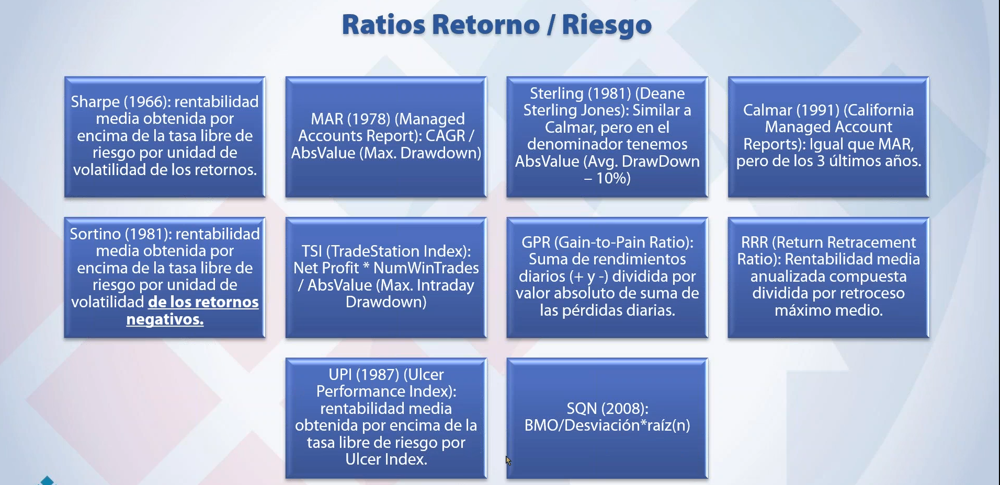
  <figcaption>Figura 8. Tema Teoría : Ratios Retorno / Riesgo.</figcaption>
</figure>

<figure>
  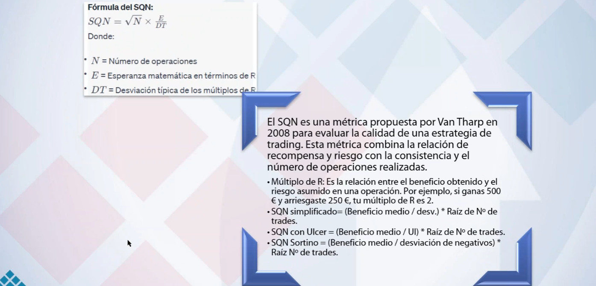
  <figcaption>Figura 8. Representación gráfica del Ulcer Index y su aplicación en la evaluación de sistemas.</figcaption>
</figure>

$$
\text{SQN con Ulcer} = \frac{\text{Beneficio medio}}{\text{Ulcer Index}} \times \sqrt{\text{Número de trades}}
$$

En la teoría de base —en los vídeos donde está el *PowerPoint* completo— hay mucho material sobre esto, y muchas de las preguntas que hacéis ya están respondidas ahí. Cuando vimos el *SQN* o el *UPI*, que deriva del *Ulcer Index*, hablamos bastante sobre volatilidad y sobre *Sharpe*, que es el estándar de la industria.

Si te fijas, el *SQN* con *Ulcer* simplificado se define como el beneficio medio dividido por el *Ulcer Index*, multiplicado por la raíz cuadrada del número de operaciones. Es muy parecido a lo que tú has hecho. El *SQN* tradicional es el *Sortino* dividido por la desviación de los rendimientos negativos, y en el fondo, todo se reduce a lo mismo: retorno y riesgo. Hay distintas formas de medirlo, pero la esencia es la misma.

El *Ulcer Index* mide exactamente eso que tú propones, y el *Sortino* mide la desviación de las pérdidas. Así que, en realidad, ya tienes las herramientas necesarias. No está nada mal lo que has hecho; es perfectamente correcto. No veo que ese enfoque favorezca la sobreoptimización. La sobreoptimización suele venir más bien de tener pocos *trades* o de usar una muestra pobre. Pero tu *fitness ratio* en sí no tiene nada de malo: combina retorno y riesgo, y el riesgo también incluye el tiempo que pasas en *drawdown*.

Como te digo, el *Ulcer Index* ya lo mide, y por tanto me parece una elección correcta. En definitiva, el numerador representa el retorno y el denominador el riesgo. Esa es la idea básica: dividir, no restar. Aunque también existen ratios que restan, como el *Omega Ratio*.

Recordad también la clase en la que vimos el *Sortino* y el *Upside Ratio*, su derivada. Os enseñé la web donde estaban los cálculos y los *papers* asociados. Todos esos estudios son realmente interesantes y amplían mucho la comprensión de estas métricas.

<div style="border-left: 4px solid #4caf50; background: #e8f5e9; padding: 10px 15px; margin: 10px 0; border-radius: 8px;">
  <strong>📊 Resumen de ratios fitness más utilizados</strong><br><br>
  <ul>
    <li><em>Sharpe Ratio</em>: estándar de la industria; mide retorno ajustado por volatilidad total.</li>
    <li><em>Sortino Ratio</em>: como Sharpe, pero solo penaliza volatilidad negativa (downside deviation).</li>
    <li><em>Ulcer Index</em>: penaliza profundidad y duración del drawdown.</li>
    <li><em>SQN (System Quality Number)</em>: mide calidad del sistema considerando número de trades.</li>
    <li><em>Omega Ratio</em>: relación entre ganancias y pérdidas respecto a un umbral.</li>
  </ul>
</div>


# Estrategias ORB (Opening Range Breakout)

- [Un alumno aporta este Paper ORB (Opening Range Breakout)](../Opening_Range_Breakout_ORB_A_Profitable_Day_Trading_Strategy_5_Minutes_SSRN-id4729284.pdf)
- [Resumen (Un alumno aporta este Paper ORB)](../docs/Paper%20ORB.pdf)
- [Estrategia ORB básica](../Estrategia%20ORB%20básica.pdf)

Hay un *paper* que resulta interesante, aunque como ocurre con muchos estudios académicos, le falta un poco de conexión con la práctica. Es decir, está bien, tiene valor, pero le habría venido bien "bajarlo al suelo" y llevarlo un poco más lejos, aplicándolo ya como una estrategia concreta o con ejemplos reales.

Aun así, el *paper* está bien: evalúa correctamente la ventaja y aporta ideas útiles. Si hacéis clic en el enlace, podréis descargarlo; es un trabajo bastante interesante. De hecho, Alberto ha preparado un pequeño resumen en castellano, que os voy a subir en el material, y también lo publicaremos en Discord.

Nosotros tenemos varias fuentes de referencia. Una de las que más utilizo, como ya he comentado muchas veces, es el libro de Kaufman (Perry Kaufman, autor de *"Trading Systems and Methods"*), muy completo y con prácticamente todo lo necesario. Además, he intentado hacer varios resúmenes con GPT. En algunos casos el modelo los sintetizó demasiado, así que los he ampliado o reescrito parcialmente para conservar los detalles más relevantes.

Os he preparado tres documentos centrados en *day trading*, todos basados en los libros de Kaufman. Son resúmenes de los capítulos dedicados a sistemas intradía, estrategias *ORB* y otros enfoques similares. Ambos libros son muy parecidos, como es lógico, y he tratado de quedarme con lo esencial de cada uno.

En concreto, uno de los esquemas me gusta especialmente; lo he traducido y reescrito entero, porque el resumen automático era demasiado breve y perdía contenido importante. Los otros dos son más breves, con apenas un capítulo o unas líneas, pero también los incluyo. Y, como decía, añadiré también la traducción del *paper* que ha preparado Alberto.

Voy a subirlo todo en cuanto tenga un momento. Quizá lo haga durante la pausa, porque si no, no hay manera de avanzar. Pero quedará todo disponible: los tres resúmenes de Kaufman y la traducción del *paper* en castellano.


## Definición de estrategia ORB clásica

Cargo en TradeStation: [PRACTICA_06.ELD](../PRACTICA%2006.ELD)

- code *Strategy* : [ORB clásica](../Estrategia%20ORB%20básica.pdf)
- code *Strategy* : [TSM 1stHour Breakout Strategy](../code/TSM%201STHOUR%20BREAKOUT.ELD)
- code *Indicator* : [TSM 1stHour Breakout Indicator](../code/TSM%201STHOUR%20BREAKOUT%20INDICATOR.ELD)


La definición de una estrategia *ORB* clásica no deja de ser un sistema, en principio, intradía. Es un sistema de *breakout* que utiliza el rango principalmente de apertura, pero no solo: se puede hacer con el cierre empezando en el cierre anterior, empezando con la apertura —que es lo típico—, o simplemente ignorando el periodo.

Es decir, ignorando el periodo, sino un *breakout*. Tengo otro preparado que yo creo que no nos dará tiempo y seguramente lo haremos el próximo día: un *breakout* que no es *Open Range Breakout*. Porque, al final, un *Opening Range Breakout* puede ser un *volatility breakout* directo, pero sin centrarse en el *opening*.

Al final, un sistema intradía es muy parecido a un sistema diario; simplemente tiene un par o tres de características que lo hacen especial, y dos o tres cositas que suelen ir muy bien en los sistemas intradía, y que ahora os voy a contar.

<div style="border-left: 4px solid #4caf50; background: #e8f5e9; padding: 10px 15px; margin: 10px 0; border-radius: 8px;">
  <strong>📊 Variantes del Opening Range Breakout</strong><br><br>
  <ul>
    <li><em>ORB clásico</em>: ruptura del máximo o mínimo del rango de apertura (primeros 5, 15, 30 o 60 minutos).</li>
    <li><em>Volatility Breakout</em>: similar al ORB pero basado en expansión de volatilidad (ATR), sin centrarse necesariamente en la apertura.</li>
    <li><em>Previous Close Breakout</em>: utiliza el cierre del día anterior como referencia en lugar del rango de apertura.</li>
  </ul>
  La elección entre variantes depende del activo, la volatilidad del mercado y el horizonte temporal de la operativa.
</div>


## Características principales


**En qué time frame se va a operar**

La primera decisión esencial en un sistema intradía es definir en qué *time frame* se va a operar. Esa es siempre la característica básica. En un sistema diario o semanal no hay debate posible, pero en un sistema intradía sí: podemos trabajar en 1, 5, 10, 15, 20, 30 o 60 minutos, y ahí es donde comienza la discusión.

Hay operadores que prefieren usar divisiones exactas de hora, para garantizar que todas las velas del día sean iguales. En ese caso, se eligen múltiplos de 30 o de 15 minutos, ya que suelen encajar bien. Sin embargo, en los futuros de Estados Unidos esto no siempre se cumple, porque el mercado no cierra exactamente a una hora redonda (por ejemplo, puede cerrar a las 10:15). Por eso, si se busca una división precisa, lo lógico es trabajar con velas de 15 o 5 minutos. En cambio, en los mercados europeos, usar intervalos de 30 minutos suele cuadrar perfectamente.

También hay quien prefiere *time frames* que sean divisores exactos de 60, de forma que encajen de manera limpia en la hora. A mí, personalmente, me gusta utilizar *time frames* poco comunes. No es una decisión crucial —más bien anecdótica—, pero precisamente por eso me gusta salirme de lo estándar.

La razón es que en este tipo de sistemas, al estar basados en pautas de precio y no en noticias, una forma sencilla de *evitar el impacto de las noticias programadas* es no coincidir con los horarios habituales en que se publican: en punto o y media. Por eso, uso intervalos como 21, 23 o 28 minutos. Por ejemplo, en la estrategia *Némesis* actualmente operamos en 28 minutos, aunque en el pasado la hemos usado en 21, 60 y hasta 90 y pico minutos.

Reconozco que es una manía personal, pero también una forma de evitar coincidir con muchos otros operadores que usan divisiones convencionales. Por ejemplo, el S&P 500 (hablo de memoria) tiene alrededor de 450 minutos de negociación regulares al día. Si se quisiese dividir el día completo en partes iguales, se podrían probar varios números que encajen, pero yo prefiero que la última barra quede *casi completa*, sin llegar a serlo.

En definitiva, es una preferencia: usar un *time frame* poco habitual, que probablemente emplea poca gente. No es algo decisivo, ni mucho menos, pero sí una forma de introducir un pequeño factor diferencial sin alterar la esencia del sistema.

<div style="border-left: 4px solid #4caf50; background: #e8f5e9; padding: 10px 15px; margin: 10px 0; border-radius: 8px;">
  <strong>⏱️ Consejo práctico sobre time frames</strong><br><br>
  Usar <em>time frames</em> no convencionales (21, 23, 28 minutos) puede ayudar a evitar la coincidencia con las publicaciones de noticias económicas programadas, que suelen ocurrir en punto o a y media. Además, reduce la probabilidad de operar exactamente igual que la mayoría de operadores que usan divisiones estándar.
</div>


**Tendencialidad y reversión**

Dos cosas más que hay que definir en un sistema. Lo hablaba antes, no recuerdo con qué pregunta hablaba de la tendencialidad, y lo comentaba; luego lo hablaremos en la clase hablando de tendencialidad y no tendencialidad.

Cuando hablamos de periodos de más largo plazo, normalmente hay más tendencialidad. Lógicamente, los hay más tendenciales que otros, pero es más fácil encontrar tendencia. A medida que bajamos de temporalidad, pasa lo contrario: ya empieza a predominar más el *mean reverting*.

Pero aun así, también hay activos más tendenciales que otros. ¿Qué suele ser más tendencial en intradía? Los bonos pueden ser más tendenciales, por ejemplo; pueden ser un poco más limpios, suelen serlo. También hay momentos y momentos, pero suele serlo.

Y en general, las acciones son muy poco tendenciales, muy poco. Pero también es más tendencial el Nasdaq que el Dow Jones, o es más tendencial el DAX que el Eurostoxx, que eso no hay quien lo mueva.

**Volumen, volatilidad y filtros**

Otra cosa que es más importante en intradía que en diario, o a la que se suele dar más importancia, es a la volatilidad y al volumen, que muchas veces son caras de la misma moneda. Es decir, cuando sube el volumen sube la volatilidad, cuando sube la volatilidad sube el volumen. Muy frecuentemente estas dos magnitudes van de la mano.

Volatilidad y volumen en intradía suelen ser filtros útiles. Recordar que en intradía suelo tener muchos *trades*: no me resulta complicado conseguir 2.000, 3.000, 5.000 *trades*. Y por tanto, es fácil que tenga margen para filtrar con criterio, pero tengo más margen porque me es más fácil conseguir significación, me es más fácil conseguir representatividad de la muestra. Bueno, sobre todo lo que me es más fácil es conseguir significación; conseguir representatividad es más fácil en diario, de hecho.

Bien, entonces: volumen y volatilidad, uno u otro, porque si no, ya digo, suelen ser la misma cosa. Tampoco vamos a machacar ahí poniendo ahora filtro de volumen, filtro de volatilidad y filtro de todo. También es bastante habitual —no quiere decir que sea obligatorio—, estoy contando *tips*, dando *tips* que se suelen usar más bien en intradía que en diario.

<div style="border-left: 4px solid #f39c12; background: #fff8e5; padding: 10px 15px; margin: 10px 0; border-radius: 8px;">
  <strong>⚠️ Nota sobre filtros en intradía</strong><br><br>
  En sistemas intradía, al disponer de miles de <em>trades</em>, hay más margen para aplicar filtros (volumen, volatilidad) sin perder significación estadística. Sin embargo, no conviene acumular demasiados filtros: volumen y volatilidad suelen estar correlacionados, por lo que usar ambos puede ser redundante.
</div>

**Ventanas temporales**

Otra cosa que se suele usar mucho en intradía es *ventanas temporales*. Yo tengo un gráfico de, como decía, en acciones tampoco son tantos minutos. Pero si yo tengo, por ejemplo, el Nasdaq y lo tengo en horario continuo, pues al final tengo, como os decía antes, 1.400 minutos o por ahí. Puedo elegir dónde los opero; no tengo por qué operarlos todos, a lo mejor me interesa una ventana concreta.

También en las divisas se usa mucho, también en las divisas se usa mucho operar unas determinadas ventanas: europea, por ejemplo. Eurex, que lo tenía por aquí creo preparado... 


El DAX yo lo puedo abrir aquí, por ejemplo; yo lo tengo cargado con una sesión que creo que va de 8 a 10 de la noche.

<figure>
  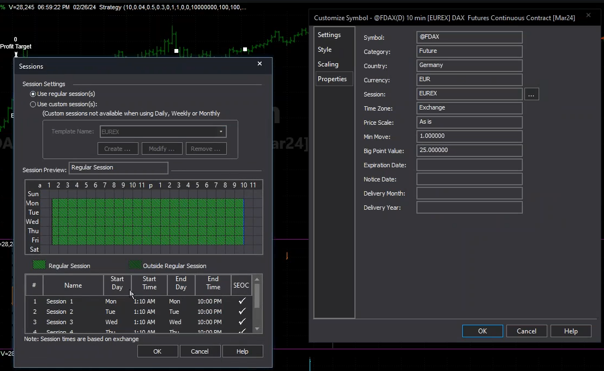
  <figcaption>Figura 081</figcaption>
</figure>

Pero no sé por qué, ya lo sabéis, un día Europa decidió abrir cuanto más mejor, y un día decidió abrir a las dos de la mañana —perdón, a la una—, que es una decisión en mi opinión para matar a las marmotas. Y eso todos los días igual, todos los días igual, la misma tontería. Ahí no se mueve nada, no se mueve nada.

<figure>
  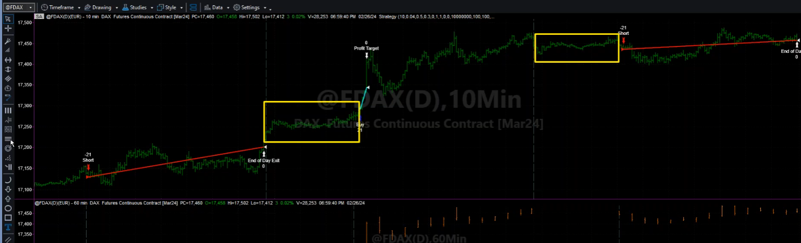
  <figcaption>Figura 9. Gráfico del DAX mostrando la sesión extendida con baja actividad en horario nocturno.</figcaption>
</figure>

<div style="border-left: 4px solid #4caf50; background: #e8f5e9; padding: 10px 15px; margin: 10px 0; border-radius: 8px;">
  <strong>🕐 Ventanas temporales recomendadas</strong><br><br>
  <ul>
    <li><strong>Europa (DAX, Eurostoxx)</strong>: sesión principal de 8:00 a 17:30 CET. Evitar horario nocturno (baja liquidez).</li>
    <li><strong>Estados Unidos (ES, NQ)</strong>: sesión regular de 9:30 a 16:00 ET, aunque algunos operadores incluyen el <em>pre-market</em>.</li>
    <li><strong>Divisas (Forex)</strong>: se suelen definir ventanas por sesión geográfica (asiática, europea, americana).</li>
  </ul>
  La primera hora de sesión es especialmente relevante para estrategias ORB, ya que define el rango de referencia.
</div>

Tú eliges dónde operar, y es frecuente hacerlo. Frecuente hacerlo vía cambiando la sesión, ya por el código del sistema, como tú quieras. Pero tú puedes elegir dónde operar. En Europa, lo más habitual es empezar a las 8 o 9 de la mañana; no os calentéis en empezar antes, pero también se podría hacer. Y en Estados Unidos hay gente que lo hace; podemos probarlo, quiero decir.

Con este *ORB* lo podemos jugar, quiero decir, en el sentido de que tú puedes hacer un rango. Este que hemos hecho de Kaufman es parte del rango de la primera hora, que es una pauta muy típica: la primera hora se usa de rango.

Y por cierto, yo, que eso ya os lo daremos, el código que, como se ha dicho, el original es de Kaufman, pero hemos desarrollado uno propio, pues ya os dejo ahí abierta la posibilidad a aquellos que sepáis programar o que empecéis a hacer pinitos, de que hagáis lo contrario. Es decir, esto es un *Opening Range Breakout*:

- code : [TSM 1stHour Breakout.ELD](../code/TSM%201STHOUR%20BREAKOUT.ELD)

```sh
# TSM 1stHour Breakout : 
# First-Hour Breakout System
#  Copyright 1999-2004, P.J.Kaufman. All rights reserved.
#  (Adapted from M. McNutt, "First Hour Breakout System," Technical Analysis of
#	Stocks & Commodities, July, 1994) 
#
#  SETUP INSTRUCTIONS:
#  1. DATA1 should hold 10-minute bars of a series
#  2. DATA2 should hold 60-minute bars of a series
#  3. DATA3 holds daily data of the same series
#  4. In FORMAT/PROPERTIES do not allow multiple entries in the same direction 

	vars:	Sess1FirstBarDAte(9, data2), Sess1FirstBarHigh(0, data2),
		Sess1FirstBarLow(0, data2), avedayrange(0,data3);
	input: length(10);

	avedayrange = average(high of data3 - low of data3, length) of data3;

	if (time of data2 = Sessionstarttime(0,1) of data2) or
   		(date of data2 > date[1] of data2) then begin
		Sess1FirstBarDate = date of data2;
		Sess1FirstBarHigh = high of data2;
		Sess1FirstBarLow = low of data2;
		end;
	If (Sess1FirstBarDate = Date of data2) and 
   		(time of data2 < Sessionendtime(0,1) of data2) then begin
		if close[1] < Sess1FirstBarHigh then Buy Next Bar  at 
			Sess1FirstBarHigh + 20 point stop;
		if close[1] > Sess1FirstBarLow then Sell Short Next Bar  at
			Sess1FirstBarLow - 20 point stop;
		end;

	if low <= Sess1FirstBarHigh - avedayrange then Buy to Cover Next Bar  at market;
	if high >= Sess1FirstBarLow[1] + avedayrange then Sell Next Bar  at market;
```

<div style="border-left: 4px solid #f39c12; background: #fff8e5; padding: 10px 15px; margin: 10px 0;">
  📈 <strong>Estrategia original</strong><br>
Esta estrategia aplica el concepto clásico de *Opening Range Breakout* (ruptura del rango de apertura) usando tres marcos temporales.

Cada día, en cuanto empieza la sesión, el sistema identifica la **primera barra** y registra su **máximo y mínimo**: ese es el rango inicial de referencia. A partir de ahí, mientras dura la sesión, coloca **órdenes stop** para entrar al mercado solo si el precio demuestra fuerza y rompe ese rango:

* Si el precio supera el máximo de la primera barra, lanza una orden de **compra stop** ligeramente por encima de ese nivel (20 puntos más).
* Si el precio perfora el mínimo de la primera barra, lanza una orden de **venta en corto stop** 20 puntos por debajo.

El tamaño de estas rupturas (20 puntos) actúa como filtro para evitar señales falsas.

Además, el sistema calcula, a partir de datos diarios, el **rango medio de los últimos 10 días**, que usa como referencia para definir salidas.
Una vez dentro del mercado, busca un movimiento equivalente a ese rango medio diario para cerrar la posición:

* Si la operación es corta y el precio cae hasta una distancia igual al rango medio desde el punto de ruptura, cierra la posición en la siguiente barra.
* Si la operación es larga y el precio sube la misma distancia hacia arriba, también cierra la posición en la siguiente barra.

La lógica es: <br>*esperar la ruptura del rango de apertura, entrar con confirmación de fuerza, y salir al alcanzar una extensión típica del movimiento diario.*
No usa *stop loss* fijo ni cierre forzado al final del día, por lo que la posición puede mantenerse abierta si no se alcanza el objetivo.

</div>

le hemos puesto de 8h a 22h 


## Análisis del sistema ORB en el DAX

**Pautas previas de congestión**  

También en el *doc* habla de las *pautas horarias* y de cómo ciertos filtros mejoran los resultados cuando se aplican de forma precisa. Por ejemplo, uno de los filtros más comunes en estrategias de ruptura es comprobar si existen *pautas previas de congestión*. Este enfoque es muy utilizado, aunque en este sistema concreto aún no lo hemos implementado. 

Recordemos que el mercado tiende a moverse en ciclos de *congestión–expansión–congestión–expansión*. Por tanto, si queremos capturar una fase de expansión, un buen filtro consiste en verificar que el día anterior haya habido contracción.

Una manera sencilla de hacerlo es mediante la detección de una *inside bar* en el gráfico diario. Una *inside bar* es una vela cuyo rango completo (máximo y mínimo) está contenido dentro del rango de la vela anterior. Técnicamente, se identifica cuando:

```
        INSIDE BAR
        
    Vela 1 (madre)     Vela 2 (inside)
    
         ┃                  
         ┃                  │
    ─────╋─────  High 1     │
         ┃              ────┼────  High 2
         ┃                  │
         ┃                  │
         ┃              ────┼────  Low 2
    ─────╋─────  Low 1      │
         ┃                  
         ┃                  

    Condiciones:
    ────────────
    High₂ < High₁   →  El máximo de la vela 2 está POR DEBAJO del máximo de la vela 1
    Low₂  > Low₁    →  El mínimo de la vela 2 está POR ENCIMA del mínimo de la vela 1

    Representación gráfica típica:
    
            │
            │
        ┌───┴───┐
        │       │
        │  ┌─┐  │
        │  │ │  │   ← Vela inside (contenida)
        │  └─┘  │
        │       │
        └───┬───┘
            │       ← Vela madre (envolvente)
            │

    Interpretación:
    ───────────────
    • Indica CONTRACCIÓN de volatilidad
    • Suele preceder a una EXPANSIÓN (ruptura)
    • Útil como filtro en estrategias de breakout
```

En cambio, una *outside bar* sería justo lo opuesto: una vela que abarca completamente el rango del día anterior.

```
        OUTSIDE BAR
        
    Vela 1 (interior)   Vela 2 (outside/envolvente)
    
                              ┃
                              ┃
         │               ─────╋─────  High 2
     ────┼────  High 1        ┃
         │                    ┃
         │                    ┃
     ────┼────  Low 1         ┃
                         ─────╋─────  Low 2
                              ┃
                              ┃


    Condiciones:
    ────────────
    High₂ > High₁   →  El máximo de la vela 2 está POR ENCIMA del máximo de la vela 1
    Low₂  < Low₁    →  El mínimo de la vela 2 está POR DEBAJO del mínimo de la vela 1


    Comparativa INSIDE vs OUTSIDE:
    ──────────────────────────────

    INSIDE BAR                      OUTSIDE BAR
    
    ┌─────────┐                         │
    │  ┌───┐  │                     ┌───┴───┐
    │  │ 2 │  │                     │ ┌───┐ │
    │  └───┘  │                     │ │ 1 │ │
    └────┬────┘                     │ └───┘ │
         │                          └───┬───┘
        (1)                             │
                                       (2)
    
    Vela 2 DENTRO de 1              Vela 2 ENGLOBA a 1


    Interpretación:
    ───────────────
    • Indica EXPANSIÓN de volatilidad ya producida
    • Muestra indecisión o batalla entre compradores y vendedores
    • Puede señalar reversión o continuación según contexto
    • Menos útil como filtro de entrada (la expansión ya ocurrió)
```

<div style="border-left: 4px solid #4caf50; background: #e8f5e9; padding: 10px 15px; margin: 10px 0; border-radius: 8px;">
  <strong>📊 Filtro de congestión previa</strong><br><br>
  <em>Inside bar</em>: vela contenida dentro del rango de la vela anterior. Indica contracción y posible expansión posterior.<br>
  <em>Outside bar</em>: vela que engloba completamente el rango de la vela anterior. Indica expansión ya producida.<br><br>
  El ciclo típico del mercado es: congestión → expansión → congestión → expansión. <br>
  Filtrar por <em>inside bars</em> previas puede mejorar la tasa de acierto en estrategias de ruptura.
</div>


**Ejemplo práctico de entrada**

Veamos lo que hace este sistema.   
Las líneas que son punteadas son las que marcan las señales de entrada. Lo único que Kaufman tiene fijado es un rango de 20 puntos extra para entrar. Es decir, es un *breakout*, un *range breakout* que le añade 20 puntos para entrar. 

Entonces, este valor está fijado por la primera vela de 60. ¿Cuál es la primera vela de 60? Esta, la naranja. Esta vela es la apertura. Esta vela tiene un rango de máximo de 461 y de mínimo de 436. En principio, el sistema así como está, ya lo explica el libro en su versión, que no deja de ser una muestra. 

Es decir, al final, los sistemas prácticamente el 100% de los sistemas que da Kaufman son sistemas podemos decir *completos*; el mismo ya en el texto te sugiere cosas y tal. O sea, son poco más que ideas para que tú explores. Entonces, este es el *edge*. Un mínimo aquí en 436: tiene 436, y vais a ver cómo la venta, como es menos 20, pues tiene que haber vendido en 416.

<figure>
  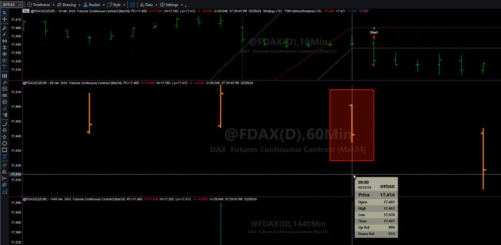
  <figcaption>Figura 12. Primera vela de 60 minutos (naranja) que define el rango de referencia del ORB.</figcaption>
</figure>

Igual no lo veis, pero ya lo digo yo: *short* en 416. Es decir, el mínimo que marca en la primera hora menos 20 puntos.

<figure>
  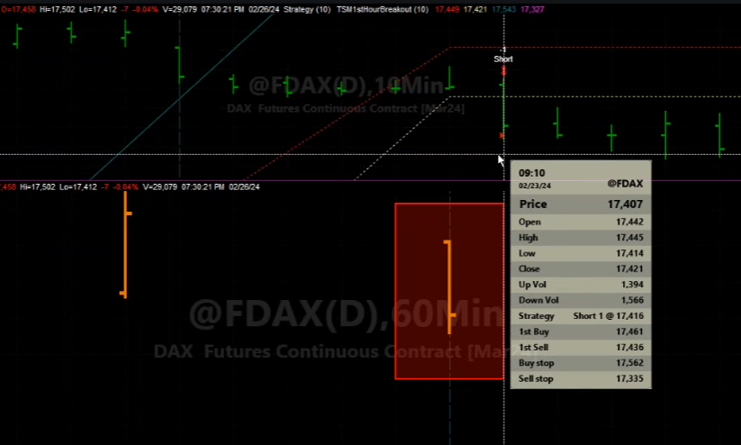
  <figcaption>Figura 13. Entrada corta en 416: mínimo de la primera hora (436) menos 20 puntos de filtro.</figcaption>
</figure>


Esto ya os digo yo, igual que os dije que también lo veréis: sistemas de *Bollinger* en ambos lados, que lo trabajaremos un día. Pero cuando hagamos este *ABERRATION*, seguramente HAREMOS varios días porque lo haremos en los dos lados del mercado. Este también es uno que se puede hacer.

**Exploración inversa, operar la reversión, no el breakout**

Entonces, os recomiendo que probéis a ver en qué activos... Seguramente, ¿en qué activo irá mejor? En un activo más de ***mean reverting***. Hablábamos antes incluso del S&P 500, activos un poco más pesados, más pesados.

Entonces, al contrario: es decir, en muchas ocasiones el rango de la primera hora marca una parte importante de la sesión. No os diría tampoco que entrarais directamente a comprar en el mínimo y a vender en el máximo. O incluso, en este caso —del DAX hablo—, a lo mejor cogería el rango desde todo lo que ha hecho toda la noche hasta las 8-9, le puedes dar un poco más de margen, y a partir de ahí sí que compra en el mínimo de ese rango. Es decir, lo contrario que estamos haciendo ahora: no operar la ruptura, sino operar la ***reversión***. Lógicamente, con *stop* y ya está.

Y ya veréis que en varios activos esto va a ir bien, contrariamente a lo que estamos haciendo: lo contrario. Pero eso, a veces, lo que os digo siempre: explorar las ideas al revés de lo que os dice. Sed valientes en el sentido de explorar las ideas al revés, porque muchas veces el revés va bien también, en algunos casos. Y este es uno de ellos, donde la pauta de reversión de la primera hora, a lo mejor extendiéndola un poco en el *premarket*, suele ir bien.

<div style="border-left: 4px solid #f39c12; background: #fff8e5; padding: 10px 15px; margin: 10px 0; border-radius: 8px;">
  <strong>💡 Consejo: explorar la idea inversa</strong><br><br>
  Siempre que tengáis una estrategia de <em>breakout</em>, probad también la versión de <em>mean reversion</em>: comprar en el mínimo del rango y vender en el máximo, en lugar de operar la ruptura. En activos "pesados" como el S&P 500, la reversión a la media suele funcionar mejor que el <em>breakout</em>.
</div>


**Descripción del sistema actual**

En este momento estamos trabajando con una estrategia de ***Breakout***, concretamente un *Opening Range Breakout* definido por el rango de la primera hora de sesión.

Esto planteamiento podría haberse implementado de varias formas, pero Kaufman lo desarrolla así por una razón concreta: él utiliza una ***regla de salida basada en el rango diario***, y en nuestro código hemos dejado la opción de activarla o no.

Kaufman trabaja con un ATR, la vela diaria est´para calcular eso, y el *time frame* de 10 minutos es porque vende ahí, busca una operativa más dinámica, sin esperar una hora entre decisiones. Primero fija el rango de referencia en el gráfico horario, y una vez termina la primera vela de una hora, empieza a operar sobre velas de 10 minutos, cada diez minutos podría vender. En su ejemplo, cuando a las 9:00 se completa la primera vela, el precio rompe el rango y entra corto a las 9:10. En ese caso concreto, la operación no resulta especialmente favorable.

<figure>
  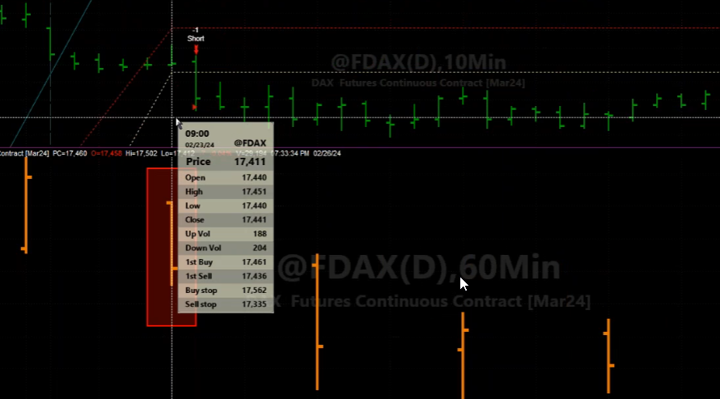
  <figcaption>Figura 14. Entrada corta a las 9:10 tras completarse la primera vela horaria.</figcaption>
</figure>

Se observa que la sesión queda rápidamente lateral, sin tendencia clara, y su sistema no cierra posiciones al final del día, por lo que la operación se mantiene abierta. En nuestro código, sin embargo, **sí hemos incorporado el cierre de posición al final de la sesión** (*SetExitOnClose*).

<figure>
  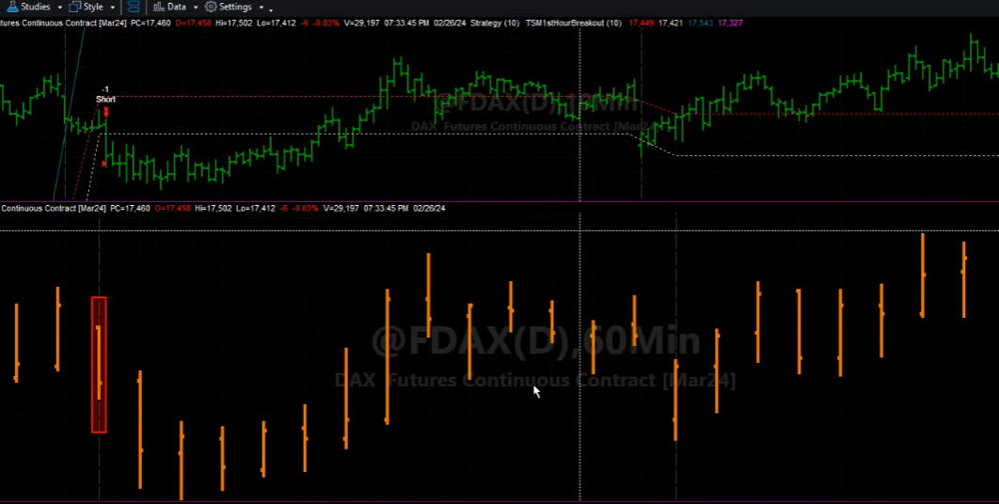
  <figcaption>Figura 15. Sesión lateral posterior a la entrada, sin cierre de posición.</figcaption>
</figure>


El sistema original de Kaufman fue publicado en la revista *Technical Analysis of Stocks & Commodities* en julio de 1994, dentro de un artículo de M. McNutt titulado *First Hour Breakout System*. Kaufman lo adaptó posteriormente en su libro *Trading Systems and Methods*, bajo la etiqueta *TSM 1stHour Breakout*, cuyas siglas "TSM" identifican todos los ejemplos derivados del libro.

```sh
# TSM 1stHour Breakout : First-Hour Breakout System
#  Copyright 1999-2004, P.J.Kaufman. All rights reserved.
#  (Adapted from M. McNutt, "First Hour Breakout System," 
#  Technical Analysis of Stocks & Commodities, July, 1994)
```

**Lógica de `entrada` y filtro de puntos**

En esencia, el sistema ejecuta una `compra stop` cuando el precio cierra por encima del máximo de la primera hora más un pequeño filtro (20 puntos), o una `venta stop` cuando el precio cierra por debajo del mínimo menos ese mismo filtro.

El filtro de 20 puntos está definido de forma fija, lo que en realidad es poco práctico: hay activos para los que 20 puntos son muchos y otros para los que son pocos. En la práctica, lo habitual es ***convertir ese filtro en un parámetro de entrada (input) y expresarlo en porcentaje***, no en puntos fijos. De ese modo, la escala se adapta al valor del activo —por ejemplo, no es lo mismo un DAX a 14.000 puntos que uno a 5.000— y el sistema mantiene proporción.

Así era la versión original de Kaufman, pero en nuestra implementación actual hemos hecho que el sistema escale correctamente.


**Lógica de `salida`: Average Daily Range como Take Profit**

En cuanto a la salida, Kaufman utiliza una medida del *Average Daily Range* (ADR), calculada a partir de *data3*. Como se ve en el código, obtiene la media de la diferencia entre el máximo y el mínimo de las últimas *n* sesiones (`high - low`, con `length = 10` en este caso). Ese valor representa el rango medio diario del activo.

A partir de ahí, el sistema usa ese rango como una referencia para determinar ***niveles de toma de beneficio (Take Profit)***, más que como un mecanismo de cierre técnico o de *stop loss*.

Concretamente:

- Si la estrategia está ***corta***, cierra la posición cuando el precio cae hasta una distancia equivalente al *Average Daily Range* por debajo del *high* de la primera hora:
  `if low <= Sess1FirstBarHigh - avedayrange then Buy to Cover Next Bar at market;`
- Si está ***larga***, cierra cuando el precio sube esa misma distancia por encima del *low* de la primera hora:
  `if high >= Sess1FirstBarLow + avedayrange then Sell Next Bar at market;`

En otras palabras, ***no se trata de un stop loss dinámico***, sino de una salida tipo *take profit* basada en la amplitud media de los movimientos diarios. Durante la sesión, el sistema no contempla una salida contraria ni un cierre forzado: si no alcanza el objetivo, la posición permanece abierta.

En algunos casos, al recalcular los rangos al día siguiente, el sistema puede incluso abrir una posición en el sentido opuesto, lo que da lugar a operaciones consecutivas que van "a la contra".

El propio Kaufman reconoce en el texto original que esta gestión de salida no es la más recomendable, ya que carece de *stop* de protección o de cierre al final del día. Por eso, en implementaciones más modernas (como la nuestra) se suelen incluir opciones adicionales:

- *SetExitOnClose* para cerrar al final de la sesión,
- un *stop loss* fijo o porcentual,
- y una opción para escalar el rango de salida en función de la volatilidad real del activo.

En resumen, la versión original de Kaufman usa el *Average Daily Range* únicamente como un **objetivo de beneficio**, sin control de riesgo explícito dentro del día, lo que hace que su sistema sea más una aproximación conceptual que una estrategia completa lista para operar.

Aquí entra en ruptura y al final hace *TP*. La salida es un *TP*: calcula del máximo, le resta un valor del rango y lo aleja; es más bien un *TP*. La entrada es esta línea punteada menos 20 puntos, y la salida es la línea rosa o la contraria, que es azul.

<figure>
  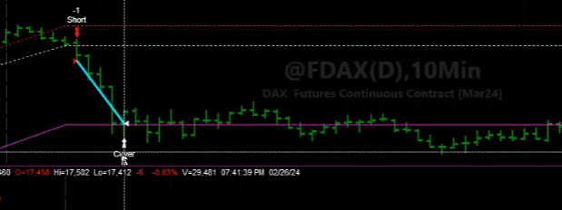
  <figcaption>Figura 16. Ejemplo de entrada (línea punteada menos 20 puntos) y salida por Take Profit (línea rosa/azul según dirección).</figcaption>
</figure>

<div style="border-left: 4px solid #4caf50; background: #e8f5e9; padding: 10px 15px; margin: 10px 0; border-radius: 8px;">
  <strong>📐 Fórmula del Average Daily Range (ADR)</strong><br><br>

$$
\text{ADR} = \frac{\sum_{i=1}^{n} (High_i - Low_i)}{n}
$$

Donde <em>n</em> es el número de sesiones (típicamente 10). Este valor se usa como objetivo de beneficio, no como <em>stop loss</em>.
</div>


**Elección del tipo de operativa intradía**

Si queremos una operativa intradía pura, me refiero a salir o no a fin de día, lo normal es salir a fin de día. Pero es verdad que no es obligatorio; entra un poco en lo que os decía antes de "qué tengo yo y qué quiero".

Al principio, este tipo de sistemas son los muy operados. Empezamos con uno la otra vez más de largo plazo, y ahora empezamos uno más de intradía.

Este tipo de sistemas, por aplastante mayoría, es el primero que elegiría la mayoría de vosotros para empezar a operar. ¿Por qué? Porque, cerrando a fin de día y con *stop*, al final te permite tener seguramente *drawdowns* un poco más bajos. Bueno, el DAX quizá no, pero podemos operar en un futuro un poquito más pequeño, en un activo que no se mueva tanto: el mini DAX, el micro... Pero realmente son sistemas que son más manejables y que normalmente conseguiremos *drawdowns* más bajos. Y por lo tanto, podremos operarlos con una cuenta más pequeña porque requeriremos menos garantías para operarlos.

En cambio, un sistema que va en gráfico diario o semanal pues es más complicado. Por lo tanto, la primera elección de un sistema es probable que sea un intradía. ¿Por qué? Primero, porque tenemos la sensación de poder controlar el riesgo mejor. Y después, porque es verdad que, al no asumir el riesgo *overnight*, si yo quiero cerrar a fin de día pues voy a poder controlar mejor ese riesgo.

<div style="border-left: 4px solid #4caf50; background: #e8f5e9; padding: 10px 15px; margin: 10px 0; border-radius: 8px;">
  <strong>🎯 Ventajas de sistemas intradía para principiantes</strong><br><br>
  <ul>
    <li><em>Drawdowns</em> típicamente más bajos al cerrar posiciones cada día.</li>
    <li>Sin exposición al riesgo <em>overnight</em> (gaps de apertura).</li>
    <li>Menores garantías requeridas para operar.</li>
    <li>Mayor sensación de control sobre el riesgo.</li>
    <li>Posibilidad de usar futuros más pequeños (mini, micro) para reducir exposición.</li>
  </ul>
</div>


## Cambios y configuraciones, refactorizando nuestro código

- code `PRACTICA_06.EDL`: [TSM 1stHour Breakout : Straegy](../PRACTICA%2006.ELD)
- code refactorizado [CURSO-ORB-STRATEGY](../code/CURSO-ORB-STRATEGY.ELD)


```sh
#{ ORB: BreakOut primera hora
#  SETUP: 
#  1. DATA1 barras 10 minutos
#  2. DATA2 barras 60 minutos
#  3. DATA3 barras diarias 
#  4. No permitir entradas en la misma dirección  }

input: 
	Per_Media(10), 
	Porcentaje_Confirmacion_Entrada(0.0), # en tanto por 100 
	Prc_Stop (0.00),  #  Valor del Stop en tanto por 100. Si el valor es 0 no actúa. 
	Prc_Profit (0.00),	#  valor del Profit en tanto por 100. Si el valor es 0 no actúa. 
	salidaOriginal(1), #  Salida original sistema Kaufman. 
	numerodeCierres(0), # Cierres al final de (n-1) días. 0 no actúa, 1 es el cierre de la barra de entrada, 2 al cierre de la barra siguiente
	tradesMaximos(5), #  Número máximo de trades permitidos el mismo día
	
	# FILTROS
	FiltroBasico(0), #  Filtro utilizado en el paper 
	FiltrovolRelativo(0), #  Filtro adicional de volumen relativo
	
	# Gestión Monetaria
	Start_Equity (100000),
	MMVar_Start (100),
	MMVar_Profits (100),
	Min_Size (1),
	Max_Size (100000),
	RoundTo (1);
	
vars:	
	Sess1FirstBarDAte(0, data2), 
	Sess1FirstBarHigh(0, data2),
	Sess1FirstBarLow(0, data2), 
	SessionFirstVolume(0, data2), 
	avedayrange(0,data3), 
	Contratos (0),
	Profits (0);
...  
... 
```

<div style="border-left: 4px solid #3498db; background: #eaf4ff; padding: 15px 20px; margin: 15px 0; border-radius: 6px;">

**1) Visión general**

<ul>
<li><em>Original (Kaufman)</em>: ORB de primera hora con entradas stop ±20 puntos y salida tipo TP basada en ADR (media de high–low diarios). Sin stops explícitos ni cierre al final del día.</li>
<li><em>Código 1 (nuestro)</em>: mantiene la lógica ORB, pero añade escalado por porcentaje, gestión monetaria, límites operativos, filtros y salidas configurables (incluida la salida original opcional).</li>
</ul>

<hr>

**2) Parámetros e inputs**

<ul>
<li><em>Original</em>: un único parámetro <code>length</code> para el cálculo del ADR.</li>
<li><em>Nuestro</em>:</li>
<ul>
<li><code>Porcentaje_Confirmacion_Entrada</code>: confirma la ruptura en porcentaje (escala con el activo).</li>
<li><code>Prc_Stop</code>, <code>Prc_Profit</code>: stop loss y profit target en %. Actúan solo si &gt; 0.</li>
<li><code>salidaOriginal</code>: activa/desactiva la salida ADR clásica.</li>
<li><code>numerodeCierres</code>: cierra al fin de sesión tras n días (0 = desactivado).</li>
<li><code>tradesMaximos</code>: tope de operaciones por día.</li>
<li>Filtros: <code>FiltroBasico</code>, <code>FiltrovolRelativo</code>.</li>
<li>Gestión monetaria: <code>Start_Equity</code>, <code>MMVar_*</code>, <code>Min/Max_Size</code>, <code>RoundTo</code>.</li>
</ul>
</ul>

<p><em>Motivo</em>: pasar de una plantilla académica a un sistema operable, robusto y testeable en distintos activos.</p>

<hr>

**3) Escalado de niveles de entrada**

<ul>
<li><em>Original</em>: offset fijo de 20 puntos sobre el máximo/mínimo de la primera hora.</li>
<li><em>Nuestro</em>: offset por porcentaje sobre el nivel ORB (<code>Sess1FirstBarHigh/Low * (1 ± %)</code>).</li>
</ul>

<p><em>Motivo</em>: 20 puntos no son comparables entre activos/regímenes; el % mantiene proporcionalidad y evita sobre/disparo en precios altos/bajos.</p>

<hr>

**4) Lógica de entrada**

<ul>
<li><em>Ambos</em>: ORB sobre la primera barra horaria; entradas solo durante la sesión.</li>
<li><em>Nuestro extra</em>: respeto de <code>tradesMaximos</code> y <code>MarketPosition = 0</code> para evitar reentradas compulsivas.</li>
</ul>

<p><em>Motivo</em>: control de sobretrading y coherencia con reglas de no duplicar señal.</p>

<hr>

**5) Salidas**

<ul>
<li><em>Original</em>:
<ul>
<li>Corta: cubre si <code>low &lt;= Sess1FirstBarHigh - avedayrange</code>.</li>
<li>Larga: vende si <code>high &gt;= Sess1FirstBarLow + avedayrange</code>.</li>
<li>Efecto práctico: TP basado en ADR; no hay stop ni cierre forzoso.</li>
</ul>
</li>
<li><em>Nuestro</em>:
<ul>
<li>Opción de mantener la salida ADR clásica (<code>salidaOriginal = 1</code>).</li>
<li>Añade <em>stop loss</em> y <em>profit target</em> en % (no trailing).</li>
<li><code>SetExitOnClose</code> condicional vía <code>numerodeCierres</code> para evitar pernoctas no deseadas.</li>
</ul>
</li>
</ul>

<p><em>Motivo</em>: introducir control de riesgo explícito y gobernanza del tiempo en mercado.</p>

<hr>

**6) Gestión monetaria y tamaño de posición**

<ul>
<li><em>Original</em>: tamaño implícito (sin gestión monetaria).</li>
<li><em>Nuestro</em>: cálculo de contratos en función de equity inicial, beneficios acumulados y precio, con límites y redondeo.</li>
</ul>

<p><em>Motivo</em>: simular una operativa realista con sizing estable y acotado.</p>

<hr>

**7) Filtros operativos**

<ul>
<li><em>Original</em>: ninguno.</li>
<li><em>Nuestro</em>:
<ul>
<li><em>Básico</em> (precio &gt; 5, volumen medio diario &gt; 1M, ATR diario &gt; 0.50).</li>
<li><em>Volumen relativo</em> de la primera barra vs su media.</li>
</ul>
</li>
</ul>

<p><em>Motivo</em>: mejorar la calidad de señales; evitar microcaps ilíquidas y sesiones sin “combustible”.</p>

<hr>

**8) Contabilidad de trades intradía**

<ul>
<li><em>Original</em>: permite múltiples señales dentro de sesión.</li>
<li><em>Nuestro</em>: contador diario y límite <code>tradesMaximos</code>.</li>
</ul>

<p><em>Motivo</em>: disciplina, control del coste de transacción y del <em>chop</em>.</p>

<hr>

**9) Métrica de rango**

<ul>
<li><em>Original</em>: ADR = media simple de <code>high - low</code> diario sobre <code>length</code>.</li>
<li><em>Nuestro</em>: ADR sustituido por <code>AvgTrueRange(Per_Media)</code> de <em>data3</em> (más realista al incorporar gaps).</li>
</ul>

<p><em>Motivo</em>: usar ATR como proxy de rango más robusto.</p>

<hr>

**10) Seguridad de cierre**

<ul>
<li><em>Original</em>: no cierra a fin de día; podría pernoctar.</li>
<li><em>Nuestro</em>: cierre por conteo de días (<code>numerodeCierres</code>) y, opcionalmente, <em>SetExitOnClose</em>.</li>
</ul>

<p><em>Motivo</em>: evitar riesgo overnight si la hipótesis es intradía.</p>

<hr>

**Por qué se implementó así**

<ol>
<li><em>Escalabilidad y generalización</em>: porcentajes y ATR permiten portar la lógica entre activos/sesiones.</li>
<li><em>Control de riesgo</em>: stops y cierres temporales reducen colas de pérdida.</li>
<li><em>Calidad de señal</em>: filtros de precio/volumen/volumen relativo.</li>
<li><em>Gobernanza operativa</em>: límites de trades y MM evitan sobreexposición.</li>
<li><em>Reproducibilidad</em>: inputs tipo “switch” activan/desactivan módulos sin reescribir código.</li>
</ol>

<hr>


</div>

Recuerda que **TradeStation** permite colocar entradas y salidas de forma modular, es decir, sueltas. Yo puedo poner.... salida por tP, por stop, etc etc independiente de la entrada:

<figure>
  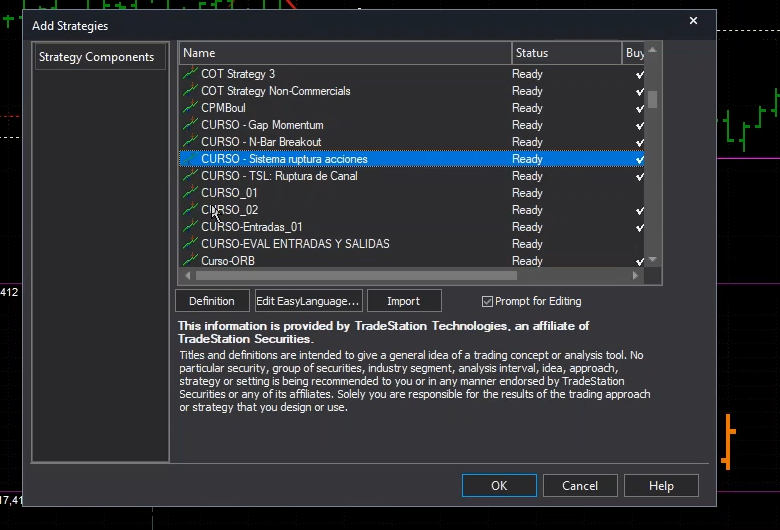
  <figcaption>Figura 082.</figcaption>
</figure>


**Incorporación de un paper y filtros adicionales**

Y luego, hemos metido, al ver este *paper* que habéis aportado, pues hemos decidido probarlo. Hemos decidido probarlo en el DAX; no tiene mucho sentido, pero si en acciones nos da tiempo, lo veremos un momentito.

El *paper* tenía unos filtros; simplemente hemos aportado los filtros, no hemos hecho el sistema al uso. Hay muchas versiones de este, y yo he probado esta que es la mega básica, la mega estándar. Hay muchas más, y ya os digo que veremos más cosas, veremos evolucionar este, veremos otros completamente distintos.

Pero bueno, que este, como habéis puesto ya el *paper*, yo quería partir de este de Kaufman porque me interesa mucho introducir este concepto de *Open Range Breakout*, que es el original podemos decir. Lo habéis oído: un *ORB* es esto, *ORB* clásico. Como todo, permite un montón de variaciones que hemos visto: el porcentaje de *stop*, el porcentaje de *profit* podía ser por *ATR*, la entrada podía ser exigirle un movimiento de volatilidad...

En intradía también se me ha olvidado comentaros una cosa antes. Es verdad que lo habitual en intradía son sistemas que operan mucho, que operan mucho y que por lo tanto tienen mucha significación estadística. Pero también hay algunos intradía —que no os lo recomiendo como primera opción, pero que sí que como complemento de una cartera pueden venir muy bien— que son **sistemas de muy poca actuación**.


**Sistemas de poca frecuencia y pautas de velas**

Digamos que son sistemas de muy poca frecuencia operativa, es decir, que buscan sucesos de elevadísima probabilidad, de porcentaje de acierto muy elevado. Ocurren poco, pero tienen porcentaje de acierto muy alto. Aun así, cuidado: hay que validarlo y todo, como siempre.

Pero ahí estamos a lo mejor con un número de *trades* tipo diario, ¿sabes? Tipo sistema diario: aunque tienes un montón de barras analizadas, realmente operan una vez al mes o así. Es decir, cosas que, analizando el gráfico intradía, pasan muy pocas veces: pautas de velas, este tipo de pautas que os decía.

Hay varias, veremos alguna. Ahora mismo no me acuerdo cuál dije porque ahora mismo no me acuerdo. Sé que habíamos visto alguno en el pasado; nosotros ahora mismo no operamos ninguno de este tipo, pero es probable que los haya.

Son normalmente figuras, ya os digo, de pautas de velas. Cuando me refiero a velas, quiero decir de precio: como os decía, un *inside bar*, dobles, triples, y muchas de volatilidad. Es decir, recuerdo que tenía uno que era de volatilidad pero de rango bestial. Era un poco parecido a esto que habéis visto ahora, del máximo más cero más un filtro; era un filtro enorme, pero que tenía porcentaje de acierto más grande.

Y cuando el mercado tiene desviaciones de más de `*x* desviaciones de la media`, casi siempre —lógicamente, quiere decir que no siempre, casi siempre— marca un movimiento. Cuando desvía de la volatilidad un cierto número, normalmente indica el inicio de un movimiento. Y esto es una pauta de las más sólidas que existe. Lo que pasa es que, como os digo, tiene una frecuencia operativa relativamente baja.

Por eso van bien en una cartera como complemento, porque diversifican. Pero como operativa principal, pues es un sistema que, entre que tiene poca significación estadística y que tampoco de media va a dar mucho dinero porque opera poco —al final se llama así: que opera poco—, pues lógicamente puede dar menos dinero.

<div style="border-left: 4px solid #4caf50; background: #e8f5e9; padding: 10px 15px; margin: 10px 0; border-radius: 8px;">
  <strong>📊 Sistemas de baja frecuencia operativa</strong><br><br>
  Estos sistemas buscan <em>setups</em> de muy alta probabilidad que ocurren pocas veces (una vez al mes o menos). Ejemplos típicos:
  <ul>
    <li>Pautas de velas extremas (<em>inside bars</em> múltiples, engulfing patterns).</li>
    <li>Desviaciones de volatilidad superiores a 2-3 desviaciones estándar.</li>
    <li>Rupturas de rangos de compresión prolongados.</li>
  </ul>
  <strong>Ventaja</strong>: alto porcentaje de acierto.<br>
  <strong>Desventaja</strong>: poca significación estadística y bajo rendimiento absoluto por la escasa frecuencia.
</div>


**Filtros implementados en el paper**

Entonces, como os comentaba, el *paper* original incluía dos filtros principales, y el primero de ellos era el llamado **filtro básico**:

```sh
# Filtro básico usado en el estudio
#   valor superior a $5, volumen medio negociado mayor a 1.000.000 acciones y ATR > $0.50
#
if filtrobasico = 1 then 
Begin
    Condition1 = (Close > 5) and (Average(Volume, 14) of Data3 > 1000000) and (AvgTrueRange(14) of Data3 > 0.50); 
end else Condition1 = True;  
```

Este filtro servía simplemente para acotar el universo de acciones, descartando las de baja capitalización o con escaso volumen de negociación. En la práctica, lo que hacía era eliminar los llamados *penny stocks* o valores "chicharro", con poco movimiento y baja liquidez, que suelen distorsionar los resultados en este tipo de estudios.

El motivo de aplicar este filtro es claro: las figuras técnicas y los patrones de ruptura tienden a comportarse de forma más predecible en acciones líquidas y con cierto tamaño, donde el comportamiento del precio es más estable y menos manipulado. En cambio, en los activos de baja capitalización y bajo volumen ocurre lo contrario: su escasa liquidez provoca que, cuando entra volumen, se generen movimientos extremadamente violentos.

Por eso, aunque hay operadores que se especializan precisamente en ese tipo de activos —buscando explotar esas explosiones de volatilidad—, el enfoque del *paper* es el opuesto: evitar esas acciones para centrarse en un universo más regular y representativo.

Respecto a los valores de corte elegidos (precio > 5 USD, volumen medio > 1 millón, ATR > 0.5), probablemente responden a una **optimización empírica** realizada por los autores. No son valores mágicos, sino umbrales razonables que eliminan las acciones de menor calidad operativa sin dejar fuera las que realmente aportan fiabilidad estadística.


**Filtro de Volumen Relativo**

```sh
# Filtro volumen Relativo
#   - Se opera si el valor del volumen de la primera barra es mayor que el volumen medio de las últimas 14   
#
if FiltrovolRelativo = 1 then 
begin 
    Condition2 = sessionFirstVolume > average(SessionFirstVolume, 14); 
end else Condition2 = True; 
```

Este filtro ya no actúa sobre el universo de acciones como el básico, sino que se aplica directamente a la **operativa diaria**. Su función es identificar si la primera hora de negociación presenta un **volumen significativamente superior al promedio reciente**, lo cual suele interpretarse como una señal de interés institucional o de impulso inicial.

En este caso, la variable `sessionFirstVolume` corresponde al **volumen de la primera barra de 60 minutos (data2)** —la misma en la que registramos el máximo, el mínimo y la fecha de la sesión—. Ese valor se compara con la **media de los volúmenes de las 14 sesiones anteriores**, lo que equivale a medir si el volumen actual está por encima del promedio de las últimas dos semanas.

La lógica es sencilla:

- Si el volumen de la primera hora es mayor que la media de los 14 días previos → *permite operar*.
- Si no supera esa media → *descarta la señal*.

Este filtro tiene más sentido en **acciones que en futuros**, ya que en el mercado accionario el volumen refleja principalmente la actividad compradora (el dinero que entra o sale del activo), mientras que en los futuros el volumen es **simétrico**: cada compra tiene una venta asociada.

Por eso, en futuros el volumen no siempre indica dirección o fuerza en el mismo modo que en acciones. Allí, a menudo se recurre al *open interest* como métrica complementaria, ya que muestra cuántas posiciones permanecen abiertas al cierre del día, reflejando mejor la presión acumulada.


<div style="border-left: 4px solid #f39c12; background: #fff8e5; padding: 10px 15px; margin: 10px 0; border-radius: 8px;">
  <strong>📈 Diferencia del volumen en futuros vs. small caps</strong><br><br>
  
  <strong>En futuros:</strong>
  <ul>
    <li>Cada compra tiene una venta: <strong>el volumen es simétrico</strong>. Por sí solo no indica quién domina (compradores o vendedores).</li>
    <li>Por eso se usa <strong>delta de volumen</strong> (agresivos a mercado vs. pasivos en límite). El <em>delta</em> muestra la <strong>intención y agresividad</strong>: si el volumen comprador es dominante, hay absorción o desequilibrio real.</li>
    <li>En resumen: el volumen en futuros <strong>mide participación</strong>, pero necesitas el <strong>delta</strong> o el <strong>order flow</strong> para saber dirección.</li>
  </ul>
  
  <strong>En small caps / micro caps:</strong>
  <ul>
    <li>El volumen <strong>no es simétrico</strong>: no todo el mundo puede vender corto. Cuando aparece un pico de volumen, casi siempre implica <strong>entrada de dinero fresco</strong> (compradores netos).</li>
    <li>En entornos planos y de baja liquidez, una sola inyección de volumen puede mover el precio bruscamente (efecto <em>pump and dump</em>).</li>
    <li>Aquí el volumen sí puede interpretarse directamente como <strong>fuerza direccional</strong>: más volumen = más desequilibrio estructural (compras sin contrapartida).</li>
  </ul>
  
  <strong>Conclusión:</strong> En futuros, el volumen necesita contexto (<em>delta, footprint, imbalance</em>) → mide flujo relativo. En small caps, el volumen <strong>es el propio catalizador</strong> → mide flujo absoluto.
</div>


**Configuración y optimización del sistema**

Bueno, pues nada más. El sistema en sí es lo mismo a nivel de entrada, con esa característica. Os fijáis que el rango de apertura de ocho a nueve es esta vela que acaba a las nueve, una vela pequeñita.

<figure>
  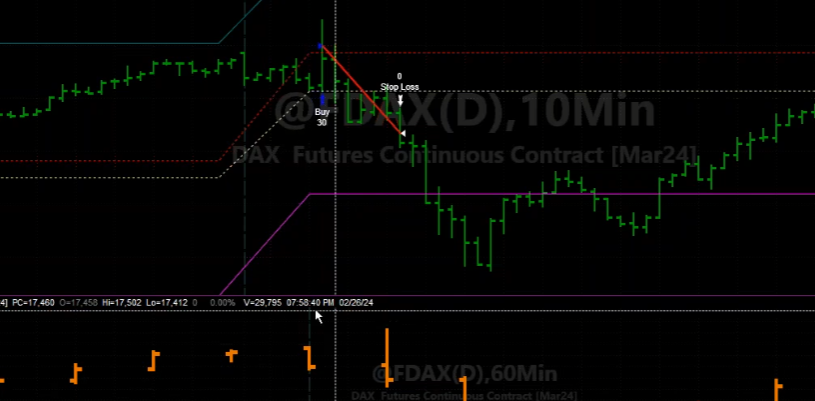
  <figcaption>Figura 18. Vela de apertura de 8:00 a 9:00 que define el rango de referencia del ORB.</figcaption>
</figure>

Esto aquí también podría haberse hecho algún filtro de este tipo, es decir, que si esta vela no es de un cierto rango, puedes no entrar. Se podría hacer algo así. Pero esto no necesariamente es malo; recordar lo que os decía del *range breakout*. Al final, cuando el mercado está colapsado —y de hecho aquí lo hace, veis: el mercado está con poca volatilidad y colapsa—, colapsa pero lo hace a la baja.

Entonces, aquí de momento lo tenemos configurado con cero, con la salida original en cero, solo cerrando a fin de día, con un *trade* por día. Vamos a dejarle tres por día, sin filtro básico, sin filtro relativo. Gestión monetaria de momento no estamos dándole muchas vueltas: 100% de la cuenta, el dinero disponible, y ya está.

<figure>
  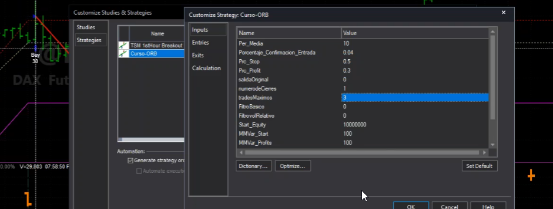
  <figcaption>Figura 19. Configuración inicial del sistema ORB en TradeStation.</figcaption>
</figure>

Como veis, acaba saliendo por *stop loss*. Y así hemos hecho pequeñas pruebas; no iba mal para alguna versión que hemos hecho, en el DAX el todo.

<figure>
  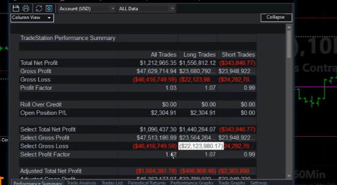
  <figcaption>Figura 20. Resultado de la prueba inicial del sistema ORB.</figcaption>
</figure>

<figure>
  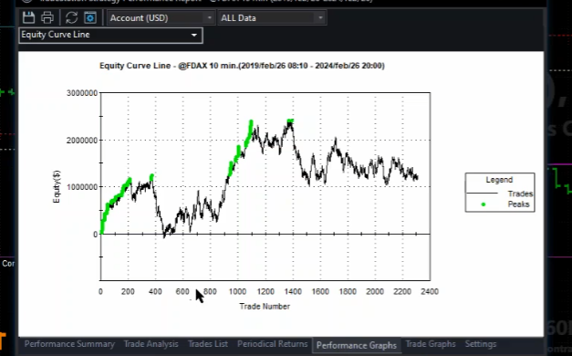
  <figcaption>Figura 21. Curva de equity del sistema ORB en pruebas preliminares.</figcaption>
</figure>

Pero no en esta que está puesta aquí; creo que va bastante flojo. Pero bueno, sí que seguramente se podría extraer algo de esta idea, aunque seguramente dándole un poco más de margen a la entrada, y seguramente a lo mejor ajustándolo más bien por volatilidad. Seguramente hay que ajustarlo por volatilidad.


**Salidas por tiempo y ventanas operativas**

Y también, aunque esta vez no lo hemos implementado, puede ser recomendable salir por tiempo.

<figure>
  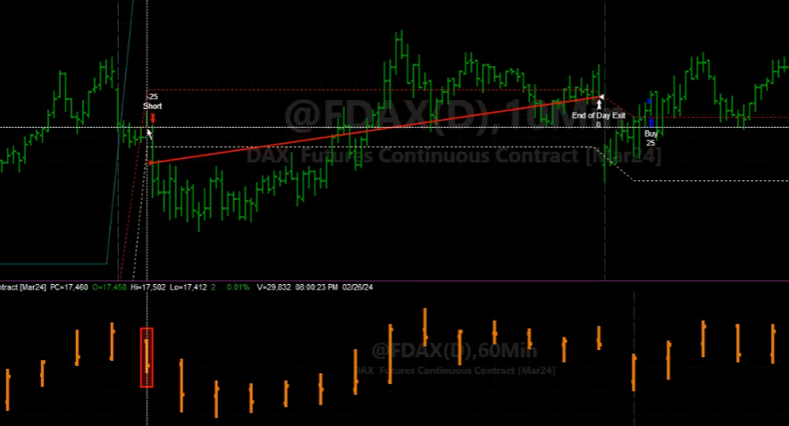
  <figcaption>Figura 22. Ejemplo de configuración de salida por tiempo.</figcaption>
</figure>

Suele ir muy bien esta salida también, como se comentaba. Y luego habría que, en este caso, la salida por tiempo iría un poco ligada con lo que os decía antes de la ventana operativa.

El DAX, si metemos aquí el volumen, veréis que tiene una pauta. Estudiar el volumen es muy interesante, no solo por el tema de que haya liquidez o no, sino por lo que os decía de esta ***relación absolutamente clara entre el volumen y la volatilidad***.

<figure>
  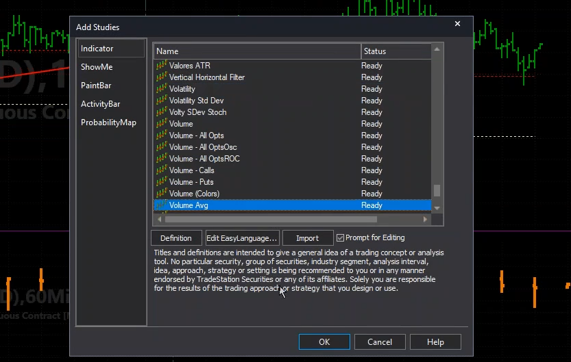
  <figcaption>Figura 083</figcaption>
</figure>

Entonces, una manera indirecta de usar esto es meter `volumen`, meter una `media`. Por defecto sale de 50.

<figure>
  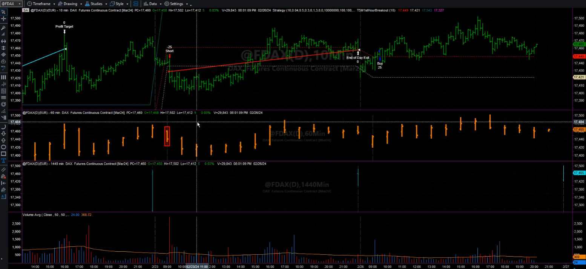
  <figcaption>Figura 23. Indicador de volumen con media de 50 periodos aplicado al DAX.</figcaption>
</figure>

Pues bueno, usar esa y ver un poquito cómo va evolucionando el volumen. El DAX normalmente en Europa, el volumen va bastante estable.


**Variaciones del rango y horarios alternativos**

Otro camino, otro camino que sería —no lo he probado, pero alguien, nuevamente igual que os decía antes de probar esto, también os recomiendo probar el que os digo ahora— es hacer *range breakout* igual: cargar todo el histórico (hablando del DAX en este caso) y definirlo igual, pero incorporando también los datos de esta una de la mañana a ocho de la mañana. Es decir, como si todo esto fuera la barra de apertura.

Muchos operadores en Estados Unidos hacen esto: es decir, hacen el *Open Range Breakout* incluyendo el *premarket*, incluyendo el *premarket*.

Tengo dudas de si desde la una... A lo mejor incorporar también la 7 o la 6, o incorporar, o hacerlo de 8 a 9 y dejar hasta las 10, ¿entendéis? Es decir, o abrir a las 9 y meterlo de 9 a 10. Es decir, todas estas combinaciones son válidas. ¿Por qué? Porque el volumen realmente habría que ver si este volumen es ruido absoluto.

Yo podría a lo mejor usar también este rango, es decir, que en vez de fijar solo la primera vela, esta, además estuviera contando desde este mínimo. Para que entendáis: no es que este día tenga nada especial, sino para que entendáis: contar este mínimo y el máximo que haya hecho el *range breakout*.

<figure>
  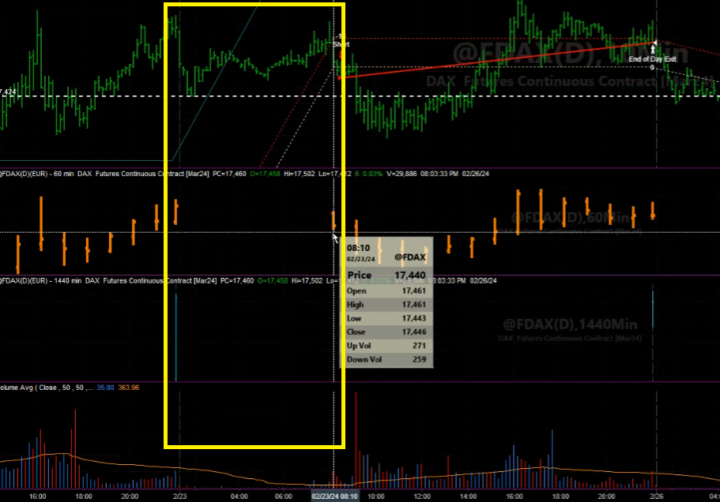
  <figcaption>Figura 25. Ejemplo de rango extendido incluyendo el premarket para definir máximos y mínimos de referencia.</figcaption>
</figure>

<div style="border-left: 4px solid #4caf50; background: #e8f5e9; padding: 10px 15px; margin: 10px 0; border-radius: 8px;">
  <strong>🕐 Variaciones del rango de apertura</strong><br><br>
  <ul>
    <li><strong>ORB clásico</strong>: rango de la primera hora de sesión regular (8:00-9:00 en Europa, 9:30-10:30 en EEUU).</li>
    <li><strong>ORB con premarket</strong>: incluye el rango nocturno o de preapertura (ej: 1:00-9:00 en DAX).</li>
    <li><strong>ORB extendido</strong>: amplía la ventana de definición del rango (ej: 8:00-10:00).</li>
    <li><strong>ORB con horario ajustado</strong>: comienza a las 9:00 en lugar de las 8:00 para evitar ruido inicial.</li>
  </ul>
  Todas estas variaciones son válidas y deben probarse empíricamente según el activo y su comportamiento de volumen.
</div>


**Relación entre volumen, volatilidad y horario**

Como comentaba, es fundamental entender la relación entre *volumen*, *volatilidad* y *horario*, tres factores que están estrechamente ligados en la dinámica del mercado. Volumen y volatilidad suelen ir de la mano —cuando aumenta uno, normalmente también lo hace el otro—, mientras que el horario no es exactamente la misma variable, pero influye de forma decisiva en ambos.

El objetivo de estudiar esta relación es identificar *en qué ventanas horarias el mercado ofrece las mejores oportunidades* y, por tanto, cuándo conviene operar y cuándo no. En conjunto, combinar *volumen*, *volatilidad* y *horario* te permite definir cuándo el mercado está "vivo" y cuándo no, y ajustar tus reglas de entrada y salida para maximizar la eficiencia operativa y evitar operar en momentos sin energía ni direccionalidad.

Existen dos grandes formas de aplicar filtros en una estrategia:


**1. Filtrar entradas**

Este es el enfoque más común e intuitivo. Consiste en operar solo cuando se cumplan ciertas condiciones que aumenten la probabilidad de éxito:

- *Volatilidad mínima*: operar solo cuando el mercado tenga suficiente rango o movimiento.
- *Volumen mínimo*: entrar únicamente cuando haya participación real, evitando horas muertas.
- *Estructura de precios concreta*: por ejemplo, detectar un patrón de congestión (como una *inside bar*) y entrar cuando se rompa, buscando la expansión posterior.

En resumen, se trata de esperar a que el entorno sea favorable: volatilidad adecuada, volumen significativo y una estructura de mercado que indique potencial de ruptura o impulso.


**2. Filtrar salidas**

También puede hacerse desde el lado contrario: si identificas momentos en los que el mercado pierde volatilidad o volumen, puedes decidir cerrar la posición anticipadamente. La lógica es simple: si el precio no se ha movido a tu favor durante el periodo de mayor actividad, lo más probable es que ya no lo haga.

<div style="border-left: 4px solid #4caf50; background: #e8f5e9; padding: 10px 15px; margin: 10px 0; border-radius: 8px;">
  <strong>📊 Dos enfoques de filtrado</strong><br><br>
  <ul>
    <li><strong>Filtrar entradas</strong>: operar solo cuando volumen, volatilidad y estructura de precios sean favorables.</li>
    <li><strong>Filtrar salidas</strong>: cerrar anticipadamente cuando el mercado pierda actividad, asumiendo que si no se ha movido a favor durante la ventana activa, probablemente ya no lo hará.</li>
  </ul>
  Ambos enfoques pueden combinarse para maximizar la eficiencia operativa.
</div>


**Ventanas operativas del DAX y ejemplos prácticos**

El DAX no es un activo sencillo en cuanto a estructura intradía, porque presenta tres ventanas operativas bien diferenciadas. Europa tiene una apertura con bastante movimiento, que a veces dura hasta las 10 y otras solo unos minutos. Normalmente ese rango inicial, hasta las 10 aproximadamente, concentra la mayor actividad del día.

A modo de ejemplo, en una sesión típica se puede observar un patrón claro de volumen:

<figure>
  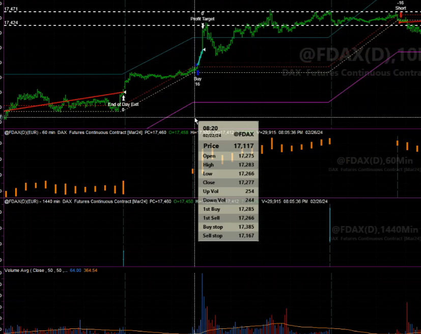
  <figcaption>Figura 26. Distribución típica del volumen intradía en el DAX, mostrando los picos de actividad.</figcaption>
</figure>

A las 8 ya puede aparecer un aumento de volumen, que en algunos días no parece tan alto visualmente, pero sí lo es en proporción. Sin embargo, el pico más relevante llega a las 9, momento en que entra el contado.


**Relación entre contado, volumen y volatilidad**

Una buena guía operativa es entender la relación con el contado. En Estados Unidos ocurre lo mismo: cuando el contado no está abierto, los futuros suelen estar más inactivos, ya que el subyacente —el que realmente "manda"— aún no cotiza. Por eso, los movimientos más amplios coinciden con la apertura del contado.

En Europa, el contado está activo de 9:00 a 17:30, mientras que en Estados Unidos lo está de 15:30 a 22:00. Por eso, en los futuros americanos se observa un enorme incremento de volumen justo a las 15:30: entran Apple, Google, y todo el flujo institucional. A partir de ese momento es cuando el mercado realmente se mueve.

Aunque las noticias de las 14:30 suelen provocar volatilidad, los últimos 15–30 minutos del mercado americano tienden a ser más tranquilos.

<div style="border-left: 4px solid #f39c12; background: #fff8e5; padding: 10px 15px; margin: 10px 0; border-radius: 8px;">
  <strong>🕐 Horarios clave del mercado de contado</strong><br><br>
  <ul>
    <li><strong>Europa (DAX, Eurostoxx)</strong>: contado activo de 9:00 a 17:30 CET.</li>
    <li><strong>Estados Unidos (ES, NQ)</strong>: contado activo de 15:30 a 22:00 CET.</li>
  </ul>
  Los futuros tienden a estar más inactivos cuando el contado (subyacente) no cotiza. Los mayores movimientos coinciden con la apertura del mercado de contado.
</div>


**Operativa por ventanas temporales**

Unos minutos antes de las 8, a veces el mercado ya empieza a activarse, y en cuanto abre la sesión europea el volumen se dispara. En el ejemplo siguiente se puede ver una sesión muy representativa: el mercado llega plano desde la madrugada, con apenas movimiento ni volumen.

<figure>
  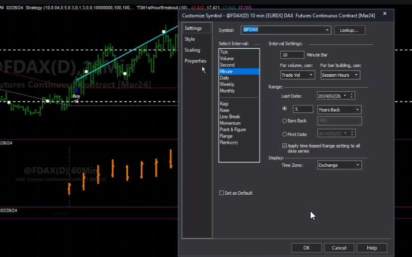
  <figcaption>Figura 28. Sesión típica del DAX: mercado plano durante la madrugada y activación progresiva desde las 8:00.</figcaption>
</figure>

A las 8 el volumen comienza a aumentar, aunque el precio todavía reacciona poco. Hacia las 8:05 suele producirse un pico, coincidiendo con la apertura del mercado de bonos y con Londres. A partir de ahí el DAX entra en plena actividad, con mayor liquidez en divisas y renta variable. Sin embargo, muchas veces a las 10 el movimiento ya se ha agotado y el mercado se aplana.


**Breakout temprano y cierre anticipado**

Hay operadores que se especializan en aprovechar solo esa ventana de 8 a 10. Aplican estrategias de *range breakout* con rangos más estrechos, usando gráficos de 1, 2 o 5 minutos, y a las 10 cierran su operativa diaria. Si hay movimiento, aprovechan el impulso; si no, se retiran hasta el día siguiente.

Esto ocurre porque, tras las 10, el mercado suele entrar en fase de bajo volumen hasta la publicación de noticias. Después, el mercado americano reanima el flujo: Wall Street arranca y arrastra al resto. A las 17:00–17:30 el volumen vuelve a caer, y a las 17:45 prácticamente desaparece, salvo contagio de la sesión americana.


**Cierre del mercado y estrategias por sesión**

Salvo que el mercado estadounidense tire con fuerza, el DAX tiende a quedar inactivo en la última parte de la sesión. En estrategias de *breakout* o *momentum*, donde se busca movimiento y volatilidad, no suele compensar mantener posiciones hasta el cierre.

Por eso, muchos operadores prefieren cerrar antes, incluso aunque no hayan alcanzado el *take profit*. Si a las 10 o 11 el precio no ha avanzado, suele significar que "el pescado ya está vendido", y mantener la posición solo añade riesgo innecesario.


**Estrategias por ventanas horarias (caso Unger)**

Este enfoque lo explicó Andrea Unger, quien ganó varios campeonatos del mundo de trading. En su primera victoria operaba únicamente el euro/dólar, pero con sistemas diseñados por ventanas horarias distintas: uno de 8 a 10, otro de 10 a 12, y otro de 12 a 14.

Las divisas —y muchos futuros europeos— presentan patrones temporales muy definidos, y aprovecharlos con sistemas específicos puede ser muy eficaz.

*TradeStation*, por ejemplo, dispone de indicadores antiguos que permiten analizar patrones horarios y medir la distribución de volumen o volatilidad a lo largo del día. Muchas estrategias se construyen así: en una franja operan *breakouts*, y en otra, cuando el mercado se lateraliza, aplican *mean reversion*. El secreto es entender cómo cambia el comportamiento estadístico según la hora del día.

<div style="border-left: 4px solid #4caf50; background: #e8f5e9; padding: 10px 15px; margin: 10px 0; border-radius: 8px;">
  <strong>🏆 Caso Andrea Unger</strong><br><br>
  Andrea Unger, múltiple campeón del mundo de trading, ganó su primer campeonato operando exclusivamente EUR/USD con sistemas diseñados por ventanas horarias:
  <ul>
    <li>Sistema 1: 8:00 - 10:00</li>
    <li>Sistema 2: 10:00 - 12:00</li>
    <li>Sistema 3: 12:00 - 14:00</li>
  </ul>
  Cada sistema estaba optimizado para el comportamiento estadístico específico de esa franja horaria.
</div>


**Análisis de horarios y patrones**

Antes de analizar las distintas pautas, veremos varios códigos diseñados para este tipo de estudio. Hay uno, basado en el libro de Kaufman, que permite analizar a qué horas un activo suele marcar sus máximos, mínimos o *gaps* promedio. Estos códigos convierten esa información en texto para poder procesarla y extraer patrones como:

- Qué porcentaje de *gaps* se cierran.
- A qué hora suelen producirse los máximos o mínimos del día.

Por ejemplo, si observas que el DAX cierra el 70% de los *gaps* de 0.5 puntos, ya tienes una pauta estadísticamente valiosa. O si detectas que el 70% de los máximos diarios se producen entre las 14:00 y las 14:30, puedes diseñar un filtro horario para buscar ventas en ese tramo.


**Estrategias según ventanas horarias**

En este contexto, podríamos aplicar la misma lógica al *Open Range Breakout*. Por ejemplo, filtrar las entradas y salidas según franjas horarias concretas. Si sabes que la mayoría de los máximos o mínimos del DAX ocurren antes de las 14:00, puedes cerrar tus operaciones después de esa hora o incluso diseñar otro sistema para la tarde.

De igual modo, si entre las 16:30 y las 17:00 suele formarse un rango que actúa como máximo o mínimo, puedes operar *mean reversion* entre las 18:00 y las 22:00, aprovechando esas repeticiones. Aunque el beneficio medio sea menor, la probabilidad de acierto puede ser muy alta.

En definitiva, el análisis por ventanas horarias revela pautas estacionales y comportamientos recurrentes que pueden convertirse en reglas operativas.


**Patrones estacionales y su uso en estrategias**

Más adelante trabajaremos con este tipo de análisis para extraer información útil y crear estrategias basadas en el comportamiento natural del activo dentro de una sesión. Estas ideas no se limitan a los índices: también se aplican a las materias primas, que muestran patrones estacionales tanto diarios como mensuales. Por ejemplo, el gasóleo de calefacción depende del ciclo térmico y el petróleo de los inventarios semanales.

Aunque no existen reglas que funcionen siempre, estudiar estos patrones permite poner las probabilidades a favor, entendiendo cuándo y por qué un activo tiende a moverse.


**Preparación de optimización y control de procesos**

Voy a cargar esto como estaba.

<figure>
  
  <figcaption>Figura 28. Configuración inicial del gráfico antes de la optimización.</figcaption>
</figure>

<figure>
  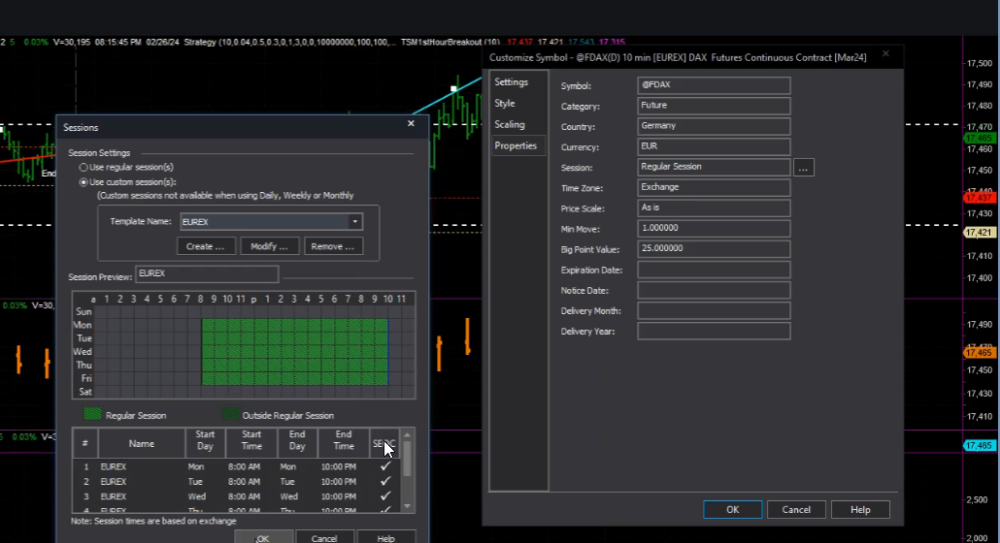
  <figcaption>Figura 29. Parámetros del sistema preparados para optimización.</figcaption>
</figure>

Y mientras vamos a ver el de acciones, voy a dejar aquí una optimización puesta. Le doy al botón de optimizar *entrada* y *stop*. Voy a hacer genética, pues yo sí. Le voy a dejar solo el *stop*, que tanto no hace falta, que es locura. Esta la dejo en cero y le activo su salida, y ya está. Optimizo menos; de tres le voy a dejar tres. Cierra a fin de día, sin filtros. Venga, vámonos.

<figure>
  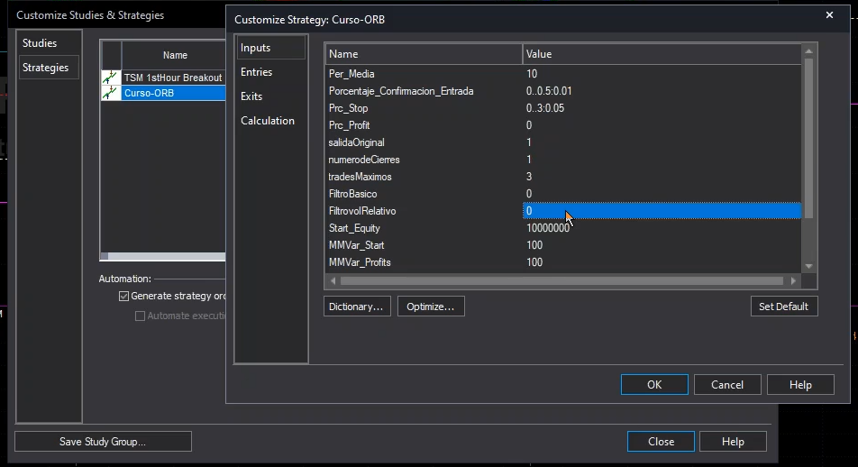
  <figcaption>Figura 086.</figcaption>
</figure>

Esto en genética:

<figure>
  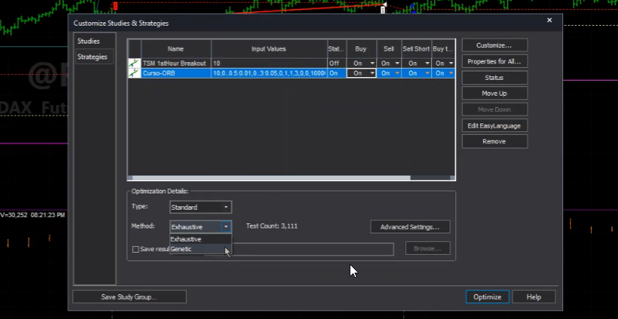
  <figcaption>Figura 30. Configuración del optimizador genético en TradeStation.</figcaption>
</figure>

Lo dejo todo por defecto:

<figure>
  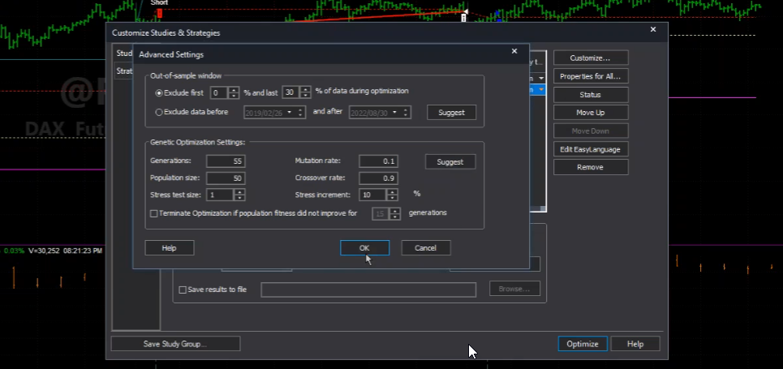
  <figcaption>Figura 31. Parámetros por defecto del algoritmo genético.</figcaption>
</figure>

<figure>
  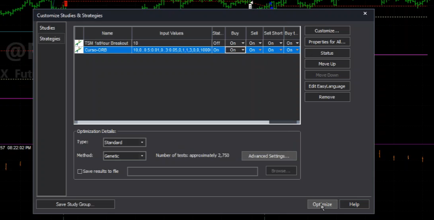
  <figcaption>Figura 32. Ventana de confirmación de optimización.</figcaption>
</figure>

Me interesa ver cómo va el procesador:

<figure>
  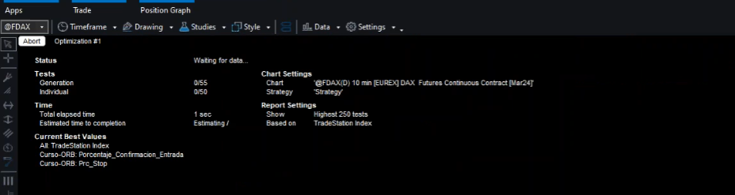
  <figcaption>Figura 33. Monitor de uso del procesador durante la optimización.</figcaption>
</figure>

Venga, aguanta. Ahora tenemos aquí el informito:

<figure>
  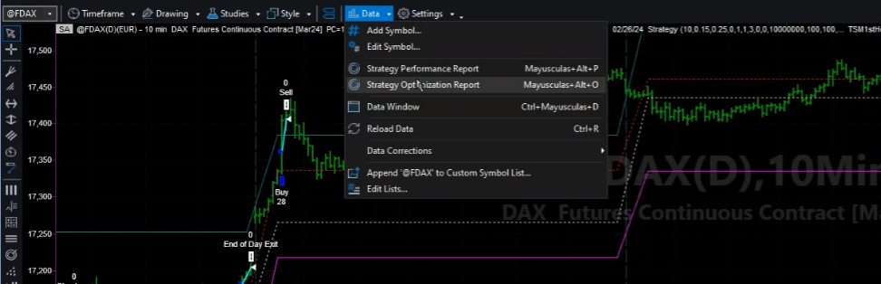
  <figcaption>Figura 34. Informe preliminar de resultados de la optimización.</figcaption>
</figure>

Datos bajos de *TSI*; antes eran más altos. Ah, por el *TPE*. Va mucho mejor con el *TPE* directo suyo. Pero bueno, respetar un poco al autor, hombre, respetar al autor.

Bueno, aquí parece que equilibra un poco, ¿no? Equilibra un poco entre todos. Aquí lo que buscamos siempre es equilibrio. Esto lo hacemos en el Excel, pero aquí de manera rápida buscamos un poco de equilibrio entre los tres. 

<figure>
  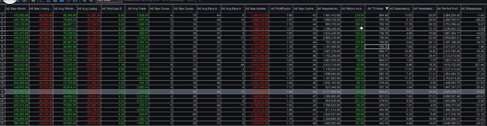
  <figcaption>Figura 35. Valores de TSI en los resultados de optimización.</figcaption>
</figure>


**Análisis de equilibrio entre métricas fitness**

Ves: *TSI*, que estén altos todos.

<figure>
  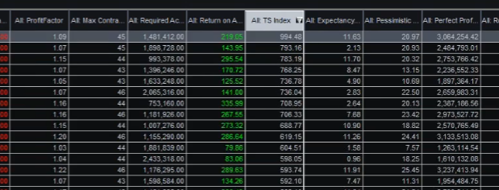
  <figcaption>Figura 36. Resultados ordenados por TSI.</figcaption>
</figure>

<figure>
  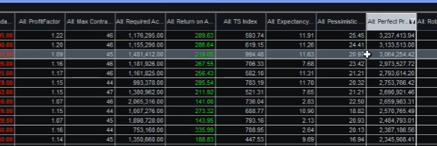
  <figcaption>Figura 37. Resultados ordenados por PPC.</figcaption>
</figure>

<figure>
  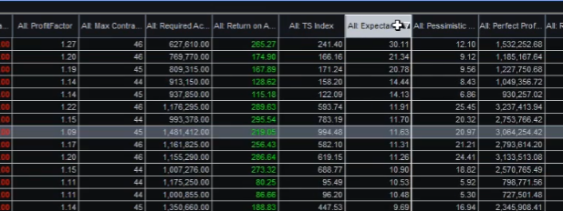
  <figcaption>Figura 38. Resultados ordenados por Expectancy.</figcaption>
</figure>

El que menos probabilidad entre los tres sería *Expectancy*, pero entre *PPC* y *TSI* pues un poquito de equilibrio. Ahí estaría un poquito más, más o menos el equilibrio. Ves: es el mejor *TSI*, tercero mejor de *PPC*, y bien colocado también en *Expectancy*. Sería esto un poco.

3.000 *trades*, bien. Y con 0.10 y 0.01 de entrada. Es decir, casi nada, casi nada. Casi quiere el 0, porque con 0.01 es 0. Porque el 0 no lo veo, si lo he usado... Sí. 

<figure>
  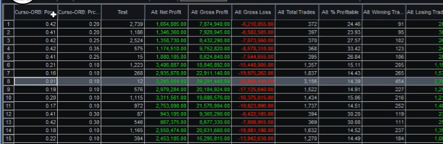
  <figcaption>Figura 40. Trades : 3000</figcaption>
</figure>

A ver, aquí el gráfico: Mira, por el porcentaje de confirmación es totalmente errático, no tiene ninguna dependencia.

<figure>
  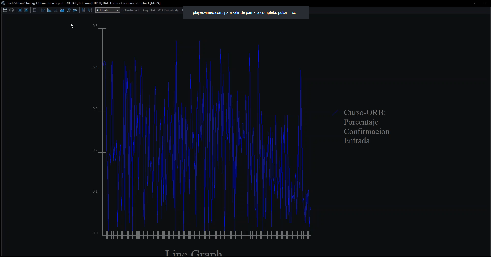
  <figcaption>Figura 41. Gráfico de dispersión mostrando la distribución de resultados por porcentaje de confirmación.</figcaption>
</figure>


**Visualización de resultados de optimización**

Lo hice así: aquí ordena por *Expectancy*, ordeno por *PPC*, que es bastante parecido a *Profit*. Y ahora, por ejemplo, si yo marco esta columna:

<figure>
  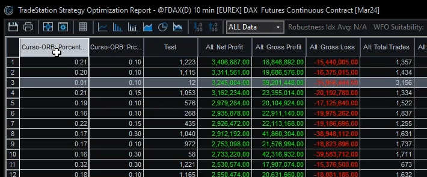
  <figcaption>Figura 42. Selección de columna para visualización gráfica en TradeStation.</figcaption>
</figure>

Aquí los que tienen *TradeStation*, al hacer clic en el icono del gráfico, estoy viendo ordenado abajo por retorno, y en eje Y el número de valores de la variable que le he puesto. Este es el mapa que *TradeStation* genera:

<figure>
  
  <figcaption>Figura 41. Mapa de calor de la optimización generado por TradeStation.</figcaption>
</figure>

Que es lo que os decía. Igual ya podía poner uno en 3D, ¿no? También, igual podía... Calla, que hace un poco que no lo pruebo. Ahora resulta que selecciono dos variables y se queda conmigo:

<figure>
  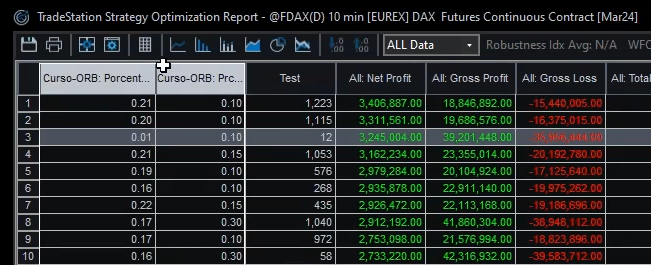
  <figcaption>Figura 43. Intento de visualización 3D con dos variables seleccionadas.</figcaption>
</figure>

Ahora verás tú. Bueno, te ponen las dos rayas. Sí, sí, esto ya lo sabía:

<figure>
  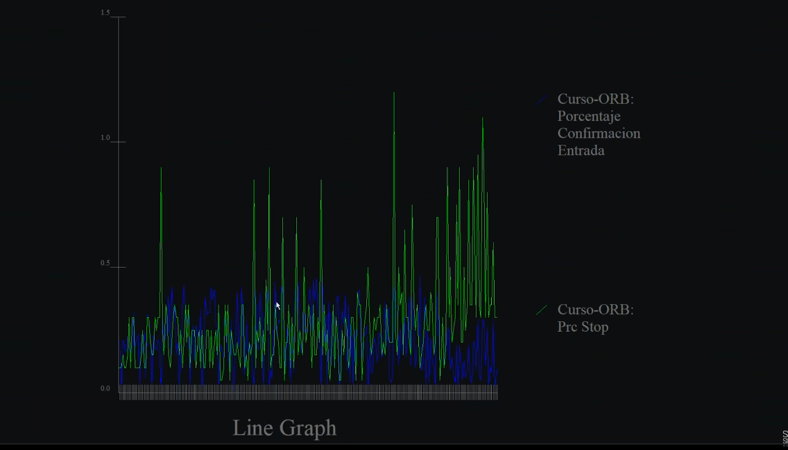
  <figcaption>Figura 44. Visualización con dos variables mostrando líneas paralelas.</figcaption>
</figure>

Y esta columna, si la selecciono, que este... que es el *stop*:

<figure>
  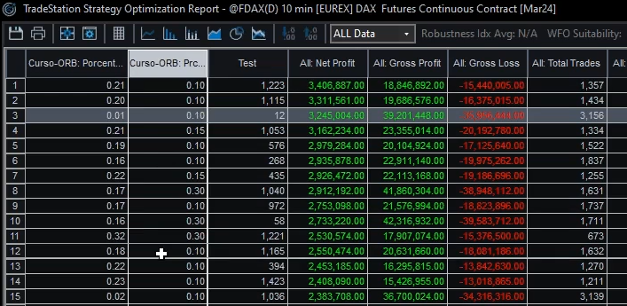
  <figcaption>Figura 45. Selección de la variable stop para análisis gráfico.</figcaption>
</figure>

Pues aquí sí que se nota un sesgo para arriba, ¿no? Un poco para arriba:

<figure>
  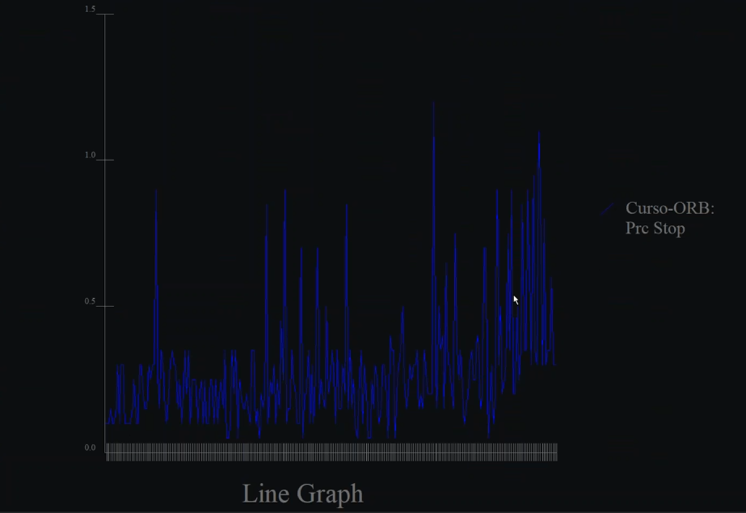
  <figcaption>Figura 46. Gráfico mostrando sesgo alcista en la variable stop, indicando que valores más altos de stop mejoran los resultados.</figcaption>
</figure>

Bueno, pues nada, esta es un poco una optimización sencilla dándole tres entradas.

<div style="border-left: 4px solid #4caf50; background: #e8f5e9; padding: 10px 15px; margin: 10px 0; border-radius: 8px;">
  <strong>📊 Criterio de selección de parámetros óptimos</strong><br><br>
  Al analizar resultados de optimización, se busca <strong>equilibrio entre las tres métricas fitness</strong> (TSI, PPC, Expectancy), no el máximo absoluto de una sola. El parámetro óptimo es aquel que:
  <ul>
    <li>Está bien posicionado en las tres métricas simultáneamente.</li>
    <li>Tiene suficientes <em>trades</em> para ser estadísticamente significativo.</li>
    <li>Muestra coherencia con los valores cercanos (no es un pico aislado).</li>
  </ul>
</div>


**Análisis de resultados y out-of-sample**

Iba mejor con una antes, eh. Mira, ves, aquí he entrado, ya he vuelto a salir, ¿no? Esto, nada, esto es muy flojo, esto es muy flojo.

<figure>
  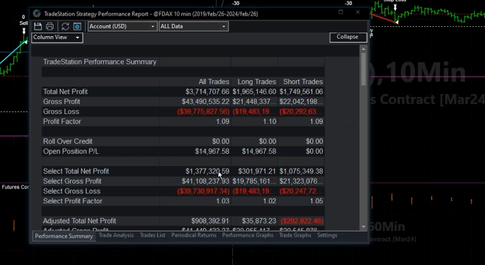
  <figcaption>Figura 47. Curva de equity mostrando resultados débiles del sistema.</figcaption>
</figure>

Tiene comisiones, eh. Es flojito, flojito. Además, el *OOS* está completamente roto.

<figure>
  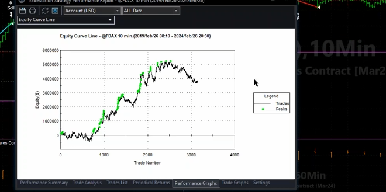
  <figcaption>Figura 48. Detalle de las operaciones con resultados inconsistentes.</figcaption>
</figure>

 No, no está... No le he mirado los *robustness*, que él lo tiene puesto. Está negativo el *robustness*, tiene *robustness* muy bajos, tiene estos muy altos pero con pocos *trades*.

<figure>
  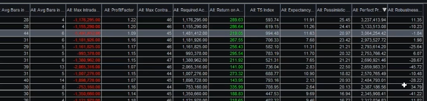
  <figcaption>Figura 50. Resultados mostrando robustness negativo con pocos trades.</figcaption>
</figure>

Ordeno columna *Robustness*:

<figure>
  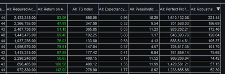
  <figcaption>Figura 49. Tabla de resultados ordenada por columna Robustness.</figcaption>
</figure>

Me voy a guardar la imagen. Yo solo quiero ver una cosa rápida:

<figure>
  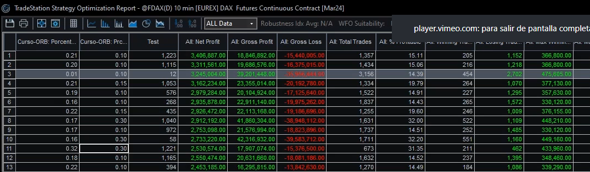
  <figcaption>Figura 51. Captura de pantalla guardada para análisis posterior.</figcaption>
</figure>

<figure>
  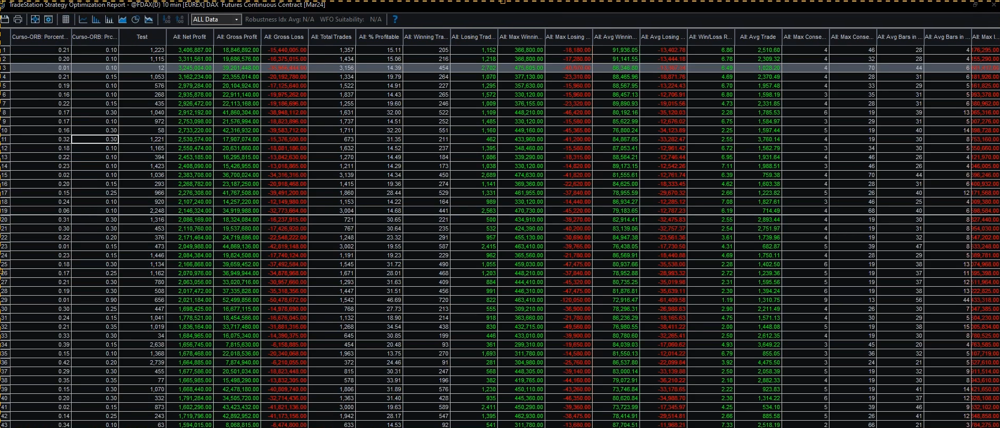
  <figcaption>Figura 52. Continuación del análisis de resultados.</figcaption>
</figure>

**lo mismo pero al revés: 30% *OutOfSample* por delante**

Quiero ver a ver si la muestra está muy sesgada, que aquí no hemos analizado la muestra. Habría que haber analizado un poquito la muestra y ver qué tal.

<figure>
  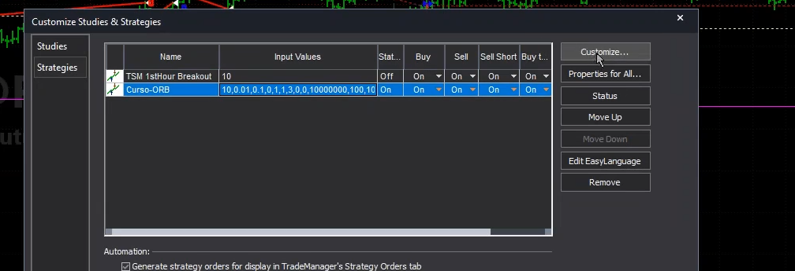
  <figcaption>Figura 53. Análisis de sesgo en la muestra de datos.</figcaption>
</figure>

<figure>
  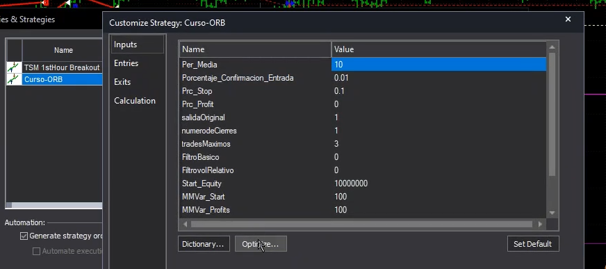
  <figcaption>Figura 54. Distribución de trades en la muestra.</figcaption>
</figure>

<figure>
  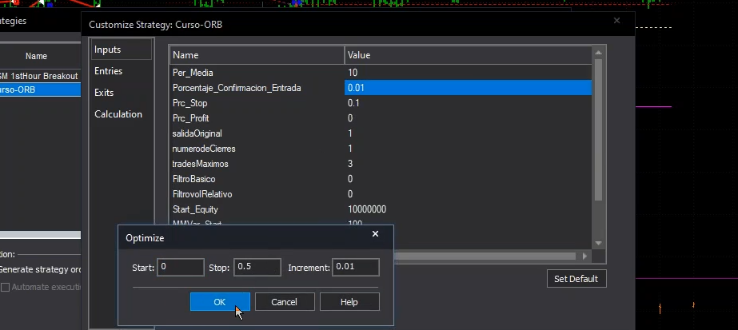
  <figcaption>Figura 55. Continuación del análisis de la muestra.</figcaption>
</figure>

<figure>
  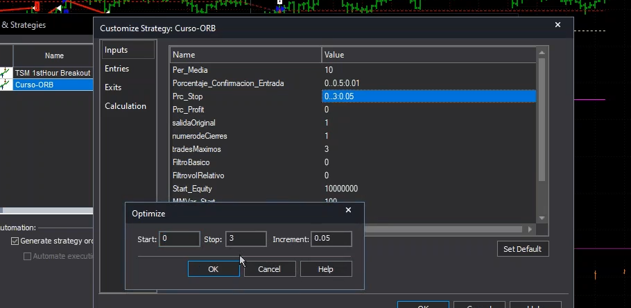
  <figcaption>Figura 56. Métricas adicionales de la muestra.</figcaption>
</figure>

<figure>
  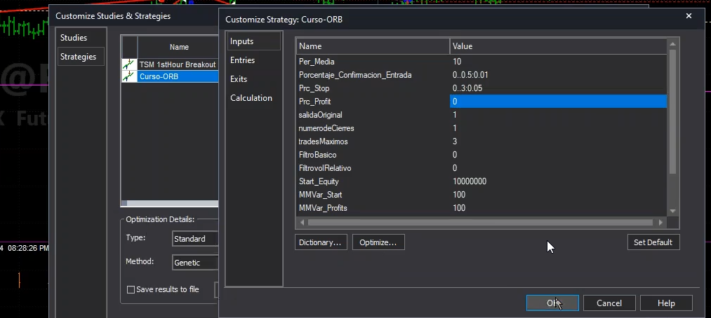
  <figcaption>Figura 57. Detalle estadístico de la muestra.</figcaption>
</figure>

 30% *OutOfSample* por delante

<figure>
  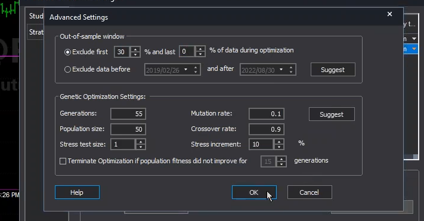
  <figcaption>Figura 58. Gráfico de distribución temporal.</figcaption>
</figure>

<figure>
  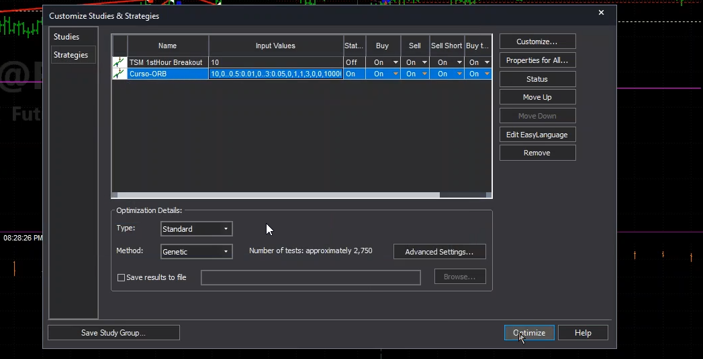
  <figcaption>Figura 59. Análisis de consistencia de resultados.</figcaption>
</figure>

<figure>
  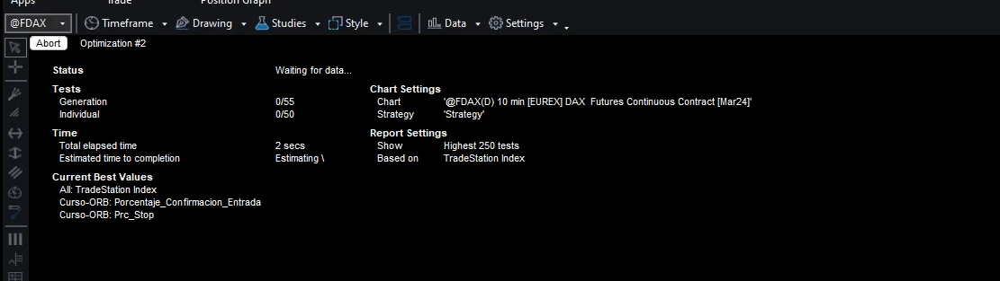
  <figcaption>Figura 60. Resumen final del análisis de muestra.</figcaption>
</figure>

Porque ya digo, queríamos ver un poco el sistema. Ya el próximo día lo trabajamos, podemos decir, como Dios manda. Hoy era responder preguntas, plantear el sistema, que lo vierais, lo entendierais, y empezar a hablar de los intradía.

***Antes hemos elegido 0.10 - 0.10***, el que hemos elegido antes es este:

<figure>
  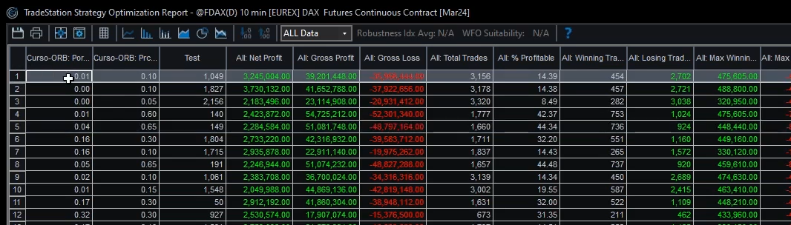
  <figcaption>Figura 61. Parámetros seleccionados anteriormente: 0.10 - 0.10.</figcaption>
</figure>

Pero sigue dando mal *robustness*, eh:

<figure>
  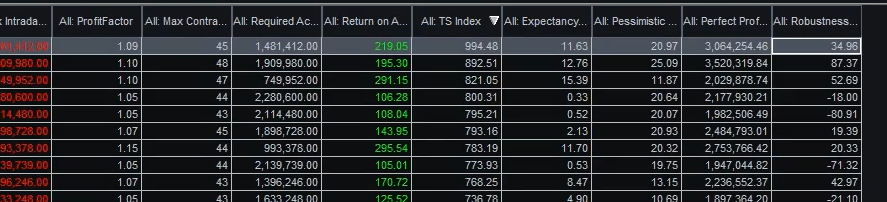
  <figcaption>Figura 62. Resultados con robustness bajo a pesar de la selección de parámetros.</figcaption>
</figure>

Sigue colocando bien en `all_data`, porque lógicamente el *old data* es el mismo. Pero sigue dando *robustness* bajos, aunque han mejorado los *robustness* en general. En general han mejorado. Y este mismo ha mejorado mucho: claro, antes era negativo, ahora es algo positivo.


**Activación de LIBB y ajuste de parámetros**

Vamos a hacer otra cosa. El *LIBB* activado. Y esto puede dar un problema con el *stop*, porque va a tardar un poco más, pero me da igual. Activo: *backtesting resolution* "use look-inside-bar-back-testing":

<figure>
  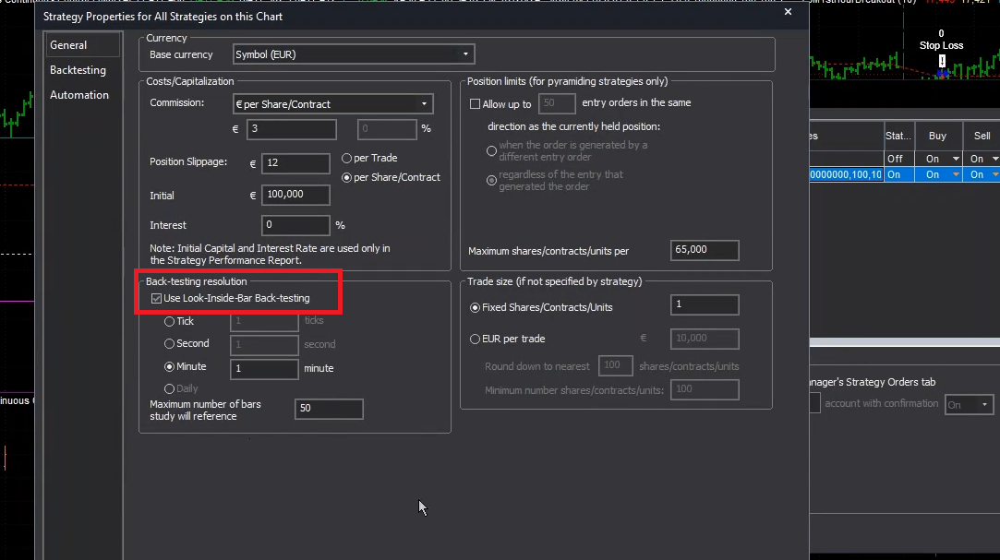
  <figcaption>Figura 64. Activación del modo Look-Inside-Bar Back-Testing (LIBB).</figcaption>
</figure>

Le voy a dejar a esto... Esto ya veo que no hace falta tan alto, así que lo bajamos:

<figure>
  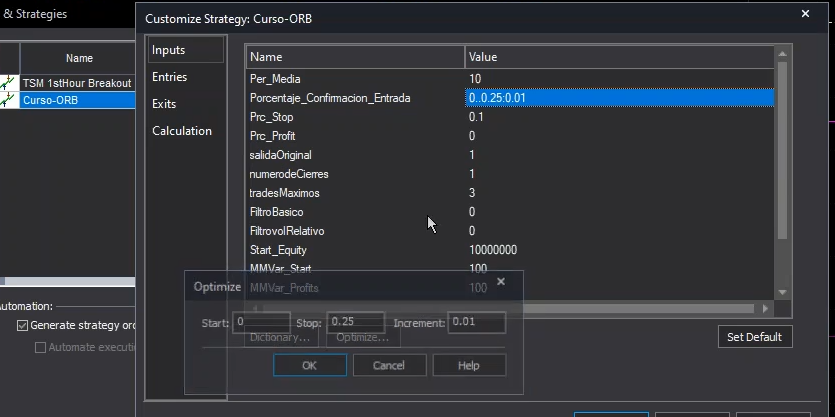
  <figcaption>Figura 63. Ajuste de parámetros de optimización.</figcaption>
</figure>

<figure>
  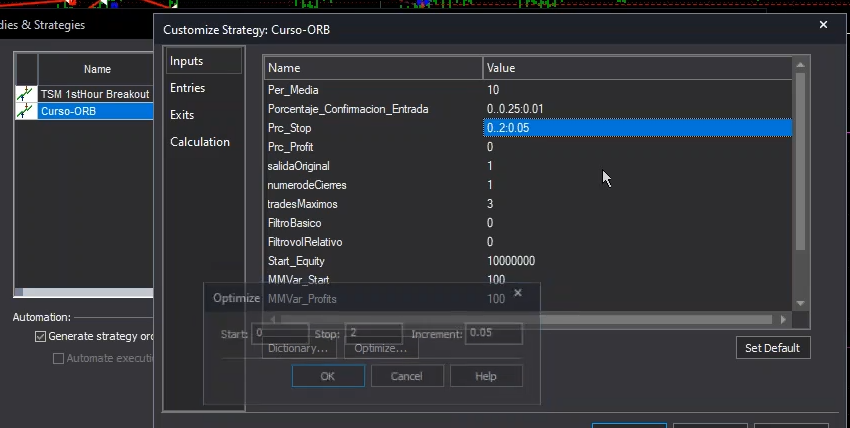
  <figcaption>Figura 66. Configuración reducida de rangos de búsqueda.</figcaption>
</figure>

<figure>
  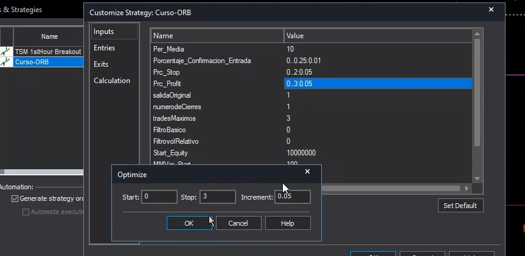
  <figcaption>Figura 67. Parámetros finales antes de ejecutar.</figcaption>
</figure>

Y le vamos a poner: salir original en 0, cierre a fin de día, y esto lo voy a dejar que os siga entre 1 y 5:

<figure>
  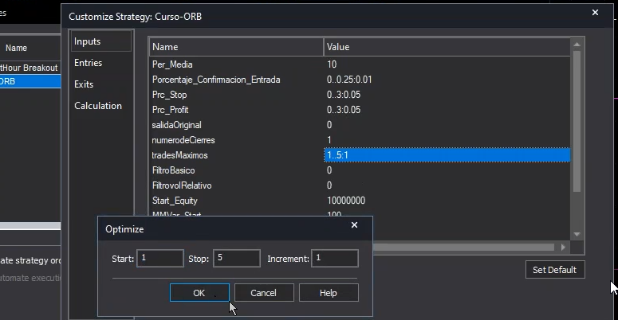
  <figcaption>Figura 68. Configuración de salidas y rango de trades por día.</figcaption>
</figure>

Ahora le voy a dejar al final. A ver qué tal. Le voy a decir que termine en 10: cuando haga 10 consecutivas que no mejore, que pare. Me da igual el valor; quiero encontrar una zona:

<figure>
  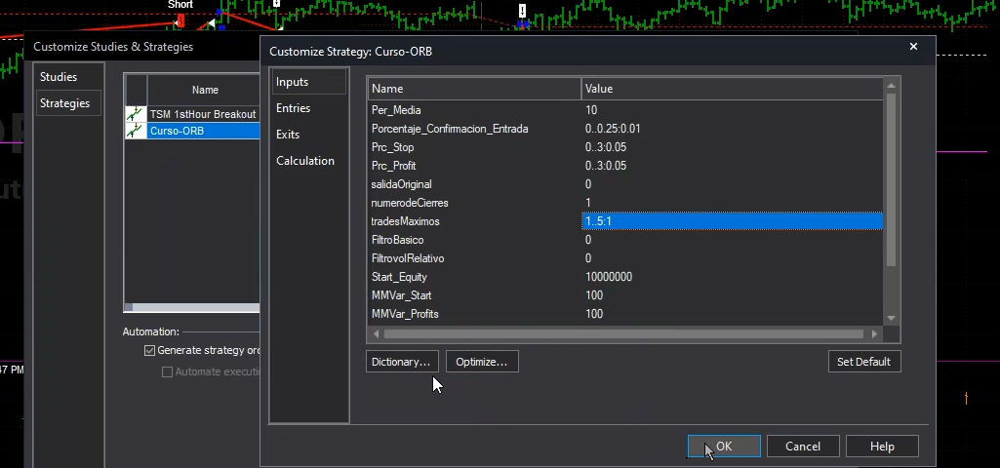
  <figcaption>Figura 69. Configuración del criterio de parada: 10 generaciones sin mejora.</figcaption>
</figure>

<figure>
  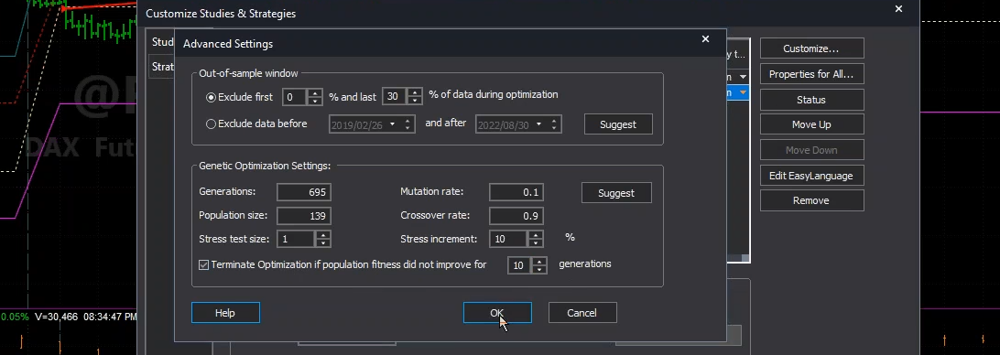
  <figcaption>Figura 70. Inicio de la optimización con criterio de parada temprana.</figcaption>
</figure>

<figure>
  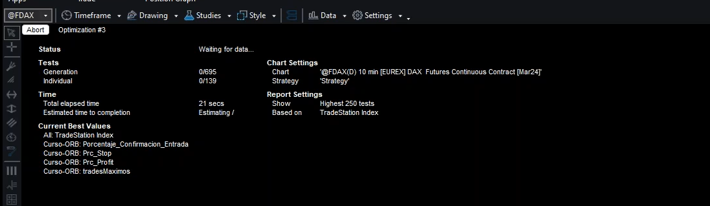
  <figcaption>Figura 71. Progreso de la optimización genética.</figcaption>
</figure>

Esto lo hacemos mucho en las optimizaciones de búsqueda, las iniciales. Siempre ponemos esta variable en *TradeStation*: cuando en 10 generaciones no mejora, cuando hace días seguidos donde el mejor no cambia, entonces para. Porque no hace falta llegar al final; a mí no me interesa encontrar el mejor, me interesa una zona donde vaya bien. Y justamente de esa manera ya me vale. Estoy haciendo búsquedas podemos decir de zonas y demás; incluso si a veces pueden aparecer zonas mejores.

<div style="border-left: 4px solid #4caf50; background: #e8f5e9; padding: 10px 15px; margin: 10px 0; border-radius: 8px;">
  <strong>💡 Estrategia de optimización: búsqueda de zonas</strong><br><br>
  En optimizaciones iniciales o de exploración, no se busca el valor óptimo absoluto, sino identificar <em>zonas de parámetros</em> donde el sistema funcione bien de forma consistente. El criterio de parada temprana (ej: 10 generaciones sin mejora) permite:
  <ul>
    <li>Ahorrar tiempo de procesamiento.</li>
    <li>Evitar sobreajuste al no perseguir el máximo absoluto.</li>
    <li>Identificar regiones robustas del espacio de parámetros.</li>
  </ul>
</div>


**Descarga de papers adicionales y cierre de la sesión**

Mientras, voy a ir bajando estos PDFs. De toda esta serie de *Open Range Breakout*, ya si ya lo tengo... *Playing the Open Range Breakout Part 1*... ¡Hostia, Toby Crabel, tío! Toby Crabel es un grande del *Open Range Breakout*. ¡Hostia, Toby Crabel es un grande del *Open Range Breakout*! Es un auténtico especialista. Pues muy buena esta serie que os voy a hacer. Sí, sí, sí, Toby Crabel. De hecho, el libro de Kaufman, ahora no recuerdo si este, pero tiene sistema de Crabel.

<div style="border-left: 4px solid #4caf50; background: #e8f5e9; padding: 10px 15px; margin: 10px 0; border-radius: 8px;">
  <strong>📚 Referencia: Toby Crabel</strong><br><br>
  Toby Crabel es considerado uno de los mayores especialistas en estrategias de <em>Opening Range Breakout</em>. Su libro <em>"Day Trading with Short Term Price Patterns and Opening Range Breakout"</em> (1990) es una referencia clásica en el campo. Perry Kaufman incluye varios sistemas basados en el trabajo de Crabel en <em>"Trading Systems and Methods"</em>.
</div>


**Análisis de resultados con LIBB y rebalanceo**

Vamos a ver qué hemos visto ahora aquí. Ahora con el *LIBB* la cosa ha empeorado. Ha ido a filtros más altos, es lo que me temía. Y todo negativo. ¿Has visto el *out-of-sample*? Todo negativo. Veo cierto riesgo de ajuste, veo cierto riesgo de ajuste aquí. Se ha ido ya a otro sitio ahora.

Bueno, lo voy a dejar guardado con uno de estos, porque el que había antes seguramente estaba afectado por el *LIBB*. Ese era el problema.

<figure>
  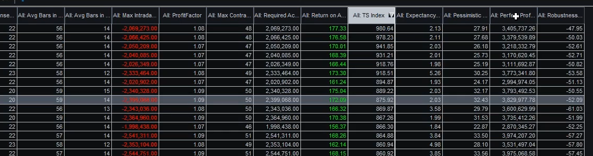
  <figcaption>Figura 76. Resultados con LIBB activado mostrando deterioro.</figcaption>
</figure>

<figure>
  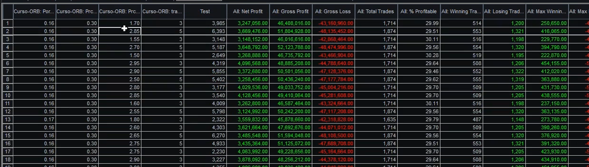
  <figcaption>Figura 77. Detalle de los parámetros con filtros más altos.</figcaption>
</figure>

<figure>
  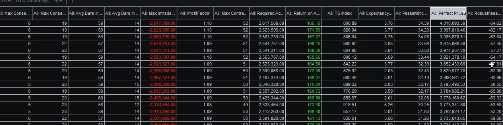
  <figcaption>Figura 78. Out-of-sample negativo indicando riesgo de sobreajuste.</figcaption>
</figure>

<figure>
  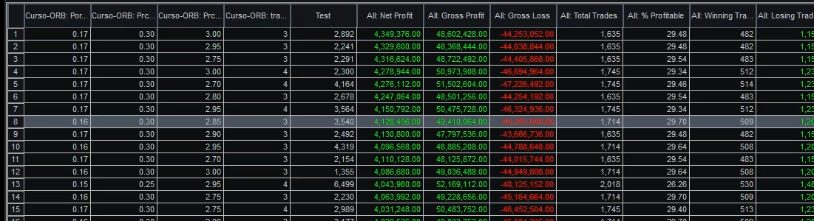
  <figcaption>Figura 79. Comparativa de resultados antes y después del LIBB.</figcaption>
</figure>

Aun así, vamos a ver cuál equilibra. Vamos a ver cuál equilibra en algo. No veo mucho equilibrio aquí en ningún sitio yo. No sé por qué... Ah, bueno, está cogiéndolo. El que más es 980, 980. Aquí no, aquí parece... Ah, bueno, por *Expectancy* no equilibra en ninguno. Por *Expectancy* no equilibra en ninguno. Se hunde mucho la *Expectancy*.

Pues nada, lo vamos a dejar aquí. Queremos saber qué tal. Habría que hacerla así con el *LIBB* por el otro lado. Ya digo, este era un poco para que lo vierais un poco funcionar, y sin más.

<figure>
  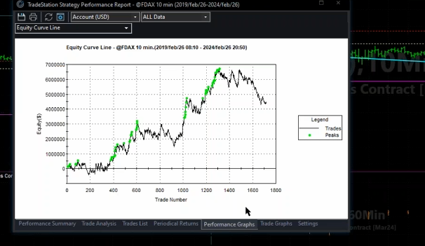
  <figcaption>Figura 74. Resumen final de la optimización con desequilibrio en Expectancy.</figcaption>
</figure>

No queríamos tampoco... Pero así, ya te digo, no está saliendo nada. No es como degradado al final; que, ver, puede ser circunstancial. Eso es lo que siempre hay que mirarlo. Pero estamos de acuerdo que la entrada no es una buena señal. Entonces hay que tomarse nuestras precauciones.

<div style="border-left: 4px solid #f39c12; background: #fff8e5; padding: 10px 15px; margin: 10px 0; border-radius: 8px;">
  <strong>⚠️ Señales de alerta en la optimización</strong><br><br>
  <ul>
    <li><strong>OOS negativo generalizado</strong>: indica que los parámetros optimizados no generalizan bien a datos no vistos.</li>
    <li><strong>Robustness bajo o negativo</strong>: sugiere sobreajuste a los datos de entrenamiento.</li>
    <li><strong>Desequilibrio entre métricas fitness</strong>: si una métrica (ej: Expectancy) se hunde mientras otras mejoran, hay riesgo de ajuste espurio.</li>
    <li><strong>Cambio drástico con LIBB</strong>: si los resultados cambian mucho al activar <em>Look-Inside-Bar</em>, puede indicar que las entradas/salidas dependen de artefactos del backtesting.</li>
  </ul>
</div>


**Cierre de sesión y planificación próxima**

Trataremos de que este sea algo aprovechable y, en todo caso, presentaremos algún *range breakout* mientras diga aprovechable. Es decir, si no es este porque este es el final... Hemos desarrollado el de la primera hora, que así como está hay activos donde funciona cien por cien, pero necesita activos muy tendenciales.

Y es lo que digo del DAX: bueno, ya lo estáis viendo aquí. Es lo que os decía: esta pauta tiene movimiento y es complicado conseguir todo un día de movimiento. Claro que encontraremos alguno, pero es muy complicado. El DAX tiende a morirse; es raro tener una tendencia muy limpia. Es muy tendiente a erratizar en esas horas post 11-12, hasta que no llegan las noticias. Y ahí las noticias ya sabéis que es la locura.

Entonces es un activo típico para operarlo de entrada, y luego es en todo caso mejor tratar de montar algo con las noticias: aprovechar ahí y subirse a las noticias, montar un *range breakout* en las noticias para seguir hasta la hora de apretar Wall Street y ahí salirse. Adiós, adiós muy buenas, a las 5 y media.

Es quizá lo que yo probaría: primera hora, hasta las 10, y luego quizá la hora de las noticias, un poco antes, mirar, buscar una rotura, y fuera.

Seguimos el próximo día.

<div style="border-left: 4px solid #4caf50; background: #e8f5e9; padding: 10px 15px; margin: 10px 0; border-radius: 8px;">
  <strong>🎯 Enfoque propuesto para el DAX</strong><br><br>
  El DAX no es un activo ideal para estrategias ORB clásicas de día completo debido a su tendencia a lateralizar. Un enfoque más adecuado sería:
  <ol>
    <li><strong>Primera ventana (8:00-10:00)</strong>: ORB clásico aprovechando el impulso de apertura.</li>
    <li><strong>Segunda ventana (14:00-14:30)</strong>: Range breakout en el momento de las noticias americanas.</li>
    <li><strong>Cierre anticipado (17:30)</strong>: Salir antes del cierre del contado europeo para evitar la fase de baja volatilidad.</li>
  </ol>
  Este enfoque segmenta la operativa en las ventanas de mayor probabilidad de movimiento direccional.
</div>