# Practice 9

## Menú de navegación

- [Practice 9](#practice-9)
  - [cuestiones](#cuestiones)
- [Revisión de Apolo short](#revisión-de-apolo-short)
  - [Inicio de la revisión y preparación del mapa de optimización](#inicio-de-la-revisión-y-preparación-del-mapa-de-optimización)
  - [Filtrando inputs claros](#filtrando-inputs-claros)
    - [`Var_01`](#var_01)
    - [`Var_02`](#var_02)
    - [Mapa filtrado: `Var_01` vs `Var_02`](#mapa-filtrado-var_01-vs-var_02)
  - [Retorno al mapa grande, filtrado y reconstrucción final del análisis](#retorno-al-mapa-grande-filtrado-y-reconstrucción-final-del-análisis)
    - [`Var_02`](#var_02-1)
    - [`Var_01`](#var_01-1)
    - [`Per_01`](#per_01)
  - [Revisión del mapa "zona 2" y detección de un posible error al copiar inputs](#revisión-del-mapa-zona-2-y-detección-de-un-posible-error-al-copiar-inputs)

## cuestiones


***Como se ve en la imagen, tiene un Profit Factor de 1.09 y un 66.0% Percent Profitable... Eso da a entender que el sistema puede tener opciones de valorarlo metiéndole más variables. Lo tengo en el E-mini S&P 500.***

<figure>
  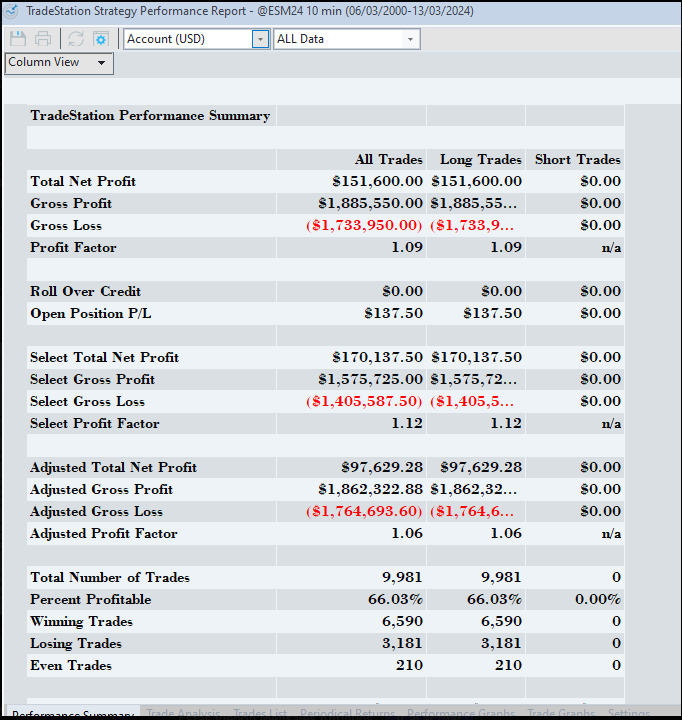
  <figcaption>Figura 0. Sistema basado en Bollinger Bands: Profit Factor 1.09, 66% de acierto.</figcaption>
</figure>

<figure>
  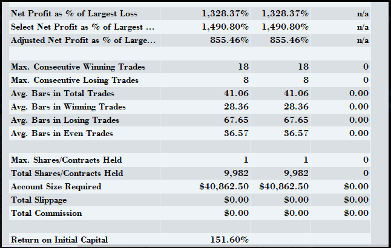
  <figcaption>Figura 1. Curva de equity del sistema con Bollinger Bands.</figcaption>
</figure>

***Creo que podría empeorar el beneficio para bajar el riesgo.***

<figure>
  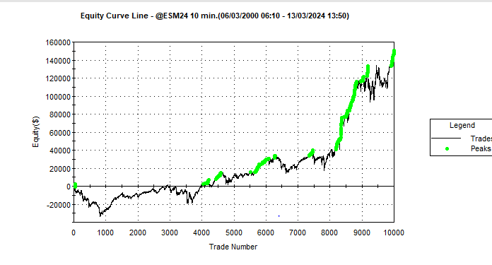
  <figcaption>Figura 2. Análisis de riesgo-beneficio del sistema.</figcaption>
</figure>

Es complicado que solo ***Bollinger Bands*** así te rente. Es complicado. Te faltan comisiones. Hay muchos *trades*. Bueno, 1.09 en todo caso no sería operable, pero bueno, no es mal comienzo tampoco hay que decir. Que es lo que tú decías ahí. Bueno, para punto de partida seguramente no es malo, no. Podías empeorar el beneficio para bajar el riesgo.

***Quería entender que se puede tener opciones metiéndole más variables a lo que tengo en el E-mini S&P.***

Si, ese criterio estoy de acuerdo. Es decir, un *setup* que lo pones, te da 1.09 con 9.000 operaciones. Estoy de acuerdo que es un *setup* prometedor, para seguir. Pero bueno, habría que mirar lógicamente más cosas. Como bien dices, no hay variables. Estoy de acuerdo en que probablemente es buen *setup*.

El ***Bollinger Bands*** es una muy buena señal, ya lo comenté en la teoría, y tengo pensado... Lo que pasa que no sé. Yo creo que en algún momento, no sé dónde va a ser el límite, pero en algún momento tendré que decidir no hacer todo lo que quería hacer. Porque lo que estoy viendo es que, si hago todo lo que tenía que hacer, será un curso de 500 horas en práctica. Entonces no puede ser. Entonces, en algún momento habrá que ir ya diciendo: bueno, esto no, esto sí. Porque va a ser imposible. Ya os lo comenté: queríamos sobre la marcha, y tenía intención de hacerlo todo, pero cada vez tengo más dudas de conseguirlo, sinceramente. Porque ya llevamos muchas horas. Siguen quedando muchas, tranquilos, siguen quedando muchas. Pero es que, aun quedando muchas, no creo que haga todo lo que quiero hacer, de verdad. Entonces sigo...

 

***Hola, un par de cosas. Hay un error en el código de Curso-ORB-04. Donde dice:***
```
barrasRangoDesdeInicio = timetominutes(HoraInicioTrading - sessionstarttime(0,1))/barinterval;
```
***debe ser:***
```
barrasRangoDesdeInicio = (timetominutes(HoraInicioTrading) - timetominutes(sessionstarttime(0,1)))/barinterval;
```
***Se puede probar el error poniendo `HoraInicio 1000`, y devuelve 7 barras desde las 9:30.***

***Otra cosa: en el código Curso-VB-01, hay 2 líneas que comentasteis en las prácticas que eran para que no abriera posición y cerrar al instante al haber logrado el objetivo de profit:***
```
Open of next bar < High Then
Open of next bar > Low Then
```
***Entiendo para qué son, pero tenía pensado que EasyLanguage estaba diseñado para impedir leer datos futuros. ¿No existe otra manera de lanzar órdenes condicionando su ejecución en un rango de precios?***


**Open of Next Bar y lectura de datos**

Sí, claro, hay otra manera, otras maneras de hacerlo. Y hay veces que no se puede utilizar `Open of next bar` por distintos motivos, por ejemplo, tener dos *datas* o algún otro factor.

Pero muy importante: `Open of next bar` ***no lee futuro***. Es muy importante entender bien esto. Esto no es leer futuro. Lo que hace `Open of next bar` no deja de ser un truco de lenguaje en el que, al cierre de la vela en cuestión, retrasa el cierre al *tick* de apertura, simplemente. No es que lea futuro: es que espera al *tick* de apertura para leer el código. Y "lee tres datos". Esto en el *Mastering* sale, en la clase de *Mastering* se trata, porque eso es normal. Es algo que no tienen todos los lenguajes. Es una utilidad bastante interesante, pero no siempre se puede usar, aunque hay veces que sí viene bien.

Lo que hace es leer del *tick* de apertura tres datos: el ***precio de apertura***, la ***hora*** y la ***fecha***. Solo esos tres datos. Entonces, tú puedes usar esos tres datos del *tick* de apertura para procesarlo en la barra de cierre del día anterior, pero de la barra anterior. Entonces no lee futuro: simplemente espera procesarlo.

Por lo tanto, yo ahí lo que hago es llamar al `Open of next bar` y le digo: si el `Open of next bar` es menor que tanto... haz X cosa... Pero no lee futuro, ¿se entiende? Espera ese *tick*, solo eso. Leer futuro sería usar un dato que no dispones en el momento de ejecutar el código. Aquí sí que dispone, por eso se espera. Entonces espera, lo lee, y entonces ejecuta la regla que tú le digas.

Así que es perfectamente útil. Y en este caso simplemente es para decir: oye, si hay un *gap* que supera el precio que yo tengo pensado ya cerrar, ¿para qué voy a abrir? Entonces le pregunto: oye, ¿has abierto por encima de tal precio? Me dice: sí. Pues no, no tienes la orden, entonces no la tires. Ya está.

Esta manera tiene un poco eso. O para otras cosas se puede usar. Pero para sistemas de *gaps* va fantástico, claro, para sistemas de *gaps* es fantástico. Pero insisto, no se puede usar en dos *datas*, por ejemplo. Entonces espero que haya quedado claro esto.

<div style="border-left: 4px solid #2196f3; background: #e3f2fd; padding: 10px 15px; margin: 10px 0; border-radius: 8px;">
  <strong>📐 Funcionamiento de Open of Next Bar</strong><br><br>
  <strong>NO es lectura de futuro.</strong> El código espera al tick de apertura de la siguiente barra y lee únicamente:<br>
  <ul>
    <li>Precio de apertura</li>
    <li>Hora</li>
    <li>Fecha</li>
  </ul>
  <strong>Uso típico:</strong> Evitar abrir posiciones cuando un <em>gap</em> ya supera el objetivo de salida.<br><br>
  <strong>Limitación:</strong> No funciona con múltiples <em>data series</em>.
</div>

 

**Optimización de filtros**

***a) Tras ver un vídeo en YouTube donde se mostraba una función de EL con 500 filtros, me surgió una duda. Tomando como ejemplo el listado en EL de entradas y salidas que se controlaban mediante inputs mostrado en la teoría, me preguntaba si haciendo lo mismo con un listado de filtros e intentar optimizar todos mediante su input para ver cuál funcionaría mejor, si esto es una buena práctica o es sobreoptimizar. Es decir, se busca qué filtro de un listado predeterminado va mejor para el sistema atendiendo a su opti para luego solo quedarnos con el mejor.***

***b) Sobre los filtros, a la hora de elegir alguno (en caso de que así sea), ¿tenéis algún listado estándar o varios que por consenso uséis generalmente, o los filtros los elegís según vuestro criterio o ideas personales en el momento? Es decir, ¿en qué basarse para elegir qué tipo de filtro usar dada la gran diversidad de estos que hay?***

Bien, filtros. Lo que comentas de usar un optimizador de filtros, sí puede hacerse. Y de hecho puede ser buena práctica. Puede ser buena práctica y no tiene por qué ser *sobreoptimizar*. Pero debería estar todo bastante acotado. Es decir, no optimicemos ya el filtro también. Es decir, si el filtro depende de un parámetro de *volatilidad*, encima no optimicemos el parámetro. Es decir, optimicemos el filtro en un parámetro estándar. O sea, probemos ese filtro en un parámetro estándar, otro en otro parámetro estándar.

Y lógicamente, como siempre, como cualquier regla, habrá que ver el tema de *significación estadística*, etcétera, el número de *trades* que tenemos, y podríamos hacer alguna otra prueba de evaluación como *Z-Score* o cualquiera de estas. Pero se puede hacer, se puede hacer.

Esto no deja de ser un *builder*. Y por eso yo, y de hecho en el debate interno, es en algún momento usar algún *builder* para hacer algo de esto. Porque esto al final no deja de ser un *builder* implementado en *EasyLanguage*. Por cierto, el código ese de 500 filtros, si nos lo quieres pasar, sería interesante verlo. Yo no sé a cuál te refieres, yo no lo he visto. Ya digo, en general no sé si... 500, 500...

Pero al final esto es un *builder* implementado en código. Un *builder* externo, como sabéis, *builders* que hay: [StrategyQuant](https://strategyquant.com/), [Adaptrade Builder](https://www.adaptrade.com/Builder/)... Nosotros tenemos comprado hace muchos años. Se puede usar, pero se puede usar ya teniéndolo muy cerrado. Es decir, el problema de los *builders* es dejarlos buscar libremente.

Entonces ya digo, esto, por ejemplo, hecho en un *builder* no sería mala práctica. Pero quiere decir que tú ya tienes tu *setup* de entrada, de salida, y tratas de buscar filtro para mejorar la entrada, entiendo lo que estamos hablando. Puede ser buena práctica, pero como con todo hace falta buen criterio y *prudencia*, vigilar...

***Un buen filtro debe quitar más malas que buenas.*** Hay que ver, hay que ver. Una vez siempre, cuando comparas filtro, es cómo va el sistema antes de filtrado y filtrado... Ver un poco los parámetros clave: proteger aciertos, beneficio medio de positivas y negativas, número de positivos, número de negativos. Es lo típico. Porque ahí lo que buscas en un filtro es quitar malos, estamos de acuerdo, ¿no? Es decir, buscas quitar malos. Pero hombre, si solo quita malos es un poco sospechoso también. Tiene que quitar más malos que buenos, pero algún bueno también tiene que quitar. Si solo se quitan malos, eso es feo.

<div style="border-left: 4px solid #ff9800; background: #fff3e0; padding: 10px 15px; margin: 10px 0; border-radius: 8px;">
  <strong>⚠️ Evaluación de filtros: señales de alerta</strong><br><br>
  <table>
    <tr>
      <th>Señal</th>
      <th>Interpretación</th>
    </tr>
    <tr>
      <td>Solo quita trades malos</td>
      <td>🔴 Sospechoso: posible sobreoptimización</td>
    </tr>
    <tr>
      <td>Quita más malos que buenos</td>
      <td>🟢 Correcto: comportamiento esperado</td>
    </tr>
    <tr>
      <td>Quita igual proporción</td>
      <td>🟡 Revisar: el filtro puede no aportar valor</td>
    </tr>
  </table>
  <br>
  <strong>Métricas a comparar antes/después del filtro:</strong><br>
  • Tasa de acierto<br>
  • Beneficio medio de positivas vs negativas<br>
  • Número de trades positivos vs negativos<br>
  • Profit Factor
</div>

Entonces, a cuál filtro elegir... Bueno, no tenemos una lista porque nosotros no hemos sido nunca muy amantes de los filtros, eso es verdad. Hemos filtrado poco, por esa, como sabéis, siempre *prudencia estadística* que tenemos, donde siempre tratamos... Nos pesa mucho la significación estadística, y filtrar es perder *trades*, eso es obvio. Pero siempre nos ha costado o, dicho de otra manera, los filtros no acaban de aportar mucho o lo suficiente para aplicarlo.

Pero al final, más o menos, si podemos en algún momento, si queréis, tratar de dar algunas referencias... Con el ORB, por ejemplo, ya lo dimos. Y a medida que vayamos viendo sistemas lo iremos dando. Pero lógicamente, a cada tipo de sistema lo vamos dando.

Pero al final no me complicaría demasiada la vida, me explico. Es decir, porque entonces sí que 500 filtros me parece una locura. No me complicaría en exceso la vida, y si tienes que complicarla tanto, seguramente ya es que el sistema no vale. Si tienes que filtrar tanto y buscarle tantos filtros, mejor busca otro sistema, ¿entiendes?


**Filtros principales recomendados**

Entonces, filtros que hay al final, pues las cosas obvias:

**1. La volatilidad**

En casi todos los tipos de sistema suele ir bien filtrar, o puede ser una cosa a evaluar. Filtrar volatilidad, y desde ahí cuidado, puede ser:

- Vía ***ATR*** interna
- Vía externa, vía ***VIX***, por ejemplo

También hay de este tipo en *intermarket*, con por ejemplo la curva del VIX. Es decir, los distintos periodos de eso quería... Es una de las cosas que tengo apuntadas ver, pero es bastante avanzada. Y si lo vemos, lo veremos de lo último, porque es una cosa bastante avanzada, pero tiene que ver con filtrar la volatilidad pero por lo externo, con los distintos vencimientos del VIX.


**2. Tendencia y régimen de mercado**

Lógicamente, el *régimen de mercado*, lo que técnicamente se llama régimen de mercado, que podemos simplificar que, recordaréis que hay seis:

- Volatilidad a la baja
- Volatilidad al alza
- Tendencia alcista
- Tendencia bajista
- Neutral
- En ambos casos, pues esa mezcla de todo, pues se puede dar seis, nueve...

Es al final un poco porque puedes hacer: alta subiendo, alta bajando, baja subiendo, baja bajando, por ejemplo.

<div style="border-left: 4px solid #27ae60; background: #ecf9f1; padding: 10px 15px; margin: 10px 0; border-radius: 8px;">
  <strong>📊 Regímenes de mercado</strong><br><br>
  En análisis cuantitativo, el <em>régimen de mercado</em> se modela combinando dos vectores principales:<br><br>
  <table>
    <tr>
      <th>Tendencia</th>
      <th>Volatilidad Baja</th>
      <th>Volatilidad Alta</th>
    </tr>
    <tr>
      <td>Alcista</td>
      <td>Alcista tranquilo</td>
      <td>Rally explosivo</td>
    </tr>
    <tr>
      <td>Bajista</td>
      <td>Corrección ordenada</td>
      <td>Crash / Pánico</td>
    </tr>
    <tr>
      <td>Neutral</td>
      <td>Rango estrecho</td>
      <td>Alta volatilidad lateral</td>
    </tr>
  </table>
  <br>
  <strong>Indicadores para detectar régimen:</strong><br>
  • Volatilidad realizada e implícita<br>
  • Pendientes de curva VIX, ratios VIX/VVIX<br>
  • Coeficiente de Hurst<br>
  • Medias móviles de estado<br>
  • Filtros de Kalman para cambios estructurales
</div>

Pero bueno, en los dos vectores principales siempre son volatilidad y tendencia. Y eso al final te da un régimen de mercado. Entonces ahí pues hay muchos, régimen de mercado. Desde los más *sencillos*, con una media *móvil*, hasta los más complejos, con coeficientes de *Hurst*. O sea, al final hay muchas cosas a mirar.

Pero repito, yo soy muy amante de la simplicidad, como sabéis. Y por lo tanto, eso aplica a todo, también a los filtros.


# Revisión de `Apolo`


*Apolo* es un sistema que está hoy en día operando. Es un sistema que opera largo y corto, pero que de hace bastante tiempo —aunque al principio no era así— se decidió hacerlo. Se decidió hacerlo en determinado momento, se decidió probar si aportaba valor hacerlo, como ya sospechábamos. Pero al principio operaba con el mismo *set* en el largo y en el corto.

Algo que hay autores que recomiendan —y que en sí es verdad que puede ser una buena práctica— pero que no necesariamente no hacerlo es mala, se entiende. Es decir, es preferible... puede serlo, pero sobre todo en *equity* normalmente hay *especialistas de cortos*, *especialistas de largos*. Porque, por lo de la *volatilidad* que os decía realmente, y por la dinámica propia del mercado, donde el régimen de mercado es muy alcista y por lo tanto es distinto. Es decir, el largo normalmente deja correr, quiere correr. En cambio el corto pues no quiere correr. Al final, *corto* es un sistema más de *oportunidad rápida*. Es bastante obvio. Pues bueno, bastante obvio, pues por esto:

<figure>
  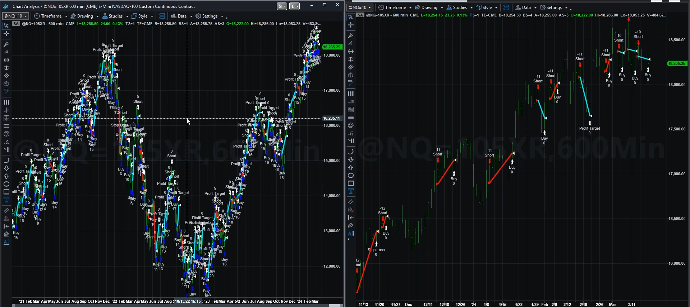
  <figcaption>Figura 3. Gráfico del S&P 500 mostrando el sesgo alcista de largo plazo.</figcaption>
</figure>

<figure>
  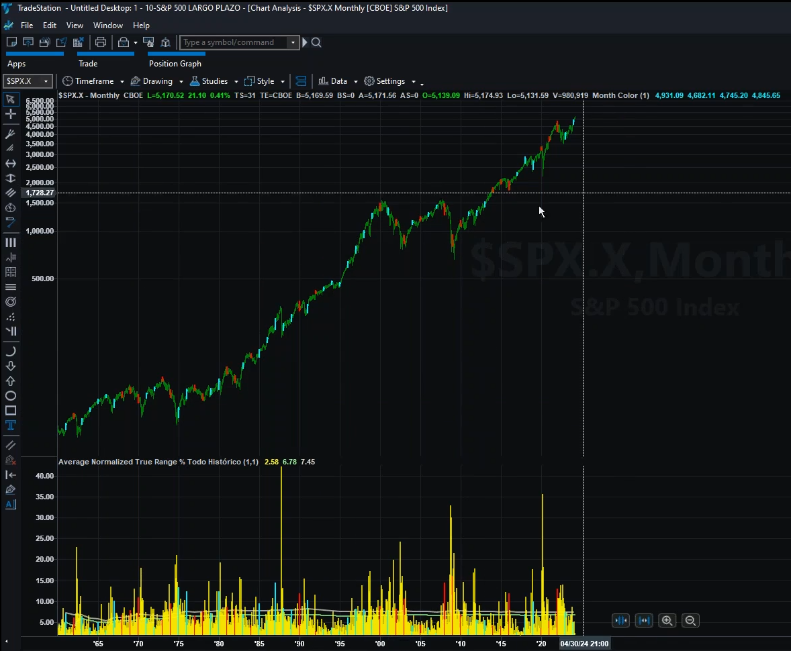
  <figcaption>Figura 4. Histórico completo del S&P 500: tendencia alcista secular.</figcaption>
</figure>

Pues esto. Por esto. Porque digamos que el sesgo de largo plazo es ligeramente alcista, ligeramente alcista, *viento de cola*. Claro que hay periodos que pueden ser de muchos años de lateral, de corrección, o congestión, etcétera. Hay muchas variedades. Pero en el largo plazo pues es más bien tendente a subir, por lo tanto ya añade un sesgo distinto.


**Separación de parámetros largos y cortos**

Entonces bien, *Apolo* opera ya hace tiempo con parámetros para corto, parámetros para largo, y hay distintos *sets* dentro del mismo sistema. En este caso, el mismo *set* opera con distintos sistemas.

De hecho, hemos hecho un pequeño cambio en *Apolo* que no es de las revisiones que hay pendientes —de cosas de evoluciones— sino una *simplificación del código* que implica al final quitarle un *input*. Y de hecho os lo digo abiertamente: en este caso este sistema usa el *ATR*, y el *ATR* en algunas épocas se ha utilizado y ahora ya hace un tiempo que no recuerdo que no se optimiza, y está fijo. Está fijo en —creo— que está fijo en 15 y en 15 barras, porque en su momento ya se hizo un estudio muy exhaustivo y se ha revisado hace poco, y es una zona que está bastante estabilizada, con mapa —que luego veremos mapas y demás— y por lo tanto nos gusta que esté ahí.


**Diferencia entre TP largos y TP cortos**

Bien, el corto lleva una época mala y que en algunos *sets* se ha convertido en demasiado mala. Entonces "demasiado mala" se ha ido degradando.

<figure>
  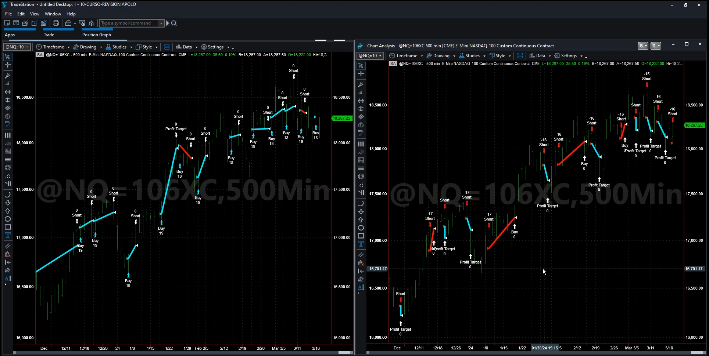
  <figcaption>Figura 5. Curvas de equity separadas: largos vs cortos en Apolo.</figcaption>
</figure>


El sistema de largos —ya digo— tiene distintos tipos, pero como veis, en general... Por ejemplo este, este *trade* es este *trade*, por ejemplo. No es un *trade* de tres o cuatro días que hace un *TP* bastante interesante:

<figure>
  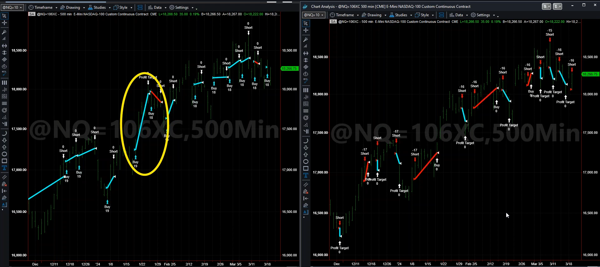
  <figcaption>Figura 6. Ejemplo de trade largo con TP amplio (3-4 días de recorrido).</figcaption>
</figure>

En cambio los *TPs* del corto es que es otra cosa: es de muy poco recorrido.

<figure>
  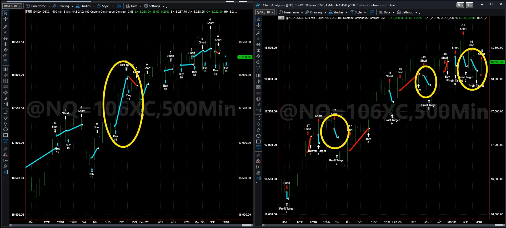
  <figcaption>Figura 8. Ejemplo de trade corto: TP cercano, salida rápida.</figcaption>
</figure>

Esto es lo que busca el corto: corto tiene un *TP* siempre más cercano. Y os lo comentaba varias veces en la teoría, también en la práctica, y de cierta manera pensando en *Apolo*. Es decir, realmente una de las mejores maneras de bajar el riesgo es tener un ***TP cercano***. Es decir, en datos de riesgo lo baja mucho porque sale rápido.

Y de hecho *Apolo* trabaja con ***SL en el lado corto mayor que TP***. Es un *stop* que salta pocas veces, y ese es su problema: que en los *sets* que van... Hay *sets* que dejan correr un poco más, hay *sets* un poco más parecidos al largo... No tanto, pero hay algún *set* más parecido. Y hay *sets* como este de la derecha que veis que es muy, muy rápido, que hace *TP* muy rápido. Entonces, cuando tiene 2, 3, 4 fallos, y son fallos de cierta importancia —como alguno que veis aquí— pues bueno, duele más.

<div style="border-left: 4px solid #e74c3c; background: #fdf2f2; padding: 10px 15px; margin: 10px 0; border-radius: 8px;">
  <strong>⚖️ Asimetría Largo vs Corto en sistemas de equity</strong><br><br>
  <table>
    <tr>
      <th>Característica</th>
      <th>Lado Largo</th>
      <th>Lado Corto</th>
    </tr>
    <tr>
      <td>TP típico</td>
      <td>Amplio (dejar correr)</td>
      <td>Cercano (salida rápida)</td>
    </tr>
    <tr>
      <td>Stop Loss</td>
      <td>Proporcional al TP</td>
      <td>Mayor que el TP</td>
    </tr>
    <tr>
      <td>Duración trades</td>
      <td>Días a semanas</td>
      <td>Horas a pocos días</td>
    </tr>
    <tr>
      <td>Filosofía</td>
      <td>Tendencial</td>
      <td>Oportunidad rápida</td>
    </tr>
  </table>
</div>

<br>

## Protocolo de supervisión

¿dónde empieza esto? Bueno, esto empieza con el *protocolo de supervisión*. El protocolo de supervisión, ya os lo comenté en la teoría, es algo en lo que tenemos campo de mejora. Ya tenemos cosas hechas, pero tenemos campo de mejora. Y de hecho, pues mira, una de esas cosas que os comenté que en el curso nos puede servir a nosotros aprovecharlo es esta. Más que mejorar en darnos cuenta es *automatizarlo* un poco.

Porque es verdad que el protocolo de supervisión lo puedes complicar todo lo que tú quieras, pero a la hora de la verdad —no solo, pero normalmente— si tú... Digo para vosotros que empezando, que no os volváis locos. Sobre todo aquellos que estáis empezando: hay muchas maneras de hacer esto, y una de ellas es ***mirando un Performance Report*** :


<figure>
  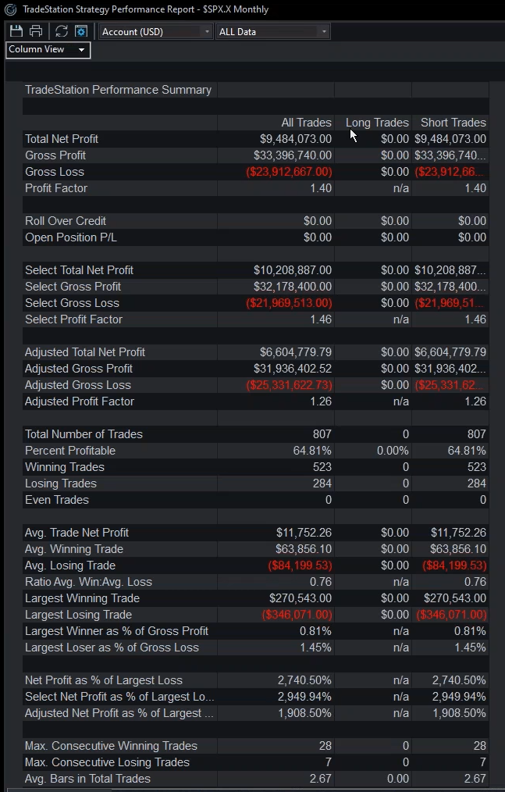
  <figcaption>Figura 11. Performance Report del sistema Apolo.</figcaption>
</figure>

**Mirando la curva de drawdown:**

<figure>
  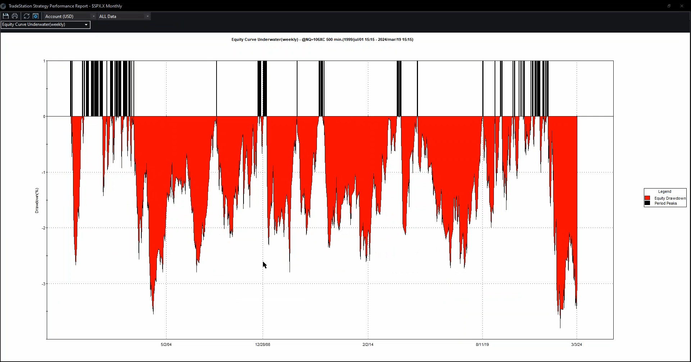
  <figcaption>Figura 10. Curva de drawdown histórico de Apolo.</figcaption>
</figure>

**Mirando la curva del sistema:**

<figure>
  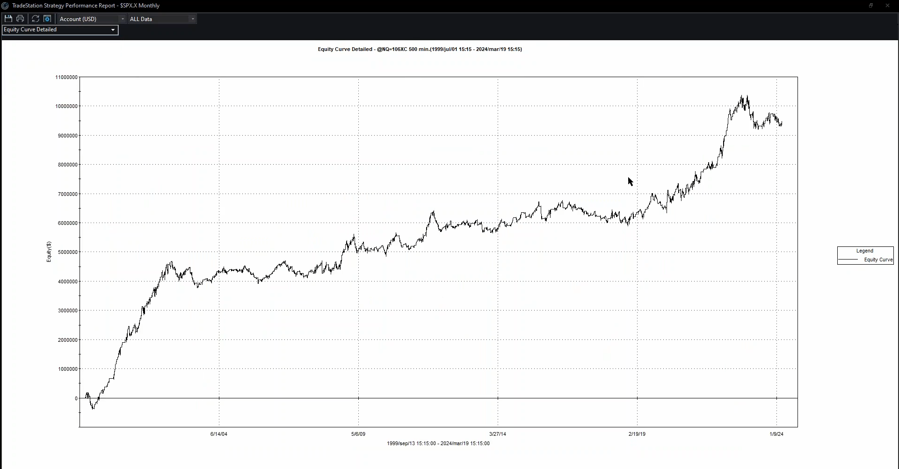
  <figcaption>Figura 12. Curva de equity del sistema Apolo.</figcaption>
</figure>

**Los trades:**

- Tú si vas aquí puedes ir a buscar el *trade* más largo
- Puedes buscar el peor *trade*, el *Largest Losing Trade*
- Puedes ver cuándo ha sido, marzo, el 16, etcétera

<figure>
  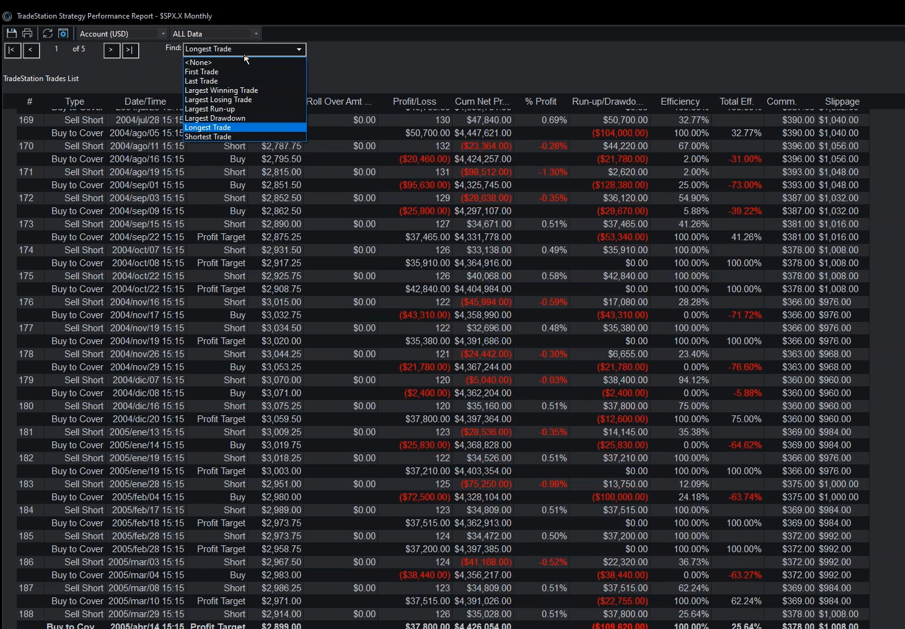
  <figcaption>Figura 13. Lista de trades con métricas detalladas.</figcaption>
</figure>

Puedes mirarlo. Una de esas maneras es esta. Lo cual tampoco penséis que obligatoriamente hace falta tener un código y todo súper complicado. Pero bueno, sí que es verdad que una de las cosas que caracteriza la profesionalización es esta: automatizar más las cosas.

Pero como al final aquellos que ya nos conocéis —no solo de ahora del curso sino hace tiempo— ya sabéis que me quejo siempre de la falta de recursos y de tiempo, es así. Porque al final todo esto lleva trabajo y hay que decidir, cuando eres una empresa o un proyecto, es igual, tienes que decidir en qué gastarse el tiempo, los recursos. Y al final no es infinito, igual que no lo es el dinero tampoco lo es el tiempo. Y hay que decidir dónde haces cosas. Y por eso tenemos siempre una reunión mensual, damos prioridad a una cosa, a otra. Y hay cosas que están en reuniones de hace años porque no hay manera de que se considere que es prioritario respecto a otras cosas. Y esto hace que hayan cosas que a lo mejor podrían hacerse mejor pero ya están bien así, porque dedicarle un montón de horas pues no te renta.


## Extracción de métricas

Vale, entonces aquí, por ejemplo, nosotros hoy en día sacamos estos datos:

<figure>
  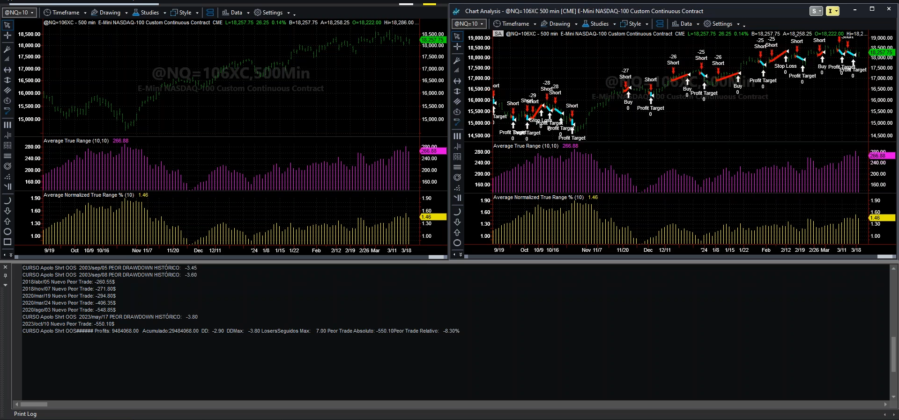
  <figcaption>Figura 9. Métricas de supervisión extraídas automáticamente vía código.</figcaption>
</figure>

¿Qué datos sacamos? Sacamos simplemente datos que ya veíais ahí en el *Performance Report*: Pero que los sacamos vía el `print`. 

Que esto es todo vía código. Este código —ya me adelanto por si alguien lo pregunta— Alberto no me ha autorizado a entregarlo todavía, porque es que lo quiere mejorar antes de entregarlo. Esto se llama *orgullo de programador*. Entonces yo entiendo que antes de acabar el curso —ya os lo dijimos— que lo haremos, ya os daremos un código y puede que algo mejor. Yo creo que ya está bastante bien, pero Alberto dice que no, que ni se me ocurra entregarlo ya, que lo quiere mejorar. Entonces... Pero bueno, al final informa 
* del mayor *drawdown*, cuándo lo hace, 
* cuándo hace peor *trade*, 
* y cuándo hace peor serie de *trades*. 

Que son datos de riesgo bastante importantes.


**Métrica N-trades y porcentaje**

Tenemos uno que hacemos en revisiones más profundas vía Excel. Ya os lo comenté en la teoría, y creo que lo dije en la teoría, que teníamos planes. Es una de esas cosas pendientes, a ver si aprovechando lo acabamos de desarrollar. Que es lo de contar *N trades*. *N trades*, pero no en valor absoluto sino en porcentaje. En porcentaje, porque en valor absoluto es muy complicado porque se desvirtúa. Este es un problema: a veces hay que calcularlo en porcentaje. Y cuando acumulas *trades* eso ya no es tan fácil a nivel de histórico, pero creo que lo conseguiremos.


**Puntos clave detectados en Apolo**

Entonces aquí ahora mismo pues vemos que este sistema hizo peor *trade* en octubre del 23, y que su *drawdown* récord lo hizo histórico en 380 en mayo del 23:

<figure>
  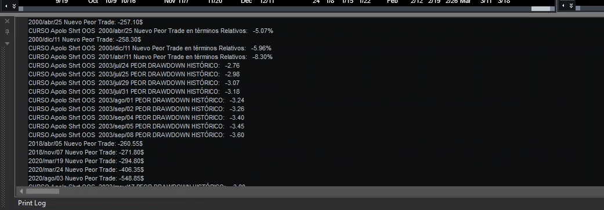
  <figcaption>Figura 14. Métricas clave: peor trade (oct 23) y DD récord (380 puntos, mayo 23).</figcaption>
</figure>

Tras ese se revisó, y este ahora vuelve a estar cerca. Y ese *set*, estando justo, sigue operativo:

<figure>
  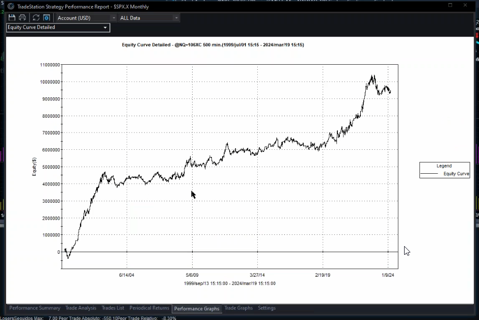
  <figcaption>Figura 16. Estado actual del set: cerca del drawdown récord pero operativo.</figcaption>
</figure>

Luego llegaremos a esto, porque hoy veréis incluso os enseñaremos los *sets* que cambiamos y toda la manera en que lo analizamos.

Entonces, en un momento determinado salta la alerta, que ya nosotros ya veíamos que no iban finos. Es decir, ya lo ves, es que la mayoría de veces tú ya lo ves. Pero lo cual no quita que no vaya bien tener un código que te avise, porque así pues puedes olvidarte.

> Estos son distintos *sets*, distinta combinación de parámetros de la misma estrategia. Sí, *Apolo* hace esto.

## Inicio de la revisión y preparación del mapa de optimización

Bien, pues entonces vamos con la revisión. La primera cosa que hacemos es: ***un mapa de optimización de prácticamente, o si no prácticamente, todo el histórico***

**Mapa Short:**

<figure>
  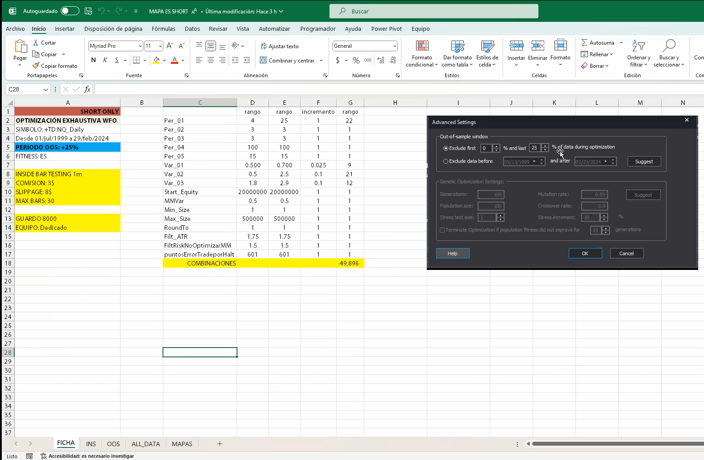
  <figcaption>Figura 17. Mapa de optimización del lado corto de Apolo.</figcaption>
</figure>

Todo parte lógicamente de una optimización que la hacemos con *Out of Sample* detrás. Es decir, cercano del 25% porque, mirando los cortes, pues se ve que puede estar ahí interesante. Y todo el histórico disponible, desde julio del 99 hasta el 29 de febrero del 2024. Esto lo hacemos en datos de *TickData* que nosotros compramos, pero podría haberse hecho perfectamente en los datos de TradeStation.   

**Inputs seleccionados para la optimización**

Con ***tres dólares de comisión***, con ***ocho dólares de slippage***, etc.

Pero no se hace de todos los *inputs*. No se hace de todos los *inputs*. Los *inputs* que tiene el sistema son todos estos:

<figure>
  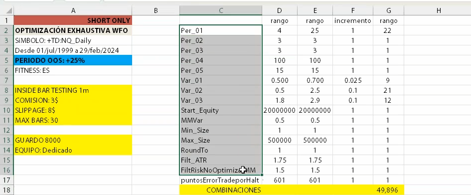
  <figcaption>Figura 18. Lista completa de inputs del sistema Apolo.</figcaption>
</figure>

No todos son optimizables. Los que les hemos dejado el nombre:

<figure>
  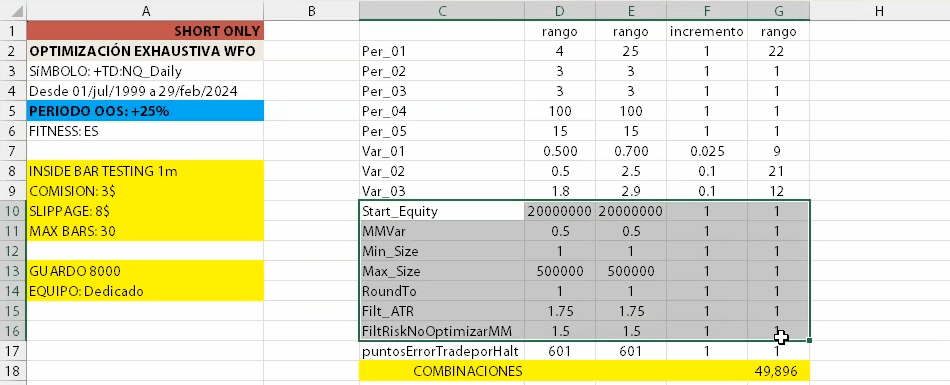
  <figcaption>Figura 19. Inputs optimizables marcados en el código.</figcaption>
</figure>

Son del algoritmo. Bueno, este último `puntosErrorTradeporHalt` es cuando hubo el *halt* en el COVID. Tuvieron varios *halt* y hubo problemas de ejecución. Y entonces consideramos que ahí hay un factor que se benefició de manera artificial, y lo penalizamos. Lo penalizamos en 600 puntos ahí, porque la ejecución no fue real. Eso puede pasar, probablemente pasa, por un *tick* y el *slippage* lo controla. En este caso no fue así: el gráfico marcó ejecutado y ese día, para que me entendáis —y digo porque esto...—

Imaginaos que aquí se cierra una operación:

<figure>
  
  <figcaption>Figura 20. Ejemplo del halt del COVID: precio marcado vs precio real de ejecución.</figcaption>
</figure>

Imaginad que habría aquí, pero realmente, como el mercado es falso, no te deja ejecutar: ejecuta 600 puntos por debajo. Entonces, bueno, pues eso lo implementamos en el código para que en el optimizador no sacara partido de una situación que fue falsa. No pudiste operar ese precio, aunque ponga que abrió ahí.

Entonces, cuando hay algo así que no es real, que te has podido aprovechar, o que penaliza, pues es mejor dejarlo puesto en el código porque así, si tú optimizas, no saque partido de una cosa que no fue real. Es una cosa muy puntual, pero bueno, os explico para que lo sepáis: es ese, esos puntos que está implementado y está como *input* `puntosErrorTradeporHalt`.


**Inputs**

Y luego el resto 
* `filtRiskNoOptimizarMM` son variables de la gestión monetaria, 
* al igual que`MMVar`, que es el porcentaje, es la *f*, la *f* de la gestión monetaria. 
* `Start_Equity` El saldo de la cuenta inicial, 
* `Min_Size` el lote mínimo, 
* `Max_Size` el lote máximo, de tal manera que si le pones uno, pues lo bloqueas, 
* `Round_to` redondea a uno si quieres redondear a otro número, y ya está. 

Todas estas son variables de la gestión monetaria, que veremos en algún momento, veremos en algún momento en detalle. Esto lo comenté en la teoría cuando haremos alguna clase dedicada solo a la gestión monetaria.

* `Per_01` Hay una variable del indicador. 
* `Per_02`  Hay otras dos variables que no se suelen tocar. 
* `Per_03` 
* `Per_04` Esta tampoco. Esta es, de hecho, una prueba que se hizo una vez de un filtro que está ahí, no sé, creo que alguna vez lo hemos configurado, pero nuevamente quiere decir que no actúa. 
* `Per_05` Ese es el valor que os decía del *ATR* que tampoco se optimizaba.

**Variables realmente evaluadas en el mapa**

Entonces, ¿qué variables tocamos? 


- `Per_01` Hay una variable del indicador. 

Y luego vienen los tres —podemos decir— filtros... Filtros en el sentido estricto, sino que es un porcentaje multiplicador:
- *`Var01`* al final es un modificador de la orden de entrada
- *`Var02`* es *TP*
- *`Var03`* es *Stop*

No hay más. 

Entonces aquí solo se analizan en el mapa estas cuatro variables: el indicador, el multiplicador de entrada, el multiplicador del *TP* y el multiplicador del *Stop*. Esos cuatro es lo que se hace en el mapa.

<div style="border-left: 4px solid #27ae60; background: #ecf9f1; padding: 10px 15px; margin: 10px 0; border-radius: 8px;">
  <strong>📐 Arquitectura modular del sistema</strong><br><br>
  La estructura descrita —un indicador principal y tres multiplicadores paramétricos— se ajusta a arquitecturas comunes en sistemas cuantitativos de diseño modular. Es frecuente en frameworks inspirados en autores como Howard Bandy (autor de <em>"Quantitative Trading Systems"</em>), donde se separa el núcleo determinista del sistema (<em>signal core</em>) de los modificadores de escala (<em>scaling layers</em>) aplicados en entrada, TP y Stop.
</div>


**Cantidad de combinaciones y por qué se usan tantas**

Para hacer un mapa guardamos `GUARDO 8000`, todo lo que nos deja TradeStation, que son 8.000. 


¿Por qué? Porque al final en el mapa me interesa ver realmente cuántas más combinaciones posibles mejor. En el mapa es importante que haya los menos huecos posibles entre combinaciones. Por eso idealmente hay que hacer la exhaustiva. Exhaustiva.

Entonces bueno, esto al final da 49.000 combinaciones, que en exhaustiva pues se hace depende del equipo, pero tardaba unas horas. Con el LIBB activado y todo, que eran unas horas, depende lógicamente de la potencia de la máquina.

**Exportacion resultados de optimizacion**

Como ya visteis en la teoría, o veis en cualquier optimización, de Tradestation:

- Una que es `AllData` que reúne los dos periodos
- El periodo `InSample` que es el optimizado
- El periodo `OutOfSample` que es el no optimizado

En este caso el último 25% del histórico. *InSample*, *OutOfSample*, y *AllData* que los suma todos. Estos datos al final los llevamos a Excel.

<figure>
  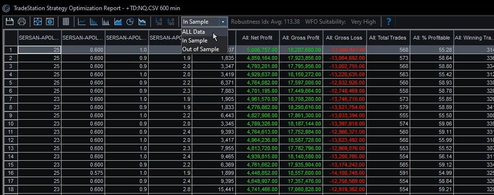
  <figcaption>Figura 21. Exportación de resultados de optimización a Excel.</figcaption>
</figure>

Todas las hojas simplemente hacemos una estadística descriptiva. 

<figure>
  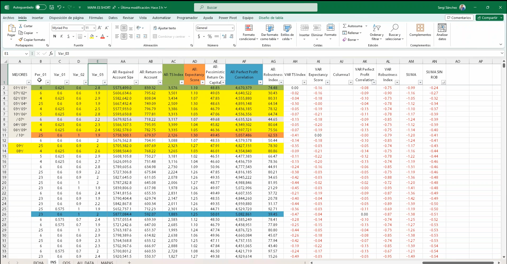
  <figcaption>Figura 22. Vista del Excel con las 8.000 combinaciones.</figcaption>
</figure>

Abajo del todo también, cuando hay 8.000:

<figure>
  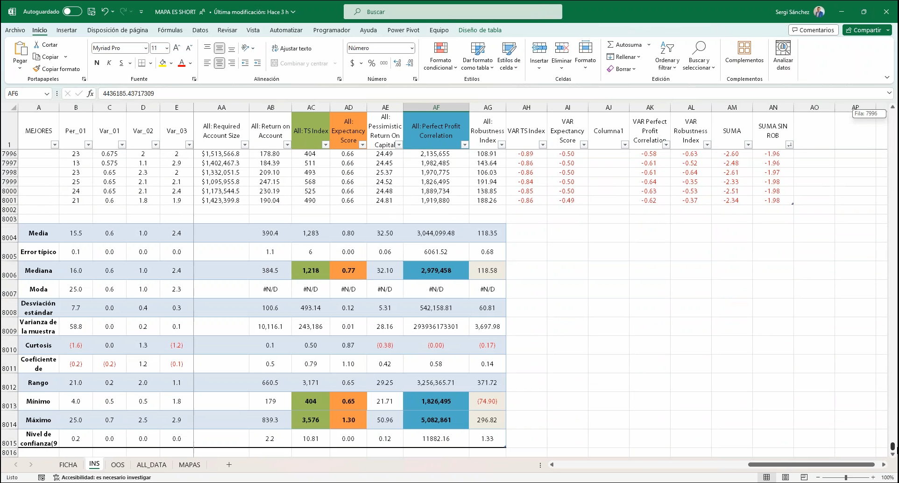
  <figcaption>Figura 23. Estadística descriptiva de los resultados.</figcaption>
</figure>

<figure>
  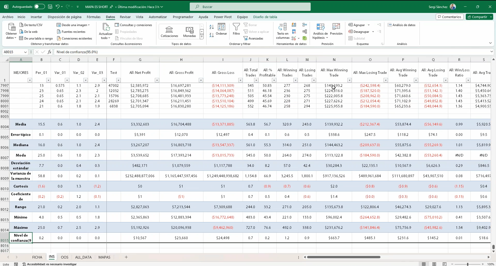
  <figcaption>Figura 24. Detalle de parámetros estadísticos calculados.</figcaption>
</figure>

Esto sale directamente del propio Excel en Datos > Análisis de datos > Estadística descriptiva, que saca todos los parámetros que tú le has puesto. Aquí abajo:

<figure>
  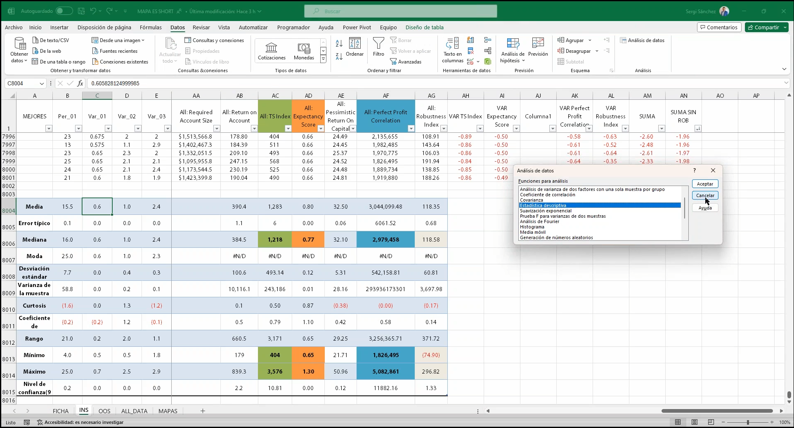
  <figcaption>Figura 25. Mínimo, máximo y mediana resaltados.</figcaption>
</figure>

Pues marcamos por ver más rápido mínimo, máximo y mediana. Es mejor estimador para la mayoría de casos la mediana que la media. La mediana es mejor estimador nuevamente cuando hay *outliers*, cosas bastante habitual en el trading. Pero bueno, que también si usas la media no pasa nada. Si la media, si la media... La media no son iguales la moda. Recordar que eso es, en este caso, una moda, pero si eso será recordar que es una de las características que tiene una distribución normal. Que lo visteis, o lo vimos esto en la clase de portfolio. En la práctica hay una ***clase de portfolio*** donde se habla del VaR, el VaR, todo esto, y ahí se ve bastante todo este tema.


**Normalización de métricas y selección de parámetros**

Hacemos como ya os expliqué por norma siempre los Excels. Y es un Excel de búsqueda de zonas muy inicial.

En un sistema que no conocemos mucho mejor no lo hacemos. Pero normalmente hacemos esto: normalizamos las diferencias entre tanto *TSI*, *Expectancy*, como *PPC* y *Robustness*. 

Recordar que *Robustness* compara beneficio medio analizado con beneficio medio analizado *Out of Sample* con *In Sample*. Y automáticamente se normaliza con el valor máximo. Y de ahí sale una suma de los cuatro, de las diferencias respecto a su máximo:

<figure>
  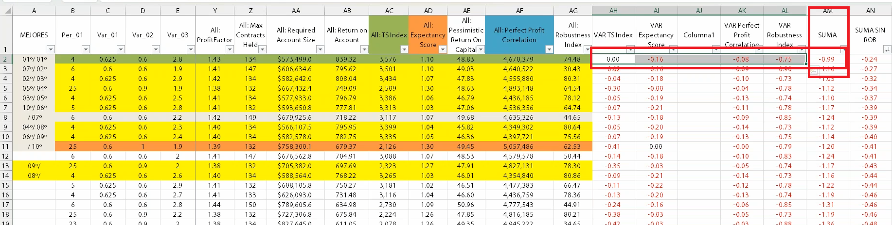
  <figcaption>Figura 27. Suma normalizada de las cuatro métricas clave.</figcaption>
</figure>

Aquí lo veis, a ver, aquellos que entran con este valor, si veis que sale la fórmula:

<figure>
  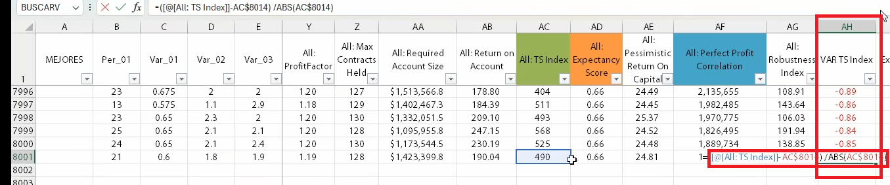
  <figcaption>Figura 26. Fórmula de normalización visible en Excel.</figcaption>
</figure>

<figure>
  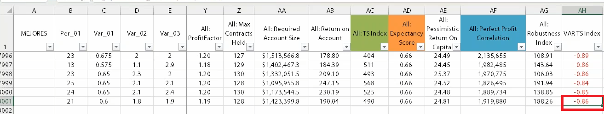
  <figcaption>Figura 28. Detalle del cálculo de normalización.</figcaption>
</figure>

Y es este valor `All: TS INdex` menos este valor `Maximo` dividido por este valor `Maximo`. Y te da este valor `VAR TS Index`

<figure>
  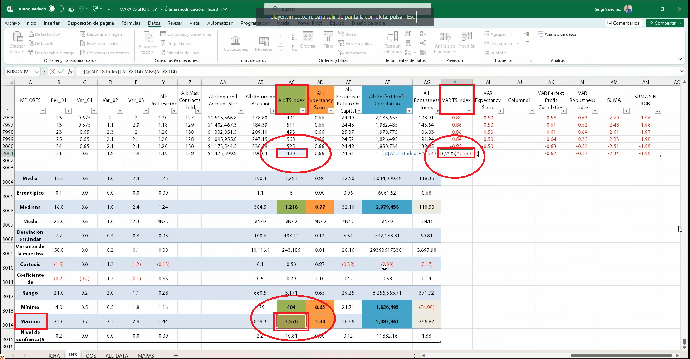
  <figcaption>Figura 165</figcaption>
</figure>

Eso es normalización típica respecto al máximo. Lo cual te dice que este valor es del máximo, es un 0.86 del máximo. Simplemente para pues sumarlos todos. Y de esta manera buscas un equilibrio entre todos. 

El que tiene un valor de `suma` más bajo quiere decir que en estas cuatro referencias cumple más equilibrio y entonces da buenas notas. 

Este, por ejemplo: 
* en verde pintamos el mejor *TSI*, 
* en naranja pintamos el mejor *Expectancy Score*, 
* y en azul pintamos el mejor *PPC*

Pero luego, repito, se ordena o bien por `SUMA` o bien por `SUMA SIN ROB`

<figure>
  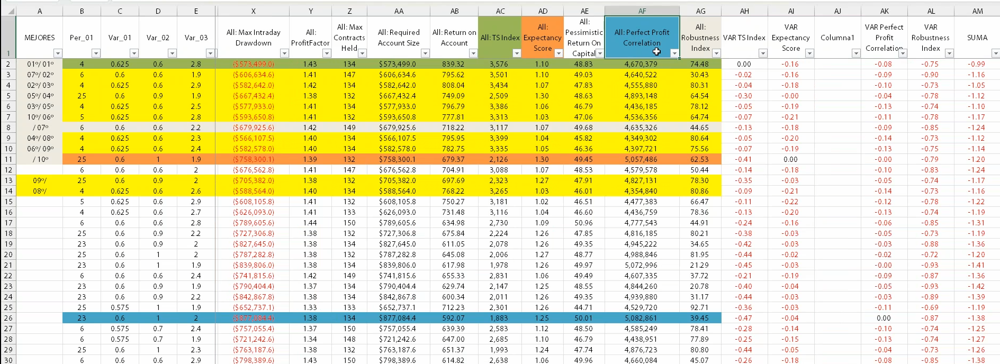
  <figcaption>Figura 29. Código de colores: verde=mejor TSI, naranja=mejor Expectancy, azul=mejor PPC.</figcaption>
</figure>

`SUMA` o bien por `SUMA SIN ROB` ¿Cuándo se usa uno u otro? Cuando optimizamos con el *Out of Sample* al final, es decir, ahora en la actualidad o lo más cercano a la actualidad, entonces usamos `SUMA`. ¿Por qué? Porque el *Out of Sample* es cercano y nos interesa.

Al final, usar el valor de *Robustness* o no usarlo para los cálculos de esta suma, es simplemente si yo quiero sobreponderar o darle importancia a algún dato que compare el *InSample* con el *Out of Sample*. El único dato aquí que compara eso es el *Robustness*. *Robustness* compara justamente el rendimiento de un periodo con el rendimiento del otro. Por lo tanto, si yo quiero darle más peso al *Out of Sample*, usando esta variable *Robustness*, lo hago.

Luego, de hecho, si ordeno por esta variable, Pues al final ***estos son los sets que han ido mejor en el Out of Sample***. 

<figure>
  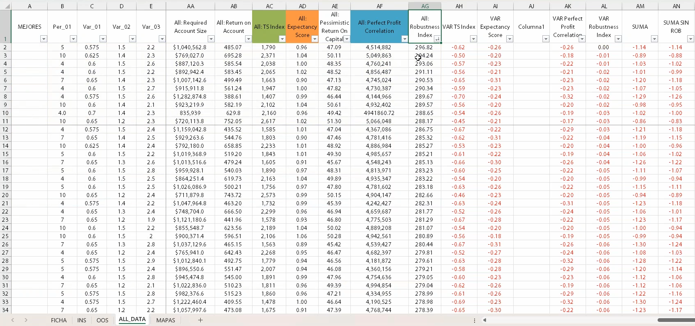
  <figcaption>Figura 31. Ordenación por Robustness: los mejores sets en Out of Sample.</figcaption>
</figure>

Pero solo eso tampoco lo quiero, porque también quiero tener en cuenta las otras variables que tienen en cuenta todo el histórico. Y por eso eso lo hace la `SUMA`, porque la suma tiene en cuenta este, este, este y además este:

<figure>
  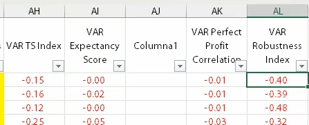
  <figcaption>Figura 32. La SUMA pondera las cuatro métricas equilibradamente.</figcaption>
</figure>

En cambio, `SUMA SIN ROB` no tiene en cuenta `VAR Robutness Index` . Provoca otra ordenación distinta que lógicamente es parecida muchas veces, no, pero no es exactamente.


**Por qué se usan 8.000 combinaciones**

Bien, esto (ahora vamos al mapa, luego iremos a los *sets*). Aquí no me importa los *sets*, no me importa si los *sets* son iguales o si no. Porque he elegido 8.000, elegir 8.000 es elegir muchos valores. Elegir 8.000 al final, recordar que esto funciona, que optimiza por una función... (Este creo que es el mapa, es *Short*, pero se ha hecho para los tres, he escogido este que ha sido aleatorio.)

<figure>
  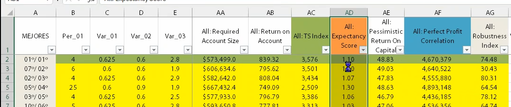
  <figcaption>Figura 33. Configuración de la optimización: función objetivo.</figcaption>
</figure>

Yo optimizo por esta variable, por `Expectancy Score`, y escoge los 8.000 mejores en *InSample*. Los 8.000 mejores. 

<figure>
  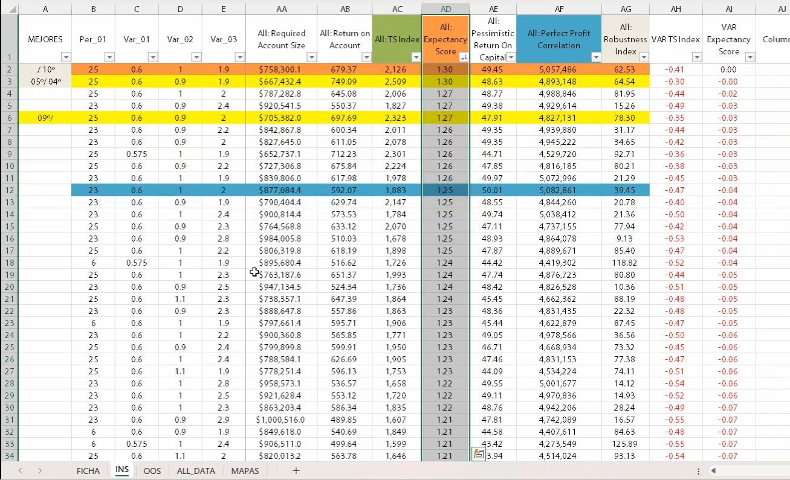
  <figcaption>Figura 35. Selección de Expectancy Score como criterio de optimización.</figcaption>
</figure>

Y de ahí, de esos 8.000 que ha encontrado, calcula qué hubieran rendido en el periodo *Out of Sample*. Lo pone aquí:

<figure>
  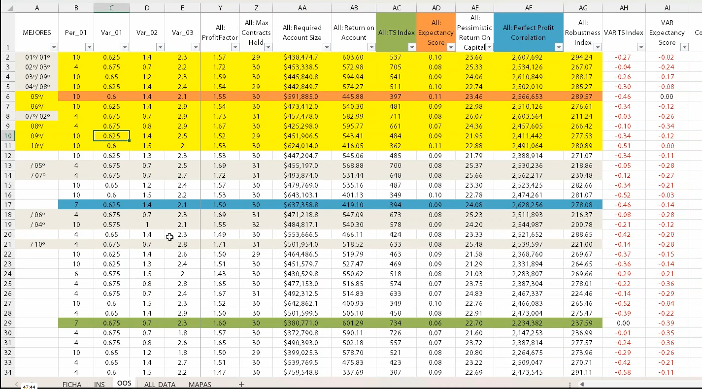
  <figcaption>Figura 36. Resultados del Out of Sample calculados para los 8.000 mejores.</figcaption>
</figure>

Y luego suma los dos aquí:

<figure>
  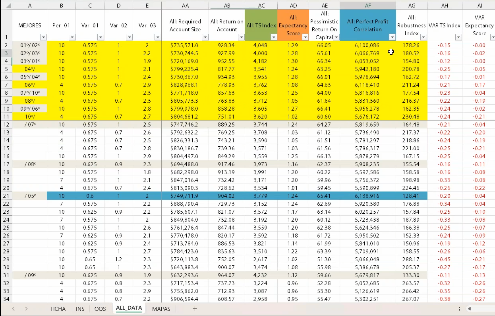
  <figcaption>Figura 37. Columna AllData: suma de InSample + OutOfSample.</figcaption>
</figure>

El que manda es el *InSample*. El que manda en el sentido que es el que controla el resto de datos.

Por lo tanto estaremos de acuerdo que lo bueno es que el *OutOfSample* e *InSample* se parezcan. Pero eligiendo 8.000 me da igual, porque además he dejado elegir demasiado. Por lo tanto lo que encuentre como mejor dato aquí puede ser fruto de una sobreoptimización. Luego veremos que no es tan distinto, pero podría ser.

**Utilidad real de tener tantas combinaciones**

A mí, ¿para qué me sirve tener 8.000? Pues para hacer esto: Para hacer mapas.

<figure>
  
  <figcaption>Figura 38. Mapa de optimización construido a partir de las 8.000 combinaciones.</figcaption>
</figure>


### Construcción del mapa y por qué preferimos tablas dinámicas

Los mapas en esta estrategia, ¿cómo planteamos los mapas? Yo ya os comenté en la teoría que nos gusta mucho verlos en tablas a nosotros, *tablas dinámicas*. No es necesario hacer el típico mapa gráfico y visual.

Por ejemplo, MultiCharts lo hace, está bastante chulo, está bien, es muy aprovechable de MultiCharts. Pero TradeStation no lo hace, entonces nosotros lo hacemos en Excel. O sea, este mapa a mí no me dice nada más, 


<figure>
  
  <figcaption>Figura 40. Tabla dinámica con escala de colores: visualización preferida.</figcaption>
</figure>

a mí esto me dice más, un poco me dice lo mismo que aquí, pero lo veo mejor aquí:

<figure>
  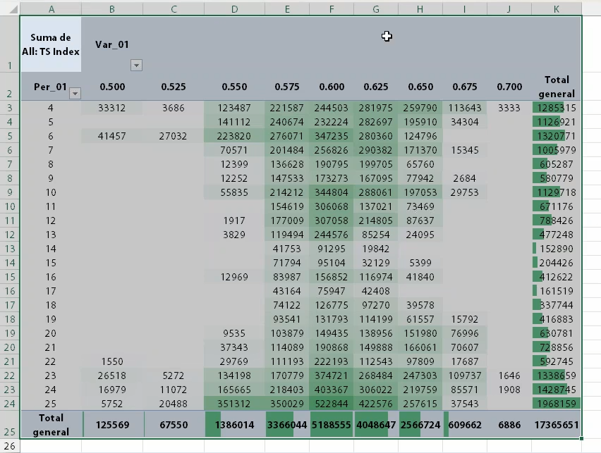
  <figcaption>Figura 41. Mapa 3D de superficie generado en Excel.</figcaption>
</figure>


**Problemas del efecto "escala" al visualizar mapas 3D**

Además del efecto mapa, es el efecto *escala* que siempre se llama de los gráficos. Pasa igual aquí, porque tú dices: "joder, está muy puntiagudo"... ¿Seguro? Vamos a hacerlo menos puntiagudo:

<figure>
  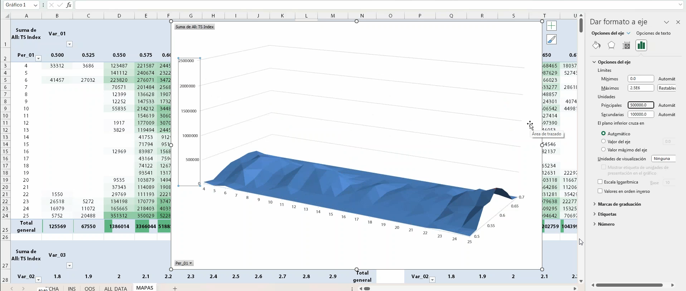
  <figcaption>Figura 42. El mismo mapa con escala modificada: apariencia engañosamente plana.</figcaption>
</figure>

*(Ironía)* "Ya está, mucho mejor. Fíjate qué llanura más magnífica de parámetros tenemos. Es una cosa súper estable y súper robusta. Ya está, sistema a operar..." *(Ironía)*

¿Me entendéis? No. Es decir, que al final el ***efecto escala*** condiciona totalmente el efecto visual.


**El truco de MultiCharts: la marca de agua**

Para eso tiene MultiCharts aquello del nivel. Ya lo visteis en la teoría, en algún sistema lo hemos enseñado. Bueno, creo que el otro día en el sistema que hicimos al principio lo enseñamos también. Lo enseñamos, que ahí enseñamos MultiCharts. Por eso aquí pues vamos otra vez más a Excel, vamos enseñando un poco de todo. Eso es lo de la *marca de agua*, ¿os acordáis?

<figure>
  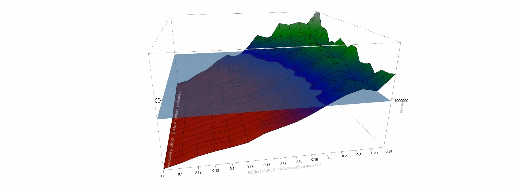
  <figcaption>Figura 43. Marca de agua en MultiCharts: herramienta para mitigar el efecto escala.</figcaption>
</figure>

La marca de agua viene muy bien. Evitas un poco ese efecto. Con esto, ese efecto escala lo puedes tú jugar así, porque el efecto visual cambia totalmente la mente. Entonces, así con esto puedes jugarlo. Entonces aquí sí viene muy bien porque es una herramienta que ya se ha pensado para eso, tiene esto para mitigar, y viene bien. Pero en Excel a mí me gusta más la tabla.


**Por qué preferimos tabla dinámica frente al gráfico**

Prefiero la tabla, la tabla en Excel. Recordar que es una *tabla dinámica* que Excel hoy en día hace de manera automática. Tú simplemente seleccionas los valores y le dices aquí insertar tabla dinámica, y ya está hecha. De verdad, no estoy exagerando. Es un poco saber de Excel.

<div style="display: flex; flex-wrap: wrap; gap: 10px; justify-content: center;">
  <figure style="margin: 0; flex: 0 0 48%;">
    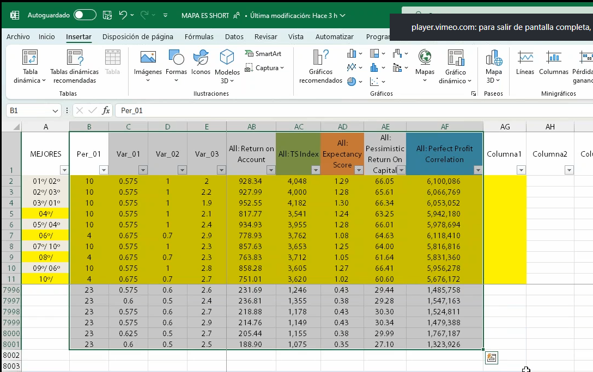
    <figcaption>Figura 166.</figcaption>
  </figure>
  <figure style="margin: 0; flex: 0 0 48%;">
    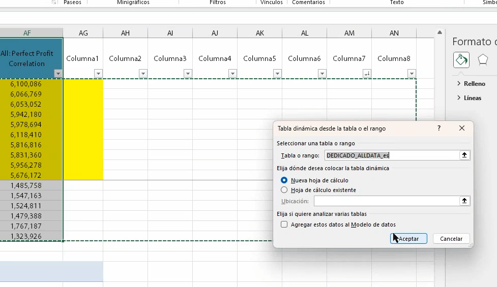
    <figcaption>Figura 167.</figcaption>
  </figure>
  <figure style="margin: 0; flex: 0 0 48%;">
    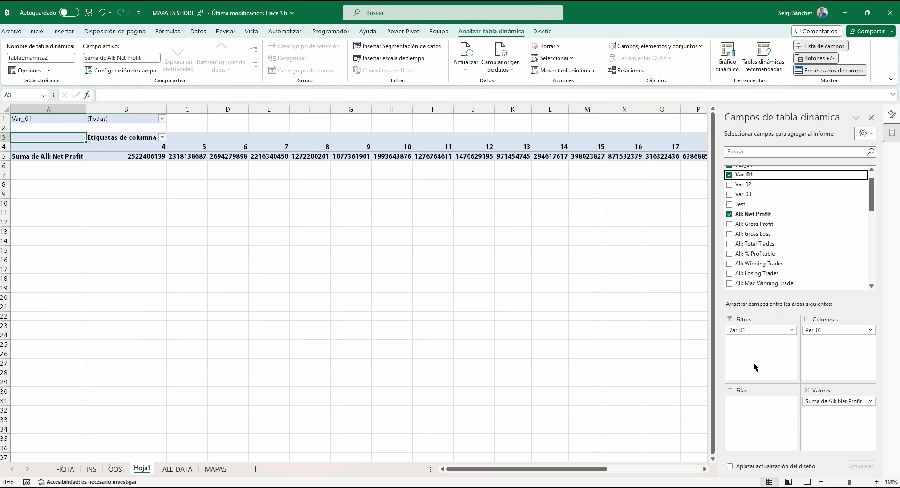
    <figcaption>Figura 168.</figcaption>
  </figure>
    <figure style="margin: 0; flex: 0 0 48%;">
    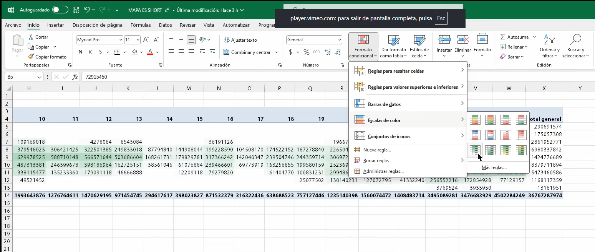
    <figcaption>Figura 169.</figcaption>
  </figure>
    <figure style="margin: 0; flex: 0 0 70%;">
    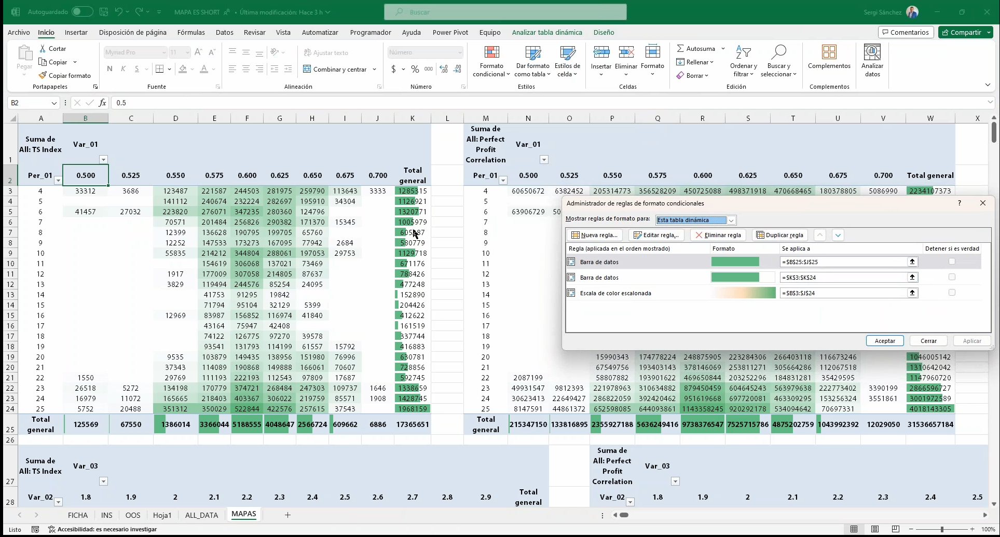
    <figcaption>Figura 170.</figcaption>
  </figure>
</div

<br><br>

Lo peor es el blanco, que no haya nada de verde. Al final, lo peor es que no haya valores a nivel de mapa. Solo blanco, verde, y entonces ya claro, el blanco es el que tiene poco valor. Es casi blanco, es parecido a este pero no está. Entonces este es perfecto. Así pues bueno, se ve muy bien por un único color.

<figure>
  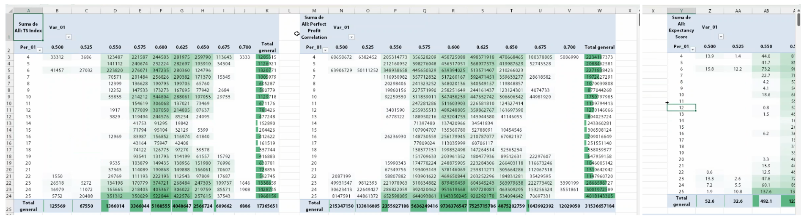
  <figcaption>Figura 46. Los tres mapas comparados: TSI, PPC y Expectancy Score.</figcaption>
</figure>

Tres mapas, los he hecho por:
1. ***TSI Suma de All: TS Index***
<figure>
  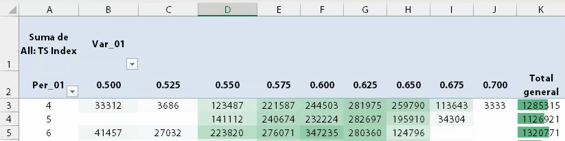
  <figcaption>Figura 49</figcaption>
</figure>

2. ***PPC Perfect Profit Correlation***
<figure>
  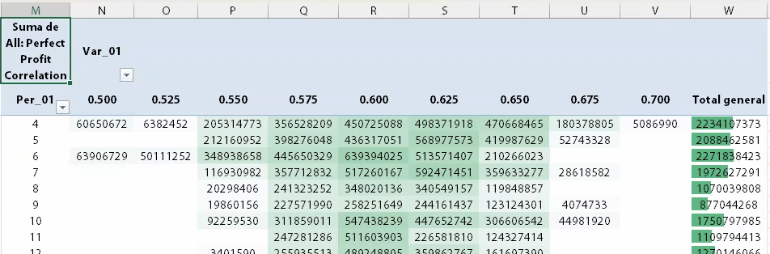
  <figcaption>Figura 47</figcaption>
</figure>

3. ***Expectancy Score***
<figure>
  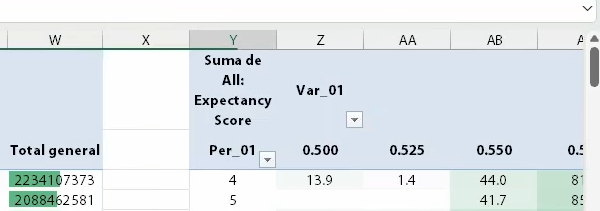
  <figcaption>Figura 171</figcaption>
</figure>

Esto realmente no es necesario.   
Lo he hecho para demostraros que no es necesario, porque al final el vector clave que hace que el mapa sea bueno o malo es el hecho de ***aparecer***. Y lógicamente su valor también tiene importancia, pero es al final lo que hace es acumular todos los valores que dan 4.05 en el resto de variables, todas, y la relación a uno, y te dice qué valor da la variable de la suma. Podría usar el producto, podría usar otros.

Ahora, para que veáis de dónde viene esto, ya lo vimos en la teoría, es aquí:

<div style="display: flex; flex-wrap: wrap; gap: 10px; justify-content: center;">
  <figure style="margin: 0; flex: 0 0 48%;">
    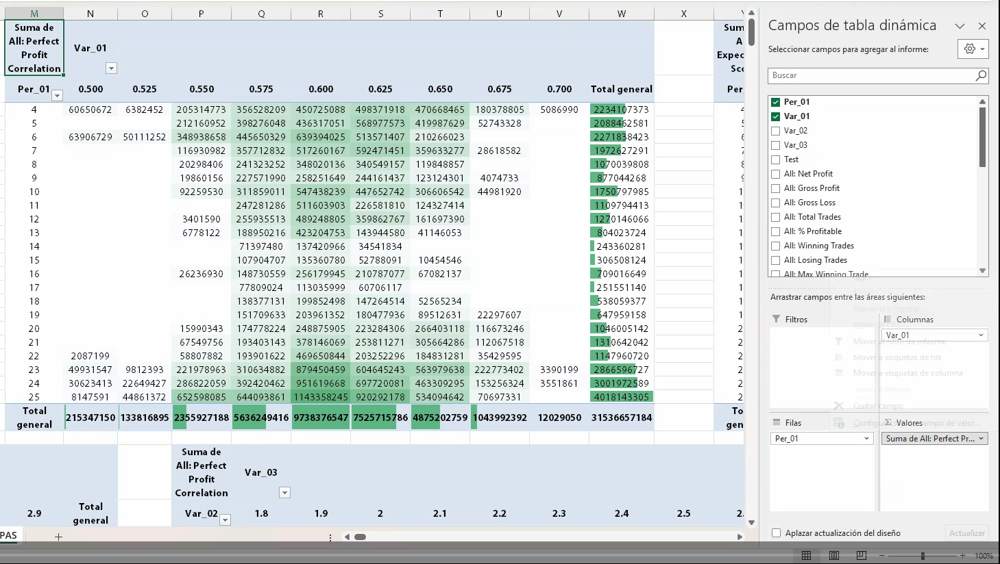
    <figcaption>Figura 173. Añades los campos</figcaption>
  </figure>
  <figure style="margin: 0; flex: 0 0 48%;">
    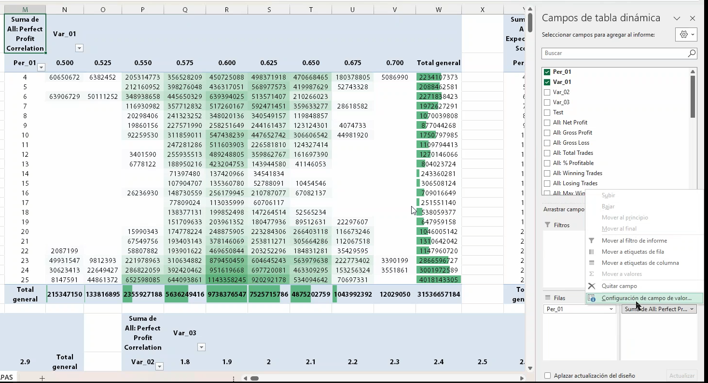
    <figcaption>Figura 172 Añades la formula en lso valores de los campos.</figcaption>
  </figure>
</div

<br><br>

En una columna está `Var_01`, en fila está `Per_01`, y los valores que calcula es suma de `All_PPC (Perfect Profit Correlation)`:

<figure>
  
  <figcaption>Figura 47. Configuración de la tabla dinámica: filas, columnas y valores.</figcaption>
</figure>

Esto es configurable. Esto ya digo, es pelearse también poco, usar la ayuda de los programas. Es decir, los programas la mayoría tienen buenas ayudas. Usar la dinámica y poco a poco mirar vídeos, decir, hay cosas:

<figure>
  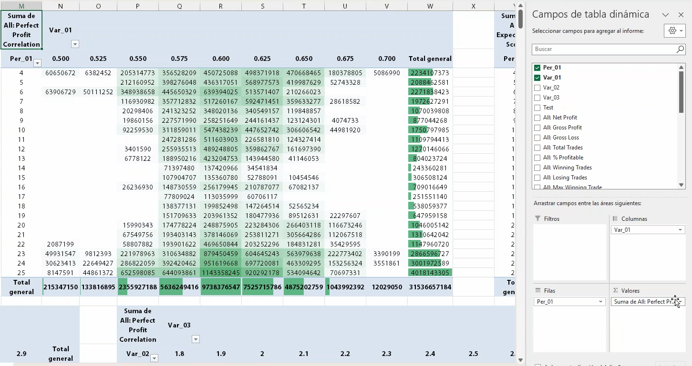
  <figcaption>Figura 48. Opciones de configuración de tabla dinámica en Excel.</figcaption>
</figure>

O sea, el curso tratamos que sea completo, pero es imposible que sea profundo en Excel, profundo en estadística, profundo en econometría, profundo... Es imposible. No hacemos mil horas o más. Entonces claro, damos las puntas, las cosas clave, enseñamos lo que nosotros hacemos. Es así, esto es lo que hacemos nosotros. Y a partir de ahí, claro, mira, voy flojo de Excel, bueno pues vamos a buscar un curso de Excel y mejoro mi Excel. Voy justo de programación, bueno pues voy a buscar un curso, voy justo... Tienes que ir reforzando un poquito aquellas áreas. Porque tratamos de explicarlo por encima lo que no es propiamente la actividad. Como en este caso Excel no lo usamos como actividad principal, lo explico un poco, pero claro no puedo en profundidad, porque si no es que como digo estaríamos 2.000 horas.


**Por qué se usa "suma" como agregación y qué aporta visualmente**

Entonces, aquí dentro de `suma` yo podría haber elegido otro: elegir el recuento, promedio, máximo, mínimo, producto... Vamos, suma, y ya está. Eso es la suma de todos los valores. Entonces al final el colorcito es muy visual. Y también los totales generales, porque esto cuando hay la dinámica, aquí en el diseño hay una configuración de tabla dinámica. Nosotros aquí usamos el esquema que nos gusta, usamos totales generales para filas y columnas, y subtotales para ninguno.

Entonces, porque ese total al final te está diciendo todos los valores que tiene 0.5, todos los valores tal, todos valores tal... Pues esto es muy visual. Rápidamente yo veo `Per_01` con `Var_01` cómo relaciona. `Per_01` con `Var_01` cómo relaciona, ignorando el resto. Ahora veremos el resto.


**Primeras zonas fuertes del mapa y necesidad de comprobar vecinos**

Y aquí rápidamente pues yo veo que hay dos zonas de `Per_01` buenas, está aquí:

<figure>
  
  <figcaption>Figura 49. Dos zonas óptimas identificadas en Per_01.</figcaption>
</figure>

En ambas me toca a lo que veremos. En ambas me toca esto, no es deseable:

<figure>
  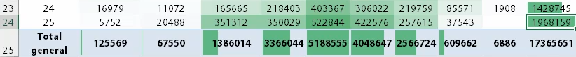
  <figcaption>Figura 50. El set actual está en el borde del mapa: falta ver vecinos.</figcaption>
</figure>

Quiero decir que aquí me está diciendo que me he quedado corto. Debería haber ido al menos a 26 o 27, porque a mí me interesan mucho en los mapas los ***vecinos***. Los vecinos me interesan mucho. El mapa no es tanto elegir un *set*. Al final puedo elegir un *set* por mapa, pero no es elegir un *set*, sino que el mapa sobre todo me sirve para ver claramente lo que descarto, y para ver dónde están las zonas más estables. Es un ***análisis de sensibilidad***.

Bueno, luego veremos si ese me gusta, si tiene un perfil más adecuado al riesgo. Pero hombre, sí está lo que yo... lo deseable es que esté dentro de las buenas zonas del mapa. Eso es lo deseable, ***lo muy deseable**.


**Necesidad de evaluar estabilidad y degradación entre parámetros cercanos**

>El mapa es para ver cuán estables son los parámetros.   

Pues aquí el 4, lo mismo debería ver el 3 para ir bien, Si luego al final quiero operar con el 4, debería ver el 3, porque si en el 3 me pasa, como ahora vais a ver en otro parámetro, que me degrada en picado, el 4 no me interesa, ¿entendéis? 

<figure>
  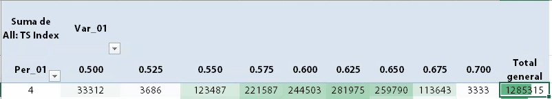
  <figcaption>Figura 51. Análisis de vecinos: si opero con 4, debo evaluar el 3.</figcaption>
</figure>

Como un poco este caso, el 10, que aquí saca la cabeza pero sus vecinos justito:

<figure>
  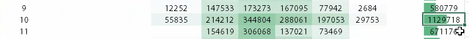
  <figcaption>Figura 52. El valor 10 destaca pero sus vecinos son débiles: precaución.</figcaption>
</figure>

Luego lo veremos, lo veremos si me lo quedo o no me lo quedo. Bueno, tampoco es un desastre final. Recordar que ya estar aquí en esa zona ya es bueno. Lo peor es no estar.


**Mapa de entrada**

Bien, aquí relaciono `Per_01` con `Var_01`. 
* `Per_01` Ese es el valor del indicador
* `Var_01`. multiplicador del indicador

Por lo tanto, al final es ***entrada***. Esta tabla de aquí `Suma de All: TS Index` me está evaluando un poco la entrada, y ver qué combinación de entrada puede ir mejor.

<figure>
  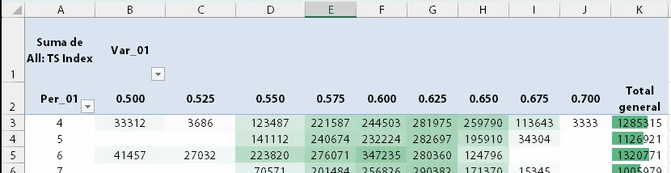
  <figcaption>Figura 51. Análisis de vecinos: si opero con 4, debo evaluar el 3.</figcaption>
</figure>

**Mapa de salida**

Y aquí tengo *stop* contra *TP*: *salida*. Este sistema solo sale por SL o TP
* `StopLoss`
* `TP`

<figure>
  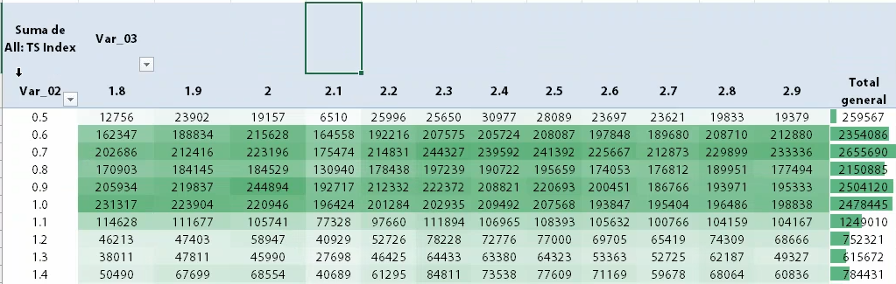
  <figcaption>Figura 53. Mapa de salida: TP vs Stop Loss.</figcaption>
</figure>

*Stop* contra *TP*. Este sistema solo sale por *SL* o por *TP*, por la salida contraria, que no está contemplada. Salida contraria es decir: cuando, aunque sean solo cortos, si fuera largo pues cierra, cuando iría largo cierra, por esa combinación de parámetros.


**Variables realmente evaluadas en el mapa**

- `Per_01` Hay una variable del indicador. 
- *`Var01`* al final es un modificador de la orden de entrada

Entonces aquí ya veis lo que os decía. Parece que 0.60 de los 60 es muy bueno. También es su vecino 0.625, no está mal. Su vecino 0.565 tampoco está mal. Su vecino... Es decir, aquí tenemos cuatro zonitas bien rodeadas: A partir de aquí, ya 0.650, bueno, ya su vecino no es tan bueno. Y aquí 0.565, su vecino ya no es malo del todo, pero ya este vecino es malo, malos vecinos. Entonces bueno, lo ideal, lo ideal, lo ideal son estos dos.

<div style="display: flex; flex-wrap: wrap; gap: 10px; justify-content: center;">
  <figure style="margin: 0; flex: 0 0 48%;">
    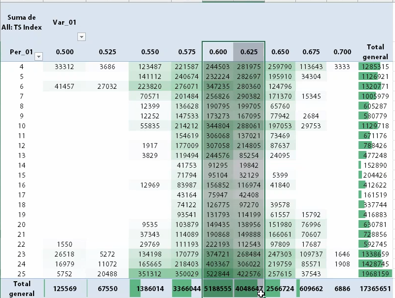
    <figcaption>Figura 055. Zona óptima de TP: 0.60 y sus vecinos presentan buena estabilidad.</figcaption>
  </figure>
  <figure style="margin: 0; flex: 0 0 48%;">
    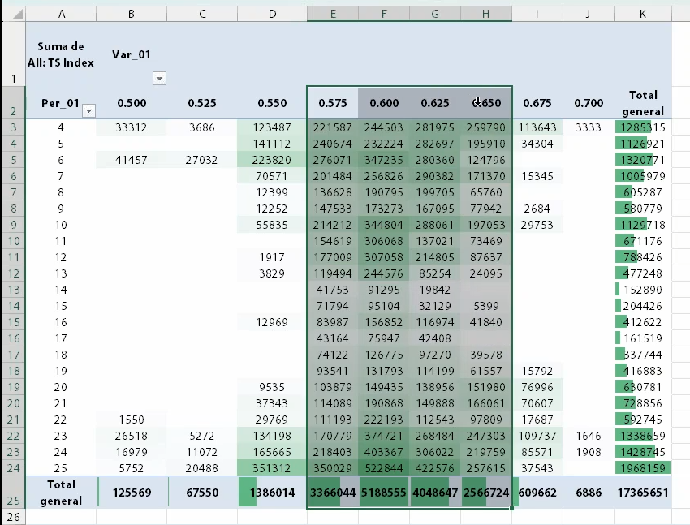
    <figcaption>Figura 175 Podríamos llegar hasta elegir aqui</figcaption>
  </figure>
</div>

Y aqui si elijo 6 bien, 5, bien, 7 ya justito y 10 no está mal pero degrada bastante, 

<figure>
  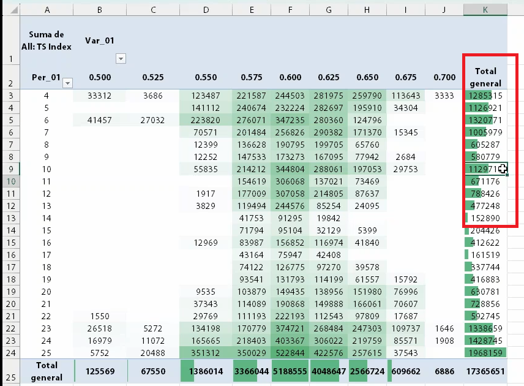
  <figcaption>Figura 56. El Stop Loss muestra poca sensibilidad: valores similares en todo el rango.</figcaption>
</figure>

**Mapa de salida** *stop* contra *TP*

- *`Var02`* es *TP*
- *`Var03`* es *Stop*

Lo primero que se ve es que el *stop* pues el *stop* da igual, porque es un *stop* bastante holgado. Aunque lógicamente salta más 1.8 que 2.9. Y de hecho reconozco que esperábamos un poquito más de granularidad aquí. Esperábamos un poco más, porque casi no la hay. Esto casi dice: da igual, elige el que quieras, casi elige el que quieras, además en todos los valores. Apenas en 2.5 hay algún blanco, y son valores muy altos ya de *TP*, valores muy altos de *TP*.

<figure>
  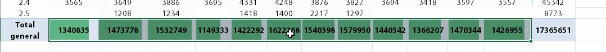
  <figcaption>Figura 56. El Stop Loss muestra poca sensibilidad: valores similares en todo el rango.</figcaption>
</figure>

Y en el *TP* pues sí, un *TP* bajo. Algo que nos sorprende, algo que no sorprende. Pero dentro de no sorprender, es muy positivo esta progresión. Pero fijaros lo que os digo: en el 0.60 que os decía antes, el 0.5 es drama, se me hunde. Por lo tanto, pero el 0.60 estoy operando muy justo. Estoy operando muy justo. Es decir, no es recomendable. Como mínimo habría que coger 0.70. Pero podría elegir 0.70, 0.80, 0.90, incluso 1, porque aquí degrada pero podemos decir que degrada de una manera más tolerable. Pero bueno, a partir de ahí, lo ideal ideal sería de 0.70 a 0.90, pero yo aceptaría 1 en este caso.


<figure>
  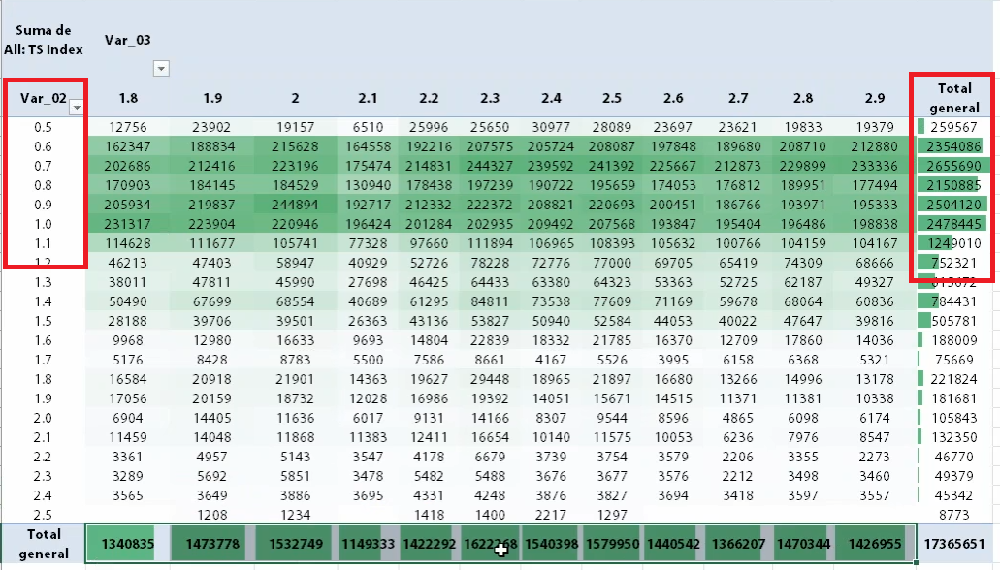
  <figcaption>Figura 57. Distribución de valores por nivel de Stop Loss.</figcaption>
</figure>

Más en un sistema, recordar que es un sistema que va en el Nasdaq corto, que va en muchos más índices y activos. Cuando se creó, se creó así, pero ahora lo estamos estudiando en el Nasdaq y está operando el sistema. De hecho, ha abierto cortos hoy en algún *set*.

Entonces bueno, como veis, en *TP* pues más bien rápido. A medida que va degradando, también degrada de manera bastante progresiva (fíjate en `Total general`). Esto está bien, es más o menos progresiva hasta llegar a un punto donde realmente degrada mucho.

Pero es muy bueno que haya valores. Hay valores en la zona de blancos abajo. Es decir, en todos los casos hay valores. Fijaros en *TS Index*: en muchos no hay valores. Cuando aquí en toda la zona de *TP–Stop*, en todos prácticamente aparecen, apenas aquí todos aparecen valores entre los 8.000.

*Está muy bien distribuido* el *TP* y el *SL*. Tiene mucho margen, tiene bastante tolerancia. Son parámetros con tolerancia.   
En el otro mapa `TS Index Entrada` no la hay tanto. Sobre todo en este filtro de entrada `Per_01` es un filtro que tiene una tolerancia justa.


**Revisiones que se hicieron**

Una de las cosas que hemos revisado en esta revisión, donde primero lógicamente se plantean... Todo al 100% no podemos hablarlo por razones obvias pero también por tiempo. Entonces aquí hubo un replanteamiento de este ayudante *input* `Per_01`. Al final, antes eran dos, y nos dimos cuenta de que de hecho era hasta incorrecto el código, que era demasiado rebuscado usar dos. Y decidimos sacar uno y cambiar el indicador: no usar el que es original y crear uno propio para hacerlo distinto. Y ahora pues operar con un indicador propio que tiene una pequeña modificación, que usa el mismo parámetro para esto.

<figure>
  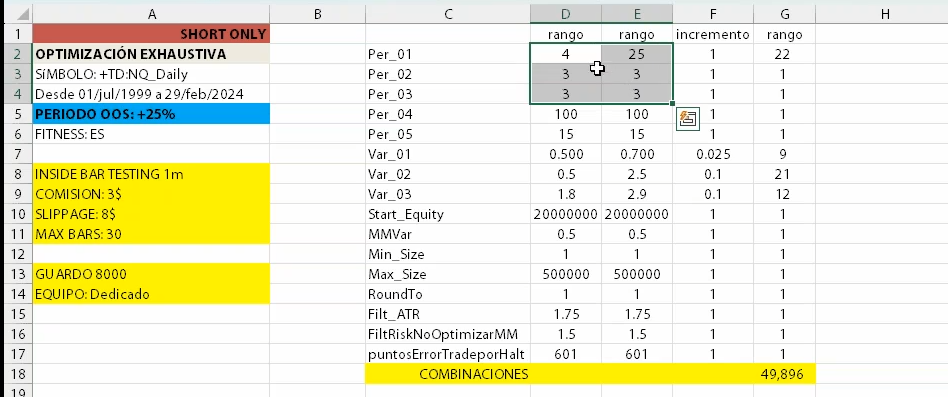
  <figcaption>Figura 177</figcaption>
</figure>


Y también revisamos, analizamos revisar los ***incrementos de estos tres filtros***   

<figure>
  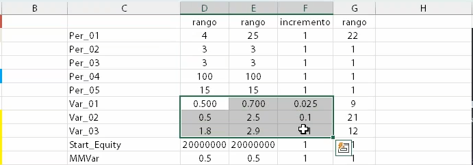
  <figcaption>Figura 58. Configuración de incrementos para los tres filtros principales.</figcaption>
</figure>

Esto recordar que lo detallamos bastante en la clase de desarrollo teórico, donde hablamos de prudencia con los incrementos, con las optimizaciones. Porque yo puedo poner aquí en `Var_01` 0.0025, o puedo poner aquí 0.00001. Entonces, al final, usar uno u otro no deja de ser un *análisis de sensibilidad* que también se hace con mapa. Es decir, ver mapas que varían. `MAPA ES SHORT`, este lo hicimos previamente, y ver los *sets* que hay, qué variación. También se mira mucho aquí en la tabla, es decir, cómo varía el mismo *set* con el siguiente incremento.

Por ejemplo, ordeno primero por este `Var_01`:

<figure>
  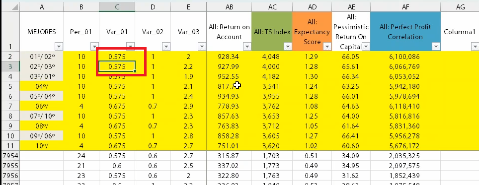
  <figcaption>Figura 59. Ordenación primaria por Var_01.</figcaption>
</figure>

Y ordeno luego por este:

<figure>
  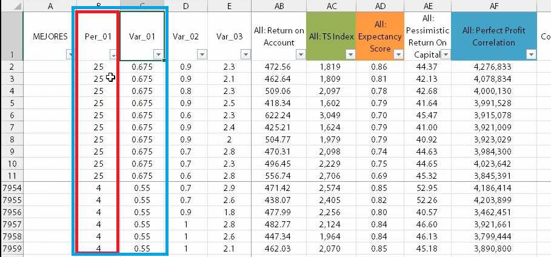
  <figcaption>Figura 60. Ordenación secundaria aplicada.</figcaption>
</figure>

Y entonces automáticamente aquí me quedan todos estos ordenados. Entonces ordeno `Var_02`:

<figure>
  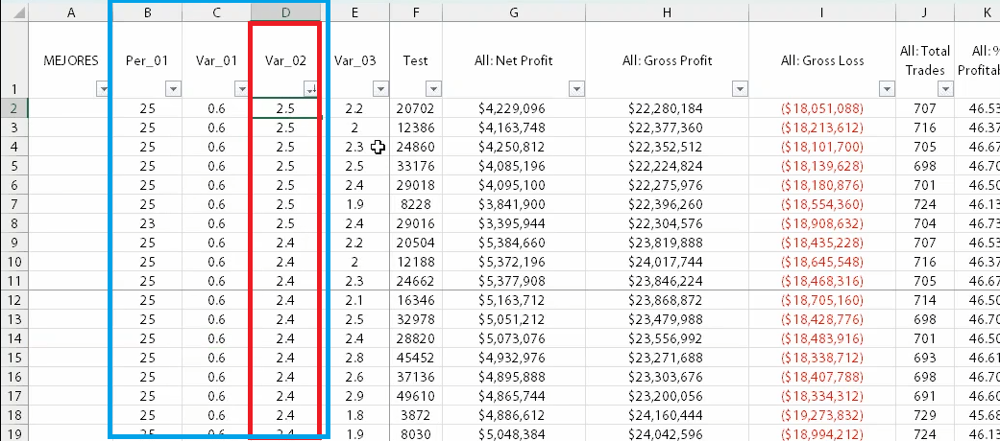
  <figcaption>Figura 61. Ordenación por Var_02 añadida.</figcaption>
</figure>

Ahora tengo los cuatro ordenados y bloqueados:

<figure>
  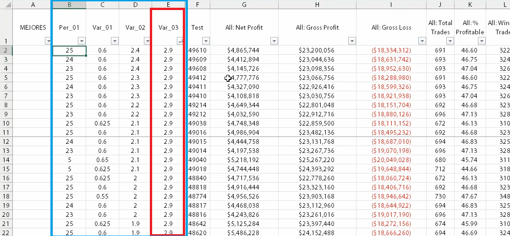
  <figcaption>Figura 62. Los cuatro parámetros ordenados para análisis de variación.</figcaption>
</figure>

Bueno, en `Per_01` no hay debate porque el incremento no puede ser otro.

<div style="border-left: 4px solid #3498db; background: #eaf4fc; padding: 10px 15px; margin: 10px 0; border-radius: 8px;">
  <strong>📐 Definición de Per_01</strong><br><br>
  <code>Per_01</code> es un parámetro de <strong>ENTRADA</strong> del sistema. Concretamente es el período (la longitud) que usa el <em>indicador de entrada</em> para calcular su valor.<br>
  <code>Per_01</code> = número de barras que usa el indicador para calcular su señal de entrada.<br>
  <ul>
    <li>Si <code>Per_01 = 4</code>, entonces el indicador se calcula con <em>4 barras</em>.</li>
    <li>Si <code>Per_01 = 25</code>, se calcula con <em>25 barras</em>.</li>
  </ul>
  Cambiar Per_01 cambia la <strong>sensibilidad</strong> del indicador:<br>
  <ul>
    <li><strong>Valores bajos (4–7):</strong> Más rápido, más reactivo, más señales.</li>
    <li><strong>Valores altos (20–25):</strong> Más lento, más "filtro", menos ruido, menos señales.</li>
  </ul>
  <strong>El Mapa de Entrada (Suma de All: TSIndex):</strong><br>
  <code>Per_01</code> (filas) vs <code>Var_01</code> (columnas)<br><br>
  Eso significa:<br>
  <ul>
    <li>Las <em>filas</em> representan distintos períodos del indicador de entrada.</li>
    <li>Por eso él analiza qué valores de Per_01 son estables.</li>
    <li>Y por eso habla de <em>vecinos</em> (Per_01=4 vs 5 vs 6 vs 7, etc.).</li>
  </ul>
</div>

Este en `Var_01` sería donde hay debate, en concreto sobre la instancia 5: `0.625`:

<figure>
  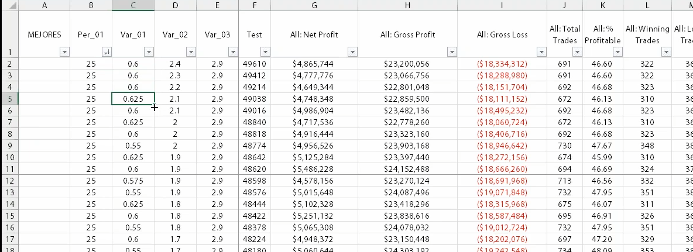
  <figcaption>Figura 63. Análisis de variación en Var_01 = 0.625.</figcaption>
</figure>

<div style="border-left: 4px solid #9b59b6; background: #f5eef8; padding: 10px 15px; margin: 10px 0; border-radius: 8px;">
  <strong>📐 Definición de Var_01</strong><br><br>
  <code>Var_01</code> es un <strong>multiplicador del indicador de entrada</strong> (probablemente algo como: media, ATR normalizado, rango, volatilidad, etc.). Es el umbral que determina cuándo se activa la señal de entrada.
</div>


**Ejemplo de variación:**

Entonces yo aquí, por ejemplo, tengo que buscar. Este, por ejemplo, veis estos dos, son iguales, todo es igual: 25, 2, 1, 2.9, y solo cambia el incremento. Entonces ahí, analizar cómo varían los resultados es importante. Fijaros que un ***tick*** varía 20 *trades*, un cambio bastante importante:

<figure>
  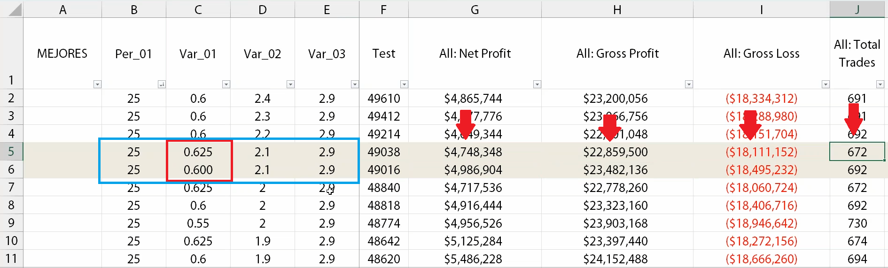
  <figcaption>Figura 64. Un paso de incremento produce 20 trades de diferencia.</figcaption>
</figure>

<div style="border-left: 4px solid #e74c3c; background: #fdf2f2; padding: 10px 15px; margin: 10px 0; border-radius: 8px;">
  <strong>⚠️ ¿Qué significa "un tick" aquí?</strong><br><br>
  <strong>UN PASO DE INCREMENTO</strong> entre parámetros. Eso es lo que él llama "un tick" de diferencia: un salto en tu incremento de optimización.<br><br>
  Es decir:<br>
  → Cambiar UN paso del parámetro Var_01<br>
  → Produce 20 operaciones más o menos<br>
  → Eso es "significativo"<br>
  → Por eso el mapa tiene sensibilidad
</div>

¿Esto cómo estaría mal? Que cambiara o ningún *trade* o un *trade*, y todo fuera casi igual.

***Hay que buscar un incremento que provoque cierto cambio.***

¿Cuánto es cierto? No sé, no lo tengo medido el porcentaje. No sé si decir un 10% sería correcto, puede estar ahí, 10% incremento mínimo. Pero en variación de significación, pero no sé, no lo toméis como una cosa sagrada porque depende. Al final, simplemente que varíe.


**Conclusión sobre incrementos: mejor quedarse corto que excederse**

Entonces hay que ver que haya cierta variación. Y a veces te puedes pasar. Aquí, en el incremento del número de *trades*, podríamos pensar que a lo mejor es demasiado. Y a lo mejor puedes granularlo un poco más. Pues puede ser. A lo mejor podría haber, en vez de 0.0025, granular a 0.002:

<figure>
  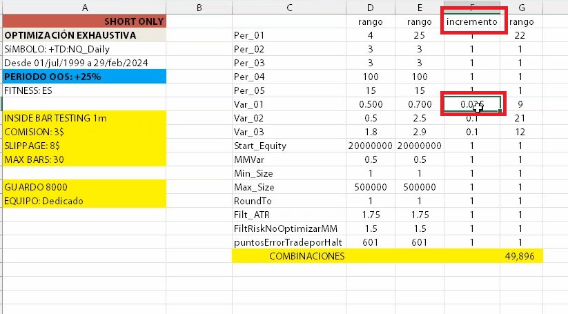
  <figcaption>Figura 65. Posible ajuste: reducir incremento de 0.0025 a 0.002.</figcaption>
</figure>

Y entonces haría otro mapa y vería para regularlo un poco más. En vez de esas nueve, serían 11. Vendría aquí y vería el mapa a ver. A lo mejor es eso también, que hay saltos demasiado grandes en `Var_01`. Pero ya digo, mejor pecar de conservador en esto que de excesivo. Porque lo importante es que haya cierto cambio en el incremento.

**Variable crítica: Var_01 como parámetro más sensible del mapa**

Entonces esta es un poco la variable en estos datos que estamos viendo. Estoy leyendo los datos como los veo. Trato de no tener (aunque es complicado), pero de verdad que trato de no tener sesgo de saber el sistema que hace. Pero al final, este dato `Var_01`, aquí en el mapa es el que parece más sensible. ***Que sí tiene su zona de trabajo***, pero es muy estrecha:

<figure>
  
  <figcaption>Figura 66. Var_01: zona de trabajo estrecha pero definida.</figcaption>
</figure>

En el *TP* también hay una ***zona*** de trabajo en la parte de arriba, pero también es bastante larga, teniendo zona en todos, está completo de números en todas las instancias.

<figure>
  
  <figcaption>Figura 57</figcaption>
</figure>

Y en el mapa de `Per_01 / Var_01`, fijaros que hay muchos blancos.  
Y no en el mapa *TP* como *Stop*, que tiene más margen de maniobra.   
Entonces, en el mapa `Per_01 / Var_01`, la variable delicada podemos decir que es `Var_01`.

Pero se podría volver a hacer un análisis de sensibilidad, como habéis visto ahí, pues decir: "Quizá me pasé, nos hemos pasado con 0.0025, a lo mejor vamos a reducirlo a la mitad el incremento, a ver qué tal". Eso es un multiplicador.


### Definición de zonas de trabajo previas a la selección final

Bien, visto esto, yo aquí tengo unas zonas de trabajo bien definidas. A nosotros nos gusta montar el mapa completo de todos los *inputs*, es decir, que aquí recoge las 8.000.

Esto, como yo tengo cuatro monitores, ahora no lo vais a ver, pero lo que hago es abrirlo así, lo estiro y me lo estiro a los cuatro monitores. Aquí lógicamente no puedo porque estoy compartiendo un monitor, y lo único que puedo hacer es esto:

<figure>
  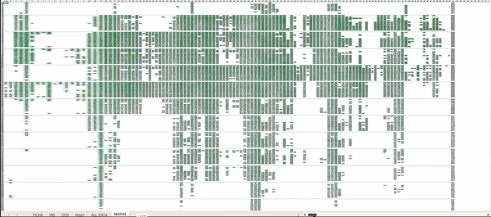
  <figcaption>Figura 67. Vista comprimida del mapa completo.</figcaption>
</figure>

Que parece que no, pero es bastante útil igualmente:

<figure>
  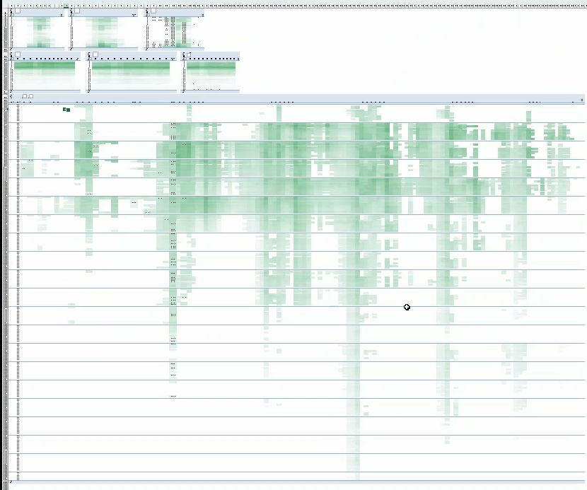
  <figcaption>Figura 68. Vista reducida: lo importante es identificar las zonas, no los valores exactos.</figcaption>
</figure>

Porque al final a mí no me interesan tanto los valores, y me interesan las zonas, entender las zonas.


**Explicación de ejes y estructura del mapa global**

Pero antes vamos a ver, porque sin explicar los ejes es complicado que entendáis de qué estamos hablando.   
Aquí, ¿qué tenemos? Por un lado aquí tenemos 
* `Var_02` y `Var_03`, 
* `Var_01` y `Per_01`. 

Es decir, que tenemos las entradas y tenemos las salidas:

<figure>
  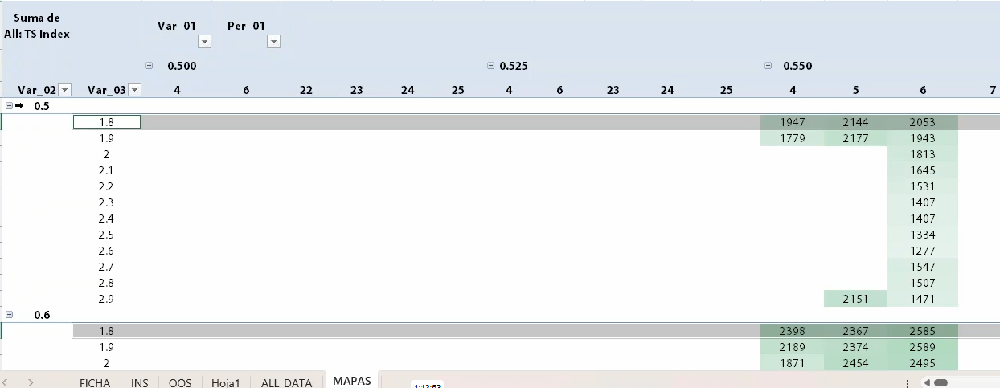
  <figcaption>Figura 69. Estructura del mapa global: entradas (Per_01, Var_01) vs salidas (Var_02, Var_03).</figcaption>
</figure>

Lógicamente hay uno que es el que condiciona más. Porque así yo aquí recojo y puedo ir recogiendo, ver los distintos, voy agrupando si quiero:

<figure>
  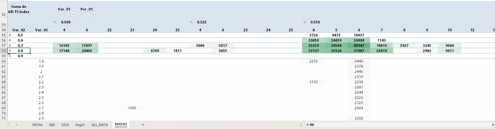
  <figcaption>Figura 70. Agrupación y filtrado de parámetros en la tabla dinámica.</figcaption>
</figure>

Puedo filtrar, expandir o contraer todos, expandir todo el campo. Puedo filtrar. Y de hecho una de las cosas, aquellas zonas que ya me gustan, cosas tengo claras, pues mira, esta de aquí, bueno pues la filtro, la voy a bloquear ahí.


**Identificación rápida de parámetros con pocos valores (zonas débiles)**

Antes quería que mirarais el mapa teniendo en cuenta lo que os digo. Aquí tenéis 0.5, luego 0.5 con el 4, con el 6, con el 2, con los que aparecen. Los que hay huecos es que no aparece.

`0.525` con el `4`, con el `6`, con el... Esos son los que aparecen, y ya te está diciendo que aparecen pocos.

Esto se podían poner los ceros, no me acuerdo, pero que sí que había un sitio. Pero bueno, que es igual, no importa. Porque es mejor así, porque así ves cuando hay pocos de 0.5. Que visto así un poco, si os fijáis lo veis: veis aquí ves uno, aquí ves el otro, aquí ves el otro. Entonces ves que hay pocos, ¿entendéis?

<figure>
  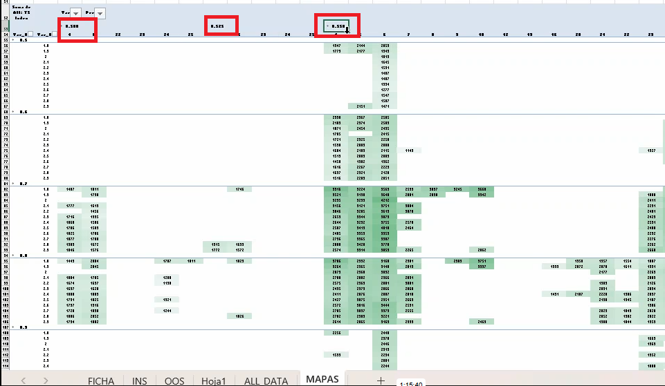
  <figcaption>Figura 71. Identificación de zonas con pocos valores (huecos).</figcaption>
</figure>


**Cómo se localizan rápidamente los huecos del mapa**

Y esto es lo que te da información a medida que lo vas reduciendo. Aquí fijaros, tiene muchos, muchos:

<figure>
  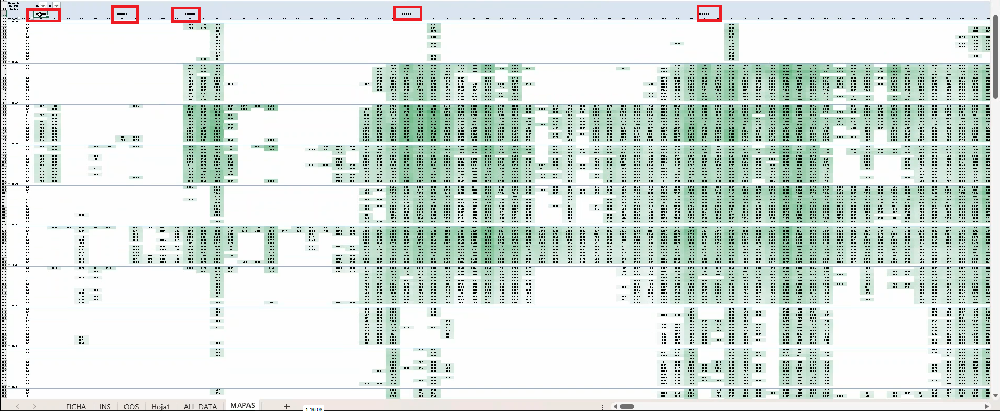
  <figcaption>Figura 72. Zona densa: muchos valores, buena cobertura.</figcaption>
</figure>

Está que llega al final que también casi no tiene, en el filtro de entrada por entendernos:

<figure>
  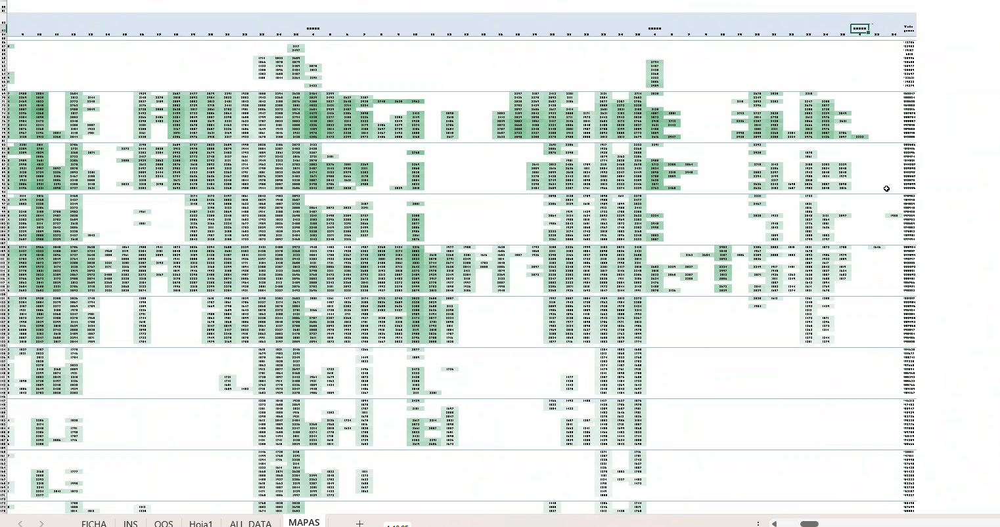
  <figcaption>Figura 73. Zona extrema del filtro de entrada: pocos valores.</figcaption>
</figure>

Aquí, insisto, no importa tanto leer los valores. No se ve nada. Vale, es igual, no importa.


**Visualización conceptual: no importan los números, importa el dibujo global**

Sabes dónde está cada cosa. Aquí claramente es donde está el 0.60 de arriba y donde es más ancha:

<figure>
  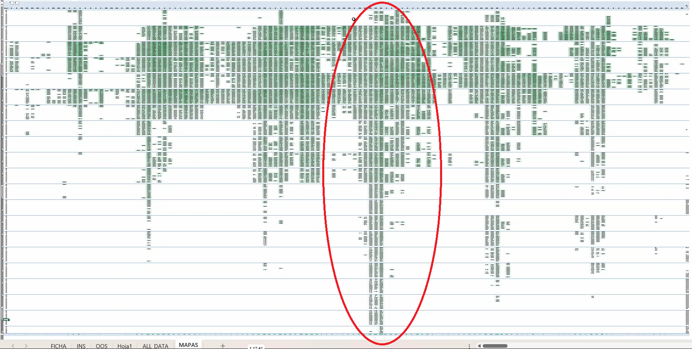
  <figcaption>Figura 75. El valor 0.60 domina la zona más ancha del mapa.</figcaption>
</figure>

***¿Y por qué el 0.60?*** Ahora veréis, veíais arriba. Aquí en la pequeñita quedaba más, porque veis, el 0.60 tiene aquí donde tiene zona de *TP* baja:

<figure>
  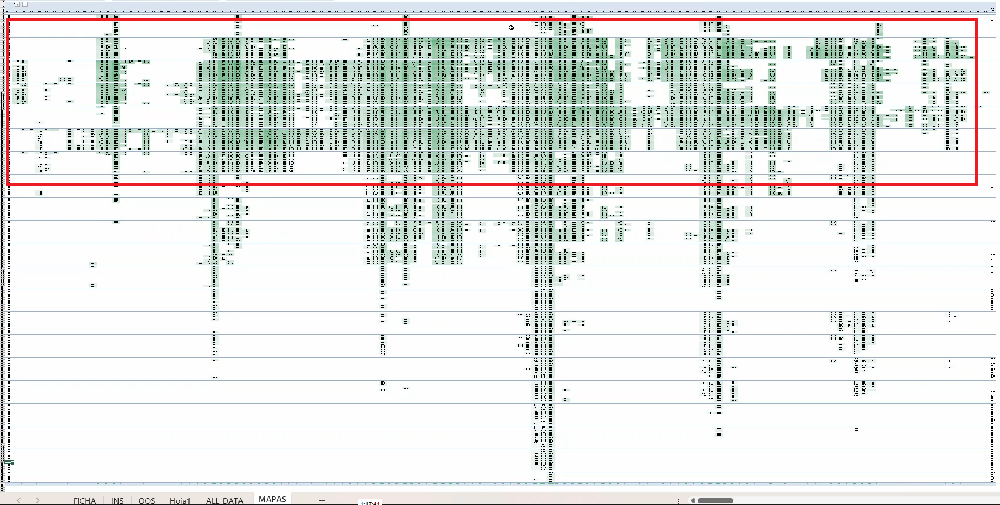
  <figcaption>Figura 76. Zona de TP bajo donde 0.60 concentra valores.</figcaption>
</figure>

Que es donde está, esta es la zona de *TP* bajo. Es evidente.


**Por qué 0.60 aparece como valor dominante incluso con TP alto**

Pero fijaros que el 0.60, incluso en zonas de *TP* altas, tiene valores:

<figure>
  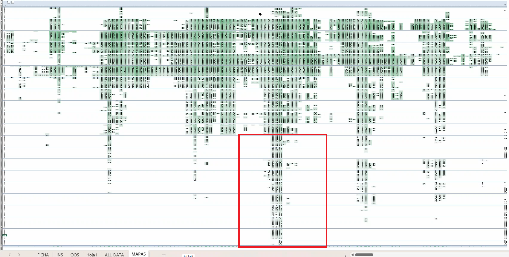
  <figcaption>Figura 77. El 0.60 mantiene presencia incluso en zonas de TP alto.</figcaption>
</figure>

En cambio su vecino en 0.575, a la izquierda, no tanto. 0.55 tampoco.

Y para arriba, a la derecha, mejor:

<figure>
  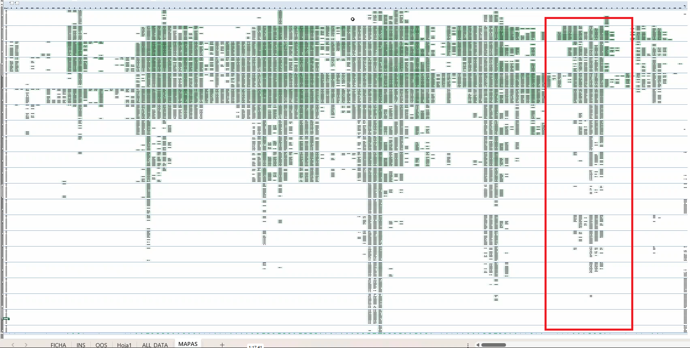
  <figcaption>Figura 79. Hacia la derecha (valores mayores) la distribución mejora.</figcaption>
</figure>

Y piensas: "Pues oye, cuidado..." Es verdad que en la zona `1` tampoco tiene tanto, pero es progresiva. El 1 en sí es bastante progresivo también.

Entonces esto es lo que nos permite ver el mapa un poco global, que se ve mejor en 4 monitores.


### Filtrando inputs claros

#### `Var_01`

Vamos a filtrarlo para que lo veáis mejor. Vamos a limitar, a bloquear los *inputs* que son más claros:

`Var_01`, que es el filtro de entrada (para entenderlo).

Entonces, los bloqueos se hacen aquí. Puedo venir a la variable y decir: "En `Var_01` solo quiero analizar desde **0.55 hasta 0.65**".

<figure>
  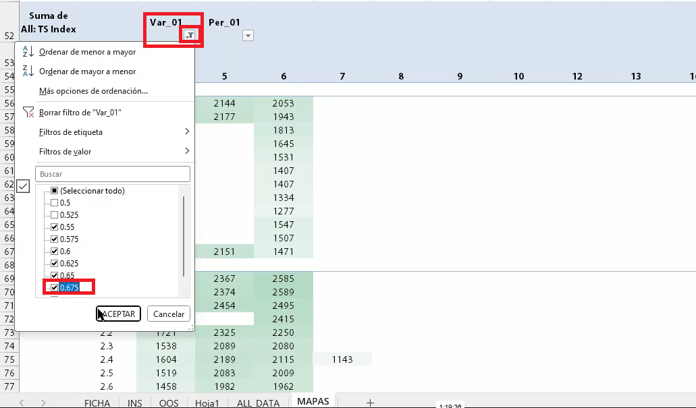
  <figcaption>Figura 82. Filtrado de Var_01: selección del rango 0.55–0.65.</figcaption>
</figure>

Incluso podría añadir también este valor: **0.675**, para observar otro vecino adicional. Así tendría 0.55, 0.60, 0.625, 0.65 y 0.675, y vería toda la zona y sus transiciones.

Bloqueo únicamente esos valores porque, aunque **0.55 ya no es bueno**, me interesa ver su *vecino*. Siempre me interesa revisar el comportamiento del vecino.

<figure>
  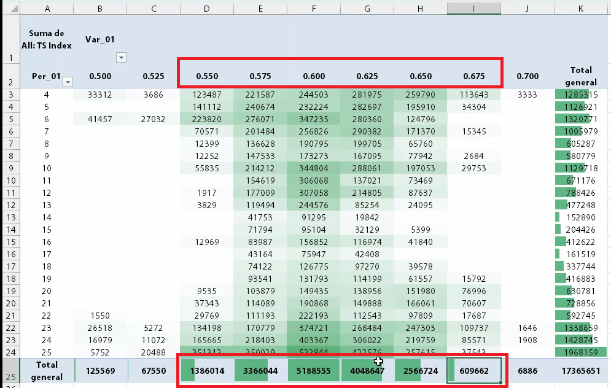
  <figcaption>Figura 81. Valores seleccionados incluyendo vecinos para análisis.</figcaption>
</figure>


#### `Var_02`

Recordar es el *TP* y *SL*.

Lo mismo haré con el parámetro del **TP** (`Var_02` / `Var_03`): aunque **0.5 es malísimo**, quiero verlo igualmente. Quiero analizarlo porque me interesa ver el caso extremo y cómo se comporta el sistema a su alrededor.

<figure>
  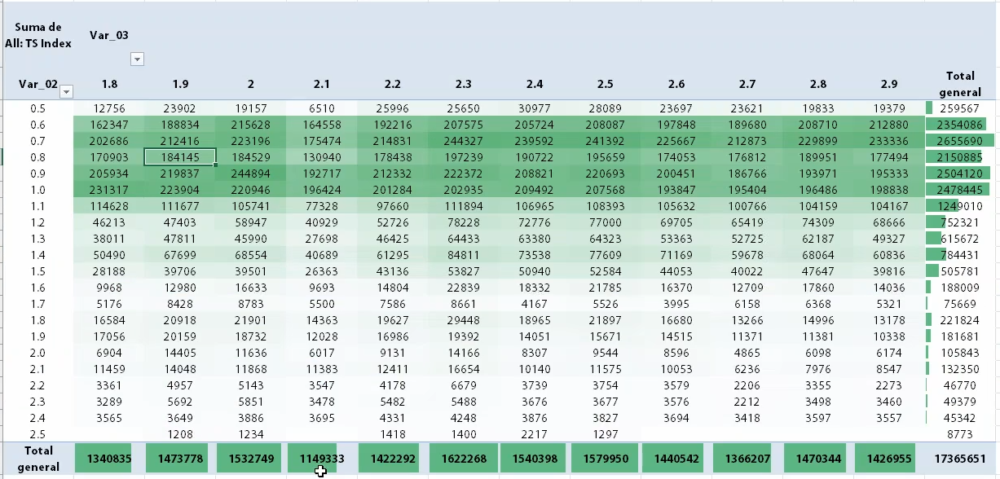
  <figcaption>Figura 83. Incluir 0.5 aunque sea malo: interesa ver el comportamiento extremo.</figcaption>
</figure>

En realidad, para este parámetro quizá no haría falta —es evidente que 0.5 es muy pobre— pero aun así quiero revisarlo para observar el **vecino de 1.0**. Quiero ver qué ocurre justo a su lado, y ese vecino es **1.1**, es la instancia `1.1` de la columna `Var_02`.

<figure>
  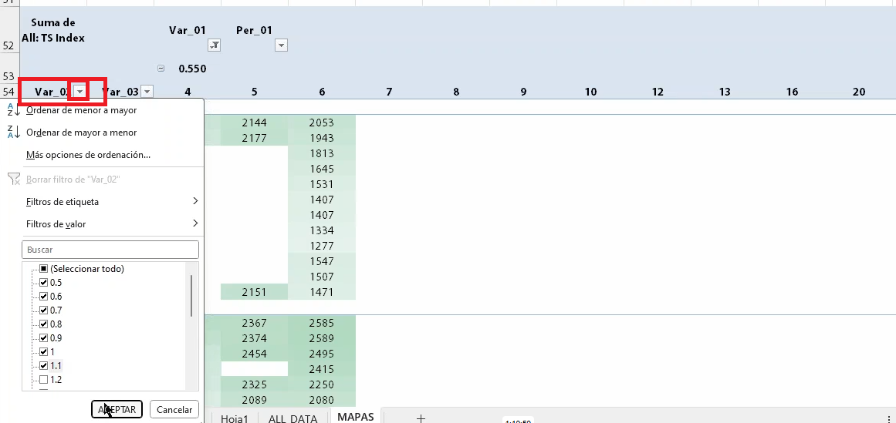
  <figcaption>Figura 84. Selección incluyendo el vecino 1.1 de Var_02.</figcaption>
</figure>

Una vez definidos, ya quedan bloqueados, y ahora sí, vamos a trabajar con esos tamaños seleccionados.


### Mapa filtrado: `Var_01` vs `Var_02`

- Instancias: `Var_02` con filas de *TP* y su *SL*.
- Columnas: `Var_01`, variables de entrada.

<figure>
  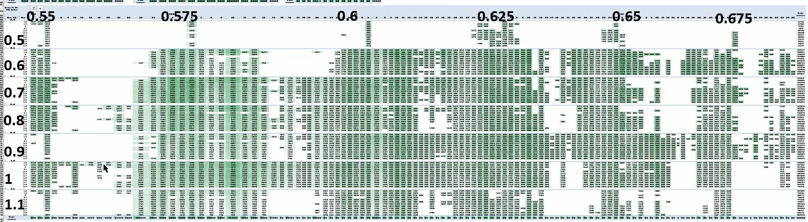
  <figcaption>Figura 90. Mapa filtrado: Var_01 (columnas) vs Var_02 (filas).</figcaption>
</figure>

Esta fila que vemos aquí **tan flojita** es el `0.5` de *TP* y *SL*. Entonces es `0.5` para cada distinto rango o variable de entrada:

<figure>
  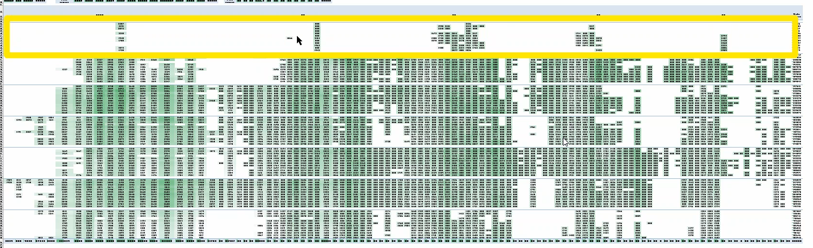
  <figcaption>Figura 85. La fila 0.5 muestra valores débiles en todas las columnas.</figcaption>
</figure>

Lógicamente, aquí donde tiene `Var_01 = 0.6` pues es donde tiene mejor `TP/SL: 0.5`:

<figure>
  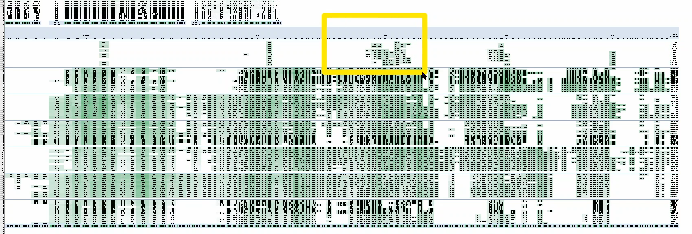
  <figcaption>Figura 86. Incluso el peor TP (0.5) funciona mejor con Var_01 = 0.6.</figcaption>
</figure>

Eso es lo bueno. Habla de la *robustez* de la variable *TP/SL*.

<div style="border-left: 4px solid #27ae60; background: #ecf9f1; padding: 10px 15px; margin: 10px 0; border-radius: 8px;">
  <strong>📊 Robustez de una variable</strong><br><br>
  Que no solo funciona donde le va bien, sino también en otras zonas de la muestra. Esto indica que es zona robusta de ese parámetro.
</div>

Pero es verdad que, como veis, como decía, si sacas la instancia del `0.5 de TP`, casi que ha sido igual en `0.6 de TP`, `0.7 de TP`...

Fíjate que en la variable `Var_01 = 0.55` hay pocos números en cada instancia de `TP/SL: 0.5`, pero hay números en ***toda*** la columna, en todos los niveles de *TP/SL* hay números. Esto es el motivo por el que *TP–SL* es ***poco sensible***: porque en todas las zonas, pongas donde pongas el filtro `Var_01`, salen elementos de *TP–SL*.

Lógicamente hay columnas `Var_01` donde salen con más elementos de *TP–SL* que en otros, pero en todos hay zonas con elementos de *TP–SL*. Entonces es un parámetro que da bastante margen de maniobra, tiene ***buena tolerancia***. Y a medida que aumenta el valor de `Var_01` hacia la derecha, pues ya van apareciendo menos.

<div style="border-left: 4px solid #27ae60; background: #ecf9f1; padding: 10px 15px; margin: 10px 0; border-radius: 8px;">
  <strong>📐 Sensibilidad vs Robustez de parámetros</strong><br><br>
  
  <strong>Sensible:</strong> Cuando cambiar el parámetro altera MUCHO los resultados.<br>
  <em>Ejemplo:</em> Var_01 (0.575 → 0.600 → 0.625) cambia la estructura del mapa rápidamente.<br><br>
  
  <strong>Poco sensible:</strong> Cuando cambiar el parámetro apenas altera los resultados.<br>
  Hace casi lo mismo pongas el valor que pongas (no destruye nada con pequeños cambios).<br><br>
  
  <strong>Robusto:</strong> Funciona bien en un rango amplio. Tiene <em>tolerancia</em> alta (puedes moverlo sin romper el sistema).<br><br>
  
  <table>
    <tr>
      <th>Parámetro</th>
      <th>Sensibilidad</th>
      <th>Tolerancia</th>
      <th>Implicación</th>
    </tr>
    <tr>
      <td><strong>Var_01</strong></td>
      <td>Muy sensible</td>
      <td>Poco tolerante</td>
      <td>Si te equivocas ligeramente: BOOM → degradación. Hay que bloquear bien vecinos y analizar fino.</td>
    </tr>
    <tr>
      <td><strong>TP–SL</strong></td>
      <td>Poco sensibles</td>
      <td>Muy tolerantes</td>
      <td>Muy robustos. Cambiarlos apenas altera el sistema. Se puede operar más "tranquilo".</td>
    </tr>
  </table>
</div>


**Comparación de dos zonas del mapa: por qué 0.575 parece mejor pero 0.60 domina en robustez**

<figure>
  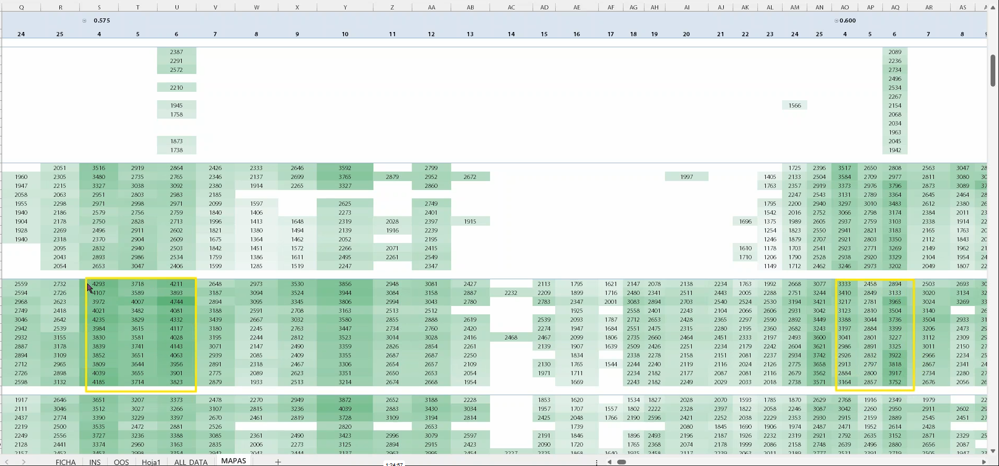
  <figcaption>Figura 93. Comparación visual entre zonas 0.575 y 0.60.</figcaption>
</figure>

Aquí en el `0.575` de filtro, con el indicador en `4`, `5`, `6`, `7`, que ya hemos visto que era buena zona:

<figure>
  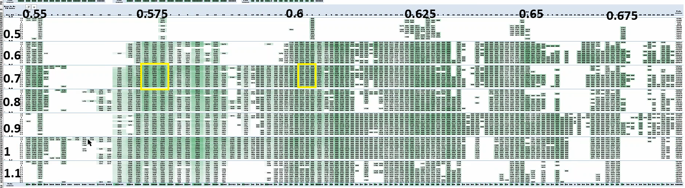
  <figcaption>Figura 95. Detalle de la zona 0.575 con Per_01 = 4, 5, 6, 7.</figcaption>
</figure>

Fijaros que en esta zona de `0.575` con `4`, `5`, `6`, tiene hasta mejores valores que en la variable de `0.6`. `0.575` tiene valores de 4.000, y en `0.6` de 3.000. Por el color más oscuro ya se ve:

<figure>
  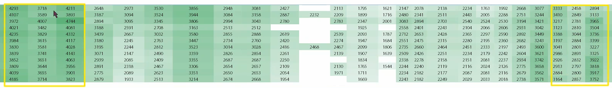
  <figcaption>Figura 96. Colores más oscuros en 0.575: valores absolutos más altos.</figcaption>
</figure>

Es decir, en esta zona es mejor. Es mejor `0.575`. Tiene valores realmente elevados.


**Razón matemática: 0.60 distribuye valores en todo el mapa (no solo en su zona óptima)**

¿Por qué 0.6, cuando lo agrupas aquí arriba, sale mejor? ¿Por qué cuando lo ves aquí resumido, cuando aquí pinta solo `Per_01` contra `Var_01` ignorando el resto, es decir, todas están recogidas aquí, veis claro que 0.6 es mejor que 0.575?

<figure>
  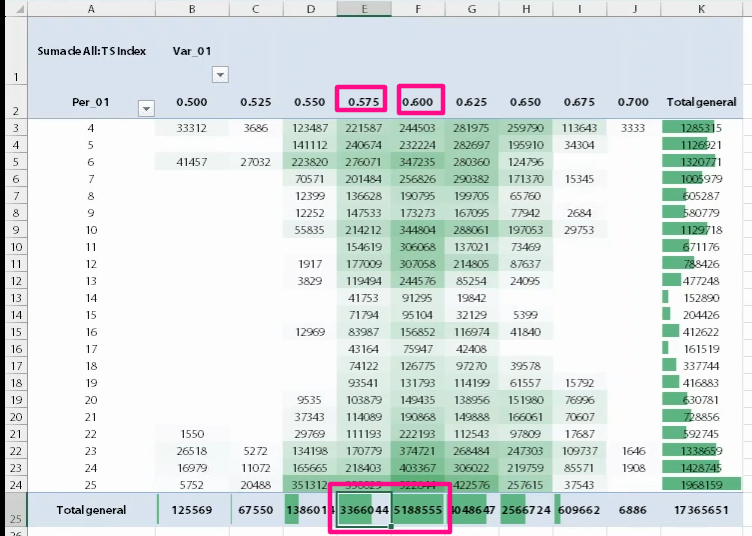
  <figcaption>Figura 97. Vista agregada: 0.60 aparece como mejor valor global.</figcaption>
</figure>

Bueno, la respuesta es muy, muy sencilla. La habéis visto antes: que el 0.6 distribuye mucho en todos, no solo en los buenos. En su zona óptima, `0.575` parece hasta mejor. Pero 0.6 es un ***todoterreno espectacular***. En todas las zonas mete bastantes valores. En todas, incluso las que no están aquí ahora (las hemos quitado antes seleccionando solo las variables que vemos ahora). Si las pongo todas, mira cómo se ve también:

<figure>
  
  <figcaption>Figura 98. Mapa completo: 0.60 distribuye valores en todas las zonas.</figcaption>
</figure>

Recordar que lo hemos visto antes. Lo voy a volver a poner, el mapa completo, para que lo veáis, lo que quiero decir. Eso es porque 0.6 en la zona óptima no es el mejor, mejor es 0.575. Pero aquí en el mapa lo veis: hasta cuando no es bueno, el 0.6 mete más. Y realmente 0.6 es el que tiene mejor tolerancia. Es un valor bueno.

<figure>
  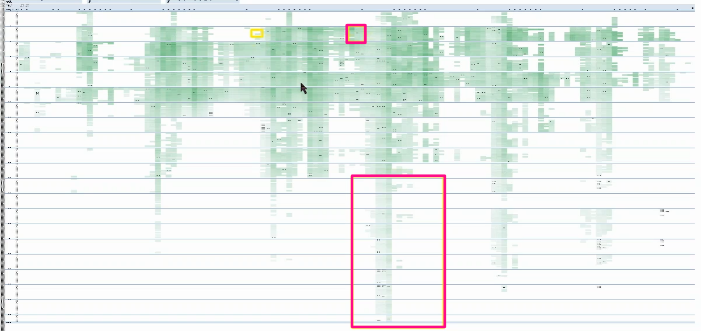
  <figcaption>Figura 99. Confirmación: 0.60 = máxima tolerancia y distribución.</figcaption>
</figure>


**Advertencia: el mapa va "por zonas", no por sets individuales**

Pero cuidado, que es muy, muy importante: en un mapa vamos por zonas. Si luego metemos un *set* que está ahí, pues de coña. Pero son las zonas. Entender dónde me muevo yo mejor, dónde mis *sets* pueden estar más justos.

<div style="border-left: 4px solid #f39c12; background: #fef9e7; padding: 10px 15px; margin: 10px 0; border-radius: 8px;">
  <strong>❓ Pregunta: Hablando de los incrementos en los inputs, ¿hay alguna forma de elegir en cuánto poner los incrementos?</strong><br><br>
  
  No, no hay. Vaya, nosotros no tenemos ningún método. Que puede ser que lo haya. Nosotros explicamos lo que hacemos. Al final, lo normal es que un porcentaje sea razonable cuando ese incremental lo permita. Porque si usas un indicador, imagínate que eso sea una media móvil, pues número entero. Pero si tú estás metiendo aquí un porcentaje, como es el caso, es un multiplicador. Un multiplicador es un porcentaje.<br><br>
  
  <strong>Regla práctica para incrementos: usar el sentido común y evitar extremos</strong><br><br>
  
  Entonces, al final, ¿cómo los regulas? ¿A 0.001? ¿A 0.1? ¿A 0.0001? Tienes que buscar sentido común. Aquí, la verdad que como os he dicho, voy a hacer otra. Seguramente haremos una prueba, porque me ha parecido que la variación es bastante notable.<br><br>
  
  <figure>
    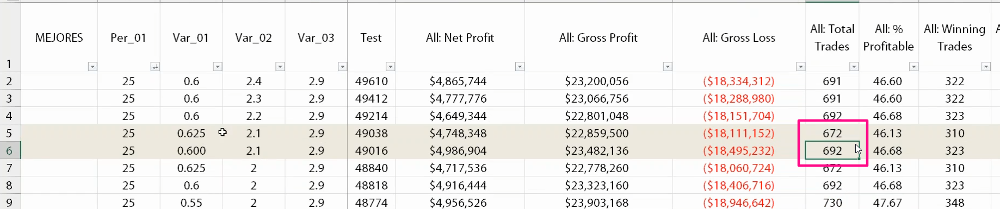
    <figcaption>Figura 100. Variación de 20 trades por incremento: posiblemente excesiva.</figcaption>
  </figure>
  
  A mí esta variación ha parecido bastante notable. Hay que ver que realmente depende de los otros <em>inputs</em>. Hay que mirarlo en distintas zonas. Ahora habría que buscar uno en el 4, o en el 4.4 o algo así, que actúe muy distinto, o con el filtro más cercano, no sé, distintas combinaciones, no con <em>TP</em> cercanos... Pero es verdad que este nivel es elevado para ser el incremento. 20 <em>trades</em> sobre 600 y pico son bastantes.<br><br>
  
  <strong>Posible ajuste futuro: reducir incremento para aumentar granularidad</strong><br><br>
  
  Pudiera ser que aceptara un poco más de granularidad. Entonces, casi con total seguridad lo tenemos que hablar luego con Alberto, porque... Pero es posible que podamos evaluar reducirle un poco más. Porque como digo, 20 <em>trades</em> y pico son bastantes, y es verdad que es el incremento que se ve va un poco justo. Con lo cual puede ser que sea justo. <strong><em>Al final, esto siempre va de señal y de ruido.</em></strong><br><br>
  
  <strong>Equilibrio entre evitar sobreoptimización y no restringir demasiado la señal</strong><br><br>
  
  Entonces no hay que pasarse. O sea, igual que no hay que pasarse con la sobreoptimización (en el sentido de que le permites ajustarse tanto), tienes que dejarle suficientes grados de libertad para que se ajuste, ¿me entendéis? Para que se ajuste a la señal. Si yo no le permito un mínimo... Vale, imagínate que yo este filtro le pongo de 5 en 5. Es imposible, no puedo, no soy capaz de contar nada ahí, porque me estás obligando a trabajar en parámetros de locura. O como si yo digo: "Pues si el mercado cae un 5%, pones largo". Bueno, ¿cuántas veces cae un 5%? Al final, todo tiene su nivel.<br><br>
  
  <strong>Contexto del sistema: años de evolución y robustez comprobada</strong><br><br>
  
  Como todo en la vida, al final tanto es malo como poco. Siempre mejor pecar de prudencia y protegerse contra la sobreoptimización mucho. Pero aquí, en un sistema que tenemos, que conocemos más que a mi hija casi, que lleva 15 años en el mercado, con algunas pequeñas modificaciones pero ha demostrado operar todo tipo de mercados, es un sistema muy, muy robusto. Que lógicamente, en fin, cuando pues hay que ajustarlo. Pero es muy robusto. Entonces bueno, se puede apretar un poco más las tuercas, pero siempre prudencia...<br><br>
  
  Pero es verdad que, ya digo, 23 sobre 600 y pico, insisto que es el menor incremento posible, parece demasiado así visto. Pero claro, esto hay que mirarlo en más <em>sets</em>, de más zonas, y concluir. A lo mejor esto ha sido una casualidad y resulta que normalmente se mueve 3 <em>trades</em>. Pero bueno, si fuera a 5 <em>trades</em> estaría mejor. Estos 20 <em>trades</em> para ser el menor incremento puede ser demasiado. Así que lo miraremos. Lo miramos y nos pareció que era el adecuado.
</div>


### Retorno al mapa grande, filtrado y reconstrucción final del análisis

Una vez definidos, ya quedan bloqueados, y ahora sí, vamos a trabajar con esos tamaños seleccionados.

A nosotros nos gusta partir del grande, luego ir filtrando, y hasta que ahora lo vamos a volver a hacer. Porque como he tenido que abrirlo, porque no sé lo que había liado, pues lo volvemos a ver.


#### `Var_02`

Recordar es el *TP* y *SL*.

<figure>
  
  <figcaption>Figura 83. Filtrado de Var_02: selección de valores de TP/SL.</figcaption>
</figure>

<figure>
  
  <figcaption>Figura 84. Valores seleccionados para Var_02 incluyendo vecinos.</figcaption>
</figure>


#### `Var_01`

Vamos a filtrarlo para que lo veáis mejor. Vamos a limitar, a bloquear los *inputs* que son más claros:

`Var_01`, que es el filtro de entrada (para entenderlo).

Entonces, los bloqueos se hacen aquí. Puedo venir a la variable y decir: "En `Var_01` solo quiero analizar desde **0.55 hasta 0.65**".

<figure>
  
  <figcaption>Figura 82. Filtrado de Var_01: rango 0.55–0.65.</figcaption>
</figure>


#### `Per_01`

No tiene mucho sentido tocar el *SL* porque es línea, pero tiene sentido dejar estas zonas:

<figure>
  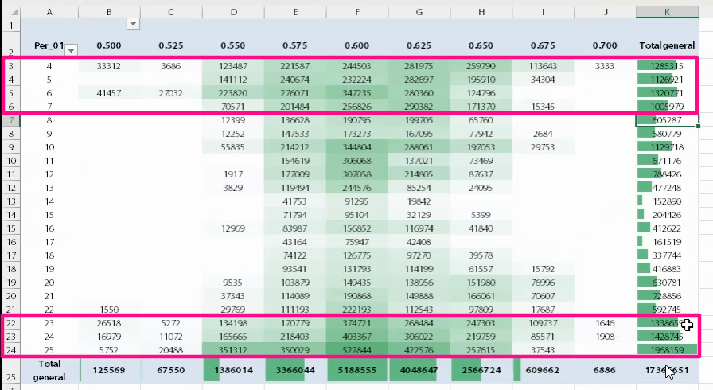
  <figcaption>Figura 102. Selección de zonas para Per_01.</figcaption>
</figure>

<figure>
  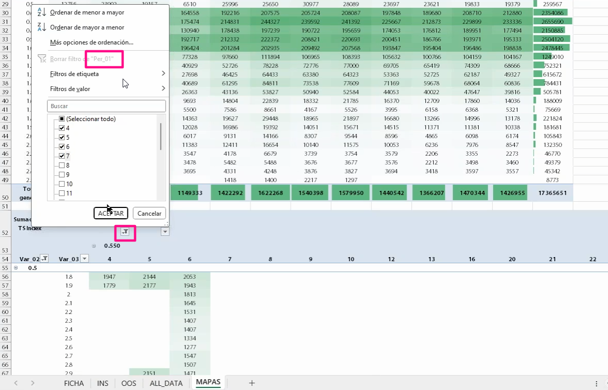
  <figcaption>Figura 101. Configuración final del filtro Per_01.</figcaption>
</figure>

Bueno, así pues el mapa de abajo es un poquito más manejable ya. Pues se queda todo, como veis, bastante agrupado. Porque nos hemos cargado los buenos, hemos dejado los límites. Y vemos un poco la misma información que teníamos. Queda más limpio el mapa, pero nada más.

<figure>
  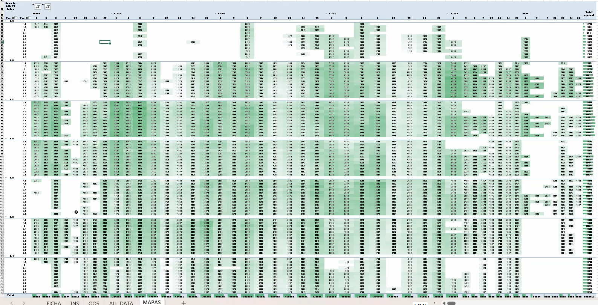
  <figcaption>Figura 103. Mapa filtrado: más limpio y manejable.</figcaption>
</figure>


**Marcado visual del set ideal y construcción de zona candidata**

Bien, aquí podemos marcar un poco nuestro *set* ideal. Nuestro *set* ideal.

Que aquí tenemos una duda que mira, os la voy a enseñar ya, porque la he hecho esta zona 2, porque quería ver ese 25. Aquí sí que hemos apuntado los *Out of Sample* (OOS):

`MAPA ES SHORT zona 2`

<figure>
  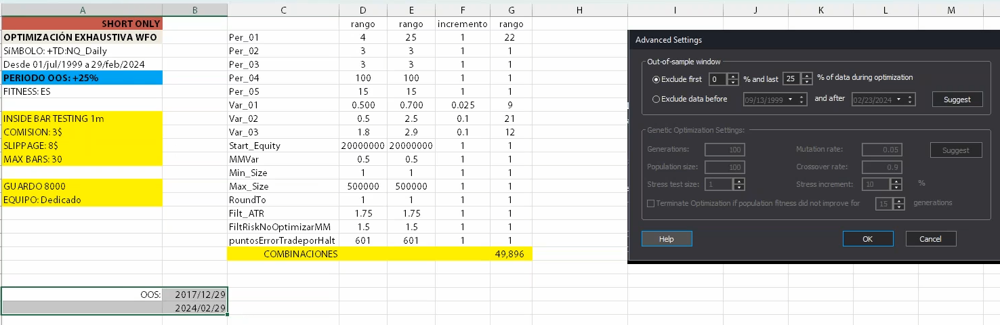
  <figcaption>Figura 104. Mapa zona 2: extensión para analizar más allá del 25.</figcaption>
</figure>

Que eso me gusta. El otro se nos ha olvidado, pero en este veo que sí que lo ha puesto con muy buen criterio. Porque nos gusta ponerlo, esto nos gusta ponerlo. Y antes de empezar, igual que se miran los incrementos, se analiza esto. Se analiza esto: dónde están los cortes. ¿Dónde se analiza? Pues lo que habéis visto antes.

Espera, me lo voy a poner aquí para yo verlo gráfico. Idealmente, si uno no le tiene una gran sensibilidad al sistema, no lo conoce tanto, pues se puede hacer en distintos cortes (hice el corte del *Out of Sample*):

<figure>
  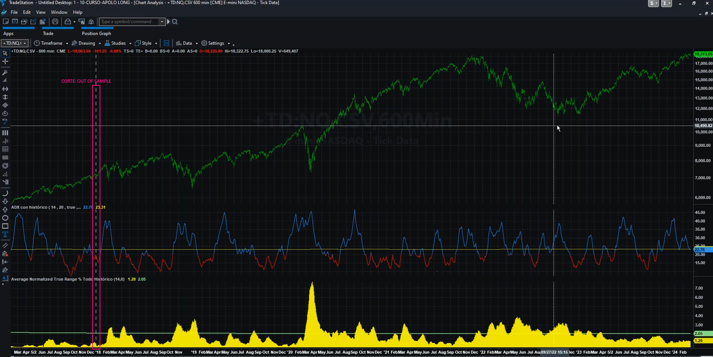
  <figcaption>Figura 105. Gráfico del periodo Out of Sample con sus dinámicas.</figcaption>
</figure>

Pues veis un poquito las dinámicas que lleva el mercado. Aquí pues ha tenido ciclos bajistas, ha tenido el crack del COVID en ese ciclo bajista. Y de hecho hay bastante ciclo bajista, recuerdo bastante ciclo bajista.

Y aquí en el histórico pues hay también un poco de todo:

<figure>
  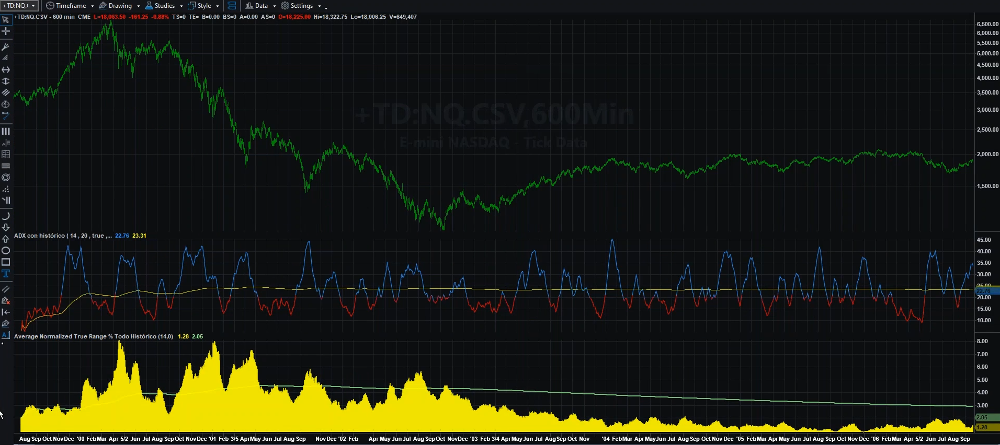
  <figcaption>Figura 106. Histórico completo: crisis 2000, lateral, caída 2008, ciclo bajista.</figcaption>
</figure>

Porque hay una gran crisis, la primera del 2000, muy larga. Luego un período lateral bastante duro. Otra nueva caída. Y luego un ciclo bajista espectacular. Por eso hay un poquito de todo.

Se pueden hacer distintos estudios de aquí. Dejar *Out of Sample* en la parte inicial. Los cortos normalmente hace un *Out of Sample* bestialmente bueno. Aquí no es fácil, porque es verdad que ahora, en proporción, hay bastante corto. Y no estaría tampoco mal alargarlo un poco más, y es a lo mejor a 30%.

El problema del porcentaje es que si tú le dejas muy poco *In Sample*... Hay autores, incluso Pardo (Robert Pardo, autor de *"The Evaluation and Optimization of Trading Strategies"*), que comenta alguna vez, y nosotros alguna vez lo hemos hecho, es como prueba de 50 a 50. Es 50 a 50. Y si es un sistema con muchísimos *trades*, es bien. Es válido.

Pero aquí hablamos de un diario. Es un sistema que tiene muchos *trades*, pero que opera diario. Y esta optimización tiene muchos *trades*. Están hablando de la mayoría de 700, 800, 500, depende, hasta mil en algún *set*. Pero son muchos, pero tampoco son tantos. Por decir, realmente yo en el *In Sample* metido así pues estoy metiendo 500, 600. Claro, si lo pongo menos *Out of Sample*, le meto menos. Entonces capto menos señal. Este es el equilibrio de señales. Entonces es complicado en esos sistemas, y en este tipo, por ejemplo, el 50 a 50.


**Impacto del sesgo bajista y la estructura histórica reciente**

Este, por mercado, estaría chulo. Porque es verdad que ahora tiene un poquito de sesgo bajista:

<figure>
  
  <figcaption>Figura 105. Sesgo bajista reciente a pesar de la subida global.</figcaption>
</figure>

Aunque ha subido mucho. Porque es como bajista poder desde aquí. Aquí ha subido un montón, sí, pero ha tenido bastantes tramos de caída. Y hay en el *In Sample* también. Pero es verdad que tiene un tramo de montonazo de años, veis, o súper alcistas. Y luego cambio, tiene dos tramos súper bajistas. Para un mercado de bolsa, súper bajistas. Este es súper bajista:

<figure>
  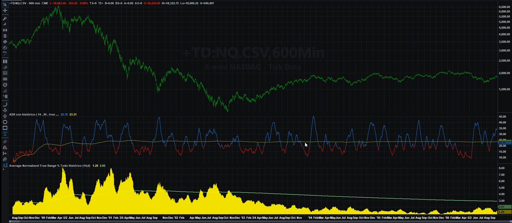
  <figcaption>Figura 107. Primer tramo súper bajista identificado.</figcaption>
</figure>

Y este es súper bajista:

<figure>
  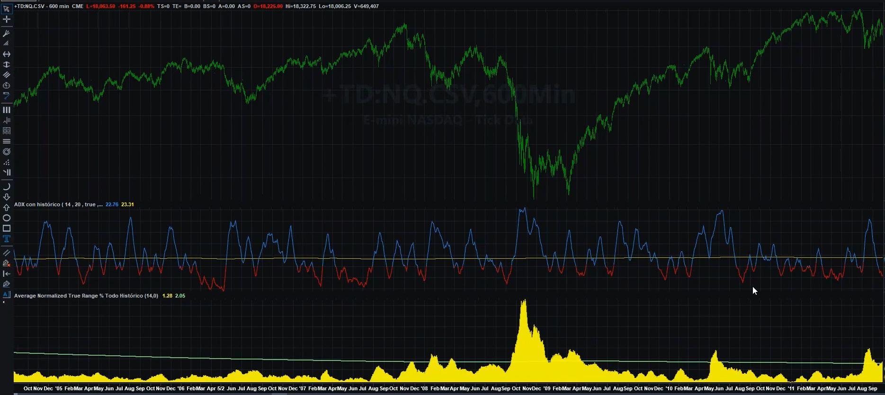
  <figcaption>Figura 108. Segundo tramo súper bajista (crisis 2008).</figcaption>
</figure>

Entonces, realmente, todos súper bajistas. Uno muy, muy largo. Luego un poco de todo.

Pero veis, aquí en el corte *Out of Sample* tiene momentos de elevada volatilidad, de muy baja volatilidad, tiene un poquito de todo.

Y lo mismo en el *ADX*. Lo mismo lo ves en el *In Sample*, que veréis periodos de muchísima volatilidad y periodos de muy poca volatilidad. Pero en porcentaje, en el *In Sample* tiene un poquito más de periodo de poca volatilidad que ahora. Es un poquito el único sesgo que tiene la muestra. Pero es complicada quitársela aquí, es complicada...

...Como vamos aumentando el histórico, seguramente ya para las siguientes, ya lo podemos anotar en nuestras notas, Alberto, en ordenador, que le llevaremos cinco más. Porque ya vas ganando histórico. Por lo tanto, cada vez tienes más *trades* siempre. Y meterle, ir abriendo, llevarlo un poco más atrás el 30, para ganar periodos sin volatilidad en el *Out of Sample*. Pero claro, yo necesito suficientes *trades* en el *In Sample* también. Pero ese es un poco el problema que plantean los sistemas de este tipo.


**Retorno al mapa filtrado y determinación del set ideal preliminar**

Bien, volviendo al mapa:

<figure>
  
  <figcaption>Figura 103. Mapa filtrado para determinación del set ideal.</figcaption>
</figure>

Aquí ya lo tenemos filtrado. Y lo que os decía, yo aquí puedo tener un poquito mi *set* ideal. Mi *set* ideal, que está claro que está en la zona de `0.6` del `Var_01`. Y que en la zona del indicador no es tan claro. Pero bueno, pues ahí tenemos 6, tenemos 5, 4. Y 25 es muy bueno. El problema es que no tengo vecinos:

<figure>
  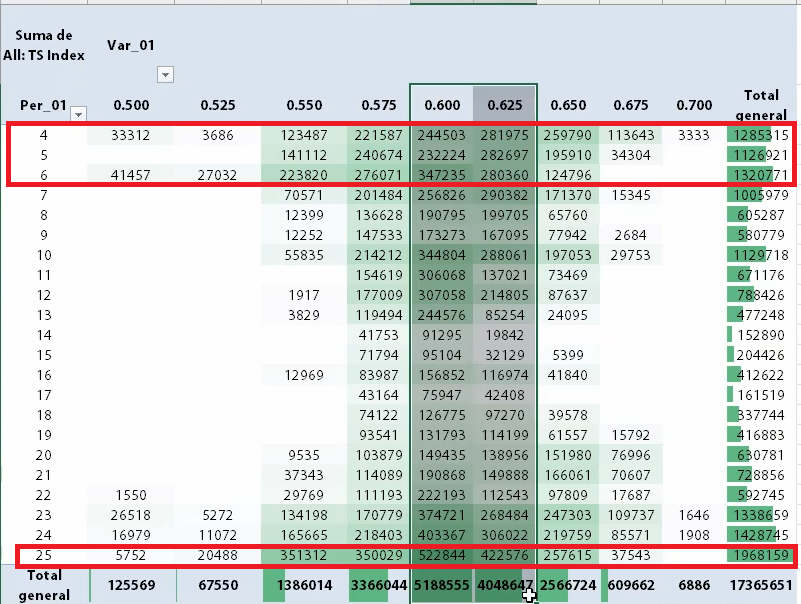
  <figcaption>Figura 109. Set ideal preliminar: 0.6 en Var_01, zona 4-6 y 25 en Per_01.</figcaption>
</figure>


### Revisión del mapa "zona 2" y detección de un posible error al copiar inputs

El `MAPA ES SHORT zona 2` está 23 a 30. Esto es la que se ha hecho dejando todos los demás igual, para ver ese más allá del 25, a ver qué pasaba:

<figure>
  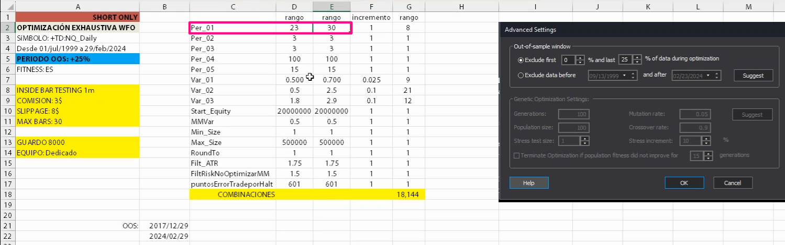
  <figcaption>Figura 110. Mapa zona 2: extensión del rango Per_01 de 23 a 30.</figcaption>
</figure>


**Comprobación de la extensión de parámetros entre 23 y 30**

Bien, fijaros que lo primero que vemos es que el `0.6` sigue dominando en toda la zona. Da igual el valor que le des al indicador, que él sigue siendo el rey.

Y que vemos que el `25` efectivamente destaca. Y sí que vemos que degrada. `Total general` degrada. Bueno, degrada... No creo que degrada de manera para no usarlo. No creo que degrada para la manera de no usarlo. Pero sí que hay una cierta ahí degradación, no menor (fíjate en la columna `Total general`, cómo del 25 al 26 hay una degradación, hay bastantes menos):

<figure>
  
  <figcaption>Figura 111. Degradación visible entre Per_01 = 25 y Per_01 = 26.</figcaption>
</figure>

Lo único que queríamos ver es cómo evolucionaba más allá del 25. Y bueno, pues no hay una gran hecatombe. Sí que hay cierta degradación. Se ve claro que el 25 es una zona muy, muy *top*. Pero bueno, aguanta bien, tiene bastantes valores. ¿Sería mejor que degradara menos? Sí, pero no es tampoco muy dramático.

Como queremos ver este parámetro `Var_01`:

<figure>
  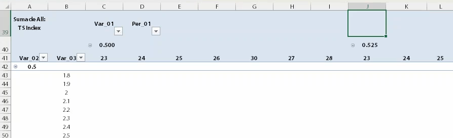
  <figcaption>Figura 113. Análisis de Var_01 en el rango extendido.</figcaption>
</figure>

Lo que os decía, a veces de los datos... Ahora voy a poner el `Per_01` arriba, porque pues nada, pues porque así el que manda primero es el `Per_01`. Entonces ya la dejo solo `Per_01`:

<figure>
  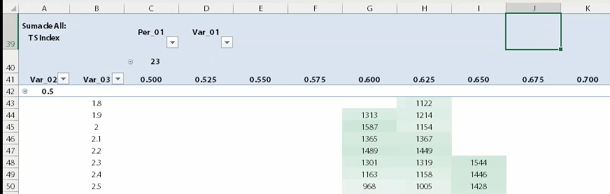
  <figcaption>Figura 114. Reorganización: Per_01 como eje principal.</figcaption>
</figure>

<figure>
  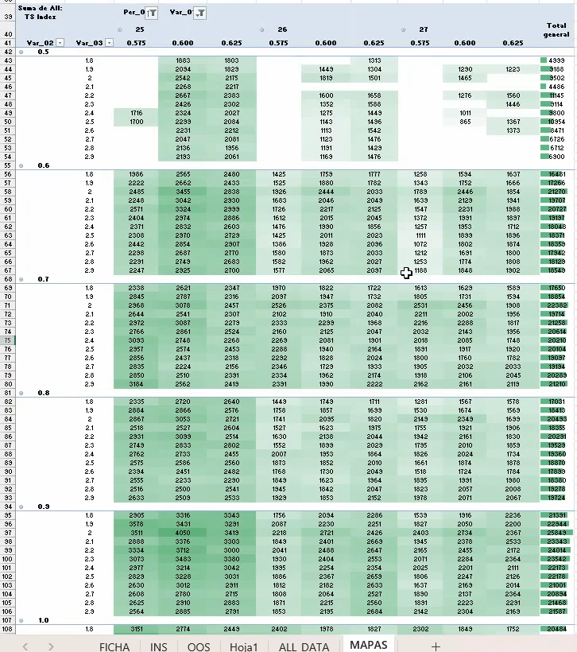
  <figcaption>Figura 118. Vista con Per_01 dominante.</figcaption>
</figure>

Y fijaros que aquí el `0.6` es más estable.

Fijaros que en la zona elevada, esto es bastante interesante. Fijaros que el *TP* y el *Stop* como que degrada menos, ¿lo veis?

<figure>
  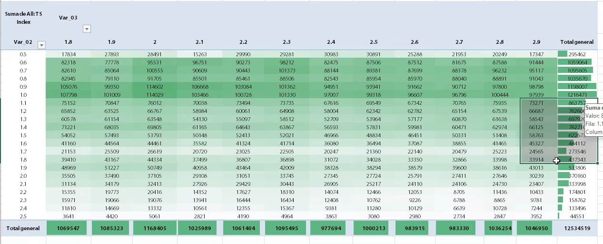
  <figcaption>Figura 115. En zona elevada de Per_01, TP/SL degrada menos.</figcaption>
</figure>

Por eso el `25` en la otra salía tan bueno. Es porque en la zona de *TP* a partir del `1` también va degradando, pero degrada de manera bastante más progresiva que antes, cuando estaba la zona del `4` al `25`.

La zona sigue siendo igual. Es en la zona de `Var_02` que tenemos *TP bajo*: 0.6, 0.7, 0.8, 0.9, 1. Que también degrada mucho en el `0.5`, que quizá un poco menos, pero degrada mucho. En el `1.1` empieza a degradar, pero fijaros que empieza de manera mucho más progresiva que antes.

Aquí el `1` es mejor en la zona de `25`. Quizás por la zona del `23` en este segundo rango. Antes ya habíamos visto algo bueno por la zona del `25`, por debajo de la tabla:

<figure>
  
  <figcaption>Figura 109. Referencia: ya veíamos algo bueno en zona 25.</figcaption>
</figure>

Lo que pasa es que acababa en 25. Queríamos ver más allá, acababa en 25. Pero ya veíamos que ahí había algo bueno. Es como, ya salía claro, 25 era la leche. Ahora hemos ido más allá para ver qué pasa tras esto. Y nos hemos dado cuenta que, a la que vimos de 23 a 25, automáticamente veis esa degradación que es mucho menor aquí:

**ANTES:**
<figure>
  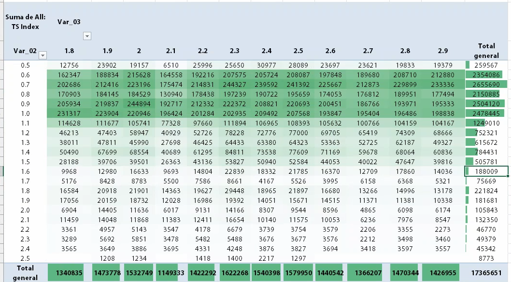
  <figcaption>Figura 116. Degradación en el mapa original (antes de extensión).</figcaption>
</figure>

**AHORA:**
<figure>
  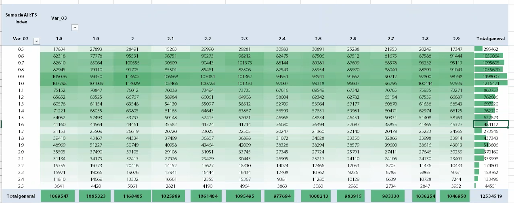
  <figcaption>Figura 117. Degradación mucho más progresiva en el mapa extendido.</figcaption>
</figure>

Y ya más adelante, fijaros, aquí en la zona de *TP* es incluso el 1.6. Aquí ya prácticamente no sale casi.

Realmente degrada de manera mucho más progresiva en la zona del indicador, a más de 23. Es decir, elegir 24, 25, está bastante bien aquí. Es una zona muy buena.


**Comparación final entre las zonas óptimas del indicador**

Bueno, parece 26 mejor. Pero fijaros, 25 también, 25 muy bien. Y su vecino 24 es bastante bueno también. Hay su vecino 23:

<figure>
  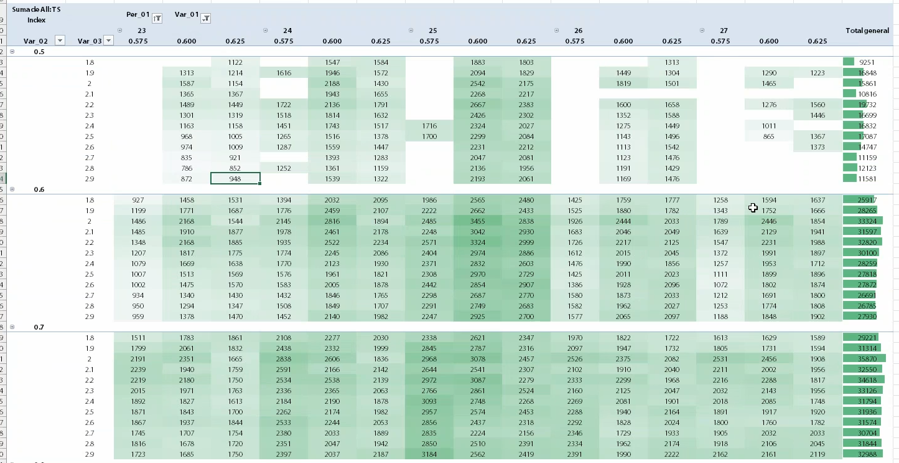
  <figcaption>Figura 121. Comparación de vecinos: 23, 24, 25, 26 todos aceptables.</figcaption>
</figure>

Todo muy progresiva. Va degradando, va degradando, lógicamente va degradando. Pero fijaros que degrada de manera ***PROGRESIVA***:

<figure>
  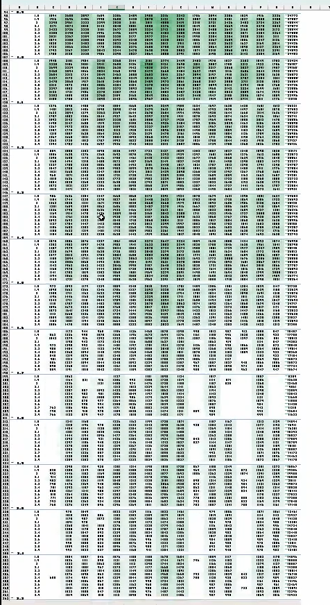
  <figcaption>Figura 123. Degradación progresiva confirmada en toda la zona.</figcaption>
</figure>


**Ajuste de rangos finales y confirmación de homogeneidad en la matriz**

El *Stop* es que no sabes ni dónde cortarlo. No sabes ni de dónde cortarlo:

<figure>
  
  <figcaption>Figura 117. Stop Loss: distribución homogénea, difícil definir corte.</figcaption>
</figure>


**Identificación de las zonas finales recomendadas para Per_01**

Estaría bien también esto mismo que hemos hecho, hacerlo de 1 a 7. Por ejemplo, de 1 a 7 todo igual, ¿entendéis? Es decir, hacer esto de 1 a 7:

<figure>
  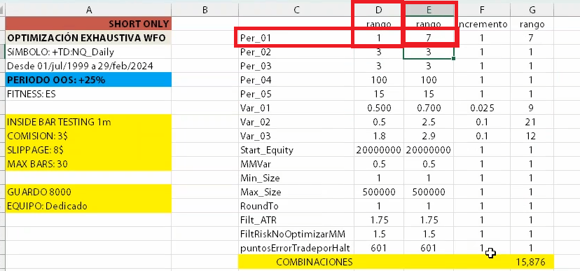
  <figcaption>Figura 124. Propuesta: extender análisis de Per_01 de 1 a 7.</figcaption>
</figure>

Esta misma que la vamos a dejar ahora puesta, Alberto, en ordenador, de 1 a 7, para mañana analizarla. Y así veremos un poco qué pasa en ese 4:

<figure>
  
  <figcaption>Figura 109. Referencia para el análisis pendiente de zona 1-7.</figcaption>
</figure>

Pero bueno, en principio vemos que 4, 5, 6, sobre todo 5, 6. 4, 5, 6 está bastante bien. 4, 5, 6 pues parece ser buena zona. Porque incluso 7 pues es una degradación bastante aceptable.

Por el lado de las ***X*** ya hemos visto que entre `0.575` lo consideramos aceptable, `0.6`, y `0.650`, pero bastante por los pelos. Idealmente `0.625`, pero bueno, `0.650` aún podría valer.


**Síntesis del TP óptimo y límites aceptables por tolerancia**

En cuanto al lado del *TP*, `0.6` este sí que lo vamos a descartar por el enorme barranco que supone `0.5`:

<figure>
  
  <figcaption>Figura 117. TP = 0.5 descartado por degradación extrema.</figcaption>
</figure>

Y aceptaríamos hasta `1`. Hasta uno.

Tenemos esta zona que nos está diciendo que 24, incluso 23. No cosa 23, porque el 22 una degradación aún aceptable. Yo de 23, 24, 25. 23:

<figure>
  
  <figcaption>Figura 111. Zona óptima confirmada: Per_01 = 23, 24, 25.</figcaption>
</figure>

Además tiene un plus que, de hecho, es lo que queríamos haber dejado preparado, pero no sabemos por qué eso nos bloqueaba la optimización y no hemos podido.

Porque eso ya os lo digo: este sistema lleva mucho tiempo operando. Esta zona de 23, 24 y 25 es una zona *top* del lado largo. El lado largo opera varios *sets*, no solo operan sino que han operado durante años en esa zona. Es una zona muy fina para el lado largo. Entonces eso también está. Y de hecho hay algún *set* también el corto operando en esa zona hoy en día. Es decir que sé que esto no es nuevo. Esto, como os digo, viene de siempre. Y así, por eso pues estos datos al final van saliendo y vas a analizarlos.

Bien, esto al final, repito, es zonas de trabajo. Pero ***¿elegiríamos los sets con esto?*** No, para operar no. ¿Por qué no? Por un motivo: primero, ni con el mapa, ni con este Excel:

<figure>
  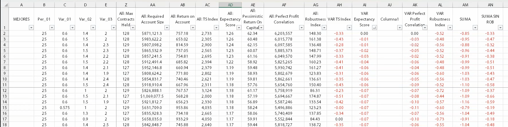
  <figcaption>Figura 125. Excel de 8.000 combinaciones: no apto para selección final.</figcaption>
</figure>

---

## Limitación fundamental: dejar elegir entre 8.000 combinaciones es sobreoptimizar

Dejarle elegir 8.000, como os he dicho antes, es un ejercicio de sobreoptimización bastante notable. Es poco como lo que os decía de dejarlo variar los incrementos. Al final es un poco lo mismo.

Si yo le dejo elegir entre 8.000 *In Samples* cuáles van mejor, y los mezclo en *AllData*, y luego me los ordeno... Al final, esta ordenación que yo he hecho aquí en Excel, pues mira, que hay un 10 y un 4. Hemos hablado del 4 antes, hemos hablado del 10 también, pero teníamos dudas:

<figure>
  
  <figcaption>Figura 126. Ordenación del Excel: aparecen sets 4 y 10.</figcaption>
</figure>

No sale más por aquí. Salen 4, 10. Salen 0.575, que bueno, está ahí en el límite que hemos considerado apto. 0.675 estaría fuera. En `Var_02`, el uno también estaría apto. 0.7 también. Son zonas operativas. El 10 dudoso.


**Advertencia: un set concreto solo es válido si está dentro de su zona robusta**

Aun así, si ahora que compara el *In Sample* con el *Out of Sample*:

<figure>
  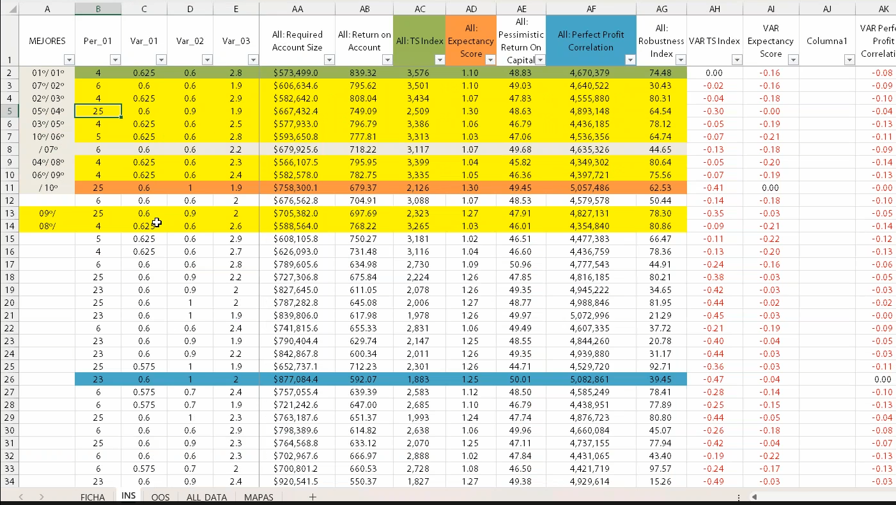
  <figcaption>Figura 127. Comparación In Sample vs Out of Sample.</figcaption>
</figure>

<figure>
  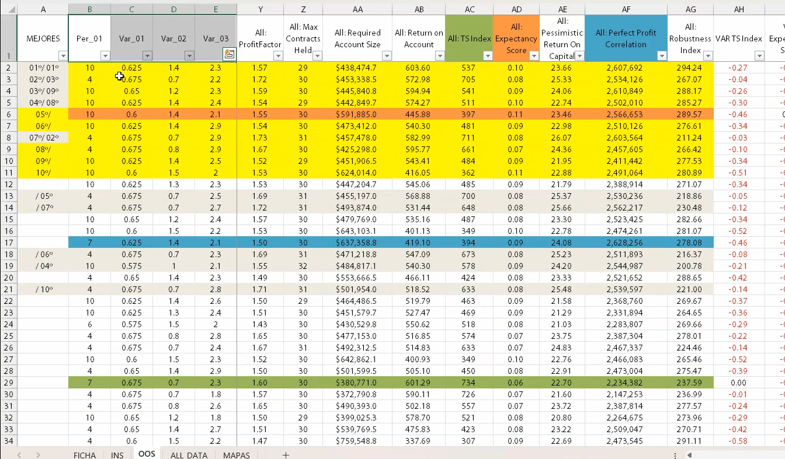
  <figcaption>Figura 128. Detalle de los mejores sets en cada periodo.</figcaption>
</figure>

Bueno, pueden ser los mejores, o no. No lo son de hecho. Pero este puede ser que sí, si está en la zona. Es decir, no son lejanos de uno de los mejores *In Sample*, que es 25. Pero en *Out of Sample* no aparece ninguno.

El problema es que son 8.000. Entonces ahí nunca elegimos de este *set*. Lo que hacemos es hacer o la misma opti u otra, que a lo mejor ya con el mapa yo he podido acotar. Y a lo mejor podría mejor si fuera más grande. Imaginaos que hubiera sido una optimización genética la anterior, mucho mayor. Podía ahora acotar y hacer una exhaustiva. Pero como yo ya la tengo hecha, yo la he hecho. Y eso de dos maneras de hacerla.


## Creación de la optimización exhaustiva recortada (250 mejores)

Esta es la misma, exactamente la misma, la 1:

<figure>
  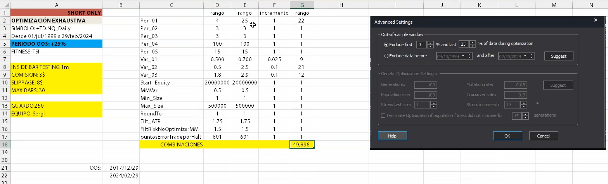
  <figcaption>Figura 129. Optimización exhaustiva original.</figcaption>
</figure>

Es sin esta extensión, porque ya la teníamos hecha. Si no la hubiéramos hecho, con la extensión. Porque esta, ahora viendo esto, lo mejor pues sería hacer esto, más o menos 29:

<figure>
  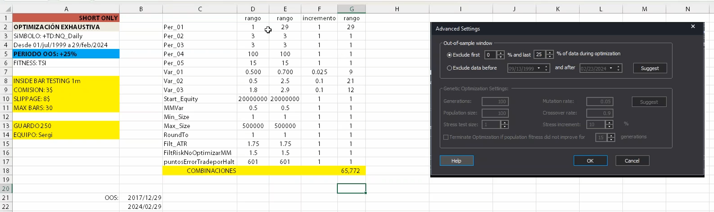
  <figcaption>Figura 130. Propuesta de optimización extendida: 65.772 combinaciones.</figcaption>
</figure>

Para que son 65.772 combinaciones. Pero esto acaba son unas horas en ordenadores potentes, horas. Pues el 12 horas, 14 horas. Y 27 horas en el mío. A lo mejor en el dedicado, que es un poco más lento, pues dura 15 horas. Entonces se podía hacer esta ya y lo tienes todo en uno.

Pero bueno, no se ha hecho. Se ha hecho esta:

<figure>
  
  <figcaption>Figura 129. Optimización utilizada finalmente.</figcaption>
</figure>


**Por qué reducir a 250 sets: evitar sobreoptimización y facilitar selección**

Entonces se ha hecho solo guardando 250. Es un número que aún 200, si quieres 100, puedes coger perfectamente 100, y hacemos lo mismo. Pero claro, aquí ya en el *In Sample* solo hay 200:

<figure>
  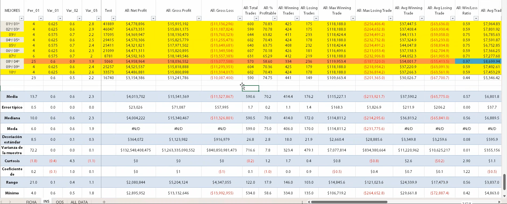
  <figcaption>Figura 131. Excel reducido a 250 combinaciones.</figcaption>
</figure>

Esto nosotros hemos construido seleccionándolo con una función buscar. Pero no, no os compliquéis.


**Explicación técnica para quien domina Excel (opcional)**

Hay dos datos. Lo explico para que lo sepáis, simplemente aquel que domine Excel. Porque esto ya, esto sí que si no dominas Excel pues te olvidas. No hace falta meterse en complicarse la vida necesariamente.

Pero aquí hay dos variables que se comparten entre las tres hojas. Una es el `test`:

<figure>
  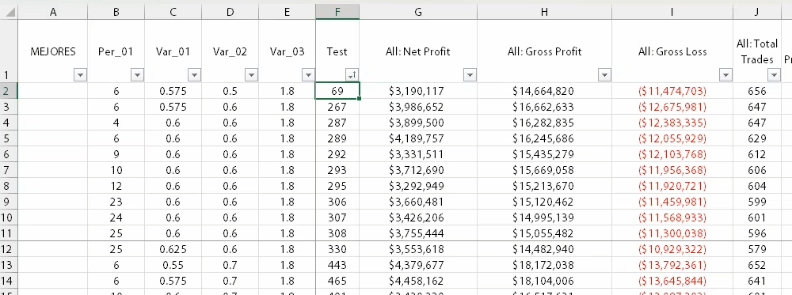
  <figcaption>Figura 132. Variable "test": identificador único de cada combinación.</figcaption>
</figure>

El *test* se comparte sin equívoco. Es el *test* que recoge cada combinación.

Y luego el `Robustness` también es igual en todas las hojas:

<figure>
  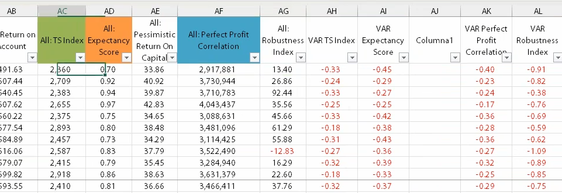
  <figcaption>Figura 133. Variable "Robustness": compartida entre hojas.</figcaption>
</figure>

Entonces, buscando el número de *test*, ordenas tú por el *fitness* que has hecho. Por *TSI*, ordenas por *TSI*, que es el *fitness* que hemos usado en este Excel. Ordeno por *TSI*:

<figure>
  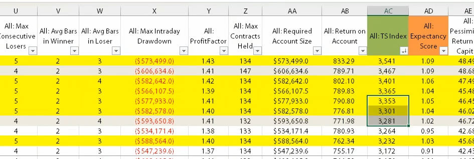
  <figcaption>Figura 134. Ordenación por TSI (fitness utilizado).</figcaption>
</figure>

Y automáticamente busco con la función *buscar*. De las borro abajo hasta me quedo con 250:

<figure>
  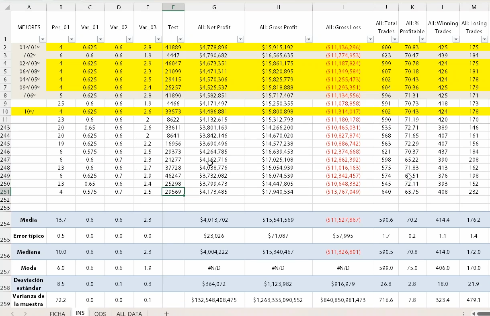
  <figcaption>Figura 135. Selección de los 250 mejores por TSI.</figcaption>
</figure>

Y luego con una función *buscar*, busco estos *test* en la otra hoja y me quedo con esas.

Si no sabes ni de qué te hablo, no te rompas la cabeza. Pero el que sepa de Excel sabe de qué le hablo. Y con una función *buscar* hemos buscado estos *test* en el *Out of Sample* y en *AllData*, y hemos eliminado el resto por una sencilla selección así. Y ya está. Pero si no, pues vuelves a hacer la optimización.


**Cierre del bloque: equivalencia entre esta reducción y rehacer la optimización**

Entonces, ahora aquí nos hemos quedado con las 250. Es decir, esto es lo mismo que si hubiéramos hecho la optimización, porque esta es exhaustiva:

<figure>
  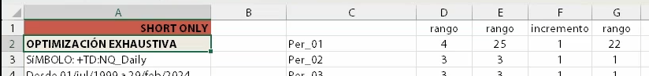
  <figcaption>Figura 136</figcaption>
</figure>

Que no hay un algoritmo que seleccione, son todas. Entonces, las 250 que mejor *TSI* tenían se han quedado. Y por lo tanto, yo sí que tengo aquí unos datos *In Sample*, unos datos *AllData*, *Out of Sample*. 

Y los datos *AllData* los tengo ordenados también por suma. Porque el *Out of Sample* está detrás. Y cuando pongo el *Out of Sample* detrás, me gusta más usar la suma incluyendo el *Robustness* en el cálculo. Y por lo tanto veo cuáles son los mejores *In Sample*. Que, como veis, lógicamente los mejores *In Sample*, los mejores, sí son los mismos:

<figure>
  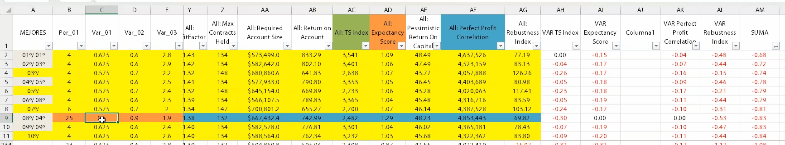
  <figcaption>Figura 138.</figcaption>
</figure>

Porque los que eran mejores en 8.000 son mejores en 250. Lo que cambia, o lo que puede cambiar, es el *Out of Sample*. Porque aquí ahora ya solo hay 250. Que fíjate en el *In-sample* tenemos Fijaros que tengo `4` con `0´625` con varios. Y en el *Out of Sample* tenemos no exactamente el mismo pero por ahi anda, es una zona bastante parecida
<figure>
  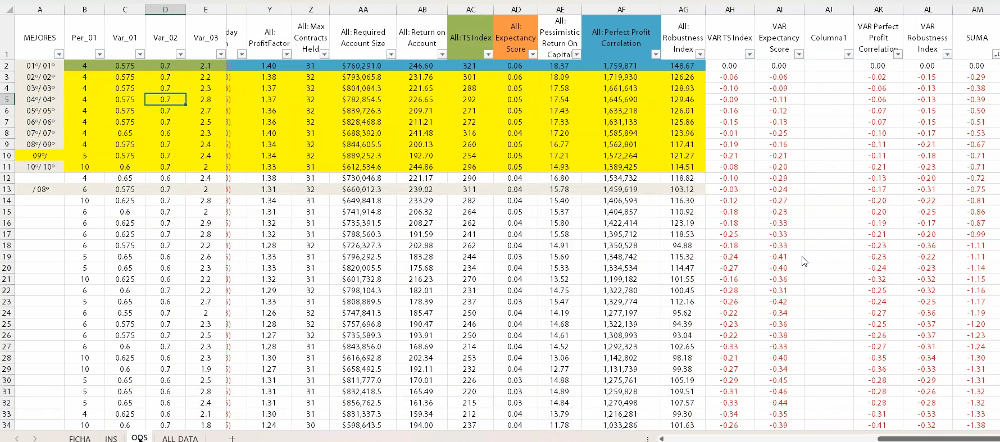
  <figcaption>Figura 139. </figcaption>
</figure>

Si vamos al *AllData*, pues nuevamente son los cuatro:

<figure>
  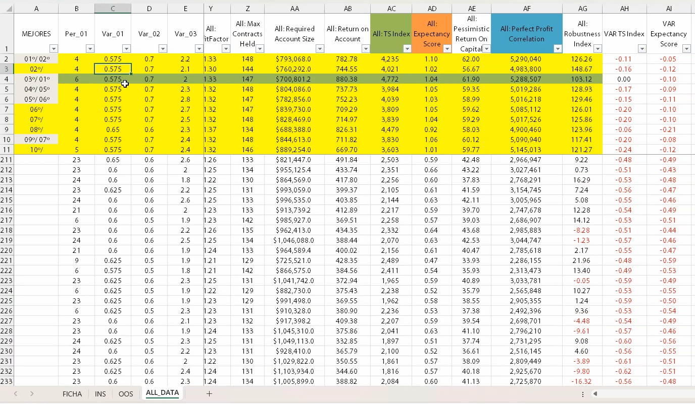
  <figcaption>Figura 140</figcaption>
</figure>

En este `TS Index` son los cuatro.

<div style="border-left: 4px solid #27ae60; background: #ecf9f1; padding: 10px 15px; margin: 10px 0; border-radius: 8px;">
  <strong>📋 Resumen del proceso de selección de sets</strong><br><br>
  <table>
    <tr>
      <th>Paso</th>
      <th>Objetivo</th>
      <th>Herramienta</th>
    </tr>
    <tr>
      <td>1. Mapa completo (8.000)</td>
      <td>Identificar zonas robustas</td>
      <td>Tabla dinámica Excel</td>
    </tr>
    <tr>
      <td>2. Filtrado de zonas</td>
      <td>Acotar parámetros aceptables</td>
      <td>Filtros de tabla dinámica</td>
    </tr>
    <tr>
      <td>3. Reducción a 250</td>
      <td>Evitar sobreoptimización</td>
      <td>Función BUSCAR en Excel</td>
    </tr>
    <tr>
      <td>4. Ordenación por SUMA</td>
      <td>Equilibrio IS + OOS</td>
      <td>Normalización + Robustness</td>
    </tr>
    <tr>
      <td>5. Validación con mapa</td>
      <td>Confirmar set en zona robusta</td>
      <td>Cruce visual mapa/Excel</td>
    </tr>
  </table>
  <br>
  <strong>Criterio fundamental:</strong> Un set solo es válido si está dentro de su zona robusta en el mapa, independientemente de su ranking en el Excel.
</div>


***¿Qué hacemos nosotros en este caso?*** 

Nótese que no he hablado de *Walk Forward*. Al final sí os hablo de *Walk Forward*, pero de momento, de momento, yo normalmente en *Apolo* solemos elegir así. Solemos elegir así. Miro el mapa yo tengo claras mis zonas. Y ahora tengo, mediante *AllData*, pues aquellos *sets* que trabajan mejor en equilibrio en *In Sample* y *Out of Sample* porque con la `suma` pondero sobrepondero un poco el `Robustness` ya que me añade 

<figure>
  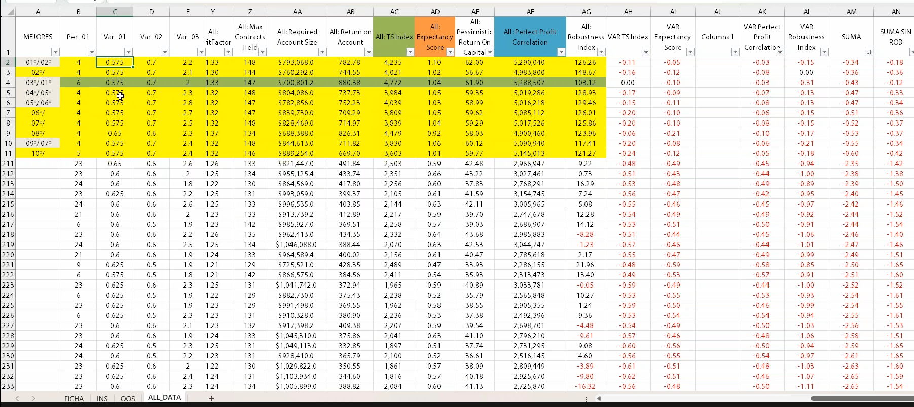
  <figcaption>Figura 179 TSI Suma de All: TS Index</figcaption>
</figure>

y lo tengo por un fitness que es `TSI Suma` que lógicamente muchas ocasiones en algunos en común pero no siempre aquí de hecho como veis no los hay no hay en ese común 

<figure>
  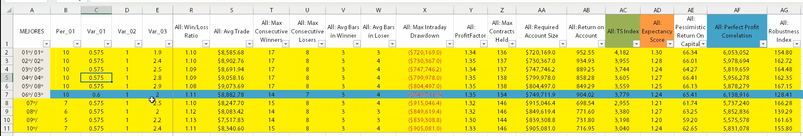
  <figcaption>Figura 180 TSI Suma</figcaption>
</figure>

pero en este en el ppc PPC Perfect Profit Correlation Var_01 Per_01, sí que hay en común entre los dos hay un poco de mezcla de los dos, aquí nos sale más el 25, el ppc siempre tira más para para el retorno

<figure>
  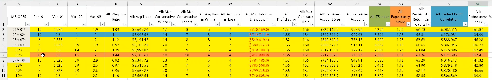
  <figcaption>Figura 182 Perfect Profit Correlation</figcaption>
</figure>

**La ficha de resumen: herramienta clave para comparar de un vistazo**

Una cosa que nos gusta mucho, que esto creo que lo enseñé un poco en la práctica, lo enseño también aquí que tengo mis notas. Esta es la ficha que tenemos en el Whatnot:

<figure>
  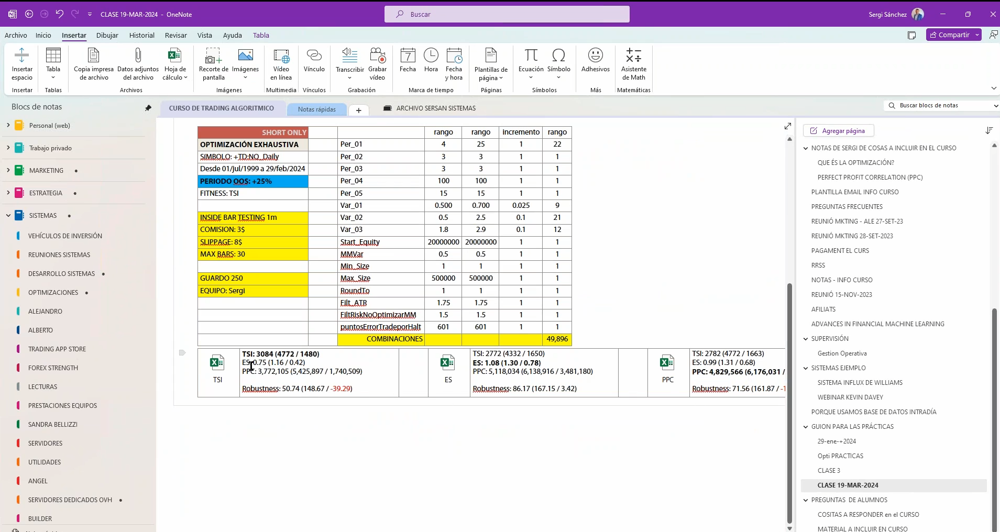
  <figcaption>Figura 141. Ficha resumen del sistema Apolo en Whatnot.</figcaption>
</figure>

Y aquí, a modo de resumen, recogemos siempre, cuando lo hacemos con TradeStation, estos `tres Excel` y el resumen de las tres variables y el `Robustness`. Esto es muy interesante porque de un vistazo te puedes hacer una idea de cuál es el mejor:

<figure>
  
  <figcaption>Figura 142. Comparativa de los tres fitness (TSI, ES, PPC) y Robustness.</figcaption>
</figure>


**Comparación por medianas: utilidad en exhaustivas de 250 sets**

Aquí, al estar en `250` y ser `exhaustiva`, en la mediana, que es el valor primero `ES: 0.75`, es bastante útil. Y aquí también, tanto en las funciones *fitness* (`TSI, ES, PPC`) como en el *Robustness*, fijaros que te paliza respecto al *TSI*. El *ES* es el que mejor *Robustness* tiene:

<figure>
  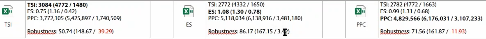
  <figcaption>Figura 143. ES domina en Robustness: ni un solo valor negativo entre los 250.</figcaption>
</figure>

De hecho, no tiene ni un solo *Robustness* negativo. Ni uno solo entre los 250. Muy destacable. Su mejora 167, pero es que su mediana es 86. Recordar que `100` es igual *In Sample* que *Out of Sample*. Bien, bastante bien. Su valor medio de *TSI* 2.700 mediano. Su valor mediano *PPC* 5 millones. Este *PPC* del ***ES*** incluso supera al ***PPC***.


**Interpretación: por qué el fitness ES supera a PPC y TSI en esta optimización**

Digamos que incluso supera al *PPC*, que es el que se ha optimizado en él. ¿Eso cómo puede ser? Bueno, porque ha tenido más capacidad predictiva del *Out of Sample*. O sea, el *In Sample* ha predicho mejor.

Entonces, en este de estos tres Excels, aunque vamos a mirar los tres, el `ES` es el mejor. Eso es lo que os digo, se hablaba en el curso de la supervisión de los *fitness*. Esto, lógicamente, de la supervisión de todos los protocolos. Es decir, este tipo de cosas también sirven para eso: para ir viendo con el tiempo qué predice mejor a un tipo de sistema o a otro.

Aquí predice ***ES***. Ha tenido una mejor capacidad predictiva del *Out of Sample*. Pero repito que miramos los tres.


**Reflexión: por qué normalmente TSI es un buen equilibrio, pero no siempre**

Es verdad que normalmente, a mí se me dice, es un caso de duda. Normalmente ***TSI*** suele ser un buen equilibrio. Pero también nos gusta mucho ***PPC***, y nosotros nos tiramos mucho por el *PPC*.

Porque si tú tienes cartera y puedes cubrir el riesgo con otras maneras —gestión monetaria, exposición, diversificación— retorno al final vía sistema puede ser un muy buen vector. Porque yo, riesgo, ya lo controlaré vía cartera, vía exposición, y vía gestión monetaria. Entonces el sistema puede ser una manera de verlo.

Pero ahí están los tres, insisto, ahí están los tres.

<div style="border-left: 4px solid #3498db; background: #eaf4fc; padding: 10px 15px; margin: 10px 0; border-radius: 8px;">
  <strong>📊 Comparativa de funciones fitness</strong><br><br>
  <table>
    <tr>
      <th>Fitness</th>
      <th>Fortaleza</th>
      <th>Cuándo usarlo</th>
    </tr>
    <tr>
      <td><strong>TSI</strong></td>
      <td>Equilibrio retorno/riesgo</td>
      <td>Caso de duda, sistemas generales</td>
    </tr>
    <tr>
      <td><strong>ES (Expectancy Score)</strong></td>
      <td>Capacidad predictiva OOS</td>
      <td>Cuando buscas robustez futura</td>
    </tr>
    <tr>
      <td><strong>PPC</strong></td>
      <td>Maximiza retorno</td>
      <td>Cuando controlas riesgo vía portfolio</td>
    </tr>
  </table>
</div>


## Selección de Performance Reports: parte visual y subjetiva del proceso

Vale, bien. Entonces nosotros vamos a mirar estos ***Performance Reports***:

<figure>
  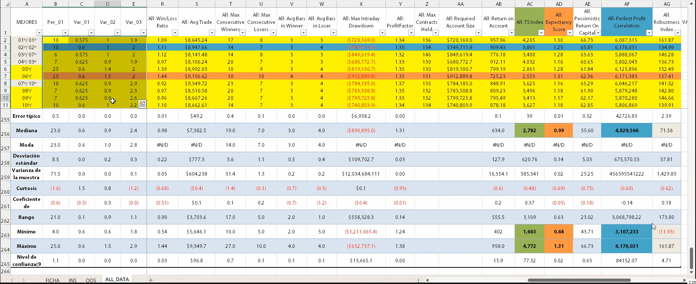
  <figcaption>Figura 144. Lista de Performance Reports a revisar.</figcaption>
</figure>

Porque al final hay que ver el ***Performance Report***. Hay que ver el gráfico, el gráfico me refiero el comportamiento de la curva.

El gráfico ahora, de hecho, lamentablemente, en las últimas versiones de TradeStation han decidido sacarnos una cosa que a nosotros nos gustaba mucho. Que era simplemente, cuando tienes aquí una función *fitness* y le das aquí a guardar:

<figure>
  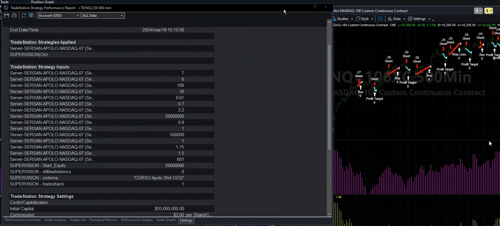
  <figcaption>Figura 145. Opciones de exportación en TradeStation.</figcaption>
</figure>

<figure>
  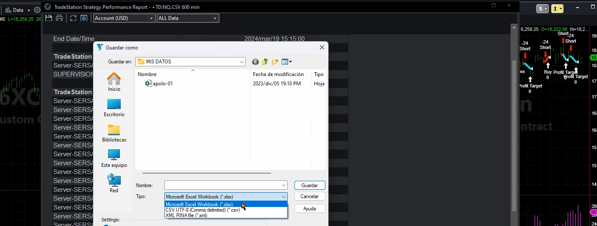
  <figcaption>Figura 146. Menú de exportación.</figcaption>
</figure>

<figure>
  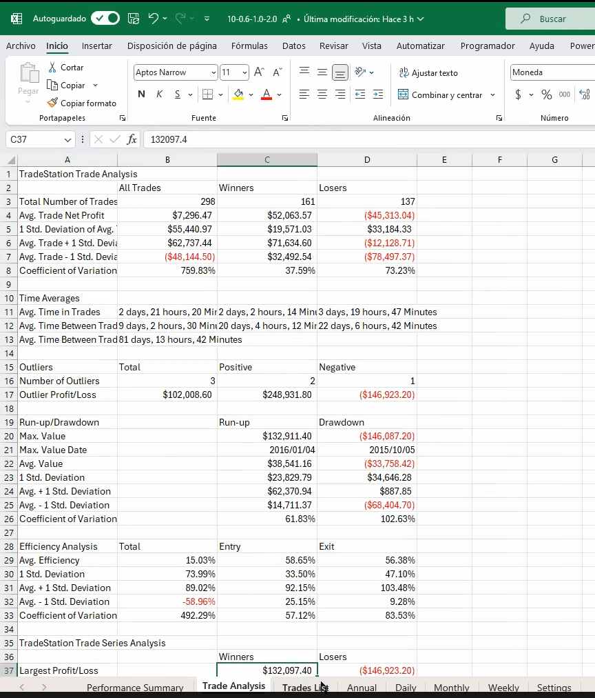
  <figcaption>Figura 147. Formatos disponibles para exportación.</figcaption>
</figure>

Puedes decir exportar en Excel, pues en CSV, puedes usar un XML. Y antiguamente generaba en un formato que era de Microsoft, que te generaba un archivo HTML. Y entonces te dejaba ver HTML donde tú abrías los gráficos, y era muy exportable, muy chulo.

Ahora pues han decidido solo Excel. Entonces podías graficarlo pero no te grafica. Te exporta *Performance Report*, exporta los datos tal, que está muy bien, toda la información que quieras. Pero no te exporta los gráficos. Y la verdad que los gráficos pues vienen bien también.


**Método alternativo: pegar los gráficos manualmente en Excel**

Bien, para verlo a nosotros nos gusta mucho. Pero ahora puedes poner aquí pegado, que es lo que normalmente hacemos. Pero hoy, por lo que os decía, por el tiempo, no lo hemos hecho.

Entonces, nosotros lo que hacemos es, sobre esos mejores, recogemos los ***Performance Reports***. También de los *sets* que, de hecho, no solemos hacerlo así. Hoy lo hemos hecho así, pero normalmente no ponemos qué es el *set*. Es decir, le ponemos su combinación y lo mezclamos aquí entre todos.


**Evitar el sesgo: comparar sin mirar qué parámetros son hasta el final**

Tratamos de no mirar. O sea, no lo miramos. Los vamos abriendo y, Alberto... Esto lo expliqué en la teoría. Es la única cosa más subjetiva que hay, en el sentido de que al final Alberto hace su selección y ahora mía tiene su selección aquí. Y yo tengo la mía. Todavía no las hemos puesto en común. Lo vamos a hacer ahora.

Yo, fijaros que me he quedado con tres de los *sets* que operan:

<figure>
  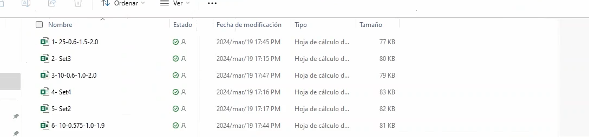
  <figcaption>Figura 148. Selección personal: tres sets que ya están operando.</figcaption>
</figure>

Que eso tiene su gracia, pero hay *sets* operando, me he quedado con ellos. O sea, esto es la manera en la que valoramos si cambiamos o no cambiamos. Es decir, incorporando en la fase final lo que opera, y entonces decido si me los quedo o no me los quedo. Que aunque los que me quedo luego se consideran que no son aptos para operar, pues entonces el tema no vale. Pero así es como lo hemos visto.

Alberto ha visto estos y yo he visto estos. Yo los tengo ordenados de menos a más *trades*, no es por calidad:

<figure>
  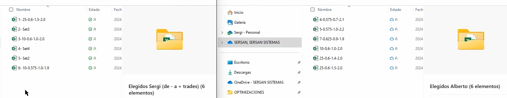
  <figcaption>Figura 149. Sets ordenados por número de trades.</figcaption>
</figure>


**Cruce entre listas: sets en común y sets que difieren**

Por ejemplo, este lo tenemos en común: `25-0.6-1.5-2.0`. Pero bueno, Alberto me ha dicho que luego los *sets* no nos ha considerado esa, que no se sabe si se los elegiría o no, que no se ha considerado.

`10-0.6-1.0-2.0` también lo tenemos. Estos dos lo tenemos los dos. Y este `10-0.5`, este no lo tengo yo. Lo tengo yo y tú no. Y luego pues tú tienes varios, como has elegido otros y demás. Bueno, esta es un poco la selección que hacemos de *sets*.


**Dificultad: pocos sets en la zona 4 pese a ser robusta**

Aquí el problema es que en esta selección, fijaros que no se nos ha quedado... A mí no me ha quedado ninguno del 4, aunque esos que operan puede ser que alguno lo sea. Alberto sí, 4, 5. Que esa zona es buena. Esta 4, 5 y 7 es buena:

<figure>
  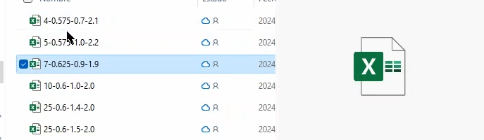
  <figcaption>Figura 150. Zona 4-5-7 confirmada como buena.</figcaption>
</figure>

Lo hemos visto antes. Aunque `25` estaba muy bien. Y de hecho, ese, si no recuerdo mal, es el que iba mejor. No podemos ver la curva, pero es el que iba mejor. Fíjate que se lleva el *TP* a 1.5: `25-0.6-1.5-2.0`.

Este además nos gusta mucho, porque no hay muchos. Los cortos cuesta encontrar un *set* ahí con un *TP* y aguanta lo suficiente. Este es probable que, aunque se salga un poco de la zona, lo lleváramos a operar:

<figure>
  
  <figcaption>Figura 151. Set 25-0.6-1.5-2.0: candidato fuerte pese a salirse ligeramente de zona.</figcaption>
</figure>

Porque en esta zona aguantaba bastante. Tiene `0.6` y tener *TP* de `1.5` en cortos, si realmente funciona, que creemos que se puede funcionar porque lo ha hecho, se ha operado en esa zona, estaría muy bien.


**Proceso de sustitución: qué sets entran y qué sets salen**

Y el resto de *sets*, ya digo, están operando. El único, yo al final es cupido el 1 y el 5:

<figure>
  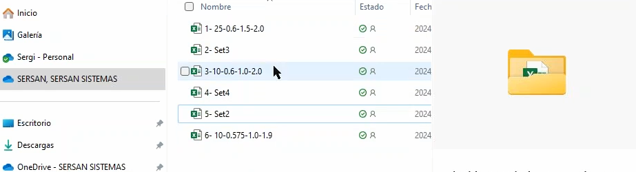
  <figcaption>Figura 152. Sets 1 y 5 candidatos a sustitución.</figcaption>
</figure>

El 1 es el que estaba en alerta, se ha lavado. Y el 2, 3 y 4 se quedan. Entonces el 1 y el 5 pues se podrían sustituir por estos. Hay que ahora ponerlo en común, pero sería el procedimiento normal que haríamos ahora. Íbamos una revisión de estos en pantalla.


**Selección vía Portfolio Maestro: última fase**

Y a veces nos quedamos con más. Y hoy me he quedado a ver, nos quedamos, puedes quedar con 10. Porque luego puede haber otra fase, digo verlo en pantalla conjuntamente. Y como ya os dije, vía *portfolio*.

Es decir, vía *portfolio*, ver ya cuál le pasa más. Es decir, meterlos todos, distintas combinaciones con tu mezcla de *portfolio*, y ver cuál de ellos va mejor a la cartera. Va mejor la cartera.

Porque a lo mejor este `25-0.6-1.5-2.0` es mejor por sí solo, pero resulta que este `3-10-0.6-1.0-2.0` a la cartera le va mejor porque diversifica más. Porque esto ya lo tiene otro sistema que operas, ¿entendéis?


## Revisión de incrementos: técnica correcta para detectar granularidad incorrecta

Una de las maneras de mirar los incrementos. Entonces lo hemos hecho aquí *AllData*. Yo miro la variación. Si yo tengo aquí un número entero, es decir, variar un punto del número entero, cómo varía. Es decir, estabilizo todas menos la que es el número entero, que es el indicador. Aquí mira, aquí tengo otro que varía el número entero, no varía:

<figure>
  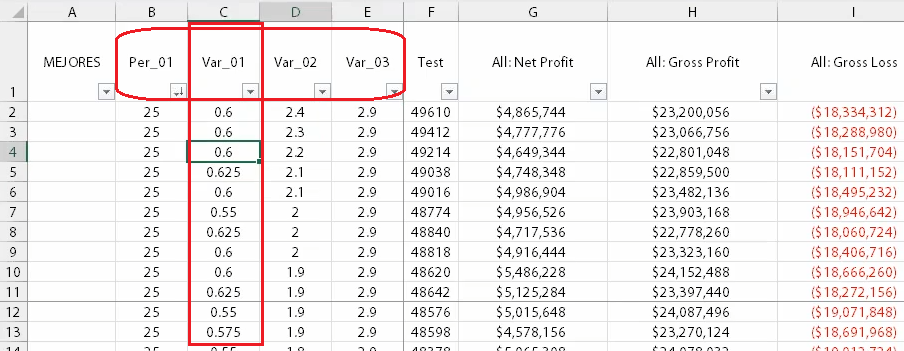
  <figcaption>Figura 153. Análisis de variación por incremento.</figcaption>
</figure>

Este es el que hemos visto antes. Entonces esta es una variación:

<figure>
  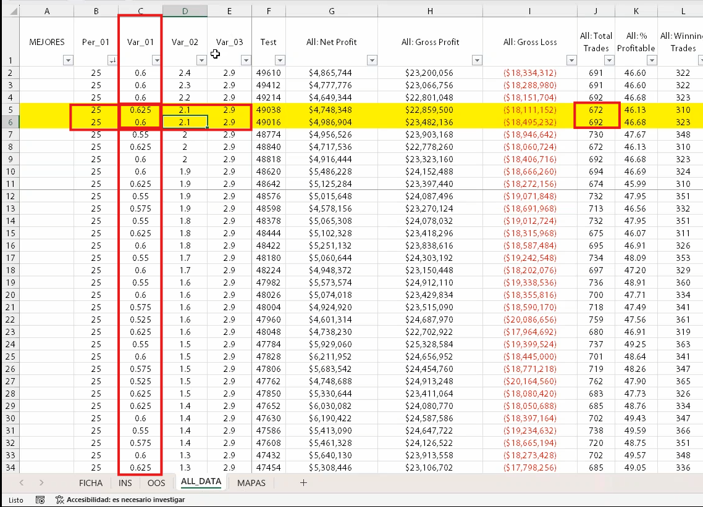
  <figcaption>Figura 155. Variación observada en el incremento.</figcaption>
</figure>


**Segunda técnica: observar cómo varían las otras columnas cuando cambia un input**

Pero lo que te decía, otra de las maneras es ver cómo varían las otras, ¿entiendes? Que eso es lo que no hemos caído antes.

Es decir, si yo tengo aquí un número entero, es decir, variar un punto del número entero, cómo varía. Es decir, estabilizo todas menos la que es el número entero, que es el indicador. Aquí mira, aquí tengo otro que varía el número entero, no varía. Solo dos *trades*:

<figure>
  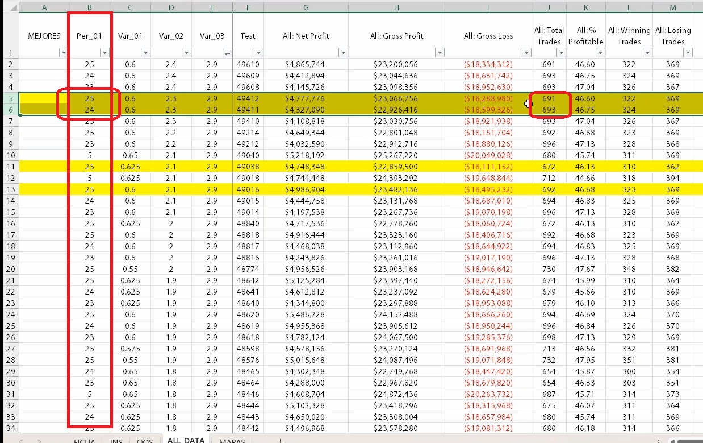
  <figcaption>Figura 156. Variación de solo 2 trades: incremento correcto.</figcaption>
</figure>

Entonces, desde este punto habría que ver también el valor bajo. Desde este punto de vista, eso que te decía, la sensación que me daba es que ese 0.025 era un poco alto, ¿entiendes?

Pero hay que mirarlo mejor. Entonces, pero es bastante probable que volvamos a trabajar un poco esto:

<figure>
  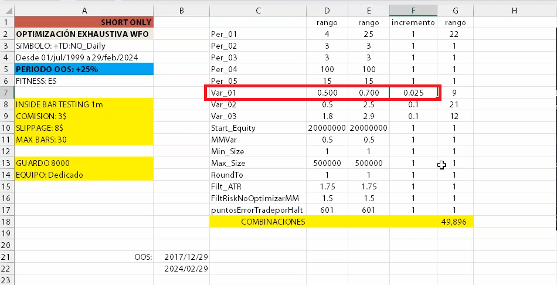
  <figcaption>Figura 157. Zona a revisar: incremento posiblemente excesivo.</figcaption>
</figure>

A ver si lo bajamos un poco. Ya de paso volveremos a analizar `Var_02`, `Var_03`. Y como hemos visto esta zona `Per_01`, el rango lo abriremos hasta 29, la abriremos. Es probable que la volvamos a hacer con estos dos criterios.

Pero bueno, lo que va a salir va a ser de este entorno. Que esto pasa a veces analizando los datos: pues te das cuenta que te has equivocado, que la zona que has tocado un límite, que tal. Es así.


**Confirmación empírica: variaciones excesivas en incrementos evidencian mala granularidad**

Y aquí, aunque esto lo revisamos hace unas semanas sobre los incrementos, pues no sé ahora deciros por qué. Pero mirando estos datos, yo, mi sensación ahora mismo es que el incremento es un poco elevado.

Mira, aquí tengo otra variación del corto. Solo ser el 0.625 y me varía nuevamente un montón de *trades*:

<figure>
  
  <figcaption>Figura 158. Variación de 27 trades: demasiado para un solo incremento.</figcaption>
</figure>

Me varía otra vez 27 *trades*. Es demasiado. En la parte baja no te varía más.


**Comparación con inputs discretos (enteros) para calibrar variación esperada**

Cuando en el que es de un número entero, que es así, que menos no puede ser (podía ser más pero no menos). A ver, aquí en la parte baja, mira, aquí tenemos 45. Aquí en la parte baja, bueno, un poquito más que antes, pero como veis estamos en menos. Son 11 *trades*:

<figure>
  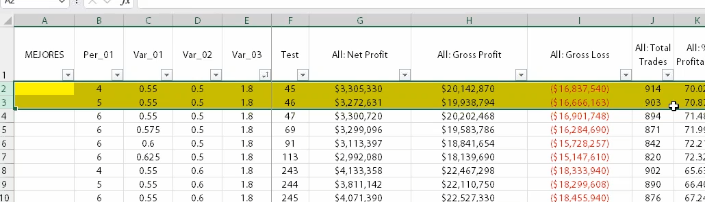
  <figcaption>Figura 160. Variación de 11 trades en input entero: referencia correcta.</figcaption>
</figure>

Y en 5, 10 *trades*. Yo lo encuentro que puede estar una zona razonable en esta magnitud de que son más 900. Pero que bueno es eso, no, cuando era antes 20 sobre 680 es un 3%.


**Límite superior razonable: incremento máximo basado en input entero equivalente**

No es fácil encontrar una pauta rígida. Pero es lo que decía: una manera que puedes buscar es ver que si tienes algún otro parámetro que va por número entero, no puede granular —podía ir de 2 en 2 o 3 en 3, pero no puede ir a menos de 1— pues ver ese 1 cuánto varía. Entonces, ese, como mucho, ese es el límite.


**Diferencia entre incrementos lineales y porcentuales en distintos indicadores**

Entonces también es depende, no, porque no es una media. Pero imagínate que es una media. No es lo mismo de 4 a 5 que de 25 a 26.

Esto, por ejemplo, en algún sistema lo hablamos, creo que lo enseñamos: tenemos un código para granular el incremento porcentualmente. Es un poco más complejo, pero bueno, al final no es más que programación.

En variarlo, por eso, que varía más de 4 a 5 que de 20 a 26. Al revés, perdón. Que varía menos de 4 a 5 y que se va haciendo exponencial. Luego llega a 20 y a 3 en 3, por ejemplo. Porque esto tiene bastante sentido.


**Conclusión: el incremento actual de Var_01 es demasiado amplio y debe reducirse**

Pero bueno, eso es un poco lo que hablamos de los incrementos. Así que sí que da la sensación que ese es un poco alto.

Y mira, ya que estamos, vamos a mirar también los de 0.10. Y aquí tenemos este, por ejemplo. Este está ahí en 12 *trades* de diferencia:

<figure>
  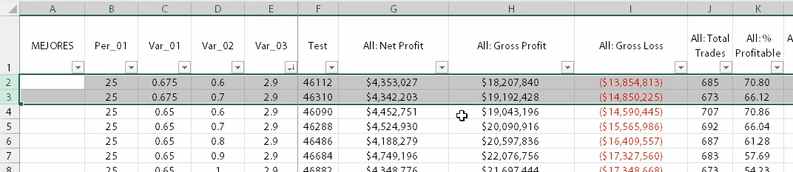
  <figcaption>Figura 161. Variación de 12 trades: más razonable.</figcaption>
</figure>

Este parece más razonable. 10, 15 *trades*, eso es que parece más razonable:

<figure>
  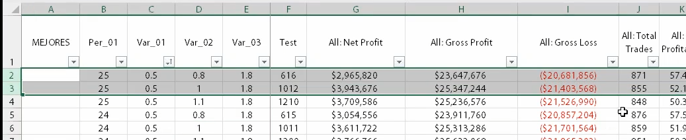
  <figcaption>Figura 162. Variaciones de 10-15 trades: zona correcta.</figcaption>
</figure>


**Zona baja: variaciones correctas; zona alta: variaciones excesivas**

Si bajamos mucho de *Stop*, en aquí tenemos variación de 2 *ticks*. Son más o menos como el otro era 1.

O sea, este, el `Var_01`, da sensación que está demasiado amplio. Y ese puede ser, y probablemente es, uno de porque le saltas demasiado de cadena. Fíjate la diferencia entre 0.525, 0.550 y 0.575:

<figure>
  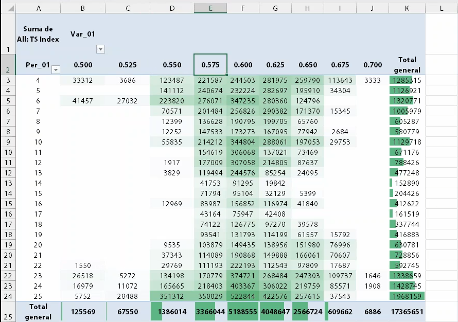
  <figcaption>Figura 163. Saltos excesivos entre 0.525, 0.550 y 0.575.</figcaption>
</figure>

Y esto, sin querer, porque no se ha previsto los incrementos, pues nos ha salido que quizá los incrementos de este *input* no están bien.

Y veis un poco lo que os hablaba en la teoría: que muchas veces, de la importancia de los incrementos, normalmente la prudencia de no pasarse. Pero que también lo comentamos: es necesario captar las señales. Y al final puedes pasarte, y como todo tiene su...

Tampoco es que esto sea una burrada ponerlo. No sería una burrada operarlo con este incremento, ni mucho menos. Pero está un poquito justito. Está un poquito justito y deberíamos seguramente bajarlo un poco más, o incluso hasta la mitad, a 0.00125. Hay que verlo:

<figure>
  
  <figcaption>Figura 157. Propuesta: reducir incremento de 0.0025 a 0.00125.</figcaption>
</figure>

<div style="border-left: 4px solid #e74c3c; background: #fdf2f2; padding: 10px 15px; margin: 10px 0; border-radius: 8px;">
  <strong>⚠️ Diagnóstico de incrementos incorrectos</strong><br><br>
  <table>
    <tr>
      <th>Síntoma</th>
      <th>Diagnóstico</th>
      <th>Acción</th>
    </tr>
    <tr>
      <td>20-27 trades por incremento</td>
      <td>Incremento demasiado amplio</td>
      <td>Reducir a la mitad</td>
    </tr>
    <tr>
      <td>10-15 trades por incremento</td>
      <td>Zona razonable</td>
      <td>Mantener</td>
    </tr>
    <tr>
      <td>1-2 trades por incremento</td>
      <td>Correcto para inputs enteros</td>
      <td>Usar como referencia</td>
    </tr>
  </table>
  <br>
  <strong>Regla práctica:</strong> Usar la variación de un input entero (que no puede granularse más) como límite máximo aceptable para los incrementos de inputs continuos.
</div>


## Cuestiones


***Una vez os salta una alarma (¿cuál?) para indicaros que una estrategia con un set de parámetros no está rindiendo: ¿Realizáis una optimización de todo? ¿En base a esta optimización concluís, revisado por dos pares de ojos (gafas aparte), que un nuevo juego de parámetros irá mejor? ¿Es así?***

Sí, sí. Bueno, es que depende. O sea, salta una alarma, ¿cuál? La alarma os lo he mostrado aquí al principio. Nosotros la mayoría de veces que revisamos, revisamos sin alarma. Es decir, porque tú ya le tienes sensibilidad al sistema, lo vas siguiendo. Lo que te digo: ves los gráficos y ves que no está yendo bien. Pero aun así, hay alarmas en los códigos. Que es eso que habéis visto: que cuando salta peor *drawdown*, peor *trade*, y peor serie de fallos, salta un aviso. Y lo vemos. Pero lo normal es que cuando salte ese aviso ya está revisado. Ahora queremos implementar, que sí, que cuando hacemos un análisis tenemos dudas, bajamos una lista de *trades* en Excel y eso lo enseñamos en una práctica, y lo hacemos. Lo que llamamos la revisión más completa.

Pero ya digo, normalmente antes de eso ya nos salta. Nosotros os explicamos en manera transparente las cosas que hacemos, cómo hacemos. Y también os explicamos cómo hay que hacer algunas, que a lo mejor no lo hacemos pues porque no hay tiempo, porque consideramos que no renta el esfuerzo. Que con que vale hacerlo, porque ya lo miro con este código que habéis visto, ¿me entendéis? Pero aun así, en la teoría os hemos explicado las maneras ortodoxas de hacerlo. Y la que, si tú tienes un equipo o tienes tiempo suficiente para desarrollarlo y demás, pues vale la pena hacerlo.

Pero por eso digo que no os volváis locos con eso. Porque mirando un *Performance Report*, vigilando el *drawdown*, vigilando los resultados del sistema, se puede hacer. La manera ortodoxa de hacer es llevando un control de operaciones, y que a partir de 30 *trades*, ya os lo expliqué, hay distintos análisis estadísticos. Y también me suena que dimos el Excel de eso, pero ahora tengo dudas. Y se pueden hacer distintas pruebas de evaluación, y con eso sale.

Pero de verdad, los que tengáis un nivel avanzado, bien. Los que estéis en una fase inicial, no os comáis la cabeza con eso. De verdad, no os comáis la cabeza y basaros en cosas: *drawdown*, racha de fallos, etcétera.

**Procedimiento real de revisión para este sistema concreto**

Entonces, el proceso de revisión de este sistema, ya digo, es un sistema que lleva mucho tiempo operando. Y consiste en eso: revisar nuevamente los mapas.

Y no lo he dicho, eso por cierto: los *sets* que elegimos, que están hechos en una optimización que viene desde el 99, ***se miran solo en los últimos 10 años***. Lo ponía en la carpeta pero no lo he dicho. Este *Performance Report* que cogemos no es de todo el histórico, es de los últimos 10. Y si el sistema es intradía, puede ser de 5, incluso de 2. Depende del sistema.

¿Por qué? Porque a mí, yo ya he elegido, yo ya he optimizado, he hecho los mapas de todo el histórico. Pero para acabar de elegir *sets* y ver, me interesa, dentro de esa muestra de todo el histórico, es decir, no optimizo solo los últimos 10 años, yo he optimizado todo. Pero dentro de esa muestra del histórico, me centro solo en el último periodo más cercano, que son los últimos 10 años.

No ves el 99. Son pues 25, final es la mitad. Y podía ser un poco menos. Pero bueno, como es un sistema diario, que al final eso tiene 303 *trades*, estas combinaciones aquí pueden tener 303, 280, de ese orden. Entonces bueno, menos ya... Preferimos que sea una muestra de ese tipo. Pero si fuera intradía, a lo mejor pues lo haríamos con más *trades*.

<div style="border-left: 4px solid #27ae60; background: #ecf9f1; padding: 10px 15px; margin: 10px 0; border-radius: 8px;">
  <strong>📋 Horizonte de evaluación según tipo de sistema</strong><br><br>
  <table>
    <tr>
      <th>Tipo de sistema</th>
      <th>Optimización</th>
      <th>Selección final de sets</th>
    </tr>
    <tr>
      <td>Diario</td>
      <td>Todo el histórico (desde 1999)</td>
      <td>Últimos 10 años</td>
    </tr>
    <tr>
      <td>Intradía</td>
      <td>Todo el histórico</td>
      <td>Últimos 5 años (o incluso 2)</td>
    </tr>
  </table>
  <br>
  <strong>Lógica:</strong> Optimizar en todo el histórico para robustez, pero seleccionar sets mirando el periodo más reciente para relevancia actual.
</div>


**Qué pasa cuando salta una alarma y cuándo se reoptimiza todo**

Sí, realmente hemos hecho más cosas, como os decía antes. Que, por ejemplo, revisamos el tema de los incrementos. Revisamos, miramos los que están operando para evaluar si estaban rotos o podían estar todavía dentro de una zona normal. Concluimos que alguno podría estar ya demasiado desviado.

Y ahí se inicia este proceso de optimización de todo, porque se sospecha que puede haber algún *set* fuera de rango.

Y de hecho se ve que alguno está un poco forzado ahí en el mapa, un poco justo. Que está ahí en la zona un poco justa. Porque ahí, esto ahora no he querido tampoco decirlo porque no lo he enseñado, pero de las últimas veces, el 3 degrada mucho.

Es decir, normalmente la vamos a ahora hacer para arriba. Para arriba ya sospechaba que saldría bien lo que, para arriba sospecho que va a salir bien. Para abajo sospecho que va a salir mal.

Entonces los cuatro ahí están un poquito más justos. Entonces ese son *sets* muy inestables.

Y bueno, pues ahí sí es el resumen en esta estrategia, que es una estrategia que opera en gráfico diario, que lleva muchos años operando, y que es extremadamente sencilla. O sea, que es un sistema extremadamente sencillo. El sistema de operar no son ni tres líneas. Y digo tres por no decir dos.

## Por qué no se hace Walk-Forward para Apolo

Sí que se ha hecho *Walk Forward* para Apolo. El problema que tiene, de hecho tenemos pendiente intentar hacerlo. Lo que pasa que en TradeStation nos ha petado porque tiene demasiadas... Lo que ya creo que ya os lo conté, nos reventó. Entonces ahora hemos bajado una demo que tiene buena pinta y estamos en ello. Entonces vamos aprendiendo un poco. Pero porque tenía que ser más estrecha, no me convence estrecharla tanto. Al final lo trucas.

Pero el *Walk Forward* en este tipo de sistema, uno es diario, el número de *trades* va muy justo. Hay que hacerlo sin gestión monetaria, porque la gestión monetaria al hacer *rolling*, la mayoría lo cuentan por dinero, y entonces se rompe. Se carga el *drawdown*, no es comparable. Porque el *drawdown*, claro, va subiendo, va subiendo. El retorno va subiendo, el *drawdown* a magnitudes enormes. Entonces, digamos que no sé si este programa lo hará, pero el TradeStation no homogeniza los resultados bien. Los toma en valor absoluto. Entonces, al final no se pueden comparar los distintos periodos. Y más en un diario que mezcla muchos años.

¿Entiendes? Entonces los periodos *In Sample* y *Out of Sample*, haciendo el *rolling* que va haciendo, no son comparables. Y al final da datos de comparar peras con manzanas. Entonces hay que hacerlos sin gestión monetaria.

Y el otro problema que tiene un *equity* en *short* es que es muy inestable. Es decir, te pasa muchos periodos de mercado largo. O sea, encontrar una ventana óptima es complejo, porque es un mercado, como os he enseñado antes, que no es nada estable. Entonces el *short* es muy complicado de pasar en un *Walk Forward* en un *equity*. Es muy complicado.

Pero aun así tenemos pendiente mirarlo. Sí que lo ha pasado seguro cuando operaba, o sea, cuando lo optimizamos junto, que esto ya os he comentado antes al inicio, que lo hacíamos así, lo pasaba. Porque lo tenía más *trades*. Y entonces tenía la capacidad de ir a los dos lados y adaptarse mejor. Pero así es extremadamente complicado. Semanalmente complicado. Porque que un periodo tenga capacidad predictiva para el otro, en el largo es más fácil. Pero en el corto es muy complicado, porque depende de ventanas muy estrechas.

Y entonces, claro, cuando entra un periodo muy alcista, se pone en modo muy alcista. Pega una pequeña corrección un poco fuerte, y como está en modo alcista, no entra. Entonces bueno, es complicado que los parámetros vayan adaptando haciendo *rolling*.


**Opción alternativa: Anchored Walk Forward en lugar de Rolling**

Entonces, aquí sí que suele ser mejor, puede ser que vaya mejor en el *Anchored*. Eso lo tenemos pendiente de mirar. Puede ir mejor, porque al final el periodo es mucho más largo, ¿entiendes?

Y eso es lo que necesita un sistema de este tipo: parámetros muy largos. O sea, que sea muy, muy largo el periodo para poder adaptarse. Para poder encontrar todo tipo de mercados con los parámetros que se muevan de manera distinta en todo tipo de mercados. Porque al final se está moviendo en un territorio que es hostil para él.

O sea, esto es obvio. Es obvio que un sistema de cortos para *equity* es una zona hostil. No es una zona ideal. De hecho, hay mucha gente que defiende no hacerlo esto. Es lo que, claro, lo explicado por qué nosotros lo hacemos.

Pero vais a leer mucha gente entendida incluso que te va a decir que no operes nunca en corto en bolsa. Te lo va a decir mucha gente.

<div style="border-left: 4px solid #9b59b6; background: #f5eef8; padding: 10px 15px; margin: 10px 0; border-radius: 8px;">
  <strong>🔄 Walk Forward en sistemas de cortos</strong><br><br>
  <table>
    <tr>
      <th>Modalidad</th>
      <th>Problema en cortos</th>
      <th>Viabilidad</th>
    </tr>
    <tr>
      <td><strong>Rolling WF</strong></td>
      <td>Ventanas muy estrechas, periodos alcistas rompen predicción</td>
      <td>⚠️ Muy difícil</td>
    </tr>
    <tr>
      <td><strong>Anchored WF</strong></td>
      <td>Requiere periodos muy largos</td>
      <td>✅ Más viable</td>
    </tr>
  </table>
  <br>
  <strong>Requisitos adicionales:</strong><br>
  • Hacerlo SIN gestión monetaria (evita distorsión por magnitudes)<br>
  • Sistema junto (largo + corto) pasa mejor que solo cortos
</div>

## Nuestra lógica: alfa y descorrelación para carteras de clientes

No es incorrecto, pero yo vuelvo un poco a decir lo que te decía antes del *portfolio* y lo que tú quieres hacer a nivel de producto.

Cuando tú, de una manera u otra, tratas de obtener rentabilidad para otra gente, para terceros. Entonces, nosotros al final esa es nuestra intención. Nosotros es ganar dinero a través de que clientes que operan nuestras estrategias ganan dinero. Y por eso yo tengo dos perfiles: tengo un perfil que es ***Smart Beta*** y tengo un perfil que es ser ***Alfa***.

Entonces, claro, el alfa es eso. El alfa sobre todo es batir a la renta variable. Es decir, tener correlación cero o negativa con la renta variable. Entonces, claro, si tú buscas alfa, ya sé que cuesta, pero meter cortos da mucha alfa. ¿Que tú quieres beta? Pues ya tienes ***Smart Beta*** que hace eso.


**Recomendación personal para traders en formación**

¿Qué haces entonces? Es un poco depende de lo que tú quieras. ¿Ahora tú estás haciendo un *portfolio*, estás empezando? ***Olvídate de los cortos en bolsa. Olvídate.*** O sea, no es el sitio fácil. Las cosas fáciles no es buscar cortos en bolsa. No es buscar cortos.

Ahora, que tú ya tienes una cartera y buscas algo para diversificar tu cartera de bolsa, pues adelante, a por ello. Pero no es la primera cosa a hacer, ni mucho menos, ni probablemente la segunda. Aunque el otro día lo comentó Senén en el Discord, y nosotros también: en el ***ORB*** digamos nos fue más fácil sacar cortos que largos.

Pero eso tiene el sentido de que es lo que se explicaba. Al final, a los ***ORB*** les está escapando. ¿Qué pasa aquí con el *TP*? Lo habéis visto de Apolo, ¿no? Que quiere corto el *TP*, lo quiere cerca. Porque el corto necesita en bolsa operar rápido y salirse rápido.

En cambio, un ***ORB***, ¿qué hace? Hace eso. Nosotros probamos un ***ORB*** que cerraba a final de día. Ese fue lo que intentamos encontrar.

Entonces, claro, si yo te estoy obligando a cerrar a fin de día, pues en el lado largo normalmente estás escapando mucho rendimiento. Porque si va a subir, va a subir, va a subir cinco días, pues para qué cerrar a fin de día. Entonces luego hay *gaps*, etcétera.

En cambio, en el corto es al revés. Eso es lo que le gusta. Le gusta hacer rápido, perfecto. Pues es más fácil si tú obligas a cerrar en el día, encontrar con roturas de volatilidad, hagas *TP*, te salgas y ganas en corto. Entonces, un ***ORB*** intradía cerrando a fin de día es más fácil en corto que largo.

Pero esto no es contrario al otro, justamente es lo mismo, refuerza. Es por la obligación a cerrar a fin de día, ¿entiendes? Porque yo lo obligo.

Si yo le hago mantener la posición dos días, completamente se invierte la tortilla. Entonces el corto le va a costar una vida, un montón. En el largo te va a ser muy fácil, ¿entiendes?

Es un poco la diferencia de dejar correr o no dejar correr. Los cortos no quieren correr, no quieren dejar correr beneficios. En cambio, los largos quieren dejar correr porque el mercado no hace más que subir en el largo plazo.

<div style="border-left: 4px solid #f39c12; background: #fef9e7; padding: 10px 15px; margin: 10px 0; border-radius: 8px;">
  <strong>⚖️ Largos vs Cortos: filosofía de salida opuesta</strong><br><br>
  <table>
    <tr>
      <th></th>
      <th>Lado Largo</th>
      <th>Lado Corto</th>
    </tr>
    <tr>
      <td><strong>TP ideal</strong></td>
      <td>Lejano (dejar correr)</td>
      <td>Cercano (salir rápido)</td>
    </tr>
    <tr>
      <td><strong>Cierre fin de día</strong></td>
      <td>❌ Escapa rendimiento</td>
      <td>✅ Encaja perfecto</td>
    </tr>
    <tr>
      <td><strong>ORB intradía</strong></td>
      <td>Más difícil</td>
      <td>Más fácil</td>
    </tr>
    <tr>
      <td><strong>Mantener 2+ días</strong></td>
      <td>✅ Beneficioso</td>
      <td>❌ Muy costoso</td>
    </tr>
  </table>
  <br>
  <strong>Conclusión:</strong> El sesgo alcista del mercado define toda la arquitectura de salidas. Los cortos en equity solo funcionan bien cuando se diseñan para salir rápido.
</div>