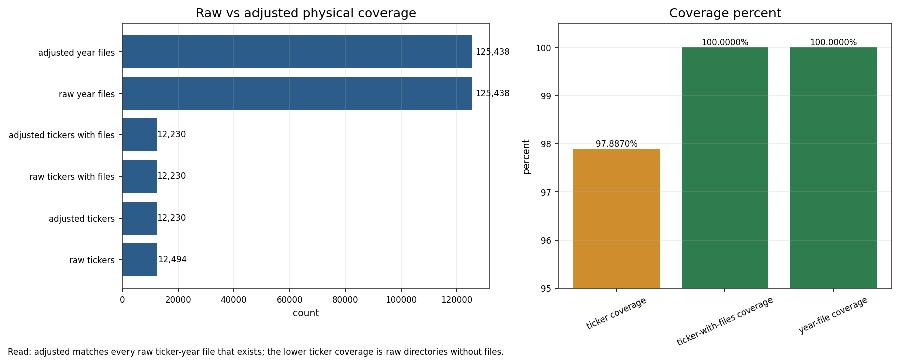
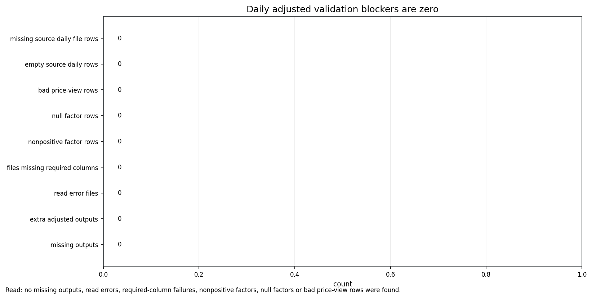
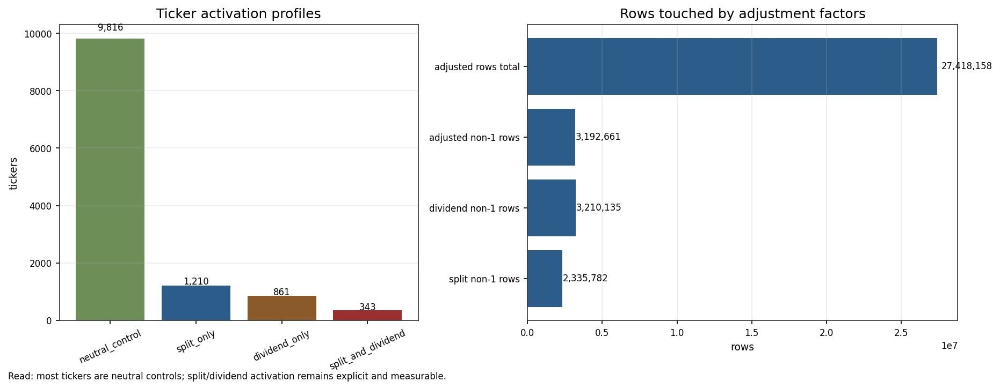
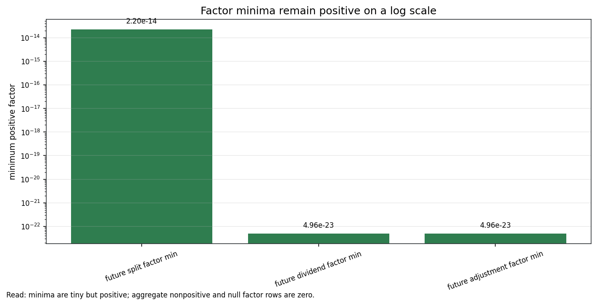
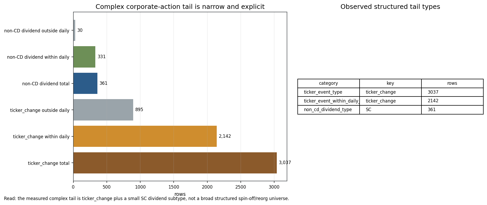
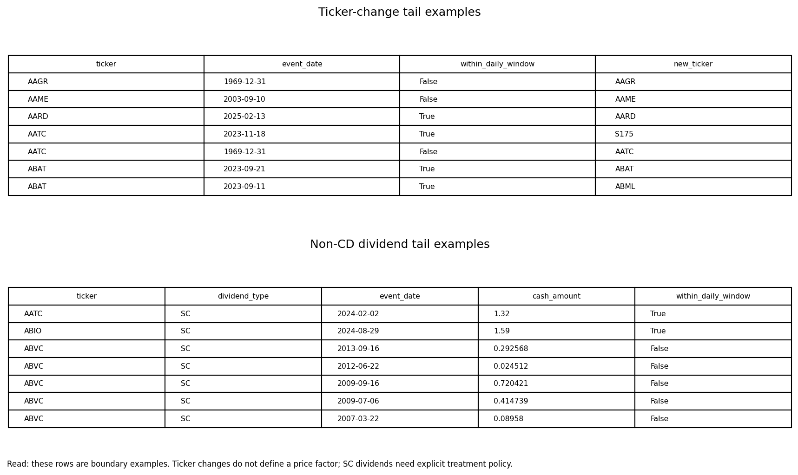
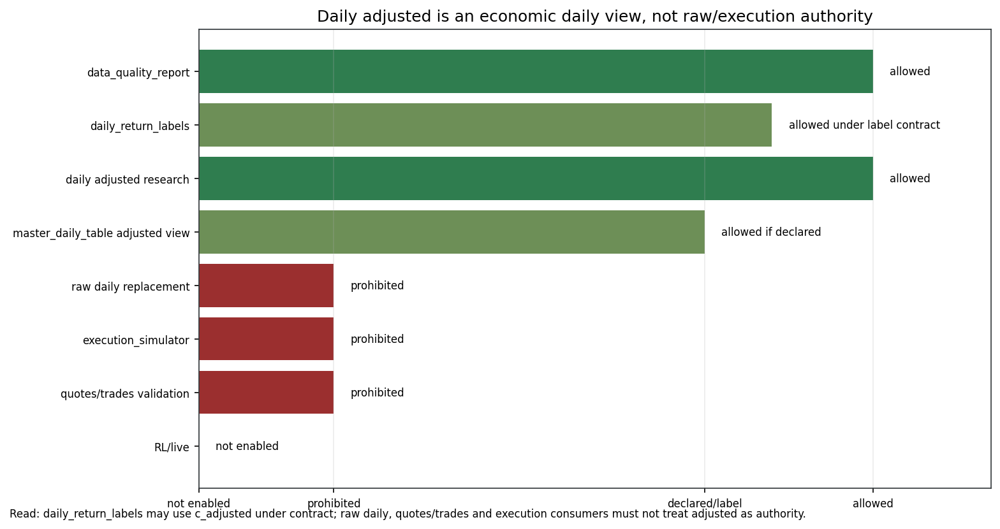

# Daily Adjusted Visual Inspector Pack v0.1

Family:

```text
daily_adjusted_v0_1
```

Physical root:

```text
E:/TSIS/data/ohlcv_daily_adjusted
```

Visual inspection status:

```text
visual_complete
```

Foundations completion status:

```text
human_inspector_ready
```

## 1. Scope

This pack formalizes visual evidence for `daily_adjusted_v0_1` as a
full-universe derived daily adjusted price view.

It answers:

1. Is adjusted materialized for every raw ticker-year file with data?
2. Are validation blockers zero?
3. Which tickers and rows are affected by split/dividend adjustment factors?
4. Do factor minima remain positive?
5. What corporate-action boundary debt remains?
6. Which consumers may use this view?

It does not claim that adjusted daily is raw daily, tape, book, execution,
live, RL or intraday authority.

## 2. Visual Panels

### 2.1 Full-Universe Coverage



What it shows:

- `raw_tickers = 12,494`;
- `adjusted_tickers = 12,230`;
- `raw_tickers_with_files = 12,230`;
- `adjusted_tickers_with_files = 12,230`;
- `raw_year_files = 125,438`;
- `adjusted_year_files = 125,438`;
- ticker-with-files and year-file coverage at `100.0000%`.

Inspector reading:

- The adjusted layer matches every raw ticker-year file that exists.
- The lower ticker-only coverage is explained by raw ticker directories without
  files, not by missing adjusted outputs.

### 2.2 Validation Gate



What it shows:

- missing outputs: `0`;
- extra adjusted outputs: `0`;
- read error files: `0`;
- files missing required columns: `0`;
- nonpositive factor rows: `0`;
- null factor rows: `0`;
- bad price-view rows: `0`.

Inspector reading:

- No aggregate validation blocker is present in the full-universe audit.

### 2.3 Activation Profile



What it shows:

- `neutral_control = 9,816`;
- `split_only = 1,210`;
- `dividend_only = 861`;
- `split_and_dividend = 343`;
- rows where split/dividend/combined factors differ from 1.

Inspector reading:

- Most tickers are neutral controls.
- Split/dividend activation is explicit and measurable.

### 2.4 Factor Minima



What it shows:

- minimum future split, dividend and combined adjustment factors on a log scale.

Inspector reading:

- Factor minima are tiny but positive.
- The audit also reports zero nonpositive and zero null factor rows.

### 2.5 Complex Corporate-Action Tail



What it shows:

- `ticker_change_rows_total = 3,037`;
- `ticker_change_rows_within_daily_window = 2,142`;
- `non_cd_dividend_rows_total = 361`;
- observed non-CD dividend type is `SC`.

Inspector reading:

- The remaining complex tail is narrow and explicit.
- Ticker changes require a continuity/remap policy; they are not price factors.
- `SC` dividend treatment needs explicit policy wording, but this is not a
  failure of split/cash-dividend mechanics.

### 2.6 Tail Case Examples



What it shows:

- concrete ticker-change rows;
- concrete non-CD dividend rows.

Inspector reading:

- The boundary debt is visible as real rows.
- These cases should be handled by policy, not by pretending the current
  adjustment chain failed.

### 2.7 Consumer Boundary



What it shows:

- `data_quality_report`, daily adjusted research and declared adjusted views are
  allowed;
- `daily_return_labels` may use `c_adjusted` under label contract;
- raw daily replacement, execution simulator and quotes/trades validation are
  prohibited;
- RL/live are not enabled.

Inspector reading:

- `daily_adjusted` is economic daily truth for declared daily consumers.
- It is not raw/intraday/execution authority.

## 3. Manifested Visual Assets

The complete machine-readable visual index is:

```text
daily_adjusted_visual_case_manifest_v0_1.csv
```

The generated asset audit is:

```text
daily_adjusted_visual_asset_audit_v0_1.csv
```

The pack contains:

- 7 generated visual panels;
- 7 manifested image assets total.

## 4. Verdict

`daily_adjusted_v0_1` now has a formal visual inspector pack matching the
foundation completion standard.

Final visual verdict:

```text
visual_complete_full_universe_derived_daily_adjusted_view
```

