# Reference Visual Inspector Pack v0.1

Family:

```text
reference_v0_1
```

Physical root:

```text
E:/TSIS/data/reference
```

Visual inspection status:

```text
visual_complete
```

Foundations completion status:

```text
human_inspector_ready
```

## 1. Scope

This pack formalizes visual evidence for `reference_v0_1` as an upstream
identity, lifecycle, corporate-action and event/reference support layer.

It answers:

1. Is identity mostly resolved while preserving review/bad residuals?
2. Which endpoints have expected status semantics versus true residual risk?
3. Which payload families contain real events versus placeholders?
4. Where does reference explain downstream market-data anomalies?
5. What are the boundaries around `all_tickers`, ticker changes and consumers?

It does not promote reference as alpha, live, RL, final universe membership or
continuity-remap service.

## 2. Generated Panels

### 2.1 Identity Quality

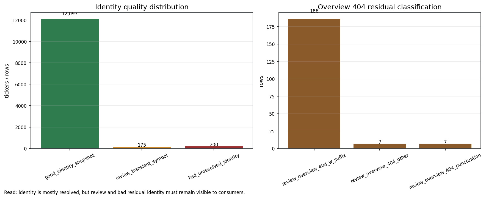

What it shows:

- `good_identity_snapshot = 12,093`;
- `review_transient_symbol = 175`;
- `bad_unresolved_identity = 200`;
- overview 404 residual split into suffix, other and punctuation classes.

Inspector reading:

- Identity is mostly resolved.
- Review and bad residual identity are explicit and must remain flagged.
- Unresolved identity must not be consumed as resolved continuity.

### 2.2 Download Endpoint Status

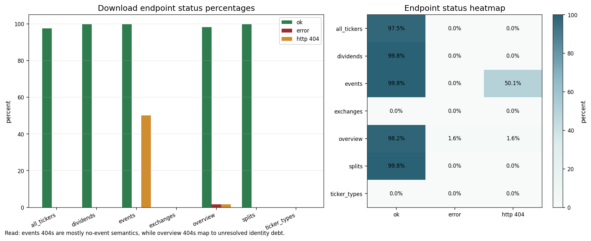

What it shows:

- endpoint-level `ok_pct`, `error_pct` and `http_404_pct`;
- events show a large 404 semantic mass;
- overview has a small error/404 identity residual.

Inspector reading:

- `events` 404s are mostly no-event semantics, not corruption by default.
- `overview` 404/errors map to identity residual and must stay visible.
- `exchanges` and `ticker_types` are operational resume-skip surfaces, not
  high-volume failures.

### 2.3 Payload Families

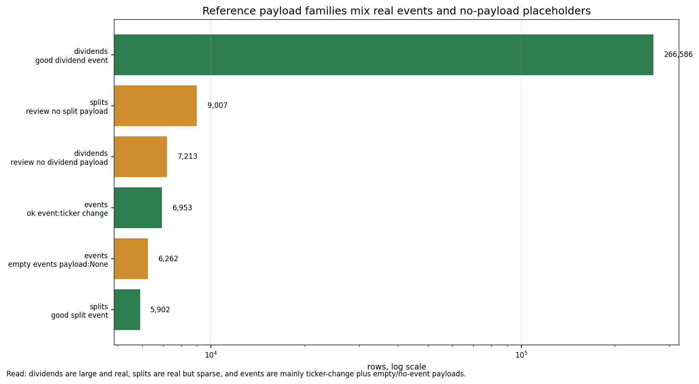

What it shows:

- dividends contain a large real-event mass;
- splits contain real but sparse split events;
- events are mainly ticker-change plus empty/no-event payloads.

Inspector reading:

- Dividends and splits can support corporate-action consumers under policy.
- Empty/no-event payloads must not be read as missing data without family
  semantics.
- Ticker changes are not trading signals.

### 2.4 Causal Alignment

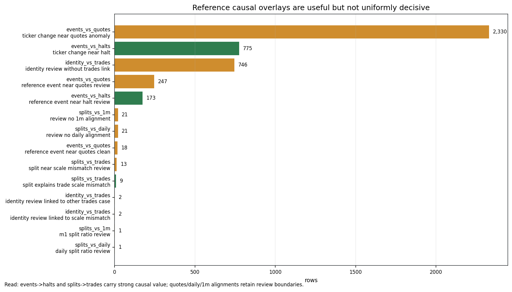

What it shows:

- ticker changes near halts;
- ticker changes near quotes anomalies;
- split/trades scale mismatch explanation and review buckets;
- daily and 1m split-alignment review buckets.

Inspector reading:

- `events -> halts` and `splits -> trades` are the strongest causal fronts.
- `events -> quotes` is a strong detector/review surface, not closed causality
  for every case.
- Daily and 1m alignments keep review boundaries.

### 2.5 Listing Presence Boundary

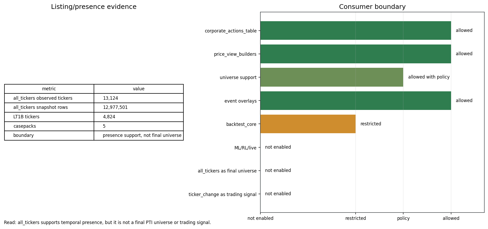

What it shows:

- `all_tickers` observed ticker count;
- total listing snapshot rows;
- LT1B overlap;
- casepack count;
- allowed/restricted/not-enabled downstream consumers.

Inspector reading:

- `all_tickers` supports temporal presence and coverage.
- It does not replace a final PTI universe builder.
- `reference` supports corporate actions, price view builders and overlays under
  policy, but not alpha/live/RL.

### 2.6 Casepack Status

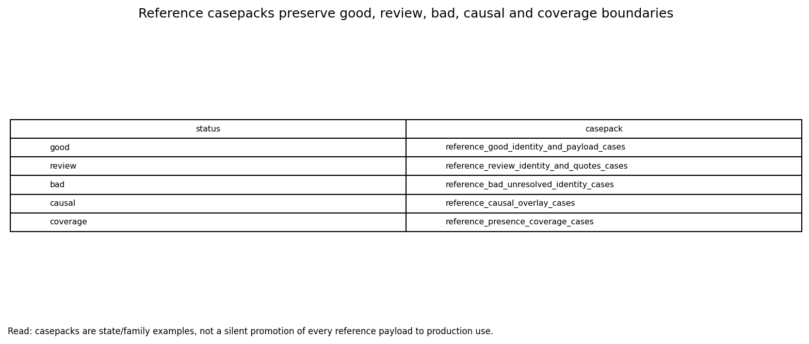

What it shows:

- good identity/payload cases;
- review identity/quotes cases;
- bad unresolved identity cases;
- causal overlay cases;
- presence coverage cases.

Inspector reading:

- The casepacks preserve state boundaries.
- They do not silently promote every reference payload to production use.

## 3. Promoted Existing Population Visuals

### 3.1 Identity Quality Distribution

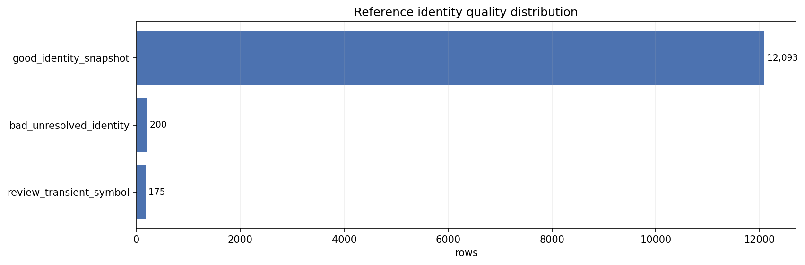

This preserved visual shows the same good/review/bad identity distribution from
the historical population overview.

### 3.2 Download Endpoint Status

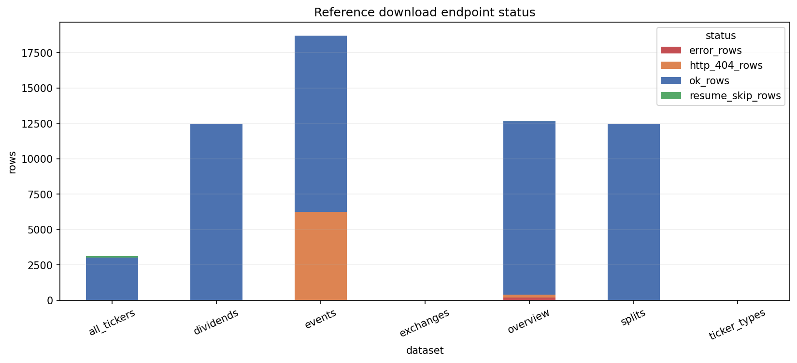

This preserved visual shows endpoint status and supports the distinction between
real residual risk and endpoint-specific semantics.

### 3.3 Payload Family Distribution

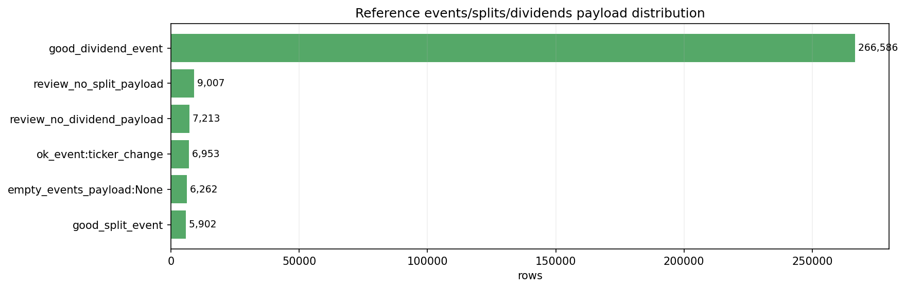

This preserved visual shows events, splits and dividends payload families.

### 3.4 Causal Alignment Distribution

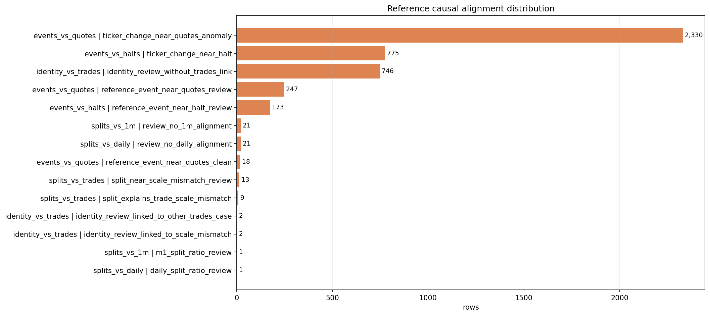

This preserved visual shows where reference has causal explanatory value versus
review-only overlay value.

### 3.5 Listing Snapshot Density

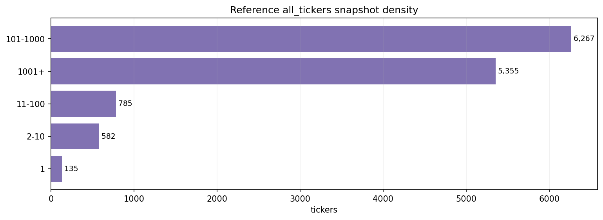

This preserved visual shows the density of `all_tickers` snapshots and supports
the boundary that presence support is not final universe membership.

## 4. Manifested Visual Assets

The complete machine-readable visual index is:

```text
reference_visual_case_manifest_v0_1.csv
```

The generated asset audit is:

```text
reference_visual_asset_audit_v0_1.csv
```

The pack contains:

- 6 generated aggregate panels;
- 5 copied population visuals;
- 11 manifested image assets total.

## 5. Verdict

`reference_v0_1` now has a formal visual inspector pack matching the foundation
completion standard.

Final visual verdict:

```text
visual_complete_reference_foundation_layer
```
