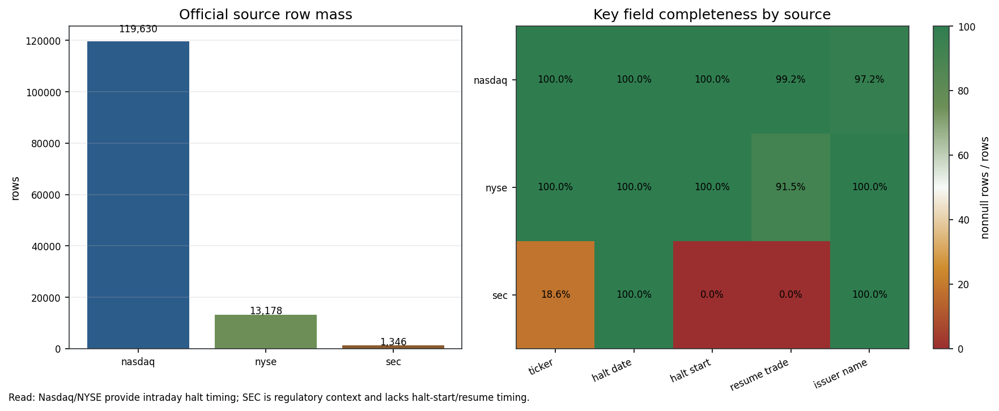
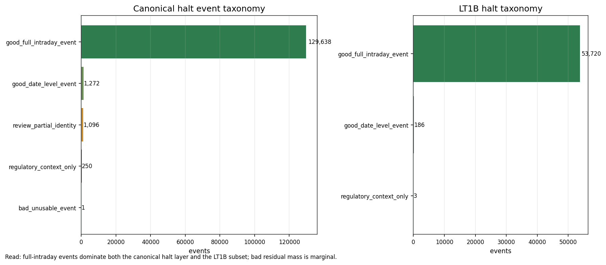
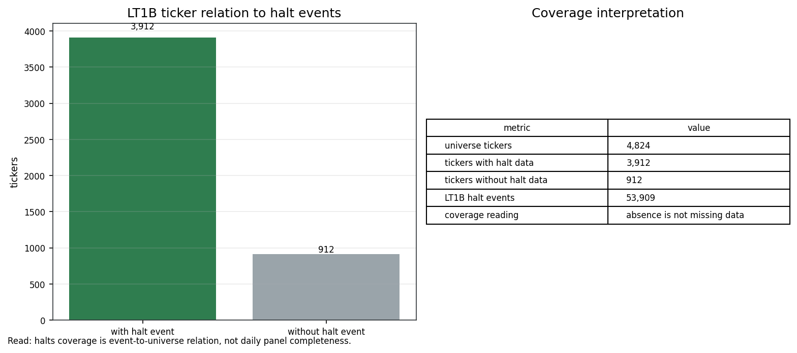
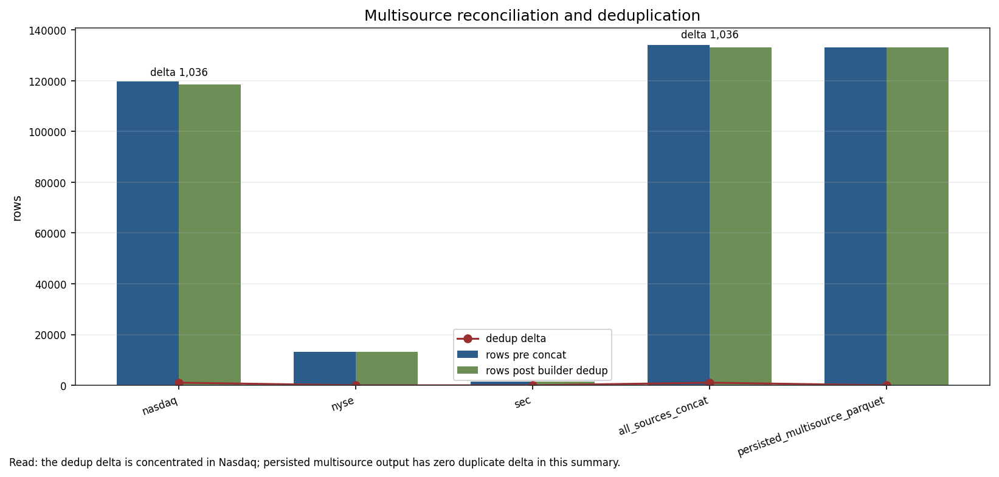
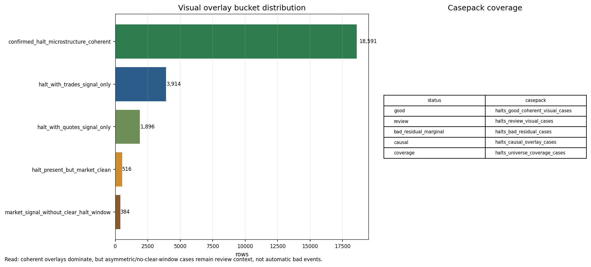
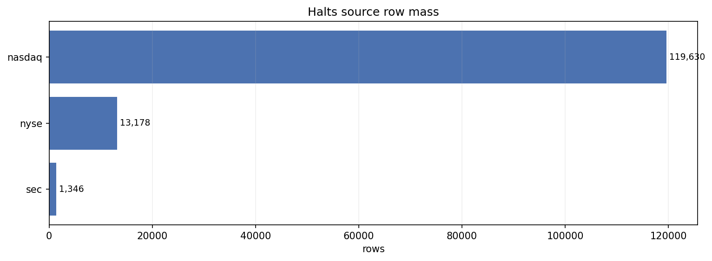
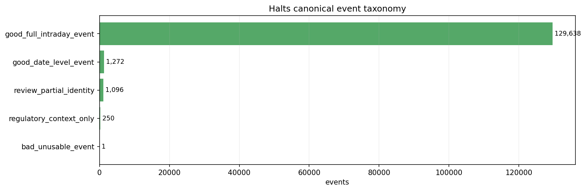
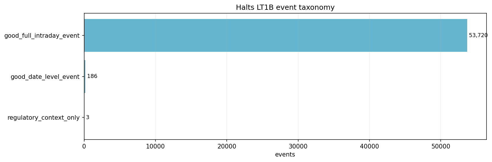
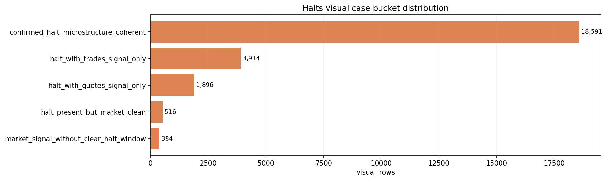
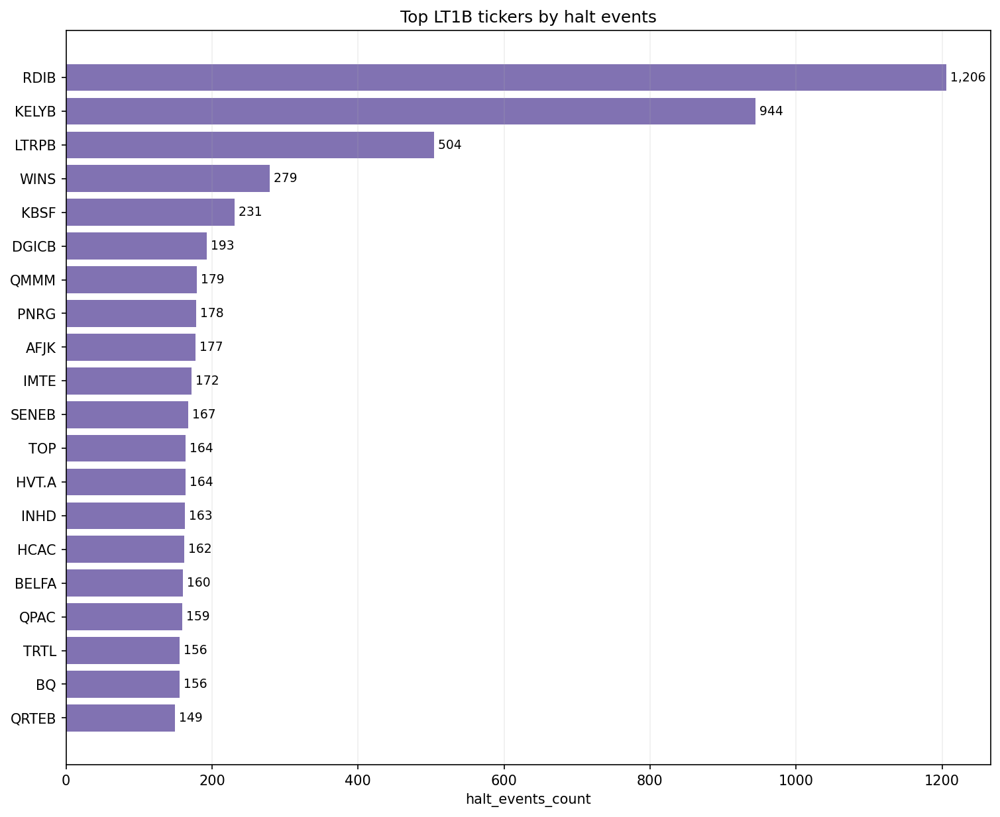

# Halts Visual Inspector Pack v0.1

Family:

```text
halts_v0_1
```

Physical root:

```text
E:/TSIS/data/Halts
```

Visual inspection status:

```text
visual_complete
```

Foundations completion status:

```text
human_inspector_ready
```

## 1. Scope

This pack formalizes the visual evidence for `halts_v0_1` as an official
event/reference layer.

It answers:

1. Which official sources carry row mass and intraday timing?
2. What event taxonomy dominates the dataset?
3. Does the taxonomy remain usable inside the `<1B>` universe?
4. What does multisource reconciliation change?
5. How are good, review, bad residual, causal and coverage cases separated?

It does not claim that halts are alpha, live, RL or execution-simulation input.

## 2. Generated Panels

### 2.1 Source Completeness



What it shows:

- source row mass for Nasdaq, NYSE and SEC;
- key-field completeness for ticker, halt date, halt start, resume trade and
  issuer name.

Inspector reading:

- Nasdaq dominates row mass.
- Nasdaq and NYSE carry intraday halt timing.
- SEC is regulatory context and should not be treated as an intraday halt
  window by default.

### 2.2 Event Taxonomy Scope



What it shows:

- canonical event taxonomy distribution;
- `<1B>` event taxonomy distribution.

Inspector reading:

- `good_full_intraday_event` dominates both global and `<1B>` populations.
- `bad_unusable_event` is marginal.
- Review, date-level and regulatory-context buckets remain semantically
  distinct and must not be collapsed.

### 2.3 LT1B Universe Coverage



What it shows:

- 4,824 universe tickers;
- 3,912 tickers with at least one matched halt event;
- 912 tickers without matched halt data;
- 53,909 matched halt events for the universe.

Inspector reading:

- Absence of a halt row means no matched official halt event.
- It does not mean missing daily coverage.

### 2.4 Multisource Reconciliation



What it shows:

- rows before concat;
- rows after builder dedup;
- dedup deltas by source/scope.

Inspector reading:

- Dedup delta is concentrated in Nasdaq and all-source concat.
- NYSE and SEC show no aggregate dedup delta in this summary.
- Changes to dedup semantics are version-sensitive.

### 2.5 Visual Casepack Boundary



What it shows:

- historical overlay bucket distribution;
- inventory of good, review, bad residual, causal and coverage casepacks.

Inspector reading:

- Coherent halt/microstructure overlays dominate.
- Asymmetric or no-clear-window cases are review context, not automatic bad
  official events.
- The single hard bad residual is explicitly bounded.

## 3. Promoted Existing Population Visuals

### 3.1 Source Quality Rows



This preserved population visual shows source row mass and supports the same
reading as the generated source-completeness panel: source semantics differ and
must be preserved.

### 3.2 Canonical Event Taxonomy



This preserved visual shows the canonical event taxonomy. Its core reading is
that full-intraday events dominate, while hard-bad residual mass is tiny.

### 3.3 LT1B Event Taxonomy



This preserved visual shows that the `<1B>` subset remains dominated by
full-intraday halt events.

### 3.4 Visual Case Bucket Distribution



This preserved visual shows overlay bucket mass from historical halt vs
quotes/trades evidence. The dominant bucket is coherent halt microstructure.

### 3.5 Top Tickers By Halt Events



This preserved visual shows event concentration by ticker. The inspector must
avoid letting high-halt tickers define global quality alone.

## 4. Manifested Visual Assets

The complete machine-readable visual index is:

```text
halts_visual_case_manifest_v0_1.csv
```

The generated asset audit is:

```text
halts_visual_asset_audit_v0_1.csv
```

The pack contains:

- 5 generated aggregate panels;
- 5 copied population visuals;
- 10 manifested image assets total.

## 5. Verdict

`halts_v0_1` now has a formal visual inspector pack matching the foundation
completion standard.

Final visual verdict:

```text
visual_complete_event_context_layer
```
