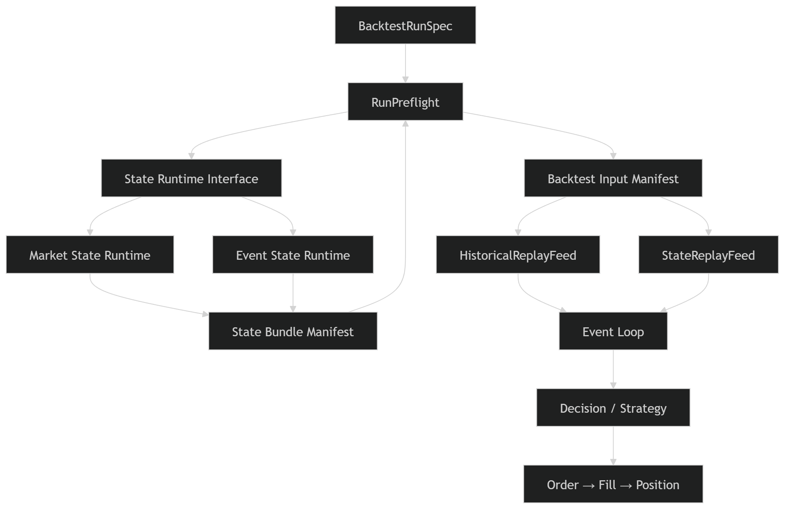

# Arquitectura de CONSTRUCCIÓN de `Market State` y `Event State`

## Propósito

Este documento define cómo TSIS construye las representaciones canónicas del estado observable del mercado.

La información utilizada para construir esas representaciones procede de las tablas fuente de representación (`000–018`),
revisadas y gobernadas dentro de:

```text
02_TABLE_REPRESENTATION_REVIEW/
```
A partir de esa información, los builders construyen dos representaciones del estado:
```
Market State
Event State
```

Estas representaciones pueden materializarse posteriormente mediante:

```
market_state_table
event_state_table
```

pero este documento describe su arquitectura conceptual, no su implementación física.

## Market State y Event State

Estas dos representaciones del estado poseen granos semánticos distintos.
Su materialización física puede realizarse mediante:

**Market State** = *cómo está el mercado en un timestamp.*
Describe el estado observable general en `t`, exista o no un evento.
```text
clave ≈ instrumento + decision_timestamp
```

**Event State** = *cómo está el mercado respecto a un evento.*
Describe ese estado anclado a un `evento` concreto **:**  antes, durante, al producirse o en otra posición temporal permitida.
```text
clave ≈ evento + instrumento + decision_timestamp + state_role
```

Podrían almacenarse físicamente en una sola tabla, pero aparecerían problemas:

* repetición del mismo `Market State` para cada evento;
* filas sin evento mezcladas con filas event-conditioned;
* claves y granularidades ambiguas;
* mayor riesgo de introducir información posterior al evento;
* confusión entre «estado del mercado» y «estado respecto a una hipótesis o evento».

Por tanto:

```text
Market State = representación base reutilizable
Event State  = vista contextualizada y gobernada respecto a un evento
```

`Event State` debería reutilizar o referenciar el estado base, no inventar un segundo mercado.

## ¿Por qué precisamente estas dos?

Porque responden a dos preguntas científicas diferentes:

```text
¿Qué sabía el sistema en el instante t?
```

y:

```text
¿Qué sabía el sistema en t respecto al evento E?
```

La primera sirve para decisiones generales, scanners, clustering, predicción y políticas.
La segunda sirve para estudiar transiciones alrededor de eventos, comparar casos equivalentes y construir muestras como:

```text
pre_event
at_event
post_event
```

Siempre separando cualquier tramo posterior que no pueda utilizarse como input observable.

La separación no es obligatoria universalmente, pero **sí es razonable y defendible para TSIS** porque evita mezclar el estado canónico con el contexto experimental.

## ¿Esto reproduce demostrablemente el proceso de DeepMind?

**No en el sentido literal.**

DeepMind no estableció que un sistema de aprendizaje exitoso deba contener dos tablas llamadas `Market State` y `Event State`. AlphaGo y AlphaGo Zero recibían una representación de la posición —y en algunas versiones información histórica auxiliar— para estimar política y valor. MuZero va más lejos: una función de representación transforma el historial de observaciones en un estado latente desde el que se predicen política, valor, recompensa y dinámica. ([Google DeepMind][1])

Por tanto, la conclusión precisa es:

```text
Las dos tablas NO proceden de DeepMind.

Sí implementan un principio compatible con sus éxitos:
construir una representación explícita, temporalmente válida
y suficiente del estado antes de aprender políticas o valores.
```

`Market State` se aproxima al **estado observable base**.

`Event State` es una adaptación propia de TSIS para organizar observaciones condicionadas por eventos, algo necesario en tu investigación pero no equivalente a una pieza específica de AlphaGo o MuZero.

**Certificación final:**

```text
Dos tablas = decisión arquitectónica coherente para TSIS.
Estado explícito antes de política = alineado con DeepMind.
Garantía de éxito por tenerlas = ninguna.
```

Lo que determinará su utilidad no será que existan dos tablas, sino que conjuntamente preserven información suficiente, legal en `decision_timestamp`, sin redundancia ni leakage.

[1]: https://deepmind.google/research/alphago/?utm_source=chatgpt.com "AlphaGo — Google DeepMind"


## Market State y Event State : consumen `Objetos de informacion`

Ejemplo: queremos capturar el estado del tiker ***ABCD*** a las 09:42:00.

```
MARKET STATE

- instrument_id = ABCD
- decision_timestamp = 09:42:00
```
Para describir ese momento necesita `Objetos` de informacion:

```
Momentum
¿Con qué dirección, intensidad y aceleración se mueve el precio?

Liquidity
¿Es posible transaccionar ahora sin un coste o impacto excesivo?

Volatility
¿Cuál es la magnitud e inestabilidad actual del movimiento?

Participation
¿Existe actividad real y anómala o el movimiento ocurre sin participación?

Intraday Position
¿Dónde está el precio respecto a HOD, LOD, VWAP y otras referencias?

News Context
¿Existe un catalizador conocido y disponible en ese timestamp?

Fundamental Context
¿Qué características estructurales conocidas tiene la empresa?

Market Regime
¿En qué entorno general ocurre todo esto?
```

Después el builder traduce esas necesidades científicas a variables físicas:


```
Market State Representation Contract dice:

Necesito estos "Objetos":

- Momentum
- Liquidity
- Volatility
- Participation
- News Context
- ...

Builder:
- ¿Dónde están las variables que representan Momentum? en 014
- ¿Dónde está Liquidity? en 015
- ...
```

Ejemplo por Objeto:

```
Necesito el Objeto:
- Liquidity.

Builder: Busca las columnas aprobadas que representan Liquidity:

    - 004_master_daily_table:
        - dollar_volume,
        - rvol_20d

    - 014_master_intraday_bar_table:
        - volume,
        - vwap,
        - transaction_count

    - 015_microstructure_features_table:
        - quotes_spread_bps_median,
        - quotes_top_depth_mean
```

La *_table* es el lugar donde se materializan unas variables.
Y esas variables pertenecen conceptualmente a `Objetos` distintos.

Además, varios objetos pueden obtener sus variables de una misma tabla:

```
014_master_intraday_bar_table

├── Momentum
├── Participation
├── Intraday Position
└── Volatility
```

Eso significa que si mañana decides mover *relative_volume* de la tabla 014
a otra tabla porque cambia la arquitectura física, el Objeto de Información *"Trading Activity"* no cambia.
El *Market State Builder* seguirá pidiendo "Trading Activity"*;
solo cambiará el lugar desde el que obtiene las variables que la representan.

```
Market State Builder
↓
necesita Objetos
↓
cada Objeto sabe
↓
qué variables necesita
↓
cada variable sabe
↓
en qué tabla vive

---

Market State Representation Contract declara qué debe conocer.
Los objetos definen el significado.
Las variables expresan ese significado.
Las tablas indican dónde obtenerlas.
El builder las integra legalmente en t.
```

El builder hace joins legales mediante claves y relaciones temporales apropiadas:

```
- instrument_id = ABCD
- session_date
- decision_timestamp = 09:42:00
- source_timestamp
- valid_from
- valid_to
- as_of_utc
```

y produce la representacino de un *Objeto* para *Market State* en una fila como:

```
market_state_id
instrument_id
decision_timestamp

momentum__return_1m
momentum__return_5m
momentum__slope

participation__relative_volume
participation__volume_acceleration

position__distance_to_hod
position__distance_to_vwap

liquidity__spread_pct
liquidity__depth_proxy

news__presence
news__age

regime__risk_on_off_state

component_quality_flags
component_as_of_utc
```


## Arquitectura

```
MERCADO - simplemente existe
↓
FENÓMENOS - ¿Qué fenómenos observables existen?
↓
OBJETO DE INFORMACIÓN - ¿Qué información necesitamos conservar sobre esos fenómenos?
↓
MODELOS DE REPRESENTACIÓN: - ¿Cómo decidimos representar esa información?
↓
IMPLEMENTACIÓN FÍSICA - ¿Qué variables implementan esa representación?
↓
TABLAS - ¿Dónde se materializa esa representación?
↓
Market State - ¿Cuál es el estado observable del mercado en un decision_timestamp?
↓
Event State - ¿Cuál es el estado observable del mercado respecto a un evento?
```

**Market State necesita objetos de información**
No necesita un fenómeno.
Porque el fenómeno ya ocurrió.
Necesita Objetos de Información.
Porque es lo único que puede almacenar es información.

### El `fenómeno` existe aunque TSIS no exista

```
Hay una fuerte presión compradora.
```
Eso ocurre en el mercado.
Da igual que tú tengas datos.
Da igual que exista TSIS.
Es una propiedad del mercado.
Es un fenómeno.

```
Hay poca liquidez.
El precio acelera.
```
Eso ocurre.
No depende de cómo la midamos.

### El `Objeto de Información` no existe en el mercado

Lo construye TSIS.
Es una decisión científica.

Definicion operativa del Objeto de Informacion:

```text
Unidad semantica de informacion que TSIS decide preservar
sobre uno o varios fenomenos observables, independiente
de su modelo de representacion y de su implementacion fisica.
```

El Objeto no es aun la representacion.
Es lo que debe ser representado.


### Taxonomias que no deben mezclarse

```text
Information Object Family
= significado semantico del Objeto.

Source Domain
= fuente observable que aporta evidencia.

Temporal Resolution
= escala temporal o ventana.

Institutional Role
= funcion dentro de TSIS.
```

Ejemplo:

```text
Liquidity
= Objeto de Informacion

information_object_family
= Liquidity

source_domain
= Quotes + Trades + OHLCV

temporal_resolution
= intraday_bar / event_window

institutional_role
= observable
```

No se debe usar una unica etiqueta `family` para mezclar dominio, fuente, escala temporal y rol institucional.

```
FENÓMENO:
- Hay poca liquidez.
TSIS:
- Eso me interesa.
- Voy a conservar información sobre ese fenómeno.
- Creo un Objeto:
    - Liquidity
```

### Un `modelo de representación` conceptualiza la representación del *Objeto*

El papel del modelo de representación es separar el significado (*Objeto de Información*) de la implementación física (*variables*).
Si mañana descubres una forma mejor de medir la liquidez, cambias el modelo o su implementación,   pero no cambias el *Objeto "Liquidity"*. Esa separación es precisamente la que hace que la arquitectura sea estable a largo plazo.

Ejemplo:
```
OBJETO DE INFORMACIÓN:
- Liquidity

MODELO DE REPRESENTACIÓN A

    Representaremos la liquidez mediante:

    - Coste de ejecución
    - Facilidad para cruzar órdenes
    - Profundidad disponible

MODELO DE REPRESENTACIÓN B

    Representaremos la liquidez mediante:

    - Liquidez implícita del order book
    - Impacto esperado de una orden
    - Elasticidad del precio
```

Ambos modelos representan el mismo Objeto de Información: *Liquidity*
Pero cada uno propone una representación conceptual distinta.

```
Solo después elegimos la implementación física.
```

### La `implementación física` ¿variables implementan esa representación?

Modelo A
```
OBJETO DE INFORMACIÓN:
- Liquidity

MODELO DE REPRESENTACIÓN A

Representaremos la liquidez mediante:

- Coste de ejecución
- Disponibilidad de contrapartida
- Profundidad del mercado

IMPLEMENTACIÓN FÍSICA

- Coste de ejecución
    - spread
    - spread_pct

- Disponibilidad de contrapartida
    - quote_count
    - trade_count

- Profundidad del mercado
    - bid_depth
    - ask_depth
    - depth_imbalance
```

Modelo B

```
OBJETO DE INFORMACIÓN:
- Liquidity

MODELO DE REPRESENTACIÓN B

Representaremos la liquidez mediante:

- Impacto esperado de una orden
- Sensibilidad del precio al volumen
- Liquidez implícita

IMPLEMENTACIÓN FÍSICA

- Impacto esperado de una orden
    - amihud_illiquidity

- Sensibilidad del precio al volumen
    - kyle_lambda

- Liquidez implícita
    - roll_spread
```

La implementación física puede cambiar con el tiempo.
El `Objeto de Información` permanece.
El `Modelo de Representación` puede evolucionar.
Lo único que cambia son las variables que implementan ese modelo.

### Materialización en `tablas`

La *_table* es el lugar donde se materializan unas variables.
Y esas variables pertenecen conceptualmente a `Objetos` distintos.

```
FENÓMENO:
- Hay una fuerte presión compradora.

OBJETO DE INFORMACIÓN:
- Buying Pressure

MODELOS DE REPRESENTACIÓN:
- Aggressor Buy Volume
- Buy/Sell Imbalance
- Tape Speed
- Ask Consumption

IMPLEMENTACIÓN FÍSICA:
- aggressor_buy_volume
- aggressor_buy_ratio
- buy_sell_imbalance
- tape_speed
- ask_consumption_rate

TABLA:
- 015_microstructure_features_table:
    - aggressor_buy_volume
    - aggressor_buy_ratio
    - buy_sell_imbalance
    - tape_speed
    - ask_consumption_rate
```
```
FENÓMENO:
- Hay muy poca liquidez.

OBJETO DE INFORMACIÓN:
- Liquidity

MODELOS DE REPRESENTACIÓN:
- Spread
- Dollar Volume
- Quoted Depth

IMPLEMENTACIÓN FÍSICA:
- spread
- spread_pct
- dollar_volume
- depth_proxy

TABLA:
- 004_master_daily_table:
    - dollar_volume,
    - rvol_20d

- 014_master_intraday_bar_table:
    - volume,
    - vwap,
    - transaction_count

- 015_microstructure_features_table:
    - quotes_spread_bps_median,
    - quotes_top_depth_mean
```

```
FENÓMENO:
- El precio está acelerando.

OBJETO DE INFORMACIÓN:
- Momentum

MODELOS DE REPRESENTACIÓN:
- Returns
- Slope
- Price Acceleration

IMPLEMENTACIÓN FÍSICA:
- return_1m
- return_5m
- slope
- rolling_close_change
- price_acceleration

TABLA:
- 014_master_intraday_bar_table:
    - return_1m
    - return_5m
    - slope
    - rolling_close_change
    - price_acceleration
```

```
FENÓMENO:
- La participación del mercado aumenta de forma anómala.

OBJETO DE INFORMACIÓN:
- Trading Activity

MODELOS DE REPRESENTACIÓN:
- Relative Volume
- Volume Acceleration
- Trade Count

IMPLEMENTACIÓN FÍSICA:
- relative_volume
- volume_zscore
- volume_acceleration
- trade_count_proxy

TABLA:
- 004_master_daily_table:
    - rvol_20d

- 014_master_intraday_bar_table:
    - relative_volume
    - volume_zscore
    - volume_acceleration
    - trade_count_proxy
```

```
FENÓMENO:
- El mercado entra en un entorno de alta incertidumbre.

OBJETO DE INFORMACIÓN:
- Volatility

MODELOS DE REPRESENTACIÓN:
- Rolling Volatility
- True Range
- Expansion Ratio

IMPLEMENTACIÓN FÍSICA:
- rolling_volatility
- true_range_proxy
- rolling_range_5m
- volatility_expansion_ratio

TABLA:
- 014_master_intraday_bar_table:
    - rolling_range_5m

- 015_microstructure_features_table:
    - rolling_volatility
    - true_range_proxy
    - volatility_expansion_ratio
```

```
FENÓMENO:
- Existe un catalizador externo que puede alterar el comportamiento del mercado.

OBJETO DE INFORMACIÓN:
- News Context

MODELOS DE REPRESENTACIÓN:
- News Presence
- News Age
- Source Type

IMPLEMENTACIÓN FÍSICA:
- news_presence
- news_timestamp
- news_age
- source_type
- topic_or_category

TABLA:
- 010_news_context_table:
    - news_presence
    - news_timestamp
    - news_age
    - source_type
    - topic_or_category
```

```
FENÓMENO:
- La empresa presenta unas características estructurales determinadas.

OBJETO DE INFORMACIÓN:
- Fundamental Context

MODELOS DE REPRESENTACIÓN:
- Float
- Market Cap
- Shares Outstanding

IMPLEMENTACIÓN FÍSICA:
- float
- market_cap
- shares_outstanding

TABLA:
- 009_fundamentals_asof_table:
    - float
    - market_cap
    - shares_outstanding
```
(Si ***market_cap*** o ***shares_outstanding*** todavía no existen en la tabla, quedarían como candidatos futuros.)

```
FENÓMENO:
- El mercado global favorece o perjudica la continuación de los movimientos.

OBJETO DE INFORMACIÓN:
- Market Regime

MODELOS DE REPRESENTACIÓN:
- Index Return
- Volatility Proxy
- Risk On/Off

IMPLEMENTACIÓN FÍSICA:
- index_return
- volatility_proxy
- risk_on_off_state
- regime_symbol

TABLA:
- 012_regime_context_table:
    - index_return
    - volatility_proxy
    - risk_on_off_state
    - regime_symbol
```

```
FENÓMENO:
- El precio se encuentra en una posición concreta dentro de la sesión.

OBJETO DE INFORMACIÓN:
- Intraday Position

MODELOS DE REPRESENTACIÓN:
- Distance to HOD
- Distance to LOD
- Distance to VWAP

IMPLEMENTACIÓN FÍSICA:
- distance_to_session_hod
- distance_to_session_lod
- intraday_vwap_distance

TABLA:
- 014_master_intraday_bar_table:
    - session_hod
    - session_lod
    - distance_to_session_hod
    - distance_to_session_lod
    - intraday_vwap_distance
```

### Market State `Builder`

*Market State Representation Contract* declara qué Objetos de Información necesita:
```
- Momentum
- Liquidity
- Trading Activity
- Volatility
- Intraday Position
- ...
```
El *Market State Builder* construye la representación necesaria para responder a esta pregunta.

```
¿Qué información observable estaba disponible
para el instrumento ABCD
en el decision_timestamp 09:42:00?
```

El builder consulta el contrato aprobado de cada Objeto de Información.
Ejemplo
```
Market State necesita el Objeto:
- Liquidity

El contrato de Liquidity indica qué variables aprobadas lo representan y dónde están materializadas:

- 004_master_daily_table:
    - dollar_volume
    - rvol_20d

- 014_master_intraday_bar_table:
    - volume
    - vwap
    - transaction_count

- 015_microstructure_features_table:
    - quotes_spread_bps_median
    - quotes_top_depth_mean
```

Y no copia indiscriminadamente toda la tabla.
Selecciona únicamente:
```
- variables admitidas;
- variables necesarias para los Objetos requeridos;
- valores observables legalmente en decision_timestamp;
- versiones válidas según as_of_utc;
- registros con suficiente calidad y cobertura.
```

No todas las tablas se unen mediante igualdad exacta de timestamp.

```
014_master_intraday_bar_table - selecciona la barra cerrada o el valor intradía permitido en t. 009_fundamentals_asof_table - selecciona la última observación fundamental conocida antes de t. 010_news_context_table - selecciona noticias publicadas y disponibles antes o en t. 012_regime_context_table - selecciona el régimen vigente y observable en t. 015_microstructure_features_table - selecciona la ventana microestructural cerrada y válida en t.
```

### Market State

La necesidad de construir una representación del estado del mercado
surge de las *PREGUNTAS científicas*.

Una vez construida,
los distintos *CONSUMIDORES* reutilizan esa representación.

Ejemplos de *PREGUNTA CIENTÍFICA*

```text
PREGUNTA CIENTÍFICA:
- ¿La probabilidad de continuación aumenta cuando el precio acelera?

NECESIDAD DE INFORMACIÓN:
- Conocer dirección, intensidad y aceleración del movimiento.

OBJETO DE INFORMACIÓN REQUERIDO:
- Momentum
```

```text
PREGUNTA CIENTÍFICA:
- ¿Es ejecutable una oportunidad sin un coste o impacto excesivo?

NECESIDAD DE INFORMACIÓN:
- Conocer las condiciones de negociación disponibles.

OBJETO DE INFORMACIÓN REQUERIDO:
- Liquidity
```

```text
PREGUNTA CIENTÍFICA:
- ¿El movimiento tiene participación anómala?

NECESIDAD DE INFORMACIÓN:
- Conocer la intensidad de actividad respecto a su referencia.

OBJETO DE INFORMACIÓN REQUERIDO:
- Trading Activity
```

Es el diseño científico el que razona:

```text
Para responder estas preguntas
y servir a estos consumidores,
el estado debe preservar información sobre Momentum.
```

Después esa decisión queda formalizada en un contrato:

```text
MARKET STATE REPRESENTATION CONTRACT

required_information_objects:

- Momentum
- Liquidity
- Volatility
- Trading Activity
- Intraday Position
- News Context
- Fundamental Context
- Market Regime
```

El builder recibe ese contrato y lo ejecuta:

```text
Market State Builder:

1. Lee los Objetos requeridos por el contrato.
2. Consulta la especificación aprobada de cada Objeto.
3. Resuelve qué variables implementan cada representación.
4. Localiza las tablas donde viven esas variables.
5. Recupera únicamente valores legalmente observables en t.
6. Valida cobertura, calidad y temporalidad.
7. Materializa la fila de Market State.
```

La distinción exacta es:

```text
El contrato de representación de Market State declara
qué Objetos de Información deben integrarse
para cumplir sus preguntas científicas,
sus consumidores y su criterio de suficiencia.
```

```text
Gobernanza científica
= decide qué información merece preservarse.

Contrato de Market State
= declara qué Objetos son obligatorios u opcionales.

Market State Builder
= ejecuta esa declaración.

Market State
= resultado materializado.
```

La fase final que cerraría correctamente el documento sería
contestar a la pregunta :   **¿Quién necesita que existan Objetos**

Ejemplo de *CONSUMIDORES*:

```
Objeto de Información:
Momentum

¿Por qué existe?

Porque es necesario para:

- representar el estado del mercado;
- estudiar eventos;
- agrupar contextos similares;
- aprender políticas;
- investigar patrones;
- evaluar resultados.
```

```text
Objeto:
Momentum

Lo necesitan:

- Market State
- Event State
- Clustering
- Outcome Engine
- Pattern Discovery
- Offline RL
- Policy Learning
```

La cadena completa queda cerrada así:

```
PREGUNTAS CIENTÍFICAS

MERCADO
↓
FENÓMENOS
↓
OBJETOS DE INFORMACIÓN
↓
MODELOS DE REPRESENTACIÓN
↓
VARIABLES
↓
TABLAS
↓
MARKET STATE BUILDER
↓
MARKET STATE
↓
CONSUMIDORES
```

**Representaciones de patrones o estrategias**

Por otra parte,

si *Market State* es la representación canónica del estado del mercado,
entonces solo debería existir una definición canónica.

```
Market State
=
La mejor representación observable del mercado en t.
```

Lo que sí puede cambiar es la proyección que hace cada consumidor sobre esa representación.

Deberías tener:

```
market_state_table
```

y después construir datasets derivados:

```
breakout_research_dataset
vwap_reclaim_research_dataset
squeeze_research_dataset
```

Esos datasets seleccionan las filas de Market State necesarias para estudiar cada patrón.

```
PM_Squeeze_Event
↓
event_timestamp = 09:45
↓
se solicitan estados:
09:35
09:36
...
09:45
```
El sistema no crea diez tablas canónicas nuevas.
Recupera diez filas o ventanas de la representación canónica.


Incluso se podría tener un sistema así:

```
Market State
│
├── 500 Objetos atributos
│
├── Momentum
├── Liquidity
├── News
├── Regime
├── ...
```
entonces

```
Offline RL

lee:
- 420 atributos
```

```
Clustering

lee:
- 80 atributos
```

```
CNN

lee:
- imágenes
(no Market State directamente)
```

```
Transformer

lee:
- secuencias de Market State
```


```
Market State
↓
Feature Selector
↓
Dataset RL
---

Market State
↓
Feature Selector
↓
Dataset Clustering
---

Market State
↓
Feature Selector
↓
Dataset Prediction
```

**¿Se materializa una fila para cada t?**

Depende del grano definido.
Si el grano canónico es un minuto:
```
instrument_id + decision_timestamp_minute
```
entonces puede existir una fila por minuto válido.

Si el estado necesita resolución de segundos:
```
instrument_id + decision_timestamp_second
```
el volumen crece muchísimo.
Por eso no debes mezclar:
```
definición canónica
```
con:
```
resolución física universal.
```
Puede existir una arquitectura multirresolución:
```
market_state_1d
market_state_1m
market_state_1s
market_state_microstructure_window
```
Pero todas deben respetar la misma semántica:
```
estado observable legalmente en t
```
No son estados distintos por algoritmo.
Son resoluciones físicas distintas del mismo concepto.


**La arquitectura práctica recomendable**

```
CONTRATO CANÓNICO DE MARKET STATE
↓
define esquema, semántica y temporalidad
↓
MARKET STATE BUILDER
↓
consulta tablas fuente
↓
construye estados solicitados
↓
valida
↓
materializa de forma persistente
↓
MARKET STATE STORE
↓
es reutilizado por Event State y consumidores
```

**¿Se guardan los Market State ya creados?**

El almacenamiento podría tener tres niveles:


```
1. Core histórico
   - materializado ampliamente;
   - datos baratos y frecuentes.

2. Extensiones pesadas
   - microestructura;
   - materializadas por universo, evento o ventana autorizada.

3. Datasets derivados
   - específicos para investigación o algoritmos;
   - no son Market State canónico.
```

Ejemplo concreto

Supón que investigas 2.000 squeezes.

```
NO -> 2.000 tablas Market State.
```
```
SI -> event_registry
        - contiene los 2.000 eventos

Después solicitas:

por cada evento:
- 30 minutos pre_event;
- instante at_event;
- 20 minutos post_event.

El sistema obtiene:
- 2.000 × 51 estados
```
pero los guarda en un repositorio común:
```
market_state_table
```
Luego Event State crea las relaciones:
```
event_id ↔ market_state_id ↔ state_role
```

Si dos eventos utilizan el mismo estado de ABCD a las 09:42, ese Market State se reutiliza.

**Lo canónico es, ante todo:**

una definición única y gobernada
de cómo representar el mercado en t.

```
- la definición;
- el contrato;
- el esquema;
- las reglas temporales;
- los Objetos de Información admitidos;
- las reglas para construir cada estado en t.
```

La materialización física puede hacerse por capas sin perder la canonicalidad:

```
- de forma histórica;
- por particiones;
- bajo demanda;
- por ventanas de eventos;
- en distintas resoluciones;
- con extensiones opcionales;
```
La fórmula
```
Canonicalidad = misma definición.

Materialización = cuándo, dónde, con qué cobertura
y a qué resolución se construye esa definición.
```


### Market State no debe convertirse en mega-tabla universal

La canonicidad no significa:

```text
una unica fila fisica con toda la informacion que algun consumidor pudiera necesitar
```

Ese criterio convertiria `Market State` en una union ilimitada de necesidades downstream.
La regla correcta es:

```text
Canonicalidad
= una unica semantica de estado
+ un unico identificador logico de estado
+ reglas temporales comunes
+ perfiles de representacion compatibles
```

La materializacion fisica puede separarse en perfiles:

```text
market_state_core
market_state_daily_context
market_state_intraday
market_state_microstructure_extension
market_state_news_extension
```

Todos los perfiles deben poder vincularse mediante:

```text
market_state_id
instrument_id
decision_timestamp
representation_profile_version
```

El `core` debe contener solo lo necesario para identificar y describir el estado minimo gobernado.
Las extensiones pesadas deben permanecer separadas y consumirse solo cuando el perfil, contrato y politica temporal lo autoricen.


### Event State: state_role no basta

`Event State` debe separar dos cosas:

```text
state_role
= donde esta la fila respecto al evento.

consumption_legality
= si esa fila puede consumirse como input predictivo, research, outcome-adjacent o no input.
```

Valores de `state_role`:

```text
pre_event
at_event
post_event
```

Valores de `consumption_legality`:

```text
decision_safe
research_only
outcome_adjacent
prohibited_as_input
```

Regla critica:

```text
post_event puede ser Event State valido para investigacion,
pero no puede ser X para una decision tomada antes o en el evento.
```

Por eso una fila debe evaluarse por ambos ejes, no solo por `state_role`.


### Event State Builder

El `Event State Builder` responde a una pregunta diferente:
```
¿Qué información observable estaba disponible
respecto al evento E
en el decision_timestamp 09:42:00?
```
Event State no reconstruye el mercado desde cero.

Parte de:
- un `evento` concreto;
- un `Market State` válido;
- una `relación temporal` entre el estado y el evento;
- variables específicas del contexto del evento.

Ejemplo:
```
event_id = PM_SQUEEZE_2026_07_18_ABCD_001
instrument_id = ABCD
event_timestamp = 09:45:00
decision_timestamp = 09:42:00
state_role = pre_event
```
El `Event State Builder` realiza dos operaciones.

**1. Recupera el estado base**

Busca el Market State correspondiente a:
```
instrument_id = ABCD
decision_timestamp = 09:42:00
```
Ese estado ya contiene:
```
- Momentum
- Liquidity
- Trading Activity
- Volatility
- Intraday Position
- Buying Pressure
- News Context
- Fundamental Context
- Market Regime
```

**2. Añade la contextualización respecto al evento**

El builder incorpora información como:
```
- event_id
- event_type
- event_timestamp
- state_role
- time_to_event
- time_from_event
- event_phase
- event_detection_status
- event_reference_levels
- event_specific_quality_flags
```

Por ejemplo:
```
event_type = PM_Squeeze_Event
state_role = pre_event
time_to_event_seconds = 180
event_phase = setup_forming
distance_to_event_reference_hod = -0.012
event_detection_status = not_yet_confirmed
```
---
La diferencia esencial es:
```
Market State:
- organiza información por instrumento y decision_timestamp.

Event State:
- organiza esa misma información respecto a un evento concreto.
```

Por tanto, `Event State` no debería duplicar ni inventar un segundo estado del mercado.

Debe reutilizar o referenciar el Market State base:
```
Event State
↓
referencia un Market State válido
↓
añade identidad del evento
↓
añade posición temporal respecto al evento
↓
añade contexto específico del evento
```
Ejemplo completo:
```
MERCADO
↓
aparecen fenómenos observables
↓
TSIS (investigador) define Objetos de Información
↓
los modelos determinan cómo representarlos
↓
las variables implementan esos modelos
↓
las tablas materializan las variables
↓
Market State Builder recupera e integra
las variables válidas en decision_timestamp
↓
MARKET STATE
↓
Event State Builder toma ese estado base
y lo contextualiza respecto al evento E
↓
EVENT STATE
↓
CONSUMIDORES
```

**¿Qué ocurre cuando una estrategia solicita una ventana?**

```
Evento:
VWAP_Reclaim_Event

event_timestamp:
10:17:00

ventana solicitada:
10 minutos antes
5 minutos después
```
El `Event State Builder` realiza algo como:

```
1. Identifica el evento.
2. Calcula los decision_timestamp requeridos.
3. Busca los Market State ya materializados.
4. Construye los que falten, si están autorizados.
5. Los referencia mediante market_state_id.
6. Añade state_role y relación temporal con el evento.
```

Resultado

```
event_id
market_state_id
decision_timestamp
state_role
relative_time_to_event
```

Ejemplo:

```
E123 | MS9001 | 10:07 | pre_event
E123 | MS9002 | 10:08 | pre_event
...
E123 | MS9011 | 10:17 | at_event
E123 | MS9012 | 10:18 | post_event
```

No se crea una nueva copia completa del mercado para cada estrategia.

### Persistencia

Debes distinguir:
```
Memoria temporal
- RAM;
- caché;
- usada durante una ejecución;
- puede desaparecer.
```
de:
```
Materialización persistente
- Parquet;
- Delta/Iceberg;
- base de datos;
- object storage;
- permanece disponible y versionada.
```
Una vez construido y validado un Market State, puedes guardarlo para no recalcularlo cada vez.

Ejemplo:
```
market_state/
    version=v0_1/
        year=2025/
            month=01/
            symbol=ABCD/
                part-000.parquet
```
O particionado por:
```
- date;
- instrument;
- resolution;
- representation_version.
```

# Arquitectura de CONSUMO de `Market State` y `Event State`
## Decision vigente: StateBundle physical consumption boundary

El provider de estados queda congelado como control-plane listo con restricciones. El siguiente paso no es ampliar `Market State` a nuevos Information Objects ni admitir nuevos Event Types. Primero se debe demostrar que un consumidor autorizado puede abrir fisicamente un `StateBundleManifest` exacto y acotado sin perder identidad, temporalidad, lineage ni restricciones.

Primer vertical slice recomendado:

```text
Market State core-four
1 instrumento
1 sesion
Event State no solicitado
estrategia = none
ordenes = 0
fills = 0
PnL = false
```

La regla temporal que gobierna cualquier replay futuro es:

```text
event_loop.clock >= state_available_at_utc
```

No basta con:

```text
event_loop.clock >= decision_timestamp
```

Esta decision vive formalmente en:

```text
09_STATE_CONSUMPTION_BOUNDARY/state_bundle_physical_consumption_authorization_design_v0_1.md
```

## Estado Runtime Proveedor/Consumidor - 2026-07-28

El protocolo proveedor/consumidor queda cerrado solo como control-plane:

```text
runtime_provider_consumer_contract_compatibility_review_v0_1
=
CLOSED_APPROVED_FOR_BOUNDED_INTERFACE_EXECUTION_AUTHORIZATION_WITH_RESTRICTIONS_NO_EXECUTION
```

La frontera vigente es:

```text
08_RUNTIME_CAPABILITIES
=
proveedor de StateResolutionRequest, RuntimeInvocationResponse y StateBundleManifest

02_TSIS_BACKTEST_ENGINE
=
consumidor mediante BacktestRunSpec, RunPreflight y BacktestInputManifest
```

Este cierre no autoriza que el backtester consuma filas de Market State o Event
State. La respuesta del runtime puede referenciar candidatos gobernados y un
`StateBundleManifest`, pero `StateReplayFeed` sigue cerrado hasta que exista
autorizacion especifica de consumo para backtest.

```text
BACKTEST_STATE_CONSUMPTION = NOT_AUTHORIZED
STATE_REPLAY_FEED = NOT_AUTHORIZED
official_dataset = false
production = false
downstream = false
```


## Propósito

Esta sección define cómo los consumidores autorizados acceden a `Market State` y `Event State`.
## Frontera proveedor/consumidor

Esta arquitectura separa dos lados:

```text
08_RUNTIME_CAPABILITIES
=
proveedor de estados
```

```text
Backtest Engine
=
consumidor institucional de estados
```

La capa proveedora define cómo se recibe una petición normalizada, cómo se resuelven capacidades, políticas y registry metadata, y qué `StateBundleManifest` o respuesta gobernada se devuelve.

La capa consumidora define `BacktestRunSpec`, `RunPreflight`, `BacktestInputManifest`, `StateReplayFeed`, `EventLoop`, estrategia, órdenes, fills, posiciones y ledger.

Por tanto, `runtime_user_invocation_interface_v0_1` pertenece al proveedor de estados. Su primer consumidor esperado es `Backtest RunPreflight`, pero no pertenece al backtester ni autoriza por sí sola entrega física de filas.


### Jerarquía de contratos del proveedor

La relación queda normalizada así:

```text
StateResolutionRequest
=
envelope común del proveedor
```

```text
market_state_request / event_state_request
=
payloads especializados
```

No son tres autoridades alternativas. El envelope común debe envolver o referenciar el payload especializado que corresponda.

La compatibilidad proveedor-consumidor sigue pendiente, pero `runtime_user_invocation_interface_v0_1` ya cerro los contratos efectivos provider-side con `contract_id`, `contract_version` y SHA-256. El siguiente paso es una revision campo por campo contra los contratos draft del consumidor backtest.

```text
PROVIDER_BOUNDARY = PASS
CONSUMER_ARCHITECTURE_ALIGNMENT = PASS
PROVIDER_INTERFACE_CONTRACTS = CLOSED
PROVIDER_SCHEMA_STRICT_VALIDATION = HARDENED_PENDING_COMPATIBILITY_REVIEW
PROVIDER_CONSUMER_COMPATIBILITY = READY_FOR_REVIEW_NOT_VALIDATED
DOWNSTREAM_STATE_CONSUMPTION = NOT_AUTHORIZED
```
La autoridad formal de esta frontera queda registrada en:

```text
08_RUNTIME_CAPABILITIES/runtime_state_provider_boundary_v0_1.md
08_RUNTIME_CAPABILITIES/runtime_state_provider_boundary_contract_v0_1.json
```

La interfaz común de runtime no debe entenderse como una herramienta manual para solicitar tablas o introducir rutas físicas.

Su consumidor principal será el motor de backtest.

```text
El backtest no construye Market State ni Event State.

Declara qué representaciones necesita.

El runtime resuelve, reutiliza o materializa
los estados autorizados.

RunPreflight comprueba si esos estados
pueden utilizarse en el run solicitado.
```

La integración correcta no es:

```text
runtime
↓
paths
↓
backtest
```

La integración correcta es:

```text
BacktestRunSpec
↓
RunPreflight
↓
State Runtime Interface
↓
StateBundleManifest
↓
BacktestInputManifest
↓
StateReplayFeed
↓
EventLoop
↓
Decision
```

El runtime puede devolver referencias físicas gobernadas, pero el backtest nunca debe recibir un path introducido libremente por el usuario ni descubrir archivos por su cuenta.


### Rectificacion de compatibilidad provider-consumer

Una revision posterior encontro que la documentacion de interfaz estaba cerrada, pero que los JSON Schema iniciales no imponian todavia todas las reglas fail-closed.

La rectificacion queda registrada en:

```text
08_RUNTIME_CAPABILITIES/runtime_provider_contract_schema_hardening_readout_v0_1.md
08_RUNTIME_CAPABILITIES/runtime_provider_contract_schema_hardening_validation_matrix_v0_1.json
```

Resultado vigente:

```text
PROVIDER_INTERFACE_DOCUMENTATION = CLOSED
PROVIDER_SCHEMA_STRICT_VALIDATION = HARDENED_PENDING_COMPATIBILITY_REVIEW
FAIL_CLOSED_SEMANTICS = HARDENED_PENDING_COMPATIBILITY_REVIEW
PROVIDER_CONSUMER_COMPATIBILITY = READY_FOR_REVIEW_NOT_VALIDATED
BACKTEST_STATE_CONSUMPTION = NOT_AUTHORIZED
STATE_REPLAY_FEED = NOT_AUTHORIZED
```

Por tanto, no debe retirarse `DRAFT` de los contratos consumidores del backtester hasta que pase `runtime_provider_consumer_contract_compatibility_review_v0_1`.

### Protocolo provider-side cerrado

El proveedor de estados ya tiene cerrados los contratos de intercambio v0.1:

```text
StateResolutionRequest
Runtime User Invocation Interface
Runtime Invocation Response
Runtime Capability Effective View
StateBundleManifest
```

Autoridades:

```text
08_RUNTIME_CAPABILITIES/runtime_user_invocation_interface_design_v0_1.md
runtime_capability_registry_snapshot_v0_1.json
state_resolution_request_contract_v0_1.json
08_RUNTIME_CAPABILITIES/runtime_user_invocation_interface_contract_v0_1.json
08_RUNTIME_CAPABILITIES/runtime_user_invocation_response_contract_v0_1.json
08_RUNTIME_CAPABILITIES/runtime_capability_effective_view_contract_v0_1.json
08_RUNTIME_CAPABILITIES/state_bundle_manifest_contract_v0_1.json
```

Esto cierra el protocolo del proveedor, no la integracion real con el backtester:

```text
PROVIDER_INTERFACE_CONTRACTS = CLOSED
PROVIDER_CONSUMER_COMPATIBILITY = READY_FOR_REVIEW_NOT_VALIDATED
BACKTEST_STATE_CONSUMPTION = NOT_AUTHORIZED
DOWNSTREAM_STATE_CONSUMPTION = NOT_AUTHORIZED
```

Por tanto, `RunPreflight` puede revisarse contra estos contratos, pero `StateReplayFeed` no queda autorizado todavia.

## Estado de autorizacion fisica - 2026-07-28

El primer intento de autorizar un read-and-replay bounded queda bloqueado antes de abrir filas:

```text
bounded_state_bundle_read_and_replay_authorization_v0_1
=
CLOSED_BLOCKED_BEFORE_PHYSICAL_READ
```

La razon no es conceptual. La frontera provider-consumer sigue siendo correcta. El bloqueo es de evidencia fisica: el `StateBundleManifest` devuelto por el control-plane todavia no sella de forma reproducible el mismo dataset fisico, la misma response, los hashes del `candidate_output_manifest`, el artifact de records y la evidencia de `state_available_at_utc` necesaria para replay legal.

Por tanto, el siguiente paso no es implementar el backtester ni ampliar Market/Event State. Es un ajuste pequeno de frontera:

```text
state_bundle_manifest_physical_evidence_alignment_v0_1
```

Ese gate debe alinear:

```text
RuntimeInvocationResponse
-> StateBundleManifest
-> candidate registry entry
-> candidate_output_manifest
-> physical artifact hashes
-> schema contract
-> row-level temporal availability evidence
```

Hasta entonces siguen cerrados:

```text
state_bundle_rows_read = 0
StateReplayFeed = NOT_AUTHORIZED
EventLoop integration = false
strategy execution = false
orders = 0
fills = 0
PnL = false
production = false
downstream = false
```
## Flujo institucional



El flujo representado es:

```text
BacktestRunSpec
↓
RunPreflight
↓
State Runtime Interface
├── Market State Runtime
└── Event State Runtime
↓
State Bundle Manifest
↓
RunPreflight
↓
Backtest Input Manifest
├── HistoricalReplayFeed
└── StateReplayFeed
↓
Event Loop
↓
Decision / Strategy
↓
Order
↓
Fill
↓
Position
```

`RunPreflight` actúa como frontera obligatoria y *fail-closed*.

La estrategia no interpreta libremente:

```text
coverage
restrictions
validation status
consumption permissions
official dataset status
downstream authorization
```

El backtest declara sus requisitos.

`RunPreflight` decide de forma determinista:

```text
BACKTEST_INPUTS_PASS
```

o:

```text
BACKTEST_INPUTS_FAIL
```

Solo un `BACKTEST_INPUTS_PASS` puede producir un `BacktestInputManifest` consumible por el `EventLoop`.

## Los estados no son una dependencia universal del backtest

Tanto `Market State` como `Event State` deben ser opcionales en `BacktestRunSpec`.

Puede existir un run puramente mecánico:

```text
HistoricalReplayFeed
↓
ScheduledDecision
↓
Order
↓
Fill
↓
Position
```

sin solicitar ninguna representación de estado.

Por tanto:

```text
market_state_profile_id = optional
event_state_profile_id  = optional
```

La regla es:

```text
Si no se solicita ningún estado:

RunPreflight no invoca State Runtime Interface.
StateBundleManifest no es necesario.
StateReplayFeed no participa en el run.
```

```text
Si se solicita Market State o Event State:

RunPreflight debe invocar State Runtime Interface.
StateBundleManifest pasa a ser obligatorio.
StateReplayFeed solo puede abrirse después de un PASS.
```

Una estrategia puede necesitar:

```text
Market State
```

sin necesitar:

```text
Event State
```

`Event State` no debe convertirse en una dependencia artificial de cualquier experimento.

## Contratos mínimos

La integración necesita, como mínimo, los siguientes contratos:

```text
BacktestRunSpec
StateResolutionRequest
StateBundleManifest
BacktestInputManifest
```

Cada contrato posee una responsabilidad distinta.

## `BacktestRunSpec`

`BacktestRunSpec` declara qué necesita el experimento.

Ejemplo conceptual:

```text
backtest_id
date_range
universe_id
market_data_profile_id
market_state_profile_id, si aplica
event_state_profile_id, si aplica
required_information_objects
required_fields
consumption_purpose = backtest
decision_resolution
temporal_policy
coverage_policy
```

No debe contener paths físicos libres.

El backtest solicita perfiles semánticos gobernados:

```text
market_state_profile_id
event_state_profile_id
```

y no tablas completas sin identidad ni versión.

Ejemplo:

```text
NO:

dame todo Market State
desde este parquet.
```

```text
SÍ:

resuelve el perfil gobernado
market_state_core_intraday_v0_1

para:

- este universo;
- este intervalo;
- esta resolución;
- estos Objetos de Información;
- este propósito de consumo;
- esta política de cobertura.
```

## `StateResolutionRequest`

`RunPreflight` transforma los requisitos del `BacktestRunSpec` en una petición normalizada para `State Runtime Interface`.

La petición debe declarar:

```text
request_id
backtest_id
state_kind
profile_id
representation_version
date_range
universe_id
resolution
required_information_objects
required_fields
consumption_purpose
temporal_policy
coverage_policy
```

`state_kind` distingue:

```text
market_state
event_state
```

No se solicita un `Market State` universal e ilimitado.

Se solicita un perfil gobernado y versionado con una cobertura concreta.

La interfaz debe resolver si la petición produce:

```text
VALID_REUSE_HIT
```

```text
VALID_BUT_BUILD_AUTHORIZATION_REQUIRED
```

```text
BLOCKED_DOWNSTREAM_NOT_AUTHORIZED
```

o cualquier otro resultado cerrado y gobernado que se admita formalmente.

Una materialización existente no implica automáticamente que pueda utilizarse.

```text
materialized
≠
authorized for backtest
```

## `StateBundleManifest`

`StateBundleManifest` es la respuesta gobernada del runtime.

No debe limitarse a devolver:

```text
market_state_dataset_id
event_state_dataset_id
path
```

Debe identificar y sellar como mínimo:

```text
request_fingerprint
market_state_dataset_id, si aplica
event_state_dataset_id, si aplica
representation_profile_version
schema_fingerprint
builder_version
source_dataset_ids
source_content_hashes
artifact_refs
artifact_hashes
coverage_requested
coverage_represented
unavailable_contexts
quality_summary
temporal_policy
validation_status
consumption_authorization
downstream_authorized
official_dataset
restrictions
materialization_status
```

Las referencias físicas deben proceder del runtime o del registry gobernado.

No pueden proceder de paths introducidos libremente por el consumidor.

La procedencia de cada feature debe quedar sellada, pero no es necesario duplicar toda esa información dentro de cada `StateBundleManifest`.

El manifest puede referenciar:

```text
feature_lineage_manifest_id
feature_lineage_manifest_sha256
```

El `FeatureLineageManifest` conserva, para cada campo derivado:

```text
feature_spec_id
feature_version
builder_id
input_columns
lookback
window
cutoff
available_at_rule
```

Esto permite demostrar:

```text
qué feature se utilizó;
cómo se construyó;
con qué inputs;
qué ventana utilizó;
qué cutoff temporal aplicó;
desde qué instante podía conocerse.
```

## Autorización real de consumo

La existencia de un candidato materializado no autoriza su consumo downstream.

`RunPreflight` debe exigir como mínimo:

```text
validation_status = PASS
consumption_purpose incluye backtest
downstream_authorized = true
official_dataset = true
restrictions compatibles con el run
coverage compatible con coverage_policy
```

Si cualquiera de estas condiciones falla:

```text
BACKTEST_INPUTS_FAIL
```

Ejemplo:

```text
reason = STATE_DOWNSTREAM_NOT_AUTHORIZED
```

Por tanto:

```text
materialization_status = materialized
```

no es suficiente.

También deben estar autorizadas:

```text
la identidad del dataset;
su versión;
su propósito de consumo;
su cobertura;
sus restricciones;
su utilización downstream.
```

Mientras un candidato conserve estados como:

```text
official_dataset = false
production = false
downstream = false
```

puede servir como evidencia de construcción o validación experimental, pero no como input de un backtest autorizado.

## `BacktestInputManifest`

`RunPreflight` construye el `BacktestInputManifest` uniendo y sellando todos los inputs autorizados del run.

Debe incluir o referenciar:

```text
market-data manifest
universe manifest
Market State manifest, si se solicita
Event State manifest, si se solicita
calendar policy
session policy
missing-data policy
corporate-action policy
execution-price policy
temporal policy
```

Este manifest es el artefacto que autoriza la apertura de los feeds.

```text
BacktestInputManifest
├── HistoricalReplayFeed
└── StateReplayFeed
```

El `EventLoop` no debe abrir directamente:

```text
parquets sueltos
paths aportados manualmente
datasets no sellados
candidatos no autorizados
```

## Entrada temporal al `EventLoop`

`Market State` y `Event State` deben entrar en el backtest mediante un `StateReplayFeed`.

No deben incorporarse mediante joins libres realizados dentro de la estrategia.

El `EventLoop` recibe dos familias de flujos:

```text
HistoricalReplayFeed
↓
ReplayGapEvent
ReplayBarEvent
```

```text
StateReplayFeed
↓
MarketStateAvailableEvent
EventStateAvailableEvent
```

La estrategia solo puede consumir un estado cuando:

```text
state_available_at <= event_loop.clock
```

Todo estado debe distinguir:

```text
decision_timestamp
=
instante que el estado representa.
```

```text
state_available_at
=
instante desde el que el consumidor
puede conocer legalmente ese estado.
```

Usar únicamente:

```text
decision_timestamp
```

deja abierta una vía de leakage.

Ejemplo:

```text
Barra representada:
09:41–09:42

decision_timestamp:
09:42

available_at de la barra:
09:42

Market State derivado de esa barra:
decision_timestamp = 09:42
state_available_at = 09:42 + latencia declarada
```

La estrategia no puede recibir ese estado antes de `state_available_at`.

## Orden causal de eventos

Ordenar únicamente por `available_at` no es suficiente.

Cuando varios eventos comparten el mismo timestamp, el `EventLoop` necesita una prioridad causal determinista.

La política exacta debe congelarse mediante contrato, pero debe preservar como mínimo este orden:

```text
1. ReplayGapEvent
2. ReplayBarEvent
3. MarketStateAvailableEvent
4. EventStateAvailableEvent
5. ScheduledDecision
6. Order / Fill
7. Position / Ledger update
```

La regla crítica es:

```text
Un estado derivado de una barra
no puede entregarse antes que la propia barra
cuando ambos comparten available_at.
```

Aunque el builder declare latencia cero:

```text
dato fuente
↓
estado derivado
↓
decisión
```

El contrato de replay de estados debe poder conservar:

```text
event_priority
causal_parent_refs
state_available_at
```

`causal_parent_refs` permite relacionar el estado con los datos o artefactos de los que depende.

Debe existir un test explícito:

```text
BAR y MARKET_STATE
comparten available_at

resultado obligatorio:

BAR se procesa primero
MARKET_STATE se procesa después
SCHEDULED_DECISION se procesa al final
```

La ordenación debe ser estable y reproducible.

## `decision_clock`

La legalidad efectiva de un input debe evaluarse contra el reloj real de la decisión.

```text
decision_clock
=
instante efectivo en el que el EventLoop
ejecuta una decisión.
```

`decision_timestamp` puede describir el instante representado por una fila.

`decision_clock` determina qué información está realmente disponible cuando la estrategia decide.

Para cualquier estado consumible debe cumplirse:

```text
state_available_at <= decision_clock
```

También debe poder demostrarse:

```text
feature_input_max_available_at <= decision_clock
future_window_used = false
outcome_dependency = false
```

Así se evita que una feature aparentemente válida incorpore inputs que todavía no estaban disponibles.

## Decisión y ejecución permanecen separadas

`Market State` y `Event State` son inputs para decidir.

No son fuentes directas de precios de ejecución.

```text
Market State / Event State
↓
información para Decision
```

```text
HistoricalReplayFeed
↓
mercado observable y reloj
```

```text
Execution Model
↓
precio de fill autorizado
```

```text
Ledger
↓
órdenes, fills, posiciones y PnL
```

Nunca debe ocurrir:

```text
execution_price = market_state.close
```

sin pasar por la política de ejecución.

Aunque ambos valores coincidan numéricamente, poseen funciones institucionales distintas:

```text
market_state.close
=
información representada para una decisión.
```

```text
execution_price
=
precio autorizado por el Execution Model
para materializar un fill.
```

La igualdad numérica no convierte una feature de estado en una fuente de ejecución.

## Consumo legal de `Market State`

Una fila de `Market State` solo puede entregarse a la estrategia si:

```text
validation_status = PASS
consumption_authorization incluye backtest
state_available_at <= decision_clock
feature_input_max_available_at <= decision_clock
future_window_used = false
outcome_dependency = false
```

Además, debe pertenecer exactamente al:

```text
profile_id
representation_version
universe
resolution
coverage
```

autorizados por el `BacktestInputManifest`.

La estrategia no puede ampliar por sí misma la selección de campos, perfiles o particiones.

## Consumo legal de `Event State`

`Event State` puede servir para:

```text
decisión predictiva
investigación
estudio post-event
outcomes
```

pero no todas sus filas pueden entrar en una decisión.

Para uso predictivo debe cumplirse:

```text
consumption_legality = decision_safe
```

y:

```text
max(
    event_detected_at,
    event_available_at,
    state_available_at
) <= decision_clock
```

También debe cumplirse:

```text
feature_input_max_available_at <= decision_clock
future_window_used = false
outcome_dependency = false
```

Las filas clasificadas como:

```text
research_only
outcome_adjacent
prohibited_as_input
```

no deben entregarse a la estrategia.

`state_role` y `consumption_legality` son ejes distintos.

```text
state_role
=
posición de la fila respecto al evento.
```

```text
consumption_legality
=
tipo de consumo permitido.
```

Por ejemplo:

```text
state_role = post_event
consumption_legality = research_only
```

puede ser una fila válida para investigación, pero no un input predictivo para una decisión anterior.

## Eventos identificados retrospectivamente

Un evento puede poseer:

```text
event_timestamp = 10:15
event_detected_at = 10:28
```

Esto significa:

```text
el fenómeno se sitúa en 10:15
```

pero:

```text
su identidad confirmada
no estaba disponible hasta 10:28.
```

El backtest no puede utilizar a las `10:15` el conocimiento retrospectivo de que ese movimiento acabaría siendo un evento confirmado.

Antes de `10:28` puede consumir:

```text
Market State observable
```

pero no:

```text
la identidad confirmada del evento
```

si esa identidad depende de observaciones posteriores.

Esta separación evita convertir la detección retrospectiva en una señal predictiva ficticia.

## Hechos fuente y features derivadas

Los builders pueden consumir hechos fuente admitidos y validados procedentes de datasets físicos autorizados.

Ejemplos:

```text
open
high
low
close
volume
trades
quotes
news publicada
fundamentales conocidos as-of
halts observables
```

Estos hechos fuente pueden proceder del proveedor si su dataset, esquema, calidad y política temporal han sido admitidos.

Una feature, indicador o transformación derivada utilizada por TSIS debe ser producida por un builder interno, versionado y gobernado.

Ejemplos:

```text
TSIS_VWAP
TSIS_ATR
relative_volume
rvol_20d
intraday_vwap_distance
risk_on_off_state
```

La presencia de una columna derivada homónima del proveedor no autoriza su consumo.

Por ejemplo:

```text
vendor_vw
```

no queda autorizado automáticamente como:

```text
TSIS_VWAP
```

La regla correcta es:

```text
Los builders pueden consumir hechos fuente admitidos y validados
procedentes de datasets físicos autorizados.

Toda feature, indicador o transformación derivada utilizada por TSIS
debe ser producida por un builder interno, versionado y gobernado.

La presencia de una columna derivada homónima del proveedor
no autoriza su consumo.
```

Por tanto:

```text
intraday_vwap_distance
```

solo puede construirse desde una `TSIS_VWAP` que conserve:

```text
fórmula
inputs
builder_version
window
cutoff
available_at_rule
lineage
```

El nombre de una columna no demuestra su equivalencia semántica ni temporal.

## Separación de responsabilidades

La arquitectura conserva las siguientes fronteras:

```text
Backtest Engine
=
declara inputs,
reproduce el mercado,
ejecuta decisiones,
procesa órdenes y fills,
mantiene posiciones y contabilidad.
```

```text
RunPreflight
=
resuelve políticas,
valida manifests,
comprueba cobertura,
verifica autorizaciones
y decide fail-closed.
```

```text
State Runtime Interface
=
recibe peticiones normalizadas
y devuelve resultados gobernados.
```

```text
Market State Runtime
=
resuelve, reutiliza, construye,
valida y registra Market State.
```

```text
Event State Runtime
=
resuelve, reutiliza, construye,
valida y registra Event State.
```

```text
Registry
=
declara qué perfiles, datasets y candidatos existen,
qué versión poseen
y qué consumos están autorizados.
```

```text
StateReplayFeed
=
convierte estados autorizados
en eventos temporalmente reproducibles.
```

```text
EventLoop
=
ordena eventos por available_at,
preserva su causalidad
y entrega a la estrategia
solo información legalmente disponible.
```

```text
Decision / Strategy
=
consume inputs ya autorizados
y emite decisiones operativas.
```

La estrategia no debe:

```text
construir Market State;
construir Event State;
leer tablas fuente;
resolver paths;
interpretar permisos;
recalcular features;
saltarse RunPreflight;
utilizar filas research_only;
obtener precios de fill directamente de los estados.
```

## Primer punto real de unión

El prerrequisito mecánico ya está cerrado:

```text
HistoricalReplayFeed
↓
MechanicalEventLoop
↓
ScheduledDecision
↓
Order
↓
Fill
↓
Position
```

El estado vigente es:

```text
DATA = PASS
REPLAY_FEED = PASS
MECHANICAL_DECISION_ORDER_FILL_POSITION = PASS
FILL_REALISM = NOT_CLAIMED
EDGE = NOT_EVALUATED
```

Por tanto, la integración de estados no debe bloquear el incremento contable actual:

```text
CostModel
↓
CashLedger
↓
Gross-to-Net Reconciliation
```

En paralelo pueden congelarse:

```text
STATE_RESOLUTION_REQUEST_V0_1
STATE_BUNDLE_MANIFEST_V0_1
BACKTEST_INPUT_MANIFEST_V0_1
```

El primer test real de unión debe mantenerse deliberadamente pequeño:

```text
1 símbolo
1 sesión
1 perfil mínimo de Market State
Event State no solicitado
1 StateBundleManifest autorizado
1 BacktestInputManifest autorizado
1 StateReplayFeed
1 decisión que lee un único campo interno
1 recorrido Order → Fill → Position
```

El test debe demostrar:

```text
el backtest no conoce paths físicos;
el estado procede del manifest autorizado;
la fila llega después de sus inputs causales;
state_available_at <= decision_clock;
la decisión puede leer el campo;
el precio de ejecución sigue procediendo
de la política de ejecución.
```

Después puede añadirse un segundo test con `Event State`:

```text
1 fila decision_safe
1 fila research_only
```

El resultado obligatorio es:

```text
decision_safe
→ puede llegar a la estrategia
si supera todas las comprobaciones temporales.
```

```text
research_only
→ queda bloqueada como input de decisión.
```

## Responsabilidad de la interfaz v0.1

La interfaz común no es otra capa científica.

Es el enchufe gobernado entre el backtester y las capacidades de `Market State` y `Event State`.

Su responsabilidad inicial es:

```text
validar requests
normalizarlas
resolver perfiles y capacidades
resolver reutilización o necesidad de construcción
devolver manifests gobernados
exponer cobertura y restricciones
bloquear consumo no autorizado
```

No debe:

```text
aceptar paths físicos libres
duplicar builders
calcular features dentro del backtest
autorizar por sí sola candidatos no promovidos
entregar estados downstream sin autorización
permitir joins libres dentro de la estrategia
permitir leakage temporal
utilizar Event State retrospectivo como input predictivo
```

La cadena completa queda definida así:

```text
BacktestRunSpec
↓
RunPreflight
↓
StateResolutionRequest
↓
State Runtime Interface
↓
StateBundleManifest
↓
BacktestInputManifest
↓
StateReplayFeed
↓
EventLoop
↓
Decision
↓
Order
↓
Fill
↓
Position
↓
Ledger
```

El verdadero enlace no es un path.

Tampoco es únicamente un dataset materializado.

Es una cadena completa de:

```text
declaración
↓
resolución
↓
validación
↓
autorización
↓
sellado
↓
replay temporal
↓
decisión
```

Así, el backtest puede consumir `Market State` y `Event State` sin acoplarse a su almacenamiento físico, sin duplicar su construcción, sin utilizar indicadores derivados del proveedor y sin introducir información retrospectiva en una decisión.
