# Quotes inspection visual dossier v0.1

## Documentos fuente

- `inspection_dossiers/quotes/quotes_inspection_readout_v0_1.md` (`577` lines, `46` headings, `5` images)
- `inspection_dossiers/quotes/build_quotes_inspection_pack.md` (`224` lines, `13` headings, `0` images)
- `inspection_dossiers/quotes/good_justification/quotes_good_cases_v0_1.md` (`727` lines, `103` headings, `76` images)
- `inspection_dossiers/quotes/flagged_case_evidence_packs/quotes_review_cases_v0_1.md` (`3933` lines, `557` headings, `426` images)
- `inspection_dossiers/quotes/bad_case_evidence_packs/quotes_bad_cases_v0_1.md` (`951` lines, `137` headings, `104` images)

## Menu

<a href="#quotes-h-0001">Quotes Inspection Readout v0.1</a>

<ul>
  <li><a href="#quotes-h-0002">Rol</a></li>
  <li><a href="#quotes-h-0003">A quien va dirigido</a></li>
  <li><a href="#quotes-h-0004">Fuentes de autoridad</a></li>
  <li><a href="#quotes-h-0005">Procedencia de las imagenes</a></li>
  <li><a href="#quotes-h-0006">Que se esta auditando exactamente</a></li>
  <li><a href="#quotes-h-0007">Regla de lectura obligatoria</a></li>
  <li><a href="#quotes-h-0008">Resultado agregado</a></li>
  <li><a href="#quotes-h-0009">Como leer la evidencia poblacional</a></li>
  <li>
    

      
<a href="#quotes-h-0010">1. Taxonomy Distribution</a>

      <ul>
        <li><a href="#quotes-h-0011">Que muestra</a></li>
        <li><a href="#quotes-h-0012">Responde</a></li>
        <li><a href="#quotes-h-0013">No responde</a></li>
        <li><a href="#quotes-h-0014">Consecuencia</a></li>
        <li><a href="#quotes-h-0015">Lectura analitica</a></li>
      </ul>
    

  </li>
  <li>
    

      
<a href="#quotes-h-0016">2. Severity And Root Mix</a>

      <ul>
        <li><a href="#quotes-h-0017">Que muestra</a></li>
        <li><a href="#quotes-h-0018">Responde</a></li>
        <li><a href="#quotes-h-0019">No responde</a></li>
        <li><a href="#quotes-h-0020">Consecuencia</a></li>
        <li><a href="#quotes-h-0021">Lectura analitica</a></li>
      </ul>
    

  </li>
  <li>
    

      
<a href="#quotes-h-0022">3. Positive Cross Policy</a>

      <ul>
        <li><a href="#quotes-h-0023">Que muestra</a></li>
        <li><a href="#quotes-h-0024">Responde</a></li>
        <li><a href="#quotes-h-0025">No responde</a></li>
        <li><a href="#quotes-h-0026">Consecuencia</a></li>
        <li><a href="#quotes-h-0027">Lectura analitica</a></li>
      </ul>
    

  </li>
  <li>
    

      
<a href="#quotes-h-0028">4. Integer And Timestamp Diagnostics</a>

      <ul>
        <li><a href="#quotes-h-0029">Que muestra</a></li>
        <li><a href="#quotes-h-0030">Responde</a></li>
        <li><a href="#quotes-h-0031">No responde</a></li>
        <li><a href="#quotes-h-0032">Consecuencia</a></li>
        <li><a href="#quotes-h-0033">Lectura analitica</a></li>
      </ul>
    

  </li>
  <li>
    

      
<a href="#quotes-h-0034">5. Open Bucket Diagnostics</a>

      <ul>
        <li><a href="#quotes-h-0035">Que muestra</a></li>
        <li><a href="#quotes-h-0036">Responde</a></li>
        <li><a href="#quotes-h-0037">No responde</a></li>
        <li><a href="#quotes-h-0038">Consecuencia</a></li>
        <li><a href="#quotes-h-0039">Lectura analitica</a></li>
      </ul>
    

  </li>
  <li><a href="#quotes-h-0040">Lectura institucional de la poblacion</a></li>
  <li><a href="#quotes-h-0041">Como leer la evidencia forense ejemplar</a></li>
  <li><a href="#quotes-h-0042">Evidencia forense ejemplar</a></li>
  <li><a href="#quotes-h-0043">Dossiers</a></li>
  <li><a href="#quotes-h-0044">Como debe usar esto un inspector</a></li>
  <li><a href="#quotes-h-0045">Veredicto operacional</a></li>
  <li><a href="#quotes-h-0046">Conclusion</a></li>
</ul>

<a href="#quotes-h-0047">Build Quotes Inspection Pack - Modulo 01</a>

<ul>
  <li><a href="#quotes-h-0048">1. Rol</a></li>
  <li><a href="#quotes-h-0049">2. Fuentes principales</a></li>
  <li><a href="#quotes-h-0050">3. Objetivo metodologico</a></li>
  <li><a href="#quotes-h-0051">4. Assets que debe producir o clasificar</a></li>
  <li><a href="#quotes-h-0052">5. Regla visual de `quotes`</a></li>
  <li><a href="#quotes-h-0053">6. Familias de dossier objetivo</a></li>
  <li><a href="#quotes-h-0054">7. Evolucion prevista</a></li>
  <li><a href="#quotes-h-0055">8. Regla final</a></li>
  <li>
    

      
<a href="#quotes-h-0056">8.1 Regla de granularidad: masa poblacional vs casos forenses</a>

      <ul>
        <li><a href="#quotes-h-0057">A. Evidencia poblacional</a></li>
        <li><a href="#quotes-h-0058">B. Evidencia forense ejemplar</a></li>
      </ul>
    

  </li>
  <li><a href="#quotes-h-0059">9. Estado actual y pausa metodologica explicita</a></li>
</ul>

<a href="#quotes-h-0060">Quotes Good Cases v0.1</a>

<ul>
  <li><a href="#quotes-h-0061">Menu</a></li>
  <li>
    

      
<a href="#quotes-h-0062">Cases</a>

      <ul>
        <li>
          

            
<a href="#quotes-h-0063">1. BCOV 2013-08-13</a>

            <ul>
              <li><a href="#quotes-h-0064">Analisis Forense</a></li>
              <li><a href="#quotes-h-0065">00 Event Month Context</a></li>
              <li><a href="#quotes-h-0066">00b Event Month Quotes Context</a></li>
              <li><a href="#quotes-h-0067">01 Raw Window</a></li>
              <li><a href="#quotes-h-0068">02 Full Session Context</a></li>
              <li><a href="#quotes-h-0069">03 Structure Diagnostics</a></li>
              <li><a href="#quotes-h-0070">04 Summary Card</a></li>
            </ul>
          

        </li>
        <li>
          

            
<a href="#quotes-h-0071">2. TOF 2010-09-01</a>

            <ul>
              <li><a href="#quotes-h-0072">Analisis Forense</a></li>
              <li><a href="#quotes-h-0073">00 Event Month Context</a></li>
              <li><a href="#quotes-h-0074">00b Event Month Quotes Context</a></li>
              <li><a href="#quotes-h-0075">01 Raw Window</a></li>
              <li><a href="#quotes-h-0076">02 Full Session Context</a></li>
              <li><a href="#quotes-h-0077">03 Structure Diagnostics</a></li>
              <li><a href="#quotes-h-0078">04 Summary Card</a></li>
            </ul>
          

        </li>
        <li>
          

            
<a href="#quotes-h-0079">3. TOF 2010-08-16</a>

            <ul>
              <li><a href="#quotes-h-0080">Analisis Forense</a></li>
              <li><a href="#quotes-h-0081">00 Event Month Context</a></li>
              <li><a href="#quotes-h-0082">00b Event Month Quotes Context</a></li>
              <li><a href="#quotes-h-0083">01 Raw Window</a></li>
              <li><a href="#quotes-h-0084">02 Full Session Context</a></li>
              <li><a href="#quotes-h-0085">03 Structure Diagnostics</a></li>
              <li><a href="#quotes-h-0086">04 Summary Card</a></li>
            </ul>
          

        </li>
        <li>
          

            
<a href="#quotes-h-0087">4. SCNX 2025-10-23</a>

            <ul>
              <li><a href="#quotes-h-0088">Analisis Forense</a></li>
              <li><a href="#quotes-h-0089">00 Event Month Context</a></li>
              <li><a href="#quotes-h-0090">00b Event Month Quotes Context</a></li>
              <li><a href="#quotes-h-0091">01 Raw Window</a></li>
              <li><a href="#quotes-h-0092">02 Full Session Context</a></li>
              <li><a href="#quotes-h-0093">03 Structure Diagnostics</a></li>
              <li><a href="#quotes-h-0094">04 Summary Card</a></li>
            </ul>
          

        </li>
        <li>
          

            
<a href="#quotes-h-0095">5. AMC 2024-05-14</a>

            <ul>
              <li><a href="#quotes-h-0096">Analisis Forense</a></li>
              <li><a href="#quotes-h-0097">00 Event Month Context</a></li>
              <li><a href="#quotes-h-0098">00b Event Month Quotes Context</a></li>
              <li><a href="#quotes-h-0099">01 Raw Window</a></li>
              <li><a href="#quotes-h-0100">02 Full Session Context</a></li>
              <li><a href="#quotes-h-0101">03 Structure Diagnostics</a></li>
              <li><a href="#quotes-h-0102">04 Summary Card</a></li>
            </ul>
          

        </li>
        <li>
          

            
<a href="#quotes-h-0103">6. REPL 2025-07-30</a>

            <ul>
              <li><a href="#quotes-h-0104">Analisis Forense</a></li>
              <li><a href="#quotes-h-0105">00 Event Month Context</a></li>
              <li><a href="#quotes-h-0106">00b Event Month Quotes Context</a></li>
              <li><a href="#quotes-h-0107">01 Raw Window</a></li>
              <li><a href="#quotes-h-0108">02 Full Session Context</a></li>
              <li><a href="#quotes-h-0109">03 Structure Diagnostics</a></li>
              <li><a href="#quotes-h-0110">04 Summary Card</a></li>
            </ul>
          

        </li>
        <li>
          

            
<a href="#quotes-h-0111">7. AMC 2022-04-05</a>

            <ul>
              <li><a href="#quotes-h-0112">Analisis Forense</a></li>
              <li><a href="#quotes-h-0113">00 Event Month Context</a></li>
              <li><a href="#quotes-h-0114">00a Adjusted Proxy Contrast</a></li>
              <li><a href="#quotes-h-0115">00b Event Month Quotes Context</a></li>
              <li><a href="#quotes-h-0116">01 Raw Window</a></li>
              <li><a href="#quotes-h-0117">02 Full Session Context</a></li>
              <li><a href="#quotes-h-0118">03 Structure Diagnostics</a></li>
              <li><a href="#quotes-h-0119">04 Summary Card</a></li>
            </ul>
          

        </li>
        <li>
          

            
<a href="#quotes-h-0120">8. AMC 2021-09-10</a>

            <ul>
              <li><a href="#quotes-h-0121">Analisis Forense</a></li>
              <li><a href="#quotes-h-0122">00 Event Month Context</a></li>
              <li><a href="#quotes-h-0123">00a Adjusted Proxy Contrast</a></li>
              <li><a href="#quotes-h-0124">00b Event Month Quotes Context</a></li>
              <li><a href="#quotes-h-0125">01 Raw Window</a></li>
              <li><a href="#quotes-h-0126">02 Full Session Context</a></li>
              <li><a href="#quotes-h-0127">03 Structure Diagnostics</a></li>
              <li><a href="#quotes-h-0128">04 Summary Card</a></li>
            </ul>
          

        </li>
        <li>
          

            
<a href="#quotes-h-0129">9. YHOO 2017-06-09</a>

            <ul>
              <li><a href="#quotes-h-0130">Analisis Forense</a></li>
              <li><a href="#quotes-h-0131">00 Event Month Context</a></li>
              <li><a href="#quotes-h-0132">00b Event Month Quotes Context</a></li>
              <li><a href="#quotes-h-0133">01 Raw Window</a></li>
              <li><a href="#quotes-h-0134">02 Full Session Context</a></li>
              <li><a href="#quotes-h-0135">03 Structure Diagnostics</a></li>
              <li><a href="#quotes-h-0136">04 Summary Card</a></li>
            </ul>
          

        </li>
        <li>
          

            
<a href="#quotes-h-0137">10. AMC 2022-02-01</a>

            <ul>
              <li><a href="#quotes-h-0138">Analisis Forense</a></li>
              <li><a href="#quotes-h-0139">00 Event Month Context</a></li>
              <li><a href="#quotes-h-0140">00a Adjusted Proxy Contrast</a></li>
              <li><a href="#quotes-h-0141">00b Event Month Quotes Context</a></li>
              <li><a href="#quotes-h-0142">01 Raw Window</a></li>
              <li><a href="#quotes-h-0143">02 Full Session Context</a></li>
              <li><a href="#quotes-h-0144">03 Structure Diagnostics</a></li>
              <li><a href="#quotes-h-0145">04 Summary Card</a></li>
            </ul>
          

        </li>
        <li>
          

            
<a href="#quotes-h-0146">11. FCEL 2021-03-10</a>

            <ul>
              <li><a href="#quotes-h-0147">Analisis Forense</a></li>
              <li><a href="#quotes-h-0148">00 Event Month Context</a></li>
              <li><a href="#quotes-h-0149">00a Adjusted Proxy Contrast</a></li>
              <li><a href="#quotes-h-0150">00b Event Month Quotes Context</a></li>
              <li><a href="#quotes-h-0151">01 Raw Window</a></li>
              <li><a href="#quotes-h-0152">02 Full Session Context</a></li>
              <li><a href="#quotes-h-0153">03 Structure Diagnostics</a></li>
              <li><a href="#quotes-h-0154">04 Summary Card</a></li>
            </ul>
          

        </li>
        <li>
          

            
<a href="#quotes-h-0155">12. CRON 2019-01-31</a>

            <ul>
              <li><a href="#quotes-h-0156">Analisis Forense</a></li>
              <li><a href="#quotes-h-0157">00 Event Month Context</a></li>
              <li><a href="#quotes-h-0158">00b Event Month Quotes Context</a></li>
              <li><a href="#quotes-h-0159">01 Raw Window</a></li>
              <li><a href="#quotes-h-0160">02 Full Session Context</a></li>
              <li><a href="#quotes-h-0161">03 Structure Diagnostics</a></li>
              <li><a href="#quotes-h-0162">04 Summary Card</a></li>
            </ul>
          

        </li>
      </ul>
    

  </li>
</ul>

<a href="#quotes-h-0163">Quotes Review Cases v0.1</a>

<ul>
  <li><a href="#quotes-h-0164">Menu</a></li>
  <li>
    

      
<a href="#quotes-h-0165">Cases</a>

      <ul>
        <li>
          

            
<a href="#quotes-h-0166">1. CTIC 2006-09-19</a>

            <ul>
              <li><a href="#quotes-h-0167">Analisis Forense</a></li>
              <li><a href="#quotes-h-0168">00 Event Month Context</a></li>
              <li><a href="#quotes-h-0169">00a Adjusted Proxy Contrast</a></li>
              <li><a href="#quotes-h-0170">00b Event Month Quotes Context</a></li>
              <li><a href="#quotes-h-0171">01 Raw Window</a></li>
              <li><a href="#quotes-h-0172">02 Full Session Context</a></li>
              <li><a href="#quotes-h-0173">03 Structure Diagnostics</a></li>
              <li><a href="#quotes-h-0174">04 Summary Card</a></li>
              <li><a href="#quotes-h-0175">05 Historical Context</a></li>
            </ul>
          

        </li>
        <li>
          

            
<a href="#quotes-h-0176">2. CNTB 2022-06-29</a>

            <ul>
              <li><a href="#quotes-h-0177">Analisis Forense</a></li>
              <li><a href="#quotes-h-0178">00 Event Month Context</a></li>
              <li><a href="#quotes-h-0179">00b Event Month Quotes Context</a></li>
              <li><a href="#quotes-h-0180">01 Raw Window</a></li>
              <li><a href="#quotes-h-0181">02 Full Session Context</a></li>
              <li><a href="#quotes-h-0182">03 Structure Diagnostics</a></li>
              <li><a href="#quotes-h-0183">04 Summary Card</a></li>
              <li><a href="#quotes-h-0184">05 Historical Context</a></li>
            </ul>
          

        </li>
        <li>
          

            
<a href="#quotes-h-0185">3. AEMD 2021-06-21</a>

            <ul>
              <li><a href="#quotes-h-0186">Analisis Forense</a></li>
              <li><a href="#quotes-h-0187">00 Event Month Context</a></li>
              <li><a href="#quotes-h-0188">00a Adjusted Proxy Contrast</a></li>
              <li><a href="#quotes-h-0189">00b Event Month Quotes Context</a></li>
              <li><a href="#quotes-h-0190">01 Raw Window</a></li>
              <li><a href="#quotes-h-0191">02 Full Session Context</a></li>
              <li><a href="#quotes-h-0192">03 Structure Diagnostics</a></li>
              <li><a href="#quotes-h-0193">04 Summary Card</a></li>
            </ul>
          

        </li>
        <li>
          

            
<a href="#quotes-h-0194">4. MARK 2020-04-28</a>

            <ul>
              <li><a href="#quotes-h-0195">Analisis Forense</a></li>
              <li><a href="#quotes-h-0196">00 Event Month Context</a></li>
              <li><a href="#quotes-h-0197">00a Adjusted Proxy Contrast</a></li>
              <li><a href="#quotes-h-0198">00b Event Month Quotes Context</a></li>
              <li><a href="#quotes-h-0199">01 Raw Window</a></li>
              <li><a href="#quotes-h-0200">02 Full Session Context</a></li>
              <li><a href="#quotes-h-0201">03 Structure Diagnostics</a></li>
              <li><a href="#quotes-h-0202">04 Summary Card</a></li>
            </ul>
          

        </li>
        <li>
          

            
<a href="#quotes-h-0203">5. TOPS 2020-05-26</a>

            <ul>
              <li><a href="#quotes-h-0204">Analisis Forense</a></li>
              <li><a href="#quotes-h-0205">00 Event Month Context</a></li>
              <li><a href="#quotes-h-0206">00a Adjusted Proxy Contrast</a></li>
              <li><a href="#quotes-h-0207">00b Event Month Quotes Context</a></li>
              <li><a href="#quotes-h-0208">01 Raw Window</a></li>
              <li><a href="#quotes-h-0209">02 Full Session Context</a></li>
              <li><a href="#quotes-h-0210">03 Structure Diagnostics</a></li>
              <li><a href="#quotes-h-0211">04 Summary Card</a></li>
            </ul>
          

        </li>
        <li>
          

            
<a href="#quotes-h-0212">6. LPSN 2013-11-25</a>

            <ul>
              <li><a href="#quotes-h-0213">Analisis Forense</a></li>
              <li><a href="#quotes-h-0214">00 Event Month Context</a></li>
              <li><a href="#quotes-h-0215">00a Adjusted Proxy Contrast</a></li>
              <li><a href="#quotes-h-0216">00b Event Month Quotes Context</a></li>
              <li><a href="#quotes-h-0217">01 Raw Window</a></li>
              <li><a href="#quotes-h-0218">02 Full Session Context</a></li>
              <li><a href="#quotes-h-0219">03 Structure Diagnostics</a></li>
              <li><a href="#quotes-h-0220">04 Summary Card</a></li>
            </ul>
          

        </li>
        <li>
          

            
<a href="#quotes-h-0221">7. NM 2008-05-05</a>

            <ul>
              <li><a href="#quotes-h-0222">Analisis Forense</a></li>
              <li><a href="#quotes-h-0223">00 Event Month Context</a></li>
              <li><a href="#quotes-h-0224">00a Adjusted Proxy Contrast</a></li>
              <li><a href="#quotes-h-0225">00b Event Month Quotes Context</a></li>
              <li><a href="#quotes-h-0226">01 Raw Window</a></li>
              <li><a href="#quotes-h-0227">02 Full Session Context</a></li>
              <li><a href="#quotes-h-0228">03 Structure Diagnostics</a></li>
              <li><a href="#quotes-h-0229">04 Summary Card</a></li>
            </ul>
          

        </li>
        <li>
          

            
<a href="#quotes-h-0230">8. GRPN 2014-08-26</a>

            <ul>
              <li><a href="#quotes-h-0231">Analisis Forense</a></li>
              <li><a href="#quotes-h-0232">00 Event Month Context</a></li>
              <li><a href="#quotes-h-0233">00a Adjusted Proxy Contrast</a></li>
              <li><a href="#quotes-h-0234">00b Event Month Quotes Context</a></li>
              <li><a href="#quotes-h-0235">01 Raw Window</a></li>
              <li><a href="#quotes-h-0236">02 Full Session Context</a></li>
              <li><a href="#quotes-h-0237">03 Structure Diagnostics</a></li>
              <li><a href="#quotes-h-0238">04 Summary Card</a></li>
            </ul>
          

        </li>
        <li>
          

            
<a href="#quotes-h-0239">9. TG 2008-01-07</a>

            <ul>
              <li><a href="#quotes-h-0240">Analisis Forense</a></li>
              <li><a href="#quotes-h-0241">00 Event Month Context</a></li>
              <li><a href="#quotes-h-0242">00a Adjusted Proxy Contrast</a></li>
              <li><a href="#quotes-h-0243">00b Event Month Quotes Context</a></li>
              <li><a href="#quotes-h-0244">01 Raw Window</a></li>
              <li><a href="#quotes-h-0245">02 Full Session Context</a></li>
              <li><a href="#quotes-h-0246">03 Structure Diagnostics</a></li>
              <li><a href="#quotes-h-0247">04 Summary Card</a></li>
            </ul>
          

        </li>
        <li>
          

            
<a href="#quotes-h-0248">10. YRCW 2011-05-23</a>

            <ul>
              <li><a href="#quotes-h-0249">Analisis Forense</a></li>
              <li><a href="#quotes-h-0250">00 Event Month Context</a></li>
              <li><a href="#quotes-h-0251">00a Adjusted Proxy Contrast</a></li>
              <li><a href="#quotes-h-0252">00b Event Month Quotes Context</a></li>
              <li><a href="#quotes-h-0253">01 Raw Window</a></li>
              <li><a href="#quotes-h-0254">02 Full Session Context</a></li>
              <li><a href="#quotes-h-0255">03 Structure Diagnostics</a></li>
              <li><a href="#quotes-h-0256">04 Summary Card</a></li>
            </ul>
          

        </li>
        <li>
          

            
<a href="#quotes-h-0257">11. ISR 2018-07-10</a>

            <ul>
              <li><a href="#quotes-h-0258">Analisis Forense</a></li>
              <li><a href="#quotes-h-0259">00 Event Month Context</a></li>
              <li><a href="#quotes-h-0260">00b Event Month Quotes Context</a></li>
              <li><a href="#quotes-h-0261">01 Raw Window</a></li>
              <li><a href="#quotes-h-0262">02 Full Session Context</a></li>
              <li><a href="#quotes-h-0263">03 Structure Diagnostics</a></li>
              <li><a href="#quotes-h-0264">04 Summary Card</a></li>
            </ul>
          

        </li>
        <li>
          

            
<a href="#quotes-h-0265">12. CATO 2013-07-09</a>

            <ul>
              <li><a href="#quotes-h-0266">Analisis Forense</a></li>
              <li><a href="#quotes-h-0267">00 Event Month Context</a></li>
              <li><a href="#quotes-h-0268">00a Adjusted Proxy Contrast</a></li>
              <li><a href="#quotes-h-0269">00b Event Month Quotes Context</a></li>
              <li><a href="#quotes-h-0270">01 Raw Window</a></li>
              <li><a href="#quotes-h-0271">02 Full Session Context</a></li>
              <li><a href="#quotes-h-0272">03 Structure Diagnostics</a></li>
              <li><a href="#quotes-h-0273">04 Summary Card</a></li>
            </ul>
          

        </li>
        <li>
          

            
<a href="#quotes-h-0274">13. CNSL 2012-05-02</a>

            <ul>
              <li><a href="#quotes-h-0275">Analisis Forense</a></li>
              <li><a href="#quotes-h-0276">00 Event Month Context</a></li>
              <li><a href="#quotes-h-0277">00a Adjusted Proxy Contrast</a></li>
              <li><a href="#quotes-h-0278">00b Event Month Quotes Context</a></li>
              <li><a href="#quotes-h-0279">01 Raw Window</a></li>
              <li><a href="#quotes-h-0280">02 Full Session Context</a></li>
              <li><a href="#quotes-h-0281">03 Structure Diagnostics</a></li>
              <li><a href="#quotes-h-0282">04 Summary Card</a></li>
            </ul>
          

        </li>
        <li>
          

            
<a href="#quotes-h-0283">14. VVUS 2009-09-21</a>

            <ul>
              <li><a href="#quotes-h-0284">Analisis Forense</a></li>
              <li><a href="#quotes-h-0285">00 Event Month Context</a></li>
              <li><a href="#quotes-h-0286">00a Adjusted Proxy Contrast</a></li>
              <li><a href="#quotes-h-0287">00b Event Month Quotes Context</a></li>
              <li><a href="#quotes-h-0288">01 Raw Window</a></li>
              <li><a href="#quotes-h-0289">02 Full Session Context</a></li>
              <li><a href="#quotes-h-0290">03 Structure Diagnostics</a></li>
              <li><a href="#quotes-h-0291">04 Summary Card</a></li>
            </ul>
          

        </li>
        <li>
          

            
<a href="#quotes-h-0292">15. IART 2008-06-03</a>

            <ul>
              <li><a href="#quotes-h-0293">Analisis Forense</a></li>
              <li><a href="#quotes-h-0294">00 Event Month Context</a></li>
              <li><a href="#quotes-h-0295">00a Adjusted Proxy Contrast</a></li>
              <li><a href="#quotes-h-0296">00b Event Month Quotes Context</a></li>
              <li><a href="#quotes-h-0297">01 Raw Window</a></li>
              <li><a href="#quotes-h-0298">02 Full Session Context</a></li>
              <li><a href="#quotes-h-0299">03 Structure Diagnostics</a></li>
              <li><a href="#quotes-h-0300">04 Summary Card</a></li>
            </ul>
          

        </li>
        <li>
          

            
<a href="#quotes-h-0301">16. OFIX 2026-01-14</a>

            <ul>
              <li><a href="#quotes-h-0302">Analisis Forense</a></li>
              <li><a href="#quotes-h-0303">00 Event Month Context</a></li>
              <li><a href="#quotes-h-0304">00b Event Month Quotes Context</a></li>
              <li><a href="#quotes-h-0305">01 Raw Window</a></li>
              <li><a href="#quotes-h-0306">02 Full Session Context</a></li>
              <li><a href="#quotes-h-0307">03 Structure Diagnostics</a></li>
              <li><a href="#quotes-h-0308">04 Summary Card</a></li>
            </ul>
          

        </li>
        <li>
          

            
<a href="#quotes-h-0309">17. HWAY 2015-04-23</a>

            <ul>
              <li><a href="#quotes-h-0310">Analisis Forense</a></li>
              <li><a href="#quotes-h-0311">00 Event Month Context</a></li>
              <li><a href="#quotes-h-0312">00a Adjusted Proxy Contrast</a></li>
              <li><a href="#quotes-h-0313">00b Event Month Quotes Context</a></li>
              <li><a href="#quotes-h-0314">01 Raw Window</a></li>
              <li><a href="#quotes-h-0315">02 Full Session Context</a></li>
              <li><a href="#quotes-h-0316">03 Structure Diagnostics</a></li>
              <li><a href="#quotes-h-0317">04 Summary Card</a></li>
            </ul>
          

        </li>
        <li>
          

            
<a href="#quotes-h-0318">18. UPL 2007-02-22</a>

            <ul>
              <li><a href="#quotes-h-0319">Analisis Forense</a></li>
              <li><a href="#quotes-h-0320">00 Event Month Context</a></li>
              <li><a href="#quotes-h-0321">00b Event Month Quotes Context</a></li>
              <li><a href="#quotes-h-0322">01 Raw Window</a></li>
              <li><a href="#quotes-h-0323">02 Full Session Context</a></li>
              <li><a href="#quotes-h-0324">03 Structure Diagnostics</a></li>
              <li><a href="#quotes-h-0325">04 Summary Card</a></li>
            </ul>
          

        </li>
        <li>
          

            
<a href="#quotes-h-0326">19. NTGR 2006-11-13</a>

            <ul>
              <li><a href="#quotes-h-0327">Analisis Forense</a></li>
              <li><a href="#quotes-h-0328">00 Event Month Context</a></li>
              <li><a href="#quotes-h-0329">00b Event Month Quotes Context</a></li>
              <li><a href="#quotes-h-0330">01 Raw Window</a></li>
              <li><a href="#quotes-h-0331">02 Full Session Context</a></li>
              <li><a href="#quotes-h-0332">03 Structure Diagnostics</a></li>
              <li><a href="#quotes-h-0333">04 Summary Card</a></li>
            </ul>
          

        </li>
        <li>
          

            
<a href="#quotes-h-0334">20. PD 2006-05-26</a>

            <ul>
              <li><a href="#quotes-h-0335">Analisis Forense</a></li>
              <li><a href="#quotes-h-0336">00 Event Month Context</a></li>
              <li><a href="#quotes-h-0337">00a Adjusted Proxy Contrast</a></li>
              <li><a href="#quotes-h-0338">00b Event Month Quotes Context</a></li>
              <li><a href="#quotes-h-0339">01 Raw Window</a></li>
              <li><a href="#quotes-h-0340">02 Full Session Context</a></li>
              <li><a href="#quotes-h-0341">03 Structure Diagnostics</a></li>
              <li><a href="#quotes-h-0342">04 Summary Card</a></li>
            </ul>
          

        </li>
        <li>
          

            
<a href="#quotes-h-0343">21. MON 2005-01-20</a>

            <ul>
              <li><a href="#quotes-h-0344">Analisis Forense</a></li>
              <li><a href="#quotes-h-0345">00 Event Month Context</a></li>
              <li><a href="#quotes-h-0346">00a Adjusted Proxy Contrast</a></li>
              <li><a href="#quotes-h-0347">00b Event Month Quotes Context</a></li>
              <li><a href="#quotes-h-0348">01 Raw Window</a></li>
              <li><a href="#quotes-h-0349">02 Full Session Context</a></li>
              <li><a href="#quotes-h-0350">03 Structure Diagnostics</a></li>
              <li><a href="#quotes-h-0351">04 Summary Card</a></li>
            </ul>
          

        </li>
        <li>
          

            
<a href="#quotes-h-0352">22. UPL 2006-02-03</a>

            <ul>
              <li><a href="#quotes-h-0353">Analisis Forense</a></li>
              <li><a href="#quotes-h-0354">00 Event Month Context</a></li>
              <li><a href="#quotes-h-0355">00b Event Month Quotes Context</a></li>
              <li><a href="#quotes-h-0356">01 Raw Window</a></li>
              <li><a href="#quotes-h-0357">02 Full Session Context</a></li>
              <li><a href="#quotes-h-0358">03 Structure Diagnostics</a></li>
              <li><a href="#quotes-h-0359">04 Summary Card</a></li>
            </ul>
          

        </li>
        <li>
          

            
<a href="#quotes-h-0360">23. MBI 2007-04-19</a>

            <ul>
              <li><a href="#quotes-h-0361">Analisis Forense</a></li>
              <li><a href="#quotes-h-0362">00 Event Month Context</a></li>
              <li><a href="#quotes-h-0363">00a Adjusted Proxy Contrast</a></li>
              <li><a href="#quotes-h-0364">00b Event Month Quotes Context</a></li>
              <li><a href="#quotes-h-0365">01 Raw Window</a></li>
              <li><a href="#quotes-h-0366">02 Full Session Context</a></li>
              <li><a href="#quotes-h-0367">03 Structure Diagnostics</a></li>
              <li><a href="#quotes-h-0368">04 Summary Card</a></li>
            </ul>
          

        </li>
        <li>
          

            
<a href="#quotes-h-0369">24. BZH 2005-02-08</a>

            <ul>
              <li><a href="#quotes-h-0370">Analisis Forense</a></li>
              <li><a href="#quotes-h-0371">00 Event Month Context</a></li>
              <li><a href="#quotes-h-0372">00a Adjusted Proxy Contrast</a></li>
              <li><a href="#quotes-h-0373">00b Event Month Quotes Context</a></li>
              <li><a href="#quotes-h-0374">01 Raw Window</a></li>
              <li><a href="#quotes-h-0375">02 Full Session Context</a></li>
              <li><a href="#quotes-h-0376">03 Structure Diagnostics</a></li>
              <li><a href="#quotes-h-0377">04 Summary Card</a></li>
            </ul>
          

        </li>
        <li>
          

            
<a href="#quotes-h-0378">25. AWH 2013-02-06</a>

            <ul>
              <li><a href="#quotes-h-0379">Analisis Forense</a></li>
              <li><a href="#quotes-h-0380">00 Event Month Context</a></li>
              <li><a href="#quotes-h-0381">00a Adjusted Proxy Contrast</a></li>
              <li><a href="#quotes-h-0382">00b Event Month Quotes Context</a></li>
              <li><a href="#quotes-h-0383">01 Raw Window</a></li>
              <li><a href="#quotes-h-0384">02 Full Session Context</a></li>
              <li><a href="#quotes-h-0385">03 Structure Diagnostics</a></li>
              <li><a href="#quotes-h-0386">04 Summary Card</a></li>
            </ul>
          

        </li>
        <li>
          

            
<a href="#quotes-h-0387">26. GLXG 2025-04-08</a>

            <ul>
              <li><a href="#quotes-h-0388">Analisis Forense</a></li>
              <li><a href="#quotes-h-0389">00 Event Month Context</a></li>
              <li><a href="#quotes-h-0390">00a Adjusted Proxy Contrast</a></li>
              <li><a href="#quotes-h-0391">00b Event Month Quotes Context</a></li>
              <li><a href="#quotes-h-0392">01 Raw Window</a></li>
              <li><a href="#quotes-h-0393">02 Full Session Context</a></li>
              <li><a href="#quotes-h-0394">03 Structure Diagnostics</a></li>
              <li><a href="#quotes-h-0395">04 Summary Card</a></li>
              <li><a href="#quotes-h-0396">05 Historical Context</a></li>
            </ul>
          

        </li>
        <li>
          

            
<a href="#quotes-h-0397">27. WLGS 2025-06-11</a>

            <ul>
              <li><a href="#quotes-h-0398">Analisis Forense</a></li>
              <li><a href="#quotes-h-0399">00 Event Month Context</a></li>
              <li><a href="#quotes-h-0400">00a Adjusted Proxy Contrast</a></li>
              <li><a href="#quotes-h-0401">00b Event Month Quotes Context</a></li>
              <li><a href="#quotes-h-0402">01 Raw Window</a></li>
              <li><a href="#quotes-h-0403">02 Full Session Context</a></li>
              <li><a href="#quotes-h-0404">03 Structure Diagnostics</a></li>
              <li><a href="#quotes-h-0405">04 Summary Card</a></li>
              <li><a href="#quotes-h-0406">05 Historical Context</a></li>
            </ul>
          

        </li>
        <li>
          

            
<a href="#quotes-h-0407">28. WTO 2024-08-29</a>

            <ul>
              <li><a href="#quotes-h-0408">Analisis Forense</a></li>
              <li><a href="#quotes-h-0409">00 Event Month Context</a></li>
              <li><a href="#quotes-h-0410">00a Adjusted Proxy Contrast</a></li>
              <li><a href="#quotes-h-0411">00b Event Month Quotes Context</a></li>
              <li><a href="#quotes-h-0412">01 Raw Window</a></li>
              <li><a href="#quotes-h-0413">02 Full Session Context</a></li>
              <li><a href="#quotes-h-0414">03 Structure Diagnostics</a></li>
              <li><a href="#quotes-h-0415">04 Summary Card</a></li>
            </ul>
          

        </li>
        <li>
          

            
<a href="#quotes-h-0416">29. PACW 2008-06-19</a>

            <ul>
              <li><a href="#quotes-h-0417">Analisis Forense</a></li>
              <li><a href="#quotes-h-0418">00 Event Month Context</a></li>
              <li><a href="#quotes-h-0419">00a Adjusted Proxy Contrast</a></li>
              <li><a href="#quotes-h-0420">00b Event Month Quotes Context</a></li>
              <li><a href="#quotes-h-0421">01 Raw Window</a></li>
              <li><a href="#quotes-h-0422">02 Full Session Context</a></li>
              <li><a href="#quotes-h-0423">03 Structure Diagnostics</a></li>
              <li><a href="#quotes-h-0424">04 Summary Card</a></li>
            </ul>
          

        </li>
        <li>
          

            
<a href="#quotes-h-0425">30. BROG 2025-05-27</a>

            <ul>
              <li><a href="#quotes-h-0426">Analisis Forense</a></li>
              <li><a href="#quotes-h-0427">00 Event Month Context</a></li>
              <li><a href="#quotes-h-0428">00b Event Month Quotes Context</a></li>
              <li><a href="#quotes-h-0429">01 Raw Window</a></li>
              <li><a href="#quotes-h-0430">02 Full Session Context</a></li>
              <li><a href="#quotes-h-0431">03 Structure Diagnostics</a></li>
              <li><a href="#quotes-h-0432">04 Summary Card</a></li>
            </ul>
          

        </li>
        <li>
          

            
<a href="#quotes-h-0433">31. CPST 2005-09-07</a>

            <ul>
              <li><a href="#quotes-h-0434">Analisis Forense</a></li>
              <li><a href="#quotes-h-0435">00 Event Month Context</a></li>
              <li><a href="#quotes-h-0436">00b Event Month Quotes Context</a></li>
              <li><a href="#quotes-h-0437">01 Raw Window</a></li>
              <li><a href="#quotes-h-0438">02 Full Session Context</a></li>
              <li><a href="#quotes-h-0439">03 Structure Diagnostics</a></li>
              <li><a href="#quotes-h-0440">04 Summary Card</a></li>
            </ul>
          

        </li>
        <li>
          

            
<a href="#quotes-h-0441">32. QNTM 2024-08-16</a>

            <ul>
              <li><a href="#quotes-h-0442">Analisis Forense</a></li>
              <li><a href="#quotes-h-0443">00 Event Month Context</a></li>
              <li><a href="#quotes-h-0444">00b Event Month Quotes Context</a></li>
              <li><a href="#quotes-h-0445">01 Raw Window</a></li>
              <li><a href="#quotes-h-0446">02 Full Session Context</a></li>
              <li><a href="#quotes-h-0447">03 Structure Diagnostics</a></li>
              <li><a href="#quotes-h-0448">04 Summary Card</a></li>
            </ul>
          

        </li>
        <li>
          

            
<a href="#quotes-h-0449">33. DSX 2008-10-08</a>

            <ul>
              <li><a href="#quotes-h-0450">Analisis Forense</a></li>
              <li><a href="#quotes-h-0451">00 Event Month Context</a></li>
              <li><a href="#quotes-h-0452">00a Adjusted Proxy Contrast</a></li>
              <li><a href="#quotes-h-0453">00b Event Month Quotes Context</a></li>
              <li><a href="#quotes-h-0454">01 Raw Window</a></li>
              <li><a href="#quotes-h-0455">02 Full Session Context</a></li>
              <li><a href="#quotes-h-0456">03 Structure Diagnostics</a></li>
              <li><a href="#quotes-h-0457">04 Summary Card</a></li>
            </ul>
          

        </li>
        <li>
          

            
<a href="#quotes-h-0458">34. IRET 2012-04-16</a>

            <ul>
              <li><a href="#quotes-h-0459">Analisis Forense</a></li>
              <li><a href="#quotes-h-0460">00 Event Month Context</a></li>
              <li><a href="#quotes-h-0461">00a Adjusted Proxy Contrast</a></li>
              <li><a href="#quotes-h-0462">00b Event Month Quotes Context</a></li>
              <li><a href="#quotes-h-0463">01 Raw Window</a></li>
              <li><a href="#quotes-h-0464">02 Full Session Context</a></li>
              <li><a href="#quotes-h-0465">03 Structure Diagnostics</a></li>
              <li><a href="#quotes-h-0466">04 Summary Card</a></li>
            </ul>
          

        </li>
        <li>
          

            
<a href="#quotes-h-0467">35. ARAY 2012-04-23</a>

            <ul>
              <li><a href="#quotes-h-0468">Analisis Forense</a></li>
              <li><a href="#quotes-h-0469">00 Event Month Context</a></li>
              <li><a href="#quotes-h-0470">00b Event Month Quotes Context</a></li>
              <li><a href="#quotes-h-0471">01 Raw Window</a></li>
              <li><a href="#quotes-h-0472">02 Full Session Context</a></li>
              <li><a href="#quotes-h-0473">03 Structure Diagnostics</a></li>
              <li><a href="#quotes-h-0474">04 Summary Card</a></li>
            </ul>
          

        </li>
        <li>
          

            
<a href="#quotes-h-0475">36. ACTU 2007-11-13</a>

            <ul>
              <li><a href="#quotes-h-0476">Analisis Forense</a></li>
              <li><a href="#quotes-h-0477">00 Event Month Context</a></li>
              <li><a href="#quotes-h-0478">00b Event Month Quotes Context</a></li>
              <li><a href="#quotes-h-0479">01 Raw Window</a></li>
              <li><a href="#quotes-h-0480">02 Full Session Context</a></li>
              <li><a href="#quotes-h-0481">03 Structure Diagnostics</a></li>
              <li><a href="#quotes-h-0482">04 Summary Card</a></li>
            </ul>
          

        </li>
        <li>
          

            
<a href="#quotes-h-0483">37. HWCC 2007-02-27</a>

            <ul>
              <li><a href="#quotes-h-0484">Analisis Forense</a></li>
              <li><a href="#quotes-h-0485">00 Event Month Context</a></li>
              <li><a href="#quotes-h-0486">00a Adjusted Proxy Contrast</a></li>
              <li><a href="#quotes-h-0487">00b Event Month Quotes Context</a></li>
              <li><a href="#quotes-h-0488">01 Raw Window</a></li>
              <li><a href="#quotes-h-0489">02 Full Session Context</a></li>
              <li><a href="#quotes-h-0490">03 Structure Diagnostics</a></li>
              <li><a href="#quotes-h-0491">04 Summary Card</a></li>
            </ul>
          

        </li>
        <li>
          

            
<a href="#quotes-h-0492">38. CRME 2008-01-10</a>

            <ul>
              <li><a href="#quotes-h-0493">Analisis Forense</a></li>
              <li><a href="#quotes-h-0494">00 Event Month Context</a></li>
              <li><a href="#quotes-h-0495">00b Event Month Quotes Context</a></li>
              <li><a href="#quotes-h-0496">01 Raw Window</a></li>
              <li><a href="#quotes-h-0497">02 Full Session Context</a></li>
              <li><a href="#quotes-h-0498">03 Structure Diagnostics</a></li>
              <li><a href="#quotes-h-0499">04 Summary Card</a></li>
            </ul>
          

        </li>
        <li>
          

            
<a href="#quotes-h-0500">39. DSPG 2008-01-31</a>

            <ul>
              <li><a href="#quotes-h-0501">Analisis Forense</a></li>
              <li><a href="#quotes-h-0502">00 Event Month Context</a></li>
              <li><a href="#quotes-h-0503">00b Event Month Quotes Context</a></li>
              <li><a href="#quotes-h-0504">01 Raw Window</a></li>
              <li><a href="#quotes-h-0505">02 Full Session Context</a></li>
              <li><a href="#quotes-h-0506">03 Structure Diagnostics</a></li>
              <li><a href="#quotes-h-0507">04 Summary Card</a></li>
            </ul>
          

        </li>
        <li>
          

            
<a href="#quotes-h-0508">40. CPST 2010-08-31</a>

            <ul>
              <li><a href="#quotes-h-0509">Analisis Forense</a></li>
              <li><a href="#quotes-h-0510">00 Event Month Context</a></li>
              <li><a href="#quotes-h-0511">00b Event Month Quotes Context</a></li>
              <li><a href="#quotes-h-0512">01 Raw Window</a></li>
              <li><a href="#quotes-h-0513">02 Full Session Context</a></li>
              <li><a href="#quotes-h-0514">03 Structure Diagnostics</a></li>
              <li><a href="#quotes-h-0515">04 Summary Card</a></li>
            </ul>
          

        </li>
        <li>
          

            
<a href="#quotes-h-0516">41. PLAY 2006-02-14</a>

            <ul>
              <li><a href="#quotes-h-0517">Analisis Forense</a></li>
              <li><a href="#quotes-h-0518">00 Event Month Context</a></li>
              <li><a href="#quotes-h-0519">00a Adjusted Proxy Contrast</a></li>
              <li><a href="#quotes-h-0520">00b Event Month Quotes Context</a></li>
              <li><a href="#quotes-h-0521">01 Raw Window</a></li>
              <li><a href="#quotes-h-0522">02 Full Session Context</a></li>
              <li><a href="#quotes-h-0523">03 Structure Diagnostics</a></li>
              <li><a href="#quotes-h-0524">04 Summary Card</a></li>
            </ul>
          

        </li>
        <li>
          

            
<a href="#quotes-h-0525">42. MDR 2009-02-11</a>

            <ul>
              <li><a href="#quotes-h-0526">Analisis Forense</a></li>
              <li><a href="#quotes-h-0527">00 Event Month Context</a></li>
              <li><a href="#quotes-h-0528">00a Adjusted Proxy Contrast</a></li>
              <li><a href="#quotes-h-0529">00b Event Month Quotes Context</a></li>
              <li><a href="#quotes-h-0530">01 Raw Window</a></li>
              <li><a href="#quotes-h-0531">02 Full Session Context</a></li>
              <li><a href="#quotes-h-0532">03 Structure Diagnostics</a></li>
              <li><a href="#quotes-h-0533">04 Summary Card</a></li>
            </ul>
          

        </li>
        <li>
          

            
<a href="#quotes-h-0534">43. BDN 2013-04-03</a>

            <ul>
              <li><a href="#quotes-h-0535">Analisis Forense</a></li>
              <li><a href="#quotes-h-0536">00 Event Month Context</a></li>
              <li><a href="#quotes-h-0537">00a Adjusted Proxy Contrast</a></li>
              <li><a href="#quotes-h-0538">00b Event Month Quotes Context</a></li>
              <li><a href="#quotes-h-0539">01 Raw Window</a></li>
              <li><a href="#quotes-h-0540">02 Full Session Context</a></li>
              <li><a href="#quotes-h-0541">03 Structure Diagnostics</a></li>
              <li><a href="#quotes-h-0542">04 Summary Card</a></li>
            </ul>
          

        </li>
        <li>
          

            
<a href="#quotes-h-0543">44. EK 2008-09-09</a>

            <ul>
              <li><a href="#quotes-h-0544">Analisis Forense</a></li>
              <li><a href="#quotes-h-0545">00 Event Month Context</a></li>
              <li><a href="#quotes-h-0546">00a Adjusted Proxy Contrast</a></li>
              <li><a href="#quotes-h-0547">00b Event Month Quotes Context</a></li>
              <li><a href="#quotes-h-0548">01 Raw Window</a></li>
              <li><a href="#quotes-h-0549">02 Full Session Context</a></li>
              <li><a href="#quotes-h-0550">03 Structure Diagnostics</a></li>
              <li><a href="#quotes-h-0551">04 Summary Card</a></li>
            </ul>
          

        </li>
        <li>
          

            
<a href="#quotes-h-0552">45. PVA 2015-10-30</a>

            <ul>
              <li><a href="#quotes-h-0553">Analisis Forense</a></li>
              <li><a href="#quotes-h-0554">00 Event Month Context</a></li>
              <li><a href="#quotes-h-0555">00b Event Month Quotes Context</a></li>
              <li><a href="#quotes-h-0556">01 Raw Window</a></li>
              <li><a href="#quotes-h-0557">02 Full Session Context</a></li>
              <li><a href="#quotes-h-0558">03 Structure Diagnostics</a></li>
              <li><a href="#quotes-h-0559">04 Summary Card</a></li>
            </ul>
          

        </li>
        <li>
          

            
<a href="#quotes-h-0560">46. SOL 2008-07-17</a>

            <ul>
              <li><a href="#quotes-h-0561">Analisis Forense</a></li>
              <li><a href="#quotes-h-0562">00 Event Month Context</a></li>
              <li><a href="#quotes-h-0563">00a Adjusted Proxy Contrast</a></li>
              <li><a href="#quotes-h-0564">00b Event Month Quotes Context</a></li>
              <li><a href="#quotes-h-0565">01 Raw Window</a></li>
              <li><a href="#quotes-h-0566">02 Full Session Context</a></li>
              <li><a href="#quotes-h-0567">03 Structure Diagnostics</a></li>
              <li><a href="#quotes-h-0568">04 Summary Card</a></li>
            </ul>
          

        </li>
        <li>
          

            
<a href="#quotes-h-0569">47. YHOO 2009-06-04</a>

            <ul>
              <li><a href="#quotes-h-0570">Analisis Forense</a></li>
              <li><a href="#quotes-h-0571">00 Event Month Context</a></li>
              <li><a href="#quotes-h-0572">00b Event Month Quotes Context</a></li>
              <li><a href="#quotes-h-0573">01 Raw Window</a></li>
              <li><a href="#quotes-h-0574">02 Full Session Context</a></li>
              <li><a href="#quotes-h-0575">03 Structure Diagnostics</a></li>
              <li><a href="#quotes-h-0576">04 Summary Card</a></li>
            </ul>
          

        </li>
        <li>
          

            
<a href="#quotes-h-0577">48. WOOF 2012-08-23</a>

            <ul>
              <li><a href="#quotes-h-0578">Analisis Forense</a></li>
              <li><a href="#quotes-h-0579">00 Event Month Context</a></li>
              <li><a href="#quotes-h-0580">00b Event Month Quotes Context</a></li>
              <li><a href="#quotes-h-0581">01 Raw Window</a></li>
              <li><a href="#quotes-h-0582">02 Full Session Context</a></li>
              <li><a href="#quotes-h-0583">03 Structure Diagnostics</a></li>
              <li><a href="#quotes-h-0584">04 Summary Card</a></li>
            </ul>
          

        </li>
        <li>
          

            
<a href="#quotes-h-0585">49. SSRI 2006-09-20</a>

            <ul>
              <li><a href="#quotes-h-0586">Analisis Forense</a></li>
              <li><a href="#quotes-h-0587">00 Event Month Context</a></li>
              <li><a href="#quotes-h-0588">00b Event Month Quotes Context</a></li>
              <li><a href="#quotes-h-0589">01 Raw Window</a></li>
              <li><a href="#quotes-h-0590">02 Full Session Context</a></li>
              <li><a href="#quotes-h-0591">03 Structure Diagnostics</a></li>
              <li><a href="#quotes-h-0592">04 Summary Card</a></li>
            </ul>
          

        </li>
        <li>
          

            
<a href="#quotes-h-0593">50. ATHR 2006-12-28</a>

            <ul>
              <li><a href="#quotes-h-0594">Analisis Forense</a></li>
              <li><a href="#quotes-h-0595">00 Event Month Context</a></li>
              <li><a href="#quotes-h-0596">00b Event Month Quotes Context</a></li>
              <li><a href="#quotes-h-0597">01 Raw Window</a></li>
              <li><a href="#quotes-h-0598">02 Full Session Context</a></li>
              <li><a href="#quotes-h-0599">03 Structure Diagnostics</a></li>
              <li><a href="#quotes-h-0600">04 Summary Card</a></li>
            </ul>
          

        </li>
        <li>
          

            
<a href="#quotes-h-0601">51. ALLT 2012-04-04</a>

            <ul>
              <li><a href="#quotes-h-0602">Analisis Forense</a></li>
              <li><a href="#quotes-h-0603">00 Event Month Context</a></li>
              <li><a href="#quotes-h-0604">00b Event Month Quotes Context</a></li>
              <li><a href="#quotes-h-0605">01 Raw Window</a></li>
              <li><a href="#quotes-h-0606">02 Full Session Context</a></li>
              <li><a href="#quotes-h-0607">03 Structure Diagnostics</a></li>
              <li><a href="#quotes-h-0608">04 Summary Card</a></li>
            </ul>
          

        </li>
        <li>
          

            
<a href="#quotes-h-0609">52. MTRX 2007-06-28</a>

            <ul>
              <li><a href="#quotes-h-0610">Analisis Forense</a></li>
              <li><a href="#quotes-h-0611">00 Event Month Context</a></li>
              <li><a href="#quotes-h-0612">00b Event Month Quotes Context</a></li>
              <li><a href="#quotes-h-0613">01 Raw Window</a></li>
              <li><a href="#quotes-h-0614">02 Full Session Context</a></li>
              <li><a href="#quotes-h-0615">03 Structure Diagnostics</a></li>
              <li><a href="#quotes-h-0616">04 Summary Card</a></li>
            </ul>
          

        </li>
        <li>
          

            
<a href="#quotes-h-0617">53. NUS 2010-07-29</a>

            <ul>
              <li><a href="#quotes-h-0618">Analisis Forense</a></li>
              <li><a href="#quotes-h-0619">00 Event Month Context</a></li>
              <li><a href="#quotes-h-0620">00a Adjusted Proxy Contrast</a></li>
              <li><a href="#quotes-h-0621">00b Event Month Quotes Context</a></li>
              <li><a href="#quotes-h-0622">01 Raw Window</a></li>
              <li><a href="#quotes-h-0623">02 Full Session Context</a></li>
              <li><a href="#quotes-h-0624">03 Structure Diagnostics</a></li>
              <li><a href="#quotes-h-0625">04 Summary Card</a></li>
            </ul>
          

        </li>
        <li>
          

            
<a href="#quotes-h-0626">54. SPWR 2008-09-09</a>

            <ul>
              <li><a href="#quotes-h-0627">Analisis Forense</a></li>
              <li><a href="#quotes-h-0628">00 Event Month Context</a></li>
              <li><a href="#quotes-h-0629">00b Event Month Quotes Context</a></li>
              <li><a href="#quotes-h-0630">01 Raw Window</a></li>
              <li><a href="#quotes-h-0631">02 Full Session Context</a></li>
              <li><a href="#quotes-h-0632">03 Structure Diagnostics</a></li>
              <li><a href="#quotes-h-0633">04 Summary Card</a></li>
            </ul>
          

        </li>
        <li>
          

            
<a href="#quotes-h-0634">55. RRGB 2012-07-23</a>

            <ul>
              <li><a href="#quotes-h-0635">Analisis Forense</a></li>
              <li><a href="#quotes-h-0636">00 Event Month Context</a></li>
              <li><a href="#quotes-h-0637">00b Event Month Quotes Context</a></li>
              <li><a href="#quotes-h-0638">01 Raw Window</a></li>
              <li><a href="#quotes-h-0639">02 Full Session Context</a></li>
              <li><a href="#quotes-h-0640">03 Structure Diagnostics</a></li>
              <li><a href="#quotes-h-0641">04 Summary Card</a></li>
            </ul>
          

        </li>
        <li>
          

            
<a href="#quotes-h-0642">56. DRQ 2006-09-22</a>

            <ul>
              <li><a href="#quotes-h-0643">Analisis Forense</a></li>
              <li><a href="#quotes-h-0644">00 Event Month Context</a></li>
              <li><a href="#quotes-h-0645">00a Adjusted Proxy Contrast</a></li>
              <li><a href="#quotes-h-0646">00b Event Month Quotes Context</a></li>
              <li><a href="#quotes-h-0647">01 Raw Window</a></li>
              <li><a href="#quotes-h-0648">02 Full Session Context</a></li>
              <li><a href="#quotes-h-0649">03 Structure Diagnostics</a></li>
              <li><a href="#quotes-h-0650">04 Summary Card</a></li>
            </ul>
          

        </li>
        <li>
          

            
<a href="#quotes-h-0651">57. FRC 2012-12-11</a>

            <ul>
              <li><a href="#quotes-h-0652">Analisis Forense</a></li>
              <li><a href="#quotes-h-0653">00 Event Month Context</a></li>
              <li><a href="#quotes-h-0654">00a Adjusted Proxy Contrast</a></li>
              <li><a href="#quotes-h-0655">00b Event Month Quotes Context</a></li>
              <li><a href="#quotes-h-0656">01 Raw Window</a></li>
              <li><a href="#quotes-h-0657">02 Full Session Context</a></li>
              <li><a href="#quotes-h-0658">03 Structure Diagnostics</a></li>
              <li><a href="#quotes-h-0659">04 Summary Card</a></li>
            </ul>
          

        </li>
        <li>
          

            
<a href="#quotes-h-0660">58. ADTN 2012-02-24</a>

            <ul>
              <li><a href="#quotes-h-0661">Analisis Forense</a></li>
              <li><a href="#quotes-h-0662">00 Event Month Context</a></li>
              <li><a href="#quotes-h-0663">00a Adjusted Proxy Contrast</a></li>
              <li><a href="#quotes-h-0664">00b Event Month Quotes Context</a></li>
              <li><a href="#quotes-h-0665">01 Raw Window</a></li>
              <li><a href="#quotes-h-0666">02 Full Session Context</a></li>
              <li><a href="#quotes-h-0667">03 Structure Diagnostics</a></li>
              <li><a href="#quotes-h-0668">04 Summary Card</a></li>
            </ul>
          

        </li>
        <li>
          

            
<a href="#quotes-h-0669">59. APOL 2007-10-25</a>

            <ul>
              <li><a href="#quotes-h-0670">Analisis Forense</a></li>
              <li><a href="#quotes-h-0671">00 Event Month Context</a></li>
              <li><a href="#quotes-h-0672">00b Event Month Quotes Context</a></li>
              <li><a href="#quotes-h-0673">01 Raw Window</a></li>
              <li><a href="#quotes-h-0674">02 Full Session Context</a></li>
              <li><a href="#quotes-h-0675">03 Structure Diagnostics</a></li>
              <li><a href="#quotes-h-0676">04 Summary Card</a></li>
            </ul>
          

        </li>
        <li>
          

            
<a href="#quotes-h-0677">60. OIS 2010-01-14</a>

            <ul>
              <li><a href="#quotes-h-0678">Analisis Forense</a></li>
              <li><a href="#quotes-h-0679">00 Event Month Context</a></li>
              <li><a href="#quotes-h-0680">00b Event Month Quotes Context</a></li>
              <li><a href="#quotes-h-0681">01 Raw Window</a></li>
              <li><a href="#quotes-h-0682">02 Full Session Context</a></li>
              <li><a href="#quotes-h-0683">03 Structure Diagnostics</a></li>
              <li><a href="#quotes-h-0684">04 Summary Card</a></li>
            </ul>
          

        </li>
        <li>
          

            
<a href="#quotes-h-0685">61. ICON 2014-08-18</a>

            <ul>
              <li><a href="#quotes-h-0686">Analisis Forense</a></li>
              <li><a href="#quotes-h-0687">00 Event Month Context</a></li>
              <li><a href="#quotes-h-0688">00a Adjusted Proxy Contrast</a></li>
              <li><a href="#quotes-h-0689">00b Event Month Quotes Context</a></li>
              <li><a href="#quotes-h-0690">01 Raw Window</a></li>
              <li><a href="#quotes-h-0691">02 Full Session Context</a></li>
              <li><a href="#quotes-h-0692">03 Structure Diagnostics</a></li>
              <li><a href="#quotes-h-0693">04 Summary Card</a></li>
            </ul>
          

        </li>
        <li>
          

            
<a href="#quotes-h-0694">62. UNT 2007-12-04</a>

            <ul>
              <li><a href="#quotes-h-0695">Analisis Forense</a></li>
              <li><a href="#quotes-h-0696">00 Event Month Context</a></li>
              <li><a href="#quotes-h-0697">00b Event Month Quotes Context</a></li>
              <li><a href="#quotes-h-0698">01 Raw Window</a></li>
              <li><a href="#quotes-h-0699">02 Full Session Context</a></li>
              <li><a href="#quotes-h-0700">03 Structure Diagnostics</a></li>
              <li><a href="#quotes-h-0701">04 Summary Card</a></li>
            </ul>
          

        </li>
        <li>
          

            
<a href="#quotes-h-0702">63. MON 2010-10-25</a>

            <ul>
              <li><a href="#quotes-h-0703">Analisis Forense</a></li>
              <li><a href="#quotes-h-0704">00 Event Month Context</a></li>
              <li><a href="#quotes-h-0705">00a Adjusted Proxy Contrast</a></li>
              <li><a href="#quotes-h-0706">00b Event Month Quotes Context</a></li>
              <li><a href="#quotes-h-0707">01 Raw Window</a></li>
              <li><a href="#quotes-h-0708">02 Full Session Context</a></li>
              <li><a href="#quotes-h-0709">03 Structure Diagnostics</a></li>
              <li><a href="#quotes-h-0710">04 Summary Card</a></li>
            </ul>
          

        </li>
        <li>
          

            
<a href="#quotes-h-0711">64. DNA 2008-02-01</a>

            <ul>
              <li><a href="#quotes-h-0712">Analisis Forense</a></li>
              <li><a href="#quotes-h-0713">00 Event Month Context</a></li>
              <li><a href="#quotes-h-0714">00a Adjusted Proxy Contrast</a></li>
              <li><a href="#quotes-h-0715">00b Event Month Quotes Context</a></li>
              <li><a href="#quotes-h-0716">01 Raw Window</a></li>
              <li><a href="#quotes-h-0717">02 Full Session Context</a></li>
              <li><a href="#quotes-h-0718">03 Structure Diagnostics</a></li>
              <li><a href="#quotes-h-0719">04 Summary Card</a></li>
            </ul>
          

        </li>
      </ul>
    

  </li>
</ul>

<a href="#quotes-h-0720">Quotes Bad Cases v0.1</a>

<ul>
  <li><a href="#quotes-h-0721">Menu</a></li>
  <li>
    

      
<a href="#quotes-h-0722">Cases</a>

      <ul>
        <li>
          

            
<a href="#quotes-h-0723">1. SGC 2013-11-04</a>

            <ul>
              <li><a href="#quotes-h-0724">Analisis Forense</a></li>
              <li><a href="#quotes-h-0725">00 Event Month Context</a></li>
              <li><a href="#quotes-h-0726">00a Adjusted Proxy Contrast</a></li>
              <li><a href="#quotes-h-0727">00b Event Month Quotes Context</a></li>
              <li><a href="#quotes-h-0728">01 Raw Window</a></li>
              <li><a href="#quotes-h-0729">02 Full Session Context</a></li>
              <li><a href="#quotes-h-0730">03 Structure Diagnostics</a></li>
              <li><a href="#quotes-h-0731">04 Summary Card</a></li>
              <li><a href="#quotes-h-0732">05 Historical Context</a></li>
            </ul>
          

        </li>
        <li>
          

            
<a href="#quotes-h-0733">2. SELF 2016-06-28</a>

            <ul>
              <li><a href="#quotes-h-0734">Analisis Forense</a></li>
              <li><a href="#quotes-h-0735">00 Event Month Context</a></li>
              <li><a href="#quotes-h-0736">00a Adjusted Proxy Contrast</a></li>
              <li><a href="#quotes-h-0737">00b Event Month Quotes Context</a></li>
              <li><a href="#quotes-h-0738">01 Raw Window</a></li>
              <li><a href="#quotes-h-0739">02 Full Session Context</a></li>
              <li><a href="#quotes-h-0740">03 Structure Diagnostics</a></li>
              <li><a href="#quotes-h-0741">04 Summary Card</a></li>
              <li><a href="#quotes-h-0742">05 Historical Context</a></li>
            </ul>
          

        </li>
        <li>
          

            
<a href="#quotes-h-0743">3. UFAB 2023-03-09</a>

            <ul>
              <li><a href="#quotes-h-0744">Analisis Forense</a></li>
              <li><a href="#quotes-h-0745">00 Event Month Context</a></li>
              <li><a href="#quotes-h-0746">00b Event Month Quotes Context</a></li>
              <li><a href="#quotes-h-0747">01 Raw Window</a></li>
              <li><a href="#quotes-h-0748">02 Full Session Context</a></li>
              <li><a href="#quotes-h-0749">03 Structure Diagnostics</a></li>
              <li><a href="#quotes-h-0750">04 Summary Card</a></li>
              <li><a href="#quotes-h-0751">05 Historical Context</a></li>
            </ul>
          

        </li>
        <li>
          

            
<a href="#quotes-h-0752">4. DGLY 2011-10-06</a>

            <ul>
              <li><a href="#quotes-h-0753">Analisis Forense</a></li>
              <li><a href="#quotes-h-0754">00 Event Month Context</a></li>
              <li><a href="#quotes-h-0755">00a Adjusted Proxy Contrast</a></li>
              <li><a href="#quotes-h-0756">00b Event Month Quotes Context</a></li>
              <li><a href="#quotes-h-0757">01 Raw Window</a></li>
              <li><a href="#quotes-h-0758">02 Full Session Context</a></li>
              <li><a href="#quotes-h-0759">03 Structure Diagnostics</a></li>
              <li><a href="#quotes-h-0760">04 Summary Card</a></li>
              <li><a href="#quotes-h-0761">05 Historical Context</a></li>
            </ul>
          

        </li>
        <li>
          

            
<a href="#quotes-h-0762">5. QRHC 2020-10-28</a>

            <ul>
              <li><a href="#quotes-h-0763">Analisis Forense</a></li>
              <li><a href="#quotes-h-0764">00 Event Month Context</a></li>
              <li><a href="#quotes-h-0765">00b Event Month Quotes Context</a></li>
              <li><a href="#quotes-h-0766">01 Raw Window</a></li>
              <li><a href="#quotes-h-0767">02 Full Session Context</a></li>
              <li><a href="#quotes-h-0768">03 Structure Diagnostics</a></li>
              <li><a href="#quotes-h-0769">04 Summary Card</a></li>
            </ul>
          

        </li>
        <li>
          

            
<a href="#quotes-h-0770">6. PPHM 2007-10-08</a>

            <ul>
              <li><a href="#quotes-h-0771">Analisis Forense</a></li>
              <li><a href="#quotes-h-0772">00 Event Month Context</a></li>
              <li><a href="#quotes-h-0773">00a Adjusted Proxy Contrast</a></li>
              <li><a href="#quotes-h-0774">00b Event Month Quotes Context</a></li>
              <li><a href="#quotes-h-0775">01 Raw Window</a></li>
              <li><a href="#quotes-h-0776">02 Full Session Context</a></li>
              <li><a href="#quotes-h-0777">03 Structure Diagnostics</a></li>
              <li><a href="#quotes-h-0778">04 Summary Card</a></li>
            </ul>
          

        </li>
        <li>
          

            
<a href="#quotes-h-0779">7. TAT 2009-12-30</a>

            <ul>
              <li><a href="#quotes-h-0780">Analisis Forense</a></li>
              <li><a href="#quotes-h-0781">00 Event Month Context</a></li>
              <li><a href="#quotes-h-0782">00a Adjusted Proxy Contrast</a></li>
              <li><a href="#quotes-h-0783">00b Event Month Quotes Context</a></li>
              <li><a href="#quotes-h-0784">01 Raw Window</a></li>
              <li><a href="#quotes-h-0785">02 Full Session Context</a></li>
              <li><a href="#quotes-h-0786">03 Structure Diagnostics</a></li>
              <li><a href="#quotes-h-0787">04 Summary Card</a></li>
            </ul>
          

        </li>
        <li>
          

            
<a href="#quotes-h-0788">8. UXG 2007-03-01</a>

            <ul>
              <li><a href="#quotes-h-0789">Analisis Forense</a></li>
              <li><a href="#quotes-h-0790">00 Event Month Context</a></li>
              <li><a href="#quotes-h-0791">00b Event Month Quotes Context</a></li>
              <li><a href="#quotes-h-0792">01 Raw Window</a></li>
              <li><a href="#quotes-h-0793">02 Full Session Context</a></li>
              <li><a href="#quotes-h-0794">03 Structure Diagnostics</a></li>
              <li><a href="#quotes-h-0795">04 Summary Card</a></li>
            </ul>
          

        </li>
        <li>
          

            
<a href="#quotes-h-0796">9. MSW 2005-07-27</a>

            <ul>
              <li><a href="#quotes-h-0797">Analisis Forense</a></li>
              <li><a href="#quotes-h-0798">00 Event Month Context</a></li>
              <li><a href="#quotes-h-0799">00a Adjusted Proxy Contrast</a></li>
              <li><a href="#quotes-h-0800">00b Event Month Quotes Context</a></li>
              <li><a href="#quotes-h-0801">01 Raw Window</a></li>
              <li><a href="#quotes-h-0802">02 Full Session Context</a></li>
              <li><a href="#quotes-h-0803">03 Structure Diagnostics</a></li>
              <li><a href="#quotes-h-0804">04 Summary Card</a></li>
            </ul>
          

        </li>
        <li>
          

            
<a href="#quotes-h-0805">10. HGSH 2013-04-26</a>

            <ul>
              <li><a href="#quotes-h-0806">Analisis Forense</a></li>
              <li><a href="#quotes-h-0807">00 Event Month Context</a></li>
              <li><a href="#quotes-h-0808">00b Event Month Quotes Context</a></li>
              <li><a href="#quotes-h-0809">01 Raw Window</a></li>
              <li><a href="#quotes-h-0810">02 Full Session Context</a></li>
              <li><a href="#quotes-h-0811">03 Structure Diagnostics</a></li>
              <li><a href="#quotes-h-0812">04 Summary Card</a></li>
            </ul>
          

        </li>
        <li>
          

            
<a href="#quotes-h-0813">11. BBW 2005-10-26</a>

            <ul>
              <li><a href="#quotes-h-0814">Analisis Forense</a></li>
              <li><a href="#quotes-h-0815">00 Event Month Context</a></li>
              <li><a href="#quotes-h-0816">00a Adjusted Proxy Contrast</a></li>
              <li><a href="#quotes-h-0817">00b Event Month Quotes Context</a></li>
              <li><a href="#quotes-h-0818">01 Raw Window</a></li>
              <li><a href="#quotes-h-0819">02 Full Session Context</a></li>
              <li><a href="#quotes-h-0820">03 Structure Diagnostics</a></li>
              <li><a href="#quotes-h-0821">04 Summary Card</a></li>
            </ul>
          

        </li>
        <li>
          

            
<a href="#quotes-h-0822">12. MMA 2006-08-11</a>

            <ul>
              <li><a href="#quotes-h-0823">Analisis Forense</a></li>
              <li><a href="#quotes-h-0824">00 Event Month Context</a></li>
              <li><a href="#quotes-h-0825">00a Adjusted Proxy Contrast</a></li>
              <li><a href="#quotes-h-0826">00b Event Month Quotes Context</a></li>
              <li><a href="#quotes-h-0827">01 Raw Window</a></li>
              <li><a href="#quotes-h-0828">02 Full Session Context</a></li>
              <li><a href="#quotes-h-0829">03 Structure Diagnostics</a></li>
              <li><a href="#quotes-h-0830">04 Summary Card</a></li>
            </ul>
          

        </li>
        <li>
          

            
<a href="#quotes-h-0831">13. PLL 2006-04-28</a>

            <ul>
              <li><a href="#quotes-h-0832">Analisis Forense</a></li>
              <li><a href="#quotes-h-0833">00 Event Month Context</a></li>
              <li><a href="#quotes-h-0834">00a Adjusted Proxy Contrast</a></li>
              <li><a href="#quotes-h-0835">00b Event Month Quotes Context</a></li>
              <li><a href="#quotes-h-0836">01 Raw Window</a></li>
              <li><a href="#quotes-h-0837">02 Full Session Context</a></li>
              <li><a href="#quotes-h-0838">03 Structure Diagnostics</a></li>
              <li><a href="#quotes-h-0839">04 Summary Card</a></li>
            </ul>
          

        </li>
        <li>
          

            
<a href="#quotes-h-0840">14. EAC 2005-06-27</a>

            <ul>
              <li><a href="#quotes-h-0841">Analisis Forense</a></li>
              <li><a href="#quotes-h-0842">00 Event Month Context</a></li>
              <li><a href="#quotes-h-0843">00a Adjusted Proxy Contrast</a></li>
              <li><a href="#quotes-h-0844">00b Event Month Quotes Context</a></li>
              <li><a href="#quotes-h-0845">01 Raw Window</a></li>
              <li><a href="#quotes-h-0846">02 Full Session Context</a></li>
              <li><a href="#quotes-h-0847">03 Structure Diagnostics</a></li>
              <li><a href="#quotes-h-0848">04 Summary Card</a></li>
            </ul>
          

        </li>
        <li>
          

            
<a href="#quotes-h-0849">15. SSN 2017-01-04</a>

            <ul>
              <li><a href="#quotes-h-0850">Analisis Forense</a></li>
              <li><a href="#quotes-h-0851">00 Event Month Context</a></li>
              <li><a href="#quotes-h-0852">00b Event Month Quotes Context</a></li>
              <li><a href="#quotes-h-0853">01 Raw Window</a></li>
              <li><a href="#quotes-h-0854">02 Full Session Context</a></li>
              <li><a href="#quotes-h-0855">03 Structure Diagnostics</a></li>
              <li><a href="#quotes-h-0856">04 Summary Card</a></li>
            </ul>
          

        </li>
      </ul>
    

  </li>
</ul>

# Quotes Inspection Readout v0.1

Documento fuente: `inspection_dossiers/quotes/quotes_inspection_readout_v0_1.md`

## Rol

Este documento cierra institucionalmente el bloque `quotes` como sintesis de:

- evidencia poblacional del universo auditado;
- evidencia forense ejemplar de los casos que siguen abiertos para decision;
- y enlaces a los dossiers donde se ve cada caso con detalle.

No sustituye a la auditoria historica `v2`.
Su funcion es traducir esa auditoria a una lectura institucional clara para humanos y agentes.

## A quien va dirigido

Este documento debe poder leerlo alguien que no conozca el proyecto.

Por eso la pregunta correcta aqui no es solo:

- cuantas observaciones hay;

sino tambien:

- que significa cada grafico;
- que decision operativa soporta;
- y que parte del universo representa realmente.

## Fuentes de autoridad

- `04_quotes_full_C_D_methodology.ipynb`
- `04_quotes_full_C_D_methodology.md`
- `04_quotes_full_C_D_closeout.ipynb`
- `04_quotes_full_C_D_closeout.md`
- `quotes_label_taxonomy_and_cut_policy.md`
- `quotes_dataset_contract_v0_1.md`
- `quotes_consumption_policy.md`
- `quotes_open_casepacks_audit_v0_1.md`

## Procedencia de las imagenes

Las imagenes embebidas en este readout no se han redibujado manualmente para este documento.
Proceden del pipeline historico de `quotes` ya institucionalizado y de sus artefactos exportados.

Ruta de los assets usados aqui:

- `01_foundations/inspection_dossiers/quotes/evidence_assets/global_policy/`

Manifest asociado:

- `01_foundations/inspection_dossiers/quotes/evidence_assets/global_policy/quotes_global_policy_manifest.csv`

Codigo generador principal ya existente:

- `scripts/inspection/quotes/quotes_case_panel.py`

Por tanto, este readout:

- reutiliza imagenes ya exportadas;
- no introduce una fuente visual paralela nueva;
- y solo endurece la lectura analitica y la interpretacion institucional de esos mismos paneles.

## Que se esta auditando exactamente

La unidad operativa natural de `quotes` es:

- `ticker-date-file`

Es decir:

- un ticker;
- un dia;
- y el archivo de `quotes` que contiene el libro observado de ese dia.

En este bloque no estamos auditando "retornos" ni "velas" primero.
Estamos auditando la calidad local del libro `bid/ask`.

## Regla de lectura obligatoria

En `quotes` deben separarse siempre tres planos:

1. masa poblacional total auditada;
2. taxonomias o familias de problema;
3. casos forenses ejemplares del inspector final.

La confusion mas peligrosa seria esta:

- ver mas de `1M` de `HARD_FAIL`;
- despues ver solo `15 bad`;
- y pensar que los `15` son todo el problema.

Eso seria falso.

La lectura correcta es:

- los conteos poblacionales describen todo el universo;
- las taxonomias lo agrupan en familias interpretables;
- y los `case packs` muestran solo las familias abiertas que siguen siendo decisionales.

## Resultado agregado

- `PASS`: `4,365,496`
- `SOFT_FAIL`: `4,078,384`
- `HARD_FAIL`: `1,081,392`

El universo total resumido aqui es de `9,525,272` archivos `ticker-date-file`.

Traduccion a inspeccion final:

- `review` abiertos trasladados al dossier final: `64`
- `bad` abiertos trasladados al dossier final: `15`
- `good` documentado: muestra representativa de `12` casos

## Como leer la evidencia poblacional

La capa poblacional responde tres preguntas:

1. cuanta masa hay;
2. donde esta esa masa;
3. de que tipo es.

Los graficos siguientes no son decoracion.
Cada uno responde una pregunta distinta.

## 1. Taxonomy Distribution

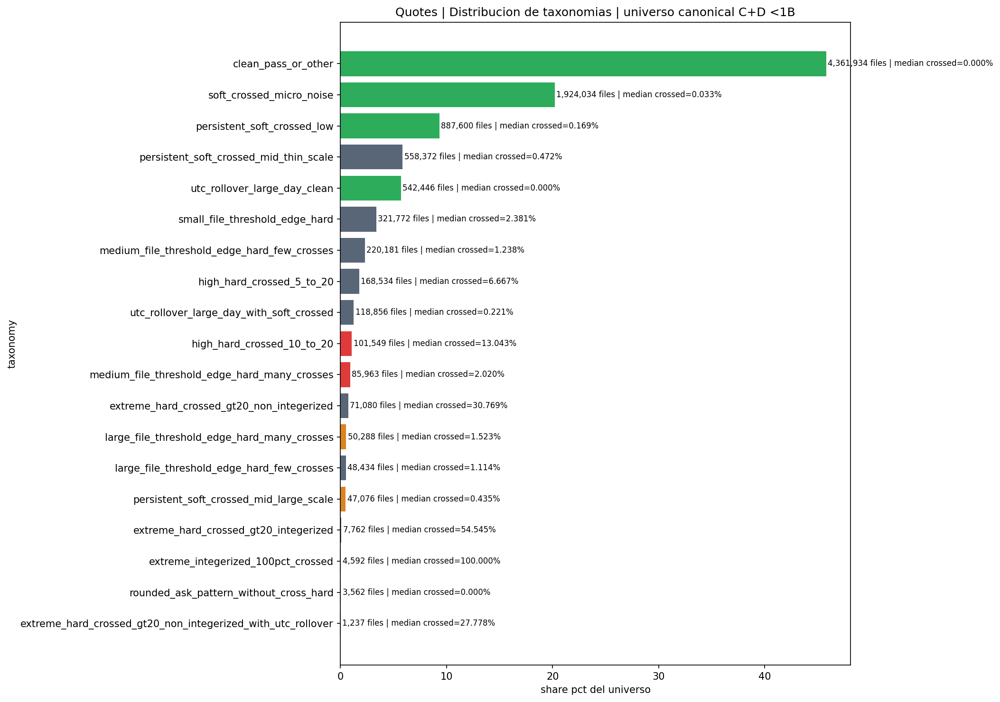

### Que muestra

Muestra la distribucion completa del universo por taxonomias.
Cada barra horizontal es una familia de comportamiento del libro.

Ejemplos de familias:

- `clean_pass_or_other`
- `soft_crossed_micro_noise`
- `persistent_soft_crossed_low`
- `utc_rollover_large_day_clean`
- `high_hard_crossed_10_to_20`

El color resume el bloque contractual:

- verde: franja buena;
- naranja: franja `review`;
- rojo: franja `bad`.

### Responde

- que familias absorben la mayor parte del universo;
- si la masa dominante vive en zonas benignas o en colas duras;
- y donde empieza realmente la cola conflictiva.

### No responde

- no decide por si solo la gravedad economica de cada familia;
- no distingue todavia entre crossed economico real y degradacion estructural;
- no decide consumo final sin apoyo de los paneles siguientes.

### Consecuencia

Evita confundir frecuencia con gravedad.
Una familia puede ser enorme y relativamente benigna.
Otra puede ser pequena y metodologicamente peligrosa.

### Lectura analitica

La taxonomia dominante es `clean_pass_or_other` con `4,361,934` archivos, es decir `45.793%` del universo.
Eso significa que casi la mitad de la masa total ya cae en una bolsa limpia o residualmente no conflictiva.

La segunda familia mas grande no es roja, sino `soft_crossed_micro_noise` con `1,924,034` archivos (`20.199%`).
La tercera es `persistent_soft_crossed_low` con `887,600` (`9.318%`).
Solo estas tres primeras familias ya concentran `75.311%` del universo.

Si se anaden `persistent_soft_crossed_mid_thin_scale` (`5.862%`) y `utc_rollover_large_day_clean` (`5.695%`), las cinco primeras familias suman `86.868%`.
La consecuencia es fuerte: la masa principal de `quotes` vive en bloques limpios, micro-ruidosos o bien explicados, no en patologia dura sin interpretar.

Las familias visualmente mas alarmantes son mucho mas pequenas de lo que su nombre puede sugerir:

- `high_hard_crossed_10_to_20` representa `1.066%`;
- `extreme_hard_crossed_gt20_non_integerized` `0.746%`;
- `extreme_hard_crossed_gt20_integerized` `0.081%`;
- `extreme_integerized_100pct_crossed` `0.048%`.

Eso no las vuelve inocuas.
Lo que significa es otra cosa:

- son colas pequenas pero potencialmente destructivas para ejecucion o simulacion;
- no deben usarse para describir el estado general del dataset.

Tambien es importante leer juntas las familias de rollover UTC.
`utc_rollover_large_day_clean` aporta `542,446` archivos (`5.695%`) y `utc_rollover_large_day_with_soft_crossed` otros `118,856` (`1.248%`).
En conjunto son `661,302` archivos (`6.943%`), una masa mayor que muchas familias duras individuales.
Eso obliga a no interpretar toda irregularidad visible como crossed economico: una parte material del universo responde a geografia temporal, no a libro roto.

## 2. Severity And Root Mix

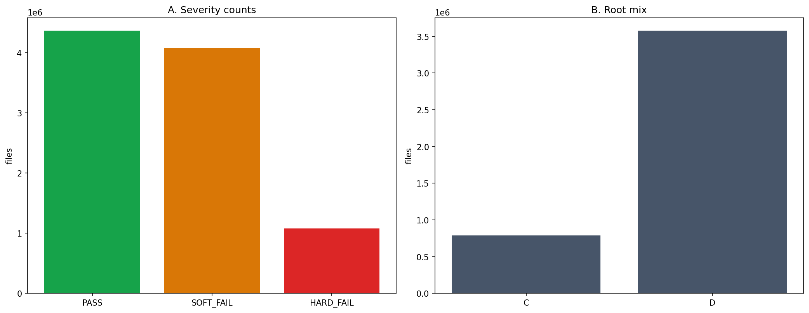

### Que muestra

Este panel tiene dos partes:

- izquierda: masa total por severidad (`PASS`, `SOFT_FAIL`, `HARD_FAIL`);
- derecha: mezcla por `root`.

`root` resume la familia base de deteccion historica.

### Responde

- cuanta masa cae en cada nivel de severidad;
- y si esa masa esta sesgada hacia un origen historico concreto o no.

### No responde

- no decide por si solo `good`, `review` o `bad`;
- no separa todavia causas economicas, estructurales o temporales;
- no explica la geometria interna de cada familia.

### Consecuencia

Fija que `severity` es una alarma temprana, no un veredicto final.
Sirve para no ignorar un problema, pero no basta para decidir consumo o exclusion contractual.

### Lectura analitica

La mezcla por severidad es:

- `PASS = 4,365,496` (`45.831%`)
- `SOFT_FAIL = 4,078,384` (`42.816%`)
- `HARD_FAIL = 1,081,392` (`11.353%`)

La lectura correcta no es que el universo este mayoritariamente roto.
La lectura correcta es que esta muy repartido entre limpio y tension leve, con una cola dura relativamente acotada.
`PASS + SOFT_FAIL` suman `88.647%`.

Eso significa que casi nueve de cada diez archivos no viven en una patologia dura final, aunque si exista una franja grande de casos que requieren contextualizacion.

Por `root`, la mezcla es sorprendentemente estable:

- `root C`: `44.675% PASS`, `42.675% SOFT_FAIL`, `12.651% HARD_FAIL`
- `root D`: `46.094% PASS`, `42.849% SOFT_FAIL`, `11.057% HARD_FAIL`

La diferencia en `HARD_FAIL` entre `C` y `D` es de solo `1.594` puntos porcentuales.
Eso quiere decir que el problema no esta localizado en un unico origen historico de deteccion.
Ambos roots producen una mezcla parecida.

El numero que mas facilmente puede inducir a error es `1,081,392 HARD_FAIL`.
Visualmente parece una masa enorme, y lo es.
Pero en el closeout final no toda esa masa queda abierta para decision humana.
Gran parte ya esta absorbida por familias entendidas como integerizacion extrema, threshold edge o rollover.
La consecuencia es que severidad sirve para abrir la alarma, pero no para decidir sola consumo o exclusion final.

## 3. Positive Cross Policy

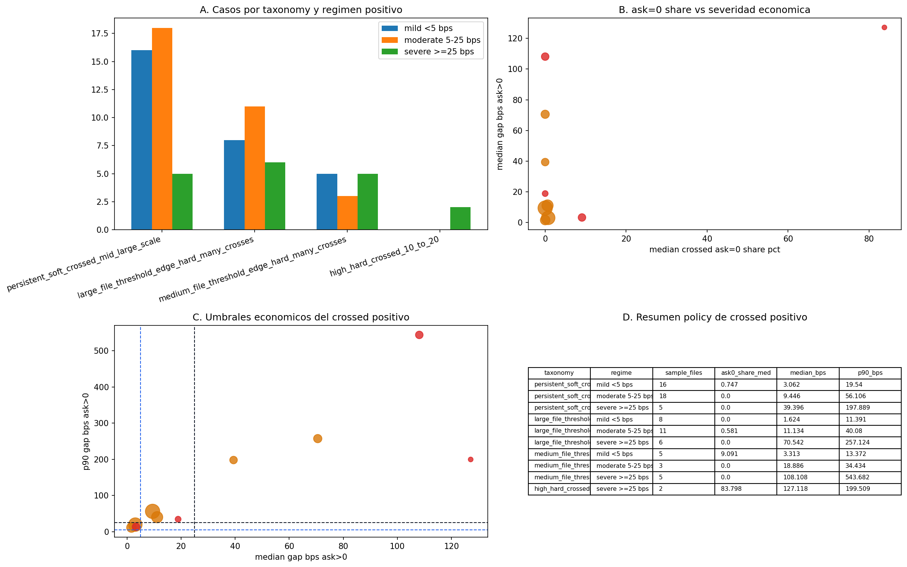

### Que muestra

Este grafico entra en el nucleo economico de `quotes`.
No todo crossed importa igual.

El panel analiza el crossed positivo:

- filas con `bid > ask > 0`

y lo separa por severidad economica:

- `mild < 5 bps`
- `moderate 5-25 bps`
- `severe >= 25 bps`

### Responde

- cuanto crossed positivo hay en las familias abiertas;
- cuanto de ese crossed vive en `ask=0` frente a `ask>0`;
- y cuan interpretable es en terminos economicos reales.

### No responde

- no resume el universo entero;
- no sustituye la lectura visual caso por caso;
- no explica por si solo integerizacion o rollover temporal.

### Consecuencia

Justifica por que dos casos con crossed pueden acabar en bloques distintos.
La diferencia no es solo la existencia del crossed, sino su severidad economica, su persistencia y su composicion.

### Lectura analitica

Este panel demuestra que "crossed" no es una variable binaria suficiente.
Hay taxonomias donde el crossed positivo es economicamente interpretable y otras donde el valor en bps queda dominado por `ask=0`.

Casos abiertos que importan de verdad:

- `persistent_soft_crossed_mid_large_scale`: el crossed positivo es practicamente todo `ask>0` (`100%` mediano en la muestra positiva) y su severidad tipica cambia mucho por bucket:
  - mild: mediana `3.062` bps;
  - moderate: `9.446` bps;
  - severe: `39.396` bps.

- `large_file_threshold_edge_hard_many_crosses`: tambien es casi enteramente `ask>0` en los buckets positivos (`99.4%-100%`), con tres regimenes claros:
  - mild: `1.624` bps;
  - moderate: `11.134` bps;
  - severe: `70.542` bps.

- `medium_file_threshold_edge_hard_many_crosses`: vuelve a mostrar una mezcla economicamente fuerte:
  - mild: `3.313` bps;
  - moderate: `18.886` bps;
  - severe: `108.108` bps.

- `high_hard_crossed_10_to_20`: aqui el matiz cambia.
  La mediana positiva es altisima (`127.118` bps), pero la mediana de composicion sigue siendo `83.798% ask=0` y solo `16.202% ask>0`.
  O sea, visualmente parece un crossed positivo gigantesco, pero buena parte de la geometria del problema sigue muy contaminada por cero estructural en `ask`.

La consecuencia institucional es que la misma palabra "crossed" encierra al menos dos mundos:

- crossed economico con `ask>0`, donde los bps son interpretables como tension real del libro;
- crossed mecanico o degradado por `ask=0`, donde el valor aparente puede parecer enorme y, sin embargo, no representar bien una oportunidad o un fallo economico interpretable.

Sin esta lectura numerica, un inspector podria sobreelevar `high_hard_crossed_10_to_20` por su mediana extrema y subestimar `large_file_threshold_edge_hard_many_crosses`, cuando este ultimo combina:

- masa abierta relevante;
- casi todo `ask>0`;
- y buckets severos con `70+` bps mediano y `257+` bps en la cola `p90`.

## 4. Integer And Timestamp Diagnostics

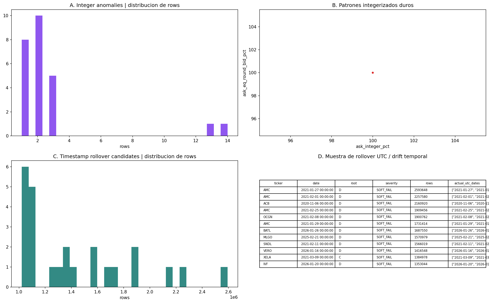

### Que muestra

Este panel ensena dos familias de problemas que no deben confundirse con crossed economico real:

- integerizacion o patrones mecanicos del libro;
- rollover UTC o drift temporal.

### Responde

- si el problema dominante parece representacional en vez de economico;
- si la irregularidad visible proviene de timestamp o de particion diaria;
- y si un crossed aparente debe leerse como microestructura real o como artefacto.

### No responde

- no cuantifica por si solo el impacto de ejecucion final;
- no decide consumo sin contexto de taxonomia y severidad;
- no sustituye el dossier forense del caso concreto.

### Consecuencia

Evita falsos diagnosticos causales.
Sin este panel, un investigador podria atribuir a microestructura economica lo que en realidad es integerizacion degenerada o un rollover UTC.

### Lectura analitica

Los casos de integerizacion no son una intuicion vaga, sino una morfologia extremadamente compacta.
En la muestra de `integer_anomaly_cd_lt1b.parquet`, los casos visibles tienen simultaneamente:

- `m.crossed_ratio_pct = 100`
- `m.ask_integer_pct = 100`
- `m.ask_eq_round_bid_pct = 100`

La lectura correcta no es "hay crossed muy agresivo", sino "el libro ha colapsado en un patron mecanico donde el ask entero coincide de forma degenerada con el bid redondeado".
Eso importa porque una lectura puramente economica del crossed aqui seria falsa desde la base.

El subpanel temporal cuenta otra historia distinta.
En `timestamp_view_cd_lt1b.parquet` aparecen dias enormes como:

- `AMC 2021-01-27` con `2,593,648` filas;
- `AMC 2021-02-01` con `2,257,580`;
- `ACB 2020-11-06` con `2,160,920`.

Todos cruzan dos fechas UTC dentro del mismo archivo.
Eso demuestra que parte de la masa `SOFT_FAIL` vive en archivos gigantes donde el problema dominante es de corte temporal y rollover, no de libro economicamente inviable.

La consecuencia metodologica es fuerte:

- si el inspector viera solo un porcentaje pequeno de crossed sin este panel, podria etiquetar como sospechoso un archivo cuya verdadera explicacion es geografia UTC;
- si viera solo integerizacion sin el panel, podria creer que observa microestructura extrema cuando en realidad observa una representacion degenerada.

## 5. Open Bucket Diagnostics

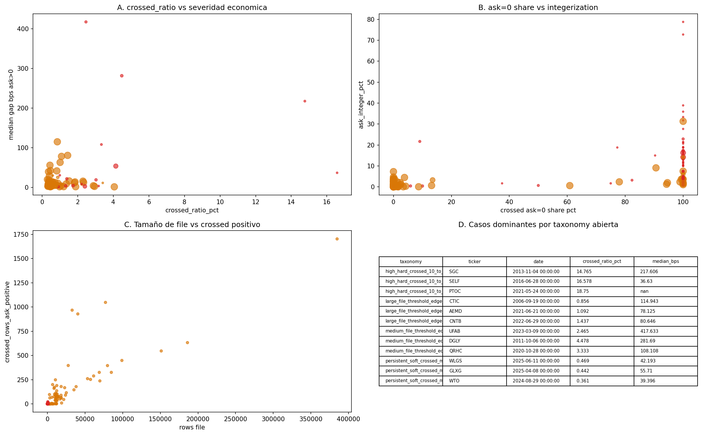

### Que muestra

Este grafico ya no habla del universo entero.
Habla especificamente de las familias abiertas que el closeout dejo vivas para decision final.

Esas familias son:

- `persistent_soft_crossed_mid_large_scale`
- `large_file_threshold_edge_hard_many_crosses`
- `medium_file_threshold_edge_hard_many_crosses`
- `high_hard_crossed_10_to_20`

### Responde

- que tamano poblacional real tiene cada bolsa abierta;
- como cambia su composicion economica interna;
- y donde merece gastar tiempo humano de alta calidad.

### No responde

- no reemplaza la lectura visual caso por caso;
- no demuestra por si solo si un caso individual acaba en `review` o `bad`;
- no reabre familias ya cerradas del universo.

### Consecuencia

Justifica el recorte humano.
La revision forense no debe gastarse en millones de archivos indiferenciados, sino en las bolsas que aun pueden cambiar una decision contractual.

### Lectura analitica

Las cuatro familias abiertas son pequenas frente al universo total, pero no equivalentes entre si:

- `high_hard_crossed_10_to_20` = `101,549` archivos (`1.066%` del universo)
- `medium_file_threshold_edge_hard_many_crosses` = `85,963` (`0.902%`)
- `large_file_threshold_edge_hard_many_crosses` = `50,288` (`0.528%`)
- `persistent_soft_crossed_mid_large_scale` = `47,076` (`0.494%`)

Sumadas representan `284,876` archivos, solo `2.991%` del universo auditado.
Ese es el dato clave del panel.
La incertidumbre institucional realmente decisional ya no vive en millones de archivos indistintos, sino en una cola de alrededor del `3%`.

Pero esa cola no es trivial.
Dentro de ella, `high_hard_crossed_10_to_20` es la familia mas grande, aunque no necesariamente la mas interpretable economicamente por su contaminacion alta de `ask=0`.
`large_file_threshold_edge_hard_many_crosses`, en cambio, es mas pequena pero probablemente mas peligrosa para consumo de ejecucion cuando cae en buckets positivos severos, porque su crossed vive casi totalmente en `ask>0`.

La consecuencia relativa es:

- una familia puede ser la mayor del open bucket y aun asi no ser la primera prioridad economica;
- otra puede ser mas pequena, pero mas limpia en semantica de crossed positivo y por tanto mas relevante para simulacion de fills o mark-to-market.

## Lectura institucional de la poblacion

- La taxonomia dominante es `clean_pass_or_other` con `45.793%` del universo resumido por `taxonomy summary`.
- La masa `HARD_FAIL` existe y es grande, pero no toda esa masa queda abierta para decision final.
- El closeout historico absorbio gran parte del residuo duro en familias ya entendidas.
- La franja abierta y decisional del inspector final se reduce a cuatro taxonomias:
  - `persistent_soft_crossed_mid_large_scale`
  - `large_file_threshold_edge_hard_many_crosses`
  - `medium_file_threshold_edge_hard_many_crosses`
  - `high_hard_crossed_10_to_20`

La lectura inteligente de esta seccion es:

- el problema de `quotes` no es masivo y homogeneo;
- es heterogeneo, jerarquico y segmentable;
- por eso la solucion correcta no es "aceptar todo" ni "bloquear todo";
- la solucion correcta es una arquitectura de vistas, taxonomias y policies de consumo.

La suma de `clean_pass_or_other`, `soft_crossed_micro_noise`, `persistent_soft_crossed_low`, `persistent_soft_crossed_mid_thin_scale` y `utc_rollover_large_day_clean` es `8,274,386` archivos, es decir `86.868%` del universo.
Eso significa que casi nueve de cada diez archivos ya viven en cinco familias bastante bien entendidas, aunque no todas sean "buenas" en sentido ingenuo.

La cola dura y visualmente mas espectacular existe, pero esta atomizada:

- todas las familias `extreme_*` juntas apenas superan el `0.889%`;
- la familia `rounded_ask_pattern_without_cross_hard` es solo `0.037%`;
- y la familia `extreme_hard_crossed_gt20_non_integerized_with_utc_rollover` es `0.013%`.

Eso obliga a una lectura institucional madura:

- no negar la cola dura;
- pero tampoco permitir que esa cola describa el dataset entero.

## Como leer la evidencia forense ejemplar

Los dossiers de casos no intentan enumerar el universo entero.
Su funcion es otra:

- ensenar como se ve fisicamente cada familia abierta;
- justificar por que un caso acaba en `review` o `bad`;
- y mostrar, cuando existe, si el contexto externo explica el episodio sin rehabilitarlo.

La implicacion mas importante es:

- un dossier de casos no es una estadistica;
- es una prueba visual y conceptual de decision.

Sirve para que un lector pueda responder:

- "entiendo por que este bucket queda abierto";
- "entiendo por que no se reclasifica como `good`";
- "entiendo por que el contexto externo no absuelve automaticamente al libro".

## Evidencia forense ejemplar

La traslacion a `01_foundations` conserva exactamente la bolsa abierta del historico `v2`:

- `review`: `64` casos
- `bad`: `15` casos

La franja `good` no es una enumeracion exhaustiva del universo bueno.
Se documenta como muestra representativa para justificar:

- como se ve un libro sano;
- como se ve un micro-noise aceptable;
- como se ve un `persistent_soft_crossed_low` compatible con consumo principal;
- y como se ve un `utc_rollover_large_day_clean`.

La consecuencia de esto es importante:

- `good` no pretende probar que "todo lo bueno es identico";
- pretende probar que las familias buenas principales tienen una morfologia defendible y consumible.

Eso basta para la decision institucional actual porque:

- la franja realmente conflictiva no esta en `good`;
- esta en la frontera entre `review` y `bad`.

## Dossiers

- [Quotes Good Cases v0.1](../../inspection_dossiers/quotes/good_justification/quotes_good_cases_v0_1.md)
- [Quotes Review Cases v0.1](../../inspection_dossiers/quotes/flagged_case_evidence_packs/quotes_review_cases_v0_1.md)
- [Quotes Bad Cases v0.1](../../inspection_dossiers/quotes/bad_case_evidence_packs/quotes_bad_cases_v0_1.md)
- [Quotes Open Casepacks Audit v0.1](../../inspection_dossiers/quotes/quotes_open_casepacks_audit_v0_1.md)

## Como debe usar esto un inspector

Orden correcto de lectura:

1. leer la masa poblacional y las taxonomias;
2. entender que familias quedan abiertas;
3. bajar al dossier correspondiente;
4. ver el caso con sus imagenes;
5. distinguir siempre:
   - explicacion causal externa;
   - y calidad local del libro.

Si un lector quiere saber:

- "cuanto problema hay en total",

debe quedarse en la capa poblacional.

Si quiere saber:

- "como se ve y por que se decidio `review` o `bad`",

debe ir al dossier forense.

Si quiere saber:

- "puedo usar `quotes` para ejecucion y microestructura?",

debe combinar ambas capas:

- poblacion para entender la masa real del problema;
- y forense para entender la naturaleza economica del fallo.

## Veredicto operacional

- `quotes_raw` sigue siendo la vista primaria para ejecucion y microestructura.
- `split_normalized` se usa para reconciliar escala mecanica entre `quotes` y `daily`.
- `adjusted` es la vista economica canonica para retornos y labels diarios.
- `adjusted_proxy` se mantiene como herramienta diagnostica de contraste externo, no como verdad economica final del modulo.

Esto tiene consecuencias claras:

- usar `adjusted` para simulacion de ejecucion seria un error;
- usar `quotes_raw` como serie economica interdiaria primaria tambien lo seria;
- y usar comparaciones externas sin separar `raw`, `split_normalized` y `adjusted_proxy` produciria diagnosticos falsos.

Por tanto, este `readout` no solo cierra `quotes`.
Tambien justifica por que la arquitectura del proyecto necesita varias vistas de precio y varias politicas de consumo.

## Conclusion

`quotes` queda cerrado institucionalmente en doble lectura:

- evidencia poblacional global;
- y evidencia forense de las familias abiertas.

La unica parte no exhaustiva por diseno es `good`, y esa condicion queda declarada explicitamente como muestra representativa.

# Build Quotes Inspection Pack - Modulo 01

Documento fuente: `inspection_dossiers/quotes/build_quotes_inspection_pack.md`

## 1. Rol

Este documento describe como debe construirse el dossier de inspeccion de `quotes`.

No ejecuta nada.

Fija la intencion operativa para el builder futuro.

## 2. Fuentes principales

La construccion del pack debe apoyarse en:

- notebooks historicos de auditoria `quotes`;
- markdowns de auditoria, metodologia y closeout;
- markdowns de certificacion local de `quotes`;
- artefactos persistidos de buckets y tablas de calidad ya cerradas;
- evidencia contextual cruzada cuando aplique:
  - `halts`
  - `reference`
  - `news`
  - `ipos`
  - `crosswalk`

## 3. Objetivo metodologico

El builder no debe inventar una interpretacion nueva.

Debe:

- recuperar la evidencia ya existente;
- organizarla;
- y dejarla lista para inspeccion institucional.

En `quotes`, eso implica una distincion obligatoria:

- explicacion causal del episodio;
- calidad local del libro.

El builder debe ayudar a mostrar ambas cosas sin colapsarlas en una sola.

## 4. Assets que debe producir o clasificar

El builder deberia producir o clasificar:

- tablas resumen por bucket;
- ejemplos `good`;
- ejemplos `review`;
- ejemplos `bad`;
- ejemplos donde el contexto externo explica pero no rehabilita;
- imagenes nuevas si hacen falta;
- y un indice de casos inspeccionables por `ticker-date-file`.

Los assets visuales finales no deben quedarse como outputs huerfanos.

Deben terminar:

- incrustados en `quotes_inspection_readout_v0_1.md`;
- o incrustados en `good_justification`, `flagged_case_evidence_packs`, `bad_case_evidence_packs` y `coverage_case_evidence_packs`.

## 5. Regla visual de `quotes`

En `quotes`, la imagen buena para inspector no es solo un resumen de counts.

Debe poder mostrar fisicamente:

- donde aparece el crossed;
- con que magnitud economica;
- cuanto dura;
- si sobrevive `ask > 0`;
- y que contexto externo relevante existe alrededor del episodio.

La regla correcta para el panel visual es:

- primero mostrar el hecho local del libro;
- despues mostrar la gravedad economica;
- y solo despues mostrar el contexto causal externo.

## 6. Familias de dossier objetivo

La estructura de inspeccion de `quotes` debe seguir el mismo patron de `daily`:

- `bad_case_evidence_packs`
- `flagged_case_evidence_packs`
- `good_justification`
- `coverage_case_evidence_packs`
- `evidence_assets`

Con una salvedad semantica:

- en `quotes`, `coverage` no es hoy el eje principal del cierre;
- el eje principal es la calidad local del libro y su relacion con el contexto externo.

## 7. Evolucion prevista

Fase inicial aceptable:

- script de construccion y export de casos
- notebook historico como lanzadera y visor

Fase madura deseable:

- script reproducible equivalente con generacion de manifests y dossiers

## 8. Regla final

El objetivo de `quotes` no es solo etiquetar buckets.

Es dejar explicaciones plausibles, trazables e inspeccionables de por que un caso cae en:

- `good`
- `review`
- `bad`

y cuando un episodio esta:

- explicado
- pero no rehabilitado.

## 8.1 Regla de granularidad: masa poblacional vs casos forenses

En `quotes` no debe confundirse nunca:

- la masa poblacional total auditada;
- la capa de taxonomias o buckets;
- y la capa de casos ejemplares del inspector final.

La lectura correcta es:

1. la auditoria global produce conteos poblacionales amplios como:
   - `PASS`
   - `SOFT_FAIL`
   - `HARD_FAIL`
2. esa masa se reorganiza en familias taxonomicas;
3. y solo despues se seleccionan casos ejemplares para inspeccion forense de las familias abiertas.

Por tanto:

- los `case packs` no pretenden enumerar uno a uno todos los `HARD_FAIL` del universo;
- pretenden representar visual y forensicamente las familias abiertas que siguen importando para la decision institucional.

Regla de interpretacion obligatoria para el inspector:

- la masa completa del universo debe justificarse con evidencia poblacional;
- las familias abiertas deben justificarse con evidencia forense ejemplar;
- y ambos planos deben leerse juntos.

Esto implica que el cierre institucional final de `quotes` debe incluir dos capas de evidencia separadas:

### A. Evidencia poblacional

Debe mostrar, como minimo:

- distribucion global de severidad
- taxonomia completa
- root mix
- severidad economica del crossed
- regimenes `mild / moderate / severe`
- rollover UTC
- y composicion `ask = 0` vs `ask > 0`

Esta capa responde:

- cuanta masa hay
- donde esta
- y de que tipo es

### B. Evidencia forense ejemplar

Debe mostrar:

- casos `review`
- casos `bad`
- y, cuando proceda, ejemplos `good`

Esta capa responde:

- como se ve fisicamente cada familia abierta
- por que un caso cae en `good`, `review` o `bad`
- y cuando un episodio esta explicado pero no rehabilitado

Conclusion metodologica:

- una bolsa pequena de ejemplos nunca debe presentarse como si representara exhaustivamente toda la masa poblacional;
- si se usa una muestra forense, debe declararse explicitamente como muestra de familias abiertas;
- y la capa poblacional debe seguir estando visible mediante tablas, graficos e imagenes historicas del notebook de auditoria.

## 9. Estado actual y pausa metodologica explicita

El bloque `quotes` queda temporalmente en pausa parcial de refinamiento visual y de reconciliacion final.

Motivo:

- durante la construccion de los dossiers se confirmo que ciertas discrepancias de escala y comparacion externa no pueden cerrarse bien sin una politica transversal mas fuerte de:
  - `price views`
  - corporate actions
  - split normalization
  - y adjusted economics

En particular, quedaron abiertos o en revision:

- la institucionalizacion reusable de `split_normalized`
- la institucionalizacion reusable de `adjusted`
- y la separacion limpia entre:
  - `quotes raw`
  - `daily raw`
  - `adjusted external`

La razon de apartarlo temporalmente ahora no es abandono del bloque.

Es lo contrario:

- se ha detectado que el problema ya es de infraestructura general del modulo;
- y primero debe cerrarse esa infraestructura para no fijar conclusiones locales sobre una semantica de precio incompleta.

Documentos que motivan y soportan esta pausa:

- `01_foundations/module_contracts/price_semantics_and_adjustment_policy.md`
- `01_foundations/module_contracts/external_price_comparison_caveats.md`
- `01_foundations/module_contracts/price_views_registry.md`
- `01_foundations/module_contracts/corporate_actions_adjustment_methodology.md`
- `01_foundations/module_contracts/event_families_and_reference_inventory.md`

# Quotes Good Cases v0.1

Documento fuente: `inspection_dossiers/quotes/good_justification/quotes_good_cases_v0_1.md`

Este documento consolida una muestra historica representativa de la franja `good` de `quotes`. No enumera exhaustivamente todo el universo bueno: selecciona ejemplos de las familias buenas principales para justificar como se ve un libro sano, un residuo micro-noise aceptable, un persistent soft low compatible con consumo principal y un caso de rollover UTC limpio.

Total cases: `12`

## Menu

1. [BCOV 2013-08-13](#bcov-2013-08-13)
2. [TOF 2010-09-01](#tof-2010-09-01)
3. [TOF 2010-08-16](#tof-2010-08-16)
4. [SCNX 2025-10-23](#scnx-2025-10-23)
5. [AMC 2024-05-14](#amc-2024-05-14)
6. [REPL 2025-07-30](#repl-2025-07-30)
7. [AMC 2022-04-05](#amc-2022-04-05)
8. [AMC 2021-09-10](#amc-2021-09-10)
9. [YHOO 2017-06-09](#yhoo-2017-06-09)
10. [AMC 2022-02-01](#amc-2022-02-01)
11. [FCEL 2021-03-10](#fcel-2021-03-10)
12. [CRON 2019-01-31](#cron-2019-01-31)

## Cases

### 1. BCOV 2013-08-13

company_name: `Brightcove, Inc.`
primary_exchange: `NASDAQ` (`XNAS`)
market_locale: `stocks/us`
scope: `good`
ticker: `BCOV`
date: `2013-08-13`
taxonomy: `clean_pass_or_other`
positive_cross_bucket: `no_positive_cross`
severity: `PASS`
root: `D`
rows: `2599200`
crossed_ratio_pct: `0.000000`
crossed_rows_raw: `0`
crossed_rows_ask_zero: `0`
crossed_rows_ask_positive: `0`
ask_integer_pct: `0.000000`
median_bps_ask_positive: `0.000000`
p90_bps_ask_positive: `0.000000`
file: `D:\quotes\BCOV\year=2013\month=08\day=13\quotes.parquet`

#### Analisis Forense
La conclusion correcta del caso es que el libro mantiene semantica economica util. El residuo observado no cambia de forma material la lectura del spread ni invalida el uso operativo normal del dia. La taxonomy historica es `clean_pass_or_other` y el regimen positivo dominante es `no positive cross`. Esto importa porque la taxonomy no solo clasifica: resume que tipo de anomalia se esta viendo y que clase de decision contractual puede defenderse despues. La taxonomy `clean_pass_or_other` implica que el bloque no necesita defensa causal compleja: el libro ya pasa su prueba economica minima y no exige reinterpretacion forense intensa. El regimen `no positive cross` significa que el caso no presenta contradiccion economica positiva directa; cualquier rareza restante debe interpretarse como estructura, cobertura o residuo no decisional. En terminos observables, el file tiene `crossed_ratio_pct=0.000000` sin filas `bid > ask > 0`; `crossed_rows_ask_positive=0` y `crossed_rows_ask_zero=0`. El hecho que esto prueba es que no aparece contradiccion economica positiva material. La decision que cambia es no escalar el caso artificialmente a `review` o `bad`. El error metodologico que evita es castigar rarezas visuales o ruido de libro sin dano economico real. Para backtest y ML esto protege el universo util: evita etiquetar como patologico un dia que sigue siendo compatible con consumo principal. El patron estructural muestra `ask_integer_pct=0.000000`. Este numero obliga a separar dos explicaciones rivales: contradiccion economica genuina del libro o mezcla con degeneracion estructural / integerizacion. Como no hay crossed material en el file, la composicion `ask=0` vs `ask>0` no es el eje que decide el caso. Como `ask_integer_pct` es bajo, la hipotesis de simple degeneracion mecanica pierde fuerza. Eso endurece la interpretacion: el crossed se parece mas a contradiccion economica genuina y menos a artefacto. Existe ademas una imagen historica de certificacion asociada. Su papel es poner el episodio en un marco causal mas amplio: halt, explained, not strongly explained o patron conocido. La regla que protege al proyecto es esta: el contexto externo se usa para explicar por que aparece el episodio, no para absolverlo. El error que evita es degradar el criterio de calidad del libro porque exista una historia plausible alrededor del caso.

#### 00 Event Month Context
Esta imagen responde a la pregunta de persistencia temporal: estamos ante un accidente local o ante una fase mas amplia de inestabilidad. Arriba coloca el evento en la serie `daily` real del mes; abajo compara `crossed_ratio_pct` y `max_gap_bps_pos` del dia contra sus vecinos. La decision que cambia es el peso estructural que se le concede al caso. El error que evita es juzgar igual un shock aislado y una degradacion repetida del libro.

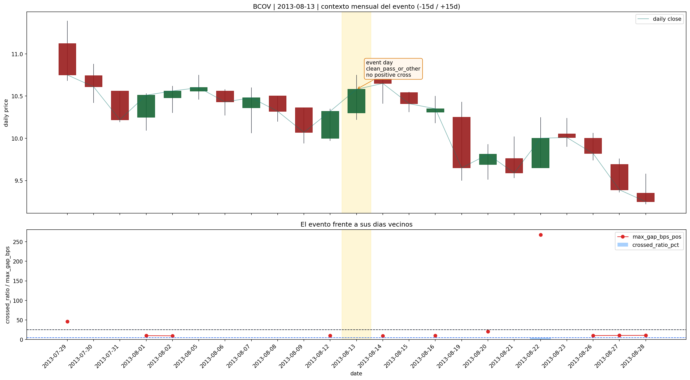

#### 00b Event Month Quotes Context
Esta imagen responde a la pregunta de recurrencia mensual dentro de `quotes`: el problema se concentra en el evento o reaparece en varias sesiones. Arriba concatena sesiones con datos disponibles; abajo resume cobertura diaria, `crossed_ratio_pct` y `max_gap_bps_pos`. La decision que cambia es si el caso debe leerse como episodio puntual o como sintoma de una fase repetida de libro degradado. El error que evita es extrapolar desde un unico dia a todo el mes sin evidencia.

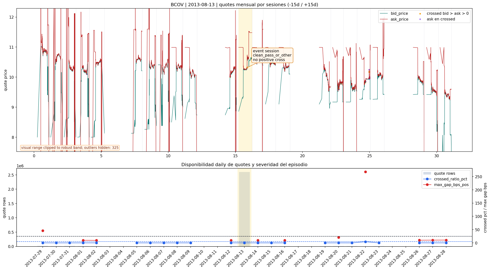

#### 01 Raw Window
Esta imagen responde a la primera pregunta decisiva: existe contradiccion economica positiva local o no. Arriba se comparan `bid_price` y `ask_price`; abajo se ve el `gap_bps` firmado. Si aqui no aparece `bid > ask > 0` material, no hay base para endurecer la clasificacion. La decision que protege es no convertir ruido inocuo en patologia.

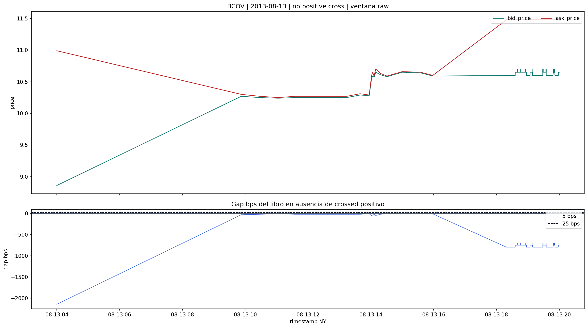

#### 02 Full Session Context
Esta imagen responde a la pregunta de extension intradiaria: el dano esta confinado a un bloque corto o contamina la sesion completa. Arriba se ve toda la sesion `04:00-20:00 NY`; abajo el `gap_bps` firmado. La decision que cambia es si el consumo debe penalizar solo un tramo o desechar el dia entero para uso operativo. El error que evita es tratar una cicatriz local como ruina total o, al reves, minimizar una degradacion distribuida a lo largo del dia. En ejecucion esto decide si la sesion puede seguir usandose con restricciones; en ML decide si las features intradiarias conservan significado economico.

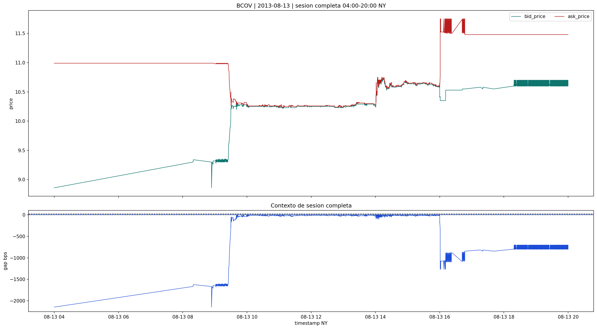

#### 03 Structure Diagnostics
Este panel responde a la pregunta de naturaleza del fallo: contradiccion economica genuina o mezcla con degeneracion estructural. Separa `ask=0` de `ask>0`, muestra la distribucion de `gap_bps` y resume patrones de integerizacion. La decision que cambia es como interpretar el dano: mercado localmente roto, artefacto de representacion o combinacion de ambos. El error que evita es sobrediagnosticar crossed reales cuando parte de la senal proviene de estructura degenerada del libro. Esta lectura afecta directamente a que el caso vaya a exclusion dura, a bandera contextual o a simple reconciliacion tecnica.

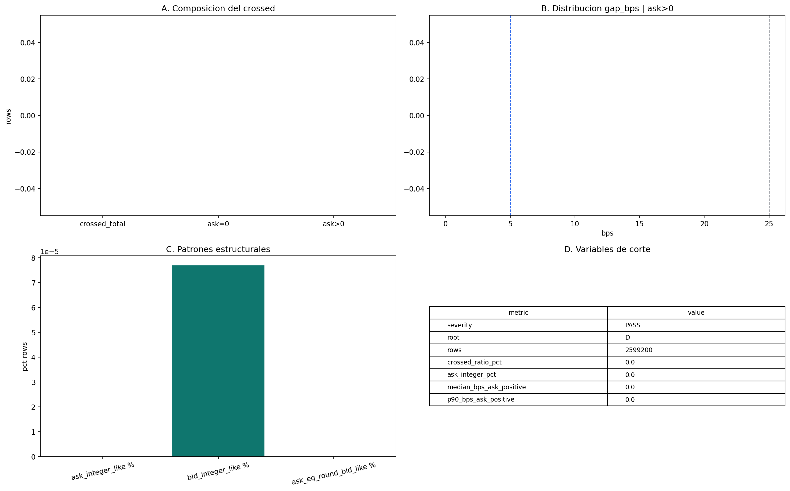

#### 04 Summary Card
Esta tarjeta responde a la pregunta de auditabilidad: cuales son exactamente las variables que sostienen la conclusion. Reune `severity`, `root`, `crossed_ratio_pct`, `ask_integer_pct`, `median_bps_ask_positive` y `p90_bps_ask_positive`. La decision que cambia es pasar de impresion visual a regla verificable. El error que evita es que dos inspectores lleguen a conclusiones distintas mirando la misma imagen sin una base numerica comun. Para gobernanza del proyecto, este panel es el que vuelve reproducible la decision para backtest, ML y auditoria.

---

### 2. TOF 2010-09-01

company_name: `TOFUTTI BRANDS INC`
primary_exchange: `NYSE American` (`XASE`)
market_locale: `stocks/us`
scope: `good`
ticker: `TOF`
date: `2010-09-01`
taxonomy: `clean_pass_or_other`
positive_cross_bucket: `no_positive_cross`
severity: `PASS`
root: `C`
rows: `466649`
crossed_ratio_pct: `0.000000`
crossed_rows_raw: `0`
crossed_rows_ask_zero: `0`
crossed_rows_ask_positive: `0`
ask_integer_pct: `0.000000`
median_bps_ask_positive: `0.000000`
p90_bps_ask_positive: `0.000000`
file: `C:\TSIS_Data\data\quotes\TOF\year=2010\month=09\day=01\quotes.parquet`

#### Analisis Forense
La conclusion correcta del caso es que el libro mantiene semantica economica util. El residuo observado no cambia de forma material la lectura del spread ni invalida el uso operativo normal del dia. La taxonomy historica es `clean_pass_or_other` y el regimen positivo dominante es `no positive cross`. Esto importa porque la taxonomy no solo clasifica: resume que tipo de anomalia se esta viendo y que clase de decision contractual puede defenderse despues. La taxonomy `clean_pass_or_other` implica que el bloque no necesita defensa causal compleja: el libro ya pasa su prueba economica minima y no exige reinterpretacion forense intensa. El regimen `no positive cross` significa que el caso no presenta contradiccion economica positiva directa; cualquier rareza restante debe interpretarse como estructura, cobertura o residuo no decisional. En terminos observables, el file tiene `crossed_ratio_pct=0.000000` sin filas `bid > ask > 0`; `crossed_rows_ask_positive=0` y `crossed_rows_ask_zero=0`. El hecho que esto prueba es que no aparece contradiccion economica positiva material. La decision que cambia es no escalar el caso artificialmente a `review` o `bad`. El error metodologico que evita es castigar rarezas visuales o ruido de libro sin dano economico real. Para backtest y ML esto protege el universo util: evita etiquetar como patologico un dia que sigue siendo compatible con consumo principal. El patron estructural muestra `ask_integer_pct=0.000000`. Este numero obliga a separar dos explicaciones rivales: contradiccion economica genuina del libro o mezcla con degeneracion estructural / integerizacion. Como no hay crossed material en el file, la composicion `ask=0` vs `ask>0` no es el eje que decide el caso. Como `ask_integer_pct` es bajo, la hipotesis de simple degeneracion mecanica pierde fuerza. Eso endurece la interpretacion: el crossed se parece mas a contradiccion economica genuina y menos a artefacto. Existe ademas una imagen historica de certificacion asociada. Su papel es poner el episodio en un marco causal mas amplio: halt, explained, not strongly explained o patron conocido. La regla que protege al proyecto es esta: el contexto externo se usa para explicar por que aparece el episodio, no para absolverlo. El error que evita es degradar el criterio de calidad del libro porque exista una historia plausible alrededor del caso.

#### 00 Event Month Context
Esta imagen responde a la pregunta de persistencia temporal: estamos ante un accidente local o ante una fase mas amplia de inestabilidad. Arriba coloca el evento en la serie `daily` real del mes; abajo compara `crossed_ratio_pct` y `max_gap_bps_pos` del dia contra sus vecinos. La decision que cambia es el peso estructural que se le concede al caso. El error que evita es juzgar igual un shock aislado y una degradacion repetida del libro.

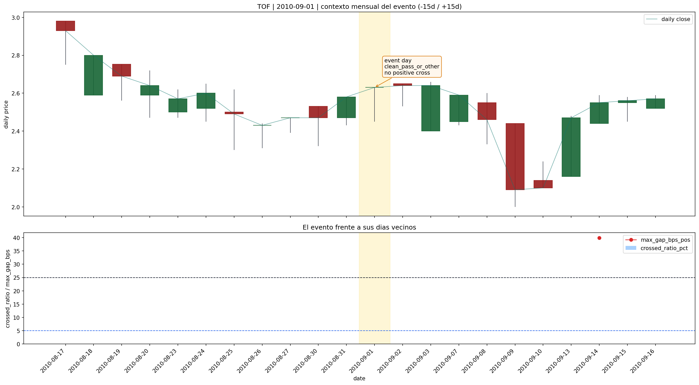

#### 00b Event Month Quotes Context
Esta imagen responde a la pregunta de recurrencia mensual dentro de `quotes`: el problema se concentra en el evento o reaparece en varias sesiones. Arriba concatena sesiones con datos disponibles; abajo resume cobertura diaria, `crossed_ratio_pct` y `max_gap_bps_pos`. La decision que cambia es si el caso debe leerse como episodio puntual o como sintoma de una fase repetida de libro degradado. El error que evita es extrapolar desde un unico dia a todo el mes sin evidencia.

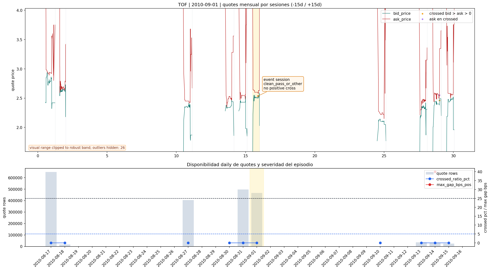

#### 01 Raw Window
Esta imagen responde a la primera pregunta decisiva: existe contradiccion economica positiva local o no. Arriba se comparan `bid_price` y `ask_price`; abajo se ve el `gap_bps` firmado. Si aqui no aparece `bid > ask > 0` material, no hay base para endurecer la clasificacion. La decision que protege es no convertir ruido inocuo en patologia.

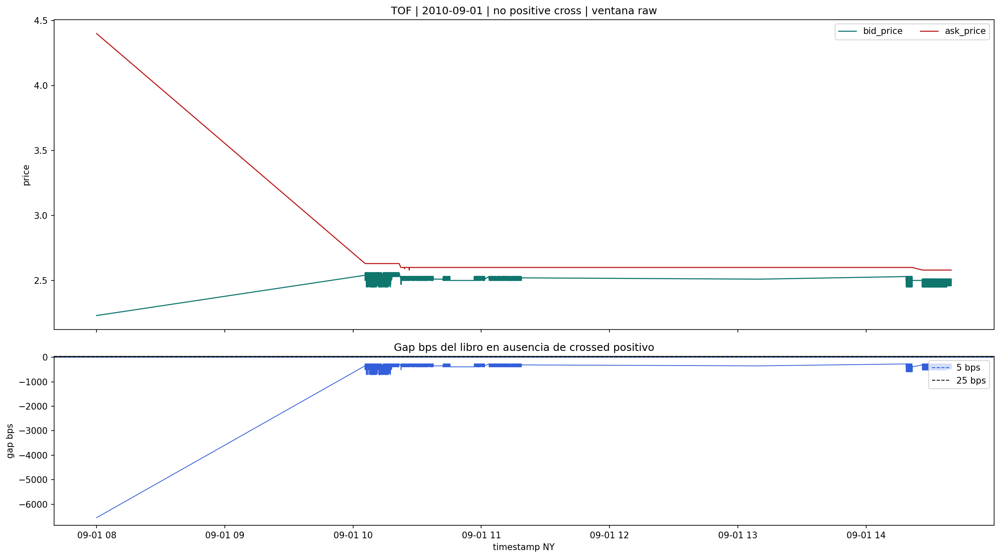

#### 02 Full Session Context
Esta imagen responde a la pregunta de extension intradiaria: el dano esta confinado a un bloque corto o contamina la sesion completa. Arriba se ve toda la sesion `04:00-20:00 NY`; abajo el `gap_bps` firmado. La decision que cambia es si el consumo debe penalizar solo un tramo o desechar el dia entero para uso operativo. El error que evita es tratar una cicatriz local como ruina total o, al reves, minimizar una degradacion distribuida a lo largo del dia. En ejecucion esto decide si la sesion puede seguir usandose con restricciones; en ML decide si las features intradiarias conservan significado economico.

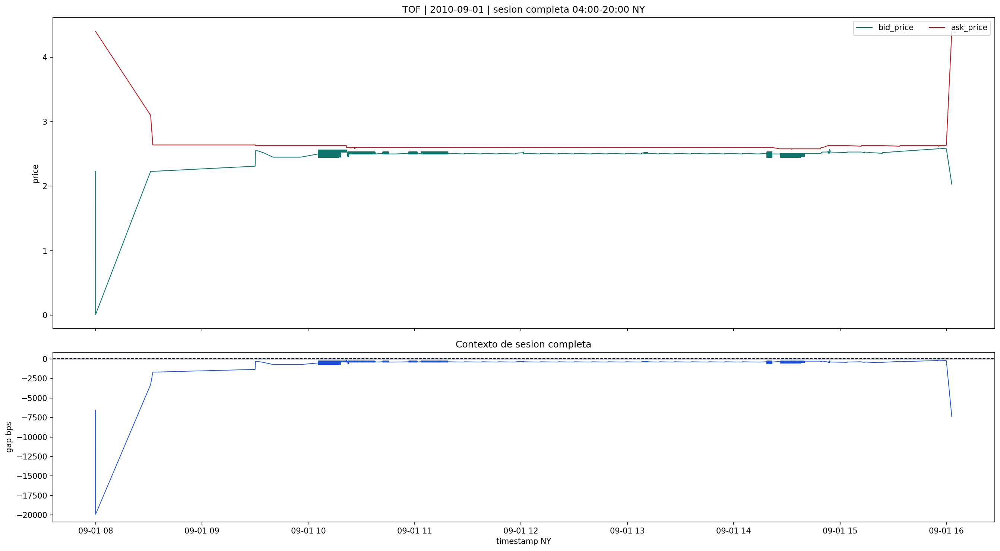

#### 03 Structure Diagnostics
Este panel responde a la pregunta de naturaleza del fallo: contradiccion economica genuina o mezcla con degeneracion estructural. Separa `ask=0` de `ask>0`, muestra la distribucion de `gap_bps` y resume patrones de integerizacion. La decision que cambia es como interpretar el dano: mercado localmente roto, artefacto de representacion o combinacion de ambos. El error que evita es sobrediagnosticar crossed reales cuando parte de la senal proviene de estructura degenerada del libro. Esta lectura afecta directamente a que el caso vaya a exclusion dura, a bandera contextual o a simple reconciliacion tecnica.

#### 04 Summary Card
Esta tarjeta responde a la pregunta de auditabilidad: cuales son exactamente las variables que sostienen la conclusion. Reune `severity`, `root`, `crossed_ratio_pct`, `ask_integer_pct`, `median_bps_ask_positive` y `p90_bps_ask_positive`. La decision que cambia es pasar de impresion visual a regla verificable. El error que evita es que dos inspectores lleguen a conclusiones distintas mirando la misma imagen sin una base numerica comun. Para gobernanza del proyecto, este panel es el que vuelve reproducible la decision para backtest, ML y auditoria.

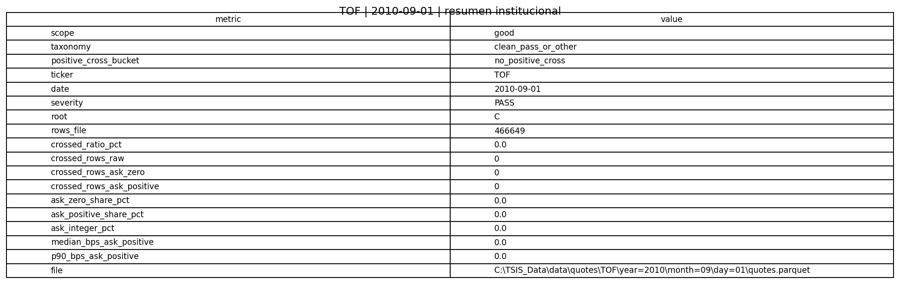

---

### 3. TOF 2010-08-16

company_name: `TOFUTTI BRANDS INC`
primary_exchange: `NYSE American` (`XASE`)
market_locale: `stocks/us`
scope: `good`
ticker: `TOF`
date: `2010-08-16`
taxonomy: `clean_pass_or_other`
positive_cross_bucket: `no_positive_cross`
severity: `PASS`
root: `C`
rows: `439265`
crossed_ratio_pct: `0.000000`
crossed_rows_raw: `0`
crossed_rows_ask_zero: `0`
crossed_rows_ask_positive: `0`
ask_integer_pct: `0.000000`
median_bps_ask_positive: `0.000000`
p90_bps_ask_positive: `0.000000`
file: `C:\TSIS_Data\data\quotes\TOF\year=2010\month=08\day=16\quotes.parquet`

#### Analisis Forense
La conclusion correcta del caso es que el libro mantiene semantica economica util. El residuo observado no cambia de forma material la lectura del spread ni invalida el uso operativo normal del dia. La taxonomy historica es `clean_pass_or_other` y el regimen positivo dominante es `no positive cross`. Esto importa porque la taxonomy no solo clasifica: resume que tipo de anomalia se esta viendo y que clase de decision contractual puede defenderse despues. La taxonomy `clean_pass_or_other` implica que el bloque no necesita defensa causal compleja: el libro ya pasa su prueba economica minima y no exige reinterpretacion forense intensa. El regimen `no positive cross` significa que el caso no presenta contradiccion economica positiva directa; cualquier rareza restante debe interpretarse como estructura, cobertura o residuo no decisional. En terminos observables, el file tiene `crossed_ratio_pct=0.000000` sin filas `bid > ask > 0`; `crossed_rows_ask_positive=0` y `crossed_rows_ask_zero=0`. El hecho que esto prueba es que no aparece contradiccion economica positiva material. La decision que cambia es no escalar el caso artificialmente a `review` o `bad`. El error metodologico que evita es castigar rarezas visuales o ruido de libro sin dano economico real. Para backtest y ML esto protege el universo util: evita etiquetar como patologico un dia que sigue siendo compatible con consumo principal. El patron estructural muestra `ask_integer_pct=0.000000`. Este numero obliga a separar dos explicaciones rivales: contradiccion economica genuina del libro o mezcla con degeneracion estructural / integerizacion. Como no hay crossed material en el file, la composicion `ask=0` vs `ask>0` no es el eje que decide el caso. Como `ask_integer_pct` es bajo, la hipotesis de simple degeneracion mecanica pierde fuerza. Eso endurece la interpretacion: el crossed se parece mas a contradiccion economica genuina y menos a artefacto. Existe ademas una imagen historica de certificacion asociada. Su papel es poner el episodio en un marco causal mas amplio: halt, explained, not strongly explained o patron conocido. La regla que protege al proyecto es esta: el contexto externo se usa para explicar por que aparece el episodio, no para absolverlo. El error que evita es degradar el criterio de calidad del libro porque exista una historia plausible alrededor del caso.

#### 00 Event Month Context
Esta imagen responde a la pregunta de persistencia temporal: estamos ante un accidente local o ante una fase mas amplia de inestabilidad. Arriba coloca el evento en la serie `daily` real del mes; abajo compara `crossed_ratio_pct` y `max_gap_bps_pos` del dia contra sus vecinos. La decision que cambia es el peso estructural que se le concede al caso. El error que evita es juzgar igual un shock aislado y una degradacion repetida del libro.

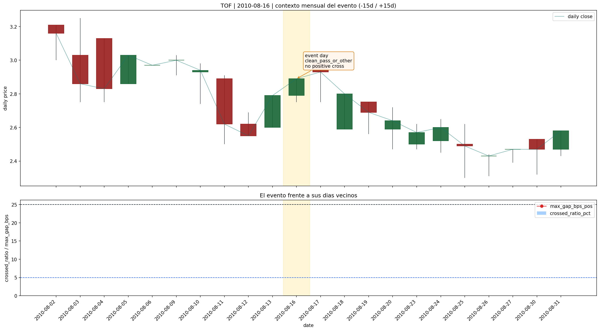

#### 00b Event Month Quotes Context
Esta imagen responde a la pregunta de recurrencia mensual dentro de `quotes`: el problema se concentra en el evento o reaparece en varias sesiones. Arriba concatena sesiones con datos disponibles; abajo resume cobertura diaria, `crossed_ratio_pct` y `max_gap_bps_pos`. La decision que cambia es si el caso debe leerse como episodio puntual o como sintoma de una fase repetida de libro degradado. El error que evita es extrapolar desde un unico dia a todo el mes sin evidencia.

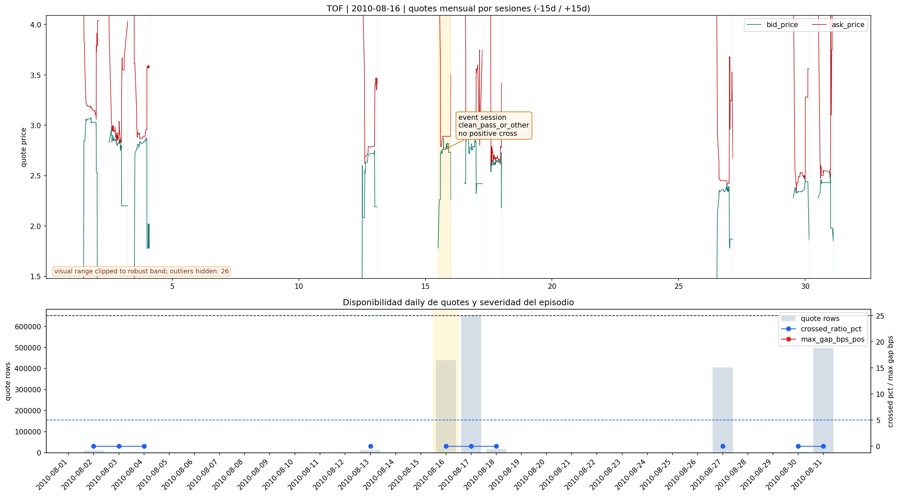

#### 01 Raw Window
Esta imagen responde a la primera pregunta decisiva: existe contradiccion economica positiva local o no. Arriba se comparan `bid_price` y `ask_price`; abajo se ve el `gap_bps` firmado. Si aqui no aparece `bid > ask > 0` material, no hay base para endurecer la clasificacion. La decision que protege es no convertir ruido inocuo en patologia.

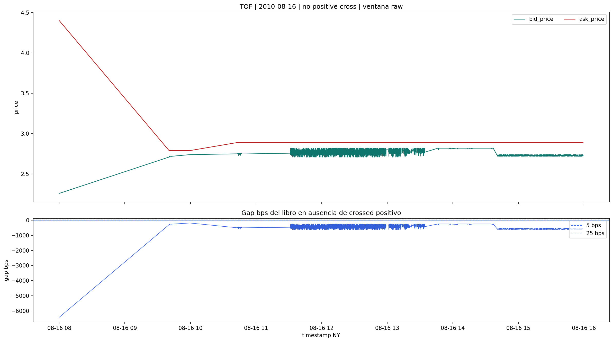

#### 02 Full Session Context
Esta imagen responde a la pregunta de extension intradiaria: el dano esta confinado a un bloque corto o contamina la sesion completa. Arriba se ve toda la sesion `04:00-20:00 NY`; abajo el `gap_bps` firmado. La decision que cambia es si el consumo debe penalizar solo un tramo o desechar el dia entero para uso operativo. El error que evita es tratar una cicatriz local como ruina total o, al reves, minimizar una degradacion distribuida a lo largo del dia. En ejecucion esto decide si la sesion puede seguir usandose con restricciones; en ML decide si las features intradiarias conservan significado economico.

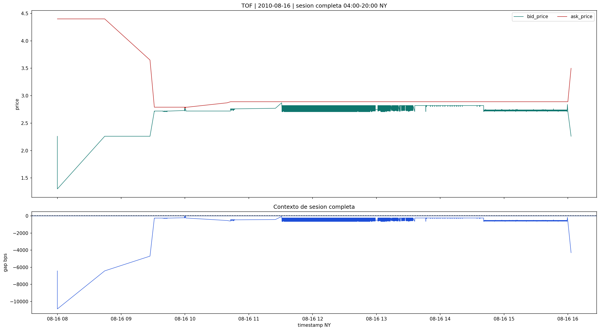

#### 03 Structure Diagnostics
Este panel responde a la pregunta de naturaleza del fallo: contradiccion economica genuina o mezcla con degeneracion estructural. Separa `ask=0` de `ask>0`, muestra la distribucion de `gap_bps` y resume patrones de integerizacion. La decision que cambia es como interpretar el dano: mercado localmente roto, artefacto de representacion o combinacion de ambos. El error que evita es sobrediagnosticar crossed reales cuando parte de la senal proviene de estructura degenerada del libro. Esta lectura afecta directamente a que el caso vaya a exclusion dura, a bandera contextual o a simple reconciliacion tecnica.

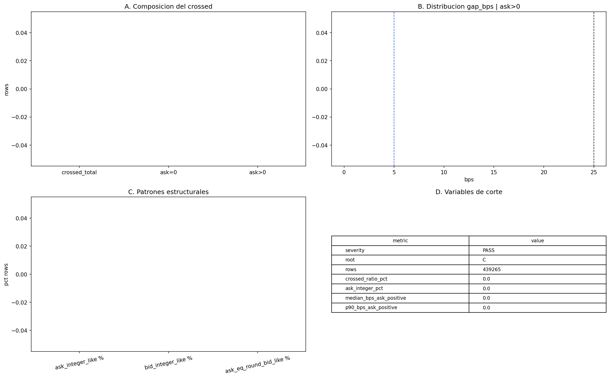

#### 04 Summary Card
Esta tarjeta responde a la pregunta de auditabilidad: cuales son exactamente las variables que sostienen la conclusion. Reune `severity`, `root`, `crossed_ratio_pct`, `ask_integer_pct`, `median_bps_ask_positive` y `p90_bps_ask_positive`. La decision que cambia es pasar de impresion visual a regla verificable. El error que evita es que dos inspectores lleguen a conclusiones distintas mirando la misma imagen sin una base numerica comun. Para gobernanza del proyecto, este panel es el que vuelve reproducible la decision para backtest, ML y auditoria.

---

### 4. SCNX 2025-10-23

company_name: `Scienture Holdings, Inc. Common Stock`
primary_exchange: `NASDAQ` (`XNAS`)
market_locale: `stocks/us`
scope: `good`
ticker: `SCNX`
date: `2025-10-23`
taxonomy: `persistent_soft_crossed_low`
positive_cross_bucket: `positive_cross_severe_ge25bps`
severity: `SOFT_FAIL`
root: `D`
rows: `827571`
crossed_ratio_pct: `0.307768`
crossed_rows_raw: `2547`
crossed_rows_ask_zero: `4`
crossed_rows_ask_positive: `2543`
ask_integer_pct: `0.498205`
median_bps_ask_positive: `45.766590`
p90_bps_ask_positive: `117.905444`
file: `D:\quotes\SCNX\year=2025\month=10\day=23\quotes.parquet`

#### Analisis Forense
La conclusion correcta del caso es que el libro mantiene semantica economica util. El residuo observado no cambia de forma material la lectura del spread ni invalida el uso operativo normal del dia. La taxonomy historica es `persistent_soft_crossed_low` y el regimen positivo dominante es `severe >=25 bps`. Esto importa porque la taxonomy no solo clasifica: resume que tipo de anomalia se esta viendo y que clase de decision contractual puede defenderse despues. La taxonomy `persistent_soft_crossed_low` implica persistencia real de crossed, aunque en una banda todavia compatible con uso principal si el dano economico sigue contenido. El regimen `severe >=25 bps` empuja el caso a una lectura economicamente dura: el crossed deja de ser cosmetico y pasa a cuestionar si el libro sigue siendo interpretable como mercado negociable. En terminos observables, el file tiene `crossed_ratio_pct=0.307768` con `crossed_rows_ask_positive=2543` y `crossed_rows_ask_zero=4`. La severidad economica del crossed ask>0 se resume en `median_bps_ask_positive=45.766590` y `p90_bps_ask_positive=117.905444`. Estos dos numeros convierten una forma visual rara en una conclusion operativa sobre si el libro sigue representando o no un mercado negociable. La decision que cambia es mantener el caso dentro de la franja util, aunque con lectura consciente de que existe una huella positiva leve o acotada. En `good`, el objetivo no es negar toda irregularidad, sino demostrar que la anomalia no destruye la semantica economica minima del libro ni invalida su uso principal. El error que evita esta lectura es sobrecastigar micro-residuos y encoger artificialmente el universo util para backtest y ML. El patron estructural muestra `ask_integer_pct=0.498205`. Este numero obliga a separar dos explicaciones rivales: contradiccion economica genuina del libro o mezcla con degeneracion estructural / integerizacion. La mayor parte del crossed vive en `ask>0`, de modo que el corazon del problema sigue siendo economico. La parte `ask=0`, si existe, acompana pero no explica por si sola la anomalia. Como `ask_integer_pct` es bajo, la hipotesis de simple degeneracion mecanica pierde fuerza. Eso endurece la interpretacion: el crossed se parece mas a contradiccion economica genuina y menos a artefacto. Existe ademas una imagen historica de certificacion asociada. Su papel es poner el episodio en un marco causal mas amplio: halt, explained, not strongly explained o patron conocido. La regla que protege al proyecto es esta: el contexto externo se usa para explicar por que aparece el episodio, no para absolverlo. El error que evita es degradar el criterio de calidad del libro porque exista una historia plausible alrededor del caso.

#### 00 Event Month Context
Esta imagen responde a la pregunta de persistencia temporal: estamos ante un accidente local o ante una fase mas amplia de inestabilidad. Arriba coloca el evento en la serie `daily` real del mes; abajo compara `crossed_ratio_pct` y `max_gap_bps_pos` del dia contra sus vecinos. La decision que cambia es el peso estructural que se le concede al caso. El error que evita es juzgar igual un shock aislado y una degradacion repetida del libro.

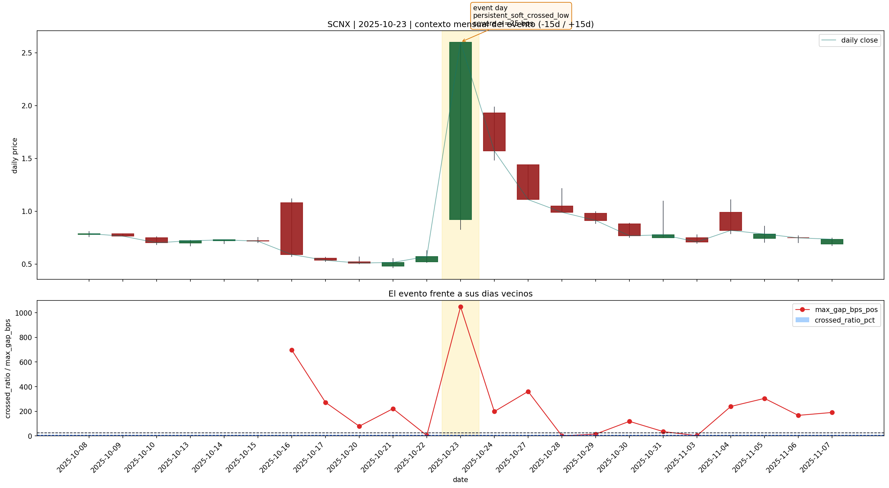

#### 00b Event Month Quotes Context
Esta imagen responde a la pregunta de recurrencia mensual dentro de `quotes`: el problema se concentra en el evento o reaparece en varias sesiones. Arriba concatena sesiones con datos disponibles; abajo resume cobertura diaria, `crossed_ratio_pct` y `max_gap_bps_pos`. La decision que cambia es si el caso debe leerse como episodio puntual o como sintoma de una fase repetida de libro degradado. El error que evita es extrapolar desde un unico dia a todo el mes sin evidencia.

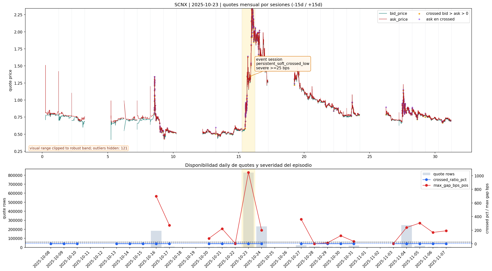

#### 01 Raw Window
Esta imagen responde a la primera pregunta decisiva del caso: el crossed observado, si existe, sigue siendo compatible con permanencia en `good` o no. Arriba ensena la geometria exacta del tramo conflictivo; abajo convierte esa geometria a bps y la enfrenta a los cortes `5 bps` y `25 bps`. El regimen dominante es `severe >=25 bps`. La decision que cambia es demostrar que el residuo permanece por debajo del dano que obligaria a mover el caso a `review` o `bad`. El error que evita es expulsar del universo util episodios leves cuyo impacto sobre ejecucion y features sigue siendo tolerable.

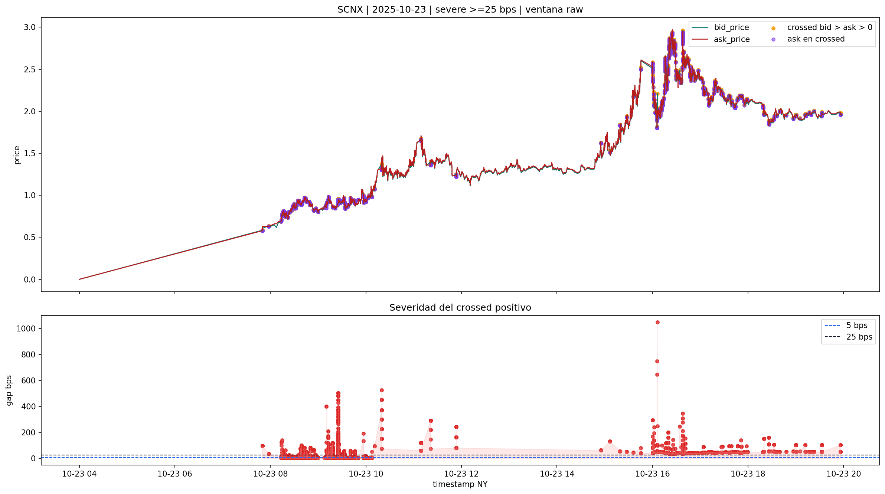

#### 02 Full Session Context
Esta imagen responde a la pregunta de extension intradiaria: el dano esta confinado a un bloque corto o contamina la sesion completa. Arriba se ve toda la sesion `04:00-20:00 NY`; abajo el `gap_bps` firmado. La decision que cambia es si el consumo debe penalizar solo un tramo o desechar el dia entero para uso operativo. El error que evita es tratar una cicatriz local como ruina total o, al reves, minimizar una degradacion distribuida a lo largo del dia. En ejecucion esto decide si la sesion puede seguir usandose con restricciones; en ML decide si las features intradiarias conservan significado economico.

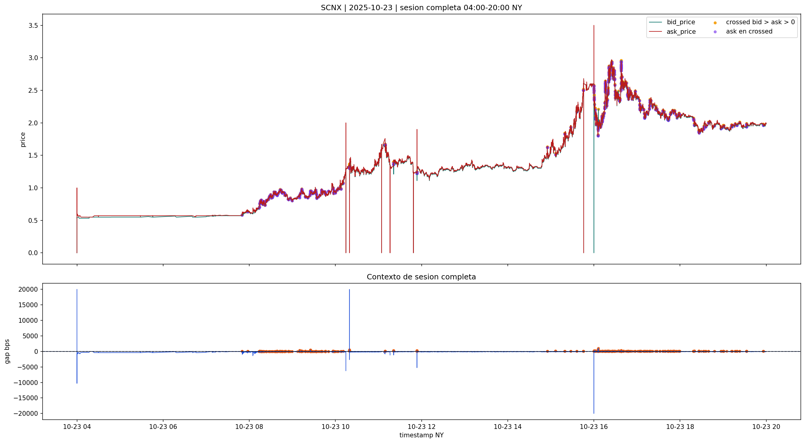

#### 03 Structure Diagnostics
Este panel responde a la pregunta de naturaleza del fallo: contradiccion economica genuina o mezcla con degeneracion estructural. Separa `ask=0` de `ask>0`, muestra la distribucion de `gap_bps` y resume patrones de integerizacion. La decision que cambia es como interpretar el dano: mercado localmente roto, artefacto de representacion o combinacion de ambos. El error que evita es sobrediagnosticar crossed reales cuando parte de la senal proviene de estructura degenerada del libro. Esta lectura afecta directamente a que el caso vaya a exclusion dura, a bandera contextual o a simple reconciliacion tecnica.

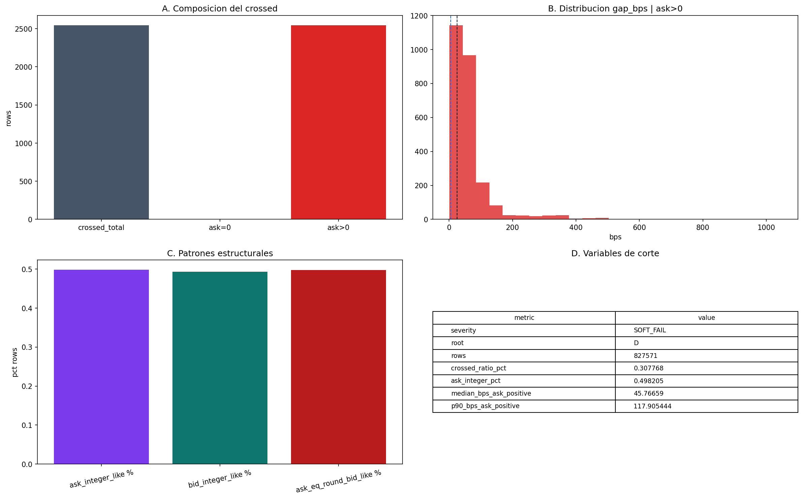

#### 04 Summary Card
Esta tarjeta responde a la pregunta de auditabilidad: cuales son exactamente las variables que sostienen la conclusion. Reune `severity`, `root`, `crossed_ratio_pct`, `ask_integer_pct`, `median_bps_ask_positive` y `p90_bps_ask_positive`. La decision que cambia es pasar de impresion visual a regla verificable. El error que evita es que dos inspectores lleguen a conclusiones distintas mirando la misma imagen sin una base numerica comun. Para gobernanza del proyecto, este panel es el que vuelve reproducible la decision para backtest, ML y auditoria.

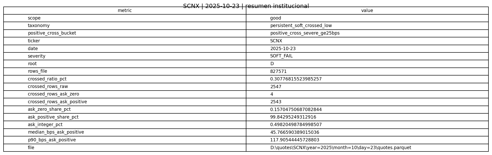

---

### 5. AMC 2024-05-14

company_name: `AMER MORT ACCEPT(SHS BENE INT`
primary_exchange: `NYSE American` (`XASE`)
market_locale: `stocks/us`
scope: `good`
ticker: `AMC`
date: `2024-05-14`
taxonomy: `persistent_soft_crossed_low`
positive_cross_bucket: `positive_cross_severe_ge25bps`
severity: `SOFT_FAIL`
root: `D`
rows: `1654368`
crossed_ratio_pct: `0.263726`
crossed_rows_raw: `4363`
crossed_rows_ask_zero: `22`
crossed_rows_ask_positive: `4341`
ask_integer_pct: `1.133666`
median_bps_ask_positive: `19.821606`
p90_bps_ask_positive: `115.990058`
file: `D:\quotes\AMC\year=2024\month=05\day=14\quotes.parquet`

#### Analisis Forense
La conclusion correcta del caso es que el libro mantiene semantica economica util. El residuo observado no cambia de forma material la lectura del spread ni invalida el uso operativo normal del dia. La taxonomy historica es `persistent_soft_crossed_low` y el regimen positivo dominante es `severe >=25 bps`. Esto importa porque la taxonomy no solo clasifica: resume que tipo de anomalia se esta viendo y que clase de decision contractual puede defenderse despues. La taxonomy `persistent_soft_crossed_low` implica persistencia real de crossed, aunque en una banda todavia compatible con uso principal si el dano economico sigue contenido. El regimen `severe >=25 bps` empuja el caso a una lectura economicamente dura: el crossed deja de ser cosmetico y pasa a cuestionar si el libro sigue siendo interpretable como mercado negociable. En terminos observables, el file tiene `crossed_ratio_pct=0.263726` con `crossed_rows_ask_positive=4341` y `crossed_rows_ask_zero=22`. La severidad economica del crossed ask>0 se resume en `median_bps_ask_positive=19.821606` y `p90_bps_ask_positive=115.990058`. Estos dos numeros convierten una forma visual rara en una conclusion operativa sobre si el libro sigue representando o no un mercado negociable. La decision que cambia es mantener el caso dentro de la franja util, aunque con lectura consciente de que existe una huella positiva leve o acotada. En `good`, el objetivo no es negar toda irregularidad, sino demostrar que la anomalia no destruye la semantica economica minima del libro ni invalida su uso principal. El error que evita esta lectura es sobrecastigar micro-residuos y encoger artificialmente el universo util para backtest y ML. El patron estructural muestra `ask_integer_pct=1.133666`. Este numero obliga a separar dos explicaciones rivales: contradiccion economica genuina del libro o mezcla con degeneracion estructural / integerizacion. La mayor parte del crossed vive en `ask>0`, de modo que el corazon del problema sigue siendo economico. La parte `ask=0`, si existe, acompana pero no explica por si sola la anomalia. Como `ask_integer_pct` es bajo, la hipotesis de simple degeneracion mecanica pierde fuerza. Eso endurece la interpretacion: el crossed se parece mas a contradiccion economica genuina y menos a artefacto. Existe ademas una imagen historica de certificacion asociada. Su papel es poner el episodio en un marco causal mas amplio: halt, explained, not strongly explained o patron conocido. La regla que protege al proyecto es esta: el contexto externo se usa para explicar por que aparece el episodio, no para absolverlo. El error que evita es degradar el criterio de calidad del libro porque exista una historia plausible alrededor del caso.

#### 00 Event Month Context
Esta imagen responde a la pregunta de persistencia temporal: estamos ante un accidente local o ante una fase mas amplia de inestabilidad. Arriba coloca el evento en la serie `daily` real del mes; abajo compara `crossed_ratio_pct` y `max_gap_bps_pos` del dia contra sus vecinos. La decision que cambia es el peso estructural que se le concede al caso. El error que evita es juzgar igual un shock aislado y una degradacion repetida del libro.

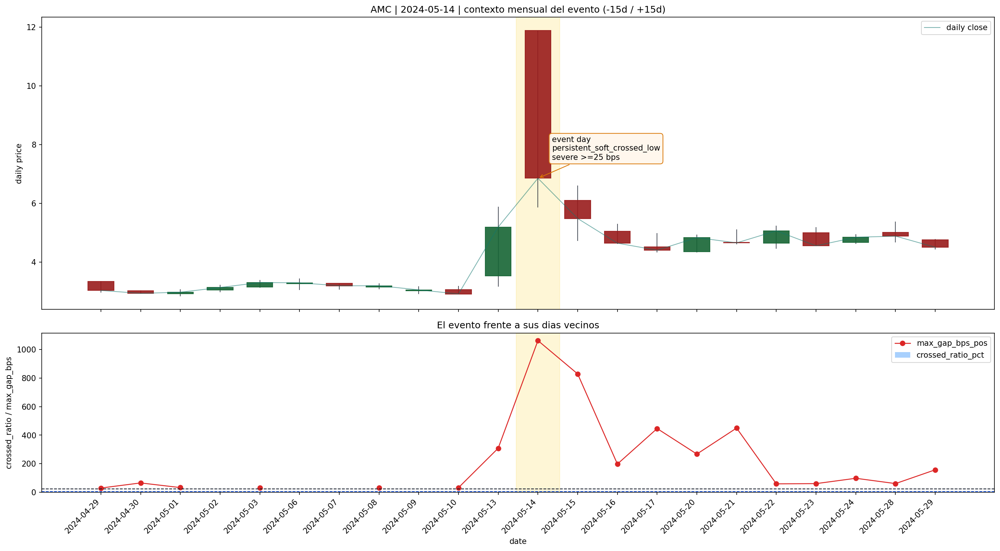

#### 00b Event Month Quotes Context
Esta imagen responde a la pregunta de recurrencia mensual dentro de `quotes`: el problema se concentra en el evento o reaparece en varias sesiones. Arriba concatena sesiones con datos disponibles; abajo resume cobertura diaria, `crossed_ratio_pct` y `max_gap_bps_pos`. La decision que cambia es si el caso debe leerse como episodio puntual o como sintoma de una fase repetida de libro degradado. El error que evita es extrapolar desde un unico dia a todo el mes sin evidencia.

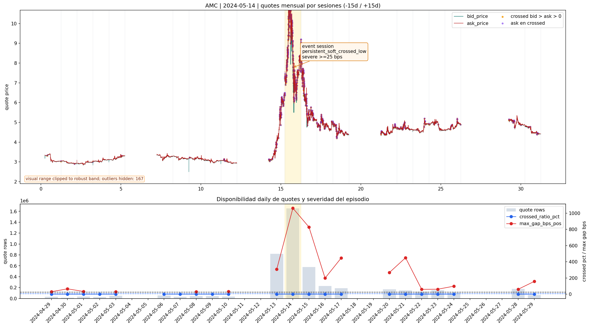

#### 01 Raw Window
Esta imagen responde a la primera pregunta decisiva del caso: el crossed observado, si existe, sigue siendo compatible con permanencia en `good` o no. Arriba ensena la geometria exacta del tramo conflictivo; abajo convierte esa geometria a bps y la enfrenta a los cortes `5 bps` y `25 bps`. El regimen dominante es `severe >=25 bps`. La decision que cambia es demostrar que el residuo permanece por debajo del dano que obligaria a mover el caso a `review` o `bad`. El error que evita es expulsar del universo util episodios leves cuyo impacto sobre ejecucion y features sigue siendo tolerable.

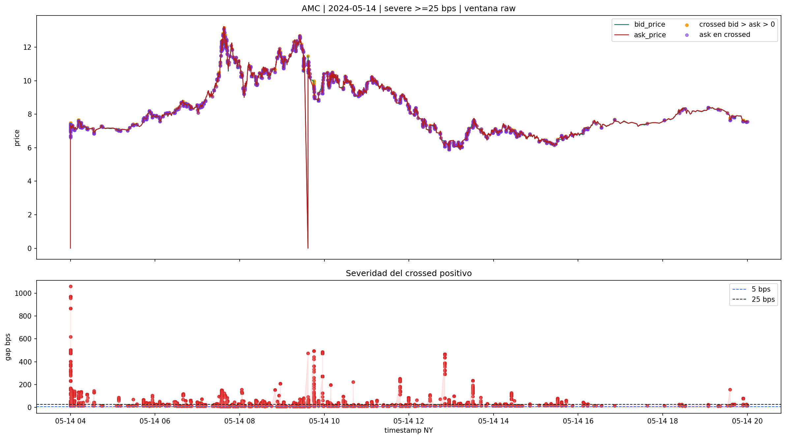

#### 02 Full Session Context
Esta imagen responde a la pregunta de extension intradiaria: el dano esta confinado a un bloque corto o contamina la sesion completa. Arriba se ve toda la sesion `04:00-20:00 NY`; abajo el `gap_bps` firmado. La decision que cambia es si el consumo debe penalizar solo un tramo o desechar el dia entero para uso operativo. El error que evita es tratar una cicatriz local como ruina total o, al reves, minimizar una degradacion distribuida a lo largo del dia. En ejecucion esto decide si la sesion puede seguir usandose con restricciones; en ML decide si las features intradiarias conservan significado economico.

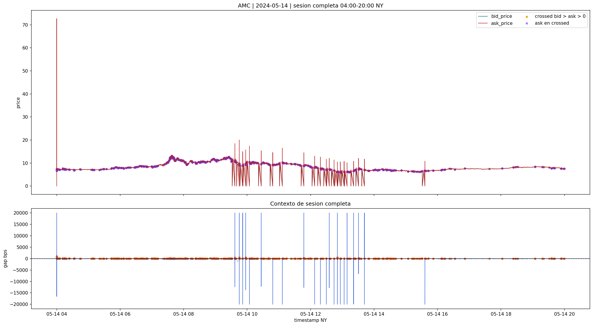

#### 03 Structure Diagnostics
Este panel responde a la pregunta de naturaleza del fallo: contradiccion economica genuina o mezcla con degeneracion estructural. Separa `ask=0` de `ask>0`, muestra la distribucion de `gap_bps` y resume patrones de integerizacion. La decision que cambia es como interpretar el dano: mercado localmente roto, artefacto de representacion o combinacion de ambos. El error que evita es sobrediagnosticar crossed reales cuando parte de la senal proviene de estructura degenerada del libro. Esta lectura afecta directamente a que el caso vaya a exclusion dura, a bandera contextual o a simple reconciliacion tecnica.

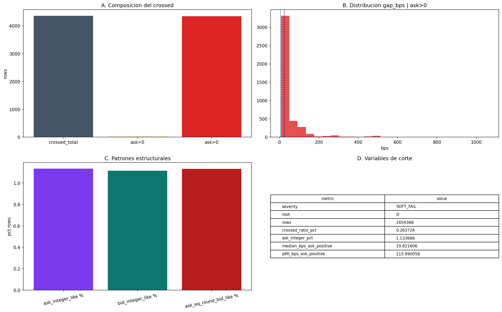

#### 04 Summary Card
Esta tarjeta responde a la pregunta de auditabilidad: cuales son exactamente las variables que sostienen la conclusion. Reune `severity`, `root`, `crossed_ratio_pct`, `ask_integer_pct`, `median_bps_ask_positive` y `p90_bps_ask_positive`. La decision que cambia es pasar de impresion visual a regla verificable. El error que evita es que dos inspectores lleguen a conclusiones distintas mirando la misma imagen sin una base numerica comun. Para gobernanza del proyecto, este panel es el que vuelve reproducible la decision para backtest, ML y auditoria.

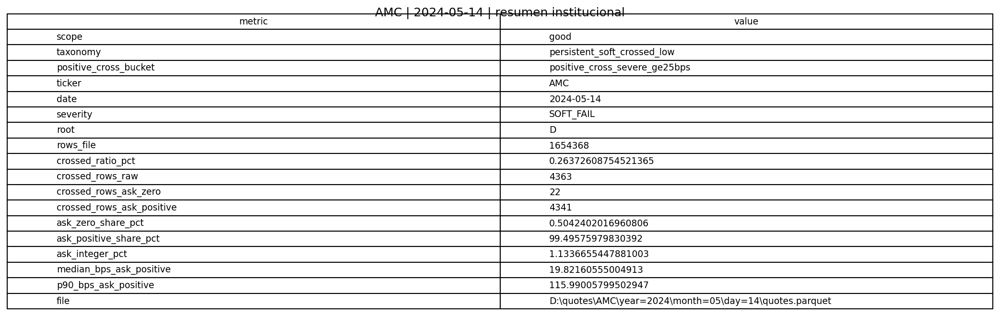

---

### 6. REPL 2025-07-30

company_name: `Replimune Group, Inc.`
primary_exchange: `NASDAQ` (`XNAS`)
market_locale: `stocks/us`
scope: `good`
ticker: `REPL`
date: `2025-07-30`
taxonomy: `persistent_soft_crossed_low`
positive_cross_bucket: `positive_cross_severe_ge25bps`
severity: `SOFT_FAIL`
root: `D`
rows: `1256438`
crossed_ratio_pct: `0.316052`
crossed_rows_raw: `3971`
crossed_rows_ask_zero: `1`
crossed_rows_ask_positive: `3970`
ask_integer_pct: `1.198308`
median_bps_ask_positive: `17.196905`
p90_bps_ask_positive: `44.543430`
file: `D:\quotes\REPL\year=2025\month=07\day=30\quotes.parquet`

#### Analisis Forense
La conclusion correcta del caso es que el libro mantiene semantica economica util. El residuo observado no cambia de forma material la lectura del spread ni invalida el uso operativo normal del dia. La taxonomy historica es `persistent_soft_crossed_low` y el regimen positivo dominante es `severe >=25 bps`. Esto importa porque la taxonomy no solo clasifica: resume que tipo de anomalia se esta viendo y que clase de decision contractual puede defenderse despues. La taxonomy `persistent_soft_crossed_low` implica persistencia real de crossed, aunque en una banda todavia compatible con uso principal si el dano economico sigue contenido. El regimen `severe >=25 bps` empuja el caso a una lectura economicamente dura: el crossed deja de ser cosmetico y pasa a cuestionar si el libro sigue siendo interpretable como mercado negociable. En terminos observables, el file tiene `crossed_ratio_pct=0.316052` con `crossed_rows_ask_positive=3970` y `crossed_rows_ask_zero=1`. La severidad economica del crossed ask>0 se resume en `median_bps_ask_positive=17.196905` y `p90_bps_ask_positive=44.543430`. Estos dos numeros convierten una forma visual rara en una conclusion operativa sobre si el libro sigue representando o no un mercado negociable. La decision que cambia es mantener el caso dentro de la franja util, aunque con lectura consciente de que existe una huella positiva leve o acotada. En `good`, el objetivo no es negar toda irregularidad, sino demostrar que la anomalia no destruye la semantica economica minima del libro ni invalida su uso principal. El error que evita esta lectura es sobrecastigar micro-residuos y encoger artificialmente el universo util para backtest y ML. El patron estructural muestra `ask_integer_pct=1.198308`. Este numero obliga a separar dos explicaciones rivales: contradiccion economica genuina del libro o mezcla con degeneracion estructural / integerizacion. La mayor parte del crossed vive en `ask>0`, de modo que el corazon del problema sigue siendo economico. La parte `ask=0`, si existe, acompana pero no explica por si sola la anomalia. Como `ask_integer_pct` es bajo, la hipotesis de simple degeneracion mecanica pierde fuerza. Eso endurece la interpretacion: el crossed se parece mas a contradiccion economica genuina y menos a artefacto. Existe ademas una imagen historica de certificacion asociada. Su papel es poner el episodio en un marco causal mas amplio: halt, explained, not strongly explained o patron conocido. La regla que protege al proyecto es esta: el contexto externo se usa para explicar por que aparece el episodio, no para absolverlo. El error que evita es degradar el criterio de calidad del libro porque exista una historia plausible alrededor del caso.

#### 00 Event Month Context
Esta imagen responde a la pregunta de persistencia temporal: estamos ante un accidente local o ante una fase mas amplia de inestabilidad. Arriba coloca el evento en la serie `daily` real del mes; abajo compara `crossed_ratio_pct` y `max_gap_bps_pos` del dia contra sus vecinos. La decision que cambia es el peso estructural que se le concede al caso. El error que evita es juzgar igual un shock aislado y una degradacion repetida del libro.

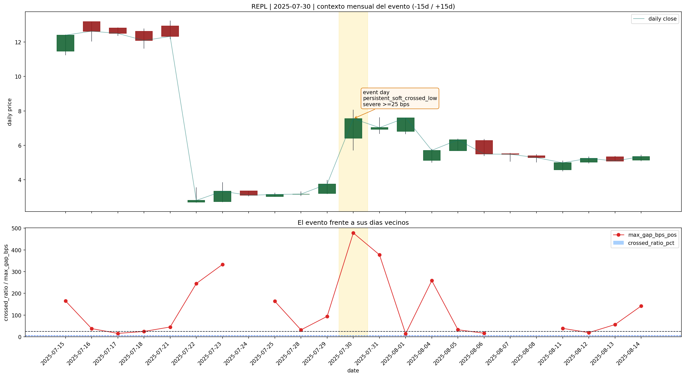

#### 00b Event Month Quotes Context
Esta imagen responde a la pregunta de recurrencia mensual dentro de `quotes`: el problema se concentra en el evento o reaparece en varias sesiones. Arriba concatena sesiones con datos disponibles; abajo resume cobertura diaria, `crossed_ratio_pct` y `max_gap_bps_pos`. La decision que cambia es si el caso debe leerse como episodio puntual o como sintoma de una fase repetida de libro degradado. El error que evita es extrapolar desde un unico dia a todo el mes sin evidencia.

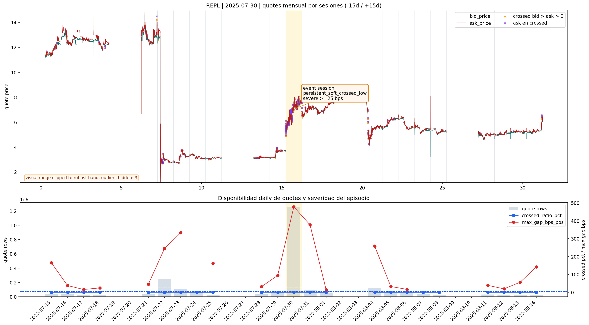

#### 01 Raw Window
Esta imagen responde a la primera pregunta decisiva del caso: el crossed observado, si existe, sigue siendo compatible con permanencia en `good` o no. Arriba ensena la geometria exacta del tramo conflictivo; abajo convierte esa geometria a bps y la enfrenta a los cortes `5 bps` y `25 bps`. El regimen dominante es `severe >=25 bps`. La decision que cambia es demostrar que el residuo permanece por debajo del dano que obligaria a mover el caso a `review` o `bad`. El error que evita es expulsar del universo util episodios leves cuyo impacto sobre ejecucion y features sigue siendo tolerable.

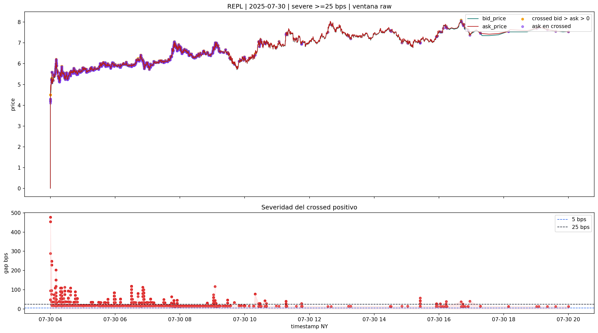

#### 02 Full Session Context
Esta imagen responde a la pregunta de extension intradiaria: el dano esta confinado a un bloque corto o contamina la sesion completa. Arriba se ve toda la sesion `04:00-20:00 NY`; abajo el `gap_bps` firmado. La decision que cambia es si el consumo debe penalizar solo un tramo o desechar el dia entero para uso operativo. El error que evita es tratar una cicatriz local como ruina total o, al reves, minimizar una degradacion distribuida a lo largo del dia. En ejecucion esto decide si la sesion puede seguir usandose con restricciones; en ML decide si las features intradiarias conservan significado economico.

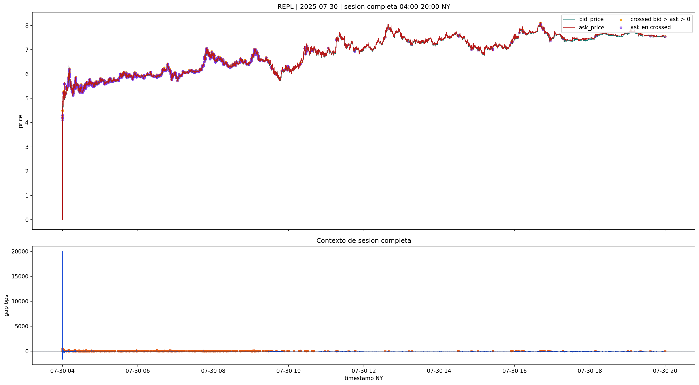

#### 03 Structure Diagnostics
Este panel responde a la pregunta de naturaleza del fallo: contradiccion economica genuina o mezcla con degeneracion estructural. Separa `ask=0` de `ask>0`, muestra la distribucion de `gap_bps` y resume patrones de integerizacion. La decision que cambia es como interpretar el dano: mercado localmente roto, artefacto de representacion o combinacion de ambos. El error que evita es sobrediagnosticar crossed reales cuando parte de la senal proviene de estructura degenerada del libro. Esta lectura afecta directamente a que el caso vaya a exclusion dura, a bandera contextual o a simple reconciliacion tecnica.

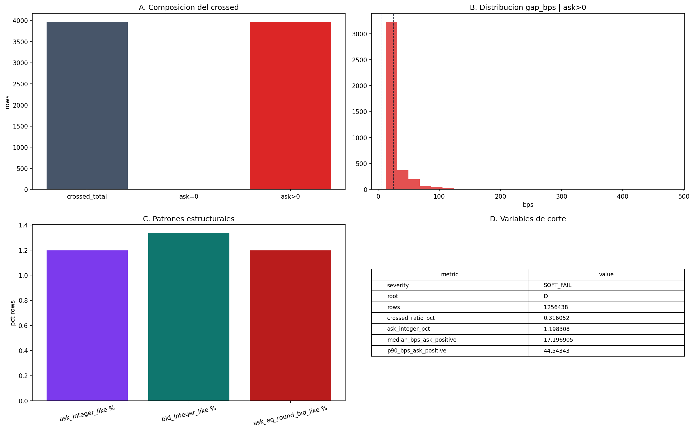

#### 04 Summary Card
Esta tarjeta responde a la pregunta de auditabilidad: cuales son exactamente las variables que sostienen la conclusion. Reune `severity`, `root`, `crossed_ratio_pct`, `ask_integer_pct`, `median_bps_ask_positive` y `p90_bps_ask_positive`. La decision que cambia es pasar de impresion visual a regla verificable. El error que evita es que dos inspectores lleguen a conclusiones distintas mirando la misma imagen sin una base numerica comun. Para gobernanza del proyecto, este panel es el que vuelve reproducible la decision para backtest, ML y auditoria.

---

### 7. AMC 2022-04-05

company_name: `AMER MORT ACCEPT(SHS BENE INT`
primary_exchange: `NYSE American` (`XASE`)
market_locale: `stocks/us`
scope: `good`
ticker: `AMC`
date: `2022-04-05`
taxonomy: `soft_crossed_micro_noise`
positive_cross_bucket: `positive_cross_moderate_5to25bps`
severity: `SOFT_FAIL`
root: `D`
rows: `599412`
crossed_ratio_pct: `0.014848`
crossed_rows_raw: `89`
crossed_rows_ask_zero: `0`
crossed_rows_ask_positive: `89`
ask_integer_pct: `0.332159`
median_bps_ask_positive: `4.704775`
p90_bps_ask_positive: `9.376465`
file: `D:\quotes\AMC\year=2022\month=04\day=05\quotes.parquet`

#### Analisis Forense
La conclusion correcta del caso es que el libro mantiene semantica economica util. El residuo observado no cambia de forma material la lectura del spread ni invalida el uso operativo normal del dia. La taxonomy historica es `soft_crossed_micro_noise` y el regimen positivo dominante es `moderate 5-25 bps`. Esto importa porque la taxonomy no solo clasifica: resume que tipo de anomalia se esta viendo y que clase de decision contractual puede defenderse despues. La taxonomy `soft_crossed_micro_noise` implica que existen micro-contradicciones locales, pero tan pequenas o escasas que la prioridad institucional es no sobrecastigar residuo inocuo. El regimen `moderate 5-25 bps` ya entra en zona donde el crossed tiene capacidad real de contaminar simulacion de ejecucion y features microestructurales, aunque todavia puede requerir lectura contextual antes de exclusion dura. En terminos observables, el file tiene `crossed_ratio_pct=0.014848` con `crossed_rows_ask_positive=89` y `crossed_rows_ask_zero=0`. La severidad economica del crossed ask>0 se resume en `median_bps_ask_positive=4.704775` y `p90_bps_ask_positive=9.376465`. Estos dos numeros convierten una forma visual rara en una conclusion operativa sobre si el libro sigue representando o no un mercado negociable. La decision que cambia es mantener el caso dentro de la franja util, aunque con lectura consciente de que existe una huella positiva leve o acotada. En `good`, el objetivo no es negar toda irregularidad, sino demostrar que la anomalia no destruye la semantica economica minima del libro ni invalida su uso principal. El error que evita esta lectura es sobrecastigar micro-residuos y encoger artificialmente el universo util para backtest y ML. El patron estructural muestra `ask_integer_pct=0.332159`. Este numero obliga a separar dos explicaciones rivales: contradiccion economica genuina del libro o mezcla con degeneracion estructural / integerizacion. Toda la composicion crossed cae en `ask>0`. Eso endurece la lectura economica del caso: el dano no depende de ceros mecanicos, sino de contradiccion positiva dentro de precios aparentemente vivos. Como `ask_integer_pct` es bajo, la hipotesis de simple degeneracion mecanica pierde fuerza. Eso endurece la interpretacion: el crossed se parece mas a contradiccion economica genuina y menos a artefacto. En la capa de semantica de precio del evento aparecen `daily raw close=212.1000`, `quote mid raw=21.6650`, `quote mid split_normalized=216.6500`, `daily adjusted_proxy=212.1000`. La reconciliacion incluye `future_split_factor=0.1000`. La implicacion metodologica es crucial: una discrepancia entre `quotes`, `daily` y una plataforma externa no puede leerse automaticamente como fallo del dataset. Puede ser semantica de precio distinta. El error que evita esta capa es mezclar raw, split-normalized y adjusted dentro del mismo pipeline, rompiendo auditoria, benchmarking y labels. Para pipelines, esto significa que el caso puede seguir entrando en consumo principal con la salvedad de que cualquier residuo observado debe quedar trazado como tolerado y no ignorado por completo. Existe ademas una imagen historica de certificacion asociada. Su papel es poner el episodio en un marco causal mas amplio: halt, explained, not strongly explained o patron conocido. La regla que protege al proyecto es esta: el contexto externo se usa para explicar por que aparece el episodio, no para absolverlo. El error que evita es degradar el criterio de calidad del libro porque exista una historia plausible alrededor del caso.

#### 00 Event Month Context
Esta imagen responde a la pregunta de persistencia temporal: estamos ante un accidente local o ante una fase mas amplia de inestabilidad. Arriba coloca el evento en la serie `daily` real del mes; abajo compara `crossed_ratio_pct` y `max_gap_bps_pos` del dia contra sus vecinos. La decision que cambia es el peso estructural que se le concede al caso. El error que evita es juzgar igual un shock aislado y una degradacion repetida del libro.

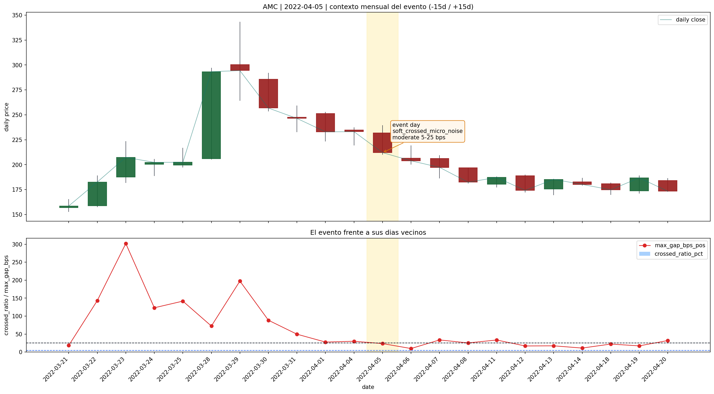

#### 00a Adjusted Proxy Contrast
Esta imagen responde a la pregunta de reconciliacion semantica: la discrepancia de precios viene de datos rotos o de vistas de precio distintas. Compara `daily raw`, `daily adjusted_proxy`, `quote mid raw` y `quote mid split_normalized`, y debajo ensena la cadena de dividendos y splits que produce la diferencia. La decision que cambia es si el inspector debe abrir una incidencia de calidad o cerrar el caso como diferencia legitima de semantica. El error que evita es mezclar series raw y adjusted como si fueran equivalentes. En pipelines reales, esto protege benchmarking, labels diarios y reconciliacion externa frente a falsas alarmas de precio.

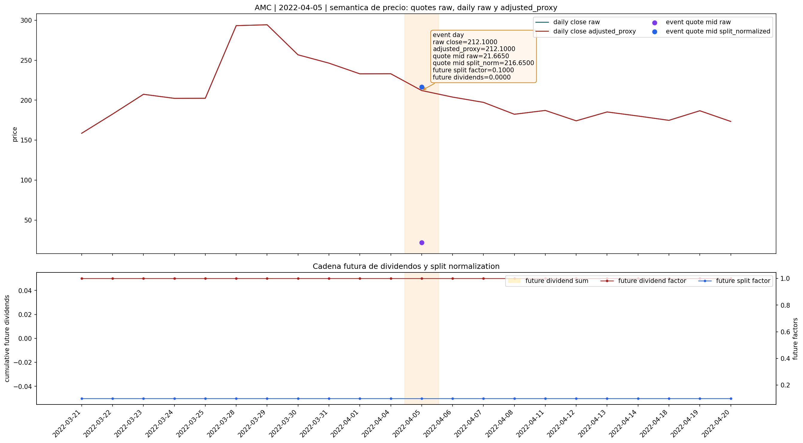

#### 00b Event Month Quotes Context
Esta imagen responde a la pregunta de recurrencia mensual dentro de `quotes`: el problema se concentra en el evento o reaparece en varias sesiones. Arriba concatena sesiones con datos disponibles; abajo resume cobertura diaria, `crossed_ratio_pct` y `max_gap_bps_pos`. La decision que cambia es si el caso debe leerse como episodio puntual o como sintoma de una fase repetida de libro degradado. El error que evita es extrapolar desde un unico dia a todo el mes sin evidencia.

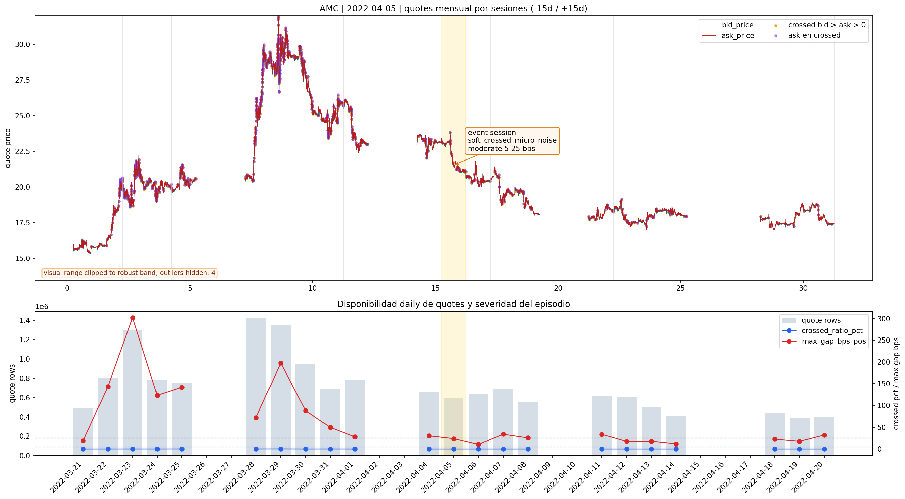

#### 01 Raw Window
Esta imagen responde a la primera pregunta decisiva del caso: el crossed observado, si existe, sigue siendo compatible con permanencia en `good` o no. Arriba ensena la geometria exacta del tramo conflictivo; abajo convierte esa geometria a bps y la enfrenta a los cortes `5 bps` y `25 bps`. El regimen dominante es `moderate 5-25 bps`. La decision que cambia es demostrar que el residuo permanece por debajo del dano que obligaria a mover el caso a `review` o `bad`. El error que evita es expulsar del universo util episodios leves cuyo impacto sobre ejecucion y features sigue siendo tolerable.

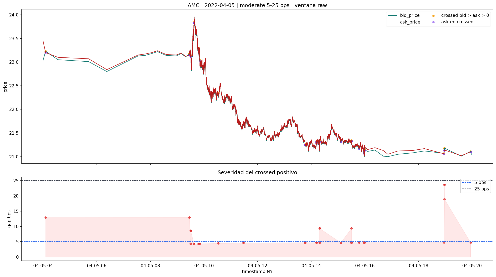

#### 02 Full Session Context
Esta imagen responde a la pregunta de extension intradiaria: el dano esta confinado a un bloque corto o contamina la sesion completa. Arriba se ve toda la sesion `04:00-20:00 NY`; abajo el `gap_bps` firmado. La decision que cambia es si el consumo debe penalizar solo un tramo o desechar el dia entero para uso operativo. El error que evita es tratar una cicatriz local como ruina total o, al reves, minimizar una degradacion distribuida a lo largo del dia. En ejecucion esto decide si la sesion puede seguir usandose con restricciones; en ML decide si las features intradiarias conservan significado economico.

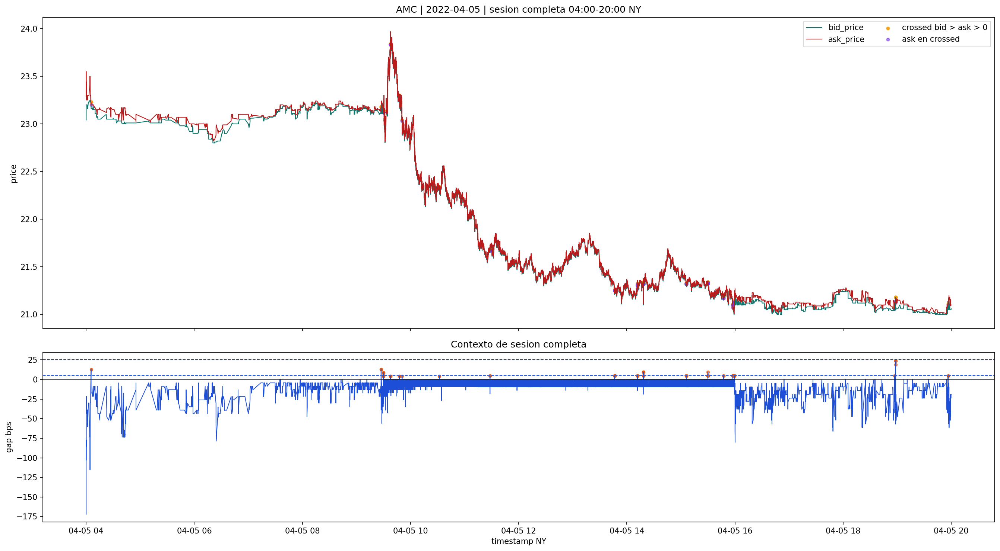

#### 03 Structure Diagnostics
Este panel responde a la pregunta de naturaleza del fallo: contradiccion economica genuina o mezcla con degeneracion estructural. Separa `ask=0` de `ask>0`, muestra la distribucion de `gap_bps` y resume patrones de integerizacion. La decision que cambia es como interpretar el dano: mercado localmente roto, artefacto de representacion o combinacion de ambos. El error que evita es sobrediagnosticar crossed reales cuando parte de la senal proviene de estructura degenerada del libro. Esta lectura afecta directamente a que el caso vaya a exclusion dura, a bandera contextual o a simple reconciliacion tecnica.

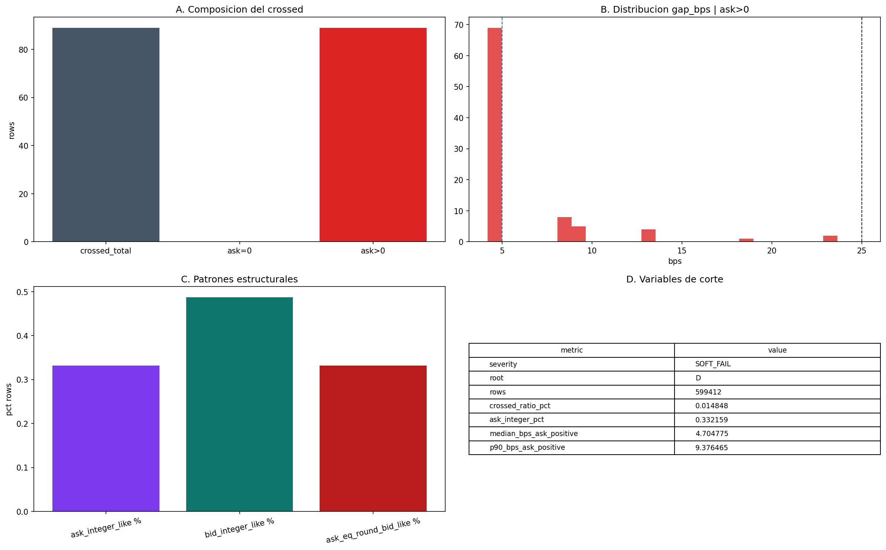

#### 04 Summary Card
Esta tarjeta responde a la pregunta de auditabilidad: cuales son exactamente las variables que sostienen la conclusion. Reune `severity`, `root`, `crossed_ratio_pct`, `ask_integer_pct`, `median_bps_ask_positive` y `p90_bps_ask_positive`. La decision que cambia es pasar de impresion visual a regla verificable. El error que evita es que dos inspectores lleguen a conclusiones distintas mirando la misma imagen sin una base numerica comun. Para gobernanza del proyecto, este panel es el que vuelve reproducible la decision para backtest, ML y auditoria.

---

### 8. AMC 2021-09-10

company_name: `AMER MORT ACCEPT(SHS BENE INT`
primary_exchange: `NYSE American` (`XASE`)
market_locale: `stocks/us`
scope: `good`
ticker: `AMC`
date: `2021-09-10`
taxonomy: `soft_crossed_micro_noise`
positive_cross_bucket: `positive_cross_moderate_5to25bps`
severity: `SOFT_FAIL`
root: `D`
rows: `800742`
crossed_ratio_pct: `0.026600`
crossed_rows_raw: `213`
crossed_rows_ask_zero: `0`
crossed_rows_ask_positive: `213`
ask_integer_pct: `1.563675`
median_bps_ask_positive: `2.030251`
p90_bps_ask_positive: `7.964954`
file: `D:\quotes\AMC\year=2021\month=09\day=10\quotes.parquet`

#### Analisis Forense
La conclusion correcta del caso es que el libro mantiene semantica economica util. El residuo observado no cambia de forma material la lectura del spread ni invalida el uso operativo normal del dia. La taxonomy historica es `soft_crossed_micro_noise` y el regimen positivo dominante es `moderate 5-25 bps`. Esto importa porque la taxonomy no solo clasifica: resume que tipo de anomalia se esta viendo y que clase de decision contractual puede defenderse despues. La taxonomy `soft_crossed_micro_noise` implica que existen micro-contradicciones locales, pero tan pequenas o escasas que la prioridad institucional es no sobrecastigar residuo inocuo. El regimen `moderate 5-25 bps` ya entra en zona donde el crossed tiene capacidad real de contaminar simulacion de ejecucion y features microestructurales, aunque todavia puede requerir lectura contextual antes de exclusion dura. En terminos observables, el file tiene `crossed_ratio_pct=0.026600` con `crossed_rows_ask_positive=213` y `crossed_rows_ask_zero=0`. La severidad economica del crossed ask>0 se resume en `median_bps_ask_positive=2.030251` y `p90_bps_ask_positive=7.964954`. Estos dos numeros convierten una forma visual rara en una conclusion operativa sobre si el libro sigue representando o no un mercado negociable. La decision que cambia es mantener el caso dentro de la franja util, aunque con lectura consciente de que existe una huella positiva leve o acotada. En `good`, el objetivo no es negar toda irregularidad, sino demostrar que la anomalia no destruye la semantica economica minima del libro ni invalida su uso principal. El error que evita esta lectura es sobrecastigar micro-residuos y encoger artificialmente el universo util para backtest y ML. El patron estructural muestra `ask_integer_pct=1.563675`. Este numero obliga a separar dos explicaciones rivales: contradiccion economica genuina del libro o mezcla con degeneracion estructural / integerizacion. Toda la composicion crossed cae en `ask>0`. Eso endurece la lectura economica del caso: el dano no depende de ceros mecanicos, sino de contradiccion positiva dentro de precios aparentemente vivos. Como `ask_integer_pct` es bajo, la hipotesis de simple degeneracion mecanica pierde fuerza. Eso endurece la interpretacion: el crossed se parece mas a contradiccion economica genuina y menos a artefacto. En la capa de semantica de precio del evento aparecen `daily raw close=501.6000`, `quote mid raw=50.8750`, `quote mid split_normalized=508.7500`, `daily adjusted_proxy=501.6000`. La reconciliacion incluye `future_split_factor=0.1000`. La implicacion metodologica es crucial: una discrepancia entre `quotes`, `daily` y una plataforma externa no puede leerse automaticamente como fallo del dataset. Puede ser semantica de precio distinta. El error que evita esta capa es mezclar raw, split-normalized y adjusted dentro del mismo pipeline, rompiendo auditoria, benchmarking y labels. Para pipelines, esto significa que el caso puede seguir entrando en consumo principal con la salvedad de que cualquier residuo observado debe quedar trazado como tolerado y no ignorado por completo. Existe ademas una imagen historica de certificacion asociada. Su papel es poner el episodio en un marco causal mas amplio: halt, explained, not strongly explained o patron conocido. La regla que protege al proyecto es esta: el contexto externo se usa para explicar por que aparece el episodio, no para absolverlo. El error que evita es degradar el criterio de calidad del libro porque exista una historia plausible alrededor del caso.

#### 00 Event Month Context
Esta imagen responde a la pregunta de persistencia temporal: estamos ante un accidente local o ante una fase mas amplia de inestabilidad. Arriba coloca el evento en la serie `daily` real del mes; abajo compara `crossed_ratio_pct` y `max_gap_bps_pos` del dia contra sus vecinos. La decision que cambia es el peso estructural que se le concede al caso. El error que evita es juzgar igual un shock aislado y una degradacion repetida del libro.

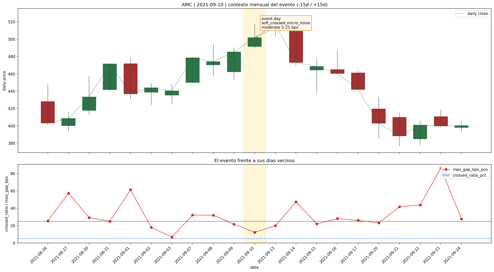

#### 00a Adjusted Proxy Contrast
Esta imagen responde a la pregunta de reconciliacion semantica: la discrepancia de precios viene de datos rotos o de vistas de precio distintas. Compara `daily raw`, `daily adjusted_proxy`, `quote mid raw` y `quote mid split_normalized`, y debajo ensena la cadena de dividendos y splits que produce la diferencia. La decision que cambia es si el inspector debe abrir una incidencia de calidad o cerrar el caso como diferencia legitima de semantica. El error que evita es mezclar series raw y adjusted como si fueran equivalentes. En pipelines reales, esto protege benchmarking, labels diarios y reconciliacion externa frente a falsas alarmas de precio.

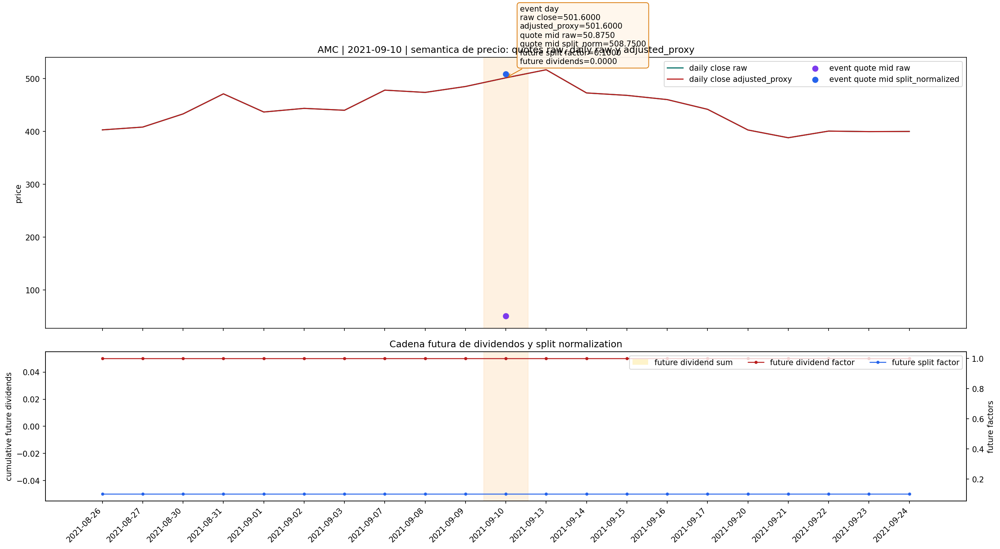

#### 00b Event Month Quotes Context
Esta imagen responde a la pregunta de recurrencia mensual dentro de `quotes`: el problema se concentra en el evento o reaparece en varias sesiones. Arriba concatena sesiones con datos disponibles; abajo resume cobertura diaria, `crossed_ratio_pct` y `max_gap_bps_pos`. La decision que cambia es si el caso debe leerse como episodio puntual o como sintoma de una fase repetida de libro degradado. El error que evita es extrapolar desde un unico dia a todo el mes sin evidencia.

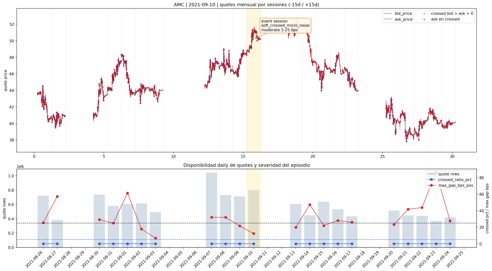

#### 01 Raw Window
Esta imagen responde a la primera pregunta decisiva del caso: el crossed observado, si existe, sigue siendo compatible con permanencia en `good` o no. Arriba ensena la geometria exacta del tramo conflictivo; abajo convierte esa geometria a bps y la enfrenta a los cortes `5 bps` y `25 bps`. El regimen dominante es `moderate 5-25 bps`. La decision que cambia es demostrar que el residuo permanece por debajo del dano que obligaria a mover el caso a `review` o `bad`. El error que evita es expulsar del universo util episodios leves cuyo impacto sobre ejecucion y features sigue siendo tolerable.

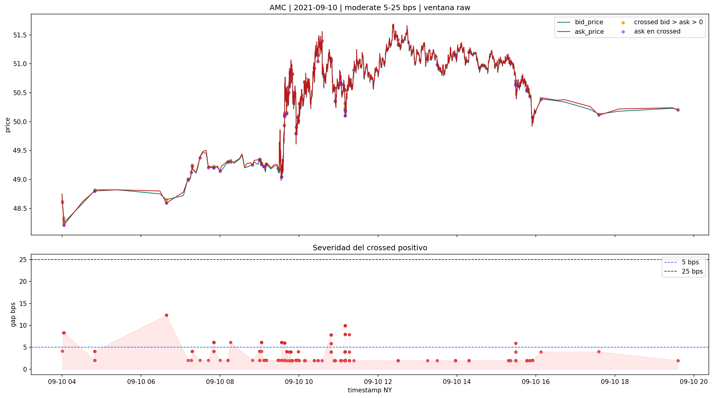

#### 02 Full Session Context
Esta imagen responde a la pregunta de extension intradiaria: el dano esta confinado a un bloque corto o contamina la sesion completa. Arriba se ve toda la sesion `04:00-20:00 NY`; abajo el `gap_bps` firmado. La decision que cambia es si el consumo debe penalizar solo un tramo o desechar el dia entero para uso operativo. El error que evita es tratar una cicatriz local como ruina total o, al reves, minimizar una degradacion distribuida a lo largo del dia. En ejecucion esto decide si la sesion puede seguir usandose con restricciones; en ML decide si las features intradiarias conservan significado economico.

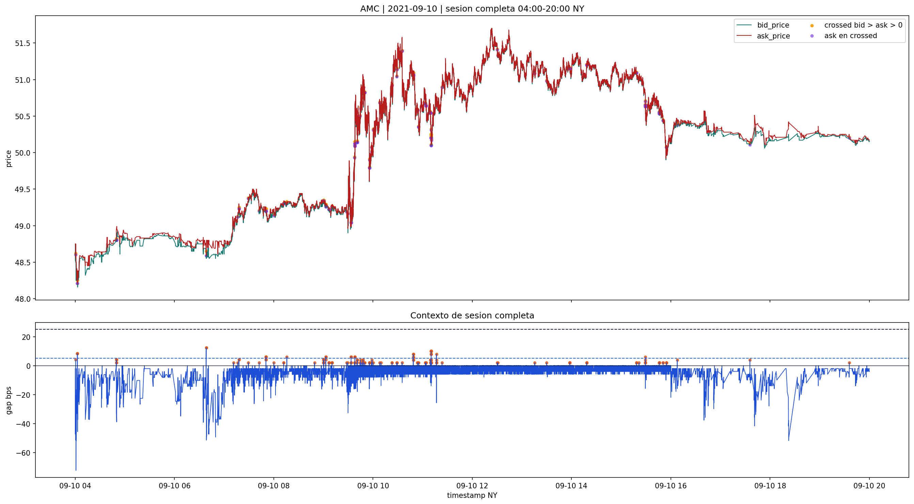

#### 03 Structure Diagnostics
Este panel responde a la pregunta de naturaleza del fallo: contradiccion economica genuina o mezcla con degeneracion estructural. Separa `ask=0` de `ask>0`, muestra la distribucion de `gap_bps` y resume patrones de integerizacion. La decision que cambia es como interpretar el dano: mercado localmente roto, artefacto de representacion o combinacion de ambos. El error que evita es sobrediagnosticar crossed reales cuando parte de la senal proviene de estructura degenerada del libro. Esta lectura afecta directamente a que el caso vaya a exclusion dura, a bandera contextual o a simple reconciliacion tecnica.

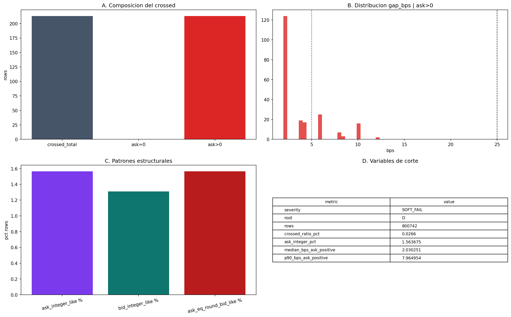

#### 04 Summary Card
Esta tarjeta responde a la pregunta de auditabilidad: cuales son exactamente las variables que sostienen la conclusion. Reune `severity`, `root`, `crossed_ratio_pct`, `ask_integer_pct`, `median_bps_ask_positive` y `p90_bps_ask_positive`. La decision que cambia es pasar de impresion visual a regla verificable. El error que evita es que dos inspectores lleguen a conclusiones distintas mirando la misma imagen sin una base numerica comun. Para gobernanza del proyecto, este panel es el que vuelve reproducible la decision para backtest, ML y auditoria.

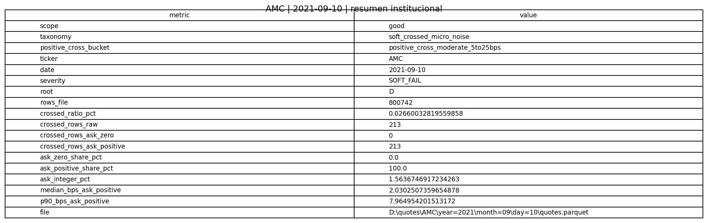

---

### 9. YHOO 2017-06-09

company_name: `Yahoo Inc`
primary_exchange: `NASDAQ` (`XNAS`)
market_locale: `stocks/us`
scope: `good`
ticker: `YHOO`
date: `2017-06-09`
taxonomy: `soft_crossed_micro_noise`
positive_cross_bucket: `positive_cross_mild_lt5bps`
severity: `SOFT_FAIL`
root: `C`
rows: `954816`
crossed_ratio_pct: `0.029325`
crossed_rows_raw: `280`
crossed_rows_ask_zero: `3`
crossed_rows_ask_positive: `277`
ask_integer_pct: `1.134983`
median_bps_ask_positive: `1.799047`
p90_bps_ask_positive: `3.535443`
file: `C:\TSIS_Data\data\quotes\YHOO\year=2017\month=06\day=09\quotes.parquet`

#### Analisis Forense
La conclusion correcta del caso es que el libro mantiene semantica economica util. El residuo observado no cambia de forma material la lectura del spread ni invalida el uso operativo normal del dia. La taxonomy historica es `soft_crossed_micro_noise` y el regimen positivo dominante es `mild <5 bps`. Esto importa porque la taxonomy no solo clasifica: resume que tipo de anomalia se esta viendo y que clase de decision contractual puede defenderse despues. La taxonomy `soft_crossed_micro_noise` implica que existen micro-contradicciones locales, pero tan pequenas o escasas que la prioridad institucional es no sobrecastigar residuo inocuo. El regimen `mild <5 bps` significa que existe contradiccion economica positiva, pero aun en una banda donde un uso prudente puede seguir siendo defendible si la persistencia y la estructura no agravan el caso. En terminos observables, el file tiene `crossed_ratio_pct=0.029325` con `crossed_rows_ask_positive=277` y `crossed_rows_ask_zero=3`. La severidad economica del crossed ask>0 se resume en `median_bps_ask_positive=1.799047` y `p90_bps_ask_positive=3.535443`. Estos dos numeros convierten una forma visual rara en una conclusion operativa sobre si el libro sigue representando o no un mercado negociable. La decision que cambia es mantener el caso dentro de la franja util, aunque con lectura consciente de que existe una huella positiva leve o acotada. En `good`, el objetivo no es negar toda irregularidad, sino demostrar que la anomalia no destruye la semantica economica minima del libro ni invalida su uso principal. El error que evita esta lectura es sobrecastigar micro-residuos y encoger artificialmente el universo util para backtest y ML. El patron estructural muestra `ask_integer_pct=1.134983`. Este numero obliga a separar dos explicaciones rivales: contradiccion economica genuina del libro o mezcla con degeneracion estructural / integerizacion. La mayor parte del crossed vive en `ask>0`, de modo que el corazon del problema sigue siendo economico. La parte `ask=0`, si existe, acompana pero no explica por si sola la anomalia. Como `ask_integer_pct` es bajo, la hipotesis de simple degeneracion mecanica pierde fuerza. Eso endurece la interpretacion: el crossed se parece mas a contradiccion economica genuina y menos a artefacto. Existe ademas una imagen historica de certificacion asociada. Su papel es poner el episodio en un marco causal mas amplio: halt, explained, not strongly explained o patron conocido. La regla que protege al proyecto es esta: el contexto externo se usa para explicar por que aparece el episodio, no para absolverlo. El error que evita es degradar el criterio de calidad del libro porque exista una historia plausible alrededor del caso.

#### 00 Event Month Context
Esta imagen responde a la pregunta de persistencia temporal: estamos ante un accidente local o ante una fase mas amplia de inestabilidad. Arriba coloca el evento en la serie `daily` real del mes; abajo compara `crossed_ratio_pct` y `max_gap_bps_pos` del dia contra sus vecinos. La decision que cambia es el peso estructural que se le concede al caso. El error que evita es juzgar igual un shock aislado y una degradacion repetida del libro.

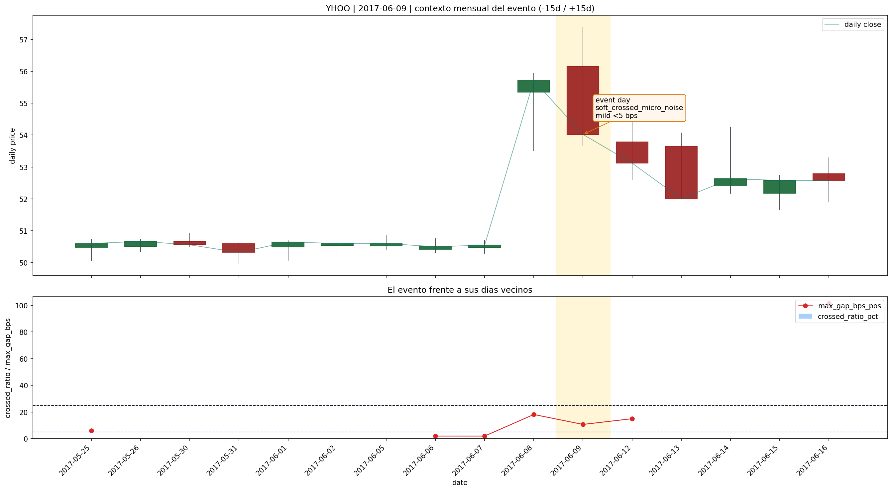

#### 00b Event Month Quotes Context
Esta imagen responde a la pregunta de recurrencia mensual dentro de `quotes`: el problema se concentra en el evento o reaparece en varias sesiones. Arriba concatena sesiones con datos disponibles; abajo resume cobertura diaria, `crossed_ratio_pct` y `max_gap_bps_pos`. La decision que cambia es si el caso debe leerse como episodio puntual o como sintoma de una fase repetida de libro degradado. El error que evita es extrapolar desde un unico dia a todo el mes sin evidencia.

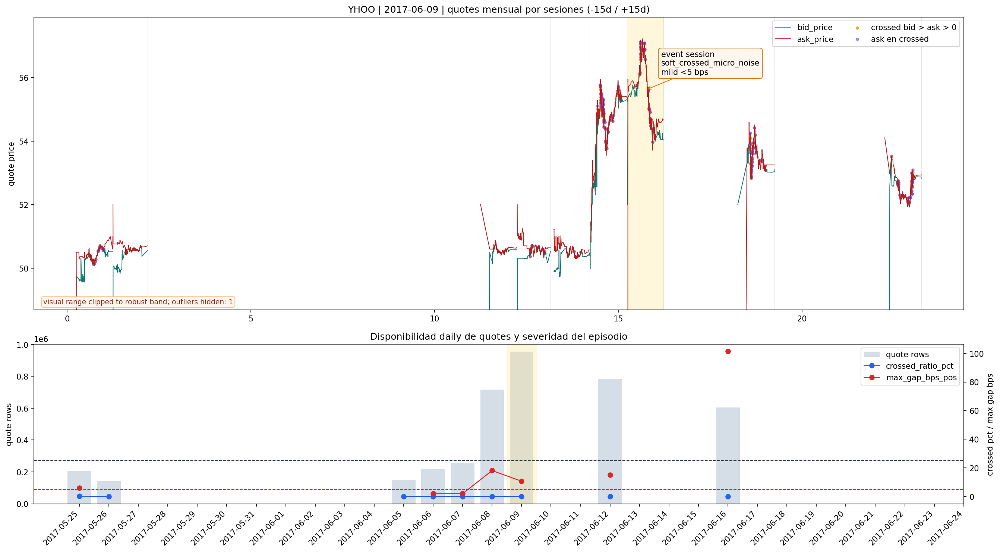

#### 01 Raw Window
Esta imagen responde a la primera pregunta decisiva del caso: el crossed observado, si existe, sigue siendo compatible con permanencia en `good` o no. Arriba ensena la geometria exacta del tramo conflictivo; abajo convierte esa geometria a bps y la enfrenta a los cortes `5 bps` y `25 bps`. El regimen dominante es `mild <5 bps`. La decision que cambia es demostrar que el residuo permanece por debajo del dano que obligaria a mover el caso a `review` o `bad`. El error que evita es expulsar del universo util episodios leves cuyo impacto sobre ejecucion y features sigue siendo tolerable.

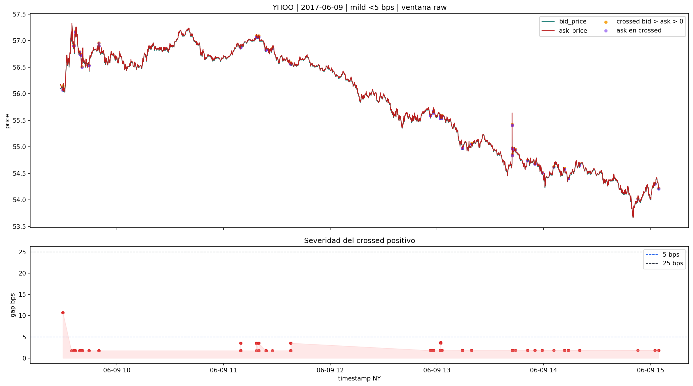

#### 02 Full Session Context
Esta imagen responde a la pregunta de extension intradiaria: el dano esta confinado a un bloque corto o contamina la sesion completa. Arriba se ve toda la sesion `04:00-20:00 NY`; abajo el `gap_bps` firmado. La decision que cambia es si el consumo debe penalizar solo un tramo o desechar el dia entero para uso operativo. El error que evita es tratar una cicatriz local como ruina total o, al reves, minimizar una degradacion distribuida a lo largo del dia. En ejecucion esto decide si la sesion puede seguir usandose con restricciones; en ML decide si las features intradiarias conservan significado economico.

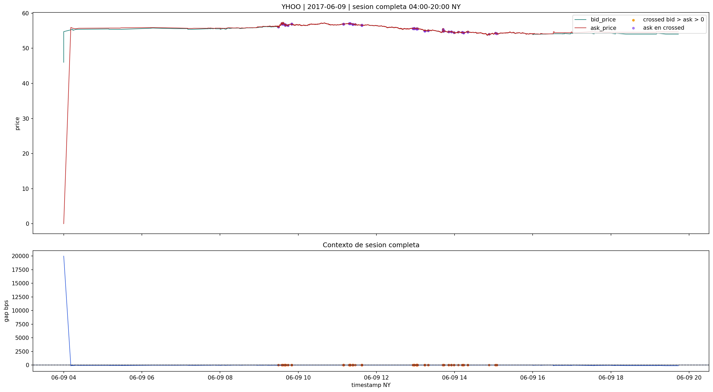

#### 03 Structure Diagnostics
Este panel responde a la pregunta de naturaleza del fallo: contradiccion economica genuina o mezcla con degeneracion estructural. Separa `ask=0` de `ask>0`, muestra la distribucion de `gap_bps` y resume patrones de integerizacion. La decision que cambia es como interpretar el dano: mercado localmente roto, artefacto de representacion o combinacion de ambos. El error que evita es sobrediagnosticar crossed reales cuando parte de la senal proviene de estructura degenerada del libro. Esta lectura afecta directamente a que el caso vaya a exclusion dura, a bandera contextual o a simple reconciliacion tecnica.

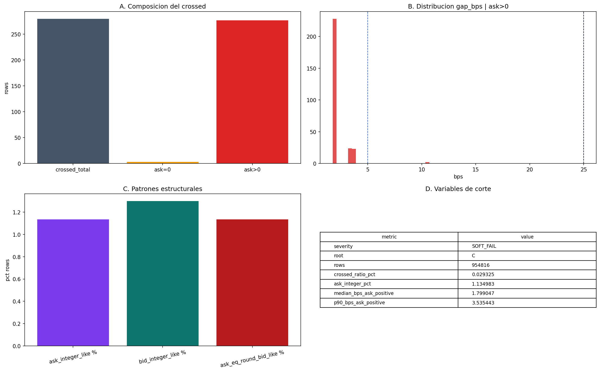

#### 04 Summary Card
Esta tarjeta responde a la pregunta de auditabilidad: cuales son exactamente las variables que sostienen la conclusion. Reune `severity`, `root`, `crossed_ratio_pct`, `ask_integer_pct`, `median_bps_ask_positive` y `p90_bps_ask_positive`. La decision que cambia es pasar de impresion visual a regla verificable. El error que evita es que dos inspectores lleguen a conclusiones distintas mirando la misma imagen sin una base numerica comun. Para gobernanza del proyecto, este panel es el que vuelve reproducible la decision para backtest, ML y auditoria.

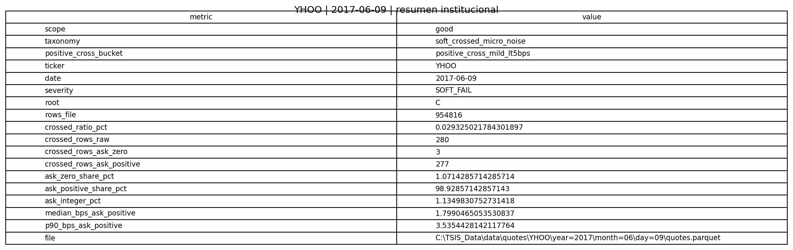

---

### 10. AMC 2022-02-01

company_name: `AMER MORT ACCEPT(SHS BENE INT`
primary_exchange: `NYSE American` (`XASE`)
market_locale: `stocks/us`
scope: `good`
ticker: `AMC`
date: `2022-02-01`
taxonomy: `utc_rollover_large_day_clean`
positive_cross_bucket: `positive_cross_severe_ge25bps`
severity: `SOFT_FAIL`
root: `D`
rows: `888266`
crossed_ratio_pct: `0.047733`
crossed_rows_raw: `424`
crossed_rows_ask_zero: `0`
crossed_rows_ask_positive: `424`
ask_integer_pct: `1.415680`
median_bps_ask_positive: `11.142061`
p90_bps_ask_positive: `25.844840`
file: `D:\quotes\AMC\year=2022\month=02\day=01\quotes.parquet`

#### Analisis Forense
La conclusion correcta del caso es que el libro mantiene semantica economica util. El residuo observado no cambia de forma material la lectura del spread ni invalida el uso operativo normal del dia. La taxonomy historica es `utc_rollover_large_day_clean` y el regimen positivo dominante es `severe >=25 bps`. Esto importa porque la taxonomy no solo clasifica: resume que tipo de anomalia se esta viendo y que clase de decision contractual puede defenderse despues. La taxonomy `utc_rollover_large_day_clean` implica que parte de la rareza pertenece al eje temporal y no al eje economico del spread; su lectura correcta evita castigar como libro roto un efecto de rollover bien entendido. El regimen `severe >=25 bps` empuja el caso a una lectura economicamente dura: el crossed deja de ser cosmetico y pasa a cuestionar si el libro sigue siendo interpretable como mercado negociable. En terminos observables, el file tiene `crossed_ratio_pct=0.047733` con `crossed_rows_ask_positive=424` y `crossed_rows_ask_zero=0`. La severidad economica del crossed ask>0 se resume en `median_bps_ask_positive=11.142061` y `p90_bps_ask_positive=25.844840`. Estos dos numeros convierten una forma visual rara en una conclusion operativa sobre si el libro sigue representando o no un mercado negociable. La decision que cambia es mantener el caso dentro de la franja util, aunque con lectura consciente de que existe una huella positiva leve o acotada. En `good`, el objetivo no es negar toda irregularidad, sino demostrar que la anomalia no destruye la semantica economica minima del libro ni invalida su uso principal. El error que evita esta lectura es sobrecastigar micro-residuos y encoger artificialmente el universo util para backtest y ML. El patron estructural muestra `ask_integer_pct=1.415680`. Este numero obliga a separar dos explicaciones rivales: contradiccion economica genuina del libro o mezcla con degeneracion estructural / integerizacion. Toda la composicion crossed cae en `ask>0`. Eso endurece la lectura economica del caso: el dano no depende de ceros mecanicos, sino de contradiccion positiva dentro de precios aparentemente vivos. Como `ask_integer_pct` es bajo, la hipotesis de simple degeneracion mecanica pierde fuerza. Eso endurece la interpretacion: el crossed se parece mas a contradiccion economica genuina y menos a artefacto. En la capa de semantica de precio del evento aparecen `daily raw close=168.6000`, `quote mid raw=17.4200`, `quote mid split_normalized=174.2000`, `daily adjusted_proxy=168.6000`. La reconciliacion incluye `future_split_factor=0.1000`. La implicacion metodologica es crucial: una discrepancia entre `quotes`, `daily` y una plataforma externa no puede leerse automaticamente como fallo del dataset. Puede ser semantica de precio distinta. El error que evita esta capa es mezclar raw, split-normalized y adjusted dentro del mismo pipeline, rompiendo auditoria, benchmarking y labels. Para pipelines, esto significa que el caso puede seguir entrando en consumo principal con la salvedad de que cualquier residuo observado debe quedar trazado como tolerado y no ignorado por completo. Existe ademas una imagen historica de certificacion asociada. Su papel es poner el episodio en un marco causal mas amplio: halt, explained, not strongly explained o patron conocido. La regla que protege al proyecto es esta: el contexto externo se usa para explicar por que aparece el episodio, no para absolverlo. El error que evita es degradar el criterio de calidad del libro porque exista una historia plausible alrededor del caso.

#### 00 Event Month Context
Esta imagen responde a la pregunta de persistencia temporal: estamos ante un accidente local o ante una fase mas amplia de inestabilidad. Arriba coloca el evento en la serie `daily` real del mes; abajo compara `crossed_ratio_pct` y `max_gap_bps_pos` del dia contra sus vecinos. La decision que cambia es el peso estructural que se le concede al caso. El error que evita es juzgar igual un shock aislado y una degradacion repetida del libro.

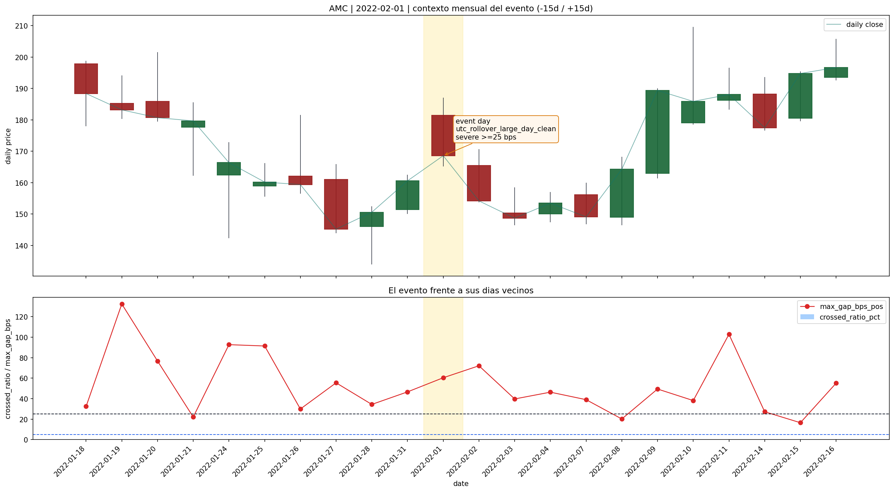

#### 00a Adjusted Proxy Contrast
Esta imagen responde a la pregunta de reconciliacion semantica: la discrepancia de precios viene de datos rotos o de vistas de precio distintas. Compara `daily raw`, `daily adjusted_proxy`, `quote mid raw` y `quote mid split_normalized`, y debajo ensena la cadena de dividendos y splits que produce la diferencia. La decision que cambia es si el inspector debe abrir una incidencia de calidad o cerrar el caso como diferencia legitima de semantica. El error que evita es mezclar series raw y adjusted como si fueran equivalentes. En pipelines reales, esto protege benchmarking, labels diarios y reconciliacion externa frente a falsas alarmas de precio.

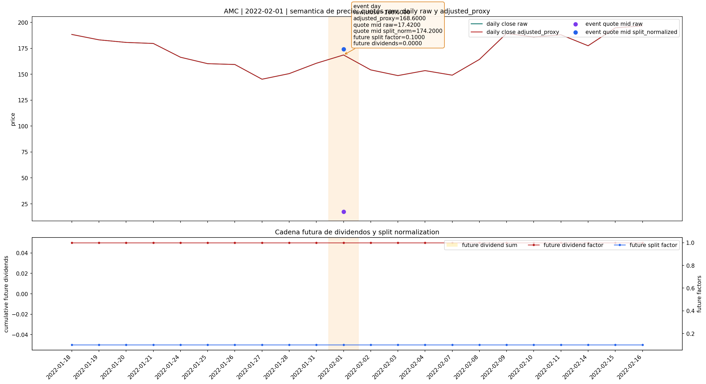

#### 00b Event Month Quotes Context
Esta imagen responde a la pregunta de recurrencia mensual dentro de `quotes`: el problema se concentra en el evento o reaparece en varias sesiones. Arriba concatena sesiones con datos disponibles; abajo resume cobertura diaria, `crossed_ratio_pct` y `max_gap_bps_pos`. La decision que cambia es si el caso debe leerse como episodio puntual o como sintoma de una fase repetida de libro degradado. El error que evita es extrapolar desde un unico dia a todo el mes sin evidencia.

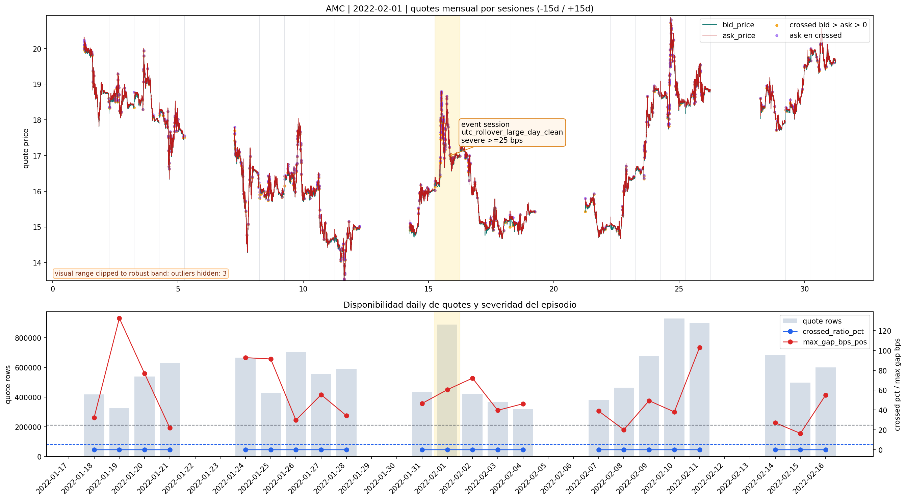

#### 01 Raw Window
Esta imagen responde a la primera pregunta decisiva del caso: el crossed observado, si existe, sigue siendo compatible con permanencia en `good` o no. Arriba ensena la geometria exacta del tramo conflictivo; abajo convierte esa geometria a bps y la enfrenta a los cortes `5 bps` y `25 bps`. El regimen dominante es `severe >=25 bps`. La decision que cambia es demostrar que el residuo permanece por debajo del dano que obligaria a mover el caso a `review` o `bad`. El error que evita es expulsar del universo util episodios leves cuyo impacto sobre ejecucion y features sigue siendo tolerable.

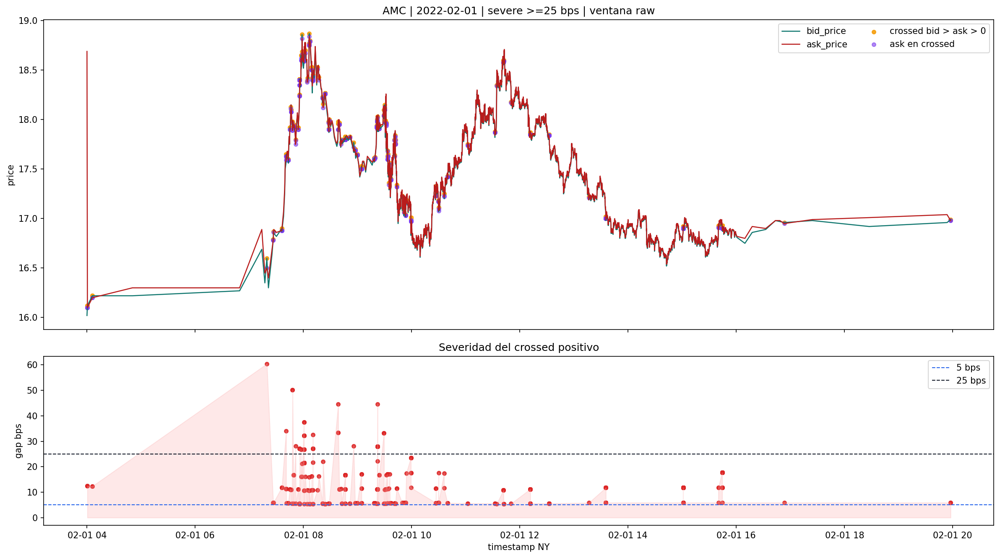

#### 02 Full Session Context
Esta imagen responde a la pregunta de extension intradiaria: el dano esta confinado a un bloque corto o contamina la sesion completa. Arriba se ve toda la sesion `04:00-20:00 NY`; abajo el `gap_bps` firmado. La decision que cambia es si el consumo debe penalizar solo un tramo o desechar el dia entero para uso operativo. El error que evita es tratar una cicatriz local como ruina total o, al reves, minimizar una degradacion distribuida a lo largo del dia. En ejecucion esto decide si la sesion puede seguir usandose con restricciones; en ML decide si las features intradiarias conservan significado economico.

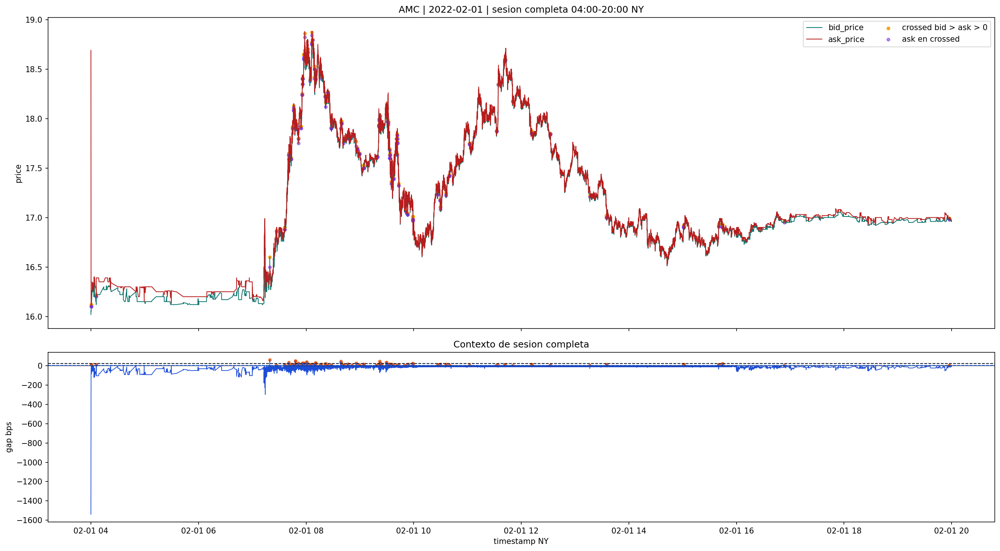

#### 03 Structure Diagnostics
Este panel responde a la pregunta de naturaleza del fallo: contradiccion economica genuina o mezcla con degeneracion estructural. Separa `ask=0` de `ask>0`, muestra la distribucion de `gap_bps` y resume patrones de integerizacion. La decision que cambia es como interpretar el dano: mercado localmente roto, artefacto de representacion o combinacion de ambos. El error que evita es sobrediagnosticar crossed reales cuando parte de la senal proviene de estructura degenerada del libro. Esta lectura afecta directamente a que el caso vaya a exclusion dura, a bandera contextual o a simple reconciliacion tecnica.

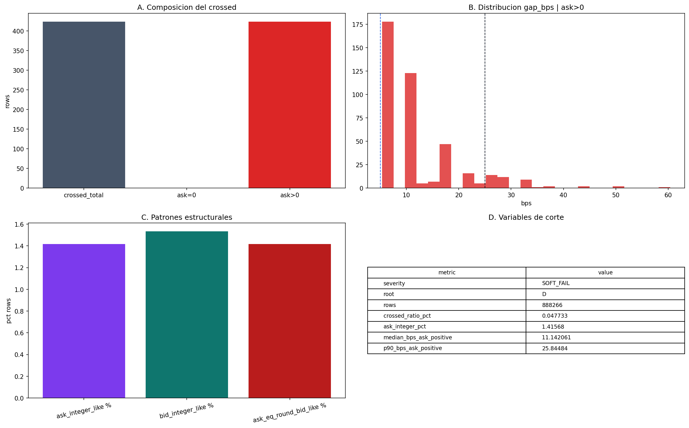

#### 04 Summary Card
Esta tarjeta responde a la pregunta de auditabilidad: cuales son exactamente las variables que sostienen la conclusion. Reune `severity`, `root`, `crossed_ratio_pct`, `ask_integer_pct`, `median_bps_ask_positive` y `p90_bps_ask_positive`. La decision que cambia es pasar de impresion visual a regla verificable. El error que evita es que dos inspectores lleguen a conclusiones distintas mirando la misma imagen sin una base numerica comun. Para gobernanza del proyecto, este panel es el que vuelve reproducible la decision para backtest, ML y auditoria.

---

### 11. FCEL 2021-03-10

company_name: `FuelCell Energy Inc  NEW (DE)`
primary_exchange: `NASDAQ` (`XNAS`)
market_locale: `stocks/us`
scope: `good`
ticker: `FCEL`
date: `2021-03-10`
taxonomy: `utc_rollover_large_day_clean`
positive_cross_bucket: `positive_cross_moderate_5to25bps`
severity: `SOFT_FAIL`
root: `D`
rows: `878357`
crossed_ratio_pct: `0.009222`
crossed_rows_raw: `81`
crossed_rows_ask_zero: `0`
crossed_rows_ask_positive: `81`
ask_integer_pct: `1.003920`
median_bps_ask_positive: `6.228589`
p90_bps_ask_positive: `24.645718`
file: `D:\quotes\FCEL\year=2021\month=03\day=10\quotes.parquet`

#### Analisis Forense
La conclusion correcta del caso es que el libro mantiene semantica economica util. El residuo observado no cambia de forma material la lectura del spread ni invalida el uso operativo normal del dia. La taxonomy historica es `utc_rollover_large_day_clean` y el regimen positivo dominante es `moderate 5-25 bps`. Esto importa porque la taxonomy no solo clasifica: resume que tipo de anomalia se esta viendo y que clase de decision contractual puede defenderse despues. La taxonomy `utc_rollover_large_day_clean` implica que parte de la rareza pertenece al eje temporal y no al eje economico del spread; su lectura correcta evita castigar como libro roto un efecto de rollover bien entendido. El regimen `moderate 5-25 bps` ya entra en zona donde el crossed tiene capacidad real de contaminar simulacion de ejecucion y features microestructurales, aunque todavia puede requerir lectura contextual antes de exclusion dura. En terminos observables, el file tiene `crossed_ratio_pct=0.009222` con `crossed_rows_ask_positive=81` y `crossed_rows_ask_zero=0`. La severidad economica del crossed ask>0 se resume en `median_bps_ask_positive=6.228589` y `p90_bps_ask_positive=24.645718`. Estos dos numeros convierten una forma visual rara en una conclusion operativa sobre si el libro sigue representando o no un mercado negociable. La decision que cambia es mantener el caso dentro de la franja util, aunque con lectura consciente de que existe una huella positiva leve o acotada. En `good`, el objetivo no es negar toda irregularidad, sino demostrar que la anomalia no destruye la semantica economica minima del libro ni invalida su uso principal. El error que evita esta lectura es sobrecastigar micro-residuos y encoger artificialmente el universo util para backtest y ML. El patron estructural muestra `ask_integer_pct=1.003920`. Este numero obliga a separar dos explicaciones rivales: contradiccion economica genuina del libro o mezcla con degeneracion estructural / integerizacion. Toda la composicion crossed cae en `ask>0`. Eso endurece la lectura economica del caso: el dano no depende de ceros mecanicos, sino de contradiccion positiva dentro de precios aparentemente vivos. Como `ask_integer_pct` es bajo, la hipotesis de simple degeneracion mecanica pierde fuerza. Eso endurece la interpretacion: el crossed se parece mas a contradiccion economica genuina y menos a artefacto. En la capa de semantica de precio del evento aparecen `daily raw close=488.4000`, `quote mid raw=16.2850`, `quote mid split_normalized=488.5500`, `daily adjusted_proxy=488.4000`. La reconciliacion incluye `future_split_factor=0.0333`. La implicacion metodologica es crucial: una discrepancia entre `quotes`, `daily` y una plataforma externa no puede leerse automaticamente como fallo del dataset. Puede ser semantica de precio distinta. El error que evita esta capa es mezclar raw, split-normalized y adjusted dentro del mismo pipeline, rompiendo auditoria, benchmarking y labels. Para pipelines, esto significa que el caso puede seguir entrando en consumo principal con la salvedad de que cualquier residuo observado debe quedar trazado como tolerado y no ignorado por completo. Existe ademas una imagen historica de certificacion asociada. Su papel es poner el episodio en un marco causal mas amplio: halt, explained, not strongly explained o patron conocido. La regla que protege al proyecto es esta: el contexto externo se usa para explicar por que aparece el episodio, no para absolverlo. El error que evita es degradar el criterio de calidad del libro porque exista una historia plausible alrededor del caso.

#### 00 Event Month Context
Esta imagen responde a la pregunta de persistencia temporal: estamos ante un accidente local o ante una fase mas amplia de inestabilidad. Arriba coloca el evento en la serie `daily` real del mes; abajo compara `crossed_ratio_pct` y `max_gap_bps_pos` del dia contra sus vecinos. La decision que cambia es el peso estructural que se le concede al caso. El error que evita es juzgar igual un shock aislado y una degradacion repetida del libro.

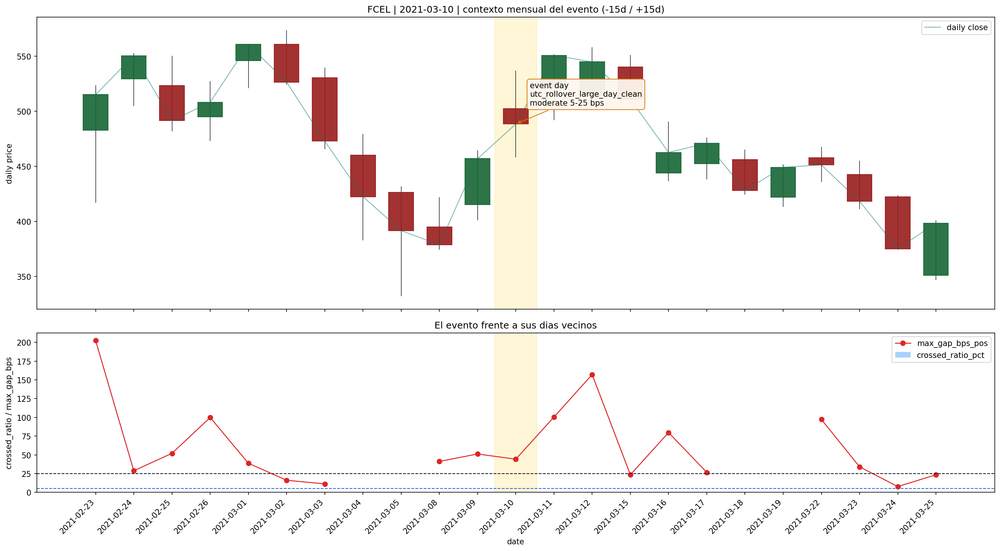

#### 00a Adjusted Proxy Contrast
Esta imagen responde a la pregunta de reconciliacion semantica: la discrepancia de precios viene de datos rotos o de vistas de precio distintas. Compara `daily raw`, `daily adjusted_proxy`, `quote mid raw` y `quote mid split_normalized`, y debajo ensena la cadena de dividendos y splits que produce la diferencia. La decision que cambia es si el inspector debe abrir una incidencia de calidad o cerrar el caso como diferencia legitima de semantica. El error que evita es mezclar series raw y adjusted como si fueran equivalentes. En pipelines reales, esto protege benchmarking, labels diarios y reconciliacion externa frente a falsas alarmas de precio.

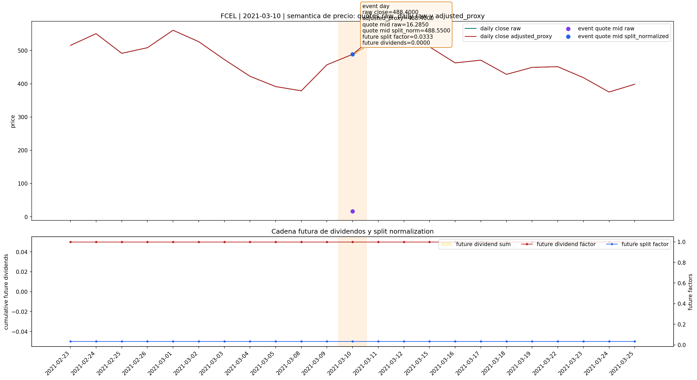

#### 00b Event Month Quotes Context
Esta imagen responde a la pregunta de recurrencia mensual dentro de `quotes`: el problema se concentra en el evento o reaparece en varias sesiones. Arriba concatena sesiones con datos disponibles; abajo resume cobertura diaria, `crossed_ratio_pct` y `max_gap_bps_pos`. La decision que cambia es si el caso debe leerse como episodio puntual o como sintoma de una fase repetida de libro degradado. El error que evita es extrapolar desde un unico dia a todo el mes sin evidencia.

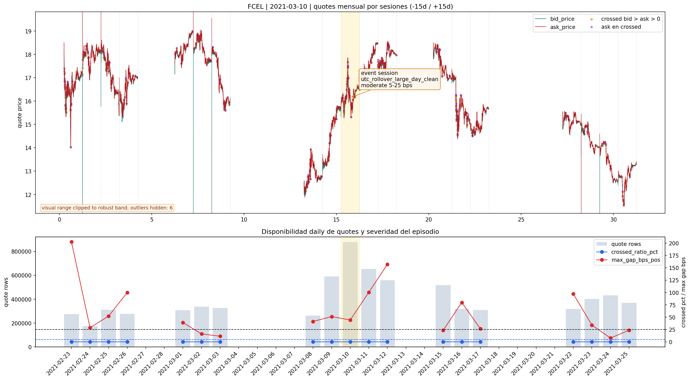

#### 01 Raw Window
Esta imagen responde a la primera pregunta decisiva del caso: el crossed observado, si existe, sigue siendo compatible con permanencia en `good` o no. Arriba ensena la geometria exacta del tramo conflictivo; abajo convierte esa geometria a bps y la enfrenta a los cortes `5 bps` y `25 bps`. El regimen dominante es `moderate 5-25 bps`. La decision que cambia es demostrar que el residuo permanece por debajo del dano que obligaria a mover el caso a `review` o `bad`. El error que evita es expulsar del universo util episodios leves cuyo impacto sobre ejecucion y features sigue siendo tolerable.

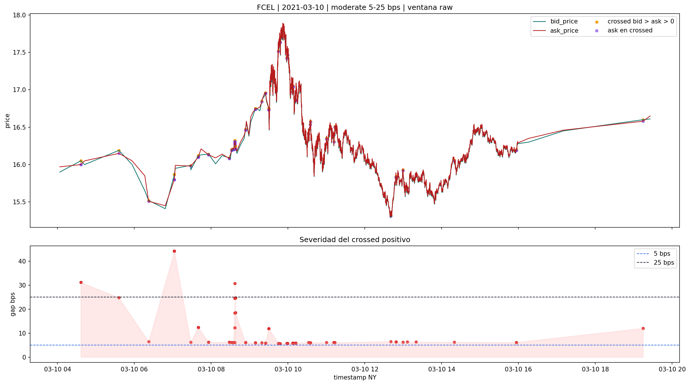

#### 02 Full Session Context
Esta imagen responde a la pregunta de extension intradiaria: el dano esta confinado a un bloque corto o contamina la sesion completa. Arriba se ve toda la sesion `04:00-20:00 NY`; abajo el `gap_bps` firmado. La decision que cambia es si el consumo debe penalizar solo un tramo o desechar el dia entero para uso operativo. El error que evita es tratar una cicatriz local como ruina total o, al reves, minimizar una degradacion distribuida a lo largo del dia. En ejecucion esto decide si la sesion puede seguir usandose con restricciones; en ML decide si las features intradiarias conservan significado economico.

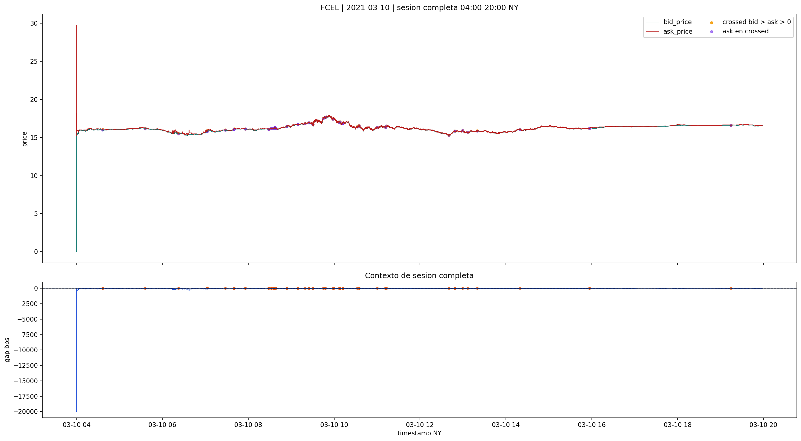

#### 03 Structure Diagnostics
Este panel responde a la pregunta de naturaleza del fallo: contradiccion economica genuina o mezcla con degeneracion estructural. Separa `ask=0` de `ask>0`, muestra la distribucion de `gap_bps` y resume patrones de integerizacion. La decision que cambia es como interpretar el dano: mercado localmente roto, artefacto de representacion o combinacion de ambos. El error que evita es sobrediagnosticar crossed reales cuando parte de la senal proviene de estructura degenerada del libro. Esta lectura afecta directamente a que el caso vaya a exclusion dura, a bandera contextual o a simple reconciliacion tecnica.

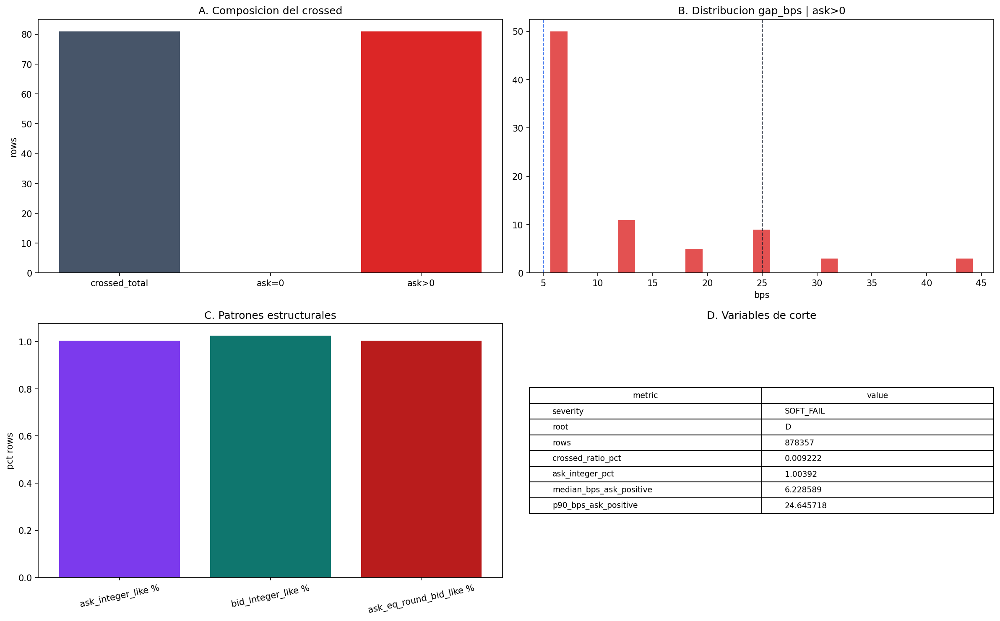

#### 04 Summary Card
Esta tarjeta responde a la pregunta de auditabilidad: cuales son exactamente las variables que sostienen la conclusion. Reune `severity`, `root`, `crossed_ratio_pct`, `ask_integer_pct`, `median_bps_ask_positive` y `p90_bps_ask_positive`. La decision que cambia es pasar de impresion visual a regla verificable. El error que evita es que dos inspectores lleguen a conclusiones distintas mirando la misma imagen sin una base numerica comun. Para gobernanza del proyecto, este panel es el que vuelve reproducible la decision para backtest, ML y auditoria.

---

### 12. CRON 2019-01-31

company_name: `Cronos Group Inc. Common Share`
primary_exchange: `NASDAQ` (`XNAS`)
market_locale: `stocks/us`
scope: `good`
ticker: `CRON`
date: `2019-01-31`
taxonomy: `utc_rollover_large_day_clean`
positive_cross_bucket: `positive_cross_moderate_5to25bps`
severity: `SOFT_FAIL`
root: `D`
rows: `869066`
crossed_ratio_pct: `0.004142`
crossed_rows_raw: `36`
crossed_rows_ask_zero: `0`
crossed_rows_ask_positive: `36`
ask_integer_pct: `1.852218`
median_bps_ask_positive: `5.021341`
p90_bps_ask_positive: `5.372012`
file: `D:\quotes\CRON\year=2019\month=01\day=31\quotes.parquet`

#### Analisis Forense
La conclusion correcta del caso es que el libro mantiene semantica economica util. El residuo observado no cambia de forma material la lectura del spread ni invalida el uso operativo normal del dia. La taxonomy historica es `utc_rollover_large_day_clean` y el regimen positivo dominante es `moderate 5-25 bps`. Esto importa porque la taxonomy no solo clasifica: resume que tipo de anomalia se esta viendo y que clase de decision contractual puede defenderse despues. La taxonomy `utc_rollover_large_day_clean` implica que parte de la rareza pertenece al eje temporal y no al eje economico del spread; su lectura correcta evita castigar como libro roto un efecto de rollover bien entendido. El regimen `moderate 5-25 bps` ya entra en zona donde el crossed tiene capacidad real de contaminar simulacion de ejecucion y features microestructurales, aunque todavia puede requerir lectura contextual antes de exclusion dura. En terminos observables, el file tiene `crossed_ratio_pct=0.004142` con `crossed_rows_ask_positive=36` y `crossed_rows_ask_zero=0`. La severidad economica del crossed ask>0 se resume en `median_bps_ask_positive=5.021341` y `p90_bps_ask_positive=5.372012`. Estos dos numeros convierten una forma visual rara en una conclusion operativa sobre si el libro sigue representando o no un mercado negociable. La decision que cambia es mantener el caso dentro de la franja util, aunque con lectura consciente de que existe una huella positiva leve o acotada. En `good`, el objetivo no es negar toda irregularidad, sino demostrar que la anomalia no destruye la semantica economica minima del libro ni invalida su uso principal. El error que evita esta lectura es sobrecastigar micro-residuos y encoger artificialmente el universo util para backtest y ML. El patron estructural muestra `ask_integer_pct=1.852218`. Este numero obliga a separar dos explicaciones rivales: contradiccion economica genuina del libro o mezcla con degeneracion estructural / integerizacion. Toda la composicion crossed cae en `ask>0`. Eso endurece la lectura economica del caso: el dano no depende de ceros mecanicos, sino de contradiccion positiva dentro de precios aparentemente vivos. Como `ask_integer_pct` es bajo, la hipotesis de simple degeneracion mecanica pierde fuerza. Eso endurece la interpretacion: el crossed se parece mas a contradiccion economica genuina y menos a artefacto. Existe ademas una imagen historica de certificacion asociada. Su papel es poner el episodio en un marco causal mas amplio: halt, explained, not strongly explained o patron conocido. La regla que protege al proyecto es esta: el contexto externo se usa para explicar por que aparece el episodio, no para absolverlo. El error que evita es degradar el criterio de calidad del libro porque exista una historia plausible alrededor del caso.

#### 00 Event Month Context
Esta imagen responde a la pregunta de persistencia temporal: estamos ante un accidente local o ante una fase mas amplia de inestabilidad. Arriba coloca el evento en la serie `daily` real del mes; abajo compara `crossed_ratio_pct` y `max_gap_bps_pos` del dia contra sus vecinos. La decision que cambia es el peso estructural que se le concede al caso. El error que evita es juzgar igual un shock aislado y una degradacion repetida del libro.

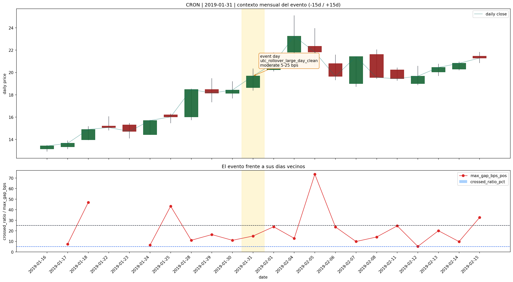

#### 00b Event Month Quotes Context
Esta imagen responde a la pregunta de recurrencia mensual dentro de `quotes`: el problema se concentra en el evento o reaparece en varias sesiones. Arriba concatena sesiones con datos disponibles; abajo resume cobertura diaria, `crossed_ratio_pct` y `max_gap_bps_pos`. La decision que cambia es si el caso debe leerse como episodio puntual o como sintoma de una fase repetida de libro degradado. El error que evita es extrapolar desde un unico dia a todo el mes sin evidencia.

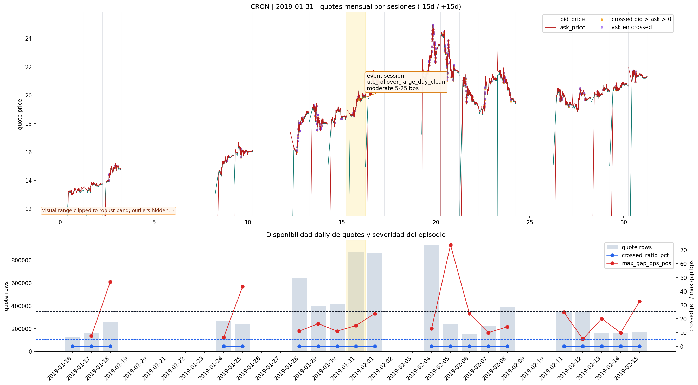

#### 01 Raw Window
Esta imagen responde a la primera pregunta decisiva del caso: el crossed observado, si existe, sigue siendo compatible con permanencia en `good` o no. Arriba ensena la geometria exacta del tramo conflictivo; abajo convierte esa geometria a bps y la enfrenta a los cortes `5 bps` y `25 bps`. El regimen dominante es `moderate 5-25 bps`. La decision que cambia es demostrar que el residuo permanece por debajo del dano que obligaria a mover el caso a `review` o `bad`. El error que evita es expulsar del universo util episodios leves cuyo impacto sobre ejecucion y features sigue siendo tolerable.

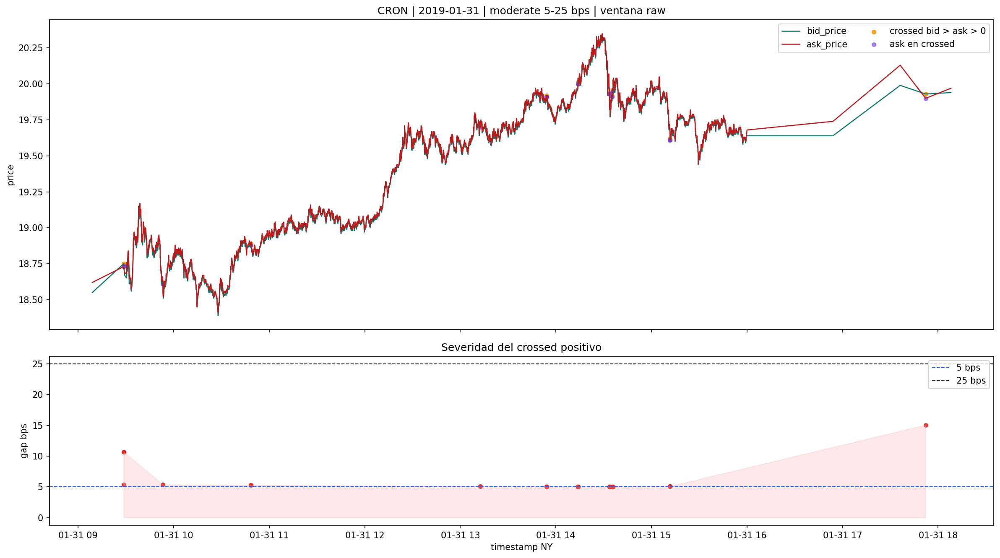

#### 02 Full Session Context
Esta imagen responde a la pregunta de extension intradiaria: el dano esta confinado a un bloque corto o contamina la sesion completa. Arriba se ve toda la sesion `04:00-20:00 NY`; abajo el `gap_bps` firmado. La decision que cambia es si el consumo debe penalizar solo un tramo o desechar el dia entero para uso operativo. El error que evita es tratar una cicatriz local como ruina total o, al reves, minimizar una degradacion distribuida a lo largo del dia. En ejecucion esto decide si la sesion puede seguir usandose con restricciones; en ML decide si las features intradiarias conservan significado economico.

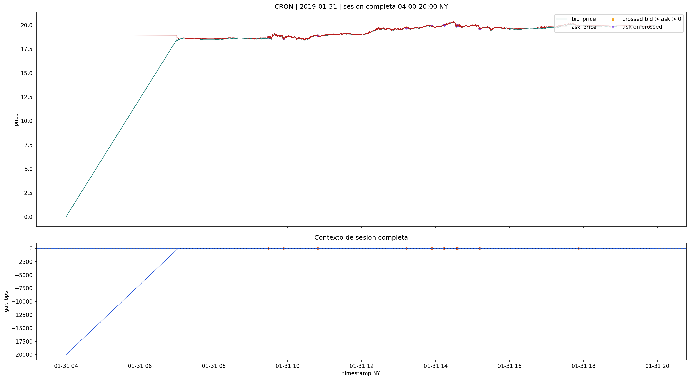

#### 03 Structure Diagnostics
Este panel responde a la pregunta de naturaleza del fallo: contradiccion economica genuina o mezcla con degeneracion estructural. Separa `ask=0` de `ask>0`, muestra la distribucion de `gap_bps` y resume patrones de integerizacion. La decision que cambia es como interpretar el dano: mercado localmente roto, artefacto de representacion o combinacion de ambos. El error que evita es sobrediagnosticar crossed reales cuando parte de la senal proviene de estructura degenerada del libro. Esta lectura afecta directamente a que el caso vaya a exclusion dura, a bandera contextual o a simple reconciliacion tecnica.

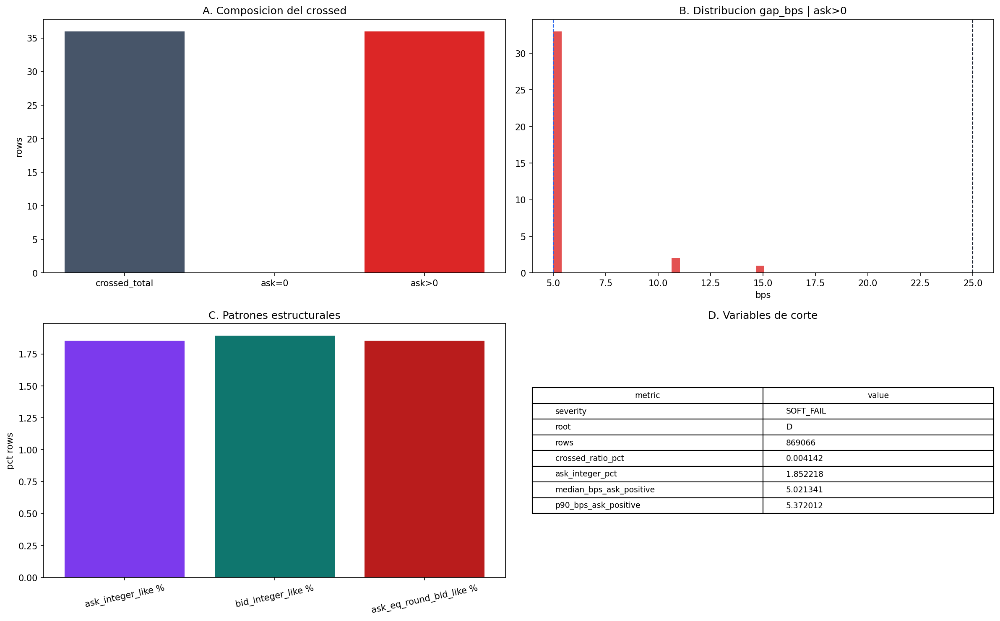

#### 04 Summary Card
Esta tarjeta responde a la pregunta de auditabilidad: cuales son exactamente las variables que sostienen la conclusion. Reune `severity`, `root`, `crossed_ratio_pct`, `ask_integer_pct`, `median_bps_ask_positive` y `p90_bps_ask_positive`. La decision que cambia es pasar de impresion visual a regla verificable. El error que evita es que dos inspectores lleguen a conclusiones distintas mirando la misma imagen sin una base numerica comun. Para gobernanza del proyecto, este panel es el que vuelve reproducible la decision para backtest, ML y auditoria.

---

# Quotes Review Cases v0.1

Documento fuente: `inspection_dossiers/quotes/flagged_case_evidence_packs/quotes_review_cases_v0_1.md`

Este documento consolida los casos `review` de `quotes` usando packs visuales completos. Cada caso presenta la ventana raw del crossed positivo, el contexto de sesion completa, diagnosticos estructurales y, cuando existe, la imagen historica de certificacion.

Total cases: `64`

## Menu

1. [CTIC 2006-09-19](#ctic-2006-09-19)
2. [CNTB 2022-06-29](#cntb-2022-06-29)
3. [AEMD 2021-06-21](#aemd-2021-06-21)
4. [MARK 2020-04-28](#mark-2020-04-28)
5. [TOPS 2020-05-26](#tops-2020-05-26)
6. [LPSN 2013-11-25](#lpsn-2013-11-25)
7. [NM 2008-05-05](#nm-2008-05-05)
8. [GRPN 2014-08-26](#grpn-2014-08-26)
9. [TG 2008-01-07](#tg-2008-01-07)
10. [YRCW 2011-05-23](#yrcw-2011-05-23)
11. [ISR 2018-07-10](#isr-2018-07-10)
12. [CATO 2013-07-09](#cato-2013-07-09)
13. [CNSL 2012-05-02](#cnsl-2012-05-02)
14. [VVUS 2009-09-21](#vvus-2009-09-21)
15. [IART 2008-06-03](#iart-2008-06-03)
16. [OFIX 2026-01-14](#ofix-2026-01-14)
17. [HWAY 2015-04-23](#hway-2015-04-23)
18. [UPL 2007-02-22](#upl-2007-02-22)
19. [NTGR 2006-11-13](#ntgr-2006-11-13)
20. [PD 2006-05-26](#pd-2006-05-26)
21. [MON 2005-01-20](#mon-2005-01-20)
22. [UPL 2006-02-03](#upl-2006-02-03)
23. [MBI 2007-04-19](#mbi-2007-04-19)
24. [BZH 2005-02-08](#bzh-2005-02-08)
25. [AWH 2013-02-06](#awh-2013-02-06)
26. [GLXG 2025-04-08](#glxg-2025-04-08)
27. [WLGS 2025-06-11](#wlgs-2025-06-11)
28. [WTO 2024-08-29](#wto-2024-08-29)
29. [PACW 2008-06-19](#pacw-2008-06-19)
30. [BROG 2025-05-27](#brog-2025-05-27)
31. [CPST 2005-09-07](#cpst-2005-09-07)
32. [QNTM 2024-08-16](#qntm-2024-08-16)
33. [DSX 2008-10-08](#dsx-2008-10-08)
34. [IRET 2012-04-16](#iret-2012-04-16)
35. [ARAY 2012-04-23](#aray-2012-04-23)
36. [ACTU 2007-11-13](#actu-2007-11-13)
37. [HWCC 2007-02-27](#hwcc-2007-02-27)
38. [CRME 2008-01-10](#crme-2008-01-10)
39. [DSPG 2008-01-31](#dspg-2008-01-31)
40. [CPST 2010-08-31](#cpst-2010-08-31)
41. [PLAY 2006-02-14](#play-2006-02-14)
42. [MDR 2009-02-11](#mdr-2009-02-11)
43. [BDN 2013-04-03](#bdn-2013-04-03)
44. [EK 2008-09-09](#ek-2008-09-09)
45. [PVA 2015-10-30](#pva-2015-10-30)
46. [SOL 2008-07-17](#sol-2008-07-17)
47. [YHOO 2009-06-04](#yhoo-2009-06-04)
48. [WOOF 2012-08-23](#woof-2012-08-23)
49. [SSRI 2006-09-20](#ssri-2006-09-20)
50. [ATHR 2006-12-28](#athr-2006-12-28)
51. [ALLT 2012-04-04](#allt-2012-04-04)
52. [MTRX 2007-06-28](#mtrx-2007-06-28)
53. [NUS 2010-07-29](#nus-2010-07-29)
54. [SPWR 2008-09-09](#spwr-2008-09-09)
55. [RRGB 2012-07-23](#rrgb-2012-07-23)
56. [DRQ 2006-09-22](#drq-2006-09-22)
57. [FRC 2012-12-11](#frc-2012-12-11)
58. [ADTN 2012-02-24](#adtn-2012-02-24)
59. [APOL 2007-10-25](#apol-2007-10-25)
60. [OIS 2010-01-14](#ois-2010-01-14)
61. [ICON 2014-08-18](#icon-2014-08-18)
62. [UNT 2007-12-04](#unt-2007-12-04)
63. [MON 2010-10-25](#mon-2010-10-25)
64. [DNA 2008-02-01](#dna-2008-02-01)

## Cases

### 1. CTIC 2006-09-19

company_name: `CTI BioPharma Corp. (DE) Common Stock`
primary_exchange: `NASDAQ` (`XNAS`)
market_locale: `stocks/us`
scope: `review`
ticker: `CTIC`
date: `2006-09-19`
taxonomy: `large_file_threshold_edge_hard_many_crosses`
positive_cross_bucket: `positive_cross_severe_ge25bps`
severity: `HARD_FAIL`
root: `D`
rows: `11797`
crossed_ratio_pct: `0.856150`
crossed_rows_raw: `101`
crossed_rows_ask_zero: `0`
crossed_rows_ask_positive: `101`
ask_integer_pct: `0.313639`
median_bps_ask_positive: `114.942529`
p90_bps_ask_positive: `281.690141`
file: `D:\quotes\CTIC\year=2006\month=09\day=19\quotes.parquet`

#### Analisis Forense
La conclusion correcta del caso es que ya existe contradiccion economica real dentro del libro, pero aun no con fuerza suficiente para justificar exclusion dura sin contexto adicional. La taxonomy historica es `large_file_threshold_edge_hard_many_crosses` y el regimen positivo dominante es `severe >=25 bps`. Esto importa porque la taxonomy no solo clasifica: resume que tipo de anomalia se esta viendo y que clase de decision contractual puede defenderse despues. La taxonomy `large_file_threshold_edge_hard_many_crosses` implica un libro grande con muchas contradicciones, pero cerca del borde decisional. La dificultad analitica esta en decidir si el volumen de crossed es ruido absorbible o evidencia de degradacion suficientemente seria. El regimen `severe >=25 bps` empuja el caso a una lectura economicamente dura: el crossed deja de ser cosmetico y pasa a cuestionar si el libro sigue siendo interpretable como mercado negociable. En terminos observables, el file tiene `crossed_ratio_pct=0.856150` con `crossed_rows_ask_positive=101` y `crossed_rows_ask_zero=0`. La severidad economica del crossed ask>0 se resume en `median_bps_ask_positive=114.942529` y `p90_bps_ask_positive=281.690141`. Estos dos numeros convierten una forma visual rara en una conclusion operativa sobre si el libro sigue representando o no un mercado negociable. La decision que cambia es pasar de libro sano a libro util solo bajo cautela. `review` significa: no usar como si fuera ejecucion limpia, conservar para analisis contextual y sensibilidad. El error que evita es tratar como normal un episodio que ya contiene contradiccion economica real y contaminar simulaciones de ejecucion o validaciones demasiado optimistas. El patron estructural muestra `ask_integer_pct=0.313639`. Este numero obliga a separar dos explicaciones rivales: contradiccion economica genuina del libro o mezcla con degeneracion estructural / integerizacion. Toda la composicion crossed cae en `ask>0`. Eso endurece la lectura economica del caso: el dano no depende de ceros mecanicos, sino de contradiccion positiva dentro de precios aparentemente vivos. Como `ask_integer_pct` es bajo, la hipotesis de simple degeneracion mecanica pierde fuerza. Eso endurece la interpretacion: el crossed se parece mas a contradiccion economica genuina y menos a artefacto. En la capa de semantica de precio del evento aparecen `daily raw close=21000.0000`, `quote mid raw=1.7600`, `quote mid split_normalized=21120.0000`, `daily adjusted_proxy=21000.0000`. La reconciliacion incluye `future_split_factor=0.0001`. La implicacion metodologica es crucial: una discrepancia entre `quotes`, `daily` y una plataforma externa no puede leerse automaticamente como fallo del dataset. Puede ser semantica de precio distinta. El error que evita esta capa es mezclar raw, split-normalized y adjusted dentro del mismo pipeline, rompiendo auditoria, benchmarking y labels. Para pipelines, esto bloquea su uso como libro sano en ejecucion y features microestructurales principales, aunque aun puede mantenerse para forense, sensibilidad y estudios donde la anomalia sea parte del objeto de investigacion. Existe ademas una imagen historica de certificacion asociada. Su papel es poner el episodio en un marco causal mas amplio: halt, explained, not strongly explained o patron conocido. La regla que protege al proyecto es esta: el contexto externo se usa para explicar por que aparece el episodio, no para absolverlo. El error que evita es degradar el criterio de calidad del libro porque exista una historia plausible alrededor del caso.

#### 00 Event Month Context
Esta imagen responde a la pregunta de persistencia temporal: estamos ante un accidente local o ante una fase mas amplia de inestabilidad. Arriba coloca el evento en la serie `daily` real del mes; abajo compara `crossed_ratio_pct` y `max_gap_bps_pos` del dia contra sus vecinos. La decision que cambia es el peso estructural que se le concede al caso. El error que evita es juzgar igual un shock aislado y una degradacion repetida del libro.

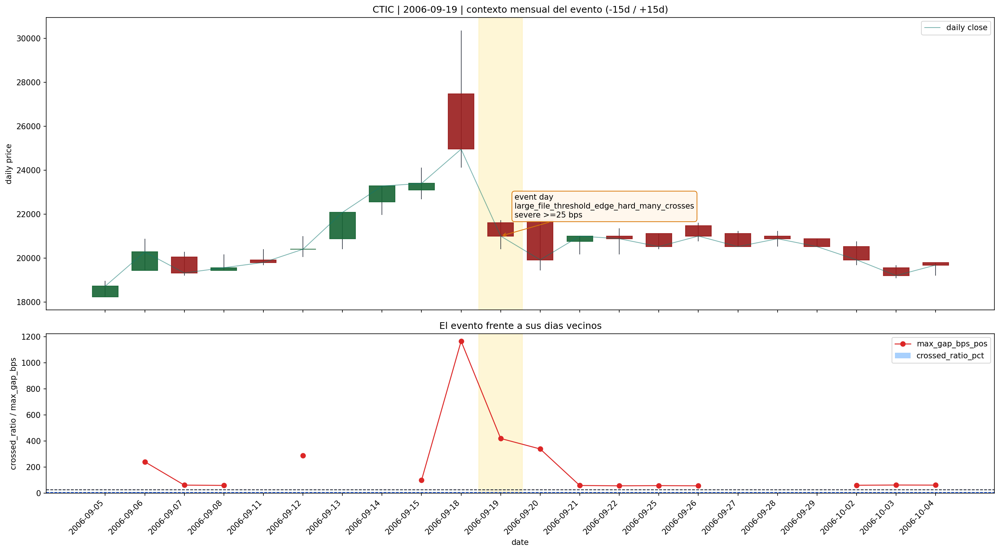

#### 00a Adjusted Proxy Contrast
Esta imagen responde a la pregunta de reconciliacion semantica: la discrepancia de precios viene de datos rotos o de vistas de precio distintas. Compara `daily raw`, `daily adjusted_proxy`, `quote mid raw` y `quote mid split_normalized`, y debajo ensena la cadena de dividendos y splits que produce la diferencia. La decision que cambia es si el inspector debe abrir una incidencia de calidad o cerrar el caso como diferencia legitima de semantica. El error que evita es mezclar series raw y adjusted como si fueran equivalentes. En pipelines reales, esto protege benchmarking, labels diarios y reconciliacion externa frente a falsas alarmas de precio.

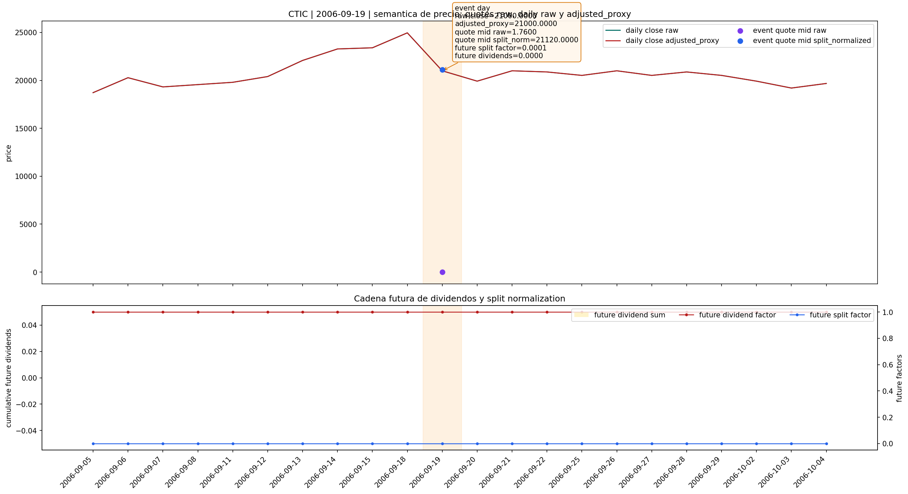

#### 00b Event Month Quotes Context
Esta imagen responde a la pregunta de recurrencia mensual dentro de `quotes`: el problema se concentra en el evento o reaparece en varias sesiones. Arriba concatena sesiones con datos disponibles; abajo resume cobertura diaria, `crossed_ratio_pct` y `max_gap_bps_pos`. La decision que cambia es si el caso debe leerse como episodio puntual o como sintoma de una fase repetida de libro degradado. El error que evita es extrapolar desde un unico dia a todo el mes sin evidencia.

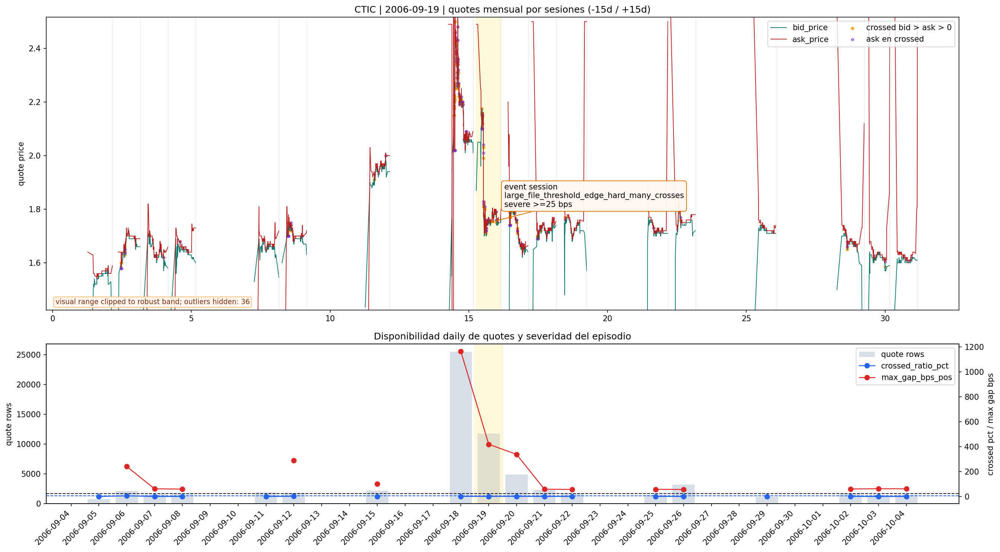

#### 01 Raw Window
Esta imagen responde a la primera pregunta decisiva del caso: el crossed observado es economicamente bastante fuerte para justificar un cambio de clase. Arriba ensena la geometria exacta del tramo conflictivo; abajo convierte esa geometria a bps y la enfrenta a los cortes `5 bps` y `25 bps`. El regimen dominante es `severe >=25 bps`. La decision que cambia es pasar de anomalia interpretable a `review` o `bad`. El error que evita es decidir por apariencia visual sin medir el dano economico real del crossed. En terminos de pipeline, este panel decide si el problema afecta solo a la lectura forense o si invalida simulacion de ejecucion y microstructure features.

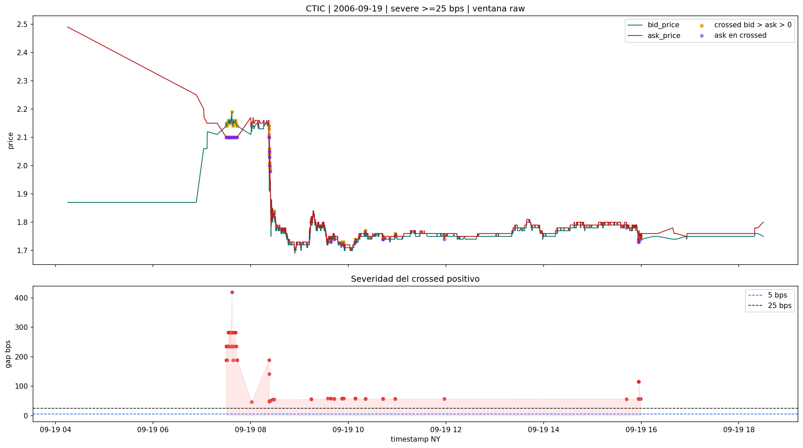

#### 02 Full Session Context
Esta imagen responde a la pregunta de extension intradiaria: el dano esta confinado a un bloque corto o contamina la sesion completa. Arriba se ve toda la sesion `04:00-20:00 NY`; abajo el `gap_bps` firmado. La decision que cambia es si el consumo debe penalizar solo un tramo o desechar el dia entero para uso operativo. El error que evita es tratar una cicatriz local como ruina total o, al reves, minimizar una degradacion distribuida a lo largo del dia. En ejecucion esto decide si la sesion puede seguir usandose con restricciones; en ML decide si las features intradiarias conservan significado economico.

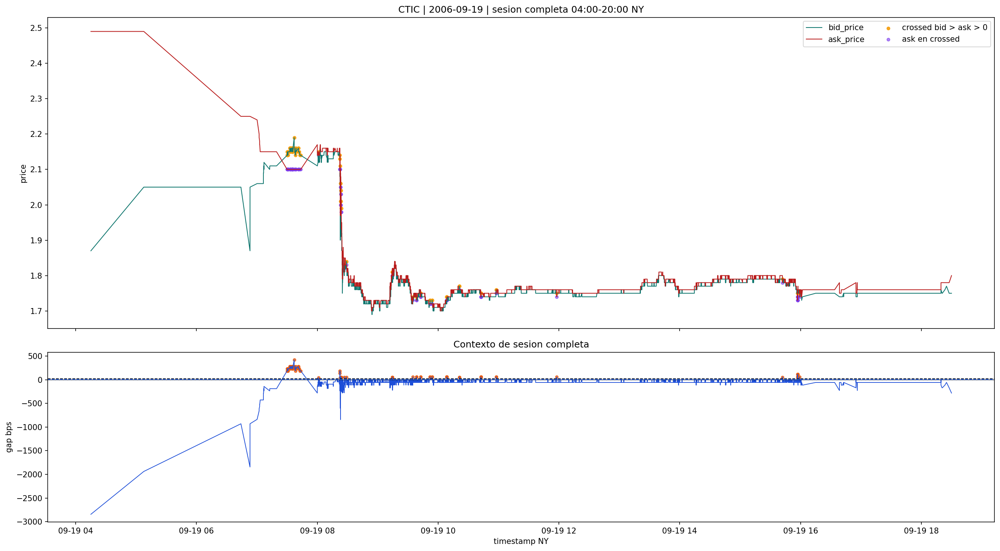

#### 03 Structure Diagnostics
Este panel responde a la pregunta de naturaleza del fallo: contradiccion economica genuina o mezcla con degeneracion estructural. Separa `ask=0` de `ask>0`, muestra la distribucion de `gap_bps` y resume patrones de integerizacion. La decision que cambia es como interpretar el dano: mercado localmente roto, artefacto de representacion o combinacion de ambos. El error que evita es sobrediagnosticar crossed reales cuando parte de la senal proviene de estructura degenerada del libro. Esta lectura afecta directamente a que el caso vaya a exclusion dura, a bandera contextual o a simple reconciliacion tecnica.

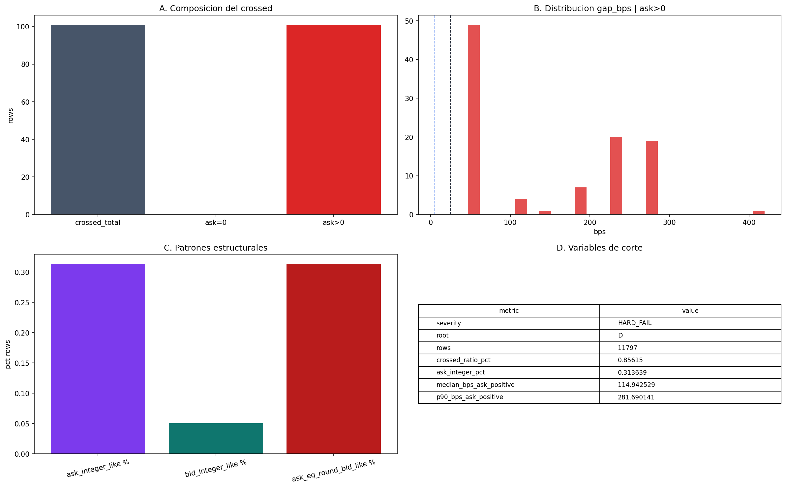

#### 04 Summary Card
Esta tarjeta responde a la pregunta de auditabilidad: cuales son exactamente las variables que sostienen la conclusion. Reune `severity`, `root`, `crossed_ratio_pct`, `ask_integer_pct`, `median_bps_ask_positive` y `p90_bps_ask_positive`. La decision que cambia es pasar de impresion visual a regla verificable. El error que evita es que dos inspectores lleguen a conclusiones distintas mirando la misma imagen sin una base numerica comun. Para gobernanza del proyecto, este panel es el que vuelve reproducible la decision para backtest, ML y auditoria.

#### 05 Historical Context
Esta imagen responde a la pregunta causal externa: existe un framing historico que ayude a entender por que ocurre el episodio. Puede aportar halt context, explained o not strongly explained. La decision que cambia es cuanto peso se concede al contexto en la narrativa final. El error que evita es doble: ignorar una explicacion real o usarla como excusa para absolver un libro que localmente sigue siendo problematico.

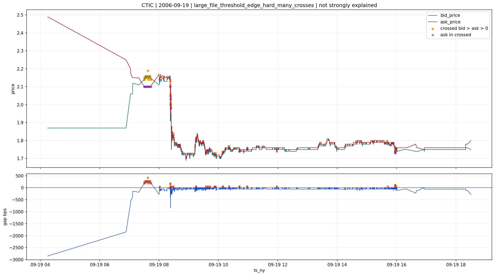

---

### 2. CNTB 2022-06-29

company_name: `Connect Biopharma Holdings Limited Ordinary Shares`
primary_exchange: `NASDAQ` (`XNAS`)
market_locale: `stocks/us`
scope: `review`
ticker: `CNTB`
date: `2022-06-29`
taxonomy: `large_file_threshold_edge_hard_many_crosses`
positive_cross_bucket: `positive_cross_severe_ge25bps`
severity: `HARD_FAIL`
root: `D`
rows: `27634`
crossed_ratio_pct: `1.436636`
crossed_rows_raw: `397`
crossed_rows_ask_zero: `1`
crossed_rows_ask_positive: `396`
ask_integer_pct: `0.770790`
median_bps_ask_positive: `80.646473`
p90_bps_ask_positive: `183.486239`
file: `D:\quotes\CNTB\year=2022\month=06\day=29\quotes.parquet`

#### Analisis Forense
La conclusion correcta del caso es que ya existe contradiccion economica real dentro del libro, pero aun no con fuerza suficiente para justificar exclusion dura sin contexto adicional. La taxonomy historica es `large_file_threshold_edge_hard_many_crosses` y el regimen positivo dominante es `severe >=25 bps`. Esto importa porque la taxonomy no solo clasifica: resume que tipo de anomalia se esta viendo y que clase de decision contractual puede defenderse despues. La taxonomy `large_file_threshold_edge_hard_many_crosses` implica un libro grande con muchas contradicciones, pero cerca del borde decisional. La dificultad analitica esta en decidir si el volumen de crossed es ruido absorbible o evidencia de degradacion suficientemente seria. El regimen `severe >=25 bps` empuja el caso a una lectura economicamente dura: el crossed deja de ser cosmetico y pasa a cuestionar si el libro sigue siendo interpretable como mercado negociable. En terminos observables, el file tiene `crossed_ratio_pct=1.436636` con `crossed_rows_ask_positive=396` y `crossed_rows_ask_zero=1`. La severidad economica del crossed ask>0 se resume en `median_bps_ask_positive=80.646473` y `p90_bps_ask_positive=183.486239`. Estos dos numeros convierten una forma visual rara en una conclusion operativa sobre si el libro sigue representando o no un mercado negociable. La decision que cambia es pasar de libro sano a libro util solo bajo cautela. `review` significa: no usar como si fuera ejecucion limpia, conservar para analisis contextual y sensibilidad. El error que evita es tratar como normal un episodio que ya contiene contradiccion economica real y contaminar simulaciones de ejecucion o validaciones demasiado optimistas. El patron estructural muestra `ask_integer_pct=0.770790`. Este numero obliga a separar dos explicaciones rivales: contradiccion economica genuina del libro o mezcla con degeneracion estructural / integerizacion. La mayor parte del crossed vive en `ask>0`, de modo que el corazon del problema sigue siendo economico. La parte `ask=0`, si existe, acompana pero no explica por si sola la anomalia. Como `ask_integer_pct` es bajo, la hipotesis de simple degeneracion mecanica pierde fuerza. Eso endurece la interpretacion: el crossed se parece mas a contradiccion economica genuina y menos a artefacto. Existe ademas una imagen historica de certificacion asociada. Su papel es poner el episodio en un marco causal mas amplio: halt, explained, not strongly explained o patron conocido. La regla que protege al proyecto es esta: el contexto externo se usa para explicar por que aparece el episodio, no para absolverlo. El error que evita es degradar el criterio de calidad del libro porque exista una historia plausible alrededor del caso.

#### 00 Event Month Context
Esta imagen responde a la pregunta de persistencia temporal: estamos ante un accidente local o ante una fase mas amplia de inestabilidad. Arriba coloca el evento en la serie `daily` real del mes; abajo compara `crossed_ratio_pct` y `max_gap_bps_pos` del dia contra sus vecinos. La decision que cambia es el peso estructural que se le concede al caso. El error que evita es juzgar igual un shock aislado y una degradacion repetida del libro.

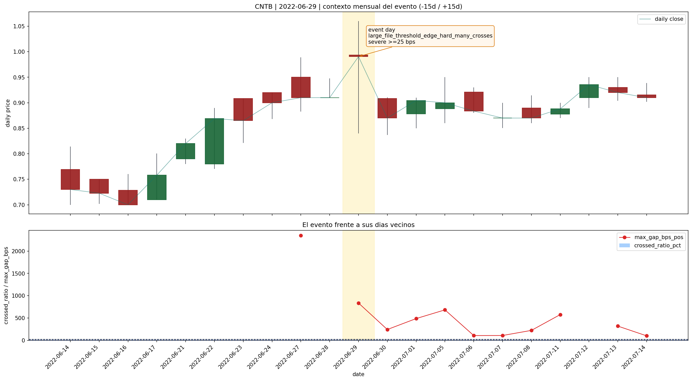

#### 00b Event Month Quotes Context
Esta imagen responde a la pregunta de recurrencia mensual dentro de `quotes`: el problema se concentra en el evento o reaparece en varias sesiones. Arriba concatena sesiones con datos disponibles; abajo resume cobertura diaria, `crossed_ratio_pct` y `max_gap_bps_pos`. La decision que cambia es si el caso debe leerse como episodio puntual o como sintoma de una fase repetida de libro degradado. El error que evita es extrapolar desde un unico dia a todo el mes sin evidencia.

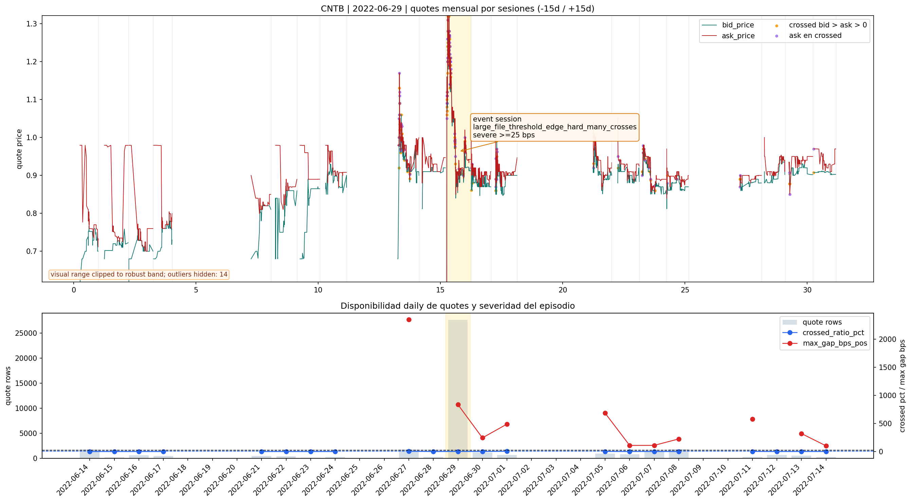

#### 01 Raw Window
Esta imagen responde a la primera pregunta decisiva del caso: el crossed observado es economicamente bastante fuerte para justificar un cambio de clase. Arriba ensena la geometria exacta del tramo conflictivo; abajo convierte esa geometria a bps y la enfrenta a los cortes `5 bps` y `25 bps`. El regimen dominante es `severe >=25 bps`. La decision que cambia es pasar de anomalia interpretable a `review` o `bad`. El error que evita es decidir por apariencia visual sin medir el dano economico real del crossed. En terminos de pipeline, este panel decide si el problema afecta solo a la lectura forense o si invalida simulacion de ejecucion y microstructure features.

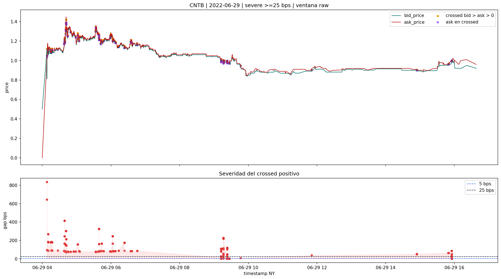

#### 02 Full Session Context
Esta imagen responde a la pregunta de extension intradiaria: el dano esta confinado a un bloque corto o contamina la sesion completa. Arriba se ve toda la sesion `04:00-20:00 NY`; abajo el `gap_bps` firmado. La decision que cambia es si el consumo debe penalizar solo un tramo o desechar el dia entero para uso operativo. El error que evita es tratar una cicatriz local como ruina total o, al reves, minimizar una degradacion distribuida a lo largo del dia. En ejecucion esto decide si la sesion puede seguir usandose con restricciones; en ML decide si las features intradiarias conservan significado economico.

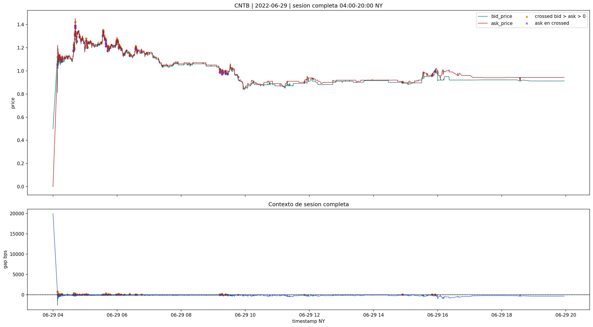

#### 03 Structure Diagnostics
Este panel responde a la pregunta de naturaleza del fallo: contradiccion economica genuina o mezcla con degeneracion estructural. Separa `ask=0` de `ask>0`, muestra la distribucion de `gap_bps` y resume patrones de integerizacion. La decision que cambia es como interpretar el dano: mercado localmente roto, artefacto de representacion o combinacion de ambos. El error que evita es sobrediagnosticar crossed reales cuando parte de la senal proviene de estructura degenerada del libro. Esta lectura afecta directamente a que el caso vaya a exclusion dura, a bandera contextual o a simple reconciliacion tecnica.

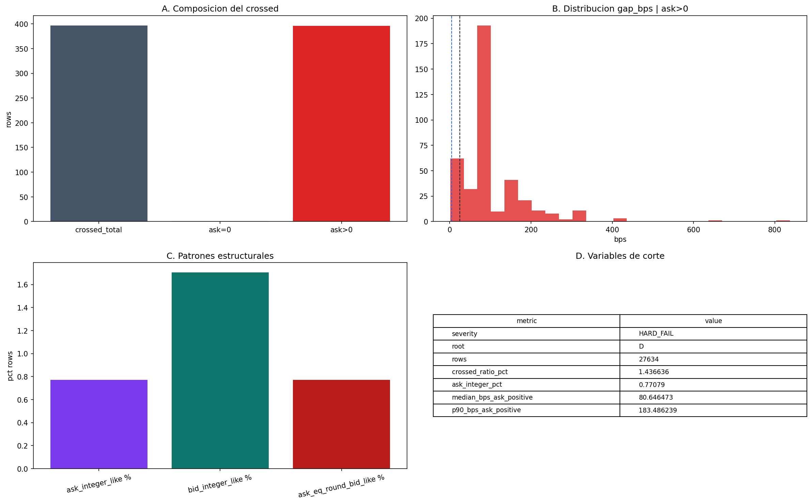

#### 04 Summary Card
Esta tarjeta responde a la pregunta de auditabilidad: cuales son exactamente las variables que sostienen la conclusion. Reune `severity`, `root`, `crossed_ratio_pct`, `ask_integer_pct`, `median_bps_ask_positive` y `p90_bps_ask_positive`. La decision que cambia es pasar de impresion visual a regla verificable. El error que evita es que dos inspectores lleguen a conclusiones distintas mirando la misma imagen sin una base numerica comun. Para gobernanza del proyecto, este panel es el que vuelve reproducible la decision para backtest, ML y auditoria.

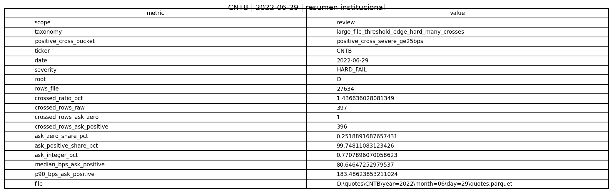

#### 05 Historical Context
Esta imagen responde a la pregunta causal externa: existe un framing historico que ayude a entender por que ocurre el episodio. Puede aportar halt context, explained o not strongly explained. La decision que cambia es cuanto peso se concede al contexto en la narrativa final. El error que evita es doble: ignorar una explicacion real o usarla como excusa para absolver un libro que localmente sigue siendo problematico.

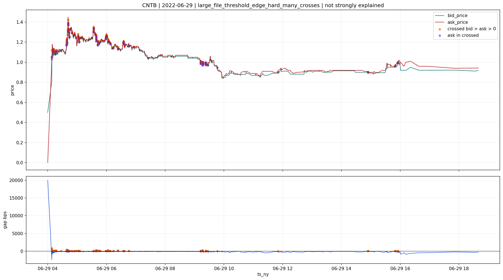

---

### 3. AEMD 2021-06-21

company_name: `AETHLON MEDICAL INC`
primary_exchange: `NASDAQ` (`XNAS`)
market_locale: `stocks/us`
scope: `review`
ticker: `AEMD`
date: `2021-06-21`
taxonomy: `large_file_threshold_edge_hard_many_crosses`
positive_cross_bucket: `positive_cross_severe_ge25bps`
severity: `HARD_FAIL`
root: `D`
rows: `12358`
crossed_ratio_pct: `1.092410`
crossed_rows_raw: `135`
crossed_rows_ask_zero: `0`
crossed_rows_ask_positive: `135`
ask_integer_pct: `0.606894`
median_bps_ask_positive: `78.125000`
p90_bps_ask_positive: `232.558140`
file: `D:\quotes\AEMD\year=2021\month=06\day=21\quotes.parquet`

#### Analisis Forense
La conclusion correcta del caso es que ya existe contradiccion economica real dentro del libro, pero aun no con fuerza suficiente para justificar exclusion dura sin contexto adicional. La taxonomy historica es `large_file_threshold_edge_hard_many_crosses` y el regimen positivo dominante es `severe >=25 bps`. Esto importa porque la taxonomy no solo clasifica: resume que tipo de anomalia se esta viendo y que clase de decision contractual puede defenderse despues. La taxonomy `large_file_threshold_edge_hard_many_crosses` implica un libro grande con muchas contradicciones, pero cerca del borde decisional. La dificultad analitica esta en decidir si el volumen de crossed es ruido absorbible o evidencia de degradacion suficientemente seria. El regimen `severe >=25 bps` empuja el caso a una lectura economicamente dura: el crossed deja de ser cosmetico y pasa a cuestionar si el libro sigue siendo interpretable como mercado negociable. En terminos observables, el file tiene `crossed_ratio_pct=1.092410` con `crossed_rows_ask_positive=135` y `crossed_rows_ask_zero=0`. La severidad economica del crossed ask>0 se resume en `median_bps_ask_positive=78.125000` y `p90_bps_ask_positive=232.558140`. Estos dos numeros convierten una forma visual rara en una conclusion operativa sobre si el libro sigue representando o no un mercado negociable. La decision que cambia es pasar de libro sano a libro util solo bajo cautela. `review` significa: no usar como si fuera ejecucion limpia, conservar para analisis contextual y sensibilidad. El error que evita es tratar como normal un episodio que ya contiene contradiccion economica real y contaminar simulaciones de ejecucion o validaciones demasiado optimistas. El patron estructural muestra `ask_integer_pct=0.606894`. Este numero obliga a separar dos explicaciones rivales: contradiccion economica genuina del libro o mezcla con degeneracion estructural / integerizacion. Toda la composicion crossed cae en `ask>0`. Eso endurece la lectura economica del caso: el dano no depende de ceros mecanicos, sino de contradiccion positiva dentro de precios aparentemente vivos. Como `ask_integer_pct` es bajo, la hipotesis de simple degeneracion mecanica pierde fuerza. Eso endurece la interpretacion: el crossed se parece mas a contradiccion economica genuina y menos a artefacto. En la capa de semantica de precio del evento aparecen `daily raw close=4144.0000`, `quote mid raw=5.1800`, `quote mid split_normalized=4144.0000`, `daily adjusted_proxy=4144.0000`. La reconciliacion incluye `future_split_factor=0.0013`. La implicacion metodologica es crucial: una discrepancia entre `quotes`, `daily` y una plataforma externa no puede leerse automaticamente como fallo del dataset. Puede ser semantica de precio distinta. El error que evita esta capa es mezclar raw, split-normalized y adjusted dentro del mismo pipeline, rompiendo auditoria, benchmarking y labels. Para pipelines, esto bloquea su uso como libro sano en ejecucion y features microestructurales principales, aunque aun puede mantenerse para forense, sensibilidad y estudios donde la anomalia sea parte del objeto de investigacion. Existe ademas una imagen historica de certificacion asociada. Su papel es poner el episodio en un marco causal mas amplio: halt, explained, not strongly explained o patron conocido. La regla que protege al proyecto es esta: el contexto externo se usa para explicar por que aparece el episodio, no para absolverlo. El error que evita es degradar el criterio de calidad del libro porque exista una historia plausible alrededor del caso.

#### 00 Event Month Context
Esta imagen responde a la pregunta de persistencia temporal: estamos ante un accidente local o ante una fase mas amplia de inestabilidad. Arriba coloca el evento en la serie `daily` real del mes; abajo compara `crossed_ratio_pct` y `max_gap_bps_pos` del dia contra sus vecinos. La decision que cambia es el peso estructural que se le concede al caso. El error que evita es juzgar igual un shock aislado y una degradacion repetida del libro.

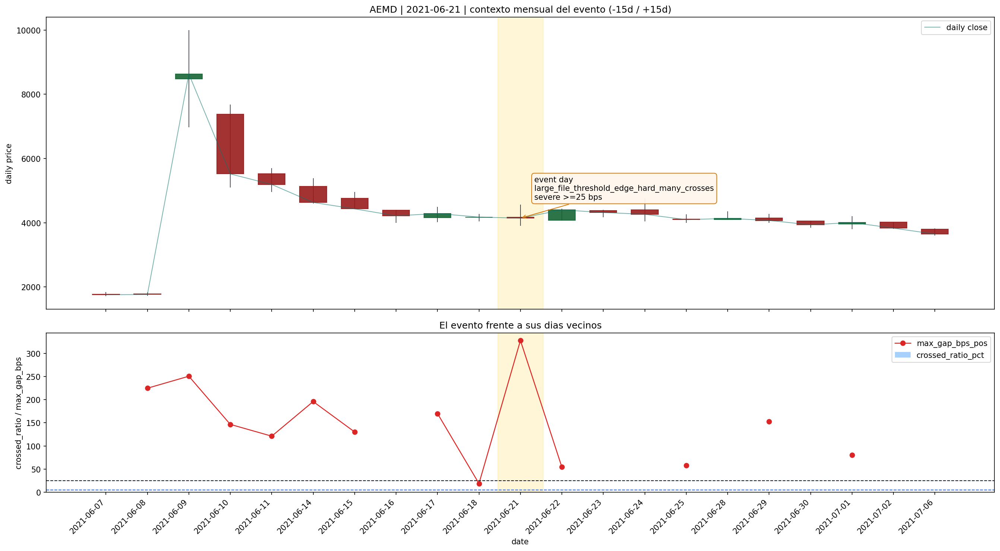

#### 00a Adjusted Proxy Contrast
Esta imagen responde a la pregunta de reconciliacion semantica: la discrepancia de precios viene de datos rotos o de vistas de precio distintas. Compara `daily raw`, `daily adjusted_proxy`, `quote mid raw` y `quote mid split_normalized`, y debajo ensena la cadena de dividendos y splits que produce la diferencia. La decision que cambia es si el inspector debe abrir una incidencia de calidad o cerrar el caso como diferencia legitima de semantica. El error que evita es mezclar series raw y adjusted como si fueran equivalentes. En pipelines reales, esto protege benchmarking, labels diarios y reconciliacion externa frente a falsas alarmas de precio.

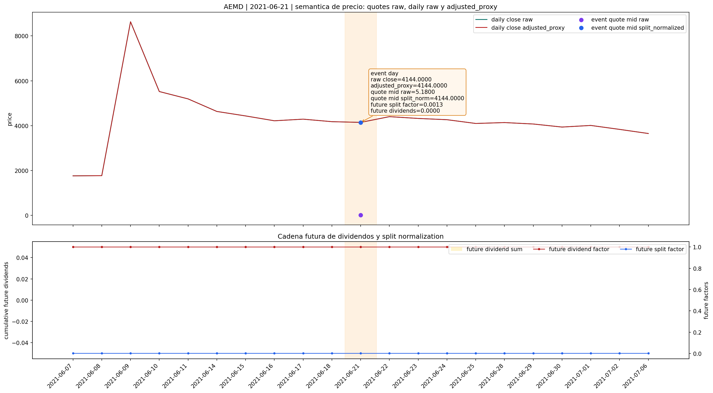

#### 00b Event Month Quotes Context
Esta imagen responde a la pregunta de recurrencia mensual dentro de `quotes`: el problema se concentra en el evento o reaparece en varias sesiones. Arriba concatena sesiones con datos disponibles; abajo resume cobertura diaria, `crossed_ratio_pct` y `max_gap_bps_pos`. La decision que cambia es si el caso debe leerse como episodio puntual o como sintoma de una fase repetida de libro degradado. El error que evita es extrapolar desde un unico dia a todo el mes sin evidencia.

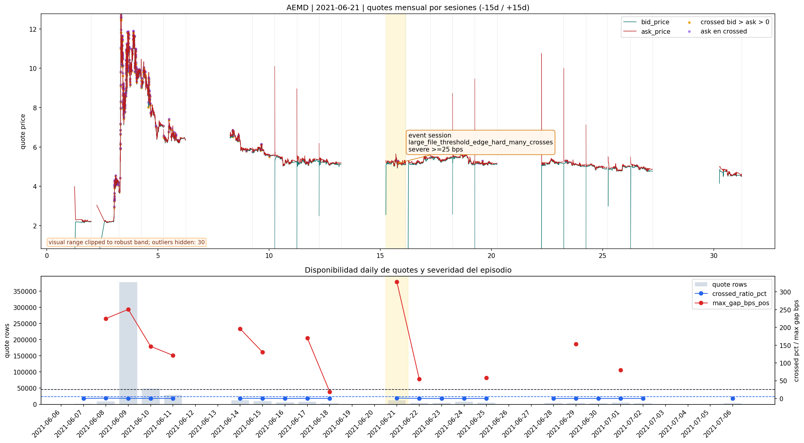

#### 01 Raw Window
Esta imagen responde a la primera pregunta decisiva del caso: el crossed observado es economicamente bastante fuerte para justificar un cambio de clase. Arriba ensena la geometria exacta del tramo conflictivo; abajo convierte esa geometria a bps y la enfrenta a los cortes `5 bps` y `25 bps`. El regimen dominante es `severe >=25 bps`. La decision que cambia es pasar de anomalia interpretable a `review` o `bad`. El error que evita es decidir por apariencia visual sin medir el dano economico real del crossed. En terminos de pipeline, este panel decide si el problema afecta solo a la lectura forense o si invalida simulacion de ejecucion y microstructure features.

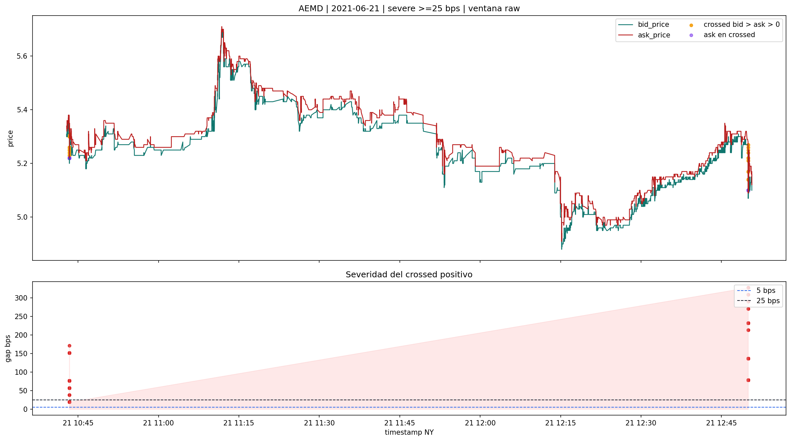

#### 02 Full Session Context
Esta imagen responde a la pregunta de extension intradiaria: el dano esta confinado a un bloque corto o contamina la sesion completa. Arriba se ve toda la sesion `04:00-20:00 NY`; abajo el `gap_bps` firmado. La decision que cambia es si el consumo debe penalizar solo un tramo o desechar el dia entero para uso operativo. El error que evita es tratar una cicatriz local como ruina total o, al reves, minimizar una degradacion distribuida a lo largo del dia. En ejecucion esto decide si la sesion puede seguir usandose con restricciones; en ML decide si las features intradiarias conservan significado economico.

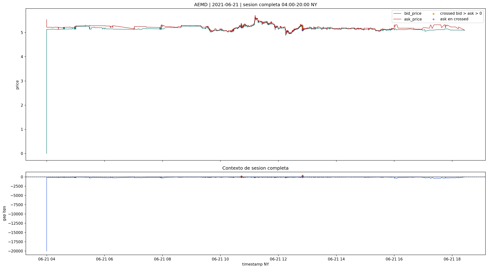

#### 03 Structure Diagnostics
Este panel responde a la pregunta de naturaleza del fallo: contradiccion economica genuina o mezcla con degeneracion estructural. Separa `ask=0` de `ask>0`, muestra la distribucion de `gap_bps` y resume patrones de integerizacion. La decision que cambia es como interpretar el dano: mercado localmente roto, artefacto de representacion o combinacion de ambos. El error que evita es sobrediagnosticar crossed reales cuando parte de la senal proviene de estructura degenerada del libro. Esta lectura afecta directamente a que el caso vaya a exclusion dura, a bandera contextual o a simple reconciliacion tecnica.

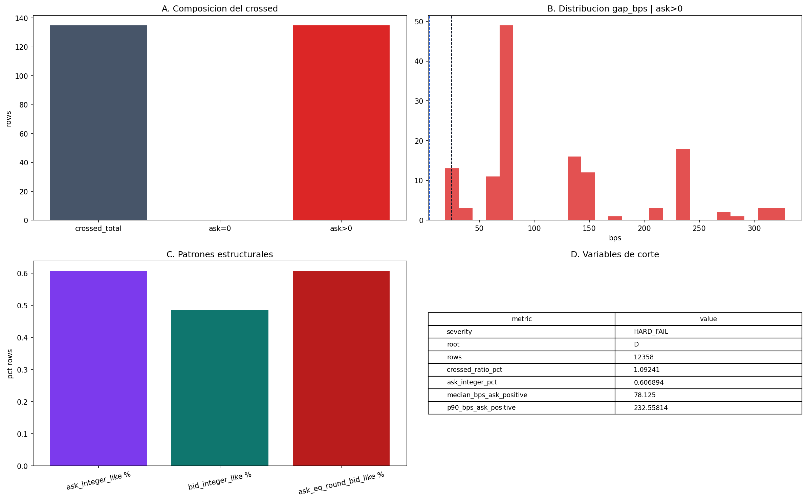

#### 04 Summary Card
Esta tarjeta responde a la pregunta de auditabilidad: cuales son exactamente las variables que sostienen la conclusion. Reune `severity`, `root`, `crossed_ratio_pct`, `ask_integer_pct`, `median_bps_ask_positive` y `p90_bps_ask_positive`. La decision que cambia es pasar de impresion visual a regla verificable. El error que evita es que dos inspectores lleguen a conclusiones distintas mirando la misma imagen sin una base numerica comun. Para gobernanza del proyecto, este panel es el que vuelve reproducible la decision para backtest, ML y auditoria.

---

### 4. MARK 2020-04-28

company_name: `Remark Holdings, Inc.`
primary_exchange: `NASDAQ` (`XNAS`)
market_locale: `stocks/us`
scope: `review`
ticker: `MARK`
date: `2020-04-28`
taxonomy: `large_file_threshold_edge_hard_many_crosses`
positive_cross_bucket: `positive_cross_severe_ge25bps`
severity: `HARD_FAIL`
root: `D`
rows: `10955`
crossed_ratio_pct: `1.013236`
crossed_rows_raw: `111`
crossed_rows_ask_zero: `0`
crossed_rows_ask_positive: `111`
ask_integer_pct: `0.000000`
median_bps_ask_positive: `62.959077`
p90_bps_ask_positive: `179.230364`
file: `D:\quotes\MARK\year=2020\month=04\day=28\quotes.parquet`

#### Analisis Forense
La conclusion correcta del caso es que ya existe contradiccion economica real dentro del libro, pero aun no con fuerza suficiente para justificar exclusion dura sin contexto adicional. La taxonomy historica es `large_file_threshold_edge_hard_many_crosses` y el regimen positivo dominante es `severe >=25 bps`. Esto importa porque la taxonomy no solo clasifica: resume que tipo de anomalia se esta viendo y que clase de decision contractual puede defenderse despues. La taxonomy `large_file_threshold_edge_hard_many_crosses` implica un libro grande con muchas contradicciones, pero cerca del borde decisional. La dificultad analitica esta en decidir si el volumen de crossed es ruido absorbible o evidencia de degradacion suficientemente seria. El regimen `severe >=25 bps` empuja el caso a una lectura economicamente dura: el crossed deja de ser cosmetico y pasa a cuestionar si el libro sigue siendo interpretable como mercado negociable. En terminos observables, el file tiene `crossed_ratio_pct=1.013236` con `crossed_rows_ask_positive=111` y `crossed_rows_ask_zero=0`. La severidad economica del crossed ask>0 se resume en `median_bps_ask_positive=62.959077` y `p90_bps_ask_positive=179.230364`. Estos dos numeros convierten una forma visual rara en una conclusion operativa sobre si el libro sigue representando o no un mercado negociable. La decision que cambia es pasar de libro sano a libro util solo bajo cautela. `review` significa: no usar como si fuera ejecucion limpia, conservar para analisis contextual y sensibilidad. El error que evita es tratar como normal un episodio que ya contiene contradiccion economica real y contaminar simulaciones de ejecucion o validaciones demasiado optimistas. El patron estructural muestra `ask_integer_pct=0.000000`. Este numero obliga a separar dos explicaciones rivales: contradiccion economica genuina del libro o mezcla con degeneracion estructural / integerizacion. Toda la composicion crossed cae en `ask>0`. Eso endurece la lectura economica del caso: el dano no depende de ceros mecanicos, sino de contradiccion positiva dentro de precios aparentemente vivos. Como `ask_integer_pct` es bajo, la hipotesis de simple degeneracion mecanica pierde fuerza. Eso endurece la interpretacion: el crossed se parece mas a contradiccion economica genuina y menos a artefacto. En la capa de semantica de precio del evento aparecen `daily raw close=5.0000`, `quote mid raw=0.4124`, `quote mid split_normalized=4.1245`, `daily adjusted_proxy=5.0000`. La reconciliacion incluye `future_split_factor=0.1000`. La implicacion metodologica es crucial: una discrepancia entre `quotes`, `daily` y una plataforma externa no puede leerse automaticamente como fallo del dataset. Puede ser semantica de precio distinta. El error que evita esta capa es mezclar raw, split-normalized y adjusted dentro del mismo pipeline, rompiendo auditoria, benchmarking y labels. Para pipelines, esto bloquea su uso como libro sano en ejecucion y features microestructurales principales, aunque aun puede mantenerse para forense, sensibilidad y estudios donde la anomalia sea parte del objeto de investigacion. Existe ademas una imagen historica de certificacion asociada. Su papel es poner el episodio en un marco causal mas amplio: halt, explained, not strongly explained o patron conocido. La regla que protege al proyecto es esta: el contexto externo se usa para explicar por que aparece el episodio, no para absolverlo. El error que evita es degradar el criterio de calidad del libro porque exista una historia plausible alrededor del caso.

#### 00 Event Month Context
Esta imagen responde a la pregunta de persistencia temporal: estamos ante un accidente local o ante una fase mas amplia de inestabilidad. Arriba coloca el evento en la serie `daily` real del mes; abajo compara `crossed_ratio_pct` y `max_gap_bps_pos` del dia contra sus vecinos. La decision que cambia es el peso estructural que se le concede al caso. El error que evita es juzgar igual un shock aislado y una degradacion repetida del libro.

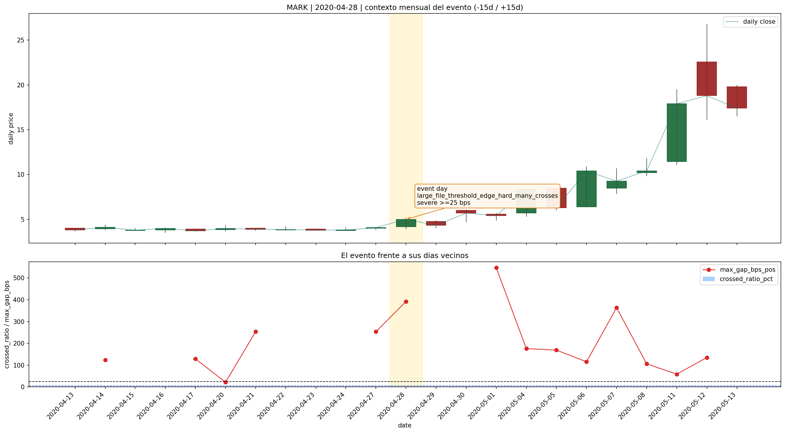

#### 00a Adjusted Proxy Contrast
Esta imagen responde a la pregunta de reconciliacion semantica: la discrepancia de precios viene de datos rotos o de vistas de precio distintas. Compara `daily raw`, `daily adjusted_proxy`, `quote mid raw` y `quote mid split_normalized`, y debajo ensena la cadena de dividendos y splits que produce la diferencia. La decision que cambia es si el inspector debe abrir una incidencia de calidad o cerrar el caso como diferencia legitima de semantica. El error que evita es mezclar series raw y adjusted como si fueran equivalentes. En pipelines reales, esto protege benchmarking, labels diarios y reconciliacion externa frente a falsas alarmas de precio.

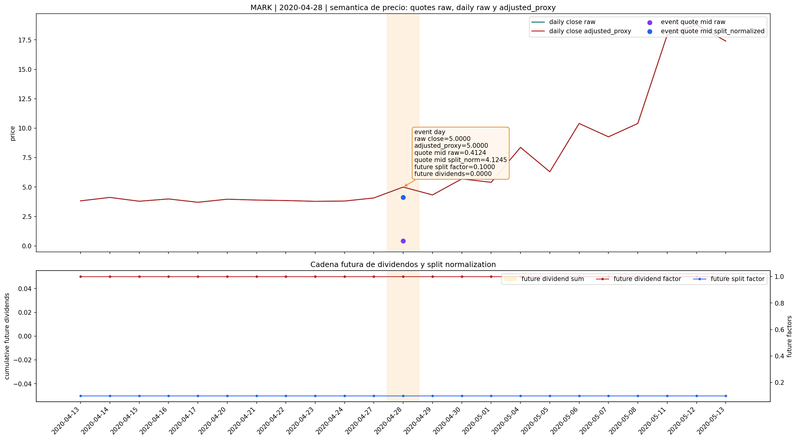

#### 00b Event Month Quotes Context
Esta imagen responde a la pregunta de recurrencia mensual dentro de `quotes`: el problema se concentra en el evento o reaparece en varias sesiones. Arriba concatena sesiones con datos disponibles; abajo resume cobertura diaria, `crossed_ratio_pct` y `max_gap_bps_pos`. La decision que cambia es si el caso debe leerse como episodio puntual o como sintoma de una fase repetida de libro degradado. El error que evita es extrapolar desde un unico dia a todo el mes sin evidencia.

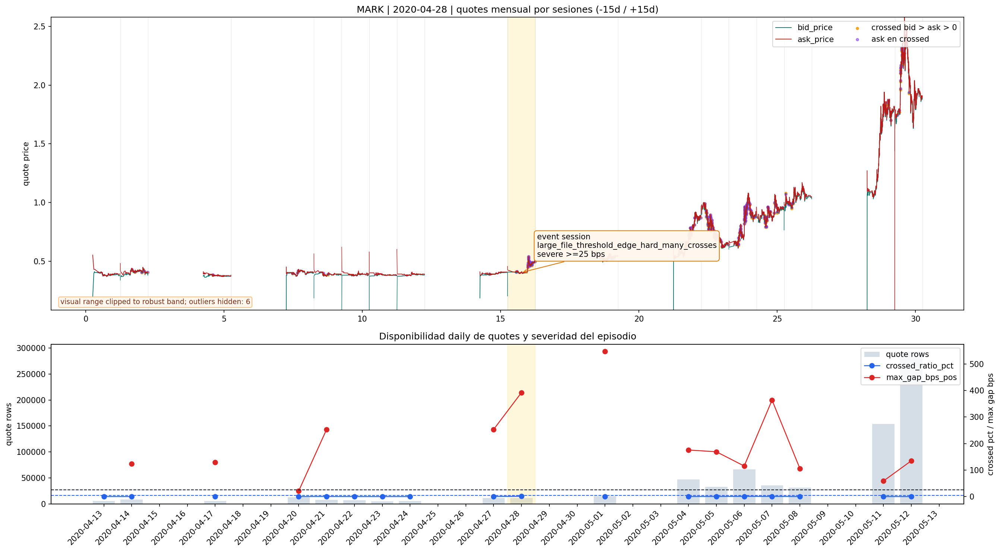

#### 01 Raw Window
Esta imagen responde a la primera pregunta decisiva del caso: el crossed observado es economicamente bastante fuerte para justificar un cambio de clase. Arriba ensena la geometria exacta del tramo conflictivo; abajo convierte esa geometria a bps y la enfrenta a los cortes `5 bps` y `25 bps`. El regimen dominante es `severe >=25 bps`. La decision que cambia es pasar de anomalia interpretable a `review` o `bad`. El error que evita es decidir por apariencia visual sin medir el dano economico real del crossed. En terminos de pipeline, este panel decide si el problema afecta solo a la lectura forense o si invalida simulacion de ejecucion y microstructure features.

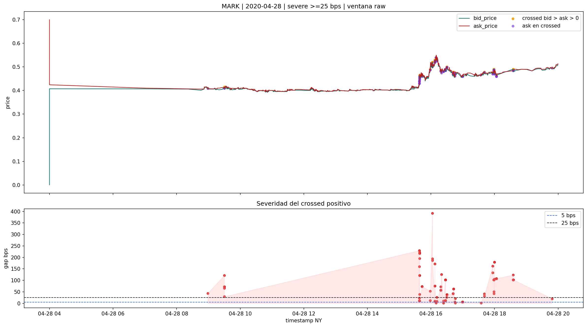

#### 02 Full Session Context
Esta imagen responde a la pregunta de extension intradiaria: el dano esta confinado a un bloque corto o contamina la sesion completa. Arriba se ve toda la sesion `04:00-20:00 NY`; abajo el `gap_bps` firmado. La decision que cambia es si el consumo debe penalizar solo un tramo o desechar el dia entero para uso operativo. El error que evita es tratar una cicatriz local como ruina total o, al reves, minimizar una degradacion distribuida a lo largo del dia. En ejecucion esto decide si la sesion puede seguir usandose con restricciones; en ML decide si las features intradiarias conservan significado economico.

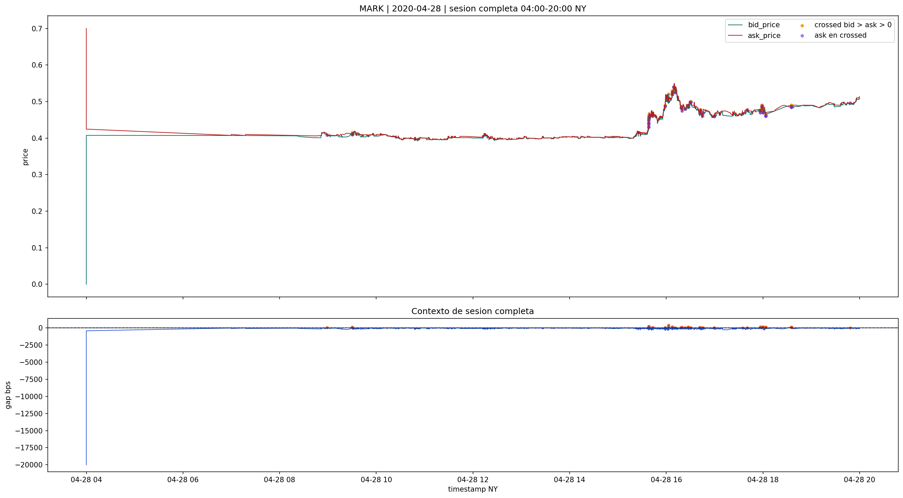

#### 03 Structure Diagnostics
Este panel responde a la pregunta de naturaleza del fallo: contradiccion economica genuina o mezcla con degeneracion estructural. Separa `ask=0` de `ask>0`, muestra la distribucion de `gap_bps` y resume patrones de integerizacion. La decision que cambia es como interpretar el dano: mercado localmente roto, artefacto de representacion o combinacion de ambos. El error que evita es sobrediagnosticar crossed reales cuando parte de la senal proviene de estructura degenerada del libro. Esta lectura afecta directamente a que el caso vaya a exclusion dura, a bandera contextual o a simple reconciliacion tecnica.

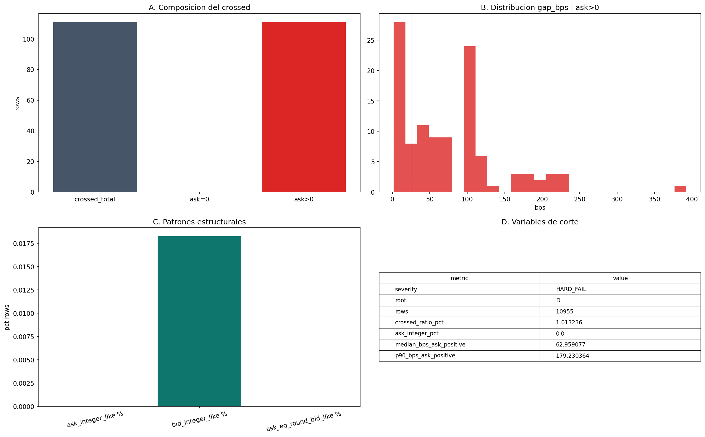

#### 04 Summary Card
Esta tarjeta responde a la pregunta de auditabilidad: cuales son exactamente las variables que sostienen la conclusion. Reune `severity`, `root`, `crossed_ratio_pct`, `ask_integer_pct`, `median_bps_ask_positive` y `p90_bps_ask_positive`. La decision que cambia es pasar de impresion visual a regla verificable. El error que evita es que dos inspectores lleguen a conclusiones distintas mirando la misma imagen sin una base numerica comun. Para gobernanza del proyecto, este panel es el que vuelve reproducible la decision para backtest, ML y auditoria.

---

### 5. TOPS 2020-05-26

company_name: `TOP Ships Inc.`
primary_exchange: `NYSE American` (`XASE`)
market_locale: `stocks/us`
scope: `review`
ticker: `TOPS`
date: `2020-05-26`
taxonomy: `large_file_threshold_edge_hard_many_crosses`
positive_cross_bucket: `positive_cross_severe_ge25bps`
severity: `HARD_FAIL`
root: `C`
rows: `8819`
crossed_ratio_pct: `0.827758`
crossed_rows_raw: `73`
crossed_rows_ask_zero: `0`
crossed_rows_ask_positive: `73`
ask_integer_pct: `0.000000`
median_bps_ask_positive: `41.465100`
p90_bps_ask_positive: `161.186938`
file: `C:\TSIS_Data\data\quotes\TOPS\year=2020\month=05\day=26\quotes.parquet`

#### Analisis Forense
La conclusion correcta del caso es que ya existe contradiccion economica real dentro del libro, pero aun no con fuerza suficiente para justificar exclusion dura sin contexto adicional. La taxonomy historica es `large_file_threshold_edge_hard_many_crosses` y el regimen positivo dominante es `severe >=25 bps`. Esto importa porque la taxonomy no solo clasifica: resume que tipo de anomalia se esta viendo y que clase de decision contractual puede defenderse despues. La taxonomy `large_file_threshold_edge_hard_many_crosses` implica un libro grande con muchas contradicciones, pero cerca del borde decisional. La dificultad analitica esta en decidir si el volumen de crossed es ruido absorbible o evidencia de degradacion suficientemente seria. El regimen `severe >=25 bps` empuja el caso a una lectura economicamente dura: el crossed deja de ser cosmetico y pasa a cuestionar si el libro sigue siendo interpretable como mercado negociable. En terminos observables, el file tiene `crossed_ratio_pct=0.827758` con `crossed_rows_ask_positive=73` y `crossed_rows_ask_zero=0`. La severidad economica del crossed ask>0 se resume en `median_bps_ask_positive=41.465100` y `p90_bps_ask_positive=161.186938`. Estos dos numeros convierten una forma visual rara en una conclusion operativa sobre si el libro sigue representando o no un mercado negociable. La decision que cambia es pasar de libro sano a libro util solo bajo cautela. `review` significa: no usar como si fuera ejecucion limpia, conservar para analisis contextual y sensibilidad. El error que evita es tratar como normal un episodio que ya contiene contradiccion economica real y contaminar simulaciones de ejecucion o validaciones demasiado optimistas. El patron estructural muestra `ask_integer_pct=0.000000`. Este numero obliga a separar dos explicaciones rivales: contradiccion economica genuina del libro o mezcla con degeneracion estructural / integerizacion. Toda la composicion crossed cae en `ask>0`. Eso endurece la lectura economica del caso: el dano no depende de ceros mecanicos, sino de contradiccion positiva dentro de precios aparentemente vivos. Como `ask_integer_pct` es bajo, la hipotesis de simple degeneracion mecanica pierde fuerza. Eso endurece la interpretacion: el crossed se parece mas a contradiccion economica genuina y menos a artefacto. En la capa de semantica de precio del evento aparecen `daily raw close=833.4000`, `quote mid raw=0.1379`, `quote mid split_normalized=827.7000`, `daily adjusted_proxy=833.4000`. La reconciliacion incluye `future_split_factor=0.0002`. La implicacion metodologica es crucial: una discrepancia entre `quotes`, `daily` y una plataforma externa no puede leerse automaticamente como fallo del dataset. Puede ser semantica de precio distinta. El error que evita esta capa es mezclar raw, split-normalized y adjusted dentro del mismo pipeline, rompiendo auditoria, benchmarking y labels. Para pipelines, esto bloquea su uso como libro sano en ejecucion y features microestructurales principales, aunque aun puede mantenerse para forense, sensibilidad y estudios donde la anomalia sea parte del objeto de investigacion. Existe ademas una imagen historica de certificacion asociada. Su papel es poner el episodio en un marco causal mas amplio: halt, explained, not strongly explained o patron conocido. La regla que protege al proyecto es esta: el contexto externo se usa para explicar por que aparece el episodio, no para absolverlo. El error que evita es degradar el criterio de calidad del libro porque exista una historia plausible alrededor del caso.

#### 00 Event Month Context
Esta imagen responde a la pregunta de persistencia temporal: estamos ante un accidente local o ante una fase mas amplia de inestabilidad. Arriba coloca el evento en la serie `daily` real del mes; abajo compara `crossed_ratio_pct` y `max_gap_bps_pos` del dia contra sus vecinos. La decision que cambia es el peso estructural que se le concede al caso. El error que evita es juzgar igual un shock aislado y una degradacion repetida del libro.

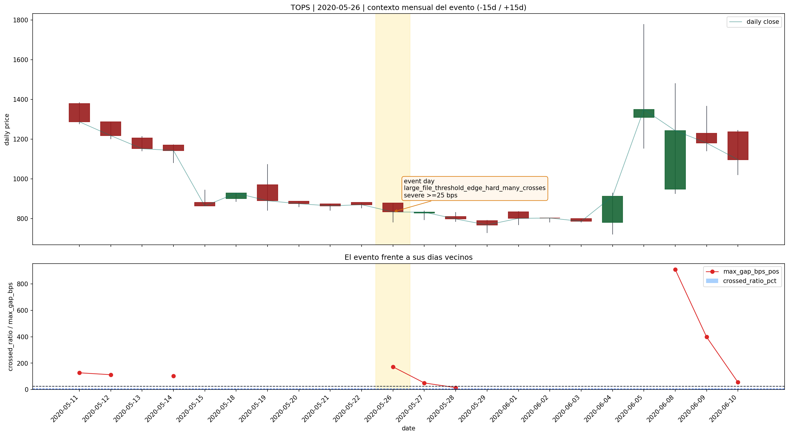

#### 00a Adjusted Proxy Contrast
Esta imagen responde a la pregunta de reconciliacion semantica: la discrepancia de precios viene de datos rotos o de vistas de precio distintas. Compara `daily raw`, `daily adjusted_proxy`, `quote mid raw` y `quote mid split_normalized`, y debajo ensena la cadena de dividendos y splits que produce la diferencia. La decision que cambia es si el inspector debe abrir una incidencia de calidad o cerrar el caso como diferencia legitima de semantica. El error que evita es mezclar series raw y adjusted como si fueran equivalentes. En pipelines reales, esto protege benchmarking, labels diarios y reconciliacion externa frente a falsas alarmas de precio.

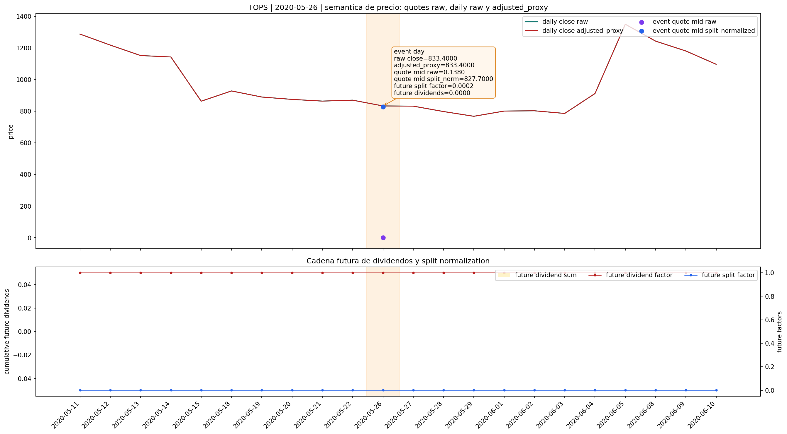

#### 00b Event Month Quotes Context
Esta imagen responde a la pregunta de recurrencia mensual dentro de `quotes`: el problema se concentra en el evento o reaparece en varias sesiones. Arriba concatena sesiones con datos disponibles; abajo resume cobertura diaria, `crossed_ratio_pct` y `max_gap_bps_pos`. La decision que cambia es si el caso debe leerse como episodio puntual o como sintoma de una fase repetida de libro degradado. El error que evita es extrapolar desde un unico dia a todo el mes sin evidencia.

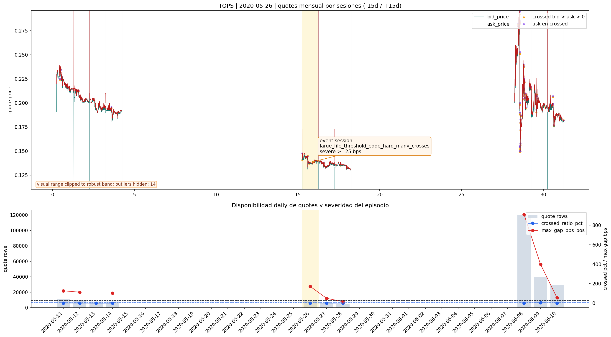

#### 01 Raw Window
Esta imagen responde a la primera pregunta decisiva del caso: el crossed observado es economicamente bastante fuerte para justificar un cambio de clase. Arriba ensena la geometria exacta del tramo conflictivo; abajo convierte esa geometria a bps y la enfrenta a los cortes `5 bps` y `25 bps`. El regimen dominante es `severe >=25 bps`. La decision que cambia es pasar de anomalia interpretable a `review` o `bad`. El error que evita es decidir por apariencia visual sin medir el dano economico real del crossed. En terminos de pipeline, este panel decide si el problema afecta solo a la lectura forense o si invalida simulacion de ejecucion y microstructure features.

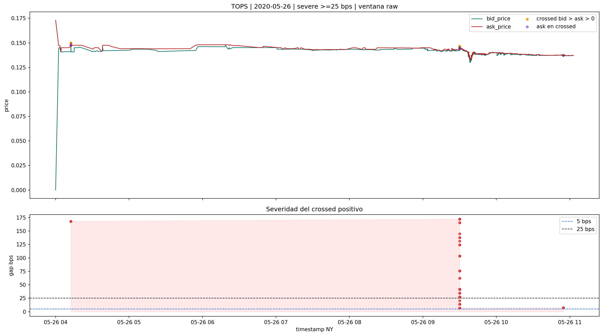

#### 02 Full Session Context
Esta imagen responde a la pregunta de extension intradiaria: el dano esta confinado a un bloque corto o contamina la sesion completa. Arriba se ve toda la sesion `04:00-20:00 NY`; abajo el `gap_bps` firmado. La decision que cambia es si el consumo debe penalizar solo un tramo o desechar el dia entero para uso operativo. El error que evita es tratar una cicatriz local como ruina total o, al reves, minimizar una degradacion distribuida a lo largo del dia. En ejecucion esto decide si la sesion puede seguir usandose con restricciones; en ML decide si las features intradiarias conservan significado economico.

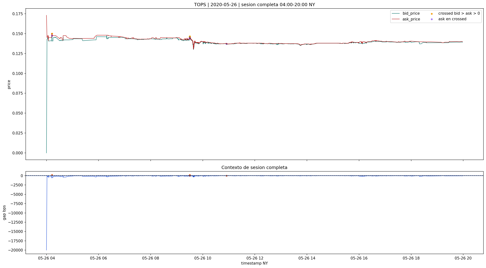

#### 03 Structure Diagnostics
Este panel responde a la pregunta de naturaleza del fallo: contradiccion economica genuina o mezcla con degeneracion estructural. Separa `ask=0` de `ask>0`, muestra la distribucion de `gap_bps` y resume patrones de integerizacion. La decision que cambia es como interpretar el dano: mercado localmente roto, artefacto de representacion o combinacion de ambos. El error que evita es sobrediagnosticar crossed reales cuando parte de la senal proviene de estructura degenerada del libro. Esta lectura afecta directamente a que el caso vaya a exclusion dura, a bandera contextual o a simple reconciliacion tecnica.

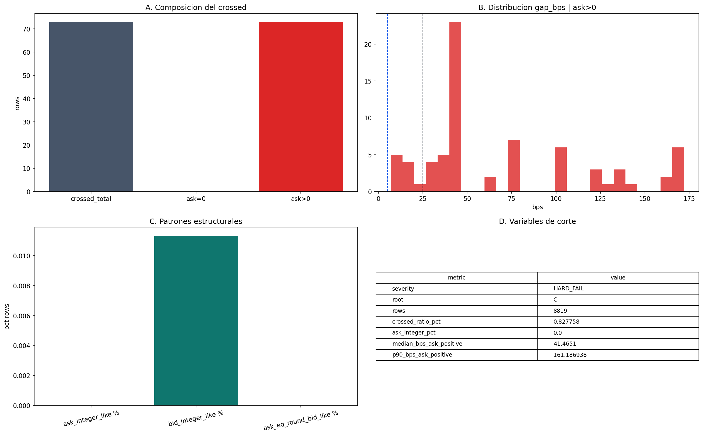

#### 04 Summary Card
Esta tarjeta responde a la pregunta de auditabilidad: cuales son exactamente las variables que sostienen la conclusion. Reune `severity`, `root`, `crossed_ratio_pct`, `ask_integer_pct`, `median_bps_ask_positive` y `p90_bps_ask_positive`. La decision que cambia es pasar de impresion visual a regla verificable. El error que evita es que dos inspectores lleguen a conclusiones distintas mirando la misma imagen sin una base numerica comun. Para gobernanza del proyecto, este panel es el que vuelve reproducible la decision para backtest, ML y auditoria.

---

### 6. LPSN 2013-11-25

company_name: `LivePerson Inc`
primary_exchange: `NASDAQ` (`XNAS`)
market_locale: `stocks/us`
scope: `review`
ticker: `LPSN`
date: `2013-11-25`
taxonomy: `large_file_threshold_edge_hard_many_crosses`
positive_cross_bucket: `positive_cross_severe_ge25bps`
severity: `HARD_FAIL`
root: `D`
rows: `18855`
crossed_ratio_pct: `0.880403`
crossed_rows_raw: `166`
crossed_rows_ask_zero: `157`
crossed_rows_ask_positive: `9`
ask_integer_pct: `1.994166`
median_bps_ask_positive: `25.178347`
p90_bps_ask_positive: `109.565950`
file: `D:\quotes\LPSN\year=2013\month=11\day=25\quotes.parquet`

#### Analisis Forense
La conclusion correcta del caso es que ya existe contradiccion economica real dentro del libro, pero aun no con fuerza suficiente para justificar exclusion dura sin contexto adicional. La taxonomy historica es `large_file_threshold_edge_hard_many_crosses` y el regimen positivo dominante es `severe >=25 bps`. Esto importa porque la taxonomy no solo clasifica: resume que tipo de anomalia se esta viendo y que clase de decision contractual puede defenderse despues. La taxonomy `large_file_threshold_edge_hard_many_crosses` implica un libro grande con muchas contradicciones, pero cerca del borde decisional. La dificultad analitica esta en decidir si el volumen de crossed es ruido absorbible o evidencia de degradacion suficientemente seria. El regimen `severe >=25 bps` empuja el caso a una lectura economicamente dura: el crossed deja de ser cosmetico y pasa a cuestionar si el libro sigue siendo interpretable como mercado negociable. En terminos observables, el file tiene `crossed_ratio_pct=0.880403` con `crossed_rows_ask_positive=9` y `crossed_rows_ask_zero=157`. La severidad economica del crossed ask>0 se resume en `median_bps_ask_positive=25.178347` y `p90_bps_ask_positive=109.565950`. Estos dos numeros convierten una forma visual rara en una conclusion operativa sobre si el libro sigue representando o no un mercado negociable. La decision que cambia es pasar de libro sano a libro util solo bajo cautela. `review` significa: no usar como si fuera ejecucion limpia, conservar para analisis contextual y sensibilidad. El error que evita es tratar como normal un episodio que ya contiene contradiccion economica real y contaminar simulaciones de ejecucion o validaciones demasiado optimistas. El patron estructural muestra `ask_integer_pct=1.994166`. Este numero obliga a separar dos explicaciones rivales: contradiccion economica genuina del libro o mezcla con degeneracion estructural / integerizacion. La mayor parte del crossed vive en `ask=0`, pero existe una cola `ask>0` que impide absolver el caso como simple glitch. La lectura correcta es mixta: dano estructural dominante con residuo economico que aun puede justificar bandera o exclusion. Como `ask_integer_pct` es bajo, la hipotesis de simple degeneracion mecanica pierde fuerza. Eso endurece la interpretacion: el crossed se parece mas a contradiccion economica genuina y menos a artefacto. En la capa de semantica de precio del evento aparecen `daily raw close=177.0000`, `quote mid raw=11.8650`, `quote mid split_normalized=177.9750`, `daily adjusted_proxy=177.0000`. La reconciliacion incluye `future_split_factor=0.0667`. La implicacion metodologica es crucial: una discrepancia entre `quotes`, `daily` y una plataforma externa no puede leerse automaticamente como fallo del dataset. Puede ser semantica de precio distinta. El error que evita esta capa es mezclar raw, split-normalized y adjusted dentro del mismo pipeline, rompiendo auditoria, benchmarking y labels. Para pipelines, esto bloquea su uso como libro sano en ejecucion y features microestructurales principales, aunque aun puede mantenerse para forense, sensibilidad y estudios donde la anomalia sea parte del objeto de investigacion. Existe ademas una imagen historica de certificacion asociada. Su papel es poner el episodio en un marco causal mas amplio: halt, explained, not strongly explained o patron conocido. La regla que protege al proyecto es esta: el contexto externo se usa para explicar por que aparece el episodio, no para absolverlo. El error que evita es degradar el criterio de calidad del libro porque exista una historia plausible alrededor del caso.

#### 00 Event Month Context
Esta imagen responde a la pregunta de persistencia temporal: estamos ante un accidente local o ante una fase mas amplia de inestabilidad. Arriba coloca el evento en la serie `daily` real del mes; abajo compara `crossed_ratio_pct` y `max_gap_bps_pos` del dia contra sus vecinos. La decision que cambia es el peso estructural que se le concede al caso. El error que evita es juzgar igual un shock aislado y una degradacion repetida del libro.

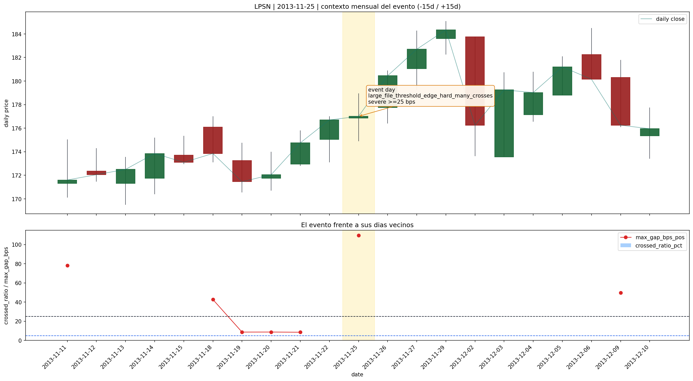

#### 00a Adjusted Proxy Contrast
Esta imagen responde a la pregunta de reconciliacion semantica: la discrepancia de precios viene de datos rotos o de vistas de precio distintas. Compara `daily raw`, `daily adjusted_proxy`, `quote mid raw` y `quote mid split_normalized`, y debajo ensena la cadena de dividendos y splits que produce la diferencia. La decision que cambia es si el inspector debe abrir una incidencia de calidad o cerrar el caso como diferencia legitima de semantica. El error que evita es mezclar series raw y adjusted como si fueran equivalentes. En pipelines reales, esto protege benchmarking, labels diarios y reconciliacion externa frente a falsas alarmas de precio.

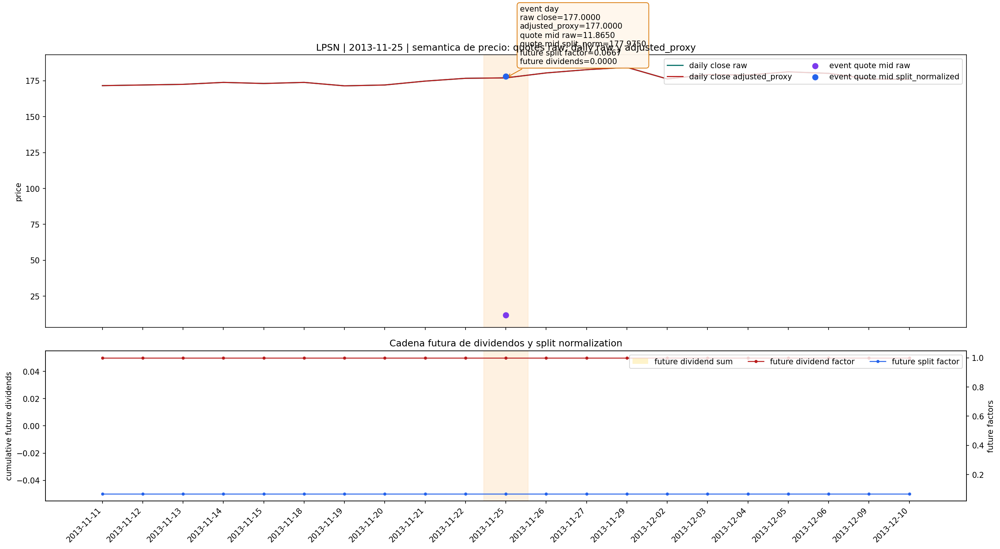

#### 00b Event Month Quotes Context
Esta imagen responde a la pregunta de recurrencia mensual dentro de `quotes`: el problema se concentra en el evento o reaparece en varias sesiones. Arriba concatena sesiones con datos disponibles; abajo resume cobertura diaria, `crossed_ratio_pct` y `max_gap_bps_pos`. La decision que cambia es si el caso debe leerse como episodio puntual o como sintoma de una fase repetida de libro degradado. El error que evita es extrapolar desde un unico dia a todo el mes sin evidencia.

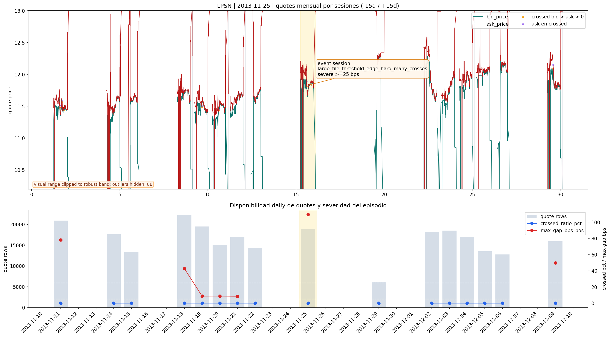

#### 01 Raw Window
Esta imagen responde a la primera pregunta decisiva del caso: el crossed observado es economicamente bastante fuerte para justificar un cambio de clase. Arriba ensena la geometria exacta del tramo conflictivo; abajo convierte esa geometria a bps y la enfrenta a los cortes `5 bps` y `25 bps`. El regimen dominante es `severe >=25 bps`. La decision que cambia es pasar de anomalia interpretable a `review` o `bad`. El error que evita es decidir por apariencia visual sin medir el dano economico real del crossed. En terminos de pipeline, este panel decide si el problema afecta solo a la lectura forense o si invalida simulacion de ejecucion y microstructure features.

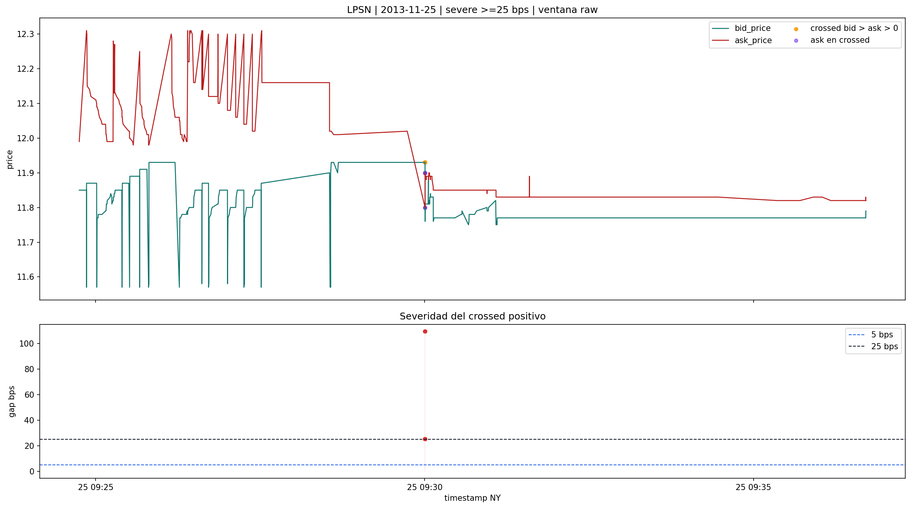

#### 02 Full Session Context
Esta imagen responde a la pregunta de extension intradiaria: el dano esta confinado a un bloque corto o contamina la sesion completa. Arriba se ve toda la sesion `04:00-20:00 NY`; abajo el `gap_bps` firmado. La decision que cambia es si el consumo debe penalizar solo un tramo o desechar el dia entero para uso operativo. El error que evita es tratar una cicatriz local como ruina total o, al reves, minimizar una degradacion distribuida a lo largo del dia. En ejecucion esto decide si la sesion puede seguir usandose con restricciones; en ML decide si las features intradiarias conservan significado economico.

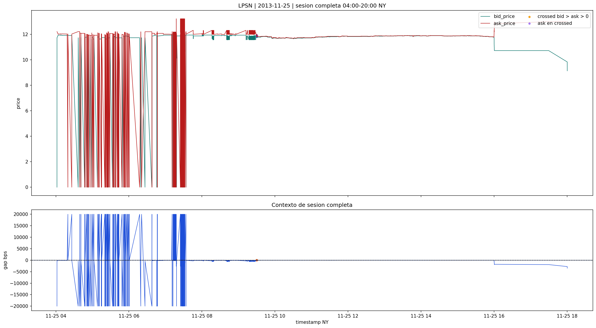

#### 03 Structure Diagnostics
Este panel responde a la pregunta de naturaleza del fallo: contradiccion economica genuina o mezcla con degeneracion estructural. Separa `ask=0` de `ask>0`, muestra la distribucion de `gap_bps` y resume patrones de integerizacion. La decision que cambia es como interpretar el dano: mercado localmente roto, artefacto de representacion o combinacion de ambos. El error que evita es sobrediagnosticar crossed reales cuando parte de la senal proviene de estructura degenerada del libro. Esta lectura afecta directamente a que el caso vaya a exclusion dura, a bandera contextual o a simple reconciliacion tecnica.

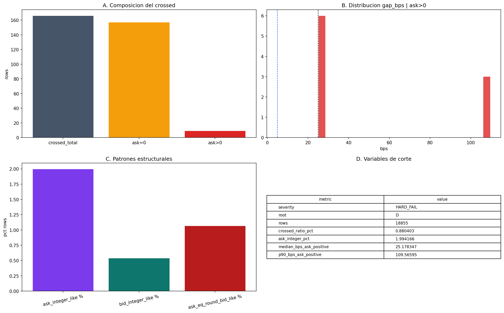

#### 04 Summary Card
Esta tarjeta responde a la pregunta de auditabilidad: cuales son exactamente las variables que sostienen la conclusion. Reune `severity`, `root`, `crossed_ratio_pct`, `ask_integer_pct`, `median_bps_ask_positive` y `p90_bps_ask_positive`. La decision que cambia es pasar de impresion visual a regla verificable. El error que evita es que dos inspectores lleguen a conclusiones distintas mirando la misma imagen sin una base numerica comun. Para gobernanza del proyecto, este panel es el que vuelve reproducible la decision para backtest, ML y auditoria.

---

### 7. NM 2008-05-05

company_name: `Navios Maritime Holdings Inc.`
primary_exchange: `NYSE` (`XNYS`)
market_locale: `stocks/us`
scope: `review`
ticker: `NM`
date: `2008-05-05`
taxonomy: `large_file_threshold_edge_hard_many_crosses`
positive_cross_bucket: `positive_cross_moderate_5to25bps`
severity: `HARD_FAIL`
root: `D`
rows: `12456`
crossed_ratio_pct: `1.525369`
crossed_rows_raw: `190`
crossed_rows_ask_zero: `1`
crossed_rows_ask_positive: `189`
ask_integer_pct: `0.160565`
median_bps_ask_positive: `16.077170`
p90_bps_ask_positive: `40.080160`
file: `D:\quotes\NM\year=2008\month=05\day=05\quotes.parquet`

#### Analisis Forense
La conclusion correcta del caso es que ya existe contradiccion economica real dentro del libro, pero aun no con fuerza suficiente para justificar exclusion dura sin contexto adicional. La taxonomy historica es `large_file_threshold_edge_hard_many_crosses` y el regimen positivo dominante es `moderate 5-25 bps`. Esto importa porque la taxonomy no solo clasifica: resume que tipo de anomalia se esta viendo y que clase de decision contractual puede defenderse despues. La taxonomy `large_file_threshold_edge_hard_many_crosses` implica un libro grande con muchas contradicciones, pero cerca del borde decisional. La dificultad analitica esta en decidir si el volumen de crossed es ruido absorbible o evidencia de degradacion suficientemente seria. El regimen `moderate 5-25 bps` ya entra en zona donde el crossed tiene capacidad real de contaminar simulacion de ejecucion y features microestructurales, aunque todavia puede requerir lectura contextual antes de exclusion dura. En terminos observables, el file tiene `crossed_ratio_pct=1.525369` con `crossed_rows_ask_positive=189` y `crossed_rows_ask_zero=1`. La severidad economica del crossed ask>0 se resume en `median_bps_ask_positive=16.077170` y `p90_bps_ask_positive=40.080160`. Estos dos numeros convierten una forma visual rara en una conclusion operativa sobre si el libro sigue representando o no un mercado negociable. La decision que cambia es pasar de libro sano a libro util solo bajo cautela. `review` significa: no usar como si fuera ejecucion limpia, conservar para analisis contextual y sensibilidad. El error que evita es tratar como normal un episodio que ya contiene contradiccion economica real y contaminar simulaciones de ejecucion o validaciones demasiado optimistas. El patron estructural muestra `ask_integer_pct=0.160565`. Este numero obliga a separar dos explicaciones rivales: contradiccion economica genuina del libro o mezcla con degeneracion estructural / integerizacion. La mayor parte del crossed vive en `ask>0`, de modo que el corazon del problema sigue siendo economico. La parte `ask=0`, si existe, acompana pero no explica por si sola la anomalia. Como `ask_integer_pct` es bajo, la hipotesis de simple degeneracion mecanica pierde fuerza. Eso endurece la interpretacion: el crossed se parece mas a contradiccion economica genuina y menos a artefacto. En la capa de semantica de precio del evento aparecen `daily raw close=125.3000`, `quote mid raw=12.2500`, `quote mid split_normalized=122.5000`, `daily adjusted_proxy=118.6152`. La reconciliacion incluye `future_split_factor=0.1000`. Ademas hay `post_event_dividend_sum=1.8900`. La implicacion metodologica es crucial: una discrepancia entre `quotes`, `daily` y una plataforma externa no puede leerse automaticamente como fallo del dataset. Puede ser semantica de precio distinta. El error que evita esta capa es mezclar raw, split-normalized y adjusted dentro del mismo pipeline, rompiendo auditoria, benchmarking y labels. Para pipelines, esto bloquea su uso como libro sano en ejecucion y features microestructurales principales, aunque aun puede mantenerse para forense, sensibilidad y estudios donde la anomalia sea parte del objeto de investigacion. Existe ademas una imagen historica de certificacion asociada. Su papel es poner el episodio en un marco causal mas amplio: halt, explained, not strongly explained o patron conocido. La regla que protege al proyecto es esta: el contexto externo se usa para explicar por que aparece el episodio, no para absolverlo. El error que evita es degradar el criterio de calidad del libro porque exista una historia plausible alrededor del caso.

#### 00 Event Month Context
Esta imagen responde a la pregunta de persistencia temporal: estamos ante un accidente local o ante una fase mas amplia de inestabilidad. Arriba coloca el evento en la serie `daily` real del mes; abajo compara `crossed_ratio_pct` y `max_gap_bps_pos` del dia contra sus vecinos. La decision que cambia es el peso estructural que se le concede al caso. El error que evita es juzgar igual un shock aislado y una degradacion repetida del libro.

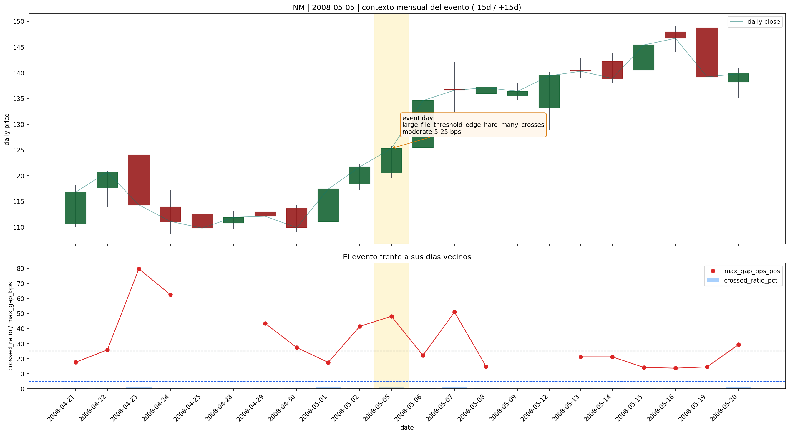

#### 00a Adjusted Proxy Contrast
Esta imagen responde a la pregunta de reconciliacion semantica: la discrepancia de precios viene de datos rotos o de vistas de precio distintas. Compara `daily raw`, `daily adjusted_proxy`, `quote mid raw` y `quote mid split_normalized`, y debajo ensena la cadena de dividendos y splits que produce la diferencia. La decision que cambia es si el inspector debe abrir una incidencia de calidad o cerrar el caso como diferencia legitima de semantica. El error que evita es mezclar series raw y adjusted como si fueran equivalentes. En pipelines reales, esto protege benchmarking, labels diarios y reconciliacion externa frente a falsas alarmas de precio.

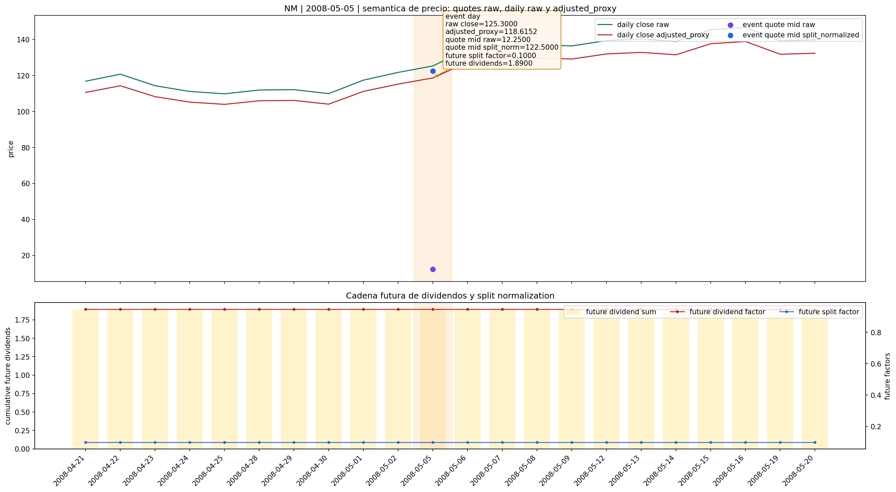

#### 00b Event Month Quotes Context
Esta imagen responde a la pregunta de recurrencia mensual dentro de `quotes`: el problema se concentra en el evento o reaparece en varias sesiones. Arriba concatena sesiones con datos disponibles; abajo resume cobertura diaria, `crossed_ratio_pct` y `max_gap_bps_pos`. La decision que cambia es si el caso debe leerse como episodio puntual o como sintoma de una fase repetida de libro degradado. El error que evita es extrapolar desde un unico dia a todo el mes sin evidencia.

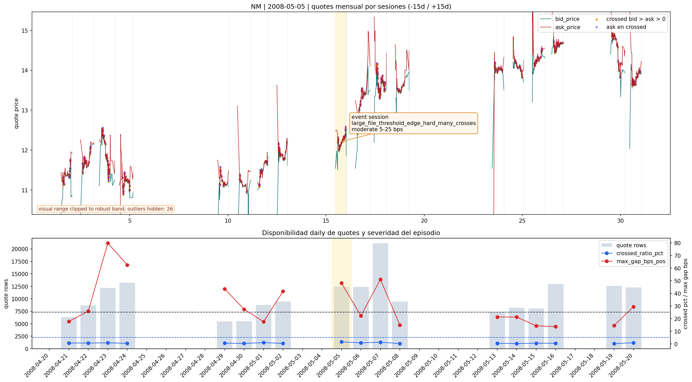

#### 01 Raw Window
Esta imagen responde a la primera pregunta decisiva del caso: el crossed observado es economicamente bastante fuerte para justificar un cambio de clase. Arriba ensena la geometria exacta del tramo conflictivo; abajo convierte esa geometria a bps y la enfrenta a los cortes `5 bps` y `25 bps`. El regimen dominante es `moderate 5-25 bps`. La decision que cambia es pasar de anomalia interpretable a `review` o `bad`. El error que evita es decidir por apariencia visual sin medir el dano economico real del crossed. En terminos de pipeline, este panel decide si el problema afecta solo a la lectura forense o si invalida simulacion de ejecucion y microstructure features.

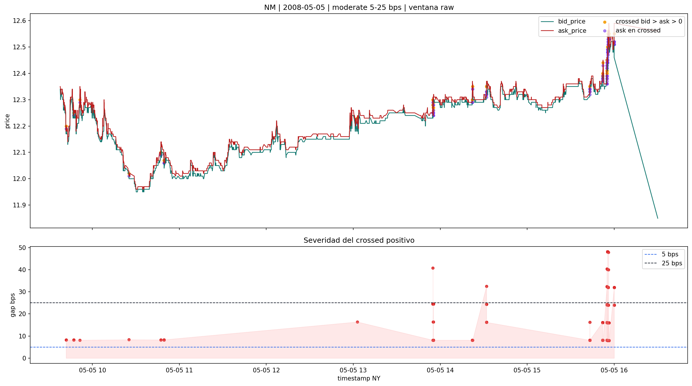

#### 02 Full Session Context
Esta imagen responde a la pregunta de extension intradiaria: el dano esta confinado a un bloque corto o contamina la sesion completa. Arriba se ve toda la sesion `04:00-20:00 NY`; abajo el `gap_bps` firmado. La decision que cambia es si el consumo debe penalizar solo un tramo o desechar el dia entero para uso operativo. El error que evita es tratar una cicatriz local como ruina total o, al reves, minimizar una degradacion distribuida a lo largo del dia. En ejecucion esto decide si la sesion puede seguir usandose con restricciones; en ML decide si las features intradiarias conservan significado economico.

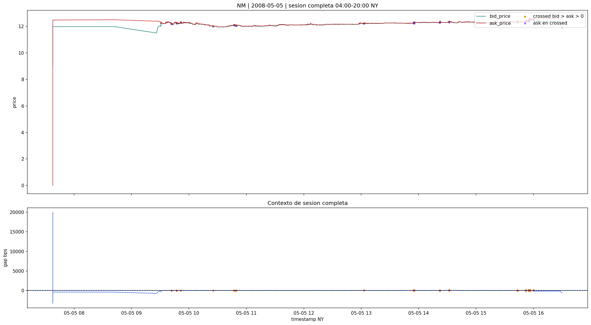

#### 03 Structure Diagnostics
Este panel responde a la pregunta de naturaleza del fallo: contradiccion economica genuina o mezcla con degeneracion estructural. Separa `ask=0` de `ask>0`, muestra la distribucion de `gap_bps` y resume patrones de integerizacion. La decision que cambia es como interpretar el dano: mercado localmente roto, artefacto de representacion o combinacion de ambos. El error que evita es sobrediagnosticar crossed reales cuando parte de la senal proviene de estructura degenerada del libro. Esta lectura afecta directamente a que el caso vaya a exclusion dura, a bandera contextual o a simple reconciliacion tecnica.

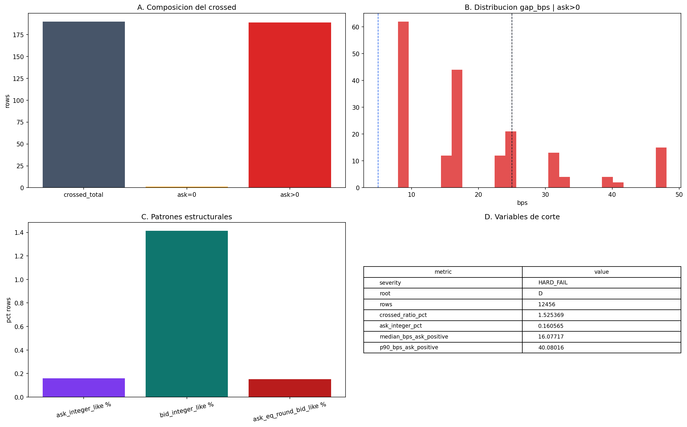

#### 04 Summary Card
Esta tarjeta responde a la pregunta de auditabilidad: cuales son exactamente las variables que sostienen la conclusion. Reune `severity`, `root`, `crossed_ratio_pct`, `ask_integer_pct`, `median_bps_ask_positive` y `p90_bps_ask_positive`. La decision que cambia es pasar de impresion visual a regla verificable. El error que evita es que dos inspectores lleguen a conclusiones distintas mirando la misma imagen sin una base numerica comun. Para gobernanza del proyecto, este panel es el que vuelve reproducible la decision para backtest, ML y auditoria.

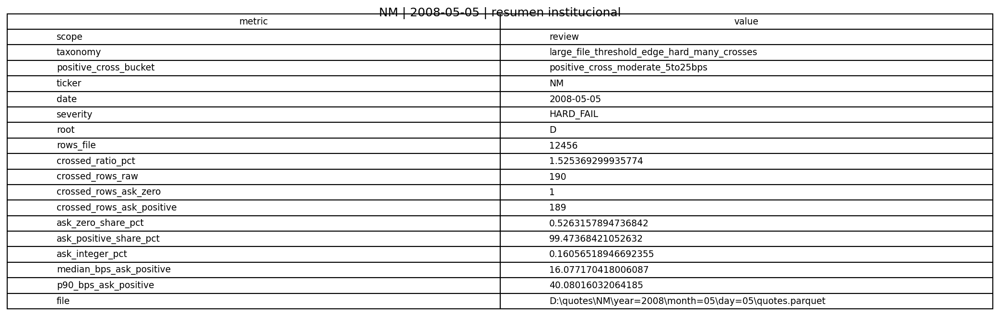

---

### 8. GRPN 2014-08-26

company_name: `Groupon, Inc.Common Stock`
primary_exchange: `NASDAQ` (`XNAS`)
market_locale: `stocks/us`
scope: `review`
ticker: `GRPN`
date: `2014-08-26`
taxonomy: `large_file_threshold_edge_hard_many_crosses`
positive_cross_bucket: `positive_cross_moderate_5to25bps`
severity: `HARD_FAIL`
root: `D`
rows: `40390`
crossed_ratio_pct: `2.297598`
crossed_rows_raw: `928`
crossed_rows_ask_zero: `0`
crossed_rows_ask_positive: `928`
ask_integer_pct: `0.000000`
median_bps_ask_positive: `15.515904`
p90_bps_ask_positive: `15.515904`
file: `D:\quotes\GRPN\year=2014\month=08\day=26\quotes.parquet`

#### Analisis Forense
La conclusion correcta del caso es que ya existe contradiccion economica real dentro del libro, pero aun no con fuerza suficiente para justificar exclusion dura sin contexto adicional. La taxonomy historica es `large_file_threshold_edge_hard_many_crosses` y el regimen positivo dominante es `moderate 5-25 bps`. Esto importa porque la taxonomy no solo clasifica: resume que tipo de anomalia se esta viendo y que clase de decision contractual puede defenderse despues. La taxonomy `large_file_threshold_edge_hard_many_crosses` implica un libro grande con muchas contradicciones, pero cerca del borde decisional. La dificultad analitica esta en decidir si el volumen de crossed es ruido absorbible o evidencia de degradacion suficientemente seria. El regimen `moderate 5-25 bps` ya entra en zona donde el crossed tiene capacidad real de contaminar simulacion de ejecucion y features microestructurales, aunque todavia puede requerir lectura contextual antes de exclusion dura. En terminos observables, el file tiene `crossed_ratio_pct=2.297598` con `crossed_rows_ask_positive=928` y `crossed_rows_ask_zero=0`. La severidad economica del crossed ask>0 se resume en `median_bps_ask_positive=15.515904` y `p90_bps_ask_positive=15.515904`. Estos dos numeros convierten una forma visual rara en una conclusion operativa sobre si el libro sigue representando o no un mercado negociable. La decision que cambia es pasar de libro sano a libro util solo bajo cautela. `review` significa: no usar como si fuera ejecucion limpia, conservar para analisis contextual y sensibilidad. El error que evita es tratar como normal un episodio que ya contiene contradiccion economica real y contaminar simulaciones de ejecucion o validaciones demasiado optimistas. El patron estructural muestra `ask_integer_pct=0.000000`. Este numero obliga a separar dos explicaciones rivales: contradiccion economica genuina del libro o mezcla con degeneracion estructural / integerizacion. Toda la composicion crossed cae en `ask>0`. Eso endurece la lectura economica del caso: el dano no depende de ceros mecanicos, sino de contradiccion positiva dentro de precios aparentemente vivos. Como `ask_integer_pct` es bajo, la hipotesis de simple degeneracion mecanica pierde fuerza. Eso endurece la interpretacion: el crossed se parece mas a contradiccion economica genuina y menos a artefacto. En la capa de semantica de precio del evento aparecen `daily raw close=129.2000`, `quote mid raw=6.4450`, `quote mid split_normalized=128.9000`, `daily adjusted_proxy=129.2000`. La reconciliacion incluye `future_split_factor=0.0500`. La implicacion metodologica es crucial: una discrepancia entre `quotes`, `daily` y una plataforma externa no puede leerse automaticamente como fallo del dataset. Puede ser semantica de precio distinta. El error que evita esta capa es mezclar raw, split-normalized y adjusted dentro del mismo pipeline, rompiendo auditoria, benchmarking y labels. Para pipelines, esto bloquea su uso como libro sano en ejecucion y features microestructurales principales, aunque aun puede mantenerse para forense, sensibilidad y estudios donde la anomalia sea parte del objeto de investigacion. Existe ademas una imagen historica de certificacion asociada. Su papel es poner el episodio en un marco causal mas amplio: halt, explained, not strongly explained o patron conocido. La regla que protege al proyecto es esta: el contexto externo se usa para explicar por que aparece el episodio, no para absolverlo. El error que evita es degradar el criterio de calidad del libro porque exista una historia plausible alrededor del caso.

#### 00 Event Month Context
Esta imagen responde a la pregunta de persistencia temporal: estamos ante un accidente local o ante una fase mas amplia de inestabilidad. Arriba coloca el evento en la serie `daily` real del mes; abajo compara `crossed_ratio_pct` y `max_gap_bps_pos` del dia contra sus vecinos. La decision que cambia es el peso estructural que se le concede al caso. El error que evita es juzgar igual un shock aislado y una degradacion repetida del libro.

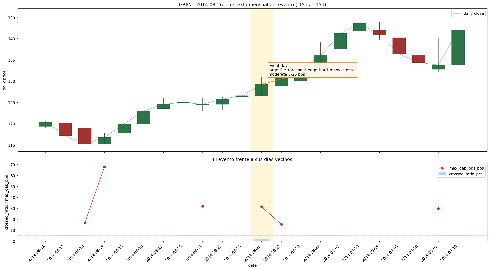

#### 00a Adjusted Proxy Contrast
Esta imagen responde a la pregunta de reconciliacion semantica: la discrepancia de precios viene de datos rotos o de vistas de precio distintas. Compara `daily raw`, `daily adjusted_proxy`, `quote mid raw` y `quote mid split_normalized`, y debajo ensena la cadena de dividendos y splits que produce la diferencia. La decision que cambia es si el inspector debe abrir una incidencia de calidad o cerrar el caso como diferencia legitima de semantica. El error que evita es mezclar series raw y adjusted como si fueran equivalentes. En pipelines reales, esto protege benchmarking, labels diarios y reconciliacion externa frente a falsas alarmas de precio.

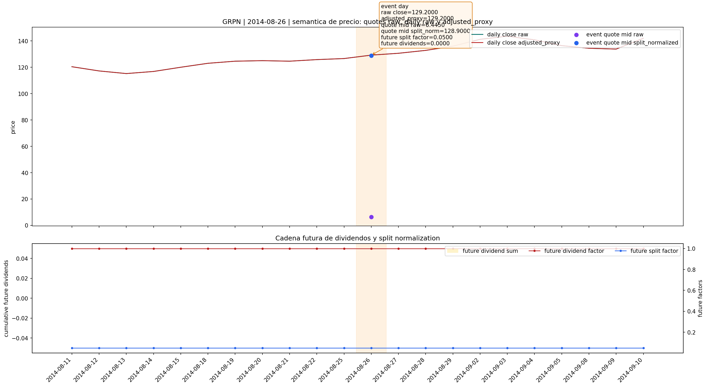

#### 00b Event Month Quotes Context
Esta imagen responde a la pregunta de recurrencia mensual dentro de `quotes`: el problema se concentra en el evento o reaparece en varias sesiones. Arriba concatena sesiones con datos disponibles; abajo resume cobertura diaria, `crossed_ratio_pct` y `max_gap_bps_pos`. La decision que cambia es si el caso debe leerse como episodio puntual o como sintoma de una fase repetida de libro degradado. El error que evita es extrapolar desde un unico dia a todo el mes sin evidencia.

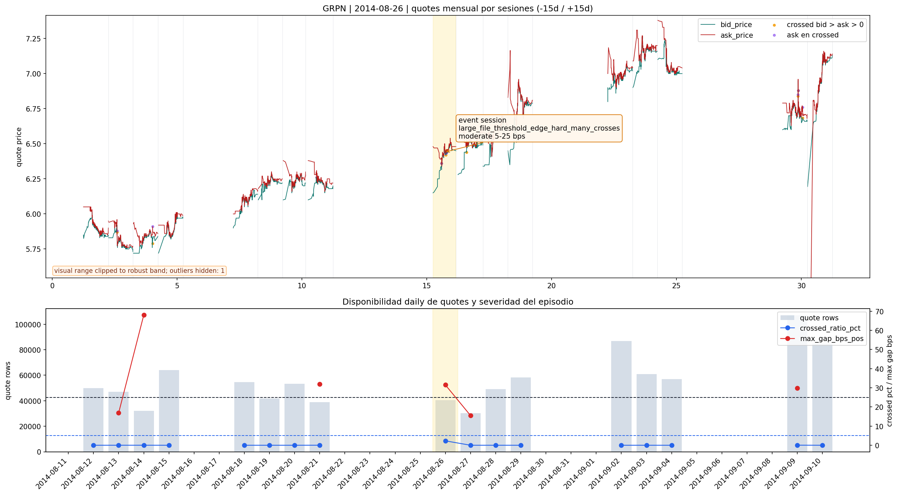

#### 01 Raw Window
Esta imagen responde a la primera pregunta decisiva del caso: el crossed observado es economicamente bastante fuerte para justificar un cambio de clase. Arriba ensena la geometria exacta del tramo conflictivo; abajo convierte esa geometria a bps y la enfrenta a los cortes `5 bps` y `25 bps`. El regimen dominante es `moderate 5-25 bps`. La decision que cambia es pasar de anomalia interpretable a `review` o `bad`. El error que evita es decidir por apariencia visual sin medir el dano economico real del crossed. En terminos de pipeline, este panel decide si el problema afecta solo a la lectura forense o si invalida simulacion de ejecucion y microstructure features.

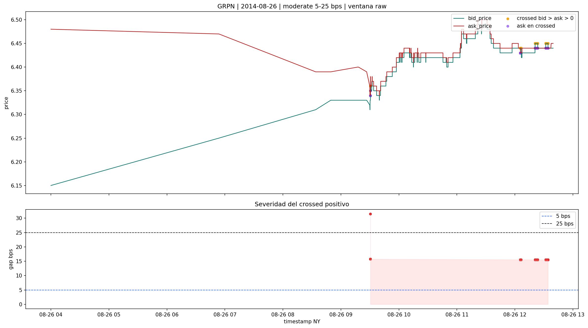

#### 02 Full Session Context
Esta imagen responde a la pregunta de extension intradiaria: el dano esta confinado a un bloque corto o contamina la sesion completa. Arriba se ve toda la sesion `04:00-20:00 NY`; abajo el `gap_bps` firmado. La decision que cambia es si el consumo debe penalizar solo un tramo o desechar el dia entero para uso operativo. El error que evita es tratar una cicatriz local como ruina total o, al reves, minimizar una degradacion distribuida a lo largo del dia. En ejecucion esto decide si la sesion puede seguir usandose con restricciones; en ML decide si las features intradiarias conservan significado economico.

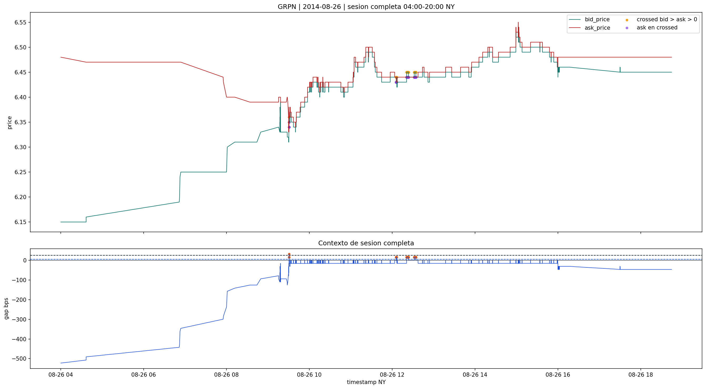

#### 03 Structure Diagnostics
Este panel responde a la pregunta de naturaleza del fallo: contradiccion economica genuina o mezcla con degeneracion estructural. Separa `ask=0` de `ask>0`, muestra la distribucion de `gap_bps` y resume patrones de integerizacion. La decision que cambia es como interpretar el dano: mercado localmente roto, artefacto de representacion o combinacion de ambos. El error que evita es sobrediagnosticar crossed reales cuando parte de la senal proviene de estructura degenerada del libro. Esta lectura afecta directamente a que el caso vaya a exclusion dura, a bandera contextual o a simple reconciliacion tecnica.

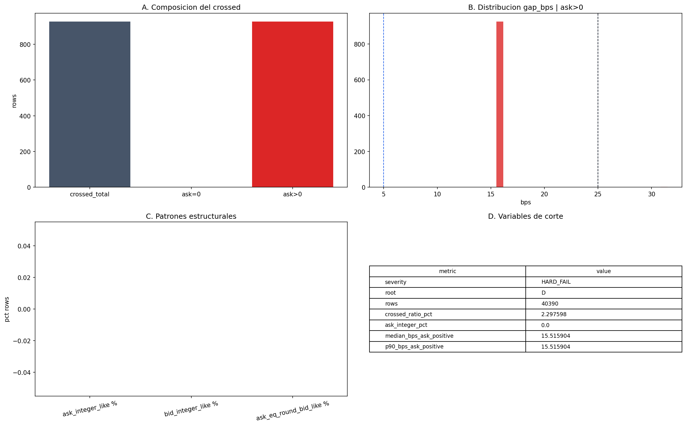

#### 04 Summary Card
Esta tarjeta responde a la pregunta de auditabilidad: cuales son exactamente las variables que sostienen la conclusion. Reune `severity`, `root`, `crossed_ratio_pct`, `ask_integer_pct`, `median_bps_ask_positive` y `p90_bps_ask_positive`. La decision que cambia es pasar de impresion visual a regla verificable. El error que evita es que dos inspectores lleguen a conclusiones distintas mirando la misma imagen sin una base numerica comun. Para gobernanza del proyecto, este panel es el que vuelve reproducible la decision para backtest, ML y auditoria.

---

### 9. TG 2008-01-07

company_name: `Tredegar Corporation`
primary_exchange: `NYSE` (`XNYS`)
market_locale: `stocks/us`
scope: `review`
ticker: `TG`
date: `2008-01-07`
taxonomy: `large_file_threshold_edge_hard_many_crosses`
positive_cross_bucket: `positive_cross_moderate_5to25bps`
severity: `HARD_FAIL`
root: `C`
rows: `9293`
crossed_ratio_pct: `1.850855`
crossed_rows_raw: `172`
crossed_rows_ask_zero: `1`
crossed_rows_ask_positive: `171`
ask_integer_pct: `0.075326`
median_bps_ask_positive: `13.605442`
p90_bps_ask_positive: `20.470829`
file: `C:\TSIS_Data\data\quotes\TG\year=2008\month=01\day=07\quotes.parquet`

#### Analisis Forense
La conclusion correcta del caso es que ya existe contradiccion economica real dentro del libro, pero aun no con fuerza suficiente para justificar exclusion dura sin contexto adicional. La taxonomy historica es `large_file_threshold_edge_hard_many_crosses` y el regimen positivo dominante es `moderate 5-25 bps`. Esto importa porque la taxonomy no solo clasifica: resume que tipo de anomalia se esta viendo y que clase de decision contractual puede defenderse despues. La taxonomy `large_file_threshold_edge_hard_many_crosses` implica un libro grande con muchas contradicciones, pero cerca del borde decisional. La dificultad analitica esta en decidir si el volumen de crossed es ruido absorbible o evidencia de degradacion suficientemente seria. El regimen `moderate 5-25 bps` ya entra en zona donde el crossed tiene capacidad real de contaminar simulacion de ejecucion y features microestructurales, aunque todavia puede requerir lectura contextual antes de exclusion dura. En terminos observables, el file tiene `crossed_ratio_pct=1.850855` con `crossed_rows_ask_positive=171` y `crossed_rows_ask_zero=1`. La severidad economica del crossed ask>0 se resume en `median_bps_ask_positive=13.605442` y `p90_bps_ask_positive=20.470829`. Estos dos numeros convierten una forma visual rara en una conclusion operativa sobre si el libro sigue representando o no un mercado negociable. La decision que cambia es pasar de libro sano a libro util solo bajo cautela. `review` significa: no usar como si fuera ejecucion limpia, conservar para analisis contextual y sensibilidad. El error que evita es tratar como normal un episodio que ya contiene contradiccion economica real y contaminar simulaciones de ejecucion o validaciones demasiado optimistas. El patron estructural muestra `ask_integer_pct=0.075326`. Este numero obliga a separar dos explicaciones rivales: contradiccion economica genuina del libro o mezcla con degeneracion estructural / integerizacion. La mayor parte del crossed vive en `ask>0`, de modo que el corazon del problema sigue siendo economico. La parte `ask=0`, si existe, acompana pero no explica por si sola la anomalia. Como `ask_integer_pct` es bajo, la hipotesis de simple degeneracion mecanica pierde fuerza. Eso endurece la interpretacion: el crossed se parece mas a contradiccion economica genuina y menos a artefacto. En la capa de semantica de precio del evento aparecen `daily raw close=14.6900`, `quote mid raw=14.6800`, `quote mid split_normalized=14.6800`, `daily adjusted_proxy=6.1613`. Ademas hay `post_event_dividend_sum=12.1400`. La implicacion metodologica es crucial: una discrepancia entre `quotes`, `daily` y una plataforma externa no puede leerse automaticamente como fallo del dataset. Puede ser semantica de precio distinta. El error que evita esta capa es mezclar raw, split-normalized y adjusted dentro del mismo pipeline, rompiendo auditoria, benchmarking y labels. Para pipelines, esto bloquea su uso como libro sano en ejecucion y features microestructurales principales, aunque aun puede mantenerse para forense, sensibilidad y estudios donde la anomalia sea parte del objeto de investigacion. Existe ademas una imagen historica de certificacion asociada. Su papel es poner el episodio en un marco causal mas amplio: halt, explained, not strongly explained o patron conocido. La regla que protege al proyecto es esta: el contexto externo se usa para explicar por que aparece el episodio, no para absolverlo. El error que evita es degradar el criterio de calidad del libro porque exista una historia plausible alrededor del caso.

#### 00 Event Month Context
Esta imagen responde a la pregunta de persistencia temporal: estamos ante un accidente local o ante una fase mas amplia de inestabilidad. Arriba coloca el evento en la serie `daily` real del mes; abajo compara `crossed_ratio_pct` y `max_gap_bps_pos` del dia contra sus vecinos. La decision que cambia es el peso estructural que se le concede al caso. El error que evita es juzgar igual un shock aislado y una degradacion repetida del libro.

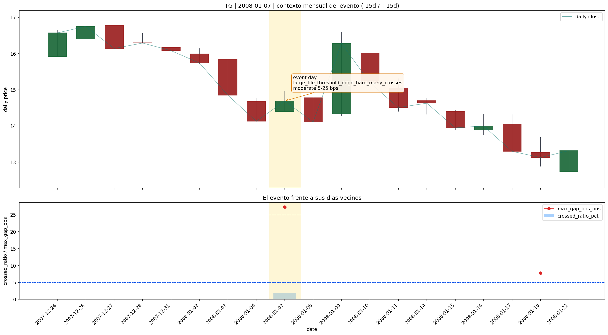

#### 00a Adjusted Proxy Contrast
Esta imagen responde a la pregunta de reconciliacion semantica: la discrepancia de precios viene de datos rotos o de vistas de precio distintas. Compara `daily raw`, `daily adjusted_proxy`, `quote mid raw` y `quote mid split_normalized`, y debajo ensena la cadena de dividendos y splits que produce la diferencia. La decision que cambia es si el inspector debe abrir una incidencia de calidad o cerrar el caso como diferencia legitima de semantica. El error que evita es mezclar series raw y adjusted como si fueran equivalentes. En pipelines reales, esto protege benchmarking, labels diarios y reconciliacion externa frente a falsas alarmas de precio.

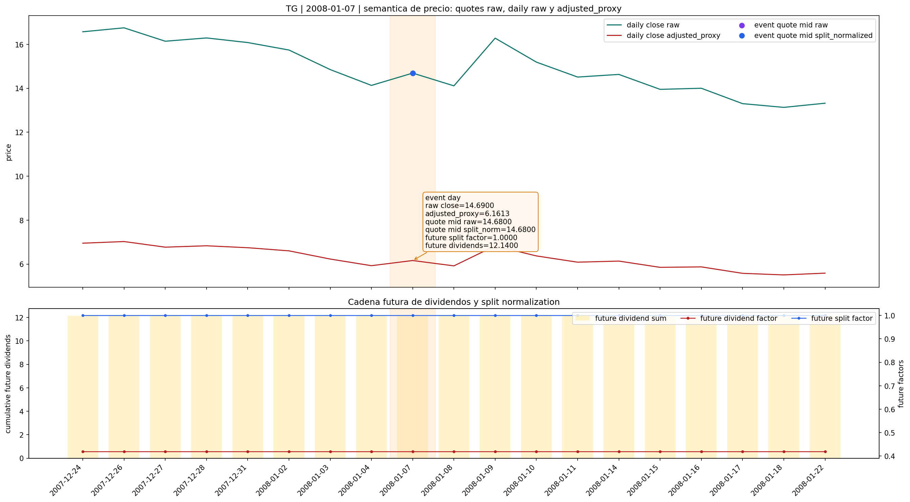

#### 00b Event Month Quotes Context
Esta imagen responde a la pregunta de recurrencia mensual dentro de `quotes`: el problema se concentra en el evento o reaparece en varias sesiones. Arriba concatena sesiones con datos disponibles; abajo resume cobertura diaria, `crossed_ratio_pct` y `max_gap_bps_pos`. La decision que cambia es si el caso debe leerse como episodio puntual o como sintoma de una fase repetida de libro degradado. El error que evita es extrapolar desde un unico dia a todo el mes sin evidencia.

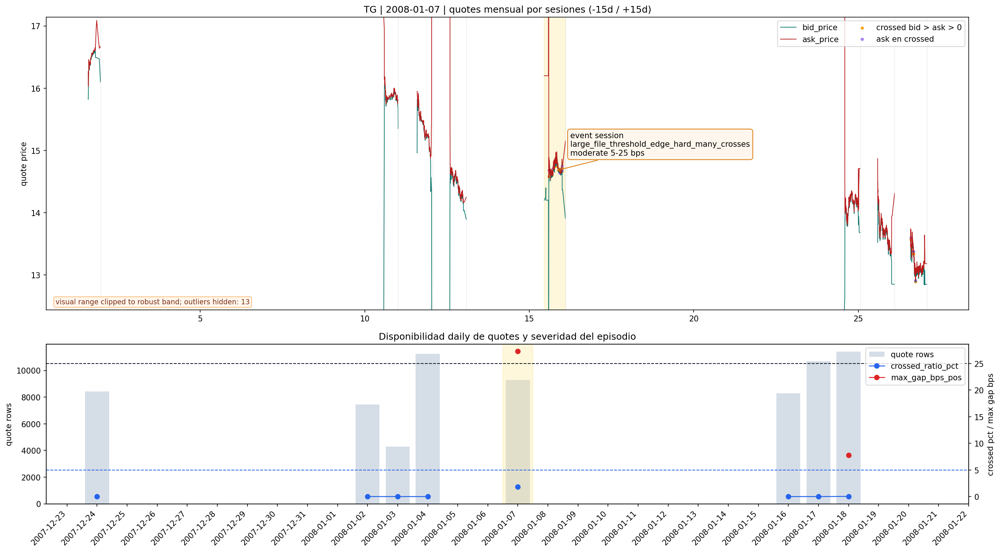

#### 01 Raw Window
Esta imagen responde a la primera pregunta decisiva del caso: el crossed observado es economicamente bastante fuerte para justificar un cambio de clase. Arriba ensena la geometria exacta del tramo conflictivo; abajo convierte esa geometria a bps y la enfrenta a los cortes `5 bps` y `25 bps`. El regimen dominante es `moderate 5-25 bps`. La decision que cambia es pasar de anomalia interpretable a `review` o `bad`. El error que evita es decidir por apariencia visual sin medir el dano economico real del crossed. En terminos de pipeline, este panel decide si el problema afecta solo a la lectura forense o si invalida simulacion de ejecucion y microstructure features.

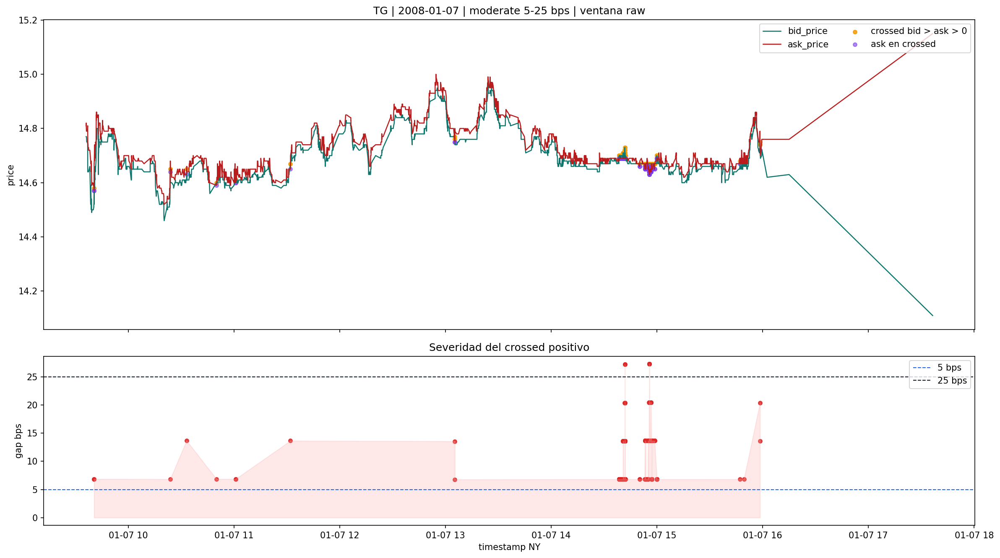

#### 02 Full Session Context
Esta imagen responde a la pregunta de extension intradiaria: el dano esta confinado a un bloque corto o contamina la sesion completa. Arriba se ve toda la sesion `04:00-20:00 NY`; abajo el `gap_bps` firmado. La decision que cambia es si el consumo debe penalizar solo un tramo o desechar el dia entero para uso operativo. El error que evita es tratar una cicatriz local como ruina total o, al reves, minimizar una degradacion distribuida a lo largo del dia. En ejecucion esto decide si la sesion puede seguir usandose con restricciones; en ML decide si las features intradiarias conservan significado economico.

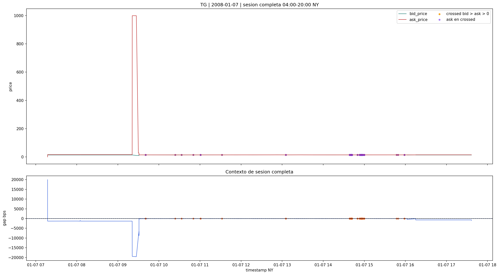

#### 03 Structure Diagnostics
Este panel responde a la pregunta de naturaleza del fallo: contradiccion economica genuina o mezcla con degeneracion estructural. Separa `ask=0` de `ask>0`, muestra la distribucion de `gap_bps` y resume patrones de integerizacion. La decision que cambia es como interpretar el dano: mercado localmente roto, artefacto de representacion o combinacion de ambos. El error que evita es sobrediagnosticar crossed reales cuando parte de la senal proviene de estructura degenerada del libro. Esta lectura afecta directamente a que el caso vaya a exclusion dura, a bandera contextual o a simple reconciliacion tecnica.

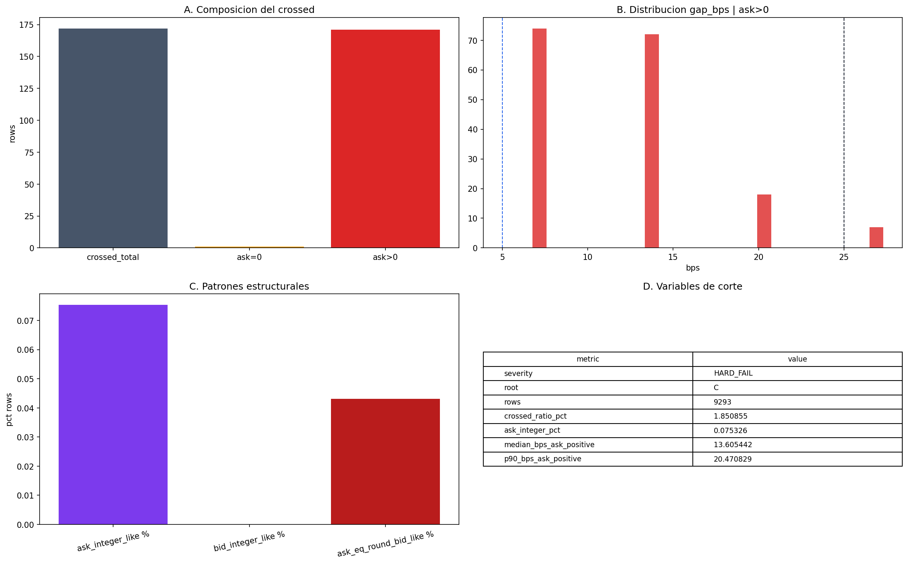

#### 04 Summary Card
Esta tarjeta responde a la pregunta de auditabilidad: cuales son exactamente las variables que sostienen la conclusion. Reune `severity`, `root`, `crossed_ratio_pct`, `ask_integer_pct`, `median_bps_ask_positive` y `p90_bps_ask_positive`. La decision que cambia es pasar de impresion visual a regla verificable. El error que evita es que dos inspectores lleguen a conclusiones distintas mirando la misma imagen sin una base numerica comun. Para gobernanza del proyecto, este panel es el que vuelve reproducible la decision para backtest, ML y auditoria.

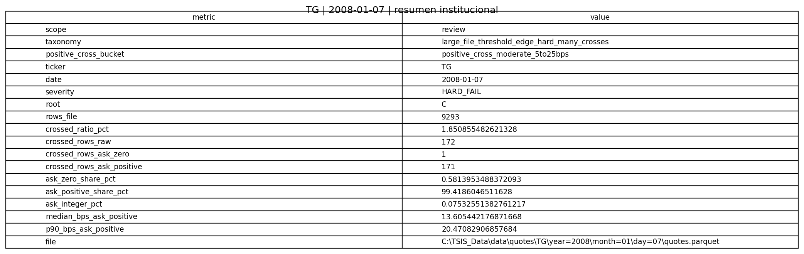

---

### 10. YRCW 2011-05-23

company_name: `YRC Worldwide, Inc.`
primary_exchange: `NASDAQ` (`XNAS`)
market_locale: `stocks/us`
scope: `review`
ticker: `YRCW`
date: `2011-05-23`
taxonomy: `large_file_threshold_edge_hard_many_crosses`
positive_cross_bucket: `positive_cross_moderate_5to25bps`
severity: `HARD_FAIL`
root: `D`
rows: `10631`
crossed_ratio_pct: `2.332800`
crossed_rows_raw: `248`
crossed_rows_ask_zero: `0`
crossed_rows_ask_positive: `248`
ask_integer_pct: `0.000000`
median_bps_ask_positive: `12.507817`
p90_bps_ask_positive: `12.507817`
file: `D:\quotes\YRCW\year=2011\month=05\day=23\quotes.parquet`

#### Analisis Forense
La conclusion correcta del caso es que ya existe contradiccion economica real dentro del libro, pero aun no con fuerza suficiente para justificar exclusion dura sin contexto adicional. La taxonomy historica es `large_file_threshold_edge_hard_many_crosses` y el regimen positivo dominante es `moderate 5-25 bps`. Esto importa porque la taxonomy no solo clasifica: resume que tipo de anomalia se esta viendo y que clase de decision contractual puede defenderse despues. La taxonomy `large_file_threshold_edge_hard_many_crosses` implica un libro grande con muchas contradicciones, pero cerca del borde decisional. La dificultad analitica esta en decidir si el volumen de crossed es ruido absorbible o evidencia de degradacion suficientemente seria. El regimen `moderate 5-25 bps` ya entra en zona donde el crossed tiene capacidad real de contaminar simulacion de ejecucion y features microestructurales, aunque todavia puede requerir lectura contextual antes de exclusion dura. En terminos observables, el file tiene `crossed_ratio_pct=2.332800` con `crossed_rows_ask_positive=248` y `crossed_rows_ask_zero=0`. La severidad economica del crossed ask>0 se resume en `median_bps_ask_positive=12.507817` y `p90_bps_ask_positive=12.507817`. Estos dos numeros convierten una forma visual rara en una conclusion operativa sobre si el libro sigue representando o no un mercado negociable. La decision que cambia es pasar de libro sano a libro util solo bajo cautela. `review` significa: no usar como si fuera ejecucion limpia, conservar para analisis contextual y sensibilidad. El error que evita es tratar como normal un episodio que ya contiene contradiccion economica real y contaminar simulaciones de ejecucion o validaciones demasiado optimistas. El patron estructural muestra `ask_integer_pct=0.000000`. Este numero obliga a separar dos explicaciones rivales: contradiccion economica genuina del libro o mezcla con degeneracion estructural / integerizacion. Toda la composicion crossed cae en `ask>0`. Eso endurece la lectura economica del caso: el dano no depende de ceros mecanicos, sino de contradiccion positiva dentro de precios aparentemente vivos. Como `ask_integer_pct` es bajo, la hipotesis de simple degeneracion mecanica pierde fuerza. Eso endurece la interpretacion: el crossed se parece mas a contradiccion economica genuina y menos a artefacto. En la capa de semantica de precio del evento aparecen `daily raw close=242.2500`, `quote mid raw=0.8090`, `quote mid split_normalized=242.6850`, `daily adjusted_proxy=242.2500`. La reconciliacion incluye `future_split_factor=0.0033`. La implicacion metodologica es crucial: una discrepancia entre `quotes`, `daily` y una plataforma externa no puede leerse automaticamente como fallo del dataset. Puede ser semantica de precio distinta. El error que evita esta capa es mezclar raw, split-normalized y adjusted dentro del mismo pipeline, rompiendo auditoria, benchmarking y labels. Para pipelines, esto bloquea su uso como libro sano en ejecucion y features microestructurales principales, aunque aun puede mantenerse para forense, sensibilidad y estudios donde la anomalia sea parte del objeto de investigacion. Existe ademas una imagen historica de certificacion asociada. Su papel es poner el episodio en un marco causal mas amplio: halt, explained, not strongly explained o patron conocido. La regla que protege al proyecto es esta: el contexto externo se usa para explicar por que aparece el episodio, no para absolverlo. El error que evita es degradar el criterio de calidad del libro porque exista una historia plausible alrededor del caso.

#### 00 Event Month Context
Esta imagen responde a la pregunta de persistencia temporal: estamos ante un accidente local o ante una fase mas amplia de inestabilidad. Arriba coloca el evento en la serie `daily` real del mes; abajo compara `crossed_ratio_pct` y `max_gap_bps_pos` del dia contra sus vecinos. La decision que cambia es el peso estructural que se le concede al caso. El error que evita es juzgar igual un shock aislado y una degradacion repetida del libro.

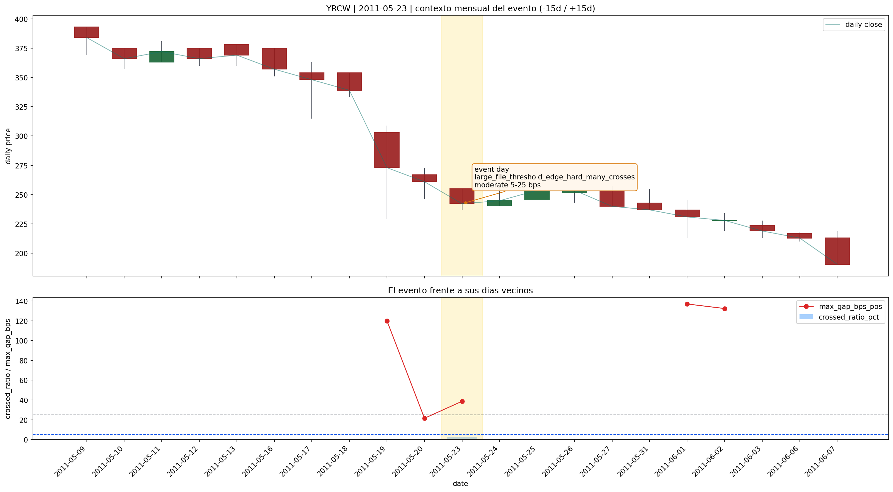

#### 00a Adjusted Proxy Contrast
Esta imagen responde a la pregunta de reconciliacion semantica: la discrepancia de precios viene de datos rotos o de vistas de precio distintas. Compara `daily raw`, `daily adjusted_proxy`, `quote mid raw` y `quote mid split_normalized`, y debajo ensena la cadena de dividendos y splits que produce la diferencia. La decision que cambia es si el inspector debe abrir una incidencia de calidad o cerrar el caso como diferencia legitima de semantica. El error que evita es mezclar series raw y adjusted como si fueran equivalentes. En pipelines reales, esto protege benchmarking, labels diarios y reconciliacion externa frente a falsas alarmas de precio.

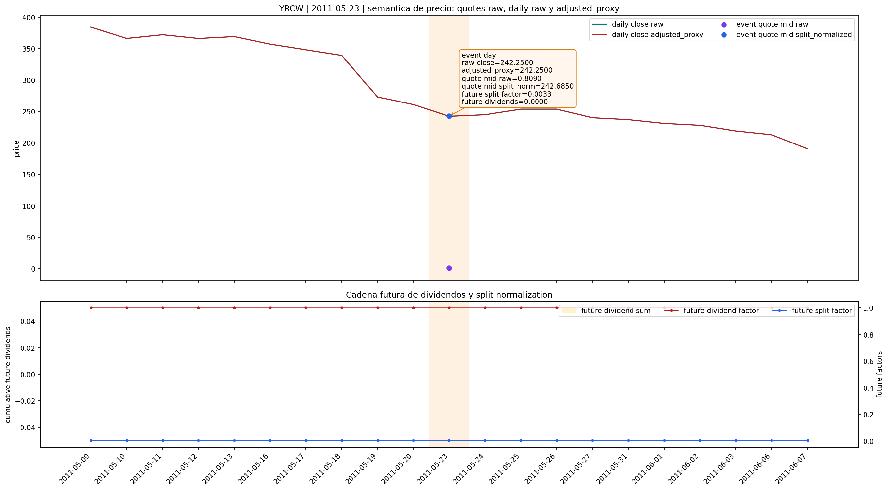

#### 00b Event Month Quotes Context
Esta imagen responde a la pregunta de recurrencia mensual dentro de `quotes`: el problema se concentra en el evento o reaparece en varias sesiones. Arriba concatena sesiones con datos disponibles; abajo resume cobertura diaria, `crossed_ratio_pct` y `max_gap_bps_pos`. La decision que cambia es si el caso debe leerse como episodio puntual o como sintoma de una fase repetida de libro degradado. El error que evita es extrapolar desde un unico dia a todo el mes sin evidencia.

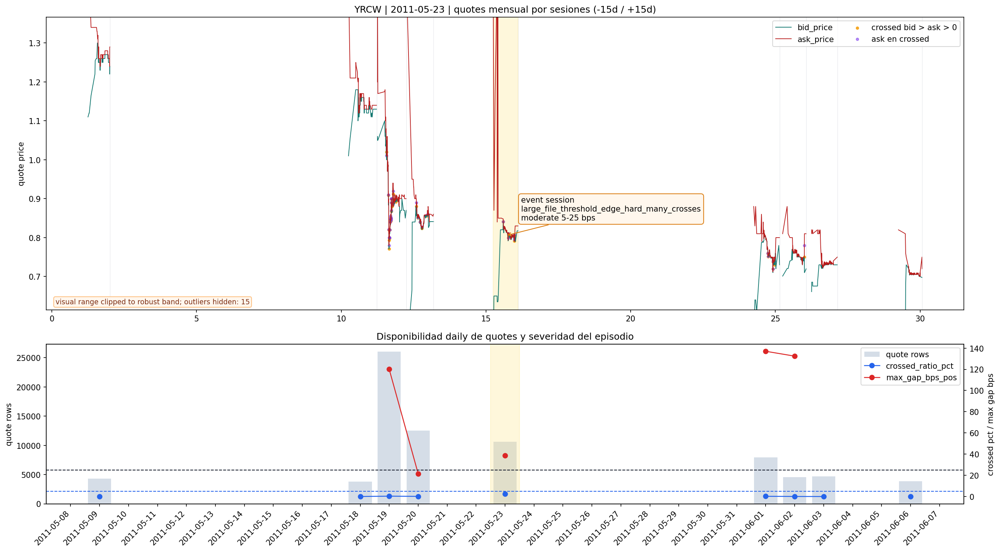

#### 01 Raw Window
Esta imagen responde a la primera pregunta decisiva del caso: el crossed observado es economicamente bastante fuerte para justificar un cambio de clase. Arriba ensena la geometria exacta del tramo conflictivo; abajo convierte esa geometria a bps y la enfrenta a los cortes `5 bps` y `25 bps`. El regimen dominante es `moderate 5-25 bps`. La decision que cambia es pasar de anomalia interpretable a `review` o `bad`. El error que evita es decidir por apariencia visual sin medir el dano economico real del crossed. En terminos de pipeline, este panel decide si el problema afecta solo a la lectura forense o si invalida simulacion de ejecucion y microstructure features.

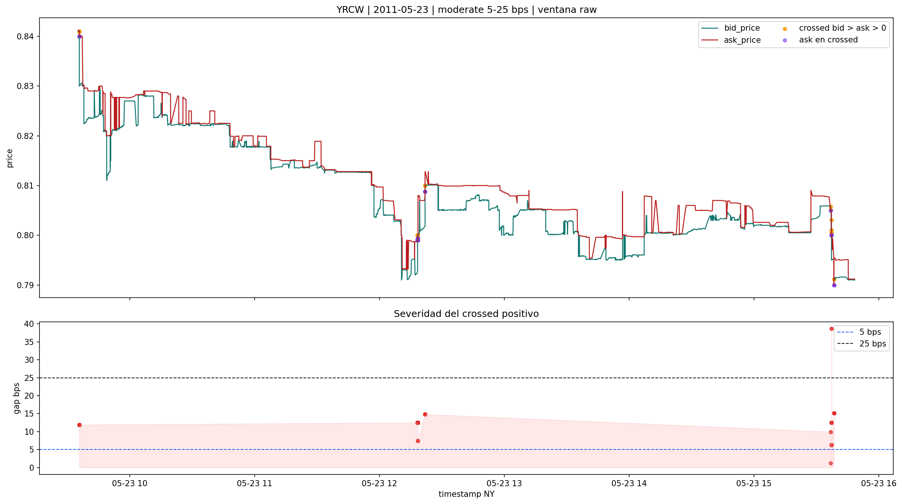

#### 02 Full Session Context
Esta imagen responde a la pregunta de extension intradiaria: el dano esta confinado a un bloque corto o contamina la sesion completa. Arriba se ve toda la sesion `04:00-20:00 NY`; abajo el `gap_bps` firmado. La decision que cambia es si el consumo debe penalizar solo un tramo o desechar el dia entero para uso operativo. El error que evita es tratar una cicatriz local como ruina total o, al reves, minimizar una degradacion distribuida a lo largo del dia. En ejecucion esto decide si la sesion puede seguir usandose con restricciones; en ML decide si las features intradiarias conservan significado economico.

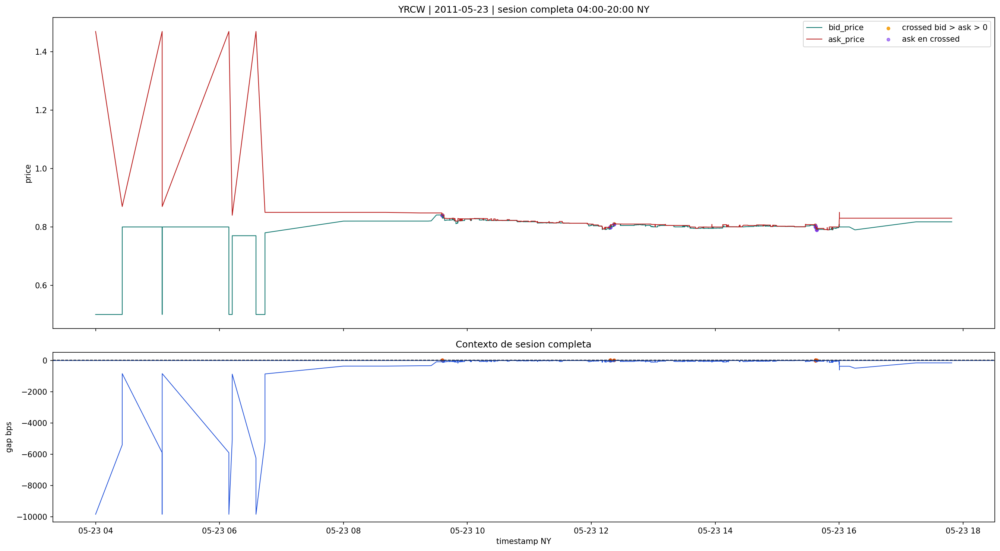

#### 03 Structure Diagnostics
Este panel responde a la pregunta de naturaleza del fallo: contradiccion economica genuina o mezcla con degeneracion estructural. Separa `ask=0` de `ask>0`, muestra la distribucion de `gap_bps` y resume patrones de integerizacion. La decision que cambia es como interpretar el dano: mercado localmente roto, artefacto de representacion o combinacion de ambos. El error que evita es sobrediagnosticar crossed reales cuando parte de la senal proviene de estructura degenerada del libro. Esta lectura afecta directamente a que el caso vaya a exclusion dura, a bandera contextual o a simple reconciliacion tecnica.

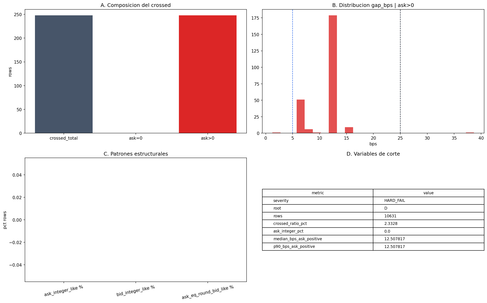

#### 04 Summary Card
Esta tarjeta responde a la pregunta de auditabilidad: cuales son exactamente las variables que sostienen la conclusion. Reune `severity`, `root`, `crossed_ratio_pct`, `ask_integer_pct`, `median_bps_ask_positive` y `p90_bps_ask_positive`. La decision que cambia es pasar de impresion visual a regla verificable. El error que evita es que dos inspectores lleguen a conclusiones distintas mirando la misma imagen sin una base numerica comun. Para gobernanza del proyecto, este panel es el que vuelve reproducible la decision para backtest, ML y auditoria.

---

### 11. ISR 2018-07-10

company_name: `IsoRay, Inc.`
primary_exchange: `NYSE American` (`XASE`)
market_locale: `stocks/us`
scope: `review`
ticker: `ISR`
date: `2018-07-10`
taxonomy: `large_file_threshold_edge_hard_many_crosses`
positive_cross_bucket: `positive_cross_moderate_5to25bps`
severity: `HARD_FAIL`
root: `D`
rows: `8816`
crossed_ratio_pct: `1.814882`
crossed_rows_raw: `160`
crossed_rows_ask_zero: `0`
crossed_rows_ask_positive: `160`
ask_integer_pct: `0.000000`
median_bps_ask_positive: `11.386280`
p90_bps_ask_positive: `110.795455`
file: `D:\quotes\ISR\year=2018\month=07\day=10\quotes.parquet`

#### Analisis Forense
La conclusion correcta del caso es que ya existe contradiccion economica real dentro del libro, pero aun no con fuerza suficiente para justificar exclusion dura sin contexto adicional. La taxonomy historica es `large_file_threshold_edge_hard_many_crosses` y el regimen positivo dominante es `moderate 5-25 bps`. Esto importa porque la taxonomy no solo clasifica: resume que tipo de anomalia se esta viendo y que clase de decision contractual puede defenderse despues. La taxonomy `large_file_threshold_edge_hard_many_crosses` implica un libro grande con muchas contradicciones, pero cerca del borde decisional. La dificultad analitica esta en decidir si el volumen de crossed es ruido absorbible o evidencia de degradacion suficientemente seria. El regimen `moderate 5-25 bps` ya entra en zona donde el crossed tiene capacidad real de contaminar simulacion de ejecucion y features microestructurales, aunque todavia puede requerir lectura contextual antes de exclusion dura. En terminos observables, el file tiene `crossed_ratio_pct=1.814882` con `crossed_rows_ask_positive=160` y `crossed_rows_ask_zero=0`. La severidad economica del crossed ask>0 se resume en `median_bps_ask_positive=11.386280` y `p90_bps_ask_positive=110.795455`. Estos dos numeros convierten una forma visual rara en una conclusion operativa sobre si el libro sigue representando o no un mercado negociable. La decision que cambia es pasar de libro sano a libro util solo bajo cautela. `review` significa: no usar como si fuera ejecucion limpia, conservar para analisis contextual y sensibilidad. El error que evita es tratar como normal un episodio que ya contiene contradiccion economica real y contaminar simulaciones de ejecucion o validaciones demasiado optimistas. El patron estructural muestra `ask_integer_pct=0.000000`. Este numero obliga a separar dos explicaciones rivales: contradiccion economica genuina del libro o mezcla con degeneracion estructural / integerizacion. Toda la composicion crossed cae en `ask>0`. Eso endurece la lectura economica del caso: el dano no depende de ceros mecanicos, sino de contradiccion positiva dentro de precios aparentemente vivos. Como `ask_integer_pct` es bajo, la hipotesis de simple degeneracion mecanica pierde fuerza. Eso endurece la interpretacion: el crossed se parece mas a contradiccion economica genuina y menos a artefacto. Existe ademas una imagen historica de certificacion asociada. Su papel es poner el episodio en un marco causal mas amplio: halt, explained, not strongly explained o patron conocido. La regla que protege al proyecto es esta: el contexto externo se usa para explicar por que aparece el episodio, no para absolverlo. El error que evita es degradar el criterio de calidad del libro porque exista una historia plausible alrededor del caso.

#### 00 Event Month Context
Esta imagen responde a la pregunta de persistencia temporal: estamos ante un accidente local o ante una fase mas amplia de inestabilidad. Arriba coloca el evento en la serie `daily` real del mes; abajo compara `crossed_ratio_pct` y `max_gap_bps_pos` del dia contra sus vecinos. La decision que cambia es el peso estructural que se le concede al caso. El error que evita es juzgar igual un shock aislado y una degradacion repetida del libro.

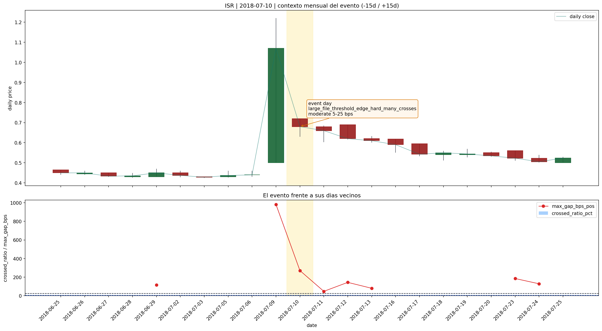

#### 00b Event Month Quotes Context
Esta imagen responde a la pregunta de recurrencia mensual dentro de `quotes`: el problema se concentra en el evento o reaparece en varias sesiones. Arriba concatena sesiones con datos disponibles; abajo resume cobertura diaria, `crossed_ratio_pct` y `max_gap_bps_pos`. La decision que cambia es si el caso debe leerse como episodio puntual o como sintoma de una fase repetida de libro degradado. El error que evita es extrapolar desde un unico dia a todo el mes sin evidencia.

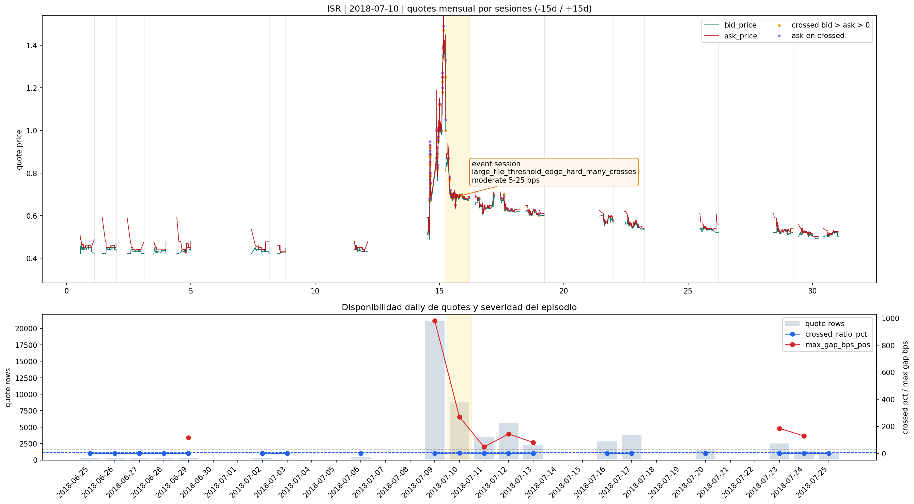

#### 01 Raw Window
Esta imagen responde a la primera pregunta decisiva del caso: el crossed observado es economicamente bastante fuerte para justificar un cambio de clase. Arriba ensena la geometria exacta del tramo conflictivo; abajo convierte esa geometria a bps y la enfrenta a los cortes `5 bps` y `25 bps`. El regimen dominante es `moderate 5-25 bps`. La decision que cambia es pasar de anomalia interpretable a `review` o `bad`. El error que evita es decidir por apariencia visual sin medir el dano economico real del crossed. En terminos de pipeline, este panel decide si el problema afecta solo a la lectura forense o si invalida simulacion de ejecucion y microstructure features.

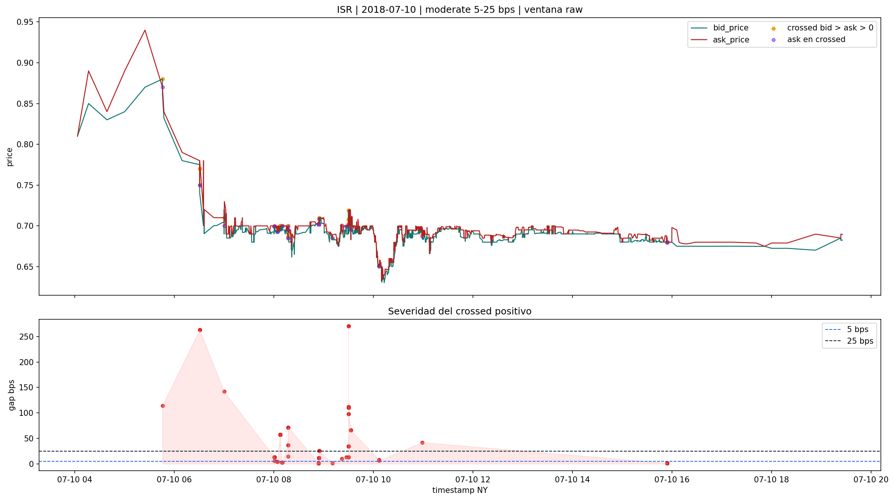

#### 02 Full Session Context
Esta imagen responde a la pregunta de extension intradiaria: el dano esta confinado a un bloque corto o contamina la sesion completa. Arriba se ve toda la sesion `04:00-20:00 NY`; abajo el `gap_bps` firmado. La decision que cambia es si el consumo debe penalizar solo un tramo o desechar el dia entero para uso operativo. El error que evita es tratar una cicatriz local como ruina total o, al reves, minimizar una degradacion distribuida a lo largo del dia. En ejecucion esto decide si la sesion puede seguir usandose con restricciones; en ML decide si las features intradiarias conservan significado economico.

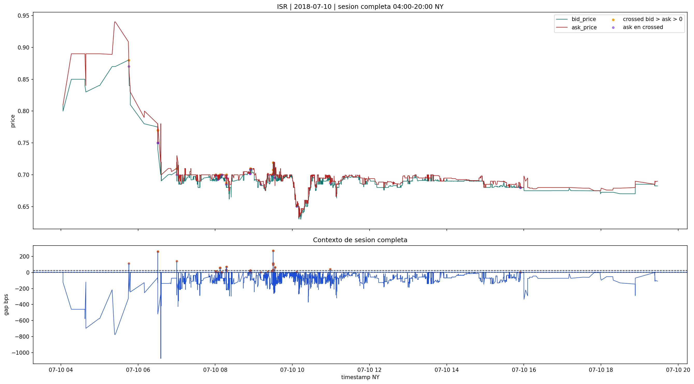

#### 03 Structure Diagnostics
Este panel responde a la pregunta de naturaleza del fallo: contradiccion economica genuina o mezcla con degeneracion estructural. Separa `ask=0` de `ask>0`, muestra la distribucion de `gap_bps` y resume patrones de integerizacion. La decision que cambia es como interpretar el dano: mercado localmente roto, artefacto de representacion o combinacion de ambos. El error que evita es sobrediagnosticar crossed reales cuando parte de la senal proviene de estructura degenerada del libro. Esta lectura afecta directamente a que el caso vaya a exclusion dura, a bandera contextual o a simple reconciliacion tecnica.

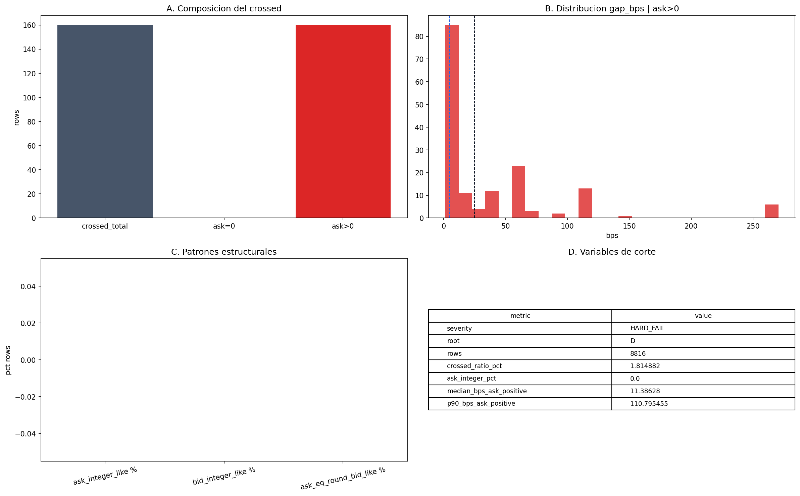

#### 04 Summary Card
Esta tarjeta responde a la pregunta de auditabilidad: cuales son exactamente las variables que sostienen la conclusion. Reune `severity`, `root`, `crossed_ratio_pct`, `ask_integer_pct`, `median_bps_ask_positive` y `p90_bps_ask_positive`. La decision que cambia es pasar de impresion visual a regla verificable. El error que evita es que dos inspectores lleguen a conclusiones distintas mirando la misma imagen sin una base numerica comun. Para gobernanza del proyecto, este panel es el que vuelve reproducible la decision para backtest, ML y auditoria.

---

### 12. CATO 2013-07-09

company_name: `CATO CORP`
primary_exchange: `NYSE` (`XNYS`)
market_locale: `stocks/us`
scope: `review`
ticker: `CATO`
date: `2013-07-09`
taxonomy: `large_file_threshold_edge_hard_many_crosses`
positive_cross_bucket: `positive_cross_moderate_5to25bps`
severity: `HARD_FAIL`
root: `D`
rows: `12200`
crossed_ratio_pct: `3.409836`
crossed_rows_raw: `416`
crossed_rows_ask_zero: `415`
crossed_rows_ask_positive: `1`
ask_integer_pct: `3.885246`
median_bps_ask_positive: `11.133791`
p90_bps_ask_positive: `11.133791`
file: `D:\quotes\CATO\year=2013\month=07\day=09\quotes.parquet`

#### Analisis Forense
La conclusion correcta del caso es que ya existe contradiccion economica real dentro del libro, pero aun no con fuerza suficiente para justificar exclusion dura sin contexto adicional. La taxonomy historica es `large_file_threshold_edge_hard_many_crosses` y el regimen positivo dominante es `moderate 5-25 bps`. Esto importa porque la taxonomy no solo clasifica: resume que tipo de anomalia se esta viendo y que clase de decision contractual puede defenderse despues. La taxonomy `large_file_threshold_edge_hard_many_crosses` implica un libro grande con muchas contradicciones, pero cerca del borde decisional. La dificultad analitica esta en decidir si el volumen de crossed es ruido absorbible o evidencia de degradacion suficientemente seria. El regimen `moderate 5-25 bps` ya entra en zona donde el crossed tiene capacidad real de contaminar simulacion de ejecucion y features microestructurales, aunque todavia puede requerir lectura contextual antes de exclusion dura. En terminos observables, el file tiene `crossed_ratio_pct=3.409836` con `crossed_rows_ask_positive=1` y `crossed_rows_ask_zero=415`. La severidad economica del crossed ask>0 se resume en `median_bps_ask_positive=11.133791` y `p90_bps_ask_positive=11.133791`. Estos dos numeros convierten una forma visual rara en una conclusion operativa sobre si el libro sigue representando o no un mercado negociable. La decision que cambia es pasar de libro sano a libro util solo bajo cautela. `review` significa: no usar como si fuera ejecucion limpia, conservar para analisis contextual y sensibilidad. El error que evita es tratar como normal un episodio que ya contiene contradiccion economica real y contaminar simulaciones de ejecucion o validaciones demasiado optimistas. El patron estructural muestra `ask_integer_pct=3.885246`. Este numero obliga a separar dos explicaciones rivales: contradiccion economica genuina del libro o mezcla con degeneracion estructural / integerizacion. La mayor parte del crossed vive en `ask=0`, pero existe una cola `ask>0` que impide absolver el caso como simple glitch. La lectura correcta es mixta: dano estructural dominante con residuo economico que aun puede justificar bandera o exclusion. Como `ask_integer_pct` es bajo, la hipotesis de simple degeneracion mecanica pierde fuerza. Eso endurece la interpretacion: el crossed se parece mas a contradiccion economica genuina y menos a artefacto. En la capa de semantica de precio del evento aparecen `daily raw close=26.9100`, `quote mid raw=26.6950`, `quote mid split_normalized=26.6950`, `daily adjusted_proxy=17.8691`. Ademas hay `post_event_dividend_sum=10.4000`. La implicacion metodologica es crucial: una discrepancia entre `quotes`, `daily` y una plataforma externa no puede leerse automaticamente como fallo del dataset. Puede ser semantica de precio distinta. El error que evita esta capa es mezclar raw, split-normalized y adjusted dentro del mismo pipeline, rompiendo auditoria, benchmarking y labels. Para pipelines, esto bloquea su uso como libro sano en ejecucion y features microestructurales principales, aunque aun puede mantenerse para forense, sensibilidad y estudios donde la anomalia sea parte del objeto de investigacion. Existe ademas una imagen historica de certificacion asociada. Su papel es poner el episodio en un marco causal mas amplio: halt, explained, not strongly explained o patron conocido. La regla que protege al proyecto es esta: el contexto externo se usa para explicar por que aparece el episodio, no para absolverlo. El error que evita es degradar el criterio de calidad del libro porque exista una historia plausible alrededor del caso.

#### 00 Event Month Context
Esta imagen responde a la pregunta de persistencia temporal: estamos ante un accidente local o ante una fase mas amplia de inestabilidad. Arriba coloca el evento en la serie `daily` real del mes; abajo compara `crossed_ratio_pct` y `max_gap_bps_pos` del dia contra sus vecinos. La decision que cambia es el peso estructural que se le concede al caso. El error que evita es juzgar igual un shock aislado y una degradacion repetida del libro.

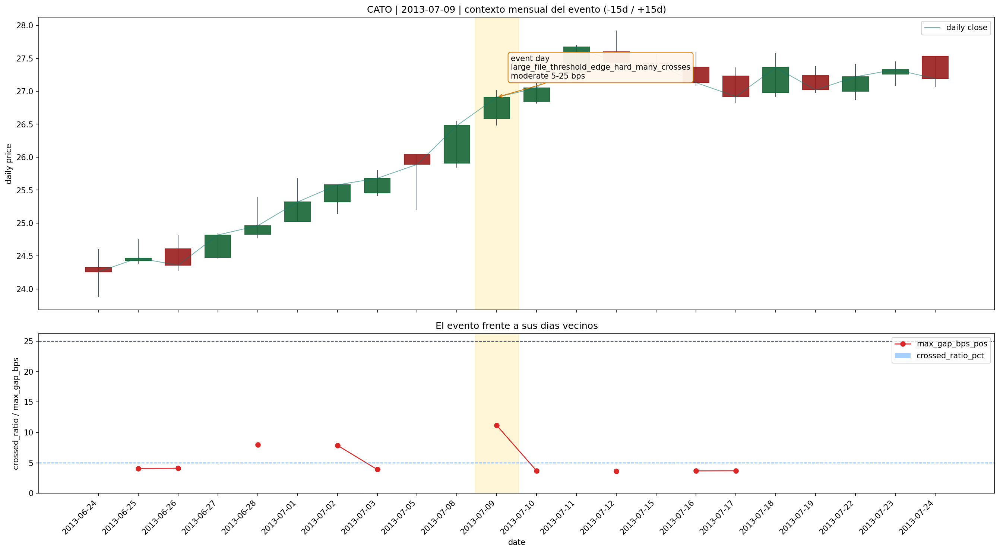

#### 00a Adjusted Proxy Contrast
Esta imagen responde a la pregunta de reconciliacion semantica: la discrepancia de precios viene de datos rotos o de vistas de precio distintas. Compara `daily raw`, `daily adjusted_proxy`, `quote mid raw` y `quote mid split_normalized`, y debajo ensena la cadena de dividendos y splits que produce la diferencia. La decision que cambia es si el inspector debe abrir una incidencia de calidad o cerrar el caso como diferencia legitima de semantica. El error que evita es mezclar series raw y adjusted como si fueran equivalentes. En pipelines reales, esto protege benchmarking, labels diarios y reconciliacion externa frente a falsas alarmas de precio.

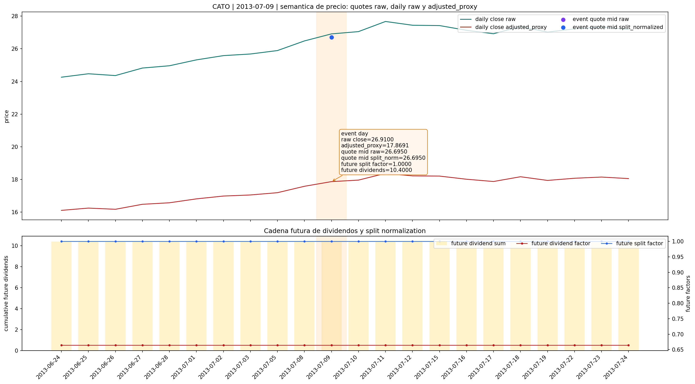

#### 00b Event Month Quotes Context
Esta imagen responde a la pregunta de recurrencia mensual dentro de `quotes`: el problema se concentra en el evento o reaparece en varias sesiones. Arriba concatena sesiones con datos disponibles; abajo resume cobertura diaria, `crossed_ratio_pct` y `max_gap_bps_pos`. La decision que cambia es si el caso debe leerse como episodio puntual o como sintoma de una fase repetida de libro degradado. El error que evita es extrapolar desde un unico dia a todo el mes sin evidencia.

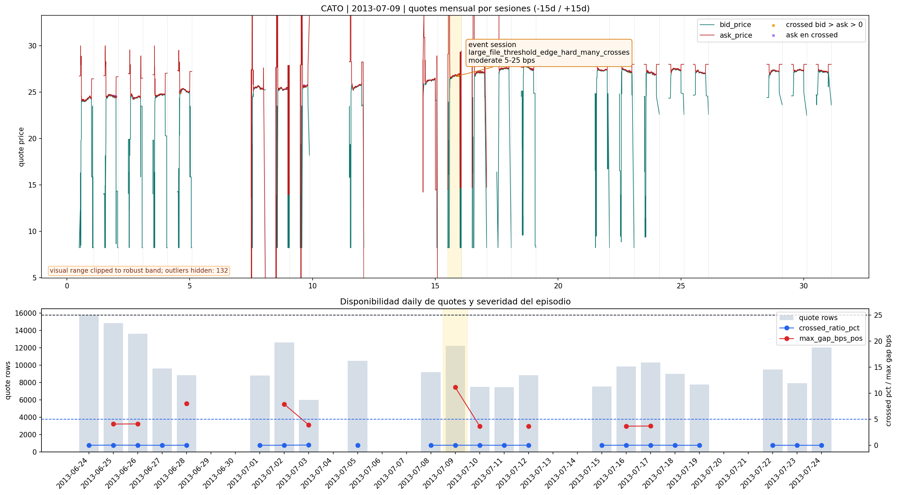

#### 01 Raw Window
Esta imagen responde a la primera pregunta decisiva del caso: el crossed observado es economicamente bastante fuerte para justificar un cambio de clase. Arriba ensena la geometria exacta del tramo conflictivo; abajo convierte esa geometria a bps y la enfrenta a los cortes `5 bps` y `25 bps`. El regimen dominante es `moderate 5-25 bps`. La decision que cambia es pasar de anomalia interpretable a `review` o `bad`. El error que evita es decidir por apariencia visual sin medir el dano economico real del crossed. En terminos de pipeline, este panel decide si el problema afecta solo a la lectura forense o si invalida simulacion de ejecucion y microstructure features.

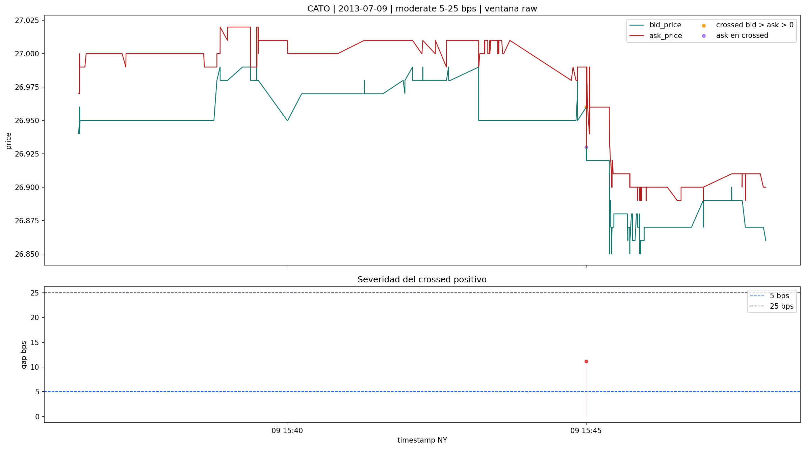

#### 02 Full Session Context
Esta imagen responde a la pregunta de extension intradiaria: el dano esta confinado a un bloque corto o contamina la sesion completa. Arriba se ve toda la sesion `04:00-20:00 NY`; abajo el `gap_bps` firmado. La decision que cambia es si el consumo debe penalizar solo un tramo o desechar el dia entero para uso operativo. El error que evita es tratar una cicatriz local como ruina total o, al reves, minimizar una degradacion distribuida a lo largo del dia. En ejecucion esto decide si la sesion puede seguir usandose con restricciones; en ML decide si las features intradiarias conservan significado economico.

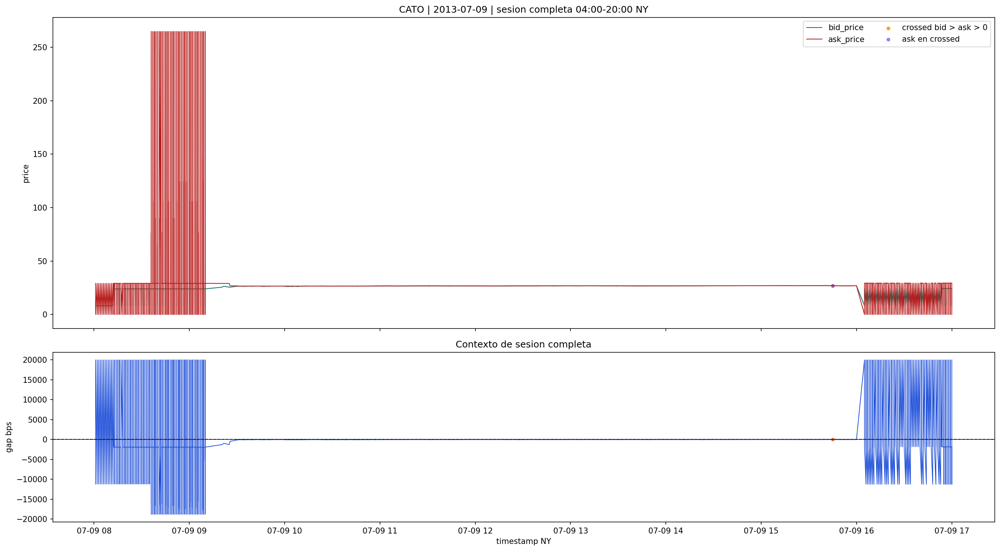

#### 03 Structure Diagnostics
Este panel responde a la pregunta de naturaleza del fallo: contradiccion economica genuina o mezcla con degeneracion estructural. Separa `ask=0` de `ask>0`, muestra la distribucion de `gap_bps` y resume patrones de integerizacion. La decision que cambia es como interpretar el dano: mercado localmente roto, artefacto de representacion o combinacion de ambos. El error que evita es sobrediagnosticar crossed reales cuando parte de la senal proviene de estructura degenerada del libro. Esta lectura afecta directamente a que el caso vaya a exclusion dura, a bandera contextual o a simple reconciliacion tecnica.

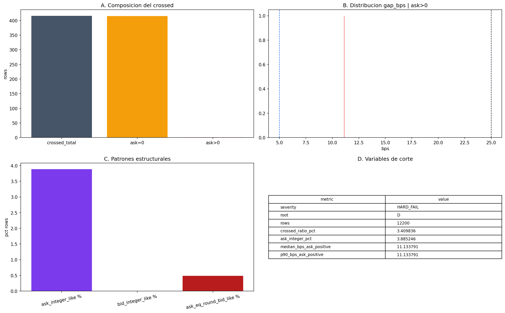

#### 04 Summary Card
Esta tarjeta responde a la pregunta de auditabilidad: cuales son exactamente las variables que sostienen la conclusion. Reune `severity`, `root`, `crossed_ratio_pct`, `ask_integer_pct`, `median_bps_ask_positive` y `p90_bps_ask_positive`. La decision que cambia es pasar de impresion visual a regla verificable. El error que evita es que dos inspectores lleguen a conclusiones distintas mirando la misma imagen sin una base numerica comun. Para gobernanza del proyecto, este panel es el que vuelve reproducible la decision para backtest, ML y auditoria.

---

### 13. CNSL 2012-05-02

company_name: `Consolidated Communications Holdings, Inc.`
primary_exchange: `NASDAQ` (`XNAS`)
market_locale: `stocks/us`
scope: `review`
ticker: `CNSL`
date: `2012-05-02`
taxonomy: `large_file_threshold_edge_hard_many_crosses`
positive_cross_bucket: `positive_cross_moderate_5to25bps`
severity: `HARD_FAIL`
root: `D`
rows: `10225`
crossed_ratio_pct: `0.889976`
crossed_rows_raw: `91`
crossed_rows_ask_zero: `1`
crossed_rows_ask_positive: `90`
ask_integer_pct: `0.234719`
median_bps_ask_positive: `10.025063`
p90_bps_ask_positive: `15.727392`
file: `D:\quotes\CNSL\year=2012\month=05\day=02\quotes.parquet`

#### Analisis Forense
La conclusion correcta del caso es que ya existe contradiccion economica real dentro del libro, pero aun no con fuerza suficiente para justificar exclusion dura sin contexto adicional. La taxonomy historica es `large_file_threshold_edge_hard_many_crosses` y el regimen positivo dominante es `moderate 5-25 bps`. Esto importa porque la taxonomy no solo clasifica: resume que tipo de anomalia se esta viendo y que clase de decision contractual puede defenderse despues. La taxonomy `large_file_threshold_edge_hard_many_crosses` implica un libro grande con muchas contradicciones, pero cerca del borde decisional. La dificultad analitica esta en decidir si el volumen de crossed es ruido absorbible o evidencia de degradacion suficientemente seria. El regimen `moderate 5-25 bps` ya entra en zona donde el crossed tiene capacidad real de contaminar simulacion de ejecucion y features microestructurales, aunque todavia puede requerir lectura contextual antes de exclusion dura. En terminos observables, el file tiene `crossed_ratio_pct=0.889976` con `crossed_rows_ask_positive=90` y `crossed_rows_ask_zero=1`. La severidad economica del crossed ask>0 se resume en `median_bps_ask_positive=10.025063` y `p90_bps_ask_positive=15.727392`. Estos dos numeros convierten una forma visual rara en una conclusion operativa sobre si el libro sigue representando o no un mercado negociable. La decision que cambia es pasar de libro sano a libro util solo bajo cautela. `review` significa: no usar como si fuera ejecucion limpia, conservar para analisis contextual y sensibilidad. El error que evita es tratar como normal un episodio que ya contiene contradiccion economica real y contaminar simulaciones de ejecucion o validaciones demasiado optimistas. El patron estructural muestra `ask_integer_pct=0.234719`. Este numero obliga a separar dos explicaciones rivales: contradiccion economica genuina del libro o mezcla con degeneracion estructural / integerizacion. La mayor parte del crossed vive en `ask>0`, de modo que el corazon del problema sigue siendo economico. La parte `ask=0`, si existe, acompana pero no explica por si sola la anomalia. Como `ask_integer_pct` es bajo, la hipotesis de simple degeneracion mecanica pierde fuerza. Eso endurece la interpretacion: el crossed se parece mas a contradiccion economica genuina y menos a artefacto. En la capa de semantica de precio del evento aparecen `daily raw close=19.1300`, `quote mid raw=19.1000`, `quote mid split_normalized=19.1000`, `daily adjusted_proxy=9.4430`. Ademas hay `post_event_dividend_sum=10.8466`. La implicacion metodologica es crucial: una discrepancia entre `quotes`, `daily` y una plataforma externa no puede leerse automaticamente como fallo del dataset. Puede ser semantica de precio distinta. El error que evita esta capa es mezclar raw, split-normalized y adjusted dentro del mismo pipeline, rompiendo auditoria, benchmarking y labels. Para pipelines, esto bloquea su uso como libro sano en ejecucion y features microestructurales principales, aunque aun puede mantenerse para forense, sensibilidad y estudios donde la anomalia sea parte del objeto de investigacion. Existe ademas una imagen historica de certificacion asociada. Su papel es poner el episodio en un marco causal mas amplio: halt, explained, not strongly explained o patron conocido. La regla que protege al proyecto es esta: el contexto externo se usa para explicar por que aparece el episodio, no para absolverlo. El error que evita es degradar el criterio de calidad del libro porque exista una historia plausible alrededor del caso.

#### 00 Event Month Context
Esta imagen responde a la pregunta de persistencia temporal: estamos ante un accidente local o ante una fase mas amplia de inestabilidad. Arriba coloca el evento en la serie `daily` real del mes; abajo compara `crossed_ratio_pct` y `max_gap_bps_pos` del dia contra sus vecinos. La decision que cambia es el peso estructural que se le concede al caso. El error que evita es juzgar igual un shock aislado y una degradacion repetida del libro.

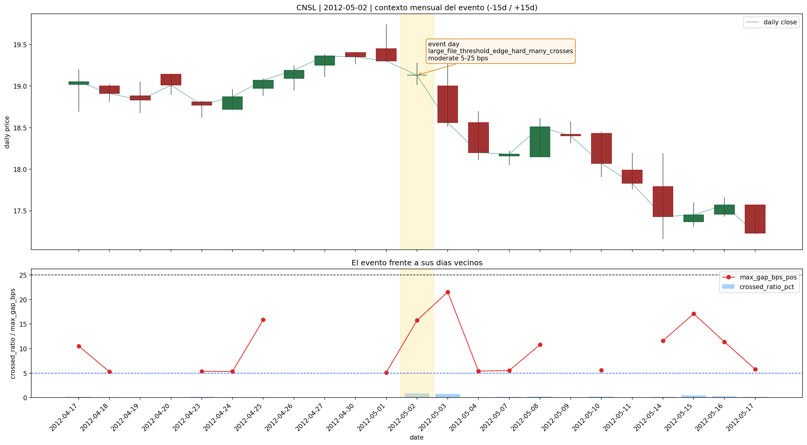

#### 00a Adjusted Proxy Contrast
Esta imagen responde a la pregunta de reconciliacion semantica: la discrepancia de precios viene de datos rotos o de vistas de precio distintas. Compara `daily raw`, `daily adjusted_proxy`, `quote mid raw` y `quote mid split_normalized`, y debajo ensena la cadena de dividendos y splits que produce la diferencia. La decision que cambia es si el inspector debe abrir una incidencia de calidad o cerrar el caso como diferencia legitima de semantica. El error que evita es mezclar series raw y adjusted como si fueran equivalentes. En pipelines reales, esto protege benchmarking, labels diarios y reconciliacion externa frente a falsas alarmas de precio.

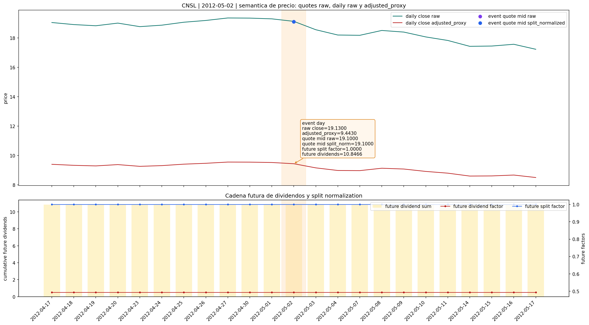

#### 00b Event Month Quotes Context
Esta imagen responde a la pregunta de recurrencia mensual dentro de `quotes`: el problema se concentra en el evento o reaparece en varias sesiones. Arriba concatena sesiones con datos disponibles; abajo resume cobertura diaria, `crossed_ratio_pct` y `max_gap_bps_pos`. La decision que cambia es si el caso debe leerse como episodio puntual o como sintoma de una fase repetida de libro degradado. El error que evita es extrapolar desde un unico dia a todo el mes sin evidencia.

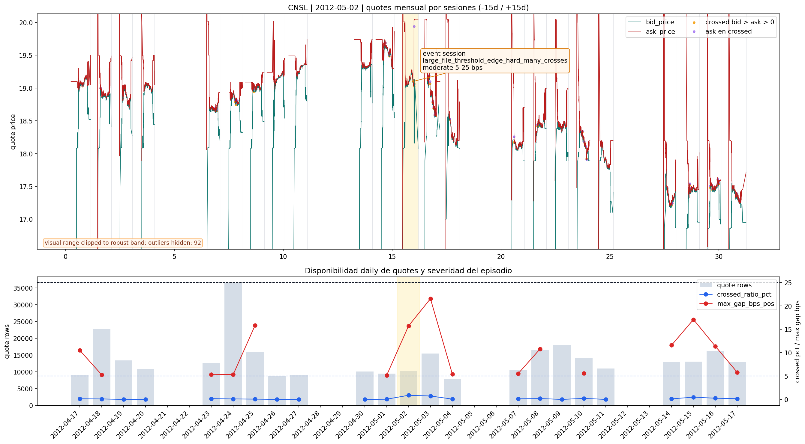

#### 01 Raw Window
Esta imagen responde a la primera pregunta decisiva del caso: el crossed observado es economicamente bastante fuerte para justificar un cambio de clase. Arriba ensena la geometria exacta del tramo conflictivo; abajo convierte esa geometria a bps y la enfrenta a los cortes `5 bps` y `25 bps`. El regimen dominante es `moderate 5-25 bps`. La decision que cambia es pasar de anomalia interpretable a `review` o `bad`. El error que evita es decidir por apariencia visual sin medir el dano economico real del crossed. En terminos de pipeline, este panel decide si el problema afecta solo a la lectura forense o si invalida simulacion de ejecucion y microstructure features.

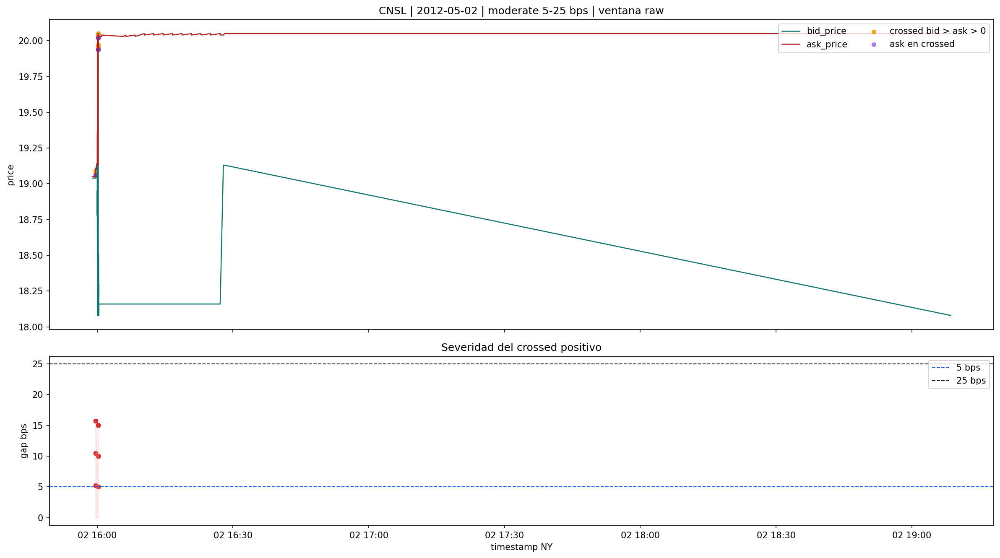

#### 02 Full Session Context
Esta imagen responde a la pregunta de extension intradiaria: el dano esta confinado a un bloque corto o contamina la sesion completa. Arriba se ve toda la sesion `04:00-20:00 NY`; abajo el `gap_bps` firmado. La decision que cambia es si el consumo debe penalizar solo un tramo o desechar el dia entero para uso operativo. El error que evita es tratar una cicatriz local como ruina total o, al reves, minimizar una degradacion distribuida a lo largo del dia. En ejecucion esto decide si la sesion puede seguir usandose con restricciones; en ML decide si las features intradiarias conservan significado economico.

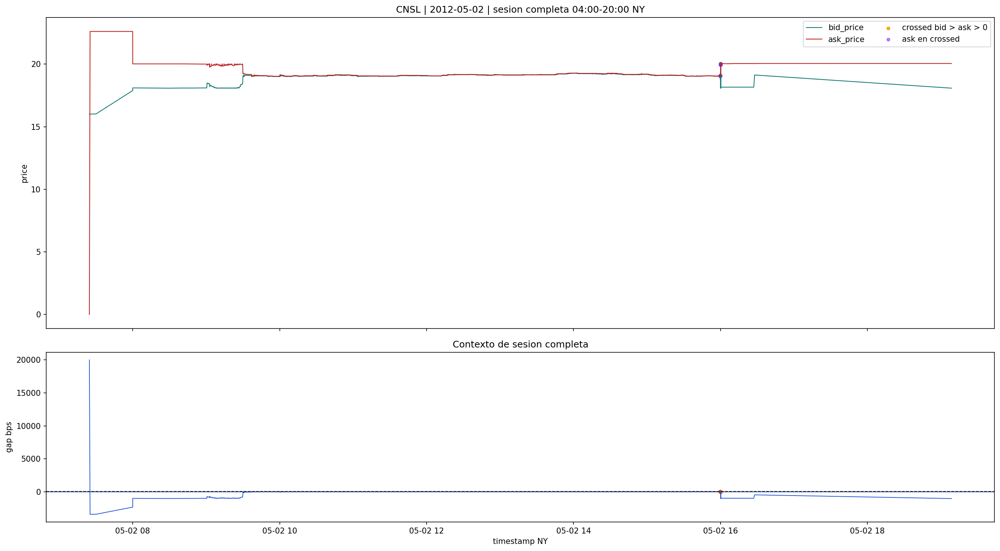

#### 03 Structure Diagnostics
Este panel responde a la pregunta de naturaleza del fallo: contradiccion economica genuina o mezcla con degeneracion estructural. Separa `ask=0` de `ask>0`, muestra la distribucion de `gap_bps` y resume patrones de integerizacion. La decision que cambia es como interpretar el dano: mercado localmente roto, artefacto de representacion o combinacion de ambos. El error que evita es sobrediagnosticar crossed reales cuando parte de la senal proviene de estructura degenerada del libro. Esta lectura afecta directamente a que el caso vaya a exclusion dura, a bandera contextual o a simple reconciliacion tecnica.

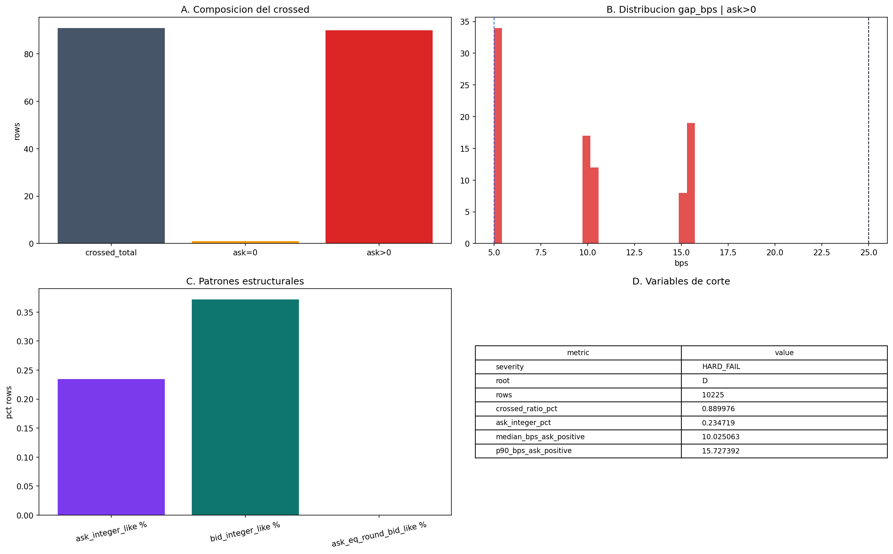

#### 04 Summary Card
Esta tarjeta responde a la pregunta de auditabilidad: cuales son exactamente las variables que sostienen la conclusion. Reune `severity`, `root`, `crossed_ratio_pct`, `ask_integer_pct`, `median_bps_ask_positive` y `p90_bps_ask_positive`. La decision que cambia es pasar de impresion visual a regla verificable. El error que evita es que dos inspectores lleguen a conclusiones distintas mirando la misma imagen sin una base numerica comun. Para gobernanza del proyecto, este panel es el que vuelve reproducible la decision para backtest, ML y auditoria.

---

### 14. VVUS 2009-09-21

company_name: `Vivus Inc`
primary_exchange: `NASDAQ` (`XNAS`)
market_locale: `stocks/us`
scope: `review`
ticker: `VVUS`
date: `2009-09-21`
taxonomy: `large_file_threshold_edge_hard_many_crosses`
positive_cross_bucket: `positive_cross_moderate_5to25bps`
severity: `HARD_FAIL`
root: `C`
rows: `77127`
crossed_ratio_pct: `1.358798`
crossed_rows_raw: `1048`
crossed_rows_ask_zero: `1`
crossed_rows_ask_positive: `1047`
ask_integer_pct: `0.068718`
median_bps_ask_positive: `8.806693`
p90_bps_ask_positive: `26.623944`
file: `C:\TSIS_Data\data\quotes\VVUS\year=2009\month=09\day=21\quotes.parquet`

#### Analisis Forense
La conclusion correcta del caso es que ya existe contradiccion economica real dentro del libro, pero aun no con fuerza suficiente para justificar exclusion dura sin contexto adicional. La taxonomy historica es `large_file_threshold_edge_hard_many_crosses` y el regimen positivo dominante es `moderate 5-25 bps`. Esto importa porque la taxonomy no solo clasifica: resume que tipo de anomalia se esta viendo y que clase de decision contractual puede defenderse despues. La taxonomy `large_file_threshold_edge_hard_many_crosses` implica un libro grande con muchas contradicciones, pero cerca del borde decisional. La dificultad analitica esta en decidir si el volumen de crossed es ruido absorbible o evidencia de degradacion suficientemente seria. El regimen `moderate 5-25 bps` ya entra en zona donde el crossed tiene capacidad real de contaminar simulacion de ejecucion y features microestructurales, aunque todavia puede requerir lectura contextual antes de exclusion dura. En terminos observables, el file tiene `crossed_ratio_pct=1.358798` con `crossed_rows_ask_positive=1047` y `crossed_rows_ask_zero=1`. La severidad economica del crossed ask>0 se resume en `median_bps_ask_positive=8.806693` y `p90_bps_ask_positive=26.623944`. Estos dos numeros convierten una forma visual rara en una conclusion operativa sobre si el libro sigue representando o no un mercado negociable. La decision que cambia es pasar de libro sano a libro util solo bajo cautela. `review` significa: no usar como si fuera ejecucion limpia, conservar para analisis contextual y sensibilidad. El error que evita es tratar como normal un episodio que ya contiene contradiccion economica real y contaminar simulaciones de ejecucion o validaciones demasiado optimistas. El patron estructural muestra `ask_integer_pct=0.068718`. Este numero obliga a separar dos explicaciones rivales: contradiccion economica genuina del libro o mezcla con degeneracion estructural / integerizacion. La mayor parte del crossed vive en `ask>0`, de modo que el corazon del problema sigue siendo economico. La parte `ask=0`, si existe, acompana pero no explica por si sola la anomalia. Como `ask_integer_pct` es bajo, la hipotesis de simple degeneracion mecanica pierde fuerza. Eso endurece la interpretacion: el crossed se parece mas a contradiccion economica genuina y menos a artefacto. En la capa de semantica de precio del evento aparecen `daily raw close=114.8000`, `quote mid raw=11.5450`, `quote mid split_normalized=115.4500`, `daily adjusted_proxy=114.8000`. La reconciliacion incluye `future_split_factor=0.1000`. La implicacion metodologica es crucial: una discrepancia entre `quotes`, `daily` y una plataforma externa no puede leerse automaticamente como fallo del dataset. Puede ser semantica de precio distinta. El error que evita esta capa es mezclar raw, split-normalized y adjusted dentro del mismo pipeline, rompiendo auditoria, benchmarking y labels. Para pipelines, esto bloquea su uso como libro sano en ejecucion y features microestructurales principales, aunque aun puede mantenerse para forense, sensibilidad y estudios donde la anomalia sea parte del objeto de investigacion. Existe ademas una imagen historica de certificacion asociada. Su papel es poner el episodio en un marco causal mas amplio: halt, explained, not strongly explained o patron conocido. La regla que protege al proyecto es esta: el contexto externo se usa para explicar por que aparece el episodio, no para absolverlo. El error que evita es degradar el criterio de calidad del libro porque exista una historia plausible alrededor del caso.

#### 00 Event Month Context
Esta imagen responde a la pregunta de persistencia temporal: estamos ante un accidente local o ante una fase mas amplia de inestabilidad. Arriba coloca el evento en la serie `daily` real del mes; abajo compara `crossed_ratio_pct` y `max_gap_bps_pos` del dia contra sus vecinos. La decision que cambia es el peso estructural que se le concede al caso. El error que evita es juzgar igual un shock aislado y una degradacion repetida del libro.

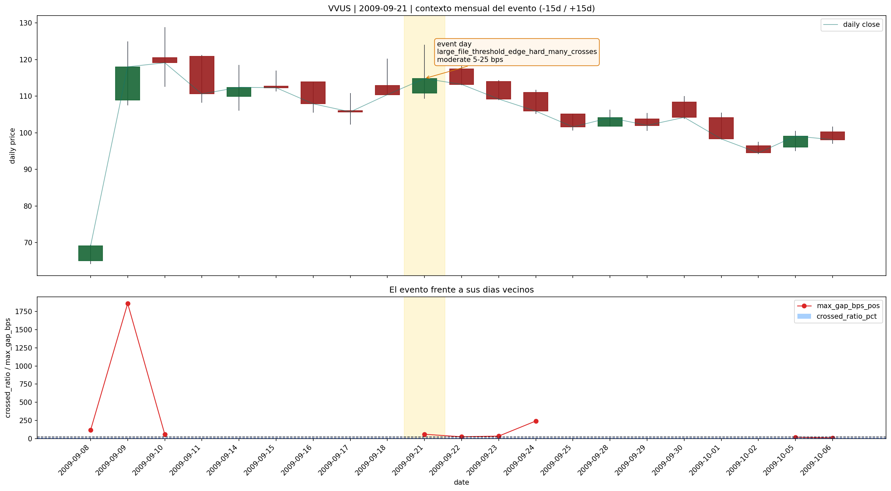

#### 00a Adjusted Proxy Contrast
Esta imagen responde a la pregunta de reconciliacion semantica: la discrepancia de precios viene de datos rotos o de vistas de precio distintas. Compara `daily raw`, `daily adjusted_proxy`, `quote mid raw` y `quote mid split_normalized`, y debajo ensena la cadena de dividendos y splits que produce la diferencia. La decision que cambia es si el inspector debe abrir una incidencia de calidad o cerrar el caso como diferencia legitima de semantica. El error que evita es mezclar series raw y adjusted como si fueran equivalentes. En pipelines reales, esto protege benchmarking, labels diarios y reconciliacion externa frente a falsas alarmas de precio.

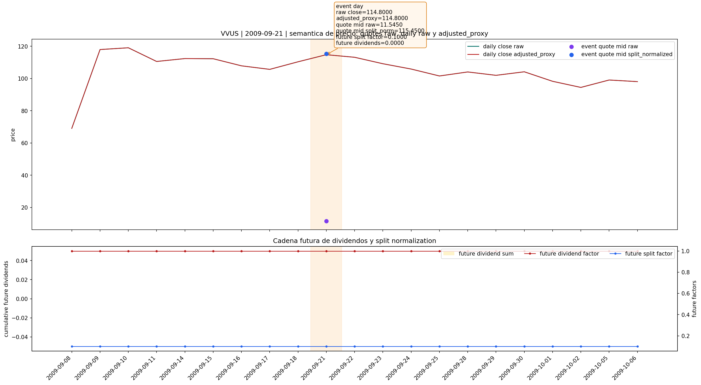

#### 00b Event Month Quotes Context
Esta imagen responde a la pregunta de recurrencia mensual dentro de `quotes`: el problema se concentra en el evento o reaparece en varias sesiones. Arriba concatena sesiones con datos disponibles; abajo resume cobertura diaria, `crossed_ratio_pct` y `max_gap_bps_pos`. La decision que cambia es si el caso debe leerse como episodio puntual o como sintoma de una fase repetida de libro degradado. El error que evita es extrapolar desde un unico dia a todo el mes sin evidencia.

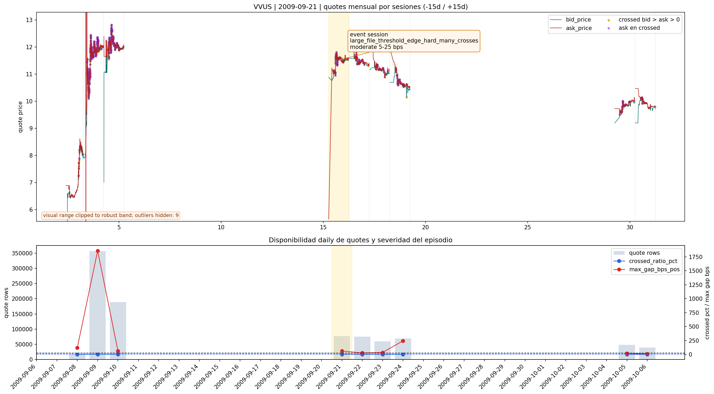

#### 01 Raw Window
Esta imagen responde a la primera pregunta decisiva del caso: el crossed observado es economicamente bastante fuerte para justificar un cambio de clase. Arriba ensena la geometria exacta del tramo conflictivo; abajo convierte esa geometria a bps y la enfrenta a los cortes `5 bps` y `25 bps`. El regimen dominante es `moderate 5-25 bps`. La decision que cambia es pasar de anomalia interpretable a `review` o `bad`. El error que evita es decidir por apariencia visual sin medir el dano economico real del crossed. En terminos de pipeline, este panel decide si el problema afecta solo a la lectura forense o si invalida simulacion de ejecucion y microstructure features.

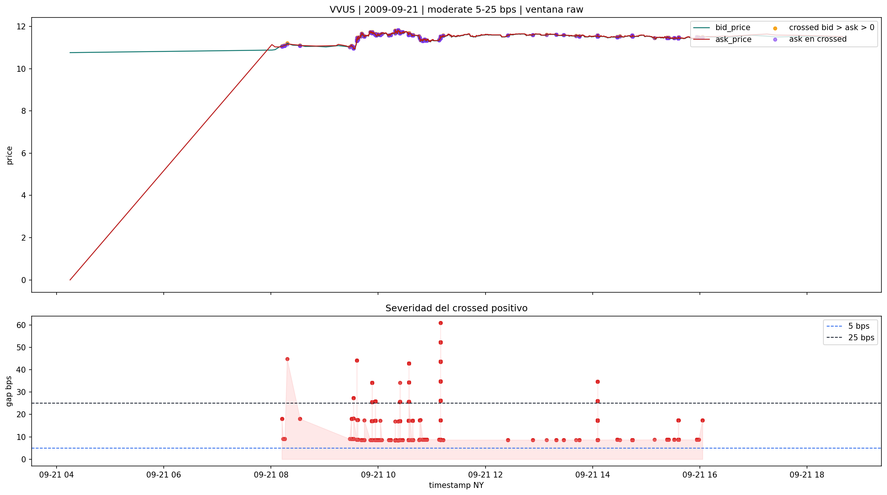

#### 02 Full Session Context
Esta imagen responde a la pregunta de extension intradiaria: el dano esta confinado a un bloque corto o contamina la sesion completa. Arriba se ve toda la sesion `04:00-20:00 NY`; abajo el `gap_bps` firmado. La decision que cambia es si el consumo debe penalizar solo un tramo o desechar el dia entero para uso operativo. El error que evita es tratar una cicatriz local como ruina total o, al reves, minimizar una degradacion distribuida a lo largo del dia. En ejecucion esto decide si la sesion puede seguir usandose con restricciones; en ML decide si las features intradiarias conservan significado economico.

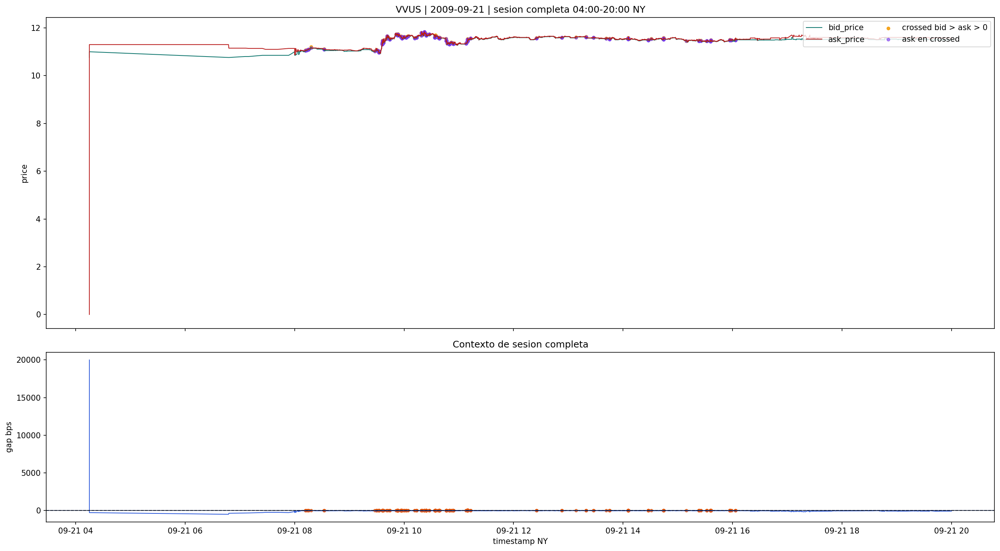

#### 03 Structure Diagnostics
Este panel responde a la pregunta de naturaleza del fallo: contradiccion economica genuina o mezcla con degeneracion estructural. Separa `ask=0` de `ask>0`, muestra la distribucion de `gap_bps` y resume patrones de integerizacion. La decision que cambia es como interpretar el dano: mercado localmente roto, artefacto de representacion o combinacion de ambos. El error que evita es sobrediagnosticar crossed reales cuando parte de la senal proviene de estructura degenerada del libro. Esta lectura afecta directamente a que el caso vaya a exclusion dura, a bandera contextual o a simple reconciliacion tecnica.

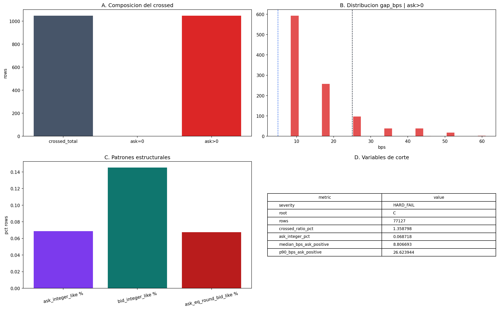

#### 04 Summary Card
Esta tarjeta responde a la pregunta de auditabilidad: cuales son exactamente las variables que sostienen la conclusion. Reune `severity`, `root`, `crossed_ratio_pct`, `ask_integer_pct`, `median_bps_ask_positive` y `p90_bps_ask_positive`. La decision que cambia es pasar de impresion visual a regla verificable. El error que evita es que dos inspectores lleguen a conclusiones distintas mirando la misma imagen sin una base numerica comun. Para gobernanza del proyecto, este panel es el que vuelve reproducible la decision para backtest, ML y auditoria.

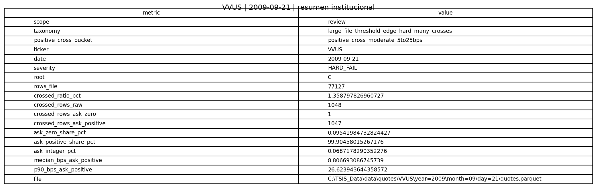

---

### 15. IART 2008-06-03

company_name: `Integra LifeSciences Holdings`
primary_exchange: `NASDAQ` (`XNAS`)
market_locale: `stocks/us`
scope: `review`
ticker: `IART`
date: `2008-06-03`
taxonomy: `large_file_threshold_edge_hard_many_crosses`
positive_cross_bucket: `positive_cross_moderate_5to25bps`
severity: `HARD_FAIL`
root: `D`
rows: `7178`
crossed_ratio_pct: `2.215102`
crossed_rows_raw: `159`
crossed_rows_ask_zero: `158`
crossed_rows_ask_positive: `1`
ask_integer_pct: `3.622179`
median_bps_ask_positive: `7.300158`
p90_bps_ask_positive: `7.300158`
file: `D:\quotes\IART\year=2008\month=06\day=03\quotes.parquet`

#### Analisis Forense
La conclusion correcta del caso es que ya existe contradiccion economica real dentro del libro, pero aun no con fuerza suficiente para justificar exclusion dura sin contexto adicional. La taxonomy historica es `large_file_threshold_edge_hard_many_crosses` y el regimen positivo dominante es `moderate 5-25 bps`. Esto importa porque la taxonomy no solo clasifica: resume que tipo de anomalia se esta viendo y que clase de decision contractual puede defenderse despues. La taxonomy `large_file_threshold_edge_hard_many_crosses` implica un libro grande con muchas contradicciones, pero cerca del borde decisional. La dificultad analitica esta en decidir si el volumen de crossed es ruido absorbible o evidencia de degradacion suficientemente seria. El regimen `moderate 5-25 bps` ya entra en zona donde el crossed tiene capacidad real de contaminar simulacion de ejecucion y features microestructurales, aunque todavia puede requerir lectura contextual antes de exclusion dura. En terminos observables, el file tiene `crossed_ratio_pct=2.215102` con `crossed_rows_ask_positive=1` y `crossed_rows_ask_zero=158`. La severidad economica del crossed ask>0 se resume en `median_bps_ask_positive=7.300158` y `p90_bps_ask_positive=7.300158`. Estos dos numeros convierten una forma visual rara en una conclusion operativa sobre si el libro sigue representando o no un mercado negociable. La decision que cambia es pasar de libro sano a libro util solo bajo cautela. `review` significa: no usar como si fuera ejecucion limpia, conservar para analisis contextual y sensibilidad. El error que evita es tratar como normal un episodio que ya contiene contradiccion economica real y contaminar simulaciones de ejecucion o validaciones demasiado optimistas. El patron estructural muestra `ask_integer_pct=3.622179`. Este numero obliga a separar dos explicaciones rivales: contradiccion economica genuina del libro o mezcla con degeneracion estructural / integerizacion. La mayor parte del crossed vive en `ask=0`, pero existe una cola `ask>0` que impide absolver el caso como simple glitch. La lectura correcta es mixta: dano estructural dominante con residuo economico que aun puede justificar bandera o exclusion. Como `ask_integer_pct` es bajo, la hipotesis de simple degeneracion mecanica pierde fuerza. Eso endurece la interpretacion: el crossed se parece mas a contradiccion economica genuina y menos a artefacto. En la capa de semantica de precio del evento aparecen `daily raw close=20.6650`, `quote mid raw=41.4000`, `quote mid split_normalized=20.7000`, `daily adjusted_proxy=20.6650`. La reconciliacion incluye `future_split_factor=2.0000`. La implicacion metodologica es crucial: una discrepancia entre `quotes`, `daily` y una plataforma externa no puede leerse automaticamente como fallo del dataset. Puede ser semantica de precio distinta. El error que evita esta capa es mezclar raw, split-normalized y adjusted dentro del mismo pipeline, rompiendo auditoria, benchmarking y labels. Para pipelines, esto bloquea su uso como libro sano en ejecucion y features microestructurales principales, aunque aun puede mantenerse para forense, sensibilidad y estudios donde la anomalia sea parte del objeto de investigacion. Existe ademas una imagen historica de certificacion asociada. Su papel es poner el episodio en un marco causal mas amplio: halt, explained, not strongly explained o patron conocido. La regla que protege al proyecto es esta: el contexto externo se usa para explicar por que aparece el episodio, no para absolverlo. El error que evita es degradar el criterio de calidad del libro porque exista una historia plausible alrededor del caso.

#### 00 Event Month Context
Esta imagen responde a la pregunta de persistencia temporal: estamos ante un accidente local o ante una fase mas amplia de inestabilidad. Arriba coloca el evento en la serie `daily` real del mes; abajo compara `crossed_ratio_pct` y `max_gap_bps_pos` del dia contra sus vecinos. La decision que cambia es el peso estructural que se le concede al caso. El error que evita es juzgar igual un shock aislado y una degradacion repetida del libro.

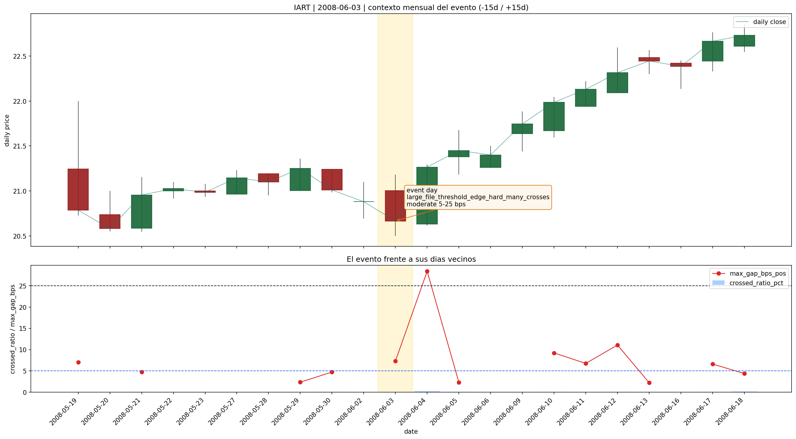

#### 00a Adjusted Proxy Contrast
Esta imagen responde a la pregunta de reconciliacion semantica: la discrepancia de precios viene de datos rotos o de vistas de precio distintas. Compara `daily raw`, `daily adjusted_proxy`, `quote mid raw` y `quote mid split_normalized`, y debajo ensena la cadena de dividendos y splits que produce la diferencia. La decision que cambia es si el inspector debe abrir una incidencia de calidad o cerrar el caso como diferencia legitima de semantica. El error que evita es mezclar series raw y adjusted como si fueran equivalentes. En pipelines reales, esto protege benchmarking, labels diarios y reconciliacion externa frente a falsas alarmas de precio.

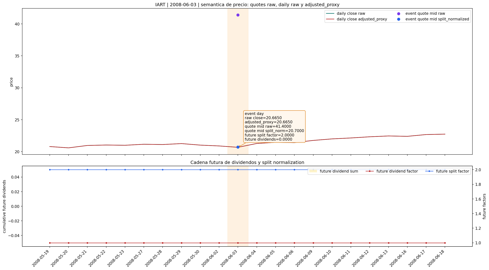

#### 00b Event Month Quotes Context
Esta imagen responde a la pregunta de recurrencia mensual dentro de `quotes`: el problema se concentra en el evento o reaparece en varias sesiones. Arriba concatena sesiones con datos disponibles; abajo resume cobertura diaria, `crossed_ratio_pct` y `max_gap_bps_pos`. La decision que cambia es si el caso debe leerse como episodio puntual o como sintoma de una fase repetida de libro degradado. El error que evita es extrapolar desde un unico dia a todo el mes sin evidencia.

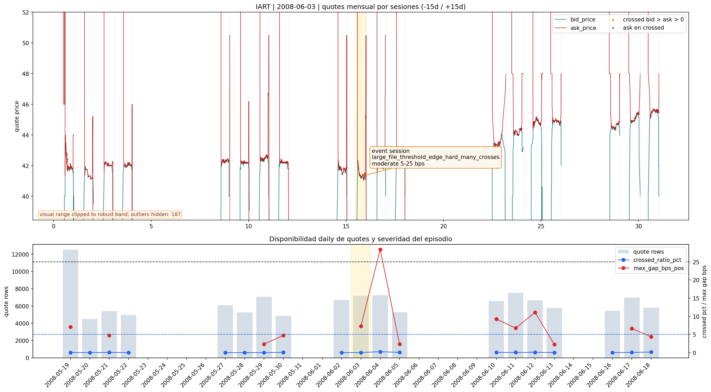

#### 01 Raw Window
Esta imagen responde a la primera pregunta decisiva del caso: el crossed observado es economicamente bastante fuerte para justificar un cambio de clase. Arriba ensena la geometria exacta del tramo conflictivo; abajo convierte esa geometria a bps y la enfrenta a los cortes `5 bps` y `25 bps`. El regimen dominante es `moderate 5-25 bps`. La decision que cambia es pasar de anomalia interpretable a `review` o `bad`. El error que evita es decidir por apariencia visual sin medir el dano economico real del crossed. En terminos de pipeline, este panel decide si el problema afecta solo a la lectura forense o si invalida simulacion de ejecucion y microstructure features.

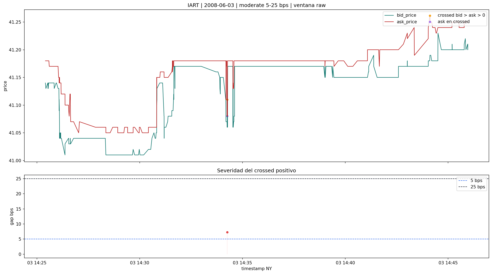

#### 02 Full Session Context
Esta imagen responde a la pregunta de extension intradiaria: el dano esta confinado a un bloque corto o contamina la sesion completa. Arriba se ve toda la sesion `04:00-20:00 NY`; abajo el `gap_bps` firmado. La decision que cambia es si el consumo debe penalizar solo un tramo o desechar el dia entero para uso operativo. El error que evita es tratar una cicatriz local como ruina total o, al reves, minimizar una degradacion distribuida a lo largo del dia. En ejecucion esto decide si la sesion puede seguir usandose con restricciones; en ML decide si las features intradiarias conservan significado economico.

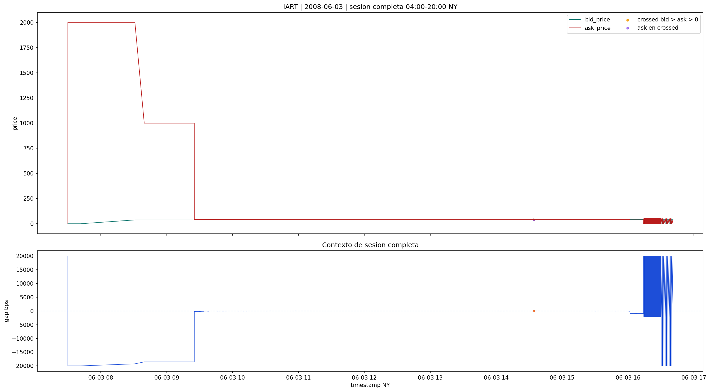

#### 03 Structure Diagnostics
Este panel responde a la pregunta de naturaleza del fallo: contradiccion economica genuina o mezcla con degeneracion estructural. Separa `ask=0` de `ask>0`, muestra la distribucion de `gap_bps` y resume patrones de integerizacion. La decision que cambia es como interpretar el dano: mercado localmente roto, artefacto de representacion o combinacion de ambos. El error que evita es sobrediagnosticar crossed reales cuando parte de la senal proviene de estructura degenerada del libro. Esta lectura afecta directamente a que el caso vaya a exclusion dura, a bandera contextual o a simple reconciliacion tecnica.

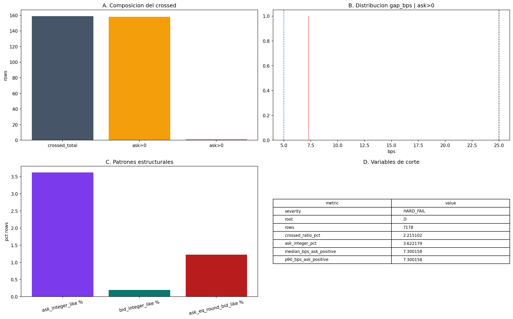

#### 04 Summary Card
Esta tarjeta responde a la pregunta de auditabilidad: cuales son exactamente las variables que sostienen la conclusion. Reune `severity`, `root`, `crossed_ratio_pct`, `ask_integer_pct`, `median_bps_ask_positive` y `p90_bps_ask_positive`. La decision que cambia es pasar de impresion visual a regla verificable. El error que evita es que dos inspectores lleguen a conclusiones distintas mirando la misma imagen sin una base numerica comun. Para gobernanza del proyecto, este panel es el que vuelve reproducible la decision para backtest, ML y auditoria.

---

### 16. OFIX 2026-01-14

company_name: `Orthofix Medical Inc. Common Stock (DE)`
primary_exchange: `NASDAQ` (`XNAS`)
market_locale: `stocks/us`
scope: `review`
ticker: `OFIX`
date: `2026-01-14`
taxonomy: `large_file_threshold_edge_hard_many_crosses`
positive_cross_bucket: `positive_cross_moderate_5to25bps`
severity: `HARD_FAIL`
root: `D`
rows: `5852`
crossed_ratio_pct: `1.093643`
crossed_rows_raw: `64`
crossed_rows_ask_zero: `58`
crossed_rows_ask_positive: `6`
ask_integer_pct: `9.073821`
median_bps_ask_positive: `7.005254`
p90_bps_ask_positive: `10.505428`
file: `D:\quotes\OFIX\year=2026\month=01\day=14\quotes.parquet`

#### Analisis Forense
La conclusion correcta del caso es que ya existe contradiccion economica real dentro del libro, pero aun no con fuerza suficiente para justificar exclusion dura sin contexto adicional. La taxonomy historica es `large_file_threshold_edge_hard_many_crosses` y el regimen positivo dominante es `moderate 5-25 bps`. Esto importa porque la taxonomy no solo clasifica: resume que tipo de anomalia se esta viendo y que clase de decision contractual puede defenderse despues. La taxonomy `large_file_threshold_edge_hard_many_crosses` implica un libro grande con muchas contradicciones, pero cerca del borde decisional. La dificultad analitica esta en decidir si el volumen de crossed es ruido absorbible o evidencia de degradacion suficientemente seria. El regimen `moderate 5-25 bps` ya entra en zona donde el crossed tiene capacidad real de contaminar simulacion de ejecucion y features microestructurales, aunque todavia puede requerir lectura contextual antes de exclusion dura. En terminos observables, el file tiene `crossed_ratio_pct=1.093643` con `crossed_rows_ask_positive=6` y `crossed_rows_ask_zero=58`. La severidad economica del crossed ask>0 se resume en `median_bps_ask_positive=7.005254` y `p90_bps_ask_positive=10.505428`. Estos dos numeros convierten una forma visual rara en una conclusion operativa sobre si el libro sigue representando o no un mercado negociable. La decision que cambia es pasar de libro sano a libro util solo bajo cautela. `review` significa: no usar como si fuera ejecucion limpia, conservar para analisis contextual y sensibilidad. El error que evita es tratar como normal un episodio que ya contiene contradiccion economica real y contaminar simulaciones de ejecucion o validaciones demasiado optimistas. El patron estructural muestra `ask_integer_pct=9.073821`. Este numero obliga a separar dos explicaciones rivales: contradiccion economica genuina del libro o mezcla con degeneracion estructural / integerizacion. La mayor parte del crossed vive en `ask=0`, pero existe una cola `ask>0` que impide absolver el caso como simple glitch. La lectura correcta es mixta: dano estructural dominante con residuo economico que aun puede justificar bandera o exclusion. Como `ask_integer_pct` no es extremo, el caso exige leer geometria del crossed y estructura simultaneamente. No basta un solo numero; hay que combinar severidad, composicion y contexto. Existe ademas una imagen historica de certificacion asociada. Su papel es poner el episodio en un marco causal mas amplio: halt, explained, not strongly explained o patron conocido. La regla que protege al proyecto es esta: el contexto externo se usa para explicar por que aparece el episodio, no para absolverlo. El error que evita es degradar el criterio de calidad del libro porque exista una historia plausible alrededor del caso.

#### 00 Event Month Context
Esta imagen responde a la pregunta de persistencia temporal: estamos ante un accidente local o ante una fase mas amplia de inestabilidad. Arriba coloca el evento en la serie `daily` real del mes; abajo compara `crossed_ratio_pct` y `max_gap_bps_pos` del dia contra sus vecinos. La decision que cambia es el peso estructural que se le concede al caso. El error que evita es juzgar igual un shock aislado y una degradacion repetida del libro.

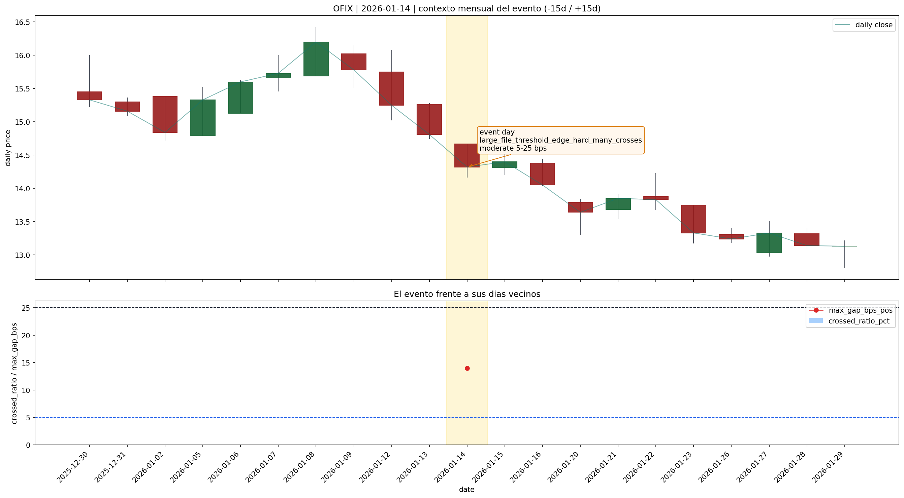

#### 00b Event Month Quotes Context
Esta imagen responde a la pregunta de recurrencia mensual dentro de `quotes`: el problema se concentra en el evento o reaparece en varias sesiones. Arriba concatena sesiones con datos disponibles; abajo resume cobertura diaria, `crossed_ratio_pct` y `max_gap_bps_pos`. La decision que cambia es si el caso debe leerse como episodio puntual o como sintoma de una fase repetida de libro degradado. El error que evita es extrapolar desde un unico dia a todo el mes sin evidencia.

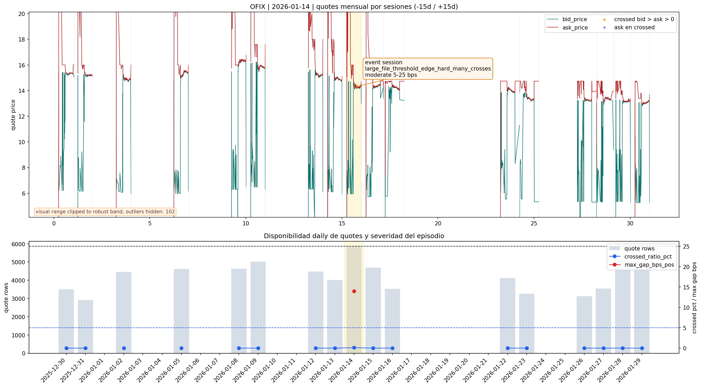

#### 01 Raw Window
Esta imagen responde a la primera pregunta decisiva del caso: el crossed observado es economicamente bastante fuerte para justificar un cambio de clase. Arriba ensena la geometria exacta del tramo conflictivo; abajo convierte esa geometria a bps y la enfrenta a los cortes `5 bps` y `25 bps`. El regimen dominante es `moderate 5-25 bps`. La decision que cambia es pasar de anomalia interpretable a `review` o `bad`. El error que evita es decidir por apariencia visual sin medir el dano economico real del crossed. En terminos de pipeline, este panel decide si el problema afecta solo a la lectura forense o si invalida simulacion de ejecucion y microstructure features.

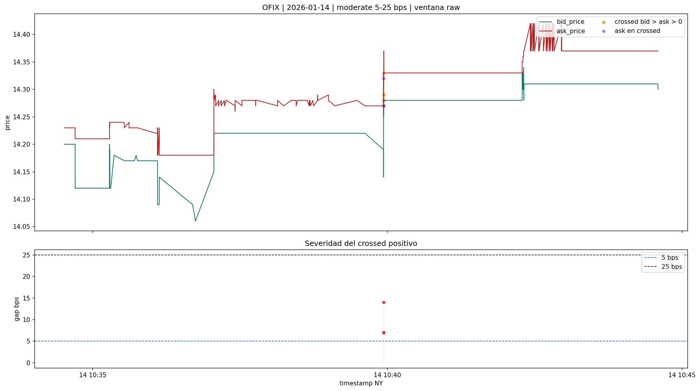

#### 02 Full Session Context
Esta imagen responde a la pregunta de extension intradiaria: el dano esta confinado a un bloque corto o contamina la sesion completa. Arriba se ve toda la sesion `04:00-20:00 NY`; abajo el `gap_bps` firmado. La decision que cambia es si el consumo debe penalizar solo un tramo o desechar el dia entero para uso operativo. El error que evita es tratar una cicatriz local como ruina total o, al reves, minimizar una degradacion distribuida a lo largo del dia. En ejecucion esto decide si la sesion puede seguir usandose con restricciones; en ML decide si las features intradiarias conservan significado economico.

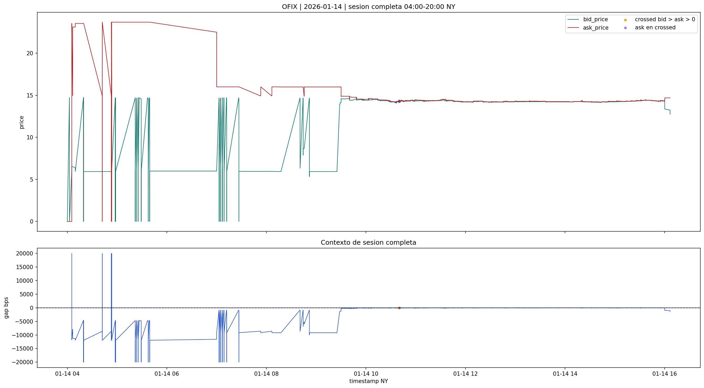

#### 03 Structure Diagnostics
Este panel responde a la pregunta de naturaleza del fallo: contradiccion economica genuina o mezcla con degeneracion estructural. Separa `ask=0` de `ask>0`, muestra la distribucion de `gap_bps` y resume patrones de integerizacion. La decision que cambia es como interpretar el dano: mercado localmente roto, artefacto de representacion o combinacion de ambos. El error que evita es sobrediagnosticar crossed reales cuando parte de la senal proviene de estructura degenerada del libro. Esta lectura afecta directamente a que el caso vaya a exclusion dura, a bandera contextual o a simple reconciliacion tecnica.

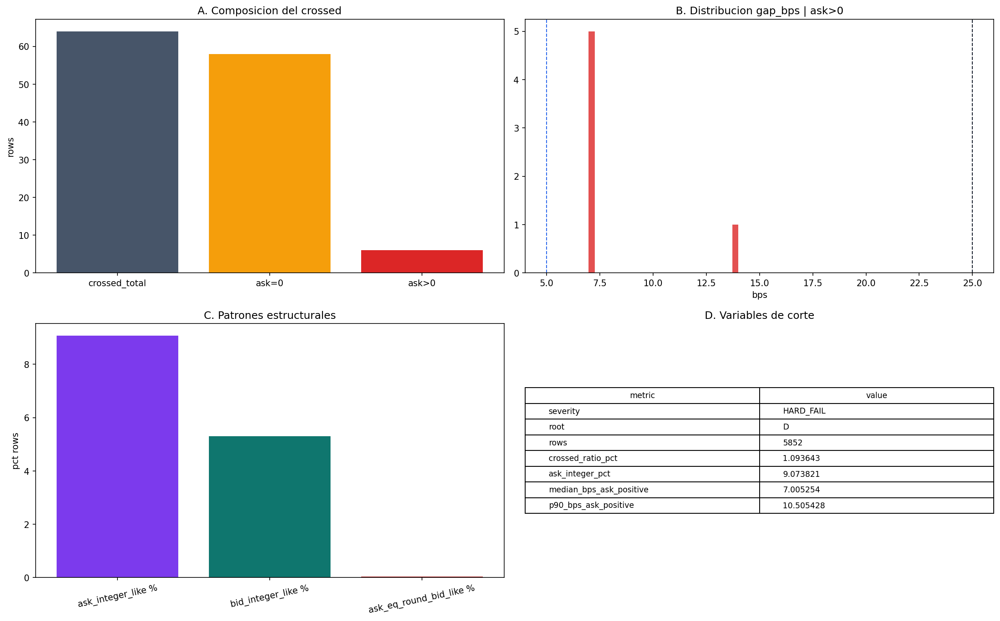

#### 04 Summary Card
Esta tarjeta responde a la pregunta de auditabilidad: cuales son exactamente las variables que sostienen la conclusion. Reune `severity`, `root`, `crossed_ratio_pct`, `ask_integer_pct`, `median_bps_ask_positive` y `p90_bps_ask_positive`. La decision que cambia es pasar de impresion visual a regla verificable. El error que evita es que dos inspectores lleguen a conclusiones distintas mirando la misma imagen sin una base numerica comun. Para gobernanza del proyecto, este panel es el que vuelve reproducible la decision para backtest, ML y auditoria.

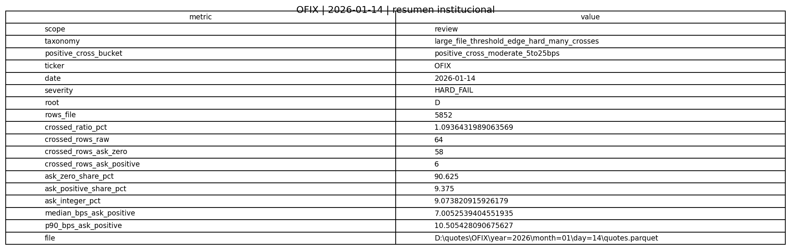

---

### 17. HWAY 2015-04-23

company_name: `Healthways, Inc.`
primary_exchange: `NASDAQ` (`XNAS`)
market_locale: `stocks/us`
scope: `review`
ticker: `HWAY`
date: `2015-04-23`
taxonomy: `large_file_threshold_edge_hard_many_crosses`
positive_cross_bucket: `positive_cross_moderate_5to25bps`
severity: `HARD_FAIL`
root: `D`
rows: `12899`
crossed_ratio_pct: `0.814017`
crossed_rows_raw: `105`
crossed_rows_ask_zero: `4`
crossed_rows_ask_positive: `101`
ask_integer_pct: `4.480968`
median_bps_ask_positive: `5.126891`
p90_bps_ask_positive: `15.372790`
file: `D:\quotes\HWAY\year=2015\month=04\day=23\quotes.parquet`

#### Analisis Forense
La conclusion correcta del caso es que ya existe contradiccion economica real dentro del libro, pero aun no con fuerza suficiente para justificar exclusion dura sin contexto adicional. La taxonomy historica es `large_file_threshold_edge_hard_many_crosses` y el regimen positivo dominante es `moderate 5-25 bps`. Esto importa porque la taxonomy no solo clasifica: resume que tipo de anomalia se esta viendo y que clase de decision contractual puede defenderse despues. La taxonomy `large_file_threshold_edge_hard_many_crosses` implica un libro grande con muchas contradicciones, pero cerca del borde decisional. La dificultad analitica esta en decidir si el volumen de crossed es ruido absorbible o evidencia de degradacion suficientemente seria. El regimen `moderate 5-25 bps` ya entra en zona donde el crossed tiene capacidad real de contaminar simulacion de ejecucion y features microestructurales, aunque todavia puede requerir lectura contextual antes de exclusion dura. En terminos observables, el file tiene `crossed_ratio_pct=0.814017` con `crossed_rows_ask_positive=101` y `crossed_rows_ask_zero=4`. La severidad economica del crossed ask>0 se resume en `median_bps_ask_positive=5.126891` y `p90_bps_ask_positive=15.372790`. Estos dos numeros convierten una forma visual rara en una conclusion operativa sobre si el libro sigue representando o no un mercado negociable. La decision que cambia es pasar de libro sano a libro util solo bajo cautela. `review` significa: no usar como si fuera ejecucion limpia, conservar para analisis contextual y sensibilidad. El error que evita es tratar como normal un episodio que ya contiene contradiccion economica real y contaminar simulaciones de ejecucion o validaciones demasiado optimistas. El patron estructural muestra `ask_integer_pct=4.480968`. Este numero obliga a separar dos explicaciones rivales: contradiccion economica genuina del libro o mezcla con degeneracion estructural / integerizacion. La mayor parte del crossed vive en `ask>0`, de modo que el corazon del problema sigue siendo economico. La parte `ask=0`, si existe, acompana pero no explica por si sola la anomalia. Como `ask_integer_pct` es bajo, la hipotesis de simple degeneracion mecanica pierde fuerza. Eso endurece la interpretacion: el crossed se parece mas a contradiccion economica genuina y menos a artefacto. En la capa de semantica de precio del evento aparecen `daily raw close=19.5000`, `quote mid raw=19.4200`, `quote mid split_normalized=19.4200`, `daily adjusted_proxy=19.1662`. Ademas hay `post_event_dividend_sum=0.4563`. La implicacion metodologica es crucial: una discrepancia entre `quotes`, `daily` y una plataforma externa no puede leerse automaticamente como fallo del dataset. Puede ser semantica de precio distinta. El error que evita esta capa es mezclar raw, split-normalized y adjusted dentro del mismo pipeline, rompiendo auditoria, benchmarking y labels. Para pipelines, esto bloquea su uso como libro sano en ejecucion y features microestructurales principales, aunque aun puede mantenerse para forense, sensibilidad y estudios donde la anomalia sea parte del objeto de investigacion. Existe ademas una imagen historica de certificacion asociada. Su papel es poner el episodio en un marco causal mas amplio: halt, explained, not strongly explained o patron conocido. La regla que protege al proyecto es esta: el contexto externo se usa para explicar por que aparece el episodio, no para absolverlo. El error que evita es degradar el criterio de calidad del libro porque exista una historia plausible alrededor del caso.

#### 00 Event Month Context
Esta imagen responde a la pregunta de persistencia temporal: estamos ante un accidente local o ante una fase mas amplia de inestabilidad. Arriba coloca el evento en la serie `daily` real del mes; abajo compara `crossed_ratio_pct` y `max_gap_bps_pos` del dia contra sus vecinos. La decision que cambia es el peso estructural que se le concede al caso. El error que evita es juzgar igual un shock aislado y una degradacion repetida del libro.

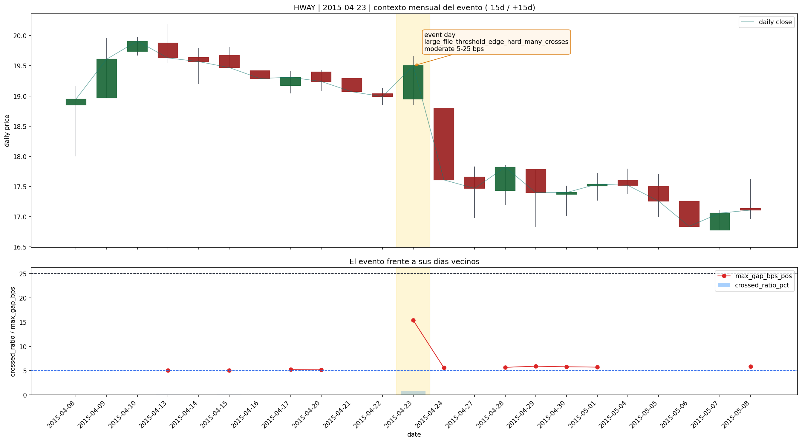

#### 00a Adjusted Proxy Contrast
Esta imagen responde a la pregunta de reconciliacion semantica: la discrepancia de precios viene de datos rotos o de vistas de precio distintas. Compara `daily raw`, `daily adjusted_proxy`, `quote mid raw` y `quote mid split_normalized`, y debajo ensena la cadena de dividendos y splits que produce la diferencia. La decision que cambia es si el inspector debe abrir una incidencia de calidad o cerrar el caso como diferencia legitima de semantica. El error que evita es mezclar series raw y adjusted como si fueran equivalentes. En pipelines reales, esto protege benchmarking, labels diarios y reconciliacion externa frente a falsas alarmas de precio.

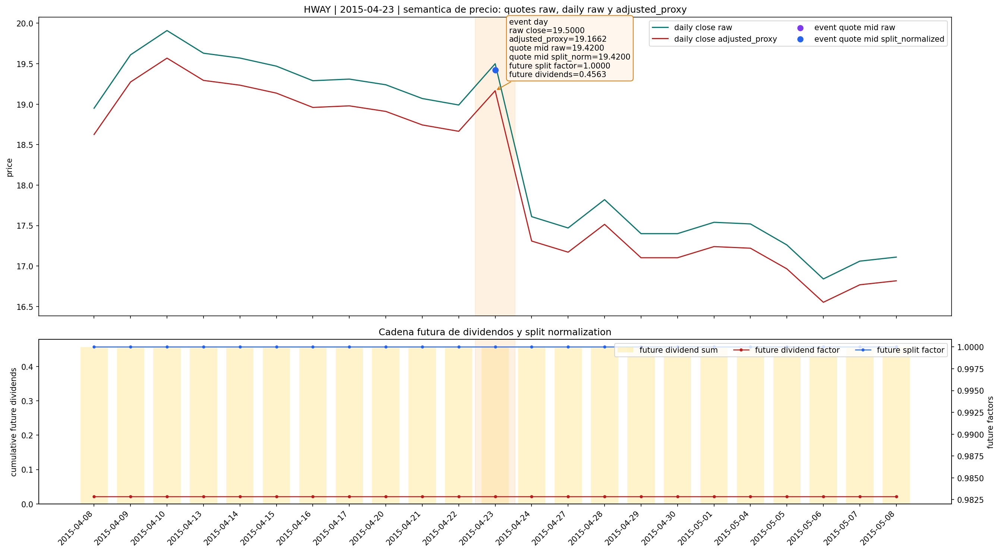

#### 00b Event Month Quotes Context
Esta imagen responde a la pregunta de recurrencia mensual dentro de `quotes`: el problema se concentra en el evento o reaparece en varias sesiones. Arriba concatena sesiones con datos disponibles; abajo resume cobertura diaria, `crossed_ratio_pct` y `max_gap_bps_pos`. La decision que cambia es si el caso debe leerse como episodio puntual o como sintoma de una fase repetida de libro degradado. El error que evita es extrapolar desde un unico dia a todo el mes sin evidencia.

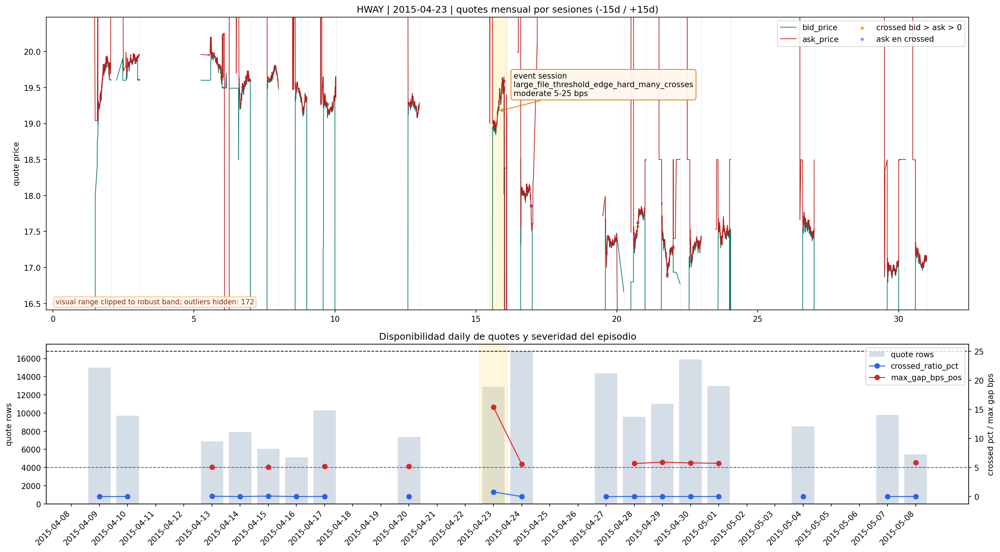

#### 01 Raw Window
Esta imagen responde a la primera pregunta decisiva del caso: el crossed observado es economicamente bastante fuerte para justificar un cambio de clase. Arriba ensena la geometria exacta del tramo conflictivo; abajo convierte esa geometria a bps y la enfrenta a los cortes `5 bps` y `25 bps`. El regimen dominante es `moderate 5-25 bps`. La decision que cambia es pasar de anomalia interpretable a `review` o `bad`. El error que evita es decidir por apariencia visual sin medir el dano economico real del crossed. En terminos de pipeline, este panel decide si el problema afecta solo a la lectura forense o si invalida simulacion de ejecucion y microstructure features.

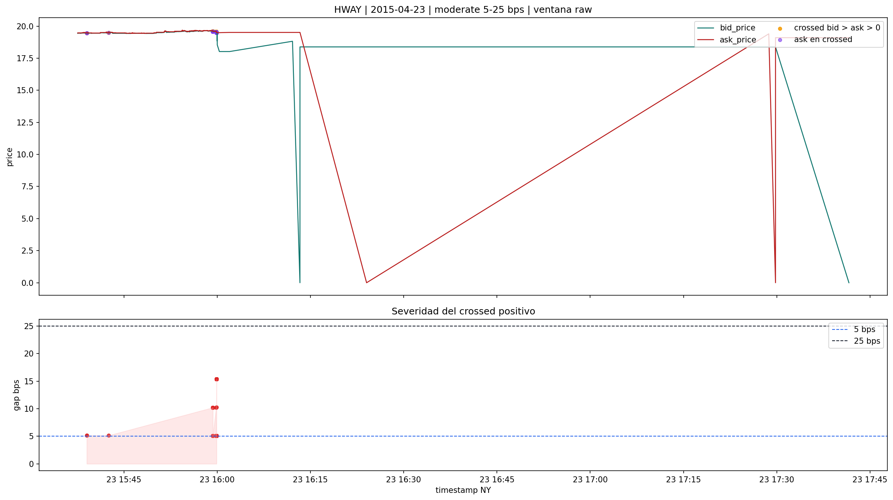

#### 02 Full Session Context
Esta imagen responde a la pregunta de extension intradiaria: el dano esta confinado a un bloque corto o contamina la sesion completa. Arriba se ve toda la sesion `04:00-20:00 NY`; abajo el `gap_bps` firmado. La decision que cambia es si el consumo debe penalizar solo un tramo o desechar el dia entero para uso operativo. El error que evita es tratar una cicatriz local como ruina total o, al reves, minimizar una degradacion distribuida a lo largo del dia. En ejecucion esto decide si la sesion puede seguir usandose con restricciones; en ML decide si las features intradiarias conservan significado economico.

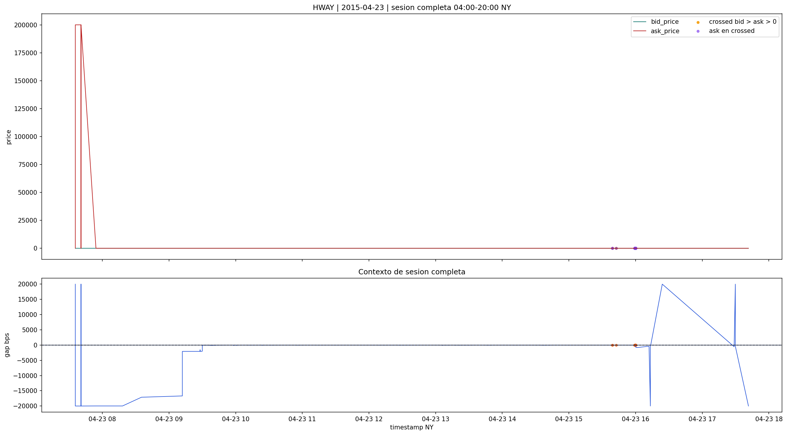

#### 03 Structure Diagnostics
Este panel responde a la pregunta de naturaleza del fallo: contradiccion economica genuina o mezcla con degeneracion estructural. Separa `ask=0` de `ask>0`, muestra la distribucion de `gap_bps` y resume patrones de integerizacion. La decision que cambia es como interpretar el dano: mercado localmente roto, artefacto de representacion o combinacion de ambos. El error que evita es sobrediagnosticar crossed reales cuando parte de la senal proviene de estructura degenerada del libro. Esta lectura afecta directamente a que el caso vaya a exclusion dura, a bandera contextual o a simple reconciliacion tecnica.

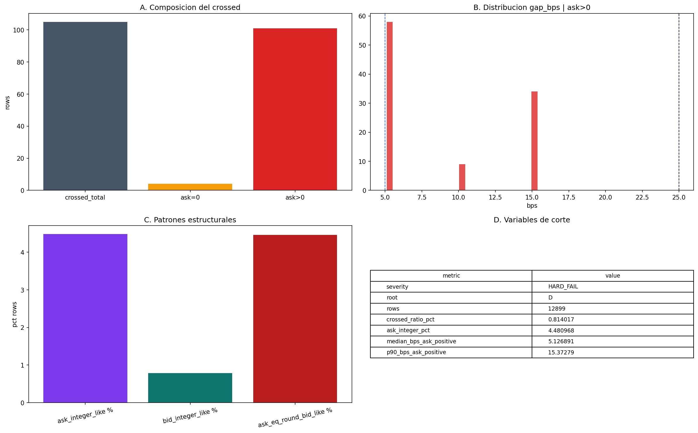

#### 04 Summary Card
Esta tarjeta responde a la pregunta de auditabilidad: cuales son exactamente las variables que sostienen la conclusion. Reune `severity`, `root`, `crossed_ratio_pct`, `ask_integer_pct`, `median_bps_ask_positive` y `p90_bps_ask_positive`. La decision que cambia es pasar de impresion visual a regla verificable. El error que evita es que dos inspectores lleguen a conclusiones distintas mirando la misma imagen sin una base numerica comun. Para gobernanza del proyecto, este panel es el que vuelve reproducible la decision para backtest, ML y auditoria.

---

### 18. UPL 2007-02-22

company_name: `ULTRA PETROLEUM CORP`
primary_exchange: `NYSE` (`XNYS`)
market_locale: `stocks/us`
scope: `review`
ticker: `UPL`
date: `2007-02-22`
taxonomy: `large_file_threshold_edge_hard_many_crosses`
positive_cross_bucket: `positive_cross_mild_lt5bps`
severity: `HARD_FAIL`
root: `C`
rows: `6900`
crossed_ratio_pct: `2.884058`
crossed_rows_raw: `199`
crossed_rows_ask_zero: `0`
crossed_rows_ask_positive: `199`
ask_integer_pct: `3.043478`
median_bps_ask_positive: `3.942440`
p90_bps_ask_positive: `10.252792`
file: `C:\TSIS_Data\data\quotes\UPL\year=2007\month=02\day=22\quotes.parquet`

#### Analisis Forense
La conclusion correcta del caso es que ya existe contradiccion economica real dentro del libro, pero aun no con fuerza suficiente para justificar exclusion dura sin contexto adicional. La taxonomy historica es `large_file_threshold_edge_hard_many_crosses` y el regimen positivo dominante es `mild <5 bps`. Esto importa porque la taxonomy no solo clasifica: resume que tipo de anomalia se esta viendo y que clase de decision contractual puede defenderse despues. La taxonomy `large_file_threshold_edge_hard_many_crosses` implica un libro grande con muchas contradicciones, pero cerca del borde decisional. La dificultad analitica esta en decidir si el volumen de crossed es ruido absorbible o evidencia de degradacion suficientemente seria. El regimen `mild <5 bps` significa que existe contradiccion economica positiva, pero aun en una banda donde un uso prudente puede seguir siendo defendible si la persistencia y la estructura no agravan el caso. En terminos observables, el file tiene `crossed_ratio_pct=2.884058` con `crossed_rows_ask_positive=199` y `crossed_rows_ask_zero=0`. La severidad economica del crossed ask>0 se resume en `median_bps_ask_positive=3.942440` y `p90_bps_ask_positive=10.252792`. Estos dos numeros convierten una forma visual rara en una conclusion operativa sobre si el libro sigue representando o no un mercado negociable. La decision que cambia es pasar de libro sano a libro util solo bajo cautela. `review` significa: no usar como si fuera ejecucion limpia, conservar para analisis contextual y sensibilidad. El error que evita es tratar como normal un episodio que ya contiene contradiccion economica real y contaminar simulaciones de ejecucion o validaciones demasiado optimistas. El patron estructural muestra `ask_integer_pct=3.043478`. Este numero obliga a separar dos explicaciones rivales: contradiccion economica genuina del libro o mezcla con degeneracion estructural / integerizacion. Toda la composicion crossed cae en `ask>0`. Eso endurece la lectura economica del caso: el dano no depende de ceros mecanicos, sino de contradiccion positiva dentro de precios aparentemente vivos. Como `ask_integer_pct` es bajo, la hipotesis de simple degeneracion mecanica pierde fuerza. Eso endurece la interpretacion: el crossed se parece mas a contradiccion economica genuina y menos a artefacto. Existe ademas una imagen historica de certificacion asociada. Su papel es poner el episodio en un marco causal mas amplio: halt, explained, not strongly explained o patron conocido. La regla que protege al proyecto es esta: el contexto externo se usa para explicar por que aparece el episodio, no para absolverlo. El error que evita es degradar el criterio de calidad del libro porque exista una historia plausible alrededor del caso.

#### 00 Event Month Context
Esta imagen responde a la pregunta de persistencia temporal: estamos ante un accidente local o ante una fase mas amplia de inestabilidad. Arriba coloca el evento en la serie `daily` real del mes; abajo compara `crossed_ratio_pct` y `max_gap_bps_pos` del dia contra sus vecinos. La decision que cambia es el peso estructural que se le concede al caso. El error que evita es juzgar igual un shock aislado y una degradacion repetida del libro.

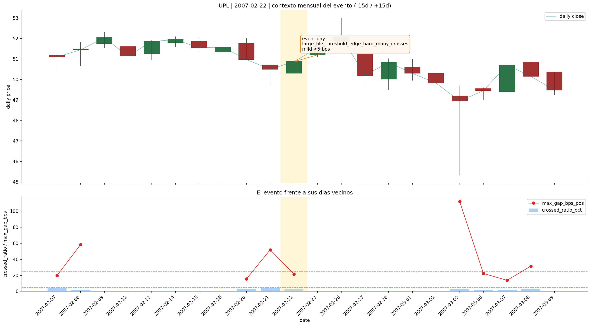

#### 00b Event Month Quotes Context
Esta imagen responde a la pregunta de recurrencia mensual dentro de `quotes`: el problema se concentra en el evento o reaparece en varias sesiones. Arriba concatena sesiones con datos disponibles; abajo resume cobertura diaria, `crossed_ratio_pct` y `max_gap_bps_pos`. La decision que cambia es si el caso debe leerse como episodio puntual o como sintoma de una fase repetida de libro degradado. El error que evita es extrapolar desde un unico dia a todo el mes sin evidencia.

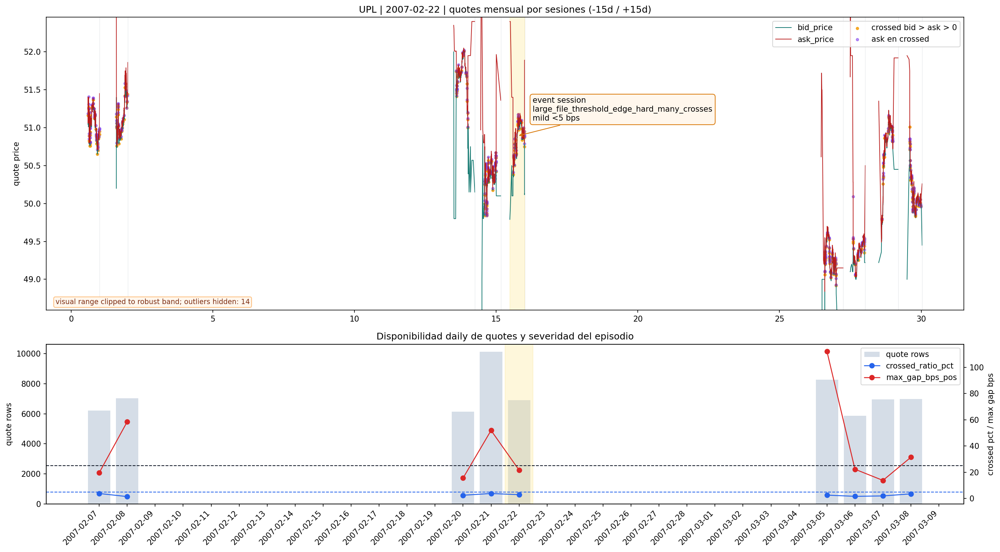

#### 01 Raw Window
Esta imagen responde a la primera pregunta decisiva del caso: el crossed observado es economicamente bastante fuerte para justificar un cambio de clase. Arriba ensena la geometria exacta del tramo conflictivo; abajo convierte esa geometria a bps y la enfrenta a los cortes `5 bps` y `25 bps`. El regimen dominante es `mild <5 bps`. La decision que cambia es pasar de anomalia interpretable a `review` o `bad`. El error que evita es decidir por apariencia visual sin medir el dano economico real del crossed. En terminos de pipeline, este panel decide si el problema afecta solo a la lectura forense o si invalida simulacion de ejecucion y microstructure features.

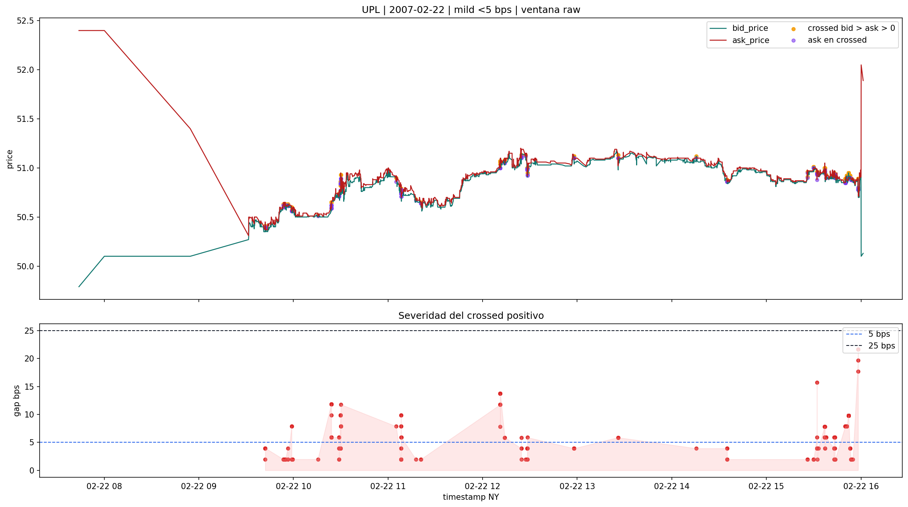

#### 02 Full Session Context
Esta imagen responde a la pregunta de extension intradiaria: el dano esta confinado a un bloque corto o contamina la sesion completa. Arriba se ve toda la sesion `04:00-20:00 NY`; abajo el `gap_bps` firmado. La decision que cambia es si el consumo debe penalizar solo un tramo o desechar el dia entero para uso operativo. El error que evita es tratar una cicatriz local como ruina total o, al reves, minimizar una degradacion distribuida a lo largo del dia. En ejecucion esto decide si la sesion puede seguir usandose con restricciones; en ML decide si las features intradiarias conservan significado economico.

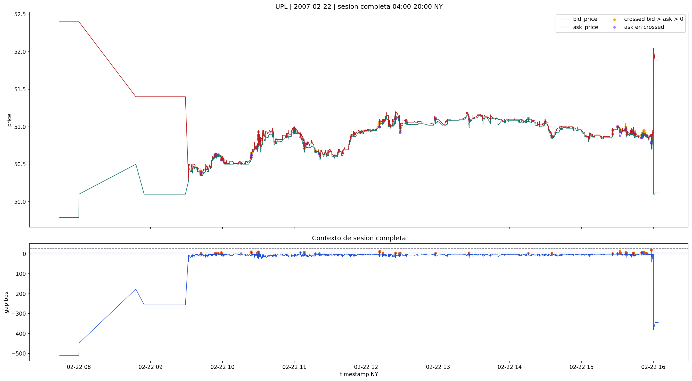

#### 03 Structure Diagnostics
Este panel responde a la pregunta de naturaleza del fallo: contradiccion economica genuina o mezcla con degeneracion estructural. Separa `ask=0` de `ask>0`, muestra la distribucion de `gap_bps` y resume patrones de integerizacion. La decision que cambia es como interpretar el dano: mercado localmente roto, artefacto de representacion o combinacion de ambos. El error que evita es sobrediagnosticar crossed reales cuando parte de la senal proviene de estructura degenerada del libro. Esta lectura afecta directamente a que el caso vaya a exclusion dura, a bandera contextual o a simple reconciliacion tecnica.

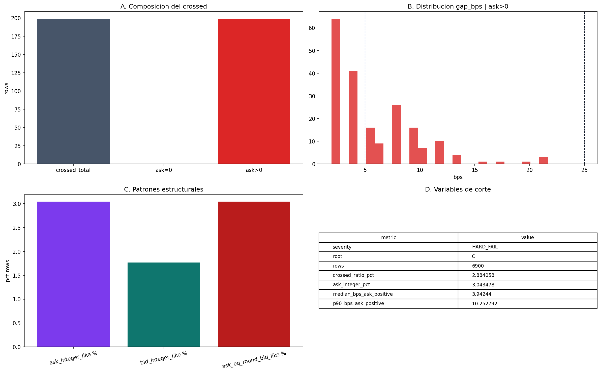

#### 04 Summary Card
Esta tarjeta responde a la pregunta de auditabilidad: cuales son exactamente las variables que sostienen la conclusion. Reune `severity`, `root`, `crossed_ratio_pct`, `ask_integer_pct`, `median_bps_ask_positive` y `p90_bps_ask_positive`. La decision que cambia es pasar de impresion visual a regla verificable. El error que evita es que dos inspectores lleguen a conclusiones distintas mirando la misma imagen sin una base numerica comun. Para gobernanza del proyecto, este panel es el que vuelve reproducible la decision para backtest, ML y auditoria.

---

### 19. NTGR 2006-11-13

company_name: `NETGEAR, Inc.`
primary_exchange: `NASDAQ` (`XNAS`)
market_locale: `stocks/us`
scope: `review`
ticker: `NTGR`
date: `2006-11-13`
taxonomy: `large_file_threshold_edge_hard_many_crosses`
positive_cross_bucket: `positive_cross_mild_lt5bps`
severity: `HARD_FAIL`
root: `D`
rows: `9477`
crossed_ratio_pct: `1.055186`
crossed_rows_raw: `100`
crossed_rows_ask_zero: `0`
crossed_rows_ask_positive: `100`
ask_integer_pct: `2.416376`
median_bps_ask_positive: `3.740415`
p90_bps_ask_positive: `11.121008`
file: `D:\quotes\NTGR\year=2006\month=11\day=13\quotes.parquet`

#### Analisis Forense
La conclusion correcta del caso es que ya existe contradiccion economica real dentro del libro, pero aun no con fuerza suficiente para justificar exclusion dura sin contexto adicional. La taxonomy historica es `large_file_threshold_edge_hard_many_crosses` y el regimen positivo dominante es `mild <5 bps`. Esto importa porque la taxonomy no solo clasifica: resume que tipo de anomalia se esta viendo y que clase de decision contractual puede defenderse despues. La taxonomy `large_file_threshold_edge_hard_many_crosses` implica un libro grande con muchas contradicciones, pero cerca del borde decisional. La dificultad analitica esta en decidir si el volumen de crossed es ruido absorbible o evidencia de degradacion suficientemente seria. El regimen `mild <5 bps` significa que existe contradiccion economica positiva, pero aun en una banda donde un uso prudente puede seguir siendo defendible si la persistencia y la estructura no agravan el caso. En terminos observables, el file tiene `crossed_ratio_pct=1.055186` con `crossed_rows_ask_positive=100` y `crossed_rows_ask_zero=0`. La severidad economica del crossed ask>0 se resume en `median_bps_ask_positive=3.740415` y `p90_bps_ask_positive=11.121008`. Estos dos numeros convierten una forma visual rara en una conclusion operativa sobre si el libro sigue representando o no un mercado negociable. La decision que cambia es pasar de libro sano a libro util solo bajo cautela. `review` significa: no usar como si fuera ejecucion limpia, conservar para analisis contextual y sensibilidad. El error que evita es tratar como normal un episodio que ya contiene contradiccion economica real y contaminar simulaciones de ejecucion o validaciones demasiado optimistas. El patron estructural muestra `ask_integer_pct=2.416376`. Este numero obliga a separar dos explicaciones rivales: contradiccion economica genuina del libro o mezcla con degeneracion estructural / integerizacion. Toda la composicion crossed cae en `ask>0`. Eso endurece la lectura economica del caso: el dano no depende de ceros mecanicos, sino de contradiccion positiva dentro de precios aparentemente vivos. Como `ask_integer_pct` es bajo, la hipotesis de simple degeneracion mecanica pierde fuerza. Eso endurece la interpretacion: el crossed se parece mas a contradiccion economica genuina y menos a artefacto. Existe ademas una imagen historica de certificacion asociada. Su papel es poner el episodio en un marco causal mas amplio: halt, explained, not strongly explained o patron conocido. La regla que protege al proyecto es esta: el contexto externo se usa para explicar por que aparece el episodio, no para absolverlo. El error que evita es degradar el criterio de calidad del libro porque exista una historia plausible alrededor del caso.

#### 00 Event Month Context
Esta imagen responde a la pregunta de persistencia temporal: estamos ante un accidente local o ante una fase mas amplia de inestabilidad. Arriba coloca el evento en la serie `daily` real del mes; abajo compara `crossed_ratio_pct` y `max_gap_bps_pos` del dia contra sus vecinos. La decision que cambia es el peso estructural que se le concede al caso. El error que evita es juzgar igual un shock aislado y una degradacion repetida del libro.

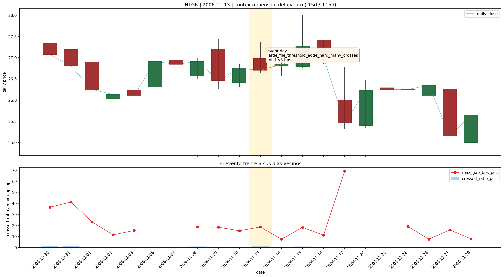

#### 00b Event Month Quotes Context
Esta imagen responde a la pregunta de recurrencia mensual dentro de `quotes`: el problema se concentra en el evento o reaparece en varias sesiones. Arriba concatena sesiones con datos disponibles; abajo resume cobertura diaria, `crossed_ratio_pct` y `max_gap_bps_pos`. La decision que cambia es si el caso debe leerse como episodio puntual o como sintoma de una fase repetida de libro degradado. El error que evita es extrapolar desde un unico dia a todo el mes sin evidencia.

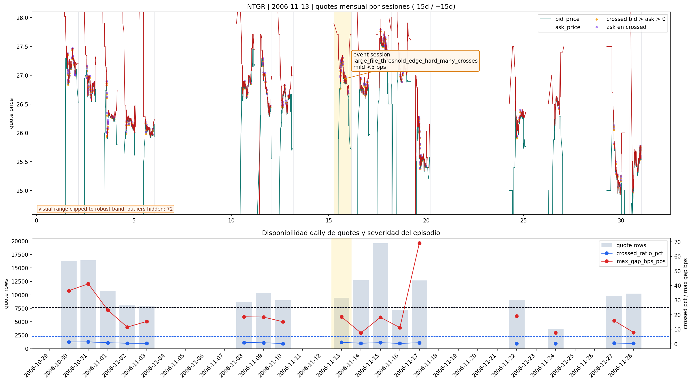

#### 01 Raw Window
Esta imagen responde a la primera pregunta decisiva del caso: el crossed observado es economicamente bastante fuerte para justificar un cambio de clase. Arriba ensena la geometria exacta del tramo conflictivo; abajo convierte esa geometria a bps y la enfrenta a los cortes `5 bps` y `25 bps`. El regimen dominante es `mild <5 bps`. La decision que cambia es pasar de anomalia interpretable a `review` o `bad`. El error que evita es decidir por apariencia visual sin medir el dano economico real del crossed. En terminos de pipeline, este panel decide si el problema afecta solo a la lectura forense o si invalida simulacion de ejecucion y microstructure features.

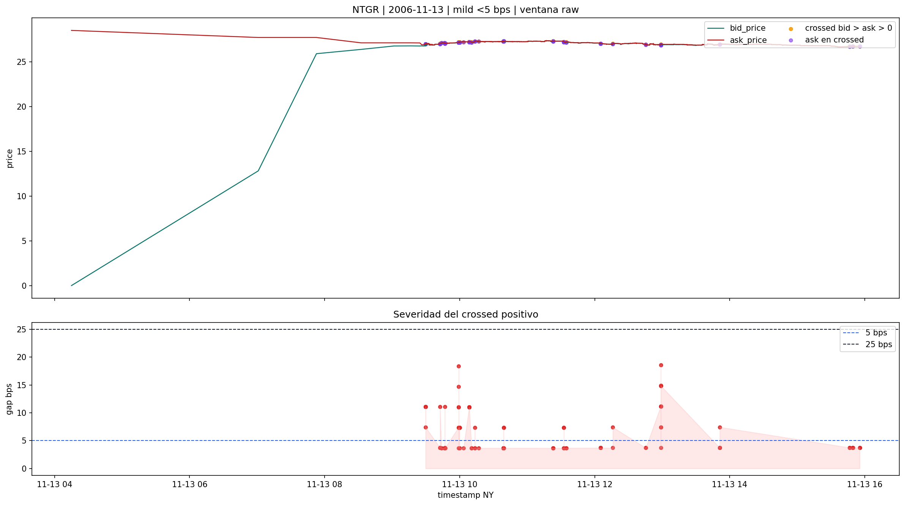

#### 02 Full Session Context
Esta imagen responde a la pregunta de extension intradiaria: el dano esta confinado a un bloque corto o contamina la sesion completa. Arriba se ve toda la sesion `04:00-20:00 NY`; abajo el `gap_bps` firmado. La decision que cambia es si el consumo debe penalizar solo un tramo o desechar el dia entero para uso operativo. El error que evita es tratar una cicatriz local como ruina total o, al reves, minimizar una degradacion distribuida a lo largo del dia. En ejecucion esto decide si la sesion puede seguir usandose con restricciones; en ML decide si las features intradiarias conservan significado economico.

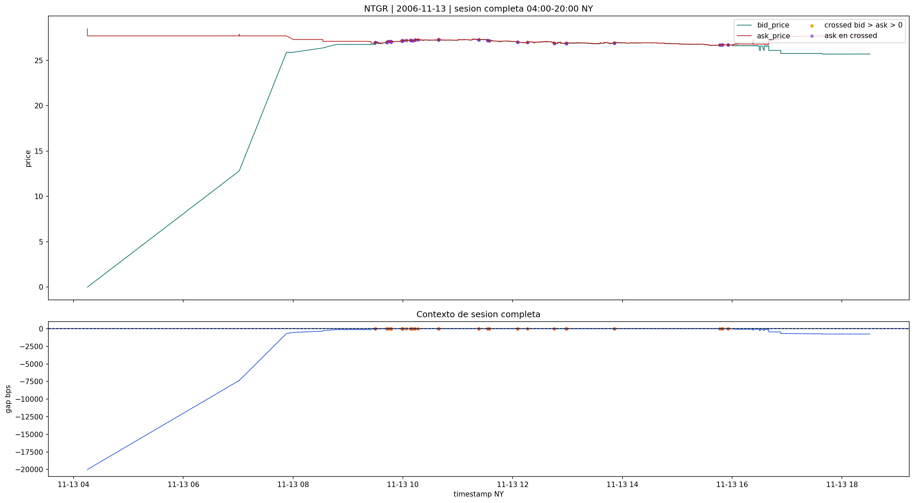

#### 03 Structure Diagnostics
Este panel responde a la pregunta de naturaleza del fallo: contradiccion economica genuina o mezcla con degeneracion estructural. Separa `ask=0` de `ask>0`, muestra la distribucion de `gap_bps` y resume patrones de integerizacion. La decision que cambia es como interpretar el dano: mercado localmente roto, artefacto de representacion o combinacion de ambos. El error que evita es sobrediagnosticar crossed reales cuando parte de la senal proviene de estructura degenerada del libro. Esta lectura afecta directamente a que el caso vaya a exclusion dura, a bandera contextual o a simple reconciliacion tecnica.

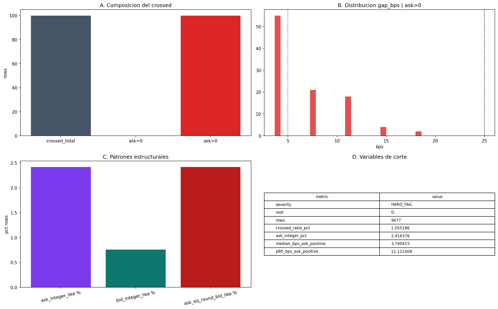

#### 04 Summary Card
Esta tarjeta responde a la pregunta de auditabilidad: cuales son exactamente las variables que sostienen la conclusion. Reune `severity`, `root`, `crossed_ratio_pct`, `ask_integer_pct`, `median_bps_ask_positive` y `p90_bps_ask_positive`. La decision que cambia es pasar de impresion visual a regla verificable. El error que evita es que dos inspectores lleguen a conclusiones distintas mirando la misma imagen sin una base numerica comun. Para gobernanza del proyecto, este panel es el que vuelve reproducible la decision para backtest, ML y auditoria.

---

### 20. PD 2006-05-26

company_name: `PagerDuty, Inc.`
primary_exchange: `NYSE` (`XNYS`)
market_locale: `stocks/us`
scope: `review`
ticker: `PD`
date: `2006-05-26`
taxonomy: `large_file_threshold_edge_hard_many_crosses`
positive_cross_bucket: `positive_cross_mild_lt5bps`
severity: `HARD_FAIL`
root: `C`
rows: `32824`
crossed_ratio_pct: `2.946015`
crossed_rows_raw: `967`
crossed_rows_ask_zero: `0`
crossed_rows_ask_positive: `967`
ask_integer_pct: `1.084572`
median_bps_ask_positive: `2.291738`
p90_bps_ask_positive: `7.006563`
file: `C:\TSIS_Data\data\quotes\PD\year=2006\month=05\day=26\quotes.parquet`

#### Analisis Forense
La conclusion correcta del caso es que ya existe contradiccion economica real dentro del libro, pero aun no con fuerza suficiente para justificar exclusion dura sin contexto adicional. La taxonomy historica es `large_file_threshold_edge_hard_many_crosses` y el regimen positivo dominante es `mild <5 bps`. Esto importa porque la taxonomy no solo clasifica: resume que tipo de anomalia se esta viendo y que clase de decision contractual puede defenderse despues. La taxonomy `large_file_threshold_edge_hard_many_crosses` implica un libro grande con muchas contradicciones, pero cerca del borde decisional. La dificultad analitica esta en decidir si el volumen de crossed es ruido absorbible o evidencia de degradacion suficientemente seria. El regimen `mild <5 bps` significa que existe contradiccion economica positiva, pero aun en una banda donde un uso prudente puede seguir siendo defendible si la persistencia y la estructura no agravan el caso. En terminos observables, el file tiene `crossed_ratio_pct=2.946015` con `crossed_rows_ask_positive=967` y `crossed_rows_ask_zero=0`. La severidad economica del crossed ask>0 se resume en `median_bps_ask_positive=2.291738` y `p90_bps_ask_positive=7.006563`. Estos dos numeros convierten una forma visual rara en una conclusion operativa sobre si el libro sigue representando o no un mercado negociable. La decision que cambia es pasar de libro sano a libro util solo bajo cautela. `review` significa: no usar como si fuera ejecucion limpia, conservar para analisis contextual y sensibilidad. El error que evita es tratar como normal un episodio que ya contiene contradiccion economica real y contaminar simulaciones de ejecucion o validaciones demasiado optimistas. El patron estructural muestra `ask_integer_pct=1.084572`. Este numero obliga a separar dos explicaciones rivales: contradiccion economica genuina del libro o mezcla con degeneracion estructural / integerizacion. Toda la composicion crossed cae en `ask>0`. Eso endurece la lectura economica del caso: el dano no depende de ceros mecanicos, sino de contradiccion positiva dentro de precios aparentemente vivos. Como `ask_integer_pct` es bajo, la hipotesis de simple degeneracion mecanica pierde fuerza. Eso endurece la interpretacion: el crossed se parece mas a contradiccion economica genuina y menos a artefacto. En la capa de semantica de precio del evento aparecen `daily raw close=88.2600`, `quote mid raw=87.1750`, `quote mid split_normalized=87.1750`, `daily adjusted_proxy=87.7306`. Ademas hay `post_event_dividend_sum=0.6000`. La implicacion metodologica es crucial: una discrepancia entre `quotes`, `daily` y una plataforma externa no puede leerse automaticamente como fallo del dataset. Puede ser semantica de precio distinta. El error que evita esta capa es mezclar raw, split-normalized y adjusted dentro del mismo pipeline, rompiendo auditoria, benchmarking y labels. Para pipelines, esto empuja a conservar el caso fuera de ejecucion limpia, pero todavia puede mantenerse en investigacion contextual y en analisis de sensibilidad donde interese entender fronteras de tolerancia. Existe ademas una imagen historica de certificacion asociada. Su papel es poner el episodio en un marco causal mas amplio: halt, explained, not strongly explained o patron conocido. La regla que protege al proyecto es esta: el contexto externo se usa para explicar por que aparece el episodio, no para absolverlo. El error que evita es degradar el criterio de calidad del libro porque exista una historia plausible alrededor del caso.

#### 00 Event Month Context
Esta imagen responde a la pregunta de persistencia temporal: estamos ante un accidente local o ante una fase mas amplia de inestabilidad. Arriba coloca el evento en la serie `daily` real del mes; abajo compara `crossed_ratio_pct` y `max_gap_bps_pos` del dia contra sus vecinos. La decision que cambia es el peso estructural que se le concede al caso. El error que evita es juzgar igual un shock aislado y una degradacion repetida del libro.

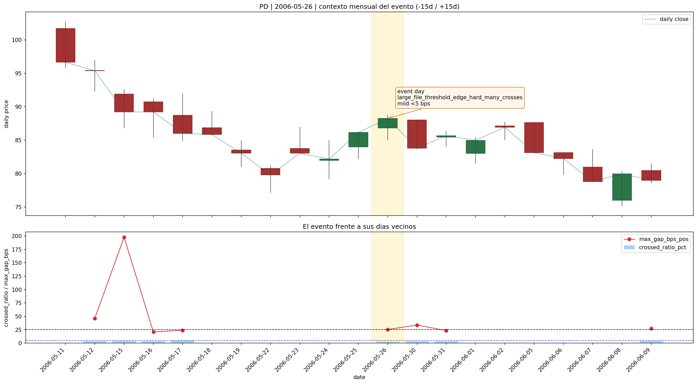

#### 00a Adjusted Proxy Contrast
Esta imagen responde a la pregunta de reconciliacion semantica: la discrepancia de precios viene de datos rotos o de vistas de precio distintas. Compara `daily raw`, `daily adjusted_proxy`, `quote mid raw` y `quote mid split_normalized`, y debajo ensena la cadena de dividendos y splits que produce la diferencia. La decision que cambia es si el inspector debe abrir una incidencia de calidad o cerrar el caso como diferencia legitima de semantica. El error que evita es mezclar series raw y adjusted como si fueran equivalentes. En pipelines reales, esto protege benchmarking, labels diarios y reconciliacion externa frente a falsas alarmas de precio.

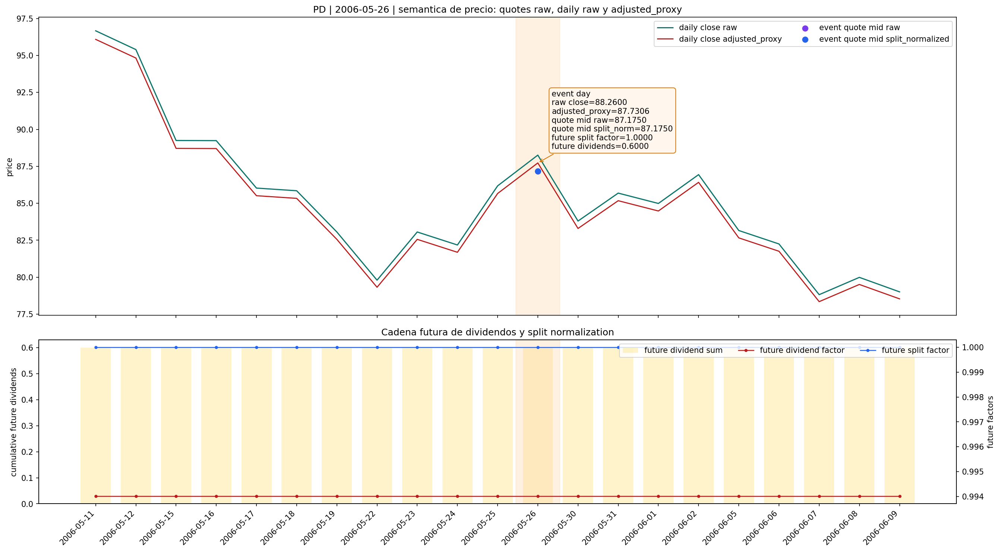

#### 00b Event Month Quotes Context
Esta imagen responde a la pregunta de recurrencia mensual dentro de `quotes`: el problema se concentra en el evento o reaparece en varias sesiones. Arriba concatena sesiones con datos disponibles; abajo resume cobertura diaria, `crossed_ratio_pct` y `max_gap_bps_pos`. La decision que cambia es si el caso debe leerse como episodio puntual o como sintoma de una fase repetida de libro degradado. El error que evita es extrapolar desde un unico dia a todo el mes sin evidencia.

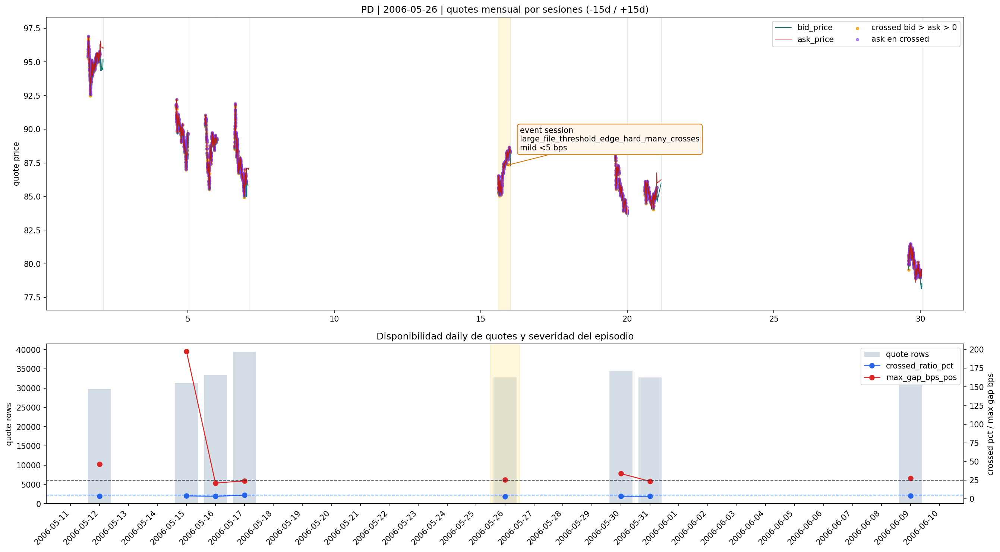

#### 01 Raw Window
Esta imagen responde a la primera pregunta decisiva del caso: el crossed observado es economicamente bastante fuerte para justificar un cambio de clase. Arriba ensena la geometria exacta del tramo conflictivo; abajo convierte esa geometria a bps y la enfrenta a los cortes `5 bps` y `25 bps`. El regimen dominante es `mild <5 bps`. La decision que cambia es pasar de anomalia interpretable a `review` o `bad`. El error que evita es decidir por apariencia visual sin medir el dano economico real del crossed. En terminos de pipeline, este panel decide si el problema afecta solo a la lectura forense o si invalida simulacion de ejecucion y microstructure features.

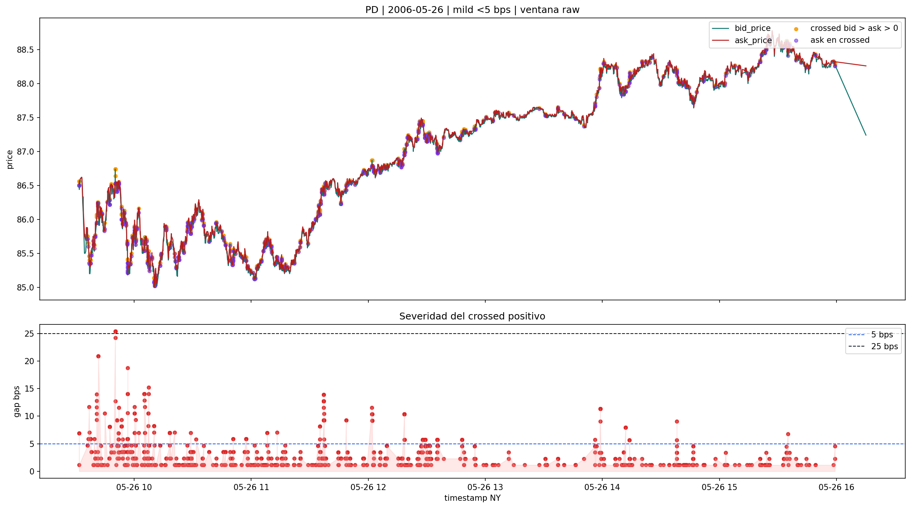

#### 02 Full Session Context
Esta imagen responde a la pregunta de extension intradiaria: el dano esta confinado a un bloque corto o contamina la sesion completa. Arriba se ve toda la sesion `04:00-20:00 NY`; abajo el `gap_bps` firmado. La decision que cambia es si el consumo debe penalizar solo un tramo o desechar el dia entero para uso operativo. El error que evita es tratar una cicatriz local como ruina total o, al reves, minimizar una degradacion distribuida a lo largo del dia. En ejecucion esto decide si la sesion puede seguir usandose con restricciones; en ML decide si las features intradiarias conservan significado economico.

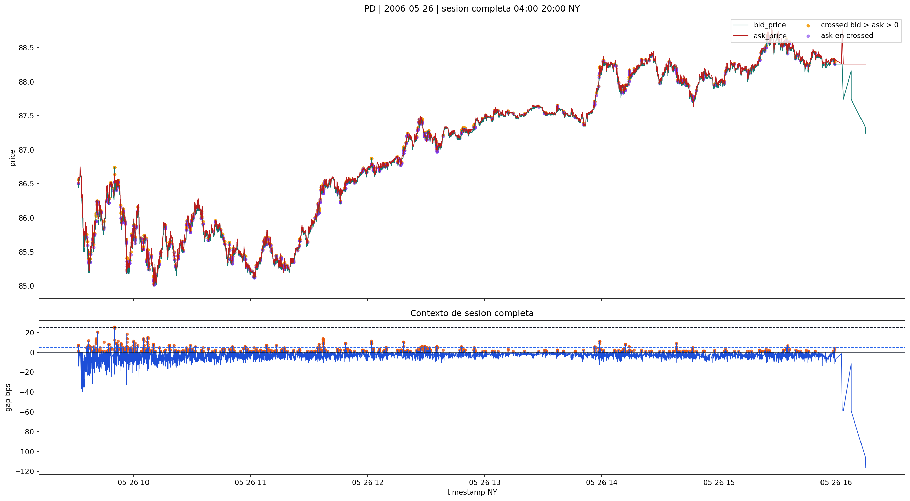

#### 03 Structure Diagnostics
Este panel responde a la pregunta de naturaleza del fallo: contradiccion economica genuina o mezcla con degeneracion estructural. Separa `ask=0` de `ask>0`, muestra la distribucion de `gap_bps` y resume patrones de integerizacion. La decision que cambia es como interpretar el dano: mercado localmente roto, artefacto de representacion o combinacion de ambos. El error que evita es sobrediagnosticar crossed reales cuando parte de la senal proviene de estructura degenerada del libro. Esta lectura afecta directamente a que el caso vaya a exclusion dura, a bandera contextual o a simple reconciliacion tecnica.

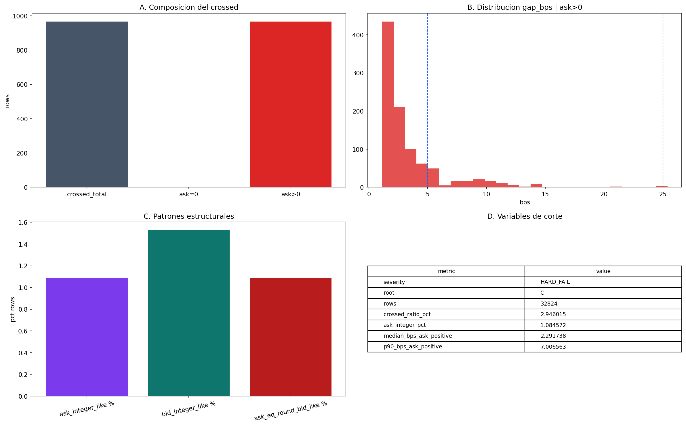

#### 04 Summary Card
Esta tarjeta responde a la pregunta de auditabilidad: cuales son exactamente las variables que sostienen la conclusion. Reune `severity`, `root`, `crossed_ratio_pct`, `ask_integer_pct`, `median_bps_ask_positive` y `p90_bps_ask_positive`. La decision que cambia es pasar de impresion visual a regla verificable. El error que evita es que dos inspectores lleguen a conclusiones distintas mirando la misma imagen sin una base numerica comun. Para gobernanza del proyecto, este panel es el que vuelve reproducible la decision para backtest, ML y auditoria.

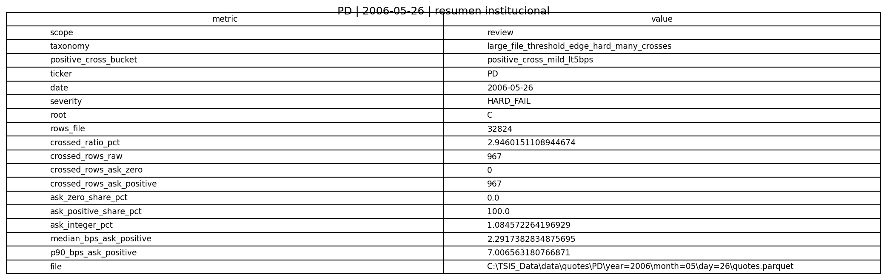

---

### 21. MON 2005-01-20

company_name: `Monument Circle Acquisition Corp. Class A Common Stock`
primary_exchange: `NASDAQ` (`XNAS`)
market_locale: `stocks/us`
scope: `review`
ticker: `MON`
date: `2005-01-20`
taxonomy: `large_file_threshold_edge_hard_many_crosses`
positive_cross_bucket: `positive_cross_mild_lt5bps`
severity: `HARD_FAIL`
root: `D`
rows: `5850`
crossed_ratio_pct: `1.213675`
crossed_rows_raw: `71`
crossed_rows_ask_zero: `3`
crossed_rows_ask_positive: `68`
ask_integer_pct: `0.290598`
median_bps_ask_positive: `1.714825`
p90_bps_ask_positive: `12.020263`
file: `D:\quotes\MON\year=2005\month=01\day=20\quotes.parquet`

#### Analisis Forense
La conclusion correcta del caso es que ya existe contradiccion economica real dentro del libro, pero aun no con fuerza suficiente para justificar exclusion dura sin contexto adicional. La taxonomy historica es `large_file_threshold_edge_hard_many_crosses` y el regimen positivo dominante es `mild <5 bps`. Esto importa porque la taxonomy no solo clasifica: resume que tipo de anomalia se esta viendo y que clase de decision contractual puede defenderse despues. La taxonomy `large_file_threshold_edge_hard_many_crosses` implica un libro grande con muchas contradicciones, pero cerca del borde decisional. La dificultad analitica esta en decidir si el volumen de crossed es ruido absorbible o evidencia de degradacion suficientemente seria. El regimen `mild <5 bps` significa que existe contradiccion economica positiva, pero aun en una banda donde un uso prudente puede seguir siendo defendible si la persistencia y la estructura no agravan el caso. En terminos observables, el file tiene `crossed_ratio_pct=1.213675` con `crossed_rows_ask_positive=68` y `crossed_rows_ask_zero=3`. La severidad economica del crossed ask>0 se resume en `median_bps_ask_positive=1.714825` y `p90_bps_ask_positive=12.020263`. Estos dos numeros convierten una forma visual rara en una conclusion operativa sobre si el libro sigue representando o no un mercado negociable. La decision que cambia es pasar de libro sano a libro util solo bajo cautela. `review` significa: no usar como si fuera ejecucion limpia, conservar para analisis contextual y sensibilidad. El error que evita es tratar como normal un episodio que ya contiene contradiccion economica real y contaminar simulaciones de ejecucion o validaciones demasiado optimistas. El patron estructural muestra `ask_integer_pct=0.290598`. Este numero obliga a separar dos explicaciones rivales: contradiccion economica genuina del libro o mezcla con degeneracion estructural / integerizacion. La mayor parte del crossed vive en `ask>0`, de modo que el corazon del problema sigue siendo economico. La parte `ask=0`, si existe, acompana pero no explica por si sola la anomalia. Como `ask_integer_pct` es bajo, la hipotesis de simple degeneracion mecanica pierde fuerza. Eso endurece la interpretacion: el crossed se parece mas a contradiccion economica genuina y menos a artefacto. En la capa de semantica de precio del evento aparecen `daily raw close=29.2000`, `quote mid raw=58.4550`, `quote mid split_normalized=29.2275`, `daily adjusted_proxy=28.9319`. La reconciliacion incluye `future_split_factor=2.0000`. Ademas hay `post_event_dividend_sum=17.8600`. La implicacion metodologica es crucial: una discrepancia entre `quotes`, `daily` y una plataforma externa no puede leerse automaticamente como fallo del dataset. Puede ser semantica de precio distinta. El error que evita esta capa es mezclar raw, split-normalized y adjusted dentro del mismo pipeline, rompiendo auditoria, benchmarking y labels. Para pipelines, esto empuja a conservar el caso fuera de ejecucion limpia, pero todavia puede mantenerse en investigacion contextual y en analisis de sensibilidad donde interese entender fronteras de tolerancia. Existe ademas una imagen historica de certificacion asociada. Su papel es poner el episodio en un marco causal mas amplio: halt, explained, not strongly explained o patron conocido. La regla que protege al proyecto es esta: el contexto externo se usa para explicar por que aparece el episodio, no para absolverlo. El error que evita es degradar el criterio de calidad del libro porque exista una historia plausible alrededor del caso.

#### 00 Event Month Context
Esta imagen responde a la pregunta de persistencia temporal: estamos ante un accidente local o ante una fase mas amplia de inestabilidad. Arriba coloca el evento en la serie `daily` real del mes; abajo compara `crossed_ratio_pct` y `max_gap_bps_pos` del dia contra sus vecinos. La decision que cambia es el peso estructural que se le concede al caso. El error que evita es juzgar igual un shock aislado y una degradacion repetida del libro.

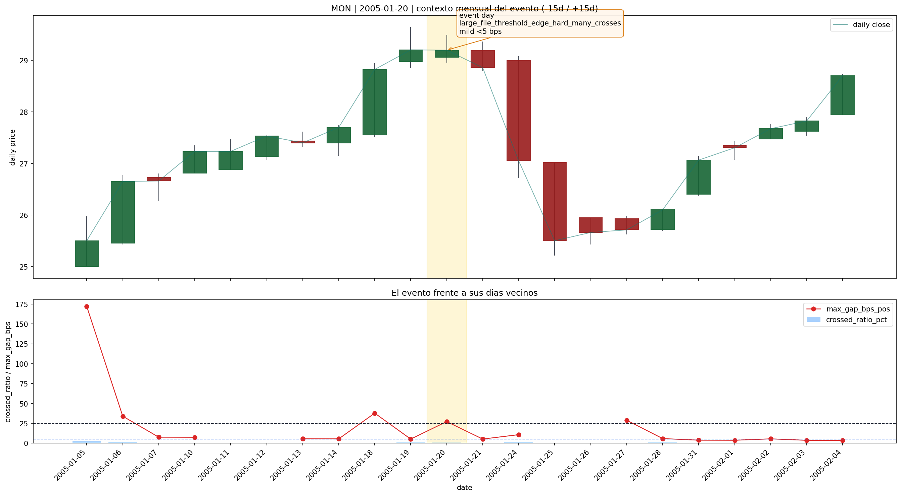

#### 00a Adjusted Proxy Contrast
Esta imagen responde a la pregunta de reconciliacion semantica: la discrepancia de precios viene de datos rotos o de vistas de precio distintas. Compara `daily raw`, `daily adjusted_proxy`, `quote mid raw` y `quote mid split_normalized`, y debajo ensena la cadena de dividendos y splits que produce la diferencia. La decision que cambia es si el inspector debe abrir una incidencia de calidad o cerrar el caso como diferencia legitima de semantica. El error que evita es mezclar series raw y adjusted como si fueran equivalentes. En pipelines reales, esto protege benchmarking, labels diarios y reconciliacion externa frente a falsas alarmas de precio.

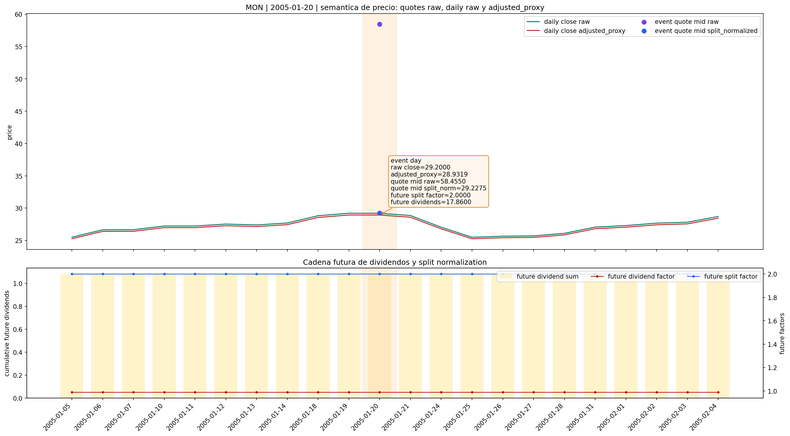

#### 00b Event Month Quotes Context
Esta imagen responde a la pregunta de recurrencia mensual dentro de `quotes`: el problema se concentra en el evento o reaparece en varias sesiones. Arriba concatena sesiones con datos disponibles; abajo resume cobertura diaria, `crossed_ratio_pct` y `max_gap_bps_pos`. La decision que cambia es si el caso debe leerse como episodio puntual o como sintoma de una fase repetida de libro degradado. El error que evita es extrapolar desde un unico dia a todo el mes sin evidencia.

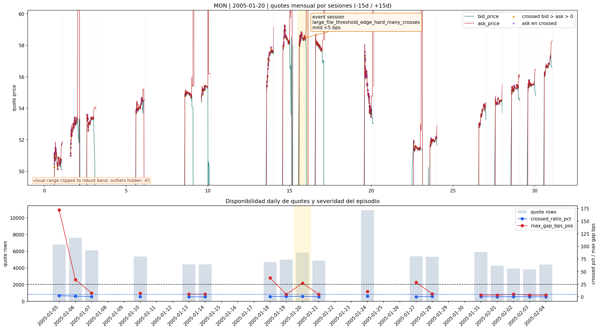

#### 01 Raw Window
Esta imagen responde a la primera pregunta decisiva del caso: el crossed observado es economicamente bastante fuerte para justificar un cambio de clase. Arriba ensena la geometria exacta del tramo conflictivo; abajo convierte esa geometria a bps y la enfrenta a los cortes `5 bps` y `25 bps`. El regimen dominante es `mild <5 bps`. La decision que cambia es pasar de anomalia interpretable a `review` o `bad`. El error que evita es decidir por apariencia visual sin medir el dano economico real del crossed. En terminos de pipeline, este panel decide si el problema afecta solo a la lectura forense o si invalida simulacion de ejecucion y microstructure features.

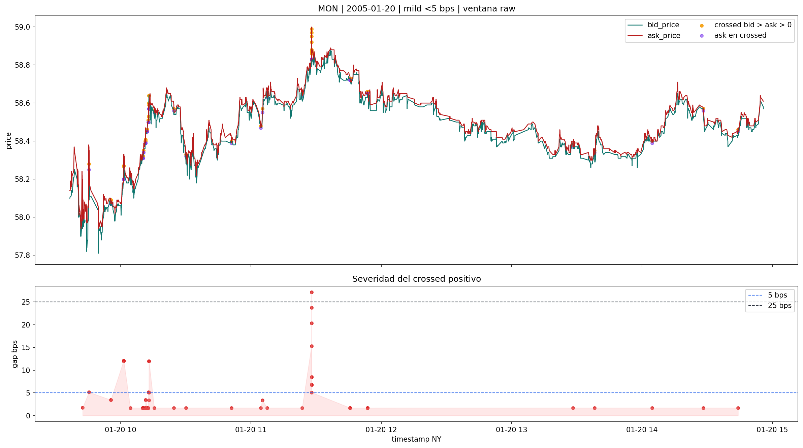

#### 02 Full Session Context
Esta imagen responde a la pregunta de extension intradiaria: el dano esta confinado a un bloque corto o contamina la sesion completa. Arriba se ve toda la sesion `04:00-20:00 NY`; abajo el `gap_bps` firmado. La decision que cambia es si el consumo debe penalizar solo un tramo o desechar el dia entero para uso operativo. El error que evita es tratar una cicatriz local como ruina total o, al reves, minimizar una degradacion distribuida a lo largo del dia. En ejecucion esto decide si la sesion puede seguir usandose con restricciones; en ML decide si las features intradiarias conservan significado economico.

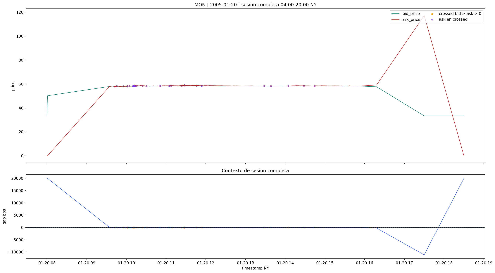

#### 03 Structure Diagnostics
Este panel responde a la pregunta de naturaleza del fallo: contradiccion economica genuina o mezcla con degeneracion estructural. Separa `ask=0` de `ask>0`, muestra la distribucion de `gap_bps` y resume patrones de integerizacion. La decision que cambia es como interpretar el dano: mercado localmente roto, artefacto de representacion o combinacion de ambos. El error que evita es sobrediagnosticar crossed reales cuando parte de la senal proviene de estructura degenerada del libro. Esta lectura afecta directamente a que el caso vaya a exclusion dura, a bandera contextual o a simple reconciliacion tecnica.

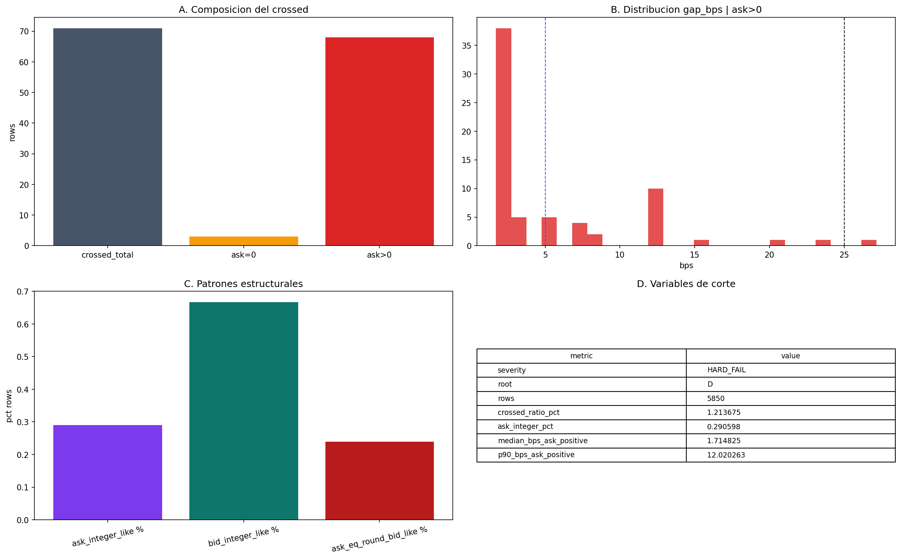

#### 04 Summary Card
Esta tarjeta responde a la pregunta de auditabilidad: cuales son exactamente las variables que sostienen la conclusion. Reune `severity`, `root`, `crossed_ratio_pct`, `ask_integer_pct`, `median_bps_ask_positive` y `p90_bps_ask_positive`. La decision que cambia es pasar de impresion visual a regla verificable. El error que evita es que dos inspectores lleguen a conclusiones distintas mirando la misma imagen sin una base numerica comun. Para gobernanza del proyecto, este panel es el que vuelve reproducible la decision para backtest, ML y auditoria.

---

### 22. UPL 2006-02-03

company_name: `ULTRA PETROLEUM CORP`
primary_exchange: `NYSE` (`XNYS`)
market_locale: `stocks/us`
scope: `review`
ticker: `UPL`
date: `2006-02-03`
taxonomy: `large_file_threshold_edge_hard_many_crosses`
positive_cross_bucket: `positive_cross_mild_lt5bps`
severity: `HARD_FAIL`
root: `D`
rows: `3234`
crossed_ratio_pct: `1.886209`
crossed_rows_raw: `61`
crossed_rows_ask_zero: `0`
crossed_rows_ask_positive: `61`
ask_integer_pct: `2.628324`
median_bps_ask_positive: `1.533625`
p90_bps_ask_positive: `6.146281`
file: `D:\quotes\UPL\year=2006\month=02\day=03\quotes.parquet`

#### Analisis Forense
La conclusion correcta del caso es que ya existe contradiccion economica real dentro del libro, pero aun no con fuerza suficiente para justificar exclusion dura sin contexto adicional. La taxonomy historica es `large_file_threshold_edge_hard_many_crosses` y el regimen positivo dominante es `mild <5 bps`. Esto importa porque la taxonomy no solo clasifica: resume que tipo de anomalia se esta viendo y que clase de decision contractual puede defenderse despues. La taxonomy `large_file_threshold_edge_hard_many_crosses` implica un libro grande con muchas contradicciones, pero cerca del borde decisional. La dificultad analitica esta en decidir si el volumen de crossed es ruido absorbible o evidencia de degradacion suficientemente seria. El regimen `mild <5 bps` significa que existe contradiccion economica positiva, pero aun en una banda donde un uso prudente puede seguir siendo defendible si la persistencia y la estructura no agravan el caso. En terminos observables, el file tiene `crossed_ratio_pct=1.886209` con `crossed_rows_ask_positive=61` y `crossed_rows_ask_zero=0`. La severidad economica del crossed ask>0 se resume en `median_bps_ask_positive=1.533625` y `p90_bps_ask_positive=6.146281`. Estos dos numeros convierten una forma visual rara en una conclusion operativa sobre si el libro sigue representando o no un mercado negociable. La decision que cambia es pasar de libro sano a libro util solo bajo cautela. `review` significa: no usar como si fuera ejecucion limpia, conservar para analisis contextual y sensibilidad. El error que evita es tratar como normal un episodio que ya contiene contradiccion economica real y contaminar simulaciones de ejecucion o validaciones demasiado optimistas. El patron estructural muestra `ask_integer_pct=2.628324`. Este numero obliga a separar dos explicaciones rivales: contradiccion economica genuina del libro o mezcla con degeneracion estructural / integerizacion. Toda la composicion crossed cae en `ask>0`. Eso endurece la lectura economica del caso: el dano no depende de ceros mecanicos, sino de contradiccion positiva dentro de precios aparentemente vivos. Como `ask_integer_pct` es bajo, la hipotesis de simple degeneracion mecanica pierde fuerza. Eso endurece la interpretacion: el crossed se parece mas a contradiccion economica genuina y menos a artefacto. Existe ademas una imagen historica de certificacion asociada. Su papel es poner el episodio en un marco causal mas amplio: halt, explained, not strongly explained o patron conocido. La regla que protege al proyecto es esta: el contexto externo se usa para explicar por que aparece el episodio, no para absolverlo. El error que evita es degradar el criterio de calidad del libro porque exista una historia plausible alrededor del caso.

#### 00 Event Month Context
Esta imagen responde a la pregunta de persistencia temporal: estamos ante un accidente local o ante una fase mas amplia de inestabilidad. Arriba coloca el evento en la serie `daily` real del mes; abajo compara `crossed_ratio_pct` y `max_gap_bps_pos` del dia contra sus vecinos. La decision que cambia es el peso estructural que se le concede al caso. El error que evita es juzgar igual un shock aislado y una degradacion repetida del libro.

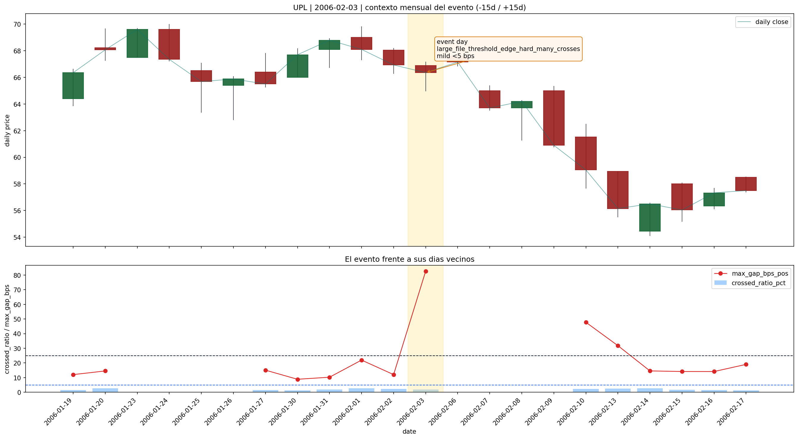

#### 00b Event Month Quotes Context
Esta imagen responde a la pregunta de recurrencia mensual dentro de `quotes`: el problema se concentra en el evento o reaparece en varias sesiones. Arriba concatena sesiones con datos disponibles; abajo resume cobertura diaria, `crossed_ratio_pct` y `max_gap_bps_pos`. La decision que cambia es si el caso debe leerse como episodio puntual o como sintoma de una fase repetida de libro degradado. El error que evita es extrapolar desde un unico dia a todo el mes sin evidencia.

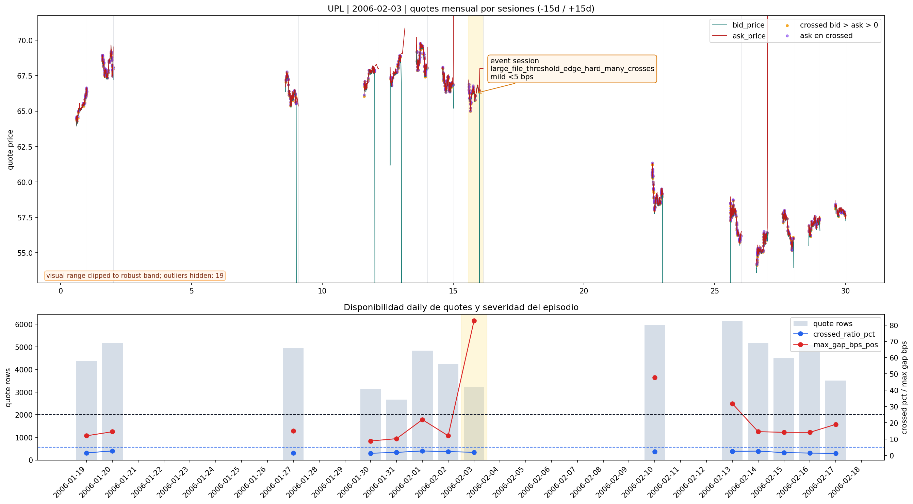

#### 01 Raw Window
Esta imagen responde a la primera pregunta decisiva del caso: el crossed observado es economicamente bastante fuerte para justificar un cambio de clase. Arriba ensena la geometria exacta del tramo conflictivo; abajo convierte esa geometria a bps y la enfrenta a los cortes `5 bps` y `25 bps`. El regimen dominante es `mild <5 bps`. La decision que cambia es pasar de anomalia interpretable a `review` o `bad`. El error que evita es decidir por apariencia visual sin medir el dano economico real del crossed. En terminos de pipeline, este panel decide si el problema afecta solo a la lectura forense o si invalida simulacion de ejecucion y microstructure features.

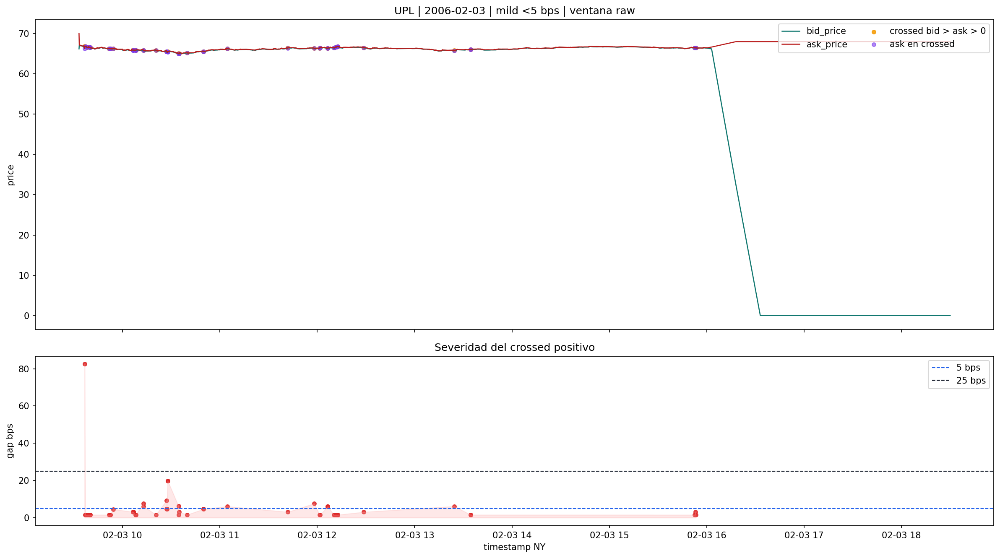

#### 02 Full Session Context
Esta imagen responde a la pregunta de extension intradiaria: el dano esta confinado a un bloque corto o contamina la sesion completa. Arriba se ve toda la sesion `04:00-20:00 NY`; abajo el `gap_bps` firmado. La decision que cambia es si el consumo debe penalizar solo un tramo o desechar el dia entero para uso operativo. El error que evita es tratar una cicatriz local como ruina total o, al reves, minimizar una degradacion distribuida a lo largo del dia. En ejecucion esto decide si la sesion puede seguir usandose con restricciones; en ML decide si las features intradiarias conservan significado economico.

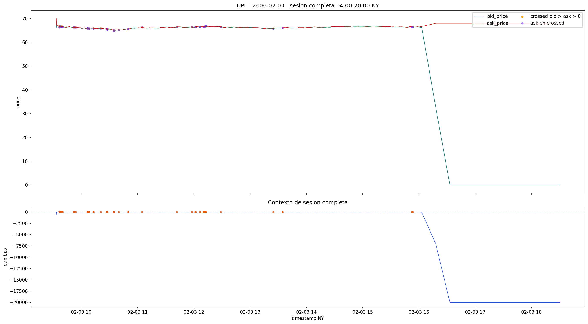

#### 03 Structure Diagnostics
Este panel responde a la pregunta de naturaleza del fallo: contradiccion economica genuina o mezcla con degeneracion estructural. Separa `ask=0` de `ask>0`, muestra la distribucion de `gap_bps` y resume patrones de integerizacion. La decision que cambia es como interpretar el dano: mercado localmente roto, artefacto de representacion o combinacion de ambos. El error que evita es sobrediagnosticar crossed reales cuando parte de la senal proviene de estructura degenerada del libro. Esta lectura afecta directamente a que el caso vaya a exclusion dura, a bandera contextual o a simple reconciliacion tecnica.

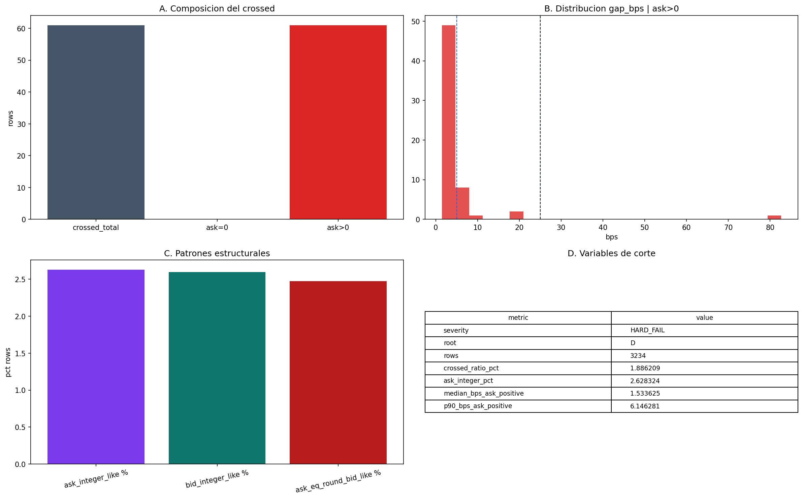

#### 04 Summary Card
Esta tarjeta responde a la pregunta de auditabilidad: cuales son exactamente las variables que sostienen la conclusion. Reune `severity`, `root`, `crossed_ratio_pct`, `ask_integer_pct`, `median_bps_ask_positive` y `p90_bps_ask_positive`. La decision que cambia es pasar de impresion visual a regla verificable. El error que evita es que dos inspectores lleguen a conclusiones distintas mirando la misma imagen sin una base numerica comun. Para gobernanza del proyecto, este panel es el que vuelve reproducible la decision para backtest, ML y auditoria.

---

### 23. MBI 2007-04-19

company_name: `MBIA Inc.`
primary_exchange: `NYSE` (`XNYS`)
market_locale: `stocks/us`
scope: `review`
ticker: `MBI`
date: `2007-04-19`
taxonomy: `large_file_threshold_edge_hard_many_crosses`
positive_cross_bucket: `positive_cross_mild_lt5bps`
severity: `HARD_FAIL`
root: `C`
rows: `18222`
crossed_ratio_pct: `0.982329`
crossed_rows_raw: `179`
crossed_rows_ask_zero: `0`
crossed_rows_ask_positive: `179`
ask_integer_pct: `2.700033`
median_bps_ask_positive: `1.476778`
p90_bps_ask_positive: `4.717953`
file: `C:\TSIS_Data\data\quotes\MBI\year=2007\month=04\day=19\quotes.parquet`

#### Analisis Forense
La conclusion correcta del caso es que ya existe contradiccion economica real dentro del libro, pero aun no con fuerza suficiente para justificar exclusion dura sin contexto adicional. La taxonomy historica es `large_file_threshold_edge_hard_many_crosses` y el regimen positivo dominante es `mild <5 bps`. Esto importa porque la taxonomy no solo clasifica: resume que tipo de anomalia se esta viendo y que clase de decision contractual puede defenderse despues. La taxonomy `large_file_threshold_edge_hard_many_crosses` implica un libro grande con muchas contradicciones, pero cerca del borde decisional. La dificultad analitica esta en decidir si el volumen de crossed es ruido absorbible o evidencia de degradacion suficientemente seria. El regimen `mild <5 bps` significa que existe contradiccion economica positiva, pero aun en una banda donde un uso prudente puede seguir siendo defendible si la persistencia y la estructura no agravan el caso. En terminos observables, el file tiene `crossed_ratio_pct=0.982329` con `crossed_rows_ask_positive=179` y `crossed_rows_ask_zero=0`. La severidad economica del crossed ask>0 se resume en `median_bps_ask_positive=1.476778` y `p90_bps_ask_positive=4.717953`. Estos dos numeros convierten una forma visual rara en una conclusion operativa sobre si el libro sigue representando o no un mercado negociable. La decision que cambia es pasar de libro sano a libro util solo bajo cautela. `review` significa: no usar como si fuera ejecucion limpia, conservar para analisis contextual y sensibilidad. El error que evita es tratar como normal un episodio que ya contiene contradiccion economica real y contaminar simulaciones de ejecucion o validaciones demasiado optimistas. El patron estructural muestra `ask_integer_pct=2.700033`. Este numero obliga a separar dos explicaciones rivales: contradiccion economica genuina del libro o mezcla con degeneracion estructural / integerizacion. Toda la composicion crossed cae en `ask>0`. Eso endurece la lectura economica del caso: el dano no depende de ceros mecanicos, sino de contradiccion positiva dentro de precios aparentemente vivos. Como `ask_integer_pct` es bajo, la hipotesis de simple degeneracion mecanica pierde fuerza. Eso endurece la interpretacion: el crossed se parece mas a contradiccion economica genuina y menos a artefacto. En la capa de semantica de precio del evento aparecen `daily raw close=67.8600`, `quote mid raw=68.0750`, `quote mid split_normalized=68.0750`, `daily adjusted_proxy=37.8404`. Ademas hay `post_event_dividend_sum=9.0200`. La implicacion metodologica es crucial: una discrepancia entre `quotes`, `daily` y una plataforma externa no puede leerse automaticamente como fallo del dataset. Puede ser semantica de precio distinta. El error que evita esta capa es mezclar raw, split-normalized y adjusted dentro del mismo pipeline, rompiendo auditoria, benchmarking y labels. Para pipelines, esto empuja a conservar el caso fuera de ejecucion limpia, pero todavia puede mantenerse en investigacion contextual y en analisis de sensibilidad donde interese entender fronteras de tolerancia. Existe ademas una imagen historica de certificacion asociada. Su papel es poner el episodio en un marco causal mas amplio: halt, explained, not strongly explained o patron conocido. La regla que protege al proyecto es esta: el contexto externo se usa para explicar por que aparece el episodio, no para absolverlo. El error que evita es degradar el criterio de calidad del libro porque exista una historia plausible alrededor del caso.

#### 00 Event Month Context
Esta imagen responde a la pregunta de persistencia temporal: estamos ante un accidente local o ante una fase mas amplia de inestabilidad. Arriba coloca el evento en la serie `daily` real del mes; abajo compara `crossed_ratio_pct` y `max_gap_bps_pos` del dia contra sus vecinos. La decision que cambia es el peso estructural que se le concede al caso. El error que evita es juzgar igual un shock aislado y una degradacion repetida del libro.

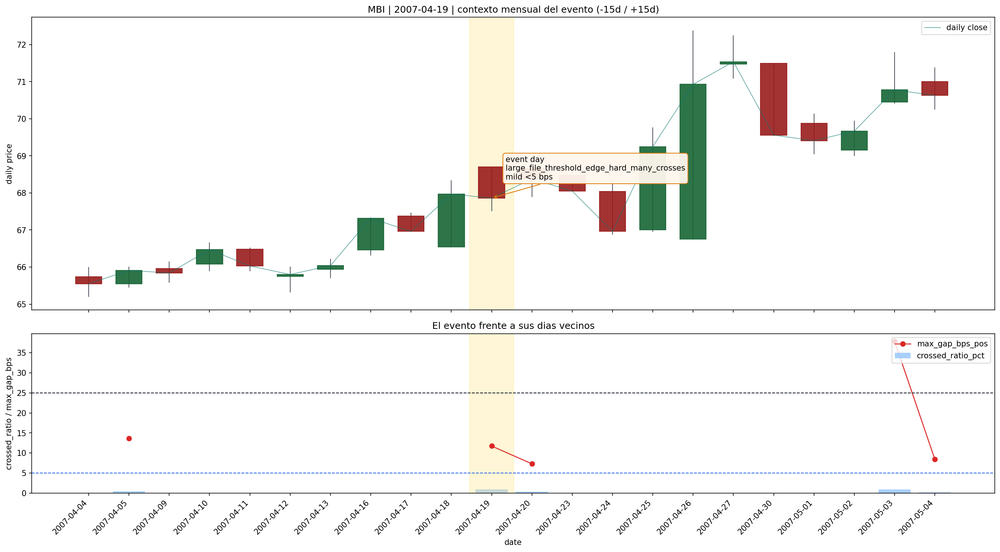

#### 00a Adjusted Proxy Contrast
Esta imagen responde a la pregunta de reconciliacion semantica: la discrepancia de precios viene de datos rotos o de vistas de precio distintas. Compara `daily raw`, `daily adjusted_proxy`, `quote mid raw` y `quote mid split_normalized`, y debajo ensena la cadena de dividendos y splits que produce la diferencia. La decision que cambia es si el inspector debe abrir una incidencia de calidad o cerrar el caso como diferencia legitima de semantica. El error que evita es mezclar series raw y adjusted como si fueran equivalentes. En pipelines reales, esto protege benchmarking, labels diarios y reconciliacion externa frente a falsas alarmas de precio.

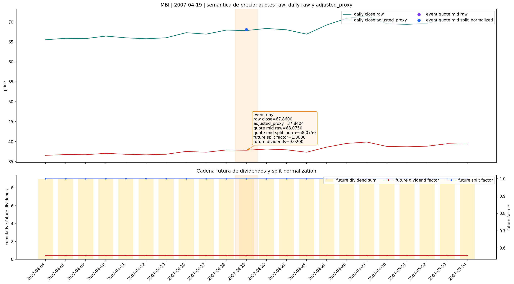

#### 00b Event Month Quotes Context
Esta imagen responde a la pregunta de recurrencia mensual dentro de `quotes`: el problema se concentra en el evento o reaparece en varias sesiones. Arriba concatena sesiones con datos disponibles; abajo resume cobertura diaria, `crossed_ratio_pct` y `max_gap_bps_pos`. La decision que cambia es si el caso debe leerse como episodio puntual o como sintoma de una fase repetida de libro degradado. El error que evita es extrapolar desde un unico dia a todo el mes sin evidencia.

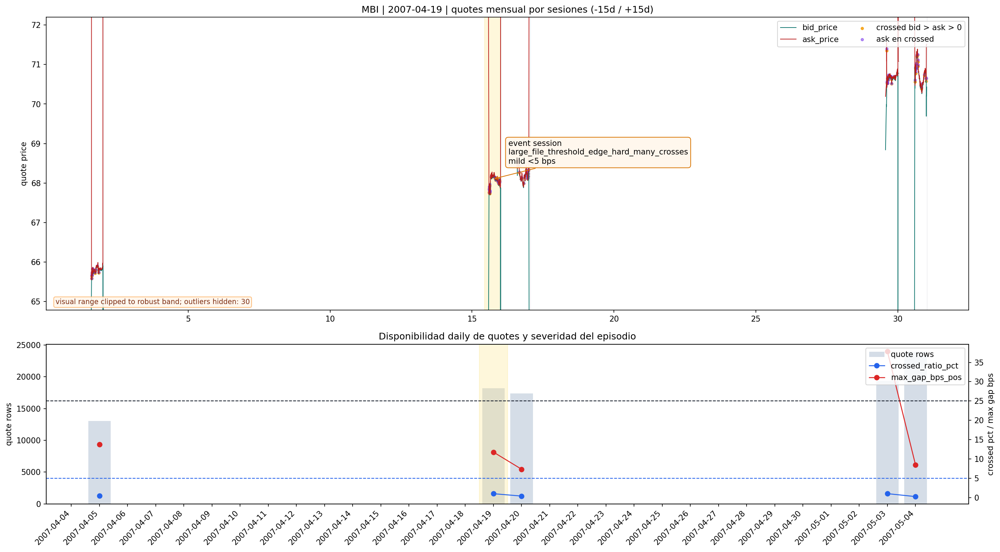

#### 01 Raw Window
Esta imagen responde a la primera pregunta decisiva del caso: el crossed observado es economicamente bastante fuerte para justificar un cambio de clase. Arriba ensena la geometria exacta del tramo conflictivo; abajo convierte esa geometria a bps y la enfrenta a los cortes `5 bps` y `25 bps`. El regimen dominante es `mild <5 bps`. La decision que cambia es pasar de anomalia interpretable a `review` o `bad`. El error que evita es decidir por apariencia visual sin medir el dano economico real del crossed. En terminos de pipeline, este panel decide si el problema afecta solo a la lectura forense o si invalida simulacion de ejecucion y microstructure features.

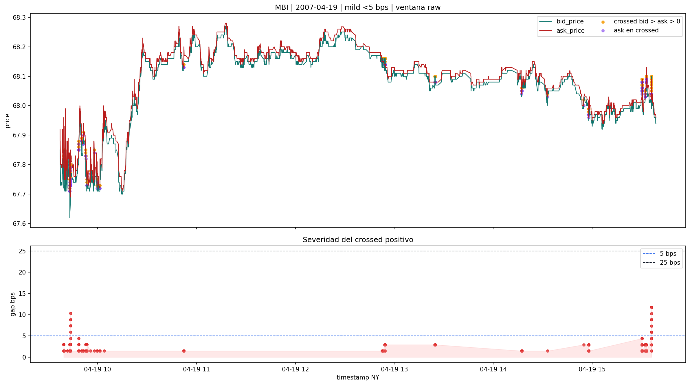

#### 02 Full Session Context
Esta imagen responde a la pregunta de extension intradiaria: el dano esta confinado a un bloque corto o contamina la sesion completa. Arriba se ve toda la sesion `04:00-20:00 NY`; abajo el `gap_bps` firmado. La decision que cambia es si el consumo debe penalizar solo un tramo o desechar el dia entero para uso operativo. El error que evita es tratar una cicatriz local como ruina total o, al reves, minimizar una degradacion distribuida a lo largo del dia. En ejecucion esto decide si la sesion puede seguir usandose con restricciones; en ML decide si las features intradiarias conservan significado economico.

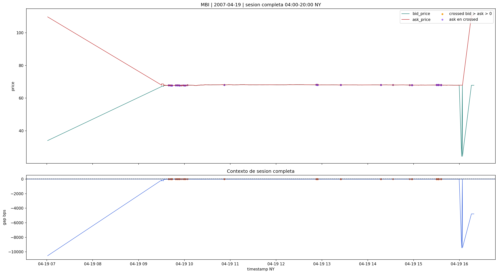

#### 03 Structure Diagnostics
Este panel responde a la pregunta de naturaleza del fallo: contradiccion economica genuina o mezcla con degeneracion estructural. Separa `ask=0` de `ask>0`, muestra la distribucion de `gap_bps` y resume patrones de integerizacion. La decision que cambia es como interpretar el dano: mercado localmente roto, artefacto de representacion o combinacion de ambos. El error que evita es sobrediagnosticar crossed reales cuando parte de la senal proviene de estructura degenerada del libro. Esta lectura afecta directamente a que el caso vaya a exclusion dura, a bandera contextual o a simple reconciliacion tecnica.

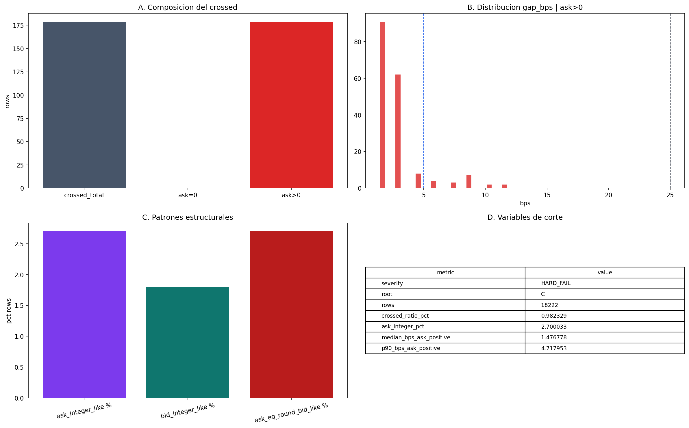

#### 04 Summary Card
Esta tarjeta responde a la pregunta de auditabilidad: cuales son exactamente las variables que sostienen la conclusion. Reune `severity`, `root`, `crossed_ratio_pct`, `ask_integer_pct`, `median_bps_ask_positive` y `p90_bps_ask_positive`. La decision que cambia es pasar de impresion visual a regla verificable. El error que evita es que dos inspectores lleguen a conclusiones distintas mirando la misma imagen sin una base numerica comun. Para gobernanza del proyecto, este panel es el que vuelve reproducible la decision para backtest, ML y auditoria.

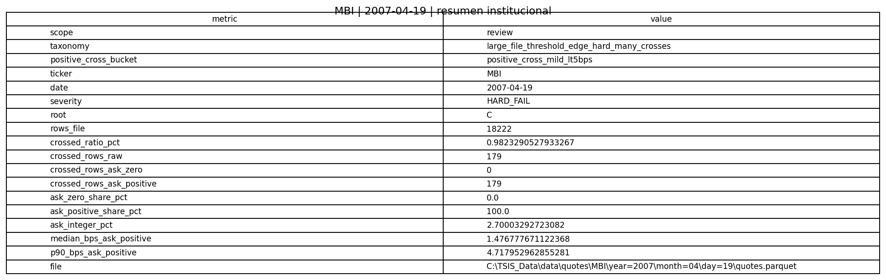

---

### 24. BZH 2005-02-08

company_name: `Beazer Homes USA, Inc. New`
primary_exchange: `NYSE` (`XNYS`)
market_locale: `stocks/us`
scope: `review`
ticker: `BZH`
date: `2005-02-08`
taxonomy: `large_file_threshold_edge_hard_many_crosses`
positive_cross_bucket: `positive_cross_mild_lt5bps`
severity: `HARD_FAIL`
root: `D`
rows: `2735`
crossed_ratio_pct: `4.058501`
crossed_rows_raw: `111`
crossed_rows_ask_zero: `15`
crossed_rows_ask_positive: `96`
ask_integer_pct: `3.254113`
median_bps_ask_positive: `1.213151`
p90_bps_ask_positive: `5.513378`
file: `D:\quotes\BZH\year=2005\month=02\day=08\quotes.parquet`

#### Analisis Forense
La conclusion correcta del caso es que ya existe contradiccion economica real dentro del libro, pero aun no con fuerza suficiente para justificar exclusion dura sin contexto adicional. La taxonomy historica es `large_file_threshold_edge_hard_many_crosses` y el regimen positivo dominante es `mild <5 bps`. Esto importa porque la taxonomy no solo clasifica: resume que tipo de anomalia se esta viendo y que clase de decision contractual puede defenderse despues. La taxonomy `large_file_threshold_edge_hard_many_crosses` implica un libro grande con muchas contradicciones, pero cerca del borde decisional. La dificultad analitica esta en decidir si el volumen de crossed es ruido absorbible o evidencia de degradacion suficientemente seria. El regimen `mild <5 bps` significa que existe contradiccion economica positiva, pero aun en una banda donde un uso prudente puede seguir siendo defendible si la persistencia y la estructura no agravan el caso. En terminos observables, el file tiene `crossed_ratio_pct=4.058501` con `crossed_rows_ask_positive=96` y `crossed_rows_ask_zero=15`. La severidad economica del crossed ask>0 se resume en `median_bps_ask_positive=1.213151` y `p90_bps_ask_positive=5.513378`. Estos dos numeros convierten una forma visual rara en una conclusion operativa sobre si el libro sigue representando o no un mercado negociable. La decision que cambia es pasar de libro sano a libro util solo bajo cautela. `review` significa: no usar como si fuera ejecucion limpia, conservar para analisis contextual y sensibilidad. El error que evita es tratar como normal un episodio que ya contiene contradiccion economica real y contaminar simulaciones de ejecucion o validaciones demasiado optimistas. El patron estructural muestra `ask_integer_pct=3.254113`. Este numero obliga a separar dos explicaciones rivales: contradiccion economica genuina del libro o mezcla con degeneracion estructural / integerizacion. La mayor parte del crossed vive en `ask>0`, de modo que el corazon del problema sigue siendo economico. La parte `ask=0`, si existe, acompana pero no explica por si sola la anomalia. Como `ask_integer_pct` es bajo, la hipotesis de simple degeneracion mecanica pierde fuerza. Eso endurece la interpretacion: el crossed se parece mas a contradiccion economica genuina y menos a artefacto. En la capa de semantica de precio del evento aparecen `daily raw close=842.5000`, `quote mid raw=165.5100`, `quote mid split_normalized=827.5500`, `daily adjusted_proxy=842.5000`. La reconciliacion incluye `future_split_factor=0.2000`. La implicacion metodologica es crucial: una discrepancia entre `quotes`, `daily` y una plataforma externa no puede leerse automaticamente como fallo del dataset. Puede ser semantica de precio distinta. El error que evita esta capa es mezclar raw, split-normalized y adjusted dentro del mismo pipeline, rompiendo auditoria, benchmarking y labels. Para pipelines, esto empuja a conservar el caso fuera de ejecucion limpia, pero todavia puede mantenerse en investigacion contextual y en analisis de sensibilidad donde interese entender fronteras de tolerancia. Existe ademas una imagen historica de certificacion asociada. Su papel es poner el episodio en un marco causal mas amplio: halt, explained, not strongly explained o patron conocido. La regla que protege al proyecto es esta: el contexto externo se usa para explicar por que aparece el episodio, no para absolverlo. El error que evita es degradar el criterio de calidad del libro porque exista una historia plausible alrededor del caso.

#### 00 Event Month Context
Esta imagen responde a la pregunta de persistencia temporal: estamos ante un accidente local o ante una fase mas amplia de inestabilidad. Arriba coloca el evento en la serie `daily` real del mes; abajo compara `crossed_ratio_pct` y `max_gap_bps_pos` del dia contra sus vecinos. La decision que cambia es el peso estructural que se le concede al caso. El error que evita es juzgar igual un shock aislado y una degradacion repetida del libro.

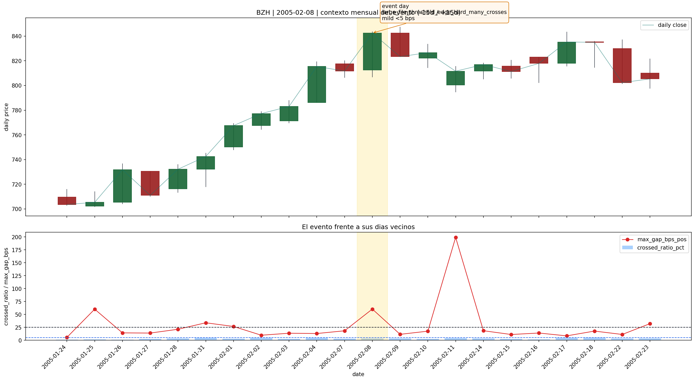

#### 00a Adjusted Proxy Contrast
Esta imagen responde a la pregunta de reconciliacion semantica: la discrepancia de precios viene de datos rotos o de vistas de precio distintas. Compara `daily raw`, `daily adjusted_proxy`, `quote mid raw` y `quote mid split_normalized`, y debajo ensena la cadena de dividendos y splits que produce la diferencia. La decision que cambia es si el inspector debe abrir una incidencia de calidad o cerrar el caso como diferencia legitima de semantica. El error que evita es mezclar series raw y adjusted como si fueran equivalentes. En pipelines reales, esto protege benchmarking, labels diarios y reconciliacion externa frente a falsas alarmas de precio.

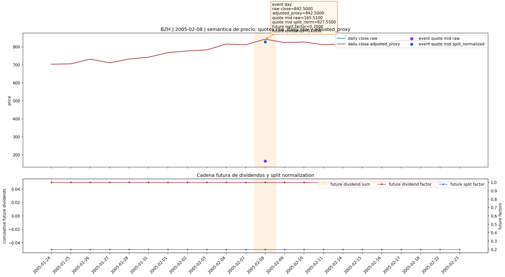

#### 00b Event Month Quotes Context
Esta imagen responde a la pregunta de recurrencia mensual dentro de `quotes`: el problema se concentra en el evento o reaparece en varias sesiones. Arriba concatena sesiones con datos disponibles; abajo resume cobertura diaria, `crossed_ratio_pct` y `max_gap_bps_pos`. La decision que cambia es si el caso debe leerse como episodio puntual o como sintoma de una fase repetida de libro degradado. El error que evita es extrapolar desde un unico dia a todo el mes sin evidencia.

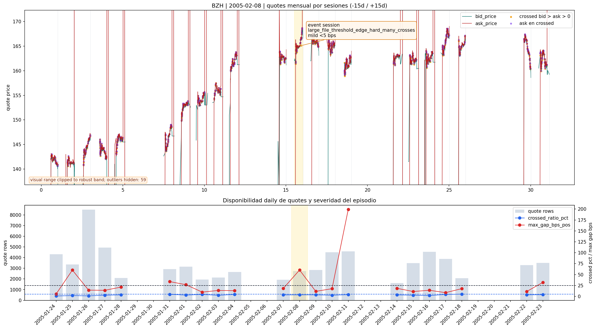

#### 01 Raw Window
Esta imagen responde a la primera pregunta decisiva del caso: el crossed observado es economicamente bastante fuerte para justificar un cambio de clase. Arriba ensena la geometria exacta del tramo conflictivo; abajo convierte esa geometria a bps y la enfrenta a los cortes `5 bps` y `25 bps`. El regimen dominante es `mild <5 bps`. La decision que cambia es pasar de anomalia interpretable a `review` o `bad`. El error que evita es decidir por apariencia visual sin medir el dano economico real del crossed. En terminos de pipeline, este panel decide si el problema afecta solo a la lectura forense o si invalida simulacion de ejecucion y microstructure features.

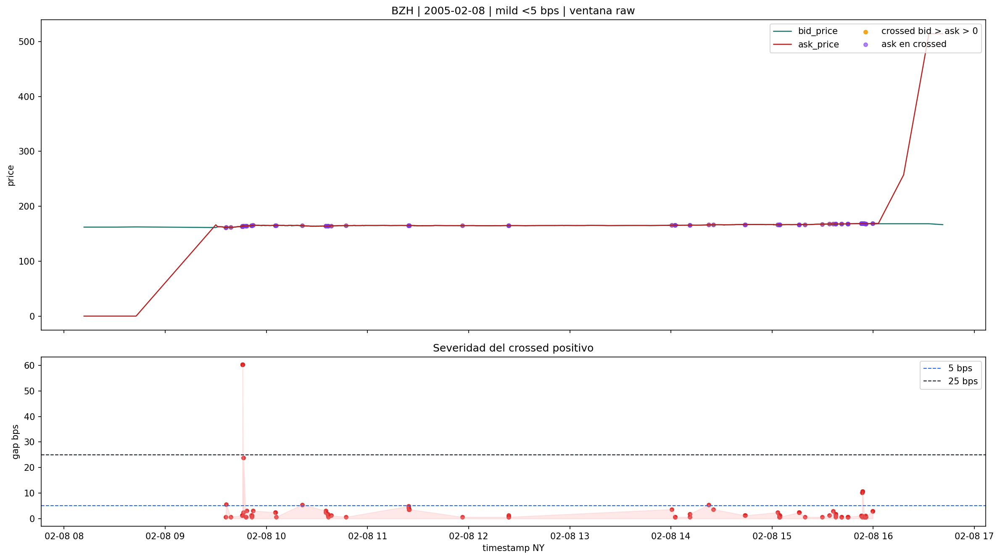

#### 02 Full Session Context
Esta imagen responde a la pregunta de extension intradiaria: el dano esta confinado a un bloque corto o contamina la sesion completa. Arriba se ve toda la sesion `04:00-20:00 NY`; abajo el `gap_bps` firmado. La decision que cambia es si el consumo debe penalizar solo un tramo o desechar el dia entero para uso operativo. El error que evita es tratar una cicatriz local como ruina total o, al reves, minimizar una degradacion distribuida a lo largo del dia. En ejecucion esto decide si la sesion puede seguir usandose con restricciones; en ML decide si las features intradiarias conservan significado economico.

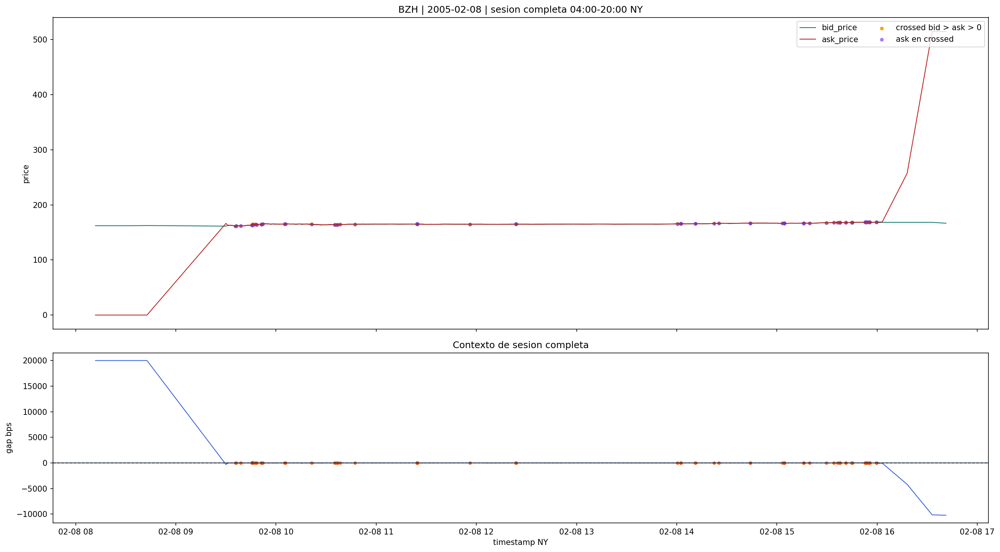

#### 03 Structure Diagnostics
Este panel responde a la pregunta de naturaleza del fallo: contradiccion economica genuina o mezcla con degeneracion estructural. Separa `ask=0` de `ask>0`, muestra la distribucion de `gap_bps` y resume patrones de integerizacion. La decision que cambia es como interpretar el dano: mercado localmente roto, artefacto de representacion o combinacion de ambos. El error que evita es sobrediagnosticar crossed reales cuando parte de la senal proviene de estructura degenerada del libro. Esta lectura afecta directamente a que el caso vaya a exclusion dura, a bandera contextual o a simple reconciliacion tecnica.

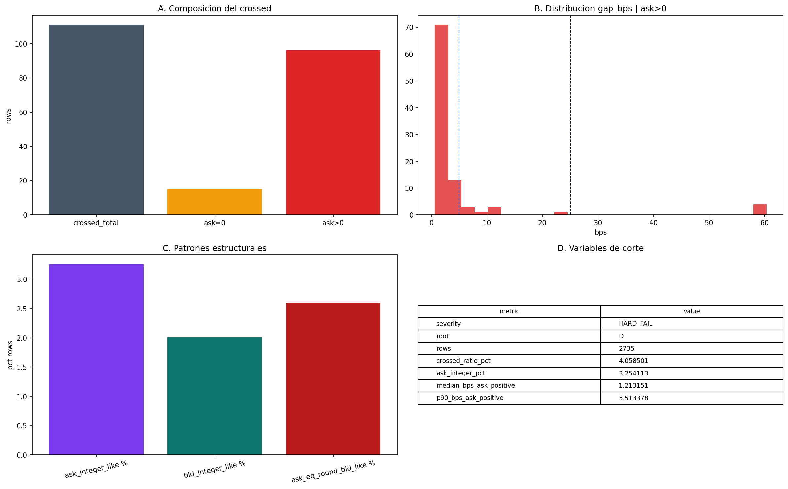

#### 04 Summary Card
Esta tarjeta responde a la pregunta de auditabilidad: cuales son exactamente las variables que sostienen la conclusion. Reune `severity`, `root`, `crossed_ratio_pct`, `ask_integer_pct`, `median_bps_ask_positive` y `p90_bps_ask_positive`. La decision que cambia es pasar de impresion visual a regla verificable. El error que evita es que dos inspectores lleguen a conclusiones distintas mirando la misma imagen sin una base numerica comun. Para gobernanza del proyecto, este panel es el que vuelve reproducible la decision para backtest, ML y auditoria.

---

### 25. AWH 2013-02-06

company_name: `Allied World Assurance Co Hld Lt`
primary_exchange: `NYSE` (`XNYS`)
market_locale: `stocks/us`
scope: `review`
ticker: `AWH`
date: `2013-02-06`
taxonomy: `large_file_threshold_edge_hard_many_crosses`
positive_cross_bucket: `positive_cross_mild_lt5bps`
severity: `HARD_FAIL`
root: `D`
rows: `9366`
crossed_ratio_pct: `0.982276`
crossed_rows_raw: `92`
crossed_rows_ask_zero: `91`
crossed_rows_ask_positive: `1`
ask_integer_pct: `2.359599`
median_bps_ask_positive: `1.173502`
p90_bps_ask_positive: `1.173502`
file: `D:\quotes\AWH\year=2013\month=02\day=06\quotes.parquet`

#### Analisis Forense
La conclusion correcta del caso es que ya existe contradiccion economica real dentro del libro, pero aun no con fuerza suficiente para justificar exclusion dura sin contexto adicional. La taxonomy historica es `large_file_threshold_edge_hard_many_crosses` y el regimen positivo dominante es `mild <5 bps`. Esto importa porque la taxonomy no solo clasifica: resume que tipo de anomalia se esta viendo y que clase de decision contractual puede defenderse despues. La taxonomy `large_file_threshold_edge_hard_many_crosses` implica un libro grande con muchas contradicciones, pero cerca del borde decisional. La dificultad analitica esta en decidir si el volumen de crossed es ruido absorbible o evidencia de degradacion suficientemente seria. El regimen `mild <5 bps` significa que existe contradiccion economica positiva, pero aun en una banda donde un uso prudente puede seguir siendo defendible si la persistencia y la estructura no agravan el caso. En terminos observables, el file tiene `crossed_ratio_pct=0.982276` con `crossed_rows_ask_positive=1` y `crossed_rows_ask_zero=91`. La severidad economica del crossed ask>0 se resume en `median_bps_ask_positive=1.173502` y `p90_bps_ask_positive=1.173502`. Estos dos numeros convierten una forma visual rara en una conclusion operativa sobre si el libro sigue representando o no un mercado negociable. La decision que cambia es pasar de libro sano a libro util solo bajo cautela. `review` significa: no usar como si fuera ejecucion limpia, conservar para analisis contextual y sensibilidad. El error que evita es tratar como normal un episodio que ya contiene contradiccion economica real y contaminar simulaciones de ejecucion o validaciones demasiado optimistas. El patron estructural muestra `ask_integer_pct=2.359599`. Este numero obliga a separar dos explicaciones rivales: contradiccion economica genuina del libro o mezcla con degeneracion estructural / integerizacion. La mayor parte del crossed vive en `ask=0`, pero existe una cola `ask>0` que impide absolver el caso como simple glitch. La lectura correcta es mixta: dano estructural dominante con residuo economico que aun puede justificar bandera o exclusion. Como `ask_integer_pct` es bajo, la hipotesis de simple degeneracion mecanica pierde fuerza. Eso endurece la interpretacion: el crossed se parece mas a contradiccion economica genuina y menos a artefacto. En la capa de semantica de precio del evento aparecen `daily raw close=426.3000`, `quote mid raw=85.1850`, `quote mid split_normalized=425.9250`, `daily adjusted_proxy=419.5764`. La reconciliacion incluye `future_split_factor=0.2000`. Ademas hay `post_event_dividend_sum=10.0950`. La implicacion metodologica es crucial: una discrepancia entre `quotes`, `daily` y una plataforma externa no puede leerse automaticamente como fallo del dataset. Puede ser semantica de precio distinta. El error que evita esta capa es mezclar raw, split-normalized y adjusted dentro del mismo pipeline, rompiendo auditoria, benchmarking y labels. Para pipelines, esto empuja a conservar el caso fuera de ejecucion limpia, pero todavia puede mantenerse en investigacion contextual y en analisis de sensibilidad donde interese entender fronteras de tolerancia. Existe ademas una imagen historica de certificacion asociada. Su papel es poner el episodio en un marco causal mas amplio: halt, explained, not strongly explained o patron conocido. La regla que protege al proyecto es esta: el contexto externo se usa para explicar por que aparece el episodio, no para absolverlo. El error que evita es degradar el criterio de calidad del libro porque exista una historia plausible alrededor del caso.

#### 00 Event Month Context
Esta imagen responde a la pregunta de persistencia temporal: estamos ante un accidente local o ante una fase mas amplia de inestabilidad. Arriba coloca el evento en la serie `daily` real del mes; abajo compara `crossed_ratio_pct` y `max_gap_bps_pos` del dia contra sus vecinos. La decision que cambia es el peso estructural que se le concede al caso. El error que evita es juzgar igual un shock aislado y una degradacion repetida del libro.

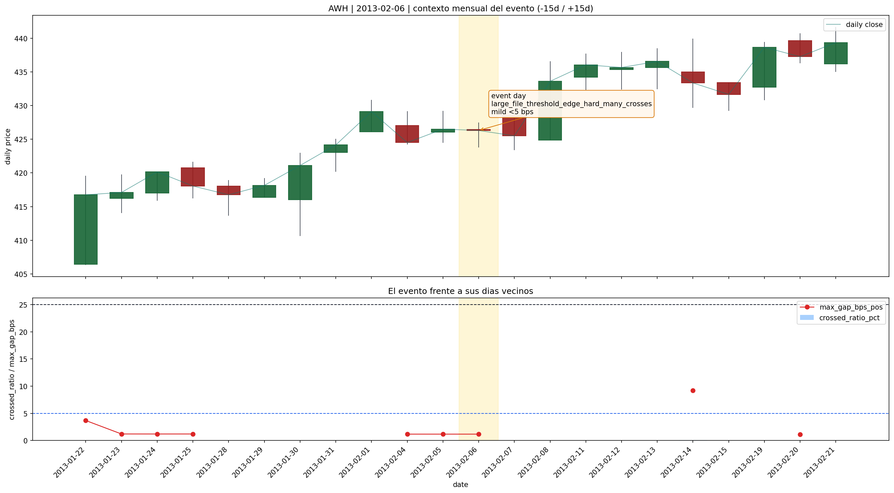

#### 00a Adjusted Proxy Contrast
Esta imagen responde a la pregunta de reconciliacion semantica: la discrepancia de precios viene de datos rotos o de vistas de precio distintas. Compara `daily raw`, `daily adjusted_proxy`, `quote mid raw` y `quote mid split_normalized`, y debajo ensena la cadena de dividendos y splits que produce la diferencia. La decision que cambia es si el inspector debe abrir una incidencia de calidad o cerrar el caso como diferencia legitima de semantica. El error que evita es mezclar series raw y adjusted como si fueran equivalentes. En pipelines reales, esto protege benchmarking, labels diarios y reconciliacion externa frente a falsas alarmas de precio.

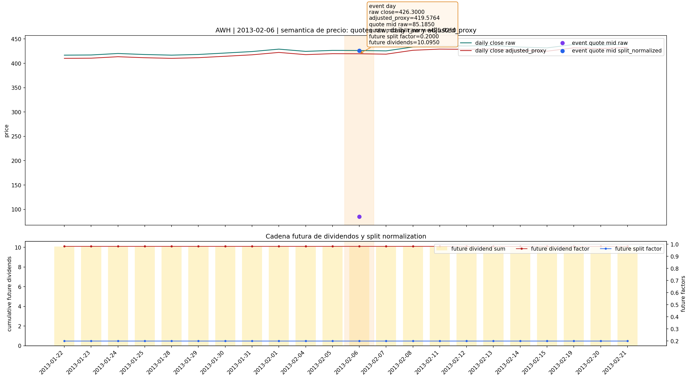

#### 00b Event Month Quotes Context
Esta imagen responde a la pregunta de recurrencia mensual dentro de `quotes`: el problema se concentra en el evento o reaparece en varias sesiones. Arriba concatena sesiones con datos disponibles; abajo resume cobertura diaria, `crossed_ratio_pct` y `max_gap_bps_pos`. La decision que cambia es si el caso debe leerse como episodio puntual o como sintoma de una fase repetida de libro degradado. El error que evita es extrapolar desde un unico dia a todo el mes sin evidencia.

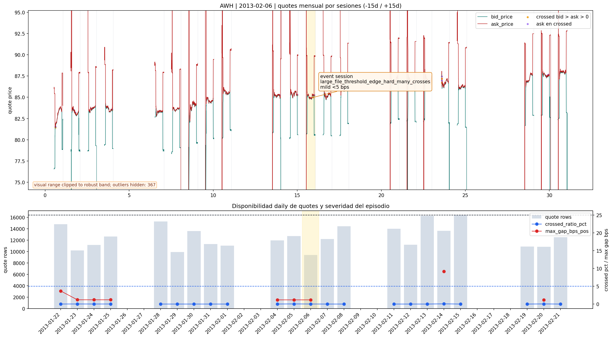

#### 01 Raw Window
Esta imagen responde a la primera pregunta decisiva del caso: el crossed observado es economicamente bastante fuerte para justificar un cambio de clase. Arriba ensena la geometria exacta del tramo conflictivo; abajo convierte esa geometria a bps y la enfrenta a los cortes `5 bps` y `25 bps`. El regimen dominante es `mild <5 bps`. La decision que cambia es pasar de anomalia interpretable a `review` o `bad`. El error que evita es decidir por apariencia visual sin medir el dano economico real del crossed. En terminos de pipeline, este panel decide si el problema afecta solo a la lectura forense o si invalida simulacion de ejecucion y microstructure features.

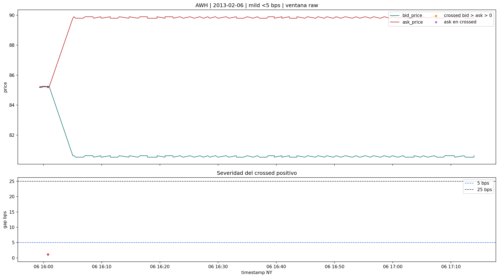

#### 02 Full Session Context
Esta imagen responde a la pregunta de extension intradiaria: el dano esta confinado a un bloque corto o contamina la sesion completa. Arriba se ve toda la sesion `04:00-20:00 NY`; abajo el `gap_bps` firmado. La decision que cambia es si el consumo debe penalizar solo un tramo o desechar el dia entero para uso operativo. El error que evita es tratar una cicatriz local como ruina total o, al reves, minimizar una degradacion distribuida a lo largo del dia. En ejecucion esto decide si la sesion puede seguir usandose con restricciones; en ML decide si las features intradiarias conservan significado economico.

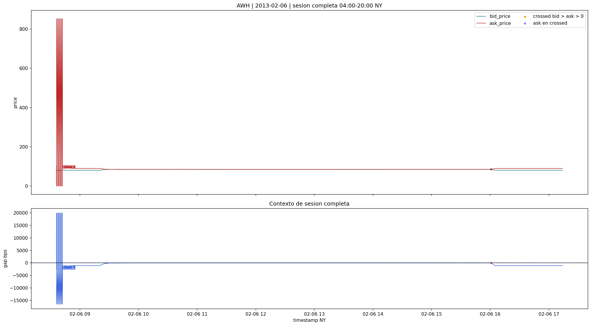

#### 03 Structure Diagnostics
Este panel responde a la pregunta de naturaleza del fallo: contradiccion economica genuina o mezcla con degeneracion estructural. Separa `ask=0` de `ask>0`, muestra la distribucion de `gap_bps` y resume patrones de integerizacion. La decision que cambia es como interpretar el dano: mercado localmente roto, artefacto de representacion o combinacion de ambos. El error que evita es sobrediagnosticar crossed reales cuando parte de la senal proviene de estructura degenerada del libro. Esta lectura afecta directamente a que el caso vaya a exclusion dura, a bandera contextual o a simple reconciliacion tecnica.

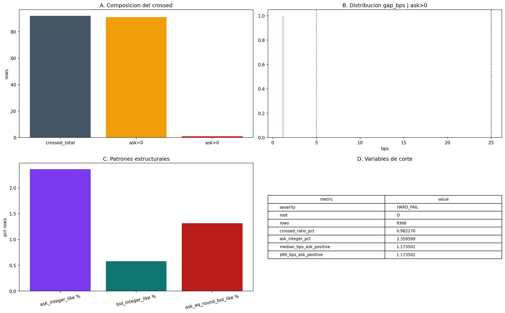

#### 04 Summary Card
Esta tarjeta responde a la pregunta de auditabilidad: cuales son exactamente las variables que sostienen la conclusion. Reune `severity`, `root`, `crossed_ratio_pct`, `ask_integer_pct`, `median_bps_ask_positive` y `p90_bps_ask_positive`. La decision que cambia es pasar de impresion visual a regla verificable. El error que evita es que dos inspectores lleguen a conclusiones distintas mirando la misma imagen sin una base numerica comun. Para gobernanza del proyecto, este panel es el que vuelve reproducible la decision para backtest, ML y auditoria.

---

### 26. GLXG 2025-04-08

company_name: `Galaxy Payroll Group Limited Class A Ordinary Shares`
primary_exchange: `NASDAQ` (`XNAS`)
market_locale: `stocks/us`
scope: `review`
ticker: `GLXG`
date: `2025-04-08`
taxonomy: `persistent_soft_crossed_mid_large_scale`
positive_cross_bucket: `positive_cross_severe_ge25bps`
severity: `SOFT_FAIL`
root: `D`
rows: `384850`
crossed_ratio_pct: `0.442250`
crossed_rows_raw: `1702`
crossed_rows_ask_zero: `0`
crossed_rows_ask_positive: `1702`
ask_integer_pct: `1.089256`
median_bps_ask_positive: `55.710306`
p90_bps_ask_positive: `191.693291`
file: `D:\quotes\GLXG\year=2025\month=04\day=08\quotes.parquet`

#### Analisis Forense
La conclusion correcta del caso es que ya existe contradiccion economica real dentro del libro, pero aun no con fuerza suficiente para justificar exclusion dura sin contexto adicional. La taxonomy historica es `persistent_soft_crossed_mid_large_scale` y el regimen positivo dominante es `severe >=25 bps`. Esto importa porque la taxonomy no solo clasifica: resume que tipo de anomalia se esta viendo y que clase de decision contractual puede defenderse despues. La taxonomy `persistent_soft_crossed_mid_large_scale` implica un problema repetido y distribuido, no un simple pinchazo local. Por eso empuja a `review`: ya hay dano real, aunque no necesariamente exclusion dura universal. El regimen `severe >=25 bps` empuja el caso a una lectura economicamente dura: el crossed deja de ser cosmetico y pasa a cuestionar si el libro sigue siendo interpretable como mercado negociable. En terminos observables, el file tiene `crossed_ratio_pct=0.442250` con `crossed_rows_ask_positive=1702` y `crossed_rows_ask_zero=0`. La severidad economica del crossed ask>0 se resume en `median_bps_ask_positive=55.710306` y `p90_bps_ask_positive=191.693291`. Estos dos numeros convierten una forma visual rara en una conclusion operativa sobre si el libro sigue representando o no un mercado negociable. La decision que cambia es pasar de libro sano a libro util solo bajo cautela. `review` significa: no usar como si fuera ejecucion limpia, conservar para analisis contextual y sensibilidad. El error que evita es tratar como normal un episodio que ya contiene contradiccion economica real y contaminar simulaciones de ejecucion o validaciones demasiado optimistas. El patron estructural muestra `ask_integer_pct=1.089256`. Este numero obliga a separar dos explicaciones rivales: contradiccion economica genuina del libro o mezcla con degeneracion estructural / integerizacion. Toda la composicion crossed cae en `ask>0`. Eso endurece la lectura economica del caso: el dano no depende de ceros mecanicos, sino de contradiccion positiva dentro de precios aparentemente vivos. Como `ask_integer_pct` es bajo, la hipotesis de simple degeneracion mecanica pierde fuerza. Eso endurece la interpretacion: el crossed se parece mas a contradiccion economica genuina y menos a artefacto. En la capa de semantica de precio del evento aparecen `daily raw close=9.4930`, `quote mid raw=1.9000`, `quote mid split_normalized=19.0000`, `daily adjusted_proxy=9.4930`. La reconciliacion incluye `future_split_factor=0.1000`. La implicacion metodologica es crucial: una discrepancia entre `quotes`, `daily` y una plataforma externa no puede leerse automaticamente como fallo del dataset. Puede ser semantica de precio distinta. El error que evita esta capa es mezclar raw, split-normalized y adjusted dentro del mismo pipeline, rompiendo auditoria, benchmarking y labels. Para pipelines, esto bloquea su uso como libro sano en ejecucion y features microestructurales principales, aunque aun puede mantenerse para forense, sensibilidad y estudios donde la anomalia sea parte del objeto de investigacion. Existe ademas una imagen historica de certificacion asociada. Su papel es poner el episodio en un marco causal mas amplio: halt, explained, not strongly explained o patron conocido. La regla que protege al proyecto es esta: el contexto externo se usa para explicar por que aparece el episodio, no para absolverlo. El error que evita es degradar el criterio de calidad del libro porque exista una historia plausible alrededor del caso.

#### 00 Event Month Context
Esta imagen responde a la pregunta de persistencia temporal: estamos ante un accidente local o ante una fase mas amplia de inestabilidad. Arriba coloca el evento en la serie `daily` real del mes; abajo compara `crossed_ratio_pct` y `max_gap_bps_pos` del dia contra sus vecinos. La decision que cambia es el peso estructural que se le concede al caso. El error que evita es juzgar igual un shock aislado y una degradacion repetida del libro.

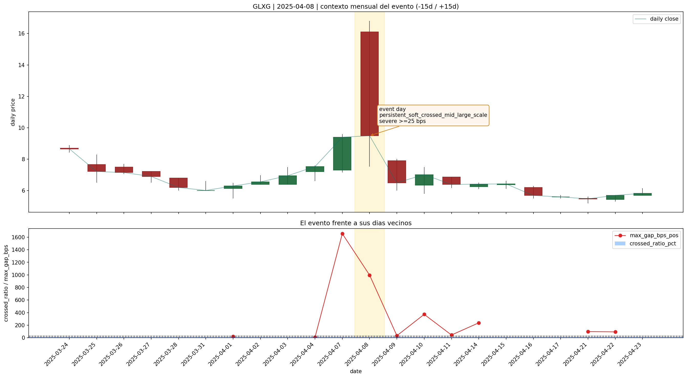

#### 00a Adjusted Proxy Contrast
Esta imagen responde a la pregunta de reconciliacion semantica: la discrepancia de precios viene de datos rotos o de vistas de precio distintas. Compara `daily raw`, `daily adjusted_proxy`, `quote mid raw` y `quote mid split_normalized`, y debajo ensena la cadena de dividendos y splits que produce la diferencia. La decision que cambia es si el inspector debe abrir una incidencia de calidad o cerrar el caso como diferencia legitima de semantica. El error que evita es mezclar series raw y adjusted como si fueran equivalentes. En pipelines reales, esto protege benchmarking, labels diarios y reconciliacion externa frente a falsas alarmas de precio.

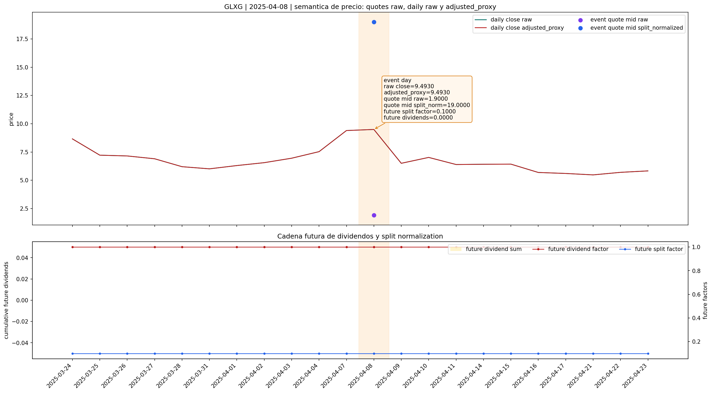

#### 00b Event Month Quotes Context
Esta imagen responde a la pregunta de recurrencia mensual dentro de `quotes`: el problema se concentra en el evento o reaparece en varias sesiones. Arriba concatena sesiones con datos disponibles; abajo resume cobertura diaria, `crossed_ratio_pct` y `max_gap_bps_pos`. La decision que cambia es si el caso debe leerse como episodio puntual o como sintoma de una fase repetida de libro degradado. El error que evita es extrapolar desde un unico dia a todo el mes sin evidencia.

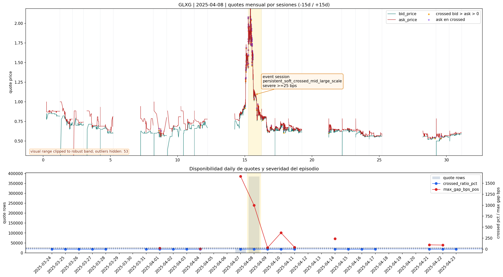

#### 01 Raw Window
Esta imagen responde a la primera pregunta decisiva del caso: el crossed observado es economicamente bastante fuerte para justificar un cambio de clase. Arriba ensena la geometria exacta del tramo conflictivo; abajo convierte esa geometria a bps y la enfrenta a los cortes `5 bps` y `25 bps`. El regimen dominante es `severe >=25 bps`. La decision que cambia es pasar de anomalia interpretable a `review` o `bad`. El error que evita es decidir por apariencia visual sin medir el dano economico real del crossed. En terminos de pipeline, este panel decide si el problema afecta solo a la lectura forense o si invalida simulacion de ejecucion y microstructure features.

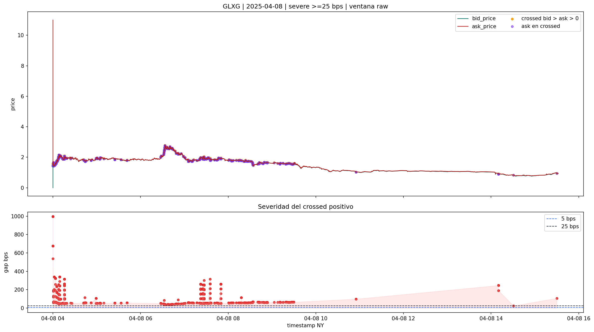

#### 02 Full Session Context
Esta imagen responde a la pregunta de extension intradiaria: el dano esta confinado a un bloque corto o contamina la sesion completa. Arriba se ve toda la sesion `04:00-20:00 NY`; abajo el `gap_bps` firmado. La decision que cambia es si el consumo debe penalizar solo un tramo o desechar el dia entero para uso operativo. El error que evita es tratar una cicatriz local como ruina total o, al reves, minimizar una degradacion distribuida a lo largo del dia. En ejecucion esto decide si la sesion puede seguir usandose con restricciones; en ML decide si las features intradiarias conservan significado economico.

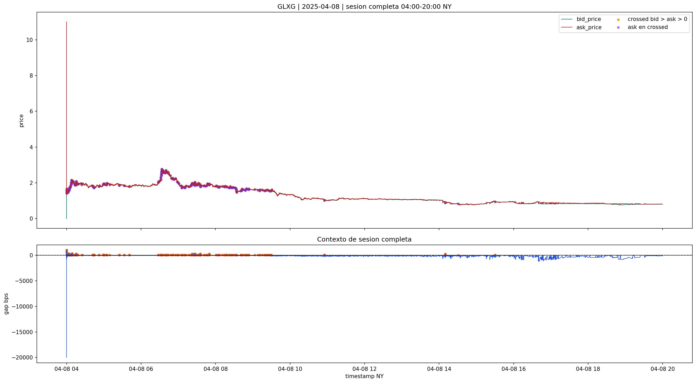

#### 03 Structure Diagnostics
Este panel responde a la pregunta de naturaleza del fallo: contradiccion economica genuina o mezcla con degeneracion estructural. Separa `ask=0` de `ask>0`, muestra la distribucion de `gap_bps` y resume patrones de integerizacion. La decision que cambia es como interpretar el dano: mercado localmente roto, artefacto de representacion o combinacion de ambos. El error que evita es sobrediagnosticar crossed reales cuando parte de la senal proviene de estructura degenerada del libro. Esta lectura afecta directamente a que el caso vaya a exclusion dura, a bandera contextual o a simple reconciliacion tecnica.

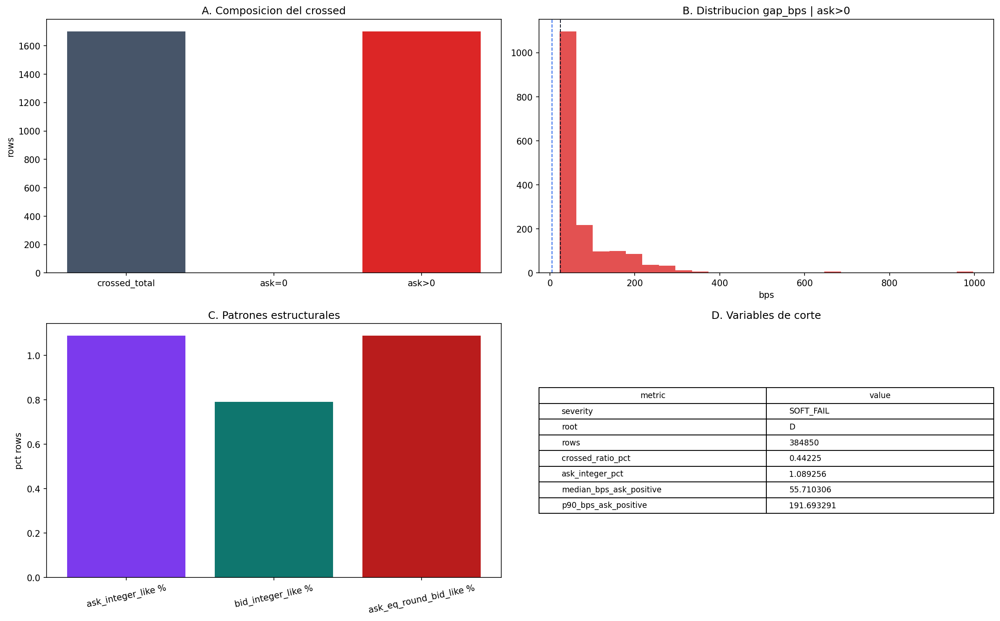

#### 04 Summary Card
Esta tarjeta responde a la pregunta de auditabilidad: cuales son exactamente las variables que sostienen la conclusion. Reune `severity`, `root`, `crossed_ratio_pct`, `ask_integer_pct`, `median_bps_ask_positive` y `p90_bps_ask_positive`. La decision que cambia es pasar de impresion visual a regla verificable. El error que evita es que dos inspectores lleguen a conclusiones distintas mirando la misma imagen sin una base numerica comun. Para gobernanza del proyecto, este panel es el que vuelve reproducible la decision para backtest, ML y auditoria.

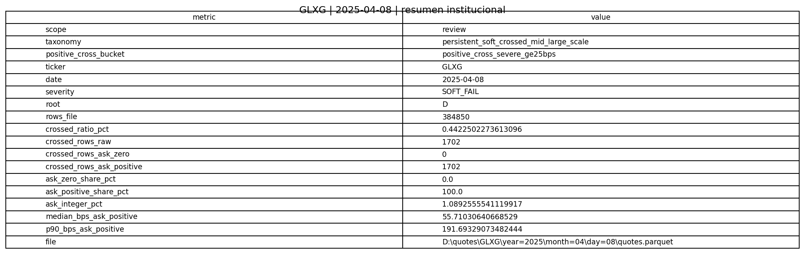

#### 05 Historical Context
Esta imagen responde a la pregunta causal externa: existe un framing historico que ayude a entender por que ocurre el episodio. Puede aportar halt context, explained o not strongly explained. La decision que cambia es cuanto peso se concede al contexto en la narrativa final. El error que evita es doble: ignorar una explicacion real o usarla como excusa para absolver un libro que localmente sigue siendo problematico.

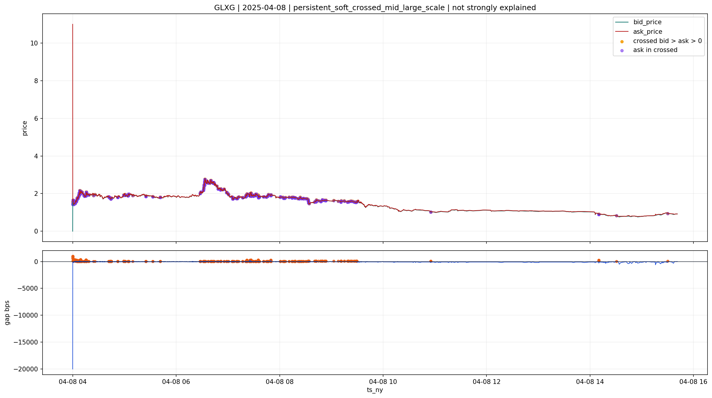

---

### 27. WLGS 2025-06-11

company_name: `Wang & Lee Group, Inc. Ordinary Shares`
primary_exchange: `NASDAQ` (`XNAS`)
market_locale: `stocks/us`
scope: `review`
ticker: `WLGS`
date: `2025-06-11`
taxonomy: `persistent_soft_crossed_mid_large_scale`
positive_cross_bucket: `positive_cross_severe_ge25bps`
severity: `SOFT_FAIL`
root: `D`
rows: `61388`
crossed_ratio_pct: `0.469147`
crossed_rows_raw: `288`
crossed_rows_ask_zero: `0`
crossed_rows_ask_positive: `288`
ask_integer_pct: `0.000000`
median_bps_ask_positive: `42.193280`
p90_bps_ask_positive: `202.020202`
file: `D:\quotes\WLGS\year=2025\month=06\day=11\quotes.parquet`

#### Analisis Forense
La conclusion correcta del caso es que ya existe contradiccion economica real dentro del libro, pero aun no con fuerza suficiente para justificar exclusion dura sin contexto adicional. La taxonomy historica es `persistent_soft_crossed_mid_large_scale` y el regimen positivo dominante es `severe >=25 bps`. Esto importa porque la taxonomy no solo clasifica: resume que tipo de anomalia se esta viendo y que clase de decision contractual puede defenderse despues. La taxonomy `persistent_soft_crossed_mid_large_scale` implica un problema repetido y distribuido, no un simple pinchazo local. Por eso empuja a `review`: ya hay dano real, aunque no necesariamente exclusion dura universal. El regimen `severe >=25 bps` empuja el caso a una lectura economicamente dura: el crossed deja de ser cosmetico y pasa a cuestionar si el libro sigue siendo interpretable como mercado negociable. En terminos observables, el file tiene `crossed_ratio_pct=0.469147` con `crossed_rows_ask_positive=288` y `crossed_rows_ask_zero=0`. La severidad economica del crossed ask>0 se resume en `median_bps_ask_positive=42.193280` y `p90_bps_ask_positive=202.020202`. Estos dos numeros convierten una forma visual rara en una conclusion operativa sobre si el libro sigue representando o no un mercado negociable. La decision que cambia es pasar de libro sano a libro util solo bajo cautela. `review` significa: no usar como si fuera ejecucion limpia, conservar para analisis contextual y sensibilidad. El error que evita es tratar como normal un episodio que ya contiene contradiccion economica real y contaminar simulaciones de ejecucion o validaciones demasiado optimistas. El patron estructural muestra `ask_integer_pct=0.000000`. Este numero obliga a separar dos explicaciones rivales: contradiccion economica genuina del libro o mezcla con degeneracion estructural / integerizacion. Toda la composicion crossed cae en `ask>0`. Eso endurece la lectura economica del caso: el dano no depende de ceros mecanicos, sino de contradiccion positiva dentro de precios aparentemente vivos. Como `ask_integer_pct` es bajo, la hipotesis de simple degeneracion mecanica pierde fuerza. Eso endurece la interpretacion: el crossed se parece mas a contradiccion economica genuina y menos a artefacto. En la capa de semantica de precio del evento aparecen `daily raw close=22.0500`, `quote mid raw=0.0837`, `quote mid split_normalized=20.9250`, `daily adjusted_proxy=22.0500`. La reconciliacion incluye `future_split_factor=0.0040`. La implicacion metodologica es crucial: una discrepancia entre `quotes`, `daily` y una plataforma externa no puede leerse automaticamente como fallo del dataset. Puede ser semantica de precio distinta. El error que evita esta capa es mezclar raw, split-normalized y adjusted dentro del mismo pipeline, rompiendo auditoria, benchmarking y labels. Para pipelines, esto bloquea su uso como libro sano en ejecucion y features microestructurales principales, aunque aun puede mantenerse para forense, sensibilidad y estudios donde la anomalia sea parte del objeto de investigacion. Existe ademas una imagen historica de certificacion asociada. Su papel es poner el episodio en un marco causal mas amplio: halt, explained, not strongly explained o patron conocido. La regla que protege al proyecto es esta: el contexto externo se usa para explicar por que aparece el episodio, no para absolverlo. El error que evita es degradar el criterio de calidad del libro porque exista una historia plausible alrededor del caso.

#### 00 Event Month Context
Esta imagen responde a la pregunta de persistencia temporal: estamos ante un accidente local o ante una fase mas amplia de inestabilidad. Arriba coloca el evento en la serie `daily` real del mes; abajo compara `crossed_ratio_pct` y `max_gap_bps_pos` del dia contra sus vecinos. La decision que cambia es el peso estructural que se le concede al caso. El error que evita es juzgar igual un shock aislado y una degradacion repetida del libro.

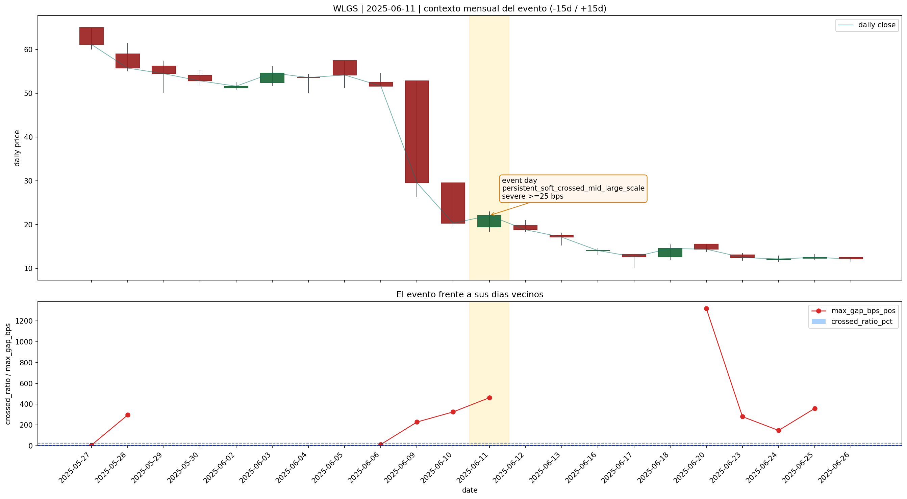

#### 00a Adjusted Proxy Contrast
Esta imagen responde a la pregunta de reconciliacion semantica: la discrepancia de precios viene de datos rotos o de vistas de precio distintas. Compara `daily raw`, `daily adjusted_proxy`, `quote mid raw` y `quote mid split_normalized`, y debajo ensena la cadena de dividendos y splits que produce la diferencia. La decision que cambia es si el inspector debe abrir una incidencia de calidad o cerrar el caso como diferencia legitima de semantica. El error que evita es mezclar series raw y adjusted como si fueran equivalentes. En pipelines reales, esto protege benchmarking, labels diarios y reconciliacion externa frente a falsas alarmas de precio.

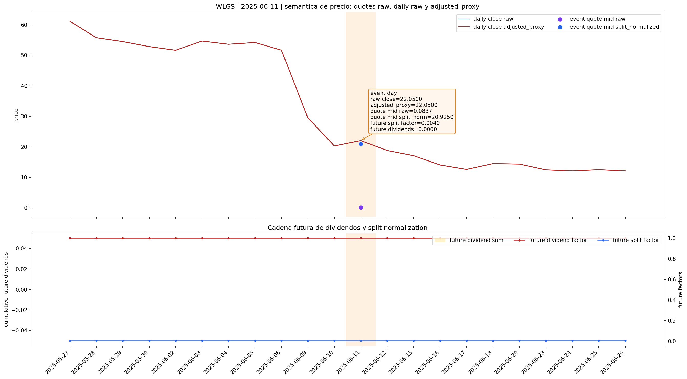

#### 00b Event Month Quotes Context
Esta imagen responde a la pregunta de recurrencia mensual dentro de `quotes`: el problema se concentra en el evento o reaparece en varias sesiones. Arriba concatena sesiones con datos disponibles; abajo resume cobertura diaria, `crossed_ratio_pct` y `max_gap_bps_pos`. La decision que cambia es si el caso debe leerse como episodio puntual o como sintoma de una fase repetida de libro degradado. El error que evita es extrapolar desde un unico dia a todo el mes sin evidencia.

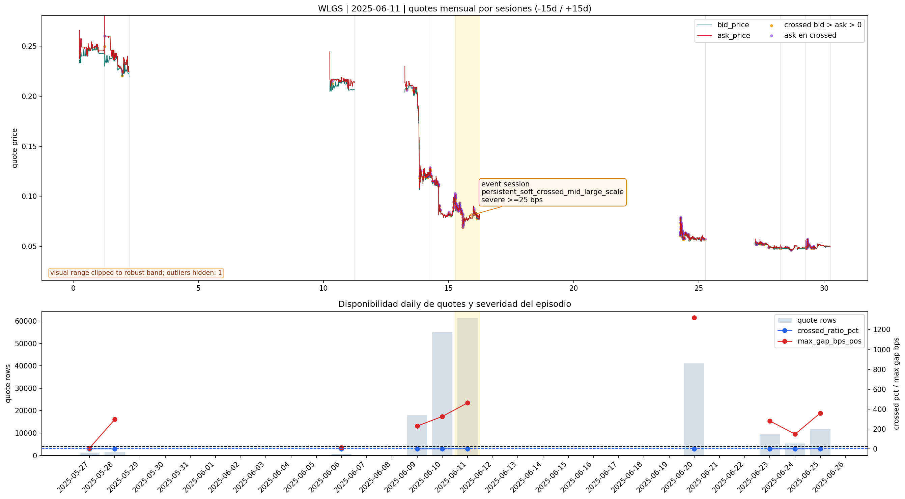

#### 01 Raw Window
Esta imagen responde a la primera pregunta decisiva del caso: el crossed observado es economicamente bastante fuerte para justificar un cambio de clase. Arriba ensena la geometria exacta del tramo conflictivo; abajo convierte esa geometria a bps y la enfrenta a los cortes `5 bps` y `25 bps`. El regimen dominante es `severe >=25 bps`. La decision que cambia es pasar de anomalia interpretable a `review` o `bad`. El error que evita es decidir por apariencia visual sin medir el dano economico real del crossed. En terminos de pipeline, este panel decide si el problema afecta solo a la lectura forense o si invalida simulacion de ejecucion y microstructure features.

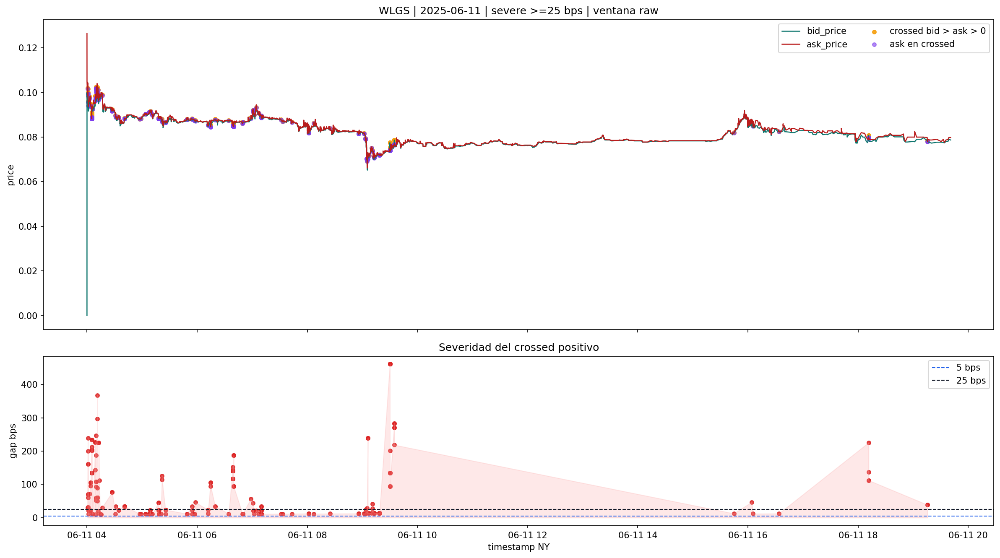

#### 02 Full Session Context
Esta imagen responde a la pregunta de extension intradiaria: el dano esta confinado a un bloque corto o contamina la sesion completa. Arriba se ve toda la sesion `04:00-20:00 NY`; abajo el `gap_bps` firmado. La decision que cambia es si el consumo debe penalizar solo un tramo o desechar el dia entero para uso operativo. El error que evita es tratar una cicatriz local como ruina total o, al reves, minimizar una degradacion distribuida a lo largo del dia. En ejecucion esto decide si la sesion puede seguir usandose con restricciones; en ML decide si las features intradiarias conservan significado economico.

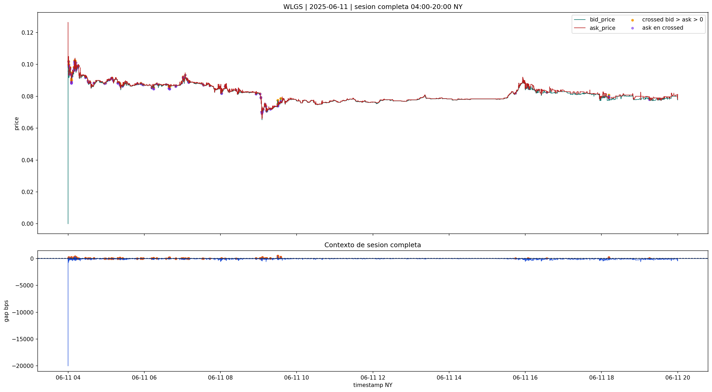

#### 03 Structure Diagnostics
Este panel responde a la pregunta de naturaleza del fallo: contradiccion economica genuina o mezcla con degeneracion estructural. Separa `ask=0` de `ask>0`, muestra la distribucion de `gap_bps` y resume patrones de integerizacion. La decision que cambia es como interpretar el dano: mercado localmente roto, artefacto de representacion o combinacion de ambos. El error que evita es sobrediagnosticar crossed reales cuando parte de la senal proviene de estructura degenerada del libro. Esta lectura afecta directamente a que el caso vaya a exclusion dura, a bandera contextual o a simple reconciliacion tecnica.

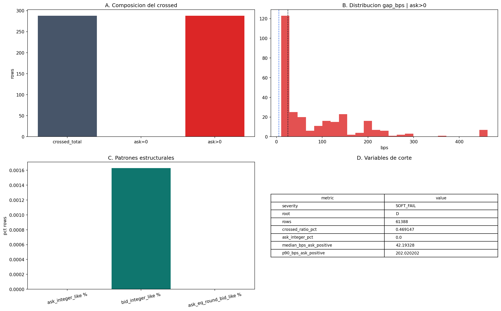

#### 04 Summary Card
Esta tarjeta responde a la pregunta de auditabilidad: cuales son exactamente las variables que sostienen la conclusion. Reune `severity`, `root`, `crossed_ratio_pct`, `ask_integer_pct`, `median_bps_ask_positive` y `p90_bps_ask_positive`. La decision que cambia es pasar de impresion visual a regla verificable. El error que evita es que dos inspectores lleguen a conclusiones distintas mirando la misma imagen sin una base numerica comun. Para gobernanza del proyecto, este panel es el que vuelve reproducible la decision para backtest, ML y auditoria.

#### 05 Historical Context
Esta imagen responde a la pregunta causal externa: existe un framing historico que ayude a entender por que ocurre el episodio. Puede aportar halt context, explained o not strongly explained. La decision que cambia es cuanto peso se concede al contexto en la narrativa final. El error que evita es doble: ignorar una explicacion real o usarla como excusa para absolver un libro que localmente sigue siendo problematico.

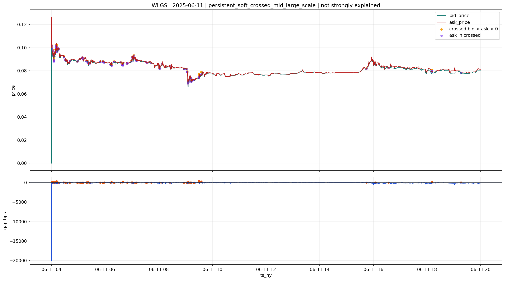

---

### 28. WTO 2024-08-29

company_name: `UTime Limited Class A Ordinary Shares`
primary_exchange: `NASDAQ` (`XNAS`)
market_locale: `stocks/us`
scope: `review`
ticker: `WTO`
date: `2024-08-29`
taxonomy: `persistent_soft_crossed_mid_large_scale`
positive_cross_bucket: `positive_cross_severe_ge25bps`
severity: `SOFT_FAIL`
root: `D`
rows: `151203`
crossed_ratio_pct: `0.361104`
crossed_rows_raw: `546`
crossed_rows_ask_zero: `0`
crossed_rows_ask_positive: `546`
ask_integer_pct: `0.000000`
median_bps_ask_positive: `39.395929`
p90_bps_ask_positive: `147.384740`
file: `D:\quotes\WTO\year=2024\month=08\day=29\quotes.parquet`

#### Analisis Forense
La conclusion correcta del caso es que ya existe contradiccion economica real dentro del libro, pero aun no con fuerza suficiente para justificar exclusion dura sin contexto adicional. La taxonomy historica es `persistent_soft_crossed_mid_large_scale` y el regimen positivo dominante es `severe >=25 bps`. Esto importa porque la taxonomy no solo clasifica: resume que tipo de anomalia se esta viendo y que clase de decision contractual puede defenderse despues. La taxonomy `persistent_soft_crossed_mid_large_scale` implica un problema repetido y distribuido, no un simple pinchazo local. Por eso empuja a `review`: ya hay dano real, aunque no necesariamente exclusion dura universal. El regimen `severe >=25 bps` empuja el caso a una lectura economicamente dura: el crossed deja de ser cosmetico y pasa a cuestionar si el libro sigue siendo interpretable como mercado negociable. En terminos observables, el file tiene `crossed_ratio_pct=0.361104` con `crossed_rows_ask_positive=546` y `crossed_rows_ask_zero=0`. La severidad economica del crossed ask>0 se resume en `median_bps_ask_positive=39.395929` y `p90_bps_ask_positive=147.384740`. Estos dos numeros convierten una forma visual rara en una conclusion operativa sobre si el libro sigue representando o no un mercado negociable. La decision que cambia es pasar de libro sano a libro util solo bajo cautela. `review` significa: no usar como si fuera ejecucion limpia, conservar para analisis contextual y sensibilidad. El error que evita es tratar como normal un episodio que ya contiene contradiccion economica real y contaminar simulaciones de ejecucion o validaciones demasiado optimistas. El patron estructural muestra `ask_integer_pct=0.000000`. Este numero obliga a separar dos explicaciones rivales: contradiccion economica genuina del libro o mezcla con degeneracion estructural / integerizacion. Toda la composicion crossed cae en `ask>0`. Eso endurece la lectura economica del caso: el dano no depende de ceros mecanicos, sino de contradiccion positiva dentro de precios aparentemente vivos. Como `ask_integer_pct` es bajo, la hipotesis de simple degeneracion mecanica pierde fuerza. Eso endurece la interpretacion: el crossed se parece mas a contradiccion economica genuina y menos a artefacto. En la capa de semantica de precio del evento aparecen `daily raw close=11325.0000`, `quote mid raw=0.0815`, `quote mid split_normalized=10193.7500`, `daily adjusted_proxy=11325.0000`. La reconciliacion incluye `future_split_factor=0.0000`. La implicacion metodologica es crucial: una discrepancia entre `quotes`, `daily` y una plataforma externa no puede leerse automaticamente como fallo del dataset. Puede ser semantica de precio distinta. El error que evita esta capa es mezclar raw, split-normalized y adjusted dentro del mismo pipeline, rompiendo auditoria, benchmarking y labels. Para pipelines, esto bloquea su uso como libro sano en ejecucion y features microestructurales principales, aunque aun puede mantenerse para forense, sensibilidad y estudios donde la anomalia sea parte del objeto de investigacion. Existe ademas una imagen historica de certificacion asociada. Su papel es poner el episodio en un marco causal mas amplio: halt, explained, not strongly explained o patron conocido. La regla que protege al proyecto es esta: el contexto externo se usa para explicar por que aparece el episodio, no para absolverlo. El error que evita es degradar el criterio de calidad del libro porque exista una historia plausible alrededor del caso.

#### 00 Event Month Context
Esta imagen responde a la pregunta de persistencia temporal: estamos ante un accidente local o ante una fase mas amplia de inestabilidad. Arriba coloca el evento en la serie `daily` real del mes; abajo compara `crossed_ratio_pct` y `max_gap_bps_pos` del dia contra sus vecinos. La decision que cambia es el peso estructural que se le concede al caso. El error que evita es juzgar igual un shock aislado y una degradacion repetida del libro.

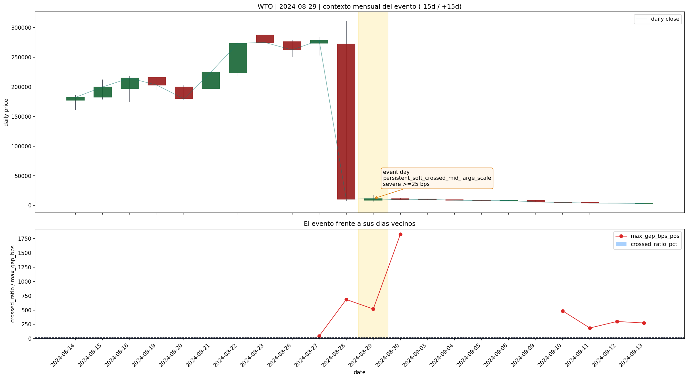

#### 00a Adjusted Proxy Contrast
Esta imagen responde a la pregunta de reconciliacion semantica: la discrepancia de precios viene de datos rotos o de vistas de precio distintas. Compara `daily raw`, `daily adjusted_proxy`, `quote mid raw` y `quote mid split_normalized`, y debajo ensena la cadena de dividendos y splits que produce la diferencia. La decision que cambia es si el inspector debe abrir una incidencia de calidad o cerrar el caso como diferencia legitima de semantica. El error que evita es mezclar series raw y adjusted como si fueran equivalentes. En pipelines reales, esto protege benchmarking, labels diarios y reconciliacion externa frente a falsas alarmas de precio.

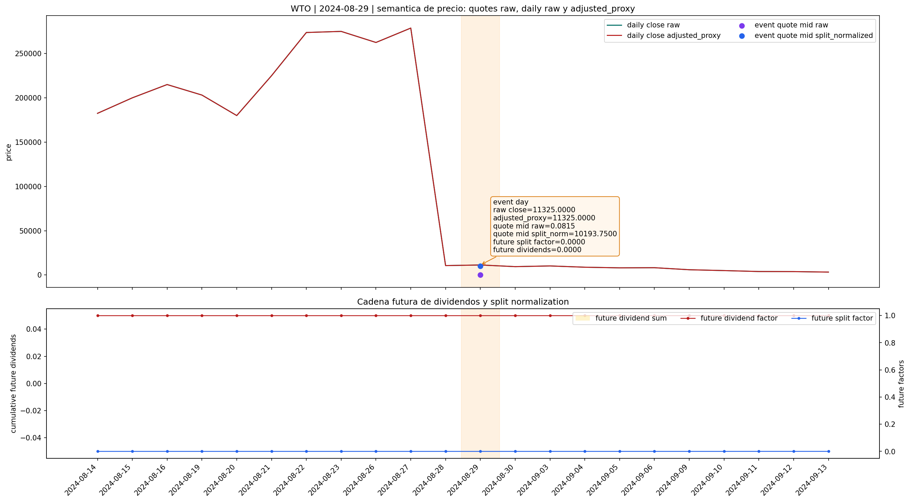

#### 00b Event Month Quotes Context
Esta imagen responde a la pregunta de recurrencia mensual dentro de `quotes`: el problema se concentra en el evento o reaparece en varias sesiones. Arriba concatena sesiones con datos disponibles; abajo resume cobertura diaria, `crossed_ratio_pct` y `max_gap_bps_pos`. La decision que cambia es si el caso debe leerse como episodio puntual o como sintoma de una fase repetida de libro degradado. El error que evita es extrapolar desde un unico dia a todo el mes sin evidencia.

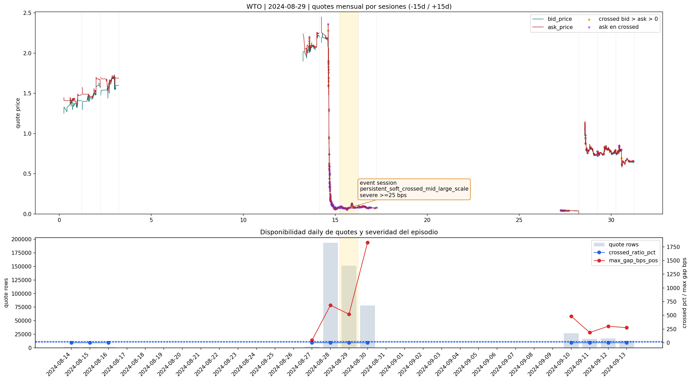

#### 01 Raw Window
Esta imagen responde a la primera pregunta decisiva del caso: el crossed observado es economicamente bastante fuerte para justificar un cambio de clase. Arriba ensena la geometria exacta del tramo conflictivo; abajo convierte esa geometria a bps y la enfrenta a los cortes `5 bps` y `25 bps`. El regimen dominante es `severe >=25 bps`. La decision que cambia es pasar de anomalia interpretable a `review` o `bad`. El error que evita es decidir por apariencia visual sin medir el dano economico real del crossed. En terminos de pipeline, este panel decide si el problema afecta solo a la lectura forense o si invalida simulacion de ejecucion y microstructure features.

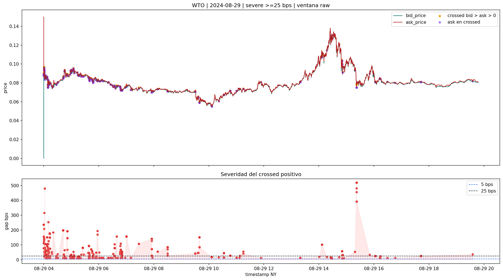

#### 02 Full Session Context
Esta imagen responde a la pregunta de extension intradiaria: el dano esta confinado a un bloque corto o contamina la sesion completa. Arriba se ve toda la sesion `04:00-20:00 NY`; abajo el `gap_bps` firmado. La decision que cambia es si el consumo debe penalizar solo un tramo o desechar el dia entero para uso operativo. El error que evita es tratar una cicatriz local como ruina total o, al reves, minimizar una degradacion distribuida a lo largo del dia. En ejecucion esto decide si la sesion puede seguir usandose con restricciones; en ML decide si las features intradiarias conservan significado economico.

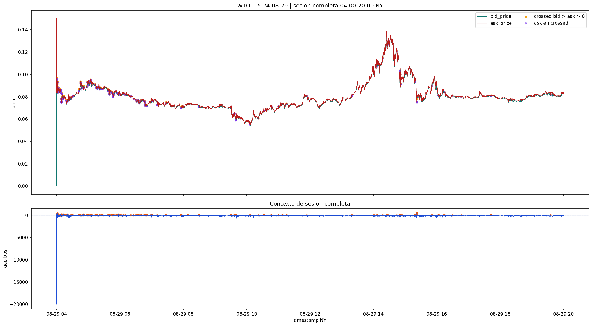

#### 03 Structure Diagnostics
Este panel responde a la pregunta de naturaleza del fallo: contradiccion economica genuina o mezcla con degeneracion estructural. Separa `ask=0` de `ask>0`, muestra la distribucion de `gap_bps` y resume patrones de integerizacion. La decision que cambia es como interpretar el dano: mercado localmente roto, artefacto de representacion o combinacion de ambos. El error que evita es sobrediagnosticar crossed reales cuando parte de la senal proviene de estructura degenerada del libro. Esta lectura afecta directamente a que el caso vaya a exclusion dura, a bandera contextual o a simple reconciliacion tecnica.

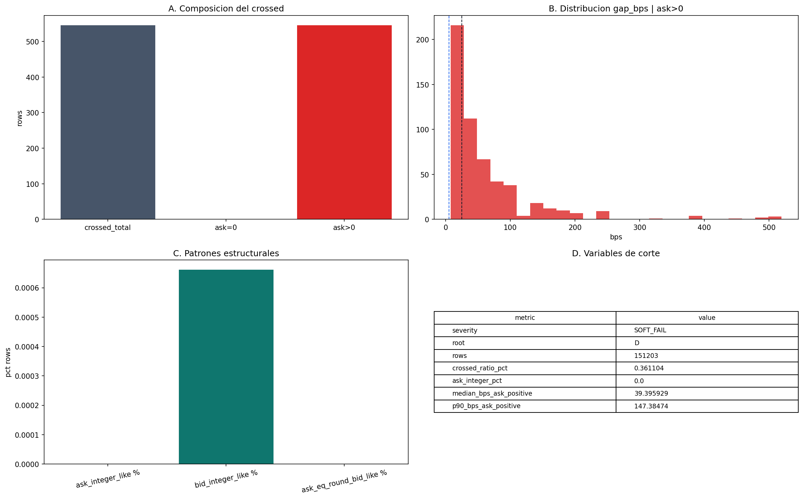

#### 04 Summary Card
Esta tarjeta responde a la pregunta de auditabilidad: cuales son exactamente las variables que sostienen la conclusion. Reune `severity`, `root`, `crossed_ratio_pct`, `ask_integer_pct`, `median_bps_ask_positive` y `p90_bps_ask_positive`. La decision que cambia es pasar de impresion visual a regla verificable. El error que evita es que dos inspectores lleguen a conclusiones distintas mirando la misma imagen sin una base numerica comun. Para gobernanza del proyecto, este panel es el que vuelve reproducible la decision para backtest, ML y auditoria.

---

### 29. PACW 2008-06-19

company_name: `PacWest Bancorp`
primary_exchange: `NASDAQ` (`XNAS`)
market_locale: `stocks/us`
scope: `review`
ticker: `PACW`
date: `2008-06-19`
taxonomy: `persistent_soft_crossed_mid_large_scale`
positive_cross_bucket: `positive_cross_severe_ge25bps`
severity: `SOFT_FAIL`
root: `D`
rows: `11615`
crossed_ratio_pct: `0.602669`
crossed_rows_raw: `70`
crossed_rows_ask_zero: `66`
crossed_rows_ask_positive: `4`
ask_integer_pct: `1.239776`
median_bps_ask_positive: `29.985007`
p90_bps_ask_positive: `29.985007`
file: `D:\quotes\PACW\year=2008\month=06\day=19\quotes.parquet`

#### Analisis Forense
La conclusion correcta del caso es que ya existe contradiccion economica real dentro del libro, pero aun no con fuerza suficiente para justificar exclusion dura sin contexto adicional. La taxonomy historica es `persistent_soft_crossed_mid_large_scale` y el regimen positivo dominante es `severe >=25 bps`. Esto importa porque la taxonomy no solo clasifica: resume que tipo de anomalia se esta viendo y que clase de decision contractual puede defenderse despues. La taxonomy `persistent_soft_crossed_mid_large_scale` implica un problema repetido y distribuido, no un simple pinchazo local. Por eso empuja a `review`: ya hay dano real, aunque no necesariamente exclusion dura universal. El regimen `severe >=25 bps` empuja el caso a una lectura economicamente dura: el crossed deja de ser cosmetico y pasa a cuestionar si el libro sigue siendo interpretable como mercado negociable. En terminos observables, el file tiene `crossed_ratio_pct=0.602669` con `crossed_rows_ask_positive=4` y `crossed_rows_ask_zero=66`. La severidad economica del crossed ask>0 se resume en `median_bps_ask_positive=29.985007` y `p90_bps_ask_positive=29.985007`. Estos dos numeros convierten una forma visual rara en una conclusion operativa sobre si el libro sigue representando o no un mercado negociable. La decision que cambia es pasar de libro sano a libro util solo bajo cautela. `review` significa: no usar como si fuera ejecucion limpia, conservar para analisis contextual y sensibilidad. El error que evita es tratar como normal un episodio que ya contiene contradiccion economica real y contaminar simulaciones de ejecucion o validaciones demasiado optimistas. El patron estructural muestra `ask_integer_pct=1.239776`. Este numero obliga a separar dos explicaciones rivales: contradiccion economica genuina del libro o mezcla con degeneracion estructural / integerizacion. La mayor parte del crossed vive en `ask=0`, pero existe una cola `ask>0` que impide absolver el caso como simple glitch. La lectura correcta es mixta: dano estructural dominante con residuo economico que aun puede justificar bandera o exclusion. Como `ask_integer_pct` es bajo, la hipotesis de simple degeneracion mecanica pierde fuerza. Eso endurece la interpretacion: el crossed se parece mas a contradiccion economica genuina y menos a artefacto. En la capa de semantica de precio del evento aparecen `daily raw close=16.8600`, `quote mid raw=16.4400`, `quote mid split_normalized=16.4400`, `daily adjusted_proxy=8.3517`. Ademas hay `post_event_dividend_sum=18.6100`. La implicacion metodologica es crucial: una discrepancia entre `quotes`, `daily` y una plataforma externa no puede leerse automaticamente como fallo del dataset. Puede ser semantica de precio distinta. El error que evita esta capa es mezclar raw, split-normalized y adjusted dentro del mismo pipeline, rompiendo auditoria, benchmarking y labels. Para pipelines, esto bloquea su uso como libro sano en ejecucion y features microestructurales principales, aunque aun puede mantenerse para forense, sensibilidad y estudios donde la anomalia sea parte del objeto de investigacion. Existe ademas una imagen historica de certificacion asociada. Su papel es poner el episodio en un marco causal mas amplio: halt, explained, not strongly explained o patron conocido. La regla que protege al proyecto es esta: el contexto externo se usa para explicar por que aparece el episodio, no para absolverlo. El error que evita es degradar el criterio de calidad del libro porque exista una historia plausible alrededor del caso.

#### 00 Event Month Context
Esta imagen responde a la pregunta de persistencia temporal: estamos ante un accidente local o ante una fase mas amplia de inestabilidad. Arriba coloca el evento en la serie `daily` real del mes; abajo compara `crossed_ratio_pct` y `max_gap_bps_pos` del dia contra sus vecinos. La decision que cambia es el peso estructural que se le concede al caso. El error que evita es juzgar igual un shock aislado y una degradacion repetida del libro.

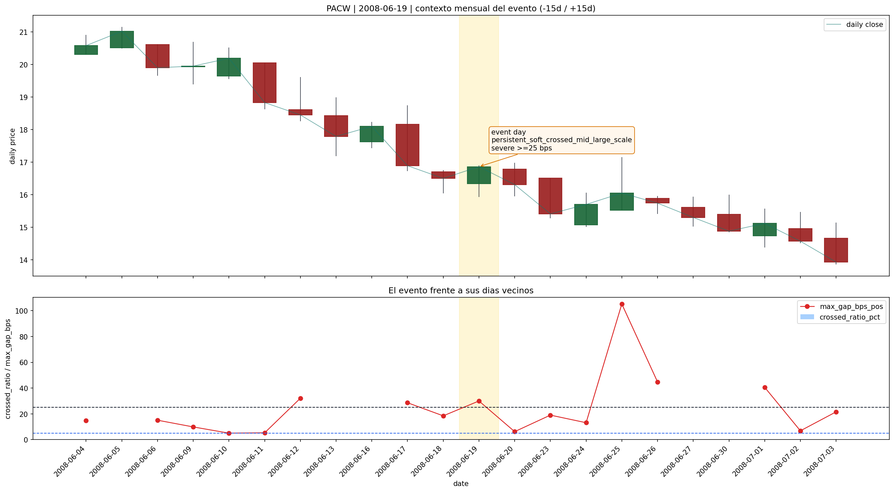

#### 00a Adjusted Proxy Contrast
Esta imagen responde a la pregunta de reconciliacion semantica: la discrepancia de precios viene de datos rotos o de vistas de precio distintas. Compara `daily raw`, `daily adjusted_proxy`, `quote mid raw` y `quote mid split_normalized`, y debajo ensena la cadena de dividendos y splits que produce la diferencia. La decision que cambia es si el inspector debe abrir una incidencia de calidad o cerrar el caso como diferencia legitima de semantica. El error que evita es mezclar series raw y adjusted como si fueran equivalentes. En pipelines reales, esto protege benchmarking, labels diarios y reconciliacion externa frente a falsas alarmas de precio.

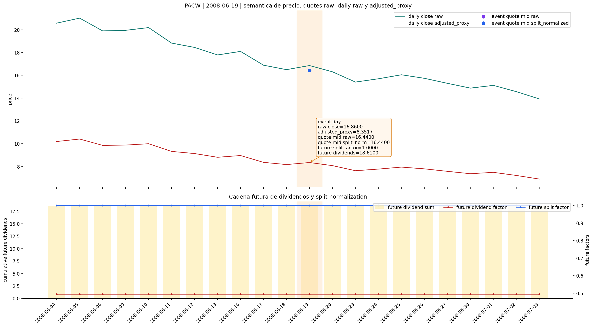

#### 00b Event Month Quotes Context
Esta imagen responde a la pregunta de recurrencia mensual dentro de `quotes`: el problema se concentra en el evento o reaparece en varias sesiones. Arriba concatena sesiones con datos disponibles; abajo resume cobertura diaria, `crossed_ratio_pct` y `max_gap_bps_pos`. La decision que cambia es si el caso debe leerse como episodio puntual o como sintoma de una fase repetida de libro degradado. El error que evita es extrapolar desde un unico dia a todo el mes sin evidencia.

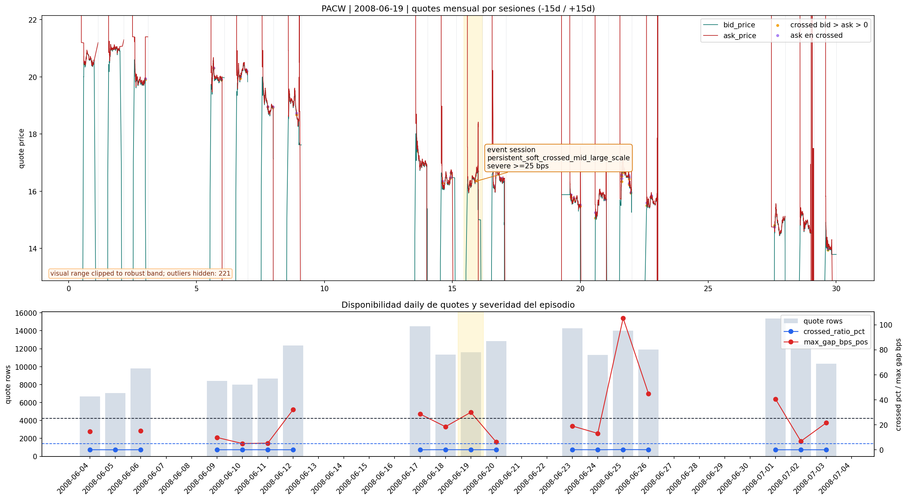

#### 01 Raw Window
Esta imagen responde a la primera pregunta decisiva del caso: el crossed observado es economicamente bastante fuerte para justificar un cambio de clase. Arriba ensena la geometria exacta del tramo conflictivo; abajo convierte esa geometria a bps y la enfrenta a los cortes `5 bps` y `25 bps`. El regimen dominante es `severe >=25 bps`. La decision que cambia es pasar de anomalia interpretable a `review` o `bad`. El error que evita es decidir por apariencia visual sin medir el dano economico real del crossed. En terminos de pipeline, este panel decide si el problema afecta solo a la lectura forense o si invalida simulacion de ejecucion y microstructure features.

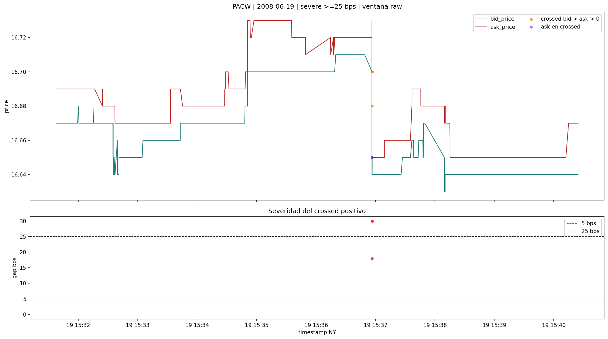

#### 02 Full Session Context
Esta imagen responde a la pregunta de extension intradiaria: el dano esta confinado a un bloque corto o contamina la sesion completa. Arriba se ve toda la sesion `04:00-20:00 NY`; abajo el `gap_bps` firmado. La decision que cambia es si el consumo debe penalizar solo un tramo o desechar el dia entero para uso operativo. El error que evita es tratar una cicatriz local como ruina total o, al reves, minimizar una degradacion distribuida a lo largo del dia. En ejecucion esto decide si la sesion puede seguir usandose con restricciones; en ML decide si las features intradiarias conservan significado economico.

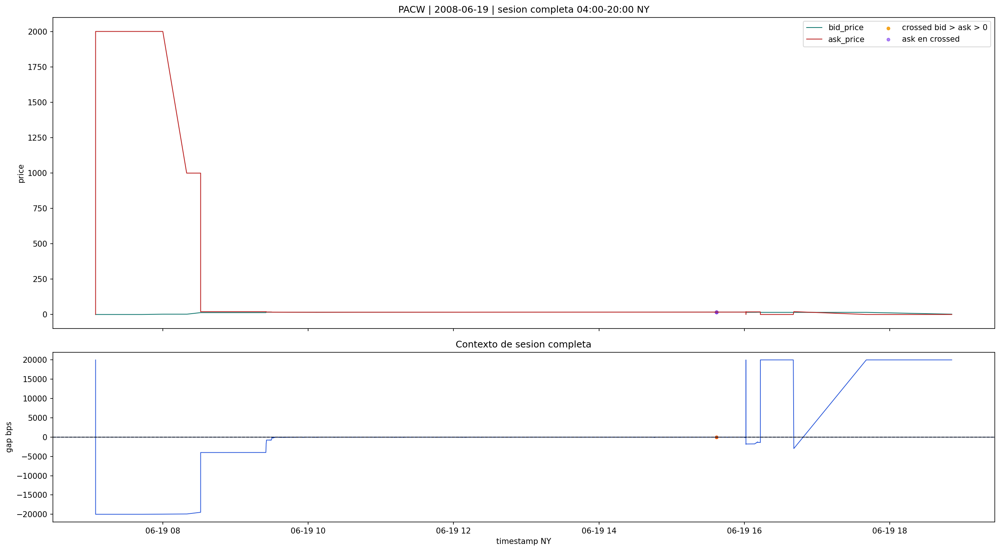

#### 03 Structure Diagnostics
Este panel responde a la pregunta de naturaleza del fallo: contradiccion economica genuina o mezcla con degeneracion estructural. Separa `ask=0` de `ask>0`, muestra la distribucion de `gap_bps` y resume patrones de integerizacion. La decision que cambia es como interpretar el dano: mercado localmente roto, artefacto de representacion o combinacion de ambos. El error que evita es sobrediagnosticar crossed reales cuando parte de la senal proviene de estructura degenerada del libro. Esta lectura afecta directamente a que el caso vaya a exclusion dura, a bandera contextual o a simple reconciliacion tecnica.

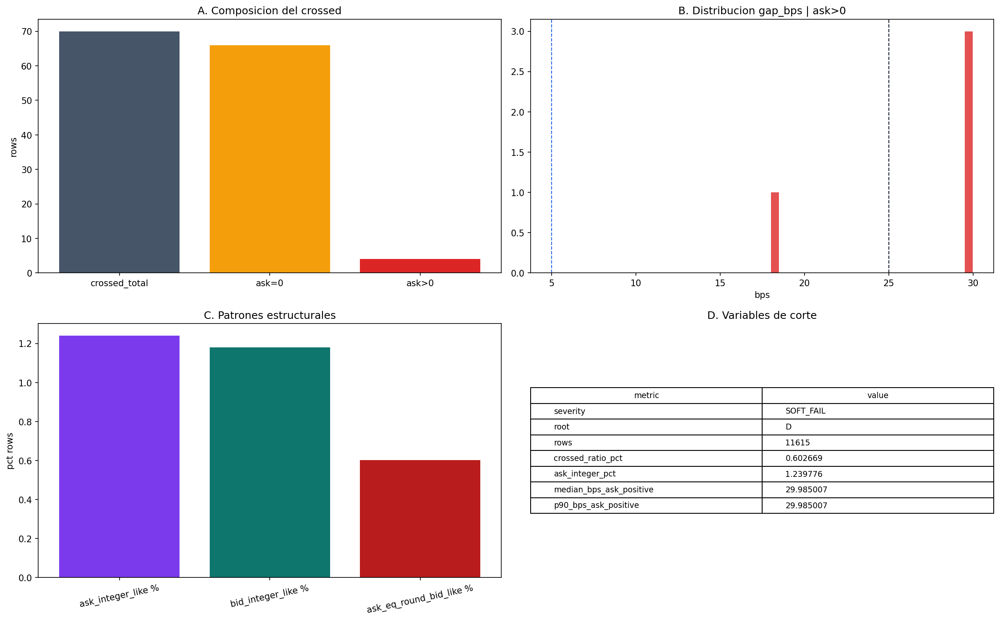

#### 04 Summary Card
Esta tarjeta responde a la pregunta de auditabilidad: cuales son exactamente las variables que sostienen la conclusion. Reune `severity`, `root`, `crossed_ratio_pct`, `ask_integer_pct`, `median_bps_ask_positive` y `p90_bps_ask_positive`. La decision que cambia es pasar de impresion visual a regla verificable. El error que evita es que dos inspectores lleguen a conclusiones distintas mirando la misma imagen sin una base numerica comun. Para gobernanza del proyecto, este panel es el que vuelve reproducible la decision para backtest, ML y auditoria.

---

### 30. BROG 2025-05-27

company_name: `Brooge Energy Limited Ordinary Shares`
primary_exchange: `NASDAQ` (`XNAS`)
market_locale: `stocks/us`
scope: `review`
ticker: `BROG`
date: `2025-05-27`
taxonomy: `persistent_soft_crossed_mid_large_scale`
positive_cross_bucket: `positive_cross_severe_ge25bps`
severity: `SOFT_FAIL`
root: `D`
rows: `35236`
crossed_ratio_pct: `0.411511`
crossed_rows_raw: `145`
crossed_rows_ask_zero: `0`
crossed_rows_ask_positive: `145`
ask_integer_pct: `4.001589`
median_bps_ask_positive: `28.612303`
p90_bps_ask_positive: `70.472163`
file: `D:\quotes\BROG\year=2025\month=05\day=27\quotes.parquet`

#### Analisis Forense
La conclusion correcta del caso es que ya existe contradiccion economica real dentro del libro, pero aun no con fuerza suficiente para justificar exclusion dura sin contexto adicional. La taxonomy historica es `persistent_soft_crossed_mid_large_scale` y el regimen positivo dominante es `severe >=25 bps`. Esto importa porque la taxonomy no solo clasifica: resume que tipo de anomalia se esta viendo y que clase de decision contractual puede defenderse despues. La taxonomy `persistent_soft_crossed_mid_large_scale` implica un problema repetido y distribuido, no un simple pinchazo local. Por eso empuja a `review`: ya hay dano real, aunque no necesariamente exclusion dura universal. El regimen `severe >=25 bps` empuja el caso a una lectura economicamente dura: el crossed deja de ser cosmetico y pasa a cuestionar si el libro sigue siendo interpretable como mercado negociable. En terminos observables, el file tiene `crossed_ratio_pct=0.411511` con `crossed_rows_ask_positive=145` y `crossed_rows_ask_zero=0`. La severidad economica del crossed ask>0 se resume en `median_bps_ask_positive=28.612303` y `p90_bps_ask_positive=70.472163`. Estos dos numeros convierten una forma visual rara en una conclusion operativa sobre si el libro sigue representando o no un mercado negociable. La decision que cambia es pasar de libro sano a libro util solo bajo cautela. `review` significa: no usar como si fuera ejecucion limpia, conservar para analisis contextual y sensibilidad. El error que evita es tratar como normal un episodio que ya contiene contradiccion economica real y contaminar simulaciones de ejecucion o validaciones demasiado optimistas. El patron estructural muestra `ask_integer_pct=4.001589`. Este numero obliga a separar dos explicaciones rivales: contradiccion economica genuina del libro o mezcla con degeneracion estructural / integerizacion. Toda la composicion crossed cae en `ask>0`. Eso endurece la lectura economica del caso: el dano no depende de ceros mecanicos, sino de contradiccion positiva dentro de precios aparentemente vivos. Como `ask_integer_pct` es bajo, la hipotesis de simple degeneracion mecanica pierde fuerza. Eso endurece la interpretacion: el crossed se parece mas a contradiccion economica genuina y menos a artefacto. Existe ademas una imagen historica de certificacion asociada. Su papel es poner el episodio en un marco causal mas amplio: halt, explained, not strongly explained o patron conocido. La regla que protege al proyecto es esta: el contexto externo se usa para explicar por que aparece el episodio, no para absolverlo. El error que evita es degradar el criterio de calidad del libro porque exista una historia plausible alrededor del caso.

#### 00 Event Month Context
Esta imagen responde a la pregunta de persistencia temporal: estamos ante un accidente local o ante una fase mas amplia de inestabilidad. Arriba coloca el evento en la serie `daily` real del mes; abajo compara `crossed_ratio_pct` y `max_gap_bps_pos` del dia contra sus vecinos. La decision que cambia es el peso estructural que se le concede al caso. El error que evita es juzgar igual un shock aislado y una degradacion repetida del libro.

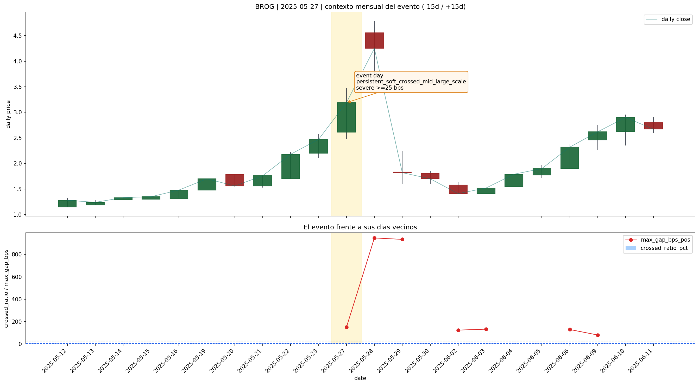

#### 00b Event Month Quotes Context
Esta imagen responde a la pregunta de recurrencia mensual dentro de `quotes`: el problema se concentra en el evento o reaparece en varias sesiones. Arriba concatena sesiones con datos disponibles; abajo resume cobertura diaria, `crossed_ratio_pct` y `max_gap_bps_pos`. La decision que cambia es si el caso debe leerse como episodio puntual o como sintoma de una fase repetida de libro degradado. El error que evita es extrapolar desde un unico dia a todo el mes sin evidencia.

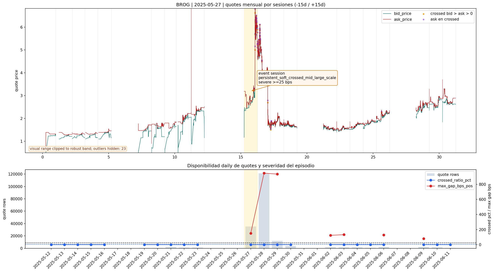

#### 01 Raw Window
Esta imagen responde a la primera pregunta decisiva del caso: el crossed observado es economicamente bastante fuerte para justificar un cambio de clase. Arriba ensena la geometria exacta del tramo conflictivo; abajo convierte esa geometria a bps y la enfrenta a los cortes `5 bps` y `25 bps`. El regimen dominante es `severe >=25 bps`. La decision que cambia es pasar de anomalia interpretable a `review` o `bad`. El error que evita es decidir por apariencia visual sin medir el dano economico real del crossed. En terminos de pipeline, este panel decide si el problema afecta solo a la lectura forense o si invalida simulacion de ejecucion y microstructure features.

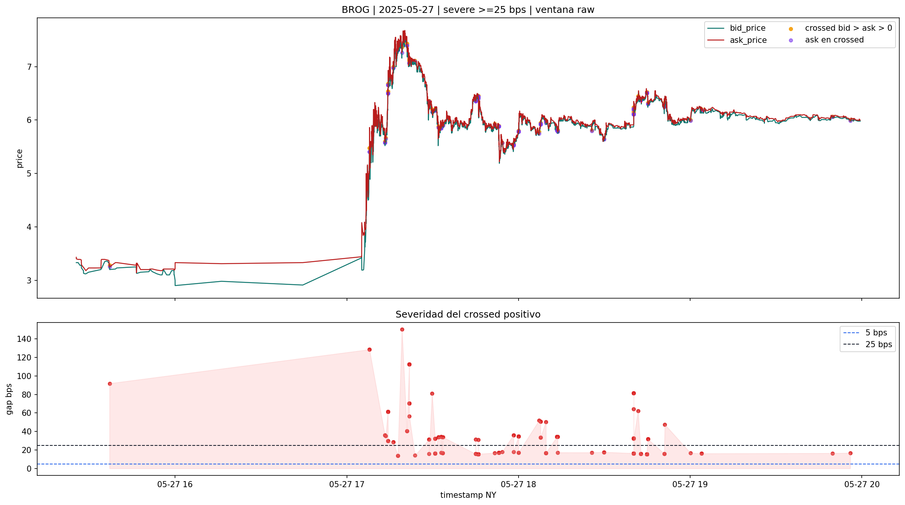

#### 02 Full Session Context
Esta imagen responde a la pregunta de extension intradiaria: el dano esta confinado a un bloque corto o contamina la sesion completa. Arriba se ve toda la sesion `04:00-20:00 NY`; abajo el `gap_bps` firmado. La decision que cambia es si el consumo debe penalizar solo un tramo o desechar el dia entero para uso operativo. El error que evita es tratar una cicatriz local como ruina total o, al reves, minimizar una degradacion distribuida a lo largo del dia. En ejecucion esto decide si la sesion puede seguir usandose con restricciones; en ML decide si las features intradiarias conservan significado economico.

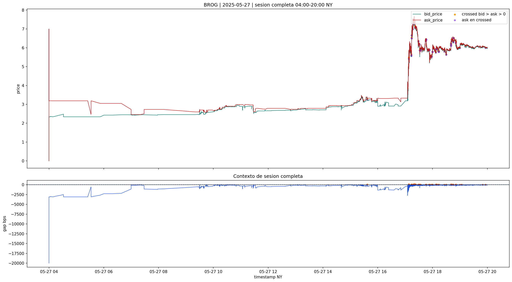

#### 03 Structure Diagnostics
Este panel responde a la pregunta de naturaleza del fallo: contradiccion economica genuina o mezcla con degeneracion estructural. Separa `ask=0` de `ask>0`, muestra la distribucion de `gap_bps` y resume patrones de integerizacion. La decision que cambia es como interpretar el dano: mercado localmente roto, artefacto de representacion o combinacion de ambos. El error que evita es sobrediagnosticar crossed reales cuando parte de la senal proviene de estructura degenerada del libro. Esta lectura afecta directamente a que el caso vaya a exclusion dura, a bandera contextual o a simple reconciliacion tecnica.

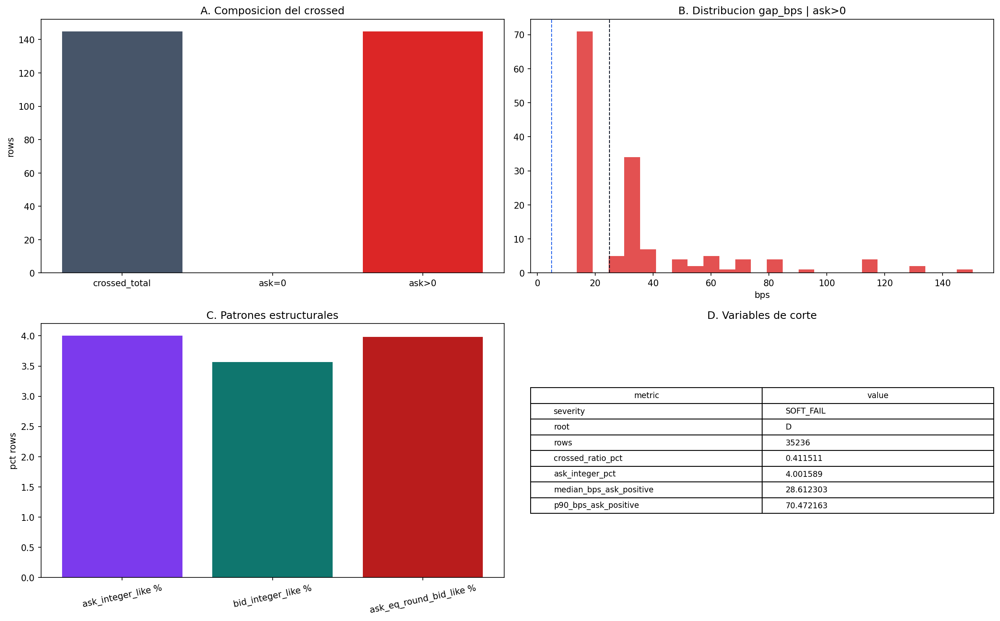

#### 04 Summary Card
Esta tarjeta responde a la pregunta de auditabilidad: cuales son exactamente las variables que sostienen la conclusion. Reune `severity`, `root`, `crossed_ratio_pct`, `ask_integer_pct`, `median_bps_ask_positive` y `p90_bps_ask_positive`. La decision que cambia es pasar de impresion visual a regla verificable. El error que evita es que dos inspectores lleguen a conclusiones distintas mirando la misma imagen sin una base numerica comun. Para gobernanza del proyecto, este panel es el que vuelve reproducible la decision para backtest, ML y auditoria.

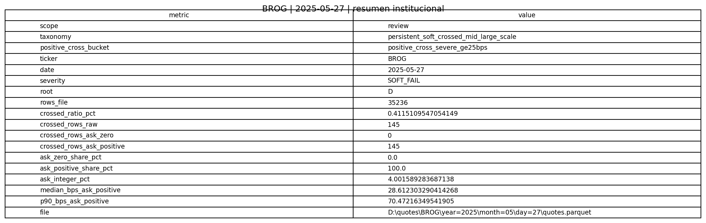

---

### 31. CPST 2005-09-07

company_name: `Capstone Turbine Corp`
primary_exchange: `NASDAQ` (`XNAS`)
market_locale: `stocks/us`
scope: `review`
ticker: `CPST`
date: `2005-09-07`
taxonomy: `persistent_soft_crossed_mid_large_scale`
positive_cross_bucket: `positive_cross_moderate_5to25bps`
severity: `SOFT_FAIL`
root: `D`
rows: `16593`
crossed_ratio_pct: `0.301332`
crossed_rows_raw: `50`
crossed_rows_ask_zero: `0`
crossed_rows_ask_positive: `50`
ask_integer_pct: `3.628036`
median_bps_ask_positive: `19.782394`
p90_bps_ask_positive: `20.060181`
file: `D:\quotes\CPST\year=2005\month=09\day=07\quotes.parquet`

#### Analisis Forense
La conclusion correcta del caso es que ya existe contradiccion economica real dentro del libro, pero aun no con fuerza suficiente para justificar exclusion dura sin contexto adicional. La taxonomy historica es `persistent_soft_crossed_mid_large_scale` y el regimen positivo dominante es `moderate 5-25 bps`. Esto importa porque la taxonomy no solo clasifica: resume que tipo de anomalia se esta viendo y que clase de decision contractual puede defenderse despues. La taxonomy `persistent_soft_crossed_mid_large_scale` implica un problema repetido y distribuido, no un simple pinchazo local. Por eso empuja a `review`: ya hay dano real, aunque no necesariamente exclusion dura universal. El regimen `moderate 5-25 bps` ya entra en zona donde el crossed tiene capacidad real de contaminar simulacion de ejecucion y features microestructurales, aunque todavia puede requerir lectura contextual antes de exclusion dura. En terminos observables, el file tiene `crossed_ratio_pct=0.301332` con `crossed_rows_ask_positive=50` y `crossed_rows_ask_zero=0`. La severidad economica del crossed ask>0 se resume en `median_bps_ask_positive=19.782394` y `p90_bps_ask_positive=20.060181`. Estos dos numeros convierten una forma visual rara en una conclusion operativa sobre si el libro sigue representando o no un mercado negociable. La decision que cambia es pasar de libro sano a libro util solo bajo cautela. `review` significa: no usar como si fuera ejecucion limpia, conservar para analisis contextual y sensibilidad. El error que evita es tratar como normal un episodio que ya contiene contradiccion economica real y contaminar simulaciones de ejecucion o validaciones demasiado optimistas. El patron estructural muestra `ask_integer_pct=3.628036`. Este numero obliga a separar dos explicaciones rivales: contradiccion economica genuina del libro o mezcla con degeneracion estructural / integerizacion. Toda la composicion crossed cae en `ask>0`. Eso endurece la lectura economica del caso: el dano no depende de ceros mecanicos, sino de contradiccion positiva dentro de precios aparentemente vivos. Como `ask_integer_pct` es bajo, la hipotesis de simple degeneracion mecanica pierde fuerza. Eso endurece la interpretacion: el crossed se parece mas a contradiccion economica genuina y menos a artefacto. Existe ademas una imagen historica de certificacion asociada. Su papel es poner el episodio en un marco causal mas amplio: halt, explained, not strongly explained o patron conocido. La regla que protege al proyecto es esta: el contexto externo se usa para explicar por que aparece el episodio, no para absolverlo. El error que evita es degradar el criterio de calidad del libro porque exista una historia plausible alrededor del caso.

#### 00 Event Month Context
Esta imagen responde a la pregunta de persistencia temporal: estamos ante un accidente local o ante una fase mas amplia de inestabilidad. Arriba coloca el evento en la serie `daily` real del mes; abajo compara `crossed_ratio_pct` y `max_gap_bps_pos` del dia contra sus vecinos. La decision que cambia es el peso estructural que se le concede al caso. El error que evita es juzgar igual un shock aislado y una degradacion repetida del libro.

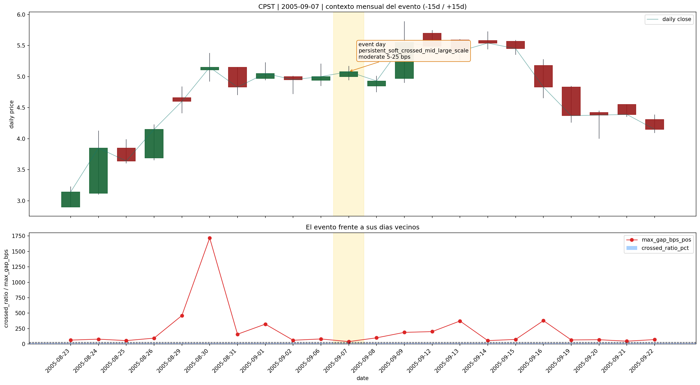

#### 00b Event Month Quotes Context
Esta imagen responde a la pregunta de recurrencia mensual dentro de `quotes`: el problema se concentra en el evento o reaparece en varias sesiones. Arriba concatena sesiones con datos disponibles; abajo resume cobertura diaria, `crossed_ratio_pct` y `max_gap_bps_pos`. La decision que cambia es si el caso debe leerse como episodio puntual o como sintoma de una fase repetida de libro degradado. El error que evita es extrapolar desde un unico dia a todo el mes sin evidencia.

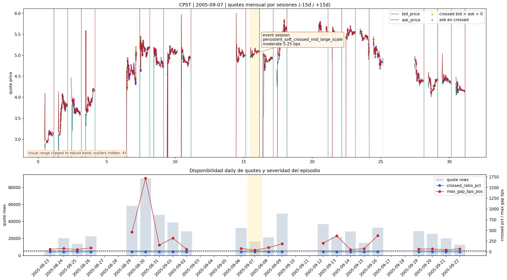

#### 01 Raw Window
Esta imagen responde a la primera pregunta decisiva del caso: el crossed observado es economicamente bastante fuerte para justificar un cambio de clase. Arriba ensena la geometria exacta del tramo conflictivo; abajo convierte esa geometria a bps y la enfrenta a los cortes `5 bps` y `25 bps`. El regimen dominante es `moderate 5-25 bps`. La decision que cambia es pasar de anomalia interpretable a `review` o `bad`. El error que evita es decidir por apariencia visual sin medir el dano economico real del crossed. En terminos de pipeline, este panel decide si el problema afecta solo a la lectura forense o si invalida simulacion de ejecucion y microstructure features.

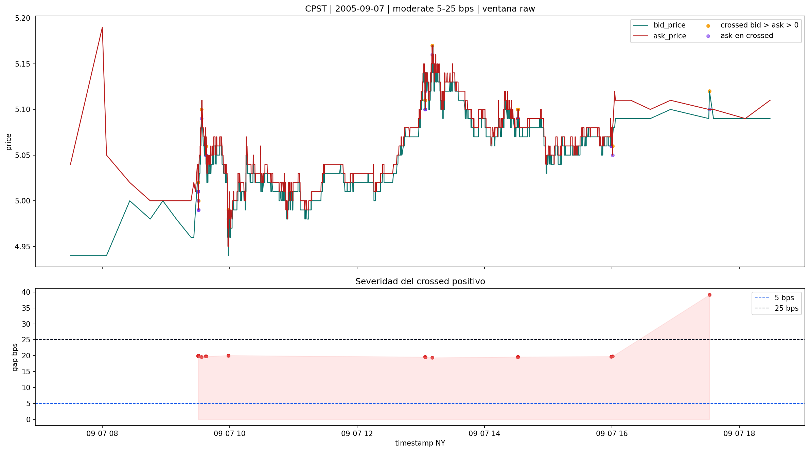

#### 02 Full Session Context
Esta imagen responde a la pregunta de extension intradiaria: el dano esta confinado a un bloque corto o contamina la sesion completa. Arriba se ve toda la sesion `04:00-20:00 NY`; abajo el `gap_bps` firmado. La decision que cambia es si el consumo debe penalizar solo un tramo o desechar el dia entero para uso operativo. El error que evita es tratar una cicatriz local como ruina total o, al reves, minimizar una degradacion distribuida a lo largo del dia. En ejecucion esto decide si la sesion puede seguir usandose con restricciones; en ML decide si las features intradiarias conservan significado economico.

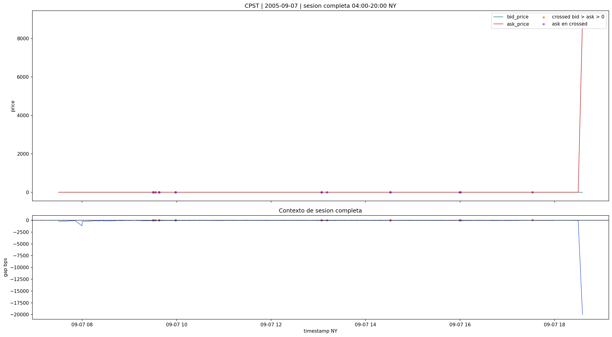

#### 03 Structure Diagnostics
Este panel responde a la pregunta de naturaleza del fallo: contradiccion economica genuina o mezcla con degeneracion estructural. Separa `ask=0` de `ask>0`, muestra la distribucion de `gap_bps` y resume patrones de integerizacion. La decision que cambia es como interpretar el dano: mercado localmente roto, artefacto de representacion o combinacion de ambos. El error que evita es sobrediagnosticar crossed reales cuando parte de la senal proviene de estructura degenerada del libro. Esta lectura afecta directamente a que el caso vaya a exclusion dura, a bandera contextual o a simple reconciliacion tecnica.

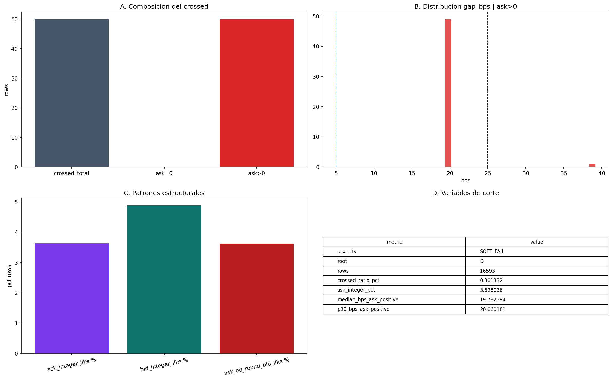

#### 04 Summary Card
Esta tarjeta responde a la pregunta de auditabilidad: cuales son exactamente las variables que sostienen la conclusion. Reune `severity`, `root`, `crossed_ratio_pct`, `ask_integer_pct`, `median_bps_ask_positive` y `p90_bps_ask_positive`. La decision que cambia es pasar de impresion visual a regla verificable. El error que evita es que dos inspectores lleguen a conclusiones distintas mirando la misma imagen sin una base numerica comun. Para gobernanza del proyecto, este panel es el que vuelve reproducible la decision para backtest, ML y auditoria.

---

### 32. QNTM 2024-08-16

company_name: `Quantum Biopharma Ltd. Class B Subordinate Voting Shares`
primary_exchange: `NASDAQ` (`XNAS`)
market_locale: `stocks/us`
scope: `review`
ticker: `QNTM`
date: `2024-08-16`
taxonomy: `persistent_soft_crossed_mid_large_scale`
positive_cross_bucket: `positive_cross_moderate_5to25bps`
severity: `SOFT_FAIL`
root: `D`
rows: `24003`
crossed_ratio_pct: `0.374953`
crossed_rows_raw: `90`
crossed_rows_ask_zero: `0`
crossed_rows_ask_positive: `90`
ask_integer_pct: `4.670250`
median_bps_ask_positive: `18.885741`
p90_bps_ask_positive: `75.372902`
file: `D:\quotes\QNTM\year=2024\month=08\day=16\quotes.parquet`

#### Analisis Forense
La conclusion correcta del caso es que ya existe contradiccion economica real dentro del libro, pero aun no con fuerza suficiente para justificar exclusion dura sin contexto adicional. La taxonomy historica es `persistent_soft_crossed_mid_large_scale` y el regimen positivo dominante es `moderate 5-25 bps`. Esto importa porque la taxonomy no solo clasifica: resume que tipo de anomalia se esta viendo y que clase de decision contractual puede defenderse despues. La taxonomy `persistent_soft_crossed_mid_large_scale` implica un problema repetido y distribuido, no un simple pinchazo local. Por eso empuja a `review`: ya hay dano real, aunque no necesariamente exclusion dura universal. El regimen `moderate 5-25 bps` ya entra en zona donde el crossed tiene capacidad real de contaminar simulacion de ejecucion y features microestructurales, aunque todavia puede requerir lectura contextual antes de exclusion dura. En terminos observables, el file tiene `crossed_ratio_pct=0.374953` con `crossed_rows_ask_positive=90` y `crossed_rows_ask_zero=0`. La severidad economica del crossed ask>0 se resume en `median_bps_ask_positive=18.885741` y `p90_bps_ask_positive=75.372902`. Estos dos numeros convierten una forma visual rara en una conclusion operativa sobre si el libro sigue representando o no un mercado negociable. La decision que cambia es pasar de libro sano a libro util solo bajo cautela. `review` significa: no usar como si fuera ejecucion limpia, conservar para analisis contextual y sensibilidad. El error que evita es tratar como normal un episodio que ya contiene contradiccion economica real y contaminar simulaciones de ejecucion o validaciones demasiado optimistas. El patron estructural muestra `ask_integer_pct=4.670250`. Este numero obliga a separar dos explicaciones rivales: contradiccion economica genuina del libro o mezcla con degeneracion estructural / integerizacion. Toda la composicion crossed cae en `ask>0`. Eso endurece la lectura economica del caso: el dano no depende de ceros mecanicos, sino de contradiccion positiva dentro de precios aparentemente vivos. Como `ask_integer_pct` es bajo, la hipotesis de simple degeneracion mecanica pierde fuerza. Eso endurece la interpretacion: el crossed se parece mas a contradiccion economica genuina y menos a artefacto. Existe ademas una imagen historica de certificacion asociada. Su papel es poner el episodio en un marco causal mas amplio: halt, explained, not strongly explained o patron conocido. La regla que protege al proyecto es esta: el contexto externo se usa para explicar por que aparece el episodio, no para absolverlo. El error que evita es degradar el criterio de calidad del libro porque exista una historia plausible alrededor del caso.

#### 00 Event Month Context
Esta imagen responde a la pregunta de persistencia temporal: estamos ante un accidente local o ante una fase mas amplia de inestabilidad. Arriba coloca el evento en la serie `daily` real del mes; abajo compara `crossed_ratio_pct` y `max_gap_bps_pos` del dia contra sus vecinos. La decision que cambia es el peso estructural que se le concede al caso. El error que evita es juzgar igual un shock aislado y una degradacion repetida del libro.

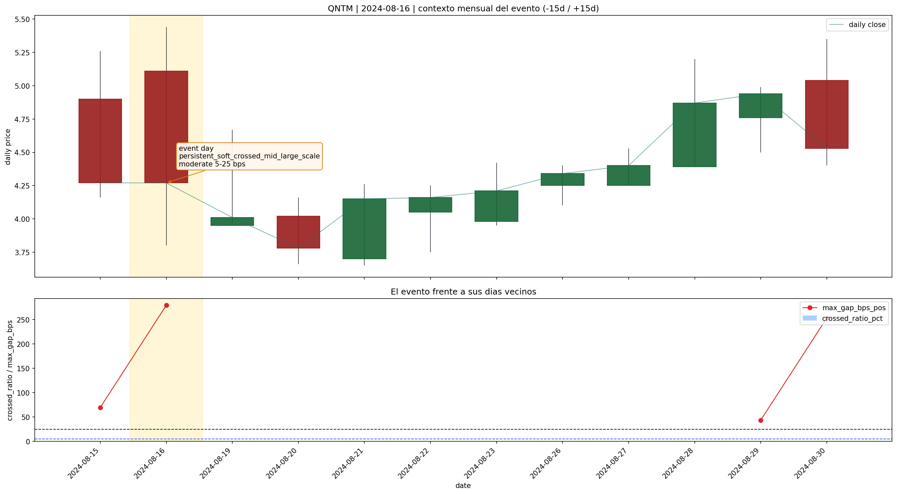

#### 00b Event Month Quotes Context
Esta imagen responde a la pregunta de recurrencia mensual dentro de `quotes`: el problema se concentra en el evento o reaparece en varias sesiones. Arriba concatena sesiones con datos disponibles; abajo resume cobertura diaria, `crossed_ratio_pct` y `max_gap_bps_pos`. La decision que cambia es si el caso debe leerse como episodio puntual o como sintoma de una fase repetida de libro degradado. El error que evita es extrapolar desde un unico dia a todo el mes sin evidencia.

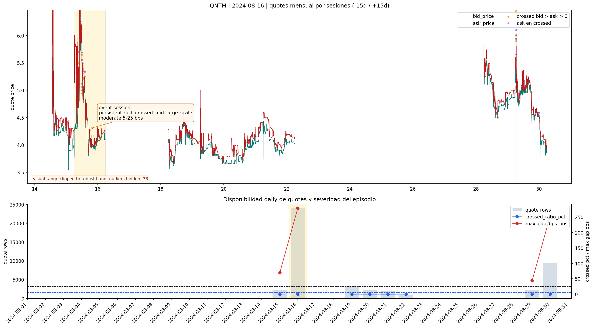

#### 01 Raw Window
Esta imagen responde a la primera pregunta decisiva del caso: el crossed observado es economicamente bastante fuerte para justificar un cambio de clase. Arriba ensena la geometria exacta del tramo conflictivo; abajo convierte esa geometria a bps y la enfrenta a los cortes `5 bps` y `25 bps`. El regimen dominante es `moderate 5-25 bps`. La decision que cambia es pasar de anomalia interpretable a `review` o `bad`. El error que evita es decidir por apariencia visual sin medir el dano economico real del crossed. En terminos de pipeline, este panel decide si el problema afecta solo a la lectura forense o si invalida simulacion de ejecucion y microstructure features.

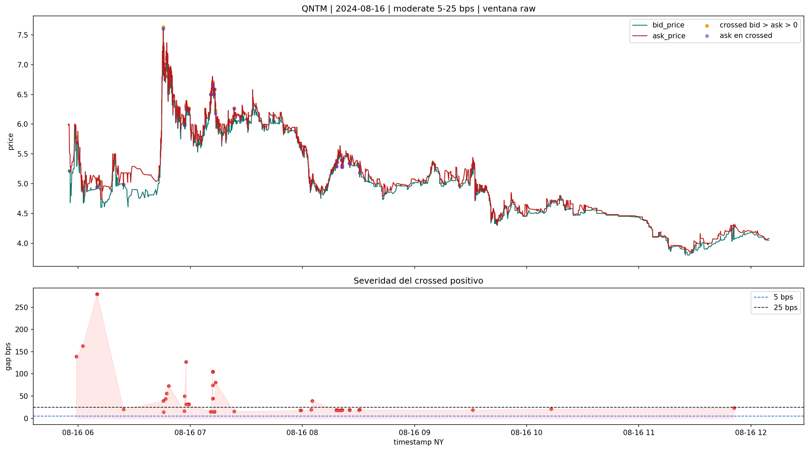

#### 02 Full Session Context
Esta imagen responde a la pregunta de extension intradiaria: el dano esta confinado a un bloque corto o contamina la sesion completa. Arriba se ve toda la sesion `04:00-20:00 NY`; abajo el `gap_bps` firmado. La decision que cambia es si el consumo debe penalizar solo un tramo o desechar el dia entero para uso operativo. El error que evita es tratar una cicatriz local como ruina total o, al reves, minimizar una degradacion distribuida a lo largo del dia. En ejecucion esto decide si la sesion puede seguir usandose con restricciones; en ML decide si las features intradiarias conservan significado economico.

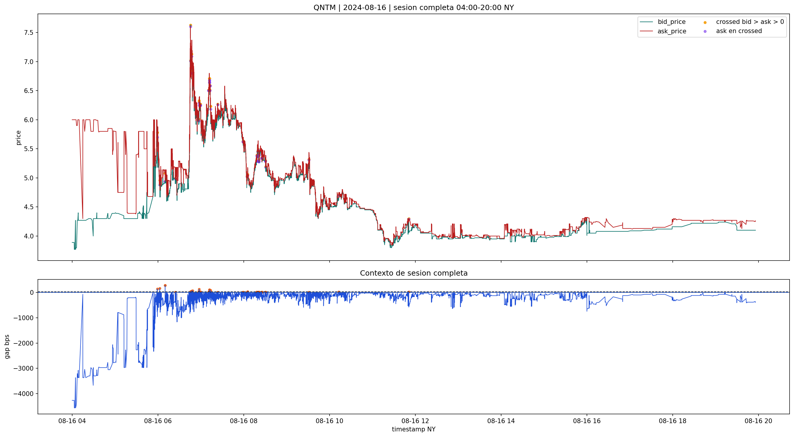

#### 03 Structure Diagnostics
Este panel responde a la pregunta de naturaleza del fallo: contradiccion economica genuina o mezcla con degeneracion estructural. Separa `ask=0` de `ask>0`, muestra la distribucion de `gap_bps` y resume patrones de integerizacion. La decision que cambia es como interpretar el dano: mercado localmente roto, artefacto de representacion o combinacion de ambos. El error que evita es sobrediagnosticar crossed reales cuando parte de la senal proviene de estructura degenerada del libro. Esta lectura afecta directamente a que el caso vaya a exclusion dura, a bandera contextual o a simple reconciliacion tecnica.

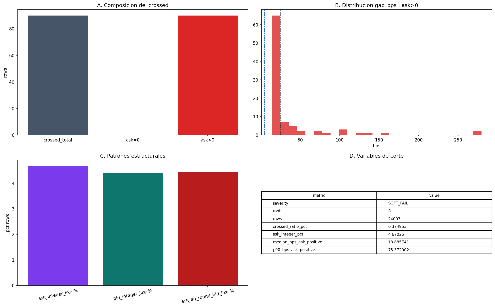

#### 04 Summary Card
Esta tarjeta responde a la pregunta de auditabilidad: cuales son exactamente las variables que sostienen la conclusion. Reune `severity`, `root`, `crossed_ratio_pct`, `ask_integer_pct`, `median_bps_ask_positive` y `p90_bps_ask_positive`. La decision que cambia es pasar de impresion visual a regla verificable. El error que evita es que dos inspectores lleguen a conclusiones distintas mirando la misma imagen sin una base numerica comun. Para gobernanza del proyecto, este panel es el que vuelve reproducible la decision para backtest, ML y auditoria.

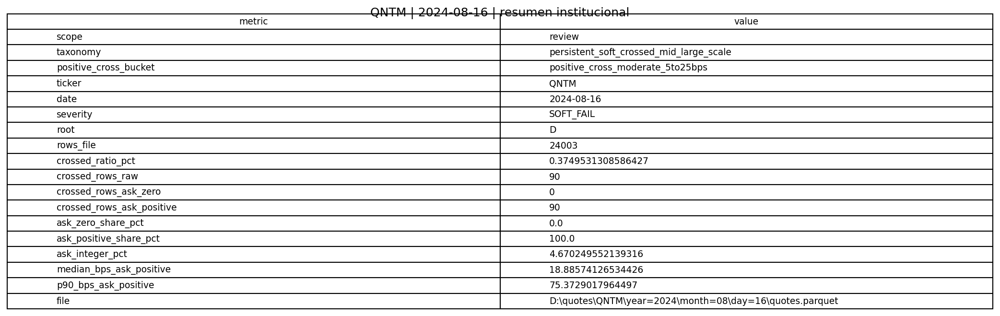

---

### 33. DSX 2008-10-08

company_name: `Diana Shipping, Inc.`
primary_exchange: `NYSE` (`XNYS`)
market_locale: `stocks/us`
scope: `review`
ticker: `DSX`
date: `2008-10-08`
taxonomy: `persistent_soft_crossed_mid_large_scale`
positive_cross_bucket: `positive_cross_moderate_5to25bps`
severity: `SOFT_FAIL`
root: `D`
rows: `84905`
crossed_ratio_pct: `0.382781`
crossed_rows_raw: `325`
crossed_rows_ask_zero: `0`
crossed_rows_ask_positive: `325`
ask_integer_pct: `1.353277`
median_bps_ask_positive: `13.651877`
p90_bps_ask_positive: `50.779833`
file: `D:\quotes\DSX\year=2008\month=10\day=08\quotes.parquet`

#### Analisis Forense
La conclusion correcta del caso es que ya existe contradiccion economica real dentro del libro, pero aun no con fuerza suficiente para justificar exclusion dura sin contexto adicional. La taxonomy historica es `persistent_soft_crossed_mid_large_scale` y el regimen positivo dominante es `moderate 5-25 bps`. Esto importa porque la taxonomy no solo clasifica: resume que tipo de anomalia se esta viendo y que clase de decision contractual puede defenderse despues. La taxonomy `persistent_soft_crossed_mid_large_scale` implica un problema repetido y distribuido, no un simple pinchazo local. Por eso empuja a `review`: ya hay dano real, aunque no necesariamente exclusion dura universal. El regimen `moderate 5-25 bps` ya entra en zona donde el crossed tiene capacidad real de contaminar simulacion de ejecucion y features microestructurales, aunque todavia puede requerir lectura contextual antes de exclusion dura. En terminos observables, el file tiene `crossed_ratio_pct=0.382781` con `crossed_rows_ask_positive=325` y `crossed_rows_ask_zero=0`. La severidad economica del crossed ask>0 se resume en `median_bps_ask_positive=13.651877` y `p90_bps_ask_positive=50.779833`. Estos dos numeros convierten una forma visual rara en una conclusion operativa sobre si el libro sigue representando o no un mercado negociable. La decision que cambia es pasar de libro sano a libro util solo bajo cautela. `review` significa: no usar como si fuera ejecucion limpia, conservar para analisis contextual y sensibilidad. El error que evita es tratar como normal un episodio que ya contiene contradiccion economica real y contaminar simulaciones de ejecucion o validaciones demasiado optimistas. El patron estructural muestra `ask_integer_pct=1.353277`. Este numero obliga a separar dos explicaciones rivales: contradiccion economica genuina del libro o mezcla con degeneracion estructural / integerizacion. Toda la composicion crossed cae en `ask>0`. Eso endurece la lectura economica del caso: el dano no depende de ceros mecanicos, sino de contradiccion positiva dentro de precios aparentemente vivos. Como `ask_integer_pct` es bajo, la hipotesis de simple degeneracion mecanica pierde fuerza. Eso endurece la interpretacion: el crossed se parece mas a contradiccion economica genuina y menos a artefacto. En la capa de semantica de precio del evento aparecen `daily raw close=12.3647`, `quote mid raw=14.1300`, `quote mid split_normalized=11.2718`, `daily adjusted_proxy=8.8443`. La reconciliacion incluye `future_split_factor=1.2536`. Ademas hay `post_event_dividend_sum=2.6850`. La implicacion metodologica es crucial: una discrepancia entre `quotes`, `daily` y una plataforma externa no puede leerse automaticamente como fallo del dataset. Puede ser semantica de precio distinta. El error que evita esta capa es mezclar raw, split-normalized y adjusted dentro del mismo pipeline, rompiendo auditoria, benchmarking y labels. Para pipelines, esto bloquea su uso como libro sano en ejecucion y features microestructurales principales, aunque aun puede mantenerse para forense, sensibilidad y estudios donde la anomalia sea parte del objeto de investigacion. Existe ademas una imagen historica de certificacion asociada. Su papel es poner el episodio en un marco causal mas amplio: halt, explained, not strongly explained o patron conocido. La regla que protege al proyecto es esta: el contexto externo se usa para explicar por que aparece el episodio, no para absolverlo. El error que evita es degradar el criterio de calidad del libro porque exista una historia plausible alrededor del caso.

#### 00 Event Month Context
Esta imagen responde a la pregunta de persistencia temporal: estamos ante un accidente local o ante una fase mas amplia de inestabilidad. Arriba coloca el evento en la serie `daily` real del mes; abajo compara `crossed_ratio_pct` y `max_gap_bps_pos` del dia contra sus vecinos. La decision que cambia es el peso estructural que se le concede al caso. El error que evita es juzgar igual un shock aislado y una degradacion repetida del libro.

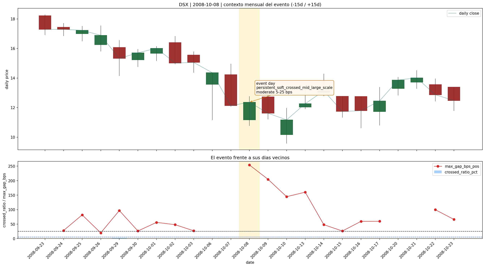

#### 00a Adjusted Proxy Contrast
Esta imagen responde a la pregunta de reconciliacion semantica: la discrepancia de precios viene de datos rotos o de vistas de precio distintas. Compara `daily raw`, `daily adjusted_proxy`, `quote mid raw` y `quote mid split_normalized`, y debajo ensena la cadena de dividendos y splits que produce la diferencia. La decision que cambia es si el inspector debe abrir una incidencia de calidad o cerrar el caso como diferencia legitima de semantica. El error que evita es mezclar series raw y adjusted como si fueran equivalentes. En pipelines reales, esto protege benchmarking, labels diarios y reconciliacion externa frente a falsas alarmas de precio.

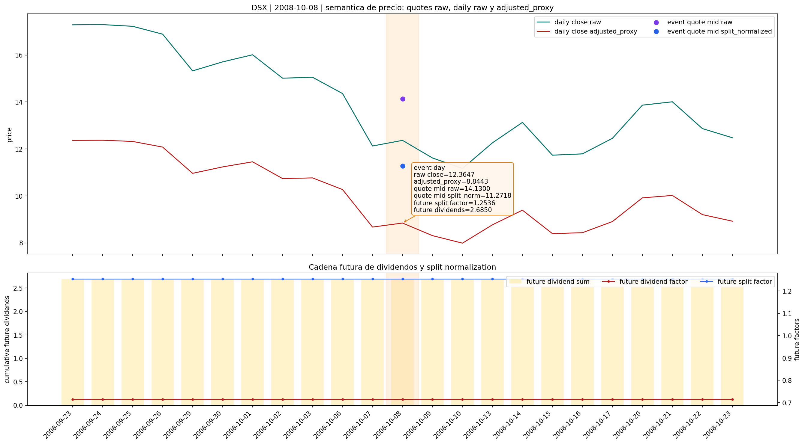

#### 00b Event Month Quotes Context
Esta imagen responde a la pregunta de recurrencia mensual dentro de `quotes`: el problema se concentra en el evento o reaparece en varias sesiones. Arriba concatena sesiones con datos disponibles; abajo resume cobertura diaria, `crossed_ratio_pct` y `max_gap_bps_pos`. La decision que cambia es si el caso debe leerse como episodio puntual o como sintoma de una fase repetida de libro degradado. El error que evita es extrapolar desde un unico dia a todo el mes sin evidencia.

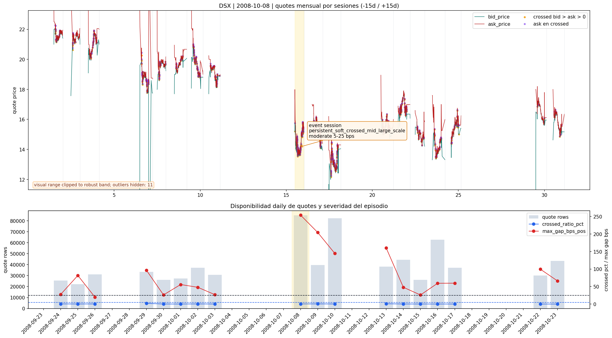

#### 01 Raw Window
Esta imagen responde a la primera pregunta decisiva del caso: el crossed observado es economicamente bastante fuerte para justificar un cambio de clase. Arriba ensena la geometria exacta del tramo conflictivo; abajo convierte esa geometria a bps y la enfrenta a los cortes `5 bps` y `25 bps`. El regimen dominante es `moderate 5-25 bps`. La decision que cambia es pasar de anomalia interpretable a `review` o `bad`. El error que evita es decidir por apariencia visual sin medir el dano economico real del crossed. En terminos de pipeline, este panel decide si el problema afecta solo a la lectura forense o si invalida simulacion de ejecucion y microstructure features.

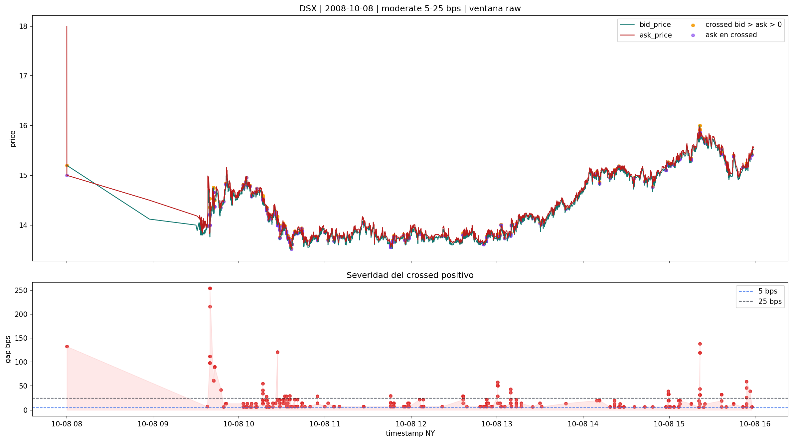

#### 02 Full Session Context
Esta imagen responde a la pregunta de extension intradiaria: el dano esta confinado a un bloque corto o contamina la sesion completa. Arriba se ve toda la sesion `04:00-20:00 NY`; abajo el `gap_bps` firmado. La decision que cambia es si el consumo debe penalizar solo un tramo o desechar el dia entero para uso operativo. El error que evita es tratar una cicatriz local como ruina total o, al reves, minimizar una degradacion distribuida a lo largo del dia. En ejecucion esto decide si la sesion puede seguir usandose con restricciones; en ML decide si las features intradiarias conservan significado economico.

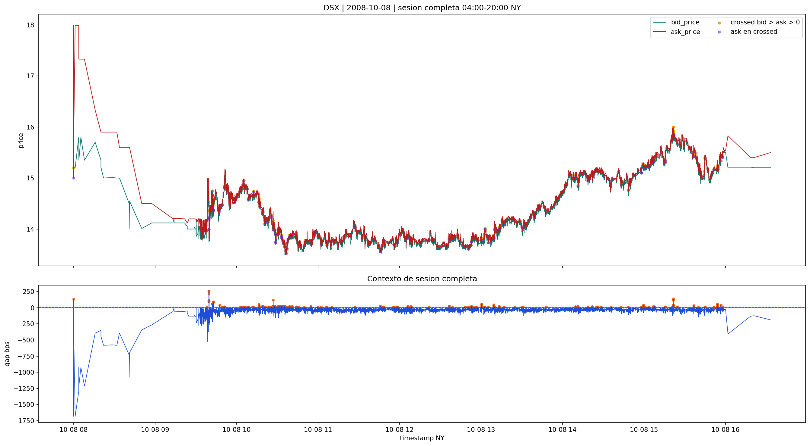

#### 03 Structure Diagnostics
Este panel responde a la pregunta de naturaleza del fallo: contradiccion economica genuina o mezcla con degeneracion estructural. Separa `ask=0` de `ask>0`, muestra la distribucion de `gap_bps` y resume patrones de integerizacion. La decision que cambia es como interpretar el dano: mercado localmente roto, artefacto de representacion o combinacion de ambos. El error que evita es sobrediagnosticar crossed reales cuando parte de la senal proviene de estructura degenerada del libro. Esta lectura afecta directamente a que el caso vaya a exclusion dura, a bandera contextual o a simple reconciliacion tecnica.

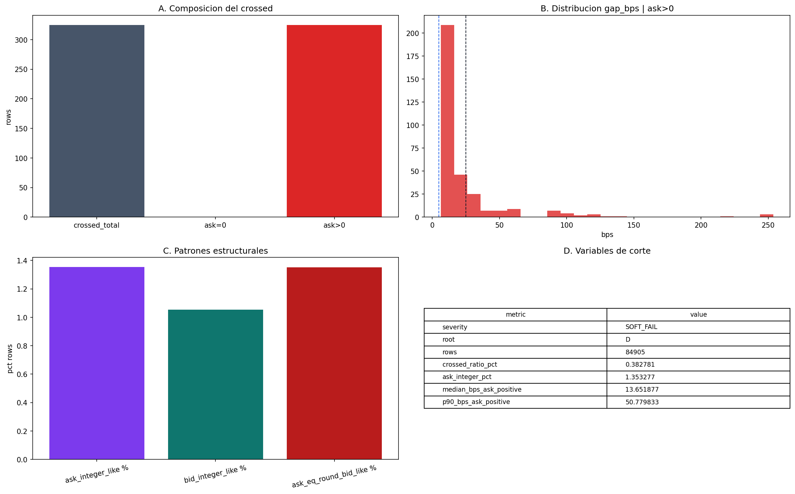

#### 04 Summary Card
Esta tarjeta responde a la pregunta de auditabilidad: cuales son exactamente las variables que sostienen la conclusion. Reune `severity`, `root`, `crossed_ratio_pct`, `ask_integer_pct`, `median_bps_ask_positive` y `p90_bps_ask_positive`. La decision que cambia es pasar de impresion visual a regla verificable. El error que evita es que dos inspectores lleguen a conclusiones distintas mirando la misma imagen sin una base numerica comun. Para gobernanza del proyecto, este panel es el que vuelve reproducible la decision para backtest, ML y auditoria.

---

### 34. IRET 2012-04-16

company_name: `Investors Real Estate Trust`
primary_exchange: `NYSE` (`XNYS`)
market_locale: `stocks/us`
scope: `review`
ticker: `IRET`
date: `2012-04-16`
taxonomy: `persistent_soft_crossed_mid_large_scale`
positive_cross_bucket: `positive_cross_moderate_5to25bps`
severity: `SOFT_FAIL`
root: `D`
rows: `11997`
crossed_ratio_pct: `0.575144`
crossed_rows_raw: `69`
crossed_rows_ask_zero: `6`
crossed_rows_ask_positive: `63`
ask_integer_pct: `0.050013`
median_bps_ask_positive: `13.614704`
p90_bps_ask_positive: `27.137042`
file: `D:\quotes\IRET\year=2012\month=04\day=16\quotes.parquet`

#### Analisis Forense
La conclusion correcta del caso es que ya existe contradiccion economica real dentro del libro, pero aun no con fuerza suficiente para justificar exclusion dura sin contexto adicional. La taxonomy historica es `persistent_soft_crossed_mid_large_scale` y el regimen positivo dominante es `moderate 5-25 bps`. Esto importa porque la taxonomy no solo clasifica: resume que tipo de anomalia se esta viendo y que clase de decision contractual puede defenderse despues. La taxonomy `persistent_soft_crossed_mid_large_scale` implica un problema repetido y distribuido, no un simple pinchazo local. Por eso empuja a `review`: ya hay dano real, aunque no necesariamente exclusion dura universal. El regimen `moderate 5-25 bps` ya entra en zona donde el crossed tiene capacidad real de contaminar simulacion de ejecucion y features microestructurales, aunque todavia puede requerir lectura contextual antes de exclusion dura. En terminos observables, el file tiene `crossed_ratio_pct=0.575144` con `crossed_rows_ask_positive=63` y `crossed_rows_ask_zero=6`. La severidad economica del crossed ask>0 se resume en `median_bps_ask_positive=13.614704` y `p90_bps_ask_positive=27.137042`. Estos dos numeros convierten una forma visual rara en una conclusion operativa sobre si el libro sigue representando o no un mercado negociable. La decision que cambia es pasar de libro sano a libro util solo bajo cautela. `review` significa: no usar como si fuera ejecucion limpia, conservar para analisis contextual y sensibilidad. El error que evita es tratar como normal un episodio que ya contiene contradiccion economica real y contaminar simulaciones de ejecucion o validaciones demasiado optimistas. El patron estructural muestra `ask_integer_pct=0.050013`. Este numero obliga a separar dos explicaciones rivales: contradiccion economica genuina del libro o mezcla con degeneracion estructural / integerizacion. La mayor parte del crossed vive en `ask>0`, de modo que el corazon del problema sigue siendo economico. La parte `ask=0`, si existe, acompana pero no explica por si sola la anomalia. Como `ask_integer_pct` es bajo, la hipotesis de simple degeneracion mecanica pierde fuerza. Eso endurece la interpretacion: el crossed se parece mas a contradiccion economica genuina y menos a artefacto. En la capa de semantica de precio del evento aparecen `daily raw close=7.2700`, `quote mid raw=7.3150`, `quote mid split_normalized=7.3150`, `daily adjusted_proxy=5.6362`. Ademas hay `post_event_dividend_sum=2.3167`. La implicacion metodologica es crucial: una discrepancia entre `quotes`, `daily` y una plataforma externa no puede leerse automaticamente como fallo del dataset. Puede ser semantica de precio distinta. El error que evita esta capa es mezclar raw, split-normalized y adjusted dentro del mismo pipeline, rompiendo auditoria, benchmarking y labels. Para pipelines, esto bloquea su uso como libro sano en ejecucion y features microestructurales principales, aunque aun puede mantenerse para forense, sensibilidad y estudios donde la anomalia sea parte del objeto de investigacion. Existe ademas una imagen historica de certificacion asociada. Su papel es poner el episodio en un marco causal mas amplio: halt, explained, not strongly explained o patron conocido. La regla que protege al proyecto es esta: el contexto externo se usa para explicar por que aparece el episodio, no para absolverlo. El error que evita es degradar el criterio de calidad del libro porque exista una historia plausible alrededor del caso.

#### 00 Event Month Context
Esta imagen responde a la pregunta de persistencia temporal: estamos ante un accidente local o ante una fase mas amplia de inestabilidad. Arriba coloca el evento en la serie `daily` real del mes; abajo compara `crossed_ratio_pct` y `max_gap_bps_pos` del dia contra sus vecinos. La decision que cambia es el peso estructural que se le concede al caso. El error que evita es juzgar igual un shock aislado y una degradacion repetida del libro.

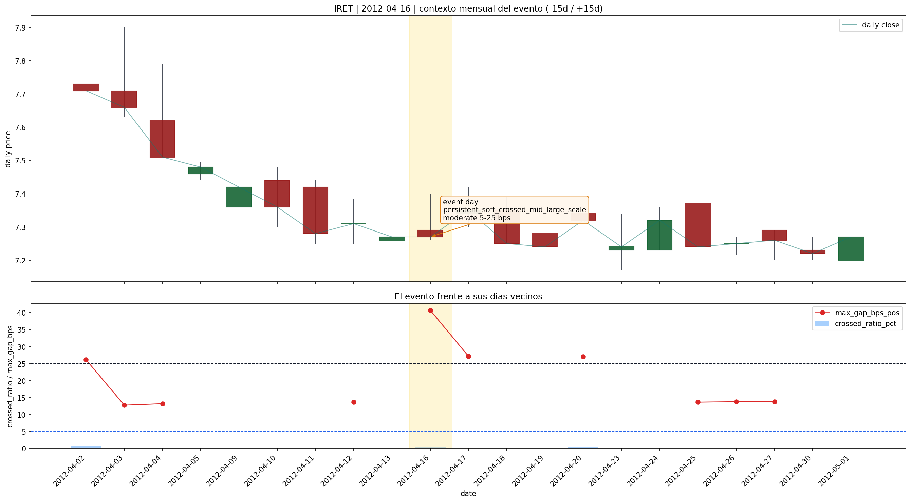

#### 00a Adjusted Proxy Contrast
Esta imagen responde a la pregunta de reconciliacion semantica: la discrepancia de precios viene de datos rotos o de vistas de precio distintas. Compara `daily raw`, `daily adjusted_proxy`, `quote mid raw` y `quote mid split_normalized`, y debajo ensena la cadena de dividendos y splits que produce la diferencia. La decision que cambia es si el inspector debe abrir una incidencia de calidad o cerrar el caso como diferencia legitima de semantica. El error que evita es mezclar series raw y adjusted como si fueran equivalentes. En pipelines reales, esto protege benchmarking, labels diarios y reconciliacion externa frente a falsas alarmas de precio.

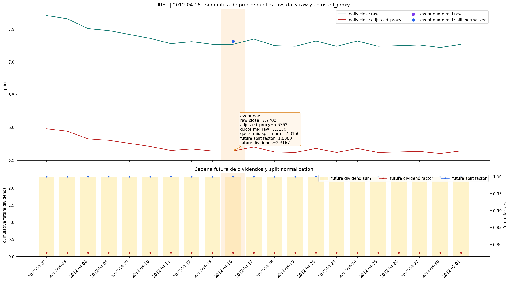

#### 00b Event Month Quotes Context
Esta imagen responde a la pregunta de recurrencia mensual dentro de `quotes`: el problema se concentra en el evento o reaparece en varias sesiones. Arriba concatena sesiones con datos disponibles; abajo resume cobertura diaria, `crossed_ratio_pct` y `max_gap_bps_pos`. La decision que cambia es si el caso debe leerse como episodio puntual o como sintoma de una fase repetida de libro degradado. El error que evita es extrapolar desde un unico dia a todo el mes sin evidencia.

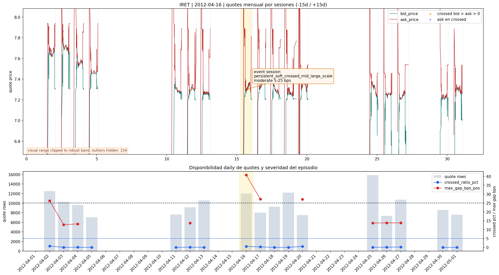

#### 01 Raw Window
Esta imagen responde a la primera pregunta decisiva del caso: el crossed observado es economicamente bastante fuerte para justificar un cambio de clase. Arriba ensena la geometria exacta del tramo conflictivo; abajo convierte esa geometria a bps y la enfrenta a los cortes `5 bps` y `25 bps`. El regimen dominante es `moderate 5-25 bps`. La decision que cambia es pasar de anomalia interpretable a `review` o `bad`. El error que evita es decidir por apariencia visual sin medir el dano economico real del crossed. En terminos de pipeline, este panel decide si el problema afecta solo a la lectura forense o si invalida simulacion de ejecucion y microstructure features.

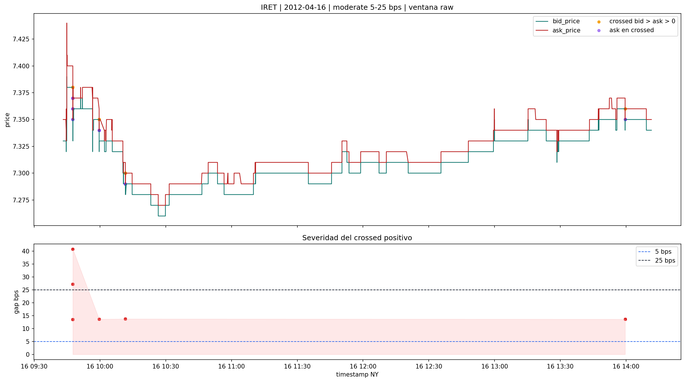

#### 02 Full Session Context
Esta imagen responde a la pregunta de extension intradiaria: el dano esta confinado a un bloque corto o contamina la sesion completa. Arriba se ve toda la sesion `04:00-20:00 NY`; abajo el `gap_bps` firmado. La decision que cambia es si el consumo debe penalizar solo un tramo o desechar el dia entero para uso operativo. El error que evita es tratar una cicatriz local como ruina total o, al reves, minimizar una degradacion distribuida a lo largo del dia. En ejecucion esto decide si la sesion puede seguir usandose con restricciones; en ML decide si las features intradiarias conservan significado economico.

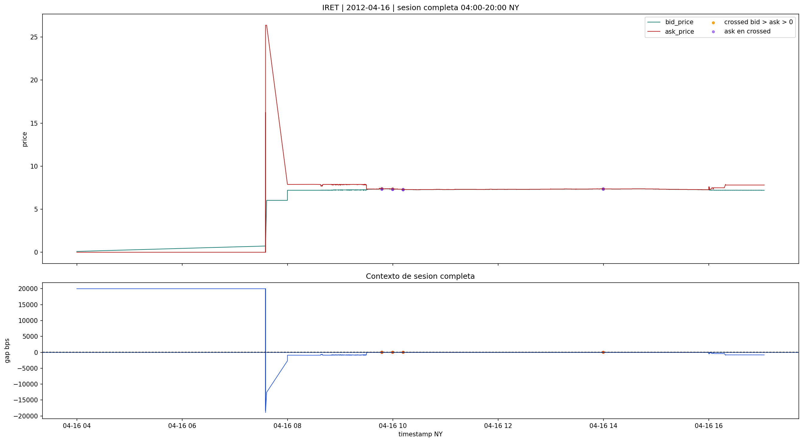

#### 03 Structure Diagnostics
Este panel responde a la pregunta de naturaleza del fallo: contradiccion economica genuina o mezcla con degeneracion estructural. Separa `ask=0` de `ask>0`, muestra la distribucion de `gap_bps` y resume patrones de integerizacion. La decision que cambia es como interpretar el dano: mercado localmente roto, artefacto de representacion o combinacion de ambos. El error que evita es sobrediagnosticar crossed reales cuando parte de la senal proviene de estructura degenerada del libro. Esta lectura afecta directamente a que el caso vaya a exclusion dura, a bandera contextual o a simple reconciliacion tecnica.

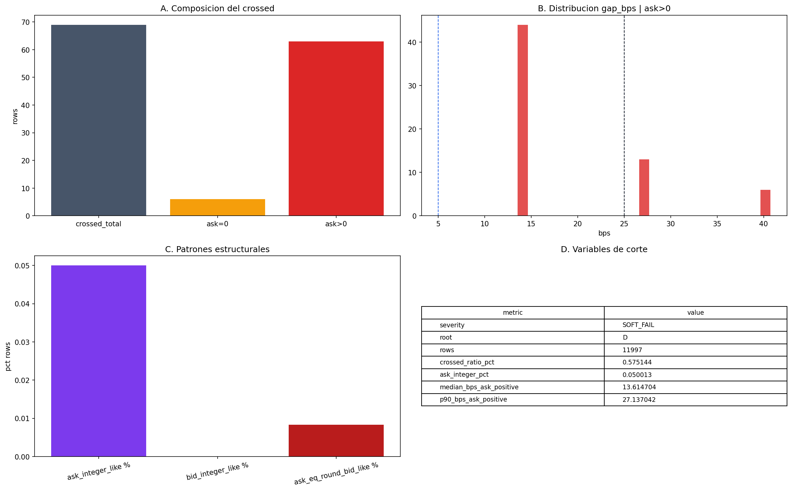

#### 04 Summary Card
Esta tarjeta responde a la pregunta de auditabilidad: cuales son exactamente las variables que sostienen la conclusion. Reune `severity`, `root`, `crossed_ratio_pct`, `ask_integer_pct`, `median_bps_ask_positive` y `p90_bps_ask_positive`. La decision que cambia es pasar de impresion visual a regla verificable. El error que evita es que dos inspectores lleguen a conclusiones distintas mirando la misma imagen sin una base numerica comun. Para gobernanza del proyecto, este panel es el que vuelve reproducible la decision para backtest, ML y auditoria.

---

### 35. ARAY 2012-04-23

company_name: `Accuray Incorporated`
primary_exchange: `NASDAQ` (`XNAS`)
market_locale: `stocks/us`
scope: `review`
ticker: `ARAY`
date: `2012-04-23`
taxonomy: `persistent_soft_crossed_mid_large_scale`
positive_cross_bucket: `positive_cross_moderate_5to25bps`
severity: `SOFT_FAIL`
root: `D`
rows: `18295`
crossed_ratio_pct: `0.366220`
crossed_rows_raw: `67`
crossed_rows_ask_zero: `1`
crossed_rows_ask_positive: `66`
ask_integer_pct: `0.071058`
median_bps_ask_positive: `13.504389`
p90_bps_ask_positive: `26.881720`
file: `D:\quotes\ARAY\year=2012\month=04\day=23\quotes.parquet`

#### Analisis Forense
La conclusion correcta del caso es que ya existe contradiccion economica real dentro del libro, pero aun no con fuerza suficiente para justificar exclusion dura sin contexto adicional. La taxonomy historica es `persistent_soft_crossed_mid_large_scale` y el regimen positivo dominante es `moderate 5-25 bps`. Esto importa porque la taxonomy no solo clasifica: resume que tipo de anomalia se esta viendo y que clase de decision contractual puede defenderse despues. La taxonomy `persistent_soft_crossed_mid_large_scale` implica un problema repetido y distribuido, no un simple pinchazo local. Por eso empuja a `review`: ya hay dano real, aunque no necesariamente exclusion dura universal. El regimen `moderate 5-25 bps` ya entra en zona donde el crossed tiene capacidad real de contaminar simulacion de ejecucion y features microestructurales, aunque todavia puede requerir lectura contextual antes de exclusion dura. En terminos observables, el file tiene `crossed_ratio_pct=0.366220` con `crossed_rows_ask_positive=66` y `crossed_rows_ask_zero=1`. La severidad economica del crossed ask>0 se resume en `median_bps_ask_positive=13.504389` y `p90_bps_ask_positive=26.881720`. Estos dos numeros convierten una forma visual rara en una conclusion operativa sobre si el libro sigue representando o no un mercado negociable. La decision que cambia es pasar de libro sano a libro util solo bajo cautela. `review` significa: no usar como si fuera ejecucion limpia, conservar para analisis contextual y sensibilidad. El error que evita es tratar como normal un episodio que ya contiene contradiccion economica real y contaminar simulaciones de ejecucion o validaciones demasiado optimistas. El patron estructural muestra `ask_integer_pct=0.071058`. Este numero obliga a separar dos explicaciones rivales: contradiccion economica genuina del libro o mezcla con degeneracion estructural / integerizacion. La mayor parte del crossed vive en `ask>0`, de modo que el corazon del problema sigue siendo economico. La parte `ask=0`, si existe, acompana pero no explica por si sola la anomalia. Como `ask_integer_pct` es bajo, la hipotesis de simple degeneracion mecanica pierde fuerza. Eso endurece la interpretacion: el crossed se parece mas a contradiccion economica genuina y menos a artefacto. Existe ademas una imagen historica de certificacion asociada. Su papel es poner el episodio en un marco causal mas amplio: halt, explained, not strongly explained o patron conocido. La regla que protege al proyecto es esta: el contexto externo se usa para explicar por que aparece el episodio, no para absolverlo. El error que evita es degradar el criterio de calidad del libro porque exista una historia plausible alrededor del caso.

#### 00 Event Month Context
Esta imagen responde a la pregunta de persistencia temporal: estamos ante un accidente local o ante una fase mas amplia de inestabilidad. Arriba coloca el evento en la serie `daily` real del mes; abajo compara `crossed_ratio_pct` y `max_gap_bps_pos` del dia contra sus vecinos. La decision que cambia es el peso estructural que se le concede al caso. El error que evita es juzgar igual un shock aislado y una degradacion repetida del libro.

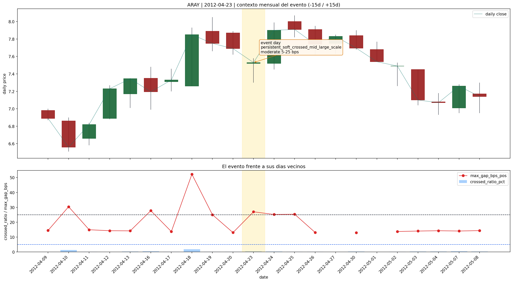

#### 00b Event Month Quotes Context
Esta imagen responde a la pregunta de recurrencia mensual dentro de `quotes`: el problema se concentra en el evento o reaparece en varias sesiones. Arriba concatena sesiones con datos disponibles; abajo resume cobertura diaria, `crossed_ratio_pct` y `max_gap_bps_pos`. La decision que cambia es si el caso debe leerse como episodio puntual o como sintoma de una fase repetida de libro degradado. El error que evita es extrapolar desde un unico dia a todo el mes sin evidencia.

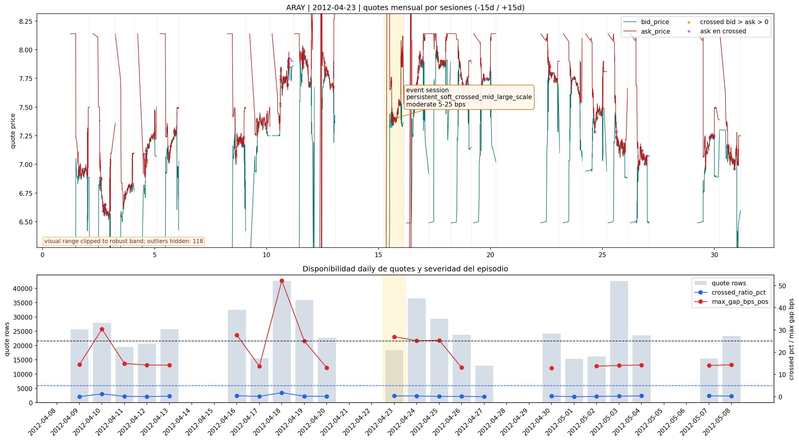

#### 01 Raw Window
Esta imagen responde a la primera pregunta decisiva del caso: el crossed observado es economicamente bastante fuerte para justificar un cambio de clase. Arriba ensena la geometria exacta del tramo conflictivo; abajo convierte esa geometria a bps y la enfrenta a los cortes `5 bps` y `25 bps`. El regimen dominante es `moderate 5-25 bps`. La decision que cambia es pasar de anomalia interpretable a `review` o `bad`. El error que evita es decidir por apariencia visual sin medir el dano economico real del crossed. En terminos de pipeline, este panel decide si el problema afecta solo a la lectura forense o si invalida simulacion de ejecucion y microstructure features.

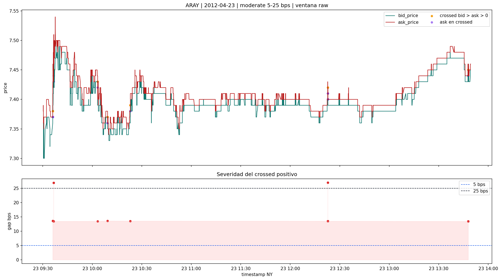

#### 02 Full Session Context
Esta imagen responde a la pregunta de extension intradiaria: el dano esta confinado a un bloque corto o contamina la sesion completa. Arriba se ve toda la sesion `04:00-20:00 NY`; abajo el `gap_bps` firmado. La decision que cambia es si el consumo debe penalizar solo un tramo o desechar el dia entero para uso operativo. El error que evita es tratar una cicatriz local como ruina total o, al reves, minimizar una degradacion distribuida a lo largo del dia. En ejecucion esto decide si la sesion puede seguir usandose con restricciones; en ML decide si las features intradiarias conservan significado economico.

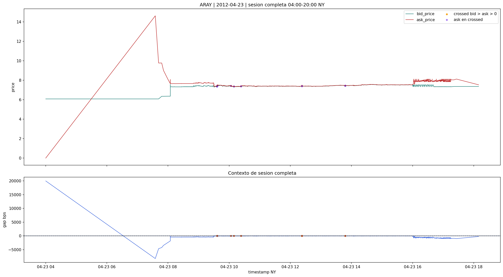

#### 03 Structure Diagnostics
Este panel responde a la pregunta de naturaleza del fallo: contradiccion economica genuina o mezcla con degeneracion estructural. Separa `ask=0` de `ask>0`, muestra la distribucion de `gap_bps` y resume patrones de integerizacion. La decision que cambia es como interpretar el dano: mercado localmente roto, artefacto de representacion o combinacion de ambos. El error que evita es sobrediagnosticar crossed reales cuando parte de la senal proviene de estructura degenerada del libro. Esta lectura afecta directamente a que el caso vaya a exclusion dura, a bandera contextual o a simple reconciliacion tecnica.

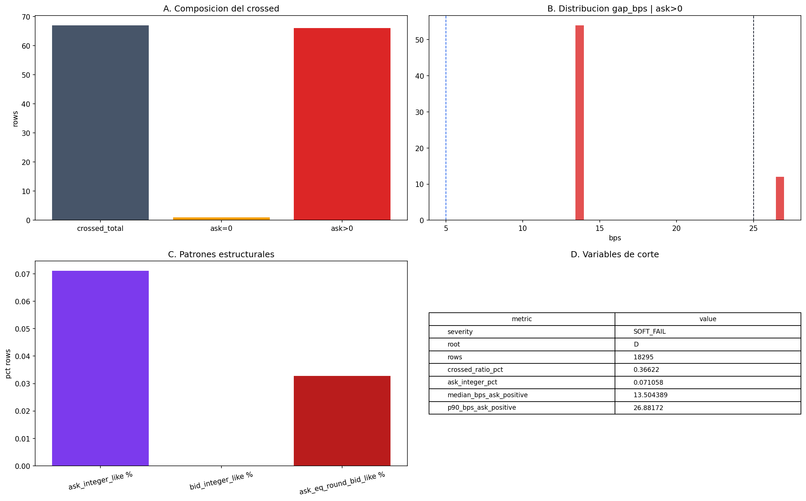

#### 04 Summary Card
Esta tarjeta responde a la pregunta de auditabilidad: cuales son exactamente las variables que sostienen la conclusion. Reune `severity`, `root`, `crossed_ratio_pct`, `ask_integer_pct`, `median_bps_ask_positive` y `p90_bps_ask_positive`. La decision que cambia es pasar de impresion visual a regla verificable. El error que evita es que dos inspectores lleguen a conclusiones distintas mirando la misma imagen sin una base numerica comun. Para gobernanza del proyecto, este panel es el que vuelve reproducible la decision para backtest, ML y auditoria.

---

### 36. ACTU 2007-11-13

company_name: `Actuate Therapeutics, Inc. Common stock`
primary_exchange: `NASDAQ` (`XNAS`)
market_locale: `stocks/us`
scope: `review`
ticker: `ACTU`
date: `2007-11-13`
taxonomy: `persistent_soft_crossed_mid_large_scale`
positive_cross_bucket: `positive_cross_moderate_5to25bps`
severity: `SOFT_FAIL`
root: `D`
rows: `12530`
crossed_ratio_pct: `0.598563`
crossed_rows_raw: `75`
crossed_rows_ask_zero: `1`
crossed_rows_ask_positive: `74`
ask_integer_pct: `0.670391`
median_bps_ask_positive: `13.377926`
p90_bps_ask_positive: `26.709761`
file: `D:\quotes\ACTU\year=2007\month=11\day=13\quotes.parquet`

#### Analisis Forense
La conclusion correcta del caso es que ya existe contradiccion economica real dentro del libro, pero aun no con fuerza suficiente para justificar exclusion dura sin contexto adicional. La taxonomy historica es `persistent_soft_crossed_mid_large_scale` y el regimen positivo dominante es `moderate 5-25 bps`. Esto importa porque la taxonomy no solo clasifica: resume que tipo de anomalia se esta viendo y que clase de decision contractual puede defenderse despues. La taxonomy `persistent_soft_crossed_mid_large_scale` implica un problema repetido y distribuido, no un simple pinchazo local. Por eso empuja a `review`: ya hay dano real, aunque no necesariamente exclusion dura universal. El regimen `moderate 5-25 bps` ya entra en zona donde el crossed tiene capacidad real de contaminar simulacion de ejecucion y features microestructurales, aunque todavia puede requerir lectura contextual antes de exclusion dura. En terminos observables, el file tiene `crossed_ratio_pct=0.598563` con `crossed_rows_ask_positive=74` y `crossed_rows_ask_zero=1`. La severidad economica del crossed ask>0 se resume en `median_bps_ask_positive=13.377926` y `p90_bps_ask_positive=26.709761`. Estos dos numeros convierten una forma visual rara en una conclusion operativa sobre si el libro sigue representando o no un mercado negociable. La decision que cambia es pasar de libro sano a libro util solo bajo cautela. `review` significa: no usar como si fuera ejecucion limpia, conservar para analisis contextual y sensibilidad. El error que evita es tratar como normal un episodio que ya contiene contradiccion economica real y contaminar simulaciones de ejecucion o validaciones demasiado optimistas. El patron estructural muestra `ask_integer_pct=0.670391`. Este numero obliga a separar dos explicaciones rivales: contradiccion economica genuina del libro o mezcla con degeneracion estructural / integerizacion. La mayor parte del crossed vive en `ask>0`, de modo que el corazon del problema sigue siendo economico. La parte `ask=0`, si existe, acompana pero no explica por si sola la anomalia. Como `ask_integer_pct` es bajo, la hipotesis de simple degeneracion mecanica pierde fuerza. Eso endurece la interpretacion: el crossed se parece mas a contradiccion economica genuina y menos a artefacto. Existe ademas una imagen historica de certificacion asociada. Su papel es poner el episodio en un marco causal mas amplio: halt, explained, not strongly explained o patron conocido. La regla que protege al proyecto es esta: el contexto externo se usa para explicar por que aparece el episodio, no para absolverlo. El error que evita es degradar el criterio de calidad del libro porque exista una historia plausible alrededor del caso.

#### 00 Event Month Context
Esta imagen responde a la pregunta de persistencia temporal: estamos ante un accidente local o ante una fase mas amplia de inestabilidad. Arriba coloca el evento en la serie `daily` real del mes; abajo compara `crossed_ratio_pct` y `max_gap_bps_pos` del dia contra sus vecinos. La decision que cambia es el peso estructural que se le concede al caso. El error que evita es juzgar igual un shock aislado y una degradacion repetida del libro.

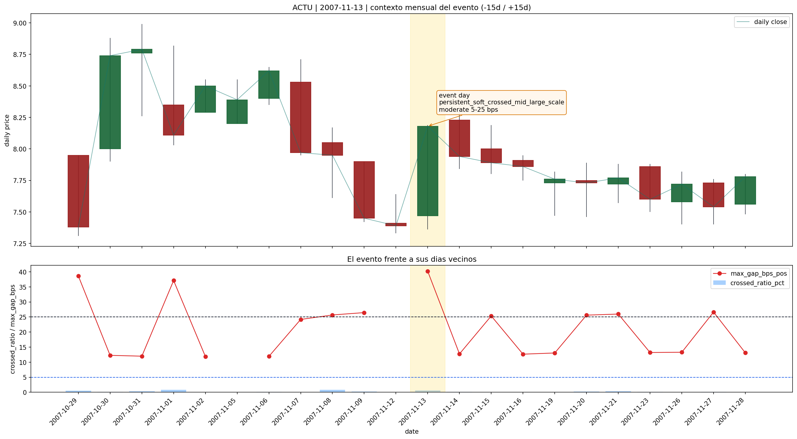

#### 00b Event Month Quotes Context
Esta imagen responde a la pregunta de recurrencia mensual dentro de `quotes`: el problema se concentra en el evento o reaparece en varias sesiones. Arriba concatena sesiones con datos disponibles; abajo resume cobertura diaria, `crossed_ratio_pct` y `max_gap_bps_pos`. La decision que cambia es si el caso debe leerse como episodio puntual o como sintoma de una fase repetida de libro degradado. El error que evita es extrapolar desde un unico dia a todo el mes sin evidencia.

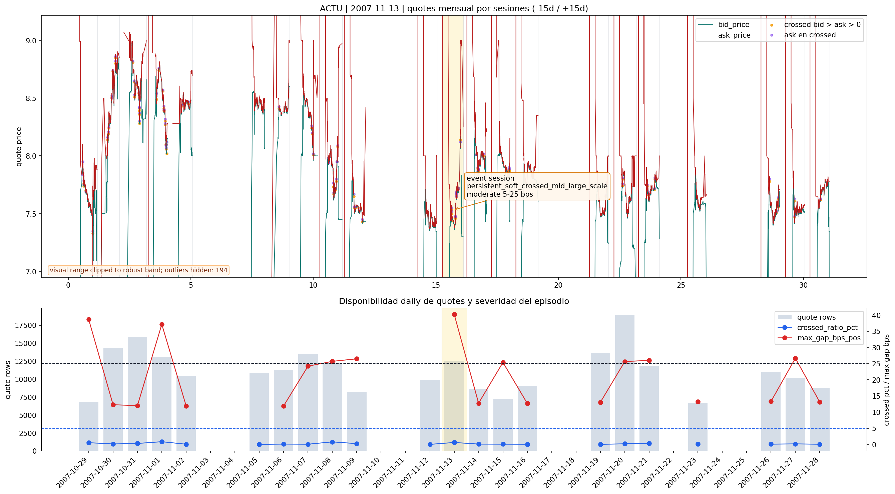

#### 01 Raw Window
Esta imagen responde a la primera pregunta decisiva del caso: el crossed observado es economicamente bastante fuerte para justificar un cambio de clase. Arriba ensena la geometria exacta del tramo conflictivo; abajo convierte esa geometria a bps y la enfrenta a los cortes `5 bps` y `25 bps`. El regimen dominante es `moderate 5-25 bps`. La decision que cambia es pasar de anomalia interpretable a `review` o `bad`. El error que evita es decidir por apariencia visual sin medir el dano economico real del crossed. En terminos de pipeline, este panel decide si el problema afecta solo a la lectura forense o si invalida simulacion de ejecucion y microstructure features.

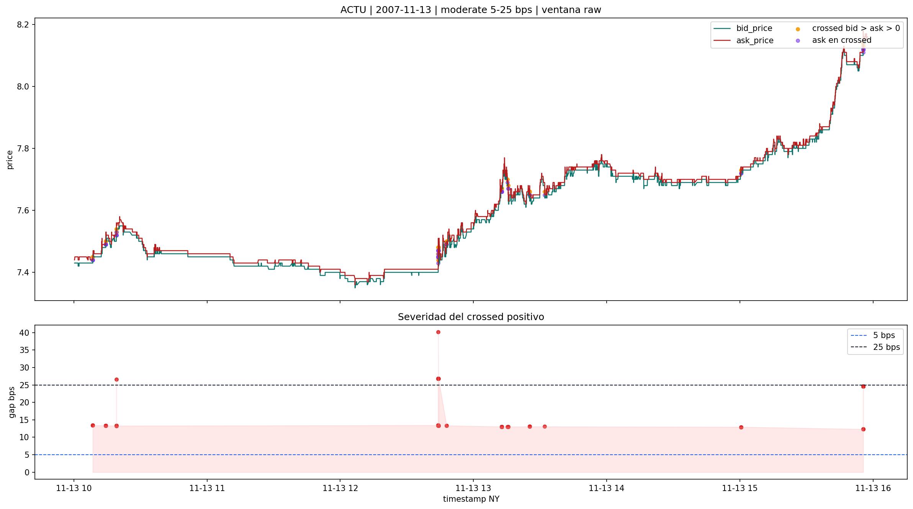

#### 02 Full Session Context
Esta imagen responde a la pregunta de extension intradiaria: el dano esta confinado a un bloque corto o contamina la sesion completa. Arriba se ve toda la sesion `04:00-20:00 NY`; abajo el `gap_bps` firmado. La decision que cambia es si el consumo debe penalizar solo un tramo o desechar el dia entero para uso operativo. El error que evita es tratar una cicatriz local como ruina total o, al reves, minimizar una degradacion distribuida a lo largo del dia. En ejecucion esto decide si la sesion puede seguir usandose con restricciones; en ML decide si las features intradiarias conservan significado economico.

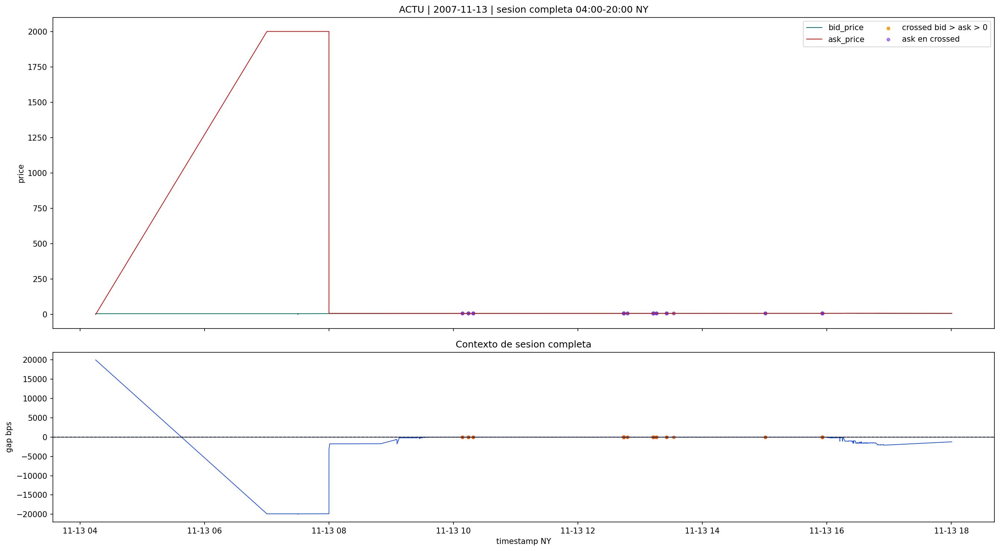

#### 03 Structure Diagnostics
Este panel responde a la pregunta de naturaleza del fallo: contradiccion economica genuina o mezcla con degeneracion estructural. Separa `ask=0` de `ask>0`, muestra la distribucion de `gap_bps` y resume patrones de integerizacion. La decision que cambia es como interpretar el dano: mercado localmente roto, artefacto de representacion o combinacion de ambos. El error que evita es sobrediagnosticar crossed reales cuando parte de la senal proviene de estructura degenerada del libro. Esta lectura afecta directamente a que el caso vaya a exclusion dura, a bandera contextual o a simple reconciliacion tecnica.

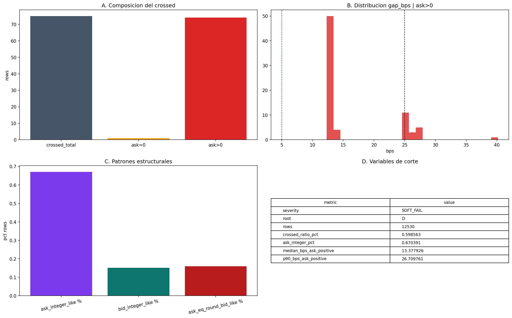

#### 04 Summary Card
Esta tarjeta responde a la pregunta de auditabilidad: cuales son exactamente las variables que sostienen la conclusion. Reune `severity`, `root`, `crossed_ratio_pct`, `ask_integer_pct`, `median_bps_ask_positive` y `p90_bps_ask_positive`. La decision que cambia es pasar de impresion visual a regla verificable. El error que evita es que dos inspectores lleguen a conclusiones distintas mirando la misma imagen sin una base numerica comun. Para gobernanza del proyecto, este panel es el que vuelve reproducible la decision para backtest, ML y auditoria.

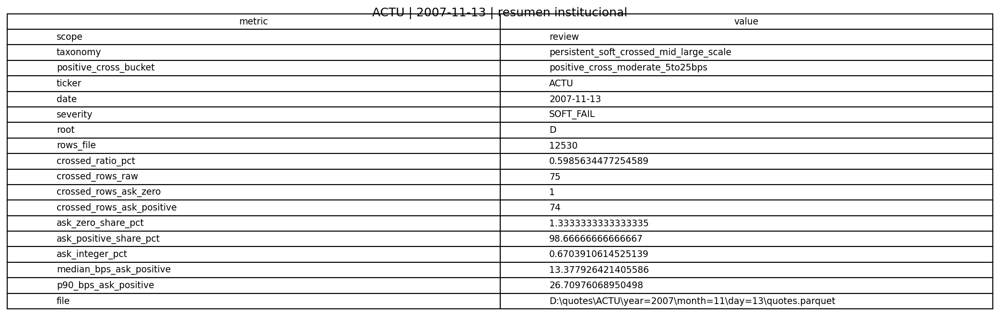

---

### 37. HWCC 2007-02-27

company_name: `Houston Wire & Cable Company`
primary_exchange: `NASDAQ` (`XNAS`)
market_locale: `stocks/us`
scope: `review`
ticker: `HWCC`
date: `2007-02-27`
taxonomy: `persistent_soft_crossed_mid_large_scale`
positive_cross_bucket: `positive_cross_moderate_5to25bps`
severity: `SOFT_FAIL`
root: `D`
rows: `11803`
crossed_ratio_pct: `0.728628`
crossed_rows_raw: `86`
crossed_rows_ask_zero: `2`
crossed_rows_ask_positive: `84`
ask_integer_pct: `2.058799`
median_bps_ask_positive: `12.128563`
p90_bps_ask_positive: `68.534570`
file: `D:\quotes\HWCC\year=2007\month=02\day=27\quotes.parquet`

#### Analisis Forense
La conclusion correcta del caso es que ya existe contradiccion economica real dentro del libro, pero aun no con fuerza suficiente para justificar exclusion dura sin contexto adicional. La taxonomy historica es `persistent_soft_crossed_mid_large_scale` y el regimen positivo dominante es `moderate 5-25 bps`. Esto importa porque la taxonomy no solo clasifica: resume que tipo de anomalia se esta viendo y que clase de decision contractual puede defenderse despues. La taxonomy `persistent_soft_crossed_mid_large_scale` implica un problema repetido y distribuido, no un simple pinchazo local. Por eso empuja a `review`: ya hay dano real, aunque no necesariamente exclusion dura universal. El regimen `moderate 5-25 bps` ya entra en zona donde el crossed tiene capacidad real de contaminar simulacion de ejecucion y features microestructurales, aunque todavia puede requerir lectura contextual antes de exclusion dura. En terminos observables, el file tiene `crossed_ratio_pct=0.728628` con `crossed_rows_ask_positive=84` y `crossed_rows_ask_zero=2`. La severidad economica del crossed ask>0 se resume en `median_bps_ask_positive=12.128563` y `p90_bps_ask_positive=68.534570`. Estos dos numeros convierten una forma visual rara en una conclusion operativa sobre si el libro sigue representando o no un mercado negociable. La decision que cambia es pasar de libro sano a libro util solo bajo cautela. `review` significa: no usar como si fuera ejecucion limpia, conservar para analisis contextual y sensibilidad. El error que evita es tratar como normal un episodio que ya contiene contradiccion economica real y contaminar simulaciones de ejecucion o validaciones demasiado optimistas. El patron estructural muestra `ask_integer_pct=2.058799`. Este numero obliga a separar dos explicaciones rivales: contradiccion economica genuina del libro o mezcla con degeneracion estructural / integerizacion. La mayor parte del crossed vive en `ask>0`, de modo que el corazon del problema sigue siendo economico. La parte `ask=0`, si existe, acompana pero no explica por si sola la anomalia. Como `ask_integer_pct` es bajo, la hipotesis de simple degeneracion mecanica pierde fuerza. Eso endurece la interpretacion: el crossed se parece mas a contradiccion economica genuina y menos a artefacto. En la capa de semantica de precio del evento aparecen `daily raw close=25.1700`, `quote mid raw=25.0050`, `quote mid split_normalized=25.0050`, `daily adjusted_proxy=19.5708`. Ademas hay `post_event_dividend_sum=3.3450`. La implicacion metodologica es crucial: una discrepancia entre `quotes`, `daily` y una plataforma externa no puede leerse automaticamente como fallo del dataset. Puede ser semantica de precio distinta. El error que evita esta capa es mezclar raw, split-normalized y adjusted dentro del mismo pipeline, rompiendo auditoria, benchmarking y labels. Para pipelines, esto bloquea su uso como libro sano en ejecucion y features microestructurales principales, aunque aun puede mantenerse para forense, sensibilidad y estudios donde la anomalia sea parte del objeto de investigacion. Existe ademas una imagen historica de certificacion asociada. Su papel es poner el episodio en un marco causal mas amplio: halt, explained, not strongly explained o patron conocido. La regla que protege al proyecto es esta: el contexto externo se usa para explicar por que aparece el episodio, no para absolverlo. El error que evita es degradar el criterio de calidad del libro porque exista una historia plausible alrededor del caso.

#### 00 Event Month Context
Esta imagen responde a la pregunta de persistencia temporal: estamos ante un accidente local o ante una fase mas amplia de inestabilidad. Arriba coloca el evento en la serie `daily` real del mes; abajo compara `crossed_ratio_pct` y `max_gap_bps_pos` del dia contra sus vecinos. La decision que cambia es el peso estructural que se le concede al caso. El error que evita es juzgar igual un shock aislado y una degradacion repetida del libro.

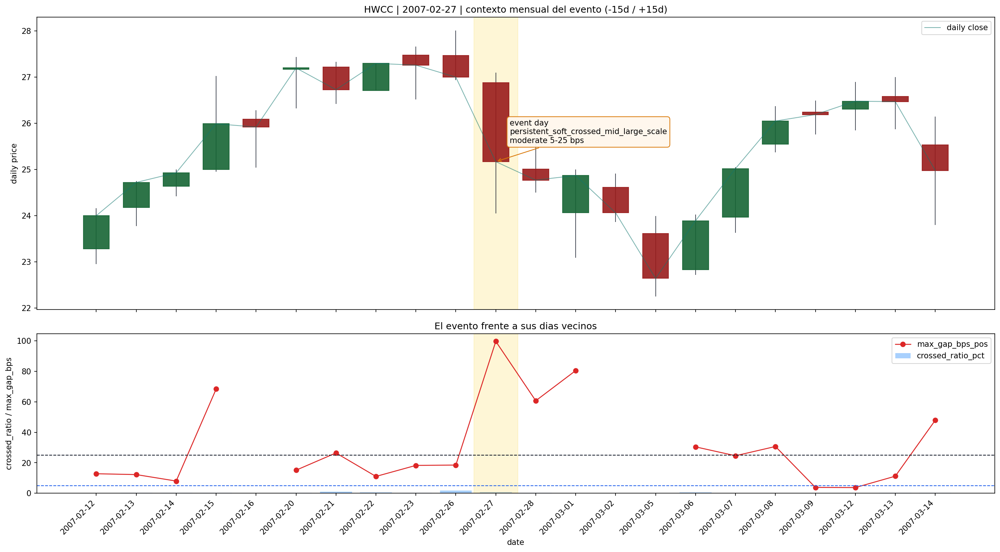

#### 00a Adjusted Proxy Contrast
Esta imagen responde a la pregunta de reconciliacion semantica: la discrepancia de precios viene de datos rotos o de vistas de precio distintas. Compara `daily raw`, `daily adjusted_proxy`, `quote mid raw` y `quote mid split_normalized`, y debajo ensena la cadena de dividendos y splits que produce la diferencia. La decision que cambia es si el inspector debe abrir una incidencia de calidad o cerrar el caso como diferencia legitima de semantica. El error que evita es mezclar series raw y adjusted como si fueran equivalentes. En pipelines reales, esto protege benchmarking, labels diarios y reconciliacion externa frente a falsas alarmas de precio.

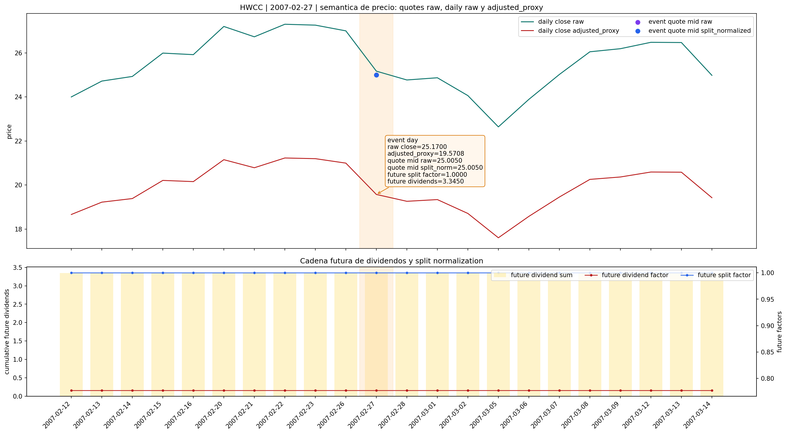

#### 00b Event Month Quotes Context
Esta imagen responde a la pregunta de recurrencia mensual dentro de `quotes`: el problema se concentra en el evento o reaparece en varias sesiones. Arriba concatena sesiones con datos disponibles; abajo resume cobertura diaria, `crossed_ratio_pct` y `max_gap_bps_pos`. La decision que cambia es si el caso debe leerse como episodio puntual o como sintoma de una fase repetida de libro degradado. El error que evita es extrapolar desde un unico dia a todo el mes sin evidencia.

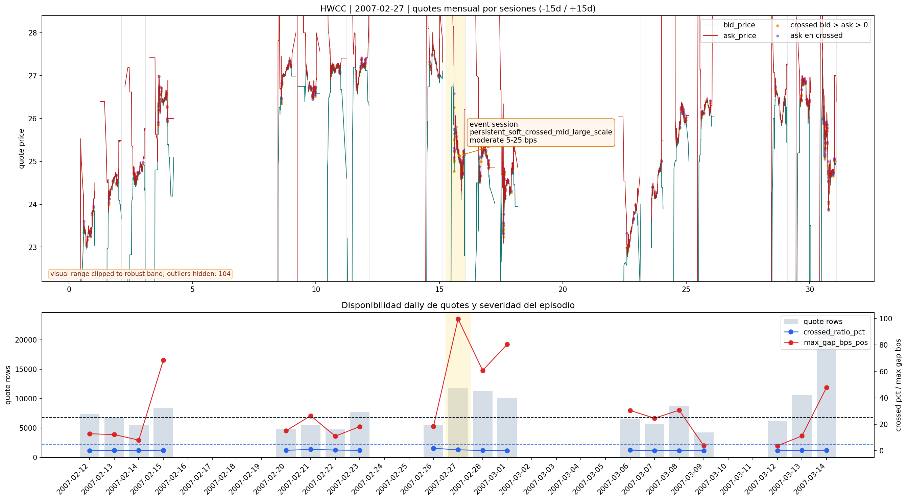

#### 01 Raw Window
Esta imagen responde a la primera pregunta decisiva del caso: el crossed observado es economicamente bastante fuerte para justificar un cambio de clase. Arriba ensena la geometria exacta del tramo conflictivo; abajo convierte esa geometria a bps y la enfrenta a los cortes `5 bps` y `25 bps`. El regimen dominante es `moderate 5-25 bps`. La decision que cambia es pasar de anomalia interpretable a `review` o `bad`. El error que evita es decidir por apariencia visual sin medir el dano economico real del crossed. En terminos de pipeline, este panel decide si el problema afecta solo a la lectura forense o si invalida simulacion de ejecucion y microstructure features.

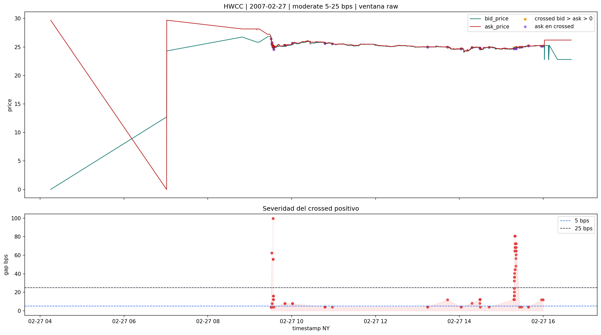

#### 02 Full Session Context
Esta imagen responde a la pregunta de extension intradiaria: el dano esta confinado a un bloque corto o contamina la sesion completa. Arriba se ve toda la sesion `04:00-20:00 NY`; abajo el `gap_bps` firmado. La decision que cambia es si el consumo debe penalizar solo un tramo o desechar el dia entero para uso operativo. El error que evita es tratar una cicatriz local como ruina total o, al reves, minimizar una degradacion distribuida a lo largo del dia. En ejecucion esto decide si la sesion puede seguir usandose con restricciones; en ML decide si las features intradiarias conservan significado economico.

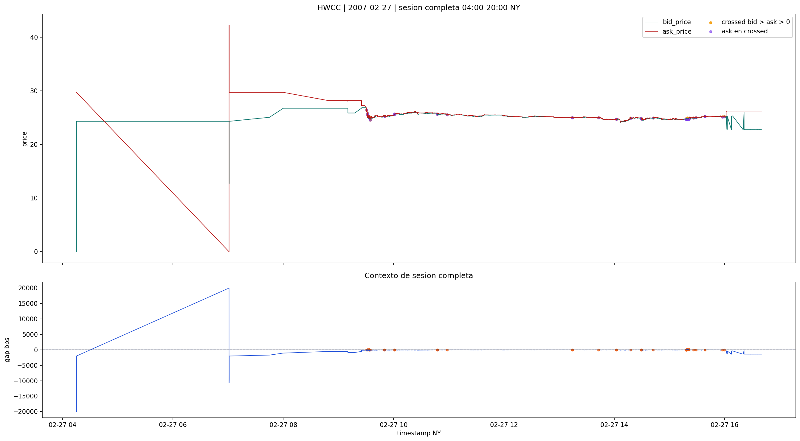

#### 03 Structure Diagnostics
Este panel responde a la pregunta de naturaleza del fallo: contradiccion economica genuina o mezcla con degeneracion estructural. Separa `ask=0` de `ask>0`, muestra la distribucion de `gap_bps` y resume patrones de integerizacion. La decision que cambia es como interpretar el dano: mercado localmente roto, artefacto de representacion o combinacion de ambos. El error que evita es sobrediagnosticar crossed reales cuando parte de la senal proviene de estructura degenerada del libro. Esta lectura afecta directamente a que el caso vaya a exclusion dura, a bandera contextual o a simple reconciliacion tecnica.

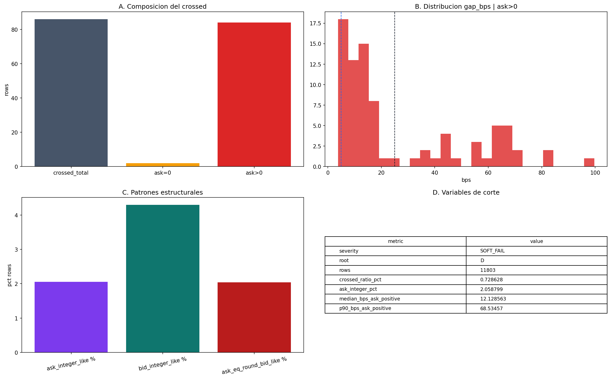

#### 04 Summary Card
Esta tarjeta responde a la pregunta de auditabilidad: cuales son exactamente las variables que sostienen la conclusion. Reune `severity`, `root`, `crossed_ratio_pct`, `ask_integer_pct`, `median_bps_ask_positive` y `p90_bps_ask_positive`. La decision que cambia es pasar de impresion visual a regla verificable. El error que evita es que dos inspectores lleguen a conclusiones distintas mirando la misma imagen sin una base numerica comun. Para gobernanza del proyecto, este panel es el que vuelve reproducible la decision para backtest, ML y auditoria.

---

### 38. CRME 2008-01-10

company_name: `Cardiome Pharma Corporation`
primary_exchange: `NASDAQ` (`XNAS`)
market_locale: `stocks/us`
scope: `review`
ticker: `CRME`
date: `2008-01-10`
taxonomy: `persistent_soft_crossed_mid_large_scale`
positive_cross_bucket: `positive_cross_moderate_5to25bps`
severity: `SOFT_FAIL`
root: `D`
rows: `14606`
crossed_ratio_pct: `0.520334`
crossed_rows_raw: `76`
crossed_rows_ask_zero: `1`
crossed_rows_ask_positive: `75`
ask_integer_pct: `0.157470`
median_bps_ask_positive: `11.954573`
p90_bps_ask_positive: `23.866348`
file: `D:\quotes\CRME\year=2008\month=01\day=10\quotes.parquet`

#### Analisis Forense
La conclusion correcta del caso es que ya existe contradiccion economica real dentro del libro, pero aun no con fuerza suficiente para justificar exclusion dura sin contexto adicional. La taxonomy historica es `persistent_soft_crossed_mid_large_scale` y el regimen positivo dominante es `moderate 5-25 bps`. Esto importa porque la taxonomy no solo clasifica: resume que tipo de anomalia se esta viendo y que clase de decision contractual puede defenderse despues. La taxonomy `persistent_soft_crossed_mid_large_scale` implica un problema repetido y distribuido, no un simple pinchazo local. Por eso empuja a `review`: ya hay dano real, aunque no necesariamente exclusion dura universal. El regimen `moderate 5-25 bps` ya entra en zona donde el crossed tiene capacidad real de contaminar simulacion de ejecucion y features microestructurales, aunque todavia puede requerir lectura contextual antes de exclusion dura. En terminos observables, el file tiene `crossed_ratio_pct=0.520334` con `crossed_rows_ask_positive=75` y `crossed_rows_ask_zero=1`. La severidad economica del crossed ask>0 se resume en `median_bps_ask_positive=11.954573` y `p90_bps_ask_positive=23.866348`. Estos dos numeros convierten una forma visual rara en una conclusion operativa sobre si el libro sigue representando o no un mercado negociable. La decision que cambia es pasar de libro sano a libro util solo bajo cautela. `review` significa: no usar como si fuera ejecucion limpia, conservar para analisis contextual y sensibilidad. El error que evita es tratar como normal un episodio que ya contiene contradiccion economica real y contaminar simulaciones de ejecucion o validaciones demasiado optimistas. El patron estructural muestra `ask_integer_pct=0.157470`. Este numero obliga a separar dos explicaciones rivales: contradiccion economica genuina del libro o mezcla con degeneracion estructural / integerizacion. La mayor parte del crossed vive en `ask>0`, de modo que el corazon del problema sigue siendo economico. La parte `ask=0`, si existe, acompana pero no explica por si sola la anomalia. Como `ask_integer_pct` es bajo, la hipotesis de simple degeneracion mecanica pierde fuerza. Eso endurece la interpretacion: el crossed se parece mas a contradiccion economica genuina y menos a artefacto. Existe ademas una imagen historica de certificacion asociada. Su papel es poner el episodio en un marco causal mas amplio: halt, explained, not strongly explained o patron conocido. La regla que protege al proyecto es esta: el contexto externo se usa para explicar por que aparece el episodio, no para absolverlo. El error que evita es degradar el criterio de calidad del libro porque exista una historia plausible alrededor del caso.

#### 00 Event Month Context
Esta imagen responde a la pregunta de persistencia temporal: estamos ante un accidente local o ante una fase mas amplia de inestabilidad. Arriba coloca el evento en la serie `daily` real del mes; abajo compara `crossed_ratio_pct` y `max_gap_bps_pos` del dia contra sus vecinos. La decision que cambia es el peso estructural que se le concede al caso. El error que evita es juzgar igual un shock aislado y una degradacion repetida del libro.

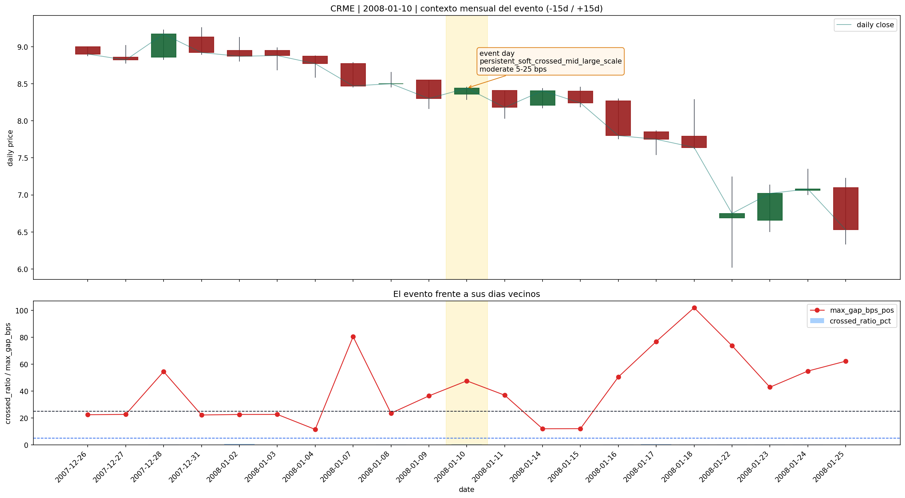

#### 00b Event Month Quotes Context
Esta imagen responde a la pregunta de recurrencia mensual dentro de `quotes`: el problema se concentra en el evento o reaparece en varias sesiones. Arriba concatena sesiones con datos disponibles; abajo resume cobertura diaria, `crossed_ratio_pct` y `max_gap_bps_pos`. La decision que cambia es si el caso debe leerse como episodio puntual o como sintoma de una fase repetida de libro degradado. El error que evita es extrapolar desde un unico dia a todo el mes sin evidencia.

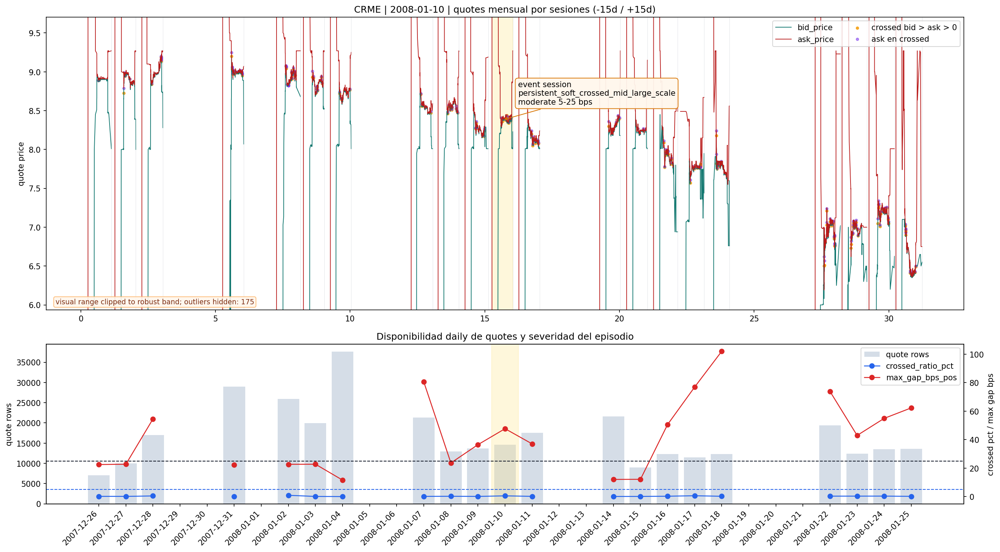

#### 01 Raw Window
Esta imagen responde a la primera pregunta decisiva del caso: el crossed observado es economicamente bastante fuerte para justificar un cambio de clase. Arriba ensena la geometria exacta del tramo conflictivo; abajo convierte esa geometria a bps y la enfrenta a los cortes `5 bps` y `25 bps`. El regimen dominante es `moderate 5-25 bps`. La decision que cambia es pasar de anomalia interpretable a `review` o `bad`. El error que evita es decidir por apariencia visual sin medir el dano economico real del crossed. En terminos de pipeline, este panel decide si el problema afecta solo a la lectura forense o si invalida simulacion de ejecucion y microstructure features.

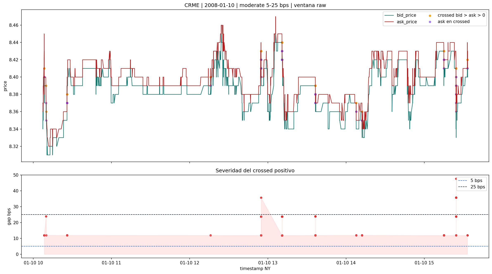

#### 02 Full Session Context
Esta imagen responde a la pregunta de extension intradiaria: el dano esta confinado a un bloque corto o contamina la sesion completa. Arriba se ve toda la sesion `04:00-20:00 NY`; abajo el `gap_bps` firmado. La decision que cambia es si el consumo debe penalizar solo un tramo o desechar el dia entero para uso operativo. El error que evita es tratar una cicatriz local como ruina total o, al reves, minimizar una degradacion distribuida a lo largo del dia. En ejecucion esto decide si la sesion puede seguir usandose con restricciones; en ML decide si las features intradiarias conservan significado economico.

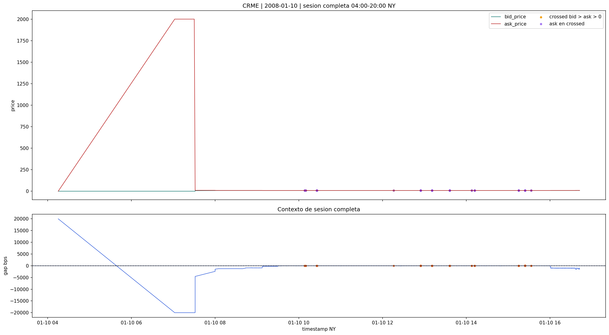

#### 03 Structure Diagnostics
Este panel responde a la pregunta de naturaleza del fallo: contradiccion economica genuina o mezcla con degeneracion estructural. Separa `ask=0` de `ask>0`, muestra la distribucion de `gap_bps` y resume patrones de integerizacion. La decision que cambia es como interpretar el dano: mercado localmente roto, artefacto de representacion o combinacion de ambos. El error que evita es sobrediagnosticar crossed reales cuando parte de la senal proviene de estructura degenerada del libro. Esta lectura afecta directamente a que el caso vaya a exclusion dura, a bandera contextual o a simple reconciliacion tecnica.

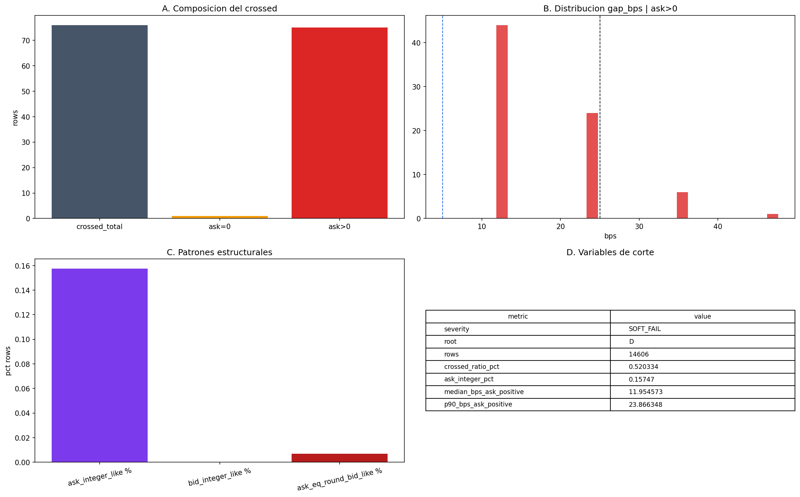

#### 04 Summary Card
Esta tarjeta responde a la pregunta de auditabilidad: cuales son exactamente las variables que sostienen la conclusion. Reune `severity`, `root`, `crossed_ratio_pct`, `ask_integer_pct`, `median_bps_ask_positive` y `p90_bps_ask_positive`. La decision que cambia es pasar de impresion visual a regla verificable. El error que evita es que dos inspectores lleguen a conclusiones distintas mirando la misma imagen sin una base numerica comun. Para gobernanza del proyecto, este panel es el que vuelve reproducible la decision para backtest, ML y auditoria.

---

### 39. DSPG 2008-01-31

company_name: `DSP Group Inc`
primary_exchange: `NASDAQ` (`XNAS`)
market_locale: `stocks/us`
scope: `review`
ticker: `DSPG`
date: `2008-01-31`
taxonomy: `persistent_soft_crossed_mid_large_scale`
positive_cross_bucket: `positive_cross_moderate_5to25bps`
severity: `SOFT_FAIL`
root: `D`
rows: `13106`
crossed_ratio_pct: `0.572257`
crossed_rows_raw: `75`
crossed_rows_ask_zero: `1`
crossed_rows_ask_positive: `74`
ask_integer_pct: `2.311918`
median_bps_ask_positive: `9.583134`
p90_bps_ask_positive: `26.235243`
file: `D:\quotes\DSPG\year=2008\month=01\day=31\quotes.parquet`

#### Analisis Forense
La conclusion correcta del caso es que ya existe contradiccion economica real dentro del libro, pero aun no con fuerza suficiente para justificar exclusion dura sin contexto adicional. La taxonomy historica es `persistent_soft_crossed_mid_large_scale` y el regimen positivo dominante es `moderate 5-25 bps`. Esto importa porque la taxonomy no solo clasifica: resume que tipo de anomalia se esta viendo y que clase de decision contractual puede defenderse despues. La taxonomy `persistent_soft_crossed_mid_large_scale` implica un problema repetido y distribuido, no un simple pinchazo local. Por eso empuja a `review`: ya hay dano real, aunque no necesariamente exclusion dura universal. El regimen `moderate 5-25 bps` ya entra en zona donde el crossed tiene capacidad real de contaminar simulacion de ejecucion y features microestructurales, aunque todavia puede requerir lectura contextual antes de exclusion dura. En terminos observables, el file tiene `crossed_ratio_pct=0.572257` con `crossed_rows_ask_positive=74` y `crossed_rows_ask_zero=1`. La severidad economica del crossed ask>0 se resume en `median_bps_ask_positive=9.583134` y `p90_bps_ask_positive=26.235243`. Estos dos numeros convierten una forma visual rara en una conclusion operativa sobre si el libro sigue representando o no un mercado negociable. La decision que cambia es pasar de libro sano a libro util solo bajo cautela. `review` significa: no usar como si fuera ejecucion limpia, conservar para analisis contextual y sensibilidad. El error que evita es tratar como normal un episodio que ya contiene contradiccion economica real y contaminar simulaciones de ejecucion o validaciones demasiado optimistas. El patron estructural muestra `ask_integer_pct=2.311918`. Este numero obliga a separar dos explicaciones rivales: contradiccion economica genuina del libro o mezcla con degeneracion estructural / integerizacion. La mayor parte del crossed vive en `ask>0`, de modo que el corazon del problema sigue siendo economico. La parte `ask=0`, si existe, acompana pero no explica por si sola la anomalia. Como `ask_integer_pct` es bajo, la hipotesis de simple degeneracion mecanica pierde fuerza. Eso endurece la interpretacion: el crossed se parece mas a contradiccion economica genuina y menos a artefacto. Existe ademas una imagen historica de certificacion asociada. Su papel es poner el episodio en un marco causal mas amplio: halt, explained, not strongly explained o patron conocido. La regla que protege al proyecto es esta: el contexto externo se usa para explicar por que aparece el episodio, no para absolverlo. El error que evita es degradar el criterio de calidad del libro porque exista una historia plausible alrededor del caso.

#### 00 Event Month Context
Esta imagen responde a la pregunta de persistencia temporal: estamos ante un accidente local o ante una fase mas amplia de inestabilidad. Arriba coloca el evento en la serie `daily` real del mes; abajo compara `crossed_ratio_pct` y `max_gap_bps_pos` del dia contra sus vecinos. La decision que cambia es el peso estructural que se le concede al caso. El error que evita es juzgar igual un shock aislado y una degradacion repetida del libro.

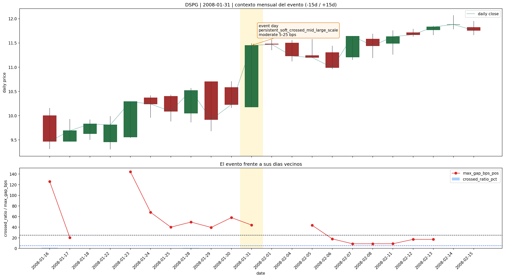

#### 00b Event Month Quotes Context
Esta imagen responde a la pregunta de recurrencia mensual dentro de `quotes`: el problema se concentra en el evento o reaparece en varias sesiones. Arriba concatena sesiones con datos disponibles; abajo resume cobertura diaria, `crossed_ratio_pct` y `max_gap_bps_pos`. La decision que cambia es si el caso debe leerse como episodio puntual o como sintoma de una fase repetida de libro degradado. El error que evita es extrapolar desde un unico dia a todo el mes sin evidencia.

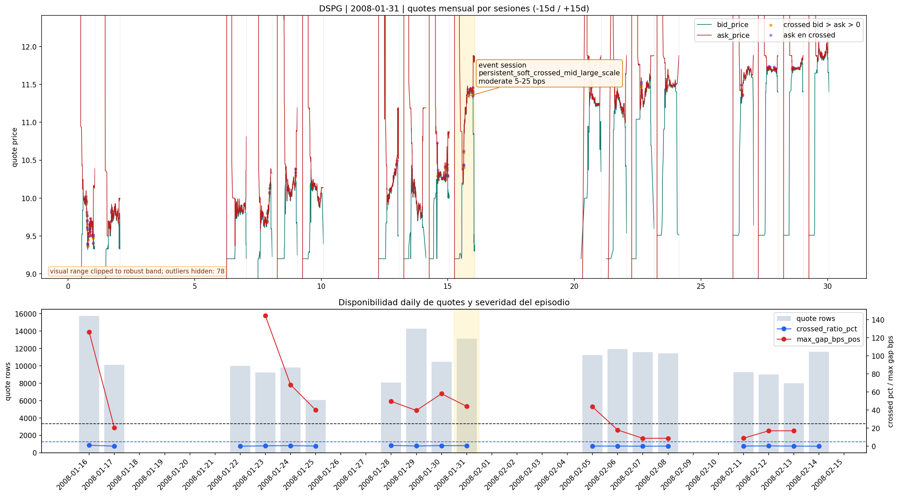

#### 01 Raw Window
Esta imagen responde a la primera pregunta decisiva del caso: el crossed observado es economicamente bastante fuerte para justificar un cambio de clase. Arriba ensena la geometria exacta del tramo conflictivo; abajo convierte esa geometria a bps y la enfrenta a los cortes `5 bps` y `25 bps`. El regimen dominante es `moderate 5-25 bps`. La decision que cambia es pasar de anomalia interpretable a `review` o `bad`. El error que evita es decidir por apariencia visual sin medir el dano economico real del crossed. En terminos de pipeline, este panel decide si el problema afecta solo a la lectura forense o si invalida simulacion de ejecucion y microstructure features.

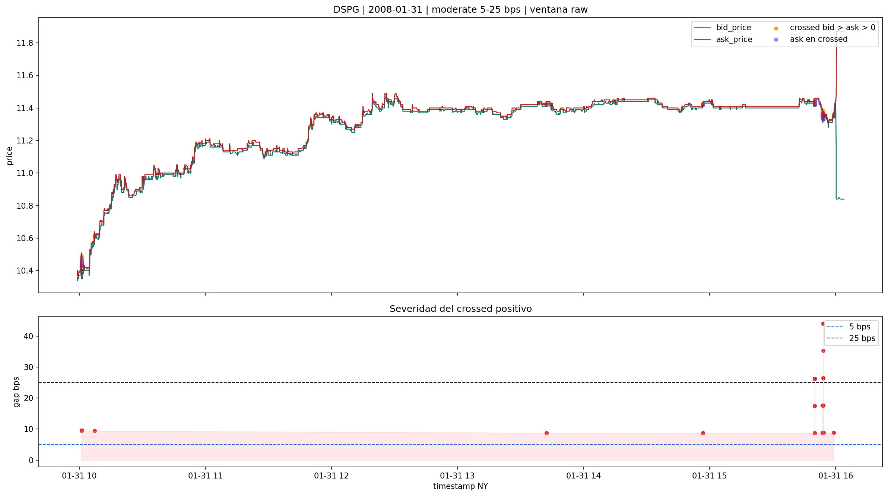

#### 02 Full Session Context
Esta imagen responde a la pregunta de extension intradiaria: el dano esta confinado a un bloque corto o contamina la sesion completa. Arriba se ve toda la sesion `04:00-20:00 NY`; abajo el `gap_bps` firmado. La decision que cambia es si el consumo debe penalizar solo un tramo o desechar el dia entero para uso operativo. El error que evita es tratar una cicatriz local como ruina total o, al reves, minimizar una degradacion distribuida a lo largo del dia. En ejecucion esto decide si la sesion puede seguir usandose con restricciones; en ML decide si las features intradiarias conservan significado economico.

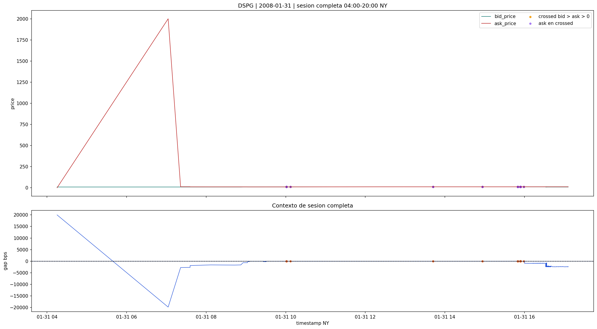

#### 03 Structure Diagnostics
Este panel responde a la pregunta de naturaleza del fallo: contradiccion economica genuina o mezcla con degeneracion estructural. Separa `ask=0` de `ask>0`, muestra la distribucion de `gap_bps` y resume patrones de integerizacion. La decision que cambia es como interpretar el dano: mercado localmente roto, artefacto de representacion o combinacion de ambos. El error que evita es sobrediagnosticar crossed reales cuando parte de la senal proviene de estructura degenerada del libro. Esta lectura afecta directamente a que el caso vaya a exclusion dura, a bandera contextual o a simple reconciliacion tecnica.

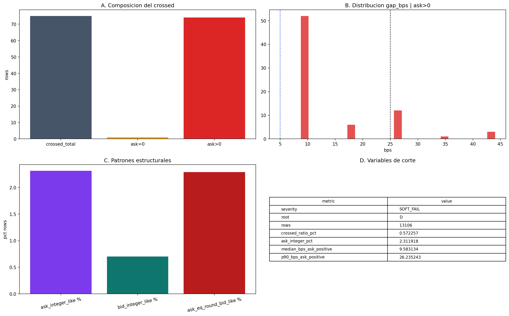

#### 04 Summary Card
Esta tarjeta responde a la pregunta de auditabilidad: cuales son exactamente las variables que sostienen la conclusion. Reune `severity`, `root`, `crossed_ratio_pct`, `ask_integer_pct`, `median_bps_ask_positive` y `p90_bps_ask_positive`. La decision que cambia es pasar de impresion visual a regla verificable. El error que evita es que dos inspectores lleguen a conclusiones distintas mirando la misma imagen sin una base numerica comun. Para gobernanza del proyecto, este panel es el que vuelve reproducible la decision para backtest, ML y auditoria.

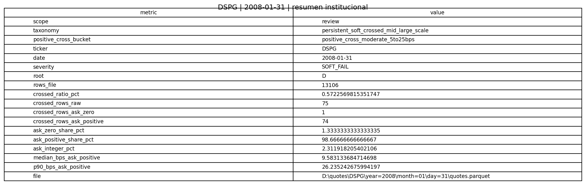

---

### 40. CPST 2010-08-31

company_name: `Capstone Turbine Corp`
primary_exchange: `NASDAQ` (`XNAS`)
market_locale: `stocks/us`
scope: `review`
ticker: `CPST`
date: `2010-08-31`
taxonomy: `persistent_soft_crossed_mid_large_scale`
positive_cross_bucket: `positive_cross_moderate_5to25bps`
severity: `SOFT_FAIL`
root: `D`
rows: `11086`
crossed_ratio_pct: `0.351795`
crossed_rows_raw: `39`
crossed_rows_ask_zero: `0`
crossed_rows_ask_positive: `39`
ask_integer_pct: `0.009020`
median_bps_ask_positive: `9.309542`
p90_bps_ask_positive: `10.730169`
file: `D:\quotes\CPST\year=2010\month=08\day=31\quotes.parquet`

#### Analisis Forense
La conclusion correcta del caso es que ya existe contradiccion economica real dentro del libro, pero aun no con fuerza suficiente para justificar exclusion dura sin contexto adicional. La taxonomy historica es `persistent_soft_crossed_mid_large_scale` y el regimen positivo dominante es `moderate 5-25 bps`. Esto importa porque la taxonomy no solo clasifica: resume que tipo de anomalia se esta viendo y que clase de decision contractual puede defenderse despues. La taxonomy `persistent_soft_crossed_mid_large_scale` implica un problema repetido y distribuido, no un simple pinchazo local. Por eso empuja a `review`: ya hay dano real, aunque no necesariamente exclusion dura universal. El regimen `moderate 5-25 bps` ya entra en zona donde el crossed tiene capacidad real de contaminar simulacion de ejecucion y features microestructurales, aunque todavia puede requerir lectura contextual antes de exclusion dura. En terminos observables, el file tiene `crossed_ratio_pct=0.351795` con `crossed_rows_ask_positive=39` y `crossed_rows_ask_zero=0`. La severidad economica del crossed ask>0 se resume en `median_bps_ask_positive=9.309542` y `p90_bps_ask_positive=10.730169`. Estos dos numeros convierten una forma visual rara en una conclusion operativa sobre si el libro sigue representando o no un mercado negociable. La decision que cambia es pasar de libro sano a libro util solo bajo cautela. `review` significa: no usar como si fuera ejecucion limpia, conservar para analisis contextual y sensibilidad. El error que evita es tratar como normal un episodio que ya contiene contradiccion economica real y contaminar simulaciones de ejecucion o validaciones demasiado optimistas. El patron estructural muestra `ask_integer_pct=0.009020`. Este numero obliga a separar dos explicaciones rivales: contradiccion economica genuina del libro o mezcla con degeneracion estructural / integerizacion. Toda la composicion crossed cae en `ask>0`. Eso endurece la lectura economica del caso: el dano no depende de ceros mecanicos, sino de contradiccion positiva dentro de precios aparentemente vivos. Como `ask_integer_pct` es bajo, la hipotesis de simple degeneracion mecanica pierde fuerza. Eso endurece la interpretacion: el crossed se parece mas a contradiccion economica genuina y menos a artefacto. Existe ademas una imagen historica de certificacion asociada. Su papel es poner el episodio en un marco causal mas amplio: halt, explained, not strongly explained o patron conocido. La regla que protege al proyecto es esta: el contexto externo se usa para explicar por que aparece el episodio, no para absolverlo. El error que evita es degradar el criterio de calidad del libro porque exista una historia plausible alrededor del caso.

#### 00 Event Month Context
Esta imagen responde a la pregunta de persistencia temporal: estamos ante un accidente local o ante una fase mas amplia de inestabilidad. Arriba coloca el evento en la serie `daily` real del mes; abajo compara `crossed_ratio_pct` y `max_gap_bps_pos` del dia contra sus vecinos. La decision que cambia es el peso estructural que se le concede al caso. El error que evita es juzgar igual un shock aislado y una degradacion repetida del libro.

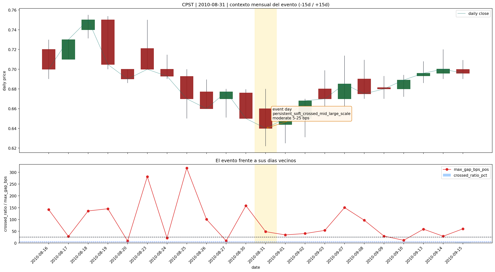

#### 00b Event Month Quotes Context
Esta imagen responde a la pregunta de recurrencia mensual dentro de `quotes`: el problema se concentra en el evento o reaparece en varias sesiones. Arriba concatena sesiones con datos disponibles; abajo resume cobertura diaria, `crossed_ratio_pct` y `max_gap_bps_pos`. La decision que cambia es si el caso debe leerse como episodio puntual o como sintoma de una fase repetida de libro degradado. El error que evita es extrapolar desde un unico dia a todo el mes sin evidencia.

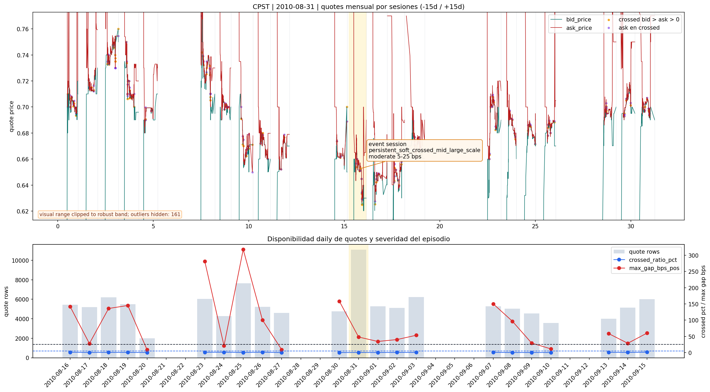

#### 01 Raw Window
Esta imagen responde a la primera pregunta decisiva del caso: el crossed observado es economicamente bastante fuerte para justificar un cambio de clase. Arriba ensena la geometria exacta del tramo conflictivo; abajo convierte esa geometria a bps y la enfrenta a los cortes `5 bps` y `25 bps`. El regimen dominante es `moderate 5-25 bps`. La decision que cambia es pasar de anomalia interpretable a `review` o `bad`. El error que evita es decidir por apariencia visual sin medir el dano economico real del crossed. En terminos de pipeline, este panel decide si el problema afecta solo a la lectura forense o si invalida simulacion de ejecucion y microstructure features.

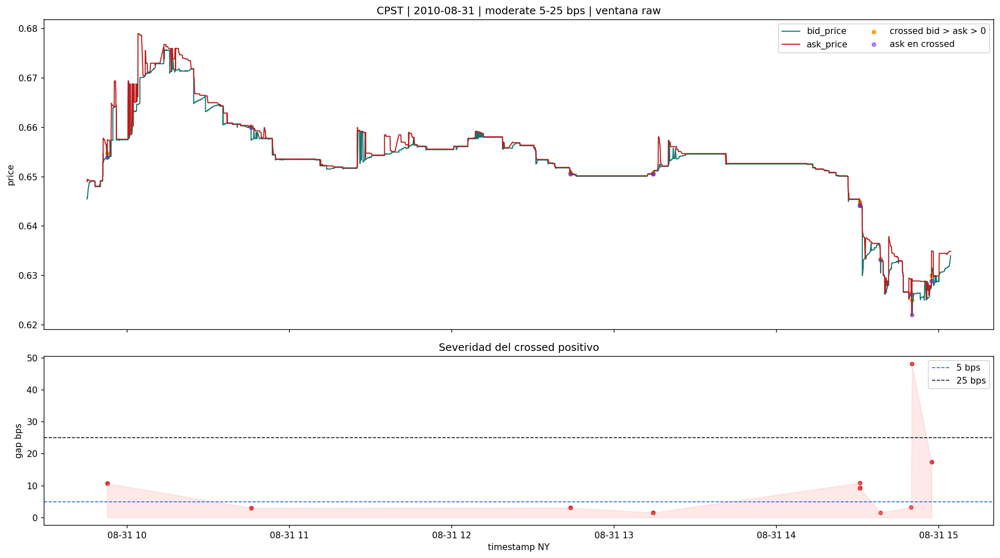

#### 02 Full Session Context
Esta imagen responde a la pregunta de extension intradiaria: el dano esta confinado a un bloque corto o contamina la sesion completa. Arriba se ve toda la sesion `04:00-20:00 NY`; abajo el `gap_bps` firmado. La decision que cambia es si el consumo debe penalizar solo un tramo o desechar el dia entero para uso operativo. El error que evita es tratar una cicatriz local como ruina total o, al reves, minimizar una degradacion distribuida a lo largo del dia. En ejecucion esto decide si la sesion puede seguir usandose con restricciones; en ML decide si las features intradiarias conservan significado economico.

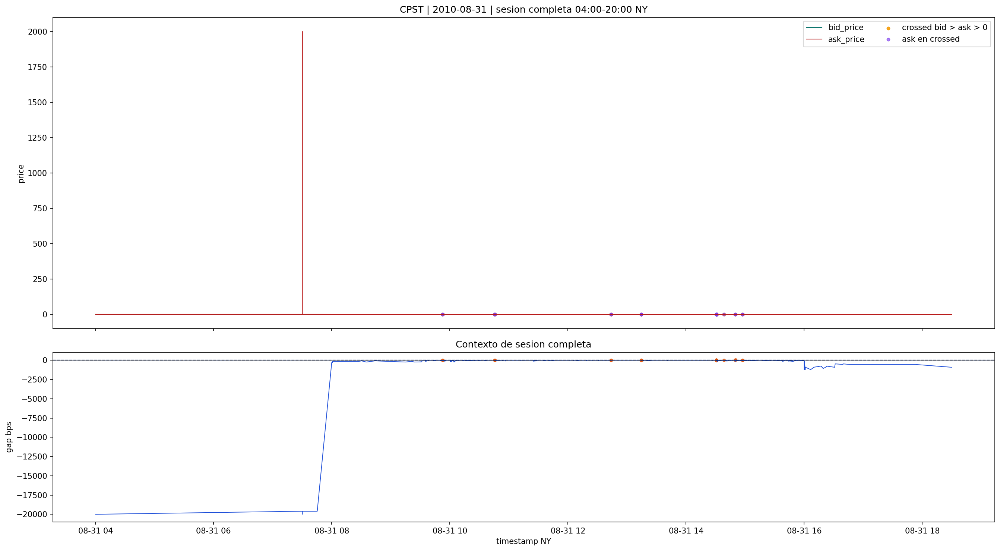

#### 03 Structure Diagnostics
Este panel responde a la pregunta de naturaleza del fallo: contradiccion economica genuina o mezcla con degeneracion estructural. Separa `ask=0` de `ask>0`, muestra la distribucion de `gap_bps` y resume patrones de integerizacion. La decision que cambia es como interpretar el dano: mercado localmente roto, artefacto de representacion o combinacion de ambos. El error que evita es sobrediagnosticar crossed reales cuando parte de la senal proviene de estructura degenerada del libro. Esta lectura afecta directamente a que el caso vaya a exclusion dura, a bandera contextual o a simple reconciliacion tecnica.

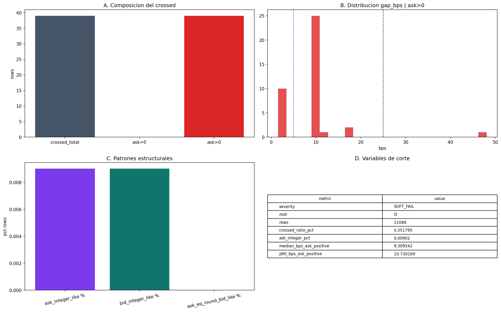

#### 04 Summary Card
Esta tarjeta responde a la pregunta de auditabilidad: cuales son exactamente las variables que sostienen la conclusion. Reune `severity`, `root`, `crossed_ratio_pct`, `ask_integer_pct`, `median_bps_ask_positive` y `p90_bps_ask_positive`. La decision que cambia es pasar de impresion visual a regla verificable. El error que evita es que dos inspectores lleguen a conclusiones distintas mirando la misma imagen sin una base numerica comun. Para gobernanza del proyecto, este panel es el que vuelve reproducible la decision para backtest, ML y auditoria.

---

### 41. PLAY 2006-02-14

company_name: `Dave & Buster's Entertainment, Inc.`
primary_exchange: `NASDAQ` (`XNAS`)
market_locale: `stocks/us`
scope: `review`
ticker: `PLAY`
date: `2006-02-14`
taxonomy: `persistent_soft_crossed_mid_large_scale`
positive_cross_bucket: `positive_cross_moderate_5to25bps`
severity: `SOFT_FAIL`
root: `C`
rows: `11467`
crossed_ratio_pct: `0.340106`
crossed_rows_raw: `39`
crossed_rows_ask_zero: `0`
crossed_rows_ask_positive: `39`
ask_integer_pct: `7.264324`
median_bps_ask_positive: `7.745933`
p90_bps_ask_positive: `19.316206`
file: `C:\TSIS_Data\data\quotes\PLAY\year=2006\month=02\day=14\quotes.parquet`

#### Analisis Forense
La conclusion correcta del caso es que ya existe contradiccion economica real dentro del libro, pero aun no con fuerza suficiente para justificar exclusion dura sin contexto adicional. La taxonomy historica es `persistent_soft_crossed_mid_large_scale` y el regimen positivo dominante es `moderate 5-25 bps`. Esto importa porque la taxonomy no solo clasifica: resume que tipo de anomalia se esta viendo y que clase de decision contractual puede defenderse despues. La taxonomy `persistent_soft_crossed_mid_large_scale` implica un problema repetido y distribuido, no un simple pinchazo local. Por eso empuja a `review`: ya hay dano real, aunque no necesariamente exclusion dura universal. El regimen `moderate 5-25 bps` ya entra en zona donde el crossed tiene capacidad real de contaminar simulacion de ejecucion y features microestructurales, aunque todavia puede requerir lectura contextual antes de exclusion dura. En terminos observables, el file tiene `crossed_ratio_pct=0.340106` con `crossed_rows_ask_positive=39` y `crossed_rows_ask_zero=0`. La severidad economica del crossed ask>0 se resume en `median_bps_ask_positive=7.745933` y `p90_bps_ask_positive=19.316206`. Estos dos numeros convierten una forma visual rara en una conclusion operativa sobre si el libro sigue representando o no un mercado negociable. La decision que cambia es pasar de libro sano a libro util solo bajo cautela. `review` significa: no usar como si fuera ejecucion limpia, conservar para analisis contextual y sensibilidad. El error que evita es tratar como normal un episodio que ya contiene contradiccion economica real y contaminar simulaciones de ejecucion o validaciones demasiado optimistas. El patron estructural muestra `ask_integer_pct=7.264324`. Este numero obliga a separar dos explicaciones rivales: contradiccion economica genuina del libro o mezcla con degeneracion estructural / integerizacion. Toda la composicion crossed cae en `ask>0`. Eso endurece la lectura economica del caso: el dano no depende de ceros mecanicos, sino de contradiccion positiva dentro de precios aparentemente vivos. Como `ask_integer_pct` no es extremo, el caso exige leer geometria del crossed y estructura simultaneamente. No basta un solo numero; hay que combinar severidad, composicion y contexto. En la capa de semantica de precio del evento aparecen `daily raw close=25.9900`, `quote mid raw=26.0400`, `quote mid split_normalized=26.0400`, `daily adjusted_proxy=24.4584`. Ademas hay `post_event_dividend_sum=0.9200`. La implicacion metodologica es crucial: una discrepancia entre `quotes`, `daily` y una plataforma externa no puede leerse automaticamente como fallo del dataset. Puede ser semantica de precio distinta. El error que evita esta capa es mezclar raw, split-normalized y adjusted dentro del mismo pipeline, rompiendo auditoria, benchmarking y labels. Para pipelines, esto bloquea su uso como libro sano en ejecucion y features microestructurales principales, aunque aun puede mantenerse para forense, sensibilidad y estudios donde la anomalia sea parte del objeto de investigacion. Existe ademas una imagen historica de certificacion asociada. Su papel es poner el episodio en un marco causal mas amplio: halt, explained, not strongly explained o patron conocido. La regla que protege al proyecto es esta: el contexto externo se usa para explicar por que aparece el episodio, no para absolverlo. El error que evita es degradar el criterio de calidad del libro porque exista una historia plausible alrededor del caso.

#### 00 Event Month Context
Esta imagen responde a la pregunta de persistencia temporal: estamos ante un accidente local o ante una fase mas amplia de inestabilidad. Arriba coloca el evento en la serie `daily` real del mes; abajo compara `crossed_ratio_pct` y `max_gap_bps_pos` del dia contra sus vecinos. La decision que cambia es el peso estructural que se le concede al caso. El error que evita es juzgar igual un shock aislado y una degradacion repetida del libro.

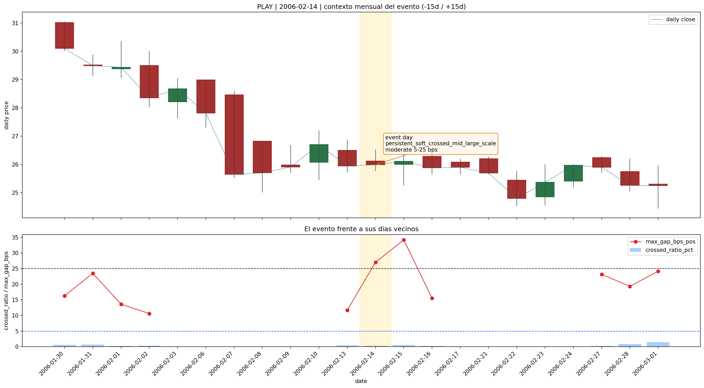

#### 00a Adjusted Proxy Contrast
Esta imagen responde a la pregunta de reconciliacion semantica: la discrepancia de precios viene de datos rotos o de vistas de precio distintas. Compara `daily raw`, `daily adjusted_proxy`, `quote mid raw` y `quote mid split_normalized`, y debajo ensena la cadena de dividendos y splits que produce la diferencia. La decision que cambia es si el inspector debe abrir una incidencia de calidad o cerrar el caso como diferencia legitima de semantica. El error que evita es mezclar series raw y adjusted como si fueran equivalentes. En pipelines reales, esto protege benchmarking, labels diarios y reconciliacion externa frente a falsas alarmas de precio.

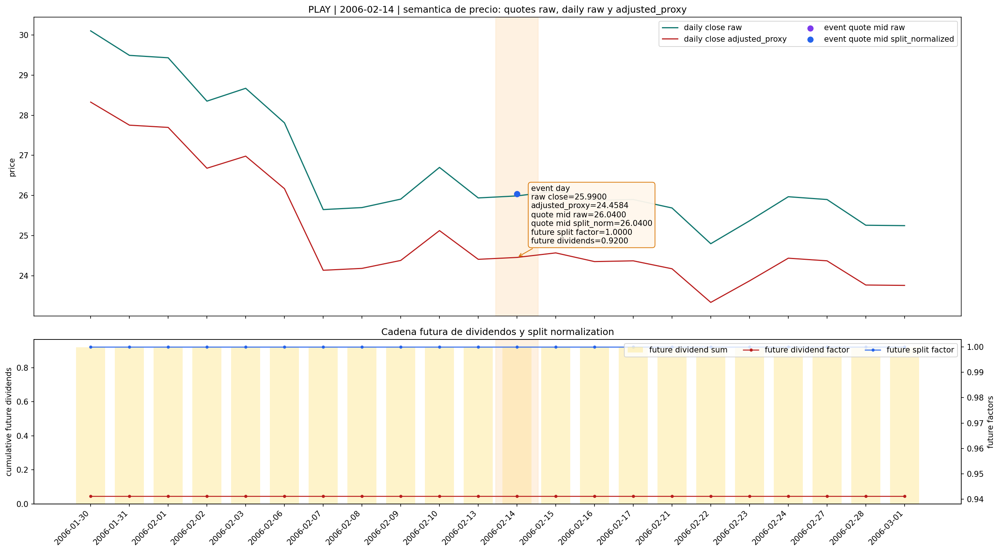

#### 00b Event Month Quotes Context
Esta imagen responde a la pregunta de recurrencia mensual dentro de `quotes`: el problema se concentra en el evento o reaparece en varias sesiones. Arriba concatena sesiones con datos disponibles; abajo resume cobertura diaria, `crossed_ratio_pct` y `max_gap_bps_pos`. La decision que cambia es si el caso debe leerse como episodio puntual o como sintoma de una fase repetida de libro degradado. El error que evita es extrapolar desde un unico dia a todo el mes sin evidencia.

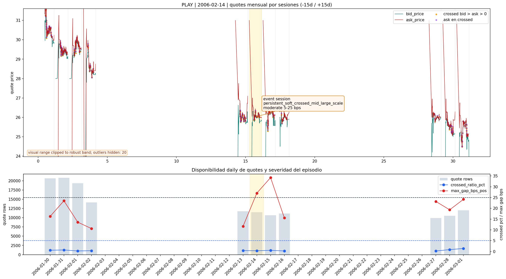

#### 01 Raw Window
Esta imagen responde a la primera pregunta decisiva del caso: el crossed observado es economicamente bastante fuerte para justificar un cambio de clase. Arriba ensena la geometria exacta del tramo conflictivo; abajo convierte esa geometria a bps y la enfrenta a los cortes `5 bps` y `25 bps`. El regimen dominante es `moderate 5-25 bps`. La decision que cambia es pasar de anomalia interpretable a `review` o `bad`. El error que evita es decidir por apariencia visual sin medir el dano economico real del crossed. En terminos de pipeline, este panel decide si el problema afecta solo a la lectura forense o si invalida simulacion de ejecucion y microstructure features.

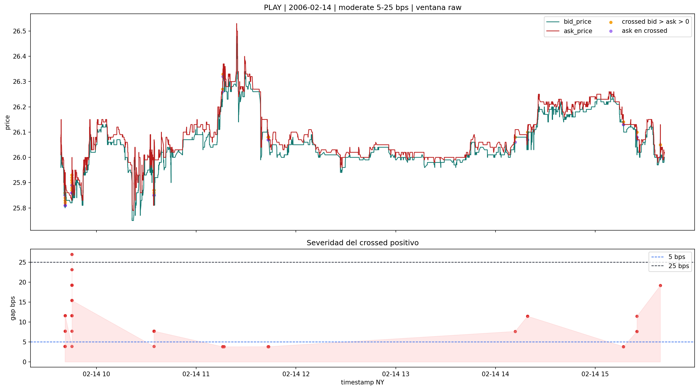

#### 02 Full Session Context
Esta imagen responde a la pregunta de extension intradiaria: el dano esta confinado a un bloque corto o contamina la sesion completa. Arriba se ve toda la sesion `04:00-20:00 NY`; abajo el `gap_bps` firmado. La decision que cambia es si el consumo debe penalizar solo un tramo o desechar el dia entero para uso operativo. El error que evita es tratar una cicatriz local como ruina total o, al reves, minimizar una degradacion distribuida a lo largo del dia. En ejecucion esto decide si la sesion puede seguir usandose con restricciones; en ML decide si las features intradiarias conservan significado economico.

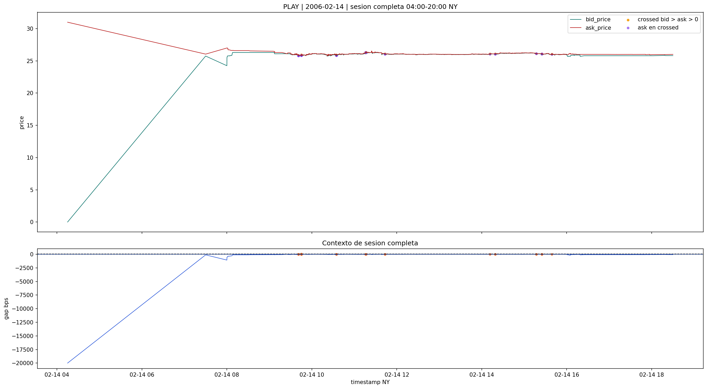

#### 03 Structure Diagnostics
Este panel responde a la pregunta de naturaleza del fallo: contradiccion economica genuina o mezcla con degeneracion estructural. Separa `ask=0` de `ask>0`, muestra la distribucion de `gap_bps` y resume patrones de integerizacion. La decision que cambia es como interpretar el dano: mercado localmente roto, artefacto de representacion o combinacion de ambos. El error que evita es sobrediagnosticar crossed reales cuando parte de la senal proviene de estructura degenerada del libro. Esta lectura afecta directamente a que el caso vaya a exclusion dura, a bandera contextual o a simple reconciliacion tecnica.

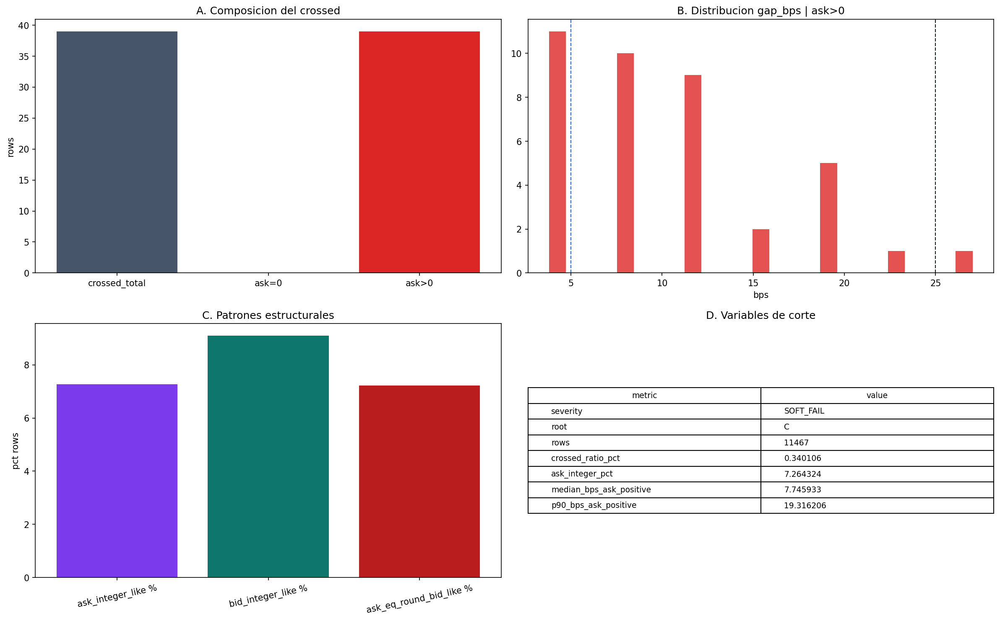

#### 04 Summary Card
Esta tarjeta responde a la pregunta de auditabilidad: cuales son exactamente las variables que sostienen la conclusion. Reune `severity`, `root`, `crossed_ratio_pct`, `ask_integer_pct`, `median_bps_ask_positive` y `p90_bps_ask_positive`. La decision que cambia es pasar de impresion visual a regla verificable. El error que evita es que dos inspectores lleguen a conclusiones distintas mirando la misma imagen sin una base numerica comun. Para gobernanza del proyecto, este panel es el que vuelve reproducible la decision para backtest, ML y auditoria.

---

### 42. MDR 2009-02-11

company_name: `McDermott International`
primary_exchange: `NYSE` (`XNYS`)
market_locale: `stocks/us`
scope: `review`
ticker: `MDR`
date: `2009-02-11`
taxonomy: `persistent_soft_crossed_mid_large_scale`
positive_cross_bucket: `positive_cross_moderate_5to25bps`
severity: `SOFT_FAIL`
root: `D`
rows: `69669`
crossed_ratio_pct: `0.340180`
crossed_rows_raw: `237`
crossed_rows_ask_zero: `0`
crossed_rows_ask_positive: `237`
ask_integer_pct: `1.469807`
median_bps_ask_positive: `7.654038`
p90_bps_ask_positive: `15.003751`
file: `D:\quotes\MDR\year=2009\month=02\day=11\quotes.parquet`

#### Analisis Forense
La conclusion correcta del caso es que ya existe contradiccion economica real dentro del libro, pero aun no con fuerza suficiente para justificar exclusion dura sin contexto adicional. La taxonomy historica es `persistent_soft_crossed_mid_large_scale` y el regimen positivo dominante es `moderate 5-25 bps`. Esto importa porque la taxonomy no solo clasifica: resume que tipo de anomalia se esta viendo y que clase de decision contractual puede defenderse despues. La taxonomy `persistent_soft_crossed_mid_large_scale` implica un problema repetido y distribuido, no un simple pinchazo local. Por eso empuja a `review`: ya hay dano real, aunque no necesariamente exclusion dura universal. El regimen `moderate 5-25 bps` ya entra en zona donde el crossed tiene capacidad real de contaminar simulacion de ejecucion y features microestructurales, aunque todavia puede requerir lectura contextual antes de exclusion dura. En terminos observables, el file tiene `crossed_ratio_pct=0.340180` con `crossed_rows_ask_positive=237` y `crossed_rows_ask_zero=0`. La severidad economica del crossed ask>0 se resume en `median_bps_ask_positive=7.654038` y `p90_bps_ask_positive=15.003751`. Estos dos numeros convierten una forma visual rara en una conclusion operativa sobre si el libro sigue representando o no un mercado negociable. La decision que cambia es pasar de libro sano a libro util solo bajo cautela. `review` significa: no usar como si fuera ejecucion limpia, conservar para analisis contextual y sensibilidad. El error que evita es tratar como normal un episodio que ya contiene contradiccion economica real y contaminar simulaciones de ejecucion o validaciones demasiado optimistas. El patron estructural muestra `ask_integer_pct=1.469807`. Este numero obliga a separar dos explicaciones rivales: contradiccion economica genuina del libro o mezcla con degeneracion estructural / integerizacion. Toda la composicion crossed cae en `ask>0`. Eso endurece la lectura economica del caso: el dano no depende de ceros mecanicos, sino de contradiccion positiva dentro de precios aparentemente vivos. Como `ask_integer_pct` es bajo, la hipotesis de simple degeneracion mecanica pierde fuerza. Eso endurece la interpretacion: el crossed se parece mas a contradiccion economica genuina y menos a artefacto. En la capa de semantica de precio del evento aparecen `daily raw close=39.6000`, `quote mid raw=13.0850`, `quote mid split_normalized=39.2550`, `daily adjusted_proxy=39.6000`. La reconciliacion incluye `future_split_factor=0.3333`. La implicacion metodologica es crucial: una discrepancia entre `quotes`, `daily` y una plataforma externa no puede leerse automaticamente como fallo del dataset. Puede ser semantica de precio distinta. El error que evita esta capa es mezclar raw, split-normalized y adjusted dentro del mismo pipeline, rompiendo auditoria, benchmarking y labels. Para pipelines, esto bloquea su uso como libro sano en ejecucion y features microestructurales principales, aunque aun puede mantenerse para forense, sensibilidad y estudios donde la anomalia sea parte del objeto de investigacion. Existe ademas una imagen historica de certificacion asociada. Su papel es poner el episodio en un marco causal mas amplio: halt, explained, not strongly explained o patron conocido. La regla que protege al proyecto es esta: el contexto externo se usa para explicar por que aparece el episodio, no para absolverlo. El error que evita es degradar el criterio de calidad del libro porque exista una historia plausible alrededor del caso.

#### 00 Event Month Context
Esta imagen responde a la pregunta de persistencia temporal: estamos ante un accidente local o ante una fase mas amplia de inestabilidad. Arriba coloca el evento en la serie `daily` real del mes; abajo compara `crossed_ratio_pct` y `max_gap_bps_pos` del dia contra sus vecinos. La decision que cambia es el peso estructural que se le concede al caso. El error que evita es juzgar igual un shock aislado y una degradacion repetida del libro.

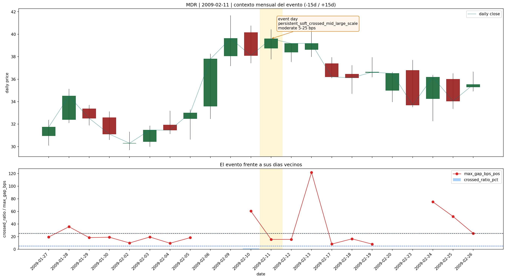

#### 00a Adjusted Proxy Contrast
Esta imagen responde a la pregunta de reconciliacion semantica: la discrepancia de precios viene de datos rotos o de vistas de precio distintas. Compara `daily raw`, `daily adjusted_proxy`, `quote mid raw` y `quote mid split_normalized`, y debajo ensena la cadena de dividendos y splits que produce la diferencia. La decision que cambia es si el inspector debe abrir una incidencia de calidad o cerrar el caso como diferencia legitima de semantica. El error que evita es mezclar series raw y adjusted como si fueran equivalentes. En pipelines reales, esto protege benchmarking, labels diarios y reconciliacion externa frente a falsas alarmas de precio.

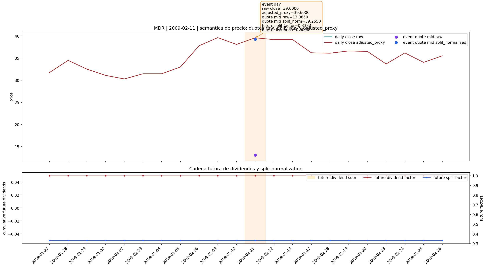

#### 00b Event Month Quotes Context
Esta imagen responde a la pregunta de recurrencia mensual dentro de `quotes`: el problema se concentra en el evento o reaparece en varias sesiones. Arriba concatena sesiones con datos disponibles; abajo resume cobertura diaria, `crossed_ratio_pct` y `max_gap_bps_pos`. La decision que cambia es si el caso debe leerse como episodio puntual o como sintoma de una fase repetida de libro degradado. El error que evita es extrapolar desde un unico dia a todo el mes sin evidencia.

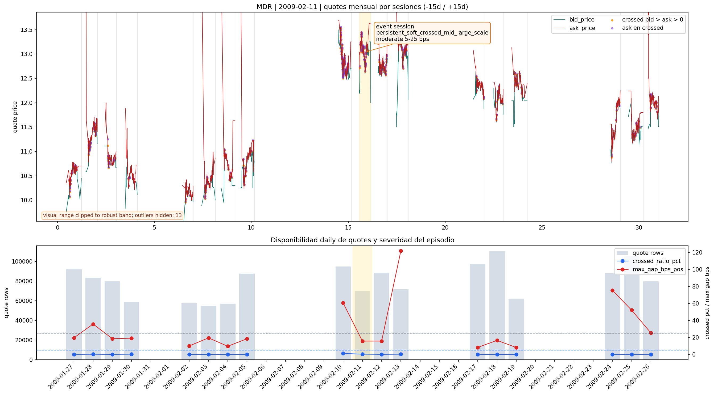

#### 01 Raw Window
Esta imagen responde a la primera pregunta decisiva del caso: el crossed observado es economicamente bastante fuerte para justificar un cambio de clase. Arriba ensena la geometria exacta del tramo conflictivo; abajo convierte esa geometria a bps y la enfrenta a los cortes `5 bps` y `25 bps`. El regimen dominante es `moderate 5-25 bps`. La decision que cambia es pasar de anomalia interpretable a `review` o `bad`. El error que evita es decidir por apariencia visual sin medir el dano economico real del crossed. En terminos de pipeline, este panel decide si el problema afecta solo a la lectura forense o si invalida simulacion de ejecucion y microstructure features.

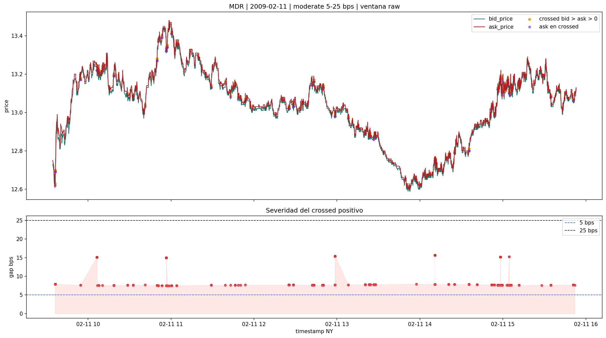

#### 02 Full Session Context
Esta imagen responde a la pregunta de extension intradiaria: el dano esta confinado a un bloque corto o contamina la sesion completa. Arriba se ve toda la sesion `04:00-20:00 NY`; abajo el `gap_bps` firmado. La decision que cambia es si el consumo debe penalizar solo un tramo o desechar el dia entero para uso operativo. El error que evita es tratar una cicatriz local como ruina total o, al reves, minimizar una degradacion distribuida a lo largo del dia. En ejecucion esto decide si la sesion puede seguir usandose con restricciones; en ML decide si las features intradiarias conservan significado economico.

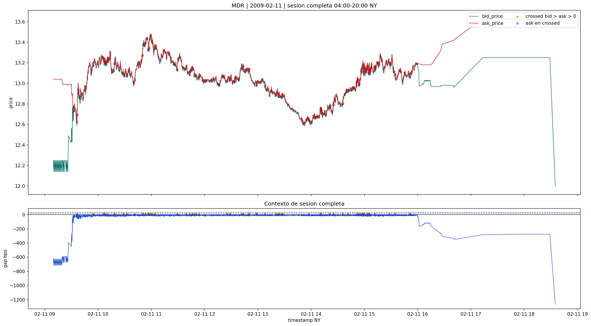

#### 03 Structure Diagnostics
Este panel responde a la pregunta de naturaleza del fallo: contradiccion economica genuina o mezcla con degeneracion estructural. Separa `ask=0` de `ask>0`, muestra la distribucion de `gap_bps` y resume patrones de integerizacion. La decision que cambia es como interpretar el dano: mercado localmente roto, artefacto de representacion o combinacion de ambos. El error que evita es sobrediagnosticar crossed reales cuando parte de la senal proviene de estructura degenerada del libro. Esta lectura afecta directamente a que el caso vaya a exclusion dura, a bandera contextual o a simple reconciliacion tecnica.

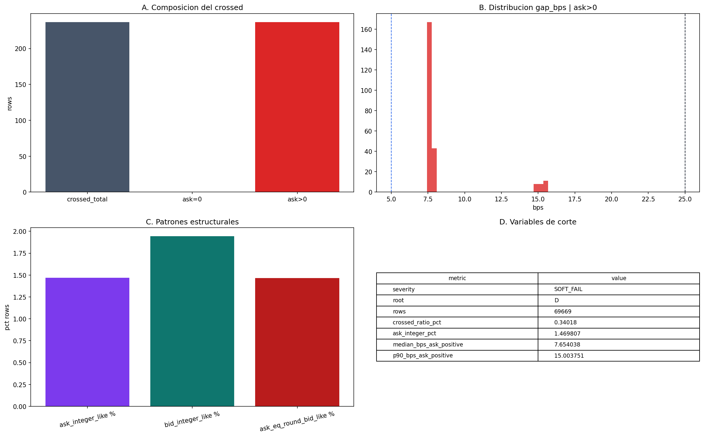

#### 04 Summary Card
Esta tarjeta responde a la pregunta de auditabilidad: cuales son exactamente las variables que sostienen la conclusion. Reune `severity`, `root`, `crossed_ratio_pct`, `ask_integer_pct`, `median_bps_ask_positive` y `p90_bps_ask_positive`. La decision que cambia es pasar de impresion visual a regla verificable. El error que evita es que dos inspectores lleguen a conclusiones distintas mirando la misma imagen sin una base numerica comun. Para gobernanza del proyecto, este panel es el que vuelve reproducible la decision para backtest, ML y auditoria.

---

### 43. BDN 2013-04-03

company_name: `Brandywine Realty Trust`
primary_exchange: `NYSE` (`XNYS`)
market_locale: `stocks/us`
scope: `review`
ticker: `BDN`
date: `2013-04-03`
taxonomy: `persistent_soft_crossed_mid_large_scale`
positive_cross_bucket: `positive_cross_moderate_5to25bps`
severity: `SOFT_FAIL`
root: `D`
rows: `22913`
crossed_ratio_pct: `0.728844`
crossed_rows_raw: `167`
crossed_rows_ask_zero: `0`
crossed_rows_ask_positive: `167`
ask_integer_pct: `0.017457`
median_bps_ask_positive: `6.745363`
p90_bps_ask_positive: `6.768264`
file: `D:\quotes\BDN\year=2013\month=04\day=03\quotes.parquet`

#### Analisis Forense
La conclusion correcta del caso es que ya existe contradiccion economica real dentro del libro, pero aun no con fuerza suficiente para justificar exclusion dura sin contexto adicional. La taxonomy historica es `persistent_soft_crossed_mid_large_scale` y el regimen positivo dominante es `moderate 5-25 bps`. Esto importa porque la taxonomy no solo clasifica: resume que tipo de anomalia se esta viendo y que clase de decision contractual puede defenderse despues. La taxonomy `persistent_soft_crossed_mid_large_scale` implica un problema repetido y distribuido, no un simple pinchazo local. Por eso empuja a `review`: ya hay dano real, aunque no necesariamente exclusion dura universal. El regimen `moderate 5-25 bps` ya entra en zona donde el crossed tiene capacidad real de contaminar simulacion de ejecucion y features microestructurales, aunque todavia puede requerir lectura contextual antes de exclusion dura. En terminos observables, el file tiene `crossed_ratio_pct=0.728844` con `crossed_rows_ask_positive=167` y `crossed_rows_ask_zero=0`. La severidad economica del crossed ask>0 se resume en `median_bps_ask_positive=6.745363` y `p90_bps_ask_positive=6.768264`. Estos dos numeros convierten una forma visual rara en una conclusion operativa sobre si el libro sigue representando o no un mercado negociable. La decision que cambia es pasar de libro sano a libro util solo bajo cautela. `review` significa: no usar como si fuera ejecucion limpia, conservar para analisis contextual y sensibilidad. El error que evita es tratar como normal un episodio que ya contiene contradiccion economica real y contaminar simulaciones de ejecucion o validaciones demasiado optimistas. El patron estructural muestra `ask_integer_pct=0.017457`. Este numero obliga a separar dos explicaciones rivales: contradiccion economica genuina del libro o mezcla con degeneracion estructural / integerizacion. Toda la composicion crossed cae en `ask>0`. Eso endurece la lectura economica del caso: el dano no depende de ceros mecanicos, sino de contradiccion positiva dentro de precios aparentemente vivos. Como `ask_integer_pct` es bajo, la hipotesis de simple degeneracion mecanica pierde fuerza. Eso endurece la interpretacion: el crossed se parece mas a contradiccion economica genuina y menos a artefacto. En la capa de semantica de precio del evento aparecen `daily raw close=14.7200`, `quote mid raw=14.7150`, `quote mid split_normalized=14.7150`, `daily adjusted_proxy=7.6691`. Ademas hay `post_event_dividend_sum=8.5300`. La implicacion metodologica es crucial: una discrepancia entre `quotes`, `daily` y una plataforma externa no puede leerse automaticamente como fallo del dataset. Puede ser semantica de precio distinta. El error que evita esta capa es mezclar raw, split-normalized y adjusted dentro del mismo pipeline, rompiendo auditoria, benchmarking y labels. Para pipelines, esto bloquea su uso como libro sano en ejecucion y features microestructurales principales, aunque aun puede mantenerse para forense, sensibilidad y estudios donde la anomalia sea parte del objeto de investigacion. Existe ademas una imagen historica de certificacion asociada. Su papel es poner el episodio en un marco causal mas amplio: halt, explained, not strongly explained o patron conocido. La regla que protege al proyecto es esta: el contexto externo se usa para explicar por que aparece el episodio, no para absolverlo. El error que evita es degradar el criterio de calidad del libro porque exista una historia plausible alrededor del caso.

#### 00 Event Month Context
Esta imagen responde a la pregunta de persistencia temporal: estamos ante un accidente local o ante una fase mas amplia de inestabilidad. Arriba coloca el evento en la serie `daily` real del mes; abajo compara `crossed_ratio_pct` y `max_gap_bps_pos` del dia contra sus vecinos. La decision que cambia es el peso estructural que se le concede al caso. El error que evita es juzgar igual un shock aislado y una degradacion repetida del libro.

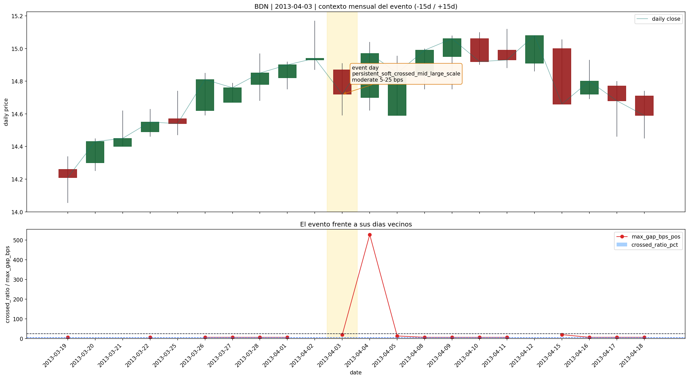

#### 00a Adjusted Proxy Contrast
Esta imagen responde a la pregunta de reconciliacion semantica: la discrepancia de precios viene de datos rotos o de vistas de precio distintas. Compara `daily raw`, `daily adjusted_proxy`, `quote mid raw` y `quote mid split_normalized`, y debajo ensena la cadena de dividendos y splits que produce la diferencia. La decision que cambia es si el inspector debe abrir una incidencia de calidad o cerrar el caso como diferencia legitima de semantica. El error que evita es mezclar series raw y adjusted como si fueran equivalentes. En pipelines reales, esto protege benchmarking, labels diarios y reconciliacion externa frente a falsas alarmas de precio.

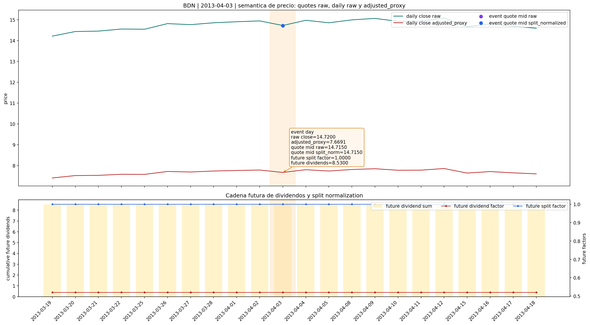

#### 00b Event Month Quotes Context
Esta imagen responde a la pregunta de recurrencia mensual dentro de `quotes`: el problema se concentra en el evento o reaparece en varias sesiones. Arriba concatena sesiones con datos disponibles; abajo resume cobertura diaria, `crossed_ratio_pct` y `max_gap_bps_pos`. La decision que cambia es si el caso debe leerse como episodio puntual o como sintoma de una fase repetida de libro degradado. El error que evita es extrapolar desde un unico dia a todo el mes sin evidencia.

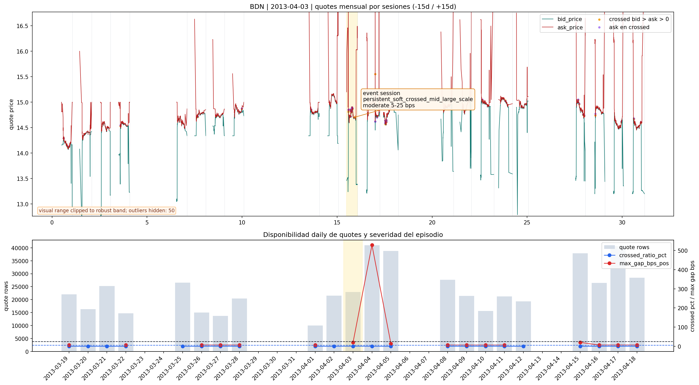

#### 01 Raw Window
Esta imagen responde a la primera pregunta decisiva del caso: el crossed observado es economicamente bastante fuerte para justificar un cambio de clase. Arriba ensena la geometria exacta del tramo conflictivo; abajo convierte esa geometria a bps y la enfrenta a los cortes `5 bps` y `25 bps`. El regimen dominante es `moderate 5-25 bps`. La decision que cambia es pasar de anomalia interpretable a `review` o `bad`. El error que evita es decidir por apariencia visual sin medir el dano economico real del crossed. En terminos de pipeline, este panel decide si el problema afecta solo a la lectura forense o si invalida simulacion de ejecucion y microstructure features.

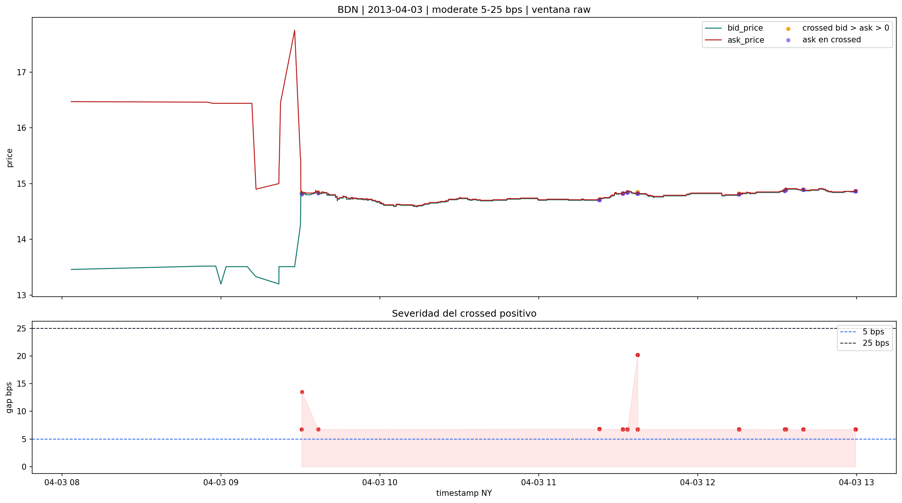

#### 02 Full Session Context
Esta imagen responde a la pregunta de extension intradiaria: el dano esta confinado a un bloque corto o contamina la sesion completa. Arriba se ve toda la sesion `04:00-20:00 NY`; abajo el `gap_bps` firmado. La decision que cambia es si el consumo debe penalizar solo un tramo o desechar el dia entero para uso operativo. El error que evita es tratar una cicatriz local como ruina total o, al reves, minimizar una degradacion distribuida a lo largo del dia. En ejecucion esto decide si la sesion puede seguir usandose con restricciones; en ML decide si las features intradiarias conservan significado economico.

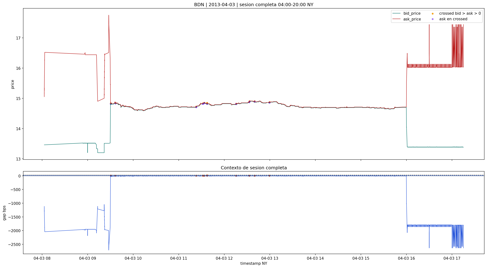

#### 03 Structure Diagnostics
Este panel responde a la pregunta de naturaleza del fallo: contradiccion economica genuina o mezcla con degeneracion estructural. Separa `ask=0` de `ask>0`, muestra la distribucion de `gap_bps` y resume patrones de integerizacion. La decision que cambia es como interpretar el dano: mercado localmente roto, artefacto de representacion o combinacion de ambos. El error que evita es sobrediagnosticar crossed reales cuando parte de la senal proviene de estructura degenerada del libro. Esta lectura afecta directamente a que el caso vaya a exclusion dura, a bandera contextual o a simple reconciliacion tecnica.

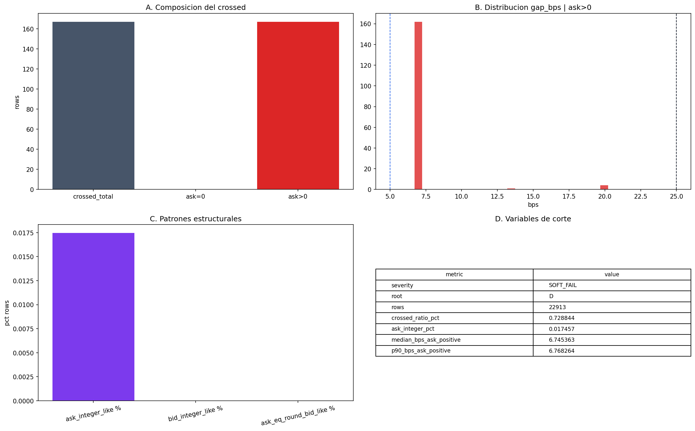

#### 04 Summary Card
Esta tarjeta responde a la pregunta de auditabilidad: cuales son exactamente las variables que sostienen la conclusion. Reune `severity`, `root`, `crossed_ratio_pct`, `ask_integer_pct`, `median_bps_ask_positive` y `p90_bps_ask_positive`. La decision que cambia es pasar de impresion visual a regla verificable. El error que evita es que dos inspectores lleguen a conclusiones distintas mirando la misma imagen sin una base numerica comun. Para gobernanza del proyecto, este panel es el que vuelve reproducible la decision para backtest, ML y auditoria.

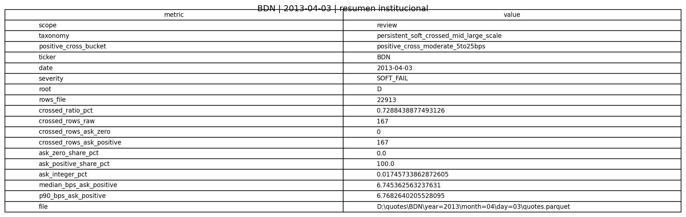

---

### 44. EK 2008-09-09

company_name: `EASTMAN KODAK CO`
primary_exchange: `NYSE` (`XNYS`)
market_locale: `stocks/us`
scope: `review`
ticker: `EK`
date: `2008-09-09`
taxonomy: `persistent_soft_crossed_mid_large_scale`
positive_cross_bucket: `positive_cross_moderate_5to25bps`
severity: `SOFT_FAIL`
root: `D`
rows: `68876`
crossed_ratio_pct: `0.471862`
crossed_rows_raw: `325`
crossed_rows_ask_zero: `0`
crossed_rows_ask_positive: `325`
ask_integer_pct: `0.226494`
median_bps_ask_positive: `6.432937`
p90_bps_ask_positive: `19.150974`
file: `D:\quotes\EK\year=2008\month=09\day=09\quotes.parquet`

#### Analisis Forense
La conclusion correcta del caso es que ya existe contradiccion economica real dentro del libro, pero aun no con fuerza suficiente para justificar exclusion dura sin contexto adicional. La taxonomy historica es `persistent_soft_crossed_mid_large_scale` y el regimen positivo dominante es `moderate 5-25 bps`. Esto importa porque la taxonomy no solo clasifica: resume que tipo de anomalia se esta viendo y que clase de decision contractual puede defenderse despues. La taxonomy `persistent_soft_crossed_mid_large_scale` implica un problema repetido y distribuido, no un simple pinchazo local. Por eso empuja a `review`: ya hay dano real, aunque no necesariamente exclusion dura universal. El regimen `moderate 5-25 bps` ya entra en zona donde el crossed tiene capacidad real de contaminar simulacion de ejecucion y features microestructurales, aunque todavia puede requerir lectura contextual antes de exclusion dura. En terminos observables, el file tiene `crossed_ratio_pct=0.471862` con `crossed_rows_ask_positive=325` y `crossed_rows_ask_zero=0`. La severidad economica del crossed ask>0 se resume en `median_bps_ask_positive=6.432937` y `p90_bps_ask_positive=19.150974`. Estos dos numeros convierten una forma visual rara en una conclusion operativa sobre si el libro sigue representando o no un mercado negociable. La decision que cambia es pasar de libro sano a libro util solo bajo cautela. `review` significa: no usar como si fuera ejecucion limpia, conservar para analisis contextual y sensibilidad. El error que evita es tratar como normal un episodio que ya contiene contradiccion economica real y contaminar simulaciones de ejecucion o validaciones demasiado optimistas. El patron estructural muestra `ask_integer_pct=0.226494`. Este numero obliga a separar dos explicaciones rivales: contradiccion economica genuina del libro o mezcla con degeneracion estructural / integerizacion. Toda la composicion crossed cae en `ask>0`. Eso endurece la lectura economica del caso: el dano no depende de ceros mecanicos, sino de contradiccion positiva dentro de precios aparentemente vivos. Como `ask_integer_pct` es bajo, la hipotesis de simple degeneracion mecanica pierde fuerza. Eso endurece la interpretacion: el crossed se parece mas a contradiccion economica genuina y menos a artefacto. En la capa de semantica de precio del evento aparecen `daily raw close=14.9600`, `quote mid raw=15.2900`, `quote mid split_normalized=15.2900`, `daily adjusted_proxy=14.6228`. Ademas hay `post_event_dividend_sum=0.2500`. La implicacion metodologica es crucial: una discrepancia entre `quotes`, `daily` y una plataforma externa no puede leerse automaticamente como fallo del dataset. Puede ser semantica de precio distinta. El error que evita esta capa es mezclar raw, split-normalized y adjusted dentro del mismo pipeline, rompiendo auditoria, benchmarking y labels. Para pipelines, esto bloquea su uso como libro sano en ejecucion y features microestructurales principales, aunque aun puede mantenerse para forense, sensibilidad y estudios donde la anomalia sea parte del objeto de investigacion. Existe ademas una imagen historica de certificacion asociada. Su papel es poner el episodio en un marco causal mas amplio: halt, explained, not strongly explained o patron conocido. La regla que protege al proyecto es esta: el contexto externo se usa para explicar por que aparece el episodio, no para absolverlo. El error que evita es degradar el criterio de calidad del libro porque exista una historia plausible alrededor del caso.

#### 00 Event Month Context
Esta imagen responde a la pregunta de persistencia temporal: estamos ante un accidente local o ante una fase mas amplia de inestabilidad. Arriba coloca el evento en la serie `daily` real del mes; abajo compara `crossed_ratio_pct` y `max_gap_bps_pos` del dia contra sus vecinos. La decision que cambia es el peso estructural que se le concede al caso. El error que evita es juzgar igual un shock aislado y una degradacion repetida del libro.

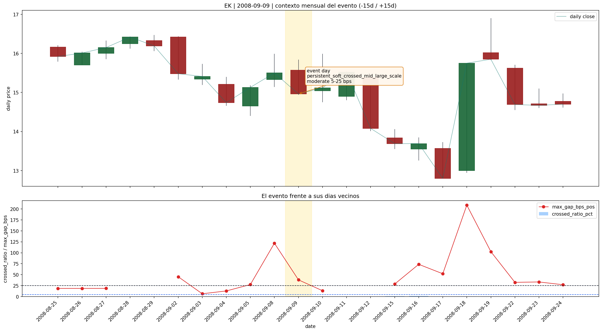

#### 00a Adjusted Proxy Contrast
Esta imagen responde a la pregunta de reconciliacion semantica: la discrepancia de precios viene de datos rotos o de vistas de precio distintas. Compara `daily raw`, `daily adjusted_proxy`, `quote mid raw` y `quote mid split_normalized`, y debajo ensena la cadena de dividendos y splits que produce la diferencia. La decision que cambia es si el inspector debe abrir una incidencia de calidad o cerrar el caso como diferencia legitima de semantica. El error que evita es mezclar series raw y adjusted como si fueran equivalentes. En pipelines reales, esto protege benchmarking, labels diarios y reconciliacion externa frente a falsas alarmas de precio.

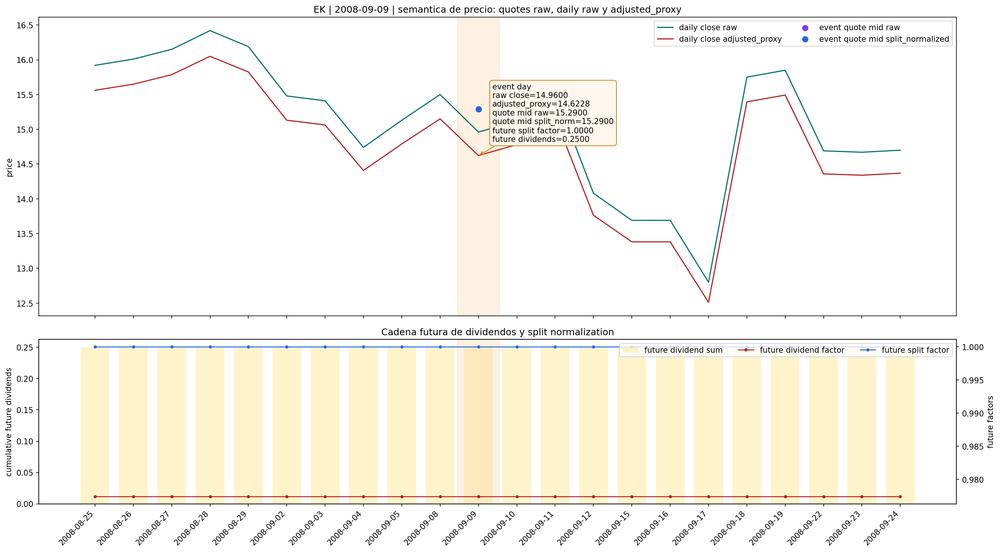

#### 00b Event Month Quotes Context
Esta imagen responde a la pregunta de recurrencia mensual dentro de `quotes`: el problema se concentra en el evento o reaparece en varias sesiones. Arriba concatena sesiones con datos disponibles; abajo resume cobertura diaria, `crossed_ratio_pct` y `max_gap_bps_pos`. La decision que cambia es si el caso debe leerse como episodio puntual o como sintoma de una fase repetida de libro degradado. El error que evita es extrapolar desde un unico dia a todo el mes sin evidencia.

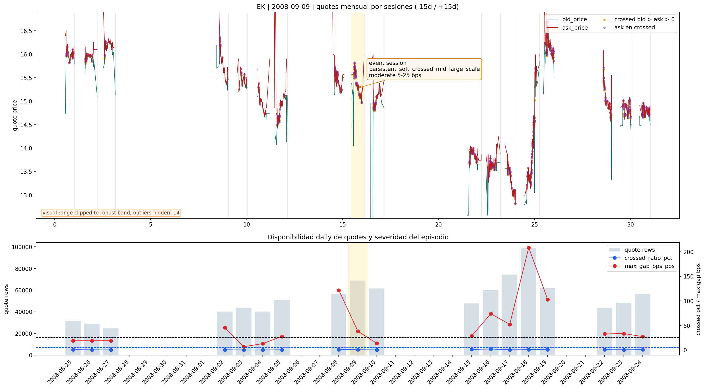

#### 01 Raw Window
Esta imagen responde a la primera pregunta decisiva del caso: el crossed observado es economicamente bastante fuerte para justificar un cambio de clase. Arriba ensena la geometria exacta del tramo conflictivo; abajo convierte esa geometria a bps y la enfrenta a los cortes `5 bps` y `25 bps`. El regimen dominante es `moderate 5-25 bps`. La decision que cambia es pasar de anomalia interpretable a `review` o `bad`. El error que evita es decidir por apariencia visual sin medir el dano economico real del crossed. En terminos de pipeline, este panel decide si el problema afecta solo a la lectura forense o si invalida simulacion de ejecucion y microstructure features.

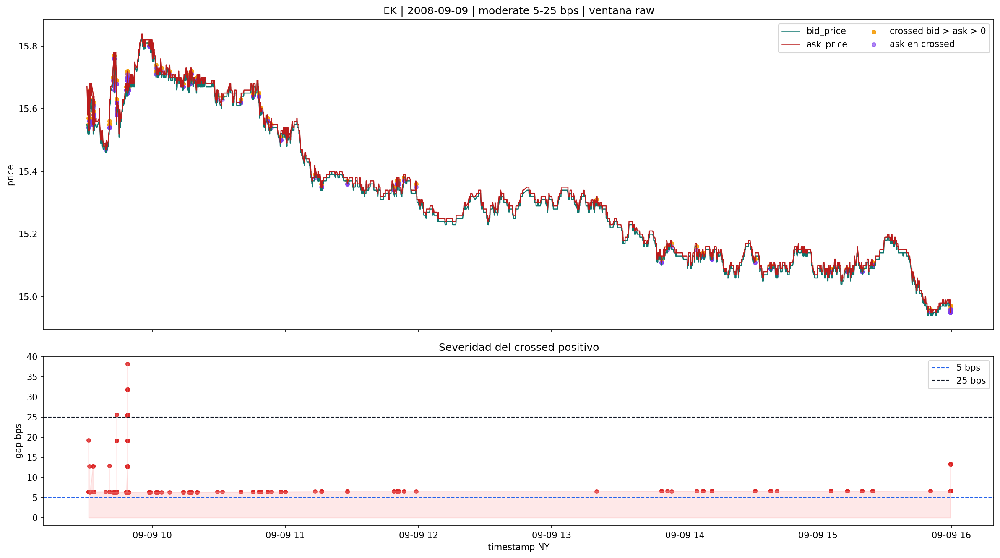

#### 02 Full Session Context
Esta imagen responde a la pregunta de extension intradiaria: el dano esta confinado a un bloque corto o contamina la sesion completa. Arriba se ve toda la sesion `04:00-20:00 NY`; abajo el `gap_bps` firmado. La decision que cambia es si el consumo debe penalizar solo un tramo o desechar el dia entero para uso operativo. El error que evita es tratar una cicatriz local como ruina total o, al reves, minimizar una degradacion distribuida a lo largo del dia. En ejecucion esto decide si la sesion puede seguir usandose con restricciones; en ML decide si las features intradiarias conservan significado economico.

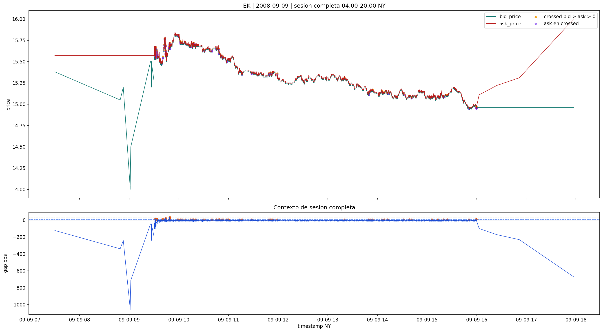

#### 03 Structure Diagnostics
Este panel responde a la pregunta de naturaleza del fallo: contradiccion economica genuina o mezcla con degeneracion estructural. Separa `ask=0` de `ask>0`, muestra la distribucion de `gap_bps` y resume patrones de integerizacion. La decision que cambia es como interpretar el dano: mercado localmente roto, artefacto de representacion o combinacion de ambos. El error que evita es sobrediagnosticar crossed reales cuando parte de la senal proviene de estructura degenerada del libro. Esta lectura afecta directamente a que el caso vaya a exclusion dura, a bandera contextual o a simple reconciliacion tecnica.

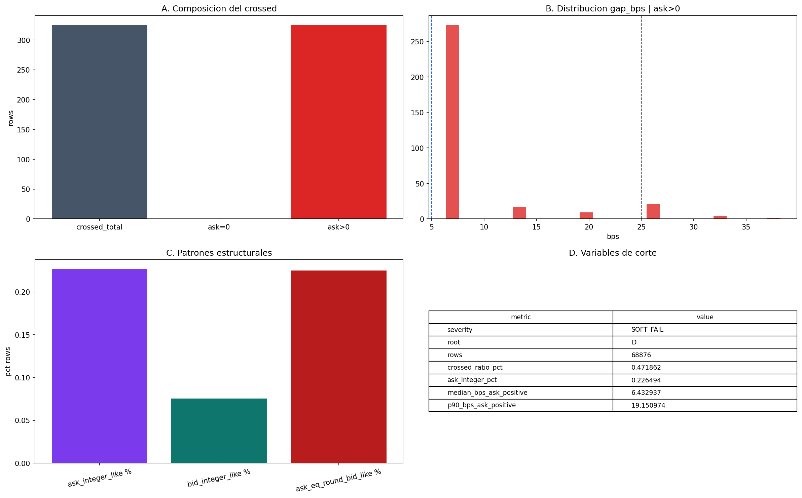

#### 04 Summary Card
Esta tarjeta responde a la pregunta de auditabilidad: cuales son exactamente las variables que sostienen la conclusion. Reune `severity`, `root`, `crossed_ratio_pct`, `ask_integer_pct`, `median_bps_ask_positive` y `p90_bps_ask_positive`. La decision que cambia es pasar de impresion visual a regla verificable. El error que evita es que dos inspectores lleguen a conclusiones distintas mirando la misma imagen sin una base numerica comun. Para gobernanza del proyecto, este panel es el que vuelve reproducible la decision para backtest, ML y auditoria.

---

### 45. PVA 2015-10-30

company_name: `PENN VIRGINIA CORP`
primary_exchange: `NYSE` (`XNYS`)
market_locale: `stocks/us`
scope: `review`
ticker: `PVA`
date: `2015-10-30`
taxonomy: `persistent_soft_crossed_mid_large_scale`
positive_cross_bucket: `positive_cross_moderate_5to25bps`
severity: `SOFT_FAIL`
root: `D`
rows: `14259`
crossed_ratio_pct: `0.554036`
crossed_rows_raw: `79`
crossed_rows_ask_zero: `0`
crossed_rows_ask_positive: `79`
ask_integer_pct: `0.000000`
median_bps_ask_positive: `6.251954`
p90_bps_ask_positive: `30.893695`
file: `D:\quotes\PVA\year=2015\month=10\day=30\quotes.parquet`

#### Analisis Forense
La conclusion correcta del caso es que ya existe contradiccion economica real dentro del libro, pero aun no con fuerza suficiente para justificar exclusion dura sin contexto adicional. La taxonomy historica es `persistent_soft_crossed_mid_large_scale` y el regimen positivo dominante es `moderate 5-25 bps`. Esto importa porque la taxonomy no solo clasifica: resume que tipo de anomalia se esta viendo y que clase de decision contractual puede defenderse despues. La taxonomy `persistent_soft_crossed_mid_large_scale` implica un problema repetido y distribuido, no un simple pinchazo local. Por eso empuja a `review`: ya hay dano real, aunque no necesariamente exclusion dura universal. El regimen `moderate 5-25 bps` ya entra en zona donde el crossed tiene capacidad real de contaminar simulacion de ejecucion y features microestructurales, aunque todavia puede requerir lectura contextual antes de exclusion dura. En terminos observables, el file tiene `crossed_ratio_pct=0.554036` con `crossed_rows_ask_positive=79` y `crossed_rows_ask_zero=0`. La severidad economica del crossed ask>0 se resume en `median_bps_ask_positive=6.251954` y `p90_bps_ask_positive=30.893695`. Estos dos numeros convierten una forma visual rara en una conclusion operativa sobre si el libro sigue representando o no un mercado negociable. La decision que cambia es pasar de libro sano a libro util solo bajo cautela. `review` significa: no usar como si fuera ejecucion limpia, conservar para analisis contextual y sensibilidad. El error que evita es tratar como normal un episodio que ya contiene contradiccion economica real y contaminar simulaciones de ejecucion o validaciones demasiado optimistas. El patron estructural muestra `ask_integer_pct=0.000000`. Este numero obliga a separar dos explicaciones rivales: contradiccion economica genuina del libro o mezcla con degeneracion estructural / integerizacion. Toda la composicion crossed cae en `ask>0`. Eso endurece la lectura economica del caso: el dano no depende de ceros mecanicos, sino de contradiccion positiva dentro de precios aparentemente vivos. Como `ask_integer_pct` es bajo, la hipotesis de simple degeneracion mecanica pierde fuerza. Eso endurece la interpretacion: el crossed se parece mas a contradiccion economica genuina y menos a artefacto. Existe ademas una imagen historica de certificacion asociada. Su papel es poner el episodio en un marco causal mas amplio: halt, explained, not strongly explained o patron conocido. La regla que protege al proyecto es esta: el contexto externo se usa para explicar por que aparece el episodio, no para absolverlo. El error que evita es degradar el criterio de calidad del libro porque exista una historia plausible alrededor del caso.

#### 00 Event Month Context
Esta imagen responde a la pregunta de persistencia temporal: estamos ante un accidente local o ante una fase mas amplia de inestabilidad. Arriba coloca el evento en la serie `daily` real del mes; abajo compara `crossed_ratio_pct` y `max_gap_bps_pos` del dia contra sus vecinos. La decision que cambia es el peso estructural que se le concede al caso. El error que evita es juzgar igual un shock aislado y una degradacion repetida del libro.

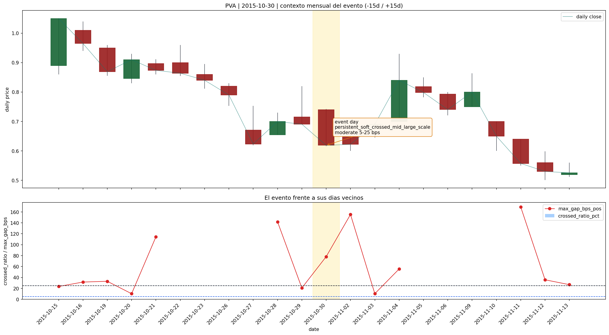

#### 00b Event Month Quotes Context
Esta imagen responde a la pregunta de recurrencia mensual dentro de `quotes`: el problema se concentra en el evento o reaparece en varias sesiones. Arriba concatena sesiones con datos disponibles; abajo resume cobertura diaria, `crossed_ratio_pct` y `max_gap_bps_pos`. La decision que cambia es si el caso debe leerse como episodio puntual o como sintoma de una fase repetida de libro degradado. El error que evita es extrapolar desde un unico dia a todo el mes sin evidencia.

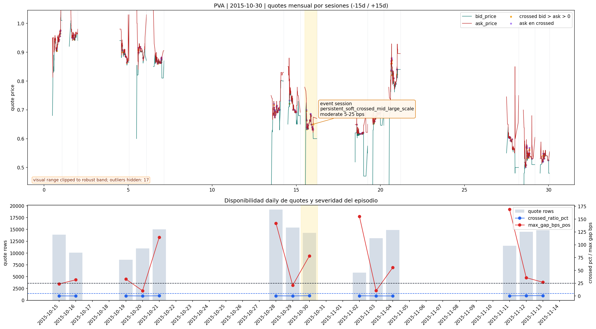

#### 01 Raw Window
Esta imagen responde a la primera pregunta decisiva del caso: el crossed observado es economicamente bastante fuerte para justificar un cambio de clase. Arriba ensena la geometria exacta del tramo conflictivo; abajo convierte esa geometria a bps y la enfrenta a los cortes `5 bps` y `25 bps`. El regimen dominante es `moderate 5-25 bps`. La decision que cambia es pasar de anomalia interpretable a `review` o `bad`. El error que evita es decidir por apariencia visual sin medir el dano economico real del crossed. En terminos de pipeline, este panel decide si el problema afecta solo a la lectura forense o si invalida simulacion de ejecucion y microstructure features.

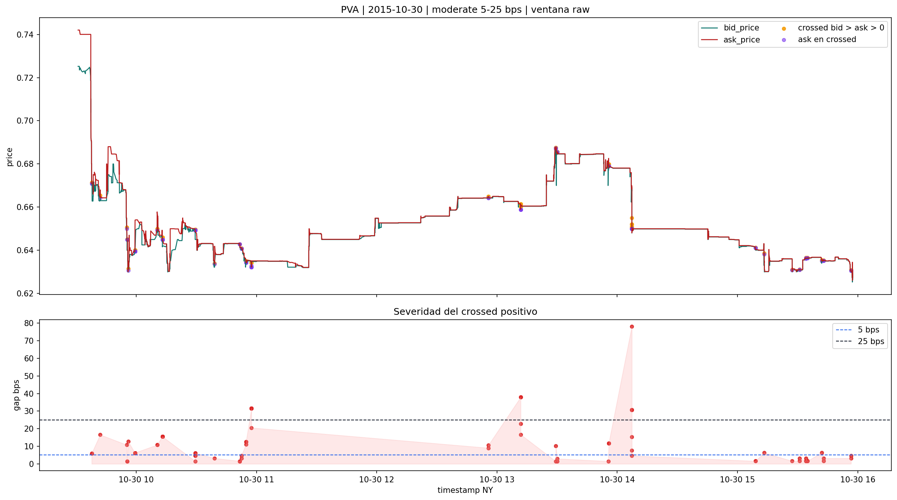

#### 02 Full Session Context
Esta imagen responde a la pregunta de extension intradiaria: el dano esta confinado a un bloque corto o contamina la sesion completa. Arriba se ve toda la sesion `04:00-20:00 NY`; abajo el `gap_bps` firmado. La decision que cambia es si el consumo debe penalizar solo un tramo o desechar el dia entero para uso operativo. El error que evita es tratar una cicatriz local como ruina total o, al reves, minimizar una degradacion distribuida a lo largo del dia. En ejecucion esto decide si la sesion puede seguir usandose con restricciones; en ML decide si las features intradiarias conservan significado economico.

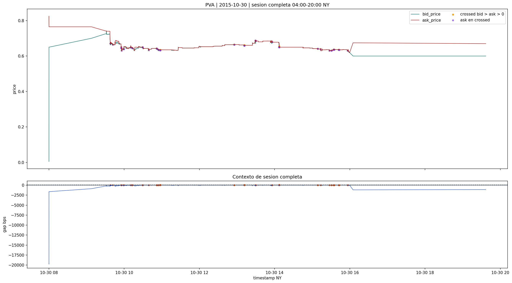

#### 03 Structure Diagnostics
Este panel responde a la pregunta de naturaleza del fallo: contradiccion economica genuina o mezcla con degeneracion estructural. Separa `ask=0` de `ask>0`, muestra la distribucion de `gap_bps` y resume patrones de integerizacion. La decision que cambia es como interpretar el dano: mercado localmente roto, artefacto de representacion o combinacion de ambos. El error que evita es sobrediagnosticar crossed reales cuando parte de la senal proviene de estructura degenerada del libro. Esta lectura afecta directamente a que el caso vaya a exclusion dura, a bandera contextual o a simple reconciliacion tecnica.

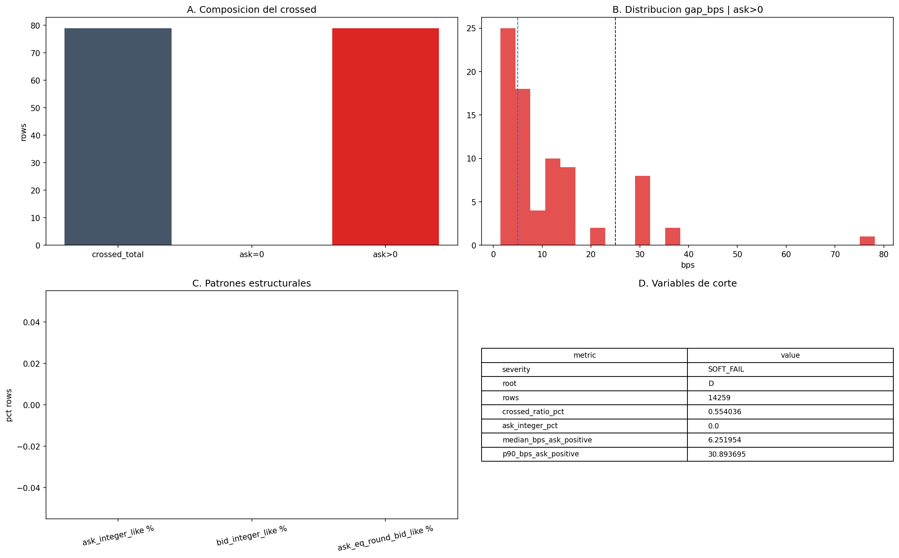

#### 04 Summary Card
Esta tarjeta responde a la pregunta de auditabilidad: cuales son exactamente las variables que sostienen la conclusion. Reune `severity`, `root`, `crossed_ratio_pct`, `ask_integer_pct`, `median_bps_ask_positive` y `p90_bps_ask_positive`. La decision que cambia es pasar de impresion visual a regla verificable. El error que evita es que dos inspectores lleguen a conclusiones distintas mirando la misma imagen sin una base numerica comun. Para gobernanza del proyecto, este panel es el que vuelve reproducible la decision para backtest, ML y auditoria.

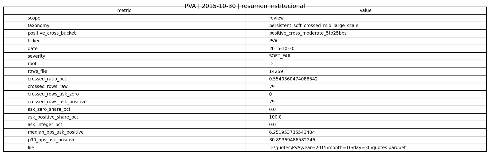

---

### 46. SOL 2008-07-17

company_name: `RENESOLA LTD SPONSORED ADS (VG )`
primary_exchange: `NYSE` (`XNYS`)
market_locale: `stocks/us`
scope: `review`
ticker: `SOL`
date: `2008-07-17`
taxonomy: `persistent_soft_crossed_mid_large_scale`
positive_cross_bucket: `positive_cross_moderate_5to25bps`
severity: `SOFT_FAIL`
root: `C`
rows: `57228`
crossed_ratio_pct: `0.440344`
crossed_rows_raw: `252`
crossed_rows_ask_zero: `0`
crossed_rows_ask_positive: `252`
ask_integer_pct: `0.113581`
median_bps_ask_positive: `6.228589`
p90_bps_ask_positive: `17.728428`
file: `C:\TSIS_Data\data\quotes\SOL\year=2008\month=07\day=17\quotes.parquet`

#### Analisis Forense
La conclusion correcta del caso es que ya existe contradiccion economica real dentro del libro, pero aun no con fuerza suficiente para justificar exclusion dura sin contexto adicional. La taxonomy historica es `persistent_soft_crossed_mid_large_scale` y el regimen positivo dominante es `moderate 5-25 bps`. Esto importa porque la taxonomy no solo clasifica: resume que tipo de anomalia se esta viendo y que clase de decision contractual puede defenderse despues. La taxonomy `persistent_soft_crossed_mid_large_scale` implica un problema repetido y distribuido, no un simple pinchazo local. Por eso empuja a `review`: ya hay dano real, aunque no necesariamente exclusion dura universal. El regimen `moderate 5-25 bps` ya entra en zona donde el crossed tiene capacidad real de contaminar simulacion de ejecucion y features microestructurales, aunque todavia puede requerir lectura contextual antes de exclusion dura. En terminos observables, el file tiene `crossed_ratio_pct=0.440344` con `crossed_rows_ask_positive=252` y `crossed_rows_ask_zero=0`. La severidad economica del crossed ask>0 se resume en `median_bps_ask_positive=6.228589` y `p90_bps_ask_positive=17.728428`. Estos dos numeros convierten una forma visual rara en una conclusion operativa sobre si el libro sigue representando o no un mercado negociable. La decision que cambia es pasar de libro sano a libro util solo bajo cautela. `review` significa: no usar como si fuera ejecucion limpia, conservar para analisis contextual y sensibilidad. El error que evita es tratar como normal un episodio que ya contiene contradiccion economica real y contaminar simulaciones de ejecucion o validaciones demasiado optimistas. El patron estructural muestra `ask_integer_pct=0.113581`. Este numero obliga a separar dos explicaciones rivales: contradiccion economica genuina del libro o mezcla con degeneracion estructural / integerizacion. Toda la composicion crossed cae en `ask>0`. Eso endurece la lectura economica del caso: el dano no depende de ceros mecanicos, sino de contradiccion positiva dentro de precios aparentemente vivos. Como `ask_integer_pct` es bajo, la hipotesis de simple degeneracion mecanica pierde fuerza. Eso endurece la interpretacion: el crossed se parece mas a contradiccion economica genuina y menos a artefacto. En la capa de semantica de precio del evento aparecen `daily raw close=79.4500`, `quote mid raw=16.3150`, `quote mid split_normalized=81.5750`, `daily adjusted_proxy=79.4500`. La reconciliacion incluye `future_split_factor=0.2000`. La implicacion metodologica es crucial: una discrepancia entre `quotes`, `daily` y una plataforma externa no puede leerse automaticamente como fallo del dataset. Puede ser semantica de precio distinta. El error que evita esta capa es mezclar raw, split-normalized y adjusted dentro del mismo pipeline, rompiendo auditoria, benchmarking y labels. Para pipelines, esto bloquea su uso como libro sano en ejecucion y features microestructurales principales, aunque aun puede mantenerse para forense, sensibilidad y estudios donde la anomalia sea parte del objeto de investigacion. Existe ademas una imagen historica de certificacion asociada. Su papel es poner el episodio en un marco causal mas amplio: halt, explained, not strongly explained o patron conocido. La regla que protege al proyecto es esta: el contexto externo se usa para explicar por que aparece el episodio, no para absolverlo. El error que evita es degradar el criterio de calidad del libro porque exista una historia plausible alrededor del caso.

#### 00 Event Month Context
Esta imagen responde a la pregunta de persistencia temporal: estamos ante un accidente local o ante una fase mas amplia de inestabilidad. Arriba coloca el evento en la serie `daily` real del mes; abajo compara `crossed_ratio_pct` y `max_gap_bps_pos` del dia contra sus vecinos. La decision que cambia es el peso estructural que se le concede al caso. El error que evita es juzgar igual un shock aislado y una degradacion repetida del libro.

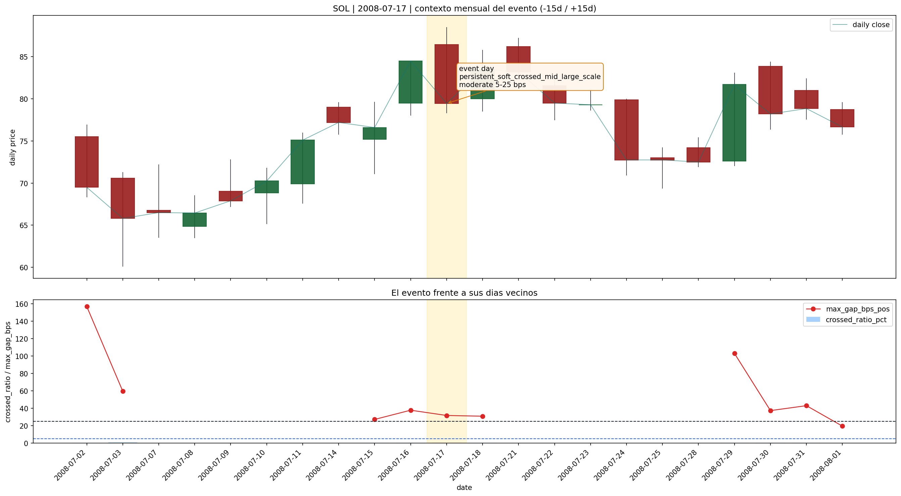

#### 00a Adjusted Proxy Contrast
Esta imagen responde a la pregunta de reconciliacion semantica: la discrepancia de precios viene de datos rotos o de vistas de precio distintas. Compara `daily raw`, `daily adjusted_proxy`, `quote mid raw` y `quote mid split_normalized`, y debajo ensena la cadena de dividendos y splits que produce la diferencia. La decision que cambia es si el inspector debe abrir una incidencia de calidad o cerrar el caso como diferencia legitima de semantica. El error que evita es mezclar series raw y adjusted como si fueran equivalentes. En pipelines reales, esto protege benchmarking, labels diarios y reconciliacion externa frente a falsas alarmas de precio.

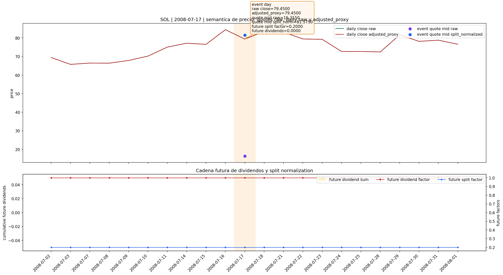

#### 00b Event Month Quotes Context
Esta imagen responde a la pregunta de recurrencia mensual dentro de `quotes`: el problema se concentra en el evento o reaparece en varias sesiones. Arriba concatena sesiones con datos disponibles; abajo resume cobertura diaria, `crossed_ratio_pct` y `max_gap_bps_pos`. La decision que cambia es si el caso debe leerse como episodio puntual o como sintoma de una fase repetida de libro degradado. El error que evita es extrapolar desde un unico dia a todo el mes sin evidencia.

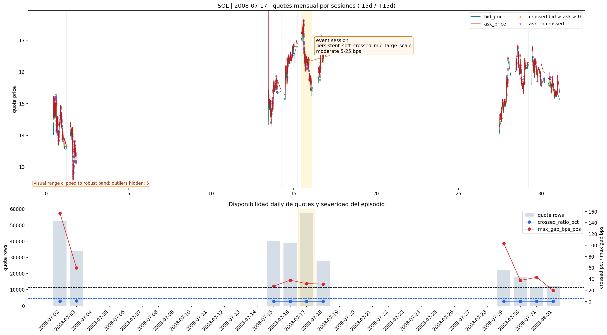

#### 01 Raw Window
Esta imagen responde a la primera pregunta decisiva del caso: el crossed observado es economicamente bastante fuerte para justificar un cambio de clase. Arriba ensena la geometria exacta del tramo conflictivo; abajo convierte esa geometria a bps y la enfrenta a los cortes `5 bps` y `25 bps`. El regimen dominante es `moderate 5-25 bps`. La decision que cambia es pasar de anomalia interpretable a `review` o `bad`. El error que evita es decidir por apariencia visual sin medir el dano economico real del crossed. En terminos de pipeline, este panel decide si el problema afecta solo a la lectura forense o si invalida simulacion de ejecucion y microstructure features.

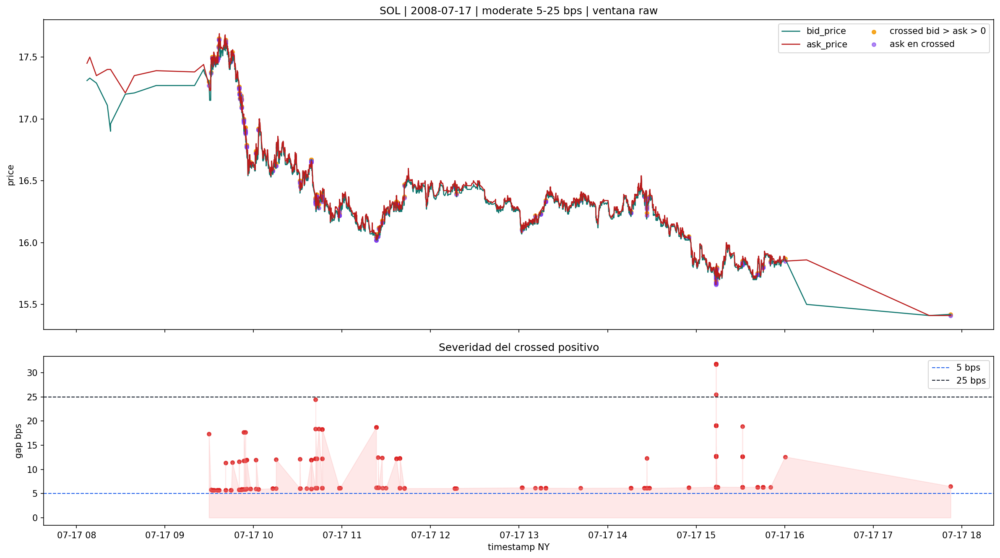

#### 02 Full Session Context
Esta imagen responde a la pregunta de extension intradiaria: el dano esta confinado a un bloque corto o contamina la sesion completa. Arriba se ve toda la sesion `04:00-20:00 NY`; abajo el `gap_bps` firmado. La decision que cambia es si el consumo debe penalizar solo un tramo o desechar el dia entero para uso operativo. El error que evita es tratar una cicatriz local como ruina total o, al reves, minimizar una degradacion distribuida a lo largo del dia. En ejecucion esto decide si la sesion puede seguir usandose con restricciones; en ML decide si las features intradiarias conservan significado economico.

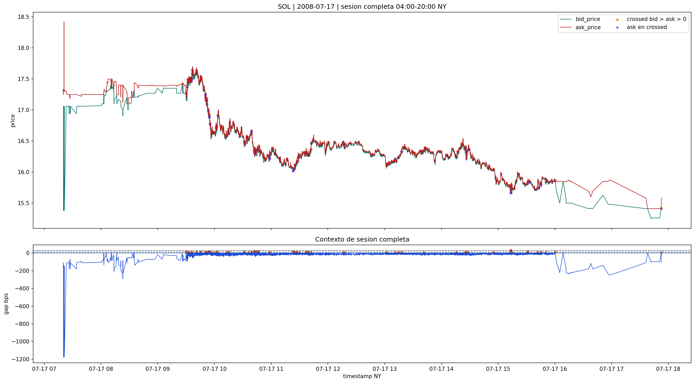

#### 03 Structure Diagnostics
Este panel responde a la pregunta de naturaleza del fallo: contradiccion economica genuina o mezcla con degeneracion estructural. Separa `ask=0` de `ask>0`, muestra la distribucion de `gap_bps` y resume patrones de integerizacion. La decision que cambia es como interpretar el dano: mercado localmente roto, artefacto de representacion o combinacion de ambos. El error que evita es sobrediagnosticar crossed reales cuando parte de la senal proviene de estructura degenerada del libro. Esta lectura afecta directamente a que el caso vaya a exclusion dura, a bandera contextual o a simple reconciliacion tecnica.

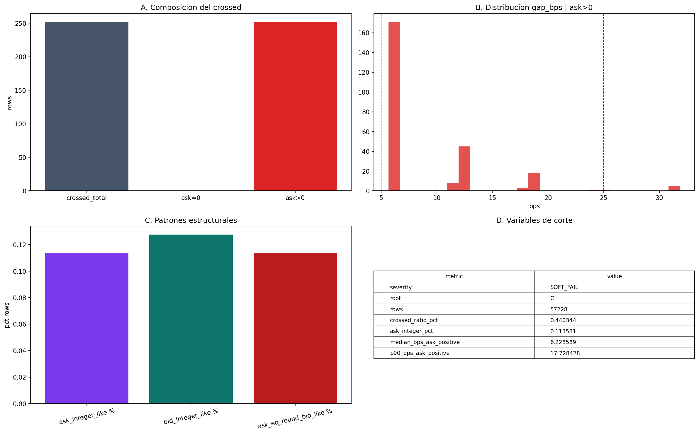

#### 04 Summary Card
Esta tarjeta responde a la pregunta de auditabilidad: cuales son exactamente las variables que sostienen la conclusion. Reune `severity`, `root`, `crossed_ratio_pct`, `ask_integer_pct`, `median_bps_ask_positive` y `p90_bps_ask_positive`. La decision que cambia es pasar de impresion visual a regla verificable. El error que evita es que dos inspectores lleguen a conclusiones distintas mirando la misma imagen sin una base numerica comun. Para gobernanza del proyecto, este panel es el que vuelve reproducible la decision para backtest, ML y auditoria.

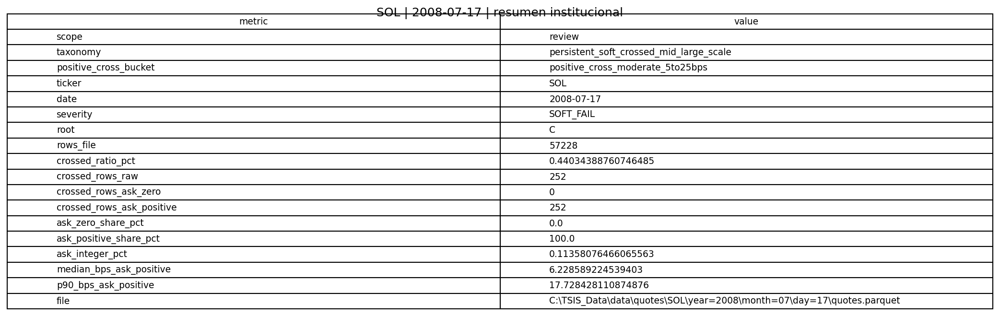

---

### 47. YHOO 2009-06-04

company_name: `Yahoo Inc`
primary_exchange: `NASDAQ` (`XNAS`)
market_locale: `stocks/us`
scope: `review`
ticker: `YHOO`
date: `2009-06-04`
taxonomy: `persistent_soft_crossed_mid_large_scale`
positive_cross_bucket: `positive_cross_moderate_5to25bps`
severity: `SOFT_FAIL`
root: `C`
rows: `186039`
crossed_ratio_pct: `0.339714`
crossed_rows_raw: `632`
crossed_rows_ask_zero: `0`
crossed_rows_ask_positive: `632`
ask_integer_pct: `0.000000`
median_bps_ask_positive: `6.155740`
p90_bps_ask_positive: `6.201550`
file: `C:\TSIS_Data\data\quotes\YHOO\year=2009\month=06\day=04\quotes.parquet`

#### Analisis Forense
La conclusion correcta del caso es que ya existe contradiccion economica real dentro del libro, pero aun no con fuerza suficiente para justificar exclusion dura sin contexto adicional. La taxonomy historica es `persistent_soft_crossed_mid_large_scale` y el regimen positivo dominante es `moderate 5-25 bps`. Esto importa porque la taxonomy no solo clasifica: resume que tipo de anomalia se esta viendo y que clase de decision contractual puede defenderse despues. La taxonomy `persistent_soft_crossed_mid_large_scale` implica un problema repetido y distribuido, no un simple pinchazo local. Por eso empuja a `review`: ya hay dano real, aunque no necesariamente exclusion dura universal. El regimen `moderate 5-25 bps` ya entra en zona donde el crossed tiene capacidad real de contaminar simulacion de ejecucion y features microestructurales, aunque todavia puede requerir lectura contextual antes de exclusion dura. En terminos observables, el file tiene `crossed_ratio_pct=0.339714` con `crossed_rows_ask_positive=632` y `crossed_rows_ask_zero=0`. La severidad economica del crossed ask>0 se resume en `median_bps_ask_positive=6.155740` y `p90_bps_ask_positive=6.201550`. Estos dos numeros convierten una forma visual rara en una conclusion operativa sobre si el libro sigue representando o no un mercado negociable. La decision que cambia es pasar de libro sano a libro util solo bajo cautela. `review` significa: no usar como si fuera ejecucion limpia, conservar para analisis contextual y sensibilidad. El error que evita es tratar como normal un episodio que ya contiene contradiccion economica real y contaminar simulaciones de ejecucion o validaciones demasiado optimistas. El patron estructural muestra `ask_integer_pct=0.000000`. Este numero obliga a separar dos explicaciones rivales: contradiccion economica genuina del libro o mezcla con degeneracion estructural / integerizacion. Toda la composicion crossed cae en `ask>0`. Eso endurece la lectura economica del caso: el dano no depende de ceros mecanicos, sino de contradiccion positiva dentro de precios aparentemente vivos. Como `ask_integer_pct` es bajo, la hipotesis de simple degeneracion mecanica pierde fuerza. Eso endurece la interpretacion: el crossed se parece mas a contradiccion economica genuina y menos a artefacto. Existe ademas una imagen historica de certificacion asociada. Su papel es poner el episodio en un marco causal mas amplio: halt, explained, not strongly explained o patron conocido. La regla que protege al proyecto es esta: el contexto externo se usa para explicar por que aparece el episodio, no para absolverlo. El error que evita es degradar el criterio de calidad del libro porque exista una historia plausible alrededor del caso.

#### 00 Event Month Context
Esta imagen responde a la pregunta de persistencia temporal: estamos ante un accidente local o ante una fase mas amplia de inestabilidad. Arriba coloca el evento en la serie `daily` real del mes; abajo compara `crossed_ratio_pct` y `max_gap_bps_pos` del dia contra sus vecinos. La decision que cambia es el peso estructural que se le concede al caso. El error que evita es juzgar igual un shock aislado y una degradacion repetida del libro.

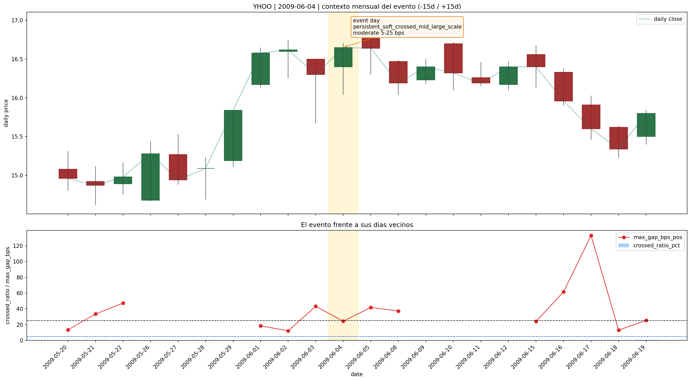

#### 00b Event Month Quotes Context
Esta imagen responde a la pregunta de recurrencia mensual dentro de `quotes`: el problema se concentra en el evento o reaparece en varias sesiones. Arriba concatena sesiones con datos disponibles; abajo resume cobertura diaria, `crossed_ratio_pct` y `max_gap_bps_pos`. La decision que cambia es si el caso debe leerse como episodio puntual o como sintoma de una fase repetida de libro degradado. El error que evita es extrapolar desde un unico dia a todo el mes sin evidencia.

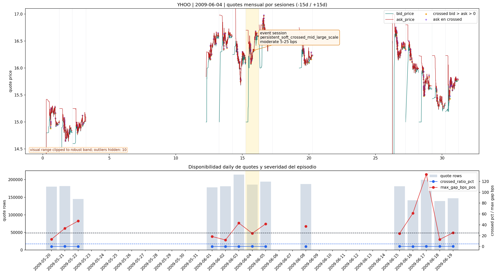

#### 01 Raw Window
Esta imagen responde a la primera pregunta decisiva del caso: el crossed observado es economicamente bastante fuerte para justificar un cambio de clase. Arriba ensena la geometria exacta del tramo conflictivo; abajo convierte esa geometria a bps y la enfrenta a los cortes `5 bps` y `25 bps`. El regimen dominante es `moderate 5-25 bps`. La decision que cambia es pasar de anomalia interpretable a `review` o `bad`. El error que evita es decidir por apariencia visual sin medir el dano economico real del crossed. En terminos de pipeline, este panel decide si el problema afecta solo a la lectura forense o si invalida simulacion de ejecucion y microstructure features.

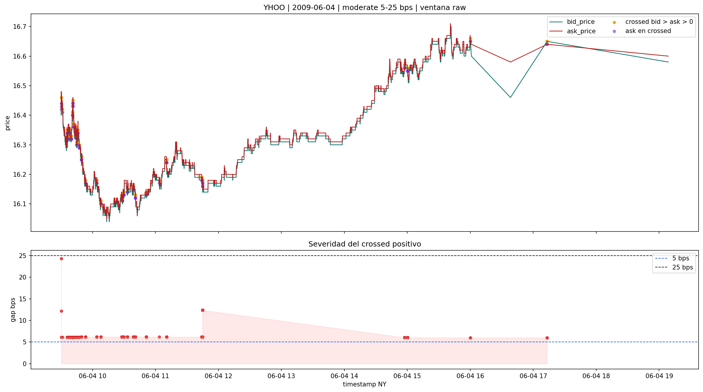

#### 02 Full Session Context
Esta imagen responde a la pregunta de extension intradiaria: el dano esta confinado a un bloque corto o contamina la sesion completa. Arriba se ve toda la sesion `04:00-20:00 NY`; abajo el `gap_bps` firmado. La decision que cambia es si el consumo debe penalizar solo un tramo o desechar el dia entero para uso operativo. El error que evita es tratar una cicatriz local como ruina total o, al reves, minimizar una degradacion distribuida a lo largo del dia. En ejecucion esto decide si la sesion puede seguir usandose con restricciones; en ML decide si las features intradiarias conservan significado economico.

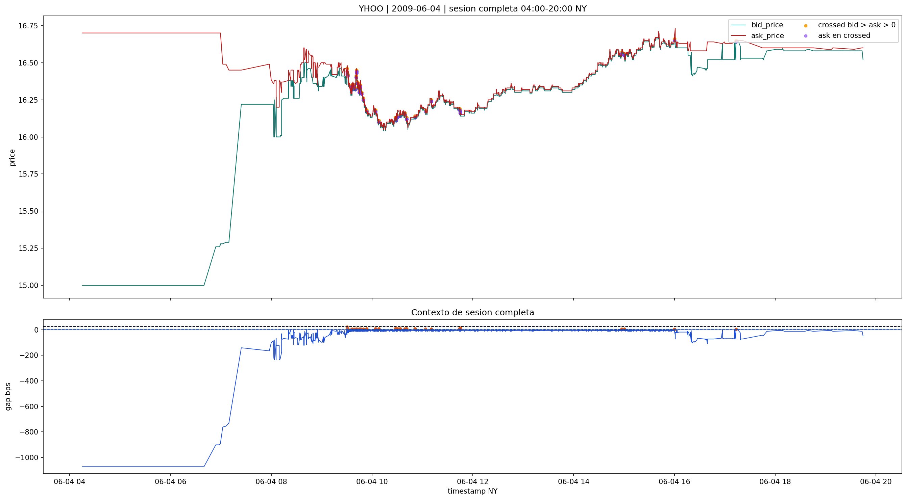

#### 03 Structure Diagnostics
Este panel responde a la pregunta de naturaleza del fallo: contradiccion economica genuina o mezcla con degeneracion estructural. Separa `ask=0` de `ask>0`, muestra la distribucion de `gap_bps` y resume patrones de integerizacion. La decision que cambia es como interpretar el dano: mercado localmente roto, artefacto de representacion o combinacion de ambos. El error que evita es sobrediagnosticar crossed reales cuando parte de la senal proviene de estructura degenerada del libro. Esta lectura afecta directamente a que el caso vaya a exclusion dura, a bandera contextual o a simple reconciliacion tecnica.

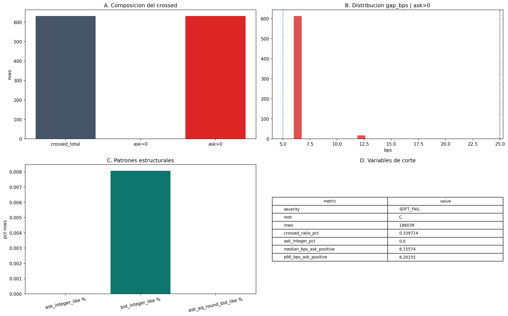

#### 04 Summary Card
Esta tarjeta responde a la pregunta de auditabilidad: cuales son exactamente las variables que sostienen la conclusion. Reune `severity`, `root`, `crossed_ratio_pct`, `ask_integer_pct`, `median_bps_ask_positive` y `p90_bps_ask_positive`. La decision que cambia es pasar de impresion visual a regla verificable. El error que evita es que dos inspectores lleguen a conclusiones distintas mirando la misma imagen sin una base numerica comun. Para gobernanza del proyecto, este panel es el que vuelve reproducible la decision para backtest, ML y auditoria.

---

### 48. WOOF 2012-08-23

company_name: `Petco Health and Wellness Company, Inc. Class A Common Stock`
primary_exchange: `NASDAQ` (`XNAS`)
market_locale: `stocks/us`
scope: `review`
ticker: `WOOF`
date: `2012-08-23`
taxonomy: `persistent_soft_crossed_mid_large_scale`
positive_cross_bucket: `positive_cross_moderate_5to25bps`
severity: `SOFT_FAIL`
root: `C`
rows: `13921`
crossed_ratio_pct: `0.502837`
crossed_rows_raw: `70`
crossed_rows_ask_zero: `0`
crossed_rows_ask_positive: `70`
ask_integer_pct: `0.021550`
median_bps_ask_positive: `5.334756`
p90_bps_ask_positive: `15.928640`
file: `C:\TSIS_Data\data\quotes\WOOF\year=2012\month=08\day=23\quotes.parquet`

#### Analisis Forense
La conclusion correcta del caso es que ya existe contradiccion economica real dentro del libro, pero aun no con fuerza suficiente para justificar exclusion dura sin contexto adicional. La taxonomy historica es `persistent_soft_crossed_mid_large_scale` y el regimen positivo dominante es `moderate 5-25 bps`. Esto importa porque la taxonomy no solo clasifica: resume que tipo de anomalia se esta viendo y que clase de decision contractual puede defenderse despues. La taxonomy `persistent_soft_crossed_mid_large_scale` implica un problema repetido y distribuido, no un simple pinchazo local. Por eso empuja a `review`: ya hay dano real, aunque no necesariamente exclusion dura universal. El regimen `moderate 5-25 bps` ya entra en zona donde el crossed tiene capacidad real de contaminar simulacion de ejecucion y features microestructurales, aunque todavia puede requerir lectura contextual antes de exclusion dura. En terminos observables, el file tiene `crossed_ratio_pct=0.502837` con `crossed_rows_ask_positive=70` y `crossed_rows_ask_zero=0`. La severidad economica del crossed ask>0 se resume en `median_bps_ask_positive=5.334756` y `p90_bps_ask_positive=15.928640`. Estos dos numeros convierten una forma visual rara en una conclusion operativa sobre si el libro sigue representando o no un mercado negociable. La decision que cambia es pasar de libro sano a libro util solo bajo cautela. `review` significa: no usar como si fuera ejecucion limpia, conservar para analisis contextual y sensibilidad. El error que evita es tratar como normal un episodio que ya contiene contradiccion economica real y contaminar simulaciones de ejecucion o validaciones demasiado optimistas. El patron estructural muestra `ask_integer_pct=0.021550`. Este numero obliga a separar dos explicaciones rivales: contradiccion economica genuina del libro o mezcla con degeneracion estructural / integerizacion. Toda la composicion crossed cae en `ask>0`. Eso endurece la lectura economica del caso: el dano no depende de ceros mecanicos, sino de contradiccion positiva dentro de precios aparentemente vivos. Como `ask_integer_pct` es bajo, la hipotesis de simple degeneracion mecanica pierde fuerza. Eso endurece la interpretacion: el crossed se parece mas a contradiccion economica genuina y menos a artefacto. Existe ademas una imagen historica de certificacion asociada. Su papel es poner el episodio en un marco causal mas amplio: halt, explained, not strongly explained o patron conocido. La regla que protege al proyecto es esta: el contexto externo se usa para explicar por que aparece el episodio, no para absolverlo. El error que evita es degradar el criterio de calidad del libro porque exista una historia plausible alrededor del caso.

#### 00 Event Month Context
Esta imagen responde a la pregunta de persistencia temporal: estamos ante un accidente local o ante una fase mas amplia de inestabilidad. Arriba coloca el evento en la serie `daily` real del mes; abajo compara `crossed_ratio_pct` y `max_gap_bps_pos` del dia contra sus vecinos. La decision que cambia es el peso estructural que se le concede al caso. El error que evita es juzgar igual un shock aislado y una degradacion repetida del libro.

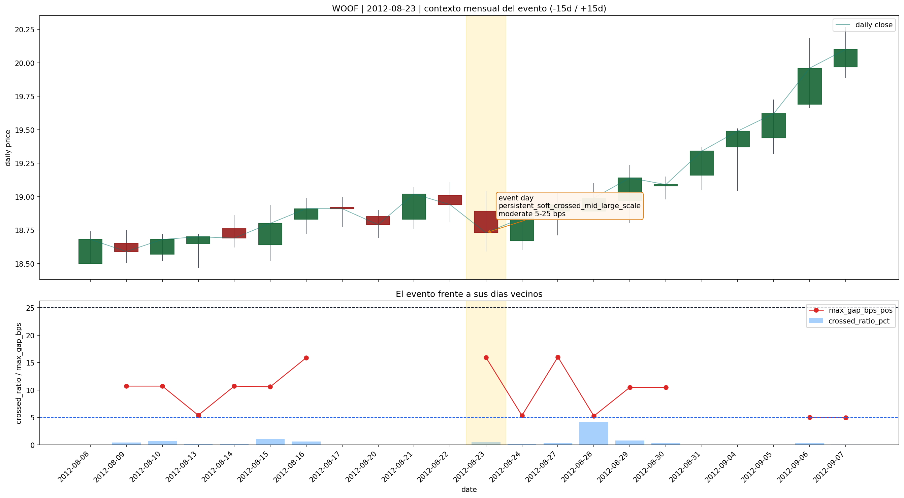

#### 00b Event Month Quotes Context
Esta imagen responde a la pregunta de recurrencia mensual dentro de `quotes`: el problema se concentra en el evento o reaparece en varias sesiones. Arriba concatena sesiones con datos disponibles; abajo resume cobertura diaria, `crossed_ratio_pct` y `max_gap_bps_pos`. La decision que cambia es si el caso debe leerse como episodio puntual o como sintoma de una fase repetida de libro degradado. El error que evita es extrapolar desde un unico dia a todo el mes sin evidencia.

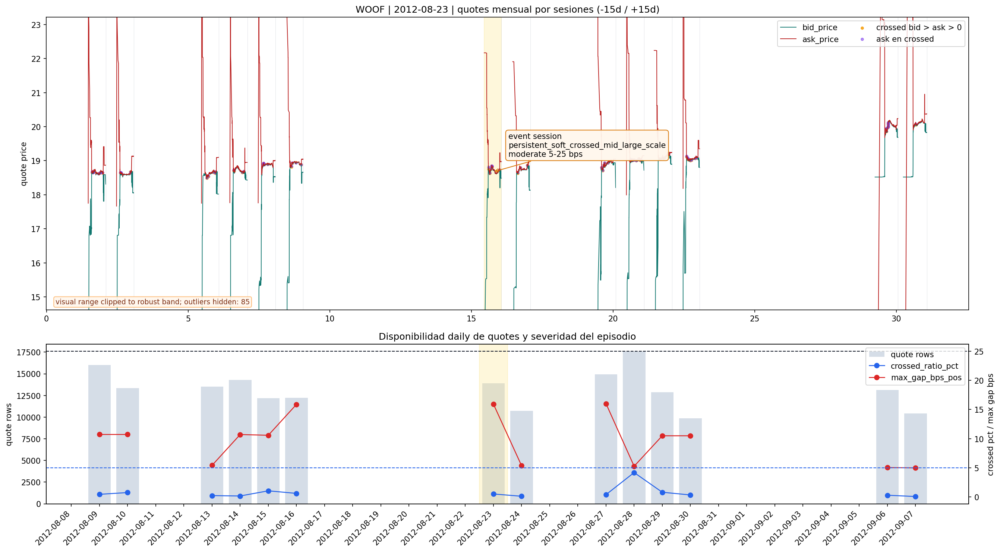

#### 01 Raw Window
Esta imagen responde a la primera pregunta decisiva del caso: el crossed observado es economicamente bastante fuerte para justificar un cambio de clase. Arriba ensena la geometria exacta del tramo conflictivo; abajo convierte esa geometria a bps y la enfrenta a los cortes `5 bps` y `25 bps`. El regimen dominante es `moderate 5-25 bps`. La decision que cambia es pasar de anomalia interpretable a `review` o `bad`. El error que evita es decidir por apariencia visual sin medir el dano economico real del crossed. En terminos de pipeline, este panel decide si el problema afecta solo a la lectura forense o si invalida simulacion de ejecucion y microstructure features.

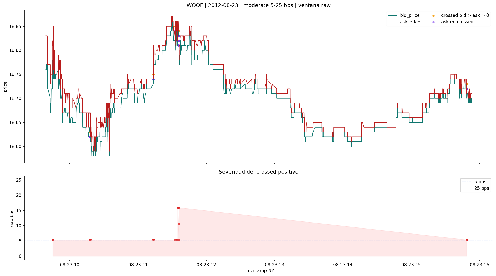

#### 02 Full Session Context
Esta imagen responde a la pregunta de extension intradiaria: el dano esta confinado a un bloque corto o contamina la sesion completa. Arriba se ve toda la sesion `04:00-20:00 NY`; abajo el `gap_bps` firmado. La decision que cambia es si el consumo debe penalizar solo un tramo o desechar el dia entero para uso operativo. El error que evita es tratar una cicatriz local como ruina total o, al reves, minimizar una degradacion distribuida a lo largo del dia. En ejecucion esto decide si la sesion puede seguir usandose con restricciones; en ML decide si las features intradiarias conservan significado economico.

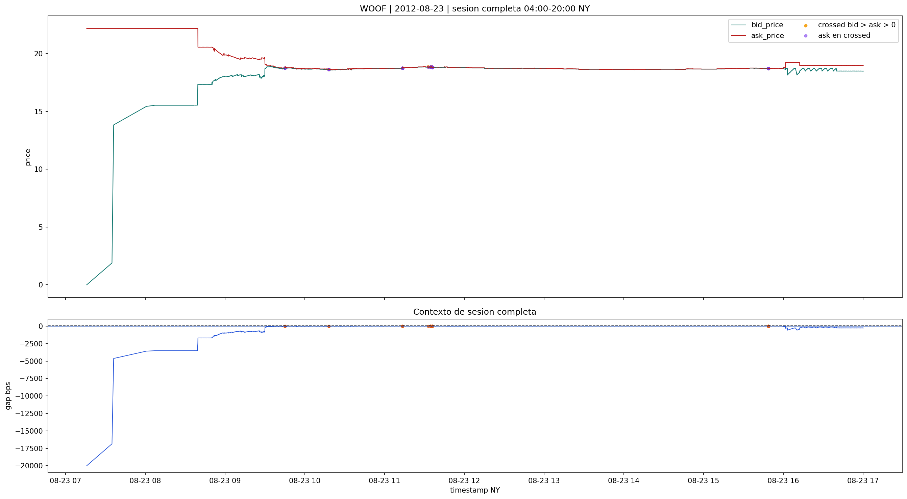

#### 03 Structure Diagnostics
Este panel responde a la pregunta de naturaleza del fallo: contradiccion economica genuina o mezcla con degeneracion estructural. Separa `ask=0` de `ask>0`, muestra la distribucion de `gap_bps` y resume patrones de integerizacion. La decision que cambia es como interpretar el dano: mercado localmente roto, artefacto de representacion o combinacion de ambos. El error que evita es sobrediagnosticar crossed reales cuando parte de la senal proviene de estructura degenerada del libro. Esta lectura afecta directamente a que el caso vaya a exclusion dura, a bandera contextual o a simple reconciliacion tecnica.

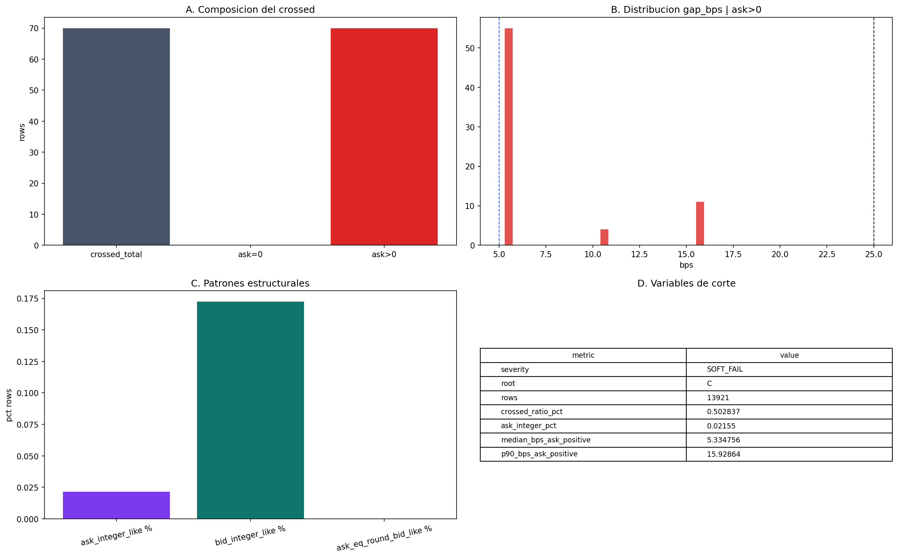

#### 04 Summary Card
Esta tarjeta responde a la pregunta de auditabilidad: cuales son exactamente las variables que sostienen la conclusion. Reune `severity`, `root`, `crossed_ratio_pct`, `ask_integer_pct`, `median_bps_ask_positive` y `p90_bps_ask_positive`. La decision que cambia es pasar de impresion visual a regla verificable. El error que evita es que dos inspectores lleguen a conclusiones distintas mirando la misma imagen sin una base numerica comun. Para gobernanza del proyecto, este panel es el que vuelve reproducible la decision para backtest, ML y auditoria.

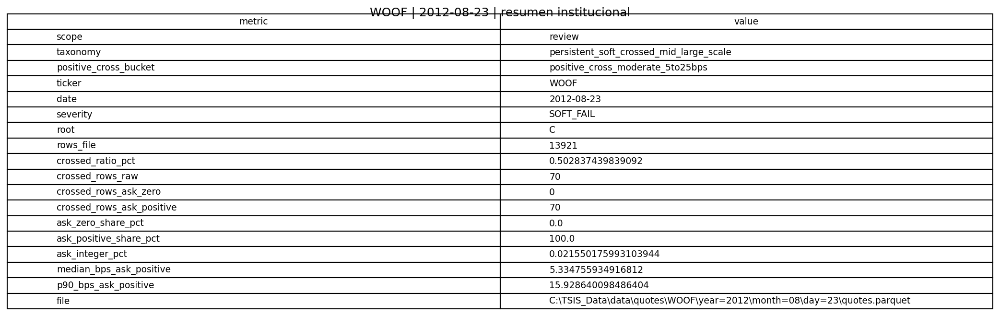

---

### 49. SSRI 2006-09-20

company_name: `Silver Standard Resources`
primary_exchange: `NASDAQ` (`XNAS`)
market_locale: `stocks/us`
scope: `review`
ticker: `SSRI`
date: `2006-09-20`
taxonomy: `persistent_soft_crossed_mid_large_scale`
positive_cross_bucket: `positive_cross_mild_lt5bps`
severity: `SOFT_FAIL`
root: `C`
rows: `11435`
crossed_ratio_pct: `0.682116`
crossed_rows_raw: `78`
crossed_rows_ask_zero: `0`
crossed_rows_ask_positive: `78`
ask_integer_pct: `0.577175`
median_bps_ask_positive: `4.767580`
p90_bps_ask_positive: `18.912530`
file: `C:\TSIS_Data\data\quotes\SSRI\year=2006\month=09\day=20\quotes.parquet`

#### Analisis Forense
La conclusion correcta del caso es que ya existe contradiccion economica real dentro del libro, pero aun no con fuerza suficiente para justificar exclusion dura sin contexto adicional. La taxonomy historica es `persistent_soft_crossed_mid_large_scale` y el regimen positivo dominante es `mild <5 bps`. Esto importa porque la taxonomy no solo clasifica: resume que tipo de anomalia se esta viendo y que clase de decision contractual puede defenderse despues. La taxonomy `persistent_soft_crossed_mid_large_scale` implica un problema repetido y distribuido, no un simple pinchazo local. Por eso empuja a `review`: ya hay dano real, aunque no necesariamente exclusion dura universal. El regimen `mild <5 bps` significa que existe contradiccion economica positiva, pero aun en una banda donde un uso prudente puede seguir siendo defendible si la persistencia y la estructura no agravan el caso. En terminos observables, el file tiene `crossed_ratio_pct=0.682116` con `crossed_rows_ask_positive=78` y `crossed_rows_ask_zero=0`. La severidad economica del crossed ask>0 se resume en `median_bps_ask_positive=4.767580` y `p90_bps_ask_positive=18.912530`. Estos dos numeros convierten una forma visual rara en una conclusion operativa sobre si el libro sigue representando o no un mercado negociable. La decision que cambia es pasar de libro sano a libro util solo bajo cautela. `review` significa: no usar como si fuera ejecucion limpia, conservar para analisis contextual y sensibilidad. El error que evita es tratar como normal un episodio que ya contiene contradiccion economica real y contaminar simulaciones de ejecucion o validaciones demasiado optimistas. El patron estructural muestra `ask_integer_pct=0.577175`. Este numero obliga a separar dos explicaciones rivales: contradiccion economica genuina del libro o mezcla con degeneracion estructural / integerizacion. Toda la composicion crossed cae en `ask>0`. Eso endurece la lectura economica del caso: el dano no depende de ceros mecanicos, sino de contradiccion positiva dentro de precios aparentemente vivos. Como `ask_integer_pct` es bajo, la hipotesis de simple degeneracion mecanica pierde fuerza. Eso endurece la interpretacion: el crossed se parece mas a contradiccion economica genuina y menos a artefacto. Existe ademas una imagen historica de certificacion asociada. Su papel es poner el episodio en un marco causal mas amplio: halt, explained, not strongly explained o patron conocido. La regla que protege al proyecto es esta: el contexto externo se usa para explicar por que aparece el episodio, no para absolverlo. El error que evita es degradar el criterio de calidad del libro porque exista una historia plausible alrededor del caso.

#### 00 Event Month Context
Esta imagen responde a la pregunta de persistencia temporal: estamos ante un accidente local o ante una fase mas amplia de inestabilidad. Arriba coloca el evento en la serie `daily` real del mes; abajo compara `crossed_ratio_pct` y `max_gap_bps_pos` del dia contra sus vecinos. La decision que cambia es el peso estructural que se le concede al caso. El error que evita es juzgar igual un shock aislado y una degradacion repetida del libro.

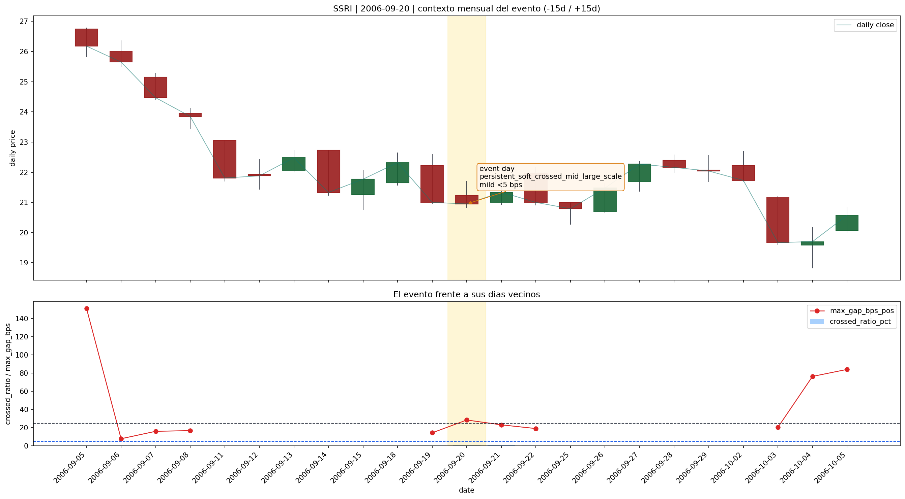

#### 00b Event Month Quotes Context
Esta imagen responde a la pregunta de recurrencia mensual dentro de `quotes`: el problema se concentra en el evento o reaparece en varias sesiones. Arriba concatena sesiones con datos disponibles; abajo resume cobertura diaria, `crossed_ratio_pct` y `max_gap_bps_pos`. La decision que cambia es si el caso debe leerse como episodio puntual o como sintoma de una fase repetida de libro degradado. El error que evita es extrapolar desde un unico dia a todo el mes sin evidencia.

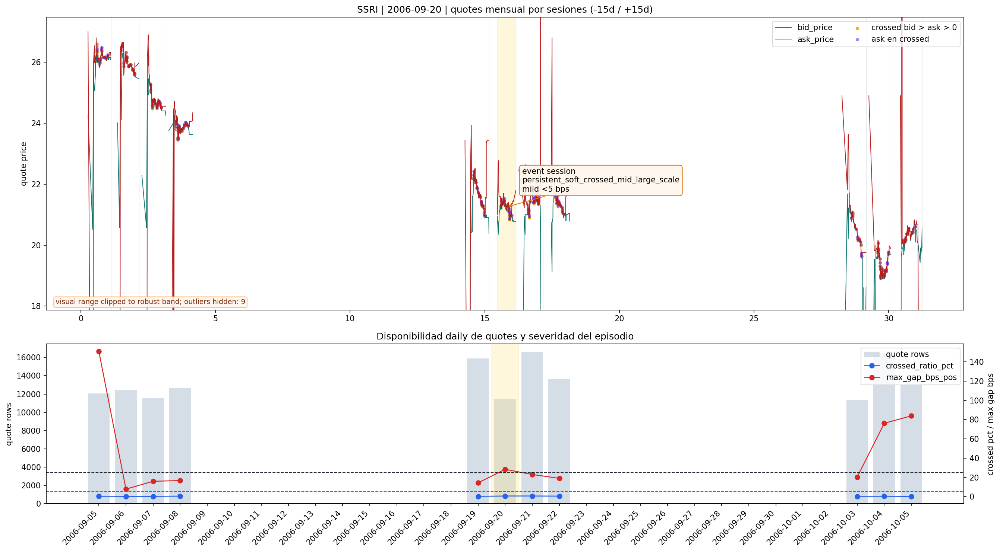

#### 01 Raw Window
Esta imagen responde a la primera pregunta decisiva del caso: el crossed observado es economicamente bastante fuerte para justificar un cambio de clase. Arriba ensena la geometria exacta del tramo conflictivo; abajo convierte esa geometria a bps y la enfrenta a los cortes `5 bps` y `25 bps`. El regimen dominante es `mild <5 bps`. La decision que cambia es pasar de anomalia interpretable a `review` o `bad`. El error que evita es decidir por apariencia visual sin medir el dano economico real del crossed. En terminos de pipeline, este panel decide si el problema afecta solo a la lectura forense o si invalida simulacion de ejecucion y microstructure features.

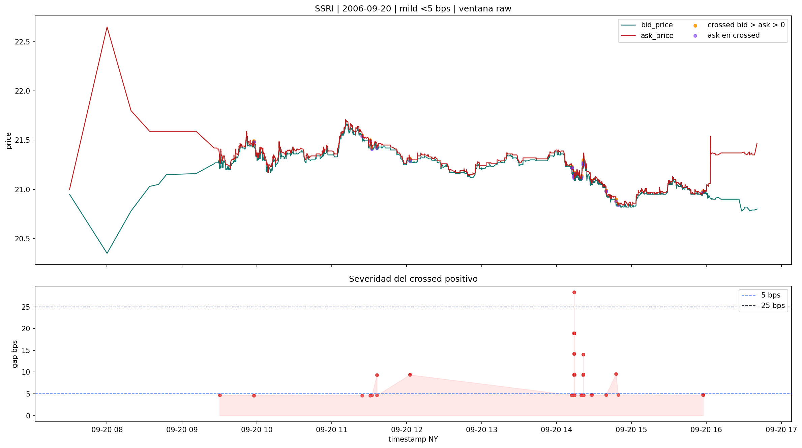

#### 02 Full Session Context
Esta imagen responde a la pregunta de extension intradiaria: el dano esta confinado a un bloque corto o contamina la sesion completa. Arriba se ve toda la sesion `04:00-20:00 NY`; abajo el `gap_bps` firmado. La decision que cambia es si el consumo debe penalizar solo un tramo o desechar el dia entero para uso operativo. El error que evita es tratar una cicatriz local como ruina total o, al reves, minimizar una degradacion distribuida a lo largo del dia. En ejecucion esto decide si la sesion puede seguir usandose con restricciones; en ML decide si las features intradiarias conservan significado economico.

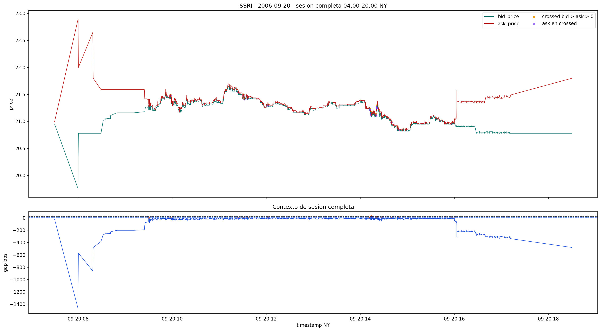

#### 03 Structure Diagnostics
Este panel responde a la pregunta de naturaleza del fallo: contradiccion economica genuina o mezcla con degeneracion estructural. Separa `ask=0` de `ask>0`, muestra la distribucion de `gap_bps` y resume patrones de integerizacion. La decision que cambia es como interpretar el dano: mercado localmente roto, artefacto de representacion o combinacion de ambos. El error que evita es sobrediagnosticar crossed reales cuando parte de la senal proviene de estructura degenerada del libro. Esta lectura afecta directamente a que el caso vaya a exclusion dura, a bandera contextual o a simple reconciliacion tecnica.

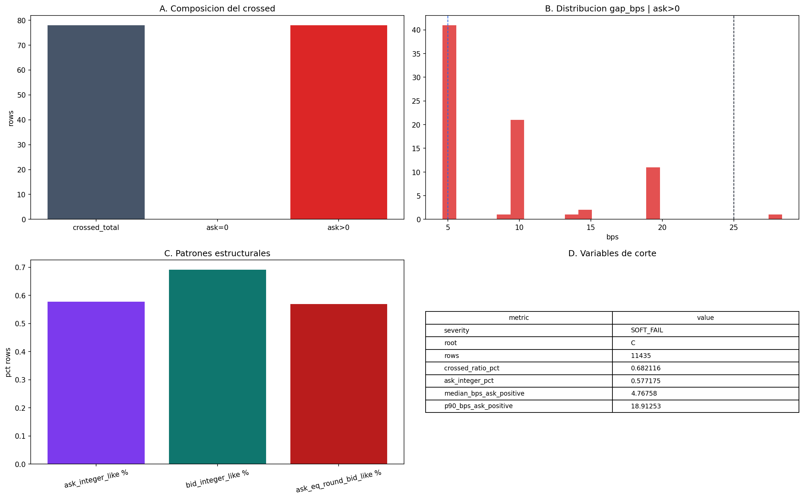

#### 04 Summary Card
Esta tarjeta responde a la pregunta de auditabilidad: cuales son exactamente las variables que sostienen la conclusion. Reune `severity`, `root`, `crossed_ratio_pct`, `ask_integer_pct`, `median_bps_ask_positive` y `p90_bps_ask_positive`. La decision que cambia es pasar de impresion visual a regla verificable. El error que evita es que dos inspectores lleguen a conclusiones distintas mirando la misma imagen sin una base numerica comun. Para gobernanza del proyecto, este panel es el que vuelve reproducible la decision para backtest, ML y auditoria.

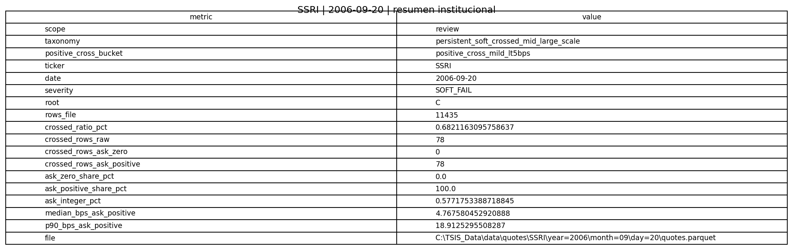

---

### 50. ATHR 2006-12-28

company_name: `Aether Holdings, Inc. Common Stock`
primary_exchange: `NASDAQ` (`XNAS`)
market_locale: `stocks/us`
scope: `review`
ticker: `ATHR`
date: `2006-12-28`
taxonomy: `persistent_soft_crossed_mid_large_scale`
positive_cross_bucket: `positive_cross_mild_lt5bps`
severity: `SOFT_FAIL`
root: `D`
rows: `10881`
crossed_ratio_pct: `0.551420`
crossed_rows_raw: `60`
crossed_rows_ask_zero: `1`
crossed_rows_ask_positive: `59`
ask_integer_pct: `0.018381`
median_bps_ask_positive: `4.693734`
p90_bps_ask_positive: `14.010181`
file: `D:\quotes\ATHR\year=2006\month=12\day=28\quotes.parquet`

#### Analisis Forense
La conclusion correcta del caso es que ya existe contradiccion economica real dentro del libro, pero aun no con fuerza suficiente para justificar exclusion dura sin contexto adicional. La taxonomy historica es `persistent_soft_crossed_mid_large_scale` y el regimen positivo dominante es `mild <5 bps`. Esto importa porque la taxonomy no solo clasifica: resume que tipo de anomalia se esta viendo y que clase de decision contractual puede defenderse despues. La taxonomy `persistent_soft_crossed_mid_large_scale` implica un problema repetido y distribuido, no un simple pinchazo local. Por eso empuja a `review`: ya hay dano real, aunque no necesariamente exclusion dura universal. El regimen `mild <5 bps` significa que existe contradiccion economica positiva, pero aun en una banda donde un uso prudente puede seguir siendo defendible si la persistencia y la estructura no agravan el caso. En terminos observables, el file tiene `crossed_ratio_pct=0.551420` con `crossed_rows_ask_positive=59` y `crossed_rows_ask_zero=1`. La severidad economica del crossed ask>0 se resume en `median_bps_ask_positive=4.693734` y `p90_bps_ask_positive=14.010181`. Estos dos numeros convierten una forma visual rara en una conclusion operativa sobre si el libro sigue representando o no un mercado negociable. La decision que cambia es pasar de libro sano a libro util solo bajo cautela. `review` significa: no usar como si fuera ejecucion limpia, conservar para analisis contextual y sensibilidad. El error que evita es tratar como normal un episodio que ya contiene contradiccion economica real y contaminar simulaciones de ejecucion o validaciones demasiado optimistas. El patron estructural muestra `ask_integer_pct=0.018381`. Este numero obliga a separar dos explicaciones rivales: contradiccion economica genuina del libro o mezcla con degeneracion estructural / integerizacion. La mayor parte del crossed vive en `ask>0`, de modo que el corazon del problema sigue siendo economico. La parte `ask=0`, si existe, acompana pero no explica por si sola la anomalia. Como `ask_integer_pct` es bajo, la hipotesis de simple degeneracion mecanica pierde fuerza. Eso endurece la interpretacion: el crossed se parece mas a contradiccion economica genuina y menos a artefacto. Existe ademas una imagen historica de certificacion asociada. Su papel es poner el episodio en un marco causal mas amplio: halt, explained, not strongly explained o patron conocido. La regla que protege al proyecto es esta: el contexto externo se usa para explicar por que aparece el episodio, no para absolverlo. El error que evita es degradar el criterio de calidad del libro porque exista una historia plausible alrededor del caso.

#### 00 Event Month Context
Esta imagen responde a la pregunta de persistencia temporal: estamos ante un accidente local o ante una fase mas amplia de inestabilidad. Arriba coloca el evento en la serie `daily` real del mes; abajo compara `crossed_ratio_pct` y `max_gap_bps_pos` del dia contra sus vecinos. La decision que cambia es el peso estructural que se le concede al caso. El error que evita es juzgar igual un shock aislado y una degradacion repetida del libro.

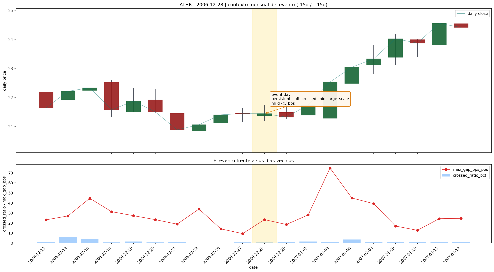

#### 00b Event Month Quotes Context
Esta imagen responde a la pregunta de recurrencia mensual dentro de `quotes`: el problema se concentra en el evento o reaparece en varias sesiones. Arriba concatena sesiones con datos disponibles; abajo resume cobertura diaria, `crossed_ratio_pct` y `max_gap_bps_pos`. La decision que cambia es si el caso debe leerse como episodio puntual o como sintoma de una fase repetida de libro degradado. El error que evita es extrapolar desde un unico dia a todo el mes sin evidencia.

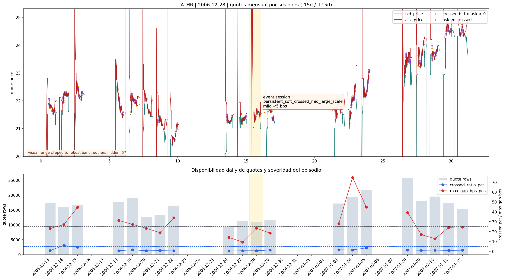

#### 01 Raw Window
Esta imagen responde a la primera pregunta decisiva del caso: el crossed observado es economicamente bastante fuerte para justificar un cambio de clase. Arriba ensena la geometria exacta del tramo conflictivo; abajo convierte esa geometria a bps y la enfrenta a los cortes `5 bps` y `25 bps`. El regimen dominante es `mild <5 bps`. La decision que cambia es pasar de anomalia interpretable a `review` o `bad`. El error que evita es decidir por apariencia visual sin medir el dano economico real del crossed. En terminos de pipeline, este panel decide si el problema afecta solo a la lectura forense o si invalida simulacion de ejecucion y microstructure features.

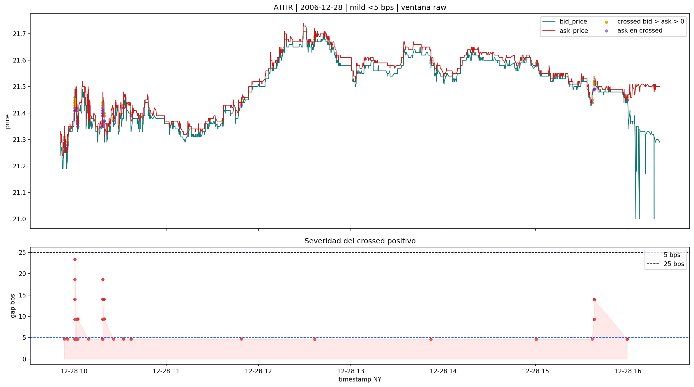

#### 02 Full Session Context
Esta imagen responde a la pregunta de extension intradiaria: el dano esta confinado a un bloque corto o contamina la sesion completa. Arriba se ve toda la sesion `04:00-20:00 NY`; abajo el `gap_bps` firmado. La decision que cambia es si el consumo debe penalizar solo un tramo o desechar el dia entero para uso operativo. El error que evita es tratar una cicatriz local como ruina total o, al reves, minimizar una degradacion distribuida a lo largo del dia. En ejecucion esto decide si la sesion puede seguir usandose con restricciones; en ML decide si las features intradiarias conservan significado economico.

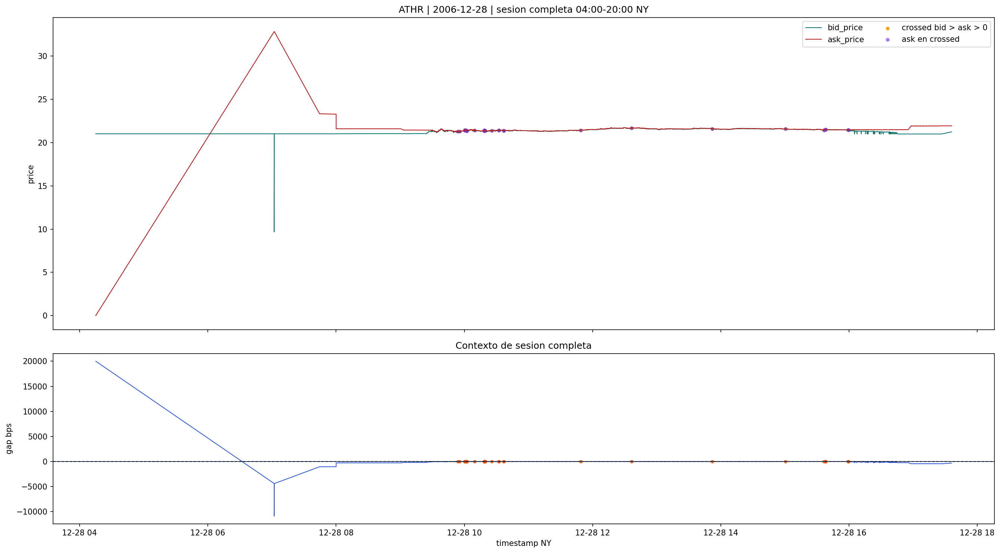

#### 03 Structure Diagnostics
Este panel responde a la pregunta de naturaleza del fallo: contradiccion economica genuina o mezcla con degeneracion estructural. Separa `ask=0` de `ask>0`, muestra la distribucion de `gap_bps` y resume patrones de integerizacion. La decision que cambia es como interpretar el dano: mercado localmente roto, artefacto de representacion o combinacion de ambos. El error que evita es sobrediagnosticar crossed reales cuando parte de la senal proviene de estructura degenerada del libro. Esta lectura afecta directamente a que el caso vaya a exclusion dura, a bandera contextual o a simple reconciliacion tecnica.

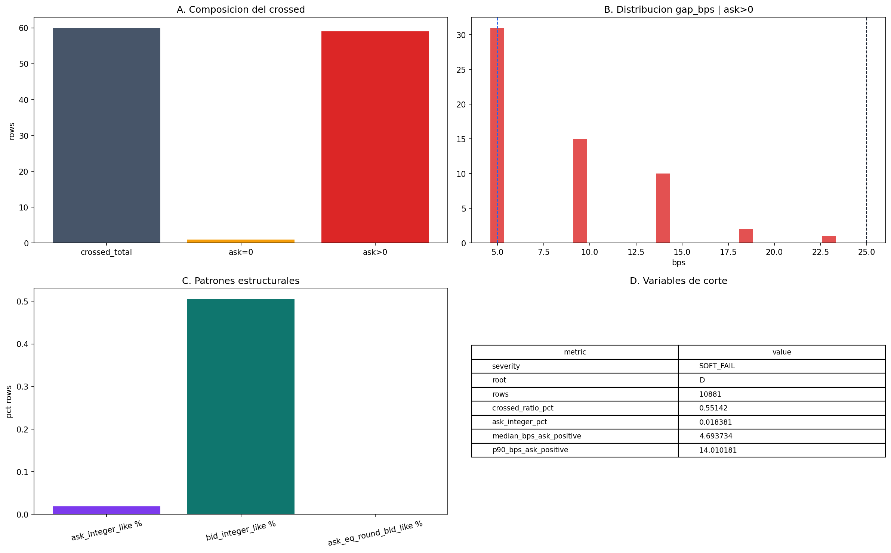

#### 04 Summary Card
Esta tarjeta responde a la pregunta de auditabilidad: cuales son exactamente las variables que sostienen la conclusion. Reune `severity`, `root`, `crossed_ratio_pct`, `ask_integer_pct`, `median_bps_ask_positive` y `p90_bps_ask_positive`. La decision que cambia es pasar de impresion visual a regla verificable. El error que evita es que dos inspectores lleguen a conclusiones distintas mirando la misma imagen sin una base numerica comun. Para gobernanza del proyecto, este panel es el que vuelve reproducible la decision para backtest, ML y auditoria.

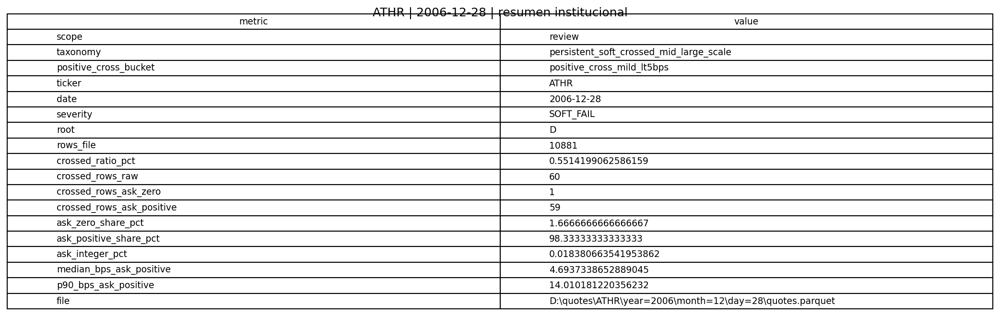

---

### 51. ALLT 2012-04-04

company_name: `Allot Ltd. Ordinary Shares`
primary_exchange: `NASDAQ` (`XNAS`)
market_locale: `stocks/us`
scope: `review`
ticker: `ALLT`
date: `2012-04-04`
taxonomy: `persistent_soft_crossed_mid_large_scale`
positive_cross_bucket: `positive_cross_mild_lt5bps`
severity: `SOFT_FAIL`
root: `D`
rows: `21671`
crossed_ratio_pct: `0.530663`
crossed_rows_raw: `115`
crossed_rows_ask_zero: `70`
crossed_rows_ask_positive: `45`
ask_integer_pct: `0.599880`
median_bps_ask_positive: `4.471272`
p90_bps_ask_positive: `75.471698`
file: `D:\quotes\ALLT\year=2012\month=04\day=04\quotes.parquet`

#### Analisis Forense
La conclusion correcta del caso es que ya existe contradiccion economica real dentro del libro, pero aun no con fuerza suficiente para justificar exclusion dura sin contexto adicional. La taxonomy historica es `persistent_soft_crossed_mid_large_scale` y el regimen positivo dominante es `mild <5 bps`. Esto importa porque la taxonomy no solo clasifica: resume que tipo de anomalia se esta viendo y que clase de decision contractual puede defenderse despues. La taxonomy `persistent_soft_crossed_mid_large_scale` implica un problema repetido y distribuido, no un simple pinchazo local. Por eso empuja a `review`: ya hay dano real, aunque no necesariamente exclusion dura universal. El regimen `mild <5 bps` significa que existe contradiccion economica positiva, pero aun en una banda donde un uso prudente puede seguir siendo defendible si la persistencia y la estructura no agravan el caso. En terminos observables, el file tiene `crossed_ratio_pct=0.530663` con `crossed_rows_ask_positive=45` y `crossed_rows_ask_zero=70`. La severidad economica del crossed ask>0 se resume en `median_bps_ask_positive=4.471272` y `p90_bps_ask_positive=75.471698`. Estos dos numeros convierten una forma visual rara en una conclusion operativa sobre si el libro sigue representando o no un mercado negociable. La decision que cambia es pasar de libro sano a libro util solo bajo cautela. `review` significa: no usar como si fuera ejecucion limpia, conservar para analisis contextual y sensibilidad. El error que evita es tratar como normal un episodio que ya contiene contradiccion economica real y contaminar simulaciones de ejecucion o validaciones demasiado optimistas. El patron estructural muestra `ask_integer_pct=0.599880`. Este numero obliga a separar dos explicaciones rivales: contradiccion economica genuina del libro o mezcla con degeneracion estructural / integerizacion. La composicion esta mezclada entre `ask=0` y `ask>0`. Eso obliga a una lectura dual: parte del patron pertenece a estructura y parte a contradiccion economica genuina, por lo que la decision debe apoyarse en ambas capas y no en una sola narrativa. Como `ask_integer_pct` es bajo, la hipotesis de simple degeneracion mecanica pierde fuerza. Eso endurece la interpretacion: el crossed se parece mas a contradiccion economica genuina y menos a artefacto. Existe ademas una imagen historica de certificacion asociada. Su papel es poner el episodio en un marco causal mas amplio: halt, explained, not strongly explained o patron conocido. La regla que protege al proyecto es esta: el contexto externo se usa para explicar por que aparece el episodio, no para absolverlo. El error que evita es degradar el criterio de calidad del libro porque exista una historia plausible alrededor del caso.

#### 00 Event Month Context
Esta imagen responde a la pregunta de persistencia temporal: estamos ante un accidente local o ante una fase mas amplia de inestabilidad. Arriba coloca el evento en la serie `daily` real del mes; abajo compara `crossed_ratio_pct` y `max_gap_bps_pos` del dia contra sus vecinos. La decision que cambia es el peso estructural que se le concede al caso. El error que evita es juzgar igual un shock aislado y una degradacion repetida del libro.

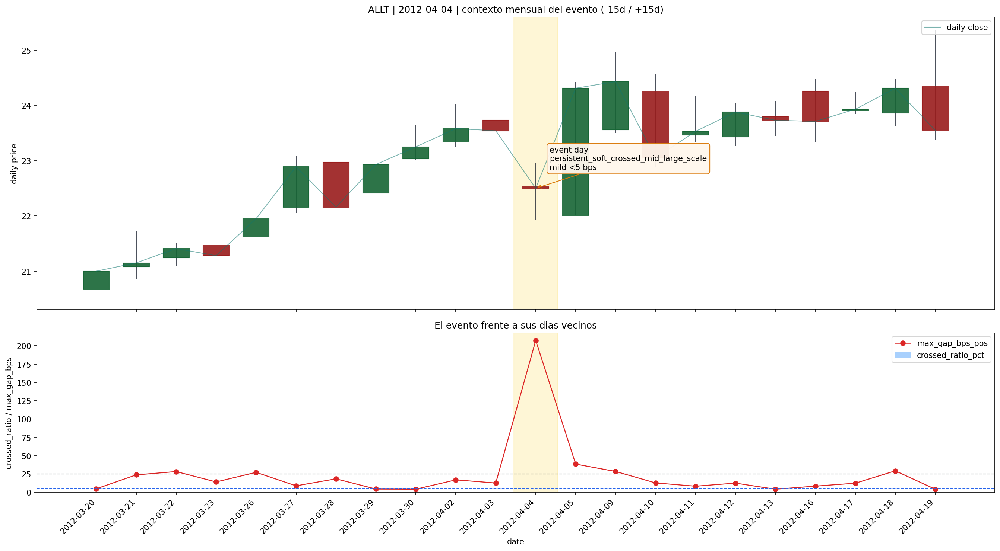

#### 00b Event Month Quotes Context
Esta imagen responde a la pregunta de recurrencia mensual dentro de `quotes`: el problema se concentra en el evento o reaparece en varias sesiones. Arriba concatena sesiones con datos disponibles; abajo resume cobertura diaria, `crossed_ratio_pct` y `max_gap_bps_pos`. La decision que cambia es si el caso debe leerse como episodio puntual o como sintoma de una fase repetida de libro degradado. El error que evita es extrapolar desde un unico dia a todo el mes sin evidencia.

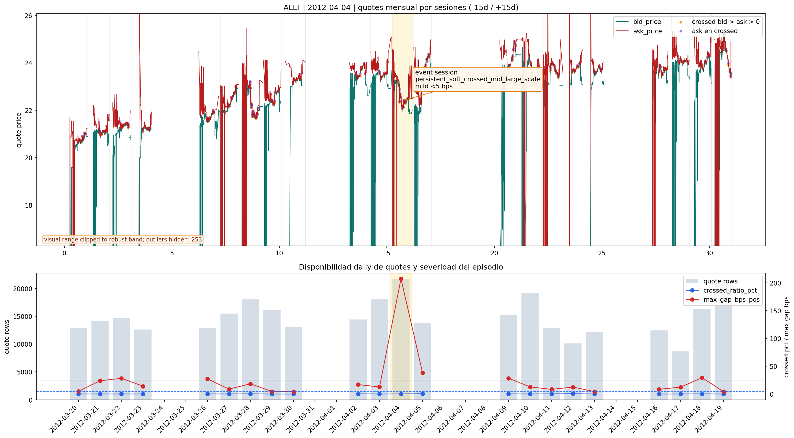

#### 01 Raw Window
Esta imagen responde a la primera pregunta decisiva del caso: el crossed observado es economicamente bastante fuerte para justificar un cambio de clase. Arriba ensena la geometria exacta del tramo conflictivo; abajo convierte esa geometria a bps y la enfrenta a los cortes `5 bps` y `25 bps`. El regimen dominante es `mild <5 bps`. La decision que cambia es pasar de anomalia interpretable a `review` o `bad`. El error que evita es decidir por apariencia visual sin medir el dano economico real del crossed. En terminos de pipeline, este panel decide si el problema afecta solo a la lectura forense o si invalida simulacion de ejecucion y microstructure features.

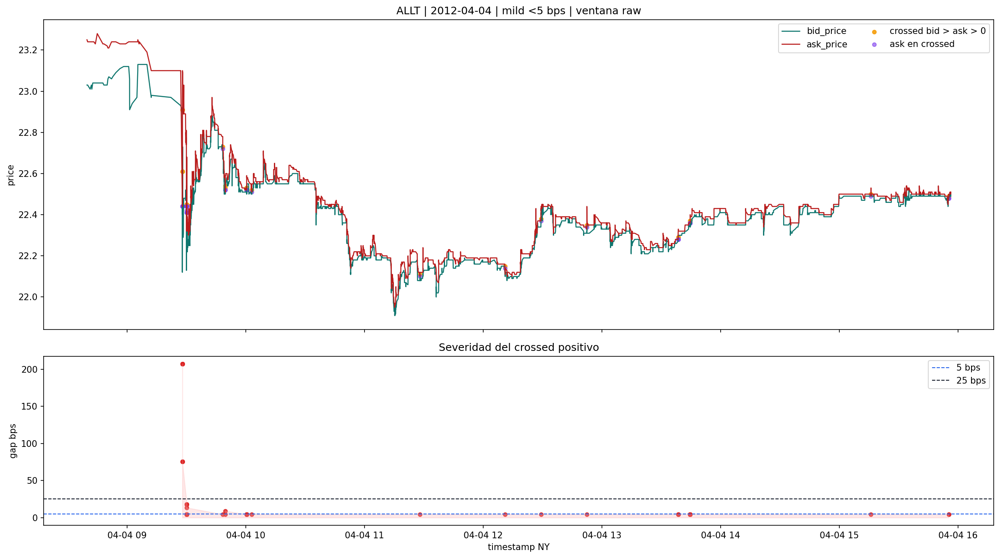

#### 02 Full Session Context
Esta imagen responde a la pregunta de extension intradiaria: el dano esta confinado a un bloque corto o contamina la sesion completa. Arriba se ve toda la sesion `04:00-20:00 NY`; abajo el `gap_bps` firmado. La decision que cambia es si el consumo debe penalizar solo un tramo o desechar el dia entero para uso operativo. El error que evita es tratar una cicatriz local como ruina total o, al reves, minimizar una degradacion distribuida a lo largo del dia. En ejecucion esto decide si la sesion puede seguir usandose con restricciones; en ML decide si las features intradiarias conservan significado economico.

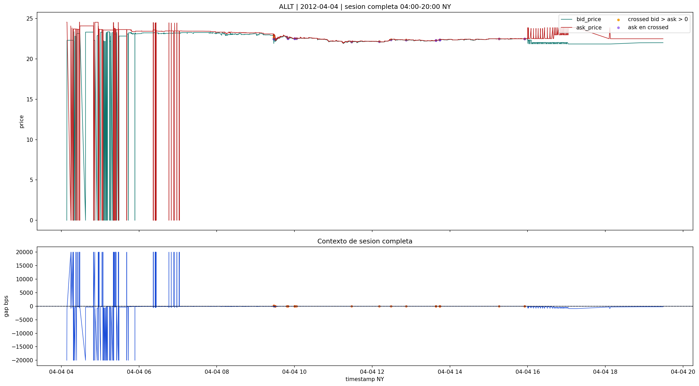

#### 03 Structure Diagnostics
Este panel responde a la pregunta de naturaleza del fallo: contradiccion economica genuina o mezcla con degeneracion estructural. Separa `ask=0` de `ask>0`, muestra la distribucion de `gap_bps` y resume patrones de integerizacion. La decision que cambia es como interpretar el dano: mercado localmente roto, artefacto de representacion o combinacion de ambos. El error que evita es sobrediagnosticar crossed reales cuando parte de la senal proviene de estructura degenerada del libro. Esta lectura afecta directamente a que el caso vaya a exclusion dura, a bandera contextual o a simple reconciliacion tecnica.

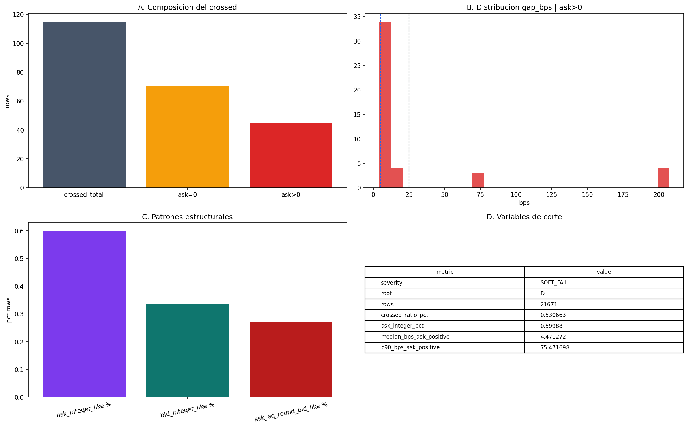

#### 04 Summary Card
Esta tarjeta responde a la pregunta de auditabilidad: cuales son exactamente las variables que sostienen la conclusion. Reune `severity`, `root`, `crossed_ratio_pct`, `ask_integer_pct`, `median_bps_ask_positive` y `p90_bps_ask_positive`. La decision que cambia es pasar de impresion visual a regla verificable. El error que evita es que dos inspectores lleguen a conclusiones distintas mirando la misma imagen sin una base numerica comun. Para gobernanza del proyecto, este panel es el que vuelve reproducible la decision para backtest, ML y auditoria.

---

### 52. MTRX 2007-06-28

company_name: `Matrix Service Co`
primary_exchange: `NASDAQ` (`XNAS`)
market_locale: `stocks/us`
scope: `review`
ticker: `MTRX`
date: `2007-06-28`
taxonomy: `persistent_soft_crossed_mid_large_scale`
positive_cross_bucket: `positive_cross_mild_lt5bps`
severity: `SOFT_FAIL`
root: `C`
rows: `12892`
crossed_ratio_pct: `0.356810`
crossed_rows_raw: `46`
crossed_rows_ask_zero: `1`
crossed_rows_ask_positive: `45`
ask_integer_pct: `0.915296`
median_bps_ask_positive: `4.004004`
p90_bps_ask_positive: `6.430132`
file: `C:\TSIS_Data\data\quotes\MTRX\year=2007\month=06\day=28\quotes.parquet`

#### Analisis Forense
La conclusion correcta del caso es que ya existe contradiccion economica real dentro del libro, pero aun no con fuerza suficiente para justificar exclusion dura sin contexto adicional. La taxonomy historica es `persistent_soft_crossed_mid_large_scale` y el regimen positivo dominante es `mild <5 bps`. Esto importa porque la taxonomy no solo clasifica: resume que tipo de anomalia se esta viendo y que clase de decision contractual puede defenderse despues. La taxonomy `persistent_soft_crossed_mid_large_scale` implica un problema repetido y distribuido, no un simple pinchazo local. Por eso empuja a `review`: ya hay dano real, aunque no necesariamente exclusion dura universal. El regimen `mild <5 bps` significa que existe contradiccion economica positiva, pero aun en una banda donde un uso prudente puede seguir siendo defendible si la persistencia y la estructura no agravan el caso. En terminos observables, el file tiene `crossed_ratio_pct=0.356810` con `crossed_rows_ask_positive=45` y `crossed_rows_ask_zero=1`. La severidad economica del crossed ask>0 se resume en `median_bps_ask_positive=4.004004` y `p90_bps_ask_positive=6.430132`. Estos dos numeros convierten una forma visual rara en una conclusion operativa sobre si el libro sigue representando o no un mercado negociable. La decision que cambia es pasar de libro sano a libro util solo bajo cautela. `review` significa: no usar como si fuera ejecucion limpia, conservar para analisis contextual y sensibilidad. El error que evita es tratar como normal un episodio que ya contiene contradiccion economica real y contaminar simulaciones de ejecucion o validaciones demasiado optimistas. El patron estructural muestra `ask_integer_pct=0.915296`. Este numero obliga a separar dos explicaciones rivales: contradiccion economica genuina del libro o mezcla con degeneracion estructural / integerizacion. La mayor parte del crossed vive en `ask>0`, de modo que el corazon del problema sigue siendo economico. La parte `ask=0`, si existe, acompana pero no explica por si sola la anomalia. Como `ask_integer_pct` es bajo, la hipotesis de simple degeneracion mecanica pierde fuerza. Eso endurece la interpretacion: el crossed se parece mas a contradiccion economica genuina y menos a artefacto. Existe ademas una imagen historica de certificacion asociada. Su papel es poner el episodio en un marco causal mas amplio: halt, explained, not strongly explained o patron conocido. La regla que protege al proyecto es esta: el contexto externo se usa para explicar por que aparece el episodio, no para absolverlo. El error que evita es degradar el criterio de calidad del libro porque exista una historia plausible alrededor del caso.

#### 00 Event Month Context
Esta imagen responde a la pregunta de persistencia temporal: estamos ante un accidente local o ante una fase mas amplia de inestabilidad. Arriba coloca el evento en la serie `daily` real del mes; abajo compara `crossed_ratio_pct` y `max_gap_bps_pos` del dia contra sus vecinos. La decision que cambia es el peso estructural que se le concede al caso. El error que evita es juzgar igual un shock aislado y una degradacion repetida del libro.

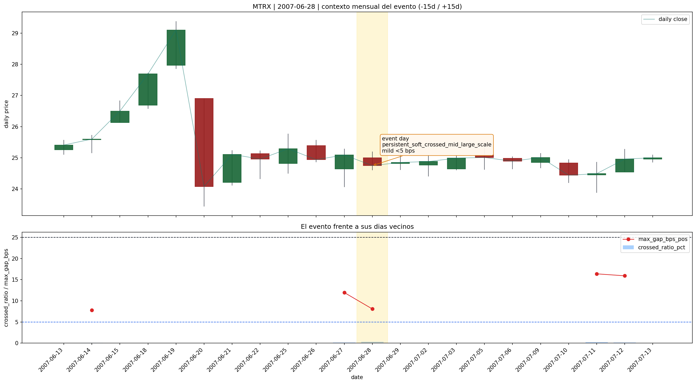

#### 00b Event Month Quotes Context
Esta imagen responde a la pregunta de recurrencia mensual dentro de `quotes`: el problema se concentra en el evento o reaparece en varias sesiones. Arriba concatena sesiones con datos disponibles; abajo resume cobertura diaria, `crossed_ratio_pct` y `max_gap_bps_pos`. La decision que cambia es si el caso debe leerse como episodio puntual o como sintoma de una fase repetida de libro degradado. El error que evita es extrapolar desde un unico dia a todo el mes sin evidencia.

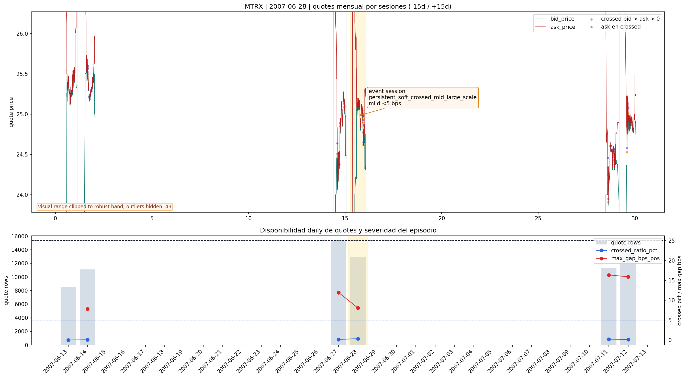

#### 01 Raw Window
Esta imagen responde a la primera pregunta decisiva del caso: el crossed observado es economicamente bastante fuerte para justificar un cambio de clase. Arriba ensena la geometria exacta del tramo conflictivo; abajo convierte esa geometria a bps y la enfrenta a los cortes `5 bps` y `25 bps`. El regimen dominante es `mild <5 bps`. La decision que cambia es pasar de anomalia interpretable a `review` o `bad`. El error que evita es decidir por apariencia visual sin medir el dano economico real del crossed. En terminos de pipeline, este panel decide si el problema afecta solo a la lectura forense o si invalida simulacion de ejecucion y microstructure features.

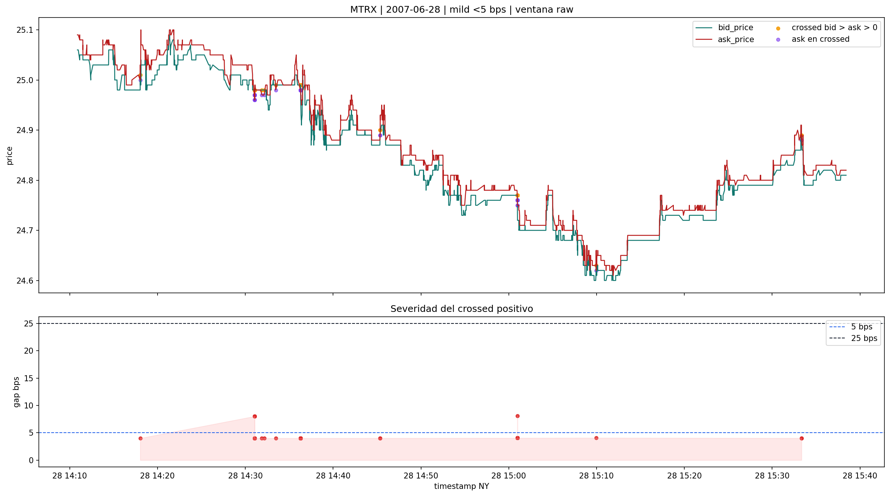

#### 02 Full Session Context
Esta imagen responde a la pregunta de extension intradiaria: el dano esta confinado a un bloque corto o contamina la sesion completa. Arriba se ve toda la sesion `04:00-20:00 NY`; abajo el `gap_bps` firmado. La decision que cambia es si el consumo debe penalizar solo un tramo o desechar el dia entero para uso operativo. El error que evita es tratar una cicatriz local como ruina total o, al reves, minimizar una degradacion distribuida a lo largo del dia. En ejecucion esto decide si la sesion puede seguir usandose con restricciones; en ML decide si las features intradiarias conservan significado economico.

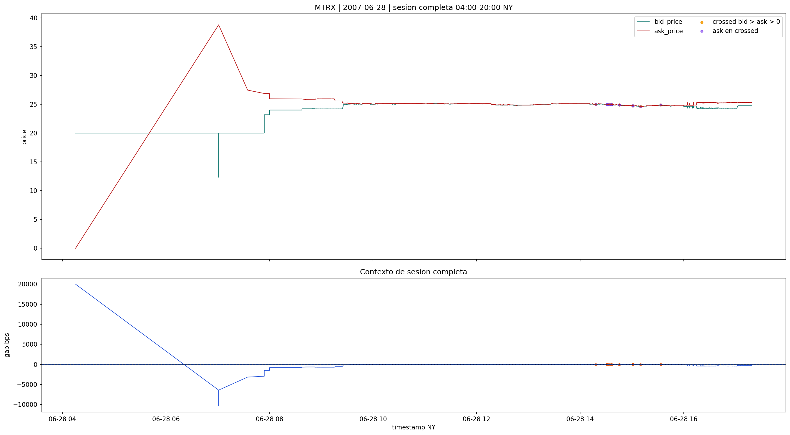

#### 03 Structure Diagnostics
Este panel responde a la pregunta de naturaleza del fallo: contradiccion economica genuina o mezcla con degeneracion estructural. Separa `ask=0` de `ask>0`, muestra la distribucion de `gap_bps` y resume patrones de integerizacion. La decision que cambia es como interpretar el dano: mercado localmente roto, artefacto de representacion o combinacion de ambos. El error que evita es sobrediagnosticar crossed reales cuando parte de la senal proviene de estructura degenerada del libro. Esta lectura afecta directamente a que el caso vaya a exclusion dura, a bandera contextual o a simple reconciliacion tecnica.

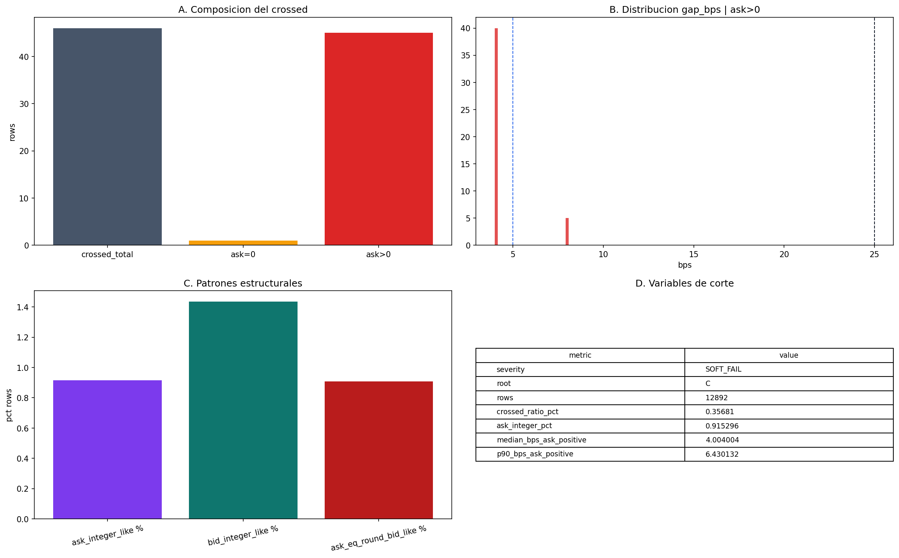

#### 04 Summary Card
Esta tarjeta responde a la pregunta de auditabilidad: cuales son exactamente las variables que sostienen la conclusion. Reune `severity`, `root`, `crossed_ratio_pct`, `ask_integer_pct`, `median_bps_ask_positive` y `p90_bps_ask_positive`. La decision que cambia es pasar de impresion visual a regla verificable. El error que evita es que dos inspectores lleguen a conclusiones distintas mirando la misma imagen sin una base numerica comun. Para gobernanza del proyecto, este panel es el que vuelve reproducible la decision para backtest, ML y auditoria.

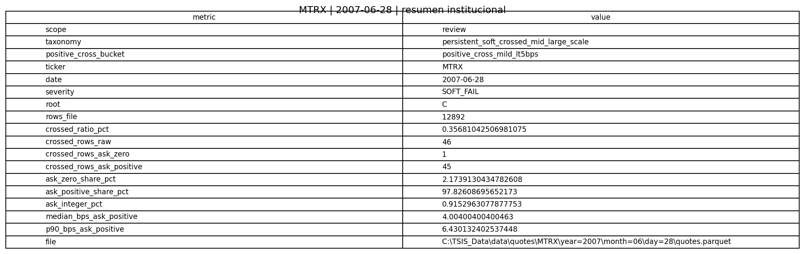

---

### 53. NUS 2010-07-29

company_name: `NuSkin Enterprises, Inc.`
primary_exchange: `NYSE` (`XNYS`)
market_locale: `stocks/us`
scope: `review`
ticker: `NUS`
date: `2010-07-29`
taxonomy: `persistent_soft_crossed_mid_large_scale`
positive_cross_bucket: `positive_cross_mild_lt5bps`
severity: `SOFT_FAIL`
root: `D`
rows: `25113`
crossed_ratio_pct: `0.457930`
crossed_rows_raw: `115`
crossed_rows_ask_zero: `0`
crossed_rows_ask_positive: `115`
ask_integer_pct: `2.528571`
median_bps_ask_positive: `3.575898`
p90_bps_ask_positive: `9.142080`
file: `D:\quotes\NUS\year=2010\month=07\day=29\quotes.parquet`

#### Analisis Forense
La conclusion correcta del caso es que ya existe contradiccion economica real dentro del libro, pero aun no con fuerza suficiente para justificar exclusion dura sin contexto adicional. La taxonomy historica es `persistent_soft_crossed_mid_large_scale` y el regimen positivo dominante es `mild <5 bps`. Esto importa porque la taxonomy no solo clasifica: resume que tipo de anomalia se esta viendo y que clase de decision contractual puede defenderse despues. La taxonomy `persistent_soft_crossed_mid_large_scale` implica un problema repetido y distribuido, no un simple pinchazo local. Por eso empuja a `review`: ya hay dano real, aunque no necesariamente exclusion dura universal. El regimen `mild <5 bps` significa que existe contradiccion economica positiva, pero aun en una banda donde un uso prudente puede seguir siendo defendible si la persistencia y la estructura no agravan el caso. En terminos observables, el file tiene `crossed_ratio_pct=0.457930` con `crossed_rows_ask_positive=115` y `crossed_rows_ask_zero=0`. La severidad economica del crossed ask>0 se resume en `median_bps_ask_positive=3.575898` y `p90_bps_ask_positive=9.142080`. Estos dos numeros convierten una forma visual rara en una conclusion operativa sobre si el libro sigue representando o no un mercado negociable. La decision que cambia es pasar de libro sano a libro util solo bajo cautela. `review` significa: no usar como si fuera ejecucion limpia, conservar para analisis contextual y sensibilidad. El error que evita es tratar como normal un episodio que ya contiene contradiccion economica real y contaminar simulaciones de ejecucion o validaciones demasiado optimistas. El patron estructural muestra `ask_integer_pct=2.528571`. Este numero obliga a separar dos explicaciones rivales: contradiccion economica genuina del libro o mezcla con degeneracion estructural / integerizacion. Toda la composicion crossed cae en `ask>0`. Eso endurece la lectura economica del caso: el dano no depende de ceros mecanicos, sino de contradiccion positiva dentro de precios aparentemente vivos. Como `ask_integer_pct` es bajo, la hipotesis de simple degeneracion mecanica pierde fuerza. Eso endurece la interpretacion: el crossed se parece mas a contradiccion economica genuina y menos a artefacto. En la capa de semantica de precio del evento aparecen `daily raw close=28.9500`, `quote mid raw=28.6250`, `quote mid split_normalized=28.6250`, `daily adjusted_proxy=15.7907`. Ademas hay `post_event_dividend_sum=18.0800`. La implicacion metodologica es crucial: una discrepancia entre `quotes`, `daily` y una plataforma externa no puede leerse automaticamente como fallo del dataset. Puede ser semantica de precio distinta. El error que evita esta capa es mezclar raw, split-normalized y adjusted dentro del mismo pipeline, rompiendo auditoria, benchmarking y labels. Para pipelines, esto empuja a conservar el caso fuera de ejecucion limpia, pero todavia puede mantenerse en investigacion contextual y en analisis de sensibilidad donde interese entender fronteras de tolerancia. Existe ademas una imagen historica de certificacion asociada. Su papel es poner el episodio en un marco causal mas amplio: halt, explained, not strongly explained o patron conocido. La regla que protege al proyecto es esta: el contexto externo se usa para explicar por que aparece el episodio, no para absolverlo. El error que evita es degradar el criterio de calidad del libro porque exista una historia plausible alrededor del caso.

#### 00 Event Month Context
Esta imagen responde a la pregunta de persistencia temporal: estamos ante un accidente local o ante una fase mas amplia de inestabilidad. Arriba coloca el evento en la serie `daily` real del mes; abajo compara `crossed_ratio_pct` y `max_gap_bps_pos` del dia contra sus vecinos. La decision que cambia es el peso estructural que se le concede al caso. El error que evita es juzgar igual un shock aislado y una degradacion repetida del libro.

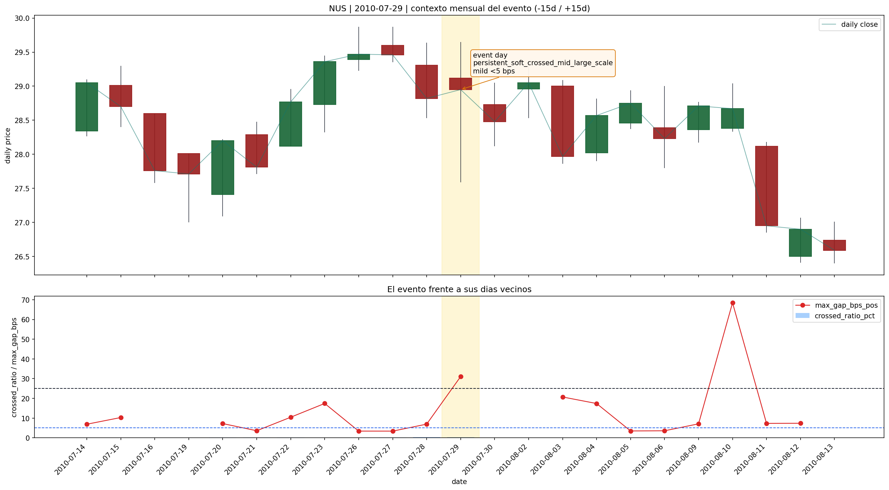

#### 00a Adjusted Proxy Contrast
Esta imagen responde a la pregunta de reconciliacion semantica: la discrepancia de precios viene de datos rotos o de vistas de precio distintas. Compara `daily raw`, `daily adjusted_proxy`, `quote mid raw` y `quote mid split_normalized`, y debajo ensena la cadena de dividendos y splits que produce la diferencia. La decision que cambia es si el inspector debe abrir una incidencia de calidad o cerrar el caso como diferencia legitima de semantica. El error que evita es mezclar series raw y adjusted como si fueran equivalentes. En pipelines reales, esto protege benchmarking, labels diarios y reconciliacion externa frente a falsas alarmas de precio.

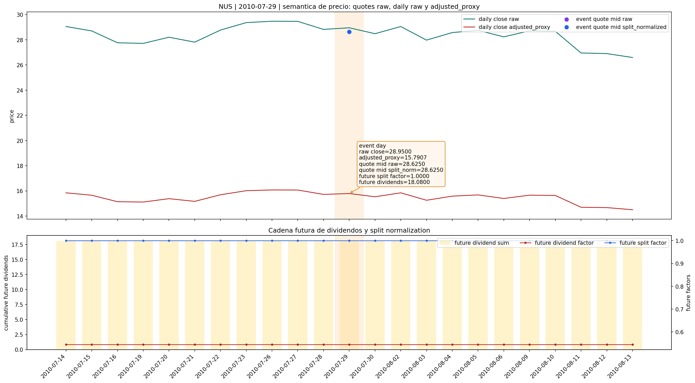

#### 00b Event Month Quotes Context
Esta imagen responde a la pregunta de recurrencia mensual dentro de `quotes`: el problema se concentra en el evento o reaparece en varias sesiones. Arriba concatena sesiones con datos disponibles; abajo resume cobertura diaria, `crossed_ratio_pct` y `max_gap_bps_pos`. La decision que cambia es si el caso debe leerse como episodio puntual o como sintoma de una fase repetida de libro degradado. El error que evita es extrapolar desde un unico dia a todo el mes sin evidencia.

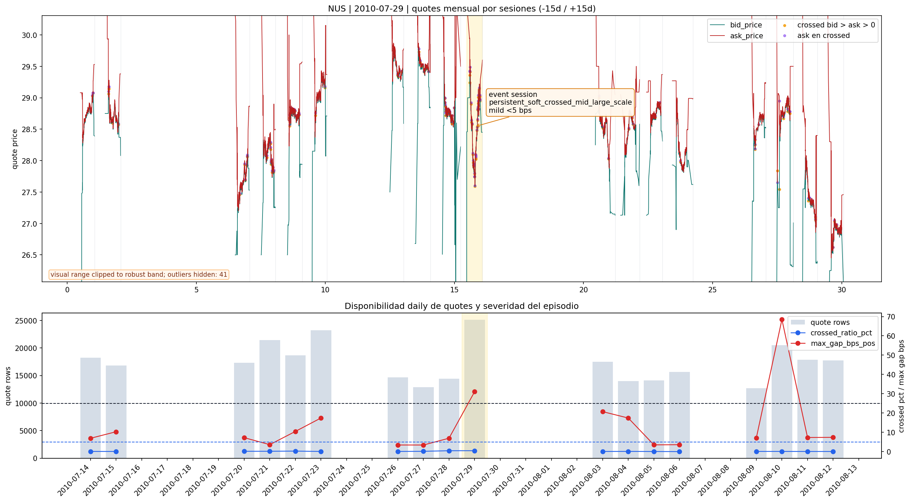

#### 01 Raw Window
Esta imagen responde a la primera pregunta decisiva del caso: el crossed observado es economicamente bastante fuerte para justificar un cambio de clase. Arriba ensena la geometria exacta del tramo conflictivo; abajo convierte esa geometria a bps y la enfrenta a los cortes `5 bps` y `25 bps`. El regimen dominante es `mild <5 bps`. La decision que cambia es pasar de anomalia interpretable a `review` o `bad`. El error que evita es decidir por apariencia visual sin medir el dano economico real del crossed. En terminos de pipeline, este panel decide si el problema afecta solo a la lectura forense o si invalida simulacion de ejecucion y microstructure features.

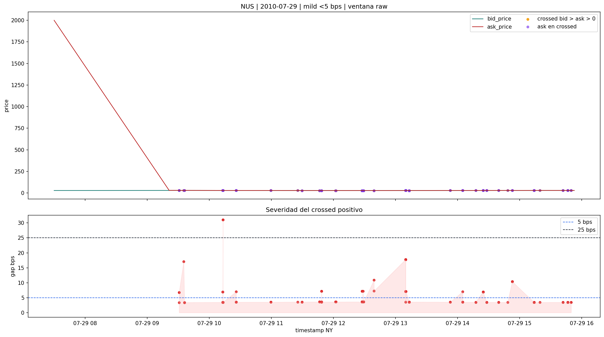

#### 02 Full Session Context
Esta imagen responde a la pregunta de extension intradiaria: el dano esta confinado a un bloque corto o contamina la sesion completa. Arriba se ve toda la sesion `04:00-20:00 NY`; abajo el `gap_bps` firmado. La decision que cambia es si el consumo debe penalizar solo un tramo o desechar el dia entero para uso operativo. El error que evita es tratar una cicatriz local como ruina total o, al reves, minimizar una degradacion distribuida a lo largo del dia. En ejecucion esto decide si la sesion puede seguir usandose con restricciones; en ML decide si las features intradiarias conservan significado economico.

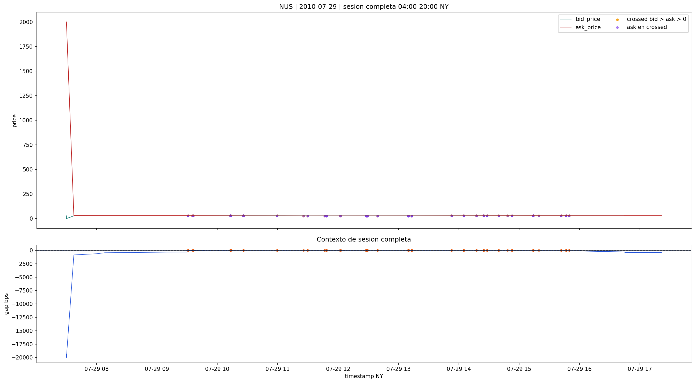

#### 03 Structure Diagnostics
Este panel responde a la pregunta de naturaleza del fallo: contradiccion economica genuina o mezcla con degeneracion estructural. Separa `ask=0` de `ask>0`, muestra la distribucion de `gap_bps` y resume patrones de integerizacion. La decision que cambia es como interpretar el dano: mercado localmente roto, artefacto de representacion o combinacion de ambos. El error que evita es sobrediagnosticar crossed reales cuando parte de la senal proviene de estructura degenerada del libro. Esta lectura afecta directamente a que el caso vaya a exclusion dura, a bandera contextual o a simple reconciliacion tecnica.

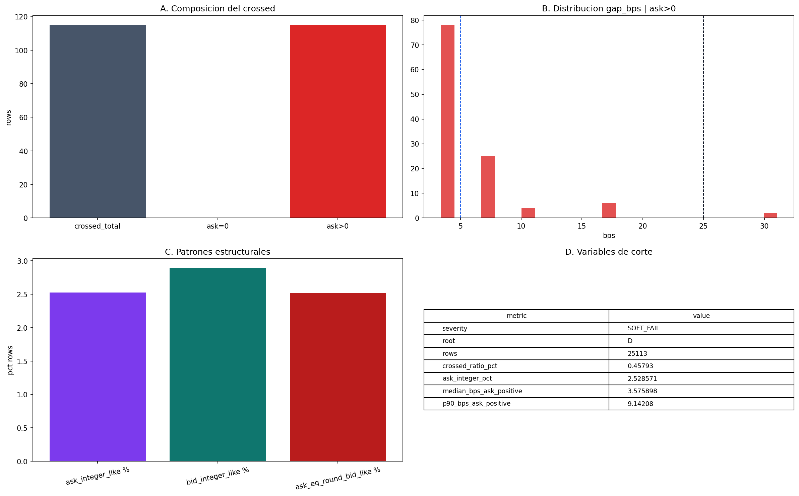

#### 04 Summary Card
Esta tarjeta responde a la pregunta de auditabilidad: cuales son exactamente las variables que sostienen la conclusion. Reune `severity`, `root`, `crossed_ratio_pct`, `ask_integer_pct`, `median_bps_ask_positive` y `p90_bps_ask_positive`. La decision que cambia es pasar de impresion visual a regla verificable. El error que evita es que dos inspectores lleguen a conclusiones distintas mirando la misma imagen sin una base numerica comun. Para gobernanza del proyecto, este panel es el que vuelve reproducible la decision para backtest, ML y auditoria.

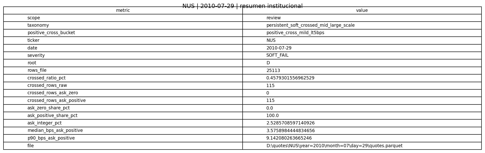

---

### 54. SPWR 2008-09-09

company_name: `SunPower Corporation Common Stock`
primary_exchange: `NASDAQ` (`XNAS`)
market_locale: `stocks/us`
scope: `review`
ticker: `SPWR`
date: `2008-09-09`
taxonomy: `persistent_soft_crossed_mid_large_scale`
positive_cross_bucket: `positive_cross_mild_lt5bps`
severity: `SOFT_FAIL`
root: `C`
rows: `79789`
crossed_ratio_pct: `0.496309`
crossed_rows_raw: `396`
crossed_rows_ask_zero: `1`
crossed_rows_ask_positive: `395`
ask_integer_pct: `1.600471`
median_bps_ask_positive: `3.430728`
p90_bps_ask_positive: `12.410953`
file: `C:\TSIS_Data\data\quotes\SPWR\year=2008\month=09\day=09\quotes.parquet`

#### Analisis Forense
La conclusion correcta del caso es que ya existe contradiccion economica real dentro del libro, pero aun no con fuerza suficiente para justificar exclusion dura sin contexto adicional. La taxonomy historica es `persistent_soft_crossed_mid_large_scale` y el regimen positivo dominante es `mild <5 bps`. Esto importa porque la taxonomy no solo clasifica: resume que tipo de anomalia se esta viendo y que clase de decision contractual puede defenderse despues. La taxonomy `persistent_soft_crossed_mid_large_scale` implica un problema repetido y distribuido, no un simple pinchazo local. Por eso empuja a `review`: ya hay dano real, aunque no necesariamente exclusion dura universal. El regimen `mild <5 bps` significa que existe contradiccion economica positiva, pero aun en una banda donde un uso prudente puede seguir siendo defendible si la persistencia y la estructura no agravan el caso. En terminos observables, el file tiene `crossed_ratio_pct=0.496309` con `crossed_rows_ask_positive=395` y `crossed_rows_ask_zero=1`. La severidad economica del crossed ask>0 se resume en `median_bps_ask_positive=3.430728` y `p90_bps_ask_positive=12.410953`. Estos dos numeros convierten una forma visual rara en una conclusion operativa sobre si el libro sigue representando o no un mercado negociable. La decision que cambia es pasar de libro sano a libro util solo bajo cautela. `review` significa: no usar como si fuera ejecucion limpia, conservar para analisis contextual y sensibilidad. El error que evita es tratar como normal un episodio que ya contiene contradiccion economica real y contaminar simulaciones de ejecucion o validaciones demasiado optimistas. El patron estructural muestra `ask_integer_pct=1.600471`. Este numero obliga a separar dos explicaciones rivales: contradiccion economica genuina del libro o mezcla con degeneracion estructural / integerizacion. La mayor parte del crossed vive en `ask>0`, de modo que el corazon del problema sigue siendo economico. La parte `ask=0`, si existe, acompana pero no explica por si sola la anomalia. Como `ask_integer_pct` es bajo, la hipotesis de simple degeneracion mecanica pierde fuerza. Eso endurece la interpretacion: el crossed se parece mas a contradiccion economica genuina y menos a artefacto. Existe ademas una imagen historica de certificacion asociada. Su papel es poner el episodio en un marco causal mas amplio: halt, explained, not strongly explained o patron conocido. La regla que protege al proyecto es esta: el contexto externo se usa para explicar por que aparece el episodio, no para absolverlo. El error que evita es degradar el criterio de calidad del libro porque exista una historia plausible alrededor del caso.

#### 00 Event Month Context
Esta imagen responde a la pregunta de persistencia temporal: estamos ante un accidente local o ante una fase mas amplia de inestabilidad. Arriba coloca el evento en la serie `daily` real del mes; abajo compara `crossed_ratio_pct` y `max_gap_bps_pos` del dia contra sus vecinos. La decision que cambia es el peso estructural que se le concede al caso. El error que evita es juzgar igual un shock aislado y una degradacion repetida del libro.

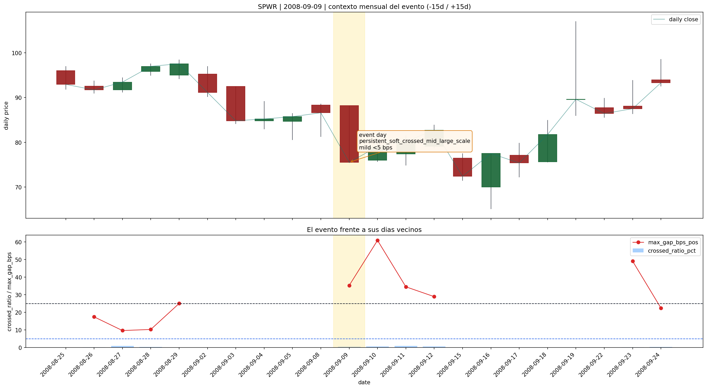

#### 00b Event Month Quotes Context
Esta imagen responde a la pregunta de recurrencia mensual dentro de `quotes`: el problema se concentra en el evento o reaparece en varias sesiones. Arriba concatena sesiones con datos disponibles; abajo resume cobertura diaria, `crossed_ratio_pct` y `max_gap_bps_pos`. La decision que cambia es si el caso debe leerse como episodio puntual o como sintoma de una fase repetida de libro degradado. El error que evita es extrapolar desde un unico dia a todo el mes sin evidencia.

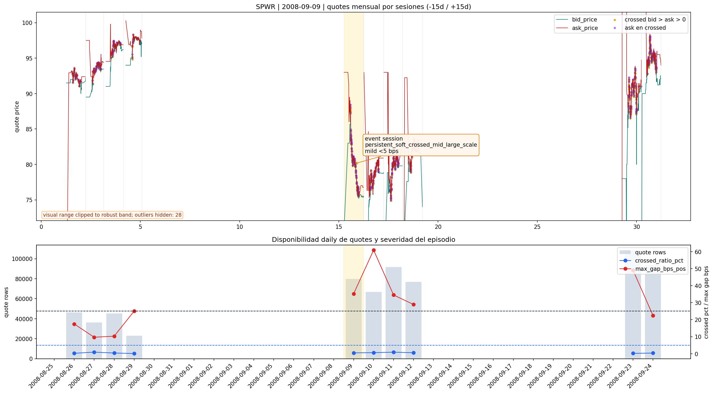

#### 01 Raw Window
Esta imagen responde a la primera pregunta decisiva del caso: el crossed observado es economicamente bastante fuerte para justificar un cambio de clase. Arriba ensena la geometria exacta del tramo conflictivo; abajo convierte esa geometria a bps y la enfrenta a los cortes `5 bps` y `25 bps`. El regimen dominante es `mild <5 bps`. La decision que cambia es pasar de anomalia interpretable a `review` o `bad`. El error que evita es decidir por apariencia visual sin medir el dano economico real del crossed. En terminos de pipeline, este panel decide si el problema afecta solo a la lectura forense o si invalida simulacion de ejecucion y microstructure features.

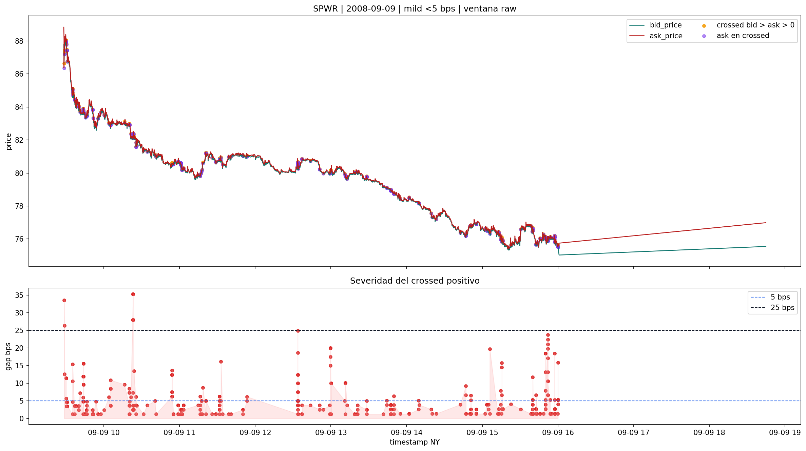

#### 02 Full Session Context
Esta imagen responde a la pregunta de extension intradiaria: el dano esta confinado a un bloque corto o contamina la sesion completa. Arriba se ve toda la sesion `04:00-20:00 NY`; abajo el `gap_bps` firmado. La decision que cambia es si el consumo debe penalizar solo un tramo o desechar el dia entero para uso operativo. El error que evita es tratar una cicatriz local como ruina total o, al reves, minimizar una degradacion distribuida a lo largo del dia. En ejecucion esto decide si la sesion puede seguir usandose con restricciones; en ML decide si las features intradiarias conservan significado economico.

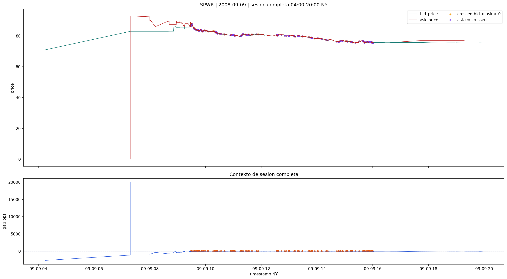

#### 03 Structure Diagnostics
Este panel responde a la pregunta de naturaleza del fallo: contradiccion economica genuina o mezcla con degeneracion estructural. Separa `ask=0` de `ask>0`, muestra la distribucion de `gap_bps` y resume patrones de integerizacion. La decision que cambia es como interpretar el dano: mercado localmente roto, artefacto de representacion o combinacion de ambos. El error que evita es sobrediagnosticar crossed reales cuando parte de la senal proviene de estructura degenerada del libro. Esta lectura afecta directamente a que el caso vaya a exclusion dura, a bandera contextual o a simple reconciliacion tecnica.

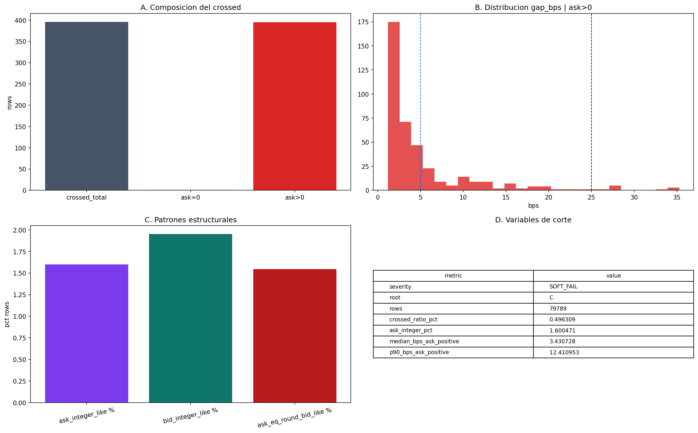

#### 04 Summary Card
Esta tarjeta responde a la pregunta de auditabilidad: cuales son exactamente las variables que sostienen la conclusion. Reune `severity`, `root`, `crossed_ratio_pct`, `ask_integer_pct`, `median_bps_ask_positive` y `p90_bps_ask_positive`. La decision que cambia es pasar de impresion visual a regla verificable. El error que evita es que dos inspectores lleguen a conclusiones distintas mirando la misma imagen sin una base numerica comun. Para gobernanza del proyecto, este panel es el que vuelve reproducible la decision para backtest, ML y auditoria.

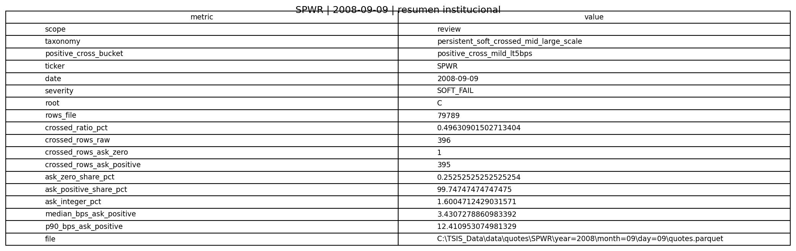

---

### 55. RRGB 2012-07-23

company_name: `Red Robin Gourmet Burgers Inc`
primary_exchange: `NASDAQ` (`XNAS`)
market_locale: `stocks/us`
scope: `review`
ticker: `RRGB`
date: `2012-07-23`
taxonomy: `persistent_soft_crossed_mid_large_scale`
positive_cross_bucket: `positive_cross_mild_lt5bps`
severity: `SOFT_FAIL`
root: `C`
rows: `12655`
crossed_ratio_pct: `0.300277`
crossed_rows_raw: `38`
crossed_rows_ask_zero: `5`
crossed_rows_ask_positive: `33`
ask_integer_pct: `0.640063`
median_bps_ask_positive: `3.349523`
p90_bps_ask_positive: `20.168067`
file: `C:\TSIS_Data\data\quotes\RRGB\year=2012\month=07\day=23\quotes.parquet`

#### Analisis Forense
La conclusion correcta del caso es que ya existe contradiccion economica real dentro del libro, pero aun no con fuerza suficiente para justificar exclusion dura sin contexto adicional. La taxonomy historica es `persistent_soft_crossed_mid_large_scale` y el regimen positivo dominante es `mild <5 bps`. Esto importa porque la taxonomy no solo clasifica: resume que tipo de anomalia se esta viendo y que clase de decision contractual puede defenderse despues. La taxonomy `persistent_soft_crossed_mid_large_scale` implica un problema repetido y distribuido, no un simple pinchazo local. Por eso empuja a `review`: ya hay dano real, aunque no necesariamente exclusion dura universal. El regimen `mild <5 bps` significa que existe contradiccion economica positiva, pero aun en una banda donde un uso prudente puede seguir siendo defendible si la persistencia y la estructura no agravan el caso. En terminos observables, el file tiene `crossed_ratio_pct=0.300277` con `crossed_rows_ask_positive=33` y `crossed_rows_ask_zero=5`. La severidad economica del crossed ask>0 se resume en `median_bps_ask_positive=3.349523` y `p90_bps_ask_positive=20.168067`. Estos dos numeros convierten una forma visual rara en una conclusion operativa sobre si el libro sigue representando o no un mercado negociable. La decision que cambia es pasar de libro sano a libro util solo bajo cautela. `review` significa: no usar como si fuera ejecucion limpia, conservar para analisis contextual y sensibilidad. El error que evita es tratar como normal un episodio que ya contiene contradiccion economica real y contaminar simulaciones de ejecucion o validaciones demasiado optimistas. El patron estructural muestra `ask_integer_pct=0.640063`. Este numero obliga a separar dos explicaciones rivales: contradiccion economica genuina del libro o mezcla con degeneracion estructural / integerizacion. La mayor parte del crossed vive en `ask>0`, de modo que el corazon del problema sigue siendo economico. La parte `ask=0`, si existe, acompana pero no explica por si sola la anomalia. Como `ask_integer_pct` es bajo, la hipotesis de simple degeneracion mecanica pierde fuerza. Eso endurece la interpretacion: el crossed se parece mas a contradiccion economica genuina y menos a artefacto. Existe ademas una imagen historica de certificacion asociada. Su papel es poner el episodio en un marco causal mas amplio: halt, explained, not strongly explained o patron conocido. La regla que protege al proyecto es esta: el contexto externo se usa para explicar por que aparece el episodio, no para absolverlo. El error que evita es degradar el criterio de calidad del libro porque exista una historia plausible alrededor del caso.

#### 00 Event Month Context
Esta imagen responde a la pregunta de persistencia temporal: estamos ante un accidente local o ante una fase mas amplia de inestabilidad. Arriba coloca el evento en la serie `daily` real del mes; abajo compara `crossed_ratio_pct` y `max_gap_bps_pos` del dia contra sus vecinos. La decision que cambia es el peso estructural que se le concede al caso. El error que evita es juzgar igual un shock aislado y una degradacion repetida del libro.

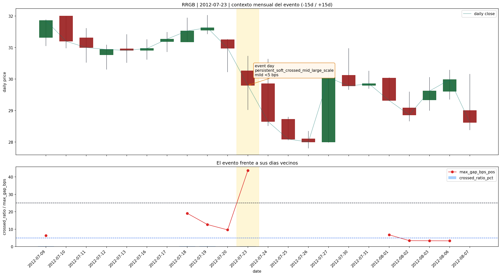

#### 00b Event Month Quotes Context
Esta imagen responde a la pregunta de recurrencia mensual dentro de `quotes`: el problema se concentra en el evento o reaparece en varias sesiones. Arriba concatena sesiones con datos disponibles; abajo resume cobertura diaria, `crossed_ratio_pct` y `max_gap_bps_pos`. La decision que cambia es si el caso debe leerse como episodio puntual o como sintoma de una fase repetida de libro degradado. El error que evita es extrapolar desde un unico dia a todo el mes sin evidencia.

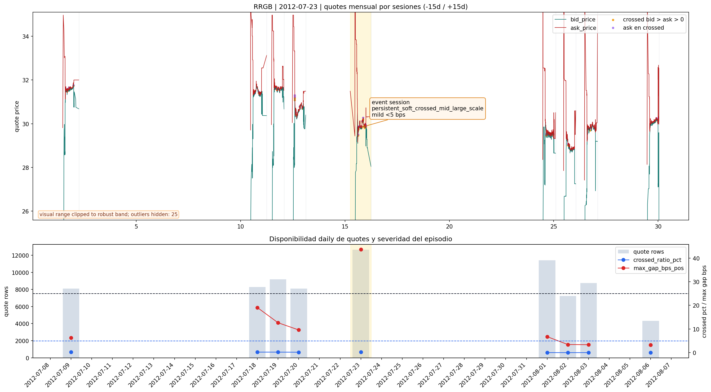

#### 01 Raw Window
Esta imagen responde a la primera pregunta decisiva del caso: el crossed observado es economicamente bastante fuerte para justificar un cambio de clase. Arriba ensena la geometria exacta del tramo conflictivo; abajo convierte esa geometria a bps y la enfrenta a los cortes `5 bps` y `25 bps`. El regimen dominante es `mild <5 bps`. La decision que cambia es pasar de anomalia interpretable a `review` o `bad`. El error que evita es decidir por apariencia visual sin medir el dano economico real del crossed. En terminos de pipeline, este panel decide si el problema afecta solo a la lectura forense o si invalida simulacion de ejecucion y microstructure features.

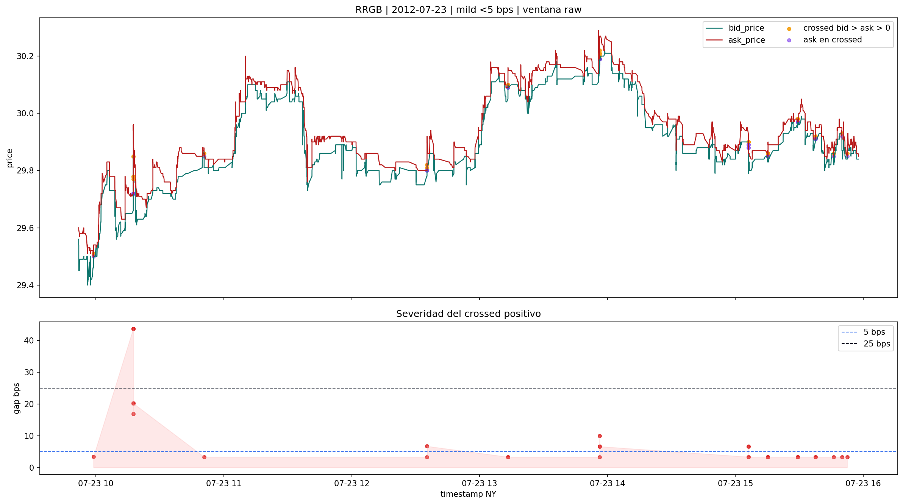

#### 02 Full Session Context
Esta imagen responde a la pregunta de extension intradiaria: el dano esta confinado a un bloque corto o contamina la sesion completa. Arriba se ve toda la sesion `04:00-20:00 NY`; abajo el `gap_bps` firmado. La decision que cambia es si el consumo debe penalizar solo un tramo o desechar el dia entero para uso operativo. El error que evita es tratar una cicatriz local como ruina total o, al reves, minimizar una degradacion distribuida a lo largo del dia. En ejecucion esto decide si la sesion puede seguir usandose con restricciones; en ML decide si las features intradiarias conservan significado economico.

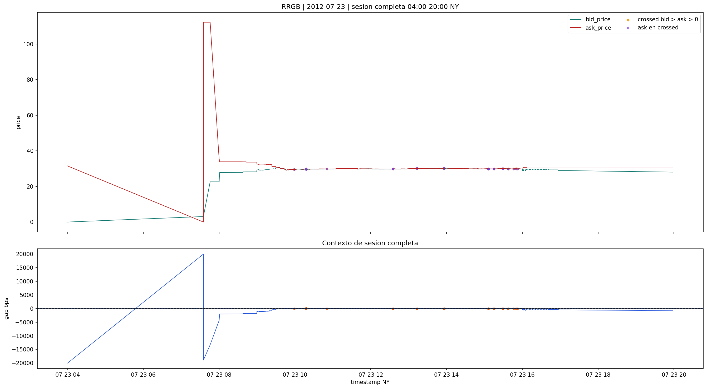

#### 03 Structure Diagnostics
Este panel responde a la pregunta de naturaleza del fallo: contradiccion economica genuina o mezcla con degeneracion estructural. Separa `ask=0` de `ask>0`, muestra la distribucion de `gap_bps` y resume patrones de integerizacion. La decision que cambia es como interpretar el dano: mercado localmente roto, artefacto de representacion o combinacion de ambos. El error que evita es sobrediagnosticar crossed reales cuando parte de la senal proviene de estructura degenerada del libro. Esta lectura afecta directamente a que el caso vaya a exclusion dura, a bandera contextual o a simple reconciliacion tecnica.

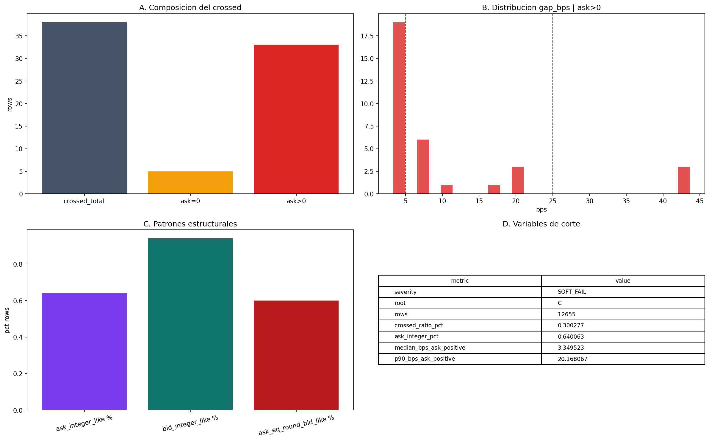

#### 04 Summary Card
Esta tarjeta responde a la pregunta de auditabilidad: cuales son exactamente las variables que sostienen la conclusion. Reune `severity`, `root`, `crossed_ratio_pct`, `ask_integer_pct`, `median_bps_ask_positive` y `p90_bps_ask_positive`. La decision que cambia es pasar de impresion visual a regla verificable. El error que evita es que dos inspectores lleguen a conclusiones distintas mirando la misma imagen sin una base numerica comun. Para gobernanza del proyecto, este panel es el que vuelve reproducible la decision para backtest, ML y auditoria.

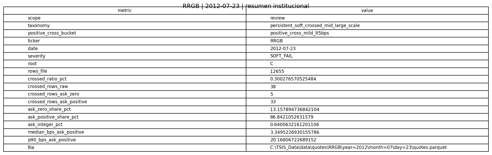

---

### 56. DRQ 2006-09-22

company_name: `Dril-Quip, Inc.`
primary_exchange: `NYSE` (`XNYS`)
market_locale: `stocks/us`
scope: `review`
ticker: `DRQ`
date: `2006-09-22`
taxonomy: `persistent_soft_crossed_mid_large_scale`
positive_cross_bucket: `positive_cross_mild_lt5bps`
severity: `SOFT_FAIL`
root: `D`
rows: `11484`
crossed_ratio_pct: `0.339603`
crossed_rows_raw: `39`
crossed_rows_ask_zero: `1`
crossed_rows_ask_positive: `38`
ask_integer_pct: `1.236503`
median_bps_ask_positive: `3.095019`
p90_bps_ask_positive: `5.666182`
file: `D:\quotes\DRQ\year=2006\month=09\day=22\quotes.parquet`

#### Analisis Forense
La conclusion correcta del caso es que ya existe contradiccion economica real dentro del libro, pero aun no con fuerza suficiente para justificar exclusion dura sin contexto adicional. La taxonomy historica es `persistent_soft_crossed_mid_large_scale` y el regimen positivo dominante es `mild <5 bps`. Esto importa porque la taxonomy no solo clasifica: resume que tipo de anomalia se esta viendo y que clase de decision contractual puede defenderse despues. La taxonomy `persistent_soft_crossed_mid_large_scale` implica un problema repetido y distribuido, no un simple pinchazo local. Por eso empuja a `review`: ya hay dano real, aunque no necesariamente exclusion dura universal. El regimen `mild <5 bps` significa que existe contradiccion economica positiva, pero aun en una banda donde un uso prudente puede seguir siendo defendible si la persistencia y la estructura no agravan el caso. En terminos observables, el file tiene `crossed_ratio_pct=0.339603` con `crossed_rows_ask_positive=38` y `crossed_rows_ask_zero=1`. La severidad economica del crossed ask>0 se resume en `median_bps_ask_positive=3.095019` y `p90_bps_ask_positive=5.666182`. Estos dos numeros convierten una forma visual rara en una conclusion operativa sobre si el libro sigue representando o no un mercado negociable. La decision que cambia es pasar de libro sano a libro util solo bajo cautela. `review` significa: no usar como si fuera ejecucion limpia, conservar para analisis contextual y sensibilidad. El error que evita es tratar como normal un episodio que ya contiene contradiccion economica real y contaminar simulaciones de ejecucion o validaciones demasiado optimistas. El patron estructural muestra `ask_integer_pct=1.236503`. Este numero obliga a separar dos explicaciones rivales: contradiccion economica genuina del libro o mezcla con degeneracion estructural / integerizacion. La mayor parte del crossed vive en `ask>0`, de modo que el corazon del problema sigue siendo economico. La parte `ask=0`, si existe, acompana pero no explica por si sola la anomalia. Como `ask_integer_pct` es bajo, la hipotesis de simple degeneracion mecanica pierde fuerza. Eso endurece la interpretacion: el crossed se parece mas a contradiccion economica genuina y menos a artefacto. En la capa de semantica de precio del evento aparecen `daily raw close=31.5550`, `quote mid raw=63.6850`, `quote mid split_normalized=31.8425`, `daily adjusted_proxy=31.5550`. La reconciliacion incluye `future_split_factor=2.0000`. La implicacion metodologica es crucial: una discrepancia entre `quotes`, `daily` y una plataforma externa no puede leerse automaticamente como fallo del dataset. Puede ser semantica de precio distinta. El error que evita esta capa es mezclar raw, split-normalized y adjusted dentro del mismo pipeline, rompiendo auditoria, benchmarking y labels. Para pipelines, esto empuja a conservar el caso fuera de ejecucion limpia, pero todavia puede mantenerse en investigacion contextual y en analisis de sensibilidad donde interese entender fronteras de tolerancia. Existe ademas una imagen historica de certificacion asociada. Su papel es poner el episodio en un marco causal mas amplio: halt, explained, not strongly explained o patron conocido. La regla que protege al proyecto es esta: el contexto externo se usa para explicar por que aparece el episodio, no para absolverlo. El error que evita es degradar el criterio de calidad del libro porque exista una historia plausible alrededor del caso.

#### 00 Event Month Context
Esta imagen responde a la pregunta de persistencia temporal: estamos ante un accidente local o ante una fase mas amplia de inestabilidad. Arriba coloca el evento en la serie `daily` real del mes; abajo compara `crossed_ratio_pct` y `max_gap_bps_pos` del dia contra sus vecinos. La decision que cambia es el peso estructural que se le concede al caso. El error que evita es juzgar igual un shock aislado y una degradacion repetida del libro.

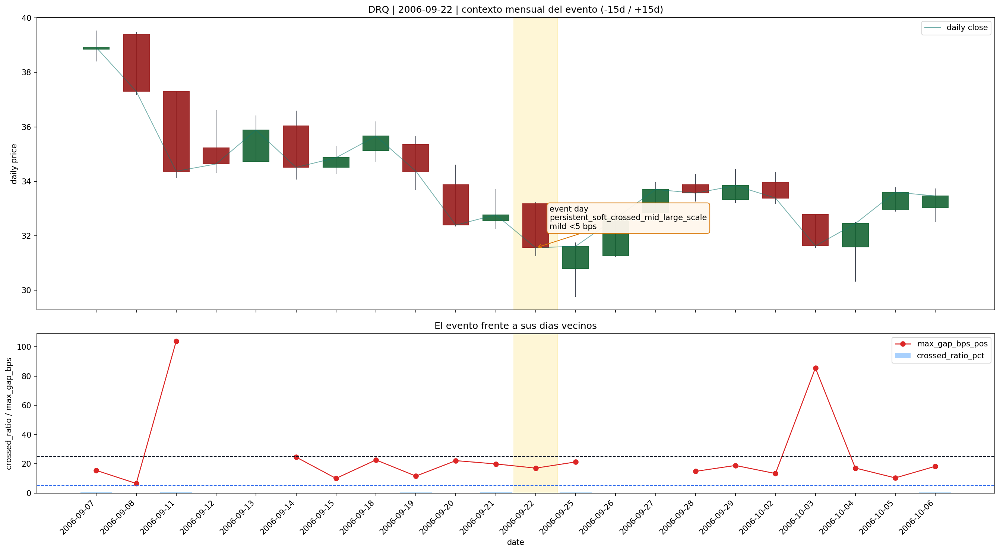

#### 00a Adjusted Proxy Contrast
Esta imagen responde a la pregunta de reconciliacion semantica: la discrepancia de precios viene de datos rotos o de vistas de precio distintas. Compara `daily raw`, `daily adjusted_proxy`, `quote mid raw` y `quote mid split_normalized`, y debajo ensena la cadena de dividendos y splits que produce la diferencia. La decision que cambia es si el inspector debe abrir una incidencia de calidad o cerrar el caso como diferencia legitima de semantica. El error que evita es mezclar series raw y adjusted como si fueran equivalentes. En pipelines reales, esto protege benchmarking, labels diarios y reconciliacion externa frente a falsas alarmas de precio.

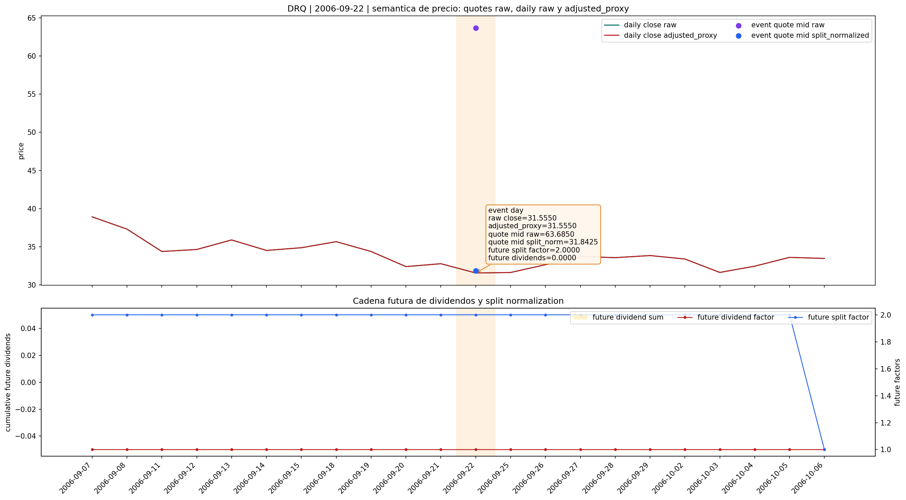

#### 00b Event Month Quotes Context
Esta imagen responde a la pregunta de recurrencia mensual dentro de `quotes`: el problema se concentra en el evento o reaparece en varias sesiones. Arriba concatena sesiones con datos disponibles; abajo resume cobertura diaria, `crossed_ratio_pct` y `max_gap_bps_pos`. La decision que cambia es si el caso debe leerse como episodio puntual o como sintoma de una fase repetida de libro degradado. El error que evita es extrapolar desde un unico dia a todo el mes sin evidencia.

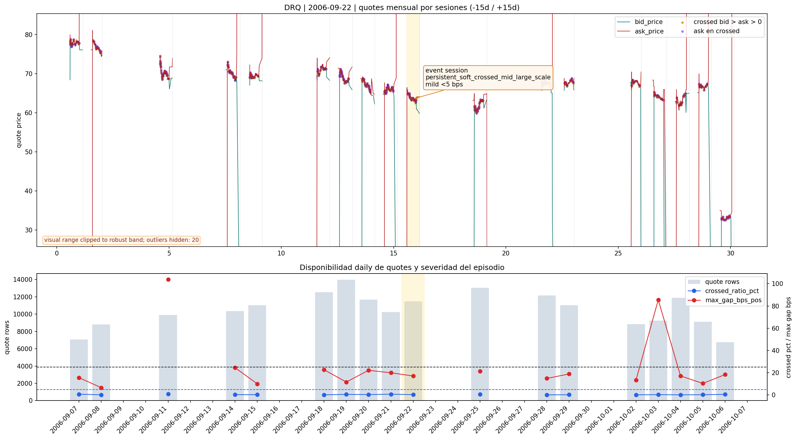

#### 01 Raw Window
Esta imagen responde a la primera pregunta decisiva del caso: el crossed observado es economicamente bastante fuerte para justificar un cambio de clase. Arriba ensena la geometria exacta del tramo conflictivo; abajo convierte esa geometria a bps y la enfrenta a los cortes `5 bps` y `25 bps`. El regimen dominante es `mild <5 bps`. La decision que cambia es pasar de anomalia interpretable a `review` o `bad`. El error que evita es decidir por apariencia visual sin medir el dano economico real del crossed. En terminos de pipeline, este panel decide si el problema afecta solo a la lectura forense o si invalida simulacion de ejecucion y microstructure features.

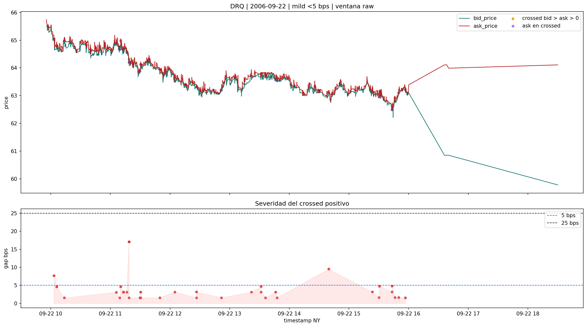

#### 02 Full Session Context
Esta imagen responde a la pregunta de extension intradiaria: el dano esta confinado a un bloque corto o contamina la sesion completa. Arriba se ve toda la sesion `04:00-20:00 NY`; abajo el `gap_bps` firmado. La decision que cambia es si el consumo debe penalizar solo un tramo o desechar el dia entero para uso operativo. El error que evita es tratar una cicatriz local como ruina total o, al reves, minimizar una degradacion distribuida a lo largo del dia. En ejecucion esto decide si la sesion puede seguir usandose con restricciones; en ML decide si las features intradiarias conservan significado economico.

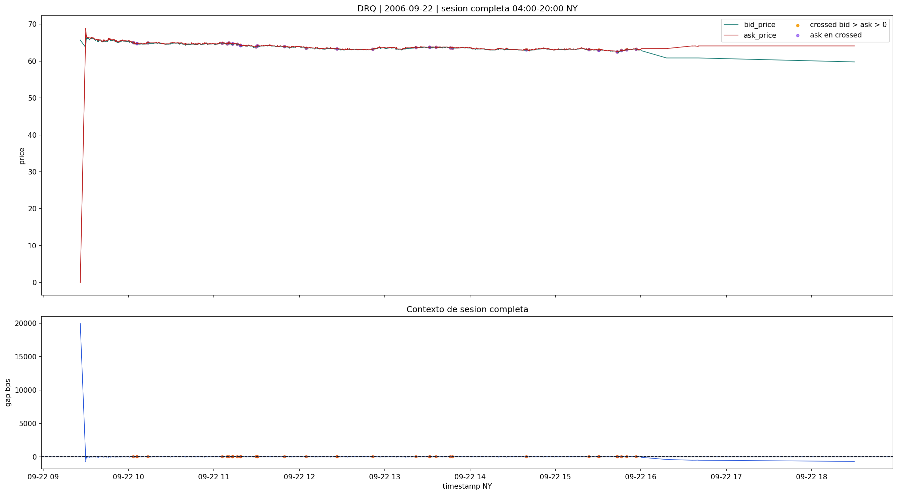

#### 03 Structure Diagnostics
Este panel responde a la pregunta de naturaleza del fallo: contradiccion economica genuina o mezcla con degeneracion estructural. Separa `ask=0` de `ask>0`, muestra la distribucion de `gap_bps` y resume patrones de integerizacion. La decision que cambia es como interpretar el dano: mercado localmente roto, artefacto de representacion o combinacion de ambos. El error que evita es sobrediagnosticar crossed reales cuando parte de la senal proviene de estructura degenerada del libro. Esta lectura afecta directamente a que el caso vaya a exclusion dura, a bandera contextual o a simple reconciliacion tecnica.

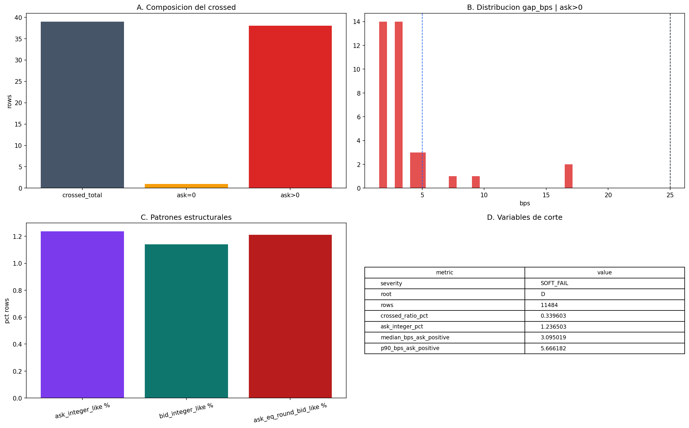

#### 04 Summary Card
Esta tarjeta responde a la pregunta de auditabilidad: cuales son exactamente las variables que sostienen la conclusion. Reune `severity`, `root`, `crossed_ratio_pct`, `ask_integer_pct`, `median_bps_ask_positive` y `p90_bps_ask_positive`. La decision que cambia es pasar de impresion visual a regla verificable. El error que evita es que dos inspectores lleguen a conclusiones distintas mirando la misma imagen sin una base numerica comun. Para gobernanza del proyecto, este panel es el que vuelve reproducible la decision para backtest, ML y auditoria.

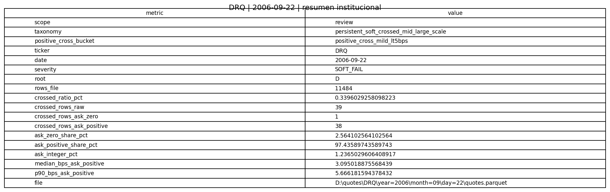

---

### 57. FRC 2012-12-11

company_name: `First Republic Bank`
primary_exchange: `NYSE` (`XNYS`)
market_locale: `stocks/us`
scope: `review`
ticker: `FRC`
date: `2012-12-11`
taxonomy: `persistent_soft_crossed_mid_large_scale`
positive_cross_bucket: `positive_cross_mild_lt5bps`
severity: `SOFT_FAIL`
root: `D`
rows: `11261`
crossed_ratio_pct: `0.523932`
crossed_rows_raw: `59`
crossed_rows_ask_zero: `46`
crossed_rows_ask_positive: `13`
ask_integer_pct: `2.379895`
median_bps_ask_positive: `3.029844`
p90_bps_ask_positive: `3.053901`
file: `D:\quotes\FRC\year=2012\month=12\day=11\quotes.parquet`

#### Analisis Forense
La conclusion correcta del caso es que ya existe contradiccion economica real dentro del libro, pero aun no con fuerza suficiente para justificar exclusion dura sin contexto adicional. La taxonomy historica es `persistent_soft_crossed_mid_large_scale` y el regimen positivo dominante es `mild <5 bps`. Esto importa porque la taxonomy no solo clasifica: resume que tipo de anomalia se esta viendo y que clase de decision contractual puede defenderse despues. La taxonomy `persistent_soft_crossed_mid_large_scale` implica un problema repetido y distribuido, no un simple pinchazo local. Por eso empuja a `review`: ya hay dano real, aunque no necesariamente exclusion dura universal. El regimen `mild <5 bps` significa que existe contradiccion economica positiva, pero aun en una banda donde un uso prudente puede seguir siendo defendible si la persistencia y la estructura no agravan el caso. En terminos observables, el file tiene `crossed_ratio_pct=0.523932` con `crossed_rows_ask_positive=13` y `crossed_rows_ask_zero=46`. La severidad economica del crossed ask>0 se resume en `median_bps_ask_positive=3.029844` y `p90_bps_ask_positive=3.053901`. Estos dos numeros convierten una forma visual rara en una conclusion operativa sobre si el libro sigue representando o no un mercado negociable. La decision que cambia es pasar de libro sano a libro util solo bajo cautela. `review` significa: no usar como si fuera ejecucion limpia, conservar para analisis contextual y sensibilidad. El error que evita es tratar como normal un episodio que ya contiene contradiccion economica real y contaminar simulaciones de ejecucion o validaciones demasiado optimistas. El patron estructural muestra `ask_integer_pct=2.379895`. Este numero obliga a separar dos explicaciones rivales: contradiccion economica genuina del libro o mezcla con degeneracion estructural / integerizacion. La mayor parte del crossed vive en `ask=0`, pero existe una cola `ask>0` que impide absolver el caso como simple glitch. La lectura correcta es mixta: dano estructural dominante con residuo economico que aun puede justificar bandera o exclusion. Como `ask_integer_pct` es bajo, la hipotesis de simple degeneracion mecanica pierde fuerza. Eso endurece la interpretacion: el crossed se parece mas a contradiccion economica genuina y menos a artefacto. En la capa de semantica de precio del evento aparecen `daily raw close=32.7000`, `quote mid raw=32.8950`, `quote mid split_normalized=32.8950`, `daily adjusted_proxy=26.3179`. Ademas hay `post_event_dividend_sum=7.3000`. La implicacion metodologica es crucial: una discrepancia entre `quotes`, `daily` y una plataforma externa no puede leerse automaticamente como fallo del dataset. Puede ser semantica de precio distinta. El error que evita esta capa es mezclar raw, split-normalized y adjusted dentro del mismo pipeline, rompiendo auditoria, benchmarking y labels. Para pipelines, esto empuja a conservar el caso fuera de ejecucion limpia, pero todavia puede mantenerse en investigacion contextual y en analisis de sensibilidad donde interese entender fronteras de tolerancia. Existe ademas una imagen historica de certificacion asociada. Su papel es poner el episodio en un marco causal mas amplio: halt, explained, not strongly explained o patron conocido. La regla que protege al proyecto es esta: el contexto externo se usa para explicar por que aparece el episodio, no para absolverlo. El error que evita es degradar el criterio de calidad del libro porque exista una historia plausible alrededor del caso.

#### 00 Event Month Context
Esta imagen responde a la pregunta de persistencia temporal: estamos ante un accidente local o ante una fase mas amplia de inestabilidad. Arriba coloca el evento en la serie `daily` real del mes; abajo compara `crossed_ratio_pct` y `max_gap_bps_pos` del dia contra sus vecinos. La decision que cambia es el peso estructural que se le concede al caso. El error que evita es juzgar igual un shock aislado y una degradacion repetida del libro.

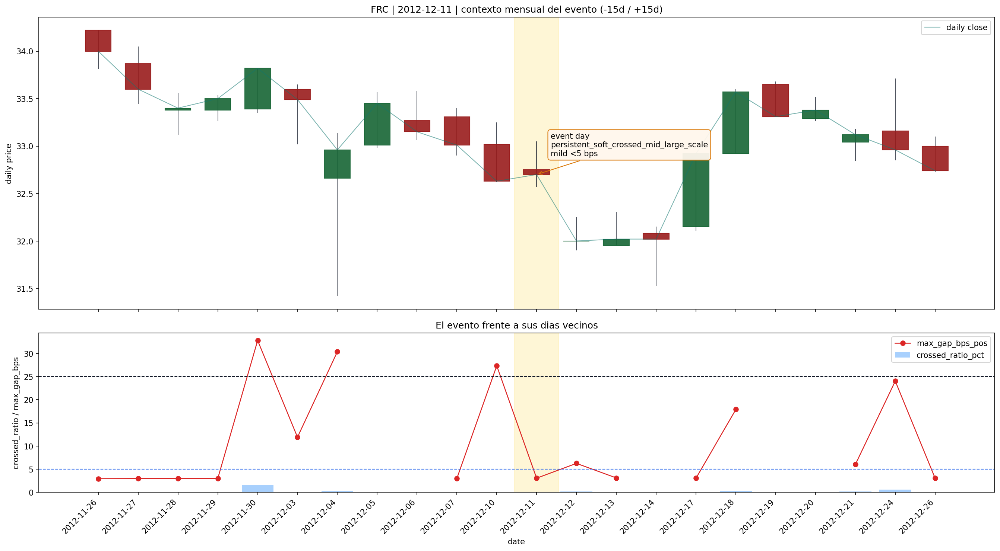

#### 00a Adjusted Proxy Contrast
Esta imagen responde a la pregunta de reconciliacion semantica: la discrepancia de precios viene de datos rotos o de vistas de precio distintas. Compara `daily raw`, `daily adjusted_proxy`, `quote mid raw` y `quote mid split_normalized`, y debajo ensena la cadena de dividendos y splits que produce la diferencia. La decision que cambia es si el inspector debe abrir una incidencia de calidad o cerrar el caso como diferencia legitima de semantica. El error que evita es mezclar series raw y adjusted como si fueran equivalentes. En pipelines reales, esto protege benchmarking, labels diarios y reconciliacion externa frente a falsas alarmas de precio.

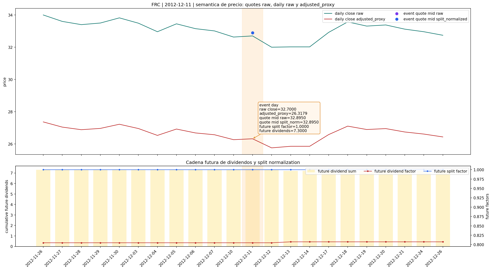

#### 00b Event Month Quotes Context
Esta imagen responde a la pregunta de recurrencia mensual dentro de `quotes`: el problema se concentra en el evento o reaparece en varias sesiones. Arriba concatena sesiones con datos disponibles; abajo resume cobertura diaria, `crossed_ratio_pct` y `max_gap_bps_pos`. La decision que cambia es si el caso debe leerse como episodio puntual o como sintoma de una fase repetida de libro degradado. El error que evita es extrapolar desde un unico dia a todo el mes sin evidencia.

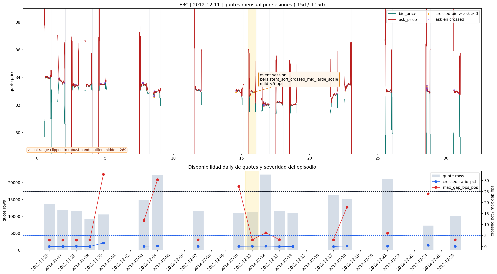

#### 01 Raw Window
Esta imagen responde a la primera pregunta decisiva del caso: el crossed observado es economicamente bastante fuerte para justificar un cambio de clase. Arriba ensena la geometria exacta del tramo conflictivo; abajo convierte esa geometria a bps y la enfrenta a los cortes `5 bps` y `25 bps`. El regimen dominante es `mild <5 bps`. La decision que cambia es pasar de anomalia interpretable a `review` o `bad`. El error que evita es decidir por apariencia visual sin medir el dano economico real del crossed. En terminos de pipeline, este panel decide si el problema afecta solo a la lectura forense o si invalida simulacion de ejecucion y microstructure features.

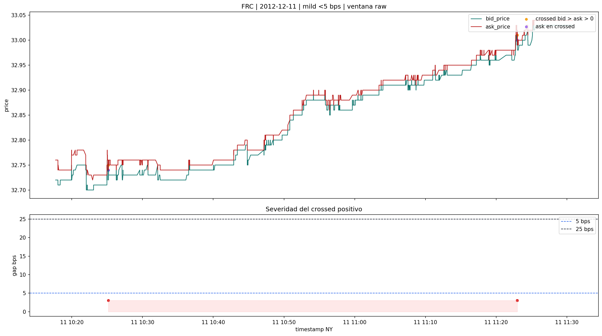

#### 02 Full Session Context
Esta imagen responde a la pregunta de extension intradiaria: el dano esta confinado a un bloque corto o contamina la sesion completa. Arriba se ve toda la sesion `04:00-20:00 NY`; abajo el `gap_bps` firmado. La decision que cambia es si el consumo debe penalizar solo un tramo o desechar el dia entero para uso operativo. El error que evita es tratar una cicatriz local como ruina total o, al reves, minimizar una degradacion distribuida a lo largo del dia. En ejecucion esto decide si la sesion puede seguir usandose con restricciones; en ML decide si las features intradiarias conservan significado economico.

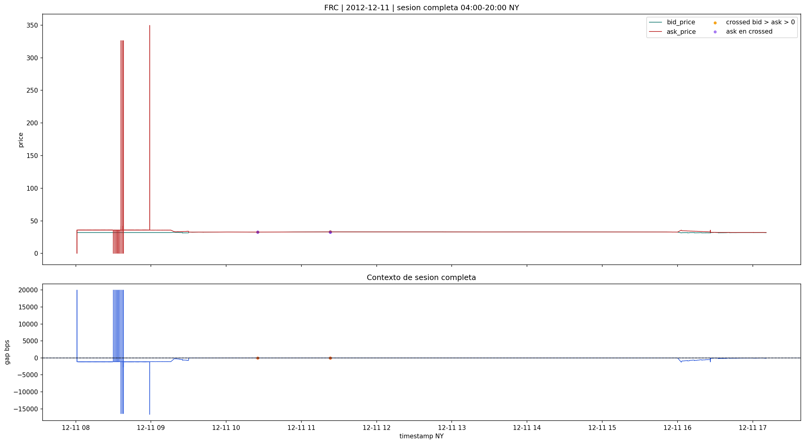

#### 03 Structure Diagnostics
Este panel responde a la pregunta de naturaleza del fallo: contradiccion economica genuina o mezcla con degeneracion estructural. Separa `ask=0` de `ask>0`, muestra la distribucion de `gap_bps` y resume patrones de integerizacion. La decision que cambia es como interpretar el dano: mercado localmente roto, artefacto de representacion o combinacion de ambos. El error que evita es sobrediagnosticar crossed reales cuando parte de la senal proviene de estructura degenerada del libro. Esta lectura afecta directamente a que el caso vaya a exclusion dura, a bandera contextual o a simple reconciliacion tecnica.

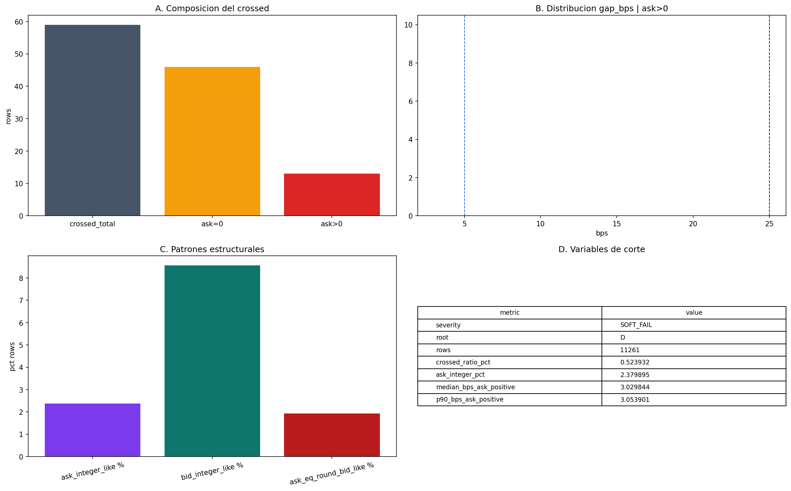

#### 04 Summary Card
Esta tarjeta responde a la pregunta de auditabilidad: cuales son exactamente las variables que sostienen la conclusion. Reune `severity`, `root`, `crossed_ratio_pct`, `ask_integer_pct`, `median_bps_ask_positive` y `p90_bps_ask_positive`. La decision que cambia es pasar de impresion visual a regla verificable. El error que evita es que dos inspectores lleguen a conclusiones distintas mirando la misma imagen sin una base numerica comun. Para gobernanza del proyecto, este panel es el que vuelve reproducible la decision para backtest, ML y auditoria.

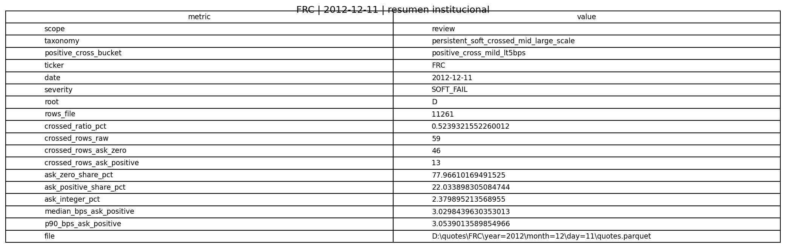

---

### 58. ADTN 2012-02-24

company_name: `Adtran Inc`
primary_exchange: `NASDAQ` (`XNAS`)
market_locale: `stocks/us`
scope: `review`
ticker: `ADTN`
date: `2012-02-24`
taxonomy: `persistent_soft_crossed_mid_large_scale`
positive_cross_bucket: `positive_cross_mild_lt5bps`
severity: `SOFT_FAIL`
root: `D`
rows: `18124`
crossed_ratio_pct: `0.496579`
crossed_rows_raw: `90`
crossed_rows_ask_zero: `1`
crossed_rows_ask_positive: `89`
ask_integer_pct: `0.502097`
median_bps_ask_positive: `2.661344`
p90_bps_ask_positive: `5.263158`
file: `D:\quotes\ADTN\year=2012\month=02\day=24\quotes.parquet`

#### Analisis Forense
La conclusion correcta del caso es que ya existe contradiccion economica real dentro del libro, pero aun no con fuerza suficiente para justificar exclusion dura sin contexto adicional. La taxonomy historica es `persistent_soft_crossed_mid_large_scale` y el regimen positivo dominante es `mild <5 bps`. Esto importa porque la taxonomy no solo clasifica: resume que tipo de anomalia se esta viendo y que clase de decision contractual puede defenderse despues. La taxonomy `persistent_soft_crossed_mid_large_scale` implica un problema repetido y distribuido, no un simple pinchazo local. Por eso empuja a `review`: ya hay dano real, aunque no necesariamente exclusion dura universal. El regimen `mild <5 bps` significa que existe contradiccion economica positiva, pero aun en una banda donde un uso prudente puede seguir siendo defendible si la persistencia y la estructura no agravan el caso. En terminos observables, el file tiene `crossed_ratio_pct=0.496579` con `crossed_rows_ask_positive=89` y `crossed_rows_ask_zero=1`. La severidad economica del crossed ask>0 se resume en `median_bps_ask_positive=2.661344` y `p90_bps_ask_positive=5.263158`. Estos dos numeros convierten una forma visual rara en una conclusion operativa sobre si el libro sigue representando o no un mercado negociable. La decision que cambia es pasar de libro sano a libro util solo bajo cautela. `review` significa: no usar como si fuera ejecucion limpia, conservar para analisis contextual y sensibilidad. El error que evita es tratar como normal un episodio que ya contiene contradiccion economica real y contaminar simulaciones de ejecucion o validaciones demasiado optimistas. El patron estructural muestra `ask_integer_pct=0.502097`. Este numero obliga a separar dos explicaciones rivales: contradiccion economica genuina del libro o mezcla con degeneracion estructural / integerizacion. La mayor parte del crossed vive en `ask>0`, de modo que el corazon del problema sigue siendo economico. La parte `ask=0`, si existe, acompana pero no explica por si sola la anomalia. Como `ask_integer_pct` es bajo, la hipotesis de simple degeneracion mecanica pierde fuerza. Eso endurece la interpretacion: el crossed se parece mas a contradiccion economica genuina y menos a artefacto. En la capa de semantica de precio del evento aparecen `daily raw close=37.6100`, `quote mid raw=37.5850`, `quote mid split_normalized=37.5850`, `daily adjusted_proxy=36.2797`. Ademas hay `post_event_dividend_sum=0.4500`. La implicacion metodologica es crucial: una discrepancia entre `quotes`, `daily` y una plataforma externa no puede leerse automaticamente como fallo del dataset. Puede ser semantica de precio distinta. El error que evita esta capa es mezclar raw, split-normalized y adjusted dentro del mismo pipeline, rompiendo auditoria, benchmarking y labels. Para pipelines, esto empuja a conservar el caso fuera de ejecucion limpia, pero todavia puede mantenerse en investigacion contextual y en analisis de sensibilidad donde interese entender fronteras de tolerancia. Existe ademas una imagen historica de certificacion asociada. Su papel es poner el episodio en un marco causal mas amplio: halt, explained, not strongly explained o patron conocido. La regla que protege al proyecto es esta: el contexto externo se usa para explicar por que aparece el episodio, no para absolverlo. El error que evita es degradar el criterio de calidad del libro porque exista una historia plausible alrededor del caso.

#### 00 Event Month Context
Esta imagen responde a la pregunta de persistencia temporal: estamos ante un accidente local o ante una fase mas amplia de inestabilidad. Arriba coloca el evento en la serie `daily` real del mes; abajo compara `crossed_ratio_pct` y `max_gap_bps_pos` del dia contra sus vecinos. La decision que cambia es el peso estructural que se le concede al caso. El error que evita es juzgar igual un shock aislado y una degradacion repetida del libro.

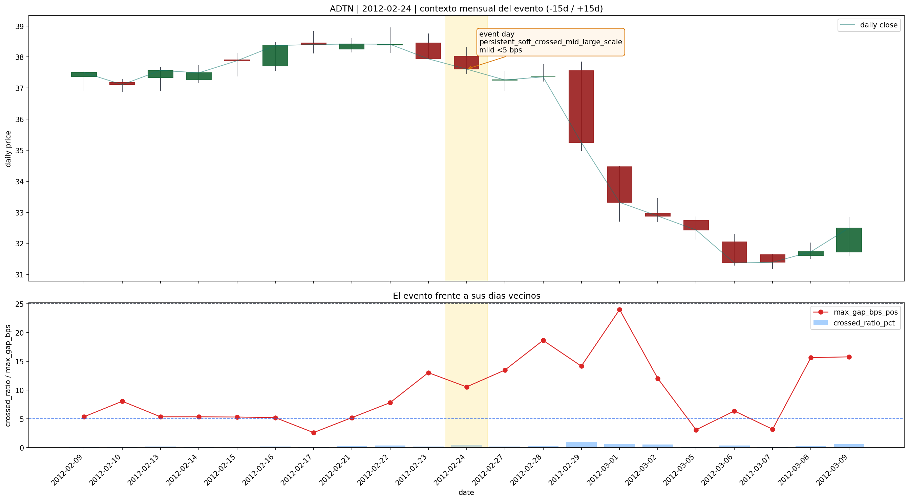

#### 00a Adjusted Proxy Contrast
Esta imagen responde a la pregunta de reconciliacion semantica: la discrepancia de precios viene de datos rotos o de vistas de precio distintas. Compara `daily raw`, `daily adjusted_proxy`, `quote mid raw` y `quote mid split_normalized`, y debajo ensena la cadena de dividendos y splits que produce la diferencia. La decision que cambia es si el inspector debe abrir una incidencia de calidad o cerrar el caso como diferencia legitima de semantica. El error que evita es mezclar series raw y adjusted como si fueran equivalentes. En pipelines reales, esto protege benchmarking, labels diarios y reconciliacion externa frente a falsas alarmas de precio.

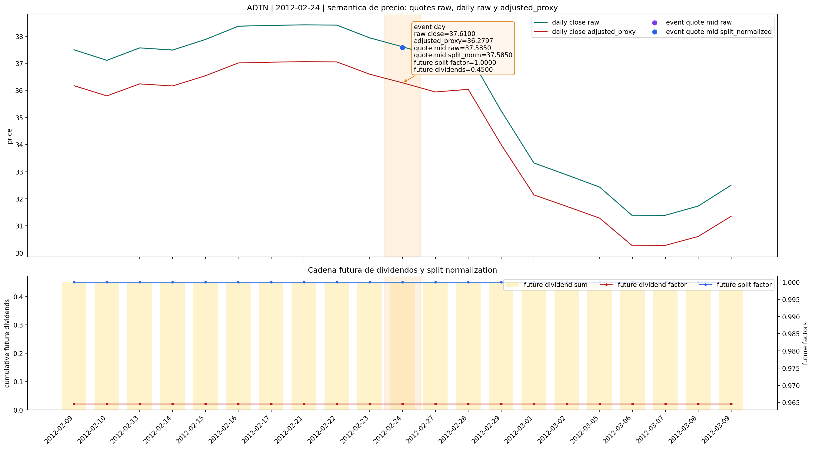

#### 00b Event Month Quotes Context
Esta imagen responde a la pregunta de recurrencia mensual dentro de `quotes`: el problema se concentra en el evento o reaparece en varias sesiones. Arriba concatena sesiones con datos disponibles; abajo resume cobertura diaria, `crossed_ratio_pct` y `max_gap_bps_pos`. La decision que cambia es si el caso debe leerse como episodio puntual o como sintoma de una fase repetida de libro degradado. El error que evita es extrapolar desde un unico dia a todo el mes sin evidencia.

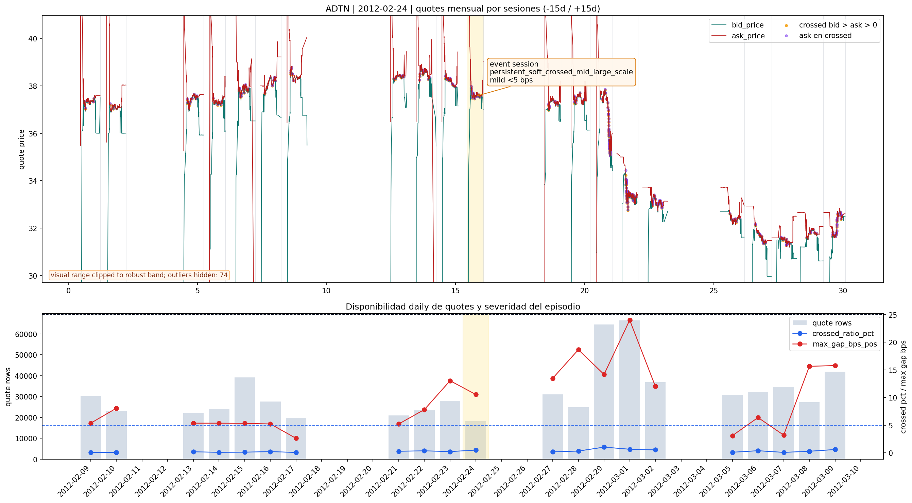

#### 01 Raw Window
Esta imagen responde a la primera pregunta decisiva del caso: el crossed observado es economicamente bastante fuerte para justificar un cambio de clase. Arriba ensena la geometria exacta del tramo conflictivo; abajo convierte esa geometria a bps y la enfrenta a los cortes `5 bps` y `25 bps`. El regimen dominante es `mild <5 bps`. La decision que cambia es pasar de anomalia interpretable a `review` o `bad`. El error que evita es decidir por apariencia visual sin medir el dano economico real del crossed. En terminos de pipeline, este panel decide si el problema afecta solo a la lectura forense o si invalida simulacion de ejecucion y microstructure features.

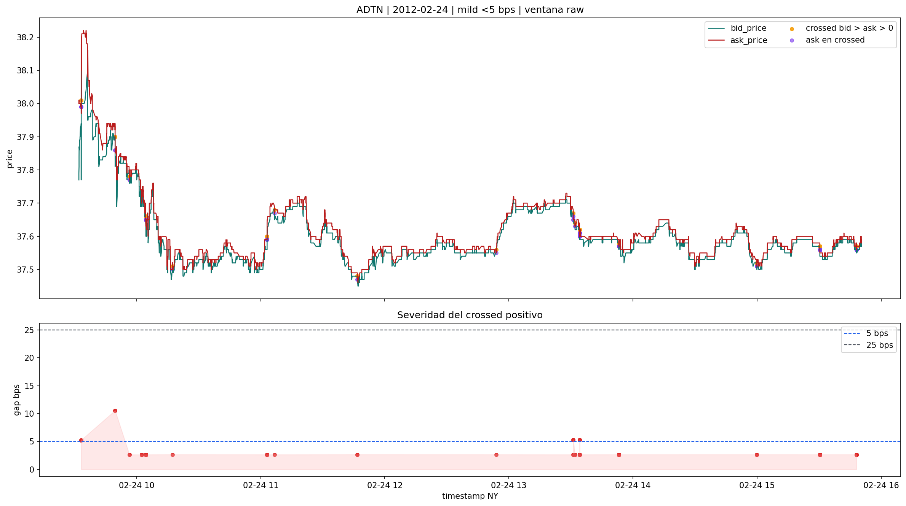

#### 02 Full Session Context
Esta imagen responde a la pregunta de extension intradiaria: el dano esta confinado a un bloque corto o contamina la sesion completa. Arriba se ve toda la sesion `04:00-20:00 NY`; abajo el `gap_bps` firmado. La decision que cambia es si el consumo debe penalizar solo un tramo o desechar el dia entero para uso operativo. El error que evita es tratar una cicatriz local como ruina total o, al reves, minimizar una degradacion distribuida a lo largo del dia. En ejecucion esto decide si la sesion puede seguir usandose con restricciones; en ML decide si las features intradiarias conservan significado economico.

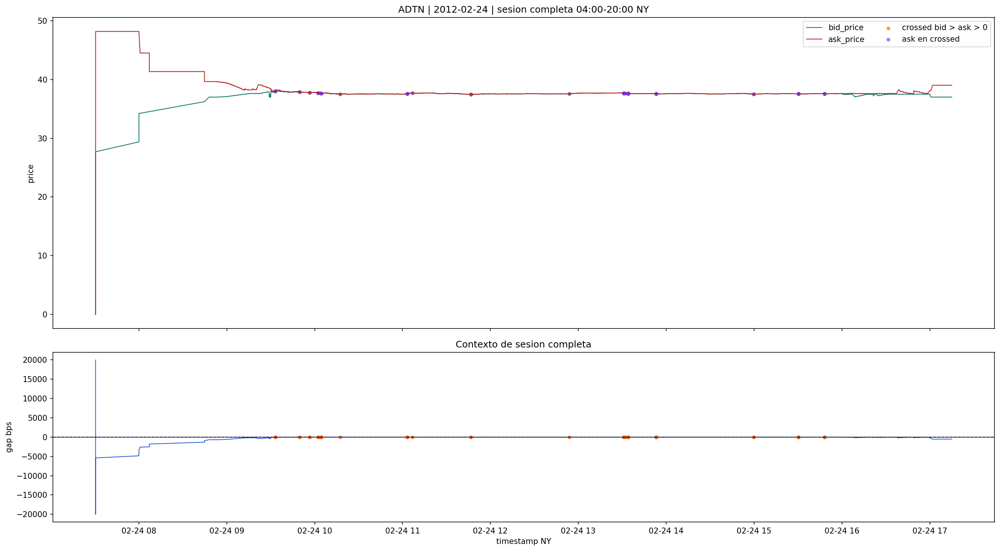

#### 03 Structure Diagnostics
Este panel responde a la pregunta de naturaleza del fallo: contradiccion economica genuina o mezcla con degeneracion estructural. Separa `ask=0` de `ask>0`, muestra la distribucion de `gap_bps` y resume patrones de integerizacion. La decision que cambia es como interpretar el dano: mercado localmente roto, artefacto de representacion o combinacion de ambos. El error que evita es sobrediagnosticar crossed reales cuando parte de la senal proviene de estructura degenerada del libro. Esta lectura afecta directamente a que el caso vaya a exclusion dura, a bandera contextual o a simple reconciliacion tecnica.

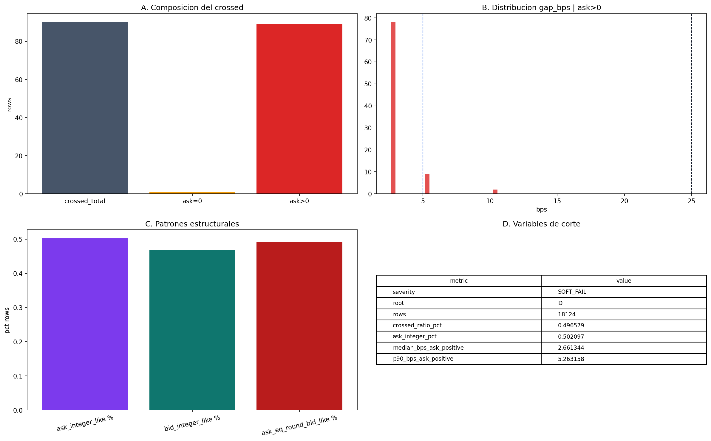

#### 04 Summary Card
Esta tarjeta responde a la pregunta de auditabilidad: cuales son exactamente las variables que sostienen la conclusion. Reune `severity`, `root`, `crossed_ratio_pct`, `ask_integer_pct`, `median_bps_ask_positive` y `p90_bps_ask_positive`. La decision que cambia es pasar de impresion visual a regla verificable. El error que evita es que dos inspectores lleguen a conclusiones distintas mirando la misma imagen sin una base numerica comun. Para gobernanza del proyecto, este panel es el que vuelve reproducible la decision para backtest, ML y auditoria.

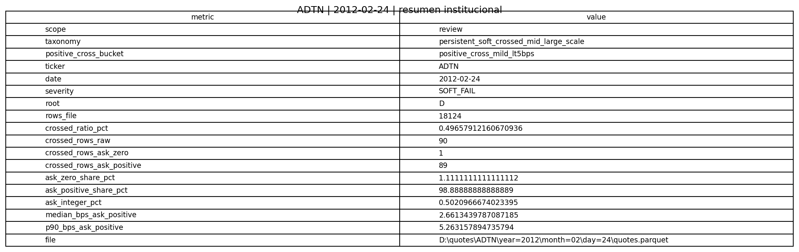

---

### 59. APOL 2007-10-25

company_name: `Apollo Education Group Inc Class A`
primary_exchange: `NASDAQ` (`XNAS`)
market_locale: `stocks/us`
scope: `review`
ticker: `APOL`
date: `2007-10-25`
taxonomy: `persistent_soft_crossed_mid_large_scale`
positive_cross_bucket: `positive_cross_mild_lt5bps`
severity: `SOFT_FAIL`
root: `D`
rows: `53281`
crossed_ratio_pct: `0.489856`
crossed_rows_raw: `261`
crossed_rows_ask_zero: `1`
crossed_rows_ask_positive: `260`
ask_integer_pct: `3.736792`
median_bps_ask_positive: `2.606882`
p90_bps_ask_positive: `12.052226`
file: `D:\quotes\APOL\year=2007\month=10\day=25\quotes.parquet`

#### Analisis Forense
La conclusion correcta del caso es que ya existe contradiccion economica real dentro del libro, pero aun no con fuerza suficiente para justificar exclusion dura sin contexto adicional. La taxonomy historica es `persistent_soft_crossed_mid_large_scale` y el regimen positivo dominante es `mild <5 bps`. Esto importa porque la taxonomy no solo clasifica: resume que tipo de anomalia se esta viendo y que clase de decision contractual puede defenderse despues. La taxonomy `persistent_soft_crossed_mid_large_scale` implica un problema repetido y distribuido, no un simple pinchazo local. Por eso empuja a `review`: ya hay dano real, aunque no necesariamente exclusion dura universal. El regimen `mild <5 bps` significa que existe contradiccion economica positiva, pero aun en una banda donde un uso prudente puede seguir siendo defendible si la persistencia y la estructura no agravan el caso. En terminos observables, el file tiene `crossed_ratio_pct=0.489856` con `crossed_rows_ask_positive=260` y `crossed_rows_ask_zero=1`. La severidad economica del crossed ask>0 se resume en `median_bps_ask_positive=2.606882` y `p90_bps_ask_positive=12.052226`. Estos dos numeros convierten una forma visual rara en una conclusion operativa sobre si el libro sigue representando o no un mercado negociable. La decision que cambia es pasar de libro sano a libro util solo bajo cautela. `review` significa: no usar como si fuera ejecucion limpia, conservar para analisis contextual y sensibilidad. El error que evita es tratar como normal un episodio que ya contiene contradiccion economica real y contaminar simulaciones de ejecucion o validaciones demasiado optimistas. El patron estructural muestra `ask_integer_pct=3.736792`. Este numero obliga a separar dos explicaciones rivales: contradiccion economica genuina del libro o mezcla con degeneracion estructural / integerizacion. La mayor parte del crossed vive en `ask>0`, de modo que el corazon del problema sigue siendo economico. La parte `ask=0`, si existe, acompana pero no explica por si sola la anomalia. Como `ask_integer_pct` es bajo, la hipotesis de simple degeneracion mecanica pierde fuerza. Eso endurece la interpretacion: el crossed se parece mas a contradiccion economica genuina y menos a artefacto. Existe ademas una imagen historica de certificacion asociada. Su papel es poner el episodio en un marco causal mas amplio: halt, explained, not strongly explained o patron conocido. La regla que protege al proyecto es esta: el contexto externo se usa para explicar por que aparece el episodio, no para absolverlo. El error que evita es degradar el criterio de calidad del libro porque exista una historia plausible alrededor del caso.

#### 00 Event Month Context
Esta imagen responde a la pregunta de persistencia temporal: estamos ante un accidente local o ante una fase mas amplia de inestabilidad. Arriba coloca el evento en la serie `daily` real del mes; abajo compara `crossed_ratio_pct` y `max_gap_bps_pos` del dia contra sus vecinos. La decision que cambia es el peso estructural que se le concede al caso. El error que evita es juzgar igual un shock aislado y una degradacion repetida del libro.

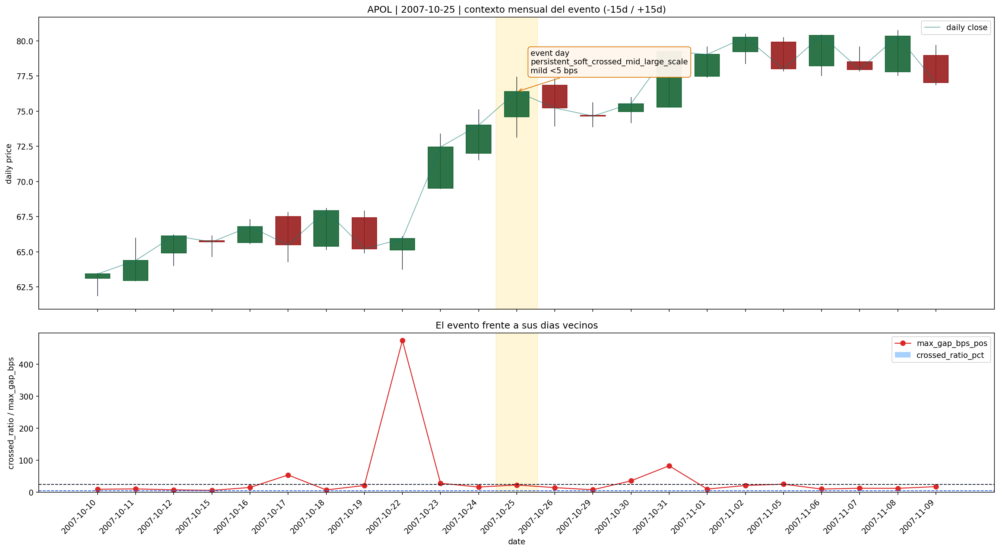

#### 00b Event Month Quotes Context
Esta imagen responde a la pregunta de recurrencia mensual dentro de `quotes`: el problema se concentra en el evento o reaparece en varias sesiones. Arriba concatena sesiones con datos disponibles; abajo resume cobertura diaria, `crossed_ratio_pct` y `max_gap_bps_pos`. La decision que cambia es si el caso debe leerse como episodio puntual o como sintoma de una fase repetida de libro degradado. El error que evita es extrapolar desde un unico dia a todo el mes sin evidencia.

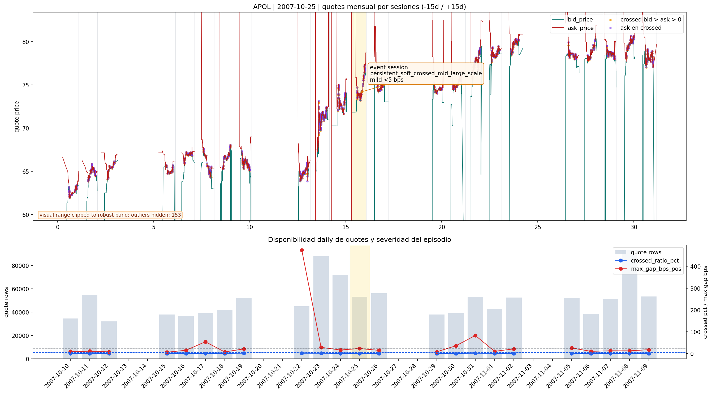

#### 01 Raw Window
Esta imagen responde a la primera pregunta decisiva del caso: el crossed observado es economicamente bastante fuerte para justificar un cambio de clase. Arriba ensena la geometria exacta del tramo conflictivo; abajo convierte esa geometria a bps y la enfrenta a los cortes `5 bps` y `25 bps`. El regimen dominante es `mild <5 bps`. La decision que cambia es pasar de anomalia interpretable a `review` o `bad`. El error que evita es decidir por apariencia visual sin medir el dano economico real del crossed. En terminos de pipeline, este panel decide si el problema afecta solo a la lectura forense o si invalida simulacion de ejecucion y microstructure features.

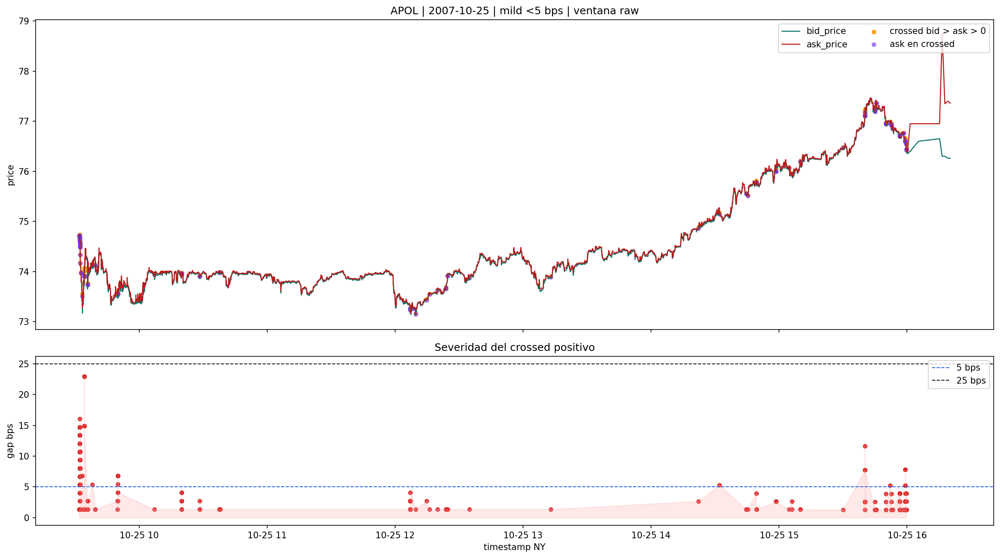

#### 02 Full Session Context
Esta imagen responde a la pregunta de extension intradiaria: el dano esta confinado a un bloque corto o contamina la sesion completa. Arriba se ve toda la sesion `04:00-20:00 NY`; abajo el `gap_bps` firmado. La decision que cambia es si el consumo debe penalizar solo un tramo o desechar el dia entero para uso operativo. El error que evita es tratar una cicatriz local como ruina total o, al reves, minimizar una degradacion distribuida a lo largo del dia. En ejecucion esto decide si la sesion puede seguir usandose con restricciones; en ML decide si las features intradiarias conservan significado economico.

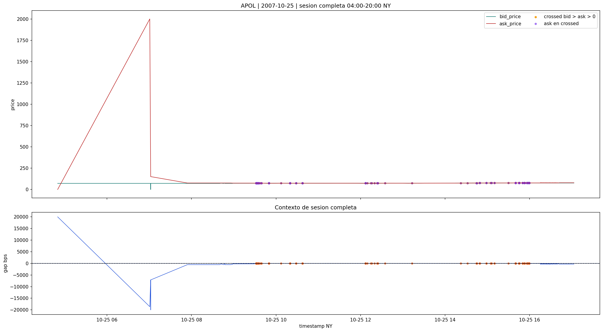

#### 03 Structure Diagnostics
Este panel responde a la pregunta de naturaleza del fallo: contradiccion economica genuina o mezcla con degeneracion estructural. Separa `ask=0` de `ask>0`, muestra la distribucion de `gap_bps` y resume patrones de integerizacion. La decision que cambia es como interpretar el dano: mercado localmente roto, artefacto de representacion o combinacion de ambos. El error que evita es sobrediagnosticar crossed reales cuando parte de la senal proviene de estructura degenerada del libro. Esta lectura afecta directamente a que el caso vaya a exclusion dura, a bandera contextual o a simple reconciliacion tecnica.

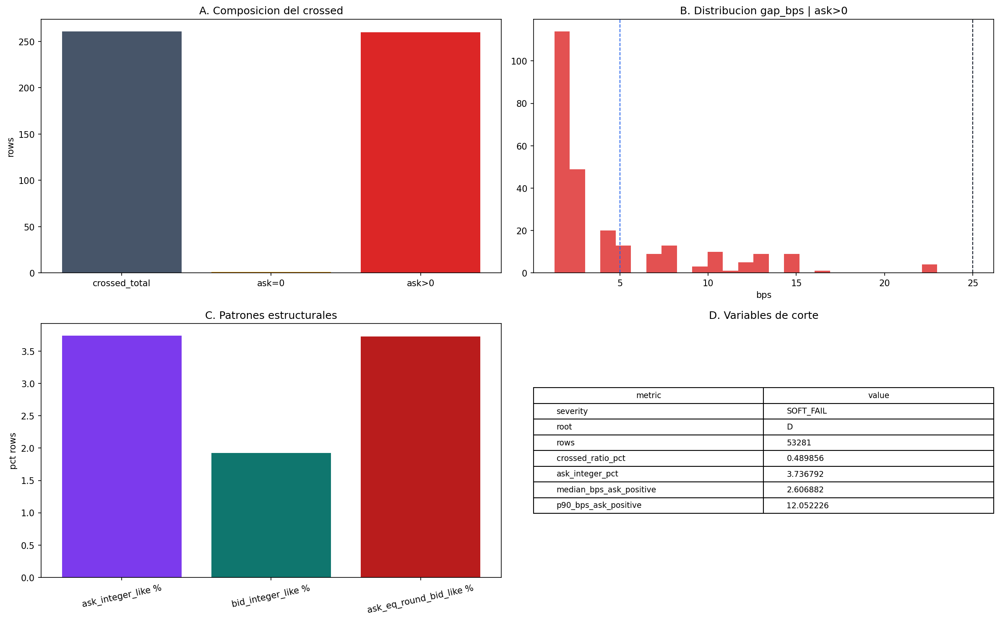

#### 04 Summary Card
Esta tarjeta responde a la pregunta de auditabilidad: cuales son exactamente las variables que sostienen la conclusion. Reune `severity`, `root`, `crossed_ratio_pct`, `ask_integer_pct`, `median_bps_ask_positive` y `p90_bps_ask_positive`. La decision que cambia es pasar de impresion visual a regla verificable. El error que evita es que dos inspectores lleguen a conclusiones distintas mirando la misma imagen sin una base numerica comun. Para gobernanza del proyecto, este panel es el que vuelve reproducible la decision para backtest, ML y auditoria.

---

### 60. OIS 2010-01-14

company_name: `OIL STATES INTERNATIONAL, INC.`
primary_exchange: `NYSE` (`XNYS`)
market_locale: `stocks/us`
scope: `review`
ticker: `OIS`
date: `2010-01-14`
taxonomy: `persistent_soft_crossed_mid_large_scale`
positive_cross_bucket: `positive_cross_mild_lt5bps`
severity: `SOFT_FAIL`
root: `D`
rows: `18048`
crossed_ratio_pct: `0.326906`
crossed_rows_raw: `59`
crossed_rows_ask_zero: `0`
crossed_rows_ask_positive: `59`
ask_integer_pct: `0.548537`
median_bps_ask_positive: `2.447681`
p90_bps_ask_positive: `7.353842`
file: `D:\quotes\OIS\year=2010\month=01\day=14\quotes.parquet`

#### Analisis Forense
La conclusion correcta del caso es que ya existe contradiccion economica real dentro del libro, pero aun no con fuerza suficiente para justificar exclusion dura sin contexto adicional. La taxonomy historica es `persistent_soft_crossed_mid_large_scale` y el regimen positivo dominante es `mild <5 bps`. Esto importa porque la taxonomy no solo clasifica: resume que tipo de anomalia se esta viendo y que clase de decision contractual puede defenderse despues. La taxonomy `persistent_soft_crossed_mid_large_scale` implica un problema repetido y distribuido, no un simple pinchazo local. Por eso empuja a `review`: ya hay dano real, aunque no necesariamente exclusion dura universal. El regimen `mild <5 bps` significa que existe contradiccion economica positiva, pero aun en una banda donde un uso prudente puede seguir siendo defendible si la persistencia y la estructura no agravan el caso. En terminos observables, el file tiene `crossed_ratio_pct=0.326906` con `crossed_rows_ask_positive=59` y `crossed_rows_ask_zero=0`. La severidad economica del crossed ask>0 se resume en `median_bps_ask_positive=2.447681` y `p90_bps_ask_positive=7.353842`. Estos dos numeros convierten una forma visual rara en una conclusion operativa sobre si el libro sigue representando o no un mercado negociable. La decision que cambia es pasar de libro sano a libro util solo bajo cautela. `review` significa: no usar como si fuera ejecucion limpia, conservar para analisis contextual y sensibilidad. El error que evita es tratar como normal un episodio que ya contiene contradiccion economica real y contaminar simulaciones de ejecucion o validaciones demasiado optimistas. El patron estructural muestra `ask_integer_pct=0.548537`. Este numero obliga a separar dos explicaciones rivales: contradiccion economica genuina del libro o mezcla con degeneracion estructural / integerizacion. Toda la composicion crossed cae en `ask>0`. Eso endurece la lectura economica del caso: el dano no depende de ceros mecanicos, sino de contradiccion positiva dentro de precios aparentemente vivos. Como `ask_integer_pct` es bajo, la hipotesis de simple degeneracion mecanica pierde fuerza. Eso endurece la interpretacion: el crossed se parece mas a contradiccion economica genuina y menos a artefacto. Existe ademas una imagen historica de certificacion asociada. Su papel es poner el episodio en un marco causal mas amplio: halt, explained, not strongly explained o patron conocido. La regla que protege al proyecto es esta: el contexto externo se usa para explicar por que aparece el episodio, no para absolverlo. El error que evita es degradar el criterio de calidad del libro porque exista una historia plausible alrededor del caso.

#### 00 Event Month Context
Esta imagen responde a la pregunta de persistencia temporal: estamos ante un accidente local o ante una fase mas amplia de inestabilidad. Arriba coloca el evento en la serie `daily` real del mes; abajo compara `crossed_ratio_pct` y `max_gap_bps_pos` del dia contra sus vecinos. La decision que cambia es el peso estructural que se le concede al caso. El error que evita es juzgar igual un shock aislado y una degradacion repetida del libro.

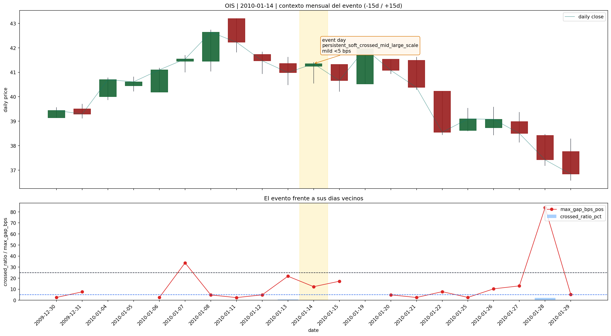

#### 00b Event Month Quotes Context
Esta imagen responde a la pregunta de recurrencia mensual dentro de `quotes`: el problema se concentra en el evento o reaparece en varias sesiones. Arriba concatena sesiones con datos disponibles; abajo resume cobertura diaria, `crossed_ratio_pct` y `max_gap_bps_pos`. La decision que cambia es si el caso debe leerse como episodio puntual o como sintoma de una fase repetida de libro degradado. El error que evita es extrapolar desde un unico dia a todo el mes sin evidencia.

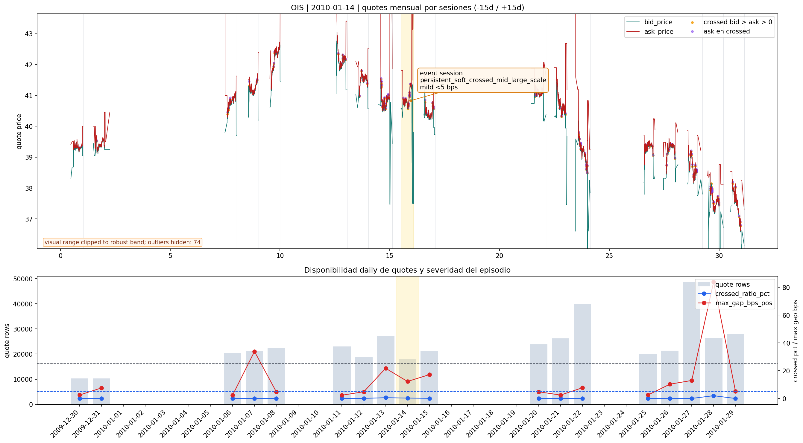

#### 01 Raw Window
Esta imagen responde a la primera pregunta decisiva del caso: el crossed observado es economicamente bastante fuerte para justificar un cambio de clase. Arriba ensena la geometria exacta del tramo conflictivo; abajo convierte esa geometria a bps y la enfrenta a los cortes `5 bps` y `25 bps`. El regimen dominante es `mild <5 bps`. La decision que cambia es pasar de anomalia interpretable a `review` o `bad`. El error que evita es decidir por apariencia visual sin medir el dano economico real del crossed. En terminos de pipeline, este panel decide si el problema afecta solo a la lectura forense o si invalida simulacion de ejecucion y microstructure features.

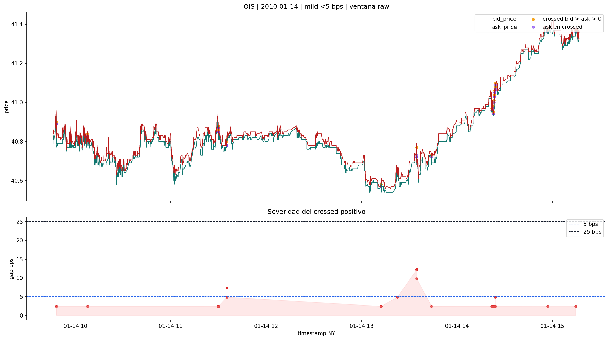

#### 02 Full Session Context
Esta imagen responde a la pregunta de extension intradiaria: el dano esta confinado a un bloque corto o contamina la sesion completa. Arriba se ve toda la sesion `04:00-20:00 NY`; abajo el `gap_bps` firmado. La decision que cambia es si el consumo debe penalizar solo un tramo o desechar el dia entero para uso operativo. El error que evita es tratar una cicatriz local como ruina total o, al reves, minimizar una degradacion distribuida a lo largo del dia. En ejecucion esto decide si la sesion puede seguir usandose con restricciones; en ML decide si las features intradiarias conservan significado economico.

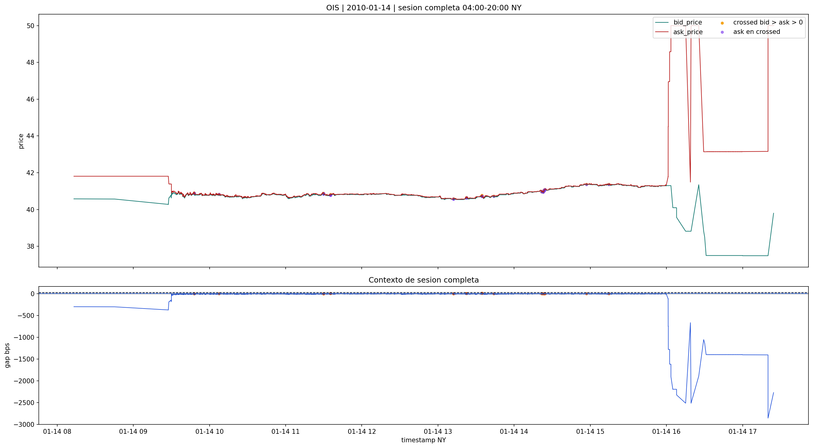

#### 03 Structure Diagnostics
Este panel responde a la pregunta de naturaleza del fallo: contradiccion economica genuina o mezcla con degeneracion estructural. Separa `ask=0` de `ask>0`, muestra la distribucion de `gap_bps` y resume patrones de integerizacion. La decision que cambia es como interpretar el dano: mercado localmente roto, artefacto de representacion o combinacion de ambos. El error que evita es sobrediagnosticar crossed reales cuando parte de la senal proviene de estructura degenerada del libro. Esta lectura afecta directamente a que el caso vaya a exclusion dura, a bandera contextual o a simple reconciliacion tecnica.

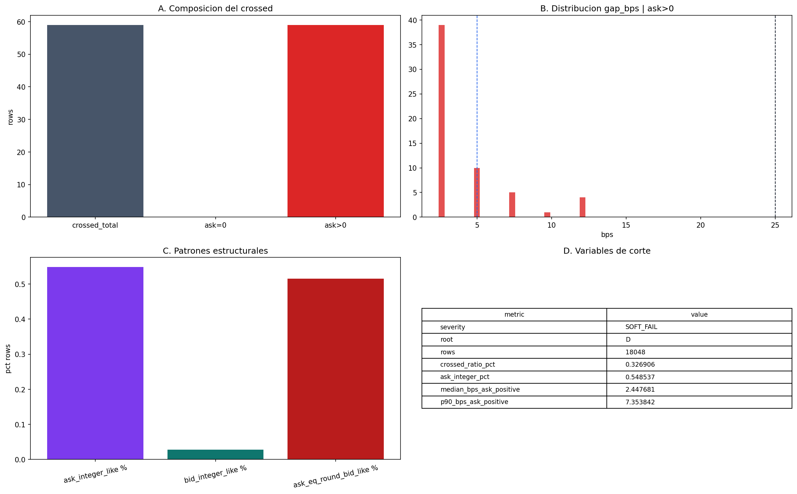

#### 04 Summary Card
Esta tarjeta responde a la pregunta de auditabilidad: cuales son exactamente las variables que sostienen la conclusion. Reune `severity`, `root`, `crossed_ratio_pct`, `ask_integer_pct`, `median_bps_ask_positive` y `p90_bps_ask_positive`. La decision que cambia es pasar de impresion visual a regla verificable. El error que evita es que dos inspectores lleguen a conclusiones distintas mirando la misma imagen sin una base numerica comun. Para gobernanza del proyecto, este panel es el que vuelve reproducible la decision para backtest, ML y auditoria.

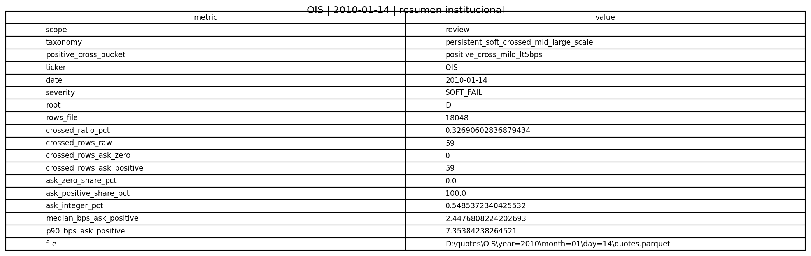

---

### 61. ICON 2014-08-18

company_name: `Iconix Brand Group, Inc.`
primary_exchange: `NASDAQ` (`XNAS`)
market_locale: `stocks/us`
scope: `review`
ticker: `ICON`
date: `2014-08-18`
taxonomy: `persistent_soft_crossed_mid_large_scale`
positive_cross_bucket: `positive_cross_mild_lt5bps`
severity: `SOFT_FAIL`
root: `D`
rows: `11394`
crossed_ratio_pct: `0.517816`
crossed_rows_raw: `59`
crossed_rows_ask_zero: `2`
crossed_rows_ask_positive: `57`
ask_integer_pct: `0.035106`
median_bps_ask_positive: `2.430429`
p90_bps_ask_positive: `2.434571`
file: `D:\quotes\ICON\year=2014\month=08\day=18\quotes.parquet`

#### Analisis Forense
La conclusion correcta del caso es que ya existe contradiccion economica real dentro del libro, pero aun no con fuerza suficiente para justificar exclusion dura sin contexto adicional. La taxonomy historica es `persistent_soft_crossed_mid_large_scale` y el regimen positivo dominante es `mild <5 bps`. Esto importa porque la taxonomy no solo clasifica: resume que tipo de anomalia se esta viendo y que clase de decision contractual puede defenderse despues. La taxonomy `persistent_soft_crossed_mid_large_scale` implica un problema repetido y distribuido, no un simple pinchazo local. Por eso empuja a `review`: ya hay dano real, aunque no necesariamente exclusion dura universal. El regimen `mild <5 bps` significa que existe contradiccion economica positiva, pero aun en una banda donde un uso prudente puede seguir siendo defendible si la persistencia y la estructura no agravan el caso. En terminos observables, el file tiene `crossed_ratio_pct=0.517816` con `crossed_rows_ask_positive=57` y `crossed_rows_ask_zero=2`. La severidad economica del crossed ask>0 se resume en `median_bps_ask_positive=2.430429` y `p90_bps_ask_positive=2.434571`. Estos dos numeros convierten una forma visual rara en una conclusion operativa sobre si el libro sigue representando o no un mercado negociable. La decision que cambia es pasar de libro sano a libro util solo bajo cautela. `review` significa: no usar como si fuera ejecucion limpia, conservar para analisis contextual y sensibilidad. El error que evita es tratar como normal un episodio que ya contiene contradiccion economica real y contaminar simulaciones de ejecucion o validaciones demasiado optimistas. El patron estructural muestra `ask_integer_pct=0.035106`. Este numero obliga a separar dos explicaciones rivales: contradiccion economica genuina del libro o mezcla con degeneracion estructural / integerizacion. La mayor parte del crossed vive en `ask>0`, de modo que el corazon del problema sigue siendo economico. La parte `ask=0`, si existe, acompana pero no explica por si sola la anomalia. Como `ask_integer_pct` es bajo, la hipotesis de simple degeneracion mecanica pierde fuerza. Eso endurece la interpretacion: el crossed se parece mas a contradiccion economica genuina y menos a artefacto. En la capa de semantica de precio del evento aparecen `daily raw close=82280.0000`, `quote mid raw=41.2000`, `quote mid split_normalized=82400.0000`, `daily adjusted_proxy=81663.8006`. La reconciliacion incluye `future_split_factor=0.0005`. Ademas hay `post_event_dividend_sum=0.2350`. La implicacion metodologica es crucial: una discrepancia entre `quotes`, `daily` y una plataforma externa no puede leerse automaticamente como fallo del dataset. Puede ser semantica de precio distinta. El error que evita esta capa es mezclar raw, split-normalized y adjusted dentro del mismo pipeline, rompiendo auditoria, benchmarking y labels. Para pipelines, esto empuja a conservar el caso fuera de ejecucion limpia, pero todavia puede mantenerse en investigacion contextual y en analisis de sensibilidad donde interese entender fronteras de tolerancia. Existe ademas una imagen historica de certificacion asociada. Su papel es poner el episodio en un marco causal mas amplio: halt, explained, not strongly explained o patron conocido. La regla que protege al proyecto es esta: el contexto externo se usa para explicar por que aparece el episodio, no para absolverlo. El error que evita es degradar el criterio de calidad del libro porque exista una historia plausible alrededor del caso.

#### 00 Event Month Context
Esta imagen responde a la pregunta de persistencia temporal: estamos ante un accidente local o ante una fase mas amplia de inestabilidad. Arriba coloca el evento en la serie `daily` real del mes; abajo compara `crossed_ratio_pct` y `max_gap_bps_pos` del dia contra sus vecinos. La decision que cambia es el peso estructural que se le concede al caso. El error que evita es juzgar igual un shock aislado y una degradacion repetida del libro.

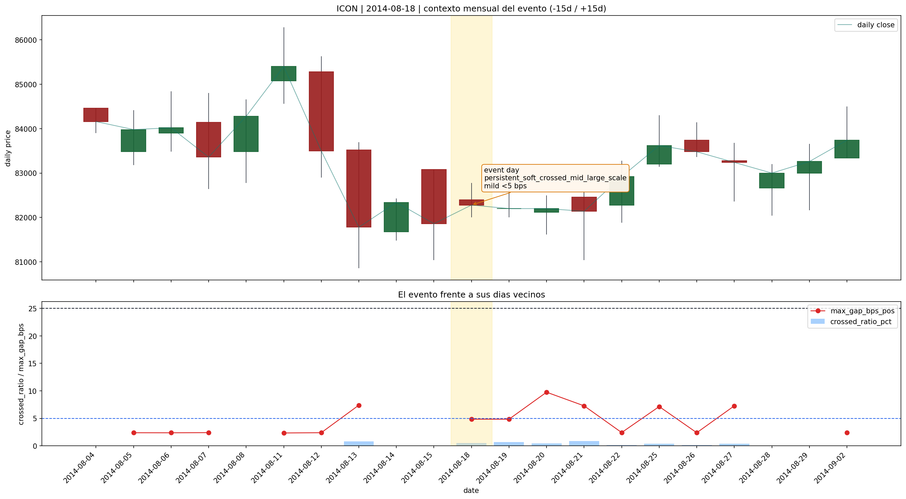

#### 00a Adjusted Proxy Contrast
Esta imagen responde a la pregunta de reconciliacion semantica: la discrepancia de precios viene de datos rotos o de vistas de precio distintas. Compara `daily raw`, `daily adjusted_proxy`, `quote mid raw` y `quote mid split_normalized`, y debajo ensena la cadena de dividendos y splits que produce la diferencia. La decision que cambia es si el inspector debe abrir una incidencia de calidad o cerrar el caso como diferencia legitima de semantica. El error que evita es mezclar series raw y adjusted como si fueran equivalentes. En pipelines reales, esto protege benchmarking, labels diarios y reconciliacion externa frente a falsas alarmas de precio.

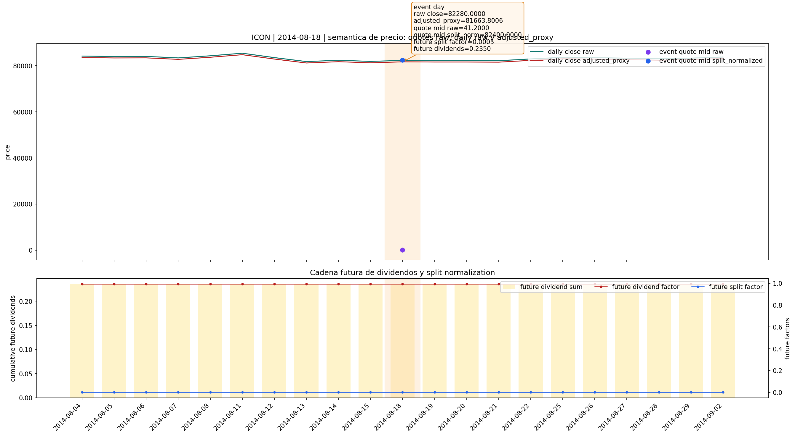

#### 00b Event Month Quotes Context
Esta imagen responde a la pregunta de recurrencia mensual dentro de `quotes`: el problema se concentra en el evento o reaparece en varias sesiones. Arriba concatena sesiones con datos disponibles; abajo resume cobertura diaria, `crossed_ratio_pct` y `max_gap_bps_pos`. La decision que cambia es si el caso debe leerse como episodio puntual o como sintoma de una fase repetida de libro degradado. El error que evita es extrapolar desde un unico dia a todo el mes sin evidencia.

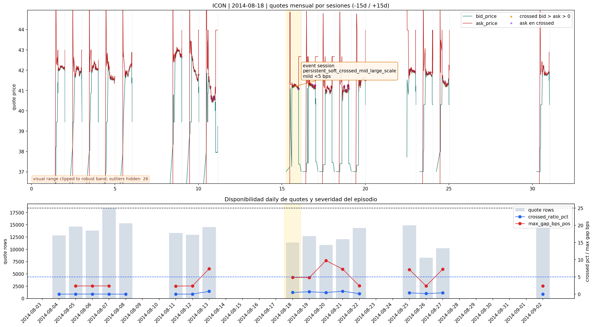

#### 01 Raw Window
Esta imagen responde a la primera pregunta decisiva del caso: el crossed observado es economicamente bastante fuerte para justificar un cambio de clase. Arriba ensena la geometria exacta del tramo conflictivo; abajo convierte esa geometria a bps y la enfrenta a los cortes `5 bps` y `25 bps`. El regimen dominante es `mild <5 bps`. La decision que cambia es pasar de anomalia interpretable a `review` o `bad`. El error que evita es decidir por apariencia visual sin medir el dano economico real del crossed. En terminos de pipeline, este panel decide si el problema afecta solo a la lectura forense o si invalida simulacion de ejecucion y microstructure features.

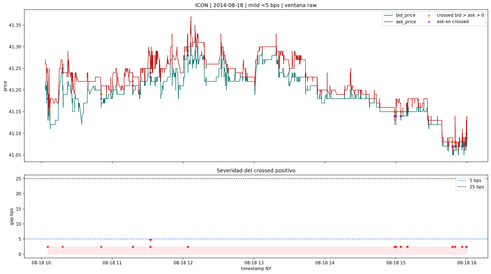

#### 02 Full Session Context
Esta imagen responde a la pregunta de extension intradiaria: el dano esta confinado a un bloque corto o contamina la sesion completa. Arriba se ve toda la sesion `04:00-20:00 NY`; abajo el `gap_bps` firmado. La decision que cambia es si el consumo debe penalizar solo un tramo o desechar el dia entero para uso operativo. El error que evita es tratar una cicatriz local como ruina total o, al reves, minimizar una degradacion distribuida a lo largo del dia. En ejecucion esto decide si la sesion puede seguir usandose con restricciones; en ML decide si las features intradiarias conservan significado economico.

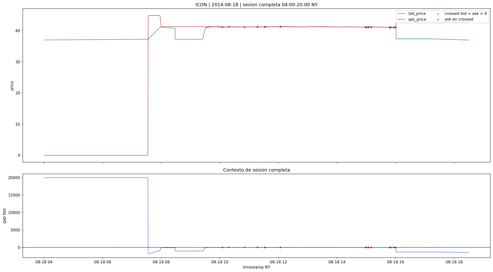

#### 03 Structure Diagnostics
Este panel responde a la pregunta de naturaleza del fallo: contradiccion economica genuina o mezcla con degeneracion estructural. Separa `ask=0` de `ask>0`, muestra la distribucion de `gap_bps` y resume patrones de integerizacion. La decision que cambia es como interpretar el dano: mercado localmente roto, artefacto de representacion o combinacion de ambos. El error que evita es sobrediagnosticar crossed reales cuando parte de la senal proviene de estructura degenerada del libro. Esta lectura afecta directamente a que el caso vaya a exclusion dura, a bandera contextual o a simple reconciliacion tecnica.

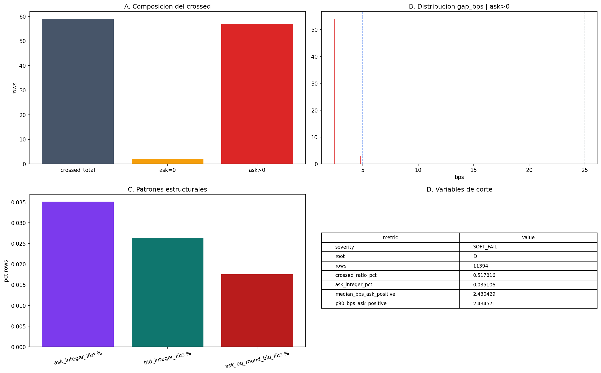

#### 04 Summary Card
Esta tarjeta responde a la pregunta de auditabilidad: cuales son exactamente las variables que sostienen la conclusion. Reune `severity`, `root`, `crossed_ratio_pct`, `ask_integer_pct`, `median_bps_ask_positive` y `p90_bps_ask_positive`. La decision que cambia es pasar de impresion visual a regla verificable. El error que evita es que dos inspectores lleguen a conclusiones distintas mirando la misma imagen sin una base numerica comun. Para gobernanza del proyecto, este panel es el que vuelve reproducible la decision para backtest, ML y auditoria.

---

### 62. UNT 2007-12-04

company_name: `UNIT Corporation`
primary_exchange: `NYSE` (`XNYS`)
market_locale: `stocks/us`
scope: `review`
ticker: `UNT`
date: `2007-12-04`
taxonomy: `persistent_soft_crossed_mid_large_scale`
positive_cross_bucket: `positive_cross_mild_lt5bps`
severity: `SOFT_FAIL`
root: `C`
rows: `10162`
crossed_ratio_pct: `0.364102`
crossed_rows_raw: `37`
crossed_rows_ask_zero: `0`
crossed_rows_ask_positive: `37`
ask_integer_pct: `2.076363`
median_bps_ask_positive: `2.217049`
p90_bps_ask_positive: `2.217049`
file: `C:\TSIS_Data\data\quotes\UNT\year=2007\month=12\day=04\quotes.parquet`

#### Analisis Forense
La conclusion correcta del caso es que ya existe contradiccion economica real dentro del libro, pero aun no con fuerza suficiente para justificar exclusion dura sin contexto adicional. La taxonomy historica es `persistent_soft_crossed_mid_large_scale` y el regimen positivo dominante es `mild <5 bps`. Esto importa porque la taxonomy no solo clasifica: resume que tipo de anomalia se esta viendo y que clase de decision contractual puede defenderse despues. La taxonomy `persistent_soft_crossed_mid_large_scale` implica un problema repetido y distribuido, no un simple pinchazo local. Por eso empuja a `review`: ya hay dano real, aunque no necesariamente exclusion dura universal. El regimen `mild <5 bps` significa que existe contradiccion economica positiva, pero aun en una banda donde un uso prudente puede seguir siendo defendible si la persistencia y la estructura no agravan el caso. En terminos observables, el file tiene `crossed_ratio_pct=0.364102` con `crossed_rows_ask_positive=37` y `crossed_rows_ask_zero=0`. La severidad economica del crossed ask>0 se resume en `median_bps_ask_positive=2.217049` y `p90_bps_ask_positive=2.217049`. Estos dos numeros convierten una forma visual rara en una conclusion operativa sobre si el libro sigue representando o no un mercado negociable. La decision que cambia es pasar de libro sano a libro util solo bajo cautela. `review` significa: no usar como si fuera ejecucion limpia, conservar para analisis contextual y sensibilidad. El error que evita es tratar como normal un episodio que ya contiene contradiccion economica real y contaminar simulaciones de ejecucion o validaciones demasiado optimistas. El patron estructural muestra `ask_integer_pct=2.076363`. Este numero obliga a separar dos explicaciones rivales: contradiccion economica genuina del libro o mezcla con degeneracion estructural / integerizacion. Toda la composicion crossed cae en `ask>0`. Eso endurece la lectura economica del caso: el dano no depende de ceros mecanicos, sino de contradiccion positiva dentro de precios aparentemente vivos. Como `ask_integer_pct` es bajo, la hipotesis de simple degeneracion mecanica pierde fuerza. Eso endurece la interpretacion: el crossed se parece mas a contradiccion economica genuina y menos a artefacto. Existe ademas una imagen historica de certificacion asociada. Su papel es poner el episodio en un marco causal mas amplio: halt, explained, not strongly explained o patron conocido. La regla que protege al proyecto es esta: el contexto externo se usa para explicar por que aparece el episodio, no para absolverlo. El error que evita es degradar el criterio de calidad del libro porque exista una historia plausible alrededor del caso.

#### 00 Event Month Context
Esta imagen responde a la pregunta de persistencia temporal: estamos ante un accidente local o ante una fase mas amplia de inestabilidad. Arriba coloca el evento en la serie `daily` real del mes; abajo compara `crossed_ratio_pct` y `max_gap_bps_pos` del dia contra sus vecinos. La decision que cambia es el peso estructural que se le concede al caso. El error que evita es juzgar igual un shock aislado y una degradacion repetida del libro.

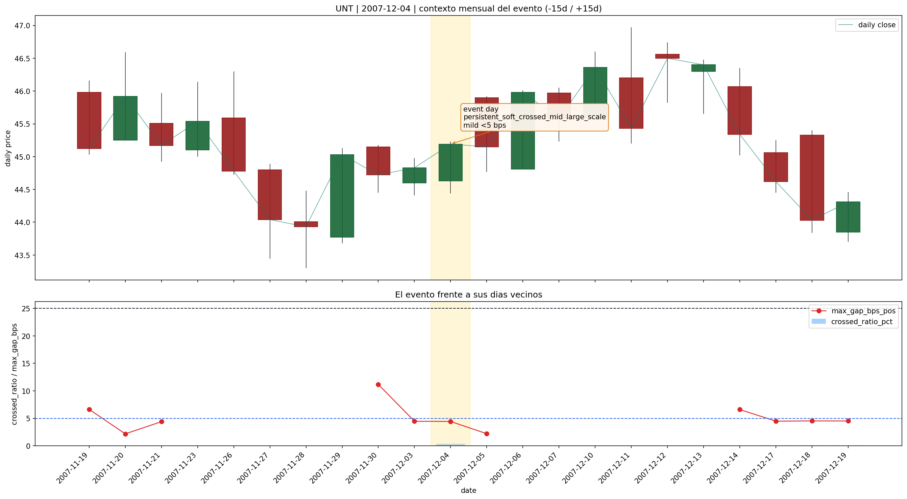

#### 00b Event Month Quotes Context
Esta imagen responde a la pregunta de recurrencia mensual dentro de `quotes`: el problema se concentra en el evento o reaparece en varias sesiones. Arriba concatena sesiones con datos disponibles; abajo resume cobertura diaria, `crossed_ratio_pct` y `max_gap_bps_pos`. La decision que cambia es si el caso debe leerse como episodio puntual o como sintoma de una fase repetida de libro degradado. El error que evita es extrapolar desde un unico dia a todo el mes sin evidencia.

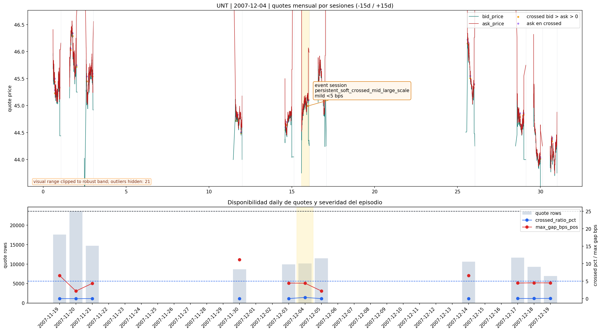

#### 01 Raw Window
Esta imagen responde a la primera pregunta decisiva del caso: el crossed observado es economicamente bastante fuerte para justificar un cambio de clase. Arriba ensena la geometria exacta del tramo conflictivo; abajo convierte esa geometria a bps y la enfrenta a los cortes `5 bps` y `25 bps`. El regimen dominante es `mild <5 bps`. La decision que cambia es pasar de anomalia interpretable a `review` o `bad`. El error que evita es decidir por apariencia visual sin medir el dano economico real del crossed. En terminos de pipeline, este panel decide si el problema afecta solo a la lectura forense o si invalida simulacion de ejecucion y microstructure features.

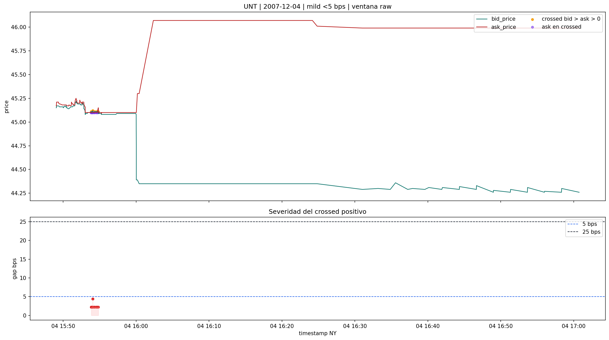

#### 02 Full Session Context
Esta imagen responde a la pregunta de extension intradiaria: el dano esta confinado a un bloque corto o contamina la sesion completa. Arriba se ve toda la sesion `04:00-20:00 NY`; abajo el `gap_bps` firmado. La decision que cambia es si el consumo debe penalizar solo un tramo o desechar el dia entero para uso operativo. El error que evita es tratar una cicatriz local como ruina total o, al reves, minimizar una degradacion distribuida a lo largo del dia. En ejecucion esto decide si la sesion puede seguir usandose con restricciones; en ML decide si las features intradiarias conservan significado economico.

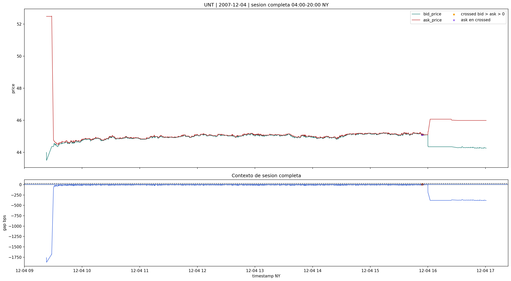

#### 03 Structure Diagnostics
Este panel responde a la pregunta de naturaleza del fallo: contradiccion economica genuina o mezcla con degeneracion estructural. Separa `ask=0` de `ask>0`, muestra la distribucion de `gap_bps` y resume patrones de integerizacion. La decision que cambia es como interpretar el dano: mercado localmente roto, artefacto de representacion o combinacion de ambos. El error que evita es sobrediagnosticar crossed reales cuando parte de la senal proviene de estructura degenerada del libro. Esta lectura afecta directamente a que el caso vaya a exclusion dura, a bandera contextual o a simple reconciliacion tecnica.

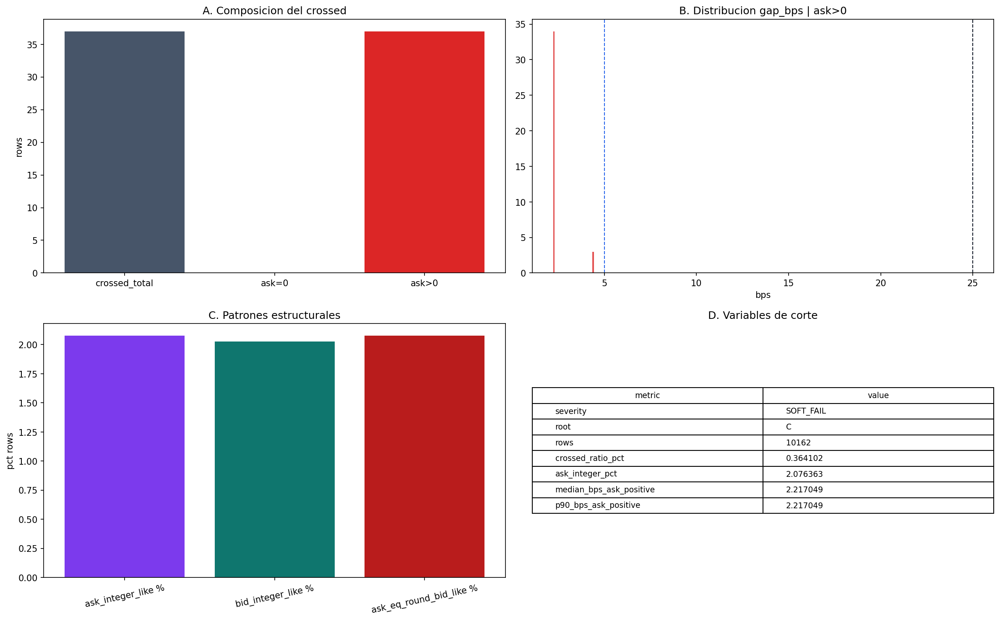

#### 04 Summary Card
Esta tarjeta responde a la pregunta de auditabilidad: cuales son exactamente las variables que sostienen la conclusion. Reune `severity`, `root`, `crossed_ratio_pct`, `ask_integer_pct`, `median_bps_ask_positive` y `p90_bps_ask_positive`. La decision que cambia es pasar de impresion visual a regla verificable. El error que evita es que dos inspectores lleguen a conclusiones distintas mirando la misma imagen sin una base numerica comun. Para gobernanza del proyecto, este panel es el que vuelve reproducible la decision para backtest, ML y auditoria.

---

### 63. MON 2010-10-25

company_name: `Monument Circle Acquisition Corp. Class A Common Stock`
primary_exchange: `NASDAQ` (`XNAS`)
market_locale: `stocks/us`
scope: `review`
ticker: `MON`
date: `2010-10-25`
taxonomy: `persistent_soft_crossed_mid_large_scale`
positive_cross_bucket: `positive_cross_mild_lt5bps`
severity: `SOFT_FAIL`
root: `D`
rows: `98947`
crossed_ratio_pct: `0.452768`
crossed_rows_raw: `448`
crossed_rows_ask_zero: `0`
crossed_rows_ask_positive: `448`
ask_integer_pct: `1.160217`
median_bps_ask_positive: `1.701404`
p90_bps_ask_positive: `3.398471`
file: `D:\quotes\MON\year=2010\month=10\day=25\quotes.parquet`

#### Analisis Forense
La conclusion correcta del caso es que ya existe contradiccion economica real dentro del libro, pero aun no con fuerza suficiente para justificar exclusion dura sin contexto adicional. La taxonomy historica es `persistent_soft_crossed_mid_large_scale` y el regimen positivo dominante es `mild <5 bps`. Esto importa porque la taxonomy no solo clasifica: resume que tipo de anomalia se esta viendo y que clase de decision contractual puede defenderse despues. La taxonomy `persistent_soft_crossed_mid_large_scale` implica un problema repetido y distribuido, no un simple pinchazo local. Por eso empuja a `review`: ya hay dano real, aunque no necesariamente exclusion dura universal. El regimen `mild <5 bps` significa que existe contradiccion economica positiva, pero aun en una banda donde un uso prudente puede seguir siendo defendible si la persistencia y la estructura no agravan el caso. En terminos observables, el file tiene `crossed_ratio_pct=0.452768` con `crossed_rows_ask_positive=448` y `crossed_rows_ask_zero=0`. La severidad economica del crossed ask>0 se resume en `median_bps_ask_positive=1.701404` y `p90_bps_ask_positive=3.398471`. Estos dos numeros convierten una forma visual rara en una conclusion operativa sobre si el libro sigue representando o no un mercado negociable. La decision que cambia es pasar de libro sano a libro util solo bajo cautela. `review` significa: no usar como si fuera ejecucion limpia, conservar para analisis contextual y sensibilidad. El error que evita es tratar como normal un episodio que ya contiene contradiccion economica real y contaminar simulaciones de ejecucion o validaciones demasiado optimistas. El patron estructural muestra `ask_integer_pct=1.160217`. Este numero obliga a separar dos explicaciones rivales: contradiccion economica genuina del libro o mezcla con degeneracion estructural / integerizacion. Toda la composicion crossed cae en `ask>0`. Eso endurece la lectura economica del caso: el dano no depende de ceros mecanicos, sino de contradiccion positiva dentro de precios aparentemente vivos. Como `ask_integer_pct` es bajo, la hipotesis de simple degeneracion mecanica pierde fuerza. Eso endurece la interpretacion: el crossed se parece mas a contradiccion economica genuina y menos a artefacto. En la capa de semantica de precio del evento aparecen `daily raw close=58.7100`, `quote mid raw=59.3000`, `quote mid split_normalized=59.3000`, `daily adjusted_proxy=48.8794`. Ademas hay `post_event_dividend_sum=13.1600`. La implicacion metodologica es crucial: una discrepancia entre `quotes`, `daily` y una plataforma externa no puede leerse automaticamente como fallo del dataset. Puede ser semantica de precio distinta. El error que evita esta capa es mezclar raw, split-normalized y adjusted dentro del mismo pipeline, rompiendo auditoria, benchmarking y labels. Para pipelines, esto empuja a conservar el caso fuera de ejecucion limpia, pero todavia puede mantenerse en investigacion contextual y en analisis de sensibilidad donde interese entender fronteras de tolerancia. Existe ademas una imagen historica de certificacion asociada. Su papel es poner el episodio en un marco causal mas amplio: halt, explained, not strongly explained o patron conocido. La regla que protege al proyecto es esta: el contexto externo se usa para explicar por que aparece el episodio, no para absolverlo. El error que evita es degradar el criterio de calidad del libro porque exista una historia plausible alrededor del caso.

#### 00 Event Month Context
Esta imagen responde a la pregunta de persistencia temporal: estamos ante un accidente local o ante una fase mas amplia de inestabilidad. Arriba coloca el evento en la serie `daily` real del mes; abajo compara `crossed_ratio_pct` y `max_gap_bps_pos` del dia contra sus vecinos. La decision que cambia es el peso estructural que se le concede al caso. El error que evita es juzgar igual un shock aislado y una degradacion repetida del libro.

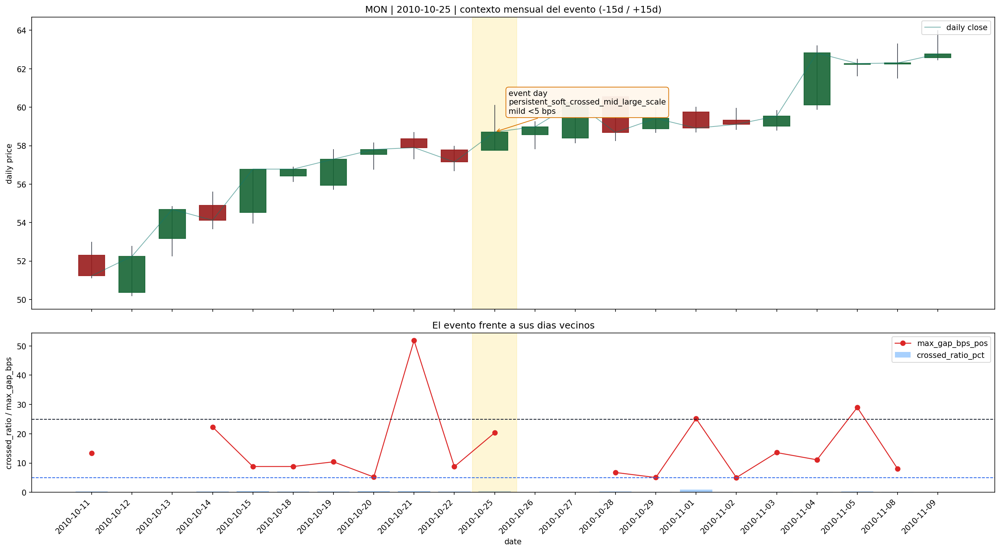

#### 00a Adjusted Proxy Contrast
Esta imagen responde a la pregunta de reconciliacion semantica: la discrepancia de precios viene de datos rotos o de vistas de precio distintas. Compara `daily raw`, `daily adjusted_proxy`, `quote mid raw` y `quote mid split_normalized`, y debajo ensena la cadena de dividendos y splits que produce la diferencia. La decision que cambia es si el inspector debe abrir una incidencia de calidad o cerrar el caso como diferencia legitima de semantica. El error que evita es mezclar series raw y adjusted como si fueran equivalentes. En pipelines reales, esto protege benchmarking, labels diarios y reconciliacion externa frente a falsas alarmas de precio.

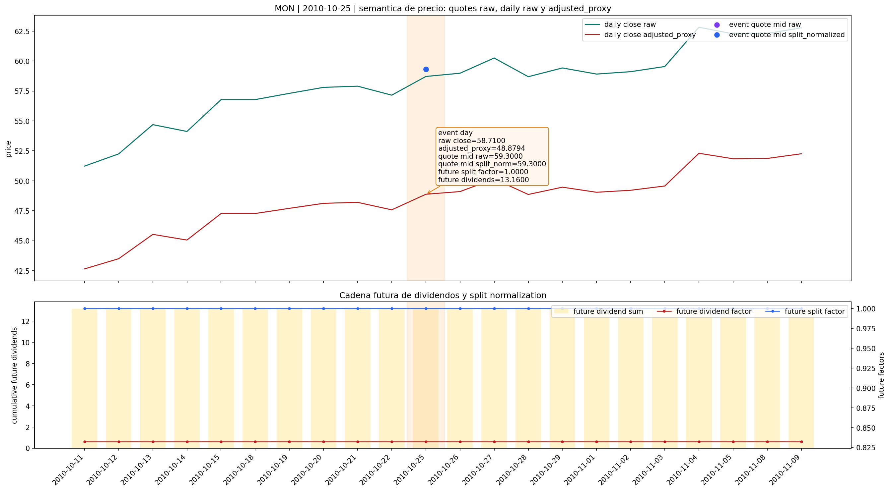

#### 00b Event Month Quotes Context
Esta imagen responde a la pregunta de recurrencia mensual dentro de `quotes`: el problema se concentra en el evento o reaparece en varias sesiones. Arriba concatena sesiones con datos disponibles; abajo resume cobertura diaria, `crossed_ratio_pct` y `max_gap_bps_pos`. La decision que cambia es si el caso debe leerse como episodio puntual o como sintoma de una fase repetida de libro degradado. El error que evita es extrapolar desde un unico dia a todo el mes sin evidencia.

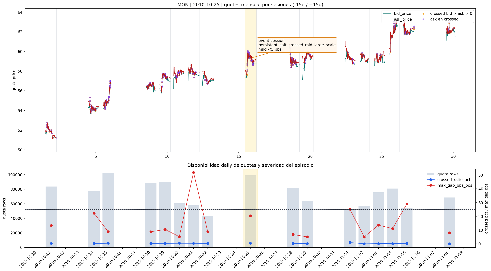

#### 01 Raw Window
Esta imagen responde a la primera pregunta decisiva del caso: el crossed observado es economicamente bastante fuerte para justificar un cambio de clase. Arriba ensena la geometria exacta del tramo conflictivo; abajo convierte esa geometria a bps y la enfrenta a los cortes `5 bps` y `25 bps`. El regimen dominante es `mild <5 bps`. La decision que cambia es pasar de anomalia interpretable a `review` o `bad`. El error que evita es decidir por apariencia visual sin medir el dano economico real del crossed. En terminos de pipeline, este panel decide si el problema afecta solo a la lectura forense o si invalida simulacion de ejecucion y microstructure features.

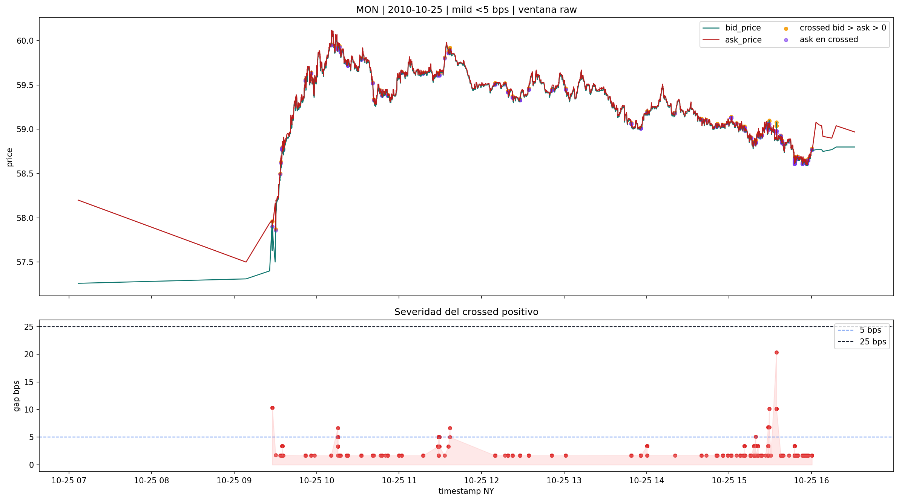

#### 02 Full Session Context
Esta imagen responde a la pregunta de extension intradiaria: el dano esta confinado a un bloque corto o contamina la sesion completa. Arriba se ve toda la sesion `04:00-20:00 NY`; abajo el `gap_bps` firmado. La decision que cambia es si el consumo debe penalizar solo un tramo o desechar el dia entero para uso operativo. El error que evita es tratar una cicatriz local como ruina total o, al reves, minimizar una degradacion distribuida a lo largo del dia. En ejecucion esto decide si la sesion puede seguir usandose con restricciones; en ML decide si las features intradiarias conservan significado economico.

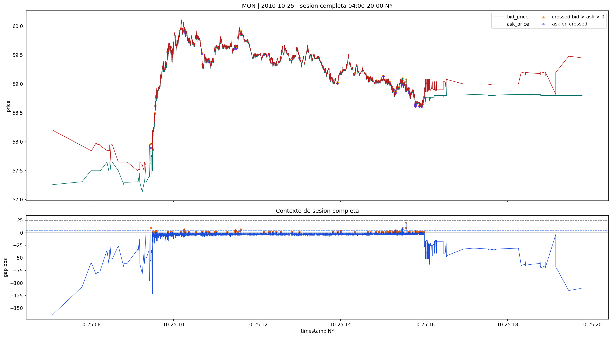

#### 03 Structure Diagnostics
Este panel responde a la pregunta de naturaleza del fallo: contradiccion economica genuina o mezcla con degeneracion estructural. Separa `ask=0` de `ask>0`, muestra la distribucion de `gap_bps` y resume patrones de integerizacion. La decision que cambia es como interpretar el dano: mercado localmente roto, artefacto de representacion o combinacion de ambos. El error que evita es sobrediagnosticar crossed reales cuando parte de la senal proviene de estructura degenerada del libro. Esta lectura afecta directamente a que el caso vaya a exclusion dura, a bandera contextual o a simple reconciliacion tecnica.

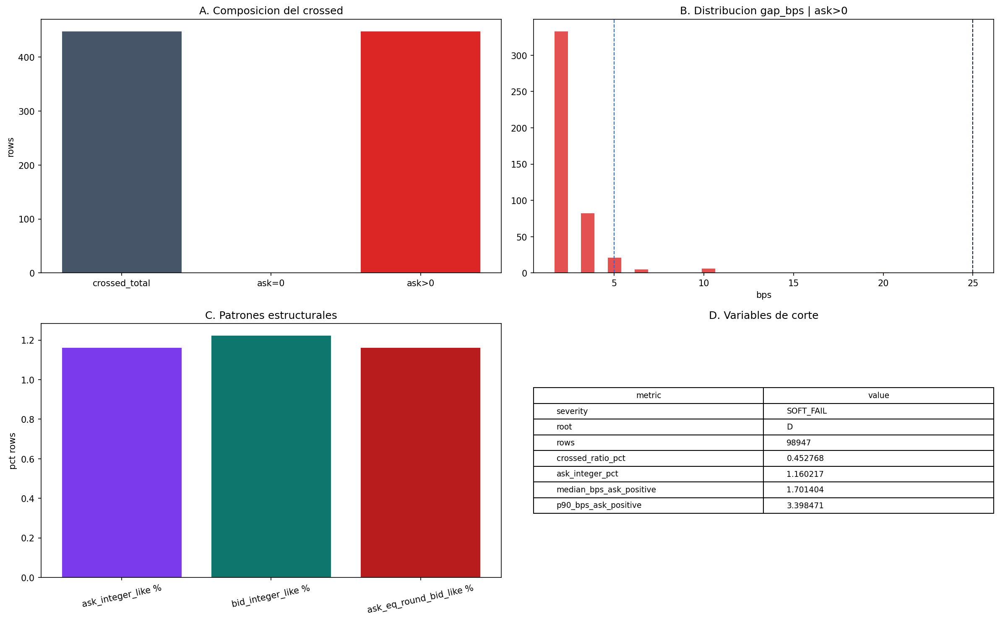

#### 04 Summary Card
Esta tarjeta responde a la pregunta de auditabilidad: cuales son exactamente las variables que sostienen la conclusion. Reune `severity`, `root`, `crossed_ratio_pct`, `ask_integer_pct`, `median_bps_ask_positive` y `p90_bps_ask_positive`. La decision que cambia es pasar de impresion visual a regla verificable. El error que evita es que dos inspectores lleguen a conclusiones distintas mirando la misma imagen sin una base numerica comun. Para gobernanza del proyecto, este panel es el que vuelve reproducible la decision para backtest, ML y auditoria.

---

### 64. DNA 2008-02-01

company_name: `Ginkgo Bioworks Holdings, Inc.`
primary_exchange: `NYSE` (`XNYS`)
market_locale: `stocks/us`
scope: `review`
ticker: `DNA`
date: `2008-02-01`
taxonomy: `persistent_soft_crossed_mid_large_scale`
positive_cross_bucket: `positive_cross_mild_lt5bps`
severity: `SOFT_FAIL`
root: `C`
rows: `38107`
crossed_ratio_pct: `0.467106`
crossed_rows_raw: `178`
crossed_rows_ask_zero: `0`
crossed_rows_ask_positive: `178`
ask_integer_pct: `3.490172`
median_bps_ask_positive: `1.418742`
p90_bps_ask_positive: `4.221487`
file: `C:\TSIS_Data\data\quotes\DNA\year=2008\month=02\day=01\quotes.parquet`

#### Analisis Forense
La conclusion correcta del caso es que ya existe contradiccion economica real dentro del libro, pero aun no con fuerza suficiente para justificar exclusion dura sin contexto adicional. La taxonomy historica es `persistent_soft_crossed_mid_large_scale` y el regimen positivo dominante es `mild <5 bps`. Esto importa porque la taxonomy no solo clasifica: resume que tipo de anomalia se esta viendo y que clase de decision contractual puede defenderse despues. La taxonomy `persistent_soft_crossed_mid_large_scale` implica un problema repetido y distribuido, no un simple pinchazo local. Por eso empuja a `review`: ya hay dano real, aunque no necesariamente exclusion dura universal. El regimen `mild <5 bps` significa que existe contradiccion economica positiva, pero aun en una banda donde un uso prudente puede seguir siendo defendible si la persistencia y la estructura no agravan el caso. En terminos observables, el file tiene `crossed_ratio_pct=0.467106` con `crossed_rows_ask_positive=178` y `crossed_rows_ask_zero=0`. La severidad economica del crossed ask>0 se resume en `median_bps_ask_positive=1.418742` y `p90_bps_ask_positive=4.221487`. Estos dos numeros convierten una forma visual rara en una conclusion operativa sobre si el libro sigue representando o no un mercado negociable. La decision que cambia es pasar de libro sano a libro util solo bajo cautela. `review` significa: no usar como si fuera ejecucion limpia, conservar para analisis contextual y sensibilidad. El error que evita es tratar como normal un episodio que ya contiene contradiccion economica real y contaminar simulaciones de ejecucion o validaciones demasiado optimistas. El patron estructural muestra `ask_integer_pct=3.490172`. Este numero obliga a separar dos explicaciones rivales: contradiccion economica genuina del libro o mezcla con degeneracion estructural / integerizacion. Toda la composicion crossed cae en `ask>0`. Eso endurece la lectura economica del caso: el dano no depende de ceros mecanicos, sino de contradiccion positiva dentro de precios aparentemente vivos. Como `ask_integer_pct` es bajo, la hipotesis de simple degeneracion mecanica pierde fuerza. Eso endurece la interpretacion: el crossed se parece mas a contradiccion economica genuina y menos a artefacto. En la capa de semantica de precio del evento aparecen `daily raw close=2832.4000`, `quote mid raw=70.5950`, `quote mid split_normalized=2823.8000`, `daily adjusted_proxy=2832.4000`. La reconciliacion incluye `future_split_factor=0.0250`. La implicacion metodologica es crucial: una discrepancia entre `quotes`, `daily` y una plataforma externa no puede leerse automaticamente como fallo del dataset. Puede ser semantica de precio distinta. El error que evita esta capa es mezclar raw, split-normalized y adjusted dentro del mismo pipeline, rompiendo auditoria, benchmarking y labels. Para pipelines, esto empuja a conservar el caso fuera de ejecucion limpia, pero todavia puede mantenerse en investigacion contextual y en analisis de sensibilidad donde interese entender fronteras de tolerancia. Existe ademas una imagen historica de certificacion asociada. Su papel es poner el episodio en un marco causal mas amplio: halt, explained, not strongly explained o patron conocido. La regla que protege al proyecto es esta: el contexto externo se usa para explicar por que aparece el episodio, no para absolverlo. El error que evita es degradar el criterio de calidad del libro porque exista una historia plausible alrededor del caso.

#### 00 Event Month Context
Esta imagen responde a la pregunta de persistencia temporal: estamos ante un accidente local o ante una fase mas amplia de inestabilidad. Arriba coloca el evento en la serie `daily` real del mes; abajo compara `crossed_ratio_pct` y `max_gap_bps_pos` del dia contra sus vecinos. La decision que cambia es el peso estructural que se le concede al caso. El error que evita es juzgar igual un shock aislado y una degradacion repetida del libro.

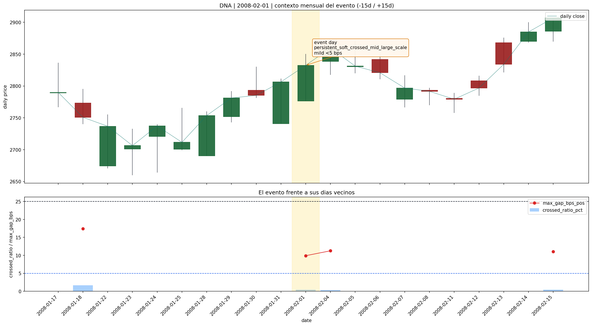

#### 00a Adjusted Proxy Contrast
Esta imagen responde a la pregunta de reconciliacion semantica: la discrepancia de precios viene de datos rotos o de vistas de precio distintas. Compara `daily raw`, `daily adjusted_proxy`, `quote mid raw` y `quote mid split_normalized`, y debajo ensena la cadena de dividendos y splits que produce la diferencia. La decision que cambia es si el inspector debe abrir una incidencia de calidad o cerrar el caso como diferencia legitima de semantica. El error que evita es mezclar series raw y adjusted como si fueran equivalentes. En pipelines reales, esto protege benchmarking, labels diarios y reconciliacion externa frente a falsas alarmas de precio.

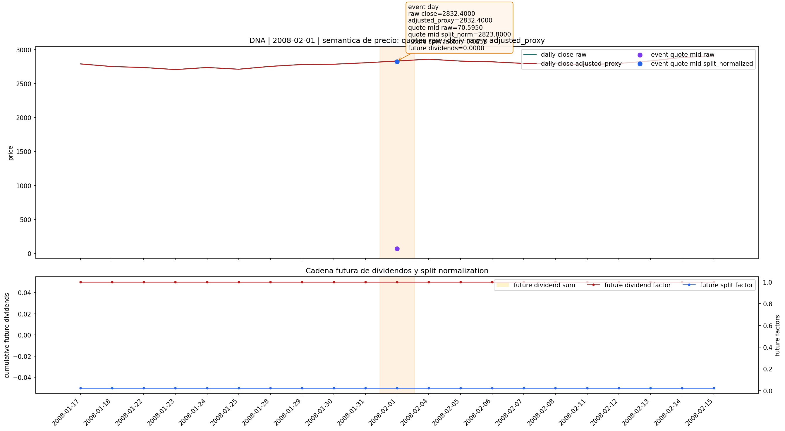

#### 00b Event Month Quotes Context
Esta imagen responde a la pregunta de recurrencia mensual dentro de `quotes`: el problema se concentra en el evento o reaparece en varias sesiones. Arriba concatena sesiones con datos disponibles; abajo resume cobertura diaria, `crossed_ratio_pct` y `max_gap_bps_pos`. La decision que cambia es si el caso debe leerse como episodio puntual o como sintoma de una fase repetida de libro degradado. El error que evita es extrapolar desde un unico dia a todo el mes sin evidencia.

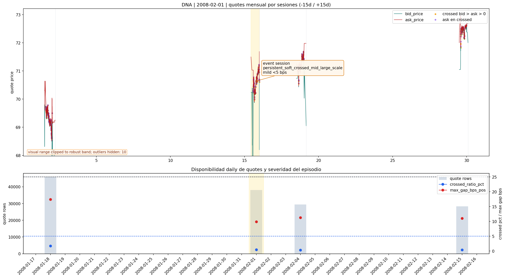

#### 01 Raw Window
Esta imagen responde a la primera pregunta decisiva del caso: el crossed observado es economicamente bastante fuerte para justificar un cambio de clase. Arriba ensena la geometria exacta del tramo conflictivo; abajo convierte esa geometria a bps y la enfrenta a los cortes `5 bps` y `25 bps`. El regimen dominante es `mild <5 bps`. La decision que cambia es pasar de anomalia interpretable a `review` o `bad`. El error que evita es decidir por apariencia visual sin medir el dano economico real del crossed. En terminos de pipeline, este panel decide si el problema afecta solo a la lectura forense o si invalida simulacion de ejecucion y microstructure features.

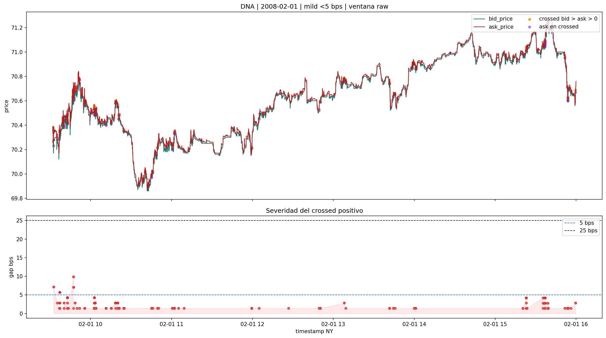

#### 02 Full Session Context
Esta imagen responde a la pregunta de extension intradiaria: el dano esta confinado a un bloque corto o contamina la sesion completa. Arriba se ve toda la sesion `04:00-20:00 NY`; abajo el `gap_bps` firmado. La decision que cambia es si el consumo debe penalizar solo un tramo o desechar el dia entero para uso operativo. El error que evita es tratar una cicatriz local como ruina total o, al reves, minimizar una degradacion distribuida a lo largo del dia. En ejecucion esto decide si la sesion puede seguir usandose con restricciones; en ML decide si las features intradiarias conservan significado economico.

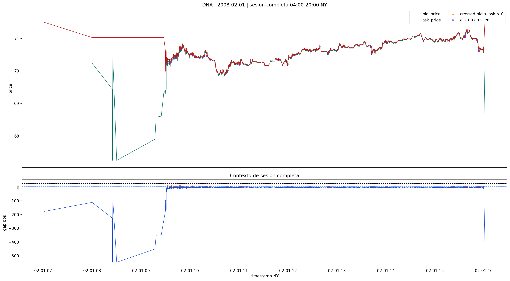

#### 03 Structure Diagnostics
Este panel responde a la pregunta de naturaleza del fallo: contradiccion economica genuina o mezcla con degeneracion estructural. Separa `ask=0` de `ask>0`, muestra la distribucion de `gap_bps` y resume patrones de integerizacion. La decision que cambia es como interpretar el dano: mercado localmente roto, artefacto de representacion o combinacion de ambos. El error que evita es sobrediagnosticar crossed reales cuando parte de la senal proviene de estructura degenerada del libro. Esta lectura afecta directamente a que el caso vaya a exclusion dura, a bandera contextual o a simple reconciliacion tecnica.

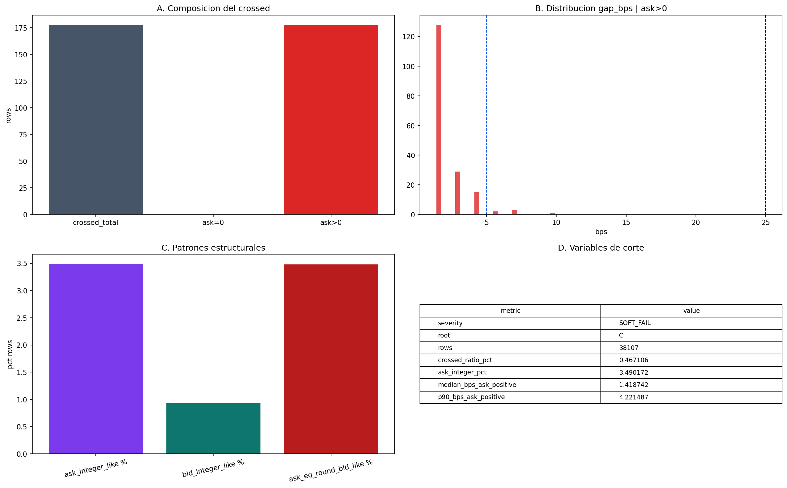

#### 04 Summary Card
Esta tarjeta responde a la pregunta de auditabilidad: cuales son exactamente las variables que sostienen la conclusion. Reune `severity`, `root`, `crossed_ratio_pct`, `ask_integer_pct`, `median_bps_ask_positive` y `p90_bps_ask_positive`. La decision que cambia es pasar de impresion visual a regla verificable. El error que evita es que dos inspectores lleguen a conclusiones distintas mirando la misma imagen sin una base numerica comun. Para gobernanza del proyecto, este panel es el que vuelve reproducible la decision para backtest, ML y auditoria.

---

# Quotes Bad Cases v0.1

Documento fuente: `inspection_dossiers/quotes/bad_case_evidence_packs/quotes_bad_cases_v0_1.md`

Este documento consolida los casos `bad` de `quotes` usando packs visuales completos. Cada caso presenta la ventana raw del crossed positivo, el contexto de sesion completa, diagnosticos estructurales y, cuando existe, la imagen historica de certificacion.

Total cases: `15`

## Menu

1. [SGC 2013-11-04](#sgc-2013-11-04)
2. [SELF 2016-06-28](#self-2016-06-28)
3. [UFAB 2023-03-09](#ufab-2023-03-09)
4. [DGLY 2011-10-06](#dgly-2011-10-06)
5. [QRHC 2020-10-28](#qrhc-2020-10-28)
6. [PPHM 2007-10-08](#pphm-2007-10-08)
7. [TAT 2009-12-30](#tat-2009-12-30)
8. [UXG 2007-03-01](#uxg-2007-03-01)
9. [MSW 2005-07-27](#msw-2005-07-27)
10. [HGSH 2013-04-26](#hgsh-2013-04-26)
11. [BBW 2005-10-26](#bbw-2005-10-26)
12. [MMA 2006-08-11](#mma-2006-08-11)
13. [PLL 2006-04-28](#pll-2006-04-28)
14. [EAC 2005-06-27](#eac-2005-06-27)
15. [SSN 2017-01-04](#ssn-2017-01-04)

## Cases

### 1. SGC 2013-11-04

company_name: `Superior Group of Companies, Inc. Common Stock`
primary_exchange: `NASDAQ` (`XNAS`)
market_locale: `stocks/us`
scope: `bad`
ticker: `SGC`
date: `2013-11-04`
taxonomy: `high_hard_crossed_10_to_20`
positive_cross_bucket: `positive_cross_severe_ge25bps`
severity: `HARD_FAIL`
root: `D`
rows: `149`
crossed_ratio_pct: `14.765101`
crossed_rows_raw: `22`
crossed_rows_ask_zero: `17`
crossed_rows_ask_positive: `5`
ask_integer_pct: `18.791946`
median_bps_ask_positive: `217.606330`
p90_bps_ask_positive: `217.606330`
file: `D:\quotes\SGC\year=2013\month=11\day=04\quotes.parquet`

#### Analisis Forense
La conclusion correcta del caso es que la contradiccion local entre bid y ask ya compromete la credibilidad economica del libro y bloquea su consumo como si fuera mercado normal. La taxonomy historica es `high_hard_crossed_10_to_20` y el regimen positivo dominante es `severe >=25 bps`. Esto importa porque la taxonomy no solo clasifica: resume que tipo de anomalia se esta viendo y que clase de decision contractual puede defenderse despues. La taxonomy `high_hard_crossed_10_to_20` implica una franja donde la contradiccion ya no es una simple sospecha: el dano positivo del crossed entra en una zona donde ejecucion, mark-to-market y aprendizaje pueden dejar de ser creibles. El regimen `severe >=25 bps` empuja el caso a una lectura economicamente dura: el crossed deja de ser cosmetico y pasa a cuestionar si el libro sigue siendo interpretable como mercado negociable. En terminos observables, el file tiene `crossed_ratio_pct=14.765101` con `crossed_rows_ask_positive=5` y `crossed_rows_ask_zero=17`. La severidad economica del crossed ask>0 se resume en `median_bps_ask_positive=217.606330` y `p90_bps_ask_positive=217.606330`. Estos dos numeros convierten una forma visual rara en una conclusion operativa sobre si el libro sigue representando o no un mercado negociable. La decision que cambia es exclusion del consumo core del libro. `bad` significa que el estado local ya no puede alimentar ejecucion, mark-to-market intradiario ni aprendizaje de ML como si fuese microestructura defendible. El error que evita es construir decisiones sobre un libro que ha dejado de representar un mercado localmente creible. El patron estructural muestra `ask_integer_pct=18.791946`. Este numero obliga a separar dos explicaciones rivales: contradiccion economica genuina del libro o mezcla con degeneracion estructural / integerizacion. La mayor parte del crossed vive en `ask=0`, pero existe una cola `ask>0` que impide absolver el caso como simple glitch. La lectura correcta es mixta: dano estructural dominante con residuo economico que aun puede justificar bandera o exclusion. Como `ask_integer_pct` no es extremo, el caso exige leer geometria del crossed y estructura simultaneamente. No basta un solo numero; hay que combinar severidad, composicion y contexto. En la capa de semantica de precio del evento aparecen `daily raw close=7.7100`, `quote mid raw=15.2475`, `quote mid split_normalized=7.6238`, `daily adjusted_proxy=3.6701`. La reconciliacion incluye `future_split_factor=2.0000`. Ademas hay `post_event_dividend_sum=5.7350`. La implicacion metodologica es crucial: una discrepancia entre `quotes`, `daily` y una plataforma externa no puede leerse automaticamente como fallo del dataset. Puede ser semantica de precio distinta. El error que evita esta capa es mezclar raw, split-normalized y adjusted dentro del mismo pipeline, rompiendo auditoria, benchmarking y labels. Para pipelines, esto implica exclusion de ejecucion realista, de mark-to-market intradiario defendible y de features microestructurales tratadas como si reflejaran un mercado normal. Solo debe sobrevivir en circuitos forenses o de calidad. Existe ademas una imagen historica de certificacion asociada. Su papel es poner el episodio en un marco causal mas amplio: halt, explained, not strongly explained o patron conocido. La regla que protege al proyecto es esta: el contexto externo se usa para explicar por que aparece el episodio, no para absolverlo. El error que evita es degradar el criterio de calidad del libro porque exista una historia plausible alrededor del caso.

#### 00 Event Month Context
Esta imagen responde a la pregunta de persistencia temporal: estamos ante un accidente local o ante una fase mas amplia de inestabilidad. Arriba coloca el evento en la serie `daily` real del mes; abajo compara `crossed_ratio_pct` y `max_gap_bps_pos` del dia contra sus vecinos. La decision que cambia es el peso estructural que se le concede al caso. El error que evita es juzgar igual un shock aislado y una degradacion repetida del libro.

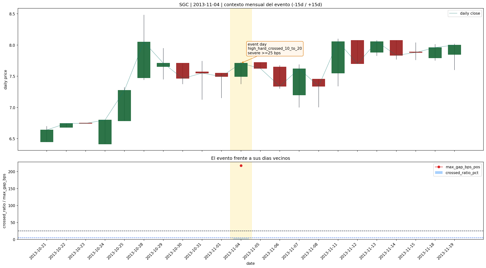

#### 00a Adjusted Proxy Contrast
Esta imagen responde a la pregunta de reconciliacion semantica: la discrepancia de precios viene de datos rotos o de vistas de precio distintas. Compara `daily raw`, `daily adjusted_proxy`, `quote mid raw` y `quote mid split_normalized`, y debajo ensena la cadena de dividendos y splits que produce la diferencia. La decision que cambia es si el inspector debe abrir una incidencia de calidad o cerrar el caso como diferencia legitima de semantica. El error que evita es mezclar series raw y adjusted como si fueran equivalentes. En pipelines reales, esto protege benchmarking, labels diarios y reconciliacion externa frente a falsas alarmas de precio.

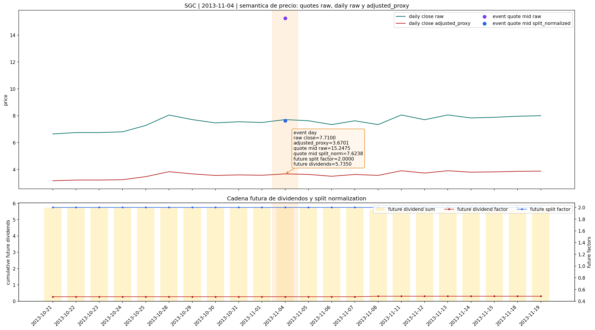

#### 00b Event Month Quotes Context
Esta imagen responde a la pregunta de recurrencia mensual dentro de `quotes`: el problema se concentra en el evento o reaparece en varias sesiones. Arriba concatena sesiones con datos disponibles; abajo resume cobertura diaria, `crossed_ratio_pct` y `max_gap_bps_pos`. La decision que cambia es si el caso debe leerse como episodio puntual o como sintoma de una fase repetida de libro degradado. El error que evita es extrapolar desde un unico dia a todo el mes sin evidencia.

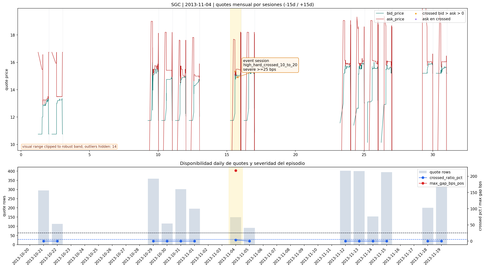

#### 01 Raw Window
Esta imagen responde a la primera pregunta decisiva del caso: el crossed observado es economicamente bastante fuerte para justificar un cambio de clase. Arriba ensena la geometria exacta del tramo conflictivo; abajo convierte esa geometria a bps y la enfrenta a los cortes `5 bps` y `25 bps`. El regimen dominante es `severe >=25 bps`. La decision que cambia es pasar de anomalia interpretable a `review` o `bad`. El error que evita es decidir por apariencia visual sin medir el dano economico real del crossed. En terminos de pipeline, este panel decide si el problema afecta solo a la lectura forense o si invalida simulacion de ejecucion y microstructure features.

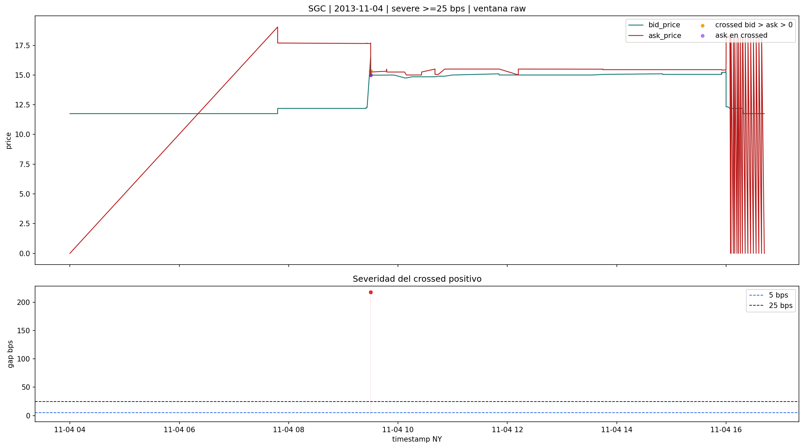

#### 02 Full Session Context
Esta imagen responde a la pregunta de extension intradiaria: el dano esta confinado a un bloque corto o contamina la sesion completa. Arriba se ve toda la sesion `04:00-20:00 NY`; abajo el `gap_bps` firmado. La decision que cambia es si el consumo debe penalizar solo un tramo o desechar el dia entero para uso operativo. El error que evita es tratar una cicatriz local como ruina total o, al reves, minimizar una degradacion distribuida a lo largo del dia. En ejecucion esto decide si la sesion puede seguir usandose con restricciones; en ML decide si las features intradiarias conservan significado economico.

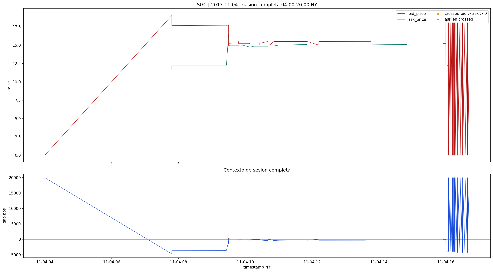

#### 03 Structure Diagnostics
Este panel responde a la pregunta de naturaleza del fallo: contradiccion economica genuina o mezcla con degeneracion estructural. Separa `ask=0` de `ask>0`, muestra la distribucion de `gap_bps` y resume patrones de integerizacion. La decision que cambia es como interpretar el dano: mercado localmente roto, artefacto de representacion o combinacion de ambos. El error que evita es sobrediagnosticar crossed reales cuando parte de la senal proviene de estructura degenerada del libro. Esta lectura afecta directamente a que el caso vaya a exclusion dura, a bandera contextual o a simple reconciliacion tecnica.

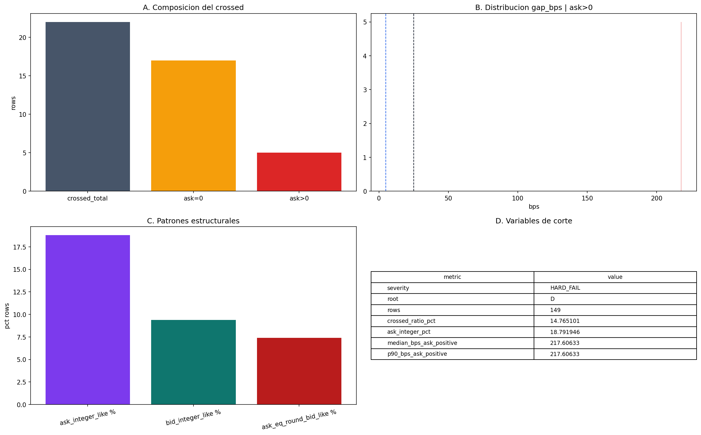

#### 04 Summary Card
Esta tarjeta responde a la pregunta de auditabilidad: cuales son exactamente las variables que sostienen la conclusion. Reune `severity`, `root`, `crossed_ratio_pct`, `ask_integer_pct`, `median_bps_ask_positive` y `p90_bps_ask_positive`. La decision que cambia es pasar de impresion visual a regla verificable. El error que evita es que dos inspectores lleguen a conclusiones distintas mirando la misma imagen sin una base numerica comun. Para gobernanza del proyecto, este panel es el que vuelve reproducible la decision para backtest, ML y auditoria.

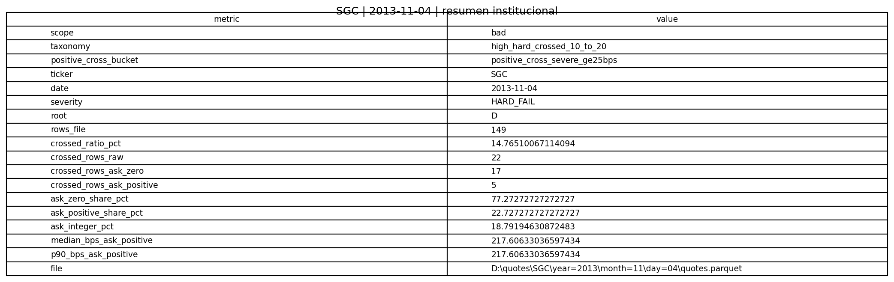

#### 05 Historical Context
Esta imagen responde a la pregunta causal externa: existe un framing historico que ayude a entender por que ocurre el episodio. Puede aportar halt context, explained o not strongly explained. La decision que cambia es cuanto peso se concede al contexto en la narrativa final. El error que evita es doble: ignorar una explicacion real o usarla como excusa para absolver un libro que localmente sigue siendo problematico.

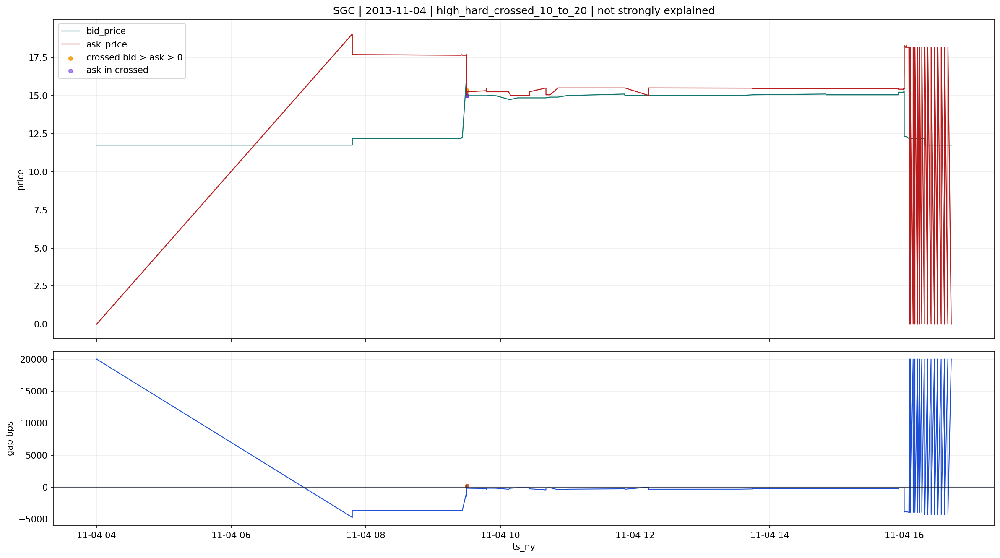

---

### 2. SELF 2016-06-28

company_name: `Global Self Storage, Inc. Common Stock`
primary_exchange: `NASDAQ` (`XNAS`)
market_locale: `stocks/us`
scope: `bad`
ticker: `SELF`
date: `2016-06-28`
taxonomy: `high_hard_crossed_10_to_20`
positive_cross_bucket: `positive_cross_severe_ge25bps`
severity: `HARD_FAIL`
root: `C`
rows: `187`
crossed_ratio_pct: `16.577540`
crossed_rows_raw: `31`
crossed_rows_ask_zero: `28`
crossed_rows_ask_positive: `3`
ask_integer_pct: `14.973262`
median_bps_ask_positive: `36.630037`
p90_bps_ask_positive: `36.630037`
file: `C:\TSIS_Data\data\quotes\SELF\year=2016\month=06\day=28\quotes.parquet`

#### Analisis Forense
La conclusion correcta del caso es que la contradiccion local entre bid y ask ya compromete la credibilidad economica del libro y bloquea su consumo como si fuera mercado normal. La taxonomy historica es `high_hard_crossed_10_to_20` y el regimen positivo dominante es `severe >=25 bps`. Esto importa porque la taxonomy no solo clasifica: resume que tipo de anomalia se esta viendo y que clase de decision contractual puede defenderse despues. La taxonomy `high_hard_crossed_10_to_20` implica una franja donde la contradiccion ya no es una simple sospecha: el dano positivo del crossed entra en una zona donde ejecucion, mark-to-market y aprendizaje pueden dejar de ser creibles. El regimen `severe >=25 bps` empuja el caso a una lectura economicamente dura: el crossed deja de ser cosmetico y pasa a cuestionar si el libro sigue siendo interpretable como mercado negociable. En terminos observables, el file tiene `crossed_ratio_pct=16.577540` con `crossed_rows_ask_positive=3` y `crossed_rows_ask_zero=28`. La severidad economica del crossed ask>0 se resume en `median_bps_ask_positive=36.630037` y `p90_bps_ask_positive=36.630037`. Estos dos numeros convierten una forma visual rara en una conclusion operativa sobre si el libro sigue representando o no un mercado negociable. La decision que cambia es exclusion del consumo core del libro. `bad` significa que el estado local ya no puede alimentar ejecucion, mark-to-market intradiario ni aprendizaje de ML como si fuese microestructura defendible. El error que evita es construir decisiones sobre un libro que ha dejado de representar un mercado localmente creible. El patron estructural muestra `ask_integer_pct=14.973262`. Este numero obliga a separar dos explicaciones rivales: contradiccion economica genuina del libro o mezcla con degeneracion estructural / integerizacion. La mayor parte del crossed vive en `ask=0`, pero existe una cola `ask>0` que impide absolver el caso como simple glitch. La lectura correcta es mixta: dano estructural dominante con residuo economico que aun puede justificar bandera o exclusion. Como `ask_integer_pct` no es extremo, el caso exige leer geometria del crossed y estructura simultaneamente. No basta un solo numero; hay que combinar severidad, composicion y contexto. En la capa de semantica de precio del evento aparecen `daily raw close=5.4400`, `quote mid raw=5.4450`, `quote mid split_normalized=5.4450`, `daily adjusted_proxy=3.1192`. Ademas hay `post_event_dividend_sum=2.6475`. La implicacion metodologica es crucial: una discrepancia entre `quotes`, `daily` y una plataforma externa no puede leerse automaticamente como fallo del dataset. Puede ser semantica de precio distinta. El error que evita esta capa es mezclar raw, split-normalized y adjusted dentro del mismo pipeline, rompiendo auditoria, benchmarking y labels. Para pipelines, esto implica exclusion de ejecucion realista, de mark-to-market intradiario defendible y de features microestructurales tratadas como si reflejaran un mercado normal. Solo debe sobrevivir en circuitos forenses o de calidad. Existe ademas una imagen historica de certificacion asociada. Su papel es poner el episodio en un marco causal mas amplio: halt, explained, not strongly explained o patron conocido. La regla que protege al proyecto es esta: el contexto externo se usa para explicar por que aparece el episodio, no para absolverlo. El error que evita es degradar el criterio de calidad del libro porque exista una historia plausible alrededor del caso.

#### 00 Event Month Context
Esta imagen responde a la pregunta de persistencia temporal: estamos ante un accidente local o ante una fase mas amplia de inestabilidad. Arriba coloca el evento en la serie `daily` real del mes; abajo compara `crossed_ratio_pct` y `max_gap_bps_pos` del dia contra sus vecinos. La decision que cambia es el peso estructural que se le concede al caso. El error que evita es juzgar igual un shock aislado y una degradacion repetida del libro.

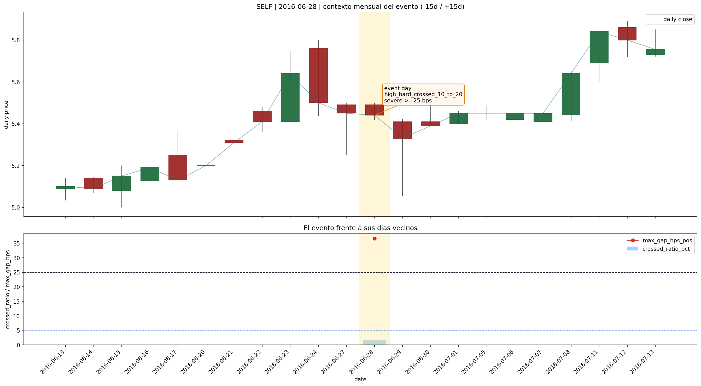

#### 00a Adjusted Proxy Contrast
Esta imagen responde a la pregunta de reconciliacion semantica: la discrepancia de precios viene de datos rotos o de vistas de precio distintas. Compara `daily raw`, `daily adjusted_proxy`, `quote mid raw` y `quote mid split_normalized`, y debajo ensena la cadena de dividendos y splits que produce la diferencia. La decision que cambia es si el inspector debe abrir una incidencia de calidad o cerrar el caso como diferencia legitima de semantica. El error que evita es mezclar series raw y adjusted como si fueran equivalentes. En pipelines reales, esto protege benchmarking, labels diarios y reconciliacion externa frente a falsas alarmas de precio.

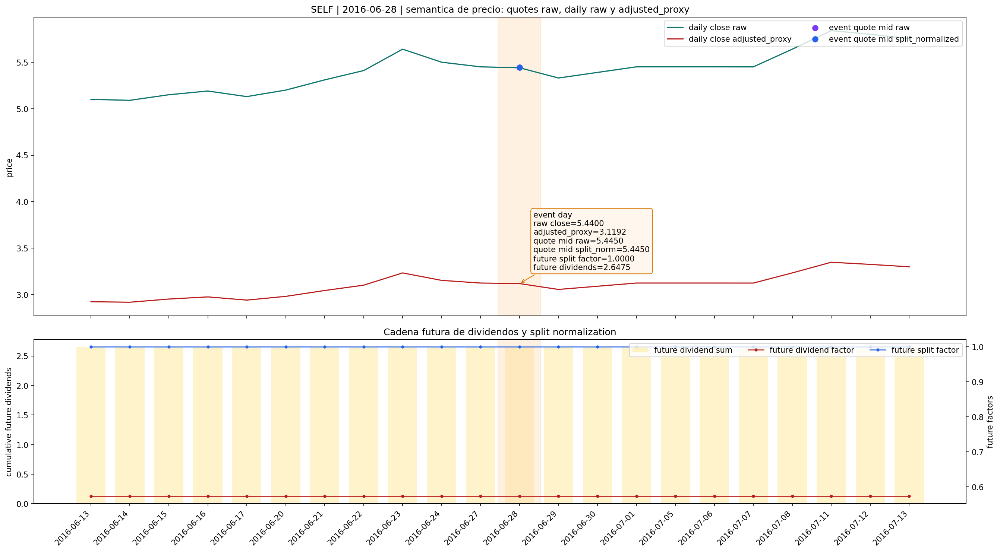

#### 00b Event Month Quotes Context
Esta imagen responde a la pregunta de recurrencia mensual dentro de `quotes`: el problema se concentra en el evento o reaparece en varias sesiones. Arriba concatena sesiones con datos disponibles; abajo resume cobertura diaria, `crossed_ratio_pct` y `max_gap_bps_pos`. La decision que cambia es si el caso debe leerse como episodio puntual o como sintoma de una fase repetida de libro degradado. El error que evita es extrapolar desde un unico dia a todo el mes sin evidencia.

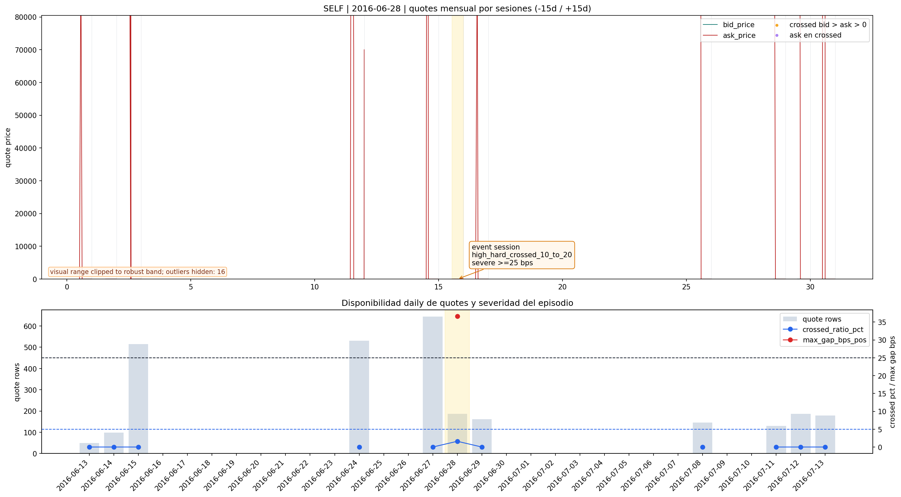

#### 01 Raw Window
Esta imagen responde a la primera pregunta decisiva del caso: el crossed observado es economicamente bastante fuerte para justificar un cambio de clase. Arriba ensena la geometria exacta del tramo conflictivo; abajo convierte esa geometria a bps y la enfrenta a los cortes `5 bps` y `25 bps`. El regimen dominante es `severe >=25 bps`. La decision que cambia es pasar de anomalia interpretable a `review` o `bad`. El error que evita es decidir por apariencia visual sin medir el dano economico real del crossed. En terminos de pipeline, este panel decide si el problema afecta solo a la lectura forense o si invalida simulacion de ejecucion y microstructure features.

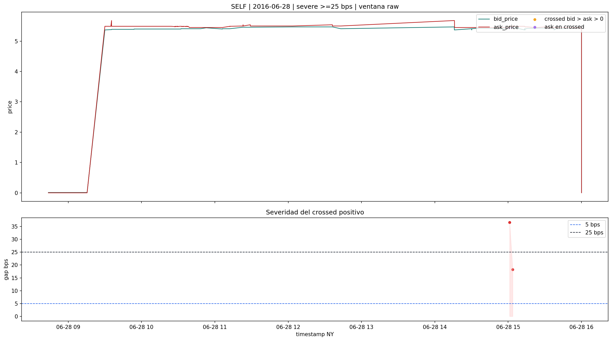

#### 02 Full Session Context
Esta imagen responde a la pregunta de extension intradiaria: el dano esta confinado a un bloque corto o contamina la sesion completa. Arriba se ve toda la sesion `04:00-20:00 NY`; abajo el `gap_bps` firmado. La decision que cambia es si el consumo debe penalizar solo un tramo o desechar el dia entero para uso operativo. El error que evita es tratar una cicatriz local como ruina total o, al reves, minimizar una degradacion distribuida a lo largo del dia. En ejecucion esto decide si la sesion puede seguir usandose con restricciones; en ML decide si las features intradiarias conservan significado economico.

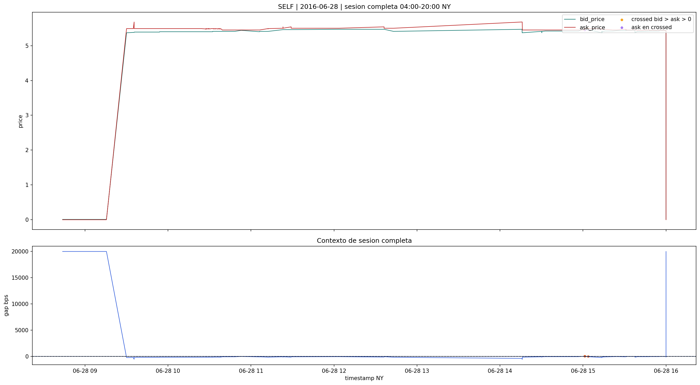

#### 03 Structure Diagnostics
Este panel responde a la pregunta de naturaleza del fallo: contradiccion economica genuina o mezcla con degeneracion estructural. Separa `ask=0` de `ask>0`, muestra la distribucion de `gap_bps` y resume patrones de integerizacion. La decision que cambia es como interpretar el dano: mercado localmente roto, artefacto de representacion o combinacion de ambos. El error que evita es sobrediagnosticar crossed reales cuando parte de la senal proviene de estructura degenerada del libro. Esta lectura afecta directamente a que el caso vaya a exclusion dura, a bandera contextual o a simple reconciliacion tecnica.

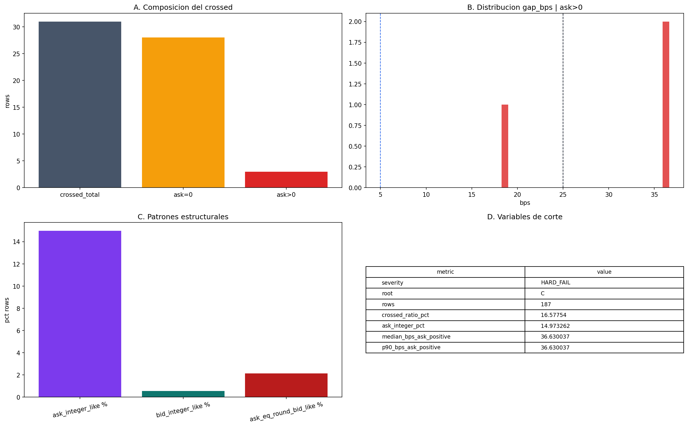

#### 04 Summary Card
Esta tarjeta responde a la pregunta de auditabilidad: cuales son exactamente las variables que sostienen la conclusion. Reune `severity`, `root`, `crossed_ratio_pct`, `ask_integer_pct`, `median_bps_ask_positive` y `p90_bps_ask_positive`. La decision que cambia es pasar de impresion visual a regla verificable. El error que evita es que dos inspectores lleguen a conclusiones distintas mirando la misma imagen sin una base numerica comun. Para gobernanza del proyecto, este panel es el que vuelve reproducible la decision para backtest, ML y auditoria.

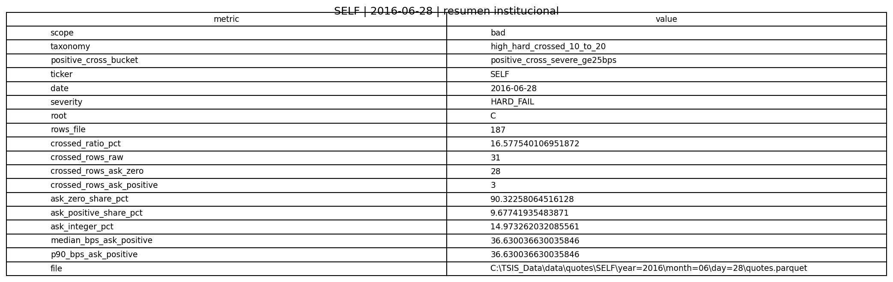

#### 05 Historical Context
Esta imagen responde a la pregunta causal externa: existe un framing historico que ayude a entender por que ocurre el episodio. Puede aportar halt context, explained o not strongly explained. La decision que cambia es cuanto peso se concede al contexto en la narrativa final. El error que evita es doble: ignorar una explicacion real o usarla como excusa para absolver un libro que localmente sigue siendo problematico.

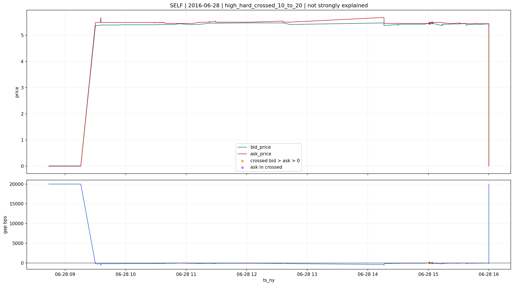

---

### 3. UFAB 2023-03-09

company_name: `Unique Fabricating, Inc.`
primary_exchange: `NYSE American` (`XASE`)
market_locale: `stocks/us`
scope: `bad`
ticker: `UFAB`
date: `2023-03-09`
taxonomy: `medium_file_threshold_edge_hard_many_crosses`
positive_cross_bucket: `positive_cross_severe_ge25bps`
severity: `HARD_FAIL`
root: `C`
rows: `284`
crossed_ratio_pct: `2.464789`
crossed_rows_raw: `7`
crossed_rows_ask_zero: `0`
crossed_rows_ask_positive: `7`
ask_integer_pct: `0.000000`
median_bps_ask_positive: `417.633411`
p90_bps_ask_positive: `622.448980`
file: `C:\TSIS_Data\data\quotes\UFAB\year=2023\month=03\day=09\quotes.parquet`

#### Analisis Forense
La conclusion correcta del caso es que la contradiccion local entre bid y ask ya compromete la credibilidad economica del libro y bloquea su consumo como si fuera mercado normal. La taxonomy historica es `medium_file_threshold_edge_hard_many_crosses` y el regimen positivo dominante es `severe >=25 bps`. Esto importa porque la taxonomy no solo clasifica: resume que tipo de anomalia se esta viendo y que clase de decision contractual puede defenderse despues. La taxonomy `medium_file_threshold_edge_hard_many_crosses` implica que el mismo tipo de dano aparece en un file menos grande y por eso pesa mas: hay menos masa para diluir la anomalia y la exclusion se vuelve mas defendible. El regimen `severe >=25 bps` empuja el caso a una lectura economicamente dura: el crossed deja de ser cosmetico y pasa a cuestionar si el libro sigue siendo interpretable como mercado negociable. En terminos observables, el file tiene `crossed_ratio_pct=2.464789` con `crossed_rows_ask_positive=7` y `crossed_rows_ask_zero=0`. La severidad economica del crossed ask>0 se resume en `median_bps_ask_positive=417.633411` y `p90_bps_ask_positive=622.448980`. Estos dos numeros convierten una forma visual rara en una conclusion operativa sobre si el libro sigue representando o no un mercado negociable. La decision que cambia es exclusion del consumo core del libro. `bad` significa que el estado local ya no puede alimentar ejecucion, mark-to-market intradiario ni aprendizaje de ML como si fuese microestructura defendible. El error que evita es construir decisiones sobre un libro que ha dejado de representar un mercado localmente creible. El patron estructural muestra `ask_integer_pct=0.000000`. Este numero obliga a separar dos explicaciones rivales: contradiccion economica genuina del libro o mezcla con degeneracion estructural / integerizacion. Toda la composicion crossed cae en `ask>0`. Eso endurece la lectura economica del caso: el dano no depende de ceros mecanicos, sino de contradiccion positiva dentro de precios aparentemente vivos. Como `ask_integer_pct` es bajo, la hipotesis de simple degeneracion mecanica pierde fuerza. Eso endurece la interpretacion: el crossed se parece mas a contradiccion economica genuina y menos a artefacto. Existe ademas una imagen historica de certificacion asociada. Su papel es poner el episodio en un marco causal mas amplio: halt, explained, not strongly explained o patron conocido. La regla que protege al proyecto es esta: el contexto externo se usa para explicar por que aparece el episodio, no para absolverlo. El error que evita es degradar el criterio de calidad del libro porque exista una historia plausible alrededor del caso.

#### 00 Event Month Context
Esta imagen responde a la pregunta de persistencia temporal: estamos ante un accidente local o ante una fase mas amplia de inestabilidad. Arriba coloca el evento en la serie `daily` real del mes; abajo compara `crossed_ratio_pct` y `max_gap_bps_pos` del dia contra sus vecinos. La decision que cambia es el peso estructural que se le concede al caso. El error que evita es juzgar igual un shock aislado y una degradacion repetida del libro.

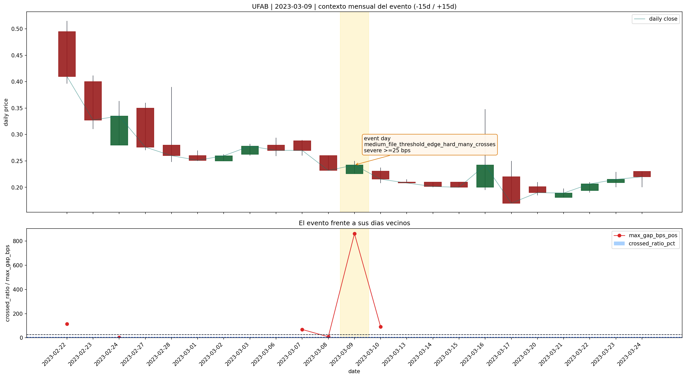

#### 00b Event Month Quotes Context
Esta imagen responde a la pregunta de recurrencia mensual dentro de `quotes`: el problema se concentra en el evento o reaparece en varias sesiones. Arriba concatena sesiones con datos disponibles; abajo resume cobertura diaria, `crossed_ratio_pct` y `max_gap_bps_pos`. La decision que cambia es si el caso debe leerse como episodio puntual o como sintoma de una fase repetida de libro degradado. El error que evita es extrapolar desde un unico dia a todo el mes sin evidencia.

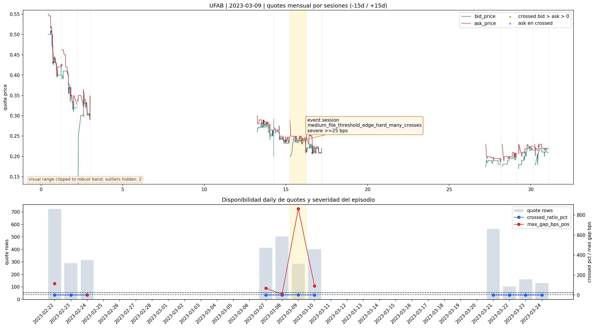

#### 01 Raw Window
Esta imagen responde a la primera pregunta decisiva del caso: el crossed observado es economicamente bastante fuerte para justificar un cambio de clase. Arriba ensena la geometria exacta del tramo conflictivo; abajo convierte esa geometria a bps y la enfrenta a los cortes `5 bps` y `25 bps`. El regimen dominante es `severe >=25 bps`. La decision que cambia es pasar de anomalia interpretable a `review` o `bad`. El error que evita es decidir por apariencia visual sin medir el dano economico real del crossed. En terminos de pipeline, este panel decide si el problema afecta solo a la lectura forense o si invalida simulacion de ejecucion y microstructure features.

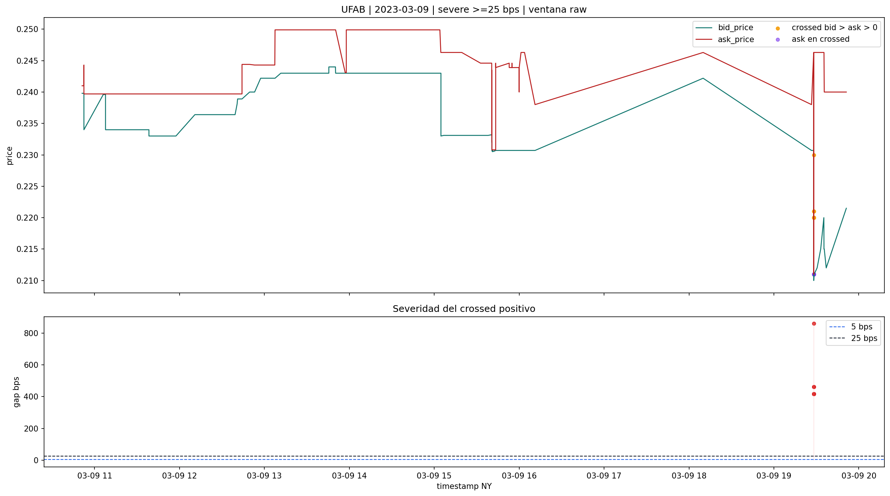

#### 02 Full Session Context
Esta imagen responde a la pregunta de extension intradiaria: el dano esta confinado a un bloque corto o contamina la sesion completa. Arriba se ve toda la sesion `04:00-20:00 NY`; abajo el `gap_bps` firmado. La decision que cambia es si el consumo debe penalizar solo un tramo o desechar el dia entero para uso operativo. El error que evita es tratar una cicatriz local como ruina total o, al reves, minimizar una degradacion distribuida a lo largo del dia. En ejecucion esto decide si la sesion puede seguir usandose con restricciones; en ML decide si las features intradiarias conservan significado economico.

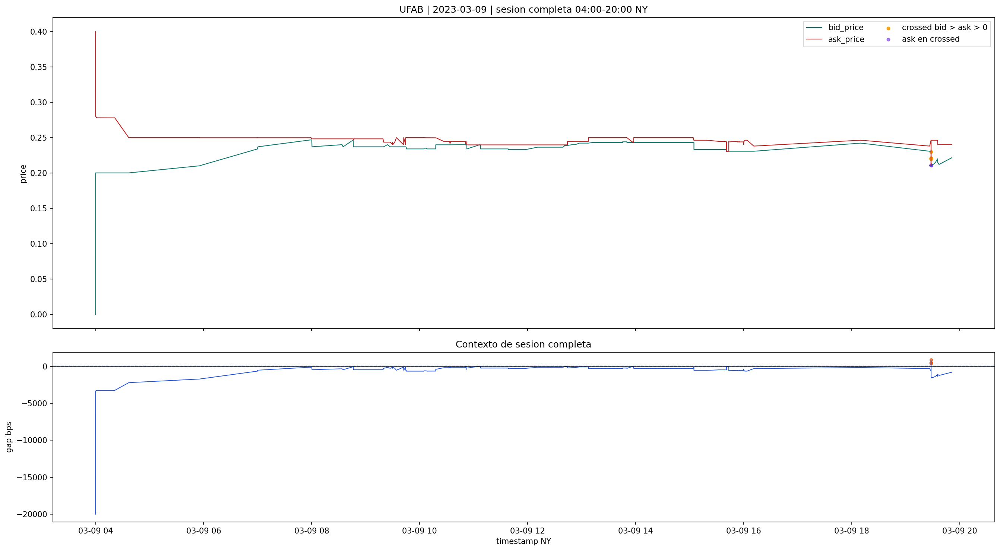

#### 03 Structure Diagnostics
Este panel responde a la pregunta de naturaleza del fallo: contradiccion economica genuina o mezcla con degeneracion estructural. Separa `ask=0` de `ask>0`, muestra la distribucion de `gap_bps` y resume patrones de integerizacion. La decision que cambia es como interpretar el dano: mercado localmente roto, artefacto de representacion o combinacion de ambos. El error que evita es sobrediagnosticar crossed reales cuando parte de la senal proviene de estructura degenerada del libro. Esta lectura afecta directamente a que el caso vaya a exclusion dura, a bandera contextual o a simple reconciliacion tecnica.

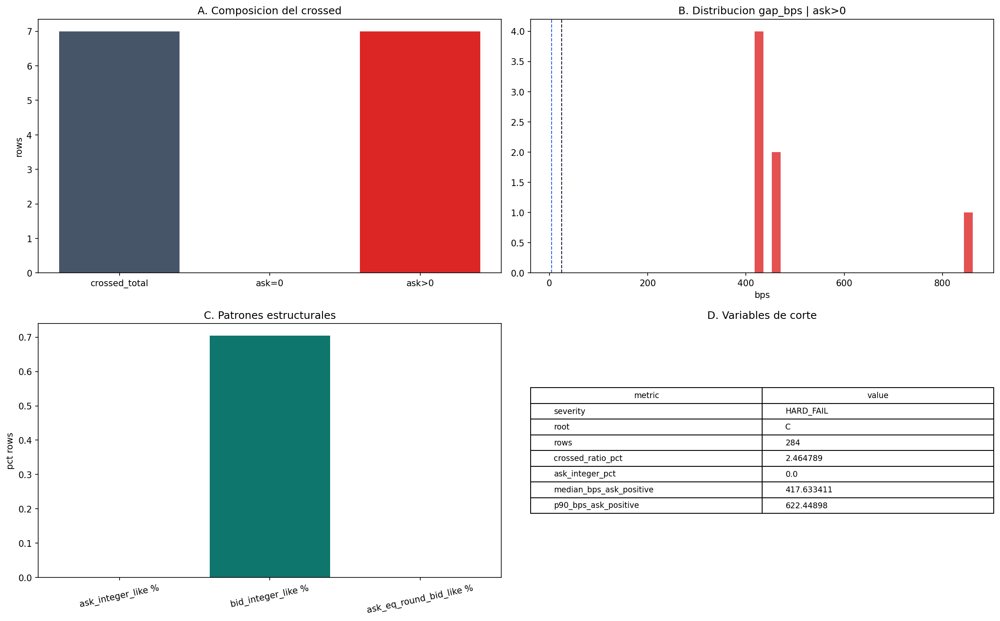

#### 04 Summary Card
Esta tarjeta responde a la pregunta de auditabilidad: cuales son exactamente las variables que sostienen la conclusion. Reune `severity`, `root`, `crossed_ratio_pct`, `ask_integer_pct`, `median_bps_ask_positive` y `p90_bps_ask_positive`. La decision que cambia es pasar de impresion visual a regla verificable. El error que evita es que dos inspectores lleguen a conclusiones distintas mirando la misma imagen sin una base numerica comun. Para gobernanza del proyecto, este panel es el que vuelve reproducible la decision para backtest, ML y auditoria.

#### 05 Historical Context
Esta imagen responde a la pregunta causal externa: existe un framing historico que ayude a entender por que ocurre el episodio. Puede aportar halt context, explained o not strongly explained. La decision que cambia es cuanto peso se concede al contexto en la narrativa final. El error que evita es doble: ignorar una explicacion real o usarla como excusa para absolver un libro que localmente sigue siendo problematico.

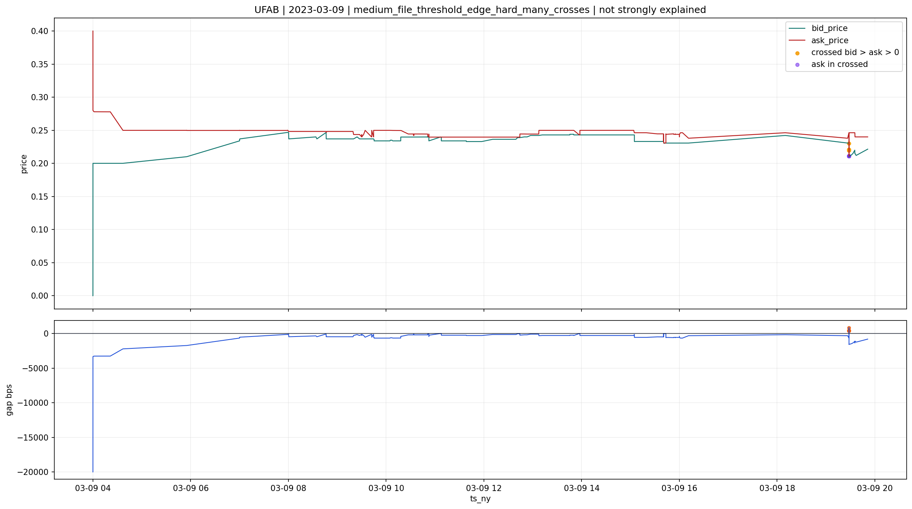

---

### 4. DGLY 2011-10-06

company_name: `Digital Ally, Inc. Common Stock`
primary_exchange: `NASDAQ` (`XNAS`)
market_locale: `stocks/us`
scope: `bad`
ticker: `DGLY`
date: `2011-10-06`
taxonomy: `medium_file_threshold_edge_hard_many_crosses`
positive_cross_bucket: `positive_cross_severe_ge25bps`
severity: `HARD_FAIL`
root: `C`
rows: `201`
crossed_ratio_pct: `4.477612`
crossed_rows_raw: `9`
crossed_rows_ask_zero: `0`
crossed_rows_ask_positive: `9`
ask_integer_pct: `0.000000`
median_bps_ask_positive: `281.690141`
p90_bps_ask_positive: `425.531915`
file: `C:\TSIS_Data\data\quotes\DGLY\year=2011\month=10\day=06\quotes.parquet`

#### Analisis Forense
La conclusion correcta del caso es que la contradiccion local entre bid y ask ya compromete la credibilidad economica del libro y bloquea su consumo como si fuera mercado normal. La taxonomy historica es `medium_file_threshold_edge_hard_many_crosses` y el regimen positivo dominante es `severe >=25 bps`. Esto importa porque la taxonomy no solo clasifica: resume que tipo de anomalia se esta viendo y que clase de decision contractual puede defenderse despues. La taxonomy `medium_file_threshold_edge_hard_many_crosses` implica que el mismo tipo de dano aparece en un file menos grande y por eso pesa mas: hay menos masa para diluir la anomalia y la exclusion se vuelve mas defendible. El regimen `severe >=25 bps` empuja el caso a una lectura economicamente dura: el crossed deja de ser cosmetico y pasa a cuestionar si el libro sigue siendo interpretable como mercado negociable. En terminos observables, el file tiene `crossed_ratio_pct=4.477612` con `crossed_rows_ask_positive=9` y `crossed_rows_ask_zero=0`. La severidad economica del crossed ask>0 se resume en `median_bps_ask_positive=281.690141` y `p90_bps_ask_positive=425.531915`. Estos dos numeros convierten una forma visual rara en una conclusion operativa sobre si el libro sigue representando o no un mercado negociable. La decision que cambia es exclusion del consumo core del libro. `bad` significa que el estado local ya no puede alimentar ejecucion, mark-to-market intradiario ni aprendizaje de ML como si fuese microestructura defendible. El error que evita es construir decisiones sobre un libro que ha dejado de representar un mercado localmente creible. El patron estructural muestra `ask_integer_pct=0.000000`. Este numero obliga a separar dos explicaciones rivales: contradiccion economica genuina del libro o mezcla con degeneracion estructural / integerizacion. Toda la composicion crossed cae en `ask>0`. Eso endurece la lectura economica del caso: el dano no depende de ceros mecanicos, sino de contradiccion positiva dentro de precios aparentemente vivos. Como `ask_integer_pct` es bajo, la hipotesis de simple degeneracion mecanica pierde fuerza. Eso endurece la interpretacion: el crossed se parece mas a contradiccion economica genuina y menos a artefacto. En la capa de semantica de precio del evento aparecen `daily raw close=92400.0000`, `quote mid raw=0.7400`, `quote mid split_normalized=88800.0000`, `daily adjusted_proxy=92400.0000`. La reconciliacion incluye `future_split_factor=0.0000`. La implicacion metodologica es crucial: una discrepancia entre `quotes`, `daily` y una plataforma externa no puede leerse automaticamente como fallo del dataset. Puede ser semantica de precio distinta. El error que evita esta capa es mezclar raw, split-normalized y adjusted dentro del mismo pipeline, rompiendo auditoria, benchmarking y labels. Para pipelines, esto implica exclusion de ejecucion realista, de mark-to-market intradiario defendible y de features microestructurales tratadas como si reflejaran un mercado normal. Solo debe sobrevivir en circuitos forenses o de calidad. Existe ademas una imagen historica de certificacion asociada. Su papel es poner el episodio en un marco causal mas amplio: halt, explained, not strongly explained o patron conocido. La regla que protege al proyecto es esta: el contexto externo se usa para explicar por que aparece el episodio, no para absolverlo. El error que evita es degradar el criterio de calidad del libro porque exista una historia plausible alrededor del caso.

#### 00 Event Month Context
Esta imagen responde a la pregunta de persistencia temporal: estamos ante un accidente local o ante una fase mas amplia de inestabilidad. Arriba coloca el evento en la serie `daily` real del mes; abajo compara `crossed_ratio_pct` y `max_gap_bps_pos` del dia contra sus vecinos. La decision que cambia es el peso estructural que se le concede al caso. El error que evita es juzgar igual un shock aislado y una degradacion repetida del libro.

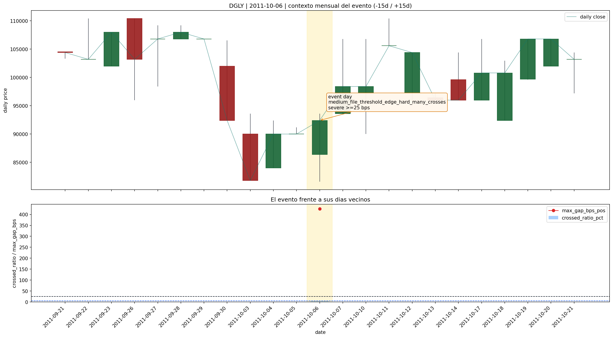

#### 00a Adjusted Proxy Contrast
Esta imagen responde a la pregunta de reconciliacion semantica: la discrepancia de precios viene de datos rotos o de vistas de precio distintas. Compara `daily raw`, `daily adjusted_proxy`, `quote mid raw` y `quote mid split_normalized`, y debajo ensena la cadena de dividendos y splits que produce la diferencia. La decision que cambia es si el inspector debe abrir una incidencia de calidad o cerrar el caso como diferencia legitima de semantica. El error que evita es mezclar series raw y adjusted como si fueran equivalentes. En pipelines reales, esto protege benchmarking, labels diarios y reconciliacion externa frente a falsas alarmas de precio.

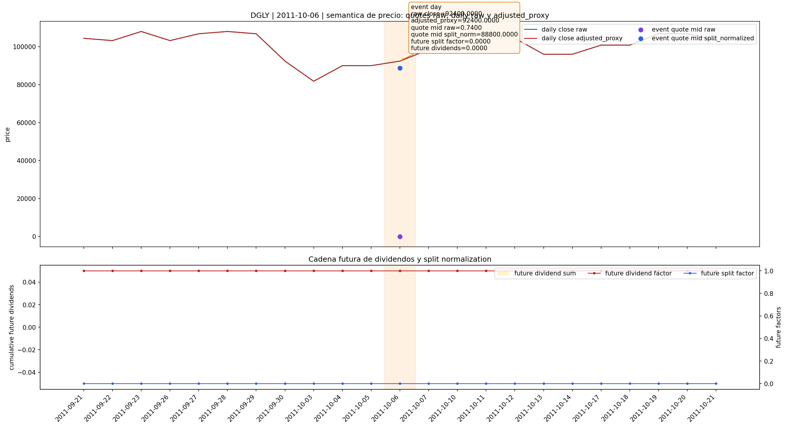

#### 00b Event Month Quotes Context
Esta imagen responde a la pregunta de recurrencia mensual dentro de `quotes`: el problema se concentra en el evento o reaparece en varias sesiones. Arriba concatena sesiones con datos disponibles; abajo resume cobertura diaria, `crossed_ratio_pct` y `max_gap_bps_pos`. La decision que cambia es si el caso debe leerse como episodio puntual o como sintoma de una fase repetida de libro degradado. El error que evita es extrapolar desde un unico dia a todo el mes sin evidencia.

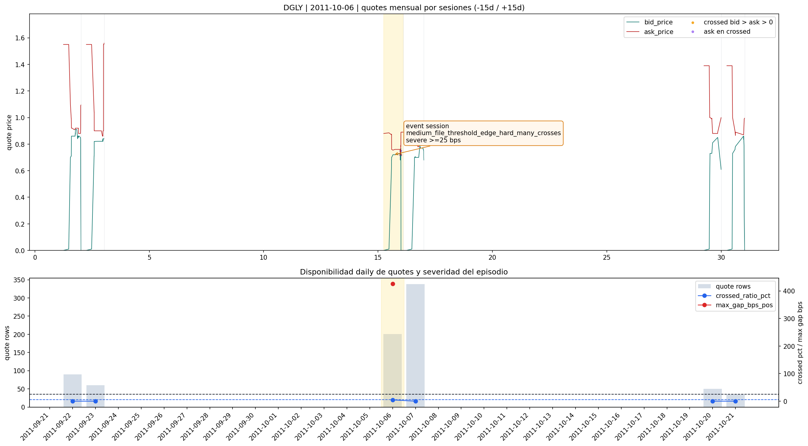

#### 01 Raw Window
Esta imagen responde a la primera pregunta decisiva del caso: el crossed observado es economicamente bastante fuerte para justificar un cambio de clase. Arriba ensena la geometria exacta del tramo conflictivo; abajo convierte esa geometria a bps y la enfrenta a los cortes `5 bps` y `25 bps`. El regimen dominante es `severe >=25 bps`. La decision que cambia es pasar de anomalia interpretable a `review` o `bad`. El error que evita es decidir por apariencia visual sin medir el dano economico real del crossed. En terminos de pipeline, este panel decide si el problema afecta solo a la lectura forense o si invalida simulacion de ejecucion y microstructure features.

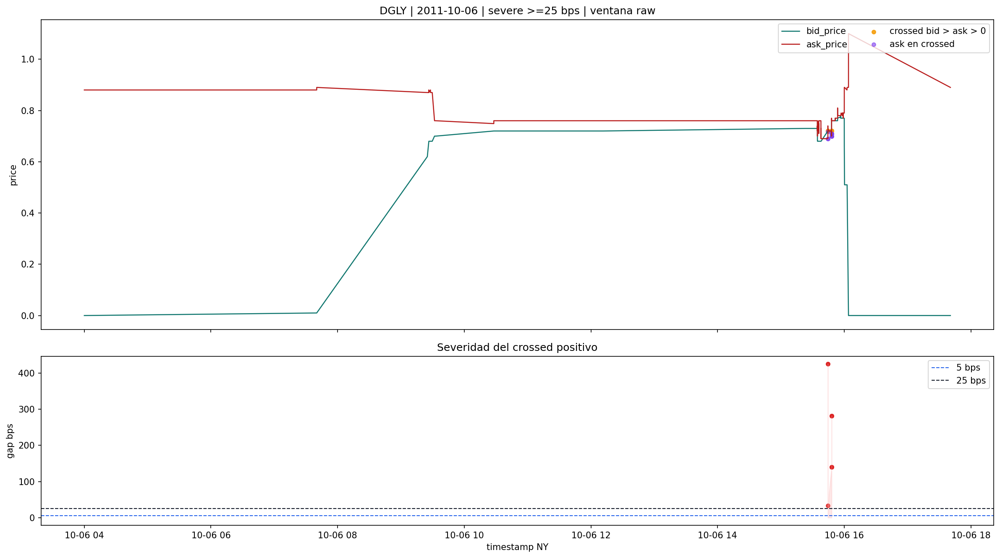

#### 02 Full Session Context
Esta imagen responde a la pregunta de extension intradiaria: el dano esta confinado a un bloque corto o contamina la sesion completa. Arriba se ve toda la sesion `04:00-20:00 NY`; abajo el `gap_bps` firmado. La decision que cambia es si el consumo debe penalizar solo un tramo o desechar el dia entero para uso operativo. El error que evita es tratar una cicatriz local como ruina total o, al reves, minimizar una degradacion distribuida a lo largo del dia. En ejecucion esto decide si la sesion puede seguir usandose con restricciones; en ML decide si las features intradiarias conservan significado economico.

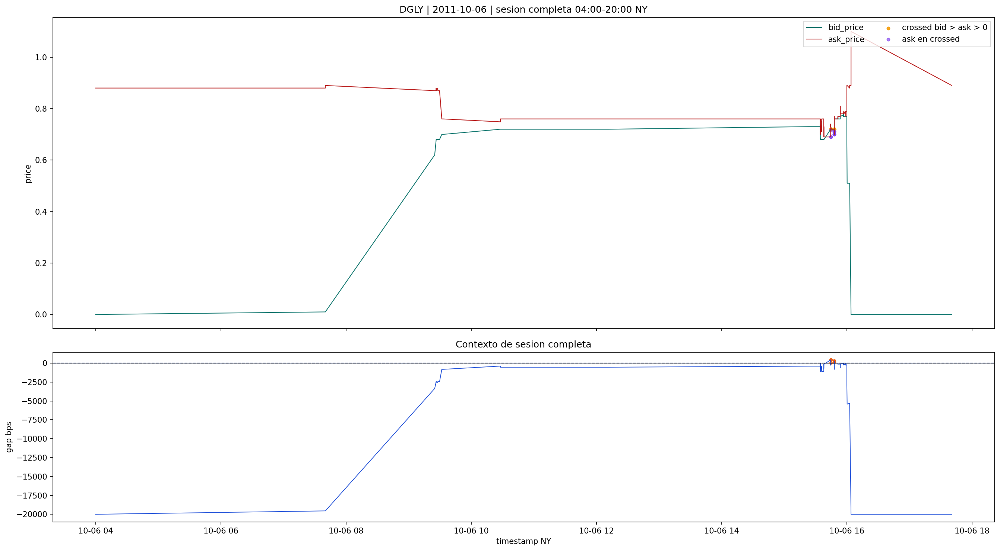

#### 03 Structure Diagnostics
Este panel responde a la pregunta de naturaleza del fallo: contradiccion economica genuina o mezcla con degeneracion estructural. Separa `ask=0` de `ask>0`, muestra la distribucion de `gap_bps` y resume patrones de integerizacion. La decision que cambia es como interpretar el dano: mercado localmente roto, artefacto de representacion o combinacion de ambos. El error que evita es sobrediagnosticar crossed reales cuando parte de la senal proviene de estructura degenerada del libro. Esta lectura afecta directamente a que el caso vaya a exclusion dura, a bandera contextual o a simple reconciliacion tecnica.

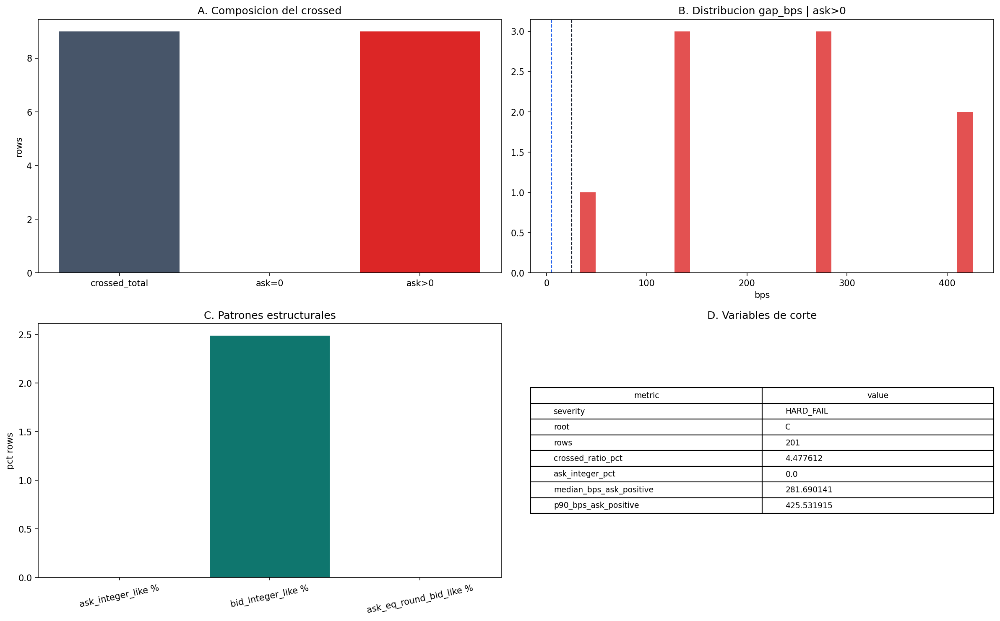

#### 04 Summary Card
Esta tarjeta responde a la pregunta de auditabilidad: cuales son exactamente las variables que sostienen la conclusion. Reune `severity`, `root`, `crossed_ratio_pct`, `ask_integer_pct`, `median_bps_ask_positive` y `p90_bps_ask_positive`. La decision que cambia es pasar de impresion visual a regla verificable. El error que evita es que dos inspectores lleguen a conclusiones distintas mirando la misma imagen sin una base numerica comun. Para gobernanza del proyecto, este panel es el que vuelve reproducible la decision para backtest, ML y auditoria.

#### 05 Historical Context
Esta imagen responde a la pregunta causal externa: existe un framing historico que ayude a entender por que ocurre el episodio. Puede aportar halt context, explained o not strongly explained. La decision que cambia es cuanto peso se concede al contexto en la narrativa final. El error que evita es doble: ignorar una explicacion real o usarla como excusa para absolver un libro que localmente sigue siendo problematico.

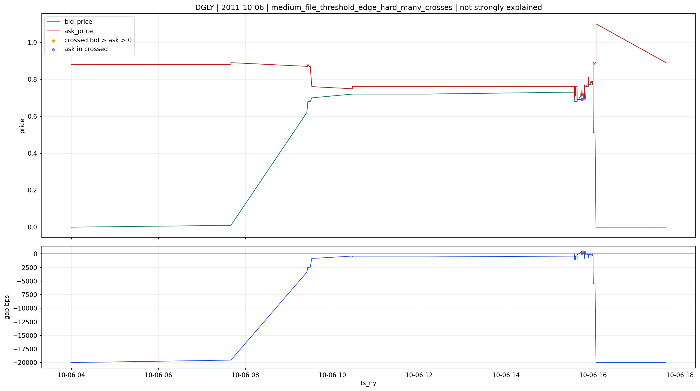

---

### 5. QRHC 2020-10-28

company_name: `Quest Resource Holding Corporation`
primary_exchange: `NASDAQ` (`XNAS`)
market_locale: `stocks/us`
scope: `bad`
ticker: `QRHC`
date: `2020-10-28`
taxonomy: `medium_file_threshold_edge_hard_many_crosses`
positive_cross_bucket: `positive_cross_severe_ge25bps`
severity: `HARD_FAIL`
root: `D`
rows: `240`
crossed_ratio_pct: `3.333333`
crossed_rows_raw: `8`
crossed_rows_ask_zero: `3`
crossed_rows_ask_positive: `5`
ask_integer_pct: `1.666667`
median_bps_ask_positive: `108.108108`
p90_bps_ask_positive: `108.108108`
file: `D:\quotes\QRHC\year=2020\month=10\day=28\quotes.parquet`

#### Analisis Forense
La conclusion correcta del caso es que la contradiccion local entre bid y ask ya compromete la credibilidad economica del libro y bloquea su consumo como si fuera mercado normal. La taxonomy historica es `medium_file_threshold_edge_hard_many_crosses` y el regimen positivo dominante es `severe >=25 bps`. Esto importa porque la taxonomy no solo clasifica: resume que tipo de anomalia se esta viendo y que clase de decision contractual puede defenderse despues. La taxonomy `medium_file_threshold_edge_hard_many_crosses` implica que el mismo tipo de dano aparece en un file menos grande y por eso pesa mas: hay menos masa para diluir la anomalia y la exclusion se vuelve mas defendible. El regimen `severe >=25 bps` empuja el caso a una lectura economicamente dura: el crossed deja de ser cosmetico y pasa a cuestionar si el libro sigue siendo interpretable como mercado negociable. En terminos observables, el file tiene `crossed_ratio_pct=3.333333` con `crossed_rows_ask_positive=5` y `crossed_rows_ask_zero=3`. La severidad economica del crossed ask>0 se resume en `median_bps_ask_positive=108.108108` y `p90_bps_ask_positive=108.108108`. Estos dos numeros convierten una forma visual rara en una conclusion operativa sobre si el libro sigue representando o no un mercado negociable. La decision que cambia es exclusion del consumo core del libro. `bad` significa que el estado local ya no puede alimentar ejecucion, mark-to-market intradiario ni aprendizaje de ML como si fuese microestructura defendible. El error que evita es construir decisiones sobre un libro que ha dejado de representar un mercado localmente creible. El patron estructural muestra `ask_integer_pct=1.666667`. Este numero obliga a separar dos explicaciones rivales: contradiccion economica genuina del libro o mezcla con degeneracion estructural / integerizacion. La composicion esta mezclada entre `ask=0` y `ask>0`. Eso obliga a una lectura dual: parte del patron pertenece a estructura y parte a contradiccion economica genuina, por lo que la decision debe apoyarse en ambas capas y no en una sola narrativa. Como `ask_integer_pct` es bajo, la hipotesis de simple degeneracion mecanica pierde fuerza. Eso endurece la interpretacion: el crossed se parece mas a contradiccion economica genuina y menos a artefacto. Existe ademas una imagen historica de certificacion asociada. Su papel es poner el episodio en un marco causal mas amplio: halt, explained, not strongly explained o patron conocido. La regla que protege al proyecto es esta: el contexto externo se usa para explicar por que aparece el episodio, no para absolverlo. El error que evita es degradar el criterio de calidad del libro porque exista una historia plausible alrededor del caso.

#### 00 Event Month Context
Esta imagen responde a la pregunta de persistencia temporal: estamos ante un accidente local o ante una fase mas amplia de inestabilidad. Arriba coloca el evento en la serie `daily` real del mes; abajo compara `crossed_ratio_pct` y `max_gap_bps_pos` del dia contra sus vecinos. La decision que cambia es el peso estructural que se le concede al caso. El error que evita es juzgar igual un shock aislado y una degradacion repetida del libro.

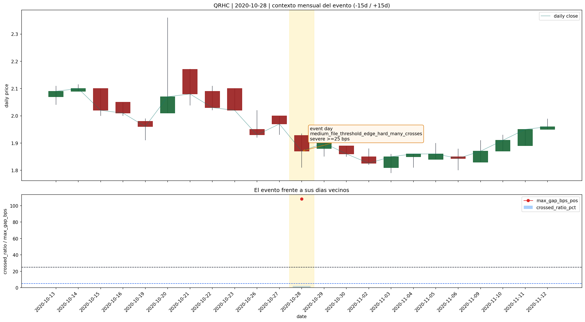

#### 00b Event Month Quotes Context
Esta imagen responde a la pregunta de recurrencia mensual dentro de `quotes`: el problema se concentra en el evento o reaparece en varias sesiones. Arriba concatena sesiones con datos disponibles; abajo resume cobertura diaria, `crossed_ratio_pct` y `max_gap_bps_pos`. La decision que cambia es si el caso debe leerse como episodio puntual o como sintoma de una fase repetida de libro degradado. El error que evita es extrapolar desde un unico dia a todo el mes sin evidencia.

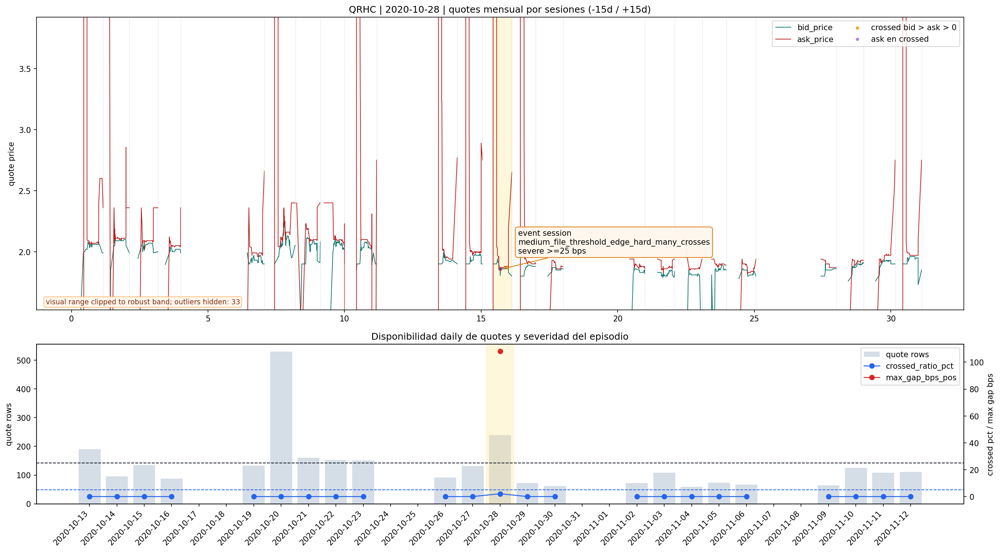

#### 01 Raw Window
Esta imagen responde a la primera pregunta decisiva del caso: el crossed observado es economicamente bastante fuerte para justificar un cambio de clase. Arriba ensena la geometria exacta del tramo conflictivo; abajo convierte esa geometria a bps y la enfrenta a los cortes `5 bps` y `25 bps`. El regimen dominante es `severe >=25 bps`. La decision que cambia es pasar de anomalia interpretable a `review` o `bad`. El error que evita es decidir por apariencia visual sin medir el dano economico real del crossed. En terminos de pipeline, este panel decide si el problema afecta solo a la lectura forense o si invalida simulacion de ejecucion y microstructure features.

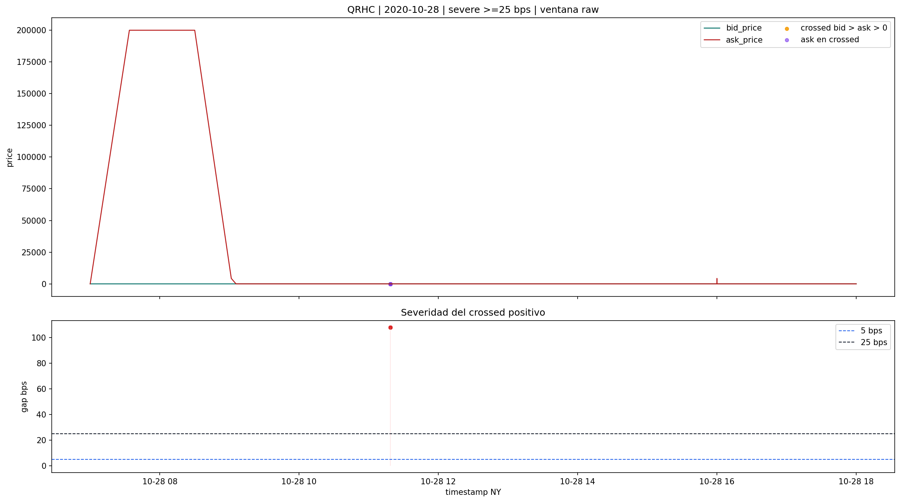

#### 02 Full Session Context
Esta imagen responde a la pregunta de extension intradiaria: el dano esta confinado a un bloque corto o contamina la sesion completa. Arriba se ve toda la sesion `04:00-20:00 NY`; abajo el `gap_bps` firmado. La decision que cambia es si el consumo debe penalizar solo un tramo o desechar el dia entero para uso operativo. El error que evita es tratar una cicatriz local como ruina total o, al reves, minimizar una degradacion distribuida a lo largo del dia. En ejecucion esto decide si la sesion puede seguir usandose con restricciones; en ML decide si las features intradiarias conservan significado economico.

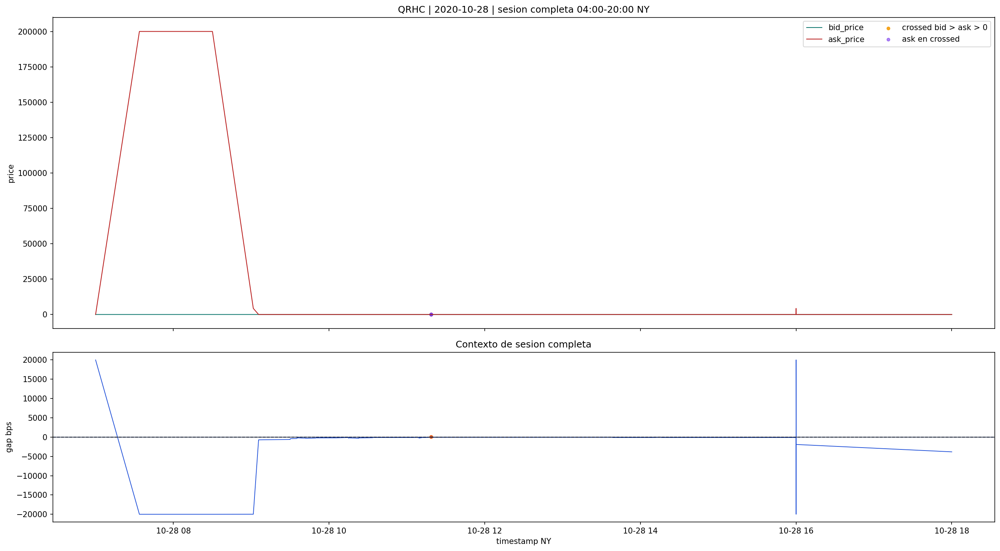

#### 03 Structure Diagnostics
Este panel responde a la pregunta de naturaleza del fallo: contradiccion economica genuina o mezcla con degeneracion estructural. Separa `ask=0` de `ask>0`, muestra la distribucion de `gap_bps` y resume patrones de integerizacion. La decision que cambia es como interpretar el dano: mercado localmente roto, artefacto de representacion o combinacion de ambos. El error que evita es sobrediagnosticar crossed reales cuando parte de la senal proviene de estructura degenerada del libro. Esta lectura afecta directamente a que el caso vaya a exclusion dura, a bandera contextual o a simple reconciliacion tecnica.

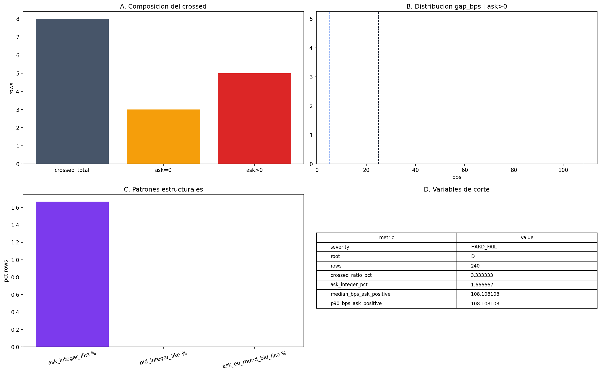

#### 04 Summary Card
Esta tarjeta responde a la pregunta de auditabilidad: cuales son exactamente las variables que sostienen la conclusion. Reune `severity`, `root`, `crossed_ratio_pct`, `ask_integer_pct`, `median_bps_ask_positive` y `p90_bps_ask_positive`. La decision que cambia es pasar de impresion visual a regla verificable. El error que evita es que dos inspectores lleguen a conclusiones distintas mirando la misma imagen sin una base numerica comun. Para gobernanza del proyecto, este panel es el que vuelve reproducible la decision para backtest, ML y auditoria.

---

### 6. PPHM 2007-10-08

company_name: `Peregrine Pharmaceuticals Inc`
primary_exchange: `NASDAQ` (`XNAS`)
market_locale: `stocks/us`
scope: `bad`
ticker: `PPHM`
date: `2007-10-08`
taxonomy: `medium_file_threshold_edge_hard_many_crosses`
positive_cross_bucket: `positive_cross_severe_ge25bps`
severity: `HARD_FAIL`
root: `D`
rows: `531`
crossed_ratio_pct: `4.143126`
crossed_rows_raw: `22`
crossed_rows_ask_zero: `0`
crossed_rows_ask_positive: `22`
ask_integer_pct: `0.000000`
median_bps_ask_positive: `53.587377`
p90_bps_ask_positive: `58.040033`
file: `D:\quotes\PPHM\year=2007\month=10\day=08\quotes.parquet`

#### Analisis Forense
La conclusion correcta del caso es que la contradiccion local entre bid y ask ya compromete la credibilidad economica del libro y bloquea su consumo como si fuera mercado normal. La taxonomy historica es `medium_file_threshold_edge_hard_many_crosses` y el regimen positivo dominante es `severe >=25 bps`. Esto importa porque la taxonomy no solo clasifica: resume que tipo de anomalia se esta viendo y que clase de decision contractual puede defenderse despues. La taxonomy `medium_file_threshold_edge_hard_many_crosses` implica que el mismo tipo de dano aparece en un file menos grande y por eso pesa mas: hay menos masa para diluir la anomalia y la exclusion se vuelve mas defendible. El regimen `severe >=25 bps` empuja el caso a una lectura economicamente dura: el crossed deja de ser cosmetico y pasa a cuestionar si el libro sigue siendo interpretable como mercado negociable. En terminos observables, el file tiene `crossed_ratio_pct=4.143126` con `crossed_rows_ask_positive=22` y `crossed_rows_ask_zero=0`. La severidad economica del crossed ask>0 se resume en `median_bps_ask_positive=53.587377` y `p90_bps_ask_positive=58.040033`. Estos dos numeros convierten una forma visual rara en una conclusion operativa sobre si el libro sigue representando o no un mercado negociable. La decision que cambia es exclusion del consumo core del libro. `bad` significa que el estado local ya no puede alimentar ejecucion, mark-to-market intradiario ni aprendizaje de ML como si fuese microestructura defendible. El error que evita es construir decisiones sobre un libro que ha dejado de representar un mercado localmente creible. El patron estructural muestra `ask_integer_pct=0.000000`. Este numero obliga a separar dos explicaciones rivales: contradiccion economica genuina del libro o mezcla con degeneracion estructural / integerizacion. Toda la composicion crossed cae en `ask>0`. Eso endurece la lectura economica del caso: el dano no depende de ceros mecanicos, sino de contradiccion positiva dentro de precios aparentemente vivos. Como `ask_integer_pct` es bajo, la hipotesis de simple degeneracion mecanica pierde fuerza. Eso endurece la interpretacion: el crossed se parece mas a contradiccion economica genuina y menos a artefacto. En la capa de semantica de precio del evento aparecen `daily raw close=3.2450`, `quote mid raw=0.6640`, `quote mid split_normalized=3.3197`, `daily adjusted_proxy=3.2450`. La reconciliacion incluye `future_split_factor=0.2000`. La implicacion metodologica es crucial: una discrepancia entre `quotes`, `daily` y una plataforma externa no puede leerse automaticamente como fallo del dataset. Puede ser semantica de precio distinta. El error que evita esta capa es mezclar raw, split-normalized y adjusted dentro del mismo pipeline, rompiendo auditoria, benchmarking y labels. Para pipelines, esto implica exclusion de ejecucion realista, de mark-to-market intradiario defendible y de features microestructurales tratadas como si reflejaran un mercado normal. Solo debe sobrevivir en circuitos forenses o de calidad. Existe ademas una imagen historica de certificacion asociada. Su papel es poner el episodio en un marco causal mas amplio: halt, explained, not strongly explained o patron conocido. La regla que protege al proyecto es esta: el contexto externo se usa para explicar por que aparece el episodio, no para absolverlo. El error que evita es degradar el criterio de calidad del libro porque exista una historia plausible alrededor del caso.

#### 00 Event Month Context
Esta imagen responde a la pregunta de persistencia temporal: estamos ante un accidente local o ante una fase mas amplia de inestabilidad. Arriba coloca el evento en la serie `daily` real del mes; abajo compara `crossed_ratio_pct` y `max_gap_bps_pos` del dia contra sus vecinos. La decision que cambia es el peso estructural que se le concede al caso. El error que evita es juzgar igual un shock aislado y una degradacion repetida del libro.

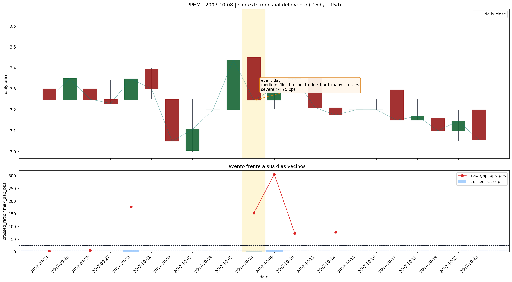

#### 00a Adjusted Proxy Contrast
Esta imagen responde a la pregunta de reconciliacion semantica: la discrepancia de precios viene de datos rotos o de vistas de precio distintas. Compara `daily raw`, `daily adjusted_proxy`, `quote mid raw` y `quote mid split_normalized`, y debajo ensena la cadena de dividendos y splits que produce la diferencia. La decision que cambia es si el inspector debe abrir una incidencia de calidad o cerrar el caso como diferencia legitima de semantica. El error que evita es mezclar series raw y adjusted como si fueran equivalentes. En pipelines reales, esto protege benchmarking, labels diarios y reconciliacion externa frente a falsas alarmas de precio.

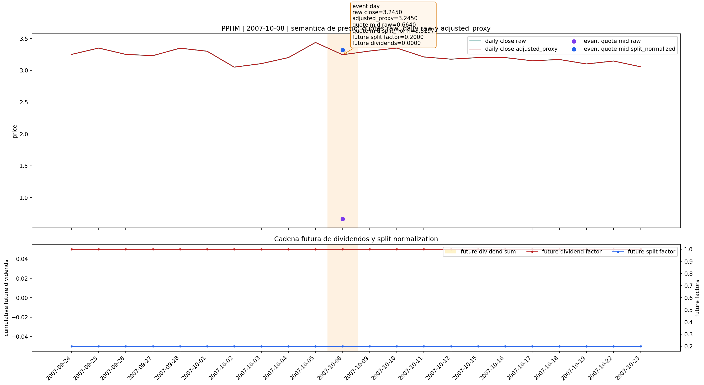

#### 00b Event Month Quotes Context
Esta imagen responde a la pregunta de recurrencia mensual dentro de `quotes`: el problema se concentra en el evento o reaparece en varias sesiones. Arriba concatena sesiones con datos disponibles; abajo resume cobertura diaria, `crossed_ratio_pct` y `max_gap_bps_pos`. La decision que cambia es si el caso debe leerse como episodio puntual o como sintoma de una fase repetida de libro degradado. El error que evita es extrapolar desde un unico dia a todo el mes sin evidencia.

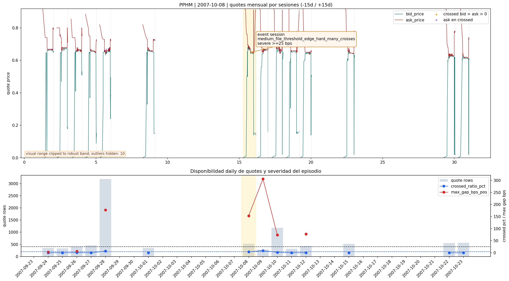

#### 01 Raw Window
Esta imagen responde a la primera pregunta decisiva del caso: el crossed observado es economicamente bastante fuerte para justificar un cambio de clase. Arriba ensena la geometria exacta del tramo conflictivo; abajo convierte esa geometria a bps y la enfrenta a los cortes `5 bps` y `25 bps`. El regimen dominante es `severe >=25 bps`. La decision que cambia es pasar de anomalia interpretable a `review` o `bad`. El error que evita es decidir por apariencia visual sin medir el dano economico real del crossed. En terminos de pipeline, este panel decide si el problema afecta solo a la lectura forense o si invalida simulacion de ejecucion y microstructure features.

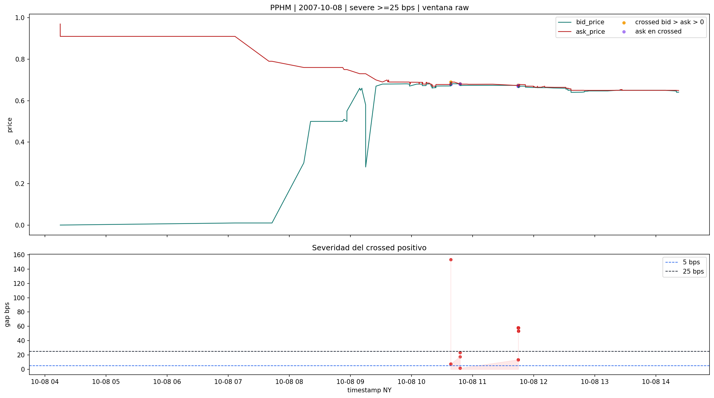

#### 02 Full Session Context
Esta imagen responde a la pregunta de extension intradiaria: el dano esta confinado a un bloque corto o contamina la sesion completa. Arriba se ve toda la sesion `04:00-20:00 NY`; abajo el `gap_bps` firmado. La decision que cambia es si el consumo debe penalizar solo un tramo o desechar el dia entero para uso operativo. El error que evita es tratar una cicatriz local como ruina total o, al reves, minimizar una degradacion distribuida a lo largo del dia. En ejecucion esto decide si la sesion puede seguir usandose con restricciones; en ML decide si las features intradiarias conservan significado economico.

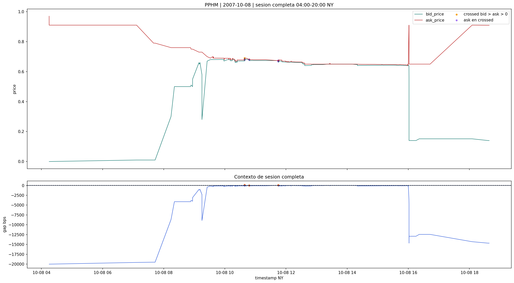

#### 03 Structure Diagnostics
Este panel responde a la pregunta de naturaleza del fallo: contradiccion economica genuina o mezcla con degeneracion estructural. Separa `ask=0` de `ask>0`, muestra la distribucion de `gap_bps` y resume patrones de integerizacion. La decision que cambia es como interpretar el dano: mercado localmente roto, artefacto de representacion o combinacion de ambos. El error que evita es sobrediagnosticar crossed reales cuando parte de la senal proviene de estructura degenerada del libro. Esta lectura afecta directamente a que el caso vaya a exclusion dura, a bandera contextual o a simple reconciliacion tecnica.

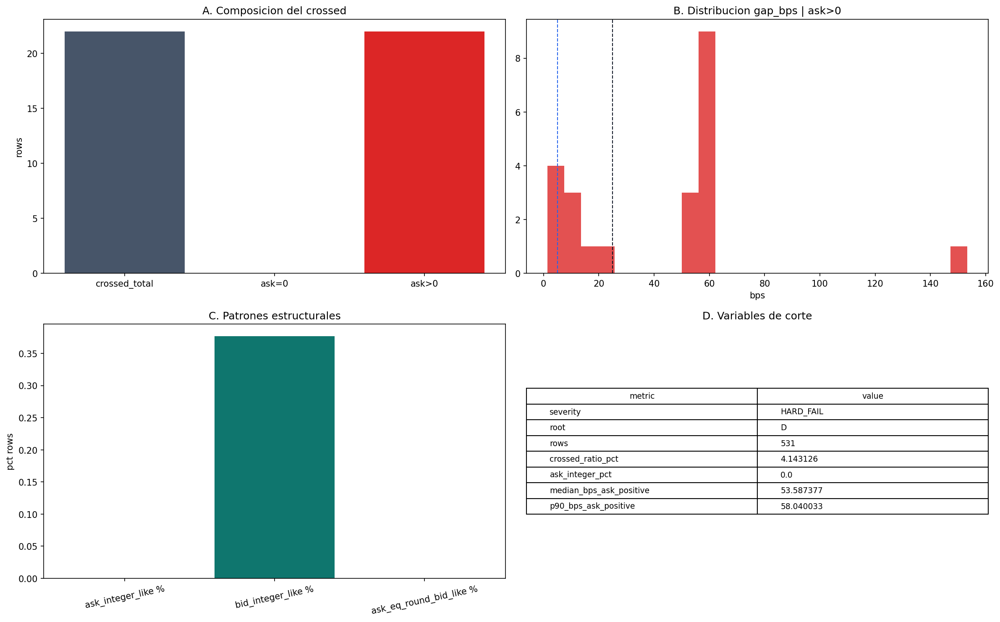

#### 04 Summary Card
Esta tarjeta responde a la pregunta de auditabilidad: cuales son exactamente las variables que sostienen la conclusion. Reune `severity`, `root`, `crossed_ratio_pct`, `ask_integer_pct`, `median_bps_ask_positive` y `p90_bps_ask_positive`. La decision que cambia es pasar de impresion visual a regla verificable. El error que evita es que dos inspectores lleguen a conclusiones distintas mirando la misma imagen sin una base numerica comun. Para gobernanza del proyecto, este panel es el que vuelve reproducible la decision para backtest, ML y auditoria.

---

### 7. TAT 2009-12-30

company_name: `TransAtlantic Petroleum LTD.`
primary_exchange: `NYSE American` (`XASE`)
market_locale: `stocks/us`
scope: `bad`
ticker: `TAT`
date: `2009-12-30`
taxonomy: `medium_file_threshold_edge_hard_many_crosses`
positive_cross_bucket: `positive_cross_severe_ge25bps`
severity: `HARD_FAIL`
root: `C`
rows: `602`
crossed_ratio_pct: `0.996678`
crossed_rows_raw: `6`
crossed_rows_ask_zero: `3`
crossed_rows_ask_positive: `3`
ask_integer_pct: `0.664452`
median_bps_ask_positive: `30.441400`
p90_bps_ask_positive: `54.720499`
file: `C:\TSIS_Data\data\quotes\TAT\year=2009\month=12\day=30\quotes.parquet`

#### Analisis Forense
La conclusion correcta del caso es que la contradiccion local entre bid y ask ya compromete la credibilidad economica del libro y bloquea su consumo como si fuera mercado normal. La taxonomy historica es `medium_file_threshold_edge_hard_many_crosses` y el regimen positivo dominante es `severe >=25 bps`. Esto importa porque la taxonomy no solo clasifica: resume que tipo de anomalia se esta viendo y que clase de decision contractual puede defenderse despues. La taxonomy `medium_file_threshold_edge_hard_many_crosses` implica que el mismo tipo de dano aparece en un file menos grande y por eso pesa mas: hay menos masa para diluir la anomalia y la exclusion se vuelve mas defendible. El regimen `severe >=25 bps` empuja el caso a una lectura economicamente dura: el crossed deja de ser cosmetico y pasa a cuestionar si el libro sigue siendo interpretable como mercado negociable. En terminos observables, el file tiene `crossed_ratio_pct=0.996678` con `crossed_rows_ask_positive=3` y `crossed_rows_ask_zero=3`. La severidad economica del crossed ask>0 se resume en `median_bps_ask_positive=30.441400` y `p90_bps_ask_positive=54.720499`. Estos dos numeros convierten una forma visual rara en una conclusion operativa sobre si el libro sigue representando o no un mercado negociable. La decision que cambia es exclusion del consumo core del libro. `bad` significa que el estado local ya no puede alimentar ejecucion, mark-to-market intradiario ni aprendizaje de ML como si fuese microestructura defendible. El error que evita es construir decisiones sobre un libro que ha dejado de representar un mercado localmente creible. El patron estructural muestra `ask_integer_pct=0.664452`. Este numero obliga a separar dos explicaciones rivales: contradiccion economica genuina del libro o mezcla con degeneracion estructural / integerizacion. La composicion esta mezclada entre `ask=0` y `ask>0`. Eso obliga a una lectura dual: parte del patron pertenece a estructura y parte a contradiccion economica genuina, por lo que la decision debe apoyarse en ambas capas y no en una sola narrativa. Como `ask_integer_pct` es bajo, la hipotesis de simple degeneracion mecanica pierde fuerza. Eso endurece la interpretacion: el crossed se parece mas a contradiccion economica genuina y menos a artefacto. En la capa de semantica de precio del evento aparecen `daily raw close=31.8000`, `quote mid raw=3.2250`, `quote mid split_normalized=32.2500`, `daily adjusted_proxy=31.8000`. La reconciliacion incluye `future_split_factor=0.1000`. La implicacion metodologica es crucial: una discrepancia entre `quotes`, `daily` y una plataforma externa no puede leerse automaticamente como fallo del dataset. Puede ser semantica de precio distinta. El error que evita esta capa es mezclar raw, split-normalized y adjusted dentro del mismo pipeline, rompiendo auditoria, benchmarking y labels. Para pipelines, esto implica exclusion de ejecucion realista, de mark-to-market intradiario defendible y de features microestructurales tratadas como si reflejaran un mercado normal. Solo debe sobrevivir en circuitos forenses o de calidad. Existe ademas una imagen historica de certificacion asociada. Su papel es poner el episodio en un marco causal mas amplio: halt, explained, not strongly explained o patron conocido. La regla que protege al proyecto es esta: el contexto externo se usa para explicar por que aparece el episodio, no para absolverlo. El error que evita es degradar el criterio de calidad del libro porque exista una historia plausible alrededor del caso.

#### 00 Event Month Context
Esta imagen responde a la pregunta de persistencia temporal: estamos ante un accidente local o ante una fase mas amplia de inestabilidad. Arriba coloca el evento en la serie `daily` real del mes; abajo compara `crossed_ratio_pct` y `max_gap_bps_pos` del dia contra sus vecinos. La decision que cambia es el peso estructural que se le concede al caso. El error que evita es juzgar igual un shock aislado y una degradacion repetida del libro.

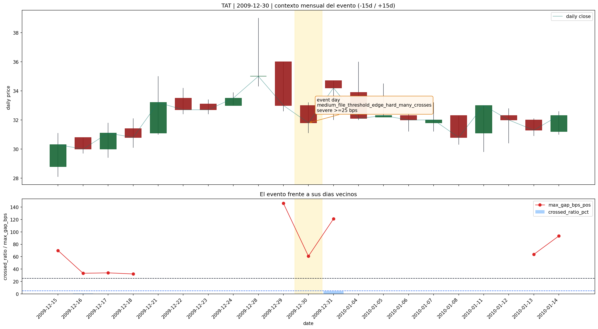

#### 00a Adjusted Proxy Contrast
Esta imagen responde a la pregunta de reconciliacion semantica: la discrepancia de precios viene de datos rotos o de vistas de precio distintas. Compara `daily raw`, `daily adjusted_proxy`, `quote mid raw` y `quote mid split_normalized`, y debajo ensena la cadena de dividendos y splits que produce la diferencia. La decision que cambia es si el inspector debe abrir una incidencia de calidad o cerrar el caso como diferencia legitima de semantica. El error que evita es mezclar series raw y adjusted como si fueran equivalentes. En pipelines reales, esto protege benchmarking, labels diarios y reconciliacion externa frente a falsas alarmas de precio.

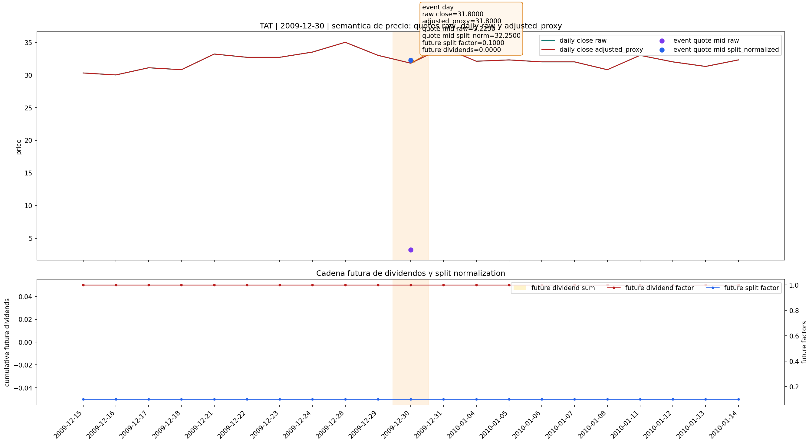

#### 00b Event Month Quotes Context
Esta imagen responde a la pregunta de recurrencia mensual dentro de `quotes`: el problema se concentra en el evento o reaparece en varias sesiones. Arriba concatena sesiones con datos disponibles; abajo resume cobertura diaria, `crossed_ratio_pct` y `max_gap_bps_pos`. La decision que cambia es si el caso debe leerse como episodio puntual o como sintoma de una fase repetida de libro degradado. El error que evita es extrapolar desde un unico dia a todo el mes sin evidencia.

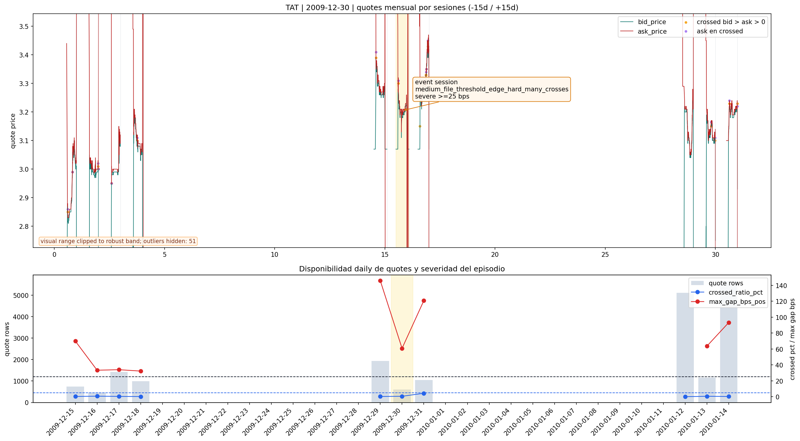

#### 01 Raw Window
Esta imagen responde a la primera pregunta decisiva del caso: el crossed observado es economicamente bastante fuerte para justificar un cambio de clase. Arriba ensena la geometria exacta del tramo conflictivo; abajo convierte esa geometria a bps y la enfrenta a los cortes `5 bps` y `25 bps`. El regimen dominante es `severe >=25 bps`. La decision que cambia es pasar de anomalia interpretable a `review` o `bad`. El error que evita es decidir por apariencia visual sin medir el dano economico real del crossed. En terminos de pipeline, este panel decide si el problema afecta solo a la lectura forense o si invalida simulacion de ejecucion y microstructure features.

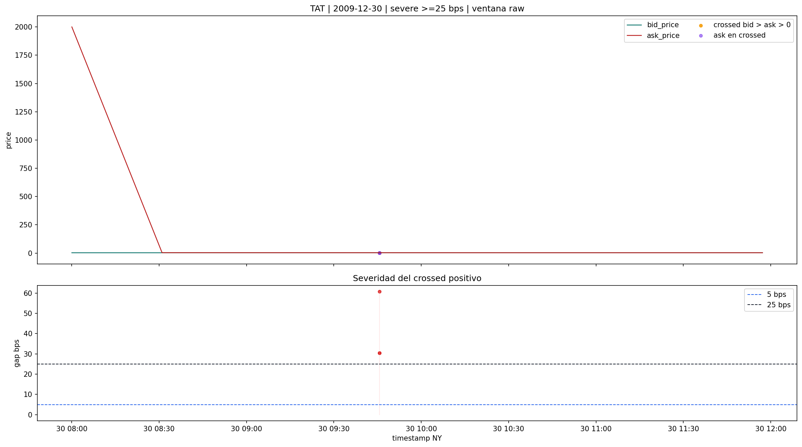

#### 02 Full Session Context
Esta imagen responde a la pregunta de extension intradiaria: el dano esta confinado a un bloque corto o contamina la sesion completa. Arriba se ve toda la sesion `04:00-20:00 NY`; abajo el `gap_bps` firmado. La decision que cambia es si el consumo debe penalizar solo un tramo o desechar el dia entero para uso operativo. El error que evita es tratar una cicatriz local como ruina total o, al reves, minimizar una degradacion distribuida a lo largo del dia. En ejecucion esto decide si la sesion puede seguir usandose con restricciones; en ML decide si las features intradiarias conservan significado economico.

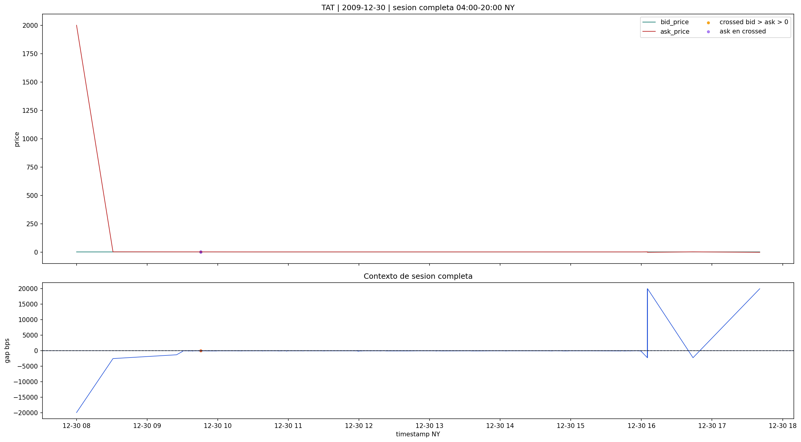

#### 03 Structure Diagnostics
Este panel responde a la pregunta de naturaleza del fallo: contradiccion economica genuina o mezcla con degeneracion estructural. Separa `ask=0` de `ask>0`, muestra la distribucion de `gap_bps` y resume patrones de integerizacion. La decision que cambia es como interpretar el dano: mercado localmente roto, artefacto de representacion o combinacion de ambos. El error que evita es sobrediagnosticar crossed reales cuando parte de la senal proviene de estructura degenerada del libro. Esta lectura afecta directamente a que el caso vaya a exclusion dura, a bandera contextual o a simple reconciliacion tecnica.

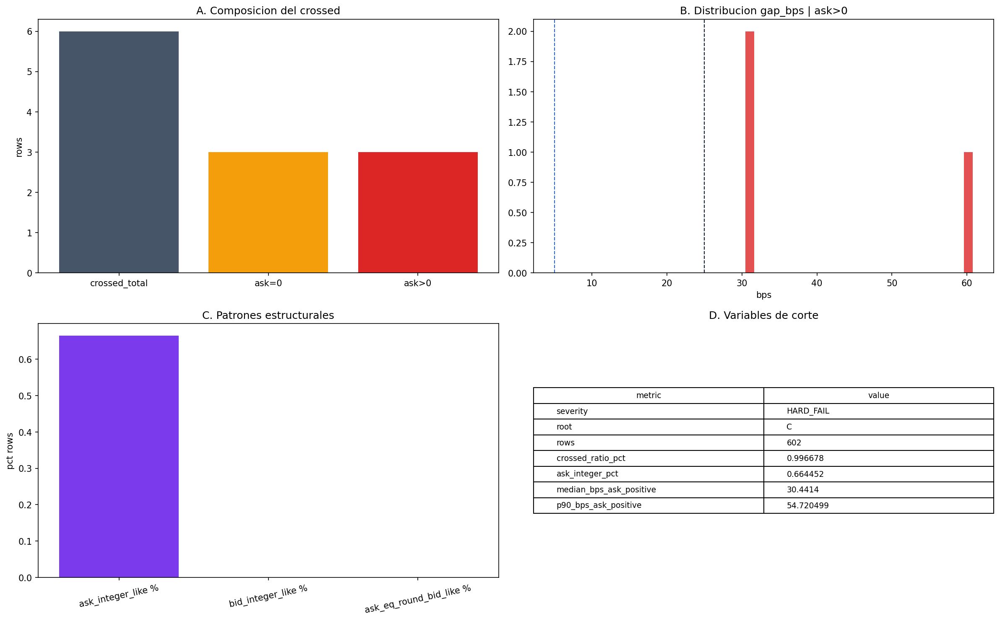

#### 04 Summary Card
Esta tarjeta responde a la pregunta de auditabilidad: cuales son exactamente las variables que sostienen la conclusion. Reune `severity`, `root`, `crossed_ratio_pct`, `ask_integer_pct`, `median_bps_ask_positive` y `p90_bps_ask_positive`. La decision que cambia es pasar de impresion visual a regla verificable. El error que evita es que dos inspectores lleguen a conclusiones distintas mirando la misma imagen sin una base numerica comun. Para gobernanza del proyecto, este panel es el que vuelve reproducible la decision para backtest, ML y auditoria.

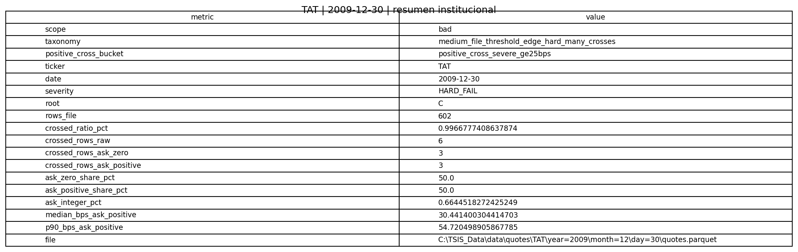

---

### 8. UXG 2007-03-01

company_name: `U S GOLD CORP`
primary_exchange: `NYSE American` (`XASE`)
market_locale: `stocks/us`
scope: `bad`
ticker: `UXG`
date: `2007-03-01`
taxonomy: `medium_file_threshold_edge_hard_many_crosses`
positive_cross_bucket: `positive_cross_moderate_5to25bps`
severity: `HARD_FAIL`
root: `D`
rows: `575`
crossed_ratio_pct: `1.391304`
crossed_rows_raw: `8`
crossed_rows_ask_zero: `0`
crossed_rows_ask_positive: `8`
ask_integer_pct: `0.000000`
median_bps_ask_positive: `21.482277`
p90_bps_ask_positive: `21.652809`
file: `D:\quotes\UXG\year=2007\month=03\day=01\quotes.parquet`

#### Analisis Forense
La conclusion correcta del caso es que la contradiccion local entre bid y ask ya compromete la credibilidad economica del libro y bloquea su consumo como si fuera mercado normal. La taxonomy historica es `medium_file_threshold_edge_hard_many_crosses` y el regimen positivo dominante es `moderate 5-25 bps`. Esto importa porque la taxonomy no solo clasifica: resume que tipo de anomalia se esta viendo y que clase de decision contractual puede defenderse despues. La taxonomy `medium_file_threshold_edge_hard_many_crosses` implica que el mismo tipo de dano aparece en un file menos grande y por eso pesa mas: hay menos masa para diluir la anomalia y la exclusion se vuelve mas defendible. El regimen `moderate 5-25 bps` ya entra en zona donde el crossed tiene capacidad real de contaminar simulacion de ejecucion y features microestructurales, aunque todavia puede requerir lectura contextual antes de exclusion dura. En terminos observables, el file tiene `crossed_ratio_pct=1.391304` con `crossed_rows_ask_positive=8` y `crossed_rows_ask_zero=0`. La severidad economica del crossed ask>0 se resume en `median_bps_ask_positive=21.482277` y `p90_bps_ask_positive=21.652809`. Estos dos numeros convierten una forma visual rara en una conclusion operativa sobre si el libro sigue representando o no un mercado negociable. La decision que cambia es exclusion del consumo core del libro. `bad` significa que el estado local ya no puede alimentar ejecucion, mark-to-market intradiario ni aprendizaje de ML como si fuese microestructura defendible. El error que evita es construir decisiones sobre un libro que ha dejado de representar un mercado localmente creible. El patron estructural muestra `ask_integer_pct=0.000000`. Este numero obliga a separar dos explicaciones rivales: contradiccion economica genuina del libro o mezcla con degeneracion estructural / integerizacion. Toda la composicion crossed cae en `ask>0`. Eso endurece la lectura economica del caso: el dano no depende de ceros mecanicos, sino de contradiccion positiva dentro de precios aparentemente vivos. Como `ask_integer_pct` es bajo, la hipotesis de simple degeneracion mecanica pierde fuerza. Eso endurece la interpretacion: el crossed se parece mas a contradiccion economica genuina y menos a artefacto. Existe ademas una imagen historica de certificacion asociada. Su papel es poner el episodio en un marco causal mas amplio: halt, explained, not strongly explained o patron conocido. La regla que protege al proyecto es esta: el contexto externo se usa para explicar por que aparece el episodio, no para absolverlo. El error que evita es degradar el criterio de calidad del libro porque exista una historia plausible alrededor del caso.

#### 00 Event Month Context
Esta imagen responde a la pregunta de persistencia temporal: estamos ante un accidente local o ante una fase mas amplia de inestabilidad. Arriba coloca el evento en la serie `daily` real del mes; abajo compara `crossed_ratio_pct` y `max_gap_bps_pos` del dia contra sus vecinos. La decision que cambia es el peso estructural que se le concede al caso. El error que evita es juzgar igual un shock aislado y una degradacion repetida del libro.

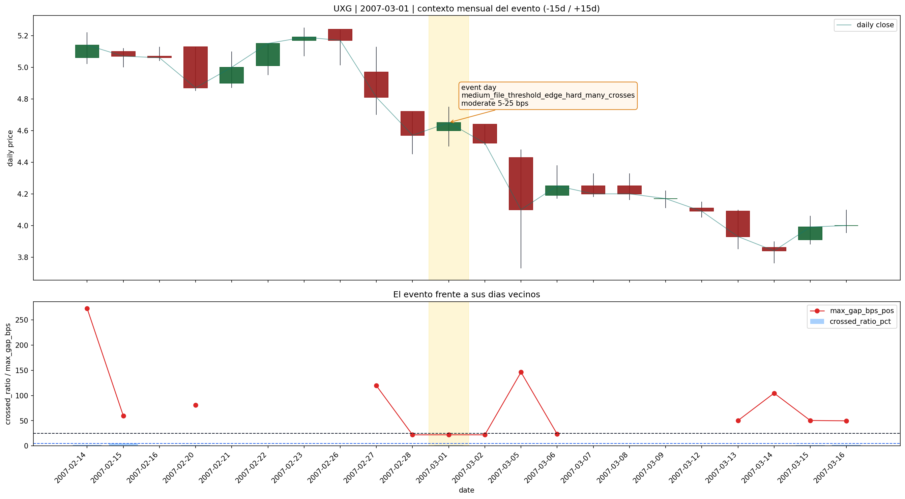

#### 00b Event Month Quotes Context
Esta imagen responde a la pregunta de recurrencia mensual dentro de `quotes`: el problema se concentra en el evento o reaparece en varias sesiones. Arriba concatena sesiones con datos disponibles; abajo resume cobertura diaria, `crossed_ratio_pct` y `max_gap_bps_pos`. La decision que cambia es si el caso debe leerse como episodio puntual o como sintoma de una fase repetida de libro degradado. El error que evita es extrapolar desde un unico dia a todo el mes sin evidencia.

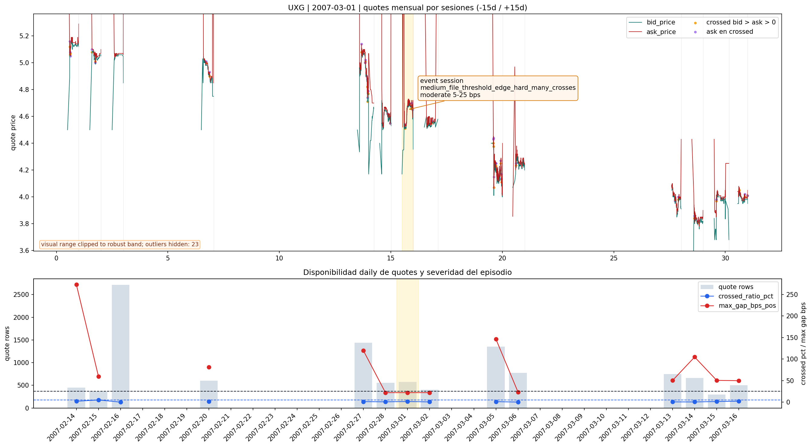

#### 01 Raw Window
Esta imagen responde a la primera pregunta decisiva del caso: el crossed observado es economicamente bastante fuerte para justificar un cambio de clase. Arriba ensena la geometria exacta del tramo conflictivo; abajo convierte esa geometria a bps y la enfrenta a los cortes `5 bps` y `25 bps`. El regimen dominante es `moderate 5-25 bps`. La decision que cambia es pasar de anomalia interpretable a `review` o `bad`. El error que evita es decidir por apariencia visual sin medir el dano economico real del crossed. En terminos de pipeline, este panel decide si el problema afecta solo a la lectura forense o si invalida simulacion de ejecucion y microstructure features.

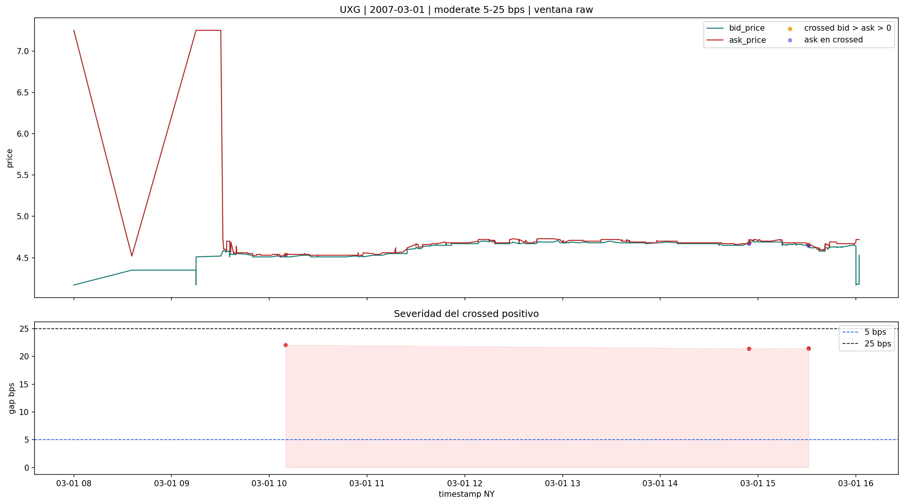

#### 02 Full Session Context
Esta imagen responde a la pregunta de extension intradiaria: el dano esta confinado a un bloque corto o contamina la sesion completa. Arriba se ve toda la sesion `04:00-20:00 NY`; abajo el `gap_bps` firmado. La decision que cambia es si el consumo debe penalizar solo un tramo o desechar el dia entero para uso operativo. El error que evita es tratar una cicatriz local como ruina total o, al reves, minimizar una degradacion distribuida a lo largo del dia. En ejecucion esto decide si la sesion puede seguir usandose con restricciones; en ML decide si las features intradiarias conservan significado economico.

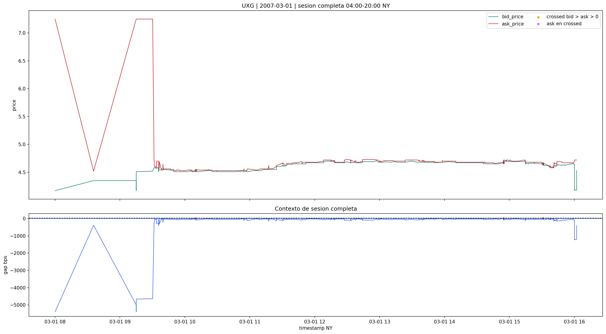

#### 03 Structure Diagnostics
Este panel responde a la pregunta de naturaleza del fallo: contradiccion economica genuina o mezcla con degeneracion estructural. Separa `ask=0` de `ask>0`, muestra la distribucion de `gap_bps` y resume patrones de integerizacion. La decision que cambia es como interpretar el dano: mercado localmente roto, artefacto de representacion o combinacion de ambos. El error que evita es sobrediagnosticar crossed reales cuando parte de la senal proviene de estructura degenerada del libro. Esta lectura afecta directamente a que el caso vaya a exclusion dura, a bandera contextual o a simple reconciliacion tecnica.

#### 04 Summary Card
Esta tarjeta responde a la pregunta de auditabilidad: cuales son exactamente las variables que sostienen la conclusion. Reune `severity`, `root`, `crossed_ratio_pct`, `ask_integer_pct`, `median_bps_ask_positive` y `p90_bps_ask_positive`. La decision que cambia es pasar de impresion visual a regla verificable. El error que evita es que dos inspectores lleguen a conclusiones distintas mirando la misma imagen sin una base numerica comun. Para gobernanza del proyecto, este panel es el que vuelve reproducible la decision para backtest, ML y auditoria.

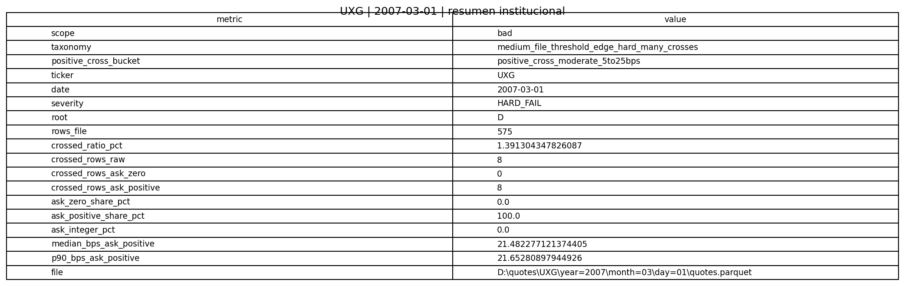

---

### 9. MSW 2005-07-27

company_name: `Ming Shing Group Holdings Limited Ordinary Shares`
primary_exchange: `NASDAQ` (`XNAS`)
market_locale: `stocks/us`
scope: `bad`
ticker: `MSW`
date: `2005-07-27`
taxonomy: `medium_file_threshold_edge_hard_many_crosses`
positive_cross_bucket: `positive_cross_moderate_5to25bps`
severity: `HARD_FAIL`
root: `D`
rows: `264`
crossed_ratio_pct: `3.030303`
crossed_rows_raw: `8`
crossed_rows_ask_zero: `0`
crossed_rows_ask_positive: `8`
ask_integer_pct: `0.757576`
median_bps_ask_positive: `18.885741`
p90_bps_ask_positive: `37.629351`
file: `D:\quotes\MSW\year=2005\month=07\day=27\quotes.parquet`

#### Analisis Forense
La conclusion correcta del caso es que la contradiccion local entre bid y ask ya compromete la credibilidad economica del libro y bloquea su consumo como si fuera mercado normal. La taxonomy historica es `medium_file_threshold_edge_hard_many_crosses` y el regimen positivo dominante es `moderate 5-25 bps`. Esto importa porque la taxonomy no solo clasifica: resume que tipo de anomalia se esta viendo y que clase de decision contractual puede defenderse despues. La taxonomy `medium_file_threshold_edge_hard_many_crosses` implica que el mismo tipo de dano aparece en un file menos grande y por eso pesa mas: hay menos masa para diluir la anomalia y la exclusion se vuelve mas defendible. El regimen `moderate 5-25 bps` ya entra en zona donde el crossed tiene capacidad real de contaminar simulacion de ejecucion y features microestructurales, aunque todavia puede requerir lectura contextual antes de exclusion dura. En terminos observables, el file tiene `crossed_ratio_pct=3.030303` con `crossed_rows_ask_positive=8` y `crossed_rows_ask_zero=0`. La severidad economica del crossed ask>0 se resume en `median_bps_ask_positive=18.885741` y `p90_bps_ask_positive=37.629351`. Estos dos numeros convierten una forma visual rara en una conclusion operativa sobre si el libro sigue representando o no un mercado negociable. La decision que cambia es exclusion del consumo core del libro. `bad` significa que el estado local ya no puede alimentar ejecucion, mark-to-market intradiario ni aprendizaje de ML como si fuese microestructura defendible. El error que evita es construir decisiones sobre un libro que ha dejado de representar un mercado localmente creible. El patron estructural muestra `ask_integer_pct=0.757576`. Este numero obliga a separar dos explicaciones rivales: contradiccion economica genuina del libro o mezcla con degeneracion estructural / integerizacion. Toda la composicion crossed cae en `ask>0`. Eso endurece la lectura economica del caso: el dano no depende de ceros mecanicos, sino de contradiccion positiva dentro de precios aparentemente vivos. Como `ask_integer_pct` es bajo, la hipotesis de simple degeneracion mecanica pierde fuerza. Eso endurece la interpretacion: el crossed se parece mas a contradiccion economica genuina y menos a artefacto. En la capa de semantica de precio del evento aparecen `daily raw close=10.5000`, `quote mid raw=10.6550`, `quote mid split_normalized=10.6550`, `daily adjusted_proxy=8.7295`. Ademas hay `post_event_dividend_sum=1.8000`. La implicacion metodologica es crucial: una discrepancia entre `quotes`, `daily` y una plataforma externa no puede leerse automaticamente como fallo del dataset. Puede ser semantica de precio distinta. El error que evita esta capa es mezclar raw, split-normalized y adjusted dentro del mismo pipeline, rompiendo auditoria, benchmarking y labels. Para pipelines, esto implica exclusion de ejecucion realista, de mark-to-market intradiario defendible y de features microestructurales tratadas como si reflejaran un mercado normal. Solo debe sobrevivir en circuitos forenses o de calidad. Existe ademas una imagen historica de certificacion asociada. Su papel es poner el episodio en un marco causal mas amplio: halt, explained, not strongly explained o patron conocido. La regla que protege al proyecto es esta: el contexto externo se usa para explicar por que aparece el episodio, no para absolverlo. El error que evita es degradar el criterio de calidad del libro porque exista una historia plausible alrededor del caso.

#### 00 Event Month Context
Esta imagen responde a la pregunta de persistencia temporal: estamos ante un accidente local o ante una fase mas amplia de inestabilidad. Arriba coloca el evento en la serie `daily` real del mes; abajo compara `crossed_ratio_pct` y `max_gap_bps_pos` del dia contra sus vecinos. La decision que cambia es el peso estructural que se le concede al caso. El error que evita es juzgar igual un shock aislado y una degradacion repetida del libro.

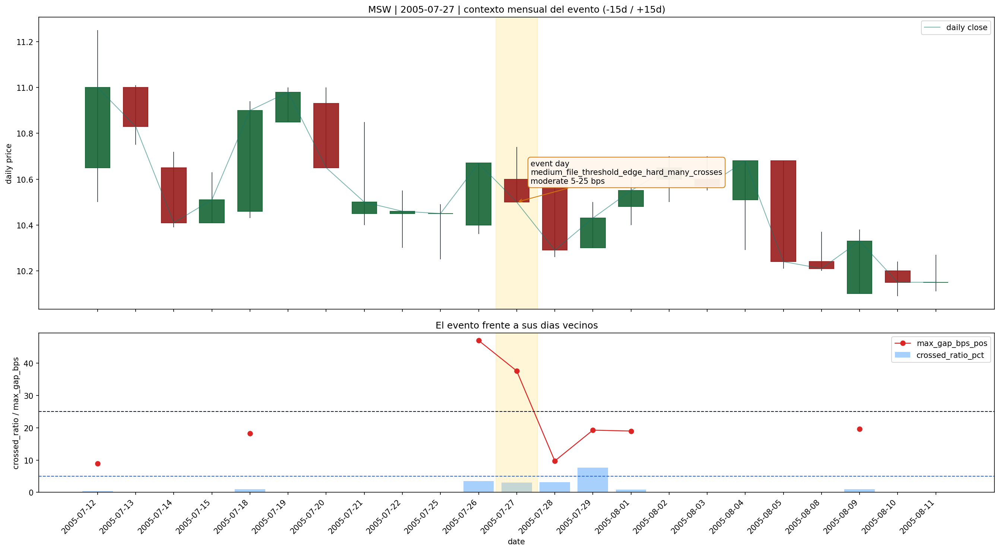

#### 00a Adjusted Proxy Contrast
Esta imagen responde a la pregunta de reconciliacion semantica: la discrepancia de precios viene de datos rotos o de vistas de precio distintas. Compara `daily raw`, `daily adjusted_proxy`, `quote mid raw` y `quote mid split_normalized`, y debajo ensena la cadena de dividendos y splits que produce la diferencia. La decision que cambia es si el inspector debe abrir una incidencia de calidad o cerrar el caso como diferencia legitima de semantica. El error que evita es mezclar series raw y adjusted como si fueran equivalentes. En pipelines reales, esto protege benchmarking, labels diarios y reconciliacion externa frente a falsas alarmas de precio.

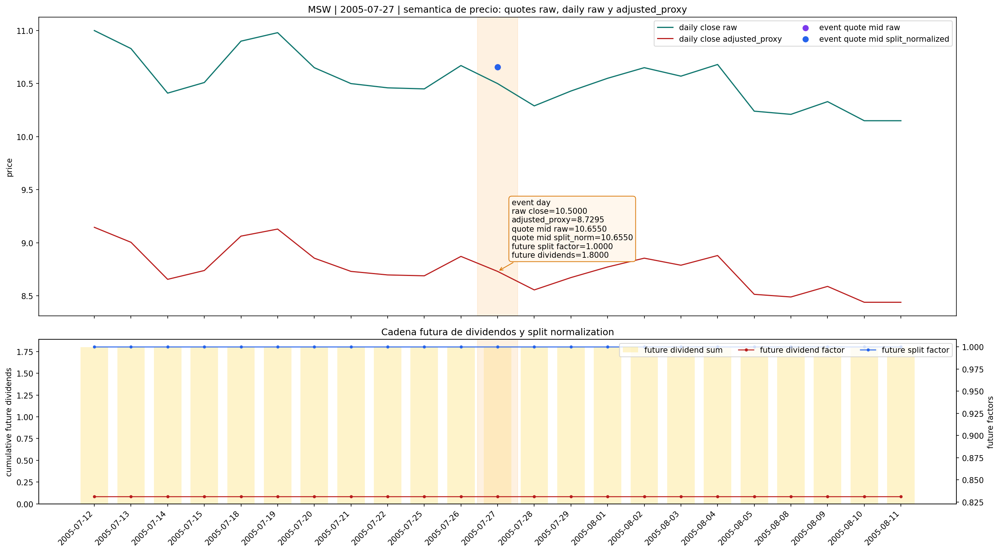

#### 00b Event Month Quotes Context
Esta imagen responde a la pregunta de recurrencia mensual dentro de `quotes`: el problema se concentra en el evento o reaparece en varias sesiones. Arriba concatena sesiones con datos disponibles; abajo resume cobertura diaria, `crossed_ratio_pct` y `max_gap_bps_pos`. La decision que cambia es si el caso debe leerse como episodio puntual o como sintoma de una fase repetida de libro degradado. El error que evita es extrapolar desde un unico dia a todo el mes sin evidencia.

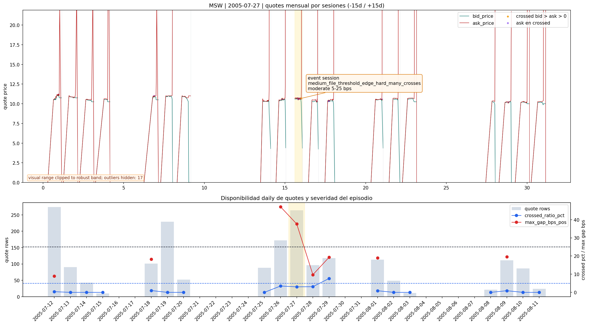

#### 01 Raw Window
Esta imagen responde a la primera pregunta decisiva del caso: el crossed observado es economicamente bastante fuerte para justificar un cambio de clase. Arriba ensena la geometria exacta del tramo conflictivo; abajo convierte esa geometria a bps y la enfrenta a los cortes `5 bps` y `25 bps`. El regimen dominante es `moderate 5-25 bps`. La decision que cambia es pasar de anomalia interpretable a `review` o `bad`. El error que evita es decidir por apariencia visual sin medir el dano economico real del crossed. En terminos de pipeline, este panel decide si el problema afecta solo a la lectura forense o si invalida simulacion de ejecucion y microstructure features.

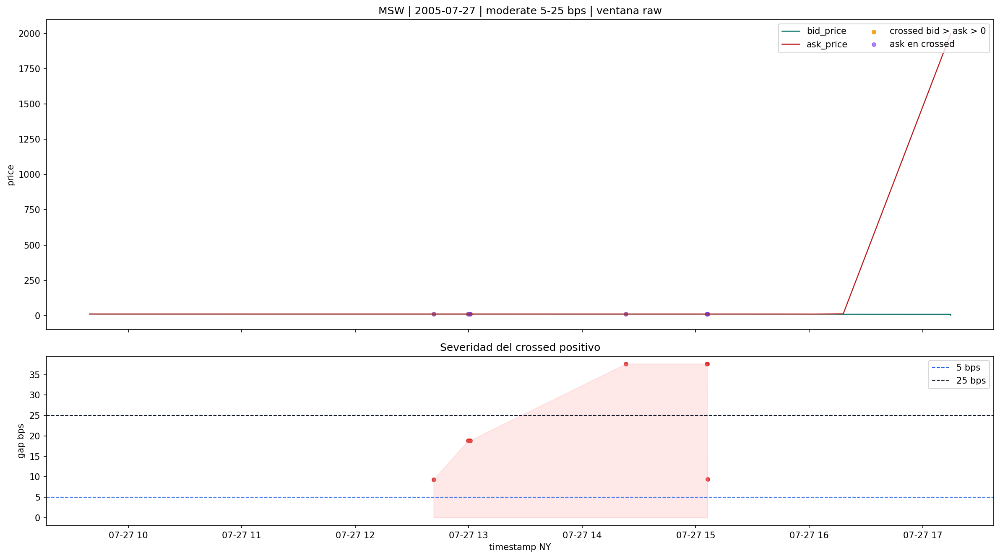

#### 02 Full Session Context
Esta imagen responde a la pregunta de extension intradiaria: el dano esta confinado a un bloque corto o contamina la sesion completa. Arriba se ve toda la sesion `04:00-20:00 NY`; abajo el `gap_bps` firmado. La decision que cambia es si el consumo debe penalizar solo un tramo o desechar el dia entero para uso operativo. El error que evita es tratar una cicatriz local como ruina total o, al reves, minimizar una degradacion distribuida a lo largo del dia. En ejecucion esto decide si la sesion puede seguir usandose con restricciones; en ML decide si las features intradiarias conservan significado economico.

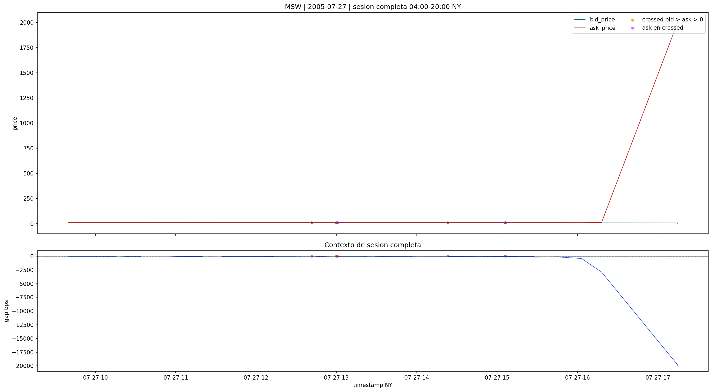

#### 03 Structure Diagnostics
Este panel responde a la pregunta de naturaleza del fallo: contradiccion economica genuina o mezcla con degeneracion estructural. Separa `ask=0` de `ask>0`, muestra la distribucion de `gap_bps` y resume patrones de integerizacion. La decision que cambia es como interpretar el dano: mercado localmente roto, artefacto de representacion o combinacion de ambos. El error que evita es sobrediagnosticar crossed reales cuando parte de la senal proviene de estructura degenerada del libro. Esta lectura afecta directamente a que el caso vaya a exclusion dura, a bandera contextual o a simple reconciliacion tecnica.

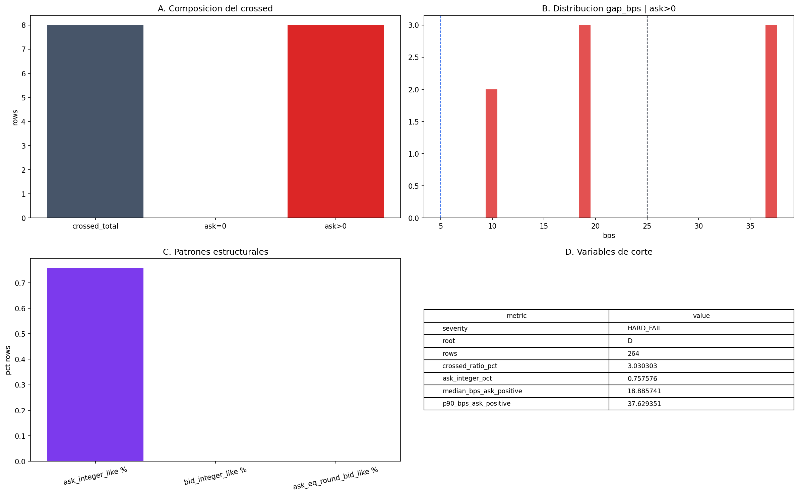

#### 04 Summary Card
Esta tarjeta responde a la pregunta de auditabilidad: cuales son exactamente las variables que sostienen la conclusion. Reune `severity`, `root`, `crossed_ratio_pct`, `ask_integer_pct`, `median_bps_ask_positive` y `p90_bps_ask_positive`. La decision que cambia es pasar de impresion visual a regla verificable. El error que evita es que dos inspectores lleguen a conclusiones distintas mirando la misma imagen sin una base numerica comun. Para gobernanza del proyecto, este panel es el que vuelve reproducible la decision para backtest, ML y auditoria.

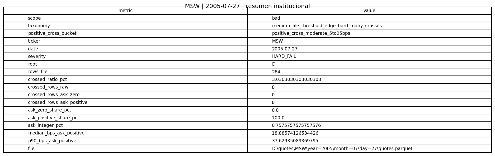

---

### 10. HGSH 2013-04-26

company_name: `China HGS Real Estate, Inc.`
primary_exchange: `NASDAQ` (`XNAS`)
market_locale: `stocks/us`
scope: `bad`
ticker: `HGSH`
date: `2013-04-26`
taxonomy: `medium_file_threshold_edge_hard_many_crosses`
positive_cross_bucket: `positive_cross_moderate_5to25bps`
severity: `HARD_FAIL`
root: `D`
rows: `359`
crossed_ratio_pct: `2.228412`
crossed_rows_raw: `8`
crossed_rows_ask_zero: `6`
crossed_rows_ask_positive: `2`
ask_integer_pct: `1.671309`
median_bps_ask_positive: `8.288438`
p90_bps_ask_positive: `8.288438`
file: `D:\quotes\HGSH\year=2013\month=04\day=26\quotes.parquet`

#### Analisis Forense
La conclusion correcta del caso es que la contradiccion local entre bid y ask ya compromete la credibilidad economica del libro y bloquea su consumo como si fuera mercado normal. La taxonomy historica es `medium_file_threshold_edge_hard_many_crosses` y el regimen positivo dominante es `moderate 5-25 bps`. Esto importa porque la taxonomy no solo clasifica: resume que tipo de anomalia se esta viendo y que clase de decision contractual puede defenderse despues. La taxonomy `medium_file_threshold_edge_hard_many_crosses` implica que el mismo tipo de dano aparece en un file menos grande y por eso pesa mas: hay menos masa para diluir la anomalia y la exclusion se vuelve mas defendible. El regimen `moderate 5-25 bps` ya entra en zona donde el crossed tiene capacidad real de contaminar simulacion de ejecucion y features microestructurales, aunque todavia puede requerir lectura contextual antes de exclusion dura. En terminos observables, el file tiene `crossed_ratio_pct=2.228412` con `crossed_rows_ask_positive=2` y `crossed_rows_ask_zero=6`. La severidad economica del crossed ask>0 se resume en `median_bps_ask_positive=8.288438` y `p90_bps_ask_positive=8.288438`. Estos dos numeros convierten una forma visual rara en una conclusion operativa sobre si el libro sigue representando o no un mercado negociable. La decision que cambia es exclusion del consumo core del libro. `bad` significa que el estado local ya no puede alimentar ejecucion, mark-to-market intradiario ni aprendizaje de ML como si fuese microestructura defendible. El error que evita es construir decisiones sobre un libro que ha dejado de representar un mercado localmente creible. El patron estructural muestra `ask_integer_pct=1.671309`. Este numero obliga a separar dos explicaciones rivales: contradiccion economica genuina del libro o mezcla con degeneracion estructural / integerizacion. La mayor parte del crossed vive en `ask=0`, pero existe una cola `ask>0` que impide absolver el caso como simple glitch. La lectura correcta es mixta: dano estructural dominante con residuo economico que aun puede justificar bandera o exclusion. Como `ask_integer_pct` es bajo, la hipotesis de simple degeneracion mecanica pierde fuerza. Eso endurece la interpretacion: el crossed se parece mas a contradiccion economica genuina y menos a artefacto. Existe ademas una imagen historica de certificacion asociada. Su papel es poner el episodio en un marco causal mas amplio: halt, explained, not strongly explained o patron conocido. La regla que protege al proyecto es esta: el contexto externo se usa para explicar por que aparece el episodio, no para absolverlo. El error que evita es degradar el criterio de calidad del libro porque exista una historia plausible alrededor del caso.

#### 00 Event Month Context
Esta imagen responde a la pregunta de persistencia temporal: estamos ante un accidente local o ante una fase mas amplia de inestabilidad. Arriba coloca el evento en la serie `daily` real del mes; abajo compara `crossed_ratio_pct` y `max_gap_bps_pos` del dia contra sus vecinos. La decision que cambia es el peso estructural que se le concede al caso. El error que evita es juzgar igual un shock aislado y una degradacion repetida del libro.

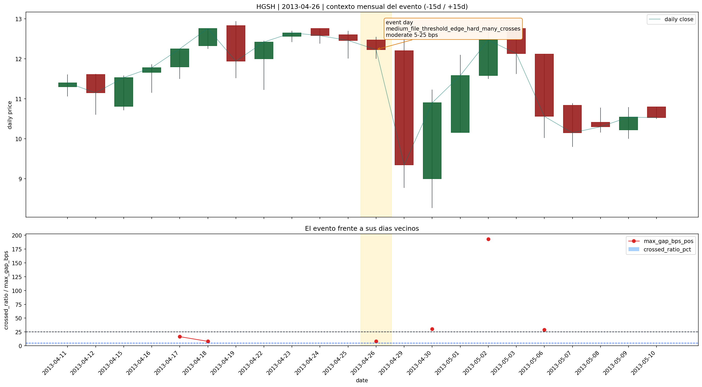

#### 00b Event Month Quotes Context
Esta imagen responde a la pregunta de recurrencia mensual dentro de `quotes`: el problema se concentra en el evento o reaparece en varias sesiones. Arriba concatena sesiones con datos disponibles; abajo resume cobertura diaria, `crossed_ratio_pct` y `max_gap_bps_pos`. La decision que cambia es si el caso debe leerse como episodio puntual o como sintoma de una fase repetida de libro degradado. El error que evita es extrapolar desde un unico dia a todo el mes sin evidencia.

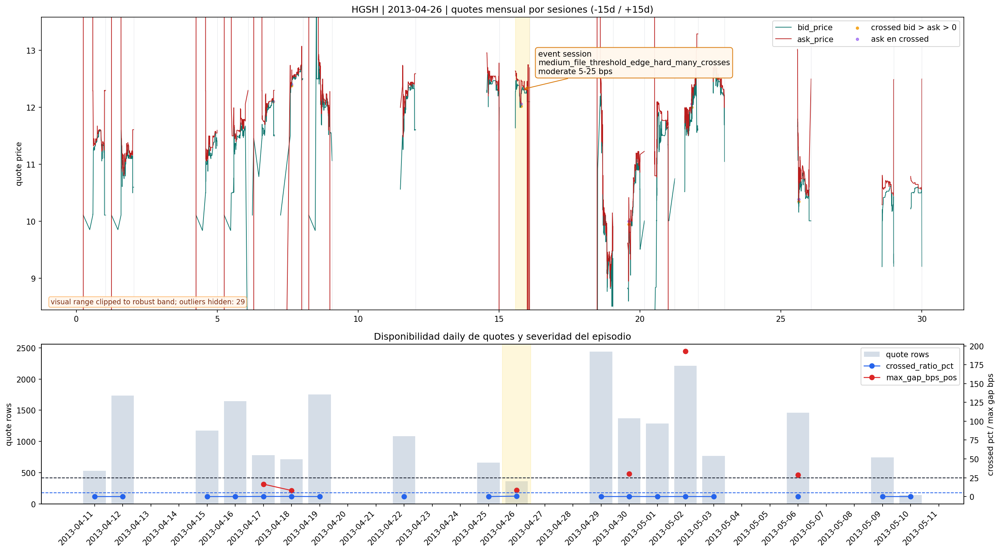

#### 01 Raw Window
Esta imagen responde a la primera pregunta decisiva del caso: el crossed observado es economicamente bastante fuerte para justificar un cambio de clase. Arriba ensena la geometria exacta del tramo conflictivo; abajo convierte esa geometria a bps y la enfrenta a los cortes `5 bps` y `25 bps`. El regimen dominante es `moderate 5-25 bps`. La decision que cambia es pasar de anomalia interpretable a `review` o `bad`. El error que evita es decidir por apariencia visual sin medir el dano economico real del crossed. En terminos de pipeline, este panel decide si el problema afecta solo a la lectura forense o si invalida simulacion de ejecucion y microstructure features.

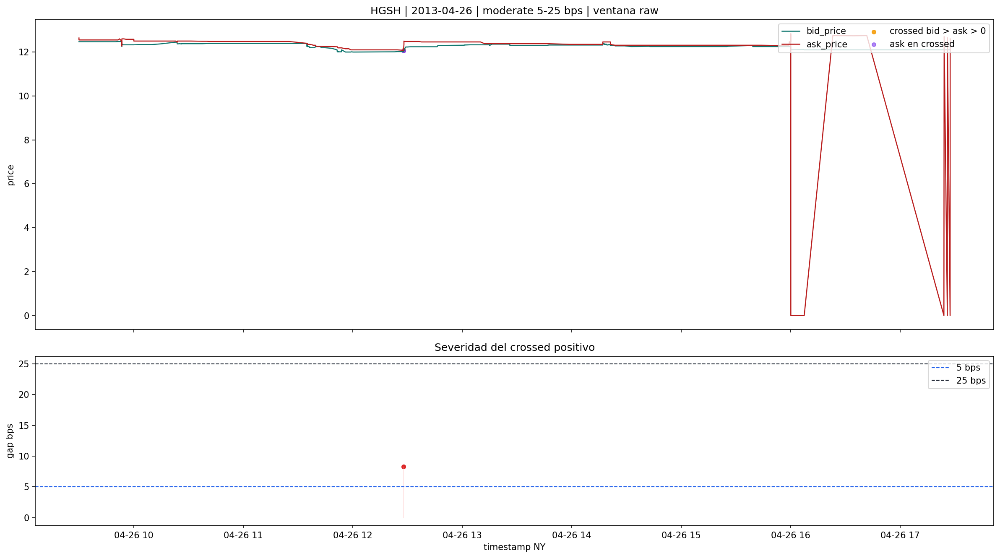

#### 02 Full Session Context
Esta imagen responde a la pregunta de extension intradiaria: el dano esta confinado a un bloque corto o contamina la sesion completa. Arriba se ve toda la sesion `04:00-20:00 NY`; abajo el `gap_bps` firmado. La decision que cambia es si el consumo debe penalizar solo un tramo o desechar el dia entero para uso operativo. El error que evita es tratar una cicatriz local como ruina total o, al reves, minimizar una degradacion distribuida a lo largo del dia. En ejecucion esto decide si la sesion puede seguir usandose con restricciones; en ML decide si las features intradiarias conservan significado economico.

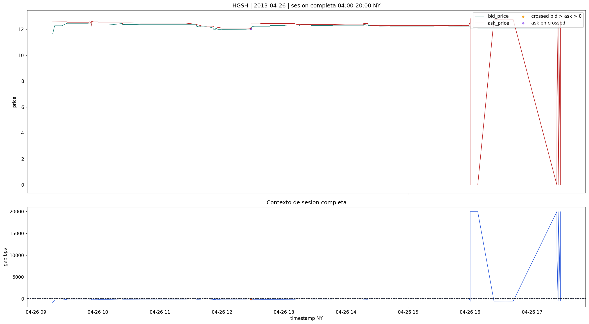

#### 03 Structure Diagnostics
Este panel responde a la pregunta de naturaleza del fallo: contradiccion economica genuina o mezcla con degeneracion estructural. Separa `ask=0` de `ask>0`, muestra la distribucion de `gap_bps` y resume patrones de integerizacion. La decision que cambia es como interpretar el dano: mercado localmente roto, artefacto de representacion o combinacion de ambos. El error que evita es sobrediagnosticar crossed reales cuando parte de la senal proviene de estructura degenerada del libro. Esta lectura afecta directamente a que el caso vaya a exclusion dura, a bandera contextual o a simple reconciliacion tecnica.

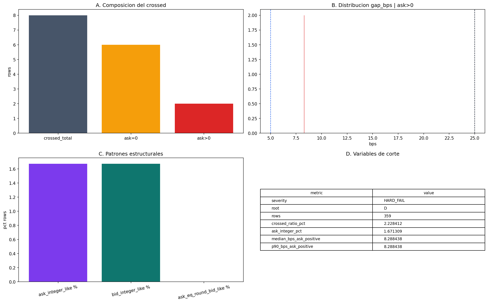

#### 04 Summary Card
Esta tarjeta responde a la pregunta de auditabilidad: cuales son exactamente las variables que sostienen la conclusion. Reune `severity`, `root`, `crossed_ratio_pct`, `ask_integer_pct`, `median_bps_ask_positive` y `p90_bps_ask_positive`. La decision que cambia es pasar de impresion visual a regla verificable. El error que evita es que dos inspectores lleguen a conclusiones distintas mirando la misma imagen sin una base numerica comun. Para gobernanza del proyecto, este panel es el que vuelve reproducible la decision para backtest, ML y auditoria.

---

### 11. BBW 2005-10-26

company_name: `Build-A-Bear Workshop, Inc.`
primary_exchange: `NYSE` (`XNYS`)
market_locale: `stocks/us`
scope: `bad`
ticker: `BBW`
date: `2005-10-26`
taxonomy: `medium_file_threshold_edge_hard_many_crosses`
positive_cross_bucket: `positive_cross_mild_lt5bps`
severity: `HARD_FAIL`
root: `D`
rows: `632`
crossed_ratio_pct: `1.740506`
crossed_rows_raw: `11`
crossed_rows_ask_zero: `1`
crossed_rows_ask_positive: `10`
ask_integer_pct: `21.677215`
median_bps_ask_positive: `4.217712`
p90_bps_ask_positive: `8.587377`
file: `D:\quotes\BBW\year=2005\month=10\day=26\quotes.parquet`

#### Analisis Forense
La conclusion correcta del caso es que la contradiccion local entre bid y ask ya compromete la credibilidad economica del libro y bloquea su consumo como si fuera mercado normal. La taxonomy historica es `medium_file_threshold_edge_hard_many_crosses` y el regimen positivo dominante es `mild <5 bps`. Esto importa porque la taxonomy no solo clasifica: resume que tipo de anomalia se esta viendo y que clase de decision contractual puede defenderse despues. La taxonomy `medium_file_threshold_edge_hard_many_crosses` implica que el mismo tipo de dano aparece en un file menos grande y por eso pesa mas: hay menos masa para diluir la anomalia y la exclusion se vuelve mas defendible. El regimen `mild <5 bps` significa que existe contradiccion economica positiva, pero aun en una banda donde un uso prudente puede seguir siendo defendible si la persistencia y la estructura no agravan el caso. En terminos observables, el file tiene `crossed_ratio_pct=1.740506` con `crossed_rows_ask_positive=10` y `crossed_rows_ask_zero=1`. La severidad economica del crossed ask>0 se resume en `median_bps_ask_positive=4.217712` y `p90_bps_ask_positive=8.587377`. Estos dos numeros convierten una forma visual rara en una conclusion operativa sobre si el libro sigue representando o no un mercado negociable. La decision que cambia es exclusion del consumo core del libro. `bad` significa que el estado local ya no puede alimentar ejecucion, mark-to-market intradiario ni aprendizaje de ML como si fuese microestructura defendible. El error que evita es construir decisiones sobre un libro que ha dejado de representar un mercado localmente creible. El patron estructural muestra `ask_integer_pct=21.677215`. Este numero obliga a separar dos explicaciones rivales: contradiccion economica genuina del libro o mezcla con degeneracion estructural / integerizacion. La mayor parte del crossed vive en `ask>0`, de modo que el corazon del problema sigue siendo economico. La parte `ask=0`, si existe, acompana pero no explica por si sola la anomalia. Como `ask_integer_pct` no es extremo, el caso exige leer geometria del crossed y estructura simultaneamente. No basta un solo numero; hay que combinar severidad, composicion y contexto. En la capa de semantica de precio del evento aparecen `daily raw close=23.3000`, `quote mid raw=23.8700`, `quote mid split_normalized=23.8700`, `daily adjusted_proxy=20.2694`. Ademas hay `post_event_dividend_sum=4.4300`. La implicacion metodologica es crucial: una discrepancia entre `quotes`, `daily` y una plataforma externa no puede leerse automaticamente como fallo del dataset. Puede ser semantica de precio distinta. El error que evita esta capa es mezclar raw, split-normalized y adjusted dentro del mismo pipeline, rompiendo auditoria, benchmarking y labels. Para pipelines, esto implica exclusion de ejecucion realista, de mark-to-market intradiario defendible y de features microestructurales tratadas como si reflejaran un mercado normal. Solo debe sobrevivir en circuitos forenses o de calidad. Existe ademas una imagen historica de certificacion asociada. Su papel es poner el episodio en un marco causal mas amplio: halt, explained, not strongly explained o patron conocido. La regla que protege al proyecto es esta: el contexto externo se usa para explicar por que aparece el episodio, no para absolverlo. El error que evita es degradar el criterio de calidad del libro porque exista una historia plausible alrededor del caso.

#### 00 Event Month Context
Esta imagen responde a la pregunta de persistencia temporal: estamos ante un accidente local o ante una fase mas amplia de inestabilidad. Arriba coloca el evento en la serie `daily` real del mes; abajo compara `crossed_ratio_pct` y `max_gap_bps_pos` del dia contra sus vecinos. La decision que cambia es el peso estructural que se le concede al caso. El error que evita es juzgar igual un shock aislado y una degradacion repetida del libro.

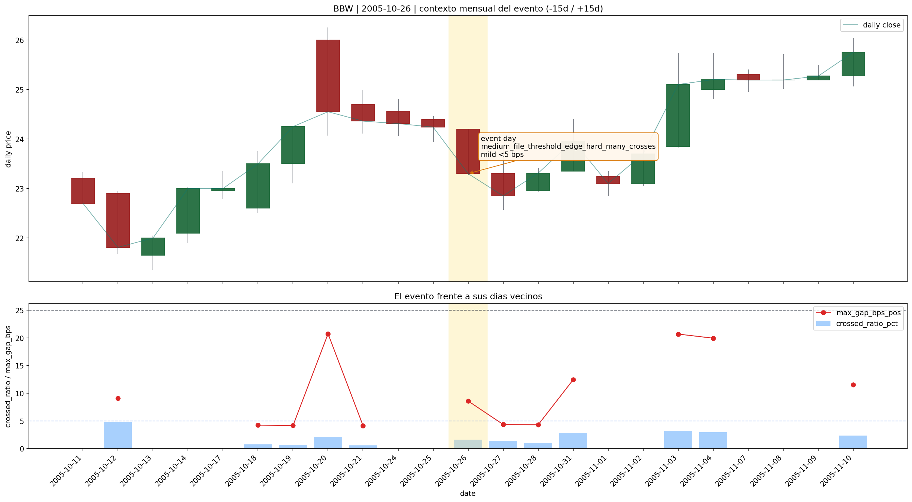

#### 00a Adjusted Proxy Contrast
Esta imagen responde a la pregunta de reconciliacion semantica: la discrepancia de precios viene de datos rotos o de vistas de precio distintas. Compara `daily raw`, `daily adjusted_proxy`, `quote mid raw` y `quote mid split_normalized`, y debajo ensena la cadena de dividendos y splits que produce la diferencia. La decision que cambia es si el inspector debe abrir una incidencia de calidad o cerrar el caso como diferencia legitima de semantica. El error que evita es mezclar series raw y adjusted como si fueran equivalentes. En pipelines reales, esto protege benchmarking, labels diarios y reconciliacion externa frente a falsas alarmas de precio.

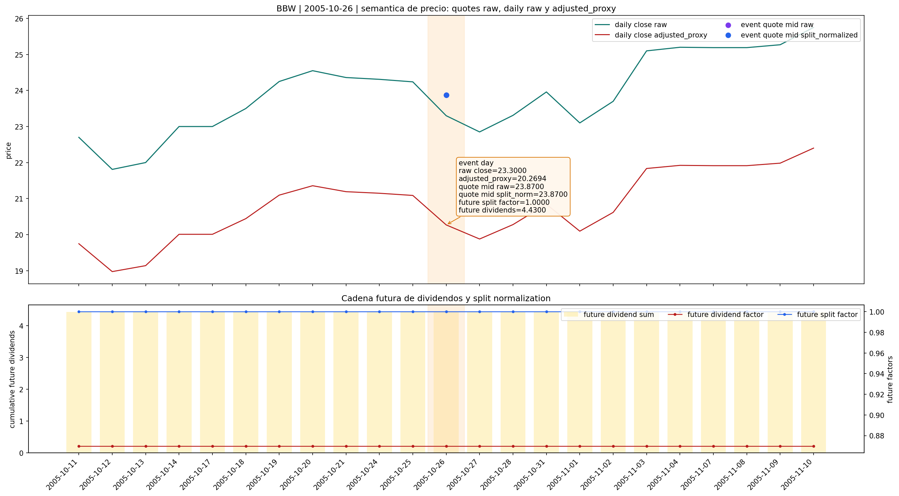

#### 00b Event Month Quotes Context
Esta imagen responde a la pregunta de recurrencia mensual dentro de `quotes`: el problema se concentra en el evento o reaparece en varias sesiones. Arriba concatena sesiones con datos disponibles; abajo resume cobertura diaria, `crossed_ratio_pct` y `max_gap_bps_pos`. La decision que cambia es si el caso debe leerse como episodio puntual o como sintoma de una fase repetida de libro degradado. El error que evita es extrapolar desde un unico dia a todo el mes sin evidencia.

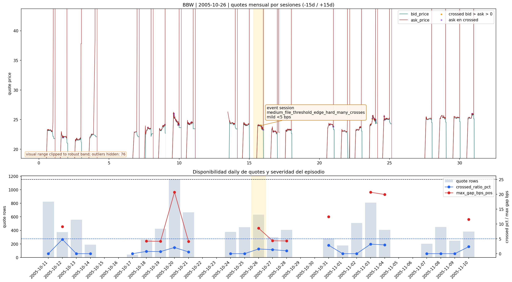

#### 01 Raw Window
Esta imagen responde a la primera pregunta decisiva del caso: el crossed observado es economicamente bastante fuerte para justificar un cambio de clase. Arriba ensena la geometria exacta del tramo conflictivo; abajo convierte esa geometria a bps y la enfrenta a los cortes `5 bps` y `25 bps`. El regimen dominante es `mild <5 bps`. La decision que cambia es pasar de anomalia interpretable a `review` o `bad`. El error que evita es decidir por apariencia visual sin medir el dano economico real del crossed. En terminos de pipeline, este panel decide si el problema afecta solo a la lectura forense o si invalida simulacion de ejecucion y microstructure features.

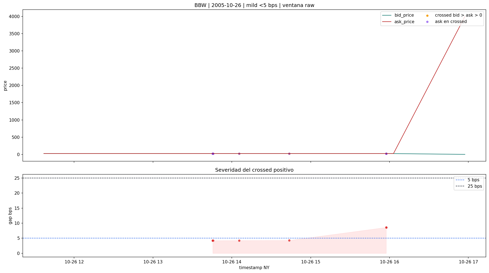

#### 02 Full Session Context
Esta imagen responde a la pregunta de extension intradiaria: el dano esta confinado a un bloque corto o contamina la sesion completa. Arriba se ve toda la sesion `04:00-20:00 NY`; abajo el `gap_bps` firmado. La decision que cambia es si el consumo debe penalizar solo un tramo o desechar el dia entero para uso operativo. El error que evita es tratar una cicatriz local como ruina total o, al reves, minimizar una degradacion distribuida a lo largo del dia. En ejecucion esto decide si la sesion puede seguir usandose con restricciones; en ML decide si las features intradiarias conservan significado economico.

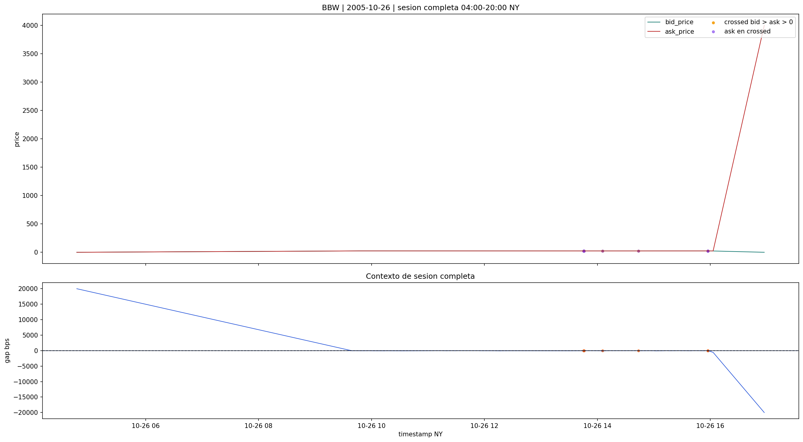

#### 03 Structure Diagnostics
Este panel responde a la pregunta de naturaleza del fallo: contradiccion economica genuina o mezcla con degeneracion estructural. Separa `ask=0` de `ask>0`, muestra la distribucion de `gap_bps` y resume patrones de integerizacion. La decision que cambia es como interpretar el dano: mercado localmente roto, artefacto de representacion o combinacion de ambos. El error que evita es sobrediagnosticar crossed reales cuando parte de la senal proviene de estructura degenerada del libro. Esta lectura afecta directamente a que el caso vaya a exclusion dura, a bandera contextual o a simple reconciliacion tecnica.

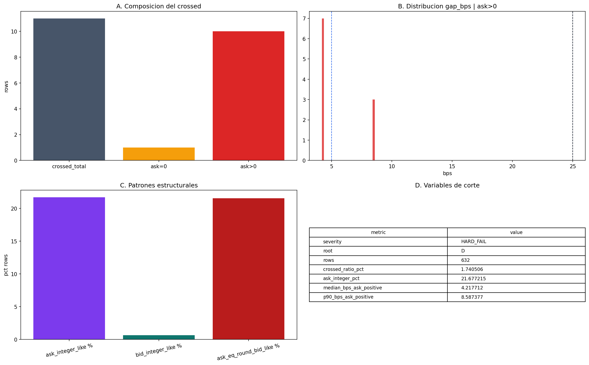

#### 04 Summary Card
Esta tarjeta responde a la pregunta de auditabilidad: cuales son exactamente las variables que sostienen la conclusion. Reune `severity`, `root`, `crossed_ratio_pct`, `ask_integer_pct`, `median_bps_ask_positive` y `p90_bps_ask_positive`. La decision que cambia es pasar de impresion visual a regla verificable. El error que evita es que dos inspectores lleguen a conclusiones distintas mirando la misma imagen sin una base numerica comun. Para gobernanza del proyecto, este panel es el que vuelve reproducible la decision para backtest, ML y auditoria.

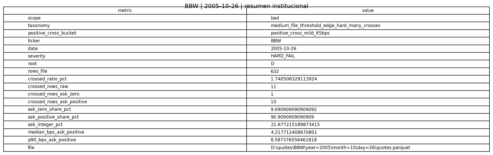

---

### 12. MMA 2006-08-11

company_name: `Mixed Martial Arts Group Limited`
primary_exchange: `NYSE American` (`XASE`)
market_locale: `stocks/us`
scope: `bad`
ticker: `MMA`
date: `2006-08-11`
taxonomy: `medium_file_threshold_edge_hard_many_crosses`
positive_cross_bucket: `positive_cross_mild_lt5bps`
severity: `HARD_FAIL`
root: `D`
rows: `752`
crossed_ratio_pct: `1.329787`
crossed_rows_raw: `10`
crossed_rows_ask_zero: `1`
crossed_rows_ask_positive: `9`
ask_integer_pct: `0.398936`
median_bps_ask_positive: `3.595182`
p90_bps_ask_positive: `7.192693`
file: `D:\quotes\MMA\year=2006\month=08\day=11\quotes.parquet`

#### Analisis Forense
La conclusion correcta del caso es que la contradiccion local entre bid y ask ya compromete la credibilidad economica del libro y bloquea su consumo como si fuera mercado normal. La taxonomy historica es `medium_file_threshold_edge_hard_many_crosses` y el regimen positivo dominante es `mild <5 bps`. Esto importa porque la taxonomy no solo clasifica: resume que tipo de anomalia se esta viendo y que clase de decision contractual puede defenderse despues. La taxonomy `medium_file_threshold_edge_hard_many_crosses` implica que el mismo tipo de dano aparece en un file menos grande y por eso pesa mas: hay menos masa para diluir la anomalia y la exclusion se vuelve mas defendible. El regimen `mild <5 bps` significa que existe contradiccion economica positiva, pero aun en una banda donde un uso prudente puede seguir siendo defendible si la persistencia y la estructura no agravan el caso. En terminos observables, el file tiene `crossed_ratio_pct=1.329787` con `crossed_rows_ask_positive=9` y `crossed_rows_ask_zero=1`. La severidad economica del crossed ask>0 se resume en `median_bps_ask_positive=3.595182` y `p90_bps_ask_positive=7.192693`. Estos dos numeros convierten una forma visual rara en una conclusion operativa sobre si el libro sigue representando o no un mercado negociable. La decision que cambia es exclusion del consumo core del libro. `bad` significa que el estado local ya no puede alimentar ejecucion, mark-to-market intradiario ni aprendizaje de ML como si fuese microestructura defendible. El error que evita es construir decisiones sobre un libro que ha dejado de representar un mercado localmente creible. El patron estructural muestra `ask_integer_pct=0.398936`. Este numero obliga a separar dos explicaciones rivales: contradiccion economica genuina del libro o mezcla con degeneracion estructural / integerizacion. La mayor parte del crossed vive en `ask>0`, de modo que el corazon del problema sigue siendo economico. La parte `ask=0`, si existe, acompana pero no explica por si sola la anomalia. Como `ask_integer_pct` es bajo, la hipotesis de simple degeneracion mecanica pierde fuerza. Eso endurece la interpretacion: el crossed se parece mas a contradiccion economica genuina y menos a artefacto. En la capa de semantica de precio del evento aparecen `daily raw close=27.7500`, `quote mid raw=27.7550`, `quote mid split_normalized=27.7550`, `daily adjusted_proxy=24.3688`. Ademas hay `post_event_dividend_sum=2.9150`. La implicacion metodologica es crucial: una discrepancia entre `quotes`, `daily` y una plataforma externa no puede leerse automaticamente como fallo del dataset. Puede ser semantica de precio distinta. El error que evita esta capa es mezclar raw, split-normalized y adjusted dentro del mismo pipeline, rompiendo auditoria, benchmarking y labels. Para pipelines, esto implica exclusion de ejecucion realista, de mark-to-market intradiario defendible y de features microestructurales tratadas como si reflejaran un mercado normal. Solo debe sobrevivir en circuitos forenses o de calidad. Existe ademas una imagen historica de certificacion asociada. Su papel es poner el episodio en un marco causal mas amplio: halt, explained, not strongly explained o patron conocido. La regla que protege al proyecto es esta: el contexto externo se usa para explicar por que aparece el episodio, no para absolverlo. El error que evita es degradar el criterio de calidad del libro porque exista una historia plausible alrededor del caso.

#### 00 Event Month Context
Esta imagen responde a la pregunta de persistencia temporal: estamos ante un accidente local o ante una fase mas amplia de inestabilidad. Arriba coloca el evento en la serie `daily` real del mes; abajo compara `crossed_ratio_pct` y `max_gap_bps_pos` del dia contra sus vecinos. La decision que cambia es el peso estructural que se le concede al caso. El error que evita es juzgar igual un shock aislado y una degradacion repetida del libro.

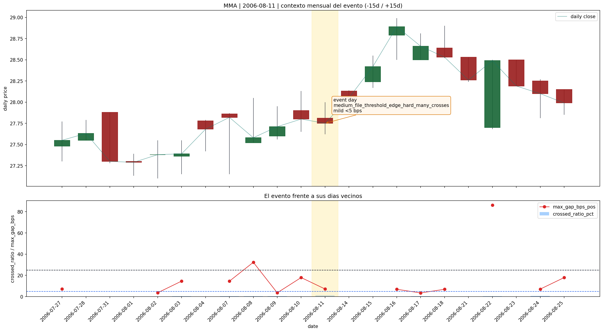

#### 00a Adjusted Proxy Contrast
Esta imagen responde a la pregunta de reconciliacion semantica: la discrepancia de precios viene de datos rotos o de vistas de precio distintas. Compara `daily raw`, `daily adjusted_proxy`, `quote mid raw` y `quote mid split_normalized`, y debajo ensena la cadena de dividendos y splits que produce la diferencia. La decision que cambia es si el inspector debe abrir una incidencia de calidad o cerrar el caso como diferencia legitima de semantica. El error que evita es mezclar series raw y adjusted como si fueran equivalentes. En pipelines reales, esto protege benchmarking, labels diarios y reconciliacion externa frente a falsas alarmas de precio.

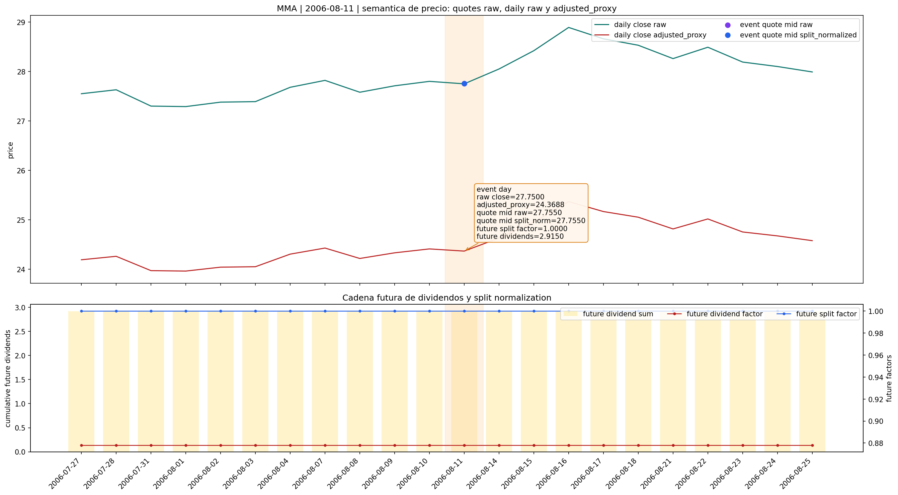

#### 00b Event Month Quotes Context
Esta imagen responde a la pregunta de recurrencia mensual dentro de `quotes`: el problema se concentra en el evento o reaparece en varias sesiones. Arriba concatena sesiones con datos disponibles; abajo resume cobertura diaria, `crossed_ratio_pct` y `max_gap_bps_pos`. La decision que cambia es si el caso debe leerse como episodio puntual o como sintoma de una fase repetida de libro degradado. El error que evita es extrapolar desde un unico dia a todo el mes sin evidencia.

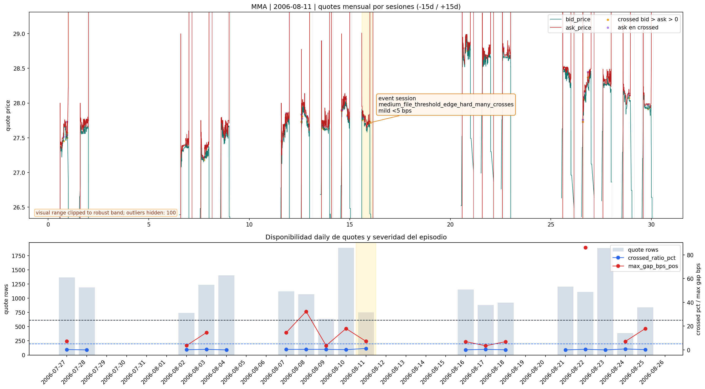

#### 01 Raw Window
Esta imagen responde a la primera pregunta decisiva del caso: el crossed observado es economicamente bastante fuerte para justificar un cambio de clase. Arriba ensena la geometria exacta del tramo conflictivo; abajo convierte esa geometria a bps y la enfrenta a los cortes `5 bps` y `25 bps`. El regimen dominante es `mild <5 bps`. La decision que cambia es pasar de anomalia interpretable a `review` o `bad`. El error que evita es decidir por apariencia visual sin medir el dano economico real del crossed. En terminos de pipeline, este panel decide si el problema afecta solo a la lectura forense o si invalida simulacion de ejecucion y microstructure features.

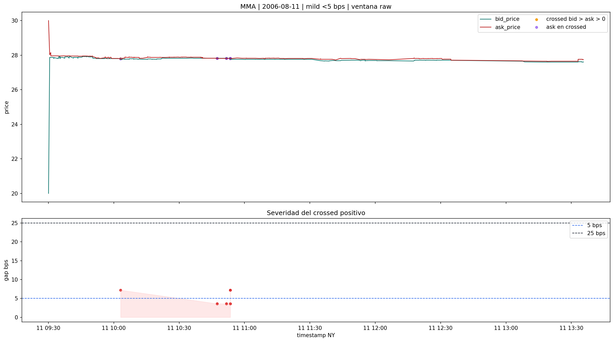

#### 02 Full Session Context
Esta imagen responde a la pregunta de extension intradiaria: el dano esta confinado a un bloque corto o contamina la sesion completa. Arriba se ve toda la sesion `04:00-20:00 NY`; abajo el `gap_bps` firmado. La decision que cambia es si el consumo debe penalizar solo un tramo o desechar el dia entero para uso operativo. El error que evita es tratar una cicatriz local como ruina total o, al reves, minimizar una degradacion distribuida a lo largo del dia. En ejecucion esto decide si la sesion puede seguir usandose con restricciones; en ML decide si las features intradiarias conservan significado economico.

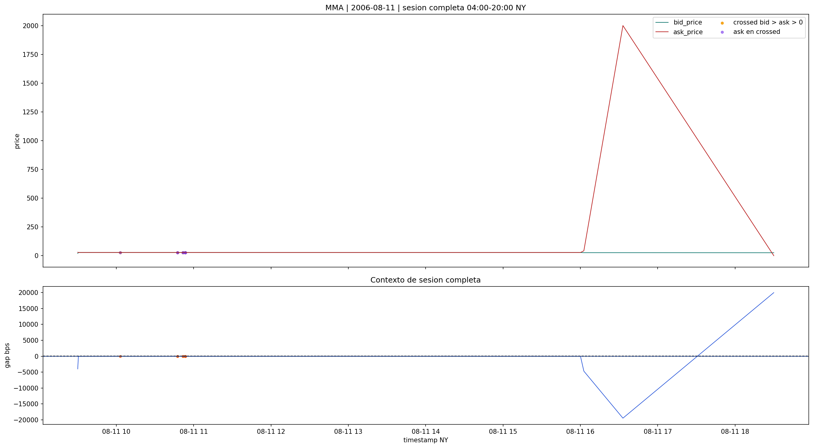

#### 03 Structure Diagnostics
Este panel responde a la pregunta de naturaleza del fallo: contradiccion economica genuina o mezcla con degeneracion estructural. Separa `ask=0` de `ask>0`, muestra la distribucion de `gap_bps` y resume patrones de integerizacion. La decision que cambia es como interpretar el dano: mercado localmente roto, artefacto de representacion o combinacion de ambos. El error que evita es sobrediagnosticar crossed reales cuando parte de la senal proviene de estructura degenerada del libro. Esta lectura afecta directamente a que el caso vaya a exclusion dura, a bandera contextual o a simple reconciliacion tecnica.

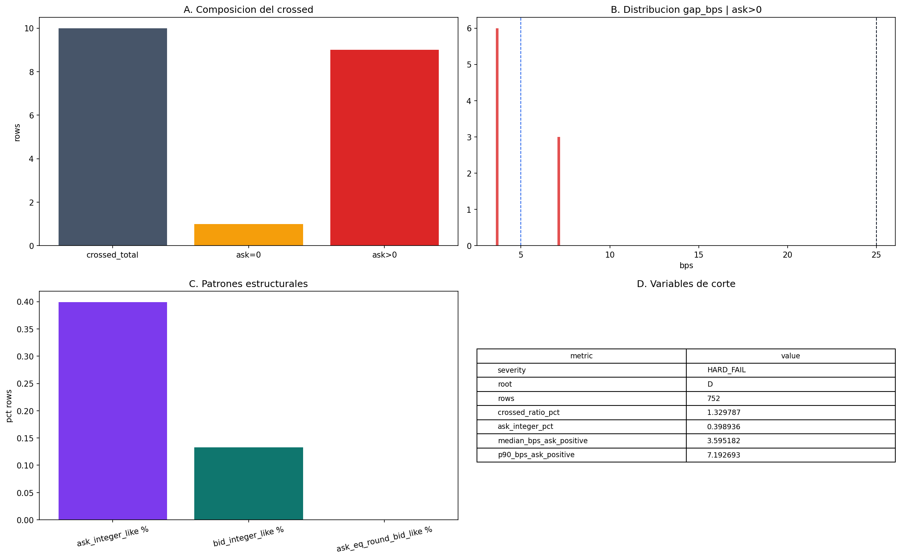

#### 04 Summary Card
Esta tarjeta responde a la pregunta de auditabilidad: cuales son exactamente las variables que sostienen la conclusion. Reune `severity`, `root`, `crossed_ratio_pct`, `ask_integer_pct`, `median_bps_ask_positive` y `p90_bps_ask_positive`. La decision que cambia es pasar de impresion visual a regla verificable. El error que evita es que dos inspectores lleguen a conclusiones distintas mirando la misma imagen sin una base numerica comun. Para gobernanza del proyecto, este panel es el que vuelve reproducible la decision para backtest, ML y auditoria.

---

### 13. PLL 2006-04-28

company_name: `Piedmont Lithium Inc. Common Stock`
primary_exchange: `NASDAQ` (`XNAS`)
market_locale: `stocks/us`
scope: `bad`
ticker: `PLL`
date: `2006-04-28`
taxonomy: `medium_file_threshold_edge_hard_many_crosses`
positive_cross_bucket: `positive_cross_mild_lt5bps`
severity: `HARD_FAIL`
root: `D`
rows: `535`
crossed_ratio_pct: `3.177570`
crossed_rows_raw: `17`
crossed_rows_ask_zero: `14`
crossed_rows_ask_positive: `3`
ask_integer_pct: `3.177570`
median_bps_ask_positive: `3.312904`
p90_bps_ask_positive: `3.312904`
file: `D:\quotes\PLL\year=2006\month=04\day=28\quotes.parquet`

#### Analisis Forense
La conclusion correcta del caso es que la contradiccion local entre bid y ask ya compromete la credibilidad economica del libro y bloquea su consumo como si fuera mercado normal. La taxonomy historica es `medium_file_threshold_edge_hard_many_crosses` y el regimen positivo dominante es `mild <5 bps`. Esto importa porque la taxonomy no solo clasifica: resume que tipo de anomalia se esta viendo y que clase de decision contractual puede defenderse despues. La taxonomy `medium_file_threshold_edge_hard_many_crosses` implica que el mismo tipo de dano aparece en un file menos grande y por eso pesa mas: hay menos masa para diluir la anomalia y la exclusion se vuelve mas defendible. El regimen `mild <5 bps` significa que existe contradiccion economica positiva, pero aun en una banda donde un uso prudente puede seguir siendo defendible si la persistencia y la estructura no agravan el caso. En terminos observables, el file tiene `crossed_ratio_pct=3.177570` con `crossed_rows_ask_positive=3` y `crossed_rows_ask_zero=14`. La severidad economica del crossed ask>0 se resume en `median_bps_ask_positive=3.312904` y `p90_bps_ask_positive=3.312904`. Estos dos numeros convierten una forma visual rara en una conclusion operativa sobre si el libro sigue representando o no un mercado negociable. La decision que cambia es exclusion del consumo core del libro. `bad` significa que el estado local ya no puede alimentar ejecucion, mark-to-market intradiario ni aprendizaje de ML como si fuese microestructura defendible. El error que evita es construir decisiones sobre un libro que ha dejado de representar un mercado localmente creible. El patron estructural muestra `ask_integer_pct=3.177570`. Este numero obliga a separar dos explicaciones rivales: contradiccion economica genuina del libro o mezcla con degeneracion estructural / integerizacion. La mayor parte del crossed vive en `ask=0`, pero existe una cola `ask>0` que impide absolver el caso como simple glitch. La lectura correcta es mixta: dano estructural dominante con residuo economico que aun puede justificar bandera o exclusion. Como `ask_integer_pct` es bajo, la hipotesis de simple degeneracion mecanica pierde fuerza. Eso endurece la interpretacion: el crossed se parece mas a contradiccion economica genuina y menos a artefacto. En la capa de semantica de precio del evento aparecen `daily raw close=30.1800`, `quote mid raw=30.3450`, `quote mid split_normalized=30.3450`, `daily adjusted_proxy=25.0455`. Ademas hay `post_event_dividend_sum=6.7750`. La implicacion metodologica es crucial: una discrepancia entre `quotes`, `daily` y una plataforma externa no puede leerse automaticamente como fallo del dataset. Puede ser semantica de precio distinta. El error que evita esta capa es mezclar raw, split-normalized y adjusted dentro del mismo pipeline, rompiendo auditoria, benchmarking y labels. Para pipelines, esto implica exclusion de ejecucion realista, de mark-to-market intradiario defendible y de features microestructurales tratadas como si reflejaran un mercado normal. Solo debe sobrevivir en circuitos forenses o de calidad. Existe ademas una imagen historica de certificacion asociada. Su papel es poner el episodio en un marco causal mas amplio: halt, explained, not strongly explained o patron conocido. La regla que protege al proyecto es esta: el contexto externo se usa para explicar por que aparece el episodio, no para absolverlo. El error que evita es degradar el criterio de calidad del libro porque exista una historia plausible alrededor del caso.

#### 00 Event Month Context
Esta imagen responde a la pregunta de persistencia temporal: estamos ante un accidente local o ante una fase mas amplia de inestabilidad. Arriba coloca el evento en la serie `daily` real del mes; abajo compara `crossed_ratio_pct` y `max_gap_bps_pos` del dia contra sus vecinos. La decision que cambia es el peso estructural que se le concede al caso. El error que evita es juzgar igual un shock aislado y una degradacion repetida del libro.

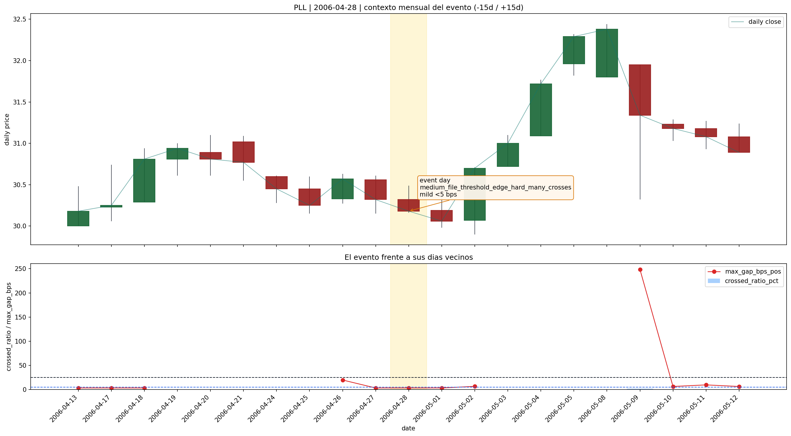

#### 00a Adjusted Proxy Contrast
Esta imagen responde a la pregunta de reconciliacion semantica: la discrepancia de precios viene de datos rotos o de vistas de precio distintas. Compara `daily raw`, `daily adjusted_proxy`, `quote mid raw` y `quote mid split_normalized`, y debajo ensena la cadena de dividendos y splits que produce la diferencia. La decision que cambia es si el inspector debe abrir una incidencia de calidad o cerrar el caso como diferencia legitima de semantica. El error que evita es mezclar series raw y adjusted como si fueran equivalentes. En pipelines reales, esto protege benchmarking, labels diarios y reconciliacion externa frente a falsas alarmas de precio.

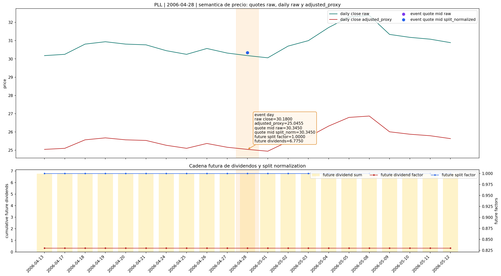

#### 00b Event Month Quotes Context
Esta imagen responde a la pregunta de recurrencia mensual dentro de `quotes`: el problema se concentra en el evento o reaparece en varias sesiones. Arriba concatena sesiones con datos disponibles; abajo resume cobertura diaria, `crossed_ratio_pct` y `max_gap_bps_pos`. La decision que cambia es si el caso debe leerse como episodio puntual o como sintoma de una fase repetida de libro degradado. El error que evita es extrapolar desde un unico dia a todo el mes sin evidencia.

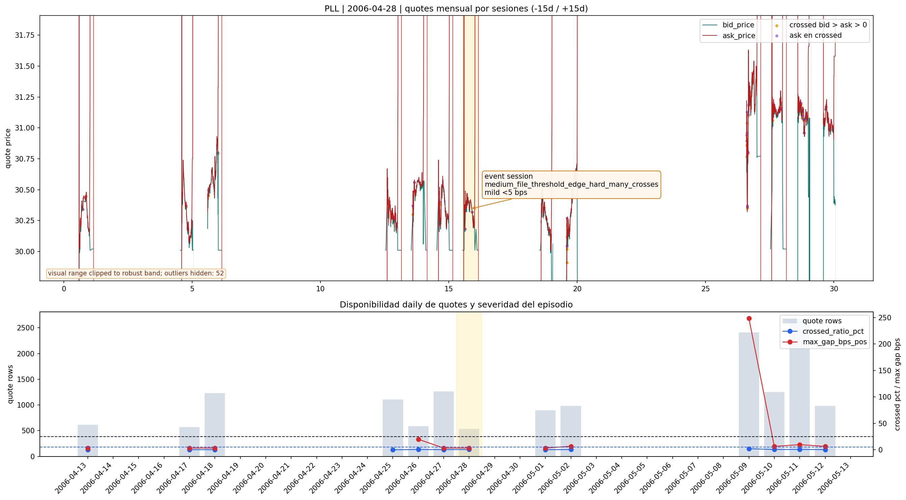

#### 01 Raw Window
Esta imagen responde a la primera pregunta decisiva del caso: el crossed observado es economicamente bastante fuerte para justificar un cambio de clase. Arriba ensena la geometria exacta del tramo conflictivo; abajo convierte esa geometria a bps y la enfrenta a los cortes `5 bps` y `25 bps`. El regimen dominante es `mild <5 bps`. La decision que cambia es pasar de anomalia interpretable a `review` o `bad`. El error que evita es decidir por apariencia visual sin medir el dano economico real del crossed. En terminos de pipeline, este panel decide si el problema afecta solo a la lectura forense o si invalida simulacion de ejecucion y microstructure features.

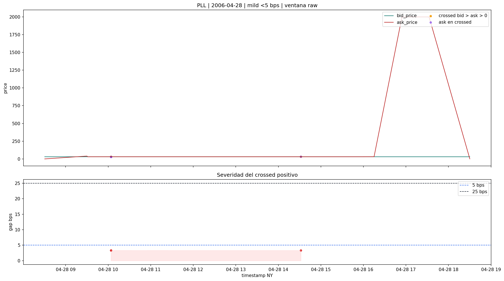

#### 02 Full Session Context
Esta imagen responde a la pregunta de extension intradiaria: el dano esta confinado a un bloque corto o contamina la sesion completa. Arriba se ve toda la sesion `04:00-20:00 NY`; abajo el `gap_bps` firmado. La decision que cambia es si el consumo debe penalizar solo un tramo o desechar el dia entero para uso operativo. El error que evita es tratar una cicatriz local como ruina total o, al reves, minimizar una degradacion distribuida a lo largo del dia. En ejecucion esto decide si la sesion puede seguir usandose con restricciones; en ML decide si las features intradiarias conservan significado economico.

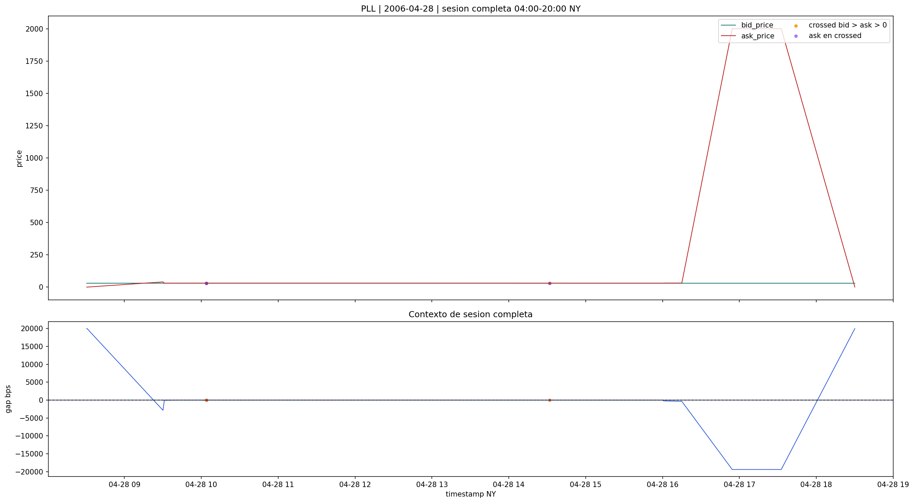

#### 03 Structure Diagnostics
Este panel responde a la pregunta de naturaleza del fallo: contradiccion economica genuina o mezcla con degeneracion estructural. Separa `ask=0` de `ask>0`, muestra la distribucion de `gap_bps` y resume patrones de integerizacion. La decision que cambia es como interpretar el dano: mercado localmente roto, artefacto de representacion o combinacion de ambos. El error que evita es sobrediagnosticar crossed reales cuando parte de la senal proviene de estructura degenerada del libro. Esta lectura afecta directamente a que el caso vaya a exclusion dura, a bandera contextual o a simple reconciliacion tecnica.

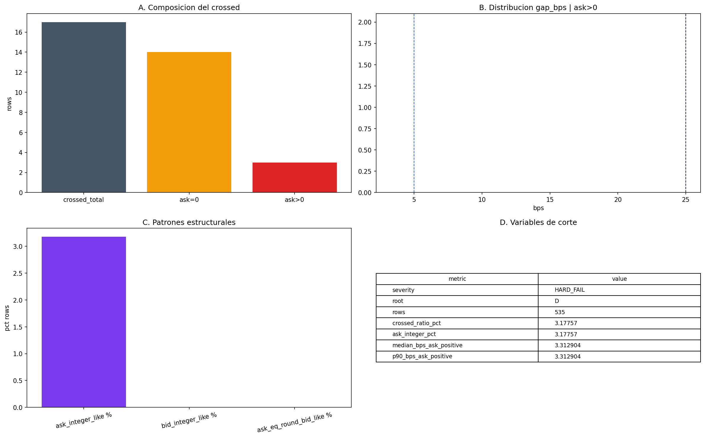

#### 04 Summary Card
Esta tarjeta responde a la pregunta de auditabilidad: cuales son exactamente las variables que sostienen la conclusion. Reune `severity`, `root`, `crossed_ratio_pct`, `ask_integer_pct`, `median_bps_ask_positive` y `p90_bps_ask_positive`. La decision que cambia es pasar de impresion visual a regla verificable. El error que evita es que dos inspectores lleguen a conclusiones distintas mirando la misma imagen sin una base numerica comun. Para gobernanza del proyecto, este panel es el que vuelve reproducible la decision para backtest, ML y auditoria.

---

### 14. EAC 2005-06-27

company_name: `Edify Acquisition Corp. Class A Common Stock`
primary_exchange: `NASDAQ` (`XNAS`)
market_locale: `stocks/us`
scope: `bad`
ticker: `EAC`
date: `2005-06-27`
taxonomy: `medium_file_threshold_edge_hard_many_crosses`
positive_cross_bucket: `positive_cross_mild_lt5bps`
severity: `HARD_FAIL`
root: `D`
rows: `707`
crossed_ratio_pct: `2.404526`
crossed_rows_raw: `17`
crossed_rows_ask_zero: `1`
crossed_rows_ask_positive: `16`
ask_integer_pct: `0.424328`
median_bps_ask_positive: `2.378406`
p90_bps_ask_positive: `16.562167`
file: `D:\quotes\EAC\year=2005\month=06\day=27\quotes.parquet`

#### Analisis Forense
La conclusion correcta del caso es que la contradiccion local entre bid y ask ya compromete la credibilidad economica del libro y bloquea su consumo como si fuera mercado normal. La taxonomy historica es `medium_file_threshold_edge_hard_many_crosses` y el regimen positivo dominante es `mild <5 bps`. Esto importa porque la taxonomy no solo clasifica: resume que tipo de anomalia se esta viendo y que clase de decision contractual puede defenderse despues. La taxonomy `medium_file_threshold_edge_hard_many_crosses` implica que el mismo tipo de dano aparece en un file menos grande y por eso pesa mas: hay menos masa para diluir la anomalia y la exclusion se vuelve mas defendible. El regimen `mild <5 bps` significa que existe contradiccion economica positiva, pero aun en una banda donde un uso prudente puede seguir siendo defendible si la persistencia y la estructura no agravan el caso. En terminos observables, el file tiene `crossed_ratio_pct=2.404526` con `crossed_rows_ask_positive=16` y `crossed_rows_ask_zero=1`. La severidad economica del crossed ask>0 se resume en `median_bps_ask_positive=2.378406` y `p90_bps_ask_positive=16.562167`. Estos dos numeros convierten una forma visual rara en una conclusion operativa sobre si el libro sigue representando o no un mercado negociable. La decision que cambia es exclusion del consumo core del libro. `bad` significa que el estado local ya no puede alimentar ejecucion, mark-to-market intradiario ni aprendizaje de ML como si fuese microestructura defendible. El error que evita es construir decisiones sobre un libro que ha dejado de representar un mercado localmente creible. El patron estructural muestra `ask_integer_pct=0.424328`. Este numero obliga a separar dos explicaciones rivales: contradiccion economica genuina del libro o mezcla con degeneracion estructural / integerizacion. La mayor parte del crossed vive en `ask>0`, de modo que el corazon del problema sigue siendo economico. La parte `ask=0`, si existe, acompana pero no explica por si sola la anomalia. Como `ask_integer_pct` es bajo, la hipotesis de simple degeneracion mecanica pierde fuerza. Eso endurece la interpretacion: el crossed se parece mas a contradiccion economica genuina y menos a artefacto. En la capa de semantica de precio del evento aparecen `daily raw close=27.8333`, `quote mid raw=41.9425`, `quote mid split_normalized=27.9617`, `daily adjusted_proxy=27.8333`. La reconciliacion incluye `future_split_factor=1.5000`. La implicacion metodologica es crucial: una discrepancia entre `quotes`, `daily` y una plataforma externa no puede leerse automaticamente como fallo del dataset. Puede ser semantica de precio distinta. El error que evita esta capa es mezclar raw, split-normalized y adjusted dentro del mismo pipeline, rompiendo auditoria, benchmarking y labels. Para pipelines, esto implica exclusion de ejecucion realista, de mark-to-market intradiario defendible y de features microestructurales tratadas como si reflejaran un mercado normal. Solo debe sobrevivir en circuitos forenses o de calidad. Existe ademas una imagen historica de certificacion asociada. Su papel es poner el episodio en un marco causal mas amplio: halt, explained, not strongly explained o patron conocido. La regla que protege al proyecto es esta: el contexto externo se usa para explicar por que aparece el episodio, no para absolverlo. El error que evita es degradar el criterio de calidad del libro porque exista una historia plausible alrededor del caso.

#### 00 Event Month Context
Esta imagen responde a la pregunta de persistencia temporal: estamos ante un accidente local o ante una fase mas amplia de inestabilidad. Arriba coloca el evento en la serie `daily` real del mes; abajo compara `crossed_ratio_pct` y `max_gap_bps_pos` del dia contra sus vecinos. La decision que cambia es el peso estructural que se le concede al caso. El error que evita es juzgar igual un shock aislado y una degradacion repetida del libro.

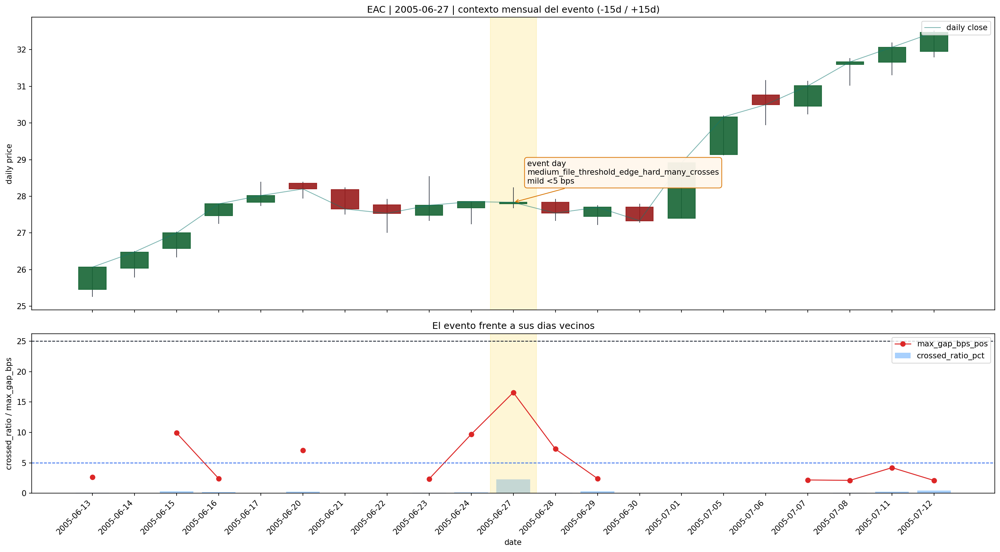

#### 00a Adjusted Proxy Contrast
Esta imagen responde a la pregunta de reconciliacion semantica: la discrepancia de precios viene de datos rotos o de vistas de precio distintas. Compara `daily raw`, `daily adjusted_proxy`, `quote mid raw` y `quote mid split_normalized`, y debajo ensena la cadena de dividendos y splits que produce la diferencia. La decision que cambia es si el inspector debe abrir una incidencia de calidad o cerrar el caso como diferencia legitima de semantica. El error que evita es mezclar series raw y adjusted como si fueran equivalentes. En pipelines reales, esto protege benchmarking, labels diarios y reconciliacion externa frente a falsas alarmas de precio.

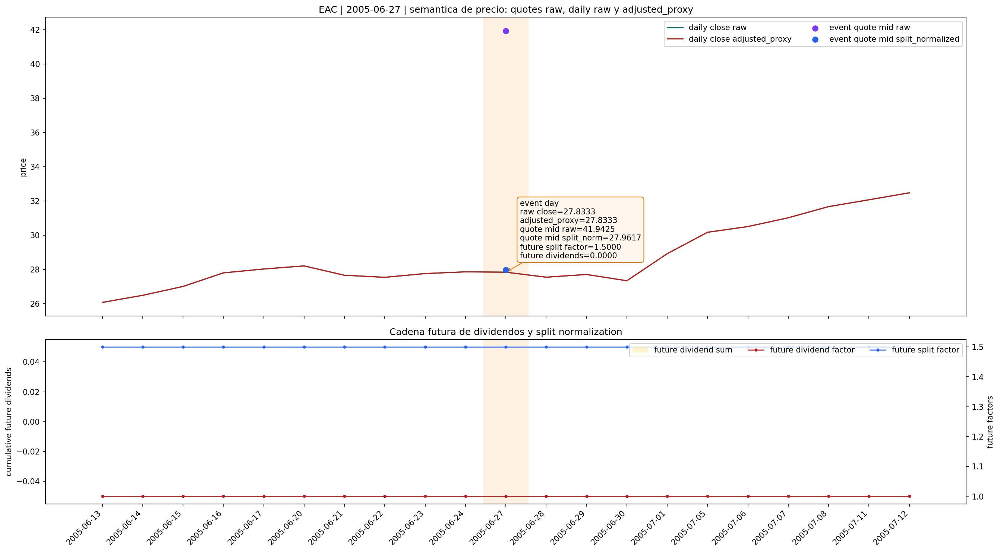

#### 00b Event Month Quotes Context
Esta imagen responde a la pregunta de recurrencia mensual dentro de `quotes`: el problema se concentra en el evento o reaparece en varias sesiones. Arriba concatena sesiones con datos disponibles; abajo resume cobertura diaria, `crossed_ratio_pct` y `max_gap_bps_pos`. La decision que cambia es si el caso debe leerse como episodio puntual o como sintoma de una fase repetida de libro degradado. El error que evita es extrapolar desde un unico dia a todo el mes sin evidencia.

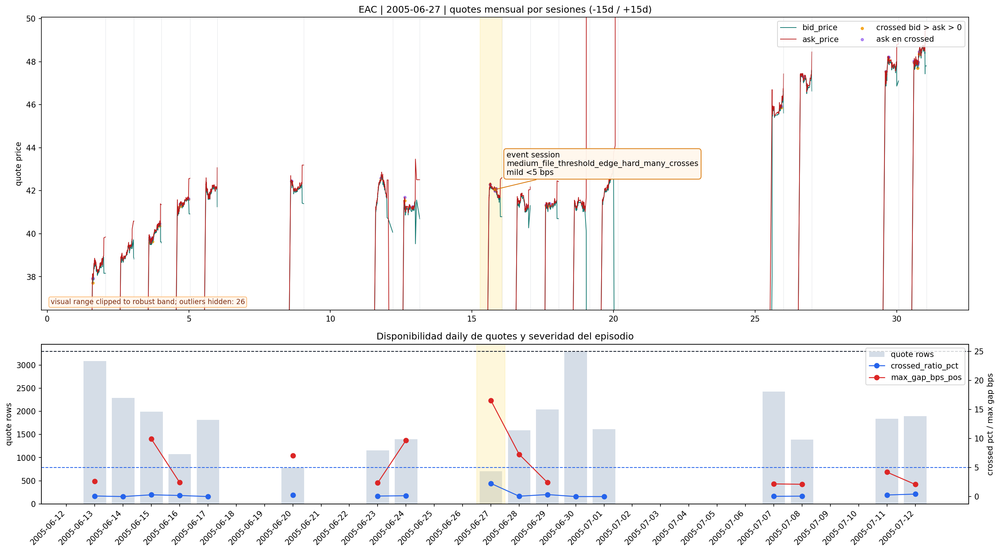

#### 01 Raw Window
Esta imagen responde a la primera pregunta decisiva del caso: el crossed observado es economicamente bastante fuerte para justificar un cambio de clase. Arriba ensena la geometria exacta del tramo conflictivo; abajo convierte esa geometria a bps y la enfrenta a los cortes `5 bps` y `25 bps`. El regimen dominante es `mild <5 bps`. La decision que cambia es pasar de anomalia interpretable a `review` o `bad`. El error que evita es decidir por apariencia visual sin medir el dano economico real del crossed. En terminos de pipeline, este panel decide si el problema afecta solo a la lectura forense o si invalida simulacion de ejecucion y microstructure features.

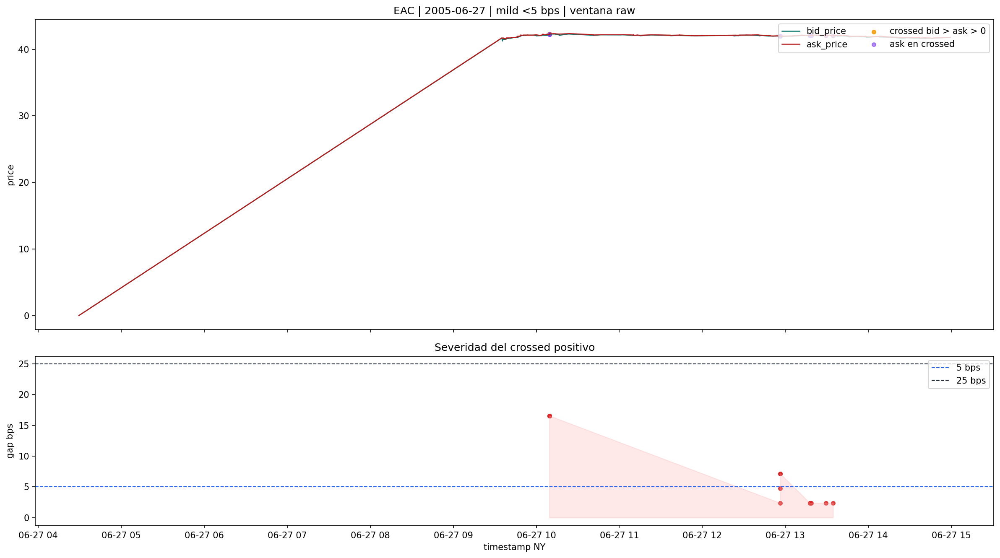

#### 02 Full Session Context
Esta imagen responde a la pregunta de extension intradiaria: el dano esta confinado a un bloque corto o contamina la sesion completa. Arriba se ve toda la sesion `04:00-20:00 NY`; abajo el `gap_bps` firmado. La decision que cambia es si el consumo debe penalizar solo un tramo o desechar el dia entero para uso operativo. El error que evita es tratar una cicatriz local como ruina total o, al reves, minimizar una degradacion distribuida a lo largo del dia. En ejecucion esto decide si la sesion puede seguir usandose con restricciones; en ML decide si las features intradiarias conservan significado economico.

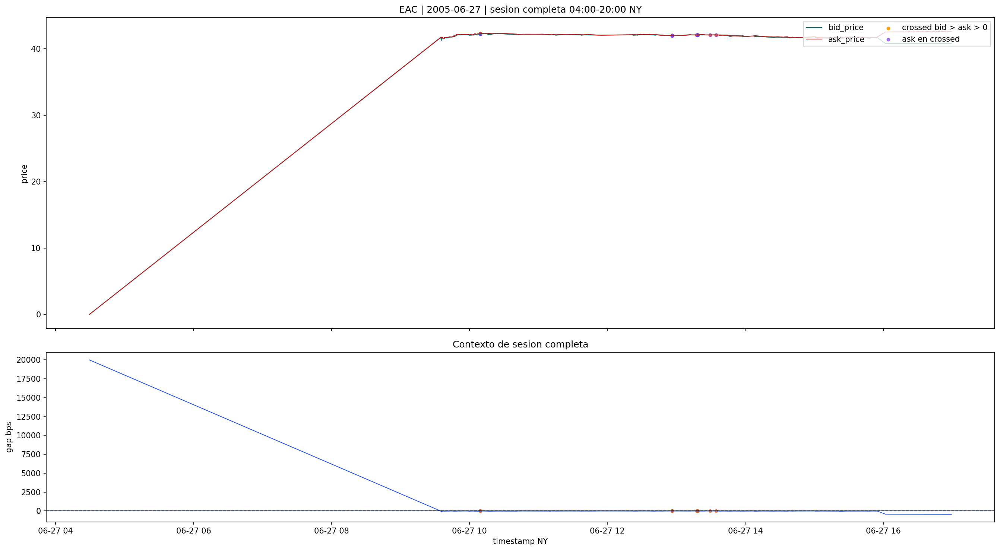

#### 03 Structure Diagnostics
Este panel responde a la pregunta de naturaleza del fallo: contradiccion economica genuina o mezcla con degeneracion estructural. Separa `ask=0` de `ask>0`, muestra la distribucion de `gap_bps` y resume patrones de integerizacion. La decision que cambia es como interpretar el dano: mercado localmente roto, artefacto de representacion o combinacion de ambos. El error que evita es sobrediagnosticar crossed reales cuando parte de la senal proviene de estructura degenerada del libro. Esta lectura afecta directamente a que el caso vaya a exclusion dura, a bandera contextual o a simple reconciliacion tecnica.

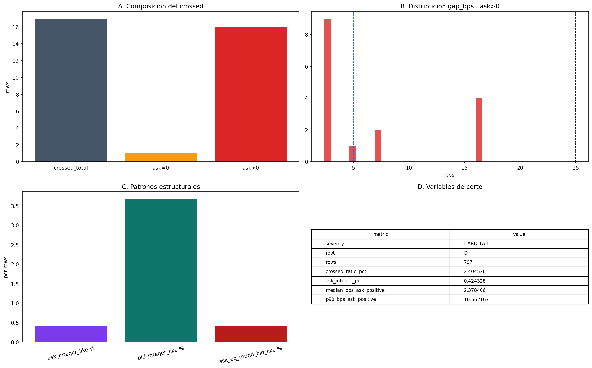

#### 04 Summary Card
Esta tarjeta responde a la pregunta de auditabilidad: cuales son exactamente las variables que sostienen la conclusion. Reune `severity`, `root`, `crossed_ratio_pct`, `ask_integer_pct`, `median_bps_ask_positive` y `p90_bps_ask_positive`. La decision que cambia es pasar de impresion visual a regla verificable. El error que evita es que dos inspectores lleguen a conclusiones distintas mirando la misma imagen sin una base numerica comun. Para gobernanza del proyecto, este panel es el que vuelve reproducible la decision para backtest, ML y auditoria.

---

### 15. SSN 2017-01-04

company_name: `SAMSON OIL & GAS LTD SPONSORED ADR NEW(AUSTRALIA)`
primary_exchange: `NYSE American` (`XASE`)
market_locale: `stocks/us`
scope: `bad`
ticker: `SSN`
date: `2017-01-04`
taxonomy: `medium_file_threshold_edge_hard_many_crosses`
positive_cross_bucket: `positive_cross_mild_lt5bps`
severity: `HARD_FAIL`
root: `D`
rows: `877`
crossed_ratio_pct: `0.912201`
crossed_rows_raw: `8`
crossed_rows_ask_zero: `0`
crossed_rows_ask_positive: `8`
ask_integer_pct: `0.114025`
median_bps_ask_positive: `1.369769`
p90_bps_ask_positive: `1.369769`
file: `D:\quotes\SSN\year=2017\month=01\day=04\quotes.parquet`

#### Analisis Forense
La conclusion correcta del caso es que la contradiccion local entre bid y ask ya compromete la credibilidad economica del libro y bloquea su consumo como si fuera mercado normal. La taxonomy historica es `medium_file_threshold_edge_hard_many_crosses` y el regimen positivo dominante es `mild <5 bps`. Esto importa porque la taxonomy no solo clasifica: resume que tipo de anomalia se esta viendo y que clase de decision contractual puede defenderse despues. La taxonomy `medium_file_threshold_edge_hard_many_crosses` implica que el mismo tipo de dano aparece en un file menos grande y por eso pesa mas: hay menos masa para diluir la anomalia y la exclusion se vuelve mas defendible. El regimen `mild <5 bps` significa que existe contradiccion economica positiva, pero aun en una banda donde un uso prudente puede seguir siendo defendible si la persistencia y la estructura no agravan el caso. En terminos observables, el file tiene `crossed_ratio_pct=0.912201` con `crossed_rows_ask_positive=8` y `crossed_rows_ask_zero=0`. La severidad economica del crossed ask>0 se resume en `median_bps_ask_positive=1.369769` y `p90_bps_ask_positive=1.369769`. Estos dos numeros convierten una forma visual rara en una conclusion operativa sobre si el libro sigue representando o no un mercado negociable. La decision que cambia es exclusion del consumo core del libro. `bad` significa que el estado local ya no puede alimentar ejecucion, mark-to-market intradiario ni aprendizaje de ML como si fuese microestructura defendible. El error que evita es construir decisiones sobre un libro que ha dejado de representar un mercado localmente creible. El patron estructural muestra `ask_integer_pct=0.114025`. Este numero obliga a separar dos explicaciones rivales: contradiccion economica genuina del libro o mezcla con degeneracion estructural / integerizacion. Toda la composicion crossed cae en `ask>0`. Eso endurece la lectura economica del caso: el dano no depende de ceros mecanicos, sino de contradiccion positiva dentro de precios aparentemente vivos. Como `ask_integer_pct` es bajo, la hipotesis de simple degeneracion mecanica pierde fuerza. Eso endurece la interpretacion: el crossed se parece mas a contradiccion economica genuina y menos a artefacto. Existe ademas una imagen historica de certificacion asociada. Su papel es poner el episodio en un marco causal mas amplio: halt, explained, not strongly explained o patron conocido. La regla que protege al proyecto es esta: el contexto externo se usa para explicar por que aparece el episodio, no para absolverlo. El error que evita es degradar el criterio de calidad del libro porque exista una historia plausible alrededor del caso.

#### 00 Event Month Context
Esta imagen responde a la pregunta de persistencia temporal: estamos ante un accidente local o ante una fase mas amplia de inestabilidad. Arriba coloca el evento en la serie `daily` real del mes; abajo compara `crossed_ratio_pct` y `max_gap_bps_pos` del dia contra sus vecinos. La decision que cambia es el peso estructural que se le concede al caso. El error que evita es juzgar igual un shock aislado y una degradacion repetida del libro.

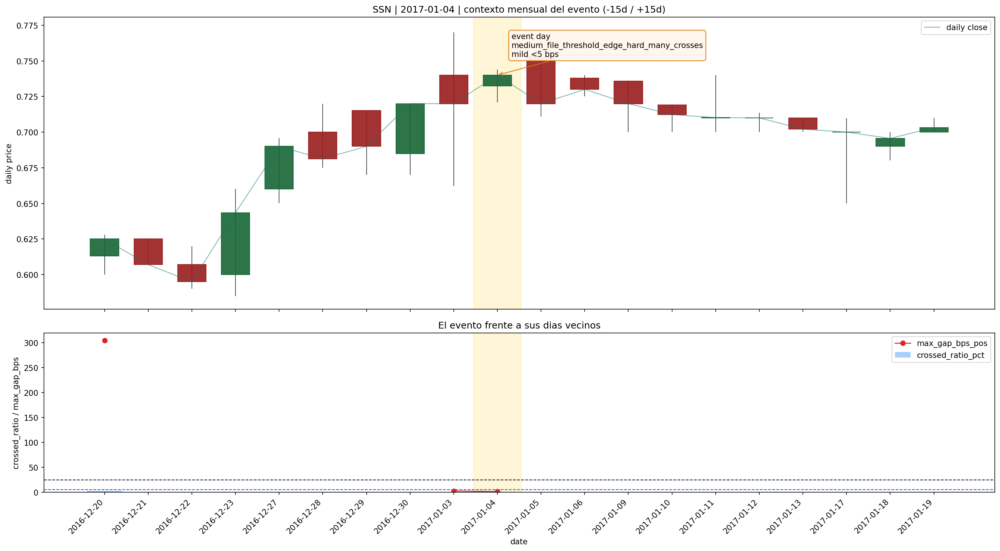

#### 00b Event Month Quotes Context
Esta imagen responde a la pregunta de recurrencia mensual dentro de `quotes`: el problema se concentra en el evento o reaparece en varias sesiones. Arriba concatena sesiones con datos disponibles; abajo resume cobertura diaria, `crossed_ratio_pct` y `max_gap_bps_pos`. La decision que cambia es si el caso debe leerse como episodio puntual o como sintoma de una fase repetida de libro degradado. El error que evita es extrapolar desde un unico dia a todo el mes sin evidencia.

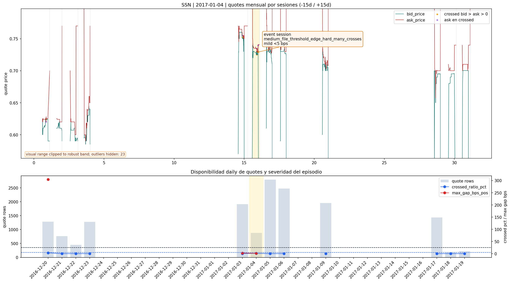

#### 01 Raw Window
Esta imagen responde a la primera pregunta decisiva del caso: el crossed observado es economicamente bastante fuerte para justificar un cambio de clase. Arriba ensena la geometria exacta del tramo conflictivo; abajo convierte esa geometria a bps y la enfrenta a los cortes `5 bps` y `25 bps`. El regimen dominante es `mild <5 bps`. La decision que cambia es pasar de anomalia interpretable a `review` o `bad`. El error que evita es decidir por apariencia visual sin medir el dano economico real del crossed. En terminos de pipeline, este panel decide si el problema afecta solo a la lectura forense o si invalida simulacion de ejecucion y microstructure features.

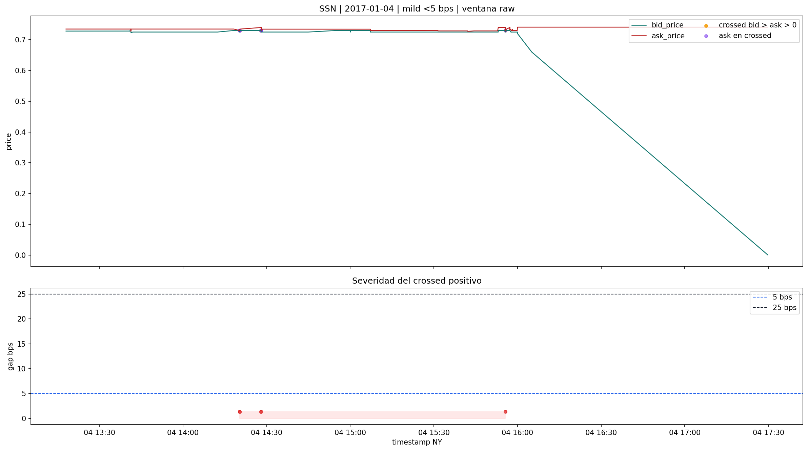

#### 02 Full Session Context
Esta imagen responde a la pregunta de extension intradiaria: el dano esta confinado a un bloque corto o contamina la sesion completa. Arriba se ve toda la sesion `04:00-20:00 NY`; abajo el `gap_bps` firmado. La decision que cambia es si el consumo debe penalizar solo un tramo o desechar el dia entero para uso operativo. El error que evita es tratar una cicatriz local como ruina total o, al reves, minimizar una degradacion distribuida a lo largo del dia. En ejecucion esto decide si la sesion puede seguir usandose con restricciones; en ML decide si las features intradiarias conservan significado economico.

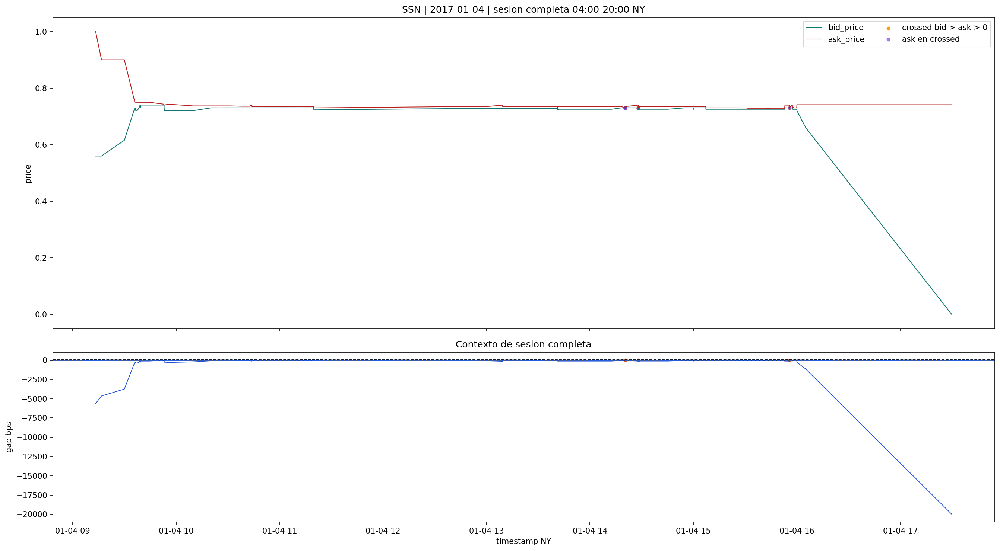

#### 03 Structure Diagnostics
Este panel responde a la pregunta de naturaleza del fallo: contradiccion economica genuina o mezcla con degeneracion estructural. Separa `ask=0` de `ask>0`, muestra la distribucion de `gap_bps` y resume patrones de integerizacion. La decision que cambia es como interpretar el dano: mercado localmente roto, artefacto de representacion o combinacion de ambos. El error que evita es sobrediagnosticar crossed reales cuando parte de la senal proviene de estructura degenerada del libro. Esta lectura afecta directamente a que el caso vaya a exclusion dura, a bandera contextual o a simple reconciliacion tecnica.

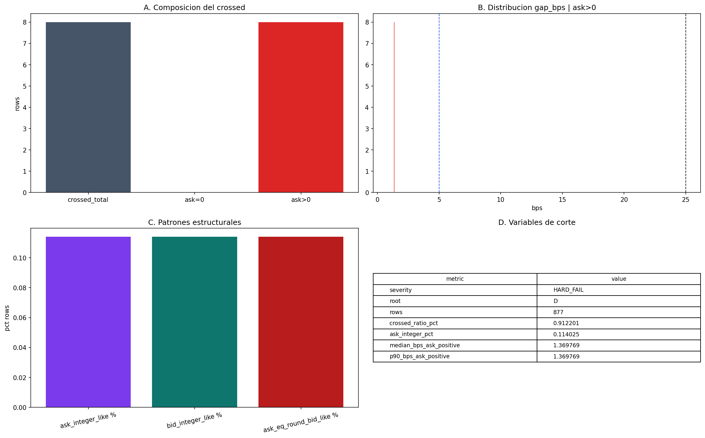

#### 04 Summary Card
Esta tarjeta responde a la pregunta de auditabilidad: cuales son exactamente las variables que sostienen la conclusion. Reune `severity`, `root`, `crossed_ratio_pct`, `ask_integer_pct`, `median_bps_ask_positive` y `p90_bps_ask_positive`. La decision que cambia es pasar de impresion visual a regla verificable. El error que evita es que dos inspectores lleguen a conclusiones distintas mirando la misma imagen sin una base numerica comun. Para gobernanza del proyecto, este panel es el que vuelve reproducible la decision para backtest, ML y auditoria.

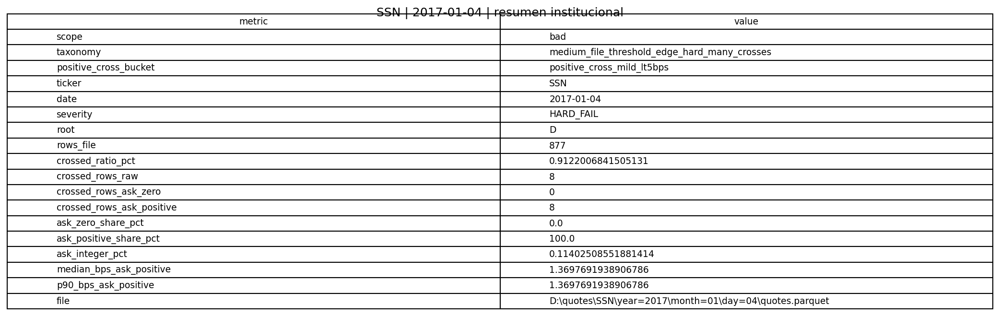

---
