# Trades inspection visual dossier v0.1

## Documentos fuente

- `inspection_dossiers/trades/trades_global_universe_readout_v0_1.md` (`740` lines, `19` headings, `14` images)
- `inspection_dossiers/trades/population_evidence_packs/trades_population_readout_v0_1.md` (`222` lines, `24` headings, `3` images)
- `inspection_dossiers/trades/good_justification/trades_good_cases_v0_1.md` (`91` lines, `17` headings, `2` images)
- `inspection_dossiers/trades/flagged_case_evidence_packs/trades_review_cases_v0_1.md` (`322` lines, `62` headings, `8` images)
- `inspection_dossiers/trades/family_case_evidence_packs/bad_data/bad_data_cases_v0_1.md` (`2310` lines, `69` headings, `62` images)
- `inspection_dossiers/trades/family_case_evidence_packs/good/good_cases_v0_1.md` (`1933` lines, `113` headings, `106` images)
- `inspection_dossiers/trades/family_case_evidence_packs/reference_scale_mismatch/reference_scale_mismatch_cases_v0_1.md` (`1100` lines, `67` headings, `60` images)
- `inspection_dossiers/trades/family_case_evidence_packs/review/review_cases_v0_1.md` (`1094` lines, `67` headings, `60` images)
- `inspection_dossiers/trades/family_case_evidence_packs/review_1m_reference_alignment/review_1m_reference_alignment_cases_v0_1.md` (`1092` lines, `67` headings, `60` images)
- `inspection_dossiers/trades/family_case_evidence_packs/review_microstructure/review_microstructure_cases_v0_1.md` (`1112` lines, `67` headings, `60` images)
- `inspection_dossiers/trades/family_case_evidence_packs/review_no_1m_reference/review_no_1m_reference_cases_v0_1.md` (`1110` lines, `67` headings, `60` images)
- `inspection_dossiers/trades/family_case_evidence_packs/family_casepacks_index_v0_1.md` (`9` lines, `2` headings, `0` images)

## Menu

<a href="#trades-h-0001">Trades Global Universe Readout v0.1</a>

<ul>
  <li><a href="#trades-h-0002">Rol</a></li>
  <li><a href="#trades-h-0003">Resumen ejecutivo</a></li>
  <li><a href="#trades-h-0004">Distribucion final del universo</a></li>
  <li><a href="#trades-h-0005">Mezcla anual</a></li>
  <li><a href="#trades-h-0006">Escala y comparabilidad</a></li>
  <li><a href="#trades-h-0007">Firmas duras por label</a></li>
  <li><a href="#trades-h-0008">Severidad frente a `daily`</a></li>
  <li><a href="#trades-h-0009">Severidad frente a `1m`</a></li>
  <li><a href="#trades-h-0010">Duplicacion y odd-lots</a></li>
  <li><a href="#trades-h-0011">Cobertura del arbitro `1m`</a></li>
  <li><a href="#trades-h-0012">Rehabilitacion de `review`</a></li>
  <li><a href="#trades-h-0013">`bad_data` por subfamilia visual</a></li>
  <li><a href="#trades-h-0014">`review_microstructure` por textura dominante</a></li>
  <li><a href="#trades-h-0015">`reference_scale_mismatch` por bucket de escala</a></li>
  <li><a href="#trades-h-0016">`review` por severidad interna de rehabilitacion</a></li>
  <li><a href="#trades-h-0017">Veredicto institucional</a></li>
  <li><a href="#trades-h-0018">Resumen tecnico critico para backtest y ML</a></li>
  <li><a href="#trades-h-0019">Indice de referencias tecnicas</a></li>
</ul>

<a href="#trades-h-0020">Trades Population Readout v0.1</a>

<ul>
  <li><a href="#trades-h-0021">1. Rol</a></li>
  <li><a href="#trades-h-0022">2. Tres niveles que no deben mezclarse</a></li>
  <li>
    

      
<a href="#trades-h-0023">3. Primera foto: shard state actual</a>

      <ul>
        <li><a href="#trades-h-0024">Que muestra</a></li>
        <li><a href="#trades-h-0025">Que conclusion debe sacar el lector</a></li>
        <li><a href="#trades-h-0026">La paradoja del `good` diminuto</a></li>
        <li><a href="#trades-h-0027">Consecuencia metodologica</a></li>
      </ul>
    

  </li>
  <li>
    

      
<a href="#trades-h-0028">4. Segunda foto: residuo D full por bucket final</a>

      <ul>
        <li><a href="#trades-h-0029">Que muestra</a></li>
        <li><a href="#trades-h-0030">Que conclusion debe sacar el lector</a></li>
        <li><a href="#trades-h-0031">Consecuencia metodologica</a></li>
      </ul>
    

  </li>
  <li>
    

      
<a href="#trades-h-0032">5. Tercera foto: contaminacion de escala por bucket</a>

      <ul>
        <li><a href="#trades-h-0033">Que muestra</a></li>
        <li><a href="#trades-h-0034">Lectura inteligente</a></li>
        <li><a href="#trades-h-0035">Que conclusion debe sacar el lector</a></li>
        <li><a href="#trades-h-0036">Consecuencia para el proyecto</a></li>
      </ul>
    

  </li>
  <li><a href="#trades-h-0037">6. Conclusiones poblacionales</a></li>
  <li>
    

      
<a href="#trades-h-0038">7. Que parte de esa masa parece recuperable hoy</a>

      <ul>
        <li><a href="#trades-h-0039">Bucket `review`</a></li>
        <li><a href="#trades-h-0040">Bucket `review_microstructure`</a></li>
        <li><a href="#trades-h-0041">Bucket `review_1m_reference_alignment`</a></li>
        <li><a href="#trades-h-0042">Que responde esta seccion</a></li>
        <li><a href="#trades-h-0043">Consecuencia</a></li>
      </ul>
    

  </li>
</ul>

<a href="#trades-h-0044">Trades Good Cases v0.1</a>

<ul>
  <li>
    

      
<a href="#trades-h-0045">1. Rol</a>

      <ul>
        <li><a href="#trades-h-0046">Responde</a></li>
        <li><a href="#trades-h-0047">No responde</a></li>
      </ul>
    

  </li>
  <li>
    

      
<a href="#trades-h-0048">2. Caso DMYS 2022-09-06</a>

      <ul>
        <li><a href="#trades-h-0049">Que muestra la imagen</a></li>
        <li><a href="#trades-h-0050">Que pregunta responde</a></li>
        <li><a href="#trades-h-0051">Que conclusion debe sacar el lector</a></li>
        <li><a href="#trades-h-0052">Que decision cambia</a></li>
        <li><a href="#trades-h-0053">Que no debe concluir</a></li>
        <li><a href="#trades-h-0054">Que pipeline afecta</a></li>
      </ul>
    

  </li>
  <li>
    

      
<a href="#trades-h-0055">3. Caso CLSN 2016-05-16</a>

      <ul>
        <li><a href="#trades-h-0056">Lectura analitica</a></li>
        <li><a href="#trades-h-0057">Que pregunta responde</a></li>
        <li><a href="#trades-h-0058">Que error metodologico evita</a></li>
      </ul>
    

  </li>
  <li>
    

      
<a href="#trades-h-0059">4. Que ensena la cola good</a>

      <ul>
        <li><a href="#trades-h-0060">Consecuencia</a></li>
      </ul>
    

  </li>
</ul>

<a href="#trades-h-0061">Trades Review Cases v0.1</a>

<ul>
  <li><a href="#trades-h-0062">1. Rol</a></li>
  <li>
    

      
<a href="#trades-h-0063">2. `reference_scale_mismatch`</a>

      <ul>
        <li><a href="#trades-h-0064">Que significa este bucket</a></li>
        <li><a href="#trades-h-0065">Responde</a></li>
        <li><a href="#trades-h-0066">No responde</a></li>
        <li>
          

            
<a href="#trades-h-0067">Caso SGA 2009-01-05</a>

            <ul>
              <li><a href="#trades-h-0068">Que muestra la imagen</a></li>
              <li><a href="#trades-h-0069">Que pregunta responde</a></li>
              <li><a href="#trades-h-0070">Que conclusion debe sacar el lector</a></li>
              <li><a href="#trades-h-0071">Que no debe concluir</a></li>
              <li><a href="#trades-h-0072">Que decision cambia</a></li>
              <li><a href="#trades-h-0073">Que error metodologico evita</a></li>
              <li><a href="#trades-h-0074">Que pipeline afecta</a></li>
            </ul>
          

        </li>
        <li>
          

            
<a href="#trades-h-0075">Caso LPCN 2014-07-07</a>

            <ul>
              <li><a href="#trades-h-0076">Lectura analitica</a></li>
              <li><a href="#trades-h-0077">Que pregunta responde</a></li>
              <li><a href="#trades-h-0078">Consecuencia operativa</a></li>
            </ul>
          

        </li>
      </ul>
    

  </li>
  <li>
    

      
<a href="#trades-h-0079">3. `review_microstructure`</a>

      <ul>
        <li><a href="#trades-h-0080">Que significa este bucket</a></li>
        <li><a href="#trades-h-0081">Responde</a></li>
        <li><a href="#trades-h-0082">No responde</a></li>
        <li>
          

            
<a href="#trades-h-0083">Caso QRTEB 2019-07-24</a>

            <ul>
              <li><a href="#trades-h-0084">Que muestra la imagen</a></li>
              <li><a href="#trades-h-0085">Que pregunta responde</a></li>
              <li><a href="#trades-h-0086">Que conclusion debe sacar el lector</a></li>
              <li><a href="#trades-h-0087">Que error metodologico evita</a></li>
              <li><a href="#trades-h-0088">Que no resuelve</a></li>
            </ul>
          

        </li>
        <li>
          

            
<a href="#trades-h-0089">Caso CZFS 2022-08-11</a>

            <ul>
              <li><a href="#trades-h-0090">Lectura analitica</a></li>
              <li><a href="#trades-h-0091">Que pregunta responde</a></li>
              <li><a href="#trades-h-0092">Consecuencia operativa</a></li>
            </ul>
          

        </li>
      </ul>
    

  </li>
  <li>
    

      
<a href="#trades-h-0093">4. `review_1m_reference_alignment`</a>

      <ul>
        <li><a href="#trades-h-0094">Que significa este bucket</a></li>
        <li><a href="#trades-h-0095">Responde</a></li>
        <li><a href="#trades-h-0096">No responde</a></li>
        <li>
          

            
<a href="#trades-h-0097">Caso RELV 2018-06-07</a>

            <ul>
              <li><a href="#trades-h-0098">Lectura analitica</a></li>
              <li><a href="#trades-h-0099">Que pregunta responde</a></li>
              <li><a href="#trades-h-0100">Consecuencia operativa</a></li>
            </ul>
          

        </li>
        <li>
          

            
<a href="#trades-h-0101">Caso METC 2021-03-22</a>

            <ul>
              <li><a href="#trades-h-0102">Lectura analitica</a></li>
              <li><a href="#trades-h-0103">Que no debe concluir</a></li>
              <li><a href="#trades-h-0104">Que pipeline afecta</a></li>
            </ul>
          

        </li>
      </ul>
    

  </li>
  <li>
    

      
<a href="#trades-h-0105">5. `review_no_1m_reference`</a>

      <ul>
        <li><a href="#trades-h-0106">Que significa este bucket</a></li>
        <li><a href="#trades-h-0107">Responde</a></li>
        <li><a href="#trades-h-0108">No responde</a></li>
        <li>
          

            
<a href="#trades-h-0109">Caso GLBL 2024-09-19</a>

            <ul>
              <li><a href="#trades-h-0110">Lectura analitica</a></li>
              <li><a href="#trades-h-0111">Que pregunta responde</a></li>
              <li><a href="#trades-h-0112">Consecuencia operativa</a></li>
              <li><a href="#trades-h-0113">Error metodologico que evita</a></li>
            </ul>
          

        </li>
      </ul>
    

  </li>
  <li>
    

      
<a href="#trades-h-0114">6. `review` generico</a>

      <ul>
        <li><a href="#trades-h-0115">Que significa este bucket</a></li>
        <li><a href="#trades-h-0116">Responde</a></li>
        <li><a href="#trades-h-0117">No responde</a></li>
        <li>
          

            
<a href="#trades-h-0118">Caso TOF 2010-06-21</a>

            <ul>
              <li><a href="#trades-h-0119">Lectura analitica</a></li>
              <li><a href="#trades-h-0120">Que pregunta responde</a></li>
              <li><a href="#trades-h-0121">Que decision cambia</a></li>
            </ul>
          

        </li>
      </ul>
    

  </li>
  <li><a href="#trades-h-0122">7. Conclusion del bloque review</a></li>
</ul>

<a href="#trades-h-0123">Trades Bad Data | muestra estratificada</a>

<ul>
  <li><a href="#trades-h-0124">Rol</a></li>
  <li><a href="#trades-h-0125">Que significa esta familia</a></li>
  <li><a href="#trades-h-0126">Responde</a></li>
  <li><a href="#trades-h-0127">No responde</a></li>
  <li><a href="#trades-h-0128">Consecuencia</a></li>
  <li><a href="#trades-h-0129">Mapa general del universo</a></li>
  <li><a href="#trades-h-0130">Mapa general de firmas duras dentro de `bad_data`</a></li>
  <li>
    

      
<a href="#trades-h-0131">Casos</a>

      <ul>
        <li><a href="#trades-h-0132">ASTI | 2007-12-24</a></li>
        <li><a href="#trades-h-0133">ASTI | 2009-10-27</a></li>
        <li><a href="#trades-h-0134">ASTI | 2010-11-26</a></li>
        <li><a href="#trades-h-0135">ASTI | 2011-01-05</a></li>
        <li><a href="#trades-h-0136">DCTH | 2005-12-29</a></li>
        <li><a href="#trades-h-0137">WSBF | 2009-08-14</a></li>
        <li><a href="#trades-h-0138">CWBC | 2006-01-10</a></li>
        <li><a href="#trades-h-0139">FSB | 2006-05-03</a></li>
        <li><a href="#trades-h-0140">GIA | 2010-09-01</a></li>
        <li><a href="#trades-h-0141">NTN | 2007-08-14</a></li>
        <li><a href="#trades-h-0142">TOPS | 2012-06-21</a></li>
        <li><a href="#trades-h-0143">ASTI | 2009-06-05</a></li>
        <li><a href="#trades-h-0144">ASTI | 2011-04-04</a></li>
        <li><a href="#trades-h-0145">ASTI | 2012-03-02</a></li>
        <li><a href="#trades-h-0146">CZNC | 2005-08-12</a></li>
        <li><a href="#trades-h-0147">PMD | 2010-11-16</a></li>
        <li><a href="#trades-h-0148">PMD | 2011-01-28</a></li>
        <li><a href="#trades-h-0149">PMD | 2011-12-13</a></li>
        <li><a href="#trades-h-0150">PMD | 2012-06-28</a></li>
        <li><a href="#trades-h-0151">ESA.U | 2011-04-25</a></li>
        <li><a href="#trades-h-0152">IHT | 2009-02-25</a></li>
        <li><a href="#trades-h-0153">TOPS | 2014-09-29</a></li>
        <li><a href="#trades-h-0154">ANTX | 2015-05-27</a></li>
        <li><a href="#trades-h-0155">ASTI | 2013-02-14</a></li>
        <li><a href="#trades-h-0156">CBAN | 2015-02-20</a></li>
        <li><a href="#trades-h-0157">LCUT | 2017-05-22</a></li>
        <li><a href="#trades-h-0158">PMD | 2018-01-03</a></li>
        <li><a href="#trades-h-0159">RELV | 2018-09-18</a></li>
        <li><a href="#trades-h-0160">SMIT | 2014-06-17</a></li>
        <li><a href="#trades-h-0161">GPRK | 2017-03-21</a></li>
        <li><a href="#trades-h-0162">PMD | 2014-12-18</a></li>
        <li><a href="#trades-h-0163">PMD | 2015-12-30</a></li>
        <li><a href="#trades-h-0164">QRTEA | 2018-07-19</a></li>
        <li><a href="#trades-h-0165">RELV | 2016-12-09</a></li>
        <li><a href="#trades-h-0166">RELV | 2017-08-10</a></li>
        <li><a href="#trades-h-0167">SBSI | 2017-05-19</a></li>
        <li><a href="#trades-h-0168">TOPS | 2013-12-26</a></li>
        <li><a href="#trades-h-0169">TOPS | 2015-01-22</a></li>
        <li><a href="#trades-h-0170">TOPS | 2016-07-07</a></li>
        <li><a href="#trades-h-0171">KELYB | 2016-06-02</a></li>
        <li><a href="#trades-h-0172">IHC | 2020-11-27</a></li>
        <li><a href="#trades-h-0173">AIM | 2021-06-24</a></li>
        <li><a href="#trades-h-0174">ALTS | 2020-06-18</a></li>
        <li><a href="#trades-h-0175">ALTS | 2020-09-22</a></li>
        <li><a href="#trades-h-0176">BH.A | 2025-01-15</a></li>
        <li><a href="#trades-h-0177">CRSA | 2021-03-16</a></li>
        <li><a href="#trades-h-0178">GLBL | 2024-11-01</a></li>
        <li><a href="#trades-h-0179">HAIN | 2021-01-14</a></li>
        <li><a href="#trades-h-0180">IQST | 2025-08-29</a></li>
        <li><a href="#trades-h-0181">LENS | 2025-06-12</a></li>
        <li><a href="#trades-h-0182">LENS | 2025-12-12</a></li>
        <li><a href="#trades-h-0183">NEWTI | 2019-01-03</a></li>
        <li><a href="#trades-h-0184">SFE | 2023-03-01</a></li>
        <li><a href="#trades-h-0185">AIM | 2023-10-16</a></li>
        <li><a href="#trades-h-0186">METC | 2020-05-26</a></li>
        <li><a href="#trades-h-0187">QRTEA | 2019-11-08</a></li>
        <li><a href="#trades-h-0188">RELV | 2019-12-26</a></li>
        <li><a href="#trades-h-0189">TTSH | 2021-11-18</a></li>
        <li><a href="#trades-h-0190">NCL | 2023-12-19</a></li>
        <li><a href="#trades-h-0191">DTCK | 2026-02-19</a></li>
      </ul>
    

  </li>
</ul>

<a href="#trades-h-0192">Trades Good | enumeracion completa</a>

<ul>
  <li><a href="#trades-h-0193">Rol</a></li>
  <li><a href="#trades-h-0194">Que significa esta familia</a></li>
  <li><a href="#trades-h-0195">Responde</a></li>
  <li><a href="#trades-h-0196">No responde</a></li>
  <li><a href="#trades-h-0197">Consecuencia</a></li>
  <li>
    

      
<a href="#trades-h-0198">Casos</a>

      <ul>
        <li><a href="#trades-h-0199">BH | 2010-11-22</a></li>
        <li><a href="#trades-h-0200">BH | 2011-04-29</a></li>
        <li><a href="#trades-h-0201">BH | 2012-04-16</a></li>
        <li><a href="#trades-h-0202">BH | 2012-10-26</a></li>
        <li><a href="#trades-h-0203">BH | 2012-11-06</a></li>
        <li><a href="#trades-h-0204">BH | 2012-11-21</a></li>
        <li><a href="#trades-h-0205">BH | 2012-12-03</a></li>
        <li><a href="#trades-h-0206">ALTS | 2016-01-19</a></li>
        <li><a href="#trades-h-0207">BH | 2013-10-17</a></li>
        <li><a href="#trades-h-0208">BH.A | 2018-08-17</a></li>
        <li><a href="#trades-h-0209">BH.A | 2018-10-02</a></li>
        <li><a href="#trades-h-0210">BH.A | 2018-11-09</a></li>
        <li><a href="#trades-h-0211">CBR | 2015-12-24</a></li>
        <li><a href="#trades-h-0212">CLSN | 2016-05-16</a></li>
        <li><a href="#trades-h-0213">DIT | 2018-04-02</a></li>
        <li><a href="#trades-h-0214">DIT | 2018-04-19</a></li>
        <li><a href="#trades-h-0215">DIT | 2018-05-15</a></li>
        <li><a href="#trades-h-0216">DIT | 2018-06-06</a></li>
        <li><a href="#trades-h-0217">DIT | 2018-08-01</a></li>
        <li><a href="#trades-h-0218">DIT | 2018-08-13</a></li>
        <li><a href="#trades-h-0219">DIT | 2018-08-16</a></li>
        <li><a href="#trades-h-0220">DIT | 2018-12-07</a></li>
        <li><a href="#trades-h-0221">DIT | 2018-12-19</a></li>
        <li><a href="#trades-h-0222">GSD | 2017-05-30</a></li>
        <li><a href="#trades-h-0223">NLST | 2017-01-12</a></li>
        <li><a href="#trades-h-0224">OOMA | 2016-12-08</a></li>
        <li><a href="#trades-h-0225">BH.A | 2019-05-23</a></li>
        <li><a href="#trades-h-0226">BH.A | 2019-07-02</a></li>
        <li><a href="#trades-h-0227">BH.A | 2019-07-18</a></li>
        <li><a href="#trades-h-0228">BH.A | 2019-07-25</a></li>
        <li><a href="#trades-h-0229">BH.A | 2019-07-31</a></li>
        <li><a href="#trades-h-0230">BH.A | 2020-02-10</a></li>
        <li><a href="#trades-h-0231">BH.A | 2023-07-20</a></li>
        <li><a href="#trades-h-0232">BH.A | 2023-10-27</a></li>
        <li><a href="#trades-h-0233">BHRB | 2022-11-29</a></li>
        <li><a href="#trades-h-0234">BHRB | 2022-12-20</a></li>
        <li><a href="#trades-h-0235">BHRB | 2022-12-23</a></li>
        <li><a href="#trades-h-0236">BHRB | 2022-12-29</a></li>
        <li><a href="#trades-h-0237">BHRB | 2023-01-11</a></li>
        <li><a href="#trades-h-0238">BHRB | 2023-02-27</a></li>
        <li><a href="#trades-h-0239">BHRB | 2023-03-17</a></li>
        <li><a href="#trades-h-0240">BHRB | 2023-04-06</a></li>
        <li><a href="#trades-h-0241">DIT | 2019-01-04</a></li>
        <li><a href="#trades-h-0242">DIT | 2019-01-07</a></li>
        <li><a href="#trades-h-0243">DIT | 2019-01-15</a></li>
        <li><a href="#trades-h-0244">DIT | 2019-01-18</a></li>
        <li><a href="#trades-h-0245">DIT | 2019-01-30</a></li>
        <li><a href="#trades-h-0246">DIT | 2019-09-05</a></li>
        <li><a href="#trades-h-0247">DIT | 2019-09-13</a></li>
        <li><a href="#trades-h-0248">DIT | 2019-10-01</a></li>
        <li><a href="#trades-h-0249">DIT | 2019-10-02</a></li>
        <li><a href="#trades-h-0250">DIT | 2019-10-23</a></li>
        <li><a href="#trades-h-0251">DIT | 2019-11-08</a></li>
        <li><a href="#trades-h-0252">DIT | 2019-12-11</a></li>
        <li><a href="#trades-h-0253">DIT | 2019-12-12</a></li>
        <li><a href="#trades-h-0254">DIT | 2020-01-29</a></li>
        <li><a href="#trades-h-0255">DIT | 2020-02-13</a></li>
        <li><a href="#trades-h-0256">DIT | 2020-03-12</a></li>
        <li><a href="#trades-h-0257">DIT | 2020-03-31</a></li>
        <li><a href="#trades-h-0258">DIT | 2020-04-15</a></li>
        <li><a href="#trades-h-0259">DIT | 2020-06-29</a></li>
        <li><a href="#trades-h-0260">DIT | 2020-06-30</a></li>
        <li><a href="#trades-h-0261">DIT | 2020-08-07</a></li>
        <li><a href="#trades-h-0262">DIT | 2020-10-21</a></li>
        <li><a href="#trades-h-0263">DIT | 2020-10-28</a></li>
        <li><a href="#trades-h-0264">DIT | 2020-12-09</a></li>
        <li><a href="#trades-h-0265">DIT | 2023-04-21</a></li>
        <li><a href="#trades-h-0266">DIT | 2024-09-04</a></li>
        <li><a href="#trades-h-0267">DIT | 2025-07-22</a></li>
        <li><a href="#trades-h-0268">DMYS | 2022-09-06</a></li>
        <li><a href="#trades-h-0269">FOSLL | 2021-11-23</a></li>
        <li><a href="#trades-h-0270">MCHB | 2022-03-10</a></li>
        <li><a href="#trades-h-0271">MCHB | 2022-04-12</a></li>
        <li><a href="#trades-h-0272">MCHB | 2022-04-21</a></li>
        <li><a href="#trades-h-0273">MCHB | 2022-04-22</a></li>
        <li><a href="#trades-h-0274">MCHB | 2022-08-01</a></li>
        <li><a href="#trades-h-0275">MCHB | 2022-12-15</a></li>
        <li><a href="#trades-h-0276">MCHB | 2023-02-03</a></li>
        <li><a href="#trades-h-0277">MCHB | 2023-02-21</a></li>
        <li><a href="#trades-h-0278">MCHB | 2023-04-28</a></li>
        <li><a href="#trades-h-0279">MCHB | 2023-05-01</a></li>
        <li><a href="#trades-h-0280">MCHB | 2023-06-15</a></li>
        <li><a href="#trades-h-0281">MCHB | 2023-11-10</a></li>
        <li><a href="#trades-h-0282">MCHB | 2023-12-20</a></li>
        <li><a href="#trades-h-0283">MCHB | 2024-02-23</a></li>
        <li><a href="#trades-h-0284">MCHB | 2024-04-01</a></li>
        <li><a href="#trades-h-0285">MCHB | 2024-05-06</a></li>
        <li><a href="#trades-h-0286">MCHB | 2024-05-24</a></li>
        <li><a href="#trades-h-0287">MCHB | 2024-06-06</a></li>
        <li><a href="#trades-h-0288">MCHB | 2024-06-20</a></li>
        <li><a href="#trades-h-0289">MCHB | 2024-10-03</a></li>
        <li><a href="#trades-h-0290">MCHB | 2025-02-19</a></li>
        <li><a href="#trades-h-0291">MCHB | 2025-02-24</a></li>
        <li><a href="#trades-h-0292">MCHB | 2025-03-04</a></li>
        <li><a href="#trades-h-0293">MCHB | 2025-04-01</a></li>
        <li><a href="#trades-h-0294">MCHB | 2025-05-29</a></li>
        <li><a href="#trades-h-0295">MCHB | 2025-07-02</a></li>
        <li><a href="#trades-h-0296">MCHB | 2025-07-03</a></li>
        <li><a href="#trades-h-0297">MCHB | 2025-07-07</a></li>
        <li><a href="#trades-h-0298">MCHB | 2025-07-08</a></li>
        <li><a href="#trades-h-0299">MCHB | 2025-07-10</a></li>
        <li><a href="#trades-h-0300">MCHB | 2025-07-18</a></li>
        <li><a href="#trades-h-0301">MCHB | 2025-07-21</a></li>
        <li><a href="#trades-h-0302">MCHB | 2025-07-29</a></li>
        <li><a href="#trades-h-0303">MCHB | 2025-08-14</a></li>
        <li><a href="#trades-h-0304">MCHB | 2025-08-28</a></li>
      </ul>
    

  </li>
</ul>

<a href="#trades-h-0305">Trades Reference Scale Mismatch | muestra estratificada</a>

<ul>
  <li><a href="#trades-h-0306">Rol</a></li>
  <li><a href="#trades-h-0307">Que significa esta familia</a></li>
  <li><a href="#trades-h-0308">Responde</a></li>
  <li><a href="#trades-h-0309">No responde</a></li>
  <li><a href="#trades-h-0310">Consecuencia</a></li>
  <li>
    

      
<a href="#trades-h-0311">Casos</a>

      <ul>
        <li><a href="#trades-h-0312">BTM | 2011-12-30</a></li>
        <li><a href="#trades-h-0313">DYNT | 2008-05-30</a></li>
        <li><a href="#trades-h-0314">MFI | 2008-01-10</a></li>
        <li><a href="#trades-h-0315">SURG | 2007-06-07</a></li>
        <li><a href="#trades-h-0316">CSPI | 2007-11-14</a></li>
        <li><a href="#trades-h-0317">MCBC | 2005-04-14</a></li>
        <li><a href="#trades-h-0318">SPEX | 2008-05-23</a></li>
        <li><a href="#trades-h-0319">TAT | 2012-10-04</a></li>
        <li><a href="#trades-h-0320">AEMD | 2016-03-16</a></li>
        <li><a href="#trades-h-0321">ICON | 2014-10-08</a></li>
        <li><a href="#trades-h-0322">OHGI | 2017-10-27</a></li>
        <li><a href="#trades-h-0323">SPCB | 2018-01-11</a></li>
        <li><a href="#trades-h-0324">WHLR | 2014-07-24</a></li>
        <li><a href="#trades-h-0325">LARK | 2016-08-24</a></li>
        <li><a href="#trades-h-0326">ACFN | 2013-10-10</a></li>
        <li><a href="#trades-h-0327">LARK | 2018-01-03</a></li>
        <li><a href="#trades-h-0328">IDXG | 2016-12-12</a></li>
        <li><a href="#trades-h-0329">BEBE | 2014-07-21</a></li>
        <li><a href="#trades-h-0330">HHS | 2015-11-30</a></li>
        <li><a href="#trades-h-0331">ATV | 2017-10-13</a></li>
        <li><a href="#trades-h-0332">ACRX | 2013-04-10</a></li>
        <li><a href="#trades-h-0333">ATHX | 2021-04-28</a></li>
        <li><a href="#trades-h-0334">CHSN | 2025-07-24</a></li>
        <li><a href="#trades-h-0335">RVYL | 2025-09-23</a></li>
        <li><a href="#trades-h-0336">SCLX | 2023-05-18</a></li>
        <li><a href="#trades-h-0337">SILO | 2022-02-25</a></li>
        <li><a href="#trades-h-0338">SNWV | 2022-09-20</a></li>
        <li><a href="#trades-h-0339">TENX | 2021-05-25</a></li>
        <li><a href="#trades-h-0340">TIVC | 2024-02-16</a></li>
        <li><a href="#trades-h-0341">WWR | 2019-04-17</a></li>
        <li><a href="#trades-h-0342">DOUG | 2022-11-09</a></li>
        <li><a href="#trades-h-0343">PMD | 2024-11-12</a></li>
        <li><a href="#trades-h-0344">ACON | 2024-10-14</a></li>
        <li><a href="#trades-h-0345">YYAI | 2024-04-19</a></li>
        <li><a href="#trades-h-0346">OTRK | 2022-02-04</a></li>
        <li><a href="#trades-h-0347">SNCR | 2020-10-20</a></li>
        <li><a href="#trades-h-0348">MTVA | 2024-12-06</a></li>
        <li><a href="#trades-h-0349">BKYI | 2019-05-23</a></li>
        <li><a href="#trades-h-0350">SOPA | 2023-08-21</a></li>
        <li><a href="#trades-h-0351">AROW | 2023-04-04</a></li>
        <li><a href="#trades-h-0352">ONCS | 2020-02-06</a></li>
        <li><a href="#trades-h-0353">PIK | 2022-01-11</a></li>
        <li><a href="#trades-h-0354">TPST | 2023-12-21</a></li>
        <li><a href="#trades-h-0355">BRBS | 2020-01-07</a></li>
        <li><a href="#trades-h-0356">DFDV | 2025-09-17</a></li>
        <li><a href="#trades-h-0357">IFBD | 2024-08-02</a></li>
        <li><a href="#trades-h-0358">EFSH | 2022-08-12</a></li>
        <li><a href="#trades-h-0359">INPX | 2023-12-08</a></li>
        <li><a href="#trades-h-0360">ADVM | 2019-10-09</a></li>
        <li><a href="#trades-h-0361">ADVM | 2021-06-04</a></li>
        <li><a href="#trades-h-0362">ANGI | 2021-06-24</a></li>
        <li><a href="#trades-h-0363">APRN | 2020-10-30</a></li>
        <li><a href="#trades-h-0364">OPAD | 2022-01-12</a></li>
        <li><a href="#trades-h-0365">BBGI | 2024-12-06</a></li>
        <li><a href="#trades-h-0366">GEGGL | 2024-02-20</a></li>
        <li><a href="#trades-h-0367">LUMO | 2022-04-01</a></li>
        <li><a href="#trades-h-0368">BBGI | 2023-07-18</a></li>
        <li><a href="#trades-h-0369">BPTH | 2020-10-19</a></li>
        <li><a href="#trades-h-0370">QLI | 2021-12-02</a></li>
        <li><a href="#trades-h-0371">LMFA | 2022-08-12</a></li>
      </ul>
    

  </li>
</ul>

<a href="#trades-h-0372">Trades Review Generico | muestra estratificada</a>

<ul>
  <li><a href="#trades-h-0373">Rol</a></li>
  <li><a href="#trades-h-0374">Que significa esta familia</a></li>
  <li><a href="#trades-h-0375">Responde</a></li>
  <li><a href="#trades-h-0376">No responde</a></li>
  <li><a href="#trades-h-0377">Consecuencia</a></li>
  <li>
    

      
<a href="#trades-h-0378">Casos</a>

      <ul>
        <li><a href="#trades-h-0379">APAC | 2008-10-10</a></li>
        <li><a href="#trades-h-0380">APOG | 2010-09-21</a></li>
        <li><a href="#trades-h-0381">CATO | 2010-08-12</a></li>
        <li><a href="#trades-h-0382">CAW | 2010-03-15</a></li>
        <li><a href="#trades-h-0383">CBNK | 2008-12-15</a></li>
        <li><a href="#trades-h-0384">CVGW | 2012-07-25</a></li>
        <li><a href="#trades-h-0385">CZWI | 2012-09-12</a></li>
        <li><a href="#trades-h-0386">DSPG | 2010-06-02</a></li>
        <li><a href="#trades-h-0387">GTN | 2010-03-09</a></li>
        <li><a href="#trades-h-0388">HRZN | 2011-11-03</a></li>
        <li><a href="#trades-h-0389">HSTM | 2008-02-15</a></li>
        <li><a href="#trades-h-0390">IMMR | 2006-11-28</a></li>
        <li><a href="#trades-h-0391">IVC | 2010-04-16</a></li>
        <li><a href="#trades-h-0392">MYGN | 2012-06-15</a></li>
        <li><a href="#trades-h-0393">ORRF | 2011-10-21</a></li>
        <li><a href="#trades-h-0394">PIC | 2012-10-25</a></li>
        <li><a href="#trades-h-0395">ROIAK | 2006-02-15</a></li>
        <li><a href="#trades-h-0396">SMMF | 2012-11-02</a></li>
        <li><a href="#trades-h-0397">SYPR | 2008-09-17</a></li>
        <li><a href="#trades-h-0398">LVNTA | 2014-03-25</a></li>
        <li><a href="#trades-h-0399">APLP | 2016-07-29</a></li>
        <li><a href="#trades-h-0400">ARDM | 2018-06-04</a></li>
        <li><a href="#trades-h-0401">BEAT | 2015-12-04</a></li>
        <li><a href="#trades-h-0402">BSRR | 2013-10-02</a></li>
        <li><a href="#trades-h-0403">GMLP | 2018-07-12</a></li>
        <li><a href="#trades-h-0404">JASN | 2017-02-27</a></li>
        <li><a href="#trades-h-0405">KTCC | 2013-09-09</a></li>
        <li><a href="#trades-h-0406">MDCA | 2018-06-08</a></li>
        <li><a href="#trades-h-0407">MOFG | 2014-10-31</a></li>
        <li><a href="#trades-h-0408">MSGN | 2018-08-22</a></li>
        <li><a href="#trades-h-0409">OXBR | 2018-12-24</a></li>
        <li><a href="#trades-h-0410">SENEB | 2013-08-19</a></li>
        <li><a href="#trades-h-0411">SIEB | 2016-12-09</a></li>
        <li><a href="#trades-h-0412">SMTX | 2018-08-03</a></li>
        <li><a href="#trades-h-0413">SVBI | 2017-08-02</a></li>
        <li><a href="#trades-h-0414">TRAK | 2013-01-31</a></li>
        <li><a href="#trades-h-0415">VOC | 2016-01-12</a></li>
        <li><a href="#trades-h-0416">WASH | 2015-01-06</a></li>
        <li><a href="#trades-h-0417">SFE | 2021-07-26</a></li>
        <li><a href="#trades-h-0418">STND | 2019-07-02</a></li>
        <li><a href="#trades-h-0419">ABUS | 2023-12-28</a></li>
        <li><a href="#trades-h-0420">BDN | 2023-04-25</a></li>
        <li><a href="#trades-h-0421">BRN | 2021-07-15</a></li>
        <li><a href="#trades-h-0422">CMT | 2019-04-09</a></li>
        <li><a href="#trades-h-0423">CORS | 2022-10-10</a></li>
        <li><a href="#trades-h-0424">CTEK | 2020-08-28</a></li>
        <li><a href="#trades-h-0425">ESQ | 2020-05-19</a></li>
        <li><a href="#trades-h-0426">EVH | 2025-04-29</a></li>
        <li><a href="#trades-h-0427">INAP | 2019-12-20</a></li>
        <li><a href="#trades-h-0428">IRET | 2024-06-06</a></li>
        <li><a href="#trades-h-0429">IVC | 2019-01-28</a></li>
        <li><a href="#trades-h-0430">JAQC | 2021-12-21</a></li>
        <li><a href="#trades-h-0431">MNSBP | 2023-11-14</a></li>
        <li><a href="#trades-h-0432">ONL | 2023-11-03</a></li>
        <li><a href="#trades-h-0433">PRTS | 2025-06-09</a></li>
        <li><a href="#trades-h-0434">QUOT | 2020-12-08</a></li>
        <li><a href="#trades-h-0435">RC | 2024-05-24</a></li>
        <li><a href="#trades-h-0436">TRX | 2020-10-20</a></li>
        <li><a href="#trades-h-0437">URG | 2025-04-28</a></li>
        <li><a href="#trades-h-0438">XERS | 2026-02-27</a></li>
      </ul>
    

  </li>
</ul>

<a href="#trades-h-0439">Trades Review 1m Reference Alignment | muestra estratificada</a>

<ul>
  <li><a href="#trades-h-0440">Rol</a></li>
  <li><a href="#trades-h-0441">Que significa esta familia</a></li>
  <li><a href="#trades-h-0442">Responde</a></li>
  <li><a href="#trades-h-0443">No responde</a></li>
  <li><a href="#trades-h-0444">Consecuencia</a></li>
  <li>
    

      
<a href="#trades-h-0445">Casos</a>

      <ul>
        <li><a href="#trades-h-0446">PMD | 2008-10-14</a></li>
        <li><a href="#trades-h-0447">PMD | 2005-09-01</a></li>
        <li><a href="#trades-h-0448">PMD | 2010-06-02</a></li>
        <li><a href="#trades-h-0449">PMD | 2010-06-03</a></li>
        <li><a href="#trades-h-0450">PMD | 2012-05-22</a></li>
        <li><a href="#trades-h-0451">PMD | 2012-07-20</a></li>
        <li><a href="#trades-h-0452">PMD | 2009-01-13</a></li>
        <li><a href="#trades-h-0453">GPRK | 2015-07-21</a></li>
        <li><a href="#trades-h-0454">QBAK | 2017-06-30</a></li>
        <li><a href="#trades-h-0455">QBAK | 2017-07-25</a></li>
        <li><a href="#trades-h-0456">FLGT | 2018-07-03</a></li>
        <li><a href="#trades-h-0457">GPRK | 2015-04-14</a></li>
        <li><a href="#trades-h-0458">GPRK | 2016-08-16</a></li>
        <li><a href="#trades-h-0459">GPRK | 2018-08-06</a></li>
        <li><a href="#trades-h-0460">PMD | 2013-10-10</a></li>
        <li><a href="#trades-h-0461">PMD | 2014-10-01</a></li>
        <li><a href="#trades-h-0462">PMD | 2016-03-23</a></li>
        <li><a href="#trades-h-0463">QBAK | 2018-06-12</a></li>
        <li><a href="#trades-h-0464">QBAK | 2018-09-05</a></li>
        <li><a href="#trades-h-0465">QBAK | 2018-09-06</a></li>
        <li><a href="#trades-h-0466">QBAK | 2018-12-13</a></li>
        <li><a href="#trades-h-0467">RELV | 2017-03-10</a></li>
        <li><a href="#trades-h-0468">GPRK | 2014-04-22</a></li>
        <li><a href="#trades-h-0469">GPRK | 2014-10-06</a></li>
        <li><a href="#trades-h-0470">GPRK | 2018-07-23</a></li>
        <li><a href="#trades-h-0471">GPRK | 2018-11-16</a></li>
        <li><a href="#trades-h-0472">METC | 2017-05-12</a></li>
        <li><a href="#trades-h-0473">AIM | 2020-09-01</a></li>
        <li><a href="#trades-h-0474">AIM | 2022-07-12</a></li>
        <li><a href="#trades-h-0475">AIM | 2022-09-22</a></li>
        <li><a href="#trades-h-0476">AIM | 2019-12-17</a></li>
        <li><a href="#trades-h-0477">AIM | 2021-10-29</a></li>
        <li><a href="#trades-h-0478">AIM | 2021-11-19</a></li>
        <li><a href="#trades-h-0479">AIM | 2022-02-24</a></li>
        <li><a href="#trades-h-0480">AIM | 2023-03-10</a></li>
        <li><a href="#trades-h-0481">AIM | 2023-06-30</a></li>
        <li><a href="#trades-h-0482">AIM | 2023-08-09</a></li>
        <li><a href="#trades-h-0483">AIM | 2025-10-27</a></li>
        <li><a href="#trades-h-0484">DTCK | 2023-09-26</a></li>
        <li><a href="#trades-h-0485">DTCK | 2023-10-24</a></li>
        <li><a href="#trades-h-0486">DTCK | 2023-11-17</a></li>
        <li><a href="#trades-h-0487">DTCK | 2024-04-15</a></li>
        <li><a href="#trades-h-0488">DTCK | 2024-10-10</a></li>
        <li><a href="#trades-h-0489">PMD | 2019-02-01</a></li>
        <li><a href="#trades-h-0490">QBAK | 2019-08-06</a></li>
        <li><a href="#trades-h-0491">QBAK | 2019-08-30</a></li>
        <li><a href="#trades-h-0492">RELV | 2019-06-25</a></li>
        <li><a href="#trades-h-0493">RVPH | 2021-10-07</a></li>
        <li><a href="#trades-h-0494">RVPH | 2021-11-29</a></li>
        <li><a href="#trades-h-0495">RVPH | 2022-08-22</a></li>
        <li><a href="#trades-h-0496">RVPH | 2023-12-26</a></li>
        <li><a href="#trades-h-0497">RVPH | 2024-08-22</a></li>
        <li><a href="#trades-h-0498">RVPH | 2025-03-10</a></li>
        <li><a href="#trades-h-0499">RVPH | 2025-06-23</a></li>
        <li><a href="#trades-h-0500">RVPH | 2026-02-17</a></li>
        <li><a href="#trades-h-0501">SFE | 2022-11-23</a></li>
        <li><a href="#trades-h-0502">CLAR | 2019-01-24</a></li>
        <li><a href="#trades-h-0503">CLAR | 2019-07-01</a></li>
        <li><a href="#trades-h-0504">GPRK | 2019-11-29</a></li>
        <li><a href="#trades-h-0505">RELV | 2019-06-10</a></li>
      </ul>
    

  </li>
</ul>

<a href="#trades-h-0506">Trades Review Microstructure | muestra estratificada</a>

<ul>
  <li><a href="#trades-h-0507">Rol</a></li>
  <li><a href="#trades-h-0508">Que significa esta familia</a></li>
  <li><a href="#trades-h-0509">Responde</a></li>
  <li><a href="#trades-h-0510">No responde</a></li>
  <li><a href="#trades-h-0511">Consecuencia</a></li>
  <li>
    

      
<a href="#trades-h-0512">Casos</a>

      <ul>
        <li><a href="#trades-h-0513">MLAB | 2015-04-17</a></li>
        <li><a href="#trades-h-0514">GBLI | 2016-04-04</a></li>
        <li><a href="#trades-h-0515">BSET | 2018-05-16</a></li>
        <li><a href="#trades-h-0516">NC | 2015-11-03</a></li>
        <li><a href="#trades-h-0517">WTBA | 2015-09-30</a></li>
        <li><a href="#trades-h-0518">EML | 2017-07-21</a></li>
        <li><a href="#trades-h-0519">NVEC | 2017-11-21</a></li>
        <li><a href="#trades-h-0520">TKAT | 2021-05-24</a></li>
        <li><a href="#trades-h-0521">GLTA | 2023-02-14</a></li>
        <li><a href="#trades-h-0522">SGC | 2023-02-16</a></li>
        <li><a href="#trades-h-0523">FXLV | 2023-12-05</a></li>
        <li><a href="#trades-h-0524">GCTS | 2024-10-04</a></li>
        <li><a href="#trades-h-0525">GGE | 2023-10-04</a></li>
        <li><a href="#trades-h-0526">GNAC | 2021-04-16</a></li>
        <li><a href="#trades-h-0527">IGAC | 2022-04-21</a></li>
        <li><a href="#trades-h-0528">PNBK | 2025-07-01</a></li>
        <li><a href="#trades-h-0529">RDW | 2024-01-29</a></li>
        <li><a href="#trades-h-0530">SCVX | 2022-04-12</a></li>
        <li><a href="#trades-h-0531">SRTS | 2022-04-04</a></li>
        <li><a href="#trades-h-0532">ATNI | 2020-01-31</a></li>
        <li><a href="#trades-h-0533">III | 2022-08-02</a></li>
        <li><a href="#trades-h-0534">LMPX | 2021-04-22</a></li>
        <li><a href="#trades-h-0535">MSL | 2019-06-07</a></li>
        <li><a href="#trades-h-0536">NRBO | 2024-04-01</a></li>
        <li><a href="#trades-h-0537">ODV | 2023-07-05</a></li>
        <li><a href="#trades-h-0538">ORIQ | 2025-10-22</a></li>
        <li><a href="#trades-h-0539">PTMN | 2023-06-15</a></li>
        <li><a href="#trades-h-0540">AMTB | 2021-10-14</a></li>
        <li><a href="#trades-h-0541">BAER | 2023-07-28</a></li>
        <li><a href="#trades-h-0542">GWRS | 2023-06-06</a></li>
        <li><a href="#trades-h-0543">GWRS | 2024-03-20</a></li>
        <li><a href="#trades-h-0544">PFIS | 2020-09-21</a></li>
        <li><a href="#trades-h-0545">RBB | 2025-12-15</a></li>
        <li><a href="#trades-h-0546">RVSB | 2023-07-27</a></li>
        <li><a href="#trades-h-0547">VIEW | 2023-11-01</a></li>
        <li><a href="#trades-h-0548">VRTS | 2023-05-17</a></li>
        <li><a href="#trades-h-0549">BIOX | 2024-01-23</a></li>
        <li><a href="#trades-h-0550">BRLS | 2025-10-22</a></li>
        <li><a href="#trades-h-0551">CABO | 2019-03-20</a></li>
        <li><a href="#trades-h-0552">CVU | 2023-03-24</a></li>
        <li><a href="#trades-h-0553">EGLE | 2025-06-09</a></li>
        <li><a href="#trades-h-0554">LFCR | 2023-08-14</a></li>
        <li><a href="#trades-h-0555">PTVCB | 2019-09-26</a></li>
        <li><a href="#trades-h-0556">TACT | 2025-05-01</a></li>
        <li><a href="#trades-h-0557">TITN | 2023-10-30</a></li>
        <li><a href="#trades-h-0558">TRDA | 2023-09-26</a></li>
        <li><a href="#trades-h-0559">CBRL | 2024-01-08</a></li>
        <li><a href="#trades-h-0560">CLWT | 2025-03-05</a></li>
        <li><a href="#trades-h-0561">FNHC | 2020-01-07</a></li>
        <li><a href="#trades-h-0562">GCO | 2026-02-05</a></li>
        <li><a href="#trades-h-0563">GHM | 2023-05-08</a></li>
        <li><a href="#trades-h-0564">GNSS | 2025-09-16</a></li>
        <li><a href="#trades-h-0565">GROW | 2022-07-05</a></li>
        <li><a href="#trades-h-0566">JELD | 2024-04-03</a></li>
        <li><a href="#trades-h-0567">KLC | 2025-08-04</a></li>
        <li><a href="#trades-h-0568">RGNX | 2023-01-31</a></li>
        <li><a href="#trades-h-0569">RIGL | 2025-01-17</a></li>
        <li><a href="#trades-h-0570">RILY | 2022-09-22</a></li>
        <li><a href="#trades-h-0571">SRLP | 2022-03-04</a></li>
        <li><a href="#trades-h-0572">WKME | 2024-02-07</a></li>
      </ul>
    

  </li>
</ul>

<a href="#trades-h-0573">Trades Review No 1m Reference | muestra estratificada</a>

<ul>
  <li><a href="#trades-h-0574">Rol</a></li>
  <li><a href="#trades-h-0575">Que significa esta familia</a></li>
  <li><a href="#trades-h-0576">Responde</a></li>
  <li><a href="#trades-h-0577">No responde</a></li>
  <li><a href="#trades-h-0578">Consecuencia</a></li>
  <li>
    

      
<a href="#trades-h-0579">Casos</a>

      <ul>
        <li><a href="#trades-h-0580">VALU | 2012-07-06</a></li>
        <li><a href="#trades-h-0581">AMRB | 2014-01-10</a></li>
        <li><a href="#trades-h-0582">CIX | 2017-11-14</a></li>
        <li><a href="#trades-h-0583">CPHC | 2018-08-21</a></li>
        <li><a href="#trades-h-0584">CWBC | 2014-04-07</a></li>
        <li><a href="#trades-h-0585">CZWI | 2016-05-20</a></li>
        <li><a href="#trades-h-0586">EVBN | 2014-08-18</a></li>
        <li><a href="#trades-h-0587">ICCH | 2018-09-14</a></li>
        <li><a href="#trades-h-0588">ISRL | 2014-04-25</a></li>
        <li><a href="#trades-h-0589">ITIC | 2016-01-21</a></li>
        <li><a href="#trades-h-0590">SGRP | 2015-11-30</a></li>
        <li><a href="#trades-h-0591">SLI | 2016-01-26</a></li>
        <li><a href="#trades-h-0592">ALTS | 2019-01-07</a></li>
        <li><a href="#trades-h-0593">ALTS | 2019-01-28</a></li>
        <li><a href="#trades-h-0594">ALTS | 2019-03-26</a></li>
        <li><a href="#trades-h-0595">ARP | 2024-11-22</a></li>
        <li><a href="#trades-h-0596">BLUA | 2023-04-06</a></li>
        <li><a href="#trades-h-0597">BREZ | 2021-12-22</a></li>
        <li><a href="#trades-h-0598">CAS | 2025-06-23</a></li>
        <li><a href="#trades-h-0599">CAS | 2025-07-24</a></li>
        <li><a href="#trades-h-0600">CATC | 2019-03-12</a></li>
        <li><a href="#trades-h-0601">CFBK | 2024-01-24</a></li>
        <li><a href="#trades-h-0602">CFBK | 2024-09-27</a></li>
        <li><a href="#trades-h-0603">CGRO | 2024-06-12</a></li>
        <li><a href="#trades-h-0604">CXAC | 2023-10-20</a></li>
        <li><a href="#trades-h-0605">DJCO | 2023-12-22</a></li>
        <li><a href="#trades-h-0606">EDGE | 2025-03-19</a></li>
        <li><a href="#trades-h-0607">EDGE | 2025-08-29</a></li>
        <li><a href="#trades-h-0608">EDGE | 2026-01-28</a></li>
        <li><a href="#trades-h-0609">EDGE | 2026-02-18</a></li>
        <li><a href="#trades-h-0610">EGLE | 2025-11-03</a></li>
        <li><a href="#trades-h-0611">EYEG | 2024-02-06</a></li>
        <li><a href="#trades-h-0612">EYEG | 2024-03-14</a></li>
        <li><a href="#trades-h-0613">EYEG | 2024-04-23</a></li>
        <li><a href="#trades-h-0614">EYEG | 2025-06-16</a></li>
        <li><a href="#trades-h-0615">FDBC | 2021-05-07</a></li>
        <li><a href="#trades-h-0616">FFBW | 2021-07-06</a></li>
        <li><a href="#trades-h-0617">FIEE | 2020-05-15</a></li>
        <li><a href="#trades-h-0618">FIEE | 2021-04-21</a></li>
        <li><a href="#trades-h-0619">FIEE | 2022-02-15</a></li>
        <li><a href="#trades-h-0620">FIEE | 2023-02-03</a></li>
        <li><a href="#trades-h-0621">FSRX | 2023-02-06</a></li>
        <li><a href="#trades-h-0622">GIA | 2022-10-06</a></li>
        <li><a href="#trades-h-0623">HMNF | 2023-02-01</a></li>
        <li><a href="#trades-h-0624">IG | 2019-03-29</a></li>
        <li><a href="#trades-h-0625">IG | 2019-04-02</a></li>
        <li><a href="#trades-h-0626">IG | 2019-09-19</a></li>
        <li><a href="#trades-h-0627">IRET | 2024-10-04</a></li>
        <li><a href="#trades-h-0628">ITIC | 2023-08-16</a></li>
        <li><a href="#trades-h-0629">JIVE | 2023-11-14</a></li>
        <li><a href="#trades-h-0630">KOOL | 2025-11-05</a></li>
        <li><a href="#trades-h-0631">MGYR | 2024-10-07</a></li>
        <li><a href="#trades-h-0632">OMCC | 2025-01-22</a></li>
        <li><a href="#trades-h-0633">QETA | 2026-03-04</a></li>
        <li><a href="#trades-h-0634">SPAQ | 2025-06-09</a></li>
        <li><a href="#trades-h-0635">SPAQ | 2025-06-10</a></li>
        <li><a href="#trades-h-0636">TAX | 2025-06-10</a></li>
        <li><a href="#trades-h-0637">TCBC | 2023-07-10</a></li>
        <li><a href="#trades-h-0638">VALU | 2019-11-26</a></li>
        <li><a href="#trades-h-0639">WTRE | 2023-08-03</a></li>
      </ul>
    

  </li>
</ul>

<a href="#trades-h-0640">Trades Family Casepacks Index v0.1</a>

<ul>
  <li><a href="#trades-h-0641">Rol</a></li>
</ul>

# Trades Global Universe Readout v0.1

Documento fuente: `inspection_dossiers/trades/trades_global_universe_readout_v0_1.md`

## Rol

Este documento fija la lectura institucional del universo completo de `trades` sobre:

- `lt1b` [RT-01]
- `57f/full_clean_fast_same_schema` [RT-02]

No sustituye a los casepacks por familia.

Su funcion es otra:

- dar un mapa global del universo;
- explicar como se reparte la masa;
- identificar donde vive cada firma dominante;
- y evitar que el inspector lea unos pocos casos file-level sin contexto poblacional.

## Resumen ejecutivo

El universo completo contiene:

- `review = 4,851,211` [RT-05]
- `reference_scale_mismatch = 2,418,062` [RT-09]
- `review_microstructure = 2,130,781` [RT-10]
- `bad_data = 15,869` [RT-08]
- `review_no_1m_reference = 8,091` [RT-11]
- `review_1m_reference_alignment = 4,992` [RT-12]
- `good = 106` [RT-04]

La lectura correcta no es:

- "`good` es minusculo, luego casi todo esta roto"

La lectura correcta es:

- `good` mide solo la cola pristine;
- la masa util real depende sobre todo de `recoverable_with_flag` [RT-06];
- `reference_scale_mismatch` y `review_microstructure` no pueden leerse como `bad_data`;
- y `bad_data` es una cola dura real, pero pequena.

## Distribucion final del universo

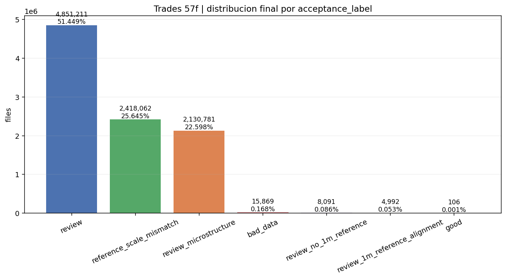

**Que muestra**

- La distribucion final completa del universo `lt1b` certificado en `57f`.
- La masa esta dominada por:
  - `review`
  - `reference_scale_mismatch`
  - `review_microstructure`

**Lectura analitica**

- La primera observacion fuerte no es que exista `bad_data`, sino que **no domina** el universo. Eso corta de raiz una lectura catastrofista del bloque.
- En numeros, el universo se reparte asi:
  - `review = 51.45%`
  - `reference_scale_mismatch = 25.65%`
  - `review_microstructure = 22.60%`
  - `bad_data = 0.168%`
  - `good = 0.001%`
- La segunda observacion fuerte es que el universo no se reparte de forma suave entre muchas clases pequenas; se concentra en tres familias enormes que piden tratamientos conceptualmente distintos:
  - `review` como residuo aun no cerrado;
  - `reference_scale_mismatch` como conflicto de comparabilidad;
  - `review_microstructure` como conflicto de textura del tape.
- La barra de `good` es tan pequena que no puede usarse como estimador de "masa util". Visualmente, la propia imagen ya obliga a abandonar esa intuicion.
- La relacion cuantitativa es extrema: `review` por si solo es mas de cincuenta mil veces mayor que `good`. Ese dato invalida cualquier lectura donde `good` actue como proxy del bloque.
- La imagen tambien cuenta algo por ausencia: `review_no_1m_reference` y `review_1m_reference_alignment` existen, pero son colas pequenas. Eso significa que son metodologicamente importantes, no masivos.

**Responde**

- Cuanta masa hay de verdad en cada `acceptance_label`.
- Si `bad_data` domina el dataset o si vive en una cola acotada.

**No responde**

- No responde a la causalidad concreta de cada file.
- No responde a que subfamilias internas dominan cada bucket.

**Consecuencia**

- Impide leer unos pocos casos `bad_data` como si describieran todo `trades`.
- Obliga a separar masa util potencial de cola pristine.

## Mezcla anual

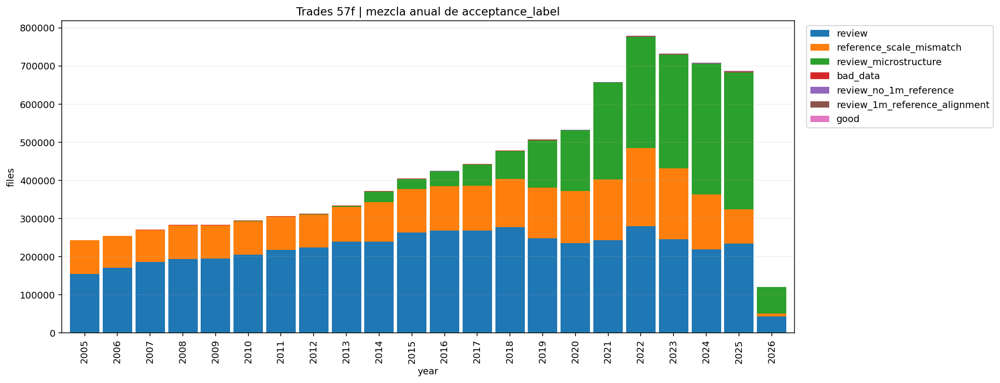

**Que muestra**

- Como cambia la mezcla de labels a lo largo del tiempo.

**Lectura analitica**

- La imagen no sugiere un universo partido entre "anos buenos" y "anos malos"; sugiere un problema **estructuralmente persistente**.
- Lo relevante aqui no es tanto un ano concreto, sino la estabilidad de las tres masas grandes:
  - `review`
  - `reference_scale_mismatch`
  - `review_microstructure`
- Lo que hay que mirar no es si un color aparece o desaparece en un ano, sino si alguno de los grandes bloques deja realmente de existir. La figura no muestra eso; muestra persistencia.
- Si hubiera un unico episodio historico explicando todo, veriamos picos aislados y luego normalizacion. Lo que se ve es otra cosa: distintas mezclas, si, pero sobre una arquitectura de conflicto que permanece.
- El valor real de esta figura es disciplinar la narrativa. Impide atribuir el bloque a una sola vendetta temporal:
  - ni "todo es legado antiguo";
  - ni "todo es problema reciente de parseo".

**Responde**

- Si el problema es transversal al universo o si se concentra en periodos concretos.

**No responde**

- No distingue todavia entre causalidades internas dentro de cada label.

**Consecuencia**

- Evita narrativas demasiado simples del tipo "esto solo pasa en anos antiguos" o "todo se rompe igual siempre".

## Escala y comparabilidad

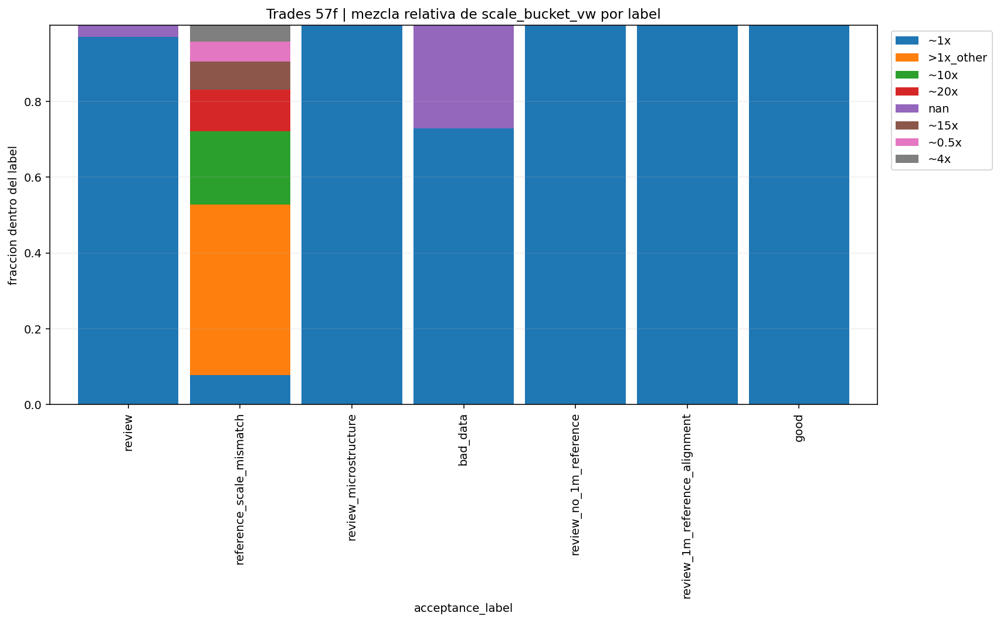

**Que muestra**

- La mezcla relativa de `scale_bucket_vw` [RT-13] por label.

**Lectura analitica**

- La imagen enseña que la escala no es un ruido pequeño repartido homogéneamente. Está **estructurada por label**.
- En `reference_scale_mismatch`, la mezcla de buckets de escala deja claro que el bucket no es una sola anomalia mecanica repetida; es una familia ancha de desajustes.
- Cuantitativamente, el bloque esta muy repartido:
  - `>1x_other = 33.59%` del bucket
  - `~10x = 14.47%`
  - `~20x = 8.14%`
  - `~1x = 5.81%`
  - `~15x = 5.63%`
- Eso significa que ni siquiera sumando `~10x` y `~20x` dominamos el bucket; el conflicto de escala es mas amplio y heterogeneo que un simple “factor diez”.
- La presencia no trivial de buckets cercanos a `~1x` dentro de `reference_scale_mismatch` es importante: significa que el nombre del bucket no implica necesariamente una escala grotesca en todos los casos, sino que recoge conflictos donde la escala sigue siendo la firma dominante al cierre.
- La comparacion con `bad_data` es clave: si ambos buckets fueran visualmente iguales aqui, la taxonomia estaria mal. Justamente esta imagen ayuda a probar que no lo son.
- Tambien corta una mala intuicion habitual: "si no hay escala absurda, no hay problema". No. Hay buckets donde la escala dominante no es extrema y aun asi la comparabilidad queda comprometida.

**Responde**

- Donde domina de verdad el conflicto de escala.
- Por que `reference_scale_mismatch` no debe confundirse con tape roto por defecto.

**No responde**

- No responde a si un caso individual concreto es rehabilitable.

**Consecuencia**

- Justifica institucionalmente la separacion entre:
  - comparabilidad frente a arbitros
  - y corrupcion intrinseca del tape

## Firmas duras por label

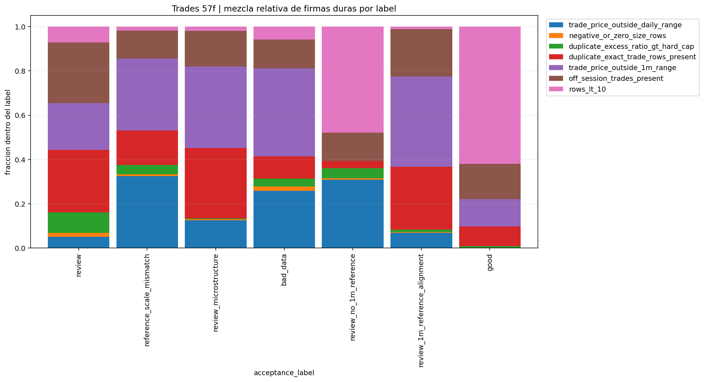

**Que muestra**

- La mezcla relativa de firmas duras por label:
  - `trade_price_outside_daily_range`
  - `negative_or_zero_size_rows`
  - `duplicate_excess_ratio_gt_hard_cap`
  - `duplicate_exact_trade_rows_present`
  - `trade_price_outside_1m_range`
  - `off_session_trades_present`
  - `rows_lt_10`

**Lectura analitica**

- Esta es una imagen de mezcla causal, no de tamaño bruto. Lo que importa no es solo que firma aparece, sino **en qué label pesa relativamente más**.
- En `bad_data`, la lectura correcta es doble:
  - una parte del peso viene de rupturas de rango y arbitro;
  - otra parte, menor pero decisiva, viene de integridad estructural.
- En `bad_data`, las firmas mas grandes son:
  - `trade_price_outside_1m_range = 14,743`
  - `trade_price_outside_daily_range = 9,606`
  - `off_session_trades_present = 4,789`
  - `duplicate_exact_trade_rows_present = 3,734`
- Pero hay que leer esos numeros en proporcion al bucket:
  - `trade_price_outside_1m_range` afecta al `92.90%` de `bad_data`
  - `trade_price_outside_daily_range` al `60.53%`
  - `negative_or_zero_size_rows` solo al `4.38%`
  - `duplicate_excess_ratio_gt_hard_cap` al `8.37%`
- Esa asimetria es justo la razon por la que el panel de precio sigue siendo central para la mayoria de `bad_data`, aunque no baste para toda la cola estructural.
- En `review_microstructure`, la mezcla desplaza la narrativa desde "precio raro" hacia "tape raro". Eso es exactamente lo que el inspector debe interiorizar antes de bajar a casos.
- Tambien aqui los pesos cambian la lectura:
  - `duplicate_exact_trade_rows_present` aparece mucho en bruto, pero la identidad del bucket no la marca la duplicacion extrema, sino la textura ligada a odd-lots y conflicto fino.
- La presencia de `rows_lt_10` y `off_session_trades_present` importa porque introduce una segunda dimensión: no todo conflicto nace en el precio o en la escala; parte del daño vive en **la forma del file**.
- La imagen también enseña qué firmas son marginales en ciertos labels. Eso es útil porque evita sobredimensionar una causa donde en realidad pesa poco.

**Responde**

- Donde vive la cola de integridad estructural.
- Donde el problema se parece mas a rango/escala que a dano del tape.

**No responde**

- No responde a la gravedad economica exacta de cada file.

**Consecuencia**

- Justifica anadir paneles de integridad estructural y no depender solo del panel de precio.

## Severidad frente a `daily`

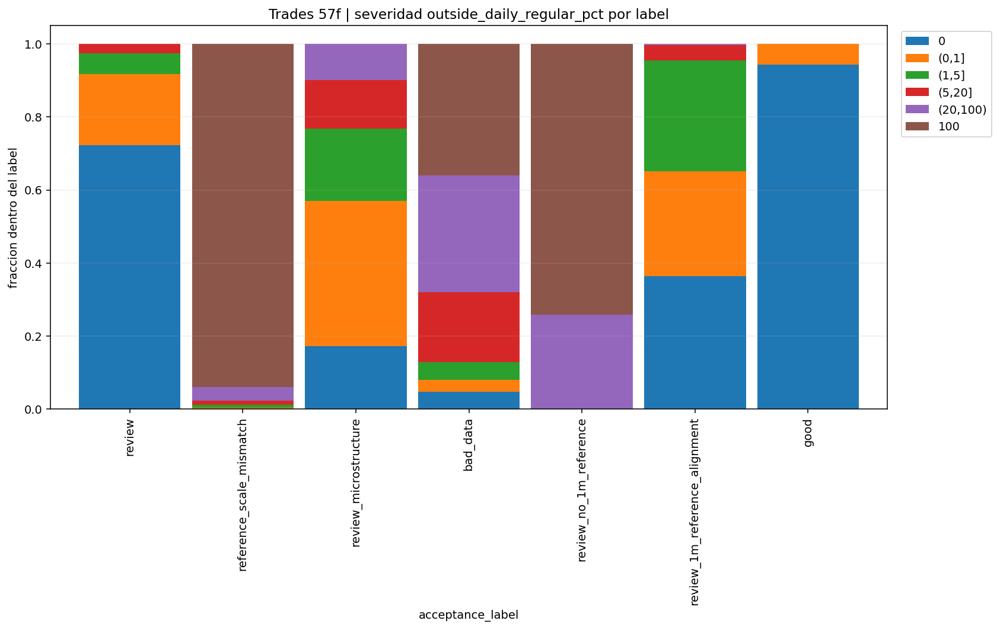

**Que muestra**

- La severidad relativa de `outside_daily_regular_pct` [RT-14] por label.

**Lectura analitica**

- La figura no solo dice qué labels tienen más conflicto contra `daily`; dice **cómo se reparte internamente ese conflicto**.
- En `review`, el patrón es relativamente benigno si se compara con otros buckets:
  - `0% outside daily` en `72.22%` del bucket
  - `(0,1]%` en `19.53%`
  - `(1,5]%` en `5.70%`
  - los bins verdaderamente altos son residuales
- En `reference_scale_mismatch`, la imagen se vuelve extrema:
  - `outside_daily = 100%` en `93.98%` del bucket
  - eso demuestra que este label vive casi por definicion en contradiccion total con el arbitro diario
- En `bad_data`, la mezcla es mas interesante:
  - `100%` solo en `35.96%`
  - `(20,100)` en `32.08%`
  - `0%` en `4.78%`
- Esa combinacion prueba que `bad_data` no es solo el bucket de “todo fuera todo el rato”; hay una franja relevante donde el conflicto es duro pero no total.
- En una lectura gruesa, uno podría pensar que `bad_data` y `review` comparten la misma patología porque ambos pueden tener masa en bins altos. La imagen ayuda a matizar eso: el porcentaje contra `daily` mide violencia contra el árbitro diario, pero no distingue aún la causa.
- Si un label concentra mucha masa en el extremo `100`, el conflicto no es una fricción periférica; es una contradicción casi total con la barra diaria. Eso endurece la lectura del bucket, aunque todavía no cierre su causalidad.
- Si otro label reparte masa entre bins intermedios, la historia cambia: ahí el problema puede ser de degradación parcial, no de colapso.
- Por eso la figura es útil no solo por el extremo alto, sino por la **forma completa de la distribución** dentro de cada label.

**Responde**

- Como de agresivo es el conflicto contra el arbitro diario.
- Que labels viven mas en ruptura total frente a `daily`.

**No responde**

- No distingue entre colapso de escala y rango local si ambos acaban empujando el porcentaje.

**Consecuencia**

- Refuerza por que `bad_data` no puede reducirse a "hay conflicto con daily".

## Severidad frente a `1m`

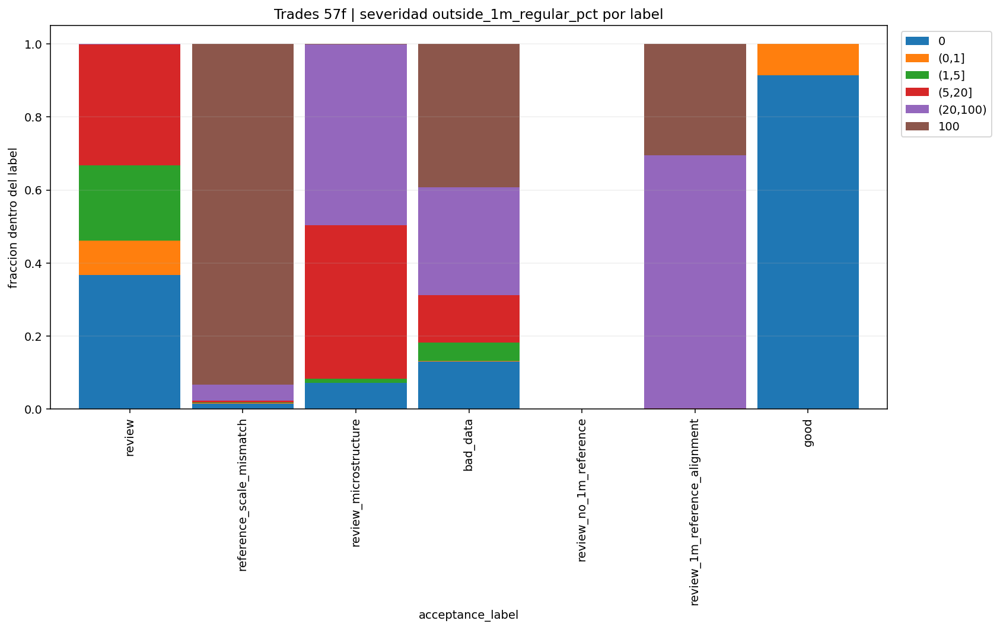

**Que muestra**

- La severidad relativa de `outside_1m_regular_pct` [RT-15] por label.

**Lectura analitica**

- Aquí la granularidad fina importa más que en `daily`, porque `1m` capta conflictos que la barra diaria puede ocultar.
- La imagen sirve para ver dónde un label no solo protesta contra el árbitro grueso, sino contra la estructura intradía fina. Eso es especialmente importante para:
  - `review_1m_reference_alignment`
  - parte de `review_microstructure`
  - y parte de `bad_data`
- En `review_microstructure`, la leyenda ya cuenta una historia bastante concreta:
  - `(20,100)` representa `40.44%`
  - `(5,20]` representa `34.24%`
  - `0%` solo `5.87%`
- Eso significa que el bucket vive mas en conflicto fino intradia que en alineacion limpia con `1m`.
- En `reference_scale_mismatch`, `outside_1m = 100%` afecta al `75.58%` del bucket. Eso refuerza que el choque no es solo contra `daily`; la ruptura intraminuto tambien es masiva.
- En `bad_data`, `outside_1m = 100%` afecta al `30.94%`, pero el bin `(20,100)` añade otro `23.25%`. En total, mas de la mitad del bucket sufre conflicto intraminuto severo.
- En `review_1m_reference_alignment`, la firma es casi definicional:
  - `(20,100)` en `69.47%`
  - `100%` en `30.41%`
- O sea, casi todo el bucket vive en bins altos frente a `1m`; esa es exactamente la razon de existir de la familia.
- Si un label acumula masa fuerte en bins altos frente a `1m`, ya no estamos viendo solo una discusión sobre barra diaria; estamos viendo un choque contra el árbitro de mayor resolución.
- La figura también ayuda a detectar un patrón útil: labels que parecen moderados frente a `daily` pueden endurecerse mucho frente a `1m`. Esa divergencia es metodológicamente muy informativa.
- En otras palabras, esta imagen no solo añade detalle; **cambia la jerarquía de evidencia** de ciertos buckets.

**Responde**

- Donde el arbitro fino cambia la verdad del caso.
- Por que `review_1m_reference_alignment` existe como familia propia.

**No responde**

- No responde a si el conflicto nace en el tape o en el propio arbitro `1m`.

**Consecuencia**

- Obliga a no absolver un caso solo porque `daily` parezca tranquilo.

## Duplicacion y odd-lots

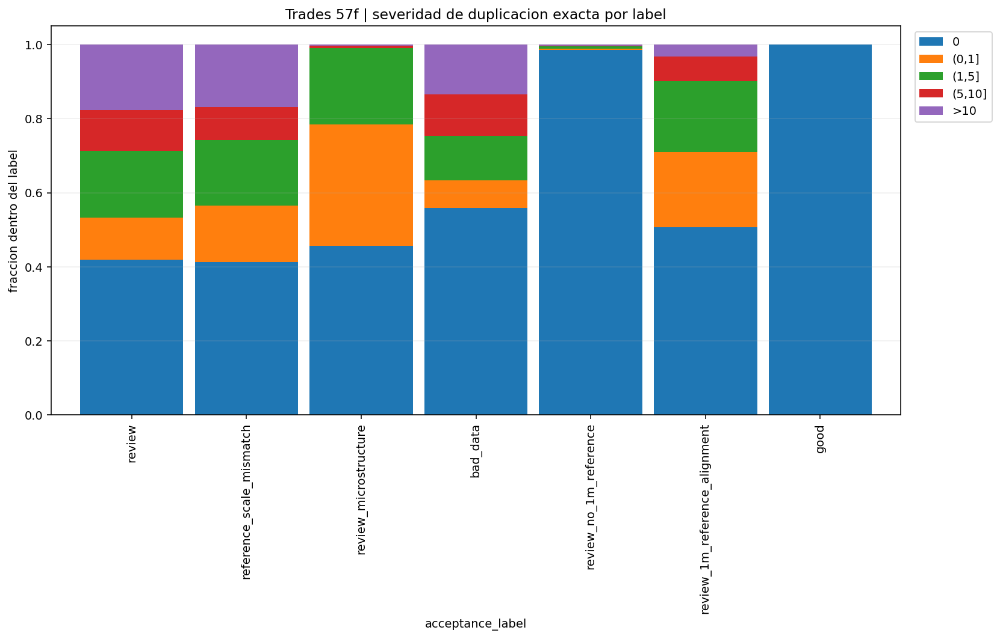

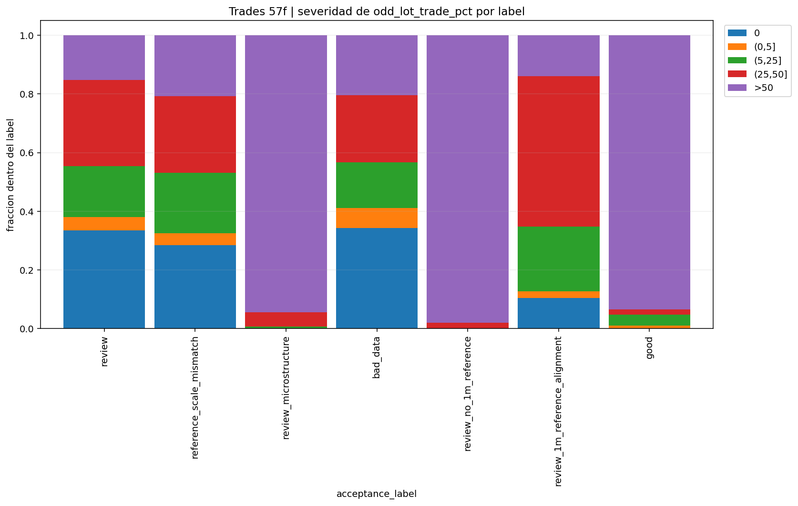

**Que muestra**

- La severidad de la duplicacion exacta por label.
- La severidad de `odd_lot_trade_pct` [RT-16] por label.

**Lectura analitica**

- Estas dos imágenes deben leerse juntas porque separan dos mecanismos que a veces se confunden:
  - textura microestructural legítima o semi-legítima;
  - deterioro estructural del tape.
- Si `review_microstructure` apareciera dominado por duplicación dura, sería un bucket mucho más sospechoso. Lo que se ve, en cambio, es que su identidad real está mucho más cerca de odd-lots y textura.
- Los números lo dejan bastante claro:
  - en `review_microstructure`, `duplicate = 0` todavía representa `45.69%`
  - `(0,1]%` representa `32.80%`
  - `>10%` apenas `0.26%`
- Es decir, la duplicacion extrema es marginal dentro del bucket. No es su motor principal.
- La cola de duplicación, cuando pesa, desplaza la lectura hacia daño de integridad y obliga a mirar más allá del precio.
- La imagen de odd-lots es especialmente importante porque visualmente demuestra que hay una masa enorme cuya rareza no nace de corrupción bruta sino de composición de prints.
- Otra vez, la cuantificacion cambia la lectura:
  - `odd_lot_trade_pct > 50` en `review_microstructure` afecta al `94.38%` del bucket
  - por tanto, la dominancia de odd-lots no es un matiz; es la identidad central de la familia.
- En `review`, en cambio, la imagen de odd-lots sale mucho mas repartida entre bins, lo que demuestra que ese bucket no puede reducirse a una sola textura.
- Esto no absuelve automáticamente esos casos para todos los pipelines, pero sí cambia su tratamiento institucional: no pueden colapsarse a `bad_data`.

**Responde**

- Cuanto de `review_microstructure` vive en textura del tape y no solo en precio.
- Donde la integridad estructural pesa de verdad.

**No responde**

- No responde a la localizacion exacta de las filas problematicas.

**Consecuencia**

- Justifica que `review_microstructure` y la cola estructural de `bad_data` necesiten paneles propios.

## Cobertura del arbitro `1m`

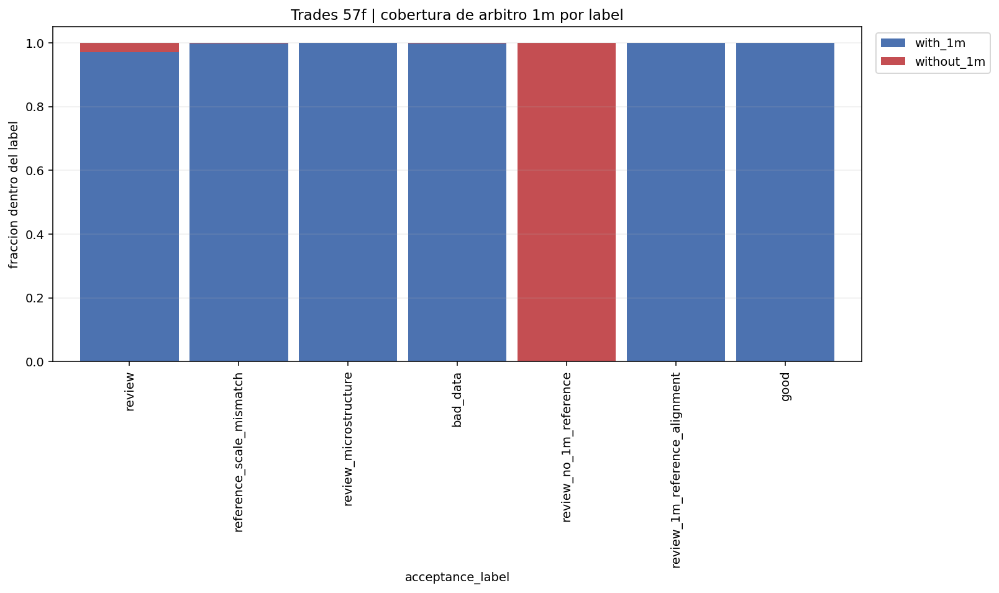

**Que muestra**

- La fraccion de casos con y sin arbitro `1m` [RT-26] por label.

**Lectura analitica**

- Esta figura no habla de calidad del tape; habla de **calidad de la decisión** que podemos tomar sobre el tape.
- La masa sin `1m` no debe interpretarse como caos. Debe interpretarse como limitación de resolución del árbitro.
- Cuantitativamente, casi todo el universo relevante sí tiene `1m`:
  - `review = 97.07%` con `1m`
  - `reference_scale_mismatch = 99.81%`
  - `review_microstructure = 99.89%`
  - `bad_data = 99.77%`
- Eso significa que la falta de `1m` no es una explicación general del bloque; es una condición muy localizada.
- `review_no_1m_reference` sí es extremo por definición: `100%` sin `1m`. La imagen prueba que el bucket es real y no una etiqueta teórica sin base poblacional.
- En `review_no_1m_reference`, la imagen cumple una función muy concreta: demostrar que el bucket no es un invento verbal, sino una consecuencia poblacional de cobertura realmente incompleta.
- También sirve para no sobreactuar ante ciertos conflictos. Si falta el árbitro fino, el cierre del caso debe ser epistemológicamente más humilde.
- La imagen además ayuda a separar dos errores distintos:
  - “no tengo suficiente evidencia para absolver”
  - “tengo evidencia suficiente para condenar”

**Responde**

- Donde el problema esta condicionado por cobertura.
- Por que `review_no_1m_reference` no debe leerse como corrupcion probada.

**No responde**

- No responde a la bondad del file cuando `1m` falta.

**Consecuencia**

- Refuerza una politica disciplinada de incertidumbre, no de condena automatica.

## Rehabilitacion de `review`

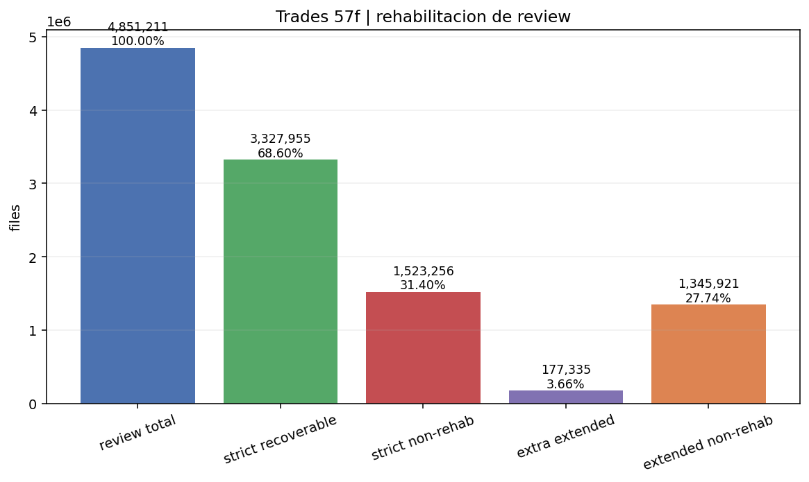

La regla historica aplicada sobre `57f` deja:

- `review_total = 4,851,211`
- `strict recoverable = 3,327,955` (`68.60%`)
- `extended recoverable = 3,505,290` (`72.26%`)
- La condicion de cercania a escala usa buckets como `~1x` y `near_1x` [RT-24].

**Que muestra**

- Cuanta masa de `review` puede pasar de forma defendible a `recoverable_with_flag`.

**Lectura analitica**

- Esta es probablemente la imagen más importante del bloque entero, porque reordena la pregunta central.
- Sin ella, el inspector puede quedarse atrapado en la barra minúscula de `good`. Con ella, entiende que la variable maestra no es `good`, sino la masa rehabilitable dentro de `review`.
- El salto entre:
  - `review_total`
  - `strict recoverable`
  - y `extended recoverable`
  
  enseña dos cosas a la vez:
  - cuánta utilidad real ya está ganada con una policy conservadora;
  - cuánta utilidad adicional solo aparece si aflojamos la regla.
- En numeros:
  - `strict recoverable = 68.60%`
  - la ampliacion hasta `extended` solo añade `3.66%` del bucket
- Eso es metodologicamente muy importante: la regla estricta ya captura casi toda la masa recuperable. No estamos perdiendo una mitad oculta por ser demasiado conservadores.
- La distancia entre la versión estricta y la extendida no es enorme. Eso es bueno: sugiere que la regla estricta ya captura la parte principal de la masa recuperable.
- La masa que queda fuera sigue siendo grande. Eso también importa: evita la tentación de declarar victoria prematura sobre `review`.

**Responde**

- Cuanta masa util real tiene `trades` mas alla de la cola `good`.

**No responde**

- No responde a la utilidad final de otros buckets como `review_microstructure`.

**Consecuencia**

- Cambia la lectura del bloque: `good` no es la variable maestra; la rehabilitacion de `review` si.

## `bad_data` por subfamilia visual

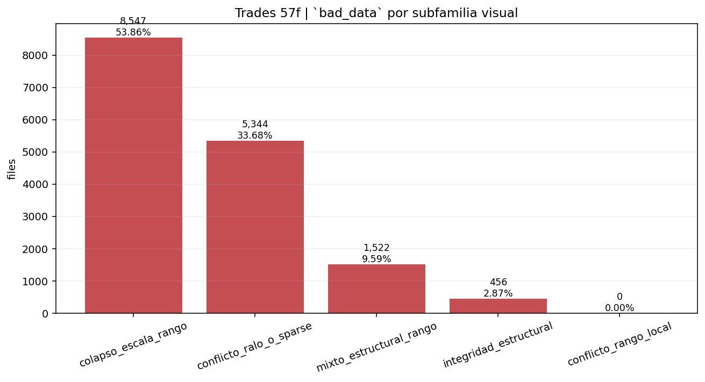

Conteos:

- `colapso_escala_rango = 8,547`
- `integridad_estructural = 456`
- `mixto_estructural_rango = 1,522`
- `conflicto_ralo_o_sparse = 5,344`
- `conflicto_rango_local = 0`

**Que muestra**

- Que `bad_data` no es una sola familia visual.

**Lectura analitica**

- La imagen corrige una simplificación peligrosa: pensar que todo `bad_data` es colapso grotesco de precio.
- Sí, la subfamilia dominante es `colapso_escala_rango`. Eso confirma que el panel de precio actual cubre muy bien la parte principal del bucket.
- Pero hay que ponerle numero:
  - `colapso_escala_rango = 53.86%`
  - `conflicto_ralo_o_sparse = 33.68%`
  - `mixto_estructural_rango = 9.59%`
  - `integridad_estructural = 2.87%`
- Eso cambia bastante la intuicion. La cola puramente estructural existe, pero es pequena. La franja rala o sparse, en cambio, es mucho mayor de lo que se podria intuir mirando solo unos pocos casos duros.
- Pero la segunda observación fuerte es que existe una masa no trivial de:
  - `integridad_estructural`
  - `mixto_estructural_rango`
  - `conflicto_ralo_o_sparse`
- Esto cambia la obligación visual del dossier. Ya no basta un único panel “bonito” de precio para representar todo `bad_data`.
- La ausencia de `conflicto_rango_local` en este cierre concreto también es informativa: significa que, bajo la taxonomía actual, los rechazos duros locales tienden a quedar absorbidos por otras subfamilias más fuertes.

**Responde**

- Cuanto de `bad_data` se explica por colapso visible de escala/rango.
- Cuanto exige paneles de integridad estructural.

**No responde**

- No responde a la calidad de cada caso individual dentro de cada subfamilia.

**Consecuencia**

- Justifica por que el dossier `bad_data` no puede apoyarse en un unico tipo de panel.

## `review_microstructure` por textura dominante

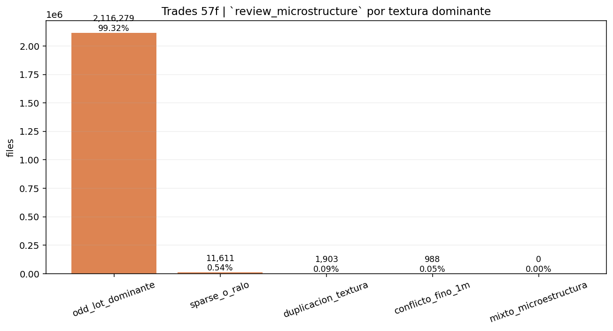

Conteos:

- `odd_lot_dominante = 2,116,279`
- `duplicacion_textura = 1,903`
- `conflicto_fino_1m = 988`
- `sparse_o_ralo = 11,611`
- `mixto_microestructura = 0`

**Que muestra**

- Que la masa de `review_microstructure` esta dominada de forma aplastante por textura ligada a odd-lots.

**Lectura analitica**

- Esta figura es muy fuerte porque destruye una lectura equívoca del bucket. `review_microstructure` no es, poblacionalmente, una colección heterogénea de rarezas pequeñas; está dominado de forma masiva por una firma muy concreta.
- La dominancia extrema de `odd_lot_dominante` significa que, a nivel de población, este bucket está mucho más cerca de una cuestión de composición de prints que de una cuestión de “tape roto”.
- En numeros la conclusion es casi brutal:
  - `odd_lot_dominante = 99.32%`
  - `sparse_o_ralo = 0.54%`
  - `duplicacion_textura = 0.089%`
  - `conflicto_fino_1m = 0.046%`
- O sea, las colas alternativas existen, pero juntas ni siquiera alcanzan el `1%`. El bucket esta practicamente monopolizado por una sola textura poblacional.
- Las colas de `duplicacion_textura`, `conflicto_fino_1m` y `sparse_o_ralo` existen, pero no son la identidad central del bucket. Son subproblemas, no el corazón de la familia.
- Esto obliga a que la documentación por casos no sobrerrepresente ejemplos raros de duplicación si luego el universo real está controlado por odd-lots.
- También cambia el orden de prioridades: si queremos mejorar política o visualización de esta familia, primero hay que explicar mejor odd-lots, no empezar por la cola marginal.

**Responde**

- Donde vive realmente este bucket.
- Que parte es cola pequena de duplicacion o sparsity y que parte es fenomeno estructural de odd-lot.

**No responde**

- No responde a si toda dominancia odd-lot es recuperable en todos los pipelines.

**Consecuencia**

- Obliga a tratar `review_microstructure` como una familia microestructural de verdad, no como simple `review`.

## `reference_scale_mismatch` por bucket de escala

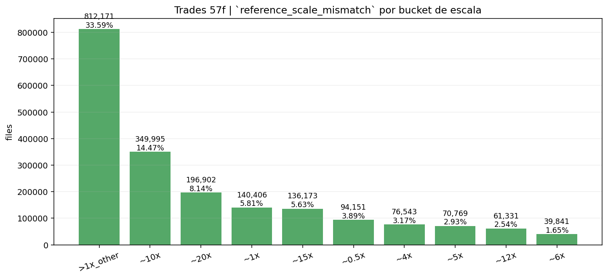

Top buckets:

- `>1x_other = 812,171`
- `~10x = 349,995`
- `~20x = 196,902`
- `~1x = 140,406`
- `~15x = 136,173`
- `~0.5x = 94,151`
- `~4x = 76,543`
- `~5x = 70,769`

**Que muestra**

- Que el bucket de escala no esta concentrado en una sola relacion mecanica.

**Lectura analitica**

- Esta figura prueba que `reference_scale_mismatch` no es simplemente el bucket de un único split mal normalizado o de una única relación `10x`.
- El peso grande de `>1x_other` es muy importante: sugiere que el conflicto de escala es amplio y menos “limpio” de lo que sería deseable para una reconciliación trivial.
- En concreto:
  - `>1x_other = 33.59%`
  - `~10x = 14.47%`
  - `~20x = 8.14%`
  - `~1x = 5.81%`
  - `~15x = 5.63%`
- Sumando solo los cuatro buckets visibles principales no llegamos ni al `63%`. Eso significa que el bucket sigue muy fragmentado incluso después de sacar sus grandes masas.
- La coexistencia de `~10x`, `~20x`, `~15x`, `~0.5x`, `~4x`, `~5x` muestra un paisaje heterogéneo. Eso refuerza que este bucket necesita una metodología de reconciliación, no una receta única.
- La presencia visible de `~1x` dentro del propio bucket es otra señal útil: indica que el cierre a `reference_scale_mismatch` no depende solo de un ratio brutal, sino del conjunto de la evidencia.
- En otras palabras, el bucket no es “patológico de una sola manera”; es una familia ancha de desacoples de escala.

**Responde**

- Que escalas dominan de verdad el conflicto.
- Si el bucket se parece a una sola patologia o a una familia amplia de desajustes.

**No responde**

- No responde a si una reconciliacion concreta seria valida economicamente.

**Consecuencia**

- Refuerza que `reference_scale_mismatch` necesita politicas propias de reconciliacion y no solo rechazo.

## `review` por severidad interna de rehabilitacion

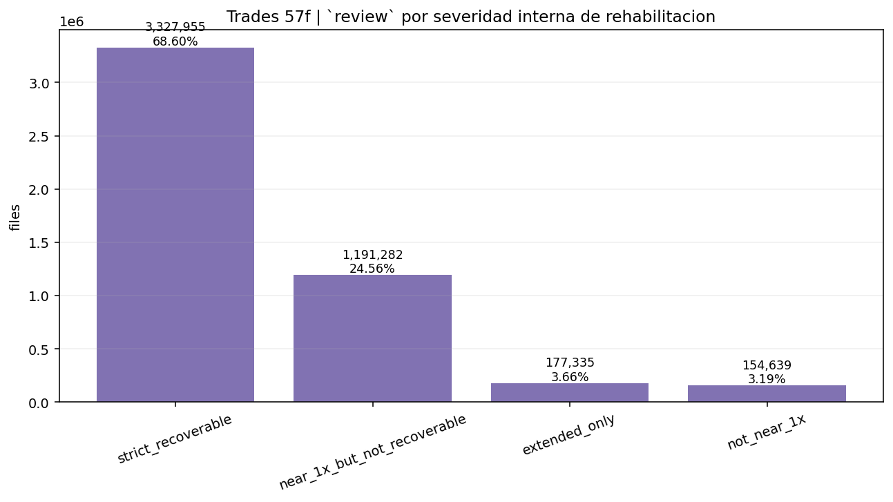

Conteos:

- `strict_recoverable = 3,327,955`
- `extended_only = 177,335`
- `near_1x_but_not_recoverable = 1,191,282`
- `not_near_1x = 154,639`

**Que muestra**

- La estructura interna real de `review`.

**Lectura analitica**

- La figura obliga a dejar de pensar en `review` como un residuo homogéneo. Su estructura interna está claramente estratificada.
- La masa dominante en `strict_recoverable` prueba que el bucket no es un pantano sin salida; una gran parte ya está esencialmente ganada bajo policy conservadora.
- En numeros:
  - `strict_recoverable = 68.60%`
  - `extended_only = 3.66%`
  - `near_1x_but_not_recoverable = 24.56%`
  - `not_near_1x = 3.19%`
- La lectura estratégica nace justo de esa comparación:
  - la masa realmente problemática no es la más lejana (`3.19%`);
  - es la enorme franja que ya está cerca de `1x` pero aún no cruza la policy (`24.56%`).
- La franja `extended_only` es pequeña frente al total. Eso sugiere que la ganancia por aflojar la policy existe, pero no redefine el bloque.
- La franja verdaderamente estratégica es `near_1x_but_not_recoverable`: es enorme y está cerca del umbral correcto. Esa es la masa donde una mejor comprensión puede cambiar más decisiones reales.
- `not_near_1x` es mucho menor; eso importa porque indica que el residuo más lejano existe, pero no es la mayor frontera de trabajo.
- La imagen, por tanto, no solo describe `review`; establece una **prioridad de investigación**.

**Responde**

- Cuanto de `review` ya esta practicamente ganado para `recoverable_with_flag`.
- Cuanta masa sigue cerca de `1x` pero aun no cumple los cortes de calidad.
- Cuanta masa esta ya lejos de una rehabilitacion clara.

**No responde**

- No responde a la utilidad final de las otras familias `review_*`.

**Consecuencia**

- Cambia la priorizacion del trabajo futuro:
  - primero la franja `near_1x_but_not_recoverable`
  - y despues el residuo mas alejado

## Veredicto institucional

La lectura correcta del universo `trades` `lt1b` en `57f` es:

- la cola `bad_data` existe y es real, pero no domina el bloque;
- `reference_scale_mismatch` es una masa enorme de comparabilidad, no de corrupcion pura;
- `review_microstructure` esta dominado por fenomenos de textura, especialmente odd-lots;
- la masa util real del bloque vive sobre todo en la rehabilitacion de `review`;
- y la inspeccion file-level solo tiene sentido si se apoya siempre en este mapa global.

## Resumen tecnico critico para backtest y ML

Los graficos del universo completo obligan a una conclusion metodologica fuerte: `trades` no puede tratarse como una fuente binaria de verdad o falsedad. El bloque contiene una cola `bad_data` real, pero esa cola es solo `0.168%` del universo. El problema estructural del modulo no es que casi todo el tape este roto; el problema es que **la mayor parte de la masa util potencial no vive en `good`, sino en regiones intermedias cuya semantica debe respetarse con precision**.

Desde el punto de vista de backtest, la implicacion principal es esta: usar solo `good` como base de simulacion produciria un universo minusculo y sesgado, porque `good` representa solo `0.001%` del total. Eso no es una politica conservadora razonable; es una politica de destruccion de cobertura. La evidencia poblacional muestra que el verdadero frente de trabajo esta en `review`: `68.60%` del bucket ya pasa la regla estricta de rehabilitacion y otro `3.66%` entra solo bajo la version extendida. Por tanto, la capacidad real de construir un motor de ejecucion o una simulacion defendible depende de **consumir `recoverable_with_flag` con disciplina**, no de encerrarse en `good`.

El segundo mensaje fuerte para backtest es que no todas las masas intermedias significan lo mismo. `reference_scale_mismatch` pesa `25.65%` del universo y no puede interpretarse como tape roto. Sus graficos muestran una familia ancha de desajustes de escala, no una sola anomalia mecanica. Eso significa que un backtest que mezcle `trades_raw` con arbitros diarios o intradiarios sin declarar semantica de precio corre un riesgo serio de contaminar:

- ejecucion simulada;
- validacion de fills;
- comparacion contra `daily`;
- y cualquier estudio de slippage o implementation shortfall.

La consecuencia tecnica es que `reference_scale_mismatch` no debe entrar ni como `good` ni como `bad` por costumbre. Requiere una politica de reconciliacion o exclusiones por pipeline.

El tercer hallazgo importante es `review_microstructure`: `22.60%` del universo. La lectura cuantitativa es decisiva: `99.32%` de ese bucket cae en `odd_lot_dominante`. Eso significa que esta familia no es una cola heterogenea de rarezas menores; es, poblacionalmente, una **familia masiva de textura microestructural**. Para ML microestructural esto es crucial. Si se entrena un modelo con esa masa sin etiquetado semantico o sin flags, el modelo no aprende solo comportamiento de mercado; aprende tambien composicion de prints y regimenes de odd-lot. Eso puede ser util si se desea explicitamente, pero seria leakage semantico si se interpretara como senal economica generica.

Para ML diario o labels de retorno, el mensaje es aun mas estricto: `trades_raw` no debe actuar como sustituto de una verdad economica intertemporal. Los graficos de `outside_daily` y `outside_1m` muestran que ciertas familias viven en conflicto intenso con los arbitros, pero por razones distintas. En `reference_scale_mismatch`, `outside_daily = 100%` en `93.98%` del bucket, lo que refleja ruptura masiva de comparabilidad con `daily`; en `review_microstructure`, la severidad frente a `1m` domina mucho mas que frente a `daily`, lo que senala un problema de textura fina, no necesariamente de barra economica. Si un pipeline de labels o features diarios mezcla esas masas como si fueran homogeneas, termina inyectando al modelo:

- conflictos de escala;
- conflicto intraminuto;
- y rarezas de composicion del tape;

como si fueran alpha o estructura economica limpia.

La cola `bad_data` necesita una lectura igual de precisa. Aunque solo sea `0.168%`, su composicion interna demuestra que tampoco es monolitica:

- `53.86%` es `colapso_escala_rango`;
- `33.68%` es `conflicto_ralo_o_sparse`;
- `9.59%` es `mixto_estructural_rango`;
- `2.87%` es `integridad_estructural`.

Eso importa para backtest y ML porque no todos los rechazos duros deben tratarse como el mismo tipo de dano. Hay una diferencia real entre:

- un tape economicamente incompatible con el arbitro;
- un tape estructuralmente invalido;
- y un file demasiado ralo para sostener inferencia de ejecucion.

La decision operativa correcta no es solo excluirlos, sino **entender que clase de dano se excluye**, porque eso determina:

- que validators hacen falta;
- que paneles visuales son obligatorios;
- y que supuestos rompe cada caso.

En conjunto, el mapa del universo `trades` lleva a una conclusion de arquitectura: el bloque no puede consumirse con una sola policy plana. Para backtest hacen falta al menos tres capas:

1. `good`
   - cola pristine, util como benchmark de limpieza extrema pero demasiado pequena para ser el universo operativo;
2. `recoverable_with_flag`
   - masa principal util, especialmente desde `review`, condicionada por reglas explicitamente declaradas;
3. exclusiones o revisiones especiales
   - `bad`
   - `review_not_rehabilitated`
   - y buckets cuya semantica depende de reconciliacion o textura.

Para ML, la conclusion es paralela:

- `trades_raw` sirve para microestructura y ejecucion, no como verdad economica universal;
- las familias de conflicto deben entrar con semantica declarada, no como simple ruido;
- y el entrenamiento debe evitar aprender artefactos de comparabilidad, odd-lot o integridad como si fueran comportamiento economico limpio.

El mensaje final del bloque es este: la mayor amenaza no es la cola `bad_data`. La mayor amenaza es **colapsar familias semanticas distintas en una sola nocion de calidad**. Si eso ocurre, el backtest mezcla ejecucion valida con conflicto de escala, y el ML mezcla microestructura real con artefactos del tape. Este `readout` demuestra precisamente por que esa simplificacion ya no es aceptable.

## Indice de referencias tecnicas

- [RT-01] `lt1b`
  - Universo auditado con corte `less than 1 billion` en la capa historica-operativa del modulo. No significa all-cap ni cobertura total del mercado.
- [RT-02] `57f/full_clean_fast_same_schema`
  - Cierre materializado final usado aqui para `trades`. Es el cache de referencia sobre el que se calculan labels, reglas de rehabilitacion y graficos poblacionales.
- [RT-03] `acceptance_label`
  - Etiqueta file-level de aceptacion tecnica en el cierre `trades`. No equivale automaticamente al estado operativo final, pero es la capa base desde la que se construye el closeout.
- [RT-04] `good`
  - Cola pristine del bloque. File que pasa la policy mas conservadora sin caveat material. Es demasiado pequena para actuar como proxy de masa util total.
- [RT-05] `review`
  - Residuo principal aun no cerrado como `good` ni como `bad`. Es el bucket sobre el que se aplica la politica de rehabilitacion.
- [RT-06] `recoverable_with_flag`
  - Estado operativo final para files no pristine pero reutilizables con advertencia explicita. Es la masa util real mas importante despues del cierre conservador.
- [RT-07] `review_not_rehabilitated`
  - Parte de `review` que no pasa la regla de rehabilitacion. No es necesariamente corrupcion dura, pero tampoco debe consumirse como limpia.
- [RT-08] `bad_data`
  - Cola dura donde el tape deja de ser defendible economicamente o estructuralmente. Debe excluirse de uso productivo y quedarse solo para forense.
- [RT-09] `reference_scale_mismatch`
  - Familia donde el conflicto dominante se explica por comparabilidad o escala frente a arbitros, no necesariamente por corrupcion intrinseca del tape.
- [RT-10] `review_microstructure`
  - Familia donde el conflicto dominante vive en textura fina del tape: odd-lots, sparsity, composicion de prints o comparabilidad intradia.
- [RT-11] `review_no_1m_reference`
  - Familia donde falta el arbitro `1m`; el problema principal es de cobertura y resolucion de evidencia, no de condena automatica del tape.
- [RT-12] `review_1m_reference_alignment`
  - Familia donde `daily` puede parecer razonable pero `1m` rompe la comparabilidad fina y cambia la verdad del caso.
- [RT-13] `scale_bucket_vw`
  - Bucket discreto que resume la relacion de escala entre el `VWAP` del tape y el arbitro diario. Se usa para clasificar cercania a `1x` o desajustes de escala mas amplios.
- [RT-14] `outside_daily_regular_pct`
  - Porcentaje de trades regulares del file que quedan fuera del rango diario `[low, high]`. Mide contradiccion contra el arbitro diario.
- [RT-15] `outside_1m_regular_pct`
  - Porcentaje de trades regulares del file que quedan fuera del rango de su minuto en el arbitro `1m`. Mide contradiccion contra el arbitro intradia fino.
- [RT-16] `odd_lot` / `odd_lot_trade_pct`
  - `Odd-lot` es un trade fuera del lote estandar, tipicamente menor que `100` acciones. `odd_lot_trade_pct` mide que fraccion de trades del file vive en ese regimen.
- [RT-17] `duplicate_exact_trade_rows_present`
  - Senal de que existen filas duplicadas exactas en el tape. No siempre implica rechazo duro, pero deteriora la confianza en la integridad del file.
- [RT-18] `duplicate_excess_ratio_gt_hard_cap`
  - Senal de duplicacion excesiva por encima del hard cap historico. Es una firma de integridad estructural mas grave que una simple presencia de duplicados.
- [RT-19] `trade_price_outside_daily_range`
  - Issue que marca que el precio del trade sale del rango diario del arbitro. Es una firma fuerte de conflicto contra `daily`.
- [RT-20] `trade_price_outside_1m_range`
  - Issue o warning que marca que el precio del trade sale del rango `1m` de su minuto. Es una firma de conflicto fino intradia.
- [RT-21] `off_session_trades_present`
  - Senal de que el file contiene actividad fuera de sesion regular. Puede ser normal en ciertos contextos, pero complica comparaciones y validacion si no se declara.
- [RT-22] `rows_lt_10`
  - Senal de que el file tiene muy pocas filas. No prueba corrupcion por si sola, pero si limita inferencia y puede empujar a subfamilias ralas o sparse.
- [RT-23] `rehabilitacion estricta` / `rehabilitacion extendida`
  - Dos versiones de la policy de recuperacion de `review`. La estricta es la baseline institucional; la extendida actua como sensibilidad mas permisiva.
- [RT-24] `~1x` / `near_1x`
  - Buckets de escala considerados suficientemente cercanos a `1x` para que un caso pueda aspirar a rehabilitacion. No bastan solos; se combinan con cortes sobre `outside` y `VWAP diff`.
- [RT-25] `trade_vwap_vs_daily_vw_diff_pct_raw`
  - Diferencia porcentual entre el `VWAP` del tape y el `VWAP` diario arbitro. Mide separacion economica agregada, no solo conflicto de extremos.
- [RT-26] `arbitro daily` / `arbitro 1m`
  - Serie de referencia contra la que se compara `trades_raw`. `daily` da una vista gruesa; `1m` da la resolucion fina que a menudo cambia la clasificacion.
- [RT-27] `tape`
  - Flujo de trades raw del file. En este contexto significa el objeto economico y estructural que queremos juzgar como defendible o no.
- [RT-28] `microestructura`
  - Comportamiento fino del mercado a nivel de prints, tamanos, odd-lots, distribucion temporal y comparabilidad intraminuto. No equivale a retorno economico diario.
- [RT-29] `round lot`
  - Lote estandar, normalmente `100` acciones. Se usa como contraste frente a `odd-lot`.
- [RT-30] `cola pristine`
  - Franja extremadamente limpia del universo. Es conceptualmente util como benchmark de pureza, pero demasiado pequena para representar la masa util real del bloque.

# Trades Population Readout v0.1

Documento fuente: `inspection_dossiers/trades/population_evidence_packs/trades_population_readout_v0_1.md`

## 1. Rol

Este documento describe la masa poblacional de `trades` y explica por que no puede leerse de forma ingenua.

Su funcion no es decidir casos individuales. Su funcion es fijar:

- cuanta masa esta afectada;
- que parte de esa masa se concentra en `review`;
- por que un gran `review` poblacional no equivale automaticamente a `bad tape`;
- y por que el inspector debe separar poblacion, muestra metodologica y cierre final.

## 2. Tres niveles que no deben mezclarse

En `trades` hay tres capas distintas:

1. snapshot poblacional bruto o semibruto;
2. muestra metodologica `380` files de `file_acceptance`;
3. cierre full final `57f/full_clean_fast_same_schema`.

Confundir estas capas produce el error historico mas grave del bloque:

- leer cualquier `review` masivo como si demostrara corrupcion intrinseca del tape.

## 3. Primera foto: shard state actual

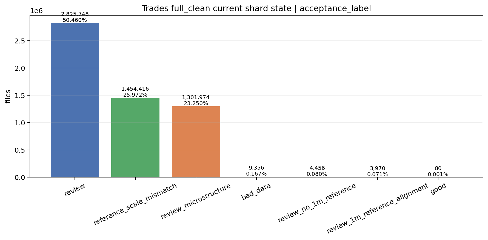

### Que muestra

Esta barra resume la distribucion de `acceptance_label` en el estado `full_clean` parcial historico que alimenta la politica antigua. La masa dominante es:

- `review`
- seguida por `reference_scale_mismatch`
- y `review_microstructure`

`bad_data`, `review_no_1m_reference`, `review_1m_reference_alignment` y `good` aparecen como colas muy pequenas.

### Que conclusion debe sacar el lector

La conclusion importante no es que `trades` este "muerto". La conclusion es otra:

- el problema principal no es una cola pequena y aislada;
- el problema principal es una masa muy grande de conflicto contra referencias;
- y por tanto el bloque no puede cerrarse con una logica binaria `good / bad`.

### La paradoja del `good` diminuto

La lectura mas peligrosa de este grafico seria:

- si `good` es solo `0.001%`, entonces casi toda la data de `trades` es inservible.

Esa lectura es incorrecta por dos razones.

Primera razon:

- este grafico no expresa estados finales de certificacion;
- expresa `acceptance_label` en un estado parcial historico de trabajo;
- y la etiqueta `good` aqui significa solo la cola pristine, no la masa economicamente recuperable.

Segunda razon:

- el bucket `good` historico se definio con un criterio extremadamente estricto;
- `certification/trades/12_trades_good.md` deja explicitamente documentado que ese bucket existe, pero es minusculo y sesgado a files muy pequenos;
- alli se observa `good = 80` files y `rows_after_parse` mediano `3.5`, con `p75 = 17.25`.

La conclusion inteligente es:

- `good` no esta intentando medir "todo lo util";
- esta midiendo solo la parte donde `trades`, `daily` y `1m` alinean de forma casi impecable;
- por eso sale tan pequeno.

La masa potencialmente util no vive en `good`. Vive sobre todo en:

- `review` rehabilitable con regla explicita;
- `review_microstructure` parcialmente recuperable con flags;
- `review_1m_reference_alignment` y `review_no_1m_reference` cuando el uso tolere esas limitaciones;
- y, con mucha mas prudencia, futuras reconciliaciones validadas de `reference_scale_mismatch`.

Por tanto, este grafico no prueba que `trades` este roto en un `99.999%`. Prueba otra cosa:

- que el criterio de pureza para llamar a algo `good` era tan conservador que casi toda la masa util quedaba empujada a `review`.

### Consecuencia metodologica

Este grafico obliga a separar:

- dano intrinseco del tape;
- conflicto de escala frente a referencias;
- y conflicto de microestructura.

Si no se separan, `review` se inflaria artificialmente como si fuese `bad_data`.

## 4. Segunda foto: residuo D full por bucket final

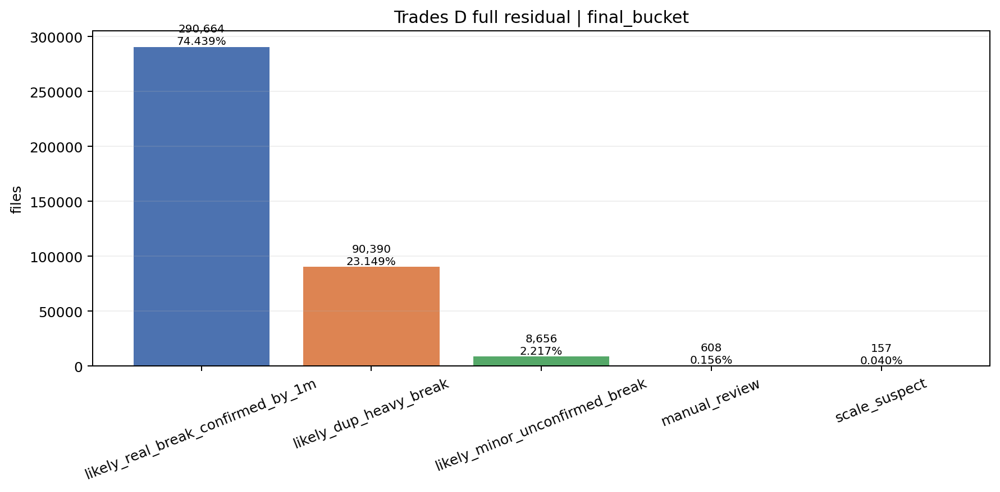

### Que muestra

Este grafico ya no describe el universo entero. Describe el residuo `D full`, es decir, la parte que sigue abierta tras los filtros previos y que necesita lectura fina.

Ahi domina:

- `likely_real_break_confirmed_by_1m`
- seguida por `likely_dup_heavy_break`

Las colas:

- `likely_minor_unconfirmed_break`
- `manual_review`
- `scale_suspect`

son mucho menores.

### Que conclusion debe sacar el lector

Este grafico prueba que el residuo duro tampoco es homogeneo. Una gran parte del residuo ya parece realinearse con `1m` o con problemas de duplicacion severa, mientras que la sospecha pura de escala extrema es muy pequena.

### Consecuencia metodologica

No toda cola del residuo D debe saltar a `bad`. La semantica del residual bucket ayuda a distinguir:

- ruptura confirmada por referencia;
- duplicacion / heavy break probable;
- y casos de escala que siguen siendo sospecha pura.

## 5. Tercera foto: contaminacion de escala por bucket

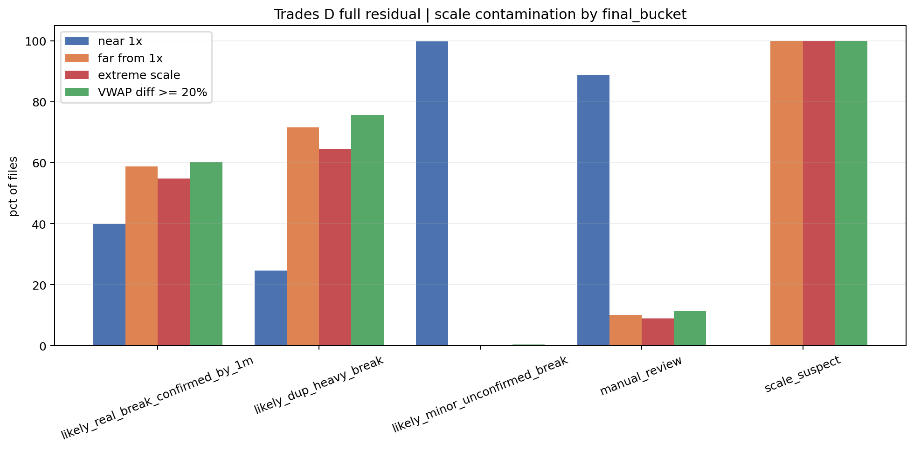

### Que muestra

Cada bucket final se cruza aqui con cuatro firmas de dano:

- `near 1x`
- `far from 1x`
- `extreme scale`
- `VWAP diff >= 20%`

### Lectura inteligente

Lo relevante no es solo ver barras altas. Lo relevante es ver donde cae cada firma:

- `scale_suspect` queda contaminado al `100%` por alejamiento de `1x`, escala extrema y `VWAP diff >= 20%`;
- `likely_minor_unconfirmed_break` queda casi limpio en `near 1x`;
- `manual_review` sigue mayoritariamente cerca de `1x`, con una cola mas pequena de dano severo;
- `likely_dup_heavy_break` ya mezcla dano real con firmas de comparabilidad agresiva.

### Que conclusion debe sacar el lector

Este grafico prueba que la escala no es ruido cosmetic. Es una firma estructural que cambia de bucket a bucket. Eso justifica que `reference_scale_mismatch` y buckets relacionados no se mezclen con `bad_data` puro.

### Consecuencia para el proyecto

Para backtest y ML, este grafico obliga a reservar una vista especifica de reconciliacion (`daily_raw + split_normalized + adjusted_proxy`) y a no usar `trades_raw` como si fuera serie economica interdiaria.

## 6. Conclusiones poblacionales

1. `trades` tiene una masa grande de conflicto, pero esa masa no es equivalente a `bad tape`.
2. La poblacion esta dominada por `review`, `reference_scale_mismatch` y `review_microstructure`, no por `bad_data`.
3. El residuo duro final sigue existiendo, pero ya aparece mas estratificado y semanticamente interpretable.
4. La poblacion, por si sola, no decide certificacion final; solo fija el tamano y la composicion del problema.

## 7. Que parte de esa masa parece recuperable hoy

La lectura poblacional quedaria incompleta si el inspector mirase solo:

- el `good` diminuto;
- o la masa bruta de `review`.

Sobre el cache final canonico `57f/full_clean_fast_same_schema`, la pregunta operativa relevante es otra:

- cuanta parte de la masa grande de conflicto puede pasar hoy a `recoverable_with_flag`.

### Bucket `review`

La rematerializacion de la regla historica de rehabilitacion sobre el cierre real da:

- `review_total = 4,851,211`
- `review_recoverable_strict = 3,327,955` (`68.6005%`)
- `review_not_rehabilitated_strict = 1,523,256`
- `review_recoverable_extended = 3,505,290` (`72.2560%`)
- `review_not_rehabilitated_extended = 1,345,921`

### Bucket `review_microstructure`

Con una recuperacion operativa provisional, anclada en la semantica historica del bucket, el cierre real da:

- `review_microstructure_total = 2,130,781`
- `recoverable_strict_provisional = 1,516,547` (`71.1733%`)
- `recoverable_extended_provisional = 1,636,379` (`76.7971%`)

### Bucket `review_1m_reference_alignment`

Tambien bajo recuperacion operativa provisional:

- `review_1m_reference_alignment_total = 4,992`
- `recoverable_strict_provisional = 2,591` (`51.9030%`)
- `recoverable_extended_provisional = 3,715` (`74.4191%`)

### Que responde esta seccion

Responde:

- cuanta masa conflictiva sigue siendo util bajo flag;
- por que no debe usarse `good` como proxy de toda la masa util;
- y por que `review` no debe leerse como una condena uniforme.

No responde:

- a la rehabilitacion final completa de todas las familias;
- ni a la promocion futura de `reference_scale_mismatch`, que sigue pendiente de una reconciliacion estable.

### Consecuencia

La conclusion operativa correcta es:

- `trades` no es un bloque pristine;
- pero tampoco es un bloque muerto;
- y la masa util real del proyecto vive sobre todo en la parte rehabilitable de `review` y de familias vecinas, no en la cola `good`.

# Trades Good Cases v0.1

Documento fuente: `inspection_dossiers/trades/good_justification/trades_good_cases_v0_1.md`

## 1. Rol

`good` en `trades` existe, pero es extremadamente escaso. Por eso no debe sobrerrepresentarse.

Su valor no es estadistico. Su valor es semantico: demuestra como se ve un file cuando el flujo de trades:

- cabe dentro del rango diario;
- alinea con `1m`;
- no necesita narrativa correctiva de escala;
- y no presenta una cola outside material.

### Responde

- como se ve un file realmente limpio dentro de este ecosistema;
- que patron visual y metrico deberia aproximarse a `good`;
- por que `good` existe como referencia semantica aunque sea pequeno.

### No responde

- cuanta masa util total tiene `trades`;
- si todo lo no-`good` es inservible;
- ni si el bloque puede consumirse sin politicas de recuperacion.

## 2. Caso DMYS 2022-09-06

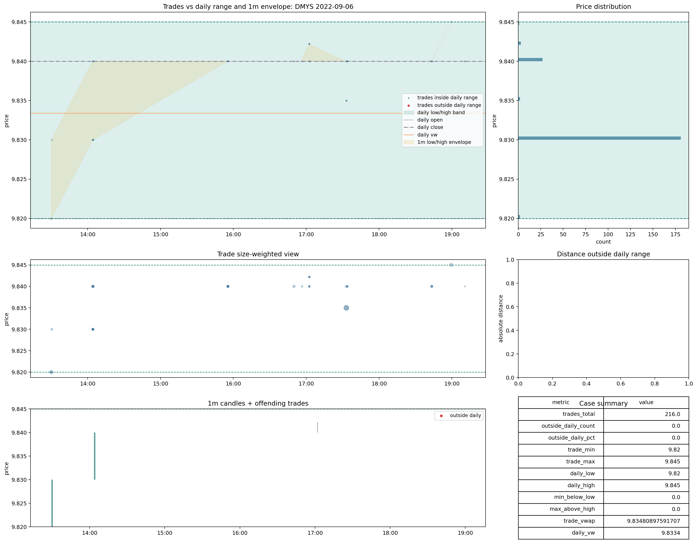

### Que muestra la imagen

- los trades permanecen dentro del rango diario;
- no hay `outside_daily` material;
- el `trade_vwap` y `daily_vw` quedan muy proximos;
- la tabla resumen deja el file sin distancia ofensora real.

### Que pregunta responde

Responde a si `good` es una ficcion teorica o una firma observable. La imagen demuestra que es una firma real del tape limpio.

### Que conclusion debe sacar el lector

Este es el patron que justifica que `good` siga existiendo como estado separado y no como mera teoria. La imagen prueba que, aunque el bucket sea minimo, si hay files donde `trades` parece representar el dia de forma coherente.

### Que decision cambia

- este patron es apto para consumo relativamente limpio en ejecucion y referencias microestructurales;
- evita llamar `review` a casos donde el tape si parece sano.

### Que no debe concluir

- no debe concluir que esta cola representa la masa util total;
- no debe concluir que el bloque `trades` es sano en general;
- solo debe concluir que la referencia de limpieza existe y es observable.

### Que pipeline afecta

- ejecucion: apto como referencia limpia;
- ML microestructural: apto como ejemplo positivo;
- forensic: sirve como contraste de normalidad frente al resto del bloque.

## 3. Caso CLSN 2016-05-16

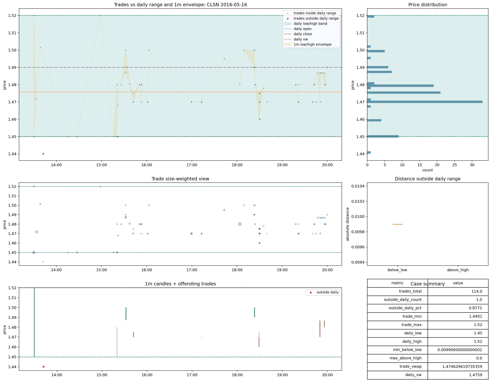

### Lectura analitica

- la nube de prints sigue el entorno diario y el sobre `1m`;
- no aparece firma de escala extrema ni contaminacion outside relevante;
- la imagen ensena que `good` no significa perfeccion ideal, sino coherencia suficiente para uso limpio.

### Que pregunta responde

Responde a si la rareza de `good` invalida su valor. La respuesta es no: precisamente por ser raro sirve como patron de contraste frente a buckets recuperables o duros.

### Que error metodologico evita

Evita concluir que, como `good` es muy pequeno, todo `trades` esta condenado. La existencia de esta cola prueba que el tape puede ser semanticamente sano; lo que ocurre es que ese estado es raro en el bloque actual.

## 4. Que ensena la cola good

El hecho de que `good` sea tan pequeno no invalida el dataset. Lo que ensena es otra cosa:

- `trades` debe leerse como bloque de alta friccion y comparabilidad dificil, no como serie diaria simple;
- cuando aparece `good`, no hay que extrapolarlo a todo el universo;
- pero tampoco hay que negar su valor como referencia de como se ve un file sano en este ecosistema.

### Consecuencia

La consecuencia operativa es que `good` debe usarse como referencia positiva de QA y calibracion, no como estimador de masa util total. La masa util real del bloque depende de la rehabilitacion de `review`, no de la cola pristine.

# Trades Review Cases v0.1

Documento fuente: `inspection_dossiers/trades/flagged_case_evidence_packs/trades_review_cases_v0_1.md`

## 1. Rol

Este dossier documenta la franja `review` de `trades`. Despues del cierre final, esta franja ya no debe leerse como una masa uniforme. Se reparte entre:

- `recoverable_with_flag`
- `review_not_rehabilitated`

segun el bucket tecnico y la regla de rehabilitacion final.

La pregunta central ya no es solo si existe conflicto. La pregunta correcta es:

- que clase de conflicto es;
- si el conflicto destruye la lectura economica del file o solo rompe la comparabilidad con el arbitro;
- y que pipeline queda afectado por esa diferencia.

## 2. `reference_scale_mismatch`

### Que significa este bucket

Este bucket aparece cuando el flujo raw de trades parece vivir en otra escala frente a `daily` o `1m`. Su idea central es muy importante:

- no prueba, por si solo, que el tape este corrupto;
- prueba que la comparacion con la referencia esta mal planteada o que la escala no esta reconciliada.

Mientras no exista una reconciliacion institucional de escala, este bucket no debe entrar en `good` ni en `recoverable_with_flag` automatico.

### Responde

- si el conflicto dominante es de escala y no de corrupcion intrinseca del tape;
- si el arbitro `daily` o `1m` esta comparando magnitudes no reconciliadas;
- si el file exige una capa `split_normalized` o reconciliacion equivalente antes de cualquier juicio economico serio.

### No responde

- si el file seria util una vez reconciliada la escala;
- si el flujo intrinseco del tape es limpio o sucio en sentido microestructural fino;
- ni si el caso merece exclusion definitiva.

### Caso SGA 2009-01-05

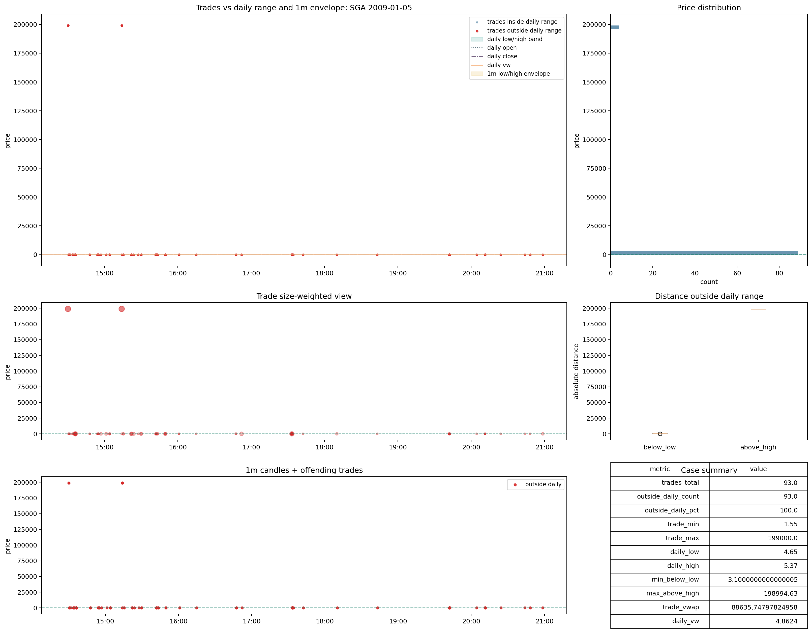

#### Que muestra la imagen

- los prints raw de `trades` y el `VWAP` asociado no se mueven como pequenos desbordes alrededor del rango diario;
- la mayor parte del conflicto viene de una escala distinta, no de unos pocos ticks marginales;
- por eso el problema no se comporta como microestructura fina ni como outlier aislado.

#### Que pregunta responde

Responde a esta pregunta: cuando el arbitro protesta, protesta porque el tape sea absurdo o porque vive en otra escala. En este caso la imagen apoya claramente la segunda lectura.

#### Que conclusion debe sacar el lector

La imagen no dice "file muerto". Dice algo mas preciso:

- el arbitro diario y el flujo raw no comparten la misma escala operativa;
- mientras eso siga asi, no hay forma limpia de usar el file como observacion comparable de ejecucion o de retorno intradia.

#### Que no debe concluir

- no debe concluir que el tape este muerto por dentro;
- no debe concluir que un simple flag cosmetico arregla el caso;
- no debe concluir que el bucket es equivalente a `bad_data`.

#### Que decision cambia

- no puede pasar a `recoverable_with_flag` sin una capa validada de reconciliacion;
- debe permanecer en `review_not_rehabilitated` por prudencia institucional.

#### Que error metodologico evita

Evita llamar `bad_data` a un caso cuya firma dominante es de comparabilidad de escala. Si se mezclara con `bad_data`, el proyecto confundiria un problema de referencia con corrupcion intrinseca del tape.

#### Que pipeline afecta

- ejecucion simulada: no puede tratarlo como flujo limpio;
- reconciliacion: si es un caso prioritario;
- ML microestructural: util solo como senal de inconsistencia, no como tape sano;
- labels primarios: no debe contaminar objetivos economicos diarios.

### Caso LPCN 2014-07-07

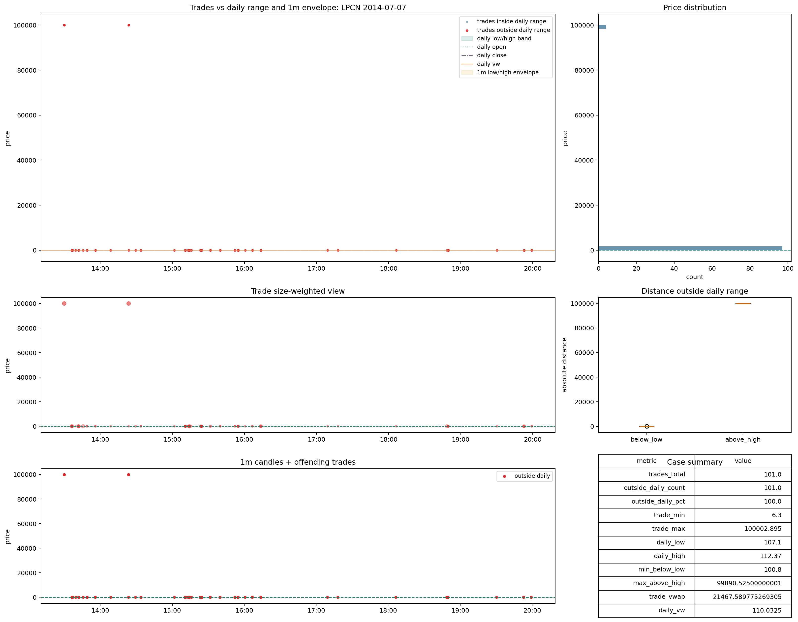

#### Lectura analitica

- la distancia frente al arbitro no es un pequeno borde del rango, sino un desacoplo de escala;
- eso explica por que este bucket merecia separarse del `bad_data` heredado;
- la imagen prueba que el conflicto es sistematico dentro del file, no una rareza cosmetica.

#### Que pregunta responde

Responde a si la familia `reference_scale_mismatch` es real o si depende de uno o dos artefactos. Este caso ensena que la firma se repite con coherencia y por eso merece politica propia.

#### Consecuencia operativa

- el caso no puede entrar en backtest o ejecucion como flujo limpio;
- pero tampoco debe usarse como evidencia de muerte del dataset completo.

## 3. `review_microstructure`

### Que significa este bucket

Aqui el problema dominante no es escala global, sino estructura fina del flujo:

- odd-lots;
- liquidez minima;
- concentracion en prints pequenos;
- comparabilidad delicada entre trades y referencias agregadas.

Este bucket es importante porque ensena que no todo conflicto es macro. Parte del dano vive en la textura del tape.

### Responde

- si el file sigue siendo economicamente interpretable pero metodologicamente fragil;
- si la friccion vive en odd-lots, duplicados o textura fina del flujo;
- si el dano cambia sobre todo decisiones de ejecucion y ML microestructural, no necesariamente la escala total del file.

### No responde

- si el file puede promoverse a `good`;
- si el arbitro de escala quedaria resuelto con una simple normalizacion;
- ni si el conflicto desaparece en todas las agregaciones.

### Caso QRTEB 2019-07-24

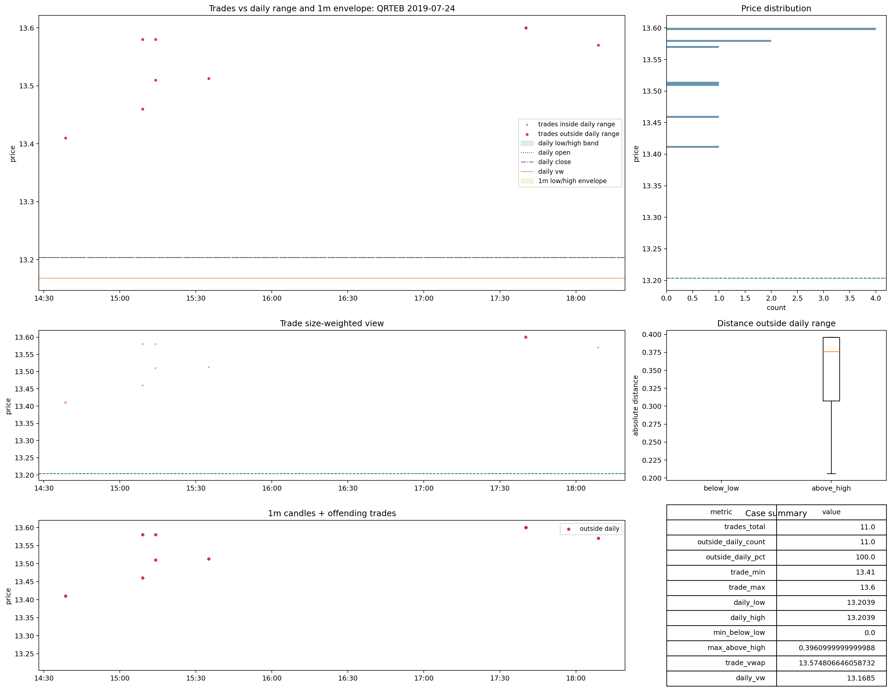

#### Que muestra la imagen

- el conflicto no destruye toda la nube de precios del file;
- se concentra en una estructura fina donde los prints pequenos y el outside ganan peso relativo;
- el file sigue siendo legible, pero no como flujo redondo y limpio.

#### Que pregunta responde

Responde a si el problema destruye toda la lectura economica o solo la vuelve friccional. La imagen apoya la segunda lectura: el tape no es plenamente sano, pero tampoco es `bad_data`.

#### Que conclusion debe sacar el lector

La imagen apoya una lectura de friccion microestructural, no de tape absurdamente roto. Eso cambia completamente la decision:

- un caso asi puede ser util para investigacion de ejecucion o ML microestructural con `flag`;
- no es apto para entrar como observacion de referencia limpia.

#### Que error metodologico evita

Evita tratar como `bad` un file cuyo dano es fino y contextual. El error contrario seria tambien grave: llamarlo `good` y perder la advertencia de que la friccion microestructural sesga la comparabilidad.

#### Que no resuelve

No resuelve si el caso debe entrar en produccion sin flag. Solo demuestra que la decision correcta depende del uso del pipeline.

### Caso CZFS 2022-08-11

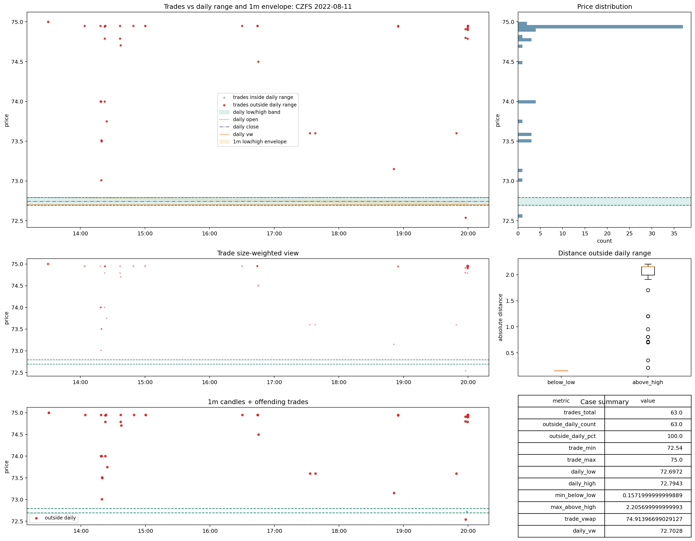

#### Lectura analitica

- el dano no rompe la escala completa del file;
- obliga a interpretacion contextual;
- ensena que el flujo puede ser economicamente interpretable y, al mismo tiempo, poco fiable como arbitro limpio.

#### Que pregunta responde

Responde a si la familia `review_microstructure` es solo ruido fino o si realmente cambia decisiones. La respuesta aqui es si: cambia ejecucion, ML microestructural y la lectura de calidad del tape.

#### Consecuencia operativa

- compatible con `recoverable_with_flag` en ejecucion o ML de calidad;
- incompatible con consumo primario sin marca.

## 4. `review_1m_reference_alignment`

### Que significa este bucket

Este bucket existe porque mirar solo `daily` no basta. Hay casos donde:

- `daily` y `trade_vwap` parecen razonables;
- pero el arbitro `1m` rompe la lectura al abrir la estructura fina.

Su funcion es evitar una falsa rehabilitacion por apariencia diaria gruesa.

### Responde

- si `1m` aporta informacion decisiva que `daily` no ve;
- si la aparente normalidad diaria es una ilusion de agregacion;
- si el arbitro fino cambia el veredicto del caso.

### No responde

- si el file seria bueno sin arbitro fino;
- si el conflicto es de escala global;
- ni si la ausencia de `1m` podria habernos llevado al mismo veredicto.

### Caso RELV 2018-06-07

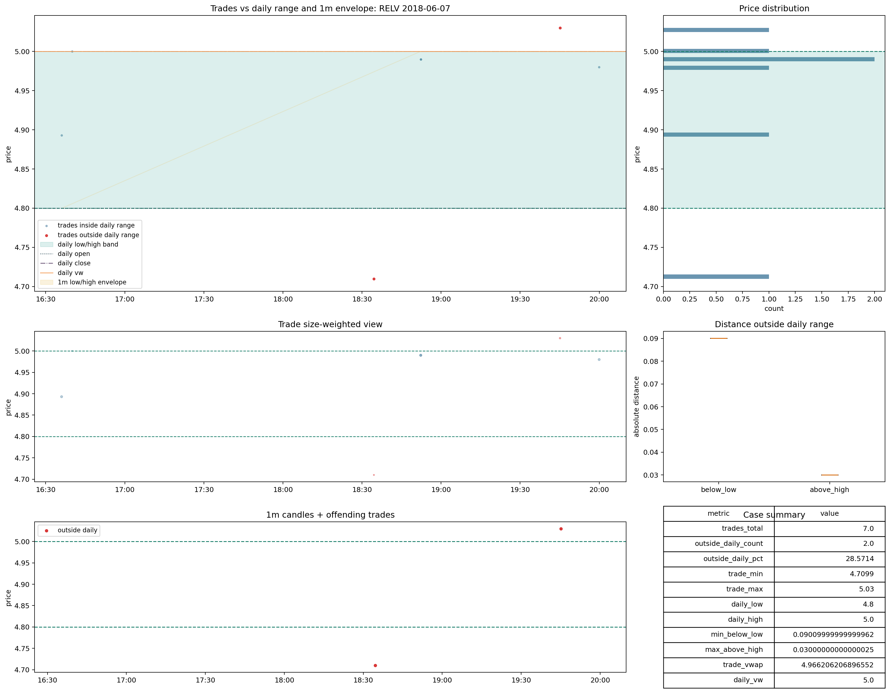

#### Lectura analitica

- el conflicto no se resuelve al comparar solo con `daily`;
- aparece al abrir el arbitro `1m`;
- por eso el bucket no es redundante: captura una clase de fallo que `daily` solo no ve.

#### Que pregunta responde

Responde a si `1m` es decorativo o decisivo. En este caso es decisivo: sin `1m`, el caso correria el riesgo de rehabilitarse demasiado pronto.

#### Consecuencia operativa

- sin arbitro `1m`, este caso podria entrar por error en `recoverable_with_flag` demasiado pronto;
- con `1m`, el proyecto retiene una capa de prudencia que protege tanto ejecucion como labels finos.

### Caso METC 2021-03-22

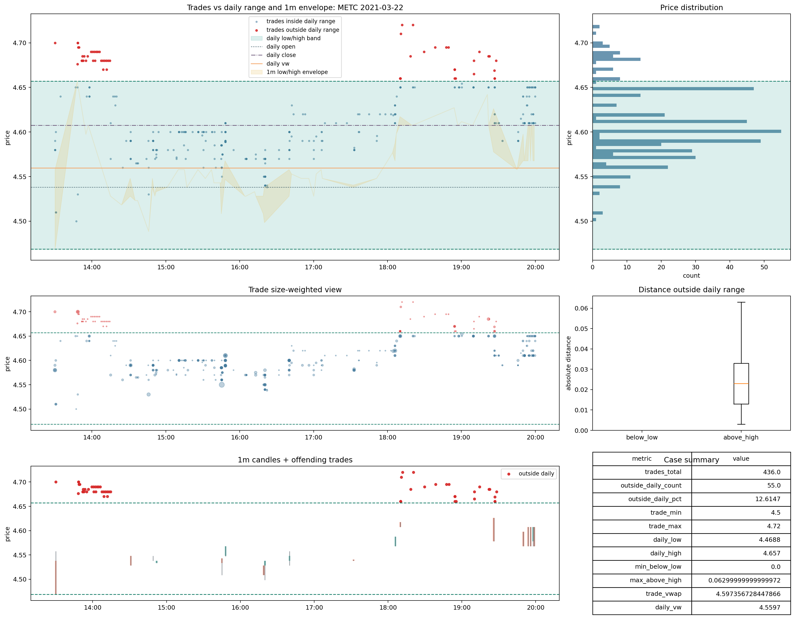

#### Lectura analitica

- `daily` y `trade_vwap` pueden parecer aceptables;
- pero el nucleo del file rompe al confrontarse con `1m`;
- eso prueba que la aceptacion no debe descansar solo sobre resumenes diarios.

#### Que no debe concluir

No debe concluir que `daily` es inutil. Debe concluir algo mas preciso: `daily` es insuficiente como arbitro unico para esta familia.

#### Que pipeline afecta

- ejecucion: directamente, porque el `1m` es parte del arbitro de consistencia;
- ML microestructural: si no se detecta este bucket, el modelo aprende conflicto etiquetado como normalidad;
- reconciliacion: este es un caso claro donde `1m` cambia el veredicto.

## 5. `review_no_1m_reference`

### Que significa este bucket

Aqui el conflicto frente a `daily` existe, pero falta arbitro `1m`. Eso no absuelve ni condena. Solo limita la confianza del veredicto.

### Responde

- si la incertidumbre de arbitro debe modelarse como estado propio;
- si la falta de `1m` obliga a prudencia y no a conclusiones binarias;
- si el proyecto necesita `recoverable_with_flag` para no sobrecastigar casos con resolucion incompleta.

### No responde

- si el caso es intrinsicamente limpio;
- si el conflicto desapareceria con `1m`;
- ni si merece `bad` salvo evidencia adicional fuerte.

### Caso GLBL 2024-09-19

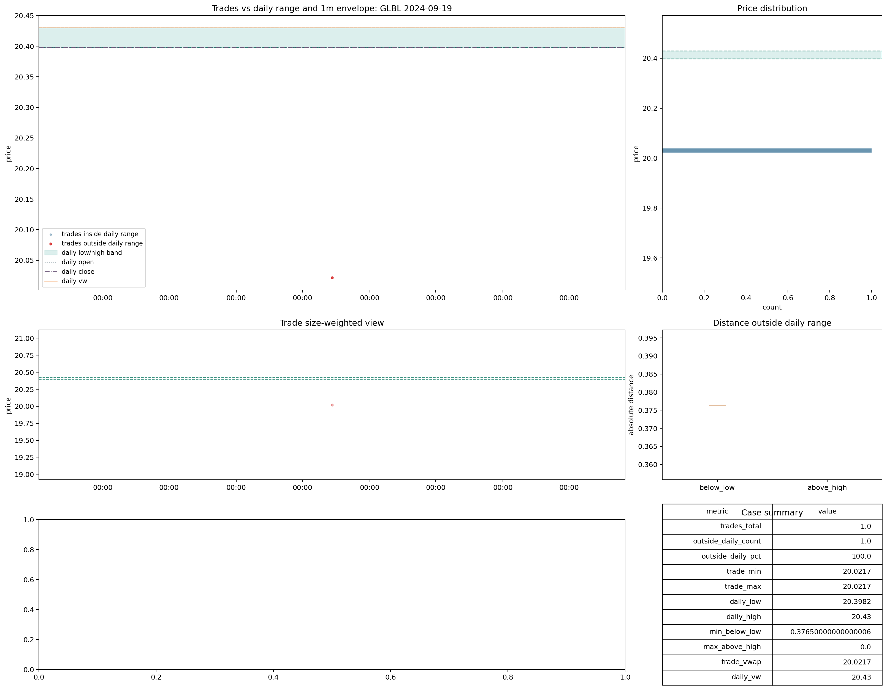

#### Lectura analitica

- el file no queda limpio frente a `daily`;
- pero tampoco puede endurecerse o relajarse con el mismo nivel de certeza que un caso con arbitro `1m` disponible.

#### Que pregunta responde

Responde a si la falta de `1m` es una prueba negativa o solo una falta de resolucion. La imagen obliga a la segunda lectura.

#### Consecuencia operativa

- favorece `recoverable_with_flag` si el resto de senales acompana;
- no apoya `good` automatico;
- tampoco apoya salto directo a `bad` salvo evidencia adicional muy fuerte.

#### Error metodologico que evita

Evita usar la ausencia de `1m` como si fuese una prueba en si misma. La ausencia de arbitro es falta de resolucion, no veredicto de culpabilidad.

## 6. `review` generico

### Que significa este bucket

Este bucket recoge el residuo que no cae ya en buckets explicativos mas concretos y que debe pasar por la regla estricta de rehabilitacion.

### Responde

- si todavia existe una masa que no se deja absorber por familias mas limpias;
- si la decision debe pasar de descripcion visual a regla cuantitativa de rehabilitacion;
- si el proyecto necesita una frontera operativa entre `recoverable_with_flag` y `review_not_rehabilitated`.

### No responde

- si toda la masa `review` es util;
- si todo el residuo debe endurecerse a `bad`;
- ni si la muestra de ejemplos bonitos basta para cerrar el bloque.

### Caso TOF 2010-06-21

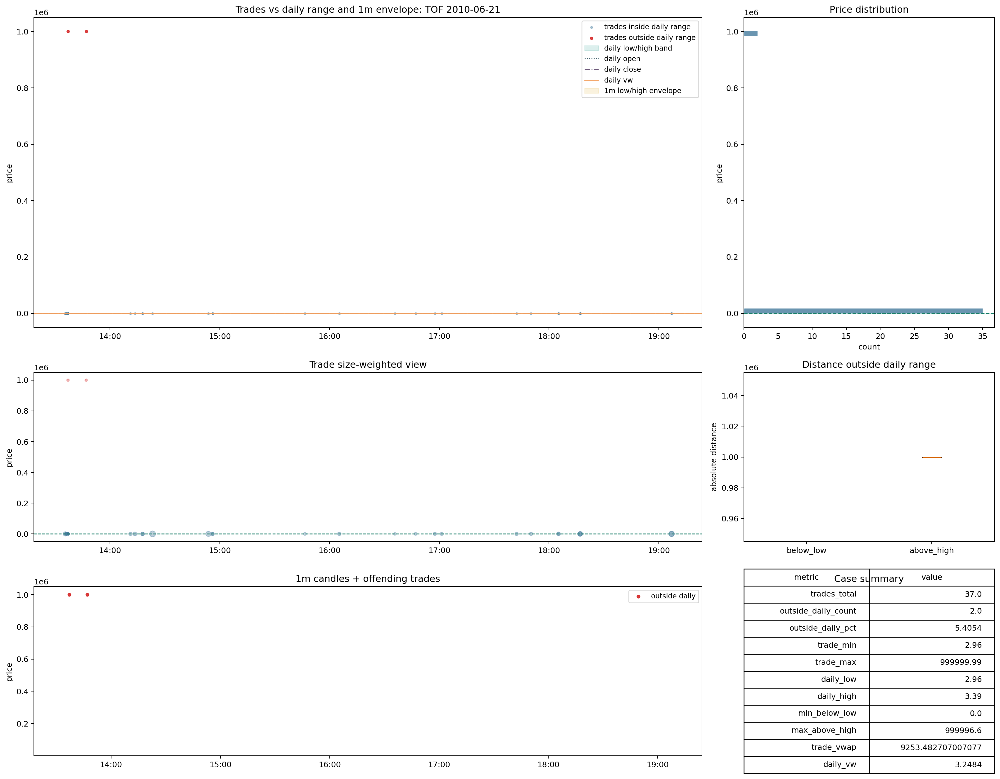

#### Lectura analitica

- la pregunta ya no es si existe conflicto, sino si el conflicto cabe dentro de umbrales tolerables frente a `daily_vw`, `VWAP` y outside regular;
- este bucket es el punto donde la politica se vuelve explicitamente cuantitativa.

#### Que pregunta responde

Responde a que parte del residuo `review` depende ya de una regla formal y no de una intuicion visual del inspector.

#### Que decision cambia

- si cumple la regla estricta, puede pasar a `recoverable_with_flag`;
- si no la cumple, debe permanecer en `review_not_rehabilitated`.

## 7. Conclusion del bloque review

La franja `review` es el corazon de `trades`. Su masa no prueba muerte del dataset. Prueba otra cosa:

- que el tape necesita capas de interpretacion;
- que comparabilidad, escala y microestructura deben separarse;
- y que la decision final debe ser por bucket y por regla, no por impresion global.

# Trades Bad Data | muestra estratificada

Documento fuente: `inspection_dossiers/trades/family_case_evidence_packs/bad_data/bad_data_cases_v0_1.md`

## Rol

Este dossier documenta `60` casos de la muestra estratificada de `bad_data`, pero arranca con un mapa general del universo `57f` para que el inspector no lea los casos aislados sin contexto.

## Que significa esta familia

Frontera semantica donde el flujo deja de ser defendible como tape de ejecucion. Responde a la pregunta de si el file conserva valor economico o solo valor forense.

## Responde

- si el tape ya cruza la frontera donde deja de ser defendible economicamente
- si el dano es intrinseco y no simple conflicto de comparabilidad

## No responde

- si todo outside severo es automaticamente `bad_data`
- si el dataset completo esta muerto por tener una cola `bad`

## Consecuencia

- excluir de ejecucion, benchmarking y labels productivos
- conservar solo valor forense o de deteccion de dano

## Mapa general del universo

- `57f` contiene `9,429,112` files en total.
- `bad_data` contiene `15,869` files (`0.168%` del universo).

**Que muestra**

- La distribucion final del universo completo por `acceptance_label` en el cierre real `57f`.
- Permite ver que `bad_data` es una cola pequena del universo y no la masa dominante del bloque.

**Responde**

- Cuanta masa total hay en `trades` y donde cae `bad_data` dentro del universo completo.
- Si el inspector esta viendo una patologia dominante del dataset o una cola dura acotada.

**No responde**

- No responde todavia a que tipo de `bad_data` domina internamente.
- No responde a por que un caso individual concreto cae en rechazo duro.

**Consecuencia**

- Evita leer los casos de `bad_data` como si describieran el dataset entero.

## Mapa general de firmas duras dentro de `bad_data`

**Que muestra**

- La composicion interna de `bad_data` en `57f` por firmas fuertes de fallo.
- `trade_price_outside_daily_range = 9,606` (`60.53%`).
- `scale_bucket_vw = nan = 4,247` (`26.76%`).
- `outside_daily_regular_pct = 100% = 5,707` (`35.96%`).
- `outside_1m_regular_pct = 100% = 4,910` (`30.94%`).
- `negative_or_zero_size_rows = 695` (`4.38%`).
- `duplicate_excess_ratio_gt_hard_cap = 1,329` (`8.37%`).

**Responde**

- Si `bad_data` esta dominado sobre todo por colapso de escala/rango o por integridad estructural del tape.
- Que parte de la cola dura se ve bien con el panel de precio actual y que parte exige paneles complementarios.

**No responde**

- No responde a la causalidad exacta de cada file individual.
- No responde a si todos los casos con una firma dura deben leerse exactamente igual.

**Consecuencia**

- Justifica que `bad_data` no se trate como una sola familia visual.
- Justifica por que este dossier anade panel de integridad y tablas concretas de filas invalidas cuando aplica.

## Casos

### ASTI | 2007-12-24

**Que muestra**

- Panel rico del tape raw frente a `daily` y `1m` para `ASTI` el `2007-12-24`.
- `n_trades = 937`, `outside_daily_regular_pct = 100.00%`, `outside_1m_regular_pct = nan%`.
- `trade_vwap_vs_daily_vw_diff_pct_raw = nan%`, `duplicate_exact_ratio_pct_raw = 11.31%`, `odd_lot_trade_pct = 0.00%`.

**Responde**

- Subfamilia donde el panel de precio ya demuestra por si mismo una ruptura semantica: tape y arbitros viven en escalas incompatibles o el porcentaje fuera de rango es practicamente total.
- El fallo se ve de forma directa en el panel de precio: el tape y los arbitros no conviven en una misma geometria defendible.
- La lectura correcta exige mirar la separacion vertical entre prints y arbitros y el hecho de que el conflicto de rango sea practicamente total.
- Aqui el panel actual si responde bien a por que el file cae en `bad_data`.
- El 11.31% de duplicacion exacta obliga a sospechar dano de tape o bursts mecanicos, no solo ruido visual.
- La decision que justifica es exclusion de ejecucion simulada, labels y benchmarking; solo queda valor forense.

**No responde**

- No responde a si la duplicacion es la causa principal del rechazo; puede empeorar el caso, pero no explica por si sola la geometria rota.
- No responde a si existiria una reconciliacion de escala defendible; el colapso ya es demasiado extremo para tratarlo como simple normalizacion.

**Consecuencia**

- Excluir de ejecucion simulada, labels y benchmarking.
- Conservar solo valor forense o de deteccion de dano severo.

**Grupos duplicados exactos mas relevantes**

| ts_ny | price | size | count |
|---|---|---|---|
| 2007-12-24 12:42:56.587 | 20.8 | 100 | 7 |
| 2007-12-24 12:12:05.243 | 20.48 | 100 | 6 |
| 2007-12-24 09:50:14.557 | 20.27 | 100 | 5 |
| 2007-12-24 10:51:15.040 | 20.3 | 100 | 4 |
| 2007-12-24 11:17:28.150 | 20.24 | 100 | 3 |
| 2007-12-24 11:39:45.013 | 20.31 | 200 | 3 |
| 2007-12-24 11:49:20.207 | 20.39 | 120 | 3 |
| 2007-12-24 12:12:24.120 | 20.48 | 100 | 3 |
| 2007-12-24 12:23:21.533 | 20.58 | 100 | 3 |
| 2007-12-24 12:50:52.767 | 21.0 | 300 | 3 |

### ASTI | 2009-10-27

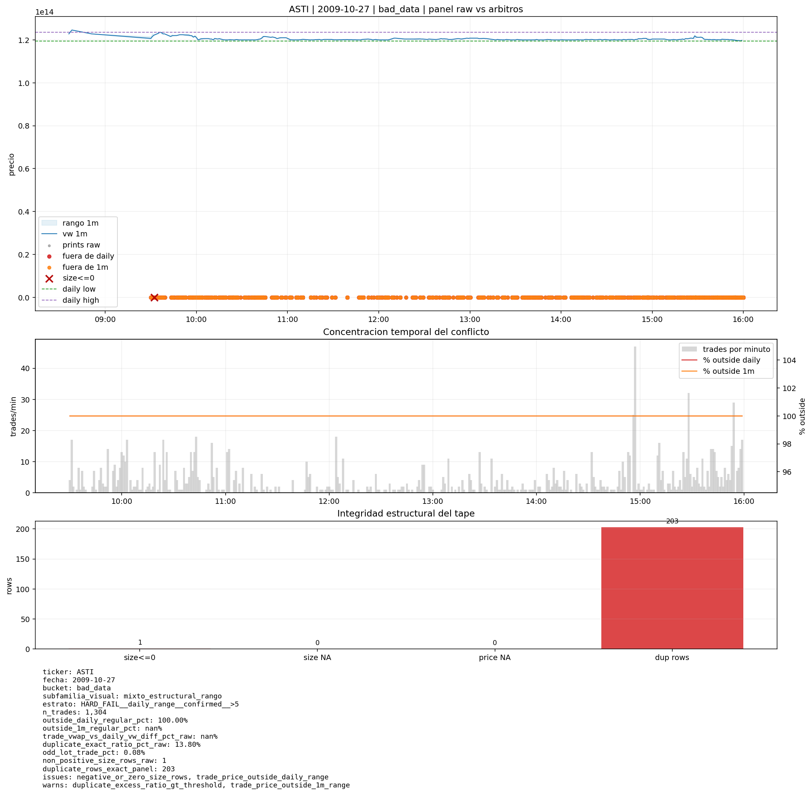

**Que muestra**

- Panel rico del tape raw frente a `daily` y `1m` para `ASTI` el `2009-10-27`.
- `n_trades = 1,304`, `outside_daily_regular_pct = 100.00%`, `outside_1m_regular_pct = nan%`.
- `trade_vwap_vs_daily_vw_diff_pct_raw = nan%`, `duplicate_exact_ratio_pct_raw = 13.80%`, `odd_lot_trade_pct = 0.08%`.

**Responde**

- Subfamilia mixta donde hay conflicto visual de rango, pero tambien senales de integridad del tape. El rechazo no debe apoyarse en una sola capa de evidencia.
- El caso combina conflicto de rango con senales de integridad del tape.
- La lectura correcta no es elegir una sola causa, sino reconocer que hay dano mixto: lo visual protesta y la estructura interna tambien.
- La clasificacion a `bad_data` se apoya en ambas capas de evidencia y no solo en el porcentaje outside.
- El 13.80% de duplicacion exacta obliga a sospechar dano de tape o bursts mecanicos, no solo ruido visual.
- La presencia de `negative_or_zero_size_rows` mueve la causalidad desde el precio hacia la integridad estructural del tape.
- La decision que justifica es exclusion de ejecucion simulada, labels y benchmarking; solo queda valor forense.

**No responde**

- No responde a una unica causa limpia; obliga a aceptar que hay mezcla de fenomenos.
- No absuelve el file aunque una de las dos capas parezca mas suave que la otra.

**Consecuencia**

- Excluir el file y tratarlo como rechazo duro, no como caso de reconciliacion fina.
- Mantener el requisito de una segunda imagen de integridad cuando se presente al inspector.

**Filas invalidas exactas (`size <= 0`)**

| ts_ny | price | size | exchange | conditions |
|---|---|---|---|---|
| 2009-10-27 09:32:19.840 | 6.11 | 0 | 11 | 16 |

**Grupos duplicados exactos mas relevantes**

| ts_ny | price | size | count |
|---|---|---|---|
| 2009-10-27 14:57:11.680 | 6.0 | 100 | 6 |
| 2009-10-27 11:01:43.010 | 6.02 | 100 | 5 |
| 2009-10-27 14:32:05.577 | 6.0 | 100 | 5 |
| 2009-10-27 10:24:11.193 | 6.0 | 100 | 4 |
| 2009-10-27 12:04:14.273 | 6.0 | 100 | 4 |
| 2009-10-27 14:06:52.540 | 6.0 | 100 | 4 |
| 2009-10-27 14:48:53.387 | 6.0 | 100 | 4 |
| 2009-10-27 14:57:11.687 | 6.0 | 100 | 4 |
| 2009-10-27 15:42:48.170 | 6.0 | 100 | 4 |
| 2009-10-27 10:22:51.410 | 6.01 | 100 | 3 |

### ASTI | 2010-11-26

**Que muestra**

- Panel rico del tape raw frente a `daily` y `1m` para `ASTI` el `2010-11-26`.
- `n_trades = 372`, `outside_daily_regular_pct = 100.00%`, `outside_1m_regular_pct = 100.00%`.
- `trade_vwap_vs_daily_vw_diff_pct_raw = nan%`, `duplicate_exact_ratio_pct_raw = 16.94%`, `odd_lot_trade_pct = 0.00%`.

**Responde**

- Subfamilia donde el panel de precio ya demuestra por si mismo una ruptura semantica: tape y arbitros viven en escalas incompatibles o el porcentaje fuera de rango es practicamente total.
- El fallo se ve de forma directa en el panel de precio: el tape y los arbitros no conviven en una misma geometria defendible.
- La lectura correcta exige mirar la separacion vertical entre prints y arbitros y el hecho de que el conflicto de rango sea practicamente total.
- Aqui el panel actual si responde bien a por que el file cae en `bad_data`.
- El 16.94% de duplicacion exacta obliga a sospechar dano de tape o bursts mecanicos, no solo ruido visual.
- La decision que justifica es exclusion de ejecucion simulada, labels y benchmarking; solo queda valor forense.

**No responde**

- No responde a si la duplicacion es la causa principal del rechazo; puede empeorar el caso, pero no explica por si sola la geometria rota.
- No responde a si existiria una reconciliacion de escala defendible; el colapso ya es demasiado extremo para tratarlo como simple normalizacion.

**Consecuencia**

- Excluir de ejecucion simulada, labels y benchmarking.
- Conservar solo valor forense o de deteccion de dano severo.

**Grupos duplicados exactos mas relevantes**

| ts_ny | price | size | count |
|---|---|---|---|
| 2010-11-26 12:38:28.940 | 3.37 | 100 | 6 |
| 2010-11-26 12:22:09.277 | 3.36 | 100 | 5 |
| 2010-11-26 11:02:25.633 | 3.37 | 100 | 3 |
| 2010-11-26 12:02:01.727 | 3.36 | 100 | 3 |
| 2010-11-26 12:22:09.310 | 3.36 | 100 | 3 |
| 2010-11-26 12:58:49.030 | 3.36 | 100 | 3 |
| 2010-11-26 12:59:03.797 | 3.38 | 100 | 3 |
| 2010-11-26 12:59:03.800 | 3.4 | 100 | 3 |
| 2010-11-26 09:30:00.757 | 3.35 | 7360 | 2 |
| 2010-11-26 09:39:14.840 | 3.35 | 100 | 2 |

### ASTI | 2011-01-05

**Que muestra**

- Panel rico del tape raw frente a `daily` y `1m` para `ASTI` el `2011-01-05`.
- `n_trades = 1,969`, `outside_daily_regular_pct = 100.00%`, `outside_1m_regular_pct = 100.00%`.
- `trade_vwap_vs_daily_vw_diff_pct_raw = nan%`, `duplicate_exact_ratio_pct_raw = 10.01%`, `odd_lot_trade_pct = 0.00%`.

**Responde**

- Subfamilia donde el panel de precio ya demuestra por si mismo una ruptura semantica: tape y arbitros viven en escalas incompatibles o el porcentaje fuera de rango es practicamente total.
- El fallo se ve de forma directa en el panel de precio: el tape y los arbitros no conviven en una misma geometria defendible.
- La lectura correcta exige mirar la separacion vertical entre prints y arbitros y el hecho de que el conflicto de rango sea practicamente total.
- Aqui el panel actual si responde bien a por que el file cae en `bad_data`.
- El 10.01% de duplicacion exacta obliga a sospechar dano de tape o bursts mecanicos, no solo ruido visual.
- La decision que justifica es exclusion de ejecucion simulada, labels y benchmarking; solo queda valor forense.

**No responde**

- No responde a si la duplicacion es la causa principal del rechazo; puede empeorar el caso, pero no explica por si sola la geometria rota.
- No responde a si existiria una reconciliacion de escala defendible; el colapso ya es demasiado extremo para tratarlo como simple normalizacion.

**Consecuencia**

- Excluir de ejecucion simulada, labels y benchmarking.
- Conservar solo valor forense o de deteccion de dano severo.

**Grupos duplicados exactos mas relevantes**

| ts_ny | price | size | count |
|---|---|---|---|
| 2011-01-05 10:50:53.350 | 3.74 | 100 | 17 |
| 2011-01-05 14:43:29.733 | 3.66 | 100 | 15 |
| 2011-01-05 14:46:42.130 | 3.67 | 100 | 12 |
| 2011-01-05 09:49:42.737 | 3.78 | 100 | 6 |
| 2011-01-05 10:15:44.753 | 3.76 | 100 | 6 |
| 2011-01-05 10:34:56.613 | 3.74 | 100 | 6 |
| 2011-01-05 10:50:48.270 | 3.74 | 100 | 6 |
| 2011-01-05 14:46:42.127 | 3.67 | 100 | 6 |
| 2011-01-05 10:07:58.620 | 3.75 | 400 | 5 |
| 2011-01-05 12:04:44.303 | 3.7 | 100 | 5 |

### DCTH | 2005-12-29

**Que muestra**

- Panel rico del tape raw frente a `daily` y `1m` para `DCTH` el `2005-12-29`.
- `n_trades = 45`, `outside_daily_regular_pct = 100.00%`, `outside_1m_regular_pct = 100.00%`.
- `trade_vwap_vs_daily_vw_diff_pct_raw = nan%`, `duplicate_exact_ratio_pct_raw = 13.33%`, `odd_lot_trade_pct = 0.00%`.

**Responde**

- Subfamilia donde el panel de precio ya demuestra por si mismo una ruptura semantica: tape y arbitros viven en escalas incompatibles o el porcentaje fuera de rango es practicamente total.
- El fallo se ve de forma directa en el panel de precio: el tape y los arbitros no conviven en una misma geometria defendible.
- La lectura correcta exige mirar la separacion vertical entre prints y arbitros y el hecho de que el conflicto de rango sea practicamente total.
- Aqui el panel actual si responde bien a por que el file cae en `bad_data`.
- El 13.33% de duplicacion exacta obliga a sospechar dano de tape o bursts mecanicos, no solo ruido visual.
- La decision que justifica es exclusion de ejecucion simulada, labels y benchmarking; solo queda valor forense.

**No responde**

- No responde a si la duplicacion es la causa principal del rechazo; puede empeorar el caso, pero no explica por si sola la geometria rota.
- No responde a si existiria una reconciliacion de escala defendible; el colapso ya es demasiado extremo para tratarlo como simple normalizacion.

**Consecuencia**

- Excluir de ejecucion simulada, labels y benchmarking.
- Conservar solo valor forense o de deteccion de dano severo.

**Grupos duplicados exactos mas relevantes**

| ts_ny | price | size | count |
|---|---|---|---|
| 2005-12-29 09:43:32.176 | 3.33 | 100 | 2 |
| 2005-12-29 12:00:04.944 | 3.3 | 100 | 2 |
| 2005-12-29 12:42:02.210 | 3.26 | 100 | 2 |

### WSBF | 2009-08-14

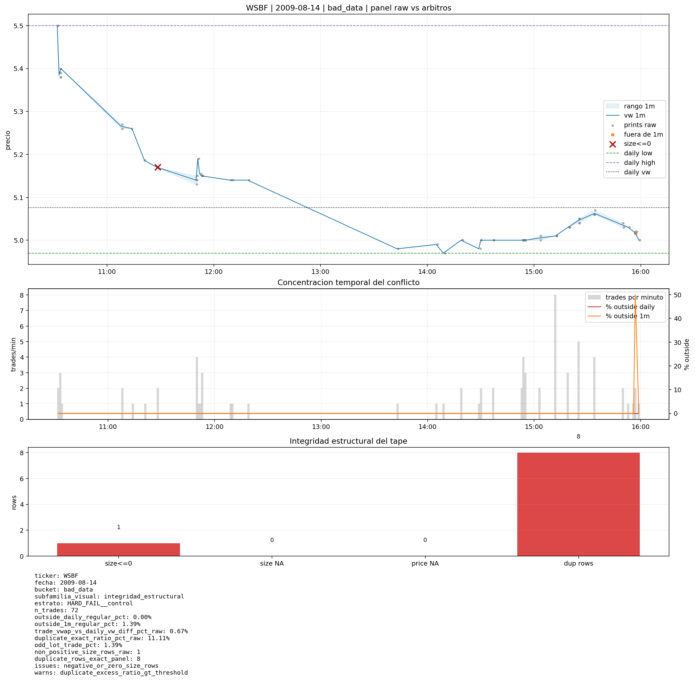

**Que muestra**

- Panel rico del tape raw frente a `daily` y `1m` para `WSBF` el `2009-08-14`.
- `n_trades = 72`, `outside_daily_regular_pct = 0.00%`, `outside_1m_regular_pct = 1.39%`.
- `trade_vwap_vs_daily_vw_diff_pct_raw = 0.67%`, `duplicate_exact_ratio_pct_raw = 11.11%`, `odd_lot_trade_pct = 1.39%`.

**Responde**

- Subfamilia donde el motivo principal del rechazo no vive en la trayectoria del precio, sino en la integridad del tape: sizes no validos, duplicacion dura o estructura interna corrupta.
- El precio puede parecer casi normal, asi que la causalidad principal no vive en la geometria del panel superior.
- La lectura correcta depende del panel de integridad: sizes no validos, duplicados o rows estructuralmente invalidos.
- Aqui el panel de precio por si solo no basta; el panel de integridad es el que justifica el rechazo.
- El 11.11% de duplicacion exacta obliga a sospechar dano de tape o bursts mecanicos, no solo ruido visual.
- La presencia de `negative_or_zero_size_rows` mueve la causalidad desde el precio hacia la integridad estructural del tape.
- La decision que justifica es exclusion de ejecucion simulada, labels y benchmarking; solo queda valor forense.

**No responde**

- No responde a si una sola fila invalida bastaria siempre para condenar cualquier file; la clasificacion depende del contexto estructural total.
- No responde a la rehabilitacion del caso; solo justifica por que hoy sigue en la cola dura.

**Consecuencia**

- Mantener el caso en `bad_data` por integridad estructural del tape.
- Usar el panel de integridad, la `X` roja y las tablas exactas como trio minimo de prueba para esta subfamilia.

**Filas invalidas exactas (`size <= 0`)**

| ts_ny | price | size | exchange | conditions |
|---|---|---|---|---|
| 2009-08-14 11:28:21.807 | 5.17 | 0 | 11 | 16 |

**Grupos duplicados exactos mas relevantes**

| ts_ny | price | size | count |
|---|---|---|---|
| 2009-08-14 14:19:48.117 | 5.0 | 100 | 2 |
| 2009-08-14 14:30:21.800 | 5.0 | 100 | 2 |
| 2009-08-14 15:12:45.323 | 5.01 | 100 | 2 |
| 2009-08-14 15:25:34.047 | 5.05 | 100 | 2 |

### CWBC | 2006-01-10

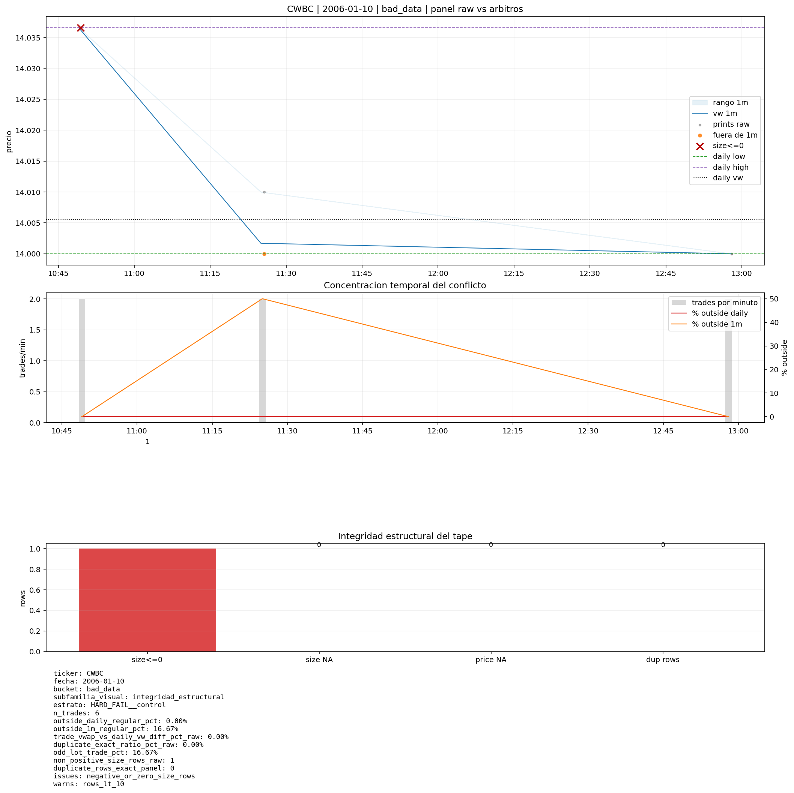

**Que muestra**

- Panel rico del tape raw frente a `daily` y `1m` para `CWBC` el `2006-01-10`.
- `n_trades = 6`, `outside_daily_regular_pct = 0.00%`, `outside_1m_regular_pct = 16.67%`.
- `trade_vwap_vs_daily_vw_diff_pct_raw = 0.00%`, `duplicate_exact_ratio_pct_raw = 0.00%`, `odd_lot_trade_pct = 16.67%`.

**Responde**

- Subfamilia donde el motivo principal del rechazo no vive en la trayectoria del precio, sino en la integridad del tape: sizes no validos, duplicacion dura o estructura interna corrupta.
- El precio puede parecer casi normal, asi que la causalidad principal no vive en la geometria del panel superior.
- La lectura correcta depende del panel de integridad: sizes no validos, duplicados o rows estructuralmente invalidos.
- Aqui el panel de precio por si solo no basta; el panel de integridad es el que justifica el rechazo.
- La presencia de `negative_or_zero_size_rows` mueve la causalidad desde el precio hacia la integridad estructural del tape.
- La advertencia `rows_lt_10` limita fuertemente la defensa estadistica del file y endurece la lectura del caso.
- La decision que justifica es exclusion de ejecucion simulada, labels y benchmarking; solo queda valor forense.

**No responde**

- No responde a si una sola fila invalida bastaria siempre para condenar cualquier file; la clasificacion depende del contexto estructural total.
- No responde a la rehabilitacion del caso; solo justifica por que hoy sigue en la cola dura.

**Consecuencia**

- Mantener el caso en `bad_data` por integridad estructural del tape.
- Usar el panel de integridad, la `X` roja y las tablas exactas como trio minimo de prueba para esta subfamilia.

**Filas invalidas exactas (`size <= 0`)**

| ts_ny | price | size | exchange | conditions |
|---|---|---|---|---|
| 2006-01-10 10:49:23.911 | 14.0366 | 0 | 12 | 16 |

### FSB | 2006-05-03

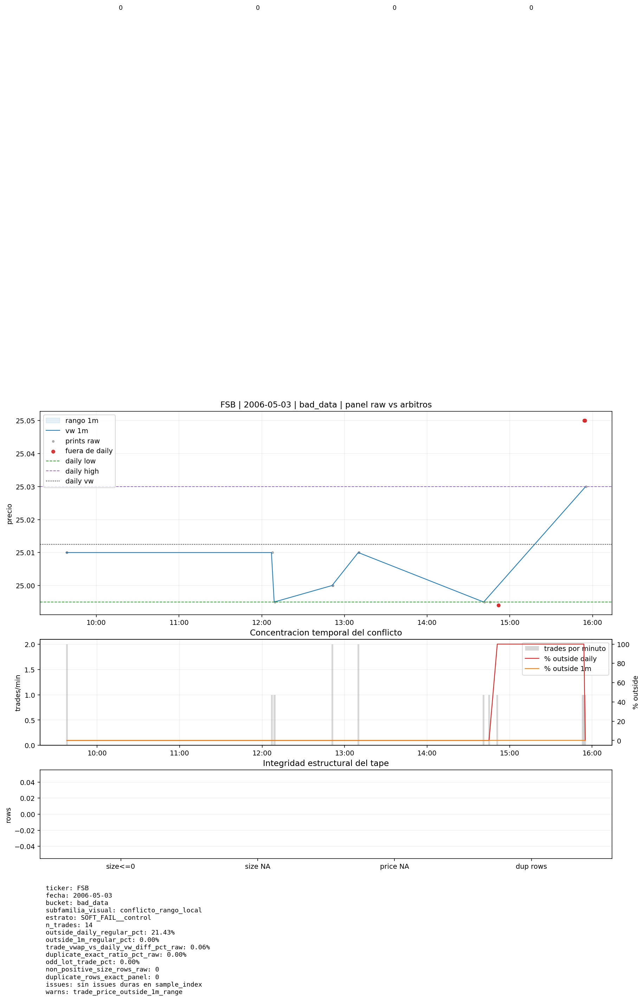

**Que muestra**

- Panel rico del tape raw frente a `daily` y `1m` para `FSB` el `2006-05-03`.
- `n_trades = 14`, `outside_daily_regular_pct = 21.43%`, `outside_1m_regular_pct = 0.00%`.
- `trade_vwap_vs_daily_vw_diff_pct_raw = 0.06%`, `duplicate_exact_ratio_pct_raw = 0.00%`, `odd_lot_trade_pct = 0.00%`.

**Responde**

- Subfamilia donde el conflicto vive en un subconjunto relevante del rango o del arbitro intraminuto, aunque no haya colapso total de escala.
- El conflicto vive en una franja local del rango o del arbitro intraminuto, sin llegar a colapso total de escala.
- Eso exige leer el panel minuto a minuto y no quedarse solo con la impresion global de la nube de precios.
- La clasificacion a `bad_data` aqui depende de que el file ya no conserve una reconciliacion economica defendible.
- La decision que justifica es exclusion de ejecucion simulada, labels y benchmarking; solo queda valor forense.

**No responde**

- No responde a colapso total de escala; ese seria otro subtipo.
- No responde por si solo a dano estructural del tape salvo que aparezca en `issues_list` o en el panel de integridad.

**Consecuencia**

- Excluir el file del flujo productivo aunque el dano no sea un colapso absoluto.
- Conservarlo como caso forense de rango local severo.

### GIA | 2010-09-01

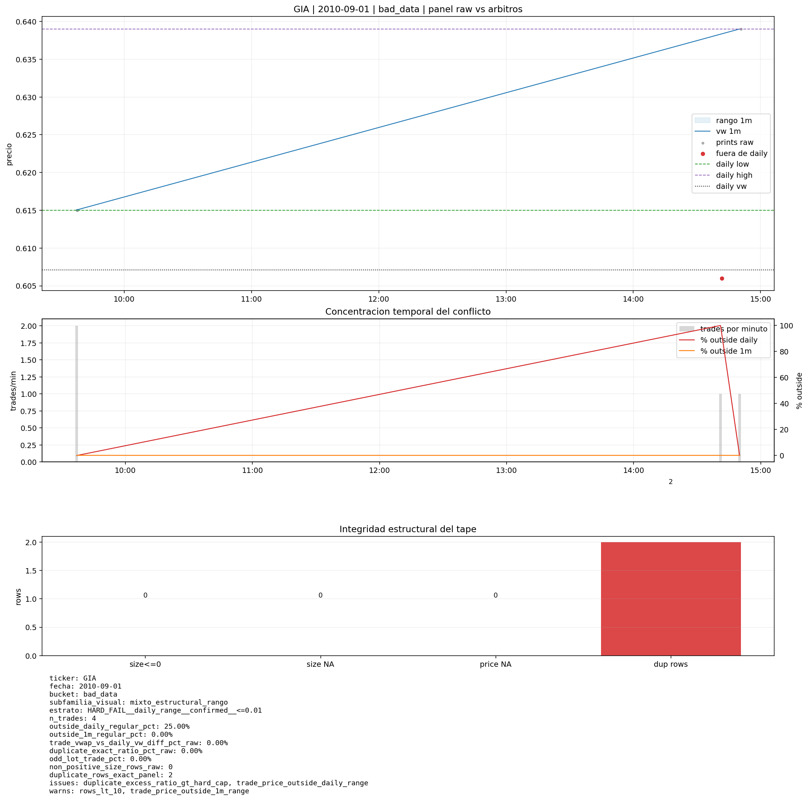

**Que muestra**

- Panel rico del tape raw frente a `daily` y `1m` para `GIA` el `2010-09-01`.
- `n_trades = 4`, `outside_daily_regular_pct = 25.00%`, `outside_1m_regular_pct = 0.00%`.
- `trade_vwap_vs_daily_vw_diff_pct_raw = 0.00%`, `duplicate_exact_ratio_pct_raw = 0.00%`, `odd_lot_trade_pct = 0.00%`.

**Responde**

- Subfamilia mixta donde hay conflicto visual de rango, pero tambien senales de integridad del tape. El rechazo no debe apoyarse en una sola capa de evidencia.
- El caso combina conflicto de rango con senales de integridad del tape.
- La lectura correcta no es elegir una sola causa, sino reconocer que hay dano mixto: lo visual protesta y la estructura interna tambien.
- La clasificacion a `bad_data` se apoya en ambas capas de evidencia y no solo en el porcentaje outside.
- La marca `duplicate_excess_ratio_gt_hard_cap` indica que la duplicacion ya no es solo un warn cosmetico, sino una firma dura del rechazo.
- La advertencia `rows_lt_10` limita fuertemente la defensa estadistica del file y endurece la lectura del caso.
- La decision que justifica es exclusion de ejecucion simulada, labels y benchmarking; solo queda valor forense.

**No responde**

- No responde a una unica causa limpia; obliga a aceptar que hay mezcla de fenomenos.
- No absuelve el file aunque una de las dos capas parezca mas suave que la otra.

**Consecuencia**

- Excluir el file y tratarlo como rechazo duro, no como caso de reconciliacion fina.
- Mantener el requisito de una segunda imagen de integridad cuando se presente al inspector.

**Grupos duplicados exactos mas relevantes**

| ts_ny | price | size | count |
|---|---|---|---|
| 2010-09-01 09:37:55.172 | 0.615 | 100 | 2 |

### NTN | 2007-08-14

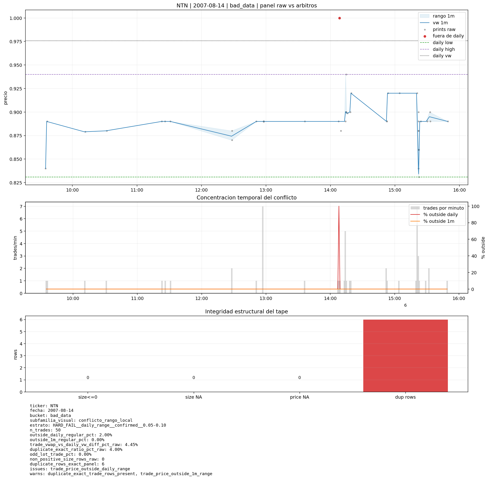

**Que muestra**

- Panel rico del tape raw frente a `daily` y `1m` para `NTN` el `2007-08-14`.
- `n_trades = 50`, `outside_daily_regular_pct = 2.00%`, `outside_1m_regular_pct = 0.00%`.
- `trade_vwap_vs_daily_vw_diff_pct_raw = 4.45%`, `duplicate_exact_ratio_pct_raw = 4.00%`, `odd_lot_trade_pct = 0.00%`.

**Responde**

- Subfamilia donde el conflicto vive en un subconjunto relevante del rango o del arbitro intraminuto, aunque no haya colapso total de escala.
- El conflicto vive en una franja local del rango o del arbitro intraminuto, sin llegar a colapso total de escala.
- Eso exige leer el panel minuto a minuto y no quedarse solo con la impresion global de la nube de precios.
- La clasificacion a `bad_data` aqui depende de que el file ya no conserve una reconciliacion economica defendible.
- La decision que justifica es exclusion de ejecucion simulada, labels y benchmarking; solo queda valor forense.

**No responde**

- No responde a colapso total de escala; ese seria otro subtipo.
- No responde por si solo a dano estructural del tape salvo que aparezca en `issues_list` o en el panel de integridad.

**Consecuencia**

- Excluir el file del flujo productivo aunque el dano no sea un colapso absoluto.
- Conservarlo como caso forense de rango local severo.

**Grupos duplicados exactos mas relevantes**

| ts_ny | price | size | count |
|---|---|---|---|
| 2007-08-14 12:57:50.956 | 0.89 | 200 | 2 |
| 2007-08-14 12:57:50.956 | 0.89 | 300 | 2 |
| 2007-08-14 14:14:42.026 | 0.9 | 100 | 2 |

### TOPS | 2012-06-21

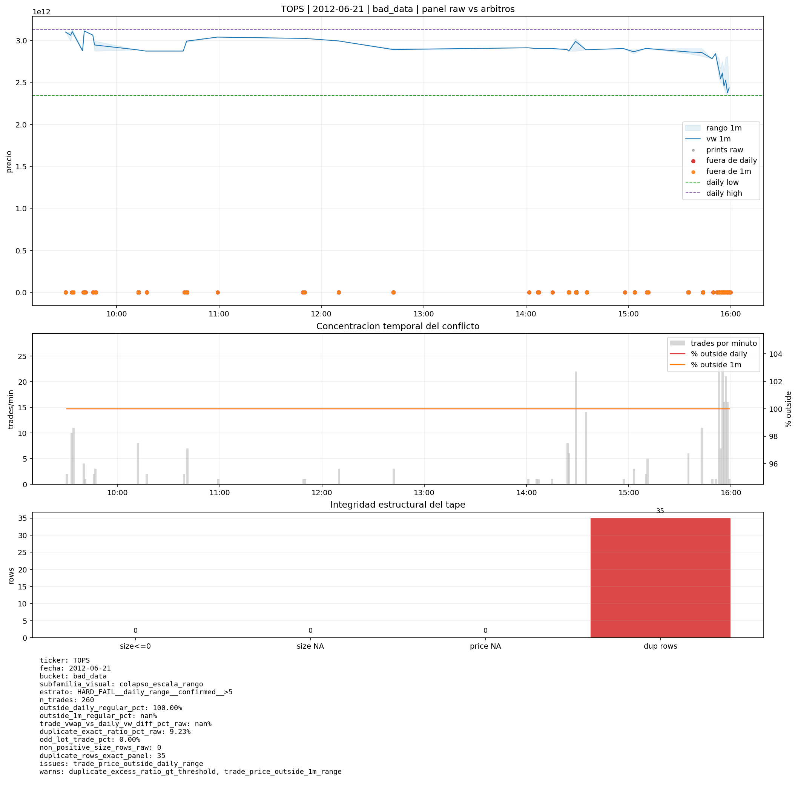

**Que muestra**

- Panel rico del tape raw frente a `daily` y `1m` para `TOPS` el `2012-06-21`.
- `n_trades = 260`, `outside_daily_regular_pct = 100.00%`, `outside_1m_regular_pct = nan%`.
- `trade_vwap_vs_daily_vw_diff_pct_raw = nan%`, `duplicate_exact_ratio_pct_raw = 9.23%`, `odd_lot_trade_pct = 0.00%`.

**Responde**

- Subfamilia donde el panel de precio ya demuestra por si mismo una ruptura semantica: tape y arbitros viven en escalas incompatibles o el porcentaje fuera de rango es practicamente total.
- El fallo se ve de forma directa en el panel de precio: el tape y los arbitros no conviven en una misma geometria defendible.
- La lectura correcta exige mirar la separacion vertical entre prints y arbitros y el hecho de que el conflicto de rango sea practicamente total.
- Aqui el panel actual si responde bien a por que el file cae en `bad_data`.
- El 9.23% de duplicacion exacta obliga a sospechar dano de tape o bursts mecanicos, no solo ruido visual.
- La decision que justifica es exclusion de ejecucion simulada, labels y benchmarking; solo queda valor forense.

**No responde**

- No responde a si la duplicacion es la causa principal del rechazo; puede empeorar el caso, pero no explica por si sola la geometria rota.
- No responde a si existiria una reconciliacion de escala defendible; el colapso ya es demasiado extremo para tratarlo como simple normalizacion.

**Consecuencia**

- Excluir de ejecucion simulada, labels y benchmarking.
- Conservar solo valor forense o de deteccion de dano severo.

**Grupos duplicados exactos mas relevantes**

| ts_ny | price | size | count |
|---|---|---|---|
| 2012-06-21 10:12:42.291 | 1.91 | 100 | 3 |
| 2012-06-21 14:29:25.507 | 1.95 | 100 | 3 |
| 2012-06-21 15:57:53.151 | 1.82 | 100 | 3 |
| 2012-06-21 09:30:00.301 | 2.05 | 1124 | 2 |
| 2012-06-21 09:34:20.484 | 2.04 | 100 | 2 |
| 2012-06-21 10:12:42.227 | 1.91 | 200 | 2 |
| 2012-06-21 14:24:55.489 | 1.91 | 100 | 2 |
| 2012-06-21 14:29:25.487 | 1.95 | 100 | 2 |
| 2012-06-21 14:29:25.508 | 1.95 | 100 | 2 |
| 2012-06-21 14:29:25.964 | 1.99 | 100 | 2 |

### ASTI | 2009-06-05

**Que muestra**

- Panel rico del tape raw frente a `daily` y `1m` para `ASTI` el `2009-06-05`.
- `n_trades = 808`, `outside_daily_regular_pct = 100.00%`, `outside_1m_regular_pct = 100.00%`.
- `trade_vwap_vs_daily_vw_diff_pct_raw = nan%`, `duplicate_exact_ratio_pct_raw = 4.58%`, `odd_lot_trade_pct = 0.00%`.

**Responde**

- Subfamilia donde el panel de precio ya demuestra por si mismo una ruptura semantica: tape y arbitros viven en escalas incompatibles o el porcentaje fuera de rango es practicamente total.
- El fallo se ve de forma directa en el panel de precio: el tape y los arbitros no conviven en una misma geometria defendible.
- La lectura correcta exige mirar la separacion vertical entre prints y arbitros y el hecho de que el conflicto de rango sea practicamente total.
- Aqui el panel actual si responde bien a por que el file cae en `bad_data`.
- La decision que justifica es exclusion de ejecucion simulada, labels y benchmarking; solo queda valor forense.

**No responde**

- No responde a si la duplicacion es la causa principal del rechazo; puede empeorar el caso, pero no explica por si sola la geometria rota.
- No responde a si existiria una reconciliacion de escala defendible; el colapso ya es demasiado extremo para tratarlo como simple normalizacion.

**Consecuencia**

- Excluir de ejecucion simulada, labels y benchmarking.
- Conservar solo valor forense o de deteccion de dano severo.

**Grupos duplicados exactos mas relevantes**

| ts_ny | price | size | count |
|---|---|---|---|
| 2009-06-05 11:10:09.710 | 6.99 | 100 | 3 |
| 2009-06-05 09:30:01.890 | 7.1 | 7668 | 2 |
| 2009-06-05 09:30:19.337 | 6.91 | 100 | 2 |
| 2009-06-05 09:30:45.590 | 6.99 | 100 | 2 |
| 2009-06-05 09:31:22.343 | 7.1 | 100 | 2 |
| 2009-06-05 09:33:11.300 | 7.06 | 100 | 2 |
| 2009-06-05 10:08:01.767 | 6.71 | 1300 | 2 |
| 2009-06-05 10:08:01.783 | 6.71 | 100 | 2 |
| 2009-06-05 10:16:18.950 | 6.48 | 100 | 2 |
| 2009-06-05 10:28:20.337 | 6.7 | 100 | 2 |

### ASTI | 2011-04-04

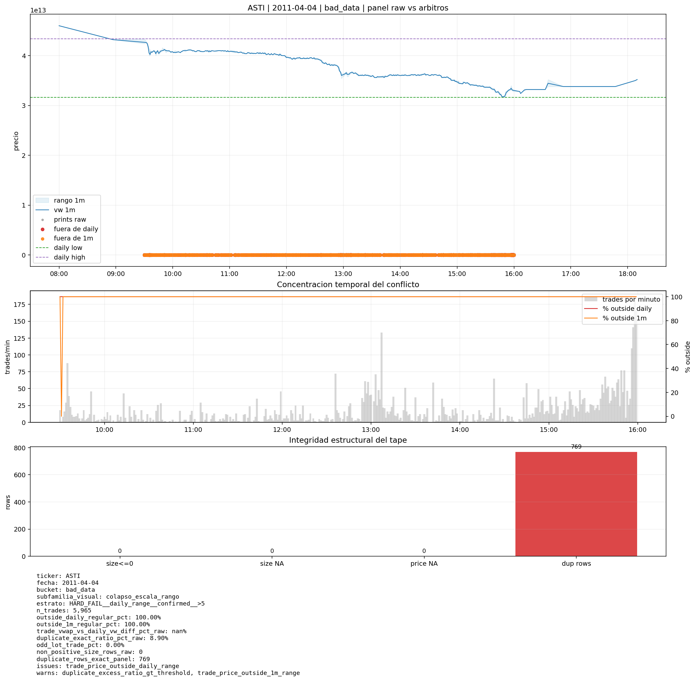

**Que muestra**

- Panel rico del tape raw frente a `daily` y `1m` para `ASTI` el `2011-04-04`.
- `n_trades = 5,965`, `outside_daily_regular_pct = 100.00%`, `outside_1m_regular_pct = 100.00%`.
- `trade_vwap_vs_daily_vw_diff_pct_raw = nan%`, `duplicate_exact_ratio_pct_raw = 8.90%`, `odd_lot_trade_pct = 0.00%`.

**Responde**

- Subfamilia donde el panel de precio ya demuestra por si mismo una ruptura semantica: tape y arbitros viven en escalas incompatibles o el porcentaje fuera de rango es practicamente total.
- El fallo se ve de forma directa en el panel de precio: el tape y los arbitros no conviven en una misma geometria defendible.
- La lectura correcta exige mirar la separacion vertical entre prints y arbitros y el hecho de que el conflicto de rango sea practicamente total.
- Aqui el panel actual si responde bien a por que el file cae en `bad_data`.
- El 8.90% de duplicacion exacta obliga a sospechar dano de tape o bursts mecanicos, no solo ruido visual.
- La decision que justifica es exclusion de ejecucion simulada, labels y benchmarking; solo queda valor forense.

**No responde**

- No responde a si la duplicacion es la causa principal del rechazo; puede empeorar el caso, pero no explica por si sola la geometria rota.
- No responde a si existiria una reconciliacion de escala defendible; el colapso ya es demasiado extremo para tratarlo como simple normalizacion.

**Consecuencia**

- Excluir de ejecucion simulada, labels y benchmarking.
- Conservar solo valor forense o de deteccion de dano severo.

**Grupos duplicados exactos mas relevantes**

| ts_ny | price | size | count |
|---|---|---|---|
| 2011-04-04 10:13:05.747 | 2.05 | 100 | 10 |
| 2011-04-04 09:51:11.653 | 2.07 | 100 | 6 |
| 2011-04-04 12:54:48.690 | 1.9 | 100 | 6 |
| 2011-04-04 13:05:05.710 | 1.81 | 100 | 6 |
| 2011-04-04 15:51:09.197 | 1.6 | 100 | 6 |
| 2011-04-04 15:56:44.520 | 1.655 | 100 | 6 |
| 2011-04-04 09:51:11.680 | 2.07 | 100 | 5 |
| 2011-04-04 12:06:31.570 | 1.97 | 100 | 5 |
| 2011-04-04 12:45:44.243 | 1.92 | 100 | 5 |
| 2011-04-04 12:46:49.873 | 1.9 | 100 | 5 |

### ASTI | 2012-03-02

**Que muestra**

- Panel rico del tape raw frente a `daily` y `1m` para `ASTI` el `2012-03-02`.
- `n_trades = 420`, `outside_daily_regular_pct = 100.00%`, `outside_1m_regular_pct = 100.00%`.
- `trade_vwap_vs_daily_vw_diff_pct_raw = nan%`, `duplicate_exact_ratio_pct_raw = 4.76%`, `odd_lot_trade_pct = 0.00%`.

**Responde**

- Subfamilia donde el panel de precio ya demuestra por si mismo una ruptura semantica: tape y arbitros viven en escalas incompatibles o el porcentaje fuera de rango es practicamente total.
- El fallo se ve de forma directa en el panel de precio: el tape y los arbitros no conviven en una misma geometria defendible.
- La lectura correcta exige mirar la separacion vertical entre prints y arbitros y el hecho de que el conflicto de rango sea practicamente total.
- Aqui el panel actual si responde bien a por que el file cae en `bad_data`.
- La decision que justifica es exclusion de ejecucion simulada, labels y benchmarking; solo queda valor forense.

**No responde**

- No responde a si la duplicacion es la causa principal del rechazo; puede empeorar el caso, pero no explica por si sola la geometria rota.
- No responde a si existiria una reconciliacion de escala defendible; el colapso ya es demasiado extremo para tratarlo como simple normalizacion.

**Consecuencia**

- Excluir de ejecucion simulada, labels y benchmarking.
- Conservar solo valor forense o de deteccion de dano severo.

**Grupos duplicados exactos mas relevantes**

| ts_ny | price | size | count |
|---|---|---|---|
| 2012-03-02 15:58:04.590 | 0.8299 | 100 | 4 |
| 2012-03-02 13:33:33.477 | 0.8 | 100 | 3 |
| 2012-03-02 15:56:33.310 | 0.825 | 100 | 3 |
| 2012-03-02 15:57:12.677 | 0.8299 | 100 | 3 |
| 2012-03-02 09:30:00.063 | 0.77 | 4000 | 2 |
| 2012-03-02 09:37:03.297 | 0.8 | 100 | 2 |
| 2012-03-02 09:37:03.467 | 0.8 | 100 | 2 |
| 2012-03-02 10:30:59.650 | 0.7799 | 100 | 2 |
| 2012-03-02 13:33:33.530 | 0.8 | 100 | 2 |
| 2012-03-02 14:41:43.360 | 0.7999 | 100 | 2 |

### CZNC | 2005-08-12

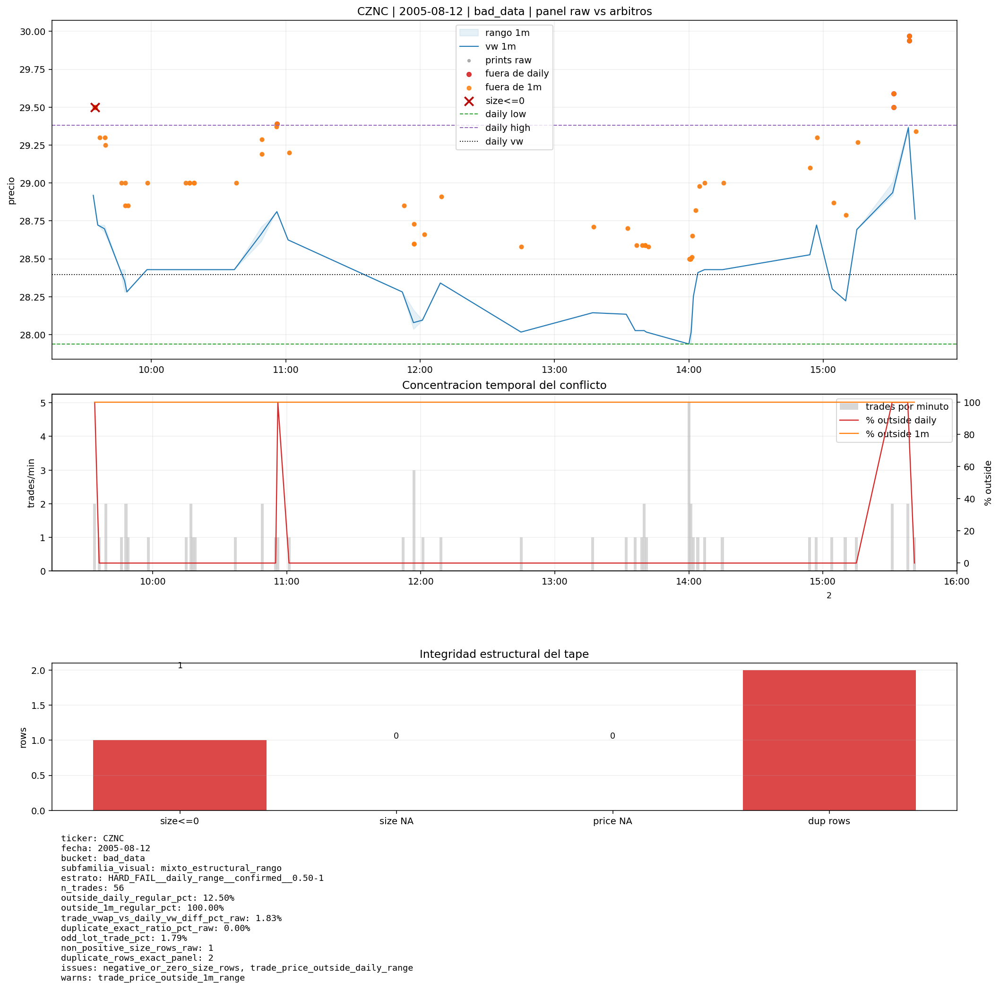

**Que muestra**

- Panel rico del tape raw frente a `daily` y `1m` para `CZNC` el `2005-08-12`.
- `n_trades = 56`, `outside_daily_regular_pct = 12.50%`, `outside_1m_regular_pct = 100.00%`.
- `trade_vwap_vs_daily_vw_diff_pct_raw = 1.83%`, `duplicate_exact_ratio_pct_raw = 0.00%`, `odd_lot_trade_pct = 1.79%`.

**Responde**

- Subfamilia mixta donde hay conflicto visual de rango, pero tambien senales de integridad del tape. El rechazo no debe apoyarse en una sola capa de evidencia.
- El caso combina conflicto de rango con senales de integridad del tape.
- La lectura correcta no es elegir una sola causa, sino reconocer que hay dano mixto: lo visual protesta y la estructura interna tambien.
- La clasificacion a `bad_data` se apoya en ambas capas de evidencia y no solo en el porcentaje outside.
- La presencia de `negative_or_zero_size_rows` mueve la causalidad desde el precio hacia la integridad estructural del tape.
- La decision que justifica es exclusion de ejecucion simulada, labels y benchmarking; solo queda valor forense.

**No responde**

- No responde a una unica causa limpia; obliga a aceptar que hay mezcla de fenomenos.
- No absuelve el file aunque una de las dos capas parezca mas suave que la otra.

**Consecuencia**

- Excluir el file y tratarlo como rechazo duro, no como caso de reconciliacion fina.
- Mantener el requisito de una segunda imagen de integridad cuando se presente al inspector.

**Filas invalidas exactas (`size <= 0`)**

| ts_ny | price | size | exchange | conditions |
|---|---|---|---|---|
| 2005-08-12 09:34:49 | 29.5 | 0 | 12 | 16 |

**Grupos duplicados exactos mas relevantes**

| ts_ny | price | size | count |
|---|---|---|---|
| 2005-08-12 13:40:27 | 28.59 | 100 | 2 |

### PMD | 2010-11-16

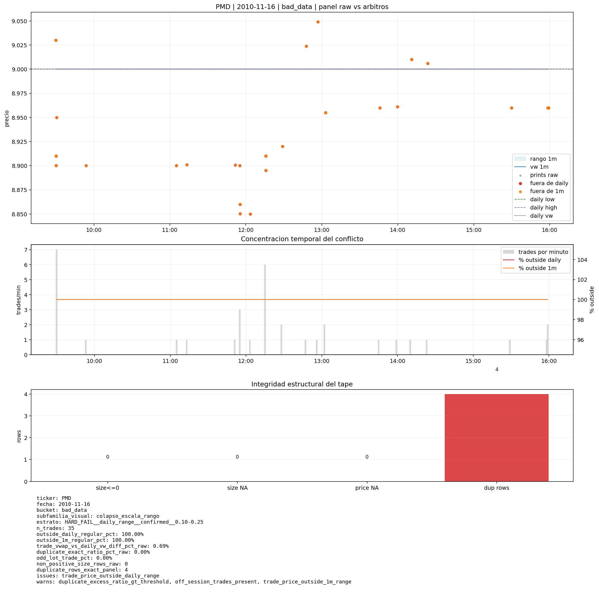

**Que muestra**

- Panel rico del tape raw frente a `daily` y `1m` para `PMD` el `2010-11-16`.
- `n_trades = 35`, `outside_daily_regular_pct = 100.00%`, `outside_1m_regular_pct = 100.00%`.
- `trade_vwap_vs_daily_vw_diff_pct_raw = 0.69%`, `duplicate_exact_ratio_pct_raw = 0.00%`, `odd_lot_trade_pct = 0.00%`.

**Responde**

- Subfamilia donde el panel de precio ya demuestra por si mismo una ruptura semantica: tape y arbitros viven en escalas incompatibles o el porcentaje fuera de rango es practicamente total.
- El fallo se ve de forma directa en el panel de precio: el tape y los arbitros no conviven en una misma geometria defendible.
- La lectura correcta exige mirar la separacion vertical entre prints y arbitros y el hecho de que el conflicto de rango sea practicamente total.
- Aqui el panel actual si responde bien a por que el file cae en `bad_data`.
- La decision que justifica es exclusion de ejecucion simulada, labels y benchmarking; solo queda valor forense.

**No responde**

- No responde a si la duplicacion es la causa principal del rechazo; puede empeorar el caso, pero no explica por si sola la geometria rota.
- No responde a si existiria una reconciliacion de escala defendible; el colapso ya es demasiado extremo para tratarlo como simple normalizacion.

**Consecuencia**

- Excluir de ejecucion simulada, labels y benchmarking.
- Conservar solo valor forense o de deteccion de dano severo.

**Grupos duplicados exactos mas relevantes**

| ts_ny | price | size | count |
|---|---|---|---|
| 2010-11-16 09:30:00.267 | 9.03 | 250 | 2 |
| 2010-11-16 12:15:50.510 | 8.91 | 100 | 2 |

### PMD | 2011-01-28

**Que muestra**

- Panel rico del tape raw frente a `daily` y `1m` para `PMD` el `2011-01-28`.
- `n_trades = 36`, `outside_daily_regular_pct = 100.00%`, `outside_1m_regular_pct = 100.00%`.
- `trade_vwap_vs_daily_vw_diff_pct_raw = 0.72%`, `duplicate_exact_ratio_pct_raw = 5.56%`, `odd_lot_trade_pct = 0.00%`.

**Responde**

- Subfamilia donde el panel de precio ya demuestra por si mismo una ruptura semantica: tape y arbitros viven en escalas incompatibles o el porcentaje fuera de rango es practicamente total.
- El fallo se ve de forma directa en el panel de precio: el tape y los arbitros no conviven en una misma geometria defendible.
- La lectura correcta exige mirar la separacion vertical entre prints y arbitros y el hecho de que el conflicto de rango sea practicamente total.
- Aqui el panel actual si responde bien a por que el file cae en `bad_data`.
- El 5.56% de duplicacion exacta obliga a sospechar dano de tape o bursts mecanicos, no solo ruido visual.
- La decision que justifica es exclusion de ejecucion simulada, labels y benchmarking; solo queda valor forense.

**No responde**

- No responde a si la duplicacion es la causa principal del rechazo; puede empeorar el caso, pero no explica por si sola la geometria rota.
- No responde a si existiria una reconciliacion de escala defendible; el colapso ya es demasiado extremo para tratarlo como simple normalizacion.

**Consecuencia**

- Excluir de ejecucion simulada, labels y benchmarking.
- Conservar solo valor forense o de deteccion de dano severo.

**Grupos duplicados exactos mas relevantes**

| ts_ny | price | size | count |
|---|---|---|---|
| 2011-01-28 15:58:43.820 | 8.39 | 100 | 2 |
| 2011-01-28 15:59:53.100 | 8.36 | 100 | 2 |

### PMD | 2011-12-13

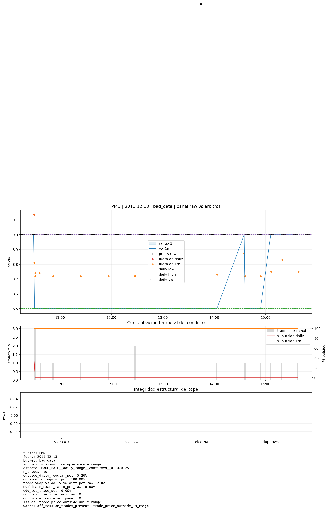

**Que muestra**

- Panel rico del tape raw frente a `daily` y `1m` para `PMD` el `2011-12-13`.
- `n_trades = 19`, `outside_daily_regular_pct = 5.26%`, `outside_1m_regular_pct = 100.00%`.
- `trade_vwap_vs_daily_vw_diff_pct_raw = 2.02%`, `duplicate_exact_ratio_pct_raw = 0.00%`, `odd_lot_trade_pct = 0.00%`.

**Responde**

- Subfamilia donde el panel de precio ya demuestra por si mismo una ruptura semantica: tape y arbitros viven en escalas incompatibles o el porcentaje fuera de rango es practicamente total.
- El fallo se ve de forma directa en el panel de precio: el tape y los arbitros no conviven en una misma geometria defendible.
- La lectura correcta exige mirar la separacion vertical entre prints y arbitros y el hecho de que el conflicto de rango sea practicamente total.
- Aqui el panel actual si responde bien a por que el file cae en `bad_data`.
- La decision que justifica es exclusion de ejecucion simulada, labels y benchmarking; solo queda valor forense.

**No responde**

- No responde a si la duplicacion es la causa principal del rechazo; puede empeorar el caso, pero no explica por si sola la geometria rota.
- No responde a si existiria una reconciliacion de escala defendible; el colapso ya es demasiado extremo para tratarlo como simple normalizacion.

**Consecuencia**

- Excluir de ejecucion simulada, labels y benchmarking.
- Conservar solo valor forense o de deteccion de dano severo.

### PMD | 2012-06-28

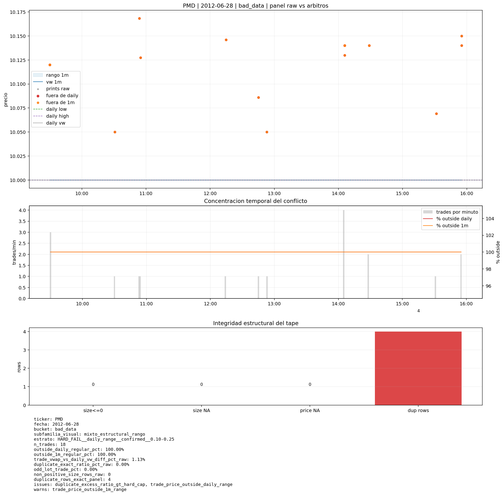

**Que muestra**

- Panel rico del tape raw frente a `daily` y `1m` para `PMD` el `2012-06-28`.
- `n_trades = 18`, `outside_daily_regular_pct = 100.00%`, `outside_1m_regular_pct = 100.00%`.
- `trade_vwap_vs_daily_vw_diff_pct_raw = 1.13%`, `duplicate_exact_ratio_pct_raw = 0.00%`, `odd_lot_trade_pct = 0.00%`.

**Responde**

- Subfamilia mixta donde hay conflicto visual de rango, pero tambien senales de integridad del tape. El rechazo no debe apoyarse en una sola capa de evidencia.
- El caso combina conflicto de rango con senales de integridad del tape.
- La lectura correcta no es elegir una sola causa, sino reconocer que hay dano mixto: lo visual protesta y la estructura interna tambien.
- La clasificacion a `bad_data` se apoya en ambas capas de evidencia y no solo en el porcentaje outside.
- La marca `duplicate_excess_ratio_gt_hard_cap` indica que la duplicacion ya no es solo un warn cosmetico, sino una firma dura del rechazo.
- La decision que justifica es exclusion de ejecucion simulada, labels y benchmarking; solo queda valor forense.

**No responde**

- No responde a una unica causa limpia; obliga a aceptar que hay mezcla de fenomenos.
- No absuelve el file aunque una de las dos capas parezca mas suave que la otra.

**Consecuencia**

- Excluir el file y tratarlo como rechazo duro, no como caso de reconciliacion fina.
- Mantener el requisito de una segunda imagen de integridad cuando se presente al inspector.

**Grupos duplicados exactos mas relevantes**

| ts_ny | price | size | count |
|---|---|---|---|
| 2012-06-28 09:30:00.187 | 10.12 | 600 | 2 |
| 2012-06-28 14:05:48.603 | 10.14 | 200 | 2 |

### ESA.U | 2011-04-25

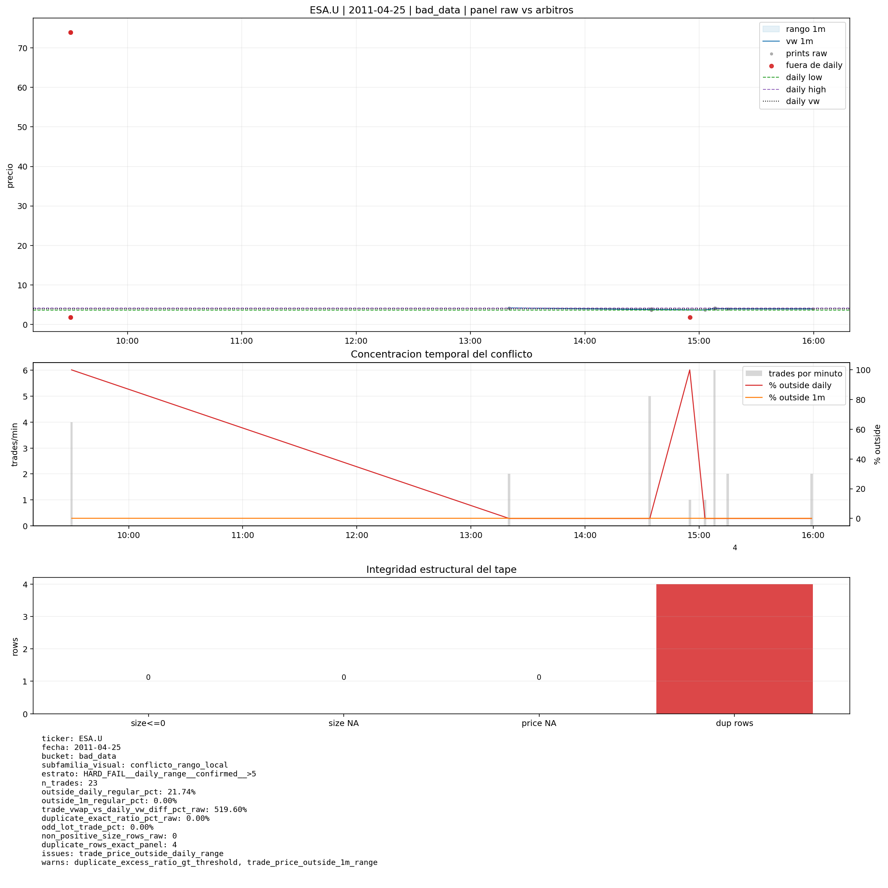

**Que muestra**

- Panel rico del tape raw frente a `daily` y `1m` para `ESA.U` el `2011-04-25`.
- `n_trades = 23`, `outside_daily_regular_pct = 21.74%`, `outside_1m_regular_pct = 0.00%`.
- `trade_vwap_vs_daily_vw_diff_pct_raw = 519.60%`, `duplicate_exact_ratio_pct_raw = 0.00%`, `odd_lot_trade_pct = 0.00%`.

**Responde**

- Subfamilia donde el conflicto vive en un subconjunto relevante del rango o del arbitro intraminuto, aunque no haya colapso total de escala.
- El conflicto vive en una franja local del rango o del arbitro intraminuto, sin llegar a colapso total de escala.
- Eso exige leer el panel minuto a minuto y no quedarse solo con la impresion global de la nube de precios.
- La clasificacion a `bad_data` aqui depende de que el file ya no conserve una reconciliacion economica defendible.
- La decision que justifica es exclusion de ejecucion simulada, labels y benchmarking; solo queda valor forense.

**No responde**

- No responde a colapso total de escala; ese seria otro subtipo.
- No responde por si solo a dano estructural del tape salvo que aparezca en `issues_list` o en el panel de integridad.

**Consecuencia**

- Excluir el file del flujo productivo aunque el dano no sea un colapso absoluto.
- Conservarlo como caso forense de rango local severo.

**Grupos duplicados exactos mas relevantes**

| ts_ny | price | size | count |
|---|---|---|---|
| 2011-04-25 09:30:00.718 | 73.92 | 1000 | 2 |
| 2011-04-25 09:30:10.501 | 1.83 | 100 | 2 |

### IHT | 2009-02-25

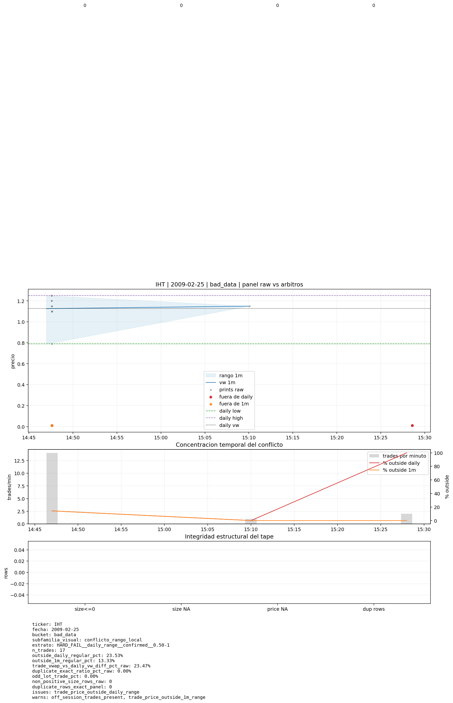

**Que muestra**

- Panel rico del tape raw frente a `daily` y `1m` para `IHT` el `2009-02-25`.
- `n_trades = 17`, `outside_daily_regular_pct = 23.53%`, `outside_1m_regular_pct = 13.33%`.
- `trade_vwap_vs_daily_vw_diff_pct_raw = 23.47%`, `duplicate_exact_ratio_pct_raw = 0.00%`, `odd_lot_trade_pct = 0.00%`.

**Responde**

- Subfamilia donde el conflicto vive en un subconjunto relevante del rango o del arbitro intraminuto, aunque no haya colapso total de escala.
- El conflicto vive en una franja local del rango o del arbitro intraminuto, sin llegar a colapso total de escala.
- Eso exige leer el panel minuto a minuto y no quedarse solo con la impresion global de la nube de precios.
- La clasificacion a `bad_data` aqui depende de que el file ya no conserve una reconciliacion economica defendible.
- La decision que justifica es exclusion de ejecucion simulada, labels y benchmarking; solo queda valor forense.

**No responde**

- No responde a colapso total de escala; ese seria otro subtipo.
- No responde por si solo a dano estructural del tape salvo que aparezca en `issues_list` o en el panel de integridad.

**Consecuencia**

- Excluir el file del flujo productivo aunque el dano no sea un colapso absoluto.
- Conservarlo como caso forense de rango local severo.

### TOPS | 2014-09-29

**Que muestra**

- Panel rico del tape raw frente a `daily` y `1m` para `TOPS` el `2014-09-29`.
- `n_trades = 61`, `outside_daily_regular_pct = 100.00%`, `outside_1m_regular_pct = 100.00%`.
- `trade_vwap_vs_daily_vw_diff_pct_raw = nan%`, `duplicate_exact_ratio_pct_raw = 13.11%`, `odd_lot_trade_pct = 22.95%`.

**Responde**

- Subfamilia donde el panel de precio ya demuestra por si mismo una ruptura semantica: tape y arbitros viven en escalas incompatibles o el porcentaje fuera de rango es practicamente total.
- El fallo se ve de forma directa en el panel de precio: el tape y los arbitros no conviven en una misma geometria defendible.
- La lectura correcta exige mirar la separacion vertical entre prints y arbitros y el hecho de que el conflicto de rango sea practicamente total.
- Aqui el panel actual si responde bien a por que el file cae en `bad_data`.
- El 13.11% de duplicacion exacta obliga a sospechar dano de tape o bursts mecanicos, no solo ruido visual.
- La decision que justifica es exclusion de ejecucion simulada, labels y benchmarking; solo queda valor forense.

**No responde**

- No responde a si la duplicacion es la causa principal del rechazo; puede empeorar el caso, pero no explica por si sola la geometria rota.
- No responde a si existiria una reconciliacion de escala defendible; el colapso ya es demasiado extremo para tratarlo como simple normalizacion.

**Consecuencia**

- Excluir de ejecucion simulada, labels y benchmarking.
- Conservar solo valor forense o de deteccion de dano severo.

**Grupos duplicados exactos mas relevantes**

| ts_ny | price | size | count |
|---|---|---|---|
| 2014-09-29 11:55:35.257 | 1.9 | 100 | 4 |
| 2014-09-29 11:06:42.104 | 1.89 | 66 | 3 |
| 2014-09-29 13:40:20.726 | 1.9 | 100 | 3 |
| 2014-09-29 10:38:58.536 | 1.88 | 200 | 2 |
| 2014-09-29 11:06:42.104 | 1.89 | 13 | 2 |
| 2014-09-29 11:06:42.114 | 1.889 | 200 | 2 |
| 2014-09-29 14:07:34.079 | 1.891 | 200 | 2 |
| 2014-09-29 15:01:56.227 | 1.9 | 100 | 2 |
| 2014-09-29 15:01:56.228 | 1.9 | 100 | 2 |

### ANTX | 2015-05-27

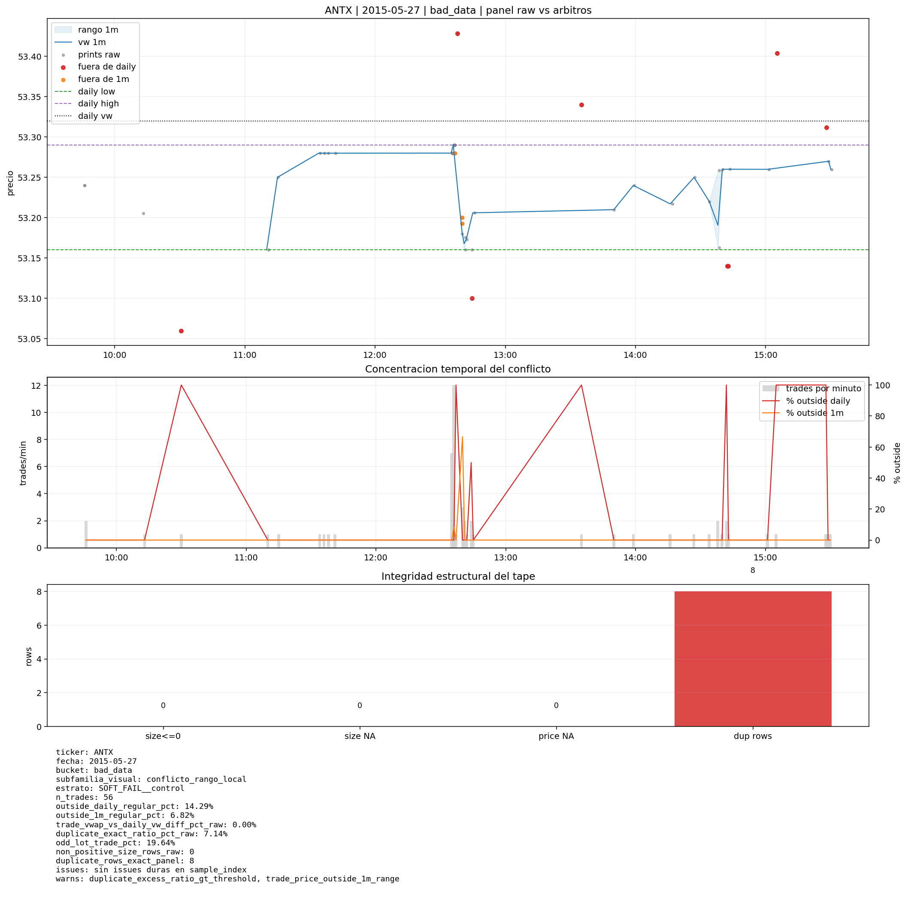

**Que muestra**

- Panel rico del tape raw frente a `daily` y `1m` para `ANTX` el `2015-05-27`.
- `n_trades = 56`, `outside_daily_regular_pct = 14.29%`, `outside_1m_regular_pct = 6.82%`.
- `trade_vwap_vs_daily_vw_diff_pct_raw = 0.00%`, `duplicate_exact_ratio_pct_raw = 7.14%`, `odd_lot_trade_pct = 19.64%`.

**Responde**

- Subfamilia donde el conflicto vive en un subconjunto relevante del rango o del arbitro intraminuto, aunque no haya colapso total de escala.
- El conflicto vive en una franja local del rango o del arbitro intraminuto, sin llegar a colapso total de escala.
- Eso exige leer el panel minuto a minuto y no quedarse solo con la impresion global de la nube de precios.
- La clasificacion a `bad_data` aqui depende de que el file ya no conserve una reconciliacion economica defendible.
- El 7.14% de duplicacion exacta obliga a sospechar dano de tape o bursts mecanicos, no solo ruido visual.
- La decision que justifica es exclusion de ejecucion simulada, labels y benchmarking; solo queda valor forense.

**No responde**

- No responde a colapso total de escala; ese seria otro subtipo.
- No responde por si solo a dano estructural del tape salvo que aparezca en `issues_list` o en el panel de integridad.

**Consecuencia**

- Excluir el file del flujo productivo aunque el dano no sea un colapso absoluto.
- Conservarlo como caso forense de rango local severo.

**Grupos duplicados exactos mas relevantes**

| ts_ny | price | size | count |
|---|---|---|---|
| 2015-05-27 12:35:31.140 | 53.28 | 100 | 2 |
| 2015-05-27 12:35:39.061 | 53.28 | 100 | 2 |
| 2015-05-27 12:36:22.540 | 53.29 | 200 | 2 |
| 2015-05-27 12:36:22.567 | 53.29 | 200 | 2 |

### ASTI | 2013-02-14

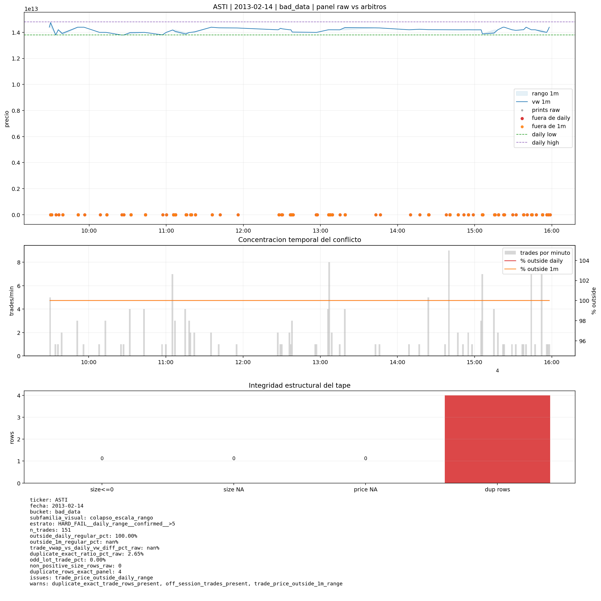

**Que muestra**

- Panel rico del tape raw frente a `daily` y `1m` para `ASTI` el `2013-02-14`.
- `n_trades = 151`, `outside_daily_regular_pct = 100.00%`, `outside_1m_regular_pct = nan%`.
- `trade_vwap_vs_daily_vw_diff_pct_raw = nan%`, `duplicate_exact_ratio_pct_raw = 2.65%`, `odd_lot_trade_pct = 0.00%`.

**Responde**

- Subfamilia donde el panel de precio ya demuestra por si mismo una ruptura semantica: tape y arbitros viven en escalas incompatibles o el porcentaje fuera de rango es practicamente total.
- El fallo se ve de forma directa en el panel de precio: el tape y los arbitros no conviven en una misma geometria defendible.
- La lectura correcta exige mirar la separacion vertical entre prints y arbitros y el hecho de que el conflicto de rango sea practicamente total.
- Aqui el panel actual si responde bien a por que el file cae en `bad_data`.
- La decision que justifica es exclusion de ejecucion simulada, labels y benchmarking; solo queda valor forense.

**No responde**

- No responde a si la duplicacion es la causa principal del rechazo; puede empeorar el caso, pero no explica por si sola la geometria rota.
- No responde a si existiria una reconciliacion de escala defendible; el colapso ya es demasiado extremo para tratarlo como simple normalizacion.

**Consecuencia**

- Excluir de ejecucion simulada, labels y benchmarking.
- Conservar solo valor forense o de deteccion de dano severo.

**Grupos duplicados exactos mas relevantes**

| ts_ny | price | size | count |
|---|---|---|---|
| 2013-02-14 13:07:23.645 | 0.71 | 100 | 2 |
| 2013-02-14 14:40:47.489 | 0.71 | 100 | 2 |

### CBAN | 2015-02-20

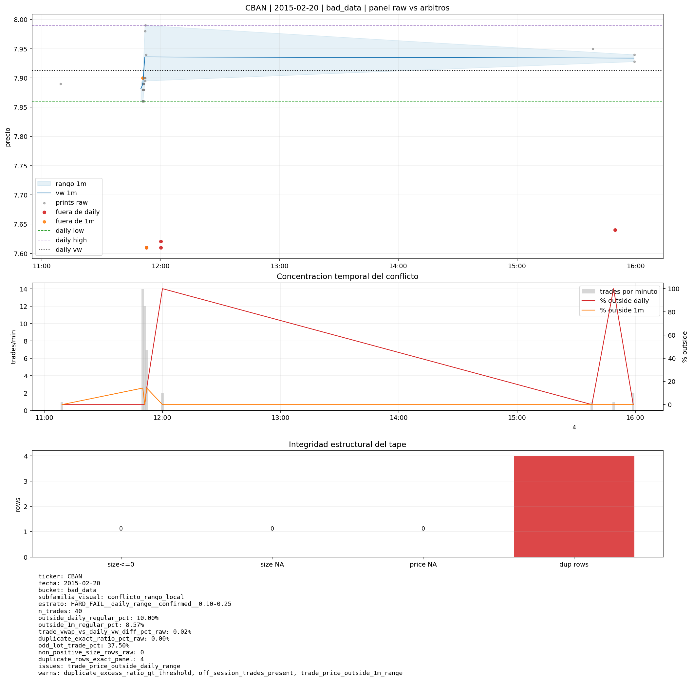

**Que muestra**

- Panel rico del tape raw frente a `daily` y `1m` para `CBAN` el `2015-02-20`.
- `n_trades = 40`, `outside_daily_regular_pct = 10.00%`, `outside_1m_regular_pct = 8.57%`.
- `trade_vwap_vs_daily_vw_diff_pct_raw = 0.02%`, `duplicate_exact_ratio_pct_raw = 0.00%`, `odd_lot_trade_pct = 37.50%`.

**Responde**

- Subfamilia donde el conflicto vive en un subconjunto relevante del rango o del arbitro intraminuto, aunque no haya colapso total de escala.
- El conflicto vive en una franja local del rango o del arbitro intraminuto, sin llegar a colapso total de escala.
- Eso exige leer el panel minuto a minuto y no quedarse solo con la impresion global de la nube de precios.
- La clasificacion a `bad_data` aqui depende de que el file ya no conserve una reconciliacion economica defendible.
- El 37.50% de odd-lots empuja la lectura hacia microestructura fina; evita leer el caso como pura ruptura economica gruesa.
- La decision que justifica es exclusion de ejecucion simulada, labels y benchmarking; solo queda valor forense.

**No responde**

- No responde a colapso total de escala; ese seria otro subtipo.
- No responde por si solo a dano estructural del tape salvo que aparezca en `issues_list` o en el panel de integridad.

**Consecuencia**

- Excluir el file del flujo productivo aunque el dano no sea un colapso absoluto.
- Conservarlo como caso forense de rango local severo.

**Grupos duplicados exactos mas relevantes**

| ts_ny | price | size | count |
|---|---|---|---|
| 2015-02-20 11:50:56.617 | 7.86 | 100 | 2 |
| 2015-02-20 11:50:56.620 | 7.86 | 100 | 2 |

### LCUT | 2017-05-22

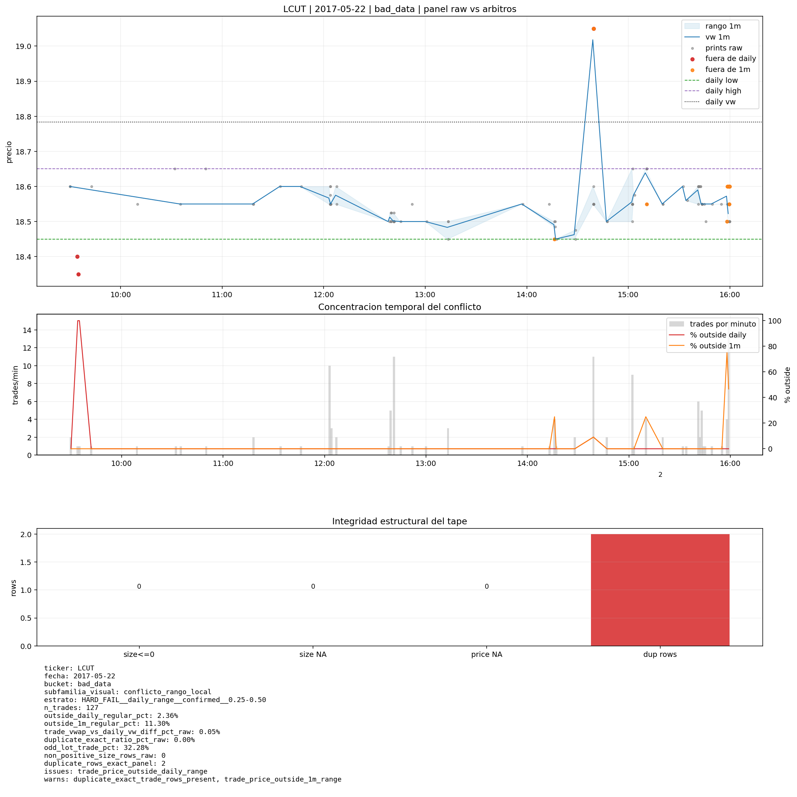

**Que muestra**

- Panel rico del tape raw frente a `daily` y `1m` para `LCUT` el `2017-05-22`.
- `n_trades = 127`, `outside_daily_regular_pct = 2.36%`, `outside_1m_regular_pct = 11.30%`.
- `trade_vwap_vs_daily_vw_diff_pct_raw = 0.05%`, `duplicate_exact_ratio_pct_raw = 0.00%`, `odd_lot_trade_pct = 32.28%`.

**Responde**

- Subfamilia donde el conflicto vive en un subconjunto relevante del rango o del arbitro intraminuto, aunque no haya colapso total de escala.
- El conflicto vive en una franja local del rango o del arbitro intraminuto, sin llegar a colapso total de escala.
- Eso exige leer el panel minuto a minuto y no quedarse solo con la impresion global de la nube de precios.
- La clasificacion a `bad_data` aqui depende de que el file ya no conserve una reconciliacion economica defendible.
- El 32.28% de odd-lots empuja la lectura hacia microestructura fina; evita leer el caso como pura ruptura economica gruesa.
- La decision que justifica es exclusion de ejecucion simulada, labels y benchmarking; solo queda valor forense.

**No responde**

- No responde a colapso total de escala; ese seria otro subtipo.
- No responde por si solo a dano estructural del tape salvo que aparezca en `issues_list` o en el panel de integridad.

**Consecuencia**

- Excluir el file del flujo productivo aunque el dano no sea un colapso absoluto.
- Conservarlo como caso forense de rango local severo.

**Grupos duplicados exactos mas relevantes**

| ts_ny | price | size | count |
|---|---|---|---|
| 2017-05-22 12:03:53.579028 | 18.55 | 100 | 2 |

### PMD | 2018-01-03

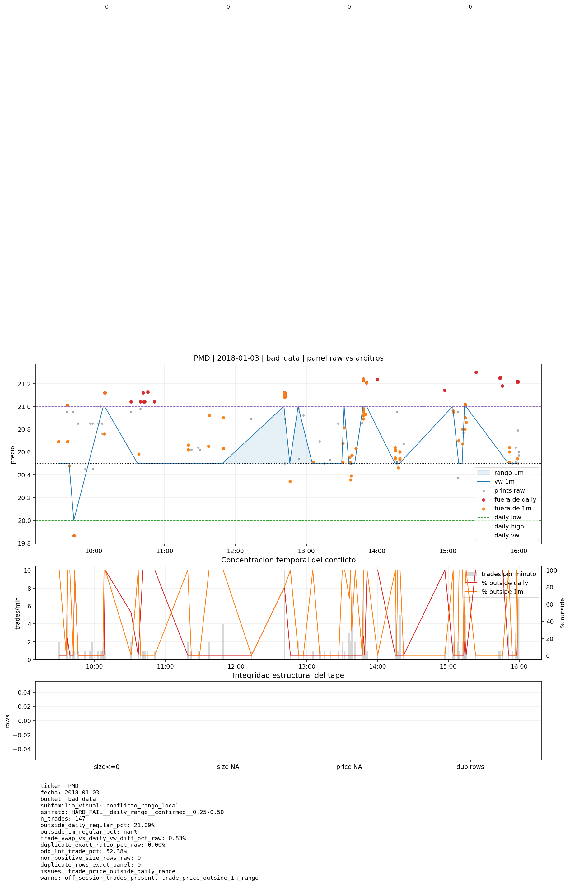

**Que muestra**

- Panel rico del tape raw frente a `daily` y `1m` para `PMD` el `2018-01-03`.
- `n_trades = 147`, `outside_daily_regular_pct = 21.09%`, `outside_1m_regular_pct = nan%`.
- `trade_vwap_vs_daily_vw_diff_pct_raw = 0.83%`, `duplicate_exact_ratio_pct_raw = 0.00%`, `odd_lot_trade_pct = 52.38%`.

**Responde**

- Subfamilia donde el conflicto vive en un subconjunto relevante del rango o del arbitro intraminuto, aunque no haya colapso total de escala.
- El conflicto vive en una franja local del rango o del arbitro intraminuto, sin llegar a colapso total de escala.
- Eso exige leer el panel minuto a minuto y no quedarse solo con la impresion global de la nube de precios.
- La clasificacion a `bad_data` aqui depende de que el file ya no conserve una reconciliacion economica defendible.
- El 52.38% de odd-lots empuja la lectura hacia microestructura fina; evita leer el caso como pura ruptura economica gruesa.
- La decision que justifica es exclusion de ejecucion simulada, labels y benchmarking; solo queda valor forense.

**No responde**

- No responde a colapso total de escala; ese seria otro subtipo.
- No responde por si solo a dano estructural del tape salvo que aparezca en `issues_list` o en el panel de integridad.

**Consecuencia**

- Excluir el file del flujo productivo aunque el dano no sea un colapso absoluto.
- Conservarlo como caso forense de rango local severo.

### RELV | 2018-09-18

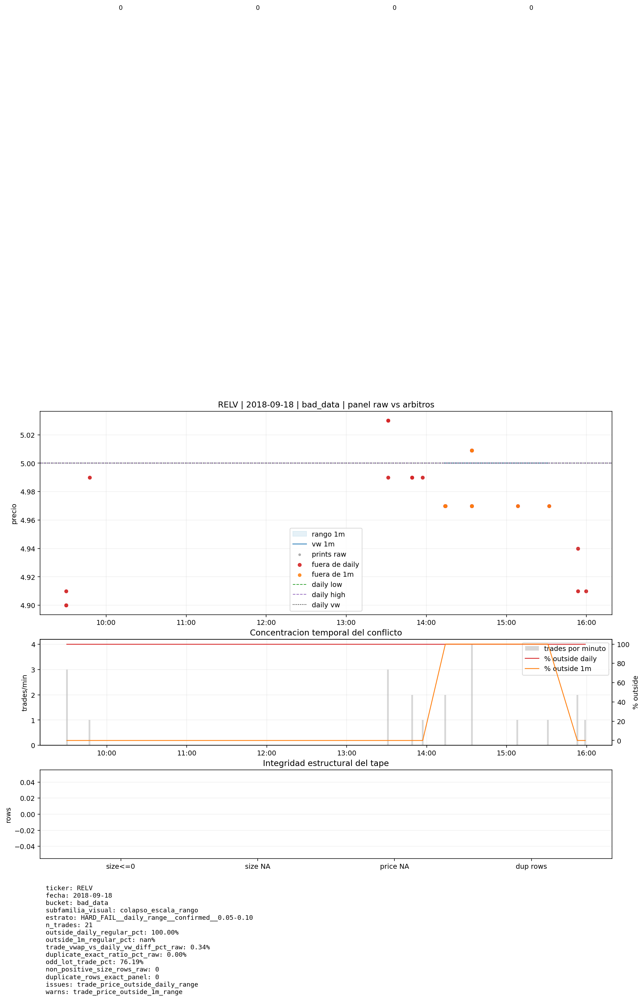

**Que muestra**

- Panel rico del tape raw frente a `daily` y `1m` para `RELV` el `2018-09-18`.
- `n_trades = 21`, `outside_daily_regular_pct = 100.00%`, `outside_1m_regular_pct = nan%`.
- `trade_vwap_vs_daily_vw_diff_pct_raw = 0.34%`, `duplicate_exact_ratio_pct_raw = 0.00%`, `odd_lot_trade_pct = 76.19%`.

**Responde**

- Subfamilia donde el panel de precio ya demuestra por si mismo una ruptura semantica: tape y arbitros viven en escalas incompatibles o el porcentaje fuera de rango es practicamente total.
- El fallo se ve de forma directa en el panel de precio: el tape y los arbitros no conviven en una misma geometria defendible.
- La lectura correcta exige mirar la separacion vertical entre prints y arbitros y el hecho de que el conflicto de rango sea practicamente total.
- Aqui el panel actual si responde bien a por que el file cae en `bad_data`.
- El 76.19% de odd-lots empuja la lectura hacia microestructura fina; evita leer el caso como pura ruptura economica gruesa.
- La decision que justifica es exclusion de ejecucion simulada, labels y benchmarking; solo queda valor forense.

**No responde**

- No responde a si la duplicacion es la causa principal del rechazo; puede empeorar el caso, pero no explica por si sola la geometria rota.
- No responde a si existiria una reconciliacion de escala defendible; el colapso ya es demasiado extremo para tratarlo como simple normalizacion.

**Consecuencia**

- Excluir de ejecucion simulada, labels y benchmarking.
- Conservar solo valor forense o de deteccion de dano severo.

### SMIT | 2014-06-17

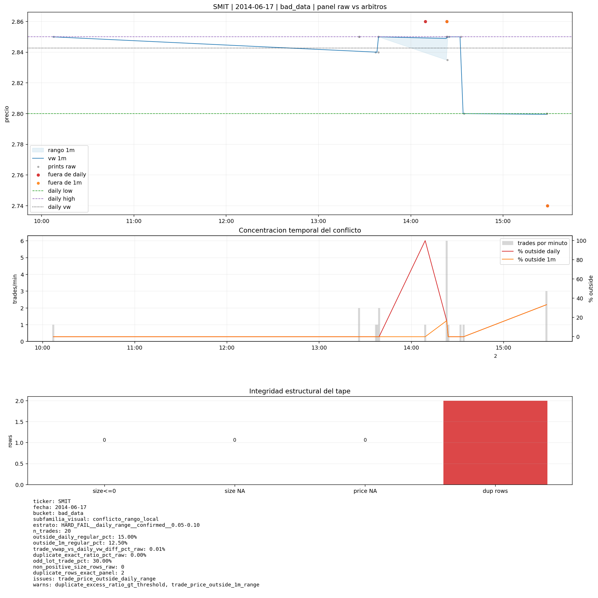

**Que muestra**

- Panel rico del tape raw frente a `daily` y `1m` para `SMIT` el `2014-06-17`.
- `n_trades = 20`, `outside_daily_regular_pct = 15.00%`, `outside_1m_regular_pct = 12.50%`.
- `trade_vwap_vs_daily_vw_diff_pct_raw = 0.01%`, `duplicate_exact_ratio_pct_raw = 0.00%`, `odd_lot_trade_pct = 30.00%`.

**Responde**

- Subfamilia donde el conflicto vive en un subconjunto relevante del rango o del arbitro intraminuto, aunque no haya colapso total de escala.
- El conflicto vive en una franja local del rango o del arbitro intraminuto, sin llegar a colapso total de escala.
- Eso exige leer el panel minuto a minuto y no quedarse solo con la impresion global de la nube de precios.
- La clasificacion a `bad_data` aqui depende de que el file ya no conserve una reconciliacion economica defendible.
- El 30.00% de odd-lots empuja la lectura hacia microestructura fina; evita leer el caso como pura ruptura economica gruesa.
- La decision que justifica es exclusion de ejecucion simulada, labels y benchmarking; solo queda valor forense.

**No responde**

- No responde a colapso total de escala; ese seria otro subtipo.
- No responde por si solo a dano estructural del tape salvo que aparezca en `issues_list` o en el panel de integridad.

**Consecuencia**

- Excluir el file del flujo productivo aunque el dano no sea un colapso absoluto.
- Conservarlo como caso forense de rango local severo.

**Grupos duplicados exactos mas relevantes**

| ts_ny | price | size | count |
|---|---|---|---|
| 2014-06-17 13:39:00.299 | 2.85 | 305 | 2 |

### GPRK | 2017-03-21

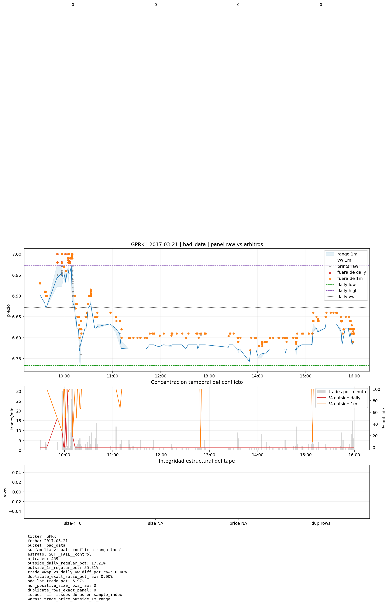

**Que muestra**

- Panel rico del tape raw frente a `daily` y `1m` para `GPRK` el `2017-03-21`.
- `n_trades = 459`, `outside_daily_regular_pct = 17.21%`, `outside_1m_regular_pct = 85.81%`.
- `trade_vwap_vs_daily_vw_diff_pct_raw = 0.40%`, `duplicate_exact_ratio_pct_raw = 0.00%`, `odd_lot_trade_pct = 6.97%`.

**Responde**

- Subfamilia donde el conflicto vive en un subconjunto relevante del rango o del arbitro intraminuto, aunque no haya colapso total de escala.
- El conflicto vive en una franja local del rango o del arbitro intraminuto, sin llegar a colapso total de escala.
- Eso exige leer el panel minuto a minuto y no quedarse solo con la impresion global de la nube de precios.
- La clasificacion a `bad_data` aqui depende de que el file ya no conserve una reconciliacion economica defendible.
- La decision que justifica es exclusion de ejecucion simulada, labels y benchmarking; solo queda valor forense.

**No responde**

- No responde a colapso total de escala; ese seria otro subtipo.
- No responde por si solo a dano estructural del tape salvo que aparezca en `issues_list` o en el panel de integridad.

**Consecuencia**

- Excluir el file del flujo productivo aunque el dano no sea un colapso absoluto.
- Conservarlo como caso forense de rango local severo.

### PMD | 2014-12-18

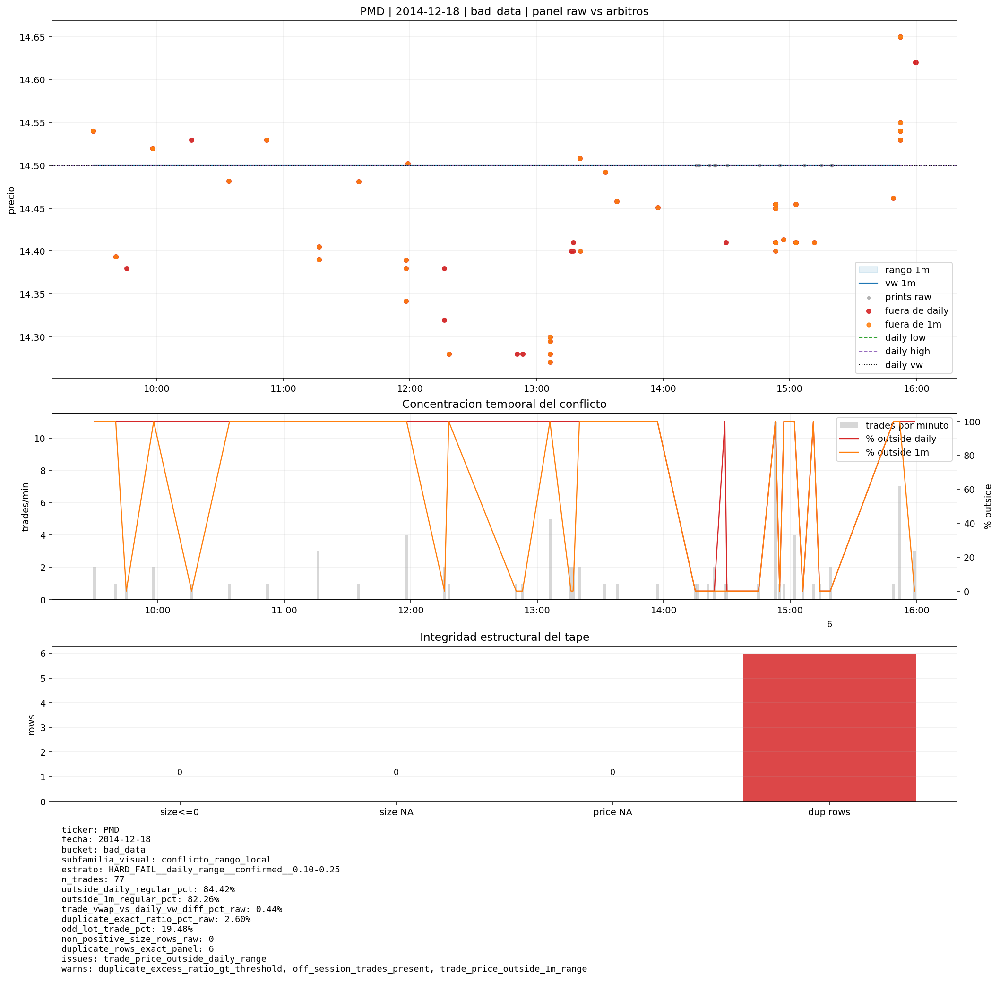

**Que muestra**

- Panel rico del tape raw frente a `daily` y `1m` para `PMD` el `2014-12-18`.
- `n_trades = 77`, `outside_daily_regular_pct = 84.42%`, `outside_1m_regular_pct = 82.26%`.
- `trade_vwap_vs_daily_vw_diff_pct_raw = 0.44%`, `duplicate_exact_ratio_pct_raw = 2.60%`, `odd_lot_trade_pct = 19.48%`.

**Responde**

- Subfamilia donde el conflicto vive en un subconjunto relevante del rango o del arbitro intraminuto, aunque no haya colapso total de escala.
- El conflicto vive en una franja local del rango o del arbitro intraminuto, sin llegar a colapso total de escala.
- Eso exige leer el panel minuto a minuto y no quedarse solo con la impresion global de la nube de precios.
- La clasificacion a `bad_data` aqui depende de que el file ya no conserve una reconciliacion economica defendible.
- La decision que justifica es exclusion de ejecucion simulada, labels y benchmarking; solo queda valor forense.

**No responde**

- No responde a colapso total de escala; ese seria otro subtipo.
- No responde por si solo a dano estructural del tape salvo que aparezca en `issues_list` o en el panel de integridad.

**Consecuencia**

- Excluir el file del flujo productivo aunque el dano no sea un colapso absoluto.
- Conservarlo como caso forense de rango local severo.

**Grupos duplicados exactos mas relevantes**

| ts_ny | price | size | count |
|---|---|---|---|
| 2014-12-18 09:30:00.135 | 14.54 | 172 | 2 |
| 2014-12-18 14:53:17.459 | 14.455 | 100 | 2 |
| 2014-12-18 15:02:52.253 | 14.41 | 100 | 2 |

### PMD | 2015-12-30

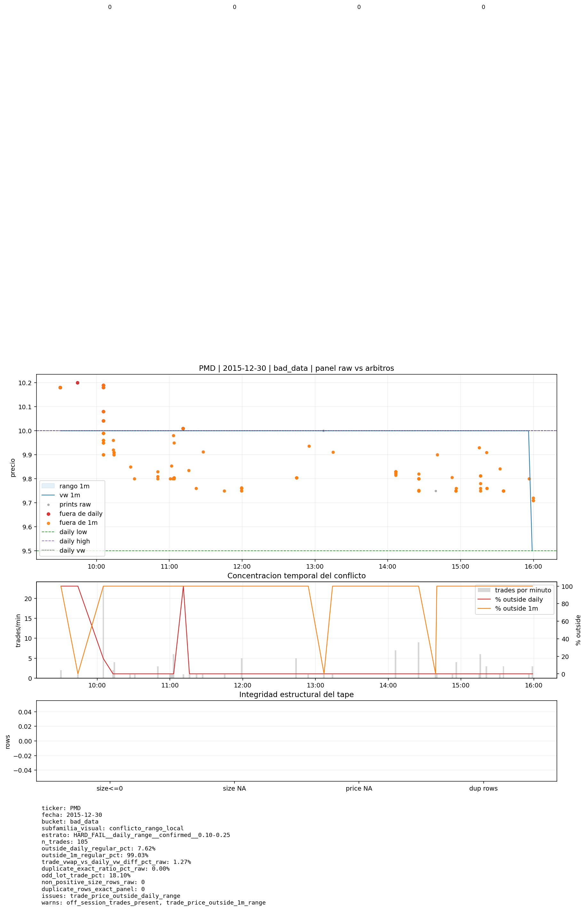

**Que muestra**

- Panel rico del tape raw frente a `daily` y `1m` para `PMD` el `2015-12-30`.
- `n_trades = 105`, `outside_daily_regular_pct = 7.62%`, `outside_1m_regular_pct = 99.03%`.
- `trade_vwap_vs_daily_vw_diff_pct_raw = 1.27%`, `duplicate_exact_ratio_pct_raw = 0.00%`, `odd_lot_trade_pct = 18.10%`.

**Responde**

- Subfamilia donde el conflicto vive en un subconjunto relevante del rango o del arbitro intraminuto, aunque no haya colapso total de escala.
- El conflicto vive en una franja local del rango o del arbitro intraminuto, sin llegar a colapso total de escala.
- Eso exige leer el panel minuto a minuto y no quedarse solo con la impresion global de la nube de precios.
- La clasificacion a `bad_data` aqui depende de que el file ya no conserve una reconciliacion economica defendible.
- La decision que justifica es exclusion de ejecucion simulada, labels y benchmarking; solo queda valor forense.

**No responde**

- No responde a colapso total de escala; ese seria otro subtipo.
- No responde por si solo a dano estructural del tape salvo que aparezca en `issues_list` o en el panel de integridad.

**Consecuencia**

- Excluir el file del flujo productivo aunque el dano no sea un colapso absoluto.
- Conservarlo como caso forense de rango local severo.

### QRTEA | 2018-07-19

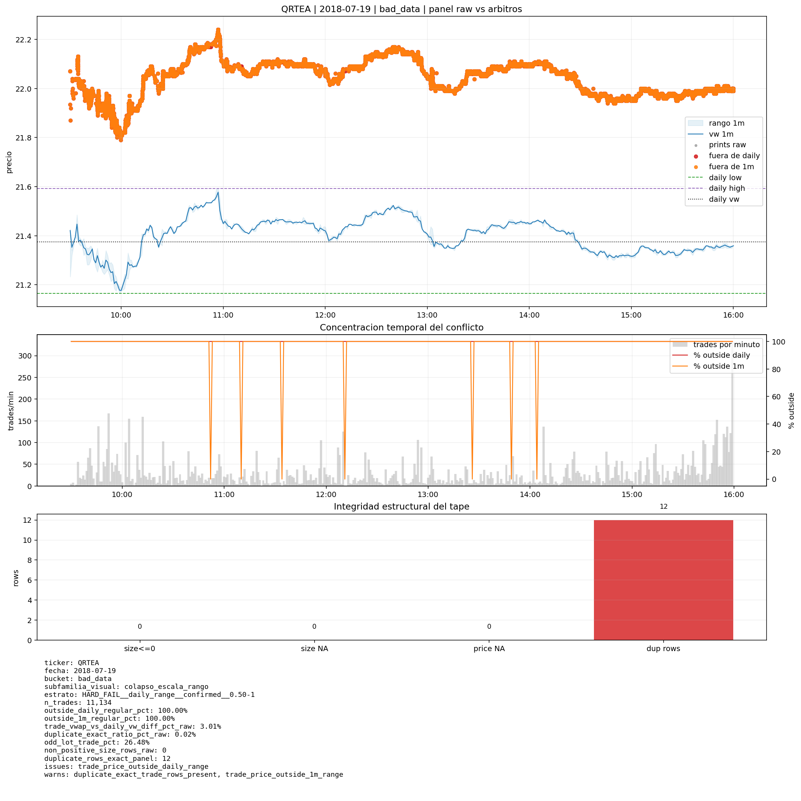

**Que muestra**

- Panel rico del tape raw frente a `daily` y `1m` para `QRTEA` el `2018-07-19`.
- `n_trades = 11,134`, `outside_daily_regular_pct = 100.00%`, `outside_1m_regular_pct = 100.00%`.
- `trade_vwap_vs_daily_vw_diff_pct_raw = 3.01%`, `duplicate_exact_ratio_pct_raw = 0.02%`, `odd_lot_trade_pct = 26.48%`.

**Responde**

- Subfamilia donde el panel de precio ya demuestra por si mismo una ruptura semantica: tape y arbitros viven en escalas incompatibles o el porcentaje fuera de rango es practicamente total.
- El fallo se ve de forma directa en el panel de precio: el tape y los arbitros no conviven en una misma geometria defendible.
- La lectura correcta exige mirar la separacion vertical entre prints y arbitros y el hecho de que el conflicto de rango sea practicamente total.
- Aqui el panel actual si responde bien a por que el file cae en `bad_data`.
- El 26.48% de odd-lots empuja la lectura hacia microestructura fina; evita leer el caso como pura ruptura economica gruesa.
- La decision que justifica es exclusion de ejecucion simulada, labels y benchmarking; solo queda valor forense.

**No responde**

- No responde a si la duplicacion es la causa principal del rechazo; puede empeorar el caso, pero no explica por si sola la geometria rota.
- No responde a si existiria una reconciliacion de escala defendible; el colapso ya es demasiado extremo para tratarlo como simple normalizacion.

**Consecuencia**

- Excluir de ejecucion simulada, labels y benchmarking.
- Conservar solo valor forense o de deteccion de dano severo.

**Grupos duplicados exactos mas relevantes**

| ts_ny | price | size | count |
|---|---|---|---|
| 2018-07-19 11:31:45.145171 | 22.11 | 100 | 2 |
| 2018-07-19 12:56:42.942553 | 22.08 | 100 | 2 |
| 2018-07-19 14:35:09.868126 | 21.98 | 100 | 2 |
| 2018-07-19 15:04:19.500253 | 21.97 | 100 | 2 |
| 2018-07-19 15:54:32.365938 | 22.0 | 200 | 2 |
| 2018-07-19 15:55:59.861462 | 22.0 | 100 | 2 |

### RELV | 2016-12-09

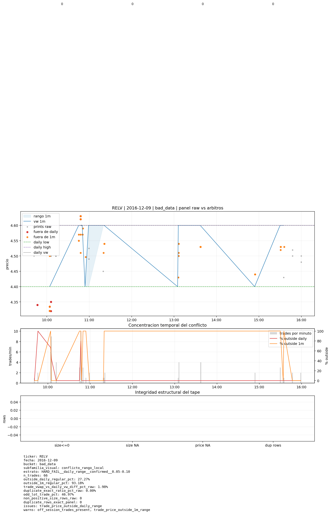

**Que muestra**

- Panel rico del tape raw frente a `daily` y `1m` para `RELV` el `2016-12-09`.
- `n_trades = 66`, `outside_daily_regular_pct = 27.27%`, `outside_1m_regular_pct = 93.18%`.
- `trade_vwap_vs_daily_vw_diff_pct_raw = 1.98%`, `duplicate_exact_ratio_pct_raw = 0.00%`, `odd_lot_trade_pct = 46.97%`.

**Responde**

- Subfamilia donde el conflicto vive en un subconjunto relevante del rango o del arbitro intraminuto, aunque no haya colapso total de escala.
- El conflicto vive en una franja local del rango o del arbitro intraminuto, sin llegar a colapso total de escala.
- Eso exige leer el panel minuto a minuto y no quedarse solo con la impresion global de la nube de precios.
- La clasificacion a `bad_data` aqui depende de que el file ya no conserve una reconciliacion economica defendible.
- El 46.97% de odd-lots empuja la lectura hacia microestructura fina; evita leer el caso como pura ruptura economica gruesa.
- La decision que justifica es exclusion de ejecucion simulada, labels y benchmarking; solo queda valor forense.

**No responde**

- No responde a colapso total de escala; ese seria otro subtipo.
- No responde por si solo a dano estructural del tape salvo que aparezca en `issues_list` o en el panel de integridad.

**Consecuencia**

- Excluir el file del flujo productivo aunque el dano no sea un colapso absoluto.
- Conservarlo como caso forense de rango local severo.

### RELV | 2017-08-10

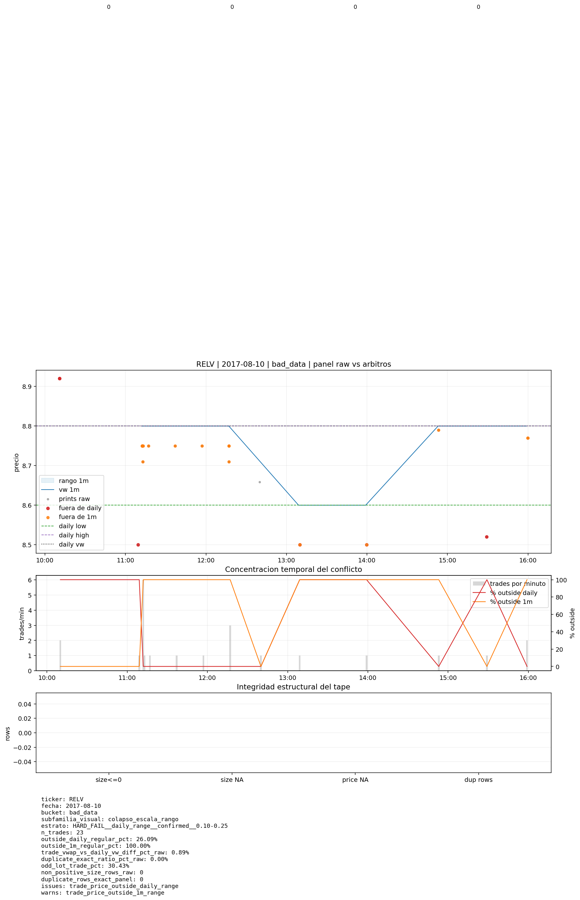

**Que muestra**

- Panel rico del tape raw frente a `daily` y `1m` para `RELV` el `2017-08-10`.
- `n_trades = 23`, `outside_daily_regular_pct = 26.09%`, `outside_1m_regular_pct = 100.00%`.
- `trade_vwap_vs_daily_vw_diff_pct_raw = 0.89%`, `duplicate_exact_ratio_pct_raw = 0.00%`, `odd_lot_trade_pct = 30.43%`.

**Responde**

- Subfamilia donde el panel de precio ya demuestra por si mismo una ruptura semantica: tape y arbitros viven en escalas incompatibles o el porcentaje fuera de rango es practicamente total.
- El fallo se ve de forma directa en el panel de precio: el tape y los arbitros no conviven en una misma geometria defendible.
- La lectura correcta exige mirar la separacion vertical entre prints y arbitros y el hecho de que el conflicto de rango sea practicamente total.
- Aqui el panel actual si responde bien a por que el file cae en `bad_data`.
- El 30.43% de odd-lots empuja la lectura hacia microestructura fina; evita leer el caso como pura ruptura economica gruesa.
- La decision que justifica es exclusion de ejecucion simulada, labels y benchmarking; solo queda valor forense.

**No responde**

- No responde a si la duplicacion es la causa principal del rechazo; puede empeorar el caso, pero no explica por si sola la geometria rota.
- No responde a si existiria una reconciliacion de escala defendible; el colapso ya es demasiado extremo para tratarlo como simple normalizacion.

**Consecuencia**

- Excluir de ejecucion simulada, labels y benchmarking.
- Conservar solo valor forense o de deteccion de dano severo.

### SBSI | 2017-05-19

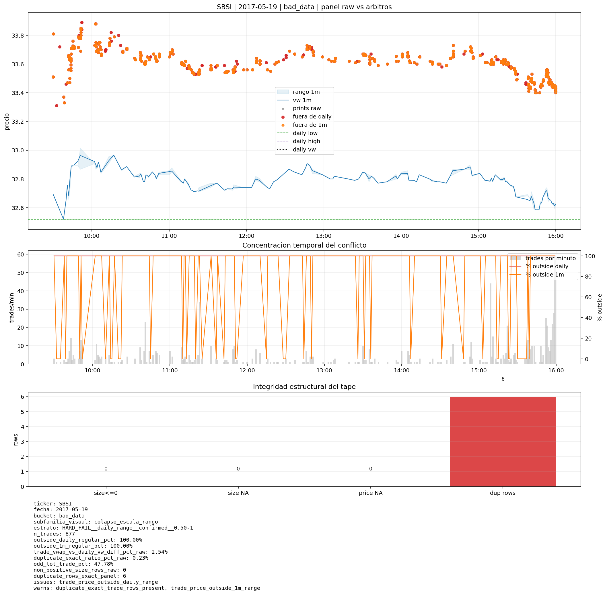

**Que muestra**

- Panel rico del tape raw frente a `daily` y `1m` para `SBSI` el `2017-05-19`.
- `n_trades = 877`, `outside_daily_regular_pct = 100.00%`, `outside_1m_regular_pct = 100.00%`.
- `trade_vwap_vs_daily_vw_diff_pct_raw = 2.54%`, `duplicate_exact_ratio_pct_raw = 0.23%`, `odd_lot_trade_pct = 47.78%`.

**Responde**

- Subfamilia donde el panel de precio ya demuestra por si mismo una ruptura semantica: tape y arbitros viven en escalas incompatibles o el porcentaje fuera de rango es practicamente total.
- El fallo se ve de forma directa en el panel de precio: el tape y los arbitros no conviven en una misma geometria defendible.
- La lectura correcta exige mirar la separacion vertical entre prints y arbitros y el hecho de que el conflicto de rango sea practicamente total.
- Aqui el panel actual si responde bien a por que el file cae en `bad_data`.
- El 47.78% de odd-lots empuja la lectura hacia microestructura fina; evita leer el caso como pura ruptura economica gruesa.
- La decision que justifica es exclusion de ejecucion simulada, labels y benchmarking; solo queda valor forense.

**No responde**

- No responde a si la duplicacion es la causa principal del rechazo; puede empeorar el caso, pero no explica por si sola la geometria rota.
- No responde a si existiria una reconciliacion de escala defendible; el colapso ya es demasiado extremo para tratarlo como simple normalizacion.

**Consecuencia**

- Excluir de ejecucion simulada, labels y benchmarking.
- Conservar solo valor forense o de deteccion de dano severo.

**Grupos duplicados exactos mas relevantes**

| ts_ny | price | size | count |
|---|---|---|---|
| 2017-05-19 09:43:41.902924 | 33.62 | 100 | 2 |
| 2017-05-19 10:03:04.872117 | 33.73 | 100 | 2 |
| 2017-05-19 14:40:25.721050 | 33.69 | 100 | 2 |

### TOPS | 2013-12-26

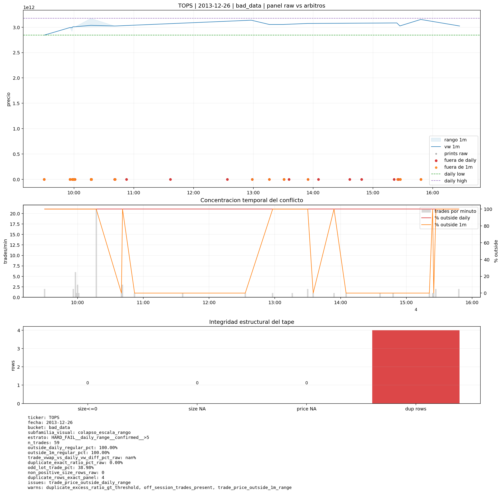

**Que muestra**

- Panel rico del tape raw frente a `daily` y `1m` para `TOPS` el `2013-12-26`.
- `n_trades = 59`, `outside_daily_regular_pct = 100.00%`, `outside_1m_regular_pct = 100.00%`.
- `trade_vwap_vs_daily_vw_diff_pct_raw = nan%`, `duplicate_exact_ratio_pct_raw = 0.00%`, `odd_lot_trade_pct = 38.98%`.

**Responde**

- Subfamilia donde el panel de precio ya demuestra por si mismo una ruptura semantica: tape y arbitros viven en escalas incompatibles o el porcentaje fuera de rango es practicamente total.
- El fallo se ve de forma directa en el panel de precio: el tape y los arbitros no conviven en una misma geometria defendible.
- La lectura correcta exige mirar la separacion vertical entre prints y arbitros y el hecho de que el conflicto de rango sea practicamente total.
- Aqui el panel actual si responde bien a por que el file cae en `bad_data`.
- El 38.98% de odd-lots empuja la lectura hacia microestructura fina; evita leer el caso como pura ruptura economica gruesa.
- La decision que justifica es exclusion de ejecucion simulada, labels y benchmarking; solo queda valor forense.

**No responde**

- No responde a si la duplicacion es la causa principal del rechazo; puede empeorar el caso, pero no explica por si sola la geometria rota.
- No responde a si existiria una reconciliacion de escala defendible; el colapso ya es demasiado extremo para tratarlo como simple normalizacion.

**Consecuencia**

- Excluir de ejecucion simulada, labels y benchmarking.
- Conservar solo valor forense o de deteccion de dano severo.

**Grupos duplicados exactos mas relevantes**

| ts_ny | price | size | count |
|---|---|---|---|
| 2013-12-26 09:30:00.573 | 1.88 | 133 | 2 |
| 2013-12-26 10:17:19.793 | 2.0 | 1 | 2 |

### TOPS | 2015-01-22

**Que muestra**

- Panel rico del tape raw frente a `daily` y `1m` para `TOPS` el `2015-01-22`.
- `n_trades = 96`, `outside_daily_regular_pct = 100.00%`, `outside_1m_regular_pct = 100.00%`.
- `trade_vwap_vs_daily_vw_diff_pct_raw = nan%`, `duplicate_exact_ratio_pct_raw = 6.25%`, `odd_lot_trade_pct = 7.29%`.

**Responde**

- Subfamilia donde el panel de precio ya demuestra por si mismo una ruptura semantica: tape y arbitros viven en escalas incompatibles o el porcentaje fuera de rango es practicamente total.
- El fallo se ve de forma directa en el panel de precio: el tape y los arbitros no conviven en una misma geometria defendible.
- La lectura correcta exige mirar la separacion vertical entre prints y arbitros y el hecho de que el conflicto de rango sea practicamente total.
- Aqui el panel actual si responde bien a por que el file cae en `bad_data`.
- El 6.25% de duplicacion exacta obliga a sospechar dano de tape o bursts mecanicos, no solo ruido visual.
- La decision que justifica es exclusion de ejecucion simulada, labels y benchmarking; solo queda valor forense.

**No responde**

- No responde a si la duplicacion es la causa principal del rechazo; puede empeorar el caso, pero no explica por si sola la geometria rota.
- No responde a si existiria una reconciliacion de escala defendible; el colapso ya es demasiado extremo para tratarlo como simple normalizacion.

**Consecuencia**

- Excluir de ejecucion simulada, labels y benchmarking.
- Conservar solo valor forense o de deteccion de dano severo.

**Grupos duplicados exactos mas relevantes**

| ts_ny | price | size | count |
|---|---|---|---|
| 2015-01-22 09:30:00.525 | 1.1 | 1823 | 2 |
| 2015-01-22 10:09:21.767 | 1.11 | 200 | 2 |
| 2015-01-22 11:15:23.860 | 1.1 | 100 | 2 |
| 2015-01-22 11:57:05.525 | 1.1 | 100 | 2 |
| 2015-01-22 12:36:13.150 | 1.17 | 100 | 2 |
| 2015-01-22 12:36:13.150 | 1.18 | 100 | 2 |
| 2015-01-22 12:36:13.151 | 1.15 | 100 | 2 |
| 2015-01-22 15:09:54.917 | 1.11 | 200 | 2 |
| 2015-01-22 15:28:18.953 | 1.08 | 100 | 2 |

### TOPS | 2016-07-07

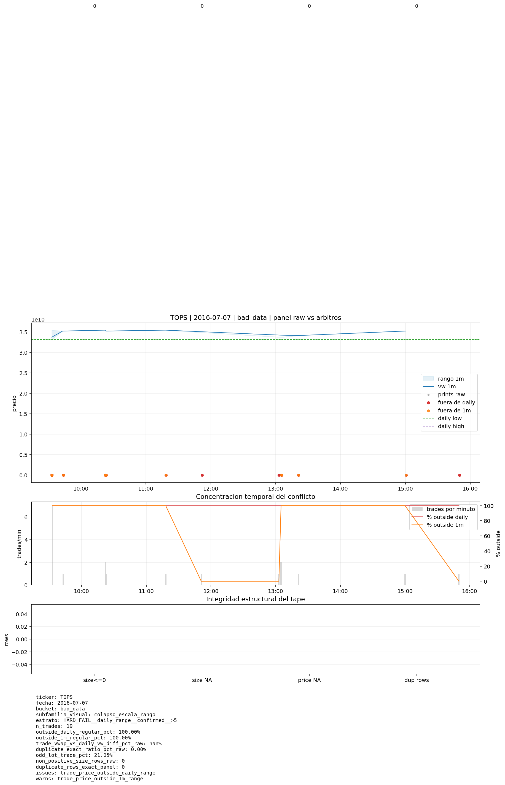

**Que muestra**

- Panel rico del tape raw frente a `daily` y `1m` para `TOPS` el `2016-07-07`.
- `n_trades = 19`, `outside_daily_regular_pct = 100.00%`, `outside_1m_regular_pct = 100.00%`.
- `trade_vwap_vs_daily_vw_diff_pct_raw = nan%`, `duplicate_exact_ratio_pct_raw = 0.00%`, `odd_lot_trade_pct = 21.05%`.

**Responde**

- Subfamilia donde el panel de precio ya demuestra por si mismo una ruptura semantica: tape y arbitros viven en escalas incompatibles o el porcentaje fuera de rango es practicamente total.
- El fallo se ve de forma directa en el panel de precio: el tape y los arbitros no conviven en una misma geometria defendible.
- La lectura correcta exige mirar la separacion vertical entre prints y arbitros y el hecho de que el conflicto de rango sea practicamente total.
- Aqui el panel actual si responde bien a por que el file cae en `bad_data`.
- La decision que justifica es exclusion de ejecucion simulada, labels y benchmarking; solo queda valor forense.

**No responde**

- No responde a si la duplicacion es la causa principal del rechazo; puede empeorar el caso, pero no explica por si sola la geometria rota.
- No responde a si existiria una reconciliacion de escala defendible; el colapso ya es demasiado extremo para tratarlo como simple normalizacion.

**Consecuencia**

- Excluir de ejecucion simulada, labels y benchmarking.
- Conservar solo valor forense o de deteccion de dano severo.

### KELYB | 2016-06-02

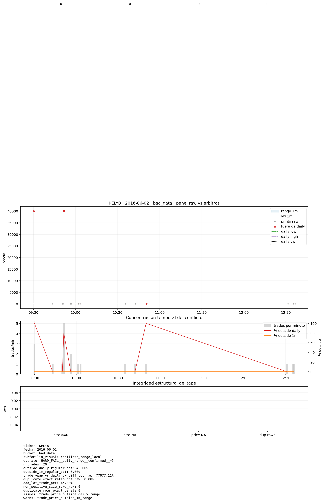

**Que muestra**

- Panel rico del tape raw frente a `daily` y `1m` para `KELYB` el `2016-06-02`.
- `n_trades = 20`, `outside_daily_regular_pct = 40.00%`, `outside_1m_regular_pct = 0.00%`.
- `trade_vwap_vs_daily_vw_diff_pct_raw = 77877.11%`, `duplicate_exact_ratio_pct_raw = 0.00%`, `odd_lot_trade_pct = 45.00%`.

**Responde**

- Subfamilia donde el conflicto vive en un subconjunto relevante del rango o del arbitro intraminuto, aunque no haya colapso total de escala.
- El conflicto vive en una franja local del rango o del arbitro intraminuto, sin llegar a colapso total de escala.
- Eso exige leer el panel minuto a minuto y no quedarse solo con la impresion global de la nube de precios.
- La clasificacion a `bad_data` aqui depende de que el file ya no conserve una reconciliacion economica defendible.
- El 45.00% de odd-lots empuja la lectura hacia microestructura fina; evita leer el caso como pura ruptura economica gruesa.
- La decision que justifica es exclusion de ejecucion simulada, labels y benchmarking; solo queda valor forense.

**No responde**

- No responde a colapso total de escala; ese seria otro subtipo.
- No responde por si solo a dano estructural del tape salvo que aparezca en `issues_list` o en el panel de integridad.

**Consecuencia**

- Excluir el file del flujo productivo aunque el dano no sea un colapso absoluto.
- Conservarlo como caso forense de rango local severo.

### IHC | 2020-11-27

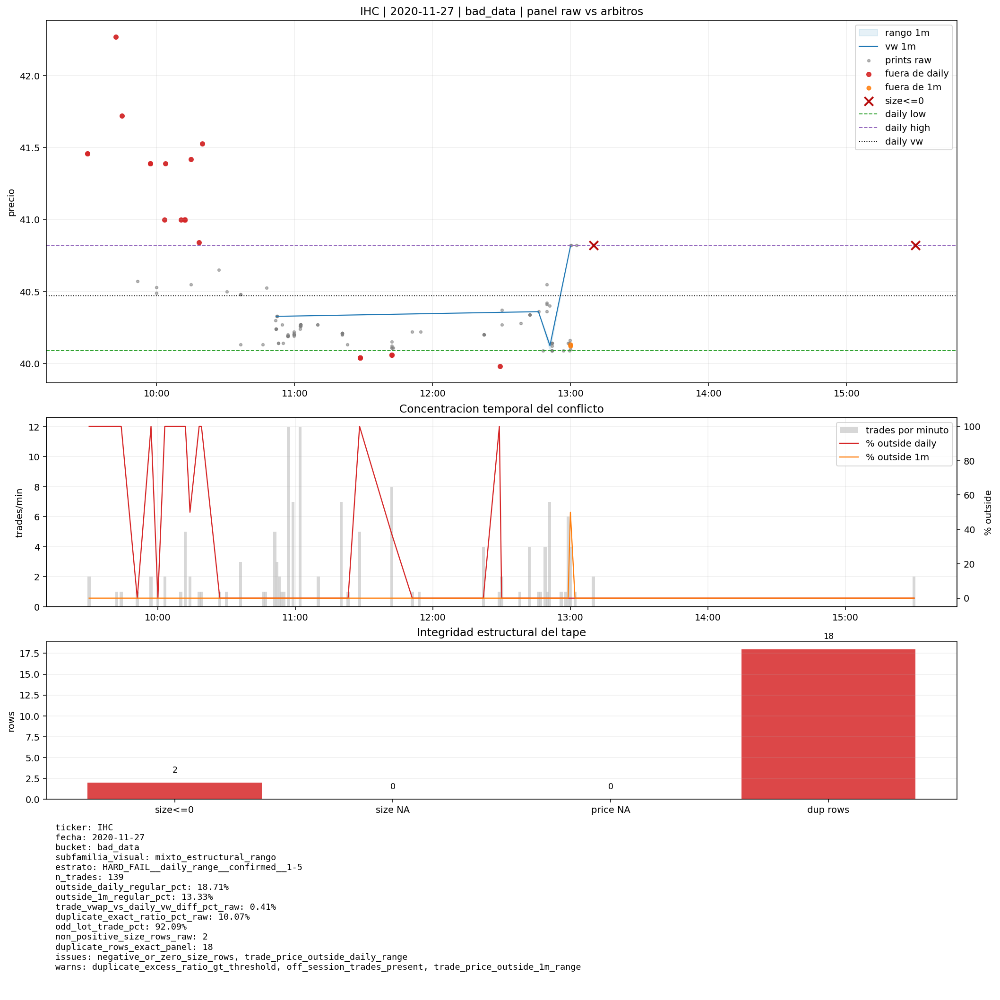

**Que muestra**

- Panel rico del tape raw frente a `daily` y `1m` para `IHC` el `2020-11-27`.
- `n_trades = 139`, `outside_daily_regular_pct = 18.71%`, `outside_1m_regular_pct = 13.33%`.
- `trade_vwap_vs_daily_vw_diff_pct_raw = 0.41%`, `duplicate_exact_ratio_pct_raw = 10.07%`, `odd_lot_trade_pct = 92.09%`.

**Responde**

- Subfamilia mixta donde hay conflicto visual de rango, pero tambien senales de integridad del tape. El rechazo no debe apoyarse en una sola capa de evidencia.
- El caso combina conflicto de rango con senales de integridad del tape.
- La lectura correcta no es elegir una sola causa, sino reconocer que hay dano mixto: lo visual protesta y la estructura interna tambien.
- La clasificacion a `bad_data` se apoya en ambas capas de evidencia y no solo en el porcentaje outside.
- El 92.09% de odd-lots empuja la lectura hacia microestructura fina; evita leer el caso como pura ruptura economica gruesa.
- El 10.07% de duplicacion exacta obliga a sospechar dano de tape o bursts mecanicos, no solo ruido visual.
- La presencia de `negative_or_zero_size_rows` mueve la causalidad desde el precio hacia la integridad estructural del tape.
- La decision que justifica es exclusion de ejecucion simulada, labels y benchmarking; solo queda valor forense.

**No responde**

- No responde a una unica causa limpia; obliga a aceptar que hay mezcla de fenomenos.
- No absuelve el file aunque una de las dos capas parezca mas suave que la otra.

**Consecuencia**

- Excluir el file y tratarlo como rechazo duro, no como caso de reconciliacion fina.
- Mantener el requisito de una segunda imagen de integridad cuando se presente al inspector.

**Filas invalidas exactas (`size <= 0`)**

| ts_ny | price | size | exchange | conditions |
|---|---|---|---|---|
| 2020-11-27 13:10:00.002130 | 40.82 | 0 | 10 | 38, 41 |
| 2020-11-27 15:30:00.001822 | 40.82 | 0 | 10 | 38, 41 |

**Grupos duplicados exactos mas relevantes**

| ts_ny | price | size | count |
|---|---|---|---|
| 2020-11-27 09:30:00.863257 | 41.46 | 58 | 2 |
| 2020-11-27 09:57:09.315526 | 41.39 | 1 | 2 |
| 2020-11-27 10:51:59.335401 | 40.24 | 3 | 2 |
| 2020-11-27 10:57:01.787411 | 40.19 | 3 | 2 |
| 2020-11-27 10:59:43.143195 | 40.2 | 3 | 2 |
| 2020-11-27 11:10:02.757936 | 40.27 | 3 | 2 |
| 2020-11-27 11:42:10.054231 | 40.06 | 3 | 2 |
| 2020-11-27 12:22:16.544771 | 40.2 | 3 | 2 |
| 2020-11-27 12:22:16.544780 | 40.2 | 3 | 2 |

### AIM | 2021-06-24

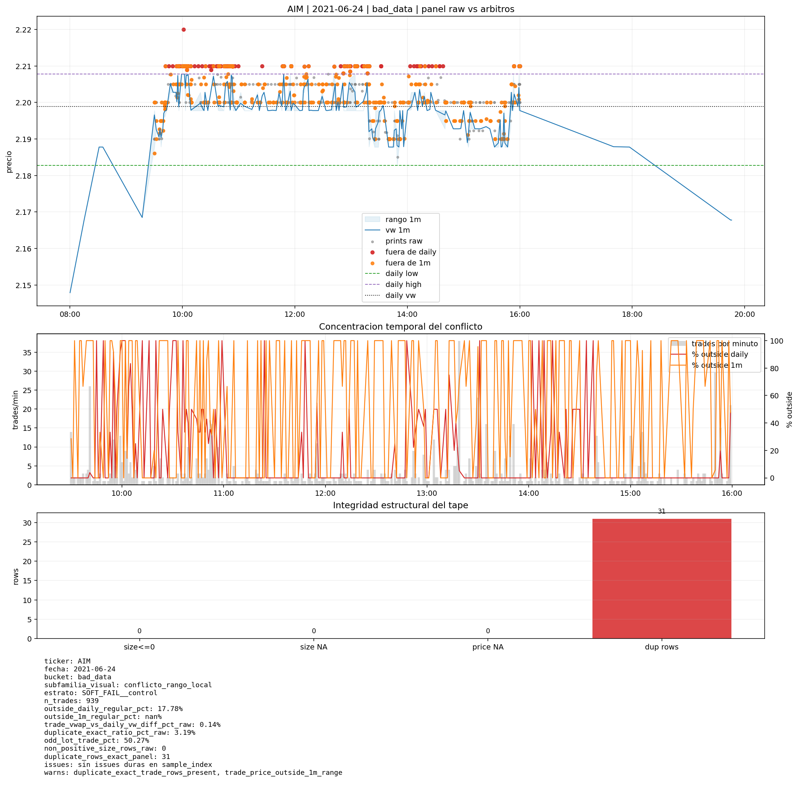

**Que muestra**

- Panel rico del tape raw frente a `daily` y `1m` para `AIM` el `2021-06-24`.
- `n_trades = 939`, `outside_daily_regular_pct = 17.78%`, `outside_1m_regular_pct = nan%`.
- `trade_vwap_vs_daily_vw_diff_pct_raw = 0.14%`, `duplicate_exact_ratio_pct_raw = 3.19%`, `odd_lot_trade_pct = 50.27%`.

**Responde**

- Subfamilia donde el conflicto vive en un subconjunto relevante del rango o del arbitro intraminuto, aunque no haya colapso total de escala.
- El conflicto vive en una franja local del rango o del arbitro intraminuto, sin llegar a colapso total de escala.
- Eso exige leer el panel minuto a minuto y no quedarse solo con la impresion global de la nube de precios.
- La clasificacion a `bad_data` aqui depende de que el file ya no conserve una reconciliacion economica defendible.
- El 50.27% de odd-lots empuja la lectura hacia microestructura fina; evita leer el caso como pura ruptura economica gruesa.
- La decision que justifica es exclusion de ejecucion simulada, labels y benchmarking; solo queda valor forense.

**No responde**

- No responde a colapso total de escala; ese seria otro subtipo.
- No responde por si solo a dano estructural del tape salvo que aparezca en `issues_list` o en el panel de integridad.

**Consecuencia**

- Excluir el file del flujo productivo aunque el dano no sea un colapso absoluto.
- Conservarlo como caso forense de rango local severo.

**Grupos duplicados exactos mas relevantes**

| ts_ny | price | size | count |
|---|---|---|---|
| 2021-06-24 10:02:42.416120 | 2.21 | 100 | 3 |
| 2021-06-24 09:41:11.025683 | 2.2 | 100 | 2 |
| 2021-06-24 09:59:42.368528 | 2.21 | 22 | 2 |
| 2021-06-24 10:02:42.416365 | 2.21 | 100 | 2 |
| 2021-06-24 10:09:35.172292 | 2.2 | 100 | 2 |
| 2021-06-24 10:23:53.779030 | 2.2 | 100 | 2 |
| 2021-06-24 10:39:33.434375 | 2.2 | 100 | 2 |
| 2021-06-24 13:19:18.039542 | 2.2 | 100 | 2 |
| 2021-06-24 13:25:13.694266 | 2.19 | 100 | 2 |
| 2021-06-24 13:35:09.791735 | 2.2 | 100 | 2 |

### ALTS | 2020-06-18

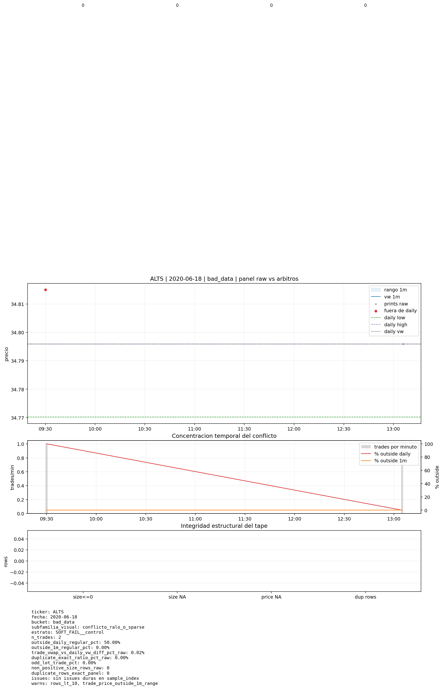

**Que muestra**

- Panel rico del tape raw frente a `daily` y `1m` para `ALTS` el `2020-06-18`.
- `n_trades = 2`, `outside_daily_regular_pct = 50.00%`, `outside_1m_regular_pct = 0.00%`.
- `trade_vwap_vs_daily_vw_diff_pct_raw = 0.02%`, `duplicate_exact_ratio_pct_raw = 0.00%`, `odd_lot_trade_pct = 0.00%`.

**Responde**

- Subfamilia donde el conflicto se apoya en muy pocas filas o en una muestra excesivamente rala. La gravedad no nace solo de la geometria del precio, sino de la imposibilidad de defender el file como tape estable.
- La gravedad nace en parte de la escasez del tape: muy pocas filas pueden romper el rango sin dejar una firma visual espectacular.
- Eso obliga a leer el caso como file poco defendible, no como simple outlier bonito en un tape robusto.
- El panel actual necesita leerse junto a `n_trades`, `rows_lt_10` y la concentracion del conflicto.
- La advertencia `rows_lt_10` limita fuertemente la defensa estadistica del file y endurece la lectura del caso.
- La decision que justifica es exclusion de ejecucion simulada, labels y benchmarking; solo queda valor forense.

**No responde**

- No responde a un patron estable de tape; precisamente el problema es que el file no tiene suficiente densidad para defenderlo.
- No debe leerse como simple ruido puntual en un tape robusto.

**Consecuencia**

- Mantener el file fuera de ejecucion y labels productivos.
- Usarlo solo como evidencia de frontera metodologica o para forense.

### ALTS | 2020-09-22

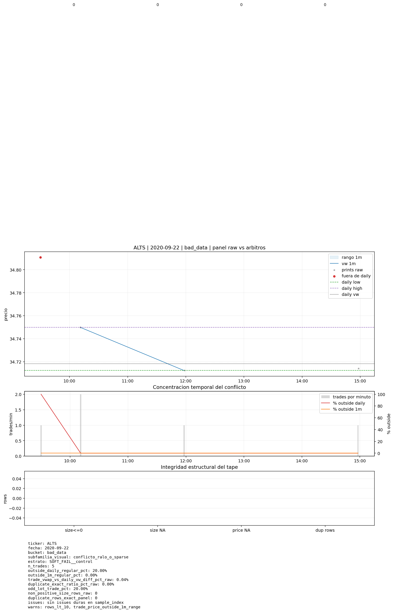

**Que muestra**

- Panel rico del tape raw frente a `daily` y `1m` para `ALTS` el `2020-09-22`.
- `n_trades = 5`, `outside_daily_regular_pct = 20.00%`, `outside_1m_regular_pct = 0.00%`.
- `trade_vwap_vs_daily_vw_diff_pct_raw = 0.04%`, `duplicate_exact_ratio_pct_raw = 0.00%`, `odd_lot_trade_pct = 20.00%`.

**Responde**

- Subfamilia donde el conflicto se apoya en muy pocas filas o en una muestra excesivamente rala. La gravedad no nace solo de la geometria del precio, sino de la imposibilidad de defender el file como tape estable.
- La gravedad nace en parte de la escasez del tape: muy pocas filas pueden romper el rango sin dejar una firma visual espectacular.
- Eso obliga a leer el caso como file poco defendible, no como simple outlier bonito en un tape robusto.
- El panel actual necesita leerse junto a `n_trades`, `rows_lt_10` y la concentracion del conflicto.
- La advertencia `rows_lt_10` limita fuertemente la defensa estadistica del file y endurece la lectura del caso.
- La decision que justifica es exclusion de ejecucion simulada, labels y benchmarking; solo queda valor forense.

**No responde**

- No responde a un patron estable de tape; precisamente el problema es que el file no tiene suficiente densidad para defenderlo.
- No debe leerse como simple ruido puntual en un tape robusto.

**Consecuencia**

- Mantener el file fuera de ejecucion y labels productivos.
- Usarlo solo como evidencia de frontera metodologica o para forense.

### BH.A | 2025-01-15

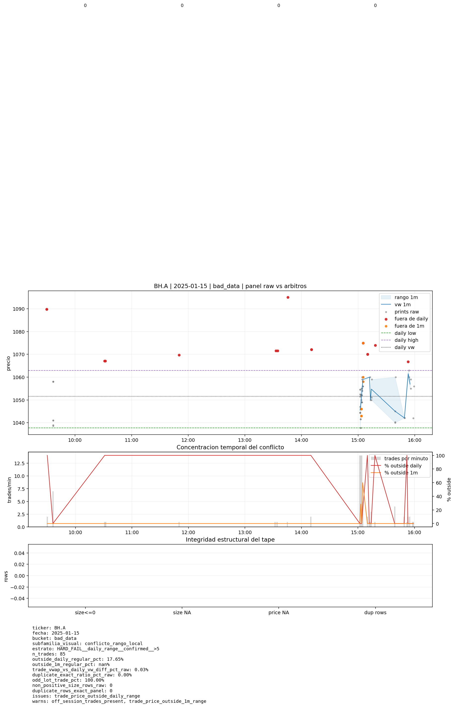

**Que muestra**

- Panel rico del tape raw frente a `daily` y `1m` para `BH.A` el `2025-01-15`.
- `n_trades = 85`, `outside_daily_regular_pct = 17.65%`, `outside_1m_regular_pct = nan%`.
- `trade_vwap_vs_daily_vw_diff_pct_raw = 0.03%`, `duplicate_exact_ratio_pct_raw = 0.00%`, `odd_lot_trade_pct = 100.00%`.

**Responde**

- Subfamilia donde el conflicto vive en un subconjunto relevante del rango o del arbitro intraminuto, aunque no haya colapso total de escala.
- El conflicto vive en una franja local del rango o del arbitro intraminuto, sin llegar a colapso total de escala.
- Eso exige leer el panel minuto a minuto y no quedarse solo con la impresion global de la nube de precios.
- La clasificacion a `bad_data` aqui depende de que el file ya no conserve una reconciliacion economica defendible.
- El 100.00% de odd-lots empuja la lectura hacia microestructura fina; evita leer el caso como pura ruptura economica gruesa.
- La decision que justifica es exclusion de ejecucion simulada, labels y benchmarking; solo queda valor forense.

**No responde**

- No responde a colapso total de escala; ese seria otro subtipo.
- No responde por si solo a dano estructural del tape salvo que aparezca en `issues_list` o en el panel de integridad.

**Consecuencia**

- Excluir el file del flujo productivo aunque el dano no sea un colapso absoluto.
- Conservarlo como caso forense de rango local severo.

### CRSA | 2021-03-16

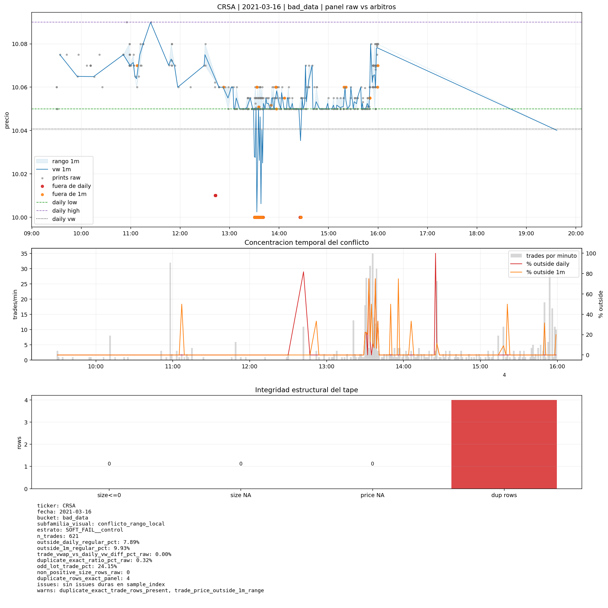

**Que muestra**

- Panel rico del tape raw frente a `daily` y `1m` para `CRSA` el `2021-03-16`.
- `n_trades = 621`, `outside_daily_regular_pct = 7.89%`, `outside_1m_regular_pct = 9.93%`.
- `trade_vwap_vs_daily_vw_diff_pct_raw = 0.00%`, `duplicate_exact_ratio_pct_raw = 0.32%`, `odd_lot_trade_pct = 24.15%`.

**Responde**

- Subfamilia donde el conflicto vive en un subconjunto relevante del rango o del arbitro intraminuto, aunque no haya colapso total de escala.
- El conflicto vive en una franja local del rango o del arbitro intraminuto, sin llegar a colapso total de escala.
- Eso exige leer el panel minuto a minuto y no quedarse solo con la impresion global de la nube de precios.
- La clasificacion a `bad_data` aqui depende de que el file ya no conserve una reconciliacion economica defendible.
- La decision que justifica es exclusion de ejecucion simulada, labels y benchmarking; solo queda valor forense.

**No responde**

- No responde a colapso total de escala; ese seria otro subtipo.
- No responde por si solo a dano estructural del tape salvo que aparezca en `issues_list` o en el panel de integridad.

**Consecuencia**

- Excluir el file del flujo productivo aunque el dano no sea un colapso absoluto.
- Conservarlo como caso forense de rango local severo.

**Grupos duplicados exactos mas relevantes**

| ts_ny | price | size | count |
|---|---|---|---|
| 2021-03-16 10:51:04.615887 | 10.075 | 500 | 2 |
| 2021-03-16 15:14:18.501948 | 10.05 | 100 | 2 |

### GLBL | 2024-11-01

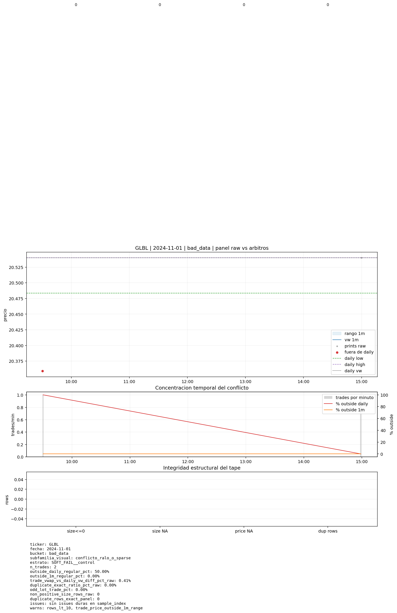

**Que muestra**

- Panel rico del tape raw frente a `daily` y `1m` para `GLBL` el `2024-11-01`.
- `n_trades = 2`, `outside_daily_regular_pct = 50.00%`, `outside_1m_regular_pct = 0.00%`.
- `trade_vwap_vs_daily_vw_diff_pct_raw = 0.41%`, `duplicate_exact_ratio_pct_raw = 0.00%`, `odd_lot_trade_pct = 0.00%`.

**Responde**

- Subfamilia donde el conflicto se apoya en muy pocas filas o en una muestra excesivamente rala. La gravedad no nace solo de la geometria del precio, sino de la imposibilidad de defender el file como tape estable.
- La gravedad nace en parte de la escasez del tape: muy pocas filas pueden romper el rango sin dejar una firma visual espectacular.
- Eso obliga a leer el caso como file poco defendible, no como simple outlier bonito en un tape robusto.
- El panel actual necesita leerse junto a `n_trades`, `rows_lt_10` y la concentracion del conflicto.
- La advertencia `rows_lt_10` limita fuertemente la defensa estadistica del file y endurece la lectura del caso.
- La decision que justifica es exclusion de ejecucion simulada, labels y benchmarking; solo queda valor forense.

**No responde**

- No responde a un patron estable de tape; precisamente el problema es que el file no tiene suficiente densidad para defenderlo.
- No debe leerse como simple ruido puntual en un tape robusto.

**Consecuencia**

- Mantener el file fuera de ejecucion y labels productivos.
- Usarlo solo como evidencia de frontera metodologica o para forense.

### HAIN | 2021-01-14

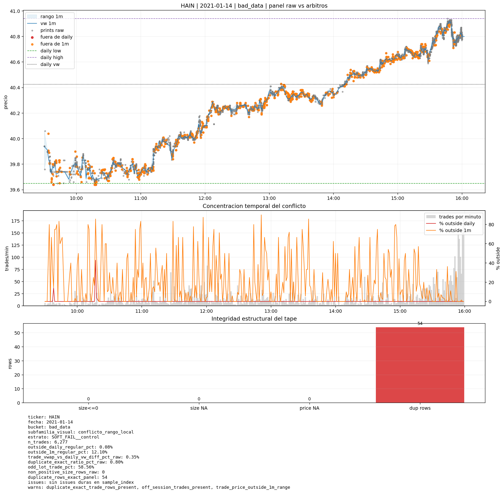

**Que muestra**

- Panel rico del tape raw frente a `daily` y `1m` para `HAIN` el `2021-01-14`.
- `n_trades = 6,277`, `outside_daily_regular_pct = 0.08%`, `outside_1m_regular_pct = 12.10%`.
- `trade_vwap_vs_daily_vw_diff_pct_raw = 0.35%`, `duplicate_exact_ratio_pct_raw = 0.80%`, `odd_lot_trade_pct = 58.56%`.

**Responde**

- Subfamilia donde el conflicto vive en un subconjunto relevante del rango o del arbitro intraminuto, aunque no haya colapso total de escala.
- El conflicto vive en una franja local del rango o del arbitro intraminuto, sin llegar a colapso total de escala.
- Eso exige leer el panel minuto a minuto y no quedarse solo con la impresion global de la nube de precios.
- La clasificacion a `bad_data` aqui depende de que el file ya no conserve una reconciliacion economica defendible.
- El 58.56% de odd-lots empuja la lectura hacia microestructura fina; evita leer el caso como pura ruptura economica gruesa.
- La decision que justifica es exclusion de ejecucion simulada, labels y benchmarking; solo queda valor forense.

**No responde**

- No responde a colapso total de escala; ese seria otro subtipo.
- No responde por si solo a dano estructural del tape salvo que aparezca en `issues_list` o en el panel de integridad.

**Consecuencia**

- Excluir el file del flujo productivo aunque el dano no sea un colapso absoluto.
- Conservarlo como caso forense de rango local severo.

**Grupos duplicados exactos mas relevantes**

| ts_ny | price | size | count |
|---|---|---|---|
| 2021-01-14 12:18:51.620112 | 40.25 | 1 | 3 |
| 2021-01-14 14:19:27.024560 | 40.51 | 2 | 3 |
| 2021-01-14 09:35:12.191683 | 39.86 | 200 | 2 |
| 2021-01-14 10:06:16.914523 | 39.87 | 100 | 2 |
| 2021-01-14 11:47:56.311106 | 40.01 | 100 | 2 |
| 2021-01-14 11:49:05.200285 | 40.0 | 100 | 2 |
| 2021-01-14 11:49:05.200295 | 40.0 | 100 | 2 |
| 2021-01-14 11:51:08.037089 | 40.0 | 100 | 2 |
| 2021-01-14 12:01:40.223643 | 40.1 | 1 | 2 |
| 2021-01-14 12:23:08.816968 | 40.26 | 1 | 2 |

### IQST | 2025-08-29

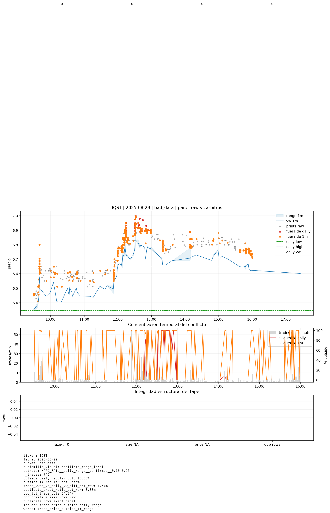

**Que muestra**

- Panel rico del tape raw frente a `daily` y `1m` para `IQST` el `2025-08-29`.
- `n_trades = 746`, `outside_daily_regular_pct = 16.35%`, `outside_1m_regular_pct = nan%`.
- `trade_vwap_vs_daily_vw_diff_pct_raw = 1.64%`, `duplicate_exact_ratio_pct_raw = 0.00%`, `odd_lot_trade_pct = 64.34%`.

**Responde**

- Subfamilia donde el conflicto vive en un subconjunto relevante del rango o del arbitro intraminuto, aunque no haya colapso total de escala.
- El conflicto vive en una franja local del rango o del arbitro intraminuto, sin llegar a colapso total de escala.
- Eso exige leer el panel minuto a minuto y no quedarse solo con la impresion global de la nube de precios.
- La clasificacion a `bad_data` aqui depende de que el file ya no conserve una reconciliacion economica defendible.
- El 64.34% de odd-lots empuja la lectura hacia microestructura fina; evita leer el caso como pura ruptura economica gruesa.
- La decision que justifica es exclusion de ejecucion simulada, labels y benchmarking; solo queda valor forense.

**No responde**

- No responde a colapso total de escala; ese seria otro subtipo.
- No responde por si solo a dano estructural del tape salvo que aparezca en `issues_list` o en el panel de integridad.

**Consecuencia**

- Excluir el file del flujo productivo aunque el dano no sea un colapso absoluto.
- Conservarlo como caso forense de rango local severo.

### LENS | 2025-06-12

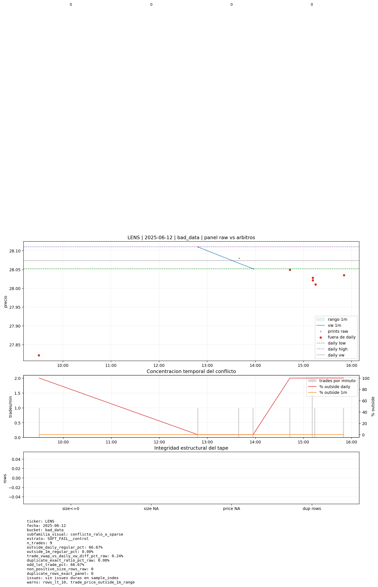

**Que muestra**

- Panel rico del tape raw frente a `daily` y `1m` para `LENS` el `2025-06-12`.
- `n_trades = 9`, `outside_daily_regular_pct = 66.67%`, `outside_1m_regular_pct = 0.00%`.
- `trade_vwap_vs_daily_vw_diff_pct_raw = 0.24%`, `duplicate_exact_ratio_pct_raw = 0.00%`, `odd_lot_trade_pct = 66.67%`.

**Responde**

- Subfamilia donde el conflicto se apoya en muy pocas filas o en una muestra excesivamente rala. La gravedad no nace solo de la geometria del precio, sino de la imposibilidad de defender el file como tape estable.
- La gravedad nace en parte de la escasez del tape: muy pocas filas pueden romper el rango sin dejar una firma visual espectacular.
- Eso obliga a leer el caso como file poco defendible, no como simple outlier bonito en un tape robusto.
- El panel actual necesita leerse junto a `n_trades`, `rows_lt_10` y la concentracion del conflicto.
- El 66.67% de odd-lots empuja la lectura hacia microestructura fina; evita leer el caso como pura ruptura economica gruesa.
- La advertencia `rows_lt_10` limita fuertemente la defensa estadistica del file y endurece la lectura del caso.
- La decision que justifica es exclusion de ejecucion simulada, labels y benchmarking; solo queda valor forense.

**No responde**

- No responde a un patron estable de tape; precisamente el problema es que el file no tiene suficiente densidad para defenderlo.
- No debe leerse como simple ruido puntual en un tape robusto.

**Consecuencia**

- Mantener el file fuera de ejecucion y labels productivos.
- Usarlo solo como evidencia de frontera metodologica o para forense.

### LENS | 2025-12-12

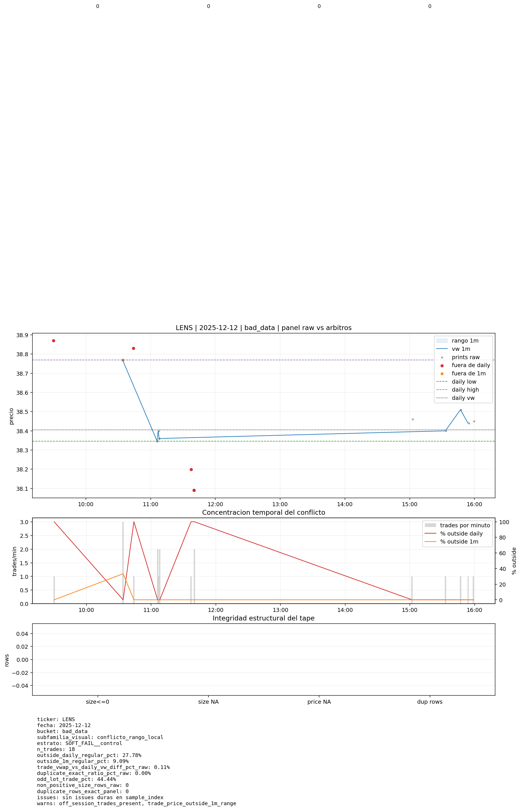

**Que muestra**

- Panel rico del tape raw frente a `daily` y `1m` para `LENS` el `2025-12-12`.
- `n_trades = 18`, `outside_daily_regular_pct = 27.78%`, `outside_1m_regular_pct = 9.09%`.
- `trade_vwap_vs_daily_vw_diff_pct_raw = 0.11%`, `duplicate_exact_ratio_pct_raw = 0.00%`, `odd_lot_trade_pct = 44.44%`.

**Responde**

- Subfamilia donde el conflicto vive en un subconjunto relevante del rango o del arbitro intraminuto, aunque no haya colapso total de escala.
- El conflicto vive en una franja local del rango o del arbitro intraminuto, sin llegar a colapso total de escala.
- Eso exige leer el panel minuto a minuto y no quedarse solo con la impresion global de la nube de precios.
- La clasificacion a `bad_data` aqui depende de que el file ya no conserve una reconciliacion economica defendible.
- El 44.44% de odd-lots empuja la lectura hacia microestructura fina; evita leer el caso como pura ruptura economica gruesa.
- La decision que justifica es exclusion de ejecucion simulada, labels y benchmarking; solo queda valor forense.

**No responde**

- No responde a colapso total de escala; ese seria otro subtipo.
- No responde por si solo a dano estructural del tape salvo que aparezca en `issues_list` o en el panel de integridad.

**Consecuencia**

- Excluir el file del flujo productivo aunque el dano no sea un colapso absoluto.
- Conservarlo como caso forense de rango local severo.

### NEWTI | 2019-01-03

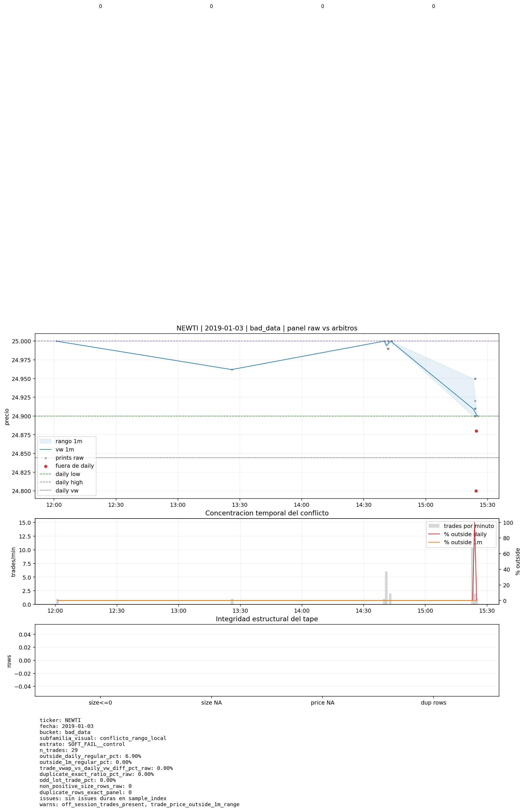

**Que muestra**

- Panel rico del tape raw frente a `daily` y `1m` para `NEWTI` el `2019-01-03`.
- `n_trades = 29`, `outside_daily_regular_pct = 6.90%`, `outside_1m_regular_pct = 0.00%`.
- `trade_vwap_vs_daily_vw_diff_pct_raw = 0.00%`, `duplicate_exact_ratio_pct_raw = 0.00%`, `odd_lot_trade_pct = 0.00%`.

**Responde**

- Subfamilia donde el conflicto vive en un subconjunto relevante del rango o del arbitro intraminuto, aunque no haya colapso total de escala.
- El conflicto vive en una franja local del rango o del arbitro intraminuto, sin llegar a colapso total de escala.
- Eso exige leer el panel minuto a minuto y no quedarse solo con la impresion global de la nube de precios.
- La clasificacion a `bad_data` aqui depende de que el file ya no conserve una reconciliacion economica defendible.
- La decision que justifica es exclusion de ejecucion simulada, labels y benchmarking; solo queda valor forense.

**No responde**

- No responde a colapso total de escala; ese seria otro subtipo.
- No responde por si solo a dano estructural del tape salvo que aparezca en `issues_list` o en el panel de integridad.

**Consecuencia**

- Excluir el file del flujo productivo aunque el dano no sea un colapso absoluto.
- Conservarlo como caso forense de rango local severo.

### SFE | 2023-03-01

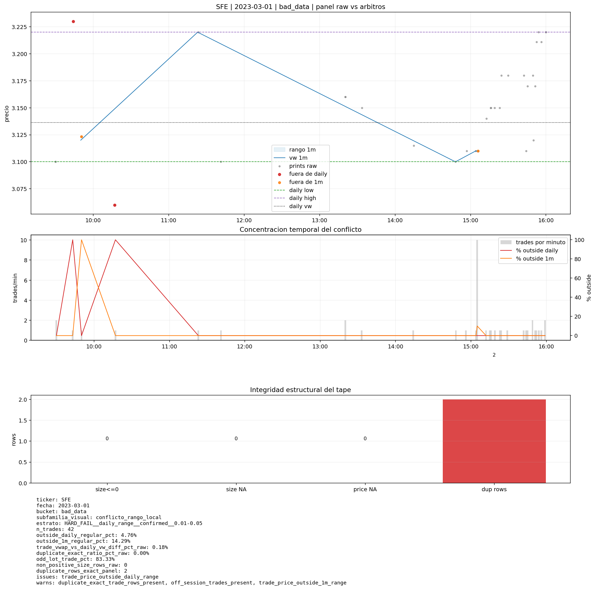

**Que muestra**

- Panel rico del tape raw frente a `daily` y `1m` para `SFE` el `2023-03-01`.
- `n_trades = 42`, `outside_daily_regular_pct = 4.76%`, `outside_1m_regular_pct = 14.29%`.
- `trade_vwap_vs_daily_vw_diff_pct_raw = 0.18%`, `duplicate_exact_ratio_pct_raw = 0.00%`, `odd_lot_trade_pct = 83.33%`.

**Responde**

- Subfamilia donde el conflicto vive en un subconjunto relevante del rango o del arbitro intraminuto, aunque no haya colapso total de escala.
- El conflicto vive en una franja local del rango o del arbitro intraminuto, sin llegar a colapso total de escala.
- Eso exige leer el panel minuto a minuto y no quedarse solo con la impresion global de la nube de precios.
- La clasificacion a `bad_data` aqui depende de que el file ya no conserve una reconciliacion economica defendible.
- El 83.33% de odd-lots empuja la lectura hacia microestructura fina; evita leer el caso como pura ruptura economica gruesa.
- La decision que justifica es exclusion de ejecucion simulada, labels y benchmarking; solo queda valor forense.

**No responde**

- No responde a colapso total de escala; ese seria otro subtipo.
- No responde por si solo a dano estructural del tape salvo que aparezca en `issues_list` o en el panel de integridad.

**Consecuencia**

- Excluir el file del flujo productivo aunque el dano no sea un colapso absoluto.
- Conservarlo como caso forense de rango local severo.

**Grupos duplicados exactos mas relevantes**

| ts_ny | price | size | count |
|---|---|---|---|
| 2023-03-01 15:05:59.918500 | 3.11 | 8 | 2 |

### AIM | 2023-10-16

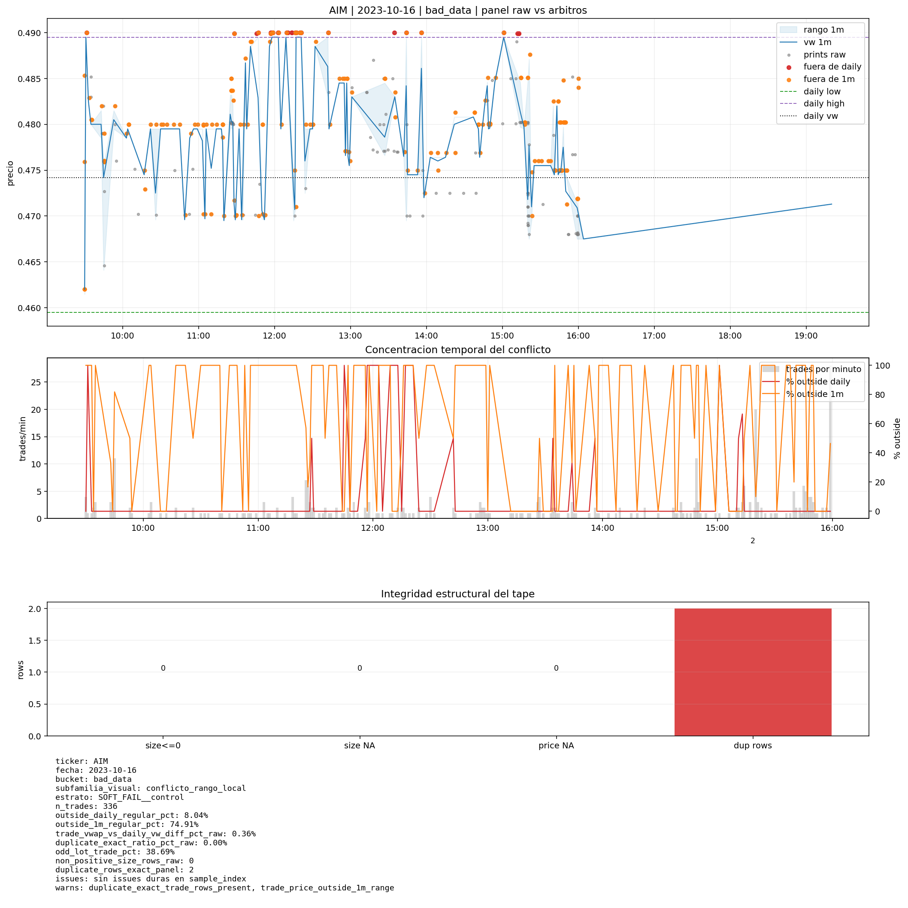

**Que muestra**

- Panel rico del tape raw frente a `daily` y `1m` para `AIM` el `2023-10-16`.
- `n_trades = 336`, `outside_daily_regular_pct = 8.04%`, `outside_1m_regular_pct = 74.91%`.
- `trade_vwap_vs_daily_vw_diff_pct_raw = 0.36%`, `duplicate_exact_ratio_pct_raw = 0.00%`, `odd_lot_trade_pct = 38.69%`.

**Responde**

- Subfamilia donde el conflicto vive en un subconjunto relevante del rango o del arbitro intraminuto, aunque no haya colapso total de escala.
- El conflicto vive en una franja local del rango o del arbitro intraminuto, sin llegar a colapso total de escala.
- Eso exige leer el panel minuto a minuto y no quedarse solo con la impresion global de la nube de precios.
- La clasificacion a `bad_data` aqui depende de que el file ya no conserve una reconciliacion economica defendible.
- El 38.69% de odd-lots empuja la lectura hacia microestructura fina; evita leer el caso como pura ruptura economica gruesa.
- La decision que justifica es exclusion de ejecucion simulada, labels y benchmarking; solo queda valor forense.

**No responde**

- No responde a colapso total de escala; ese seria otro subtipo.
- No responde por si solo a dano estructural del tape salvo que aparezca en `issues_list` o en el panel de integridad.

**Consecuencia**

- Excluir el file del flujo productivo aunque el dano no sea un colapso absoluto.
- Conservarlo como caso forense de rango local severo.

**Grupos duplicados exactos mas relevantes**

| ts_ny | price | size | count |
|---|---|---|---|
| 2023-10-16 09:30:00.094903 | 0.462 | 1661 | 2 |

### METC | 2020-05-26

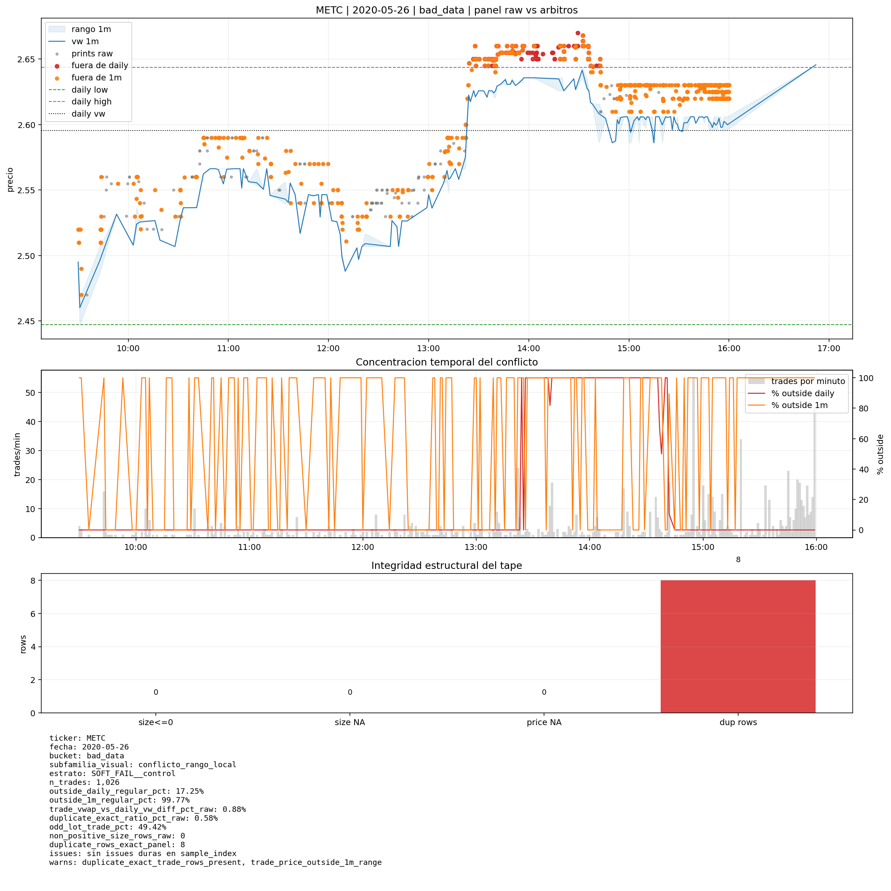

**Que muestra**

- Panel rico del tape raw frente a `daily` y `1m` para `METC` el `2020-05-26`.
- `n_trades = 1,026`, `outside_daily_regular_pct = 17.25%`, `outside_1m_regular_pct = 99.77%`.
- `trade_vwap_vs_daily_vw_diff_pct_raw = 0.88%`, `duplicate_exact_ratio_pct_raw = 0.58%`, `odd_lot_trade_pct = 49.42%`.

**Responde**

- Subfamilia donde el conflicto vive en un subconjunto relevante del rango o del arbitro intraminuto, aunque no haya colapso total de escala.
- El conflicto vive en una franja local del rango o del arbitro intraminuto, sin llegar a colapso total de escala.
- Eso exige leer el panel minuto a minuto y no quedarse solo con la impresion global de la nube de precios.
- La clasificacion a `bad_data` aqui depende de que el file ya no conserve una reconciliacion economica defendible.
- El 49.42% de odd-lots empuja la lectura hacia microestructura fina; evita leer el caso como pura ruptura economica gruesa.
- La decision que justifica es exclusion de ejecucion simulada, labels y benchmarking; solo queda valor forense.

**No responde**

- No responde a colapso total de escala; ese seria otro subtipo.
- No responde por si solo a dano estructural del tape salvo que aparezca en `issues_list` o en el panel de integridad.

**Consecuencia**

- Excluir el file del flujo productivo aunque el dano no sea un colapso absoluto.
- Conservarlo como caso forense de rango local severo.

**Grupos duplicados exactos mas relevantes**

| ts_ny | price | size | count |
|---|---|---|---|
| 2020-05-26 10:07:33.129514 | 2.53 | 3 | 2 |
| 2020-05-26 13:22:15.309343 | 2.6 | 100 | 2 |
| 2020-05-26 14:35:39.968893 | 2.65 | 100 | 2 |
| 2020-05-26 14:42:57.515493 | 2.64 | 100 | 2 |

### QRTEA | 2019-11-08

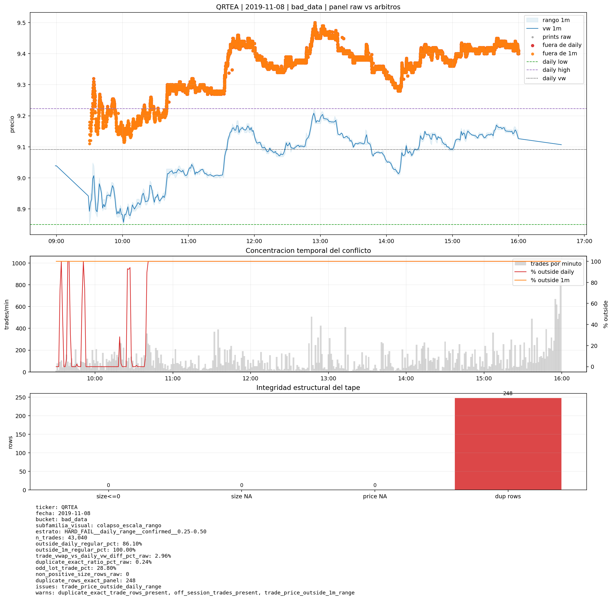

**Que muestra**

- Panel rico del tape raw frente a `daily` y `1m` para `QRTEA` el `2019-11-08`.
- `n_trades = 43,040`, `outside_daily_regular_pct = 86.10%`, `outside_1m_regular_pct = 100.00%`.
- `trade_vwap_vs_daily_vw_diff_pct_raw = 2.96%`, `duplicate_exact_ratio_pct_raw = 0.24%`, `odd_lot_trade_pct = 28.80%`.

**Responde**

- Subfamilia donde el panel de precio ya demuestra por si mismo una ruptura semantica: tape y arbitros viven en escalas incompatibles o el porcentaje fuera de rango es practicamente total.
- El fallo se ve de forma directa en el panel de precio: el tape y los arbitros no conviven en una misma geometria defendible.
- La lectura correcta exige mirar la separacion vertical entre prints y arbitros y el hecho de que el conflicto de rango sea practicamente total.
- Aqui el panel actual si responde bien a por que el file cae en `bad_data`.
- El 28.80% de odd-lots empuja la lectura hacia microestructura fina; evita leer el caso como pura ruptura economica gruesa.
- La decision que justifica es exclusion de ejecucion simulada, labels y benchmarking; solo queda valor forense.

**No responde**

- No responde a si la duplicacion es la causa principal del rechazo; puede empeorar el caso, pero no explica por si sola la geometria rota.
- No responde a si existiria una reconciliacion de escala defendible; el colapso ya es demasiado extremo para tratarlo como simple normalizacion.

**Consecuencia**

- Excluir de ejecucion simulada, labels y benchmarking.
- Conservar solo valor forense o de deteccion de dano severo.

**Grupos duplicados exactos mas relevantes**

| ts_ny | price | size | count |
|---|---|---|---|
| 2019-11-08 15:56:54.846343 | 9.42 | 100 | 4 |
| 2019-11-08 10:41:12.007301 | 9.2715 | 100 | 3 |
| 2019-11-08 15:56:54.846312 | 9.42 | 200 | 3 |
| 2019-11-08 09:39:55.508632 | 9.25 | 100 | 2 |
| 2019-11-08 10:01:49.928360 | 9.12 | 100 | 2 |
| 2019-11-08 10:10:15.513113 | 9.18 | 100 | 2 |
| 2019-11-08 10:19:54.882109 | 9.23 | 100 | 2 |
| 2019-11-08 10:20:29.577793 | 9.22 | 100 | 2 |
| 2019-11-08 10:20:30.981965 | 9.21 | 100 | 2 |
| 2019-11-08 10:21:46.086267 | 9.19 | 100 | 2 |

### RELV | 2019-12-26

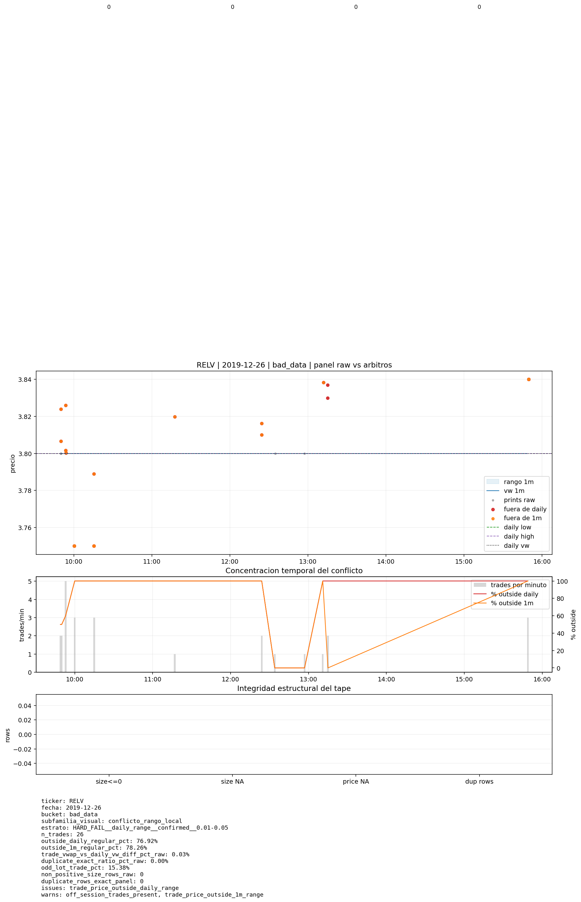

**Que muestra**

- Panel rico del tape raw frente a `daily` y `1m` para `RELV` el `2019-12-26`.
- `n_trades = 26`, `outside_daily_regular_pct = 76.92%`, `outside_1m_regular_pct = 78.26%`.
- `trade_vwap_vs_daily_vw_diff_pct_raw = 0.03%`, `duplicate_exact_ratio_pct_raw = 0.00%`, `odd_lot_trade_pct = 15.38%`.

**Responde**

- Subfamilia donde el conflicto vive en un subconjunto relevante del rango o del arbitro intraminuto, aunque no haya colapso total de escala.
- El conflicto vive en una franja local del rango o del arbitro intraminuto, sin llegar a colapso total de escala.
- Eso exige leer el panel minuto a minuto y no quedarse solo con la impresion global de la nube de precios.
- La clasificacion a `bad_data` aqui depende de que el file ya no conserve una reconciliacion economica defendible.
- La decision que justifica es exclusion de ejecucion simulada, labels y benchmarking; solo queda valor forense.

**No responde**

- No responde a colapso total de escala; ese seria otro subtipo.
- No responde por si solo a dano estructural del tape salvo que aparezca en `issues_list` o en el panel de integridad.

**Consecuencia**

- Excluir el file del flujo productivo aunque el dano no sea un colapso absoluto.
- Conservarlo como caso forense de rango local severo.

### TTSH | 2021-11-18

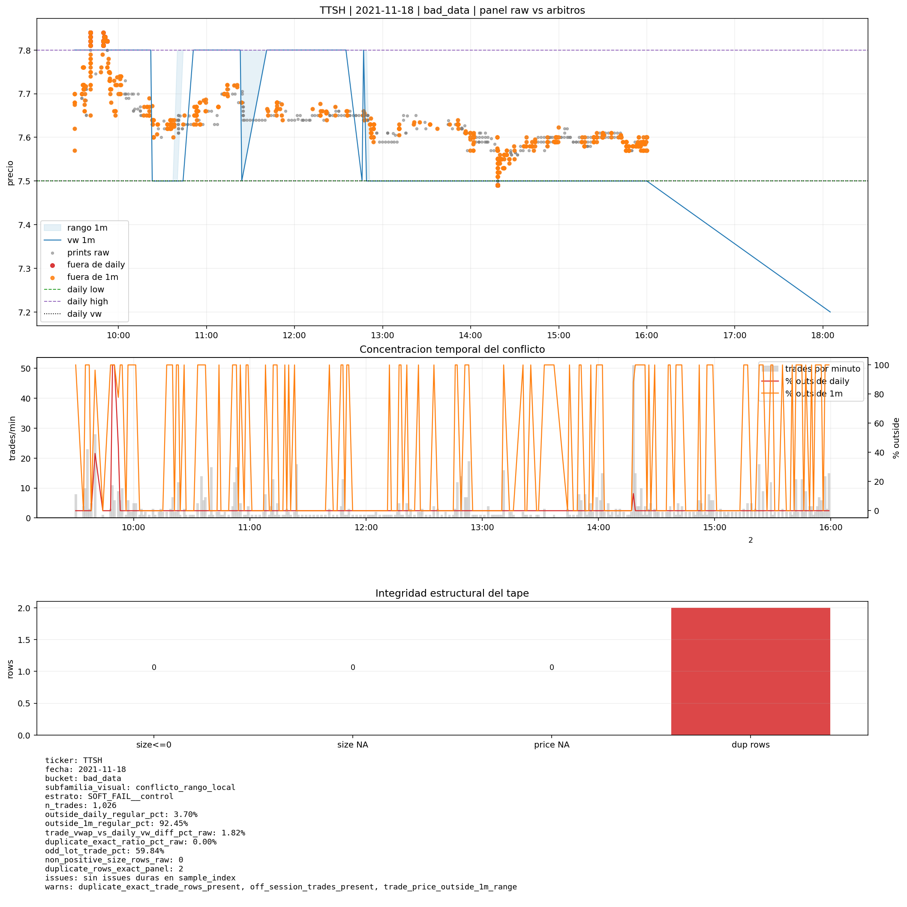

**Que muestra**

- Panel rico del tape raw frente a `daily` y `1m` para `TTSH` el `2021-11-18`.
- `n_trades = 1,026`, `outside_daily_regular_pct = 3.70%`, `outside_1m_regular_pct = 92.45%`.
- `trade_vwap_vs_daily_vw_diff_pct_raw = 1.82%`, `duplicate_exact_ratio_pct_raw = 0.00%`, `odd_lot_trade_pct = 59.84%`.

**Responde**

- Subfamilia donde el conflicto vive en un subconjunto relevante del rango o del arbitro intraminuto, aunque no haya colapso total de escala.
- El conflicto vive en una franja local del rango o del arbitro intraminuto, sin llegar a colapso total de escala.
- Eso exige leer el panel minuto a minuto y no quedarse solo con la impresion global de la nube de precios.
- La clasificacion a `bad_data` aqui depende de que el file ya no conserve una reconciliacion economica defendible.
- El 59.84% de odd-lots empuja la lectura hacia microestructura fina; evita leer el caso como pura ruptura economica gruesa.
- La decision que justifica es exclusion de ejecucion simulada, labels y benchmarking; solo queda valor forense.

**No responde**

- No responde a colapso total de escala; ese seria otro subtipo.
- No responde por si solo a dano estructural del tape salvo que aparezca en `issues_list` o en el panel de integridad.

**Consecuencia**

- Excluir el file del flujo productivo aunque el dano no sea un colapso absoluto.
- Conservarlo como caso forense de rango local severo.

**Grupos duplicados exactos mas relevantes**

| ts_ny | price | size | count |
|---|---|---|---|
| 2021-11-18 09:40:55.377422 | 7.82 | 200 | 2 |

### NCL | 2023-12-19

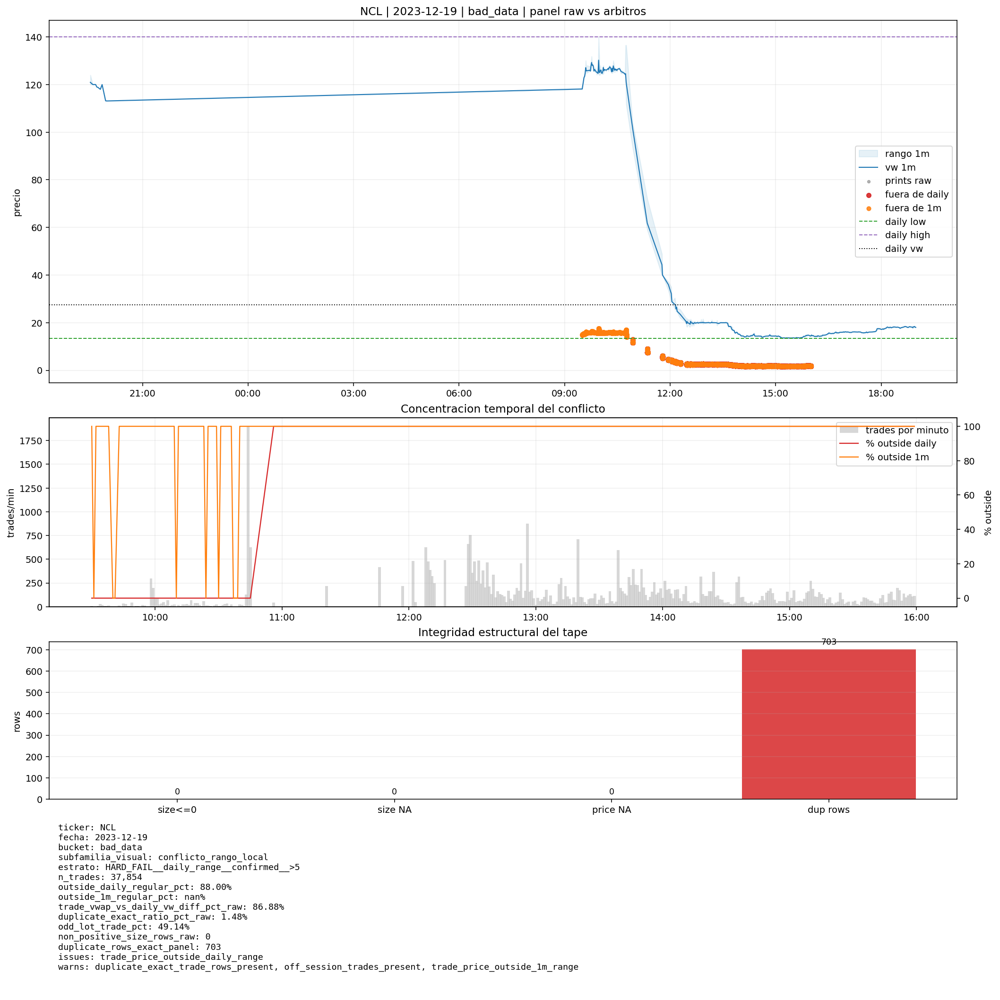

**Que muestra**

- Panel rico del tape raw frente a `daily` y `1m` para `NCL` el `2023-12-19`.
- `n_trades = 37,854`, `outside_daily_regular_pct = 88.00%`, `outside_1m_regular_pct = nan%`.
- `trade_vwap_vs_daily_vw_diff_pct_raw = 86.88%`, `duplicate_exact_ratio_pct_raw = 1.48%`, `odd_lot_trade_pct = 49.14%`.

**Responde**

- Subfamilia donde el conflicto vive en un subconjunto relevante del rango o del arbitro intraminuto, aunque no haya colapso total de escala.
- El conflicto vive en una franja local del rango o del arbitro intraminuto, sin llegar a colapso total de escala.
- Eso exige leer el panel minuto a minuto y no quedarse solo con la impresion global de la nube de precios.
- La clasificacion a `bad_data` aqui depende de que el file ya no conserve una reconciliacion economica defendible.
- El 49.14% de odd-lots empuja la lectura hacia microestructura fina; evita leer el caso como pura ruptura economica gruesa.
- La decision que justifica es exclusion de ejecucion simulada, labels y benchmarking; solo queda valor forense.

**No responde**

- No responde a colapso total de escala; ese seria otro subtipo.
- No responde por si solo a dano estructural del tape salvo que aparezca en `issues_list` o en el panel de integridad.

**Consecuencia**

- Excluir el file del flujo productivo aunque el dano no sea un colapso absoluto.
- Conservarlo como caso forense de rango local severo.

**Grupos duplicados exactos mas relevantes**

| ts_ny | price | size | count |
|---|---|---|---|
| 2023-12-19 10:44:33.369312 | 15.5 | 100 | 9 |
| 2023-12-19 10:44:33.369209 | 15.5 | 100 | 8 |
| 2023-12-19 10:44:33.369216 | 15.5 | 100 | 5 |
| 2023-12-19 10:44:33.369288 | 15.5 | 100 | 4 |
| 2023-12-19 10:44:33.382113 | 15.5 | 100 | 4 |
| 2023-12-19 10:44:33.332393 | 15.5 | 100 | 3 |
| 2023-12-19 10:44:33.343694 | 15.5 | 100 | 3 |
| 2023-12-19 10:44:33.369294 | 15.5 | 100 | 3 |
| 2023-12-19 10:44:33.369318 | 15.5 | 100 | 3 |
| 2023-12-19 10:44:33.369321 | 15.5 | 100 | 3 |

### DTCK | 2026-02-19

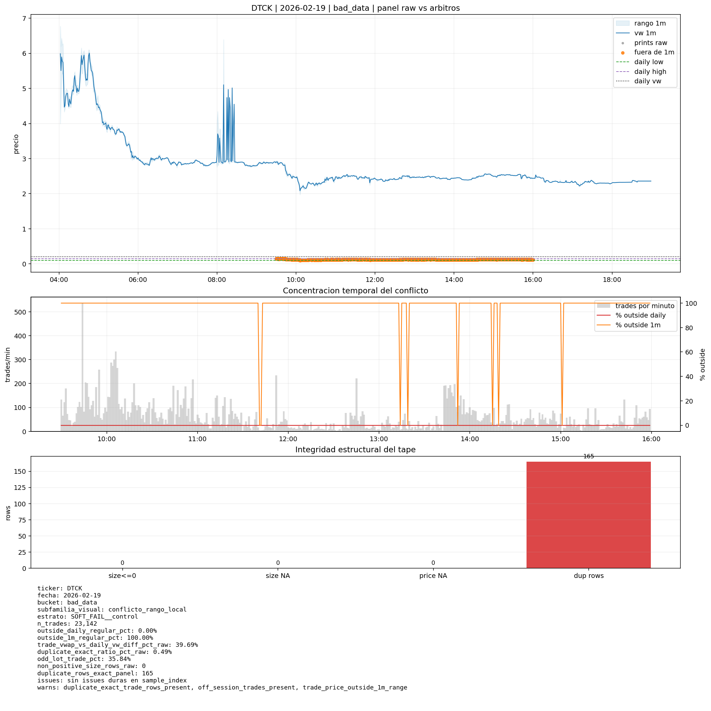

**Que muestra**

- Panel rico del tape raw frente a `daily` y `1m` para `DTCK` el `2026-02-19`.
- `n_trades = 23,142`, `outside_daily_regular_pct = 0.00%`, `outside_1m_regular_pct = 100.00%`.
- `trade_vwap_vs_daily_vw_diff_pct_raw = 39.69%`, `duplicate_exact_ratio_pct_raw = 0.49%`, `odd_lot_trade_pct = 35.84%`.

**Responde**

- Subfamilia donde el conflicto vive en un subconjunto relevante del rango o del arbitro intraminuto, aunque no haya colapso total de escala.
- El conflicto vive en una franja local del rango o del arbitro intraminuto, sin llegar a colapso total de escala.
- Eso exige leer el panel minuto a minuto y no quedarse solo con la impresion global de la nube de precios.
- La clasificacion a `bad_data` aqui depende de que el file ya no conserve una reconciliacion economica defendible.
- El 35.84% de odd-lots empuja la lectura hacia microestructura fina; evita leer el caso como pura ruptura economica gruesa.
- La decision que justifica es exclusion de ejecucion simulada, labels y benchmarking; solo queda valor forense.

**No responde**

- No responde a colapso total de escala; ese seria otro subtipo.
- No responde por si solo a dano estructural del tape salvo que aparezca en `issues_list` o en el panel de integridad.

**Consecuencia**

- Excluir el file del flujo productivo aunque el dano no sea un colapso absoluto.
- Conservarlo como caso forense de rango local severo.

**Grupos duplicados exactos mas relevantes**

| ts_ny | price | size | count |
|---|---|---|---|
| 2026-02-19 10:03:48.477491 | 0.1171 | 200 | 4 |
| 2026-02-19 10:06:09.861274 | 0.1 | 1 | 3 |
| 2026-02-19 11:00:20.272326 | 0.1239 | 200 | 3 |
| 2026-02-19 12:42:19.948422 | 0.126 | 500 | 3 |
| 2026-02-19 09:30:29.376417 | 0.1449 | 250 | 2 |
| 2026-02-19 09:41:47.920393 | 0.1403 | 200 | 2 |
| 2026-02-19 09:42:03.472759 | 0.1402 | 120 | 2 |
| 2026-02-19 09:44:39.064378 | 0.1321 | 2000 | 2 |
| 2026-02-19 09:44:39.084324 | 0.1314 | 75 | 2 |
| 2026-02-19 09:44:39.086781 | 0.1311 | 75 | 2 |

# Trades Good | enumeracion completa

Documento fuente: `inspection_dossiers/trades/family_case_evidence_packs/good/good_cases_v0_1.md`

## Rol

Este dossier documenta `106` casos de la muestra base del cierre real `57f/full_clean_fast_same_schema` para la familia `good`.

No son ejemplos elegidos a dedo. Proceden del manifest estratificado reproducible materializado para el inspector.

## Que significa esta familia

Cola pristine donde `trades`, `daily` y `1m` alinean con limpieza. Responde a la pregunta de como luce una firma casi impecable del tape.

## Responde

- como luce una firma realmente limpia del tape
- que patron sirve como referencia de alineacion casi impecable

## No responde

- cuanta masa util tiene todo el bloque
- si todo lo no-good es inservible

## Consecuencia

- fijar el patron pristine sin sobrerrepresentarlo
- evitar leer `good` como proxy de utilidad total

## Casos

### BH | 2010-11-22

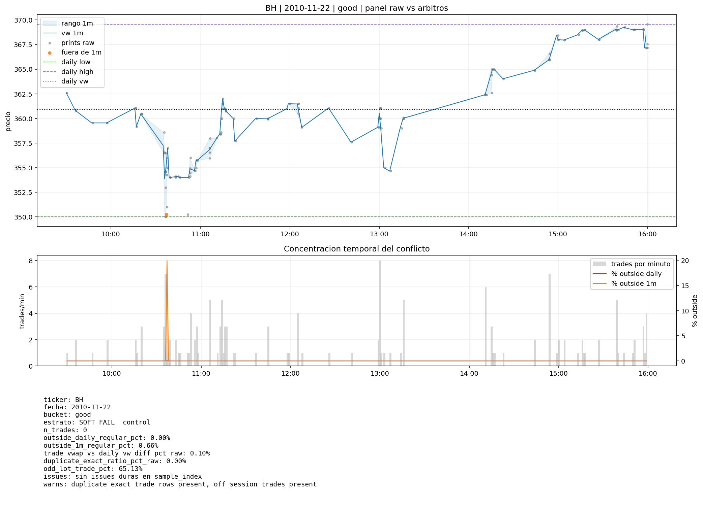

**Que muestra**

- Panel rico del tape raw frente a `daily` y `1m` para `BH` el `2010-11-22`.
- `n_trades = 152`, `outside_daily_regular_pct = 0.00%`, `outside_1m_regular_pct = 0.66%`.
- `trade_vwap_vs_daily_vw_diff_pct_raw = 0.10%`, `duplicate_exact_ratio_pct_raw = 0.00%`, `odd_lot_trade_pct = 65.13%`.

**Responde**

- Cola pristine donde `trades`, `daily` y `1m` alinean con limpieza. Responde a la pregunta de como luce una firma casi impecable del tape.
- Responde a si el conflicto dominante vive en la escala (`~1x`), en la comparabilidad frente a `daily` (0.00%) o frente a `1m` (0.66%).
- El 65.13% de odd-lots empuja la lectura hacia microestructura fina; evita leer el caso como pura ruptura economica gruesa.
- La decision que justifica es que el file puede usarse como patron de tape limpio, no como medida de masa util del bloque.

### BH | 2011-04-29

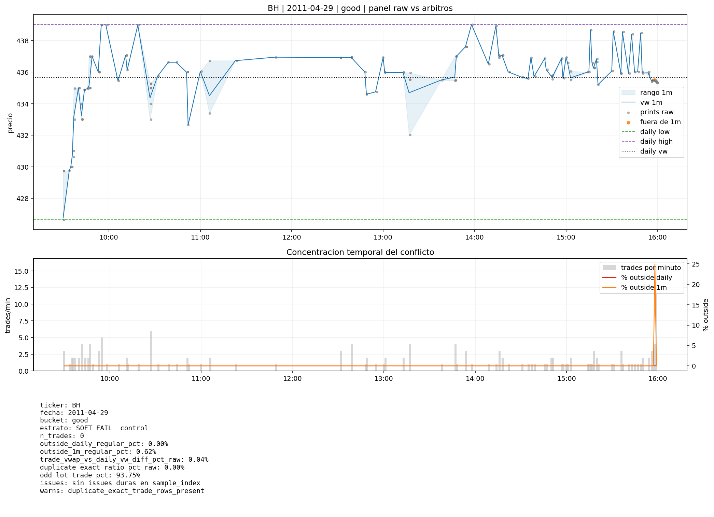

**Que muestra**

- Panel rico del tape raw frente a `daily` y `1m` para `BH` el `2011-04-29`.
- `n_trades = 160`, `outside_daily_regular_pct = 0.00%`, `outside_1m_regular_pct = 0.62%`.
- `trade_vwap_vs_daily_vw_diff_pct_raw = 0.04%`, `duplicate_exact_ratio_pct_raw = 0.00%`, `odd_lot_trade_pct = 93.75%`.

**Responde**

- Cola pristine donde `trades`, `daily` y `1m` alinean con limpieza. Responde a la pregunta de como luce una firma casi impecable del tape.
- Responde a si el conflicto dominante vive en la escala (`~1x`), en la comparabilidad frente a `daily` (0.00%) o frente a `1m` (0.62%).
- El 93.75% de odd-lots empuja la lectura hacia microestructura fina; evita leer el caso como pura ruptura economica gruesa.
- La decision que justifica es que el file puede usarse como patron de tape limpio, no como medida de masa util del bloque.

### BH | 2012-04-16

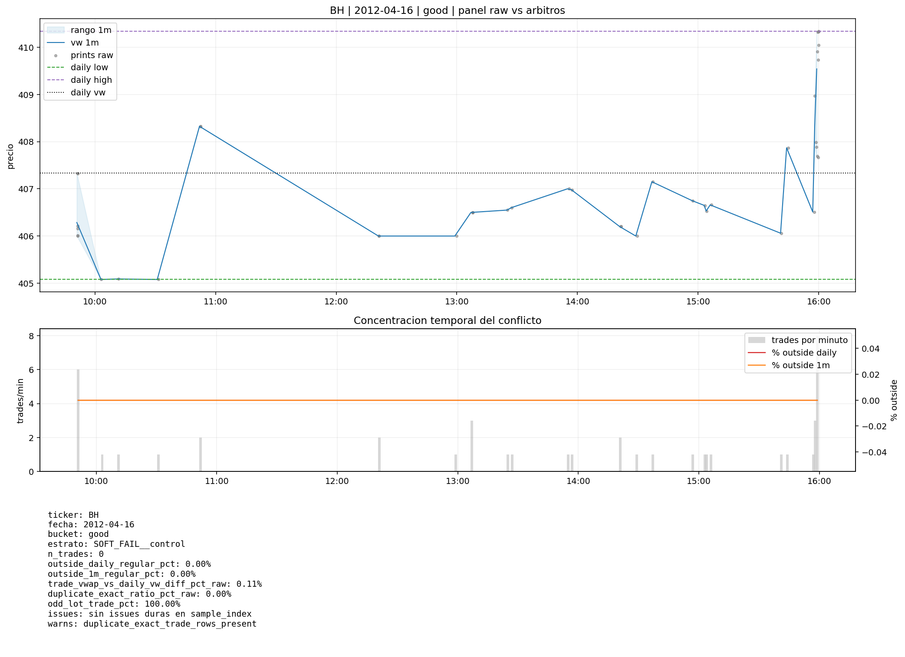

**Que muestra**

- Panel rico del tape raw frente a `daily` y `1m` para `BH` el `2012-04-16`.
- `n_trades = 43`, `outside_daily_regular_pct = 0.00%`, `outside_1m_regular_pct = 0.00%`.
- `trade_vwap_vs_daily_vw_diff_pct_raw = 0.11%`, `duplicate_exact_ratio_pct_raw = 0.00%`, `odd_lot_trade_pct = 100.00%`.

**Responde**

- Cola pristine donde `trades`, `daily` y `1m` alinean con limpieza. Responde a la pregunta de como luce una firma casi impecable del tape.
- Responde a si el conflicto dominante vive en la escala (`~1x`), en la comparabilidad frente a `daily` (0.00%) o frente a `1m` (0.00%).
- El 100.00% de odd-lots empuja la lectura hacia microestructura fina; evita leer el caso como pura ruptura economica gruesa.
- La decision que justifica es que el file puede usarse como patron de tape limpio, no como medida de masa util del bloque.

### BH | 2012-10-26

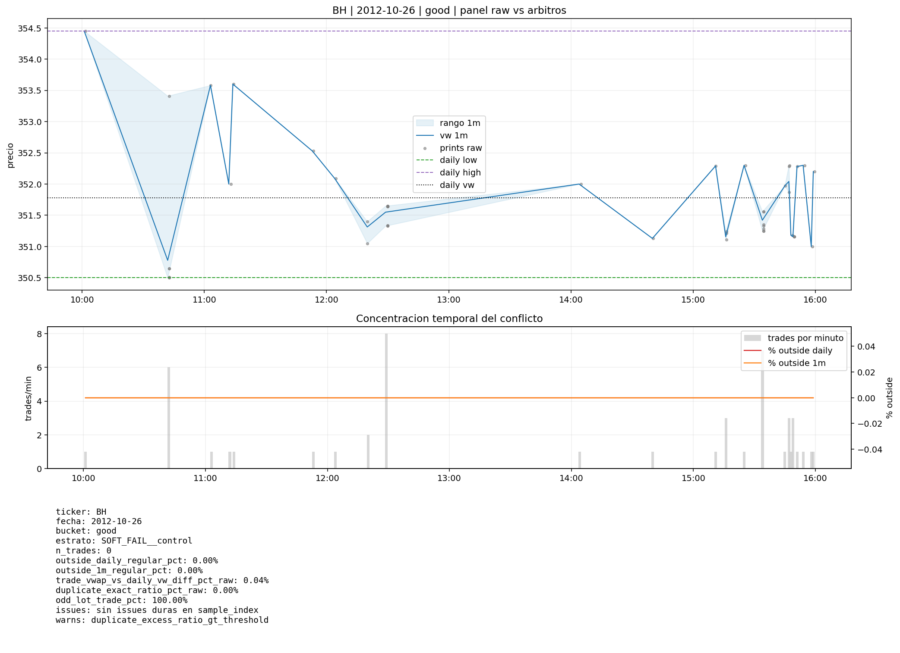

**Que muestra**

- Panel rico del tape raw frente a `daily` y `1m` para `BH` el `2012-10-26`.
- `n_trades = 48`, `outside_daily_regular_pct = 0.00%`, `outside_1m_regular_pct = 0.00%`.
- `trade_vwap_vs_daily_vw_diff_pct_raw = 0.04%`, `duplicate_exact_ratio_pct_raw = 0.00%`, `odd_lot_trade_pct = 100.00%`.

**Responde**

- Cola pristine donde `trades`, `daily` y `1m` alinean con limpieza. Responde a la pregunta de como luce una firma casi impecable del tape.
- Responde a si el conflicto dominante vive en la escala (`~1x`), en la comparabilidad frente a `daily` (0.00%) o frente a `1m` (0.00%).
- El 100.00% de odd-lots empuja la lectura hacia microestructura fina; evita leer el caso como pura ruptura economica gruesa.
- La decision que justifica es que el file puede usarse como patron de tape limpio, no como medida de masa util del bloque.

### BH | 2012-11-06

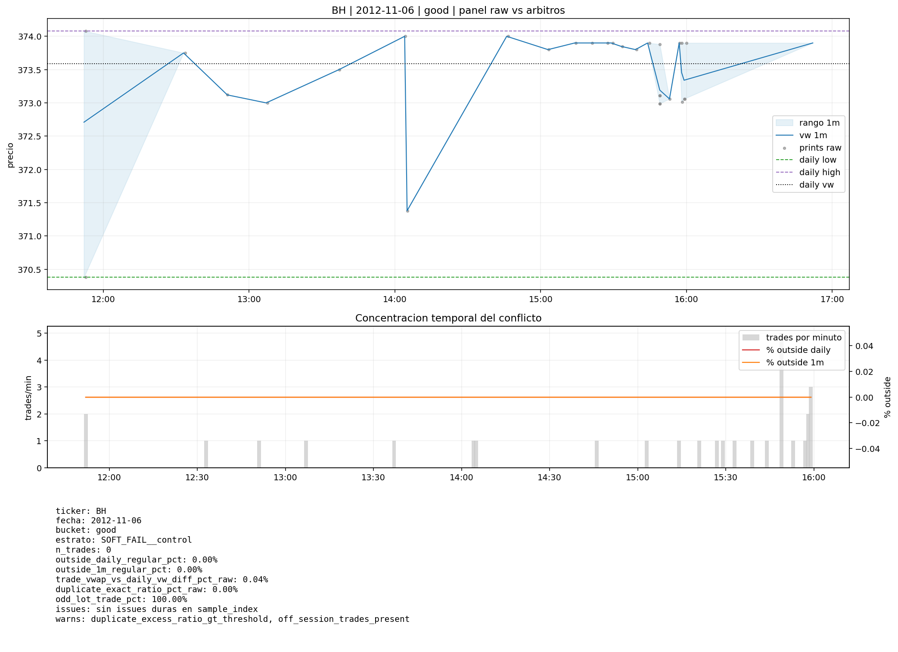

**Que muestra**

- Panel rico del tape raw frente a `daily` y `1m` para `BH` el `2012-11-06`.
- `n_trades = 29`, `outside_daily_regular_pct = 0.00%`, `outside_1m_regular_pct = 0.00%`.
- `trade_vwap_vs_daily_vw_diff_pct_raw = 0.04%`, `duplicate_exact_ratio_pct_raw = 0.00%`, `odd_lot_trade_pct = 100.00%`.

**Responde**

- Cola pristine donde `trades`, `daily` y `1m` alinean con limpieza. Responde a la pregunta de como luce una firma casi impecable del tape.
- Responde a si el conflicto dominante vive en la escala (`~1x`), en la comparabilidad frente a `daily` (0.00%) o frente a `1m` (0.00%).
- El 100.00% de odd-lots empuja la lectura hacia microestructura fina; evita leer el caso como pura ruptura economica gruesa.
- La decision que justifica es que el file puede usarse como patron de tape limpio, no como medida de masa util del bloque.

### BH | 2012-11-21

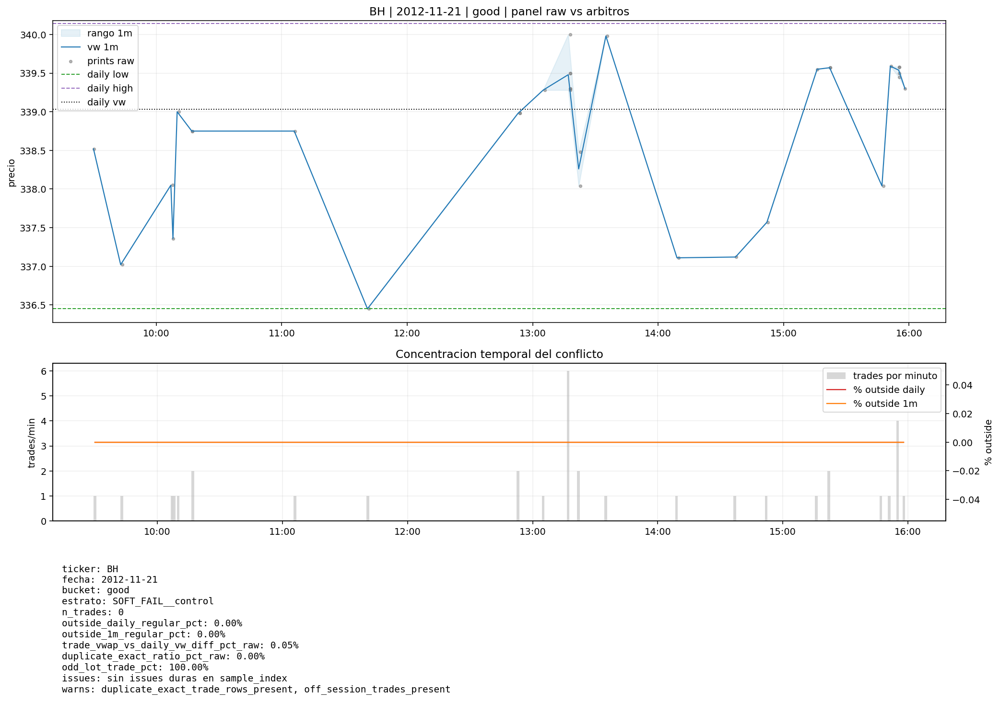

**Que muestra**

- Panel rico del tape raw frente a `daily` y `1m` para `BH` el `2012-11-21`.
- `n_trades = 34`, `outside_daily_regular_pct = 0.00%`, `outside_1m_regular_pct = 0.00%`.
- `trade_vwap_vs_daily_vw_diff_pct_raw = 0.05%`, `duplicate_exact_ratio_pct_raw = 0.00%`, `odd_lot_trade_pct = 100.00%`.

**Responde**

- Cola pristine donde `trades`, `daily` y `1m` alinean con limpieza. Responde a la pregunta de como luce una firma casi impecable del tape.
- Responde a si el conflicto dominante vive en la escala (`~1x`), en la comparabilidad frente a `daily` (0.00%) o frente a `1m` (0.00%).
- El 100.00% de odd-lots empuja la lectura hacia microestructura fina; evita leer el caso como pura ruptura economica gruesa.
- La decision que justifica es que el file puede usarse como patron de tape limpio, no como medida de masa util del bloque.

### BH | 2012-12-03

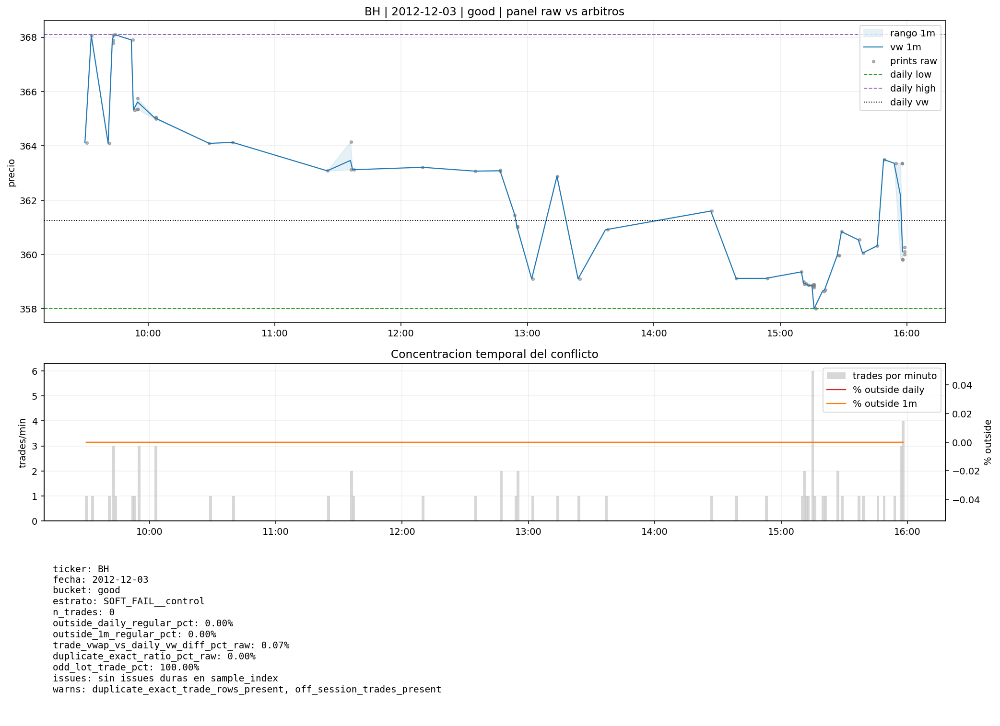

**Que muestra**

- Panel rico del tape raw frente a `daily` y `1m` para `BH` el `2012-12-03`.
- `n_trades = 64`, `outside_daily_regular_pct = 0.00%`, `outside_1m_regular_pct = 0.00%`.
- `trade_vwap_vs_daily_vw_diff_pct_raw = 0.07%`, `duplicate_exact_ratio_pct_raw = 0.00%`, `odd_lot_trade_pct = 100.00%`.

**Responde**

- Cola pristine donde `trades`, `daily` y `1m` alinean con limpieza. Responde a la pregunta de como luce una firma casi impecable del tape.
- Responde a si el conflicto dominante vive en la escala (`~1x`), en la comparabilidad frente a `daily` (0.00%) o frente a `1m` (0.00%).
- El 100.00% de odd-lots empuja la lectura hacia microestructura fina; evita leer el caso como pura ruptura economica gruesa.
- La decision que justifica es que el file puede usarse como patron de tape limpio, no como medida de masa util del bloque.

### ALTS | 2016-01-19

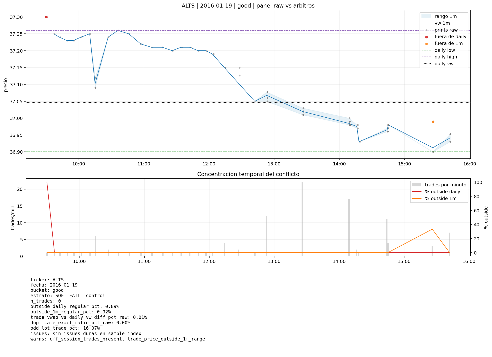

**Que muestra**

- Panel rico del tape raw frente a `daily` y `1m` para `ALTS` el `2016-01-19`.
- `n_trades = 112`, `outside_daily_regular_pct = 0.89%`, `outside_1m_regular_pct = 0.92%`.
- `trade_vwap_vs_daily_vw_diff_pct_raw = 0.01%`, `duplicate_exact_ratio_pct_raw = 0.00%`, `odd_lot_trade_pct = 16.07%`.

**Responde**

- Cola pristine donde `trades`, `daily` y `1m` alinean con limpieza. Responde a la pregunta de como luce una firma casi impecable del tape.
- Responde a si el conflicto dominante vive en la escala (`~1x`), en la comparabilidad frente a `daily` (0.89%) o frente a `1m` (0.92%).
- La decision que justifica es que el file puede usarse como patron de tape limpio, no como medida de masa util del bloque.

### BH | 2013-10-17

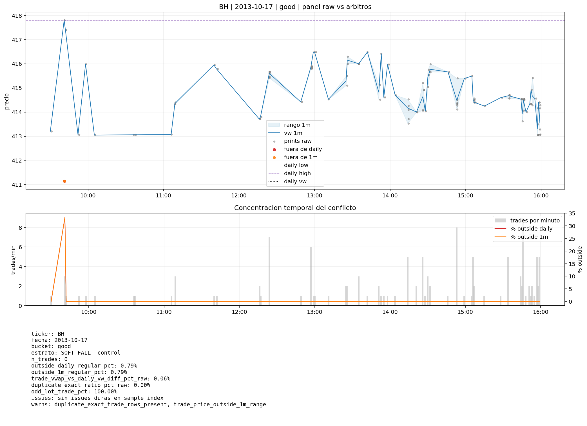

**Que muestra**

- Panel rico del tape raw frente a `daily` y `1m` para `BH` el `2013-10-17`.
- `n_trades = 126`, `outside_daily_regular_pct = 0.79%`, `outside_1m_regular_pct = 0.79%`.
- `trade_vwap_vs_daily_vw_diff_pct_raw = 0.06%`, `duplicate_exact_ratio_pct_raw = 0.00%`, `odd_lot_trade_pct = 100.00%`.

**Responde**

- Cola pristine donde `trades`, `daily` y `1m` alinean con limpieza. Responde a la pregunta de como luce una firma casi impecable del tape.
- Responde a si el conflicto dominante vive en la escala (`~1x`), en la comparabilidad frente a `daily` (0.79%) o frente a `1m` (0.79%).
- El 100.00% de odd-lots empuja la lectura hacia microestructura fina; evita leer el caso como pura ruptura economica gruesa.
- La decision que justifica es que el file puede usarse como patron de tape limpio, no como medida de masa util del bloque.

### BH.A | 2018-08-17

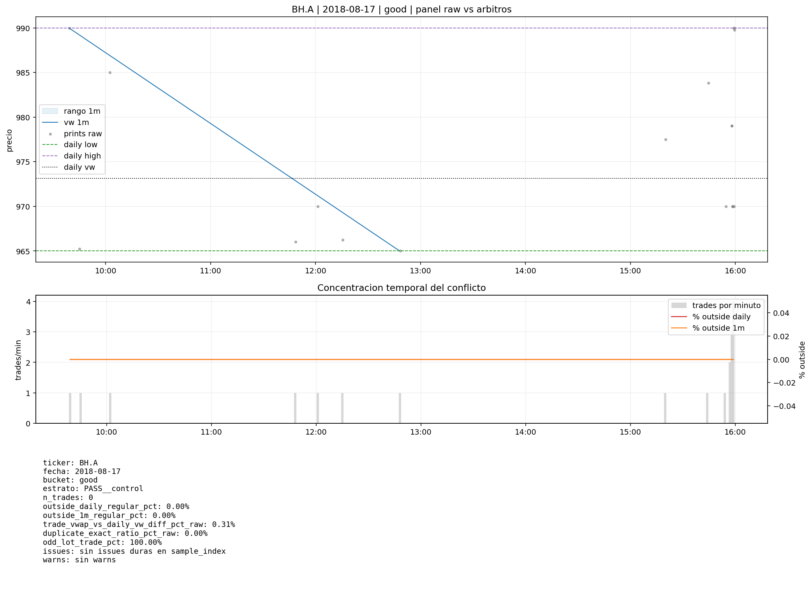

**Que muestra**

- Panel rico del tape raw frente a `daily` y `1m` para `BH.A` el `2018-08-17`.
- `n_trades = 19`, `outside_daily_regular_pct = 0.00%`, `outside_1m_regular_pct = 0.00%`.
- `trade_vwap_vs_daily_vw_diff_pct_raw = 0.31%`, `duplicate_exact_ratio_pct_raw = 0.00%`, `odd_lot_trade_pct = 100.00%`.

**Responde**

- Cola pristine donde `trades`, `daily` y `1m` alinean con limpieza. Responde a la pregunta de como luce una firma casi impecable del tape.
- Responde a si el conflicto dominante vive en la escala (`~1x`), en la comparabilidad frente a `daily` (0.00%) o frente a `1m` (0.00%).
- El 100.00% de odd-lots empuja la lectura hacia microestructura fina; evita leer el caso como pura ruptura economica gruesa.
- La decision que justifica es que el file puede usarse como patron de tape limpio, no como medida de masa util del bloque.

### BH.A | 2018-10-02

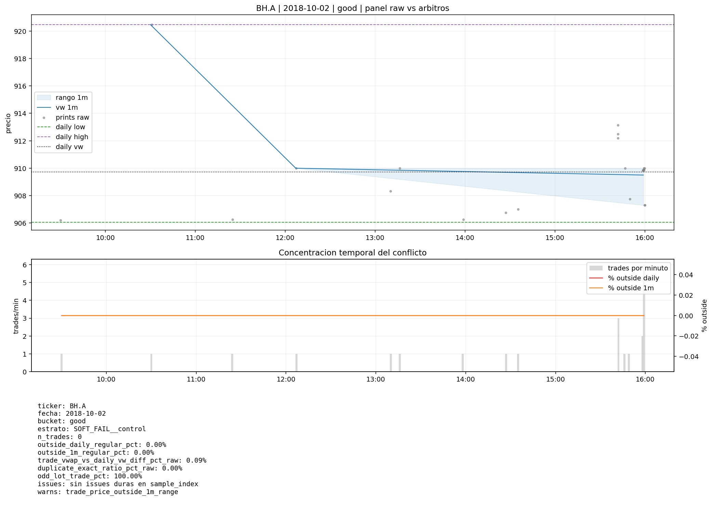

**Que muestra**

- Panel rico del tape raw frente a `daily` y `1m` para `BH.A` el `2018-10-02`.
- `n_trades = 22`, `outside_daily_regular_pct = 0.00%`, `outside_1m_regular_pct = 0.00%`.
- `trade_vwap_vs_daily_vw_diff_pct_raw = 0.09%`, `duplicate_exact_ratio_pct_raw = 0.00%`, `odd_lot_trade_pct = 100.00%`.

**Responde**

- Cola pristine donde `trades`, `daily` y `1m` alinean con limpieza. Responde a la pregunta de como luce una firma casi impecable del tape.
- Responde a si el conflicto dominante vive en la escala (`~1x`), en la comparabilidad frente a `daily` (0.00%) o frente a `1m` (0.00%).
- El 100.00% de odd-lots empuja la lectura hacia microestructura fina; evita leer el caso como pura ruptura economica gruesa.
- La decision que justifica es que el file puede usarse como patron de tape limpio, no como medida de masa util del bloque.

### BH.A | 2018-11-09

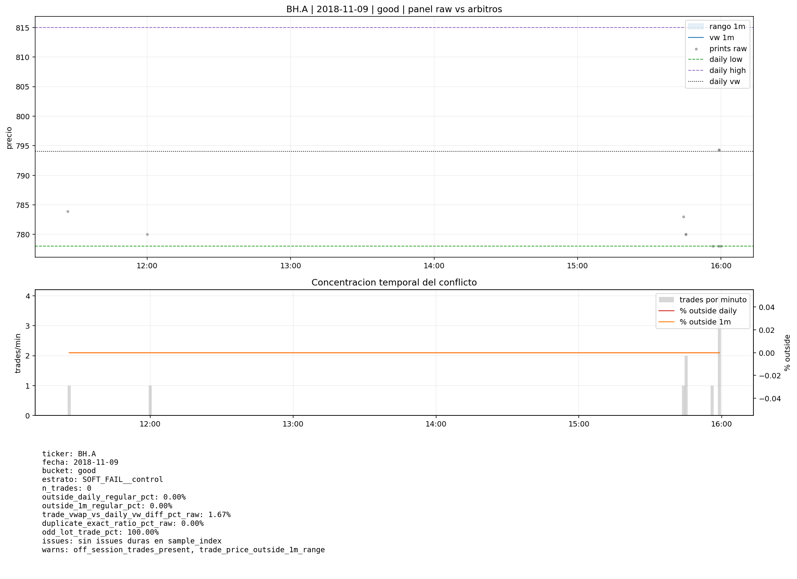

**Que muestra**

- Panel rico del tape raw frente a `daily` y `1m` para `BH.A` el `2018-11-09`.
- `n_trades = 10`, `outside_daily_regular_pct = 0.00%`, `outside_1m_regular_pct = 0.00%`.
- `trade_vwap_vs_daily_vw_diff_pct_raw = 1.67%`, `duplicate_exact_ratio_pct_raw = 0.00%`, `odd_lot_trade_pct = 100.00%`.

**Responde**

- Cola pristine donde `trades`, `daily` y `1m` alinean con limpieza. Responde a la pregunta de como luce una firma casi impecable del tape.
- Responde a si el conflicto dominante vive en la escala (`~1x`), en la comparabilidad frente a `daily` (0.00%) o frente a `1m` (0.00%).
- El 100.00% de odd-lots empuja la lectura hacia microestructura fina; evita leer el caso como pura ruptura economica gruesa.
- La decision que justifica es que el file puede usarse como patron de tape limpio, no como medida de masa util del bloque.

### CBR | 2015-12-24

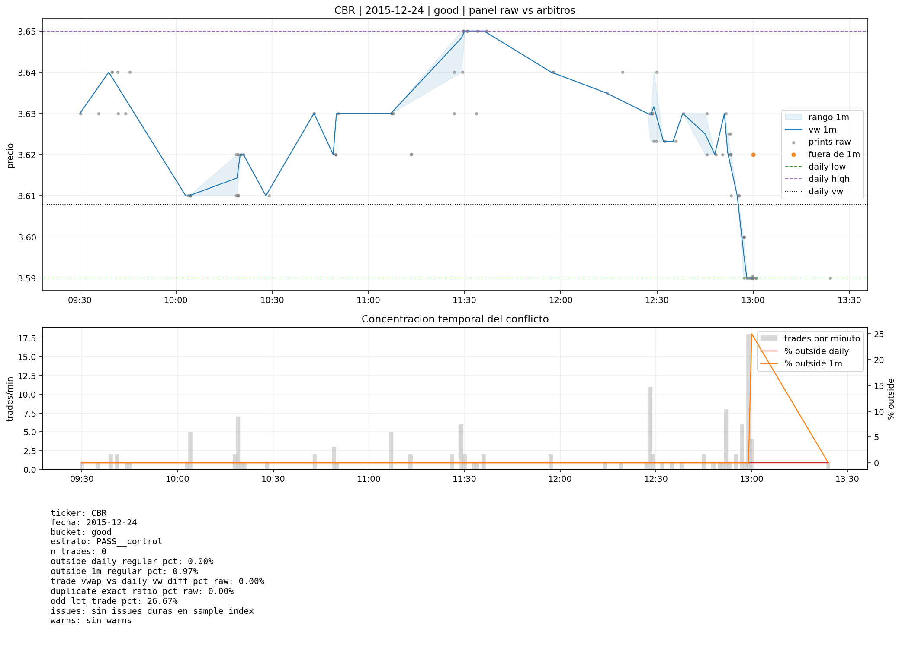

**Que muestra**

- Panel rico del tape raw frente a `daily` y `1m` para `CBR` el `2015-12-24`.
- `n_trades = 120`, `outside_daily_regular_pct = 0.00%`, `outside_1m_regular_pct = 0.97%`.
- `trade_vwap_vs_daily_vw_diff_pct_raw = 0.00%`, `duplicate_exact_ratio_pct_raw = 0.00%`, `odd_lot_trade_pct = 26.67%`.

**Responde**

- Cola pristine donde `trades`, `daily` y `1m` alinean con limpieza. Responde a la pregunta de como luce una firma casi impecable del tape.
- Responde a si el conflicto dominante vive en la escala (`~1x`), en la comparabilidad frente a `daily` (0.00%) o frente a `1m` (0.97%).
- El 26.67% de odd-lots empuja la lectura hacia microestructura fina; evita leer el caso como pura ruptura economica gruesa.
- La decision que justifica es que el file puede usarse como patron de tape limpio, no como medida de masa util del bloque.

### CLSN | 2016-05-16

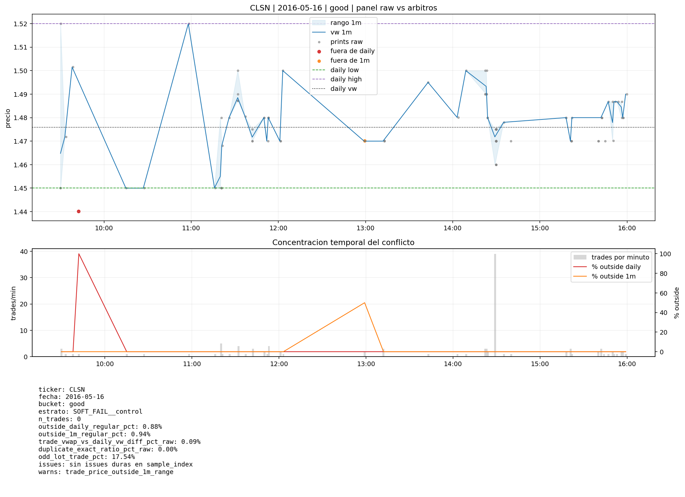

**Que muestra**

- Panel rico del tape raw frente a `daily` y `1m` para `CLSN` el `2016-05-16`.
- `n_trades = 114`, `outside_daily_regular_pct = 0.88%`, `outside_1m_regular_pct = 0.94%`.
- `trade_vwap_vs_daily_vw_diff_pct_raw = 0.09%`, `duplicate_exact_ratio_pct_raw = 0.00%`, `odd_lot_trade_pct = 17.54%`.

**Responde**

- Cola pristine donde `trades`, `daily` y `1m` alinean con limpieza. Responde a la pregunta de como luce una firma casi impecable del tape.
- Responde a si el conflicto dominante vive en la escala (`~1x`), en la comparabilidad frente a `daily` (0.88%) o frente a `1m` (0.94%).
- La decision que justifica es que el file puede usarse como patron de tape limpio, no como medida de masa util del bloque.

### DIT | 2018-04-02

**Que muestra**

- Panel rico del tape raw frente a `daily` y `1m` para `DIT` el `2018-04-02`.
- `n_trades = 2`, `outside_daily_regular_pct = 0.00%`, `outside_1m_regular_pct = 0.00%`.
- `trade_vwap_vs_daily_vw_diff_pct_raw = 0.00%`, `duplicate_exact_ratio_pct_raw = 0.00%`, `odd_lot_trade_pct = 100.00%`.

**Responde**

- Cola pristine donde `trades`, `daily` y `1m` alinean con limpieza. Responde a la pregunta de como luce una firma casi impecable del tape.
- Responde a si el conflicto dominante vive en la escala (`~1x`), en la comparabilidad frente a `daily` (0.00%) o frente a `1m` (0.00%).
- El 100.00% de odd-lots empuja la lectura hacia microestructura fina; evita leer el caso como pura ruptura economica gruesa.
- La decision que justifica es que el file puede usarse como patron de tape limpio, no como medida de masa util del bloque.

### DIT | 2018-04-19

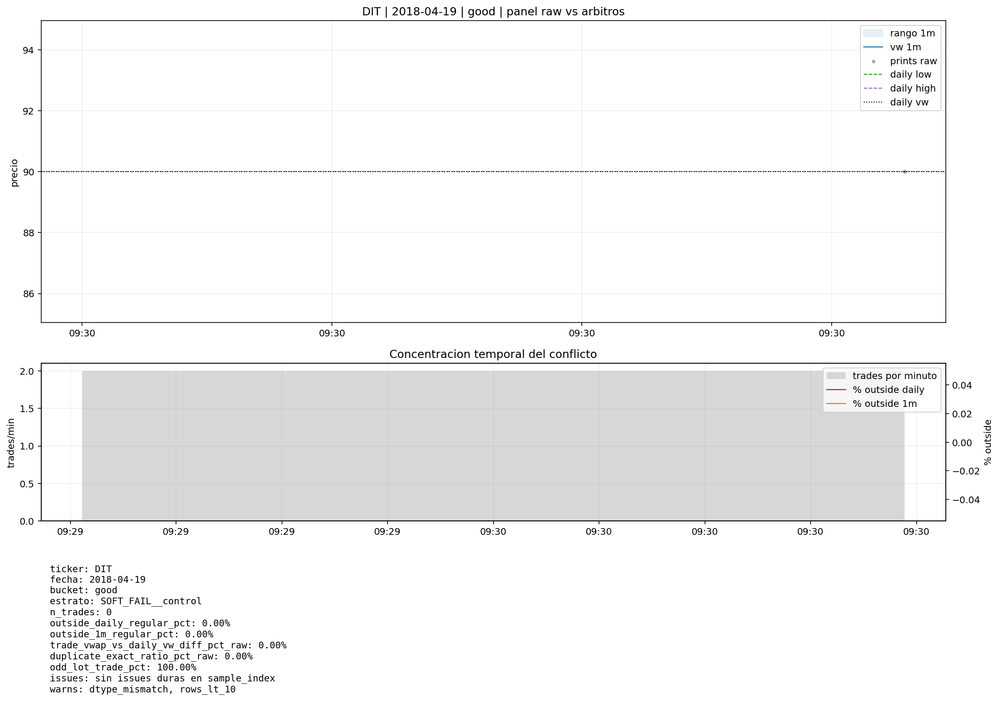

**Que muestra**

- Panel rico del tape raw frente a `daily` y `1m` para `DIT` el `2018-04-19`.
- `n_trades = 2`, `outside_daily_regular_pct = 0.00%`, `outside_1m_regular_pct = 0.00%`.
- `trade_vwap_vs_daily_vw_diff_pct_raw = 0.00%`, `duplicate_exact_ratio_pct_raw = 0.00%`, `odd_lot_trade_pct = 100.00%`.

**Responde**

- Cola pristine donde `trades`, `daily` y `1m` alinean con limpieza. Responde a la pregunta de como luce una firma casi impecable del tape.
- Responde a si el conflicto dominante vive en la escala (`~1x`), en la comparabilidad frente a `daily` (0.00%) o frente a `1m` (0.00%).
- El 100.00% de odd-lots empuja la lectura hacia microestructura fina; evita leer el caso como pura ruptura economica gruesa.
- La decision que justifica es que el file puede usarse como patron de tape limpio, no como medida de masa util del bloque.

### DIT | 2018-05-15

**Que muestra**

- Panel rico del tape raw frente a `daily` y `1m` para `DIT` el `2018-05-15`.
- `n_trades = 3`, `outside_daily_regular_pct = 0.00%`, `outside_1m_regular_pct = 0.00%`.
- `trade_vwap_vs_daily_vw_diff_pct_raw = 0.00%`, `duplicate_exact_ratio_pct_raw = 0.00%`, `odd_lot_trade_pct = 100.00%`.

**Responde**

- Cola pristine donde `trades`, `daily` y `1m` alinean con limpieza. Responde a la pregunta de como luce una firma casi impecable del tape.
- Responde a si el conflicto dominante vive en la escala (`~1x`), en la comparabilidad frente a `daily` (0.00%) o frente a `1m` (0.00%).
- El 100.00% de odd-lots empuja la lectura hacia microestructura fina; evita leer el caso como pura ruptura economica gruesa.
- La decision que justifica es que el file puede usarse como patron de tape limpio, no como medida de masa util del bloque.

### DIT | 2018-06-06

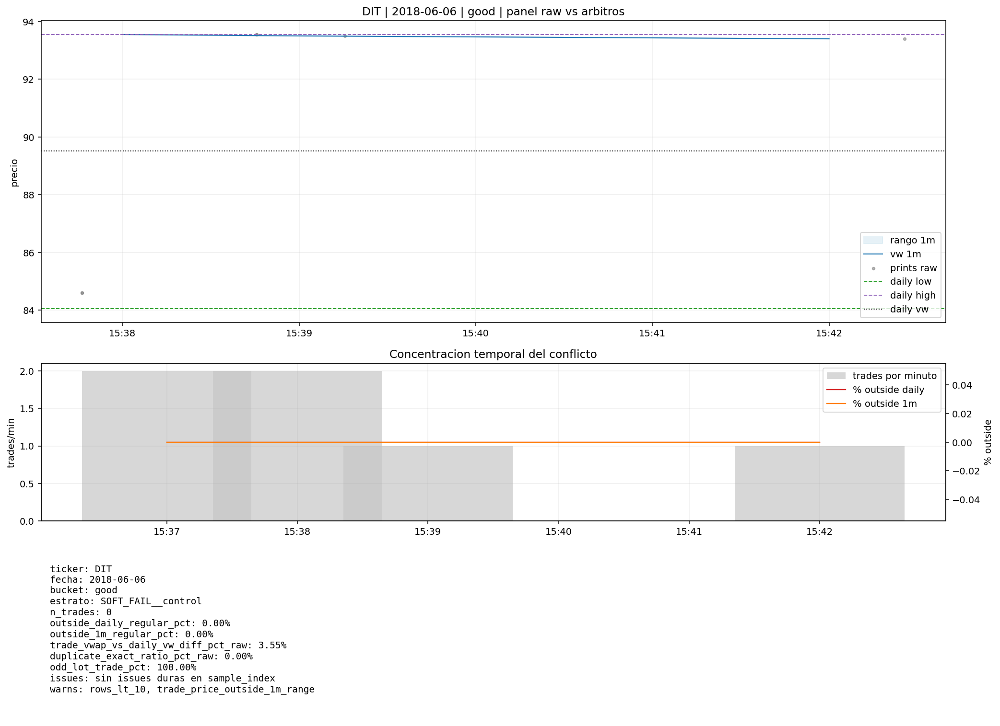

**Que muestra**

- Panel rico del tape raw frente a `daily` y `1m` para `DIT` el `2018-06-06`.
- `n_trades = 6`, `outside_daily_regular_pct = 0.00%`, `outside_1m_regular_pct = 0.00%`.
- `trade_vwap_vs_daily_vw_diff_pct_raw = 3.55%`, `duplicate_exact_ratio_pct_raw = 0.00%`, `odd_lot_trade_pct = 100.00%`.

**Responde**

- Cola pristine donde `trades`, `daily` y `1m` alinean con limpieza. Responde a la pregunta de como luce una firma casi impecable del tape.
- Responde a si el conflicto dominante vive en la escala (`near_1x`), en la comparabilidad frente a `daily` (0.00%) o frente a `1m` (0.00%).
- El 100.00% de odd-lots empuja la lectura hacia microestructura fina; evita leer el caso como pura ruptura economica gruesa.
- La decision que justifica es que el file puede usarse como patron de tape limpio, no como medida de masa util del bloque.

### DIT | 2018-08-01

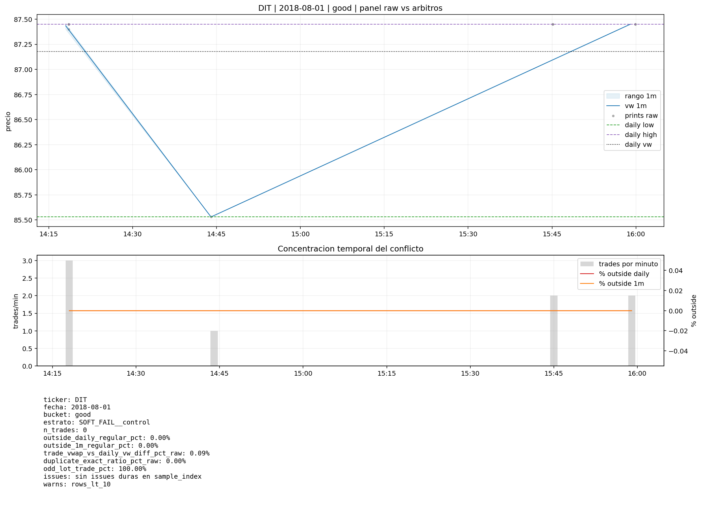

**Que muestra**

- Panel rico del tape raw frente a `daily` y `1m` para `DIT` el `2018-08-01`.
- `n_trades = 8`, `outside_daily_regular_pct = 0.00%`, `outside_1m_regular_pct = 0.00%`.
- `trade_vwap_vs_daily_vw_diff_pct_raw = 0.09%`, `duplicate_exact_ratio_pct_raw = 0.00%`, `odd_lot_trade_pct = 100.00%`.

**Responde**

- Cola pristine donde `trades`, `daily` y `1m` alinean con limpieza. Responde a la pregunta de como luce una firma casi impecable del tape.
- Responde a si el conflicto dominante vive en la escala (`~1x`), en la comparabilidad frente a `daily` (0.00%) o frente a `1m` (0.00%).
- El 100.00% de odd-lots empuja la lectura hacia microestructura fina; evita leer el caso como pura ruptura economica gruesa.
- La decision que justifica es que el file puede usarse como patron de tape limpio, no como medida de masa util del bloque.

### DIT | 2018-08-13

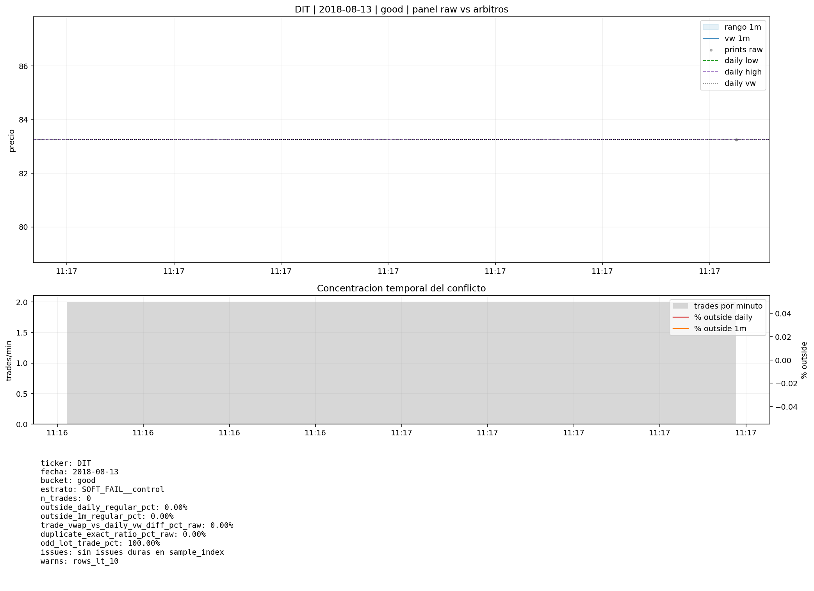

**Que muestra**

- Panel rico del tape raw frente a `daily` y `1m` para `DIT` el `2018-08-13`.
- `n_trades = 2`, `outside_daily_regular_pct = 0.00%`, `outside_1m_regular_pct = 0.00%`.
- `trade_vwap_vs_daily_vw_diff_pct_raw = 0.00%`, `duplicate_exact_ratio_pct_raw = 0.00%`, `odd_lot_trade_pct = 100.00%`.

**Responde**

- Cola pristine donde `trades`, `daily` y `1m` alinean con limpieza. Responde a la pregunta de como luce una firma casi impecable del tape.
- Responde a si el conflicto dominante vive en la escala (`~1x`), en la comparabilidad frente a `daily` (0.00%) o frente a `1m` (0.00%).
- El 100.00% de odd-lots empuja la lectura hacia microestructura fina; evita leer el caso como pura ruptura economica gruesa.
- La decision que justifica es que el file puede usarse como patron de tape limpio, no como medida de masa util del bloque.

### DIT | 2018-08-16

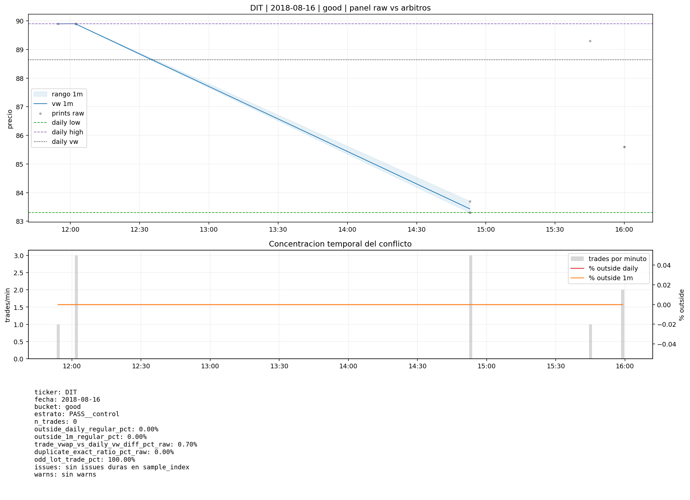

**Que muestra**

- Panel rico del tape raw frente a `daily` y `1m` para `DIT` el `2018-08-16`.
- `n_trades = 10`, `outside_daily_regular_pct = 0.00%`, `outside_1m_regular_pct = 0.00%`.
- `trade_vwap_vs_daily_vw_diff_pct_raw = 0.70%`, `duplicate_exact_ratio_pct_raw = 0.00%`, `odd_lot_trade_pct = 100.00%`.

**Responde**

- Cola pristine donde `trades`, `daily` y `1m` alinean con limpieza. Responde a la pregunta de como luce una firma casi impecable del tape.
- Responde a si el conflicto dominante vive en la escala (`~1x`), en la comparabilidad frente a `daily` (0.00%) o frente a `1m` (0.00%).
- El 100.00% de odd-lots empuja la lectura hacia microestructura fina; evita leer el caso como pura ruptura economica gruesa.
- La decision que justifica es que el file puede usarse como patron de tape limpio, no como medida de masa util del bloque.

### DIT | 2018-12-07

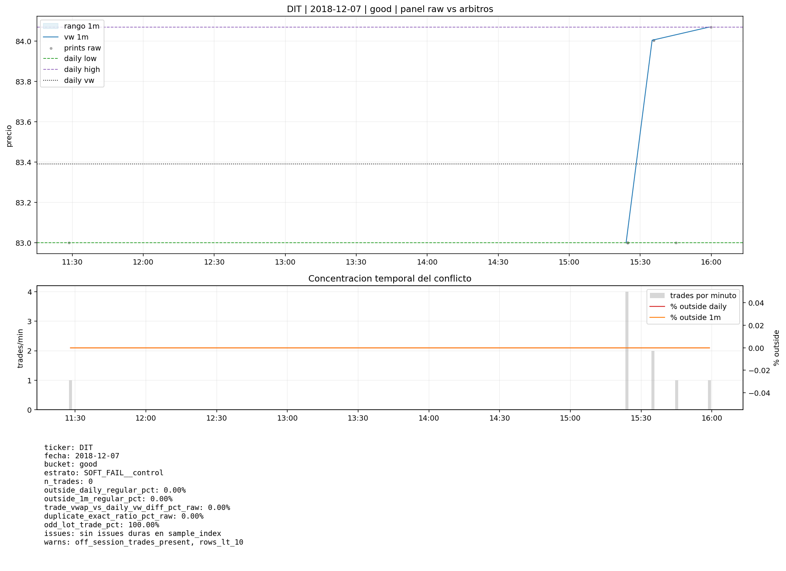

**Que muestra**

- Panel rico del tape raw frente a `daily` y `1m` para `DIT` el `2018-12-07`.
- `n_trades = 9`, `outside_daily_regular_pct = 0.00%`, `outside_1m_regular_pct = 0.00%`.
- `trade_vwap_vs_daily_vw_diff_pct_raw = 0.00%`, `duplicate_exact_ratio_pct_raw = 0.00%`, `odd_lot_trade_pct = 100.00%`.

**Responde**

- Cola pristine donde `trades`, `daily` y `1m` alinean con limpieza. Responde a la pregunta de como luce una firma casi impecable del tape.
- Responde a si el conflicto dominante vive en la escala (`~1x`), en la comparabilidad frente a `daily` (0.00%) o frente a `1m` (0.00%).
- El 100.00% de odd-lots empuja la lectura hacia microestructura fina; evita leer el caso como pura ruptura economica gruesa.
- La decision que justifica es que el file puede usarse como patron de tape limpio, no como medida de masa util del bloque.

### DIT | 2018-12-19

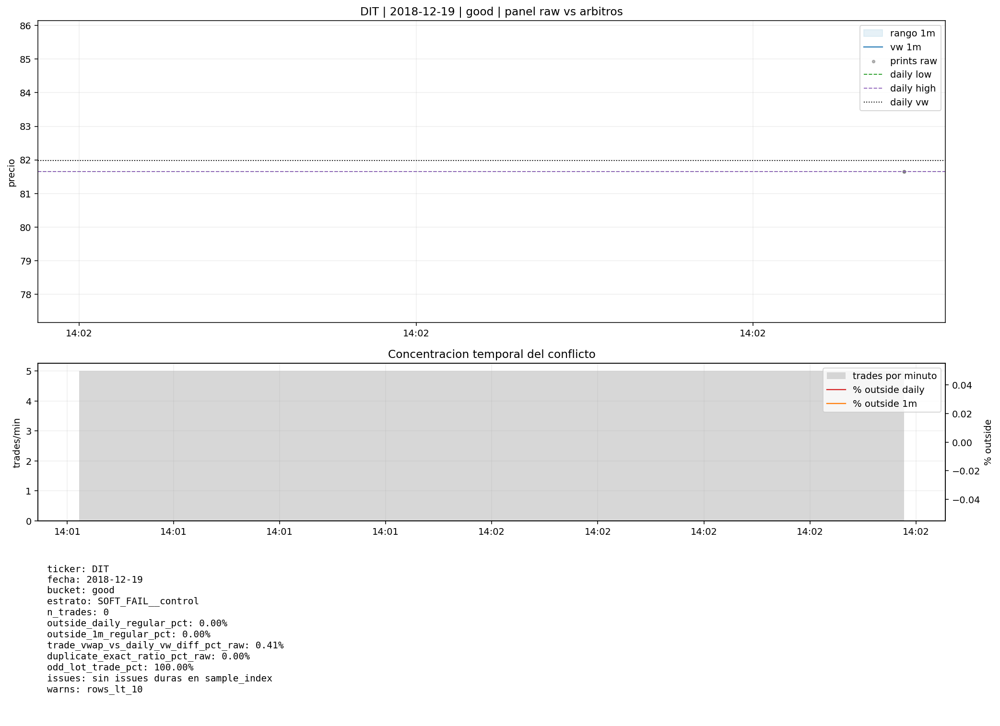

**Que muestra**

- Panel rico del tape raw frente a `daily` y `1m` para `DIT` el `2018-12-19`.
- `n_trades = 5`, `outside_daily_regular_pct = 0.00%`, `outside_1m_regular_pct = 0.00%`.
- `trade_vwap_vs_daily_vw_diff_pct_raw = 0.41%`, `duplicate_exact_ratio_pct_raw = 0.00%`, `odd_lot_trade_pct = 100.00%`.

**Responde**

- Cola pristine donde `trades`, `daily` y `1m` alinean con limpieza. Responde a la pregunta de como luce una firma casi impecable del tape.
- Responde a si el conflicto dominante vive en la escala (`~1x`), en la comparabilidad frente a `daily` (0.00%) o frente a `1m` (0.00%).
- El 100.00% de odd-lots empuja la lectura hacia microestructura fina; evita leer el caso como pura ruptura economica gruesa.
- La decision que justifica es que el file puede usarse como patron de tape limpio, no como medida de masa util del bloque.

### GSD | 2017-05-30

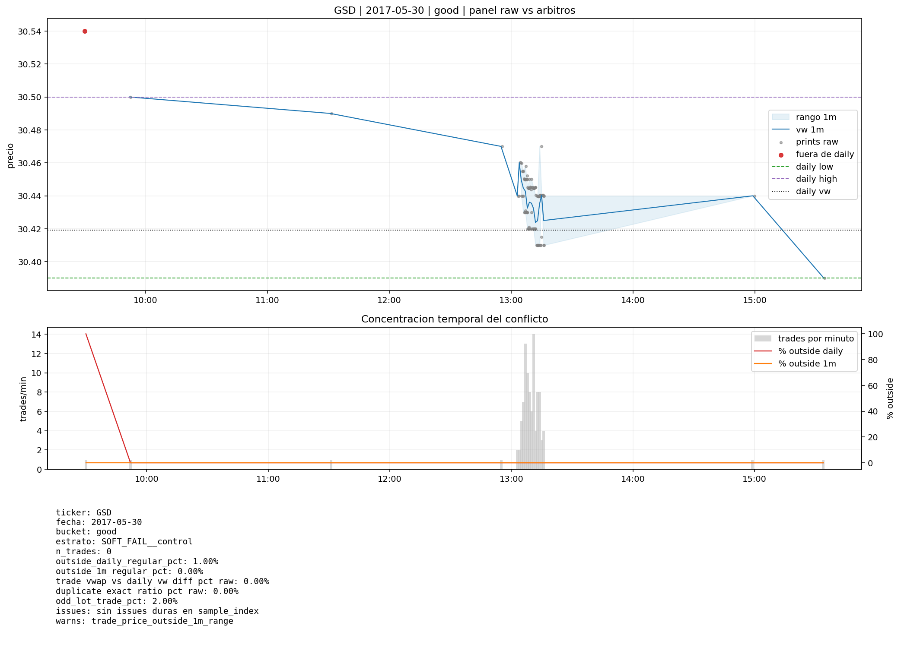

**Que muestra**

- Panel rico del tape raw frente a `daily` y `1m` para `GSD` el `2017-05-30`.
- `n_trades = 100`, `outside_daily_regular_pct = 1.00%`, `outside_1m_regular_pct = 0.00%`.
- `trade_vwap_vs_daily_vw_diff_pct_raw = 0.00%`, `duplicate_exact_ratio_pct_raw = 0.00%`, `odd_lot_trade_pct = 2.00%`.

**Responde**

- Cola pristine donde `trades`, `daily` y `1m` alinean con limpieza. Responde a la pregunta de como luce una firma casi impecable del tape.
- Responde a si el conflicto dominante vive en la escala (`~1x`), en la comparabilidad frente a `daily` (1.00%) o frente a `1m` (0.00%).
- La decision que justifica es que el file puede usarse como patron de tape limpio, no como medida de masa util del bloque.

### NLST | 2017-01-12

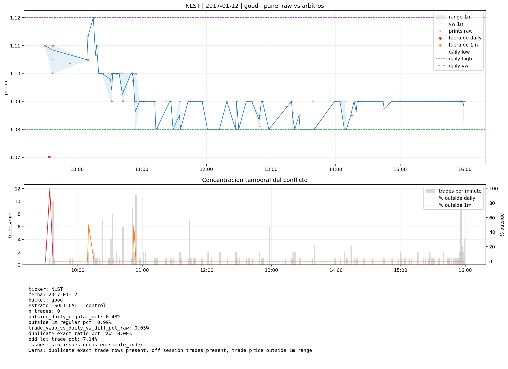

**Que muestra**

- Panel rico del tape raw frente a `daily` y `1m` para `NLST` el `2017-01-12`.
- `n_trades = 210`, `outside_daily_regular_pct = 0.48%`, `outside_1m_regular_pct = 0.99%`.
- `trade_vwap_vs_daily_vw_diff_pct_raw = 0.05%`, `duplicate_exact_ratio_pct_raw = 0.00%`, `odd_lot_trade_pct = 7.14%`.

**Responde**

- Cola pristine donde `trades`, `daily` y `1m` alinean con limpieza. Responde a la pregunta de como luce una firma casi impecable del tape.
- Responde a si el conflicto dominante vive en la escala (`~1x`), en la comparabilidad frente a `daily` (0.48%) o frente a `1m` (0.99%).
- La decision que justifica es que el file puede usarse como patron de tape limpio, no como medida de masa util del bloque.

### OOMA | 2016-12-08

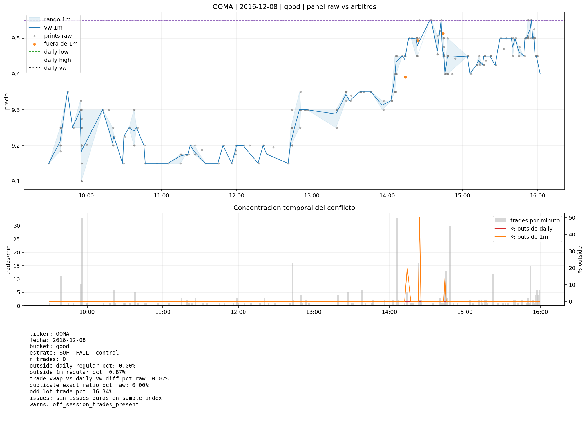

**Que muestra**

- Panel rico del tape raw frente a `daily` y `1m` para `OOMA` el `2016-12-08`.
- `n_trades = 361`, `outside_daily_regular_pct = 0.00%`, `outside_1m_regular_pct = 0.87%`.
- `trade_vwap_vs_daily_vw_diff_pct_raw = 0.02%`, `duplicate_exact_ratio_pct_raw = 0.00%`, `odd_lot_trade_pct = 16.34%`.

**Responde**

- Cola pristine donde `trades`, `daily` y `1m` alinean con limpieza. Responde a la pregunta de como luce una firma casi impecable del tape.
- Responde a si el conflicto dominante vive en la escala (`~1x`), en la comparabilidad frente a `daily` (0.00%) o frente a `1m` (0.87%).
- La decision que justifica es que el file puede usarse como patron de tape limpio, no como medida de masa util del bloque.

### BH.A | 2019-05-23

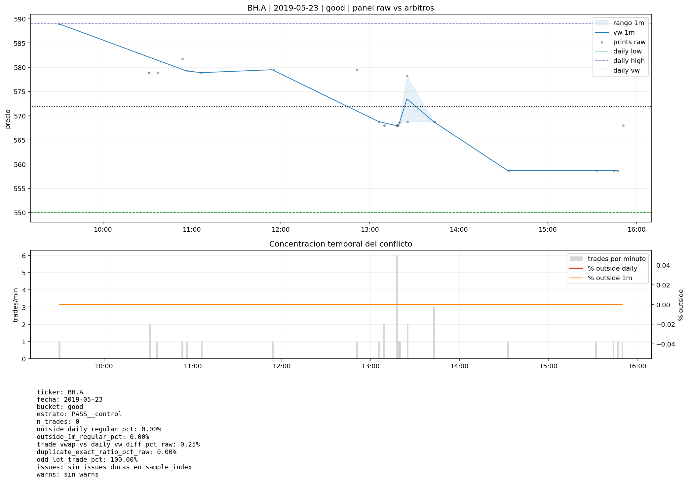

**Que muestra**

- Panel rico del tape raw frente a `daily` y `1m` para `BH.A` el `2019-05-23`.
- `n_trades = 30`, `outside_daily_regular_pct = 0.00%`, `outside_1m_regular_pct = 0.00%`.
- `trade_vwap_vs_daily_vw_diff_pct_raw = 0.25%`, `duplicate_exact_ratio_pct_raw = 0.00%`, `odd_lot_trade_pct = 100.00%`.

**Responde**

- Cola pristine donde `trades`, `daily` y `1m` alinean con limpieza. Responde a la pregunta de como luce una firma casi impecable del tape.
- Responde a si el conflicto dominante vive en la escala (`~1x`), en la comparabilidad frente a `daily` (0.00%) o frente a `1m` (0.00%).
- El 100.00% de odd-lots empuja la lectura hacia microestructura fina; evita leer el caso como pura ruptura economica gruesa.
- La decision que justifica es que el file puede usarse como patron de tape limpio, no como medida de masa util del bloque.

### BH.A | 2019-07-02

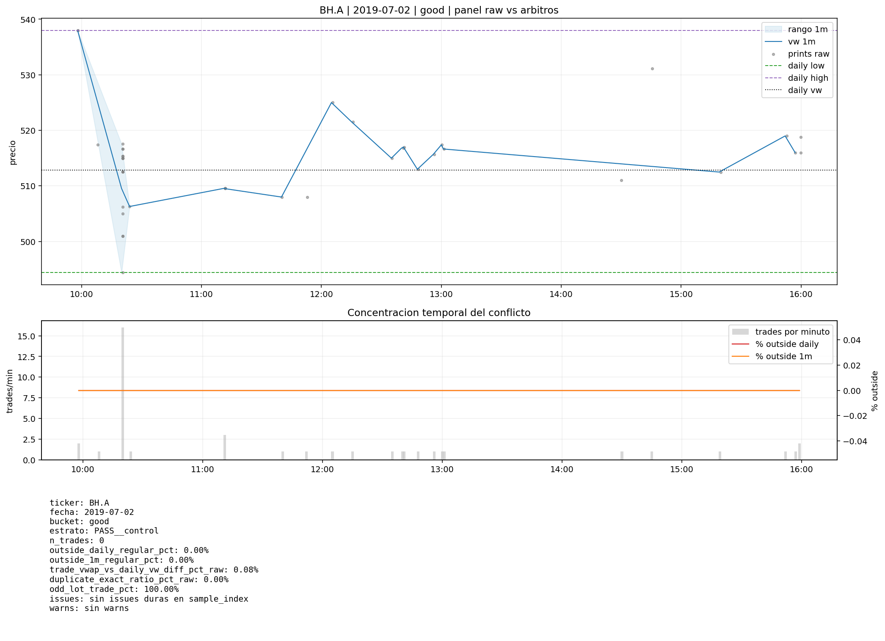

**Que muestra**

- Panel rico del tape raw frente a `daily` y `1m` para `BH.A` el `2019-07-02`.
- `n_trades = 41`, `outside_daily_regular_pct = 0.00%`, `outside_1m_regular_pct = 0.00%`.
- `trade_vwap_vs_daily_vw_diff_pct_raw = 0.08%`, `duplicate_exact_ratio_pct_raw = 0.00%`, `odd_lot_trade_pct = 100.00%`.

**Responde**

- Cola pristine donde `trades`, `daily` y `1m` alinean con limpieza. Responde a la pregunta de como luce una firma casi impecable del tape.
- Responde a si el conflicto dominante vive en la escala (`~1x`), en la comparabilidad frente a `daily` (0.00%) o frente a `1m` (0.00%).
- El 100.00% de odd-lots empuja la lectura hacia microestructura fina; evita leer el caso como pura ruptura economica gruesa.
- La decision que justifica es que el file puede usarse como patron de tape limpio, no como medida de masa util del bloque.

### BH.A | 2019-07-18

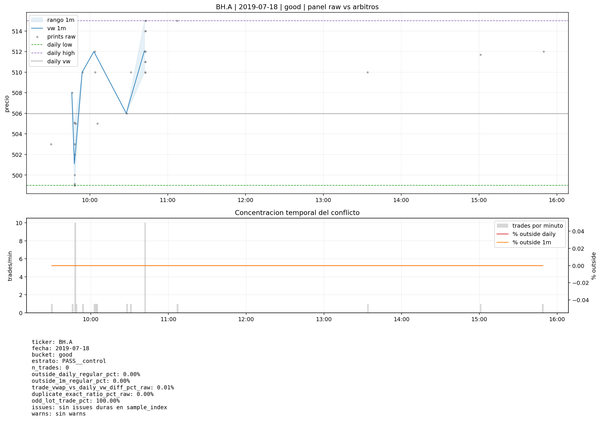

**Que muestra**

- Panel rico del tape raw frente a `daily` y `1m` para `BH.A` el `2019-07-18`.
- `n_trades = 33`, `outside_daily_regular_pct = 0.00%`, `outside_1m_regular_pct = 0.00%`.
- `trade_vwap_vs_daily_vw_diff_pct_raw = 0.01%`, `duplicate_exact_ratio_pct_raw = 0.00%`, `odd_lot_trade_pct = 100.00%`.

**Responde**

- Cola pristine donde `trades`, `daily` y `1m` alinean con limpieza. Responde a la pregunta de como luce una firma casi impecable del tape.
- Responde a si el conflicto dominante vive en la escala (`~1x`), en la comparabilidad frente a `daily` (0.00%) o frente a `1m` (0.00%).
- El 100.00% de odd-lots empuja la lectura hacia microestructura fina; evita leer el caso como pura ruptura economica gruesa.
- La decision que justifica es que el file puede usarse como patron de tape limpio, no como medida de masa util del bloque.

### BH.A | 2019-07-25

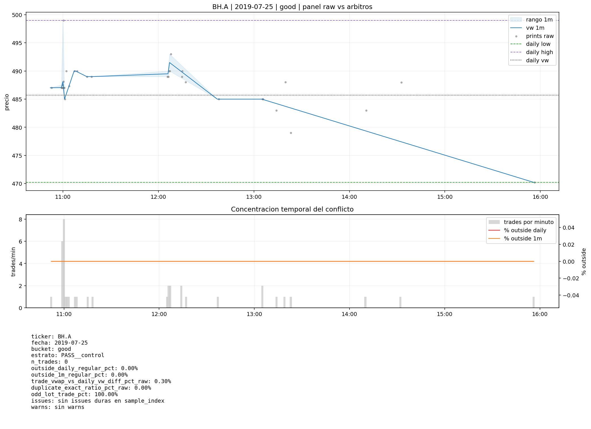

**Que muestra**

- Panel rico del tape raw frente a `daily` y `1m` para `BH.A` el `2019-07-25`.
- `n_trades = 39`, `outside_daily_regular_pct = 0.00%`, `outside_1m_regular_pct = 0.00%`.
- `trade_vwap_vs_daily_vw_diff_pct_raw = 0.30%`, `duplicate_exact_ratio_pct_raw = 0.00%`, `odd_lot_trade_pct = 100.00%`.

**Responde**

- Cola pristine donde `trades`, `daily` y `1m` alinean con limpieza. Responde a la pregunta de como luce una firma casi impecable del tape.
- Responde a si el conflicto dominante vive en la escala (`~1x`), en la comparabilidad frente a `daily` (0.00%) o frente a `1m` (0.00%).
- El 100.00% de odd-lots empuja la lectura hacia microestructura fina; evita leer el caso como pura ruptura economica gruesa.
- La decision que justifica es que el file puede usarse como patron de tape limpio, no como medida de masa util del bloque.

### BH.A | 2019-07-31

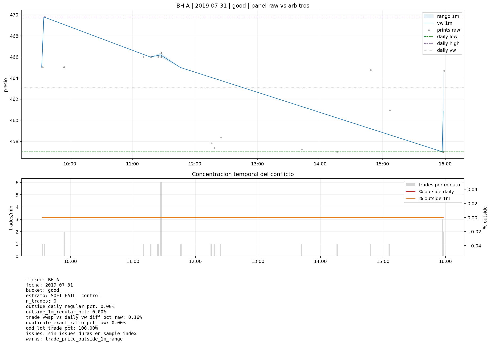

**Que muestra**

- Panel rico del tape raw frente a `daily` y `1m` para `BH.A` el `2019-07-31`.
- `n_trades = 26`, `outside_daily_regular_pct = 0.00%`, `outside_1m_regular_pct = 0.00%`.
- `trade_vwap_vs_daily_vw_diff_pct_raw = 0.16%`, `duplicate_exact_ratio_pct_raw = 0.00%`, `odd_lot_trade_pct = 100.00%`.

**Responde**

- Cola pristine donde `trades`, `daily` y `1m` alinean con limpieza. Responde a la pregunta de como luce una firma casi impecable del tape.
- Responde a si el conflicto dominante vive en la escala (`~1x`), en la comparabilidad frente a `daily` (0.00%) o frente a `1m` (0.00%).
- El 100.00% de odd-lots empuja la lectura hacia microestructura fina; evita leer el caso como pura ruptura economica gruesa.
- La decision que justifica es que el file puede usarse como patron de tape limpio, no como medida de masa util del bloque.

### BH.A | 2020-02-10

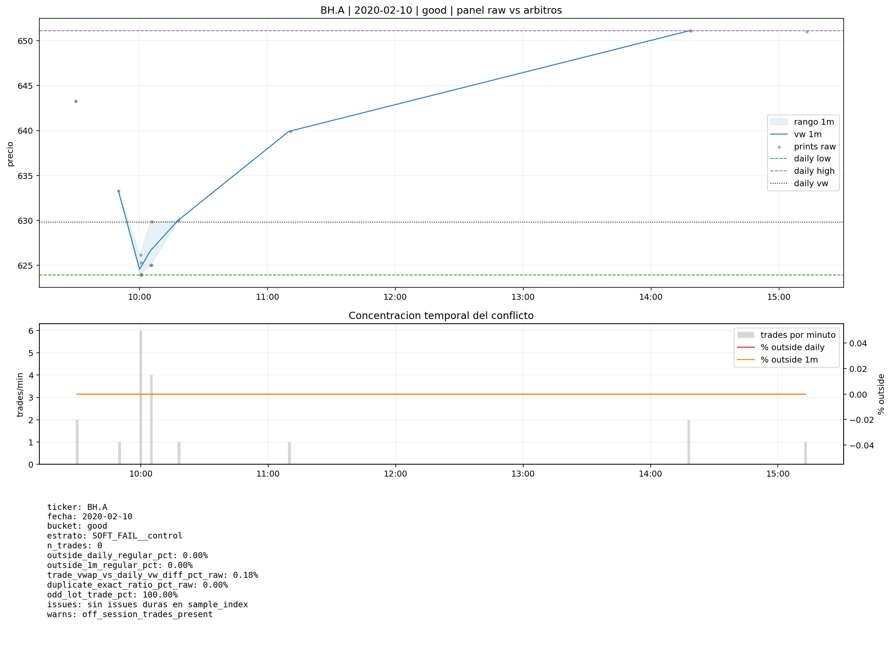

**Que muestra**

- Panel rico del tape raw frente a `daily` y `1m` para `BH.A` el `2020-02-10`.
- `n_trades = 18`, `outside_daily_regular_pct = 0.00%`, `outside_1m_regular_pct = 0.00%`.
- `trade_vwap_vs_daily_vw_diff_pct_raw = 0.18%`, `duplicate_exact_ratio_pct_raw = 0.00%`, `odd_lot_trade_pct = 100.00%`.

**Responde**

- Cola pristine donde `trades`, `daily` y `1m` alinean con limpieza. Responde a la pregunta de como luce una firma casi impecable del tape.
- Responde a si el conflicto dominante vive en la escala (`~1x`), en la comparabilidad frente a `daily` (0.00%) o frente a `1m` (0.00%).
- El 100.00% de odd-lots empuja la lectura hacia microestructura fina; evita leer el caso como pura ruptura economica gruesa.
- La decision que justifica es que el file puede usarse como patron de tape limpio, no como medida de masa util del bloque.

### BH.A | 2023-07-20

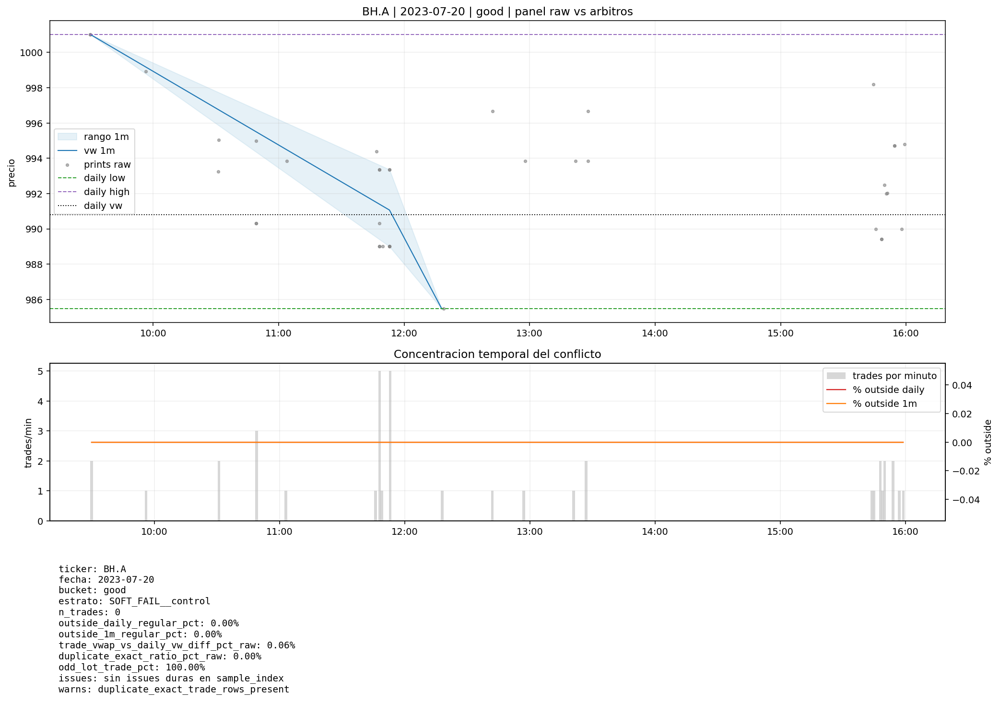

**Que muestra**

- Panel rico del tape raw frente a `daily` y `1m` para `BH.A` el `2023-07-20`.
- `n_trades = 38`, `outside_daily_regular_pct = 0.00%`, `outside_1m_regular_pct = 0.00%`.
- `trade_vwap_vs_daily_vw_diff_pct_raw = 0.06%`, `duplicate_exact_ratio_pct_raw = 0.00%`, `odd_lot_trade_pct = 100.00%`.

**Responde**

- Cola pristine donde `trades`, `daily` y `1m` alinean con limpieza. Responde a la pregunta de como luce una firma casi impecable del tape.
- Responde a si el conflicto dominante vive en la escala (`~1x`), en la comparabilidad frente a `daily` (0.00%) o frente a `1m` (0.00%).
- El 100.00% de odd-lots empuja la lectura hacia microestructura fina; evita leer el caso como pura ruptura economica gruesa.
- La decision que justifica es que el file puede usarse como patron de tape limpio, no como medida de masa util del bloque.

### BH.A | 2023-10-27

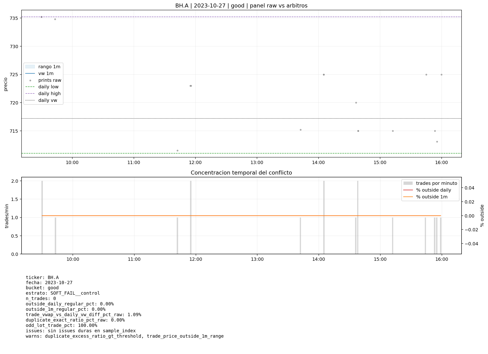

**Que muestra**

- Panel rico del tape raw frente a `daily` y `1m` para `BH.A` el `2023-10-27`.
- `n_trades = 17`, `outside_daily_regular_pct = 0.00%`, `outside_1m_regular_pct = 0.00%`.
- `trade_vwap_vs_daily_vw_diff_pct_raw = 1.09%`, `duplicate_exact_ratio_pct_raw = 0.00%`, `odd_lot_trade_pct = 100.00%`.

**Responde**

- Cola pristine donde `trades`, `daily` y `1m` alinean con limpieza. Responde a la pregunta de como luce una firma casi impecable del tape.
- Responde a si el conflicto dominante vive en la escala (`~1x`), en la comparabilidad frente a `daily` (0.00%) o frente a `1m` (0.00%).
- El 100.00% de odd-lots empuja la lectura hacia microestructura fina; evita leer el caso como pura ruptura economica gruesa.
- La decision que justifica es que el file puede usarse como patron de tape limpio, no como medida de masa util del bloque.

### BHRB | 2022-11-29

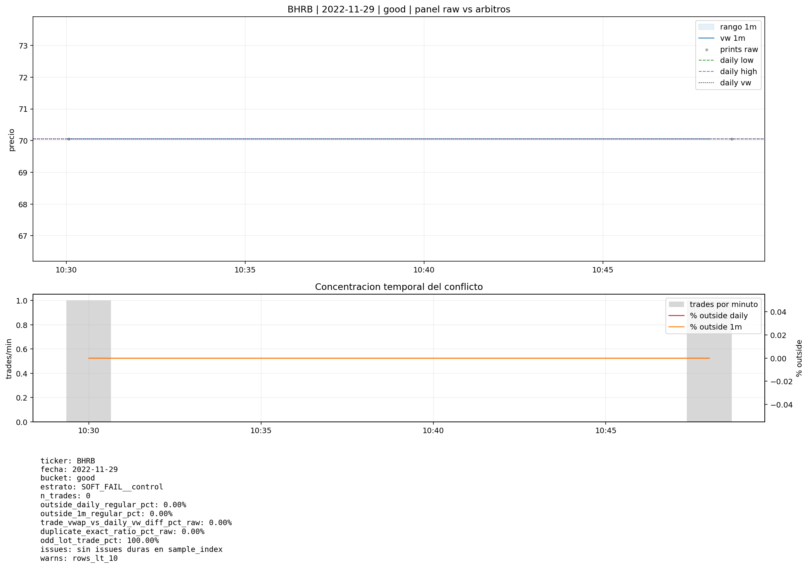

**Que muestra**

- Panel rico del tape raw frente a `daily` y `1m` para `BHRB` el `2022-11-29`.
- `n_trades = 2`, `outside_daily_regular_pct = 0.00%`, `outside_1m_regular_pct = 0.00%`.
- `trade_vwap_vs_daily_vw_diff_pct_raw = 0.00%`, `duplicate_exact_ratio_pct_raw = 0.00%`, `odd_lot_trade_pct = 100.00%`.

**Responde**

- Cola pristine donde `trades`, `daily` y `1m` alinean con limpieza. Responde a la pregunta de como luce una firma casi impecable del tape.
- Responde a si el conflicto dominante vive en la escala (`~1x`), en la comparabilidad frente a `daily` (0.00%) o frente a `1m` (0.00%).
- El 100.00% de odd-lots empuja la lectura hacia microestructura fina; evita leer el caso como pura ruptura economica gruesa.
- La decision que justifica es que el file puede usarse como patron de tape limpio, no como medida de masa util del bloque.

### BHRB | 2022-12-20

**Que muestra**

- Panel rico del tape raw frente a `daily` y `1m` para `BHRB` el `2022-12-20`.
- `n_trades = 1`, `outside_daily_regular_pct = 0.00%`, `outside_1m_regular_pct = 0.00%`.
- `trade_vwap_vs_daily_vw_diff_pct_raw = 0.00%`, `duplicate_exact_ratio_pct_raw = 0.00%`, `odd_lot_trade_pct = 100.00%`.

**Responde**

- Cola pristine donde `trades`, `daily` y `1m` alinean con limpieza. Responde a la pregunta de como luce una firma casi impecable del tape.
- Responde a si el conflicto dominante vive en la escala (`~1x`), en la comparabilidad frente a `daily` (0.00%) o frente a `1m` (0.00%).
- El 100.00% de odd-lots empuja la lectura hacia microestructura fina; evita leer el caso como pura ruptura economica gruesa.
- La decision que justifica es que el file puede usarse como patron de tape limpio, no como medida de masa util del bloque.

### BHRB | 2022-12-23

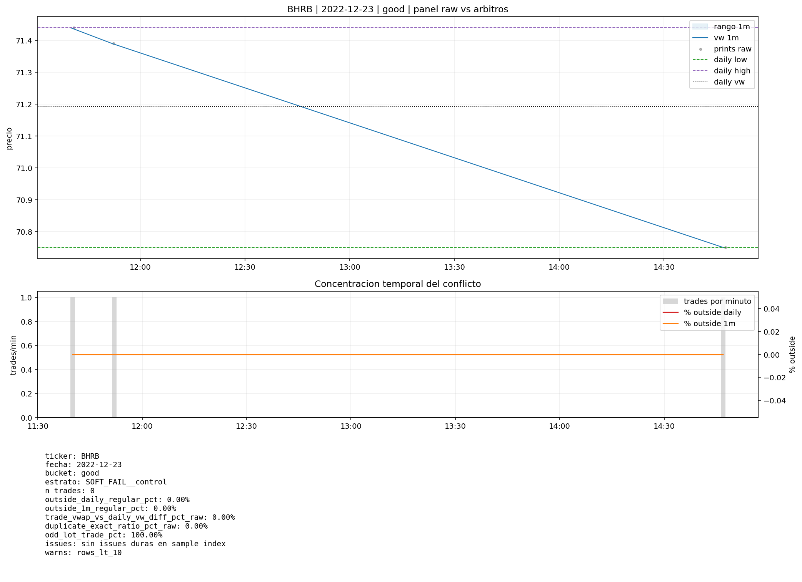

**Que muestra**

- Panel rico del tape raw frente a `daily` y `1m` para `BHRB` el `2022-12-23`.
- `n_trades = 3`, `outside_daily_regular_pct = 0.00%`, `outside_1m_regular_pct = 0.00%`.
- `trade_vwap_vs_daily_vw_diff_pct_raw = 0.00%`, `duplicate_exact_ratio_pct_raw = 0.00%`, `odd_lot_trade_pct = 100.00%`.

**Responde**

- Cola pristine donde `trades`, `daily` y `1m` alinean con limpieza. Responde a la pregunta de como luce una firma casi impecable del tape.
- Responde a si el conflicto dominante vive en la escala (`~1x`), en la comparabilidad frente a `daily` (0.00%) o frente a `1m` (0.00%).
- El 100.00% de odd-lots empuja la lectura hacia microestructura fina; evita leer el caso como pura ruptura economica gruesa.
- La decision que justifica es que el file puede usarse como patron de tape limpio, no como medida de masa util del bloque.

### BHRB | 2022-12-29

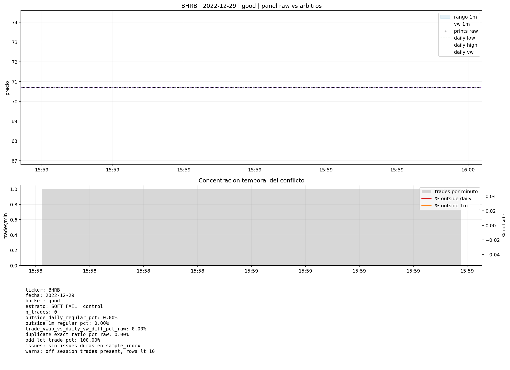

**Que muestra**

- Panel rico del tape raw frente a `daily` y `1m` para `BHRB` el `2022-12-29`.
- `n_trades = 1`, `outside_daily_regular_pct = 0.00%`, `outside_1m_regular_pct = 0.00%`.
- `trade_vwap_vs_daily_vw_diff_pct_raw = 0.00%`, `duplicate_exact_ratio_pct_raw = 0.00%`, `odd_lot_trade_pct = 100.00%`.

**Responde**

- Cola pristine donde `trades`, `daily` y `1m` alinean con limpieza. Responde a la pregunta de como luce una firma casi impecable del tape.
- Responde a si el conflicto dominante vive en la escala (`~1x`), en la comparabilidad frente a `daily` (0.00%) o frente a `1m` (0.00%).
- El 100.00% de odd-lots empuja la lectura hacia microestructura fina; evita leer el caso como pura ruptura economica gruesa.
- La decision que justifica es que el file puede usarse como patron de tape limpio, no como medida de masa util del bloque.

### BHRB | 2023-01-11

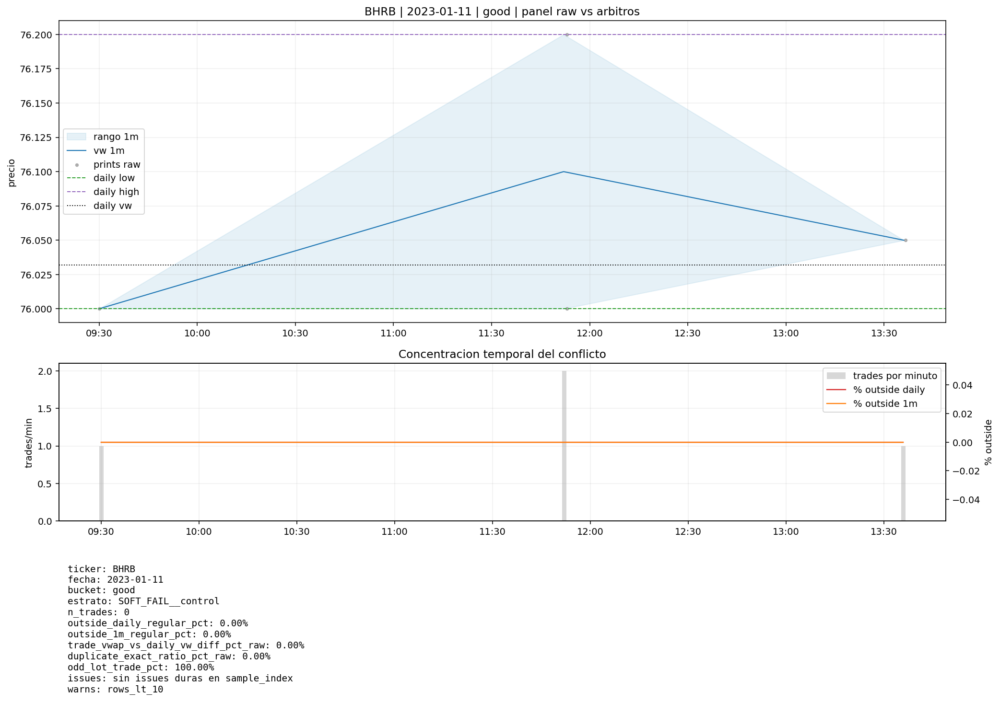

**Que muestra**

- Panel rico del tape raw frente a `daily` y `1m` para `BHRB` el `2023-01-11`.
- `n_trades = 4`, `outside_daily_regular_pct = 0.00%`, `outside_1m_regular_pct = 0.00%`.
- `trade_vwap_vs_daily_vw_diff_pct_raw = 0.00%`, `duplicate_exact_ratio_pct_raw = 0.00%`, `odd_lot_trade_pct = 100.00%`.

**Responde**

- Cola pristine donde `trades`, `daily` y `1m` alinean con limpieza. Responde a la pregunta de como luce una firma casi impecable del tape.
- Responde a si el conflicto dominante vive en la escala (`~1x`), en la comparabilidad frente a `daily` (0.00%) o frente a `1m` (0.00%).
- El 100.00% de odd-lots empuja la lectura hacia microestructura fina; evita leer el caso como pura ruptura economica gruesa.
- La decision que justifica es que el file puede usarse como patron de tape limpio, no como medida de masa util del bloque.

### BHRB | 2023-02-27

**Que muestra**

- Panel rico del tape raw frente a `daily` y `1m` para `BHRB` el `2023-02-27`.
- `n_trades = 1`, `outside_daily_regular_pct = 0.00%`, `outside_1m_regular_pct = 0.00%`.
- `trade_vwap_vs_daily_vw_diff_pct_raw = 0.00%`, `duplicate_exact_ratio_pct_raw = 0.00%`, `odd_lot_trade_pct = 100.00%`.

**Responde**

- Cola pristine donde `trades`, `daily` y `1m` alinean con limpieza. Responde a la pregunta de como luce una firma casi impecable del tape.
- Responde a si el conflicto dominante vive en la escala (`~1x`), en la comparabilidad frente a `daily` (0.00%) o frente a `1m` (0.00%).
- El 100.00% de odd-lots empuja la lectura hacia microestructura fina; evita leer el caso como pura ruptura economica gruesa.
- La decision que justifica es que el file puede usarse como patron de tape limpio, no como medida de masa util del bloque.

### BHRB | 2023-03-17

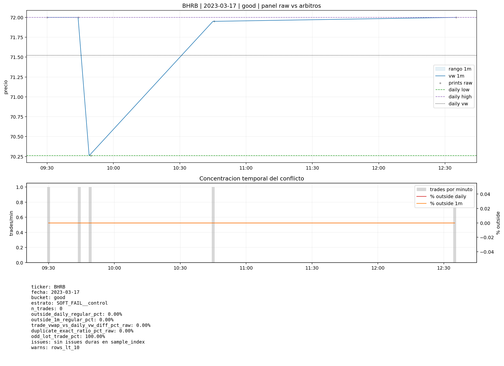

**Que muestra**

- Panel rico del tape raw frente a `daily` y `1m` para `BHRB` el `2023-03-17`.
- `n_trades = 5`, `outside_daily_regular_pct = 0.00%`, `outside_1m_regular_pct = 0.00%`.
- `trade_vwap_vs_daily_vw_diff_pct_raw = 0.00%`, `duplicate_exact_ratio_pct_raw = 0.00%`, `odd_lot_trade_pct = 100.00%`.

**Responde**

- Cola pristine donde `trades`, `daily` y `1m` alinean con limpieza. Responde a la pregunta de como luce una firma casi impecable del tape.
- Responde a si el conflicto dominante vive en la escala (`~1x`), en la comparabilidad frente a `daily` (0.00%) o frente a `1m` (0.00%).
- El 100.00% de odd-lots empuja la lectura hacia microestructura fina; evita leer el caso como pura ruptura economica gruesa.
- La decision que justifica es que el file puede usarse como patron de tape limpio, no como medida de masa util del bloque.

### BHRB | 2023-04-06

**Que muestra**

- Panel rico del tape raw frente a `daily` y `1m` para `BHRB` el `2023-04-06`.
- `n_trades = 1`, `outside_daily_regular_pct = 0.00%`, `outside_1m_regular_pct = 0.00%`.
- `trade_vwap_vs_daily_vw_diff_pct_raw = 0.00%`, `duplicate_exact_ratio_pct_raw = 0.00%`, `odd_lot_trade_pct = 100.00%`.

**Responde**

- Cola pristine donde `trades`, `daily` y `1m` alinean con limpieza. Responde a la pregunta de como luce una firma casi impecable del tape.
- Responde a si el conflicto dominante vive en la escala (`~1x`), en la comparabilidad frente a `daily` (0.00%) o frente a `1m` (0.00%).
- El 100.00% de odd-lots empuja la lectura hacia microestructura fina; evita leer el caso como pura ruptura economica gruesa.
- La decision que justifica es que el file puede usarse como patron de tape limpio, no como medida de masa util del bloque.

### DIT | 2019-01-04

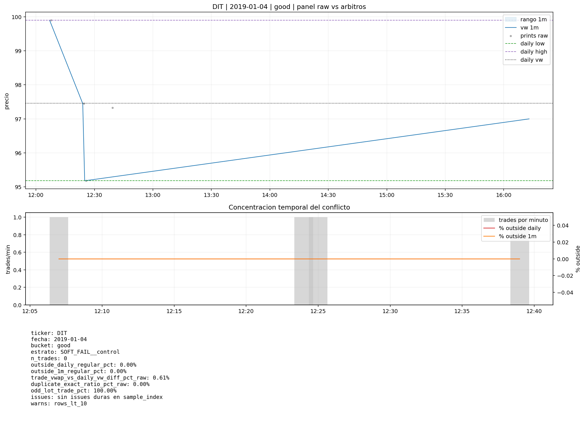

**Que muestra**

- Panel rico del tape raw frente a `daily` y `1m` para `DIT` el `2019-01-04`.
- `n_trades = 4`, `outside_daily_regular_pct = 0.00%`, `outside_1m_regular_pct = 0.00%`.
- `trade_vwap_vs_daily_vw_diff_pct_raw = 0.61%`, `duplicate_exact_ratio_pct_raw = 0.00%`, `odd_lot_trade_pct = 100.00%`.

**Responde**

- Cola pristine donde `trades`, `daily` y `1m` alinean con limpieza. Responde a la pregunta de como luce una firma casi impecable del tape.
- Responde a si el conflicto dominante vive en la escala (`~1x`), en la comparabilidad frente a `daily` (0.00%) o frente a `1m` (0.00%).
- El 100.00% de odd-lots empuja la lectura hacia microestructura fina; evita leer el caso como pura ruptura economica gruesa.
- La decision que justifica es que el file puede usarse como patron de tape limpio, no como medida de masa util del bloque.

### DIT | 2019-01-07

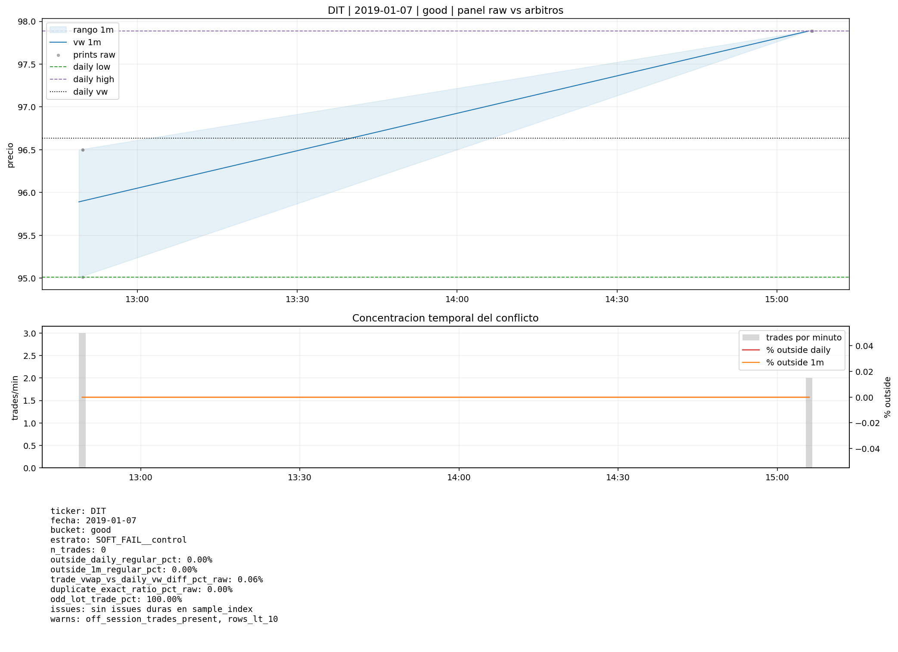

**Que muestra**

- Panel rico del tape raw frente a `daily` y `1m` para `DIT` el `2019-01-07`.
- `n_trades = 5`, `outside_daily_regular_pct = 0.00%`, `outside_1m_regular_pct = 0.00%`.
- `trade_vwap_vs_daily_vw_diff_pct_raw = 0.06%`, `duplicate_exact_ratio_pct_raw = 0.00%`, `odd_lot_trade_pct = 100.00%`.

**Responde**

- Cola pristine donde `trades`, `daily` y `1m` alinean con limpieza. Responde a la pregunta de como luce una firma casi impecable del tape.
- Responde a si el conflicto dominante vive en la escala (`~1x`), en la comparabilidad frente a `daily` (0.00%) o frente a `1m` (0.00%).
- El 100.00% de odd-lots empuja la lectura hacia microestructura fina; evita leer el caso como pura ruptura economica gruesa.
- La decision que justifica es que el file puede usarse como patron de tape limpio, no como medida de masa util del bloque.

### DIT | 2019-01-15

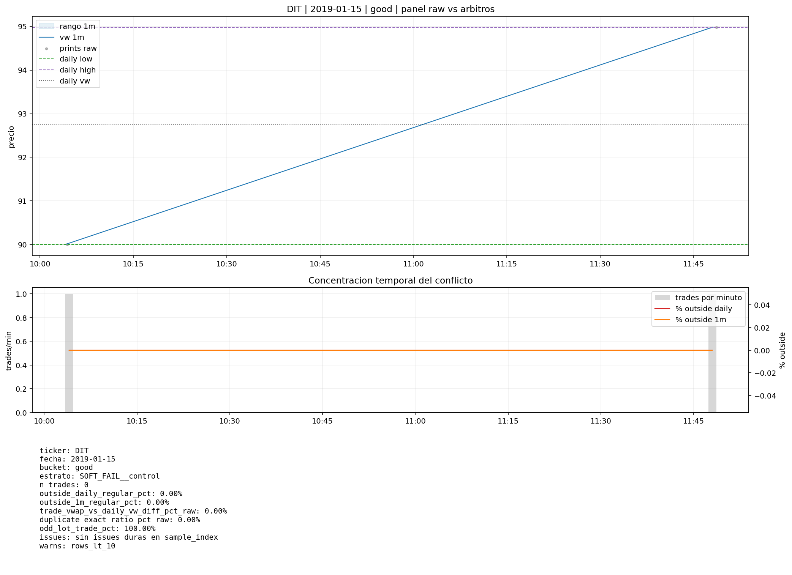

**Que muestra**

- Panel rico del tape raw frente a `daily` y `1m` para `DIT` el `2019-01-15`.
- `n_trades = 2`, `outside_daily_regular_pct = 0.00%`, `outside_1m_regular_pct = 0.00%`.
- `trade_vwap_vs_daily_vw_diff_pct_raw = 0.00%`, `duplicate_exact_ratio_pct_raw = 0.00%`, `odd_lot_trade_pct = 100.00%`.

**Responde**

- Cola pristine donde `trades`, `daily` y `1m` alinean con limpieza. Responde a la pregunta de como luce una firma casi impecable del tape.
- Responde a si el conflicto dominante vive en la escala (`~1x`), en la comparabilidad frente a `daily` (0.00%) o frente a `1m` (0.00%).
- El 100.00% de odd-lots empuja la lectura hacia microestructura fina; evita leer el caso como pura ruptura economica gruesa.
- La decision que justifica es que el file puede usarse como patron de tape limpio, no como medida de masa util del bloque.

### DIT | 2019-01-18

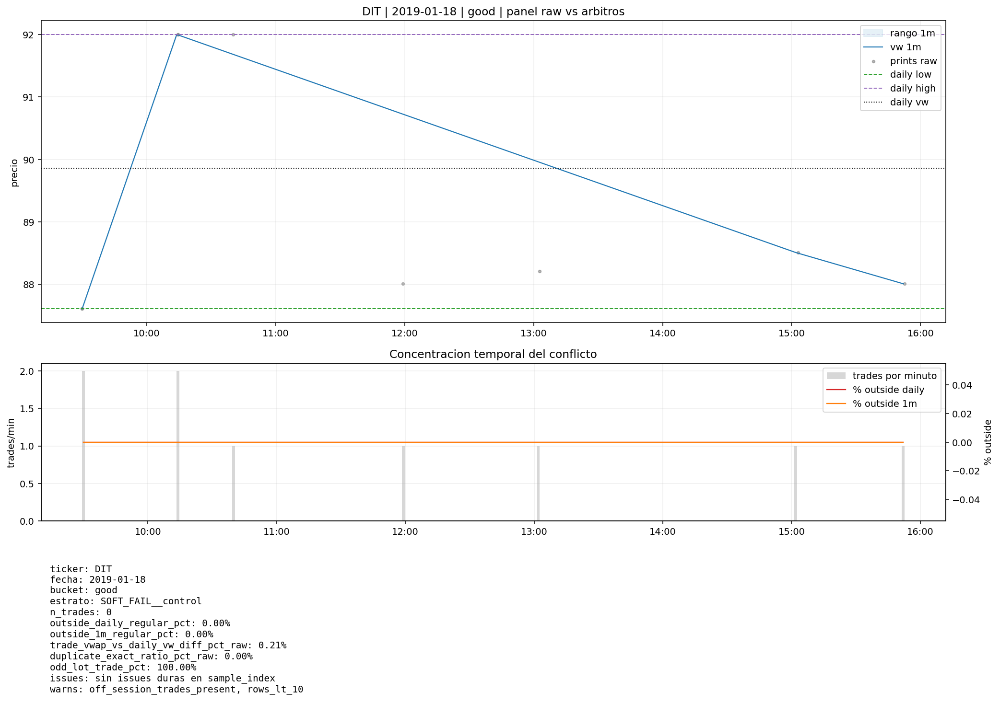

**Que muestra**

- Panel rico del tape raw frente a `daily` y `1m` para `DIT` el `2019-01-18`.
- `n_trades = 9`, `outside_daily_regular_pct = 0.00%`, `outside_1m_regular_pct = 0.00%`.
- `trade_vwap_vs_daily_vw_diff_pct_raw = 0.21%`, `duplicate_exact_ratio_pct_raw = 0.00%`, `odd_lot_trade_pct = 100.00%`.

**Responde**

- Cola pristine donde `trades`, `daily` y `1m` alinean con limpieza. Responde a la pregunta de como luce una firma casi impecable del tape.
- Responde a si el conflicto dominante vive en la escala (`~1x`), en la comparabilidad frente a `daily` (0.00%) o frente a `1m` (0.00%).
- El 100.00% de odd-lots empuja la lectura hacia microestructura fina; evita leer el caso como pura ruptura economica gruesa.
- La decision que justifica es que el file puede usarse como patron de tape limpio, no como medida de masa util del bloque.

### DIT | 2019-01-30

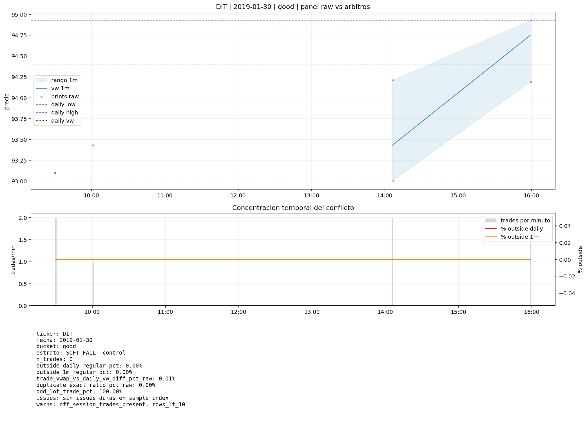

**Que muestra**

- Panel rico del tape raw frente a `daily` y `1m` para `DIT` el `2019-01-30`.
- `n_trades = 7`, `outside_daily_regular_pct = 0.00%`, `outside_1m_regular_pct = 0.00%`.
- `trade_vwap_vs_daily_vw_diff_pct_raw = 0.01%`, `duplicate_exact_ratio_pct_raw = 0.00%`, `odd_lot_trade_pct = 100.00%`.

**Responde**

- Cola pristine donde `trades`, `daily` y `1m` alinean con limpieza. Responde a la pregunta de como luce una firma casi impecable del tape.
- Responde a si el conflicto dominante vive en la escala (`~1x`), en la comparabilidad frente a `daily` (0.00%) o frente a `1m` (0.00%).
- El 100.00% de odd-lots empuja la lectura hacia microestructura fina; evita leer el caso como pura ruptura economica gruesa.
- La decision que justifica es que el file puede usarse como patron de tape limpio, no como medida de masa util del bloque.

### DIT | 2019-09-05

**Que muestra**

- Panel rico del tape raw frente a `daily` y `1m` para `DIT` el `2019-09-05`.
- `n_trades = 1`, `outside_daily_regular_pct = 0.00%`, `outside_1m_regular_pct = 0.00%`.
- `trade_vwap_vs_daily_vw_diff_pct_raw = 0.00%`, `duplicate_exact_ratio_pct_raw = 0.00%`, `odd_lot_trade_pct = 100.00%`.

**Responde**

- Cola pristine donde `trades`, `daily` y `1m` alinean con limpieza. Responde a la pregunta de como luce una firma casi impecable del tape.
- Responde a si el conflicto dominante vive en la escala (`~1x`), en la comparabilidad frente a `daily` (0.00%) o frente a `1m` (0.00%).
- El 100.00% de odd-lots empuja la lectura hacia microestructura fina; evita leer el caso como pura ruptura economica gruesa.
- La decision que justifica es que el file puede usarse como patron de tape limpio, no como medida de masa util del bloque.

### DIT | 2019-09-13

**Que muestra**

- Panel rico del tape raw frente a `daily` y `1m` para `DIT` el `2019-09-13`.
- `n_trades = 2`, `outside_daily_regular_pct = 0.00%`, `outside_1m_regular_pct = 0.00%`.
- `trade_vwap_vs_daily_vw_diff_pct_raw = 0.00%`, `duplicate_exact_ratio_pct_raw = 0.00%`, `odd_lot_trade_pct = 100.00%`.

**Responde**

- Cola pristine donde `trades`, `daily` y `1m` alinean con limpieza. Responde a la pregunta de como luce una firma casi impecable del tape.
- Responde a si el conflicto dominante vive en la escala (`~1x`), en la comparabilidad frente a `daily` (0.00%) o frente a `1m` (0.00%).
- El 100.00% de odd-lots empuja la lectura hacia microestructura fina; evita leer el caso como pura ruptura economica gruesa.
- La decision que justifica es que el file puede usarse como patron de tape limpio, no como medida de masa util del bloque.

### DIT | 2019-10-01

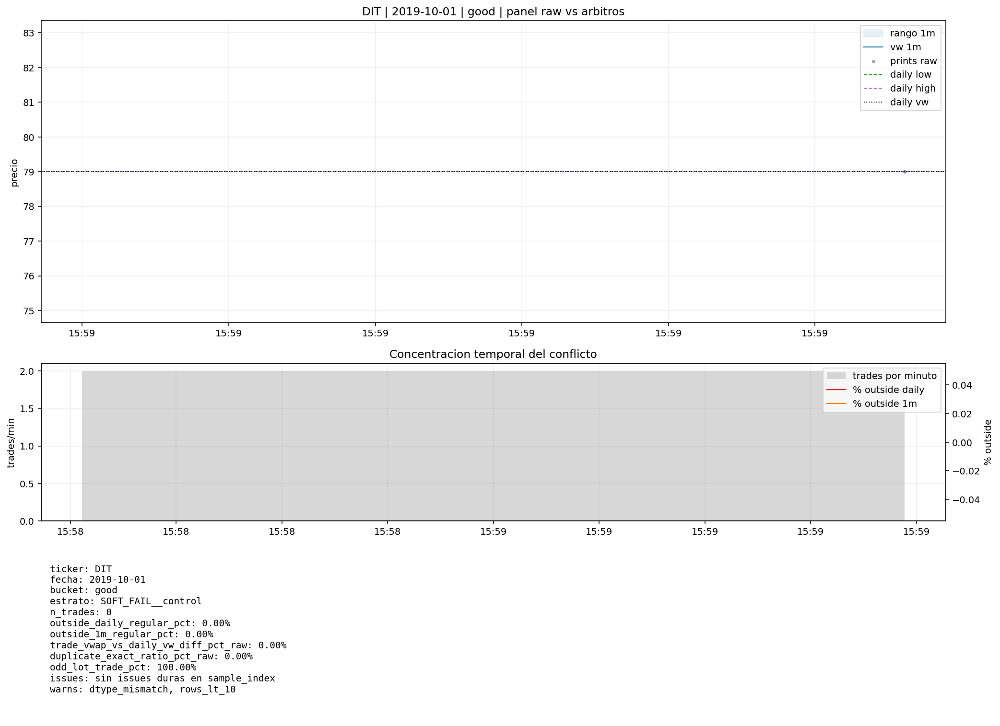

**Que muestra**

- Panel rico del tape raw frente a `daily` y `1m` para `DIT` el `2019-10-01`.
- `n_trades = 2`, `outside_daily_regular_pct = 0.00%`, `outside_1m_regular_pct = 0.00%`.
- `trade_vwap_vs_daily_vw_diff_pct_raw = 0.00%`, `duplicate_exact_ratio_pct_raw = 0.00%`, `odd_lot_trade_pct = 100.00%`.

**Responde**

- Cola pristine donde `trades`, `daily` y `1m` alinean con limpieza. Responde a la pregunta de como luce una firma casi impecable del tape.
- Responde a si el conflicto dominante vive en la escala (`~1x`), en la comparabilidad frente a `daily` (0.00%) o frente a `1m` (0.00%).
- El 100.00% de odd-lots empuja la lectura hacia microestructura fina; evita leer el caso como pura ruptura economica gruesa.
- La decision que justifica es que el file puede usarse como patron de tape limpio, no como medida de masa util del bloque.

### DIT | 2019-10-02

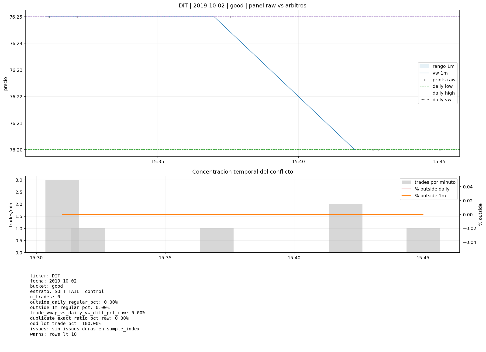

**Que muestra**

- Panel rico del tape raw frente a `daily` y `1m` para `DIT` el `2019-10-02`.
- `n_trades = 8`, `outside_daily_regular_pct = 0.00%`, `outside_1m_regular_pct = 0.00%`.
- `trade_vwap_vs_daily_vw_diff_pct_raw = 0.00%`, `duplicate_exact_ratio_pct_raw = 0.00%`, `odd_lot_trade_pct = 100.00%`.

**Responde**

- Cola pristine donde `trades`, `daily` y `1m` alinean con limpieza. Responde a la pregunta de como luce una firma casi impecable del tape.
- Responde a si el conflicto dominante vive en la escala (`~1x`), en la comparabilidad frente a `daily` (0.00%) o frente a `1m` (0.00%).
- El 100.00% de odd-lots empuja la lectura hacia microestructura fina; evita leer el caso como pura ruptura economica gruesa.
- La decision que justifica es que el file puede usarse como patron de tape limpio, no como medida de masa util del bloque.

### DIT | 2019-10-23

**Que muestra**

- Panel rico del tape raw frente a `daily` y `1m` para `DIT` el `2019-10-23`.
- `n_trades = 2`, `outside_daily_regular_pct = 0.00%`, `outside_1m_regular_pct = 0.00%`.
- `trade_vwap_vs_daily_vw_diff_pct_raw = 0.00%`, `duplicate_exact_ratio_pct_raw = 0.00%`, `odd_lot_trade_pct = 100.00%`.

**Responde**

- Cola pristine donde `trades`, `daily` y `1m` alinean con limpieza. Responde a la pregunta de como luce una firma casi impecable del tape.
- Responde a si el conflicto dominante vive en la escala (`~1x`), en la comparabilidad frente a `daily` (0.00%) o frente a `1m` (0.00%).
- El 100.00% de odd-lots empuja la lectura hacia microestructura fina; evita leer el caso como pura ruptura economica gruesa.
- La decision que justifica es que el file puede usarse como patron de tape limpio, no como medida de masa util del bloque.

### DIT | 2019-11-08

**Que muestra**

- Panel rico del tape raw frente a `daily` y `1m` para `DIT` el `2019-11-08`.
- `n_trades = 1`, `outside_daily_regular_pct = 0.00%`, `outside_1m_regular_pct = 0.00%`.
- `trade_vwap_vs_daily_vw_diff_pct_raw = 0.00%`, `duplicate_exact_ratio_pct_raw = 0.00%`, `odd_lot_trade_pct = 100.00%`.

**Responde**

- Cola pristine donde `trades`, `daily` y `1m` alinean con limpieza. Responde a la pregunta de como luce una firma casi impecable del tape.
- Responde a si el conflicto dominante vive en la escala (`~1x`), en la comparabilidad frente a `daily` (0.00%) o frente a `1m` (0.00%).
- El 100.00% de odd-lots empuja la lectura hacia microestructura fina; evita leer el caso como pura ruptura economica gruesa.
- La decision que justifica es que el file puede usarse como patron de tape limpio, no como medida de masa util del bloque.

### DIT | 2019-12-11

**Que muestra**

- Panel rico del tape raw frente a `daily` y `1m` para `DIT` el `2019-12-11`.
- `n_trades = 2`, `outside_daily_regular_pct = 0.00%`, `outside_1m_regular_pct = 0.00%`.
- `trade_vwap_vs_daily_vw_diff_pct_raw = 0.00%`, `duplicate_exact_ratio_pct_raw = 0.00%`, `odd_lot_trade_pct = 100.00%`.

**Responde**

- Cola pristine donde `trades`, `daily` y `1m` alinean con limpieza. Responde a la pregunta de como luce una firma casi impecable del tape.
- Responde a si el conflicto dominante vive en la escala (`~1x`), en la comparabilidad frente a `daily` (0.00%) o frente a `1m` (0.00%).
- El 100.00% de odd-lots empuja la lectura hacia microestructura fina; evita leer el caso como pura ruptura economica gruesa.
- La decision que justifica es que el file puede usarse como patron de tape limpio, no como medida de masa util del bloque.

### DIT | 2019-12-12

**Que muestra**

- Panel rico del tape raw frente a `daily` y `1m` para `DIT` el `2019-12-12`.
- `n_trades = 1`, `outside_daily_regular_pct = 0.00%`, `outside_1m_regular_pct = 0.00%`.
- `trade_vwap_vs_daily_vw_diff_pct_raw = 0.11%`, `duplicate_exact_ratio_pct_raw = 0.00%`, `odd_lot_trade_pct = 100.00%`.

**Responde**

- Cola pristine donde `trades`, `daily` y `1m` alinean con limpieza. Responde a la pregunta de como luce una firma casi impecable del tape.
- Responde a si el conflicto dominante vive en la escala (`~1x`), en la comparabilidad frente a `daily` (0.00%) o frente a `1m` (0.00%).
- El 100.00% de odd-lots empuja la lectura hacia microestructura fina; evita leer el caso como pura ruptura economica gruesa.
- La decision que justifica es que el file puede usarse como patron de tape limpio, no como medida de masa util del bloque.

### DIT | 2020-01-29

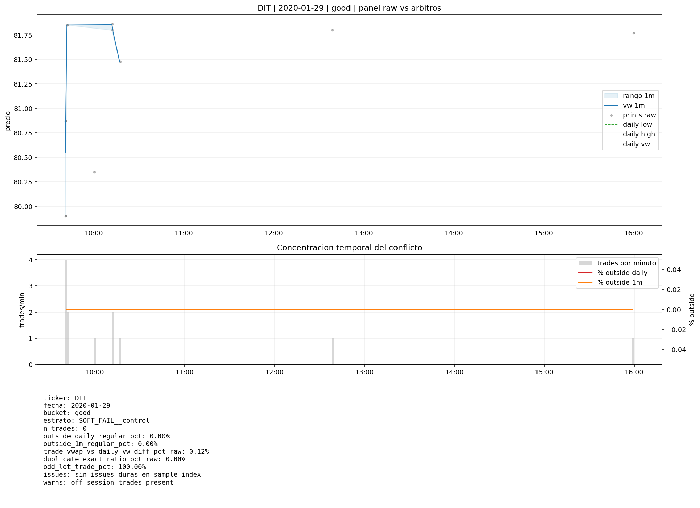

**Que muestra**

- Panel rico del tape raw frente a `daily` y `1m` para `DIT` el `2020-01-29`.
- `n_trades = 12`, `outside_daily_regular_pct = 0.00%`, `outside_1m_regular_pct = 0.00%`.
- `trade_vwap_vs_daily_vw_diff_pct_raw = 0.12%`, `duplicate_exact_ratio_pct_raw = 0.00%`, `odd_lot_trade_pct = 100.00%`.

**Responde**

- Cola pristine donde `trades`, `daily` y `1m` alinean con limpieza. Responde a la pregunta de como luce una firma casi impecable del tape.
- Responde a si el conflicto dominante vive en la escala (`~1x`), en la comparabilidad frente a `daily` (0.00%) o frente a `1m` (0.00%).
- El 100.00% de odd-lots empuja la lectura hacia microestructura fina; evita leer el caso como pura ruptura economica gruesa.
- La decision que justifica es que el file puede usarse como patron de tape limpio, no como medida de masa util del bloque.

### DIT | 2020-02-13

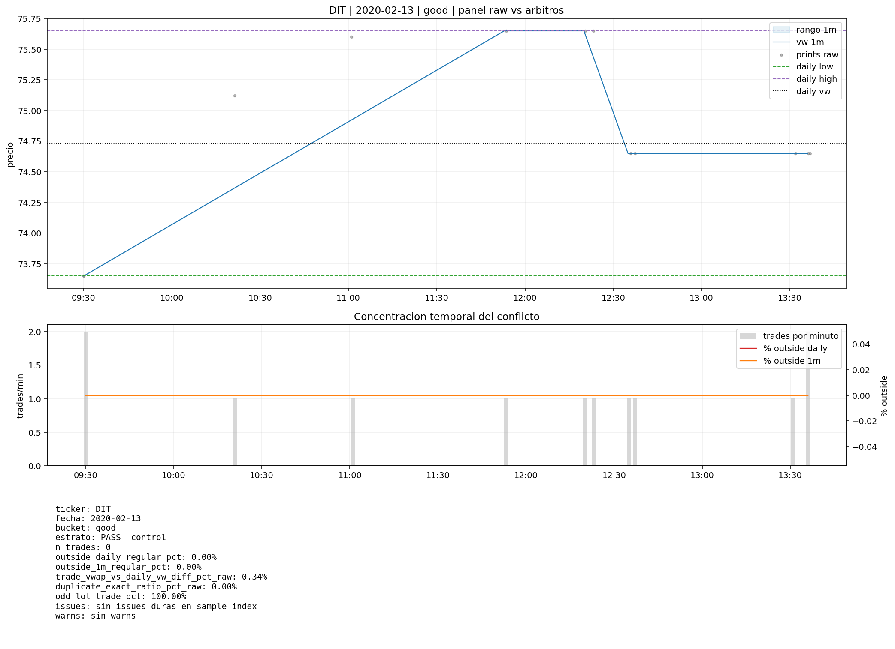

**Que muestra**

- Panel rico del tape raw frente a `daily` y `1m` para `DIT` el `2020-02-13`.
- `n_trades = 12`, `outside_daily_regular_pct = 0.00%`, `outside_1m_regular_pct = 0.00%`.
- `trade_vwap_vs_daily_vw_diff_pct_raw = 0.34%`, `duplicate_exact_ratio_pct_raw = 0.00%`, `odd_lot_trade_pct = 100.00%`.

**Responde**

- Cola pristine donde `trades`, `daily` y `1m` alinean con limpieza. Responde a la pregunta de como luce una firma casi impecable del tape.
- Responde a si el conflicto dominante vive en la escala (`~1x`), en la comparabilidad frente a `daily` (0.00%) o frente a `1m` (0.00%).
- El 100.00% de odd-lots empuja la lectura hacia microestructura fina; evita leer el caso como pura ruptura economica gruesa.
- La decision que justifica es que el file puede usarse como patron de tape limpio, no como medida de masa util del bloque.

### DIT | 2020-03-12

**Que muestra**

- Panel rico del tape raw frente a `daily` y `1m` para `DIT` el `2020-03-12`.
- `n_trades = 1`, `outside_daily_regular_pct = 0.00%`, `outside_1m_regular_pct = 0.00%`.
- `trade_vwap_vs_daily_vw_diff_pct_raw = 0.00%`, `duplicate_exact_ratio_pct_raw = 0.00%`, `odd_lot_trade_pct = 100.00%`.

**Responde**

- Cola pristine donde `trades`, `daily` y `1m` alinean con limpieza. Responde a la pregunta de como luce una firma casi impecable del tape.
- Responde a si el conflicto dominante vive en la escala (`~1x`), en la comparabilidad frente a `daily` (0.00%) o frente a `1m` (0.00%).
- El 100.00% de odd-lots empuja la lectura hacia microestructura fina; evita leer el caso como pura ruptura economica gruesa.
- La decision que justifica es que el file puede usarse como patron de tape limpio, no como medida de masa util del bloque.

### DIT | 2020-03-31

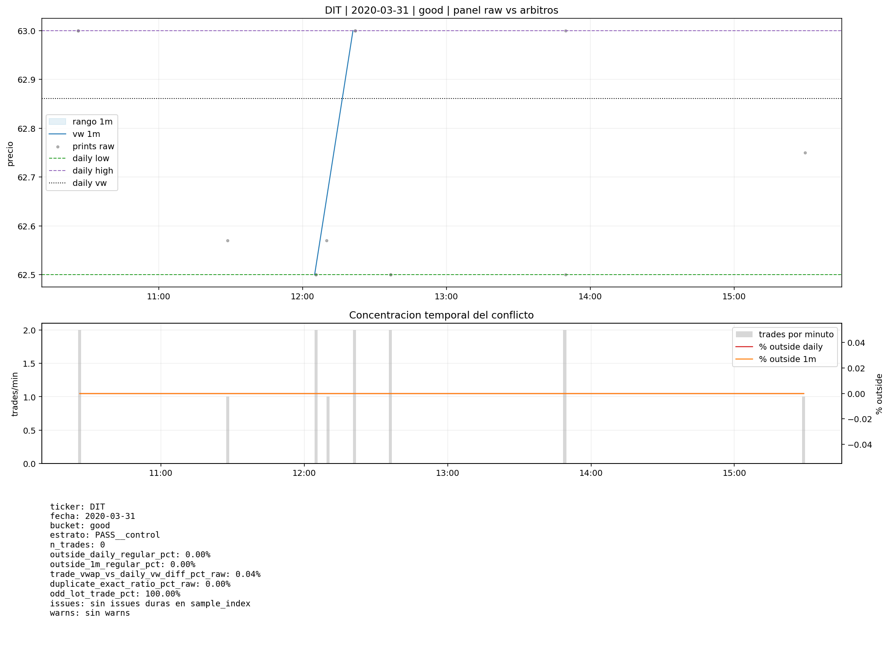

**Que muestra**

- Panel rico del tape raw frente a `daily` y `1m` para `DIT` el `2020-03-31`.
- `n_trades = 13`, `outside_daily_regular_pct = 0.00%`, `outside_1m_regular_pct = 0.00%`.
- `trade_vwap_vs_daily_vw_diff_pct_raw = 0.04%`, `duplicate_exact_ratio_pct_raw = 0.00%`, `odd_lot_trade_pct = 100.00%`.

**Responde**

- Cola pristine donde `trades`, `daily` y `1m` alinean con limpieza. Responde a la pregunta de como luce una firma casi impecable del tape.
- Responde a si el conflicto dominante vive en la escala (`~1x`), en la comparabilidad frente a `daily` (0.00%) o frente a `1m` (0.00%).
- El 100.00% de odd-lots empuja la lectura hacia microestructura fina; evita leer el caso como pura ruptura economica gruesa.
- La decision que justifica es que el file puede usarse como patron de tape limpio, no como medida de masa util del bloque.

### DIT | 2020-04-15

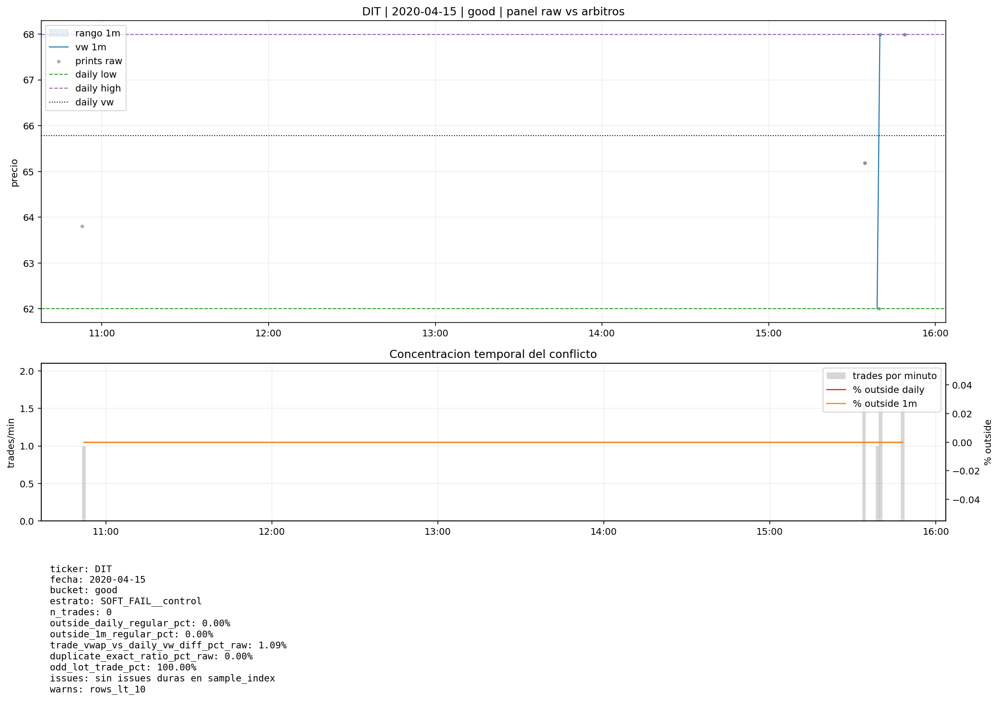

**Que muestra**

- Panel rico del tape raw frente a `daily` y `1m` para `DIT` el `2020-04-15`.
- `n_trades = 8`, `outside_daily_regular_pct = 0.00%`, `outside_1m_regular_pct = 0.00%`.
- `trade_vwap_vs_daily_vw_diff_pct_raw = 1.09%`, `duplicate_exact_ratio_pct_raw = 0.00%`, `odd_lot_trade_pct = 100.00%`.

**Responde**

- Cola pristine donde `trades`, `daily` y `1m` alinean con limpieza. Responde a la pregunta de como luce una firma casi impecable del tape.
- Responde a si el conflicto dominante vive en la escala (`~1x`), en la comparabilidad frente a `daily` (0.00%) o frente a `1m` (0.00%).
- El 100.00% de odd-lots empuja la lectura hacia microestructura fina; evita leer el caso como pura ruptura economica gruesa.
- La decision que justifica es que el file puede usarse como patron de tape limpio, no como medida de masa util del bloque.

### DIT | 2020-06-29

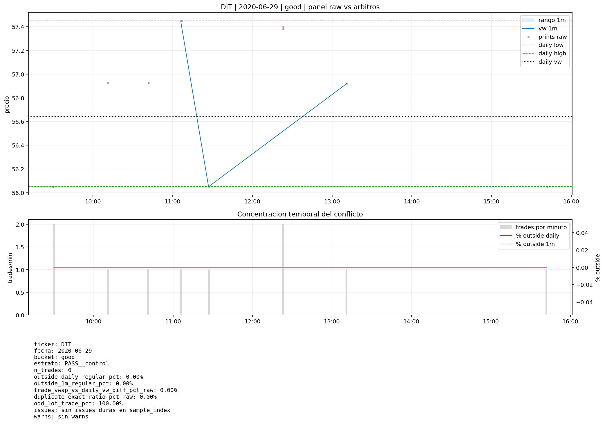

**Que muestra**

- Panel rico del tape raw frente a `daily` y `1m` para `DIT` el `2020-06-29`.
- `n_trades = 10`, `outside_daily_regular_pct = 0.00%`, `outside_1m_regular_pct = 0.00%`.
- `trade_vwap_vs_daily_vw_diff_pct_raw = 0.00%`, `duplicate_exact_ratio_pct_raw = 0.00%`, `odd_lot_trade_pct = 100.00%`.

**Responde**

- Cola pristine donde `trades`, `daily` y `1m` alinean con limpieza. Responde a la pregunta de como luce una firma casi impecable del tape.
- Responde a si el conflicto dominante vive en la escala (`~1x`), en la comparabilidad frente a `daily` (0.00%) o frente a `1m` (0.00%).
- El 100.00% de odd-lots empuja la lectura hacia microestructura fina; evita leer el caso como pura ruptura economica gruesa.
- La decision que justifica es que el file puede usarse como patron de tape limpio, no como medida de masa util del bloque.

### DIT | 2020-06-30

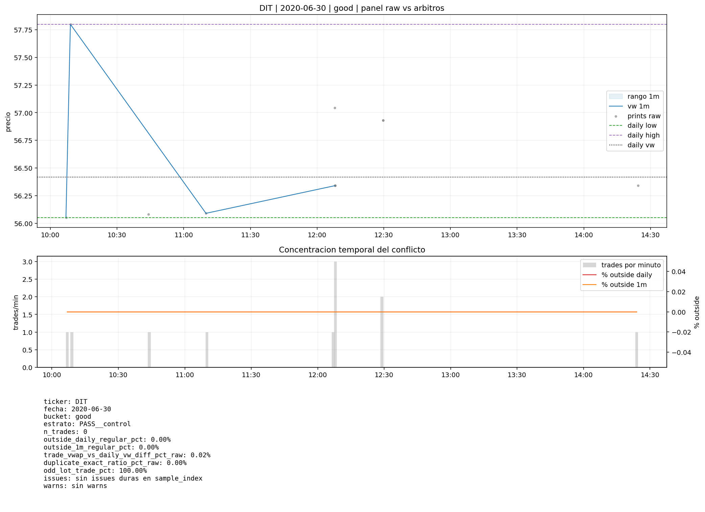

**Que muestra**

- Panel rico del tape raw frente a `daily` y `1m` para `DIT` el `2020-06-30`.
- `n_trades = 11`, `outside_daily_regular_pct = 0.00%`, `outside_1m_regular_pct = 0.00%`.
- `trade_vwap_vs_daily_vw_diff_pct_raw = 0.02%`, `duplicate_exact_ratio_pct_raw = 0.00%`, `odd_lot_trade_pct = 100.00%`.

**Responde**

- Cola pristine donde `trades`, `daily` y `1m` alinean con limpieza. Responde a la pregunta de como luce una firma casi impecable del tape.
- Responde a si el conflicto dominante vive en la escala (`~1x`), en la comparabilidad frente a `daily` (0.00%) o frente a `1m` (0.00%).
- El 100.00% de odd-lots empuja la lectura hacia microestructura fina; evita leer el caso como pura ruptura economica gruesa.
- La decision que justifica es que el file puede usarse como patron de tape limpio, no como medida de masa util del bloque.

### DIT | 2020-08-07

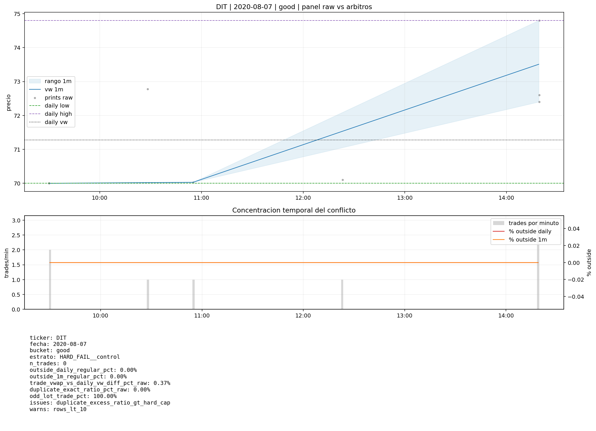

**Que muestra**

- Panel rico del tape raw frente a `daily` y `1m` para `DIT` el `2020-08-07`.
- `n_trades = 8`, `outside_daily_regular_pct = 0.00%`, `outside_1m_regular_pct = 0.00%`.
- `trade_vwap_vs_daily_vw_diff_pct_raw = 0.37%`, `duplicate_exact_ratio_pct_raw = 0.00%`, `odd_lot_trade_pct = 100.00%`.

**Responde**

- Cola pristine donde `trades`, `daily` y `1m` alinean con limpieza. Responde a la pregunta de como luce una firma casi impecable del tape.
- Responde a si el conflicto dominante vive en la escala (`~1x`), en la comparabilidad frente a `daily` (0.00%) o frente a `1m` (0.00%).
- El 100.00% de odd-lots empuja la lectura hacia microestructura fina; evita leer el caso como pura ruptura economica gruesa.
- La decision que justifica es que el file puede usarse como patron de tape limpio, no como medida de masa util del bloque.

### DIT | 2020-10-21

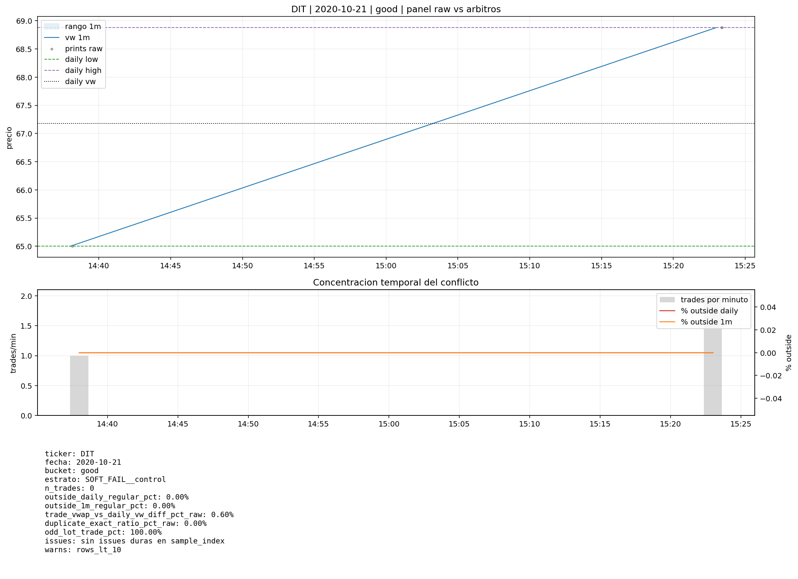

**Que muestra**

- Panel rico del tape raw frente a `daily` y `1m` para `DIT` el `2020-10-21`.
- `n_trades = 3`, `outside_daily_regular_pct = 0.00%`, `outside_1m_regular_pct = 0.00%`.
- `trade_vwap_vs_daily_vw_diff_pct_raw = 0.60%`, `duplicate_exact_ratio_pct_raw = 0.00%`, `odd_lot_trade_pct = 100.00%`.

**Responde**

- Cola pristine donde `trades`, `daily` y `1m` alinean con limpieza. Responde a la pregunta de como luce una firma casi impecable del tape.
- Responde a si el conflicto dominante vive en la escala (`~1x`), en la comparabilidad frente a `daily` (0.00%) o frente a `1m` (0.00%).
- El 100.00% de odd-lots empuja la lectura hacia microestructura fina; evita leer el caso como pura ruptura economica gruesa.
- La decision que justifica es que el file puede usarse como patron de tape limpio, no como medida de masa util del bloque.

### DIT | 2020-10-28

**Que muestra**

- Panel rico del tape raw frente a `daily` y `1m` para `DIT` el `2020-10-28`.
- `n_trades = 3`, `outside_daily_regular_pct = 0.00%`, `outside_1m_regular_pct = 0.00%`.
- `trade_vwap_vs_daily_vw_diff_pct_raw = 0.00%`, `duplicate_exact_ratio_pct_raw = 0.00%`, `odd_lot_trade_pct = 100.00%`.

**Responde**

- Cola pristine donde `trades`, `daily` y `1m` alinean con limpieza. Responde a la pregunta de como luce una firma casi impecable del tape.
- Responde a si el conflicto dominante vive en la escala (`~1x`), en la comparabilidad frente a `daily` (0.00%) o frente a `1m` (0.00%).
- El 100.00% de odd-lots empuja la lectura hacia microestructura fina; evita leer el caso como pura ruptura economica gruesa.
- La decision que justifica es que el file puede usarse como patron de tape limpio, no como medida de masa util del bloque.

### DIT | 2020-12-09

**Que muestra**

- Panel rico del tape raw frente a `daily` y `1m` para `DIT` el `2020-12-09`.
- `n_trades = 2`, `outside_daily_regular_pct = 0.00%`, `outside_1m_regular_pct = 0.00%`.
- `trade_vwap_vs_daily_vw_diff_pct_raw = 0.16%`, `duplicate_exact_ratio_pct_raw = 0.00%`, `odd_lot_trade_pct = 100.00%`.

**Responde**

- Cola pristine donde `trades`, `daily` y `1m` alinean con limpieza. Responde a la pregunta de como luce una firma casi impecable del tape.
- Responde a si el conflicto dominante vive en la escala (`~1x`), en la comparabilidad frente a `daily` (0.00%) o frente a `1m` (0.00%).
- El 100.00% de odd-lots empuja la lectura hacia microestructura fina; evita leer el caso como pura ruptura economica gruesa.
- La decision que justifica es que el file puede usarse como patron de tape limpio, no como medida de masa util del bloque.

### DIT | 2023-04-21

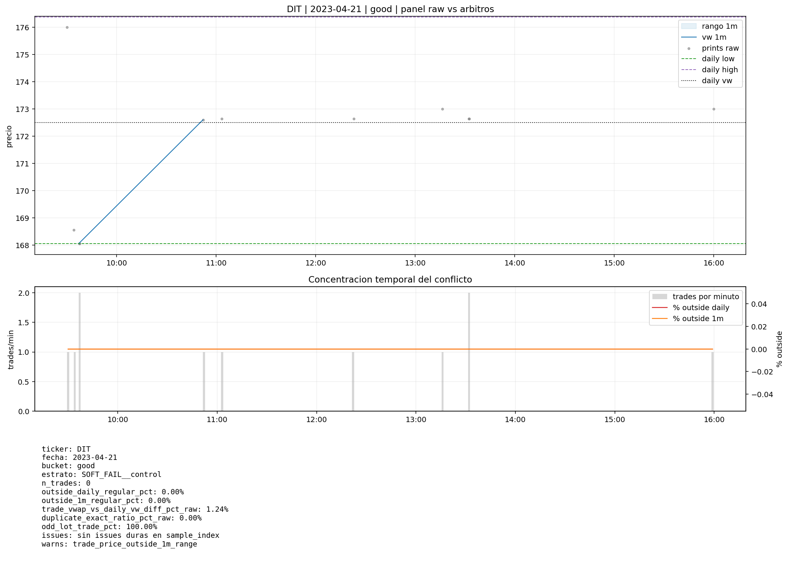

**Que muestra**

- Panel rico del tape raw frente a `daily` y `1m` para `DIT` el `2023-04-21`.
- `n_trades = 11`, `outside_daily_regular_pct = 0.00%`, `outside_1m_regular_pct = 0.00%`.
- `trade_vwap_vs_daily_vw_diff_pct_raw = 1.24%`, `duplicate_exact_ratio_pct_raw = 0.00%`, `odd_lot_trade_pct = 100.00%`.

**Responde**

- Cola pristine donde `trades`, `daily` y `1m` alinean con limpieza. Responde a la pregunta de como luce una firma casi impecable del tape.
- Responde a si el conflicto dominante vive en la escala (`~1x`), en la comparabilidad frente a `daily` (0.00%) o frente a `1m` (0.00%).
- El 100.00% de odd-lots empuja la lectura hacia microestructura fina; evita leer el caso como pura ruptura economica gruesa.
- La decision que justifica es que el file puede usarse como patron de tape limpio, no como medida de masa util del bloque.

### DIT | 2024-09-04

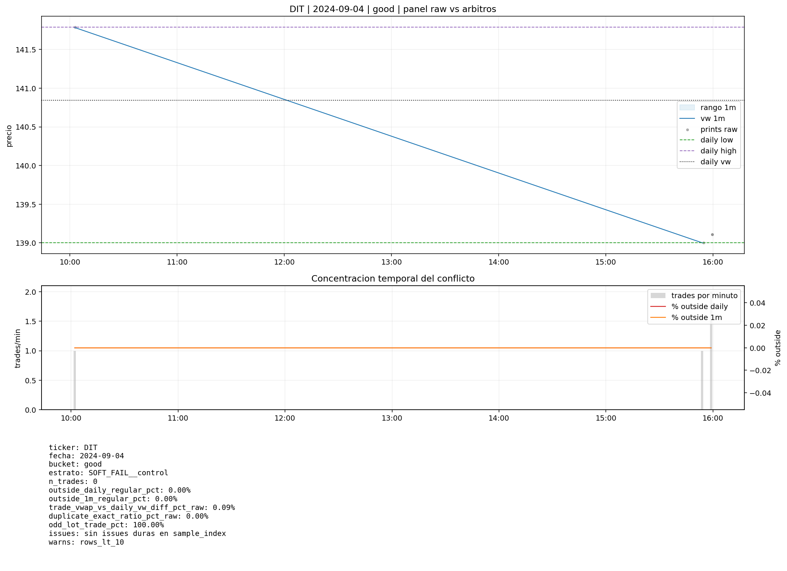

**Que muestra**

- Panel rico del tape raw frente a `daily` y `1m` para `DIT` el `2024-09-04`.
- `n_trades = 4`, `outside_daily_regular_pct = 0.00%`, `outside_1m_regular_pct = 0.00%`.
- `trade_vwap_vs_daily_vw_diff_pct_raw = 0.09%`, `duplicate_exact_ratio_pct_raw = 0.00%`, `odd_lot_trade_pct = 100.00%`.

**Responde**

- Cola pristine donde `trades`, `daily` y `1m` alinean con limpieza. Responde a la pregunta de como luce una firma casi impecable del tape.
- Responde a si el conflicto dominante vive en la escala (`~1x`), en la comparabilidad frente a `daily` (0.00%) o frente a `1m` (0.00%).
- El 100.00% de odd-lots empuja la lectura hacia microestructura fina; evita leer el caso como pura ruptura economica gruesa.
- La decision que justifica es que el file puede usarse como patron de tape limpio, no como medida de masa util del bloque.

### DIT | 2025-07-22

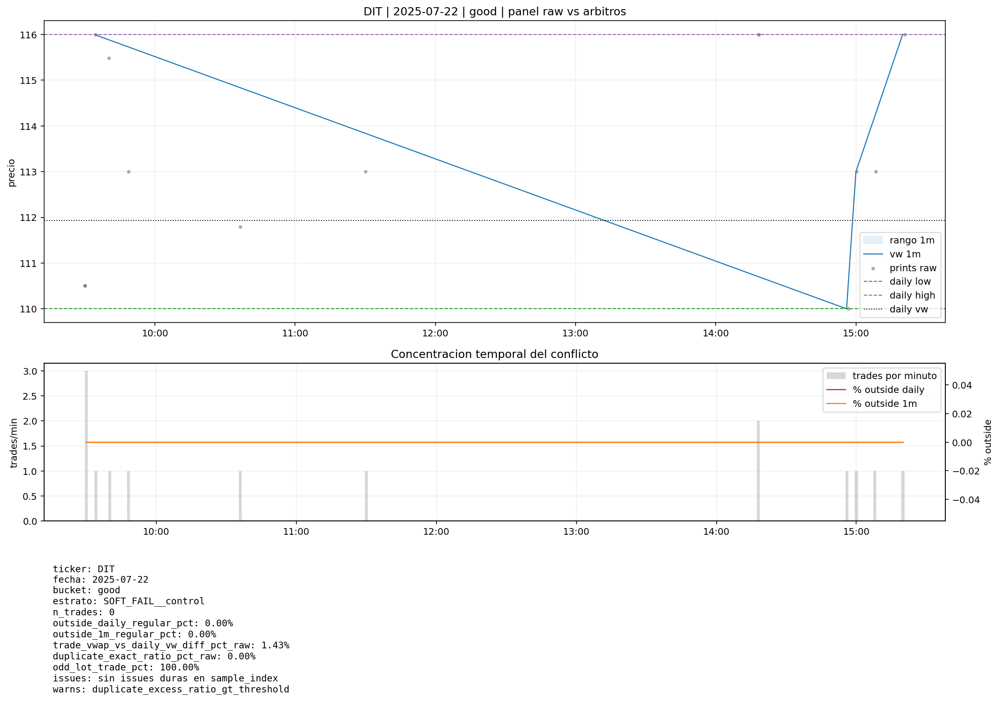

**Que muestra**

- Panel rico del tape raw frente a `daily` y `1m` para `DIT` el `2025-07-22`.
- `n_trades = 14`, `outside_daily_regular_pct = 0.00%`, `outside_1m_regular_pct = 0.00%`.
- `trade_vwap_vs_daily_vw_diff_pct_raw = 1.43%`, `duplicate_exact_ratio_pct_raw = 0.00%`, `odd_lot_trade_pct = 100.00%`.

**Responde**

- Cola pristine donde `trades`, `daily` y `1m` alinean con limpieza. Responde a la pregunta de como luce una firma casi impecable del tape.
- Responde a si el conflicto dominante vive en la escala (`~1x`), en la comparabilidad frente a `daily` (0.00%) o frente a `1m` (0.00%).
- El 100.00% de odd-lots empuja la lectura hacia microestructura fina; evita leer el caso como pura ruptura economica gruesa.
- La decision que justifica es que el file puede usarse como patron de tape limpio, no como medida de masa util del bloque.

### DMYS | 2022-09-06

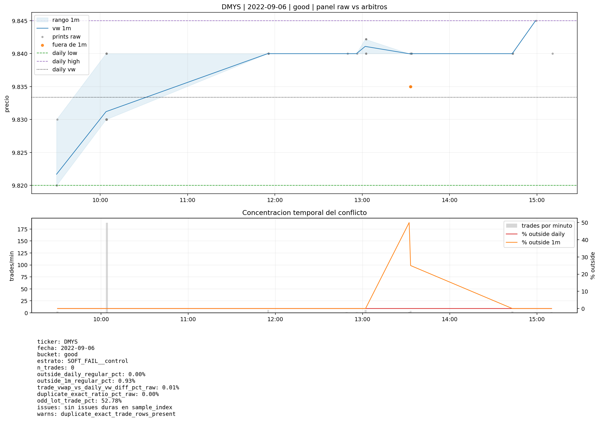

**Que muestra**

- Panel rico del tape raw frente a `daily` y `1m` para `DMYS` el `2022-09-06`.
- `n_trades = 216`, `outside_daily_regular_pct = 0.00%`, `outside_1m_regular_pct = 0.93%`.
- `trade_vwap_vs_daily_vw_diff_pct_raw = 0.01%`, `duplicate_exact_ratio_pct_raw = 0.00%`, `odd_lot_trade_pct = 52.78%`.

**Responde**

- Cola pristine donde `trades`, `daily` y `1m` alinean con limpieza. Responde a la pregunta de como luce una firma casi impecable del tape.
- Responde a si el conflicto dominante vive en la escala (`~1x`), en la comparabilidad frente a `daily` (0.00%) o frente a `1m` (0.93%).
- El 52.78% de odd-lots empuja la lectura hacia microestructura fina; evita leer el caso como pura ruptura economica gruesa.
- La decision que justifica es que el file puede usarse como patron de tape limpio, no como medida de masa util del bloque.

### FOSLL | 2021-11-23

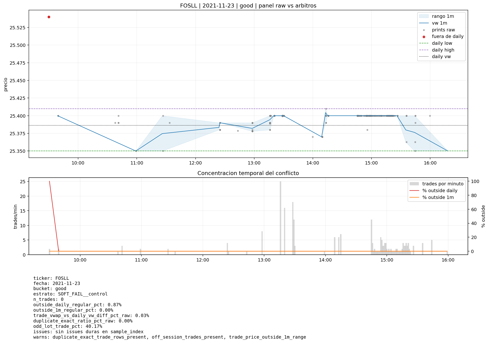

**Que muestra**

- Panel rico del tape raw frente a `daily` y `1m` para `FOSLL` el `2021-11-23`.
- `n_trades = 229`, `outside_daily_regular_pct = 0.87%`, `outside_1m_regular_pct = 0.00%`.
- `trade_vwap_vs_daily_vw_diff_pct_raw = 0.03%`, `duplicate_exact_ratio_pct_raw = 0.00%`, `odd_lot_trade_pct = 40.17%`.

**Responde**

- Cola pristine donde `trades`, `daily` y `1m` alinean con limpieza. Responde a la pregunta de como luce una firma casi impecable del tape.
- Responde a si el conflicto dominante vive en la escala (`~1x`), en la comparabilidad frente a `daily` (0.87%) o frente a `1m` (0.00%).
- El 40.17% de odd-lots empuja la lectura hacia microestructura fina; evita leer el caso como pura ruptura economica gruesa.
- La decision que justifica es que el file puede usarse como patron de tape limpio, no como medida de masa util del bloque.

### MCHB | 2022-03-10

**Que muestra**

- Panel rico del tape raw frente a `daily` y `1m` para `MCHB` el `2022-03-10`.
- `n_trades = 1`, `outside_daily_regular_pct = 0.00%`, `outside_1m_regular_pct = 0.00%`.
- `trade_vwap_vs_daily_vw_diff_pct_raw = 0.00%`, `duplicate_exact_ratio_pct_raw = 0.00%`, `odd_lot_trade_pct = 100.00%`.

**Responde**

- Cola pristine donde `trades`, `daily` y `1m` alinean con limpieza. Responde a la pregunta de como luce una firma casi impecable del tape.
- Responde a si el conflicto dominante vive en la escala (`~1x`), en la comparabilidad frente a `daily` (0.00%) o frente a `1m` (0.00%).
- El 100.00% de odd-lots empuja la lectura hacia microestructura fina; evita leer el caso como pura ruptura economica gruesa.
- La decision que justifica es que el file puede usarse como patron de tape limpio, no como medida de masa util del bloque.

### MCHB | 2022-04-12

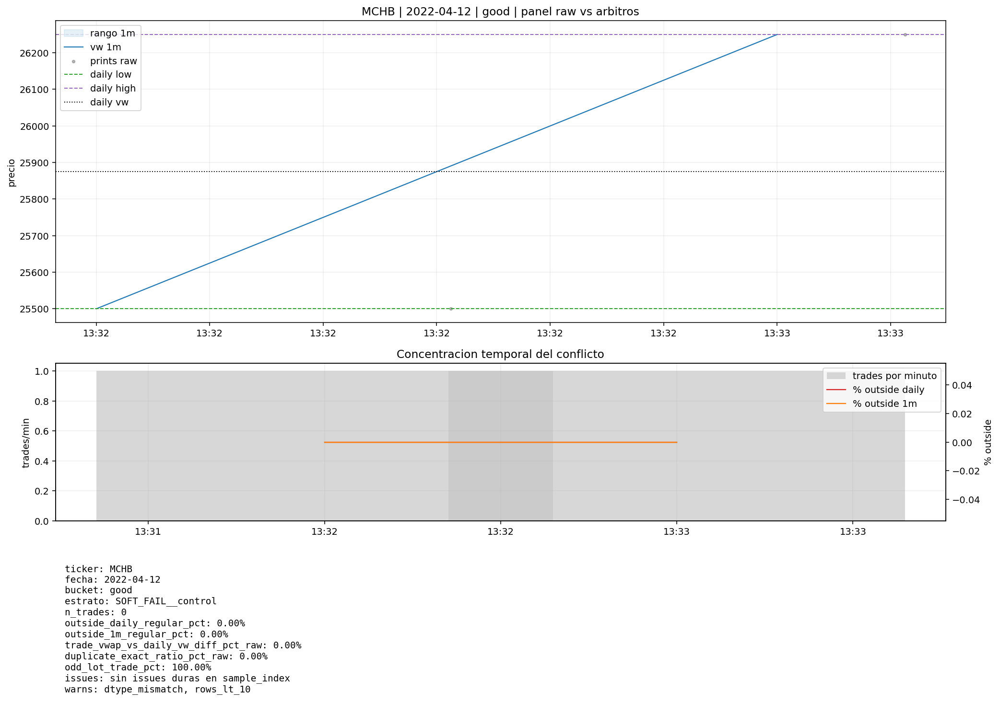

**Que muestra**

- Panel rico del tape raw frente a `daily` y `1m` para `MCHB` el `2022-04-12`.
- `n_trades = 2`, `outside_daily_regular_pct = 0.00%`, `outside_1m_regular_pct = 0.00%`.
- `trade_vwap_vs_daily_vw_diff_pct_raw = 0.00%`, `duplicate_exact_ratio_pct_raw = 0.00%`, `odd_lot_trade_pct = 100.00%`.

**Responde**

- Cola pristine donde `trades`, `daily` y `1m` alinean con limpieza. Responde a la pregunta de como luce una firma casi impecable del tape.
- Responde a si el conflicto dominante vive en la escala (`~1x`), en la comparabilidad frente a `daily` (0.00%) o frente a `1m` (0.00%).
- El 100.00% de odd-lots empuja la lectura hacia microestructura fina; evita leer el caso como pura ruptura economica gruesa.
- La decision que justifica es que el file puede usarse como patron de tape limpio, no como medida de masa util del bloque.

### MCHB | 2022-04-21

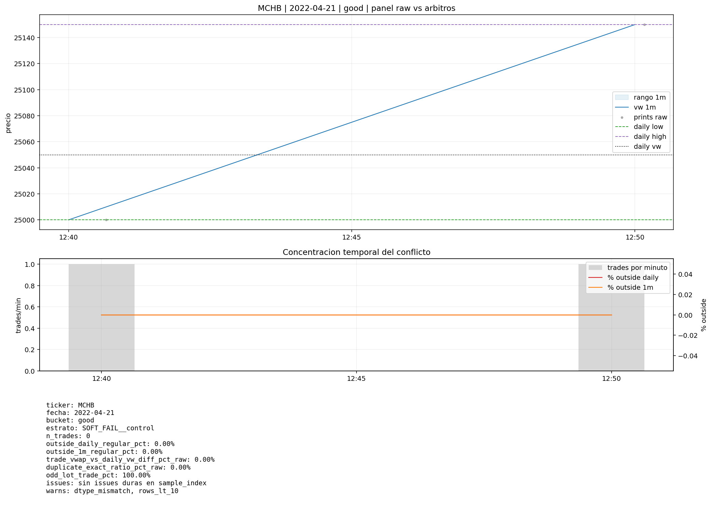

**Que muestra**

- Panel rico del tape raw frente a `daily` y `1m` para `MCHB` el `2022-04-21`.
- `n_trades = 2`, `outside_daily_regular_pct = 0.00%`, `outside_1m_regular_pct = 0.00%`.
- `trade_vwap_vs_daily_vw_diff_pct_raw = 0.00%`, `duplicate_exact_ratio_pct_raw = 0.00%`, `odd_lot_trade_pct = 100.00%`.

**Responde**

- Cola pristine donde `trades`, `daily` y `1m` alinean con limpieza. Responde a la pregunta de como luce una firma casi impecable del tape.
- Responde a si el conflicto dominante vive en la escala (`~1x`), en la comparabilidad frente a `daily` (0.00%) o frente a `1m` (0.00%).
- El 100.00% de odd-lots empuja la lectura hacia microestructura fina; evita leer el caso como pura ruptura economica gruesa.
- La decision que justifica es que el file puede usarse como patron de tape limpio, no como medida de masa util del bloque.

### MCHB | 2022-04-22

**Que muestra**

- Panel rico del tape raw frente a `daily` y `1m` para `MCHB` el `2022-04-22`.
- `n_trades = 1`, `outside_daily_regular_pct = 0.00%`, `outside_1m_regular_pct = 0.00%`.
- `trade_vwap_vs_daily_vw_diff_pct_raw = 0.00%`, `duplicate_exact_ratio_pct_raw = 0.00%`, `odd_lot_trade_pct = 100.00%`.

**Responde**

- Cola pristine donde `trades`, `daily` y `1m` alinean con limpieza. Responde a la pregunta de como luce una firma casi impecable del tape.
- Responde a si el conflicto dominante vive en la escala (`~1x`), en la comparabilidad frente a `daily` (0.00%) o frente a `1m` (0.00%).
- El 100.00% de odd-lots empuja la lectura hacia microestructura fina; evita leer el caso como pura ruptura economica gruesa.
- La decision que justifica es que el file puede usarse como patron de tape limpio, no como medida de masa util del bloque.

### MCHB | 2022-08-01

**Que muestra**

- Panel rico del tape raw frente a `daily` y `1m` para `MCHB` el `2022-08-01`.
- `n_trades = 1`, `outside_daily_regular_pct = 0.00%`, `outside_1m_regular_pct = 0.00%`.
- `trade_vwap_vs_daily_vw_diff_pct_raw = 0.00%`, `duplicate_exact_ratio_pct_raw = 0.00%`, `odd_lot_trade_pct = 100.00%`.

**Responde**

- Cola pristine donde `trades`, `daily` y `1m` alinean con limpieza. Responde a la pregunta de como luce una firma casi impecable del tape.
- Responde a si el conflicto dominante vive en la escala (`~1x`), en la comparabilidad frente a `daily` (0.00%) o frente a `1m` (0.00%).
- El 100.00% de odd-lots empuja la lectura hacia microestructura fina; evita leer el caso como pura ruptura economica gruesa.
- La decision que justifica es que el file puede usarse como patron de tape limpio, no como medida de masa util del bloque.

### MCHB | 2022-12-15

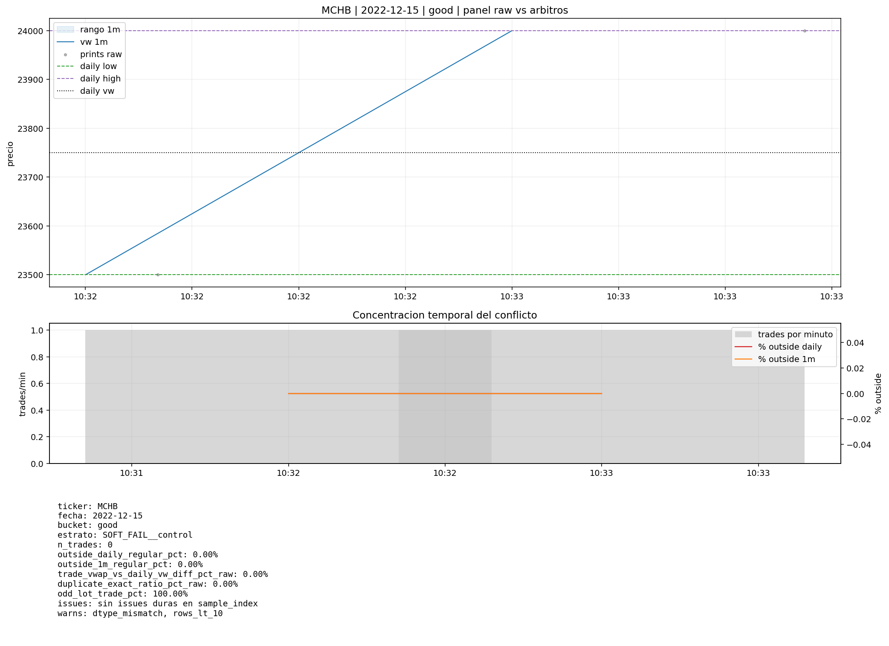

**Que muestra**

- Panel rico del tape raw frente a `daily` y `1m` para `MCHB` el `2022-12-15`.
- `n_trades = 2`, `outside_daily_regular_pct = 0.00%`, `outside_1m_regular_pct = 0.00%`.
- `trade_vwap_vs_daily_vw_diff_pct_raw = 0.00%`, `duplicate_exact_ratio_pct_raw = 0.00%`, `odd_lot_trade_pct = 100.00%`.

**Responde**

- Cola pristine donde `trades`, `daily` y `1m` alinean con limpieza. Responde a la pregunta de como luce una firma casi impecable del tape.
- Responde a si el conflicto dominante vive en la escala (`~1x`), en la comparabilidad frente a `daily` (0.00%) o frente a `1m` (0.00%).
- El 100.00% de odd-lots empuja la lectura hacia microestructura fina; evita leer el caso como pura ruptura economica gruesa.
- La decision que justifica es que el file puede usarse como patron de tape limpio, no como medida de masa util del bloque.

### MCHB | 2023-02-03

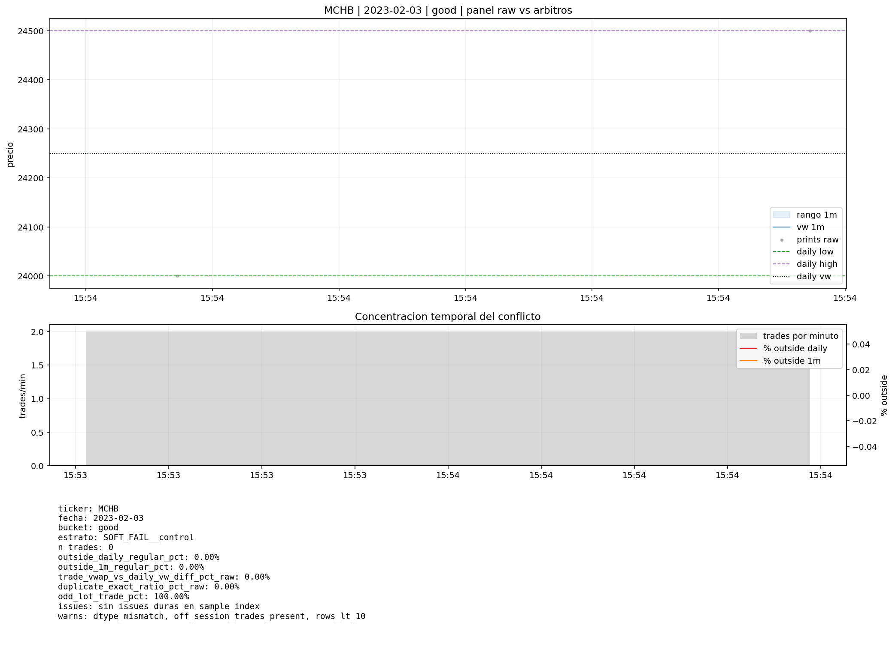

**Que muestra**

- Panel rico del tape raw frente a `daily` y `1m` para `MCHB` el `2023-02-03`.
- `n_trades = 2`, `outside_daily_regular_pct = 0.00%`, `outside_1m_regular_pct = 0.00%`.
- `trade_vwap_vs_daily_vw_diff_pct_raw = 0.00%`, `duplicate_exact_ratio_pct_raw = 0.00%`, `odd_lot_trade_pct = 100.00%`.

**Responde**

- Cola pristine donde `trades`, `daily` y `1m` alinean con limpieza. Responde a la pregunta de como luce una firma casi impecable del tape.
- Responde a si el conflicto dominante vive en la escala (`~1x`), en la comparabilidad frente a `daily` (0.00%) o frente a `1m` (0.00%).
- El 100.00% de odd-lots empuja la lectura hacia microestructura fina; evita leer el caso como pura ruptura economica gruesa.
- La decision que justifica es que el file puede usarse como patron de tape limpio, no como medida de masa util del bloque.

### MCHB | 2023-02-21

**Que muestra**

- Panel rico del tape raw frente a `daily` y `1m` para `MCHB` el `2023-02-21`.
- `n_trades = 2`, `outside_daily_regular_pct = 0.00%`, `outside_1m_regular_pct = 0.00%`.
- `trade_vwap_vs_daily_vw_diff_pct_raw = 0.00%`, `duplicate_exact_ratio_pct_raw = 0.00%`, `odd_lot_trade_pct = 100.00%`.

**Responde**

- Cola pristine donde `trades`, `daily` y `1m` alinean con limpieza. Responde a la pregunta de como luce una firma casi impecable del tape.
- Responde a si el conflicto dominante vive en la escala (`~1x`), en la comparabilidad frente a `daily` (0.00%) o frente a `1m` (0.00%).
- El 100.00% de odd-lots empuja la lectura hacia microestructura fina; evita leer el caso como pura ruptura economica gruesa.
- La decision que justifica es que el file puede usarse como patron de tape limpio, no como medida de masa util del bloque.

### MCHB | 2023-04-28

**Que muestra**

- Panel rico del tape raw frente a `daily` y `1m` para `MCHB` el `2023-04-28`.
- `n_trades = 1`, `outside_daily_regular_pct = 0.00%`, `outside_1m_regular_pct = 0.00%`.
- `trade_vwap_vs_daily_vw_diff_pct_raw = 0.00%`, `duplicate_exact_ratio_pct_raw = 0.00%`, `odd_lot_trade_pct = 100.00%`.

**Responde**

- Cola pristine donde `trades`, `daily` y `1m` alinean con limpieza. Responde a la pregunta de como luce una firma casi impecable del tape.
- Responde a si el conflicto dominante vive en la escala (`~1x`), en la comparabilidad frente a `daily` (0.00%) o frente a `1m` (0.00%).
- El 100.00% de odd-lots empuja la lectura hacia microestructura fina; evita leer el caso como pura ruptura economica gruesa.
- La decision que justifica es que el file puede usarse como patron de tape limpio, no como medida de masa util del bloque.

### MCHB | 2023-05-01

**Que muestra**

- Panel rico del tape raw frente a `daily` y `1m` para `MCHB` el `2023-05-01`.
- `n_trades = 3`, `outside_daily_regular_pct = 0.00%`, `outside_1m_regular_pct = 0.00%`.
- `trade_vwap_vs_daily_vw_diff_pct_raw = 0.00%`, `duplicate_exact_ratio_pct_raw = 0.00%`, `odd_lot_trade_pct = 100.00%`.

**Responde**

- Cola pristine donde `trades`, `daily` y `1m` alinean con limpieza. Responde a la pregunta de como luce una firma casi impecable del tape.
- Responde a si el conflicto dominante vive en la escala (`~1x`), en la comparabilidad frente a `daily` (0.00%) o frente a `1m` (0.00%).
- El 100.00% de odd-lots empuja la lectura hacia microestructura fina; evita leer el caso como pura ruptura economica gruesa.
- La decision que justifica es que el file puede usarse como patron de tape limpio, no como medida de masa util del bloque.

### MCHB | 2023-06-15

**Que muestra**

- Panel rico del tape raw frente a `daily` y `1m` para `MCHB` el `2023-06-15`.
- `n_trades = 1`, `outside_daily_regular_pct = 0.00%`, `outside_1m_regular_pct = 0.00%`.
- `trade_vwap_vs_daily_vw_diff_pct_raw = 0.00%`, `duplicate_exact_ratio_pct_raw = 0.00%`, `odd_lot_trade_pct = 100.00%`.

**Responde**

- Cola pristine donde `trades`, `daily` y `1m` alinean con limpieza. Responde a la pregunta de como luce una firma casi impecable del tape.
- Responde a si el conflicto dominante vive en la escala (`~1x`), en la comparabilidad frente a `daily` (0.00%) o frente a `1m` (0.00%).
- El 100.00% de odd-lots empuja la lectura hacia microestructura fina; evita leer el caso como pura ruptura economica gruesa.
- La decision que justifica es que el file puede usarse como patron de tape limpio, no como medida de masa util del bloque.

### MCHB | 2023-11-10

**Que muestra**

- Panel rico del tape raw frente a `daily` y `1m` para `MCHB` el `2023-11-10`.
- `n_trades = 1`, `outside_daily_regular_pct = 0.00%`, `outside_1m_regular_pct = 0.00%`.
- `trade_vwap_vs_daily_vw_diff_pct_raw = 0.00%`, `duplicate_exact_ratio_pct_raw = 0.00%`, `odd_lot_trade_pct = 100.00%`.

**Responde**

- Cola pristine donde `trades`, `daily` y `1m` alinean con limpieza. Responde a la pregunta de como luce una firma casi impecable del tape.
- Responde a si el conflicto dominante vive en la escala (`~1x`), en la comparabilidad frente a `daily` (0.00%) o frente a `1m` (0.00%).
- El 100.00% de odd-lots empuja la lectura hacia microestructura fina; evita leer el caso como pura ruptura economica gruesa.
- La decision que justifica es que el file puede usarse como patron de tape limpio, no como medida de masa util del bloque.

### MCHB | 2023-12-20

**Que muestra**

- Panel rico del tape raw frente a `daily` y `1m` para `MCHB` el `2023-12-20`.
- `n_trades = 1`, `outside_daily_regular_pct = 0.00%`, `outside_1m_regular_pct = 0.00%`.
- `trade_vwap_vs_daily_vw_diff_pct_raw = 0.00%`, `duplicate_exact_ratio_pct_raw = 0.00%`, `odd_lot_trade_pct = 100.00%`.

**Responde**

- Cola pristine donde `trades`, `daily` y `1m` alinean con limpieza. Responde a la pregunta de como luce una firma casi impecable del tape.
- Responde a si el conflicto dominante vive en la escala (`~1x`), en la comparabilidad frente a `daily` (0.00%) o frente a `1m` (0.00%).
- El 100.00% de odd-lots empuja la lectura hacia microestructura fina; evita leer el caso como pura ruptura economica gruesa.
- La decision que justifica es que el file puede usarse como patron de tape limpio, no como medida de masa util del bloque.

### MCHB | 2024-02-23

**Que muestra**

- Panel rico del tape raw frente a `daily` y `1m` para `MCHB` el `2024-02-23`.
- `n_trades = 1`, `outside_daily_regular_pct = 0.00%`, `outside_1m_regular_pct = 0.00%`.
- `trade_vwap_vs_daily_vw_diff_pct_raw = 0.00%`, `duplicate_exact_ratio_pct_raw = 0.00%`, `odd_lot_trade_pct = 100.00%`.

**Responde**

- Cola pristine donde `trades`, `daily` y `1m` alinean con limpieza. Responde a la pregunta de como luce una firma casi impecable del tape.
- Responde a si el conflicto dominante vive en la escala (`~1x`), en la comparabilidad frente a `daily` (0.00%) o frente a `1m` (0.00%).
- El 100.00% de odd-lots empuja la lectura hacia microestructura fina; evita leer el caso como pura ruptura economica gruesa.
- La decision que justifica es que el file puede usarse como patron de tape limpio, no como medida de masa util del bloque.

### MCHB | 2024-04-01

**Que muestra**

- Panel rico del tape raw frente a `daily` y `1m` para `MCHB` el `2024-04-01`.
- `n_trades = 1`, `outside_daily_regular_pct = 0.00%`, `outside_1m_regular_pct = 0.00%`.
- `trade_vwap_vs_daily_vw_diff_pct_raw = 0.00%`, `duplicate_exact_ratio_pct_raw = 0.00%`, `odd_lot_trade_pct = 100.00%`.

**Responde**

- Cola pristine donde `trades`, `daily` y `1m` alinean con limpieza. Responde a la pregunta de como luce una firma casi impecable del tape.
- Responde a si el conflicto dominante vive en la escala (`~1x`), en la comparabilidad frente a `daily` (0.00%) o frente a `1m` (0.00%).
- El 100.00% de odd-lots empuja la lectura hacia microestructura fina; evita leer el caso como pura ruptura economica gruesa.
- La decision que justifica es que el file puede usarse como patron de tape limpio, no como medida de masa util del bloque.

### MCHB | 2024-05-06

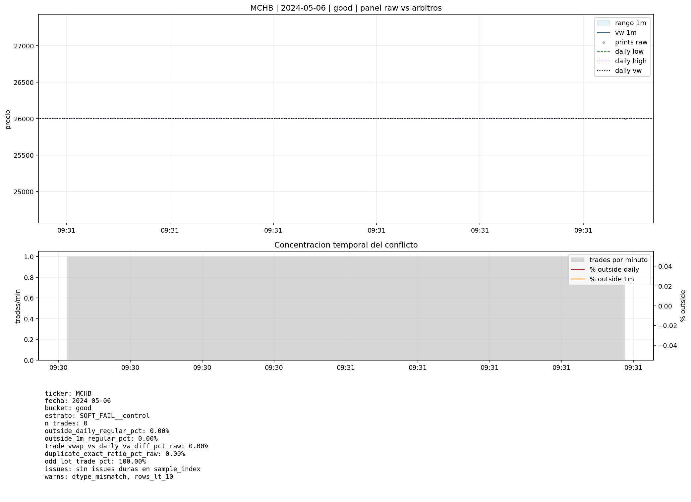

**Que muestra**

- Panel rico del tape raw frente a `daily` y `1m` para `MCHB` el `2024-05-06`.
- `n_trades = 1`, `outside_daily_regular_pct = 0.00%`, `outside_1m_regular_pct = 0.00%`.
- `trade_vwap_vs_daily_vw_diff_pct_raw = 0.00%`, `duplicate_exact_ratio_pct_raw = 0.00%`, `odd_lot_trade_pct = 100.00%`.

**Responde**

- Cola pristine donde `trades`, `daily` y `1m` alinean con limpieza. Responde a la pregunta de como luce una firma casi impecable del tape.
- Responde a si el conflicto dominante vive en la escala (`~1x`), en la comparabilidad frente a `daily` (0.00%) o frente a `1m` (0.00%).
- El 100.00% de odd-lots empuja la lectura hacia microestructura fina; evita leer el caso como pura ruptura economica gruesa.
- La decision que justifica es que el file puede usarse como patron de tape limpio, no como medida de masa util del bloque.

### MCHB | 2024-05-24

**Que muestra**

- Panel rico del tape raw frente a `daily` y `1m` para `MCHB` el `2024-05-24`.
- `n_trades = 1`, `outside_daily_regular_pct = 0.00%`, `outside_1m_regular_pct = 0.00%`.
- `trade_vwap_vs_daily_vw_diff_pct_raw = 0.00%`, `duplicate_exact_ratio_pct_raw = 0.00%`, `odd_lot_trade_pct = 100.00%`.

**Responde**

- Cola pristine donde `trades`, `daily` y `1m` alinean con limpieza. Responde a la pregunta de como luce una firma casi impecable del tape.
- Responde a si el conflicto dominante vive en la escala (`~1x`), en la comparabilidad frente a `daily` (0.00%) o frente a `1m` (0.00%).
- El 100.00% de odd-lots empuja la lectura hacia microestructura fina; evita leer el caso como pura ruptura economica gruesa.
- La decision que justifica es que el file puede usarse como patron de tape limpio, no como medida de masa util del bloque.

### MCHB | 2024-06-06

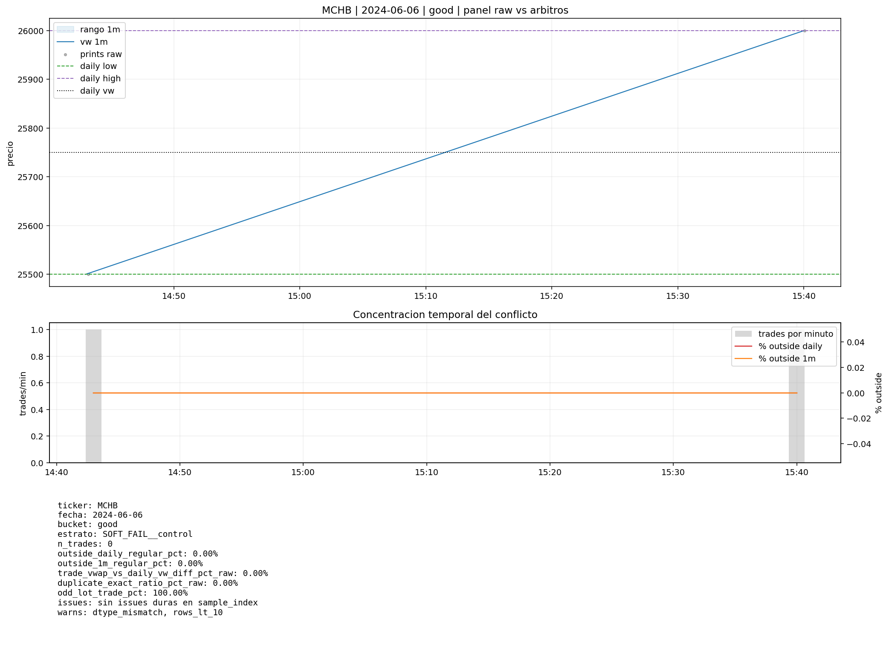

**Que muestra**

- Panel rico del tape raw frente a `daily` y `1m` para `MCHB` el `2024-06-06`.
- `n_trades = 2`, `outside_daily_regular_pct = 0.00%`, `outside_1m_regular_pct = 0.00%`.
- `trade_vwap_vs_daily_vw_diff_pct_raw = 0.00%`, `duplicate_exact_ratio_pct_raw = 0.00%`, `odd_lot_trade_pct = 100.00%`.

**Responde**

- Cola pristine donde `trades`, `daily` y `1m` alinean con limpieza. Responde a la pregunta de como luce una firma casi impecable del tape.
- Responde a si el conflicto dominante vive en la escala (`~1x`), en la comparabilidad frente a `daily` (0.00%) o frente a `1m` (0.00%).
- El 100.00% de odd-lots empuja la lectura hacia microestructura fina; evita leer el caso como pura ruptura economica gruesa.
- La decision que justifica es que el file puede usarse como patron de tape limpio, no como medida de masa util del bloque.

### MCHB | 2024-06-20

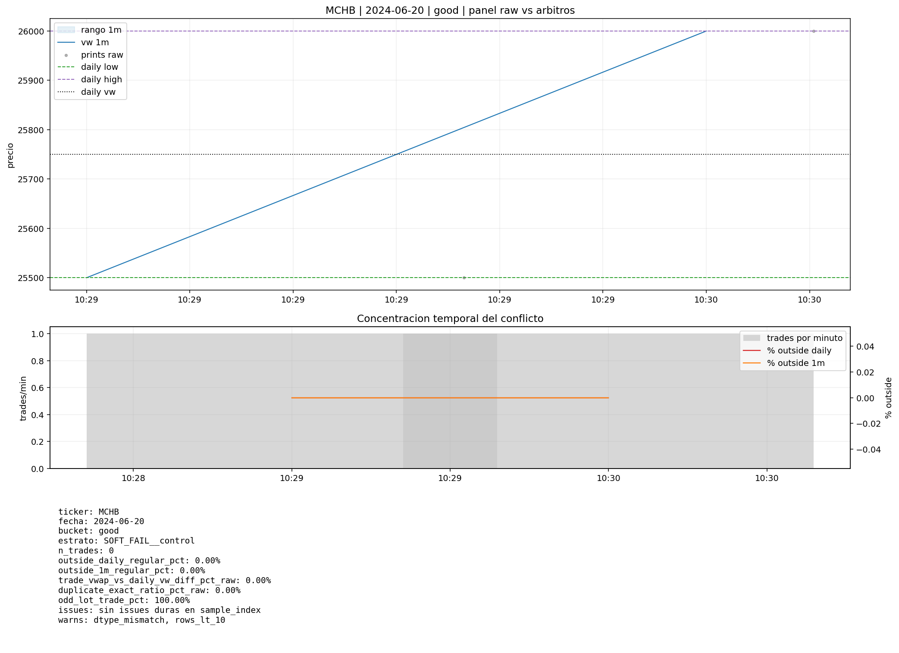

**Que muestra**

- Panel rico del tape raw frente a `daily` y `1m` para `MCHB` el `2024-06-20`.
- `n_trades = 2`, `outside_daily_regular_pct = 0.00%`, `outside_1m_regular_pct = 0.00%`.
- `trade_vwap_vs_daily_vw_diff_pct_raw = 0.00%`, `duplicate_exact_ratio_pct_raw = 0.00%`, `odd_lot_trade_pct = 100.00%`.

**Responde**

- Cola pristine donde `trades`, `daily` y `1m` alinean con limpieza. Responde a la pregunta de como luce una firma casi impecable del tape.
- Responde a si el conflicto dominante vive en la escala (`~1x`), en la comparabilidad frente a `daily` (0.00%) o frente a `1m` (0.00%).
- El 100.00% de odd-lots empuja la lectura hacia microestructura fina; evita leer el caso como pura ruptura economica gruesa.
- La decision que justifica es que el file puede usarse como patron de tape limpio, no como medida de masa util del bloque.

### MCHB | 2024-10-03

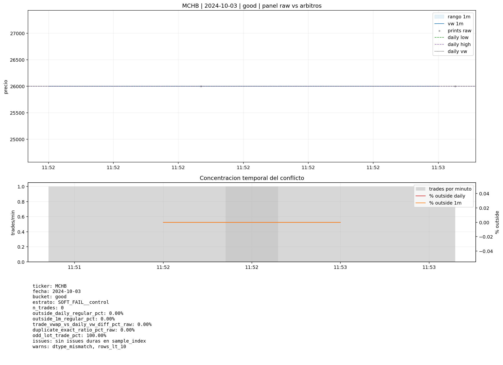

**Que muestra**

- Panel rico del tape raw frente a `daily` y `1m` para `MCHB` el `2024-10-03`.
- `n_trades = 2`, `outside_daily_regular_pct = 0.00%`, `outside_1m_regular_pct = 0.00%`.
- `trade_vwap_vs_daily_vw_diff_pct_raw = 0.00%`, `duplicate_exact_ratio_pct_raw = 0.00%`, `odd_lot_trade_pct = 100.00%`.

**Responde**

- Cola pristine donde `trades`, `daily` y `1m` alinean con limpieza. Responde a la pregunta de como luce una firma casi impecable del tape.
- Responde a si el conflicto dominante vive en la escala (`~1x`), en la comparabilidad frente a `daily` (0.00%) o frente a `1m` (0.00%).
- El 100.00% de odd-lots empuja la lectura hacia microestructura fina; evita leer el caso como pura ruptura economica gruesa.
- La decision que justifica es que el file puede usarse como patron de tape limpio, no como medida de masa util del bloque.

### MCHB | 2025-02-19

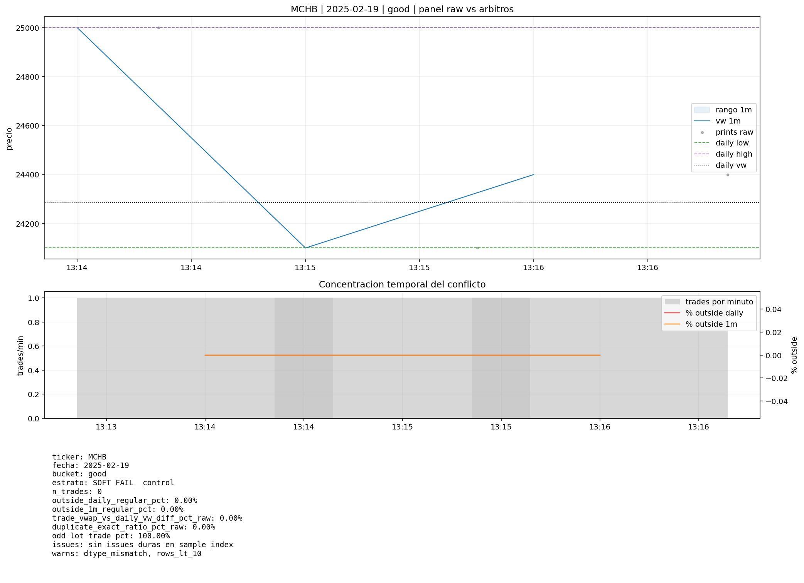

**Que muestra**

- Panel rico del tape raw frente a `daily` y `1m` para `MCHB` el `2025-02-19`.
- `n_trades = 3`, `outside_daily_regular_pct = 0.00%`, `outside_1m_regular_pct = 0.00%`.
- `trade_vwap_vs_daily_vw_diff_pct_raw = 0.00%`, `duplicate_exact_ratio_pct_raw = 0.00%`, `odd_lot_trade_pct = 100.00%`.

**Responde**

- Cola pristine donde `trades`, `daily` y `1m` alinean con limpieza. Responde a la pregunta de como luce una firma casi impecable del tape.
- Responde a si el conflicto dominante vive en la escala (`~1x`), en la comparabilidad frente a `daily` (0.00%) o frente a `1m` (0.00%).
- El 100.00% de odd-lots empuja la lectura hacia microestructura fina; evita leer el caso como pura ruptura economica gruesa.
- La decision que justifica es que el file puede usarse como patron de tape limpio, no como medida de masa util del bloque.

### MCHB | 2025-02-24

**Que muestra**

- Panel rico del tape raw frente a `daily` y `1m` para `MCHB` el `2025-02-24`.
- `n_trades = 1`, `outside_daily_regular_pct = 0.00%`, `outside_1m_regular_pct = 0.00%`.
- `trade_vwap_vs_daily_vw_diff_pct_raw = 0.00%`, `duplicate_exact_ratio_pct_raw = 0.00%`, `odd_lot_trade_pct = 100.00%`.

**Responde**

- Cola pristine donde `trades`, `daily` y `1m` alinean con limpieza. Responde a la pregunta de como luce una firma casi impecable del tape.
- Responde a si el conflicto dominante vive en la escala (`~1x`), en la comparabilidad frente a `daily` (0.00%) o frente a `1m` (0.00%).
- El 100.00% de odd-lots empuja la lectura hacia microestructura fina; evita leer el caso como pura ruptura economica gruesa.
- La decision que justifica es que el file puede usarse como patron de tape limpio, no como medida de masa util del bloque.

### MCHB | 2025-03-04

**Que muestra**

- Panel rico del tape raw frente a `daily` y `1m` para `MCHB` el `2025-03-04`.
- `n_trades = 1`, `outside_daily_regular_pct = 0.00%`, `outside_1m_regular_pct = 0.00%`.
- `trade_vwap_vs_daily_vw_diff_pct_raw = 0.00%`, `duplicate_exact_ratio_pct_raw = 0.00%`, `odd_lot_trade_pct = 100.00%`.

**Responde**

- Cola pristine donde `trades`, `daily` y `1m` alinean con limpieza. Responde a la pregunta de como luce una firma casi impecable del tape.
- Responde a si el conflicto dominante vive en la escala (`~1x`), en la comparabilidad frente a `daily` (0.00%) o frente a `1m` (0.00%).
- El 100.00% de odd-lots empuja la lectura hacia microestructura fina; evita leer el caso como pura ruptura economica gruesa.
- La decision que justifica es que el file puede usarse como patron de tape limpio, no como medida de masa util del bloque.

### MCHB | 2025-04-01

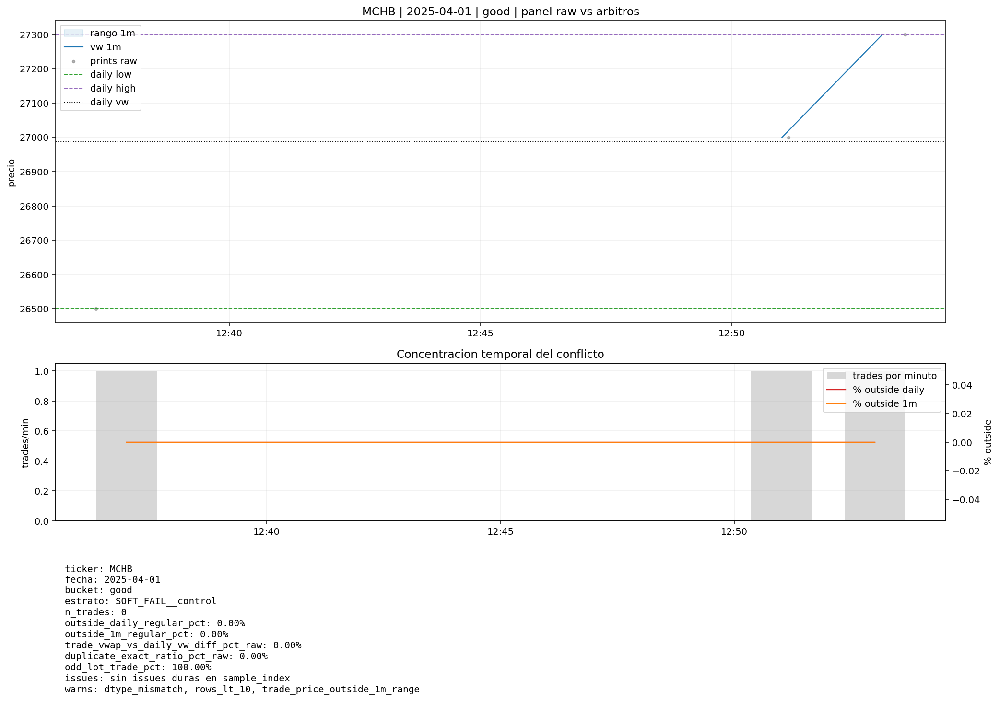

**Que muestra**

- Panel rico del tape raw frente a `daily` y `1m` para `MCHB` el `2025-04-01`.
- `n_trades = 3`, `outside_daily_regular_pct = 0.00%`, `outside_1m_regular_pct = 0.00%`.
- `trade_vwap_vs_daily_vw_diff_pct_raw = 0.00%`, `duplicate_exact_ratio_pct_raw = 0.00%`, `odd_lot_trade_pct = 100.00%`.

**Responde**

- Cola pristine donde `trades`, `daily` y `1m` alinean con limpieza. Responde a la pregunta de como luce una firma casi impecable del tape.
- Responde a si el conflicto dominante vive en la escala (`~1x`), en la comparabilidad frente a `daily` (0.00%) o frente a `1m` (0.00%).
- El 100.00% de odd-lots empuja la lectura hacia microestructura fina; evita leer el caso como pura ruptura economica gruesa.
- La decision que justifica es que el file puede usarse como patron de tape limpio, no como medida de masa util del bloque.

### MCHB | 2025-05-29

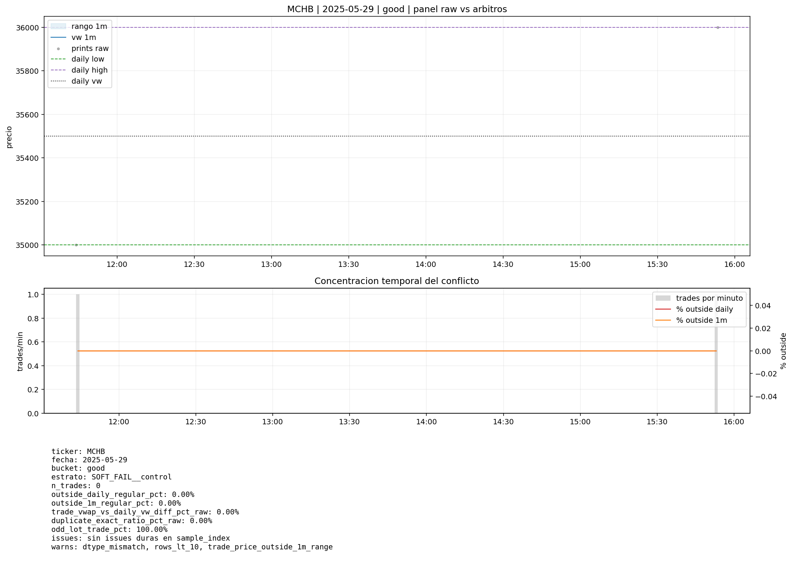

**Que muestra**

- Panel rico del tape raw frente a `daily` y `1m` para `MCHB` el `2025-05-29`.
- `n_trades = 2`, `outside_daily_regular_pct = 0.00%`, `outside_1m_regular_pct = 0.00%`.
- `trade_vwap_vs_daily_vw_diff_pct_raw = 0.00%`, `duplicate_exact_ratio_pct_raw = 0.00%`, `odd_lot_trade_pct = 100.00%`.

**Responde**

- Cola pristine donde `trades`, `daily` y `1m` alinean con limpieza. Responde a la pregunta de como luce una firma casi impecable del tape.
- Responde a si el conflicto dominante vive en la escala (`~1x`), en la comparabilidad frente a `daily` (0.00%) o frente a `1m` (0.00%).
- El 100.00% de odd-lots empuja la lectura hacia microestructura fina; evita leer el caso como pura ruptura economica gruesa.
- La decision que justifica es que el file puede usarse como patron de tape limpio, no como medida de masa util del bloque.

### MCHB | 2025-07-02

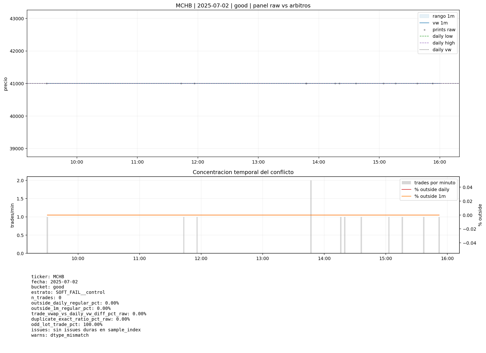

**Que muestra**

- Panel rico del tape raw frente a `daily` y `1m` para `MCHB` el `2025-07-02`.
- `n_trades = 12`, `outside_daily_regular_pct = 0.00%`, `outside_1m_regular_pct = 0.00%`.
- `trade_vwap_vs_daily_vw_diff_pct_raw = 0.00%`, `duplicate_exact_ratio_pct_raw = 0.00%`, `odd_lot_trade_pct = 100.00%`.

**Responde**

- Cola pristine donde `trades`, `daily` y `1m` alinean con limpieza. Responde a la pregunta de como luce una firma casi impecable del tape.
- Responde a si el conflicto dominante vive en la escala (`~1x`), en la comparabilidad frente a `daily` (0.00%) o frente a `1m` (0.00%).
- El 100.00% de odd-lots empuja la lectura hacia microestructura fina; evita leer el caso como pura ruptura economica gruesa.
- La decision que justifica es que el file puede usarse como patron de tape limpio, no como medida de masa util del bloque.

### MCHB | 2025-07-03

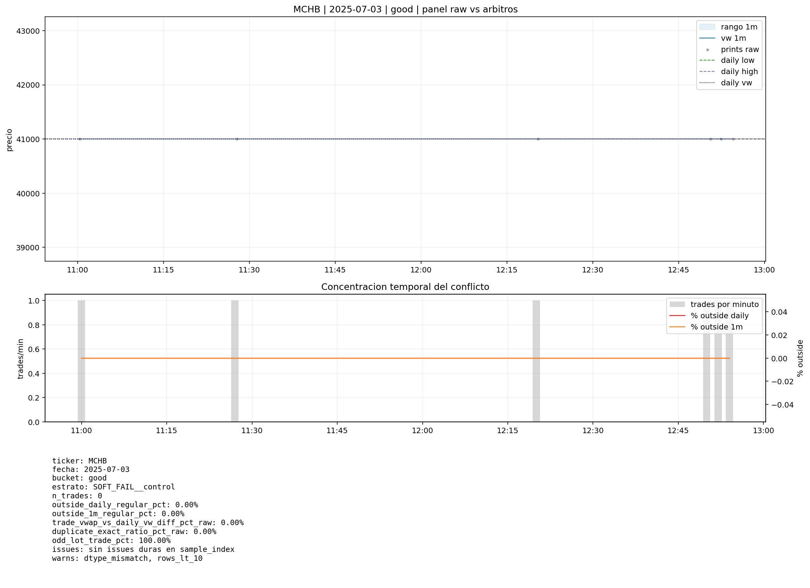

**Que muestra**

- Panel rico del tape raw frente a `daily` y `1m` para `MCHB` el `2025-07-03`.
- `n_trades = 6`, `outside_daily_regular_pct = 0.00%`, `outside_1m_regular_pct = 0.00%`.
- `trade_vwap_vs_daily_vw_diff_pct_raw = 0.00%`, `duplicate_exact_ratio_pct_raw = 0.00%`, `odd_lot_trade_pct = 100.00%`.

**Responde**

- Cola pristine donde `trades`, `daily` y `1m` alinean con limpieza. Responde a la pregunta de como luce una firma casi impecable del tape.
- Responde a si el conflicto dominante vive en la escala (`~1x`), en la comparabilidad frente a `daily` (0.00%) o frente a `1m` (0.00%).
- El 100.00% de odd-lots empuja la lectura hacia microestructura fina; evita leer el caso como pura ruptura economica gruesa.
- La decision que justifica es que el file puede usarse como patron de tape limpio, no como medida de masa util del bloque.

### MCHB | 2025-07-07

**Que muestra**

- Panel rico del tape raw frente a `daily` y `1m` para `MCHB` el `2025-07-07`.
- `n_trades = 6`, `outside_daily_regular_pct = 0.00%`, `outside_1m_regular_pct = 0.00%`.
- `trade_vwap_vs_daily_vw_diff_pct_raw = 0.00%`, `duplicate_exact_ratio_pct_raw = 0.00%`, `odd_lot_trade_pct = 100.00%`.

**Responde**

- Cola pristine donde `trades`, `daily` y `1m` alinean con limpieza. Responde a la pregunta de como luce una firma casi impecable del tape.
- Responde a si el conflicto dominante vive en la escala (`~1x`), en la comparabilidad frente a `daily` (0.00%) o frente a `1m` (0.00%).
- El 100.00% de odd-lots empuja la lectura hacia microestructura fina; evita leer el caso como pura ruptura economica gruesa.
- La decision que justifica es que el file puede usarse como patron de tape limpio, no como medida de masa util del bloque.

### MCHB | 2025-07-08

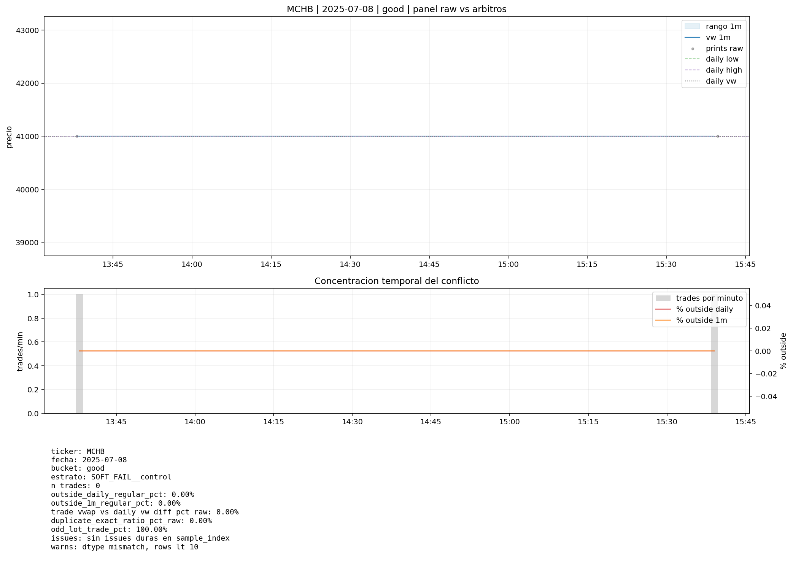

**Que muestra**

- Panel rico del tape raw frente a `daily` y `1m` para `MCHB` el `2025-07-08`.
- `n_trades = 2`, `outside_daily_regular_pct = 0.00%`, `outside_1m_regular_pct = 0.00%`.
- `trade_vwap_vs_daily_vw_diff_pct_raw = 0.00%`, `duplicate_exact_ratio_pct_raw = 0.00%`, `odd_lot_trade_pct = 100.00%`.

**Responde**

- Cola pristine donde `trades`, `daily` y `1m` alinean con limpieza. Responde a la pregunta de como luce una firma casi impecable del tape.
- Responde a si el conflicto dominante vive en la escala (`~1x`), en la comparabilidad frente a `daily` (0.00%) o frente a `1m` (0.00%).
- El 100.00% de odd-lots empuja la lectura hacia microestructura fina; evita leer el caso como pura ruptura economica gruesa.
- La decision que justifica es que el file puede usarse como patron de tape limpio, no como medida de masa util del bloque.

### MCHB | 2025-07-10

**Que muestra**

- Panel rico del tape raw frente a `daily` y `1m` para `MCHB` el `2025-07-10`.
- `n_trades = 2`, `outside_daily_regular_pct = 0.00%`, `outside_1m_regular_pct = 0.00%`.
- `trade_vwap_vs_daily_vw_diff_pct_raw = 0.00%`, `duplicate_exact_ratio_pct_raw = 0.00%`, `odd_lot_trade_pct = 100.00%`.

**Responde**

- Cola pristine donde `trades`, `daily` y `1m` alinean con limpieza. Responde a la pregunta de como luce una firma casi impecable del tape.
- Responde a si el conflicto dominante vive en la escala (`~1x`), en la comparabilidad frente a `daily` (0.00%) o frente a `1m` (0.00%).
- El 100.00% de odd-lots empuja la lectura hacia microestructura fina; evita leer el caso como pura ruptura economica gruesa.
- La decision que justifica es que el file puede usarse como patron de tape limpio, no como medida de masa util del bloque.

### MCHB | 2025-07-18

**Que muestra**

- Panel rico del tape raw frente a `daily` y `1m` para `MCHB` el `2025-07-18`.
- `n_trades = 1`, `outside_daily_regular_pct = 0.00%`, `outside_1m_regular_pct = 0.00%`.
- `trade_vwap_vs_daily_vw_diff_pct_raw = 0.00%`, `duplicate_exact_ratio_pct_raw = 0.00%`, `odd_lot_trade_pct = 100.00%`.

**Responde**

- Cola pristine donde `trades`, `daily` y `1m` alinean con limpieza. Responde a la pregunta de como luce una firma casi impecable del tape.
- Responde a si el conflicto dominante vive en la escala (`~1x`), en la comparabilidad frente a `daily` (0.00%) o frente a `1m` (0.00%).
- El 100.00% de odd-lots empuja la lectura hacia microestructura fina; evita leer el caso como pura ruptura economica gruesa.
- La decision que justifica es que el file puede usarse como patron de tape limpio, no como medida de masa util del bloque.

### MCHB | 2025-07-21

**Que muestra**

- Panel rico del tape raw frente a `daily` y `1m` para `MCHB` el `2025-07-21`.
- `n_trades = 2`, `outside_daily_regular_pct = 0.00%`, `outside_1m_regular_pct = 0.00%`.
- `trade_vwap_vs_daily_vw_diff_pct_raw = 0.00%`, `duplicate_exact_ratio_pct_raw = 0.00%`, `odd_lot_trade_pct = 100.00%`.

**Responde**

- Cola pristine donde `trades`, `daily` y `1m` alinean con limpieza. Responde a la pregunta de como luce una firma casi impecable del tape.
- Responde a si el conflicto dominante vive en la escala (`~1x`), en la comparabilidad frente a `daily` (0.00%) o frente a `1m` (0.00%).
- El 100.00% de odd-lots empuja la lectura hacia microestructura fina; evita leer el caso como pura ruptura economica gruesa.
- La decision que justifica es que el file puede usarse como patron de tape limpio, no como medida de masa util del bloque.

### MCHB | 2025-07-29

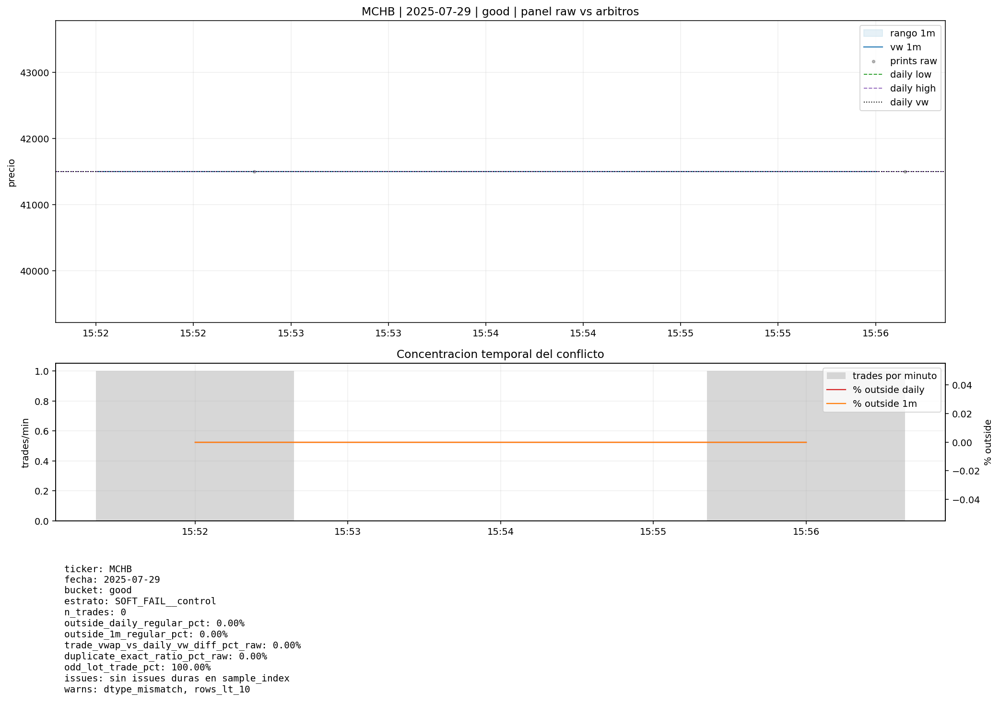

**Que muestra**

- Panel rico del tape raw frente a `daily` y `1m` para `MCHB` el `2025-07-29`.
- `n_trades = 2`, `outside_daily_regular_pct = 0.00%`, `outside_1m_regular_pct = 0.00%`.
- `trade_vwap_vs_daily_vw_diff_pct_raw = 0.00%`, `duplicate_exact_ratio_pct_raw = 0.00%`, `odd_lot_trade_pct = 100.00%`.

**Responde**

- Cola pristine donde `trades`, `daily` y `1m` alinean con limpieza. Responde a la pregunta de como luce una firma casi impecable del tape.
- Responde a si el conflicto dominante vive en la escala (`~1x`), en la comparabilidad frente a `daily` (0.00%) o frente a `1m` (0.00%).
- El 100.00% de odd-lots empuja la lectura hacia microestructura fina; evita leer el caso como pura ruptura economica gruesa.
- La decision que justifica es que el file puede usarse como patron de tape limpio, no como medida de masa util del bloque.

### MCHB | 2025-08-14

**Que muestra**

- Panel rico del tape raw frente a `daily` y `1m` para `MCHB` el `2025-08-14`.
- `n_trades = 1`, `outside_daily_regular_pct = 0.00%`, `outside_1m_regular_pct = 0.00%`.
- `trade_vwap_vs_daily_vw_diff_pct_raw = 0.00%`, `duplicate_exact_ratio_pct_raw = 0.00%`, `odd_lot_trade_pct = 100.00%`.

**Responde**

- Cola pristine donde `trades`, `daily` y `1m` alinean con limpieza. Responde a la pregunta de como luce una firma casi impecable del tape.
- Responde a si el conflicto dominante vive en la escala (`~1x`), en la comparabilidad frente a `daily` (0.00%) o frente a `1m` (0.00%).
- El 100.00% de odd-lots empuja la lectura hacia microestructura fina; evita leer el caso como pura ruptura economica gruesa.
- La decision que justifica es que el file puede usarse como patron de tape limpio, no como medida de masa util del bloque.

### MCHB | 2025-08-28

**Que muestra**

- Panel rico del tape raw frente a `daily` y `1m` para `MCHB` el `2025-08-28`.
- `n_trades = 2`, `outside_daily_regular_pct = 0.00%`, `outside_1m_regular_pct = 0.00%`.
- `trade_vwap_vs_daily_vw_diff_pct_raw = 0.00%`, `duplicate_exact_ratio_pct_raw = 0.00%`, `odd_lot_trade_pct = 100.00%`.

**Responde**

- Cola pristine donde `trades`, `daily` y `1m` alinean con limpieza. Responde a la pregunta de como luce una firma casi impecable del tape.
- Responde a si el conflicto dominante vive en la escala (`~1x`), en la comparabilidad frente a `daily` (0.00%) o frente a `1m` (0.00%).
- El 100.00% de odd-lots empuja la lectura hacia microestructura fina; evita leer el caso como pura ruptura economica gruesa.
- La decision que justifica es que el file puede usarse como patron de tape limpio, no como medida de masa util del bloque.

# Trades Reference Scale Mismatch | muestra estratificada

Documento fuente: `inspection_dossiers/trades/family_case_evidence_packs/reference_scale_mismatch/reference_scale_mismatch_cases_v0_1.md`

## Rol

Este dossier documenta `60` casos de la muestra base del cierre real `57f/full_clean_fast_same_schema` para la familia `reference_scale_mismatch`.

No son ejemplos elegidos a dedo. Proceden del manifest estratificado reproducible materializado para el inspector.

## Que significa esta familia

Familia donde el conflicto dominante no es que el tape este roto por dentro, sino que el tape y el arbitro viven en escalas distintas. Responde a la pregunta de si el dano principal es de comparabilidad frente a `daily` o `1m`.

## Responde

- si el conflicto dominante vive en la escala frente a los arbitros
- si el caso exige reconciliacion antes de cualquier juicio economico serio

## No responde

- si el tape quedaria limpio tras reconciliacion estable
- si debe promoverse ya a `recoverable_with_flag`

## Consecuencia

- mantener prudencia institucional y no mezclarlo con `bad_data`
- priorizar reconciliacion semantica antes que exclusion automatica

## Casos

### BTM | 2011-12-30

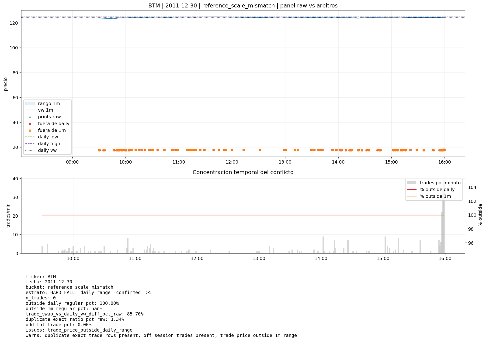

**Que muestra**

- Panel rico del tape raw frente a `daily` y `1m` para `BTM` el `2011-12-30`.
- `n_trades = 299`, `outside_daily_regular_pct = 100.00%`, `outside_1m_regular_pct = nan%`.
- `trade_vwap_vs_daily_vw_diff_pct_raw = 85.70%`, `duplicate_exact_ratio_pct_raw = 3.34%`, `odd_lot_trade_pct = 0.00%`.

**Responde**

- Familia donde el conflicto dominante no es que el tape este roto por dentro, sino que el tape y el arbitro viven en escalas distintas. Responde a la pregunta de si el dano principal es de comparabilidad frente a `daily` o `1m`.
- Responde a si el conflicto dominante vive en la escala (`>1x_other`), en la comparabilidad frente a `daily` (100.00%) o frente a `1m` (nan%).
- La decision que justifica es mantener o no el caso en `recoverable_with_flag` cuando se rematerialice la rehabilitacion sobre `57f`.

### DYNT | 2008-05-30

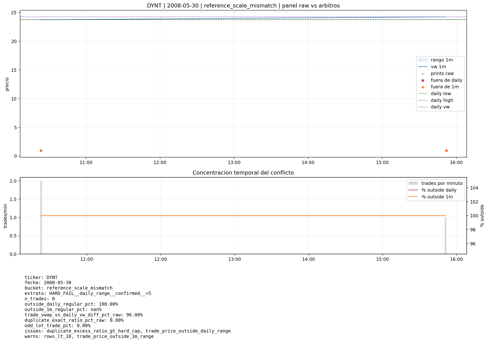

**Que muestra**

- Panel rico del tape raw frente a `daily` y `1m` para `DYNT` el `2008-05-30`.
- `n_trades = 3`, `outside_daily_regular_pct = 100.00%`, `outside_1m_regular_pct = nan%`.
- `trade_vwap_vs_daily_vw_diff_pct_raw = 96.00%`, `duplicate_exact_ratio_pct_raw = 0.00%`, `odd_lot_trade_pct = 0.00%`.

**Responde**

- Familia donde el conflicto dominante no es que el tape este roto por dentro, sino que el tape y el arbitro viven en escalas distintas. Responde a la pregunta de si el dano principal es de comparabilidad frente a `daily` o `1m`.
- Responde a si el conflicto dominante vive en la escala (`>1x_other`), en la comparabilidad frente a `daily` (100.00%) o frente a `1m` (nan%).
- La decision que justifica es mantener o no el caso en `recoverable_with_flag` cuando se rematerialice la rehabilitacion sobre `57f`.

### MFI | 2008-01-10

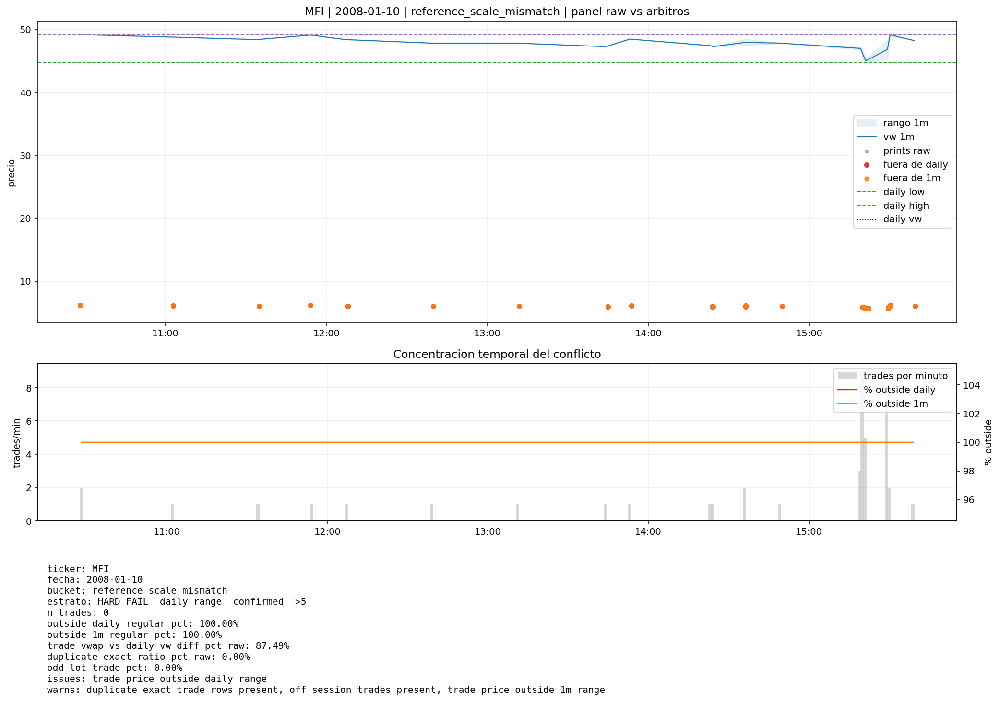

**Que muestra**

- Panel rico del tape raw frente a `daily` y `1m` para `MFI` el `2008-01-10`.
- `n_trades = 42`, `outside_daily_regular_pct = 100.00%`, `outside_1m_regular_pct = 100.00%`.
- `trade_vwap_vs_daily_vw_diff_pct_raw = 87.49%`, `duplicate_exact_ratio_pct_raw = 0.00%`, `odd_lot_trade_pct = 0.00%`.

**Responde**

- Familia donde el conflicto dominante no es que el tape este roto por dentro, sino que el tape y el arbitro viven en escalas distintas. Responde a la pregunta de si el dano principal es de comparabilidad frente a `daily` o `1m`.
- Responde a si el conflicto dominante vive en la escala (`>1x_other`), en la comparabilidad frente a `daily` (100.00%) o frente a `1m` (100.00%).
- La decision que justifica es mantener o no el caso en `recoverable_with_flag` cuando se rematerialice la rehabilitacion sobre `57f`.

### SURG | 2007-06-07

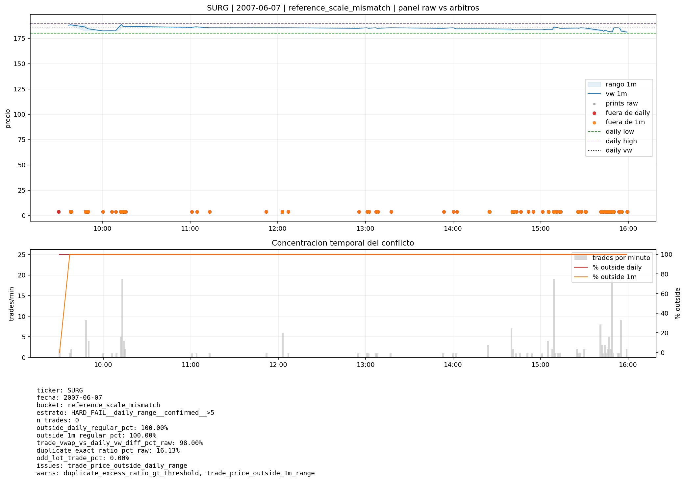

**Que muestra**

- Panel rico del tape raw frente a `daily` y `1m` para `SURG` el `2007-06-07`.
- `n_trades = 186`, `outside_daily_regular_pct = 100.00%`, `outside_1m_regular_pct = 100.00%`.
- `trade_vwap_vs_daily_vw_diff_pct_raw = 98.00%`, `duplicate_exact_ratio_pct_raw = 16.13%`, `odd_lot_trade_pct = 0.00%`.

**Responde**

- Familia donde el conflicto dominante no es que el tape este roto por dentro, sino que el tape y el arbitro viven en escalas distintas. Responde a la pregunta de si el dano principal es de comparabilidad frente a `daily` o `1m`.
- Responde a si el conflicto dominante vive en la escala (`>1x_other`), en la comparabilidad frente a `daily` (100.00%) o frente a `1m` (100.00%).
- El 16.13% de duplicacion exacta obliga a sospechar dano de tape o bursts mecanicos, no solo ruido visual.
- La decision que justifica es mantener o no el caso en `recoverable_with_flag` cuando se rematerialice la rehabilitacion sobre `57f`.

### CSPI | 2007-11-14

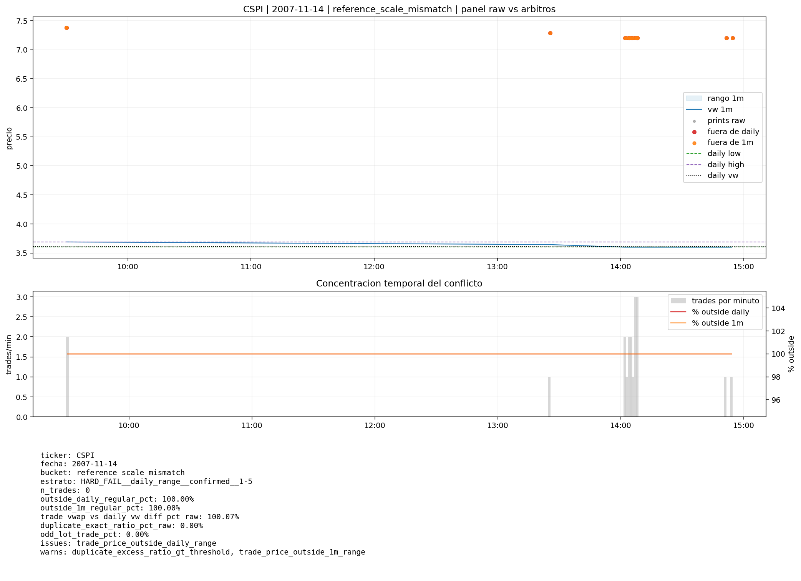

**Que muestra**

- Panel rico del tape raw frente a `daily` y `1m` para `CSPI` el `2007-11-14`.
- `n_trades = 19`, `outside_daily_regular_pct = 100.00%`, `outside_1m_regular_pct = 100.00%`.
- `trade_vwap_vs_daily_vw_diff_pct_raw = 100.07%`, `duplicate_exact_ratio_pct_raw = 0.00%`, `odd_lot_trade_pct = 0.00%`.

**Responde**

- Familia donde el conflicto dominante no es que el tape este roto por dentro, sino que el tape y el arbitro viven en escalas distintas. Responde a la pregunta de si el dano principal es de comparabilidad frente a `daily` o `1m`.
- Responde a si el conflicto dominante vive en la escala (`~0.5x`), en la comparabilidad frente a `daily` (100.00%) o frente a `1m` (100.00%).
- La decision que justifica es mantener o no el caso en `recoverable_with_flag` cuando se rematerialice la rehabilitacion sobre `57f`.

### MCBC | 2005-04-14

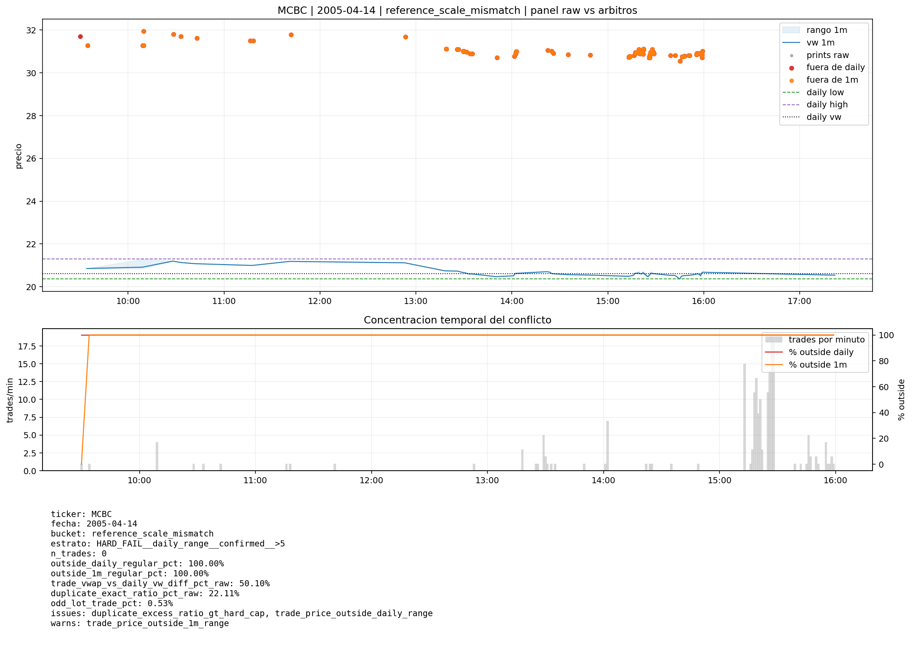

**Que muestra**

- Panel rico del tape raw frente a `daily` y `1m` para `MCBC` el `2005-04-14`.
- `n_trades = 190`, `outside_daily_regular_pct = 100.00%`, `outside_1m_regular_pct = 100.00%`.
- `trade_vwap_vs_daily_vw_diff_pct_raw = 50.10%`, `duplicate_exact_ratio_pct_raw = 22.11%`, `odd_lot_trade_pct = 0.53%`.

**Responde**

- Familia donde el conflicto dominante no es que el tape este roto por dentro, sino que el tape y el arbitro viven en escalas distintas. Responde a la pregunta de si el dano principal es de comparabilidad frente a `daily` o `1m`.
- Responde a si el conflicto dominante vive en la escala (`~0.6667x`), en la comparabilidad frente a `daily` (100.00%) o frente a `1m` (100.00%).
- El 22.11% de duplicacion exacta obliga a sospechar dano de tape o bursts mecanicos, no solo ruido visual.
- La decision que justifica es mantener o no el caso en `recoverable_with_flag` cuando se rematerialice la rehabilitacion sobre `57f`.

### SPEX | 2008-05-23

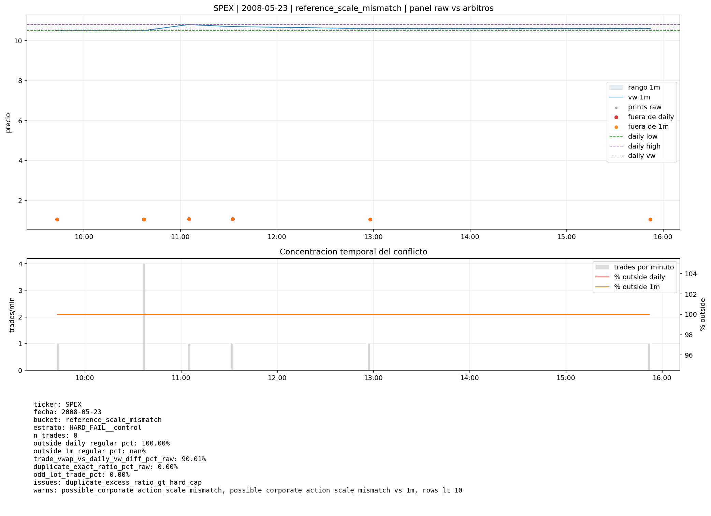

**Que muestra**

- Panel rico del tape raw frente a `daily` y `1m` para `SPEX` el `2008-05-23`.
- `n_trades = 9`, `outside_daily_regular_pct = 100.00%`, `outside_1m_regular_pct = nan%`.
- `trade_vwap_vs_daily_vw_diff_pct_raw = 90.01%`, `duplicate_exact_ratio_pct_raw = 0.00%`, `odd_lot_trade_pct = 0.00%`.

**Responde**

- Familia donde el conflicto dominante no es que el tape este roto por dentro, sino que el tape y el arbitro viven en escalas distintas. Responde a la pregunta de si el dano principal es de comparabilidad frente a `daily` o `1m`.
- Responde a si el conflicto dominante vive en la escala (`~10x`), en la comparabilidad frente a `daily` (100.00%) o frente a `1m` (nan%).
- La decision que justifica es mantener o no el caso en `recoverable_with_flag` cuando se rematerialice la rehabilitacion sobre `57f`.

### TAT | 2012-10-04

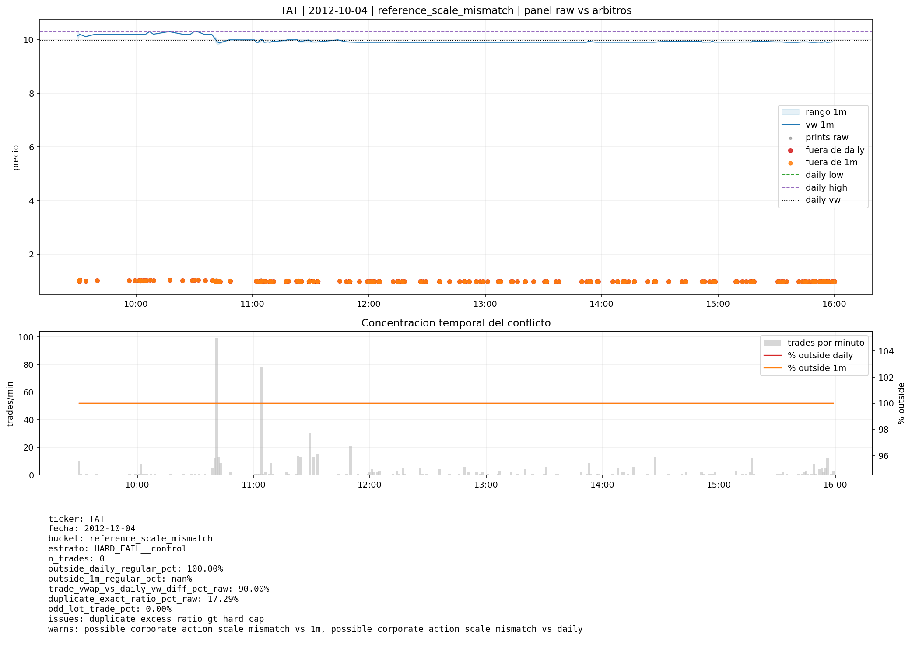

**Que muestra**

- Panel rico del tape raw frente a `daily` y `1m` para `TAT` el `2012-10-04`.
- `n_trades = 590`, `outside_daily_regular_pct = 100.00%`, `outside_1m_regular_pct = nan%`.
- `trade_vwap_vs_daily_vw_diff_pct_raw = 90.00%`, `duplicate_exact_ratio_pct_raw = 17.29%`, `odd_lot_trade_pct = 0.00%`.

**Responde**

- Familia donde el conflicto dominante no es que el tape este roto por dentro, sino que el tape y el arbitro viven en escalas distintas. Responde a la pregunta de si el dano principal es de comparabilidad frente a `daily` o `1m`.
- Responde a si el conflicto dominante vive en la escala (`~10x`), en la comparabilidad frente a `daily` (100.00%) o frente a `1m` (nan%).
- El 17.29% de duplicacion exacta obliga a sospechar dano de tape o bursts mecanicos, no solo ruido visual.
- La decision que justifica es mantener o no el caso en `recoverable_with_flag` cuando se rematerialice la rehabilitacion sobre `57f`.

### AEMD | 2016-03-16

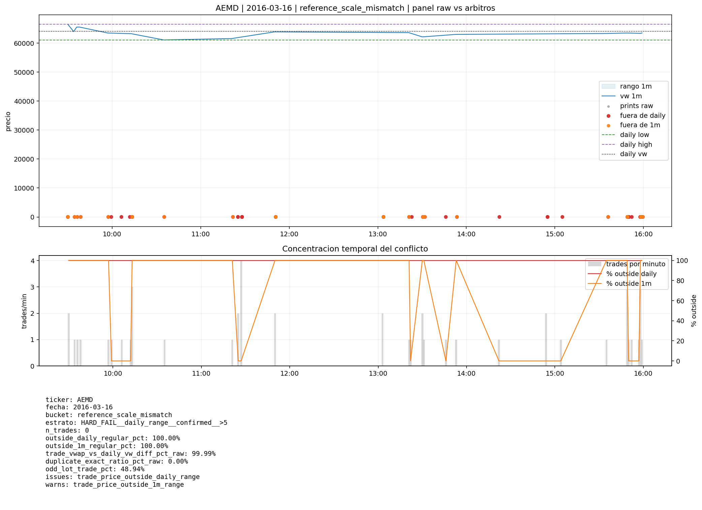

**Que muestra**

- Panel rico del tape raw frente a `daily` y `1m` para `AEMD` el `2016-03-16`.
- `n_trades = 47`, `outside_daily_regular_pct = 100.00%`, `outside_1m_regular_pct = 100.00%`.
- `trade_vwap_vs_daily_vw_diff_pct_raw = 99.99%`, `duplicate_exact_ratio_pct_raw = 0.00%`, `odd_lot_trade_pct = 48.94%`.

**Responde**

- Familia donde el conflicto dominante no es que el tape este roto por dentro, sino que el tape y el arbitro viven en escalas distintas. Responde a la pregunta de si el dano principal es de comparabilidad frente a `daily` o `1m`.
- Responde a si el conflicto dominante vive en la escala (`>1x_other`), en la comparabilidad frente a `daily` (100.00%) o frente a `1m` (100.00%).
- El 48.94% de odd-lots empuja la lectura hacia microestructura fina; evita leer el caso como pura ruptura economica gruesa.
- La decision que justifica es mantener o no el caso en `recoverable_with_flag` cuando se rematerialice la rehabilitacion sobre `57f`.

### ICON | 2014-10-08

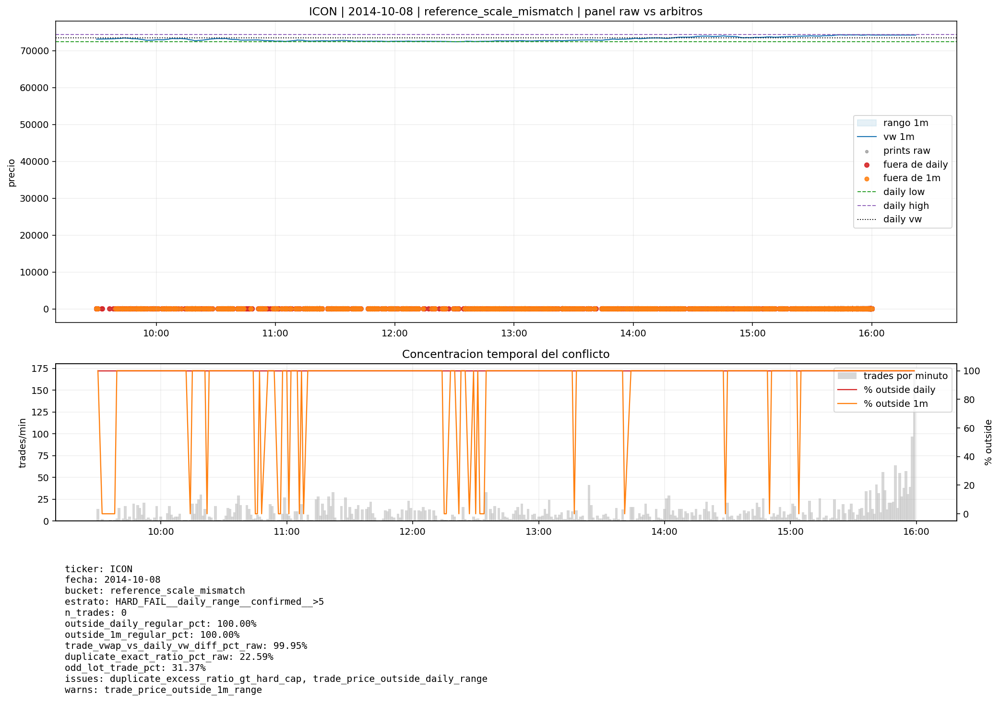

**Que muestra**

- Panel rico del tape raw frente a `daily` y `1m` para `ICON` el `2014-10-08`.
- `n_trades = 3,758`, `outside_daily_regular_pct = 100.00%`, `outside_1m_regular_pct = 100.00%`.
- `trade_vwap_vs_daily_vw_diff_pct_raw = 99.95%`, `duplicate_exact_ratio_pct_raw = 22.59%`, `odd_lot_trade_pct = 31.37%`.

**Responde**

- Familia donde el conflicto dominante no es que el tape este roto por dentro, sino que el tape y el arbitro viven en escalas distintas. Responde a la pregunta de si el dano principal es de comparabilidad frente a `daily` o `1m`.
- Responde a si el conflicto dominante vive en la escala (`>1x_other`), en la comparabilidad frente a `daily` (100.00%) o frente a `1m` (100.00%).
- El 31.37% de odd-lots empuja la lectura hacia microestructura fina; evita leer el caso como pura ruptura economica gruesa.
- El 22.59% de duplicacion exacta obliga a sospechar dano de tape o bursts mecanicos, no solo ruido visual.
- La decision que justifica es mantener o no el caso en `recoverable_with_flag` cuando se rematerialice la rehabilitacion sobre `57f`.

### OHGI | 2017-10-27

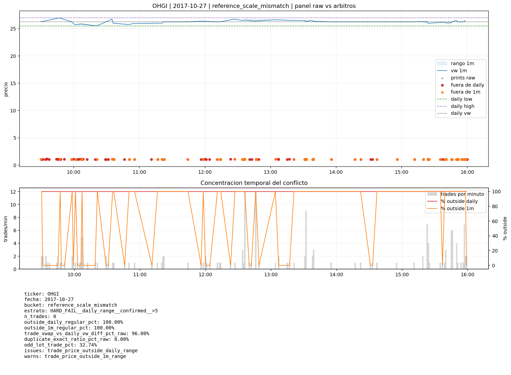

**Que muestra**

- Panel rico del tape raw frente a `daily` y `1m` para `OHGI` el `2017-10-27`.
- `n_trades = 168`, `outside_daily_regular_pct = 100.00%`, `outside_1m_regular_pct = 100.00%`.
- `trade_vwap_vs_daily_vw_diff_pct_raw = 96.00%`, `duplicate_exact_ratio_pct_raw = 0.00%`, `odd_lot_trade_pct = 32.74%`.

**Responde**

- Familia donde el conflicto dominante no es que el tape este roto por dentro, sino que el tape y el arbitro viven en escalas distintas. Responde a la pregunta de si el dano principal es de comparabilidad frente a `daily` o `1m`.
- Responde a si el conflicto dominante vive en la escala (`>1x_other`), en la comparabilidad frente a `daily` (100.00%) o frente a `1m` (100.00%).
- El 32.74% de odd-lots empuja la lectura hacia microestructura fina; evita leer el caso como pura ruptura economica gruesa.
- La decision que justifica es mantener o no el caso en `recoverable_with_flag` cuando se rematerialice la rehabilitacion sobre `57f`.

### SPCB | 2018-01-11

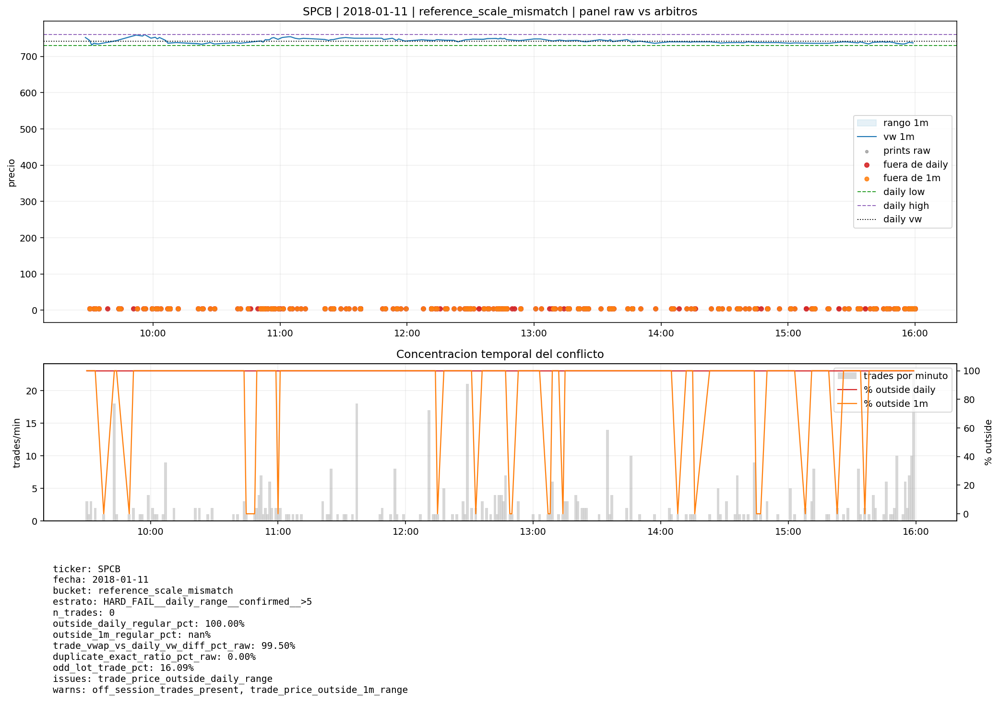

**Que muestra**

- Panel rico del tape raw frente a `daily` y `1m` para `SPCB` el `2018-01-11`.
- `n_trades = 466`, `outside_daily_regular_pct = 100.00%`, `outside_1m_regular_pct = nan%`.
- `trade_vwap_vs_daily_vw_diff_pct_raw = 99.50%`, `duplicate_exact_ratio_pct_raw = 0.00%`, `odd_lot_trade_pct = 16.09%`.

**Responde**

- Familia donde el conflicto dominante no es que el tape este roto por dentro, sino que el tape y el arbitro viven en escalas distintas. Responde a la pregunta de si el dano principal es de comparabilidad frente a `daily` o `1m`.
- Responde a si el conflicto dominante vive en la escala (`>1x_other`), en la comparabilidad frente a `daily` (100.00%) o frente a `1m` (nan%).
- La decision que justifica es mantener o no el caso en `recoverable_with_flag` cuando se rematerialice la rehabilitacion sobre `57f`.

### WHLR | 2014-07-24

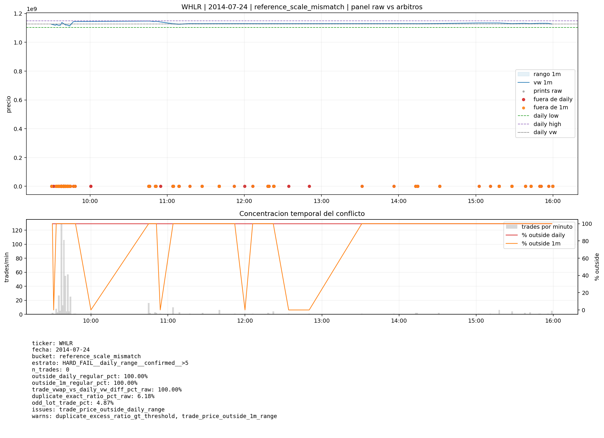

**Que muestra**

- Panel rico del tape raw frente a `daily` y `1m` para `WHLR` el `2014-07-24`.
- `n_trades = 534`, `outside_daily_regular_pct = 100.00%`, `outside_1m_regular_pct = 100.00%`.
- `trade_vwap_vs_daily_vw_diff_pct_raw = 100.00%`, `duplicate_exact_ratio_pct_raw = 6.18%`, `odd_lot_trade_pct = 4.87%`.

**Responde**

- Familia donde el conflicto dominante no es que el tape este roto por dentro, sino que el tape y el arbitro viven en escalas distintas. Responde a la pregunta de si el dano principal es de comparabilidad frente a `daily` o `1m`.
- Responde a si el conflicto dominante vive en la escala (`>1x_other`), en la comparabilidad frente a `daily` (100.00%) o frente a `1m` (100.00%).
- El 6.18% de duplicacion exacta obliga a sospechar dano de tape o bursts mecanicos, no solo ruido visual.
- La decision que justifica es mantener o no el caso en `recoverable_with_flag` cuando se rematerialice la rehabilitacion sobre `57f`.

### LARK | 2016-08-24

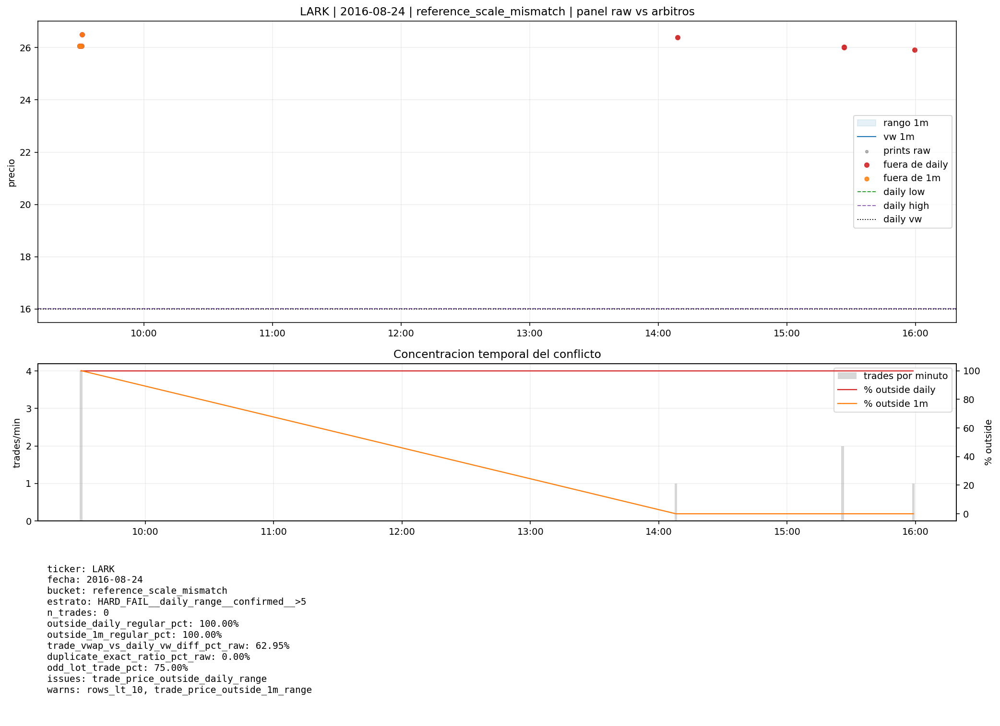

**Que muestra**

- Panel rico del tape raw frente a `daily` y `1m` para `LARK` el `2016-08-24`.
- `n_trades = 8`, `outside_daily_regular_pct = 100.00%`, `outside_1m_regular_pct = 100.00%`.
- `trade_vwap_vs_daily_vw_diff_pct_raw = 62.95%`, `duplicate_exact_ratio_pct_raw = 0.00%`, `odd_lot_trade_pct = 75.00%`.

**Responde**

- Familia donde el conflicto dominante no es que el tape este roto por dentro, sino que el tape y el arbitro viven en escalas distintas. Responde a la pregunta de si el dano principal es de comparabilidad frente a `daily` o `1m`.
- Responde a si el conflicto dominante vive en la escala (`near_0.6667x`), en la comparabilidad frente a `daily` (100.00%) o frente a `1m` (100.00%).
- El 75.00% de odd-lots empuja la lectura hacia microestructura fina; evita leer el caso como pura ruptura economica gruesa.
- La decision que justifica es mantener o no el caso en `recoverable_with_flag` cuando se rematerialice la rehabilitacion sobre `57f`.

### ACFN | 2013-10-10

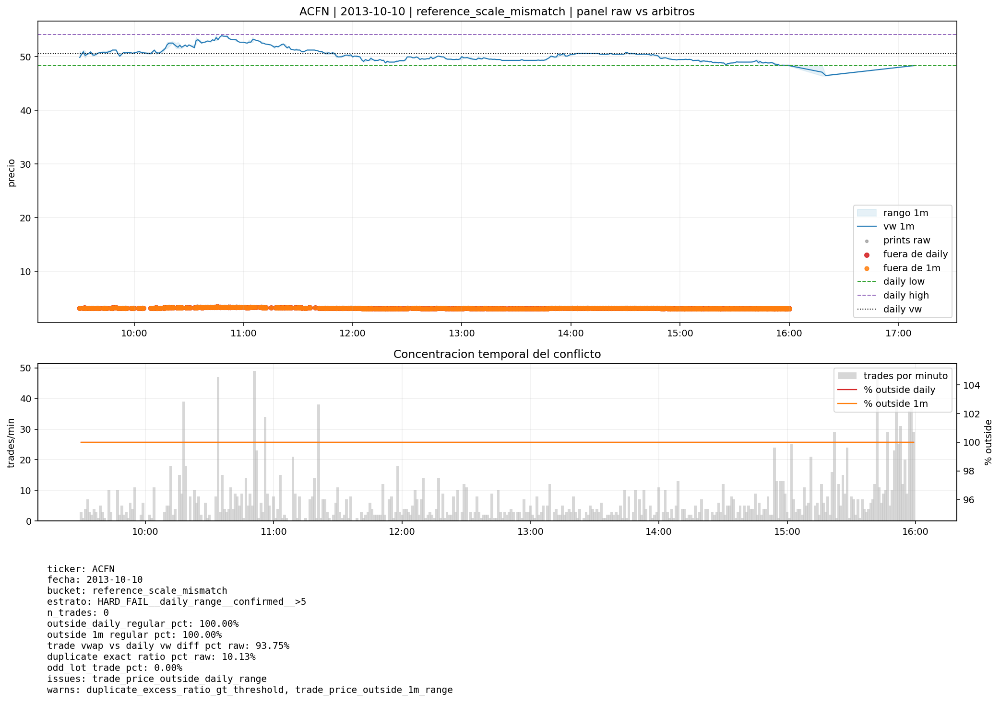

**Que muestra**

- Panel rico del tape raw frente a `daily` y `1m` para `ACFN` el `2013-10-10`.
- `n_trades = 2,291`, `outside_daily_regular_pct = 100.00%`, `outside_1m_regular_pct = 100.00%`.
- `trade_vwap_vs_daily_vw_diff_pct_raw = 93.75%`, `duplicate_exact_ratio_pct_raw = 10.13%`, `odd_lot_trade_pct = 0.00%`.

**Responde**

- Familia donde el conflicto dominante no es que el tape este roto por dentro, sino que el tape y el arbitro viven en escalas distintas. Responde a la pregunta de si el dano principal es de comparabilidad frente a `daily` o `1m`.
- Responde a si el conflicto dominante vive en la escala (`near_15x`), en la comparabilidad frente a `daily` (100.00%) o frente a `1m` (100.00%).
- El 10.13% de duplicacion exacta obliga a sospechar dano de tape o bursts mecanicos, no solo ruido visual.
- La decision que justifica es mantener o no el caso en `recoverable_with_flag` cuando se rematerialice la rehabilitacion sobre `57f`.

### LARK | 2018-01-03

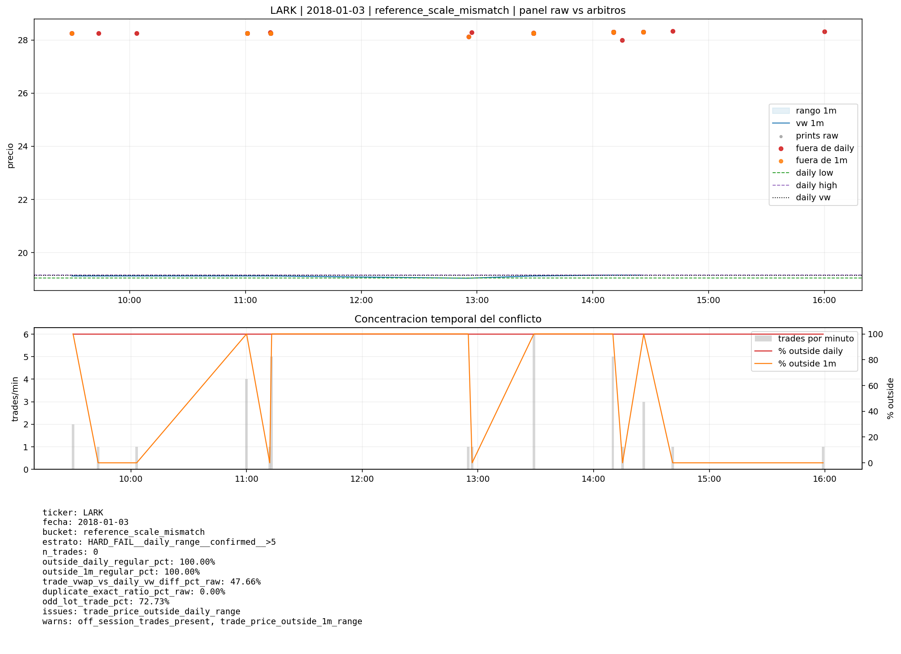

**Que muestra**

- Panel rico del tape raw frente a `daily` y `1m` para `LARK` el `2018-01-03`.
- `n_trades = 33`, `outside_daily_regular_pct = 100.00%`, `outside_1m_regular_pct = 100.00%`.
- `trade_vwap_vs_daily_vw_diff_pct_raw = 47.66%`, `duplicate_exact_ratio_pct_raw = 0.00%`, `odd_lot_trade_pct = 72.73%`.

**Responde**

- Familia donde el conflicto dominante no es que el tape este roto por dentro, sino que el tape y el arbitro viven en escalas distintas. Responde a la pregunta de si el dano principal es de comparabilidad frente a `daily` o `1m`.
- Responde a si el conflicto dominante vive en la escala (`~0.6667x`), en la comparabilidad frente a `daily` (100.00%) o frente a `1m` (100.00%).
- El 72.73% de odd-lots empuja la lectura hacia microestructura fina; evita leer el caso como pura ruptura economica gruesa.
- La decision que justifica es mantener o no el caso en `recoverable_with_flag` cuando se rematerialice la rehabilitacion sobre `57f`.

### IDXG | 2016-12-12

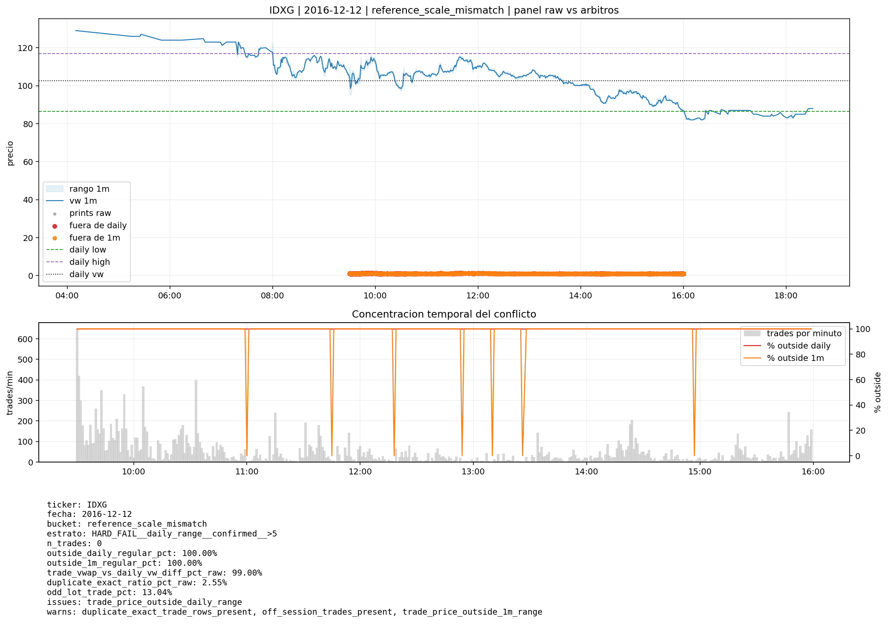

**Que muestra**

- Panel rico del tape raw frente a `daily` y `1m` para `IDXG` el `2016-12-12`.
- `n_trades = 19,132`, `outside_daily_regular_pct = 100.00%`, `outside_1m_regular_pct = 100.00%`.
- `trade_vwap_vs_daily_vw_diff_pct_raw = 99.00%`, `duplicate_exact_ratio_pct_raw = 2.55%`, `odd_lot_trade_pct = 13.04%`.

**Responde**

- Familia donde el conflicto dominante no es que el tape este roto por dentro, sino que el tape y el arbitro viven en escalas distintas. Responde a la pregunta de si el dano principal es de comparabilidad frente a `daily` o `1m`.
- Responde a si el conflicto dominante vive en la escala (`~100x`), en la comparabilidad frente a `daily` (100.00%) o frente a `1m` (100.00%).
- La decision que justifica es mantener o no el caso en `recoverable_with_flag` cuando se rematerialice la rehabilitacion sobre `57f`.

### BEBE | 2014-07-21

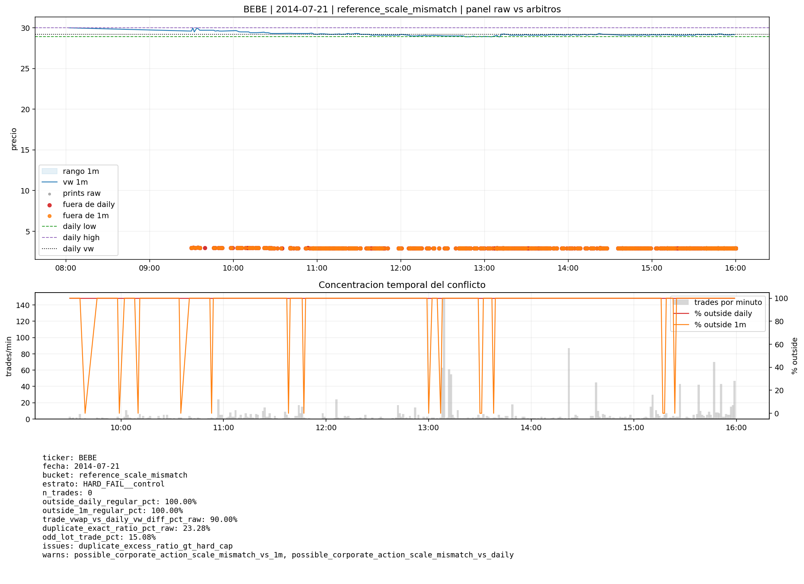

**Que muestra**

- Panel rico del tape raw frente a `daily` y `1m` para `BEBE` el `2014-07-21`.
- `n_trades = 1,645`, `outside_daily_regular_pct = 100.00%`, `outside_1m_regular_pct = 100.00%`.
- `trade_vwap_vs_daily_vw_diff_pct_raw = 90.00%`, `duplicate_exact_ratio_pct_raw = 23.28%`, `odd_lot_trade_pct = 15.08%`.

**Responde**

- Familia donde el conflicto dominante no es que el tape este roto por dentro, sino que el tape y el arbitro viven en escalas distintas. Responde a la pregunta de si el dano principal es de comparabilidad frente a `daily` o `1m`.
- Responde a si el conflicto dominante vive en la escala (`~10x`), en la comparabilidad frente a `daily` (100.00%) o frente a `1m` (100.00%).
- El 23.28% de duplicacion exacta obliga a sospechar dano de tape o bursts mecanicos, no solo ruido visual.
- La decision que justifica es mantener o no el caso en `recoverable_with_flag` cuando se rematerialice la rehabilitacion sobre `57f`.

### HHS | 2015-11-30

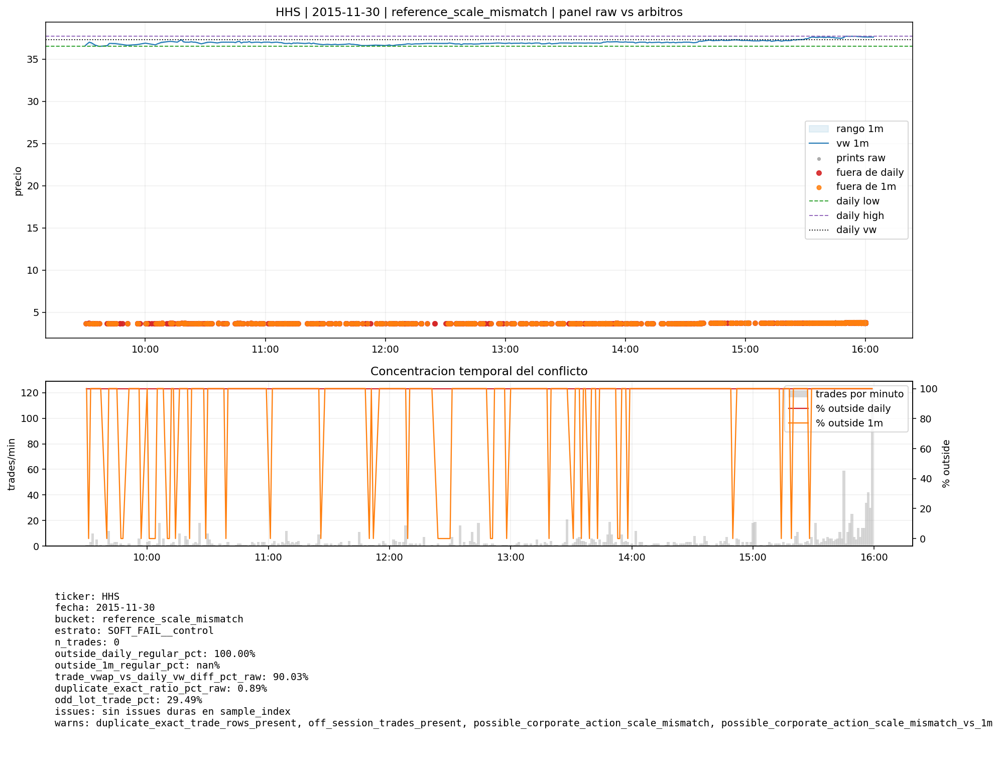

**Que muestra**

- Panel rico del tape raw frente a `daily` y `1m` para `HHS` el `2015-11-30`.
- `n_trades = 1,343`, `outside_daily_regular_pct = 100.00%`, `outside_1m_regular_pct = nan%`.
- `trade_vwap_vs_daily_vw_diff_pct_raw = 90.03%`, `duplicate_exact_ratio_pct_raw = 0.89%`, `odd_lot_trade_pct = 29.49%`.

**Responde**

- Familia donde el conflicto dominante no es que el tape este roto por dentro, sino que el tape y el arbitro viven en escalas distintas. Responde a la pregunta de si el dano principal es de comparabilidad frente a `daily` o `1m`.
- Responde a si el conflicto dominante vive en la escala (`~10x`), en la comparabilidad frente a `daily` (100.00%) o frente a `1m` (nan%).
- El 29.49% de odd-lots empuja la lectura hacia microestructura fina; evita leer el caso como pura ruptura economica gruesa.
- La decision que justifica es mantener o no el caso en `recoverable_with_flag` cuando se rematerialice la rehabilitacion sobre `57f`.

### ATV | 2017-10-13

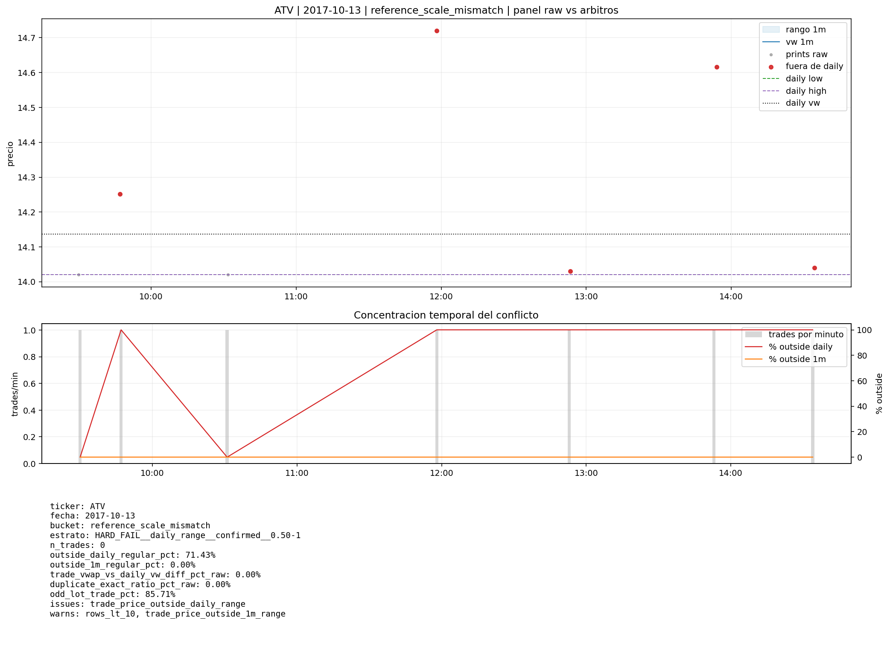

**Que muestra**

- Panel rico del tape raw frente a `daily` y `1m` para `ATV` el `2017-10-13`.
- `n_trades = 7`, `outside_daily_regular_pct = 71.43%`, `outside_1m_regular_pct = 0.00%`.
- `trade_vwap_vs_daily_vw_diff_pct_raw = 0.00%`, `duplicate_exact_ratio_pct_raw = 0.00%`, `odd_lot_trade_pct = 85.71%`.

**Responde**

- Familia donde el conflicto dominante no es que el tape este roto por dentro, sino que el tape y el arbitro viven en escalas distintas. Responde a la pregunta de si el dano principal es de comparabilidad frente a `daily` o `1m`.
- Responde a si el conflicto dominante vive en la escala (`~1x`), en la comparabilidad frente a `daily` (71.43%) o frente a `1m` (0.00%).
- El 85.71% de odd-lots empuja la lectura hacia microestructura fina; evita leer el caso como pura ruptura economica gruesa.
- La decision que justifica es mantener o no el caso en `recoverable_with_flag` cuando se rematerialice la rehabilitacion sobre `57f`.

### ACRX | 2013-04-10

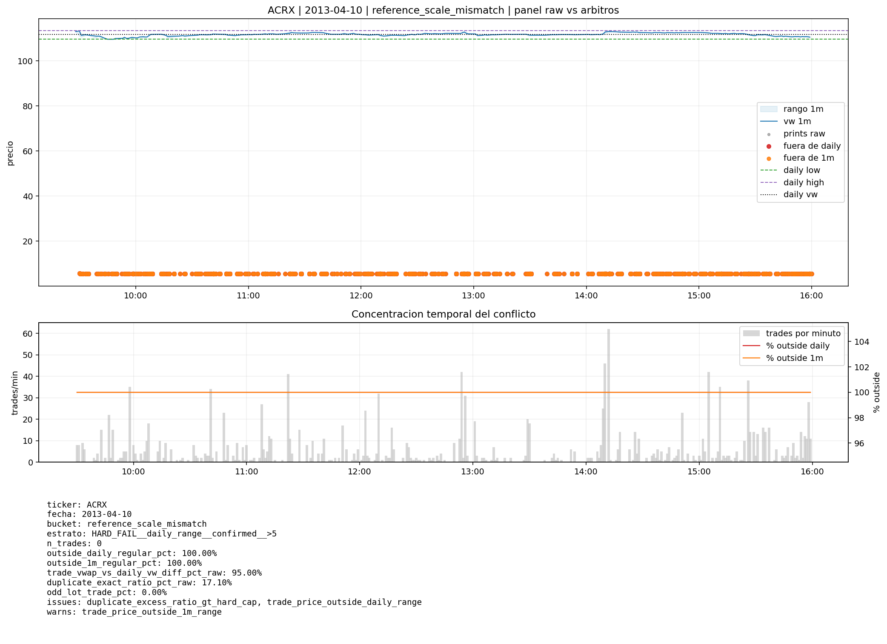

**Que muestra**

- Panel rico del tape raw frente a `daily` y `1m` para `ACRX` el `2013-04-10`.
- `n_trades = 1,602`, `outside_daily_regular_pct = 100.00%`, `outside_1m_regular_pct = 100.00%`.
- `trade_vwap_vs_daily_vw_diff_pct_raw = 95.00%`, `duplicate_exact_ratio_pct_raw = 17.10%`, `odd_lot_trade_pct = 0.00%`.

**Responde**

- Familia donde el conflicto dominante no es que el tape este roto por dentro, sino que el tape y el arbitro viven en escalas distintas. Responde a la pregunta de si el dano principal es de comparabilidad frente a `daily` o `1m`.
- Responde a si el conflicto dominante vive en la escala (`~20x`), en la comparabilidad frente a `daily` (100.00%) o frente a `1m` (100.00%).
- El 17.10% de duplicacion exacta obliga a sospechar dano de tape o bursts mecanicos, no solo ruido visual.
- La decision que justifica es mantener o no el caso en `recoverable_with_flag` cuando se rematerialice la rehabilitacion sobre `57f`.

### ATHX | 2021-04-28

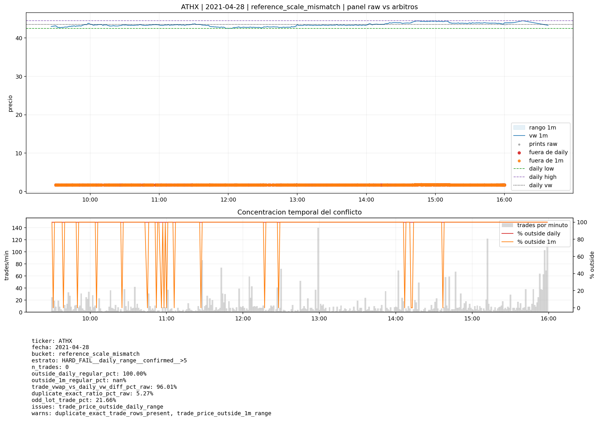

**Que muestra**

- Panel rico del tape raw frente a `daily` y `1m` para `ATHX` el `2021-04-28`.
- `n_trades = 4,482`, `outside_daily_regular_pct = 100.00%`, `outside_1m_regular_pct = nan%`.
- `trade_vwap_vs_daily_vw_diff_pct_raw = 96.01%`, `duplicate_exact_ratio_pct_raw = 5.27%`, `odd_lot_trade_pct = 21.66%`.

**Responde**

- Familia donde el conflicto dominante no es que el tape este roto por dentro, sino que el tape y el arbitro viven en escalas distintas. Responde a la pregunta de si el dano principal es de comparabilidad frente a `daily` o `1m`.
- Responde a si el conflicto dominante vive en la escala (`>1x_other`), en la comparabilidad frente a `daily` (100.00%) o frente a `1m` (nan%).
- El 5.27% de duplicacion exacta obliga a sospechar dano de tape o bursts mecanicos, no solo ruido visual.
- La decision que justifica es mantener o no el caso en `recoverable_with_flag` cuando se rematerialice la rehabilitacion sobre `57f`.

### CHSN | 2025-07-24

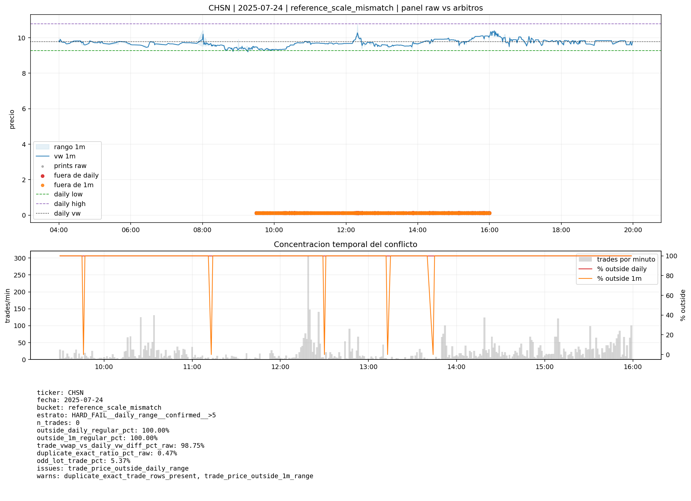

**Que muestra**

- Panel rico del tape raw frente a `daily` y `1m` para `CHSN` el `2025-07-24`.
- `n_trades = 7,586`, `outside_daily_regular_pct = 100.00%`, `outside_1m_regular_pct = 100.00%`.
- `trade_vwap_vs_daily_vw_diff_pct_raw = 98.75%`, `duplicate_exact_ratio_pct_raw = 0.47%`, `odd_lot_trade_pct = 5.37%`.

**Responde**

- Familia donde el conflicto dominante no es que el tape este roto por dentro, sino que el tape y el arbitro viven en escalas distintas. Responde a la pregunta de si el dano principal es de comparabilidad frente a `daily` o `1m`.
- Responde a si el conflicto dominante vive en la escala (`>1x_other`), en la comparabilidad frente a `daily` (100.00%) o frente a `1m` (100.00%).
- La decision que justifica es mantener o no el caso en `recoverable_with_flag` cuando se rematerialice la rehabilitacion sobre `57f`.

### RVYL | 2025-09-23

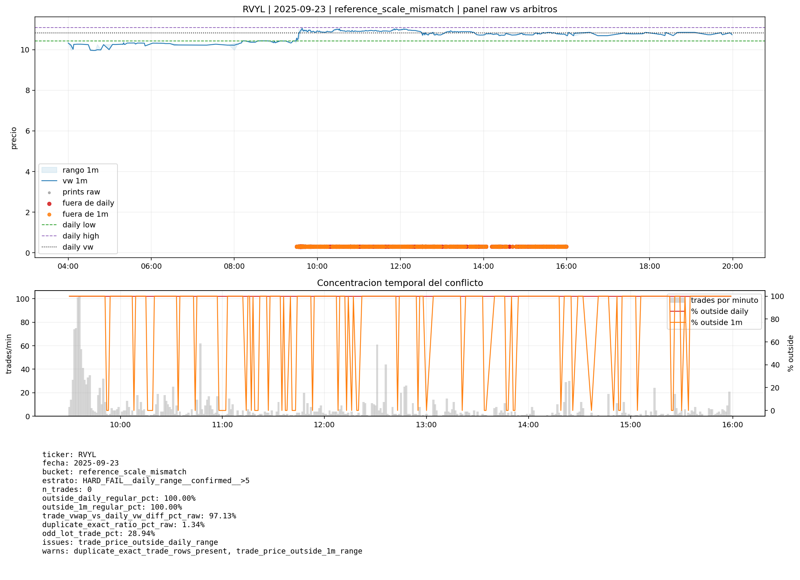

**Que muestra**

- Panel rico del tape raw frente a `daily` y `1m` para `RVYL` el `2025-09-23`.
- `n_trades = 2,322`, `outside_daily_regular_pct = 100.00%`, `outside_1m_regular_pct = 100.00%`.
- `trade_vwap_vs_daily_vw_diff_pct_raw = 97.13%`, `duplicate_exact_ratio_pct_raw = 1.34%`, `odd_lot_trade_pct = 28.94%`.

**Responde**

- Familia donde el conflicto dominante no es que el tape este roto por dentro, sino que el tape y el arbitro viven en escalas distintas. Responde a la pregunta de si el dano principal es de comparabilidad frente a `daily` o `1m`.
- Responde a si el conflicto dominante vive en la escala (`>1x_other`), en la comparabilidad frente a `daily` (100.00%) o frente a `1m` (100.00%).
- El 28.94% de odd-lots empuja la lectura hacia microestructura fina; evita leer el caso como pura ruptura economica gruesa.
- La decision que justifica es mantener o no el caso en `recoverable_with_flag` cuando se rematerialice la rehabilitacion sobre `57f`.

### SCLX | 2023-05-18

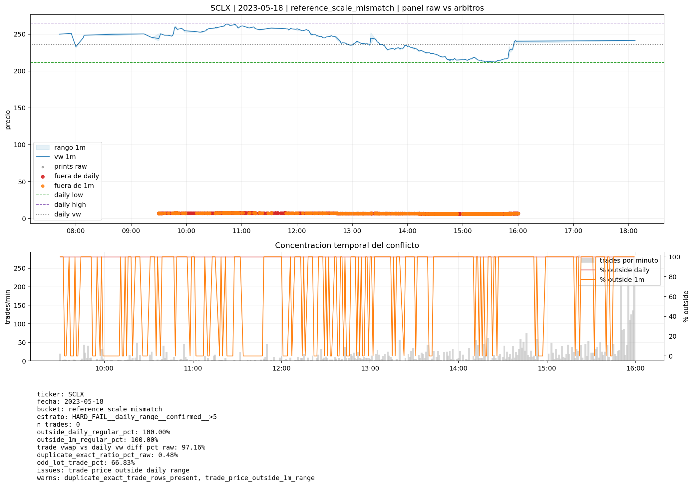

**Que muestra**

- Panel rico del tape raw frente a `daily` y `1m` para `SCLX` el `2023-05-18`.
- `n_trades = 5,450`, `outside_daily_regular_pct = 100.00%`, `outside_1m_regular_pct = 100.00%`.
- `trade_vwap_vs_daily_vw_diff_pct_raw = 97.16%`, `duplicate_exact_ratio_pct_raw = 0.48%`, `odd_lot_trade_pct = 66.83%`.

**Responde**

- Familia donde el conflicto dominante no es que el tape este roto por dentro, sino que el tape y el arbitro viven en escalas distintas. Responde a la pregunta de si el dano principal es de comparabilidad frente a `daily` o `1m`.
- Responde a si el conflicto dominante vive en la escala (`>1x_other`), en la comparabilidad frente a `daily` (100.00%) o frente a `1m` (100.00%).
- El 66.83% de odd-lots empuja la lectura hacia microestructura fina; evita leer el caso como pura ruptura economica gruesa.
- La decision que justifica es mantener o no el caso en `recoverable_with_flag` cuando se rematerialice la rehabilitacion sobre `57f`.

### SILO | 2022-02-25

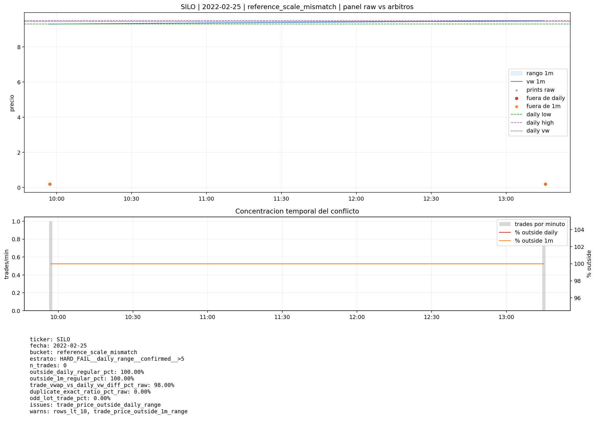

**Que muestra**

- Panel rico del tape raw frente a `daily` y `1m` para `SILO` el `2022-02-25`.
- `n_trades = 2`, `outside_daily_regular_pct = 100.00%`, `outside_1m_regular_pct = 100.00%`.
- `trade_vwap_vs_daily_vw_diff_pct_raw = 98.00%`, `duplicate_exact_ratio_pct_raw = 0.00%`, `odd_lot_trade_pct = 0.00%`.

**Responde**

- Familia donde el conflicto dominante no es que el tape este roto por dentro, sino que el tape y el arbitro viven en escalas distintas. Responde a la pregunta de si el dano principal es de comparabilidad frente a `daily` o `1m`.
- Responde a si el conflicto dominante vive en la escala (`>1x_other`), en la comparabilidad frente a `daily` (100.00%) o frente a `1m` (100.00%).
- La decision que justifica es mantener o no el caso en `recoverable_with_flag` cuando se rematerialice la rehabilitacion sobre `57f`.

### SNWV | 2022-09-20

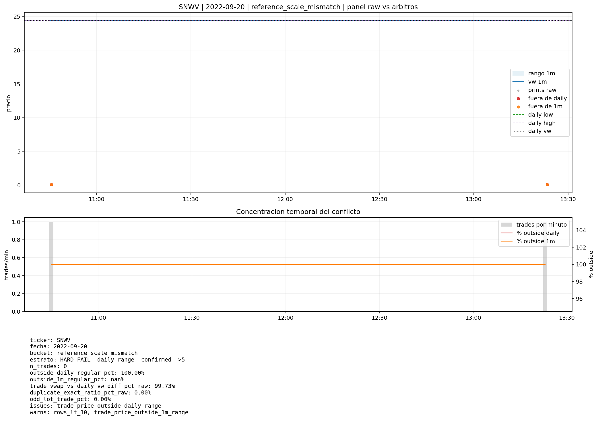

**Que muestra**

- Panel rico del tape raw frente a `daily` y `1m` para `SNWV` el `2022-09-20`.
- `n_trades = 2`, `outside_daily_regular_pct = 100.00%`, `outside_1m_regular_pct = nan%`.
- `trade_vwap_vs_daily_vw_diff_pct_raw = 99.73%`, `duplicate_exact_ratio_pct_raw = 0.00%`, `odd_lot_trade_pct = 0.00%`.

**Responde**

- Familia donde el conflicto dominante no es que el tape este roto por dentro, sino que el tape y el arbitro viven en escalas distintas. Responde a la pregunta de si el dano principal es de comparabilidad frente a `daily` o `1m`.
- Responde a si el conflicto dominante vive en la escala (`>1x_other`), en la comparabilidad frente a `daily` (100.00%) o frente a `1m` (nan%).
- La decision que justifica es mantener o no el caso en `recoverable_with_flag` cuando se rematerialice la rehabilitacion sobre `57f`.

### TENX | 2021-05-25

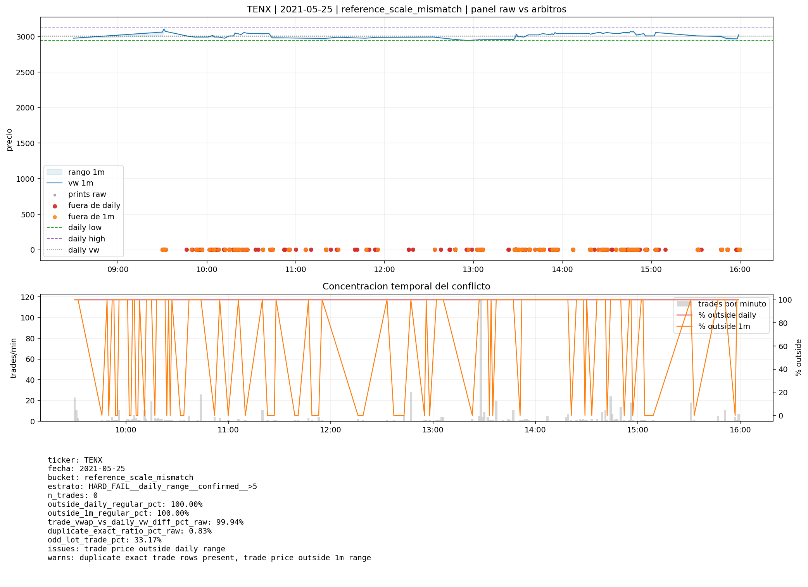

**Que muestra**

- Panel rico del tape raw frente a `daily` y `1m` para `TENX` el `2021-05-25`.
- `n_trades = 606`, `outside_daily_regular_pct = 100.00%`, `outside_1m_regular_pct = 100.00%`.
- `trade_vwap_vs_daily_vw_diff_pct_raw = 99.94%`, `duplicate_exact_ratio_pct_raw = 0.83%`, `odd_lot_trade_pct = 33.17%`.

**Responde**

- Familia donde el conflicto dominante no es que el tape este roto por dentro, sino que el tape y el arbitro viven en escalas distintas. Responde a la pregunta de si el dano principal es de comparabilidad frente a `daily` o `1m`.
- Responde a si el conflicto dominante vive en la escala (`>1x_other`), en la comparabilidad frente a `daily` (100.00%) o frente a `1m` (100.00%).
- El 33.17% de odd-lots empuja la lectura hacia microestructura fina; evita leer el caso como pura ruptura economica gruesa.
- La decision que justifica es mantener o no el caso en `recoverable_with_flag` cuando se rematerialice la rehabilitacion sobre `57f`.

### TIVC | 2024-02-16

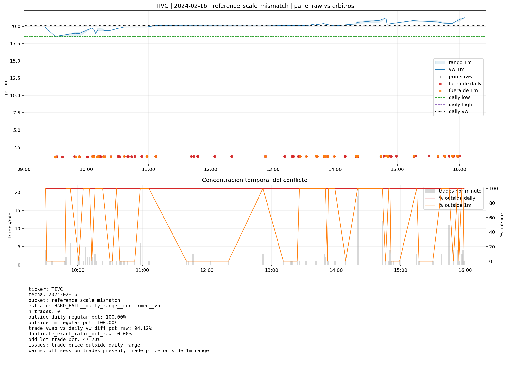

**Que muestra**

- Panel rico del tape raw frente a `daily` y `1m` para `TIVC` el `2024-02-16`.
- `n_trades = 174`, `outside_daily_regular_pct = 100.00%`, `outside_1m_regular_pct = 100.00%`.
- `trade_vwap_vs_daily_vw_diff_pct_raw = 94.12%`, `duplicate_exact_ratio_pct_raw = 0.00%`, `odd_lot_trade_pct = 47.70%`.

**Responde**

- Familia donde el conflicto dominante no es que el tape este roto por dentro, sino que el tape y el arbitro viven en escalas distintas. Responde a la pregunta de si el dano principal es de comparabilidad frente a `daily` o `1m`.
- Responde a si el conflicto dominante vive en la escala (`>1x_other`), en la comparabilidad frente a `daily` (100.00%) o frente a `1m` (100.00%).
- El 47.70% de odd-lots empuja la lectura hacia microestructura fina; evita leer el caso como pura ruptura economica gruesa.
- La decision que justifica es mantener o no el caso en `recoverable_with_flag` cuando se rematerialice la rehabilitacion sobre `57f`.

### WWR | 2019-04-17

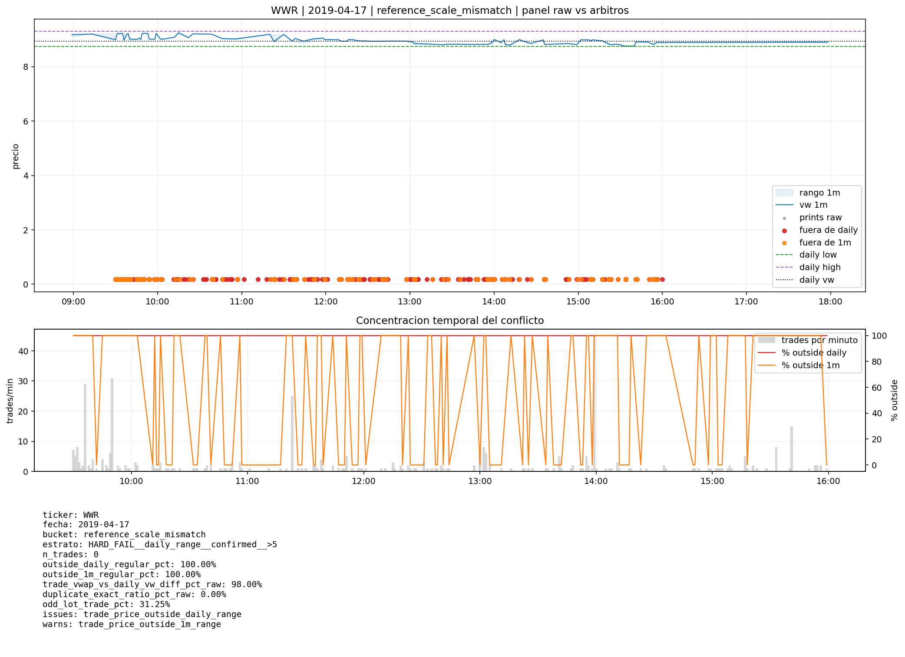

**Que muestra**

- Panel rico del tape raw frente a `daily` y `1m` para `WWR` el `2019-04-17`.
- `n_trades = 400`, `outside_daily_regular_pct = 100.00%`, `outside_1m_regular_pct = 100.00%`.
- `trade_vwap_vs_daily_vw_diff_pct_raw = 98.00%`, `duplicate_exact_ratio_pct_raw = 0.00%`, `odd_lot_trade_pct = 31.25%`.

**Responde**

- Familia donde el conflicto dominante no es que el tape este roto por dentro, sino que el tape y el arbitro viven en escalas distintas. Responde a la pregunta de si el dano principal es de comparabilidad frente a `daily` o `1m`.
- Responde a si el conflicto dominante vive en la escala (`>1x_other`), en la comparabilidad frente a `daily` (100.00%) o frente a `1m` (100.00%).
- El 31.25% de odd-lots empuja la lectura hacia microestructura fina; evita leer el caso como pura ruptura economica gruesa.
- La decision que justifica es mantener o no el caso en `recoverable_with_flag` cuando se rematerialice la rehabilitacion sobre `57f`.

### DOUG | 2022-11-09

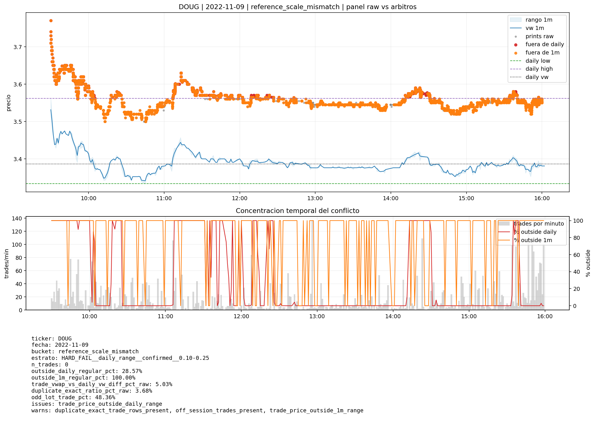

**Que muestra**

- Panel rico del tape raw frente a `daily` y `1m` para `DOUG` el `2022-11-09`.
- `n_trades = 5,757`, `outside_daily_regular_pct = 28.57%`, `outside_1m_regular_pct = 100.00%`.
- `trade_vwap_vs_daily_vw_diff_pct_raw = 5.03%`, `duplicate_exact_ratio_pct_raw = 3.68%`, `odd_lot_trade_pct = 48.36%`.

**Responde**

- Familia donde el conflicto dominante no es que el tape este roto por dentro, sino que el tape y el arbitro viven en escalas distintas. Responde a la pregunta de si el dano principal es de comparabilidad frente a `daily` o `1m`.
- Responde a si el conflicto dominante vive en la escala (`near_0.9091x`), en la comparabilidad frente a `daily` (28.57%) o frente a `1m` (100.00%).
- El 48.36% de odd-lots empuja la lectura hacia microestructura fina; evita leer el caso como pura ruptura economica gruesa.
- La decision que justifica es mantener o no el caso en `recoverable_with_flag` cuando se rematerialice la rehabilitacion sobre `57f`.

### PMD | 2024-11-12

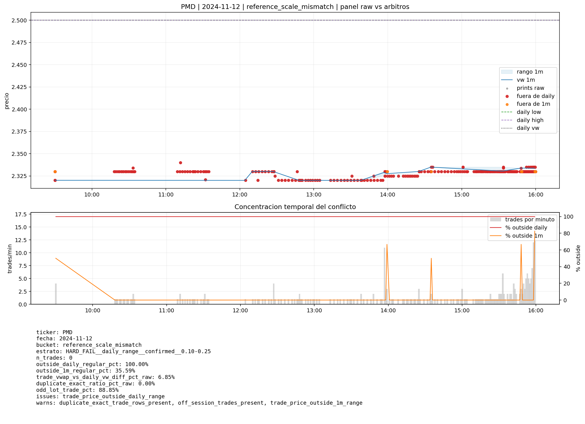

**Que muestra**

- Panel rico del tape raw frente a `daily` y `1m` para `PMD` el `2024-11-12`.
- `n_trades = 269`, `outside_daily_regular_pct = 100.00%`, `outside_1m_regular_pct = 35.59%`.
- `trade_vwap_vs_daily_vw_diff_pct_raw = 6.85%`, `duplicate_exact_ratio_pct_raw = 0.00%`, `odd_lot_trade_pct = 88.85%`.

**Responde**

- Familia donde el conflicto dominante no es que el tape este roto por dentro, sino que el tape y el arbitro viven en escalas distintas. Responde a la pregunta de si el dano principal es de comparabilidad frente a `daily` o `1m`.
- Responde a si el conflicto dominante vive en la escala (`near_1.1111x`), en la comparabilidad frente a `daily` (100.00%) o frente a `1m` (35.59%).
- El 88.85% de odd-lots empuja la lectura hacia microestructura fina; evita leer el caso como pura ruptura economica gruesa.
- La decision que justifica es mantener o no el caso en `recoverable_with_flag` cuando se rematerialice la rehabilitacion sobre `57f`.

### ACON | 2024-10-14

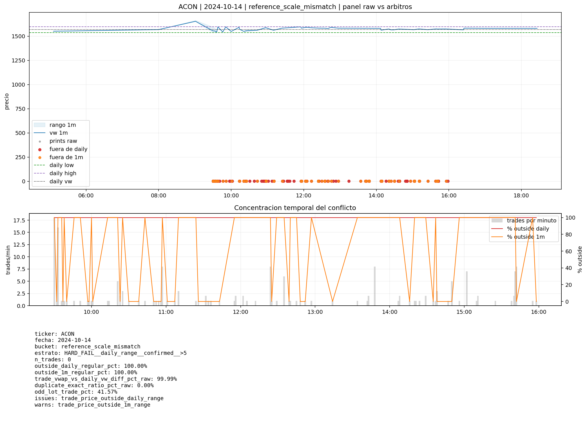

**Que muestra**

- Panel rico del tape raw frente a `daily` y `1m` para `ACON` el `2024-10-14`.
- `n_trades = 178`, `outside_daily_regular_pct = 100.00%`, `outside_1m_regular_pct = 100.00%`.
- `trade_vwap_vs_daily_vw_diff_pct_raw = 99.99%`, `duplicate_exact_ratio_pct_raw = 0.00%`, `odd_lot_trade_pct = 41.57%`.

**Responde**

- Familia donde el conflicto dominante no es que el tape este roto por dentro, sino que el tape y el arbitro viven en escalas distintas. Responde a la pregunta de si el dano principal es de comparabilidad frente a `daily` o `1m`.
- Responde a si el conflicto dominante vive en la escala (`near_10000x`), en la comparabilidad frente a `daily` (100.00%) o frente a `1m` (100.00%).
- El 41.57% de odd-lots empuja la lectura hacia microestructura fina; evita leer el caso como pura ruptura economica gruesa.
- La decision que justifica es mantener o no el caso en `recoverable_with_flag` cuando se rematerialice la rehabilitacion sobre `57f`.

### YYAI | 2024-04-19

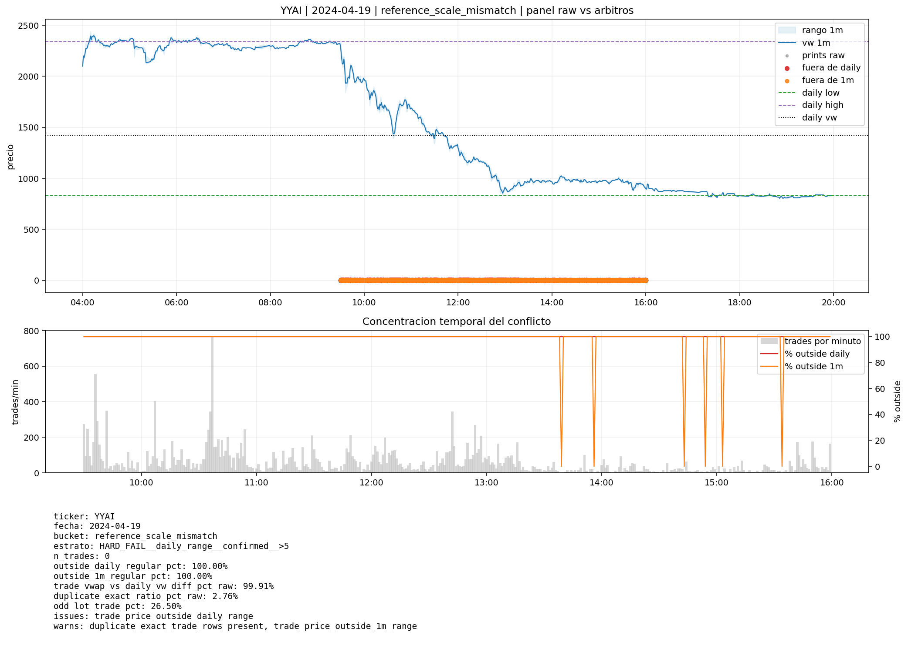

**Que muestra**

- Panel rico del tape raw frente a `daily` y `1m` para `YYAI` el `2024-04-19`.
- `n_trades = 22,336`, `outside_daily_regular_pct = 100.00%`, `outside_1m_regular_pct = 100.00%`.
- `trade_vwap_vs_daily_vw_diff_pct_raw = 99.91%`, `duplicate_exact_ratio_pct_raw = 2.76%`, `odd_lot_trade_pct = 26.50%`.

**Responde**

- Familia donde el conflicto dominante no es que el tape este roto por dentro, sino que el tape y el arbitro viven en escalas distintas. Responde a la pregunta de si el dano principal es de comparabilidad frente a `daily` o `1m`.
- Responde a si el conflicto dominante vive en la escala (`near_1000x`), en la comparabilidad frente a `daily` (100.00%) o frente a `1m` (100.00%).
- El 26.50% de odd-lots empuja la lectura hacia microestructura fina; evita leer el caso como pura ruptura economica gruesa.
- La decision que justifica es mantener o no el caso en `recoverable_with_flag` cuando se rematerialice la rehabilitacion sobre `57f`.

### OTRK | 2022-02-04

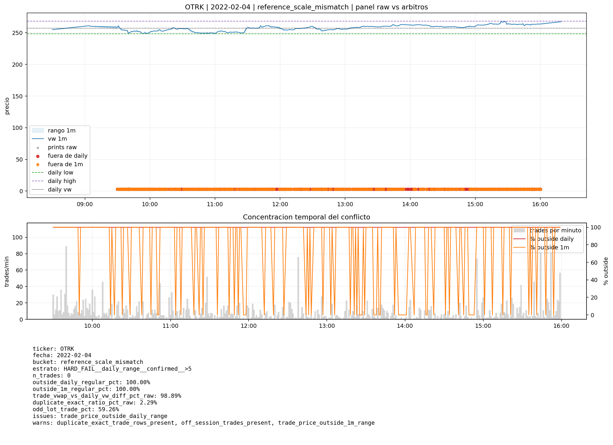

**Que muestra**

- Panel rico del tape raw frente a `daily` y `1m` para `OTRK` el `2022-02-04`.
- `n_trades = 3,368`, `outside_daily_regular_pct = 100.00%`, `outside_1m_regular_pct = 100.00%`.
- `trade_vwap_vs_daily_vw_diff_pct_raw = 98.89%`, `duplicate_exact_ratio_pct_raw = 2.29%`, `odd_lot_trade_pct = 59.26%`.

**Responde**

- Familia donde el conflicto dominante no es que el tape este roto por dentro, sino que el tape y el arbitro viven en escalas distintas. Responde a la pregunta de si el dano principal es de comparabilidad frente a `daily` o `1m`.
- Responde a si el conflicto dominante vive en la escala (`near_100x`), en la comparabilidad frente a `daily` (100.00%) o frente a `1m` (100.00%).
- El 59.26% de odd-lots empuja la lectura hacia microestructura fina; evita leer el caso como pura ruptura economica gruesa.
- La decision que justifica es mantener o no el caso en `recoverable_with_flag` cuando se rematerialice la rehabilitacion sobre `57f`.

### SNCR | 2020-10-20

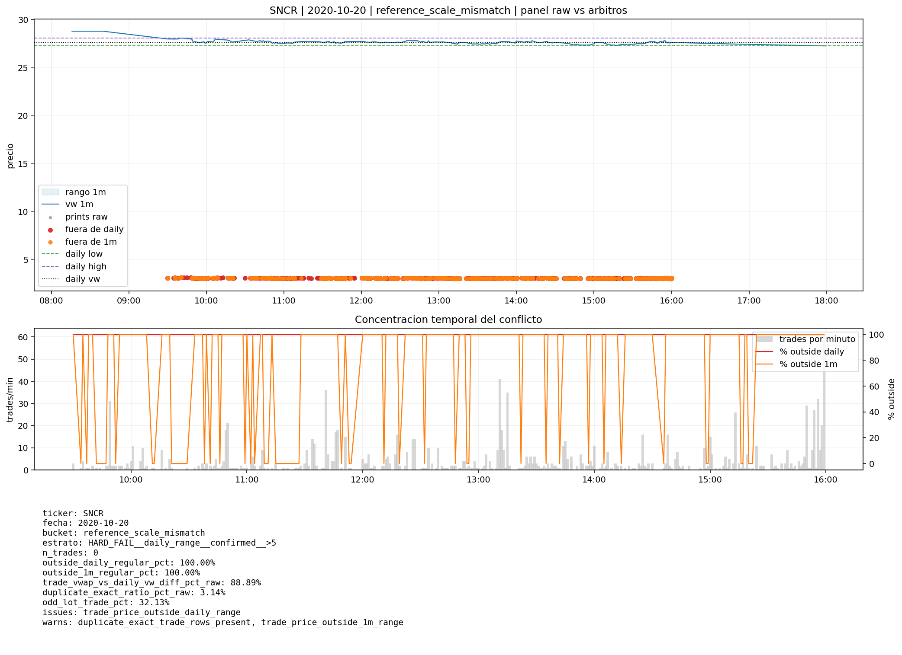

**Que muestra**

- Panel rico del tape raw frente a `daily` y `1m` para `SNCR` el `2020-10-20`.
- `n_trades = 1,242`, `outside_daily_regular_pct = 100.00%`, `outside_1m_regular_pct = 100.00%`.
- `trade_vwap_vs_daily_vw_diff_pct_raw = 88.89%`, `duplicate_exact_ratio_pct_raw = 3.14%`, `odd_lot_trade_pct = 32.13%`.

**Responde**

- Familia donde el conflicto dominante no es que el tape este roto por dentro, sino que el tape y el arbitro viven en escalas distintas. Responde a la pregunta de si el dano principal es de comparabilidad frente a `daily` o `1m`.
- Responde a si el conflicto dominante vive en la escala (`near_10x`), en la comparabilidad frente a `daily` (100.00%) o frente a `1m` (100.00%).
- El 32.13% de odd-lots empuja la lectura hacia microestructura fina; evita leer el caso como pura ruptura economica gruesa.
- La decision que justifica es mantener o no el caso en `recoverable_with_flag` cuando se rematerialice la rehabilitacion sobre `57f`.

### MTVA | 2024-12-06

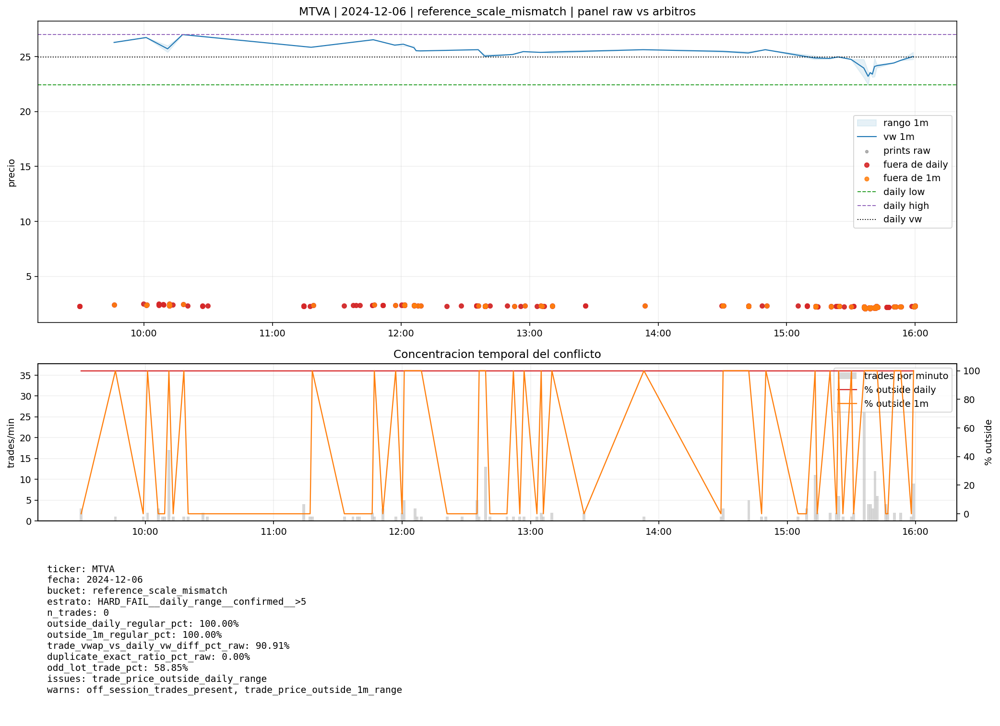

**Que muestra**

- Panel rico del tape raw frente a `daily` y `1m` para `MTVA` el `2024-12-06`.
- `n_trades = 226`, `outside_daily_regular_pct = 100.00%`, `outside_1m_regular_pct = 100.00%`.
- `trade_vwap_vs_daily_vw_diff_pct_raw = 90.91%`, `duplicate_exact_ratio_pct_raw = 0.00%`, `odd_lot_trade_pct = 58.85%`.

**Responde**

- Familia donde el conflicto dominante no es que el tape este roto por dentro, sino que el tape y el arbitro viven en escalas distintas. Responde a la pregunta de si el dano principal es de comparabilidad frente a `daily` o `1m`.
- Responde a si el conflicto dominante vive en la escala (`near_12x`), en la comparabilidad frente a `daily` (100.00%) o frente a `1m` (100.00%).
- El 58.85% de odd-lots empuja la lectura hacia microestructura fina; evita leer el caso como pura ruptura economica gruesa.
- La decision que justifica es mantener o no el caso en `recoverable_with_flag` cuando se rematerialice la rehabilitacion sobre `57f`.

### BKYI | 2019-05-23

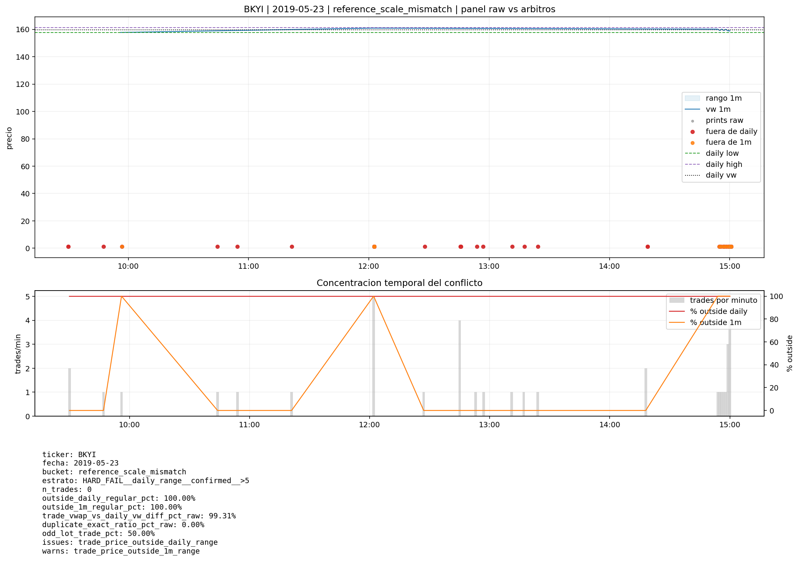

**Que muestra**

- Panel rico del tape raw frente a `daily` y `1m` para `BKYI` el `2019-05-23`.
- `n_trades = 36`, `outside_daily_regular_pct = 100.00%`, `outside_1m_regular_pct = 100.00%`.
- `trade_vwap_vs_daily_vw_diff_pct_raw = 99.31%`, `duplicate_exact_ratio_pct_raw = 0.00%`, `odd_lot_trade_pct = 50.00%`.

**Responde**

- Familia donde el conflicto dominante no es que el tape este roto por dentro, sino que el tape y el arbitro viven en escalas distintas. Responde a la pregunta de si el dano principal es de comparabilidad frente a `daily` o `1m`.
- Responde a si el conflicto dominante vive en la escala (`near_150x`), en la comparabilidad frente a `daily` (100.00%) o frente a `1m` (100.00%).
- El 50.00% de odd-lots empuja la lectura hacia microestructura fina; evita leer el caso como pura ruptura economica gruesa.
- La decision que justifica es mantener o no el caso en `recoverable_with_flag` cuando se rematerialice la rehabilitacion sobre `57f`.

### SOPA | 2023-08-21

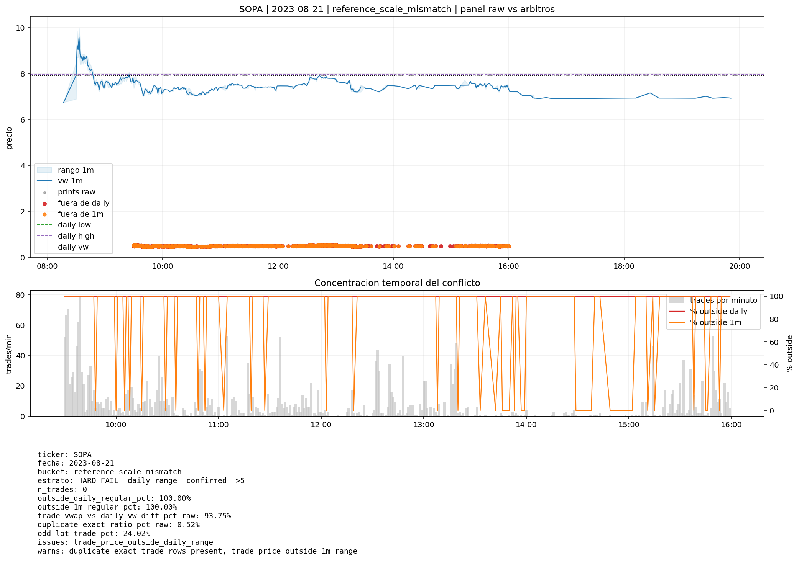

**Que muestra**

- Panel rico del tape raw frente a `daily` y `1m` para `SOPA` el `2023-08-21`.
- `n_trades = 2,698`, `outside_daily_regular_pct = 100.00%`, `outside_1m_regular_pct = 100.00%`.
- `trade_vwap_vs_daily_vw_diff_pct_raw = 93.75%`, `duplicate_exact_ratio_pct_raw = 0.52%`, `odd_lot_trade_pct = 24.02%`.

**Responde**

- Familia donde el conflicto dominante no es que el tape este roto por dentro, sino que el tape y el arbitro viven en escalas distintas. Responde a la pregunta de si el dano principal es de comparabilidad frente a `daily` o `1m`.
- Responde a si el conflicto dominante vive en la escala (`near_15x`), en la comparabilidad frente a `daily` (100.00%) o frente a `1m` (100.00%).
- La decision que justifica es mantener o no el caso en `recoverable_with_flag` cuando se rematerialice la rehabilitacion sobre `57f`.

### AROW | 2023-04-04

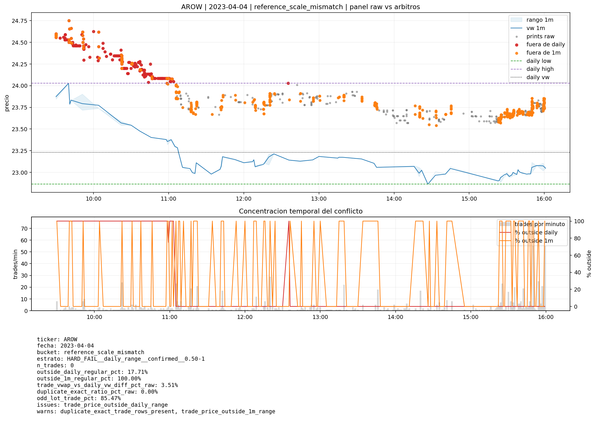

**Que muestra**

- Panel rico del tape raw frente a `daily` y `1m` para `AROW` el `2023-04-04`.
- `n_trades = 1,005`, `outside_daily_regular_pct = 17.71%`, `outside_1m_regular_pct = 100.00%`.
- `trade_vwap_vs_daily_vw_diff_pct_raw = 3.51%`, `duplicate_exact_ratio_pct_raw = 0.00%`, `odd_lot_trade_pct = 85.47%`.

**Responde**

- Familia donde el conflicto dominante no es que el tape este roto por dentro, sino que el tape y el arbitro viven en escalas distintas. Responde a la pregunta de si el dano principal es de comparabilidad frente a `daily` o `1m`.
- Responde a si el conflicto dominante vive en la escala (`near_1x`), en la comparabilidad frente a `daily` (17.71%) o frente a `1m` (100.00%).
- El 85.47% de odd-lots empuja la lectura hacia microestructura fina; evita leer el caso como pura ruptura economica gruesa.
- La decision que justifica es mantener o no el caso en `recoverable_with_flag` cuando se rematerialice la rehabilitacion sobre `57f`.

### ONCS | 2020-02-06

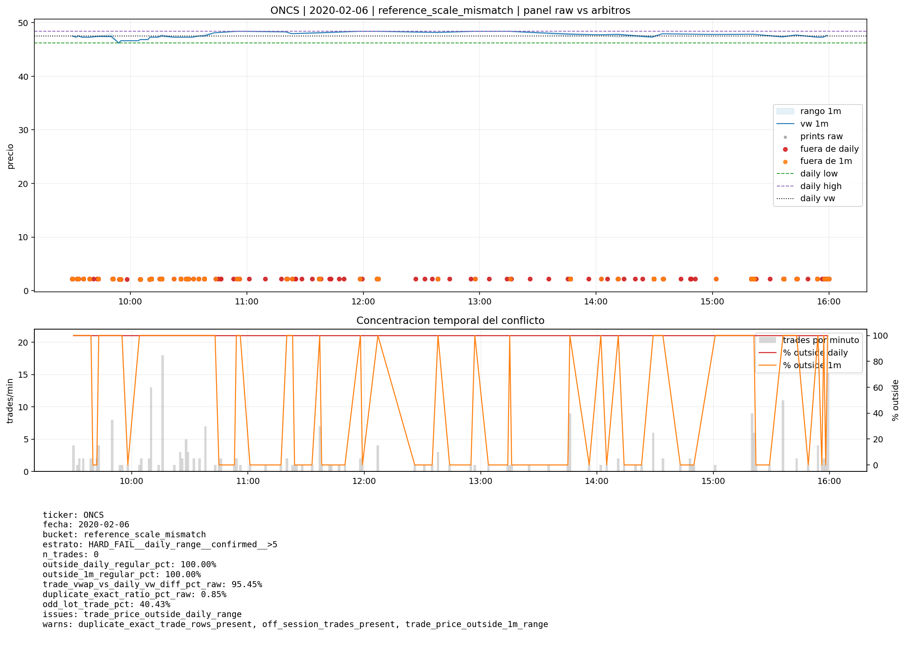

**Que muestra**

- Panel rico del tape raw frente a `daily` y `1m` para `ONCS` el `2020-02-06`.
- `n_trades = 235`, `outside_daily_regular_pct = 100.00%`, `outside_1m_regular_pct = 100.00%`.
- `trade_vwap_vs_daily_vw_diff_pct_raw = 95.45%`, `duplicate_exact_ratio_pct_raw = 0.85%`, `odd_lot_trade_pct = 40.43%`.

**Responde**

- Familia donde el conflicto dominante no es que el tape este roto por dentro, sino que el tape y el arbitro viven en escalas distintas. Responde a la pregunta de si el dano principal es de comparabilidad frente a `daily` o `1m`.
- Responde a si el conflicto dominante vive en la escala (`near_20x`), en la comparabilidad frente a `daily` (100.00%) o frente a `1m` (100.00%).
- El 40.43% de odd-lots empuja la lectura hacia microestructura fina; evita leer el caso como pura ruptura economica gruesa.
- La decision que justifica es mantener o no el caso en `recoverable_with_flag` cuando se rematerialice la rehabilitacion sobre `57f`.

### PIK | 2022-01-11

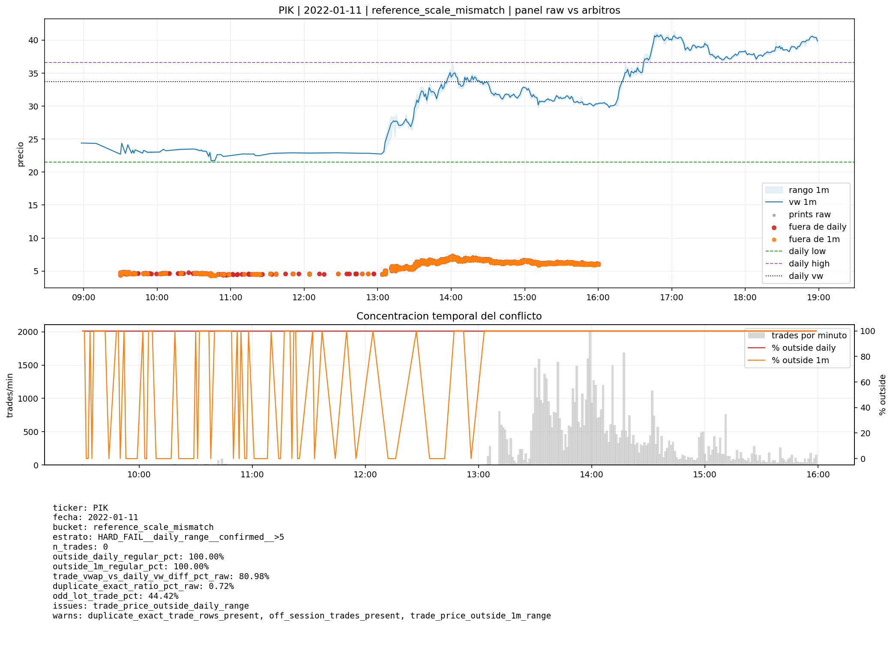

**Que muestra**

- Panel rico del tape raw frente a `daily` y `1m` para `PIK` el `2022-01-11`.
- `n_trades = 70,777`, `outside_daily_regular_pct = 100.00%`, `outside_1m_regular_pct = 100.00%`.
- `trade_vwap_vs_daily_vw_diff_pct_raw = 80.98%`, `duplicate_exact_ratio_pct_raw = 0.72%`, `odd_lot_trade_pct = 44.42%`.

**Responde**

- Familia donde el conflicto dominante no es que el tape este roto por dentro, sino que el tape y el arbitro viven en escalas distintas. Responde a la pregunta de si el dano principal es de comparabilidad frente a `daily` o `1m`.
- Responde a si el conflicto dominante vive en la escala (`near_5x`), en la comparabilidad frente a `daily` (100.00%) o frente a `1m` (100.00%).
- El 44.42% de odd-lots empuja la lectura hacia microestructura fina; evita leer el caso como pura ruptura economica gruesa.
- La decision que justifica es mantener o no el caso en `recoverable_with_flag` cuando se rematerialice la rehabilitacion sobre `57f`.

### TPST | 2023-12-21

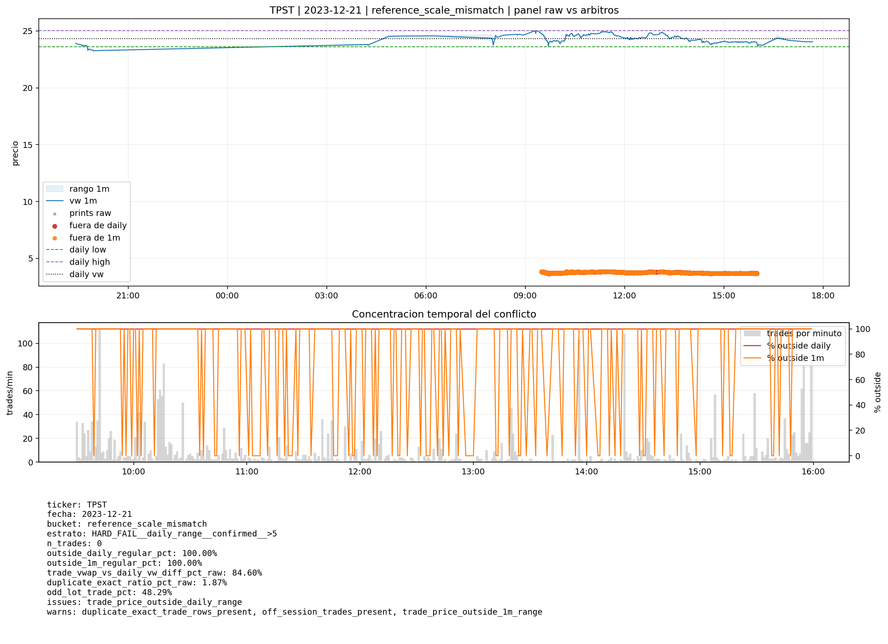

**Que muestra**

- Panel rico del tape raw frente a `daily` y `1m` para `TPST` el `2023-12-21`.
- `n_trades = 3,048`, `outside_daily_regular_pct = 100.00%`, `outside_1m_regular_pct = 100.00%`.
- `trade_vwap_vs_daily_vw_diff_pct_raw = 84.60%`, `duplicate_exact_ratio_pct_raw = 1.87%`, `odd_lot_trade_pct = 48.29%`.

**Responde**

- Familia donde el conflicto dominante no es que el tape este roto por dentro, sino que el tape y el arbitro viven en escalas distintas. Responde a la pregunta de si el dano principal es de comparabilidad frente a `daily` o `1m`.
- Responde a si el conflicto dominante vive en la escala (`near_6x`), en la comparabilidad frente a `daily` (100.00%) o frente a `1m` (100.00%).
- El 48.29% de odd-lots empuja la lectura hacia microestructura fina; evita leer el caso como pura ruptura economica gruesa.
- La decision que justifica es mantener o no el caso en `recoverable_with_flag` cuando se rematerialice la rehabilitacion sobre `57f`.

### BRBS | 2020-01-07

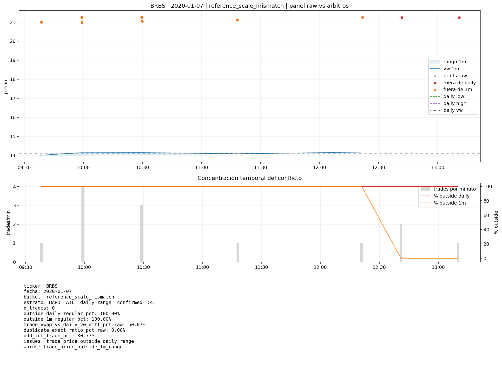

**Que muestra**

- Panel rico del tape raw frente a `daily` y `1m` para `BRBS` el `2020-01-07`.
- `n_trades = 13`, `outside_daily_regular_pct = 100.00%`, `outside_1m_regular_pct = 100.00%`.
- `trade_vwap_vs_daily_vw_diff_pct_raw = 50.07%`, `duplicate_exact_ratio_pct_raw = 0.00%`, `odd_lot_trade_pct = 30.77%`.

**Responde**

- Familia donde el conflicto dominante no es que el tape este roto por dentro, sino que el tape y el arbitro viven en escalas distintas. Responde a la pregunta de si el dano principal es de comparabilidad frente a `daily` o `1m`.
- Responde a si el conflicto dominante vive en la escala (`~0.6667x`), en la comparabilidad frente a `daily` (100.00%) o frente a `1m` (100.00%).
- El 30.77% de odd-lots empuja la lectura hacia microestructura fina; evita leer el caso como pura ruptura economica gruesa.
- La decision que justifica es mantener o no el caso en `recoverable_with_flag` cuando se rematerialice la rehabilitacion sobre `57f`.

### DFDV | 2025-09-17

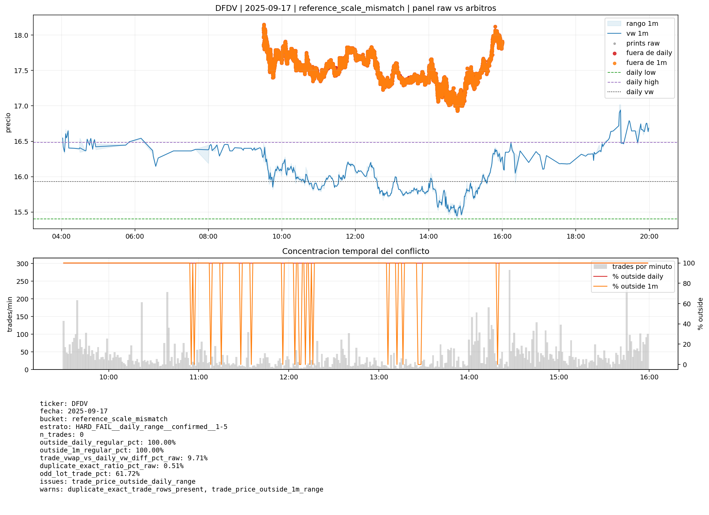

**Que muestra**

- Panel rico del tape raw frente a `daily` y `1m` para `DFDV` el `2025-09-17`.
- `n_trades = 14,414`, `outside_daily_regular_pct = 100.00%`, `outside_1m_regular_pct = 100.00%`.
- `trade_vwap_vs_daily_vw_diff_pct_raw = 9.71%`, `duplicate_exact_ratio_pct_raw = 0.51%`, `odd_lot_trade_pct = 61.72%`.

**Responde**

- Familia donde el conflicto dominante no es que el tape este roto por dentro, sino que el tape y el arbitro viven en escalas distintas. Responde a la pregunta de si el dano principal es de comparabilidad frente a `daily` o `1m`.
- Responde a si el conflicto dominante vive en la escala (`~0.9091x`), en la comparabilidad frente a `daily` (100.00%) o frente a `1m` (100.00%).
- El 61.72% de odd-lots empuja la lectura hacia microestructura fina; evita leer el caso como pura ruptura economica gruesa.
- La decision que justifica es mantener o no el caso en `recoverable_with_flag` cuando se rematerialice la rehabilitacion sobre `57f`.

### IFBD | 2024-08-02

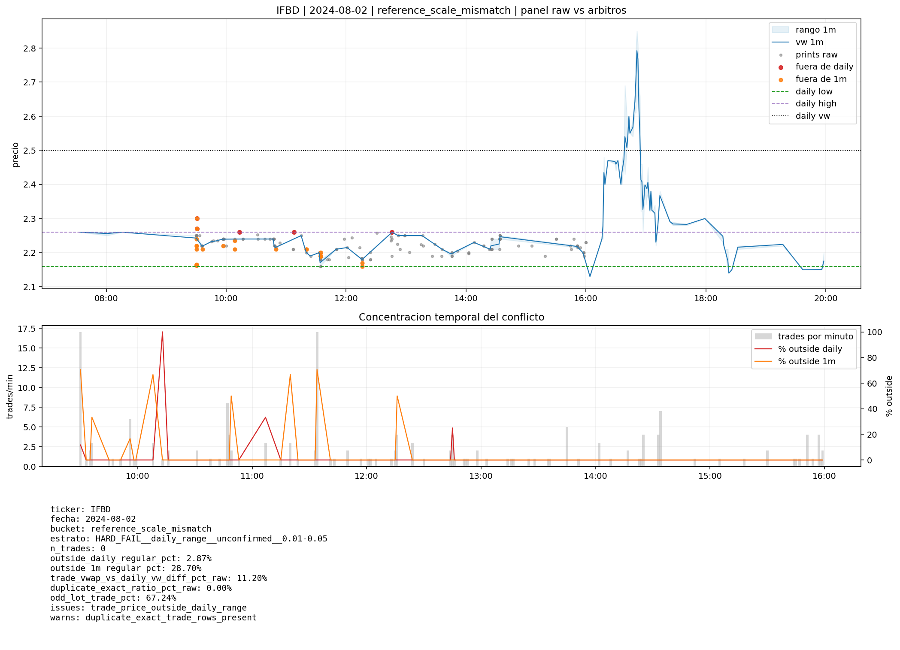

**Que muestra**

- Panel rico del tape raw frente a `daily` y `1m` para `IFBD` el `2024-08-02`.
- `n_trades = 174`, `outside_daily_regular_pct = 2.87%`, `outside_1m_regular_pct = 28.70%`.
- `trade_vwap_vs_daily_vw_diff_pct_raw = 11.20%`, `duplicate_exact_ratio_pct_raw = 0.00%`, `odd_lot_trade_pct = 67.24%`.

**Responde**

- Familia donde el conflicto dominante no es que el tape este roto por dentro, sino que el tape y el arbitro viven en escalas distintas. Responde a la pregunta de si el dano principal es de comparabilidad frente a `daily` o `1m`.
- Responde a si el conflicto dominante vive en la escala (`~1.1111x`), en la comparabilidad frente a `daily` (2.87%) o frente a `1m` (28.70%).
- El 67.24% de odd-lots empuja la lectura hacia microestructura fina; evita leer el caso como pura ruptura economica gruesa.
- La decision que justifica es mantener o no el caso en `recoverable_with_flag` cuando se rematerialice la rehabilitacion sobre `57f`.

### EFSH | 2022-08-12

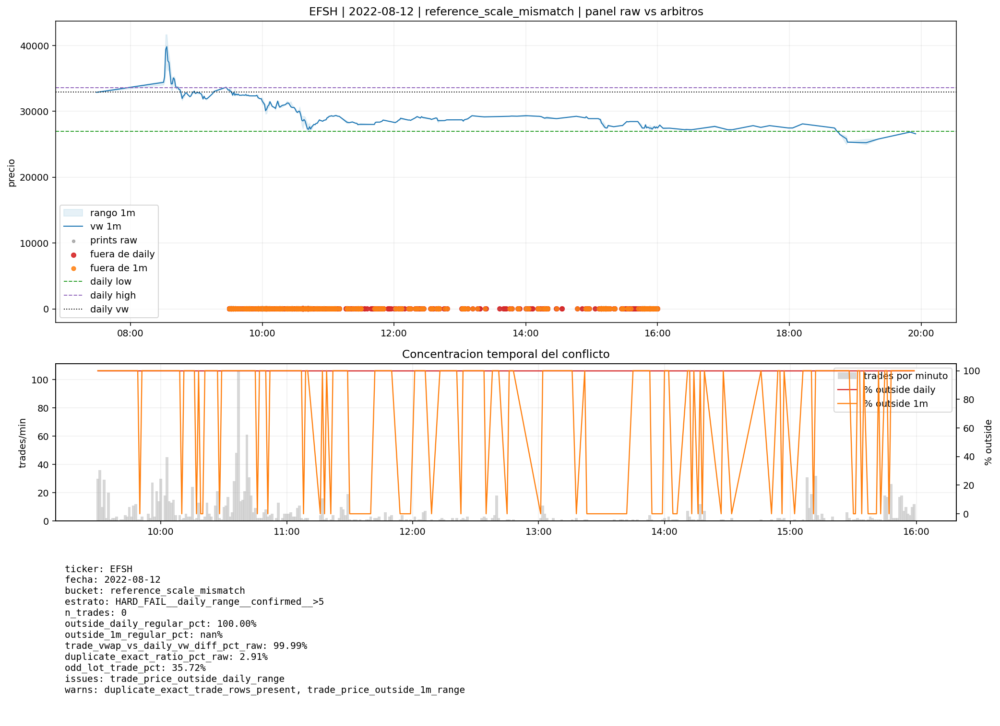

**Que muestra**

- Panel rico del tape raw frente a `daily` y `1m` para `EFSH` el `2022-08-12`.
- `n_trades = 1,579`, `outside_daily_regular_pct = 100.00%`, `outside_1m_regular_pct = nan%`.
- `trade_vwap_vs_daily_vw_diff_pct_raw = 99.99%`, `duplicate_exact_ratio_pct_raw = 2.91%`, `odd_lot_trade_pct = 35.72%`.

**Responde**

- Familia donde el conflicto dominante no es que el tape este roto por dentro, sino que el tape y el arbitro viven en escalas distintas. Responde a la pregunta de si el dano principal es de comparabilidad frente a `daily` o `1m`.
- Responde a si el conflicto dominante vive en la escala (`~10000x`), en la comparabilidad frente a `daily` (100.00%) o frente a `1m` (nan%).
- El 35.72% de odd-lots empuja la lectura hacia microestructura fina; evita leer el caso como pura ruptura economica gruesa.
- La decision que justifica es mantener o no el caso en `recoverable_with_flag` cuando se rematerialice la rehabilitacion sobre `57f`.

### INPX | 2023-12-08

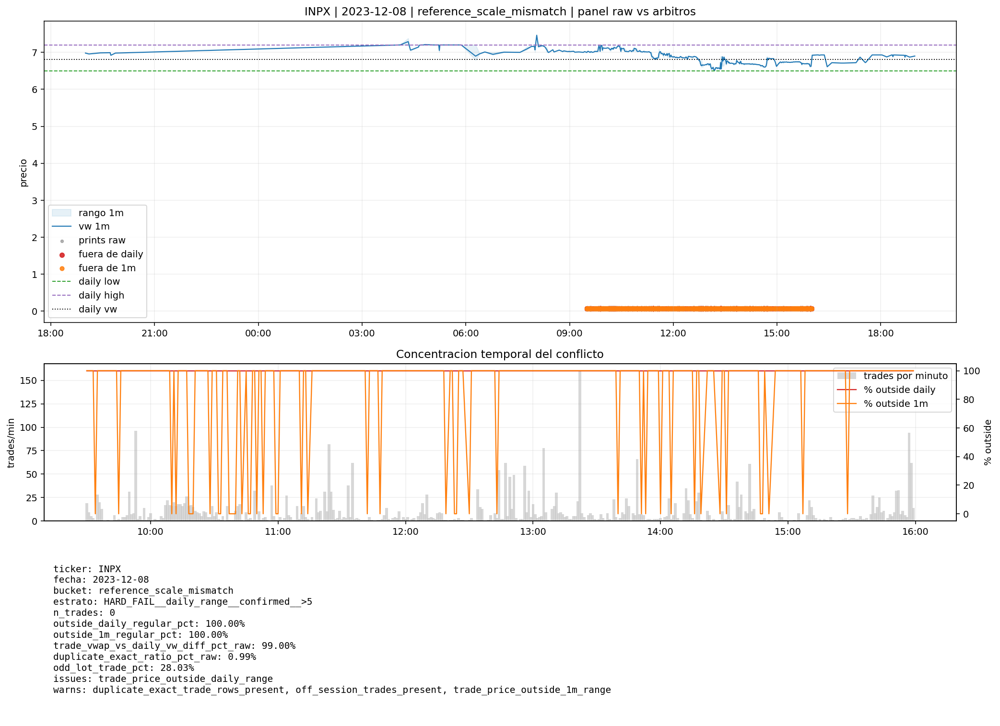

**Que muestra**

- Panel rico del tape raw frente a `daily` y `1m` para `INPX` el `2023-12-08`.
- `n_trades = 3,532`, `outside_daily_regular_pct = 100.00%`, `outside_1m_regular_pct = 100.00%`.
- `trade_vwap_vs_daily_vw_diff_pct_raw = 99.00%`, `duplicate_exact_ratio_pct_raw = 0.99%`, `odd_lot_trade_pct = 28.03%`.

**Responde**

- Familia donde el conflicto dominante no es que el tape este roto por dentro, sino que el tape y el arbitro viven en escalas distintas. Responde a la pregunta de si el dano principal es de comparabilidad frente a `daily` o `1m`.
- Responde a si el conflicto dominante vive en la escala (`~100x`), en la comparabilidad frente a `daily` (100.00%) o frente a `1m` (100.00%).
- El 28.03% de odd-lots empuja la lectura hacia microestructura fina; evita leer el caso como pura ruptura economica gruesa.
- La decision que justifica es mantener o no el caso en `recoverable_with_flag` cuando se rematerialice la rehabilitacion sobre `57f`.

### ADVM | 2019-10-09

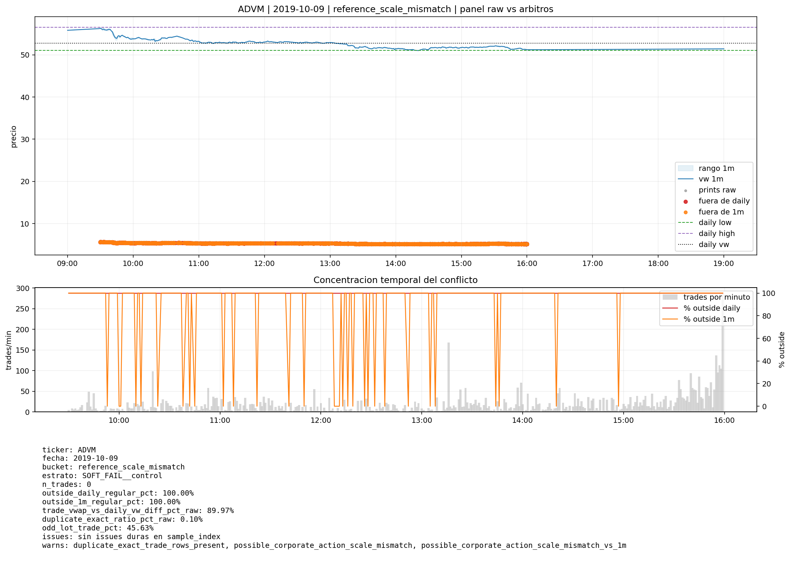

**Que muestra**

- Panel rico del tape raw frente a `daily` y `1m` para `ADVM` el `2019-10-09`.
- `n_trades = 6,763`, `outside_daily_regular_pct = 100.00%`, `outside_1m_regular_pct = 100.00%`.
- `trade_vwap_vs_daily_vw_diff_pct_raw = 89.97%`, `duplicate_exact_ratio_pct_raw = 0.10%`, `odd_lot_trade_pct = 45.63%`.

**Responde**

- Familia donde el conflicto dominante no es que el tape este roto por dentro, sino que el tape y el arbitro viven en escalas distintas. Responde a la pregunta de si el dano principal es de comparabilidad frente a `daily` o `1m`.
- Responde a si el conflicto dominante vive en la escala (`~10x`), en la comparabilidad frente a `daily` (100.00%) o frente a `1m` (100.00%).
- El 45.63% de odd-lots empuja la lectura hacia microestructura fina; evita leer el caso como pura ruptura economica gruesa.
- La decision que justifica es mantener o no el caso en `recoverable_with_flag` cuando se rematerialice la rehabilitacion sobre `57f`.

### ADVM | 2021-06-04

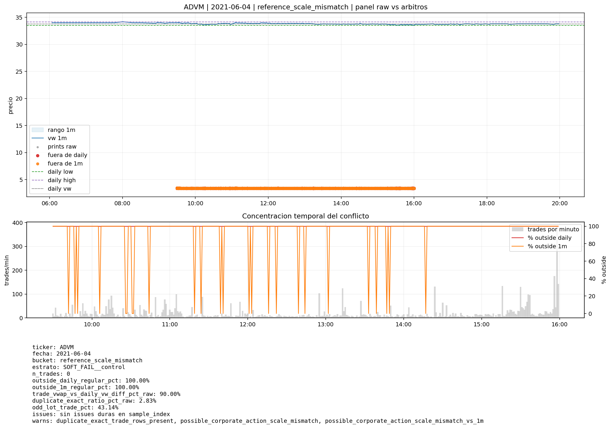

**Que muestra**

- Panel rico del tape raw frente a `daily` y `1m` para `ADVM` el `2021-06-04`.
- `n_trades = 7,109`, `outside_daily_regular_pct = 100.00%`, `outside_1m_regular_pct = 100.00%`.
- `trade_vwap_vs_daily_vw_diff_pct_raw = 90.00%`, `duplicate_exact_ratio_pct_raw = 2.83%`, `odd_lot_trade_pct = 43.14%`.

**Responde**

- Familia donde el conflicto dominante no es que el tape este roto por dentro, sino que el tape y el arbitro viven en escalas distintas. Responde a la pregunta de si el dano principal es de comparabilidad frente a `daily` o `1m`.
- Responde a si el conflicto dominante vive en la escala (`~10x`), en la comparabilidad frente a `daily` (100.00%) o frente a `1m` (100.00%).
- El 43.14% de odd-lots empuja la lectura hacia microestructura fina; evita leer el caso como pura ruptura economica gruesa.
- La decision que justifica es mantener o no el caso en `recoverable_with_flag` cuando se rematerialice la rehabilitacion sobre `57f`.

### ANGI | 2021-06-24

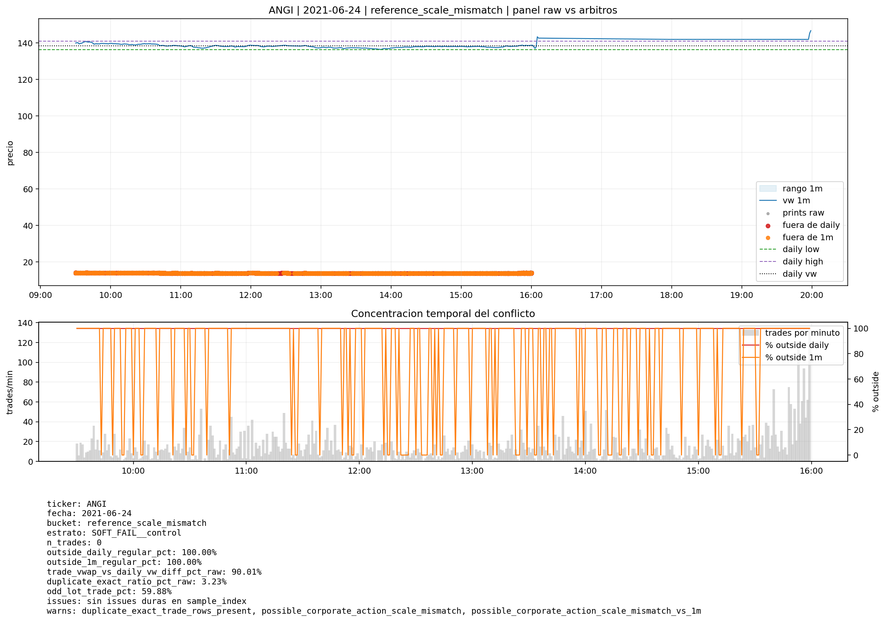

**Que muestra**

- Panel rico del tape raw frente a `daily` y `1m` para `ANGI` el `2021-06-24`.
- `n_trades = 5,516`, `outside_daily_regular_pct = 100.00%`, `outside_1m_regular_pct = 100.00%`.
- `trade_vwap_vs_daily_vw_diff_pct_raw = 90.01%`, `duplicate_exact_ratio_pct_raw = 3.23%`, `odd_lot_trade_pct = 59.88%`.

**Responde**

- Familia donde el conflicto dominante no es que el tape este roto por dentro, sino que el tape y el arbitro viven en escalas distintas. Responde a la pregunta de si el dano principal es de comparabilidad frente a `daily` o `1m`.
- Responde a si el conflicto dominante vive en la escala (`~10x`), en la comparabilidad frente a `daily` (100.00%) o frente a `1m` (100.00%).
- El 59.88% de odd-lots empuja la lectura hacia microestructura fina; evita leer el caso como pura ruptura economica gruesa.
- La decision que justifica es mantener o no el caso en `recoverable_with_flag` cuando se rematerialice la rehabilitacion sobre `57f`.

### APRN | 2020-10-30

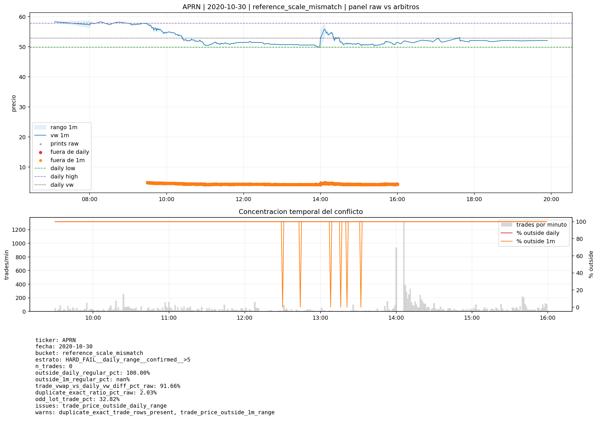

**Que muestra**

- Panel rico del tape raw frente a `daily` y `1m` para `APRN` el `2020-10-30`.
- `n_trades = 16,337`, `outside_daily_regular_pct = 100.00%`, `outside_1m_regular_pct = nan%`.
- `trade_vwap_vs_daily_vw_diff_pct_raw = 91.66%`, `duplicate_exact_ratio_pct_raw = 2.03%`, `odd_lot_trade_pct = 32.82%`.

**Responde**

- Familia donde el conflicto dominante no es que el tape este roto por dentro, sino que el tape y el arbitro viven en escalas distintas. Responde a la pregunta de si el dano principal es de comparabilidad frente a `daily` o `1m`.
- Responde a si el conflicto dominante vive en la escala (`~12x`), en la comparabilidad frente a `daily` (100.00%) o frente a `1m` (nan%).
- El 32.82% de odd-lots empuja la lectura hacia microestructura fina; evita leer el caso como pura ruptura economica gruesa.
- La decision que justifica es mantener o no el caso en `recoverable_with_flag` cuando se rematerialice la rehabilitacion sobre `57f`.

### OPAD | 2022-01-12

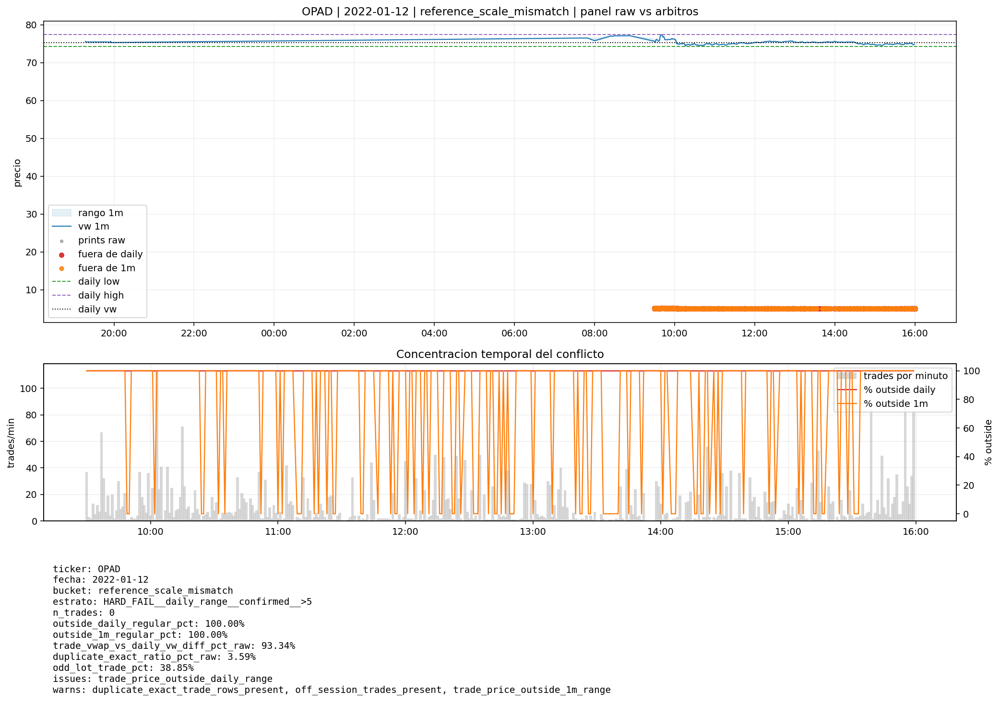

**Que muestra**

- Panel rico del tape raw frente a `daily` y `1m` para `OPAD` el `2022-01-12`.
- `n_trades = 4,229`, `outside_daily_regular_pct = 100.00%`, `outside_1m_regular_pct = 100.00%`.
- `trade_vwap_vs_daily_vw_diff_pct_raw = 93.34%`, `duplicate_exact_ratio_pct_raw = 3.59%`, `odd_lot_trade_pct = 38.85%`.

**Responde**

- Familia donde el conflicto dominante no es que el tape este roto por dentro, sino que el tape y el arbitro viven en escalas distintas. Responde a la pregunta de si el dano principal es de comparabilidad frente a `daily` o `1m`.
- Responde a si el conflicto dominante vive en la escala (`~15x`), en la comparabilidad frente a `daily` (100.00%) o frente a `1m` (100.00%).
- El 38.85% de odd-lots empuja la lectura hacia microestructura fina; evita leer el caso como pura ruptura economica gruesa.
- La decision que justifica es mantener o no el caso en `recoverable_with_flag` cuando se rematerialice la rehabilitacion sobre `57f`.

### BBGI | 2024-12-06

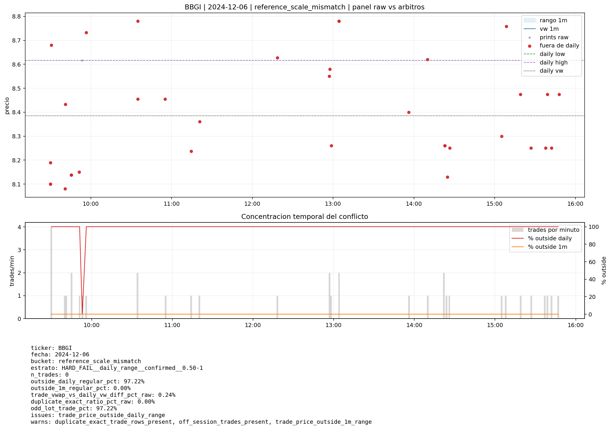

**Que muestra**

- Panel rico del tape raw frente a `daily` y `1m` para `BBGI` el `2024-12-06`.
- `n_trades = 36`, `outside_daily_regular_pct = 97.22%`, `outside_1m_regular_pct = 0.00%`.
- `trade_vwap_vs_daily_vw_diff_pct_raw = 0.24%`, `duplicate_exact_ratio_pct_raw = 0.00%`, `odd_lot_trade_pct = 97.22%`.

**Responde**

- Familia donde el conflicto dominante no es que el tape este roto por dentro, sino que el tape y el arbitro viven en escalas distintas. Responde a la pregunta de si el dano principal es de comparabilidad frente a `daily` o `1m`.
- Responde a si el conflicto dominante vive en la escala (`~1x`), en la comparabilidad frente a `daily` (97.22%) o frente a `1m` (0.00%).
- El 97.22% de odd-lots empuja la lectura hacia microestructura fina; evita leer el caso como pura ruptura economica gruesa.
- La decision que justifica es mantener o no el caso en `recoverable_with_flag` cuando se rematerialice la rehabilitacion sobre `57f`.

### GEGGL | 2024-02-20

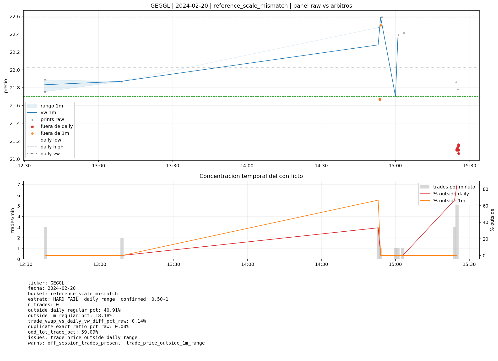

**Que muestra**

- Panel rico del tape raw frente a `daily` y `1m` para `GEGGL` el `2024-02-20`.
- `n_trades = 22`, `outside_daily_regular_pct = 40.91%`, `outside_1m_regular_pct = 18.18%`.
- `trade_vwap_vs_daily_vw_diff_pct_raw = 0.14%`, `duplicate_exact_ratio_pct_raw = 0.00%`, `odd_lot_trade_pct = 59.09%`.

**Responde**

- Familia donde el conflicto dominante no es que el tape este roto por dentro, sino que el tape y el arbitro viven en escalas distintas. Responde a la pregunta de si el dano principal es de comparabilidad frente a `daily` o `1m`.
- Responde a si el conflicto dominante vive en la escala (`~1x`), en la comparabilidad frente a `daily` (40.91%) o frente a `1m` (18.18%).
- El 59.09% de odd-lots empuja la lectura hacia microestructura fina; evita leer el caso como pura ruptura economica gruesa.
- La decision que justifica es mantener o no el caso en `recoverable_with_flag` cuando se rematerialice la rehabilitacion sobre `57f`.

### LUMO | 2022-04-01

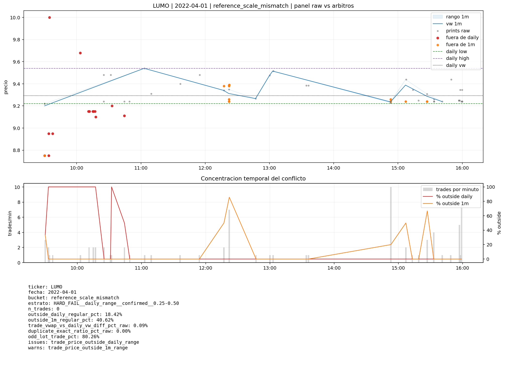

**Que muestra**

- Panel rico del tape raw frente a `daily` y `1m` para `LUMO` el `2022-04-01`.
- `n_trades = 76`, `outside_daily_regular_pct = 18.42%`, `outside_1m_regular_pct = 40.62%`.
- `trade_vwap_vs_daily_vw_diff_pct_raw = 0.09%`, `duplicate_exact_ratio_pct_raw = 0.00%`, `odd_lot_trade_pct = 80.26%`.

**Responde**

- Familia donde el conflicto dominante no es que el tape este roto por dentro, sino que el tape y el arbitro viven en escalas distintas. Responde a la pregunta de si el dano principal es de comparabilidad frente a `daily` o `1m`.
- Responde a si el conflicto dominante vive en la escala (`~1x`), en la comparabilidad frente a `daily` (18.42%) o frente a `1m` (40.62%).
- El 80.26% de odd-lots empuja la lectura hacia microestructura fina; evita leer el caso como pura ruptura economica gruesa.
- La decision que justifica es mantener o no el caso en `recoverable_with_flag` cuando se rematerialice la rehabilitacion sobre `57f`.

### BBGI | 2023-07-18

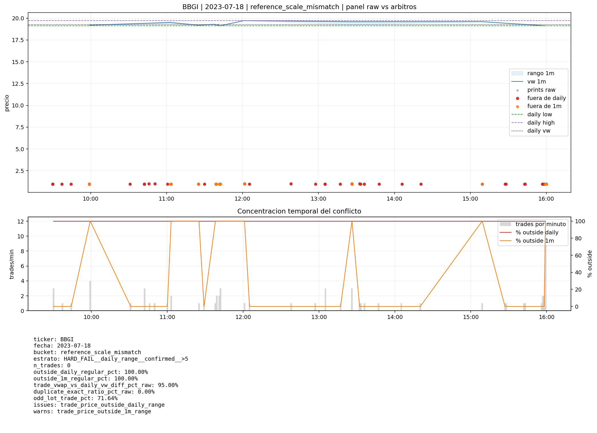

**Que muestra**

- Panel rico del tape raw frente a `daily` y `1m` para `BBGI` el `2023-07-18`.
- `n_trades = 67`, `outside_daily_regular_pct = 100.00%`, `outside_1m_regular_pct = 100.00%`.
- `trade_vwap_vs_daily_vw_diff_pct_raw = 95.00%`, `duplicate_exact_ratio_pct_raw = 0.00%`, `odd_lot_trade_pct = 71.64%`.

**Responde**

- Familia donde el conflicto dominante no es que el tape este roto por dentro, sino que el tape y el arbitro viven en escalas distintas. Responde a la pregunta de si el dano principal es de comparabilidad frente a `daily` o `1m`.
- Responde a si el conflicto dominante vive en la escala (`~20x`), en la comparabilidad frente a `daily` (100.00%) o frente a `1m` (100.00%).
- El 71.64% de odd-lots empuja la lectura hacia microestructura fina; evita leer el caso como pura ruptura economica gruesa.
- La decision que justifica es mantener o no el caso en `recoverable_with_flag` cuando se rematerialice la rehabilitacion sobre `57f`.

### BPTH | 2020-10-19

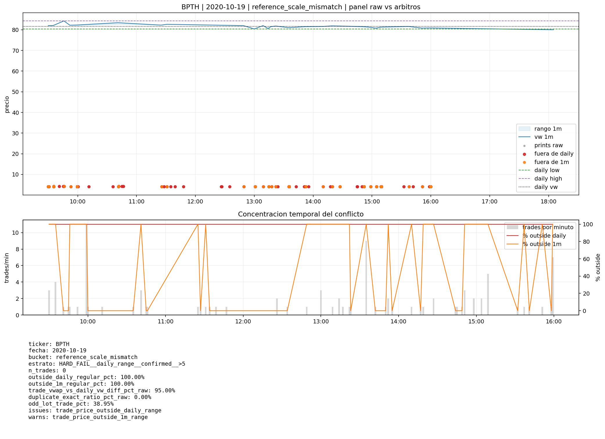

**Que muestra**

- Panel rico del tape raw frente a `daily` y `1m` para `BPTH` el `2020-10-19`.
- `n_trades = 95`, `outside_daily_regular_pct = 100.00%`, `outside_1m_regular_pct = 100.00%`.
- `trade_vwap_vs_daily_vw_diff_pct_raw = 95.00%`, `duplicate_exact_ratio_pct_raw = 0.00%`, `odd_lot_trade_pct = 38.95%`.

**Responde**

- Familia donde el conflicto dominante no es que el tape este roto por dentro, sino que el tape y el arbitro viven en escalas distintas. Responde a la pregunta de si el dano principal es de comparabilidad frente a `daily` o `1m`.
- Responde a si el conflicto dominante vive en la escala (`~20x`), en la comparabilidad frente a `daily` (100.00%) o frente a `1m` (100.00%).
- El 38.95% de odd-lots empuja la lectura hacia microestructura fina; evita leer el caso como pura ruptura economica gruesa.
- La decision que justifica es mantener o no el caso en `recoverable_with_flag` cuando se rematerialice la rehabilitacion sobre `57f`.

### QLI | 2021-12-02

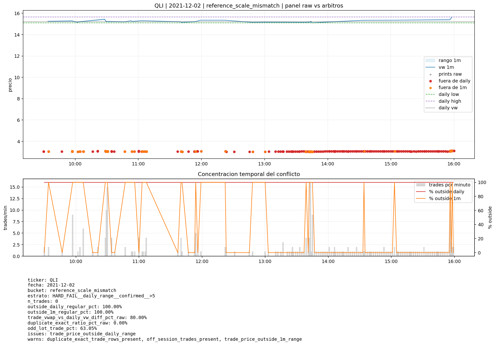

**Que muestra**

- Panel rico del tape raw frente a `daily` y `1m` para `QLI` el `2021-12-02`.
- `n_trades = 249`, `outside_daily_regular_pct = 100.00%`, `outside_1m_regular_pct = 100.00%`.
- `trade_vwap_vs_daily_vw_diff_pct_raw = 80.00%`, `duplicate_exact_ratio_pct_raw = 0.00%`, `odd_lot_trade_pct = 63.05%`.

**Responde**

- Familia donde el conflicto dominante no es que el tape este roto por dentro, sino que el tape y el arbitro viven en escalas distintas. Responde a la pregunta de si el dano principal es de comparabilidad frente a `daily` o `1m`.
- Responde a si el conflicto dominante vive en la escala (`~5x`), en la comparabilidad frente a `daily` (100.00%) o frente a `1m` (100.00%).
- El 63.05% de odd-lots empuja la lectura hacia microestructura fina; evita leer el caso como pura ruptura economica gruesa.
- La decision que justifica es mantener o no el caso en `recoverable_with_flag` cuando se rematerialice la rehabilitacion sobre `57f`.

### LMFA | 2022-08-12

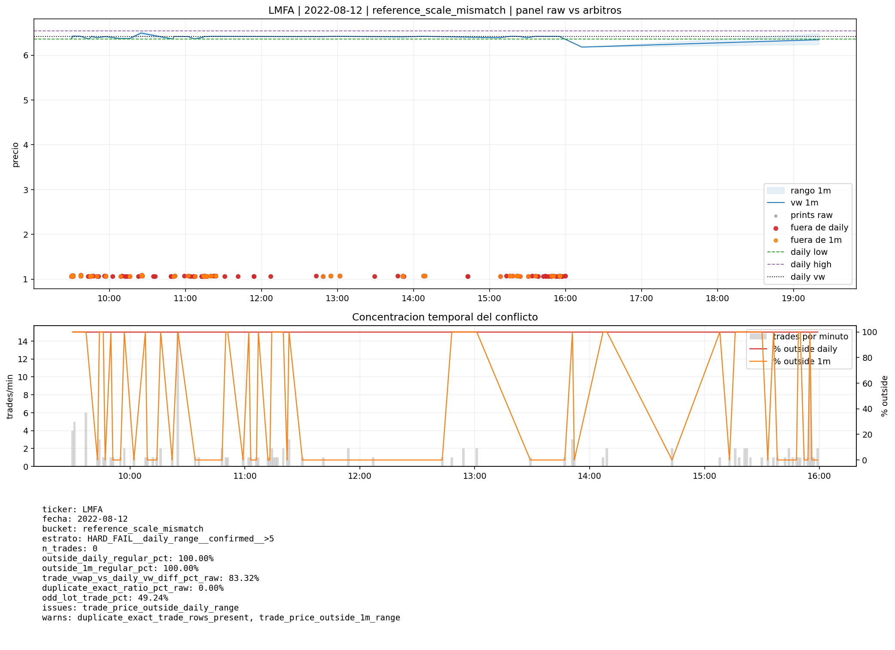

**Que muestra**

- Panel rico del tape raw frente a `daily` y `1m` para `LMFA` el `2022-08-12`.
- `n_trades = 132`, `outside_daily_regular_pct = 100.00%`, `outside_1m_regular_pct = 100.00%`.
- `trade_vwap_vs_daily_vw_diff_pct_raw = 83.32%`, `duplicate_exact_ratio_pct_raw = 0.00%`, `odd_lot_trade_pct = 49.24%`.

**Responde**

- Familia donde el conflicto dominante no es que el tape este roto por dentro, sino que el tape y el arbitro viven en escalas distintas. Responde a la pregunta de si el dano principal es de comparabilidad frente a `daily` o `1m`.
- Responde a si el conflicto dominante vive en la escala (`~6x`), en la comparabilidad frente a `daily` (100.00%) o frente a `1m` (100.00%).
- El 49.24% de odd-lots empuja la lectura hacia microestructura fina; evita leer el caso como pura ruptura economica gruesa.
- La decision que justifica es mantener o no el caso en `recoverable_with_flag` cuando se rematerialice la rehabilitacion sobre `57f`.

# Trades Review Generico | muestra estratificada

Documento fuente: `inspection_dossiers/trades/family_case_evidence_packs/review/review_cases_v0_1.md`

## Rol

Este dossier documenta `60` casos de la muestra base del cierre real `57f/full_clean_fast_same_schema` para la familia `review`.

No son ejemplos elegidos a dedo. Proceden del manifest estratificado reproducible materializado para el inspector.

## Que significa esta familia

Residuo de revision no absorbido por una subfamilia mas especifica. Responde a la pregunta de si todavia hace falta una regla de rehabilitacion antes de consumir esta masa.

## Responde

- si el residuo generico sigue necesitando regla de rehabilitacion
- si la masa abierta es comparable o economicamente util con flag

## No responde

- si todo `review` es homogeneamente recuperable
- si el bucket esta vacio de estructura interna

## Consecuencia

- anclar decisiones en regla explicita y no en intuicion
- cuantificar masa util real antes de cualquier promocion

## Casos

### APAC | 2008-10-10

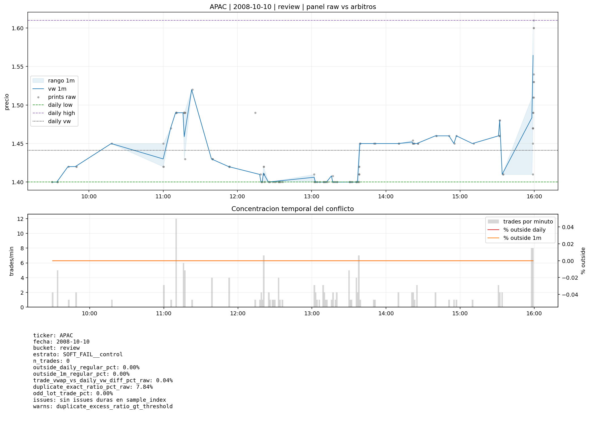

**Que muestra**

- Panel rico del tape raw frente a `daily` y `1m` para `APAC` el `2008-10-10`.
- `n_trades = 153`, `outside_daily_regular_pct = 0.00%`, `outside_1m_regular_pct = 0.00%`.
- `trade_vwap_vs_daily_vw_diff_pct_raw = 0.04%`, `duplicate_exact_ratio_pct_raw = 7.84%`, `odd_lot_trade_pct = 0.00%`.

**Responde**

- Residuo de revision no absorbido por una subfamilia mas especifica. Responde a la pregunta de si todavia hace falta una regla de rehabilitacion antes de consumir esta masa.
- Responde a si el conflicto dominante vive en la escala (`~1x`), en la comparabilidad frente a `daily` (0.00%) o frente a `1m` (0.00%).
- El 7.84% de duplicacion exacta obliga a sospechar dano de tape o bursts mecanicos, no solo ruido visual.
- La decision que justifica es mantener o no el caso en `recoverable_with_flag` cuando se rematerialice la rehabilitacion sobre `57f`.

### APOG | 2010-09-21

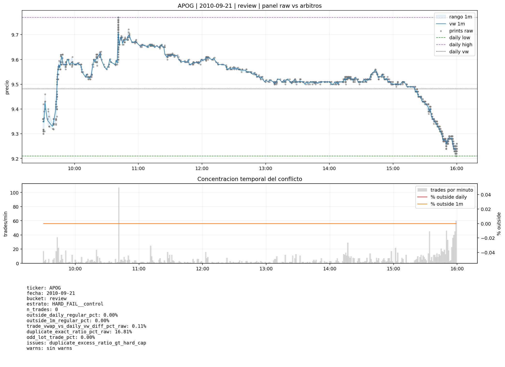

**Que muestra**

- Panel rico del tape raw frente a `daily` y `1m` para `APOG` el `2010-09-21`.
- `n_trades = 1,898`, `outside_daily_regular_pct = 0.00%`, `outside_1m_regular_pct = 0.00%`.
- `trade_vwap_vs_daily_vw_diff_pct_raw = 0.11%`, `duplicate_exact_ratio_pct_raw = 16.81%`, `odd_lot_trade_pct = 0.00%`.

**Responde**

- Residuo de revision no absorbido por una subfamilia mas especifica. Responde a la pregunta de si todavia hace falta una regla de rehabilitacion antes de consumir esta masa.
- Responde a si el conflicto dominante vive en la escala (`~1x`), en la comparabilidad frente a `daily` (0.00%) o frente a `1m` (0.00%).
- El 16.81% de duplicacion exacta obliga a sospechar dano de tape o bursts mecanicos, no solo ruido visual.
- La decision que justifica es mantener o no el caso en `recoverable_with_flag` cuando se rematerialice la rehabilitacion sobre `57f`.

### CATO | 2010-08-12

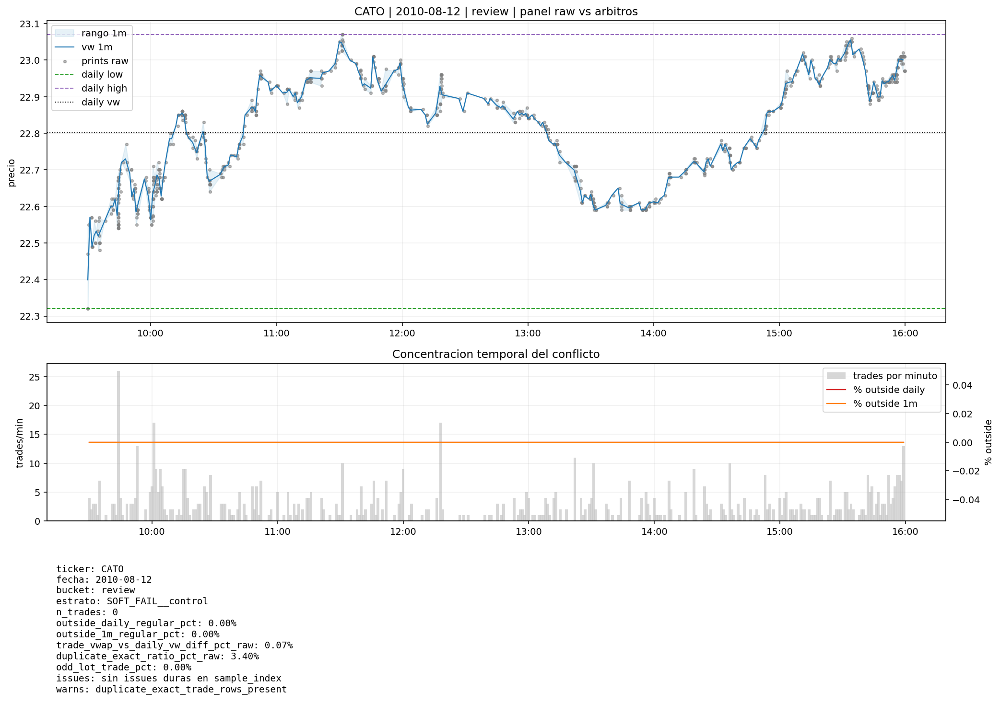

**Que muestra**

- Panel rico del tape raw frente a `daily` y `1m` para `CATO` el `2010-08-12`.
- `n_trades = 793`, `outside_daily_regular_pct = 0.00%`, `outside_1m_regular_pct = 0.00%`.
- `trade_vwap_vs_daily_vw_diff_pct_raw = 0.07%`, `duplicate_exact_ratio_pct_raw = 3.40%`, `odd_lot_trade_pct = 0.00%`.

**Responde**

- Residuo de revision no absorbido por una subfamilia mas especifica. Responde a la pregunta de si todavia hace falta una regla de rehabilitacion antes de consumir esta masa.
- Responde a si el conflicto dominante vive en la escala (`~1x`), en la comparabilidad frente a `daily` (0.00%) o frente a `1m` (0.00%).
- La decision que justifica es mantener o no el caso en `recoverable_with_flag` cuando se rematerialice la rehabilitacion sobre `57f`.

### CAW | 2010-03-15

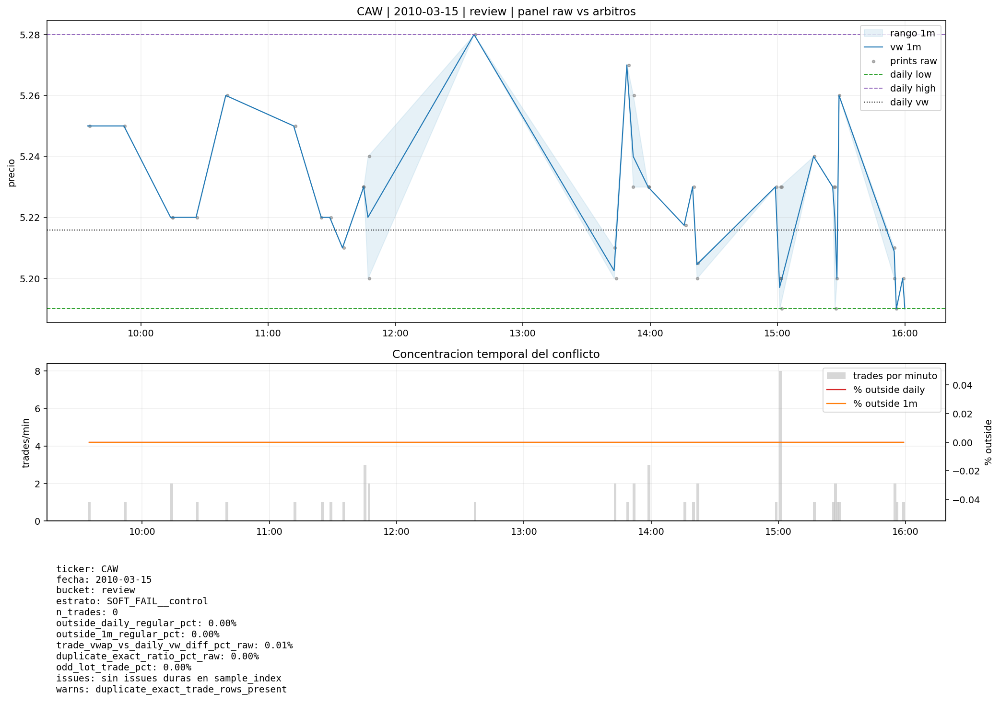

**Que muestra**

- Panel rico del tape raw frente a `daily` y `1m` para `CAW` el `2010-03-15`.
- `n_trades = 47`, `outside_daily_regular_pct = 0.00%`, `outside_1m_regular_pct = 0.00%`.
- `trade_vwap_vs_daily_vw_diff_pct_raw = 0.01%`, `duplicate_exact_ratio_pct_raw = 0.00%`, `odd_lot_trade_pct = 0.00%`.

**Responde**

- Residuo de revision no absorbido por una subfamilia mas especifica. Responde a la pregunta de si todavia hace falta una regla de rehabilitacion antes de consumir esta masa.
- Responde a si el conflicto dominante vive en la escala (`~1x`), en la comparabilidad frente a `daily` (0.00%) o frente a `1m` (0.00%).
- La decision que justifica es mantener o no el caso en `recoverable_with_flag` cuando se rematerialice la rehabilitacion sobre `57f`.

### CBNK | 2008-12-15

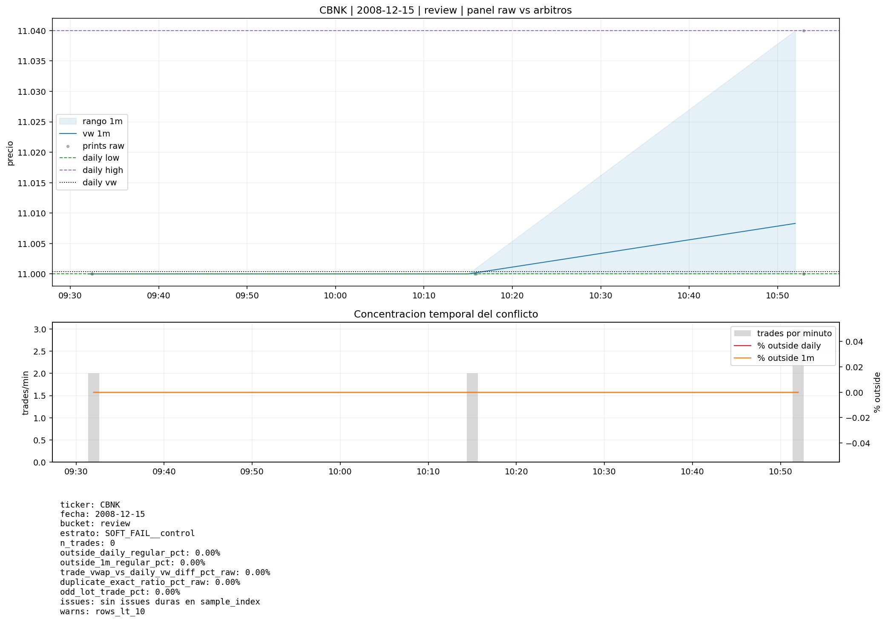

**Que muestra**

- Panel rico del tape raw frente a `daily` y `1m` para `CBNK` el `2008-12-15`.
- `n_trades = 7`, `outside_daily_regular_pct = 0.00%`, `outside_1m_regular_pct = 0.00%`.
- `trade_vwap_vs_daily_vw_diff_pct_raw = 0.00%`, `duplicate_exact_ratio_pct_raw = 0.00%`, `odd_lot_trade_pct = 0.00%`.

**Responde**

- Residuo de revision no absorbido por una subfamilia mas especifica. Responde a la pregunta de si todavia hace falta una regla de rehabilitacion antes de consumir esta masa.
- Responde a si el conflicto dominante vive en la escala (`~1x`), en la comparabilidad frente a `daily` (0.00%) o frente a `1m` (0.00%).
- La decision que justifica es mantener o no el caso en `recoverable_with_flag` cuando se rematerialice la rehabilitacion sobre `57f`.

### CVGW | 2012-07-25

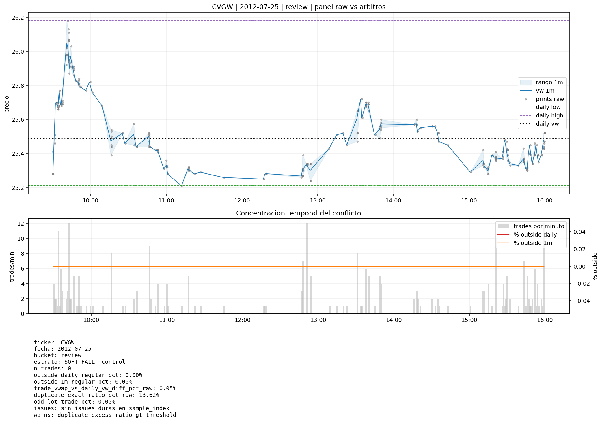

**Que muestra**

- Panel rico del tape raw frente a `daily` y `1m` para `CVGW` el `2012-07-25`.
- `n_trades = 279`, `outside_daily_regular_pct = 0.00%`, `outside_1m_regular_pct = 0.00%`.
- `trade_vwap_vs_daily_vw_diff_pct_raw = 0.05%`, `duplicate_exact_ratio_pct_raw = 13.62%`, `odd_lot_trade_pct = 0.00%`.

**Responde**

- Residuo de revision no absorbido por una subfamilia mas especifica. Responde a la pregunta de si todavia hace falta una regla de rehabilitacion antes de consumir esta masa.
- Responde a si el conflicto dominante vive en la escala (`~1x`), en la comparabilidad frente a `daily` (0.00%) o frente a `1m` (0.00%).
- El 13.62% de duplicacion exacta obliga a sospechar dano de tape o bursts mecanicos, no solo ruido visual.
- La decision que justifica es mantener o no el caso en `recoverable_with_flag` cuando se rematerialice la rehabilitacion sobre `57f`.

### CZWI | 2012-09-12

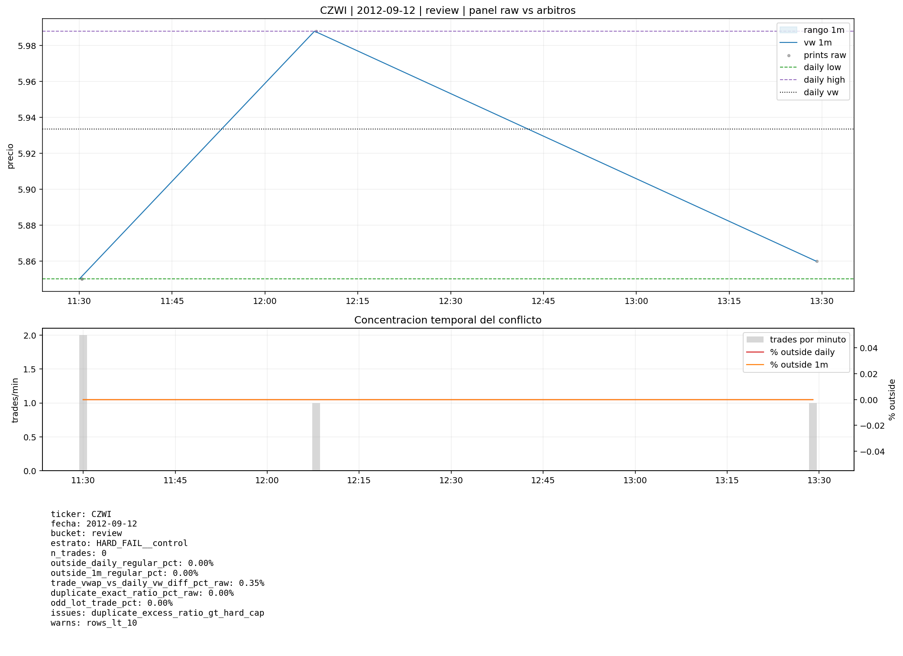

**Que muestra**

- Panel rico del tape raw frente a `daily` y `1m` para `CZWI` el `2012-09-12`.
- `n_trades = 4`, `outside_daily_regular_pct = 0.00%`, `outside_1m_regular_pct = 0.00%`.
- `trade_vwap_vs_daily_vw_diff_pct_raw = 0.35%`, `duplicate_exact_ratio_pct_raw = 0.00%`, `odd_lot_trade_pct = 0.00%`.

**Responde**

- Residuo de revision no absorbido por una subfamilia mas especifica. Responde a la pregunta de si todavia hace falta una regla de rehabilitacion antes de consumir esta masa.
- Responde a si el conflicto dominante vive en la escala (`~1x`), en la comparabilidad frente a `daily` (0.00%) o frente a `1m` (0.00%).
- La decision que justifica es mantener o no el caso en `recoverable_with_flag` cuando se rematerialice la rehabilitacion sobre `57f`.

### DSPG | 2010-06-02

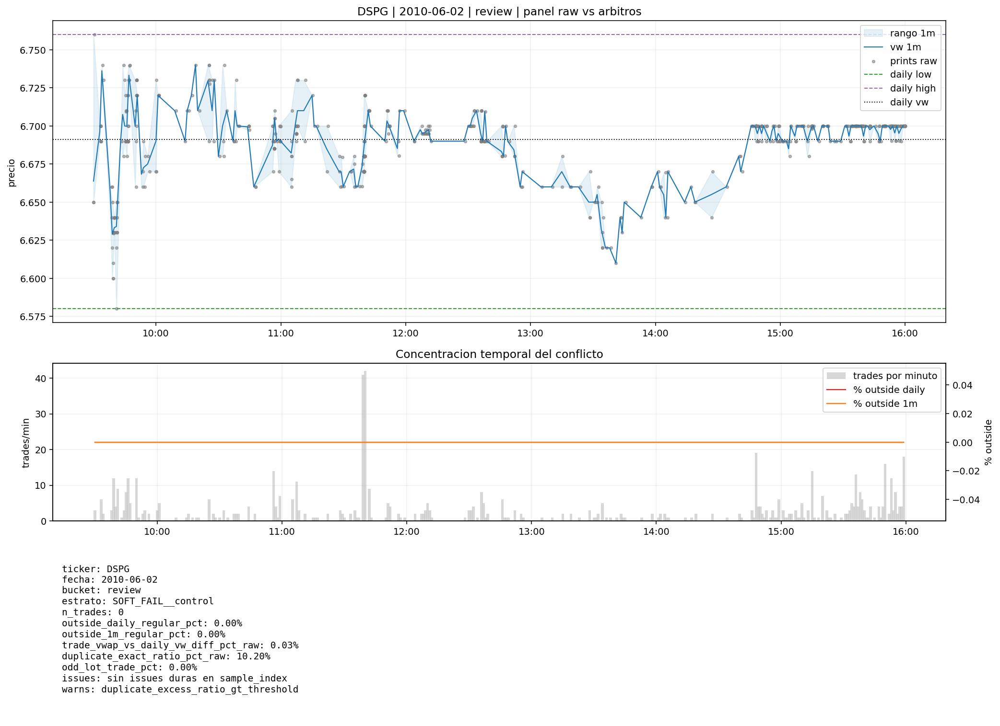

**Que muestra**

- Panel rico del tape raw frente a `daily` y `1m` para `DSPG` el `2010-06-02`.
- `n_trades = 647`, `outside_daily_regular_pct = 0.00%`, `outside_1m_regular_pct = 0.00%`.
- `trade_vwap_vs_daily_vw_diff_pct_raw = 0.03%`, `duplicate_exact_ratio_pct_raw = 10.20%`, `odd_lot_trade_pct = 0.00%`.

**Responde**

- Residuo de revision no absorbido por una subfamilia mas especifica. Responde a la pregunta de si todavia hace falta una regla de rehabilitacion antes de consumir esta masa.
- Responde a si el conflicto dominante vive en la escala (`~1x`), en la comparabilidad frente a `daily` (0.00%) o frente a `1m` (0.00%).
- El 10.20% de duplicacion exacta obliga a sospechar dano de tape o bursts mecanicos, no solo ruido visual.
- La decision que justifica es mantener o no el caso en `recoverable_with_flag` cuando se rematerialice la rehabilitacion sobre `57f`.

### GTN | 2010-03-09

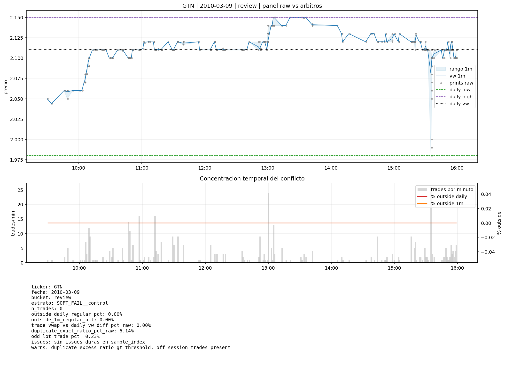

**Que muestra**

- Panel rico del tape raw frente a `daily` y `1m` para `GTN` el `2010-03-09`.
- `n_trades = 440`, `outside_daily_regular_pct = 0.00%`, `outside_1m_regular_pct = 0.00%`.
- `trade_vwap_vs_daily_vw_diff_pct_raw = 0.00%`, `duplicate_exact_ratio_pct_raw = 6.14%`, `odd_lot_trade_pct = 0.23%`.

**Responde**

- Residuo de revision no absorbido por una subfamilia mas especifica. Responde a la pregunta de si todavia hace falta una regla de rehabilitacion antes de consumir esta masa.
- Responde a si el conflicto dominante vive en la escala (`~1x`), en la comparabilidad frente a `daily` (0.00%) o frente a `1m` (0.00%).
- El 6.14% de duplicacion exacta obliga a sospechar dano de tape o bursts mecanicos, no solo ruido visual.
- La decision que justifica es mantener o no el caso en `recoverable_with_flag` cuando se rematerialice la rehabilitacion sobre `57f`.

### HRZN | 2011-11-03

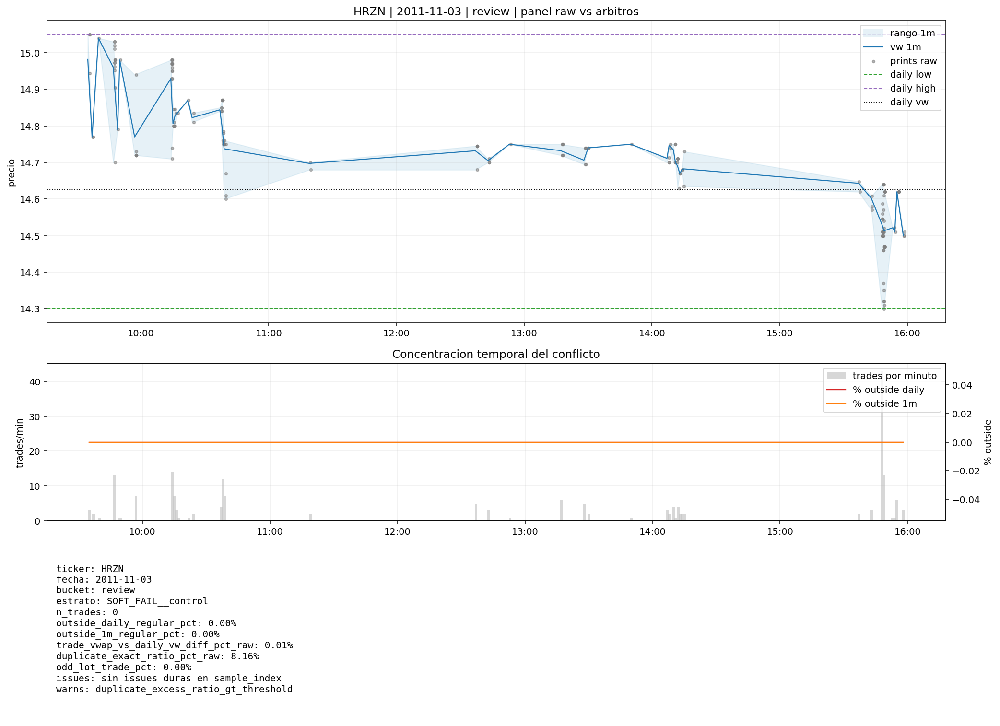

**Que muestra**

- Panel rico del tape raw frente a `daily` y `1m` para `HRZN` el `2011-11-03`.
- `n_trades = 196`, `outside_daily_regular_pct = 0.00%`, `outside_1m_regular_pct = 0.00%`.
- `trade_vwap_vs_daily_vw_diff_pct_raw = 0.01%`, `duplicate_exact_ratio_pct_raw = 8.16%`, `odd_lot_trade_pct = 0.00%`.

**Responde**

- Residuo de revision no absorbido por una subfamilia mas especifica. Responde a la pregunta de si todavia hace falta una regla de rehabilitacion antes de consumir esta masa.
- Responde a si el conflicto dominante vive en la escala (`~1x`), en la comparabilidad frente a `daily` (0.00%) o frente a `1m` (0.00%).
- El 8.16% de duplicacion exacta obliga a sospechar dano de tape o bursts mecanicos, no solo ruido visual.
- La decision que justifica es mantener o no el caso en `recoverable_with_flag` cuando se rematerialice la rehabilitacion sobre `57f`.

### HSTM | 2008-02-15

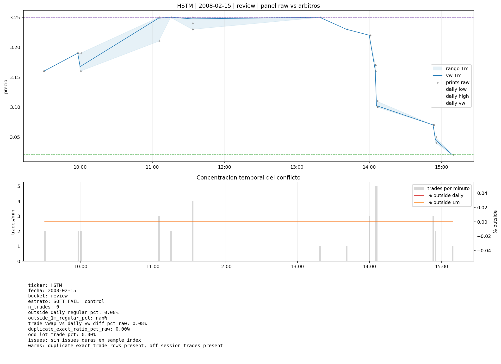

**Que muestra**

- Panel rico del tape raw frente a `daily` y `1m` para `HSTM` el `2008-02-15`.
- `n_trades = 36`, `outside_daily_regular_pct = 0.00%`, `outside_1m_regular_pct = nan%`.
- `trade_vwap_vs_daily_vw_diff_pct_raw = 0.08%`, `duplicate_exact_ratio_pct_raw = 0.00%`, `odd_lot_trade_pct = 0.00%`.

**Responde**

- Residuo de revision no absorbido por una subfamilia mas especifica. Responde a la pregunta de si todavia hace falta una regla de rehabilitacion antes de consumir esta masa.
- Responde a si el conflicto dominante vive en la escala (`~1x`), en la comparabilidad frente a `daily` (0.00%) o frente a `1m` (nan%).
- La decision que justifica es mantener o no el caso en `recoverable_with_flag` cuando se rematerialice la rehabilitacion sobre `57f`.

### IMMR | 2006-11-28

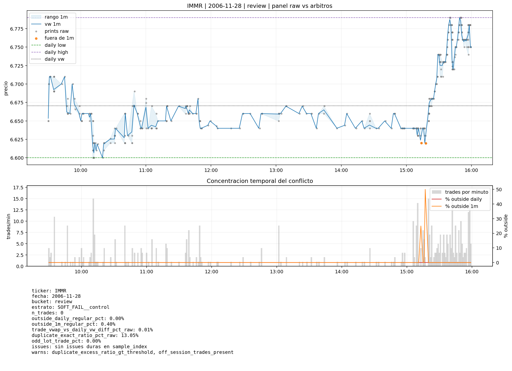

**Que muestra**

- Panel rico del tape raw frente a `daily` y `1m` para `IMMR` el `2006-11-28`.
- `n_trades = 498`, `outside_daily_regular_pct = 0.00%`, `outside_1m_regular_pct = 0.40%`.
- `trade_vwap_vs_daily_vw_diff_pct_raw = 0.01%`, `duplicate_exact_ratio_pct_raw = 13.05%`, `odd_lot_trade_pct = 0.00%`.

**Responde**

- Residuo de revision no absorbido por una subfamilia mas especifica. Responde a la pregunta de si todavia hace falta una regla de rehabilitacion antes de consumir esta masa.
- Responde a si el conflicto dominante vive en la escala (`~1x`), en la comparabilidad frente a `daily` (0.00%) o frente a `1m` (0.40%).
- El 13.05% de duplicacion exacta obliga a sospechar dano de tape o bursts mecanicos, no solo ruido visual.
- La decision que justifica es mantener o no el caso en `recoverable_with_flag` cuando se rematerialice la rehabilitacion sobre `57f`.

### IVC | 2010-04-16

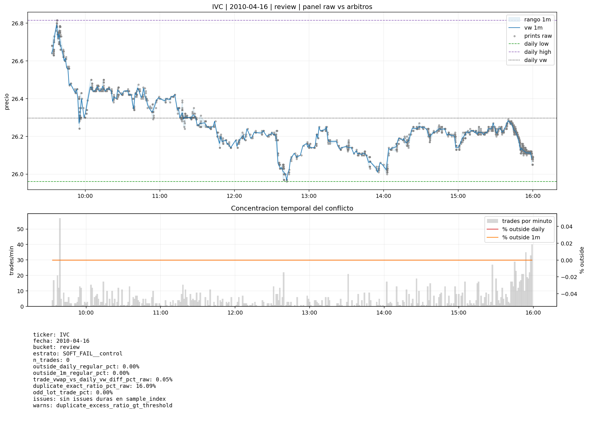

**Que muestra**

- Panel rico del tape raw frente a `daily` y `1m` para `IVC` el `2010-04-16`.
- `n_trades = 1,715`, `outside_daily_regular_pct = 0.00%`, `outside_1m_regular_pct = 0.00%`.
- `trade_vwap_vs_daily_vw_diff_pct_raw = 0.05%`, `duplicate_exact_ratio_pct_raw = 16.09%`, `odd_lot_trade_pct = 0.00%`.

**Responde**

- Residuo de revision no absorbido por una subfamilia mas especifica. Responde a la pregunta de si todavia hace falta una regla de rehabilitacion antes de consumir esta masa.
- Responde a si el conflicto dominante vive en la escala (`~1x`), en la comparabilidad frente a `daily` (0.00%) o frente a `1m` (0.00%).
- El 16.09% de duplicacion exacta obliga a sospechar dano de tape o bursts mecanicos, no solo ruido visual.
- La decision que justifica es mantener o no el caso en `recoverable_with_flag` cuando se rematerialice la rehabilitacion sobre `57f`.

### MYGN | 2012-06-15

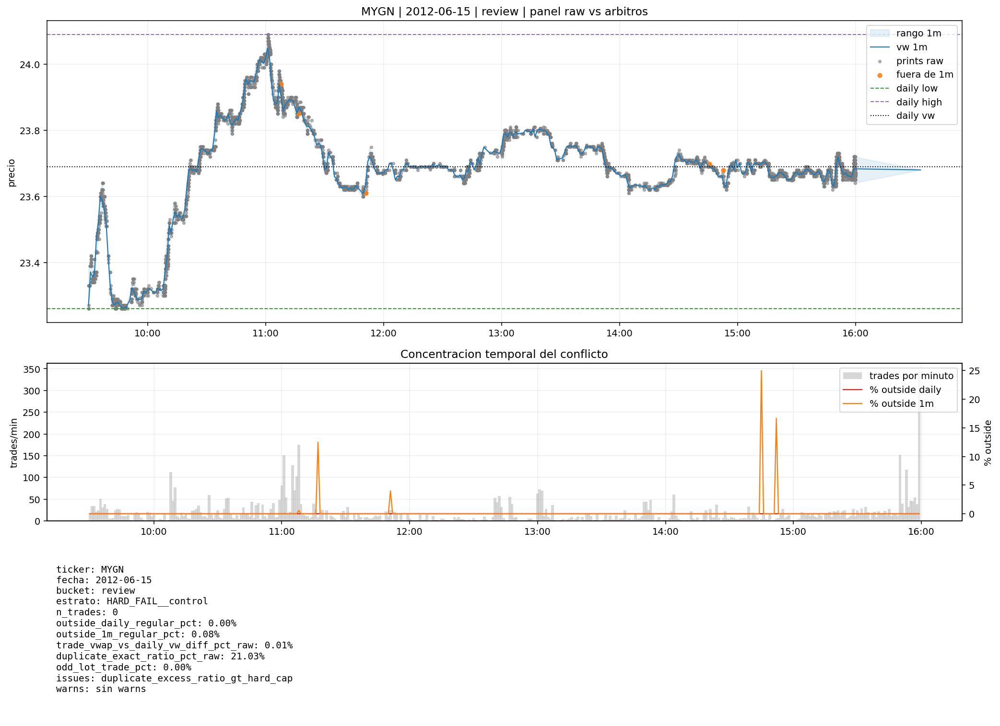

**Que muestra**

- Panel rico del tape raw frente a `daily` y `1m` para `MYGN` el `2012-06-15`.
- `n_trades = 6,619`, `outside_daily_regular_pct = 0.00%`, `outside_1m_regular_pct = 0.08%`.
- `trade_vwap_vs_daily_vw_diff_pct_raw = 0.01%`, `duplicate_exact_ratio_pct_raw = 21.03%`, `odd_lot_trade_pct = 0.00%`.

**Responde**

- Residuo de revision no absorbido por una subfamilia mas especifica. Responde a la pregunta de si todavia hace falta una regla de rehabilitacion antes de consumir esta masa.
- Responde a si el conflicto dominante vive en la escala (`~1x`), en la comparabilidad frente a `daily` (0.00%) o frente a `1m` (0.08%).
- El 21.03% de duplicacion exacta obliga a sospechar dano de tape o bursts mecanicos, no solo ruido visual.
- La decision que justifica es mantener o no el caso en `recoverable_with_flag` cuando se rematerialice la rehabilitacion sobre `57f`.

### ORRF | 2011-10-21

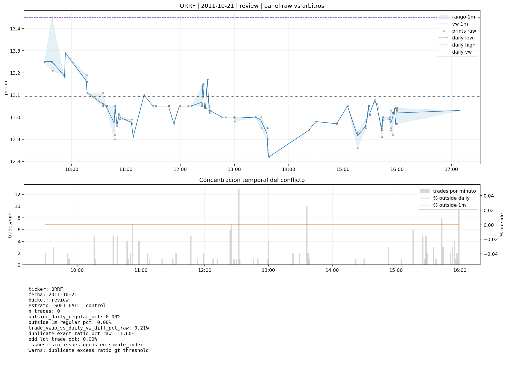

**Que muestra**

- Panel rico del tape raw frente a `daily` y `1m` para `ORRF` el `2011-10-21`.
- `n_trades = 181`, `outside_daily_regular_pct = 0.00%`, `outside_1m_regular_pct = 0.00%`.
- `trade_vwap_vs_daily_vw_diff_pct_raw = 0.21%`, `duplicate_exact_ratio_pct_raw = 11.60%`, `odd_lot_trade_pct = 0.00%`.

**Responde**

- Residuo de revision no absorbido por una subfamilia mas especifica. Responde a la pregunta de si todavia hace falta una regla de rehabilitacion antes de consumir esta masa.
- Responde a si el conflicto dominante vive en la escala (`~1x`), en la comparabilidad frente a `daily` (0.00%) o frente a `1m` (0.00%).
- El 11.60% de duplicacion exacta obliga a sospechar dano de tape o bursts mecanicos, no solo ruido visual.
- La decision que justifica es mantener o no el caso en `recoverable_with_flag` cuando se rematerialice la rehabilitacion sobre `57f`.

### PIC | 2012-10-25

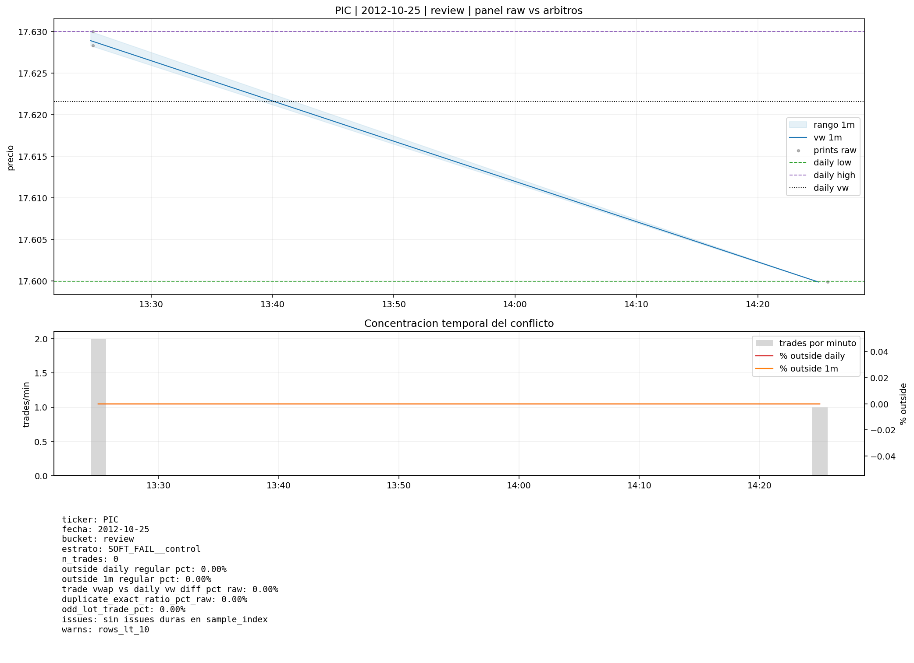

**Que muestra**

- Panel rico del tape raw frente a `daily` y `1m` para `PIC` el `2012-10-25`.
- `n_trades = 3`, `outside_daily_regular_pct = 0.00%`, `outside_1m_regular_pct = 0.00%`.
- `trade_vwap_vs_daily_vw_diff_pct_raw = 0.00%`, `duplicate_exact_ratio_pct_raw = 0.00%`, `odd_lot_trade_pct = 0.00%`.

**Responde**

- Residuo de revision no absorbido por una subfamilia mas especifica. Responde a la pregunta de si todavia hace falta una regla de rehabilitacion antes de consumir esta masa.
- Responde a si el conflicto dominante vive en la escala (`~1x`), en la comparabilidad frente a `daily` (0.00%) o frente a `1m` (0.00%).
- La decision que justifica es mantener o no el caso en `recoverable_with_flag` cuando se rematerialice la rehabilitacion sobre `57f`.

### ROIAK | 2006-02-15

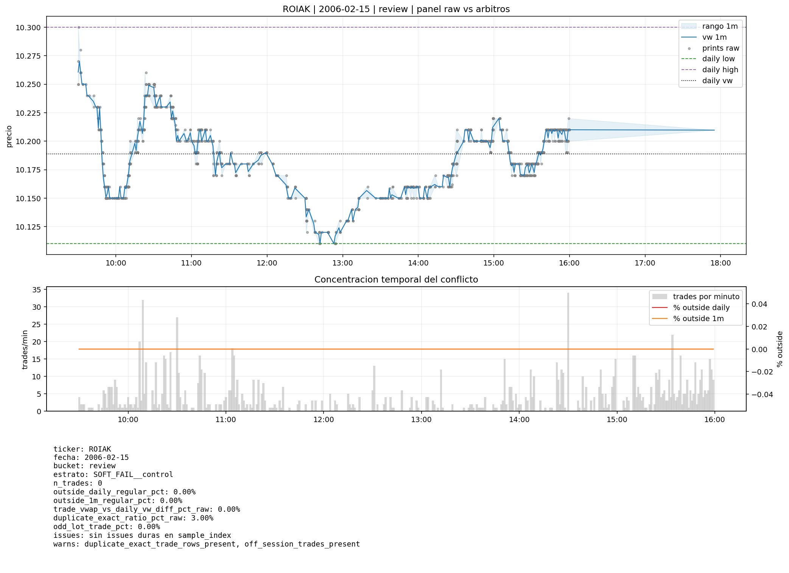

**Que muestra**

- Panel rico del tape raw frente a `daily` y `1m` para `ROIAK` el `2006-02-15`.
- `n_trades = 1,234`, `outside_daily_regular_pct = 0.00%`, `outside_1m_regular_pct = 0.00%`.
- `trade_vwap_vs_daily_vw_diff_pct_raw = 0.00%`, `duplicate_exact_ratio_pct_raw = 3.00%`, `odd_lot_trade_pct = 0.00%`.

**Responde**

- Residuo de revision no absorbido por una subfamilia mas especifica. Responde a la pregunta de si todavia hace falta una regla de rehabilitacion antes de consumir esta masa.
- Responde a si el conflicto dominante vive en la escala (`~1x`), en la comparabilidad frente a `daily` (0.00%) o frente a `1m` (0.00%).
- La decision que justifica es mantener o no el caso en `recoverable_with_flag` cuando se rematerialice la rehabilitacion sobre `57f`.

### SMMF | 2012-11-02

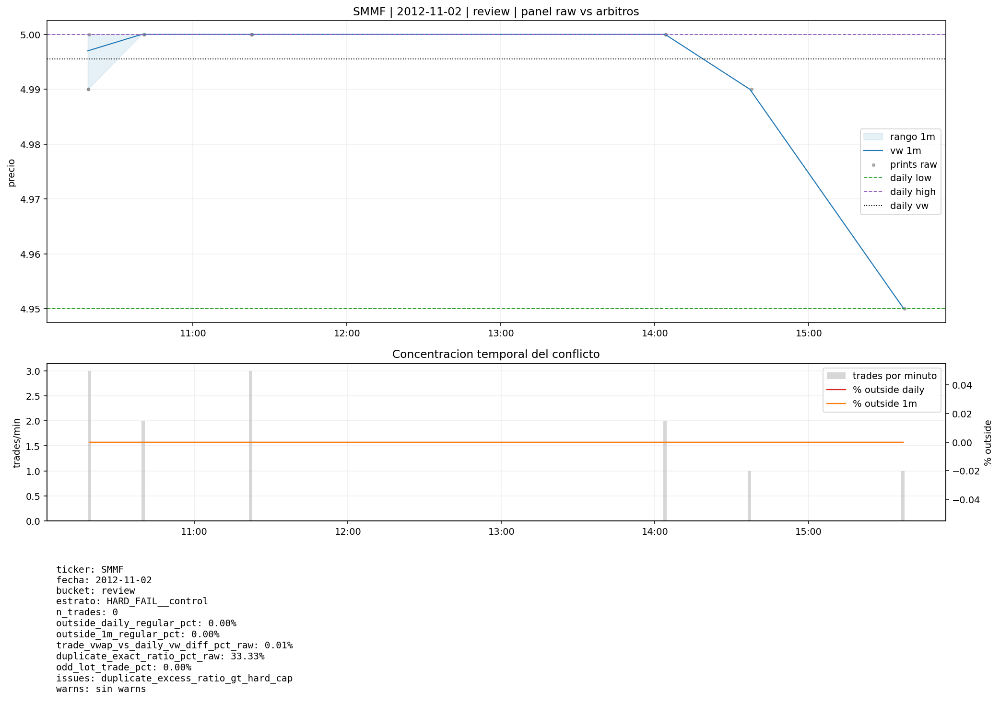

**Que muestra**

- Panel rico del tape raw frente a `daily` y `1m` para `SMMF` el `2012-11-02`.
- `n_trades = 12`, `outside_daily_regular_pct = 0.00%`, `outside_1m_regular_pct = 0.00%`.
- `trade_vwap_vs_daily_vw_diff_pct_raw = 0.01%`, `duplicate_exact_ratio_pct_raw = 33.33%`, `odd_lot_trade_pct = 0.00%`.

**Responde**

- Residuo de revision no absorbido por una subfamilia mas especifica. Responde a la pregunta de si todavia hace falta una regla de rehabilitacion antes de consumir esta masa.
- Responde a si el conflicto dominante vive en la escala (`~1x`), en la comparabilidad frente a `daily` (0.00%) o frente a `1m` (0.00%).
- El 33.33% de duplicacion exacta obliga a sospechar dano de tape o bursts mecanicos, no solo ruido visual.
- La decision que justifica es mantener o no el caso en `recoverable_with_flag` cuando se rematerialice la rehabilitacion sobre `57f`.

### SYPR | 2008-09-17

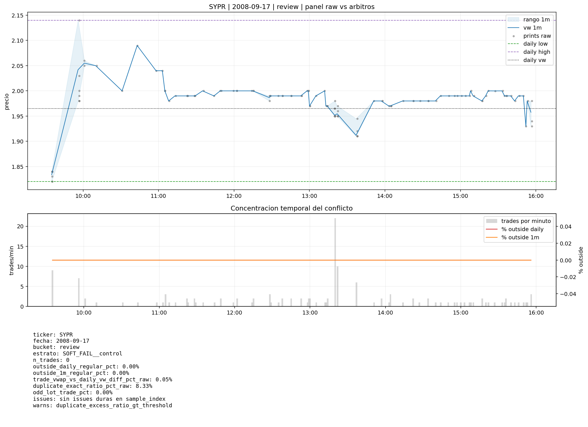

**Que muestra**

- Panel rico del tape raw frente a `daily` y `1m` para `SYPR` el `2008-09-17`.
- `n_trades = 144`, `outside_daily_regular_pct = 0.00%`, `outside_1m_regular_pct = 0.00%`.
- `trade_vwap_vs_daily_vw_diff_pct_raw = 0.05%`, `duplicate_exact_ratio_pct_raw = 8.33%`, `odd_lot_trade_pct = 0.00%`.

**Responde**

- Residuo de revision no absorbido por una subfamilia mas especifica. Responde a la pregunta de si todavia hace falta una regla de rehabilitacion antes de consumir esta masa.
- Responde a si el conflicto dominante vive en la escala (`~1x`), en la comparabilidad frente a `daily` (0.00%) o frente a `1m` (0.00%).
- El 8.33% de duplicacion exacta obliga a sospechar dano de tape o bursts mecanicos, no solo ruido visual.
- La decision que justifica es mantener o no el caso en `recoverable_with_flag` cuando se rematerialice la rehabilitacion sobre `57f`.

### LVNTA | 2014-03-25

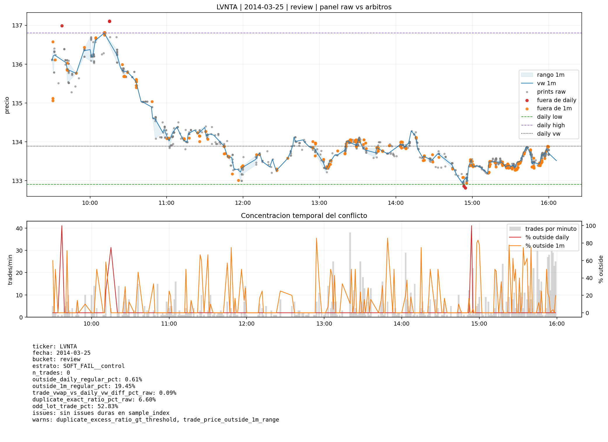

**Que muestra**

- Panel rico del tape raw frente a `daily` y `1m` para `LVNTA` el `2014-03-25`.
- `n_trades = 1,484`, `outside_daily_regular_pct = 0.61%`, `outside_1m_regular_pct = 19.45%`.
- `trade_vwap_vs_daily_vw_diff_pct_raw = 0.09%`, `duplicate_exact_ratio_pct_raw = 6.60%`, `odd_lot_trade_pct = 52.83%`.

**Responde**

- Residuo de revision no absorbido por una subfamilia mas especifica. Responde a la pregunta de si todavia hace falta una regla de rehabilitacion antes de consumir esta masa.
- Responde a si el conflicto dominante vive en la escala (`~1x`), en la comparabilidad frente a `daily` (0.61%) o frente a `1m` (19.45%).
- El 52.83% de odd-lots empuja la lectura hacia microestructura fina; evita leer el caso como pura ruptura economica gruesa.
- El 6.60% de duplicacion exacta obliga a sospechar dano de tape o bursts mecanicos, no solo ruido visual.
- La decision que justifica es mantener o no el caso en `recoverable_with_flag` cuando se rematerialice la rehabilitacion sobre `57f`.

### APLP | 2016-07-29

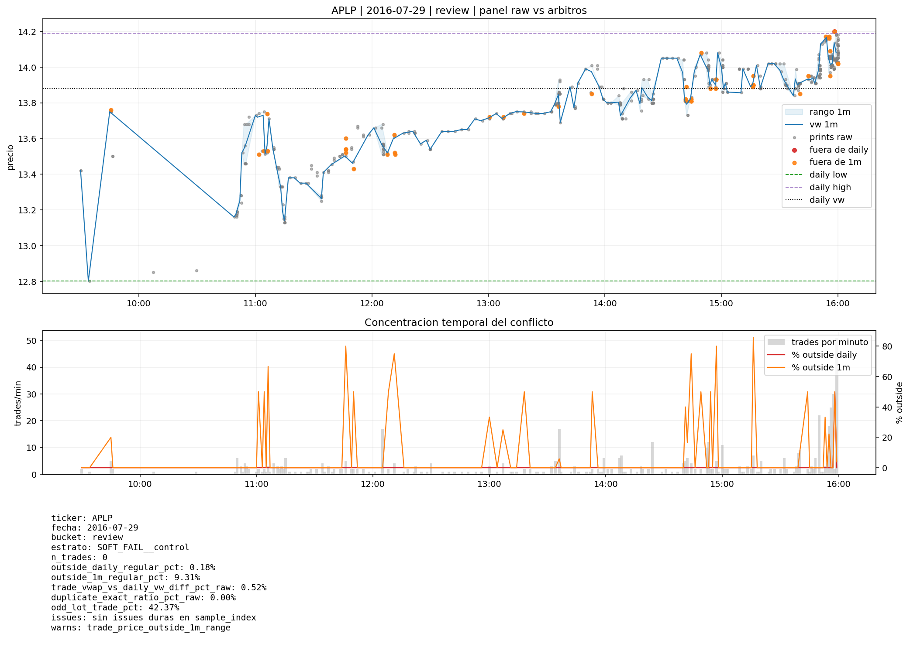

**Que muestra**

- Panel rico del tape raw frente a `daily` y `1m` para `APLP` el `2016-07-29`.
- `n_trades = 557`, `outside_daily_regular_pct = 0.18%`, `outside_1m_regular_pct = 9.31%`.
- `trade_vwap_vs_daily_vw_diff_pct_raw = 0.52%`, `duplicate_exact_ratio_pct_raw = 0.00%`, `odd_lot_trade_pct = 42.37%`.

**Responde**

- Residuo de revision no absorbido por una subfamilia mas especifica. Responde a la pregunta de si todavia hace falta una regla de rehabilitacion antes de consumir esta masa.
- Responde a si el conflicto dominante vive en la escala (`~1x`), en la comparabilidad frente a `daily` (0.18%) o frente a `1m` (9.31%).
- El 42.37% de odd-lots empuja la lectura hacia microestructura fina; evita leer el caso como pura ruptura economica gruesa.
- La decision que justifica es mantener o no el caso en `recoverable_with_flag` cuando se rematerialice la rehabilitacion sobre `57f`.

### ARDM | 2018-06-04

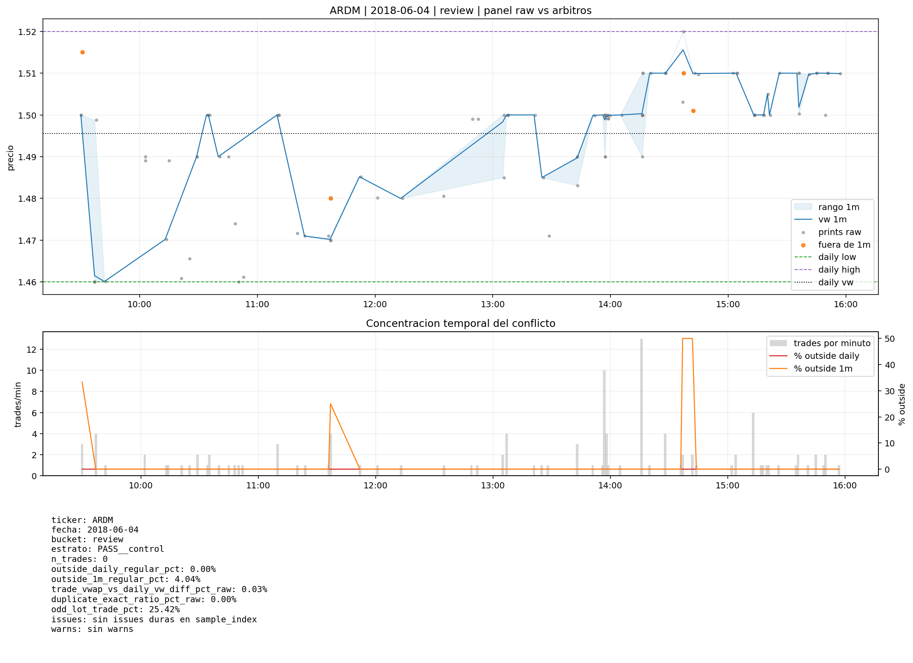

**Que muestra**

- Panel rico del tape raw frente a `daily` y `1m` para `ARDM` el `2018-06-04`.
- `n_trades = 118`, `outside_daily_regular_pct = 0.00%`, `outside_1m_regular_pct = 4.04%`.
- `trade_vwap_vs_daily_vw_diff_pct_raw = 0.03%`, `duplicate_exact_ratio_pct_raw = 0.00%`, `odd_lot_trade_pct = 25.42%`.

**Responde**

- Residuo de revision no absorbido por una subfamilia mas especifica. Responde a la pregunta de si todavia hace falta una regla de rehabilitacion antes de consumir esta masa.
- Responde a si el conflicto dominante vive en la escala (`~1x`), en la comparabilidad frente a `daily` (0.00%) o frente a `1m` (4.04%).
- El 25.42% de odd-lots empuja la lectura hacia microestructura fina; evita leer el caso como pura ruptura economica gruesa.
- La decision que justifica es mantener o no el caso en `recoverable_with_flag` cuando se rematerialice la rehabilitacion sobre `57f`.

### BEAT | 2015-12-04

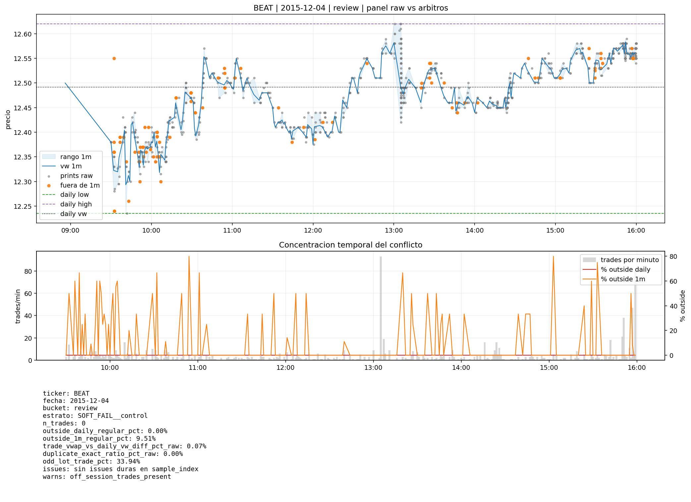

**Que muestra**

- Panel rico del tape raw frente a `daily` y `1m` para `BEAT` el `2015-12-04`.
- `n_trades = 1,093`, `outside_daily_regular_pct = 0.00%`, `outside_1m_regular_pct = 9.51%`.
- `trade_vwap_vs_daily_vw_diff_pct_raw = 0.07%`, `duplicate_exact_ratio_pct_raw = 0.00%`, `odd_lot_trade_pct = 33.94%`.

**Responde**

- Residuo de revision no absorbido por una subfamilia mas especifica. Responde a la pregunta de si todavia hace falta una regla de rehabilitacion antes de consumir esta masa.
- Responde a si el conflicto dominante vive en la escala (`~1x`), en la comparabilidad frente a `daily` (0.00%) o frente a `1m` (9.51%).
- El 33.94% de odd-lots empuja la lectura hacia microestructura fina; evita leer el caso como pura ruptura economica gruesa.
- La decision que justifica es mantener o no el caso en `recoverable_with_flag` cuando se rematerialice la rehabilitacion sobre `57f`.

### BSRR | 2013-10-02

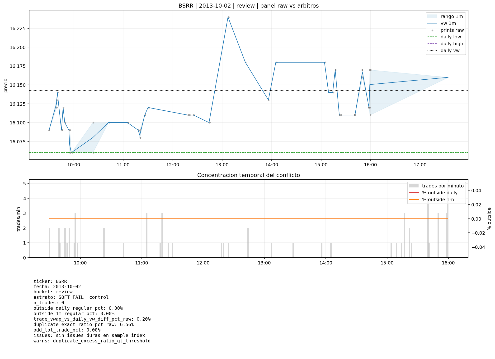

**Que muestra**

- Panel rico del tape raw frente a `daily` y `1m` para `BSRR` el `2013-10-02`.
- `n_trades = 61`, `outside_daily_regular_pct = 0.00%`, `outside_1m_regular_pct = 0.00%`.
- `trade_vwap_vs_daily_vw_diff_pct_raw = 0.20%`, `duplicate_exact_ratio_pct_raw = 6.56%`, `odd_lot_trade_pct = 0.00%`.

**Responde**

- Residuo de revision no absorbido por una subfamilia mas especifica. Responde a la pregunta de si todavia hace falta una regla de rehabilitacion antes de consumir esta masa.
- Responde a si el conflicto dominante vive en la escala (`~1x`), en la comparabilidad frente a `daily` (0.00%) o frente a `1m` (0.00%).
- El 6.56% de duplicacion exacta obliga a sospechar dano de tape o bursts mecanicos, no solo ruido visual.
- La decision que justifica es mantener o no el caso en `recoverable_with_flag` cuando se rematerialice la rehabilitacion sobre `57f`.

### GMLP | 2018-07-12

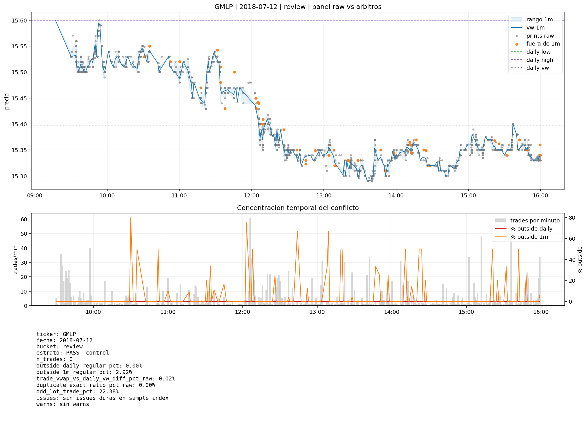

**Que muestra**

- Panel rico del tape raw frente a `daily` y `1m` para `GMLP` el `2018-07-12`.
- `n_trades = 1,872`, `outside_daily_regular_pct = 0.00%`, `outside_1m_regular_pct = 2.92%`.
- `trade_vwap_vs_daily_vw_diff_pct_raw = 0.02%`, `duplicate_exact_ratio_pct_raw = 0.00%`, `odd_lot_trade_pct = 22.38%`.

**Responde**

- Residuo de revision no absorbido por una subfamilia mas especifica. Responde a la pregunta de si todavia hace falta una regla de rehabilitacion antes de consumir esta masa.
- Responde a si el conflicto dominante vive en la escala (`~1x`), en la comparabilidad frente a `daily` (0.00%) o frente a `1m` (2.92%).
- La decision que justifica es mantener o no el caso en `recoverable_with_flag` cuando se rematerialice la rehabilitacion sobre `57f`.

### JASN | 2017-02-27

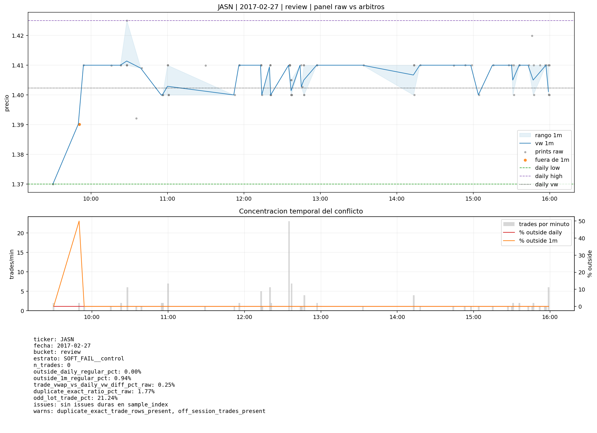

**Que muestra**

- Panel rico del tape raw frente a `daily` y `1m` para `JASN` el `2017-02-27`.
- `n_trades = 113`, `outside_daily_regular_pct = 0.00%`, `outside_1m_regular_pct = 0.94%`.
- `trade_vwap_vs_daily_vw_diff_pct_raw = 0.25%`, `duplicate_exact_ratio_pct_raw = 1.77%`, `odd_lot_trade_pct = 21.24%`.

**Responde**

- Residuo de revision no absorbido por una subfamilia mas especifica. Responde a la pregunta de si todavia hace falta una regla de rehabilitacion antes de consumir esta masa.
- Responde a si el conflicto dominante vive en la escala (`~1x`), en la comparabilidad frente a `daily` (0.00%) o frente a `1m` (0.94%).
- La decision que justifica es mantener o no el caso en `recoverable_with_flag` cuando se rematerialice la rehabilitacion sobre `57f`.

### KTCC | 2013-09-09

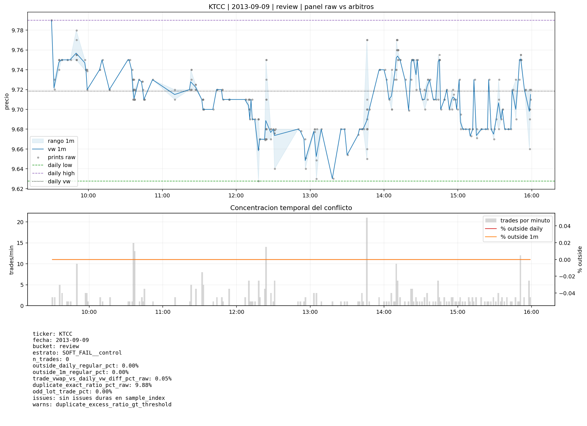

**Que muestra**

- Panel rico del tape raw frente a `daily` y `1m` para `KTCC` el `2013-09-09`.
- `n_trades = 334`, `outside_daily_regular_pct = 0.00%`, `outside_1m_regular_pct = 0.00%`.
- `trade_vwap_vs_daily_vw_diff_pct_raw = 0.05%`, `duplicate_exact_ratio_pct_raw = 9.88%`, `odd_lot_trade_pct = 0.00%`.

**Responde**

- Residuo de revision no absorbido por una subfamilia mas especifica. Responde a la pregunta de si todavia hace falta una regla de rehabilitacion antes de consumir esta masa.
- Responde a si el conflicto dominante vive en la escala (`~1x`), en la comparabilidad frente a `daily` (0.00%) o frente a `1m` (0.00%).
- El 9.88% de duplicacion exacta obliga a sospechar dano de tape o bursts mecanicos, no solo ruido visual.
- La decision que justifica es mantener o no el caso en `recoverable_with_flag` cuando se rematerialice la rehabilitacion sobre `57f`.

### MDCA | 2018-06-08

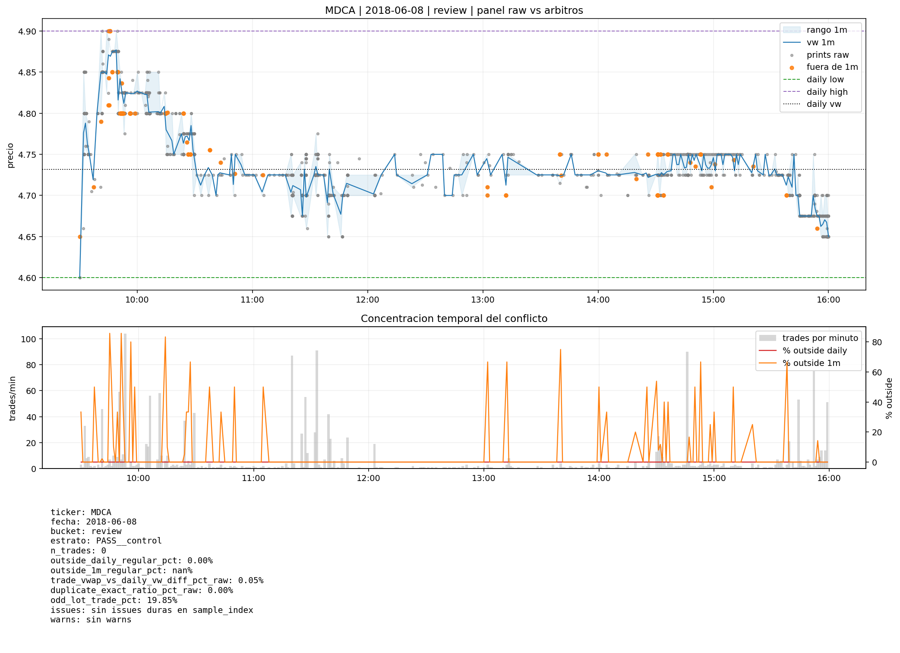

**Que muestra**

- Panel rico del tape raw frente a `daily` y `1m` para `MDCA` el `2018-06-08`.
- `n_trades = 1,809`, `outside_daily_regular_pct = 0.00%`, `outside_1m_regular_pct = nan%`.
- `trade_vwap_vs_daily_vw_diff_pct_raw = 0.05%`, `duplicate_exact_ratio_pct_raw = 0.00%`, `odd_lot_trade_pct = 19.85%`.

**Responde**

- Residuo de revision no absorbido por una subfamilia mas especifica. Responde a la pregunta de si todavia hace falta una regla de rehabilitacion antes de consumir esta masa.
- Responde a si el conflicto dominante vive en la escala (`~1x`), en la comparabilidad frente a `daily` (0.00%) o frente a `1m` (nan%).
- La decision que justifica es mantener o no el caso en `recoverable_with_flag` cuando se rematerialice la rehabilitacion sobre `57f`.

### MOFG | 2014-10-31

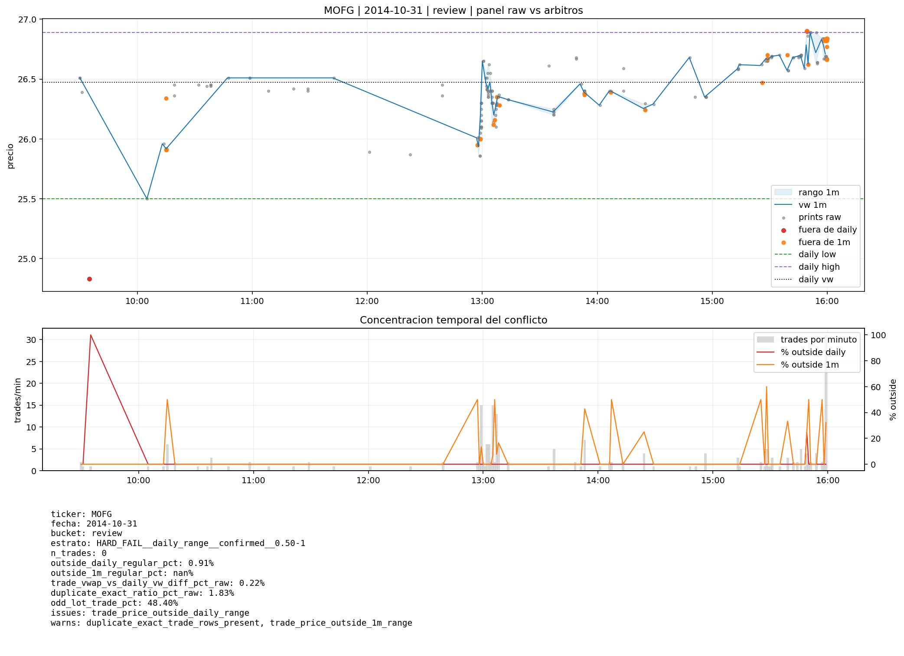

**Que muestra**

- Panel rico del tape raw frente a `daily` y `1m` para `MOFG` el `2014-10-31`.
- `n_trades = 219`, `outside_daily_regular_pct = 0.91%`, `outside_1m_regular_pct = nan%`.
- `trade_vwap_vs_daily_vw_diff_pct_raw = 0.22%`, `duplicate_exact_ratio_pct_raw = 1.83%`, `odd_lot_trade_pct = 48.40%`.

**Responde**

- Residuo de revision no absorbido por una subfamilia mas especifica. Responde a la pregunta de si todavia hace falta una regla de rehabilitacion antes de consumir esta masa.
- Responde a si el conflicto dominante vive en la escala (`~1x`), en la comparabilidad frente a `daily` (0.91%) o frente a `1m` (nan%).
- El 48.40% de odd-lots empuja la lectura hacia microestructura fina; evita leer el caso como pura ruptura economica gruesa.
- La decision que justifica es mantener o no el caso en `recoverable_with_flag` cuando se rematerialice la rehabilitacion sobre `57f`.

### MSGN | 2018-08-22

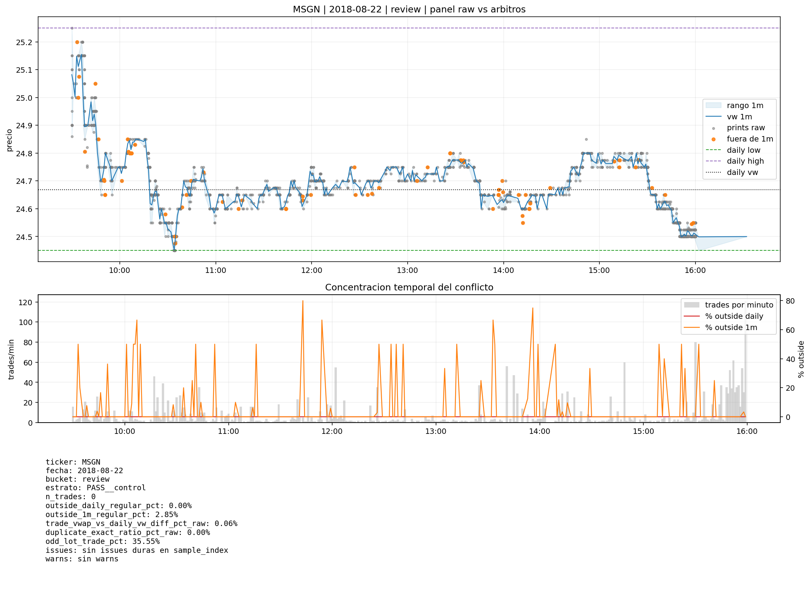

**Que muestra**

- Panel rico del tape raw frente a `daily` y `1m` para `MSGN` el `2018-08-22`.
- `n_trades = 2,591`, `outside_daily_regular_pct = 0.00%`, `outside_1m_regular_pct = 2.85%`.
- `trade_vwap_vs_daily_vw_diff_pct_raw = 0.06%`, `duplicate_exact_ratio_pct_raw = 0.00%`, `odd_lot_trade_pct = 35.55%`.

**Responde**

- Residuo de revision no absorbido por una subfamilia mas especifica. Responde a la pregunta de si todavia hace falta una regla de rehabilitacion antes de consumir esta masa.
- Responde a si el conflicto dominante vive en la escala (`~1x`), en la comparabilidad frente a `daily` (0.00%) o frente a `1m` (2.85%).
- El 35.55% de odd-lots empuja la lectura hacia microestructura fina; evita leer el caso como pura ruptura economica gruesa.
- La decision que justifica es mantener o no el caso en `recoverable_with_flag` cuando se rematerialice la rehabilitacion sobre `57f`.

### OXBR | 2018-12-24

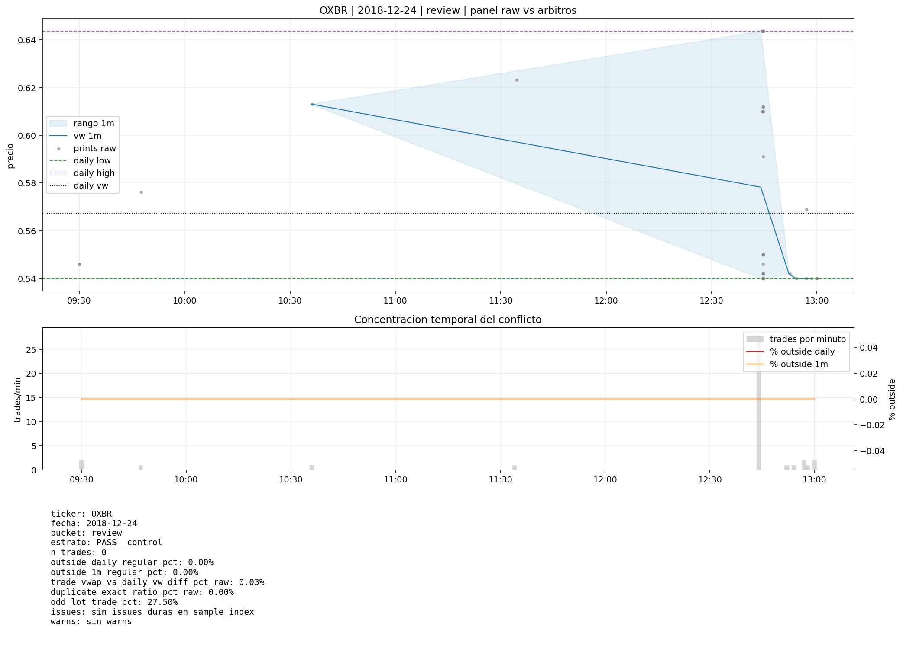

**Que muestra**

- Panel rico del tape raw frente a `daily` y `1m` para `OXBR` el `2018-12-24`.
- `n_trades = 40`, `outside_daily_regular_pct = 0.00%`, `outside_1m_regular_pct = 0.00%`.
- `trade_vwap_vs_daily_vw_diff_pct_raw = 0.03%`, `duplicate_exact_ratio_pct_raw = 0.00%`, `odd_lot_trade_pct = 27.50%`.

**Responde**

- Residuo de revision no absorbido por una subfamilia mas especifica. Responde a la pregunta de si todavia hace falta una regla de rehabilitacion antes de consumir esta masa.
- Responde a si el conflicto dominante vive en la escala (`~1x`), en la comparabilidad frente a `daily` (0.00%) o frente a `1m` (0.00%).
- El 27.50% de odd-lots empuja la lectura hacia microestructura fina; evita leer el caso como pura ruptura economica gruesa.
- La decision que justifica es mantener o no el caso en `recoverable_with_flag` cuando se rematerialice la rehabilitacion sobre `57f`.

### SENEB | 2013-08-19

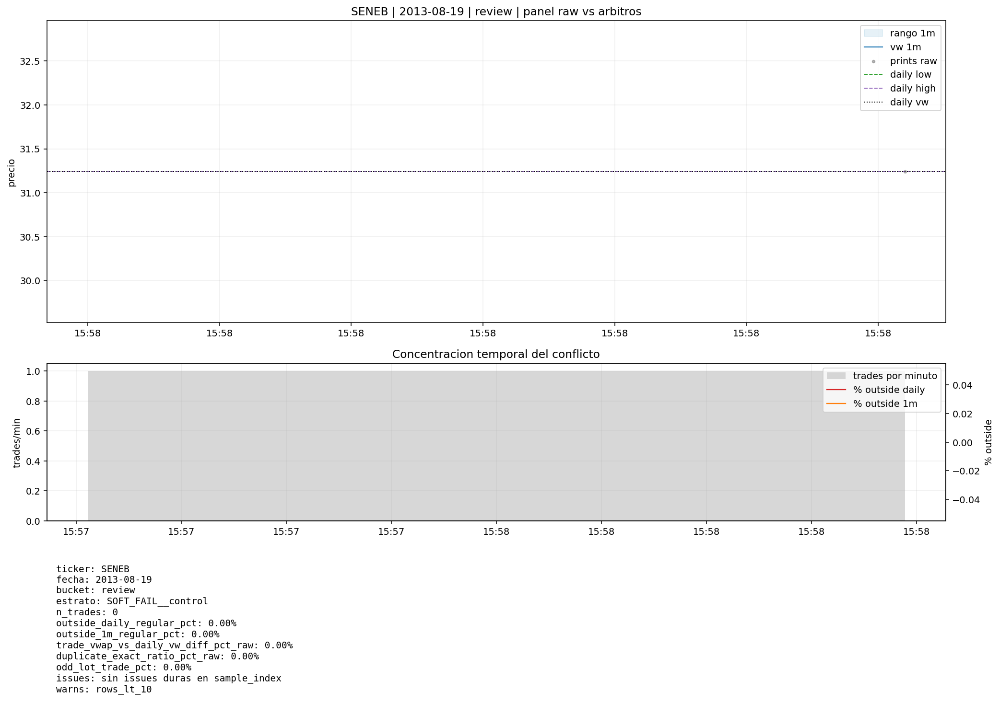

**Que muestra**

- Panel rico del tape raw frente a `daily` y `1m` para `SENEB` el `2013-08-19`.
- `n_trades = 1`, `outside_daily_regular_pct = 0.00%`, `outside_1m_regular_pct = 0.00%`.
- `trade_vwap_vs_daily_vw_diff_pct_raw = 0.00%`, `duplicate_exact_ratio_pct_raw = 0.00%`, `odd_lot_trade_pct = 0.00%`.

**Responde**

- Residuo de revision no absorbido por una subfamilia mas especifica. Responde a la pregunta de si todavia hace falta una regla de rehabilitacion antes de consumir esta masa.
- Responde a si el conflicto dominante vive en la escala (`~1x`), en la comparabilidad frente a `daily` (0.00%) o frente a `1m` (0.00%).
- La decision que justifica es mantener o no el caso en `recoverable_with_flag` cuando se rematerialice la rehabilitacion sobre `57f`.

### SIEB | 2016-12-09

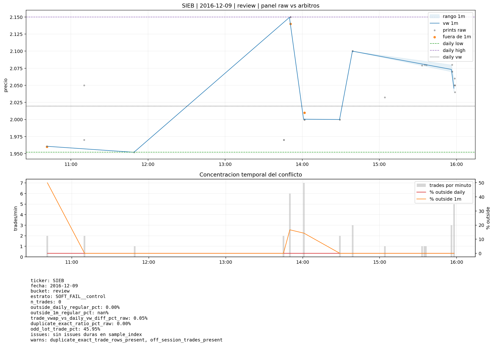

**Que muestra**

- Panel rico del tape raw frente a `daily` y `1m` para `SIEB` el `2016-12-09`.
- `n_trades = 37`, `outside_daily_regular_pct = 0.00%`, `outside_1m_regular_pct = nan%`.
- `trade_vwap_vs_daily_vw_diff_pct_raw = 0.05%`, `duplicate_exact_ratio_pct_raw = 0.00%`, `odd_lot_trade_pct = 45.95%`.

**Responde**

- Residuo de revision no absorbido por una subfamilia mas especifica. Responde a la pregunta de si todavia hace falta una regla de rehabilitacion antes de consumir esta masa.
- Responde a si el conflicto dominante vive en la escala (`~1x`), en la comparabilidad frente a `daily` (0.00%) o frente a `1m` (nan%).
- El 45.95% de odd-lots empuja la lectura hacia microestructura fina; evita leer el caso como pura ruptura economica gruesa.
- La decision que justifica es mantener o no el caso en `recoverable_with_flag` cuando se rematerialice la rehabilitacion sobre `57f`.

### SMTX | 2018-08-03

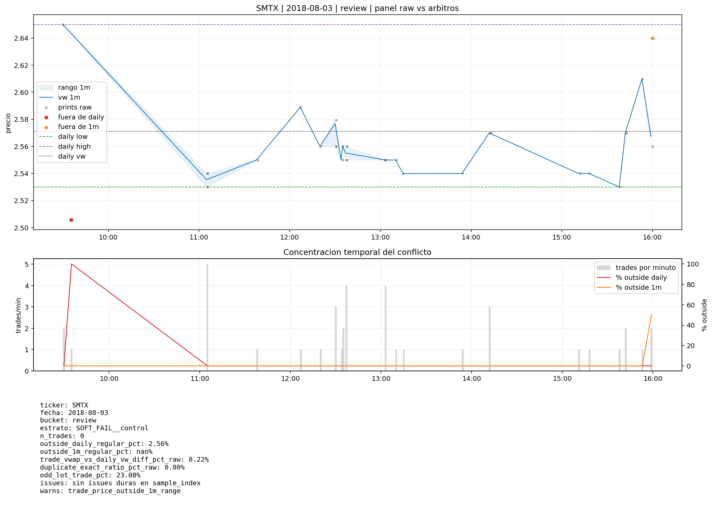

**Que muestra**

- Panel rico del tape raw frente a `daily` y `1m` para `SMTX` el `2018-08-03`.
- `n_trades = 39`, `outside_daily_regular_pct = 2.56%`, `outside_1m_regular_pct = nan%`.
- `trade_vwap_vs_daily_vw_diff_pct_raw = 0.22%`, `duplicate_exact_ratio_pct_raw = 0.00%`, `odd_lot_trade_pct = 23.08%`.

**Responde**

- Residuo de revision no absorbido por una subfamilia mas especifica. Responde a la pregunta de si todavia hace falta una regla de rehabilitacion antes de consumir esta masa.
- Responde a si el conflicto dominante vive en la escala (`~1x`), en la comparabilidad frente a `daily` (2.56%) o frente a `1m` (nan%).
- La decision que justifica es mantener o no el caso en `recoverable_with_flag` cuando se rematerialice la rehabilitacion sobre `57f`.

### SVBI | 2017-08-02

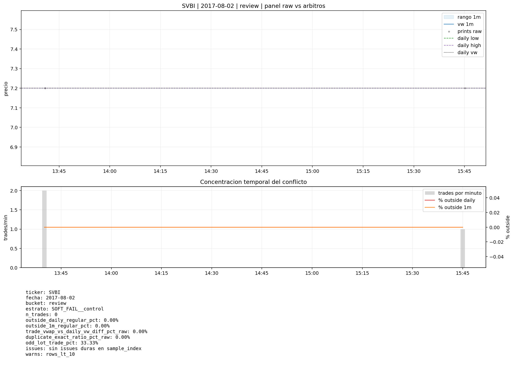

**Que muestra**

- Panel rico del tape raw frente a `daily` y `1m` para `SVBI` el `2017-08-02`.
- `n_trades = 3`, `outside_daily_regular_pct = 0.00%`, `outside_1m_regular_pct = 0.00%`.
- `trade_vwap_vs_daily_vw_diff_pct_raw = 0.00%`, `duplicate_exact_ratio_pct_raw = 0.00%`, `odd_lot_trade_pct = 33.33%`.

**Responde**

- Residuo de revision no absorbido por una subfamilia mas especifica. Responde a la pregunta de si todavia hace falta una regla de rehabilitacion antes de consumir esta masa.
- Responde a si el conflicto dominante vive en la escala (`~1x`), en la comparabilidad frente a `daily` (0.00%) o frente a `1m` (0.00%).
- El 33.33% de odd-lots empuja la lectura hacia microestructura fina; evita leer el caso como pura ruptura economica gruesa.
- La decision que justifica es mantener o no el caso en `recoverable_with_flag` cuando se rematerialice la rehabilitacion sobre `57f`.

### TRAK | 2013-01-31

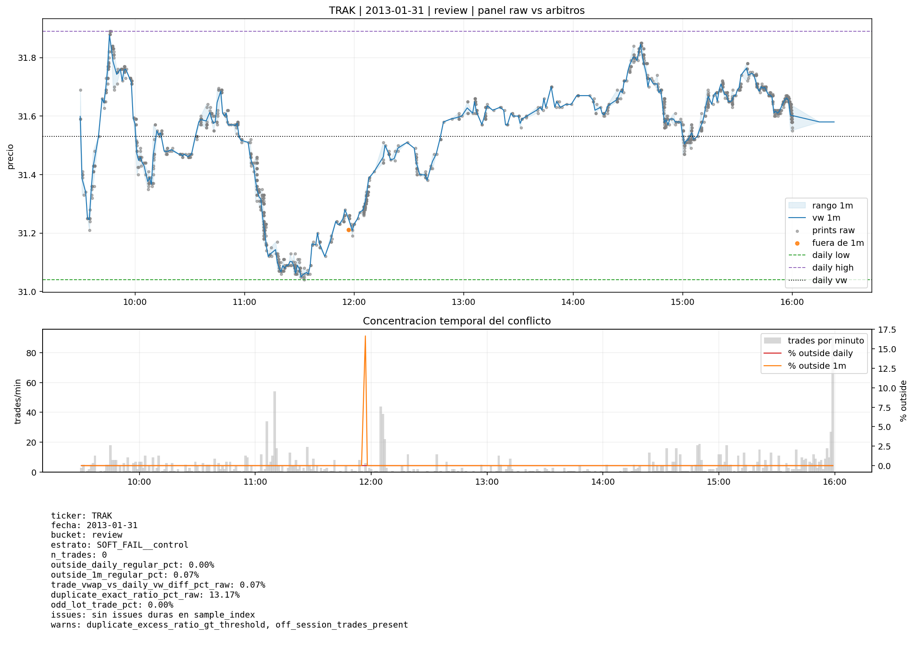

**Que muestra**

- Panel rico del tape raw frente a `daily` y `1m` para `TRAK` el `2013-01-31`.
- `n_trades = 1,466`, `outside_daily_regular_pct = 0.00%`, `outside_1m_regular_pct = 0.07%`.
- `trade_vwap_vs_daily_vw_diff_pct_raw = 0.07%`, `duplicate_exact_ratio_pct_raw = 13.17%`, `odd_lot_trade_pct = 0.00%`.

**Responde**

- Residuo de revision no absorbido por una subfamilia mas especifica. Responde a la pregunta de si todavia hace falta una regla de rehabilitacion antes de consumir esta masa.
- Responde a si el conflicto dominante vive en la escala (`~1x`), en la comparabilidad frente a `daily` (0.00%) o frente a `1m` (0.07%).
- El 13.17% de duplicacion exacta obliga a sospechar dano de tape o bursts mecanicos, no solo ruido visual.
- La decision que justifica es mantener o no el caso en `recoverable_with_flag` cuando se rematerialice la rehabilitacion sobre `57f`.

### VOC | 2016-01-12

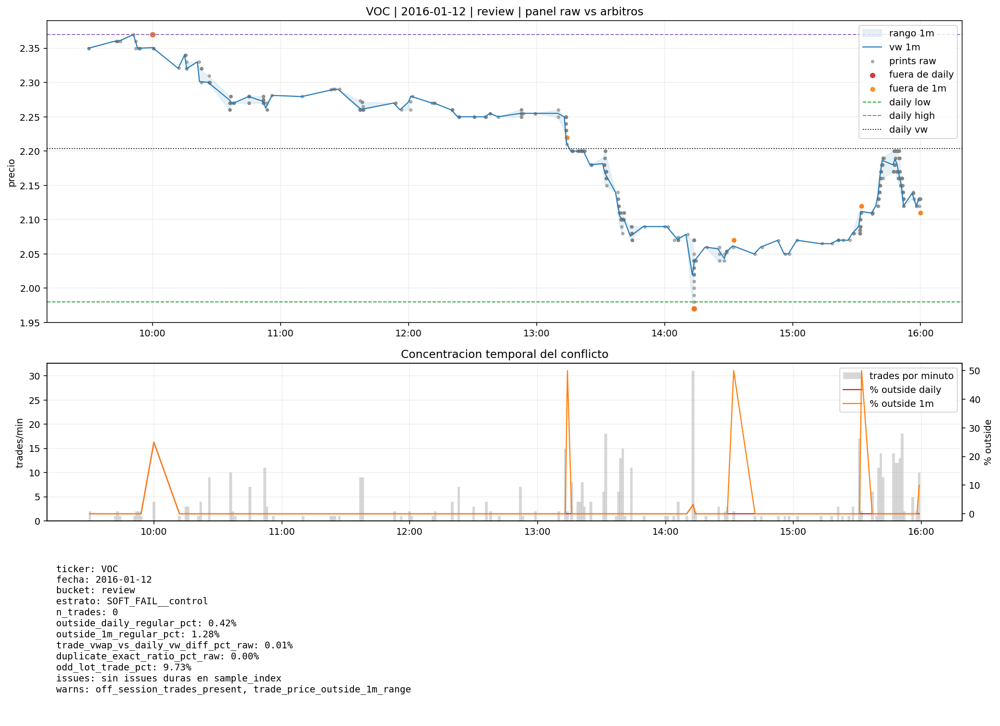

**Que muestra**

- Panel rico del tape raw frente a `daily` y `1m` para `VOC` el `2016-01-12`.
- `n_trades = 473`, `outside_daily_regular_pct = 0.42%`, `outside_1m_regular_pct = 1.28%`.
- `trade_vwap_vs_daily_vw_diff_pct_raw = 0.01%`, `duplicate_exact_ratio_pct_raw = 0.00%`, `odd_lot_trade_pct = 9.73%`.

**Responde**

- Residuo de revision no absorbido por una subfamilia mas especifica. Responde a la pregunta de si todavia hace falta una regla de rehabilitacion antes de consumir esta masa.
- Responde a si el conflicto dominante vive en la escala (`~1x`), en la comparabilidad frente a `daily` (0.42%) o frente a `1m` (1.28%).
- La decision que justifica es mantener o no el caso en `recoverable_with_flag` cuando se rematerialice la rehabilitacion sobre `57f`.

### WASH | 2015-01-06

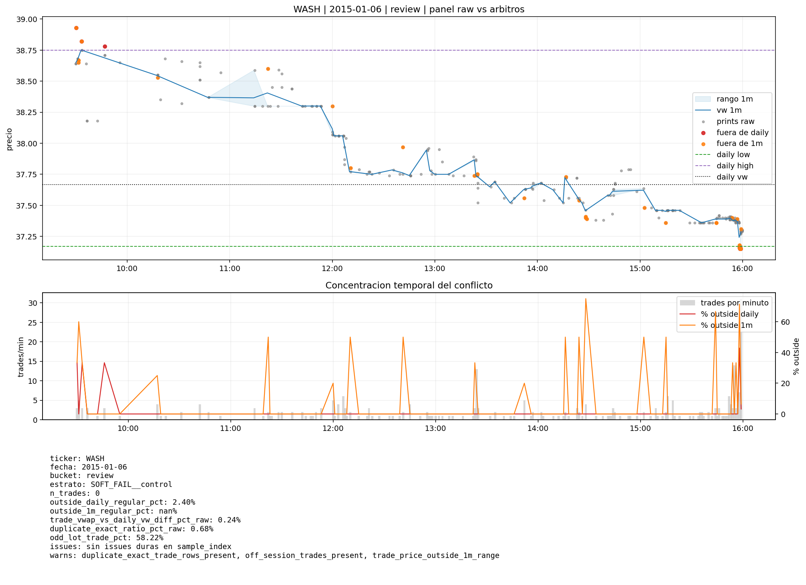

**Que muestra**

- Panel rico del tape raw frente a `daily` y `1m` para `WASH` el `2015-01-06`.
- `n_trades = 292`, `outside_daily_regular_pct = 2.40%`, `outside_1m_regular_pct = nan%`.
- `trade_vwap_vs_daily_vw_diff_pct_raw = 0.24%`, `duplicate_exact_ratio_pct_raw = 0.68%`, `odd_lot_trade_pct = 58.22%`.

**Responde**

- Residuo de revision no absorbido por una subfamilia mas especifica. Responde a la pregunta de si todavia hace falta una regla de rehabilitacion antes de consumir esta masa.
- Responde a si el conflicto dominante vive en la escala (`~1x`), en la comparabilidad frente a `daily` (2.40%) o frente a `1m` (nan%).
- El 58.22% de odd-lots empuja la lectura hacia microestructura fina; evita leer el caso como pura ruptura economica gruesa.
- La decision que justifica es mantener o no el caso en `recoverable_with_flag` cuando se rematerialice la rehabilitacion sobre `57f`.

### SFE | 2021-07-26

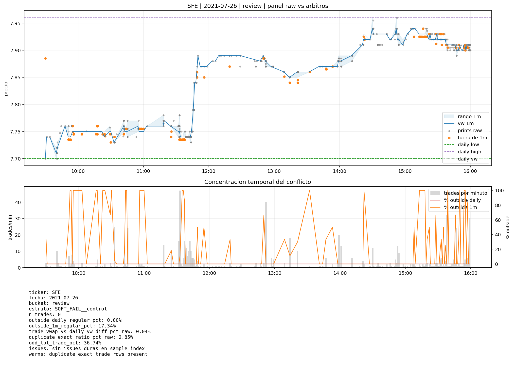

**Que muestra**

- Panel rico del tape raw frente a `daily` y `1m` para `SFE` el `2021-07-26`.
- `n_trades = 773`, `outside_daily_regular_pct = 0.00%`, `outside_1m_regular_pct = 17.34%`.
- `trade_vwap_vs_daily_vw_diff_pct_raw = 0.04%`, `duplicate_exact_ratio_pct_raw = 2.85%`, `odd_lot_trade_pct = 36.74%`.

**Responde**

- Residuo de revision no absorbido por una subfamilia mas especifica. Responde a la pregunta de si todavia hace falta una regla de rehabilitacion antes de consumir esta masa.
- Responde a si el conflicto dominante vive en la escala (`~1x`), en la comparabilidad frente a `daily` (0.00%) o frente a `1m` (17.34%).
- El 36.74% de odd-lots empuja la lectura hacia microestructura fina; evita leer el caso como pura ruptura economica gruesa.
- La decision que justifica es mantener o no el caso en `recoverable_with_flag` cuando se rematerialice la rehabilitacion sobre `57f`.

### STND | 2019-07-02

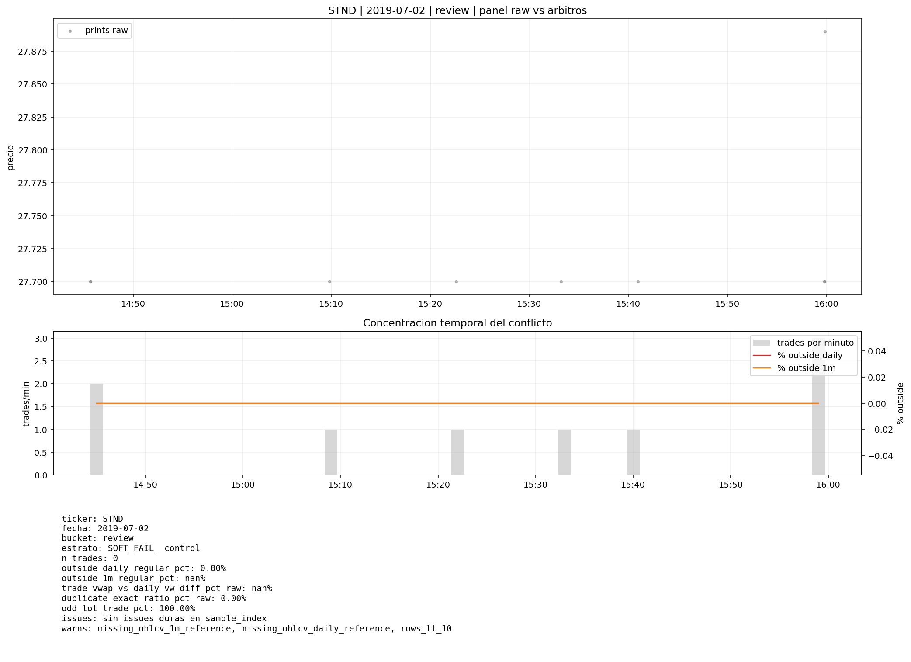

**Que muestra**

- Panel rico del tape raw frente a `daily` y `1m` para `STND` el `2019-07-02`.
- `n_trades = 9`, `outside_daily_regular_pct = 0.00%`, `outside_1m_regular_pct = nan%`.
- `trade_vwap_vs_daily_vw_diff_pct_raw = nan%`, `duplicate_exact_ratio_pct_raw = 0.00%`, `odd_lot_trade_pct = 100.00%`.

**Responde**

- Residuo de revision no absorbido por una subfamilia mas especifica. Responde a la pregunta de si todavia hace falta una regla de rehabilitacion antes de consumir esta masa.
- Responde a si el conflicto dominante vive en la escala (`nan`), en la comparabilidad frente a `daily` (0.00%) o frente a `1m` (nan%).
- El 100.00% de odd-lots empuja la lectura hacia microestructura fina; evita leer el caso como pura ruptura economica gruesa.
- La decision que justifica es mantener o no el caso en `recoverable_with_flag` cuando se rematerialice la rehabilitacion sobre `57f`.

### ABUS | 2023-12-28

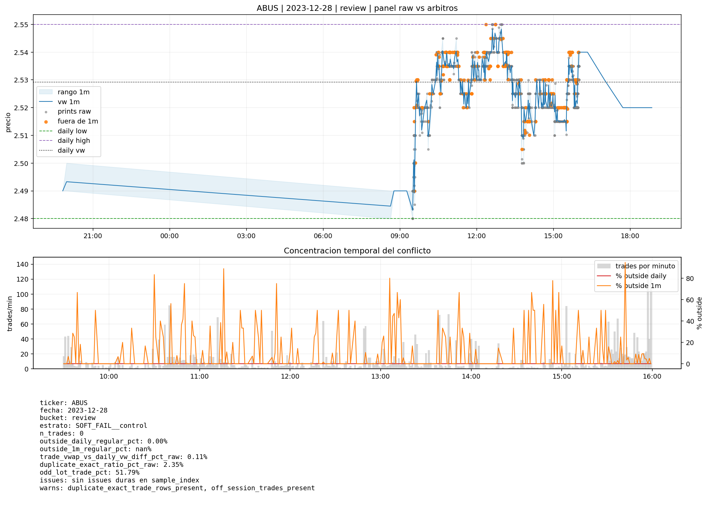

**Que muestra**

- Panel rico del tape raw frente a `daily` y `1m` para `ABUS` el `2023-12-28`.
- `n_trades = 3,750`, `outside_daily_regular_pct = 0.00%`, `outside_1m_regular_pct = nan%`.
- `trade_vwap_vs_daily_vw_diff_pct_raw = 0.11%`, `duplicate_exact_ratio_pct_raw = 2.35%`, `odd_lot_trade_pct = 51.79%`.

**Responde**

- Residuo de revision no absorbido por una subfamilia mas especifica. Responde a la pregunta de si todavia hace falta una regla de rehabilitacion antes de consumir esta masa.
- Responde a si el conflicto dominante vive en la escala (`~1x`), en la comparabilidad frente a `daily` (0.00%) o frente a `1m` (nan%).
- El 51.79% de odd-lots empuja la lectura hacia microestructura fina; evita leer el caso como pura ruptura economica gruesa.
- La decision que justifica es mantener o no el caso en `recoverable_with_flag` cuando se rematerialice la rehabilitacion sobre `57f`.

### BDN | 2023-04-25

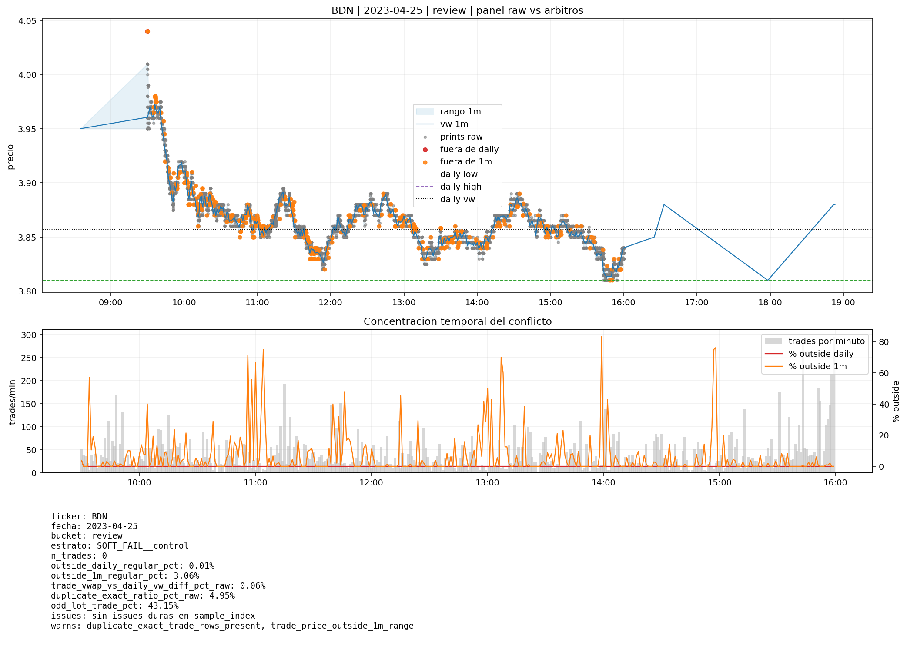

**Que muestra**

- Panel rico del tape raw frente a `daily` y `1m` para `BDN` el `2023-04-25`.
- `n_trades = 15,288`, `outside_daily_regular_pct = 0.01%`, `outside_1m_regular_pct = 3.06%`.
- `trade_vwap_vs_daily_vw_diff_pct_raw = 0.06%`, `duplicate_exact_ratio_pct_raw = 4.95%`, `odd_lot_trade_pct = 43.15%`.

**Responde**

- Residuo de revision no absorbido por una subfamilia mas especifica. Responde a la pregunta de si todavia hace falta una regla de rehabilitacion antes de consumir esta masa.
- Responde a si el conflicto dominante vive en la escala (`~1x`), en la comparabilidad frente a `daily` (0.01%) o frente a `1m` (3.06%).
- El 43.15% de odd-lots empuja la lectura hacia microestructura fina; evita leer el caso como pura ruptura economica gruesa.
- La decision que justifica es mantener o no el caso en `recoverable_with_flag` cuando se rematerialice la rehabilitacion sobre `57f`.

### BRN | 2021-07-15

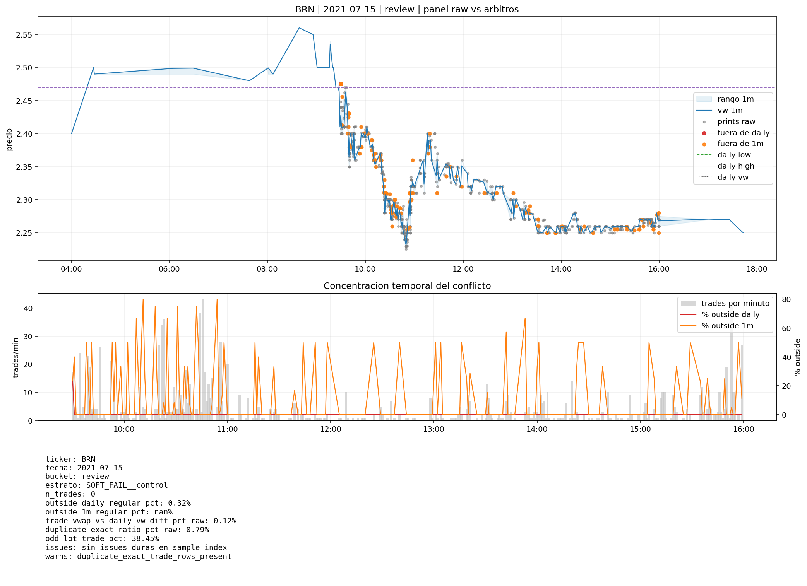

**Que muestra**

- Panel rico del tape raw frente a `daily` y `1m` para `BRN` el `2021-07-15`.
- `n_trades = 1,264`, `outside_daily_regular_pct = 0.32%`, `outside_1m_regular_pct = nan%`.
- `trade_vwap_vs_daily_vw_diff_pct_raw = 0.12%`, `duplicate_exact_ratio_pct_raw = 0.79%`, `odd_lot_trade_pct = 38.45%`.

**Responde**

- Residuo de revision no absorbido por una subfamilia mas especifica. Responde a la pregunta de si todavia hace falta una regla de rehabilitacion antes de consumir esta masa.
- Responde a si el conflicto dominante vive en la escala (`~1x`), en la comparabilidad frente a `daily` (0.32%) o frente a `1m` (nan%).
- El 38.45% de odd-lots empuja la lectura hacia microestructura fina; evita leer el caso como pura ruptura economica gruesa.
- La decision que justifica es mantener o no el caso en `recoverable_with_flag` cuando se rematerialice la rehabilitacion sobre `57f`.

### CMT | 2019-04-09

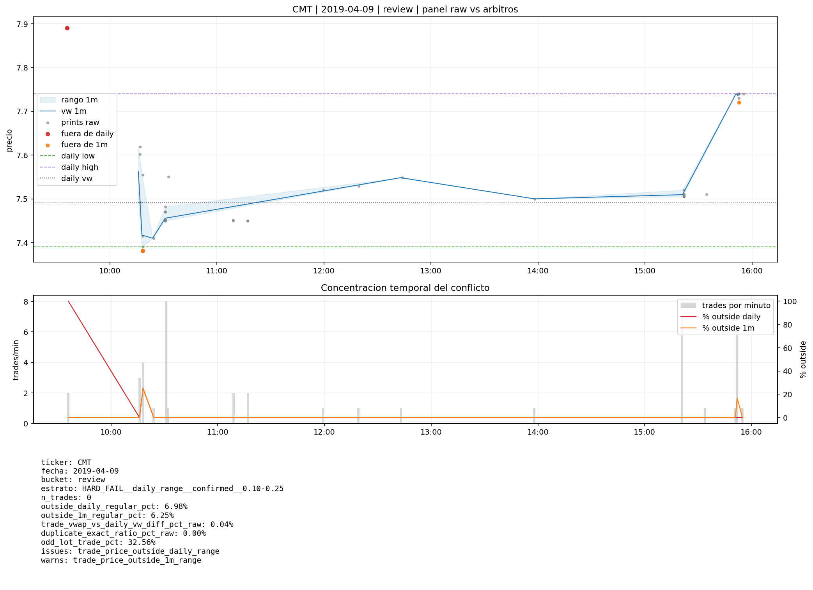

**Que muestra**

- Panel rico del tape raw frente a `daily` y `1m` para `CMT` el `2019-04-09`.
- `n_trades = 43`, `outside_daily_regular_pct = 6.98%`, `outside_1m_regular_pct = 6.25%`.
- `trade_vwap_vs_daily_vw_diff_pct_raw = 0.04%`, `duplicate_exact_ratio_pct_raw = 0.00%`, `odd_lot_trade_pct = 32.56%`.

**Responde**

- Residuo de revision no absorbido por una subfamilia mas especifica. Responde a la pregunta de si todavia hace falta una regla de rehabilitacion antes de consumir esta masa.
- Responde a si el conflicto dominante vive en la escala (`~1x`), en la comparabilidad frente a `daily` (6.98%) o frente a `1m` (6.25%).
- El 32.56% de odd-lots empuja la lectura hacia microestructura fina; evita leer el caso como pura ruptura economica gruesa.
- La decision que justifica es mantener o no el caso en `recoverable_with_flag` cuando se rematerialice la rehabilitacion sobre `57f`.

### CORS | 2022-10-10

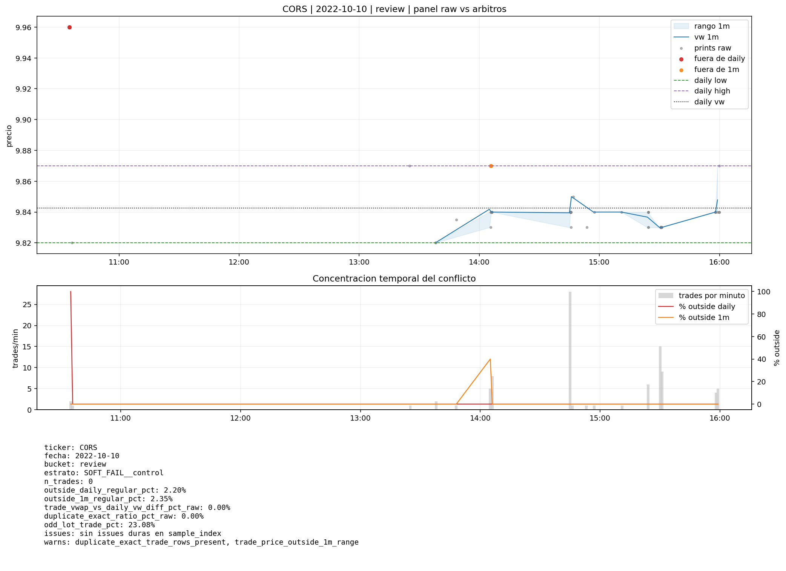

**Que muestra**

- Panel rico del tape raw frente a `daily` y `1m` para `CORS` el `2022-10-10`.
- `n_trades = 91`, `outside_daily_regular_pct = 2.20%`, `outside_1m_regular_pct = 2.35%`.
- `trade_vwap_vs_daily_vw_diff_pct_raw = 0.00%`, `duplicate_exact_ratio_pct_raw = 0.00%`, `odd_lot_trade_pct = 23.08%`.

**Responde**

- Residuo de revision no absorbido por una subfamilia mas especifica. Responde a la pregunta de si todavia hace falta una regla de rehabilitacion antes de consumir esta masa.
- Responde a si el conflicto dominante vive en la escala (`~1x`), en la comparabilidad frente a `daily` (2.20%) o frente a `1m` (2.35%).
- La decision que justifica es mantener o no el caso en `recoverable_with_flag` cuando se rematerialice la rehabilitacion sobre `57f`.

### CTEK | 2020-08-28

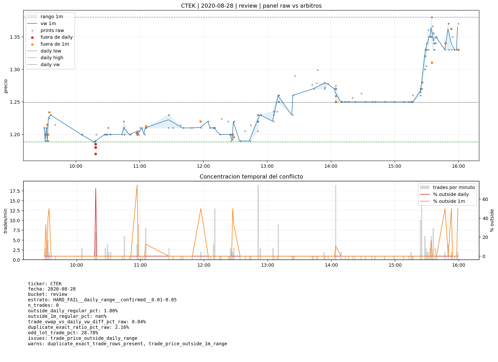

**Que muestra**

- Panel rico del tape raw frente a `daily` y `1m` para `CTEK` el `2020-08-28`.
- `n_trades = 278`, `outside_daily_regular_pct = 1.80%`, `outside_1m_regular_pct = nan%`.
- `trade_vwap_vs_daily_vw_diff_pct_raw = 0.04%`, `duplicate_exact_ratio_pct_raw = 2.16%`, `odd_lot_trade_pct = 28.78%`.

**Responde**

- Residuo de revision no absorbido por una subfamilia mas especifica. Responde a la pregunta de si todavia hace falta una regla de rehabilitacion antes de consumir esta masa.
- Responde a si el conflicto dominante vive en la escala (`~1x`), en la comparabilidad frente a `daily` (1.80%) o frente a `1m` (nan%).
- El 28.78% de odd-lots empuja la lectura hacia microestructura fina; evita leer el caso como pura ruptura economica gruesa.
- La decision que justifica es mantener o no el caso en `recoverable_with_flag` cuando se rematerialice la rehabilitacion sobre `57f`.

### ESQ | 2020-05-19

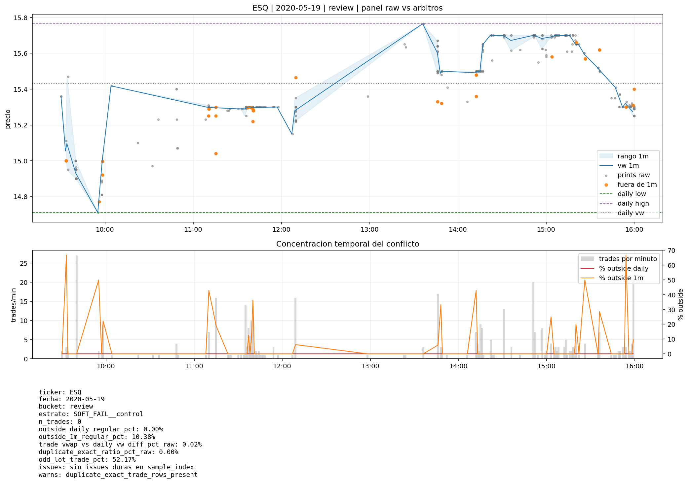

**Que muestra**

- Panel rico del tape raw frente a `daily` y `1m` para `ESQ` el `2020-05-19`.
- `n_trades = 391`, `outside_daily_regular_pct = 0.00%`, `outside_1m_regular_pct = 10.38%`.
- `trade_vwap_vs_daily_vw_diff_pct_raw = 0.02%`, `duplicate_exact_ratio_pct_raw = 0.00%`, `odd_lot_trade_pct = 52.17%`.

**Responde**

- Residuo de revision no absorbido por una subfamilia mas especifica. Responde a la pregunta de si todavia hace falta una regla de rehabilitacion antes de consumir esta masa.
- Responde a si el conflicto dominante vive en la escala (`~1x`), en la comparabilidad frente a `daily` (0.00%) o frente a `1m` (10.38%).
- El 52.17% de odd-lots empuja la lectura hacia microestructura fina; evita leer el caso como pura ruptura economica gruesa.
- La decision que justifica es mantener o no el caso en `recoverable_with_flag` cuando se rematerialice la rehabilitacion sobre `57f`.

### EVH | 2025-04-29

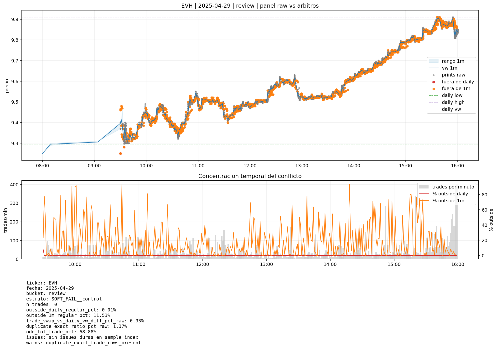

**Que muestra**

- Panel rico del tape raw frente a `daily` y `1m` para `EVH` el `2025-04-29`.
- `n_trades = 16,738`, `outside_daily_regular_pct = 0.01%`, `outside_1m_regular_pct = 11.53%`.
- `trade_vwap_vs_daily_vw_diff_pct_raw = 0.93%`, `duplicate_exact_ratio_pct_raw = 1.37%`, `odd_lot_trade_pct = 68.88%`.

**Responde**

- Residuo de revision no absorbido por una subfamilia mas especifica. Responde a la pregunta de si todavia hace falta una regla de rehabilitacion antes de consumir esta masa.
- Responde a si el conflicto dominante vive en la escala (`~1x`), en la comparabilidad frente a `daily` (0.01%) o frente a `1m` (11.53%).
- El 68.88% de odd-lots empuja la lectura hacia microestructura fina; evita leer el caso como pura ruptura economica gruesa.
- La decision que justifica es mantener o no el caso en `recoverable_with_flag` cuando se rematerialice la rehabilitacion sobre `57f`.

### INAP | 2019-12-20

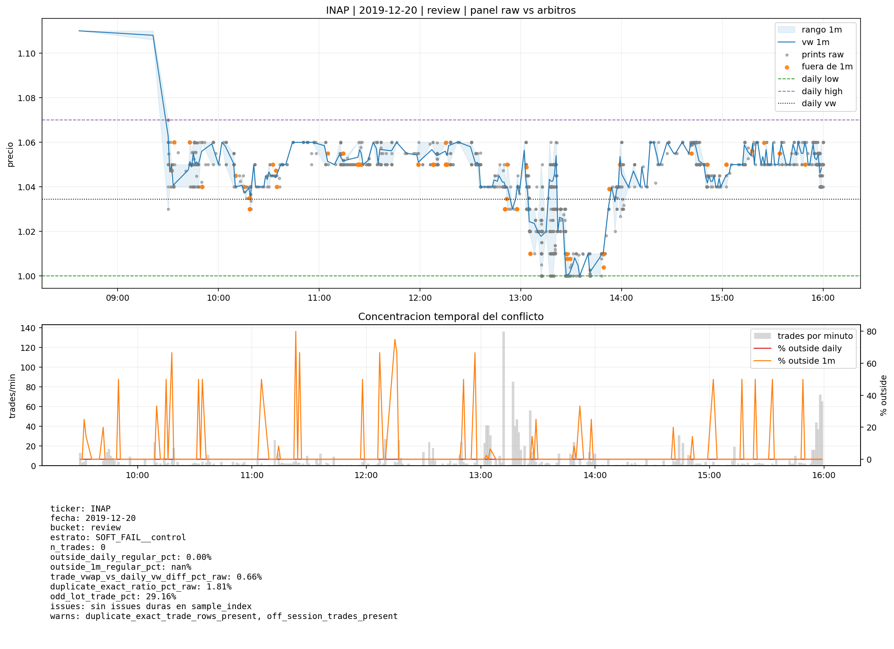

**Que muestra**

- Panel rico del tape raw frente a `daily` y `1m` para `INAP` el `2019-12-20`.
- `n_trades = 1,879`, `outside_daily_regular_pct = 0.00%`, `outside_1m_regular_pct = nan%`.
- `trade_vwap_vs_daily_vw_diff_pct_raw = 0.66%`, `duplicate_exact_ratio_pct_raw = 1.81%`, `odd_lot_trade_pct = 29.16%`.

**Responde**

- Residuo de revision no absorbido por una subfamilia mas especifica. Responde a la pregunta de si todavia hace falta una regla de rehabilitacion antes de consumir esta masa.
- Responde a si el conflicto dominante vive en la escala (`~1x`), en la comparabilidad frente a `daily` (0.00%) o frente a `1m` (nan%).
- El 29.16% de odd-lots empuja la lectura hacia microestructura fina; evita leer el caso como pura ruptura economica gruesa.
- La decision que justifica es mantener o no el caso en `recoverable_with_flag` cuando se rematerialice la rehabilitacion sobre `57f`.

### IRET | 2024-06-06

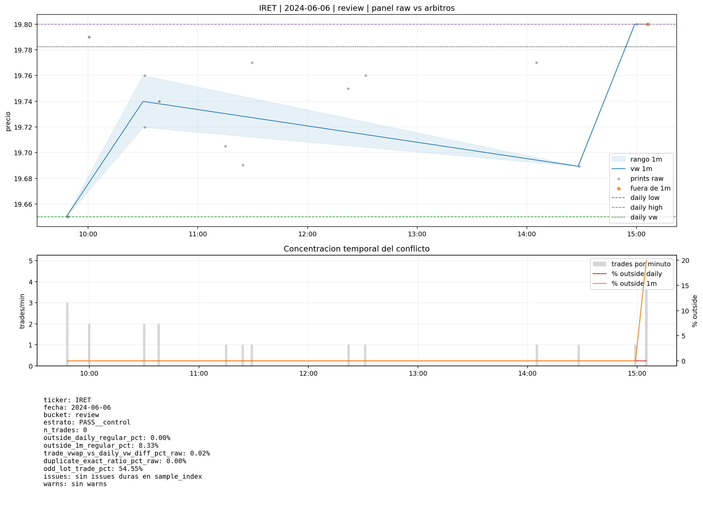

**Que muestra**

- Panel rico del tape raw frente a `daily` y `1m` para `IRET` el `2024-06-06`.
- `n_trades = 22`, `outside_daily_regular_pct = 0.00%`, `outside_1m_regular_pct = 8.33%`.
- `trade_vwap_vs_daily_vw_diff_pct_raw = 0.02%`, `duplicate_exact_ratio_pct_raw = 0.00%`, `odd_lot_trade_pct = 54.55%`.

**Responde**

- Residuo de revision no absorbido por una subfamilia mas especifica. Responde a la pregunta de si todavia hace falta una regla de rehabilitacion antes de consumir esta masa.
- Responde a si el conflicto dominante vive en la escala (`~1x`), en la comparabilidad frente a `daily` (0.00%) o frente a `1m` (8.33%).
- El 54.55% de odd-lots empuja la lectura hacia microestructura fina; evita leer el caso como pura ruptura economica gruesa.
- La decision que justifica es mantener o no el caso en `recoverable_with_flag` cuando se rematerialice la rehabilitacion sobre `57f`.

### IVC | 2019-01-28

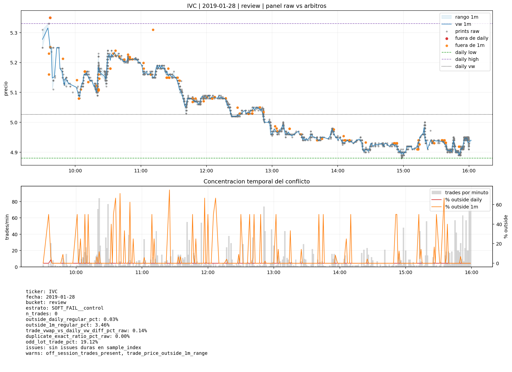

**Que muestra**

- Panel rico del tape raw frente a `daily` y `1m` para `IVC` el `2019-01-28`.
- `n_trades = 3,310`, `outside_daily_regular_pct = 0.03%`, `outside_1m_regular_pct = 3.46%`.
- `trade_vwap_vs_daily_vw_diff_pct_raw = 0.14%`, `duplicate_exact_ratio_pct_raw = 0.00%`, `odd_lot_trade_pct = 19.12%`.

**Responde**

- Residuo de revision no absorbido por una subfamilia mas especifica. Responde a la pregunta de si todavia hace falta una regla de rehabilitacion antes de consumir esta masa.
- Responde a si el conflicto dominante vive en la escala (`~1x`), en la comparabilidad frente a `daily` (0.03%) o frente a `1m` (3.46%).
- La decision que justifica es mantener o no el caso en `recoverable_with_flag` cuando se rematerialice la rehabilitacion sobre `57f`.

### JAQC | 2021-12-21

**Que muestra**

- Panel rico del tape raw frente a `daily` y `1m` para `JAQC` el `2021-12-21`.
- `n_trades = 2`, `outside_daily_regular_pct = 0.00%`, `outside_1m_regular_pct = 0.00%`.
- `trade_vwap_vs_daily_vw_diff_pct_raw = 0.00%`, `duplicate_exact_ratio_pct_raw = 0.00%`, `odd_lot_trade_pct = 0.00%`.

**Responde**

- Residuo de revision no absorbido por una subfamilia mas especifica. Responde a la pregunta de si todavia hace falta una regla de rehabilitacion antes de consumir esta masa.
- Responde a si el conflicto dominante vive en la escala (`~1x`), en la comparabilidad frente a `daily` (0.00%) o frente a `1m` (0.00%).
- La decision que justifica es mantener o no el caso en `recoverable_with_flag` cuando se rematerialice la rehabilitacion sobre `57f`.

### MNSBP | 2023-11-14

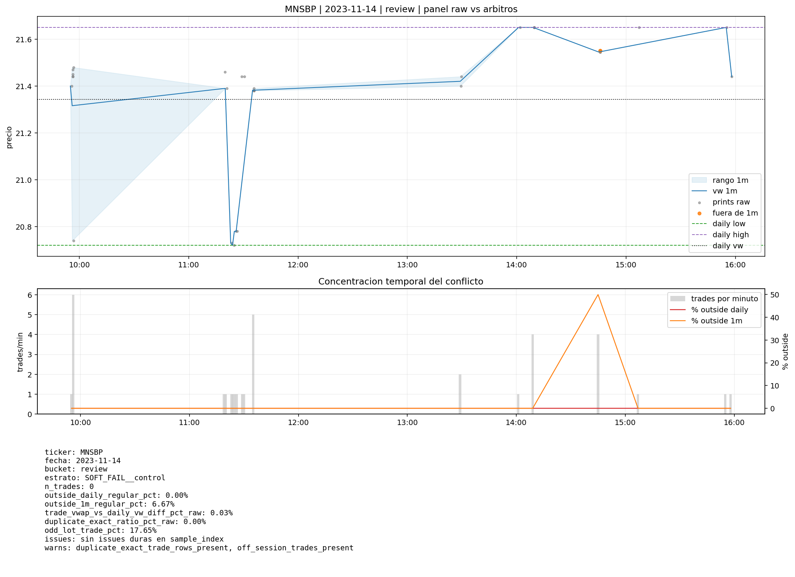

**Que muestra**

- Panel rico del tape raw frente a `daily` y `1m` para `MNSBP` el `2023-11-14`.
- `n_trades = 34`, `outside_daily_regular_pct = 0.00%`, `outside_1m_regular_pct = 6.67%`.
- `trade_vwap_vs_daily_vw_diff_pct_raw = 0.03%`, `duplicate_exact_ratio_pct_raw = 0.00%`, `odd_lot_trade_pct = 17.65%`.

**Responde**

- Residuo de revision no absorbido por una subfamilia mas especifica. Responde a la pregunta de si todavia hace falta una regla de rehabilitacion antes de consumir esta masa.
- Responde a si el conflicto dominante vive en la escala (`~1x`), en la comparabilidad frente a `daily` (0.00%) o frente a `1m` (6.67%).
- La decision que justifica es mantener o no el caso en `recoverable_with_flag` cuando se rematerialice la rehabilitacion sobre `57f`.

### ONL | 2023-11-03

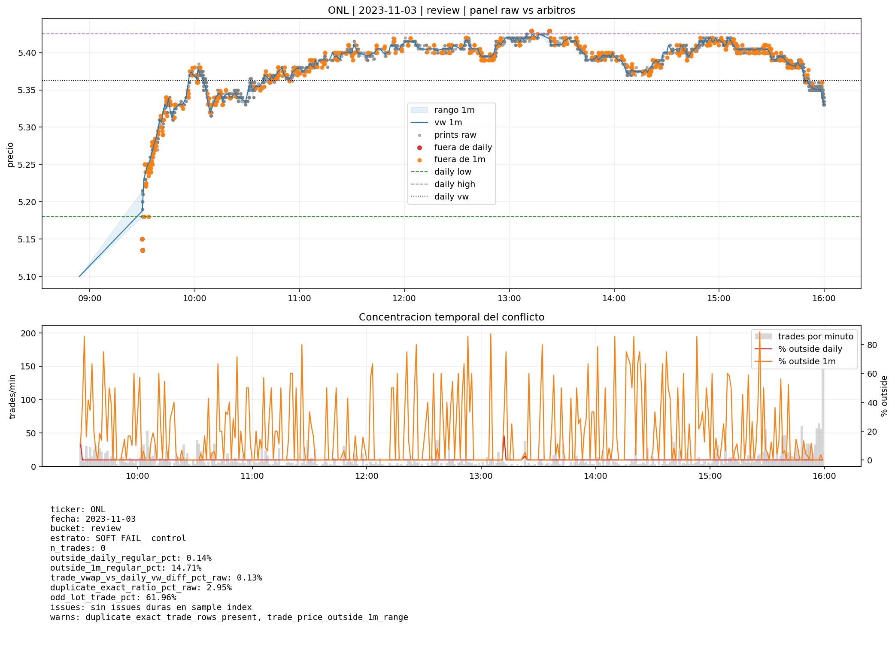

**Que muestra**

- Panel rico del tape raw frente a `daily` y `1m` para `ONL` el `2023-11-03`.
- `n_trades = 4,369`, `outside_daily_regular_pct = 0.14%`, `outside_1m_regular_pct = 14.71%`.
- `trade_vwap_vs_daily_vw_diff_pct_raw = 0.13%`, `duplicate_exact_ratio_pct_raw = 2.95%`, `odd_lot_trade_pct = 61.96%`.

**Responde**

- Residuo de revision no absorbido por una subfamilia mas especifica. Responde a la pregunta de si todavia hace falta una regla de rehabilitacion antes de consumir esta masa.
- Responde a si el conflicto dominante vive en la escala (`~1x`), en la comparabilidad frente a `daily` (0.14%) o frente a `1m` (14.71%).
- El 61.96% de odd-lots empuja la lectura hacia microestructura fina; evita leer el caso como pura ruptura economica gruesa.
- La decision que justifica es mantener o no el caso en `recoverable_with_flag` cuando se rematerialice la rehabilitacion sobre `57f`.

### PRTS | 2025-06-09

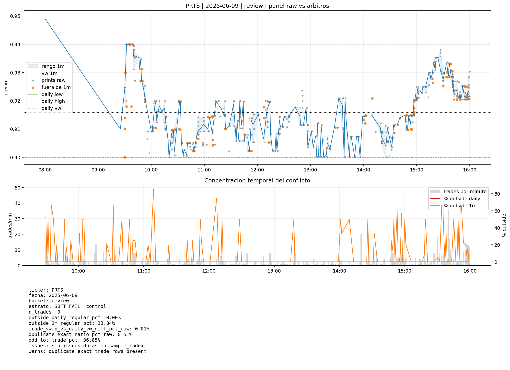

**Que muestra**

- Panel rico del tape raw frente a `daily` y `1m` para `PRTS` el `2025-06-09`.
- `n_trades = 787`, `outside_daily_regular_pct = 0.00%`, `outside_1m_regular_pct = 13.84%`.
- `trade_vwap_vs_daily_vw_diff_pct_raw = 0.01%`, `duplicate_exact_ratio_pct_raw = 0.51%`, `odd_lot_trade_pct = 36.85%`.

**Responde**

- Residuo de revision no absorbido por una subfamilia mas especifica. Responde a la pregunta de si todavia hace falta una regla de rehabilitacion antes de consumir esta masa.
- Responde a si el conflicto dominante vive en la escala (`~1x`), en la comparabilidad frente a `daily` (0.00%) o frente a `1m` (13.84%).
- El 36.85% de odd-lots empuja la lectura hacia microestructura fina; evita leer el caso como pura ruptura economica gruesa.
- La decision que justifica es mantener o no el caso en `recoverable_with_flag` cuando se rematerialice la rehabilitacion sobre `57f`.

### QUOT | 2020-12-08

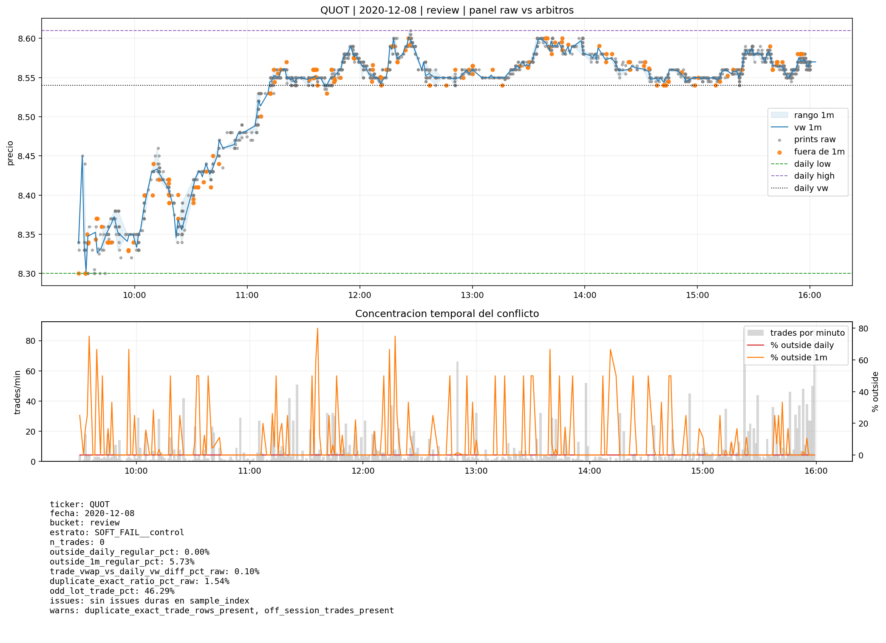

**Que muestra**

- Panel rico del tape raw frente a `daily` y `1m` para `QUOT` el `2020-12-08`.
- `n_trades = 2,925`, `outside_daily_regular_pct = 0.00%`, `outside_1m_regular_pct = 5.73%`.
- `trade_vwap_vs_daily_vw_diff_pct_raw = 0.10%`, `duplicate_exact_ratio_pct_raw = 1.54%`, `odd_lot_trade_pct = 46.29%`.

**Responde**

- Residuo de revision no absorbido por una subfamilia mas especifica. Responde a la pregunta de si todavia hace falta una regla de rehabilitacion antes de consumir esta masa.
- Responde a si el conflicto dominante vive en la escala (`~1x`), en la comparabilidad frente a `daily` (0.00%) o frente a `1m` (5.73%).
- El 46.29% de odd-lots empuja la lectura hacia microestructura fina; evita leer el caso como pura ruptura economica gruesa.
- La decision que justifica es mantener o no el caso en `recoverable_with_flag` cuando se rematerialice la rehabilitacion sobre `57f`.

### RC | 2024-05-24

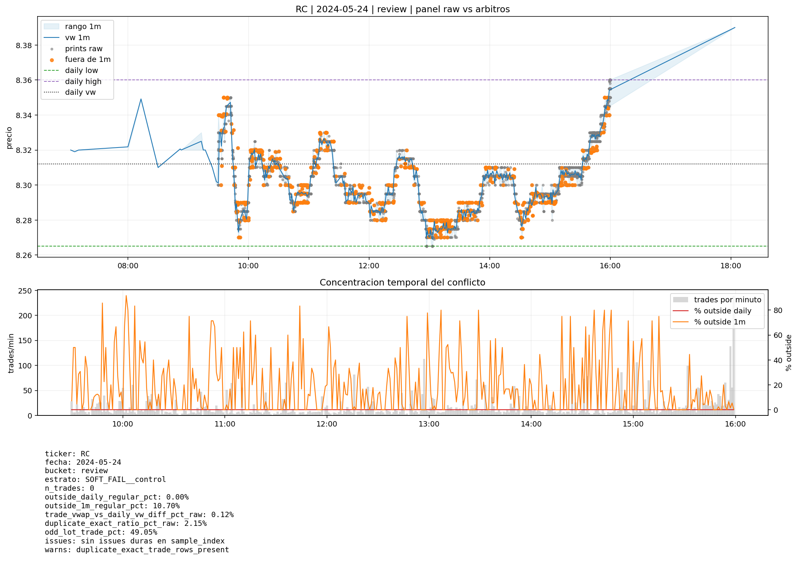

**Que muestra**

- Panel rico del tape raw frente a `daily` y `1m` para `RC` el `2024-05-24`.
- `n_trades = 6,243`, `outside_daily_regular_pct = 0.00%`, `outside_1m_regular_pct = 10.70%`.
- `trade_vwap_vs_daily_vw_diff_pct_raw = 0.12%`, `duplicate_exact_ratio_pct_raw = 2.15%`, `odd_lot_trade_pct = 49.05%`.

**Responde**

- Residuo de revision no absorbido por una subfamilia mas especifica. Responde a la pregunta de si todavia hace falta una regla de rehabilitacion antes de consumir esta masa.
- Responde a si el conflicto dominante vive en la escala (`~1x`), en la comparabilidad frente a `daily` (0.00%) o frente a `1m` (10.70%).
- El 49.05% de odd-lots empuja la lectura hacia microestructura fina; evita leer el caso como pura ruptura economica gruesa.
- La decision que justifica es mantener o no el caso en `recoverable_with_flag` cuando se rematerialice la rehabilitacion sobre `57f`.

### TRX | 2020-10-20

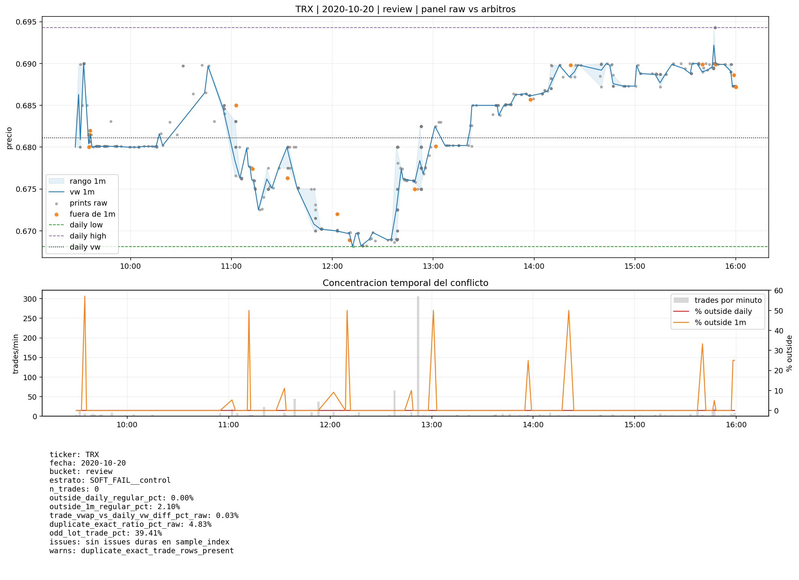

**Que muestra**

- Panel rico del tape raw frente a `daily` y `1m` para `TRX` el `2020-10-20`.
- `n_trades = 911`, `outside_daily_regular_pct = 0.00%`, `outside_1m_regular_pct = 2.10%`.
- `trade_vwap_vs_daily_vw_diff_pct_raw = 0.03%`, `duplicate_exact_ratio_pct_raw = 4.83%`, `odd_lot_trade_pct = 39.41%`.

**Responde**

- Residuo de revision no absorbido por una subfamilia mas especifica. Responde a la pregunta de si todavia hace falta una regla de rehabilitacion antes de consumir esta masa.
- Responde a si el conflicto dominante vive en la escala (`~1x`), en la comparabilidad frente a `daily` (0.00%) o frente a `1m` (2.10%).
- El 39.41% de odd-lots empuja la lectura hacia microestructura fina; evita leer el caso como pura ruptura economica gruesa.
- La decision que justifica es mantener o no el caso en `recoverable_with_flag` cuando se rematerialice la rehabilitacion sobre `57f`.

### URG | 2025-04-28

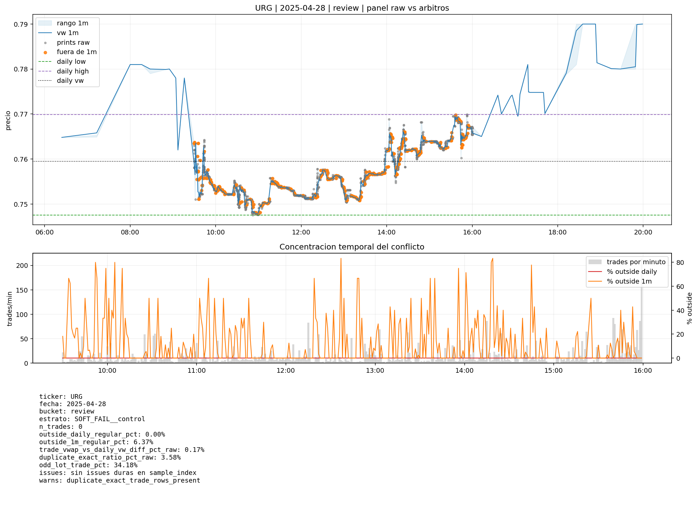

**Que muestra**

- Panel rico del tape raw frente a `daily` y `1m` para `URG` el `2025-04-28`.
- `n_trades = 5,340`, `outside_daily_regular_pct = 0.00%`, `outside_1m_regular_pct = 6.37%`.
- `trade_vwap_vs_daily_vw_diff_pct_raw = 0.17%`, `duplicate_exact_ratio_pct_raw = 3.58%`, `odd_lot_trade_pct = 34.18%`.

**Responde**

- Residuo de revision no absorbido por una subfamilia mas especifica. Responde a la pregunta de si todavia hace falta una regla de rehabilitacion antes de consumir esta masa.
- Responde a si el conflicto dominante vive en la escala (`~1x`), en la comparabilidad frente a `daily` (0.00%) o frente a `1m` (6.37%).
- El 34.18% de odd-lots empuja la lectura hacia microestructura fina; evita leer el caso como pura ruptura economica gruesa.
- La decision que justifica es mantener o no el caso en `recoverable_with_flag` cuando se rematerialice la rehabilitacion sobre `57f`.

### XERS | 2026-02-27

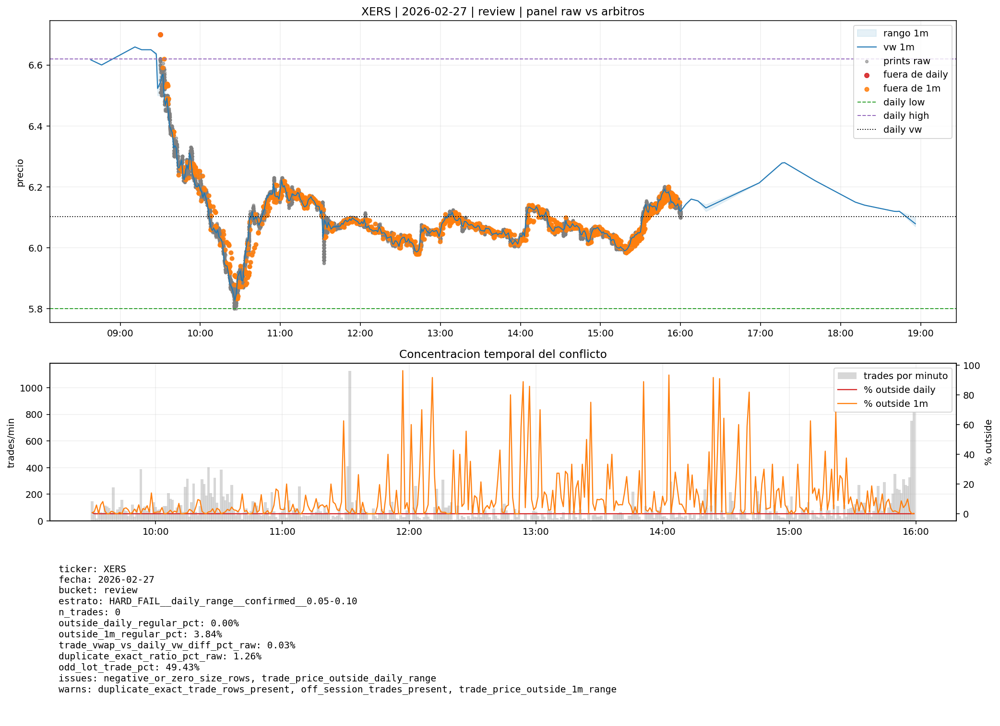

**Que muestra**

- Panel rico del tape raw frente a `daily` y `1m` para `XERS` el `2026-02-27`.
- `n_trades = 34,634`, `outside_daily_regular_pct = 0.00%`, `outside_1m_regular_pct = 3.84%`.
- `trade_vwap_vs_daily_vw_diff_pct_raw = 0.03%`, `duplicate_exact_ratio_pct_raw = 1.26%`, `odd_lot_trade_pct = 49.43%`.

**Responde**

- Residuo de revision no absorbido por una subfamilia mas especifica. Responde a la pregunta de si todavia hace falta una regla de rehabilitacion antes de consumir esta masa.
- Responde a si el conflicto dominante vive en la escala (`~1x`), en la comparabilidad frente a `daily` (0.00%) o frente a `1m` (3.84%).
- El 49.43% de odd-lots empuja la lectura hacia microestructura fina; evita leer el caso como pura ruptura economica gruesa.
- La decision que justifica es mantener o no el caso en `recoverable_with_flag` cuando se rematerialice la rehabilitacion sobre `57f`.

# Trades Review 1m Reference Alignment | muestra estratificada

Documento fuente: `inspection_dossiers/trades/family_case_evidence_packs/review_1m_reference_alignment/review_1m_reference_alignment_cases_v0_1.md`

## Rol

Este dossier documenta `60` casos de la muestra base del cierre real `57f/full_clean_fast_same_schema` para la familia `review_1m_reference_alignment`.

No son ejemplos elegidos a dedo. Proceden del manifest estratificado reproducible materializado para el inspector.

## Que significa esta familia

Familia donde `1m` cambia la verdad del caso. Responde a la pregunta de si una vista mas fina destruye una aparente normalidad vista desde `daily`.

## Responde

- si el arbitro `1m` cambia la verdad del caso
- si una aparente normalidad diaria es ilusion de agregacion

## No responde

- si el caso habria sido bueno sin arbitro fino
- si el problema es puramente de escala

## Consecuencia

- proteger reconciliacion y labels intradia de falsas rehabilitaciones
- preservar el papel decisivo de `1m`

## Casos

### PMD | 2008-10-14

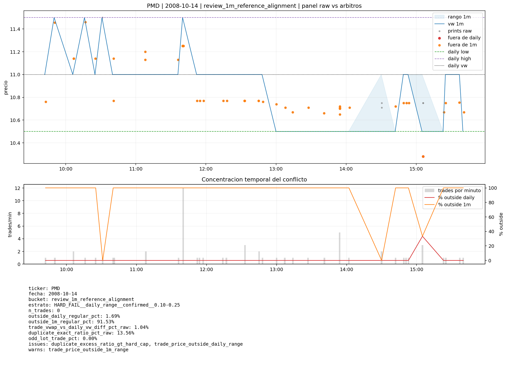

**Que muestra**

- Panel rico del tape raw frente a `daily` y `1m` para `PMD` el `2008-10-14`.
- `n_trades = 59`, `outside_daily_regular_pct = 1.69%`, `outside_1m_regular_pct = 91.53%`.
- `trade_vwap_vs_daily_vw_diff_pct_raw = 1.04%`, `duplicate_exact_ratio_pct_raw = 13.56%`, `odd_lot_trade_pct = 0.00%`.

**Responde**

- Familia donde `1m` cambia la verdad del caso. Responde a la pregunta de si una vista mas fina destruye una aparente normalidad vista desde `daily`.
- Responde a si el conflicto dominante vive en la escala (`~1x`), en la comparabilidad frente a `daily` (1.69%) o frente a `1m` (91.53%).
- El 13.56% de duplicacion exacta obliga a sospechar dano de tape o bursts mecanicos, no solo ruido visual.
- La decision que justifica es mantener o no el caso en `recoverable_with_flag` cuando se rematerialice la rehabilitacion sobre `57f`.

### PMD | 2005-09-01

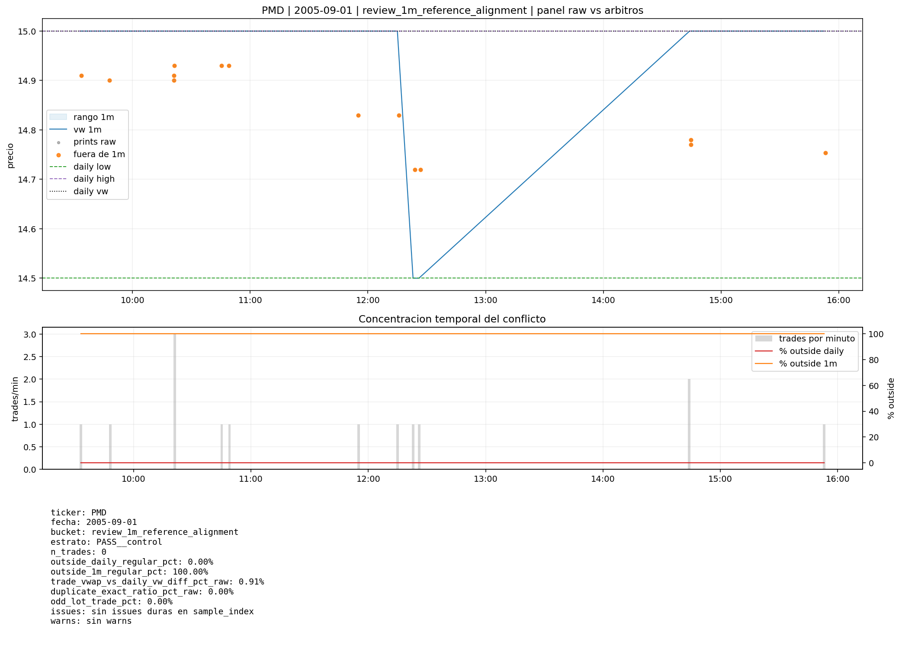

**Que muestra**

- Panel rico del tape raw frente a `daily` y `1m` para `PMD` el `2005-09-01`.
- `n_trades = 14`, `outside_daily_regular_pct = 0.00%`, `outside_1m_regular_pct = 100.00%`.
- `trade_vwap_vs_daily_vw_diff_pct_raw = 0.91%`, `duplicate_exact_ratio_pct_raw = 0.00%`, `odd_lot_trade_pct = 0.00%`.

**Responde**

- Familia donde `1m` cambia la verdad del caso. Responde a la pregunta de si una vista mas fina destruye una aparente normalidad vista desde `daily`.
- Responde a si el conflicto dominante vive en la escala (`~1x`), en la comparabilidad frente a `daily` (0.00%) o frente a `1m` (100.00%).
- La decision que justifica es mantener o no el caso en `recoverable_with_flag` cuando se rematerialice la rehabilitacion sobre `57f`.

### PMD | 2010-06-02

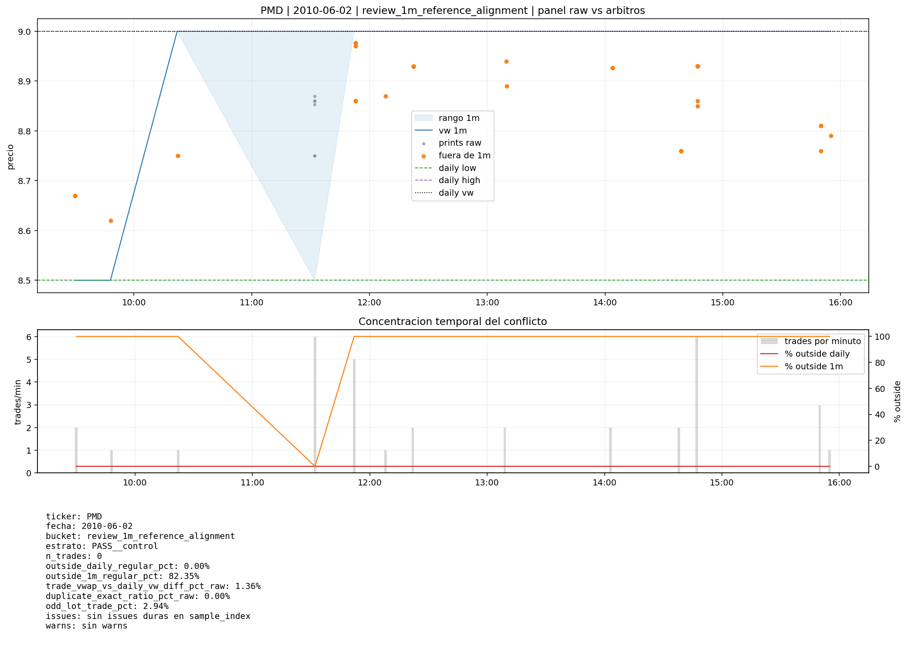

**Que muestra**

- Panel rico del tape raw frente a `daily` y `1m` para `PMD` el `2010-06-02`.
- `n_trades = 34`, `outside_daily_regular_pct = 0.00%`, `outside_1m_regular_pct = 82.35%`.
- `trade_vwap_vs_daily_vw_diff_pct_raw = 1.36%`, `duplicate_exact_ratio_pct_raw = 0.00%`, `odd_lot_trade_pct = 2.94%`.

**Responde**

- Familia donde `1m` cambia la verdad del caso. Responde a la pregunta de si una vista mas fina destruye una aparente normalidad vista desde `daily`.
- Responde a si el conflicto dominante vive en la escala (`~1x`), en la comparabilidad frente a `daily` (0.00%) o frente a `1m` (82.35%).
- La decision que justifica es mantener o no el caso en `recoverable_with_flag` cuando se rematerialice la rehabilitacion sobre `57f`.

### PMD | 2010-06-03

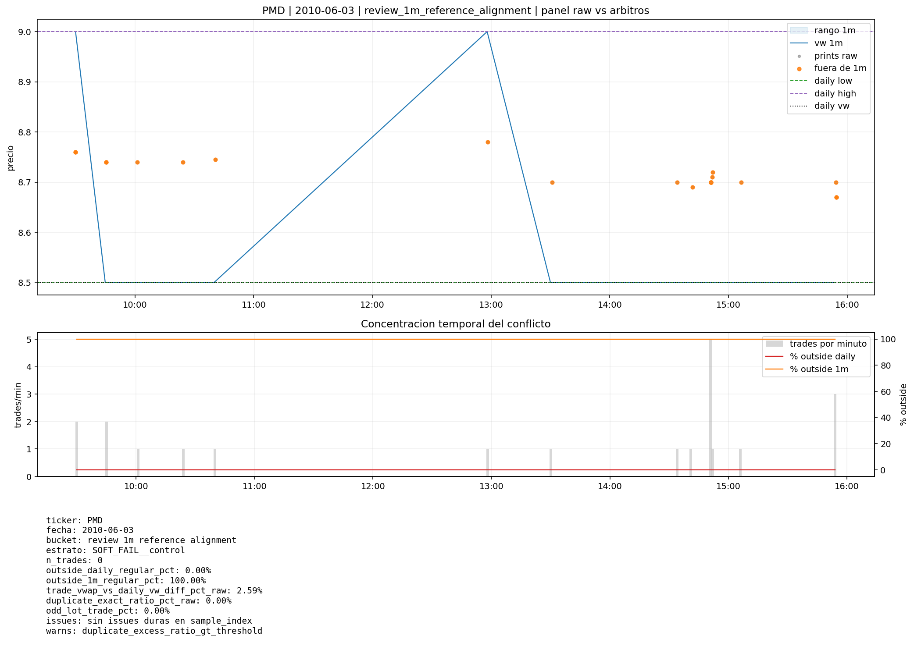

**Que muestra**

- Panel rico del tape raw frente a `daily` y `1m` para `PMD` el `2010-06-03`.
- `n_trades = 21`, `outside_daily_regular_pct = 0.00%`, `outside_1m_regular_pct = 100.00%`.
- `trade_vwap_vs_daily_vw_diff_pct_raw = 2.59%`, `duplicate_exact_ratio_pct_raw = 0.00%`, `odd_lot_trade_pct = 0.00%`.

**Responde**

- Familia donde `1m` cambia la verdad del caso. Responde a la pregunta de si una vista mas fina destruye una aparente normalidad vista desde `daily`.
- Responde a si el conflicto dominante vive en la escala (`~1x`), en la comparabilidad frente a `daily` (0.00%) o frente a `1m` (100.00%).
- La decision que justifica es mantener o no el caso en `recoverable_with_flag` cuando se rematerialice la rehabilitacion sobre `57f`.

### PMD | 2012-05-22

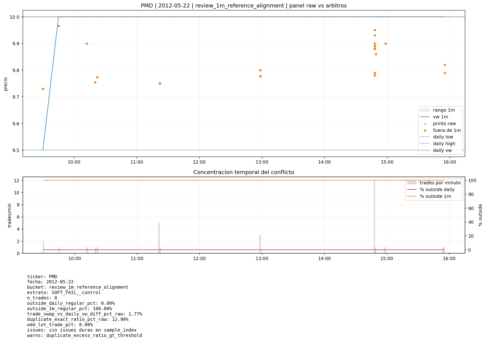

**Que muestra**

- Panel rico del tape raw frente a `daily` y `1m` para `PMD` el `2012-05-22`.
- `n_trades = 31`, `outside_daily_regular_pct = 0.00%`, `outside_1m_regular_pct = 100.00%`.
- `trade_vwap_vs_daily_vw_diff_pct_raw = 1.77%`, `duplicate_exact_ratio_pct_raw = 12.90%`, `odd_lot_trade_pct = 0.00%`.

**Responde**

- Familia donde `1m` cambia la verdad del caso. Responde a la pregunta de si una vista mas fina destruye una aparente normalidad vista desde `daily`.
- Responde a si el conflicto dominante vive en la escala (`~1x`), en la comparabilidad frente a `daily` (0.00%) o frente a `1m` (100.00%).
- El 12.90% de duplicacion exacta obliga a sospechar dano de tape o bursts mecanicos, no solo ruido visual.
- La decision que justifica es mantener o no el caso en `recoverable_with_flag` cuando se rematerialice la rehabilitacion sobre `57f`.

### PMD | 2012-07-20

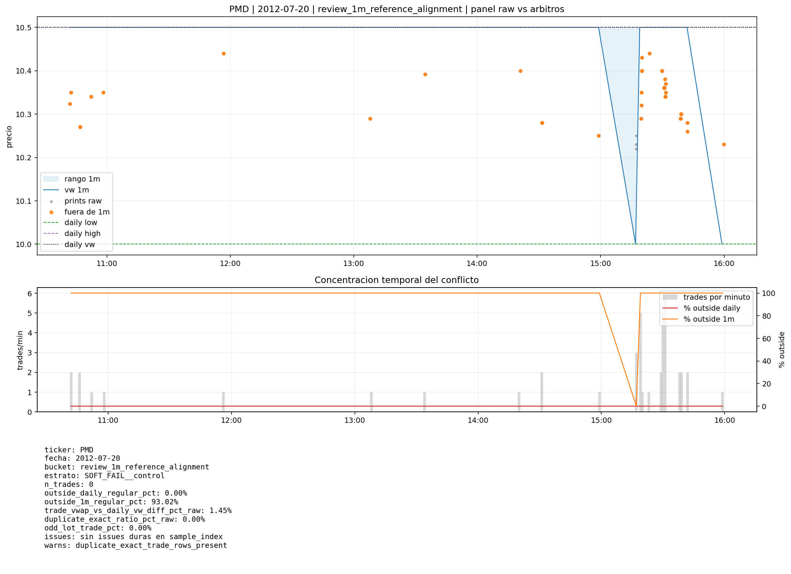

**Que muestra**

- Panel rico del tape raw frente a `daily` y `1m` para `PMD` el `2012-07-20`.
- `n_trades = 43`, `outside_daily_regular_pct = 0.00%`, `outside_1m_regular_pct = 93.02%`.
- `trade_vwap_vs_daily_vw_diff_pct_raw = 1.45%`, `duplicate_exact_ratio_pct_raw = 0.00%`, `odd_lot_trade_pct = 0.00%`.

**Responde**

- Familia donde `1m` cambia la verdad del caso. Responde a la pregunta de si una vista mas fina destruye una aparente normalidad vista desde `daily`.
- Responde a si el conflicto dominante vive en la escala (`~1x`), en la comparabilidad frente a `daily` (0.00%) o frente a `1m` (93.02%).
- La decision que justifica es mantener o no el caso en `recoverable_with_flag` cuando se rematerialice la rehabilitacion sobre `57f`.

### PMD | 2009-01-13

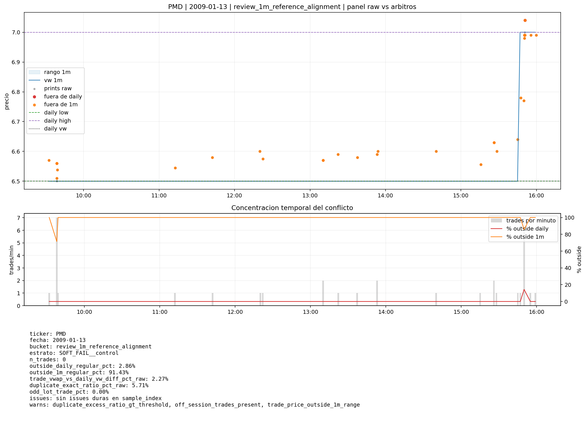

**Que muestra**

- Panel rico del tape raw frente a `daily` y `1m` para `PMD` el `2009-01-13`.
- `n_trades = 35`, `outside_daily_regular_pct = 2.86%`, `outside_1m_regular_pct = 91.43%`.
- `trade_vwap_vs_daily_vw_diff_pct_raw = 2.27%`, `duplicate_exact_ratio_pct_raw = 5.71%`, `odd_lot_trade_pct = 0.00%`.

**Responde**

- Familia donde `1m` cambia la verdad del caso. Responde a la pregunta de si una vista mas fina destruye una aparente normalidad vista desde `daily`.
- Responde a si el conflicto dominante vive en la escala (`~1x`), en la comparabilidad frente a `daily` (2.86%) o frente a `1m` (91.43%).
- El 5.71% de duplicacion exacta obliga a sospechar dano de tape o bursts mecanicos, no solo ruido visual.
- La decision que justifica es mantener o no el caso en `recoverable_with_flag` cuando se rematerialice la rehabilitacion sobre `57f`.

### GPRK | 2015-07-21

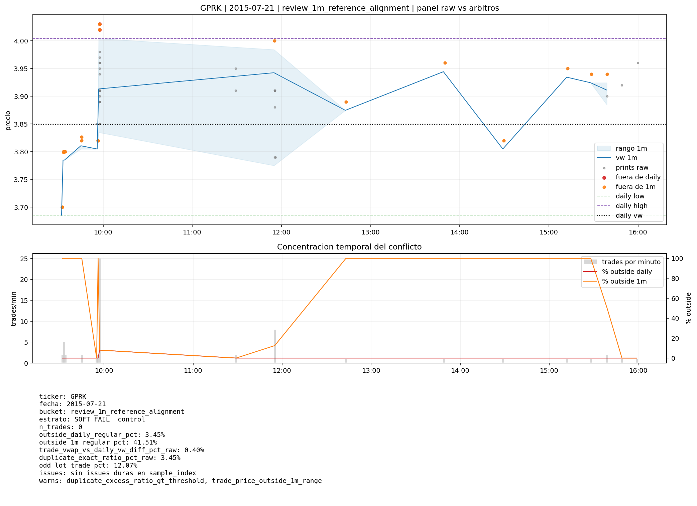

**Que muestra**

- Panel rico del tape raw frente a `daily` y `1m` para `GPRK` el `2015-07-21`.
- `n_trades = 58`, `outside_daily_regular_pct = 3.45%`, `outside_1m_regular_pct = 41.51%`.
- `trade_vwap_vs_daily_vw_diff_pct_raw = 0.40%`, `duplicate_exact_ratio_pct_raw = 3.45%`, `odd_lot_trade_pct = 12.07%`.

**Responde**

- Familia donde `1m` cambia la verdad del caso. Responde a la pregunta de si una vista mas fina destruye una aparente normalidad vista desde `daily`.
- Responde a si el conflicto dominante vive en la escala (`~1x`), en la comparabilidad frente a `daily` (3.45%) o frente a `1m` (41.51%).
- La decision que justifica es mantener o no el caso en `recoverable_with_flag` cuando se rematerialice la rehabilitacion sobre `57f`.

### QBAK | 2017-06-30

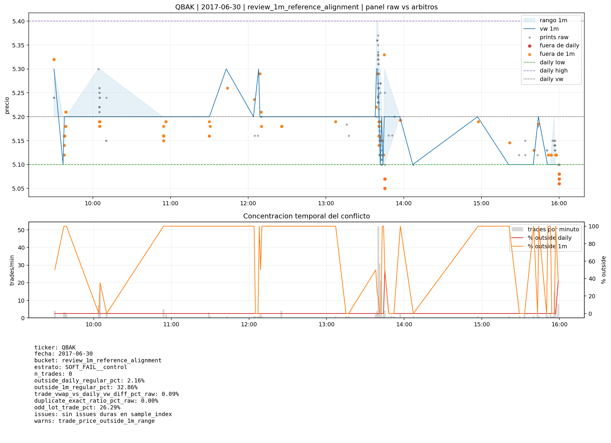

**Que muestra**

- Panel rico del tape raw frente a `daily` y `1m` para `QBAK` el `2017-06-30`.
- `n_trades = 232`, `outside_daily_regular_pct = 2.16%`, `outside_1m_regular_pct = 32.86%`.
- `trade_vwap_vs_daily_vw_diff_pct_raw = 0.09%`, `duplicate_exact_ratio_pct_raw = 0.00%`, `odd_lot_trade_pct = 26.29%`.

**Responde**

- Familia donde `1m` cambia la verdad del caso. Responde a la pregunta de si una vista mas fina destruye una aparente normalidad vista desde `daily`.
- Responde a si el conflicto dominante vive en la escala (`~1x`), en la comparabilidad frente a `daily` (2.16%) o frente a `1m` (32.86%).
- El 26.29% de odd-lots empuja la lectura hacia microestructura fina; evita leer el caso como pura ruptura economica gruesa.
- La decision que justifica es mantener o no el caso en `recoverable_with_flag` cuando se rematerialice la rehabilitacion sobre `57f`.

### QBAK | 2017-07-25

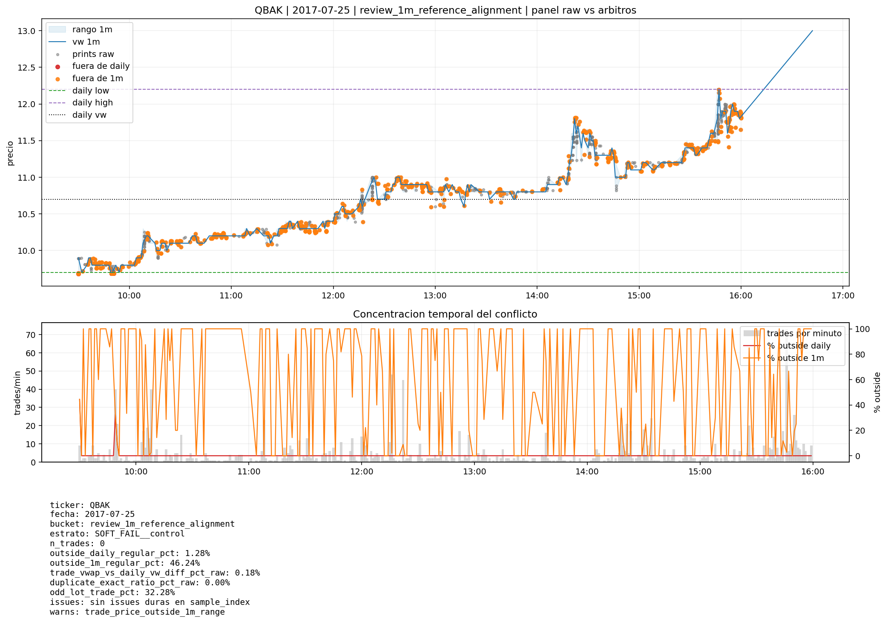

**Que muestra**

- Panel rico del tape raw frente a `daily` y `1m` para `QBAK` el `2017-07-25`.
- `n_trades = 1,484`, `outside_daily_regular_pct = 1.28%`, `outside_1m_regular_pct = 46.24%`.
- `trade_vwap_vs_daily_vw_diff_pct_raw = 0.18%`, `duplicate_exact_ratio_pct_raw = 0.00%`, `odd_lot_trade_pct = 32.28%`.

**Responde**

- Familia donde `1m` cambia la verdad del caso. Responde a la pregunta de si una vista mas fina destruye una aparente normalidad vista desde `daily`.
- Responde a si el conflicto dominante vive en la escala (`~1x`), en la comparabilidad frente a `daily` (1.28%) o frente a `1m` (46.24%).
- El 32.28% de odd-lots empuja la lectura hacia microestructura fina; evita leer el caso como pura ruptura economica gruesa.
- La decision que justifica es mantener o no el caso en `recoverable_with_flag` cuando se rematerialice la rehabilitacion sobre `57f`.

### FLGT | 2018-07-03

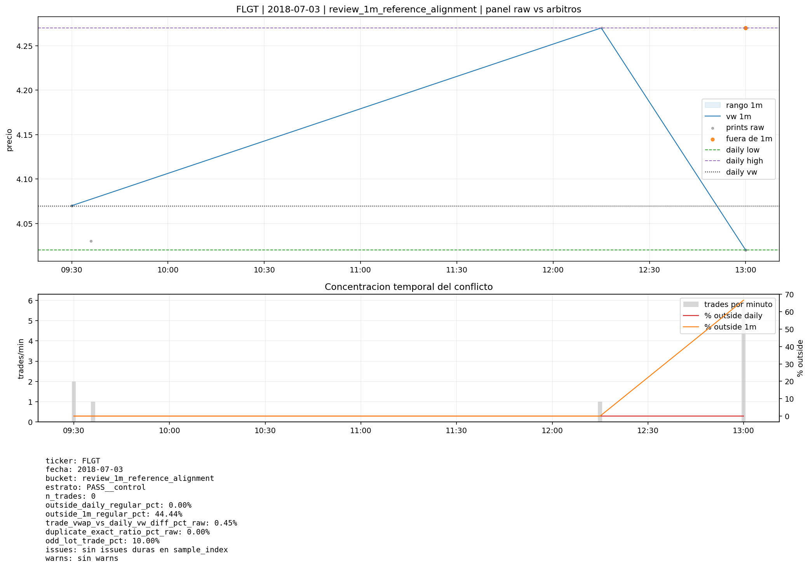

**Que muestra**

- Panel rico del tape raw frente a `daily` y `1m` para `FLGT` el `2018-07-03`.
- `n_trades = 10`, `outside_daily_regular_pct = 0.00%`, `outside_1m_regular_pct = 44.44%`.
- `trade_vwap_vs_daily_vw_diff_pct_raw = 0.45%`, `duplicate_exact_ratio_pct_raw = 0.00%`, `odd_lot_trade_pct = 10.00%`.

**Responde**

- Familia donde `1m` cambia la verdad del caso. Responde a la pregunta de si una vista mas fina destruye una aparente normalidad vista desde `daily`.
- Responde a si el conflicto dominante vive en la escala (`~1x`), en la comparabilidad frente a `daily` (0.00%) o frente a `1m` (44.44%).
- La decision que justifica es mantener o no el caso en `recoverable_with_flag` cuando se rematerialice la rehabilitacion sobre `57f`.

### GPRK | 2015-04-14

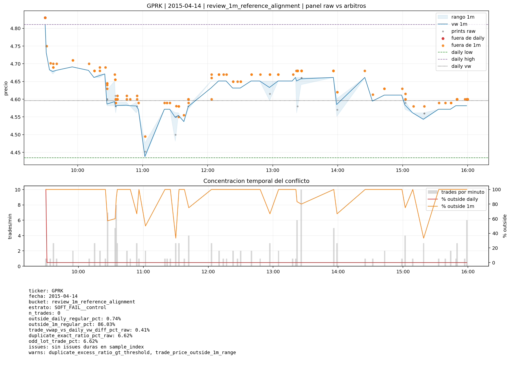

**Que muestra**

- Panel rico del tape raw frente a `daily` y `1m` para `GPRK` el `2015-04-14`.
- `n_trades = 136`, `outside_daily_regular_pct = 0.74%`, `outside_1m_regular_pct = 86.03%`.
- `trade_vwap_vs_daily_vw_diff_pct_raw = 0.41%`, `duplicate_exact_ratio_pct_raw = 6.62%`, `odd_lot_trade_pct = 6.62%`.

**Responde**

- Familia donde `1m` cambia la verdad del caso. Responde a la pregunta de si una vista mas fina destruye una aparente normalidad vista desde `daily`.
- Responde a si el conflicto dominante vive en la escala (`~1x`), en la comparabilidad frente a `daily` (0.74%) o frente a `1m` (86.03%).
- El 6.62% de duplicacion exacta obliga a sospechar dano de tape o bursts mecanicos, no solo ruido visual.
- La decision que justifica es mantener o no el caso en `recoverable_with_flag` cuando se rematerialice la rehabilitacion sobre `57f`.

### GPRK | 2016-08-16

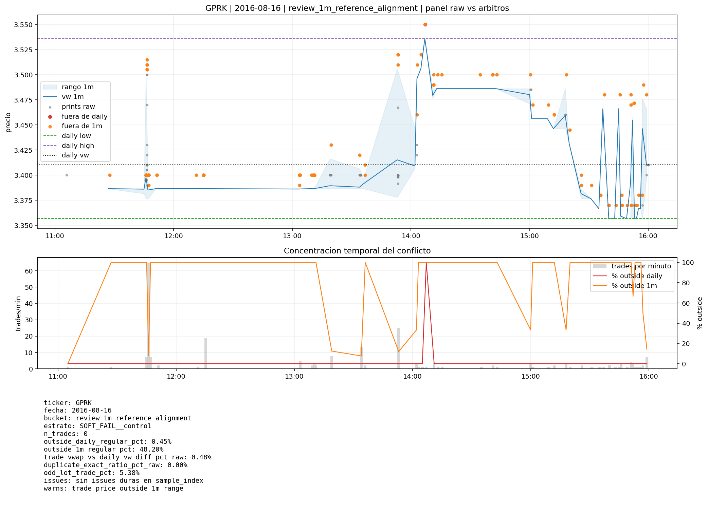

**Que muestra**

- Panel rico del tape raw frente a `daily` y `1m` para `GPRK` el `2016-08-16`.
- `n_trades = 223`, `outside_daily_regular_pct = 0.45%`, `outside_1m_regular_pct = 48.20%`.
- `trade_vwap_vs_daily_vw_diff_pct_raw = 0.48%`, `duplicate_exact_ratio_pct_raw = 0.00%`, `odd_lot_trade_pct = 5.38%`.

**Responde**

- Familia donde `1m` cambia la verdad del caso. Responde a la pregunta de si una vista mas fina destruye una aparente normalidad vista desde `daily`.
- Responde a si el conflicto dominante vive en la escala (`~1x`), en la comparabilidad frente a `daily` (0.45%) o frente a `1m` (48.20%).
- La decision que justifica es mantener o no el caso en `recoverable_with_flag` cuando se rematerialice la rehabilitacion sobre `57f`.

### GPRK | 2018-08-06

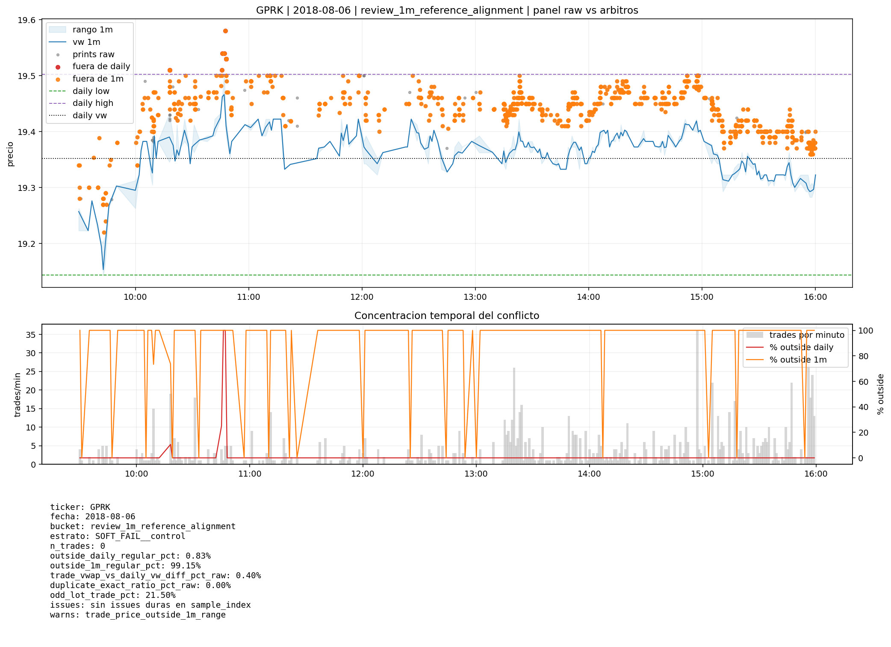

**Que muestra**

- Panel rico del tape raw frente a `daily` y `1m` para `GPRK` el `2018-08-06`.
- `n_trades = 1,079`, `outside_daily_regular_pct = 0.83%`, `outside_1m_regular_pct = 99.15%`.
- `trade_vwap_vs_daily_vw_diff_pct_raw = 0.40%`, `duplicate_exact_ratio_pct_raw = 0.00%`, `odd_lot_trade_pct = 21.50%`.

**Responde**

- Familia donde `1m` cambia la verdad del caso. Responde a la pregunta de si una vista mas fina destruye una aparente normalidad vista desde `daily`.
- Responde a si el conflicto dominante vive en la escala (`~1x`), en la comparabilidad frente a `daily` (0.83%) o frente a `1m` (99.15%).
- La decision que justifica es mantener o no el caso en `recoverable_with_flag` cuando se rematerialice la rehabilitacion sobre `57f`.

### PMD | 2013-10-10

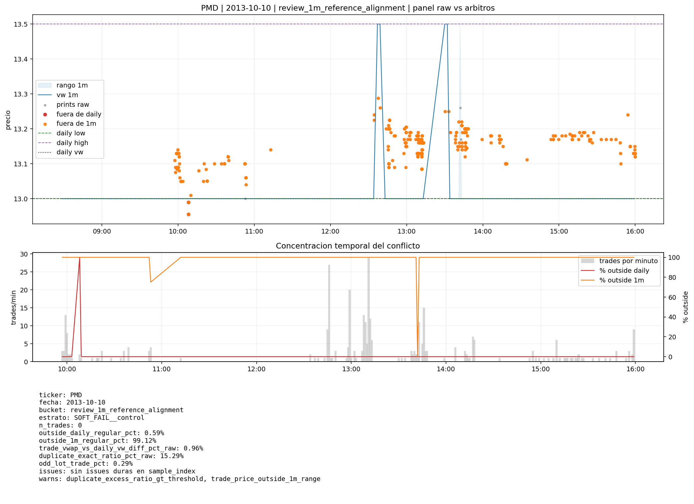

**Que muestra**

- Panel rico del tape raw frente a `daily` y `1m` para `PMD` el `2013-10-10`.
- `n_trades = 340`, `outside_daily_regular_pct = 0.59%`, `outside_1m_regular_pct = 99.12%`.
- `trade_vwap_vs_daily_vw_diff_pct_raw = 0.96%`, `duplicate_exact_ratio_pct_raw = 15.29%`, `odd_lot_trade_pct = 0.29%`.

**Responde**

- Familia donde `1m` cambia la verdad del caso. Responde a la pregunta de si una vista mas fina destruye una aparente normalidad vista desde `daily`.
- Responde a si el conflicto dominante vive en la escala (`~1x`), en la comparabilidad frente a `daily` (0.59%) o frente a `1m` (99.12%).
- El 15.29% de duplicacion exacta obliga a sospechar dano de tape o bursts mecanicos, no solo ruido visual.
- La decision que justifica es mantener o no el caso en `recoverable_with_flag` cuando se rematerialice la rehabilitacion sobre `57f`.

### PMD | 2014-10-01

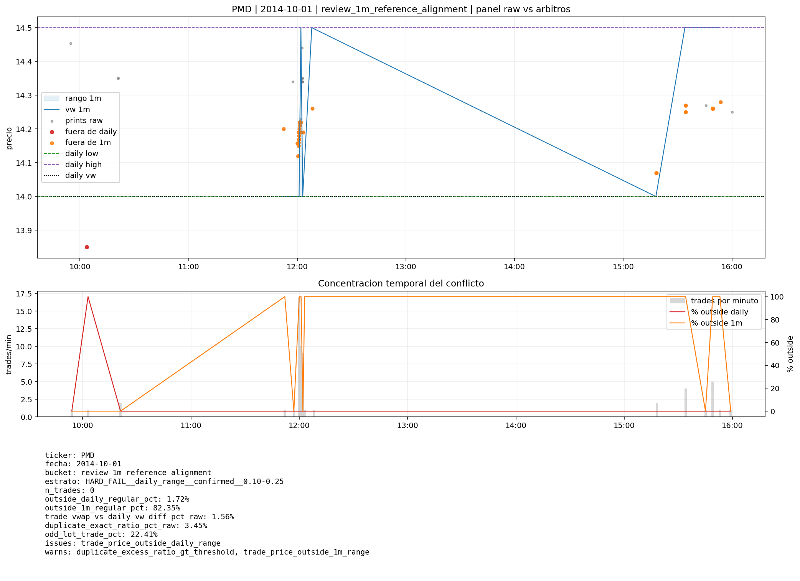

**Que muestra**

- Panel rico del tape raw frente a `daily` y `1m` para `PMD` el `2014-10-01`.
- `n_trades = 58`, `outside_daily_regular_pct = 1.72%`, `outside_1m_regular_pct = 82.35%`.
- `trade_vwap_vs_daily_vw_diff_pct_raw = 1.56%`, `duplicate_exact_ratio_pct_raw = 3.45%`, `odd_lot_trade_pct = 22.41%`.

**Responde**

- Familia donde `1m` cambia la verdad del caso. Responde a la pregunta de si una vista mas fina destruye una aparente normalidad vista desde `daily`.
- Responde a si el conflicto dominante vive en la escala (`~1x`), en la comparabilidad frente a `daily` (1.72%) o frente a `1m` (82.35%).
- La decision que justifica es mantener o no el caso en `recoverable_with_flag` cuando se rematerialice la rehabilitacion sobre `57f`.

### PMD | 2016-03-23

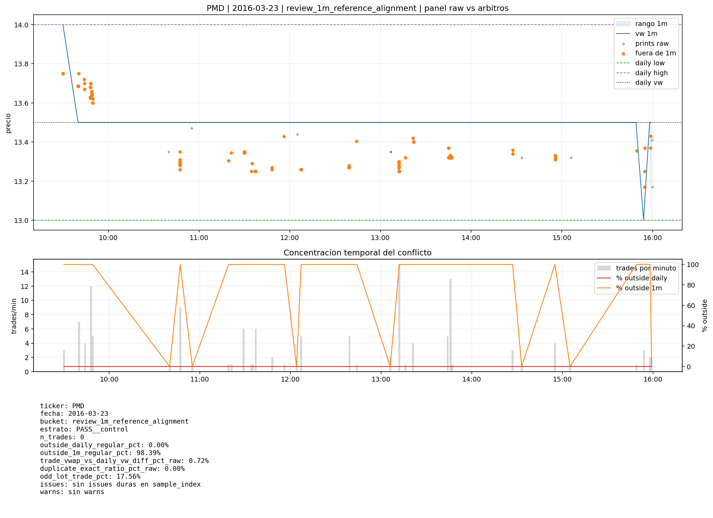

**Que muestra**

- Panel rico del tape raw frente a `daily` y `1m` para `PMD` el `2016-03-23`.
- `n_trades = 131`, `outside_daily_regular_pct = 0.00%`, `outside_1m_regular_pct = 98.39%`.
- `trade_vwap_vs_daily_vw_diff_pct_raw = 0.72%`, `duplicate_exact_ratio_pct_raw = 0.00%`, `odd_lot_trade_pct = 17.56%`.

**Responde**

- Familia donde `1m` cambia la verdad del caso. Responde a la pregunta de si una vista mas fina destruye una aparente normalidad vista desde `daily`.
- Responde a si el conflicto dominante vive en la escala (`~1x`), en la comparabilidad frente a `daily` (0.00%) o frente a `1m` (98.39%).
- La decision que justifica es mantener o no el caso en `recoverable_with_flag` cuando se rematerialice la rehabilitacion sobre `57f`.

### QBAK | 2018-06-12

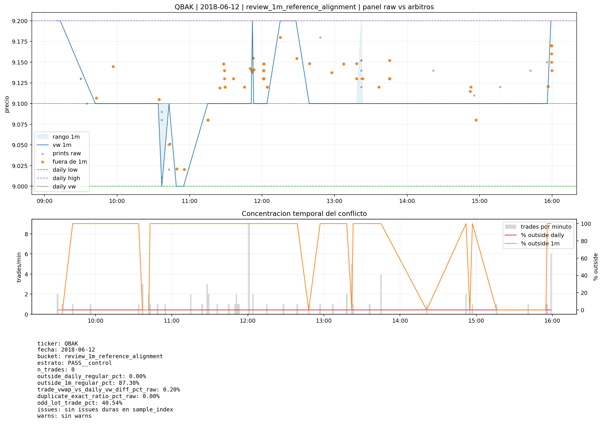

**Que muestra**

- Panel rico del tape raw frente a `daily` y `1m` para `QBAK` el `2018-06-12`.
- `n_trades = 74`, `outside_daily_regular_pct = 0.00%`, `outside_1m_regular_pct = 87.30%`.
- `trade_vwap_vs_daily_vw_diff_pct_raw = 0.20%`, `duplicate_exact_ratio_pct_raw = 0.00%`, `odd_lot_trade_pct = 40.54%`.

**Responde**

- Familia donde `1m` cambia la verdad del caso. Responde a la pregunta de si una vista mas fina destruye una aparente normalidad vista desde `daily`.
- Responde a si el conflicto dominante vive en la escala (`~1x`), en la comparabilidad frente a `daily` (0.00%) o frente a `1m` (87.30%).
- El 40.54% de odd-lots empuja la lectura hacia microestructura fina; evita leer el caso como pura ruptura economica gruesa.
- La decision que justifica es mantener o no el caso en `recoverable_with_flag` cuando se rematerialice la rehabilitacion sobre `57f`.

### QBAK | 2018-09-05

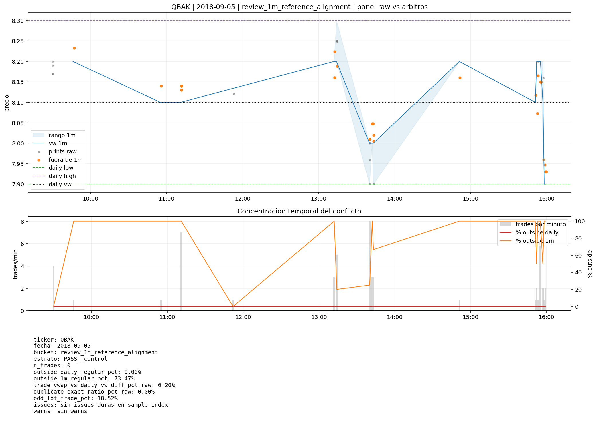

**Que muestra**

- Panel rico del tape raw frente a `daily` y `1m` para `QBAK` el `2018-09-05`.
- `n_trades = 54`, `outside_daily_regular_pct = 0.00%`, `outside_1m_regular_pct = 73.47%`.
- `trade_vwap_vs_daily_vw_diff_pct_raw = 0.20%`, `duplicate_exact_ratio_pct_raw = 0.00%`, `odd_lot_trade_pct = 18.52%`.

**Responde**

- Familia donde `1m` cambia la verdad del caso. Responde a la pregunta de si una vista mas fina destruye una aparente normalidad vista desde `daily`.
- Responde a si el conflicto dominante vive en la escala (`~1x`), en la comparabilidad frente a `daily` (0.00%) o frente a `1m` (73.47%).
- La decision que justifica es mantener o no el caso en `recoverable_with_flag` cuando se rematerialice la rehabilitacion sobre `57f`.

### QBAK | 2018-09-06

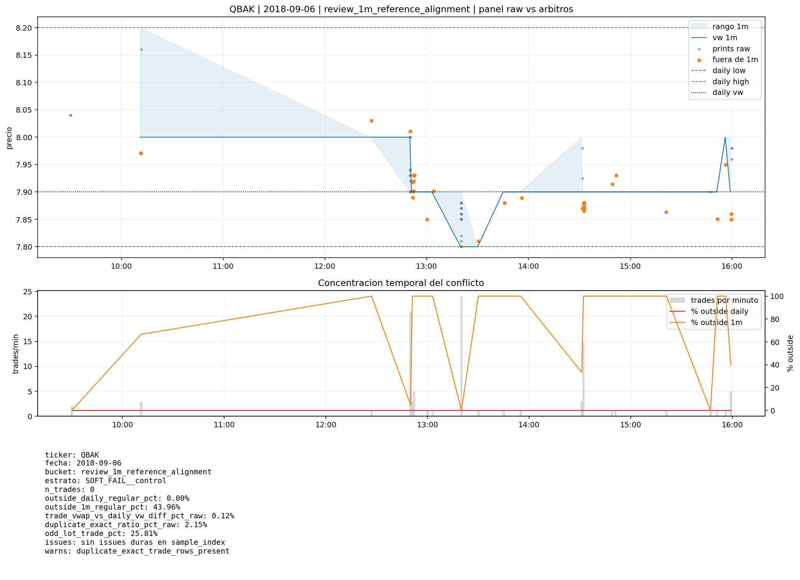

**Que muestra**

- Panel rico del tape raw frente a `daily` y `1m` para `QBAK` el `2018-09-06`.
- `n_trades = 93`, `outside_daily_regular_pct = 0.00%`, `outside_1m_regular_pct = 43.96%`.
- `trade_vwap_vs_daily_vw_diff_pct_raw = 0.12%`, `duplicate_exact_ratio_pct_raw = 2.15%`, `odd_lot_trade_pct = 25.81%`.

**Responde**

- Familia donde `1m` cambia la verdad del caso. Responde a la pregunta de si una vista mas fina destruye una aparente normalidad vista desde `daily`.
- Responde a si el conflicto dominante vive en la escala (`~1x`), en la comparabilidad frente a `daily` (0.00%) o frente a `1m` (43.96%).
- El 25.81% de odd-lots empuja la lectura hacia microestructura fina; evita leer el caso como pura ruptura economica gruesa.
- La decision que justifica es mantener o no el caso en `recoverable_with_flag` cuando se rematerialice la rehabilitacion sobre `57f`.

### QBAK | 2018-12-13

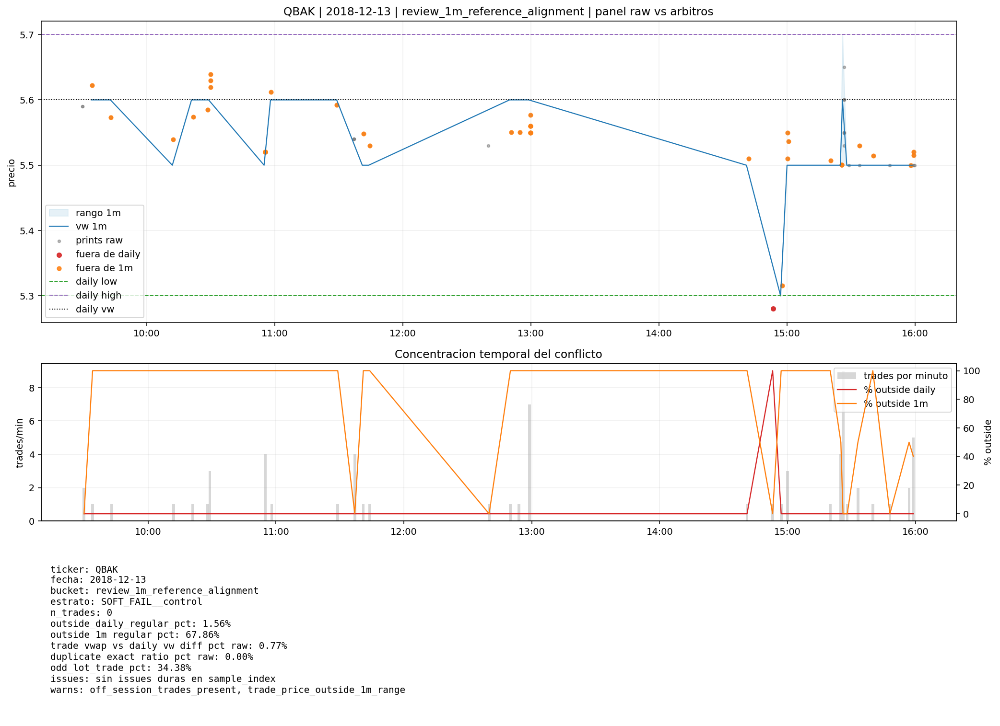

**Que muestra**

- Panel rico del tape raw frente a `daily` y `1m` para `QBAK` el `2018-12-13`.
- `n_trades = 64`, `outside_daily_regular_pct = 1.56%`, `outside_1m_regular_pct = 67.86%`.
- `trade_vwap_vs_daily_vw_diff_pct_raw = 0.77%`, `duplicate_exact_ratio_pct_raw = 0.00%`, `odd_lot_trade_pct = 34.38%`.

**Responde**

- Familia donde `1m` cambia la verdad del caso. Responde a la pregunta de si una vista mas fina destruye una aparente normalidad vista desde `daily`.
- Responde a si el conflicto dominante vive en la escala (`~1x`), en la comparabilidad frente a `daily` (1.56%) o frente a `1m` (67.86%).
- El 34.38% de odd-lots empuja la lectura hacia microestructura fina; evita leer el caso como pura ruptura economica gruesa.
- La decision que justifica es mantener o no el caso en `recoverable_with_flag` cuando se rematerialice la rehabilitacion sobre `57f`.

### RELV | 2017-03-10

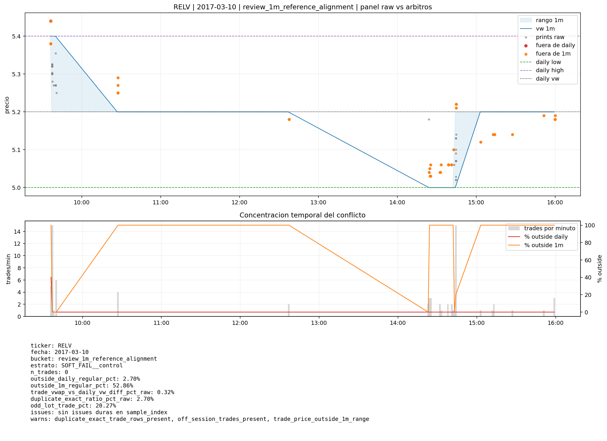

**Que muestra**

- Panel rico del tape raw frente a `daily` y `1m` para `RELV` el `2017-03-10`.
- `n_trades = 74`, `outside_daily_regular_pct = 2.70%`, `outside_1m_regular_pct = 52.86%`.
- `trade_vwap_vs_daily_vw_diff_pct_raw = 0.32%`, `duplicate_exact_ratio_pct_raw = 2.70%`, `odd_lot_trade_pct = 20.27%`.

**Responde**

- Familia donde `1m` cambia la verdad del caso. Responde a la pregunta de si una vista mas fina destruye una aparente normalidad vista desde `daily`.
- Responde a si el conflicto dominante vive en la escala (`~1x`), en la comparabilidad frente a `daily` (2.70%) o frente a `1m` (52.86%).
- La decision que justifica es mantener o no el caso en `recoverable_with_flag` cuando se rematerialice la rehabilitacion sobre `57f`.

### GPRK | 2014-04-22

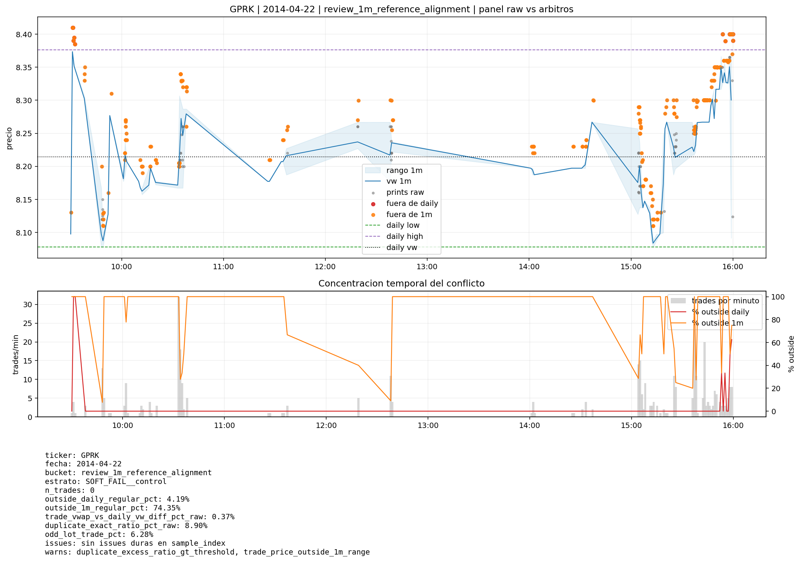

**Que muestra**

- Panel rico del tape raw frente a `daily` y `1m` para `GPRK` el `2014-04-22`.
- `n_trades = 382`, `outside_daily_regular_pct = 4.19%`, `outside_1m_regular_pct = 74.35%`.
- `trade_vwap_vs_daily_vw_diff_pct_raw = 0.37%`, `duplicate_exact_ratio_pct_raw = 8.90%`, `odd_lot_trade_pct = 6.28%`.

**Responde**

- Familia donde `1m` cambia la verdad del caso. Responde a la pregunta de si una vista mas fina destruye una aparente normalidad vista desde `daily`.
- Responde a si el conflicto dominante vive en la escala (`~1x`), en la comparabilidad frente a `daily` (4.19%) o frente a `1m` (74.35%).
- El 8.90% de duplicacion exacta obliga a sospechar dano de tape o bursts mecanicos, no solo ruido visual.
- La decision que justifica es mantener o no el caso en `recoverable_with_flag` cuando se rematerialice la rehabilitacion sobre `57f`.

### GPRK | 2014-10-06

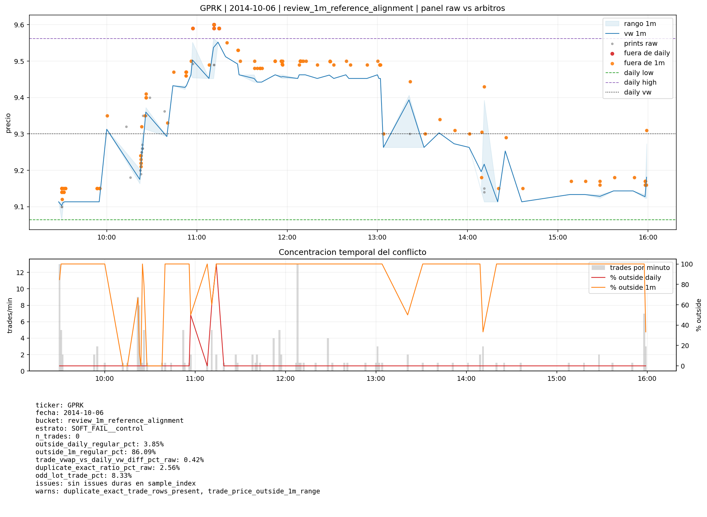

**Que muestra**

- Panel rico del tape raw frente a `daily` y `1m` para `GPRK` el `2014-10-06`.
- `n_trades = 156`, `outside_daily_regular_pct = 3.85%`, `outside_1m_regular_pct = 86.09%`.
- `trade_vwap_vs_daily_vw_diff_pct_raw = 0.42%`, `duplicate_exact_ratio_pct_raw = 2.56%`, `odd_lot_trade_pct = 8.33%`.

**Responde**

- Familia donde `1m` cambia la verdad del caso. Responde a la pregunta de si una vista mas fina destruye una aparente normalidad vista desde `daily`.
- Responde a si el conflicto dominante vive en la escala (`~1x`), en la comparabilidad frente a `daily` (3.85%) o frente a `1m` (86.09%).
- La decision que justifica es mantener o no el caso en `recoverable_with_flag` cuando se rematerialice la rehabilitacion sobre `57f`.

### GPRK | 2018-07-23

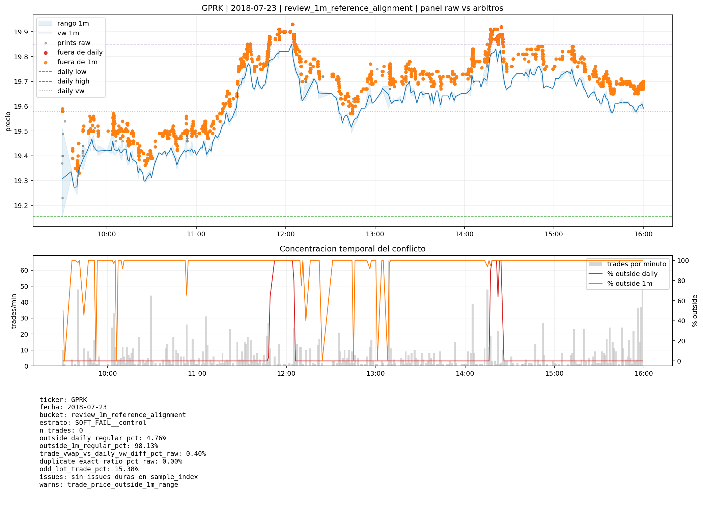

**Que muestra**

- Panel rico del tape raw frente a `daily` y `1m` para `GPRK` el `2018-07-23`.
- `n_trades = 2,100`, `outside_daily_regular_pct = 4.76%`, `outside_1m_regular_pct = 98.13%`.
- `trade_vwap_vs_daily_vw_diff_pct_raw = 0.40%`, `duplicate_exact_ratio_pct_raw = 0.00%`, `odd_lot_trade_pct = 15.38%`.

**Responde**

- Familia donde `1m` cambia la verdad del caso. Responde a la pregunta de si una vista mas fina destruye una aparente normalidad vista desde `daily`.
- Responde a si el conflicto dominante vive en la escala (`~1x`), en la comparabilidad frente a `daily` (4.76%) o frente a `1m` (98.13%).
- La decision que justifica es mantener o no el caso en `recoverable_with_flag` cuando se rematerialice la rehabilitacion sobre `57f`.

### GPRK | 2018-11-16

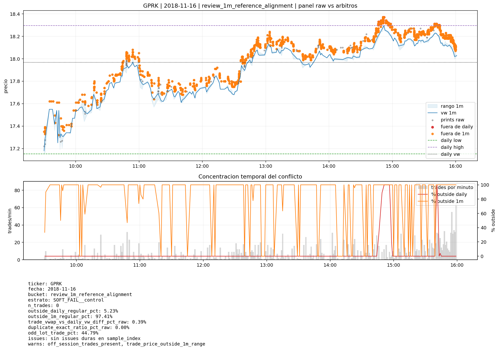

**Que muestra**

- Panel rico del tape raw frente a `daily` y `1m` para `GPRK` el `2018-11-16`.
- `n_trades = 2,331`, `outside_daily_regular_pct = 5.23%`, `outside_1m_regular_pct = 97.41%`.
- `trade_vwap_vs_daily_vw_diff_pct_raw = 0.39%`, `duplicate_exact_ratio_pct_raw = 0.00%`, `odd_lot_trade_pct = 44.79%`.

**Responde**

- Familia donde `1m` cambia la verdad del caso. Responde a la pregunta de si una vista mas fina destruye una aparente normalidad vista desde `daily`.
- Responde a si el conflicto dominante vive en la escala (`~1x`), en la comparabilidad frente a `daily` (5.23%) o frente a `1m` (97.41%).
- El 44.79% de odd-lots empuja la lectura hacia microestructura fina; evita leer el caso como pura ruptura economica gruesa.
- La decision que justifica es mantener o no el caso en `recoverable_with_flag` cuando se rematerialice la rehabilitacion sobre `57f`.

### METC | 2017-05-12

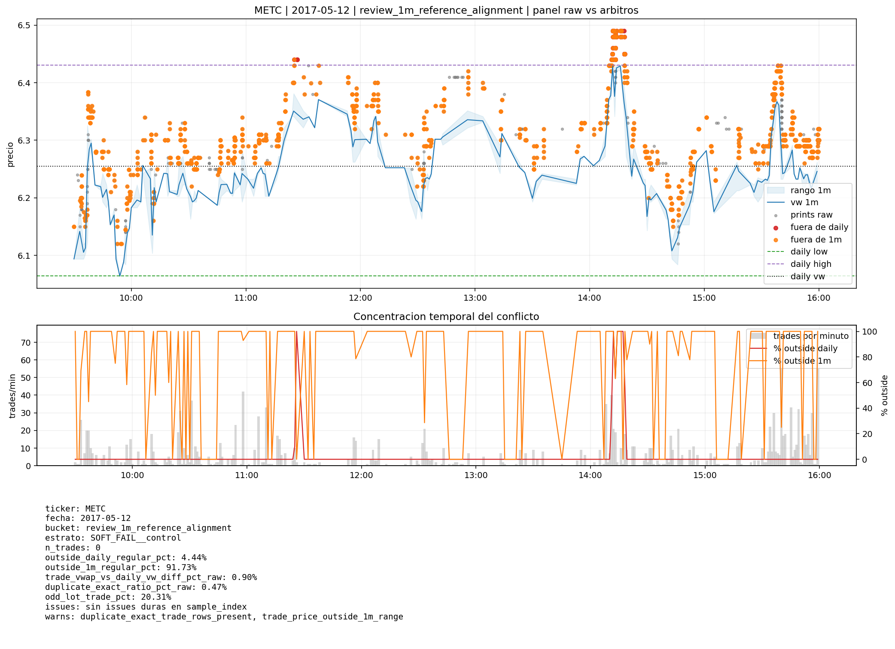

**Que muestra**

- Panel rico del tape raw frente a `daily` y `1m` para `METC` el `2017-05-12`.
- `n_trades = 1,689`, `outside_daily_regular_pct = 4.44%`, `outside_1m_regular_pct = 91.73%`.
- `trade_vwap_vs_daily_vw_diff_pct_raw = 0.90%`, `duplicate_exact_ratio_pct_raw = 0.47%`, `odd_lot_trade_pct = 20.31%`.

**Responde**

- Familia donde `1m` cambia la verdad del caso. Responde a la pregunta de si una vista mas fina destruye una aparente normalidad vista desde `daily`.
- Responde a si el conflicto dominante vive en la escala (`~1x`), en la comparabilidad frente a `daily` (4.44%) o frente a `1m` (91.73%).
- La decision que justifica es mantener o no el caso en `recoverable_with_flag` cuando se rematerialice la rehabilitacion sobre `57f`.

### AIM | 2020-09-01

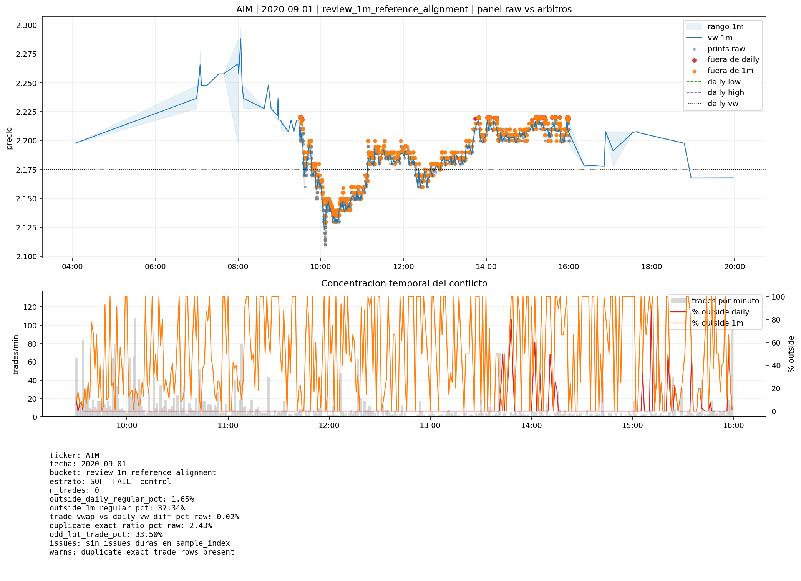

**Que muestra**

- Panel rico del tape raw frente a `daily` y `1m` para `AIM` el `2020-09-01`.
- `n_trades = 3,707`, `outside_daily_regular_pct = 1.65%`, `outside_1m_regular_pct = 37.34%`.
- `trade_vwap_vs_daily_vw_diff_pct_raw = 0.02%`, `duplicate_exact_ratio_pct_raw = 2.43%`, `odd_lot_trade_pct = 33.50%`.

**Responde**

- Familia donde `1m` cambia la verdad del caso. Responde a la pregunta de si una vista mas fina destruye una aparente normalidad vista desde `daily`.
- Responde a si el conflicto dominante vive en la escala (`~1x`), en la comparabilidad frente a `daily` (1.65%) o frente a `1m` (37.34%).
- El 33.50% de odd-lots empuja la lectura hacia microestructura fina; evita leer el caso como pura ruptura economica gruesa.
- La decision que justifica es mantener o no el caso en `recoverable_with_flag` cuando se rematerialice la rehabilitacion sobre `57f`.

### AIM | 2022-07-12

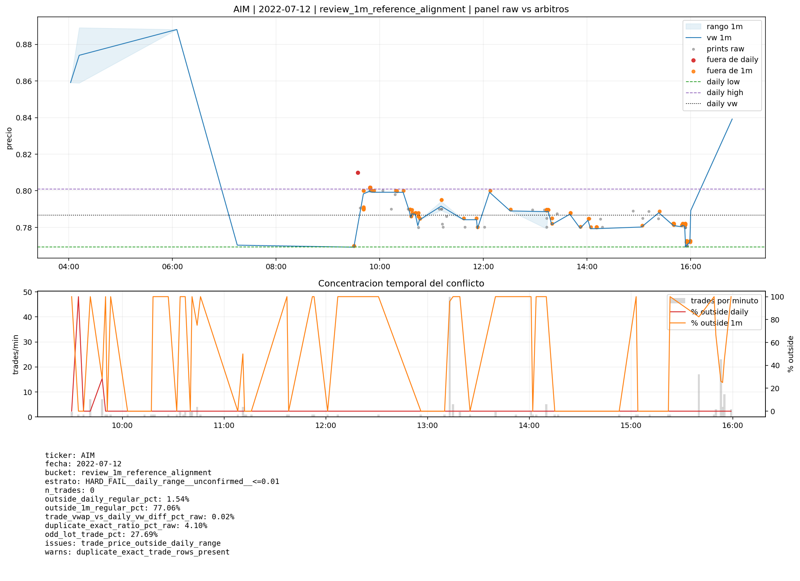

**Que muestra**

- Panel rico del tape raw frente a `daily` y `1m` para `AIM` el `2022-07-12`.
- `n_trades = 195`, `outside_daily_regular_pct = 1.54%`, `outside_1m_regular_pct = 77.06%`.
- `trade_vwap_vs_daily_vw_diff_pct_raw = 0.02%`, `duplicate_exact_ratio_pct_raw = 4.10%`, `odd_lot_trade_pct = 27.69%`.

**Responde**

- Familia donde `1m` cambia la verdad del caso. Responde a la pregunta de si una vista mas fina destruye una aparente normalidad vista desde `daily`.
- Responde a si el conflicto dominante vive en la escala (`~1x`), en la comparabilidad frente a `daily` (1.54%) o frente a `1m` (77.06%).
- El 27.69% de odd-lots empuja la lectura hacia microestructura fina; evita leer el caso como pura ruptura economica gruesa.
- La decision que justifica es mantener o no el caso en `recoverable_with_flag` cuando se rematerialice la rehabilitacion sobre `57f`.

### AIM | 2022-09-22

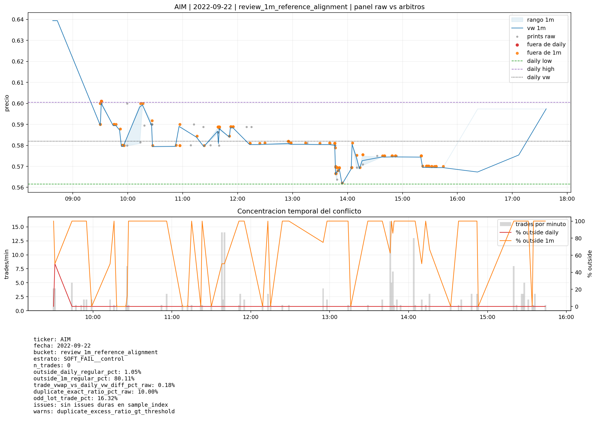

**Que muestra**

- Panel rico del tape raw frente a `daily` y `1m` para `AIM` el `2022-09-22`.
- `n_trades = 190`, `outside_daily_regular_pct = 1.05%`, `outside_1m_regular_pct = 80.11%`.
- `trade_vwap_vs_daily_vw_diff_pct_raw = 0.18%`, `duplicate_exact_ratio_pct_raw = 10.00%`, `odd_lot_trade_pct = 16.32%`.

**Responde**

- Familia donde `1m` cambia la verdad del caso. Responde a la pregunta de si una vista mas fina destruye una aparente normalidad vista desde `daily`.
- Responde a si el conflicto dominante vive en la escala (`~1x`), en la comparabilidad frente a `daily` (1.05%) o frente a `1m` (80.11%).
- El 10.00% de duplicacion exacta obliga a sospechar dano de tape o bursts mecanicos, no solo ruido visual.
- La decision que justifica es mantener o no el caso en `recoverable_with_flag` cuando se rematerialice la rehabilitacion sobre `57f`.

### AIM | 2019-12-17

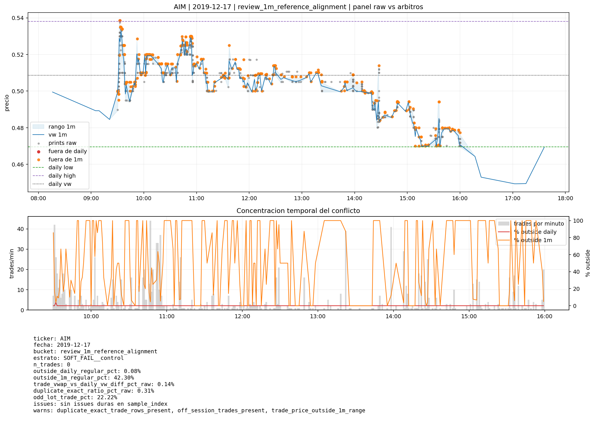

**Que muestra**

- Panel rico del tape raw frente a `daily` y `1m` para `AIM` el `2019-12-17`.
- `n_trades = 1,296`, `outside_daily_regular_pct = 0.08%`, `outside_1m_regular_pct = 42.30%`.
- `trade_vwap_vs_daily_vw_diff_pct_raw = 0.14%`, `duplicate_exact_ratio_pct_raw = 0.31%`, `odd_lot_trade_pct = 22.22%`.

**Responde**

- Familia donde `1m` cambia la verdad del caso. Responde a la pregunta de si una vista mas fina destruye una aparente normalidad vista desde `daily`.
- Responde a si el conflicto dominante vive en la escala (`~1x`), en la comparabilidad frente a `daily` (0.08%) o frente a `1m` (42.30%).
- La decision que justifica es mantener o no el caso en `recoverable_with_flag` cuando se rematerialice la rehabilitacion sobre `57f`.

### AIM | 2021-10-29

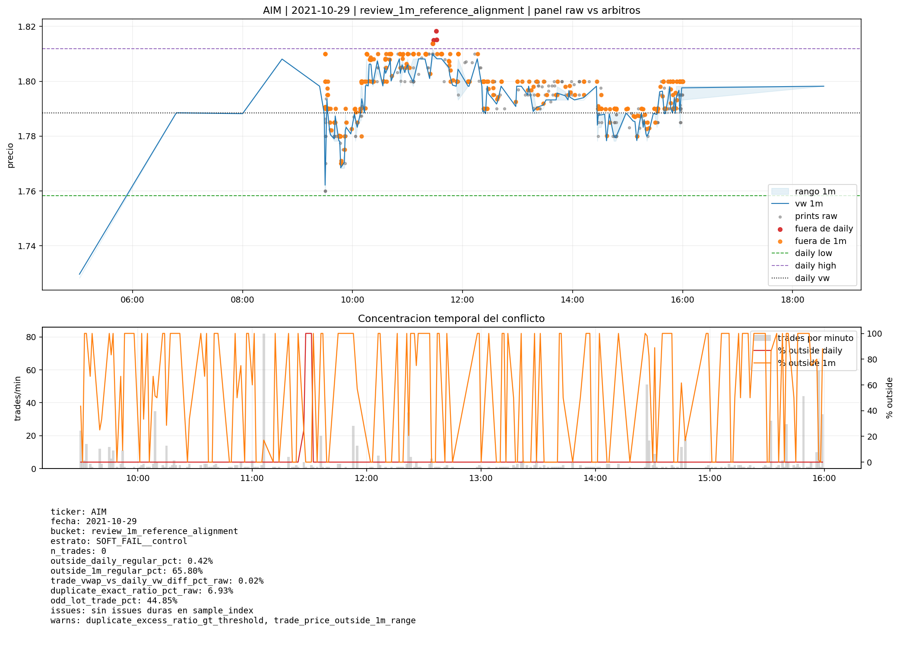

**Que muestra**

- Panel rico del tape raw frente a `daily` y `1m` para `AIM` el `2021-10-29`.
- `n_trades = 952`, `outside_daily_regular_pct = 0.42%`, `outside_1m_regular_pct = 65.80%`.
- `trade_vwap_vs_daily_vw_diff_pct_raw = 0.02%`, `duplicate_exact_ratio_pct_raw = 6.93%`, `odd_lot_trade_pct = 44.85%`.

**Responde**

- Familia donde `1m` cambia la verdad del caso. Responde a la pregunta de si una vista mas fina destruye una aparente normalidad vista desde `daily`.
- Responde a si el conflicto dominante vive en la escala (`~1x`), en la comparabilidad frente a `daily` (0.42%) o frente a `1m` (65.80%).
- El 44.85% de odd-lots empuja la lectura hacia microestructura fina; evita leer el caso como pura ruptura economica gruesa.
- El 6.93% de duplicacion exacta obliga a sospechar dano de tape o bursts mecanicos, no solo ruido visual.
- La decision que justifica es mantener o no el caso en `recoverable_with_flag` cuando se rematerialice la rehabilitacion sobre `57f`.

### AIM | 2021-11-19

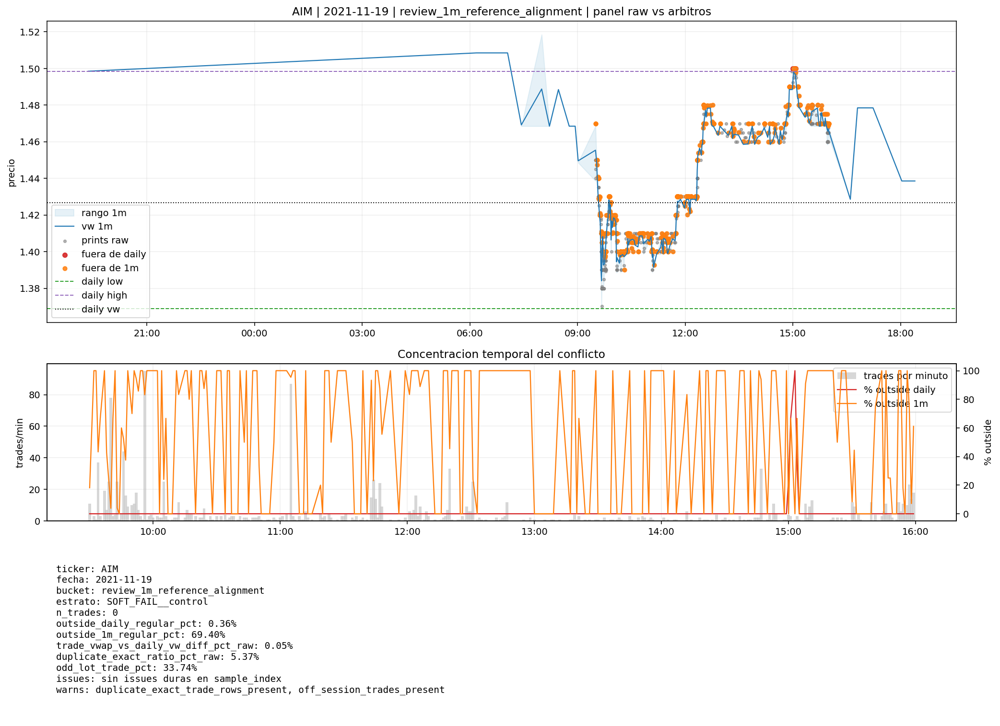

**Que muestra**

- Panel rico del tape raw frente a `daily` y `1m` para `AIM` el `2021-11-19`.
- `n_trades = 1,378`, `outside_daily_regular_pct = 0.36%`, `outside_1m_regular_pct = 69.40%`.
- `trade_vwap_vs_daily_vw_diff_pct_raw = 0.05%`, `duplicate_exact_ratio_pct_raw = 5.37%`, `odd_lot_trade_pct = 33.74%`.

**Responde**

- Familia donde `1m` cambia la verdad del caso. Responde a la pregunta de si una vista mas fina destruye una aparente normalidad vista desde `daily`.
- Responde a si el conflicto dominante vive en la escala (`~1x`), en la comparabilidad frente a `daily` (0.36%) o frente a `1m` (69.40%).
- El 33.74% de odd-lots empuja la lectura hacia microestructura fina; evita leer el caso como pura ruptura economica gruesa.
- El 5.37% de duplicacion exacta obliga a sospechar dano de tape o bursts mecanicos, no solo ruido visual.
- La decision que justifica es mantener o no el caso en `recoverable_with_flag` cuando se rematerialice la rehabilitacion sobre `57f`.

### AIM | 2022-02-24

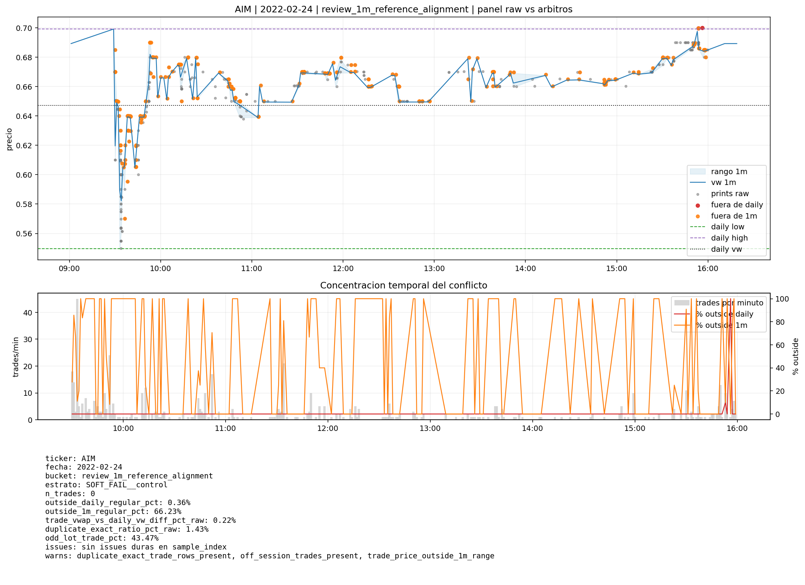

**Que muestra**

- Panel rico del tape raw frente a `daily` y `1m` para `AIM` el `2022-02-24`.
- `n_trades = 559`, `outside_daily_regular_pct = 0.36%`, `outside_1m_regular_pct = 66.23%`.
- `trade_vwap_vs_daily_vw_diff_pct_raw = 0.22%`, `duplicate_exact_ratio_pct_raw = 1.43%`, `odd_lot_trade_pct = 43.47%`.

**Responde**

- Familia donde `1m` cambia la verdad del caso. Responde a la pregunta de si una vista mas fina destruye una aparente normalidad vista desde `daily`.
- Responde a si el conflicto dominante vive en la escala (`~1x`), en la comparabilidad frente a `daily` (0.36%) o frente a `1m` (66.23%).
- El 43.47% de odd-lots empuja la lectura hacia microestructura fina; evita leer el caso como pura ruptura economica gruesa.
- La decision que justifica es mantener o no el caso en `recoverable_with_flag` cuando se rematerialice la rehabilitacion sobre `57f`.

### AIM | 2023-03-10

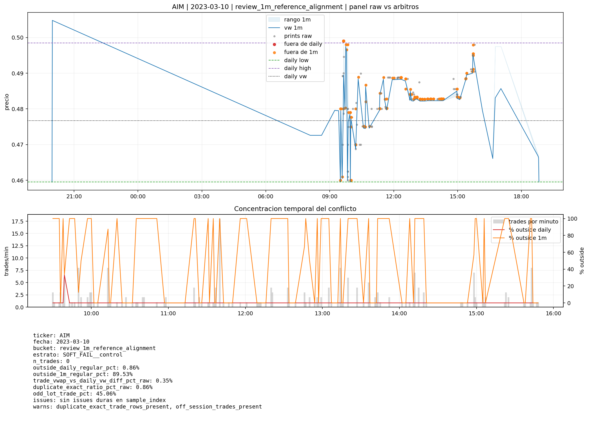

**Que muestra**

- Panel rico del tape raw frente a `daily` y `1m` para `AIM` el `2023-03-10`.
- `n_trades = 233`, `outside_daily_regular_pct = 0.86%`, `outside_1m_regular_pct = 89.53%`.
- `trade_vwap_vs_daily_vw_diff_pct_raw = 0.35%`, `duplicate_exact_ratio_pct_raw = 0.86%`, `odd_lot_trade_pct = 45.06%`.

**Responde**

- Familia donde `1m` cambia la verdad del caso. Responde a la pregunta de si una vista mas fina destruye una aparente normalidad vista desde `daily`.
- Responde a si el conflicto dominante vive en la escala (`~1x`), en la comparabilidad frente a `daily` (0.86%) o frente a `1m` (89.53%).
- El 45.06% de odd-lots empuja la lectura hacia microestructura fina; evita leer el caso como pura ruptura economica gruesa.
- La decision que justifica es mantener o no el caso en `recoverable_with_flag` cuando se rematerialice la rehabilitacion sobre `57f`.

### AIM | 2023-06-30

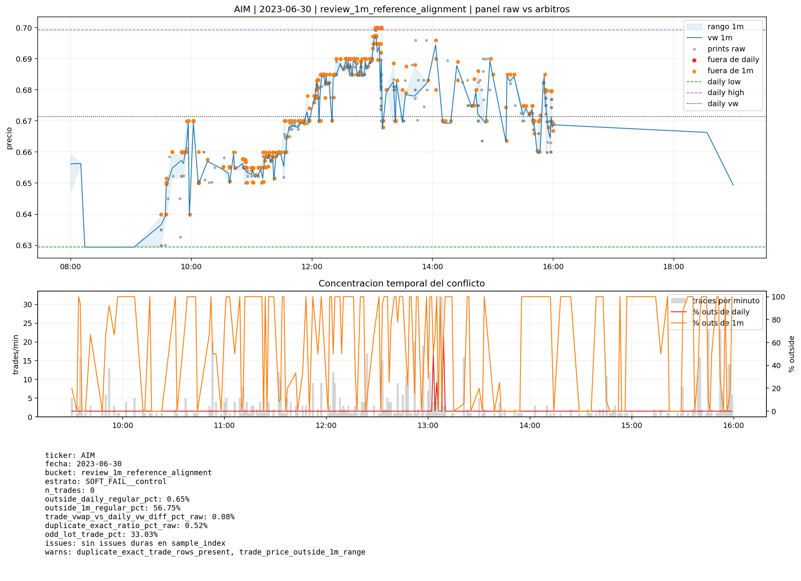

**Que muestra**

- Panel rico del tape raw frente a `daily` y `1m` para `AIM` el `2023-06-30`.
- `n_trades = 766`, `outside_daily_regular_pct = 0.65%`, `outside_1m_regular_pct = 56.75%`.
- `trade_vwap_vs_daily_vw_diff_pct_raw = 0.08%`, `duplicate_exact_ratio_pct_raw = 0.52%`, `odd_lot_trade_pct = 33.03%`.

**Responde**

- Familia donde `1m` cambia la verdad del caso. Responde a la pregunta de si una vista mas fina destruye una aparente normalidad vista desde `daily`.
- Responde a si el conflicto dominante vive en la escala (`~1x`), en la comparabilidad frente a `daily` (0.65%) o frente a `1m` (56.75%).
- El 33.03% de odd-lots empuja la lectura hacia microestructura fina; evita leer el caso como pura ruptura economica gruesa.
- La decision que justifica es mantener o no el caso en `recoverable_with_flag` cuando se rematerialice la rehabilitacion sobre `57f`.

### AIM | 2023-08-09

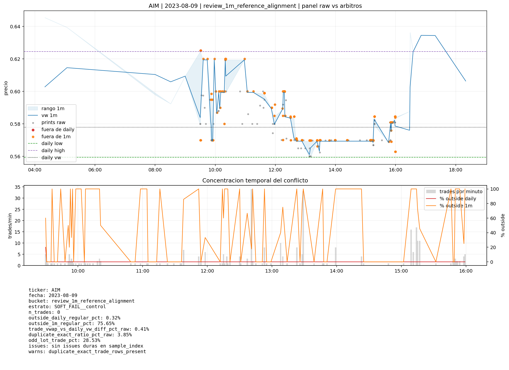

**Que muestra**

- Panel rico del tape raw frente a `daily` y `1m` para `AIM` el `2023-08-09`.
- `n_trades = 312`, `outside_daily_regular_pct = 0.32%`, `outside_1m_regular_pct = 75.65%`.
- `trade_vwap_vs_daily_vw_diff_pct_raw = 0.41%`, `duplicate_exact_ratio_pct_raw = 3.85%`, `odd_lot_trade_pct = 28.53%`.

**Responde**

- Familia donde `1m` cambia la verdad del caso. Responde a la pregunta de si una vista mas fina destruye una aparente normalidad vista desde `daily`.
- Responde a si el conflicto dominante vive en la escala (`~1x`), en la comparabilidad frente a `daily` (0.32%) o frente a `1m` (75.65%).
- El 28.53% de odd-lots empuja la lectura hacia microestructura fina; evita leer el caso como pura ruptura economica gruesa.
- La decision que justifica es mantener o no el caso en `recoverable_with_flag` cuando se rematerialice la rehabilitacion sobre `57f`.

### AIM | 2025-10-27

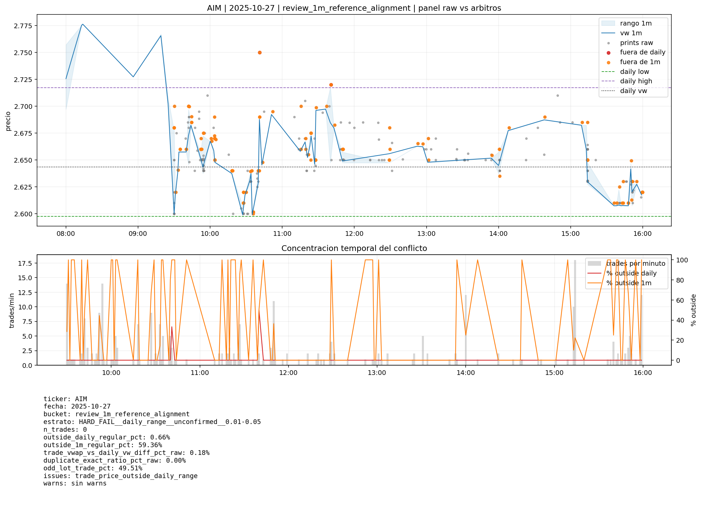

**Que muestra**

- Panel rico del tape raw frente a `daily` y `1m` para `AIM` el `2025-10-27`.
- `n_trades = 305`, `outside_daily_regular_pct = 0.66%`, `outside_1m_regular_pct = 59.36%`.
- `trade_vwap_vs_daily_vw_diff_pct_raw = 0.18%`, `duplicate_exact_ratio_pct_raw = 0.00%`, `odd_lot_trade_pct = 49.51%`.

**Responde**

- Familia donde `1m` cambia la verdad del caso. Responde a la pregunta de si una vista mas fina destruye una aparente normalidad vista desde `daily`.
- Responde a si el conflicto dominante vive en la escala (`~1x`), en la comparabilidad frente a `daily` (0.66%) o frente a `1m` (59.36%).
- El 49.51% de odd-lots empuja la lectura hacia microestructura fina; evita leer el caso como pura ruptura economica gruesa.
- La decision que justifica es mantener o no el caso en `recoverable_with_flag` cuando se rematerialice la rehabilitacion sobre `57f`.

### DTCK | 2023-09-26

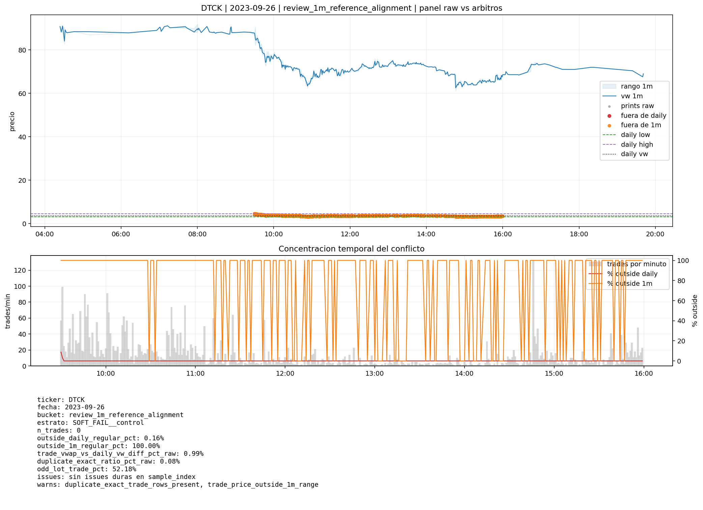

**Que muestra**

- Panel rico del tape raw frente a `daily` y `1m` para `DTCK` el `2023-09-26`.
- `n_trades = 4,904`, `outside_daily_regular_pct = 0.16%`, `outside_1m_regular_pct = 100.00%`.
- `trade_vwap_vs_daily_vw_diff_pct_raw = 0.99%`, `duplicate_exact_ratio_pct_raw = 0.08%`, `odd_lot_trade_pct = 52.18%`.

**Responde**

- Familia donde `1m` cambia la verdad del caso. Responde a la pregunta de si una vista mas fina destruye una aparente normalidad vista desde `daily`.
- Responde a si el conflicto dominante vive en la escala (`~1x`), en la comparabilidad frente a `daily` (0.16%) o frente a `1m` (100.00%).
- El 52.18% de odd-lots empuja la lectura hacia microestructura fina; evita leer el caso como pura ruptura economica gruesa.
- La decision que justifica es mantener o no el caso en `recoverable_with_flag` cuando se rematerialice la rehabilitacion sobre `57f`.

### DTCK | 2023-10-24

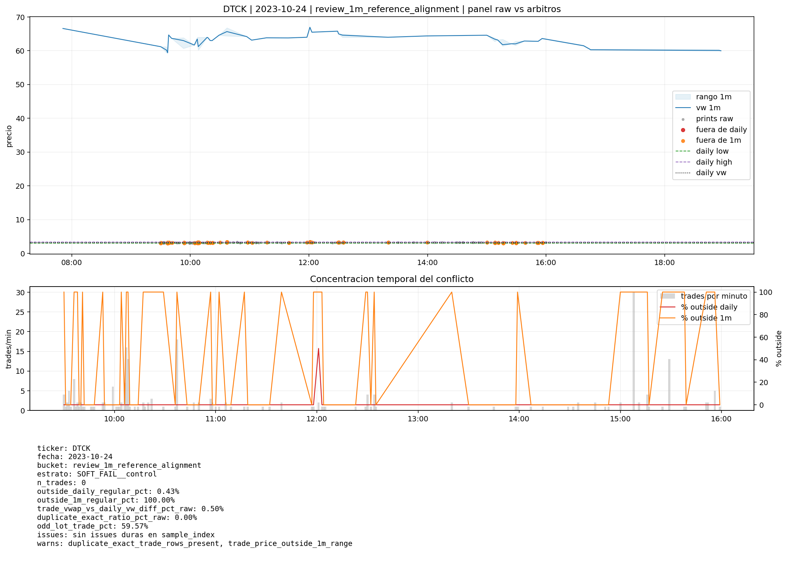

**Que muestra**

- Panel rico del tape raw frente a `daily` y `1m` para `DTCK` el `2023-10-24`.
- `n_trades = 235`, `outside_daily_regular_pct = 0.43%`, `outside_1m_regular_pct = 100.00%`.
- `trade_vwap_vs_daily_vw_diff_pct_raw = 0.50%`, `duplicate_exact_ratio_pct_raw = 0.00%`, `odd_lot_trade_pct = 59.57%`.

**Responde**

- Familia donde `1m` cambia la verdad del caso. Responde a la pregunta de si una vista mas fina destruye una aparente normalidad vista desde `daily`.
- Responde a si el conflicto dominante vive en la escala (`~1x`), en la comparabilidad frente a `daily` (0.43%) o frente a `1m` (100.00%).
- El 59.57% de odd-lots empuja la lectura hacia microestructura fina; evita leer el caso como pura ruptura economica gruesa.
- La decision que justifica es mantener o no el caso en `recoverable_with_flag` cuando se rematerialice la rehabilitacion sobre `57f`.

### DTCK | 2023-11-17

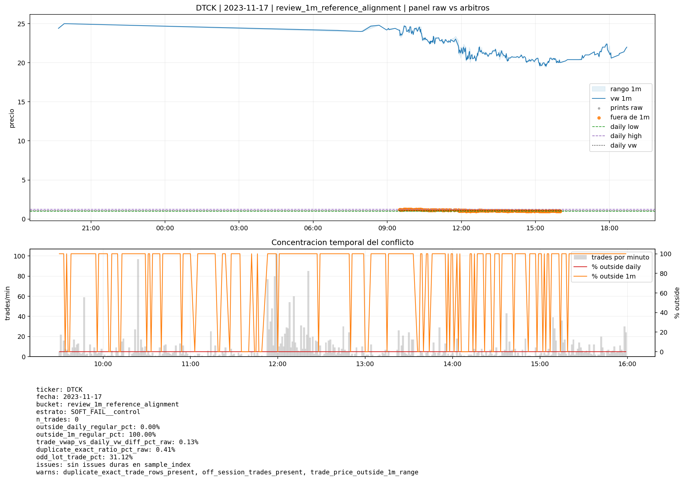

**Que muestra**

- Panel rico del tape raw frente a `daily` y `1m` para `DTCK` el `2023-11-17`.
- `n_trades = 2,921`, `outside_daily_regular_pct = 0.00%`, `outside_1m_regular_pct = 100.00%`.
- `trade_vwap_vs_daily_vw_diff_pct_raw = 0.13%`, `duplicate_exact_ratio_pct_raw = 0.41%`, `odd_lot_trade_pct = 31.12%`.

**Responde**

- Familia donde `1m` cambia la verdad del caso. Responde a la pregunta de si una vista mas fina destruye una aparente normalidad vista desde `daily`.
- Responde a si el conflicto dominante vive en la escala (`~1x`), en la comparabilidad frente a `daily` (0.00%) o frente a `1m` (100.00%).
- El 31.12% de odd-lots empuja la lectura hacia microestructura fina; evita leer el caso como pura ruptura economica gruesa.
- La decision que justifica es mantener o no el caso en `recoverable_with_flag` cuando se rematerialice la rehabilitacion sobre `57f`.

### DTCK | 2024-04-15

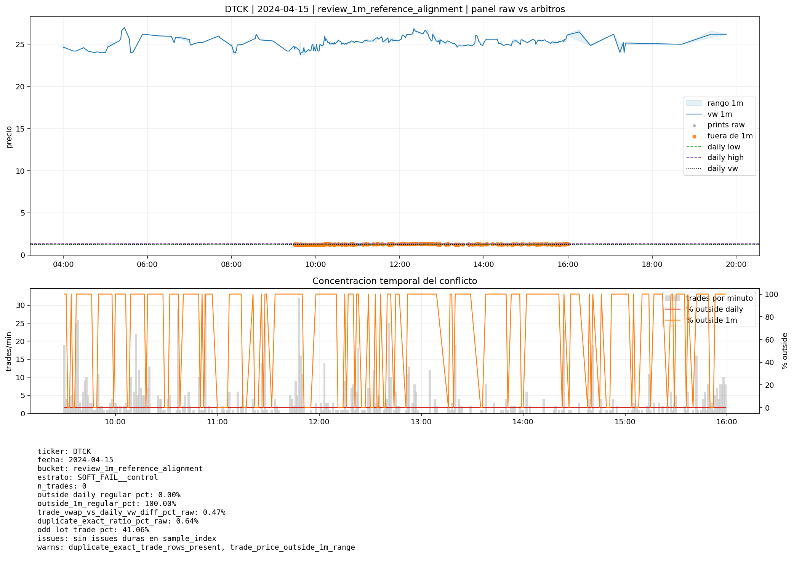

**Que muestra**

- Panel rico del tape raw frente a `daily` y `1m` para `DTCK` el `2024-04-15`.
- `n_trades = 1,096`, `outside_daily_regular_pct = 0.00%`, `outside_1m_regular_pct = 100.00%`.
- `trade_vwap_vs_daily_vw_diff_pct_raw = 0.47%`, `duplicate_exact_ratio_pct_raw = 0.64%`, `odd_lot_trade_pct = 41.06%`.

**Responde**

- Familia donde `1m` cambia la verdad del caso. Responde a la pregunta de si una vista mas fina destruye una aparente normalidad vista desde `daily`.
- Responde a si el conflicto dominante vive en la escala (`~1x`), en la comparabilidad frente a `daily` (0.00%) o frente a `1m` (100.00%).
- El 41.06% de odd-lots empuja la lectura hacia microestructura fina; evita leer el caso como pura ruptura economica gruesa.
- La decision que justifica es mantener o no el caso en `recoverable_with_flag` cuando se rematerialice la rehabilitacion sobre `57f`.

### DTCK | 2024-10-10

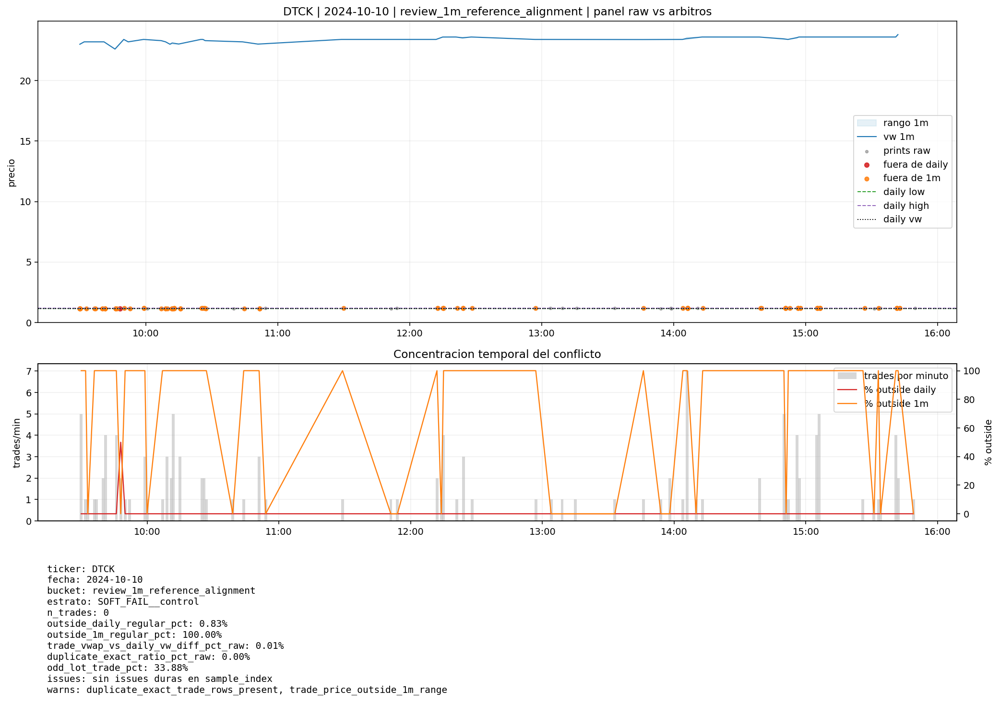

**Que muestra**

- Panel rico del tape raw frente a `daily` y `1m` para `DTCK` el `2024-10-10`.
- `n_trades = 121`, `outside_daily_regular_pct = 0.83%`, `outside_1m_regular_pct = 100.00%`.
- `trade_vwap_vs_daily_vw_diff_pct_raw = 0.01%`, `duplicate_exact_ratio_pct_raw = 0.00%`, `odd_lot_trade_pct = 33.88%`.

**Responde**

- Familia donde `1m` cambia la verdad del caso. Responde a la pregunta de si una vista mas fina destruye una aparente normalidad vista desde `daily`.
- Responde a si el conflicto dominante vive en la escala (`~1x`), en la comparabilidad frente a `daily` (0.83%) o frente a `1m` (100.00%).
- El 33.88% de odd-lots empuja la lectura hacia microestructura fina; evita leer el caso como pura ruptura economica gruesa.
- La decision que justifica es mantener o no el caso en `recoverable_with_flag` cuando se rematerialice la rehabilitacion sobre `57f`.

### PMD | 2019-02-01

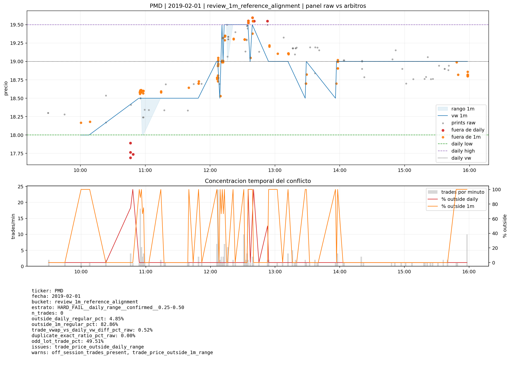

**Que muestra**

- Panel rico del tape raw frente a `daily` y `1m` para `PMD` el `2019-02-01`.
- `n_trades = 206`, `outside_daily_regular_pct = 4.85%`, `outside_1m_regular_pct = 82.86%`.
- `trade_vwap_vs_daily_vw_diff_pct_raw = 0.52%`, `duplicate_exact_ratio_pct_raw = 0.00%`, `odd_lot_trade_pct = 49.51%`.

**Responde**

- Familia donde `1m` cambia la verdad del caso. Responde a la pregunta de si una vista mas fina destruye una aparente normalidad vista desde `daily`.
- Responde a si el conflicto dominante vive en la escala (`~1x`), en la comparabilidad frente a `daily` (4.85%) o frente a `1m` (82.86%).
- El 49.51% de odd-lots empuja la lectura hacia microestructura fina; evita leer el caso como pura ruptura economica gruesa.
- La decision que justifica es mantener o no el caso en `recoverable_with_flag` cuando se rematerialice la rehabilitacion sobre `57f`.

### QBAK | 2019-08-06

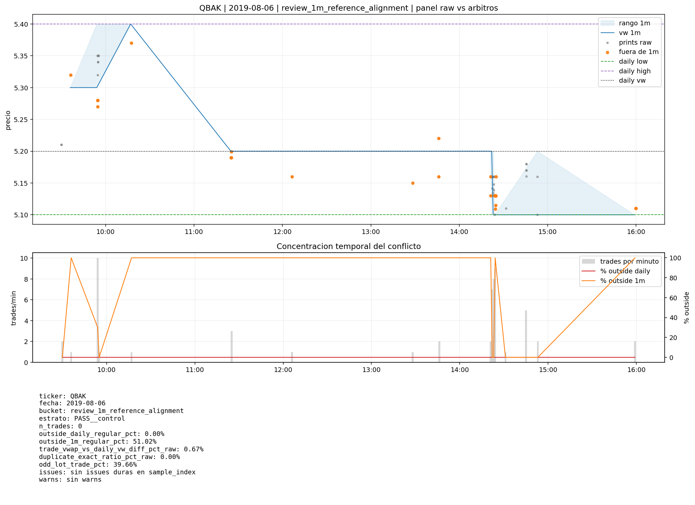

**Que muestra**

- Panel rico del tape raw frente a `daily` y `1m` para `QBAK` el `2019-08-06`.
- `n_trades = 58`, `outside_daily_regular_pct = 0.00%`, `outside_1m_regular_pct = 51.02%`.
- `trade_vwap_vs_daily_vw_diff_pct_raw = 0.67%`, `duplicate_exact_ratio_pct_raw = 0.00%`, `odd_lot_trade_pct = 39.66%`.

**Responde**

- Familia donde `1m` cambia la verdad del caso. Responde a la pregunta de si una vista mas fina destruye una aparente normalidad vista desde `daily`.
- Responde a si el conflicto dominante vive en la escala (`~1x`), en la comparabilidad frente a `daily` (0.00%) o frente a `1m` (51.02%).
- El 39.66% de odd-lots empuja la lectura hacia microestructura fina; evita leer el caso como pura ruptura economica gruesa.
- La decision que justifica es mantener o no el caso en `recoverable_with_flag` cuando se rematerialice la rehabilitacion sobre `57f`.

### QBAK | 2019-08-30

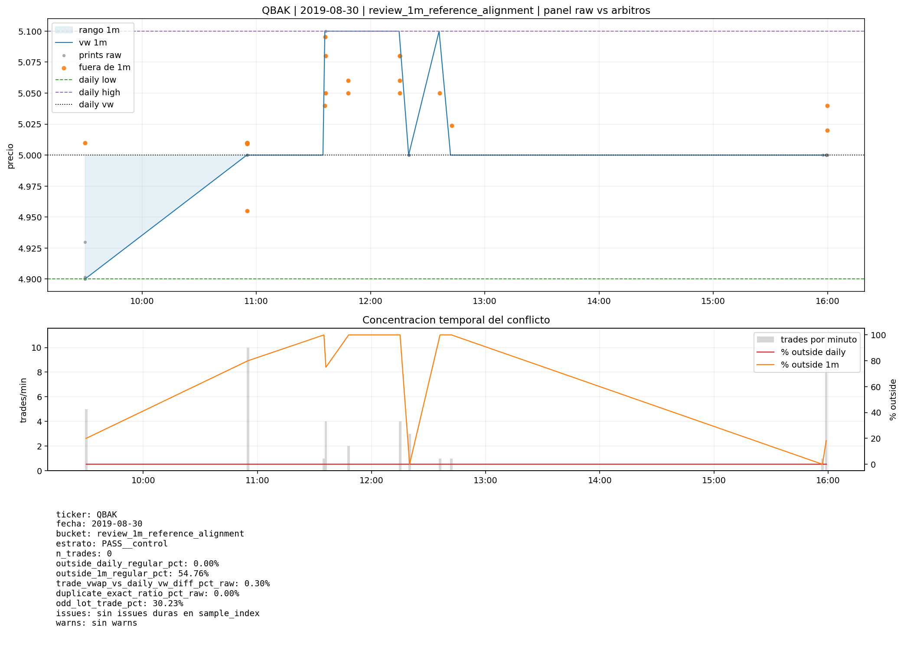

**Que muestra**

- Panel rico del tape raw frente a `daily` y `1m` para `QBAK` el `2019-08-30`.
- `n_trades = 43`, `outside_daily_regular_pct = 0.00%`, `outside_1m_regular_pct = 54.76%`.
- `trade_vwap_vs_daily_vw_diff_pct_raw = 0.30%`, `duplicate_exact_ratio_pct_raw = 0.00%`, `odd_lot_trade_pct = 30.23%`.

**Responde**

- Familia donde `1m` cambia la verdad del caso. Responde a la pregunta de si una vista mas fina destruye una aparente normalidad vista desde `daily`.
- Responde a si el conflicto dominante vive en la escala (`~1x`), en la comparabilidad frente a `daily` (0.00%) o frente a `1m` (54.76%).
- El 30.23% de odd-lots empuja la lectura hacia microestructura fina; evita leer el caso como pura ruptura economica gruesa.
- La decision que justifica es mantener o no el caso en `recoverable_with_flag` cuando se rematerialice la rehabilitacion sobre `57f`.

### RELV | 2019-06-25

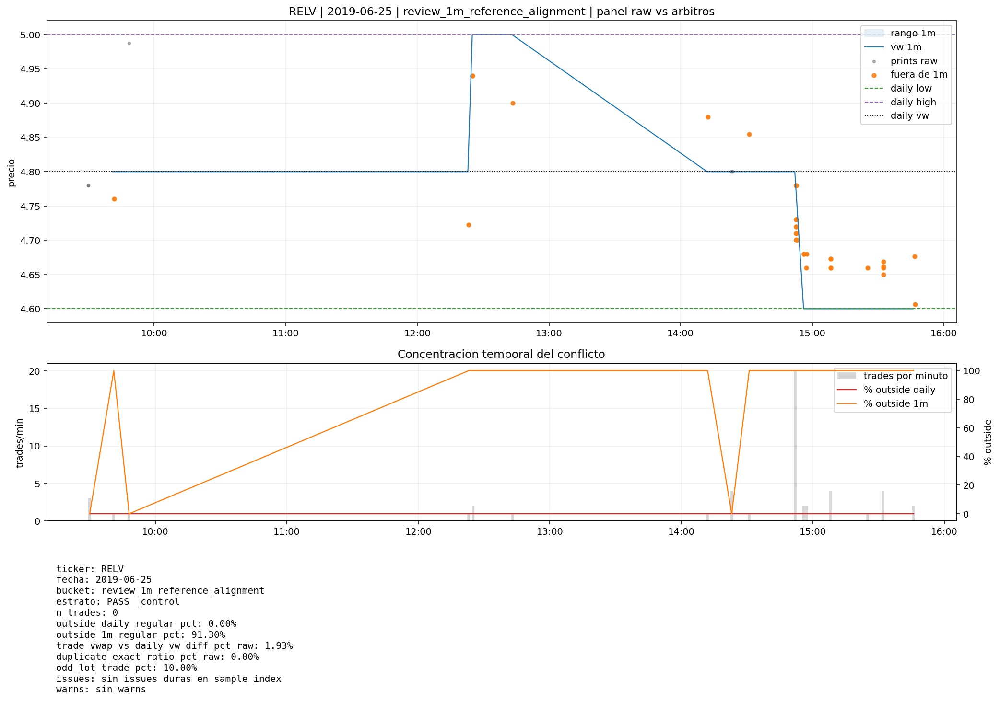

**Que muestra**

- Panel rico del tape raw frente a `daily` y `1m` para `RELV` el `2019-06-25`.
- `n_trades = 50`, `outside_daily_regular_pct = 0.00%`, `outside_1m_regular_pct = 91.30%`.
- `trade_vwap_vs_daily_vw_diff_pct_raw = 1.93%`, `duplicate_exact_ratio_pct_raw = 0.00%`, `odd_lot_trade_pct = 10.00%`.

**Responde**

- Familia donde `1m` cambia la verdad del caso. Responde a la pregunta de si una vista mas fina destruye una aparente normalidad vista desde `daily`.
- Responde a si el conflicto dominante vive en la escala (`~1x`), en la comparabilidad frente a `daily` (0.00%) o frente a `1m` (91.30%).
- La decision que justifica es mantener o no el caso en `recoverable_with_flag` cuando se rematerialice la rehabilitacion sobre `57f`.

### RVPH | 2021-10-07

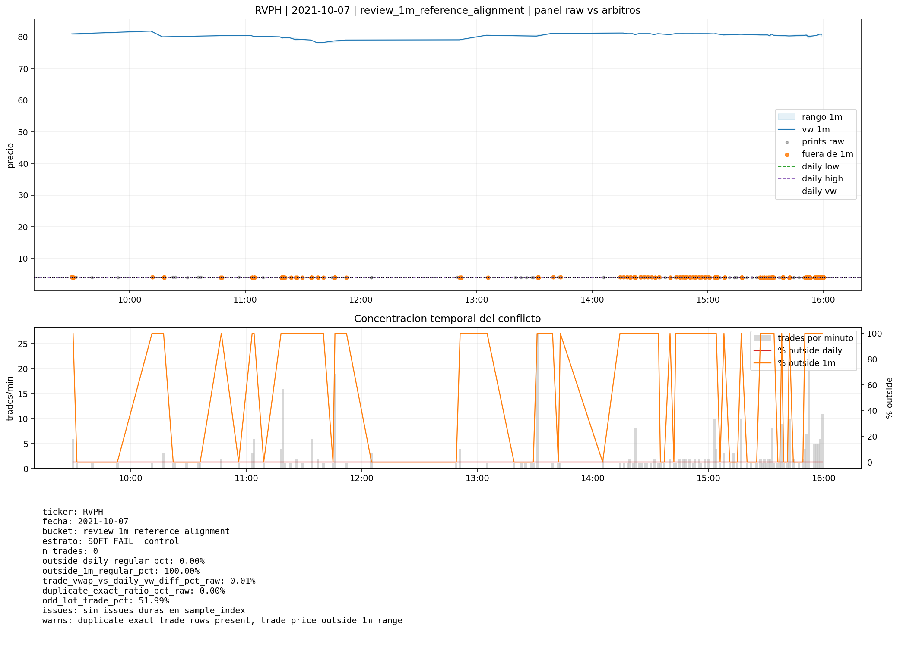

**Que muestra**

- Panel rico del tape raw frente a `daily` y `1m` para `RVPH` el `2021-10-07`.
- `n_trades = 327`, `outside_daily_regular_pct = 0.00%`, `outside_1m_regular_pct = 100.00%`.
- `trade_vwap_vs_daily_vw_diff_pct_raw = 0.01%`, `duplicate_exact_ratio_pct_raw = 0.00%`, `odd_lot_trade_pct = 51.99%`.

**Responde**

- Familia donde `1m` cambia la verdad del caso. Responde a la pregunta de si una vista mas fina destruye una aparente normalidad vista desde `daily`.
- Responde a si el conflicto dominante vive en la escala (`~1x`), en la comparabilidad frente a `daily` (0.00%) o frente a `1m` (100.00%).
- El 51.99% de odd-lots empuja la lectura hacia microestructura fina; evita leer el caso como pura ruptura economica gruesa.
- La decision que justifica es mantener o no el caso en `recoverable_with_flag` cuando se rematerialice la rehabilitacion sobre `57f`.

### RVPH | 2021-11-29

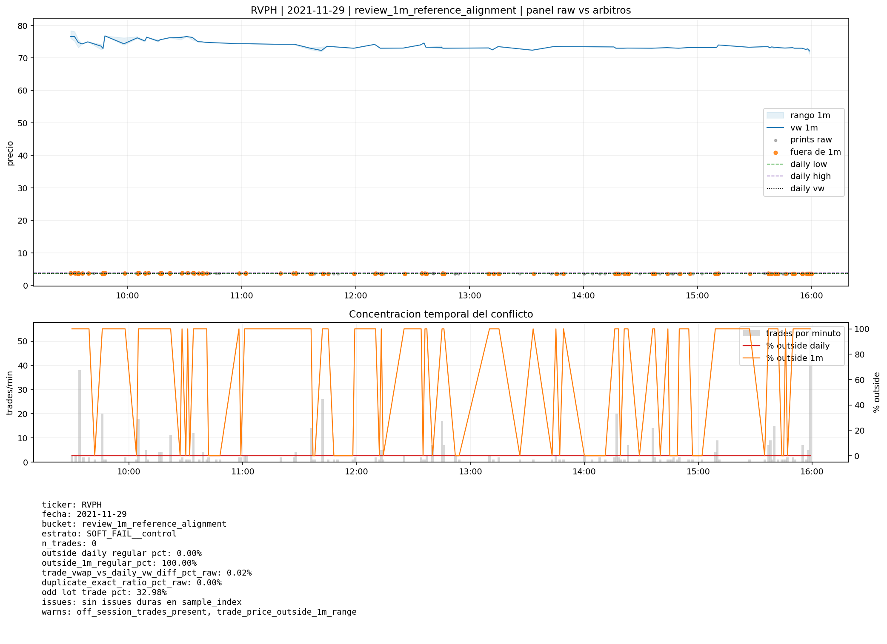

**Que muestra**

- Panel rico del tape raw frente a `daily` y `1m` para `RVPH` el `2021-11-29`.
- `n_trades = 473`, `outside_daily_regular_pct = 0.00%`, `outside_1m_regular_pct = 100.00%`.
- `trade_vwap_vs_daily_vw_diff_pct_raw = 0.02%`, `duplicate_exact_ratio_pct_raw = 0.00%`, `odd_lot_trade_pct = 32.98%`.

**Responde**

- Familia donde `1m` cambia la verdad del caso. Responde a la pregunta de si una vista mas fina destruye una aparente normalidad vista desde `daily`.
- Responde a si el conflicto dominante vive en la escala (`~1x`), en la comparabilidad frente a `daily` (0.00%) o frente a `1m` (100.00%).
- El 32.98% de odd-lots empuja la lectura hacia microestructura fina; evita leer el caso como pura ruptura economica gruesa.
- La decision que justifica es mantener o no el caso en `recoverable_with_flag` cuando se rematerialice la rehabilitacion sobre `57f`.

### RVPH | 2022-08-22

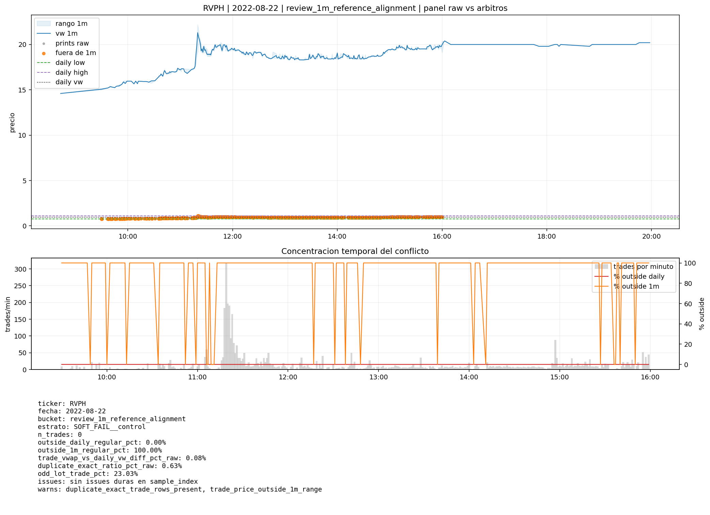

**Que muestra**

- Panel rico del tape raw frente a `daily` y `1m` para `RVPH` el `2022-08-22`.
- `n_trades = 4,780`, `outside_daily_regular_pct = 0.00%`, `outside_1m_regular_pct = 100.00%`.
- `trade_vwap_vs_daily_vw_diff_pct_raw = 0.08%`, `duplicate_exact_ratio_pct_raw = 0.63%`, `odd_lot_trade_pct = 23.03%`.

**Responde**

- Familia donde `1m` cambia la verdad del caso. Responde a la pregunta de si una vista mas fina destruye una aparente normalidad vista desde `daily`.
- Responde a si el conflicto dominante vive en la escala (`~1x`), en la comparabilidad frente a `daily` (0.00%) o frente a `1m` (100.00%).
- La decision que justifica es mantener o no el caso en `recoverable_with_flag` cuando se rematerialice la rehabilitacion sobre `57f`.

### RVPH | 2023-12-26

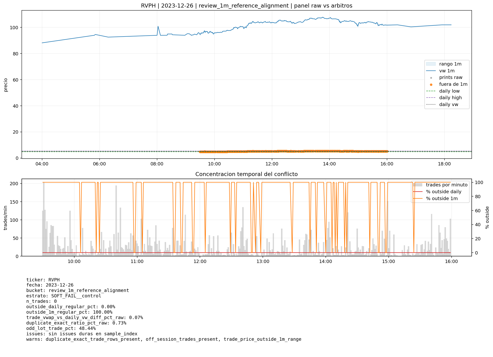

**Que muestra**

- Panel rico del tape raw frente a `daily` y `1m` para `RVPH` el `2023-12-26`.
- `n_trades = 9,217`, `outside_daily_regular_pct = 0.00%`, `outside_1m_regular_pct = 100.00%`.
- `trade_vwap_vs_daily_vw_diff_pct_raw = 0.07%`, `duplicate_exact_ratio_pct_raw = 0.73%`, `odd_lot_trade_pct = 48.44%`.

**Responde**

- Familia donde `1m` cambia la verdad del caso. Responde a la pregunta de si una vista mas fina destruye una aparente normalidad vista desde `daily`.
- Responde a si el conflicto dominante vive en la escala (`~1x`), en la comparabilidad frente a `daily` (0.00%) o frente a `1m` (100.00%).
- El 48.44% de odd-lots empuja la lectura hacia microestructura fina; evita leer el caso como pura ruptura economica gruesa.
- La decision que justifica es mantener o no el caso en `recoverable_with_flag` cuando se rematerialice la rehabilitacion sobre `57f`.

### RVPH | 2024-08-22

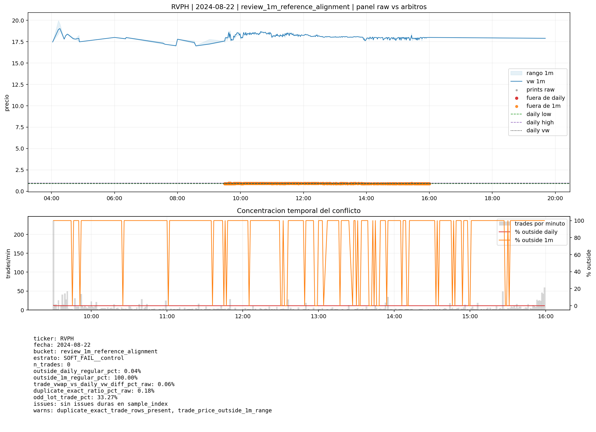

**Que muestra**

- Panel rico del tape raw frente a `daily` y `1m` para `RVPH` el `2024-08-22`.
- `n_trades = 2,272`, `outside_daily_regular_pct = 0.04%`, `outside_1m_regular_pct = 100.00%`.
- `trade_vwap_vs_daily_vw_diff_pct_raw = 0.06%`, `duplicate_exact_ratio_pct_raw = 0.18%`, `odd_lot_trade_pct = 33.27%`.

**Responde**

- Familia donde `1m` cambia la verdad del caso. Responde a la pregunta de si una vista mas fina destruye una aparente normalidad vista desde `daily`.
- Responde a si el conflicto dominante vive en la escala (`~1x`), en la comparabilidad frente a `daily` (0.04%) o frente a `1m` (100.00%).
- El 33.27% de odd-lots empuja la lectura hacia microestructura fina; evita leer el caso como pura ruptura economica gruesa.
- La decision que justifica es mantener o no el caso en `recoverable_with_flag` cuando se rematerialice la rehabilitacion sobre `57f`.

### RVPH | 2025-03-10

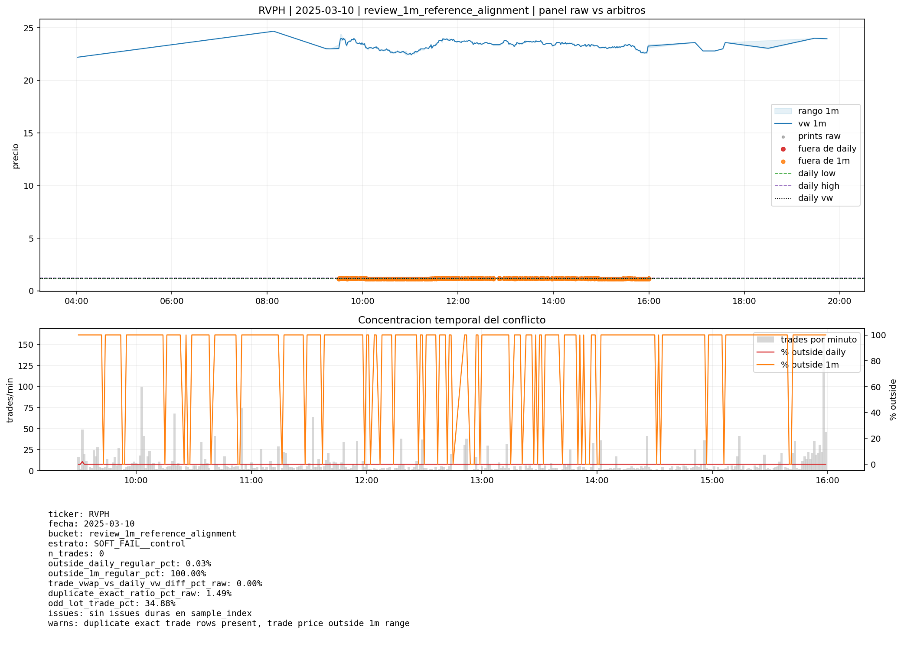

**Que muestra**

- Panel rico del tape raw frente a `daily` y `1m` para `RVPH` el `2025-03-10`.
- `n_trades = 3,096`, `outside_daily_regular_pct = 0.03%`, `outside_1m_regular_pct = 100.00%`.
- `trade_vwap_vs_daily_vw_diff_pct_raw = 0.00%`, `duplicate_exact_ratio_pct_raw = 1.49%`, `odd_lot_trade_pct = 34.88%`.

**Responde**

- Familia donde `1m` cambia la verdad del caso. Responde a la pregunta de si una vista mas fina destruye una aparente normalidad vista desde `daily`.
- Responde a si el conflicto dominante vive en la escala (`~1x`), en la comparabilidad frente a `daily` (0.03%) o frente a `1m` (100.00%).
- El 34.88% de odd-lots empuja la lectura hacia microestructura fina; evita leer el caso como pura ruptura economica gruesa.
- La decision que justifica es mantener o no el caso en `recoverable_with_flag` cuando se rematerialice la rehabilitacion sobre `57f`.

### RVPH | 2025-06-23

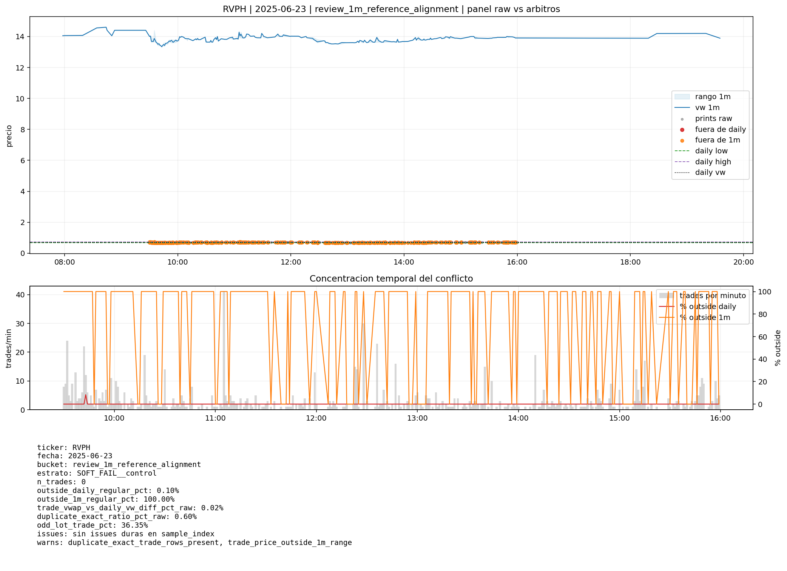

**Que muestra**

- Panel rico del tape raw frente a `daily` y `1m` para `RVPH` el `2025-06-23`.
- `n_trades = 1,004`, `outside_daily_regular_pct = 0.10%`, `outside_1m_regular_pct = 100.00%`.
- `trade_vwap_vs_daily_vw_diff_pct_raw = 0.02%`, `duplicate_exact_ratio_pct_raw = 0.60%`, `odd_lot_trade_pct = 36.35%`.

**Responde**

- Familia donde `1m` cambia la verdad del caso. Responde a la pregunta de si una vista mas fina destruye una aparente normalidad vista desde `daily`.
- Responde a si el conflicto dominante vive en la escala (`~1x`), en la comparabilidad frente a `daily` (0.10%) o frente a `1m` (100.00%).
- El 36.35% de odd-lots empuja la lectura hacia microestructura fina; evita leer el caso como pura ruptura economica gruesa.
- La decision que justifica es mantener o no el caso en `recoverable_with_flag` cuando se rematerialice la rehabilitacion sobre `57f`.

### RVPH | 2026-02-17

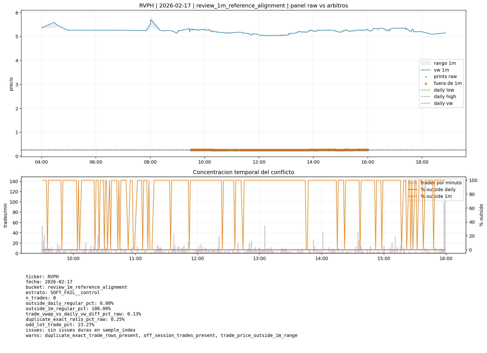

**Que muestra**

- Panel rico del tape raw frente a `daily` y `1m` para `RVPH` el `2026-02-17`.
- `n_trades = 2,411`, `outside_daily_regular_pct = 0.00%`, `outside_1m_regular_pct = 100.00%`.
- `trade_vwap_vs_daily_vw_diff_pct_raw = 0.13%`, `duplicate_exact_ratio_pct_raw = 0.25%`, `odd_lot_trade_pct = 23.27%`.

**Responde**

- Familia donde `1m` cambia la verdad del caso. Responde a la pregunta de si una vista mas fina destruye una aparente normalidad vista desde `daily`.
- Responde a si el conflicto dominante vive en la escala (`~1x`), en la comparabilidad frente a `daily` (0.00%) o frente a `1m` (100.00%).
- La decision que justifica es mantener o no el caso en `recoverable_with_flag` cuando se rematerialice la rehabilitacion sobre `57f`.

### SFE | 2022-11-23

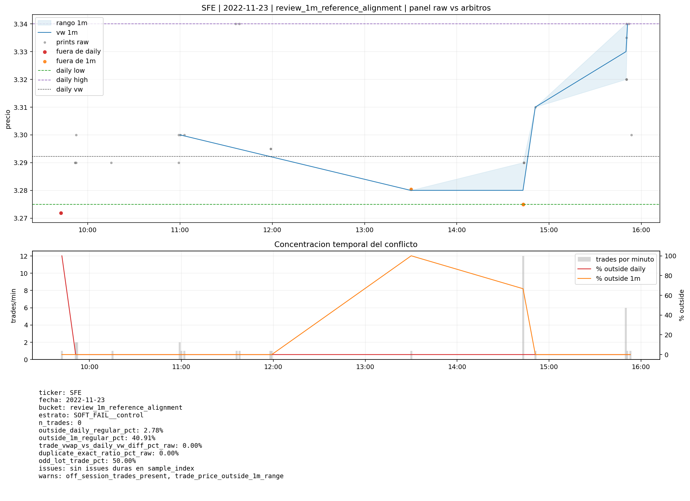

**Que muestra**

- Panel rico del tape raw frente a `daily` y `1m` para `SFE` el `2022-11-23`.
- `n_trades = 36`, `outside_daily_regular_pct = 2.78%`, `outside_1m_regular_pct = 40.91%`.
- `trade_vwap_vs_daily_vw_diff_pct_raw = 0.00%`, `duplicate_exact_ratio_pct_raw = 0.00%`, `odd_lot_trade_pct = 50.00%`.

**Responde**

- Familia donde `1m` cambia la verdad del caso. Responde a la pregunta de si una vista mas fina destruye una aparente normalidad vista desde `daily`.
- Responde a si el conflicto dominante vive en la escala (`~1x`), en la comparabilidad frente a `daily` (2.78%) o frente a `1m` (40.91%).
- El 50.00% de odd-lots empuja la lectura hacia microestructura fina; evita leer el caso como pura ruptura economica gruesa.
- La decision que justifica es mantener o no el caso en `recoverable_with_flag` cuando se rematerialice la rehabilitacion sobre `57f`.

### CLAR | 2019-01-24

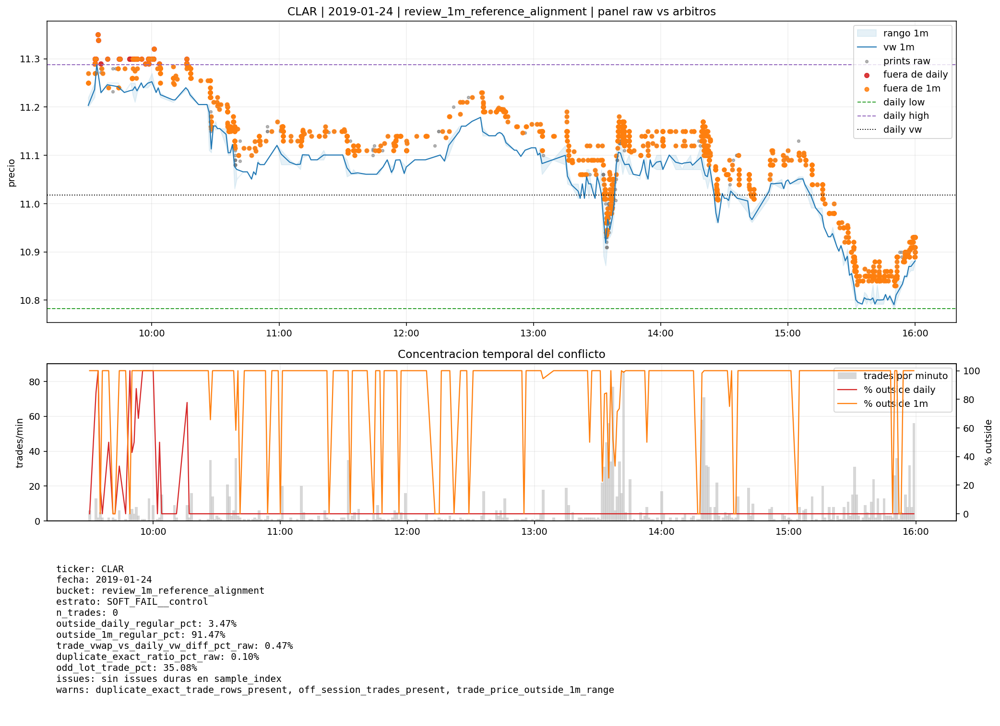

**Que muestra**

- Panel rico del tape raw frente a `daily` y `1m` para `CLAR` el `2019-01-24`.
- `n_trades = 1,933`, `outside_daily_regular_pct = 3.47%`, `outside_1m_regular_pct = 91.47%`.
- `trade_vwap_vs_daily_vw_diff_pct_raw = 0.47%`, `duplicate_exact_ratio_pct_raw = 0.10%`, `odd_lot_trade_pct = 35.08%`.

**Responde**

- Familia donde `1m` cambia la verdad del caso. Responde a la pregunta de si una vista mas fina destruye una aparente normalidad vista desde `daily`.
- Responde a si el conflicto dominante vive en la escala (`~1x`), en la comparabilidad frente a `daily` (3.47%) o frente a `1m` (91.47%).
- El 35.08% de odd-lots empuja la lectura hacia microestructura fina; evita leer el caso como pura ruptura economica gruesa.
- La decision que justifica es mantener o no el caso en `recoverable_with_flag` cuando se rematerialice la rehabilitacion sobre `57f`.

### CLAR | 2019-07-01

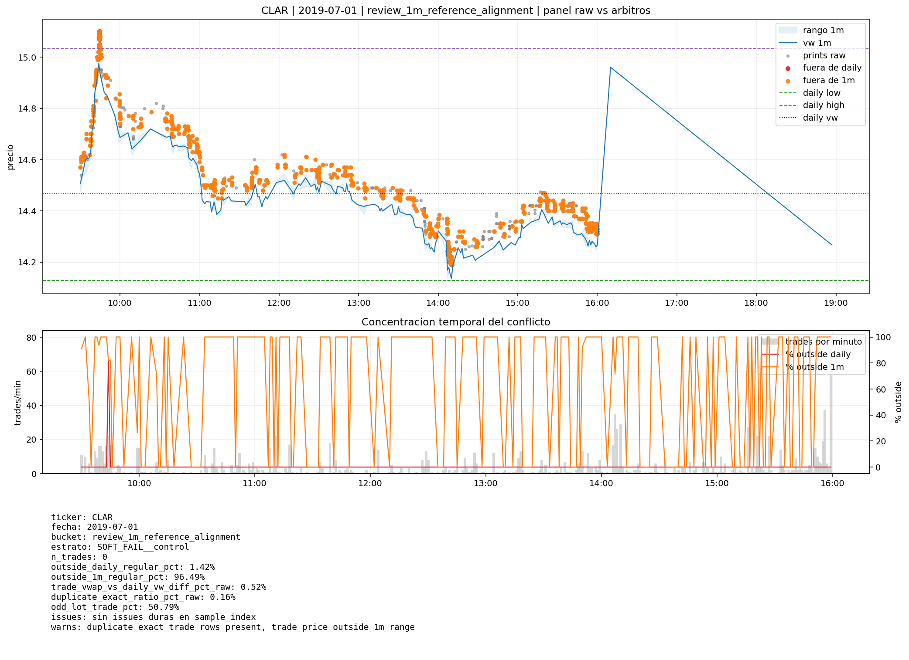

**Que muestra**

- Panel rico del tape raw frente a `daily` y `1m` para `CLAR` el `2019-07-01`.
- `n_trades = 1,268`, `outside_daily_regular_pct = 1.42%`, `outside_1m_regular_pct = 96.49%`.
- `trade_vwap_vs_daily_vw_diff_pct_raw = 0.52%`, `duplicate_exact_ratio_pct_raw = 0.16%`, `odd_lot_trade_pct = 50.79%`.

**Responde**

- Familia donde `1m` cambia la verdad del caso. Responde a la pregunta de si una vista mas fina destruye una aparente normalidad vista desde `daily`.
- Responde a si el conflicto dominante vive en la escala (`~1x`), en la comparabilidad frente a `daily` (1.42%) o frente a `1m` (96.49%).
- El 50.79% de odd-lots empuja la lectura hacia microestructura fina; evita leer el caso como pura ruptura economica gruesa.
- La decision que justifica es mantener o no el caso en `recoverable_with_flag` cuando se rematerialice la rehabilitacion sobre `57f`.

### GPRK | 2019-11-29

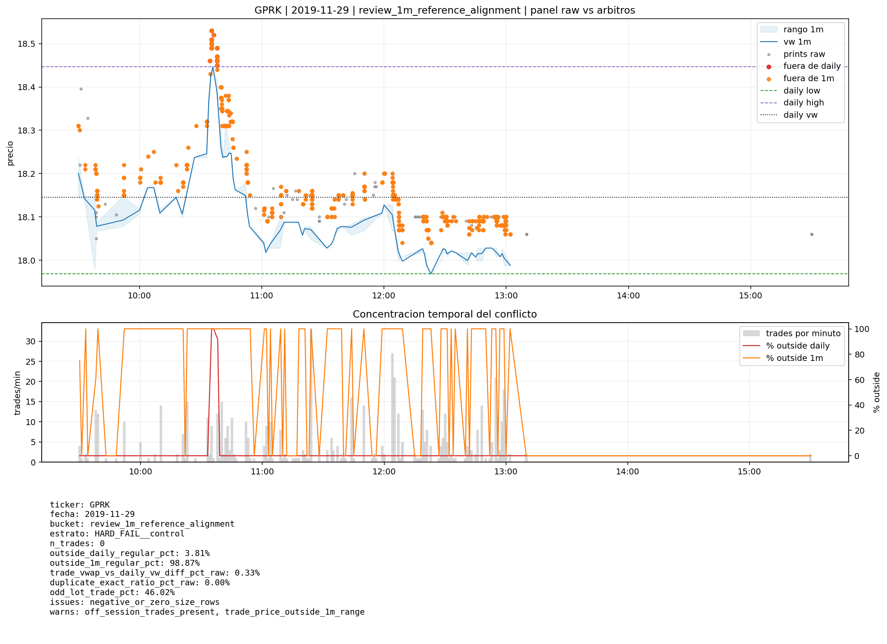

**Que muestra**

- Panel rico del tape raw frente a `daily` y `1m` para `GPRK` el `2019-11-29`.
- `n_trades = 578`, `outside_daily_regular_pct = 3.81%`, `outside_1m_regular_pct = 98.87%`.
- `trade_vwap_vs_daily_vw_diff_pct_raw = 0.33%`, `duplicate_exact_ratio_pct_raw = 0.00%`, `odd_lot_trade_pct = 46.02%`.

**Responde**

- Familia donde `1m` cambia la verdad del caso. Responde a la pregunta de si una vista mas fina destruye una aparente normalidad vista desde `daily`.
- Responde a si el conflicto dominante vive en la escala (`~1x`), en la comparabilidad frente a `daily` (3.81%) o frente a `1m` (98.87%).
- El 46.02% de odd-lots empuja la lectura hacia microestructura fina; evita leer el caso como pura ruptura economica gruesa.
- La decision que justifica es mantener o no el caso en `recoverable_with_flag` cuando se rematerialice la rehabilitacion sobre `57f`.

### RELV | 2019-06-10

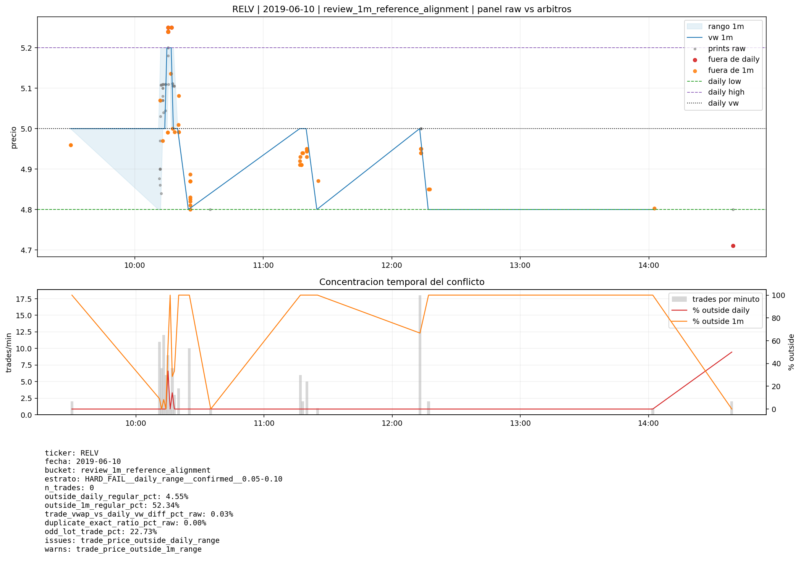

**Que muestra**

- Panel rico del tape raw frente a `daily` y `1m` para `RELV` el `2019-06-10`.
- `n_trades = 110`, `outside_daily_regular_pct = 4.55%`, `outside_1m_regular_pct = 52.34%`.
- `trade_vwap_vs_daily_vw_diff_pct_raw = 0.03%`, `duplicate_exact_ratio_pct_raw = 0.00%`, `odd_lot_trade_pct = 22.73%`.

**Responde**

- Familia donde `1m` cambia la verdad del caso. Responde a la pregunta de si una vista mas fina destruye una aparente normalidad vista desde `daily`.
- Responde a si el conflicto dominante vive en la escala (`~1x`), en la comparabilidad frente a `daily` (4.55%) o frente a `1m` (52.34%).
- La decision que justifica es mantener o no el caso en `recoverable_with_flag` cuando se rematerialice la rehabilitacion sobre `57f`.

# Trades Review Microstructure | muestra estratificada

Documento fuente: `inspection_dossiers/trades/family_case_evidence_packs/review_microstructure/review_microstructure_cases_v0_1.md`

## Rol

Este dossier documenta `60` casos de la muestra base del cierre real `57f/full_clean_fast_same_schema` para la familia `review_microstructure`.

No son ejemplos elegidos a dedo. Proceden del manifest estratificado reproducible materializado para el inspector.

## Que significa esta familia

Familia donde el dano vive en la textura fina del flujo: odd-lots, duplicados, bursts por timestamp o comparabilidad intraminuto. Responde a la pregunta de si el tape es economicamente interpretable pero metodologicamente delicado.

## Responde

- si el dano dominante vive en odd-lots, duplicados o textura fina del tape
- si el flujo sigue siendo interpretable con flag segun uso

## No responde

- si el caso es valido como referencia economica limpia
- si basta una normalizacion de escala para resolverlo

## Consecuencia

- permitir usos microestructurales con flag
- impedir consumo ingenuo como tape pristine

## Casos

### MLAB | 2015-04-17

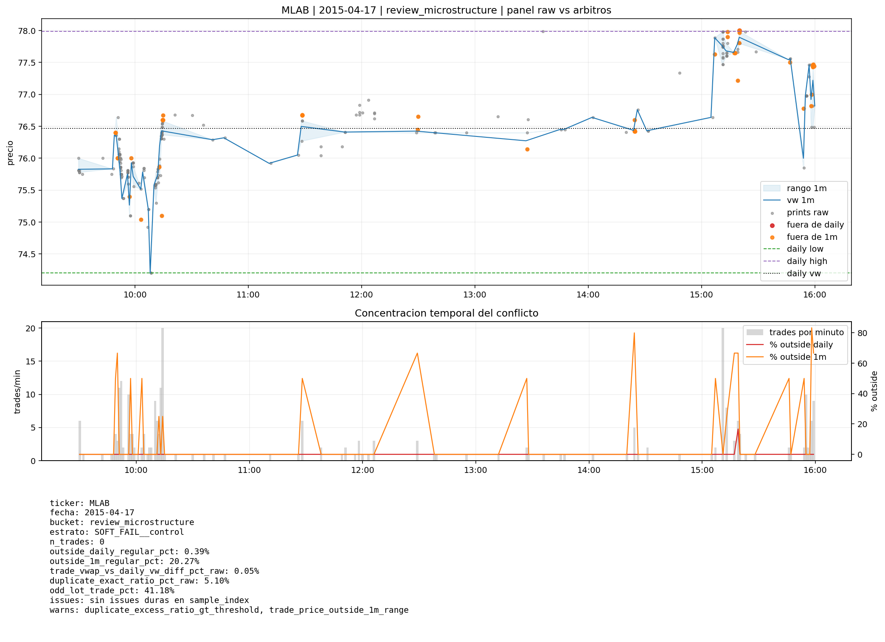

**Que muestra**

- Panel rico del tape raw frente a `daily` y `1m` para `MLAB` el `2015-04-17`.
- `n_trades = 255`, `outside_daily_regular_pct = 0.39%`, `outside_1m_regular_pct = 20.27%`.
- `trade_vwap_vs_daily_vw_diff_pct_raw = 0.05%`, `duplicate_exact_ratio_pct_raw = 5.10%`, `odd_lot_trade_pct = 41.18%`.

**Responde**

- Familia donde el dano vive en la textura fina del flujo: odd-lots, duplicados, bursts por timestamp o comparabilidad intraminuto. Responde a la pregunta de si el tape es economicamente interpretable pero metodologicamente delicado.
- Responde a si el conflicto dominante vive en la escala (`~1x`), en la comparabilidad frente a `daily` (0.39%) o frente a `1m` (20.27%).
- El 41.18% de odd-lots empuja la lectura hacia microestructura fina; evita leer el caso como pura ruptura economica gruesa.
- El 5.10% de duplicacion exacta obliga a sospechar dano de tape o bursts mecanicos, no solo ruido visual.
- La decision que justifica es mantener o no el caso en `recoverable_with_flag` cuando se rematerialice la rehabilitacion sobre `57f`.

### GBLI | 2016-04-04

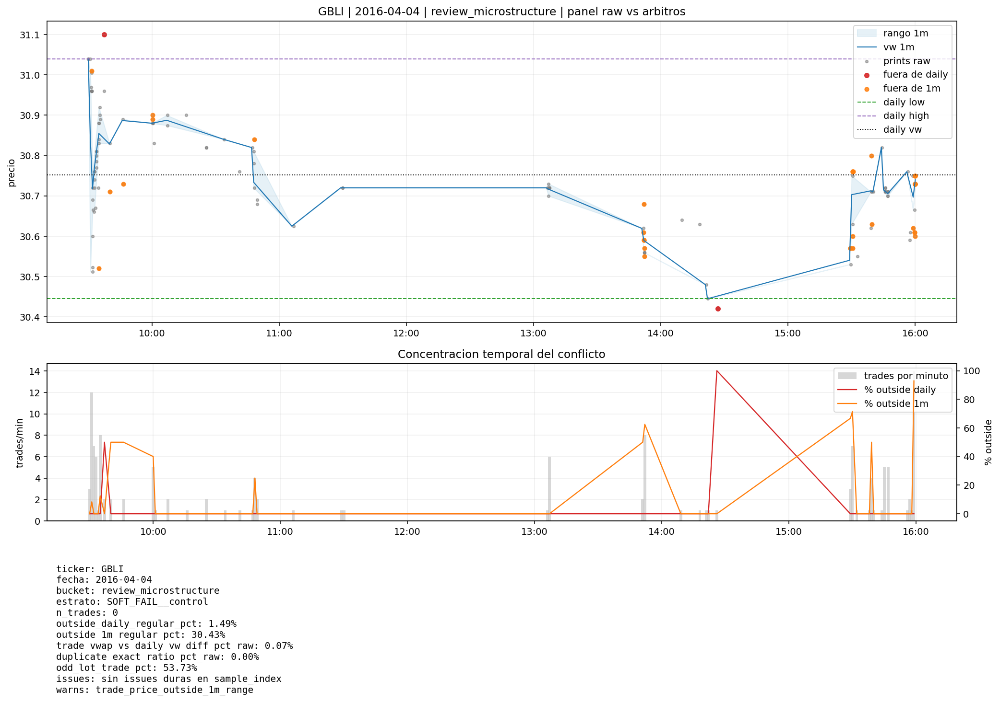

**Que muestra**

- Panel rico del tape raw frente a `daily` y `1m` para `GBLI` el `2016-04-04`.
- `n_trades = 134`, `outside_daily_regular_pct = 1.49%`, `outside_1m_regular_pct = 30.43%`.
- `trade_vwap_vs_daily_vw_diff_pct_raw = 0.07%`, `duplicate_exact_ratio_pct_raw = 0.00%`, `odd_lot_trade_pct = 53.73%`.

**Responde**

- Familia donde el dano vive en la textura fina del flujo: odd-lots, duplicados, bursts por timestamp o comparabilidad intraminuto. Responde a la pregunta de si el tape es economicamente interpretable pero metodologicamente delicado.
- Responde a si el conflicto dominante vive en la escala (`~1x`), en la comparabilidad frente a `daily` (1.49%) o frente a `1m` (30.43%).
- El 53.73% de odd-lots empuja la lectura hacia microestructura fina; evita leer el caso como pura ruptura economica gruesa.
- La decision que justifica es mantener o no el caso en `recoverable_with_flag` cuando se rematerialice la rehabilitacion sobre `57f`.

### BSET | 2018-05-16

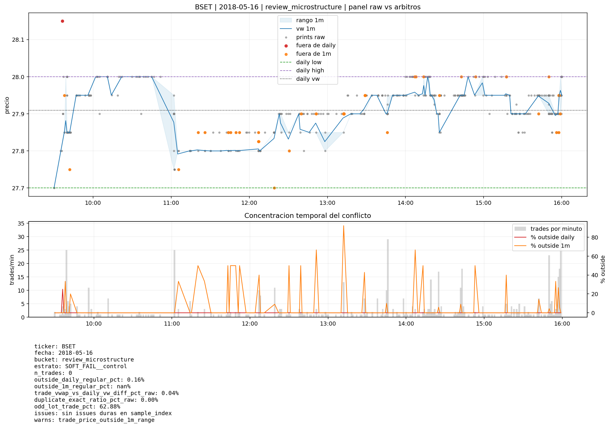

**Que muestra**

- Panel rico del tape raw frente a `daily` y `1m` para `BSET` el `2018-05-16`.
- `n_trades = 625`, `outside_daily_regular_pct = 0.16%`, `outside_1m_regular_pct = nan%`.
- `trade_vwap_vs_daily_vw_diff_pct_raw = 0.04%`, `duplicate_exact_ratio_pct_raw = 0.00%`, `odd_lot_trade_pct = 62.88%`.

**Responde**

- Familia donde el dano vive en la textura fina del flujo: odd-lots, duplicados, bursts por timestamp o comparabilidad intraminuto. Responde a la pregunta de si el tape es economicamente interpretable pero metodologicamente delicado.
- Responde a si el conflicto dominante vive en la escala (`~1x`), en la comparabilidad frente a `daily` (0.16%) o frente a `1m` (nan%).
- El 62.88% de odd-lots empuja la lectura hacia microestructura fina; evita leer el caso como pura ruptura economica gruesa.
- La decision que justifica es mantener o no el caso en `recoverable_with_flag` cuando se rematerialice la rehabilitacion sobre `57f`.

### NC | 2015-11-03

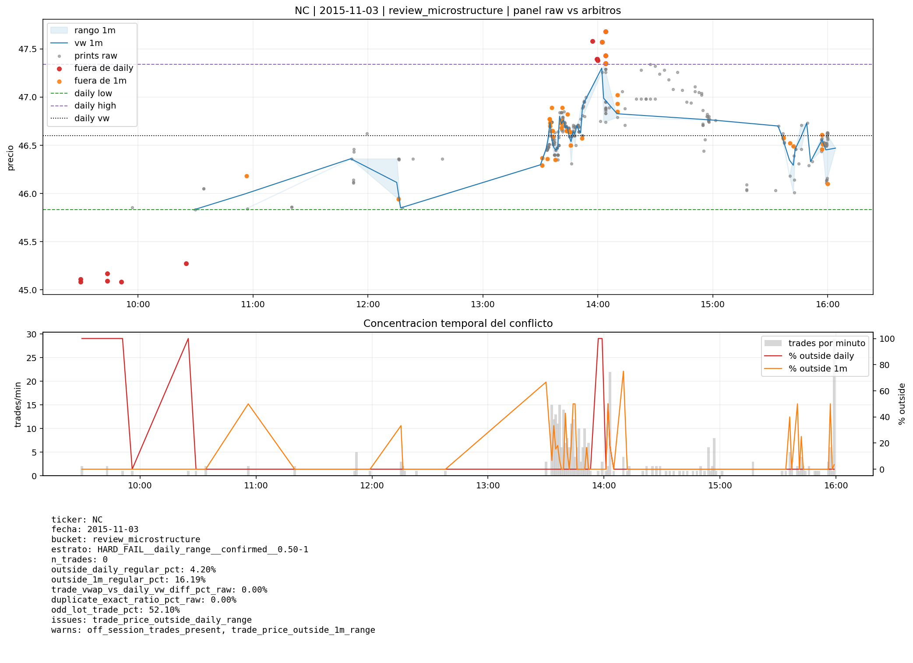

**Que muestra**

- Panel rico del tape raw frente a `daily` y `1m` para `NC` el `2015-11-03`.
- `n_trades = 357`, `outside_daily_regular_pct = 4.20%`, `outside_1m_regular_pct = 16.19%`.
- `trade_vwap_vs_daily_vw_diff_pct_raw = 0.00%`, `duplicate_exact_ratio_pct_raw = 0.00%`, `odd_lot_trade_pct = 52.10%`.

**Responde**

- Familia donde el dano vive en la textura fina del flujo: odd-lots, duplicados, bursts por timestamp o comparabilidad intraminuto. Responde a la pregunta de si el tape es economicamente interpretable pero metodologicamente delicado.
- Responde a si el conflicto dominante vive en la escala (`~1x`), en la comparabilidad frente a `daily` (4.20%) o frente a `1m` (16.19%).
- El 52.10% de odd-lots empuja la lectura hacia microestructura fina; evita leer el caso como pura ruptura economica gruesa.
- La decision que justifica es mantener o no el caso en `recoverable_with_flag` cuando se rematerialice la rehabilitacion sobre `57f`.

### WTBA | 2015-09-30

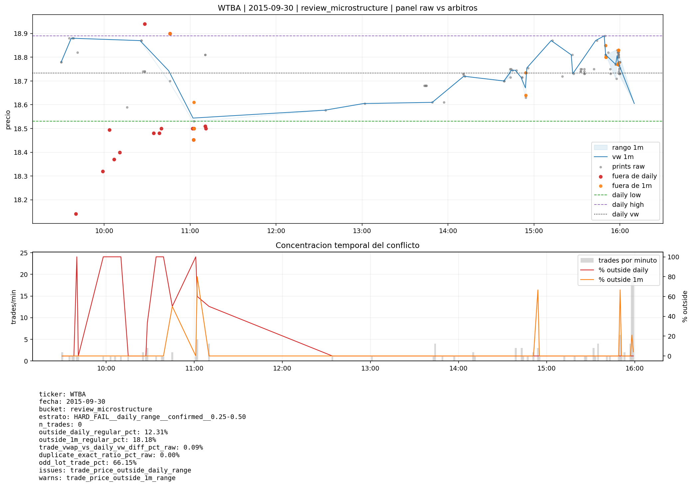

**Que muestra**

- Panel rico del tape raw frente a `daily` y `1m` para `WTBA` el `2015-09-30`.
- `n_trades = 130`, `outside_daily_regular_pct = 12.31%`, `outside_1m_regular_pct = 18.18%`.
- `trade_vwap_vs_daily_vw_diff_pct_raw = 0.09%`, `duplicate_exact_ratio_pct_raw = 0.00%`, `odd_lot_trade_pct = 66.15%`.

**Responde**

- Familia donde el dano vive en la textura fina del flujo: odd-lots, duplicados, bursts por timestamp o comparabilidad intraminuto. Responde a la pregunta de si el tape es economicamente interpretable pero metodologicamente delicado.
- Responde a si el conflicto dominante vive en la escala (`~1x`), en la comparabilidad frente a `daily` (12.31%) o frente a `1m` (18.18%).
- El 66.15% de odd-lots empuja la lectura hacia microestructura fina; evita leer el caso como pura ruptura economica gruesa.
- La decision que justifica es mantener o no el caso en `recoverable_with_flag` cuando se rematerialice la rehabilitacion sobre `57f`.

### EML | 2017-07-21

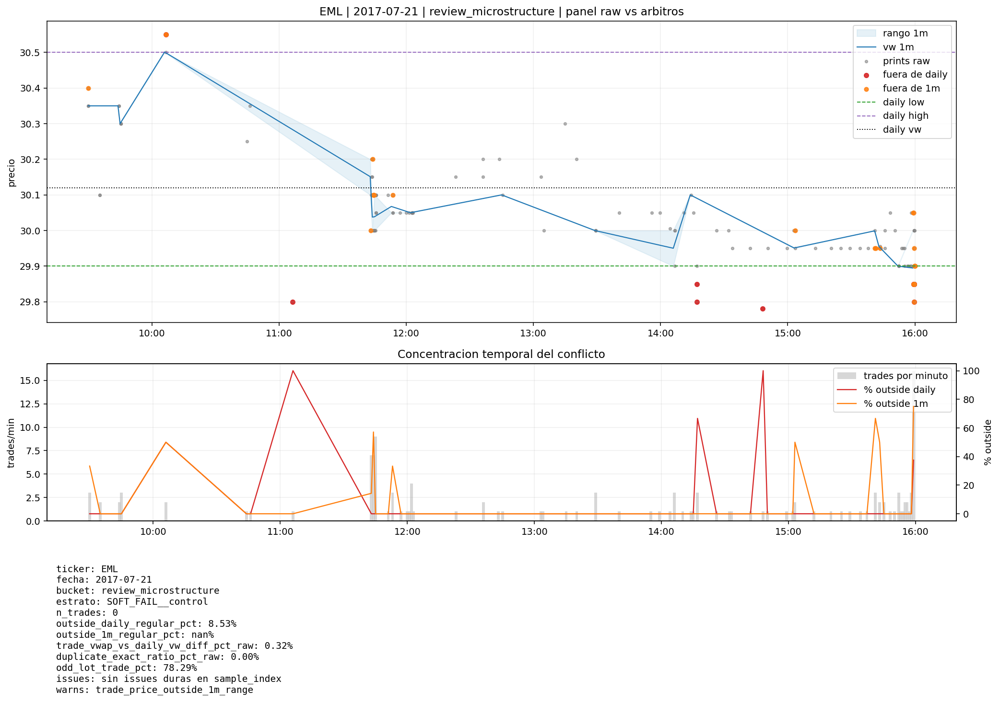

**Que muestra**

- Panel rico del tape raw frente a `daily` y `1m` para `EML` el `2017-07-21`.
- `n_trades = 129`, `outside_daily_regular_pct = 8.53%`, `outside_1m_regular_pct = nan%`.
- `trade_vwap_vs_daily_vw_diff_pct_raw = 0.32%`, `duplicate_exact_ratio_pct_raw = 0.00%`, `odd_lot_trade_pct = 78.29%`.

**Responde**

- Familia donde el dano vive en la textura fina del flujo: odd-lots, duplicados, bursts por timestamp o comparabilidad intraminuto. Responde a la pregunta de si el tape es economicamente interpretable pero metodologicamente delicado.
- Responde a si el conflicto dominante vive en la escala (`~1x`), en la comparabilidad frente a `daily` (8.53%) o frente a `1m` (nan%).
- El 78.29% de odd-lots empuja la lectura hacia microestructura fina; evita leer el caso como pura ruptura economica gruesa.
- La decision que justifica es mantener o no el caso en `recoverable_with_flag` cuando se rematerialice la rehabilitacion sobre `57f`.

### NVEC | 2017-11-21

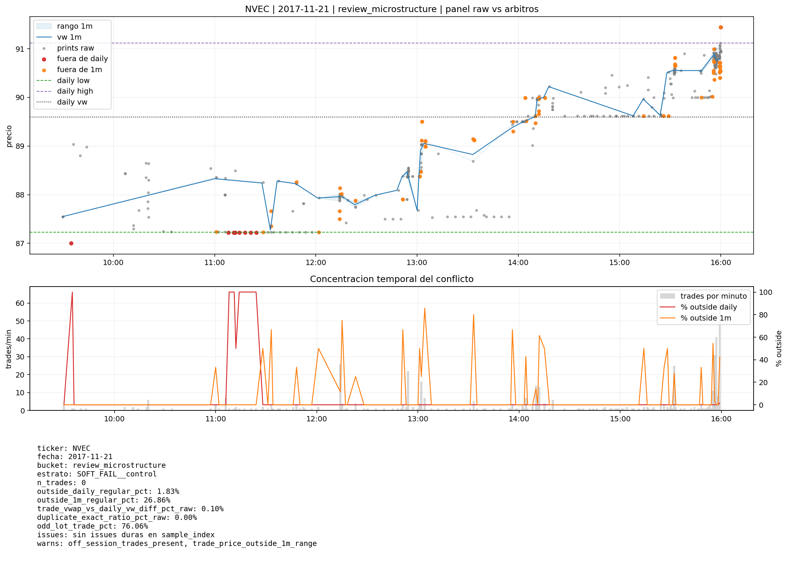

**Que muestra**

- Panel rico del tape raw frente a `daily` y `1m` para `NVEC` el `2017-11-21`.
- `n_trades = 493`, `outside_daily_regular_pct = 1.83%`, `outside_1m_regular_pct = 26.86%`.
- `trade_vwap_vs_daily_vw_diff_pct_raw = 0.10%`, `duplicate_exact_ratio_pct_raw = 0.00%`, `odd_lot_trade_pct = 76.06%`.

**Responde**

- Familia donde el dano vive en la textura fina del flujo: odd-lots, duplicados, bursts por timestamp o comparabilidad intraminuto. Responde a la pregunta de si el tape es economicamente interpretable pero metodologicamente delicado.
- Responde a si el conflicto dominante vive en la escala (`~1x`), en la comparabilidad frente a `daily` (1.83%) o frente a `1m` (26.86%).
- El 76.06% de odd-lots empuja la lectura hacia microestructura fina; evita leer el caso como pura ruptura economica gruesa.
- La decision que justifica es mantener o no el caso en `recoverable_with_flag` cuando se rematerialice la rehabilitacion sobre `57f`.

### TKAT | 2021-05-24

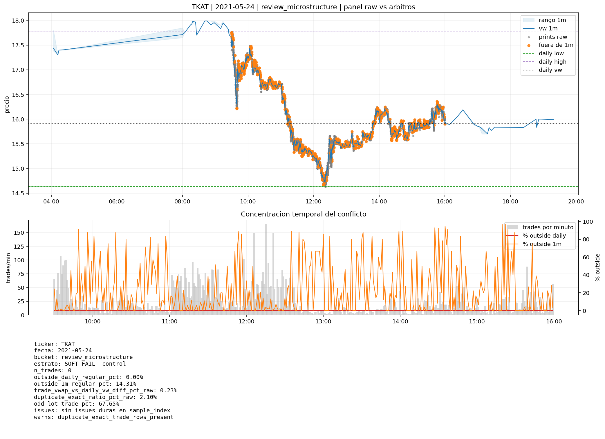

**Que muestra**

- Panel rico del tape raw frente a `daily` y `1m` para `TKAT` el `2021-05-24`.
- `n_trades = 9,223`, `outside_daily_regular_pct = 0.00%`, `outside_1m_regular_pct = 14.31%`.
- `trade_vwap_vs_daily_vw_diff_pct_raw = 0.23%`, `duplicate_exact_ratio_pct_raw = 2.10%`, `odd_lot_trade_pct = 67.65%`.

**Responde**

- Familia donde el dano vive en la textura fina del flujo: odd-lots, duplicados, bursts por timestamp o comparabilidad intraminuto. Responde a la pregunta de si el tape es economicamente interpretable pero metodologicamente delicado.
- Responde a si el conflicto dominante vive en la escala (`~1x`), en la comparabilidad frente a `daily` (0.00%) o frente a `1m` (14.31%).
- El 67.65% de odd-lots empuja la lectura hacia microestructura fina; evita leer el caso como pura ruptura economica gruesa.
- La decision que justifica es mantener o no el caso en `recoverable_with_flag` cuando se rematerialice la rehabilitacion sobre `57f`.

### GLTA | 2023-02-14

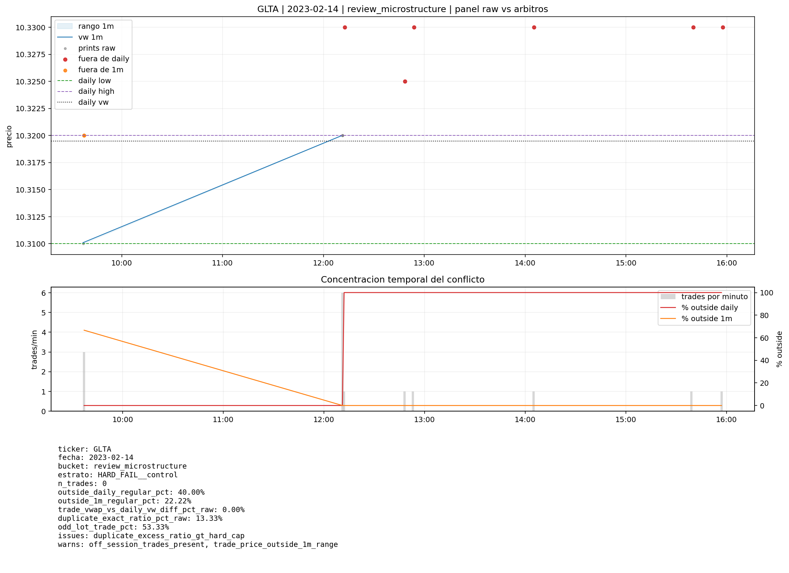

**Que muestra**

- Panel rico del tape raw frente a `daily` y `1m` para `GLTA` el `2023-02-14`.
- `n_trades = 15`, `outside_daily_regular_pct = 40.00%`, `outside_1m_regular_pct = 22.22%`.
- `trade_vwap_vs_daily_vw_diff_pct_raw = 0.00%`, `duplicate_exact_ratio_pct_raw = 13.33%`, `odd_lot_trade_pct = 53.33%`.

**Responde**

- Familia donde el dano vive en la textura fina del flujo: odd-lots, duplicados, bursts por timestamp o comparabilidad intraminuto. Responde a la pregunta de si el tape es economicamente interpretable pero metodologicamente delicado.
- Responde a si el conflicto dominante vive en la escala (`~1x`), en la comparabilidad frente a `daily` (40.00%) o frente a `1m` (22.22%).
- El 53.33% de odd-lots empuja la lectura hacia microestructura fina; evita leer el caso como pura ruptura economica gruesa.
- El 13.33% de duplicacion exacta obliga a sospechar dano de tape o bursts mecanicos, no solo ruido visual.
- La decision que justifica es mantener o no el caso en `recoverable_with_flag` cuando se rematerialice la rehabilitacion sobre `57f`.

### SGC | 2023-02-16

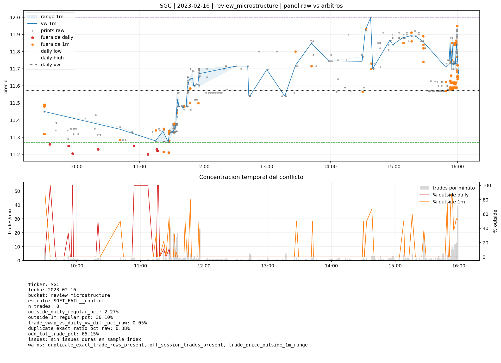

**Que muestra**

- Panel rico del tape raw frente a `daily` y `1m` para `SGC` el `2023-02-16`.
- `n_trades = 528`, `outside_daily_regular_pct = 2.27%`, `outside_1m_regular_pct = 30.10%`.
- `trade_vwap_vs_daily_vw_diff_pct_raw = 0.05%`, `duplicate_exact_ratio_pct_raw = 0.38%`, `odd_lot_trade_pct = 65.15%`.

**Responde**

- Familia donde el dano vive en la textura fina del flujo: odd-lots, duplicados, bursts por timestamp o comparabilidad intraminuto. Responde a la pregunta de si el tape es economicamente interpretable pero metodologicamente delicado.
- Responde a si el conflicto dominante vive en la escala (`~1x`), en la comparabilidad frente a `daily` (2.27%) o frente a `1m` (30.10%).
- El 65.15% de odd-lots empuja la lectura hacia microestructura fina; evita leer el caso como pura ruptura economica gruesa.
- La decision que justifica es mantener o no el caso en `recoverable_with_flag` cuando se rematerialice la rehabilitacion sobre `57f`.

### FXLV | 2023-12-05

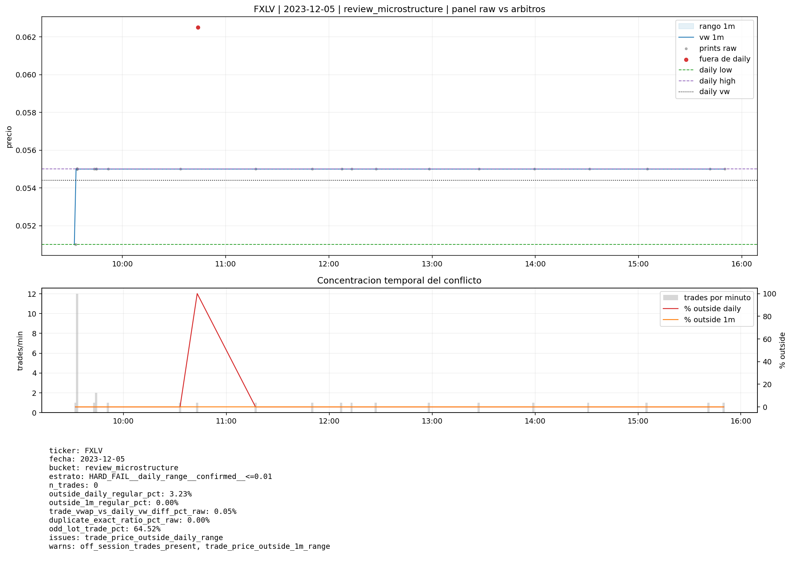

**Que muestra**

- Panel rico del tape raw frente a `daily` y `1m` para `FXLV` el `2023-12-05`.
- `n_trades = 31`, `outside_daily_regular_pct = 3.23%`, `outside_1m_regular_pct = 0.00%`.
- `trade_vwap_vs_daily_vw_diff_pct_raw = 0.05%`, `duplicate_exact_ratio_pct_raw = 0.00%`, `odd_lot_trade_pct = 64.52%`.

**Responde**

- Familia donde el dano vive en la textura fina del flujo: odd-lots, duplicados, bursts por timestamp o comparabilidad intraminuto. Responde a la pregunta de si el tape es economicamente interpretable pero metodologicamente delicado.
- Responde a si el conflicto dominante vive en la escala (`~1x`), en la comparabilidad frente a `daily` (3.23%) o frente a `1m` (0.00%).
- El 64.52% de odd-lots empuja la lectura hacia microestructura fina; evita leer el caso como pura ruptura economica gruesa.
- La decision que justifica es mantener o no el caso en `recoverable_with_flag` cuando se rematerialice la rehabilitacion sobre `57f`.

### GCTS | 2024-10-04

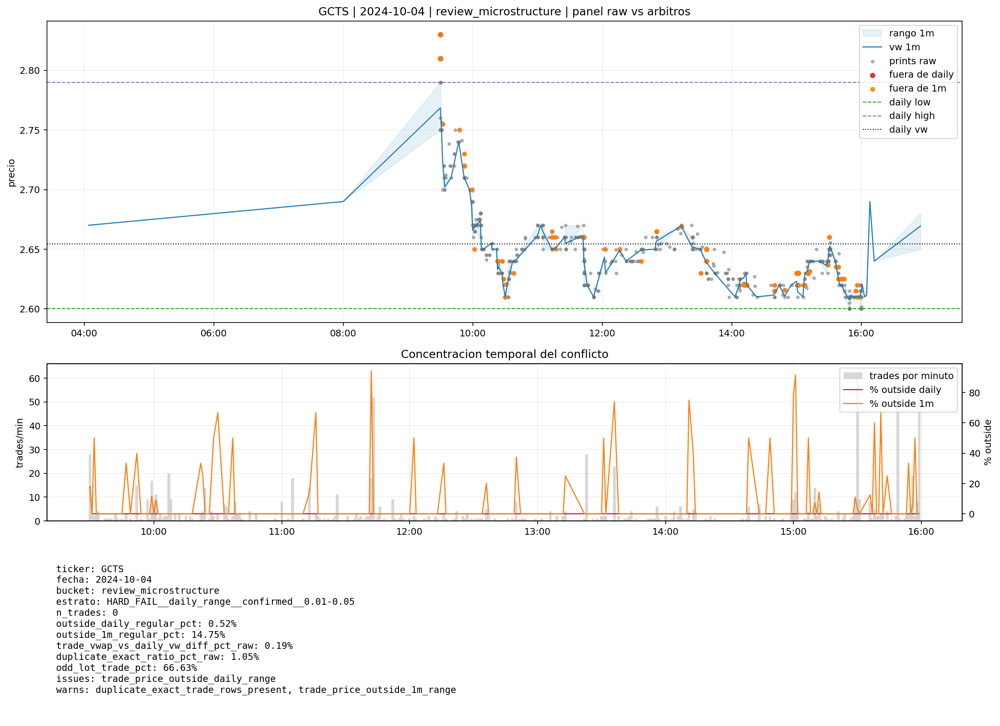

**Que muestra**

- Panel rico del tape raw frente a `daily` y `1m` para `GCTS` el `2024-10-04`.
- `n_trades = 956`, `outside_daily_regular_pct = 0.52%`, `outside_1m_regular_pct = 14.75%`.
- `trade_vwap_vs_daily_vw_diff_pct_raw = 0.19%`, `duplicate_exact_ratio_pct_raw = 1.05%`, `odd_lot_trade_pct = 66.63%`.

**Responde**

- Familia donde el dano vive en la textura fina del flujo: odd-lots, duplicados, bursts por timestamp o comparabilidad intraminuto. Responde a la pregunta de si el tape es economicamente interpretable pero metodologicamente delicado.
- Responde a si el conflicto dominante vive en la escala (`~1x`), en la comparabilidad frente a `daily` (0.52%) o frente a `1m` (14.75%).
- El 66.63% de odd-lots empuja la lectura hacia microestructura fina; evita leer el caso como pura ruptura economica gruesa.
- La decision que justifica es mantener o no el caso en `recoverable_with_flag` cuando se rematerialice la rehabilitacion sobre `57f`.

### GGE | 2023-10-04

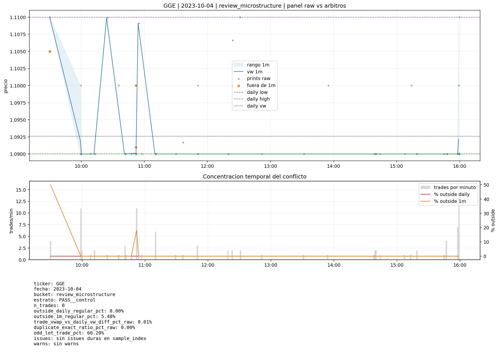

**Que muestra**

- Panel rico del tape raw frente a `daily` y `1m` para `GGE` el `2023-10-04`.
- `n_trades = 98`, `outside_daily_regular_pct = 0.00%`, `outside_1m_regular_pct = 5.48%`.
- `trade_vwap_vs_daily_vw_diff_pct_raw = 0.01%`, `duplicate_exact_ratio_pct_raw = 0.00%`, `odd_lot_trade_pct = 60.20%`.

**Responde**

- Familia donde el dano vive en la textura fina del flujo: odd-lots, duplicados, bursts por timestamp o comparabilidad intraminuto. Responde a la pregunta de si el tape es economicamente interpretable pero metodologicamente delicado.
- Responde a si el conflicto dominante vive en la escala (`~1x`), en la comparabilidad frente a `daily` (0.00%) o frente a `1m` (5.48%).
- El 60.20% de odd-lots empuja la lectura hacia microestructura fina; evita leer el caso como pura ruptura economica gruesa.
- La decision que justifica es mantener o no el caso en `recoverable_with_flag` cuando se rematerialice la rehabilitacion sobre `57f`.

### GNAC | 2021-04-16

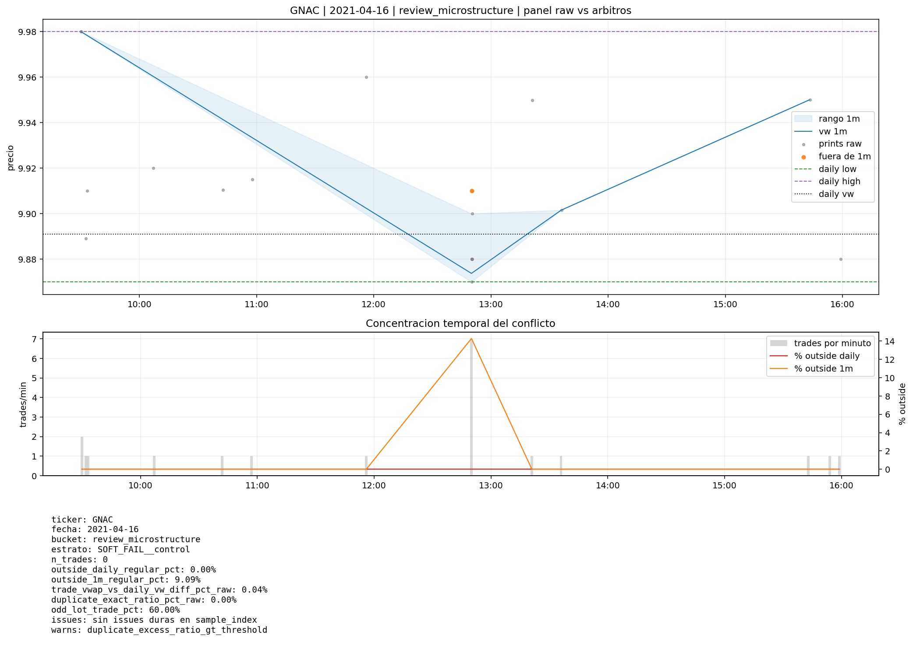

**Que muestra**

- Panel rico del tape raw frente a `daily` y `1m` para `GNAC` el `2021-04-16`.
- `n_trades = 20`, `outside_daily_regular_pct = 0.00%`, `outside_1m_regular_pct = 9.09%`.
- `trade_vwap_vs_daily_vw_diff_pct_raw = 0.04%`, `duplicate_exact_ratio_pct_raw = 0.00%`, `odd_lot_trade_pct = 60.00%`.

**Responde**

- Familia donde el dano vive en la textura fina del flujo: odd-lots, duplicados, bursts por timestamp o comparabilidad intraminuto. Responde a la pregunta de si el tape es economicamente interpretable pero metodologicamente delicado.
- Responde a si el conflicto dominante vive en la escala (`~1x`), en la comparabilidad frente a `daily` (0.00%) o frente a `1m` (9.09%).
- El 60.00% de odd-lots empuja la lectura hacia microestructura fina; evita leer el caso como pura ruptura economica gruesa.
- La decision que justifica es mantener o no el caso en `recoverable_with_flag` cuando se rematerialice la rehabilitacion sobre `57f`.

### IGAC | 2022-04-21

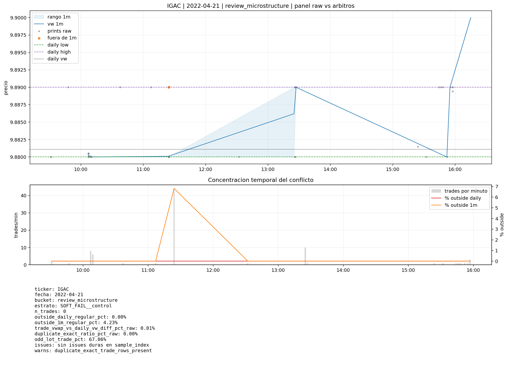

**Que muestra**

- Panel rico del tape raw frente a `daily` y `1m` para `IGAC` el `2022-04-21`.
- `n_trades = 85`, `outside_daily_regular_pct = 0.00%`, `outside_1m_regular_pct = 4.23%`.
- `trade_vwap_vs_daily_vw_diff_pct_raw = 0.01%`, `duplicate_exact_ratio_pct_raw = 0.00%`, `odd_lot_trade_pct = 67.06%`.

**Responde**

- Familia donde el dano vive en la textura fina del flujo: odd-lots, duplicados, bursts por timestamp o comparabilidad intraminuto. Responde a la pregunta de si el tape es economicamente interpretable pero metodologicamente delicado.
- Responde a si el conflicto dominante vive en la escala (`~1x`), en la comparabilidad frente a `daily` (0.00%) o frente a `1m` (4.23%).
- El 67.06% de odd-lots empuja la lectura hacia microestructura fina; evita leer el caso como pura ruptura economica gruesa.
- La decision que justifica es mantener o no el caso en `recoverable_with_flag` cuando se rematerialice la rehabilitacion sobre `57f`.

### PNBK | 2025-07-01

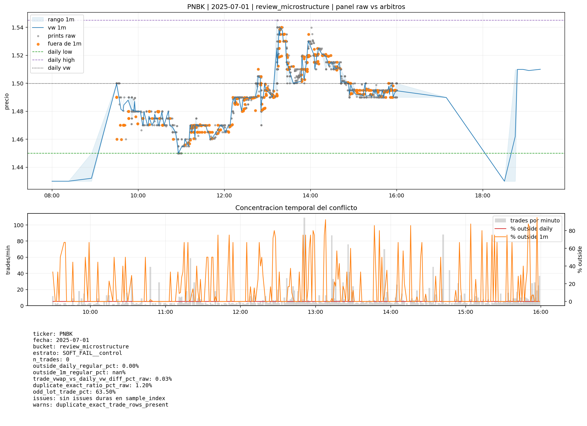

**Que muestra**

- Panel rico del tape raw frente a `daily` y `1m` para `PNBK` el `2025-07-01`.
- `n_trades = 2,833`, `outside_daily_regular_pct = 0.00%`, `outside_1m_regular_pct = nan%`.
- `trade_vwap_vs_daily_vw_diff_pct_raw = 0.03%`, `duplicate_exact_ratio_pct_raw = 1.20%`, `odd_lot_trade_pct = 63.50%`.

**Responde**

- Familia donde el dano vive en la textura fina del flujo: odd-lots, duplicados, bursts por timestamp o comparabilidad intraminuto. Responde a la pregunta de si el tape es economicamente interpretable pero metodologicamente delicado.
- Responde a si el conflicto dominante vive en la escala (`~1x`), en la comparabilidad frente a `daily` (0.00%) o frente a `1m` (nan%).
- El 63.50% de odd-lots empuja la lectura hacia microestructura fina; evita leer el caso como pura ruptura economica gruesa.
- La decision que justifica es mantener o no el caso en `recoverable_with_flag` cuando se rematerialice la rehabilitacion sobre `57f`.

### RDW | 2024-01-29

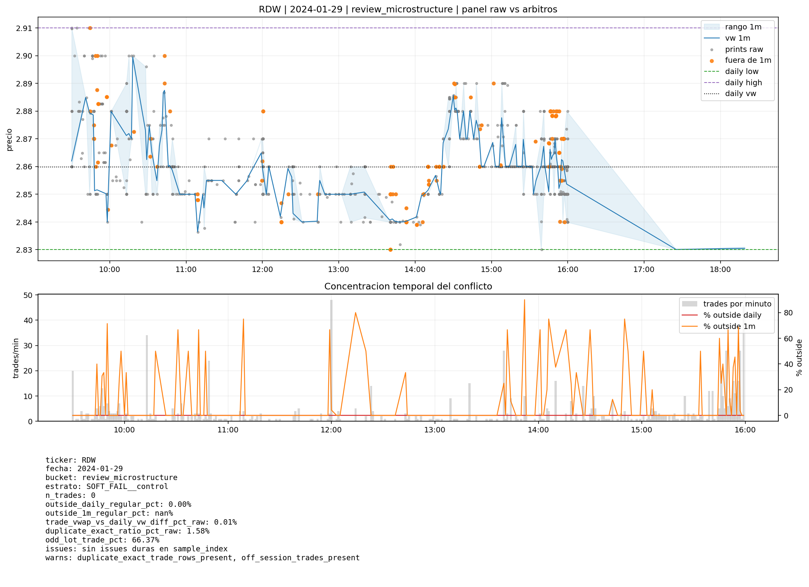

**Que muestra**

- Panel rico del tape raw frente a `daily` y `1m` para `RDW` el `2024-01-29`.
- `n_trades = 886`, `outside_daily_regular_pct = 0.00%`, `outside_1m_regular_pct = nan%`.
- `trade_vwap_vs_daily_vw_diff_pct_raw = 0.01%`, `duplicate_exact_ratio_pct_raw = 1.58%`, `odd_lot_trade_pct = 66.37%`.

**Responde**

- Familia donde el dano vive en la textura fina del flujo: odd-lots, duplicados, bursts por timestamp o comparabilidad intraminuto. Responde a la pregunta de si el tape es economicamente interpretable pero metodologicamente delicado.
- Responde a si el conflicto dominante vive en la escala (`~1x`), en la comparabilidad frente a `daily` (0.00%) o frente a `1m` (nan%).
- El 66.37% de odd-lots empuja la lectura hacia microestructura fina; evita leer el caso como pura ruptura economica gruesa.
- La decision que justifica es mantener o no el caso en `recoverable_with_flag` cuando se rematerialice la rehabilitacion sobre `57f`.

### SCVX | 2022-04-12

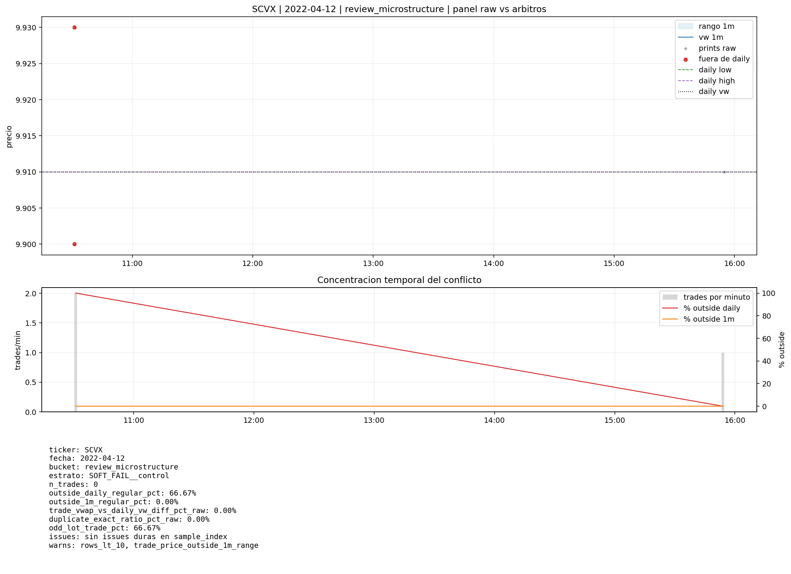

**Que muestra**

- Panel rico del tape raw frente a `daily` y `1m` para `SCVX` el `2022-04-12`.
- `n_trades = 3`, `outside_daily_regular_pct = 66.67%`, `outside_1m_regular_pct = 0.00%`.
- `trade_vwap_vs_daily_vw_diff_pct_raw = 0.00%`, `duplicate_exact_ratio_pct_raw = 0.00%`, `odd_lot_trade_pct = 66.67%`.

**Responde**

- Familia donde el dano vive en la textura fina del flujo: odd-lots, duplicados, bursts por timestamp o comparabilidad intraminuto. Responde a la pregunta de si el tape es economicamente interpretable pero metodologicamente delicado.
- Responde a si el conflicto dominante vive en la escala (`~1x`), en la comparabilidad frente a `daily` (66.67%) o frente a `1m` (0.00%).
- El 66.67% de odd-lots empuja la lectura hacia microestructura fina; evita leer el caso como pura ruptura economica gruesa.
- La decision que justifica es mantener o no el caso en `recoverable_with_flag` cuando se rematerialice la rehabilitacion sobre `57f`.

### SRTS | 2022-04-04

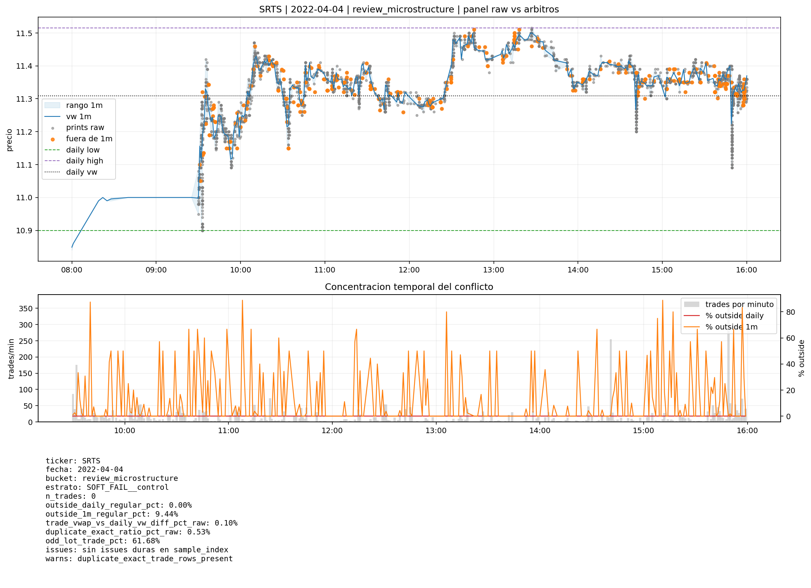

**Que muestra**

- Panel rico del tape raw frente a `daily` y `1m` para `SRTS` el `2022-04-04`.
- `n_trades = 4,679`, `outside_daily_regular_pct = 0.00%`, `outside_1m_regular_pct = 9.44%`.
- `trade_vwap_vs_daily_vw_diff_pct_raw = 0.10%`, `duplicate_exact_ratio_pct_raw = 0.53%`, `odd_lot_trade_pct = 61.68%`.

**Responde**

- Familia donde el dano vive en la textura fina del flujo: odd-lots, duplicados, bursts por timestamp o comparabilidad intraminuto. Responde a la pregunta de si el tape es economicamente interpretable pero metodologicamente delicado.
- Responde a si el conflicto dominante vive en la escala (`~1x`), en la comparabilidad frente a `daily` (0.00%) o frente a `1m` (9.44%).
- El 61.68% de odd-lots empuja la lectura hacia microestructura fina; evita leer el caso como pura ruptura economica gruesa.
- La decision que justifica es mantener o no el caso en `recoverable_with_flag` cuando se rematerialice la rehabilitacion sobre `57f`.

### ATNI | 2020-01-31

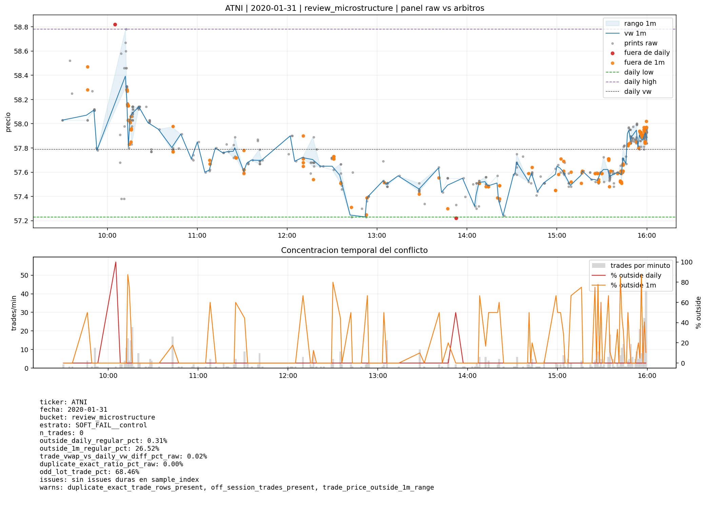

**Que muestra**

- Panel rico del tape raw frente a `daily` y `1m` para `ATNI` el `2020-01-31`.
- `n_trades = 650`, `outside_daily_regular_pct = 0.31%`, `outside_1m_regular_pct = 26.52%`.
- `trade_vwap_vs_daily_vw_diff_pct_raw = 0.02%`, `duplicate_exact_ratio_pct_raw = 0.00%`, `odd_lot_trade_pct = 68.46%`.

**Responde**

- Familia donde el dano vive en la textura fina del flujo: odd-lots, duplicados, bursts por timestamp o comparabilidad intraminuto. Responde a la pregunta de si el tape es economicamente interpretable pero metodologicamente delicado.
- Responde a si el conflicto dominante vive en la escala (`~1x`), en la comparabilidad frente a `daily` (0.31%) o frente a `1m` (26.52%).
- El 68.46% de odd-lots empuja la lectura hacia microestructura fina; evita leer el caso como pura ruptura economica gruesa.
- La decision que justifica es mantener o no el caso en `recoverable_with_flag` cuando se rematerialice la rehabilitacion sobre `57f`.

### III | 2022-08-02

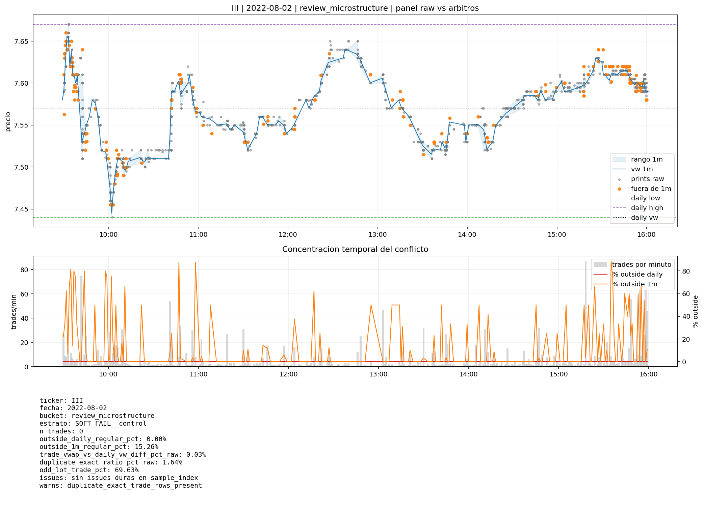

**Que muestra**

- Panel rico del tape raw frente a `daily` y `1m` para `III` el `2022-08-02`.
- `n_trades = 2,012`, `outside_daily_regular_pct = 0.00%`, `outside_1m_regular_pct = 15.26%`.
- `trade_vwap_vs_daily_vw_diff_pct_raw = 0.03%`, `duplicate_exact_ratio_pct_raw = 1.64%`, `odd_lot_trade_pct = 69.63%`.

**Responde**

- Familia donde el dano vive en la textura fina del flujo: odd-lots, duplicados, bursts por timestamp o comparabilidad intraminuto. Responde a la pregunta de si el tape es economicamente interpretable pero metodologicamente delicado.
- Responde a si el conflicto dominante vive en la escala (`~1x`), en la comparabilidad frente a `daily` (0.00%) o frente a `1m` (15.26%).
- El 69.63% de odd-lots empuja la lectura hacia microestructura fina; evita leer el caso como pura ruptura economica gruesa.
- La decision que justifica es mantener o no el caso en `recoverable_with_flag` cuando se rematerialice la rehabilitacion sobre `57f`.

### LMPX | 2021-04-22

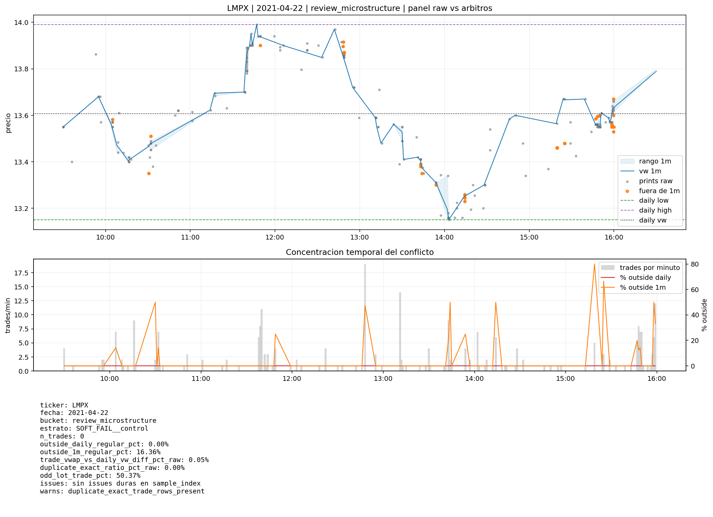

**Que muestra**

- Panel rico del tape raw frente a `daily` y `1m` para `LMPX` el `2021-04-22`.
- `n_trades = 270`, `outside_daily_regular_pct = 0.00%`, `outside_1m_regular_pct = 16.36%`.
- `trade_vwap_vs_daily_vw_diff_pct_raw = 0.05%`, `duplicate_exact_ratio_pct_raw = 0.00%`, `odd_lot_trade_pct = 50.37%`.

**Responde**

- Familia donde el dano vive en la textura fina del flujo: odd-lots, duplicados, bursts por timestamp o comparabilidad intraminuto. Responde a la pregunta de si el tape es economicamente interpretable pero metodologicamente delicado.
- Responde a si el conflicto dominante vive en la escala (`~1x`), en la comparabilidad frente a `daily` (0.00%) o frente a `1m` (16.36%).
- El 50.37% de odd-lots empuja la lectura hacia microestructura fina; evita leer el caso como pura ruptura economica gruesa.
- La decision que justifica es mantener o no el caso en `recoverable_with_flag` cuando se rematerialice la rehabilitacion sobre `57f`.

### MSL | 2019-06-07

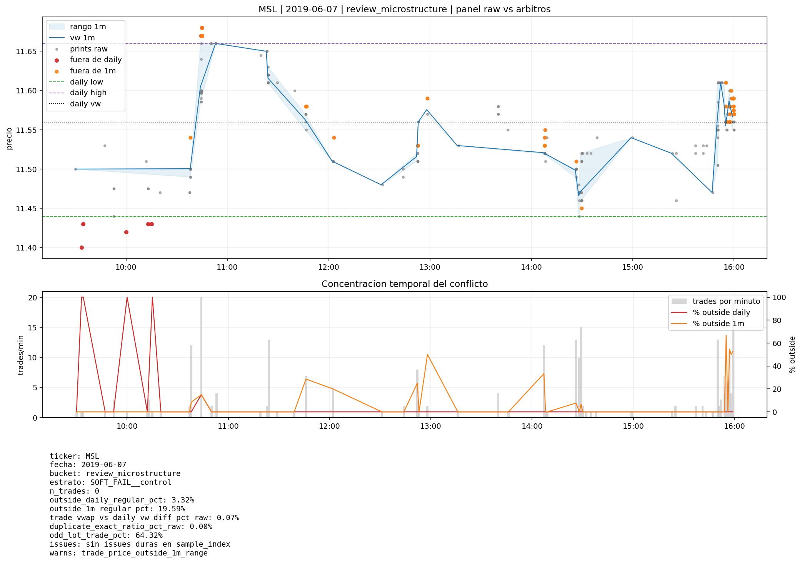

**Que muestra**

- Panel rico del tape raw frente a `daily` y `1m` para `MSL` el `2019-06-07`.
- `n_trades = 241`, `outside_daily_regular_pct = 3.32%`, `outside_1m_regular_pct = 19.59%`.
- `trade_vwap_vs_daily_vw_diff_pct_raw = 0.07%`, `duplicate_exact_ratio_pct_raw = 0.00%`, `odd_lot_trade_pct = 64.32%`.

**Responde**

- Familia donde el dano vive en la textura fina del flujo: odd-lots, duplicados, bursts por timestamp o comparabilidad intraminuto. Responde a la pregunta de si el tape es economicamente interpretable pero metodologicamente delicado.
- Responde a si el conflicto dominante vive en la escala (`~1x`), en la comparabilidad frente a `daily` (3.32%) o frente a `1m` (19.59%).
- El 64.32% de odd-lots empuja la lectura hacia microestructura fina; evita leer el caso como pura ruptura economica gruesa.
- La decision que justifica es mantener o no el caso en `recoverable_with_flag` cuando se rematerialice la rehabilitacion sobre `57f`.

### NRBO | 2024-04-01

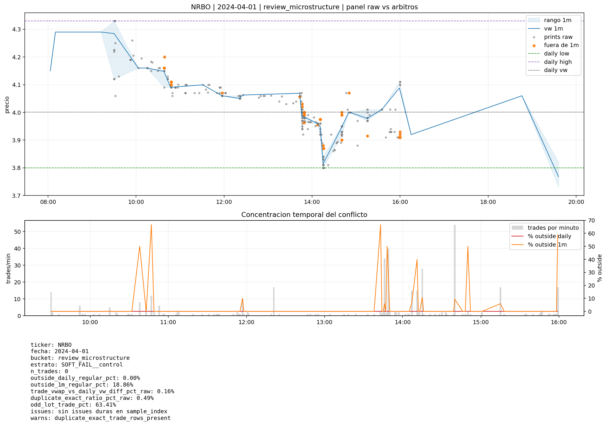

**Que muestra**

- Panel rico del tape raw frente a `daily` y `1m` para `NRBO` el `2024-04-01`.
- `n_trades = 410`, `outside_daily_regular_pct = 0.00%`, `outside_1m_regular_pct = 18.86%`.
- `trade_vwap_vs_daily_vw_diff_pct_raw = 0.16%`, `duplicate_exact_ratio_pct_raw = 0.49%`, `odd_lot_trade_pct = 63.41%`.

**Responde**

- Familia donde el dano vive en la textura fina del flujo: odd-lots, duplicados, bursts por timestamp o comparabilidad intraminuto. Responde a la pregunta de si el tape es economicamente interpretable pero metodologicamente delicado.
- Responde a si el conflicto dominante vive en la escala (`~1x`), en la comparabilidad frente a `daily` (0.00%) o frente a `1m` (18.86%).
- El 63.41% de odd-lots empuja la lectura hacia microestructura fina; evita leer el caso como pura ruptura economica gruesa.
- La decision que justifica es mantener o no el caso en `recoverable_with_flag` cuando se rematerialice la rehabilitacion sobre `57f`.

### ODV | 2023-07-05

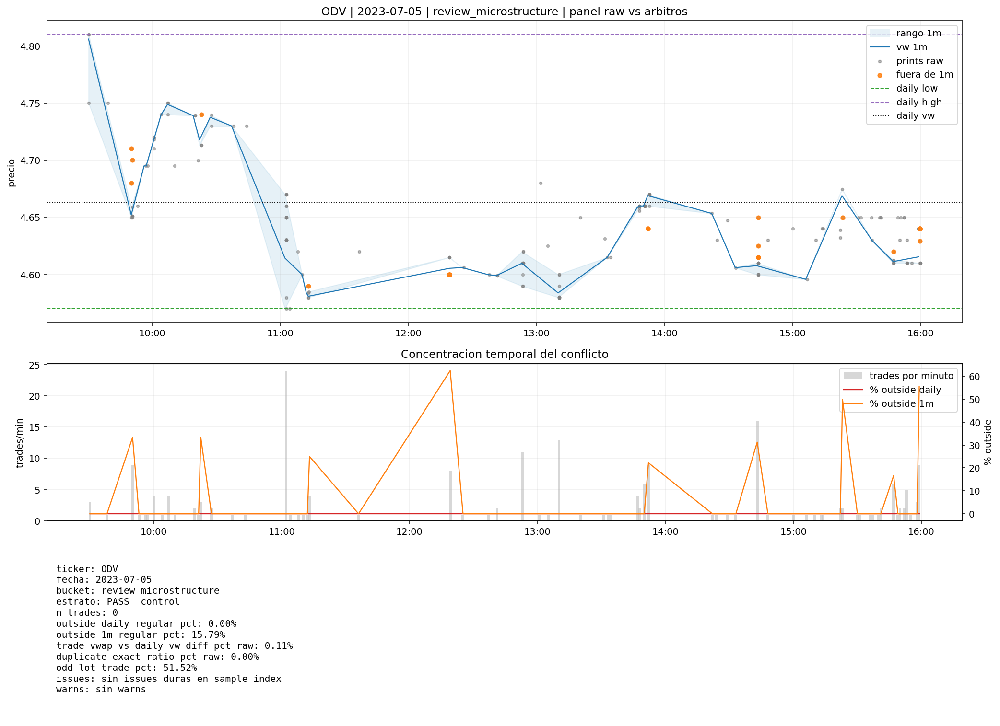

**Que muestra**

- Panel rico del tape raw frente a `daily` y `1m` para `ODV` el `2023-07-05`.
- `n_trades = 198`, `outside_daily_regular_pct = 0.00%`, `outside_1m_regular_pct = 15.79%`.
- `trade_vwap_vs_daily_vw_diff_pct_raw = 0.11%`, `duplicate_exact_ratio_pct_raw = 0.00%`, `odd_lot_trade_pct = 51.52%`.

**Responde**

- Familia donde el dano vive en la textura fina del flujo: odd-lots, duplicados, bursts por timestamp o comparabilidad intraminuto. Responde a la pregunta de si el tape es economicamente interpretable pero metodologicamente delicado.
- Responde a si el conflicto dominante vive en la escala (`~1x`), en la comparabilidad frente a `daily` (0.00%) o frente a `1m` (15.79%).
- El 51.52% de odd-lots empuja la lectura hacia microestructura fina; evita leer el caso como pura ruptura economica gruesa.
- La decision que justifica es mantener o no el caso en `recoverable_with_flag` cuando se rematerialice la rehabilitacion sobre `57f`.

### ORIQ | 2025-10-22

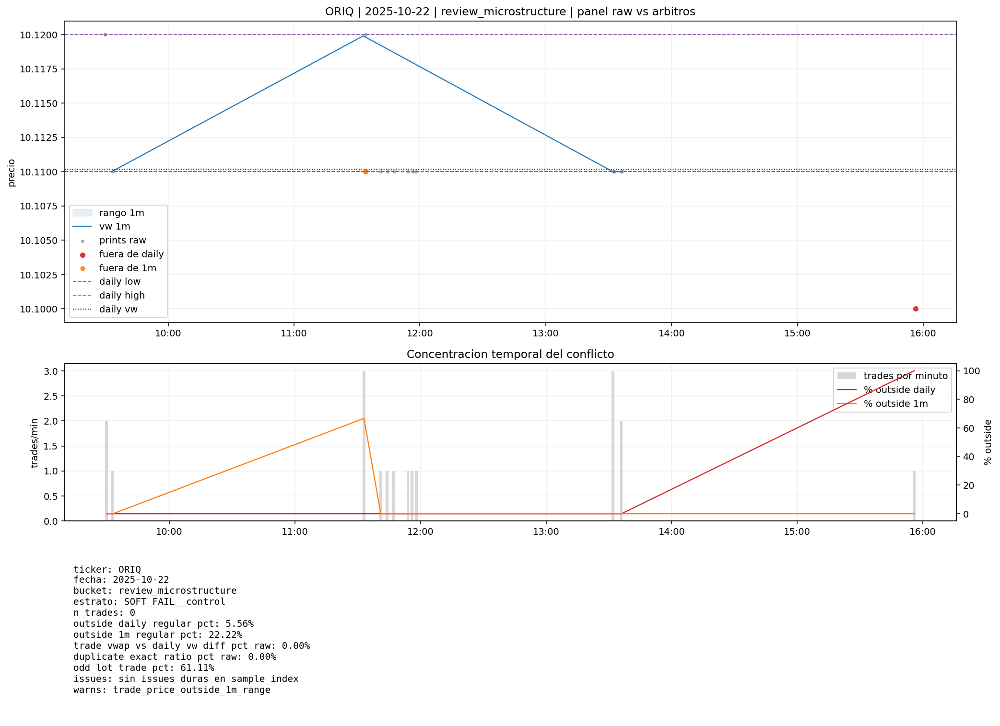

**Que muestra**

- Panel rico del tape raw frente a `daily` y `1m` para `ORIQ` el `2025-10-22`.
- `n_trades = 18`, `outside_daily_regular_pct = 5.56%`, `outside_1m_regular_pct = 22.22%`.
- `trade_vwap_vs_daily_vw_diff_pct_raw = 0.00%`, `duplicate_exact_ratio_pct_raw = 0.00%`, `odd_lot_trade_pct = 61.11%`.

**Responde**

- Familia donde el dano vive en la textura fina del flujo: odd-lots, duplicados, bursts por timestamp o comparabilidad intraminuto. Responde a la pregunta de si el tape es economicamente interpretable pero metodologicamente delicado.
- Responde a si el conflicto dominante vive en la escala (`~1x`), en la comparabilidad frente a `daily` (5.56%) o frente a `1m` (22.22%).
- El 61.11% de odd-lots empuja la lectura hacia microestructura fina; evita leer el caso como pura ruptura economica gruesa.
- La decision que justifica es mantener o no el caso en `recoverable_with_flag` cuando se rematerialice la rehabilitacion sobre `57f`.

### PTMN | 2023-06-15

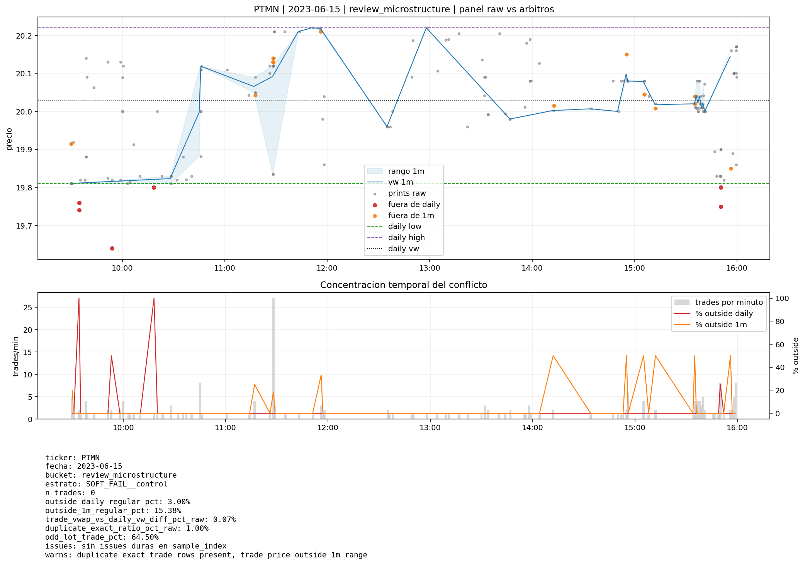

**Que muestra**

- Panel rico del tape raw frente a `daily` y `1m` para `PTMN` el `2023-06-15`.
- `n_trades = 200`, `outside_daily_regular_pct = 3.00%`, `outside_1m_regular_pct = 15.38%`.
- `trade_vwap_vs_daily_vw_diff_pct_raw = 0.07%`, `duplicate_exact_ratio_pct_raw = 1.00%`, `odd_lot_trade_pct = 64.50%`.

**Responde**

- Familia donde el dano vive en la textura fina del flujo: odd-lots, duplicados, bursts por timestamp o comparabilidad intraminuto. Responde a la pregunta de si el tape es economicamente interpretable pero metodologicamente delicado.
- Responde a si el conflicto dominante vive en la escala (`~1x`), en la comparabilidad frente a `daily` (3.00%) o frente a `1m` (15.38%).
- El 64.50% de odd-lots empuja la lectura hacia microestructura fina; evita leer el caso como pura ruptura economica gruesa.
- La decision que justifica es mantener o no el caso en `recoverable_with_flag` cuando se rematerialice la rehabilitacion sobre `57f`.

### AMTB | 2021-10-14

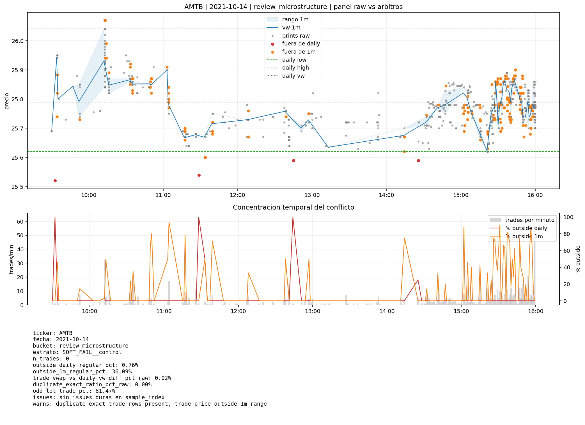

**Que muestra**

- Panel rico del tape raw frente a `daily` y `1m` para `AMTB` el `2021-10-14`.
- `n_trades = 788`, `outside_daily_regular_pct = 0.76%`, `outside_1m_regular_pct = 36.09%`.
- `trade_vwap_vs_daily_vw_diff_pct_raw = 0.02%`, `duplicate_exact_ratio_pct_raw = 0.00%`, `odd_lot_trade_pct = 81.47%`.

**Responde**

- Familia donde el dano vive en la textura fina del flujo: odd-lots, duplicados, bursts por timestamp o comparabilidad intraminuto. Responde a la pregunta de si el tape es economicamente interpretable pero metodologicamente delicado.
- Responde a si el conflicto dominante vive en la escala (`~1x`), en la comparabilidad frente a `daily` (0.76%) o frente a `1m` (36.09%).
- El 81.47% de odd-lots empuja la lectura hacia microestructura fina; evita leer el caso como pura ruptura economica gruesa.
- La decision que justifica es mantener o no el caso en `recoverable_with_flag` cuando se rematerialice la rehabilitacion sobre `57f`.

### BAER | 2023-07-28

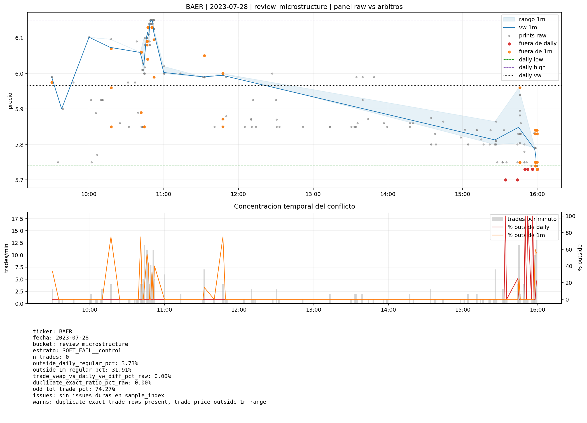

**Que muestra**

- Panel rico del tape raw frente a `daily` y `1m` para `BAER` el `2023-07-28`.
- `n_trades = 241`, `outside_daily_regular_pct = 3.73%`, `outside_1m_regular_pct = 31.91%`.
- `trade_vwap_vs_daily_vw_diff_pct_raw = 0.00%`, `duplicate_exact_ratio_pct_raw = 0.00%`, `odd_lot_trade_pct = 74.27%`.

**Responde**

- Familia donde el dano vive en la textura fina del flujo: odd-lots, duplicados, bursts por timestamp o comparabilidad intraminuto. Responde a la pregunta de si el tape es economicamente interpretable pero metodologicamente delicado.
- Responde a si el conflicto dominante vive en la escala (`~1x`), en la comparabilidad frente a `daily` (3.73%) o frente a `1m` (31.91%).
- El 74.27% de odd-lots empuja la lectura hacia microestructura fina; evita leer el caso como pura ruptura economica gruesa.
- La decision que justifica es mantener o no el caso en `recoverable_with_flag` cuando se rematerialice la rehabilitacion sobre `57f`.

### GWRS | 2023-06-06

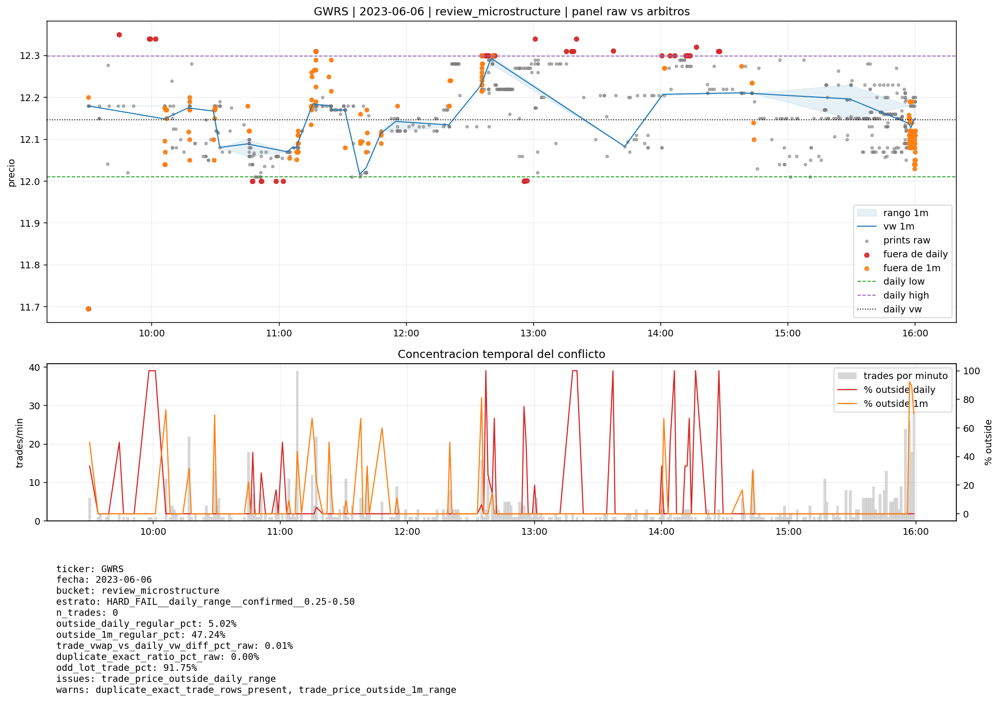

**Que muestra**

- Panel rico del tape raw frente a `daily` y `1m` para `GWRS` el `2023-06-06`.
- `n_trades = 897`, `outside_daily_regular_pct = 5.02%`, `outside_1m_regular_pct = 47.24%`.
- `trade_vwap_vs_daily_vw_diff_pct_raw = 0.01%`, `duplicate_exact_ratio_pct_raw = 0.00%`, `odd_lot_trade_pct = 91.75%`.

**Responde**

- Familia donde el dano vive en la textura fina del flujo: odd-lots, duplicados, bursts por timestamp o comparabilidad intraminuto. Responde a la pregunta de si el tape es economicamente interpretable pero metodologicamente delicado.
- Responde a si el conflicto dominante vive en la escala (`~1x`), en la comparabilidad frente a `daily` (5.02%) o frente a `1m` (47.24%).
- El 91.75% de odd-lots empuja la lectura hacia microestructura fina; evita leer el caso como pura ruptura economica gruesa.
- La decision que justifica es mantener o no el caso en `recoverable_with_flag` cuando se rematerialice la rehabilitacion sobre `57f`.

### GWRS | 2024-03-20

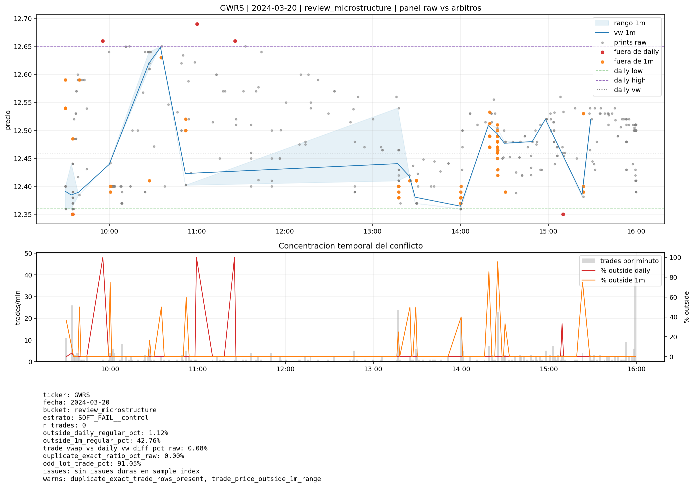

**Que muestra**

- Panel rico del tape raw frente a `daily` y `1m` para `GWRS` el `2024-03-20`.
- `n_trades = 447`, `outside_daily_regular_pct = 1.12%`, `outside_1m_regular_pct = 42.76%`.
- `trade_vwap_vs_daily_vw_diff_pct_raw = 0.08%`, `duplicate_exact_ratio_pct_raw = 0.00%`, `odd_lot_trade_pct = 91.05%`.

**Responde**

- Familia donde el dano vive en la textura fina del flujo: odd-lots, duplicados, bursts por timestamp o comparabilidad intraminuto. Responde a la pregunta de si el tape es economicamente interpretable pero metodologicamente delicado.
- Responde a si el conflicto dominante vive en la escala (`~1x`), en la comparabilidad frente a `daily` (1.12%) o frente a `1m` (42.76%).
- El 91.05% de odd-lots empuja la lectura hacia microestructura fina; evita leer el caso como pura ruptura economica gruesa.
- La decision que justifica es mantener o no el caso en `recoverable_with_flag` cuando se rematerialice la rehabilitacion sobre `57f`.

### PFIS | 2020-09-21

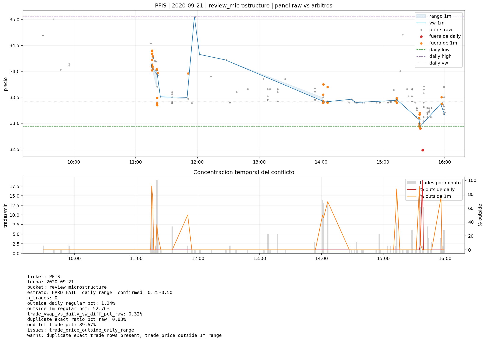

**Que muestra**

- Panel rico del tape raw frente a `daily` y `1m` para `PFIS` el `2020-09-21`.
- `n_trades = 242`, `outside_daily_regular_pct = 1.24%`, `outside_1m_regular_pct = 52.76%`.
- `trade_vwap_vs_daily_vw_diff_pct_raw = 0.32%`, `duplicate_exact_ratio_pct_raw = 0.83%`, `odd_lot_trade_pct = 89.67%`.

**Responde**

- Familia donde el dano vive en la textura fina del flujo: odd-lots, duplicados, bursts por timestamp o comparabilidad intraminuto. Responde a la pregunta de si el tape es economicamente interpretable pero metodologicamente delicado.
- Responde a si el conflicto dominante vive en la escala (`~1x`), en la comparabilidad frente a `daily` (1.24%) o frente a `1m` (52.76%).
- El 89.67% de odd-lots empuja la lectura hacia microestructura fina; evita leer el caso como pura ruptura economica gruesa.
- La decision que justifica es mantener o no el caso en `recoverable_with_flag` cuando se rematerialice la rehabilitacion sobre `57f`.

### RBB | 2025-12-15

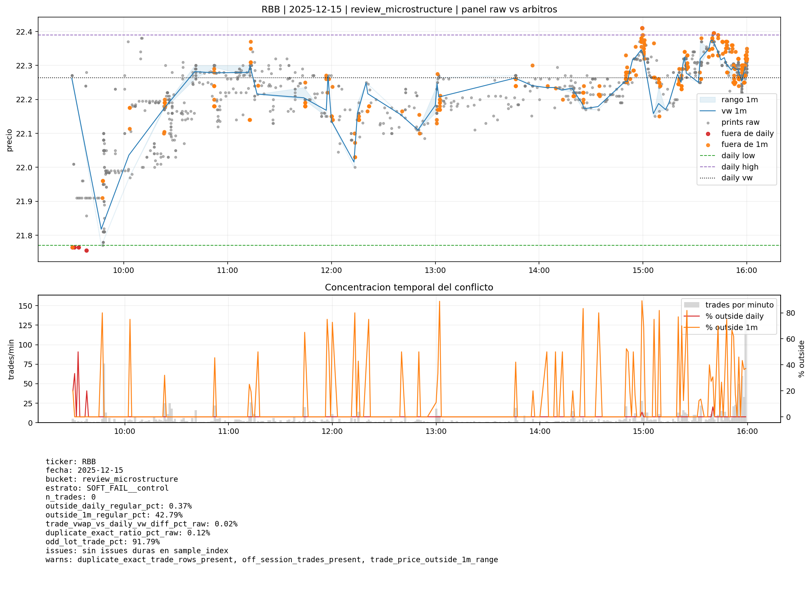

**Que muestra**

- Panel rico del tape raw frente a `daily` y `1m` para `RBB` el `2025-12-15`.
- `n_trades = 1,619`, `outside_daily_regular_pct = 0.37%`, `outside_1m_regular_pct = 42.79%`.
- `trade_vwap_vs_daily_vw_diff_pct_raw = 0.02%`, `duplicate_exact_ratio_pct_raw = 0.12%`, `odd_lot_trade_pct = 91.79%`.

**Responde**

- Familia donde el dano vive en la textura fina del flujo: odd-lots, duplicados, bursts por timestamp o comparabilidad intraminuto. Responde a la pregunta de si el tape es economicamente interpretable pero metodologicamente delicado.
- Responde a si el conflicto dominante vive en la escala (`~1x`), en la comparabilidad frente a `daily` (0.37%) o frente a `1m` (42.79%).
- El 91.79% de odd-lots empuja la lectura hacia microestructura fina; evita leer el caso como pura ruptura economica gruesa.
- La decision que justifica es mantener o no el caso en `recoverable_with_flag` cuando se rematerialice la rehabilitacion sobre `57f`.

### RVSB | 2023-07-27

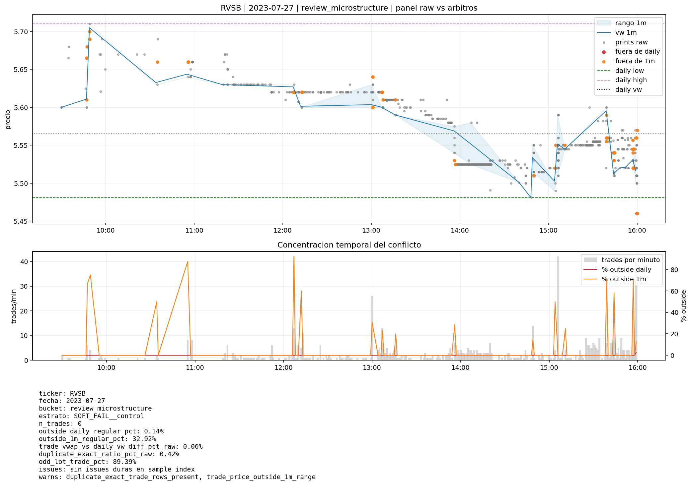

**Que muestra**

- Panel rico del tape raw frente a `daily` y `1m` para `RVSB` el `2023-07-27`.
- `n_trades = 716`, `outside_daily_regular_pct = 0.14%`, `outside_1m_regular_pct = 32.92%`.
- `trade_vwap_vs_daily_vw_diff_pct_raw = 0.06%`, `duplicate_exact_ratio_pct_raw = 0.42%`, `odd_lot_trade_pct = 89.39%`.

**Responde**

- Familia donde el dano vive en la textura fina del flujo: odd-lots, duplicados, bursts por timestamp o comparabilidad intraminuto. Responde a la pregunta de si el tape es economicamente interpretable pero metodologicamente delicado.
- Responde a si el conflicto dominante vive en la escala (`~1x`), en la comparabilidad frente a `daily` (0.14%) o frente a `1m` (32.92%).
- El 89.39% de odd-lots empuja la lectura hacia microestructura fina; evita leer el caso como pura ruptura economica gruesa.
- La decision que justifica es mantener o no el caso en `recoverable_with_flag` cuando se rematerialice la rehabilitacion sobre `57f`.

### VIEW | 2023-11-01

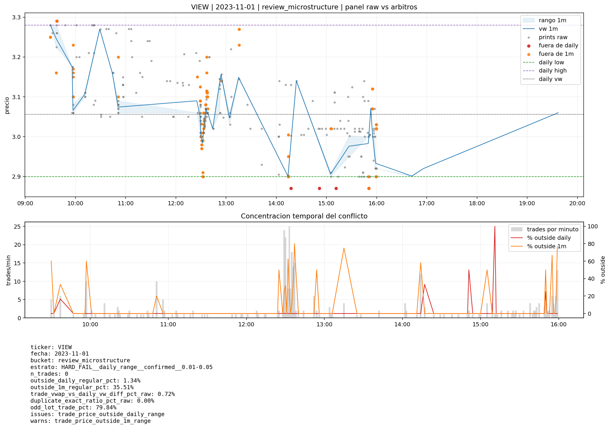

**Que muestra**

- Panel rico del tape raw frente a `daily` y `1m` para `VIEW` el `2023-11-01`.
- `n_trades = 372`, `outside_daily_regular_pct = 1.34%`, `outside_1m_regular_pct = 35.51%`.
- `trade_vwap_vs_daily_vw_diff_pct_raw = 0.72%`, `duplicate_exact_ratio_pct_raw = 0.00%`, `odd_lot_trade_pct = 79.84%`.

**Responde**

- Familia donde el dano vive en la textura fina del flujo: odd-lots, duplicados, bursts por timestamp o comparabilidad intraminuto. Responde a la pregunta de si el tape es economicamente interpretable pero metodologicamente delicado.
- Responde a si el conflicto dominante vive en la escala (`~1x`), en la comparabilidad frente a `daily` (1.34%) o frente a `1m` (35.51%).
- El 79.84% de odd-lots empuja la lectura hacia microestructura fina; evita leer el caso como pura ruptura economica gruesa.
- La decision que justifica es mantener o no el caso en `recoverable_with_flag` cuando se rematerialice la rehabilitacion sobre `57f`.

### VRTS | 2023-05-17

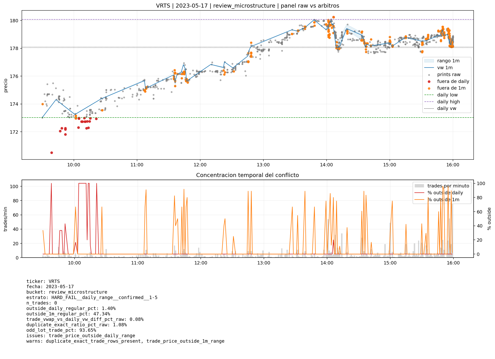

**Que muestra**

- Panel rico del tape raw frente a `daily` y `1m` para `VRTS` el `2023-05-17`.
- `n_trades = 1,574`, `outside_daily_regular_pct = 1.40%`, `outside_1m_regular_pct = 47.34%`.
- `trade_vwap_vs_daily_vw_diff_pct_raw = 0.08%`, `duplicate_exact_ratio_pct_raw = 1.08%`, `odd_lot_trade_pct = 93.65%`.

**Responde**

- Familia donde el dano vive en la textura fina del flujo: odd-lots, duplicados, bursts por timestamp o comparabilidad intraminuto. Responde a la pregunta de si el tape es economicamente interpretable pero metodologicamente delicado.
- Responde a si el conflicto dominante vive en la escala (`~1x`), en la comparabilidad frente a `daily` (1.40%) o frente a `1m` (47.34%).
- El 93.65% de odd-lots empuja la lectura hacia microestructura fina; evita leer el caso como pura ruptura economica gruesa.
- La decision que justifica es mantener o no el caso en `recoverable_with_flag` cuando se rematerialice la rehabilitacion sobre `57f`.

### BIOX | 2024-01-23

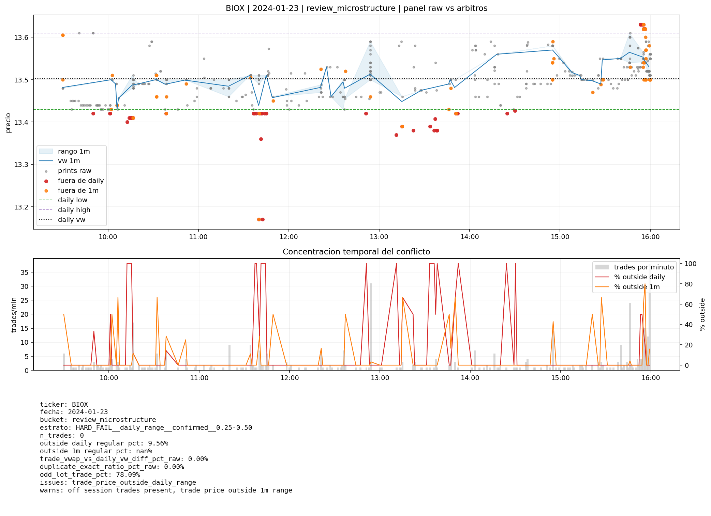

**Que muestra**

- Panel rico del tape raw frente a `daily` y `1m` para `BIOX` el `2024-01-23`.
- `n_trades = 502`, `outside_daily_regular_pct = 9.56%`, `outside_1m_regular_pct = nan%`.
- `trade_vwap_vs_daily_vw_diff_pct_raw = 0.00%`, `duplicate_exact_ratio_pct_raw = 0.00%`, `odd_lot_trade_pct = 78.09%`.

**Responde**

- Familia donde el dano vive en la textura fina del flujo: odd-lots, duplicados, bursts por timestamp o comparabilidad intraminuto. Responde a la pregunta de si el tape es economicamente interpretable pero metodologicamente delicado.
- Responde a si el conflicto dominante vive en la escala (`~1x`), en la comparabilidad frente a `daily` (9.56%) o frente a `1m` (nan%).
- El 78.09% de odd-lots empuja la lectura hacia microestructura fina; evita leer el caso como pura ruptura economica gruesa.
- La decision que justifica es mantener o no el caso en `recoverable_with_flag` cuando se rematerialice la rehabilitacion sobre `57f`.

### BRLS | 2025-10-22

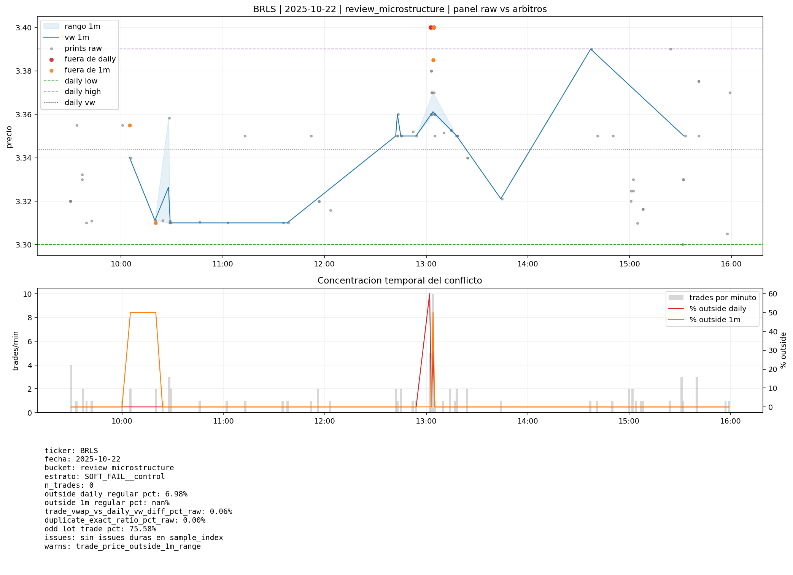

**Que muestra**

- Panel rico del tape raw frente a `daily` y `1m` para `BRLS` el `2025-10-22`.
- `n_trades = 86`, `outside_daily_regular_pct = 6.98%`, `outside_1m_regular_pct = nan%`.
- `trade_vwap_vs_daily_vw_diff_pct_raw = 0.06%`, `duplicate_exact_ratio_pct_raw = 0.00%`, `odd_lot_trade_pct = 75.58%`.

**Responde**

- Familia donde el dano vive en la textura fina del flujo: odd-lots, duplicados, bursts por timestamp o comparabilidad intraminuto. Responde a la pregunta de si el tape es economicamente interpretable pero metodologicamente delicado.
- Responde a si el conflicto dominante vive en la escala (`~1x`), en la comparabilidad frente a `daily` (6.98%) o frente a `1m` (nan%).
- El 75.58% de odd-lots empuja la lectura hacia microestructura fina; evita leer el caso como pura ruptura economica gruesa.
- La decision que justifica es mantener o no el caso en `recoverable_with_flag` cuando se rematerialice la rehabilitacion sobre `57f`.

### CABO | 2019-03-20

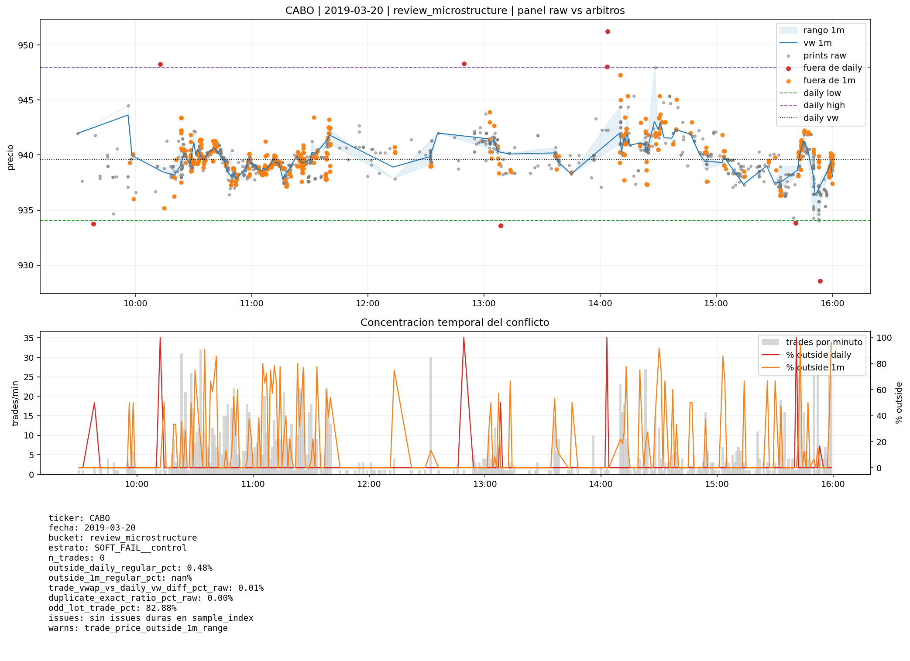

**Que muestra**

- Panel rico del tape raw frente a `daily` y `1m` para `CABO` el `2019-03-20`.
- `n_trades = 1,665`, `outside_daily_regular_pct = 0.48%`, `outside_1m_regular_pct = nan%`.
- `trade_vwap_vs_daily_vw_diff_pct_raw = 0.01%`, `duplicate_exact_ratio_pct_raw = 0.00%`, `odd_lot_trade_pct = 82.88%`.

**Responde**

- Familia donde el dano vive en la textura fina del flujo: odd-lots, duplicados, bursts por timestamp o comparabilidad intraminuto. Responde a la pregunta de si el tape es economicamente interpretable pero metodologicamente delicado.
- Responde a si el conflicto dominante vive en la escala (`~1x`), en la comparabilidad frente a `daily` (0.48%) o frente a `1m` (nan%).
- El 82.88% de odd-lots empuja la lectura hacia microestructura fina; evita leer el caso como pura ruptura economica gruesa.
- La decision que justifica es mantener o no el caso en `recoverable_with_flag` cuando se rematerialice la rehabilitacion sobre `57f`.

### CVU | 2023-03-24

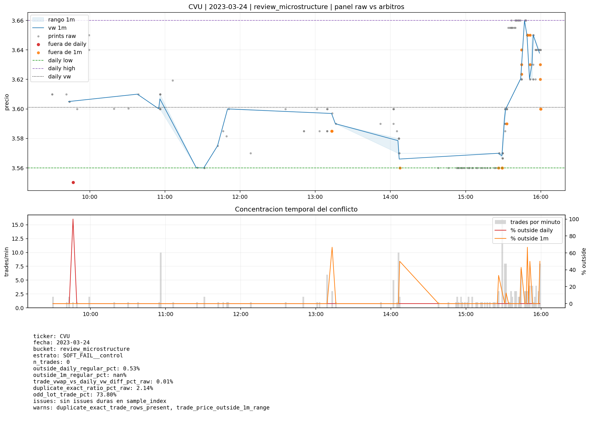

**Que muestra**

- Panel rico del tape raw frente a `daily` y `1m` para `CVU` el `2023-03-24`.
- `n_trades = 187`, `outside_daily_regular_pct = 0.53%`, `outside_1m_regular_pct = nan%`.
- `trade_vwap_vs_daily_vw_diff_pct_raw = 0.01%`, `duplicate_exact_ratio_pct_raw = 2.14%`, `odd_lot_trade_pct = 73.80%`.

**Responde**

- Familia donde el dano vive en la textura fina del flujo: odd-lots, duplicados, bursts por timestamp o comparabilidad intraminuto. Responde a la pregunta de si el tape es economicamente interpretable pero metodologicamente delicado.
- Responde a si el conflicto dominante vive en la escala (`~1x`), en la comparabilidad frente a `daily` (0.53%) o frente a `1m` (nan%).
- El 73.80% de odd-lots empuja la lectura hacia microestructura fina; evita leer el caso como pura ruptura economica gruesa.
- La decision que justifica es mantener o no el caso en `recoverable_with_flag` cuando se rematerialice la rehabilitacion sobre `57f`.

### EGLE | 2025-06-09

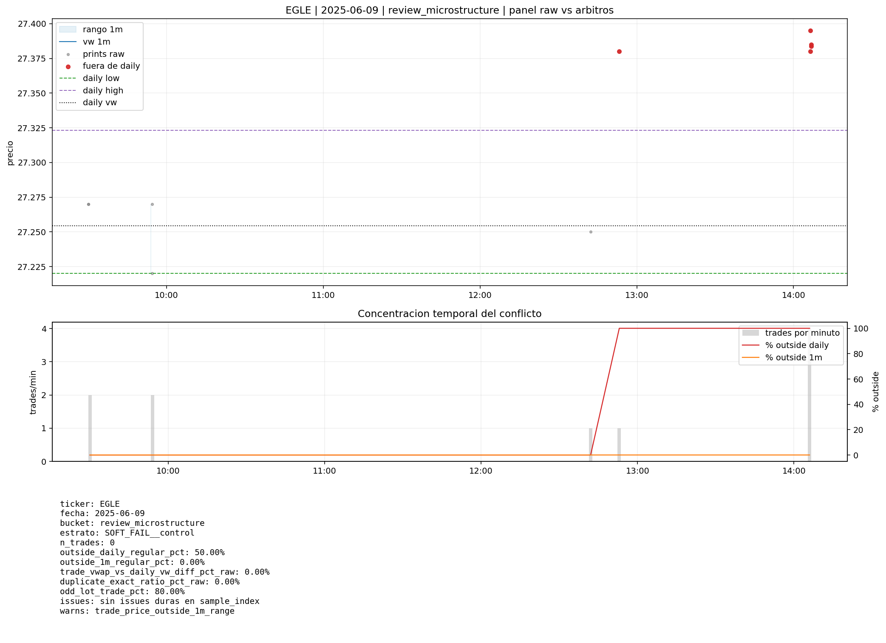

**Que muestra**

- Panel rico del tape raw frente a `daily` y `1m` para `EGLE` el `2025-06-09`.
- `n_trades = 10`, `outside_daily_regular_pct = 50.00%`, `outside_1m_regular_pct = 0.00%`.
- `trade_vwap_vs_daily_vw_diff_pct_raw = 0.00%`, `duplicate_exact_ratio_pct_raw = 0.00%`, `odd_lot_trade_pct = 80.00%`.

**Responde**

- Familia donde el dano vive en la textura fina del flujo: odd-lots, duplicados, bursts por timestamp o comparabilidad intraminuto. Responde a la pregunta de si el tape es economicamente interpretable pero metodologicamente delicado.
- Responde a si el conflicto dominante vive en la escala (`~1x`), en la comparabilidad frente a `daily` (50.00%) o frente a `1m` (0.00%).
- El 80.00% de odd-lots empuja la lectura hacia microestructura fina; evita leer el caso como pura ruptura economica gruesa.
- La decision que justifica es mantener o no el caso en `recoverable_with_flag` cuando se rematerialice la rehabilitacion sobre `57f`.

### LFCR | 2023-08-14

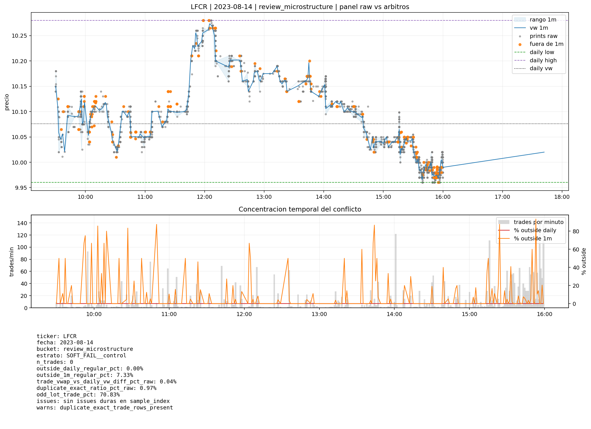

**Que muestra**

- Panel rico del tape raw frente a `daily` y `1m` para `LFCR` el `2023-08-14`.
- `n_trades = 3,919`, `outside_daily_regular_pct = 0.00%`, `outside_1m_regular_pct = 7.33%`.
- `trade_vwap_vs_daily_vw_diff_pct_raw = 0.04%`, `duplicate_exact_ratio_pct_raw = 0.97%`, `odd_lot_trade_pct = 70.83%`.

**Responde**

- Familia donde el dano vive en la textura fina del flujo: odd-lots, duplicados, bursts por timestamp o comparabilidad intraminuto. Responde a la pregunta de si el tape es economicamente interpretable pero metodologicamente delicado.
- Responde a si el conflicto dominante vive en la escala (`~1x`), en la comparabilidad frente a `daily` (0.00%) o frente a `1m` (7.33%).
- El 70.83% de odd-lots empuja la lectura hacia microestructura fina; evita leer el caso como pura ruptura economica gruesa.
- La decision que justifica es mantener o no el caso en `recoverable_with_flag` cuando se rematerialice la rehabilitacion sobre `57f`.

### PTVCB | 2019-09-26

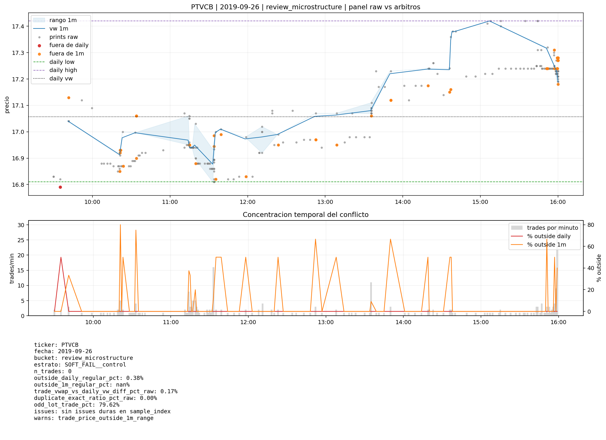

**Que muestra**

- Panel rico del tape raw frente a `daily` y `1m` para `PTVCB` el `2019-09-26`.
- `n_trades = 260`, `outside_daily_regular_pct = 0.38%`, `outside_1m_regular_pct = nan%`.
- `trade_vwap_vs_daily_vw_diff_pct_raw = 0.17%`, `duplicate_exact_ratio_pct_raw = 0.00%`, `odd_lot_trade_pct = 79.62%`.

**Responde**

- Familia donde el dano vive en la textura fina del flujo: odd-lots, duplicados, bursts por timestamp o comparabilidad intraminuto. Responde a la pregunta de si el tape es economicamente interpretable pero metodologicamente delicado.
- Responde a si el conflicto dominante vive en la escala (`~1x`), en la comparabilidad frente a `daily` (0.38%) o frente a `1m` (nan%).
- El 79.62% de odd-lots empuja la lectura hacia microestructura fina; evita leer el caso como pura ruptura economica gruesa.
- La decision que justifica es mantener o no el caso en `recoverable_with_flag` cuando se rematerialice la rehabilitacion sobre `57f`.

### TACT | 2025-05-01

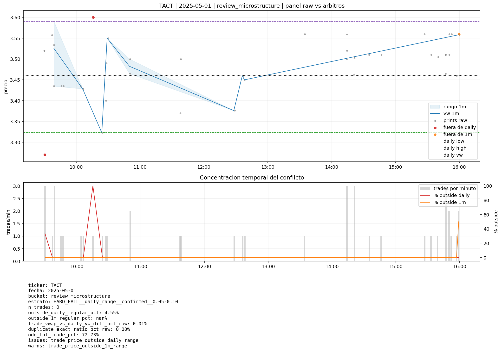

**Que muestra**

- Panel rico del tape raw frente a `daily` y `1m` para `TACT` el `2025-05-01`.
- `n_trades = 44`, `outside_daily_regular_pct = 4.55%`, `outside_1m_regular_pct = nan%`.
- `trade_vwap_vs_daily_vw_diff_pct_raw = 0.01%`, `duplicate_exact_ratio_pct_raw = 0.00%`, `odd_lot_trade_pct = 72.73%`.

**Responde**

- Familia donde el dano vive en la textura fina del flujo: odd-lots, duplicados, bursts por timestamp o comparabilidad intraminuto. Responde a la pregunta de si el tape es economicamente interpretable pero metodologicamente delicado.
- Responde a si el conflicto dominante vive en la escala (`~1x`), en la comparabilidad frente a `daily` (4.55%) o frente a `1m` (nan%).
- El 72.73% de odd-lots empuja la lectura hacia microestructura fina; evita leer el caso como pura ruptura economica gruesa.
- La decision que justifica es mantener o no el caso en `recoverable_with_flag` cuando se rematerialice la rehabilitacion sobre `57f`.

### TITN | 2023-10-30

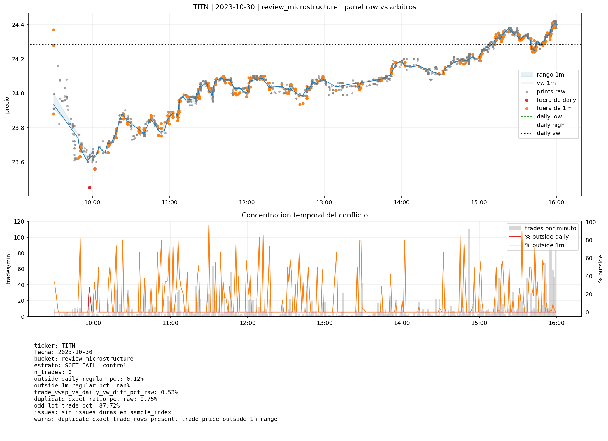

**Que muestra**

- Panel rico del tape raw frente a `daily` y `1m` para `TITN` el `2023-10-30`.
- `n_trades = 3,348`, `outside_daily_regular_pct = 0.12%`, `outside_1m_regular_pct = nan%`.
- `trade_vwap_vs_daily_vw_diff_pct_raw = 0.53%`, `duplicate_exact_ratio_pct_raw = 0.75%`, `odd_lot_trade_pct = 87.72%`.

**Responde**

- Familia donde el dano vive en la textura fina del flujo: odd-lots, duplicados, bursts por timestamp o comparabilidad intraminuto. Responde a la pregunta de si el tape es economicamente interpretable pero metodologicamente delicado.
- Responde a si el conflicto dominante vive en la escala (`~1x`), en la comparabilidad frente a `daily` (0.12%) o frente a `1m` (nan%).
- El 87.72% de odd-lots empuja la lectura hacia microestructura fina; evita leer el caso como pura ruptura economica gruesa.
- La decision que justifica es mantener o no el caso en `recoverable_with_flag` cuando se rematerialice la rehabilitacion sobre `57f`.

### TRDA | 2023-09-26

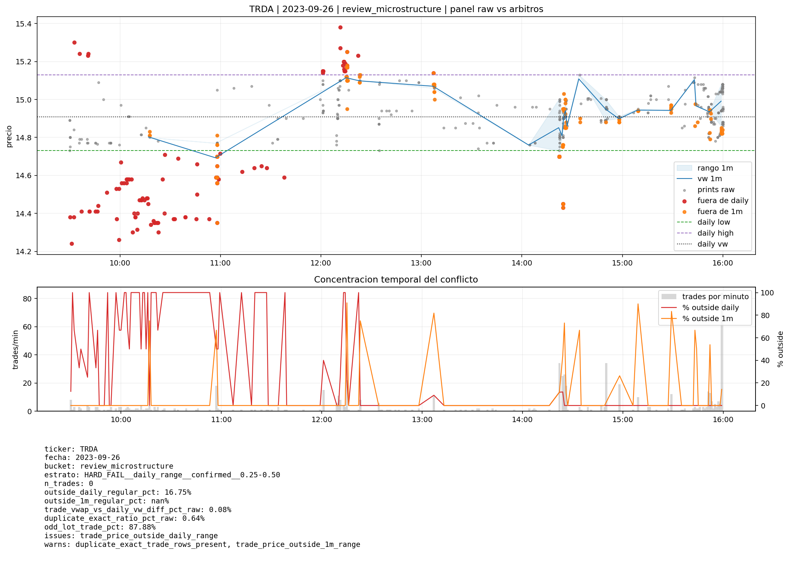

**Que muestra**

- Panel rico del tape raw frente a `daily` y `1m` para `TRDA` el `2023-09-26`.
- `n_trades = 627`, `outside_daily_regular_pct = 16.75%`, `outside_1m_regular_pct = nan%`.
- `trade_vwap_vs_daily_vw_diff_pct_raw = 0.08%`, `duplicate_exact_ratio_pct_raw = 0.64%`, `odd_lot_trade_pct = 87.88%`.

**Responde**

- Familia donde el dano vive en la textura fina del flujo: odd-lots, duplicados, bursts por timestamp o comparabilidad intraminuto. Responde a la pregunta de si el tape es economicamente interpretable pero metodologicamente delicado.
- Responde a si el conflicto dominante vive en la escala (`~1x`), en la comparabilidad frente a `daily` (16.75%) o frente a `1m` (nan%).
- El 87.88% de odd-lots empuja la lectura hacia microestructura fina; evita leer el caso como pura ruptura economica gruesa.
- La decision que justifica es mantener o no el caso en `recoverable_with_flag` cuando se rematerialice la rehabilitacion sobre `57f`.

### CBRL | 2024-01-08

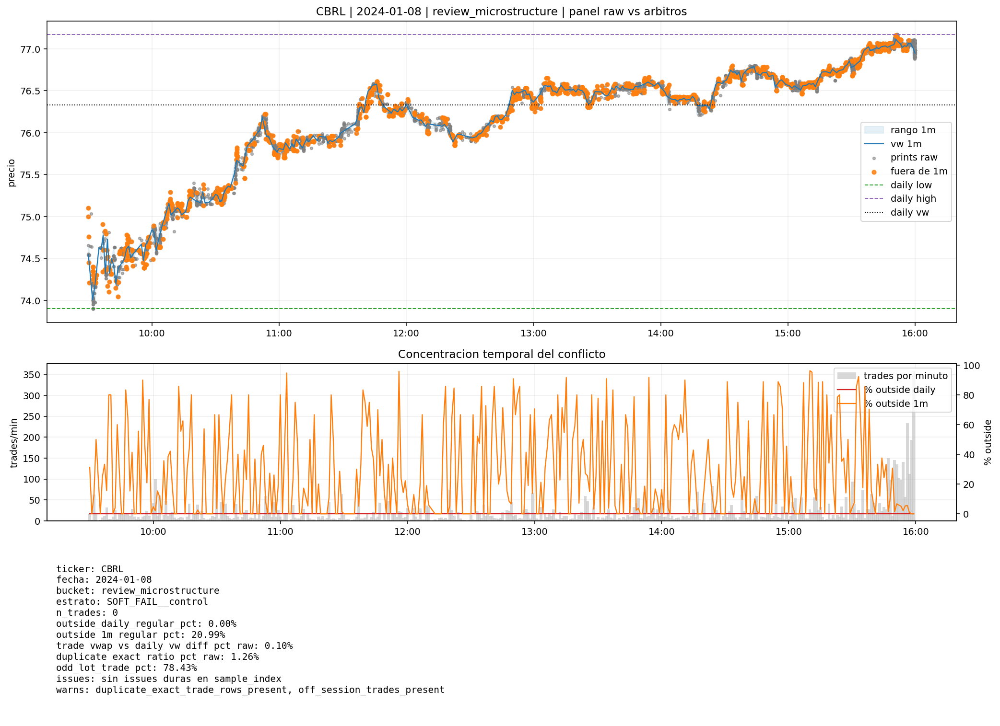

**Que muestra**

- Panel rico del tape raw frente a `daily` y `1m` para `CBRL` el `2024-01-08`.
- `n_trades = 8,483`, `outside_daily_regular_pct = 0.00%`, `outside_1m_regular_pct = 20.99%`.
- `trade_vwap_vs_daily_vw_diff_pct_raw = 0.10%`, `duplicate_exact_ratio_pct_raw = 1.26%`, `odd_lot_trade_pct = 78.43%`.

**Responde**

- Familia donde el dano vive en la textura fina del flujo: odd-lots, duplicados, bursts por timestamp o comparabilidad intraminuto. Responde a la pregunta de si el tape es economicamente interpretable pero metodologicamente delicado.
- Responde a si el conflicto dominante vive en la escala (`~1x`), en la comparabilidad frente a `daily` (0.00%) o frente a `1m` (20.99%).
- El 78.43% de odd-lots empuja la lectura hacia microestructura fina; evita leer el caso como pura ruptura economica gruesa.
- La decision que justifica es mantener o no el caso en `recoverable_with_flag` cuando se rematerialice la rehabilitacion sobre `57f`.

### CLWT | 2025-03-05

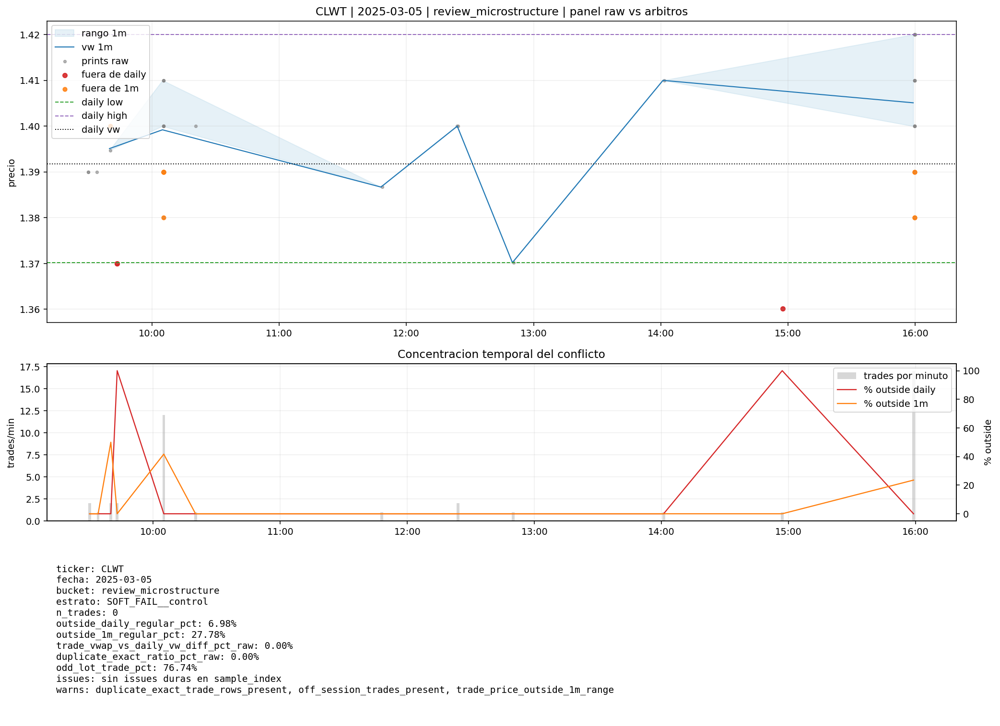

**Que muestra**

- Panel rico del tape raw frente a `daily` y `1m` para `CLWT` el `2025-03-05`.
- `n_trades = 43`, `outside_daily_regular_pct = 6.98%`, `outside_1m_regular_pct = 27.78%`.
- `trade_vwap_vs_daily_vw_diff_pct_raw = 0.00%`, `duplicate_exact_ratio_pct_raw = 0.00%`, `odd_lot_trade_pct = 76.74%`.

**Responde**

- Familia donde el dano vive en la textura fina del flujo: odd-lots, duplicados, bursts por timestamp o comparabilidad intraminuto. Responde a la pregunta de si el tape es economicamente interpretable pero metodologicamente delicado.
- Responde a si el conflicto dominante vive en la escala (`~1x`), en la comparabilidad frente a `daily` (6.98%) o frente a `1m` (27.78%).
- El 76.74% de odd-lots empuja la lectura hacia microestructura fina; evita leer el caso como pura ruptura economica gruesa.
- La decision que justifica es mantener o no el caso en `recoverable_with_flag` cuando se rematerialice la rehabilitacion sobre `57f`.

### FNHC | 2020-01-07

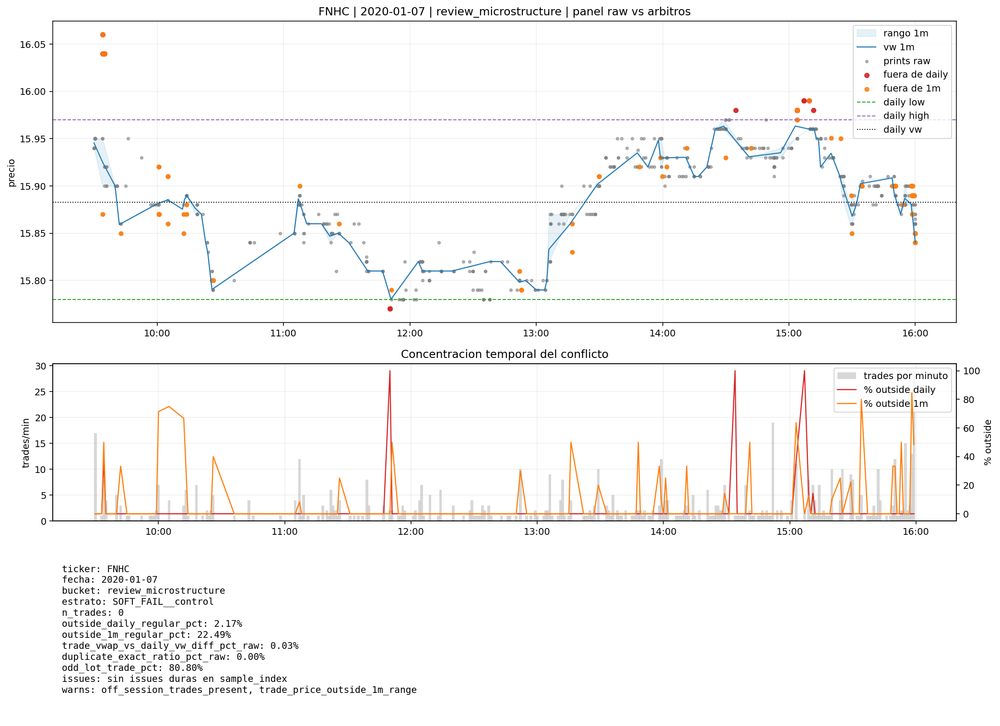

**Que muestra**

- Panel rico del tape raw frente a `daily` y `1m` para `FNHC` el `2020-01-07`.
- `n_trades = 646`, `outside_daily_regular_pct = 2.17%`, `outside_1m_regular_pct = 22.49%`.
- `trade_vwap_vs_daily_vw_diff_pct_raw = 0.03%`, `duplicate_exact_ratio_pct_raw = 0.00%`, `odd_lot_trade_pct = 80.80%`.

**Responde**

- Familia donde el dano vive en la textura fina del flujo: odd-lots, duplicados, bursts por timestamp o comparabilidad intraminuto. Responde a la pregunta de si el tape es economicamente interpretable pero metodologicamente delicado.
- Responde a si el conflicto dominante vive en la escala (`~1x`), en la comparabilidad frente a `daily` (2.17%) o frente a `1m` (22.49%).
- El 80.80% de odd-lots empuja la lectura hacia microestructura fina; evita leer el caso como pura ruptura economica gruesa.
- La decision que justifica es mantener o no el caso en `recoverable_with_flag` cuando se rematerialice la rehabilitacion sobre `57f`.

### GCO | 2026-02-05

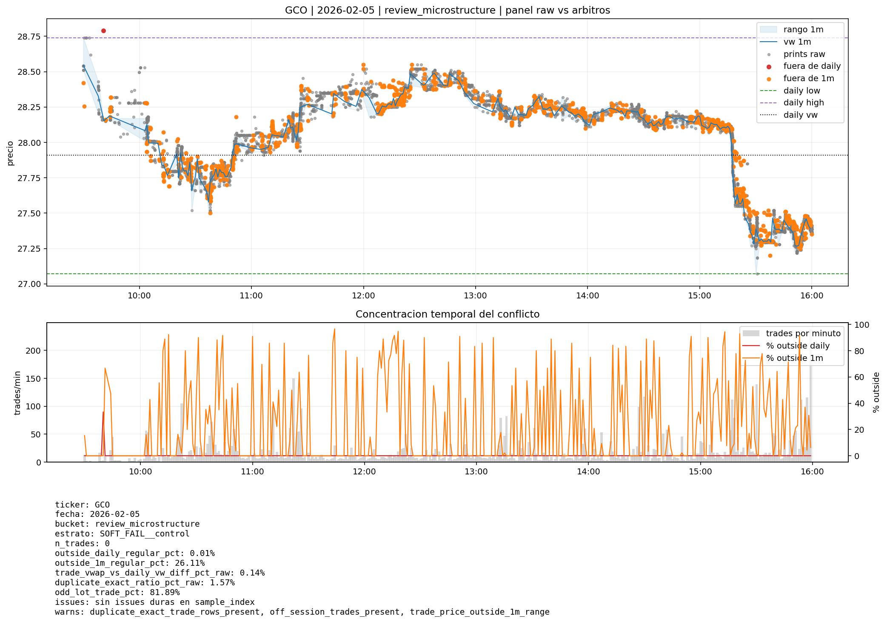

**Que muestra**

- Panel rico del tape raw frente a `daily` y `1m` para `GCO` el `2026-02-05`.
- `n_trades = 6,936`, `outside_daily_regular_pct = 0.01%`, `outside_1m_regular_pct = 26.11%`.
- `trade_vwap_vs_daily_vw_diff_pct_raw = 0.14%`, `duplicate_exact_ratio_pct_raw = 1.57%`, `odd_lot_trade_pct = 81.89%`.

**Responde**

- Familia donde el dano vive en la textura fina del flujo: odd-lots, duplicados, bursts por timestamp o comparabilidad intraminuto. Responde a la pregunta de si el tape es economicamente interpretable pero metodologicamente delicado.
- Responde a si el conflicto dominante vive en la escala (`~1x`), en la comparabilidad frente a `daily` (0.01%) o frente a `1m` (26.11%).
- El 81.89% de odd-lots empuja la lectura hacia microestructura fina; evita leer el caso como pura ruptura economica gruesa.
- La decision que justifica es mantener o no el caso en `recoverable_with_flag` cuando se rematerialice la rehabilitacion sobre `57f`.

### GHM | 2023-05-08

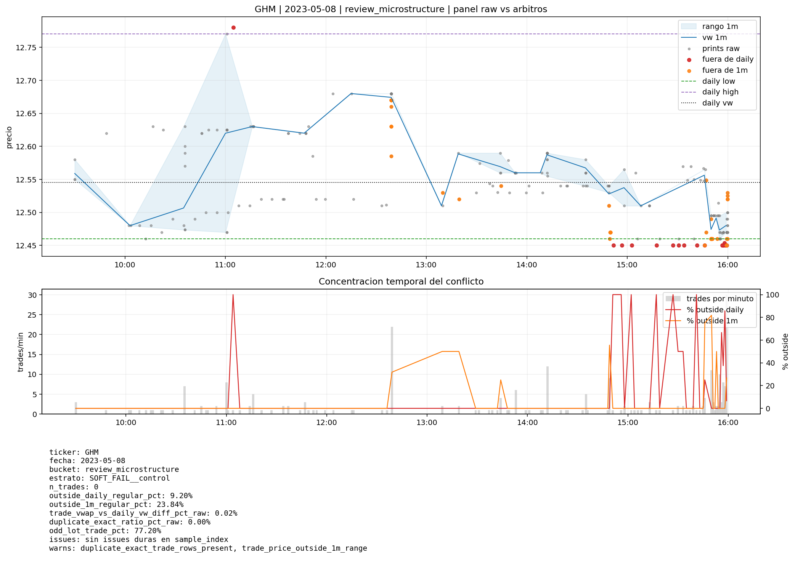

**Que muestra**

- Panel rico del tape raw frente a `daily` y `1m` para `GHM` el `2023-05-08`.
- `n_trades = 250`, `outside_daily_regular_pct = 9.20%`, `outside_1m_regular_pct = 23.84%`.
- `trade_vwap_vs_daily_vw_diff_pct_raw = 0.02%`, `duplicate_exact_ratio_pct_raw = 0.00%`, `odd_lot_trade_pct = 77.20%`.

**Responde**

- Familia donde el dano vive en la textura fina del flujo: odd-lots, duplicados, bursts por timestamp o comparabilidad intraminuto. Responde a la pregunta de si el tape es economicamente interpretable pero metodologicamente delicado.
- Responde a si el conflicto dominante vive en la escala (`~1x`), en la comparabilidad frente a `daily` (9.20%) o frente a `1m` (23.84%).
- El 77.20% de odd-lots empuja la lectura hacia microestructura fina; evita leer el caso como pura ruptura economica gruesa.
- La decision que justifica es mantener o no el caso en `recoverable_with_flag` cuando se rematerialice la rehabilitacion sobre `57f`.

### GNSS | 2025-09-16

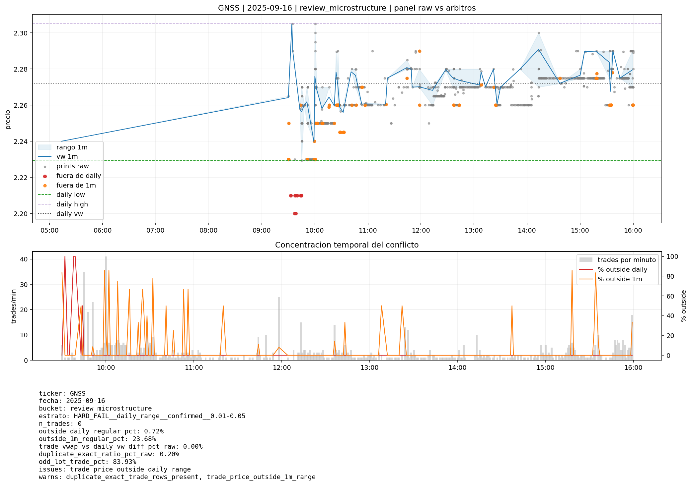

**Que muestra**

- Panel rico del tape raw frente a `daily` y `1m` para `GNSS` el `2025-09-16`.
- `n_trades = 977`, `outside_daily_regular_pct = 0.72%`, `outside_1m_regular_pct = 23.68%`.
- `trade_vwap_vs_daily_vw_diff_pct_raw = 0.00%`, `duplicate_exact_ratio_pct_raw = 0.20%`, `odd_lot_trade_pct = 83.93%`.

**Responde**

- Familia donde el dano vive en la textura fina del flujo: odd-lots, duplicados, bursts por timestamp o comparabilidad intraminuto. Responde a la pregunta de si el tape es economicamente interpretable pero metodologicamente delicado.
- Responde a si el conflicto dominante vive en la escala (`~1x`), en la comparabilidad frente a `daily` (0.72%) o frente a `1m` (23.68%).
- El 83.93% de odd-lots empuja la lectura hacia microestructura fina; evita leer el caso como pura ruptura economica gruesa.
- La decision que justifica es mantener o no el caso en `recoverable_with_flag` cuando se rematerialice la rehabilitacion sobre `57f`.

### GROW | 2022-07-05

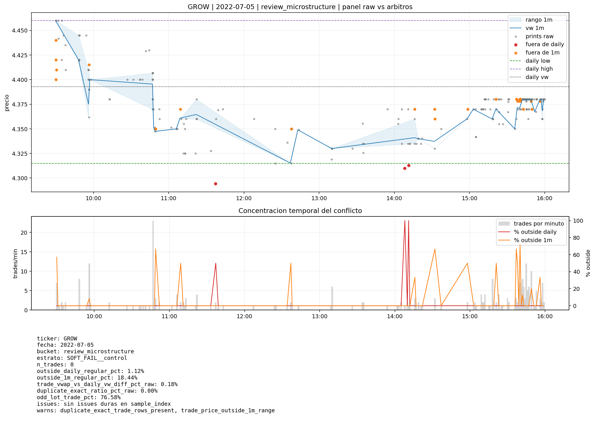

**Que muestra**

- Panel rico del tape raw frente a `daily` y `1m` para `GROW` el `2022-07-05`.
- `n_trades = 269`, `outside_daily_regular_pct = 1.12%`, `outside_1m_regular_pct = 18.44%`.
- `trade_vwap_vs_daily_vw_diff_pct_raw = 0.18%`, `duplicate_exact_ratio_pct_raw = 0.00%`, `odd_lot_trade_pct = 76.58%`.

**Responde**

- Familia donde el dano vive en la textura fina del flujo: odd-lots, duplicados, bursts por timestamp o comparabilidad intraminuto. Responde a la pregunta de si el tape es economicamente interpretable pero metodologicamente delicado.
- Responde a si el conflicto dominante vive en la escala (`~1x`), en la comparabilidad frente a `daily` (1.12%) o frente a `1m` (18.44%).
- El 76.58% de odd-lots empuja la lectura hacia microestructura fina; evita leer el caso como pura ruptura economica gruesa.
- La decision que justifica es mantener o no el caso en `recoverable_with_flag` cuando se rematerialice la rehabilitacion sobre `57f`.

### JELD | 2024-04-03

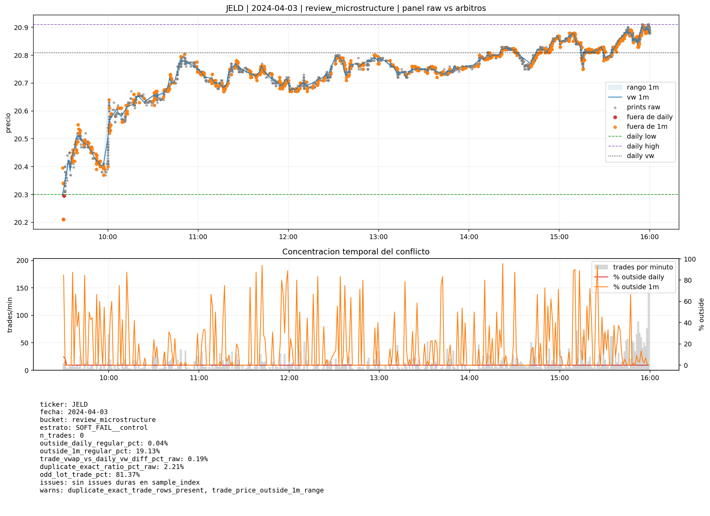

**Que muestra**

- Panel rico del tape raw frente a `daily` y `1m` para `JELD` el `2024-04-03`.
- `n_trades = 5,330`, `outside_daily_regular_pct = 0.04%`, `outside_1m_regular_pct = 19.13%`.
- `trade_vwap_vs_daily_vw_diff_pct_raw = 0.19%`, `duplicate_exact_ratio_pct_raw = 2.21%`, `odd_lot_trade_pct = 81.37%`.

**Responde**

- Familia donde el dano vive en la textura fina del flujo: odd-lots, duplicados, bursts por timestamp o comparabilidad intraminuto. Responde a la pregunta de si el tape es economicamente interpretable pero metodologicamente delicado.
- Responde a si el conflicto dominante vive en la escala (`~1x`), en la comparabilidad frente a `daily` (0.04%) o frente a `1m` (19.13%).
- El 81.37% de odd-lots empuja la lectura hacia microestructura fina; evita leer el caso como pura ruptura economica gruesa.
- La decision que justifica es mantener o no el caso en `recoverable_with_flag` cuando se rematerialice la rehabilitacion sobre `57f`.

### KLC | 2025-08-04

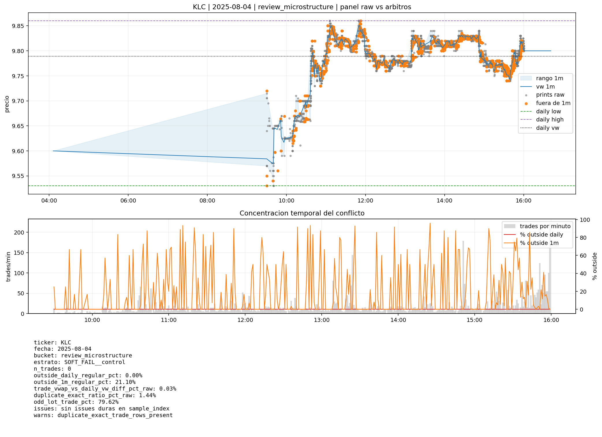

**Que muestra**

- Panel rico del tape raw frente a `daily` y `1m` para `KLC` el `2025-08-04`.
- `n_trades = 6,380`, `outside_daily_regular_pct = 0.00%`, `outside_1m_regular_pct = 21.10%`.
- `trade_vwap_vs_daily_vw_diff_pct_raw = 0.03%`, `duplicate_exact_ratio_pct_raw = 1.44%`, `odd_lot_trade_pct = 79.62%`.

**Responde**

- Familia donde el dano vive en la textura fina del flujo: odd-lots, duplicados, bursts por timestamp o comparabilidad intraminuto. Responde a la pregunta de si el tape es economicamente interpretable pero metodologicamente delicado.
- Responde a si el conflicto dominante vive en la escala (`~1x`), en la comparabilidad frente a `daily` (0.00%) o frente a `1m` (21.10%).
- El 79.62% de odd-lots empuja la lectura hacia microestructura fina; evita leer el caso como pura ruptura economica gruesa.
- La decision que justifica es mantener o no el caso en `recoverable_with_flag` cuando se rematerialice la rehabilitacion sobre `57f`.

### RGNX | 2023-01-31

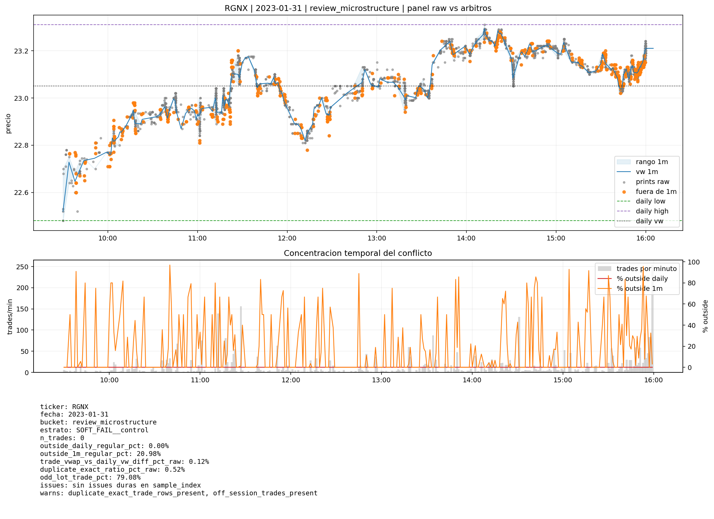

**Que muestra**

- Panel rico del tape raw frente a `daily` y `1m` para `RGNX` el `2023-01-31`.
- `n_trades = 4,263`, `outside_daily_regular_pct = 0.00%`, `outside_1m_regular_pct = 20.98%`.
- `trade_vwap_vs_daily_vw_diff_pct_raw = 0.12%`, `duplicate_exact_ratio_pct_raw = 0.52%`, `odd_lot_trade_pct = 79.08%`.

**Responde**

- Familia donde el dano vive en la textura fina del flujo: odd-lots, duplicados, bursts por timestamp o comparabilidad intraminuto. Responde a la pregunta de si el tape es economicamente interpretable pero metodologicamente delicado.
- Responde a si el conflicto dominante vive en la escala (`~1x`), en la comparabilidad frente a `daily` (0.00%) o frente a `1m` (20.98%).
- El 79.08% de odd-lots empuja la lectura hacia microestructura fina; evita leer el caso como pura ruptura economica gruesa.
- La decision que justifica es mantener o no el caso en `recoverable_with_flag` cuando se rematerialice la rehabilitacion sobre `57f`.

### RIGL | 2025-01-17

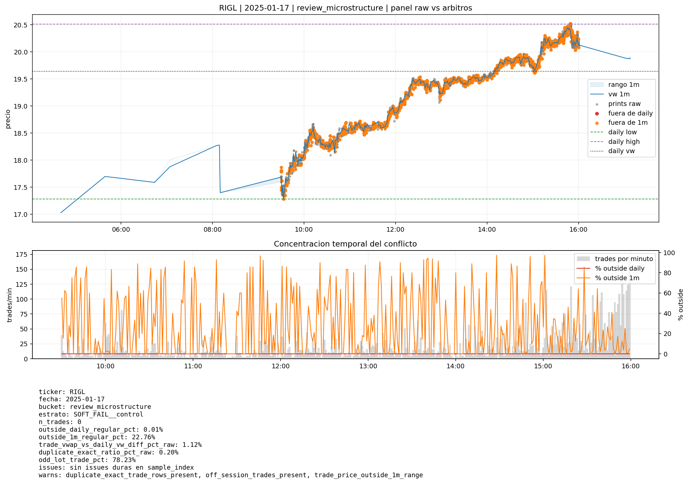

**Que muestra**

- Panel rico del tape raw frente a `daily` y `1m` para `RIGL` el `2025-01-17`.
- `n_trades = 7,874`, `outside_daily_regular_pct = 0.01%`, `outside_1m_regular_pct = 22.76%`.
- `trade_vwap_vs_daily_vw_diff_pct_raw = 1.12%`, `duplicate_exact_ratio_pct_raw = 0.20%`, `odd_lot_trade_pct = 78.23%`.

**Responde**

- Familia donde el dano vive en la textura fina del flujo: odd-lots, duplicados, bursts por timestamp o comparabilidad intraminuto. Responde a la pregunta de si el tape es economicamente interpretable pero metodologicamente delicado.
- Responde a si el conflicto dominante vive en la escala (`~1x`), en la comparabilidad frente a `daily` (0.01%) o frente a `1m` (22.76%).
- El 78.23% de odd-lots empuja la lectura hacia microestructura fina; evita leer el caso como pura ruptura economica gruesa.
- La decision que justifica es mantener o no el caso en `recoverable_with_flag` cuando se rematerialice la rehabilitacion sobre `57f`.

### RILY | 2022-09-22

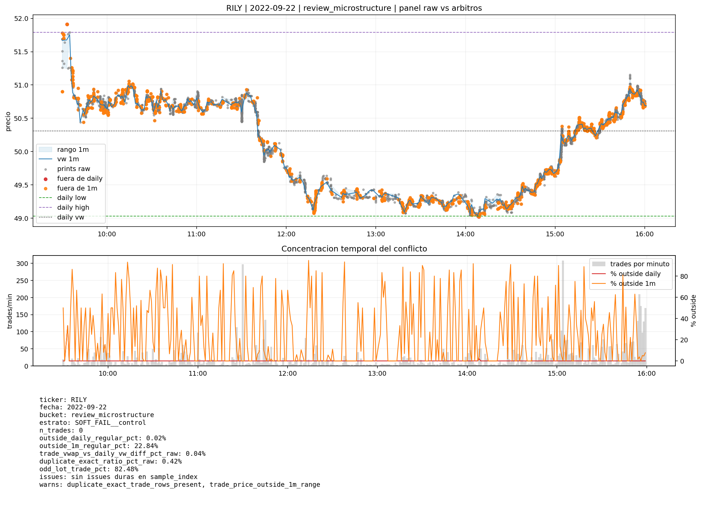

**Que muestra**

- Panel rico del tape raw frente a `daily` y `1m` para `RILY` el `2022-09-22`.
- `n_trades = 8,080`, `outside_daily_regular_pct = 0.02%`, `outside_1m_regular_pct = 22.84%`.
- `trade_vwap_vs_daily_vw_diff_pct_raw = 0.04%`, `duplicate_exact_ratio_pct_raw = 0.42%`, `odd_lot_trade_pct = 82.48%`.

**Responde**

- Familia donde el dano vive en la textura fina del flujo: odd-lots, duplicados, bursts por timestamp o comparabilidad intraminuto. Responde a la pregunta de si el tape es economicamente interpretable pero metodologicamente delicado.
- Responde a si el conflicto dominante vive en la escala (`~1x`), en la comparabilidad frente a `daily` (0.02%) o frente a `1m` (22.84%).
- El 82.48% de odd-lots empuja la lectura hacia microestructura fina; evita leer el caso como pura ruptura economica gruesa.
- La decision que justifica es mantener o no el caso en `recoverable_with_flag` cuando se rematerialice la rehabilitacion sobre `57f`.

### SRLP | 2022-03-04

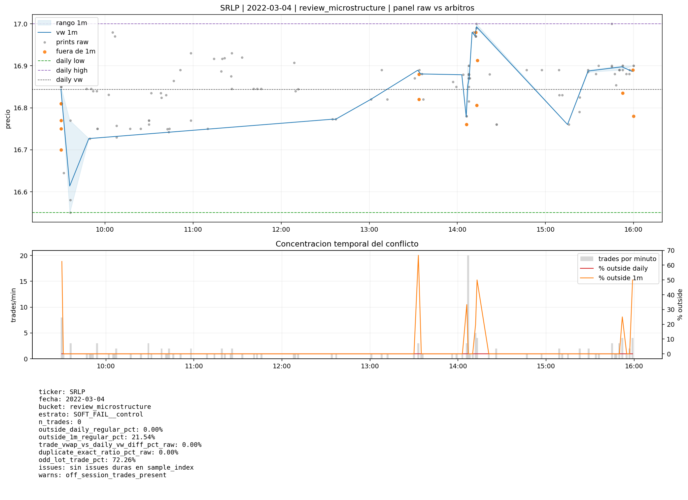

**Que muestra**

- Panel rico del tape raw frente a `daily` y `1m` para `SRLP` el `2022-03-04`.
- `n_trades = 137`, `outside_daily_regular_pct = 0.00%`, `outside_1m_regular_pct = 21.54%`.
- `trade_vwap_vs_daily_vw_diff_pct_raw = 0.00%`, `duplicate_exact_ratio_pct_raw = 0.00%`, `odd_lot_trade_pct = 72.26%`.

**Responde**

- Familia donde el dano vive en la textura fina del flujo: odd-lots, duplicados, bursts por timestamp o comparabilidad intraminuto. Responde a la pregunta de si el tape es economicamente interpretable pero metodologicamente delicado.
- Responde a si el conflicto dominante vive en la escala (`~1x`), en la comparabilidad frente a `daily` (0.00%) o frente a `1m` (21.54%).
- El 72.26% de odd-lots empuja la lectura hacia microestructura fina; evita leer el caso como pura ruptura economica gruesa.
- La decision que justifica es mantener o no el caso en `recoverable_with_flag` cuando se rematerialice la rehabilitacion sobre `57f`.

### WKME | 2024-02-07

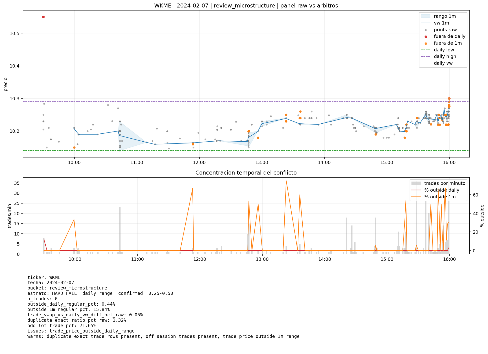

**Que muestra**

- Panel rico del tape raw frente a `daily` y `1m` para `WKME` el `2024-02-07`.
- `n_trades = 455`, `outside_daily_regular_pct = 0.44%`, `outside_1m_regular_pct = 15.84%`.
- `trade_vwap_vs_daily_vw_diff_pct_raw = 0.05%`, `duplicate_exact_ratio_pct_raw = 1.32%`, `odd_lot_trade_pct = 71.65%`.

**Responde**

- Familia donde el dano vive en la textura fina del flujo: odd-lots, duplicados, bursts por timestamp o comparabilidad intraminuto. Responde a la pregunta de si el tape es economicamente interpretable pero metodologicamente delicado.
- Responde a si el conflicto dominante vive en la escala (`~1x`), en la comparabilidad frente a `daily` (0.44%) o frente a `1m` (15.84%).
- El 71.65% de odd-lots empuja la lectura hacia microestructura fina; evita leer el caso como pura ruptura economica gruesa.
- La decision que justifica es mantener o no el caso en `recoverable_with_flag` cuando se rematerialice la rehabilitacion sobre `57f`.

# Trades Review No 1m Reference | muestra estratificada

Documento fuente: `inspection_dossiers/trades/family_case_evidence_packs/review_no_1m_reference/review_no_1m_reference_cases_v0_1.md`

## Rol

Este dossier documenta `60` casos de la muestra base del cierre real `57f/full_clean_fast_same_schema` para la familia `review_no_1m_reference`.

No son ejemplos elegidos a dedo. Proceden del manifest estratificado reproducible materializado para el inspector.

## Que significa esta familia

Familia donde existe conflicto, pero falta el arbitro `1m`. Responde a la pregunta de si el caso debe quedarse en incertidumbre disciplinada y no ser absuelto ni condenado por reflejo.

## Responde

- si el conflicto existe aunque falte el arbitro fino `1m`
- si el caso debe quedarse en incertidumbre disciplinada

## No responde

- si el tape es limpio por ausencia de arbitro
- si debe condenarse como `bad_data` sin mas evidencia

## Consecuencia

- mantener estado intermedio y flags de referencia incompleta
- evitar absolucion o condena por reflejo

## Casos

### VALU | 2012-07-06

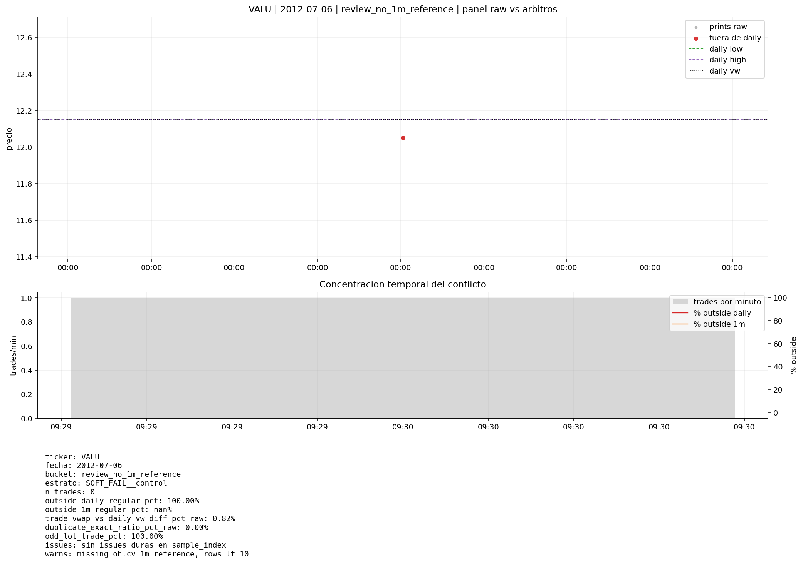

**Que muestra**

- Panel rico del tape raw frente a `daily` y `1m` para `VALU` el `2012-07-06`.
- `n_trades = 1`, `outside_daily_regular_pct = 100.00%`, `outside_1m_regular_pct = nan%`.
- `trade_vwap_vs_daily_vw_diff_pct_raw = 0.82%`, `duplicate_exact_ratio_pct_raw = 0.00%`, `odd_lot_trade_pct = 100.00%`.

**Responde**

- Familia donde existe conflicto, pero falta el arbitro `1m`. Responde a la pregunta de si el caso debe quedarse en incertidumbre disciplinada y no ser absuelto ni condenado por reflejo.
- Responde a si el conflicto dominante vive en la escala (`~1x`), en la comparabilidad frente a `daily` (100.00%) o frente a `1m` (nan%).
- El 100.00% de odd-lots empuja la lectura hacia microestructura fina; evita leer el caso como pura ruptura economica gruesa.
- La decision que justifica es mantener o no el caso en `recoverable_with_flag` cuando se rematerialice la rehabilitacion sobre `57f`.

### AMRB | 2014-01-10

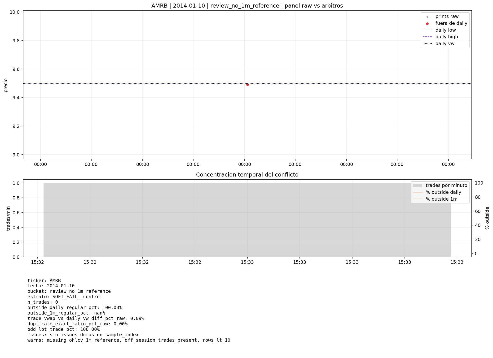

**Que muestra**

- Panel rico del tape raw frente a `daily` y `1m` para `AMRB` el `2014-01-10`.
- `n_trades = 1`, `outside_daily_regular_pct = 100.00%`, `outside_1m_regular_pct = nan%`.
- `trade_vwap_vs_daily_vw_diff_pct_raw = 0.09%`, `duplicate_exact_ratio_pct_raw = 0.00%`, `odd_lot_trade_pct = 100.00%`.

**Responde**

- Familia donde existe conflicto, pero falta el arbitro `1m`. Responde a la pregunta de si el caso debe quedarse en incertidumbre disciplinada y no ser absuelto ni condenado por reflejo.
- Responde a si el conflicto dominante vive en la escala (`~1x`), en la comparabilidad frente a `daily` (100.00%) o frente a `1m` (nan%).
- El 100.00% de odd-lots empuja la lectura hacia microestructura fina; evita leer el caso como pura ruptura economica gruesa.
- La decision que justifica es mantener o no el caso en `recoverable_with_flag` cuando se rematerialice la rehabilitacion sobre `57f`.

### CIX | 2017-11-14

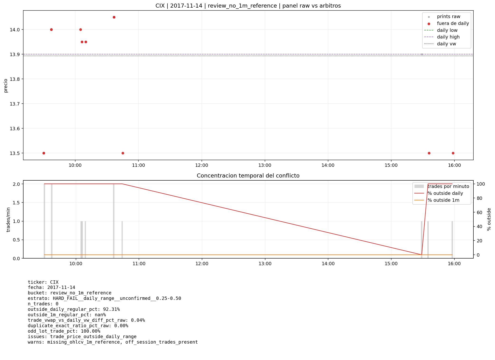

**Que muestra**

- Panel rico del tape raw frente a `daily` y `1m` para `CIX` el `2017-11-14`.
- `n_trades = 13`, `outside_daily_regular_pct = 92.31%`, `outside_1m_regular_pct = nan%`.
- `trade_vwap_vs_daily_vw_diff_pct_raw = 0.04%`, `duplicate_exact_ratio_pct_raw = 0.00%`, `odd_lot_trade_pct = 100.00%`.

**Responde**

- Familia donde existe conflicto, pero falta el arbitro `1m`. Responde a la pregunta de si el caso debe quedarse en incertidumbre disciplinada y no ser absuelto ni condenado por reflejo.
- Responde a si el conflicto dominante vive en la escala (`~1x`), en la comparabilidad frente a `daily` (92.31%) o frente a `1m` (nan%).
- El 100.00% de odd-lots empuja la lectura hacia microestructura fina; evita leer el caso como pura ruptura economica gruesa.
- La decision que justifica es mantener o no el caso en `recoverable_with_flag` cuando se rematerialice la rehabilitacion sobre `57f`.

### CPHC | 2018-08-21

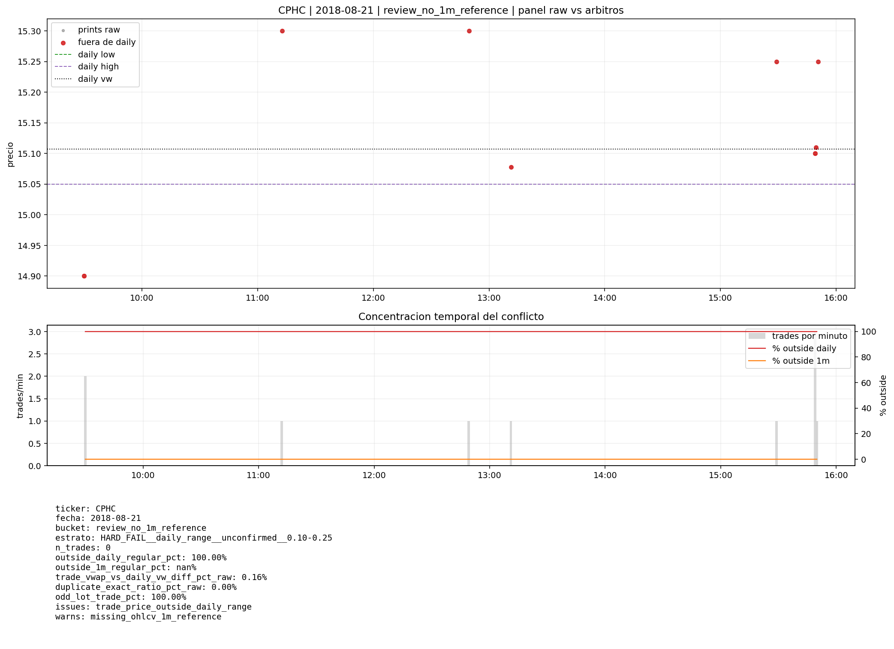

**Que muestra**

- Panel rico del tape raw frente a `daily` y `1m` para `CPHC` el `2018-08-21`.
- `n_trades = 10`, `outside_daily_regular_pct = 100.00%`, `outside_1m_regular_pct = nan%`.
- `trade_vwap_vs_daily_vw_diff_pct_raw = 0.16%`, `duplicate_exact_ratio_pct_raw = 0.00%`, `odd_lot_trade_pct = 100.00%`.

**Responde**

- Familia donde existe conflicto, pero falta el arbitro `1m`. Responde a la pregunta de si el caso debe quedarse en incertidumbre disciplinada y no ser absuelto ni condenado por reflejo.
- Responde a si el conflicto dominante vive en la escala (`~1x`), en la comparabilidad frente a `daily` (100.00%) o frente a `1m` (nan%).
- El 100.00% de odd-lots empuja la lectura hacia microestructura fina; evita leer el caso como pura ruptura economica gruesa.
- La decision que justifica es mantener o no el caso en `recoverable_with_flag` cuando se rematerialice la rehabilitacion sobre `57f`.

### CWBC | 2014-04-07

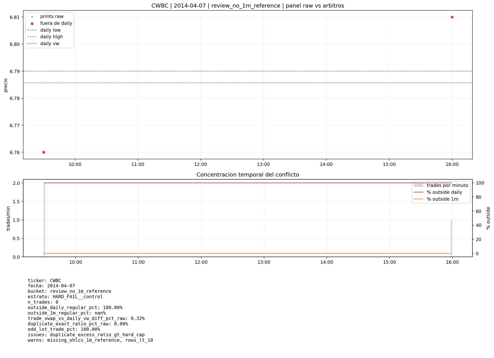

**Que muestra**

- Panel rico del tape raw frente a `daily` y `1m` para `CWBC` el `2014-04-07`.
- `n_trades = 3`, `outside_daily_regular_pct = 100.00%`, `outside_1m_regular_pct = nan%`.
- `trade_vwap_vs_daily_vw_diff_pct_raw = 0.32%`, `duplicate_exact_ratio_pct_raw = 0.00%`, `odd_lot_trade_pct = 100.00%`.

**Responde**

- Familia donde existe conflicto, pero falta el arbitro `1m`. Responde a la pregunta de si el caso debe quedarse en incertidumbre disciplinada y no ser absuelto ni condenado por reflejo.
- Responde a si el conflicto dominante vive en la escala (`~1x`), en la comparabilidad frente a `daily` (100.00%) o frente a `1m` (nan%).
- El 100.00% de odd-lots empuja la lectura hacia microestructura fina; evita leer el caso como pura ruptura economica gruesa.
- La decision que justifica es mantener o no el caso en `recoverable_with_flag` cuando se rematerialice la rehabilitacion sobre `57f`.

### CZWI | 2016-05-20

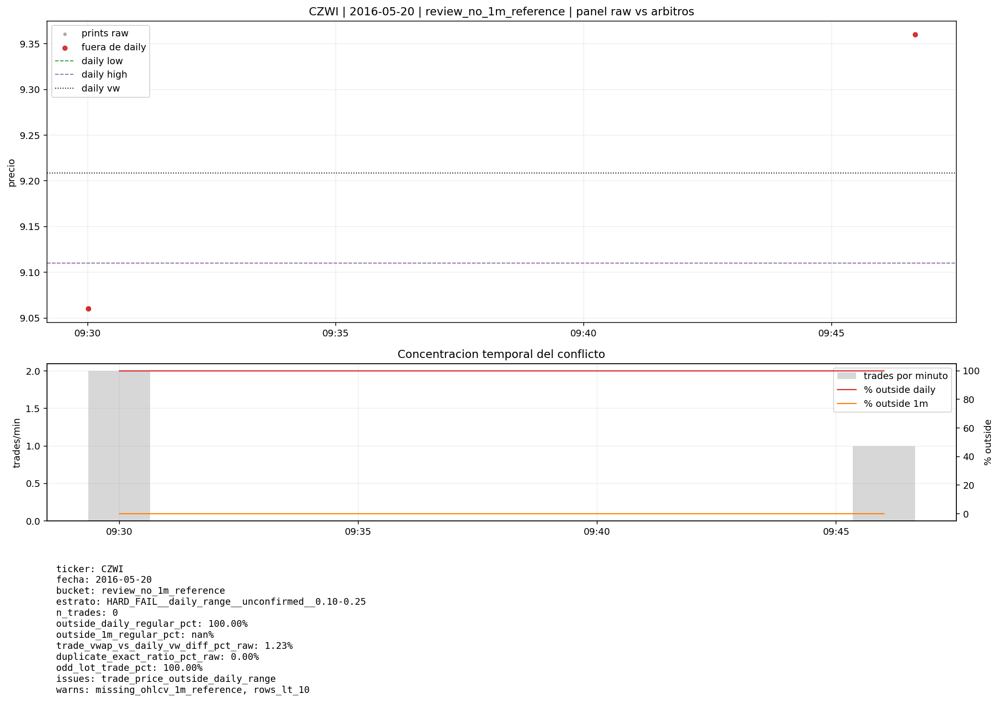

**Que muestra**

- Panel rico del tape raw frente a `daily` y `1m` para `CZWI` el `2016-05-20`.
- `n_trades = 3`, `outside_daily_regular_pct = 100.00%`, `outside_1m_regular_pct = nan%`.
- `trade_vwap_vs_daily_vw_diff_pct_raw = 1.23%`, `duplicate_exact_ratio_pct_raw = 0.00%`, `odd_lot_trade_pct = 100.00%`.

**Responde**

- Familia donde existe conflicto, pero falta el arbitro `1m`. Responde a la pregunta de si el caso debe quedarse en incertidumbre disciplinada y no ser absuelto ni condenado por reflejo.
- Responde a si el conflicto dominante vive en la escala (`~1x`), en la comparabilidad frente a `daily` (100.00%) o frente a `1m` (nan%).
- El 100.00% de odd-lots empuja la lectura hacia microestructura fina; evita leer el caso como pura ruptura economica gruesa.
- La decision que justifica es mantener o no el caso en `recoverable_with_flag` cuando se rematerialice la rehabilitacion sobre `57f`.

### EVBN | 2014-08-18

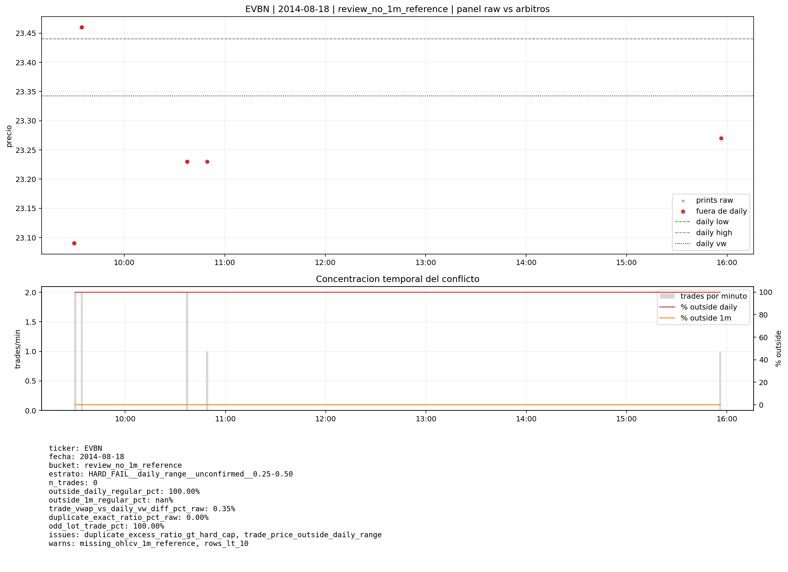

**Que muestra**

- Panel rico del tape raw frente a `daily` y `1m` para `EVBN` el `2014-08-18`.
- `n_trades = 8`, `outside_daily_regular_pct = 100.00%`, `outside_1m_regular_pct = nan%`.
- `trade_vwap_vs_daily_vw_diff_pct_raw = 0.35%`, `duplicate_exact_ratio_pct_raw = 0.00%`, `odd_lot_trade_pct = 100.00%`.

**Responde**

- Familia donde existe conflicto, pero falta el arbitro `1m`. Responde a la pregunta de si el caso debe quedarse en incertidumbre disciplinada y no ser absuelto ni condenado por reflejo.
- Responde a si el conflicto dominante vive en la escala (`~1x`), en la comparabilidad frente a `daily` (100.00%) o frente a `1m` (nan%).
- El 100.00% de odd-lots empuja la lectura hacia microestructura fina; evita leer el caso como pura ruptura economica gruesa.
- La decision que justifica es mantener o no el caso en `recoverable_with_flag` cuando se rematerialice la rehabilitacion sobre `57f`.

### ICCH | 2018-09-14

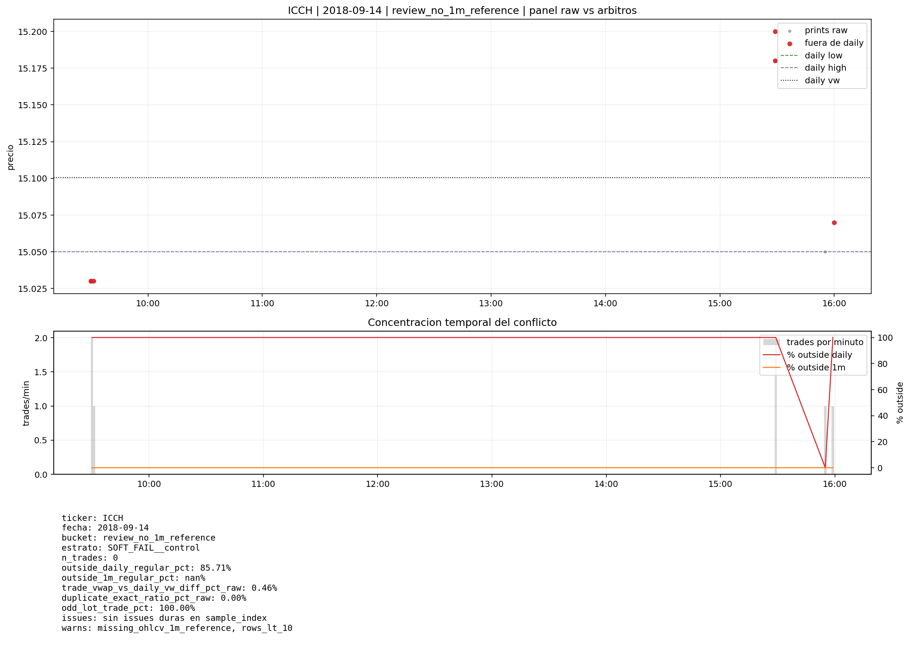

**Que muestra**

- Panel rico del tape raw frente a `daily` y `1m` para `ICCH` el `2018-09-14`.
- `n_trades = 7`, `outside_daily_regular_pct = 85.71%`, `outside_1m_regular_pct = nan%`.
- `trade_vwap_vs_daily_vw_diff_pct_raw = 0.46%`, `duplicate_exact_ratio_pct_raw = 0.00%`, `odd_lot_trade_pct = 100.00%`.

**Responde**

- Familia donde existe conflicto, pero falta el arbitro `1m`. Responde a la pregunta de si el caso debe quedarse en incertidumbre disciplinada y no ser absuelto ni condenado por reflejo.
- Responde a si el conflicto dominante vive en la escala (`~1x`), en la comparabilidad frente a `daily` (85.71%) o frente a `1m` (nan%).
- El 100.00% de odd-lots empuja la lectura hacia microestructura fina; evita leer el caso como pura ruptura economica gruesa.
- La decision que justifica es mantener o no el caso en `recoverable_with_flag` cuando se rematerialice la rehabilitacion sobre `57f`.

### ISRL | 2014-04-25

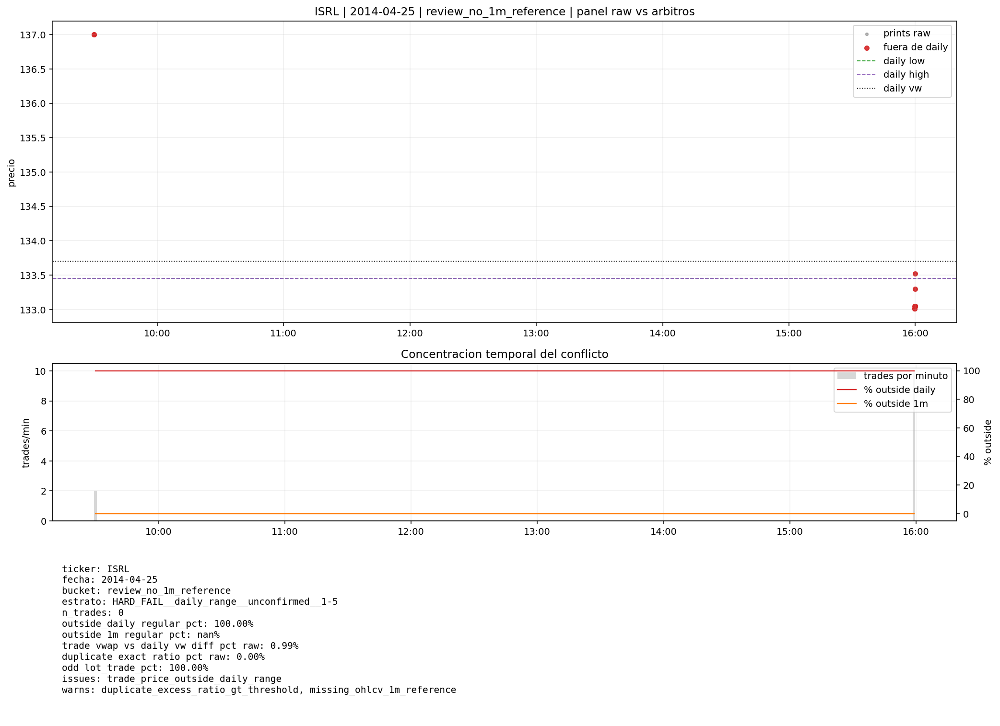

**Que muestra**

- Panel rico del tape raw frente a `daily` y `1m` para `ISRL` el `2014-04-25`.
- `n_trades = 12`, `outside_daily_regular_pct = 100.00%`, `outside_1m_regular_pct = nan%`.
- `trade_vwap_vs_daily_vw_diff_pct_raw = 0.99%`, `duplicate_exact_ratio_pct_raw = 0.00%`, `odd_lot_trade_pct = 100.00%`.

**Responde**

- Familia donde existe conflicto, pero falta el arbitro `1m`. Responde a la pregunta de si el caso debe quedarse en incertidumbre disciplinada y no ser absuelto ni condenado por reflejo.
- Responde a si el conflicto dominante vive en la escala (`~1x`), en la comparabilidad frente a `daily` (100.00%) o frente a `1m` (nan%).
- El 100.00% de odd-lots empuja la lectura hacia microestructura fina; evita leer el caso como pura ruptura economica gruesa.
- La decision que justifica es mantener o no el caso en `recoverable_with_flag` cuando se rematerialice la rehabilitacion sobre `57f`.

### ITIC | 2016-01-21

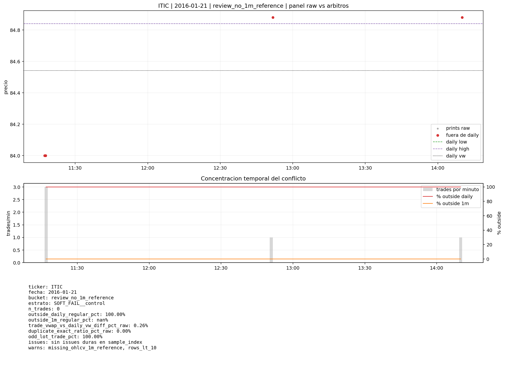

**Que muestra**

- Panel rico del tape raw frente a `daily` y `1m` para `ITIC` el `2016-01-21`.
- `n_trades = 5`, `outside_daily_regular_pct = 100.00%`, `outside_1m_regular_pct = nan%`.
- `trade_vwap_vs_daily_vw_diff_pct_raw = 0.26%`, `duplicate_exact_ratio_pct_raw = 0.00%`, `odd_lot_trade_pct = 100.00%`.

**Responde**

- Familia donde existe conflicto, pero falta el arbitro `1m`. Responde a la pregunta de si el caso debe quedarse en incertidumbre disciplinada y no ser absuelto ni condenado por reflejo.
- Responde a si el conflicto dominante vive en la escala (`~1x`), en la comparabilidad frente a `daily` (100.00%) o frente a `1m` (nan%).
- El 100.00% de odd-lots empuja la lectura hacia microestructura fina; evita leer el caso como pura ruptura economica gruesa.
- La decision que justifica es mantener o no el caso en `recoverable_with_flag` cuando se rematerialice la rehabilitacion sobre `57f`.

### SGRP | 2015-11-30

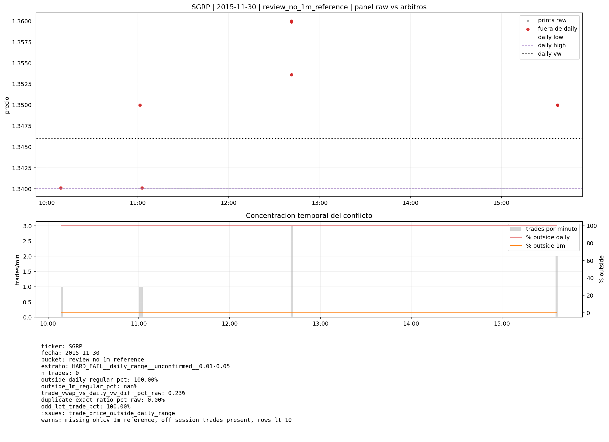

**Que muestra**

- Panel rico del tape raw frente a `daily` y `1m` para `SGRP` el `2015-11-30`.
- `n_trades = 8`, `outside_daily_regular_pct = 100.00%`, `outside_1m_regular_pct = nan%`.
- `trade_vwap_vs_daily_vw_diff_pct_raw = 0.23%`, `duplicate_exact_ratio_pct_raw = 0.00%`, `odd_lot_trade_pct = 100.00%`.

**Responde**

- Familia donde existe conflicto, pero falta el arbitro `1m`. Responde a la pregunta de si el caso debe quedarse en incertidumbre disciplinada y no ser absuelto ni condenado por reflejo.
- Responde a si el conflicto dominante vive en la escala (`~1x`), en la comparabilidad frente a `daily` (100.00%) o frente a `1m` (nan%).
- El 100.00% de odd-lots empuja la lectura hacia microestructura fina; evita leer el caso como pura ruptura economica gruesa.
- La decision que justifica es mantener o no el caso en `recoverable_with_flag` cuando se rematerialice la rehabilitacion sobre `57f`.

### SLI | 2016-01-26

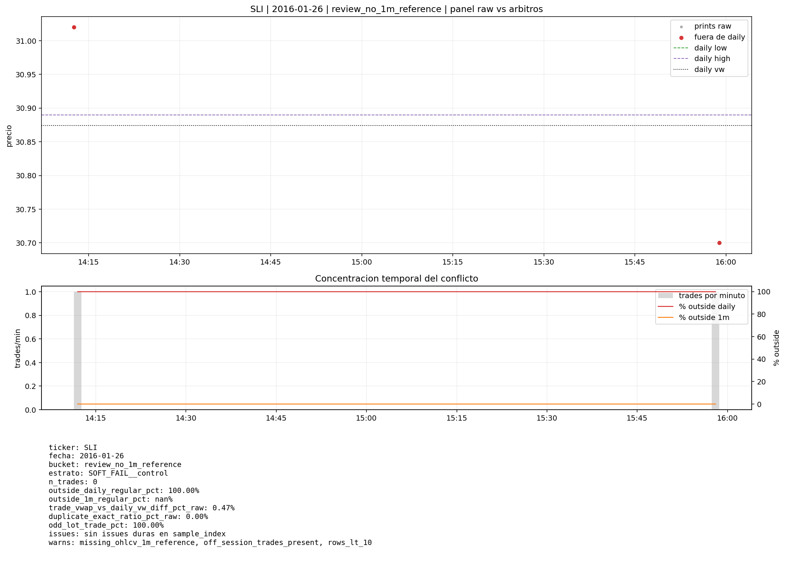

**Que muestra**

- Panel rico del tape raw frente a `daily` y `1m` para `SLI` el `2016-01-26`.
- `n_trades = 2`, `outside_daily_regular_pct = 100.00%`, `outside_1m_regular_pct = nan%`.
- `trade_vwap_vs_daily_vw_diff_pct_raw = 0.47%`, `duplicate_exact_ratio_pct_raw = 0.00%`, `odd_lot_trade_pct = 100.00%`.

**Responde**

- Familia donde existe conflicto, pero falta el arbitro `1m`. Responde a la pregunta de si el caso debe quedarse en incertidumbre disciplinada y no ser absuelto ni condenado por reflejo.
- Responde a si el conflicto dominante vive en la escala (`~1x`), en la comparabilidad frente a `daily` (100.00%) o frente a `1m` (nan%).
- El 100.00% de odd-lots empuja la lectura hacia microestructura fina; evita leer el caso como pura ruptura economica gruesa.
- La decision que justifica es mantener o no el caso en `recoverable_with_flag` cuando se rematerialice la rehabilitacion sobre `57f`.

### ALTS | 2019-01-07

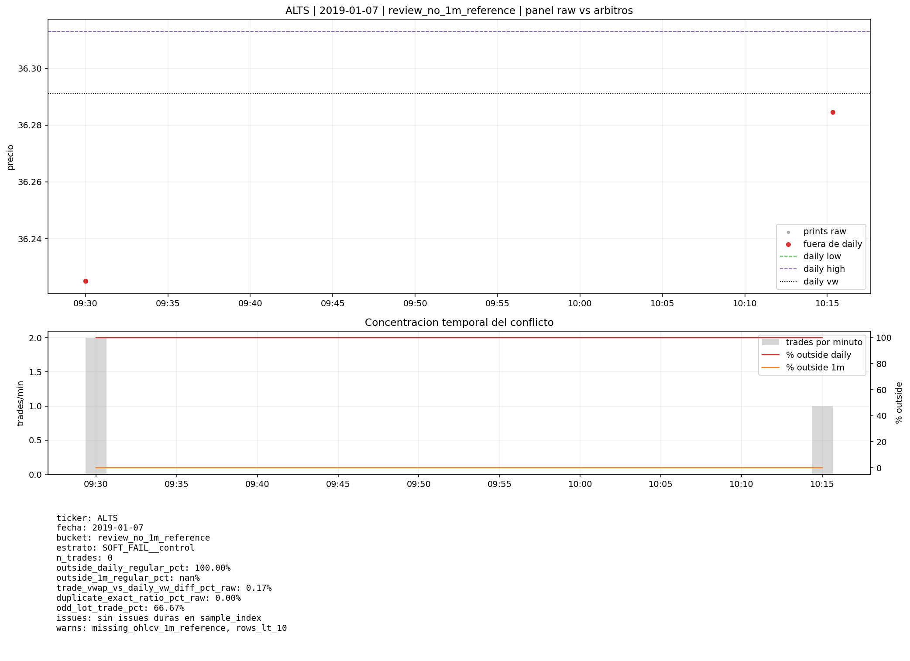

**Que muestra**

- Panel rico del tape raw frente a `daily` y `1m` para `ALTS` el `2019-01-07`.
- `n_trades = 3`, `outside_daily_regular_pct = 100.00%`, `outside_1m_regular_pct = nan%`.
- `trade_vwap_vs_daily_vw_diff_pct_raw = 0.17%`, `duplicate_exact_ratio_pct_raw = 0.00%`, `odd_lot_trade_pct = 66.67%`.

**Responde**

- Familia donde existe conflicto, pero falta el arbitro `1m`. Responde a la pregunta de si el caso debe quedarse en incertidumbre disciplinada y no ser absuelto ni condenado por reflejo.
- Responde a si el conflicto dominante vive en la escala (`~1x`), en la comparabilidad frente a `daily` (100.00%) o frente a `1m` (nan%).
- El 66.67% de odd-lots empuja la lectura hacia microestructura fina; evita leer el caso como pura ruptura economica gruesa.
- La decision que justifica es mantener o no el caso en `recoverable_with_flag` cuando se rematerialice la rehabilitacion sobre `57f`.

### ALTS | 2019-01-28

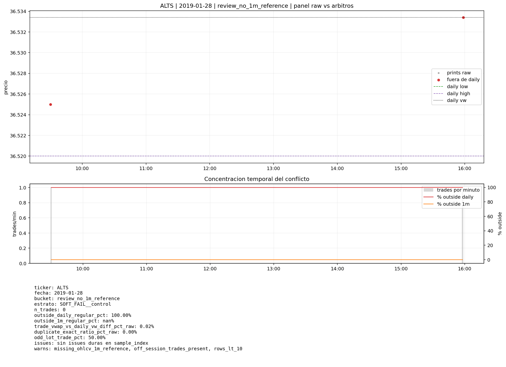

**Que muestra**

- Panel rico del tape raw frente a `daily` y `1m` para `ALTS` el `2019-01-28`.
- `n_trades = 2`, `outside_daily_regular_pct = 100.00%`, `outside_1m_regular_pct = nan%`.
- `trade_vwap_vs_daily_vw_diff_pct_raw = 0.02%`, `duplicate_exact_ratio_pct_raw = 0.00%`, `odd_lot_trade_pct = 50.00%`.

**Responde**

- Familia donde existe conflicto, pero falta el arbitro `1m`. Responde a la pregunta de si el caso debe quedarse en incertidumbre disciplinada y no ser absuelto ni condenado por reflejo.
- Responde a si el conflicto dominante vive en la escala (`~1x`), en la comparabilidad frente a `daily` (100.00%) o frente a `1m` (nan%).
- El 50.00% de odd-lots empuja la lectura hacia microestructura fina; evita leer el caso como pura ruptura economica gruesa.
- La decision que justifica es mantener o no el caso en `recoverable_with_flag` cuando se rematerialice la rehabilitacion sobre `57f`.

### ALTS | 2019-03-26

**Que muestra**

- Panel rico del tape raw frente a `daily` y `1m` para `ALTS` el `2019-03-26`.
- `n_trades = 4`, `outside_daily_regular_pct = 100.00%`, `outside_1m_regular_pct = nan%`.
- `trade_vwap_vs_daily_vw_diff_pct_raw = 0.20%`, `duplicate_exact_ratio_pct_raw = 0.00%`, `odd_lot_trade_pct = 75.00%`.

**Responde**

- Familia donde existe conflicto, pero falta el arbitro `1m`. Responde a la pregunta de si el caso debe quedarse en incertidumbre disciplinada y no ser absuelto ni condenado por reflejo.
- Responde a si el conflicto dominante vive en la escala (`~1x`), en la comparabilidad frente a `daily` (100.00%) o frente a `1m` (nan%).
- El 75.00% de odd-lots empuja la lectura hacia microestructura fina; evita leer el caso como pura ruptura economica gruesa.
- La decision que justifica es mantener o no el caso en `recoverable_with_flag` cuando se rematerialice la rehabilitacion sobre `57f`.

### ARP | 2024-11-22

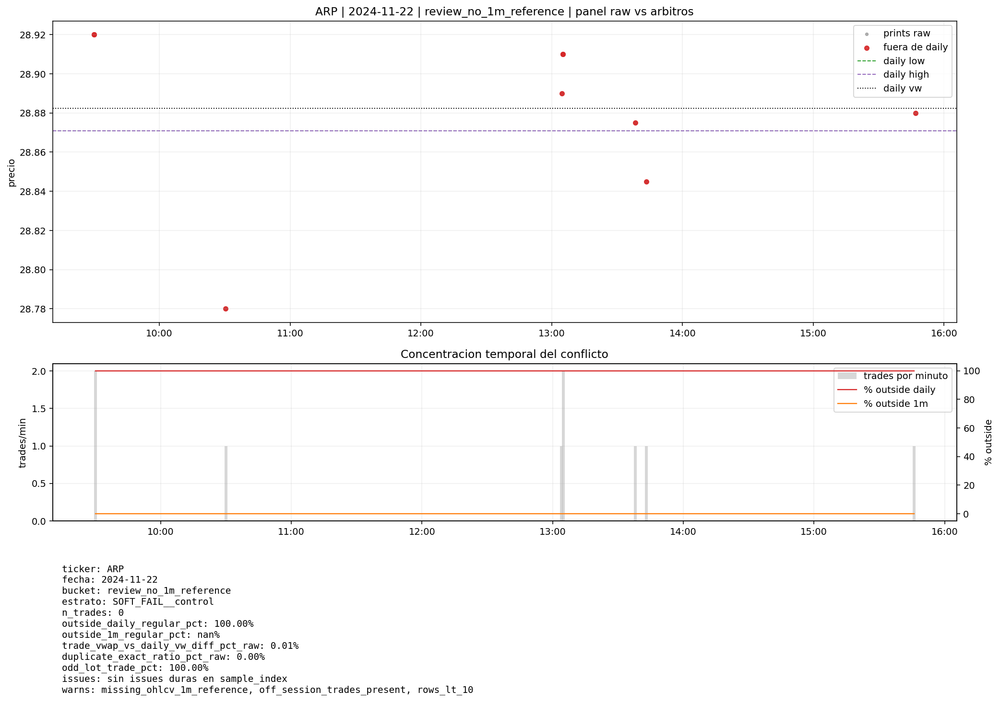

**Que muestra**

- Panel rico del tape raw frente a `daily` y `1m` para `ARP` el `2024-11-22`.
- `n_trades = 9`, `outside_daily_regular_pct = 100.00%`, `outside_1m_regular_pct = nan%`.
- `trade_vwap_vs_daily_vw_diff_pct_raw = 0.01%`, `duplicate_exact_ratio_pct_raw = 0.00%`, `odd_lot_trade_pct = 100.00%`.

**Responde**

- Familia donde existe conflicto, pero falta el arbitro `1m`. Responde a la pregunta de si el caso debe quedarse en incertidumbre disciplinada y no ser absuelto ni condenado por reflejo.
- Responde a si el conflicto dominante vive en la escala (`~1x`), en la comparabilidad frente a `daily` (100.00%) o frente a `1m` (nan%).
- El 100.00% de odd-lots empuja la lectura hacia microestructura fina; evita leer el caso como pura ruptura economica gruesa.
- La decision que justifica es mantener o no el caso en `recoverable_with_flag` cuando se rematerialice la rehabilitacion sobre `57f`.

### BLUA | 2023-04-06

**Que muestra**

- Panel rico del tape raw frente a `daily` y `1m` para `BLUA` el `2023-04-06`.
- `n_trades = 1`, `outside_daily_regular_pct = 100.00%`, `outside_1m_regular_pct = nan%`.
- `trade_vwap_vs_daily_vw_diff_pct_raw = 0.20%`, `duplicate_exact_ratio_pct_raw = 0.00%`, `odd_lot_trade_pct = 100.00%`.

**Responde**

- Familia donde existe conflicto, pero falta el arbitro `1m`. Responde a la pregunta de si el caso debe quedarse en incertidumbre disciplinada y no ser absuelto ni condenado por reflejo.
- Responde a si el conflicto dominante vive en la escala (`~1x`), en la comparabilidad frente a `daily` (100.00%) o frente a `1m` (nan%).
- El 100.00% de odd-lots empuja la lectura hacia microestructura fina; evita leer el caso como pura ruptura economica gruesa.
- La decision que justifica es mantener o no el caso en `recoverable_with_flag` cuando se rematerialice la rehabilitacion sobre `57f`.

### BREZ | 2021-12-22

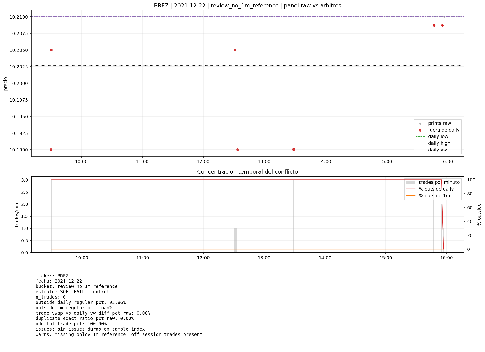

**Que muestra**

- Panel rico del tape raw frente a `daily` y `1m` para `BREZ` el `2021-12-22`.
- `n_trades = 14`, `outside_daily_regular_pct = 92.86%`, `outside_1m_regular_pct = nan%`.
- `trade_vwap_vs_daily_vw_diff_pct_raw = 0.08%`, `duplicate_exact_ratio_pct_raw = 0.00%`, `odd_lot_trade_pct = 100.00%`.

**Responde**

- Familia donde existe conflicto, pero falta el arbitro `1m`. Responde a la pregunta de si el caso debe quedarse en incertidumbre disciplinada y no ser absuelto ni condenado por reflejo.
- Responde a si el conflicto dominante vive en la escala (`~1x`), en la comparabilidad frente a `daily` (92.86%) o frente a `1m` (nan%).
- El 100.00% de odd-lots empuja la lectura hacia microestructura fina; evita leer el caso como pura ruptura economica gruesa.
- La decision que justifica es mantener o no el caso en `recoverable_with_flag` cuando se rematerialice la rehabilitacion sobre `57f`.

### CAS | 2025-06-23

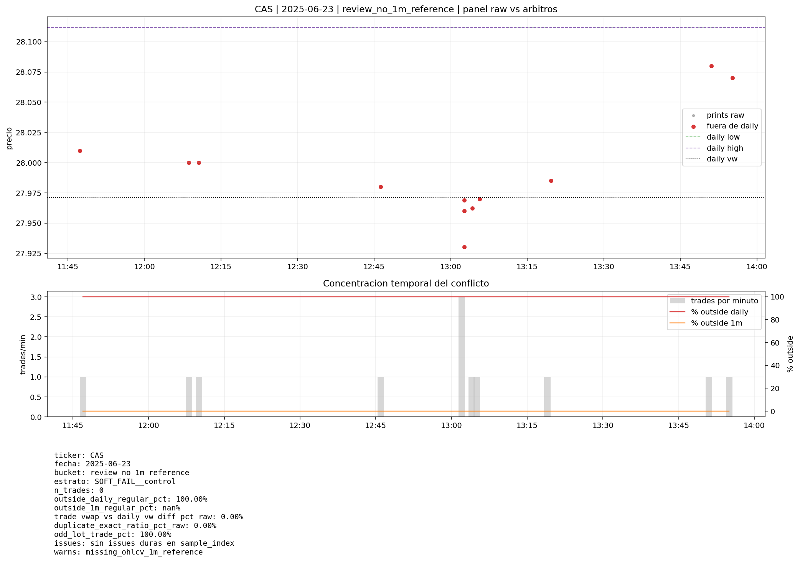

**Que muestra**

- Panel rico del tape raw frente a `daily` y `1m` para `CAS` el `2025-06-23`.
- `n_trades = 12`, `outside_daily_regular_pct = 100.00%`, `outside_1m_regular_pct = nan%`.
- `trade_vwap_vs_daily_vw_diff_pct_raw = 0.00%`, `duplicate_exact_ratio_pct_raw = 0.00%`, `odd_lot_trade_pct = 100.00%`.

**Responde**

- Familia donde existe conflicto, pero falta el arbitro `1m`. Responde a la pregunta de si el caso debe quedarse en incertidumbre disciplinada y no ser absuelto ni condenado por reflejo.
- Responde a si el conflicto dominante vive en la escala (`~1x`), en la comparabilidad frente a `daily` (100.00%) o frente a `1m` (nan%).
- El 100.00% de odd-lots empuja la lectura hacia microestructura fina; evita leer el caso como pura ruptura economica gruesa.
- La decision que justifica es mantener o no el caso en `recoverable_with_flag` cuando se rematerialice la rehabilitacion sobre `57f`.

### CAS | 2025-07-24

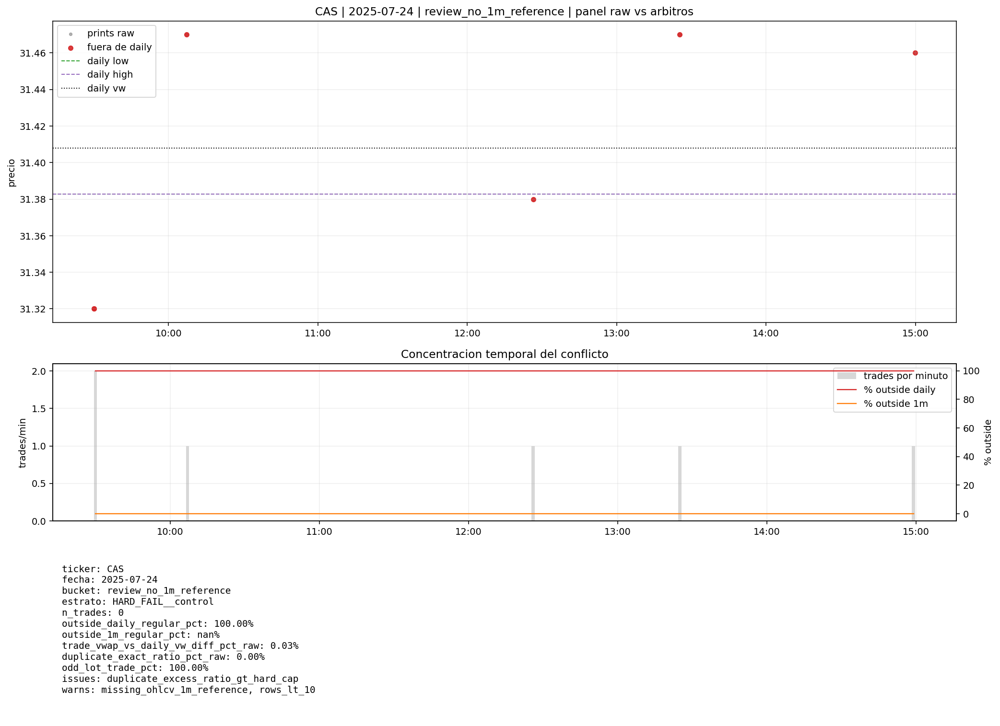

**Que muestra**

- Panel rico del tape raw frente a `daily` y `1m` para `CAS` el `2025-07-24`.
- `n_trades = 6`, `outside_daily_regular_pct = 100.00%`, `outside_1m_regular_pct = nan%`.
- `trade_vwap_vs_daily_vw_diff_pct_raw = 0.03%`, `duplicate_exact_ratio_pct_raw = 0.00%`, `odd_lot_trade_pct = 100.00%`.

**Responde**

- Familia donde existe conflicto, pero falta el arbitro `1m`. Responde a la pregunta de si el caso debe quedarse en incertidumbre disciplinada y no ser absuelto ni condenado por reflejo.
- Responde a si el conflicto dominante vive en la escala (`~1x`), en la comparabilidad frente a `daily` (100.00%) o frente a `1m` (nan%).
- El 100.00% de odd-lots empuja la lectura hacia microestructura fina; evita leer el caso como pura ruptura economica gruesa.
- La decision que justifica es mantener o no el caso en `recoverable_with_flag` cuando se rematerialice la rehabilitacion sobre `57f`.

### CATC | 2019-03-12

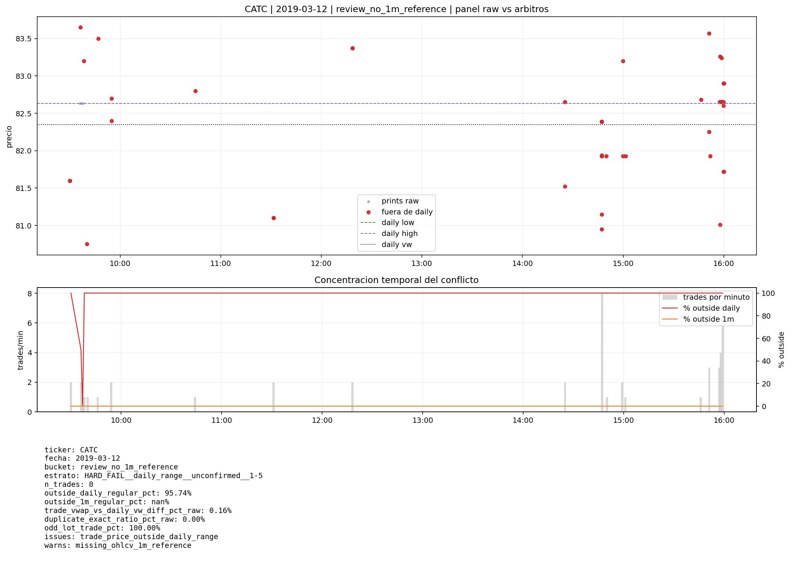

**Que muestra**

- Panel rico del tape raw frente a `daily` y `1m` para `CATC` el `2019-03-12`.
- `n_trades = 47`, `outside_daily_regular_pct = 95.74%`, `outside_1m_regular_pct = nan%`.
- `trade_vwap_vs_daily_vw_diff_pct_raw = 0.16%`, `duplicate_exact_ratio_pct_raw = 0.00%`, `odd_lot_trade_pct = 100.00%`.

**Responde**

- Familia donde existe conflicto, pero falta el arbitro `1m`. Responde a la pregunta de si el caso debe quedarse en incertidumbre disciplinada y no ser absuelto ni condenado por reflejo.
- Responde a si el conflicto dominante vive en la escala (`~1x`), en la comparabilidad frente a `daily` (95.74%) o frente a `1m` (nan%).
- El 100.00% de odd-lots empuja la lectura hacia microestructura fina; evita leer el caso como pura ruptura economica gruesa.
- La decision que justifica es mantener o no el caso en `recoverable_with_flag` cuando se rematerialice la rehabilitacion sobre `57f`.

### CFBK | 2024-01-24

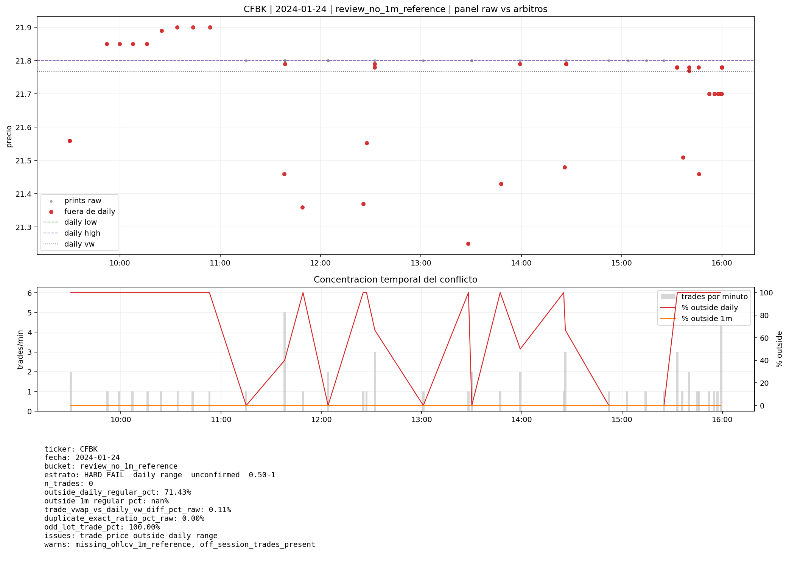

**Que muestra**

- Panel rico del tape raw frente a `daily` y `1m` para `CFBK` el `2024-01-24`.
- `n_trades = 56`, `outside_daily_regular_pct = 71.43%`, `outside_1m_regular_pct = nan%`.
- `trade_vwap_vs_daily_vw_diff_pct_raw = 0.11%`, `duplicate_exact_ratio_pct_raw = 0.00%`, `odd_lot_trade_pct = 100.00%`.

**Responde**

- Familia donde existe conflicto, pero falta el arbitro `1m`. Responde a la pregunta de si el caso debe quedarse en incertidumbre disciplinada y no ser absuelto ni condenado por reflejo.
- Responde a si el conflicto dominante vive en la escala (`~1x`), en la comparabilidad frente a `daily` (71.43%) o frente a `1m` (nan%).
- El 100.00% de odd-lots empuja la lectura hacia microestructura fina; evita leer el caso como pura ruptura economica gruesa.
- La decision que justifica es mantener o no el caso en `recoverable_with_flag` cuando se rematerialice la rehabilitacion sobre `57f`.

### CFBK | 2024-09-27

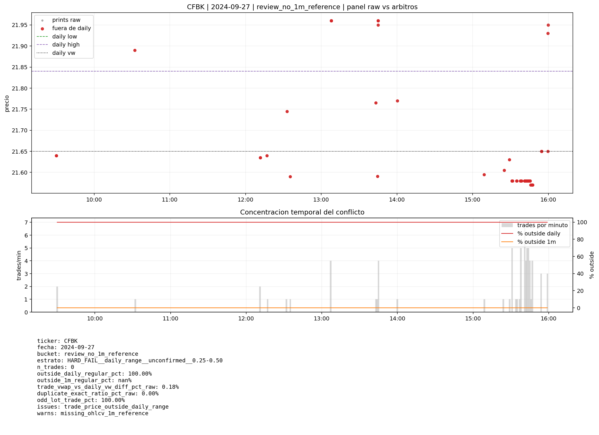

**Que muestra**

- Panel rico del tape raw frente a `daily` y `1m` para `CFBK` el `2024-09-27`.
- `n_trades = 71`, `outside_daily_regular_pct = 100.00%`, `outside_1m_regular_pct = nan%`.
- `trade_vwap_vs_daily_vw_diff_pct_raw = 0.18%`, `duplicate_exact_ratio_pct_raw = 0.00%`, `odd_lot_trade_pct = 100.00%`.

**Responde**

- Familia donde existe conflicto, pero falta el arbitro `1m`. Responde a la pregunta de si el caso debe quedarse en incertidumbre disciplinada y no ser absuelto ni condenado por reflejo.
- Responde a si el conflicto dominante vive en la escala (`~1x`), en la comparabilidad frente a `daily` (100.00%) o frente a `1m` (nan%).
- El 100.00% de odd-lots empuja la lectura hacia microestructura fina; evita leer el caso como pura ruptura economica gruesa.
- La decision que justifica es mantener o no el caso en `recoverable_with_flag` cuando se rematerialice la rehabilitacion sobre `57f`.

### CGRO | 2024-06-12

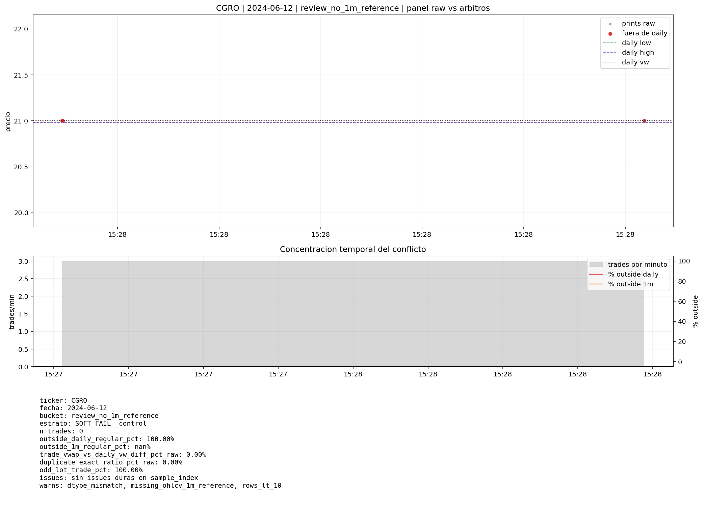

**Que muestra**

- Panel rico del tape raw frente a `daily` y `1m` para `CGRO` el `2024-06-12`.
- `n_trades = 3`, `outside_daily_regular_pct = 100.00%`, `outside_1m_regular_pct = nan%`.
- `trade_vwap_vs_daily_vw_diff_pct_raw = 0.00%`, `duplicate_exact_ratio_pct_raw = 0.00%`, `odd_lot_trade_pct = 100.00%`.

**Responde**

- Familia donde existe conflicto, pero falta el arbitro `1m`. Responde a la pregunta de si el caso debe quedarse en incertidumbre disciplinada y no ser absuelto ni condenado por reflejo.
- Responde a si el conflicto dominante vive en la escala (`~1x`), en la comparabilidad frente a `daily` (100.00%) o frente a `1m` (nan%).
- El 100.00% de odd-lots empuja la lectura hacia microestructura fina; evita leer el caso como pura ruptura economica gruesa.
- La decision que justifica es mantener o no el caso en `recoverable_with_flag` cuando se rematerialice la rehabilitacion sobre `57f`.

### CXAC | 2023-10-20

**Que muestra**

- Panel rico del tape raw frente a `daily` y `1m` para `CXAC` el `2023-10-20`.
- `n_trades = 1`, `outside_daily_regular_pct = 100.00%`, `outside_1m_regular_pct = nan%`.
- `trade_vwap_vs_daily_vw_diff_pct_raw = 0.37%`, `duplicate_exact_ratio_pct_raw = 0.00%`, `odd_lot_trade_pct = 100.00%`.

**Responde**

- Familia donde existe conflicto, pero falta el arbitro `1m`. Responde a la pregunta de si el caso debe quedarse en incertidumbre disciplinada y no ser absuelto ni condenado por reflejo.
- Responde a si el conflicto dominante vive en la escala (`~1x`), en la comparabilidad frente a `daily` (100.00%) o frente a `1m` (nan%).
- El 100.00% de odd-lots empuja la lectura hacia microestructura fina; evita leer el caso como pura ruptura economica gruesa.
- La decision que justifica es mantener o no el caso en `recoverable_with_flag` cuando se rematerialice la rehabilitacion sobre `57f`.

### DJCO | 2023-12-22

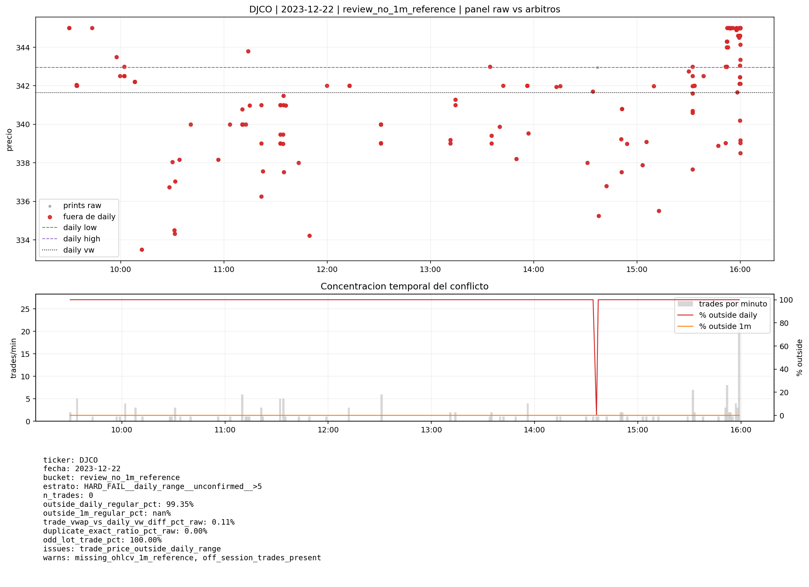

**Que muestra**

- Panel rico del tape raw frente a `daily` y `1m` para `DJCO` el `2023-12-22`.
- `n_trades = 155`, `outside_daily_regular_pct = 99.35%`, `outside_1m_regular_pct = nan%`.
- `trade_vwap_vs_daily_vw_diff_pct_raw = 0.11%`, `duplicate_exact_ratio_pct_raw = 0.00%`, `odd_lot_trade_pct = 100.00%`.

**Responde**

- Familia donde existe conflicto, pero falta el arbitro `1m`. Responde a la pregunta de si el caso debe quedarse en incertidumbre disciplinada y no ser absuelto ni condenado por reflejo.
- Responde a si el conflicto dominante vive en la escala (`~1x`), en la comparabilidad frente a `daily` (99.35%) o frente a `1m` (nan%).
- El 100.00% de odd-lots empuja la lectura hacia microestructura fina; evita leer el caso como pura ruptura economica gruesa.
- La decision que justifica es mantener o no el caso en `recoverable_with_flag` cuando se rematerialice la rehabilitacion sobre `57f`.

### EDGE | 2025-03-19

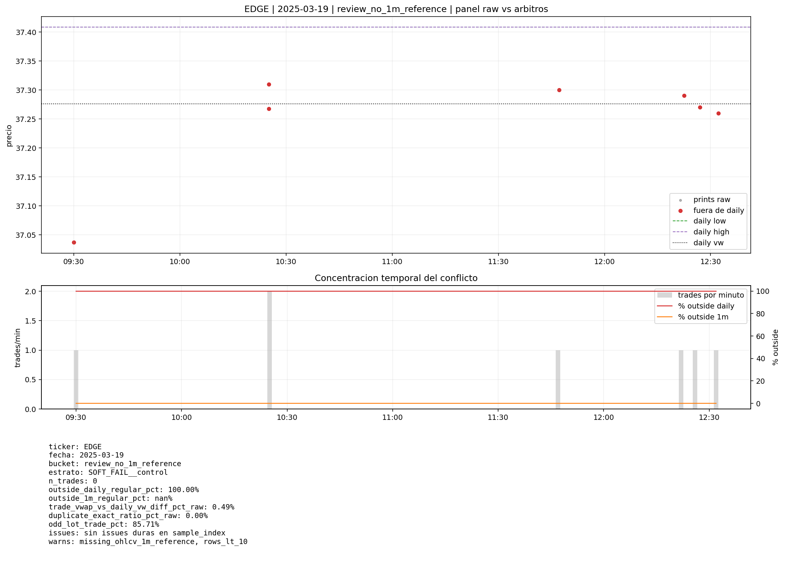

**Que muestra**

- Panel rico del tape raw frente a `daily` y `1m` para `EDGE` el `2025-03-19`.
- `n_trades = 7`, `outside_daily_regular_pct = 100.00%`, `outside_1m_regular_pct = nan%`.
- `trade_vwap_vs_daily_vw_diff_pct_raw = 0.49%`, `duplicate_exact_ratio_pct_raw = 0.00%`, `odd_lot_trade_pct = 85.71%`.

**Responde**

- Familia donde existe conflicto, pero falta el arbitro `1m`. Responde a la pregunta de si el caso debe quedarse en incertidumbre disciplinada y no ser absuelto ni condenado por reflejo.
- Responde a si el conflicto dominante vive en la escala (`~1x`), en la comparabilidad frente a `daily` (100.00%) o frente a `1m` (nan%).
- El 85.71% de odd-lots empuja la lectura hacia microestructura fina; evita leer el caso como pura ruptura economica gruesa.
- La decision que justifica es mantener o no el caso en `recoverable_with_flag` cuando se rematerialice la rehabilitacion sobre `57f`.

### EDGE | 2025-08-29

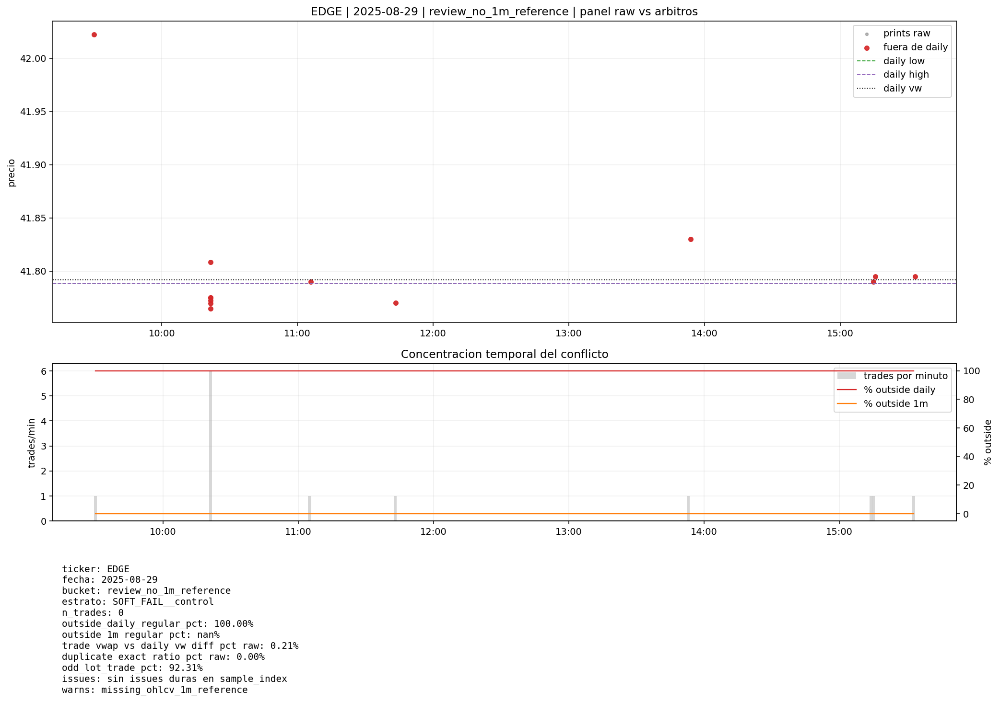

**Que muestra**

- Panel rico del tape raw frente a `daily` y `1m` para `EDGE` el `2025-08-29`.
- `n_trades = 13`, `outside_daily_regular_pct = 100.00%`, `outside_1m_regular_pct = nan%`.
- `trade_vwap_vs_daily_vw_diff_pct_raw = 0.21%`, `duplicate_exact_ratio_pct_raw = 0.00%`, `odd_lot_trade_pct = 92.31%`.

**Responde**

- Familia donde existe conflicto, pero falta el arbitro `1m`. Responde a la pregunta de si el caso debe quedarse en incertidumbre disciplinada y no ser absuelto ni condenado por reflejo.
- Responde a si el conflicto dominante vive en la escala (`~1x`), en la comparabilidad frente a `daily` (100.00%) o frente a `1m` (nan%).
- El 92.31% de odd-lots empuja la lectura hacia microestructura fina; evita leer el caso como pura ruptura economica gruesa.
- La decision que justifica es mantener o no el caso en `recoverable_with_flag` cuando se rematerialice la rehabilitacion sobre `57f`.

### EDGE | 2026-01-28

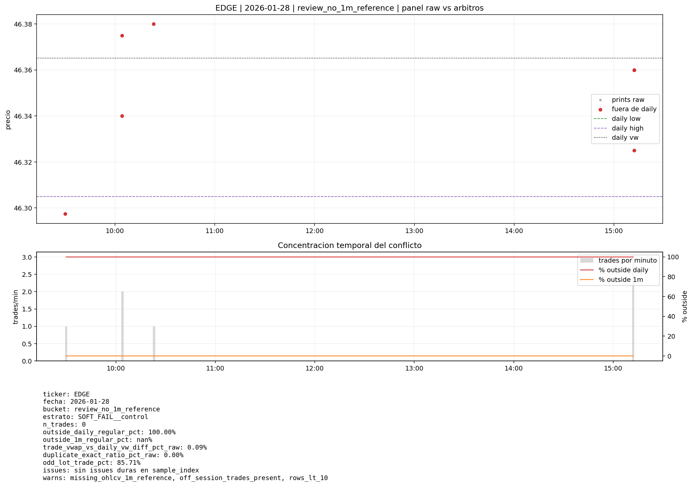

**Que muestra**

- Panel rico del tape raw frente a `daily` y `1m` para `EDGE` el `2026-01-28`.
- `n_trades = 7`, `outside_daily_regular_pct = 100.00%`, `outside_1m_regular_pct = nan%`.
- `trade_vwap_vs_daily_vw_diff_pct_raw = 0.09%`, `duplicate_exact_ratio_pct_raw = 0.00%`, `odd_lot_trade_pct = 85.71%`.

**Responde**

- Familia donde existe conflicto, pero falta el arbitro `1m`. Responde a la pregunta de si el caso debe quedarse en incertidumbre disciplinada y no ser absuelto ni condenado por reflejo.
- Responde a si el conflicto dominante vive en la escala (`~1x`), en la comparabilidad frente a `daily` (100.00%) o frente a `1m` (nan%).
- El 85.71% de odd-lots empuja la lectura hacia microestructura fina; evita leer el caso como pura ruptura economica gruesa.
- La decision que justifica es mantener o no el caso en `recoverable_with_flag` cuando se rematerialice la rehabilitacion sobre `57f`.

### EDGE | 2026-02-18

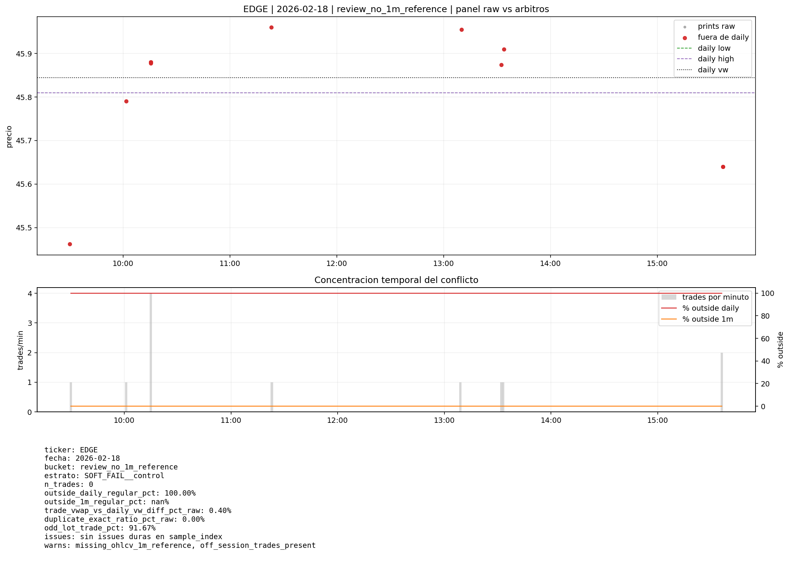

**Que muestra**

- Panel rico del tape raw frente a `daily` y `1m` para `EDGE` el `2026-02-18`.
- `n_trades = 12`, `outside_daily_regular_pct = 100.00%`, `outside_1m_regular_pct = nan%`.
- `trade_vwap_vs_daily_vw_diff_pct_raw = 0.40%`, `duplicate_exact_ratio_pct_raw = 0.00%`, `odd_lot_trade_pct = 91.67%`.

**Responde**

- Familia donde existe conflicto, pero falta el arbitro `1m`. Responde a la pregunta de si el caso debe quedarse en incertidumbre disciplinada y no ser absuelto ni condenado por reflejo.
- Responde a si el conflicto dominante vive en la escala (`~1x`), en la comparabilidad frente a `daily` (100.00%) o frente a `1m` (nan%).
- El 91.67% de odd-lots empuja la lectura hacia microestructura fina; evita leer el caso como pura ruptura economica gruesa.
- La decision que justifica es mantener o no el caso en `recoverable_with_flag` cuando se rematerialice la rehabilitacion sobre `57f`.

### EGLE | 2025-11-03

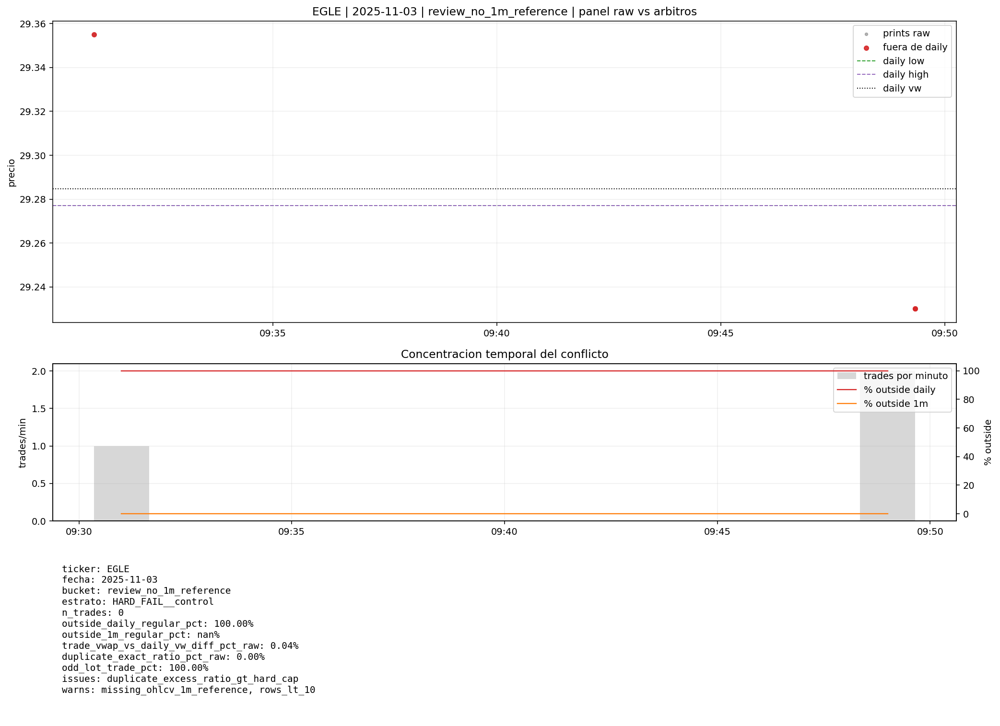

**Que muestra**

- Panel rico del tape raw frente a `daily` y `1m` para `EGLE` el `2025-11-03`.
- `n_trades = 3`, `outside_daily_regular_pct = 100.00%`, `outside_1m_regular_pct = nan%`.
- `trade_vwap_vs_daily_vw_diff_pct_raw = 0.04%`, `duplicate_exact_ratio_pct_raw = 0.00%`, `odd_lot_trade_pct = 100.00%`.

**Responde**

- Familia donde existe conflicto, pero falta el arbitro `1m`. Responde a la pregunta de si el caso debe quedarse en incertidumbre disciplinada y no ser absuelto ni condenado por reflejo.
- Responde a si el conflicto dominante vive en la escala (`~1x`), en la comparabilidad frente a `daily` (100.00%) o frente a `1m` (nan%).
- El 100.00% de odd-lots empuja la lectura hacia microestructura fina; evita leer el caso como pura ruptura economica gruesa.
- La decision que justifica es mantener o no el caso en `recoverable_with_flag` cuando se rematerialice la rehabilitacion sobre `57f`.

### EYEG | 2024-02-06

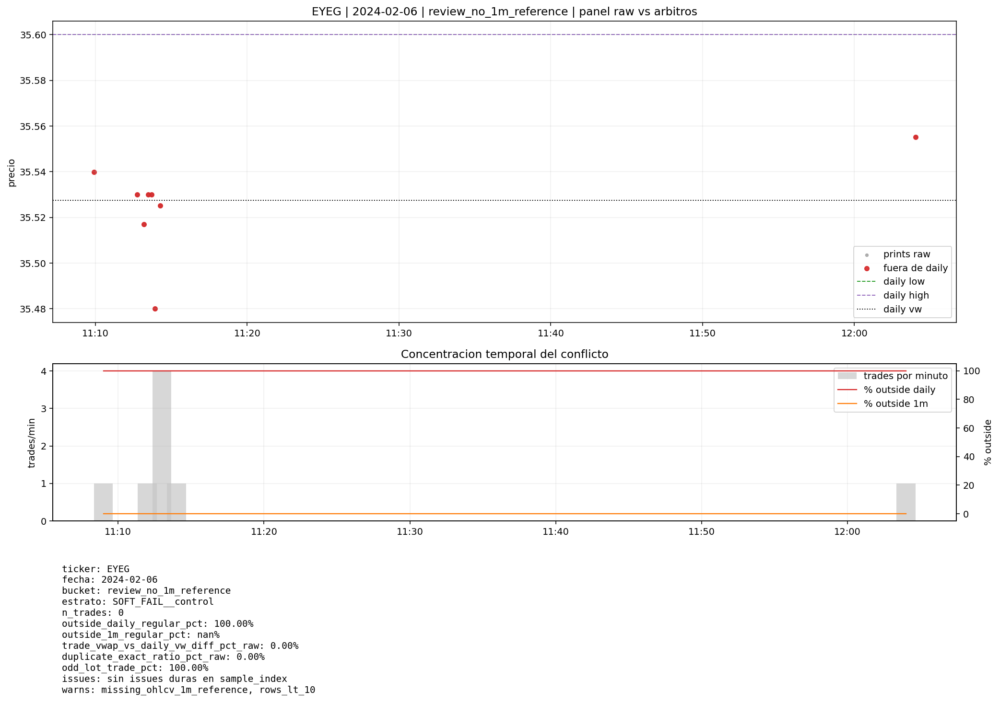

**Que muestra**

- Panel rico del tape raw frente a `daily` y `1m` para `EYEG` el `2024-02-06`.
- `n_trades = 8`, `outside_daily_regular_pct = 100.00%`, `outside_1m_regular_pct = nan%`.
- `trade_vwap_vs_daily_vw_diff_pct_raw = 0.00%`, `duplicate_exact_ratio_pct_raw = 0.00%`, `odd_lot_trade_pct = 100.00%`.

**Responde**

- Familia donde existe conflicto, pero falta el arbitro `1m`. Responde a la pregunta de si el caso debe quedarse en incertidumbre disciplinada y no ser absuelto ni condenado por reflejo.
- Responde a si el conflicto dominante vive en la escala (`~1x`), en la comparabilidad frente a `daily` (100.00%) o frente a `1m` (nan%).
- El 100.00% de odd-lots empuja la lectura hacia microestructura fina; evita leer el caso como pura ruptura economica gruesa.
- La decision que justifica es mantener o no el caso en `recoverable_with_flag` cuando se rematerialice la rehabilitacion sobre `57f`.

### EYEG | 2024-03-14

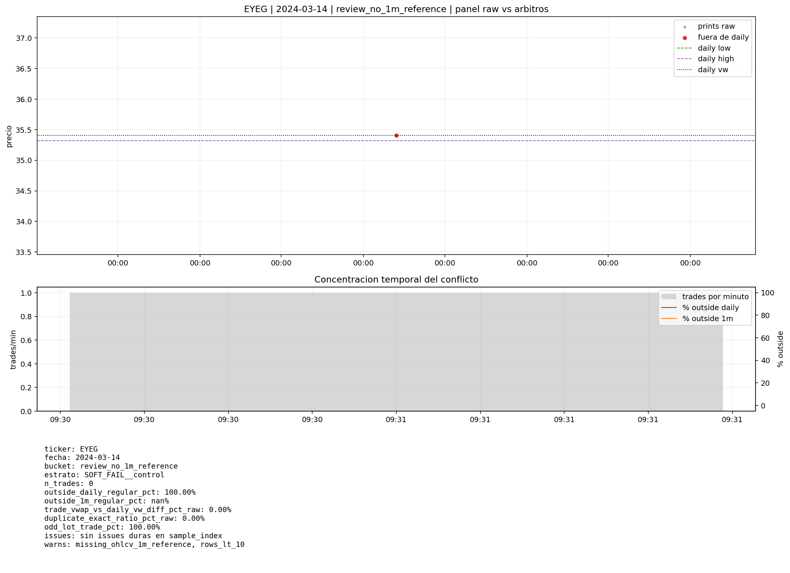

**Que muestra**

- Panel rico del tape raw frente a `daily` y `1m` para `EYEG` el `2024-03-14`.
- `n_trades = 1`, `outside_daily_regular_pct = 100.00%`, `outside_1m_regular_pct = nan%`.
- `trade_vwap_vs_daily_vw_diff_pct_raw = 0.00%`, `duplicate_exact_ratio_pct_raw = 0.00%`, `odd_lot_trade_pct = 100.00%`.

**Responde**

- Familia donde existe conflicto, pero falta el arbitro `1m`. Responde a la pregunta de si el caso debe quedarse en incertidumbre disciplinada y no ser absuelto ni condenado por reflejo.
- Responde a si el conflicto dominante vive en la escala (`~1x`), en la comparabilidad frente a `daily` (100.00%) o frente a `1m` (nan%).
- El 100.00% de odd-lots empuja la lectura hacia microestructura fina; evita leer el caso como pura ruptura economica gruesa.
- La decision que justifica es mantener o no el caso en `recoverable_with_flag` cuando se rematerialice la rehabilitacion sobre `57f`.

### EYEG | 2024-04-23

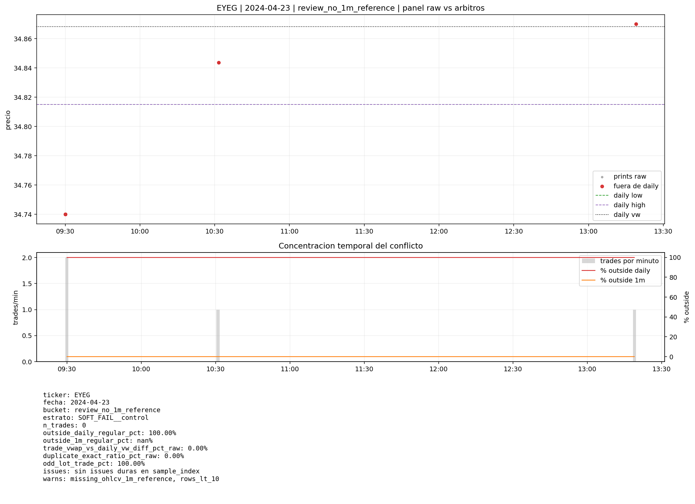

**Que muestra**

- Panel rico del tape raw frente a `daily` y `1m` para `EYEG` el `2024-04-23`.
- `n_trades = 4`, `outside_daily_regular_pct = 100.00%`, `outside_1m_regular_pct = nan%`.
- `trade_vwap_vs_daily_vw_diff_pct_raw = 0.00%`, `duplicate_exact_ratio_pct_raw = 0.00%`, `odd_lot_trade_pct = 100.00%`.

**Responde**

- Familia donde existe conflicto, pero falta el arbitro `1m`. Responde a la pregunta de si el caso debe quedarse en incertidumbre disciplinada y no ser absuelto ni condenado por reflejo.
- Responde a si el conflicto dominante vive en la escala (`~1x`), en la comparabilidad frente a `daily` (100.00%) o frente a `1m` (nan%).
- El 100.00% de odd-lots empuja la lectura hacia microestructura fina; evita leer el caso como pura ruptura economica gruesa.
- La decision que justifica es mantener o no el caso en `recoverable_with_flag` cuando se rematerialice la rehabilitacion sobre `57f`.

### EYEG | 2025-06-16

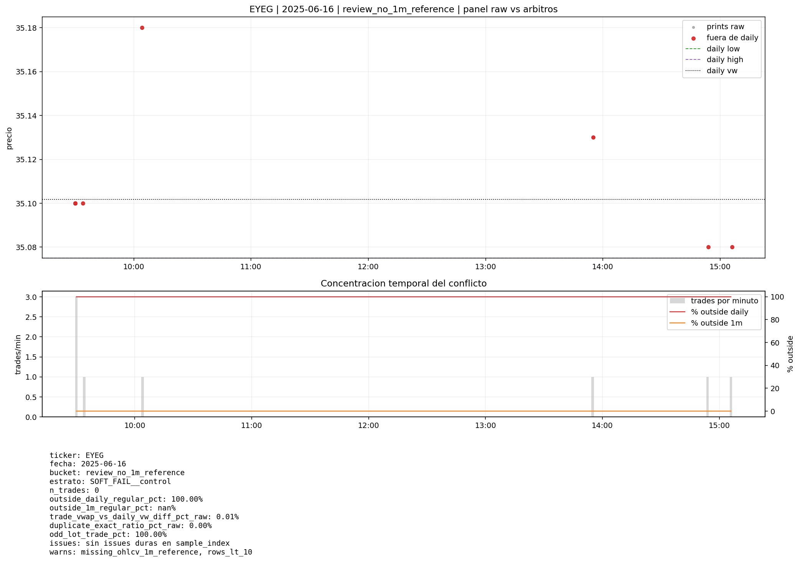

**Que muestra**

- Panel rico del tape raw frente a `daily` y `1m` para `EYEG` el `2025-06-16`.
- `n_trades = 8`, `outside_daily_regular_pct = 100.00%`, `outside_1m_regular_pct = nan%`.
- `trade_vwap_vs_daily_vw_diff_pct_raw = 0.01%`, `duplicate_exact_ratio_pct_raw = 0.00%`, `odd_lot_trade_pct = 100.00%`.

**Responde**

- Familia donde existe conflicto, pero falta el arbitro `1m`. Responde a la pregunta de si el caso debe quedarse en incertidumbre disciplinada y no ser absuelto ni condenado por reflejo.
- Responde a si el conflicto dominante vive en la escala (`~1x`), en la comparabilidad frente a `daily` (100.00%) o frente a `1m` (nan%).
- El 100.00% de odd-lots empuja la lectura hacia microestructura fina; evita leer el caso como pura ruptura economica gruesa.
- La decision que justifica es mantener o no el caso en `recoverable_with_flag` cuando se rematerialice la rehabilitacion sobre `57f`.

### FDBC | 2021-05-07

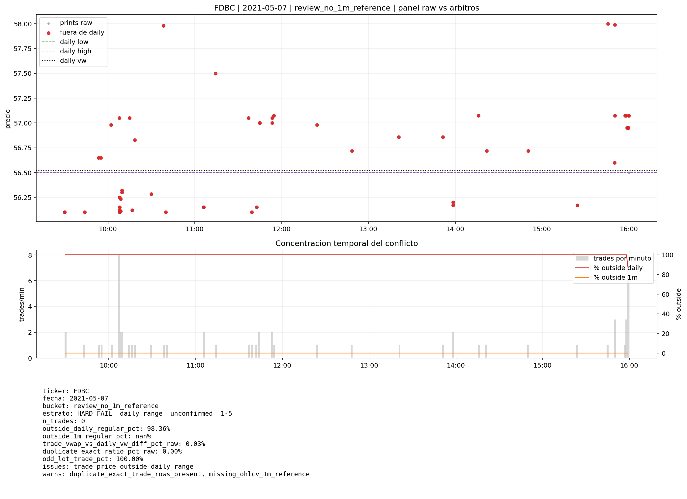

**Que muestra**

- Panel rico del tape raw frente a `daily` y `1m` para `FDBC` el `2021-05-07`.
- `n_trades = 61`, `outside_daily_regular_pct = 98.36%`, `outside_1m_regular_pct = nan%`.
- `trade_vwap_vs_daily_vw_diff_pct_raw = 0.03%`, `duplicate_exact_ratio_pct_raw = 0.00%`, `odd_lot_trade_pct = 100.00%`.

**Responde**

- Familia donde existe conflicto, pero falta el arbitro `1m`. Responde a la pregunta de si el caso debe quedarse en incertidumbre disciplinada y no ser absuelto ni condenado por reflejo.
- Responde a si el conflicto dominante vive en la escala (`~1x`), en la comparabilidad frente a `daily` (98.36%) o frente a `1m` (nan%).
- El 100.00% de odd-lots empuja la lectura hacia microestructura fina; evita leer el caso como pura ruptura economica gruesa.
- La decision que justifica es mantener o no el caso en `recoverable_with_flag` cuando se rematerialice la rehabilitacion sobre `57f`.

### FFBW | 2021-07-06

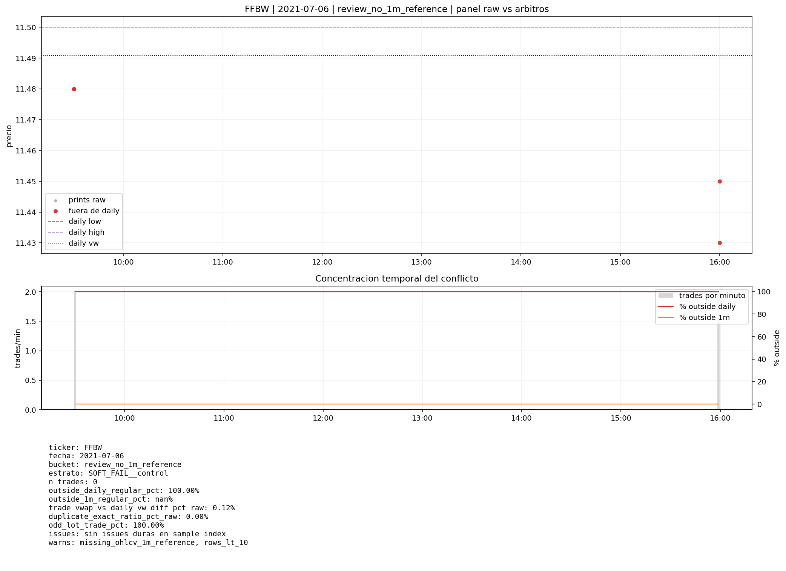

**Que muestra**

- Panel rico del tape raw frente a `daily` y `1m` para `FFBW` el `2021-07-06`.
- `n_trades = 4`, `outside_daily_regular_pct = 100.00%`, `outside_1m_regular_pct = nan%`.
- `trade_vwap_vs_daily_vw_diff_pct_raw = 0.12%`, `duplicate_exact_ratio_pct_raw = 0.00%`, `odd_lot_trade_pct = 100.00%`.

**Responde**

- Familia donde existe conflicto, pero falta el arbitro `1m`. Responde a la pregunta de si el caso debe quedarse en incertidumbre disciplinada y no ser absuelto ni condenado por reflejo.
- Responde a si el conflicto dominante vive en la escala (`~1x`), en la comparabilidad frente a `daily` (100.00%) o frente a `1m` (nan%).
- El 100.00% de odd-lots empuja la lectura hacia microestructura fina; evita leer el caso como pura ruptura economica gruesa.
- La decision que justifica es mantener o no el caso en `recoverable_with_flag` cuando se rematerialice la rehabilitacion sobre `57f`.

### FIEE | 2020-05-15

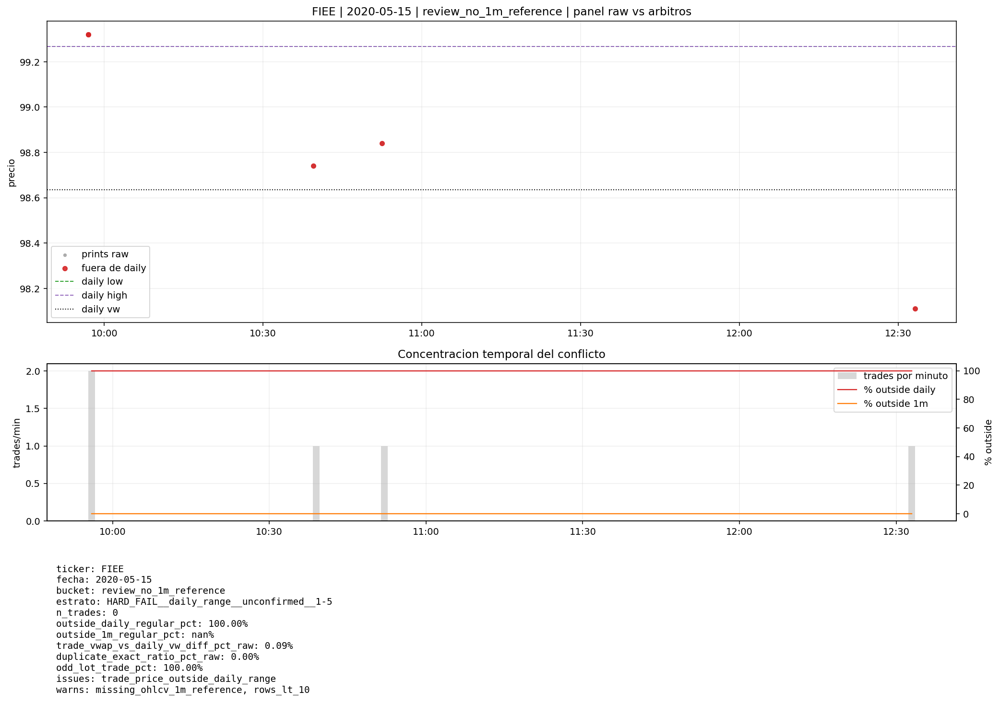

**Que muestra**

- Panel rico del tape raw frente a `daily` y `1m` para `FIEE` el `2020-05-15`.
- `n_trades = 5`, `outside_daily_regular_pct = 100.00%`, `outside_1m_regular_pct = nan%`.
- `trade_vwap_vs_daily_vw_diff_pct_raw = 0.09%`, `duplicate_exact_ratio_pct_raw = 0.00%`, `odd_lot_trade_pct = 100.00%`.

**Responde**

- Familia donde existe conflicto, pero falta el arbitro `1m`. Responde a la pregunta de si el caso debe quedarse en incertidumbre disciplinada y no ser absuelto ni condenado por reflejo.
- Responde a si el conflicto dominante vive en la escala (`~1x`), en la comparabilidad frente a `daily` (100.00%) o frente a `1m` (nan%).
- El 100.00% de odd-lots empuja la lectura hacia microestructura fina; evita leer el caso como pura ruptura economica gruesa.
- La decision que justifica es mantener o no el caso en `recoverable_with_flag` cuando se rematerialice la rehabilitacion sobre `57f`.

### FIEE | 2021-04-21

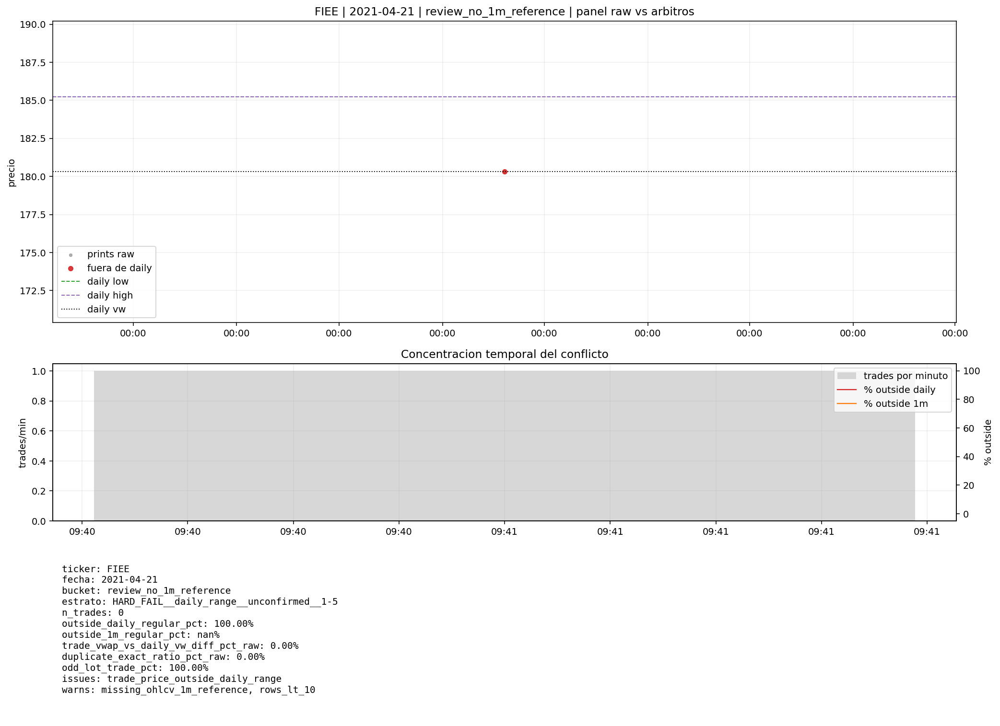

**Que muestra**

- Panel rico del tape raw frente a `daily` y `1m` para `FIEE` el `2021-04-21`.
- `n_trades = 1`, `outside_daily_regular_pct = 100.00%`, `outside_1m_regular_pct = nan%`.
- `trade_vwap_vs_daily_vw_diff_pct_raw = 0.00%`, `duplicate_exact_ratio_pct_raw = 0.00%`, `odd_lot_trade_pct = 100.00%`.

**Responde**

- Familia donde existe conflicto, pero falta el arbitro `1m`. Responde a la pregunta de si el caso debe quedarse en incertidumbre disciplinada y no ser absuelto ni condenado por reflejo.
- Responde a si el conflicto dominante vive en la escala (`~1x`), en la comparabilidad frente a `daily` (100.00%) o frente a `1m` (nan%).
- El 100.00% de odd-lots empuja la lectura hacia microestructura fina; evita leer el caso como pura ruptura economica gruesa.
- La decision que justifica es mantener o no el caso en `recoverable_with_flag` cuando se rematerialice la rehabilitacion sobre `57f`.

### FIEE | 2022-02-15

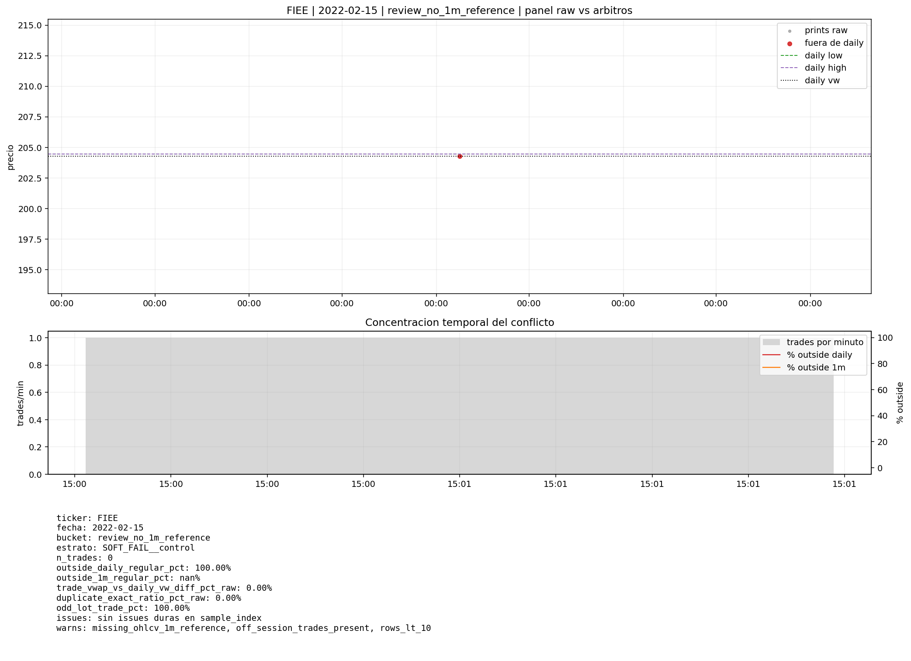

**Que muestra**

- Panel rico del tape raw frente a `daily` y `1m` para `FIEE` el `2022-02-15`.
- `n_trades = 1`, `outside_daily_regular_pct = 100.00%`, `outside_1m_regular_pct = nan%`.
- `trade_vwap_vs_daily_vw_diff_pct_raw = 0.00%`, `duplicate_exact_ratio_pct_raw = 0.00%`, `odd_lot_trade_pct = 100.00%`.

**Responde**

- Familia donde existe conflicto, pero falta el arbitro `1m`. Responde a la pregunta de si el caso debe quedarse en incertidumbre disciplinada y no ser absuelto ni condenado por reflejo.
- Responde a si el conflicto dominante vive en la escala (`~1x`), en la comparabilidad frente a `daily` (100.00%) o frente a `1m` (nan%).
- El 100.00% de odd-lots empuja la lectura hacia microestructura fina; evita leer el caso como pura ruptura economica gruesa.
- La decision que justifica es mantener o no el caso en `recoverable_with_flag` cuando se rematerialice la rehabilitacion sobre `57f`.

### FIEE | 2023-02-03

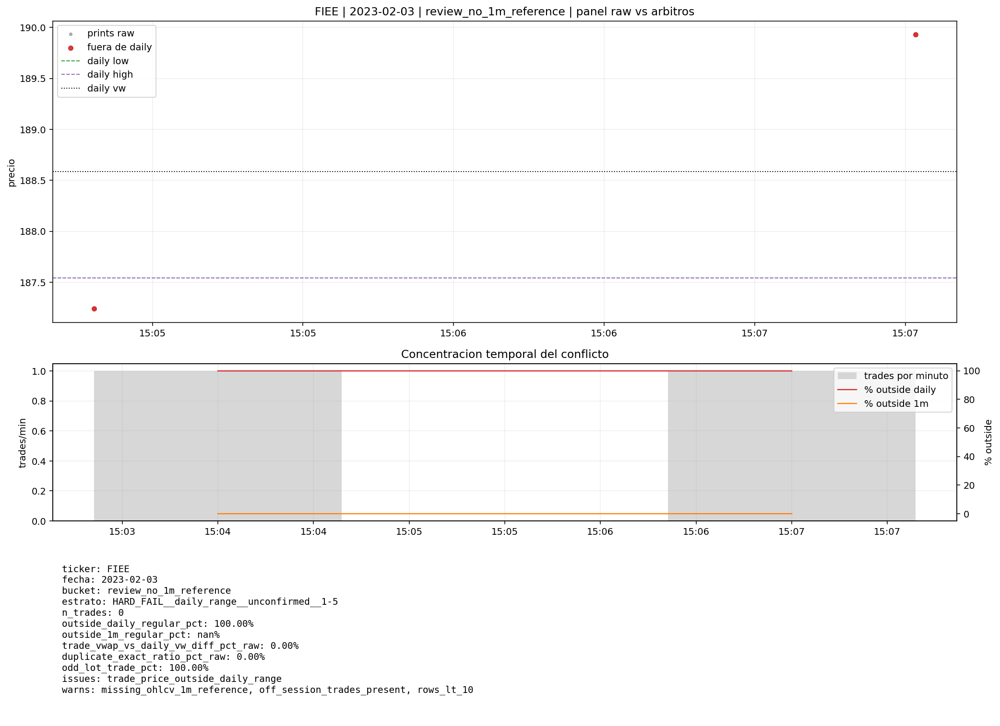

**Que muestra**

- Panel rico del tape raw frente a `daily` y `1m` para `FIEE` el `2023-02-03`.
- `n_trades = 2`, `outside_daily_regular_pct = 100.00%`, `outside_1m_regular_pct = nan%`.
- `trade_vwap_vs_daily_vw_diff_pct_raw = 0.00%`, `duplicate_exact_ratio_pct_raw = 0.00%`, `odd_lot_trade_pct = 100.00%`.

**Responde**

- Familia donde existe conflicto, pero falta el arbitro `1m`. Responde a la pregunta de si el caso debe quedarse en incertidumbre disciplinada y no ser absuelto ni condenado por reflejo.
- Responde a si el conflicto dominante vive en la escala (`~1x`), en la comparabilidad frente a `daily` (100.00%) o frente a `1m` (nan%).
- El 100.00% de odd-lots empuja la lectura hacia microestructura fina; evita leer el caso como pura ruptura economica gruesa.
- La decision que justifica es mantener o no el caso en `recoverable_with_flag` cuando se rematerialice la rehabilitacion sobre `57f`.

### FSRX | 2023-02-06

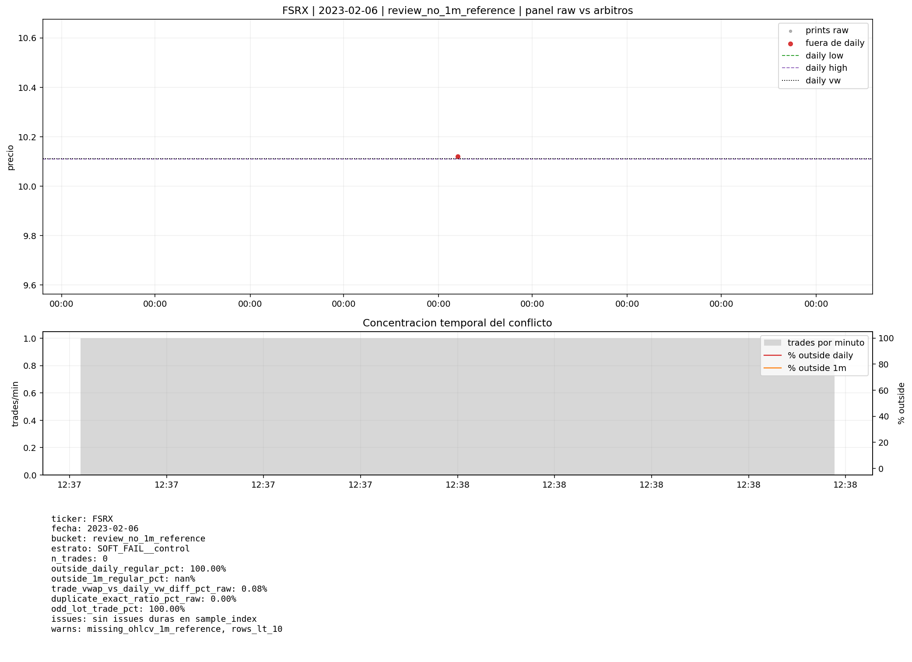

**Que muestra**

- Panel rico del tape raw frente a `daily` y `1m` para `FSRX` el `2023-02-06`.
- `n_trades = 1`, `outside_daily_regular_pct = 100.00%`, `outside_1m_regular_pct = nan%`.
- `trade_vwap_vs_daily_vw_diff_pct_raw = 0.08%`, `duplicate_exact_ratio_pct_raw = 0.00%`, `odd_lot_trade_pct = 100.00%`.

**Responde**

- Familia donde existe conflicto, pero falta el arbitro `1m`. Responde a la pregunta de si el caso debe quedarse en incertidumbre disciplinada y no ser absuelto ni condenado por reflejo.
- Responde a si el conflicto dominante vive en la escala (`~1x`), en la comparabilidad frente a `daily` (100.00%) o frente a `1m` (nan%).
- El 100.00% de odd-lots empuja la lectura hacia microestructura fina; evita leer el caso como pura ruptura economica gruesa.
- La decision que justifica es mantener o no el caso en `recoverable_with_flag` cuando se rematerialice la rehabilitacion sobre `57f`.

### GIA | 2022-10-06

**Que muestra**

- Panel rico del tape raw frente a `daily` y `1m` para `GIA` el `2022-10-06`.
- `n_trades = 2`, `outside_daily_regular_pct = 100.00%`, `outside_1m_regular_pct = nan%`.
- `trade_vwap_vs_daily_vw_diff_pct_raw = 0.10%`, `duplicate_exact_ratio_pct_raw = 0.00%`, `odd_lot_trade_pct = 100.00%`.

**Responde**

- Familia donde existe conflicto, pero falta el arbitro `1m`. Responde a la pregunta de si el caso debe quedarse en incertidumbre disciplinada y no ser absuelto ni condenado por reflejo.
- Responde a si el conflicto dominante vive en la escala (`~1x`), en la comparabilidad frente a `daily` (100.00%) o frente a `1m` (nan%).
- El 100.00% de odd-lots empuja la lectura hacia microestructura fina; evita leer el caso como pura ruptura economica gruesa.
- La decision que justifica es mantener o no el caso en `recoverable_with_flag` cuando se rematerialice la rehabilitacion sobre `57f`.

### HMNF | 2023-02-01

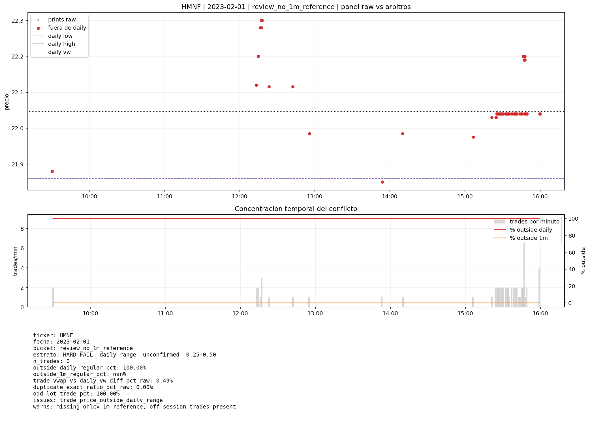

**Que muestra**

- Panel rico del tape raw frente a `daily` y `1m` para `HMNF` el `2023-02-01`.
- `n_trades = 68`, `outside_daily_regular_pct = 100.00%`, `outside_1m_regular_pct = nan%`.
- `trade_vwap_vs_daily_vw_diff_pct_raw = 0.49%`, `duplicate_exact_ratio_pct_raw = 0.00%`, `odd_lot_trade_pct = 100.00%`.

**Responde**

- Familia donde existe conflicto, pero falta el arbitro `1m`. Responde a la pregunta de si el caso debe quedarse en incertidumbre disciplinada y no ser absuelto ni condenado por reflejo.
- Responde a si el conflicto dominante vive en la escala (`~1x`), en la comparabilidad frente a `daily` (100.00%) o frente a `1m` (nan%).
- El 100.00% de odd-lots empuja la lectura hacia microestructura fina; evita leer el caso como pura ruptura economica gruesa.
- La decision que justifica es mantener o no el caso en `recoverable_with_flag` cuando se rematerialice la rehabilitacion sobre `57f`.

### IG | 2019-03-29

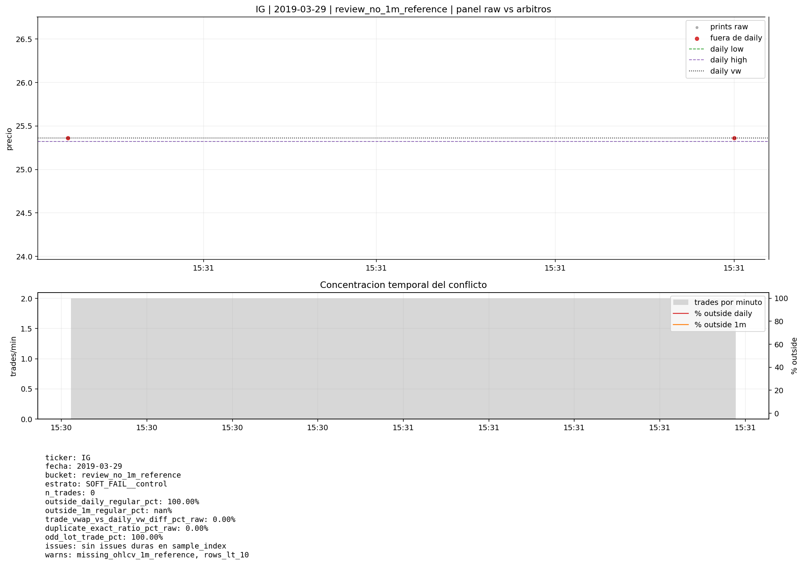

**Que muestra**

- Panel rico del tape raw frente a `daily` y `1m` para `IG` el `2019-03-29`.
- `n_trades = 2`, `outside_daily_regular_pct = 100.00%`, `outside_1m_regular_pct = nan%`.
- `trade_vwap_vs_daily_vw_diff_pct_raw = 0.00%`, `duplicate_exact_ratio_pct_raw = 0.00%`, `odd_lot_trade_pct = 100.00%`.

**Responde**

- Familia donde existe conflicto, pero falta el arbitro `1m`. Responde a la pregunta de si el caso debe quedarse en incertidumbre disciplinada y no ser absuelto ni condenado por reflejo.
- Responde a si el conflicto dominante vive en la escala (`~1x`), en la comparabilidad frente a `daily` (100.00%) o frente a `1m` (nan%).
- El 100.00% de odd-lots empuja la lectura hacia microestructura fina; evita leer el caso como pura ruptura economica gruesa.
- La decision que justifica es mantener o no el caso en `recoverable_with_flag` cuando se rematerialice la rehabilitacion sobre `57f`.

### IG | 2019-04-02

**Que muestra**

- Panel rico del tape raw frente a `daily` y `1m` para `IG` el `2019-04-02`.
- `n_trades = 1`, `outside_daily_regular_pct = 100.00%`, `outside_1m_regular_pct = nan%`.
- `trade_vwap_vs_daily_vw_diff_pct_raw = 0.00%`, `duplicate_exact_ratio_pct_raw = 0.00%`, `odd_lot_trade_pct = 100.00%`.

**Responde**

- Familia donde existe conflicto, pero falta el arbitro `1m`. Responde a la pregunta de si el caso debe quedarse en incertidumbre disciplinada y no ser absuelto ni condenado por reflejo.
- Responde a si el conflicto dominante vive en la escala (`~1x`), en la comparabilidad frente a `daily` (100.00%) o frente a `1m` (nan%).
- El 100.00% de odd-lots empuja la lectura hacia microestructura fina; evita leer el caso como pura ruptura economica gruesa.
- La decision que justifica es mantener o no el caso en `recoverable_with_flag` cuando se rematerialice la rehabilitacion sobre `57f`.

### IG | 2019-09-19

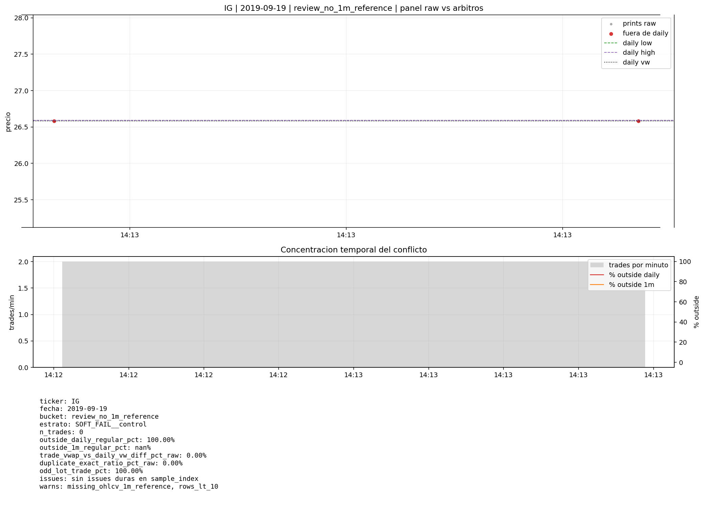

**Que muestra**

- Panel rico del tape raw frente a `daily` y `1m` para `IG` el `2019-09-19`.
- `n_trades = 2`, `outside_daily_regular_pct = 100.00%`, `outside_1m_regular_pct = nan%`.
- `trade_vwap_vs_daily_vw_diff_pct_raw = 0.00%`, `duplicate_exact_ratio_pct_raw = 0.00%`, `odd_lot_trade_pct = 100.00%`.

**Responde**

- Familia donde existe conflicto, pero falta el arbitro `1m`. Responde a la pregunta de si el caso debe quedarse en incertidumbre disciplinada y no ser absuelto ni condenado por reflejo.
- Responde a si el conflicto dominante vive en la escala (`~1x`), en la comparabilidad frente a `daily` (100.00%) o frente a `1m` (nan%).
- El 100.00% de odd-lots empuja la lectura hacia microestructura fina; evita leer el caso como pura ruptura economica gruesa.
- La decision que justifica es mantener o no el caso en `recoverable_with_flag` cuando se rematerialice la rehabilitacion sobre `57f`.

### IRET | 2024-10-04

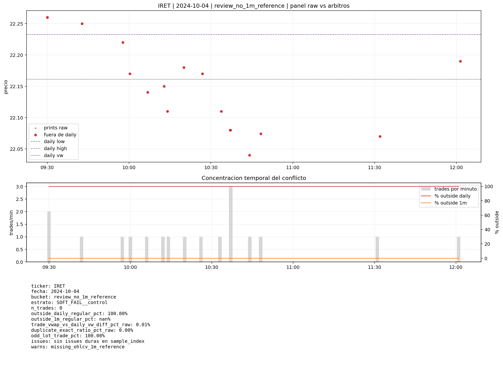

**Que muestra**

- Panel rico del tape raw frente a `daily` y `1m` para `IRET` el `2024-10-04`.
- `n_trades = 18`, `outside_daily_regular_pct = 100.00%`, `outside_1m_regular_pct = nan%`.
- `trade_vwap_vs_daily_vw_diff_pct_raw = 0.01%`, `duplicate_exact_ratio_pct_raw = 0.00%`, `odd_lot_trade_pct = 100.00%`.

**Responde**

- Familia donde existe conflicto, pero falta el arbitro `1m`. Responde a la pregunta de si el caso debe quedarse en incertidumbre disciplinada y no ser absuelto ni condenado por reflejo.
- Responde a si el conflicto dominante vive en la escala (`~1x`), en la comparabilidad frente a `daily` (100.00%) o frente a `1m` (nan%).
- El 100.00% de odd-lots empuja la lectura hacia microestructura fina; evita leer el caso como pura ruptura economica gruesa.
- La decision que justifica es mantener o no el caso en `recoverable_with_flag` cuando se rematerialice la rehabilitacion sobre `57f`.

### ITIC | 2023-08-16

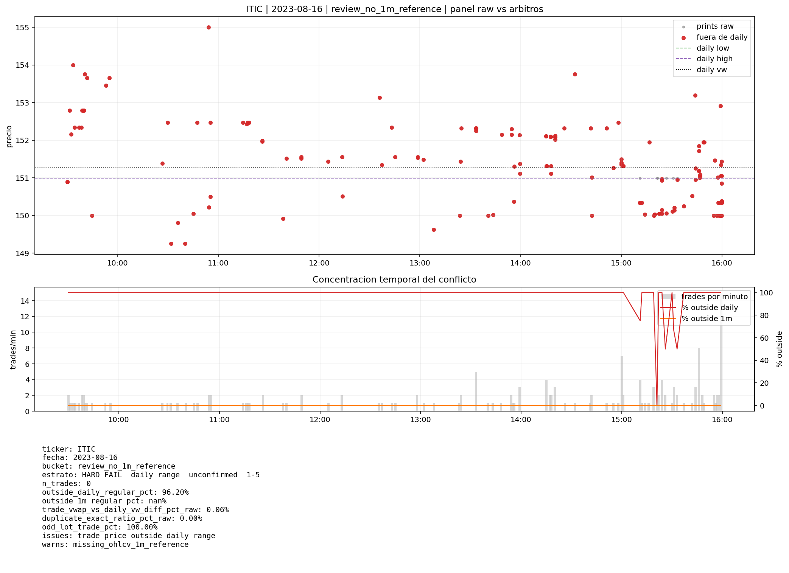

**Que muestra**

- Panel rico del tape raw frente a `daily` y `1m` para `ITIC` el `2023-08-16`.
- `n_trades = 158`, `outside_daily_regular_pct = 96.20%`, `outside_1m_regular_pct = nan%`.
- `trade_vwap_vs_daily_vw_diff_pct_raw = 0.06%`, `duplicate_exact_ratio_pct_raw = 0.00%`, `odd_lot_trade_pct = 100.00%`.

**Responde**

- Familia donde existe conflicto, pero falta el arbitro `1m`. Responde a la pregunta de si el caso debe quedarse en incertidumbre disciplinada y no ser absuelto ni condenado por reflejo.
- Responde a si el conflicto dominante vive en la escala (`~1x`), en la comparabilidad frente a `daily` (96.20%) o frente a `1m` (nan%).
- El 100.00% de odd-lots empuja la lectura hacia microestructura fina; evita leer el caso como pura ruptura economica gruesa.
- La decision que justifica es mantener o no el caso en `recoverable_with_flag` cuando se rematerialice la rehabilitacion sobre `57f`.

### JIVE | 2023-11-14

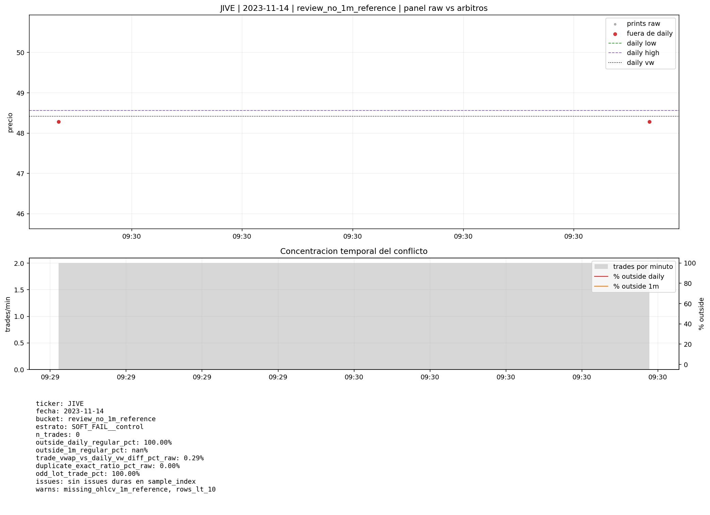

**Que muestra**

- Panel rico del tape raw frente a `daily` y `1m` para `JIVE` el `2023-11-14`.
- `n_trades = 2`, `outside_daily_regular_pct = 100.00%`, `outside_1m_regular_pct = nan%`.
- `trade_vwap_vs_daily_vw_diff_pct_raw = 0.29%`, `duplicate_exact_ratio_pct_raw = 0.00%`, `odd_lot_trade_pct = 100.00%`.

**Responde**

- Familia donde existe conflicto, pero falta el arbitro `1m`. Responde a la pregunta de si el caso debe quedarse en incertidumbre disciplinada y no ser absuelto ni condenado por reflejo.
- Responde a si el conflicto dominante vive en la escala (`~1x`), en la comparabilidad frente a `daily` (100.00%) o frente a `1m` (nan%).
- El 100.00% de odd-lots empuja la lectura hacia microestructura fina; evita leer el caso como pura ruptura economica gruesa.
- La decision que justifica es mantener o no el caso en `recoverable_with_flag` cuando se rematerialice la rehabilitacion sobre `57f`.

### KOOL | 2025-11-05

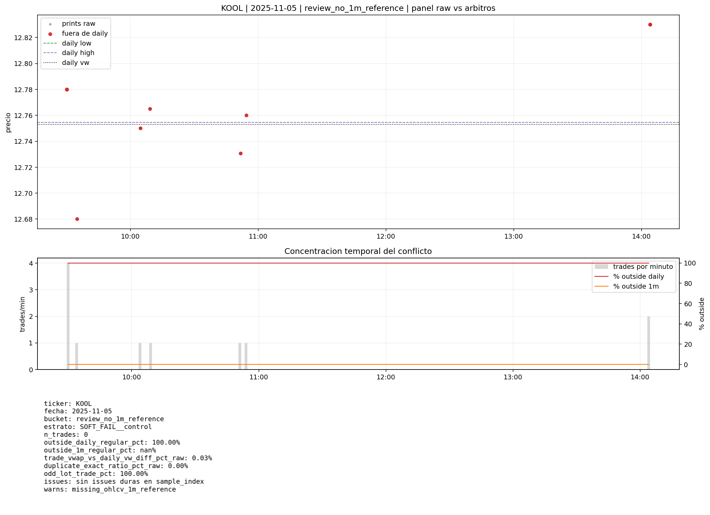

**Que muestra**

- Panel rico del tape raw frente a `daily` y `1m` para `KOOL` el `2025-11-05`.
- `n_trades = 11`, `outside_daily_regular_pct = 100.00%`, `outside_1m_regular_pct = nan%`.
- `trade_vwap_vs_daily_vw_diff_pct_raw = 0.03%`, `duplicate_exact_ratio_pct_raw = 0.00%`, `odd_lot_trade_pct = 100.00%`.

**Responde**

- Familia donde existe conflicto, pero falta el arbitro `1m`. Responde a la pregunta de si el caso debe quedarse en incertidumbre disciplinada y no ser absuelto ni condenado por reflejo.
- Responde a si el conflicto dominante vive en la escala (`~1x`), en la comparabilidad frente a `daily` (100.00%) o frente a `1m` (nan%).
- El 100.00% de odd-lots empuja la lectura hacia microestructura fina; evita leer el caso como pura ruptura economica gruesa.
- La decision que justifica es mantener o no el caso en `recoverable_with_flag` cuando se rematerialice la rehabilitacion sobre `57f`.

### MGYR | 2024-10-07

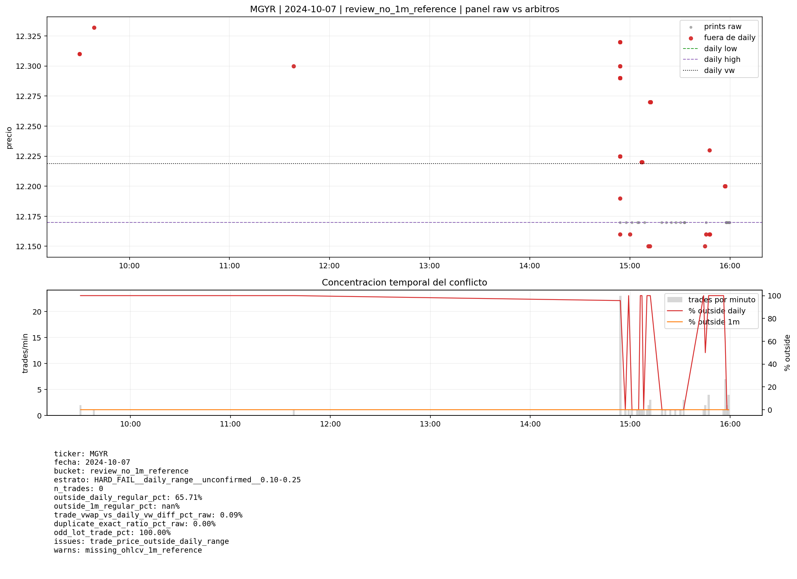

**Que muestra**

- Panel rico del tape raw frente a `daily` y `1m` para `MGYR` el `2024-10-07`.
- `n_trades = 70`, `outside_daily_regular_pct = 65.71%`, `outside_1m_regular_pct = nan%`.
- `trade_vwap_vs_daily_vw_diff_pct_raw = 0.09%`, `duplicate_exact_ratio_pct_raw = 0.00%`, `odd_lot_trade_pct = 100.00%`.

**Responde**

- Familia donde existe conflicto, pero falta el arbitro `1m`. Responde a la pregunta de si el caso debe quedarse en incertidumbre disciplinada y no ser absuelto ni condenado por reflejo.
- Responde a si el conflicto dominante vive en la escala (`~1x`), en la comparabilidad frente a `daily` (65.71%) o frente a `1m` (nan%).
- El 100.00% de odd-lots empuja la lectura hacia microestructura fina; evita leer el caso como pura ruptura economica gruesa.
- La decision que justifica es mantener o no el caso en `recoverable_with_flag` cuando se rematerialice la rehabilitacion sobre `57f`.

### OMCC | 2025-01-22

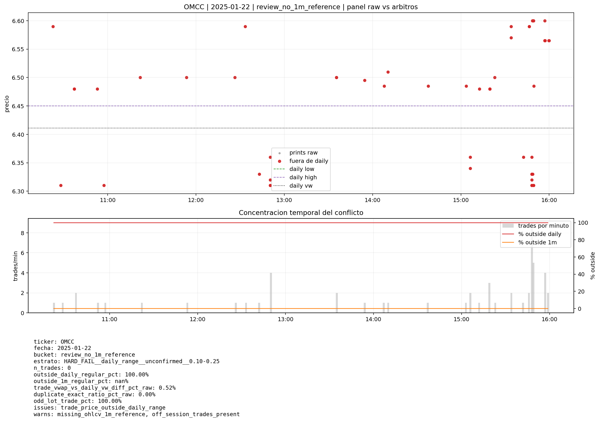

**Que muestra**

- Panel rico del tape raw frente a `daily` y `1m` para `OMCC` el `2025-01-22`.
- `n_trades = 54`, `outside_daily_regular_pct = 100.00%`, `outside_1m_regular_pct = nan%`.
- `trade_vwap_vs_daily_vw_diff_pct_raw = 0.52%`, `duplicate_exact_ratio_pct_raw = 0.00%`, `odd_lot_trade_pct = 100.00%`.

**Responde**

- Familia donde existe conflicto, pero falta el arbitro `1m`. Responde a la pregunta de si el caso debe quedarse en incertidumbre disciplinada y no ser absuelto ni condenado por reflejo.
- Responde a si el conflicto dominante vive en la escala (`~1x`), en la comparabilidad frente a `daily` (100.00%) o frente a `1m` (nan%).
- El 100.00% de odd-lots empuja la lectura hacia microestructura fina; evita leer el caso como pura ruptura economica gruesa.
- La decision que justifica es mantener o no el caso en `recoverable_with_flag` cuando se rematerialice la rehabilitacion sobre `57f`.

### QETA | 2026-03-04

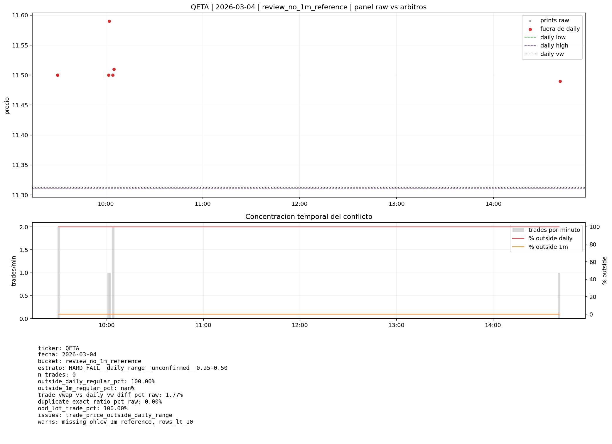

**Que muestra**

- Panel rico del tape raw frente a `daily` y `1m` para `QETA` el `2026-03-04`.
- `n_trades = 7`, `outside_daily_regular_pct = 100.00%`, `outside_1m_regular_pct = nan%`.
- `trade_vwap_vs_daily_vw_diff_pct_raw = 1.77%`, `duplicate_exact_ratio_pct_raw = 0.00%`, `odd_lot_trade_pct = 100.00%`.

**Responde**

- Familia donde existe conflicto, pero falta el arbitro `1m`. Responde a la pregunta de si el caso debe quedarse en incertidumbre disciplinada y no ser absuelto ni condenado por reflejo.
- Responde a si el conflicto dominante vive en la escala (`~1x`), en la comparabilidad frente a `daily` (100.00%) o frente a `1m` (nan%).
- El 100.00% de odd-lots empuja la lectura hacia microestructura fina; evita leer el caso como pura ruptura economica gruesa.
- La decision que justifica es mantener o no el caso en `recoverable_with_flag` cuando se rematerialice la rehabilitacion sobre `57f`.

### SPAQ | 2025-06-09

**Que muestra**

- Panel rico del tape raw frente a `daily` y `1m` para `SPAQ` el `2025-06-09`.
- `n_trades = 3`, `outside_daily_regular_pct = 100.00%`, `outside_1m_regular_pct = nan%`.
- `trade_vwap_vs_daily_vw_diff_pct_raw = 0.05%`, `duplicate_exact_ratio_pct_raw = 0.00%`, `odd_lot_trade_pct = 100.00%`.

**Responde**

- Familia donde existe conflicto, pero falta el arbitro `1m`. Responde a la pregunta de si el caso debe quedarse en incertidumbre disciplinada y no ser absuelto ni condenado por reflejo.
- Responde a si el conflicto dominante vive en la escala (`~1x`), en la comparabilidad frente a `daily` (100.00%) o frente a `1m` (nan%).
- El 100.00% de odd-lots empuja la lectura hacia microestructura fina; evita leer el caso como pura ruptura economica gruesa.
- La decision que justifica es mantener o no el caso en `recoverable_with_flag` cuando se rematerialice la rehabilitacion sobre `57f`.

### SPAQ | 2025-06-10

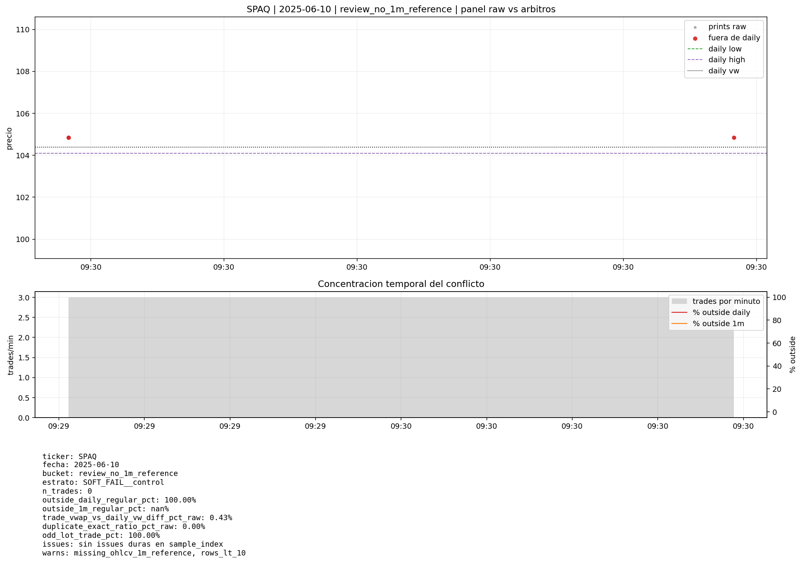

**Que muestra**

- Panel rico del tape raw frente a `daily` y `1m` para `SPAQ` el `2025-06-10`.
- `n_trades = 3`, `outside_daily_regular_pct = 100.00%`, `outside_1m_regular_pct = nan%`.
- `trade_vwap_vs_daily_vw_diff_pct_raw = 0.43%`, `duplicate_exact_ratio_pct_raw = 0.00%`, `odd_lot_trade_pct = 100.00%`.

**Responde**

- Familia donde existe conflicto, pero falta el arbitro `1m`. Responde a la pregunta de si el caso debe quedarse en incertidumbre disciplinada y no ser absuelto ni condenado por reflejo.
- Responde a si el conflicto dominante vive en la escala (`~1x`), en la comparabilidad frente a `daily` (100.00%) o frente a `1m` (nan%).
- El 100.00% de odd-lots empuja la lectura hacia microestructura fina; evita leer el caso como pura ruptura economica gruesa.
- La decision que justifica es mantener o no el caso en `recoverable_with_flag` cuando se rematerialice la rehabilitacion sobre `57f`.

### TAX | 2025-06-10

**Que muestra**

- Panel rico del tape raw frente a `daily` y `1m` para `TAX` el `2025-06-10`.
- `n_trades = 6`, `outside_daily_regular_pct = 100.00%`, `outside_1m_regular_pct = nan%`.
- `trade_vwap_vs_daily_vw_diff_pct_raw = 0.01%`, `duplicate_exact_ratio_pct_raw = 0.00%`, `odd_lot_trade_pct = 100.00%`.

**Responde**

- Familia donde existe conflicto, pero falta el arbitro `1m`. Responde a la pregunta de si el caso debe quedarse en incertidumbre disciplinada y no ser absuelto ni condenado por reflejo.
- Responde a si el conflicto dominante vive en la escala (`~1x`), en la comparabilidad frente a `daily` (100.00%) o frente a `1m` (nan%).
- El 100.00% de odd-lots empuja la lectura hacia microestructura fina; evita leer el caso como pura ruptura economica gruesa.
- La decision que justifica es mantener o no el caso en `recoverable_with_flag` cuando se rematerialice la rehabilitacion sobre `57f`.

### TCBC | 2023-07-10

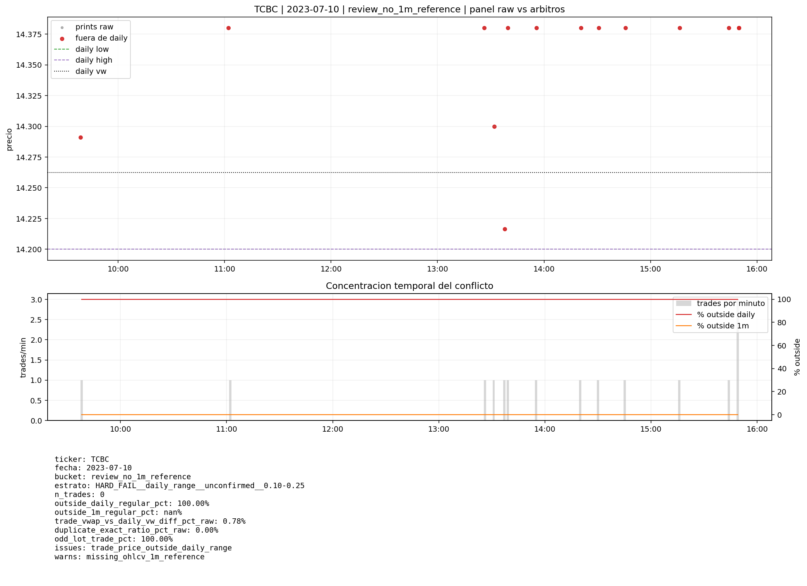

**Que muestra**

- Panel rico del tape raw frente a `daily` y `1m` para `TCBC` el `2023-07-10`.
- `n_trades = 15`, `outside_daily_regular_pct = 100.00%`, `outside_1m_regular_pct = nan%`.
- `trade_vwap_vs_daily_vw_diff_pct_raw = 0.78%`, `duplicate_exact_ratio_pct_raw = 0.00%`, `odd_lot_trade_pct = 100.00%`.

**Responde**

- Familia donde existe conflicto, pero falta el arbitro `1m`. Responde a la pregunta de si el caso debe quedarse en incertidumbre disciplinada y no ser absuelto ni condenado por reflejo.
- Responde a si el conflicto dominante vive en la escala (`~1x`), en la comparabilidad frente a `daily` (100.00%) o frente a `1m` (nan%).
- El 100.00% de odd-lots empuja la lectura hacia microestructura fina; evita leer el caso como pura ruptura economica gruesa.
- La decision que justifica es mantener o no el caso en `recoverable_with_flag` cuando se rematerialice la rehabilitacion sobre `57f`.

### VALU | 2019-11-26

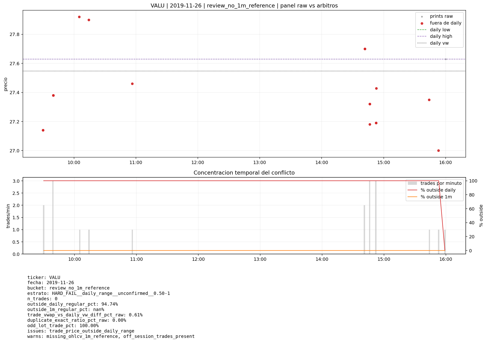

**Que muestra**

- Panel rico del tape raw frente a `daily` y `1m` para `VALU` el `2019-11-26`.
- `n_trades = 19`, `outside_daily_regular_pct = 94.74%`, `outside_1m_regular_pct = nan%`.
- `trade_vwap_vs_daily_vw_diff_pct_raw = 0.61%`, `duplicate_exact_ratio_pct_raw = 0.00%`, `odd_lot_trade_pct = 100.00%`.

**Responde**

- Familia donde existe conflicto, pero falta el arbitro `1m`. Responde a la pregunta de si el caso debe quedarse en incertidumbre disciplinada y no ser absuelto ni condenado por reflejo.
- Responde a si el conflicto dominante vive en la escala (`~1x`), en la comparabilidad frente a `daily` (94.74%) o frente a `1m` (nan%).
- El 100.00% de odd-lots empuja la lectura hacia microestructura fina; evita leer el caso como pura ruptura economica gruesa.
- La decision que justifica es mantener o no el caso en `recoverable_with_flag` cuando se rematerialice la rehabilitacion sobre `57f`.

### WTRE | 2023-08-03

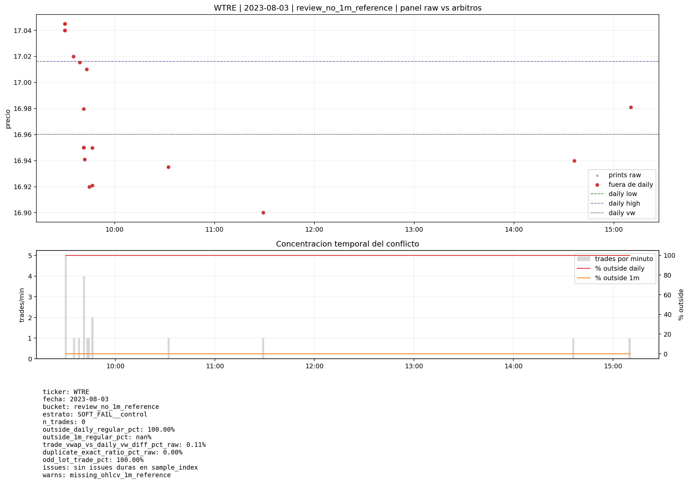

**Que muestra**

- Panel rico del tape raw frente a `daily` y `1m` para `WTRE` el `2023-08-03`.
- `n_trades = 19`, `outside_daily_regular_pct = 100.00%`, `outside_1m_regular_pct = nan%`.
- `trade_vwap_vs_daily_vw_diff_pct_raw = 0.11%`, `duplicate_exact_ratio_pct_raw = 0.00%`, `odd_lot_trade_pct = 100.00%`.

**Responde**

- Familia donde existe conflicto, pero falta el arbitro `1m`. Responde a la pregunta de si el caso debe quedarse en incertidumbre disciplinada y no ser absuelto ni condenado por reflejo.
- Responde a si el conflicto dominante vive en la escala (`~1x`), en la comparabilidad frente a `daily` (100.00%) o frente a `1m` (nan%).
- El 100.00% de odd-lots empuja la lectura hacia microestructura fina; evita leer el caso como pura ruptura economica gruesa.
- La decision que justifica es mantener o no el caso en `recoverable_with_flag` cuando se rematerialice la rehabilitacion sobre `57f`.

# Trades Family Casepacks Index v0.1

Documento fuente: `inspection_dossiers/trades/family_case_evidence_packs/family_casepacks_index_v0_1.md`

## Rol

Este indice resume los casepacks amplios generados a partir de la muestra estratificada canonica de `trades`.

| familia | rows manifest | imagenes exportadas | dossier |
|---|---:|---:|---|
| `bad_data` | 60 | 60 | [bad_data/bad_data_cases_v0_1.md](../../inspection_dossiers/trades/family_case_evidence_packs/bad_data/bad_data_cases_v0_1.md) |
