# Microstructure Candidate Controlled Visual Readout v0.2

## Scope

This readout is visual/forensic evidence for `the 50-window controlled microstructure_features_table_v0_2_candidate materialization`.

It does not promote a new official dataset and it does not claim full-universe microstructure coverage.

```text
candidate_dir = E:\TSIS\data\data_foundation_outputs\microstructure_features_table\microstructure_features_table_v0_2_candidate_controlled_25_per_role
candidate_partition = E:\TSIS\data\data_foundation_outputs\microstructure_features_table\microstructure_features_table_v0_2_candidate_controlled_25_per_role\year=2025\month=12\part-0000.parquet
window_manifest = C:\TSIS_Data\01_TSIS_DATA_FOUNDATION\runs\data_foundation\microstructure_features_table_v0_2_candidate_controlled_25_per_role\microstructure_features_table_v0_2_candidate_window_manifest_v0_1.csv
case_count = 50
cached_quote_files_read = 9
cached_trade_files_read = 5
official_dataset_created = false
full_universe_claim = false
```

## How To Read These Images

Each image has three panels: bid/ask quote path, trade prints, and spread/volume texture. The purpose is to help a human inspector decide whether the candidate windows are understandable as microstructure state components.

Important limitation: `D:/quotes` lineage is still provisional until the E-root quotes parity/authority work is complete.

## Cases

### Case 01 - `AFJK` `2025-12-31` `pre_event_30m`


**Lectura tecnica de la imagen.** El panel superior muestra best bid/best ask
durante la ventana candidata. El panel central muestra prints de trades con el
tamano relativo del punto escalado por `size`. El panel inferior combina spread
en bps y volumen negociado por minuto. Las lineas negras discontinuas marcan el
inicio y fin de la ventana; si la linea roja aparece dentro del panel, marca el
timestamp de evento.

**Interpretacion para el inspector.** La ventana `pre_event_30m` termina en el evento y es candidata a feature pre-evento. En esta imagen hay
`1,002` quotes y `3,507` trades. La mediana
del spread es `403.66` bps y el p90 es
`722.03` bps. No se observan crossed quotes en esta ventana. En trades, el odd-lot ratio es `96.44%`, el duplicate exact ratio es `0.74%` y el off-regular-session ratio es `0.00%`.

**Decision de consumo.** `execution_sim_candidate=False`,
`backtest_core_microstructure_candidate=False`,
`full_universe_claim=False`. Esta evidencia sirve para
validar lectura forense del candidato, no para promocion institucional ni para
ML/RL primario.

### Case 02 - `AFJK` `2025-12-31` `pre_event_30m`


**Lectura tecnica de la imagen.** El panel superior muestra best bid/best ask
durante la ventana candidata. El panel central muestra prints de trades con el
tamano relativo del punto escalado por `size`. El panel inferior combina spread
en bps y volumen negociado por minuto. Las lineas negras discontinuas marcan el
inicio y fin de la ventana; si la linea roja aparece dentro del panel, marca el
timestamp de evento.

**Interpretacion para el inspector.** La ventana `pre_event_30m` termina en el evento y es candidata a feature pre-evento. En esta imagen hay
`301` quotes y `473` trades. La mediana
del spread es `366.97` bps y el p90 es
`592.26` bps. No se observan crossed quotes en esta ventana. En trades, el odd-lot ratio es `94.93%`, el duplicate exact ratio es `1.27%` y el off-regular-session ratio es `0.00%`.

**Decision de consumo.** `execution_sim_candidate=False`,
`backtest_core_microstructure_candidate=False`,
`full_universe_claim=False`. Esta evidencia sirve para
validar lectura forense del candidato, no para promocion institucional ni para
ML/RL primario.

### Case 03 - `AFJK` `2025-12-31` `pre_event_30m`

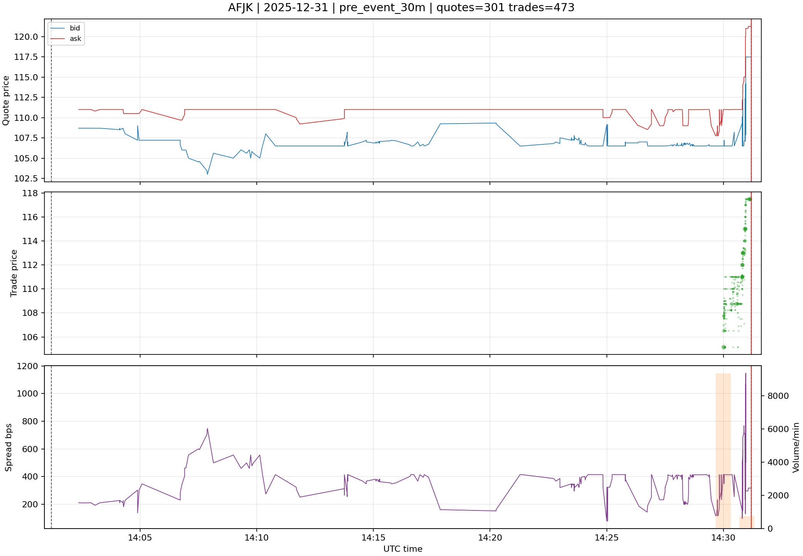

**Lectura tecnica de la imagen.** El panel superior muestra best bid/best ask
durante la ventana candidata. El panel central muestra prints de trades con el
tamano relativo del punto escalado por `size`. El panel inferior combina spread
en bps y volumen negociado por minuto. Las lineas negras discontinuas marcan el
inicio y fin de la ventana; si la linea roja aparece dentro del panel, marca el
timestamp de evento.

**Interpretacion para el inspector.** La ventana `pre_event_30m` termina en el evento y es candidata a feature pre-evento. En esta imagen hay
`301` quotes y `473` trades. La mediana
del spread es `366.97` bps y el p90 es
`592.26` bps. No se observan crossed quotes en esta ventana. En trades, el odd-lot ratio es `94.93%`, el duplicate exact ratio es `1.27%` y el off-regular-session ratio es `0.00%`.

**Decision de consumo.** `execution_sim_candidate=False`,
`backtest_core_microstructure_candidate=False`,
`full_universe_claim=False`. Esta evidencia sirve para
validar lectura forense del candidato, no para promocion institucional ni para
ML/RL primario.

### Case 04 - `AFJK` `2025-12-31` `pre_event_30m`


**Lectura tecnica de la imagen.** El panel superior muestra best bid/best ask
durante la ventana candidata. El panel central muestra prints de trades con el
tamano relativo del punto escalado por `size`. El panel inferior combina spread
en bps y volumen negociado por minuto. Las lineas negras discontinuas marcan el
inicio y fin de la ventana; si la linea roja aparece dentro del panel, marca el
timestamp de evento.

**Interpretacion para el inspector.** La ventana `pre_event_30m` termina en el evento y es candidata a feature pre-evento. En esta imagen hay
`1,002` quotes y `3,507` trades. La mediana
del spread es `403.66` bps y el p90 es
`722.03` bps. No se observan crossed quotes en esta ventana. En trades, el odd-lot ratio es `96.44%`, el duplicate exact ratio es `0.74%` y el off-regular-session ratio es `0.00%`.

**Decision de consumo.** `execution_sim_candidate=False`,
`backtest_core_microstructure_candidate=False`,
`full_universe_claim=False`. Esta evidencia sirve para
validar lectura forense del candidato, no para promocion institucional ni para
ML/RL primario.

### Case 05 - `AFJK` `2025-12-31` `same_session_regular`


**Lectura tecnica de la imagen.** El panel superior muestra best bid/best ask
durante la ventana candidata. El panel central muestra prints de trades con el
tamano relativo del punto escalado por `size`. El panel inferior combina spread
en bps y volumen negociado por minuto. Las lineas negras discontinuas marcan el
inicio y fin de la ventana; si la linea roja aparece dentro del panel, marca el
timestamp de evento.

**Interpretacion para el inspector.** La ventana `same_session_regular` contiene contexto de sesion y puede incluir informacion posterior; no debe usarse como feature ML pre-evento. En esta imagen hay
`6,107` quotes y `21,218` trades. La mediana
del spread es `497.71` bps y el p90 es
`843.38` bps. No se observan crossed quotes en esta ventana. En trades, el odd-lot ratio es `96.06%`, el duplicate exact ratio es `0.48%` y el off-regular-session ratio es `0.00%`.

**Decision de consumo.** `execution_sim_candidate=False`,
`backtest_core_microstructure_candidate=False`,
`full_universe_claim=False`. Esta evidencia sirve para
validar lectura forense del candidato, no para promocion institucional ni para
ML/RL primario.

### Case 06 - `AFJK` `2025-12-31` `same_session_regular`


**Lectura tecnica de la imagen.** El panel superior muestra best bid/best ask
durante la ventana candidata. El panel central muestra prints de trades con el
tamano relativo del punto escalado por `size`. El panel inferior combina spread
en bps y volumen negociado por minuto. Las lineas negras discontinuas marcan el
inicio y fin de la ventana; si la linea roja aparece dentro del panel, marca el
timestamp de evento.

**Interpretacion para el inspector.** La ventana `same_session_regular` contiene contexto de sesion y puede incluir informacion posterior; no debe usarse como feature ML pre-evento. En esta imagen hay
`6,107` quotes y `21,218` trades. La mediana
del spread es `497.71` bps y el p90 es
`843.38` bps. No se observan crossed quotes en esta ventana. En trades, el odd-lot ratio es `96.06%`, el duplicate exact ratio es `0.48%` y el off-regular-session ratio es `0.00%`.

**Decision de consumo.** `execution_sim_candidate=False`,
`backtest_core_microstructure_candidate=False`,
`full_universe_claim=False`. Esta evidencia sirve para
validar lectura forense del candidato, no para promocion institucional ni para
ML/RL primario.

### Case 07 - `AFJK` `2025-12-31` `same_session_regular`


**Lectura tecnica de la imagen.** El panel superior muestra best bid/best ask
durante la ventana candidata. El panel central muestra prints de trades con el
tamano relativo del punto escalado por `size`. El panel inferior combina spread
en bps y volumen negociado por minuto. Las lineas negras discontinuas marcan el
inicio y fin de la ventana; si la linea roja aparece dentro del panel, marca el
timestamp de evento.

**Interpretacion para el inspector.** La ventana `same_session_regular` contiene contexto de sesion y puede incluir informacion posterior; no debe usarse como feature ML pre-evento. En esta imagen hay
`6,107` quotes y `21,218` trades. La mediana
del spread es `497.71` bps y el p90 es
`843.38` bps. No se observan crossed quotes en esta ventana. En trades, el odd-lot ratio es `96.06%`, el duplicate exact ratio es `0.48%` y el off-regular-session ratio es `0.00%`.

**Decision de consumo.** `execution_sim_candidate=False`,
`backtest_core_microstructure_candidate=False`,
`full_universe_claim=False`. Esta evidencia sirve para
validar lectura forense del candidato, no para promocion institucional ni para
ML/RL primario.

### Case 08 - `AFJK` `2025-12-31` `same_session_regular`

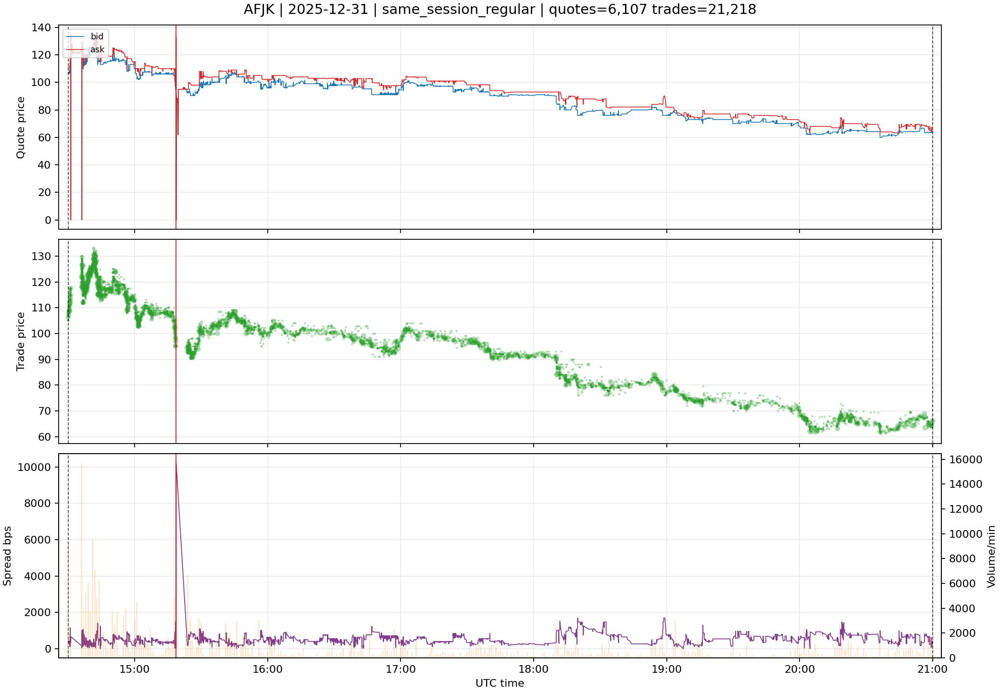

**Lectura tecnica de la imagen.** El panel superior muestra best bid/best ask
durante la ventana candidata. El panel central muestra prints de trades con el
tamano relativo del punto escalado por `size`. El panel inferior combina spread
en bps y volumen negociado por minuto. Las lineas negras discontinuas marcan el
inicio y fin de la ventana; si la linea roja aparece dentro del panel, marca el
timestamp de evento.

**Interpretacion para el inspector.** La ventana `same_session_regular` contiene contexto de sesion y puede incluir informacion posterior; no debe usarse como feature ML pre-evento. En esta imagen hay
`6,107` quotes y `21,218` trades. La mediana
del spread es `497.71` bps y el p90 es
`843.38` bps. No se observan crossed quotes en esta ventana. En trades, el odd-lot ratio es `96.06%`, el duplicate exact ratio es `0.48%` y el off-regular-session ratio es `0.00%`.

**Decision de consumo.** `execution_sim_candidate=False`,
`backtest_core_microstructure_candidate=False`,
`full_universe_claim=False`. Esta evidencia sirve para
validar lectura forense del candidato, no para promocion institucional ni para
ML/RL primario.

### Case 09 - `BFIN` `2025-12-31` `pre_event_30m`


**Lectura tecnica de la imagen.** El panel superior muestra best bid/best ask
durante la ventana candidata. El panel central muestra prints de trades con el
tamano relativo del punto escalado por `size`. El panel inferior combina spread
en bps y volumen negociado por minuto. Las lineas negras discontinuas marcan el
inicio y fin de la ventana; si la linea roja aparece dentro del panel, marca el
timestamp de evento.

**Interpretacion para el inspector.** La ventana `pre_event_30m` termina en el evento y es candidata a feature pre-evento. En esta imagen hay
`3,040` quotes y `427` trades. La mediana
del spread es `NA` bps y el p90 es
`NA` bps. No se observan crossed quotes en esta ventana. En trades, el odd-lot ratio es `NA%`, el duplicate exact ratio es `NA%` y el off-regular-session ratio es `NA%`.

**Decision de consumo.** `execution_sim_candidate=False`,
`backtest_core_microstructure_candidate=False`,
`full_universe_claim=False`. Esta evidencia sirve para
validar lectura forense del candidato, no para promocion institucional ni para
ML/RL primario.

### Case 10 - `BFIN` `2025-12-31` `pre_event_30m`

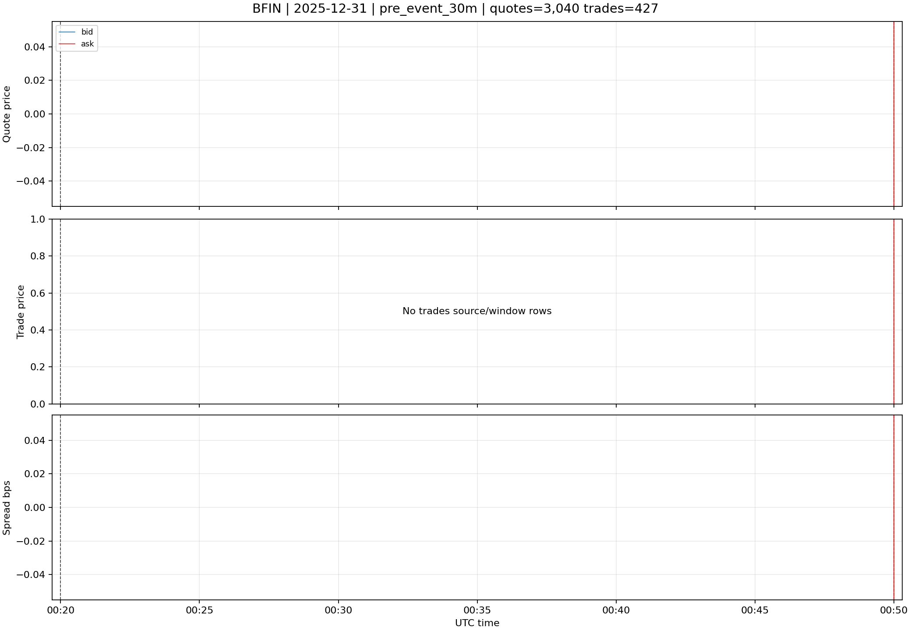

**Lectura tecnica de la imagen.** El panel superior muestra best bid/best ask
durante la ventana candidata. El panel central muestra prints de trades con el
tamano relativo del punto escalado por `size`. El panel inferior combina spread
en bps y volumen negociado por minuto. Las lineas negras discontinuas marcan el
inicio y fin de la ventana; si la linea roja aparece dentro del panel, marca el
timestamp de evento.

**Interpretacion para el inspector.** La ventana `pre_event_30m` termina en el evento y es candidata a feature pre-evento. En esta imagen hay
`3,040` quotes y `427` trades. La mediana
del spread es `NA` bps y el p90 es
`NA` bps. No se observan crossed quotes en esta ventana. En trades, el odd-lot ratio es `NA%`, el duplicate exact ratio es `NA%` y el off-regular-session ratio es `NA%`.

**Decision de consumo.** `execution_sim_candidate=False`,
`backtest_core_microstructure_candidate=False`,
`full_universe_claim=False`. Esta evidencia sirve para
validar lectura forense del candidato, no para promocion institucional ni para
ML/RL primario.

### Case 11 - `BFIN` `2025-12-31` `same_session_regular`


**Lectura tecnica de la imagen.** El panel superior muestra best bid/best ask
durante la ventana candidata. El panel central muestra prints de trades con el
tamano relativo del punto escalado por `size`. El panel inferior combina spread
en bps y volumen negociado por minuto. Las lineas negras discontinuas marcan el
inicio y fin de la ventana; si la linea roja aparece dentro del panel, marca el
timestamp de evento.

**Interpretacion para el inspector.** La ventana `same_session_regular` contiene contexto de sesion y puede incluir informacion posterior; no debe usarse como feature ML pre-evento. En esta imagen hay
`2,527` quotes y `427` trades. La mediana
del spread es `24.97` bps y el p90 es
`49.75` bps. No se observan crossed quotes en esta ventana. En trades, el odd-lot ratio es `92.51%`, el duplicate exact ratio es `0.47%` y el off-regular-session ratio es `0.00%`.

**Decision de consumo.** `execution_sim_candidate=False`,
`backtest_core_microstructure_candidate=False`,
`full_universe_claim=False`. Esta evidencia sirve para
validar lectura forense del candidato, no para promocion institucional ni para
ML/RL primario.

### Case 12 - `BFIN` `2025-12-31` `same_session_regular`

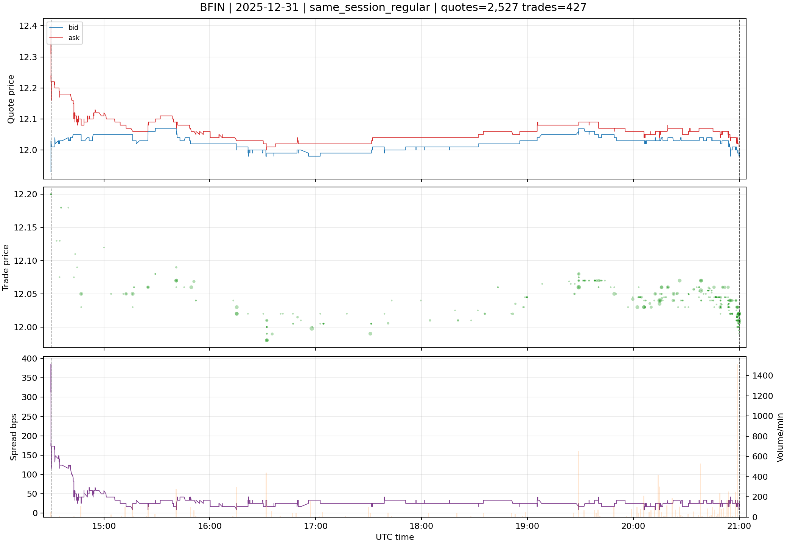

**Lectura tecnica de la imagen.** El panel superior muestra best bid/best ask
durante la ventana candidata. El panel central muestra prints de trades con el
tamano relativo del punto escalado por `size`. El panel inferior combina spread
en bps y volumen negociado por minuto. Las lineas negras discontinuas marcan el
inicio y fin de la ventana; si la linea roja aparece dentro del panel, marca el
timestamp de evento.

**Interpretacion para el inspector.** La ventana `same_session_regular` contiene contexto de sesion y puede incluir informacion posterior; no debe usarse como feature ML pre-evento. En esta imagen hay
`2,527` quotes y `427` trades. La mediana
del spread es `24.97` bps y el p90 es
`49.75` bps. No se observan crossed quotes en esta ventana. En trades, el odd-lot ratio es `92.51%`, el duplicate exact ratio es `0.47%` y el off-regular-session ratio es `0.00%`.

**Decision de consumo.** `execution_sim_candidate=False`,
`backtest_core_microstructure_candidate=False`,
`full_universe_claim=False`. Esta evidencia sirve para
validar lectura forense del candidato, no para promocion institucional ni para
ML/RL primario.

### Case 13 - `BYFC` `2025-12-31` `pre_event_30m`

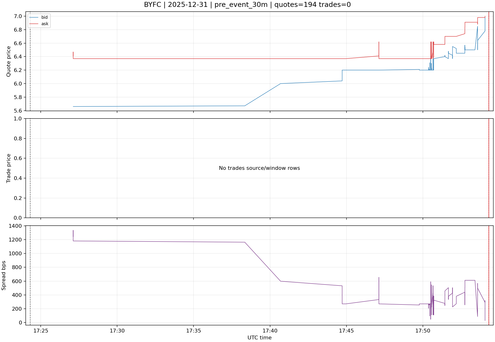

**Lectura tecnica de la imagen.** El panel superior muestra best bid/best ask
durante la ventana candidata. El panel central muestra prints de trades con el
tamano relativo del punto escalado por `size`. El panel inferior combina spread
en bps y volumen negociado por minuto. Las lineas negras discontinuas marcan el
inicio y fin de la ventana; si la linea roja aparece dentro del panel, marca el
timestamp de evento.

**Interpretacion para el inspector.** La ventana `pre_event_30m` termina en el evento y es candidata a feature pre-evento. En esta imagen hay
`194` quotes y `0` trades. La mediana
del spread es `330.47` bps y el p90 es
`533.18` bps. No se observan crossed quotes en esta ventana. No hay trades fuente para esta ventana; el caso queda como `review_partial_source` y no puede interpretarse como microestructura completa para ejecucion.

**Decision de consumo.** `execution_sim_candidate=False`,
`backtest_core_microstructure_candidate=False`,
`full_universe_claim=False`. Esta evidencia sirve para
validar lectura forense del candidato, no para promocion institucional ni para
ML/RL primario.

### Case 14 - `BYFC` `2025-12-31` `pre_event_30m`


**Lectura tecnica de la imagen.** El panel superior muestra best bid/best ask
durante la ventana candidata. El panel central muestra prints de trades con el
tamano relativo del punto escalado por `size`. El panel inferior combina spread
en bps y volumen negociado por minuto. Las lineas negras discontinuas marcan el
inicio y fin de la ventana; si la linea roja aparece dentro del panel, marca el
timestamp de evento.

**Interpretacion para el inspector.** La ventana `pre_event_30m` termina en el evento y es candidata a feature pre-evento. En esta imagen hay
`194` quotes y `0` trades. La mediana
del spread es `330.47` bps y el p90 es
`533.18` bps. No se observan crossed quotes en esta ventana. No hay trades fuente para esta ventana; el caso queda como `review_partial_source` y no puede interpretarse como microestructura completa para ejecucion.

**Decision de consumo.** `execution_sim_candidate=False`,
`backtest_core_microstructure_candidate=False`,
`full_universe_claim=False`. Esta evidencia sirve para
validar lectura forense del candidato, no para promocion institucional ni para
ML/RL primario.

### Case 15 - `BYFC` `2025-12-31` `same_session_regular`

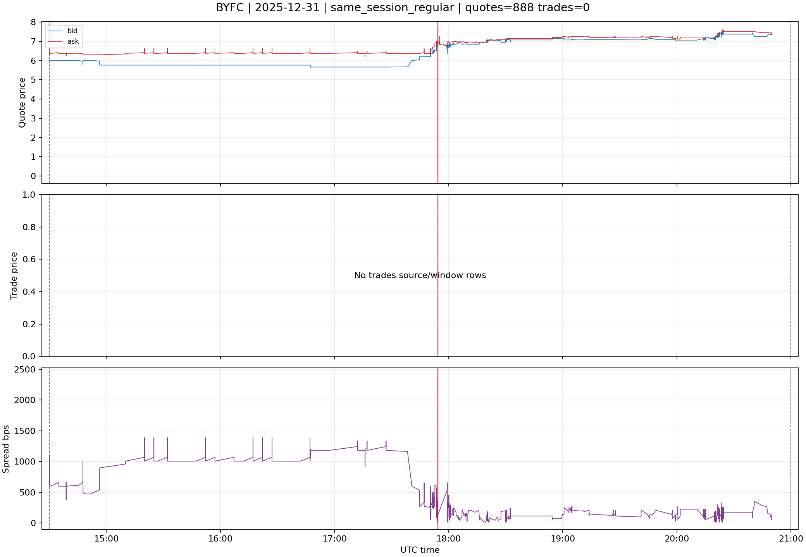

**Lectura tecnica de la imagen.** El panel superior muestra best bid/best ask
durante la ventana candidata. El panel central muestra prints de trades con el
tamano relativo del punto escalado por `size`. El panel inferior combina spread
en bps y volumen negociado por minuto. Las lineas negras discontinuas marcan el
inicio y fin de la ventana; si la linea roja aparece dentro del panel, marca el
timestamp de evento.

**Interpretacion para el inspector.** La ventana `same_session_regular` contiene contexto de sesion y puede incluir informacion posterior; no debe usarse como feature ML pre-evento. En esta imagen hay
`888` quotes y `0` trades. La mediana
del spread es `198.02` bps y el p90 es
`974.79` bps. No se observan crossed quotes en esta ventana. No hay trades fuente para esta ventana; el caso queda como `review_partial_source` y no puede interpretarse como microestructura completa para ejecucion.

**Decision de consumo.** `execution_sim_candidate=False`,
`backtest_core_microstructure_candidate=False`,
`full_universe_claim=False`. Esta evidencia sirve para
validar lectura forense del candidato, no para promocion institucional ni para
ML/RL primario.

### Case 16 - `BYFC` `2025-12-31` `same_session_regular`


**Lectura tecnica de la imagen.** El panel superior muestra best bid/best ask
durante la ventana candidata. El panel central muestra prints de trades con el
tamano relativo del punto escalado por `size`. El panel inferior combina spread
en bps y volumen negociado por minuto. Las lineas negras discontinuas marcan el
inicio y fin de la ventana; si la linea roja aparece dentro del panel, marca el
timestamp de evento.

**Interpretacion para el inspector.** La ventana `same_session_regular` contiene contexto de sesion y puede incluir informacion posterior; no debe usarse como feature ML pre-evento. En esta imagen hay
`888` quotes y `0` trades. La mediana
del spread es `198.02` bps y el p90 es
`974.79` bps. No se observan crossed quotes en esta ventana. No hay trades fuente para esta ventana; el caso queda como `review_partial_source` y no puede interpretarse como microestructura completa para ejecucion.

**Decision de consumo.** `execution_sim_candidate=False`,
`backtest_core_microstructure_candidate=False`,
`full_universe_claim=False`. Esta evidencia sirve para
validar lectura forense del candidato, no para promocion institucional ni para
ML/RL primario.

### Case 17 - `CODX` `2025-12-31` `pre_event_30m`

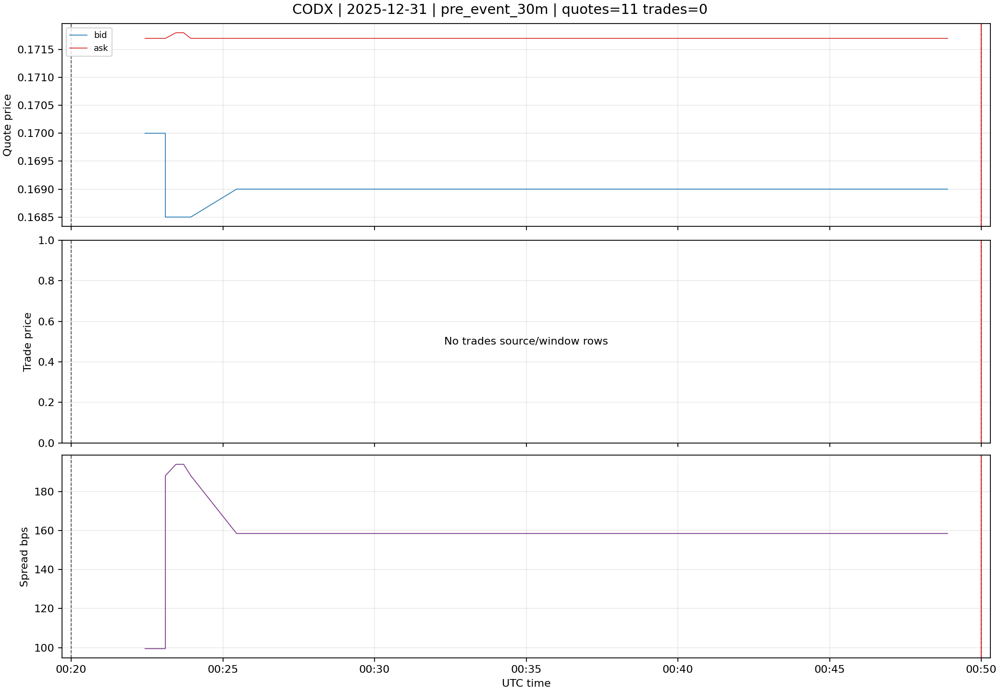

**Lectura tecnica de la imagen.** El panel superior muestra best bid/best ask
durante la ventana candidata. El panel central muestra prints de trades con el
tamano relativo del punto escalado por `size`. El panel inferior combina spread
en bps y volumen negociado por minuto. Las lineas negras discontinuas marcan el
inicio y fin de la ventana; si la linea roja aparece dentro del panel, marca el
timestamp de evento.

**Interpretacion para el inspector.** La ventana `pre_event_30m` termina en el evento y es candidata a feature pre-evento. En esta imagen hay
`11` quotes y `0` trades. La mediana
del spread es `158.50` bps y el p90 es
`193.95` bps. No se observan crossed quotes en esta ventana. No hay trades fuente para esta ventana; el caso queda como `review_partial_source` y no puede interpretarse como microestructura completa para ejecucion.

**Decision de consumo.** `execution_sim_candidate=False`,
`backtest_core_microstructure_candidate=False`,
`full_universe_claim=False`. Esta evidencia sirve para
validar lectura forense del candidato, no para promocion institucional ni para
ML/RL primario.

### Case 18 - `CODX` `2025-12-31` `pre_event_30m`


**Lectura tecnica de la imagen.** El panel superior muestra best bid/best ask
durante la ventana candidata. El panel central muestra prints de trades con el
tamano relativo del punto escalado por `size`. El panel inferior combina spread
en bps y volumen negociado por minuto. Las lineas negras discontinuas marcan el
inicio y fin de la ventana; si la linea roja aparece dentro del panel, marca el
timestamp de evento.

**Interpretacion para el inspector.** La ventana `pre_event_30m` termina en el evento y es candidata a feature pre-evento. En esta imagen hay
`11` quotes y `0` trades. La mediana
del spread es `158.50` bps y el p90 es
`193.95` bps. No se observan crossed quotes en esta ventana. No hay trades fuente para esta ventana; el caso queda como `review_partial_source` y no puede interpretarse como microestructura completa para ejecucion.

**Decision de consumo.** `execution_sim_candidate=False`,
`backtest_core_microstructure_candidate=False`,
`full_universe_claim=False`. Esta evidencia sirve para
validar lectura forense del candidato, no para promocion institucional ni para
ML/RL primario.

### Case 19 - `CODX` `2025-12-31` `pre_event_30m`


**Lectura tecnica de la imagen.** El panel superior muestra best bid/best ask
durante la ventana candidata. El panel central muestra prints de trades con el
tamano relativo del punto escalado por `size`. El panel inferior combina spread
en bps y volumen negociado por minuto. Las lineas negras discontinuas marcan el
inicio y fin de la ventana; si la linea roja aparece dentro del panel, marca el
timestamp de evento.

**Interpretacion para el inspector.** La ventana `pre_event_30m` termina en el evento y es candidata a feature pre-evento. En esta imagen hay
`11` quotes y `0` trades. La mediana
del spread es `158.50` bps y el p90 es
`193.95` bps. No se observan crossed quotes en esta ventana. No hay trades fuente para esta ventana; el caso queda como `review_partial_source` y no puede interpretarse como microestructura completa para ejecucion.

**Decision de consumo.** `execution_sim_candidate=False`,
`backtest_core_microstructure_candidate=False`,
`full_universe_claim=False`. Esta evidencia sirve para
validar lectura forense del candidato, no para promocion institucional ni para
ML/RL primario.

### Case 20 - `CODX` `2025-12-31` `same_session_regular`

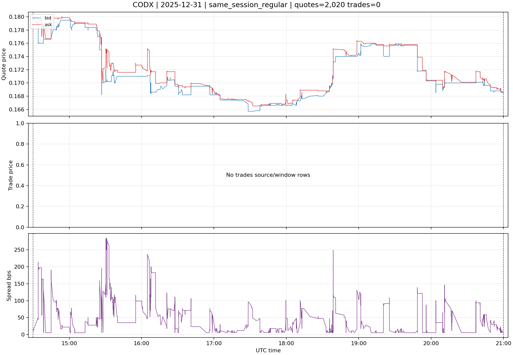

**Lectura tecnica de la imagen.** El panel superior muestra best bid/best ask
durante la ventana candidata. El panel central muestra prints de trades con el
tamano relativo del punto escalado por `size`. El panel inferior combina spread
en bps y volumen negociado por minuto. Las lineas negras discontinuas marcan el
inicio y fin de la ventana; si la linea roja aparece dentro del panel, marca el
timestamp de evento.

**Interpretacion para el inspector.** La ventana `same_session_regular` contiene contexto de sesion y puede incluir informacion posterior; no debe usarse como feature ML pre-evento. En esta imagen hay
`2,020` quotes y `0` trades. La mediana
del spread es `23.72` bps y el p90 es
`122.10` bps. No se observan crossed quotes en esta ventana. No hay trades fuente para esta ventana; el caso queda como `review_partial_source` y no puede interpretarse como microestructura completa para ejecucion.

**Decision de consumo.** `execution_sim_candidate=False`,
`backtest_core_microstructure_candidate=False`,
`full_universe_claim=False`. Esta evidencia sirve para
validar lectura forense del candidato, no para promocion institucional ni para
ML/RL primario.

### Case 21 - `CODX` `2025-12-31` `same_session_regular`


**Lectura tecnica de la imagen.** El panel superior muestra best bid/best ask
durante la ventana candidata. El panel central muestra prints de trades con el
tamano relativo del punto escalado por `size`. El panel inferior combina spread
en bps y volumen negociado por minuto. Las lineas negras discontinuas marcan el
inicio y fin de la ventana; si la linea roja aparece dentro del panel, marca el
timestamp de evento.

**Interpretacion para el inspector.** La ventana `same_session_regular` contiene contexto de sesion y puede incluir informacion posterior; no debe usarse como feature ML pre-evento. En esta imagen hay
`2,020` quotes y `0` trades. La mediana
del spread es `23.72` bps y el p90 es
`122.10` bps. No se observan crossed quotes en esta ventana. No hay trades fuente para esta ventana; el caso queda como `review_partial_source` y no puede interpretarse como microestructura completa para ejecucion.

**Decision de consumo.** `execution_sim_candidate=False`,
`backtest_core_microstructure_candidate=False`,
`full_universe_claim=False`. Esta evidencia sirve para
validar lectura forense del candidato, no para promocion institucional ni para
ML/RL primario.

### Case 22 - `CODX` `2025-12-31` `same_session_regular`


**Lectura tecnica de la imagen.** El panel superior muestra best bid/best ask
durante la ventana candidata. El panel central muestra prints de trades con el
tamano relativo del punto escalado por `size`. El panel inferior combina spread
en bps y volumen negociado por minuto. Las lineas negras discontinuas marcan el
inicio y fin de la ventana; si la linea roja aparece dentro del panel, marca el
timestamp de evento.

**Interpretacion para el inspector.** La ventana `same_session_regular` contiene contexto de sesion y puede incluir informacion posterior; no debe usarse como feature ML pre-evento. En esta imagen hay
`2,020` quotes y `0` trades. La mediana
del spread es `23.72` bps y el p90 es
`122.10` bps. No se observan crossed quotes en esta ventana. No hay trades fuente para esta ventana; el caso queda como `review_partial_source` y no puede interpretarse como microestructura completa para ejecucion.

**Decision de consumo.** `execution_sim_candidate=False`,
`backtest_core_microstructure_candidate=False`,
`full_universe_claim=False`. Esta evidencia sirve para
validar lectura forense del candidato, no para promocion institucional ni para
ML/RL primario.

### Case 23 - `GVH` `2025-12-31` `pre_event_30m`

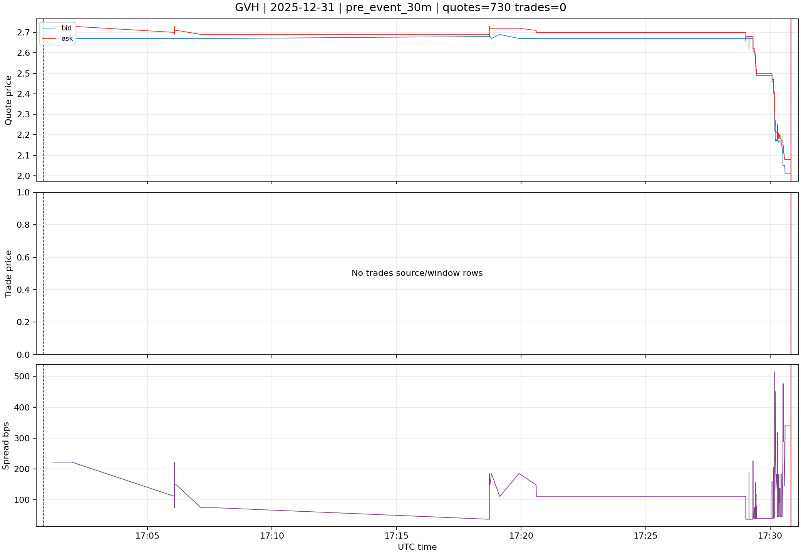

**Lectura tecnica de la imagen.** El panel superior muestra best bid/best ask
durante la ventana candidata. El panel central muestra prints de trades con el
tamano relativo del punto escalado por `size`. El panel inferior combina spread
en bps y volumen negociado por minuto. Las lineas negras discontinuas marcan el
inicio y fin de la ventana; si la linea roja aparece dentro del panel, marca el
timestamp de evento.

**Interpretacion para el inspector.** La ventana `pre_event_30m` termina en el evento y es candidata a feature pre-evento. En esta imagen hay
`730` quotes y `0` trades. La mediana
del spread es `75.19` bps y el p90 es
`226.42` bps. No se observan crossed quotes en esta ventana. No hay trades fuente para esta ventana; el caso queda como `review_partial_source` y no puede interpretarse como microestructura completa para ejecucion.

**Decision de consumo.** `execution_sim_candidate=False`,
`backtest_core_microstructure_candidate=False`,
`full_universe_claim=False`. Esta evidencia sirve para
validar lectura forense del candidato, no para promocion institucional ni para
ML/RL primario.

### Case 24 - `GVH` `2025-12-31` `pre_event_30m`


**Lectura tecnica de la imagen.** El panel superior muestra best bid/best ask
durante la ventana candidata. El panel central muestra prints de trades con el
tamano relativo del punto escalado por `size`. El panel inferior combina spread
en bps y volumen negociado por minuto. Las lineas negras discontinuas marcan el
inicio y fin de la ventana; si la linea roja aparece dentro del panel, marca el
timestamp de evento.

**Interpretacion para el inspector.** La ventana `pre_event_30m` termina en el evento y es candidata a feature pre-evento. En esta imagen hay
`730` quotes y `0` trades. La mediana
del spread es `75.19` bps y el p90 es
`226.42` bps. No se observan crossed quotes en esta ventana. No hay trades fuente para esta ventana; el caso queda como `review_partial_source` y no puede interpretarse como microestructura completa para ejecucion.

**Decision de consumo.** `execution_sim_candidate=False`,
`backtest_core_microstructure_candidate=False`,
`full_universe_claim=False`. Esta evidencia sirve para
validar lectura forense del candidato, no para promocion institucional ni para
ML/RL primario.

### Case 25 - `GVH` `2025-12-31` `same_session_regular`


**Lectura tecnica de la imagen.** El panel superior muestra best bid/best ask
durante la ventana candidata. El panel central muestra prints de trades con el
tamano relativo del punto escalado por `size`. El panel inferior combina spread
en bps y volumen negociado por minuto. Las lineas negras discontinuas marcan el
inicio y fin de la ventana; si la linea roja aparece dentro del panel, marca el
timestamp de evento.

**Interpretacion para el inspector.** La ventana `same_session_regular` contiene contexto de sesion y puede incluir informacion posterior; no debe usarse como feature ML pre-evento. En esta imagen hay
`5,198` quotes y `0` trades. La mediana
del spread es `125.79` bps y el p90 es
`343.64` bps. Se observan 6 crossed quotes; deben mantenerse visibles como textura de review, aunque no rompen este candidato. No hay trades fuente para esta ventana; el caso queda como `review_partial_source` y no puede interpretarse como microestructura completa para ejecucion.

**Decision de consumo.** `execution_sim_candidate=False`,
`backtest_core_microstructure_candidate=False`,
`full_universe_claim=False`. Esta evidencia sirve para
validar lectura forense del candidato, no para promocion institucional ni para
ML/RL primario.

### Case 26 - `GVH` `2025-12-31` `same_session_regular`

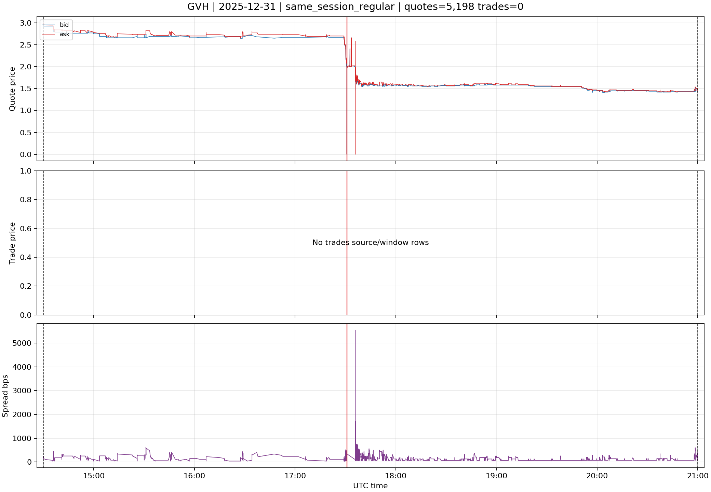

**Lectura tecnica de la imagen.** El panel superior muestra best bid/best ask
durante la ventana candidata. El panel central muestra prints de trades con el
tamano relativo del punto escalado por `size`. El panel inferior combina spread
en bps y volumen negociado por minuto. Las lineas negras discontinuas marcan el
inicio y fin de la ventana; si la linea roja aparece dentro del panel, marca el
timestamp de evento.

**Interpretacion para el inspector.** La ventana `same_session_regular` contiene contexto de sesion y puede incluir informacion posterior; no debe usarse como feature ML pre-evento. En esta imagen hay
`5,198` quotes y `0` trades. La mediana
del spread es `125.79` bps y el p90 es
`343.64` bps. Se observan 6 crossed quotes; deben mantenerse visibles como textura de review, aunque no rompen este candidato. No hay trades fuente para esta ventana; el caso queda como `review_partial_source` y no puede interpretarse como microestructura completa para ejecucion.

**Decision de consumo.** `execution_sim_candidate=False`,
`backtest_core_microstructure_candidate=False`,
`full_universe_claim=False`. Esta evidencia sirve para
validar lectura forense del candidato, no para promocion institucional ni para
ML/RL primario.

### Case 27 - `INBS` `2025-12-31` `pre_event_30m`

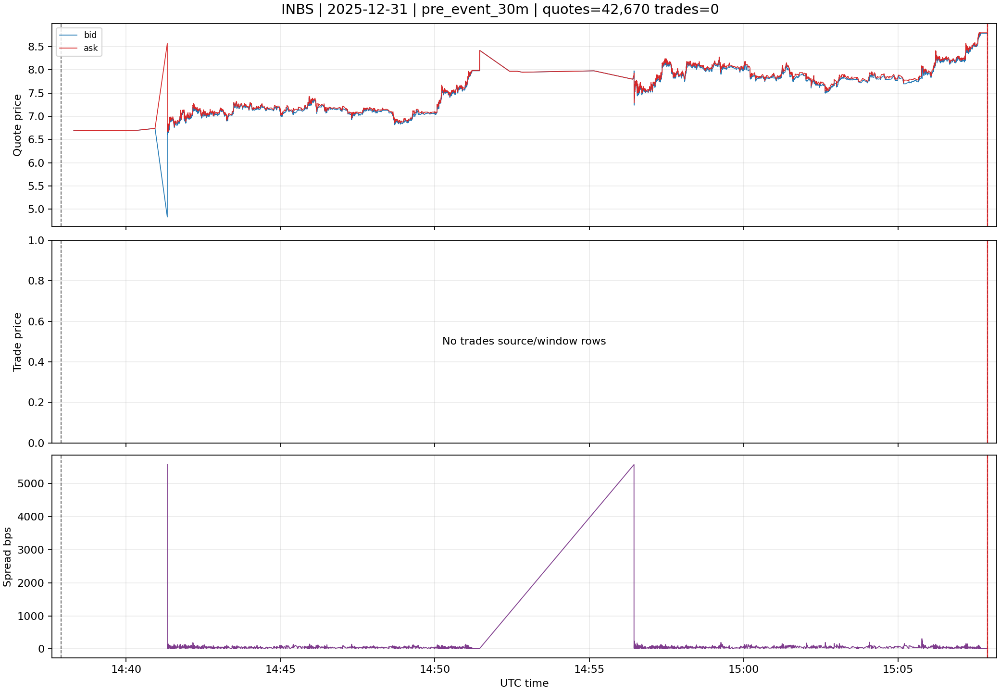

**Lectura tecnica de la imagen.** El panel superior muestra best bid/best ask
durante la ventana candidata. El panel central muestra prints de trades con el
tamano relativo del punto escalado por `size`. El panel inferior combina spread
en bps y volumen negociado por minuto. Las lineas negras discontinuas marcan el
inicio y fin de la ventana; si la linea roja aparece dentro del panel, marca el
timestamp de evento.

**Interpretacion para el inspector.** La ventana `pre_event_30m` termina en el evento y es candidata a feature pre-evento. En esta imagen hay
`42,670` quotes y `0` trades. La mediana
del spread es `45.61` bps y el p90 es
`86.46` bps. Se observan 26 crossed quotes; deben mantenerse visibles como textura de review, aunque no rompen este candidato. No hay trades fuente para esta ventana; el caso queda como `review_partial_source` y no puede interpretarse como microestructura completa para ejecucion.

**Decision de consumo.** `execution_sim_candidate=False`,
`backtest_core_microstructure_candidate=False`,
`full_universe_claim=False`. Esta evidencia sirve para
validar lectura forense del candidato, no para promocion institucional ni para
ML/RL primario.

### Case 28 - `INBS` `2025-12-31` `pre_event_30m`


**Lectura tecnica de la imagen.** El panel superior muestra best bid/best ask
durante la ventana candidata. El panel central muestra prints de trades con el
tamano relativo del punto escalado por `size`. El panel inferior combina spread
en bps y volumen negociado por minuto. Las lineas negras discontinuas marcan el
inicio y fin de la ventana; si la linea roja aparece dentro del panel, marca el
timestamp de evento.

**Interpretacion para el inspector.** La ventana `pre_event_30m` termina en el evento y es candidata a feature pre-evento. En esta imagen hay
`19,053` quotes y `0` trades. La mediana
del spread es `37.31` bps y el p90 es
`78.13` bps. Se observan 16 crossed quotes; deben mantenerse visibles como textura de review, aunque no rompen este candidato. No hay trades fuente para esta ventana; el caso queda como `review_partial_source` y no puede interpretarse como microestructura completa para ejecucion.

**Decision de consumo.** `execution_sim_candidate=False`,
`backtest_core_microstructure_candidate=False`,
`full_universe_claim=False`. Esta evidencia sirve para
validar lectura forense del candidato, no para promocion institucional ni para
ML/RL primario.

### Case 29 - `INBS` `2025-12-31` `pre_event_30m`


**Lectura tecnica de la imagen.** El panel superior muestra best bid/best ask
durante la ventana candidata. El panel central muestra prints de trades con el
tamano relativo del punto escalado por `size`. El panel inferior combina spread
en bps y volumen negociado por minuto. Las lineas negras discontinuas marcan el
inicio y fin de la ventana; si la linea roja aparece dentro del panel, marca el
timestamp de evento.

**Interpretacion para el inspector.** La ventana `pre_event_30m` termina en el evento y es candidata a feature pre-evento. En esta imagen hay
`42,670` quotes y `0` trades. La mediana
del spread es `45.61` bps y el p90 es
`86.46` bps. Se observan 26 crossed quotes; deben mantenerse visibles como textura de review, aunque no rompen este candidato. No hay trades fuente para esta ventana; el caso queda como `review_partial_source` y no puede interpretarse como microestructura completa para ejecucion.

**Decision de consumo.** `execution_sim_candidate=False`,
`backtest_core_microstructure_candidate=False`,
`full_universe_claim=False`. Esta evidencia sirve para
validar lectura forense del candidato, no para promocion institucional ni para
ML/RL primario.

### Case 30 - `INBS` `2025-12-31` `pre_event_30m`


**Lectura tecnica de la imagen.** El panel superior muestra best bid/best ask
durante la ventana candidata. El panel central muestra prints de trades con el
tamano relativo del punto escalado por `size`. El panel inferior combina spread
en bps y volumen negociado por minuto. Las lineas negras discontinuas marcan el
inicio y fin de la ventana; si la linea roja aparece dentro del panel, marca el
timestamp de evento.

**Interpretacion para el inspector.** La ventana `pre_event_30m` termina en el evento y es candidata a feature pre-evento. En esta imagen hay
`33,933` quotes y `0` trades. La mediana
del spread es `41.64` bps y el p90 es
`79.37` bps. Se observan 19 crossed quotes; deben mantenerse visibles como textura de review, aunque no rompen este candidato. No hay trades fuente para esta ventana; el caso queda como `review_partial_source` y no puede interpretarse como microestructura completa para ejecucion.

**Decision de consumo.** `execution_sim_candidate=False`,
`backtest_core_microstructure_candidate=False`,
`full_universe_claim=False`. Esta evidencia sirve para
validar lectura forense del candidato, no para promocion institucional ni para
ML/RL primario.

### Case 31 - `INBS` `2025-12-31` `pre_event_30m`

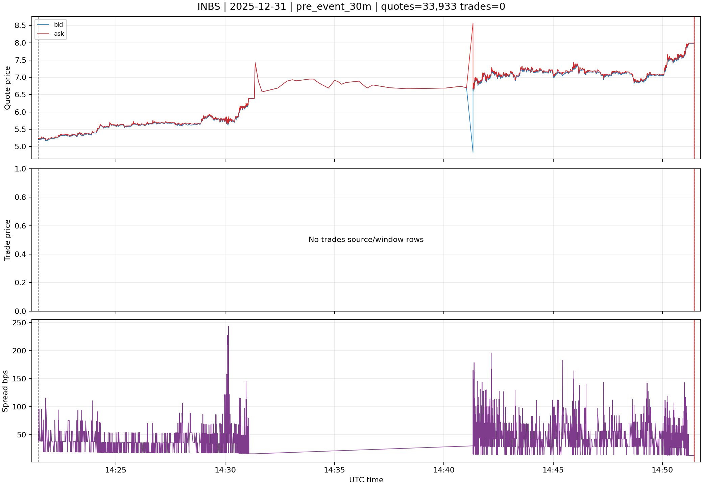

**Lectura tecnica de la imagen.** El panel superior muestra best bid/best ask
durante la ventana candidata. El panel central muestra prints de trades con el
tamano relativo del punto escalado por `size`. El panel inferior combina spread
en bps y volumen negociado por minuto. Las lineas negras discontinuas marcan el
inicio y fin de la ventana; si la linea roja aparece dentro del panel, marca el
timestamp de evento.

**Interpretacion para el inspector.** La ventana `pre_event_30m` termina en el evento y es candidata a feature pre-evento. En esta imagen hay
`33,933` quotes y `0` trades. La mediana
del spread es `41.64` bps y el p90 es
`79.37` bps. Se observan 19 crossed quotes; deben mantenerse visibles como textura de review, aunque no rompen este candidato. No hay trades fuente para esta ventana; el caso queda como `review_partial_source` y no puede interpretarse como microestructura completa para ejecucion.

**Decision de consumo.** `execution_sim_candidate=False`,
`backtest_core_microstructure_candidate=False`,
`full_universe_claim=False`. Esta evidencia sirve para
validar lectura forense del candidato, no para promocion institucional ni para
ML/RL primario.

### Case 32 - `INBS` `2025-12-31` `pre_event_30m`

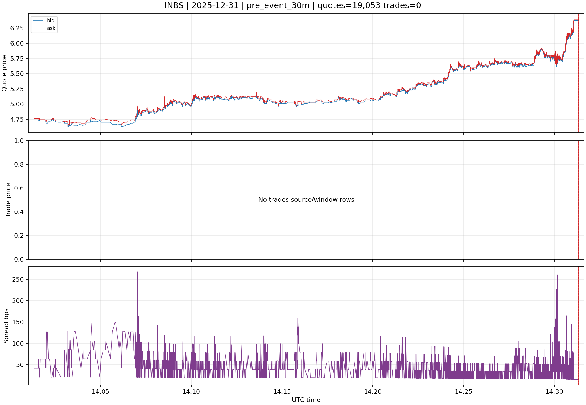

**Lectura tecnica de la imagen.** El panel superior muestra best bid/best ask
durante la ventana candidata. El panel central muestra prints de trades con el
tamano relativo del punto escalado por `size`. El panel inferior combina spread
en bps y volumen negociado por minuto. Las lineas negras discontinuas marcan el
inicio y fin de la ventana; si la linea roja aparece dentro del panel, marca el
timestamp de evento.

**Interpretacion para el inspector.** La ventana `pre_event_30m` termina en el evento y es candidata a feature pre-evento. En esta imagen hay
`19,053` quotes y `0` trades. La mediana
del spread es `37.31` bps y el p90 es
`78.13` bps. Se observan 16 crossed quotes; deben mantenerse visibles como textura de review, aunque no rompen este candidato. No hay trades fuente para esta ventana; el caso queda como `review_partial_source` y no puede interpretarse como microestructura completa para ejecucion.

**Decision de consumo.** `execution_sim_candidate=False`,
`backtest_core_microstructure_candidate=False`,
`full_universe_claim=False`. Esta evidencia sirve para
validar lectura forense del candidato, no para promocion institucional ni para
ML/RL primario.

### Case 33 - `INBS` `2025-12-31` `same_session_regular`

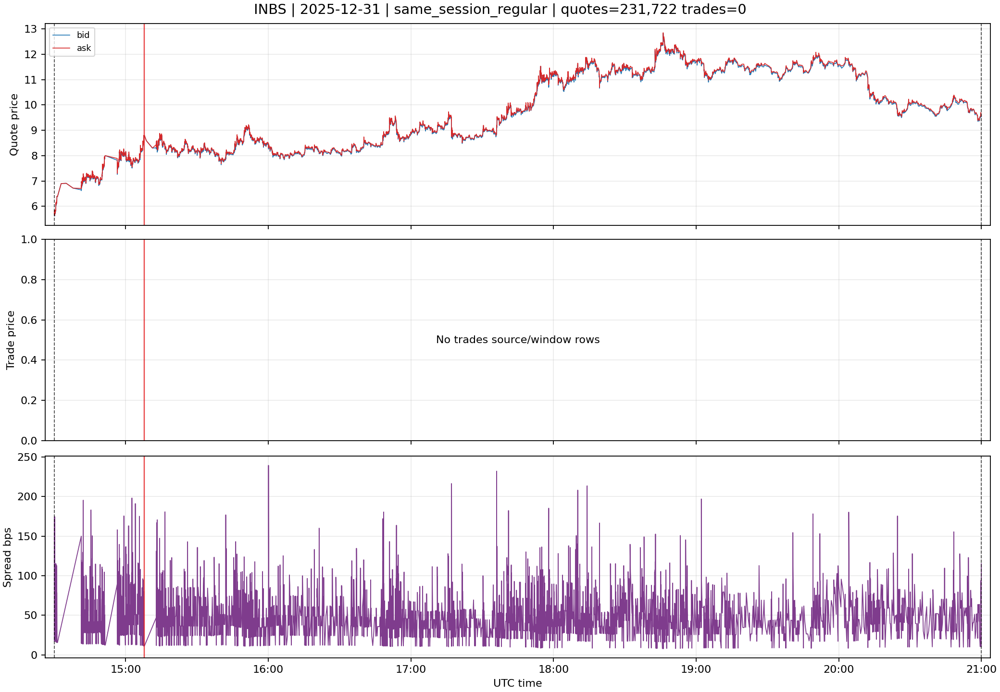

**Lectura tecnica de la imagen.** El panel superior muestra best bid/best ask
durante la ventana candidata. El panel central muestra prints de trades con el
tamano relativo del punto escalado por `size`. El panel inferior combina spread
en bps y volumen negociado por minuto. Las lineas negras discontinuas marcan el
inicio y fin de la ventana; si la linea roja aparece dentro del panel, marca el
timestamp de evento.

**Interpretacion para el inspector.** La ventana `same_session_regular` contiene contexto de sesion y puede incluir informacion posterior; no debe usarse como feature ML pre-evento. En esta imagen hay
`231,722` quotes y `0` trades. La mediana
del spread es `44.03` bps y el p90 es
`82.39` bps. Se observan 143 crossed quotes; deben mantenerse visibles como textura de review, aunque no rompen este candidato. No hay trades fuente para esta ventana; el caso queda como `review_partial_source` y no puede interpretarse como microestructura completa para ejecucion.

**Decision de consumo.** `execution_sim_candidate=False`,
`backtest_core_microstructure_candidate=False`,
`full_universe_claim=False`. Esta evidencia sirve para
validar lectura forense del candidato, no para promocion institucional ni para
ML/RL primario.

### Case 34 - `INBS` `2025-12-31` `same_session_regular`

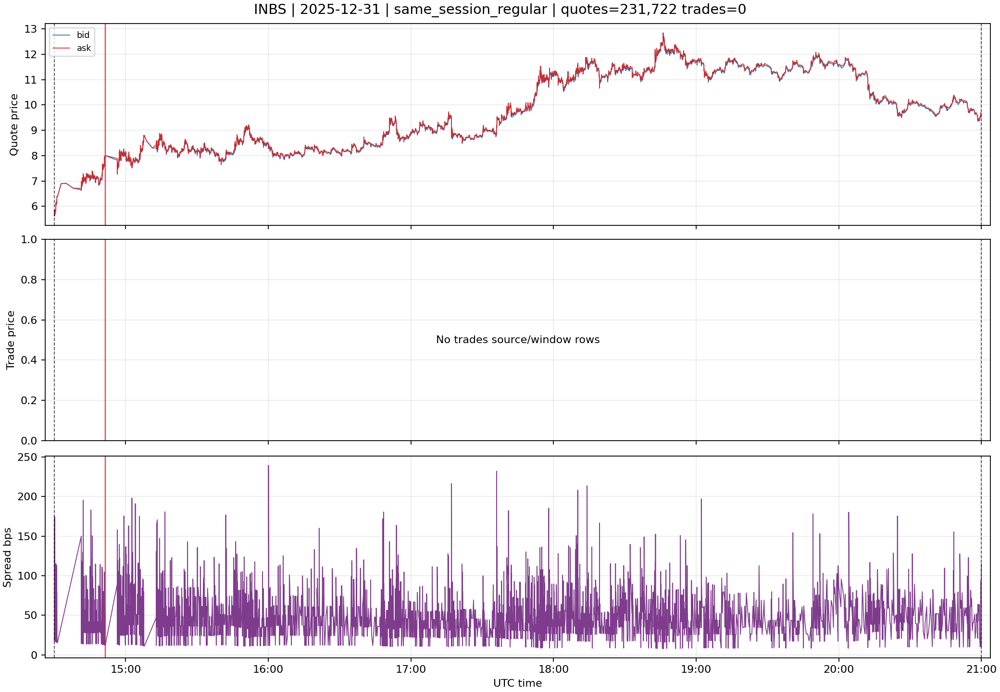

**Lectura tecnica de la imagen.** El panel superior muestra best bid/best ask
durante la ventana candidata. El panel central muestra prints de trades con el
tamano relativo del punto escalado por `size`. El panel inferior combina spread
en bps y volumen negociado por minuto. Las lineas negras discontinuas marcan el
inicio y fin de la ventana; si la linea roja aparece dentro del panel, marca el
timestamp de evento.

**Interpretacion para el inspector.** La ventana `same_session_regular` contiene contexto de sesion y puede incluir informacion posterior; no debe usarse como feature ML pre-evento. En esta imagen hay
`231,722` quotes y `0` trades. La mediana
del spread es `44.03` bps y el p90 es
`82.39` bps. Se observan 143 crossed quotes; deben mantenerse visibles como textura de review, aunque no rompen este candidato. No hay trades fuente para esta ventana; el caso queda como `review_partial_source` y no puede interpretarse como microestructura completa para ejecucion.

**Decision de consumo.** `execution_sim_candidate=False`,
`backtest_core_microstructure_candidate=False`,
`full_universe_claim=False`. Esta evidencia sirve para
validar lectura forense del candidato, no para promocion institucional ni para
ML/RL primario.

### Case 35 - `INBS` `2025-12-31` `same_session_regular`


**Lectura tecnica de la imagen.** El panel superior muestra best bid/best ask
durante la ventana candidata. El panel central muestra prints de trades con el
tamano relativo del punto escalado por `size`. El panel inferior combina spread
en bps y volumen negociado por minuto. Las lineas negras discontinuas marcan el
inicio y fin de la ventana; si la linea roja aparece dentro del panel, marca el
timestamp de evento.

**Interpretacion para el inspector.** La ventana `same_session_regular` contiene contexto de sesion y puede incluir informacion posterior; no debe usarse como feature ML pre-evento. En esta imagen hay
`231,722` quotes y `0` trades. La mediana
del spread es `44.03` bps y el p90 es
`82.39` bps. Se observan 143 crossed quotes; deben mantenerse visibles como textura de review, aunque no rompen este candidato. No hay trades fuente para esta ventana; el caso queda como `review_partial_source` y no puede interpretarse como microestructura completa para ejecucion.

**Decision de consumo.** `execution_sim_candidate=False`,
`backtest_core_microstructure_candidate=False`,
`full_universe_claim=False`. Esta evidencia sirve para
validar lectura forense del candidato, no para promocion institucional ni para
ML/RL primario.

### Case 36 - `INBS` `2025-12-31` `same_session_regular`


**Lectura tecnica de la imagen.** El panel superior muestra best bid/best ask
durante la ventana candidata. El panel central muestra prints de trades con el
tamano relativo del punto escalado por `size`. El panel inferior combina spread
en bps y volumen negociado por minuto. Las lineas negras discontinuas marcan el
inicio y fin de la ventana; si la linea roja aparece dentro del panel, marca el
timestamp de evento.

**Interpretacion para el inspector.** La ventana `same_session_regular` contiene contexto de sesion y puede incluir informacion posterior; no debe usarse como feature ML pre-evento. En esta imagen hay
`231,722` quotes y `0` trades. La mediana
del spread es `44.03` bps y el p90 es
`82.39` bps. Se observan 143 crossed quotes; deben mantenerse visibles como textura de review, aunque no rompen este candidato. No hay trades fuente para esta ventana; el caso queda como `review_partial_source` y no puede interpretarse como microestructura completa para ejecucion.

**Decision de consumo.** `execution_sim_candidate=False`,
`backtest_core_microstructure_candidate=False`,
`full_universe_claim=False`. Esta evidencia sirve para
validar lectura forense del candidato, no para promocion institucional ni para
ML/RL primario.

### Case 37 - `INBS` `2025-12-31` `same_session_regular`

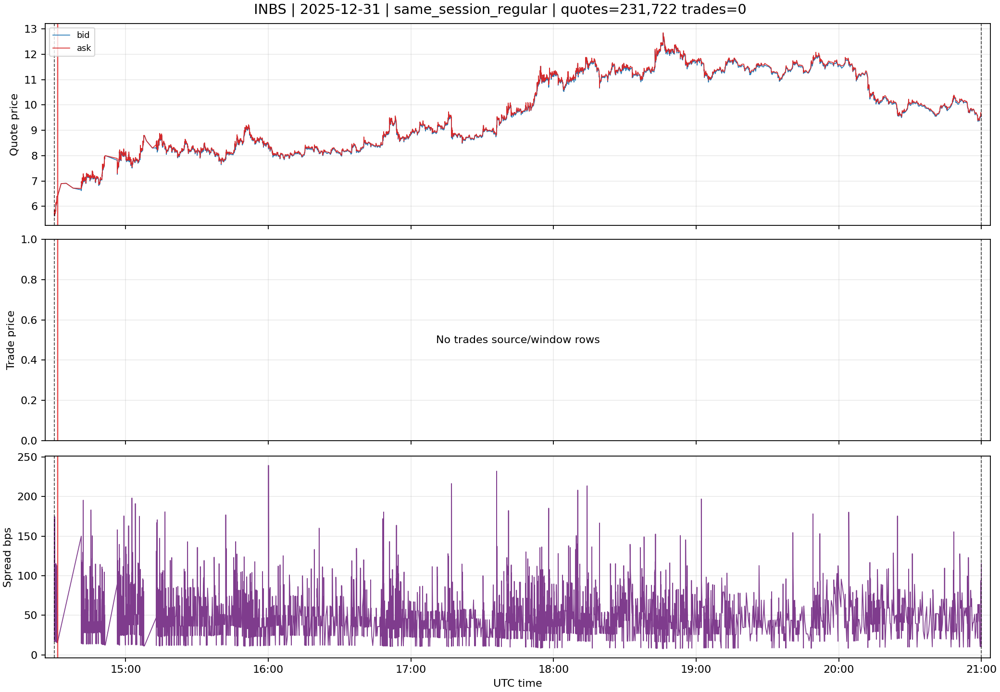

**Lectura tecnica de la imagen.** El panel superior muestra best bid/best ask
durante la ventana candidata. El panel central muestra prints de trades con el
tamano relativo del punto escalado por `size`. El panel inferior combina spread
en bps y volumen negociado por minuto. Las lineas negras discontinuas marcan el
inicio y fin de la ventana; si la linea roja aparece dentro del panel, marca el
timestamp de evento.

**Interpretacion para el inspector.** La ventana `same_session_regular` contiene contexto de sesion y puede incluir informacion posterior; no debe usarse como feature ML pre-evento. En esta imagen hay
`231,722` quotes y `0` trades. La mediana
del spread es `44.03` bps y el p90 es
`82.39` bps. Se observan 143 crossed quotes; deben mantenerse visibles como textura de review, aunque no rompen este candidato. No hay trades fuente para esta ventana; el caso queda como `review_partial_source` y no puede interpretarse como microestructura completa para ejecucion.

**Decision de consumo.** `execution_sim_candidate=False`,
`backtest_core_microstructure_candidate=False`,
`full_universe_claim=False`. Esta evidencia sirve para
validar lectura forense del candidato, no para promocion institucional ni para
ML/RL primario.

### Case 38 - `INBS` `2025-12-31` `same_session_regular`


**Lectura tecnica de la imagen.** El panel superior muestra best bid/best ask
durante la ventana candidata. El panel central muestra prints de trades con el
tamano relativo del punto escalado por `size`. El panel inferior combina spread
en bps y volumen negociado por minuto. Las lineas negras discontinuas marcan el
inicio y fin de la ventana; si la linea roja aparece dentro del panel, marca el
timestamp de evento.

**Interpretacion para el inspector.** La ventana `same_session_regular` contiene contexto de sesion y puede incluir informacion posterior; no debe usarse como feature ML pre-evento. En esta imagen hay
`231,722` quotes y `0` trades. La mediana
del spread es `44.03` bps y el p90 es
`82.39` bps. Se observan 143 crossed quotes; deben mantenerse visibles como textura de review, aunque no rompen este candidato. No hay trades fuente para esta ventana; el caso queda como `review_partial_source` y no puede interpretarse como microestructura completa para ejecucion.

**Decision de consumo.** `execution_sim_candidate=False`,
`backtest_core_microstructure_candidate=False`,
`full_universe_claim=False`. Esta evidencia sirve para
validar lectura forense del candidato, no para promocion institucional ni para
ML/RL primario.

### Case 39 - `JXG` `2025-12-31` `pre_event_30m`


**Lectura tecnica de la imagen.** El panel superior muestra best bid/best ask
durante la ventana candidata. El panel central muestra prints de trades con el
tamano relativo del punto escalado por `size`. El panel inferior combina spread
en bps y volumen negociado por minuto. Las lineas negras discontinuas marcan el
inicio y fin de la ventana; si la linea roja aparece dentro del panel, marca el
timestamp de evento.

**Interpretacion para el inspector.** La ventana `pre_event_30m` termina en el evento y es candidata a feature pre-evento. En esta imagen hay
`765` quotes y `297` trades. La mediana
del spread es `2,496.05` bps y el p90 es
`4,643.18` bps. No se observan crossed quotes en esta ventana. En trades, el odd-lot ratio es `88.22%`, el duplicate exact ratio es `0.00%` y el off-regular-session ratio es `0.00%`.

**Decision de consumo.** `execution_sim_candidate=False`,
`backtest_core_microstructure_candidate=False`,
`full_universe_claim=False`. Esta evidencia sirve para
validar lectura forense del candidato, no para promocion institucional ni para
ML/RL primario.

### Case 40 - `JXG` `2025-12-31` `pre_event_30m`

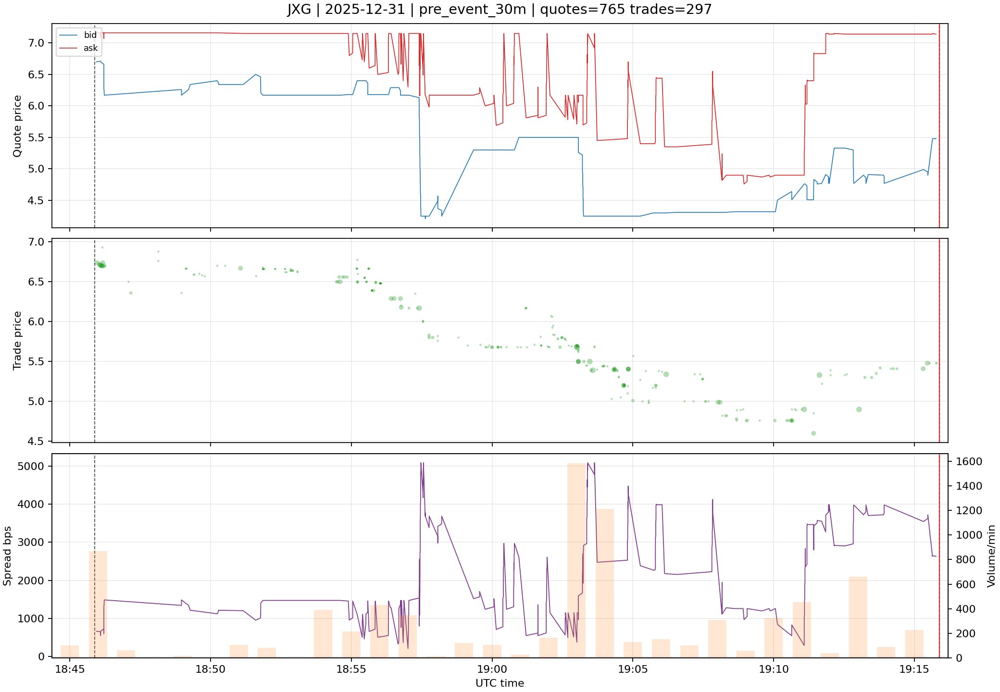

**Lectura tecnica de la imagen.** El panel superior muestra best bid/best ask
durante la ventana candidata. El panel central muestra prints de trades con el
tamano relativo del punto escalado por `size`. El panel inferior combina spread
en bps y volumen negociado por minuto. Las lineas negras discontinuas marcan el
inicio y fin de la ventana; si la linea roja aparece dentro del panel, marca el
timestamp de evento.

**Interpretacion para el inspector.** La ventana `pre_event_30m` termina en el evento y es candidata a feature pre-evento. En esta imagen hay
`765` quotes y `297` trades. La mediana
del spread es `2,496.05` bps y el p90 es
`4,643.18` bps. No se observan crossed quotes en esta ventana. En trades, el odd-lot ratio es `88.22%`, el duplicate exact ratio es `0.00%` y el off-regular-session ratio es `0.00%`.

**Decision de consumo.** `execution_sim_candidate=False`,
`backtest_core_microstructure_candidate=False`,
`full_universe_claim=False`. Esta evidencia sirve para
validar lectura forense del candidato, no para promocion institucional ni para
ML/RL primario.

### Case 41 - `JXG` `2025-12-31` `same_session_regular`

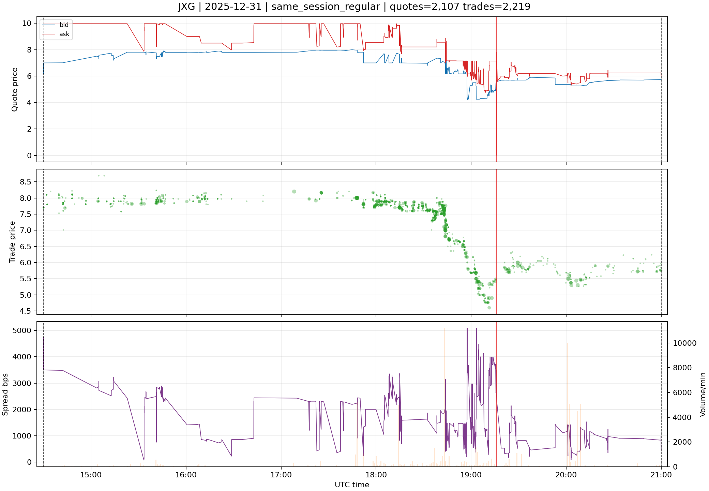

**Lectura tecnica de la imagen.** El panel superior muestra best bid/best ask
durante la ventana candidata. El panel central muestra prints de trades con el
tamano relativo del punto escalado por `size`. El panel inferior combina spread
en bps y volumen negociado por minuto. Las lineas negras discontinuas marcan el
inicio y fin de la ventana; si la linea roja aparece dentro del panel, marca el
timestamp de evento.

**Interpretacion para el inspector.** La ventana `same_session_regular` contiene contexto de sesion y puede incluir informacion posterior; no debe usarse como feature ML pre-evento. En esta imagen hay
`2,107` quotes y `2,219` trades. La mediana
del spread es `1,917.81` bps y el p90 es
`3,540.00` bps. No se observan crossed quotes en esta ventana. En trades, el odd-lot ratio es `93.87%`, el duplicate exact ratio es `1.80%` y el off-regular-session ratio es `0.00%`.

**Decision de consumo.** `execution_sim_candidate=False`,
`backtest_core_microstructure_candidate=False`,
`full_universe_claim=False`. Esta evidencia sirve para
validar lectura forense del candidato, no para promocion institucional ni para
ML/RL primario.

### Case 42 - `JXG` `2025-12-31` `same_session_regular`


**Lectura tecnica de la imagen.** El panel superior muestra best bid/best ask
durante la ventana candidata. El panel central muestra prints de trades con el
tamano relativo del punto escalado por `size`. El panel inferior combina spread
en bps y volumen negociado por minuto. Las lineas negras discontinuas marcan el
inicio y fin de la ventana; si la linea roja aparece dentro del panel, marca el
timestamp de evento.

**Interpretacion para el inspector.** La ventana `same_session_regular` contiene contexto de sesion y puede incluir informacion posterior; no debe usarse como feature ML pre-evento. En esta imagen hay
`2,107` quotes y `2,219` trades. La mediana
del spread es `1,917.81` bps y el p90 es
`3,540.00` bps. No se observan crossed quotes en esta ventana. En trades, el odd-lot ratio es `93.87%`, el duplicate exact ratio es `1.80%` y el off-regular-session ratio es `0.00%`.

**Decision de consumo.** `execution_sim_candidate=False`,
`backtest_core_microstructure_candidate=False`,
`full_universe_claim=False`. Esta evidencia sirve para
validar lectura forense del candidato, no para promocion institucional ni para
ML/RL primario.

### Case 43 - `OTLK` `2025-12-31` `pre_event_30m`


**Lectura tecnica de la imagen.** El panel superior muestra best bid/best ask
durante la ventana candidata. El panel central muestra prints de trades con el
tamano relativo del punto escalado por `size`. El panel inferior combina spread
en bps y volumen negociado por minuto. Las lineas negras discontinuas marcan el
inicio y fin de la ventana; si la linea roja aparece dentro del panel, marca el
timestamp de evento.

**Interpretacion para el inspector.** La ventana `pre_event_30m` termina en el evento y es candidata a feature pre-evento. En esta imagen hay
`1,483` quotes y `2,196` trades. La mediana
del spread es `63.09` bps y el p90 es
`63.09` bps. No se observan crossed quotes en esta ventana. En trades, el odd-lot ratio es `39.98%`, el duplicate exact ratio es `1.28%` y el off-regular-session ratio es `0.00%`.

**Decision de consumo.** `execution_sim_candidate=False`,
`backtest_core_microstructure_candidate=False`,
`full_universe_claim=False`. Esta evidencia sirve para
validar lectura forense del candidato, no para promocion institucional ni para
ML/RL primario.

### Case 44 - `OTLK` `2025-12-31` `pre_event_30m`

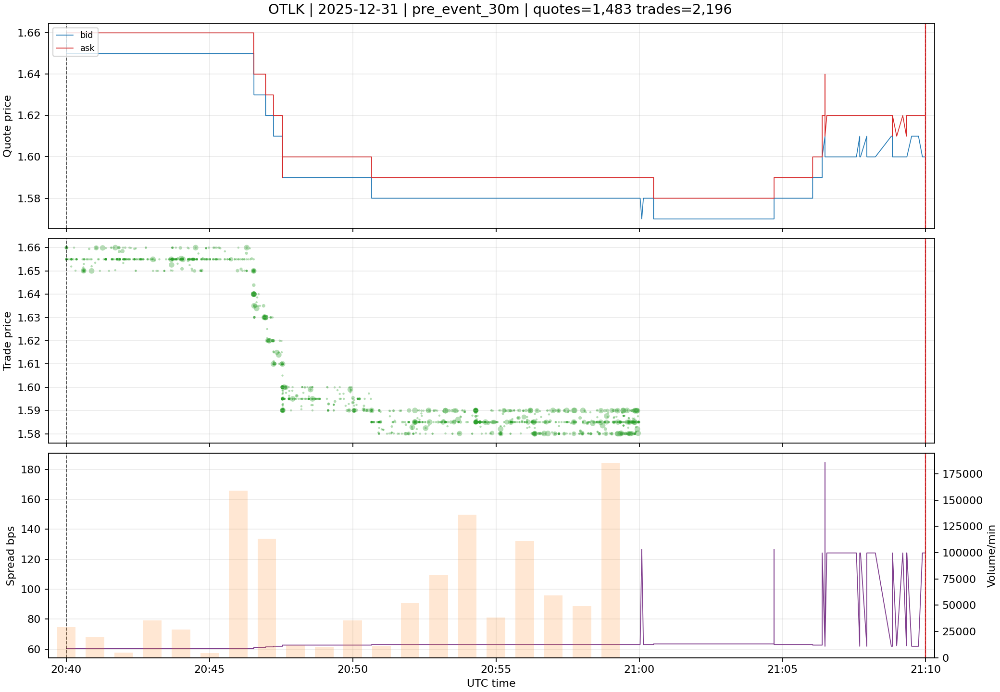

**Lectura tecnica de la imagen.** El panel superior muestra best bid/best ask
durante la ventana candidata. El panel central muestra prints de trades con el
tamano relativo del punto escalado por `size`. El panel inferior combina spread
en bps y volumen negociado por minuto. Las lineas negras discontinuas marcan el
inicio y fin de la ventana; si la linea roja aparece dentro del panel, marca el
timestamp de evento.

**Interpretacion para el inspector.** La ventana `pre_event_30m` termina en el evento y es candidata a feature pre-evento. En esta imagen hay
`1,483` quotes y `2,196` trades. La mediana
del spread es `63.09` bps y el p90 es
`63.09` bps. No se observan crossed quotes en esta ventana. En trades, el odd-lot ratio es `39.98%`, el duplicate exact ratio es `1.28%` y el off-regular-session ratio es `0.00%`.

**Decision de consumo.** `execution_sim_candidate=False`,
`backtest_core_microstructure_candidate=False`,
`full_universe_claim=False`. Esta evidencia sirve para
validar lectura forense del candidato, no para promocion institucional ni para
ML/RL primario.

### Case 45 - `OTLK` `2025-12-31` `same_session_regular`


**Lectura tecnica de la imagen.** El panel superior muestra best bid/best ask
durante la ventana candidata. El panel central muestra prints de trades con el
tamano relativo del punto escalado por `size`. El panel inferior combina spread
en bps y volumen negociado por minuto. Las lineas negras discontinuas marcan el
inicio y fin de la ventana; si la linea roja aparece dentro del panel, marca el
timestamp de evento.

**Interpretacion para el inspector.** La ventana `same_session_regular` contiene contexto de sesion y puede incluir informacion posterior; no debe usarse como feature ML pre-evento. En esta imagen hay
`22,121` quotes y `20,154` trades. La mediana
del spread es `60.79` bps y el p90 es
`63.90` bps. No se observan crossed quotes en esta ventana. En trades, el odd-lot ratio es `35.75%`, el duplicate exact ratio es `1.66%` y el off-regular-session ratio es `0.00%`.

**Decision de consumo.** `execution_sim_candidate=False`,
`backtest_core_microstructure_candidate=False`,
`full_universe_claim=False`. Esta evidencia sirve para
validar lectura forense del candidato, no para promocion institucional ni para
ML/RL primario.

### Case 46 - `OTLK` `2025-12-31` `same_session_regular`

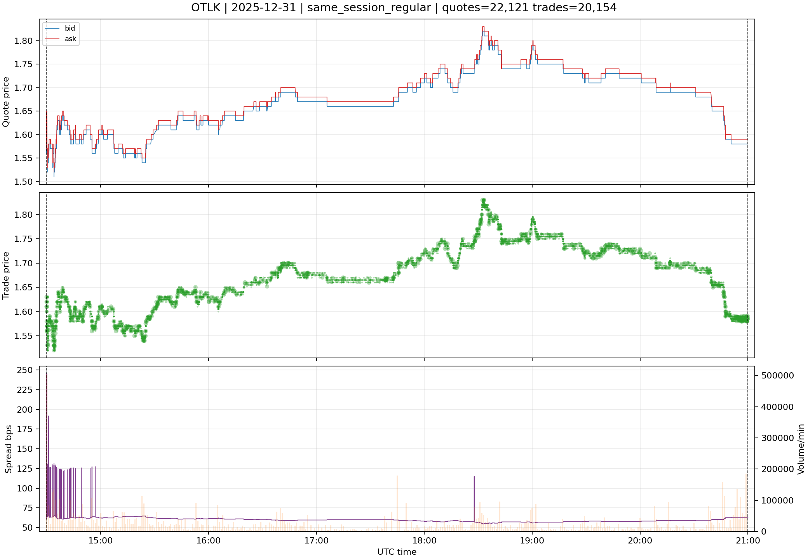

**Lectura tecnica de la imagen.** El panel superior muestra best bid/best ask
durante la ventana candidata. El panel central muestra prints de trades con el
tamano relativo del punto escalado por `size`. El panel inferior combina spread
en bps y volumen negociado por minuto. Las lineas negras discontinuas marcan el
inicio y fin de la ventana; si la linea roja aparece dentro del panel, marca el
timestamp de evento.

**Interpretacion para el inspector.** La ventana `same_session_regular` contiene contexto de sesion y puede incluir informacion posterior; no debe usarse como feature ML pre-evento. En esta imagen hay
`22,121` quotes y `20,154` trades. La mediana
del spread es `60.79` bps y el p90 es
`63.90` bps. No se observan crossed quotes en esta ventana. En trades, el odd-lot ratio es `35.75%`, el duplicate exact ratio es `1.66%` y el off-regular-session ratio es `0.00%`.

**Decision de consumo.** `execution_sim_candidate=False`,
`backtest_core_microstructure_candidate=False`,
`full_universe_claim=False`. Esta evidencia sirve para
validar lectura forense del candidato, no para promocion institucional ni para
ML/RL primario.

### Case 47 - `PAVM` `2025-12-31` `pre_event_30m`


**Lectura tecnica de la imagen.** El panel superior muestra best bid/best ask
durante la ventana candidata. El panel central muestra prints de trades con el
tamano relativo del punto escalado por `size`. El panel inferior combina spread
en bps y volumen negociado por minuto. Las lineas negras discontinuas marcan el
inicio y fin de la ventana; si la linea roja aparece dentro del panel, marca el
timestamp de evento.

**Interpretacion para el inspector.** La ventana `pre_event_30m` termina en el evento y es candidata a feature pre-evento. En esta imagen hay
`11` quotes y `14,526` trades. La mediana
del spread es `234.54` bps y el p90 es
`465.12` bps. No se observan crossed quotes en esta ventana. En trades, el odd-lot ratio es `NA%`, el duplicate exact ratio es `NA%` y el off-regular-session ratio es `NA%`.

**Decision de consumo.** `execution_sim_candidate=False`,
`backtest_core_microstructure_candidate=False`,
`full_universe_claim=False`. Esta evidencia sirve para
validar lectura forense del candidato, no para promocion institucional ni para
ML/RL primario.

### Case 48 - `PAVM` `2025-12-31` `pre_event_30m`

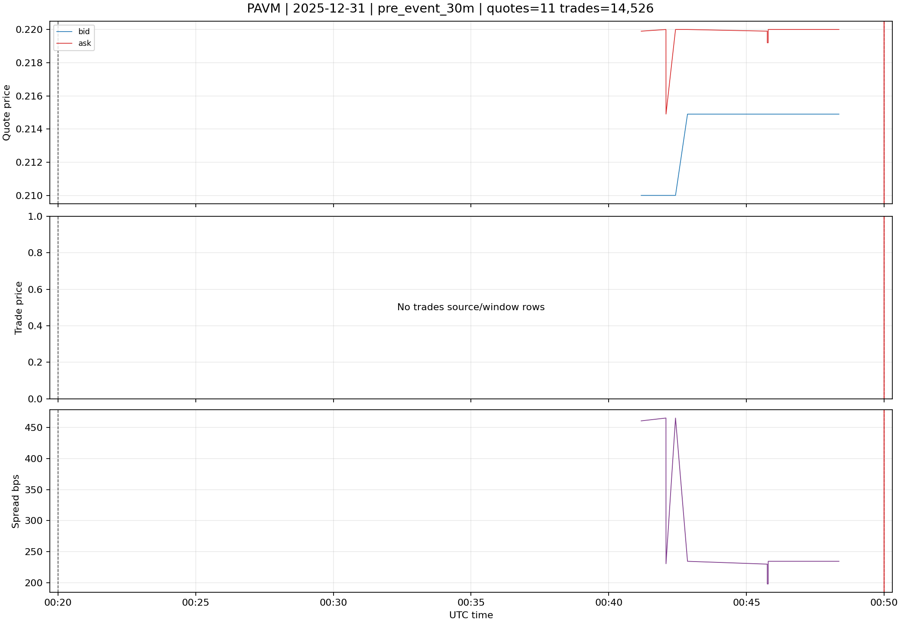

**Lectura tecnica de la imagen.** El panel superior muestra best bid/best ask
durante la ventana candidata. El panel central muestra prints de trades con el
tamano relativo del punto escalado por `size`. El panel inferior combina spread
en bps y volumen negociado por minuto. Las lineas negras discontinuas marcan el
inicio y fin de la ventana; si la linea roja aparece dentro del panel, marca el
timestamp de evento.

**Interpretacion para el inspector.** La ventana `pre_event_30m` termina en el evento y es candidata a feature pre-evento. En esta imagen hay
`11` quotes y `14,526` trades. La mediana
del spread es `234.54` bps y el p90 es
`465.12` bps. No se observan crossed quotes en esta ventana. En trades, el odd-lot ratio es `NA%`, el duplicate exact ratio es `NA%` y el off-regular-session ratio es `NA%`.

**Decision de consumo.** `execution_sim_candidate=False`,
`backtest_core_microstructure_candidate=False`,
`full_universe_claim=False`. Esta evidencia sirve para
validar lectura forense del candidato, no para promocion institucional ni para
ML/RL primario.

### Case 49 - `PAVM` `2025-12-31` `same_session_regular`


**Lectura tecnica de la imagen.** El panel superior muestra best bid/best ask
durante la ventana candidata. El panel central muestra prints de trades con el
tamano relativo del punto escalado por `size`. El panel inferior combina spread
en bps y volumen negociado por minuto. Las lineas negras discontinuas marcan el
inicio y fin de la ventana; si la linea roja aparece dentro del panel, marca el
timestamp de evento.

**Interpretacion para el inspector.** La ventana `same_session_regular` contiene contexto de sesion y puede incluir informacion posterior; no debe usarse como feature ML pre-evento. En esta imagen hay
`1,567` quotes y `14,526` trades. La mediana
del spread es `137.99` bps y el p90 es
`348.89` bps. Se observan 4 crossed quotes; deben mantenerse visibles como textura de review, aunque no rompen este candidato. En trades, el odd-lot ratio es `92.37%`, el duplicate exact ratio es `0.70%` y el off-regular-session ratio es `0.00%`.

**Decision de consumo.** `execution_sim_candidate=False`,
`backtest_core_microstructure_candidate=False`,
`full_universe_claim=False`. Esta evidencia sirve para
validar lectura forense del candidato, no para promocion institucional ni para
ML/RL primario.

### Case 50 - `PAVM` `2025-12-31` `same_session_regular`

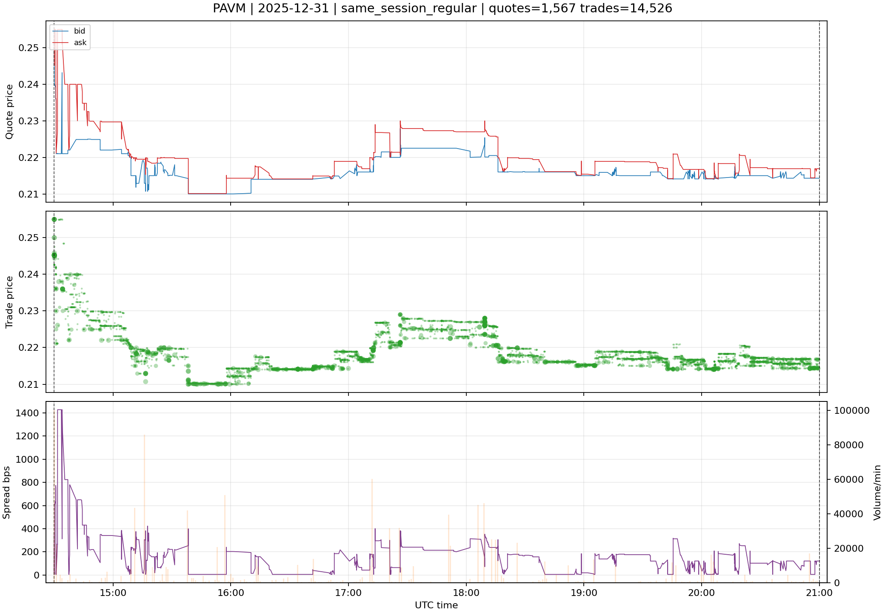

**Lectura tecnica de la imagen.** El panel superior muestra best bid/best ask
durante la ventana candidata. El panel central muestra prints de trades con el
tamano relativo del punto escalado por `size`. El panel inferior combina spread
en bps y volumen negociado por minuto. Las lineas negras discontinuas marcan el
inicio y fin de la ventana; si la linea roja aparece dentro del panel, marca el
timestamp de evento.

**Interpretacion para el inspector.** La ventana `same_session_regular` contiene contexto de sesion y puede incluir informacion posterior; no debe usarse como feature ML pre-evento. En esta imagen hay
`1,567` quotes y `14,526` trades. La mediana
del spread es `137.99` bps y el p90 es
`348.89` bps. Se observan 4 crossed quotes; deben mantenerse visibles como textura de review, aunque no rompen este candidato. En trades, el odd-lot ratio es `92.37%`, el duplicate exact ratio es `0.70%` y el off-regular-session ratio es `0.00%`.

**Decision de consumo.** `execution_sim_candidate=False`,
`backtest_core_microstructure_candidate=False`,
`full_universe_claim=False`. Esta evidencia sirve para
validar lectura forense del candidato, no para promocion institucional ni para
ML/RL primario.
