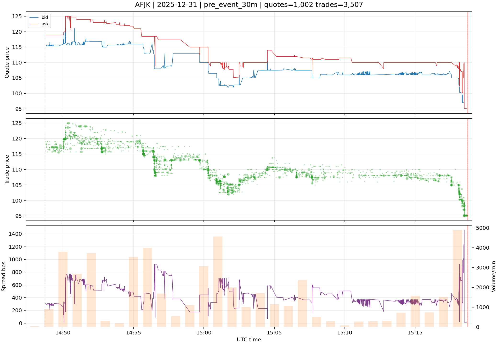
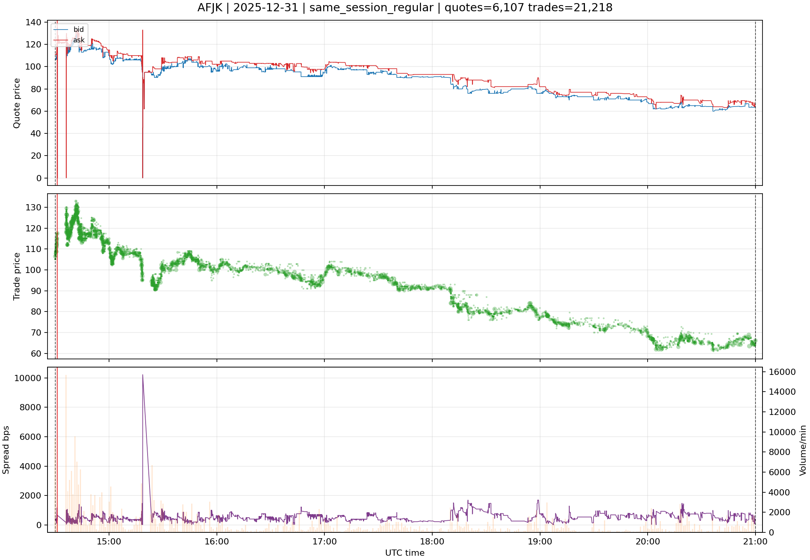

# Microstructure Candidate Visual Readout v0.1

## Scope

This readout is visual/forensic evidence for the 6-row `microstructure_features_table_v0_2_candidate` smoke artifact.

It does not promote a new official dataset and it does not claim full-universe microstructure coverage.

```text
candidate_dir = C:\TSIS_Data\tests\test_runs\2026-06-27\data_foundation_outputs_microstructure_candidate_window_manifest_v0_1\artifacts\microstructure_features_table_v0_2_candidate_output\microstructure_features_table_v0_2_candidate
window_manifest = C:\TSIS_Data\tests\test_runs\2026-06-27\data_foundation_outputs_microstructure_candidate_window_manifest_v0_1\artifacts\microstructure_candidate_materializer_manifest\microstructure_features_table_v0_2_candidate_window_manifest_v0_1.csv
case_count = 6
official_dataset_created = false
full_universe_claim = false
```

## How To Read These Images

Each image has three panels: bid/ask quote path, trade prints, and spread/volume texture. The purpose is to help a human inspector decide whether the candidate windows are understandable as microstructure state components.

Important limitation: `D:/quotes` lineage is still provisional until the E-root quotes parity/authority work is complete.

## Cases

### Case 01 - `AFJK` `2025-12-31` `pre_event_30m`



**Lectura tecnica de la imagen.** El panel superior muestra best bid/best ask
durante la ventana candidata. El panel central muestra prints de trades con el
tamano relativo del punto escalado por `size`. El panel inferior combina spread
en bps y volumen negociado por minuto. Las lineas negras discontinuas marcan el
inicio y fin de la ventana; si la linea roja aparece dentro del panel, marca el
timestamp de evento.

**Interpretacion para el inspector.** La ventana `pre_event_30m` termina en el evento y es candidata a feature pre-evento. En esta imagen hay
`1,002` quotes y `3,507` trades. La mediana
del spread es `403.66` bps y el p90 es
`722.03` bps. No se observan crossed quotes en esta ventana. En trades, el
odd-lot ratio es `96.44%`, el duplicate
exact ratio es `0.74%` y el
off-regular-session ratio es `0.00%`.

**Decision de consumo.** `execution_sim_candidate=False`,
`backtest_core_microstructure_candidate=False`,
`full_universe_claim=False`. Esta evidencia sirve para
validar lectura forense del candidato, no para promocion institucional ni para
ML/RL primario.

### Case 02 - `AFJK` `2025-12-31` `pre_event_30m`


**Lectura tecnica de la imagen.** El panel superior muestra best bid/best ask
durante la ventana candidata. El panel central muestra prints de trades con el
tamano relativo del punto escalado por `size`. El panel inferior combina spread
en bps y volumen negociado por minuto. Las lineas negras discontinuas marcan el
inicio y fin de la ventana; si la linea roja aparece dentro del panel, marca el
timestamp de evento.

**Interpretacion para el inspector.** La ventana `pre_event_30m` termina en el evento y es candidata a feature pre-evento. En esta imagen hay
`301` quotes y `473` trades. La mediana
del spread es `366.97` bps y el p90 es
`592.26` bps. No se observan crossed quotes en esta ventana. En trades, el
odd-lot ratio es `94.93%`, el duplicate
exact ratio es `1.27%` y el
off-regular-session ratio es `0.00%`.

**Decision de consumo.** `execution_sim_candidate=False`,
`backtest_core_microstructure_candidate=False`,
`full_universe_claim=False`. Esta evidencia sirve para
validar lectura forense del candidato, no para promocion institucional ni para
ML/RL primario.

### Case 03 - `AFJK` `2025-12-31` `pre_event_30m`


**Lectura tecnica de la imagen.** El panel superior muestra best bid/best ask
durante la ventana candidata. El panel central muestra prints de trades con el
tamano relativo del punto escalado por `size`. El panel inferior combina spread
en bps y volumen negociado por minuto. Las lineas negras discontinuas marcan el
inicio y fin de la ventana; si la linea roja aparece dentro del panel, marca el
timestamp de evento.

**Interpretacion para el inspector.** La ventana `pre_event_30m` termina en el evento y es candidata a feature pre-evento. En esta imagen hay
`1,002` quotes y `3,507` trades. La mediana
del spread es `403.66` bps y el p90 es
`722.03` bps. No se observan crossed quotes en esta ventana. En trades, el
odd-lot ratio es `96.44%`, el duplicate
exact ratio es `0.74%` y el
off-regular-session ratio es `0.00%`.

**Decision de consumo.** `execution_sim_candidate=False`,
`backtest_core_microstructure_candidate=False`,
`full_universe_claim=False`. Esta evidencia sirve para
validar lectura forense del candidato, no para promocion institucional ni para
ML/RL primario.

### Case 04 - `AFJK` `2025-12-31` `same_session_regular`


**Lectura tecnica de la imagen.** El panel superior muestra best bid/best ask
durante la ventana candidata. El panel central muestra prints de trades con el
tamano relativo del punto escalado por `size`. El panel inferior combina spread
en bps y volumen negociado por minuto. Las lineas negras discontinuas marcan el
inicio y fin de la ventana; si la linea roja aparece dentro del panel, marca el
timestamp de evento.

**Interpretacion para el inspector.** La ventana `same_session_regular` contiene contexto de sesion y puede incluir informacion posterior; no debe usarse como feature ML pre-evento. En esta imagen hay
`6,107` quotes y `21,218` trades. La mediana
del spread es `497.71` bps y el p90 es
`843.38` bps. No se observan crossed quotes en esta ventana. En trades, el
odd-lot ratio es `96.06%`, el duplicate
exact ratio es `0.48%` y el
off-regular-session ratio es `0.00%`.

**Decision de consumo.** `execution_sim_candidate=False`,
`backtest_core_microstructure_candidate=False`,
`full_universe_claim=False`. Esta evidencia sirve para
validar lectura forense del candidato, no para promocion institucional ni para
ML/RL primario.

### Case 05 - `AFJK` `2025-12-31` `same_session_regular`



**Lectura tecnica de la imagen.** El panel superior muestra best bid/best ask
durante la ventana candidata. El panel central muestra prints de trades con el
tamano relativo del punto escalado por `size`. El panel inferior combina spread
en bps y volumen negociado por minuto. Las lineas negras discontinuas marcan el
inicio y fin de la ventana; si la linea roja aparece dentro del panel, marca el
timestamp de evento.

**Interpretacion para el inspector.** La ventana `same_session_regular` contiene contexto de sesion y puede incluir informacion posterior; no debe usarse como feature ML pre-evento. En esta imagen hay
`6,107` quotes y `21,218` trades. La mediana
del spread es `497.71` bps y el p90 es
`843.38` bps. No se observan crossed quotes en esta ventana. En trades, el
odd-lot ratio es `96.06%`, el duplicate
exact ratio es `0.48%` y el
off-regular-session ratio es `0.00%`.

**Decision de consumo.** `execution_sim_candidate=False`,
`backtest_core_microstructure_candidate=False`,
`full_universe_claim=False`. Esta evidencia sirve para
validar lectura forense del candidato, no para promocion institucional ni para
ML/RL primario.

### Case 06 - `AFJK` `2025-12-31` `same_session_regular`


**Lectura tecnica de la imagen.** El panel superior muestra best bid/best ask
durante la ventana candidata. El panel central muestra prints de trades con el
tamano relativo del punto escalado por `size`. El panel inferior combina spread
en bps y volumen negociado por minuto. Las lineas negras discontinuas marcan el
inicio y fin de la ventana; si la linea roja aparece dentro del panel, marca el
timestamp de evento.

**Interpretacion para el inspector.** La ventana `same_session_regular` contiene contexto de sesion y puede incluir informacion posterior; no debe usarse como feature ML pre-evento. En esta imagen hay
`6,107` quotes y `21,218` trades. La mediana
del spread es `497.71` bps y el p90 es
`843.38` bps. No se observan crossed quotes en esta ventana. En trades, el
odd-lot ratio es `96.06%`, el duplicate
exact ratio es `0.48%` y el
off-regular-session ratio es `0.00%`.

**Decision de consumo.** `execution_sim_candidate=False`,
`backtest_core_microstructure_candidate=False`,
`full_universe_claim=False`. Esta evidencia sirve para
validar lectura forense del candidato, no para promocion institucional ni para
ML/RL primario.
