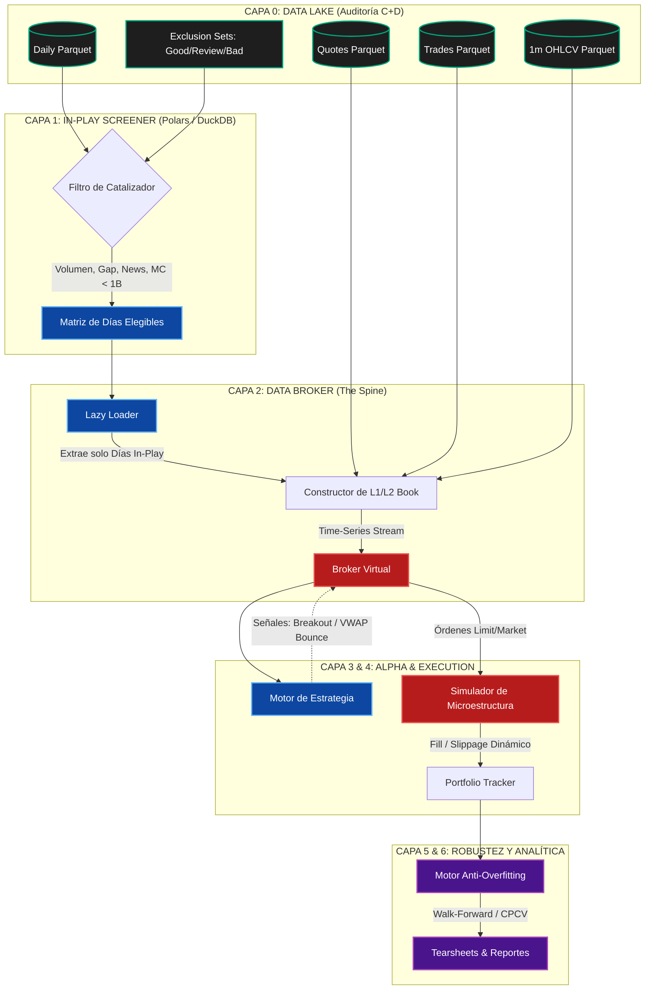

# 🏛️ MicroCap Arch-BT: Blueprint de Arquitectura Institucional

**Versión:** 1.0.0
**Enfoque:** Event-Driven, Data-Centric, Prevención de Overfitting
**Mercado:** Micro Caps & Small Caps (Nasdaq/NYSE/OTC)
**Horizonte de Datos:** 2005 - 2026 (Polygon Audited Parquets)

---

## 1. Filosofía del Sistema

El mercado de Small y Micro Caps se caracteriza por la asimetría temporal: el 99% del tiempo el precio es "ruido" ilíquido y el 1% del tiempo el activo está *In-Play* (Pumps & Dumps, noticias, gaps). 

Un backtester tradicional (que escanea todo el universo cada minuto) es computacionalmente ineficiente e induce a falsos positivos. Este sistema invierte el flujo: **Primero encuentra el partido, luego simula la jugada**.

---

## 2. Esquema Físico de la Arquitectura

El siguiente diagrama ilustra el flujo de los datos desde tus Parquets auditados hasta el motor de inferencia matemática.



---

## 3. Desglose Detallado por Capas

### Capa 1: Escáner de Oportunidades (In-Play Screener)
* **Objetivo:** Filtrar el universo de acciones e identificar exclusivamente los binomios `(Ticker, Fecha)` operables.
* **Integración de Auditoría:** Lee los archivos `daily_lt1b_hard_invalid_exclusion.parquet`. Rechaza inmediatamente cualquier `(Ticker, Fecha)` etiquetado como `bad` (ej. parse inválido o anomalías severas).
* **Stack Tecnológico:** `DuckDB` + `Polars`. Permite ejecutar consultas SQL sobre Terabytes de datos *out-of-core* (sin colapsar la RAM).

### Capa 2: Data Broker & Reconstrucción de Microestructura
* **Objetivo:** Inyectar los datos granulares al simulador sin *Look-ahead bias*.
* **Lógica de Ejecución:** Toma la matriz de la Capa 1 y extrae los datos de `quotes` (C+D) y `trades` correspondientes a ese día.
* **Calidad de Datos:** Utiliza la política de la auditoría `04_quotes_full_C_D_closeout`: usa data `good` para el backtest principal y reserva la data `review` para pruebas de sensibilidad.

### Capa 3: Motor de Alpha (Generador de Señales)
* **Objetivo:** Aislar la lógica matemática de la estrategia. 
* **Modularidad:** Aquí residen los scripts de las estrategias (ej. `long_gap_and_go`, `short_vwap_extension`). Reciben eventos del Data Broker y emiten objetos tipo `OrderSignal`. No saben si la orden se ejecutará o no; solo buscan ventajas estadísticas.

### Capa 4: Execution Engine (Simulador del Mundo Real)
* **Objetivo:** Castigar la estrategia con fricciones del mundo real.
* **Mecánicas:**
    * **Slippage Dinámico:** Si la estrategia compra 5,000 acciones, el motor lee el `Ask` del `quotes parquet`. Si solo hay 1,000 acciones disponibles a ese precio, desplaza el resto al siguiente nivel de precios.
    * **Short Borrows:** (Crucial en microcaps) Implementa reglas restrictivas que bloquean la toma de posiciones cortas si el inventario simulado de acciones prestables es nulo.
    * **Halts:** Incorpora los halts para congelar salidas de posiciones, replicando la incapacidad de operar en la vida real.

### Capa 5: Motor de Robustez Matemática
* **Objetivo:** Destruir los sesgos estadísticos. Evitar el "Grid Search" destructivo de plataformas retail.
* **Técnicas Institucionales:**
    * **CPCV (Combinatorial Purged Cross-Validation):** Entrena y prueba en bloques que "purgan" el tiempo superpuesto.
    * **Ruido de Microestructura (Monte Carlo):** Retrasa artificialmente las entradas 50ms-200ms para asegurar que la estrategia no dependa de latencia irreal.

### Capa 6: Analítica y Reportes (Tearsheets)
* **Objetivo:** Generar el informe final (reemplazando el de TradeStation) adaptado a un Hedge Fund.
* **Métricas Clave:**
    * Excursión Adversa/Favorable Máxima (MAE / MFE).
    * Análisis de Decaimiento de Alpha (A qué hora del día dejan de funcionar las señales).
    * Análisis de Capacidad de Estrategia ($ limit de absorción del microcap).

---

## 4. Estructura de Directorios en Python (Propuesta)

```text
microcap_alpha_bt/
│
├── data/
│   ├── 01_raw/              # Symlinks a tus D:\quotes y D:\trades_ticks_prod
│   ├── 02_audit_rules/      # Exclusion sets (daily_lt1b_hard_invalid_exclusion)
│   └── 03_cache/            # Archivos temporales In-Play procesados por Polars
│
├── src/
│   ├── core/
│   │   ├── screener.py      # Lógica de DuckDB / Capa 1
│   │   └── data_broker.py   # Alimentador de tiempo real / Capa 2
│   │
│   ├── engine/
│   │   ├── event_loop.py    # Corazón del Event-Driven simulator
│   │   ├── portfolio.py     # Gestor de márgenes y PnL
│   │   └── slippage.py      # L2 Book impact logic / Capa 4
│   │
│   ├── strategies/          # Capa 3: Aquí codificas como en TradeStation
│   │   ├── base.py
│   │   ├── longs/
│   │   └── shorts/
│   │
│   └── analytics/           # Capas 5 y 6
│       ├── robustness.py    # Walk-forward, CPCV
│       └── tearsheet.py     # Generador de informes HTML/PDF
│
├── notebooks/
│   ├── 01_screener_research.ipynb
│   └── 02_strategy_visualizer.ipynb
│
├── config/
│   └── backtest_params.yaml # Comisiones, spread limits, locators
│
├── requirements.txt         # polars, duckdb, quantstats, numba
└── README.md
```

---

## 5. Próximos Pasos Recomendados

1. **Implementar Capa 1 (Screener):** Escribir el script en `DuckDB/Polars` que cruce el `daily` con tu `market_cap_cutoff_lt_1b` y exporte la lista de `(Ticker, Date)` que superen X volumen o Y gap.
2. **Definir el API de Eventos:** Crear la clase base en Python de cómo el `broker.py` enviará los *ticks* o *bars* de 1 minuto hacia la estrategia.
3. **Módulo de Slippage:** Diseñar matemáticamente cómo tratar la diferencia entre el cierre de la vela de 1 minuto y el `Bid/Ask` real derivado del archivo de `quotes`.