# Day Trading en Small Caps

Conversión página por página con texto extraído + imagen original.

## Página 1
Day Trading en Small 
Caps 
 
 
Teoría y playbook

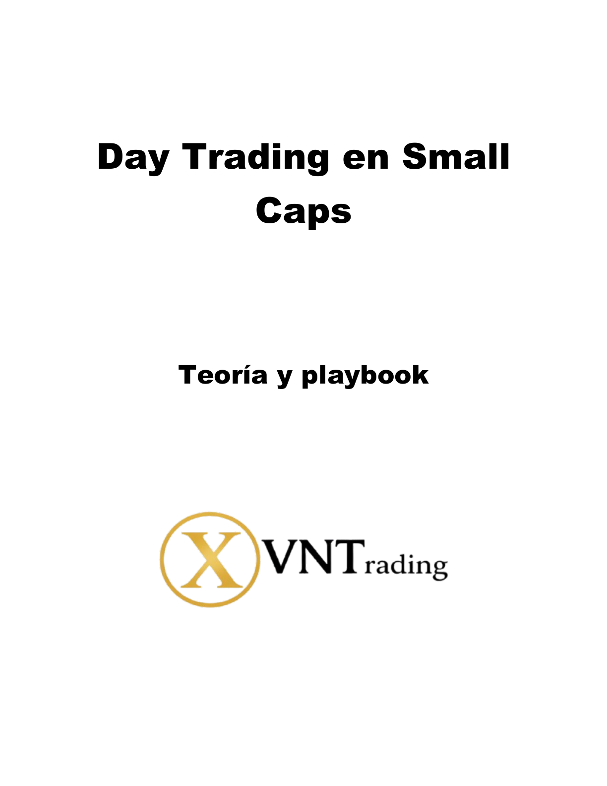

## Página 2

## Página 3
Contenido 
 
 
 
1. Ecosistema Small Caps y el “penny stock framework”…….……………………………………………….….………1 
 
2. Características y métricas de las Small Caps………………………………………………………………………….……..2 
 
3. Dilución………………………………………………………………………………………………………………………………………3 
 
4. Análisis de catalizadores: Noticias……………………………………………………………………………………………….4 
 
5. Ecosistema long: dinámica del desequilibrio………………………………………………………………………….……6 
 
6. Ecosistema short: dinámica del desequilibrio…………………….………………………………………………….…....9 
 
7. Estrategias long…………………………………………………………………………………………………………….…...….…11 
 
8. Estrategias short………………………………………………………………………………………………………………….……20 
 
9. Tape Reading……………………………………………………………………………………………………………………..……..30 
 
10. Risk managment y operativa…………………………………………………………………………………………….……….32 
 
11. Conceptos de mercado……………………………………………………………………………………………………..………36 
 
12. Scanner de acciones….…………………………………………………………………………………………………..…………48 
 
13. Construir el watchlist…………………………………………………………………………………………………………..……49 
 
14. Journaling…………..……………………………………………………………………………………………………………….……51 
 
15. Escalabilidad y objetivos……………………………………………………………………………………………………………52 
 
16. Parámetros riesgo…………………………………………………………………………………………………………….………55 
 
17. Consejos adicionales…………………………………………………………………………………………………………………57 
 
18. Links de interés……………………………………………………………………………………………………………………......58 
 
19. Glosario…………………………………………………………………………………………………………………………………….59

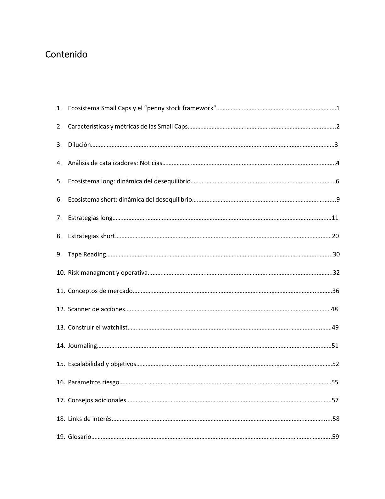

## Página 4

## Página 5
1 
 
1. Ecosistema Small Cap y el “penny stock framework” 
 
Las Small Caps son empresas de baja capitalización de mercado (generalmente inferior a 100M USD) 
que generalmente, incurren en pérdidas recurrentes. Al no generar beneficios operativos, su 
supervivencia depende exclusivamente de la captación de capital mediante la emisión de nuevas 
acciones. 
Este método de financiación suele ser de carácter tóxico e incluye instrumentos dilutivos como: 
• 
Secondary Offerings 
• 
Warrants 
• 
Notas Convertibles 
• 
Programas ATM (At-the-Market) 
*Detallaremos más adelante 
 
Estas características estructurales incentivan la creación de esquemas de "Pump and Dump", donde el 
precio se infla creando entusiasmo (“hype”) mediante catalizadores (noticias, promociones) para luego 
colapsar bajo el peso de la dilución. 
 
El Modelo de Timothy Sykes 
Timothy Sykes fué quien popularizó este 
comportamiento en las small caps definiéndolo 
como "Penny Stock Framework". La tesis de 
este modelo es la inevitabilidad del colapso de 
la acción debido a sus fundamentales 
deficientes por el cual el precio terminará 
destruyéndose. El desafío para el trader no es 
predecir qué pasará, sino saber cuándo 
ocurrirá y hasta qué precio se extenderá la 
euforia antes del desplome definitivo. El penny 
stock framework sigue el patrón clásico de una 
burbuja financiera.  
 
https://www.timothysykes.com/blog/gtii-my-
7-step-framework/

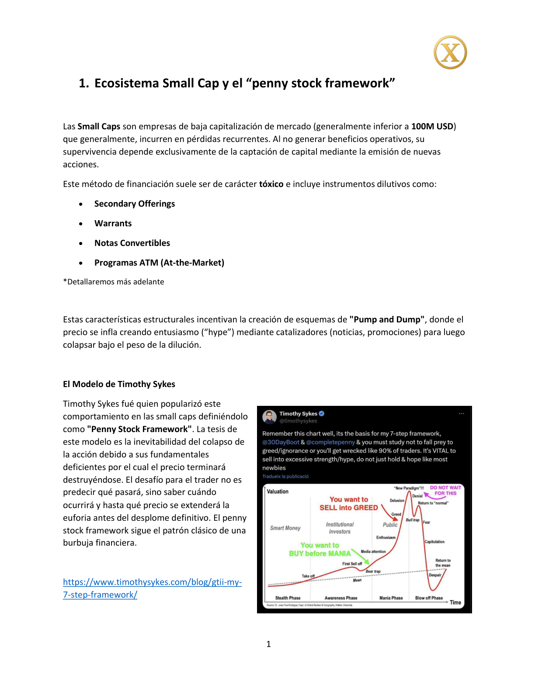

## Página 6
2 
 
2. Características y Métricas de las Small Cap 
 
• 
Float  
El float representa la cantidad de acciones disponibles para el público general y es el indicador real de la 
oferta en el mercado. Es importante diferenciarlo de las shares outstanding (o float outstanding), ya que 
estas incluyen acciones manos de fundadores o instituciones que no pueden venderse de inmediato y, 
por tanto, no tienen un impacto práctico en la liquidez diaria. 
 Nota 
Evitaremos operar acciones con un float superior a 50M y/o un market cap mayor a $100M. Aunque las 
acciones sub-dollar suelen tener floats más elevados, esto no debe descartarlas si el market cap no es 
superior a $100M. 
 
• 
Insiders 
Son los directivos o fundadores que están dentro de la empresa y poseen acciones de esta. Un alto 
porcentaje de insiders puede ser un riesgo si estos deciden liquidar posiciones (vender) durante un pico 
de volumen. 
 
Al tratarse de empresas con altas probabilidades de quebrar o perder dinero, los insiders pueden tender 
a vender las acciones aprovechando el volumen y gap de la acción que se traduce como dilución. 
 
• 
Institucionales (IO – Institutional Ownership) 
Es el porcentaje que el institucional tiene sobre el float. Cuando hay días de liquidez con fuertes 
ganancias en la acción, los institucionales pueden estar interesados en vender acciones y tomar 
beneficios (aumento oferta con caídas lineales del precio). También pueden plantearse no vender las 
acciones, a efectos prácticos es como si esas acciones se retiraran del mercado y la acción se 
comportará como si tuviera un float menor (disminución oferta). 
El institucional está incentivado en crean liquidez para maximizar el beneficio: reducen el inventario de 
acciones para hacer subir el precio y empezar a vender a precios más altos.  
Se considera un institucional alto a partir del 30/40%. 
 
 Nota 
Otras características de las acciones a observar sería el país de origen y sector.

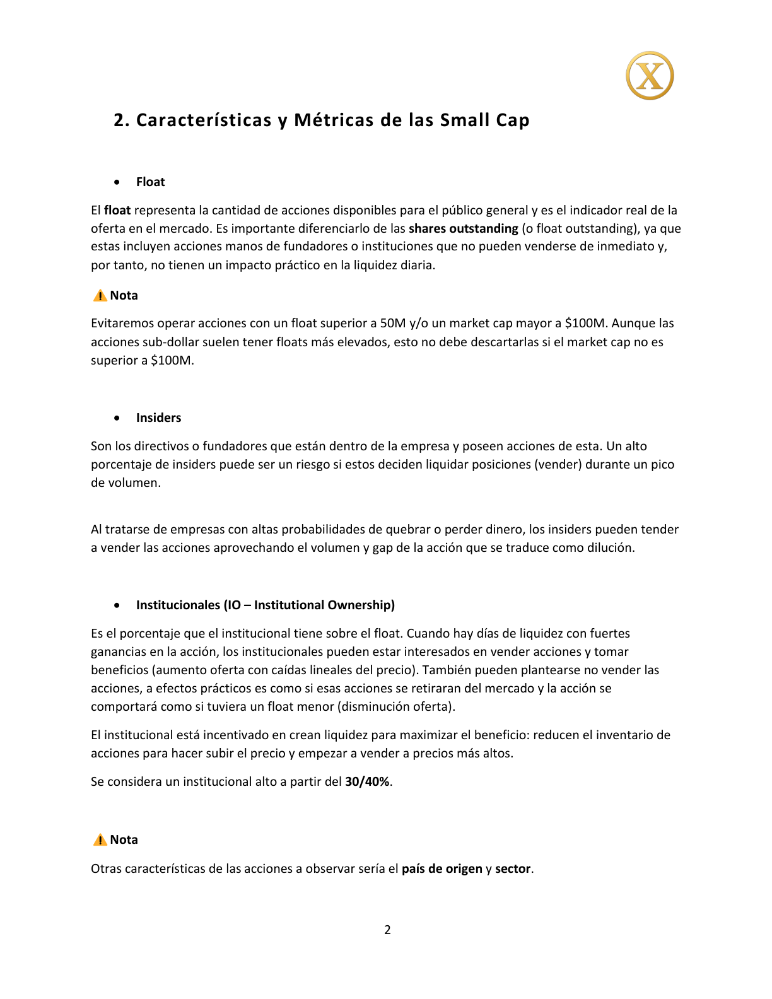

## 3. Dilución 
 
En las Small Caps, la dilución es el proceso mediante el cual una empresa emite nuevas acciones, 
reduciendo el porcentaje de propiedad de los accionistas actuales y, por lo general, hundiendo el precio 
debido al exceso de oferta. Esta financiación tóxica es la que permite que estas empresas sigan 
operando a pesar de sus pérdidas. 
 
**A. Ofertas de Mercado (At-the-Market - ATM)**  
Es el mecanismo más letal para diluir, la empresa vende acciones directamente al mercado al precio 
actual.  
 
**B. Convertible Notes & Warrants**  
La empresa recibe efectivo de fondos de inversión (hedge funds) a cambio de deuda que puede 
convertirse en acciones con un descuento sustancial sobre el precio de mercado. 
- **Warrants**: Derechos que permiten al inversor comprar acciones a un precio fijo. Si el precio 
sube, los inversores ejecutan los warrants y venden inmediatamente para tomar beneficios, 
inundando el mercado de acciones. 
- **Notas Convertibles**: Es un préstamo que se paga con nuevas acciones, no con dinero. Una vez el 
prestamista cobra esas acciones su objetivo será cobrar esas acciones rápido para poder cobrar 
la ganancia.  
 
**C. Registros ante la SEC (Filings)** 

Para anticipar la dilución, es vital monitorear los documentos oficiales en el sistema EDGAR (base de 
datos publica de la SEC): 
- **S-1 (Registration Statement)**: Es la declaración de intención para vender nuevas acciones. 
Una S-1 "efectiva" significa que la dilución puede ocurrir en cualquier momento. 
- **S-3 (Shelf Registration)**: La empresa registra una cantidad (ej. $50M) y puede venderlas en 
"tramos" durante los próximos 3 años. Da agilidad a la empresa para diluir en cada “pump”. 
- **424B (Prospectus)**: Es el documento final que una empresa publica justo cuando está lista 
para vender acciones al público donde incluye el precio exacto al que venderá las acciones.  
    - La confirmación de la dilución ocurre con el prospecto 424B5/424B3.

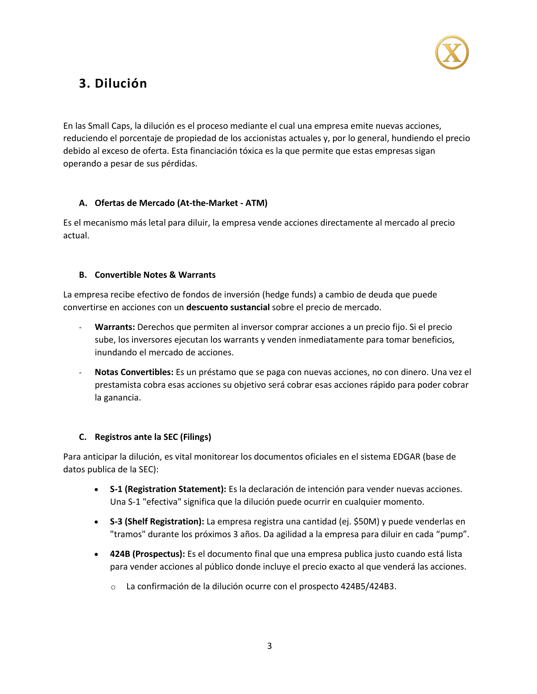

## Página 8
4 
 
D. Baby Shelf Restriction (Rule I.B.6) 
Es una regla de protección para el inversor, un obstáculo para diluir para la empresa: 
• 
Si el Public Float de una empresa es inferior a $75M, la empresa no puede recaudar más de 1/3 
de su capitalización total en un periodo de 12 meses. 
• 
Importancia para el Trader: La empresa tiene limitada la dilución y no puede diluir más de 
forma inmediata, lo que incentivará a la empresa a poder alcanzar esos $75M de public float 
para poder seguir diluyendo. 
  
E. Fuentes de información  
Dilution traker es una de las mejores herramientas para poder tener un seguimiento sobre la parte 
dilutiva de la empresa dándonos una impresión general sobre la acción. Además, también tienen un 
apartado para poder entender mejor las distintas formas que tienen las empresas para poder emitir 
nuevas acciones.  
 Aprende más sobre dilución: https://dilutiontracker.com/app/learn?a=e200be  
 
A primera vista Dilution Traker nos da datos de los que hemos hablado y algunos más. También 
podemos ver de forma resumida el potencial de dilución que tiene y la urgencia que pueden tener para 
poder ejecutar esa dilución.

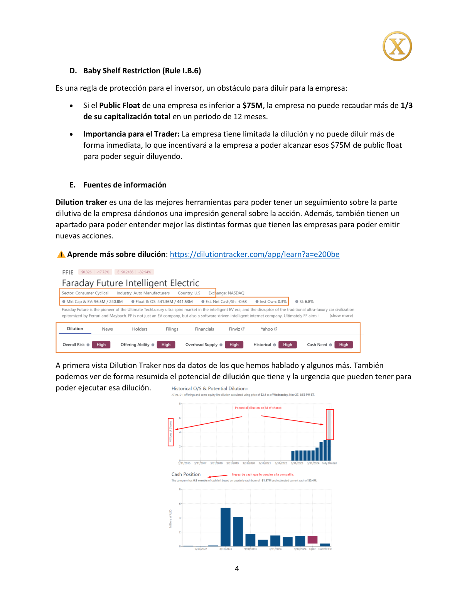

## Página 9
5 
 
4. Análisis de catalizadores: Noticias 
 
En el ecosistema de las Small Caps, las noticias actúan como el motor del volumen. Sin embargo, no 
todas tienen el mismo valor. Muchas notas de prensa son diseñadas específicamente para generar 
FOMO (Fear Of Missing Out) y entusiasmo para elevar el precio artificialmente y permitir que la empresa 
ejecute sus métodos de dilución. Las noticias más relevantes serán aquellas que representen un cambio 
significativo para la rentabilidad de la empresa. 
 
A. Sector Biotecnológico y la FDA 
Las empresas biotech son las más comunes en este mercado. Su éxito depende de la aprobación de la 
FDA (Food and Drug Administration).  
• 
Consta de 3 fases: 
 
o Fase 1: Etapa muy temprana. La mayoría de los proyectos en esta fase fracasan. Las noticias 
sobre "resultados positivos en Fase 1" suelen ser trampas para generar hype. 
o Fase 2: Indica viabilidad, pero el riesgo de que el proyecto fracase sigue siendo grande. 
o Fase 3: Es la fase definitiva. Un resultado positivo aquí suele preceder a la comercialización. 
 
• 
FDA Clearance / Approval: Esta es la noticia de mayor calidad. Representa la autorización para 
vender el producto. 
• 
Estudios Internos: Debemos ignorar las notas de prensa sobre "perspectivas internas 
prometedoras" o "datos preclínicos". Si la noticia no proviene de un regulador oficial (FDA), lo 
más probable es que sea puro marketing. 
 
*Algunas veces las empresas al recibir la aprobación de una fase necesitan más dinero para poder 
continuar con el desarrollo de su producto y necesitaran recaudar dinero del mercado. 
 
B. Informes financieros 
Son los documentos oficiales que revelan la salud real de la empresa: 
• 
10-Q (Quarterly): Resultados trimestrales. Vital para observar el Cash Burn (cuánto dinero 
pierde al mes). 
• 
10-K (Annual): Informe anual auditado. Es la radiografía completa del negocio. 
• 
8-K (Current Report): Se presenta ante la SEC para informar eventos materiales repentinos 
(cambios de directiva, quiebras, acuerdos de financiación o desastres).

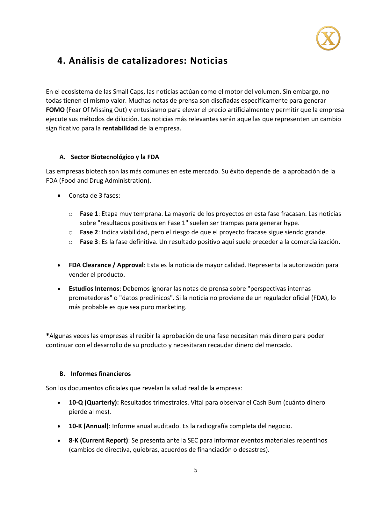

## Página 10
6 
 
*Cuando se trata de una empresa extranjera, fuera de Estados Unidos, (foreign), veremos una F en vez 
de una K en los informes. 
 
C. Patentes y propiedad intelectual 
Muchas empresas anuncian "Patentes concedidas" con valoraciones millonarias. En la gran mayoría de 
los casos, una patente no se traduce en dinero inmediatas o valor real. Se utilizan para inflar las 
expectativas y atraer inversores minoristas antes de una caída. 
 
D. Inyecciones de Capital: Private Placement 
Es una venta de acciones a inversores privados (institucionales o acreditados). 
• 
Lectura Dual: Es positiva porque aporta solvencia inmediata y elimina el miedo a la quiebra a 
corto plazo. Sin embargo, es negativa para el precio a largo plazo debido a la dilución de los 
accionistas actuales. 
 
E. Contratos y partnerships 
Es común que una empresa reciba un contrato y/o tenga alianzas, ya sea del gobierno con otra empresa 
privada. El valor de un contrato es relativo a la empresa: 
• 
Proporcionalidad: Un contrato de $5M es masivo para una empresa de $10M de capitalización, 
pero irrelevante para una de $200M. 
• 
Validación: Tienen más peso cuando la contraparte es el Gobierno o una marca reconocida. 
• 
Partnerships: Suelen ser "humo" (sinergias) a menos que incluyan una inyección de capital clara. 
 
F. Merger/Acquisition (M&A) 
Se suelen obviar, ya que la acción suele quedar cotizando en un precio fijo (el precio de compra).

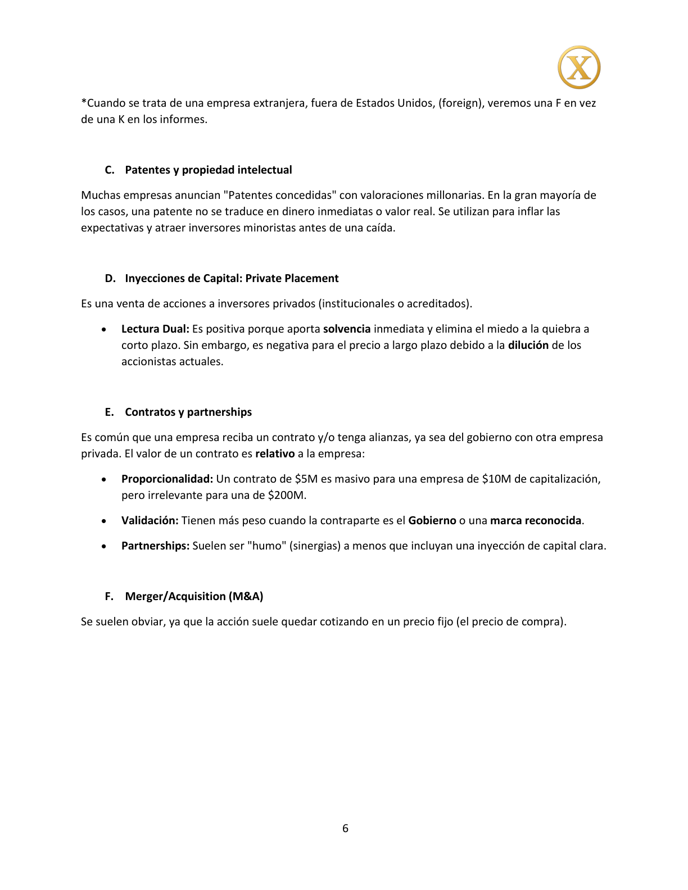

## Página 11
7 
 
5. Ecosistema long: dinámica de desequilibrio 
 
En una operativa long, el objetivo es capitalizar la continuación de una tendencia alcista. Para que esto 
ocurra, es imprescindible identificar un desequilibrio donde la demanda supere a la oferta. 
 
A.  Factores de aumento de demanda 
Para que el precio suba, se necesita presión compradora y pánico en los shorts sellers: 
• 
Catalizador: Noticia de alta calidad (FDA, contratos masivos, resultados) que atraiga volumen. 
• 
Short Squeeze: Ejecución de Stop Loss del short seller, lo que genera compras forzadas y acelera 
la subida. 
• 
Price Action Favorable: La acción debe mostrar una estructura de máximos crecientes y 
mantenerse en positiva en el día (por encima del open) y por encima del VWAP. 
• 
Volumen Histórico: La presencia de un volumen inusualmente alto indica interés de 
compradores y genera que sea más probable un short squeeze.  
• 
Market Environment (Sympathy Plays): Entorno de mercado favorable donde acciones del 
mismo sector están moviéndose con fuerza. 
• 
Niveles de Extensión: El precio no debe estar muy extendido o demasiado alejado de sus niveles 
de referencia para evitar comprar cuando ya se haya agotado el movimiento. 
 
B.  Factores de Disminución de Oferta 
Buscamos los el “camino de menor resistencia" seleccionando escenarios donde la ausencia de 
vendedores sea más probable:  
• 
Ausencia de Overhead Resistance: No debe haber zonas de previas con traders atrapados 
(bagholders) deseando vender.  
*Detallamos más adelante 
• 
Inexistencia de Dilución: Confirmar que no hay offerings como S-1/ATM que puedan soltar 
acciones al mercado. 
• 
Float bajo: A menor float, menor oferta de la acción disponible para los traders generando 
potencialmente una mayor volatilidad. 
• 
Solvencia (Cash Position): Que la empresa no tenga una necesidad urgente de efectivo, 
reduciendo el riesgo de una dilución sorpresa durante la sesión. 
• 
Baja Propiedad Institucional (IO < 40%): Evita la presencia de "manos fuertes" que operan de 
forma tendencial y pesada.

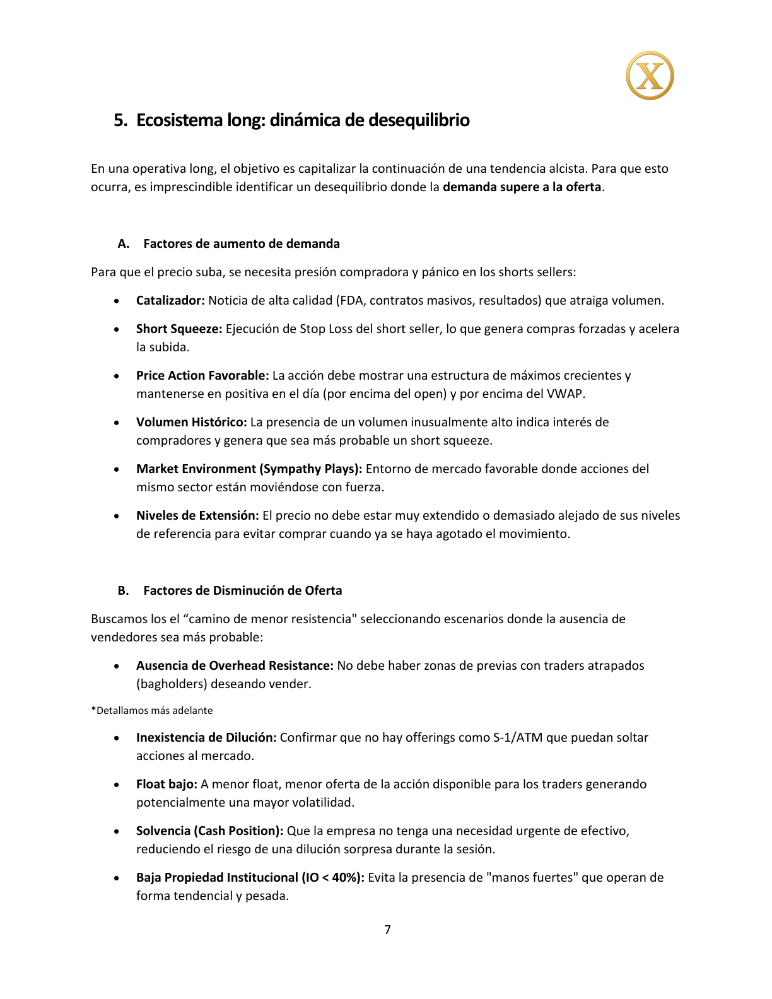

## Página 12
8 
 
• 
Pocos Insiders: Reduce el riesgo de que los directivos liquiden sus posiciones aprovechando la 
subida. 
 
 Nota 
Para operar long en Small Caps, es vital ser extremadamente estricto con estos criterios. A diferencia de 
los short, donde la “gravedad financiera” de la empresa juega a nuestro favor, un largo necesita que 
todas las piezas encajen perfectamente. Si uno de estos factores falla, la probabilidad de fracaso 
aumenta debido a la naturaleza bajista intrínseca de estas acciones. 
 
*Para nosotros es más “fácil” enfocar el long con una operativa de reciclaje justamente por el motivo 
anterior.

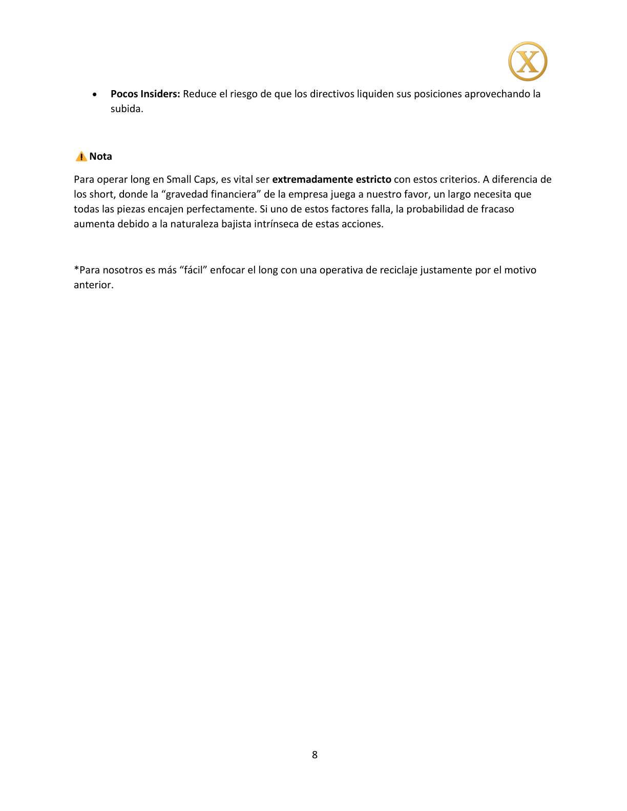

## Página 13
9 
 
6. Ecosistema short: dinámica de desequilibrio 
 
En una operativa en short, el objetivo es capitalizar la pérdida de momentum y la venta de los 
compradores. Partimos de una premisa fundamental: las Small Caps están diseñadas para fallar. 
Buscamos escenarios donde el precio esté este extendido y la oferta supere a la demanda. 
 
A.  Factores de Disminución de Demanda 
Para que una acción caiga, el entusiasmo de los compradores debe agotarse: 
• 
No volumen histórico: No queremos que la acción cobre mucha atención.  
• 
Extensión: El precio se encuentre con una extensión porcentual grande para tener espacio para 
caer. Consideramos el short interesante a partir de extensiones del 50% aunque en entornos de 
mercado más fríos podemos ser más permisivos y en entornos calientes debemos ser más 
restrictivos.   
• 
Price Action Bajista: Posibles failed breakout, incapacidad de hacer nuevos máximos, situarse 
por debajo VWAP o del open, tendencia bajista, disminución del volumen, etc.  
• 
Falla de Catalizador: Que no tenga noticia o que la que tenga no sea relevante. Cuando una 
noticia que parecía "buena" pero realmente no lo es puede atraer a compradores. Estos están 
forzados a vender en pérdida si el precio baja y agrega mayor presión vendedora.  
 
B. Factores de Aumento de Oferta 
Aquí es donde la estructura tóxica de la empresa se convierte en nuestra mayor aliada: 
• 
Overhead Resistance: Zonas de precios superiores donde hay miles de inversores atrapados 
(Bagholders) deseando vender en cuanto el precio se acerque a su punto de entrada. 
• 
Dilución Activa: Programa ATM activo o la entrada en vigor de una S-1. La empresa misma se 
convierte en el vendedor más agresivo. 
• 
Estadística favorable al short: Que estadísticamente sea una acción que tienda a caer en los 
días de volumen y extensión similares al actual. Ver con softwares como Flash Research. 
• 
Necesidad Crítica de Cash: Empresas con poco efectivo en caja (low cash runway) tienen una 
mayor urgencia para diluir en cada subida. 
• 
Insider Selling: Si los directivos tienen libertad para vender, aprovecharán cualquier pump para 
liquidar sus acciones. 
• 
IO menor al 40%: Al tener un mayor IO es más fácil que ocurran manipulaciones de precios, 
sacudidas de stops, etc.

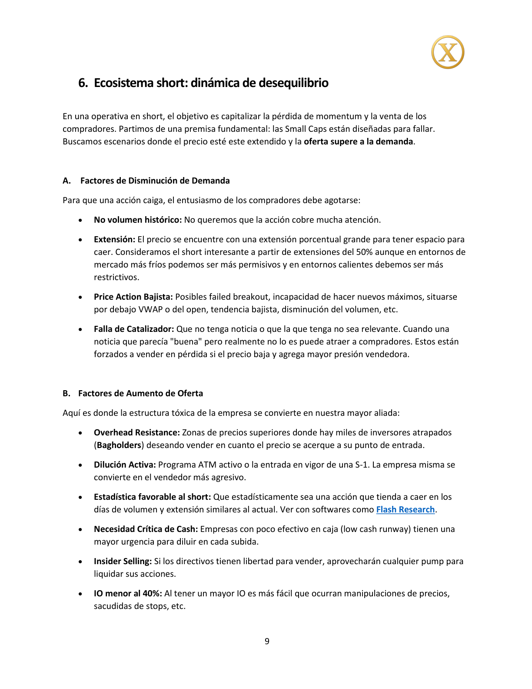

## Página 14
10 
 
 Nota 
 
Mientras que en los largos debemos ser estrictos, los cortos suelen perdonar más errores debido a la 
naturaleza del activo. El riesgo principal en el corto no es que la empresa sea buena, sino el Short 
Squeeze. Por ello, el ecosistema short se basa en identificar cuándo la oferta real (dilución + bagholders) 
es tan pesada que es difícil que puedan short squeeze y alejarse de los escenarios donde ese Riesgo sea 
más alto. 
 
Como norma general no vamos a hacer short a acciones que tienen más de 100M de volumen al finalizar 
el día. Cuando estamos en premarket podemos proyectar el volumen que tendremos a final del día 
multiplicando entre 5 y 10 veces el volumen de premarket y así estimar aproximadamente el volumen 
total al final del día.

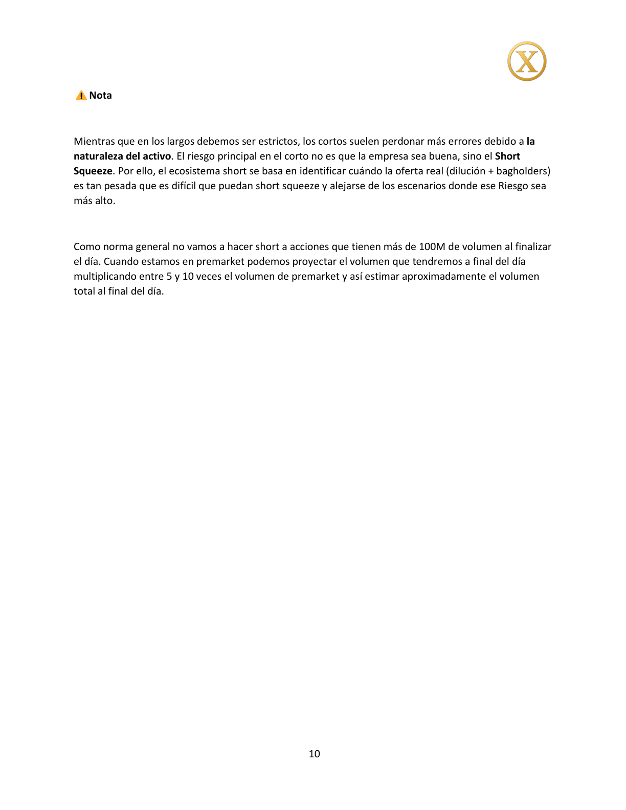

## Página 15
11 
 
7. Estrategias long 
 
A. Breakout (BO) 
 
Estrategia que se basa en el rompimiento de resistencias anteriores, las cuales pasan a ser soportes. Es 
uno de los patrones más comunes y frecuentes con lo que tenemos que filtrar muy bien. A veces 
también veremos oportunidades donde buscaremos long por breakouts de niveles diarios. 
 
• 
Trigger (activación): Rotura de un nivel importante como máximo de día, nivel relevante en el 
gráfico diario, etc. 
• 
Confirmación. Explosión de volatilidad del precio y nos interesa que el precio se separe con 
violencia del nivel de breakout. 
• 
Riesgo: Se anula la tesis cuando el precio cae por debajo del nivel de breakout y se sitúa el stop 
por debajo de ese nivel.  
 
 Nota 
Los quiebres de los $1.00 son interesantes, ya que muchos traders no operan acciones por debajo de 
ese valor por la estructura de comisiones (detalle más adelante), lo que hace que estas acciones 
aparezcan en su scanner y aumente el interés (demanda). Además puede ser un punto de salida para los 
shorts. Las empresas que no cumplen los requisitos del Nasdaq, pueden también estar incentivadas en 
conseguir que el precio de la acción esté por encima de $1.  
 
Ejemplo: FEMY 29/09/2023 
 
Ejecución: https://journal.tradelyapp.com/user/xavitrades/ticker/FEMY.NQ/2023-09-29

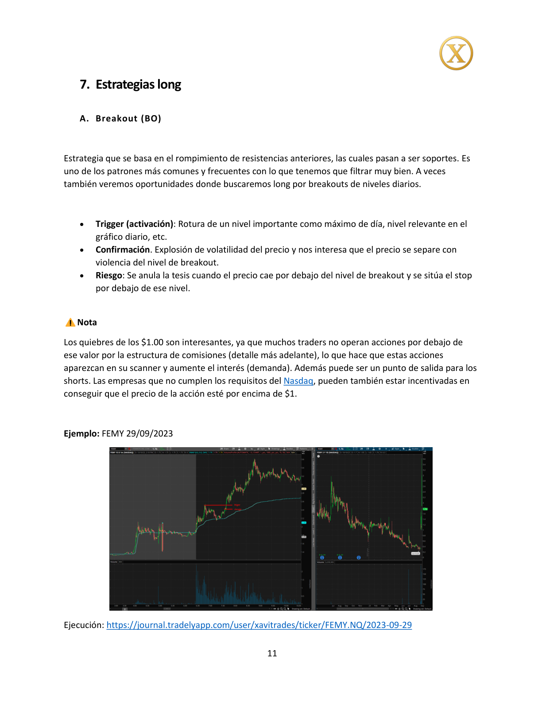

## Página 16
12 
 
B. Gap and Go (G&G) 
 
Se basa en el quiebre del máximo de premarket (PMH) durante el primer día de gap alcista cuando hay 
una tendencia alcista siempre y cuando el análisis favorezca la posición long durante las primeras horas 
de mercado.  
• 
Trigger: Premarket high breakout. 
• 
Confirmación. Explosión de volatilidad del precio y nos interesa que el precio se separe con 
violencia del nivel del PMH. 
• 
Riesgo: Se anula la tesis cuando el precio cae por debajo del nivel de PMH y se sitúa el stop por 
debajo de ese nivel. 
 
 Nota 
Es el mejor patrón que tenemos, pero hay pocos. 
 
Ejemplo: KAVL 14/06/2024  
 
Ejecución: https://journal.tradelyapp.com/user/xavitrades/ticker/KAVL.XX/2024-06-14

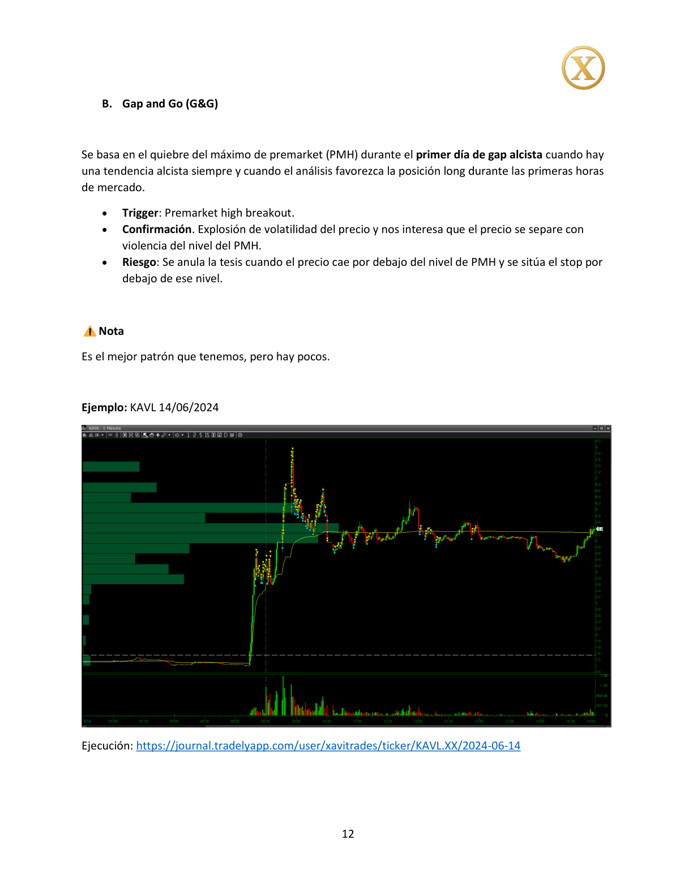

## Página 17
13 
 
C. VWAP Bounce 
 
Este patrón se fundamenta la relevancia de VWAP (precio medio ponderado por volumen) buscando un 
rebote al acercarse a esos niveles. En acciones con mucho volumen (superior a 30M), el VWAP actúa 
como el barómetro sobre que participantes (longs o short) tienen el control de la acción.  
 
Cuando el precio se aleja del VWAP tras un movimiento explosivo, el promedio del short seller quedan 
atrapados (perdiendo dinero, under water) y cuando vuelve a acercarse VWAP reducen esa pérdida 
incentivando el cierre de la posición. El retroceso hacia el VWAP interviene dos fuerzas: los cortos 
cubriendo posiciones con y los largos entrando con un mejor risk/reward (RR).  
• 
Trigger: Acción separándose explosivamente por encima VWAP con mucho volumen 
(momentum). También cuando VWAP está por encima de los niveles de breakout o Gap and Go 
anteriores.  
• 
Confirmación: Volumen histórico y momentum. Que el precio se acerque a VWAP 
extremadamente rápido puede ser indicativo de que el movimiento al alza ya está agotado.  
• 
Riesgo: La tesis se anula si el precio rompe el VWAP a la baja. El Stop Loss se sitúa 
inmediatamente por debajo del nivel del VWAP o un soporte muy cercano.  
 
 Nota 
El primer rebote al VWAP en un día de volumen histórico es de alta probabilidad. Los acercamientos a 
VWAP posteriores pierden efectividad y aumenta la probabilidad de que la acción no rebote.  
 
Ejemplo: RGS 25/06/2024  
 
Ejecución: https://journal.tradelyapp.com/user/xavitrades/ticker/RGS.XX/2024-06-25

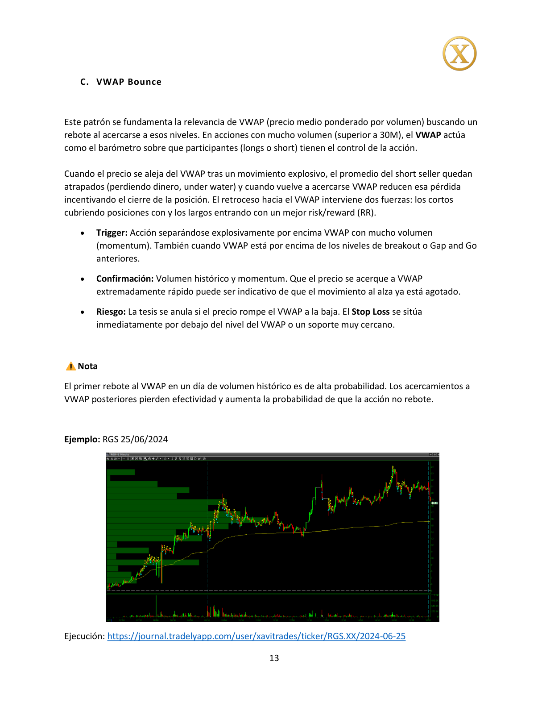

## Página 18
14 
 
D. VWAP Reclaim 
 
Este patrón se produce cuando una acción cotizaba por debajo del VWAP y consigue cruzarlo al alza. 
Mientras el precio permanece por debajo, los shorts tienen el control y están cómodos en ganancias. Sin 
embargo, a medida que el precio se acerca al nivel dejan de tener esas ganancias y aumenta el 
nerviosismo.  
Una vez recuperado el nivel, puede que algunos shorts se ven obligados a cubrir posiciones para evitar 
mayores pérdidas, lo que puede generar un Short Squeeze. Es un patrón de alta complejidad debido a la 
posible resistencia superior (overhead resistance) de traders atrapados en long en niveles más altos. 
• 
Trigger: Rompimiento al alza de VAWP tras haber cotizado gran parte de la sesión por debajo. 
• 
Confirmación: Un aumento de volumen en el momento del cruce y aumento de volatilidad al 
alza siendo capaz de mantener una tendencia alcista.  
• 
Riesgo: La tesis queda invalidada si el precio vuelve a caer por debajo del VWAP. El Stop Loss se 
sitúa por debajo del nivel del VWAP.  
 
 Nota 
Es un patrón muy común y conocido. La efectividad es baja y se necesita un buen filtrado.  
A partir de las 20h (NY time) puede que ocurran debido al cierre de los shorts que no quieren tener 
riesgo overnight.  
 
Ejemplo: RGLS 12/3/2024  
 
Ejecución: https://journal.tradelyapp.com/user/xavitrades/ticker/RGLS.XX/2024-03-12

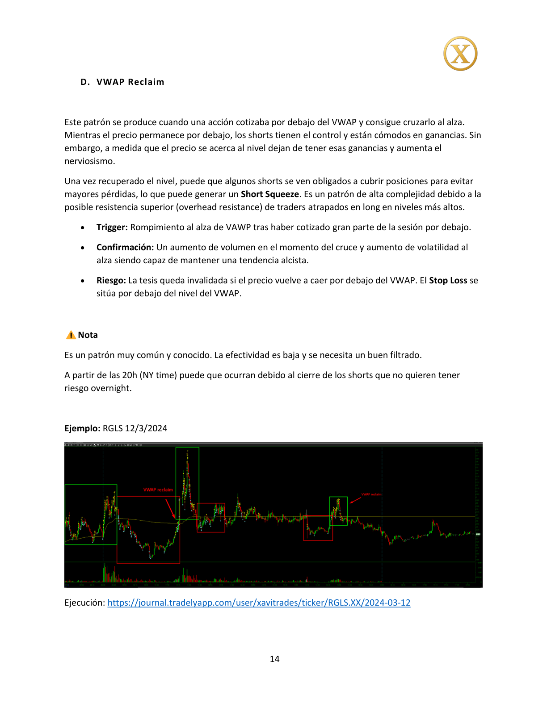

## Página 19
15 
 
E. Gap and Crap Reversal (G&CR) 
 
Este patrón se presenta en acciones que poseen catalizadores sólidos y un ecosistema favorable para el 
long, pero que sufren una caída agresiva en la apertura del mercado (el "crap"). A pesar de la caída, el 
precio logra recuperar niveles importantes como el open y deja de hacer nuevos mínimos.  
La lógica detrás de este patrón es el atrapamiento de cortos que atacan la debilidad inicial y se ven 
forzados a cubrir sus posiciones cuando el precio deja de marcar nuevos mínimos y comienza a 
recuperar niveles. 
• 
Trigger: Explosividad al alza después de un movimiento en el open bajista recuperando el open 
conocido como “red to green”. 
• 
Confirmación: El precio marca un mínimo claro (LOD) del que el precio se aleja con explosividad 
y se pone verde en el día y sigue una tendencia alcista. 
• 
Riesgo: La tesis se anula si el precio rompe el mínimo establecido en la apertura o el mismo 
open. El Stop Loss se sitúa estrictamente por debajo del Mínimo del Día (LOD) o el Open del 
Día.  
 
 Nota 
Es un patrón que consideramos obsoleto, pero sí que es interesante estudiar para entender mejor las 
estrategias short y evitar pérdidas innecesarias. 
 
Ejemplo: INTS 08/12/2023  
 
Ejecución: https://journal.tradelyapp.com/user/xavitrades/ticker/INTS.XX/2023-12-08

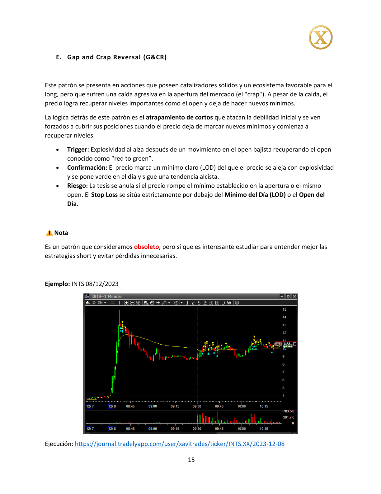

## Página 20
16 
 
F. First Green Day Bounce (FGDB) 
 
Este escenario ocurre tras varios días de caída consecutiva después de un movimiento alcista. Cuando la 
acción se ha destruido, los short sellers que entraron días anteriores comienzan a tomar beneficios. Esta 
cobertura de cortos (short covering), sumada a los compradores que buscan el rebote, genera una gran 
alta volatilidad al alza. No buscamos un cambio de tendencia sino un rebote en el gráfico diario.  
• 
Trigger: Volatilidad de movimiento al alza. 
• 
Confirmación: Aumento de volumen y Price Action alcista. 
• 
Riesgo: Soportes relevantes anteriores como un breakout o VWAP.  
 
 Nota 
La importancia de este concepto reside en la gestión de buscar patrones short ya en enfoque long tiene 
más sentido con un enfoque para buscar altos risk / reward (RR) y no nos especializamos en ello. Entrar 
en corto en el First Green Day Bounce puede ser difícil por la gran volatilidad del rebote, sobre todo en 
las acciones que han sido más explosivas los días anteriores.  
También pueden generarse liquidity traps en este tipo de escenarios (detallamos más adelante). 
 
Ejemplo: SIDU 3/1/2024 
 
Ejecución: https://journal.tradelyapp.com/user/xavitrades/ticker/SIDU.XX/2024-01-03

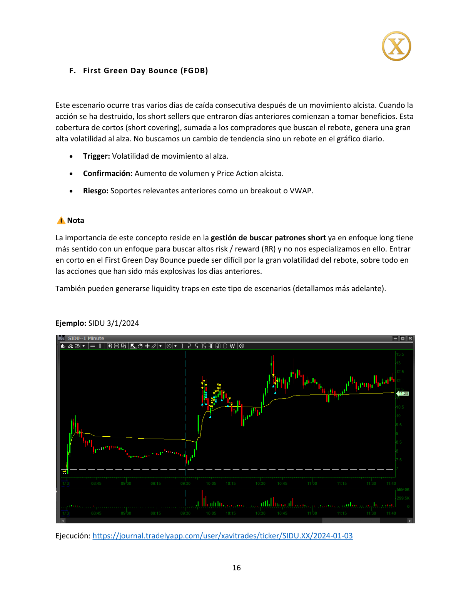

## Página 21
17 
 
Gráfico diario: 
 
 
 
 Ver también el patrón three day pullback 
https://x.com/jordipamiest/status/1467438096090345482?s=20

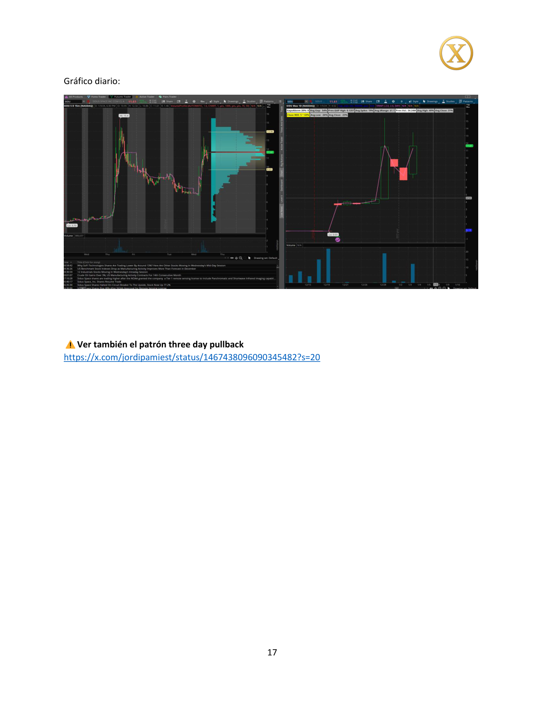

## Página 22
18 
 
G. Dip buying panics 
 
Este patrón ocurre cuando una acción que ha tenido una gran extensión alcista y sufre una caída vertical 
violenta, provocando el pánico en los long que deciden vender. La acción tiende a producir un rebote 
una vez la acción esta sobre extendida a la baja. Nos vamos a interesar más en acciones con “valor real” 
como cuando hay un crash bursátil o stocks de algo de más capitalización (mid caps).  
• 
Trigger: Una caída parabólica hacia una zona de soporte mayor. 
• 
Confirmación: Entrada de mucho volumen y pánico, caída irracional.  
• 
Riesgo: La tesis es nula si el soporte relevante no aguanta pánico. En determinados momentos 
tendremos muchos niveles de stop interesantes y podemos intentarlo distintas veces en una 
misma caída.  
 
 Nota  
Es un patrón extremadamente difícil de ejecutar porque requiere comprar cuando hay realmente pánico 
y es difícil poder gestionar ese pánico y volatilidad con lo que se requiere experiencia.  
Suele darse muy pocas veces al año. 
 
Ejemplo: SLV 12/02/2026  
 
Ejecución: https://journal.tradelyapp.com/user/xavitrades/ticker/SLV.XX/2026-02-12

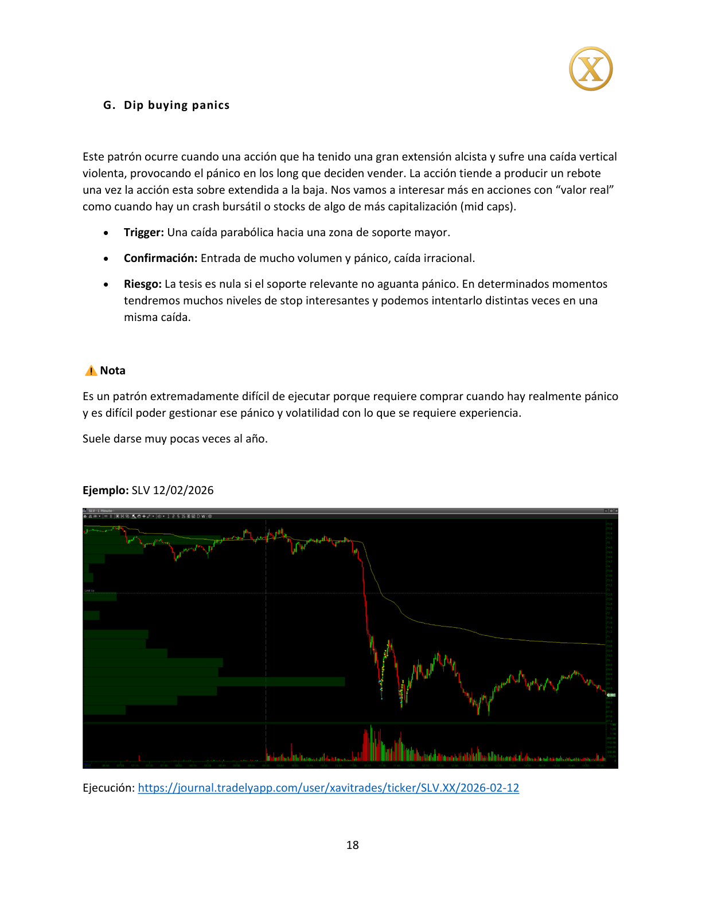

## Página 23
19 
 
Gráfico diario: 
 
 
 Para seguir aprendiendo  
El top trader Lance Breitstain popularizó el concepto “The right side of the V” donde busca capitalizar 
estos movimientos de pánico. https://www.youtube.com/watch?v=wtQIj6Apiq0  
X: https://x.com/TheOneLanceB

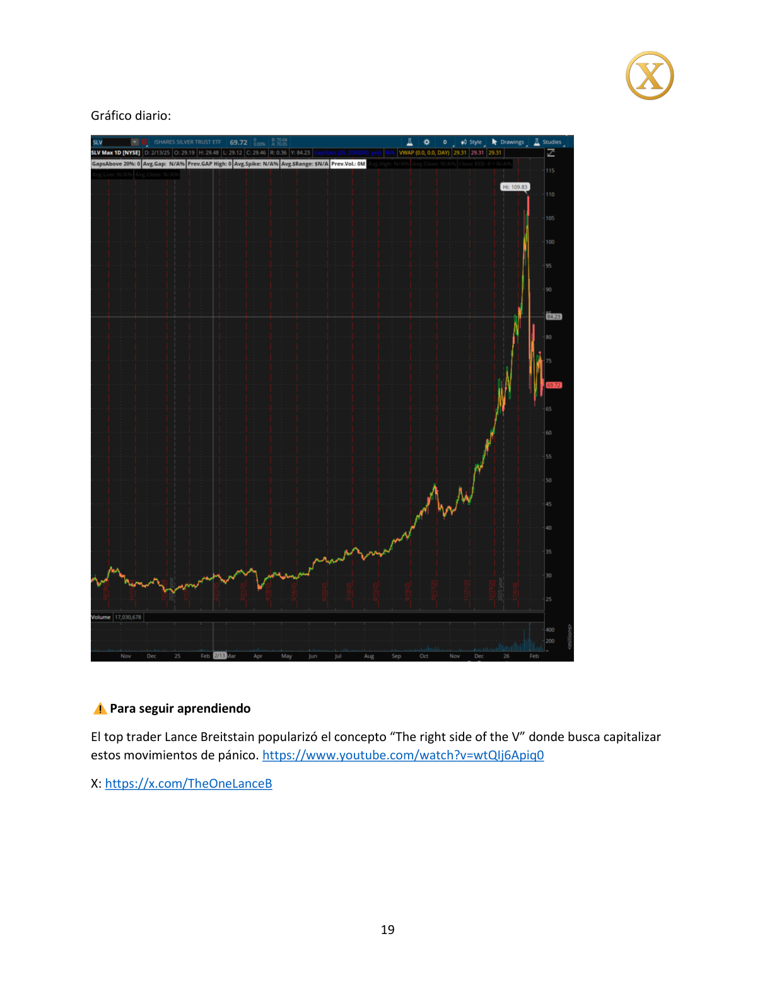

## Página 24
20 
 
8. Estrategias short 
 
A. Gap and Extention (G&E) 
 
Esta estrategia consiste en abrir una posición short mientras el precio todavía muestra fuerza alcista 
inicial (el "frontside" del movimiento) cuando se ha alejado del máximo de premarket. Buscamos entrar 
en la extensión de la acción hacia niveles del premarket high durante la primera hora de mercado (por lo 
general). Una vez que el precio comienza a mostrar debilidad, el patrón evoluciona hacia un Gap and 
Crap clásico. 
• 
Trigger: El precio se aleja durante el premarket del máximo que marcó y sigue manteniendo una 
extensión interesante.  
• 
Confirmación: El precio durante la sesión sube y se extiende rápido en gráfico de 1 minuto.   
• 
Riesgo: La tesis se invalida si el precio rompe el máximo de premarket y situamos el stop un 
poco antes del Máximo del Premarket (PMH). 
 
 Nota 
Es un patrón que operamos el frontside (mientras el precio sube) y el PMH puede estar lejos. Esto se 
traduce en que se requiere de una gestión activa de la posición si entramos lejos la referencia. También 
podemos empezar el short en premarket si el precio se ha destruido y ha marcado un máximo claro. En 
este caso VWAP pasa a un segundo lugar por lo general.   
 
Ejemplo: MNTS 09/02/2026 
 
Ejecución: https://journal.tradelyapp.com/user/xaviercenterpoint/ticker/MNTS.XX/2026-02-09

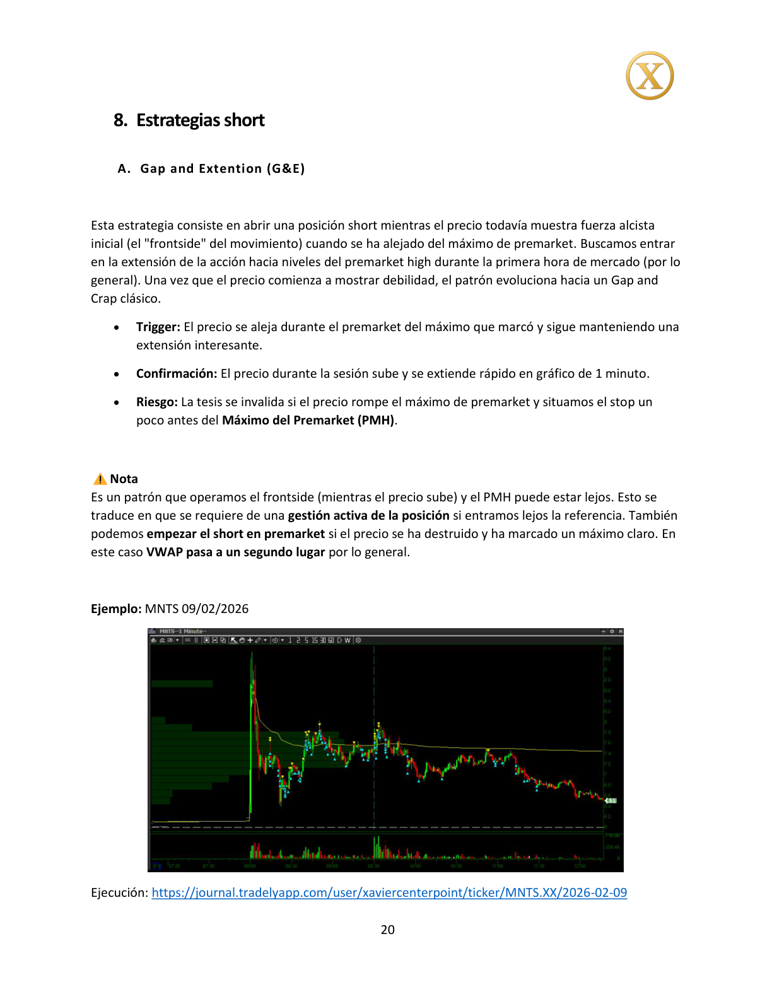

## Página 25
21 
 
B. Gap and Crap (G&C) 
 
Este patrón se fundamenta en la incapacidad de los compradores para sostener un gap alcista en la 
apertura del mercado. En los primeros minutos de sesión, la acción comienza a mostrar debilidad y el 
quiebre del precio de apertura y el posterior paso a terreno negativo (Green to Red) nos hace pensar en 
un posible cambio de tendencia donde el interés comprador desaparece 
• 
Trigger: Movimiento en el que se pone Roja en el día (Green to Red) o Failed Breakout (FBO). 
• 
Confirmación: Continuación del movimiento bajista y sin capacidad grandes rebotes.  
• 
Riesgo: La referencia principal de riesgo se sitúa en el Máximo del Día (HOD). No obstante, para 
optimizar la ratio riesgo/beneficio, se puede utilizar el precio de apertura (open) o el VWAP 
como niveles de stop más ceñidos. 
 
 Nota 
Este patrón suele ser la continuación natural de un Gap and Extention y para ello es importante ir 
bajando los niveles de riesgo. Cuanta mejor extensión mantenga más potencial bajista puede tener. 
 
Ejemplo: BATL: 26/01/2026  
 
 Ejecución: https://journal.tradelyapp.com/user/xavitrades/ticker/BATL.XX/2026-01-26

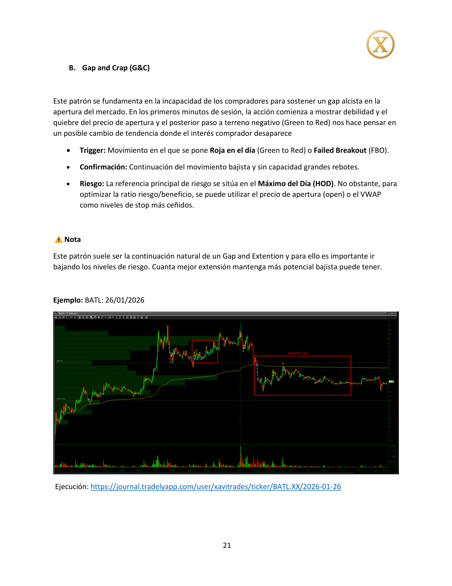

## Página 26
22 
 
C. VWAP Rejection 
Este patrón es el espejo bajista del VWAP Bounce. Una vez que el activo ha confirmado su debilidad 
(normalmente tras un Gap and Crap), el VWAP deja de ser un soporte y se convierte en una resistencia 
técnica.  
• 
Trigger: Haber estado bastante tiempo por debajo de VWAP después de haber mantenido una 
estructura alcista. 
• 
Confirmación: Incapacidad del precio para seguir subiendo y sin dejar de mostrar una tendencia 
bajista. Entramos en los rebotes hacia VWAP. 
• 
Riesgo: La tesis se anula inmediatamente si la acción recupera el nivel de VWAP. El Stop Loss se 
sitúa estrictamente por encima del VWAP. 
 
 Nota 
Este patrón se suele dar como continuación del gap and crap, pero también en stocks donde buscamos 
un fade (perdida de atención con caída de precio) por cualquier otro motivo.  
 
Ejemplo: PBM 02/02/2026 
 
Ejecución: https://journal.tradelyapp.com/user/xavitrades/ticker/PBM.XX/2026-02-02

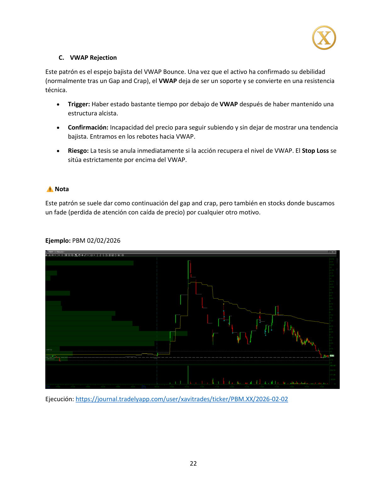

## Página 27
23 
 
D. Late Day Fade (LFD) 
 
El Late Day Fade se fundamenta en el agotamiento del momentum alcista y la pérdida de atención de 
los long generando roturas bajistas de niveles de soporte importantes, como también de VWAP. Una vez 
que la euforia inicial de la mañana ha pasado y la acción pierde atención sin lograr marcar nuevos 
máximos y claramente en backside, los longs comienzan a liquidar sus posiciones por miedo a mantener 
el activo durante la noche (overnight risk). Este patrón suele activarse a partir de las 14:00h (hora de 
NY). 
• 
Trigger: El quiebre de un nivel de soporte mayor. 
• 
Confirmación: El precio se mantiene por debajo del VWAP y cada intento de rebote es 
rechazado, le cuesta subir y el tape es “pesado” (pocos compradores en el time and sales).  
• 
Riesgo: La referencia de riesgo se sitúa en el nivel donde empieza el movimiento a la baja, como 
si fuera un breakodown.  
 
 Nota 
Lo que realmente buscamos es un fade y hay que tener paciencia ya que el gran movimiento 
probablemente no lo haga rápido.  
 
Ejemplo: QNCX 11/02/2026 
 
Ejecución: https://journal.tradelyapp.com/user/xavitrades/ticker/QNCX.XX/2026-02-11

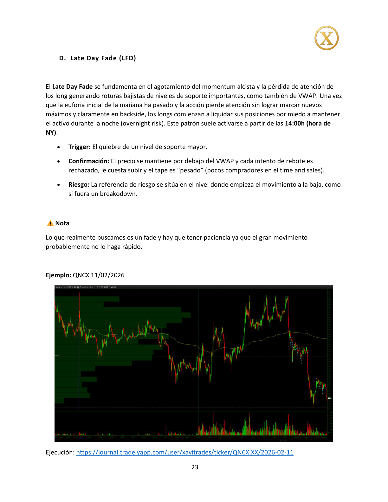

## Página 28
24 
 
E. Short Into Resistance (SIR) 
 
Tras un ciclo de fuerte euforia alcista en una acción, muchos traders mantienen posiciones long 
esperando que la tendencia continúe, pero cuando el precio colapsa, estos traders quedan atrapados en 
niveles superiores (bagholder) y con posiciones perdedoras.  
Su psicología cambia de "buscar beneficio" a "buscar recuperación" esperando que rebote para vender 
sus acciones perdiendo lo mínimo posible. 
Este hecho crea una oferta en niveles de precios anteriores, dificultando cualquier intento de rebote. 
• 
Trigger: Extensión del precio que se acerca a niveles de overhead. 
• 
Entrada: Extensión del precio intradiario sobre el 50/70% (dependiendo de volatilidades 
pasadas) haciendo atractivo el precio para el bagholder para reducir su posición.   
• 
Riesgo: La tesis deja de tener sentido cuando el precio se sitúa por encima del nivel de 
overhead (VWAP boulevard), o el volumen en el día actual supera el volumen de la overhead. 
El nivel de stop debe estar por encima del precio de la overhead (detallamos más adelante).  
 
 Nota 
Es un patrón complicado, puede haber variantes y el nivel de riesgo puede ser algo objetivo. Lo ideal es 
buscar los niveles donde quedó atrapado el volumen el día con mayor volumen (VWAP boulevard).  
También la volatilidad puede ser mucho más grande de lo que de un inicio esperamos, y al ir short 
frontside nos puede sorprender ese aumento de volatilidad y volumen y hay que ser capaz de gestionar 
eficientemente la posición para evitar tener pérdidas catastróficas.  
Consideramos un volumen de overhead cuando hay más de $50M (precio de la acción por volumen 
negociado). 
 
Ejemplo 1: PHIO 10/02/2026 
 
En el ejemplo de PHIO tenemos 300M de volumen el día 13/01/2025 y el día 10/02/2026 (día que nos 
interesa un SIR) el precio cotizaba sobre el $1.3. El nivel de referencia, VWAP Boulevard (VWAP diaria, 
línea amarilla en gráfico diario) está en $7.4. Al tener una resistencia tan lejos, podemos tener una 
primera referencia en 2 y otra en 3. Probablemente si la acción superara el 3, no tendría sentido seguir 
insistiendo en el short ya que para subir necesitaría seguir teniendo mucho volumen superado estos 
300M de volumen overhead.

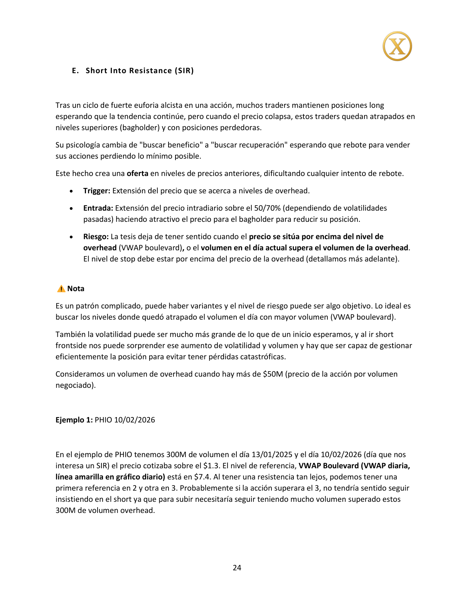

## Página 29
25 
 
 
 
Las ejecuciones son frontside (cuando el precio sube) y reciclamos porque es difícil acertar cuando la 
acción va a empezar a bajar ya que estamos entrando en fortaleza.  
 
 
Ejecución: https://journal.tradelyapp.com/user/xavitrades/ticker/PHIO.XX/2026-02-10

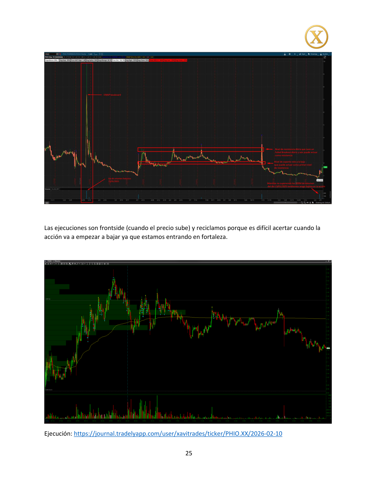

## Página 30
26 
 
Ejemplo 2: FUSE 02/02/2026 
Durante un día de volumen histórico y por encima VWAP estamos en un escenario long e intentamos 
anticipar la continuación de la caída debido cuando estimamos que la caída que ha habido ha generado 
pérdidas en los long y se ha creado una overhead (bagholders) en el gráfico de 1 minuto. Estos longs 
atrapados van a querer salir cuando la acción rebote. 
 
 
Ejecución: https://journal.tradelyapp.com/user/xavitrades/ticker/FUSE.XX/2026-02-02  
 
 Nota 
Es una variante avanzada ya que se está haciendo short cuando estamos en un escenario long y es 
mucho más fácil poder fallar. Puede también verse también como “Failed Breakout” (ver a 
continuación). 
Se comenta por las dudas generadas en las sesiones al estar short por encima VWAP.

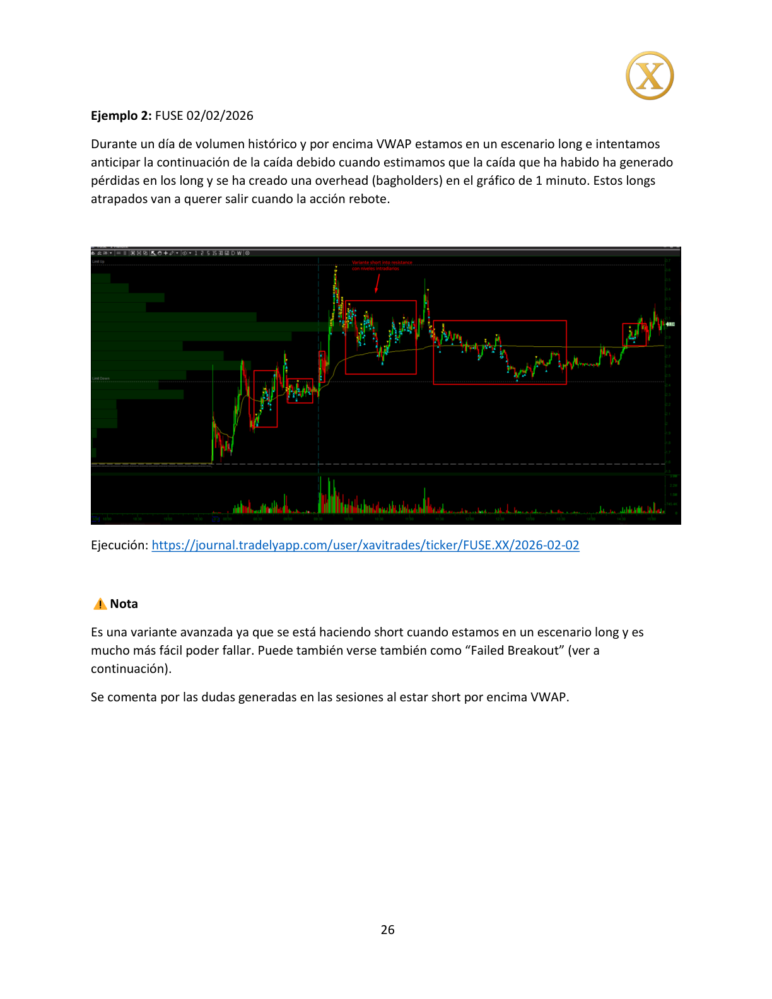

## Página 31
27 
 
F. Failed Breakout (FBO) 
 
La idea es aprovechar el desequilibrio en el lado bajista que da un stock cuando falla un breakout. En el 
breakout habrá habido traders buscando la continuación que deben salir de la posición cuando el precio 
se les va en contra. 
• 
Trigger: El precio queda por debajo del nivel de breakout o se acerca mucho.  
• 
Confirmación: El precio confirma la tendencia bajista con pocos rebotes del precio. 
• 
Riesgo: Nivel de breakout. El riesgo debe estar un poco por encima de este nivel.  
 
Ejemplo: CMCT 22/01/2026 
 
Ejecución: https://journal.tradelyapp.com/user/xavitrades/ticker/CMCT.XX/2026-01-22

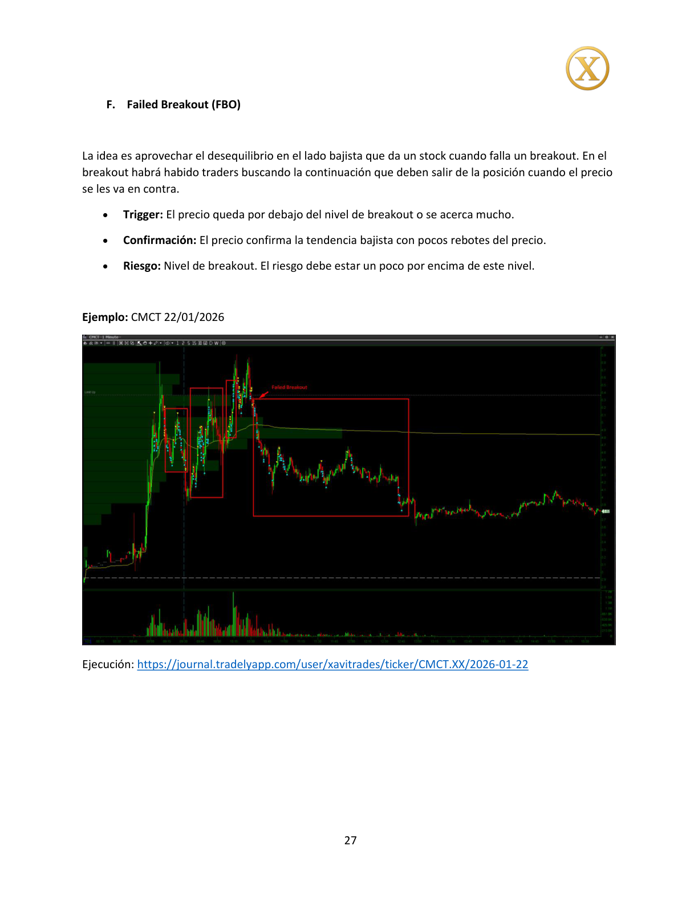

## Página 32
28 
 
G. Over Extended Gap Down (OEGD) 
 
Cuando un stock se ha sobre extendido en la diaria, buscamos un primer día donde el stock abra con un 
gap down y entramos short con el close anterior como referencia. 
• 
Trigger: Tener gap down más del 10% y una extensión en diario de mínimo el 300%. 
• 
Entrada: Entramos short en el spike hacia el close anterior. 
• 
Riesgo: El riesgo está en el close anterior o una zona de resistencia importante cercana al 
close. 
 
 Nota 
Es interesante intentar alargar la posición y intentar aguantar la posición ya que la acción puede tener 
mucho espacio por recorrer. Hay que ir con cuidado cuando hay poco volumen en la acción. 
 
Ejemplo: MLGO 05/06/2024   
 
Ejecución: https://journal.tradelyapp.com/user/xavitrades/ticker/MLGO.XX/2024-06-05

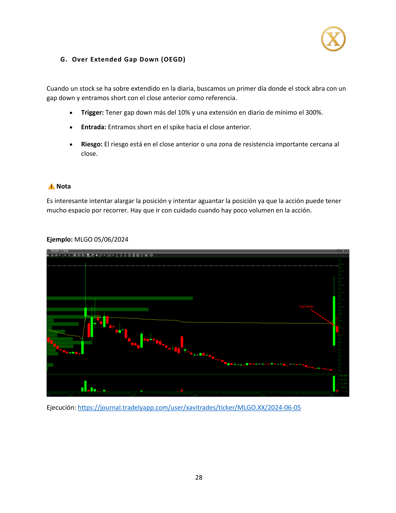

## Página 33
29 
 
H. Primer Día Rojo – First Red Day (FRD) 
 
El First Red Day ocurre tras una extensión alcista extrema (generalmente superior al 300% en pocos 
días). La lógica se basa en el agotamiento de los compradores cuando el precio ha subido mucho. Es un 
patrón "masificado" (crowded) y conocido por la comunidad de short sellers lo que puede generar 
volatilidad errática antes del desplome definitivo. Es por eso que cabe la posibilidad de enfocarlo como 
gap and extention.  
• 
Trigger: Roja en el día o debilidad en premarket después de días de subida y con gap up.  
• 
Entrada: Intentar sumarse a la tendencia cuando la acción se pone roja en el día de forma 
agresiva, generalmente buscando un bounce para tener un buen precio.  
• 
Riesgo: La tesis se incumple cuando la acción esta verde (por encima del nivel del open) y el 
riesgo debería estar en open o en el máximo del día (HOD, high of day) en el caso de esperar 
volatilidad.  
 
 Nota 
Al ser un patrón masificado (crowded), la ejecución debe cuidadosa porque puede haber mucha 
volatilidad y muchas recuperaciones en V y por eso a veces enfocamos el concepto como Gap and 
Extention. 
 
Ejemplo: SIDU 05/01/2026  
Ejecución:https://journal.tradelyapp.com/user/xavitrades/ticker/SIDU.XX/2026-01-05

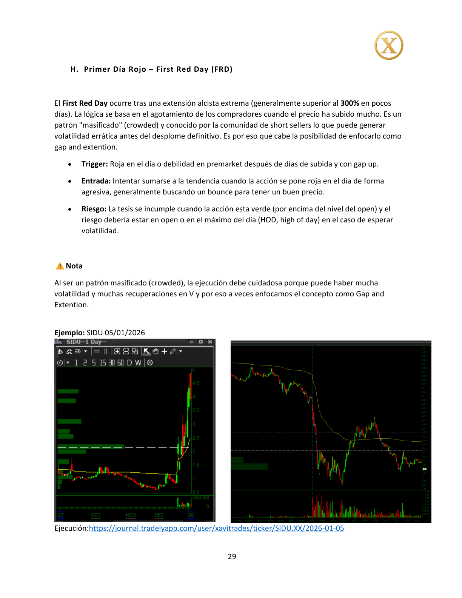

## Página 34
30 
 
9. Tape Reading  
 
Se entiende como tape reading como la habilidad de entender la intención entre los participantes del 
mercado en una acción a partir del Time and Sales y el Level 2 y poder así estimar mejor la probabilidad 
de que el precio termine haciendo una cosa u otra. 
 
Es una habilidad que requiere tiempo de aprendizaje y horas de pantalla. Es imposible entender el tape 
en todo momento, hay que entenderlo durante momentos importantes donde puedan ocurrir los 
desbalances entre compradores y vendedores como en un short squeeze, en un sell off, etc. 
 
 
Elementos que tenemos que fijarnos del tape son: 
 
A. Grandes ordenes 
 
Es fundamental observar el impacto de las órdenes grandes:  
 
• 
Absorción: Si aparecen grandes órdenes de compra, pero el precio no sube, significa que 
hay un vendedor oculto absorbiendo la demanda (Resistencia). 
 
• 
Desplazamiento: Si las grandes órdenes no encuentran contrapartida y el Time and Sales 
(TAS) muestra una sucesión constante de compras agresivas, puede ser más probable que el 
precio se desplace al alza rápidamente si no encuentra ninguna resistencia.  
 
• 
Inversamente aplicable a en el caso de ver órdenes de venta. 
 
 
 
*Ejemplo time and sales y level 2 (no interpretar)

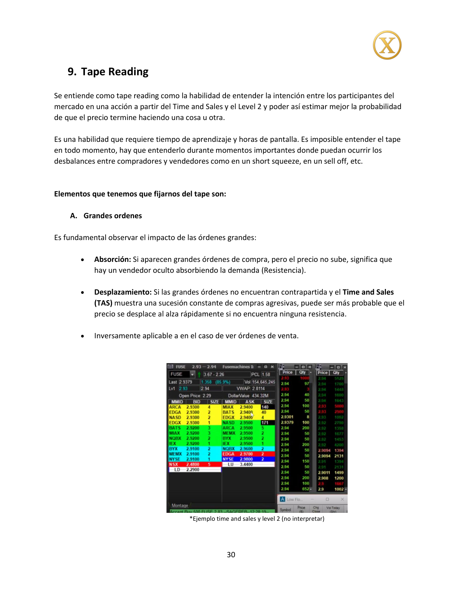

## Página 35
31 
 
B. Dinámica del level 2 y TAS 
 
• 
Debemos ver si el precio oscila libremente tanto arriba como abajo encontrando liquidez tanto 
en el Bid como en el Ask (compras al Ask y ventas en el Bid en el TAS). 
 
• 
Debemos detectar la velocidad y aceleración del TAS para detectar la entrada de volumen en 
puntos importantes. Es un indicador de urgencia en puntos críticos que puede confirmar ciertos 
patrones. 
 
 
C. Ejecuciones en Mid Points 
 
Los mid-points son ejecuciones que ocurren entre el Bid y el Ask, normalmente 
representado en amarillo o blanco en el TAS (configurable). 
 
• 
Tape Alcista: Si un trader grande quiere acumular una gran posición 
probablemente utilizará mid-points para absorber ventas en el Bid y barrer 
el Ask. En el TAS, esto se visualiza con predominancia de blanco (o amarillo) 
y verde, y una ausencia casi total de rojo. 
 
• 
Tape Bajista: De la misma manera, cuando se pretenda deshacer de una 
gran posición se predominancia de rojo y blanco. El mid-point absorbe las 
compras, indicando una distribución agresiva. 
 
 
D. Refreshers / Iceberg orders (ordenes ocultas) 
 
Cuando vemos en la level 2 en el mejor precio (Bid) solo 100 acciones, pero a la vez vemos que hay 
muchas más transacciones en el TAS a ese precio es porque hay una orden en oculto. No podemos saber 
cuántas acciones hay en oculto, pero si el precio no cae (o si cae y recupera rápido) podemos pensar que 
hay alguien interesado en comprar una gran cantidad de acciones.  
 
 
 
 Nota 
The Short Bear tiene un video en YouTube donde explica tape reading pero como he dicho antes, como 
realmente se aprende es con horas de pantalla y observación. 
https://www.youtube.com/watch?v=Xxb5ZyRTiIE  
 
X: https://x.com/TheShortBear

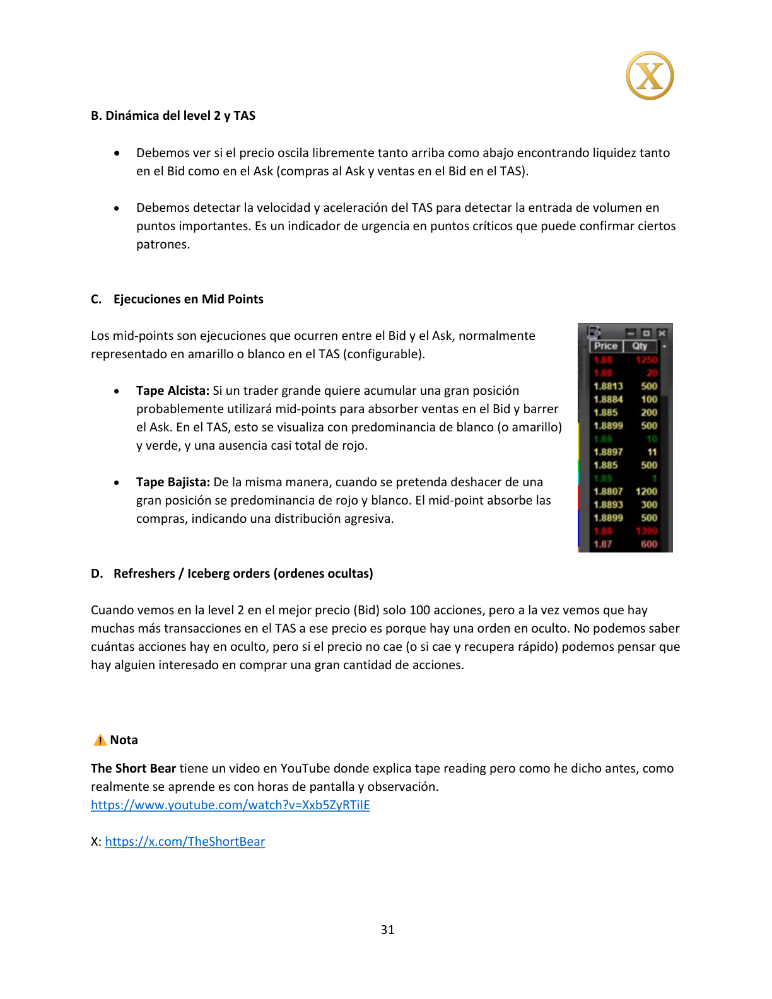

## Página 36
32 
 
10. 
Risk managment y operativa 
 
A. Risk managment 
Primero de todo debemos establecer un máximo de pérdida diario (max loss) donde dejaremos de 
tradear por el día en caso de llegar a ese nivel de pérdida. En ese momento consideramos que estamos 
tradeando mal, el mercado no está a nuestro favor y es más probable de incurrir en problemas 
psicológicos como el revenge trading, overtrading, etc.   
Para tener una correcta gestión de la cuenta y evitar riesgos de ruina innecesarios, el max loss no puede 
superar el 10% de la cuenta para un trader profesional. Cuando estamos aprendiendo es recomendable 
es que sea menor.  
Cuando estamos potencial trade debemos definir lo que estamos dispuestos a perder en el caso de que 
no funcione. Dependiendo de la calidad del setup, la confianza que tengamos y lo bueno que seamos en 
ese setup vamos a destinar más o menos riesgo para ese trade.  
Para simplificar, podemos tener una clasificación al básica de setups, A, B o C:  
• 
Setup A: 50% riesgo diario (0.5R). 
• 
Setup B: 30% riesgo diario (0.3R). 
• 
Setup C: 20% Riesgo diario (0.2R) 
*Si alguien quiere hacer múltiples de 10 para no tener el 0 delante con las cifras, podéis hacerlo, es lo más común.  
Donde nos interesará arriesgar más, es donde creemos que tenemos una mayor esperanza matemática 
(expected value, EV). Un setup A, es donde vamos a encontrar un porcentaje de acierto muy alto con un 
mejor risk / reward (RR). 
 
B. Operativa 
Se pueden plantear los trades esperando anticipar el movimiento (bajo win rate, alto Risk / Reward) o 
reaccionando a él (alto win rate, bajo Risk/Reward). Nosotros somos traders que reaccionan al precio 
donde intentamos “surfear” la acción.  
Cuando una acción ha iniciado una tendencia alcista y tratamos subirnos a ella esperamos un pullback 
para que el precio se vuelva más atractivo. La lógica es que cuanto más arriba esté una acción, más cara 
se ha hecho y debemos a que el precio vuelva a ser atractivo o barato para subirse a la tendencia alcista. 
Para para ganar dinero no es necesario que la acción siga haciendo nuevos máximos ya que la acción 
cuando la estemos comprando puede haber subido mucho y el movimiento puede estar agotado.

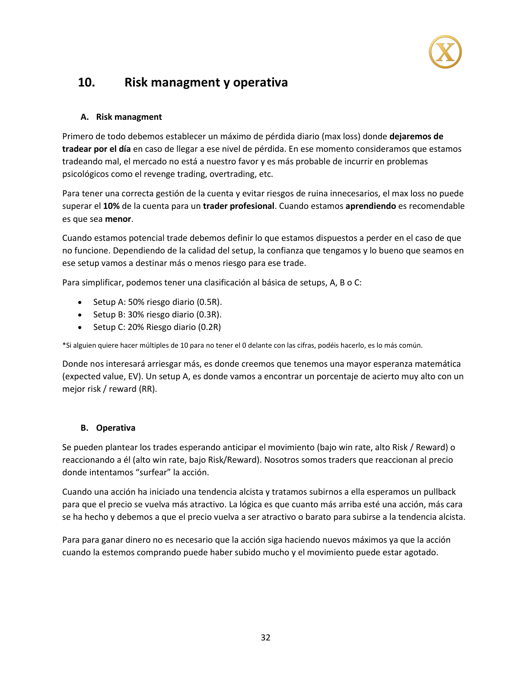

## Página 37
33 
 
 
Por este motivo lo que vamos a hacer es dividir nuestro tamaño total en diferentes entradas sin superar 
nuestro tamaño de posición máximo. 
 
Calculo posición máxima: 
• 
En el momento de iniciar la posición tenemos una distancia al stop de 50c ($0.5) y decidimos 
perder $100: 
o 
Max position (shares) = 100 / 0.5 = 200 
 
• 
El objetivo es entrar con el tamaño completo (Full Size) en la zona donde la probabilidad de 
rebote (o giro) sea mayor y la ratio Riesgo/Beneficio sea óptimo. 
 
o 
Para maximizar el rendimiento de un trade que tenemos un stop de 50 centavos, 
buscaremos ejecutar la mayor parte de nuestra posición en un intervalo estrecho (ej. 
15-20 centavos) cerca de la zona de soporte. De esta forma evitaremos ir full size solo 
en los malos tardes que recorra la acción 50c en contra. En el caso de seguir en contra 
no podremos seguir comprando sin tenemos ya nuestro full size. 
 
o 
En el caso de que haya rebotes y poder reciclar (vender en los rebotes), podemos llegar 
a mejorar nuestro precio medio sin tener necesariamente que aumentar la posición por 
encima del max size. Esto nos permitirá aumentar el full size al acercar nuestro precio 
medio al nivel de stop, sin arriesgar más de $100 por operación. 
 
 
 Nota 
No confundir con martingala y agregar en contra solo por mejorar el precio medio. Si no mejoramos 
precio medio no podemos aumentar el full size, siempre debemos estar dispuestos a perder la misma 
cantidad.

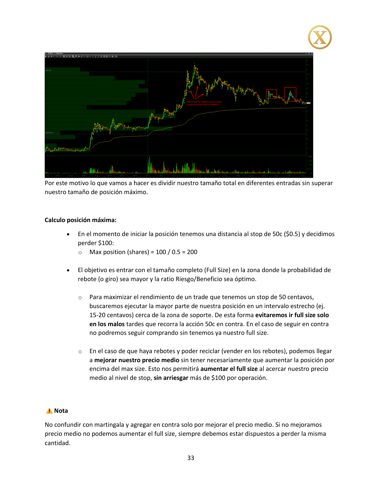

## Página 38
34 
 
Ejemplo: 
Buscamos long MBIO después de un movimiento exponencial en una acción lejos de VWAP y con mucho 
volumen. 
 
 
Evaluación escenarios y probabilidades.: 
 
Punto 1 
Creemos que probable que el retroceso sea mayor al 10%. También, si cae un 10% (87c), la probabilidad 
de rebote es alta por la cobertura de shorts, aunque estamos lejos de mi riesgo (bajo RR). 
En este punto puedo estimar una probabilidad de rebote de 3.5c al 80% pero con un risk / reward de 6:1 
ya que tenemos el riesgo en $0.7/sh (nivel de breakout). Estas ratios hacen una esperanza matemática 
negativa si el 20% de las veces que llega al stop, pero la realidad es que quizás el 1% de las veces si 
terminaré vendiendo en $0.7 con un RR de 6:1. Debemos pensar que el 20% que no ganemos, no 
significa que siempre salgamos perdiendo en el nivel de riesgo y con el max size (peor escenario, worst 
scenario).

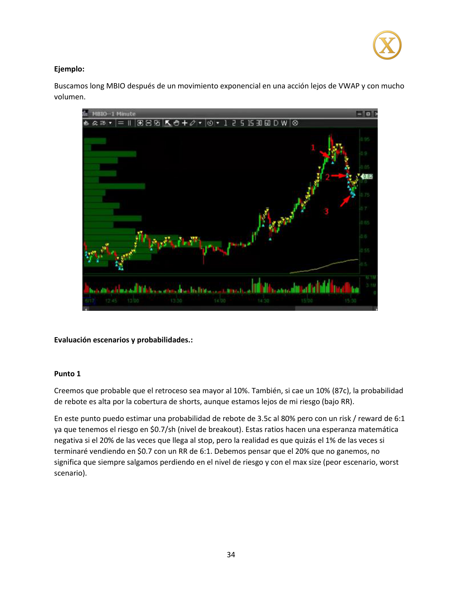

## Página 39
35 
 
Punto 2 
Aquí puede ser que la probabilidad de 5c baje al 70% debido a que la acción nos ha indicado que es 
incapaz de hacer nuevos máximos y el volumen empieza a desaparecer (posible backside). A favor, 
tenemos un mejor risk / reward porque estamos más cerca del nivel de riesgo, 2.5:1.  
 
Punto 3  
Cuando la acción llega al punto 3 ($0.75), volvemos a tener un incremento de probabilidad de acierto 
porque la acción está extendida a la baja y va a tender a rebotar y a la vez tenemos un risk reward 
optimo ya que estamos muy cerca del riesgo y el potencial rebote es grande. Es aquí donde debemos 
tener ese max size y ser capaces de arriesgar más ya que es donde hay un mayor expected value (EV).  
 
 Nota 
Si en el punto 1 y 2 los consideramos un setup B o C por las características que hemos comentado, y el 
punto 3 podemos considerarlo un setup A, además de poder ir con más size porque estamos más cerca 
del riesgo en el punto 3 que en el punto 1 y 2, también debemos estar dispuestos a arriesgar como si 
fuera un setup A y poder tener aún más size por este motivo.  
 
Warning: En la operativa en directo puede confundirse como una martingala y también puede ser 
peligroso para los aprendices intentar aplicar lo explicado en cada trade ya que se pueden tener 
pérdidas innecesarias.

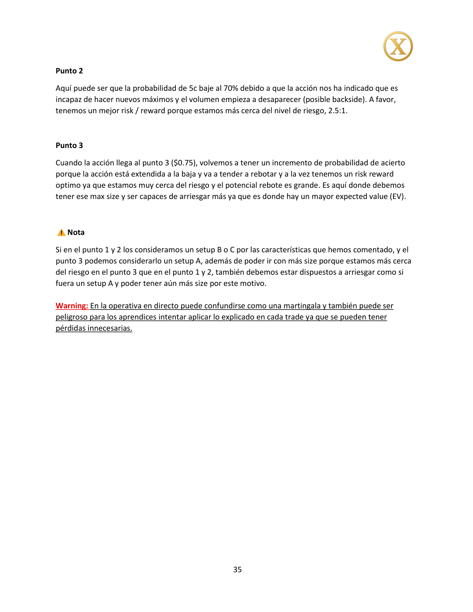

## Página 40
36 
 
11. 
Conceptos de mercado 
 
A. Liquidation play 
 
Acción de liquidar acciones por parte de los insiders o promotores de esa empresa que se traduce en 
una venta masiva y una caída brutal durante un día (superior al 50%). Estos plays se basan en acciones 
chinas (o extrajeras) donde las promueven artificialmente para luego destruirla. Ejemplos de estos 
stocks son RETO, ILAG, HKD, entre otras. Todas tienen un gráfico similar al siguiente: 
 
Ejemplo: RETO

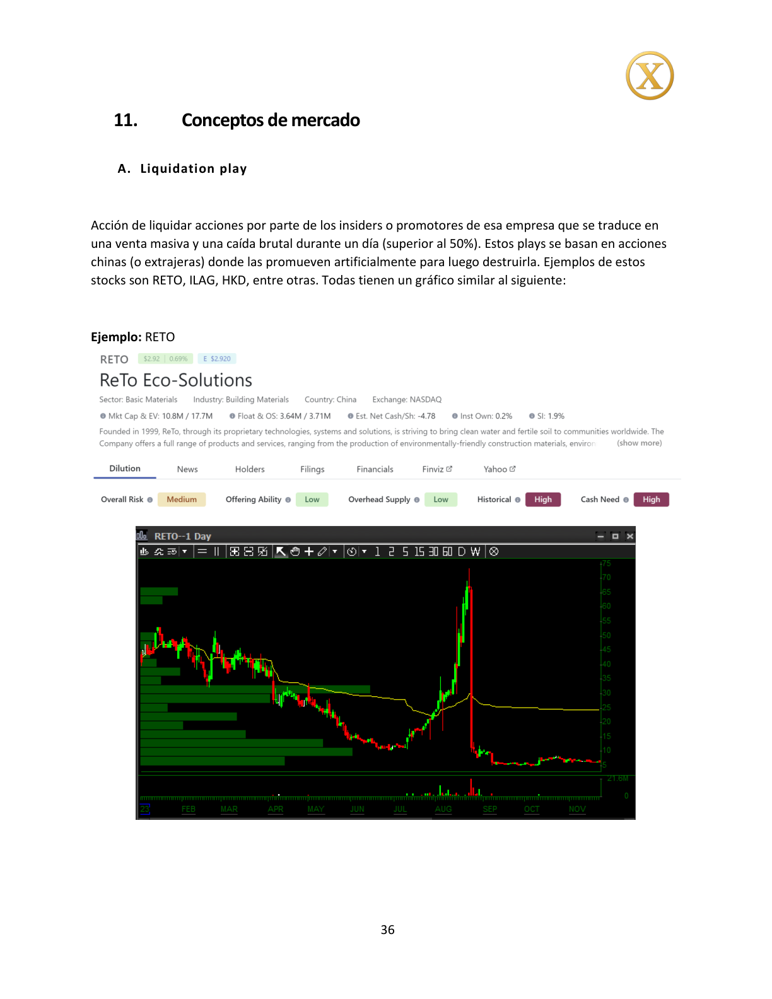

## Página 41
37 
 
B. Liquidity trap 
 
Cuando se produce un primer día con mucho volumen, algunos traders deciden mantener posiciones 
short overnight con la expectativa de que la acción continúe cayendo en los días siguientes. Sin 
embargo, si el volumen disminuye drásticamente en las sesiones posteriores, estos short sellers pueden 
enfrentarse a problemas de liquidez para cerrar posiciones grandes. 
Mantener posiciones overnight implica un coste que reduce la rentabilidad esperada, ya que las tasas de 
préstamo (borrow cost) pueden alcanzar niveles muy elevados (incluso del 200–400% anual sobre el 
valor de la posición). En ese contexto, cuando estos traders intentan cerrar sus shorts, la falta de 
liquidez puede obligarlos a comprar de forma agresiva, impulsando el precio al alza y generando un 
short squeeze. 
Habitualmente, los niveles de stop de estos short sellers se sitúan en los máximos de días anteriores, lo 
que puede acelerar aún más el movimiento alcista si estos niveles son superados. 
 
Ejemplo: GRDI

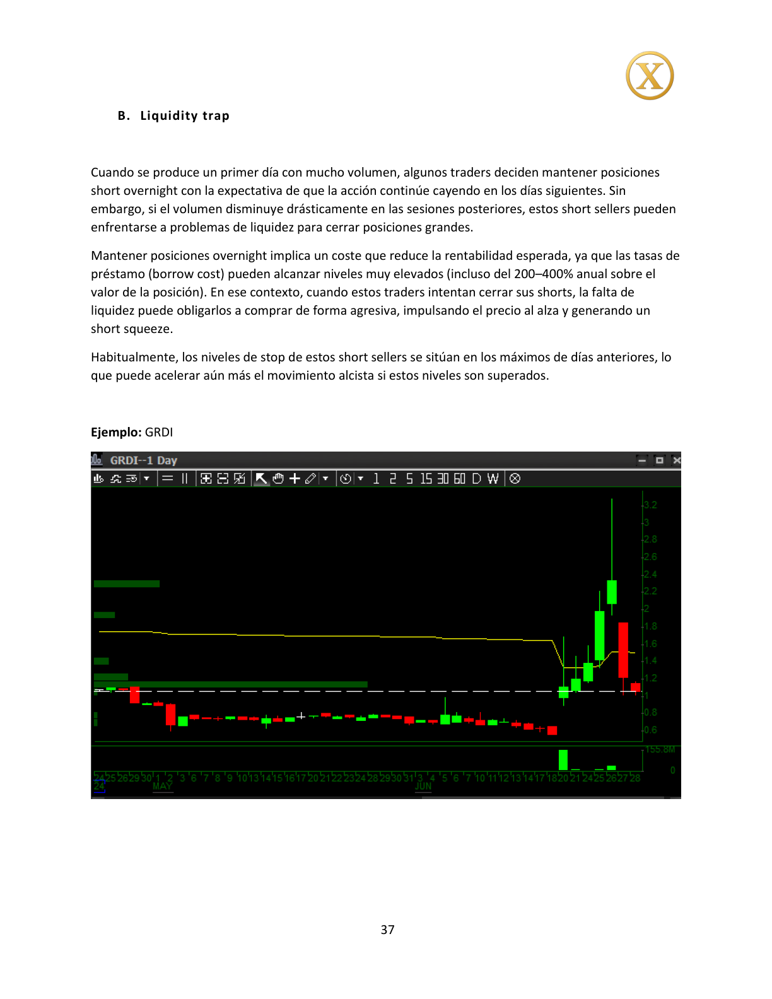

## Página 42
38 
 
C. Volume profile 
 
El volume profile nos muestra visualmente en qué niveles de precio se ha negociado más o menos 
volumen durante un periodo determinado. Esto nos permite identificar zonas donde podría encontrarse 
el breakeven de los traders que han abierto posiciones long o short dentro de ese rango de precios. 
Esta información es especialmente útil para entender posibles reacciones del precio y la utilizaremos en 
patrones como el Short Into Resistance y el Dip Buying Panics. 
 
Ejemplo: FFIE: $1.1 como nivel de resistencia que se convierte en soporte y más adelante en resistencia 
de nuevo.

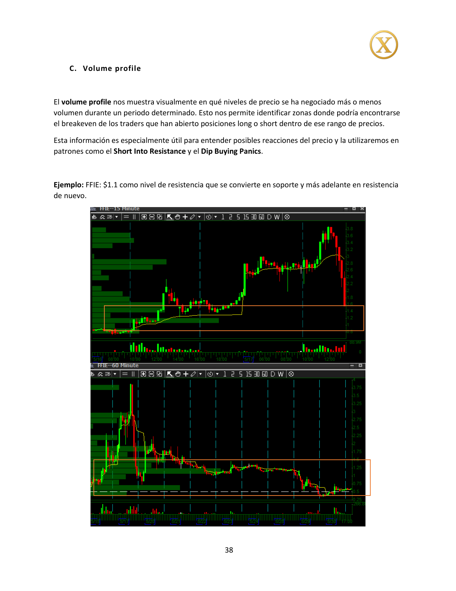

## Página 43
39 
 
D. VWAP 
 
VWAP (Volume Weighted Average Price) es el precio medio ponderado por el volumen. Cuando una 
acción tiene mucho volumen, el VWAP indica el nivel aproximado del breakeven promedio tanto de los 
compradores (long) como de los vendedores en corto (short) durante ese día. 
Cuando el precio está por encima del VWAP, los shorts sellers están, en promedio, perdiendo dinero. 
Cuanto más se aleja el precio del VWAP, mayor es esa pérdida, lo que puede aumentar el desbalance 
entre oferta y demanda hacia el lado comprador debido a posibles coberturas de posiciones cortas por 
stops de shorts y margin calls (short covering). Sin embargo, también hay que considerar que cuanto 
más extendida está una acción respecto al VWAP, menos atractiva puede resultar para nuevos 
compradores. 
Por el contrario, cuando el precio está por debajo del VWAP, quienes suelen estar en pérdida son los 
compradores. Estos pueden verse presionados a vender sus posiciones, especialmente cuando el 
momentum y el volumen empiezan a disminuir. 
 
 
Ejemplo: MGOL

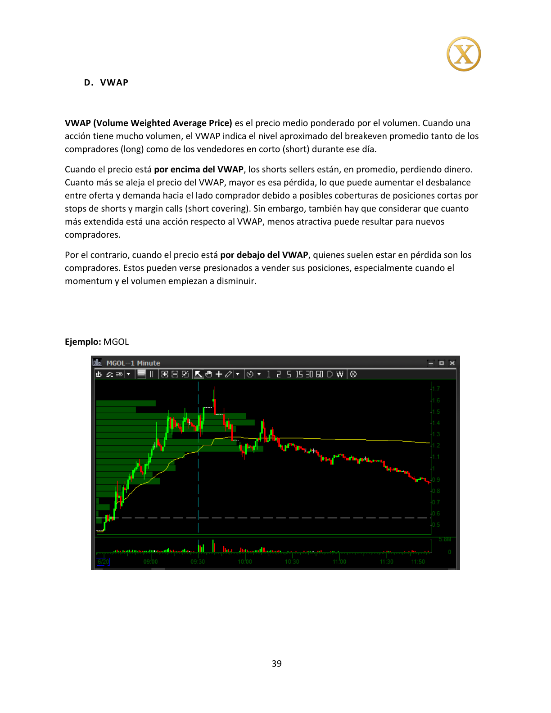

## Página 44
40 
 
E. Overhead resistance 
 
La overhead resistance es un concepto muy utilizado en el day trading para entender los desbalances 
entre oferta y demanda. La traducción literal de overhead sería “encima de nuestra cabeza”, y aplicado 
al mercado se refiere a zonas de precio situadas por encima del precio actual. 
La mayoría de las acciones que operamos tienen niveles de precio por encima del actual, pero eso no 
significa necesariamente que exista una overhead resistance relevante para nosotros. La zona que 
realmente nos interesa es aquella que se encuentra claramente por encima del precio actual y donde 
hubo un volumen notablemente mayor que el volumen presente. En esas áreas suele haber 
bagholders (longs atrapados a precios superiores) dispuestos a vender cuando el precio vuelve a 
acercarse ya que están reduciendo sus pérdidas y genera una presión de oferta que puede frenar el 
movimiento alcista. 
El nivel de overhead siempre será en el día que más volumen tuvo y que tenemos por encima. Lo 
podemos obtener de distintas formas: 
 
A. VVWAP boulevard:  
 
VWAP en la gráfica diaria de Think or Swim (83c).

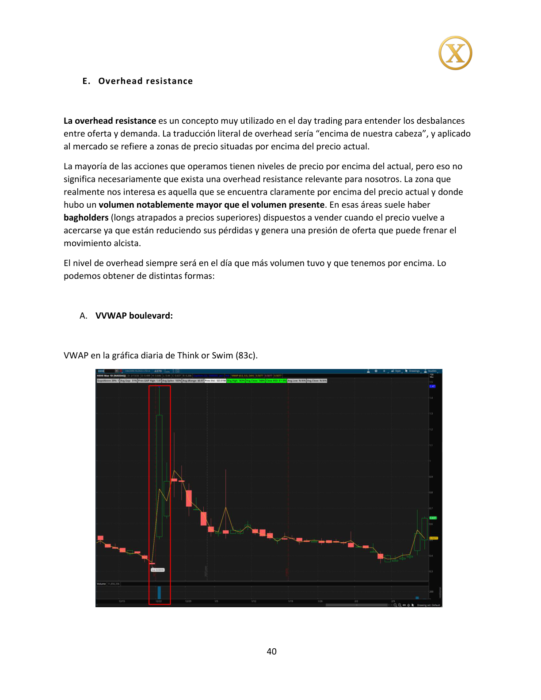

## Página 45
41 
 
B. Close del precio de VWAP del día de overhead 
Mirar gráfico de 1 o 4h (81c). 
 
Pueden ser valores ligeramente distintos pero lo más importante es verlo como una zona no como un 
precio concreto. Como hay que fijar un precio exacto, se puede elegir el valor exacto de VWAP o 
también puedes combinarlo con el precio de una resistencia que tenga sentido para el trader y que 
coincida con un número redondo.  
 
 Nota 
Hay que recordar que, si durante la sesión del día está habido más volumen o similar al de la overhead, 
este concepto desaparece y el sesgo del stock debe girarse de short a long.

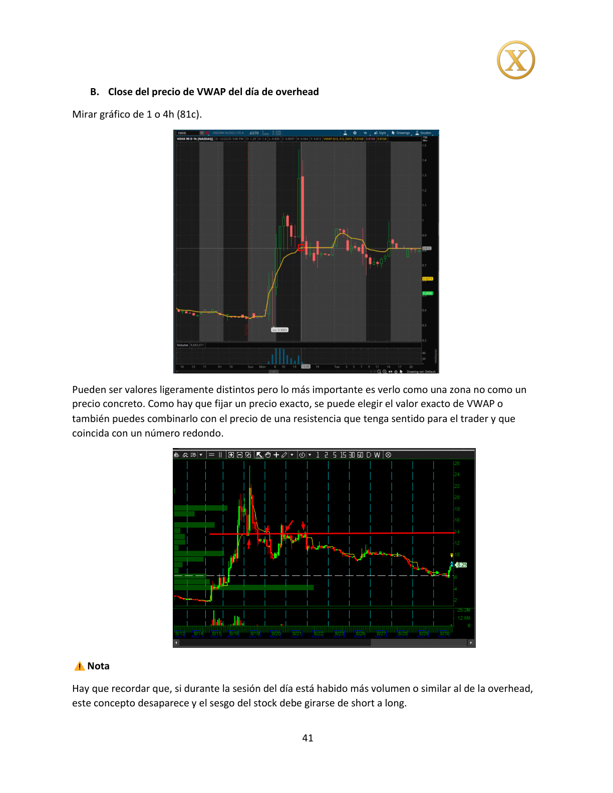

## Página 46
42 
 
F. Hot sector / Sympathy play 
 
De vez en cuando hay una acción que, por ciertas noticias, aspectos fundamentales o especulativos crea 
un movimiento exageradamente grande y poco comunes (ej. FFIE de $0.05 a $3.9 en menos de 1 
semana). Cuando estos movimientos suceden los traders buscan acciones con las mismas características 
que puedan “rimar” para que la historia se repita. Algunos tópicos de simpatía de stocks son: 
 
• 
AI (artificial inteligence): NVDA, SMCI, tickers con AI en el nombre. 
• 
Marihuana: CGC, ACB, YCBD, etc  
• 
Crypo: MARA, RIOT, SOUN, etc. 
• 
Meme stocks: GME, AMC, KOSS, BB, etc (short float alto) 
• 
Micro float 
• 
Recent reverse Split 
• 
China o extragera 
• 
Alto IO 
• 
Noticia sobre cierto tema 
 
Es importante ver que patrón está funcionando en el mercado, cual es la temática y reconocer patrones.   
 
G. Hora 
 
La hora del día es un factor clave, ya que los participantes del mercado toman decisiones en función del 
momento de la sesión. 
Durante el premarket y el aftermarket hay pausas por volatilidad (halts). Esto provoca que el short 
seller pueda sentirse más presionado a cerrar posiciones en pánico, ya que no existe el “cortafuegos” 
que normalmente sí está presente durante el horario regular de mercado. Sumado a la menor liquidez, 
como consecuencia muchos short sellers prefieren iniciar posiciones cortas cuando el mercado está 
abierto. 
Además, todos los brókers exigen a sus clientes una menor exposición overnight, ya sea mediante 
reducción del buying power o aumento de requisitos de margen. Esto obliga a muchos shorts sellers a 
reducir posiciones al final del día, lo que puede generar mayores short squeeze (cobertura forzada).

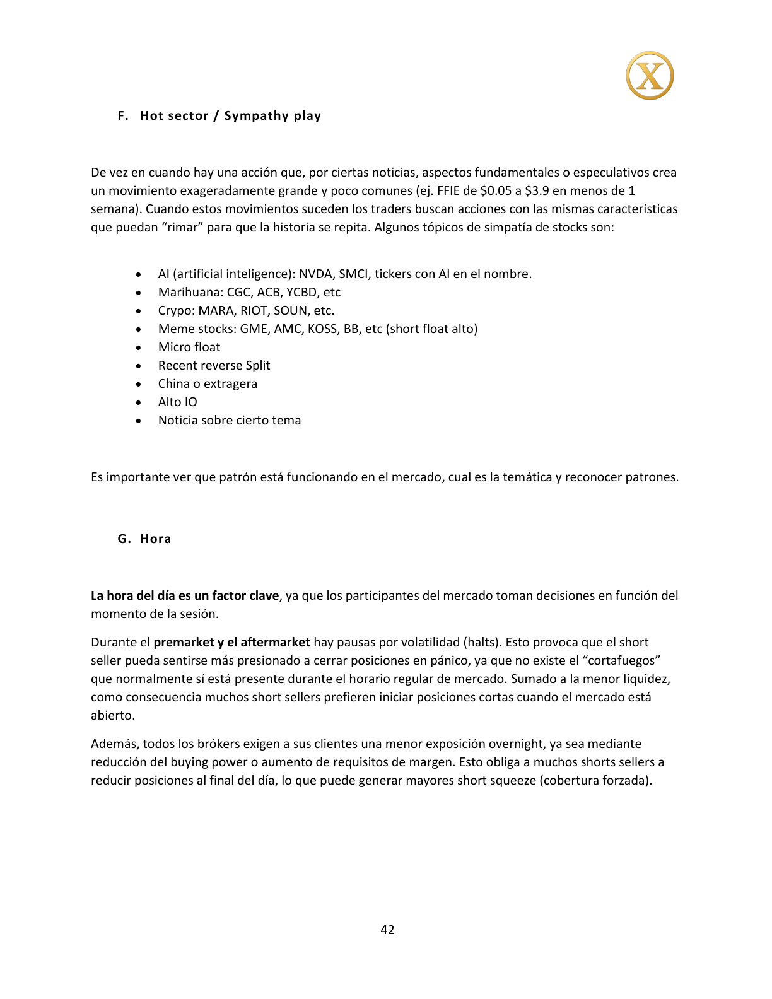

## Página 47
43 
 
H. Short Sell Restricton (SSR) 
 
El SSR (Short Sale Restriction) es una regla implementada en 2010 que prohíbe a los traders abrir 
posiciones short quitando liquidez (vender al bid) cuando una acción cae un 10% o más respecto al 
cierre del día anterior. Esta medida busca reducir la volatilidad excesiva y evitar desplomes acelerados 
del mercado. 
La restricción permanece activa durante el resto de la sesión y el siguiente día de mercado 
(aproximadamente 48 horas). Cuando una acción tiene el SSR activado, puede ser más difícil para los 
shorts sellers poderse posicionar cómodamente y que la acción tenga un comportamiento incomodo de 
tradear.  
 
I. 
Split / Reverse Split 
 
A.  Split: 
 
Un split es una reducción del precio por acción acompañada de un incremento proporcional del número 
de acciones en circulación (float). Las empresas pueden estar interesadas en realizar un split cuando su 
cotización ha subido tanto que empiezan a surgir problemas de liquidez o dificultades para que los 
inversores ajusten correctamente el peso de la acción dentro de sus carteras y un precio más bajo por 
acción suele facilitar la participación de más inversores y mejorar la negociación diaria del valor. 
 
B. Reverse split:  
 
Un reverse split consiste en una subida del precio por acción acompañada de una reducción 
proporcional del número de acciones en circulación. 
 
Las empresas con problemas financieros que han perdido gran parte de su valor pueden recurrir a esta 
medida para cumplir el precio mínimo exigido para seguir cotizando en mercados principales. Además, 
un precio excesivamente bajo puede reducir el para ciertos inversores. 
 
J. Halted 
 
Los halts son pausas temporales en la cotización de una acción durante el horario regular de mercado. 
Existen diversos motivos por los que un stock puede ser detenido, aunque el más relevante para el day 
trading suele ser el halt por exceso de volatilidad. 
Por norma general, una vez detenida la cotización, la acción suele reabrir tras aproximadamente cinco 
minutos. Sin embargo, si la volatilidad continúa siendo elevada, el halt puede prolongarse en 
extensiones de cinco minutos adicionales (10, 15, 20 minutos, etc.).

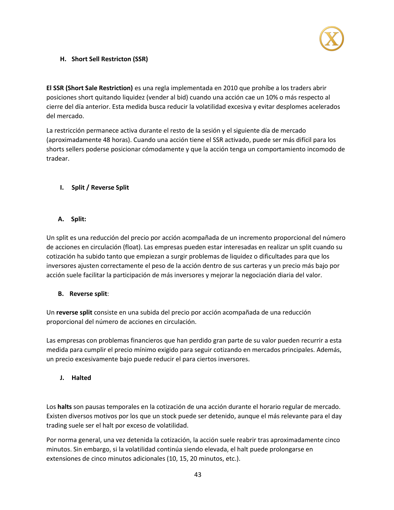

## Página 48
44 
 
Cuando la acción ha sido pausada por más de 10 minutos puede abrir en cualquier momento, aunque 
suele respetarse los intervalos de 5 minutos. 
En la web del Nasdaq es posible consultar los motivos específicos por los que una acción ha sido 
pausada. Además, plataformas como DAS Trader incluyen indicadores que permiten visualizar el nivel de 
precio en el que una acción podría ser pausada. 
En la level 2 de DAS tenemos indicado el precio del halted en LD (limit down) y LU (limit up). 
https://www.nasdaqtrader.com/trader.aspx?id=TradeHalts 
 
 
K. ECN fees 
 
Cada bróker tiene una estructura de comisiones diferente. Para operar small caps es fundamental contar 
con un bróker con costes competitivos, que permita realizar múltiples ejecuciones sin que las 
comisiones afecten significativamente al rendimiento. 
Por este motivo, es recomendable utilizar un bróker que no imponga un mínimo de acciones por 
operación ni una comisión mínima por ejecución. Un coste aproximado de $1.5 por cada 1.000 acciones 
suele considerarse competitivo, aunque cuanto menor sea, mejor. 
Además de la comisión del propio bróker, existen otros costes asociados a la operativa, como las tasas 
de la U.S. Securities and Exchange Commission, las comisiones de ECN, entre otros.

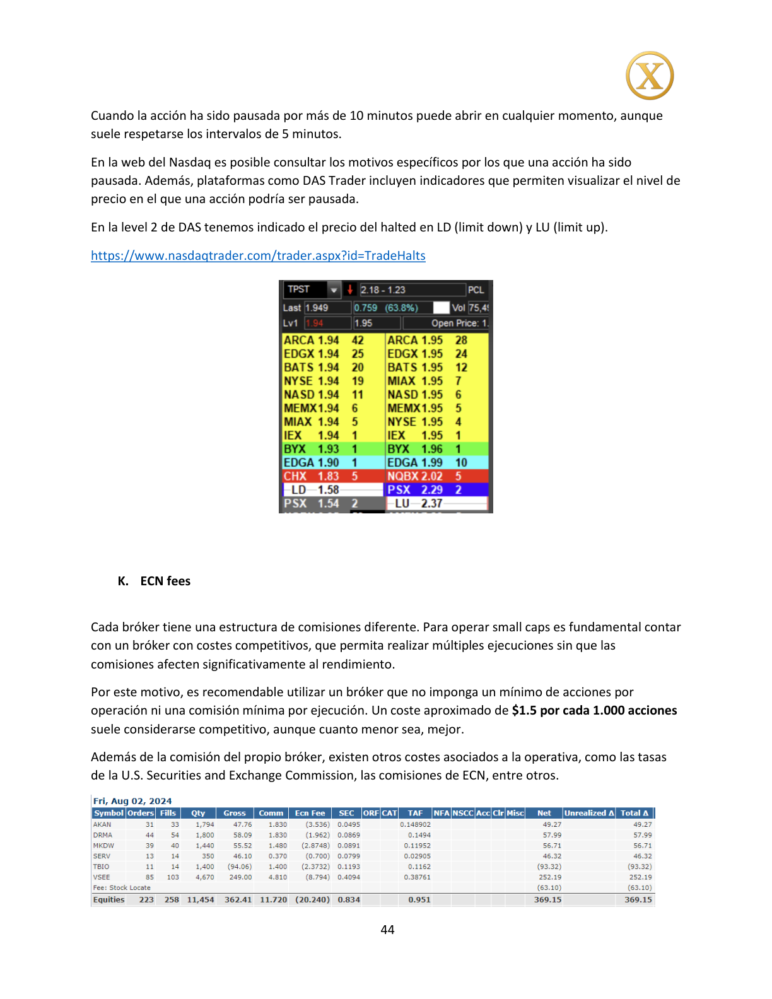

## Página 49
45 
 
Ejecución: Agregar vs quitar liquidez 
Ejecutar de una forma u otra va a tener implicaciones en el precio que obtenemos y los costes que 
pagamos (ECN fees). 
 
A. Agregar liquidez 
En una level 2 como el siguiente, para comprar podemos poner una orden de compra en el BID (precio 
actual 1.98 con 300 acciones disponibles) y esperar a que haya un vendedor que tome la iniciativa para 
vender a ese precio.  
En el caso de que el vendedor quisiera vender solo 150 acciones tendría aún 150 acciones a la espera de 
ser compradas. 
 
*El size que se ve en la level 2 hay que multiplicarlo por 100. 
La comisión que se paga al bróker es siempre la misma pero la que pagas (o cobras) dependiendo de la 
ruta que uses (ECN) depende de quitar o no liquidez y suele estar detallado en la página del bróker. 
https://sagetrader.com/pricing/routes

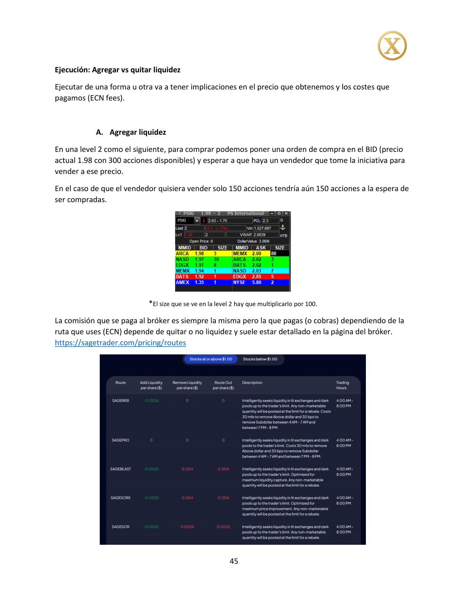

## Página 50
46 
 
Con la ruta SAGEREB cobraríamos $2.5 por cada 1000 sh que se ejecuten agregando liquidez. Si pagamos 
de comisión $1 por cada 1000sh al bróker, nos sale un balance positivo de 1.5$ por cada 1000 shares 
negociadas. 
 
B. Quitar liquidez 
En la level 2 anterior, en el caso de querer comprar al ask, podemos comprar 8.800 acciones a 2.00. En el 
caso de querer comprar 10.000, y solo hubiera la liquidez que se muestra en la imagen, compraríamos 
8.800 en $2.00, 400sh en $2.02, 700sh en $2.03 y 100sh en $2.05.  
 
Además, usando la ruta SAGEREB no cobraríamos (tampoco pagaríamos) ENC fees.  
Por lo general, las rutas más más eficientes (mejoran los precios de entrada) pagas más ECN fees. 
 
 Nota 
Cada bróker es diferente y pese tener las mismas rutas pueden tener ECN fees distintos o funcionar 
diferentes. También cuando una acción cotiza por debajo de $1 cambian las condiciones y por lo general 
no se cobran ECN fees, aunque recientemente (2026) se han introducido rutas donde si podemos cobrar 
ECN fees. 
 
L. Short locate 
 
La gran mayoría de stocks que tradeamos no tienen disponibilidad para poder hacer short de forma 
gratuita y debemos pagar para ir short. Cada bróker tiene sus propios mecanismos para poder hacer 
este proceso pero para DAS trader debemos hacerlo a partir de la pestaña “short locate”.

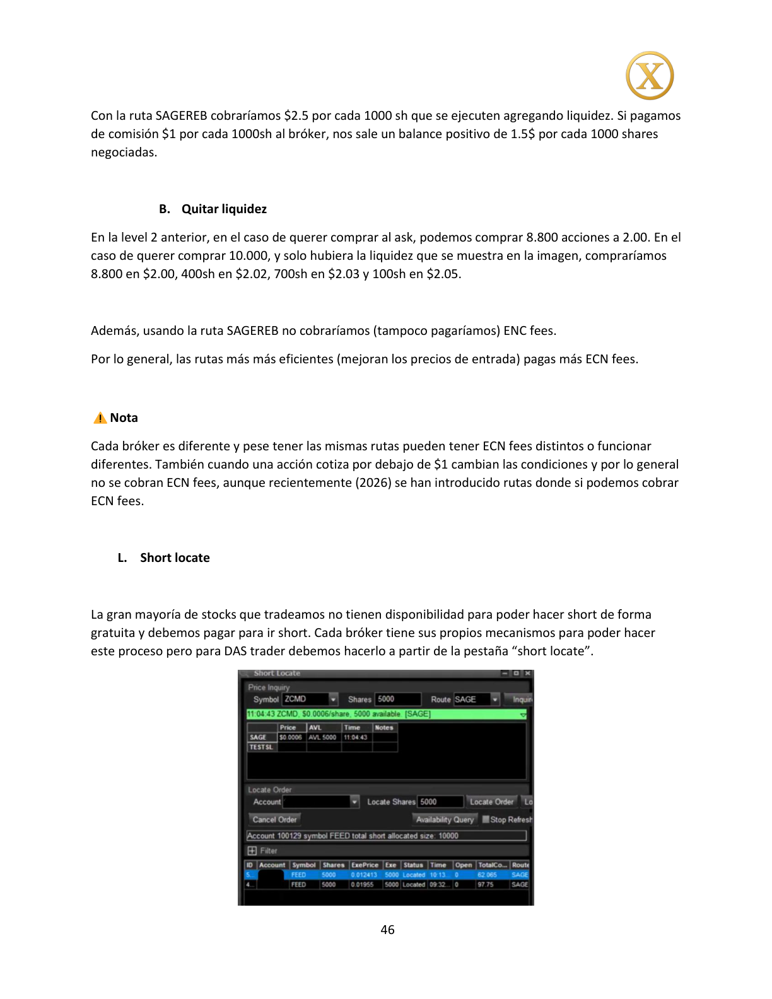

## Página 51
47 
 
 
Paso 1. En el apartado “Symbol” debemos poner el ticker de la acción, en “Shares” la cantidad de 
acciones que queremos comprar (debe ser múltiple de 100: 100, 200, 300, etc.), en este caso 5.000sh.  
Paso 2. Clicar “Inquiry (a la derecha de “route”, debajo de la cruz) y ver el precio que nos ofrecen por 
acción. Recordad que compraremos mínimo 100sh  
Paso 3. En el caso de estar interesados debemos seleccionar “locate order” y nos mandaran un mensaje 
para confirmar la compra con el resumen de la compra. 
 
Al aceptar ya podremos hacer short con una máxima posición de 5.000 acciones.  
 
 Nota 
Hay algunos pocos casos que locates que son “regsho”, son locates que se gastan. Esto quiere decir que 
si has comprado 5.000 acciones y has entrado y salido 1 vez con 1.000 acciones ahora te quedan 4.000. 
Para saber si son regsho o no, lo sabrás con en el mensaje final para aceptar las acciones te lo 
informaran.  
Para saber cuántas acciones te quedan tienes que poner el ticker de la acción y clicar en “available 
query”.

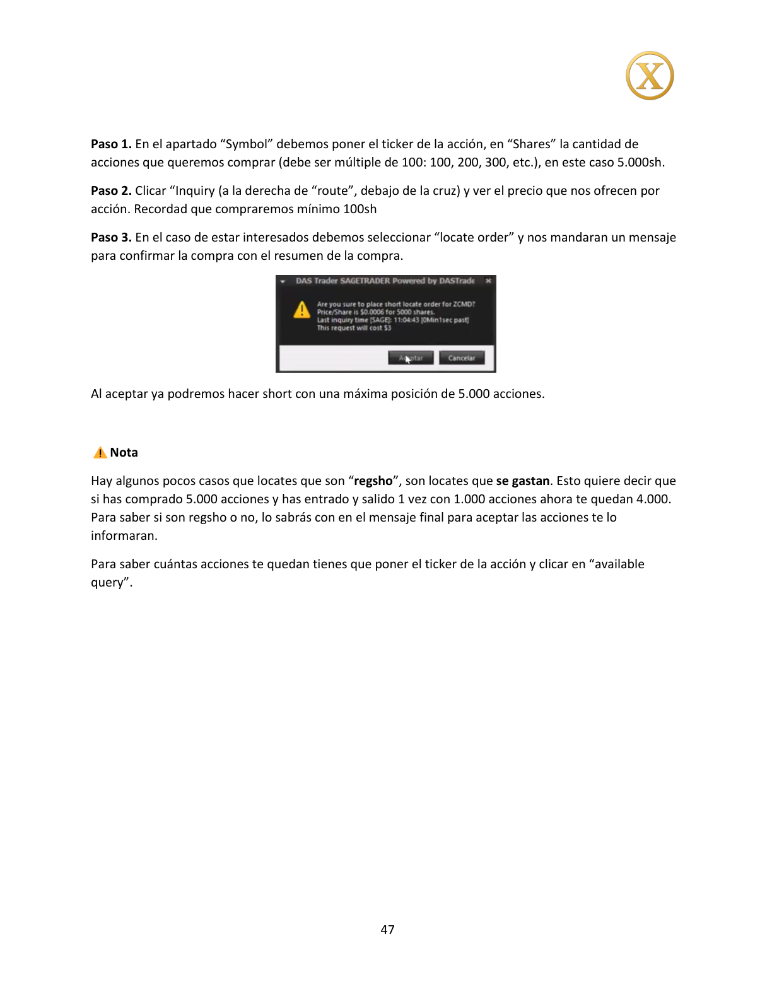

## Página 52
48 
 
12. 
Scanner de acciones  
 
La preparación antes de la apertura es el pilar de un trading consistente. Se requiere un mínimo de 30 a 
45 minutos de análisis previo para filtrar el ruido del mercado y centrar la atención exclusivamente en 
las acciones con mayor probabilidad de oportunidad. 
 
Filtros del Scanner (Gappers) 
Para identificar las mejores oportunidades en Small Caps, configuramos con los criterios siguientes: 
 
• 
Relative Volume: Buscamos acciones con un volumen inusual desde temprano (mínimo >1M de 
acciones negociadas en pre-market). 
• 
Gap Porcentual: Centramos la atención en acciones con un Gap >30%.  
• 
Filtro de Precio: Como norma general, evitamos acciones por debajo de $0.50. 
o 
Razón: Las acciones de bajo precio penalizan la rentabilidad debido a la estructura de 
comisiones por acción. 
 
 
 Nota 
Hay acciones que tienen un segundo o tercer día activo, pero no estarán en el scanner debido a que no 
tienden a tener mucho volumen o mucho gap, por eso las acciones principales que se ha negociado los 
días anteriores tenemos que darles seguimiento.

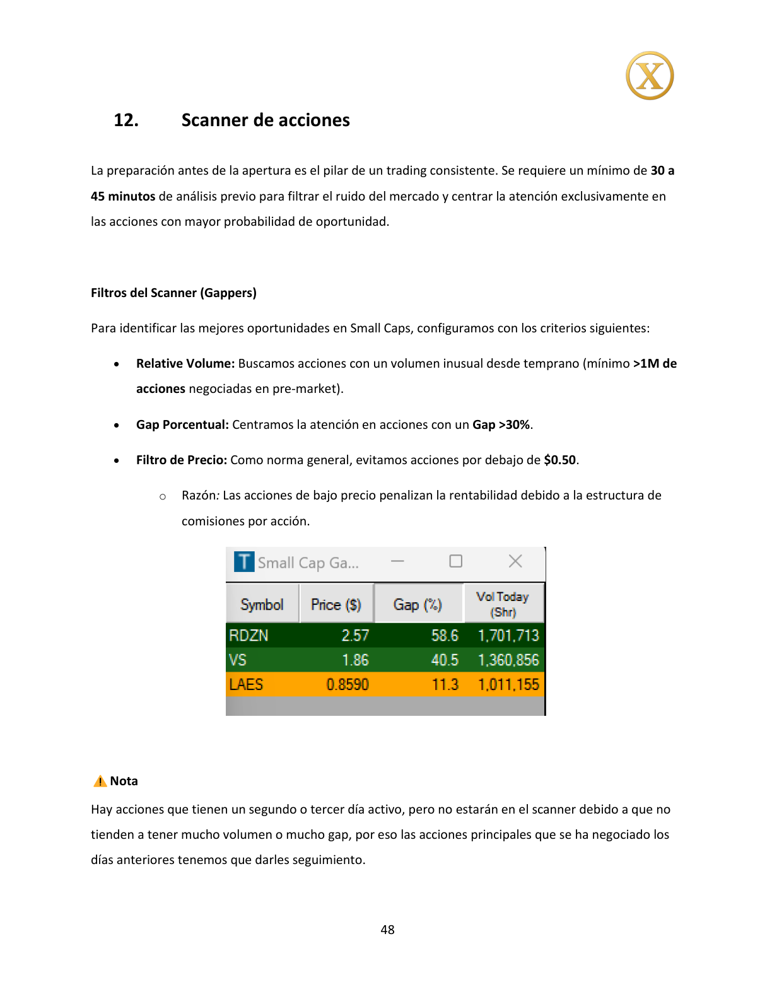

## Página 53
49 
 
13. 
Construir un watchlist 
 
Cuando identificamos una acción en el scanner y comenzamos a analizarla para entender los 
desbalances presentes, debemos evaluar en qué etapa del Penny Stock Framework nos encontramos y 
cuáles son los aspectos clave a revisar en ese momento. 
A. Float 
• 
A mayor float menor atractivo para long más atractivo para short. 
• 
A menos float más atractivo para long y menos para short. 
 
B. Volumen (diario e intradiario) 
• 
Mucho volumen diario o volumen histórico más atractivo para long y menos para short. 
• 
Poco volumen o con overhead resistance y detección de bagholders más atractivo para short 
y menos para long. 
 
C. Price Action 
• 
Momentum alcista preferible para poder ir long y desfavorable para poder ir short. 
• 
No momentum preferible para ir short y desfavorable para ir long. 
• 
Backside preferible para short. 
• 
Frontside preferible para long (exceptuando Short Into Resistance). 
 
D. Noticia 
• 
Hay que ser capaz de leer noticias e identificar cuales tienden a generar un buen impacto a 
la empresa. Normalmente una buena noticia será aquella que le genere un cambio 
fundamental en la empresa grande como grandes contratos, mejores resultados 
trimestrales, etc. 
• 
Se trabaja con experiencia y observación y no hace tanta diferencia al principio. 
 
E. Extensión 
• 
Cuanto más extendida está la acción más favorable para el short y menos favorable para el 
long. 
• 
Cuanto menos extendida está, más favorable para el long y menos para el short. 
 
F. Estadísticas  
• 
La gran mayoría de Small Caps caen, pero si vemos una estadística de acciones que se salen 
de esa media puede ser bueno para poder tener otro sesgo o confirmarlo.  
 
G. Dilución 
• 
A mayor necesidad de caja y mayor capacidad de dilución, mejor será para el short y menor 
para el long. 
• 
A menor necesidad de caja y capacidad de dilución mejor será para el long y más 
desfavorable para el short.

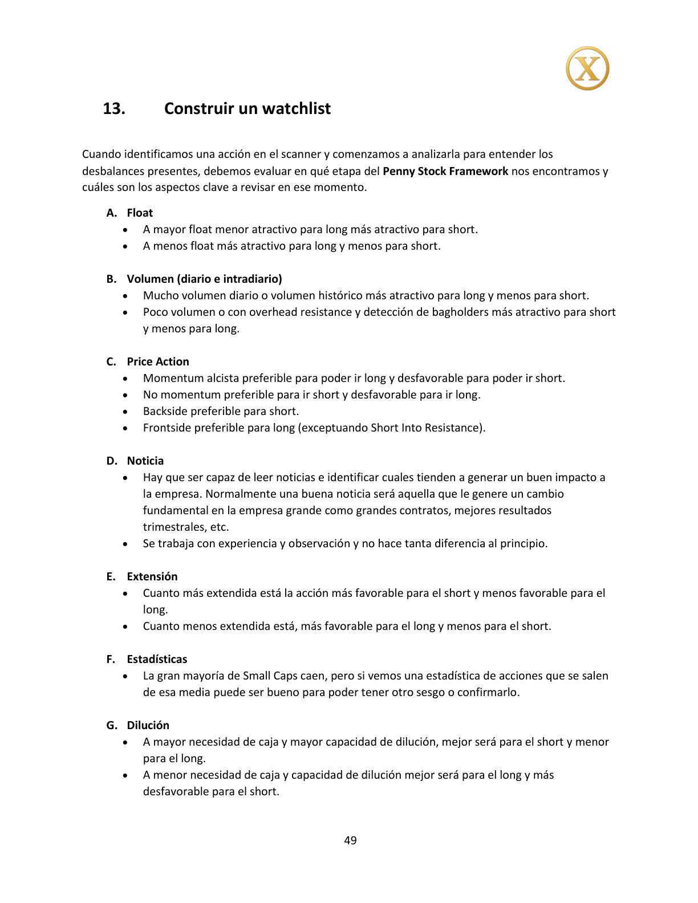

## Página 54
50 
 
H. Hot sectors o sympathy plays / market environment 
• 
Cuando hay un hot sector como en febrero del 2024 fueron las acciones chinas no se 
necesita una razón para que una acción suba y será difícil sortear estas acciones. Nos 
interesará ir con la tendencia del sector. 
• 
Cuando el ciclo de mercado o el patrón es muy marcado y fácil de identificar cada vez es más 
fácil que ese lado falle por la masificación y que dejen de tener continuación.  
 
I. 
Insiders e institucionales 
• 
La cantidad de insiders e institucionales pueden crear un aumento de oferta extra en la 
acción creando dilución en la empresa. 
 
J. País 
• 
Acciones extranjeras pueden estar los insiders más dispuestos a vender estas acciones para 
aprovecharse de los pumps. Sobre todo, países orientales. 
 
 Nota 
Valorando todos estos aspectos debemos ser capaces de balancear correctamente todas estas variables 
para así poder llegar a detectar bien en qué lado debemos colocarnos. Hay variables que tienen más 
peso que otras, es fruto de la experiencia y práctica que entendáis cuales son las que os interesan más a 
vosotros para construiros vuestro playbook.  
Muchos soléis preguntar por la importancia de la dilución y realmente para poder sacar provecho de ella 
debéis tener un conocimiento muy profundo y no marca una gran diferencia.

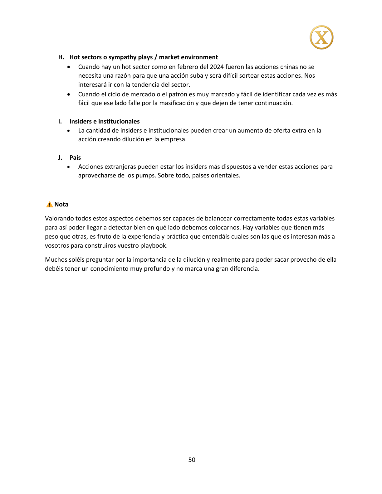

## Página 55
51 
 
14. 
Journaling  
 
El journaling es el proceso de análisis de nuestra operativa que permite evaluar el trabajo realizado 
durante las horas de mercado. Es fundamental para cualquier trader aprendiz, ya que ayuda a identificar 
dónde se cometen errores, por qué ocurren y cómo solucionarlos, optimizando así la operativa y 
acercándola a la rentabilidad. Es como entrenar para poder tener un buen desempeño en un partido. 
Existen herramientas de journaling como Tradervue (tradervue.com) o Tradely (journal.tradelyapp.com) 
que facilitan el seguimiento de la curva de equity y ofrecen estadísticas detalladas de la operativa, 
incluyendo: 
• 
Risk/Reward 
• 
Winning ratio 
• 
Profit factor 
• 
Tiempo en trades 
• 
Drawdown 
• 
Comparativa long vs short 
• 
Momentos del mercado donde se obtiene beneficio 
Estas herramientas también permiten etiquetar trades, lo que facilita filtrar setups, tipos de ejecución y 
detectar áreas de mejora o fortalezas dentro del trading. 
 
Además, hay que realizar un análisis cualitativo de cada trade para poder repetir día tras día los 
patrones que funcionan en el mercado. Este análisis debe contemplar: 
1. Setup: nombre del setup y evaluación de su calidad. 
2. Preparación: valoración del propio análisis previo al trade. 
3. Valoración de la entrada. 
4. Valoración de las salidas. 
5. Gestión del riesgo: stop, tamaño de posición y control de pérdidas. 
6. Valoración de emociones: cómo influyen en la toma de decisiones del trade. 
 
El ejercicio de journaling permite detectar errores y aciertos, interiorizarlos y replicar los patrones más 
efectivos en sesiones en vivo, evitando cometer los mismos fallos. Es, sin duda, un trabajo indispensable 
para la mejora continua del trader. Es preferible tradear menos y pero hacer un buen journaling.

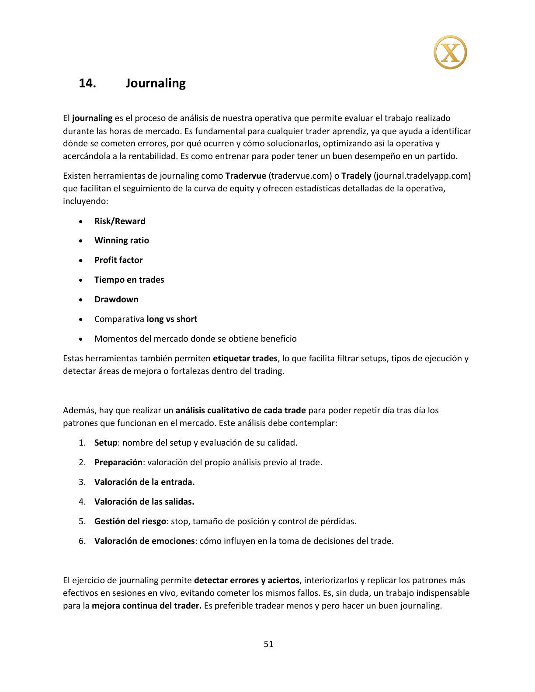

## Página 56
52 
 
15. 
Escalabilidad & Objetivos 
 
La gran ventaja de las small caps es su alto potencial para convertirse en un negocio altamente 
escalable. Pero para lograr escalar, lo primero y más importante es ser consistente. 
 
 
 
Etapa 1.  
Durante los primeros meses, un trader debe centrarse en aprender a tradear correctamente, evitando 
pérdidas importantes, construir hábitos sólidos, desarrollar habilidades, y controlar sus emociones sin 
pensar mucho en escalar rápido. 
 
Etapa 2. 
Una vez que se han adquirido estas habilidades y se logra ser consistentemente ganador, aunque se 
cometerán errores ocasionales. Es en este punto donde entra la paciencia: es fundamental seguir 
trabajando con la misma intensidad y disciplina que en los meses iniciales conteniéndose de subir size. 
Después de 2 o 3 meses de consistencia, se pueden extraer datos fiables de la operativa, entender por 
qué se gana dinero, identificar los puntos fuertes y los puntos débiles del trader. Esta información será 
clave para empezar a escalar, potenciando los puntos fuertes y corrigiendo las áreas de mejora. 
 
 
Etapa 1: 
Periodo de desarrollar habilidades 
Etapa 2: 
2/3 meses siendo 
consistente sin mucho 
subir size 
Etapa 3:  
Periodo de escalada

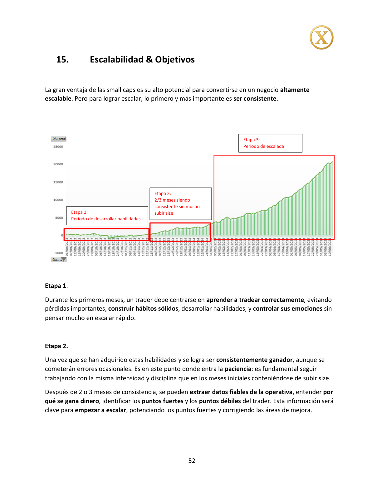

## Página 57
53 
 
Etapa 3. 
Etapa donde ya se tienen 3 o 4 meses con una curva consistente, con pocos y controlados drawdawn, 
donde ya se han pulido muchos errores y la muestra de tardes empieza a ser representativa y se tiene 
una buena performance pese aún cometer errores. Es aquí donde uno mismo debe empezar a confiar 
en tener la habilidad y en querer escalar la cuenta con su performance.  
Cada trader es diferente, pero consideraremos una performance muy buena terminando el mes 
ganando 6 o más riesgos diarios, 4R es un buen resultado, 2R es un mes regular, y quedarnos en 
breakeven (0) es un mes malo. 
 
 
Dependiendo de la performance, el mes siguiente (o cada 2 semanas) podemos aumentar nuestra R 
siguiendo los porcentajes establecidos en la tabla anterior. Dado que la cuenta debería crecer 
proporcionalmente a nuestra performance, podremos incrementar el riesgo diario sin comprometer la 
salud financiera de la cuenta. 
La clave en este proceso es alcanzar la consistencia suficiente para mantener ese crecimiento del riesgo 
diario durante meses, aprovechando el interés compuesto, apalancándose en los beneficios y 
generando resultados exponenciales a largo plazo. 
Es fundamental recalcar la importancia de una buena gestión del riesgo y una performance sólida: si 
aumentamos el tamaño de las posiciones durante un drawdown, podríamos retroceder semanas de 
trabajo y sufrir un gran impacto emocional. Por eso, no debemos escalar hasta tener un desempeño 
consistente y un colchón suficiente que amortigüe posibles caídas. Esto nos dará seguridad y no nos 
temblará el dedo al subir el size. 
Cuando llegue el momento de subir el tamaño de las posiciones, es recomendable hacerlo en los trades 
que nos resultan más fáciles de ejecutar y donde sabemos que ganamos dinero, lo que llamamos “easy 
money trades” (EMT), donde minimizamos la carga emocional y reduciendo la probabilidad de 
drawdowns.

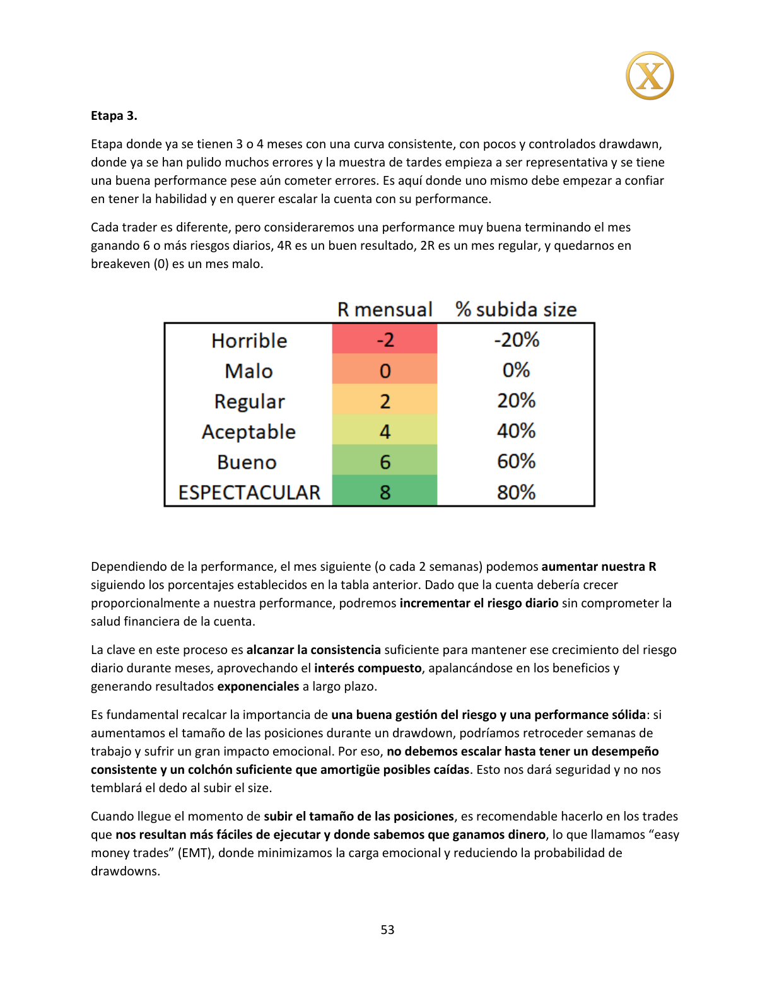

## Página 58
54 
 
La importancia del largo plazo y el interés compuesto 
 
No estamos preparados para pensar exponencialmente, y por eso es fundamental ver la carrera de 
trading a largo plazo. Lo más importante no es el dinero que tengas hoy en la cuenta, sino la habilidad 
que vayáis adquiriendo y la capacidad de aumentar el tamaño de las posiciones consistentemente mes 
tras mes, siempre que se mantenga la performance. 
De esta manera, en 2, 3 o 5 años, no solo estaremos viviendo del trading, sino que realmente habréis 
creado riqueza con vuestro aprendizaje y disciplina. Además de construir una carrera sólida y sostenible 
en el tiempo.

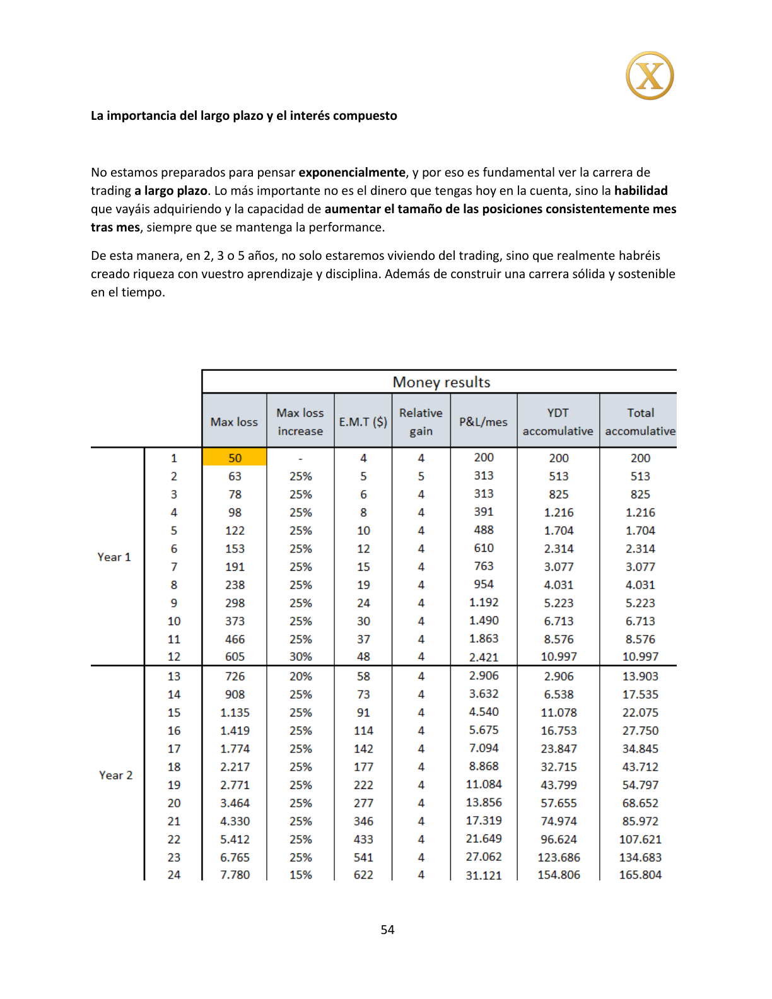

## Página 59
55 
 
16. 
Parámetros de riesgo 
 
Todo bróker ofrece un apalancamiento mínimo de 1:4 para hacer day trading. Sin embargo, para tradear 
small caps, no es necesario utilizarlo. Es fundamental proteger nuestra cuenta y limitar ciertos 
parámetros para evitar pérdidas mayores de lo necesario. La mayoría de los brókers permiten configurar 
estos límites, ya sea vía correo electrónico o directamente desde la plataforma de trading. 
 
A.  Limitar el buying power 
El buying power disponible no debería superar el tamaño de vuestra cuenta. Es decir, no es necesario 
usar apalancamiento. 
 
B. Max loss & autoliquidate 
Cuando alcancéis la consistencia y queráis empezar a escalar una cuenta, debéis establecer un max loss 
diario máximo del 10% de la cuenta. 
 
Además, hay que pedir al bróker que, al alcanzar este límite, cierre automáticamente todas las 
posiciones. 
 
 Nota 
Esta función no funciona durante premarket o aftermarket y no depende del bróker. 
 
C. Limit order por “shares” y “dollar amount” 
Para limitar riesgos en cada orden: 
• 
Dollar amount: máximo 30% de la cuenta 
• 
Cantidad de acciones (shares): máximo 20% del total 
 
Estos porcentajes no son rígidos y pueden ajustarse según la operativa de cada trader, pero funcionan 
como un “corta fuegos” para evitar errores al colocar órdenes en el mercado.

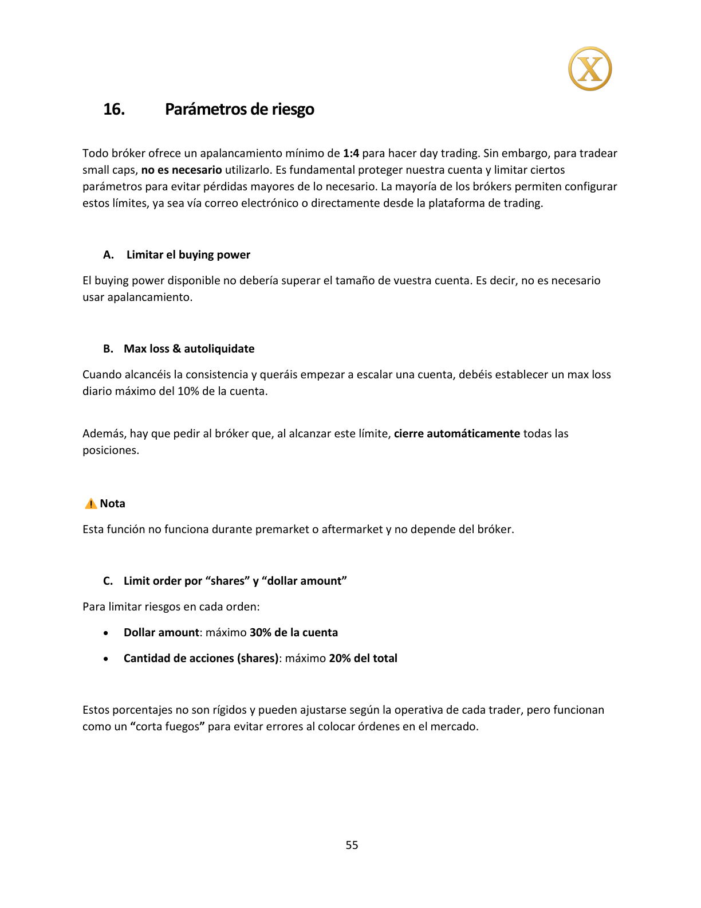

## Página 60
56 
 
Ejemplo práctico: Cuenta de $25.000 
 
A.  Buying power disponible: $100.000 (apalancamiento 1:4) 
• 
Limitación aplicada: $25.000 
 
B. Max loss & autoliquidate: $2.500 
 
C.  Limit order: 
• Shares: 5.000 sh 
• Dollar amount: $7.500

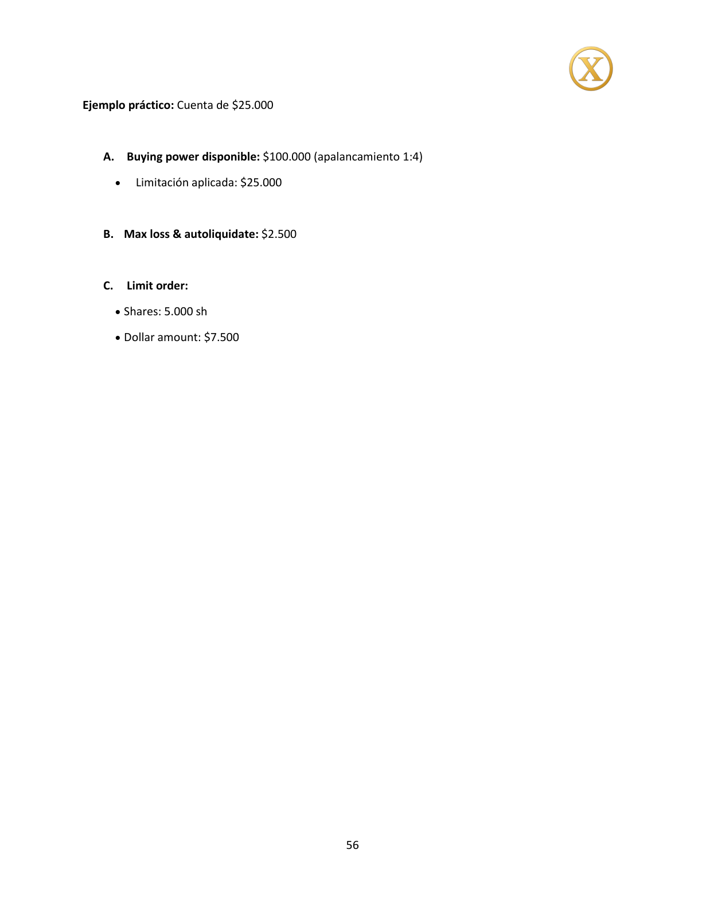

## Página 61
57 
 
17. 
Contenido adicional & recomendaciones 
 
A.  Aprender inglés por el gran contenido que hay en esta lengua. 
B. Estar concentrado y bien preparado para empezar la sesión, fuera distracciones y concentración. 
C. X para poder estar informado y ver la operativa de otros traders para poder ver cómo piensan, como 
ejecutan, etc.  
D. Seguir a los siguientes traders en X 
Traders americanos: 
• 
Nathan Michaud: @InvestorsLive  
• 
Lucas: @TheShortBear 
• 
Lance Breitstein: @TheOneLanceB 
• 
Madaz: @madaznfootbalr 
• 
Alex Temiz (MIC): @AT09_Trader 
• 
JTrader: @jtraderco 
• 
Shortdapos: @ShortDaPos 
• 
SangLucci: @sanglucci 
• 
Steven Dux: @Steven1_994 
• 
Stan Gluzman: @CiocanaTrader 
• 
Kristjan Kullamägi: @Qullamaggie 
• 
Jtrader: Small caps room / personal 
• 
Tradethematrix: @Tradethematrix1 
• 
Brian Lee: @BrianLeeTrades 
• 
Dan irish: @DansGamePoker 
• 
Steven Spencer (SMB): @sspencer_smb 
• 
David Hanlin: @thelaptoplegend. 
• 
Jack Kellongg: @Jackaroo_Trades 
• 
Bthetrader: @Bthestory87 
• 
Timothy Sykes: @timothysykes 
• 
Miche Bellafiore: @MikeBellafiore 
• 
HumbledTrader: @humbledTrader18 
• 
The Short Sniper: @TheShortSniper
• 
 
 
 
Traders habla hispana: 
 
• 
Xaivier Comas: @xavier_comas 
• 
Mosquito de Wall St (Oscar): @TraderOscta 
• 
Jordi Pamies: @jordipamiest 
• 
Saul Sala: @akrabolsa 
• 
Edu Trades: @edu_trades  
• 
Nacho Vittale: @vitalesiak 
• 
Jornaleros de Wall Street (Antonio i Emilio): @jornalerotrade

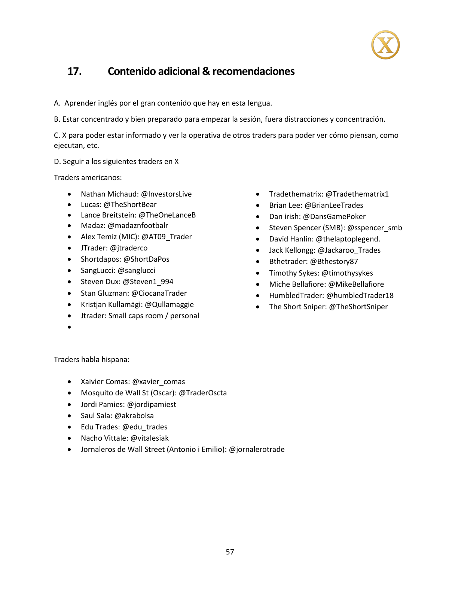

## Página 62
58 
 
18. 
Links de interés 
 
A. Información halted:  
https://www.nasdaqtrader.com/trader.aspx?id=TradeHalts#  
https://www.nasdaqtrader.com/trader.aspx?id=shortsalecircuitbreaker  
 
B. Noncompliant Companies list: 
https://www.nasdaq.com/market-activity/stocks/non-compliant-company-list  
 
C. Scanner gratis:  
https://www.youtube.com/watch?v=pj0--Y5grl0&ab_channel=PrecisionDayTrading  
 
D. Dilution tracker:  
https://dilutiontracker.com/ 
 
E. Bam sec (fillings): 
https://www.bamsec.com/  
 
F. Seguimiento splits / reverse splits:  
https://quotes.ino.com/analysis/splits/  
 
G. Noticias:  
https://newsfilter.io/  
 
H. Journaling:  
https://journal.tradelyapp.com/sign-in?redirectURL=%2Fmain  
https://tradervue.com/  
 
I. 
Float acciones:  
https://knowthefloat.com/ticker/eose  
 
J. Estadísticas de acciones 
https://flash-research.com/

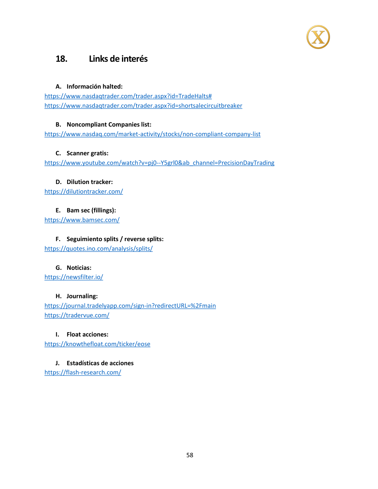

## Página 63
59 
 
19. 
Glosario 
 
ADF (all day fade): Acción que està todo el dia bajando sin rebotes muy duros al alza. 
ADR: Siglas del inglés American Depositary Receipt. Son acciones chinas que a partir de un certificado 
pueden comprar y venderse en mercados americanos.  
 
AFTER HOURS: Cuando se terminan las horas regulares de mercado, desde las 4:00pm EST hasta las 
8:00pm EST. La liquidez tiende a disminuir y ejecutar trades se vuelve más arriesgado. 
 
ANALISIS FUNDAMENTAL: es el análisis las métricas fundamentales de una empresa como sus 
resultados trimestrales y anuales, beneficios, márgenes sobre beneficios, etc. 
 
ANALISIS TECNICO: el análisis técnico se centra únicamente en el precio de las acciones.  
 
ATM (At the Market Offering): Es un tipo de dilución que usa la empresa para emitir un determinado 
número de acciones a precio de mercado. 
 
BACK SIDE: Expresión utilizada para definir la etapa bajista después de un recorrido al alza de una small 
cap donde desaparece el momentum y el precio tiende a caer. 
 
BAG HOLDER: es un término para referirse a los inversores que están aguantando una posición larga en 
pérdidas durante un tiempo prolongado de tiempo. 
 
BID: Es el mejor precio de oferta para poder vender una acción a mercado, donde encontramos un 
comprador dispuesto a comprar cierta cantidad de acciones. 
 
BORROW o LOCATE: Para tomar posiciones en corto, se deben pedir prestadas acciones del bróker y 
tienes que preguntar a tu bróker la disponibilidad que tiene para que el te las puedas prestar o alquilar.  
1.-ETB: Easy to borrow. Gratis o poco cara o barata. 
 
2.-HTB: Hard to borrow. Pocas acciones disponibles para poder shortear y el precio es caro.  
 
BULL o BULLISH: este término se refiere a un mercado – o acción- alcista.  
 
BUYOUT: Una compra es la adquisición de una participación mayoritaria en una empresa y se utiliza 
como sinónimo del término adquisición. A efectos del trading, generalmente los buyouts aparecen en 
los scanners por el gap que se produce entre el precio anterior y el de compra, pero en la mayoría de los 
casos el precio se mantiene en el rango que fue valuada sin volatilidad. 
 
BO o BREAKOUT: Ruptura de un nivel clave.

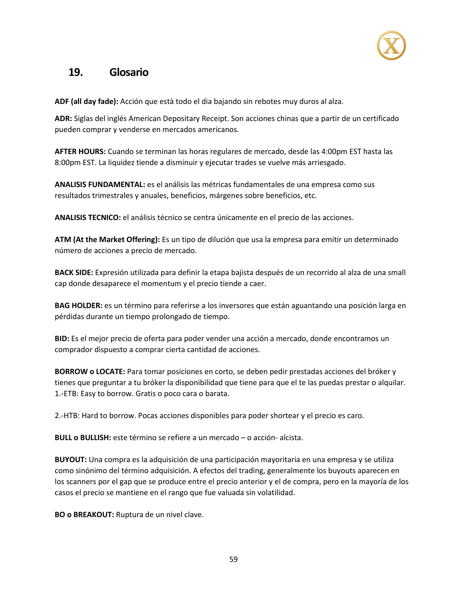

## Página 64
60 
 
CONSOLIDACION: Se refiere a un periodo donde la acción se mantiene en un rango de precios sin 
moverse en exceso.   
 
COVER: Expresión para indicar que el riesgo se reduce. Una cobertura long en acciones son ventas y una 
cobertura en acciones son compras. Hay distintos tipos de coberturas.  
 
DARK POOLS OF LIQUIDITY: Los dark pools son transacciones privadas para negociar valores a los que 
no puede acceder el público general. Conocidos como "fondos oscuros de liquidez", el nombre de estos 
intercambios es una referencia a su total falta de transparencia. Los dark pools surgieron principalmente 
para facilitar las operaciones en bloque por parte de inversores institucionales que no deseaban 
impactar los mercados con sus grandes pedidos y obtener precios adversos para sus operaciones. 
 
DEAD CAT BOUNCE: En el trading, el Dead Cat Bounce se refiere a un rebote de una acción después de 
uno o varios días de extrema caída para que la acción continue a la baja y sigua el comportamiento 
típico de small caps.  
 
DILUCION: (Diluir / Dilución) La dilución de acciones puede ocurrir cada vez que una empresa necesita 
capital adicional, ya que se emiten nuevas acciones en los mercados públicos. La dilución también puede 
ocurrir cuando los tenedores de opciones sobre acciones / warrants / bonos convertibles, como los 
empleados de la compañía, o los tenedores de otros valores opcionales ejercen sus opciones. Cuando 
aumenta el número de acciones en circulación, cada accionista existente posee un porcentaje más 
pequeño o diluido de la compañía, lo que hace que cada acción sea menos valiosa. 
 
ECN: Redes de comunicación electrónica. Son las diferentes rutas que comunican una orden con el 
mercado. Cada ECN cobran diferentes precios para usar sus canales.  
 
EDGE: Conjunto de condiciones del mercado que hace que la esperanza matemática de una estrategia 
sea capad de obtener beneficios al largo plazo.  
 
EMA: Exponential Moving Average. 
 
FADE O FADING: Se dice que el precio está “fading” cuando disminuye progresivamente sin rebotes 
significativos, generalmente acompañado también por una disminución en el volumen. 
 
FAKEOUT: cuando una acción realiza un movimiento bajista / alcista rompiendo un nivel clave solo para 
revertir inmediatamente a niveles de precios importantes [soporte y resistencia].  
 
FILL: este es el precio al que se ejecutan las operaciones con su bróker.  
 
FILL PARCIAL: es cuando solo se completa parte de la orden total dejando como pendiente a ejecutarse 
la cantidad restante.

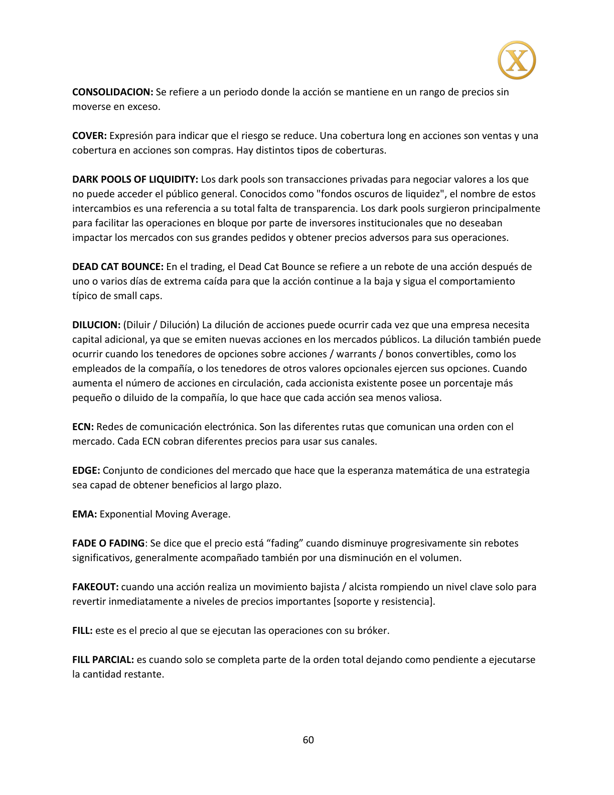

## Página 65
61 
 
FLOAT: Flotación se refiere al número de acciones en circulación disponibles para negociar abiertamente 
en la bolsa. 
 
FOMO: Fear of missing out. El FOMO hace referencia al miedo que siente a perderse una oportunidad.  
 
FRONT SIDE: Expresión para definir la etapa alcista del comportamiento característico de una small cap. 
Aun cuando presente retrocesos o “pull backs”. 
 
GAPS: diferencia grande entre el precio de cierre del día anterior con el precio de apertura del día 
siguiente.   
 
GESTION DE RIESGOS / RISK MANAGEMENT: Medidas para poder gestionar el riesgo de una forma 
adecuada conforme las probabilidades de éxito y la tesis te inversión existente.   
 
HALTS: las acciones pueden pausar la cotización durante la sesión por varias razones y no se puede 
operar de ninguna manera. Los halts más frecuentes en small caps son por exceso de volatilidad donde 
el precio suele estar pausado durante 5 minutos, aunque puede llegar a 10. Si hay un halted que tiene 
que teóricamente debería abrir 10 minutos antes del cierre de mercado el precio volverá a cotizar 
justamente al cerrar el mercado. Hay más tipo de halts y sus características son distintas.  
 
IO (Institutional Ownership): Porcentaje de las acciones comunes (float) que está en manos de 
instituciones u otras grandes entidades. 
 
INITIAL PUBLIC OFFERING (IPO): Una oferta pública inicial (IPO) se refiere al proceso de ofrecer acciones 
de una corporación privada al público en una primera emisión de acciones.  
 
INSIDERS: Es un término que describe a un director o alto funcionario de una empresa que cotiza en 
bolsa, así como a cualquier persona o entidad, que posee más del 10 % de las acciones con derecho a 
voto, es decir, acciones restrictivas. 
 
 
LEVEL 2: Son los datos donde podemos ver en tiempo real el libro de ordenes visibles, mostrando los 
tamaños de oferta y demanda con sus cantidades respectivamente. Además, también se muestra el ECN 
que está enrutando el pedido. 
 
LIQUIDEZ: Describe la facilidad con la que un activo puede comprarse o venderse en el mercado sin que 
afecte a su precio 
 
MARKET CAP: También llamado "capitalización de mercado", es el valor de mercado total de las 
acciones en circulación de una empresa. Se obtiene el valor multiplicando el número de acciones en 
circulación por el precio de mercado actual de una acción. La capitalización de mercado se utiliza para 
determinar el tamaño de una empresa.

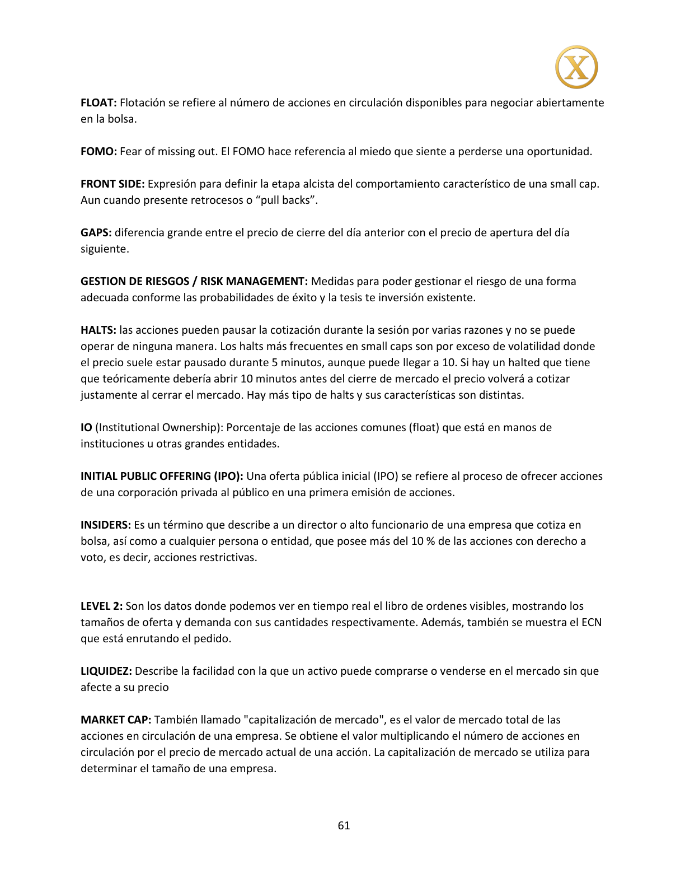

## Página 66
62 
 
OEGD: Iniciales del patrón Over Extended Gap Down. 
 
OFERTA SECUNDARIA (OFFERING): Se refiere a la provisión de nuevas acciones por parte de una 
empresa pública para su comercialización después de una oferta pública inicial. La razón por la que las 
empresas públicas buscan una oferta secundaria como solución es porque buscan refinanciar. Esto 
aumenta la oferta de acciones en el mercado y disminuye el valor de esas acciones.  
 
ORDENES: Instrucción para abrir o cerrar una posición en la cuenta del cliente en determinado ticker. 
 
--- Limit orders: Una orden límite establece el precio específico al que quiere que se ejecute la orden. 
Prioriza el precio sobre la ejecución, puesto que si el precio no alcanza el nivel requerido no se 
ejecutará. 
 
--- Market orders: Con una orden de mercado se obtienen las acciones a los precios actuales del 
mercado. Este tipo de ordenes garantiza la ejecución, pero puede obtenerse a precios muy variables 
dependiendo del movimiento del precio y la disponibilidad, por lo que no son recomendables. 
 
--- Stop orders: Es una orden que se activará cuando una acción cruce un determinado precio. Muchos 
traders utilizan una orden Stop para reducir el riesgo. Establecen Stop en su precio máximo de pérdida. 
Si el precio cruza ese nivel, el pedido se envía automáticamente. Los stops pueden ser de mercado u 
limit. 
 
OTC: Siglas de Over de Counter. Describe cualquier transacción que no se lleva a cabo a través de un 
mercado organizado. Las empresas que cotizan en mercados OTC no están sujetas a un control tan 
estricto, por lo que invertir en ellas implica mayores riesgos. 
 
OVERHEAD RESISTANCE: Acciones en las que el precio actual se encuentra por debajo de precios 
históricos en los que el volumen fue relevante. Se dice que hay overhead por la resistencia de quienes 
están atrapados en niveles superiores, que tenderán a dificultar la subida del precio ya que los bag 
holders de ese día pueden estar vendiendo sus acciones. 
 
PATTERN DAY TRADER, PDT RULE: Se considera day trader aquel que realiza 3 o más trades durante un 
periodo de 5 días y el bróker le exigirá un mínimo $ 25,000 USD. Muchos traders que no pueden 
mantener ese balance en su cuenta utilizan brokers offshore o prop firms para evitar esta limitante. 
 
PREMARKET: Horario de mercado que se sitúa desde las 4 am hasta las 9:30 am EST. 
 
PMH O PREMARKET HIGH: Precio máximo alcanzado por la acción en el horario de premarket. Es una 
referencia para muchas estrategias de day trading. 
 
PRICE ACTION: Comportamiento del precio de una acción en determinado período.

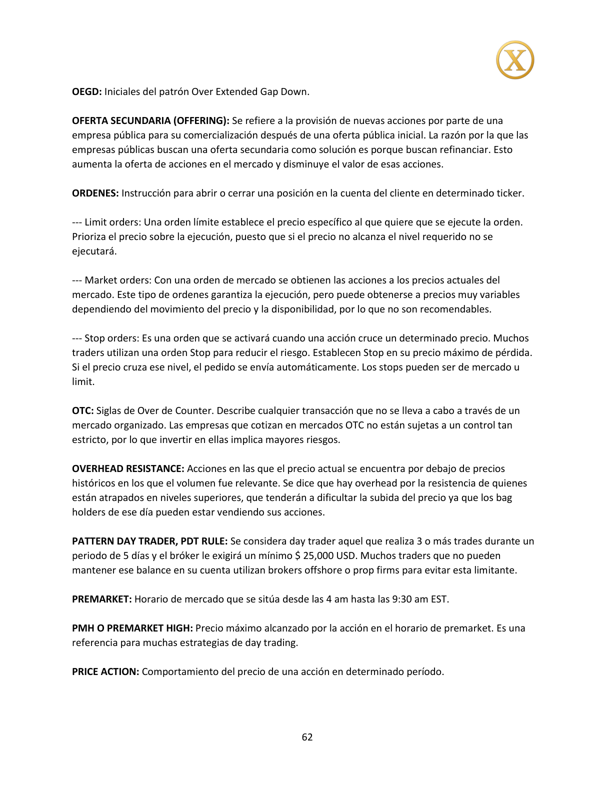

## Página 67
63 
 
PUMP / PUMP AND DUMP: cuando el precio de una acción se mueve artificialmente y de forma 
manipulada al alza. Generalmente se puede esperar un movimiento agresivo a la baja una vez que el 
“pump" haya terminado. 
 
PULLBACK: Un pullback o desaceleración es una caída temporal o breve retroceso en la tendencia 
predominante de un activo. El término se utiliza a veces de forma intercambiable con “retroceso”.  
R/R: Risk / Reward. Relación entre el dinero que se arriesga por el dinero que se espera obtener. 
 
RIESGO: El riesgo es el nivel de precio en el que la estrategia deja de funcionar, y la probabiliadad de 
éxito disminuye drásticamente. 
 
ROJA / RED: El precio de la acción se encuentra por debajo del precio de apertura. 
 
SCALP: Es una técnica de trading que consiste en abrir y cerrar una posición en muy poco tiempo.  
 
SEC: Securities and Exchange Commision. Comisión Nacional del Mercado de Valores.  
 
SHARES OUTSTANDING: Las acciones en circulación se refieren a la totalidad de las acciones de una 
empresa en poder de todos sus accionistas, incluidas las acciones comunes en manos de inversores 
particulares e institucionales y las acciones restringidas propiedad de los directivos, empleados y 
personas con información privilegiada de la empresa.  
 
SHORT INTEREST: Es el porcentaje de acciones en corto que hay en una empresa.  
 
SHORT SQUEEZE: Esto es cuando una acción comienza a subir repentinamente, y los vendedores en 
corto comienzan a comprar para cubrir su posición y reducir su riesgo creando un desequilibrio entre 
oferta y demanda hacia el lado de la demanda.  
 
SLIPPAGE: Fenómeno causado por un movimiento rápido del precio generando que el operador en una 
orden pueda obtener precios muy peores del que inicialmente hubiera deseado.   
 
 
SPREAD: Fiferencia entre el precio Bid y el precio Ask.  
 
SS: abreviatura de “short sell” 
 
SSR SHORT SELLING RESTRICTION: la restricción de venta en corto (SSR) ocurre cuando una acción cae 
10% o más desde el cierre anterior en un solo día y permanece SSR durante todo el día y el siguiente 
hasta las 4:00 pm EST. Los traders no pueden tomar posiciones cortas quitando liquidez. Las posiciones 
solo se pueden tomar en posteando ordenes en el ask cuando la acción esté subiendo.   
 
STARTER: iniciar un trade con una pequeña posición. Es una estrategia para poder combatir el FOMO.

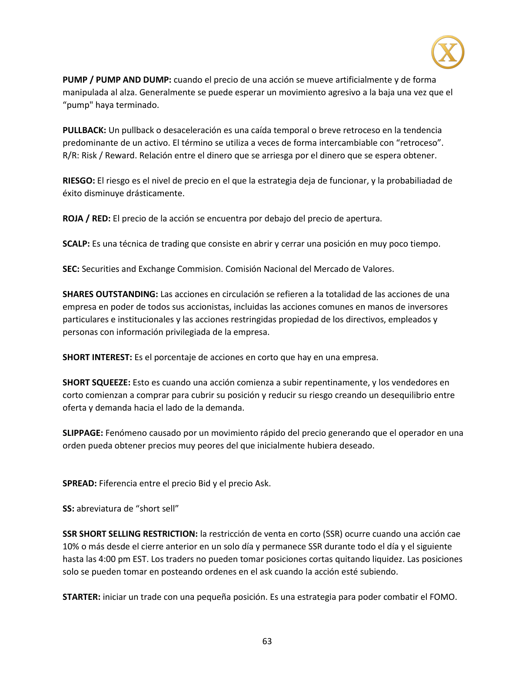

## Página 68
64 
 
STOCK SPLITS: Las empresas pueden hacer una división de acciones, “partiendo” una acción en varias 
partes. En un Split 2:1, cada acción se transforma en dos. En ese caso el precio cambiará en la 
proporciona inversa, es decir, si valía 10 dólares pasará a vales 5. Las empresas también pueden realizar 
una división de acciones reversa. En una división de acciones inversa 10: 1 si el precio inicial es de $ 1.00 
por acción, la convertirá en $ 10.00. Si anteriormente tenía 1000 acciones a $ 1.00, pasará a tener 100 
acciones a $ 10 después de la división. 
 
TICKER: Código de identificación único de una acción. 
 
TIME AND SALES: Ventana que muestra cada transacción que ocurra y el correspondiente precio de 
ejecución, la cantidad de acciones, la ruta y la hora. Estas transacciones aparecerán en rojo si ocurren al 
precio de oferta, verde si ocurren al precio de venta y blanco si ocurren entre el diferencial.  
 
VOLATILIDAD: La volatilidad es la posibilidad de que se produzcan movimientos de gran rango en el 
precio de una acción a corto plazo en un momento dado. En el daytrading, la volatilidad es fundamental 
para obtener ganancias de esos movimientos. 
 
VOLUMEN: El volumen es el número de acciones negociadas en cierto periodo de tiempo.  
 
VWAP: indicador intradía que significa "Precio promedio ponderado por volumen". Promedia el precio 
de la acción con el volumen de las transacciones en ese nivel. Si una acción está por encima de VWAP, se 
considera alcista. Si una acción está por debajo de VWAP, se considera bajista. 
 
WARRANTS: Un warrant es un derivado cuya posesión otorga el derecho, pero no la obligación, de 
materializar una decisión sobre el mercado a un precio y en un período de vigencia previamente 
establecidos. Existen warrants cuya adquisición habilitaría al inversor a ejercer la compra de un 
subyacente (generalmente acciones) a un precio determinado. A diferencia de las opciones, el creador y 
el intermediario de los warrants son la misma entidad lo que, a priori, los convierte en productos algo 
menos transparentes. Generalmente son utilizados por las smallcaps como mecanismo de 
financiamiento, que genera dilución y en consecuencia atenta contra el precio. 
 
WASHOUT O WASH: una caída agresiva en el precio de las acciones, generalmente con un gran 
volumen.  
 
WATCHLIST O WL: Listado de acciones en las que se centrará el foco de sesión.

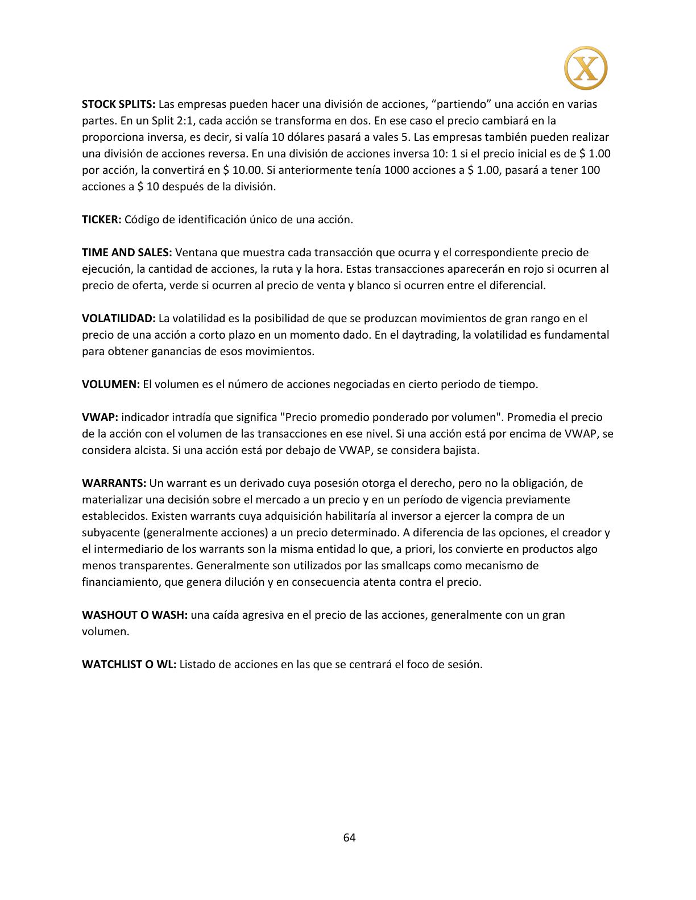
