# Ohlcv 1m Split-Normalized Visual Inspector Pack v0.1

Fecha de referencia: 2026-06-07.

Este dossier aplica el modelo inspector general-a-particular a `ohlcv_1m_split_normalized`.

## Alcance

- dataset: `ohlcv_1m_split_normalized_v0_1`
- pregunta: semantica de escala split-normalized en eventos de split/reverse split
- unidad poblacional auditada: `ticker + execution_date`
- casos de evento auditados: `3335`
- casos PASS: `2280`
- casos FAIL: `0`
- visuales poblacionales: `6`
- visuales de caso: `28`
- total de imagenes incrustadas: `34`

## Regla De Lectura

La auditoria no demuestra que todo `1m` raw sea limpio ni que exista una materializacion fisica full-universe para todos los ticker-month.

Demuestra algo mas preciso:

- la regla `future_split_factor(date_t)` esta bien definida;
- los eventos con cobertura bilateral suficiente no muestran fallos semanticos;
- los no PASS son limites de cobertura, no fallos observados;
- y el uso correcto es comparabilidad cross-session, no verdad local de ejecucion.

## Menu

- [Mapa Poblacional Visual](#mapa-poblacional-visual)
- [Casepacks Visuales](#casepacks-visuales)

## Mapa Poblacional Visual

### Population Status Overview

Pregunta: How the full split-event audit resolves into PASS, FAIL and coverage-limited states.

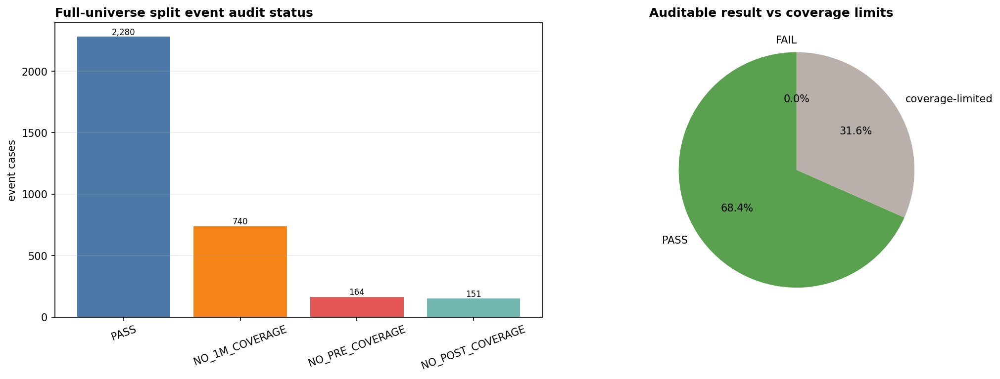

**Que muestra**

- Muestra el resultado agregado de la auditoria full-universe de eventos split: `PASS`, estados limitados por cobertura y `FAIL`.

**Responde**

- Responde si hay fallos semanticos observados en casos auditables y separa error real de falta de cobertura empirica.

**No responde**

- No responde si la capa fisica esta materializada para todo ticker-month del universo; responde al universo de eventos split auditables.

**Consecuencia**

- La conclusion fuerte es `FAIL = 0`; los casos no PASS deben leerse como limites de cobertura, no como evidencia de transformacion incorrecta.

### Direction And Ratio

Pregunta: Whether the audit covers both reverse and forward split mechanics across ratio severities.

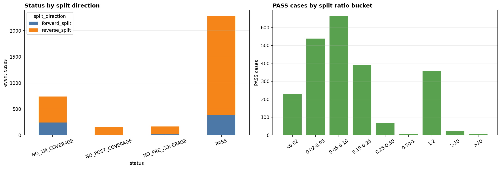

**Que muestra**

- Muestra que la auditoria cubre reverse splits, forward splits y severidades distintas de ratio.

**Responde**

- Responde si el PASS se concentra solo en un tipo facil de evento o si atraviesa familias mecanicas diferentes.

**No responde**

- No responde si cada ticker tiene historia intradia suficiente; esa pregunta vive en cobertura.

**Consecuencia**

- El inspector puede confiar en que el piloto visual no era solo un ejemplo bonito: el barrido incluye direcciones y ratios variados.

### Temporal Coverage

Pregunta: How coverage limitations distribute through event years.

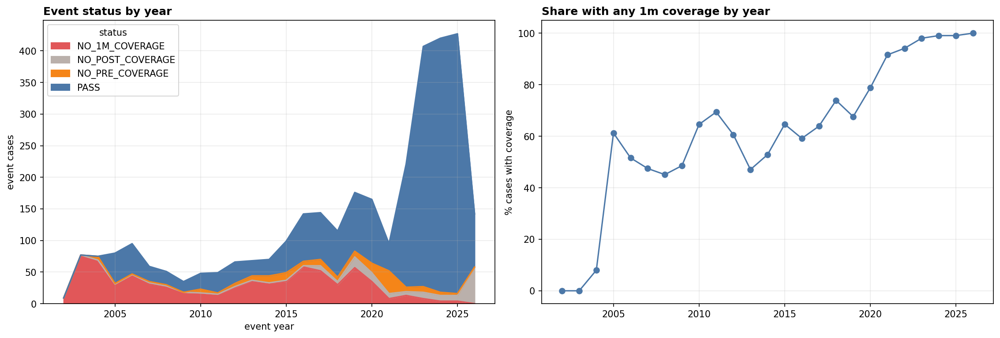

**Que muestra**

- Muestra la distribucion temporal de eventos y la proporcion con alguna cobertura `1m` por ano.

**Responde**

- Responde si los limites de auditoria vienen de la disponibilidad temporal de `1m`, especialmente en anos menos cubiertos.

**No responde**

- No responde si un ano debe ponderar igual en backtest; solo ensena disponibilidad empirica para auditar splits.

**Consecuencia**

- Cualquier claim full-universe debe distinguir universo de eventos de universo fisicamente materializado.

### PASS Invariant Strength

Pregunta: Whether PASS cases have enough rows and whether multiplier errors are materially nonzero.

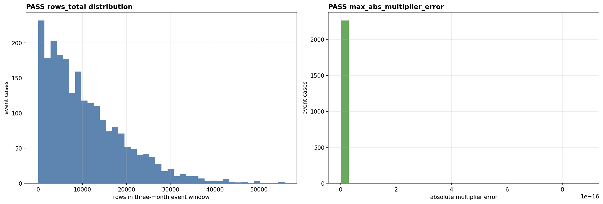

**Que muestra**

- Muestra filas disponibles en casos PASS y distribucion de `max_abs_multiplier_error`.

**Responde**

- Responde si PASS esta sostenido por ventanas con datos y errores de multiplicador materialmente nulos.

**No responde**

- No responde a calidad general de OHLCV raw; solo a invariantes de escala split-normalized.

**Consecuencia**

- La auditoria de semantica split queda fuerte, pero no sustituye la auditoria raw de `minute`.

### Coverage-Limited Anatomy

Pregunta: Which non-PASS cases are real limits of available 1m history rather than semantic failures.

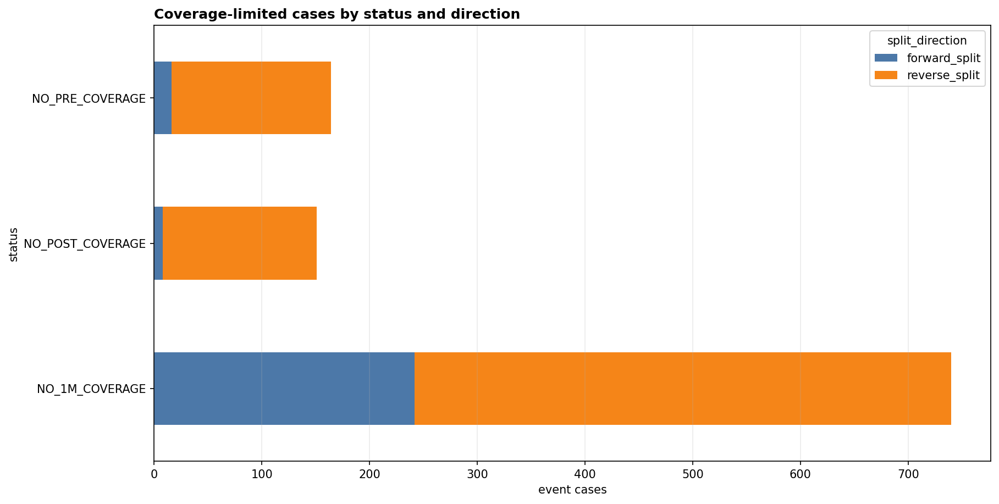

**Que muestra**

- Muestra la anatomia de `NO_PRE_COVERAGE`, `NO_POST_COVERAGE` y `NO_1M_COVERAGE` por direccion de split.

**Responde**

- Responde que los no PASS son familias de cobertura insuficiente, no fallos del algoritmo.

**No responde**

- No responde que esos eventos esten resueltos visualmente; declara que no se pueden falsar plenamente con la historia disponible.

**Consecuencia**

- Los consumidores deben conservar estos estados como caveats de coverage si usan eventos fuera del perimetro auditable.

### Ticker Concentration

Pregunta: Whether audit mass or coverage limitations are concentrated in a few tickers.

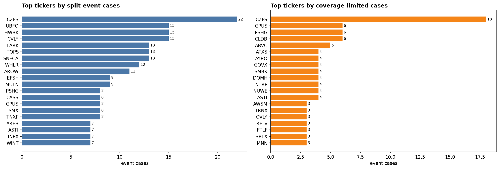

**Que muestra**

- Muestra concentracion de eventos y de limites de cobertura por ticker.

**Responde**

- Responde si la carga de auditoria se reparte o queda concentrada en nombres con muchos eventos.

**No responde**

- No responde a causalidad economica de cada ticker; solo ubica concentraciones operativas.

**Consecuencia**

- Ayuda a priorizar ampliaciones futuras de cobertura o inspeccion si se decide materializar mas casos.

## Casepacks Visuales

### PASS / Reverse Split

#### 01. PPCB 2025-01-29

status: `PASS`  
split_direction: `reverse_split`  
split_ratio: `1.6666667e-05`  
rows_total: `495`  
rows_pre: `491`  
rows_post: `4`  
max_abs_multiplier_error: `0.0`

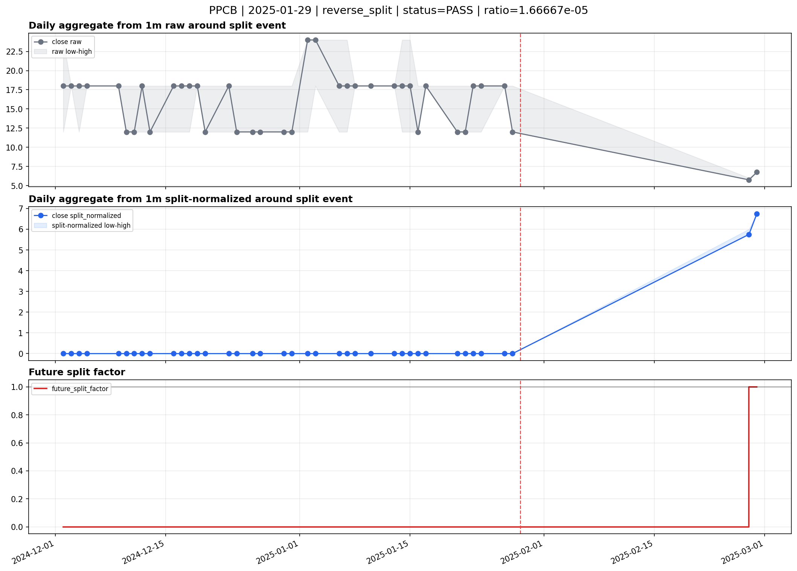

**Que muestra**

- La imagen muestra el evento `PPCB 2025-01-29` con cobertura antes y despues del split. El panel raw y el split-normalized permiten ver la transformacion de escala, y el factor cambia segun la regla contractual. Ratio auditado: `1.66667e-05`.

**Responde**

- Responde que este caso concreto pasa los invariantes: tramo pre-evento reescalado, tramo post-evento neutro y error multiplicador nulo dentro de tolerancia.

**No responde**

- No responde que todo OHLCV intradia del ticker sea limpio ni que la capa sea adjusted economica; solo valida semantica de split para este evento.

**Consecuencia**

- Puede usarse como evidencia forense positiva de `1m_split_normalized` para comparabilidad cross-session alrededor de splits.

#### 02. PMD 2024-12-04

status: `PASS`  
split_direction: `reverse_split`  
split_ratio: `0.0002`  
rows_total: `989`  
rows_pre: `481`  
rows_post: `508`  
max_abs_multiplier_error: `0.0`

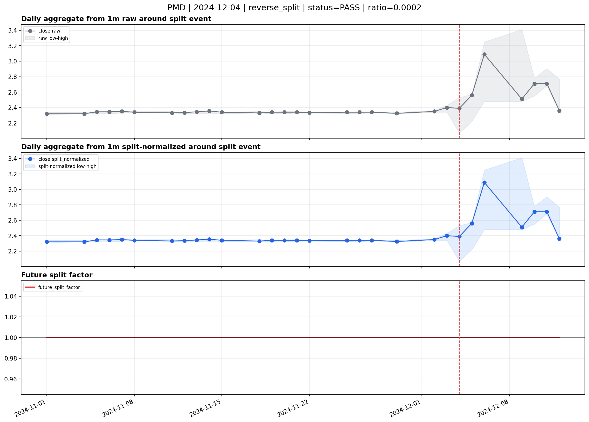

**Que muestra**

- La imagen muestra el evento `PMD 2024-12-04` con cobertura antes y despues del split. El panel raw y el split-normalized permiten ver la transformacion de escala, y el factor cambia segun la regla contractual. Ratio auditado: `0.0002`.

**Responde**

- Responde que este caso concreto pasa los invariantes: tramo pre-evento reescalado, tramo post-evento neutro y error multiplicador nulo dentro de tolerancia.

**No responde**

- No responde que todo OHLCV intradia del ticker sea limpio ni que la capa sea adjusted economica; solo valida semantica de split para este evento.

**Consecuencia**

- Puede usarse como evidencia forense positiva de `1m_split_normalized` para comparabilidad cross-session alrededor de splits.

#### 03. STCN 2023-06-22

status: `PASS`  
split_direction: `reverse_split`  
split_ratio: `0.00028571429`  
rows_total: `3,268`  
rows_pre: `2,109`  
rows_post: `1,159`  
max_abs_multiplier_error: `0.0`

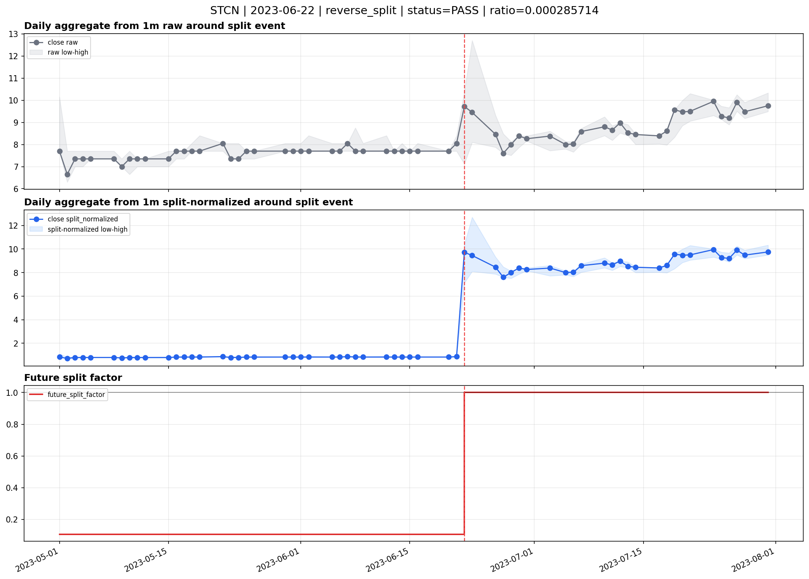

**Que muestra**

- La imagen muestra el evento `STCN 2023-06-22` con cobertura antes y despues del split. El panel raw y el split-normalized permiten ver la transformacion de escala, y el factor cambia segun la regla contractual. Ratio auditado: `0.000285714`.

**Responde**

- Responde que este caso concreto pasa los invariantes: tramo pre-evento reescalado, tramo post-evento neutro y error multiplicador nulo dentro de tolerancia.

**No responde**

- No responde que todo OHLCV intradia del ticker sea limpio ni que la capa sea adjusted economica; solo valida semantica de split para este evento.

**Consecuencia**

- Puede usarse como evidencia forense positiva de `1m_split_normalized` para comparabilidad cross-session alrededor de splits.

#### 04. TTSH 2025-12-16

status: `PASS`  
split_direction: `reverse_split`  
split_ratio: `0.00033333333`  
rows_total: `8,466`  
rows_pre: `4,247`  
rows_post: `4,219`  
max_abs_multiplier_error: `0.0`

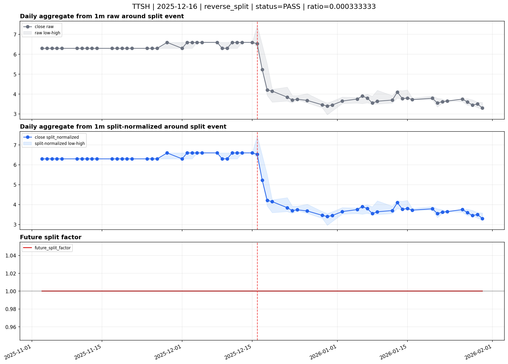

**Que muestra**

- La imagen muestra el evento `TTSH 2025-12-16` con cobertura antes y despues del split. El panel raw y el split-normalized permiten ver la transformacion de escala, y el factor cambia segun la regla contractual. Ratio auditado: `0.000333333`.

**Responde**

- Responde que este caso concreto pasa los invariantes: tramo pre-evento reescalado, tramo post-evento neutro y error multiplicador nulo dentro de tolerancia.

**No responde**

- No responde que todo OHLCV intradia del ticker sea limpio ni que la capa sea adjusted economica; solo valida semantica de split para este evento.

**Consecuencia**

- Puede usarse como evidencia forense positiva de `1m_split_normalized` para comparabilidad cross-session alrededor de splits.

#### 05. RELV 2020-12-21

status: `PASS`  
split_direction: `reverse_split`  
split_ratio: `0.0005`  
rows_total: `774`  
rows_pre: `720`  
rows_post: `54`  
max_abs_multiplier_error: `0.0`

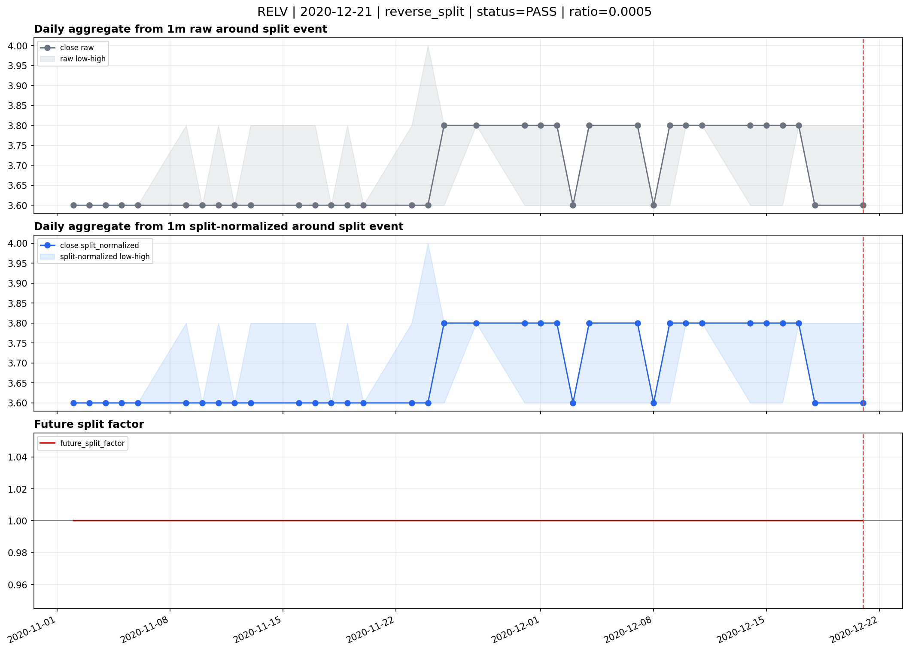

**Que muestra**

- La imagen muestra el evento `RELV 2020-12-21` con cobertura antes y despues del split. El panel raw y el split-normalized permiten ver la transformacion de escala, y el factor cambia segun la regla contractual. Ratio auditado: `0.0005`.

**Responde**

- Responde que este caso concreto pasa los invariantes: tramo pre-evento reescalado, tramo post-evento neutro y error multiplicador nulo dentro de tolerancia.

**No responde**

- No responde que todo OHLCV intradia del ticker sea limpio ni que la capa sea adjusted economica; solo valida semantica de split para este evento.

**Consecuencia**

- Puede usarse como evidencia forense positiva de `1m_split_normalized` para comparabilidad cross-session alrededor de splits.

#### 06. PPCB 2023-05-23

status: `PASS`  
split_direction: `reverse_split`  
split_ratio: `0.001`  
rows_total: `1,606`  
rows_pre: `1,219`  
rows_post: `387`  
max_abs_multiplier_error: `0.0`

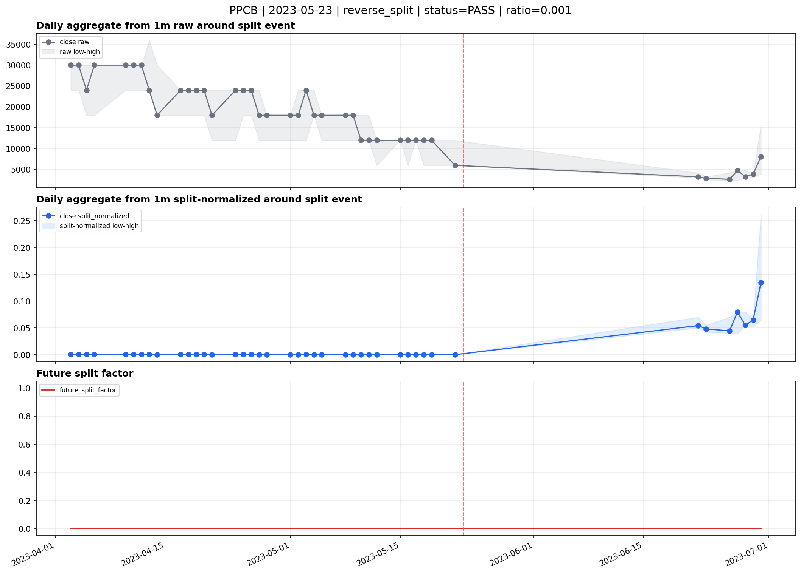

**Que muestra**

- La imagen muestra el evento `PPCB 2023-05-23` con cobertura antes y despues del split. El panel raw y el split-normalized permiten ver la transformacion de escala, y el factor cambia segun la regla contractual. Ratio auditado: `0.001`.

**Responde**

- Responde que este caso concreto pasa los invariantes: tramo pre-evento reescalado, tramo post-evento neutro y error multiplicador nulo dentro de tolerancia.

**No responde**

- No responde que todo OHLCV intradia del ticker sea limpio ni que la capa sea adjusted economica; solo valida semantica de split para este evento.

**Consecuencia**

- Puede usarse como evidencia forense positiva de `1m_split_normalized` para comparabilidad cross-session alrededor de splits.

#### 07. GNLN 2025-06-27

status: `PASS`  
split_direction: `reverse_split`  
split_ratio: `0.0013333333`  
rows_total: `41,227`  
rows_pre: `35,021`  
rows_post: `6,206`  
max_abs_multiplier_error: `0.0`

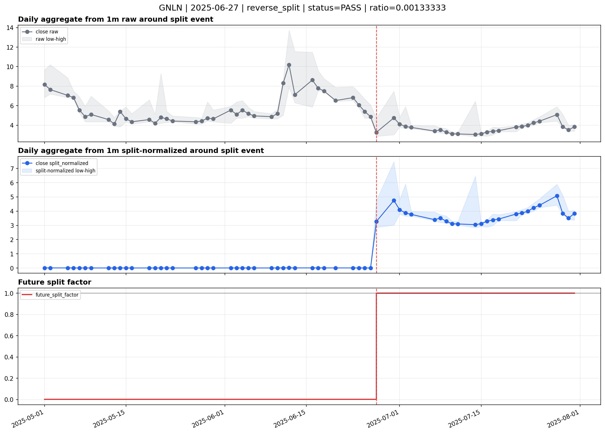

**Que muestra**

- La imagen muestra el evento `GNLN 2025-06-27` con cobertura antes y despues del split. El panel raw y el split-normalized permiten ver la transformacion de escala, y el factor cambia segun la regla contractual. Ratio auditado: `0.00133333`.

**Responde**

- Responde que este caso concreto pasa los invariantes: tramo pre-evento reescalado, tramo post-evento neutro y error multiplicador nulo dentro de tolerancia.

**No responde**

- No responde que todo OHLCV intradia del ticker sea limpio ni que la capa sea adjusted economica; solo valida semantica de split para este evento.

**Consecuencia**

- Puede usarse como evidencia forense positiva de `1m_split_normalized` para comparabilidad cross-session alrededor de splits.

#### 08. ATLX 2022-12-23

status: `PASS`  
split_direction: `reverse_split`  
split_ratio: `0.0013333333`  
rows_total: `6,644`  
rows_pre: `4,136`  
rows_post: `2,508`  
max_abs_multiplier_error: `0.0`

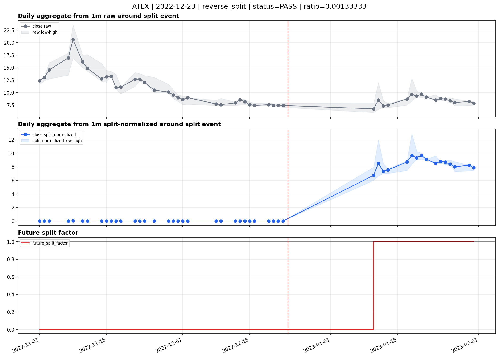

**Que muestra**

- La imagen muestra el evento `ATLX 2022-12-23` con cobertura antes y despues del split. El panel raw y el split-normalized permiten ver la transformacion de escala, y el factor cambia segun la regla contractual. Ratio auditado: `0.00133333`.

**Responde**

- Responde que este caso concreto pasa los invariantes: tramo pre-evento reescalado, tramo post-evento neutro y error multiplicador nulo dentro de tolerancia.

**No responde**

- No responde que todo OHLCV intradia del ticker sea limpio ni que la capa sea adjusted economica; solo valida semantica de split para este evento.

**Consecuencia**

- Puede usarse como evidencia forense positiva de `1m_split_normalized` para comparabilidad cross-session alrededor de splits.

### PASS / Forward Split

#### 09. PMD 2024-12-04

status: `PASS`  
split_direction: `forward_split`  
split_ratio: `5000`  
rows_total: `989`  
rows_pre: `481`  
rows_post: `508`  
max_abs_multiplier_error: `0.0`

**Que muestra**

- La imagen muestra el evento `PMD 2024-12-04` con cobertura antes y despues del split. El panel raw y el split-normalized permiten ver la transformacion de escala, y el factor cambia segun la regla contractual. Ratio auditado: `5000`.

**Responde**

- Responde que este caso concreto pasa los invariantes: tramo pre-evento reescalado, tramo post-evento neutro y error multiplicador nulo dentro de tolerancia.

**No responde**

- No responde que todo OHLCV intradia del ticker sea limpio ni que la capa sea adjusted economica; solo valida semantica de split para este evento.

**Consecuencia**

- Puede usarse como evidencia forense positiva de `1m_split_normalized` para comparabilidad cross-session alrededor de splits.

#### 10. TTSH 2025-12-16

status: `PASS`  
split_direction: `forward_split`  
split_ratio: `3000`  
rows_total: `8,466`  
rows_pre: `4,247`  
rows_post: `4,219`  
max_abs_multiplier_error: `0.0`

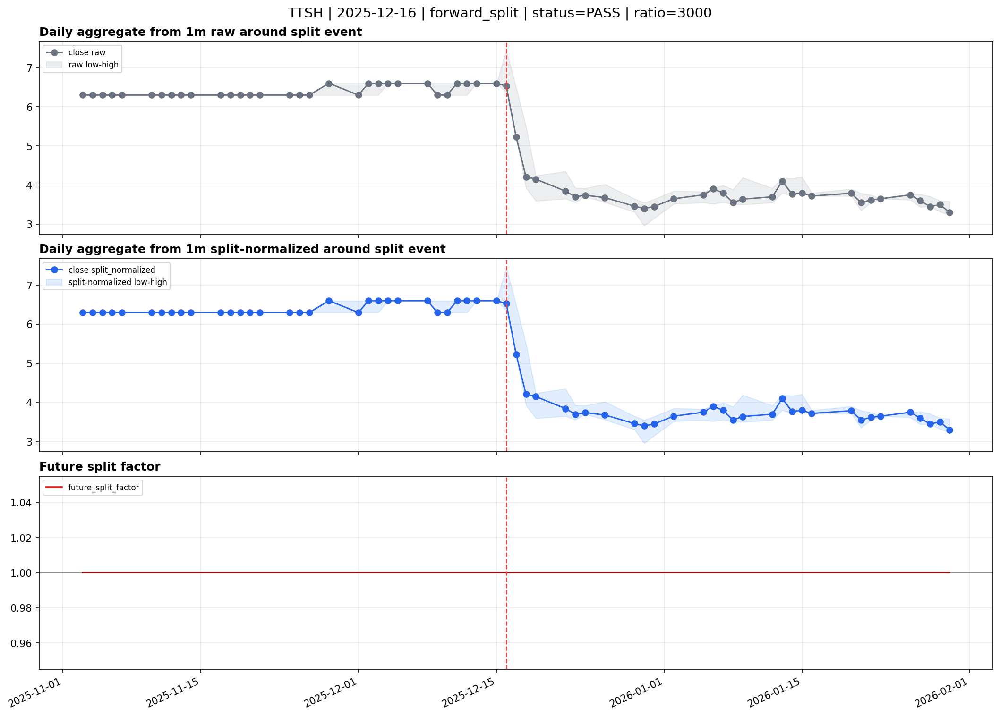

**Que muestra**

- La imagen muestra el evento `TTSH 2025-12-16` con cobertura antes y despues del split. El panel raw y el split-normalized permiten ver la transformacion de escala, y el factor cambia segun la regla contractual. Ratio auditado: `3000`.

**Responde**

- Responde que este caso concreto pasa los invariantes: tramo pre-evento reescalado, tramo post-evento neutro y error multiplicador nulo dentro de tolerancia.

**No responde**

- No responde que todo OHLCV intradia del ticker sea limpio ni que la capa sea adjusted economica; solo valida semantica de split para este evento.

**Consecuencia**

- Puede usarse como evidencia forense positiva de `1m_split_normalized` para comparabilidad cross-session alrededor de splits.

#### 11. RELV 2020-12-21

status: `PASS`  
split_direction: `forward_split`  
split_ratio: `2000`  
rows_total: `774`  
rows_pre: `720`  
rows_post: `54`  
max_abs_multiplier_error: `0.0`

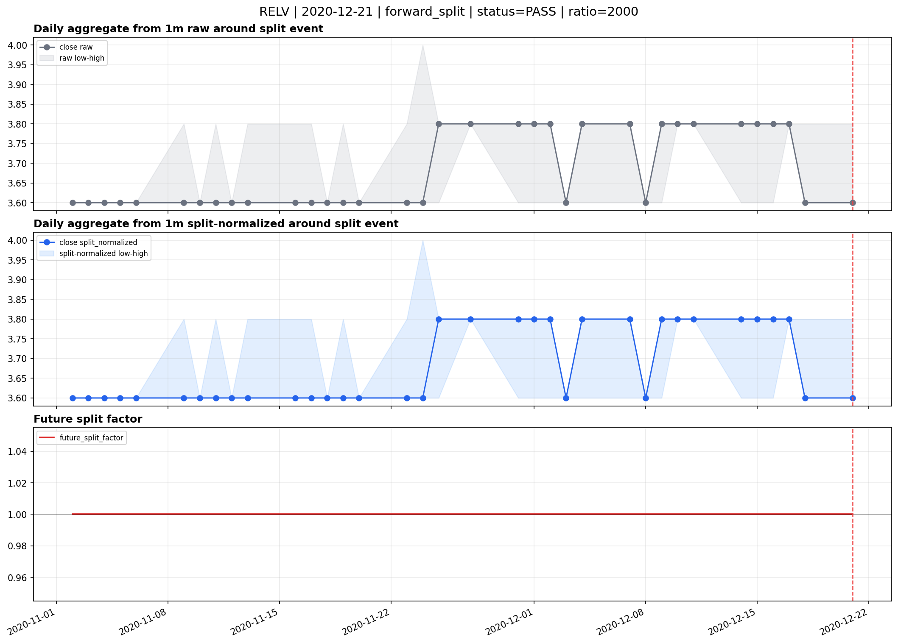

**Que muestra**

- La imagen muestra el evento `RELV 2020-12-21` con cobertura antes y despues del split. El panel raw y el split-normalized permiten ver la transformacion de escala, y el factor cambia segun la regla contractual. Ratio auditado: `2000`.

**Responde**

- Responde que este caso concreto pasa los invariantes: tramo pre-evento reescalado, tramo post-evento neutro y error multiplicador nulo dentro de tolerancia.

**No responde**

- No responde que todo OHLCV intradia del ticker sea limpio ni que la capa sea adjusted economica; solo valida semantica de split para este evento.

**Consecuencia**

- Puede usarse como evidencia forense positiva de `1m_split_normalized` para comparabilidad cross-session alrededor de splits.

#### 12. STCN 2023-06-22

status: `PASS`  
split_direction: `forward_split`  
split_ratio: `375`  
rows_total: `3,268`  
rows_pre: `2,109`  
rows_post: `1,159`  
max_abs_multiplier_error: `0.0`

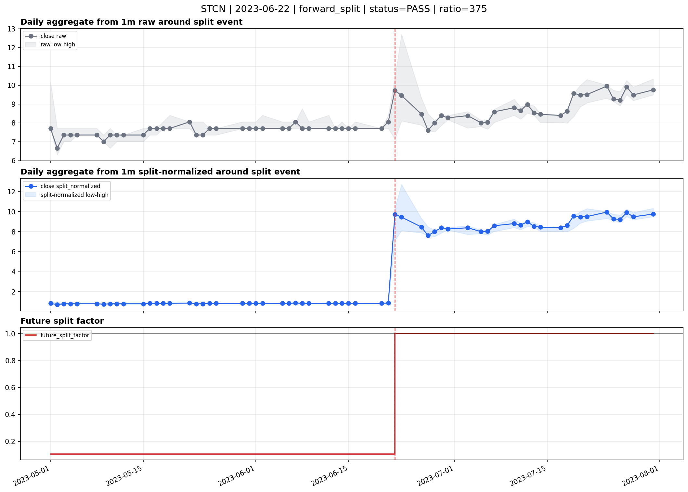

**Que muestra**

- La imagen muestra el evento `STCN 2023-06-22` con cobertura antes y despues del split. El panel raw y el split-normalized permiten ver la transformacion de escala, y el factor cambia segun la regla contractual. Ratio auditado: `375`.

**Responde**

- Responde que este caso concreto pasa los invariantes: tramo pre-evento reescalado, tramo post-evento neutro y error multiplicador nulo dentro de tolerancia.

**No responde**

- No responde que todo OHLCV intradia del ticker sea limpio ni que la capa sea adjusted economica; solo valida semantica de split para este evento.

**Consecuencia**

- Puede usarse como evidencia forense positiva de `1m_split_normalized` para comparabilidad cross-session alrededor de splits.

#### 13. SFE 2024-01-16

status: `PASS`  
split_direction: `forward_split`  
split_ratio: `100`  
rows_total: `2,007`  
rows_pre: `1,302`  
rows_post: `705`  
max_abs_multiplier_error: `0.0`

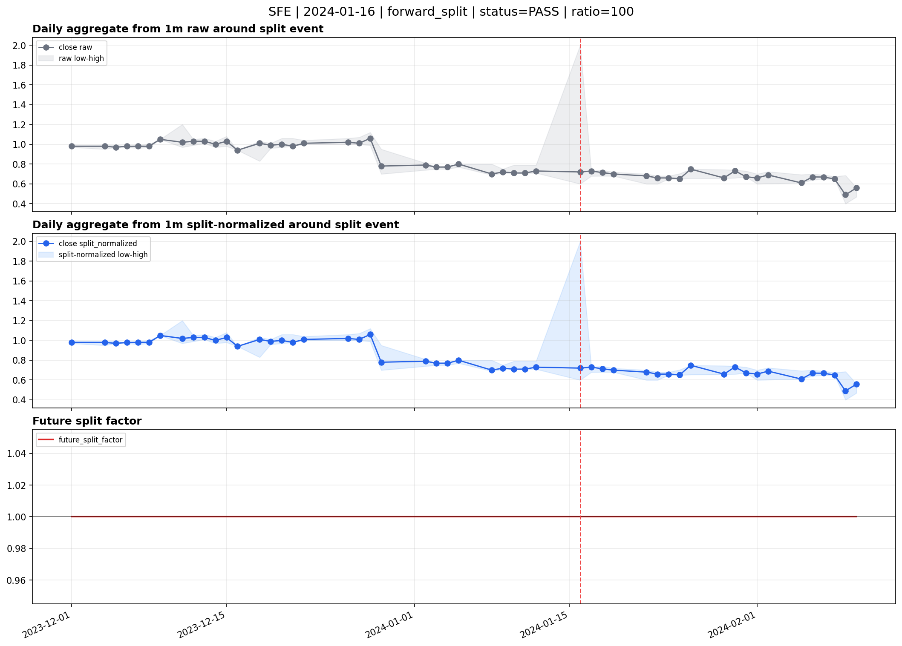

**Que muestra**

- La imagen muestra el evento `SFE 2024-01-16` con cobertura antes y despues del split. El panel raw y el split-normalized permiten ver la transformacion de escala, y el factor cambia segun la regla contractual. Ratio auditado: `100`.

**Responde**

- Responde que este caso concreto pasa los invariantes: tramo pre-evento reescalado, tramo post-evento neutro y error multiplicador nulo dentro de tolerancia.

**No responde**

- No responde que todo OHLCV intradia del ticker sea limpio ni que la capa sea adjusted economica; solo valida semantica de split para este evento.

**Consecuencia**

- Puede usarse como evidencia forense positiva de `1m_split_normalized` para comparabilidad cross-session alrededor de splits.

#### 14. BHRB 2022-11-15

status: `PASS`  
split_direction: `forward_split`  
split_ratio: `40`  
rows_total: `221`  
rows_pre: `80`  
rows_post: `141`  
max_abs_multiplier_error: `0.0`

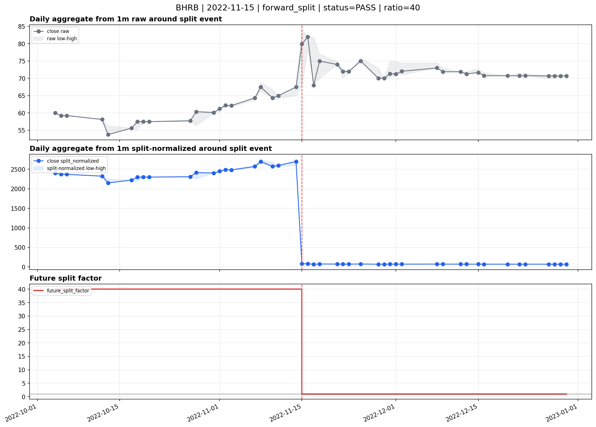

**Que muestra**

- La imagen muestra el evento `BHRB 2022-11-15` con cobertura antes y despues del split. El panel raw y el split-normalized permiten ver la transformacion de escala, y el factor cambia segun la regla contractual. Ratio auditado: `40`.

**Responde**

- Responde que este caso concreto pasa los invariantes: tramo pre-evento reescalado, tramo post-evento neutro y error multiplicador nulo dentro de tolerancia.

**No responde**

- No responde que todo OHLCV intradia del ticker sea limpio ni que la capa sea adjusted economica; solo valida semantica de split para este evento.

**Consecuencia**

- Puede usarse como evidencia forense positiva de `1m_split_normalized` para comparabilidad cross-session alrededor de splits.

### Coverage Limited / No Pre Coverage

#### 15. HUBC 2023-03-01

status: `NO_PRE_COVERAGE`  
split_direction: `reverse_split`  
split_ratio: `0.712434`  
rows_total: `27,418`  
rows_pre: `0`  
rows_post: `27,418`  
max_abs_multiplier_error: `0.0`

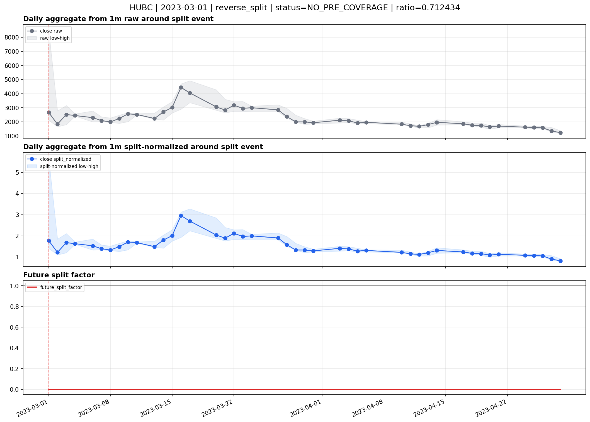

**Que muestra**

- La imagen muestra `HUBC 2023-03-01` con historia posterior disponible pero sin tramo previo suficiente en la ventana auditada.

**Responde**

- Responde que no se puede falsar la mitad pre-evento del invariante con la cobertura existente.

**No responde**

- No responde que la transformacion este mal; la ausencia de pre-cobertura no es un FAIL semantico.

**Consecuencia**

- Debe quedar como limite de coverage. No debe promocionarse a PASS, pero tampoco contarse como fallo.

#### 16. MMAT 2021-06-23

status: `NO_PRE_COVERAGE`  
split_direction: `forward_split`  
split_ratio: `2`  
rows_total: `18,302`  
rows_pre: `0`  
rows_post: `18,302`  
max_abs_multiplier_error: `0.0`

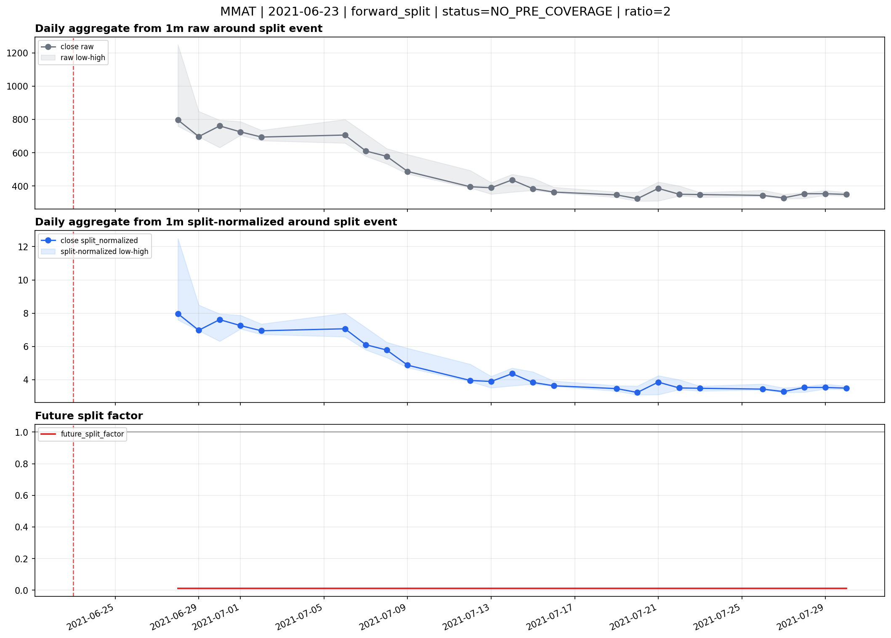

**Que muestra**

- La imagen muestra `MMAT 2021-06-23` con historia posterior disponible pero sin tramo previo suficiente en la ventana auditada.

**Responde**

- Responde que no se puede falsar la mitad pre-evento del invariante con la cobertura existente.

**No responde**

- No responde que la transformacion este mal; la ausencia de pre-cobertura no es un FAIL semantico.

**Consecuencia**

- Debe quedar como limite de coverage. No debe promocionarse a PASS, pero tampoco contarse como fallo.

#### 17. COMS 2021-01-22

status: `NO_PRE_COVERAGE`  
split_direction: `reverse_split`  
split_ratio: `0.33333333`  
rows_total: `13,024`  
rows_pre: `0`  
rows_post: `13,024`  
max_abs_multiplier_error: `0.0`

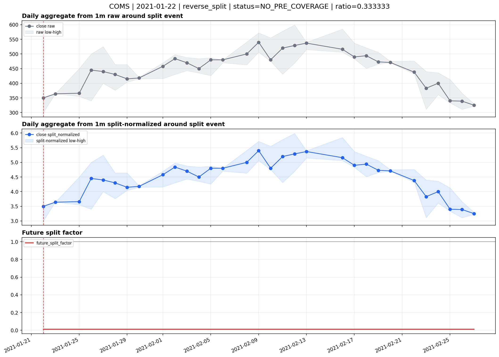

**Que muestra**

- La imagen muestra `COMS 2021-01-22` con historia posterior disponible pero sin tramo previo suficiente en la ventana auditada.

**Responde**

- Responde que no se puede falsar la mitad pre-evento del invariante con la cobertura existente.

**No responde**

- No responde que la transformacion este mal; la ausencia de pre-cobertura no es un FAIL semantico.

**Consecuencia**

- Debe quedar como limite de coverage. No debe promocionarse a PASS, pero tampoco contarse como fallo.

#### 18. NX 2005-01-03

status: `NO_PRE_COVERAGE`  
split_direction: `forward_split`  
split_ratio: `1.5`  
rows_total: `11,969`  
rows_pre: `0`  
rows_post: `11,969`  
max_abs_multiplier_error: `0.0`

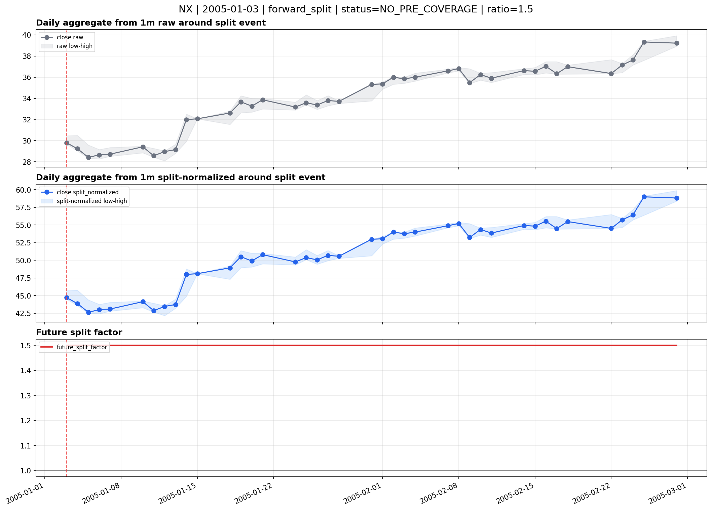

**Que muestra**

- La imagen muestra `NX 2005-01-03` con historia posterior disponible pero sin tramo previo suficiente en la ventana auditada.

**Responde**

- Responde que no se puede falsar la mitad pre-evento del invariante con la cobertura existente.

**No responde**

- No responde que la transformacion este mal; la ausencia de pre-cobertura no es un FAIL semantico.

**Consecuencia**

- Debe quedar como limite de coverage. No debe promocionarse a PASS, pero tampoco contarse como fallo.

### Coverage Limited / No Post Coverage

#### 19. TRCH 2021-06-28

status: `NO_POST_COVERAGE`  
split_direction: `reverse_split`  
split_ratio: `0.5`  
rows_total: `25,359`  
rows_pre: `25,359`  
rows_post: `0`  
max_abs_multiplier_error: `0.0`

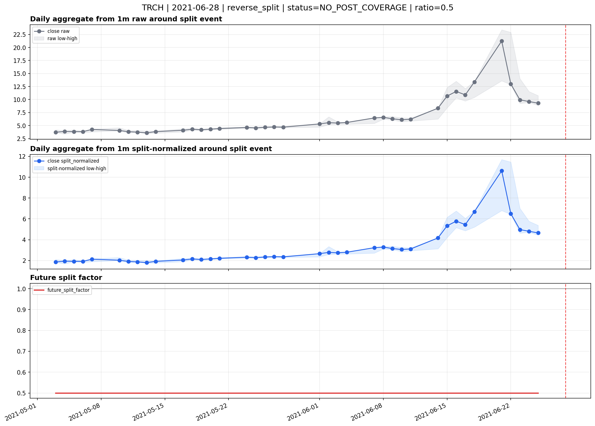

**Que muestra**

- La imagen muestra `TRCH 2021-06-28` con historia previa disponible pero sin tramo posterior suficiente en la ventana auditada.

**Responde**

- Responde que no se puede falsar la mitad post-evento del invariante con la cobertura existente.

**No responde**

- No responde que la capa arrastre factor incorrecto despues del evento; no hay base empirica suficiente para esa afirmacion.

**Consecuencia**

- Debe conservarse como caveat de coverage si un consumidor necesita prueba bilateral completa.

#### 20. RTTR 2020-05-26

status: `NO_POST_COVERAGE`  
split_direction: `reverse_split`  
split_ratio: `0.04`  
rows_total: `19,948`  
rows_pre: `19,948`  
rows_post: `0`  
max_abs_multiplier_error: `0.0`

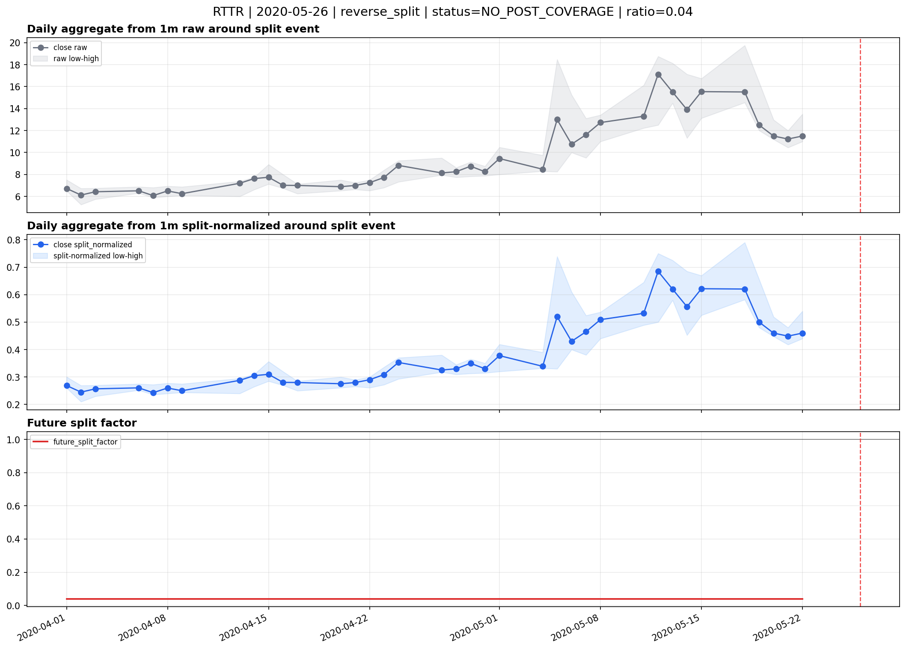

**Que muestra**

- La imagen muestra `RTTR 2020-05-26` con historia previa disponible pero sin tramo posterior suficiente en la ventana auditada.

**Responde**

- Responde que no se puede falsar la mitad post-evento del invariante con la cobertura existente.

**No responde**

- No responde que la capa arrastre factor incorrecto despues del evento; no hay base empirica suficiente para esa afirmacion.

**Consecuencia**

- Debe conservarse como caveat de coverage si un consumidor necesita prueba bilateral completa.

#### 21. MSTX 2026-03-19

status: `NO_POST_COVERAGE`  
split_direction: `reverse_split`  
split_ratio: `0.1`  
rows_total: `19,808`  
rows_pre: `19,808`  
rows_post: `0`  
max_abs_multiplier_error: `0.0`

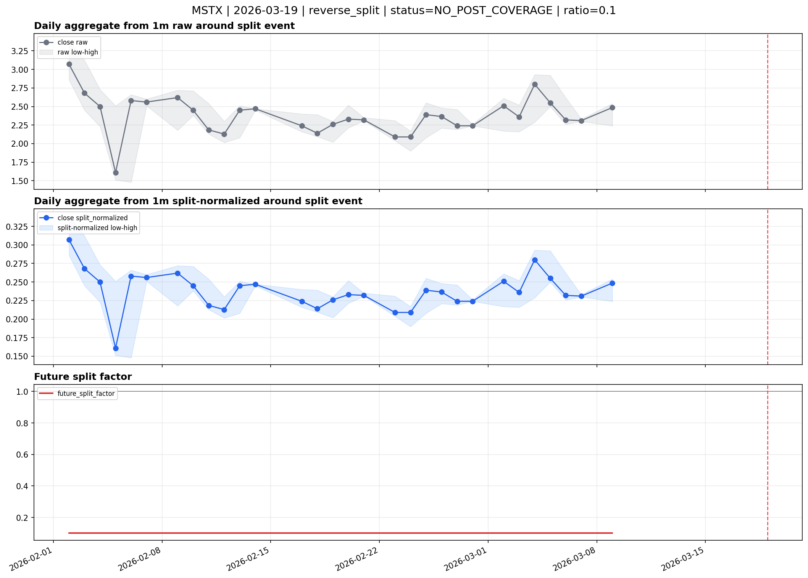

**Que muestra**

- La imagen muestra `MSTX 2026-03-19` con historia previa disponible pero sin tramo posterior suficiente en la ventana auditada.

**Responde**

- Responde que no se puede falsar la mitad post-evento del invariante con la cobertura existente.

**No responde**

- No responde que la capa arrastre factor incorrecto despues del evento; no hay base empirica suficiente para esa afirmacion.

**Consecuencia**

- Debe conservarse como caveat de coverage si un consumidor necesita prueba bilateral completa.

#### 22. HSGX 2019-09-30

status: `NO_POST_COVERAGE`  
split_direction: `reverse_split`  
split_ratio: `0.016666667`  
rows_total: `18,495`  
rows_pre: `18,495`  
rows_post: `0`  
max_abs_multiplier_error: `0.0`

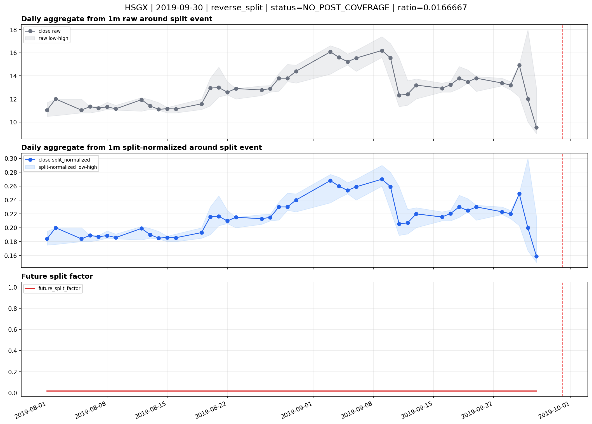

**Que muestra**

- La imagen muestra `HSGX 2019-09-30` con historia previa disponible pero sin tramo posterior suficiente en la ventana auditada.

**Responde**

- Responde que no se puede falsar la mitad post-evento del invariante con la cobertura existente.

**No responde**

- No responde que la capa arrastre factor incorrecto despues del evento; no hay base empirica suficiente para esa afirmacion.

**Consecuencia**

- Debe conservarse como caveat de coverage si un consumidor necesita prueba bilateral completa.

### Coverage Limited / No 1m Coverage

#### 23. AAIC 2009-10-07

status: `NO_1M_COVERAGE`  
split_direction: `reverse_split`  
split_ratio: `0.05`  
rows_total: `0`  
rows_pre: `0`  
rows_post: `0`  
max_abs_multiplier_error: `nan`

**Que muestra**

- La tarjeta muestra `AAIC 2009-10-07` como evento existente en splits maestros, pero sin historia `1m` cargable para auditar.

**Responde**

- Responde que el evento pertenece al universo de referencia de splits pero queda fuera del universo empiricamente auditable con `1m`.

**No responde**

- No responde nada sobre correccion visual de precio porque no hay barras que inspeccionar.

**Consecuencia**

- Debe excluirse de claims de PASS y reportarse como limite de cobertura, no como error de la transformacion.

#### 24. AARD 2008-07-21

status: `NO_1M_COVERAGE`  
split_direction: `reverse_split`  
split_ratio: `0.5`  
rows_total: `0`  
rows_pre: `0`  
rows_post: `0`  
max_abs_multiplier_error: `nan`

**Que muestra**

- La tarjeta muestra `AARD 2008-07-21` como evento existente en splits maestros, pero sin historia `1m` cargable para auditar.

**Responde**

- Responde que el evento pertenece al universo de referencia de splits pero queda fuera del universo empiricamente auditable con `1m`.

**No responde**

- No responde nada sobre correccion visual de precio porque no hay barras que inspeccionar.

**Consecuencia**

- Debe excluirse de claims de PASS y reportarse como limite de cobertura, no como error de la transformacion.

#### 25. ABAT 2004-07-13

status: `NO_1M_COVERAGE`  
split_direction: `reverse_split`  
split_ratio: `0.1`  
rows_total: `0`  
rows_pre: `0`  
rows_post: `0`  
max_abs_multiplier_error: `nan`

**Que muestra**

- La tarjeta muestra `ABAT 2004-07-13` como evento existente en splits maestros, pero sin historia `1m` cargable para auditar.

**Responde**

- Responde que el evento pertenece al universo de referencia de splits pero queda fuera del universo empiricamente auditable con `1m`.

**No responde**

- No responde nada sobre correccion visual de precio porque no hay barras que inspeccionar.

**Consecuencia**

- Debe excluirse de claims de PASS y reportarse como limite de cobertura, no como error de la transformacion.

#### 26. ABIO 2004-02-23

status: `NO_1M_COVERAGE`  
split_direction: `reverse_split`  
split_ratio: `0.33333333`  
rows_total: `0`  
rows_pre: `0`  
rows_post: `0`  
max_abs_multiplier_error: `nan`

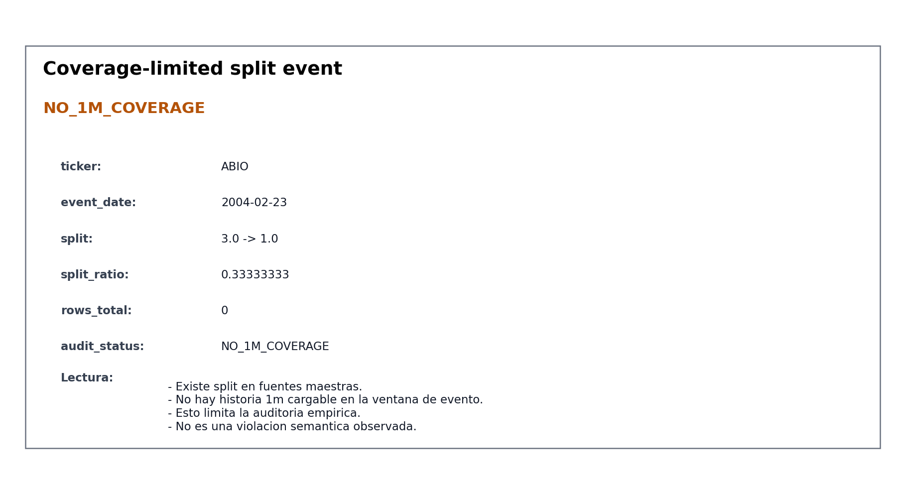

**Que muestra**

- La tarjeta muestra `ABIO 2004-02-23` como evento existente en splits maestros, pero sin historia `1m` cargable para auditar.

**Responde**

- Responde que el evento pertenece al universo de referencia de splits pero queda fuera del universo empiricamente auditable con `1m`.

**No responde**

- No responde nada sobre correccion visual de precio porque no hay barras que inspeccionar.

**Consecuencia**

- Debe excluirse de claims de PASS y reportarse como limite de cobertura, no como error de la transformacion.

#### 27. ABTS 2019-04-22

status: `NO_1M_COVERAGE`  
split_direction: `reverse_split`  
split_ratio: `0.2`  
rows_total: `0`  
rows_pre: `0`  
rows_post: `0`  
max_abs_multiplier_error: `nan`

**Que muestra**

- La tarjeta muestra `ABTS 2019-04-22` como evento existente en splits maestros, pero sin historia `1m` cargable para auditar.

**Responde**

- Responde que el evento pertenece al universo de referencia de splits pero queda fuera del universo empiricamente auditable con `1m`.

**No responde**

- No responde nada sobre correccion visual de precio porque no hay barras que inspeccionar.

**Consecuencia**

- Debe excluirse de claims de PASS y reportarse como limite de cobertura, no como error de la transformacion.

#### 28. ABVC 2005-06-09

status: `NO_1M_COVERAGE`  
split_direction: `forward_split`  
split_ratio: `1.2`  
rows_total: `0`  
rows_pre: `0`  
rows_post: `0`  
max_abs_multiplier_error: `nan`

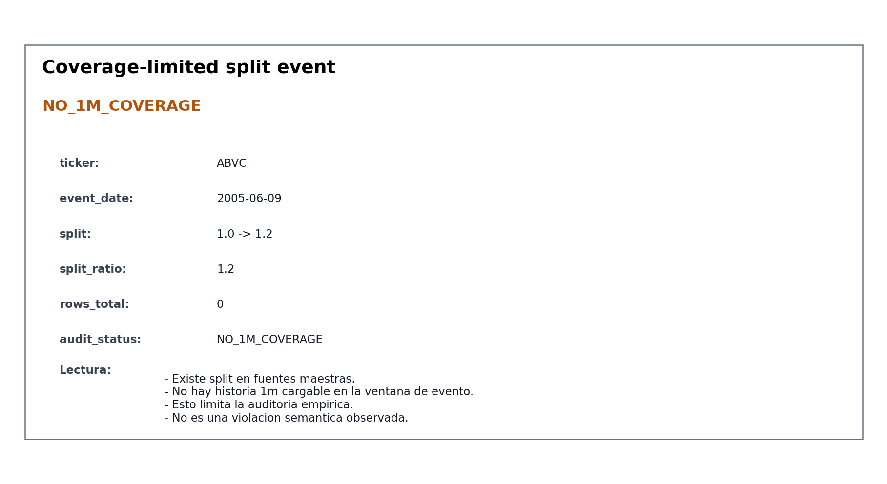

**Que muestra**

- La tarjeta muestra `ABVC 2005-06-09` como evento existente en splits maestros, pero sin historia `1m` cargable para auditar.

**Responde**

- Responde que el evento pertenece al universo de referencia de splits pero queda fuera del universo empiricamente auditable con `1m`.

**No responde**

- No responde nada sobre correccion visual de precio porque no hay barras que inspeccionar.

**Consecuencia**

- Debe excluirse de claims de PASS y reportarse como limite de cobertura, no como error de la transformacion.
