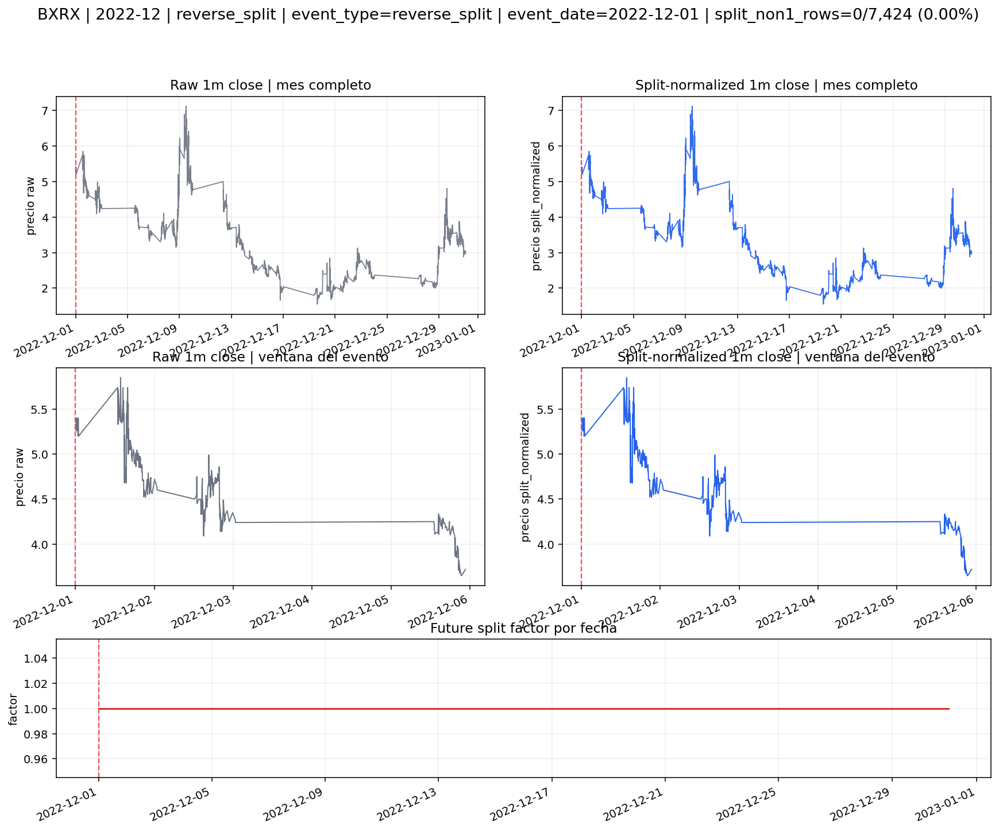
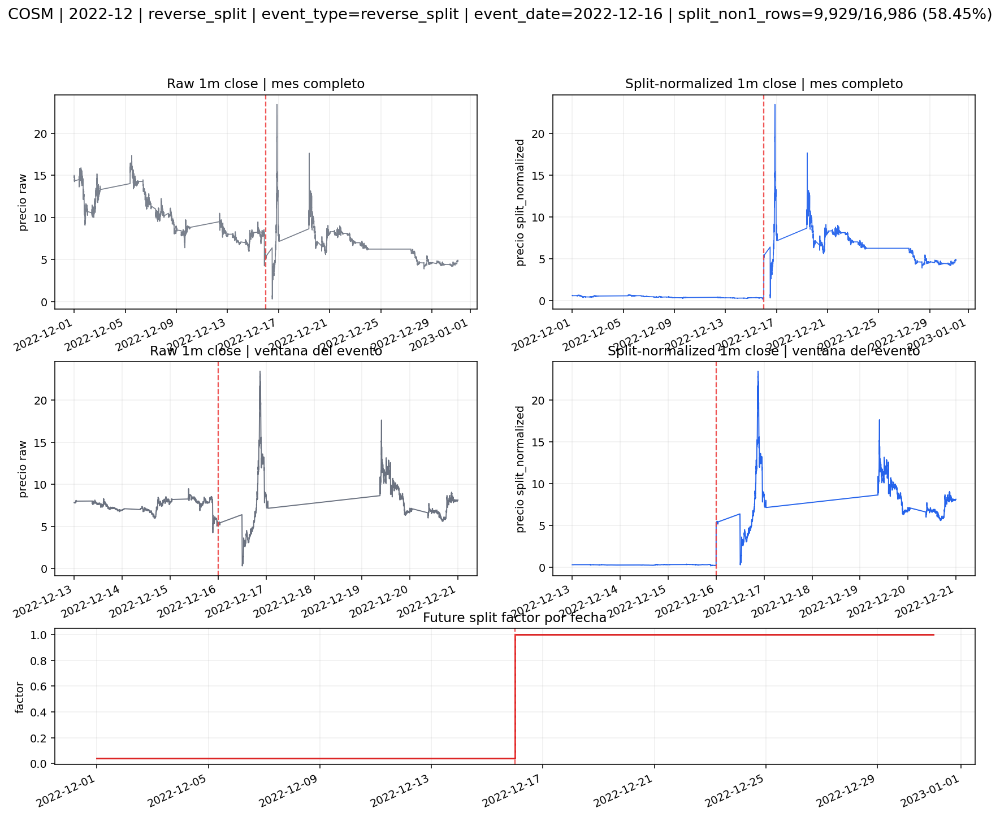
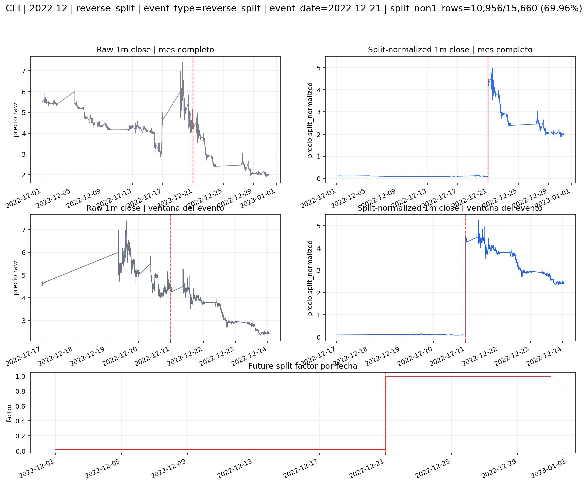
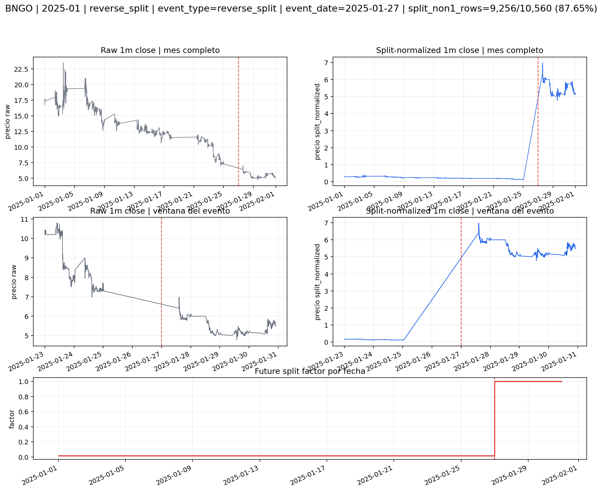
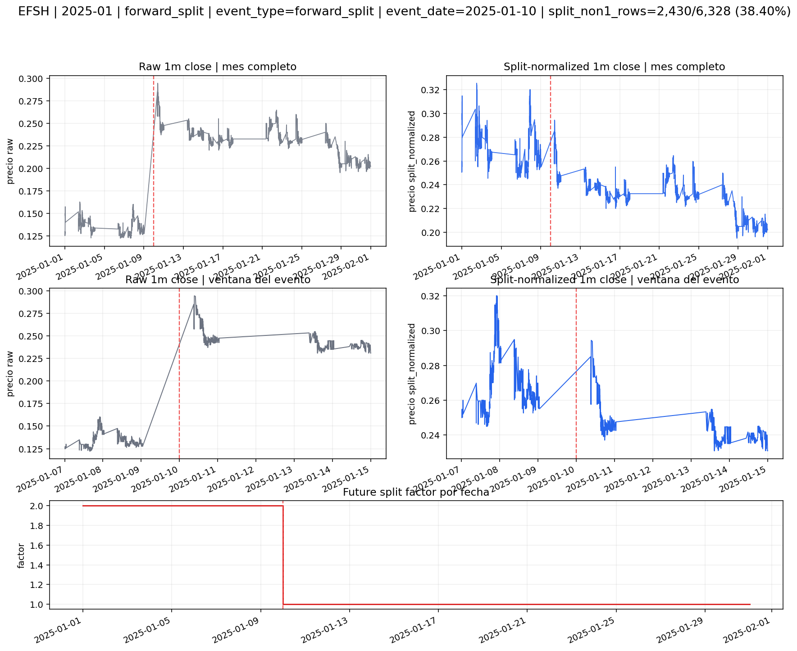
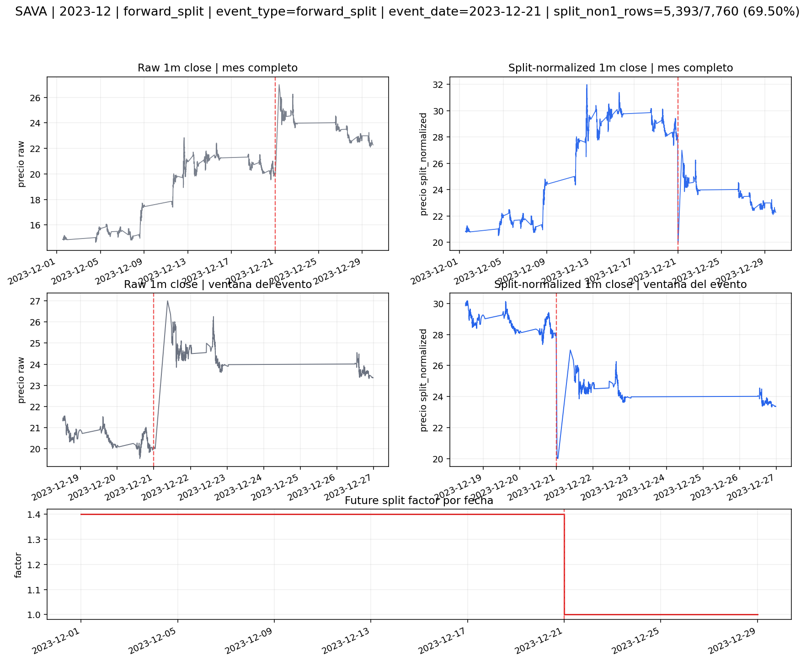
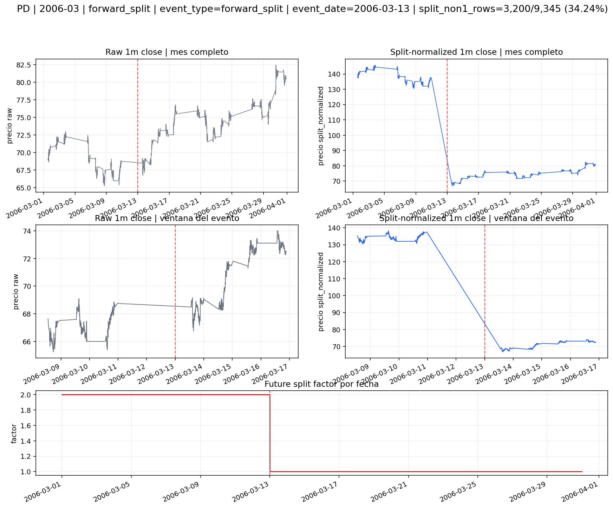
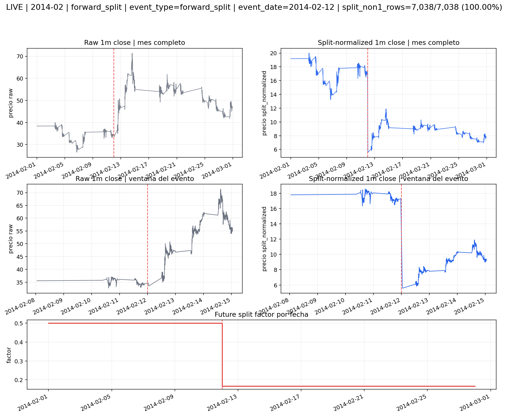
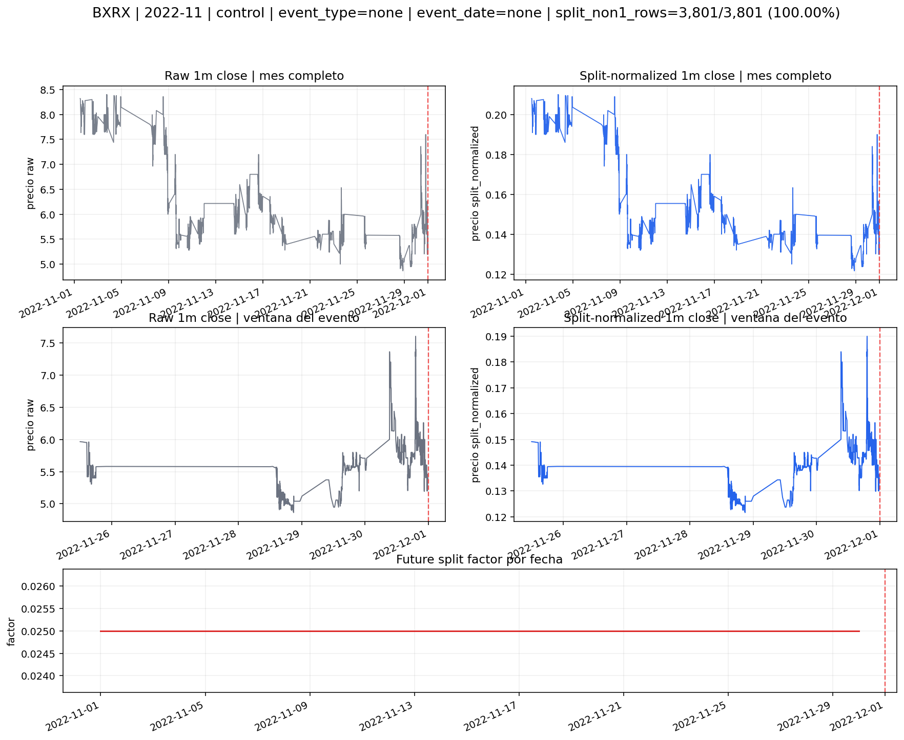
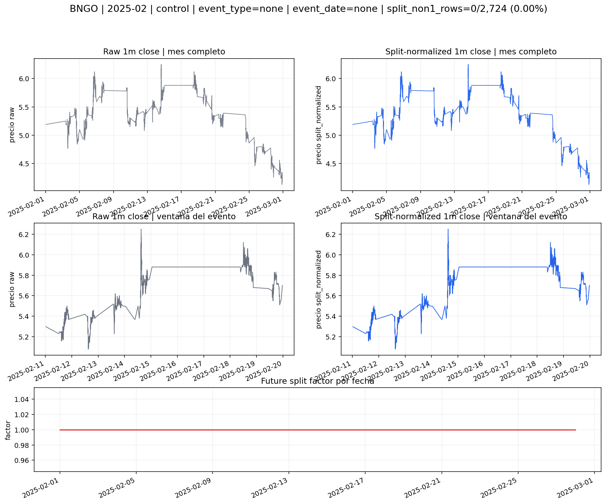

# Ohlcv 1m Split-Normalized | piloto visual de auditoria

## Rol

Este readout no existe para demostrar que el script corre.

Existe para que un inspector pueda mirar casos concretos y decidir si la capa `1m_split_normalized` esta corrigiendo discontinuidades mecanicas reales sin inventarse una serie ficticia.

## Formula contractual

- `px_split_normalized = px_raw * future_split_factor`
- `future_split_factor(date_t) = producto de split_ratio para toda execution_date > date_t`

## Como leer las imagenes

- panel superior izquierdo: `1m raw` del mes completo
- panel superior derecho: `1m split_normalized` del mes completo
- panel central izquierdo: `1m raw` en ventana focalizada alrededor del evento o ancla
- panel central derecho: `1m split_normalized` en la misma ventana
- panel inferior: `future_split_factor` por fecha

La linea roja marca:

- la fecha del split si el caso contiene evento interno
- o la fecha ancla relevante si el caso es un control pre-evento

## Que falsaria la hipotesis

- meses pre-evento con `future_split_factor = 1` de forma sistematica
- meses post-evento con factor `!= 1` sin otro split futuro
- o una vista split-normalized que no absorba la discontinuidad mecanica observada en raw

## Casos

### BXRX | 2022-12 | reverse_split

**Que muestra**

- Compara la misma barra `1m` observada en dos vistas: `raw` y `split_normalized`.
- Ensena el mes completo, una ventana focalizada alrededor del evento o ancla, y la trayectoria diaria del `future_split_factor`.

**Responde**

- Si la discontinuidad entre sesiones viene de un cambio mecanico de escala o de un movimiento economico real.
- Si el factor se aplica justo donde la definicion contractual dice que debe aplicarse.

**Lectura tecnica**

- `split_non1_rows = 0/7,424` (`0.00%`).
- `unique_factors = [1.0]`.
- El evento cae en `2022-12-01` y dentro del `ticker-month` ya no queda tramo previo a reescalar.
- Por eso el resultado correcto es precisamente `0` filas con factor distinto de `1`.

**Conclusion de auditoria**

- Este caso evita una falsa expectativa ingenua.
- No todo mes con split debe contener filas reescaladas; depende de donde cae el evento dentro de la ventana materializada.

---

### COSM | 2022-12 | reverse_split

**Que muestra**

- Compara la misma barra `1m` observada en dos vistas: `raw` y `split_normalized`.
- Ensena el mes completo, una ventana focalizada alrededor del evento o ancla, y la trayectoria diaria del `future_split_factor`.

**Responde**

- Si la discontinuidad entre sesiones viene de un cambio mecanico de escala o de un movimiento economico real.
- Si el factor se aplica justo donde la definicion contractual dice que debe aplicarse.

**Lectura tecnica**

- `split_non1_rows = 9,929/16,986` (`58.45%`).
- `unique_factors = [0.04, 1.0]`.
- El tramo reescalado visible va de `2022-12-01` a `2022-12-15`.
- El primer dia neutro posterior observado es `2022-12-16`.

**Conclusion de auditoria**

- La proporcion reescalada es intermedia y coherente con una frontera temporal de split que parte el mes en dos regimenes de escala.
- Si el patron visual raw muestra salto y la vista split-normalized lo absorbe sin deformar el tramo posterior, la lectura correcta es que el shock era mecanico y no alpha.

---

### CEI | 2022-12 | reverse_split

**Que muestra**

- Compara la misma barra `1m` observada en dos vistas: `raw` y `split_normalized`.
- Ensena el mes completo, una ventana focalizada alrededor del evento o ancla, y la trayectoria diaria del `future_split_factor`.

**Responde**

- Si la discontinuidad entre sesiones viene de un cambio mecanico de escala o de un movimiento economico real.
- Si el factor se aplica justo donde la definicion contractual dice que debe aplicarse.

**Lectura tecnica**

- `split_non1_rows = 10,956/15,660` (`69.96%`).
- `unique_factors = [0.02, 1.0]`.
- El tramo reescalado visible va de `2022-12-01` a `2022-12-20`.
- El primer dia neutro posterior observado es `2022-12-21`.

**Conclusion de auditoria**

- La proporcion reescalada es intermedia y coherente con una frontera temporal de split que parte el mes en dos regimenes de escala.
- Si el patron visual raw muestra salto y la vista split-normalized lo absorbe sin deformar el tramo posterior, la lectura correcta es que el shock era mecanico y no alpha.

---

### BNGO | 2025-01 | reverse_split

**Que muestra**

- Compara la misma barra `1m` observada en dos vistas: `raw` y `split_normalized`.
- Ensena el mes completo, una ventana focalizada alrededor del evento o ancla, y la trayectoria diaria del `future_split_factor`.

**Responde**

- Si la discontinuidad entre sesiones viene de un cambio mecanico de escala o de un movimiento economico real.
- Si el factor se aplica justo donde la definicion contractual dice que debe aplicarse.

**Lectura tecnica**

- `split_non1_rows = 9,256/10,560` (`87.65%`).
- `unique_factors = [0.016666666666666666, 1.0]`.
- El tramo reescalado visible va de `2025-01-01` a `2025-01-25`.
- El primer dia neutro posterior observado es `2025-01-27`.

**Conclusion de auditoria**

- La masa reescalada es muy alta porque el evento cae muy tarde en el mes o porque casi todo el mes pertenece al tramo previo.
- Si el patron visual raw muestra salto y la vista split-normalized lo absorbe sin deformar el tramo posterior, la lectura correcta es que el shock era mecanico y no alpha.

---

### EFSH | 2025-01 | forward_split

**Que muestra**

- Compara la misma barra `1m` observada en dos vistas: `raw` y `split_normalized`.
- Ensena el mes completo, una ventana focalizada alrededor del evento o ancla, y la trayectoria diaria del `future_split_factor`.

**Responde**

- Si la discontinuidad entre sesiones viene de un cambio mecanico de escala o de un movimiento economico real.
- Si el factor se aplica justo donde la definicion contractual dice que debe aplicarse.

**Lectura tecnica**

- `split_non1_rows = 2,430/6,328` (`38.40%`).
- `unique_factors = [1.0, 2.0]`.
- El tramo reescalado visible va de `2025-01-01` a `2025-01-09`.
- El primer dia neutro posterior observado es `2025-01-10`.

**Conclusion de auditoria**

- La proporcion reescalada es intermedia y coherente con una frontera temporal de split que parte el mes en dos regimenes de escala.
- Si el patron visual raw muestra salto y la vista split-normalized lo absorbe sin deformar el tramo posterior, la lectura correcta es que el shock era mecanico y no alpha.

---

### SAVA | 2023-12 | forward_split

**Que muestra**

- Compara la misma barra `1m` observada en dos vistas: `raw` y `split_normalized`.
- Ensena el mes completo, una ventana focalizada alrededor del evento o ancla, y la trayectoria diaria del `future_split_factor`.

**Responde**

- Si la discontinuidad entre sesiones viene de un cambio mecanico de escala o de un movimiento economico real.
- Si el factor se aplica justo donde la definicion contractual dice que debe aplicarse.

**Lectura tecnica**

- `split_non1_rows = 5,393/7,760` (`69.50%`).
- `unique_factors = [1.0, 1.4]`.
- El tramo reescalado visible va de `2023-12-01` a `2023-12-20`.
- El primer dia neutro posterior observado es `2023-12-21`.

**Conclusion de auditoria**

- La proporcion reescalada es intermedia y coherente con una frontera temporal de split que parte el mes en dos regimenes de escala.
- Si el patron visual raw muestra salto y la vista split-normalized lo absorbe sin deformar el tramo posterior, la lectura correcta es que el shock era mecanico y no alpha.

---

### PD | 2006-03 | forward_split

**Que muestra**

- Compara la misma barra `1m` observada en dos vistas: `raw` y `split_normalized`.
- Ensena el mes completo, una ventana focalizada alrededor del evento o ancla, y la trayectoria diaria del `future_split_factor`.

**Responde**

- Si la discontinuidad entre sesiones viene de un cambio mecanico de escala o de un movimiento economico real.
- Si el factor se aplica justo donde la definicion contractual dice que debe aplicarse.

**Lectura tecnica**

- `split_non1_rows = 3,200/9,345` (`34.24%`).
- `unique_factors = [1.0, 2.0]`.
- El tramo reescalado visible va de `2006-03-01` a `2006-03-10`.
- El primer dia neutro posterior observado es `2006-03-13`.

**Conclusion de auditoria**

- La proporcion reescalada es intermedia y coherente con una frontera temporal de split que parte el mes en dos regimenes de escala.
- Si el patron visual raw muestra salto y la vista split-normalized lo absorbe sin deformar el tramo posterior, la lectura correcta es que el shock era mecanico y no alpha.

---

### LIVE | 2014-02 | forward_split

**Que muestra**

- Compara la misma barra `1m` observada en dos vistas: `raw` y `split_normalized`.
- Ensena el mes completo, una ventana focalizada alrededor del evento o ancla, y la trayectoria diaria del `future_split_factor`.

**Responde**

- Si la discontinuidad entre sesiones viene de un cambio mecanico de escala o de un movimiento economico real.
- Si el factor se aplica justo donde la definicion contractual dice que debe aplicarse.

**Lectura tecnica**

- `split_non1_rows = 7,038/7,038` (`100.00%`).
- `unique_factors = [0.16666666666666666, 0.5]`.
- El tramo reescalado visible va de `2014-02-01` a `2014-02-28`.
- El primer dia neutro posterior observado es `None`.

**Conclusion de auditoria**

- La masa reescalada es muy alta porque el evento cae muy tarde en el mes o porque casi todo el mes pertenece al tramo previo.
- Si el patron visual raw muestra salto y la vista split-normalized lo absorbe sin deformar el tramo posterior, la lectura correcta es que el shock era mecanico y no alpha.

---

### BXRX | 2022-11 | control

**Que muestra**

- Compara la misma barra `1m` observada en dos vistas: `raw` y `split_normalized`.
- Ensena el mes completo, una ventana focalizada alrededor del evento o ancla, y la trayectoria diaria del `future_split_factor`.

**Responde**

- Si la discontinuidad entre sesiones viene de un cambio mecanico de escala o de un movimiento economico real.
- Si el factor se aplica justo donde la definicion contractual dice que debe aplicarse.

**Lectura tecnica**

- `split_non1_rows = 3,801/3,801` (`100.00%`).
- `unique_factors = [0.025]`.
- El mes es un control sin split interno, pero esta antes del split ancla `2022-12-01`.
- Por eso el tramo `2022-11-01 -> 2022-11-30` aparece reescalado aunque el evento no viva dentro del propio mes.

**Conclusion de auditoria**

- Esto no contradice la semantica; la confirma.
- Demuestra que la capa no pregunta si el mes contiene un split, sino si la observacion es anterior a un split futuro relevante.

---

### BNGO | 2025-02 | control

**Que muestra**

- Compara la misma barra `1m` observada en dos vistas: `raw` y `split_normalized`.
- Ensena el mes completo, una ventana focalizada alrededor del evento o ancla, y la trayectoria diaria del `future_split_factor`.

**Responde**

- Si la discontinuidad entre sesiones viene de un cambio mecanico de escala o de un movimiento economico real.
- Si el factor se aplica justo donde la definicion contractual dice que debe aplicarse.

**Lectura tecnica**

- `split_non1_rows = 0/2,724` (`0.00%`).
- `unique_factors = [1.0]`.
- Todo el mes queda con `future_split_factor = 1`, lo que implica que no existe split futuro activo para esta ventana.

**Conclusion de auditoria**

- Este es el control neutro puro.
- Demuestra que la capa no deja residuos artificiales una vez superado el evento.

---
