# Daily Hard Invalid Cases v0.1

Este documento recopila todos los casos `hard_invalid_parse_or_price` exportados para `daily`, con imagen incrustada, metadatos y analisis forense resumido.

El orden sigue gravedad operativa descendente:

- proporcion de filas problematicas sobre filas parseadas;
- numero total de filas problematicas;
- presencia de `OHLC = 0`;
- y contradicciones internas adicionales.

## Menu

- 1. [TLOG 2024](#tlog-2024)
- 2. [BSPM 2022](#bspm-2022)
- 3. [BSPM 2021](#bspm-2021)
- 4. [PRZM 2026](#przm-2026)
- 5. [SPHS 2021](#sphs-2021)
- 6. [SPHS 2022](#sphs-2022)
- 7. [TRNX 2021](#trnx-2021)
- 8. [ASTI 2006](#asti-2006)
- 9. [ASTI 2007](#asti-2007)
- 10. [ASTI 2008](#asti-2008)
- 11. [ASTI 2009](#asti-2009)
- 12. [ASTI 2010](#asti-2010)
- 13. [ASTI 2011](#asti-2011)
- 14. [TOPS 2008](#tops-2008)
- 15. [TOPS 2009](#tops-2009)
- 16. [TOPS 2010](#tops-2010)
- 17. [TOPS 2011](#tops-2011)
- 18. [TOPS 2012](#tops-2012)
- 19. [TOPS 2013](#tops-2013)
- 20. [HMNY 2025](#hmny-2025)
- 21. [HMNY 2024](#hmny-2024)
- 22. [HMNY 2026](#hmny-2026)
- 23. [HMNY 2023](#hmny-2023)
- 24. [PRST 2026](#prst-2026)
- 25. [RENO 2026](#reno-2026)
- 26. [BSPM 2024](#bspm-2024)
- 27. [ANTH 2024](#anth-2024)
- 28. [RENO 2024](#reno-2024)
- 29. [BSPM 2023](#bspm-2023)
- 30. [ANTH 2021](#anth-2021)
- 31. [RENO 2025](#reno-2025)
- 32. [ANTH 2025](#anth-2025)
- 33. [TLOG 2025](#tlog-2025)
- 34. [ELOX 2025](#elox-2025)
- 35. [CLVR 2025](#clvr-2025)
- 36. [THMO 2025](#thmo-2025)
- 37. [CWBR 2024](#cwbr-2024)
- 38. [PRST 2025](#prst-2025)
- 39. [FXLV 2025](#fxlv-2025)
- 40. [UTRS 2024](#utrs-2024)
- 41. [VAXX 2025](#vaxx-2025)
- 42. [GNRS 2024](#gnrs-2024)
- 43. [HMNY 2022](#hmny-2022)
- 44. [NXTP 2025](#nxtp-2025)
- 45. [KBNT 2025](#kbnt-2025)
- 46. [TCCO 2025](#tcco-2025)
- 47. [KLDO 2024](#kldo-2024)
- 48. [AAGR 2025](#aagr-2025)
- 49. [FOXO 2026](#foxo-2026)
- 50. [GNRS 2023](#gnrs-2023)
- 51. [KLDO 2025](#kldo-2025)
- 52. [EFTR 2025](#eftr-2025)
- 53. [NMRD 2025](#nmrd-2025)
- 54. [ANTH 2023](#anth-2023)
- 55. [JEWL 2026](#jewl-2026)
- 56. [MOTS 2025](#mots-2025)
- 57. [ELOX 2024](#elox-2024)
- 58. [KLDO 2023](#kldo-2023)
- 59. [WTER 2024](#wter-2024)
- 60. [NEXI 2025](#nexi-2025)
- 61. [ARDS 2024](#ards-2024)
- 62. [SPEC 2025](#spec-2025)
- 63. [KBNT 2024](#kbnt-2024)
- 64. [NXTP 2024](#nxtp-2024)
- 65. [TCCO 2024](#tcco-2024)
- 66. [CLVR 2024](#clvr-2024)
- 67. [MTEM 2025](#mtem-2025)
- 68. [VRPX 2025](#vrpx-2025)
- 69. [CMRA 2024](#cmra-2024)
- 70. [PBLA 2025](#pbla-2025)
- 71. [ICCT 2026](#icct-2026)
- 72. [EVOL 2024](#evol-2024)
- 73. [SOFO 2024](#sofo-2024)
- 74. [VIVE 2024](#vive-2024)
- 75. [VIVE 2025](#vive-2025)
- 76. [NMRD 2024](#nmrd-2024)
- 77. [RENO 2023](#reno-2023)
- 78. [PXMD 2025](#pxmd-2025)
- 79. [CMRA 2025](#cmra-2025)
- 80. [ALPP 2025](#alpp-2025)
- 81. [BTTX 2024](#bttx-2024)
- 82. [JEWL 2025](#jewl-2025)
- 83. [ELYS 2024](#elys-2024)
- 84. [EVLO 2025](#evlo-2025)
- 85. [ARDS 2025](#ards-2025)
- 86. [AAGR 2024](#aagr-2024)
- 87. [RIBT 2025](#ribt-2025)
- 88. [AFIB 2025](#afib-2025)
- 89. [AAGR 2026](#aagr-2026)
- 90. [ELYS 2025](#elys-2025)
- 91. [STAB 2023](#stab-2023)
- 92. [MOTS 2024](#mots-2024)
- 93. [KBNT 2023](#kbnt-2023)
- 94. [NAVB 2024](#navb-2024)
- 95. [VAXX 2024](#vaxx-2024)
- 96. [BTTX 2025](#bttx-2025)
- 97. [SCPS 2024](#scps-2024)
- 98. [STAB 2024](#stab-2024)
- 99. [VIVE 2023](#vive-2023)
- 100. [GETR 2025](#getr-2025)
- 101. [HGEN 2023](#hgen-2023)
- 102. [OCEA 2025](#ocea-2025)

## TLOG 2024

ticker: `TLOG`  
year: `2024`  
bucket: `hard_invalid_parse_or_price`  
quality_policy: `bad`  
issues: `["all_rows_invalid_after_parse"]`  
warns: `["dataset_read_incompatible_schema", "schema_merge_conflict_ticker_encoding"]`  
file: `D:\ohlcv_daily\ticker=TLOG\year=2024\day_aggs_TLOG_2024.parquet`

### Analisis Forense

En `hard_invalid_parse_or_price` la pregunta ya no es si el caso merece flag, sino si la barra diaria sigue siendo interpretable como hecho de mercado. La respuesta aqui es no. Se observan `10` filas con `OHLC = 0`, una firma tipica de colapso de barra diaria. Las primeras fechas exportadas (`2024-05-08`) ayudan a ver si el dano esta concentrado en un bloque temporal o disperso en el ano. En estos files la figura no representa una sesion tensa o iliquida, sino una barra que deja de tener semantica estable: cero estructural, parseo invalido o contradiccion de precios suficiente para romper la confianza minima en la observacion.

Por eso la decision correcta es `bad` y no `recoverable_with_flag`. Si este tipo de fila entra en `backtest_core`, el dano no es solo estadistico; es semantico. Contamina retornos, labels, benchmarks y cualquier reconciliacion con terceros porque ya no sabemos si la barra resume mercado o artefacto. Implicacion operativa: preservar para `forensic_only` o futura reconstruccion, pero no reutilizar como dato normal. El error que se evita es tratar ausencia de precios validos como si fuera simplemente una cola extrema del mercado.

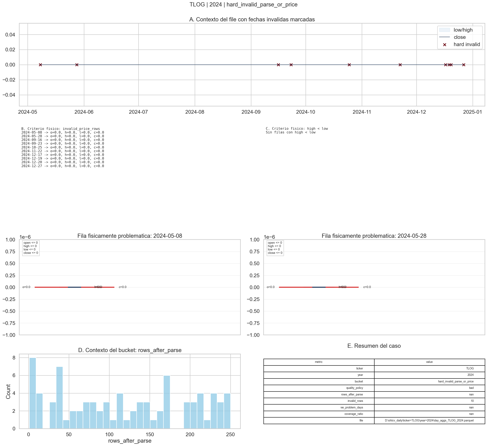

## BSPM 2022

ticker: `BSPM`  
year: `2022`  
bucket: `hard_invalid_parse_or_price`  
quality_policy: `bad`  
issues: `["all_rows_invalid_after_parse"]`  
warns: `["dataset_read_incompatible_schema", "schema_merge_conflict_ticker_encoding"]`  
file: `D:\ohlcv_daily\ticker=BSPM\year=2022\day_aggs_BSPM_2022.parquet`

### Analisis Forense

En `hard_invalid_parse_or_price` la pregunta ya no es si el caso merece flag, sino si la barra diaria sigue siendo interpretable como hecho de mercado. La respuesta aqui es no. Se observan `6` filas con `OHLC = 0`, una firma tipica de colapso de barra diaria. Las primeras fechas exportadas (`2022-04-05`) ayudan a ver si el dano esta concentrado en un bloque temporal o disperso en el ano. En estos files la figura no representa una sesion tensa o iliquida, sino una barra que deja de tener semantica estable: cero estructural, parseo invalido o contradiccion de precios suficiente para romper la confianza minima en la observacion.

Por eso la decision correcta es `bad` y no `recoverable_with_flag`. Si este tipo de fila entra en `backtest_core`, el dano no es solo estadistico; es semantico. Contamina retornos, labels, benchmarks y cualquier reconciliacion con terceros porque ya no sabemos si la barra resume mercado o artefacto. Implicacion operativa: preservar para `forensic_only` o futura reconstruccion, pero no reutilizar como dato normal. El error que se evita es tratar ausencia de precios validos como si fuera simplemente una cola extrema del mercado.

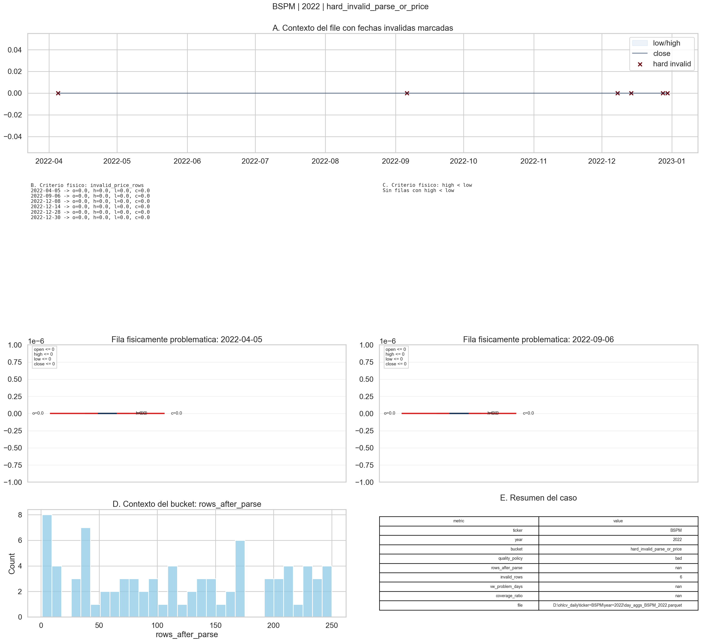

## BSPM 2021

ticker: `BSPM`  
year: `2021`  
bucket: `hard_invalid_parse_or_price`  
quality_policy: `bad`  
issues: `["all_rows_invalid_after_parse"]`  
warns: `["dataset_read_incompatible_schema", "schema_merge_conflict_ticker_encoding"]`  
file: `D:\ohlcv_daily\ticker=BSPM\year=2021\day_aggs_BSPM_2021.parquet`

### Analisis Forense

En `hard_invalid_parse_or_price` la pregunta ya no es si el caso merece flag, sino si la barra diaria sigue siendo interpretable como hecho de mercado. La respuesta aqui es no. Se observan `1` filas con `OHLC = 0`, una firma tipica de colapso de barra diaria. Las primeras fechas exportadas (`2021-12-31`) ayudan a ver si el dano esta concentrado en un bloque temporal o disperso en el ano. En estos files la figura no representa una sesion tensa o iliquida, sino una barra que deja de tener semantica estable: cero estructural, parseo invalido o contradiccion de precios suficiente para romper la confianza minima en la observacion.

Por eso la decision correcta es `bad` y no `recoverable_with_flag`. Si este tipo de fila entra en `backtest_core`, el dano no es solo estadistico; es semantico. Contamina retornos, labels, benchmarks y cualquier reconciliacion con terceros porque ya no sabemos si la barra resume mercado o artefacto. Implicacion operativa: preservar para `forensic_only` o futura reconstruccion, pero no reutilizar como dato normal. El error que se evita es tratar ausencia de precios validos como si fuera simplemente una cola extrema del mercado.

## PRZM 2026

ticker: `PRZM`  
year: `2026`  
bucket: `hard_invalid_parse_or_price`  
quality_policy: `bad`  
issues: `["all_rows_invalid_after_parse"]`  
warns: `["dataset_read_incompatible_schema", "schema_merge_conflict_ticker_encoding"]`  
file: `D:\ohlcv_daily\ticker=PRZM\year=2026\day_aggs_PRZM_2026.parquet`

### Analisis Forense

En `hard_invalid_parse_or_price` la pregunta ya no es si el caso merece flag, sino si la barra diaria sigue siendo interpretable como hecho de mercado. La respuesta aqui es no. Se observan `1` filas con `OHLC = 0`, una firma tipica de colapso de barra diaria. Las primeras fechas exportadas (`2026-02-26`) ayudan a ver si el dano esta concentrado en un bloque temporal o disperso en el ano. En estos files la figura no representa una sesion tensa o iliquida, sino una barra que deja de tener semantica estable: cero estructural, parseo invalido o contradiccion de precios suficiente para romper la confianza minima en la observacion.

Por eso la decision correcta es `bad` y no `recoverable_with_flag`. Si este tipo de fila entra en `backtest_core`, el dano no es solo estadistico; es semantico. Contamina retornos, labels, benchmarks y cualquier reconciliacion con terceros porque ya no sabemos si la barra resume mercado o artefacto. Implicacion operativa: preservar para `forensic_only` o futura reconstruccion, pero no reutilizar como dato normal. El error que se evita es tratar ausencia de precios validos como si fuera simplemente una cola extrema del mercado.

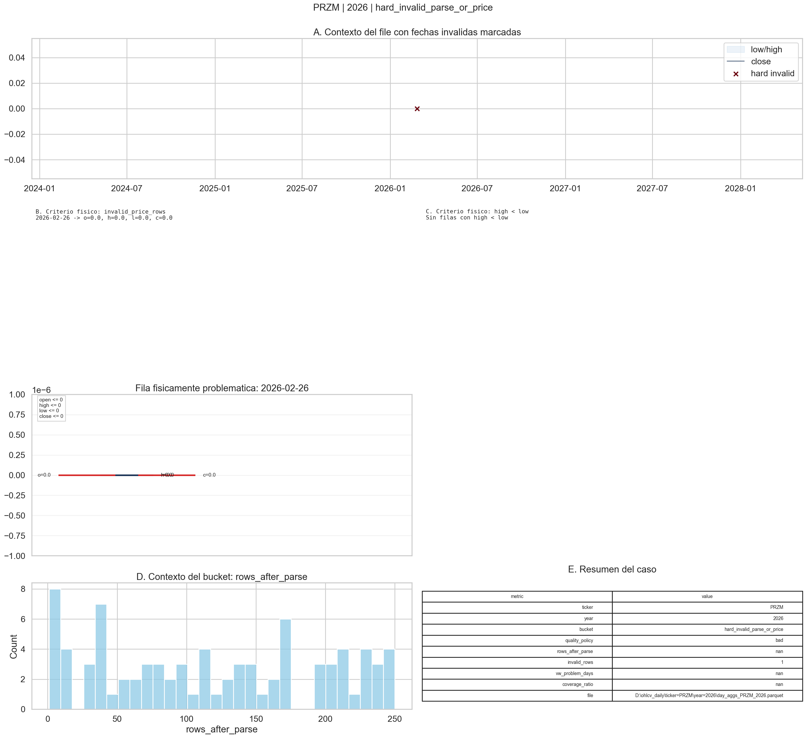

## SPHS 2021

ticker: `SPHS`  
year: `2021`  
bucket: `hard_invalid_parse_or_price`  
quality_policy: `bad`  
issues: `["all_rows_invalid_after_parse"]`  
warns: `["dataset_read_incompatible_schema", "schema_merge_conflict_ticker_encoding"]`  
file: `D:\ohlcv_daily\ticker=SPHS\year=2021\day_aggs_SPHS_2021.parquet`

### Analisis Forense

En `hard_invalid_parse_or_price` la pregunta ya no es si el caso merece flag, sino si la barra diaria sigue siendo interpretable como hecho de mercado. La respuesta aqui es no. Se observan `1` filas con `OHLC = 0`, una firma tipica de colapso de barra diaria. Las primeras fechas exportadas (`2021-12-31`) ayudan a ver si el dano esta concentrado en un bloque temporal o disperso en el ano. En estos files la figura no representa una sesion tensa o iliquida, sino una barra que deja de tener semantica estable: cero estructural, parseo invalido o contradiccion de precios suficiente para romper la confianza minima en la observacion.

Por eso la decision correcta es `bad` y no `recoverable_with_flag`. Si este tipo de fila entra en `backtest_core`, el dano no es solo estadistico; es semantico. Contamina retornos, labels, benchmarks y cualquier reconciliacion con terceros porque ya no sabemos si la barra resume mercado o artefacto. Implicacion operativa: preservar para `forensic_only` o futura reconstruccion, pero no reutilizar como dato normal. El error que se evita es tratar ausencia de precios validos como si fuera simplemente una cola extrema del mercado.

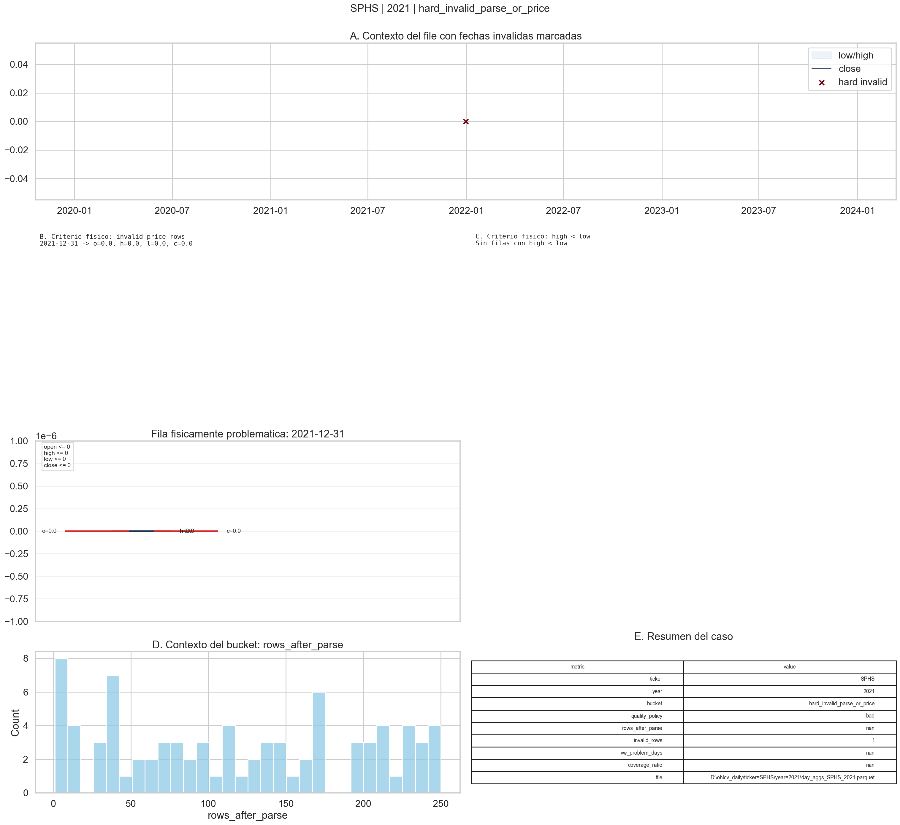

## SPHS 2022

ticker: `SPHS`  
year: `2022`  
bucket: `hard_invalid_parse_or_price`  
quality_policy: `bad`  
issues: `["all_rows_invalid_after_parse"]`  
warns: `["dataset_read_incompatible_schema", "schema_merge_conflict_ticker_encoding"]`  
file: `D:\ohlcv_daily\ticker=SPHS\year=2022\day_aggs_SPHS_2022.parquet`

### Analisis Forense

En `hard_invalid_parse_or_price` la pregunta ya no es si el caso merece flag, sino si la barra diaria sigue siendo interpretable como hecho de mercado. La respuesta aqui es no. Se observan `1` filas con `OHLC = 0`, una firma tipica de colapso de barra diaria. Las primeras fechas exportadas (`2022-03-23`) ayudan a ver si el dano esta concentrado en un bloque temporal o disperso en el ano. En estos files la figura no representa una sesion tensa o iliquida, sino una barra que deja de tener semantica estable: cero estructural, parseo invalido o contradiccion de precios suficiente para romper la confianza minima en la observacion.

Por eso la decision correcta es `bad` y no `recoverable_with_flag`. Si este tipo de fila entra en `backtest_core`, el dano no es solo estadistico; es semantico. Contamina retornos, labels, benchmarks y cualquier reconciliacion con terceros porque ya no sabemos si la barra resume mercado o artefacto. Implicacion operativa: preservar para `forensic_only` o futura reconstruccion, pero no reutilizar como dato normal. El error que se evita es tratar ausencia de precios validos como si fuera simplemente una cola extrema del mercado.

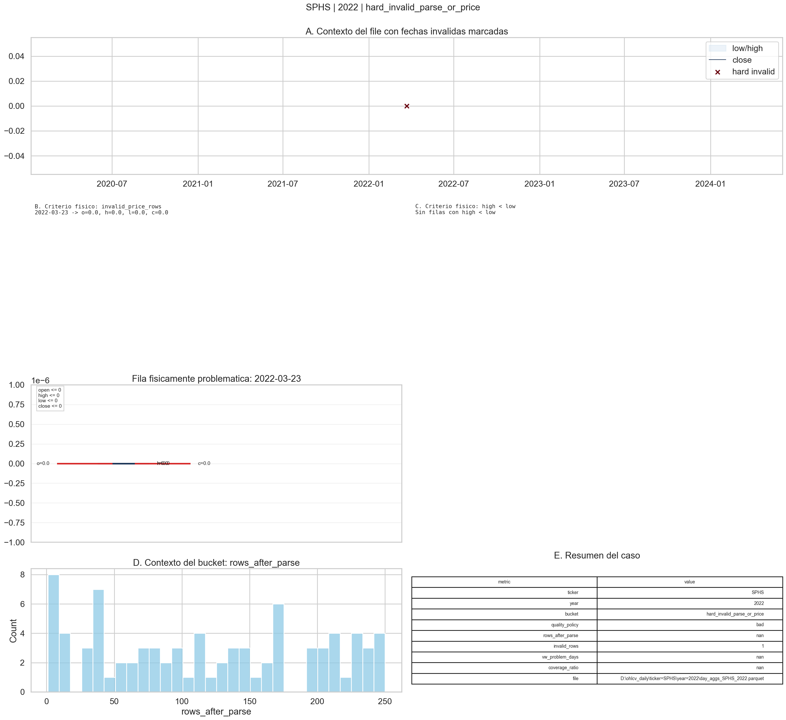

## TRNX 2021

ticker: `TRNX`  
year: `2021`  
bucket: `hard_invalid_parse_or_price`  
quality_policy: `bad`  
issues: `["all_rows_invalid_after_parse"]`  
warns: `["dataset_read_incompatible_schema", "schema_merge_conflict_ticker_encoding"]`  
file: `D:\ohlcv_daily\ticker=TRNX\year=2021\day_aggs_TRNX_2021.parquet`

### Analisis Forense

En `hard_invalid_parse_or_price` la pregunta ya no es si el caso merece flag, sino si la barra diaria sigue siendo interpretable como hecho de mercado. La respuesta aqui es no. Las primeras fechas exportadas (`2021-12-31`) ayudan a ver si el dano esta concentrado en un bloque temporal o disperso en el ano. En estos files la figura no representa una sesion tensa o iliquida, sino una barra que deja de tener semantica estable: cero estructural, parseo invalido o contradiccion de precios suficiente para romper la confianza minima en la observacion.

Por eso la decision correcta es `bad` y no `recoverable_with_flag`. Si este tipo de fila entra en `backtest_core`, el dano no es solo estadistico; es semantico. Contamina retornos, labels, benchmarks y cualquier reconciliacion con terceros porque ya no sabemos si la barra resume mercado o artefacto. Implicacion operativa: preservar para `forensic_only` o futura reconstruccion, pero no reutilizar como dato normal. El error que se evita es tratar ausencia de precios validos como si fuera simplemente una cola extrema del mercado.

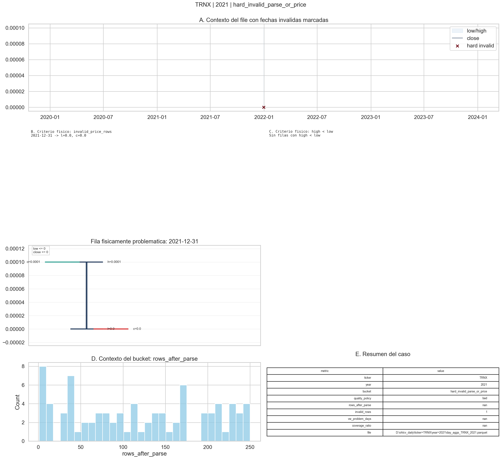

## ASTI 2006

ticker: `ASTI`  
year: `2006`  
bucket: `hard_invalid_parse_or_price`  
quality_policy: `bad`  
issues: `["all_rows_invalid_after_parse"]`  
warns: `["dataset_read_incompatible_schema", "schema_merge_conflict_ticker_encoding"]`  
file: `D:\ohlcv_daily\ticker=ASTI\year=2006\day_aggs_ASTI_2006.parquet`

### Analisis Forense

En `hard_invalid_parse_or_price` la pregunta ya no es si el caso merece flag, sino si la barra diaria sigue siendo interpretable como hecho de mercado. La respuesta aqui es no. En estos files la figura no representa una sesion tensa o iliquida, sino una barra que deja de tener semantica estable: cero estructural, parseo invalido o contradiccion de precios suficiente para romper la confianza minima en la observacion.

Por eso la decision correcta es `bad` y no `recoverable_with_flag`. Si este tipo de fila entra en `backtest_core`, el dano no es solo estadistico; es semantico. Contamina retornos, labels, benchmarks y cualquier reconciliacion con terceros porque ya no sabemos si la barra resume mercado o artefacto. Implicacion operativa: preservar para `forensic_only` o futura reconstruccion, pero no reutilizar como dato normal. El error que se evita es tratar ausencia de precios validos como si fuera simplemente una cola extrema del mercado.

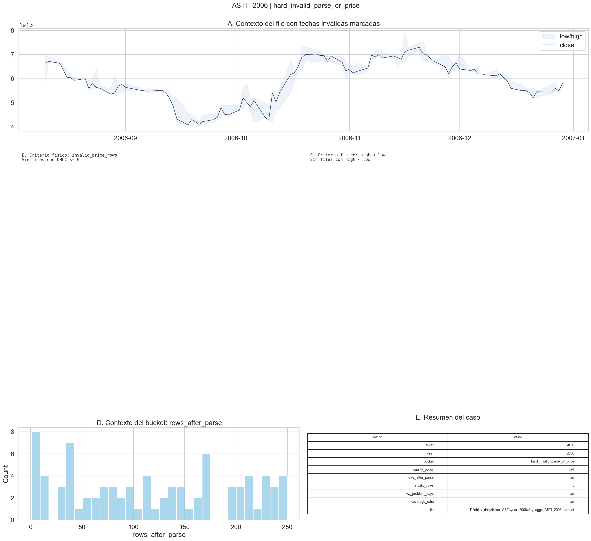

## ASTI 2007

ticker: `ASTI`  
year: `2007`  
bucket: `hard_invalid_parse_or_price`  
quality_policy: `bad`  
issues: `["all_rows_invalid_after_parse"]`  
warns: `["dataset_read_incompatible_schema", "schema_merge_conflict_ticker_encoding"]`  
file: `D:\ohlcv_daily\ticker=ASTI\year=2007\day_aggs_ASTI_2007.parquet`

### Analisis Forense

En `hard_invalid_parse_or_price` la pregunta ya no es si el caso merece flag, sino si la barra diaria sigue siendo interpretable como hecho de mercado. La respuesta aqui es no. En estos files la figura no representa una sesion tensa o iliquida, sino una barra que deja de tener semantica estable: cero estructural, parseo invalido o contradiccion de precios suficiente para romper la confianza minima en la observacion.

Por eso la decision correcta es `bad` y no `recoverable_with_flag`. Si este tipo de fila entra en `backtest_core`, el dano no es solo estadistico; es semantico. Contamina retornos, labels, benchmarks y cualquier reconciliacion con terceros porque ya no sabemos si la barra resume mercado o artefacto. Implicacion operativa: preservar para `forensic_only` o futura reconstruccion, pero no reutilizar como dato normal. El error que se evita es tratar ausencia de precios validos como si fuera simplemente una cola extrema del mercado.

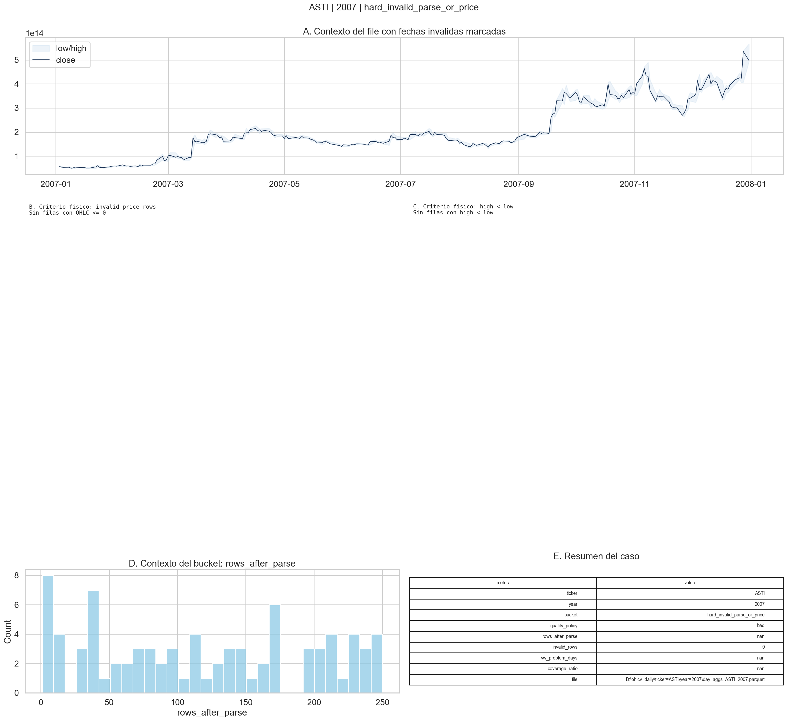

## ASTI 2008

ticker: `ASTI`  
year: `2008`  
bucket: `hard_invalid_parse_or_price`  
quality_policy: `bad`  
issues: `["all_rows_invalid_after_parse"]`  
warns: `["dataset_read_incompatible_schema", "schema_merge_conflict_ticker_encoding"]`  
file: `D:\ohlcv_daily\ticker=ASTI\year=2008\day_aggs_ASTI_2008.parquet`

### Analisis Forense

En `hard_invalid_parse_or_price` la pregunta ya no es si el caso merece flag, sino si la barra diaria sigue siendo interpretable como hecho de mercado. La respuesta aqui es no. En estos files la figura no representa una sesion tensa o iliquida, sino una barra que deja de tener semantica estable: cero estructural, parseo invalido o contradiccion de precios suficiente para romper la confianza minima en la observacion.

Por eso la decision correcta es `bad` y no `recoverable_with_flag`. Si este tipo de fila entra en `backtest_core`, el dano no es solo estadistico; es semantico. Contamina retornos, labels, benchmarks y cualquier reconciliacion con terceros porque ya no sabemos si la barra resume mercado o artefacto. Implicacion operativa: preservar para `forensic_only` o futura reconstruccion, pero no reutilizar como dato normal. El error que se evita es tratar ausencia de precios validos como si fuera simplemente una cola extrema del mercado.

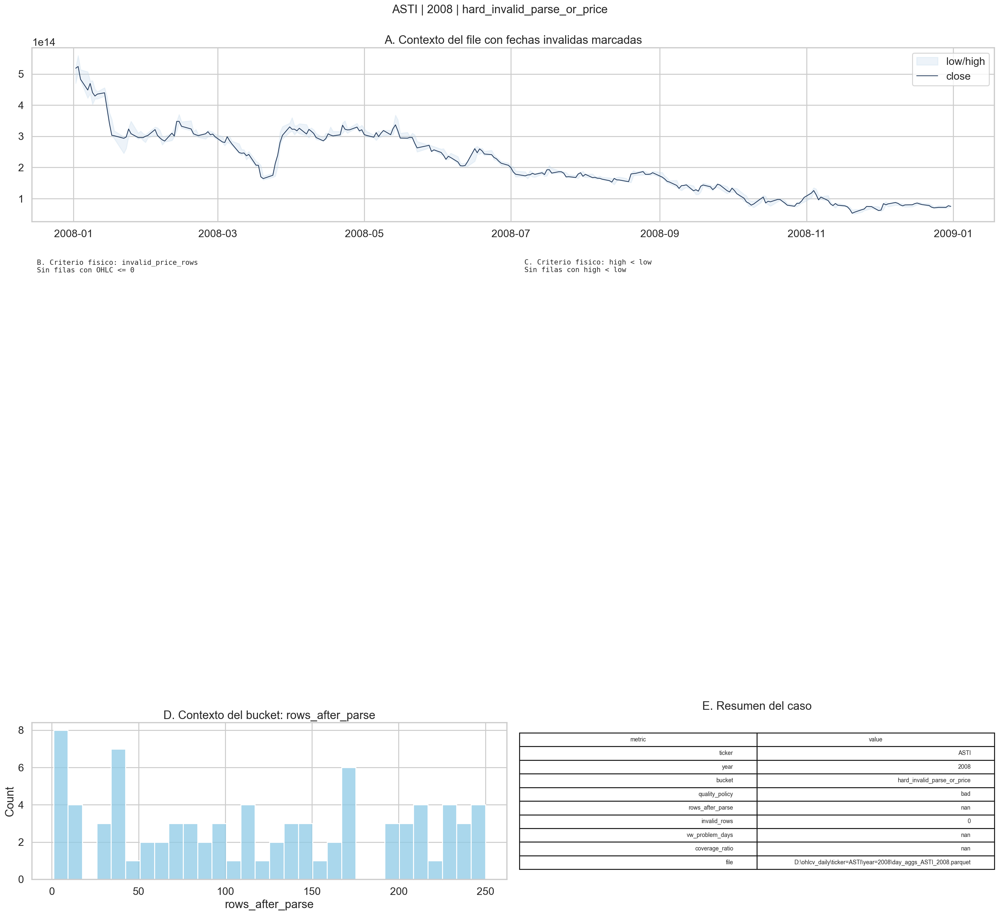

## ASTI 2009

ticker: `ASTI`  
year: `2009`  
bucket: `hard_invalid_parse_or_price`  
quality_policy: `bad`  
issues: `["all_rows_invalid_after_parse"]`  
warns: `["dataset_read_incompatible_schema", "schema_merge_conflict_ticker_encoding"]`  
file: `D:\ohlcv_daily\ticker=ASTI\year=2009\day_aggs_ASTI_2009.parquet`

### Analisis Forense

En `hard_invalid_parse_or_price` la pregunta ya no es si el caso merece flag, sino si la barra diaria sigue siendo interpretable como hecho de mercado. La respuesta aqui es no. En estos files la figura no representa una sesion tensa o iliquida, sino una barra que deja de tener semantica estable: cero estructural, parseo invalido o contradiccion de precios suficiente para romper la confianza minima en la observacion.

Por eso la decision correcta es `bad` y no `recoverable_with_flag`. Si este tipo de fila entra en `backtest_core`, el dano no es solo estadistico; es semantico. Contamina retornos, labels, benchmarks y cualquier reconciliacion con terceros porque ya no sabemos si la barra resume mercado o artefacto. Implicacion operativa: preservar para `forensic_only` o futura reconstruccion, pero no reutilizar como dato normal. El error que se evita es tratar ausencia de precios validos como si fuera simplemente una cola extrema del mercado.

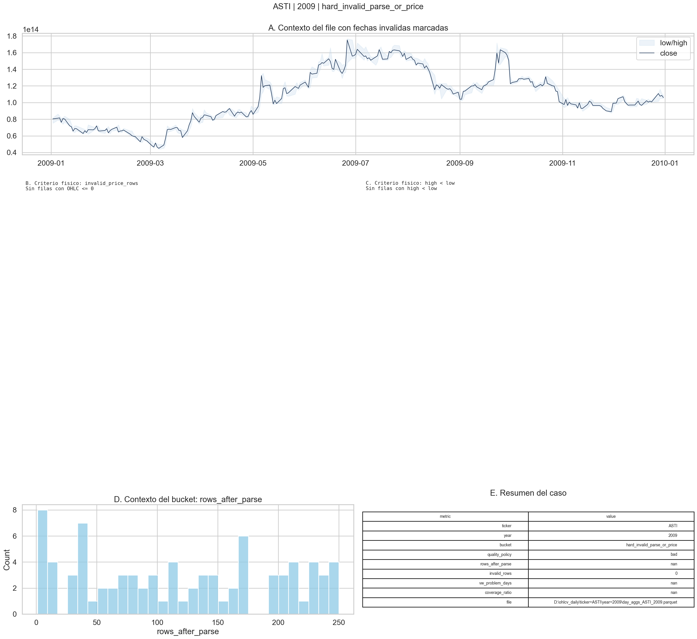

## ASTI 2010

ticker: `ASTI`  
year: `2010`  
bucket: `hard_invalid_parse_or_price`  
quality_policy: `bad`  
issues: `["all_rows_invalid_after_parse"]`  
warns: `["dataset_read_incompatible_schema", "schema_merge_conflict_ticker_encoding"]`  
file: `D:\ohlcv_daily\ticker=ASTI\year=2010\day_aggs_ASTI_2010.parquet`

### Analisis Forense

En `hard_invalid_parse_or_price` la pregunta ya no es si el caso merece flag, sino si la barra diaria sigue siendo interpretable como hecho de mercado. La respuesta aqui es no. En estos files la figura no representa una sesion tensa o iliquida, sino una barra que deja de tener semantica estable: cero estructural, parseo invalido o contradiccion de precios suficiente para romper la confianza minima en la observacion.

Por eso la decision correcta es `bad` y no `recoverable_with_flag`. Si este tipo de fila entra en `backtest_core`, el dano no es solo estadistico; es semantico. Contamina retornos, labels, benchmarks y cualquier reconciliacion con terceros porque ya no sabemos si la barra resume mercado o artefacto. Implicacion operativa: preservar para `forensic_only` o futura reconstruccion, pero no reutilizar como dato normal. El error que se evita es tratar ausencia de precios validos como si fuera simplemente una cola extrema del mercado.

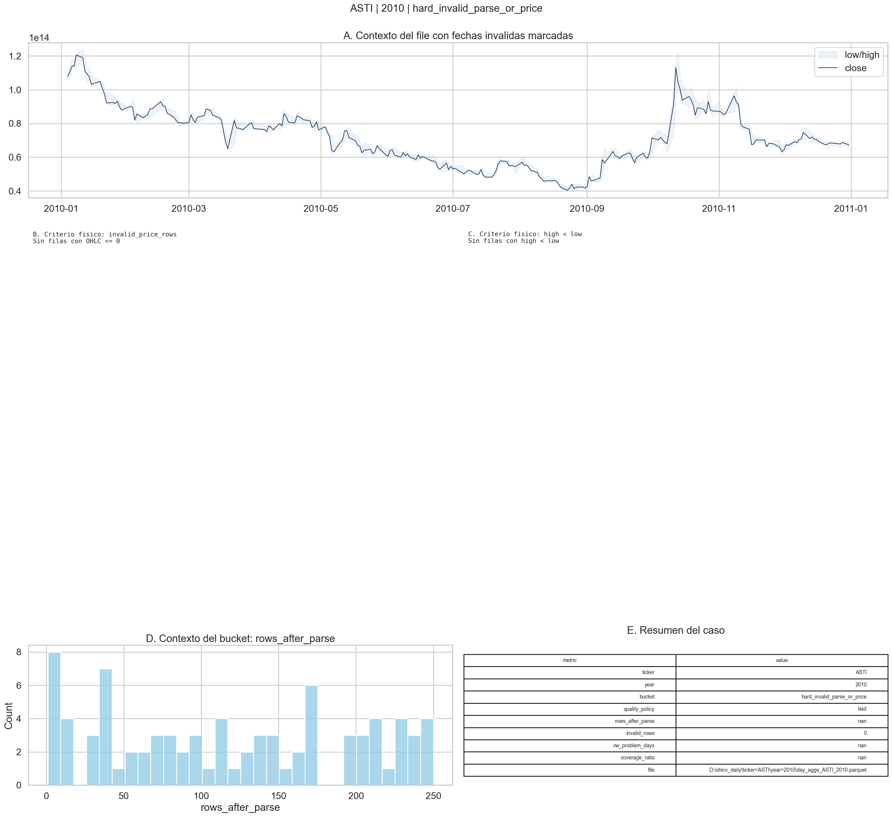

## ASTI 2011

ticker: `ASTI`  
year: `2011`  
bucket: `hard_invalid_parse_or_price`  
quality_policy: `bad`  
issues: `["all_rows_invalid_after_parse"]`  
warns: `["dataset_read_incompatible_schema", "schema_merge_conflict_ticker_encoding"]`  
file: `D:\ohlcv_daily\ticker=ASTI\year=2011\day_aggs_ASTI_2011.parquet`

### Analisis Forense

En `hard_invalid_parse_or_price` la pregunta ya no es si el caso merece flag, sino si la barra diaria sigue siendo interpretable como hecho de mercado. La respuesta aqui es no. En estos files la figura no representa una sesion tensa o iliquida, sino una barra que deja de tener semantica estable: cero estructural, parseo invalido o contradiccion de precios suficiente para romper la confianza minima en la observacion.

Por eso la decision correcta es `bad` y no `recoverable_with_flag`. Si este tipo de fila entra en `backtest_core`, el dano no es solo estadistico; es semantico. Contamina retornos, labels, benchmarks y cualquier reconciliacion con terceros porque ya no sabemos si la barra resume mercado o artefacto. Implicacion operativa: preservar para `forensic_only` o futura reconstruccion, pero no reutilizar como dato normal. El error que se evita es tratar ausencia de precios validos como si fuera simplemente una cola extrema del mercado.

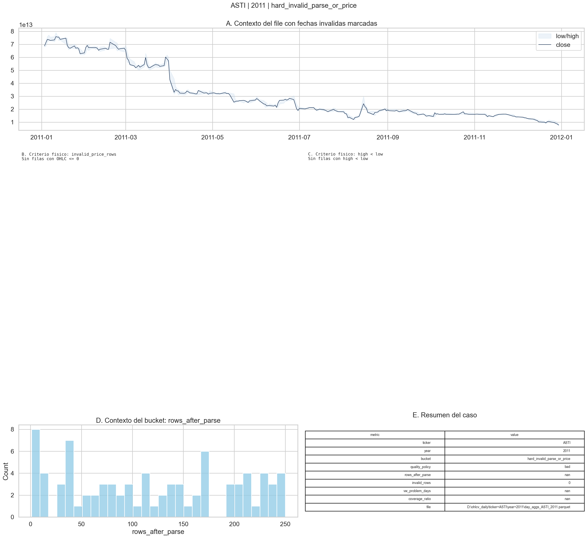

## TOPS 2008

ticker: `TOPS`  
year: `2008`  
bucket: `hard_invalid_parse_or_price`  
quality_policy: `bad`  
issues: `["all_rows_invalid_after_parse"]`  
warns: `["dataset_read_incompatible_schema", "schema_merge_conflict_ticker_encoding"]`  
file: `D:\ohlcv_daily\ticker=TOPS\year=2008\day_aggs_TOPS_2008.parquet`

### Analisis Forense

En `hard_invalid_parse_or_price` la pregunta ya no es si el caso merece flag, sino si la barra diaria sigue siendo interpretable como hecho de mercado. La respuesta aqui es no. En estos files la figura no representa una sesion tensa o iliquida, sino una barra que deja de tener semantica estable: cero estructural, parseo invalido o contradiccion de precios suficiente para romper la confianza minima en la observacion.

Por eso la decision correcta es `bad` y no `recoverable_with_flag`. Si este tipo de fila entra en `backtest_core`, el dano no es solo estadistico; es semantico. Contamina retornos, labels, benchmarks y cualquier reconciliacion con terceros porque ya no sabemos si la barra resume mercado o artefacto. Implicacion operativa: preservar para `forensic_only` o futura reconstruccion, pero no reutilizar como dato normal. El error que se evita es tratar ausencia de precios validos como si fuera simplemente una cola extrema del mercado.

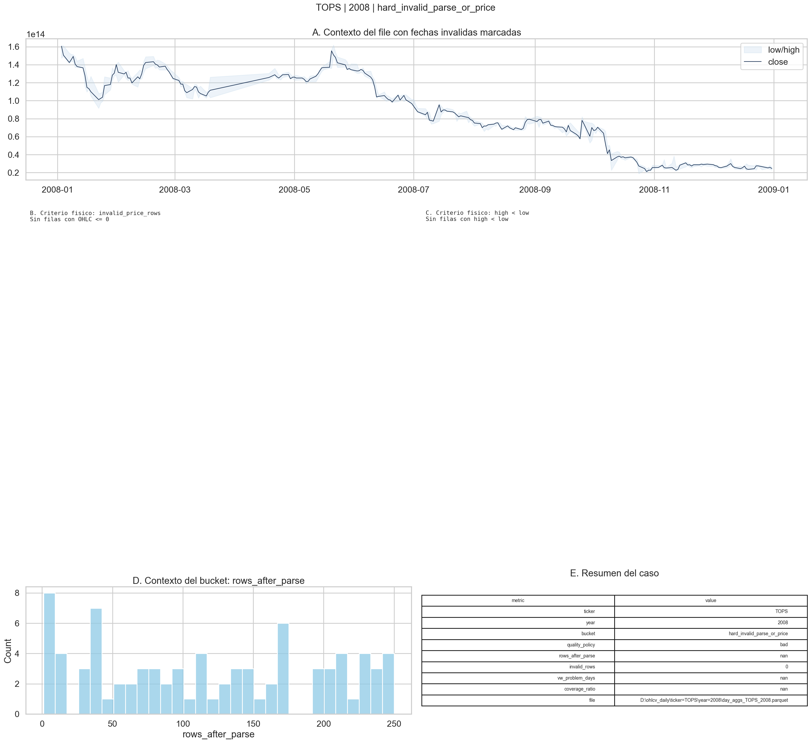

## TOPS 2009

ticker: `TOPS`  
year: `2009`  
bucket: `hard_invalid_parse_or_price`  
quality_policy: `bad`  
issues: `["all_rows_invalid_after_parse"]`  
warns: `["dataset_read_incompatible_schema", "schema_merge_conflict_ticker_encoding"]`  
file: `D:\ohlcv_daily\ticker=TOPS\year=2009\day_aggs_TOPS_2009.parquet`

### Analisis Forense

En `hard_invalid_parse_or_price` la pregunta ya no es si el caso merece flag, sino si la barra diaria sigue siendo interpretable como hecho de mercado. La respuesta aqui es no. En estos files la figura no representa una sesion tensa o iliquida, sino una barra que deja de tener semantica estable: cero estructural, parseo invalido o contradiccion de precios suficiente para romper la confianza minima en la observacion.

Por eso la decision correcta es `bad` y no `recoverable_with_flag`. Si este tipo de fila entra en `backtest_core`, el dano no es solo estadistico; es semantico. Contamina retornos, labels, benchmarks y cualquier reconciliacion con terceros porque ya no sabemos si la barra resume mercado o artefacto. Implicacion operativa: preservar para `forensic_only` o futura reconstruccion, pero no reutilizar como dato normal. El error que se evita es tratar ausencia de precios validos como si fuera simplemente una cola extrema del mercado.

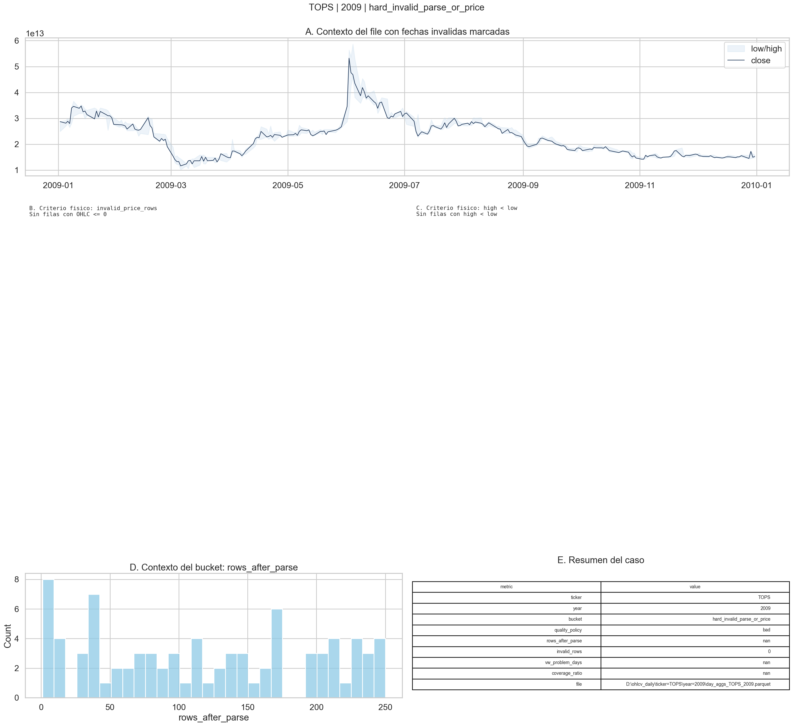

## TOPS 2010

ticker: `TOPS`  
year: `2010`  
bucket: `hard_invalid_parse_or_price`  
quality_policy: `bad`  
issues: `["all_rows_invalid_after_parse"]`  
warns: `["dataset_read_incompatible_schema", "schema_merge_conflict_ticker_encoding"]`  
file: `D:\ohlcv_daily\ticker=TOPS\year=2010\day_aggs_TOPS_2010.parquet`

### Analisis Forense

En `hard_invalid_parse_or_price` la pregunta ya no es si el caso merece flag, sino si la barra diaria sigue siendo interpretable como hecho de mercado. La respuesta aqui es no. En estos files la figura no representa una sesion tensa o iliquida, sino una barra que deja de tener semantica estable: cero estructural, parseo invalido o contradiccion de precios suficiente para romper la confianza minima en la observacion.

Por eso la decision correcta es `bad` y no `recoverable_with_flag`. Si este tipo de fila entra en `backtest_core`, el dano no es solo estadistico; es semantico. Contamina retornos, labels, benchmarks y cualquier reconciliacion con terceros porque ya no sabemos si la barra resume mercado o artefacto. Implicacion operativa: preservar para `forensic_only` o futura reconstruccion, pero no reutilizar como dato normal. El error que se evita es tratar ausencia de precios validos como si fuera simplemente una cola extrema del mercado.

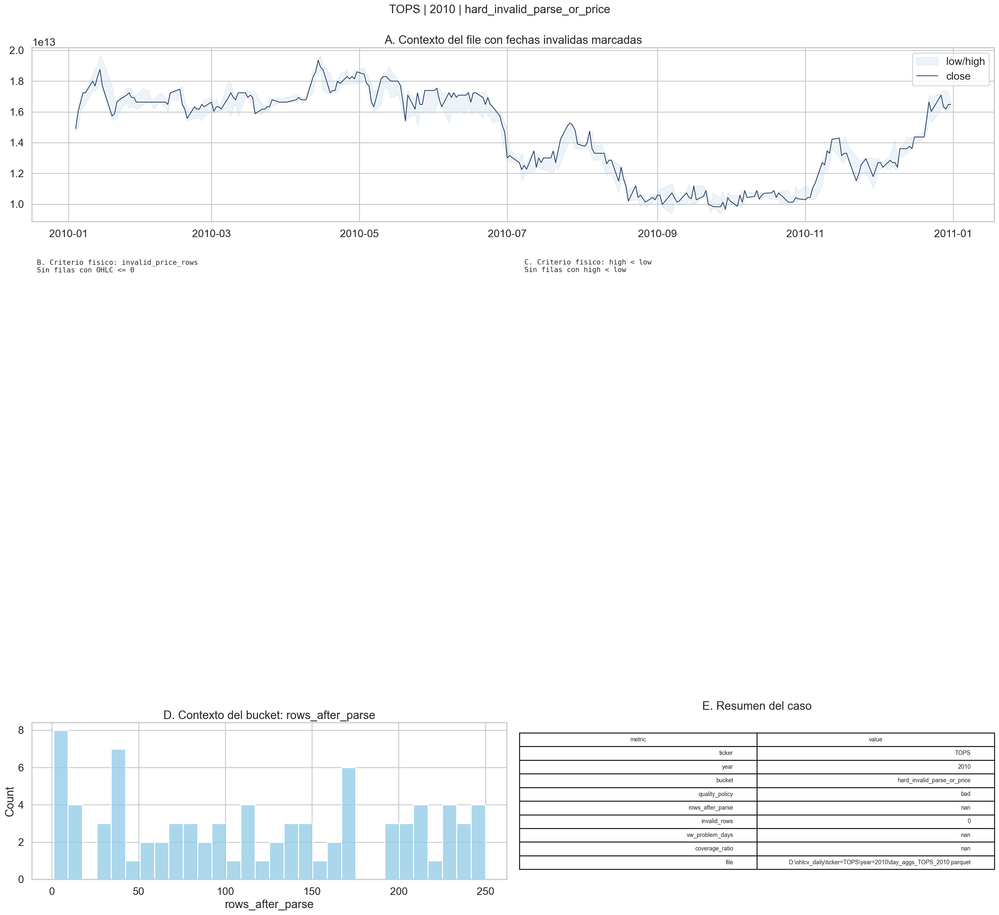

## TOPS 2011

ticker: `TOPS`  
year: `2011`  
bucket: `hard_invalid_parse_or_price`  
quality_policy: `bad`  
issues: `["all_rows_invalid_after_parse"]`  
warns: `["dataset_read_incompatible_schema", "schema_merge_conflict_ticker_encoding"]`  
file: `D:\ohlcv_daily\ticker=TOPS\year=2011\day_aggs_TOPS_2011.parquet`

### Analisis Forense

En `hard_invalid_parse_or_price` la pregunta ya no es si el caso merece flag, sino si la barra diaria sigue siendo interpretable como hecho de mercado. La respuesta aqui es no. En estos files la figura no representa una sesion tensa o iliquida, sino una barra que deja de tener semantica estable: cero estructural, parseo invalido o contradiccion de precios suficiente para romper la confianza minima en la observacion.

Por eso la decision correcta es `bad` y no `recoverable_with_flag`. Si este tipo de fila entra en `backtest_core`, el dano no es solo estadistico; es semantico. Contamina retornos, labels, benchmarks y cualquier reconciliacion con terceros porque ya no sabemos si la barra resume mercado o artefacto. Implicacion operativa: preservar para `forensic_only` o futura reconstruccion, pero no reutilizar como dato normal. El error que se evita es tratar ausencia de precios validos como si fuera simplemente una cola extrema del mercado.

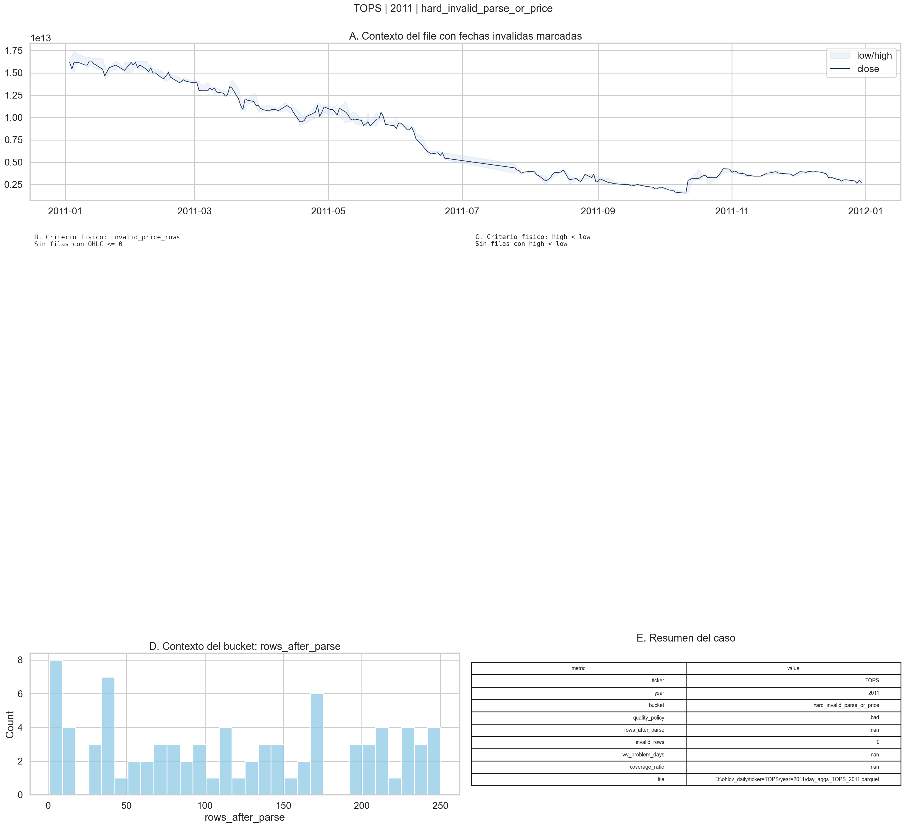

## TOPS 2012

ticker: `TOPS`  
year: `2012`  
bucket: `hard_invalid_parse_or_price`  
quality_policy: `bad`  
issues: `["all_rows_invalid_after_parse"]`  
warns: `["dataset_read_incompatible_schema", "schema_merge_conflict_ticker_encoding"]`  
file: `D:\ohlcv_daily\ticker=TOPS\year=2012\day_aggs_TOPS_2012.parquet`

### Analisis Forense

En `hard_invalid_parse_or_price` la pregunta ya no es si el caso merece flag, sino si la barra diaria sigue siendo interpretable como hecho de mercado. La respuesta aqui es no. En estos files la figura no representa una sesion tensa o iliquida, sino una barra que deja de tener semantica estable: cero estructural, parseo invalido o contradiccion de precios suficiente para romper la confianza minima en la observacion.

Por eso la decision correcta es `bad` y no `recoverable_with_flag`. Si este tipo de fila entra en `backtest_core`, el dano no es solo estadistico; es semantico. Contamina retornos, labels, benchmarks y cualquier reconciliacion con terceros porque ya no sabemos si la barra resume mercado o artefacto. Implicacion operativa: preservar para `forensic_only` o futura reconstruccion, pero no reutilizar como dato normal. El error que se evita es tratar ausencia de precios validos como si fuera simplemente una cola extrema del mercado.

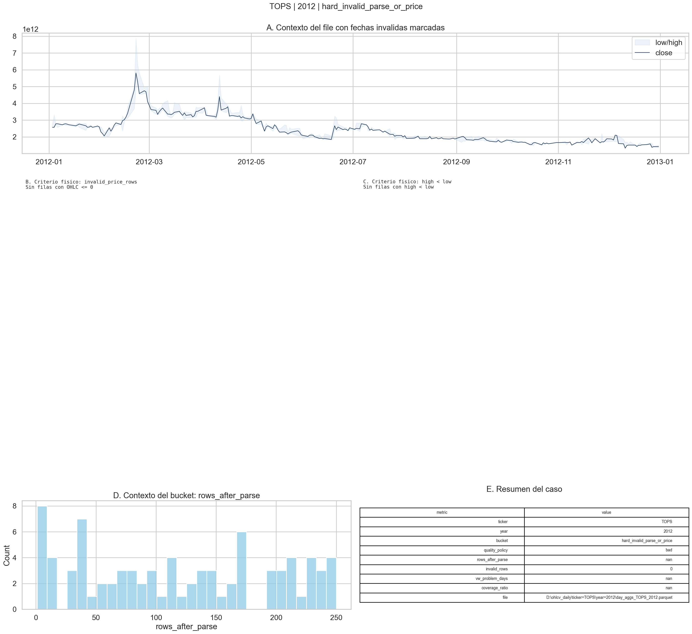

## TOPS 2013

ticker: `TOPS`  
year: `2013`  
bucket: `hard_invalid_parse_or_price`  
quality_policy: `bad`  
issues: `["all_rows_invalid_after_parse"]`  
warns: `["dataset_read_incompatible_schema", "schema_merge_conflict_ticker_encoding"]`  
file: `D:\ohlcv_daily\ticker=TOPS\year=2013\day_aggs_TOPS_2013.parquet`

### Analisis Forense

En `hard_invalid_parse_or_price` la pregunta ya no es si el caso merece flag, sino si la barra diaria sigue siendo interpretable como hecho de mercado. La respuesta aqui es no. En estos files la figura no representa una sesion tensa o iliquida, sino una barra que deja de tener semantica estable: cero estructural, parseo invalido o contradiccion de precios suficiente para romper la confianza minima en la observacion.

Por eso la decision correcta es `bad` y no `recoverable_with_flag`. Si este tipo de fila entra en `backtest_core`, el dano no es solo estadistico; es semantico. Contamina retornos, labels, benchmarks y cualquier reconciliacion con terceros porque ya no sabemos si la barra resume mercado o artefacto. Implicacion operativa: preservar para `forensic_only` o futura reconstruccion, pero no reutilizar como dato normal. El error que se evita es tratar ausencia de precios validos como si fuera simplemente una cola extrema del mercado.

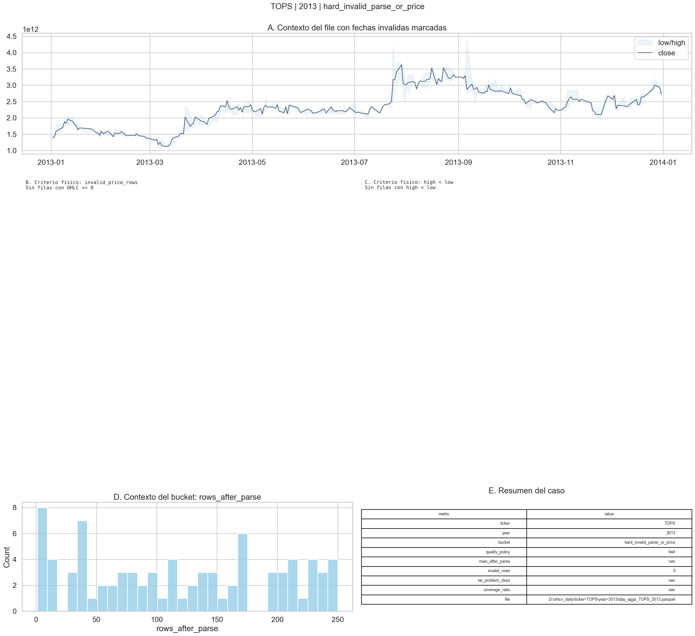

## HMNY 2025

ticker: `HMNY`  
year: `2025`  
bucket: `hard_invalid_parse_or_price`  
quality_policy: `bad`  
issues: `["negative_or_zero_ohlc_rows"]`  
warns: `["dataset_read_incompatible_schema", "rows_lt_10", "schema_merge_conflict_ticker_encoding", "suspicious_sparse_year"]`  
file: `D:\ohlcv_daily\ticker=HMNY\year=2025\day_aggs_HMNY_2025.parquet`

### Analisis Forense

En `hard_invalid_parse_or_price` la pregunta ya no es si el caso merece flag, sino si la barra diaria sigue siendo interpretable como hecho de mercado. La respuesta aqui es no. Se observan `209` filas con `OHLC = 0`, una firma tipica de colapso de barra diaria. Las primeras fechas exportadas (`2025-09-29`) ayudan a ver si el dano esta concentrado en un bloque temporal o disperso en el ano. En estos files la figura no representa una sesion tensa o iliquida, sino una barra que deja de tener semantica estable: cero estructural, parseo invalido o contradiccion de precios suficiente para romper la confianza minima en la observacion.

Por eso la decision correcta es `bad` y no `recoverable_with_flag`. Si este tipo de fila entra en `backtest_core`, el dano no es solo estadistico; es semantico. Contamina retornos, labels, benchmarks y cualquier reconciliacion con terceros porque ya no sabemos si la barra resume mercado o artefacto. Implicacion operativa: preservar para `forensic_only` o futura reconstruccion, pero no reutilizar como dato normal. El error que se evita es tratar ausencia de precios validos como si fuera simplemente una cola extrema del mercado.

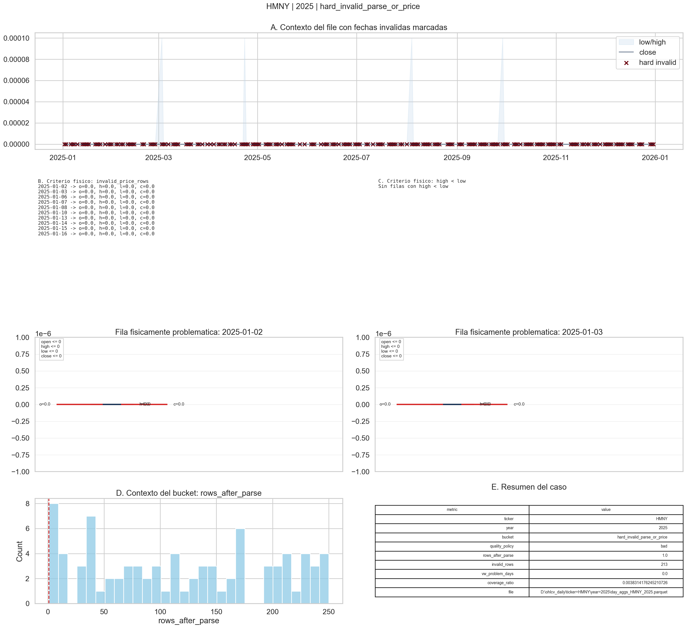

## HMNY 2024

ticker: `HMNY`  
year: `2024`  
bucket: `hard_invalid_parse_or_price`  
quality_policy: `bad`  
issues: `["negative_or_zero_ohlc_rows", "vw_outside_range_severe"]`  
warns: `["dataset_read_incompatible_schema", "large_internal_gap_days", "rows_lt_10", "schema_merge_conflict_ticker_encoding", "suspicious_sparse_year"]`  
file: `D:\ohlcv_daily\ticker=HMNY\year=2024\day_aggs_HMNY_2024.parquet`

### Analisis Forense

En `hard_invalid_parse_or_price` la pregunta ya no es si el caso merece flag, sino si la barra diaria sigue siendo interpretable como hecho de mercado. La respuesta aqui es no. Se observan `173` filas con `OHLC = 0`, una firma tipica de colapso de barra diaria. Las primeras fechas exportadas (`2024-07-17`) ayudan a ver si el dano esta concentrado en un bloque temporal o disperso en el ano. En estos files la figura no representa una sesion tensa o iliquida, sino una barra que deja de tener semantica estable: cero estructural, parseo invalido o contradiccion de precios suficiente para romper la confianza minima en la observacion.

Por eso la decision correcta es `bad` y no `recoverable_with_flag`. Si este tipo de fila entra en `backtest_core`, el dano no es solo estadistico; es semantico. Contamina retornos, labels, benchmarks y cualquier reconciliacion con terceros porque ya no sabemos si la barra resume mercado o artefacto. Implicacion operativa: preservar para `forensic_only` o futura reconstruccion, pero no reutilizar como dato normal. El error que se evita es tratar ausencia de precios validos como si fuera simplemente una cola extrema del mercado.

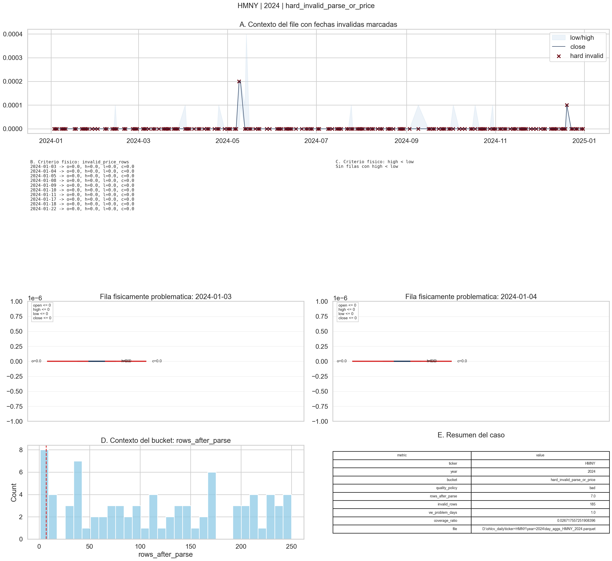

## HMNY 2026

ticker: `HMNY`  
year: `2026`  
bucket: `hard_invalid_parse_or_price`  
quality_policy: `bad`  
issues: `["negative_or_zero_ohlc_rows"]`  
warns: `["dataset_read_incompatible_schema", "large_internal_gap_days", "rows_lt_10", "schema_merge_conflict_ticker_encoding", "suspicious_sparse_year"]`  
file: `D:\ohlcv_daily\ticker=HMNY\year=2026\day_aggs_HMNY_2026.parquet`

### Analisis Forense

En `hard_invalid_parse_or_price` la pregunta ya no es si el caso merece flag, sino si la barra diaria sigue siendo interpretable como hecho de mercado. La respuesta aqui es no. Se observan `28` filas con `OHLC = 0`, una firma tipica de colapso de barra diaria. Las primeras fechas exportadas (`2026-01-06`) ayudan a ver si el dano esta concentrado en un bloque temporal o disperso en el ano. En estos files la figura no representa una sesion tensa o iliquida, sino una barra que deja de tener semantica estable: cero estructural, parseo invalido o contradiccion de precios suficiente para romper la confianza minima en la observacion.

Por eso la decision correcta es `bad` y no `recoverable_with_flag`. Si este tipo de fila entra en `backtest_core`, el dano no es solo estadistico; es semantico. Contamina retornos, labels, benchmarks y cualquier reconciliacion con terceros porque ya no sabemos si la barra resume mercado o artefacto. Implicacion operativa: preservar para `forensic_only` o futura reconstruccion, pero no reutilizar como dato normal. El error que se evita es tratar ausencia de precios validos como si fuera simplemente una cola extrema del mercado.

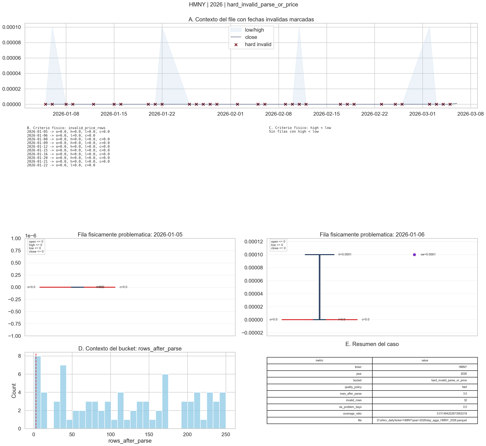

## HMNY 2023

ticker: `HMNY`  
year: `2023`  
bucket: `hard_invalid_parse_or_price`  
quality_policy: `bad`  
issues: `["negative_or_zero_ohlc_rows"]`  
warns: `["dataset_read_incompatible_schema", "large_internal_gap_days", "schema_merge_conflict_ticker_encoding", "suspicious_sparse_year"]`  
file: `D:\ohlcv_daily\ticker=HMNY\year=2023\day_aggs_HMNY_2023.parquet`

### Analisis Forense

En `hard_invalid_parse_or_price` la pregunta ya no es si el caso merece flag, sino si la barra diaria sigue siendo interpretable como hecho de mercado. La respuesta aqui es no. Se observan `119` filas con `OHLC = 0`, una firma tipica de colapso de barra diaria. Las primeras fechas exportadas (`2023-01-03`) ayudan a ver si el dano esta concentrado en un bloque temporal o disperso en el ano. En estos files la figura no representa una sesion tensa o iliquida, sino una barra que deja de tener semantica estable: cero estructural, parseo invalido o contradiccion de precios suficiente para romper la confianza minima en la observacion.

Por eso la decision correcta es `bad` y no `recoverable_with_flag`. Si este tipo de fila entra en `backtest_core`, el dano no es solo estadistico; es semantico. Contamina retornos, labels, benchmarks y cualquier reconciliacion con terceros porque ya no sabemos si la barra resume mercado o artefacto. Implicacion operativa: preservar para `forensic_only` o futura reconstruccion, pero no reutilizar como dato normal. El error que se evita es tratar ausencia de precios validos como si fuera simplemente una cola extrema del mercado.

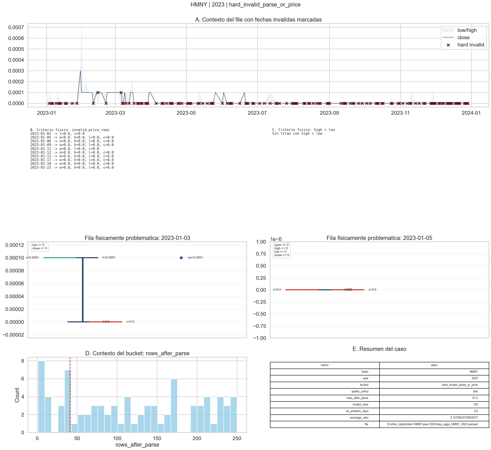

## PRST 2026

ticker: `PRST`  
year: `2026`  
bucket: `hard_invalid_parse_or_price`  
quality_policy: `bad`  
issues: `["negative_or_zero_ohlc_rows"]`  
warns: `["dataset_read_incompatible_schema", "rows_lt_10", "schema_merge_conflict_ticker_encoding", "suspicious_sparse_year"]`  
file: `D:\ohlcv_daily\ticker=PRST\year=2026\day_aggs_PRST_2026.parquet`

### Analisis Forense

En `hard_invalid_parse_or_price` la pregunta ya no es si el caso merece flag, sino si la barra diaria sigue siendo interpretable como hecho de mercado. La respuesta aqui es no. Se observan `12` filas con `OHLC = 0`, una firma tipica de colapso de barra diaria. Las primeras fechas exportadas (`2026-01-06`) ayudan a ver si el dano esta concentrado en un bloque temporal o disperso en el ano. En estos files la figura no representa una sesion tensa o iliquida, sino una barra que deja de tener semantica estable: cero estructural, parseo invalido o contradiccion de precios suficiente para romper la confianza minima en la observacion.

Por eso la decision correcta es `bad` y no `recoverable_with_flag`. Si este tipo de fila entra en `backtest_core`, el dano no es solo estadistico; es semantico. Contamina retornos, labels, benchmarks y cualquier reconciliacion con terceros porque ya no sabemos si la barra resume mercado o artefacto. Implicacion operativa: preservar para `forensic_only` o futura reconstruccion, pero no reutilizar como dato normal. El error que se evita es tratar ausencia de precios validos como si fuera simplemente una cola extrema del mercado.

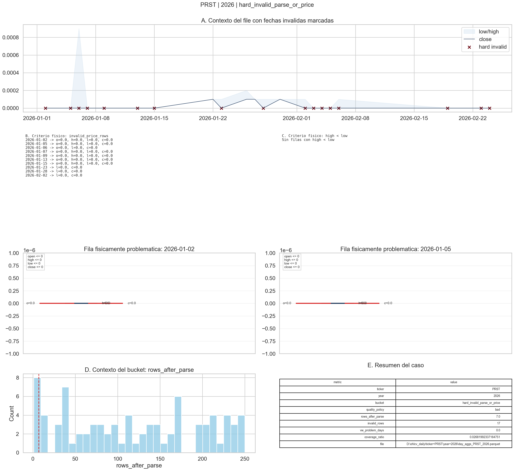

## RENO 2026

ticker: `RENO`  
year: `2026`  
bucket: `hard_invalid_parse_or_price`  
quality_policy: `bad`  
issues: `["negative_or_zero_ohlc_rows"]`  
warns: `["dataset_read_incompatible_schema", "large_internal_gap_days", "rows_lt_10", "schema_merge_conflict_ticker_encoding", "suspicious_sparse_year"]`  
file: `D:\ohlcv_daily\ticker=RENO\year=2026\day_aggs_RENO_2026.parquet`

### Analisis Forense

En `hard_invalid_parse_or_price` la pregunta ya no es si el caso merece flag, sino si la barra diaria sigue siendo interpretable como hecho de mercado. La respuesta aqui es no. Se observan `7` filas con `OHLC = 0`, una firma tipica de colapso de barra diaria. Las primeras fechas exportadas (`2026-01-13`) ayudan a ver si el dano esta concentrado en un bloque temporal o disperso en el ano. En estos files la figura no representa una sesion tensa o iliquida, sino una barra que deja de tener semantica estable: cero estructural, parseo invalido o contradiccion de precios suficiente para romper la confianza minima en la observacion.

Por eso la decision correcta es `bad` y no `recoverable_with_flag`. Si este tipo de fila entra en `backtest_core`, el dano no es solo estadistico; es semantico. Contamina retornos, labels, benchmarks y cualquier reconciliacion con terceros porque ya no sabemos si la barra resume mercado o artefacto. Implicacion operativa: preservar para `forensic_only` o futura reconstruccion, pero no reutilizar como dato normal. El error que se evita es tratar ausencia de precios validos como si fuera simplemente una cola extrema del mercado.

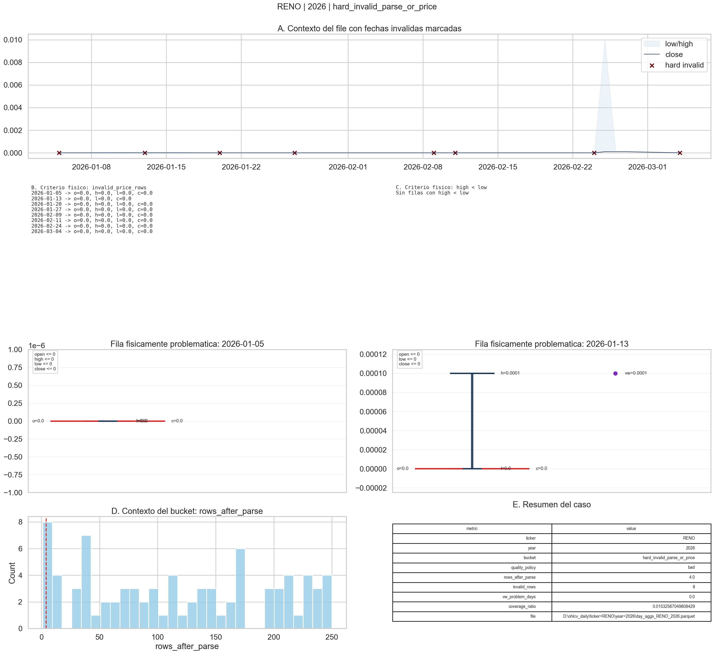

## BSPM 2024

ticker: `BSPM`  
year: `2024`  
bucket: `hard_invalid_parse_or_price`  
quality_policy: `bad`  
issues: `["negative_or_zero_ohlc_rows"]`  
warns: `["dataset_read_incompatible_schema", "large_internal_gap_days", "rows_lt_10", "schema_merge_conflict_ticker_encoding", "suspicious_sparse_year"]`  
file: `D:\ohlcv_daily\ticker=BSPM\year=2024\day_aggs_BSPM_2024.parquet`

### Analisis Forense

En `hard_invalid_parse_or_price` la pregunta ya no es si el caso merece flag, sino si la barra diaria sigue siendo interpretable como hecho de mercado. La respuesta aqui es no. Se observan `5` filas con `OHLC = 0`, una firma tipica de colapso de barra diaria. Las primeras fechas exportadas (`2024-07-23`) ayudan a ver si el dano esta concentrado en un bloque temporal o disperso en el ano. En estos files la figura no representa una sesion tensa o iliquida, sino una barra que deja de tener semantica estable: cero estructural, parseo invalido o contradiccion de precios suficiente para romper la confianza minima en la observacion.

Por eso la decision correcta es `bad` y no `recoverable_with_flag`. Si este tipo de fila entra en `backtest_core`, el dano no es solo estadistico; es semantico. Contamina retornos, labels, benchmarks y cualquier reconciliacion con terceros porque ya no sabemos si la barra resume mercado o artefacto. Implicacion operativa: preservar para `forensic_only` o futura reconstruccion, pero no reutilizar como dato normal. El error que se evita es tratar ausencia de precios validos como si fuera simplemente una cola extrema del mercado.

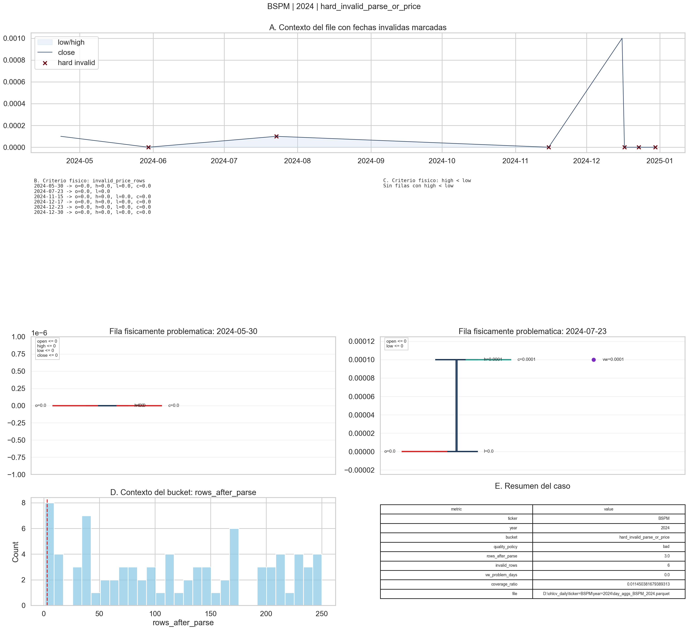

## ANTH 2024

ticker: `ANTH`  
year: `2024`  
bucket: `hard_invalid_parse_or_price`  
quality_policy: `bad`  
issues: `["negative_or_zero_ohlc_rows"]`  
warns: `["dataset_read_incompatible_schema", "large_internal_gap_days", "schema_merge_conflict_ticker_encoding", "suspicious_sparse_year"]`  
file: `D:\ohlcv_daily\ticker=ANTH\year=2024\day_aggs_ANTH_2024.parquet`

### Analisis Forense

En `hard_invalid_parse_or_price` la pregunta ya no es si el caso merece flag, sino si la barra diaria sigue siendo interpretable como hecho de mercado. La respuesta aqui es no. Se observan `18` filas con `OHLC = 0`, una firma tipica de colapso de barra diaria. Las primeras fechas exportadas (`2024-11-22`) ayudan a ver si el dano esta concentrado en un bloque temporal o disperso en el ano. En estos files la figura no representa una sesion tensa o iliquida, sino una barra que deja de tener semantica estable: cero estructural, parseo invalido o contradiccion de precios suficiente para romper la confianza minima en la observacion.

Por eso la decision correcta es `bad` y no `recoverable_with_flag`. Si este tipo de fila entra en `backtest_core`, el dano no es solo estadistico; es semantico. Contamina retornos, labels, benchmarks y cualquier reconciliacion con terceros porque ya no sabemos si la barra resume mercado o artefacto. Implicacion operativa: preservar para `forensic_only` o futura reconstruccion, pero no reutilizar como dato normal. El error que se evita es tratar ausencia de precios validos como si fuera simplemente una cola extrema del mercado.

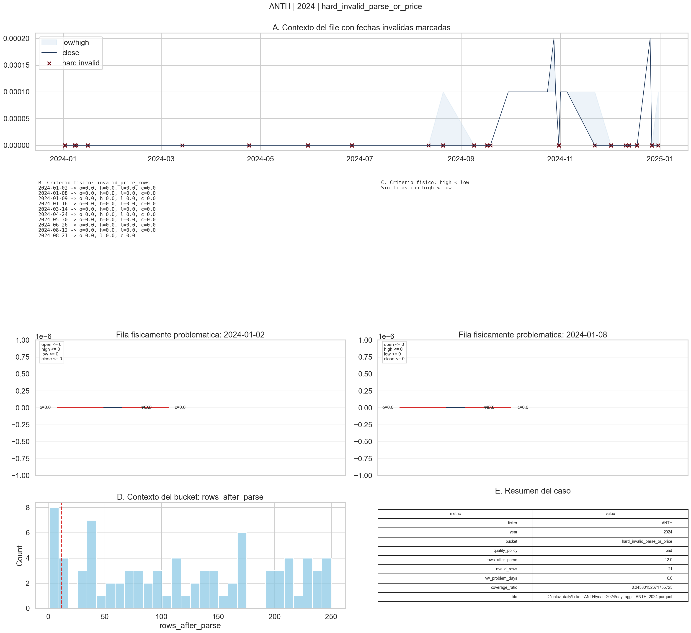

## RENO 2024

ticker: `RENO`  
year: `2024`  
bucket: `hard_invalid_parse_or_price`  
quality_policy: `bad`  
issues: `["negative_or_zero_ohlc_rows"]`  
warns: `["dataset_read_incompatible_schema", "large_internal_gap_days", "schema_merge_conflict_ticker_encoding", "suspicious_sparse_year"]`  
file: `D:\ohlcv_daily\ticker=RENO\year=2024\day_aggs_RENO_2024.parquet`

### Analisis Forense

En `hard_invalid_parse_or_price` la pregunta ya no es si el caso merece flag, sino si la barra diaria sigue siendo interpretable como hecho de mercado. La respuesta aqui es no. Se observan `42` filas con `OHLC = 0`, una firma tipica de colapso de barra diaria. Las primeras fechas exportadas (`2024-04-03`) ayudan a ver si el dano esta concentrado en un bloque temporal o disperso en el ano. En estos files la figura no representa una sesion tensa o iliquida, sino una barra que deja de tener semantica estable: cero estructural, parseo invalido o contradiccion de precios suficiente para romper la confianza minima en la observacion.

Por eso la decision correcta es `bad` y no `recoverable_with_flag`. Si este tipo de fila entra en `backtest_core`, el dano no es solo estadistico; es semantico. Contamina retornos, labels, benchmarks y cualquier reconciliacion con terceros porque ya no sabemos si la barra resume mercado o artefacto. Implicacion operativa: preservar para `forensic_only` o futura reconstruccion, pero no reutilizar como dato normal. El error que se evita es tratar ausencia de precios validos como si fuera simplemente una cola extrema del mercado.

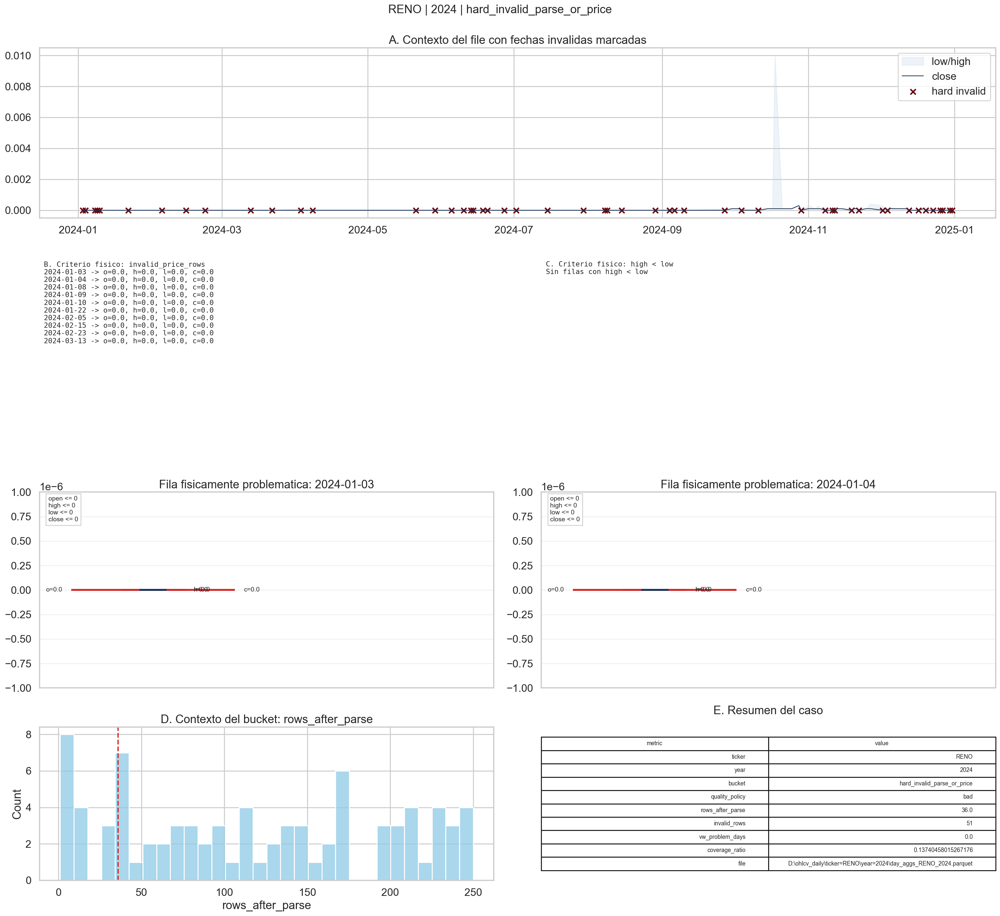

## BSPM 2023

ticker: `BSPM`  
year: `2023`  
bucket: `hard_invalid_parse_or_price`  
quality_policy: `bad`  
issues: `["negative_or_zero_ohlc_rows"]`  
warns: `["dataset_read_incompatible_schema", "large_internal_gap_days", "rows_lt_10", "schema_merge_conflict_ticker_encoding", "suspicious_sparse_year"]`  
file: `D:\ohlcv_daily\ticker=BSPM\year=2023\day_aggs_BSPM_2023.parquet`

### Analisis Forense

En `hard_invalid_parse_or_price` la pregunta ya no es si el caso merece flag, sino si la barra diaria sigue siendo interpretable como hecho de mercado. La respuesta aqui es no. Se observan `3` filas con `OHLC = 0`, una firma tipica de colapso de barra diaria. Las primeras fechas exportadas (`2023-12-27`) ayudan a ver si el dano esta concentrado en un bloque temporal o disperso en el ano. En estos files la figura no representa una sesion tensa o iliquida, sino una barra que deja de tener semantica estable: cero estructural, parseo invalido o contradiccion de precios suficiente para romper la confianza minima en la observacion.

Por eso la decision correcta es `bad` y no `recoverable_with_flag`. Si este tipo de fila entra en `backtest_core`, el dano no es solo estadistico; es semantico. Contamina retornos, labels, benchmarks y cualquier reconciliacion con terceros porque ya no sabemos si la barra resume mercado o artefacto. Implicacion operativa: preservar para `forensic_only` o futura reconstruccion, pero no reutilizar como dato normal. El error que se evita es tratar ausencia de precios validos como si fuera simplemente una cola extrema del mercado.

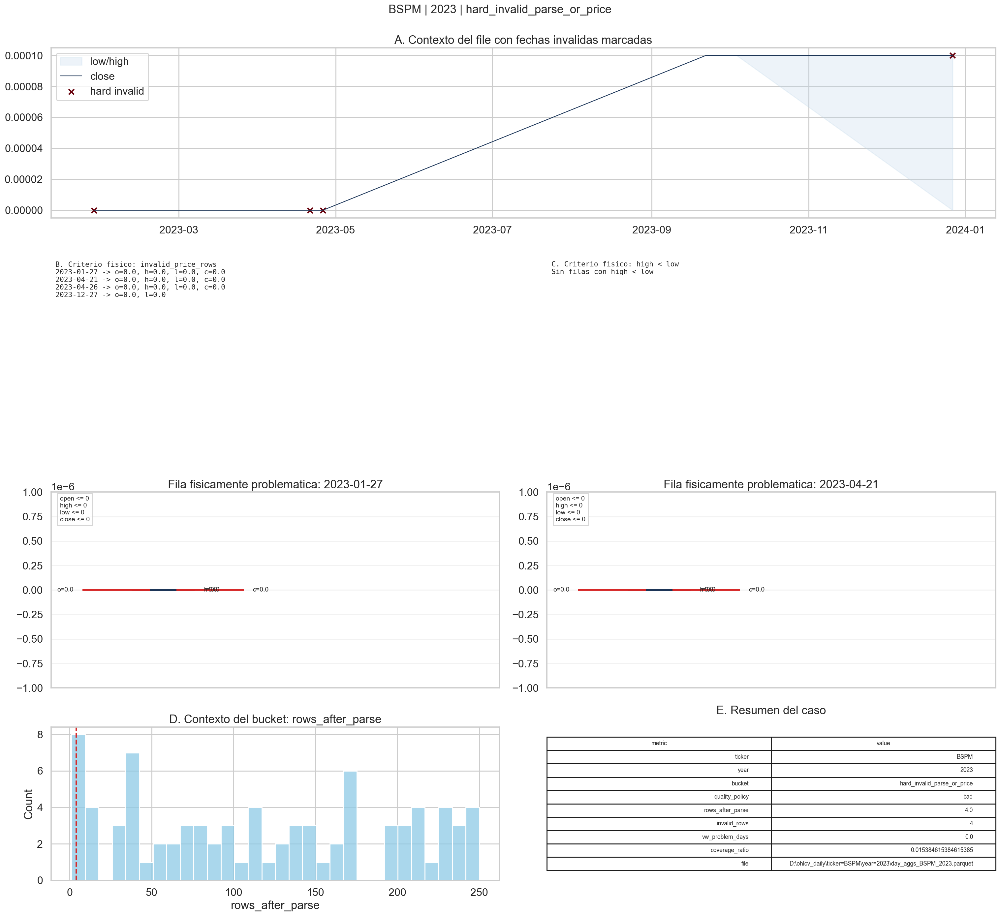

## ANTH 2021

ticker: `ANTH`  
year: `2021`  
bucket: `hard_invalid_parse_or_price`  
quality_policy: `bad`  
issues: `["negative_or_zero_ohlc_rows"]`  
warns: `["dataset_read_incompatible_schema", "rows_lt_10", "schema_merge_conflict_ticker_encoding", "suspicious_sparse_year"]`  
file: `D:\ohlcv_daily\ticker=ANTH\year=2021\day_aggs_ANTH_2021.parquet`

### Analisis Forense

En `hard_invalid_parse_or_price` la pregunta ya no es si el caso merece flag, sino si la barra diaria sigue siendo interpretable como hecho de mercado. La respuesta aqui es no. Las primeras fechas exportadas (`2021-12-31`) ayudan a ver si el dano esta concentrado en un bloque temporal o disperso en el ano. En estos files la figura no representa una sesion tensa o iliquida, sino una barra que deja de tener semantica estable: cero estructural, parseo invalido o contradiccion de precios suficiente para romper la confianza minima en la observacion.

Por eso la decision correcta es `bad` y no `recoverable_with_flag`. Si este tipo de fila entra en `backtest_core`, el dano no es solo estadistico; es semantico. Contamina retornos, labels, benchmarks y cualquier reconciliacion con terceros porque ya no sabemos si la barra resume mercado o artefacto. Implicacion operativa: preservar para `forensic_only` o futura reconstruccion, pero no reutilizar como dato normal. El error que se evita es tratar ausencia de precios validos como si fuera simplemente una cola extrema del mercado.

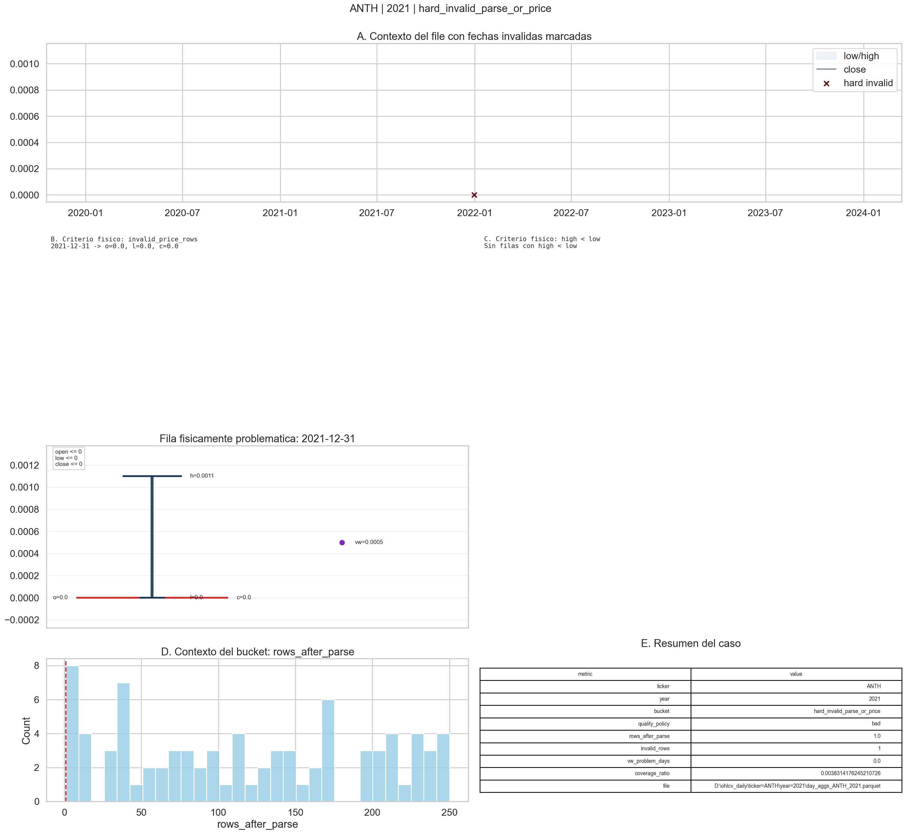

## RENO 2025

ticker: `RENO`  
year: `2025`  
bucket: `hard_invalid_parse_or_price`  
quality_policy: `bad`  
issues: `["negative_or_zero_ohlc_rows", "vw_outside_range_severe"]`  
warns: `["dataset_read_incompatible_schema", "large_internal_gap_days", "schema_merge_conflict_ticker_encoding", "suspicious_sparse_year"]`  
file: `D:\ohlcv_daily\ticker=RENO\year=2025\day_aggs_RENO_2025.parquet`

### Analisis Forense

En `hard_invalid_parse_or_price` la pregunta ya no es si el caso merece flag, sino si la barra diaria sigue siendo interpretable como hecho de mercado. La respuesta aqui es no. Se observan `44` filas con `OHLC = 0`, una firma tipica de colapso de barra diaria. Las primeras fechas exportadas (`2025-10-07`) ayudan a ver si el dano esta concentrado en un bloque temporal o disperso en el ano. En estos files la figura no representa una sesion tensa o iliquida, sino una barra que deja de tener semantica estable: cero estructural, parseo invalido o contradiccion de precios suficiente para romper la confianza minima en la observacion.

Por eso la decision correcta es `bad` y no `recoverable_with_flag`. Si este tipo de fila entra en `backtest_core`, el dano no es solo estadistico; es semantico. Contamina retornos, labels, benchmarks y cualquier reconciliacion con terceros porque ya no sabemos si la barra resume mercado o artefacto. Implicacion operativa: preservar para `forensic_only` o futura reconstruccion, pero no reutilizar como dato normal. El error que se evita es tratar ausencia de precios validos como si fuera simplemente una cola extrema del mercado.

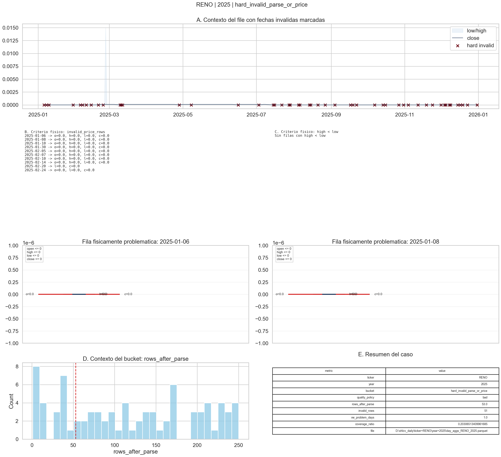

## ANTH 2025

ticker: `ANTH`  
year: `2025`  
bucket: `hard_invalid_parse_or_price`  
quality_policy: `bad`  
issues: `["negative_or_zero_ohlc_rows"]`  
warns: `["dataset_read_incompatible_schema", "large_internal_gap_days", "schema_merge_conflict_ticker_encoding", "suspicious_sparse_year"]`  
file: `D:\ohlcv_daily\ticker=ANTH\year=2025\day_aggs_ANTH_2025.parquet`

### Analisis Forense

En `hard_invalid_parse_or_price` la pregunta ya no es si el caso merece flag, sino si la barra diaria sigue siendo interpretable como hecho de mercado. La respuesta aqui es no. Se observan `29` filas con `OHLC = 0`, una firma tipica de colapso de barra diaria. Las primeras fechas exportadas (`2025-10-24`) ayudan a ver si el dano esta concentrado en un bloque temporal o disperso en el ano. En estos files la figura no representa una sesion tensa o iliquida, sino una barra que deja de tener semantica estable: cero estructural, parseo invalido o contradiccion de precios suficiente para romper la confianza minima en la observacion.

Por eso la decision correcta es `bad` y no `recoverable_with_flag`. Si este tipo de fila entra en `backtest_core`, el dano no es solo estadistico; es semantico. Contamina retornos, labels, benchmarks y cualquier reconciliacion con terceros porque ya no sabemos si la barra resume mercado o artefacto. Implicacion operativa: preservar para `forensic_only` o futura reconstruccion, pero no reutilizar como dato normal. El error que se evita es tratar ausencia de precios validos como si fuera simplemente una cola extrema del mercado.

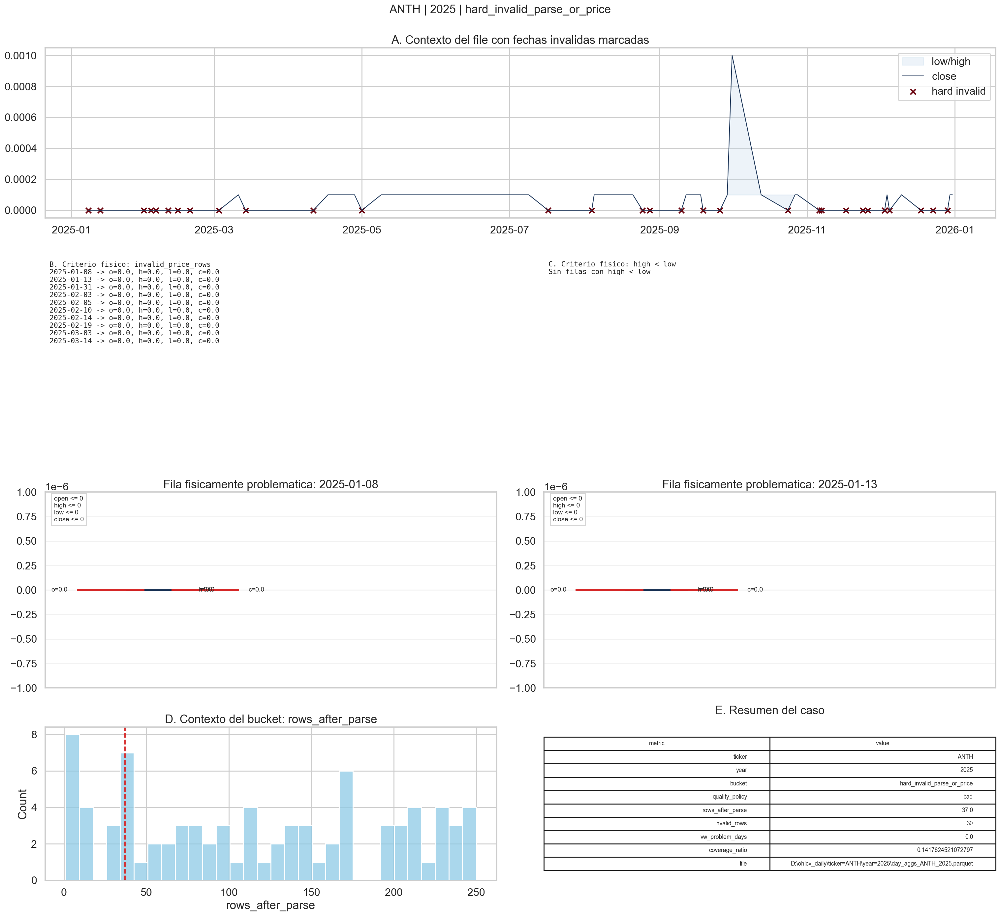

## TLOG 2025

ticker: `TLOG`  
year: `2025`  
bucket: `hard_invalid_parse_or_price`  
quality_policy: `bad`  
issues: `["negative_or_zero_ohlc_rows"]`  
warns: `["dataset_read_incompatible_schema", "large_internal_gap_days", "schema_merge_conflict_ticker_encoding", "suspicious_sparse_year"]`  
file: `D:\ohlcv_daily\ticker=TLOG\year=2025\day_aggs_TLOG_2025.parquet`

### Analisis Forense

En `hard_invalid_parse_or_price` la pregunta ya no es si el caso merece flag, sino si la barra diaria sigue siendo interpretable como hecho de mercado. La respuesta aqui es no. Se observan `6` filas con `OHLC = 0`, una firma tipica de colapso de barra diaria. Las primeras fechas exportadas (`2025-05-08`) ayudan a ver si el dano esta concentrado en un bloque temporal o disperso en el ano. En estos files la figura no representa una sesion tensa o iliquida, sino una barra que deja de tener semantica estable: cero estructural, parseo invalido o contradiccion de precios suficiente para romper la confianza minima en la observacion.

Por eso la decision correcta es `bad` y no `recoverable_with_flag`. Si este tipo de fila entra en `backtest_core`, el dano no es solo estadistico; es semantico. Contamina retornos, labels, benchmarks y cualquier reconciliacion con terceros porque ya no sabemos si la barra resume mercado o artefacto. Implicacion operativa: preservar para `forensic_only` o futura reconstruccion, pero no reutilizar como dato normal. El error que se evita es tratar ausencia de precios validos como si fuera simplemente una cola extrema del mercado.

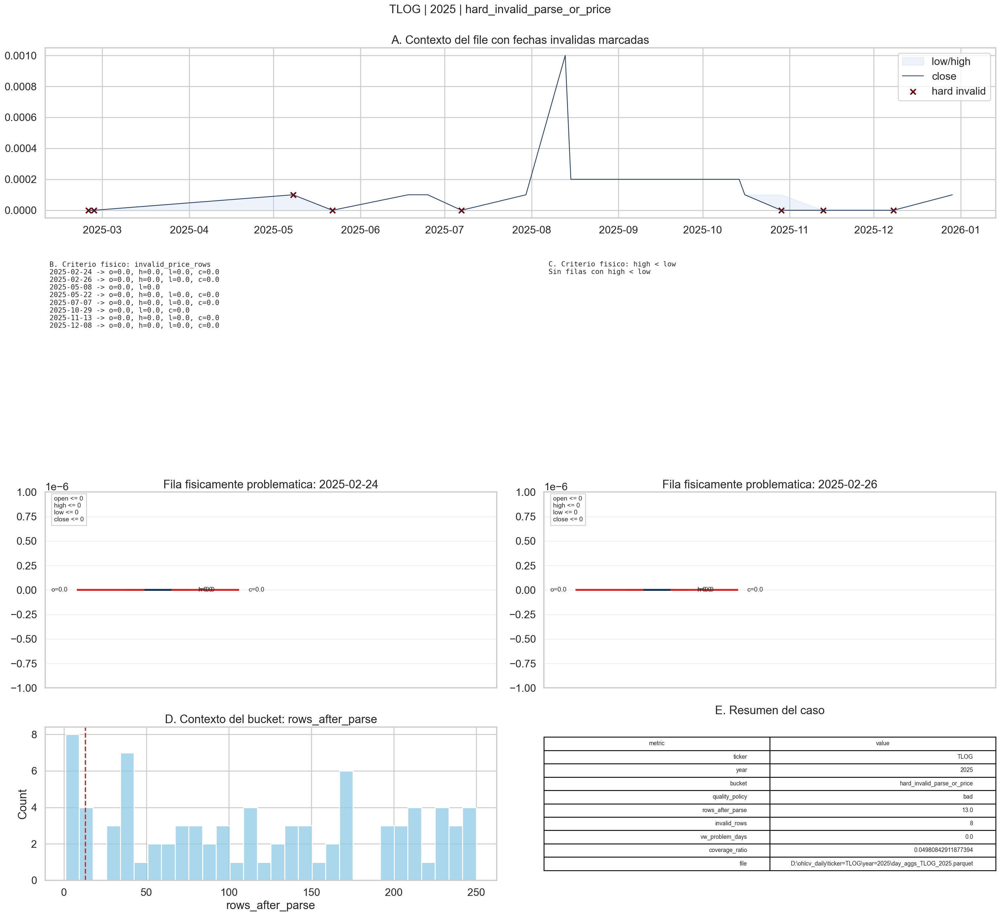

## ELOX 2025

ticker: `ELOX`  
year: `2025`  
bucket: `hard_invalid_parse_or_price`  
quality_policy: `bad`  
issues: `["negative_or_zero_ohlc_rows", "vw_outside_range_severe"]`  
warns: `["dataset_read_incompatible_schema", "large_internal_gap_days", "schema_merge_conflict_ticker_encoding", "suspicious_sparse_year"]`  
file: `D:\ohlcv_daily\ticker=ELOX\year=2025\day_aggs_ELOX_2025.parquet`

### Analisis Forense

En `hard_invalid_parse_or_price` la pregunta ya no es si el caso merece flag, sino si la barra diaria sigue siendo interpretable como hecho de mercado. La respuesta aqui es no. Se observan `18` filas con `OHLC = 0`, una firma tipica de colapso de barra diaria. Las primeras fechas exportadas (`2025-11-21`) ayudan a ver si el dano esta concentrado en un bloque temporal o disperso en el ano. En estos files la figura no representa una sesion tensa o iliquida, sino una barra que deja de tener semantica estable: cero estructural, parseo invalido o contradiccion de precios suficiente para romper la confianza minima en la observacion.

Por eso la decision correcta es `bad` y no `recoverable_with_flag`. Si este tipo de fila entra en `backtest_core`, el dano no es solo estadistico; es semantico. Contamina retornos, labels, benchmarks y cualquier reconciliacion con terceros porque ya no sabemos si la barra resume mercado o artefacto. Implicacion operativa: preservar para `forensic_only` o futura reconstruccion, pero no reutilizar como dato normal. El error que se evita es tratar ausencia de precios validos como si fuera simplemente una cola extrema del mercado.

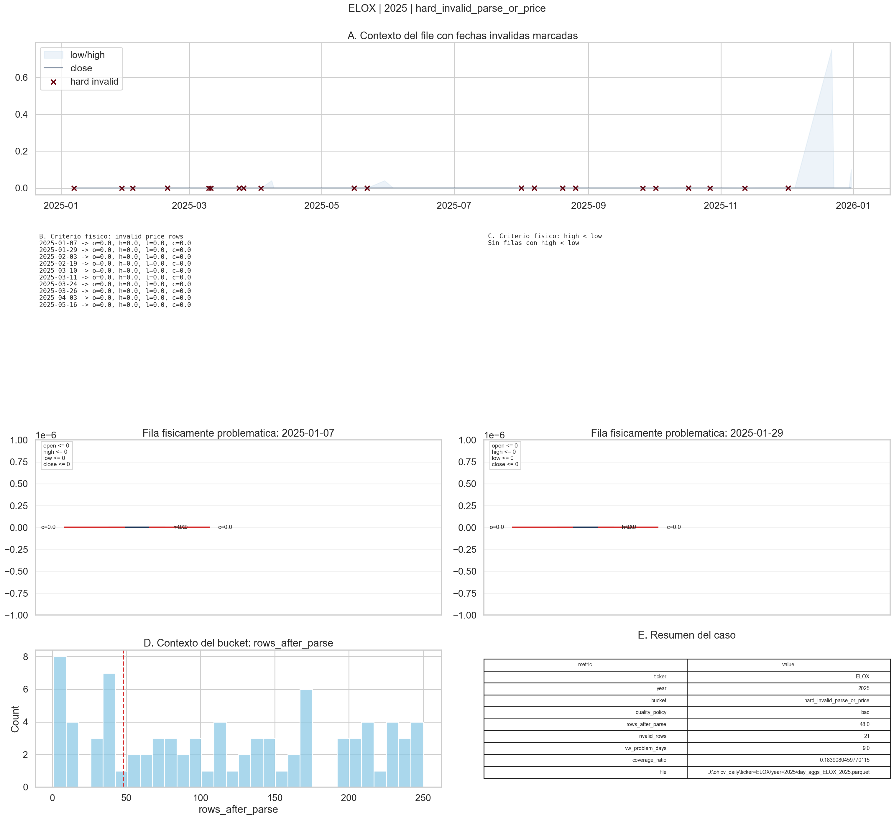

## CLVR 2025

ticker: `CLVR`  
year: `2025`  
bucket: `hard_invalid_parse_or_price`  
quality_policy: `bad`  
issues: `["negative_or_zero_ohlc_rows", "vw_outside_range_severe"]`  
warns: `["dataset_read_incompatible_schema", "large_internal_gap_days", "schema_merge_conflict_ticker_encoding", "suspicious_sparse_year"]`  
file: `D:\ohlcv_daily\ticker=CLVR\year=2025\day_aggs_CLVR_2025.parquet`

### Analisis Forense

En `hard_invalid_parse_or_price` la pregunta ya no es si el caso merece flag, sino si la barra diaria sigue siendo interpretable como hecho de mercado. La respuesta aqui es no. Se observan `3` filas con `OHLC = 0`, una firma tipica de colapso de barra diaria. Las primeras fechas exportadas (`2025-04-23`) ayudan a ver si el dano esta concentrado en un bloque temporal o disperso en el ano. En estos files la figura no representa una sesion tensa o iliquida, sino una barra que deja de tener semantica estable: cero estructural, parseo invalido o contradiccion de precios suficiente para romper la confianza minima en la observacion.

Por eso la decision correcta es `bad` y no `recoverable_with_flag`. Si este tipo de fila entra en `backtest_core`, el dano no es solo estadistico; es semantico. Contamina retornos, labels, benchmarks y cualquier reconciliacion con terceros porque ya no sabemos si la barra resume mercado o artefacto. Implicacion operativa: preservar para `forensic_only` o futura reconstruccion, pero no reutilizar como dato normal. El error que se evita es tratar ausencia de precios validos como si fuera simplemente una cola extrema del mercado.

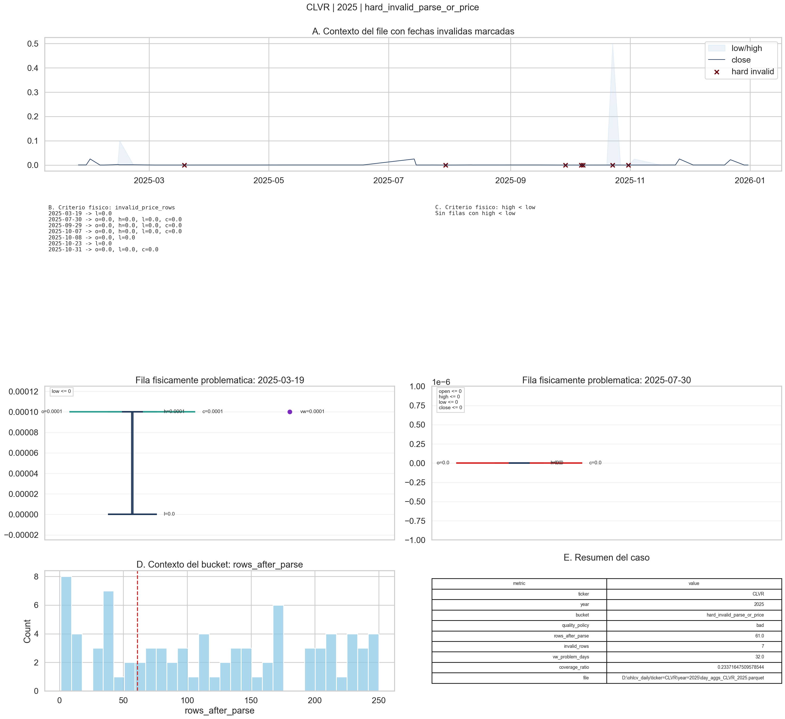

## THMO 2025

ticker: `THMO`  
year: `2025`  
bucket: `hard_invalid_parse_or_price`  
quality_policy: `bad`  
issues: `["negative_or_zero_ohlc_rows", "vw_outside_range_severe"]`  
warns: `["dataset_read_incompatible_schema", "large_internal_gap_days", "schema_merge_conflict_ticker_encoding", "suspicious_sparse_year"]`  
file: `D:\ohlcv_daily\ticker=THMO\year=2025\day_aggs_THMO_2025.parquet`

### Analisis Forense

En `hard_invalid_parse_or_price` la pregunta ya no es si el caso merece flag, sino si la barra diaria sigue siendo interpretable como hecho de mercado. La respuesta aqui es no. Se observan `9` filas con `OHLC = 0`, una firma tipica de colapso de barra diaria. Las primeras fechas exportadas (`2025-11-17`) ayudan a ver si el dano esta concentrado en un bloque temporal o disperso en el ano. En estos files la figura no representa una sesion tensa o iliquida, sino una barra que deja de tener semantica estable: cero estructural, parseo invalido o contradiccion de precios suficiente para romper la confianza minima en la observacion.

Por eso la decision correcta es `bad` y no `recoverable_with_flag`. Si este tipo de fila entra en `backtest_core`, el dano no es solo estadistico; es semantico. Contamina retornos, labels, benchmarks y cualquier reconciliacion con terceros porque ya no sabemos si la barra resume mercado o artefacto. Implicacion operativa: preservar para `forensic_only` o futura reconstruccion, pero no reutilizar como dato normal. El error que se evita es tratar ausencia de precios validos como si fuera simplemente una cola extrema del mercado.

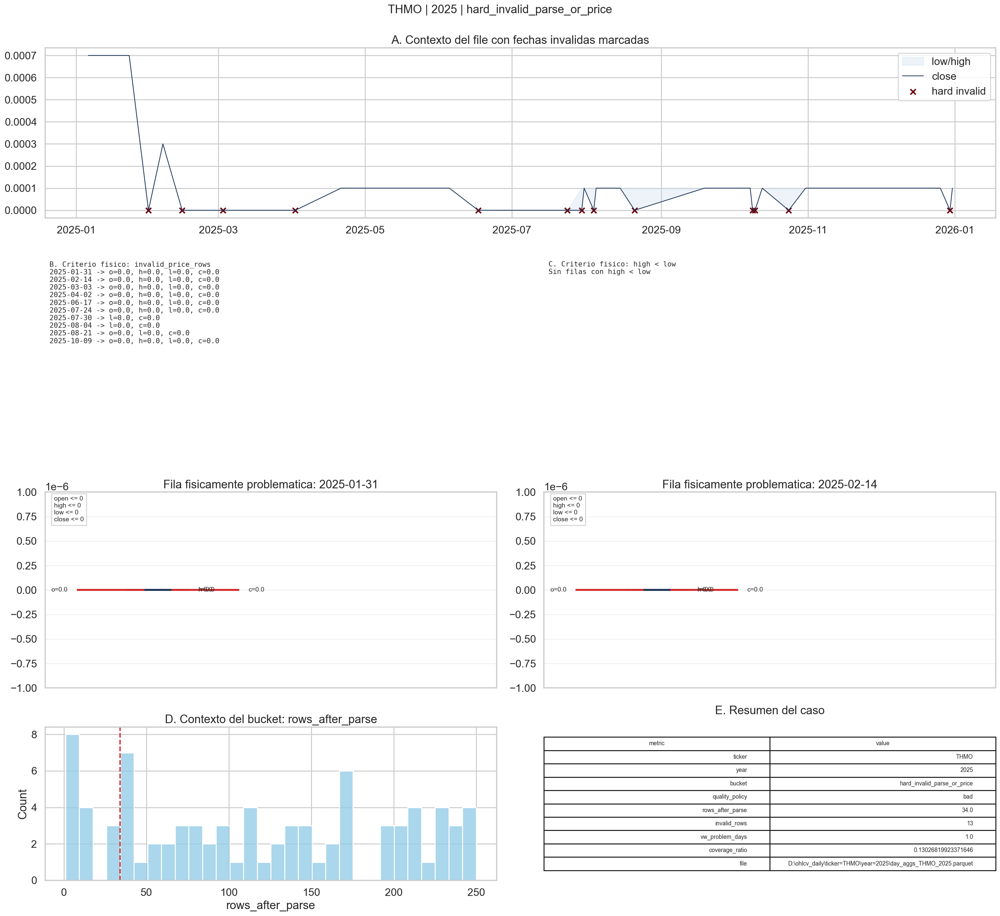

## CWBR 2024

ticker: `CWBR`  
year: `2024`  
bucket: `hard_invalid_parse_or_price`  
quality_policy: `bad`  
issues: `["negative_or_zero_ohlc_rows", "vw_outside_range_severe"]`  
warns: `["dataset_read_incompatible_schema", "schema_merge_conflict_ticker_encoding"]`  
file: `D:\ohlcv_daily\ticker=CWBR\year=2024\day_aggs_CWBR_2024.parquet`

### Analisis Forense

En `hard_invalid_parse_or_price` la pregunta ya no es si el caso merece flag, sino si la barra diaria sigue siendo interpretable como hecho de mercado. La respuesta aqui es no. Las primeras fechas exportadas (`2024-02-07`) ayudan a ver si el dano esta concentrado en un bloque temporal o disperso en el ano. En estos files la figura no representa una sesion tensa o iliquida, sino una barra que deja de tener semantica estable: cero estructural, parseo invalido o contradiccion de precios suficiente para romper la confianza minima en la observacion.

Por eso la decision correcta es `bad` y no `recoverable_with_flag`. Si este tipo de fila entra en `backtest_core`, el dano no es solo estadistico; es semantico. Contamina retornos, labels, benchmarks y cualquier reconciliacion con terceros porque ya no sabemos si la barra resume mercado o artefacto. Implicacion operativa: preservar para `forensic_only` o futura reconstruccion, pero no reutilizar como dato normal. El error que se evita es tratar ausencia de precios validos como si fuera simplemente una cola extrema del mercado.

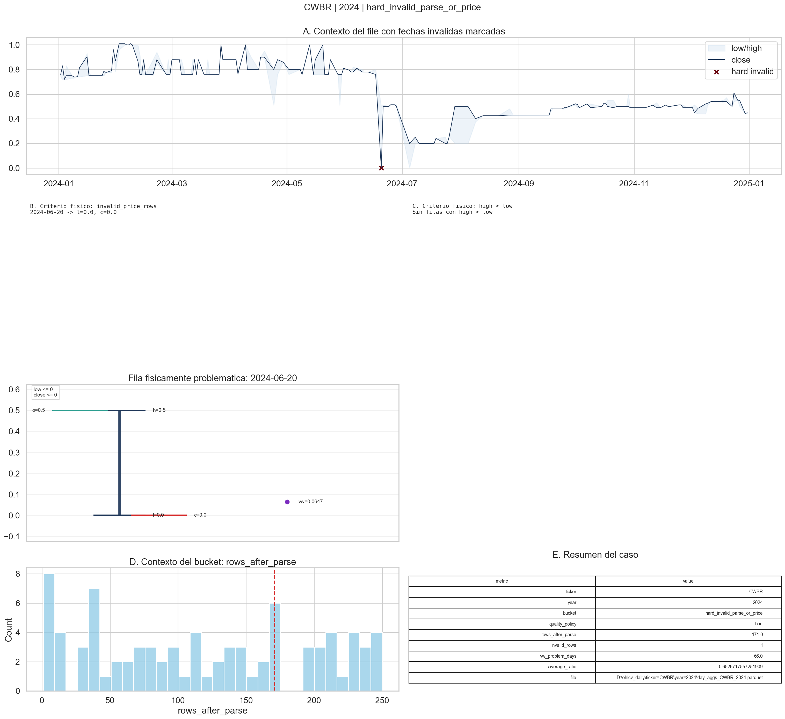

## PRST 2025

ticker: `PRST`  
year: `2025`  
bucket: `hard_invalid_parse_or_price`  
quality_policy: `bad`  
issues: `["negative_or_zero_ohlc_rows"]`  
warns: `["dataset_read_incompatible_schema", "large_internal_gap_days", "schema_merge_conflict_ticker_encoding"]`  
file: `D:\ohlcv_daily\ticker=PRST\year=2025\day_aggs_PRST_2025.parquet`

### Analisis Forense

En `hard_invalid_parse_or_price` la pregunta ya no es si el caso merece flag, sino si la barra diaria sigue siendo interpretable como hecho de mercado. La respuesta aqui es no. Se observan `32` filas con `OHLC = 0`, una firma tipica de colapso de barra diaria. Las primeras fechas exportadas (`2025-01-28`) ayudan a ver si el dano esta concentrado en un bloque temporal o disperso en el ano. En estos files la figura no representa una sesion tensa o iliquida, sino una barra que deja de tener semantica estable: cero estructural, parseo invalido o contradiccion de precios suficiente para romper la confianza minima en la observacion.

Por eso la decision correcta es `bad` y no `recoverable_with_flag`. Si este tipo de fila entra en `backtest_core`, el dano no es solo estadistico; es semantico. Contamina retornos, labels, benchmarks y cualquier reconciliacion con terceros porque ya no sabemos si la barra resume mercado o artefacto. Implicacion operativa: preservar para `forensic_only` o futura reconstruccion, pero no reutilizar como dato normal. El error que se evita es tratar ausencia de precios validos como si fuera simplemente una cola extrema del mercado.

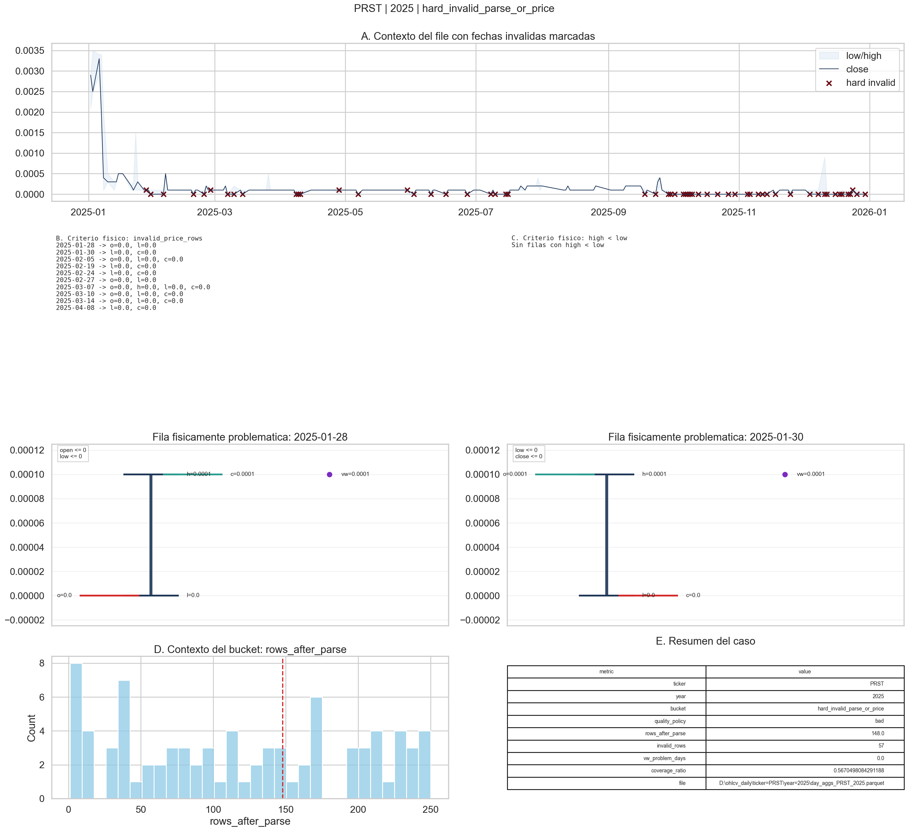

## FXLV 2025

ticker: `FXLV`  
year: `2025`  
bucket: `hard_invalid_parse_or_price`  
quality_policy: `bad`  
issues: `["negative_or_zero_ohlc_rows", "vw_outside_range_severe"]`  
warns: `["dataset_read_incompatible_schema", "schema_merge_conflict_ticker_encoding"]`  
file: `D:\ohlcv_daily\ticker=FXLV\year=2025\day_aggs_FXLV_2025.parquet`

### Analisis Forense

En `hard_invalid_parse_or_price` la pregunta ya no es si el caso merece flag, sino si la barra diaria sigue siendo interpretable como hecho de mercado. La respuesta aqui es no. Se observan `1` filas con `OHLC = 0`, una firma tipica de colapso de barra diaria. Las primeras fechas exportadas (`2025-01-15`) ayudan a ver si el dano esta concentrado en un bloque temporal o disperso en el ano. En estos files la figura no representa una sesion tensa o iliquida, sino una barra que deja de tener semantica estable: cero estructural, parseo invalido o contradiccion de precios suficiente para romper la confianza minima en la observacion.

Por eso la decision correcta es `bad` y no `recoverable_with_flag`. Si este tipo de fila entra en `backtest_core`, el dano no es solo estadistico; es semantico. Contamina retornos, labels, benchmarks y cualquier reconciliacion con terceros porque ya no sabemos si la barra resume mercado o artefacto. Implicacion operativa: preservar para `forensic_only` o futura reconstruccion, pero no reutilizar como dato normal. El error que se evita es tratar ausencia de precios validos como si fuera simplemente una cola extrema del mercado.

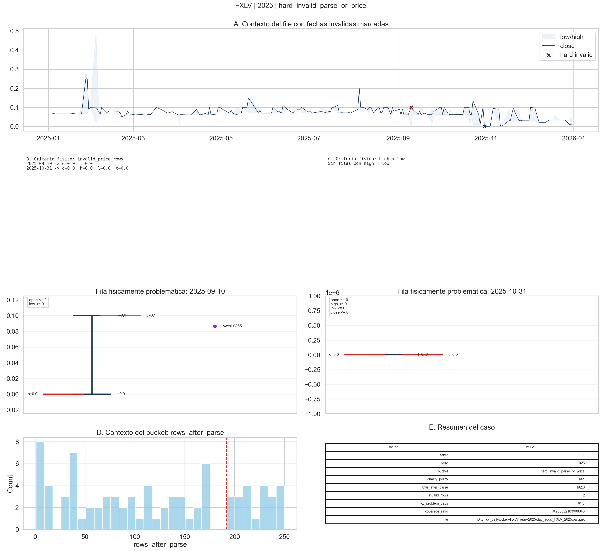

## UTRS 2024

ticker: `UTRS`  
year: `2024`  
bucket: `hard_invalid_parse_or_price`  
quality_policy: `bad`  
issues: `["negative_or_zero_ohlc_rows"]`  
warns: `["dataset_read_incompatible_schema", "large_internal_gap_days", "schema_merge_conflict_ticker_encoding", "suspicious_sparse_year", "vw_outside_range_material"]`  
file: `D:\ohlcv_daily\ticker=UTRS\year=2024\day_aggs_UTRS_2024.parquet`

### Analisis Forense

En `hard_invalid_parse_or_price` la pregunta ya no es si el caso merece flag, sino si la barra diaria sigue siendo interpretable como hecho de mercado. La respuesta aqui es no. Se observan `7` filas con `OHLC = 0`, una firma tipica de colapso de barra diaria. Las primeras fechas exportadas (`2024-02-06`) ayudan a ver si el dano esta concentrado en un bloque temporal o disperso en el ano. En estos files la figura no representa una sesion tensa o iliquida, sino una barra que deja de tener semantica estable: cero estructural, parseo invalido o contradiccion de precios suficiente para romper la confianza minima en la observacion.

Por eso la decision correcta es `bad` y no `recoverable_with_flag`. Si este tipo de fila entra en `backtest_core`, el dano no es solo estadistico; es semantico. Contamina retornos, labels, benchmarks y cualquier reconciliacion con terceros porque ya no sabemos si la barra resume mercado o artefacto. Implicacion operativa: preservar para `forensic_only` o futura reconstruccion, pero no reutilizar como dato normal. El error que se evita es tratar ausencia de precios validos como si fuera simplemente una cola extrema del mercado.

## VAXX 2025

ticker: `VAXX`  
year: `2025`  
bucket: `hard_invalid_parse_or_price`  
quality_policy: `bad`  
issues: `["negative_or_zero_ohlc_rows", "vw_outside_range_severe"]`  
warns: `["dataset_read_incompatible_schema", "schema_merge_conflict_ticker_encoding"]`  
file: `D:\ohlcv_daily\ticker=VAXX\year=2025\day_aggs_VAXX_2025.parquet`

### Analisis Forense

En `hard_invalid_parse_or_price` la pregunta ya no es si el caso merece flag, sino si la barra diaria sigue siendo interpretable como hecho de mercado. La respuesta aqui es no. Las primeras fechas exportadas (`2025-06-23`) ayudan a ver si el dano esta concentrado en un bloque temporal o disperso en el ano. En estos files la figura no representa una sesion tensa o iliquida, sino una barra que deja de tener semantica estable: cero estructural, parseo invalido o contradiccion de precios suficiente para romper la confianza minima en la observacion.

Por eso la decision correcta es `bad` y no `recoverable_with_flag`. Si este tipo de fila entra en `backtest_core`, el dano no es solo estadistico; es semantico. Contamina retornos, labels, benchmarks y cualquier reconciliacion con terceros porque ya no sabemos si la barra resume mercado o artefacto. Implicacion operativa: preservar para `forensic_only` o futura reconstruccion, pero no reutilizar como dato normal. El error que se evita es tratar ausencia de precios validos como si fuera simplemente una cola extrema del mercado.

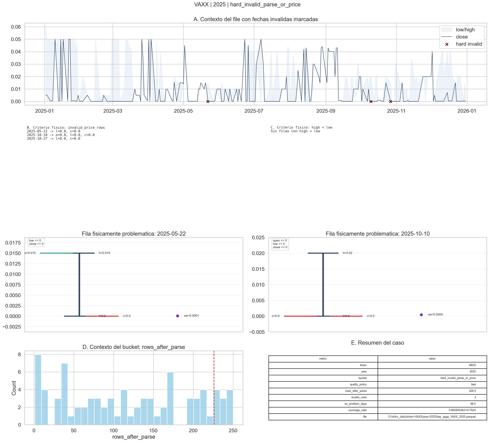

## GNRS 2024

ticker: `GNRS`  
year: `2024`  
bucket: `hard_invalid_parse_or_price`  
quality_policy: `bad`  
issues: `["negative_or_zero_ohlc_rows", "vw_outside_range_severe"]`  
warns: `["dataset_read_incompatible_schema", "large_internal_gap_days", "schema_merge_conflict_ticker_encoding", "suspicious_sparse_year"]`  
file: `D:\ohlcv_daily\ticker=GNRS\year=2024\day_aggs_GNRS_2024.parquet`

### Analisis Forense

En `hard_invalid_parse_or_price` la pregunta ya no es si el caso merece flag, sino si la barra diaria sigue siendo interpretable como hecho de mercado. La respuesta aqui es no. Se observan `2` filas con `OHLC = 0`, una firma tipica de colapso de barra diaria. Las primeras fechas exportadas (`2024-02-07`) ayudan a ver si el dano esta concentrado en un bloque temporal o disperso en el ano. En estos files la figura no representa una sesion tensa o iliquida, sino una barra que deja de tener semantica estable: cero estructural, parseo invalido o contradiccion de precios suficiente para romper la confianza minima en la observacion.

Por eso la decision correcta es `bad` y no `recoverable_with_flag`. Si este tipo de fila entra en `backtest_core`, el dano no es solo estadistico; es semantico. Contamina retornos, labels, benchmarks y cualquier reconciliacion con terceros porque ya no sabemos si la barra resume mercado o artefacto. Implicacion operativa: preservar para `forensic_only` o futura reconstruccion, pero no reutilizar como dato normal. El error que se evita es tratar ausencia de precios validos como si fuera simplemente una cola extrema del mercado.

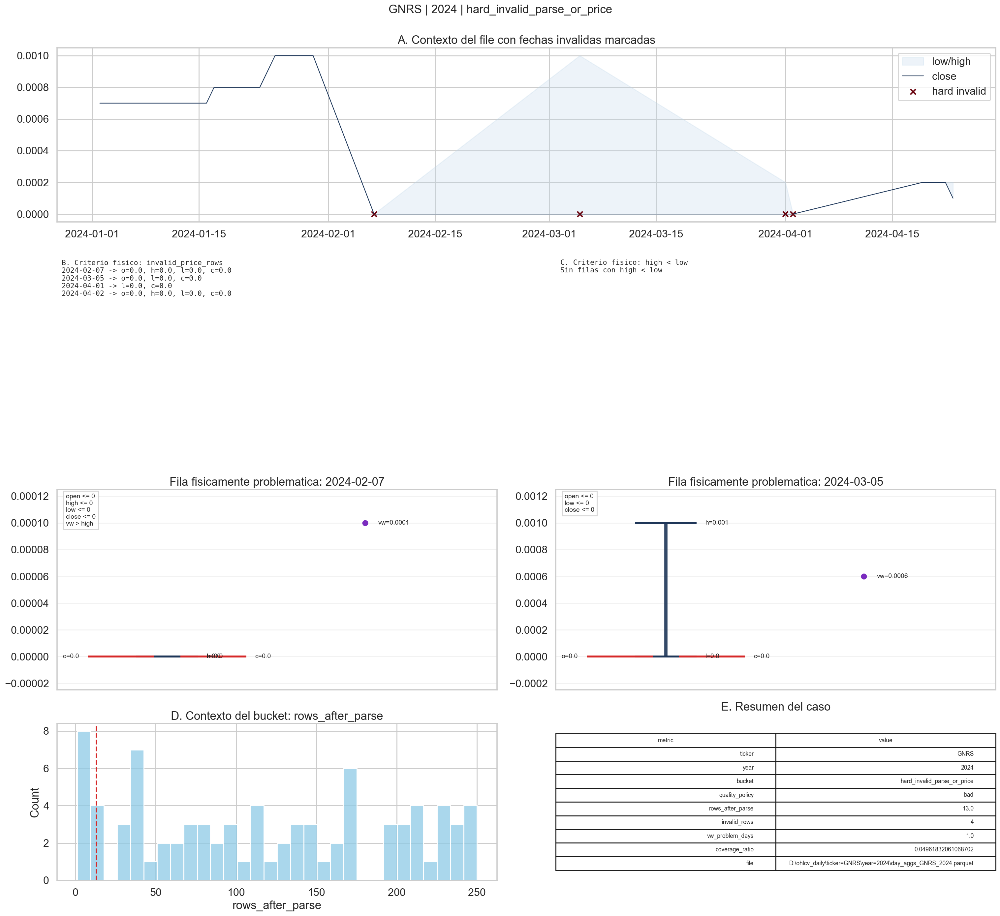

## HMNY 2022

ticker: `HMNY`  
year: `2022`  
bucket: `hard_invalid_parse_or_price`  
quality_policy: `bad`  
issues: `["negative_or_zero_ohlc_rows", "vw_outside_range_severe"]`  
warns: `["dataset_read_incompatible_schema", "large_internal_gap_days", "schema_merge_conflict_ticker_encoding"]`  
file: `D:\ohlcv_daily\ticker=HMNY\year=2022\day_aggs_HMNY_2022.parquet`

### Analisis Forense

En `hard_invalid_parse_or_price` la pregunta ya no es si el caso merece flag, sino si la barra diaria sigue siendo interpretable como hecho de mercado. La respuesta aqui es no. Se observan `32` filas con `OHLC = 0`, una firma tipica de colapso de barra diaria. Las primeras fechas exportadas (`2022-05-05`) ayudan a ver si el dano esta concentrado en un bloque temporal o disperso en el ano. En estos files la figura no representa una sesion tensa o iliquida, sino una barra que deja de tener semantica estable: cero estructural, parseo invalido o contradiccion de precios suficiente para romper la confianza minima en la observacion.

Por eso la decision correcta es `bad` y no `recoverable_with_flag`. Si este tipo de fila entra en `backtest_core`, el dano no es solo estadistico; es semantico. Contamina retornos, labels, benchmarks y cualquier reconciliacion con terceros porque ya no sabemos si la barra resume mercado o artefacto. Implicacion operativa: preservar para `forensic_only` o futura reconstruccion, pero no reutilizar como dato normal. El error que se evita es tratar ausencia de precios validos como si fuera simplemente una cola extrema del mercado.

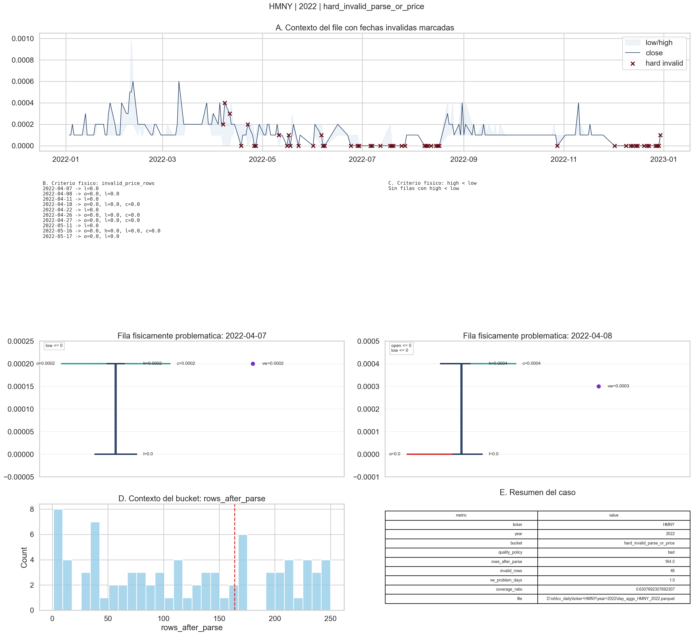

## NXTP 2025

ticker: `NXTP`  
year: `2025`  
bucket: `hard_invalid_parse_or_price`  
quality_policy: `bad`  
issues: `["negative_or_zero_ohlc_rows", "vw_outside_range_severe"]`  
warns: `["dataset_read_incompatible_schema", "large_internal_gap_days", "schema_merge_conflict_ticker_encoding", "suspicious_sparse_year"]`  
file: `D:\ohlcv_daily\ticker=NXTP\year=2025\day_aggs_NXTP_2025.parquet`

### Analisis Forense

En `hard_invalid_parse_or_price` la pregunta ya no es si el caso merece flag, sino si la barra diaria sigue siendo interpretable como hecho de mercado. La respuesta aqui es no. Se observan `3` filas con `OHLC = 0`, una firma tipica de colapso de barra diaria. Las primeras fechas exportadas (`2025-05-28`) ayudan a ver si el dano esta concentrado en un bloque temporal o disperso en el ano. En estos files la figura no representa una sesion tensa o iliquida, sino una barra que deja de tener semantica estable: cero estructural, parseo invalido o contradiccion de precios suficiente para romper la confianza minima en la observacion.

Por eso la decision correcta es `bad` y no `recoverable_with_flag`. Si este tipo de fila entra en `backtest_core`, el dano no es solo estadistico; es semantico. Contamina retornos, labels, benchmarks y cualquier reconciliacion con terceros porque ya no sabemos si la barra resume mercado o artefacto. Implicacion operativa: preservar para `forensic_only` o futura reconstruccion, pero no reutilizar como dato normal. El error que se evita es tratar ausencia de precios validos como si fuera simplemente una cola extrema del mercado.

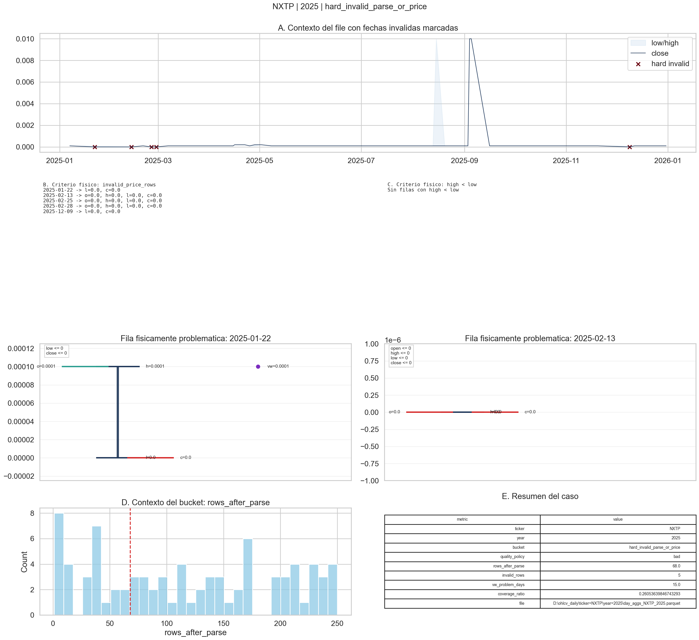

## KBNT 2025

ticker: `KBNT`  
year: `2025`  
bucket: `hard_invalid_parse_or_price`  
quality_policy: `bad`  
issues: `["negative_or_zero_ohlc_rows", "vw_outside_range_severe"]`  
warns: `["dataset_read_incompatible_schema", "large_internal_gap_days", "schema_merge_conflict_ticker_encoding", "suspicious_sparse_year"]`  
file: `D:\ohlcv_daily\ticker=KBNT\year=2025\day_aggs_KBNT_2025.parquet`

### Analisis Forense

En `hard_invalid_parse_or_price` la pregunta ya no es si el caso merece flag, sino si la barra diaria sigue siendo interpretable como hecho de mercado. La respuesta aqui es no. Se observan `17` filas con `OHLC = 0`, una firma tipica de colapso de barra diaria. Las primeras fechas exportadas (`2025-04-03`) ayudan a ver si el dano esta concentrado en un bloque temporal o disperso en el ano. En estos files la figura no representa una sesion tensa o iliquida, sino una barra que deja de tener semantica estable: cero estructural, parseo invalido o contradiccion de precios suficiente para romper la confianza minima en la observacion.

Por eso la decision correcta es `bad` y no `recoverable_with_flag`. Si este tipo de fila entra en `backtest_core`, el dano no es solo estadistico; es semantico. Contamina retornos, labels, benchmarks y cualquier reconciliacion con terceros porque ya no sabemos si la barra resume mercado o artefacto. Implicacion operativa: preservar para `forensic_only` o futura reconstruccion, pero no reutilizar como dato normal. El error que se evita es tratar ausencia de precios validos como si fuera simplemente una cola extrema del mercado.

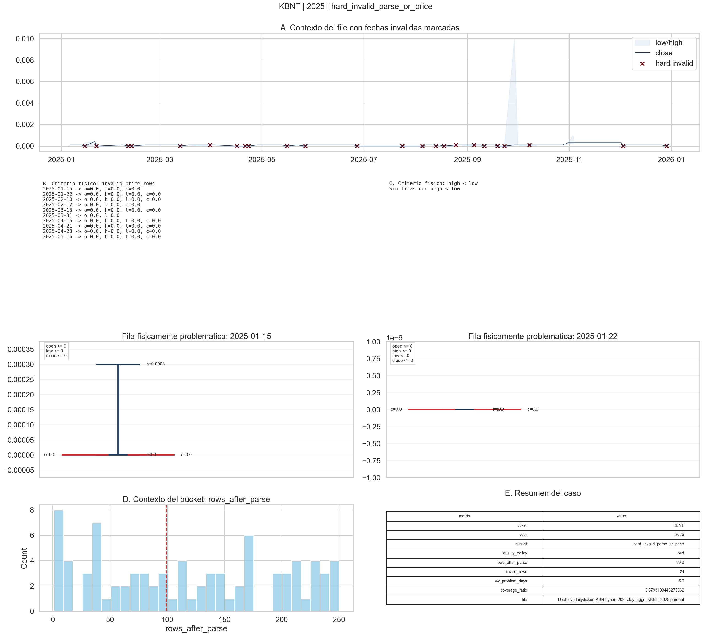

## TCCO 2025

ticker: `TCCO`  
year: `2025`  
bucket: `hard_invalid_parse_or_price`  
quality_policy: `bad`  
issues: `["negative_or_zero_ohlc_rows"]`  
warns: `["dataset_read_incompatible_schema", "large_internal_gap_days", "schema_merge_conflict_ticker_encoding", "suspicious_sparse_year"]`  
file: `D:\ohlcv_daily\ticker=TCCO\year=2025\day_aggs_TCCO_2025.parquet`

### Analisis Forense

En `hard_invalid_parse_or_price` la pregunta ya no es si el caso merece flag, sino si la barra diaria sigue siendo interpretable como hecho de mercado. La respuesta aqui es no. Se observan `7` filas con `OHLC = 0`, una firma tipica de colapso de barra diaria. Las primeras fechas exportadas (`2025-10-02`) ayudan a ver si el dano esta concentrado en un bloque temporal o disperso en el ano. En estos files la figura no representa una sesion tensa o iliquida, sino una barra que deja de tener semantica estable: cero estructural, parseo invalido o contradiccion de precios suficiente para romper la confianza minima en la observacion.

Por eso la decision correcta es `bad` y no `recoverable_with_flag`. Si este tipo de fila entra en `backtest_core`, el dano no es solo estadistico; es semantico. Contamina retornos, labels, benchmarks y cualquier reconciliacion con terceros porque ya no sabemos si la barra resume mercado o artefacto. Implicacion operativa: preservar para `forensic_only` o futura reconstruccion, pero no reutilizar como dato normal. El error que se evita es tratar ausencia de precios validos como si fuera simplemente una cola extrema del mercado.

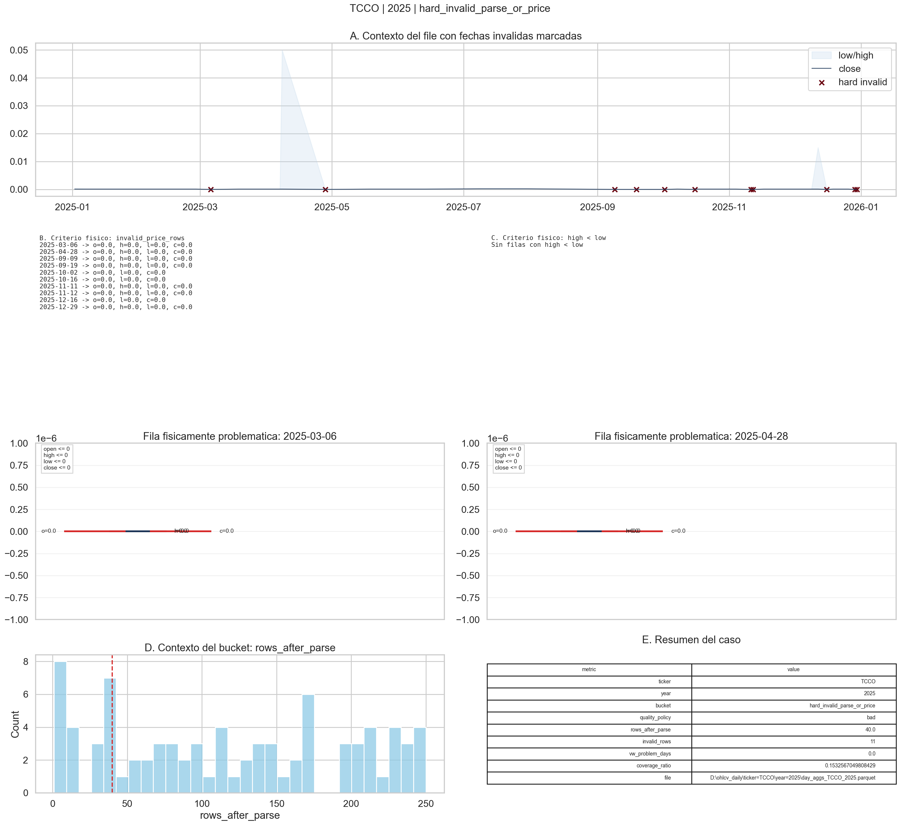

## KLDO 2024

ticker: `KLDO`  
year: `2024`  
bucket: `hard_invalid_parse_or_price`  
quality_policy: `bad`  
issues: `["negative_or_zero_ohlc_rows", "vw_outside_range_severe"]`  
warns: `["dataset_read_incompatible_schema", "schema_merge_conflict_ticker_encoding", "suspicious_sparse_year"]`  
file: `D:\ohlcv_daily\ticker=KLDO\year=2024\day_aggs_KLDO_2024.parquet`

### Analisis Forense

En `hard_invalid_parse_or_price` la pregunta ya no es si el caso merece flag, sino si la barra diaria sigue siendo interpretable como hecho de mercado. La respuesta aqui es no. Se observan `16` filas con `OHLC = 0`, una firma tipica de colapso de barra diaria. Las primeras fechas exportadas (`2024-04-22`) ayudan a ver si el dano esta concentrado en un bloque temporal o disperso en el ano. En estos files la figura no representa una sesion tensa o iliquida, sino una barra que deja de tener semantica estable: cero estructural, parseo invalido o contradiccion de precios suficiente para romper la confianza minima en la observacion.

Por eso la decision correcta es `bad` y no `recoverable_with_flag`. Si este tipo de fila entra en `backtest_core`, el dano no es solo estadistico; es semantico. Contamina retornos, labels, benchmarks y cualquier reconciliacion con terceros porque ya no sabemos si la barra resume mercado o artefacto. Implicacion operativa: preservar para `forensic_only` o futura reconstruccion, pero no reutilizar como dato normal. El error que se evita es tratar ausencia de precios validos como si fuera simplemente una cola extrema del mercado.

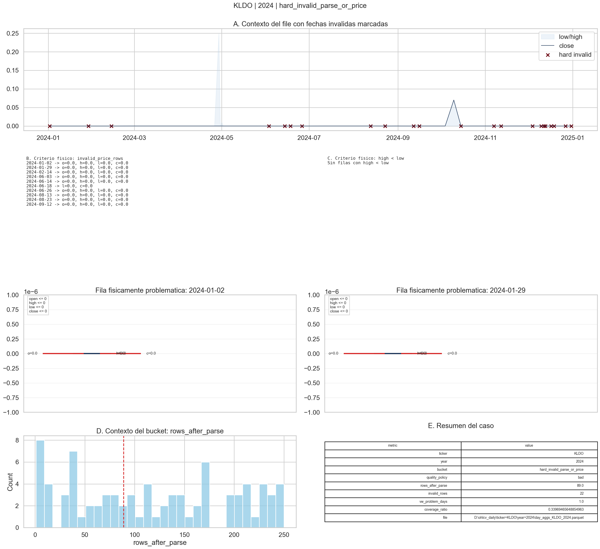

## AAGR 2025

ticker: `AAGR`  
year: `2025`  
bucket: `hard_invalid_parse_or_price`  
quality_policy: `bad`  
issues: `["negative_or_zero_ohlc_rows", "vw_outside_range_severe"]`  
warns: `["dataset_read_incompatible_schema", "schema_merge_conflict_ticker_encoding"]`  
file: `D:\ohlcv_daily\ticker=AAGR\year=2025\day_aggs_AAGR_2025.parquet`

### Analisis Forense

En `hard_invalid_parse_or_price` la pregunta ya no es si el caso merece flag, sino si la barra diaria sigue siendo interpretable como hecho de mercado. La respuesta aqui es no. Se observan `2` filas con `OHLC = 0`, una firma tipica de colapso de barra diaria. Las primeras fechas exportadas (`2025-03-18`) ayudan a ver si el dano esta concentrado en un bloque temporal o disperso en el ano. En estos files la figura no representa una sesion tensa o iliquida, sino una barra que deja de tener semantica estable: cero estructural, parseo invalido o contradiccion de precios suficiente para romper la confianza minima en la observacion.

Por eso la decision correcta es `bad` y no `recoverable_with_flag`. Si este tipo de fila entra en `backtest_core`, el dano no es solo estadistico; es semantico. Contamina retornos, labels, benchmarks y cualquier reconciliacion con terceros porque ya no sabemos si la barra resume mercado o artefacto. Implicacion operativa: preservar para `forensic_only` o futura reconstruccion, pero no reutilizar como dato normal. El error que se evita es tratar ausencia de precios validos como si fuera simplemente una cola extrema del mercado.

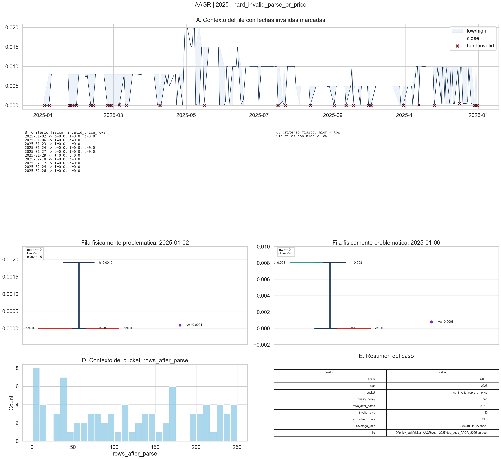

## FOXO 2026

ticker: `FOXO`  
year: `2026`  
bucket: `hard_invalid_parse_or_price`  
quality_policy: `bad`  
issues: `["negative_or_zero_ohlc_rows"]`  
warns: `["dataset_read_incompatible_schema", "schema_merge_conflict_ticker_encoding", "suspicious_sparse_year"]`  
file: `D:\ohlcv_daily\ticker=FOXO\year=2026\day_aggs_FOXO_2026.parquet`

### Analisis Forense

En `hard_invalid_parse_or_price` la pregunta ya no es si el caso merece flag, sino si la barra diaria sigue siendo interpretable como hecho de mercado. La respuesta aqui es no. Las primeras fechas exportadas (`2026-01-27`) ayudan a ver si el dano esta concentrado en un bloque temporal o disperso en el ano. En estos files la figura no representa una sesion tensa o iliquida, sino una barra que deja de tener semantica estable: cero estructural, parseo invalido o contradiccion de precios suficiente para romper la confianza minima en la observacion.

Por eso la decision correcta es `bad` y no `recoverable_with_flag`. Si este tipo de fila entra en `backtest_core`, el dano no es solo estadistico; es semantico. Contamina retornos, labels, benchmarks y cualquier reconciliacion con terceros porque ya no sabemos si la barra resume mercado o artefacto. Implicacion operativa: preservar para `forensic_only` o futura reconstruccion, pero no reutilizar como dato normal. El error que se evita es tratar ausencia de precios validos como si fuera simplemente una cola extrema del mercado.

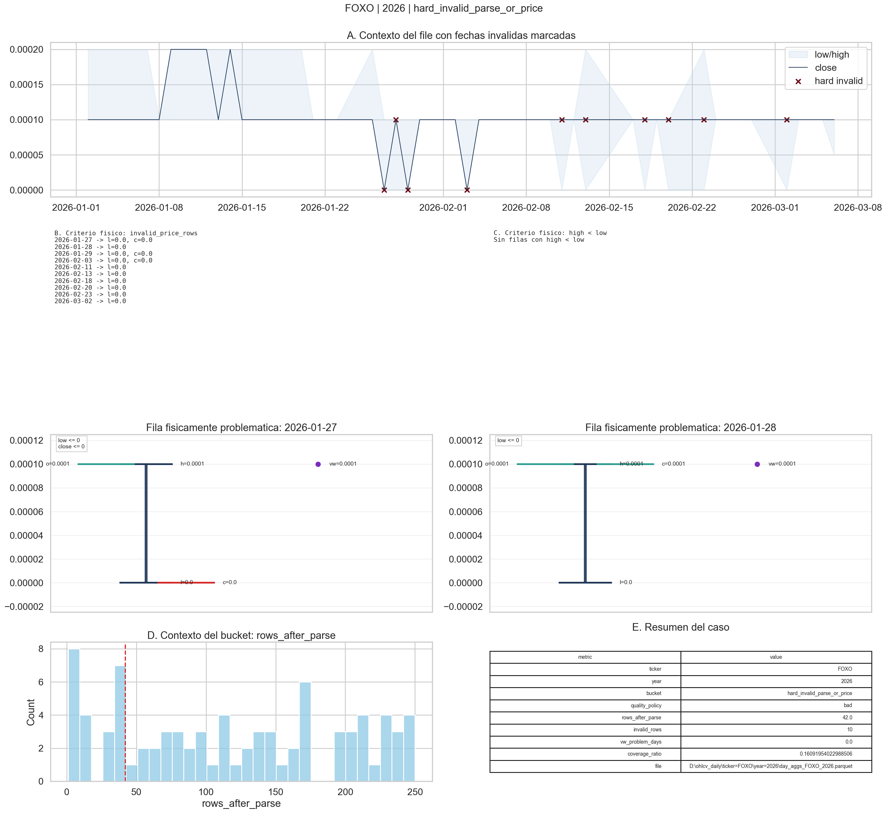

## GNRS 2023

ticker: `GNRS`  
year: `2023`  
bucket: `hard_invalid_parse_or_price`  
quality_policy: `bad`  
issues: `["negative_or_zero_ohlc_rows", "vw_outside_range_severe"]`  
warns: `["dataset_read_incompatible_schema", "large_internal_gap_days", "schema_merge_conflict_ticker_encoding", "suspicious_sparse_year"]`  
file: `D:\ohlcv_daily\ticker=GNRS\year=2023\day_aggs_GNRS_2023.parquet`

### Analisis Forense

En `hard_invalid_parse_or_price` la pregunta ya no es si el caso merece flag, sino si la barra diaria sigue siendo interpretable como hecho de mercado. La respuesta aqui es no. Se observan `4` filas con `OHLC = 0`, una firma tipica de colapso de barra diaria. Las primeras fechas exportadas (`2023-03-29`) ayudan a ver si el dano esta concentrado en un bloque temporal o disperso en el ano. En estos files la figura no representa una sesion tensa o iliquida, sino una barra que deja de tener semantica estable: cero estructural, parseo invalido o contradiccion de precios suficiente para romper la confianza minima en la observacion.

Por eso la decision correcta es `bad` y no `recoverable_with_flag`. Si este tipo de fila entra en `backtest_core`, el dano no es solo estadistico; es semantico. Contamina retornos, labels, benchmarks y cualquier reconciliacion con terceros porque ya no sabemos si la barra resume mercado o artefacto. Implicacion operativa: preservar para `forensic_only` o futura reconstruccion, pero no reutilizar como dato normal. El error que se evita es tratar ausencia de precios validos como si fuera simplemente una cola extrema del mercado.

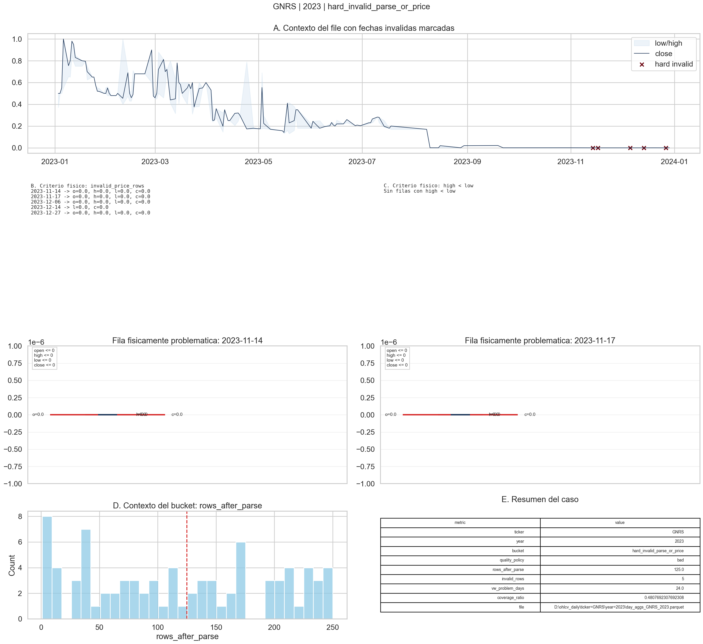

## KLDO 2025

ticker: `KLDO`  
year: `2025`  
bucket: `hard_invalid_parse_or_price`  
quality_policy: `bad`  
issues: `["negative_or_zero_ohlc_rows", "vw_outside_range_severe"]`  
warns: `["dataset_read_incompatible_schema", "large_internal_gap_days", "schema_merge_conflict_ticker_encoding", "suspicious_sparse_year"]`  
file: `D:\ohlcv_daily\ticker=KLDO\year=2025\day_aggs_KLDO_2025.parquet`

### Analisis Forense

En `hard_invalid_parse_or_price` la pregunta ya no es si el caso merece flag, sino si la barra diaria sigue siendo interpretable como hecho de mercado. La respuesta aqui es no. Se observan `10` filas con `OHLC = 0`, una firma tipica de colapso de barra diaria. Las primeras fechas exportadas (`2025-12-04`) ayudan a ver si el dano esta concentrado en un bloque temporal o disperso en el ano. En estos files la figura no representa una sesion tensa o iliquida, sino una barra que deja de tener semantica estable: cero estructural, parseo invalido o contradiccion de precios suficiente para romper la confianza minima en la observacion.

Por eso la decision correcta es `bad` y no `recoverable_with_flag`. Si este tipo de fila entra en `backtest_core`, el dano no es solo estadistico; es semantico. Contamina retornos, labels, benchmarks y cualquier reconciliacion con terceros porque ya no sabemos si la barra resume mercado o artefacto. Implicacion operativa: preservar para `forensic_only` o futura reconstruccion, pero no reutilizar como dato normal. El error que se evita es tratar ausencia de precios validos como si fuera simplemente una cola extrema del mercado.

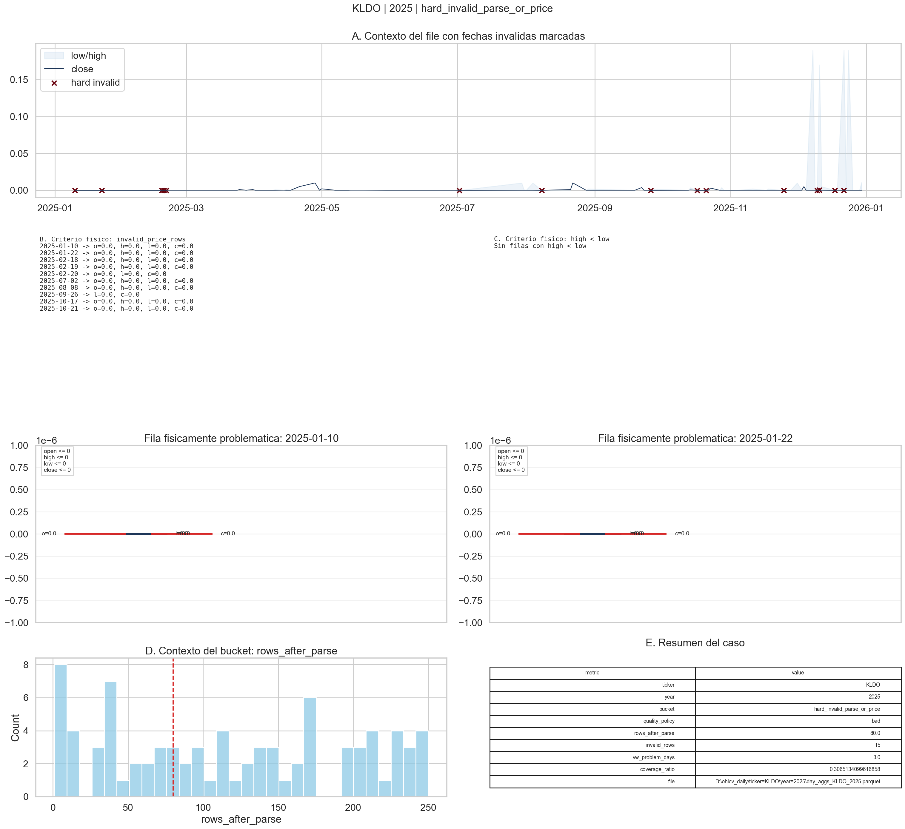

## EFTR 2025

ticker: `EFTR`  
year: `2025`  
bucket: `hard_invalid_parse_or_price`  
quality_policy: `bad`  
issues: `["negative_or_zero_ohlc_rows", "vw_outside_range_severe"]`  
warns: `["dataset_read_incompatible_schema", "schema_merge_conflict_ticker_encoding", "suspicious_sparse_year"]`  
file: `D:\ohlcv_daily\ticker=EFTR\year=2025\day_aggs_EFTR_2025.parquet`

### Analisis Forense

En `hard_invalid_parse_or_price` la pregunta ya no es si el caso merece flag, sino si la barra diaria sigue siendo interpretable como hecho de mercado. La respuesta aqui es no. Se observan `2` filas con `OHLC = 0`, una firma tipica de colapso de barra diaria. Las primeras fechas exportadas (`2025-05-14`) ayudan a ver si el dano esta concentrado en un bloque temporal o disperso en el ano. En estos files la figura no representa una sesion tensa o iliquida, sino una barra que deja de tener semantica estable: cero estructural, parseo invalido o contradiccion de precios suficiente para romper la confianza minima en la observacion.

Por eso la decision correcta es `bad` y no `recoverable_with_flag`. Si este tipo de fila entra en `backtest_core`, el dano no es solo estadistico; es semantico. Contamina retornos, labels, benchmarks y cualquier reconciliacion con terceros porque ya no sabemos si la barra resume mercado o artefacto. Implicacion operativa: preservar para `forensic_only` o futura reconstruccion, pero no reutilizar como dato normal. El error que se evita es tratar ausencia de precios validos como si fuera simplemente una cola extrema del mercado.

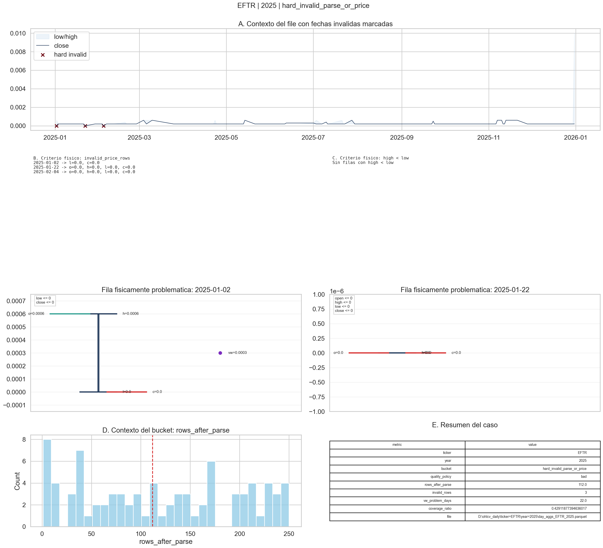

## NMRD 2025

ticker: `NMRD`  
year: `2025`  
bucket: `hard_invalid_parse_or_price`  
quality_policy: `bad`  
issues: `["negative_or_zero_ohlc_rows", "vw_outside_range_severe"]`  
warns: `["dataset_read_incompatible_schema", "large_internal_gap_days", "schema_merge_conflict_ticker_encoding", "suspicious_sparse_year"]`  
file: `D:\ohlcv_daily\ticker=NMRD\year=2025\day_aggs_NMRD_2025.parquet`

### Analisis Forense

En `hard_invalid_parse_or_price` la pregunta ya no es si el caso merece flag, sino si la barra diaria sigue siendo interpretable como hecho de mercado. La respuesta aqui es no. Se observan `4` filas con `OHLC = 0`, una firma tipica de colapso de barra diaria. Las primeras fechas exportadas (`2025-10-31`) ayudan a ver si el dano esta concentrado en un bloque temporal o disperso en el ano. En estos files la figura no representa una sesion tensa o iliquida, sino una barra que deja de tener semantica estable: cero estructural, parseo invalido o contradiccion de precios suficiente para romper la confianza minima en la observacion.

Por eso la decision correcta es `bad` y no `recoverable_with_flag`. Si este tipo de fila entra en `backtest_core`, el dano no es solo estadistico; es semantico. Contamina retornos, labels, benchmarks y cualquier reconciliacion con terceros porque ya no sabemos si la barra resume mercado o artefacto. Implicacion operativa: preservar para `forensic_only` o futura reconstruccion, pero no reutilizar como dato normal. El error que se evita es tratar ausencia de precios validos como si fuera simplemente una cola extrema del mercado.

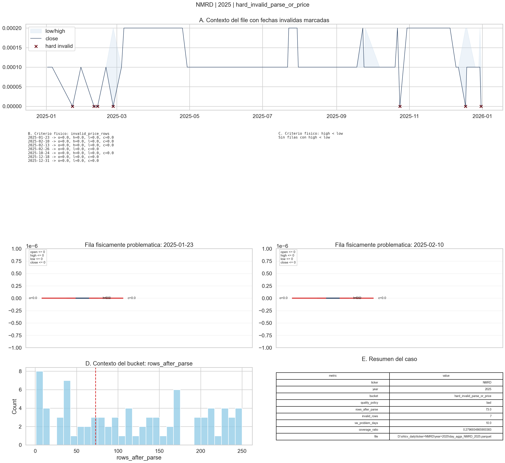

## ANTH 2023

ticker: `ANTH`  
year: `2023`  
bucket: `hard_invalid_parse_or_price`  
quality_policy: `bad`  
issues: `["negative_or_zero_ohlc_rows"]`  
warns: `["dataset_read_incompatible_schema", "large_internal_gap_days", "schema_merge_conflict_ticker_encoding", "suspicious_sparse_year"]`  
file: `D:\ohlcv_daily\ticker=ANTH\year=2023\day_aggs_ANTH_2023.parquet`

### Analisis Forense

En `hard_invalid_parse_or_price` la pregunta ya no es si el caso merece flag, sino si la barra diaria sigue siendo interpretable como hecho de mercado. La respuesta aqui es no. Se observan `7` filas con `OHLC = 0`, una firma tipica de colapso de barra diaria. Las primeras fechas exportadas (`2023-11-13`) ayudan a ver si el dano esta concentrado en un bloque temporal o disperso en el ano. En estos files la figura no representa una sesion tensa o iliquida, sino una barra que deja de tener semantica estable: cero estructural, parseo invalido o contradiccion de precios suficiente para romper la confianza minima en la observacion.

Por eso la decision correcta es `bad` y no `recoverable_with_flag`. Si este tipo de fila entra en `backtest_core`, el dano no es solo estadistico; es semantico. Contamina retornos, labels, benchmarks y cualquier reconciliacion con terceros porque ya no sabemos si la barra resume mercado o artefacto. Implicacion operativa: preservar para `forensic_only` o futura reconstruccion, pero no reutilizar como dato normal. El error que se evita es tratar ausencia de precios validos como si fuera simplemente una cola extrema del mercado.

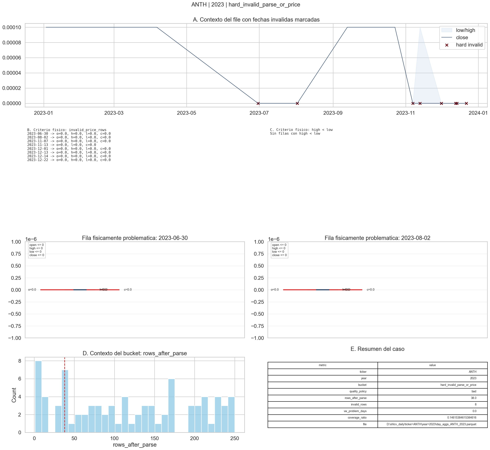

## JEWL 2026

ticker: `JEWL`  
year: `2026`  
bucket: `hard_invalid_parse_or_price`  
quality_policy: `bad`  
issues: `["negative_or_zero_ohlc_rows"]`  
warns: `["dataset_read_incompatible_schema", "schema_merge_conflict_ticker_encoding", "suspicious_sparse_year"]`  
file: `D:\ohlcv_daily\ticker=JEWL\year=2026\day_aggs_JEWL_2026.parquet`

### Analisis Forense

En `hard_invalid_parse_or_price` la pregunta ya no es si el caso merece flag, sino si la barra diaria sigue siendo interpretable como hecho de mercado. La respuesta aqui es no. Se observan `1` filas con `OHLC = 0`, una firma tipica de colapso de barra diaria. Las primeras fechas exportadas (`2026-01-05`) ayudan a ver si el dano esta concentrado en un bloque temporal o disperso en el ano. En estos files la figura no representa una sesion tensa o iliquida, sino una barra que deja de tener semantica estable: cero estructural, parseo invalido o contradiccion de precios suficiente para romper la confianza minima en la observacion.

Por eso la decision correcta es `bad` y no `recoverable_with_flag`. Si este tipo de fila entra en `backtest_core`, el dano no es solo estadistico; es semantico. Contamina retornos, labels, benchmarks y cualquier reconciliacion con terceros porque ya no sabemos si la barra resume mercado o artefacto. Implicacion operativa: preservar para `forensic_only` o futura reconstruccion, pero no reutilizar como dato normal. El error que se evita es tratar ausencia de precios validos como si fuera simplemente una cola extrema del mercado.

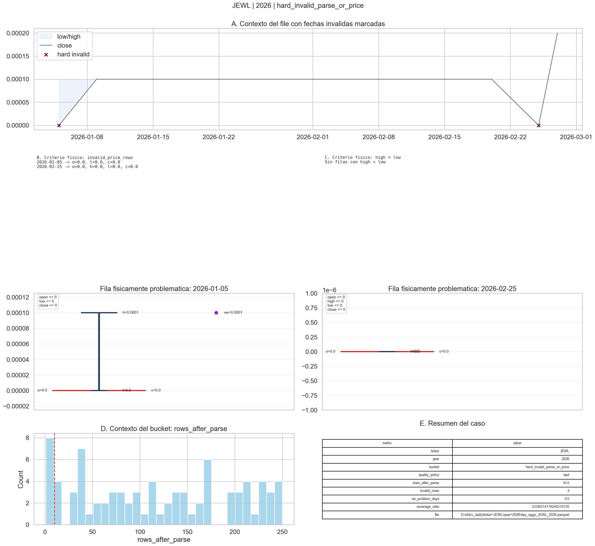

## MOTS 2025

ticker: `MOTS`  
year: `2025`  
bucket: `hard_invalid_parse_or_price`  
quality_policy: `bad`  
issues: `["negative_or_zero_ohlc_rows", "vw_outside_range_severe"]`  
warns: `["dataset_read_incompatible_schema", "large_internal_gap_days", "schema_merge_conflict_ticker_encoding", "suspicious_sparse_year"]`  
file: `D:\ohlcv_daily\ticker=MOTS\year=2025\day_aggs_MOTS_2025.parquet`

### Analisis Forense

En `hard_invalid_parse_or_price` la pregunta ya no es si el caso merece flag, sino si la barra diaria sigue siendo interpretable como hecho de mercado. La respuesta aqui es no. Se observan `9` filas con `OHLC = 0`, una firma tipica de colapso de barra diaria. Las primeras fechas exportadas (`2025-10-23`) ayudan a ver si el dano esta concentrado en un bloque temporal o disperso en el ano. En estos files la figura no representa una sesion tensa o iliquida, sino una barra que deja de tener semantica estable: cero estructural, parseo invalido o contradiccion de precios suficiente para romper la confianza minima en la observacion.

Por eso la decision correcta es `bad` y no `recoverable_with_flag`. Si este tipo de fila entra en `backtest_core`, el dano no es solo estadistico; es semantico. Contamina retornos, labels, benchmarks y cualquier reconciliacion con terceros porque ya no sabemos si la barra resume mercado o artefacto. Implicacion operativa: preservar para `forensic_only` o futura reconstruccion, pero no reutilizar como dato normal. El error que se evita es tratar ausencia de precios validos como si fuera simplemente una cola extrema del mercado.

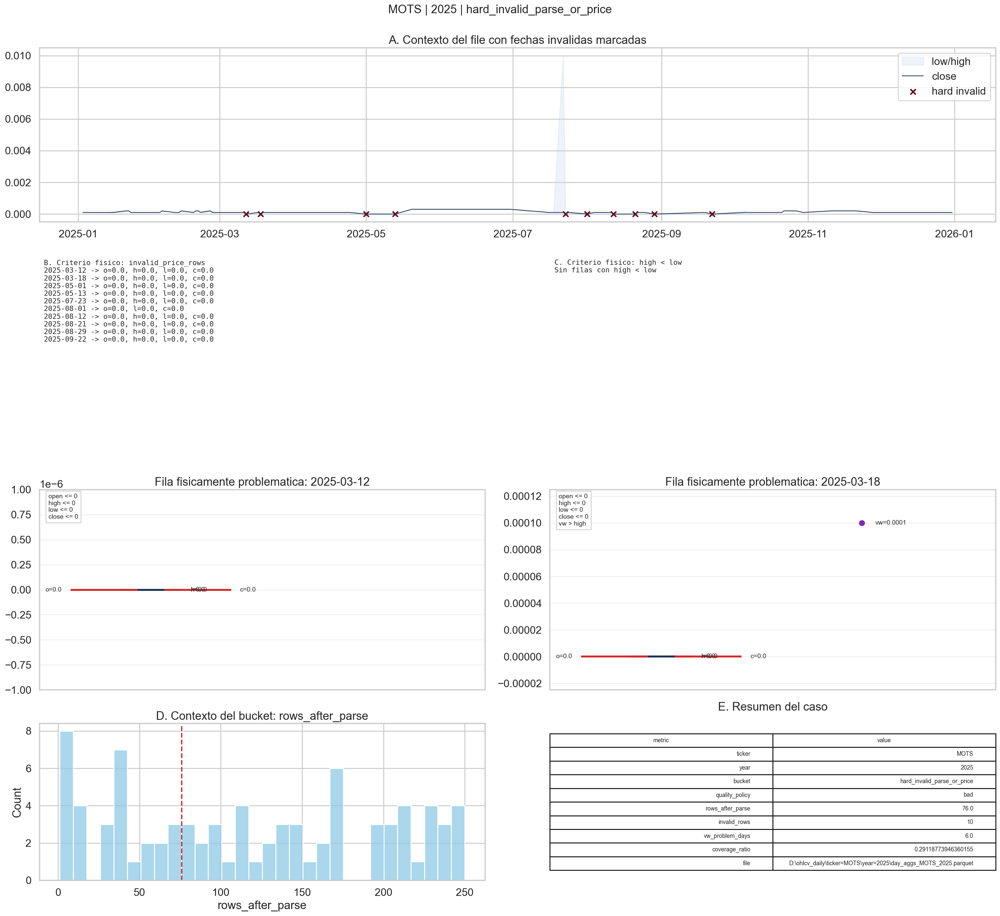

## ELOX 2024

ticker: `ELOX`  
year: `2024`  
bucket: `hard_invalid_parse_or_price`  
quality_policy: `bad`  
issues: `["negative_or_zero_ohlc_rows", "vw_outside_range_severe"]`  
warns: `["dataset_read_incompatible_schema", "large_internal_gap_days", "schema_merge_conflict_ticker_encoding"]`  
file: `D:\ohlcv_daily\ticker=ELOX\year=2024\day_aggs_ELOX_2024.parquet`

### Analisis Forense

En `hard_invalid_parse_or_price` la pregunta ya no es si el caso merece flag, sino si la barra diaria sigue siendo interpretable como hecho de mercado. La respuesta aqui es no. Se observan `13` filas con `OHLC = 0`, una firma tipica de colapso de barra diaria. Las primeras fechas exportadas (`2024-08-14`) ayudan a ver si el dano esta concentrado en un bloque temporal o disperso en el ano. En estos files la figura no representa una sesion tensa o iliquida, sino una barra que deja de tener semantica estable: cero estructural, parseo invalido o contradiccion de precios suficiente para romper la confianza minima en la observacion.

Por eso la decision correcta es `bad` y no `recoverable_with_flag`. Si este tipo de fila entra en `backtest_core`, el dano no es solo estadistico; es semantico. Contamina retornos, labels, benchmarks y cualquier reconciliacion con terceros porque ya no sabemos si la barra resume mercado o artefacto. Implicacion operativa: preservar para `forensic_only` o futura reconstruccion, pero no reutilizar como dato normal. El error que se evita es tratar ausencia de precios validos como si fuera simplemente una cola extrema del mercado.

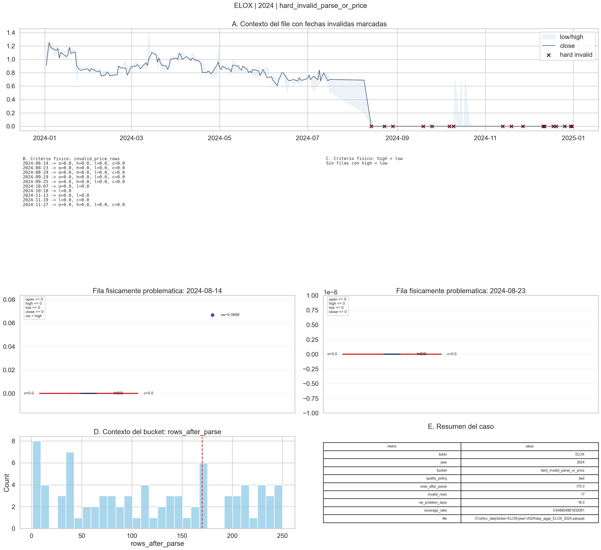

## KLDO 2023

ticker: `KLDO`  
year: `2023`  
bucket: `hard_invalid_parse_or_price`  
quality_policy: `bad`  
issues: `["negative_or_zero_ohlc_rows"]`  
warns: `["dataset_read_incompatible_schema", "large_internal_gap_days", "schema_merge_conflict_ticker_encoding", "vw_outside_range_material"]`  
file: `D:\ohlcv_daily\ticker=KLDO\year=2023\day_aggs_KLDO_2023.parquet`

### Analisis Forense

En `hard_invalid_parse_or_price` la pregunta ya no es si el caso merece flag, sino si la barra diaria sigue siendo interpretable como hecho de mercado. La respuesta aqui es no. Se observan `16` filas con `OHLC = 0`, una firma tipica de colapso de barra diaria. Las primeras fechas exportadas (`2023-01-17`) ayudan a ver si el dano esta concentrado en un bloque temporal o disperso en el ano. En estos files la figura no representa una sesion tensa o iliquida, sino una barra que deja de tener semantica estable: cero estructural, parseo invalido o contradiccion de precios suficiente para romper la confianza minima en la observacion.

Por eso la decision correcta es `bad` y no `recoverable_with_flag`. Si este tipo de fila entra en `backtest_core`, el dano no es solo estadistico; es semantico. Contamina retornos, labels, benchmarks y cualquier reconciliacion con terceros porque ya no sabemos si la barra resume mercado o artefacto. Implicacion operativa: preservar para `forensic_only` o futura reconstruccion, pero no reutilizar como dato normal. El error que se evita es tratar ausencia de precios validos como si fuera simplemente una cola extrema del mercado.

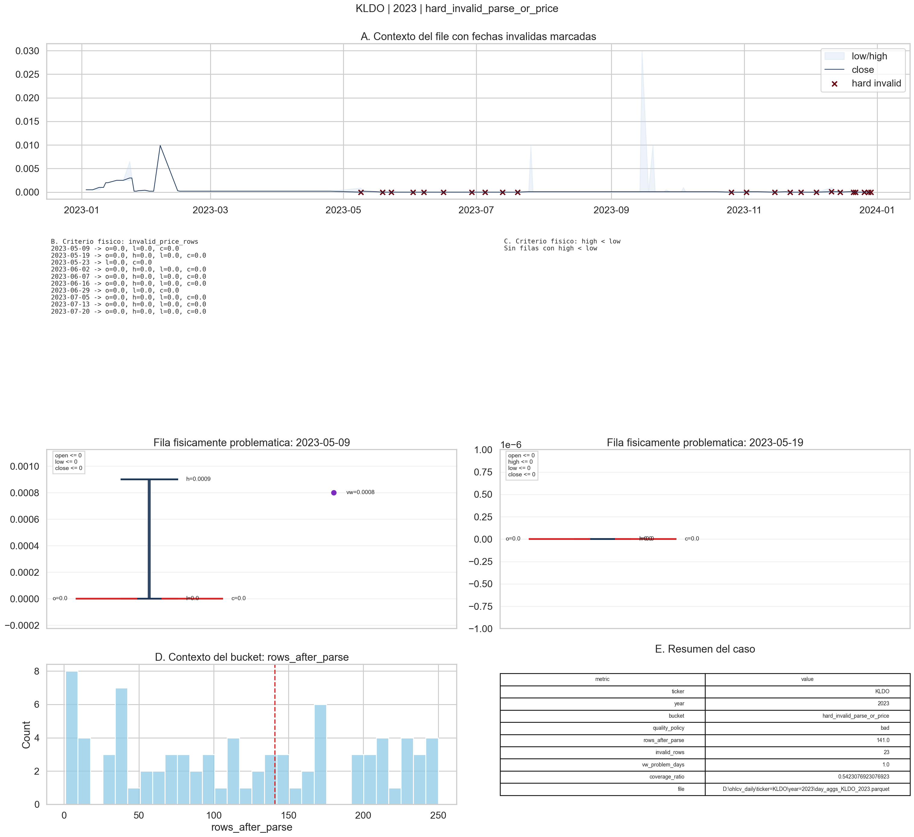

## WTER 2024

ticker: `WTER`  
year: `2024`  
bucket: `hard_invalid_parse_or_price`  
quality_policy: `bad`  
issues: `["negative_or_zero_ohlc_rows", "vw_outside_range_severe"]`  
warns: `["dataset_read_incompatible_schema", "schema_merge_conflict_ticker_encoding"]`  
file: `D:\ohlcv_daily\ticker=WTER\year=2024\day_aggs_WTER_2024.parquet`

### Analisis Forense

En `hard_invalid_parse_or_price` la pregunta ya no es si el caso merece flag, sino si la barra diaria sigue siendo interpretable como hecho de mercado. La respuesta aqui es no. Se observan `17` filas con `OHLC = 0`, una firma tipica de colapso de barra diaria. Las primeras fechas exportadas (`2024-04-29`) ayudan a ver si el dano esta concentrado en un bloque temporal o disperso en el ano. En estos files la figura no representa una sesion tensa o iliquida, sino una barra que deja de tener semantica estable: cero estructural, parseo invalido o contradiccion de precios suficiente para romper la confianza minima en la observacion.

Por eso la decision correcta es `bad` y no `recoverable_with_flag`. Si este tipo de fila entra en `backtest_core`, el dano no es solo estadistico; es semantico. Contamina retornos, labels, benchmarks y cualquier reconciliacion con terceros porque ya no sabemos si la barra resume mercado o artefacto. Implicacion operativa: preservar para `forensic_only` o futura reconstruccion, pero no reutilizar como dato normal. El error que se evita es tratar ausencia de precios validos como si fuera simplemente una cola extrema del mercado.

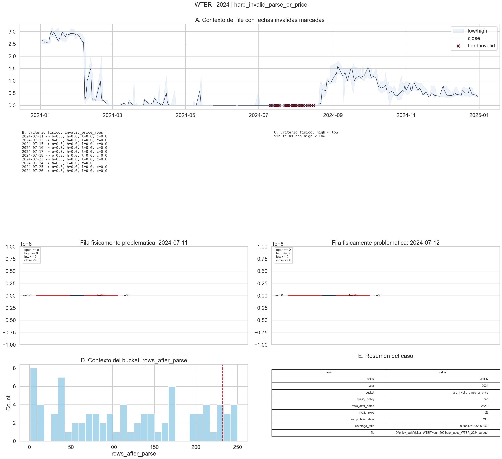

## NEXI 2025

ticker: `NEXI`  
year: `2025`  
bucket: `hard_invalid_parse_or_price`  
quality_policy: `bad`  
issues: `["negative_or_zero_ohlc_rows", "vw_outside_range_severe"]`  
warns: `["dataset_read_incompatible_schema", "large_internal_gap_days", "schema_merge_conflict_ticker_encoding", "suspicious_sparse_year"]`  
file: `D:\ohlcv_daily\ticker=NEXI\year=2025\day_aggs_NEXI_2025.parquet`

### Analisis Forense

En `hard_invalid_parse_or_price` la pregunta ya no es si el caso merece flag, sino si la barra diaria sigue siendo interpretable como hecho de mercado. La respuesta aqui es no. Se observan `1` filas con `OHLC = 0`, una firma tipica de colapso de barra diaria. Las primeras fechas exportadas (`2025-09-26`) ayudan a ver si el dano esta concentrado en un bloque temporal o disperso en el ano. En estos files la figura no representa una sesion tensa o iliquida, sino una barra que deja de tener semantica estable: cero estructural, parseo invalido o contradiccion de precios suficiente para romper la confianza minima en la observacion.

Por eso la decision correcta es `bad` y no `recoverable_with_flag`. Si este tipo de fila entra en `backtest_core`, el dano no es solo estadistico; es semantico. Contamina retornos, labels, benchmarks y cualquier reconciliacion con terceros porque ya no sabemos si la barra resume mercado o artefacto. Implicacion operativa: preservar para `forensic_only` o futura reconstruccion, pero no reutilizar como dato normal. El error que se evita es tratar ausencia de precios validos como si fuera simplemente una cola extrema del mercado.

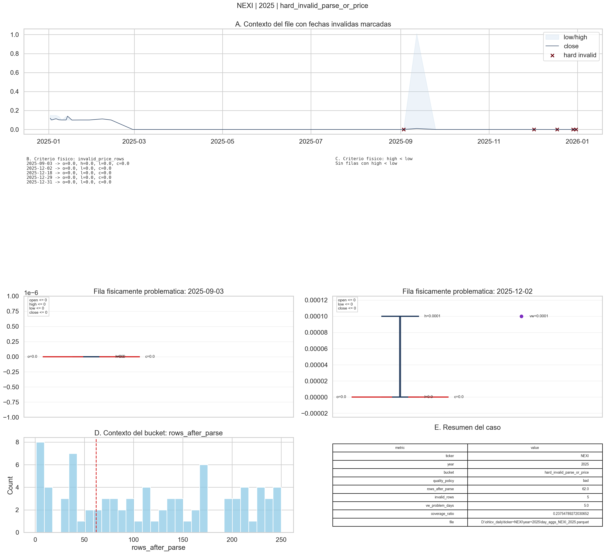

## ARDS 2024

ticker: `ARDS`  
year: `2024`  
bucket: `hard_invalid_parse_or_price`  
quality_policy: `bad`  
issues: `["negative_or_zero_ohlc_rows"]`  
warns: `["dataset_read_incompatible_schema", "large_internal_gap_days", "schema_merge_conflict_ticker_encoding"]`  
file: `D:\ohlcv_daily\ticker=ARDS\year=2024\day_aggs_ARDS_2024.parquet`

### Analisis Forense

En `hard_invalid_parse_or_price` la pregunta ya no es si el caso merece flag, sino si la barra diaria sigue siendo interpretable como hecho de mercado. La respuesta aqui es no. Se observan `23` filas con `OHLC = 0`, una firma tipica de colapso de barra diaria. Las primeras fechas exportadas (`2024-07-22`) ayudan a ver si el dano esta concentrado en un bloque temporal o disperso en el ano. En estos files la figura no representa una sesion tensa o iliquida, sino una barra que deja de tener semantica estable: cero estructural, parseo invalido o contradiccion de precios suficiente para romper la confianza minima en la observacion.

Por eso la decision correcta es `bad` y no `recoverable_with_flag`. Si este tipo de fila entra en `backtest_core`, el dano no es solo estadistico; es semantico. Contamina retornos, labels, benchmarks y cualquier reconciliacion con terceros porque ya no sabemos si la barra resume mercado o artefacto. Implicacion operativa: preservar para `forensic_only` o futura reconstruccion, pero no reutilizar como dato normal. El error que se evita es tratar ausencia de precios validos como si fuera simplemente una cola extrema del mercado.

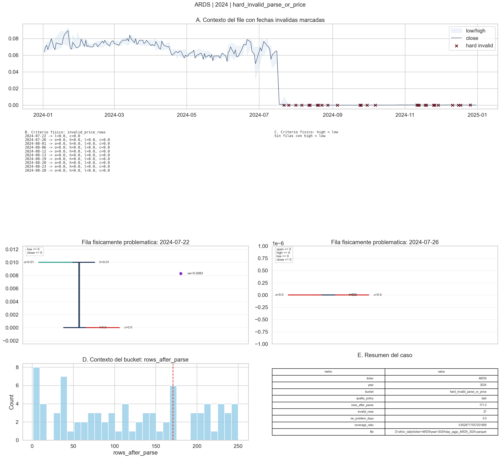

## SPEC 2025

ticker: `SPEC`  
year: `2025`  
bucket: `hard_invalid_parse_or_price`  
quality_policy: `bad`  
issues: `["negative_or_zero_ohlc_rows", "vw_outside_range_severe"]`  
warns: `["dataset_read_incompatible_schema", "schema_merge_conflict_ticker_encoding", "suspicious_sparse_year"]`  
file: `D:\ohlcv_daily\ticker=SPEC\year=2025\day_aggs_SPEC_2025.parquet`

### Analisis Forense

En `hard_invalid_parse_or_price` la pregunta ya no es si el caso merece flag, sino si la barra diaria sigue siendo interpretable como hecho de mercado. La respuesta aqui es no. Las primeras fechas exportadas (`2025-11-21`) ayudan a ver si el dano esta concentrado en un bloque temporal o disperso en el ano. En estos files la figura no representa una sesion tensa o iliquida, sino una barra que deja de tener semantica estable: cero estructural, parseo invalido o contradiccion de precios suficiente para romper la confianza minima en la observacion.

Por eso la decision correcta es `bad` y no `recoverable_with_flag`. Si este tipo de fila entra en `backtest_core`, el dano no es solo estadistico; es semantico. Contamina retornos, labels, benchmarks y cualquier reconciliacion con terceros porque ya no sabemos si la barra resume mercado o artefacto. Implicacion operativa: preservar para `forensic_only` o futura reconstruccion, pero no reutilizar como dato normal. El error que se evita es tratar ausencia de precios validos como si fuera simplemente una cola extrema del mercado.

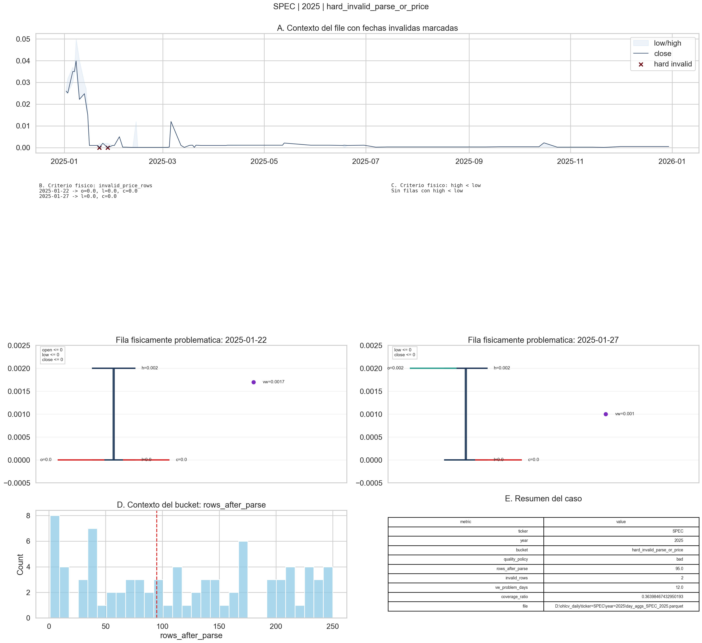

## KBNT 2024

ticker: `KBNT`  
year: `2024`  
bucket: `hard_invalid_parse_or_price`  
quality_policy: `bad`  
issues: `["negative_or_zero_ohlc_rows", "vw_outside_range_severe"]`  
warns: `["dataset_read_incompatible_schema", "schema_merge_conflict_ticker_encoding"]`  
file: `D:\ohlcv_daily\ticker=KBNT\year=2024\day_aggs_KBNT_2024.parquet`

### Analisis Forense

En `hard_invalid_parse_or_price` la pregunta ya no es si el caso merece flag, sino si la barra diaria sigue siendo interpretable como hecho de mercado. La respuesta aqui es no. Se observan `5` filas con `OHLC = 0`, una firma tipica de colapso de barra diaria. Las primeras fechas exportadas (`2024-05-03`) ayudan a ver si el dano esta concentrado en un bloque temporal o disperso en el ano. En estos files la figura no representa una sesion tensa o iliquida, sino una barra que deja de tener semantica estable: cero estructural, parseo invalido o contradiccion de precios suficiente para romper la confianza minima en la observacion.

Por eso la decision correcta es `bad` y no `recoverable_with_flag`. Si este tipo de fila entra en `backtest_core`, el dano no es solo estadistico; es semantico. Contamina retornos, labels, benchmarks y cualquier reconciliacion con terceros porque ya no sabemos si la barra resume mercado o artefacto. Implicacion operativa: preservar para `forensic_only` o futura reconstruccion, pero no reutilizar como dato normal. El error que se evita es tratar ausencia de precios validos como si fuera simplemente una cola extrema del mercado.

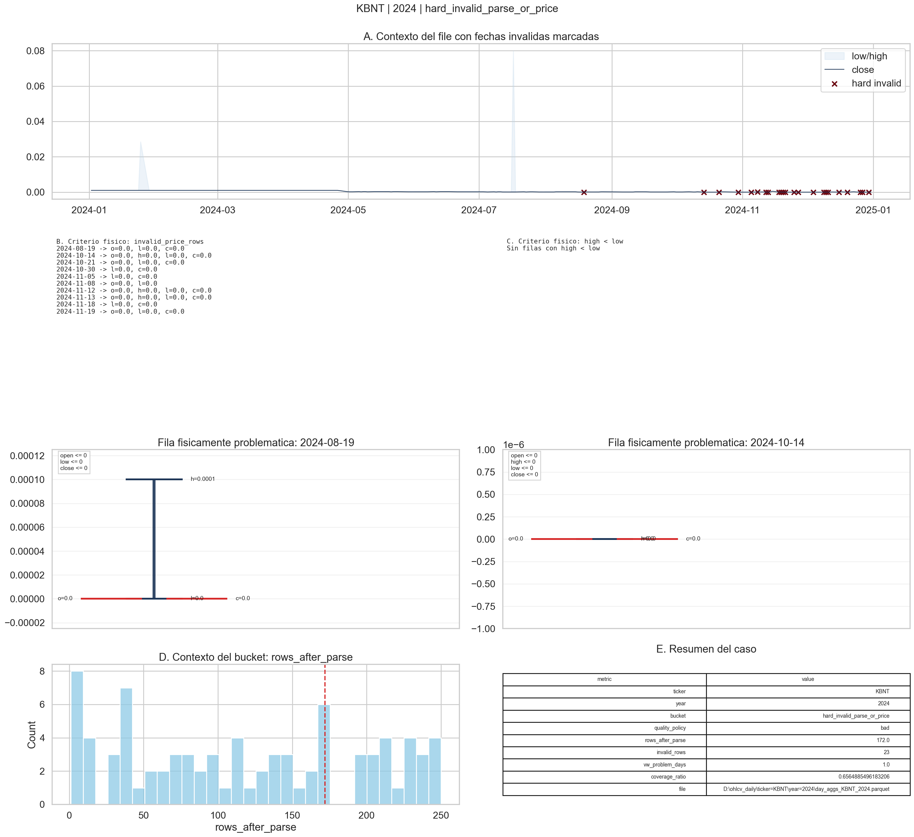

## NXTP 2024

ticker: `NXTP`  
year: `2024`  
bucket: `hard_invalid_parse_or_price`  
quality_policy: `bad`  
issues: `["negative_or_zero_ohlc_rows", "vw_outside_range_severe"]`  
warns: `["dataset_read_incompatible_schema", "large_internal_gap_days", "schema_merge_conflict_ticker_encoding"]`  
file: `D:\ohlcv_daily\ticker=NXTP\year=2024\day_aggs_NXTP_2024.parquet`

### Analisis Forense

En `hard_invalid_parse_or_price` la pregunta ya no es si el caso merece flag, sino si la barra diaria sigue siendo interpretable como hecho de mercado. La respuesta aqui es no. Se observan `8` filas con `OHLC = 0`, una firma tipica de colapso de barra diaria. Las primeras fechas exportadas (`2024-04-26`) ayudan a ver si el dano esta concentrado en un bloque temporal o disperso en el ano. En estos files la figura no representa una sesion tensa o iliquida, sino una barra que deja de tener semantica estable: cero estructural, parseo invalido o contradiccion de precios suficiente para romper la confianza minima en la observacion.

Por eso la decision correcta es `bad` y no `recoverable_with_flag`. Si este tipo de fila entra en `backtest_core`, el dano no es solo estadistico; es semantico. Contamina retornos, labels, benchmarks y cualquier reconciliacion con terceros porque ya no sabemos si la barra resume mercado o artefacto. Implicacion operativa: preservar para `forensic_only` o futura reconstruccion, pero no reutilizar como dato normal. El error que se evita es tratar ausencia de precios validos como si fuera simplemente una cola extrema del mercado.

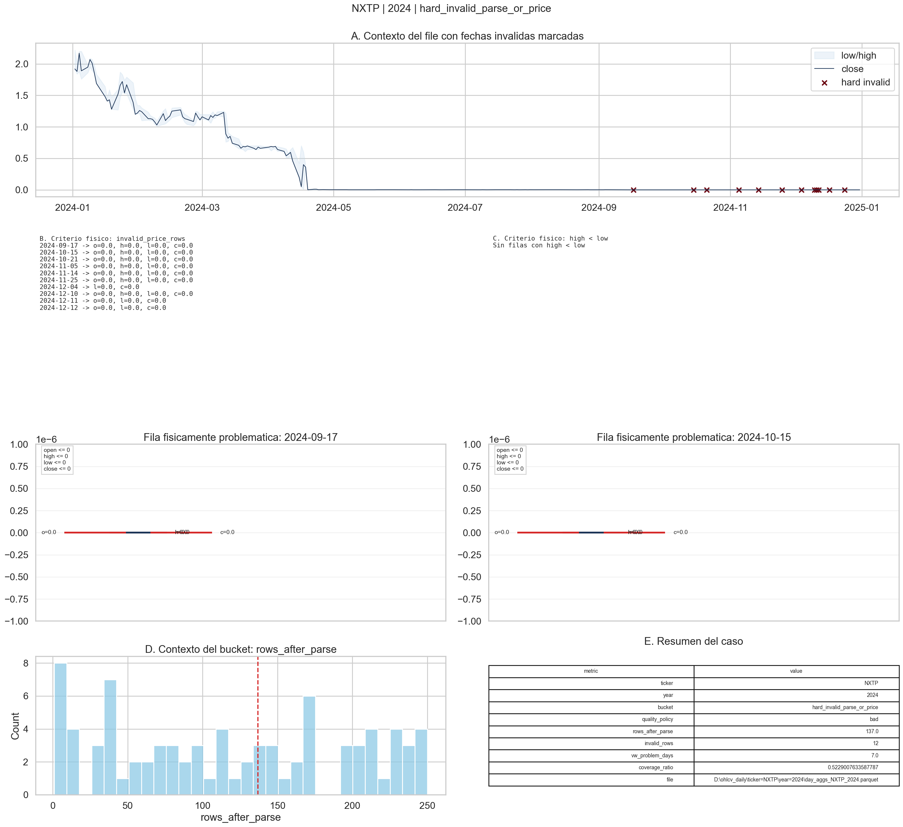

## TCCO 2024

ticker: `TCCO`  
year: `2024`  
bucket: `hard_invalid_parse_or_price`  
quality_policy: `bad`  
issues: `["negative_or_zero_ohlc_rows", "vw_outside_range_severe"]`  
warns: `["dataset_read_incompatible_schema", "schema_merge_conflict_ticker_encoding", "suspicious_sparse_year"]`  
file: `D:\ohlcv_daily\ticker=TCCO\year=2024\day_aggs_TCCO_2024.parquet`

### Analisis Forense

En `hard_invalid_parse_or_price` la pregunta ya no es si el caso merece flag, sino si la barra diaria sigue siendo interpretable como hecho de mercado. La respuesta aqui es no. Las primeras fechas exportadas (`2024-01-30`) ayudan a ver si el dano esta concentrado en un bloque temporal o disperso en el ano. En estos files la figura no representa una sesion tensa o iliquida, sino una barra que deja de tener semantica estable: cero estructural, parseo invalido o contradiccion de precios suficiente para romper la confianza minima en la observacion.

Por eso la decision correcta es `bad` y no `recoverable_with_flag`. Si este tipo de fila entra en `backtest_core`, el dano no es solo estadistico; es semantico. Contamina retornos, labels, benchmarks y cualquier reconciliacion con terceros porque ya no sabemos si la barra resume mercado o artefacto. Implicacion operativa: preservar para `forensic_only` o futura reconstruccion, pero no reutilizar como dato normal. El error que se evita es tratar ausencia de precios validos como si fuera simplemente una cola extrema del mercado.

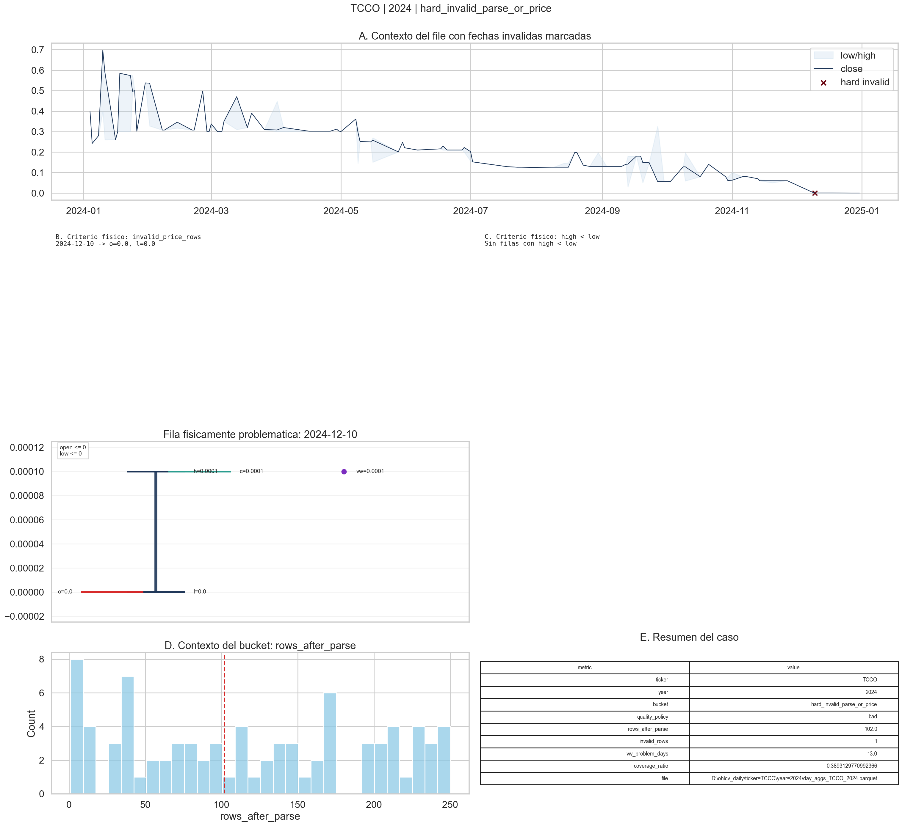

## CLVR 2024

ticker: `CLVR`  
year: `2024`  
bucket: `hard_invalid_parse_or_price`  
quality_policy: `bad`  
issues: `["negative_or_zero_ohlc_rows", "vw_outside_range_severe"]`  
warns: `["dataset_read_incompatible_schema", "large_internal_gap_days", "schema_merge_conflict_ticker_encoding"]`  
file: `D:\ohlcv_daily\ticker=CLVR\year=2024\day_aggs_CLVR_2024.parquet`

### Analisis Forense

En `hard_invalid_parse_or_price` la pregunta ya no es si el caso merece flag, sino si la barra diaria sigue siendo interpretable como hecho de mercado. La respuesta aqui es no. Se observan `4` filas con `OHLC = 0`, una firma tipica de colapso de barra diaria. Las primeras fechas exportadas (`2024-04-26`) ayudan a ver si el dano esta concentrado en un bloque temporal o disperso en el ano. En estos files la figura no representa una sesion tensa o iliquida, sino una barra que deja de tener semantica estable: cero estructural, parseo invalido o contradiccion de precios suficiente para romper la confianza minima en la observacion.

Por eso la decision correcta es `bad` y no `recoverable_with_flag`. Si este tipo de fila entra en `backtest_core`, el dano no es solo estadistico; es semantico. Contamina retornos, labels, benchmarks y cualquier reconciliacion con terceros porque ya no sabemos si la barra resume mercado o artefacto. Implicacion operativa: preservar para `forensic_only` o futura reconstruccion, pero no reutilizar como dato normal. El error que se evita es tratar ausencia de precios validos como si fuera simplemente una cola extrema del mercado.

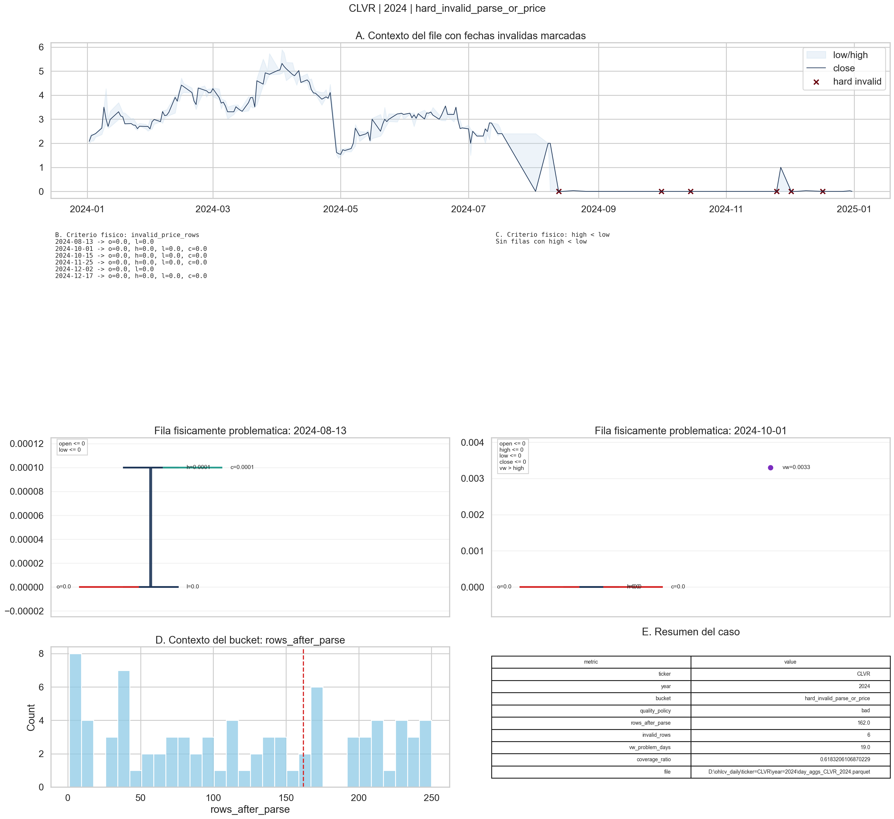

## MTEM 2025

ticker: `MTEM`  
year: `2025`  
bucket: `hard_invalid_parse_or_price`  
quality_policy: `bad`  
issues: `["negative_or_zero_ohlc_rows", "vw_outside_range_severe"]`  
warns: `["dataset_read_incompatible_schema", "schema_merge_conflict_ticker_encoding", "suspicious_sparse_year"]`  
file: `D:\ohlcv_daily\ticker=MTEM\year=2025\day_aggs_MTEM_2025.parquet`

### Analisis Forense

En `hard_invalid_parse_or_price` la pregunta ya no es si el caso merece flag, sino si la barra diaria sigue siendo interpretable como hecho de mercado. La respuesta aqui es no. Se observan `4` filas con `OHLC = 0`, una firma tipica de colapso de barra diaria. Las primeras fechas exportadas (`2025-03-19`) ayudan a ver si el dano esta concentrado en un bloque temporal o disperso en el ano. En estos files la figura no representa una sesion tensa o iliquida, sino una barra que deja de tener semantica estable: cero estructural, parseo invalido o contradiccion de precios suficiente para romper la confianza minima en la observacion.

Por eso la decision correcta es `bad` y no `recoverable_with_flag`. Si este tipo de fila entra en `backtest_core`, el dano no es solo estadistico; es semantico. Contamina retornos, labels, benchmarks y cualquier reconciliacion con terceros porque ya no sabemos si la barra resume mercado o artefacto. Implicacion operativa: preservar para `forensic_only` o futura reconstruccion, pero no reutilizar como dato normal. El error que se evita es tratar ausencia de precios validos como si fuera simplemente una cola extrema del mercado.

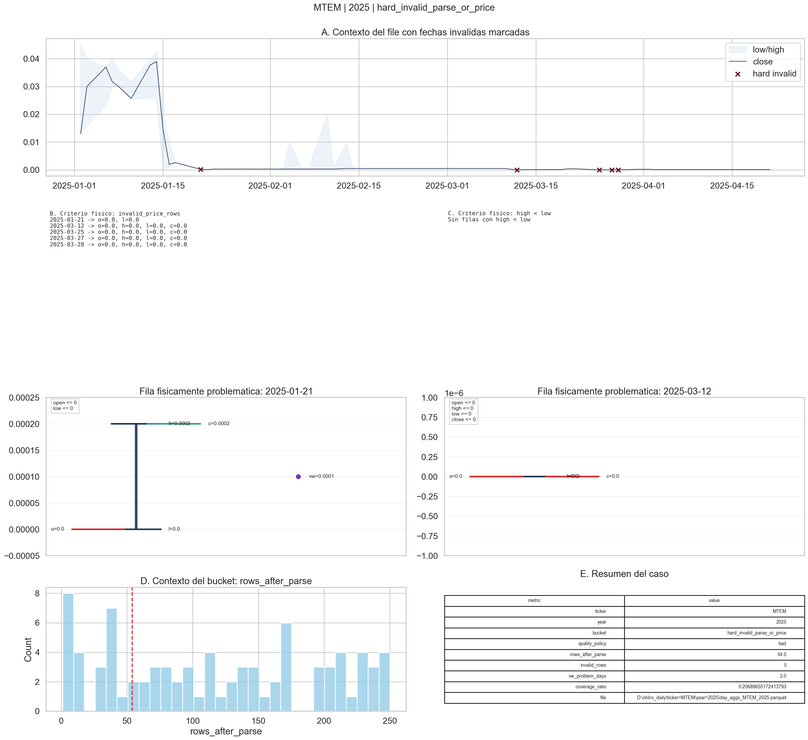

## VRPX 2025

ticker: `VRPX`  
year: `2025`  
bucket: `hard_invalid_parse_or_price`  
quality_policy: `bad`  
issues: `["negative_or_zero_ohlc_rows", "vw_outside_range_severe"]`  
warns: `["dataset_read_incompatible_schema", "schema_merge_conflict_ticker_encoding"]`  
file: `D:\ohlcv_daily\ticker=VRPX\year=2025\day_aggs_VRPX_2025.parquet`

### Analisis Forense

En `hard_invalid_parse_or_price` la pregunta ya no es si el caso merece flag, sino si la barra diaria sigue siendo interpretable como hecho de mercado. La respuesta aqui es no. Las primeras fechas exportadas (`2025-02-13`) ayudan a ver si el dano esta concentrado en un bloque temporal o disperso en el ano. En estos files la figura no representa una sesion tensa o iliquida, sino una barra que deja de tener semantica estable: cero estructural, parseo invalido o contradiccion de precios suficiente para romper la confianza minima en la observacion.

Por eso la decision correcta es `bad` y no `recoverable_with_flag`. Si este tipo de fila entra en `backtest_core`, el dano no es solo estadistico; es semantico. Contamina retornos, labels, benchmarks y cualquier reconciliacion con terceros porque ya no sabemos si la barra resume mercado o artefacto. Implicacion operativa: preservar para `forensic_only` o futura reconstruccion, pero no reutilizar como dato normal. El error que se evita es tratar ausencia de precios validos como si fuera simplemente una cola extrema del mercado.

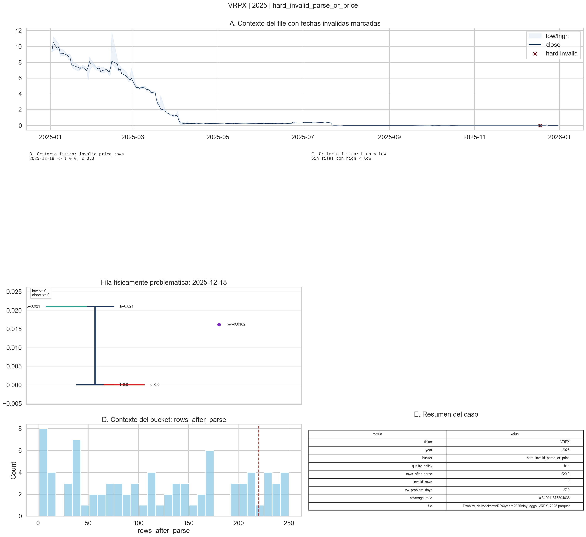

## CMRA 2024

ticker: `CMRA`  
year: `2024`  
bucket: `hard_invalid_parse_or_price`  
quality_policy: `bad`  
issues: `["negative_or_zero_ohlc_rows", "vw_outside_range_severe"]`  
warns: `["dataset_read_incompatible_schema", "large_internal_gap_days", "schema_merge_conflict_ticker_encoding", "suspicious_sparse_year"]`  
file: `D:\ohlcv_daily\ticker=CMRA\year=2024\day_aggs_CMRA_2024.parquet`

### Analisis Forense

En `hard_invalid_parse_or_price` la pregunta ya no es si el caso merece flag, sino si la barra diaria sigue siendo interpretable como hecho de mercado. La respuesta aqui es no. Se observan `4` filas con `OHLC = 0`, una firma tipica de colapso de barra diaria. Las primeras fechas exportadas (`2024-04-18`) ayudan a ver si el dano esta concentrado en un bloque temporal o disperso en el ano. En estos files la figura no representa una sesion tensa o iliquida, sino una barra que deja de tener semantica estable: cero estructural, parseo invalido o contradiccion de precios suficiente para romper la confianza minima en la observacion.

Por eso la decision correcta es `bad` y no `recoverable_with_flag`. Si este tipo de fila entra en `backtest_core`, el dano no es solo estadistico; es semantico. Contamina retornos, labels, benchmarks y cualquier reconciliacion con terceros porque ya no sabemos si la barra resume mercado o artefacto. Implicacion operativa: preservar para `forensic_only` o futura reconstruccion, pero no reutilizar como dato normal. El error que se evita es tratar ausencia de precios validos como si fuera simplemente una cola extrema del mercado.

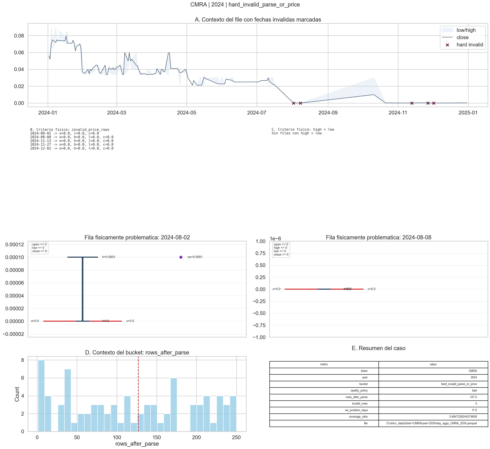

## PBLA 2025

ticker: `PBLA`  
year: `2025`  
bucket: `hard_invalid_parse_or_price`  
quality_policy: `bad`  
issues: `["negative_or_zero_ohlc_rows", "vw_outside_range_severe"]`  
warns: `["dataset_read_incompatible_schema", "schema_merge_conflict_ticker_encoding"]`  
file: `D:\ohlcv_daily\ticker=PBLA\year=2025\day_aggs_PBLA_2025.parquet`

### Analisis Forense

En `hard_invalid_parse_or_price` la pregunta ya no es si el caso merece flag, sino si la barra diaria sigue siendo interpretable como hecho de mercado. La respuesta aqui es no. Se observan `1` filas con `OHLC = 0`, una firma tipica de colapso de barra diaria. Las primeras fechas exportadas (`2025-09-17`) ayudan a ver si el dano esta concentrado en un bloque temporal o disperso en el ano. En estos files la figura no representa una sesion tensa o iliquida, sino una barra que deja de tener semantica estable: cero estructural, parseo invalido o contradiccion de precios suficiente para romper la confianza minima en la observacion.

Por eso la decision correcta es `bad` y no `recoverable_with_flag`. Si este tipo de fila entra en `backtest_core`, el dano no es solo estadistico; es semantico. Contamina retornos, labels, benchmarks y cualquier reconciliacion con terceros porque ya no sabemos si la barra resume mercado o artefacto. Implicacion operativa: preservar para `forensic_only` o futura reconstruccion, pero no reutilizar como dato normal. El error que se evita es tratar ausencia de precios validos como si fuera simplemente una cola extrema del mercado.

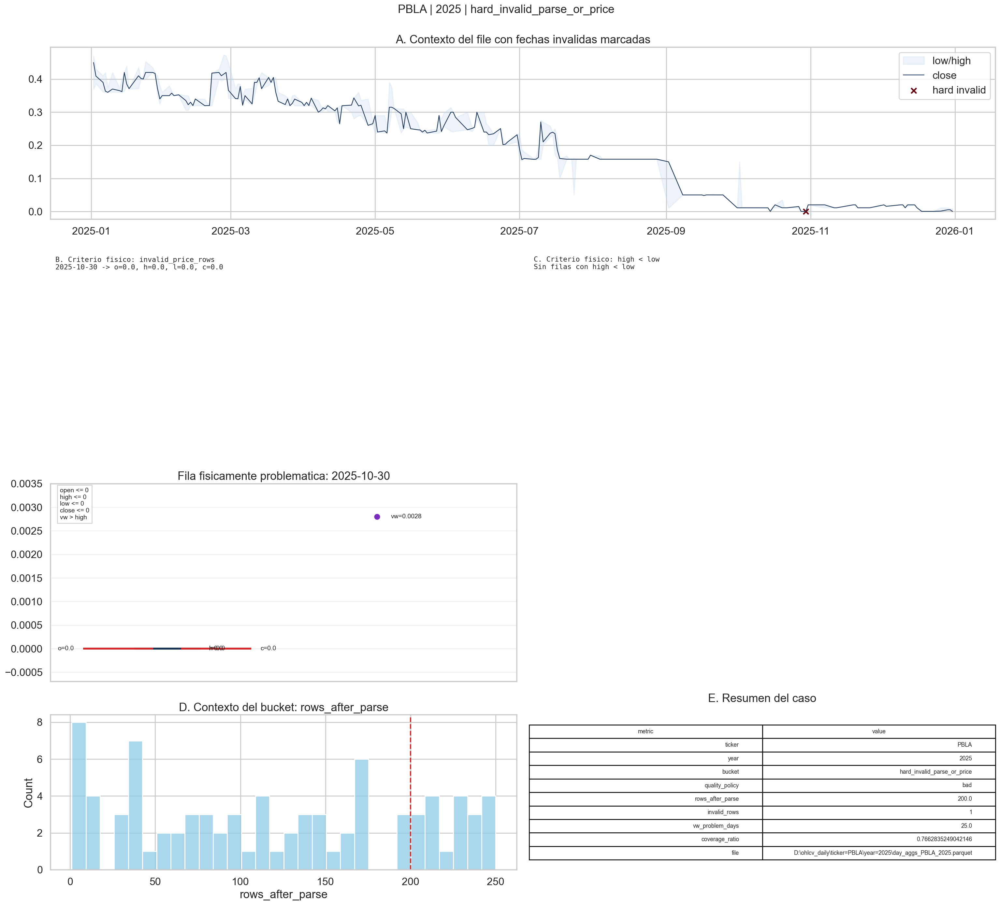

## ICCT 2026

ticker: `ICCT`  
year: `2026`  
bucket: `hard_invalid_parse_or_price`  
quality_policy: `bad`  
issues: `["negative_or_zero_ohlc_rows", "vw_outside_range_severe"]`  
warns: `["dataset_read_incompatible_schema", "schema_merge_conflict_ticker_encoding", "suspicious_sparse_year"]`  
file: `D:\ohlcv_daily\ticker=ICCT\year=2026\day_aggs_ICCT_2026.parquet`

### Analisis Forense

En `hard_invalid_parse_or_price` la pregunta ya no es si el caso merece flag, sino si la barra diaria sigue siendo interpretable como hecho de mercado. La respuesta aqui es no. Las primeras fechas exportadas (`2026-01-27`) ayudan a ver si el dano esta concentrado en un bloque temporal o disperso en el ano. En estos files la figura no representa una sesion tensa o iliquida, sino una barra que deja de tener semantica estable: cero estructural, parseo invalido o contradiccion de precios suficiente para romper la confianza minima en la observacion.

Por eso la decision correcta es `bad` y no `recoverable_with_flag`. Si este tipo de fila entra en `backtest_core`, el dano no es solo estadistico; es semantico. Contamina retornos, labels, benchmarks y cualquier reconciliacion con terceros porque ya no sabemos si la barra resume mercado o artefacto. Implicacion operativa: preservar para `forensic_only` o futura reconstruccion, pero no reutilizar como dato normal. El error que se evita es tratar ausencia de precios validos como si fuera simplemente una cola extrema del mercado.

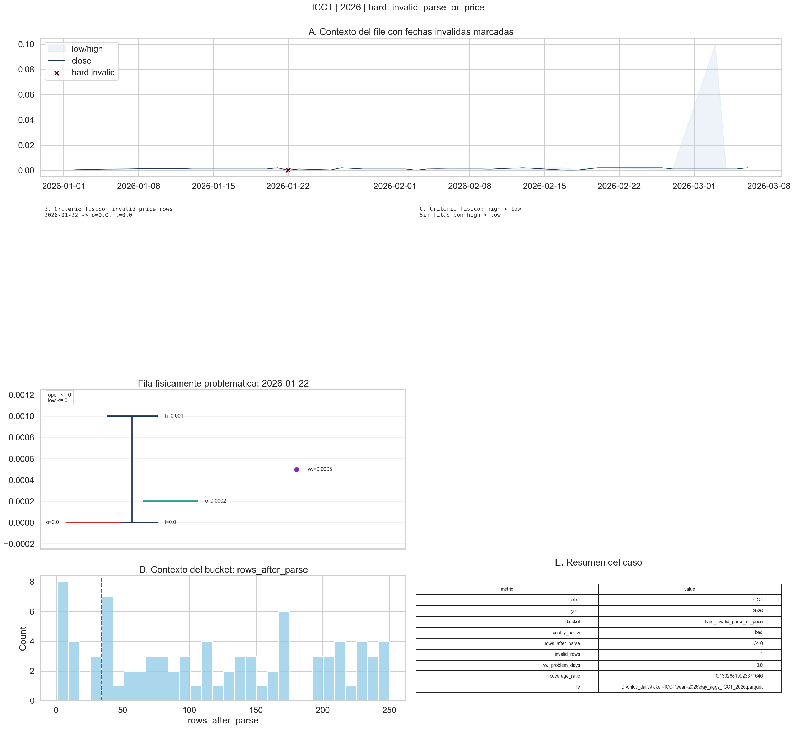

## EVOL 2024

ticker: `EVOL`  
year: `2024`  
bucket: `hard_invalid_parse_or_price`  
quality_policy: `bad`  
issues: `["negative_or_zero_ohlc_rows"]`  
warns: `["dataset_read_incompatible_schema", "schema_merge_conflict_ticker_encoding", "suspicious_sparse_year", "vw_outside_range_material"]`  
file: `D:\ohlcv_daily\ticker=EVOL\year=2024\day_aggs_EVOL_2024.parquet`

### Analisis Forense

En `hard_invalid_parse_or_price` la pregunta ya no es si el caso merece flag, sino si la barra diaria sigue siendo interpretable como hecho de mercado. La respuesta aqui es no. Las primeras fechas exportadas (`2024-10-30`) ayudan a ver si el dano esta concentrado en un bloque temporal o disperso en el ano. En estos files la figura no representa una sesion tensa o iliquida, sino una barra que deja de tener semantica estable: cero estructural, parseo invalido o contradiccion de precios suficiente para romper la confianza minima en la observacion.

Por eso la decision correcta es `bad` y no `recoverable_with_flag`. Si este tipo de fila entra en `backtest_core`, el dano no es solo estadistico; es semantico. Contamina retornos, labels, benchmarks y cualquier reconciliacion con terceros porque ya no sabemos si la barra resume mercado o artefacto. Implicacion operativa: preservar para `forensic_only` o futura reconstruccion, pero no reutilizar como dato normal. El error que se evita es tratar ausencia de precios validos como si fuera simplemente una cola extrema del mercado.

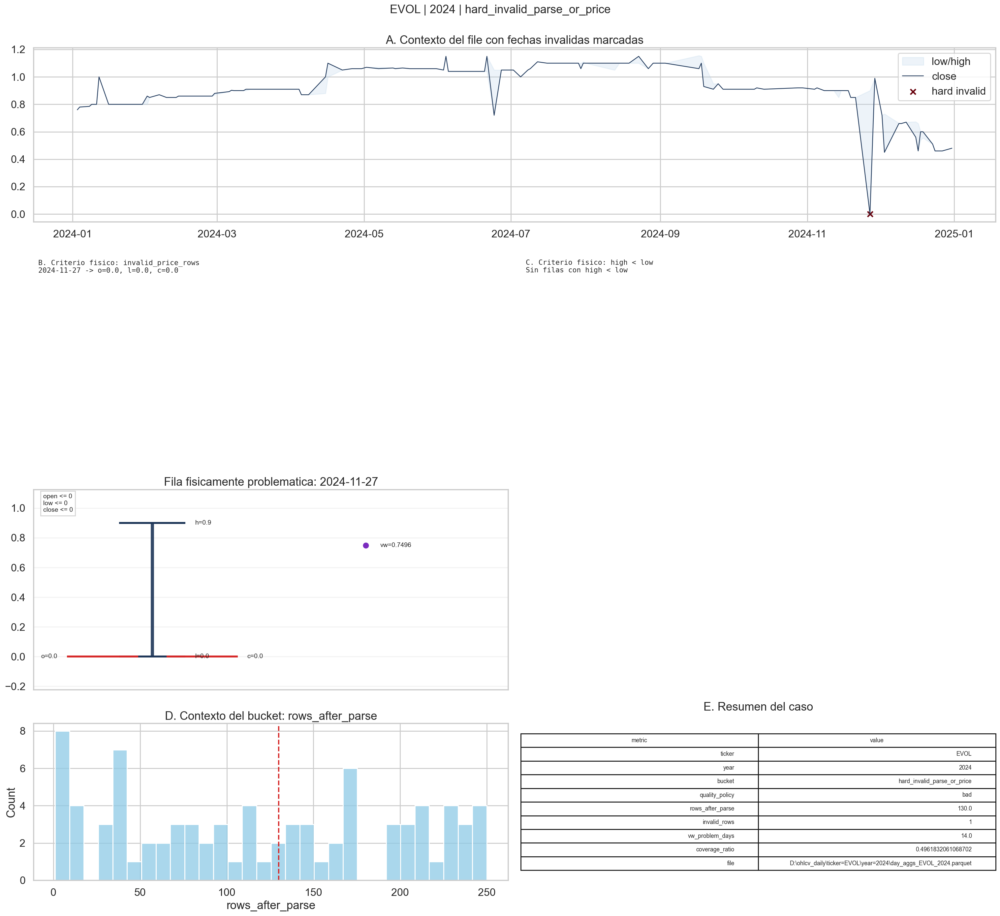

## SOFO 2024

ticker: `SOFO`  
year: `2024`  
bucket: `hard_invalid_parse_or_price`  
quality_policy: `bad`  
issues: `["negative_or_zero_ohlc_rows"]`  
warns: `["dataset_read_incompatible_schema", "large_internal_gap_days", "schema_merge_conflict_ticker_encoding", "suspicious_sparse_year", "vw_outside_range_material"]`  
file: `D:\ohlcv_daily\ticker=SOFO\year=2024\day_aggs_SOFO_2024.parquet`

### Analisis Forense

En `hard_invalid_parse_or_price` la pregunta ya no es si el caso merece flag, sino si la barra diaria sigue siendo interpretable como hecho de mercado. La respuesta aqui es no. Se observan `1` filas con `OHLC = 0`, una firma tipica de colapso de barra diaria. Las primeras fechas exportadas (`2024-02-08`) ayudan a ver si el dano esta concentrado en un bloque temporal o disperso en el ano. En estos files la figura no representa una sesion tensa o iliquida, sino una barra que deja de tener semantica estable: cero estructural, parseo invalido o contradiccion de precios suficiente para romper la confianza minima en la observacion.

Por eso la decision correcta es `bad` y no `recoverable_with_flag`. Si este tipo de fila entra en `backtest_core`, el dano no es solo estadistico; es semantico. Contamina retornos, labels, benchmarks y cualquier reconciliacion con terceros porque ya no sabemos si la barra resume mercado o artefacto. Implicacion operativa: preservar para `forensic_only` o futura reconstruccion, pero no reutilizar como dato normal. El error que se evita es tratar ausencia de precios validos como si fuera simplemente una cola extrema del mercado.

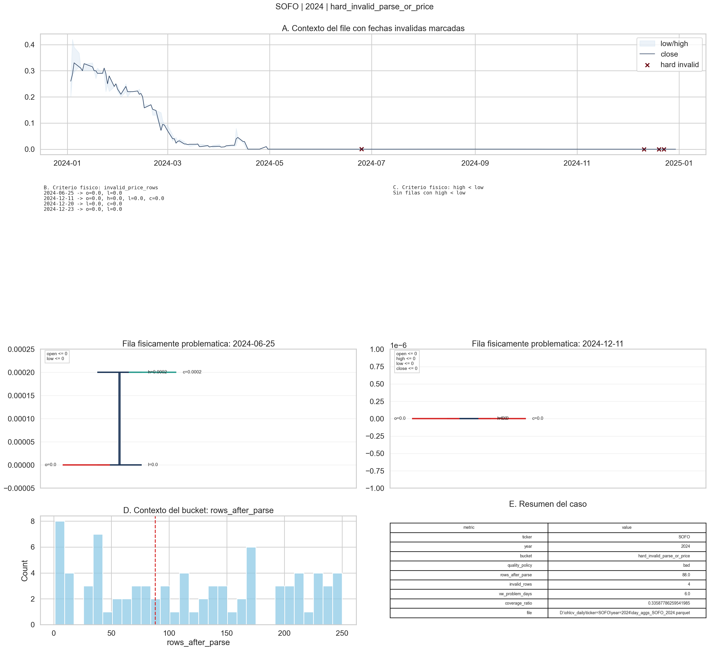

## VIVE 2024

ticker: `VIVE`  
year: `2024`  
bucket: `hard_invalid_parse_or_price`  
quality_policy: `bad`  
issues: `["negative_or_zero_ohlc_rows", "vw_outside_range_severe"]`  
warns: `["dataset_read_incompatible_schema", "schema_merge_conflict_ticker_encoding"]`  
file: `D:\ohlcv_daily\ticker=VIVE\year=2024\day_aggs_VIVE_2024.parquet`

### Analisis Forense

En `hard_invalid_parse_or_price` la pregunta ya no es si el caso merece flag, sino si la barra diaria sigue siendo interpretable como hecho de mercado. La respuesta aqui es no. Se observan `4` filas con `OHLC = 0`, una firma tipica de colapso de barra diaria. Las primeras fechas exportadas (`2024-07-25`) ayudan a ver si el dano esta concentrado en un bloque temporal o disperso en el ano. En estos files la figura no representa una sesion tensa o iliquida, sino una barra que deja de tener semantica estable: cero estructural, parseo invalido o contradiccion de precios suficiente para romper la confianza minima en la observacion.

Por eso la decision correcta es `bad` y no `recoverable_with_flag`. Si este tipo de fila entra en `backtest_core`, el dano no es solo estadistico; es semantico. Contamina retornos, labels, benchmarks y cualquier reconciliacion con terceros porque ya no sabemos si la barra resume mercado o artefacto. Implicacion operativa: preservar para `forensic_only` o futura reconstruccion, pero no reutilizar como dato normal. El error que se evita es tratar ausencia de precios validos como si fuera simplemente una cola extrema del mercado.

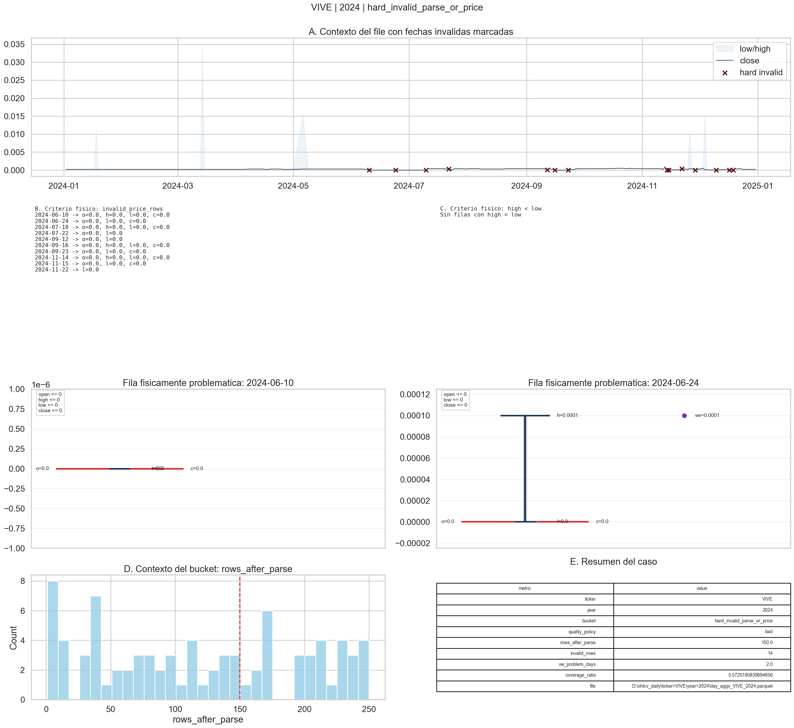

## VIVE 2025

ticker: `VIVE`  
year: `2025`  
bucket: `hard_invalid_parse_or_price`  
quality_policy: `bad`  
issues: `["negative_or_zero_ohlc_rows", "vw_outside_range_severe"]`  
warns: `["dataset_read_incompatible_schema", "large_internal_gap_days", "schema_merge_conflict_ticker_encoding", "suspicious_sparse_year"]`  
file: `D:\ohlcv_daily\ticker=VIVE\year=2025\day_aggs_VIVE_2025.parquet`

### Analisis Forense

En `hard_invalid_parse_or_price` la pregunta ya no es si el caso merece flag, sino si la barra diaria sigue siendo interpretable como hecho de mercado. La respuesta aqui es no. Se observan `8` filas con `OHLC = 0`, una firma tipica de colapso de barra diaria. Las primeras fechas exportadas (`2025-05-08`) ayudan a ver si el dano esta concentrado en un bloque temporal o disperso en el ano. En estos files la figura no representa una sesion tensa o iliquida, sino una barra que deja de tener semantica estable: cero estructural, parseo invalido o contradiccion de precios suficiente para romper la confianza minima en la observacion.

Por eso la decision correcta es `bad` y no `recoverable_with_flag`. Si este tipo de fila entra en `backtest_core`, el dano no es solo estadistico; es semantico. Contamina retornos, labels, benchmarks y cualquier reconciliacion con terceros porque ya no sabemos si la barra resume mercado o artefacto. Implicacion operativa: preservar para `forensic_only` o futura reconstruccion, pero no reutilizar como dato normal. El error que se evita es tratar ausencia de precios validos como si fuera simplemente una cola extrema del mercado.

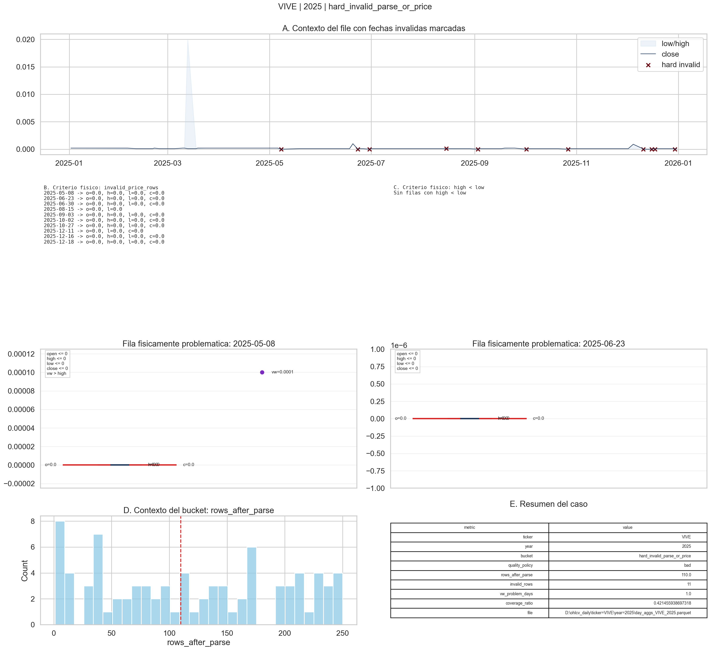

## NMRD 2024

ticker: `NMRD`  
year: `2024`  
bucket: `hard_invalid_parse_or_price`  
quality_policy: `bad`  
issues: `["negative_or_zero_ohlc_rows"]`  
warns: `["dataset_read_incompatible_schema", "large_internal_gap_days", "schema_merge_conflict_ticker_encoding", "vw_outside_range_material"]`  
file: `D:\ohlcv_daily\ticker=NMRD\year=2024\day_aggs_NMRD_2024.parquet`

### Analisis Forense

En `hard_invalid_parse_or_price` la pregunta ya no es si el caso merece flag, sino si la barra diaria sigue siendo interpretable como hecho de mercado. La respuesta aqui es no. Se observan `7` filas con `OHLC = 0`, una firma tipica de colapso de barra diaria. Las primeras fechas exportadas (`2024-07-24`) ayudan a ver si el dano esta concentrado en un bloque temporal o disperso en el ano. En estos files la figura no representa una sesion tensa o iliquida, sino una barra que deja de tener semantica estable: cero estructural, parseo invalido o contradiccion de precios suficiente para romper la confianza minima en la observacion.

Por eso la decision correcta es `bad` y no `recoverable_with_flag`. Si este tipo de fila entra en `backtest_core`, el dano no es solo estadistico; es semantico. Contamina retornos, labels, benchmarks y cualquier reconciliacion con terceros porque ya no sabemos si la barra resume mercado o artefacto. Implicacion operativa: preservar para `forensic_only` o futura reconstruccion, pero no reutilizar como dato normal. El error que se evita es tratar ausencia de precios validos como si fuera simplemente una cola extrema del mercado.

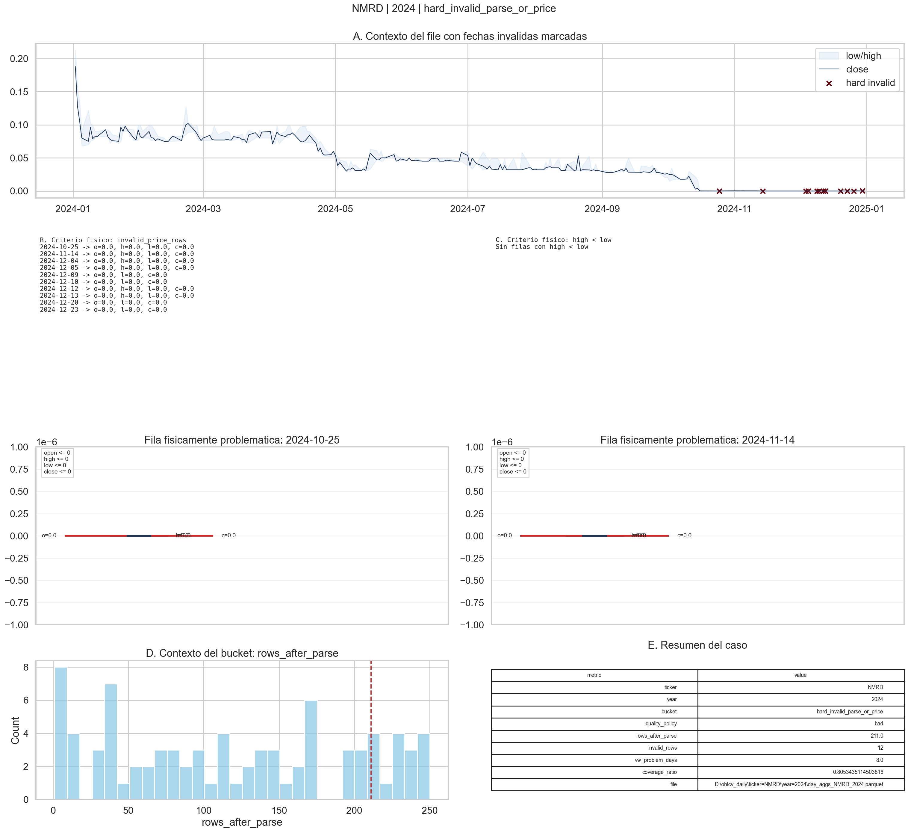

## RENO 2023

ticker: `RENO`  
year: `2023`  
bucket: `hard_invalid_parse_or_price`  
quality_policy: `bad`  
issues: `["negative_or_zero_ohlc_rows", "vw_outside_range_severe"]`  
warns: `["dataset_read_incompatible_schema", "large_internal_gap_days", "schema_merge_conflict_ticker_encoding"]`  
file: `D:\ohlcv_daily\ticker=RENO\year=2023\day_aggs_RENO_2023.parquet`

### Analisis Forense

En `hard_invalid_parse_or_price` la pregunta ya no es si el caso merece flag, sino si la barra diaria sigue siendo interpretable como hecho de mercado. La respuesta aqui es no. Se observan `12` filas con `OHLC = 0`, una firma tipica de colapso de barra diaria. Las primeras fechas exportadas (`2023-02-08`) ayudan a ver si el dano esta concentrado en un bloque temporal o disperso en el ano. En estos files la figura no representa una sesion tensa o iliquida, sino una barra que deja de tener semantica estable: cero estructural, parseo invalido o contradiccion de precios suficiente para romper la confianza minima en la observacion.

Por eso la decision correcta es `bad` y no `recoverable_with_flag`. Si este tipo de fila entra en `backtest_core`, el dano no es solo estadistico; es semantico. Contamina retornos, labels, benchmarks y cualquier reconciliacion con terceros porque ya no sabemos si la barra resume mercado o artefacto. Implicacion operativa: preservar para `forensic_only` o futura reconstruccion, pero no reutilizar como dato normal. El error que se evita es tratar ausencia de precios validos como si fuera simplemente una cola extrema del mercado.

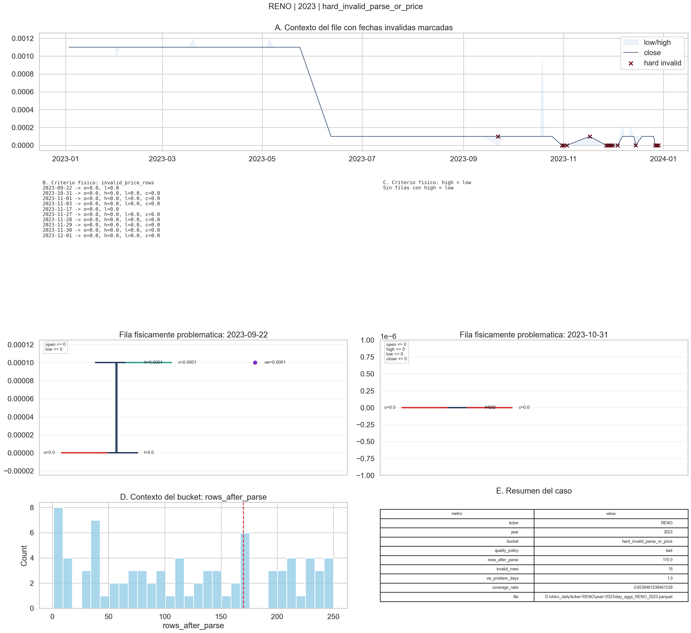

## PXMD 2025

ticker: `PXMD`  
year: `2025`  
bucket: `hard_invalid_parse_or_price`  
quality_policy: `bad`  
issues: `["negative_or_zero_ohlc_rows"]`  
warns: `["dataset_read_incompatible_schema", "large_internal_gap_days", "schema_merge_conflict_ticker_encoding", "suspicious_sparse_year"]`  
file: `D:\ohlcv_daily\ticker=PXMD\year=2025\day_aggs_PXMD_2025.parquet`

### Analisis Forense

En `hard_invalid_parse_or_price` la pregunta ya no es si el caso merece flag, sino si la barra diaria sigue siendo interpretable como hecho de mercado. La respuesta aqui es no. Se observan `4` filas con `OHLC = 0`, una firma tipica de colapso de barra diaria. Las primeras fechas exportadas (`2025-01-29`) ayudan a ver si el dano esta concentrado en un bloque temporal o disperso en el ano. En estos files la figura no representa una sesion tensa o iliquida, sino una barra que deja de tener semantica estable: cero estructural, parseo invalido o contradiccion de precios suficiente para romper la confianza minima en la observacion.

Por eso la decision correcta es `bad` y no `recoverable_with_flag`. Si este tipo de fila entra en `backtest_core`, el dano no es solo estadistico; es semantico. Contamina retornos, labels, benchmarks y cualquier reconciliacion con terceros porque ya no sabemos si la barra resume mercado o artefacto. Implicacion operativa: preservar para `forensic_only` o futura reconstruccion, pero no reutilizar como dato normal. El error que se evita es tratar ausencia de precios validos como si fuera simplemente una cola extrema del mercado.

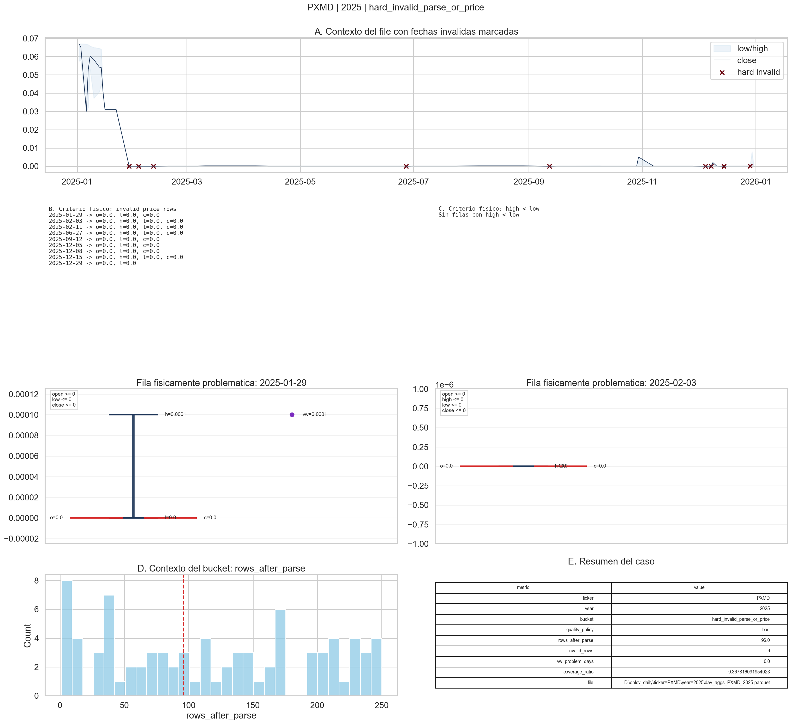

## CMRA 2025

ticker: `CMRA`  
year: `2025`  
bucket: `hard_invalid_parse_or_price`  
quality_policy: `bad`  
issues: `["negative_or_zero_ohlc_rows"]`  
warns: `["dataset_read_incompatible_schema", "large_internal_gap_days", "schema_merge_conflict_ticker_encoding", "suspicious_sparse_year"]`  
file: `D:\ohlcv_daily\ticker=CMRA\year=2025\day_aggs_CMRA_2025.parquet`

### Analisis Forense

En `hard_invalid_parse_or_price` la pregunta ya no es si el caso merece flag, sino si la barra diaria sigue siendo interpretable como hecho de mercado. La respuesta aqui es no. Se observan `2` filas con `OHLC = 0`, una firma tipica de colapso de barra diaria. Las primeras fechas exportadas (`2025-12-31`) ayudan a ver si el dano esta concentrado en un bloque temporal o disperso en el ano. En estos files la figura no representa una sesion tensa o iliquida, sino una barra que deja de tener semantica estable: cero estructural, parseo invalido o contradiccion de precios suficiente para romper la confianza minima en la observacion.

Por eso la decision correcta es `bad` y no `recoverable_with_flag`. Si este tipo de fila entra en `backtest_core`, el dano no es solo estadistico; es semantico. Contamina retornos, labels, benchmarks y cualquier reconciliacion con terceros porque ya no sabemos si la barra resume mercado o artefacto. Implicacion operativa: preservar para `forensic_only` o futura reconstruccion, pero no reutilizar como dato normal. El error que se evita es tratar ausencia de precios validos como si fuera simplemente una cola extrema del mercado.

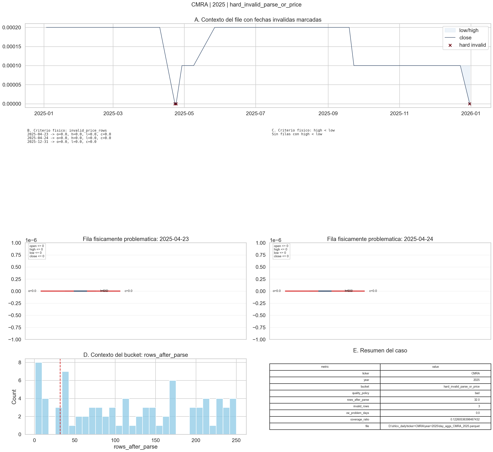

## ALPP 2025

ticker: `ALPP`  
year: `2025`  
bucket: `hard_invalid_parse_or_price`  
quality_policy: `bad`  
issues: `["negative_or_zero_ohlc_rows", "vw_outside_range_severe"]`  
warns: `["dataset_read_incompatible_schema", "schema_merge_conflict_ticker_encoding"]`  
file: `D:\ohlcv_daily\ticker=ALPP\year=2025\day_aggs_ALPP_2025.parquet`

### Analisis Forense

En `hard_invalid_parse_or_price` la pregunta ya no es si el caso merece flag, sino si la barra diaria sigue siendo interpretable como hecho de mercado. La respuesta aqui es no. Las primeras fechas exportadas (`2025-04-16`) ayudan a ver si el dano esta concentrado en un bloque temporal o disperso en el ano. En estos files la figura no representa una sesion tensa o iliquida, sino una barra que deja de tener semantica estable: cero estructural, parseo invalido o contradiccion de precios suficiente para romper la confianza minima en la observacion.

Por eso la decision correcta es `bad` y no `recoverable_with_flag`. Si este tipo de fila entra en `backtest_core`, el dano no es solo estadistico; es semantico. Contamina retornos, labels, benchmarks y cualquier reconciliacion con terceros porque ya no sabemos si la barra resume mercado o artefacto. Implicacion operativa: preservar para `forensic_only` o futura reconstruccion, pero no reutilizar como dato normal. El error que se evita es tratar ausencia de precios validos como si fuera simplemente una cola extrema del mercado.

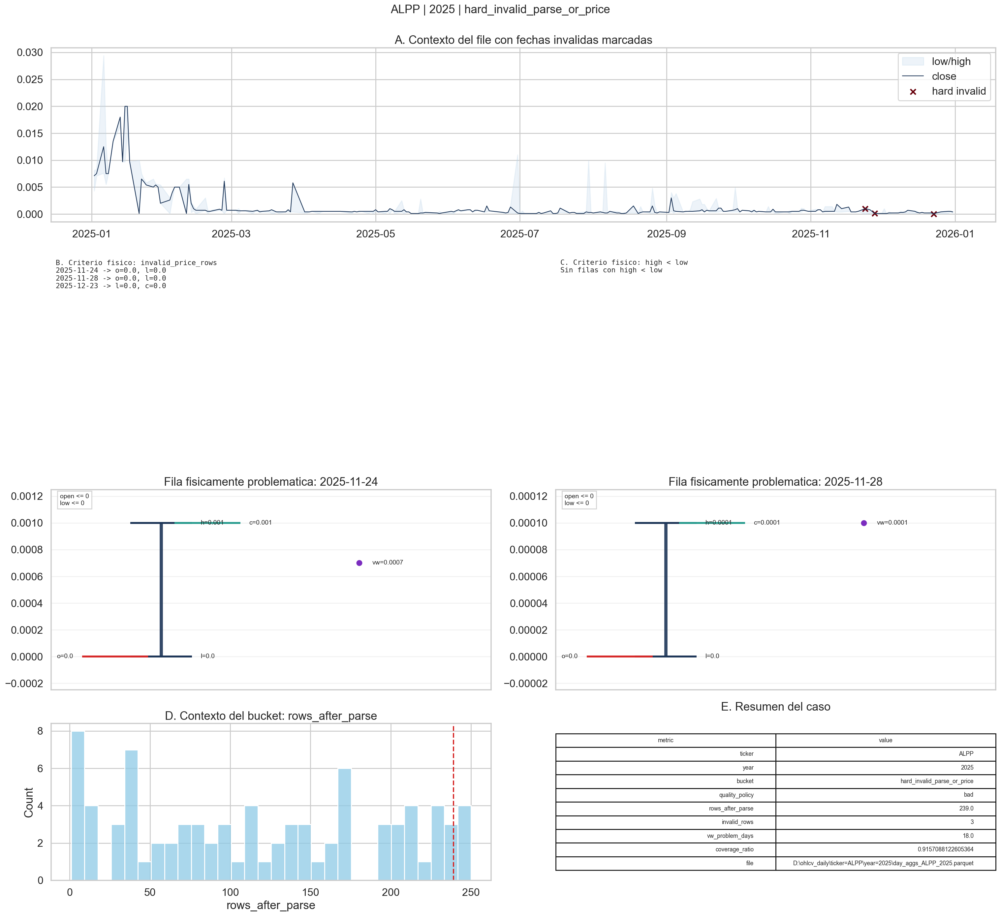

## BTTX 2024

ticker: `BTTX`  
year: `2024`  
bucket: `hard_invalid_parse_or_price`  
quality_policy: `bad`  
issues: `["negative_or_zero_ohlc_rows", "vw_outside_range_severe"]`  
warns: `["dataset_read_incompatible_schema", "schema_merge_conflict_ticker_encoding"]`  
file: `D:\ohlcv_daily\ticker=BTTX\year=2024\day_aggs_BTTX_2024.parquet`

### Analisis Forense

En `hard_invalid_parse_or_price` la pregunta ya no es si el caso merece flag, sino si la barra diaria sigue siendo interpretable como hecho de mercado. La respuesta aqui es no. Se observan `4` filas con `OHLC = 0`, una firma tipica de colapso de barra diaria. Las primeras fechas exportadas (`2024-01-02`) ayudan a ver si el dano esta concentrado en un bloque temporal o disperso en el ano. En estos files la figura no representa una sesion tensa o iliquida, sino una barra que deja de tener semantica estable: cero estructural, parseo invalido o contradiccion de precios suficiente para romper la confianza minima en la observacion.

Por eso la decision correcta es `bad` y no `recoverable_with_flag`. Si este tipo de fila entra en `backtest_core`, el dano no es solo estadistico; es semantico. Contamina retornos, labels, benchmarks y cualquier reconciliacion con terceros porque ya no sabemos si la barra resume mercado o artefacto. Implicacion operativa: preservar para `forensic_only` o futura reconstruccion, pero no reutilizar como dato normal. El error que se evita es tratar ausencia de precios validos como si fuera simplemente una cola extrema del mercado.

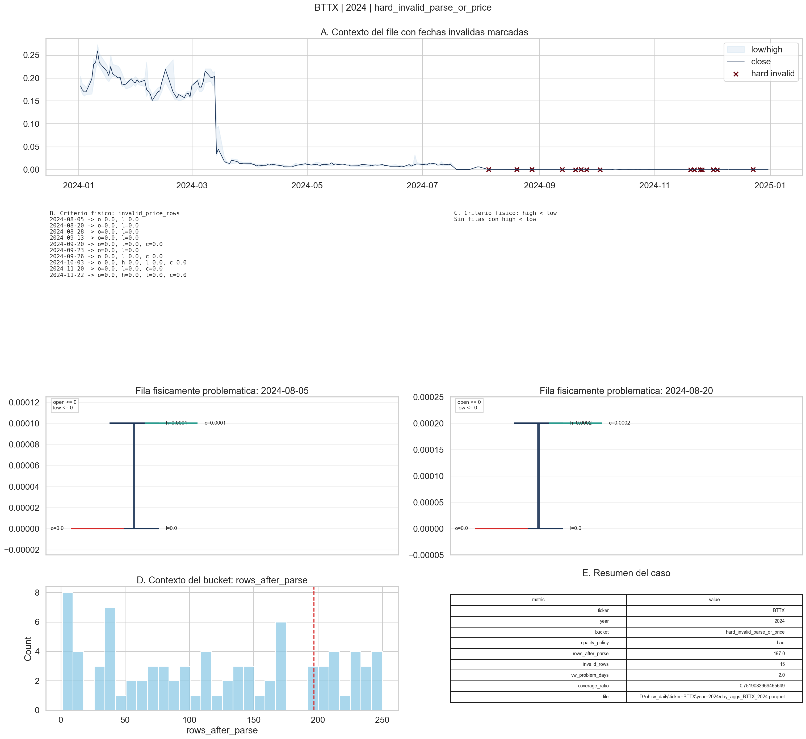

## JEWL 2025

ticker: `JEWL`  
year: `2025`  
bucket: `hard_invalid_parse_or_price`  
quality_policy: `bad`  
issues: `["negative_or_zero_ohlc_rows"]`  
warns: `["dataset_read_incompatible_schema", "schema_merge_conflict_ticker_encoding", "vw_outside_range_material"]`  
file: `D:\ohlcv_daily\ticker=JEWL\year=2025\day_aggs_JEWL_2025.parquet`

### Analisis Forense

En `hard_invalid_parse_or_price` la pregunta ya no es si el caso merece flag, sino si la barra diaria sigue siendo interpretable como hecho de mercado. La respuesta aqui es no. Las primeras fechas exportadas (`2025-02-07`) ayudan a ver si el dano esta concentrado en un bloque temporal o disperso en el ano. En estos files la figura no representa una sesion tensa o iliquida, sino una barra que deja de tener semantica estable: cero estructural, parseo invalido o contradiccion de precios suficiente para romper la confianza minima en la observacion.

Por eso la decision correcta es `bad` y no `recoverable_with_flag`. Si este tipo de fila entra en `backtest_core`, el dano no es solo estadistico; es semantico. Contamina retornos, labels, benchmarks y cualquier reconciliacion con terceros porque ya no sabemos si la barra resume mercado o artefacto. Implicacion operativa: preservar para `forensic_only` o futura reconstruccion, pero no reutilizar como dato normal. El error que se evita es tratar ausencia de precios validos como si fuera simplemente una cola extrema del mercado.

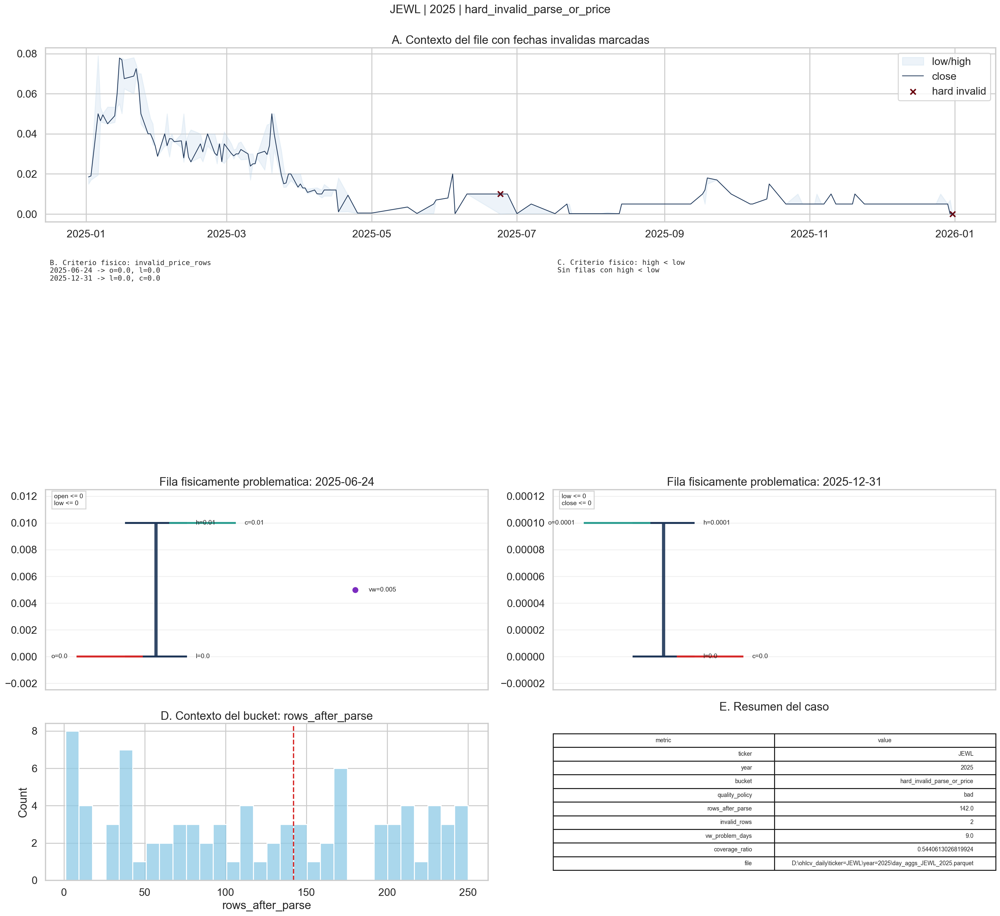

## ELYS 2024

ticker: `ELYS`  
year: `2024`  
bucket: `hard_invalid_parse_or_price`  
quality_policy: `bad`  
issues: `["negative_or_zero_ohlc_rows", "vw_outside_range_severe"]`  
warns: `["dataset_read_incompatible_schema", "large_internal_gap_days", "schema_merge_conflict_ticker_encoding"]`  
file: `D:\ohlcv_daily\ticker=ELYS\year=2024\day_aggs_ELYS_2024.parquet`

### Analisis Forense

En `hard_invalid_parse_or_price` la pregunta ya no es si el caso merece flag, sino si la barra diaria sigue siendo interpretable como hecho de mercado. La respuesta aqui es no. Se observan `8` filas con `OHLC = 0`, una firma tipica de colapso de barra diaria. Las primeras fechas exportadas (`2024-07-25`) ayudan a ver si el dano esta concentrado en un bloque temporal o disperso en el ano. En estos files la figura no representa una sesion tensa o iliquida, sino una barra que deja de tener semantica estable: cero estructural, parseo invalido o contradiccion de precios suficiente para romper la confianza minima en la observacion.

Por eso la decision correcta es `bad` y no `recoverable_with_flag`. Si este tipo de fila entra en `backtest_core`, el dano no es solo estadistico; es semantico. Contamina retornos, labels, benchmarks y cualquier reconciliacion con terceros porque ya no sabemos si la barra resume mercado o artefacto. Implicacion operativa: preservar para `forensic_only` o futura reconstruccion, pero no reutilizar como dato normal. El error que se evita es tratar ausencia de precios validos como si fuera simplemente una cola extrema del mercado.

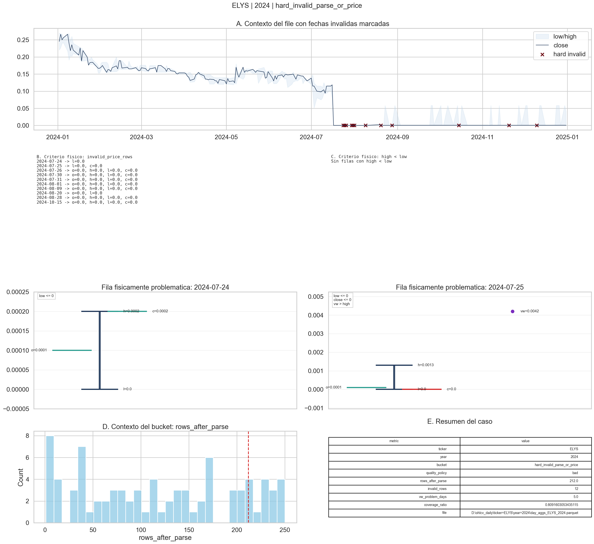

## EVLO 2025

ticker: `EVLO`  
year: `2025`  
bucket: `hard_invalid_parse_or_price`  
quality_policy: `bad`  
issues: `["negative_or_zero_ohlc_rows", "vw_outside_range_severe"]`  
warns: `["dataset_read_incompatible_schema", "schema_merge_conflict_ticker_encoding", "suspicious_sparse_year"]`  
file: `D:\ohlcv_daily\ticker=EVLO\year=2025\day_aggs_EVLO_2025.parquet`

### Analisis Forense

En `hard_invalid_parse_or_price` la pregunta ya no es si el caso merece flag, sino si la barra diaria sigue siendo interpretable como hecho de mercado. La respuesta aqui es no. Se observan `2` filas con `OHLC = 0`, una firma tipica de colapso de barra diaria. Las primeras fechas exportadas (`2025-04-16`) ayudan a ver si el dano esta concentrado en un bloque temporal o disperso en el ano. En estos files la figura no representa una sesion tensa o iliquida, sino una barra que deja de tener semantica estable: cero estructural, parseo invalido o contradiccion de precios suficiente para romper la confianza minima en la observacion.

Por eso la decision correcta es `bad` y no `recoverable_with_flag`. Si este tipo de fila entra en `backtest_core`, el dano no es solo estadistico; es semantico. Contamina retornos, labels, benchmarks y cualquier reconciliacion con terceros porque ya no sabemos si la barra resume mercado o artefacto. Implicacion operativa: preservar para `forensic_only` o futura reconstruccion, pero no reutilizar como dato normal. El error que se evita es tratar ausencia de precios validos como si fuera simplemente una cola extrema del mercado.

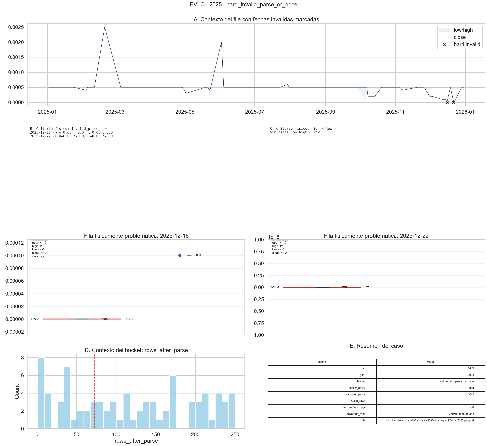

## ARDS 2025

ticker: `ARDS`  
year: `2025`  
bucket: `hard_invalid_parse_or_price`  
quality_policy: `bad`  
issues: `["negative_or_zero_ohlc_rows"]`  
warns: `["dataset_read_incompatible_schema", "schema_merge_conflict_ticker_encoding", "vw_outside_range_material"]`  
file: `D:\ohlcv_daily\ticker=ARDS\year=2025\day_aggs_ARDS_2025.parquet`

### Analisis Forense

En `hard_invalid_parse_or_price` la pregunta ya no es si el caso merece flag, sino si la barra diaria sigue siendo interpretable como hecho de mercado. La respuesta aqui es no. Se observan `4` filas con `OHLC = 0`, una firma tipica de colapso de barra diaria. Las primeras fechas exportadas (`2025-10-20`) ayudan a ver si el dano esta concentrado en un bloque temporal o disperso en el ano. En estos files la figura no representa una sesion tensa o iliquida, sino una barra que deja de tener semantica estable: cero estructural, parseo invalido o contradiccion de precios suficiente para romper la confianza minima en la observacion.

Por eso la decision correcta es `bad` y no `recoverable_with_flag`. Si este tipo de fila entra en `backtest_core`, el dano no es solo estadistico; es semantico. Contamina retornos, labels, benchmarks y cualquier reconciliacion con terceros porque ya no sabemos si la barra resume mercado o artefacto. Implicacion operativa: preservar para `forensic_only` o futura reconstruccion, pero no reutilizar como dato normal. El error que se evita es tratar ausencia de precios validos como si fuera simplemente una cola extrema del mercado.

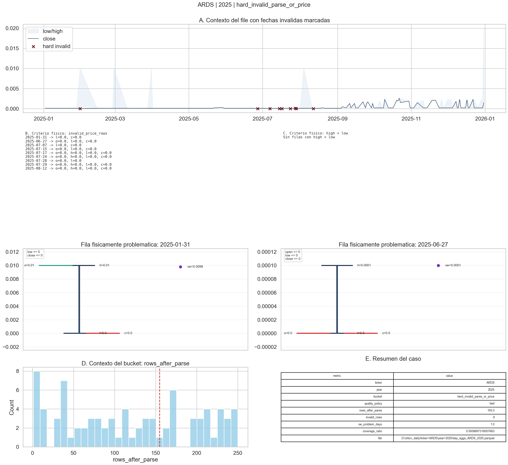

## AAGR 2024

ticker: `AAGR`  
year: `2024`  
bucket: `hard_invalid_parse_or_price`  
quality_policy: `bad`  
issues: `["negative_or_zero_ohlc_rows", "vw_outside_range_severe"]`  
warns: `["dataset_read_incompatible_schema", "schema_merge_conflict_ticker_encoding"]`  
file: `D:\ohlcv_daily\ticker=AAGR\year=2024\day_aggs_AAGR_2024.parquet`

### Analisis Forense

En `hard_invalid_parse_or_price` la pregunta ya no es si el caso merece flag, sino si la barra diaria sigue siendo interpretable como hecho de mercado. La respuesta aqui es no. Las primeras fechas exportadas (`2024-06-27`) ayudan a ver si el dano esta concentrado en un bloque temporal o disperso en el ano. En estos files la figura no representa una sesion tensa o iliquida, sino una barra que deja de tener semantica estable: cero estructural, parseo invalido o contradiccion de precios suficiente para romper la confianza minima en la observacion.

Por eso la decision correcta es `bad` y no `recoverable_with_flag`. Si este tipo de fila entra en `backtest_core`, el dano no es solo estadistico; es semantico. Contamina retornos, labels, benchmarks y cualquier reconciliacion con terceros porque ya no sabemos si la barra resume mercado o artefacto. Implicacion operativa: preservar para `forensic_only` o futura reconstruccion, pero no reutilizar como dato normal. El error que se evita es tratar ausencia de precios validos como si fuera simplemente una cola extrema del mercado.

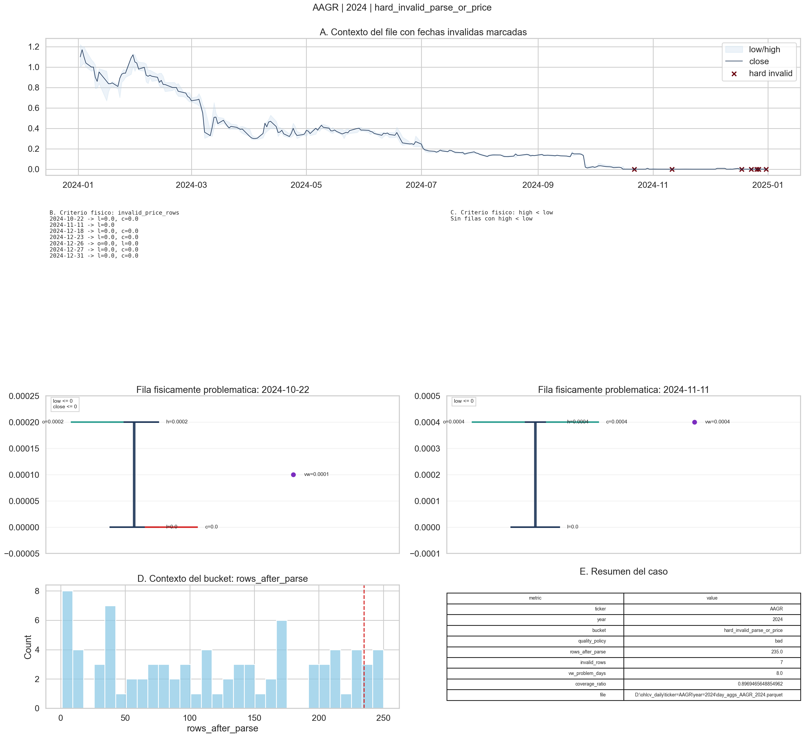

## RIBT 2025

ticker: `RIBT`  
year: `2025`  
bucket: `hard_invalid_parse_or_price`  
quality_policy: `bad`  
issues: `["negative_or_zero_ohlc_rows", "vw_outside_range_severe"]`  
warns: `["dataset_read_incompatible_schema", "schema_merge_conflict_ticker_encoding", "suspicious_sparse_year"]`  
file: `D:\ohlcv_daily\ticker=RIBT\year=2025\day_aggs_RIBT_2025.parquet`

### Analisis Forense

En `hard_invalid_parse_or_price` la pregunta ya no es si el caso merece flag, sino si la barra diaria sigue siendo interpretable como hecho de mercado. La respuesta aqui es no. Se observan `4` filas con `OHLC = 0`, una firma tipica de colapso de barra diaria. Las primeras fechas exportadas (`2025-01-21`) ayudan a ver si el dano esta concentrado en un bloque temporal o disperso en el ano. En estos files la figura no representa una sesion tensa o iliquida, sino una barra que deja de tener semantica estable: cero estructural, parseo invalido o contradiccion de precios suficiente para romper la confianza minima en la observacion.

Por eso la decision correcta es `bad` y no `recoverable_with_flag`. Si este tipo de fila entra en `backtest_core`, el dano no es solo estadistico; es semantico. Contamina retornos, labels, benchmarks y cualquier reconciliacion con terceros porque ya no sabemos si la barra resume mercado o artefacto. Implicacion operativa: preservar para `forensic_only` o futura reconstruccion, pero no reutilizar como dato normal. El error que se evita es tratar ausencia de precios validos como si fuera simplemente una cola extrema del mercado.

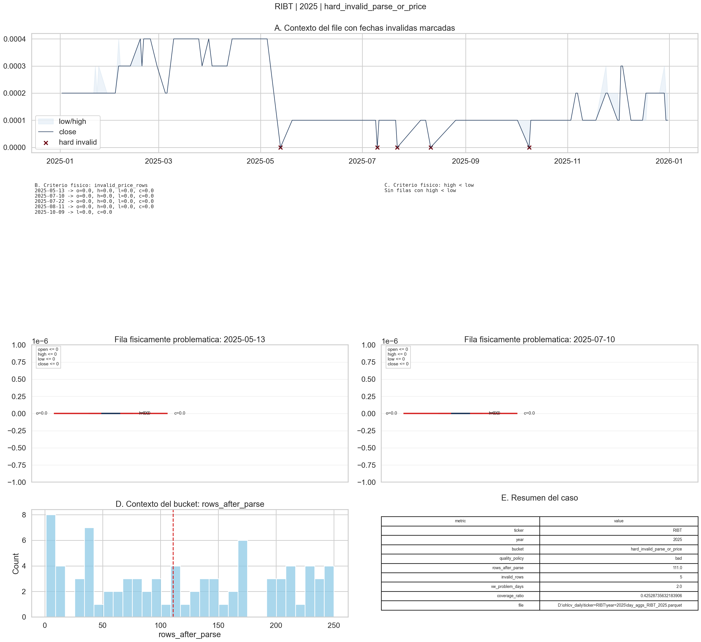

## AFIB 2025

ticker: `AFIB`  
year: `2025`  
bucket: `hard_invalid_parse_or_price`  
quality_policy: `bad`  
issues: `["negative_or_zero_ohlc_rows", "vw_outside_range_severe"]`  
warns: `["dataset_read_incompatible_schema", "schema_merge_conflict_ticker_encoding"]`  
file: `D:\ohlcv_daily\ticker=AFIB\year=2025\day_aggs_AFIB_2025.parquet`

### Analisis Forense

En `hard_invalid_parse_or_price` la pregunta ya no es si el caso merece flag, sino si la barra diaria sigue siendo interpretable como hecho de mercado. La respuesta aqui es no. Se observan `2` filas con `OHLC = 0`, una firma tipica de colapso de barra diaria. Las primeras fechas exportadas (`2025-06-26`) ayudan a ver si el dano esta concentrado en un bloque temporal o disperso en el ano. En estos files la figura no representa una sesion tensa o iliquida, sino una barra que deja de tener semantica estable: cero estructural, parseo invalido o contradiccion de precios suficiente para romper la confianza minima en la observacion.

Por eso la decision correcta es `bad` y no `recoverable_with_flag`. Si este tipo de fila entra en `backtest_core`, el dano no es solo estadistico; es semantico. Contamina retornos, labels, benchmarks y cualquier reconciliacion con terceros porque ya no sabemos si la barra resume mercado o artefacto. Implicacion operativa: preservar para `forensic_only` o futura reconstruccion, pero no reutilizar como dato normal. El error que se evita es tratar ausencia de precios validos como si fuera simplemente una cola extrema del mercado.

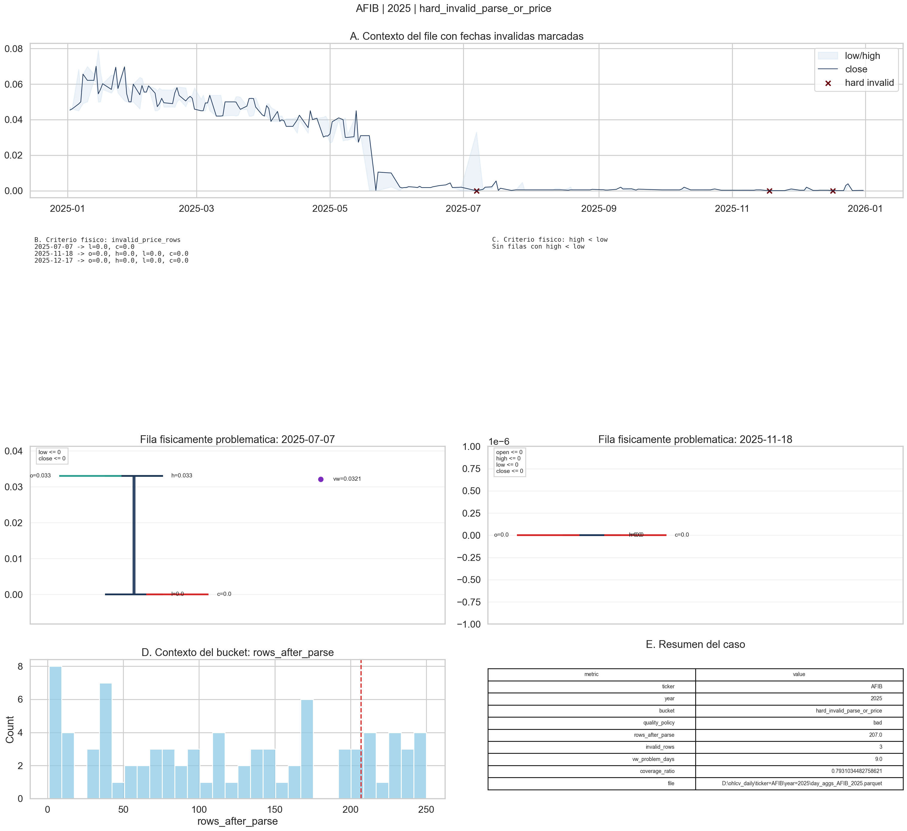

## AAGR 2026

ticker: `AAGR`  
year: `2026`  
bucket: `hard_invalid_parse_or_price`  
quality_policy: `bad`  
issues: `["negative_or_zero_ohlc_rows", "vw_outside_range_severe"]`  
warns: `["dataset_read_incompatible_schema", "schema_merge_conflict_ticker_encoding", "suspicious_sparse_year"]`  
file: `D:\ohlcv_daily\ticker=AAGR\year=2026\day_aggs_AAGR_2026.parquet`

### Analisis Forense

En `hard_invalid_parse_or_price` la pregunta ya no es si el caso merece flag, sino si la barra diaria sigue siendo interpretable como hecho de mercado. La respuesta aqui es no. Las primeras fechas exportadas (`2026-01-13`) ayudan a ver si el dano esta concentrado en un bloque temporal o disperso en el ano. En estos files la figura no representa una sesion tensa o iliquida, sino una barra que deja de tener semantica estable: cero estructural, parseo invalido o contradiccion de precios suficiente para romper la confianza minima en la observacion.

Por eso la decision correcta es `bad` y no `recoverable_with_flag`. Si este tipo de fila entra en `backtest_core`, el dano no es solo estadistico; es semantico. Contamina retornos, labels, benchmarks y cualquier reconciliacion con terceros porque ya no sabemos si la barra resume mercado o artefacto. Implicacion operativa: preservar para `forensic_only` o futura reconstruccion, pero no reutilizar como dato normal. El error que se evita es tratar ausencia de precios validos como si fuera simplemente una cola extrema del mercado.

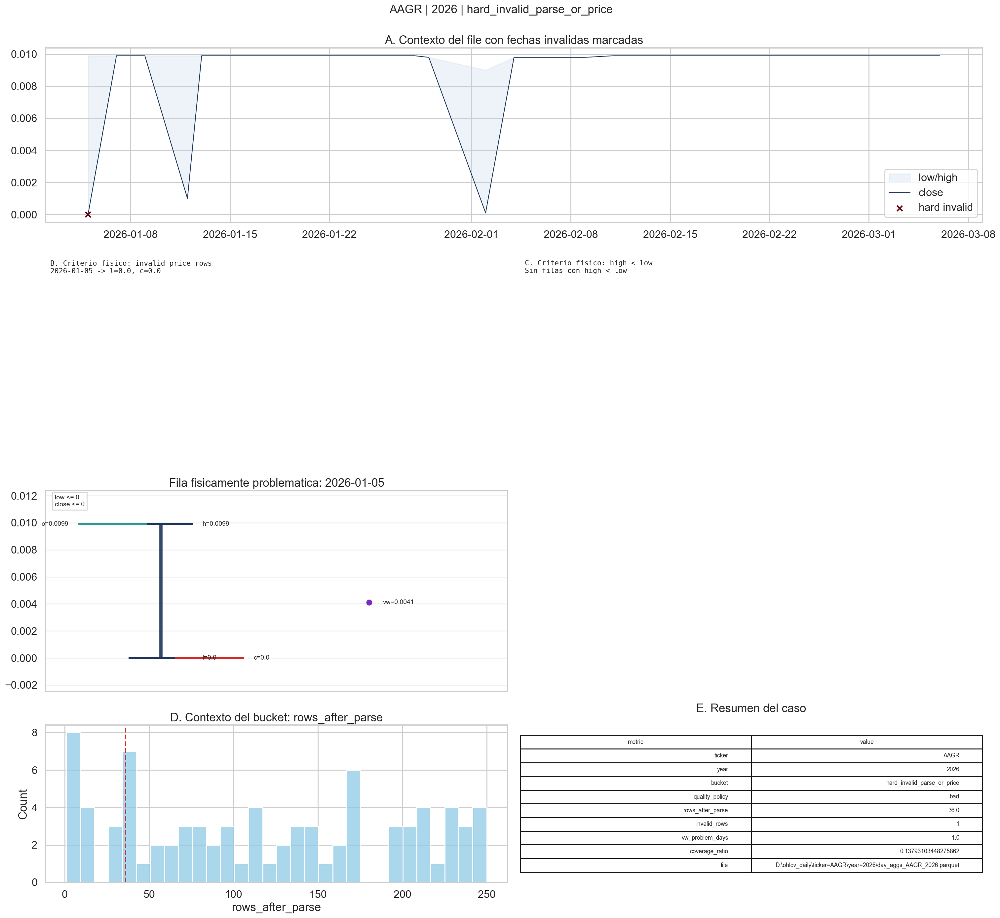

## ELYS 2025

ticker: `ELYS`  
year: `2025`  
bucket: `hard_invalid_parse_or_price`  
quality_policy: `bad`  
issues: `["negative_or_zero_ohlc_rows", "vw_outside_range_severe"]`  
warns: `["dataset_read_incompatible_schema", "schema_merge_conflict_ticker_encoding"]`  
file: `D:\ohlcv_daily\ticker=ELYS\year=2025\day_aggs_ELYS_2025.parquet`

### Analisis Forense

En `hard_invalid_parse_or_price` la pregunta ya no es si el caso merece flag, sino si la barra diaria sigue siendo interpretable como hecho de mercado. La respuesta aqui es no. Se observan `1` filas con `OHLC = 0`, una firma tipica de colapso de barra diaria. Las primeras fechas exportadas (`2025-10-17`) ayudan a ver si el dano esta concentrado en un bloque temporal o disperso en el ano. En estos files la figura no representa una sesion tensa o iliquida, sino una barra que deja de tener semantica estable: cero estructural, parseo invalido o contradiccion de precios suficiente para romper la confianza minima en la observacion.

Por eso la decision correcta es `bad` y no `recoverable_with_flag`. Si este tipo de fila entra en `backtest_core`, el dano no es solo estadistico; es semantico. Contamina retornos, labels, benchmarks y cualquier reconciliacion con terceros porque ya no sabemos si la barra resume mercado o artefacto. Implicacion operativa: preservar para `forensic_only` o futura reconstruccion, pero no reutilizar como dato normal. El error que se evita es tratar ausencia de precios validos como si fuera simplemente una cola extrema del mercado.

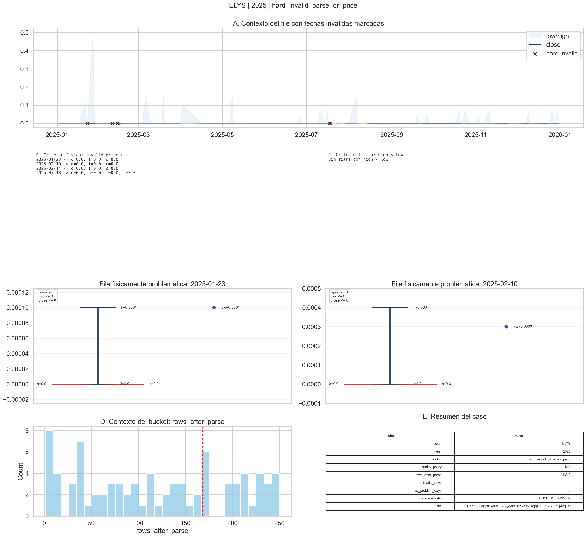

## STAB 2023

ticker: `STAB`  
year: `2023`  
bucket: `hard_invalid_parse_or_price`  
quality_policy: `bad`  
issues: `["negative_or_zero_ohlc_rows", "vw_outside_range_severe"]`  
warns: `["dataset_read_incompatible_schema", "schema_merge_conflict_ticker_encoding"]`  
file: `D:\ohlcv_daily\ticker=STAB\year=2023\day_aggs_STAB_2023.parquet`

### Analisis Forense

En `hard_invalid_parse_or_price` la pregunta ya no es si el caso merece flag, sino si la barra diaria sigue siendo interpretable como hecho de mercado. La respuesta aqui es no. Se observan `1` filas con `OHLC = 0`, una firma tipica de colapso de barra diaria. Las primeras fechas exportadas (`2023-08-08`) ayudan a ver si el dano esta concentrado en un bloque temporal o disperso en el ano. En estos files la figura no representa una sesion tensa o iliquida, sino una barra que deja de tener semantica estable: cero estructural, parseo invalido o contradiccion de precios suficiente para romper la confianza minima en la observacion.

Por eso la decision correcta es `bad` y no `recoverable_with_flag`. Si este tipo de fila entra en `backtest_core`, el dano no es solo estadistico; es semantico. Contamina retornos, labels, benchmarks y cualquier reconciliacion con terceros porque ya no sabemos si la barra resume mercado o artefacto. Implicacion operativa: preservar para `forensic_only` o futura reconstruccion, pero no reutilizar como dato normal. El error que se evita es tratar ausencia de precios validos como si fuera simplemente una cola extrema del mercado.

## MOTS 2024

ticker: `MOTS`  
year: `2024`  
bucket: `hard_invalid_parse_or_price`  
quality_policy: `bad`  
issues: `["negative_or_zero_ohlc_rows", "vw_outside_range_severe"]`  
warns: `["dataset_read_incompatible_schema", "schema_merge_conflict_ticker_encoding"]`  
file: `D:\ohlcv_daily\ticker=MOTS\year=2024\day_aggs_MOTS_2024.parquet`

### Analisis Forense

En `hard_invalid_parse_or_price` la pregunta ya no es si el caso merece flag, sino si la barra diaria sigue siendo interpretable como hecho de mercado. La respuesta aqui es no. Las primeras fechas exportadas (`2024-02-20`) ayudan a ver si el dano esta concentrado en un bloque temporal o disperso en el ano. En estos files la figura no representa una sesion tensa o iliquida, sino una barra que deja de tener semantica estable: cero estructural, parseo invalido o contradiccion de precios suficiente para romper la confianza minima en la observacion.

Por eso la decision correcta es `bad` y no `recoverable_with_flag`. Si este tipo de fila entra en `backtest_core`, el dano no es solo estadistico; es semantico. Contamina retornos, labels, benchmarks y cualquier reconciliacion con terceros porque ya no sabemos si la barra resume mercado o artefacto. Implicacion operativa: preservar para `forensic_only` o futura reconstruccion, pero no reutilizar como dato normal. El error que se evita es tratar ausencia de precios validos como si fuera simplemente una cola extrema del mercado.

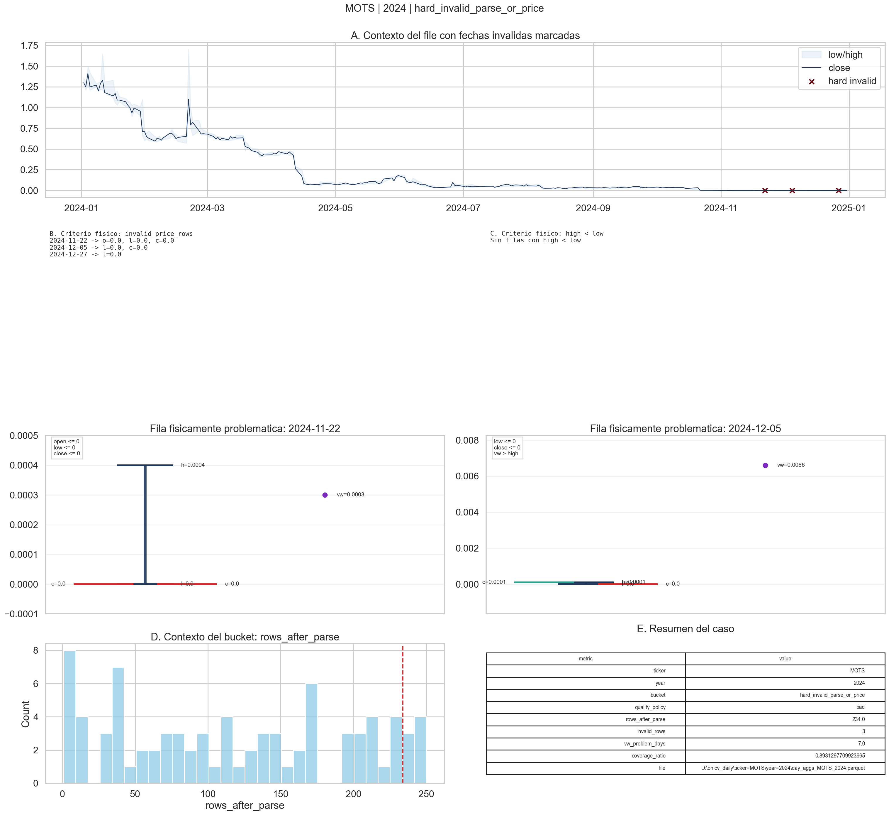

## KBNT 2023

ticker: `KBNT`  
year: `2023`  
bucket: `hard_invalid_parse_or_price`  
quality_policy: `bad`  
issues: `["negative_or_zero_ohlc_rows", "vw_outside_range_severe"]`  
warns: `["dataset_read_incompatible_schema", "schema_merge_conflict_ticker_encoding"]`  
file: `D:\ohlcv_daily\ticker=KBNT\year=2023\day_aggs_KBNT_2023.parquet`

### Analisis Forense

En `hard_invalid_parse_or_price` la pregunta ya no es si el caso merece flag, sino si la barra diaria sigue siendo interpretable como hecho de mercado. La respuesta aqui es no. Las primeras fechas exportadas (`2023-05-24`) ayudan a ver si el dano esta concentrado en un bloque temporal o disperso en el ano. En estos files la figura no representa una sesion tensa o iliquida, sino una barra que deja de tener semantica estable: cero estructural, parseo invalido o contradiccion de precios suficiente para romper la confianza minima en la observacion.

Por eso la decision correcta es `bad` y no `recoverable_with_flag`. Si este tipo de fila entra en `backtest_core`, el dano no es solo estadistico; es semantico. Contamina retornos, labels, benchmarks y cualquier reconciliacion con terceros porque ya no sabemos si la barra resume mercado o artefacto. Implicacion operativa: preservar para `forensic_only` o futura reconstruccion, pero no reutilizar como dato normal. El error que se evita es tratar ausencia de precios validos como si fuera simplemente una cola extrema del mercado.

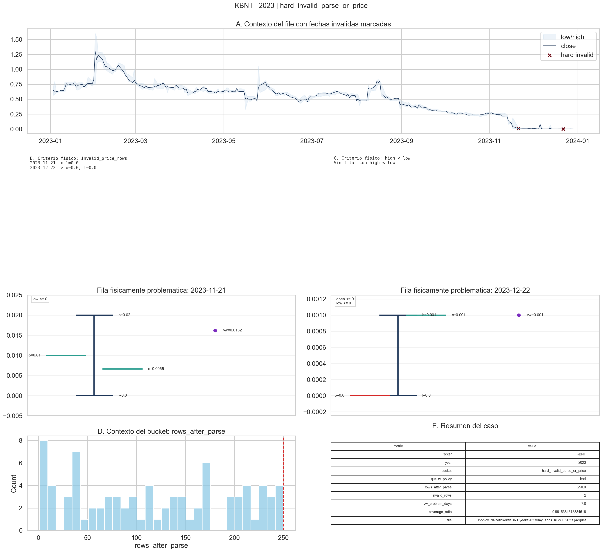

## NAVB 2024

ticker: `NAVB`  
year: `2024`  
bucket: `hard_invalid_parse_or_price`  
quality_policy: `bad`  
issues: `["negative_or_zero_ohlc_rows"]`  
warns: `["dataset_read_incompatible_schema", "large_internal_gap_days", "schema_merge_conflict_ticker_encoding", "vw_outside_range_material"]`  
file: `D:\ohlcv_daily\ticker=NAVB\year=2024\day_aggs_NAVB_2024.parquet`

### Analisis Forense

En `hard_invalid_parse_or_price` la pregunta ya no es si el caso merece flag, sino si la barra diaria sigue siendo interpretable como hecho de mercado. La respuesta aqui es no. Se observan `3` filas con `OHLC = 0`, una firma tipica de colapso de barra diaria. Las primeras fechas exportadas (`2024-08-14`) ayudan a ver si el dano esta concentrado en un bloque temporal o disperso en el ano. En estos files la figura no representa una sesion tensa o iliquida, sino una barra que deja de tener semantica estable: cero estructural, parseo invalido o contradiccion de precios suficiente para romper la confianza minima en la observacion.

Por eso la decision correcta es `bad` y no `recoverable_with_flag`. Si este tipo de fila entra en `backtest_core`, el dano no es solo estadistico; es semantico. Contamina retornos, labels, benchmarks y cualquier reconciliacion con terceros porque ya no sabemos si la barra resume mercado o artefacto. Implicacion operativa: preservar para `forensic_only` o futura reconstruccion, pero no reutilizar como dato normal. El error que se evita es tratar ausencia de precios validos como si fuera simplemente una cola extrema del mercado.

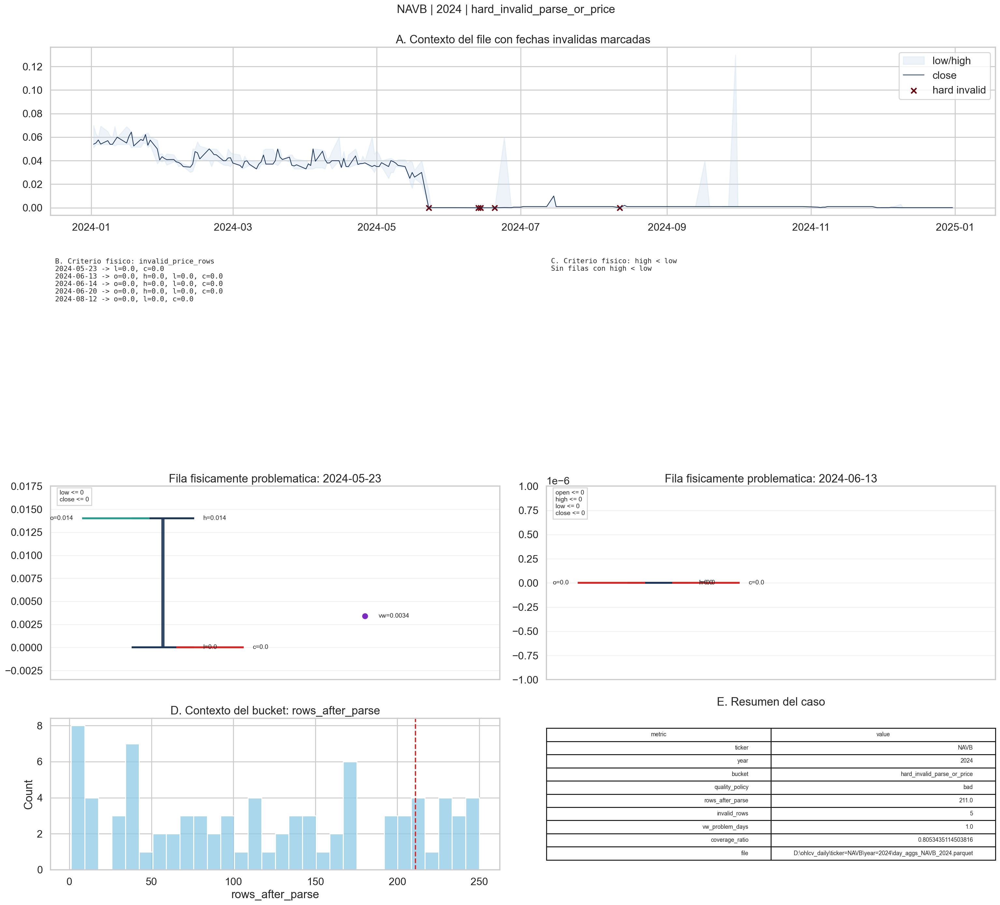

## VAXX 2024

ticker: `VAXX`  
year: `2024`  
bucket: `hard_invalid_parse_or_price`  
quality_policy: `bad`  
issues: `["negative_or_zero_ohlc_rows", "vw_outside_range_severe"]`  
warns: `["dataset_read_incompatible_schema", "schema_merge_conflict_ticker_encoding"]`  
file: `D:\ohlcv_daily\ticker=VAXX\year=2024\day_aggs_VAXX_2024.parquet`

### Analisis Forense

En `hard_invalid_parse_or_price` la pregunta ya no es si el caso merece flag, sino si la barra diaria sigue siendo interpretable como hecho de mercado. La respuesta aqui es no. Las primeras fechas exportadas (`2024-04-19`) ayudan a ver si el dano esta concentrado en un bloque temporal o disperso en el ano. En estos files la figura no representa una sesion tensa o iliquida, sino una barra que deja de tener semantica estable: cero estructural, parseo invalido o contradiccion de precios suficiente para romper la confianza minima en la observacion.

Por eso la decision correcta es `bad` y no `recoverable_with_flag`. Si este tipo de fila entra en `backtest_core`, el dano no es solo estadistico; es semantico. Contamina retornos, labels, benchmarks y cualquier reconciliacion con terceros porque ya no sabemos si la barra resume mercado o artefacto. Implicacion operativa: preservar para `forensic_only` o futura reconstruccion, pero no reutilizar como dato normal. El error que se evita es tratar ausencia de precios validos como si fuera simplemente una cola extrema del mercado.

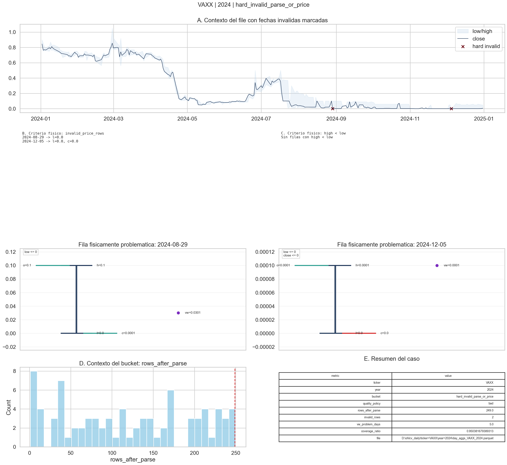

## BTTX 2025

ticker: `BTTX`  
year: `2025`  
bucket: `hard_invalid_parse_or_price`  
quality_policy: `bad`  
issues: `["negative_or_zero_ohlc_rows", "vw_outside_range_severe"]`  
warns: `["dataset_read_incompatible_schema", "schema_merge_conflict_ticker_encoding"]`  
file: `D:\ohlcv_daily\ticker=BTTX\year=2025\day_aggs_BTTX_2025.parquet`

### Analisis Forense

En `hard_invalid_parse_or_price` la pregunta ya no es si el caso merece flag, sino si la barra diaria sigue siendo interpretable como hecho de mercado. La respuesta aqui es no. Se observan `2` filas con `OHLC = 0`, una firma tipica de colapso de barra diaria. Las primeras fechas exportadas (`2025-02-24`) ayudan a ver si el dano esta concentrado en un bloque temporal o disperso en el ano. En estos files la figura no representa una sesion tensa o iliquida, sino una barra que deja de tener semantica estable: cero estructural, parseo invalido o contradiccion de precios suficiente para romper la confianza minima en la observacion.

Por eso la decision correcta es `bad` y no `recoverable_with_flag`. Si este tipo de fila entra en `backtest_core`, el dano no es solo estadistico; es semantico. Contamina retornos, labels, benchmarks y cualquier reconciliacion con terceros porque ya no sabemos si la barra resume mercado o artefacto. Implicacion operativa: preservar para `forensic_only` o futura reconstruccion, pero no reutilizar como dato normal. El error que se evita es tratar ausencia de precios validos como si fuera simplemente una cola extrema del mercado.

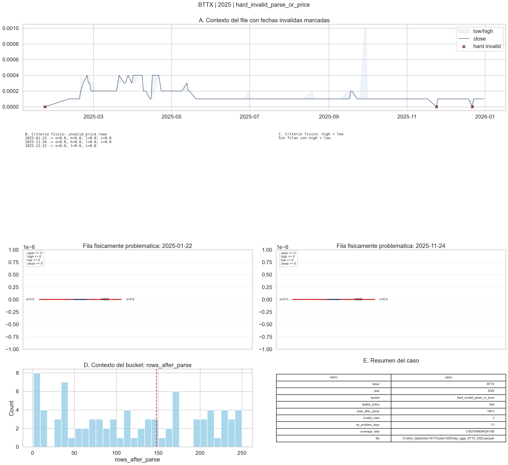

## SCPS 2024

ticker: `SCPS`  
year: `2024`  
bucket: `hard_invalid_parse_or_price`  
quality_policy: `bad`  
issues: `["negative_or_zero_ohlc_rows"]`  
warns: `["dataset_read_incompatible_schema", "large_internal_gap_days", "schema_merge_conflict_ticker_encoding", "suspicious_sparse_year", "vw_outside_range_material"]`  
file: `D:\ohlcv_daily\ticker=SCPS\year=2024\day_aggs_SCPS_2024.parquet`

### Analisis Forense

En `hard_invalid_parse_or_price` la pregunta ya no es si el caso merece flag, sino si la barra diaria sigue siendo interpretable como hecho de mercado. La respuesta aqui es no. Las primeras fechas exportadas (`2024-01-05`) ayudan a ver si el dano esta concentrado en un bloque temporal o disperso en el ano. En estos files la figura no representa una sesion tensa o iliquida, sino una barra que deja de tener semantica estable: cero estructural, parseo invalido o contradiccion de precios suficiente para romper la confianza minima en la observacion.

Por eso la decision correcta es `bad` y no `recoverable_with_flag`. Si este tipo de fila entra en `backtest_core`, el dano no es solo estadistico; es semantico. Contamina retornos, labels, benchmarks y cualquier reconciliacion con terceros porque ya no sabemos si la barra resume mercado o artefacto. Implicacion operativa: preservar para `forensic_only` o futura reconstruccion, pero no reutilizar como dato normal. El error que se evita es tratar ausencia de precios validos como si fuera simplemente una cola extrema del mercado.

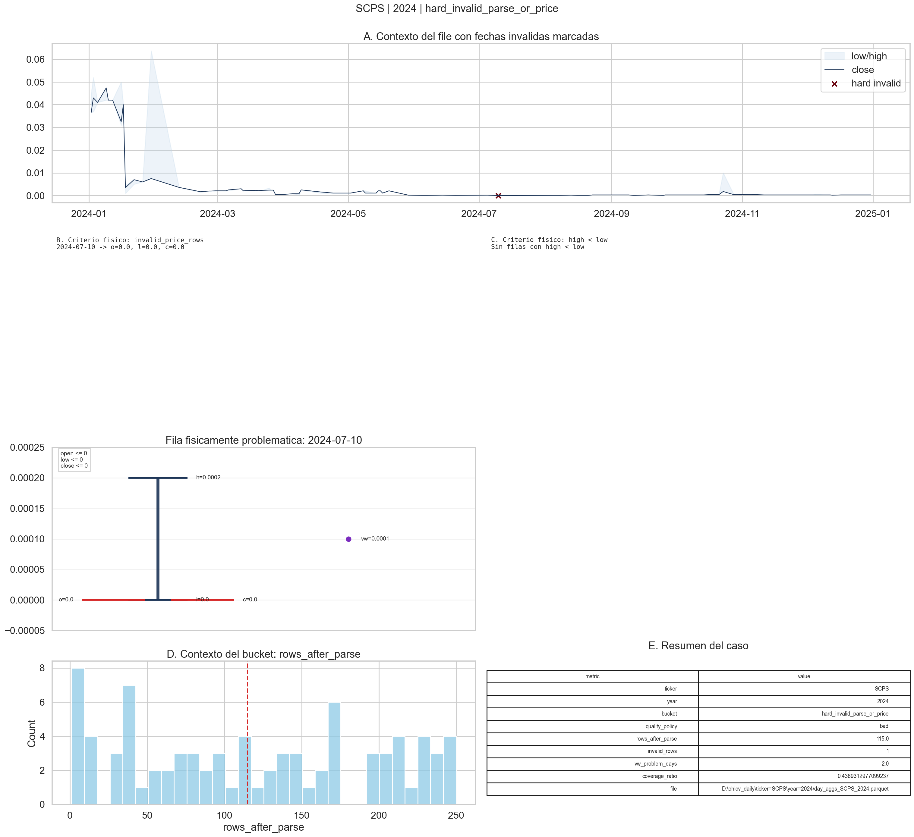

## STAB 2024

ticker: `STAB`  
year: `2024`  
bucket: `hard_invalid_parse_or_price`  
quality_policy: `bad`  
issues: `["negative_or_zero_ohlc_rows", "vw_outside_range_severe"]`  
warns: `["dataset_read_incompatible_schema", "schema_merge_conflict_ticker_encoding"]`  
file: `D:\ohlcv_daily\ticker=STAB\year=2024\day_aggs_STAB_2024.parquet`

### Analisis Forense

En `hard_invalid_parse_or_price` la pregunta ya no es si el caso merece flag, sino si la barra diaria sigue siendo interpretable como hecho de mercado. La respuesta aqui es no. Se observan `1` filas con `OHLC = 0`, una firma tipica de colapso de barra diaria. Las primeras fechas exportadas (`2024-12-04`) ayudan a ver si el dano esta concentrado en un bloque temporal o disperso en el ano. En estos files la figura no representa una sesion tensa o iliquida, sino una barra que deja de tener semantica estable: cero estructural, parseo invalido o contradiccion de precios suficiente para romper la confianza minima en la observacion.

Por eso la decision correcta es `bad` y no `recoverable_with_flag`. Si este tipo de fila entra en `backtest_core`, el dano no es solo estadistico; es semantico. Contamina retornos, labels, benchmarks y cualquier reconciliacion con terceros porque ya no sabemos si la barra resume mercado o artefacto. Implicacion operativa: preservar para `forensic_only` o futura reconstruccion, pero no reutilizar como dato normal. El error que se evita es tratar ausencia de precios validos como si fuera simplemente una cola extrema del mercado.

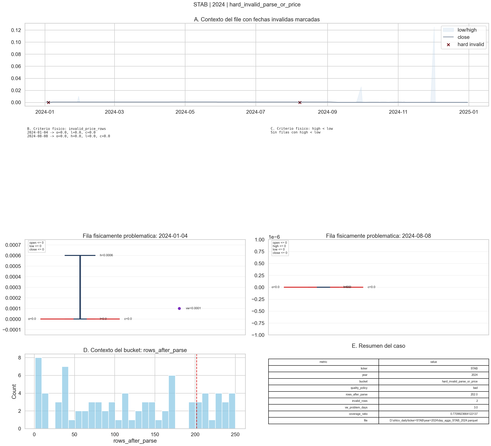

## VIVE 2023

ticker: `VIVE`  
year: `2023`  
bucket: `hard_invalid_parse_or_price`  
quality_policy: `bad`  
issues: `["negative_or_zero_ohlc_rows", "vw_outside_range_severe"]`  
warns: `["dataset_read_incompatible_schema", "schema_merge_conflict_ticker_encoding"]`  
file: `D:\ohlcv_daily\ticker=VIVE\year=2023\day_aggs_VIVE_2023.parquet`

### Analisis Forense

En `hard_invalid_parse_or_price` la pregunta ya no es si el caso merece flag, sino si la barra diaria sigue siendo interpretable como hecho de mercado. La respuesta aqui es no. Las primeras fechas exportadas (`2023-08-04`) ayudan a ver si el dano esta concentrado en un bloque temporal o disperso en el ano. En estos files la figura no representa una sesion tensa o iliquida, sino una barra que deja de tener semantica estable: cero estructural, parseo invalido o contradiccion de precios suficiente para romper la confianza minima en la observacion.

Por eso la decision correcta es `bad` y no `recoverable_with_flag`. Si este tipo de fila entra en `backtest_core`, el dano no es solo estadistico; es semantico. Contamina retornos, labels, benchmarks y cualquier reconciliacion con terceros porque ya no sabemos si la barra resume mercado o artefacto. Implicacion operativa: preservar para `forensic_only` o futura reconstruccion, pero no reutilizar como dato normal. El error que se evita es tratar ausencia de precios validos como si fuera simplemente una cola extrema del mercado.

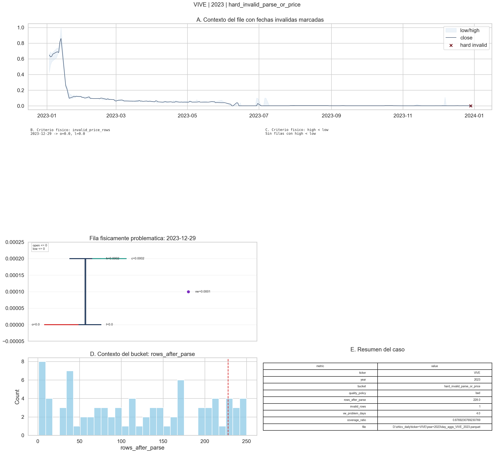

## GETR 2025

ticker: `GETR`  
year: `2025`  
bucket: `hard_invalid_parse_or_price`  
quality_policy: `bad`  
issues: `["negative_or_zero_ohlc_rows", "vw_outside_range_severe"]`  
warns: `["dataset_read_incompatible_schema", "schema_merge_conflict_ticker_encoding"]`  
file: `D:\ohlcv_daily\ticker=GETR\year=2025\day_aggs_GETR_2025.parquet`

### Analisis Forense

En `hard_invalid_parse_or_price` la pregunta ya no es si el caso merece flag, sino si la barra diaria sigue siendo interpretable como hecho de mercado. La respuesta aqui es no. Las primeras fechas exportadas (`2025-07-18`) ayudan a ver si el dano esta concentrado en un bloque temporal o disperso en el ano. En estos files la figura no representa una sesion tensa o iliquida, sino una barra que deja de tener semantica estable: cero estructural, parseo invalido o contradiccion de precios suficiente para romper la confianza minima en la observacion.

Por eso la decision correcta es `bad` y no `recoverable_with_flag`. Si este tipo de fila entra en `backtest_core`, el dano no es solo estadistico; es semantico. Contamina retornos, labels, benchmarks y cualquier reconciliacion con terceros porque ya no sabemos si la barra resume mercado o artefacto. Implicacion operativa: preservar para `forensic_only` o futura reconstruccion, pero no reutilizar como dato normal. El error que se evita es tratar ausencia de precios validos como si fuera simplemente una cola extrema del mercado.

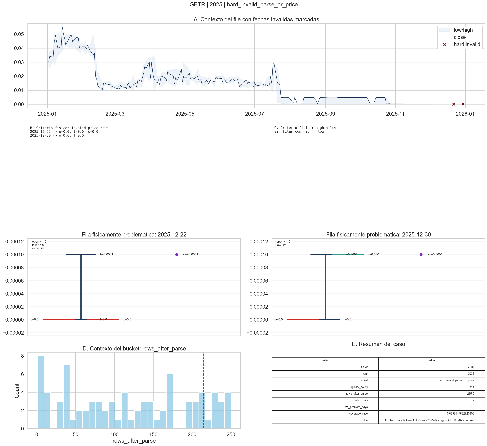

## HGEN 2023

ticker: `HGEN`  
year: `2023`  
bucket: `hard_invalid_parse_or_price`  
quality_policy: `bad`  
issues: `["negative_or_zero_ohlc_rows", "vw_outside_range_severe"]`  
warns: `["dataset_read_incompatible_schema", "schema_merge_conflict_ticker_encoding"]`  
file: `D:\ohlcv_daily\ticker=HGEN\year=2023\day_aggs_HGEN_2023.parquet`

### Analisis Forense

En `hard_invalid_parse_or_price` la pregunta ya no es si el caso merece flag, sino si la barra diaria sigue siendo interpretable como hecho de mercado. La respuesta aqui es no. Las primeras fechas exportadas (`2023-02-14`) ayudan a ver si el dano esta concentrado en un bloque temporal o disperso en el ano. En estos files la figura no representa una sesion tensa o iliquida, sino una barra que deja de tener semantica estable: cero estructural, parseo invalido o contradiccion de precios suficiente para romper la confianza minima en la observacion.

Por eso la decision correcta es `bad` y no `recoverable_with_flag`. Si este tipo de fila entra en `backtest_core`, el dano no es solo estadistico; es semantico. Contamina retornos, labels, benchmarks y cualquier reconciliacion con terceros porque ya no sabemos si la barra resume mercado o artefacto. Implicacion operativa: preservar para `forensic_only` o futura reconstruccion, pero no reutilizar como dato normal. El error que se evita es tratar ausencia de precios validos como si fuera simplemente una cola extrema del mercado.

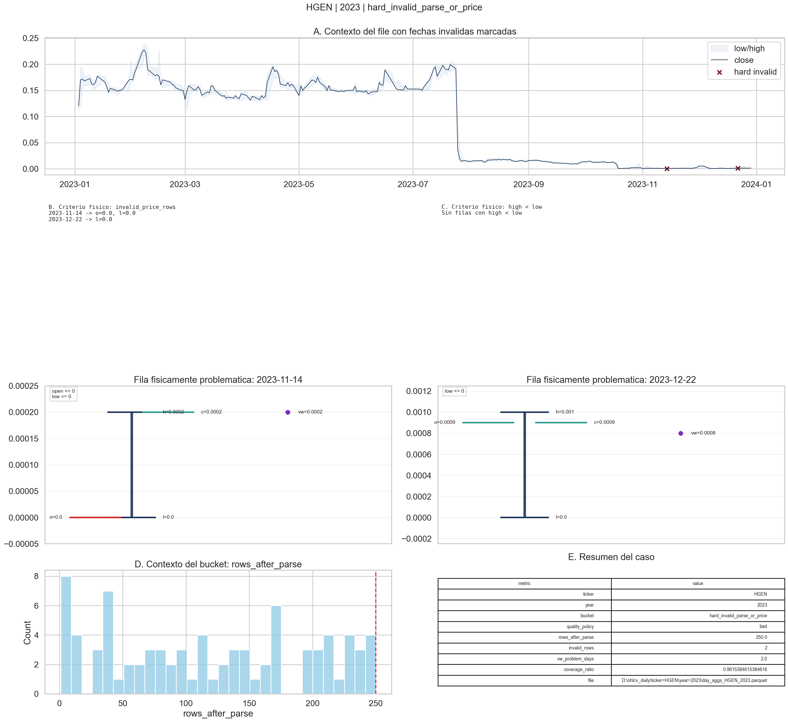

## OCEA 2025

ticker: `OCEA`  
year: `2025`  
bucket: `hard_invalid_parse_or_price`  
quality_policy: `bad`  
issues: `["negative_or_zero_ohlc_rows", "vw_outside_range_severe"]`  
warns: `["dataset_read_incompatible_schema", "schema_merge_conflict_ticker_encoding"]`  
file: `D:\ohlcv_daily\ticker=OCEA\year=2025\day_aggs_OCEA_2025.parquet`

### Analisis Forense

En `hard_invalid_parse_or_price` la pregunta ya no es si el caso merece flag, sino si la barra diaria sigue siendo interpretable como hecho de mercado. La respuesta aqui es no. Las primeras fechas exportadas (`2025-04-22`) ayudan a ver si el dano esta concentrado en un bloque temporal o disperso en el ano. En estos files la figura no representa una sesion tensa o iliquida, sino una barra que deja de tener semantica estable: cero estructural, parseo invalido o contradiccion de precios suficiente para romper la confianza minima en la observacion.

Por eso la decision correcta es `bad` y no `recoverable_with_flag`. Si este tipo de fila entra en `backtest_core`, el dano no es solo estadistico; es semantico. Contamina retornos, labels, benchmarks y cualquier reconciliacion con terceros porque ya no sabemos si la barra resume mercado o artefacto. Implicacion operativa: preservar para `forensic_only` o futura reconstruccion, pero no reutilizar como dato normal. El error que se evita es tratar ausencia de precios validos como si fuera simplemente una cola extrema del mercado.

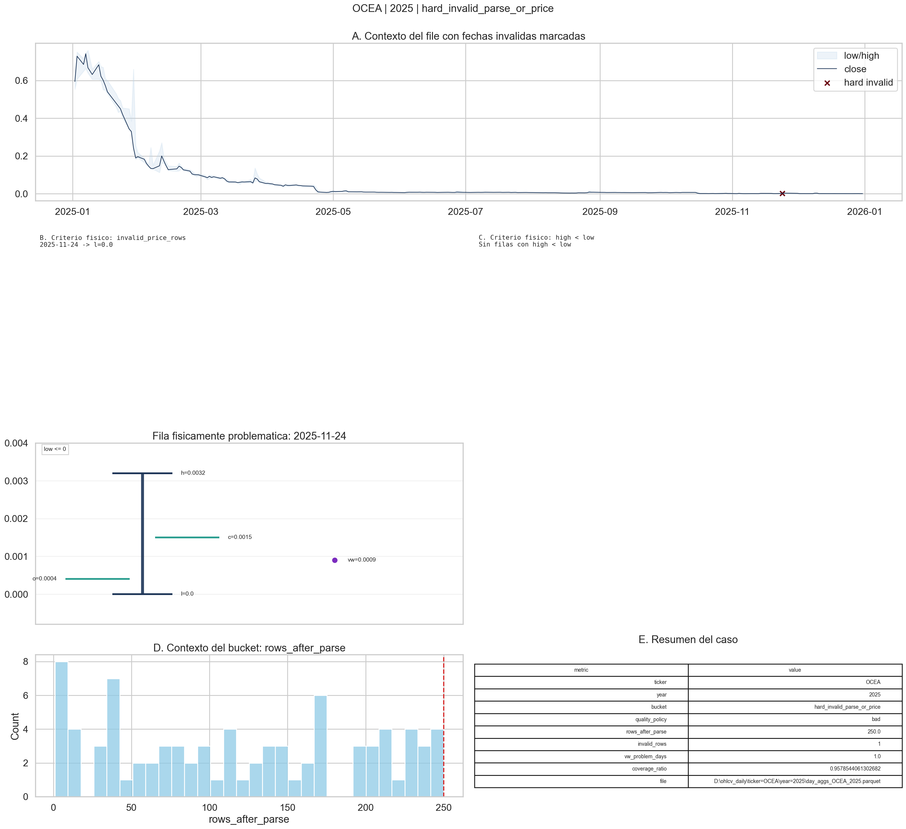
