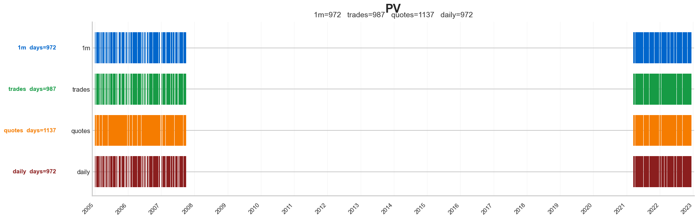
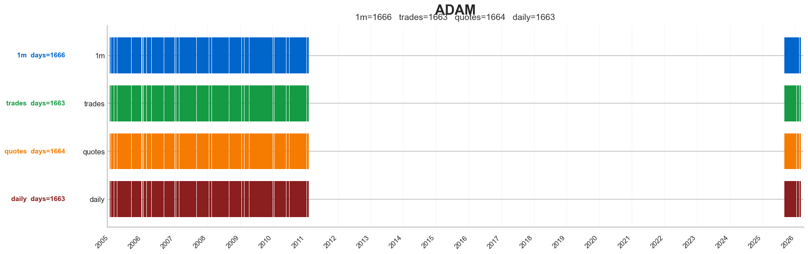
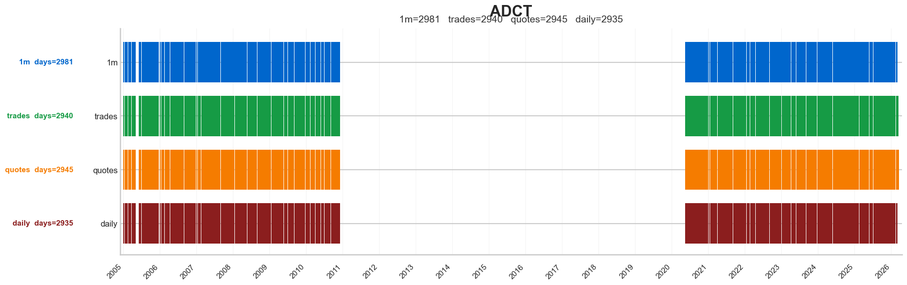
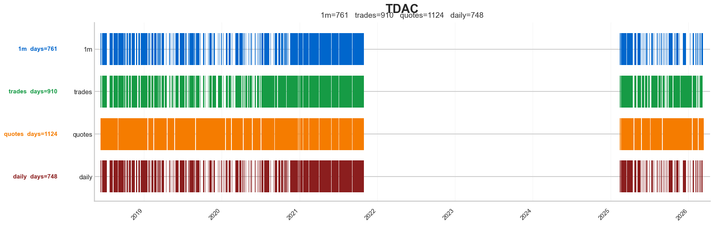
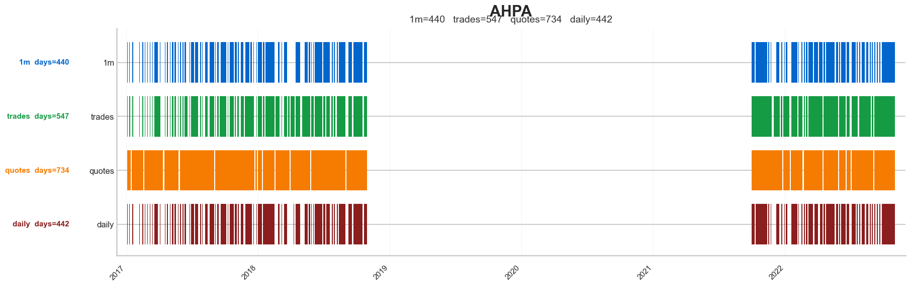

# Daily Coverage Cases v0.1

## 1. Rol del dossier

Este dossier cierra la deuda visual de `coverage` en `daily`.

Su objetivo no es reabrir toda la auditoria historica. Su objetivo es demostrar, con ejemplos visuales concretos, que la frontera de `coverage` no es homogenea y que no debe leerse como si todo gap fuera fallo duro de `daily`.

La evidencia base reutilizada aqui procede de:

- `01_research/01_auditoria_RAW_DATA/00_data_certification/auditoria/daily/02_diseno_implementacion_daily_v2.md`
- `01_research/01_auditoria_RAW_DATA/00_data_certification/auditoria/daily/img/001.png` a `007.png`
- `01_research/01_auditoria_RAW_DATA/00_data_certification/certification/daily/01_daily_recovery_and_coverage.md`

## 2. Punto de partida institucional

La auditoria historica deja tres buckets de coverage:

- `LIKELY_VALID_GAP_ONLY = 374`
- `AMBIGUOUS_REVIEW = 222`
- `REALLY_PROBLEMATIC_UNEXPECTED = 57`

La lectura correcta de estos numeros no es:

- `653` tickers sin `complete_daily` equivalen a `653` fallos duros.

La lectura correcta es:

- la mayor parte del faltante de `coverage` ya parece compatible con gaps coherentes entre universos o con ventanas de referencia parciales;
- una franja intermedia sigue necesitando flag;
- y una cola mas pequena continua abierta como frontera real de revision.

## 3. Hallazgo fuerte de la auditoria historica

El pasaje decisivo del diseno historico dice, en esencia, tres cosas:

- `daily` no parece roto en solitario;
- muchos de los `57` abiertos parecen gaps de ventana o referencia, no missing duro exclusivo de `daily`;
- y visualmente los ejemplos se separan en dos familias.

### Familia A: alineados

Caracteristicas:

- `daily` replica la estructura temporal gruesa de `1m`, `quotes` y `trades`;
- los huecos grandes aparecen alineados entre universos;
- no hay motivo fuerte para seguir tratandolos como problema especifico de `daily`.

Consecuencia institucional:

- estos casos apoyan `recoverable_without_penalty`.
- el error metodologico que evitan es sobrepenalizar `daily` por faltantes que, en realidad, reflejan la misma frontera temporal de otros universos.

### Familia B: desalineacion moderada

Caracteristicas:

- `quotes` y `trades` suelen tener algo mas de cobertura que `daily`;
- `1m` y `daily` siguen bastante alineados entre si;
- no se observa una ruptura grotesca ni un vacio absurdo exclusivo de `daily`.

Consecuencia institucional:

- estos casos apoyan `recoverable_with_flag` o, como minimo, exclusion de `bad` automatico.
- el error metodologico que evitan es tratar diferencias moderadas de borde temporal como si fueran corrupcion semantica de la barra diaria.

## 4. Familia A: ejemplos alineados

### 4.1 CMPX

Lectura analitica:

- los cuatro universos muestran esencialmente la misma topologia temporal;
- no se ve un bloque presente en `quotes` o `trades` y ausente solo en `daily`;
- por tanto, el gap no identifica deterioro especifico del dataset diario.

Consecuencia operativa:

- este patron es compatible con `recoverable_without_penalty`;
- no debe degradar por si solo ni `backtest_core` ni labels diarios.

### 4.2 PV

Lectura analitica:

- la estructura temporal gruesa vuelve a coincidir entre universos;
- lo que parece un hueco en `daily` es, en realidad, una frontera compartida del ecosistema de datos.

Consecuencia operativa:

- este tipo de visual protege al inspector contra el falso positivo de `missing diario`;
- refuerza la idea de que una parte material del faltante es coherente con la ventana de referencia disponible.

### 4.3 ADAM

Lectura analitica:

- la figura muestra convergencia fuerte entre `daily`, `1m`, `quotes` y `trades`;
- si existe deterioro, no se concentra en `daily` de forma aislada.

Consecuencia operativa:

- no hay base suficiente para mandar este patron a `bad` ni a `review_not_rehabilitated` solo por coverage;
- la lectura prudente es `recoverable_without_penalty`.

### 4.4 ADCT

Lectura analitica:

- el caso vuelve a ensenar una frontera temporal compartida;
- la cobertura no es perfecta, pero la forma del faltante no apunta a ruptura exclusiva de `daily`.

Consecuencia operativa:

- este ejemplo confirma que la familia alineada no es anecdota aislada;
- apoya una decision institucional de no bloquear el cierre global por esta clase de gaps.

## 5. Familia B: desalineacion moderada

### 5.1 TDAC

Lectura analitica:

- `quotes` y `trades` parecen algo mas ricos en cobertura;
- `daily` y `1m` siguen bastante alineados entre si;
- la discrepancia parece de borde temporal o de ecosistema parcial, no de colapso semantico de `daily`.

Consecuencia operativa:

- este patron no es suficientemente fuerte para `bad`;
- pero tampoco es tan limpio como para ausencia total de flag;
- encaja en `recoverable_with_flag`.

### 5.2 AHPA

Lectura analitica:

- la diferencia de cobertura existe, pero no rompe la inteligibilidad general del ticker;
- la imagen no apoya un vacio absurdo o grotesco exclusivo de `daily`.

Consecuencia operativa:

- obliga a avisar que la representacion diaria puede ser menos rica que otros universos;
- pero sigue siendo excesivo tratarlo como fallo terminal del dataset.

### 5.3 MACQ

Lectura analitica:

- este es uno de los ejemplos mas sensibles, porque la diferencia visual con `quotes` y `trades` es mayor;
- aun asi, la imagen no demuestra por si sola un `daily` roto en solitario;
- demuestra mas bien una frontera donde la revision manual sigue siendo legitima.

Consecuencia operativa:

- este tipo de caso justifica que siga existiendo una cola `review_not_rehabilitated`;
- pero tambien justifica que esa cola no se extrapole a todo el bloque de `coverage`.

## 6. Que prueba realmente este dossier

Este dossier no prueba que todos los `57` abiertos queden ya rehabilitados.

Prueba algo mas concreto y muy importante:

- el bloque abierto de `coverage` no es homogeneo;
- una parte material de la evidencia visual historica favorece una lectura de `gap coherente entre universos`;
- y la frontera abierta debe reservarse para un subconjunto pequeno y no para todo faltante de `daily`.

## 7. Traduccion institucional

Lectura final que debe hacer el inspector:

- `LIKELY_VALID_GAP_ONLY` tiene respaldo visual suficiente para `recoverable_without_penalty`;
- `AMBIGUOUS_REVIEW` tiene respaldo visual suficiente para `recoverable_with_flag`;
- `REALLY_PROBLEMATIC_UNEXPECTED` sigue siendo una cola abierta, pero este mismo material historico sugiere que no toda esa cola puede leerse con la misma dureza sin revision adicional.

## 8. Consecuencia para el proyecto

Con este dossier, `daily` deja de depender solo de la semantica escrita de `certification/daily` y pasa a tener tambien evidencia visual institucionalizada de coverage dentro de `01_foundations`.

Eso cierra el error mas peligroso de lectura del bloque:

- confundir faltante de coverage con barra diaria semanticamente invalida.
