# Daily Non Good Quality Cases v0.1

Este documento recopila los casos `non_good_quality` de `daily` tras excluir explicitamente el bloque `bad` / `hard_invalid_parse_or_price`.

La regla de pertenencia de este dossier es mutuamente excluyente respecto de `bad`:

- entra aqui un `ticker-year file` si su `quality_policy` no es `good` y su `daily_refined_bucket` no es `hard_invalid_parse_or_price`;
- por tanto, este dossier cubre la franja contractual `recoverable_with_flag` y sus equivalentes historicos `review`.

## Menu

- 1. [AREB 2021](#areb-2021)
- 2. [PEGR 2021](#pegr-2021)
- 3. [XAN 2007](#xan-2007)
- 4. [NMRD 2026](#nmrd-2026)
- 5. [GPAC 2024](#gpac-2024)
- 6. [FATBB 2023](#fatbb-2023)
- 7. [CNNB 2022](#cnnb-2022)
- 8. [GCTK 2022](#gctk-2022)
- 9. [STAF 2015](#staf-2015)
- 10. [LGMK 2026](#lgmk-2026)
- 11. [AUBN 2022](#aubn-2022)
- 12. [BNZI 2023](#bnzi-2023)
- 13. [TRNR 2024](#trnr-2024)
- 14. [TGL 2023](#tgl-2023)
- 15. [TCI 2019](#tci-2019)
- 16. [BYFC 2025](#byfc-2025)
- 17. [CIZN 2016](#cizn-2016)
- 18. [PSAG 2022](#psag-2022)
- 19. [GRI 2019](#gri-2019)
- 20. [KBSF 2014](#kbsf-2014)
- 21. [FATBB 2025](#fatbb-2025)
- 22. [GDHG 2023](#gdhg-2023)
- 23. [ACAH 2021](#acah-2021)
- 24. [SSKN 2026](#sskn-2026)
- 25. [ASTI 2016](#asti-2016)
- 26. [ADTX 2021](#adtx-2021)
- 27. [WHLR 2021](#whlr-2021)
- 28. [WHLR 2022](#whlr-2022)
- 29. [PBLA 2020](#pbla-2020)
- 30. [JRSH 2018](#jrsh-2018)
- 31. [MRDB 2024](#mrdb-2024)
- 32. [VBIV 2014](#vbiv-2014)
- 33. [BOXD 2023](#boxd-2023)
- 34. [JXG 2025](#jxg-2025)
- 35. [ALZN 2024](#alzn-2024)
- 36. [MDXG 2023](#mdxg-2023)
- 37. [SHCA 2021](#shca-2021)
- 38. [MODD 2021](#modd-2021)
- 39. [SCMA 2021](#scma-2021)
- 40. [BSTG 2021](#bstg-2021)
- 41. [MGAM 2026](#mgam-2026)
- 42. [DAAQ 2025](#daaq-2025)
- 43. [GDEV 2021](#gdev-2021)
- 44. [ACRV 2023](#acrv-2023)
- 45. [GYRO 2007](#gyro-2007)
- 46. [VYGR 2017](#vygr-2017)
- 47. [NTN 2013](#ntn-2013)
- 48. [SYRS 2019](#syrs-2019)

## AREB 2021

ticker: `AREB`  
year: `2021`  
bucket: `vw_high_ratio_illiquid_regime`  
quality_policy: `recoverable_with_flag`  
issues: `["vw_outside_range_severe"]`  
warns: `["dataset_read_incompatible_schema", "rows_lt_10", "schema_merge_conflict_ticker_encoding", "suspicious_sparse_year"]`  
file: `D:\ohlcv_daily\ticker=AREB\year=2021\day_aggs_AREB_2021.parquet`

### Analisis Forense

Aqui la figura ya no prueba un extremo aislado, sino una contaminacion amplia del ano por desalineacion `vw`. Cuando la proporcion afectada sube a `100.000000%` y el coverage cae a `0.003831`, el problema deja de ser una curiosidad visual y pasa a describir un regimen de iliquidez o ano demasiado escaso para tratarse como barra diaria limpia.

La decision `recoverable_with_flag` evita dos errores opuestos. El primero seria tratar estas barras como `good` y convertir episodios de iliquidez en retorno normal de mercado. El segundo seria expulsarlas como `bad` aunque el parseo siga siendo interpretable y no haya colapso duro de precio. Implicacion operativa: no deben alimentar `backtest_core` ni labels diarios por defecto; si se usan, debe ser en sensibilidad, modelos de calidad de datos o estudios de iliquidez donde precisamente interesa medir este dano.

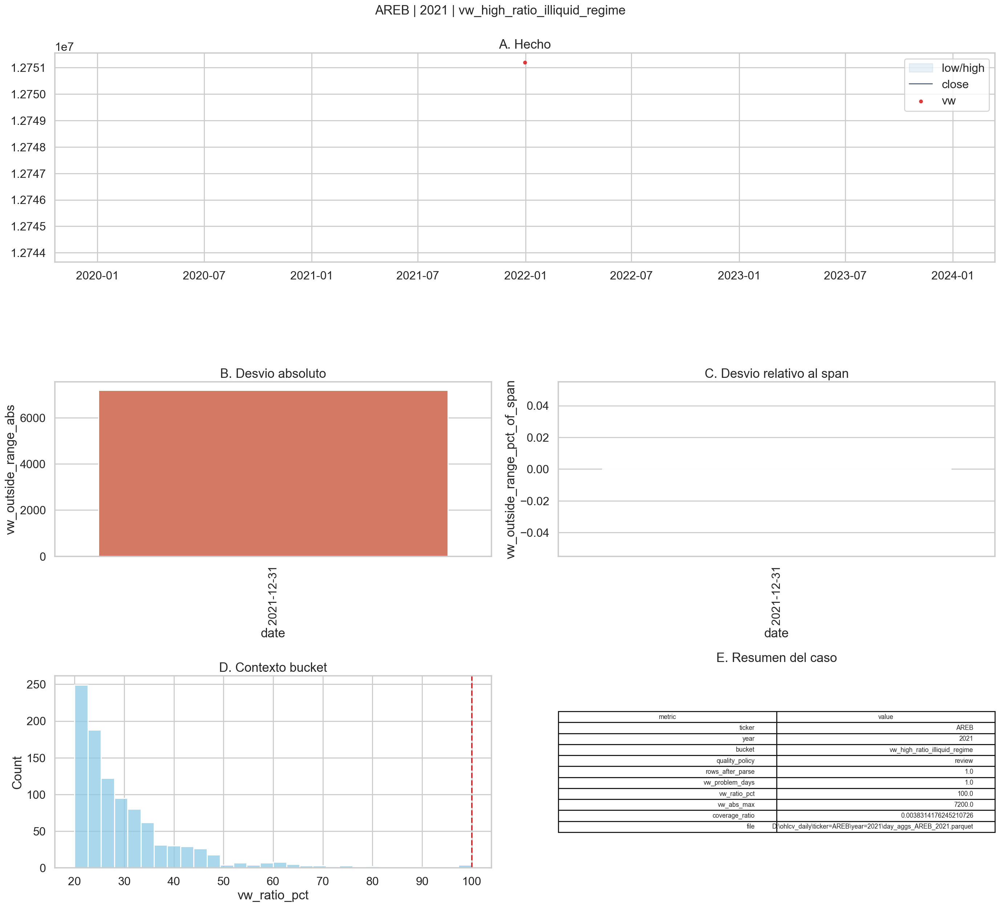

## PEGR 2021

ticker: `PEGR`  
year: `2021`  
bucket: `vw_high_ratio_illiquid_regime`  
quality_policy: `recoverable_with_flag`  
issues: `["vw_outside_range_severe"]`  
warns: `["dataset_read_incompatible_schema", "rows_lt_10", "schema_merge_conflict_ticker_encoding", "suspicious_sparse_year"]`  
file: `D:\ohlcv_daily\ticker=PEGR\year=2021\day_aggs_PEGR_2021.parquet`

### Analisis Forense

Aqui la figura ya no prueba un extremo aislado, sino una contaminacion amplia del ano por desalineacion `vw`. Cuando la proporcion afectada sube a `100.000000%` y el coverage cae a `0.015326`, el problema deja de ser una curiosidad visual y pasa a describir un regimen de iliquidez o ano demasiado escaso para tratarse como barra diaria limpia.

La decision `recoverable_with_flag` evita dos errores opuestos. El primero seria tratar estas barras como `good` y convertir episodios de iliquidez en retorno normal de mercado. El segundo seria expulsarlas como `bad` aunque el parseo siga siendo interpretable y no haya colapso duro de precio. Implicacion operativa: no deben alimentar `backtest_core` ni labels diarios por defecto; si se usan, debe ser en sensibilidad, modelos de calidad de datos o estudios de iliquidez donde precisamente interesa medir este dano.

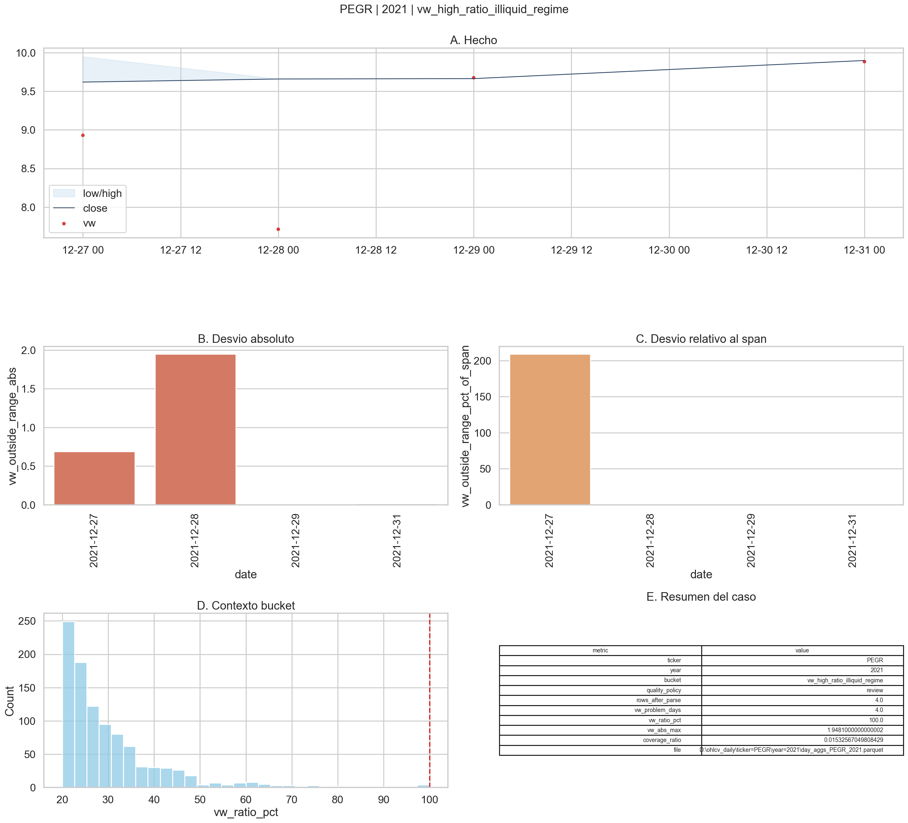

## XAN 2007

ticker: `XAN`  
year: `2007`  
bucket: `vw_high_ratio_illiquid_regime`  
quality_policy: `recoverable_with_flag`  
issues: `["vw_outside_range_severe"]`  
warns: `["dataset_read_incompatible_schema", "rows_lt_10", "schema_merge_conflict_ticker_encoding", "suspicious_sparse_year"]`  
file: `D:\ohlcv_daily\ticker=XAN\year=2007\day_aggs_XAN_2007.parquet`

### Analisis Forense

Aqui la figura ya no prueba un extremo aislado, sino una contaminacion amplia del ano por desalineacion `vw`. Cuando la proporcion afectada sube a `100.000000%` y el coverage cae a `0.003831`, el problema deja de ser una curiosidad visual y pasa a describir un regimen de iliquidez o ano demasiado escaso para tratarse como barra diaria limpia.

La decision `recoverable_with_flag` evita dos errores opuestos. El primero seria tratar estas barras como `good` y convertir episodios de iliquidez en retorno normal de mercado. El segundo seria expulsarlas como `bad` aunque el parseo siga siendo interpretable y no haya colapso duro de precio. Implicacion operativa: no deben alimentar `backtest_core` ni labels diarios por defecto; si se usan, debe ser en sensibilidad, modelos de calidad de datos o estudios de iliquidez donde precisamente interesa medir este dano.

## NMRD 2026

ticker: `NMRD`  
year: `2026`  
bucket: `vw_high_ratio_illiquid_regime`  
quality_policy: `recoverable_with_flag`  
issues: `["vw_outside_range_severe"]`  
warns: `["dataset_read_incompatible_schema", "rows_lt_10", "schema_merge_conflict_ticker_encoding", "suspicious_sparse_year"]`  
file: `D:\ohlcv_daily\ticker=NMRD\year=2026\day_aggs_NMRD_2026.parquet`

### Analisis Forense

Aqui la figura ya no prueba un extremo aislado, sino una contaminacion amplia del ano por desalineacion `vw`. Cuando la proporcion afectada sube a `100.000000%` y el coverage cae a `0.003831`, el problema deja de ser una curiosidad visual y pasa a describir un regimen de iliquidez o ano demasiado escaso para tratarse como barra diaria limpia.

La decision `recoverable_with_flag` evita dos errores opuestos. El primero seria tratar estas barras como `good` y convertir episodios de iliquidez en retorno normal de mercado. El segundo seria expulsarlas como `bad` aunque el parseo siga siendo interpretable y no haya colapso duro de precio. Implicacion operativa: no deben alimentar `backtest_core` ni labels diarios por defecto; si se usan, debe ser en sensibilidad, modelos de calidad de datos o estudios de iliquidez donde precisamente interesa medir este dano.

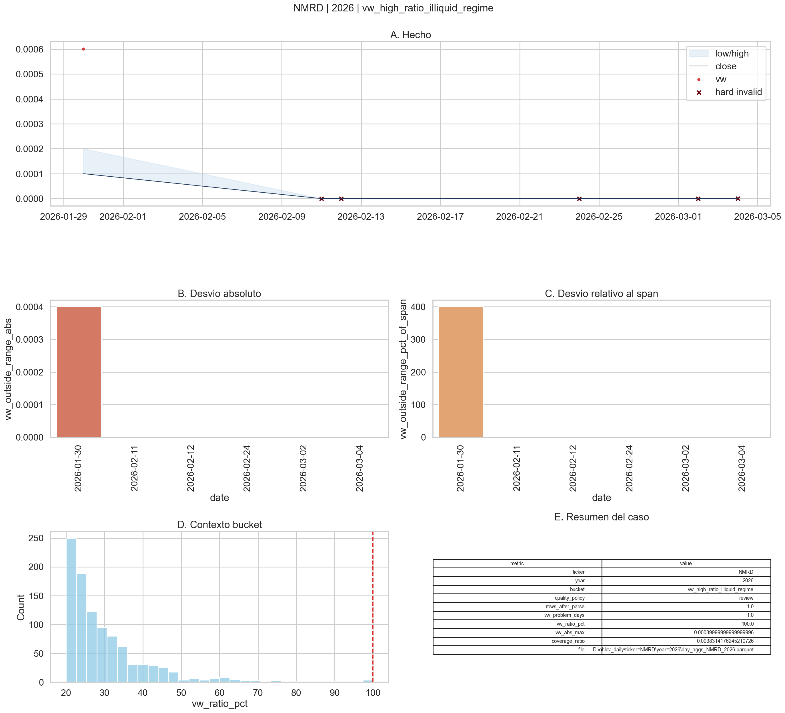

## GPAC 2024

ticker: `GPAC`  
year: `2024`  
bucket: `vw_high_ratio_illiquid_regime`  
quality_policy: `recoverable_with_flag`  
issues: `["vw_outside_range_severe"]`  
warns: `["dataset_read_incompatible_schema", "schema_merge_conflict_ticker_encoding", "suspicious_sparse_year"]`  
file: `D:\ohlcv_daily\ticker=GPAC\year=2024\day_aggs_GPAC_2024.parquet`

### Analisis Forense

Aqui la figura ya no prueba un extremo aislado, sino una contaminacion amplia del ano por desalineacion `vw`. Cuando la proporcion afectada sube a `44.776119%` y el coverage cae a `0.255725`, el problema deja de ser una curiosidad visual y pasa a describir un regimen de iliquidez o ano demasiado escaso para tratarse como barra diaria limpia.

La decision `recoverable_with_flag` evita dos errores opuestos. El primero seria tratar estas barras como `good` y convertir episodios de iliquidez en retorno normal de mercado. El segundo seria expulsarlas como `bad` aunque el parseo siga siendo interpretable y no haya colapso duro de precio. Implicacion operativa: no deben alimentar `backtest_core` ni labels diarios por defecto; si se usan, debe ser en sensibilidad, modelos de calidad de datos o estudios de iliquidez donde precisamente interesa medir este dano.

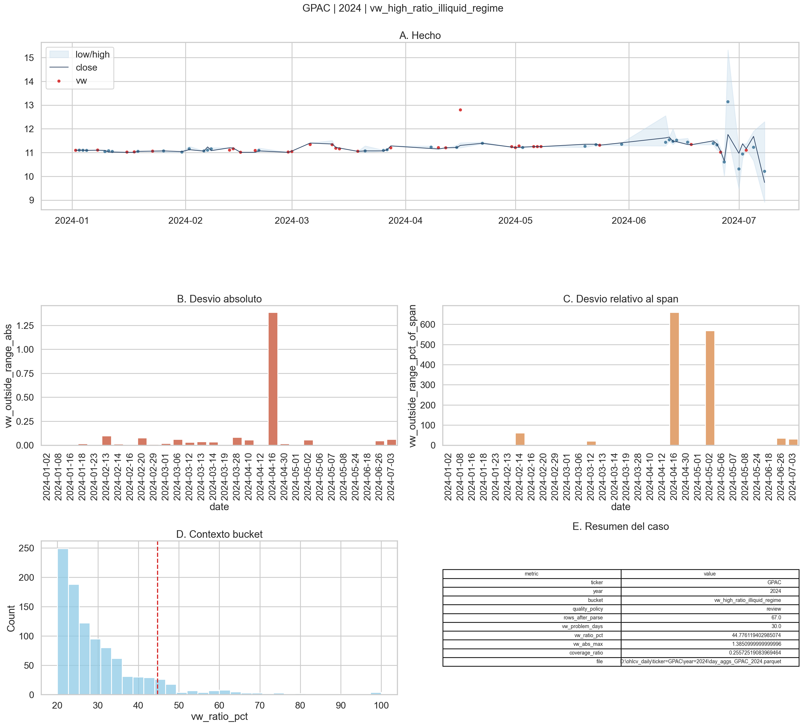

## FATBB 2023

ticker: `FATBB`  
year: `2023`  
bucket: `vw_high_ratio_illiquid_regime`  
quality_policy: `recoverable_with_flag`  
issues: `["vw_outside_range_severe"]`  
warns: `["dataset_read_incompatible_schema", "schema_merge_conflict_ticker_encoding"]`  
file: `D:\ohlcv_daily\ticker=FATBB\year=2023\day_aggs_FATBB_2023.parquet`

### Analisis Forense

Aqui la figura ya no prueba un extremo aislado, sino una contaminacion amplia del ano por desalineacion `vw`. Cuando la proporcion afectada sube a `36.612022%` y el coverage cae a `0.703846`, el problema deja de ser una curiosidad visual y pasa a describir un regimen de iliquidez o ano demasiado escaso para tratarse como barra diaria limpia.

La decision `recoverable_with_flag` evita dos errores opuestos. El primero seria tratar estas barras como `good` y convertir episodios de iliquidez en retorno normal de mercado. El segundo seria expulsarlas como `bad` aunque el parseo siga siendo interpretable y no haya colapso duro de precio. Implicacion operativa: no deben alimentar `backtest_core` ni labels diarios por defecto; si se usan, debe ser en sensibilidad, modelos de calidad de datos o estudios de iliquidez donde precisamente interesa medir este dano.

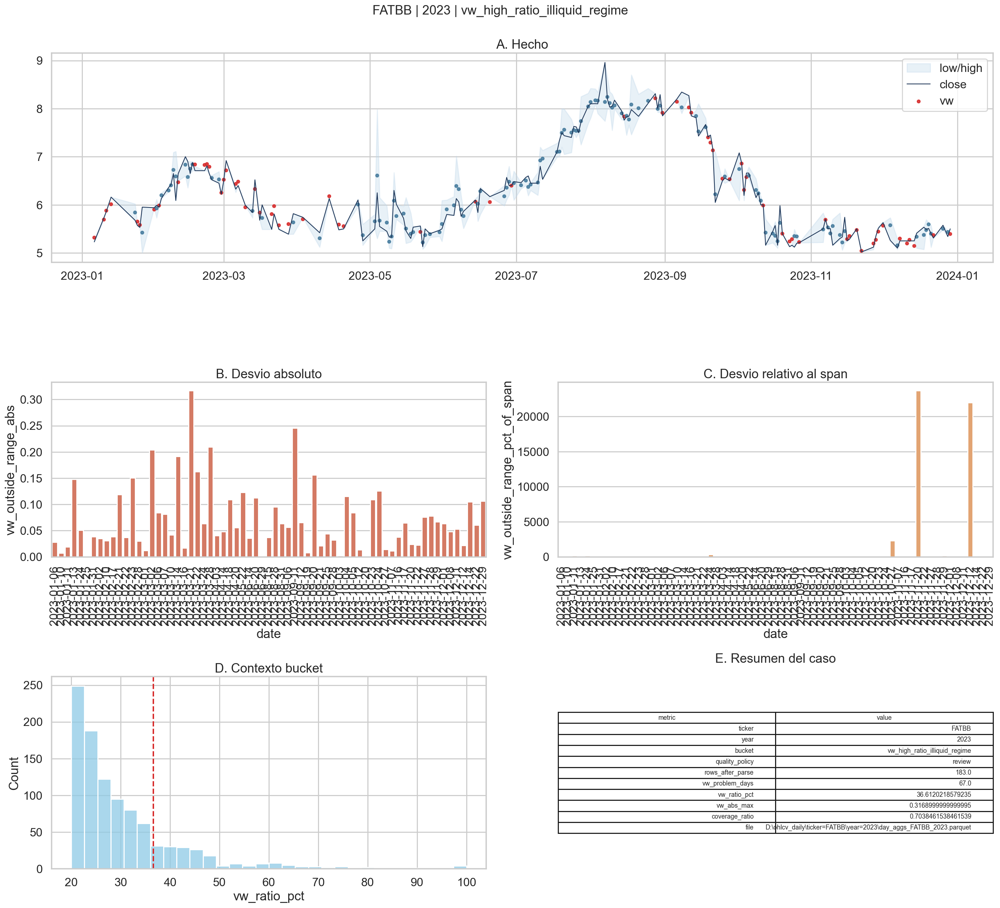

## CNNB 2022

ticker: `CNNB`  
year: `2022`  
bucket: `vw_high_ratio_illiquid_regime`  
quality_policy: `recoverable_with_flag`  
issues: `["vw_outside_range_severe"]`  
warns: `["dataset_read_incompatible_schema", "schema_merge_conflict_ticker_encoding"]`  
file: `D:\ohlcv_daily\ticker=CNNB\year=2022\day_aggs_CNNB_2022.parquet`

### Analisis Forense

Aqui la figura ya no prueba un extremo aislado, sino una contaminacion amplia del ano por desalineacion `vw`. Cuando la proporcion afectada sube a `35.638298%` y el coverage cae a `0.723077`, el problema deja de ser una curiosidad visual y pasa a describir un regimen de iliquidez o ano demasiado escaso para tratarse como barra diaria limpia.

La decision `recoverable_with_flag` evita dos errores opuestos. El primero seria tratar estas barras como `good` y convertir episodios de iliquidez en retorno normal de mercado. El segundo seria expulsarlas como `bad` aunque el parseo siga siendo interpretable y no haya colapso duro de precio. Implicacion operativa: no deben alimentar `backtest_core` ni labels diarios por defecto; si se usan, debe ser en sensibilidad, modelos de calidad de datos o estudios de iliquidez donde precisamente interesa medir este dano.

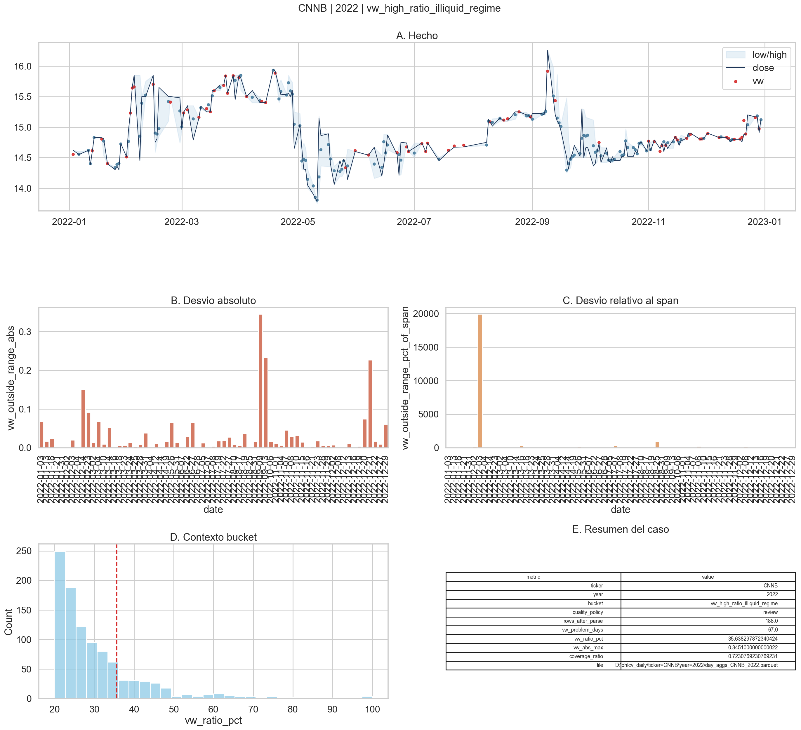

## GCTK 2022

ticker: `GCTK`  
year: `2022`  
bucket: `vw_high_ratio_illiquid_regime`  
quality_policy: `recoverable_with_flag`  
issues: `["vw_outside_range_severe"]`  
warns: `["dataset_read_incompatible_schema", "schema_merge_conflict_ticker_encoding"]`  
file: `D:\ohlcv_daily\ticker=GCTK\year=2022\day_aggs_GCTK_2022.parquet`

### Analisis Forense

Aqui la figura ya no prueba un extremo aislado, sino una contaminacion amplia del ano por desalineacion `vw`. Cuando la proporcion afectada sube a `24.000000%` y el coverage cae a `0.576923`, el problema deja de ser una curiosidad visual y pasa a describir un regimen de iliquidez o ano demasiado escaso para tratarse como barra diaria limpia.

La decision `recoverable_with_flag` evita dos errores opuestos. El primero seria tratar estas barras como `good` y convertir episodios de iliquidez en retorno normal de mercado. El segundo seria expulsarlas como `bad` aunque el parseo siga siendo interpretable y no haya colapso duro de precio. Implicacion operativa: no deben alimentar `backtest_core` ni labels diarios por defecto; si se usan, debe ser en sensibilidad, modelos de calidad de datos o estudios de iliquidez donde precisamente interesa medir este dano.

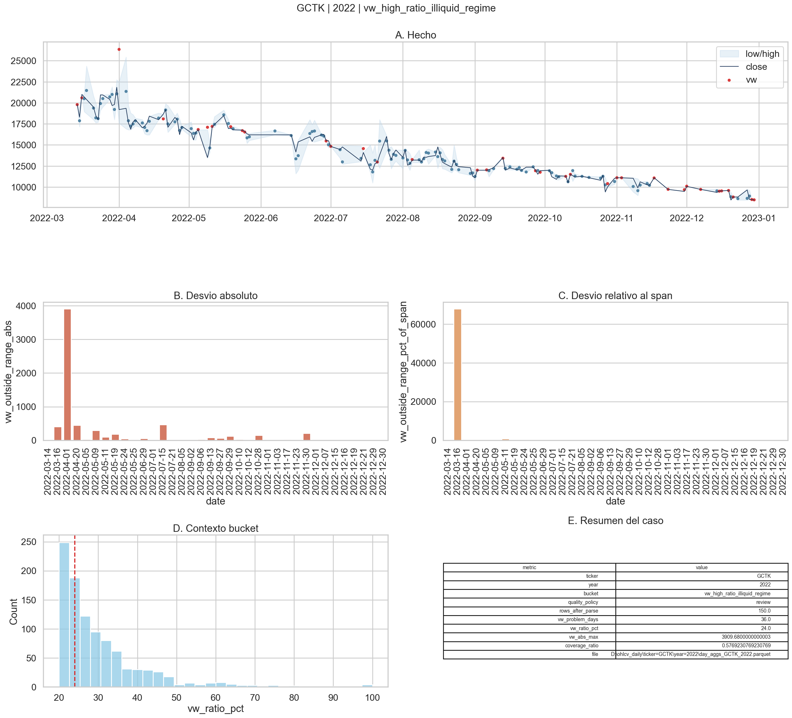

## STAF 2015

ticker: `STAF`  
year: `2015`  
bucket: `vw_high_ratio_illiquid_regime`  
quality_policy: `recoverable_with_flag`  
issues: `["vw_outside_range_severe"]`  
warns: `["dataset_read_incompatible_schema", "schema_merge_conflict_ticker_encoding", "suspicious_sparse_year"]`  
file: `D:\ohlcv_daily\ticker=STAF\year=2015\day_aggs_STAF_2015.parquet`

### Analisis Forense

Aqui la figura ya no prueba un extremo aislado, sino una contaminacion amplia del ano por desalineacion `vw`. Cuando la proporcion afectada sube a `26.315789%` y el coverage cae a `0.218391`, el problema deja de ser una curiosidad visual y pasa a describir un regimen de iliquidez o ano demasiado escaso para tratarse como barra diaria limpia.

La decision `recoverable_with_flag` evita dos errores opuestos. El primero seria tratar estas barras como `good` y convertir episodios de iliquidez en retorno normal de mercado. El segundo seria expulsarlas como `bad` aunque el parseo siga siendo interpretable y no haya colapso duro de precio. Implicacion operativa: no deben alimentar `backtest_core` ni labels diarios por defecto; si se usan, debe ser en sensibilidad, modelos de calidad de datos o estudios de iliquidez donde precisamente interesa medir este dano.

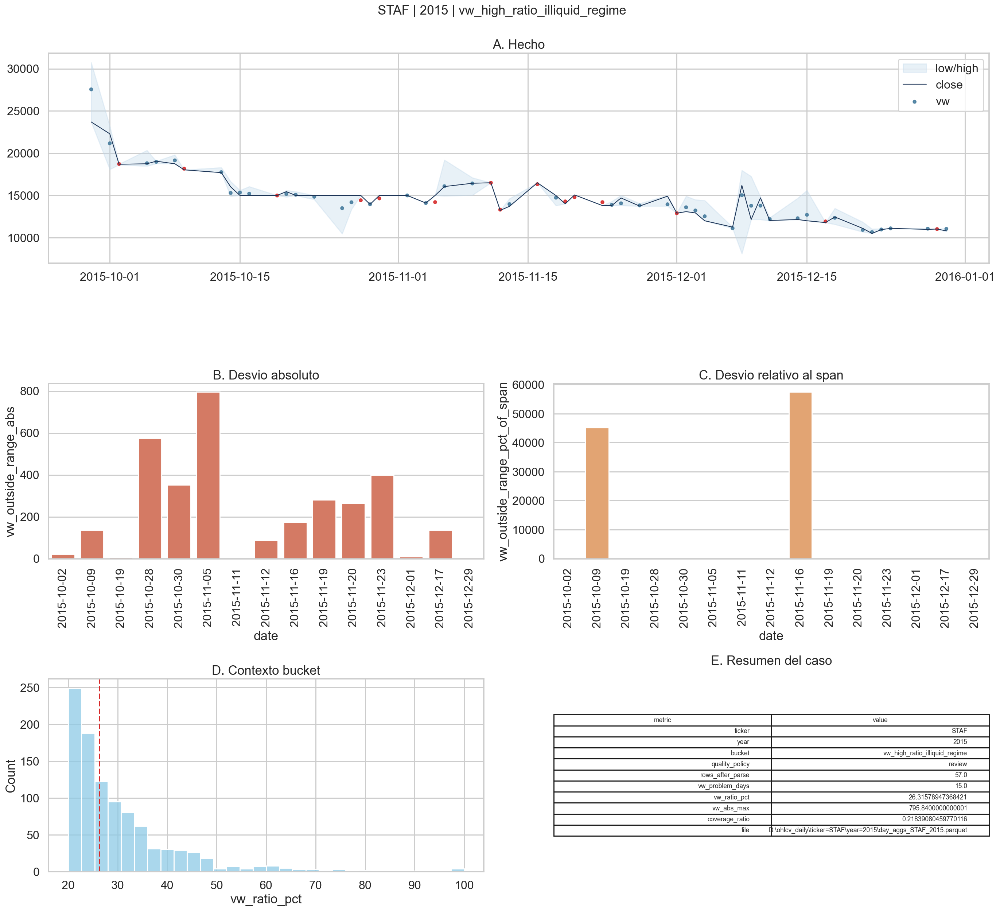

## LGMK 2026

ticker: `LGMK`  
year: `2026`  
bucket: `vw_high_ratio_illiquid_regime`  
quality_policy: `recoverable_with_flag`  
issues: `["vw_outside_range_severe"]`  
warns: `["dataset_read_incompatible_schema", "schema_merge_conflict_ticker_encoding", "suspicious_sparse_year"]`  
file: `D:\ohlcv_daily\ticker=LGMK\year=2026\day_aggs_LGMK_2026.parquet`

### Analisis Forense

Aqui la figura ya no prueba un extremo aislado, sino una contaminacion amplia del ano por desalineacion `vw`. Cuando la proporcion afectada sube a `26.315789%` y el coverage cae a `0.145594`, el problema deja de ser una curiosidad visual y pasa a describir un regimen de iliquidez o ano demasiado escaso para tratarse como barra diaria limpia.

La decision `recoverable_with_flag` evita dos errores opuestos. El primero seria tratar estas barras como `good` y convertir episodios de iliquidez en retorno normal de mercado. El segundo seria expulsarlas como `bad` aunque el parseo siga siendo interpretable y no haya colapso duro de precio. Implicacion operativa: no deben alimentar `backtest_core` ni labels diarios por defecto; si se usan, debe ser en sensibilidad, modelos de calidad de datos o estudios de iliquidez donde precisamente interesa medir este dano.

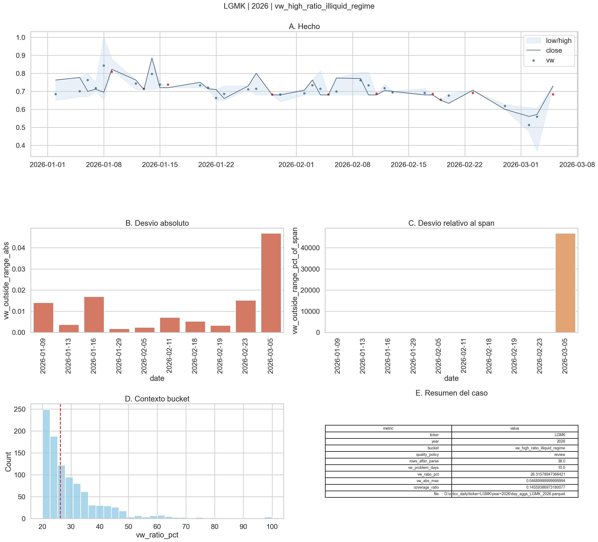

## AUBN 2022

ticker: `AUBN`  
year: `2022`  
bucket: `vw_high_ratio_illiquid_regime`  
quality_policy: `recoverable_with_flag`  
issues: `["vw_outside_range_severe"]`  
warns: `["dataset_read_incompatible_schema", "schema_merge_conflict_ticker_encoding"]`  
file: `D:\ohlcv_daily\ticker=AUBN\year=2022\day_aggs_AUBN_2022.parquet`

### Analisis Forense

Aqui la figura ya no prueba un extremo aislado, sino una contaminacion amplia del ano por desalineacion `vw`. Cuando la proporcion afectada sube a `22.072072%` y el coverage cae a `0.853846`, el problema deja de ser una curiosidad visual y pasa a describir un regimen de iliquidez o ano demasiado escaso para tratarse como barra diaria limpia.

La decision `recoverable_with_flag` evita dos errores opuestos. El primero seria tratar estas barras como `good` y convertir episodios de iliquidez en retorno normal de mercado. El segundo seria expulsarlas como `bad` aunque el parseo siga siendo interpretable y no haya colapso duro de precio. Implicacion operativa: no deben alimentar `backtest_core` ni labels diarios por defecto; si se usan, debe ser en sensibilidad, modelos de calidad de datos o estudios de iliquidez donde precisamente interesa medir este dano.

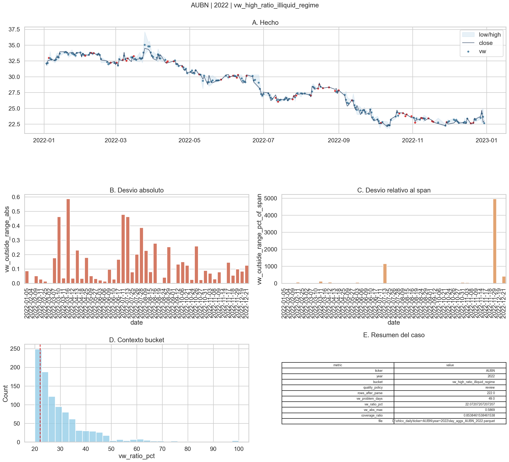

## BNZI 2023

ticker: `BNZI`  
year: `2023`  
bucket: `vw_high_ratio_illiquid_regime`  
quality_policy: `recoverable_with_flag`  
issues: `["vw_outside_range_severe"]`  
warns: `["dataset_read_incompatible_schema", "schema_merge_conflict_ticker_encoding", "suspicious_sparse_year"]`  
file: `D:\ohlcv_daily\ticker=BNZI\year=2023\day_aggs_BNZI_2023.parquet`

### Analisis Forense

Aqui la figura ya no prueba un extremo aislado, sino una contaminacion amplia del ano por desalineacion `vw`. Cuando la proporcion afectada sube a `20.000000%` y el coverage cae a `0.038462`, el problema deja de ser una curiosidad visual y pasa a describir un regimen de iliquidez o ano demasiado escaso para tratarse como barra diaria limpia.

La decision `recoverable_with_flag` evita dos errores opuestos. El primero seria tratar estas barras como `good` y convertir episodios de iliquidez en retorno normal de mercado. El segundo seria expulsarlas como `bad` aunque el parseo siga siendo interpretable y no haya colapso duro de precio. Implicacion operativa: no deben alimentar `backtest_core` ni labels diarios por defecto; si se usan, debe ser en sensibilidad, modelos de calidad de datos o estudios de iliquidez donde precisamente interesa medir este dano.

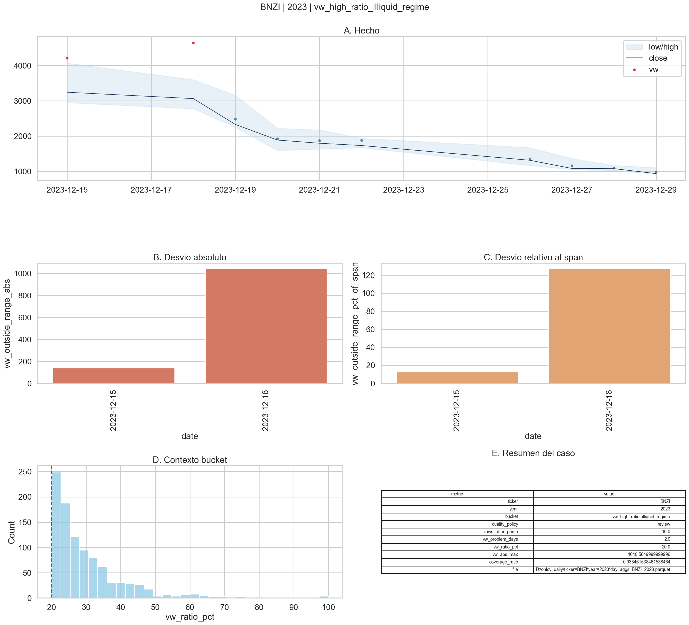

## TRNR 2024

ticker: `TRNR`  
year: `2024`  
bucket: `vw_mid_ratio_illiquid_regime`  
quality_policy: `recoverable_with_flag`  
issues: `["vw_outside_range_severe"]`  
warns: `["dataset_read_incompatible_schema", "schema_merge_conflict_ticker_encoding"]`  
file: `D:\ohlcv_daily\ticker=TRNR\year=2024\day_aggs_TRNR_2024.parquet`

### Analisis Forense

En `vw_mid_ratio_illiquid_regime` la imagen ensena un deterioro persistente pero no total. No estamos ante una cola de uno o dos dias, sino ante un subconjunto material del ano (`5.158730%`) donde `vw` deja de comportarse como referencia interna fiable. El punto importante para el inspector es que la patologia sobrevive al argumento de 'solo fue un accidente puntual'.

Eso cambia la decision operativa: el file conserva suficiente estructura para no ser `bad`, pero la frecuencia del dano es demasiado alta para dejarlo en `good`. Implicacion para pipeline: estas barras pueden servir como universo de robustez o como etiqueta de regimen deteriorado, pero degradan benchmark diario y objetivos de retorno si se mezclan sin flag con la franja sana. El error que se evita es subestimar la persistencia solo porque los precios siguen siendo parseables.

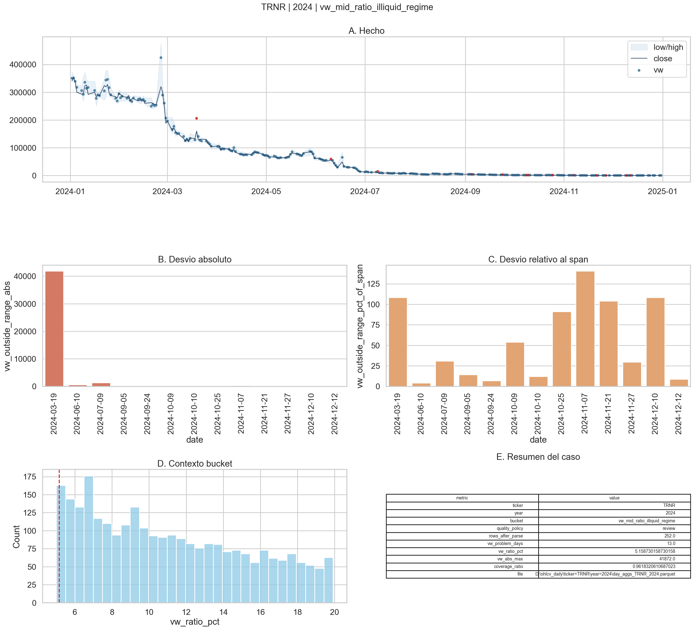

## TGL 2023

ticker: `TGL`  
year: `2023`  
bucket: `vw_mid_ratio_illiquid_regime`  
quality_policy: `recoverable_with_flag`  
issues: `["vw_outside_range_severe"]`  
warns: `["dataset_read_incompatible_schema", "schema_merge_conflict_ticker_encoding"]`  
file: `D:\ohlcv_daily\ticker=TGL\year=2023\day_aggs_TGL_2023.parquet`

### Analisis Forense

En `vw_mid_ratio_illiquid_regime` la imagen ensena un deterioro persistente pero no total. No estamos ante una cola de uno o dos dias, sino ante un subconjunto material del ano (`5.600000%`) donde `vw` deja de comportarse como referencia interna fiable. El punto importante para el inspector es que la patologia sobrevive al argumento de 'solo fue un accidente puntual'.

Eso cambia la decision operativa: el file conserva suficiente estructura para no ser `bad`, pero la frecuencia del dano es demasiado alta para dejarlo en `good`. Implicacion para pipeline: estas barras pueden servir como universo de robustez o como etiqueta de regimen deteriorado, pero degradan benchmark diario y objetivos de retorno si se mezclan sin flag con la franja sana. El error que se evita es subestimar la persistencia solo porque los precios siguen siendo parseables.

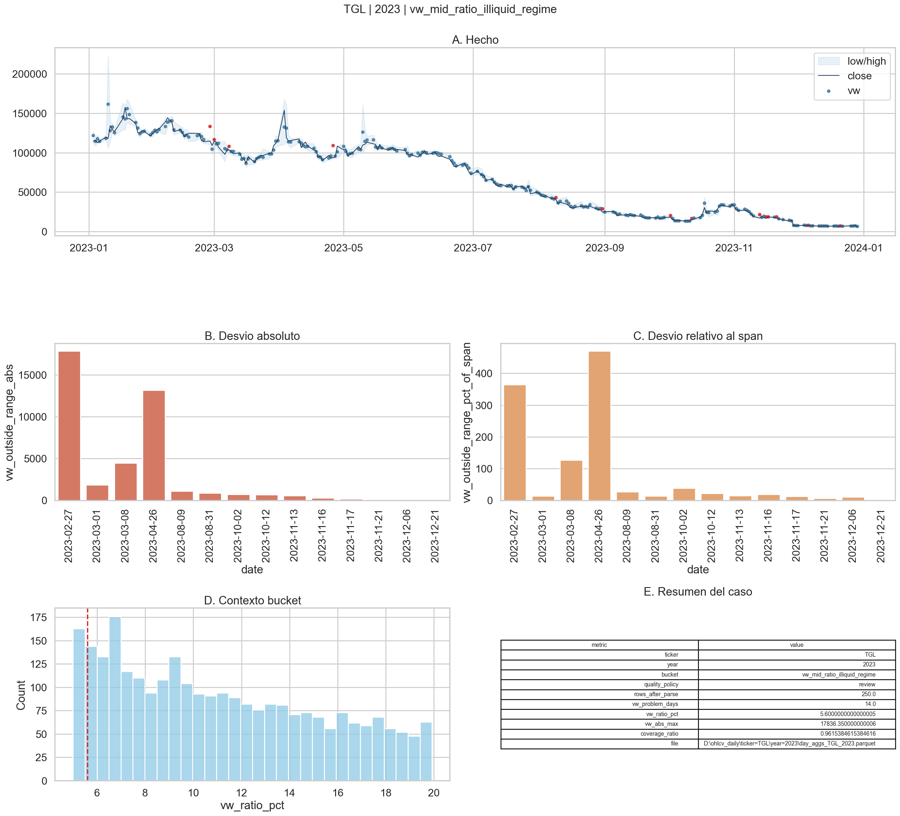

## TCI 2019

ticker: `TCI`  
year: `2019`  
bucket: `vw_mid_ratio_illiquid_regime`  
quality_policy: `recoverable_with_flag`  
issues: `["vw_outside_range_severe"]`  
warns: `["dataset_read_incompatible_schema", "schema_merge_conflict_ticker_encoding"]`  
file: `D:\ohlcv_daily\ticker=TCI\year=2019\day_aggs_TCI_2019.parquet`

### Analisis Forense

En `vw_mid_ratio_illiquid_regime` la imagen ensena un deterioro persistente pero no total. No estamos ante una cola de uno o dos dias, sino ante un subconjunto material del ano (`19.917012%`) donde `vw` deja de comportarse como referencia interna fiable. El punto importante para el inspector es que la patologia sobrevive al argumento de 'solo fue un accidente puntual'.

Eso cambia la decision operativa: el file conserva suficiente estructura para no ser `bad`, pero la frecuencia del dano es demasiado alta para dejarlo en `good`. Implicacion para pipeline: estas barras pueden servir como universo de robustez o como etiqueta de regimen deteriorado, pero degradan benchmark diario y objetivos de retorno si se mezclan sin flag con la franja sana. El error que se evita es subestimar la persistencia solo porque los precios siguen siendo parseables.

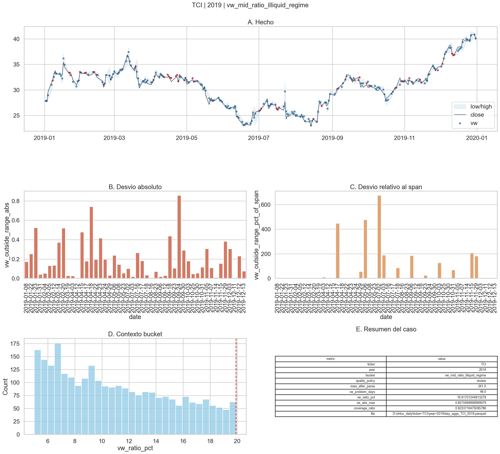

## BYFC 2025

ticker: `BYFC`  
year: `2025`  
bucket: `vw_mid_ratio_illiquid_regime`  
quality_policy: `recoverable_with_flag`  
issues: `["vw_outside_range_severe"]`  
warns: `["dataset_read_incompatible_schema", "schema_merge_conflict_ticker_encoding"]`  
file: `D:\ohlcv_daily\ticker=BYFC\year=2025\day_aggs_BYFC_2025.parquet`

### Analisis Forense

En `vw_mid_ratio_illiquid_regime` la imagen ensena un deterioro persistente pero no total. No estamos ante una cola de uno o dos dias, sino ante un subconjunto material del ano (`19.911504%`) donde `vw` deja de comportarse como referencia interna fiable. El punto importante para el inspector es que la patologia sobrevive al argumento de 'solo fue un accidente puntual'.

Eso cambia la decision operativa: el file conserva suficiente estructura para no ser `bad`, pero la frecuencia del dano es demasiado alta para dejarlo en `good`. Implicacion para pipeline: estas barras pueden servir como universo de robustez o como etiqueta de regimen deteriorado, pero degradan benchmark diario y objetivos de retorno si se mezclan sin flag con la franja sana. El error que se evita es subestimar la persistencia solo porque los precios siguen siendo parseables.

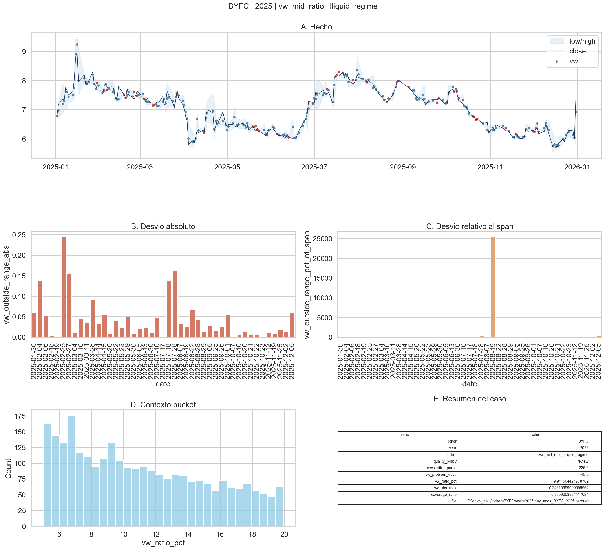

## CIZN 2016

ticker: `CIZN`  
year: `2016`  
bucket: `vw_mid_ratio_illiquid_regime`  
quality_policy: `recoverable_with_flag`  
issues: `["vw_outside_range_severe"]`  
warns: `["dataset_read_incompatible_schema", "schema_merge_conflict_ticker_encoding"]`  
file: `D:\ohlcv_daily\ticker=CIZN\year=2016\day_aggs_CIZN_2016.parquet`

### Analisis Forense

En `vw_mid_ratio_illiquid_regime` la imagen ensena un deterioro persistente pero no total. No estamos ante una cola de uno o dos dias, sino ante un subconjunto material del ano (`19.905213%`) donde `vw` deja de comportarse como referencia interna fiable. El punto importante para el inspector es que la patologia sobrevive al argumento de 'solo fue un accidente puntual'.

Eso cambia la decision operativa: el file conserva suficiente estructura para no ser `bad`, pero la frecuencia del dano es demasiado alta para dejarlo en `good`. Implicacion para pipeline: estas barras pueden servir como universo de robustez o como etiqueta de regimen deteriorado, pero degradan benchmark diario y objetivos de retorno si se mezclan sin flag con la franja sana. El error que se evita es subestimar la persistencia solo porque los precios siguen siendo parseables.

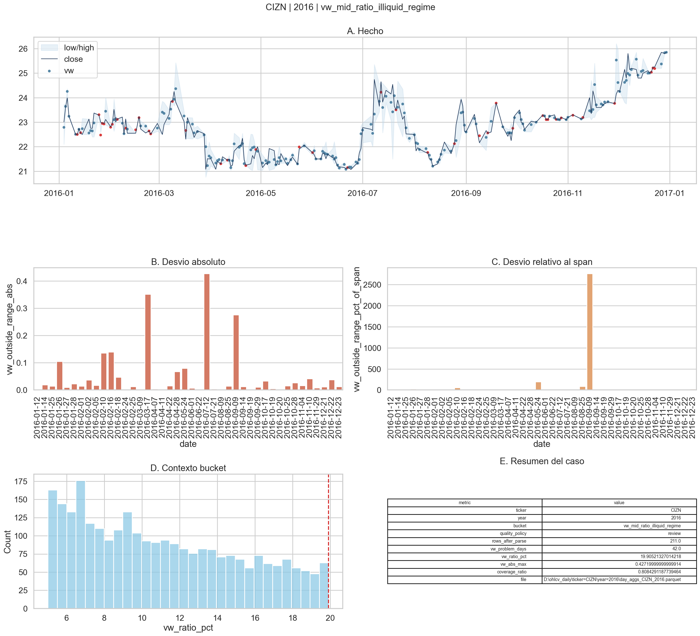

## PSAG 2022

ticker: `PSAG`  
year: `2022`  
bucket: `vw_mid_ratio_illiquid_regime`  
quality_policy: `recoverable_with_flag`  
issues: `["vw_outside_range_severe"]`  
warns: `["dataset_read_incompatible_schema", "schema_merge_conflict_ticker_encoding"]`  
file: `D:\ohlcv_daily\ticker=PSAG\year=2022\day_aggs_PSAG_2022.parquet`

### Analisis Forense

En `vw_mid_ratio_illiquid_regime` la imagen ensena un deterioro persistente pero no total. No estamos ante una cola de uno o dos dias, sino ante un subconjunto material del ano (`19.902913%`) donde `vw` deja de comportarse como referencia interna fiable. El punto importante para el inspector es que la patologia sobrevive al argumento de 'solo fue un accidente puntual'.

Eso cambia la decision operativa: el file conserva suficiente estructura para no ser `bad`, pero la frecuencia del dano es demasiado alta para dejarlo en `good`. Implicacion para pipeline: estas barras pueden servir como universo de robustez o como etiqueta de regimen deteriorado, pero degradan benchmark diario y objetivos de retorno si se mezclan sin flag con la franja sana. El error que se evita es subestimar la persistencia solo porque los precios siguen siendo parseables.

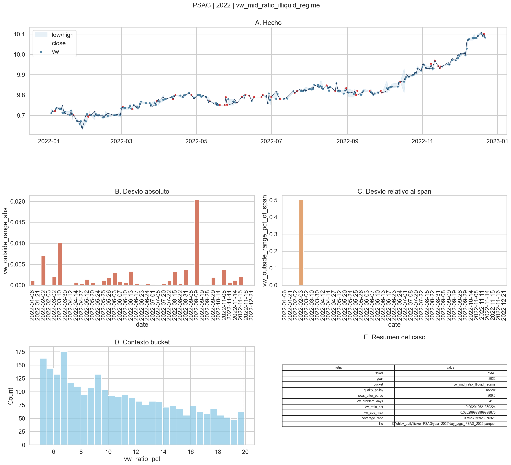

## GRI 2019

ticker: `GRI`  
year: `2019`  
bucket: `vw_mid_ratio_illiquid_regime`  
quality_policy: `recoverable_with_flag`  
issues: `["vw_outside_range_severe"]`  
warns: `["dataset_read_incompatible_schema", "schema_merge_conflict_ticker_encoding"]`  
file: `D:\ohlcv_daily\ticker=GRI\year=2019\day_aggs_GRI_2019.parquet`

### Analisis Forense

En `vw_mid_ratio_illiquid_regime` la imagen ensena un deterioro persistente pero no total. No estamos ante una cola de uno o dos dias, sino ante un subconjunto material del ano (`11.111111%`) donde `vw` deja de comportarse como referencia interna fiable. El punto importante para el inspector es que la patologia sobrevive al argumento de 'solo fue un accidente puntual'.

Eso cambia la decision operativa: el file conserva suficiente estructura para no ser `bad`, pero la frecuencia del dano es demasiado alta para dejarlo en `good`. Implicacion para pipeline: estas barras pueden servir como universo de robustez o como etiqueta de regimen deteriorado, pero degradan benchmark diario y objetivos de retorno si se mezclan sin flag con la franja sana. El error que se evita es subestimar la persistencia solo porque los precios siguen siendo parseables.

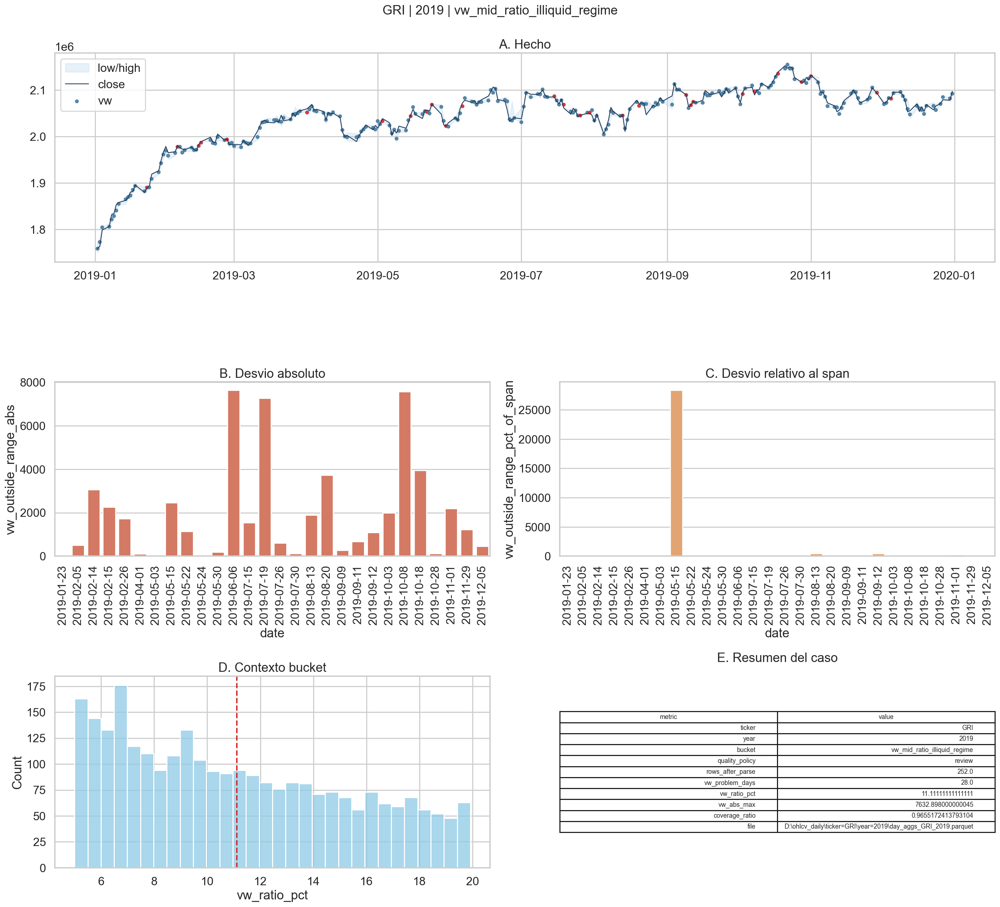

## KBSF 2014

ticker: `KBSF`  
year: `2014`  
bucket: `vw_mid_ratio_illiquid_regime`  
quality_policy: `recoverable_with_flag`  
issues: `["vw_outside_range_severe"]`  
warns: `["dataset_read_incompatible_schema", "large_internal_gap_days", "rows_lt_10", "schema_merge_conflict_ticker_encoding", "suspicious_sparse_year"]`  
file: `D:\ohlcv_daily\ticker=KBSF\year=2014\day_aggs_KBSF_2014.parquet`

### Analisis Forense

En `vw_mid_ratio_illiquid_regime` la imagen ensena un deterioro persistente pero no total. No estamos ante una cola de uno o dos dias, sino ante un subconjunto material del ano (`16.666667%`) donde `vw` deja de comportarse como referencia interna fiable. El punto importante para el inspector es que la patologia sobrevive al argumento de 'solo fue un accidente puntual'.

Eso cambia la decision operativa: el file conserva suficiente estructura para no ser `bad`, pero la frecuencia del dano es demasiado alta para dejarlo en `good`. Implicacion para pipeline: estas barras pueden servir como universo de robustez o como etiqueta de regimen deteriorado, pero degradan benchmark diario y objetivos de retorno si se mezclan sin flag con la franja sana. El error que se evita es subestimar la persistencia solo porque los precios siguen siendo parseables.

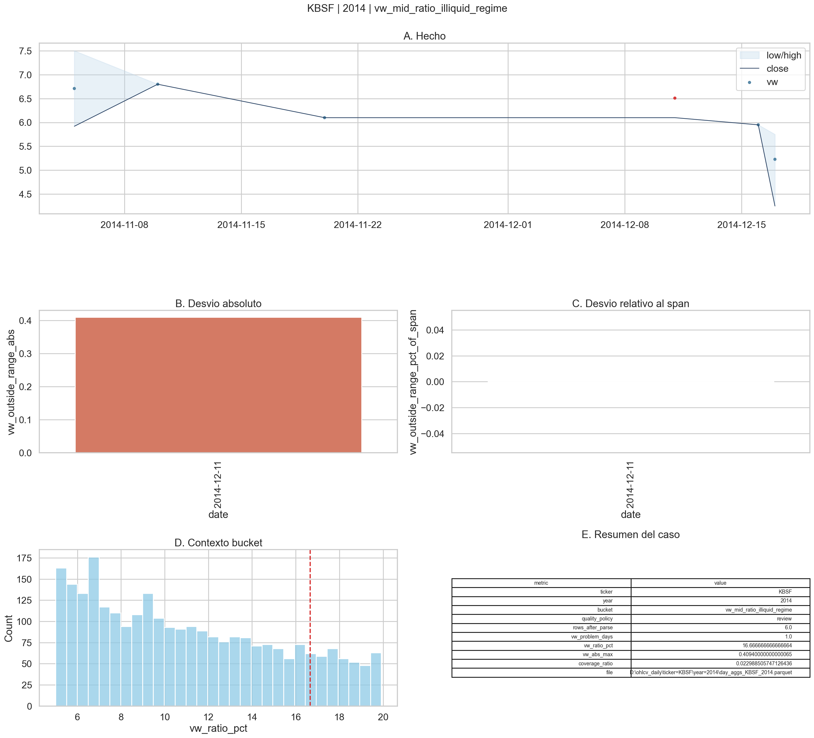

## FATBB 2025

ticker: `FATBB`  
year: `2025`  
bucket: `vw_mid_ratio_illiquid_regime`  
quality_policy: `recoverable_with_flag`  
issues: `["vw_outside_range_severe"]`  
warns: `["dataset_read_incompatible_schema", "schema_merge_conflict_ticker_encoding"]`  
file: `D:\ohlcv_daily\ticker=FATBB\year=2025\day_aggs_FATBB_2025.parquet`

### Analisis Forense

En `vw_mid_ratio_illiquid_regime` la imagen ensena un deterioro persistente pero no total. No estamos ante una cola de uno o dos dias, sino ante un subconjunto material del ano (`15.352697%`) donde `vw` deja de comportarse como referencia interna fiable. El punto importante para el inspector es que la patologia sobrevive al argumento de 'solo fue un accidente puntual'.

Eso cambia la decision operativa: el file conserva suficiente estructura para no ser `bad`, pero la frecuencia del dano es demasiado alta para dejarlo en `good`. Implicacion para pipeline: estas barras pueden servir como universo de robustez o como etiqueta de regimen deteriorado, pero degradan benchmark diario y objetivos de retorno si se mezclan sin flag con la franja sana. El error que se evita es subestimar la persistencia solo porque los precios siguen siendo parseables.

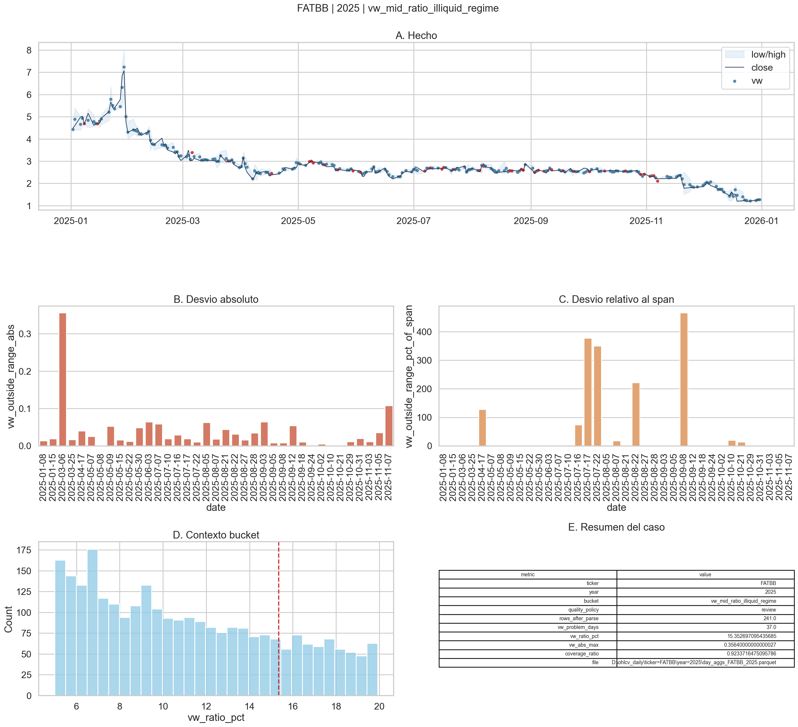

## GDHG 2023

ticker: `GDHG`  
year: `2023`  
bucket: `vw_mid_ratio_illiquid_regime`  
quality_policy: `recoverable_with_flag`  
issues: `["vw_outside_range_severe"]`  
warns: `["dataset_read_incompatible_schema", "schema_merge_conflict_ticker_encoding"]`  
file: `D:\ohlcv_daily\ticker=GDHG\year=2023\day_aggs_GDHG_2023.parquet`

### Analisis Forense

En `vw_mid_ratio_illiquid_regime` la imagen ensena un deterioro persistente pero no total. No estamos ante una cola de uno o dos dias, sino ante un subconjunto material del ano (`6.629834%`) donde `vw` deja de comportarse como referencia interna fiable. El punto importante para el inspector es que la patologia sobrevive al argumento de 'solo fue un accidente puntual'.

Eso cambia la decision operativa: el file conserva suficiente estructura para no ser `bad`, pero la frecuencia del dano es demasiado alta para dejarlo en `good`. Implicacion para pipeline: estas barras pueden servir como universo de robustez o como etiqueta de regimen deteriorado, pero degradan benchmark diario y objetivos de retorno si se mezclan sin flag con la franja sana. El error que se evita es subestimar la persistencia solo porque los precios siguen siendo parseables.

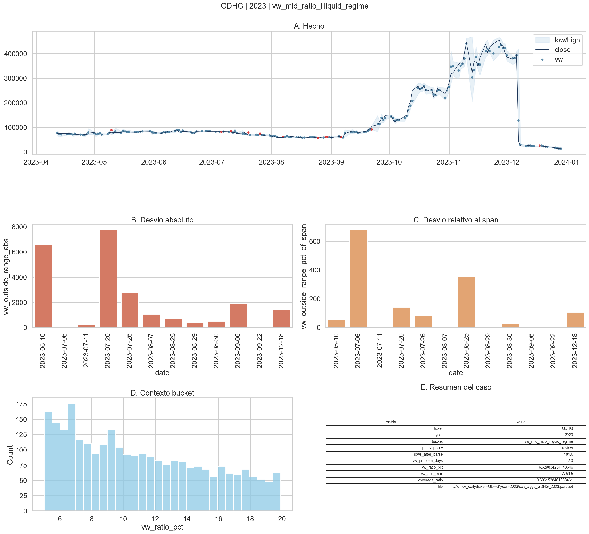

## ACAH 2021

ticker: `ACAH`  
year: `2021`  
bucket: `vw_mid_ratio_illiquid_regime`  
quality_policy: `recoverable_with_flag`  
issues: `["vw_outside_range_severe"]`  
warns: `["dataset_read_incompatible_schema", "schema_merge_conflict_ticker_encoding"]`  
file: `D:\ohlcv_daily\ticker=ACAH\year=2021\day_aggs_ACAH_2021.parquet`

### Analisis Forense

En `vw_mid_ratio_illiquid_regime` la imagen ensena un deterioro persistente pero no total. No estamos ante una cola de uno o dos dias, sino ante un subconjunto material del ano (`10.370370%`) donde `vw` deja de comportarse como referencia interna fiable. El punto importante para el inspector es que la patologia sobrevive al argumento de 'solo fue un accidente puntual'.

Eso cambia la decision operativa: el file conserva suficiente estructura para no ser `bad`, pero la frecuencia del dano es demasiado alta para dejarlo en `good`. Implicacion para pipeline: estas barras pueden servir como universo de robustez o como etiqueta de regimen deteriorado, pero degradan benchmark diario y objetivos de retorno si se mezclan sin flag con la franja sana. El error que se evita es subestimar la persistencia solo porque los precios siguen siendo parseables.

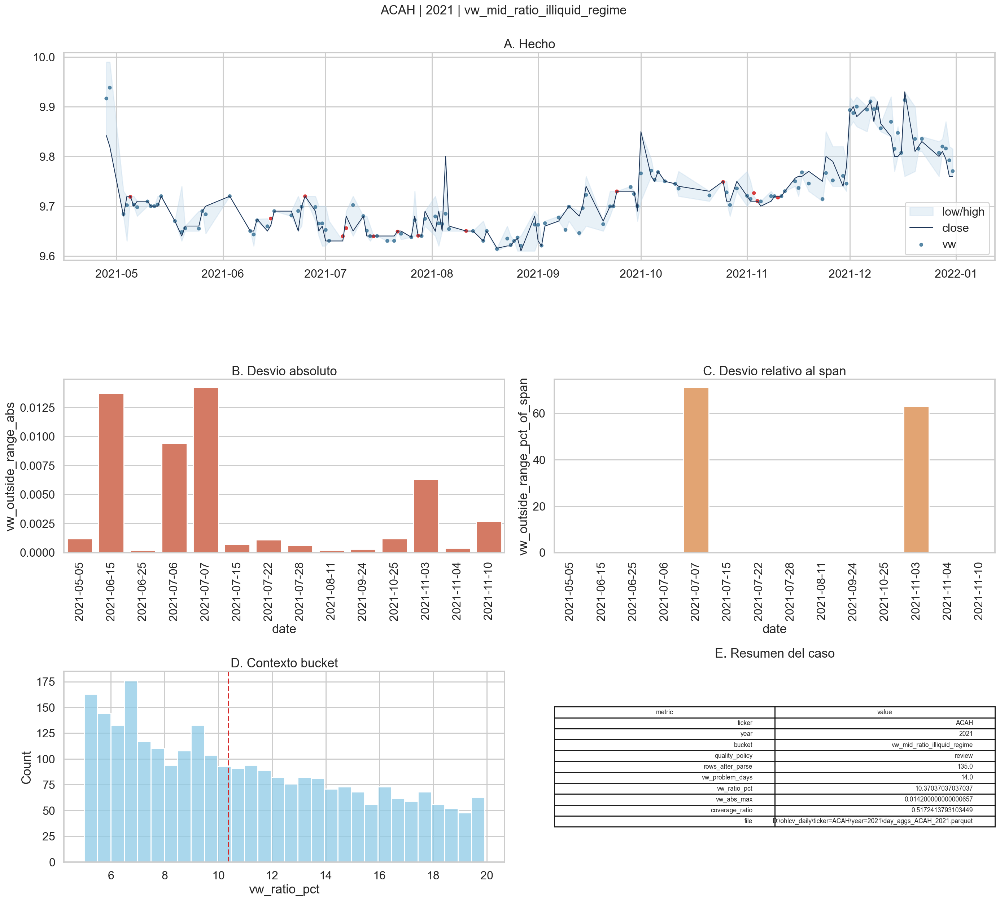

## SSKN 2026

ticker: `SSKN`  
year: `2026`  
bucket: `vw_mid_ratio_illiquid_regime`  
quality_policy: `recoverable_with_flag`  
issues: `["vw_outside_range_severe"]`  
warns: `["dataset_read_incompatible_schema", "schema_merge_conflict_ticker_encoding", "suspicious_sparse_year"]`  
file: `D:\ohlcv_daily\ticker=SSKN\year=2026\day_aggs_SSKN_2026.parquet`

### Analisis Forense

En `vw_mid_ratio_illiquid_regime` la imagen ensena un deterioro persistente pero no total. No estamos ante una cola de uno o dos dias, sino ante un subconjunto material del ano (`6.818182%`) donde `vw` deja de comportarse como referencia interna fiable. El punto importante para el inspector es que la patologia sobrevive al argumento de 'solo fue un accidente puntual'.

Eso cambia la decision operativa: el file conserva suficiente estructura para no ser `bad`, pero la frecuencia del dano es demasiado alta para dejarlo en `good`. Implicacion para pipeline: estas barras pueden servir como universo de robustez o como etiqueta de regimen deteriorado, pero degradan benchmark diario y objetivos de retorno si se mezclan sin flag con la franja sana. El error que se evita es subestimar la persistencia solo porque los precios siguen siendo parseables.

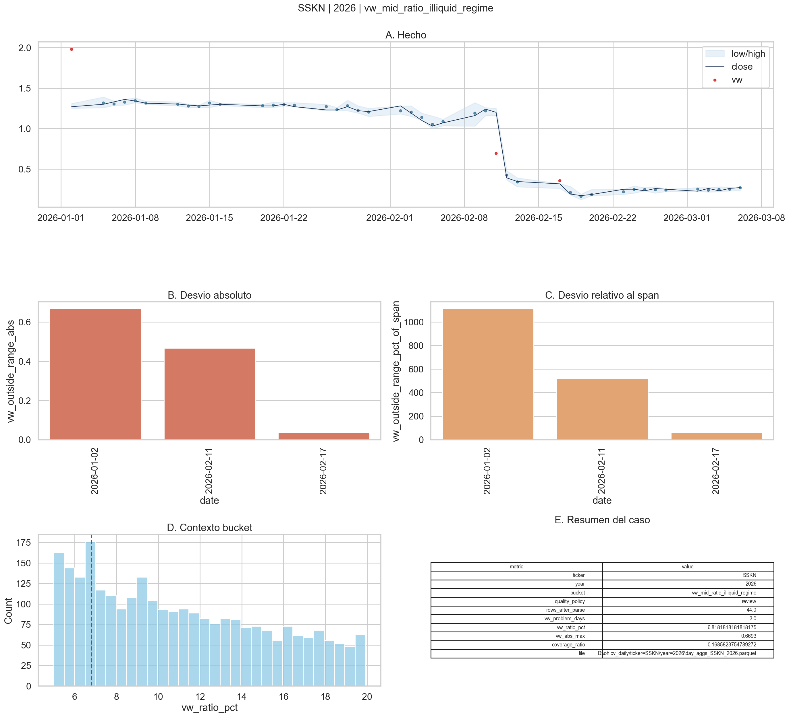

## ASTI 2016

ticker: `ASTI`  
year: `2016`  
bucket: `vw_low_ratio_limited_days`  
quality_policy: `recoverable_with_flag`  
issues: `["vw_outside_range_severe"]`  
warns: `["dataset_read_incompatible_schema", "schema_merge_conflict_ticker_encoding", "suspicious_sparse_year"]`  
file: `D:\ohlcv_daily\ticker=ASTI\year=2016\day_aggs_ASTI_2016.parquet`

### Analisis Forense

Este bucket demuestra que pocos dias tambien pueden cambiar una decision si concentran dano suficiente. La figura ensena una cola limitada en conteo (`1` filas exportadas), pero no inocua: la anomalia aparece en fechas discretas y con magnitud bastante visible para no tratarla como ruido inocente. La idea clave es que el problema no domina el ano, pero si rompe la hipotesis de limpieza completa.

La implicacion operativa es intermedia. No justifica exclusion dura porque el resto del file sigue siendo usable, pero si exige flag para no contaminar backtests sensibles a extremos o labels diarios cercanos a esas fechas. El error metodologico evitado es asumir que baja frecuencia implica baja relevancia. En microeventos o modelos de cola, justo esos pocos dias pueden ser los que distorsionan la inferencia.

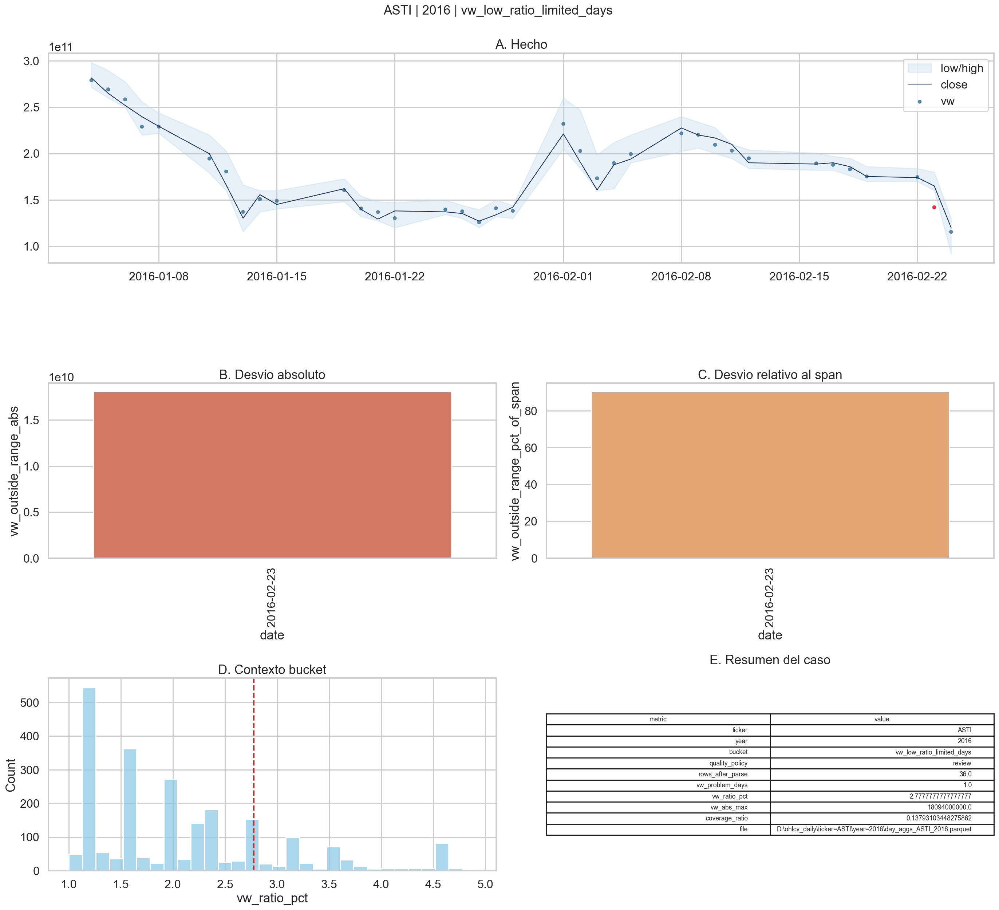

## ADTX 2021

ticker: `ADTX`  
year: `2021`  
bucket: `vw_low_ratio_limited_days`  
quality_policy: `recoverable_with_flag`  
issues: `["vw_outside_range_severe"]`  
warns: `["dataset_read_incompatible_schema", "schema_merge_conflict_ticker_encoding"]`  
file: `D:\ohlcv_daily\ticker=ADTX\year=2021\day_aggs_ADTX_2021.parquet`

### Analisis Forense

Este bucket demuestra que pocos dias tambien pueden cambiar una decision si concentran dano suficiente. La figura ensena una cola limitada en conteo (`3` filas exportadas), pero no inocua: la anomalia aparece en fechas discretas y con magnitud bastante visible para no tratarla como ruido inocente. La idea clave es que el problema no domina el ano, pero si rompe la hipotesis de limpieza completa.

La implicacion operativa es intermedia. No justifica exclusion dura porque el resto del file sigue siendo usable, pero si exige flag para no contaminar backtests sensibles a extremos o labels diarios cercanos a esas fechas. El error metodologico evitado es asumir que baja frecuencia implica baja relevancia. En microeventos o modelos de cola, justo esos pocos dias pueden ser los que distorsionan la inferencia.

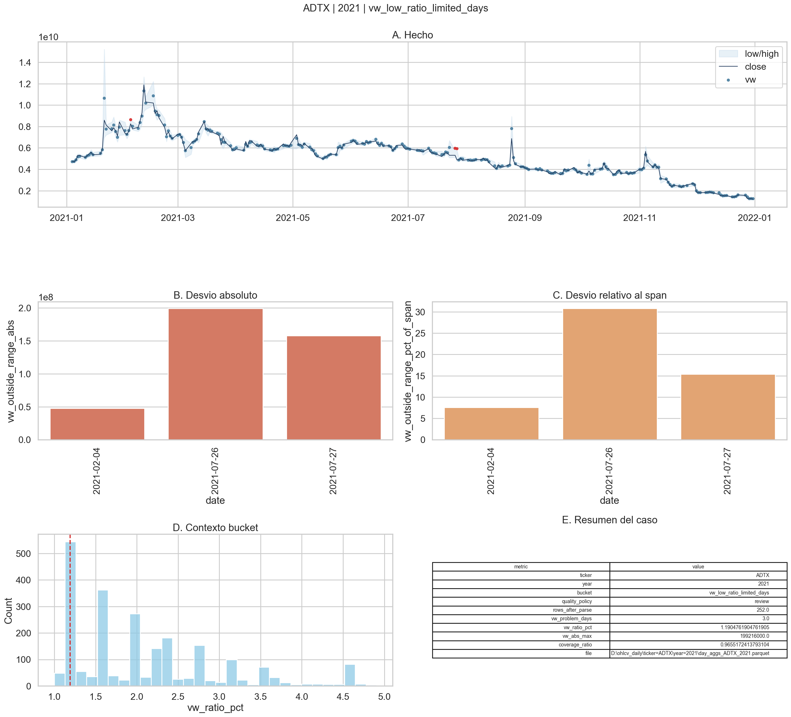

## WHLR 2021

ticker: `WHLR`  
year: `2021`  
bucket: `vw_low_ratio_limited_days`  
quality_policy: `recoverable_with_flag`  
issues: `["vw_outside_range_severe"]`  
warns: `["dataset_read_incompatible_schema", "schema_merge_conflict_ticker_encoding"]`  
file: `D:\ohlcv_daily\ticker=WHLR\year=2021\day_aggs_WHLR_2021.parquet`

### Analisis Forense

Este bucket demuestra que pocos dias tambien pueden cambiar una decision si concentran dano suficiente. La figura ensena una cola limitada en conteo (`3` filas exportadas), pero no inocua: la anomalia aparece en fechas discretas y con magnitud bastante visible para no tratarla como ruido inocente. La idea clave es que el problema no domina el ano, pero si rompe la hipotesis de limpieza completa.

La implicacion operativa es intermedia. No justifica exclusion dura porque el resto del file sigue siendo usable, pero si exige flag para no contaminar backtests sensibles a extremos o labels diarios cercanos a esas fechas. El error metodologico evitado es asumir que baja frecuencia implica baja relevancia. En microeventos o modelos de cola, justo esos pocos dias pueden ser los que distorsionan la inferencia.

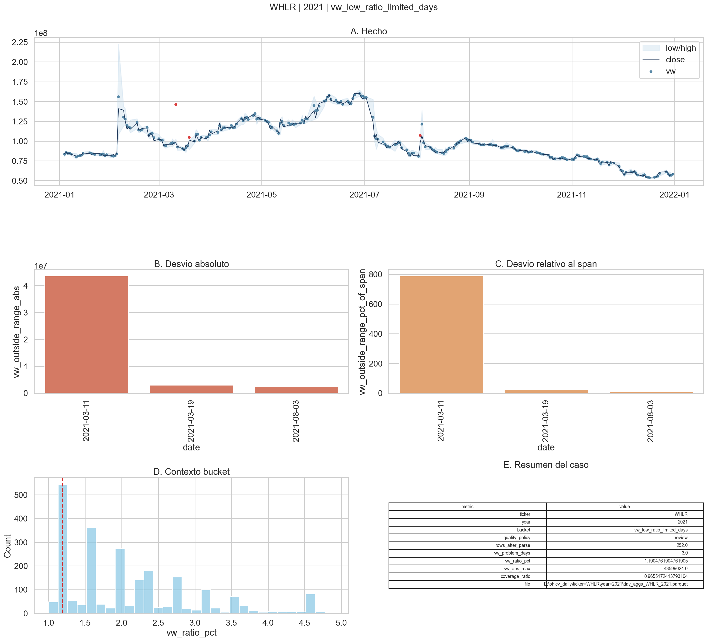

## WHLR 2022

ticker: `WHLR`  
year: `2022`  
bucket: `vw_low_ratio_limited_days`  
quality_policy: `recoverable_with_flag`  
issues: `["vw_outside_range_severe"]`  
warns: `["dataset_read_incompatible_schema", "schema_merge_conflict_ticker_encoding"]`  
file: `D:\ohlcv_daily\ticker=WHLR\year=2022\day_aggs_WHLR_2022.parquet`

### Analisis Forense

Este bucket demuestra que pocos dias tambien pueden cambiar una decision si concentran dano suficiente. La figura ensena una cola limitada en conteo (`7` filas exportadas), pero no inocua: la anomalia aparece en fechas discretas y con magnitud bastante visible para no tratarla como ruido inocente. La idea clave es que el problema no domina el ano, pero si rompe la hipotesis de limpieza completa.

La implicacion operativa es intermedia. No justifica exclusion dura porque el resto del file sigue siendo usable, pero si exige flag para no contaminar backtests sensibles a extremos o labels diarios cercanos a esas fechas. El error metodologico evitado es asumir que baja frecuencia implica baja relevancia. En microeventos o modelos de cola, justo esos pocos dias pueden ser los que distorsionan la inferencia.

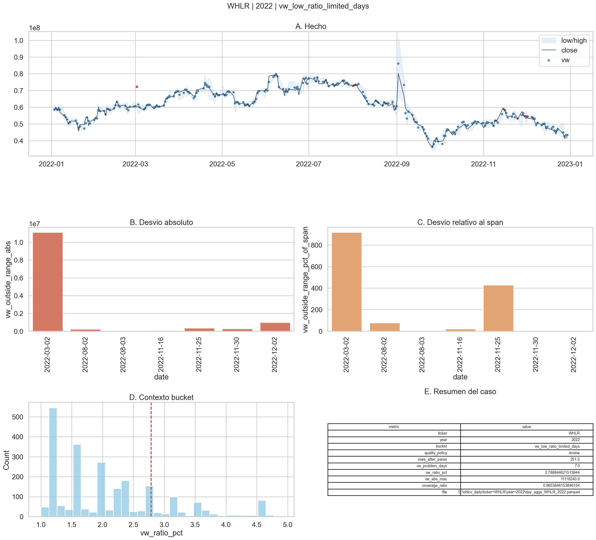

## PBLA 2020

ticker: `PBLA`  
year: `2020`  
bucket: `vw_low_ratio_limited_days`  
quality_policy: `recoverable_with_flag`  
issues: `["vw_outside_range_severe"]`  
warns: `["dataset_read_incompatible_schema", "schema_merge_conflict_ticker_encoding", "suspicious_sparse_year"]`  
file: `D:\ohlcv_daily\ticker=PBLA\year=2020\day_aggs_PBLA_2020.parquet`

### Analisis Forense

Este bucket demuestra que pocos dias tambien pueden cambiar una decision si concentran dano suficiente. La figura ensena una cola limitada en conteo (`1` filas exportadas), pero no inocua: la anomalia aparece en fechas discretas y con magnitud bastante visible para no tratarla como ruido inocente. La idea clave es que el problema no domina el ano, pero si rompe la hipotesis de limpieza completa.

La implicacion operativa es intermedia. No justifica exclusion dura porque el resto del file sigue siendo usable, pero si exige flag para no contaminar backtests sensibles a extremos o labels diarios cercanos a esas fechas. El error metodologico evitado es asumir que baja frecuencia implica baja relevancia. En microeventos o modelos de cola, justo esos pocos dias pueden ser los que distorsionan la inferencia.

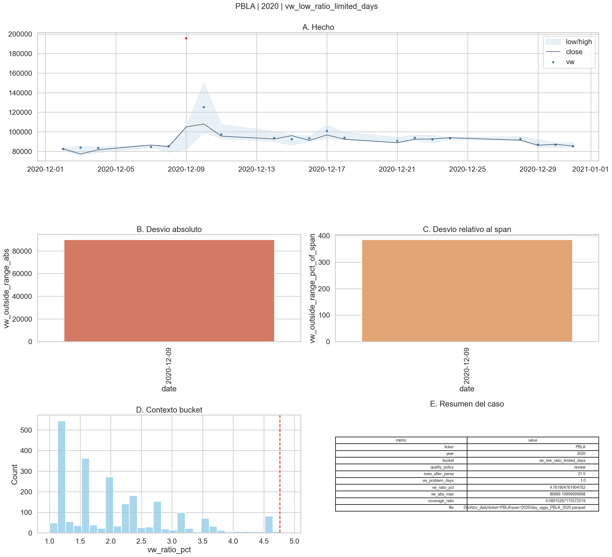

## JRSH 2018

ticker: `JRSH`  
year: `2018`  
bucket: `vw_low_ratio_limited_days`  
quality_policy: `recoverable_with_flag`  
issues: `["vw_outside_range_severe"]`  
warns: `["dataset_read_incompatible_schema", "schema_merge_conflict_ticker_encoding"]`  
file: `D:\ohlcv_daily\ticker=JRSH\year=2018\day_aggs_JRSH_2018.parquet`

### Analisis Forense

Este bucket demuestra que pocos dias tambien pueden cambiar una decision si concentran dano suficiente. La figura ensena una cola limitada en conteo (`8` filas exportadas), pero no inocua: la anomalia aparece en fechas discretas y con magnitud bastante visible para no tratarla como ruido inocente. La idea clave es que el problema no domina el ano, pero si rompe la hipotesis de limpieza completa.

La implicacion operativa es intermedia. No justifica exclusion dura porque el resto del file sigue siendo usable, pero si exige flag para no contaminar backtests sensibles a extremos o labels diarios cercanos a esas fechas. El error metodologico evitado es asumir que baja frecuencia implica baja relevancia. En microeventos o modelos de cola, justo esos pocos dias pueden ser los que distorsionan la inferencia.

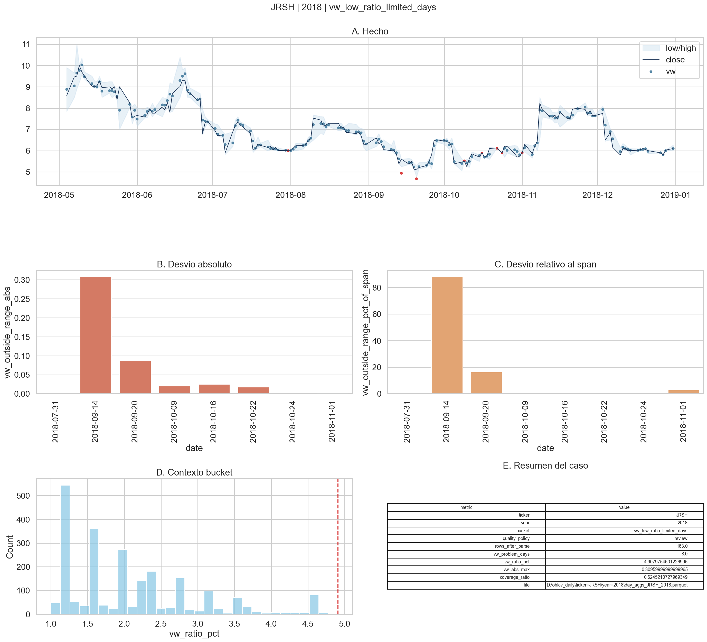

## MRDB 2024

ticker: `MRDB`  
year: `2024`  
bucket: `vw_low_ratio_limited_days`  
quality_policy: `recoverable_with_flag`  
issues: `["vw_outside_range_severe"]`  
warns: `["dataset_read_incompatible_schema", "schema_merge_conflict_ticker_encoding"]`  
file: `D:\ohlcv_daily\ticker=MRDB\year=2024\day_aggs_MRDB_2024.parquet`

### Analisis Forense

Este bucket demuestra que pocos dias tambien pueden cambiar una decision si concentran dano suficiente. La figura ensena una cola limitada en conteo (`8` filas exportadas), pero no inocua: la anomalia aparece en fechas discretas y con magnitud bastante visible para no tratarla como ruido inocente. La idea clave es que el problema no domina el ano, pero si rompe la hipotesis de limpieza completa.

La implicacion operativa es intermedia. No justifica exclusion dura porque el resto del file sigue siendo usable, pero si exige flag para no contaminar backtests sensibles a extremos o labels diarios cercanos a esas fechas. El error metodologico evitado es asumir que baja frecuencia implica baja relevancia. En microeventos o modelos de cola, justo esos pocos dias pueden ser los que distorsionan la inferencia.

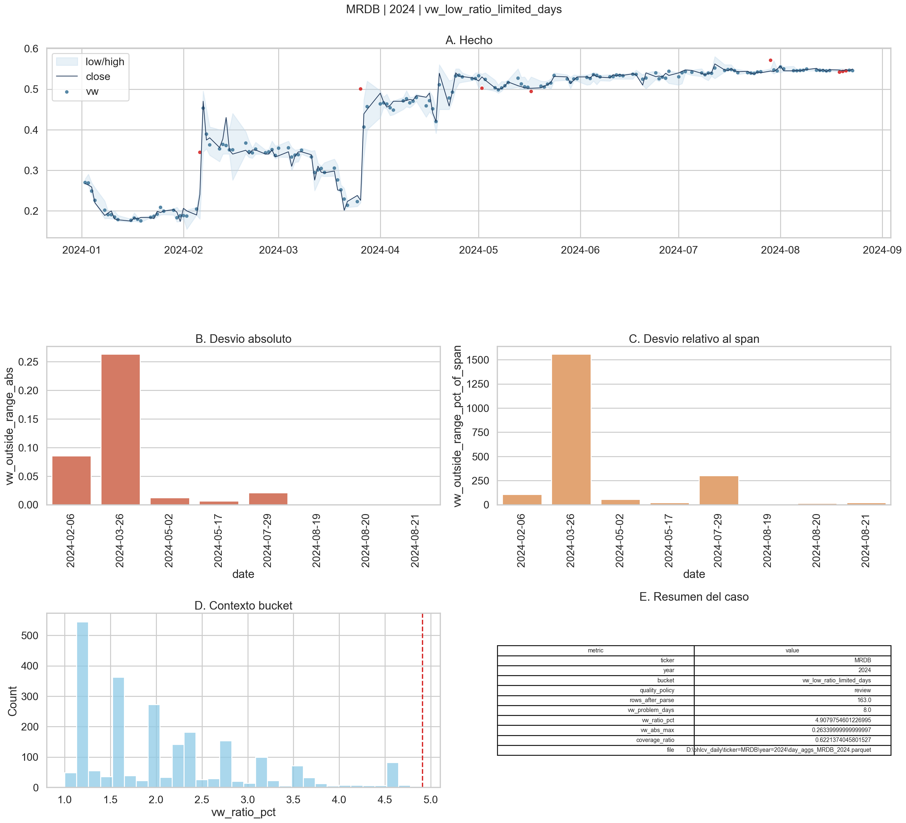

## VBIV 2014

ticker: `VBIV`  
year: `2014`  
bucket: `vw_low_ratio_limited_days`  
quality_policy: `recoverable_with_flag`  
issues: `["vw_outside_range_severe"]`  
warns: `["dataset_read_incompatible_schema", "schema_merge_conflict_ticker_encoding", "suspicious_sparse_year"]`  
file: `D:\ohlcv_daily\ticker=VBIV\year=2014\day_aggs_VBIV_2014.parquet`

### Analisis Forense

Este bucket demuestra que pocos dias tambien pueden cambiar una decision si concentran dano suficiente. La figura ensena una cola limitada en conteo (`5` filas exportadas), pero no inocua: la anomalia aparece en fechas discretas y con magnitud bastante visible para no tratarla como ruido inocente. La idea clave es que el problema no domina el ano, pero si rompe la hipotesis de limpieza completa.

La implicacion operativa es intermedia. No justifica exclusion dura porque el resto del file sigue siendo usable, pero si exige flag para no contaminar backtests sensibles a extremos o labels diarios cercanos a esas fechas. El error metodologico evitado es asumir que baja frecuencia implica baja relevancia. En microeventos o modelos de cola, justo esos pocos dias pueden ser los que distorsionan la inferencia.

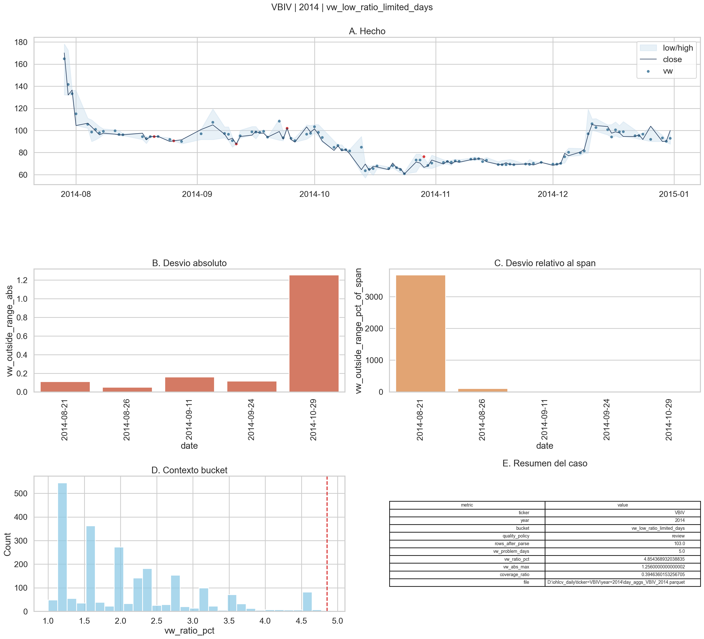

## BOXD 2023

ticker: `BOXD`  
year: `2023`  
bucket: `vw_low_ratio_limited_days`  
quality_policy: `recoverable_with_flag`  
issues: `["vw_outside_range_severe"]`  
warns: `["dataset_read_incompatible_schema", "schema_merge_conflict_ticker_encoding", "suspicious_sparse_year"]`  
file: `D:\ohlcv_daily\ticker=BOXD\year=2023\day_aggs_BOXD_2023.parquet`

### Analisis Forense

Este bucket demuestra que pocos dias tambien pueden cambiar una decision si concentran dano suficiente. La figura ensena una cola limitada en conteo (`3` filas exportadas), pero no inocua: la anomalia aparece en fechas discretas y con magnitud bastante visible para no tratarla como ruido inocente. La idea clave es que el problema no domina el ano, pero si rompe la hipotesis de limpieza completa.

La implicacion operativa es intermedia. No justifica exclusion dura porque el resto del file sigue siendo usable, pero si exige flag para no contaminar backtests sensibles a extremos o labels diarios cercanos a esas fechas. El error metodologico evitado es asumir que baja frecuencia implica baja relevancia. En microeventos o modelos de cola, justo esos pocos dias pueden ser los que distorsionan la inferencia.

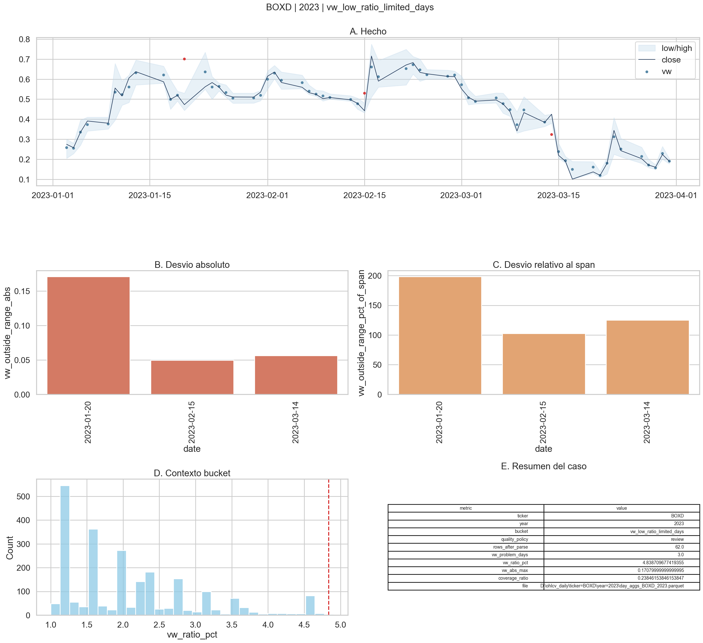

## JXG 2025

ticker: `JXG`  
year: `2025`  
bucket: `vw_low_ratio_limited_days`  
quality_policy: `recoverable_with_flag`  
issues: `["vw_outside_range_severe"]`  
warns: `["dataset_read_incompatible_schema", "schema_merge_conflict_ticker_encoding"]`  
file: `D:\ohlcv_daily\ticker=JXG\year=2025\day_aggs_JXG_2025.parquet`

### Analisis Forense

Este bucket demuestra que pocos dias tambien pueden cambiar una decision si concentran dano suficiente. La figura ensena una cola limitada en conteo (`7` filas exportadas), pero no inocua: la anomalia aparece en fechas discretas y con magnitud bastante visible para no tratarla como ruido inocente. La idea clave es que el problema no domina el ano, pero si rompe la hipotesis de limpieza completa.

La implicacion operativa es intermedia. No justifica exclusion dura porque el resto del file sigue siendo usable, pero si exige flag para no contaminar backtests sensibles a extremos o labels diarios cercanos a esas fechas. El error metodologico evitado es asumir que baja frecuencia implica baja relevancia. En microeventos o modelos de cola, justo esos pocos dias pueden ser los que distorsionan la inferencia.

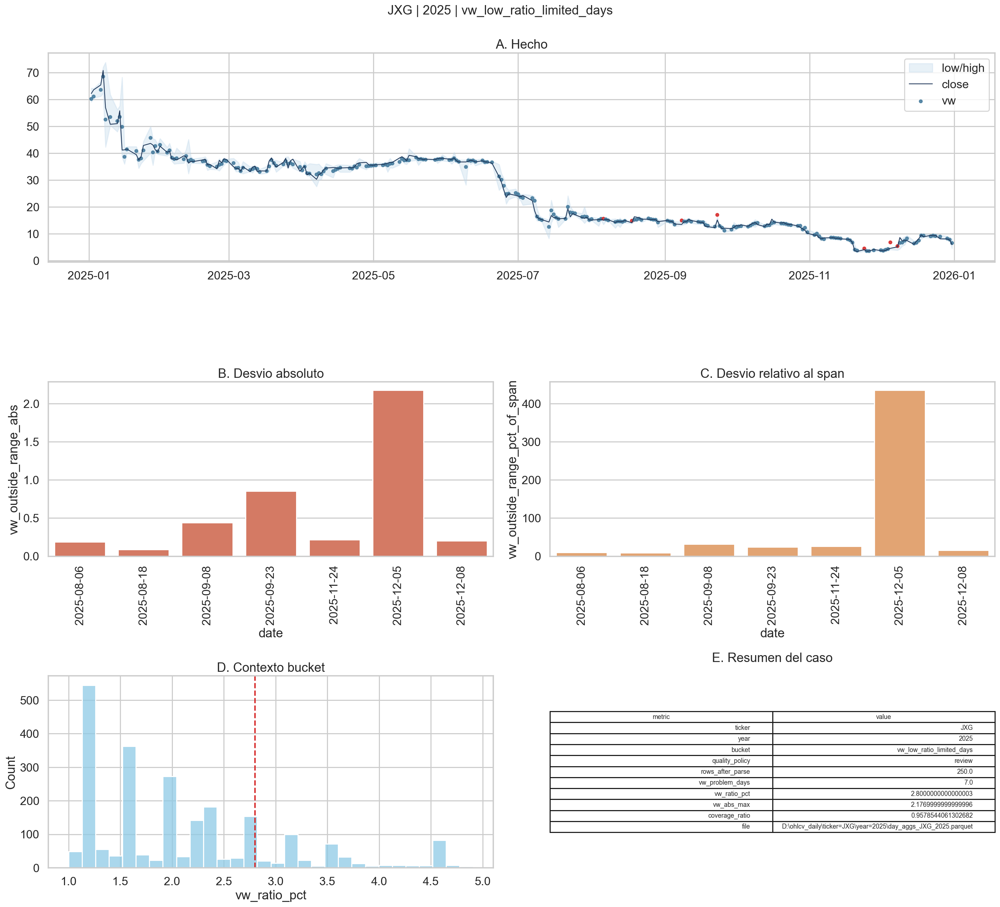

## ALZN 2024

ticker: `ALZN`  
year: `2024`  
bucket: `vw_low_ratio_limited_days`  
quality_policy: `recoverable_with_flag`  
issues: `["vw_outside_range_severe"]`  
warns: `["dataset_read_incompatible_schema", "schema_merge_conflict_ticker_encoding"]`  
file: `D:\ohlcv_daily\ticker=ALZN\year=2024\day_aggs_ALZN_2024.parquet`

### Analisis Forense

Este bucket demuestra que pocos dias tambien pueden cambiar una decision si concentran dano suficiente. La figura ensena una cola limitada en conteo (`5` filas exportadas), pero no inocua: la anomalia aparece en fechas discretas y con magnitud bastante visible para no tratarla como ruido inocente. La idea clave es que el problema no domina el ano, pero si rompe la hipotesis de limpieza completa.

La implicacion operativa es intermedia. No justifica exclusion dura porque el resto del file sigue siendo usable, pero si exige flag para no contaminar backtests sensibles a extremos o labels diarios cercanos a esas fechas. El error metodologico evitado es asumir que baja frecuencia implica baja relevancia. En microeventos o modelos de cola, justo esos pocos dias pueden ser los que distorsionan la inferencia.

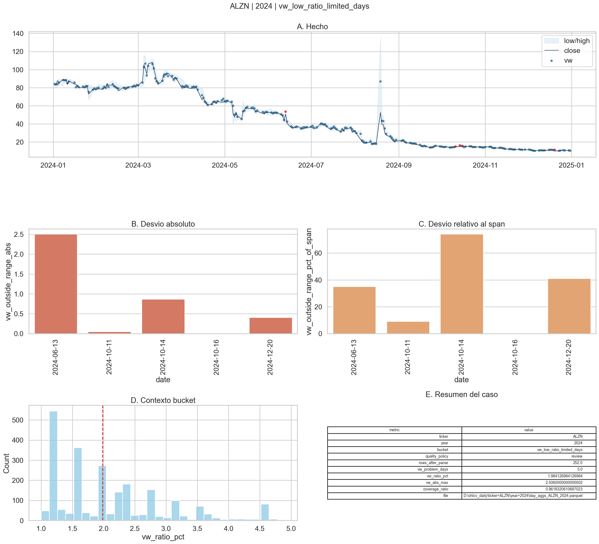

## MDXG 2023

ticker: `MDXG`  
year: `2023`  
bucket: `vw_low_ratio_limited_days`  
quality_policy: `recoverable_with_flag`  
issues: `["vw_outside_range_severe"]`  
warns: `["dataset_read_incompatible_schema", "schema_merge_conflict_ticker_encoding"]`  
file: `D:\ohlcv_daily\ticker=MDXG\year=2023\day_aggs_MDXG_2023.parquet`

### Analisis Forense

Este bucket demuestra que pocos dias tambien pueden cambiar una decision si concentran dano suficiente. La figura ensena una cola limitada en conteo (`3` filas exportadas), pero no inocua: la anomalia aparece en fechas discretas y con magnitud bastante visible para no tratarla como ruido inocente. La idea clave es que el problema no domina el ano, pero si rompe la hipotesis de limpieza completa.

La implicacion operativa es intermedia. No justifica exclusion dura porque el resto del file sigue siendo usable, pero si exige flag para no contaminar backtests sensibles a extremos o labels diarios cercanos a esas fechas. El error metodologico evitado es asumir que baja frecuencia implica baja relevancia. En microeventos o modelos de cola, justo esos pocos dias pueden ser los que distorsionan la inferencia.

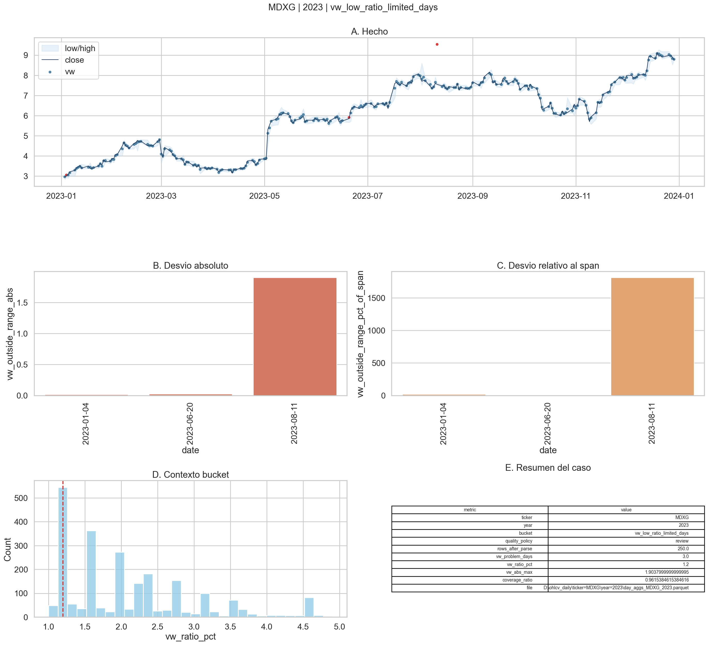

## SHCA 2021

ticker: `SHCA`  
year: `2021`  
bucket: `vw_warn_minor_or_material`  
quality_policy: `recoverable_with_flag`  
issues: `[]`  
warns: `["dataset_read_incompatible_schema", "rows_lt_10", "schema_merge_conflict_ticker_encoding", "suspicious_sparse_year", "vw_outside_range_material"]`  
file: `D:\ohlcv_daily\ticker=SHCA\year=2021\day_aggs_SHCA_2021.parquet`

### Analisis Forense

`vw_warn_minor_or_material` es una familia de advertencia contractual, no una exclusion dura. La imagen debe leerse como prueba de que existe residuo `aun acotado en conteo, pero ya material desde el punto de vista contractual`. Aqui el sistema no encuentra una patologia bastante concentrada para subir a los buckets de ratio, pero tampoco permite decir que el ano sea indistinguible de la franja buena.

La consecuencia es mantenerlo en `recoverable_with_flag`: sirve para sensibilidad, auditoria y modelos que aceptan pequena contaminacion, pero no para asumir limpieza diaria plena. El error evitado es silencioso pero serio: dejar que avisos de rango aparentemente menores entren en `good` y despues se propaguen a labels, benchmarks o comparaciones vendor como si fueran observaciones sin friccion.

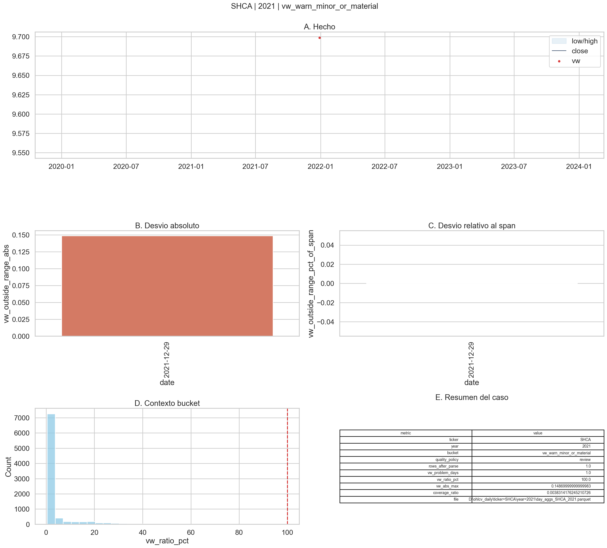

## MODD 2021

ticker: `MODD`  
year: `2021`  
bucket: `vw_warn_minor_or_material`  
quality_policy: `recoverable_with_flag`  
issues: `[]`  
warns: `["dataset_read_incompatible_schema", "rows_lt_10", "schema_merge_conflict_ticker_encoding", "suspicious_sparse_year", "vw_outside_range_material"]`  
file: `D:\ohlcv_daily\ticker=MODD\year=2021\day_aggs_MODD_2021.parquet`

### Analisis Forense

`vw_warn_minor_or_material` es una familia de advertencia contractual, no una exclusion dura. La imagen debe leerse como prueba de que existe residuo `aun acotado en conteo, pero ya material desde el punto de vista contractual`. Aqui el sistema no encuentra una patologia bastante concentrada para subir a los buckets de ratio, pero tampoco permite decir que el ano sea indistinguible de la franja buena.

La consecuencia es mantenerlo en `recoverable_with_flag`: sirve para sensibilidad, auditoria y modelos que aceptan pequena contaminacion, pero no para asumir limpieza diaria plena. El error evitado es silencioso pero serio: dejar que avisos de rango aparentemente menores entren en `good` y despues se propaguen a labels, benchmarks o comparaciones vendor como si fueran observaciones sin friccion.

## SCMA 2021

ticker: `SCMA`  
year: `2021`  
bucket: `vw_warn_minor_or_material`  
quality_policy: `recoverable_with_flag`  
issues: `[]`  
warns: `["dataset_read_incompatible_schema", "rows_lt_10", "schema_merge_conflict_ticker_encoding", "suspicious_sparse_year", "vw_outside_range_material"]`  
file: `D:\ohlcv_daily\ticker=SCMA\year=2021\day_aggs_SCMA_2021.parquet`

### Analisis Forense

`vw_warn_minor_or_material` es una familia de advertencia contractual, no una exclusion dura. La imagen debe leerse como prueba de que existe residuo `aun acotado en conteo, pero ya material desde el punto de vista contractual`. Aqui el sistema no encuentra una patologia bastante concentrada para subir a los buckets de ratio, pero tampoco permite decir que el ano sea indistinguible de la franja buena.

La consecuencia es mantenerlo en `recoverable_with_flag`: sirve para sensibilidad, auditoria y modelos que aceptan pequena contaminacion, pero no para asumir limpieza diaria plena. El error evitado es silencioso pero serio: dejar que avisos de rango aparentemente menores entren en `good` y despues se propaguen a labels, benchmarks o comparaciones vendor como si fueran observaciones sin friccion.

## BSTG 2021

ticker: `BSTG`  
year: `2021`  
bucket: `vw_warn_minor_or_material`  
quality_policy: `recoverable_with_flag`  
issues: `[]`  
warns: `["dataset_read_incompatible_schema", "rows_lt_10", "schema_merge_conflict_ticker_encoding", "suspicious_sparse_year", "vw_outside_range_material"]`  
file: `D:\ohlcv_daily\ticker=BSTG\year=2021\day_aggs_BSTG_2021.parquet`

### Analisis Forense

`vw_warn_minor_or_material` es una familia de advertencia contractual, no una exclusion dura. La imagen debe leerse como prueba de que existe residuo `aun acotado en conteo, pero ya material desde el punto de vista contractual`. Aqui el sistema no encuentra una patologia bastante concentrada para subir a los buckets de ratio, pero tampoco permite decir que el ano sea indistinguible de la franja buena.

La consecuencia es mantenerlo en `recoverable_with_flag`: sirve para sensibilidad, auditoria y modelos que aceptan pequena contaminacion, pero no para asumir limpieza diaria plena. El error evitado es silencioso pero serio: dejar que avisos de rango aparentemente menores entren en `good` y despues se propaguen a labels, benchmarks o comparaciones vendor como si fueran observaciones sin friccion.

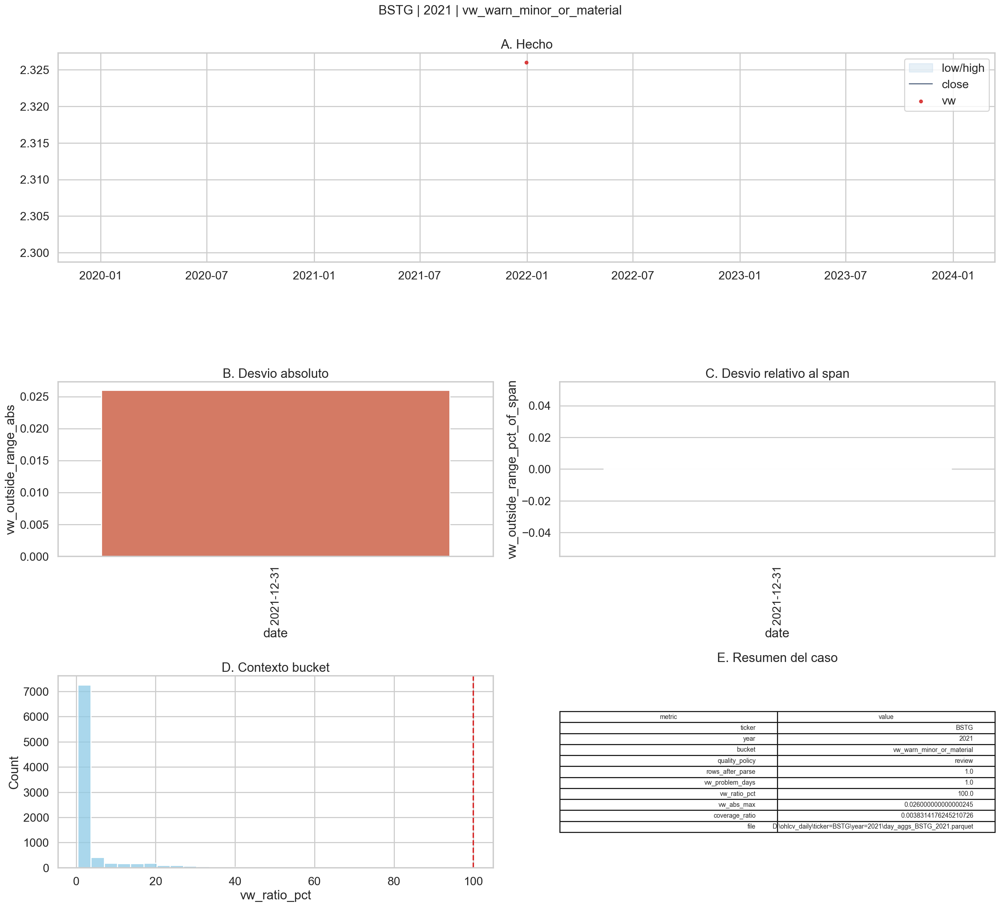

## MGAM 2026

ticker: `MGAM`  
year: `2026`  
bucket: `vw_warn_minor_or_material`  
quality_policy: `recoverable_with_flag`  
issues: `[]`  
warns: `["dataset_read_incompatible_schema", "schema_merge_conflict_ticker_encoding", "suspicious_sparse_year", "vw_outside_range_material"]`  
file: `D:\ohlcv_daily\ticker=MGAM\year=2026\day_aggs_MGAM_2026.parquet`

### Analisis Forense

`vw_warn_minor_or_material` es una familia de advertencia contractual, no una exclusion dura. La imagen debe leerse como prueba de que existe residuo `aun acotado en conteo, pero ya material desde el punto de vista contractual`. Aqui el sistema no encuentra una patologia bastante concentrada para subir a los buckets de ratio, pero tampoco permite decir que el ano sea indistinguible de la franja buena.

La consecuencia es mantenerlo en `recoverable_with_flag`: sirve para sensibilidad, auditoria y modelos que aceptan pequena contaminacion, pero no para asumir limpieza diaria plena. El error evitado es silencioso pero serio: dejar que avisos de rango aparentemente menores entren en `good` y despues se propaguen a labels, benchmarks o comparaciones vendor como si fueran observaciones sin friccion.

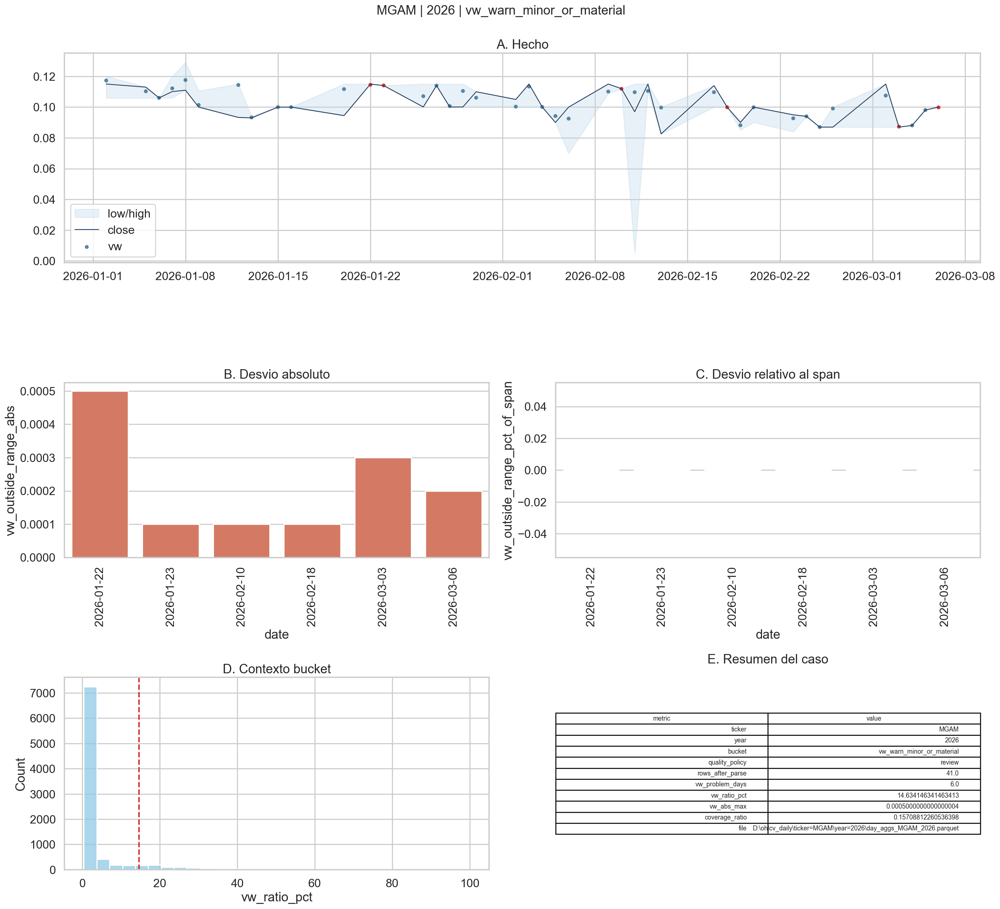

## DAAQ 2025

ticker: `DAAQ`  
year: `2025`  
bucket: `vw_warn_minor_or_material`  
quality_policy: `recoverable_with_flag`  
issues: `[]`  
warns: `["dataset_read_incompatible_schema", "schema_merge_conflict_ticker_encoding", "vw_outside_range_material"]`  
file: `D:\ohlcv_daily\ticker=DAAQ\year=2025\day_aggs_DAAQ_2025.parquet`

### Analisis Forense

`vw_warn_minor_or_material` es una familia de advertencia contractual, no una exclusion dura. La imagen debe leerse como prueba de que existe residuo `aun acotado en conteo, pero ya material desde el punto de vista contractual`. Aqui el sistema no encuentra una patologia bastante concentrada para subir a los buckets de ratio, pero tampoco permite decir que el ano sea indistinguible de la franja buena.

La consecuencia es mantenerlo en `recoverable_with_flag`: sirve para sensibilidad, auditoria y modelos que aceptan pequena contaminacion, pero no para asumir limpieza diaria plena. El error evitado es silencioso pero serio: dejar que avisos de rango aparentemente menores entren en `good` y despues se propaguen a labels, benchmarks o comparaciones vendor como si fueran observaciones sin friccion.

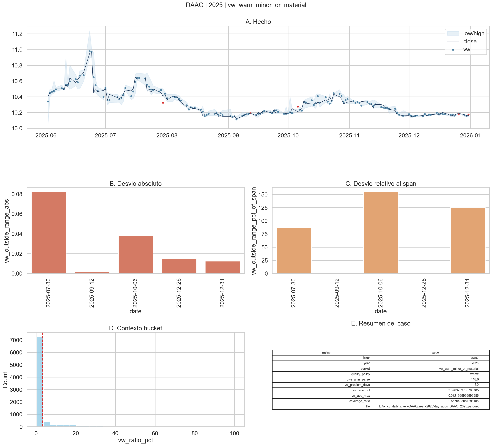

## GDEV 2021

ticker: `GDEV`  
year: `2021`  
bucket: `vw_warn_minor_or_material`  
quality_policy: `recoverable_with_flag`  
issues: `[]`  
warns: `["dataset_read_incompatible_schema", "schema_merge_conflict_ticker_encoding", "suspicious_sparse_year", "vw_outside_range_material"]`  
file: `D:\ohlcv_daily\ticker=GDEV\year=2021\day_aggs_GDEV_2021.parquet`

### Analisis Forense

`vw_warn_minor_or_material` es una familia de advertencia contractual, no una exclusion dura. La imagen debe leerse como prueba de que existe residuo `aun acotado en conteo, pero ya material desde el punto de vista contractual`. Aqui el sistema no encuentra una patologia bastante concentrada para subir a los buckets de ratio, pero tampoco permite decir que el ano sea indistinguible de la franja buena.

La consecuencia es mantenerlo en `recoverable_with_flag`: sirve para sensibilidad, auditoria y modelos que aceptan pequena contaminacion, pero no para asumir limpieza diaria plena. El error evitado es silencioso pero serio: dejar que avisos de rango aparentemente menores entren en `good` y despues se propaguen a labels, benchmarks o comparaciones vendor como si fueran observaciones sin friccion.

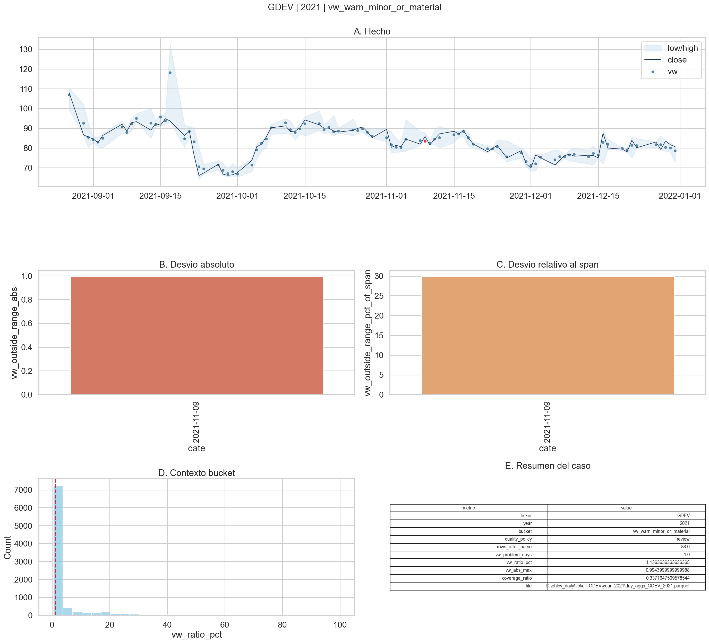

## ACRV 2023

ticker: `ACRV`  
year: `2023`  
bucket: `vw_warn_minor_or_material`  
quality_policy: `recoverable_with_flag`  
issues: `[]`  
warns: `["dataset_read_incompatible_schema", "schema_merge_conflict_ticker_encoding", "vw_outside_range_minor"]`  
file: `D:\ohlcv_daily\ticker=ACRV\year=2023\day_aggs_ACRV_2023.parquet`

### Analisis Forense

`vw_warn_minor_or_material` es una familia de advertencia contractual, no una exclusion dura. La imagen debe leerse como prueba de que existe residuo `minoritario en conteo pero suficiente para romper la idea de ano completamente limpio`. Aqui el sistema no encuentra una patologia bastante concentrada para subir a los buckets de ratio, pero tampoco permite decir que el ano sea indistinguible de la franja buena.

La consecuencia es mantenerlo en `recoverable_with_flag`: sirve para sensibilidad, auditoria y modelos que aceptan pequena contaminacion, pero no para asumir limpieza diaria plena. El error evitado es silencioso pero serio: dejar que avisos de rango aparentemente menores entren en `good` y despues se propaguen a labels, benchmarks o comparaciones vendor como si fueran observaciones sin friccion.

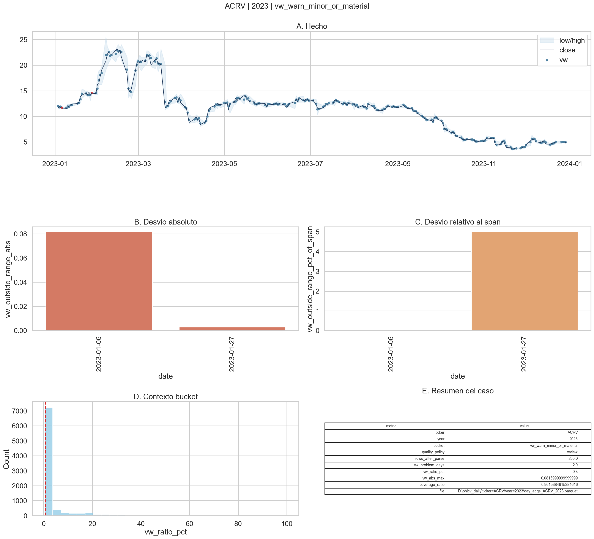

## GYRO 2007

ticker: `GYRO`  
year: `2007`  
bucket: `vw_warn_minor_or_material`  
quality_policy: `recoverable_with_flag`  
issues: `[]`  
warns: `["dataset_read_incompatible_schema", "schema_merge_conflict_ticker_encoding", "vw_outside_range_material"]`  
file: `D:\ohlcv_daily\ticker=GYRO\year=2007\day_aggs_GYRO_2007.parquet`

### Analisis Forense

`vw_warn_minor_or_material` es una familia de advertencia contractual, no una exclusion dura. La imagen debe leerse como prueba de que existe residuo `aun acotado en conteo, pero ya material desde el punto de vista contractual`. Aqui el sistema no encuentra una patologia bastante concentrada para subir a los buckets de ratio, pero tampoco permite decir que el ano sea indistinguible de la franja buena.

La consecuencia es mantenerlo en `recoverable_with_flag`: sirve para sensibilidad, auditoria y modelos que aceptan pequena contaminacion, pero no para asumir limpieza diaria plena. El error evitado es silencioso pero serio: dejar que avisos de rango aparentemente menores entren en `good` y despues se propaguen a labels, benchmarks o comparaciones vendor como si fueran observaciones sin friccion.

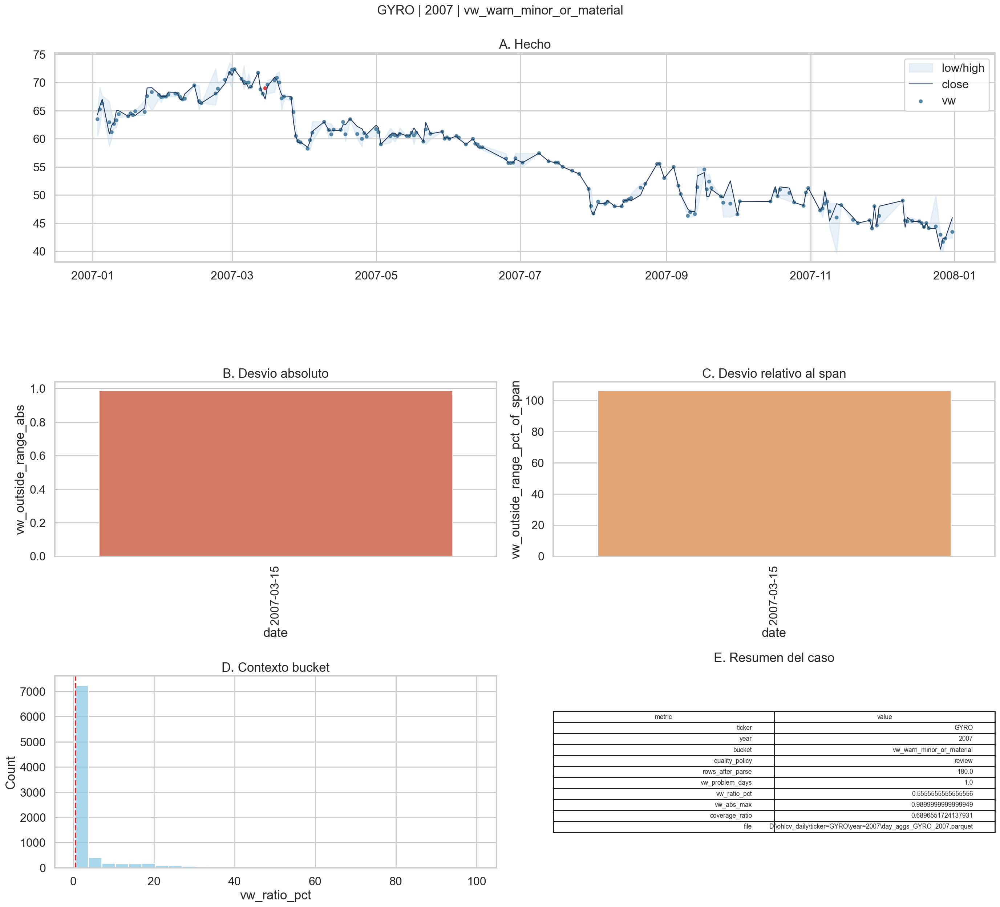

## VYGR 2017

ticker: `VYGR`  
year: `2017`  
bucket: `vw_warn_minor_or_material`  
quality_policy: `recoverable_with_flag`  
issues: `[]`  
warns: `["dataset_read_incompatible_schema", "schema_merge_conflict_ticker_encoding", "vw_outside_range_material"]`  
file: `D:\ohlcv_daily\ticker=VYGR\year=2017\day_aggs_VYGR_2017.parquet`

### Analisis Forense

`vw_warn_minor_or_material` es una familia de advertencia contractual, no una exclusion dura. La imagen debe leerse como prueba de que existe residuo `aun acotado en conteo, pero ya material desde el punto de vista contractual`. Aqui el sistema no encuentra una patologia bastante concentrada para subir a los buckets de ratio, pero tampoco permite decir que el ano sea indistinguible de la franja buena.

La consecuencia es mantenerlo en `recoverable_with_flag`: sirve para sensibilidad, auditoria y modelos que aceptan pequena contaminacion, pero no para asumir limpieza diaria plena. El error evitado es silencioso pero serio: dejar que avisos de rango aparentemente menores entren en `good` y despues se propaguen a labels, benchmarks o comparaciones vendor como si fueran observaciones sin friccion.

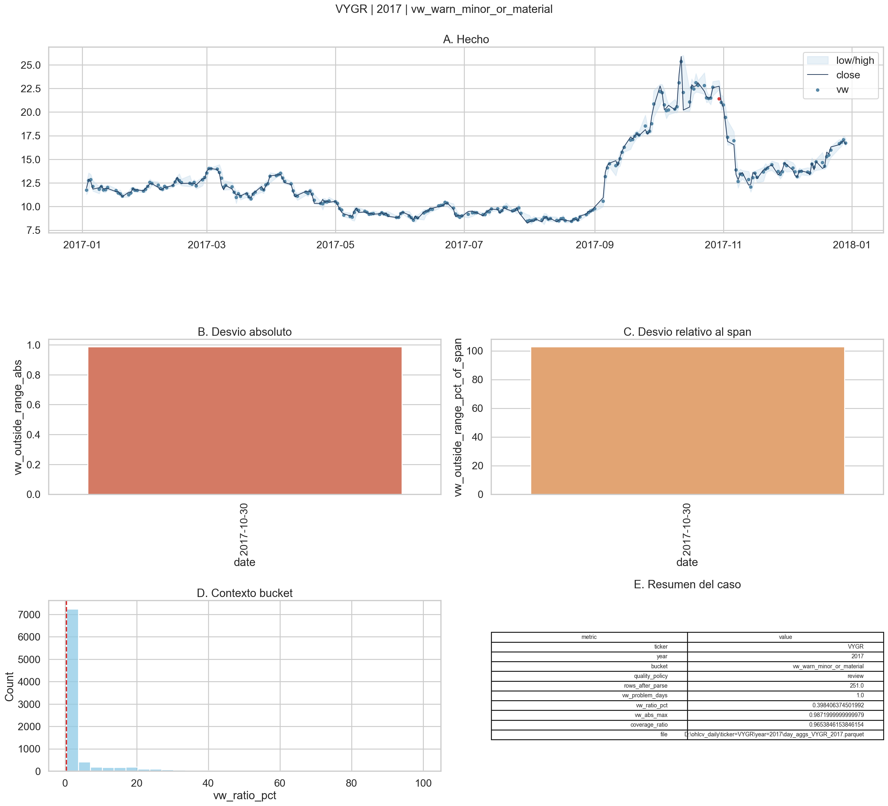

## NTN 2013

ticker: `NTN`  
year: `2013`  
bucket: `vw_warn_minor_or_material`  
quality_policy: `recoverable_with_flag`  
issues: `[]`  
warns: `["dataset_read_incompatible_schema", "schema_merge_conflict_ticker_encoding", "vw_outside_range_material"]`  
file: `D:\ohlcv_daily\ticker=NTN\year=2013\day_aggs_NTN_2013.parquet`

### Analisis Forense

`vw_warn_minor_or_material` es una familia de advertencia contractual, no una exclusion dura. La imagen debe leerse como prueba de que existe residuo `aun acotado en conteo, pero ya material desde el punto de vista contractual`. Aqui el sistema no encuentra una patologia bastante concentrada para subir a los buckets de ratio, pero tampoco permite decir que el ano sea indistinguible de la franja buena.

La consecuencia es mantenerlo en `recoverable_with_flag`: sirve para sensibilidad, auditoria y modelos que aceptan pequena contaminacion, pero no para asumir limpieza diaria plena. El error evitado es silencioso pero serio: dejar que avisos de rango aparentemente menores entren en `good` y despues se propaguen a labels, benchmarks o comparaciones vendor como si fueran observaciones sin friccion.

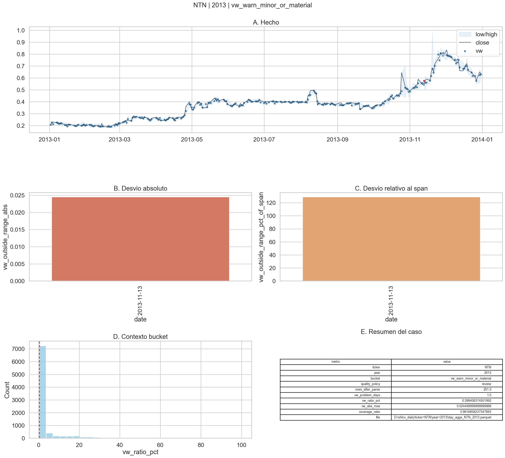

## SYRS 2019

ticker: `SYRS`  
year: `2019`  
bucket: `vw_warn_minor_or_material`  
quality_policy: `recoverable_with_flag`  
issues: `[]`  
warns: `["dataset_read_incompatible_schema", "schema_merge_conflict_ticker_encoding", "vw_outside_range_material"]`  
file: `D:\ohlcv_daily\ticker=SYRS\year=2019\day_aggs_SYRS_2019.parquet`

### Analisis Forense

`vw_warn_minor_or_material` es una familia de advertencia contractual, no una exclusion dura. La imagen debe leerse como prueba de que existe residuo `aun acotado en conteo, pero ya material desde el punto de vista contractual`. Aqui el sistema no encuentra una patologia bastante concentrada para subir a los buckets de ratio, pero tampoco permite decir que el ano sea indistinguible de la franja buena.

La consecuencia es mantenerlo en `recoverable_with_flag`: sirve para sensibilidad, auditoria y modelos que aceptan pequena contaminacion, pero no para asumir limpieza diaria plena. El error evitado es silencioso pero serio: dejar que avisos de rango aparentemente menores entren en `good` y despues se propaguen a labels, benchmarks o comparaciones vendor como si fueran observaciones sin friccion.

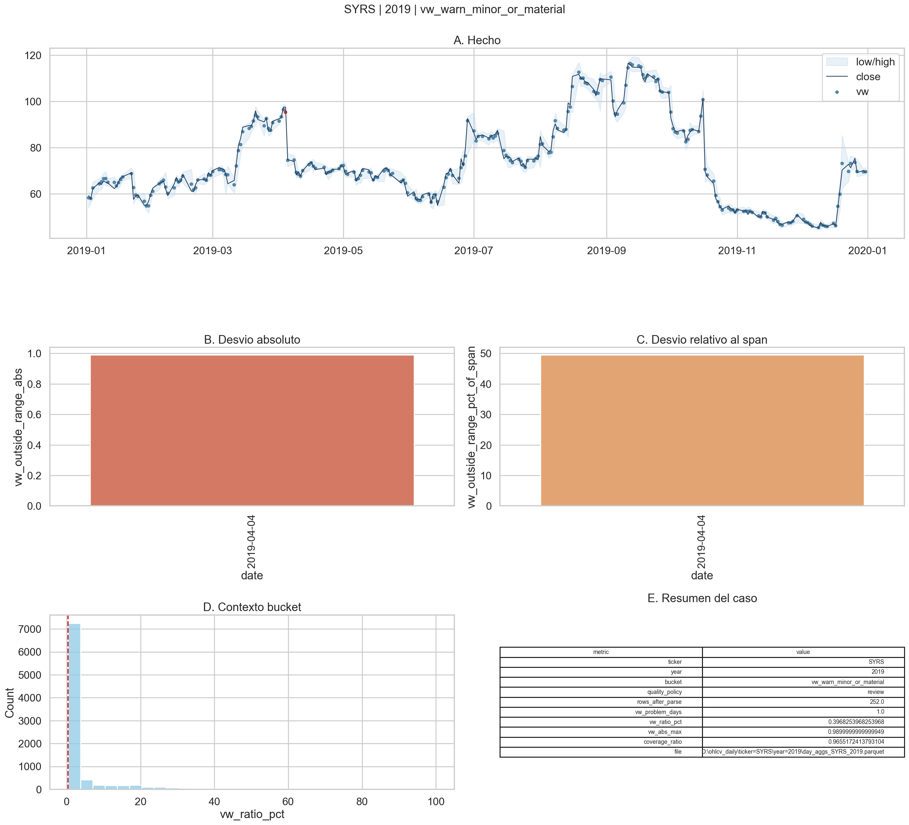
