# Daily Good Cases v0.1

Este documento recopila una muestra representativa de casos `good` de `daily`, con imagen incrustada, metadatos y justificacion positiva de por que siguen dentro de la franja sana del dataset.

La pertenencia a este dossier exige:

- `quality_policy = good`;
- y bucket perteneciente a la franja buena vigente de `daily`.

## Menu

- 1. [DCTH 2010](#dcth-2010)
- 2. [TOPS 2017](#tops-2017)
- 3. [DCTH 2008](#dcth-2008)
- 4. [DCTH 2013](#dcth-2013)
- 5. [BON 2022](#bon-2022)
- 6. [CXAI 2023](#cxai-2023)
- 7. [SIEB 2008](#sieb-2008)
- 8. [PMCB 2021](#pmcb-2021)
- 9. [BYU 2024](#byu-2024)
- 10. [SCPS 2025](#scps-2025)
- 11. [HURA 2025](#hura-2025)
- 12. [ATNX 2021](#atnx-2021)
- 13. [HSDT 2021](#hsdt-2021)
- 14. [SMX 2025](#smx-2025)
- 15. [ELAB 2024](#elab-2024)
- 16. [OPGN 2016](#opgn-2016)
- 17. [LCFY 2024](#lcfy-2024)
- 18. [WILC 2017](#wilc-2017)
- 19. [AETI 2015](#aeti-2015)
- 20. [NTN 2018](#ntn-2018)
- 21. [CLNN 2020](#clnn-2020)
- 22. [KIN 2013](#kin-2013)
- 23. [CIZN 2012](#cizn-2012)
- 24. [SCX 2013](#scx-2013)

## DCTH 2010

ticker: `DCTH`  
year: `2010`  
bucket: `vw_edge_absmax_only`  
quality_policy: `good`  
issues: `["vw_outside_range_severe"]`  
warns: `["dataset_read_incompatible_schema", "schema_merge_conflict_ticker_encoding"]`  
file: `D:\ohlcv_daily\ticker=DCTH\year=2010\day_aggs_DCTH_2010.parquet`

### Analisis Forense

La figura superior ensena el hecho decisivo del caso: aparecen puntos rojos en dias aislados donde `vw` cae fuera del rango `low-high`, pero la anomalia no se convierte en patron dominante del file. Aqui la pregunta correcta no es si existe alguna infraccion, sino si esa infraccion es bastante persistente como para contaminar el retorno diario del ano completo. Con `rows_after_parse = 252` y solo `1` filas exportadas como problematicas, la evidencia apunta a residuo de borde y no a deterioro estructural.

La decision de mantenerlo en `good` evita un error metodologico importante: expulsar del universo util anos basicamente sanos por una o dos observaciones extremas. La policy admite este bucket porque la proporcion afectada (`0.396825%`) es baja y el libro diario sigue siendo interpretable como serie de retorno. Implicacion operativa: sigue siendo valido para `backtest_core`, benchmarking diario y labels de ML sobre `daily`; lo que no debe hacerse es leer el `vw` extremo como si describiera una condicion microestructural estable. El exceso absoluto maximo (`18437686400.000000`) puede ser grande en escala nominal, pero sin persistencia no cambia el veredicto contractual.

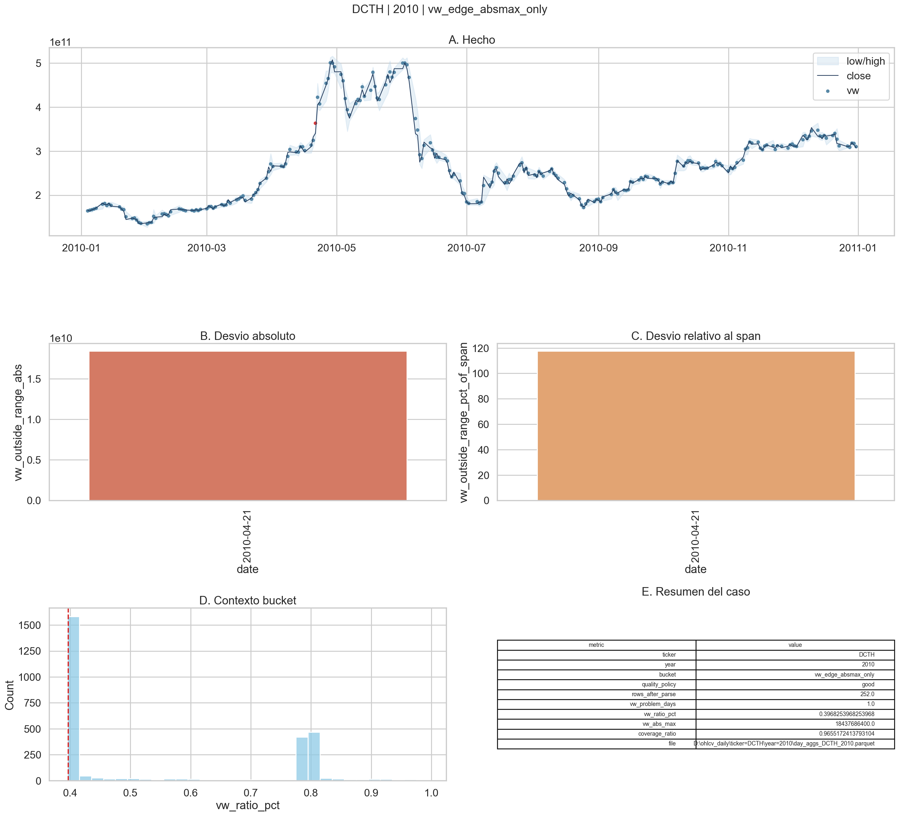

## TOPS 2017

ticker: `TOPS`  
year: `2017`  
bucket: `vw_edge_absmax_only`  
quality_policy: `good`  
issues: `["vw_outside_range_severe"]`  
warns: `["dataset_read_incompatible_schema", "schema_merge_conflict_ticker_encoding"]`  
file: `D:\ohlcv_daily\ticker=TOPS\year=2017\day_aggs_TOPS_2017.parquet`

### Analisis Forense

La figura superior ensena el hecho decisivo del caso: aparecen puntos rojos en dias aislados donde `vw` cae fuera del rango `low-high`, pero la anomalia no se convierte en patron dominante del file. Aqui la pregunta correcta no es si existe alguna infraccion, sino si esa infraccion es bastante persistente como para contaminar el retorno diario del ano completo. Con `rows_after_parse = 251` y solo `2` filas exportadas como problematicas, la evidencia apunta a residuo de borde y no a deterioro estructural.

La decision de mantenerlo en `good` evita un error metodologico importante: expulsar del universo util anos basicamente sanos por una o dos observaciones extremas. La policy admite este bucket porque la proporcion afectada (`0.796813%`) es baja y el libro diario sigue siendo interpretable como serie de retorno. Implicacion operativa: sigue siendo valido para `backtest_core`, benchmarking diario y labels de ML sobre `daily`; lo que no debe hacerse es leer el `vw` extremo como si describiera una condicion microestructural estable. El exceso absoluto maximo (`227700000.000000`) puede ser grande en escala nominal, pero sin persistencia no cambia el veredicto contractual.

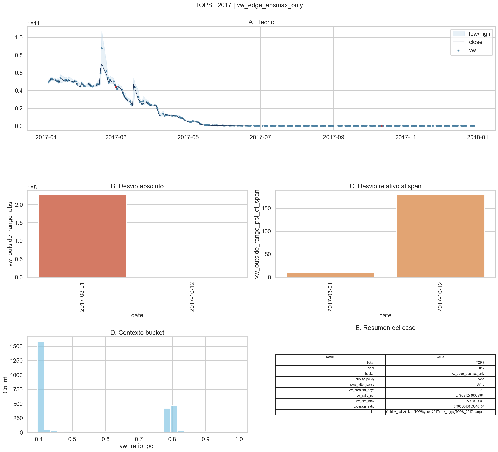

## DCTH 2008

ticker: `DCTH`  
year: `2008`  
bucket: `vw_edge_absmax_only`  
quality_policy: `good`  
issues: `["vw_outside_range_severe"]`  
warns: `["dataset_read_incompatible_schema", "schema_merge_conflict_ticker_encoding"]`  
file: `D:\ohlcv_daily\ticker=DCTH\year=2008\day_aggs_DCTH_2008.parquet`

### Analisis Forense

La figura superior ensena el hecho decisivo del caso: aparecen puntos rojos en dias aislados donde `vw` cae fuera del rango `low-high`, pero la anomalia no se convierte en patron dominante del file. Aqui la pregunta correcta no es si existe alguna infraccion, sino si esa infraccion es bastante persistente como para contaminar el retorno diario del ano completo. Con `rows_after_parse = 243` y solo `1` filas exportadas como problematicas, la evidencia apunta a residuo de borde y no a deterioro estructural.

La decision de mantenerlo en `good` evita un error metodologico importante: expulsar del universo util anos basicamente sanos por una o dos observaciones extremas. La policy admite este bucket porque la proporcion afectada (`0.411523%`) es baja y el libro diario sigue siendo interpretable como serie de retorno. Implicacion operativa: sigue siendo valido para `backtest_core`, benchmarking diario y labels de ML sobre `daily`; lo que no debe hacerse es leer el `vw` extremo como si describiera una condicion microestructural estable. El exceso absoluto maximo (`225944320.000000`) puede ser grande en escala nominal, pero sin persistencia no cambia el veredicto contractual.

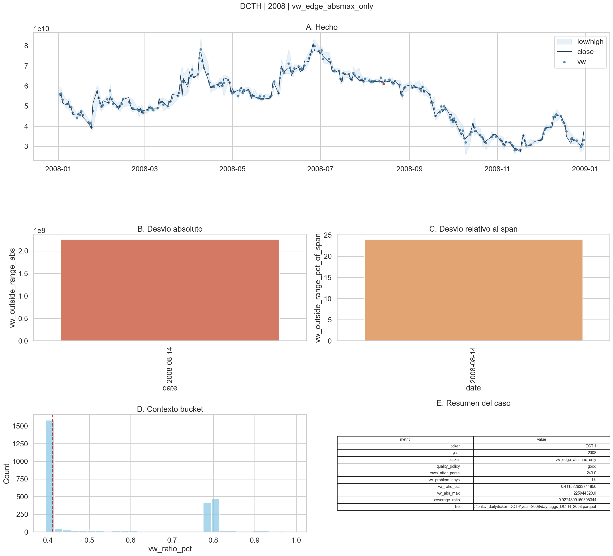

## DCTH 2013

ticker: `DCTH`  
year: `2013`  
bucket: `vw_edge_absmax_only`  
quality_policy: `good`  
issues: `["vw_outside_range_severe"]`  
warns: `["dataset_read_incompatible_schema", "schema_merge_conflict_ticker_encoding"]`  
file: `D:\ohlcv_daily\ticker=DCTH\year=2013\day_aggs_DCTH_2013.parquet`

### Analisis Forense

La figura superior ensena el hecho decisivo del caso: aparecen puntos rojos en dias aislados donde `vw` cae fuera del rango `low-high`, pero la anomalia no se convierte en patron dominante del file. Aqui la pregunta correcta no es si existe alguna infraccion, sino si esa infraccion es bastante persistente como para contaminar el retorno diario del ano completo. Con `rows_after_parse = 252` y solo `2` filas exportadas como problematicas, la evidencia apunta a residuo de borde y no a deterioro estructural.

La decision de mantenerlo en `good` evita un error metodologico importante: expulsar del universo util anos basicamente sanos por una o dos observaciones extremas. La policy admite este bucket porque la proporcion afectada (`0.793651%`) es baja y el libro diario sigue siendo interpretable como serie de retorno. Implicacion operativa: sigue siendo valido para `backtest_core`, benchmarking diario y labels de ML sobre `daily`; lo que no debe hacerse es leer el `vw` extremo como si describiera una condicion microestructural estable. El exceso absoluto maximo (`86280320.000000`) puede ser grande en escala nominal, pero sin persistencia no cambia el veredicto contractual.

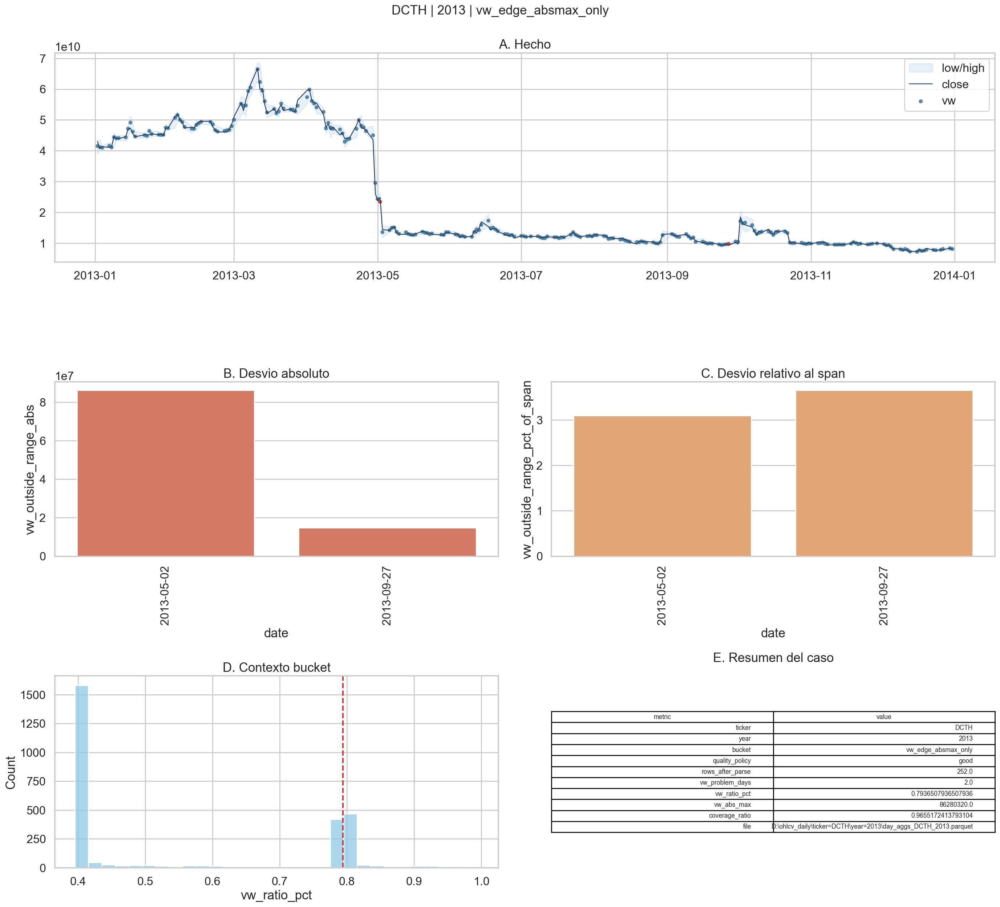

## BON 2022

ticker: `BON`  
year: `2022`  
bucket: `vw_edge_absmax_only`  
quality_policy: `good`  
issues: `["vw_outside_range_severe"]`  
warns: `["dataset_read_incompatible_schema", "schema_merge_conflict_ticker_encoding"]`  
file: `D:\ohlcv_daily\ticker=BON\year=2022\day_aggs_BON_2022.parquet`

### Analisis Forense

La figura superior ensena el hecho decisivo del caso: aparecen puntos rojos en dias aislados donde `vw` cae fuera del rango `low-high`, pero la anomalia no se convierte en patron dominante del file. Aqui la pregunta correcta no es si existe alguna infraccion, sino si esa infraccion es bastante persistente como para contaminar el retorno diario del ano completo. Con `rows_after_parse = 251` y solo `2` filas exportadas como problematicas, la evidencia apunta a residuo de borde y no a deterioro estructural.

La decision de mantenerlo en `good` evita un error metodologico importante: expulsar del universo util anos basicamente sanos por una o dos observaciones extremas. La policy admite este bucket porque la proporcion afectada (`0.796813%`) es baja y el libro diario sigue siendo interpretable como serie de retorno. Implicacion operativa: sigue siendo valido para `backtest_core`, benchmarking diario y labels de ML sobre `daily`; lo que no debe hacerse es leer el `vw` extremo como si describiera una condicion microestructural estable. El exceso absoluto maximo (`282.526000`) puede ser grande en escala nominal, pero sin persistencia no cambia el veredicto contractual.

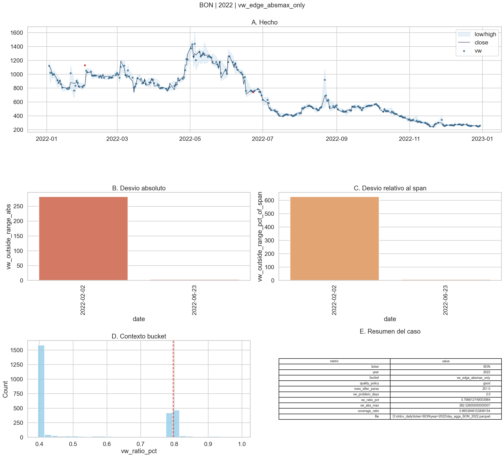

## CXAI 2023

ticker: `CXAI`  
year: `2023`  
bucket: `vw_edge_absmax_only`  
quality_policy: `good`  
issues: `["vw_outside_range_severe"]`  
warns: `["dataset_read_incompatible_schema", "schema_merge_conflict_ticker_encoding"]`  
file: `D:\ohlcv_daily\ticker=CXAI\year=2023\day_aggs_CXAI_2023.parquet`

### Analisis Forense

La figura superior ensena el hecho decisivo del caso: aparecen puntos rojos en dias aislados donde `vw` cae fuera del rango `low-high`, pero la anomalia no se convierte en patron dominante del file. Aqui la pregunta correcta no es si existe alguna infraccion, sino si esa infraccion es bastante persistente como para contaminar el retorno diario del ano completo. Con `rows_after_parse = 201` y solo `2` filas exportadas como problematicas, la evidencia apunta a residuo de borde y no a deterioro estructural.

La decision de mantenerlo en `good` evita un error metodologico importante: expulsar del universo util anos basicamente sanos por una o dos observaciones extremas. La policy admite este bucket porque la proporcion afectada (`0.995025%`) es baja y el libro diario sigue siendo interpretable como serie de retorno. Implicacion operativa: sigue siendo valido para `backtest_core`, benchmarking diario y labels de ML sobre `daily`; lo que no debe hacerse es leer el `vw` extremo como si describiera una condicion microestructural estable. El exceso absoluto maximo (`0.453200`) puede ser grande en escala nominal, pero sin persistencia no cambia el veredicto contractual.

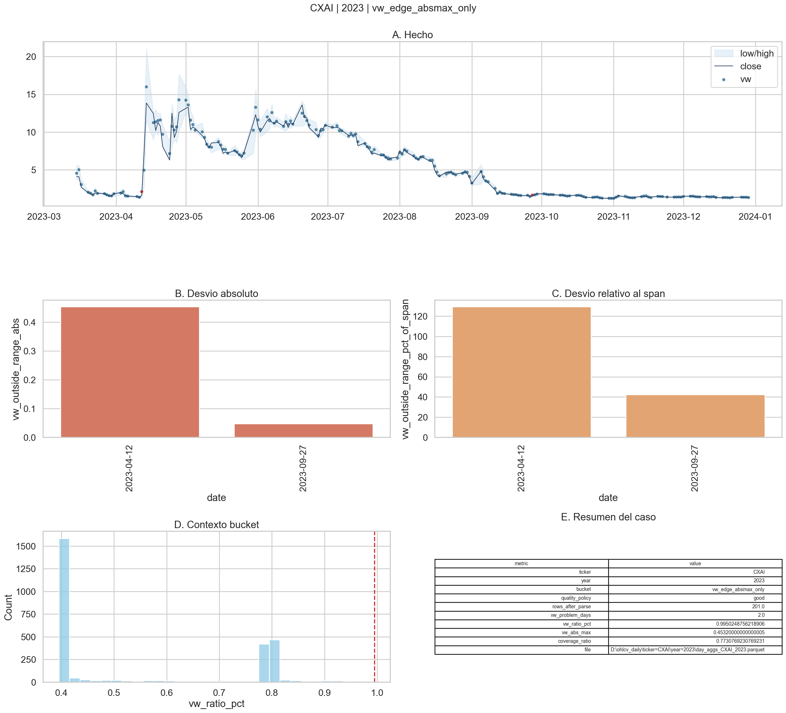

## SIEB 2008

ticker: `SIEB`  
year: `2008`  
bucket: `vw_edge_absmax_only`  
quality_policy: `good`  
issues: `["vw_outside_range_severe"]`  
warns: `["dataset_read_incompatible_schema", "schema_merge_conflict_ticker_encoding"]`  
file: `D:\ohlcv_daily\ticker=SIEB\year=2008\day_aggs_SIEB_2008.parquet`

### Analisis Forense

La figura superior ensena el hecho decisivo del caso: aparecen puntos rojos en dias aislados donde `vw` cae fuera del rango `low-high`, pero la anomalia no se convierte en patron dominante del file. Aqui la pregunta correcta no es si existe alguna infraccion, sino si esa infraccion es bastante persistente como para contaminar el retorno diario del ano completo. Con `rows_after_parse = 201` y solo `2` filas exportadas como problematicas, la evidencia apunta a residuo de borde y no a deterioro estructural.

La decision de mantenerlo en `good` evita un error metodologico importante: expulsar del universo util anos basicamente sanos por una o dos observaciones extremas. La policy admite este bucket porque la proporcion afectada (`0.995025%`) es baja y el libro diario sigue siendo interpretable como serie de retorno. Implicacion operativa: sigue siendo valido para `backtest_core`, benchmarking diario y labels de ML sobre `daily`; lo que no debe hacerse es leer el `vw` extremo como si describiera una condicion microestructural estable. El exceso absoluto maximo (`0.076900`) puede ser grande en escala nominal, pero sin persistencia no cambia el veredicto contractual.

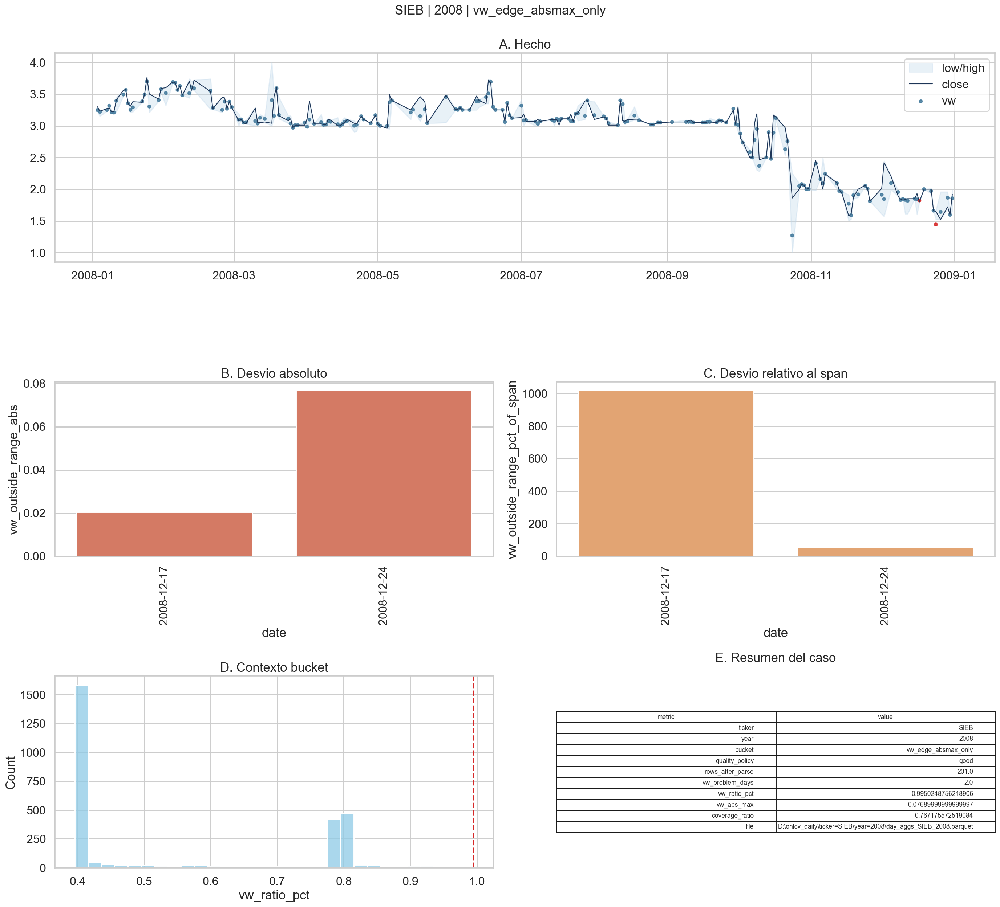

## PMCB 2021

ticker: `PMCB`  
year: `2021`  
bucket: `vw_edge_absmax_only`  
quality_policy: `good`  
issues: `["vw_outside_range_severe"]`  
warns: `["dataset_read_incompatible_schema", "schema_merge_conflict_ticker_encoding", "suspicious_sparse_year"]`  
file: `D:\ohlcv_daily\ticker=PMCB\year=2021\day_aggs_PMCB_2021.parquet`

### Analisis Forense

La figura superior ensena el hecho decisivo del caso: aparecen puntos rojos en dias aislados donde `vw` cae fuera del rango `low-high`, pero la anomalia no se convierte en patron dominante del file. Aqui la pregunta correcta no es si existe alguna infraccion, sino si esa infraccion es bastante persistente como para contaminar el retorno diario del ano completo. Con `rows_after_parse = 101` y solo `1` filas exportadas como problematicas, la evidencia apunta a residuo de borde y no a deterioro estructural.

La decision de mantenerlo en `good` evita un error metodologico importante: expulsar del universo util anos basicamente sanos por una o dos observaciones extremas. La policy admite este bucket porque la proporcion afectada (`0.990099%`) es baja y el libro diario sigue siendo interpretable como serie de retorno. Implicacion operativa: sigue siendo valido para `backtest_core`, benchmarking diario y labels de ML sobre `daily`; lo que no debe hacerse es leer el `vw` extremo como si describiera una condicion microestructural estable. El exceso absoluto maximo (`0.247700`) puede ser grande en escala nominal, pero sin persistencia no cambia el veredicto contractual.

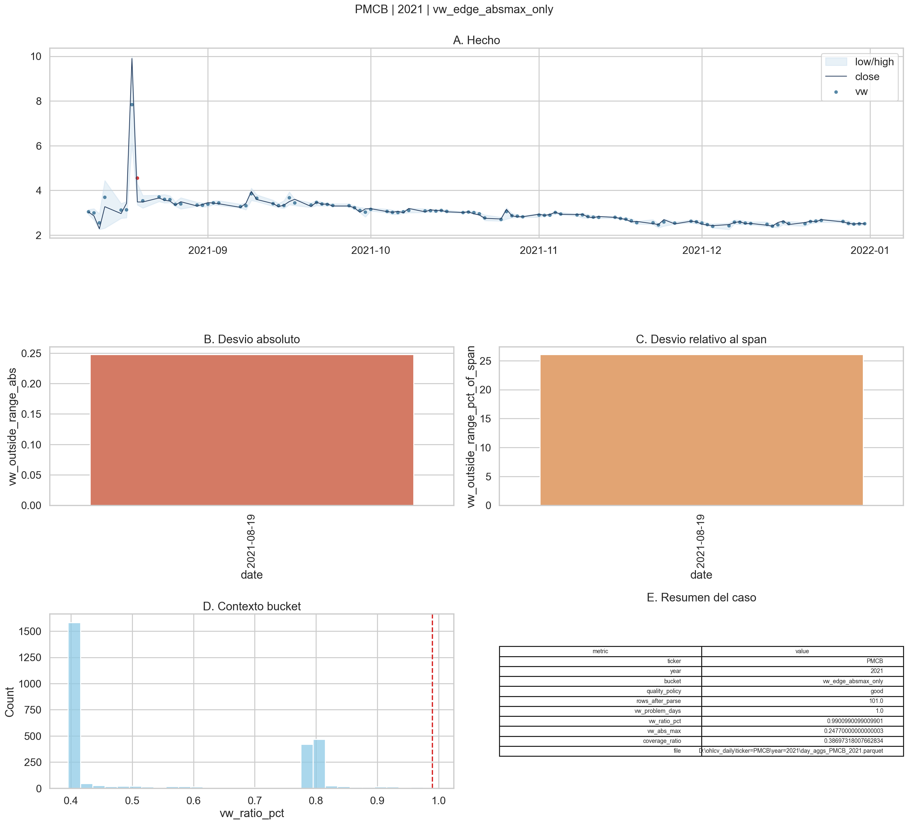

## BYU 2024

ticker: `BYU`  
year: `2024`  
bucket: `vw_edge_absmax_only`  
quality_policy: `good`  
issues: `["vw_outside_range_severe"]`  
warns: `["dataset_read_incompatible_schema", "large_internal_gap_days", "schema_merge_conflict_ticker_encoding"]`  
file: `D:\ohlcv_daily\ticker=BYU\year=2024\day_aggs_BYU_2024.parquet`

### Analisis Forense

La figura superior ensena el hecho decisivo del caso: aparecen puntos rojos en dias aislados donde `vw` cae fuera del rango `low-high`, pero la anomalia no se convierte en patron dominante del file. Aqui la pregunta correcta no es si existe alguna infraccion, sino si esa infraccion es bastante persistente como para contaminar el retorno diario del ano completo. Con `rows_after_parse = 202` y solo `2` filas exportadas como problematicas, la evidencia apunta a residuo de borde y no a deterioro estructural.

La decision de mantenerlo en `good` evita un error metodologico importante: expulsar del universo util anos basicamente sanos por una o dos observaciones extremas. La policy admite este bucket porque la proporcion afectada (`0.990099%`) es baja y el libro diario sigue siendo interpretable como serie de retorno. Implicacion operativa: sigue siendo valido para `backtest_core`, benchmarking diario y labels de ML sobre `daily`; lo que no debe hacerse es leer el `vw` extremo como si describiera una condicion microestructural estable. El exceso absoluto maximo (`0.044200`) puede ser grande en escala nominal, pero sin persistencia no cambia el veredicto contractual.

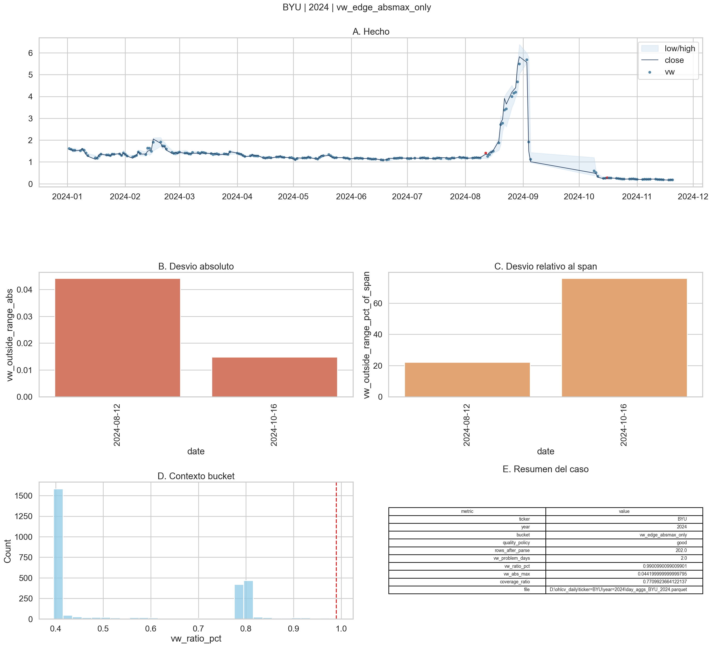

## SCPS 2025

ticker: `SCPS`  
year: `2025`  
bucket: `vw_edge_absmax_only`  
quality_policy: `good`  
issues: `["vw_outside_range_severe"]`  
warns: `["dataset_read_incompatible_schema", "large_internal_gap_days", "schema_merge_conflict_ticker_encoding", "suspicious_sparse_year"]`  
file: `D:\ohlcv_daily\ticker=SCPS\year=2025\day_aggs_SCPS_2025.parquet`

### Analisis Forense

La figura superior ensena el hecho decisivo del caso: aparecen puntos rojos en dias aislados donde `vw` cae fuera del rango `low-high`, pero la anomalia no se convierte en patron dominante del file. Aqui la pregunta correcta no es si existe alguna infraccion, sino si esa infraccion es bastante persistente como para contaminar el retorno diario del ano completo. Con `rows_after_parse = 102` y solo `2` filas exportadas como problematicas, la evidencia apunta a residuo de borde y no a deterioro estructural.

La decision de mantenerlo en `good` evita un error metodologico importante: expulsar del universo util anos basicamente sanos por una o dos observaciones extremas. La policy admite este bucket porque la proporcion afectada (`0.980392%`) es baja y el libro diario sigue siendo interpretable como serie de retorno. Implicacion operativa: sigue siendo valido para `backtest_core`, benchmarking diario y labels de ML sobre `daily`; lo que no debe hacerse es leer el `vw` extremo como si describiera una condicion microestructural estable. El exceso absoluto maximo (`0.000100`) puede ser grande en escala nominal, pero sin persistencia no cambia el veredicto contractual.

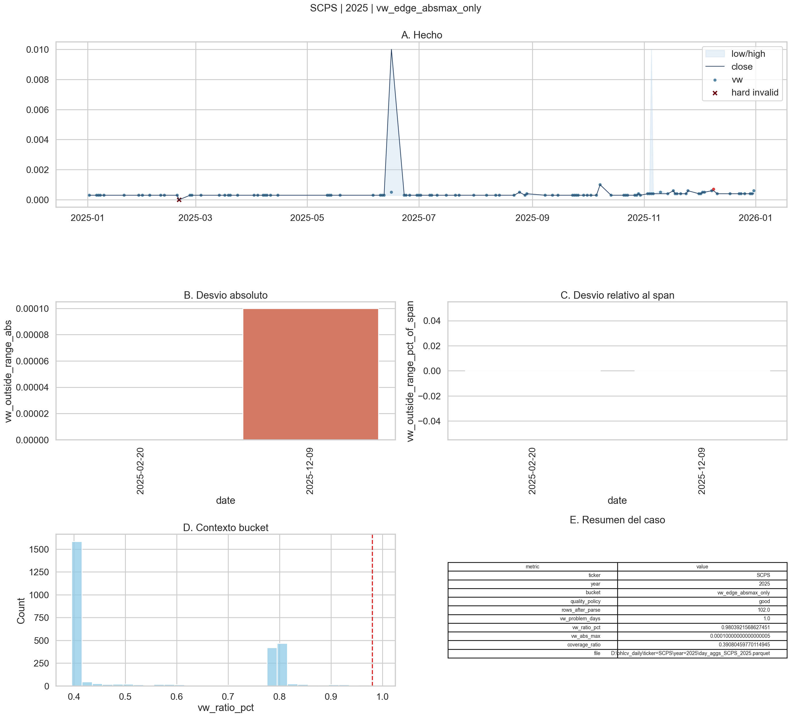

## HURA 2025

ticker: `HURA`  
year: `2025`  
bucket: `vw_edge_absmax_only`  
quality_policy: `good`  
issues: `["vw_outside_range_severe"]`  
warns: `["dataset_read_incompatible_schema", "schema_merge_conflict_ticker_encoding"]`  
file: `D:\ohlcv_daily\ticker=HURA\year=2025\day_aggs_HURA_2025.parquet`

### Analisis Forense

La figura superior ensena el hecho decisivo del caso: aparecen puntos rojos en dias aislados donde `vw` cae fuera del rango `low-high`, pero la anomalia no se convierte en patron dominante del file. Aqui la pregunta correcta no es si existe alguna infraccion, sino si esa infraccion es bastante persistente como para contaminar el retorno diario del ano completo. Con `rows_after_parse = 250` y solo `1` filas exportadas como problematicas, la evidencia apunta a residuo de borde y no a deterioro estructural.

La decision de mantenerlo en `good` evita un error metodologico importante: expulsar del universo util anos basicamente sanos por una o dos observaciones extremas. La policy admite este bucket porque la proporcion afectada (`0.400000%`) es baja y el libro diario sigue siendo interpretable como serie de retorno. Implicacion operativa: sigue siendo valido para `backtest_core`, benchmarking diario y labels de ML sobre `daily`; lo que no debe hacerse es leer el `vw` extremo como si describiera una condicion microestructural estable. El exceso absoluto maximo (`0.697400`) puede ser grande en escala nominal, pero sin persistencia no cambia el veredicto contractual.

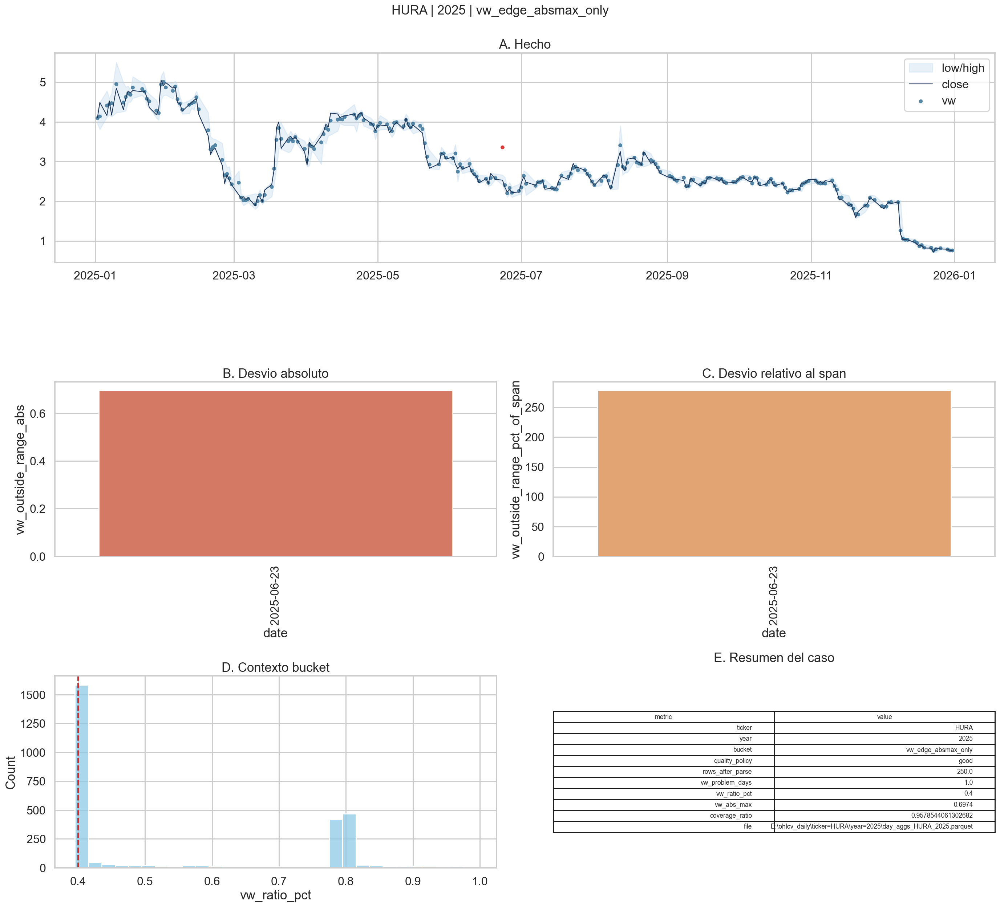

## ATNX 2021

ticker: `ATNX`  
year: `2021`  
bucket: `vw_edge_absmax_only`  
quality_policy: `good`  
issues: `["vw_outside_range_severe"]`  
warns: `["dataset_read_incompatible_schema", "schema_merge_conflict_ticker_encoding"]`  
file: `D:\ohlcv_daily\ticker=ATNX\year=2021\day_aggs_ATNX_2021.parquet`

### Analisis Forense

La figura superior ensena el hecho decisivo del caso: aparecen puntos rojos en dias aislados donde `vw` cae fuera del rango `low-high`, pero la anomalia no se convierte en patron dominante del file. Aqui la pregunta correcta no es si existe alguna infraccion, sino si esa infraccion es bastante persistente como para contaminar el retorno diario del ano completo. Con `rows_after_parse = 252` y solo `1` filas exportadas como problematicas, la evidencia apunta a residuo de borde y no a deterioro estructural.

La decision de mantenerlo en `good` evita un error metodologico importante: expulsar del universo util anos basicamente sanos por una o dos observaciones extremas. La policy admite este bucket porque la proporcion afectada (`0.396825%`) es baja y el libro diario sigue siendo interpretable como serie de retorno. Implicacion operativa: sigue siendo valido para `backtest_core`, benchmarking diario y labels de ML sobre `daily`; lo que no debe hacerse es leer el `vw` extremo como si describiera una condicion microestructural estable. El exceso absoluto maximo (`2.868200`) puede ser grande en escala nominal, pero sin persistencia no cambia el veredicto contractual.

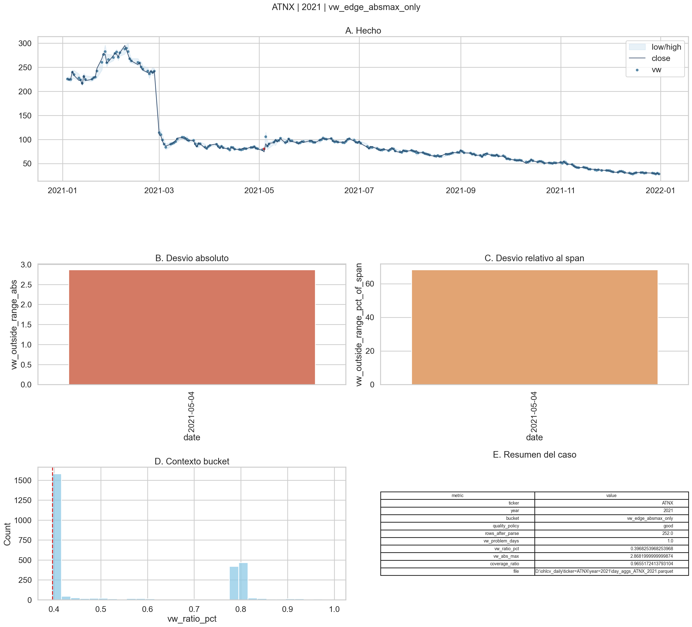

## HSDT 2021

ticker: `HSDT`  
year: `2021`  
bucket: `schema_only_or_other`  
quality_policy: `good`  
issues: `["vw_outside_range_severe"]`  
warns: `["dataset_read_incompatible_schema", "schema_merge_conflict_ticker_encoding"]`  
file: `D:\ohlcv_daily\ticker=HSDT\year=2021\day_aggs_HSDT_2021.parquet`

### Analisis Forense

Este bucket `schema_only_or_other` debe leerse como ausencia de una patologia diaria dominante, no como perfeccion absoluta del file. En la imagen no aparece una concentracion clara de dias rojos capaz de organizarse como familia `vw` persistente, o directamente no hay filas problematicas exportadas. Eso significa que el validador no encontro aqui una razon suficiente para sacar el ano de la franja sana, aunque puedan existir avisos de esquema, sparsez o pequenas tensiones locales.

La consecuencia institucional es distinta de `vw_edge_absmax_only`: aqui `good` no se justifica por tolerar un extremo puntual, sino porque no hay un mecanismo de dano consistente sobre la barra diaria. Implicacion operativa: el file puede usarse en `backtest_core` y para labels diarios, pero `good` no debe confundirse con riqueza estadistica. Si el coverage es bajo (`0.961686`) o hay warns como `rows_lt_10` o `suspicious_sparse_year`, la lectura correcta es: barra no invalida, pero ano pobre como base de inferencia. El error evitado es mezclar calidad semantica de precio con densidad muestral: un ano escaso puede seguir siendo valido como precio y a la vez poco util para ciertos analisis de estabilidad.

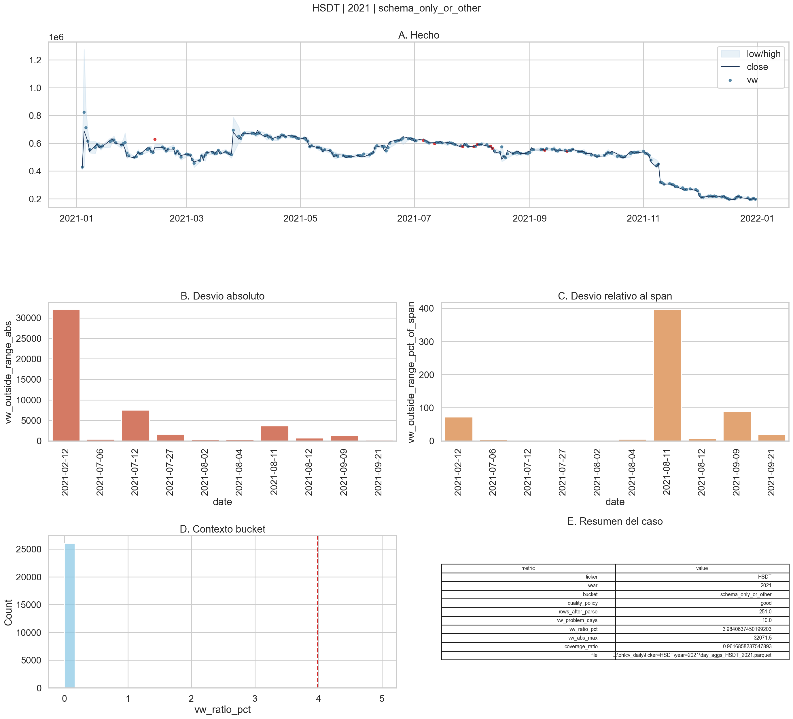

## SMX 2025

ticker: `SMX`  
year: `2025`  
bucket: `schema_only_or_other`  
quality_policy: `good`  
issues: `["vw_outside_range_severe"]`  
warns: `["dataset_read_incompatible_schema", "schema_merge_conflict_ticker_encoding"]`  
file: `D:\ohlcv_daily\ticker=SMX\year=2025\day_aggs_SMX_2025.parquet`

### Analisis Forense

Este bucket `schema_only_or_other` debe leerse como ausencia de una patologia diaria dominante, no como perfeccion absoluta del file. En la imagen no aparece una concentracion clara de dias rojos capaz de organizarse como familia `vw` persistente, o directamente no hay filas problematicas exportadas. Eso significa que el validador no encontro aqui una razon suficiente para sacar el ano de la franja sana, aunque puedan existir avisos de esquema, sparsez o pequenas tensiones locales.

La consecuencia institucional es distinta de `vw_edge_absmax_only`: aqui `good` no se justifica por tolerar un extremo puntual, sino porque no hay un mecanismo de dano consistente sobre la barra diaria. Implicacion operativa: el file puede usarse en `backtest_core` y para labels diarios, pero `good` no debe confundirse con riqueza estadistica. Si el coverage es bajo (`0.957854`) o hay warns como `rows_lt_10` o `suspicious_sparse_year`, la lectura correcta es: barra no invalida, pero ano pobre como base de inferencia. El error evitado es mezclar calidad semantica de precio con densidad muestral: un ano escaso puede seguir siendo valido como precio y a la vez poco util para ciertos analisis de estabilidad.

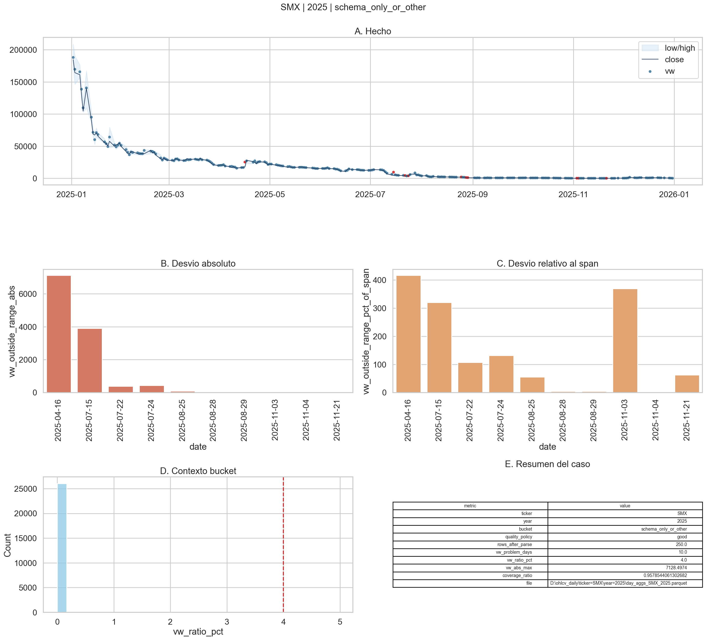

## ELAB 2024

ticker: `ELAB`  
year: `2024`  
bucket: `schema_only_or_other`  
quality_policy: `good`  
issues: `["vw_outside_range_severe"]`  
warns: `["dataset_read_incompatible_schema", "schema_merge_conflict_ticker_encoding"]`  
file: `D:\ohlcv_daily\ticker=ELAB\year=2024\day_aggs_ELAB_2024.parquet`

### Analisis Forense

Este bucket `schema_only_or_other` debe leerse como ausencia de una patologia diaria dominante, no como perfeccion absoluta del file. En la imagen no aparece una concentracion clara de dias rojos capaz de organizarse como familia `vw` persistente, o directamente no hay filas problematicas exportadas. Eso significa que el validador no encontro aqui una razon suficiente para sacar el ano de la franja sana, aunque puedan existir avisos de esquema, sparsez o pequenas tensiones locales.

La consecuencia institucional es distinta de `vw_edge_absmax_only`: aqui `good` no se justifica por tolerar un extremo puntual, sino porque no hay un mecanismo de dano consistente sobre la barra diaria. Implicacion operativa: el file puede usarse en `backtest_core` y para labels diarios, pero `good` no debe confundirse con riqueza estadistica. Si el coverage es bajo (`0.961832`) o hay warns como `rows_lt_10` o `suspicious_sparse_year`, la lectura correcta es: barra no invalida, pero ano pobre como base de inferencia. El error evitado es mezclar calidad semantica de precio con densidad muestral: un ano escaso puede seguir siendo valido como precio y a la vez poco util para ciertos analisis de estabilidad.

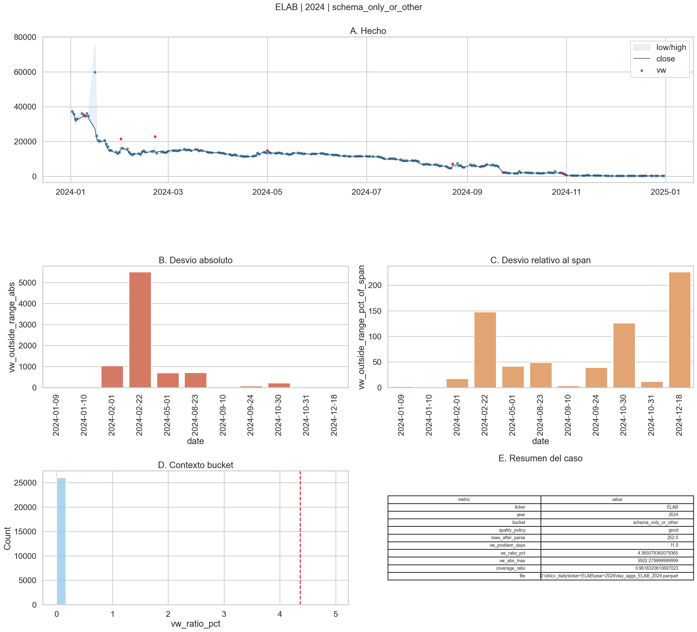

## OPGN 2016

ticker: `OPGN`  
year: `2016`  
bucket: `schema_only_or_other`  
quality_policy: `good`  
issues: `["vw_outside_range_severe"]`  
warns: `["dataset_read_incompatible_schema", "schema_merge_conflict_ticker_encoding"]`  
file: `D:\ohlcv_daily\ticker=OPGN\year=2016\day_aggs_OPGN_2016.parquet`

### Analisis Forense

Este bucket `schema_only_or_other` debe leerse como ausencia de una patologia diaria dominante, no como perfeccion absoluta del file. En la imagen no aparece una concentracion clara de dias rojos capaz de organizarse como familia `vw` persistente, o directamente no hay filas problematicas exportadas. Eso significa que el validador no encontro aqui una razon suficiente para sacar el ano de la franja sana, aunque puedan existir avisos de esquema, sparsez o pequenas tensiones locales.

La consecuencia institucional es distinta de `vw_edge_absmax_only`: aqui `good` no se justifica por tolerar un extremo puntual, sino porque no hay un mecanismo de dano consistente sobre la barra diaria. Implicacion operativa: el file puede usarse en `backtest_core` y para labels diarios, pero `good` no debe confundirse con riqueza estadistica. Si el coverage es bajo (`0.950192`) o hay warns como `rows_lt_10` o `suspicious_sparse_year`, la lectura correcta es: barra no invalida, pero ano pobre como base de inferencia. El error evitado es mezclar calidad semantica de precio con densidad muestral: un ano escaso puede seguir siendo valido como precio y a la vez poco util para ciertos analisis de estabilidad.

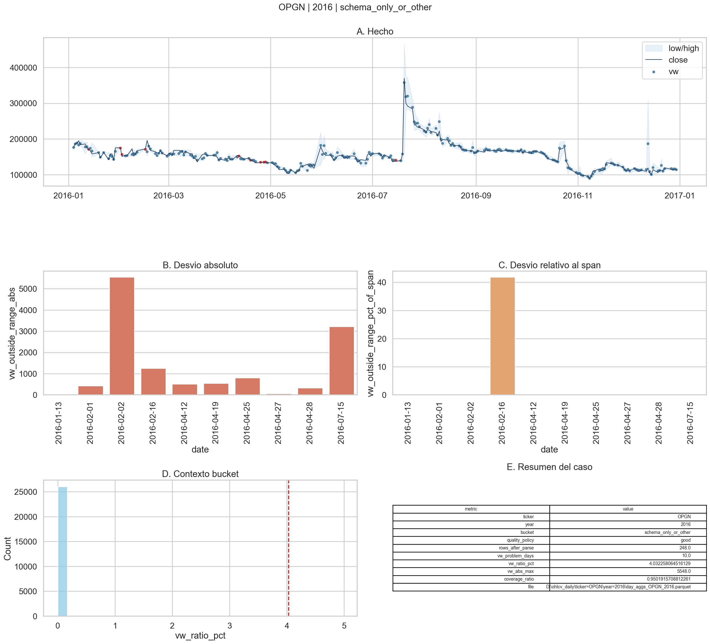

## LCFY 2024

ticker: `LCFY`  
year: `2024`  
bucket: `schema_only_or_other`  
quality_policy: `good`  
issues: `["vw_outside_range_severe"]`  
warns: `["dataset_read_incompatible_schema", "schema_merge_conflict_ticker_encoding"]`  
file: `D:\ohlcv_daily\ticker=LCFY\year=2024\day_aggs_LCFY_2024.parquet`

### Analisis Forense

Este bucket `schema_only_or_other` debe leerse como ausencia de una patologia diaria dominante, no como perfeccion absoluta del file. En la imagen no aparece una concentracion clara de dias rojos capaz de organizarse como familia `vw` persistente, o directamente no hay filas problematicas exportadas. Eso significa que el validador no encontro aqui una razon suficiente para sacar el ano de la franja sana, aunque puedan existir avisos de esquema, sparsez o pequenas tensiones locales.

La consecuencia institucional es distinta de `vw_edge_absmax_only`: aqui `good` no se justifica por tolerar un extremo puntual, sino porque no hay un mecanismo de dano consistente sobre la barra diaria. Implicacion operativa: el file puede usarse en `backtest_core` y para labels diarios, pero `good` no debe confundirse con riqueza estadistica. Si el coverage es bajo (`0.919847`) o hay warns como `rows_lt_10` o `suspicious_sparse_year`, la lectura correcta es: barra no invalida, pero ano pobre como base de inferencia. El error evitado es mezclar calidad semantica de precio con densidad muestral: un ano escaso puede seguir siendo valido como precio y a la vez poco util para ciertos analisis de estabilidad.

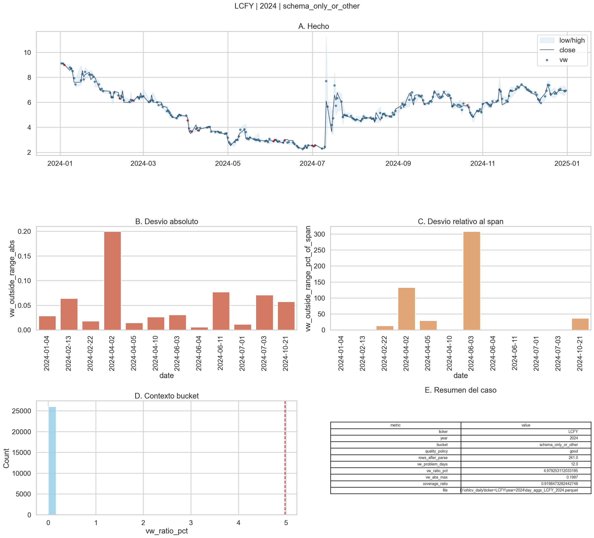

## WILC 2017

ticker: `WILC`  
year: `2017`  
bucket: `schema_only_or_other`  
quality_policy: `good`  
issues: `["vw_outside_range_severe"]`  
warns: `["dataset_read_incompatible_schema", "schema_merge_conflict_ticker_encoding"]`  
file: `D:\ohlcv_daily\ticker=WILC\year=2017\day_aggs_WILC_2017.parquet`

### Analisis Forense

Este bucket `schema_only_or_other` debe leerse como ausencia de una patologia diaria dominante, no como perfeccion absoluta del file. En la imagen no aparece una concentracion clara de dias rojos capaz de organizarse como familia `vw` persistente, o directamente no hay filas problematicas exportadas. Eso significa que el validador no encontro aqui una razon suficiente para sacar el ano de la franja sana, aunque puedan existir avisos de esquema, sparsez o pequenas tensiones locales.

La consecuencia institucional es distinta de `vw_edge_absmax_only`: aqui `good` no se justifica por tolerar un extremo puntual, sino porque no hay un mecanismo de dano consistente sobre la barra diaria. Implicacion operativa: el file puede usarse en `backtest_core` y para labels diarios, pero `good` no debe confundirse con riqueza estadistica. Si el coverage es bajo (`0.926923`) o hay warns como `rows_lt_10` o `suspicious_sparse_year`, la lectura correcta es: barra no invalida, pero ano pobre como base de inferencia. El error evitado es mezclar calidad semantica de precio con densidad muestral: un ano escaso puede seguir siendo valido como precio y a la vez poco util para ciertos analisis de estabilidad.

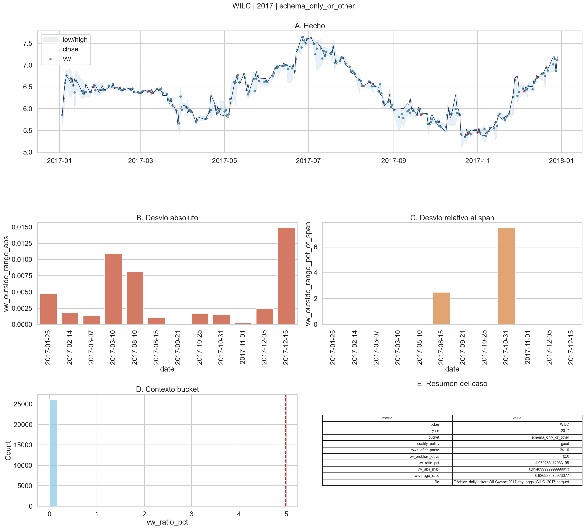

## AETI 2015

ticker: `AETI`  
year: `2015`  
bucket: `schema_only_or_other`  
quality_policy: `good`  
issues: `["vw_outside_range_severe"]`  
warns: `["dataset_read_incompatible_schema", "schema_merge_conflict_ticker_encoding"]`  
file: `D:\ohlcv_daily\ticker=AETI\year=2015\day_aggs_AETI_2015.parquet`

### Analisis Forense

Este bucket `schema_only_or_other` debe leerse como ausencia de una patologia diaria dominante, no como perfeccion absoluta del file. En la imagen no aparece una concentracion clara de dias rojos capaz de organizarse como familia `vw` persistente, o directamente no hay filas problematicas exportadas. Eso significa que el validador no encontro aqui una razon suficiente para sacar el ano de la franja sana, aunque puedan existir avisos de esquema, sparsez o pequenas tensiones locales.

La consecuencia institucional es distinta de `vw_edge_absmax_only`: aqui `good` no se justifica por tolerar un extremo puntual, sino porque no hay un mecanismo de dano consistente sobre la barra diaria. Implicacion operativa: el file puede usarse en `backtest_core` y para labels diarios, pero `good` no debe confundirse con riqueza estadistica. Si el coverage es bajo (`0.927203`) o hay warns como `rows_lt_10` o `suspicious_sparse_year`, la lectura correcta es: barra no invalida, pero ano pobre como base de inferencia. El error evitado es mezclar calidad semantica de precio con densidad muestral: un ano escaso puede seguir siendo valido como precio y a la vez poco util para ciertos analisis de estabilidad.

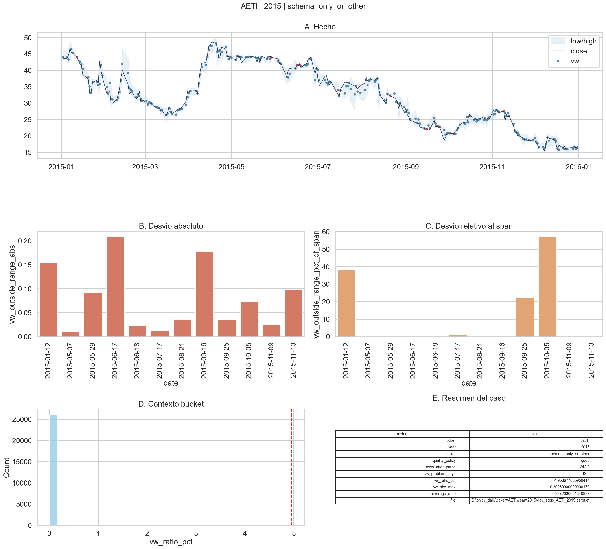

## NTN 2018

ticker: `NTN`  
year: `2018`  
bucket: `schema_only_or_other`  
quality_policy: `good`  
issues: `["vw_outside_range_severe"]`  
warns: `["dataset_read_incompatible_schema", "schema_merge_conflict_ticker_encoding"]`  
file: `D:\ohlcv_daily\ticker=NTN\year=2018\day_aggs_NTN_2018.parquet`

### Analisis Forense

Este bucket `schema_only_or_other` debe leerse como ausencia de una patologia diaria dominante, no como perfeccion absoluta del file. En la imagen no aparece una concentracion clara de dias rojos capaz de organizarse como familia `vw` persistente, o directamente no hay filas problematicas exportadas. Eso significa que el validador no encontro aqui una razon suficiente para sacar el ano de la franja sana, aunque puedan existir avisos de esquema, sparsez o pequenas tensiones locales.

La consecuencia institucional es distinta de `vw_edge_absmax_only`: aqui `good` no se justifica por tolerar un extremo puntual, sino porque no hay un mecanismo de dano consistente sobre la barra diaria. Implicacion operativa: el file puede usarse en `backtest_core` y para labels diarios, pero `good` no debe confundirse con riqueza estadistica. Si el coverage es bajo (`0.931034`) o hay warns como `rows_lt_10` o `suspicious_sparse_year`, la lectura correcta es: barra no invalida, pero ano pobre como base de inferencia. El error evitado es mezclar calidad semantica de precio con densidad muestral: un ano escaso puede seguir siendo valido como precio y a la vez poco util para ciertos analisis de estabilidad.

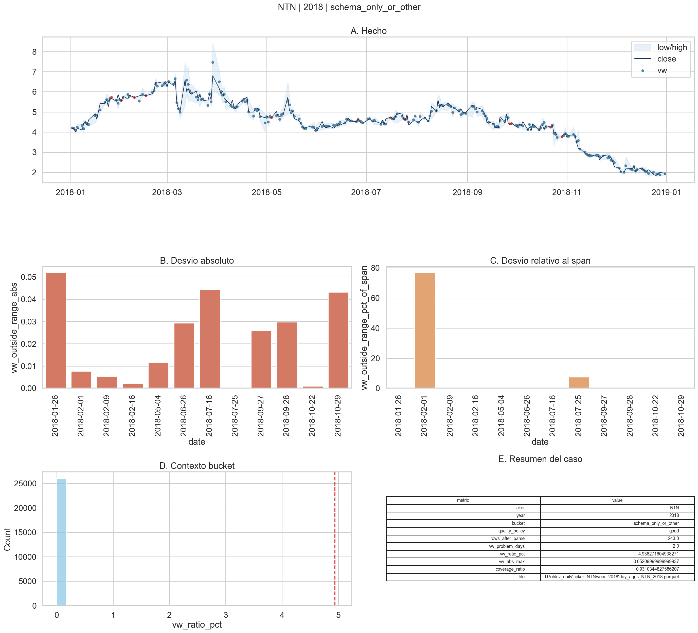

## CLNN 2020

ticker: `CLNN`  
year: `2020`  
bucket: `schema_only_or_other`  
quality_policy: `good`  
issues: `[]`  
warns: `["dataset_read_incompatible_schema", "rows_lt_10", "schema_merge_conflict_ticker_encoding", "suspicious_sparse_year"]`  
file: `D:\ohlcv_daily\ticker=CLNN\year=2020\day_aggs_CLNN_2020.parquet`

### Analisis Forense

Este bucket `schema_only_or_other` debe leerse como ausencia de una patologia diaria dominante, no como perfeccion absoluta del file. En la imagen no aparece una concentracion clara de dias rojos capaz de organizarse como familia `vw` persistente, o directamente no hay filas problematicas exportadas. Eso significa que el validador no encontro aqui una razon suficiente para sacar el ano de la franja sana, aunque puedan existir avisos de esquema, sparsez o pequenas tensiones locales.

La consecuencia institucional es distinta de `vw_edge_absmax_only`: aqui `good` no se justifica por tolerar un extremo puntual, sino porque no hay un mecanismo de dano consistente sobre la barra diaria. Implicacion operativa: el file puede usarse en `backtest_core` y para labels diarios, pero `good` no debe confundirse con riqueza estadistica. Si el coverage es bajo (`0.003817`) o hay warns como `rows_lt_10` o `suspicious_sparse_year`, la lectura correcta es: barra no invalida, pero ano pobre como base de inferencia. El error evitado es mezclar calidad semantica de precio con densidad muestral: un ano escaso puede seguir siendo valido como precio y a la vez poco util para ciertos analisis de estabilidad.

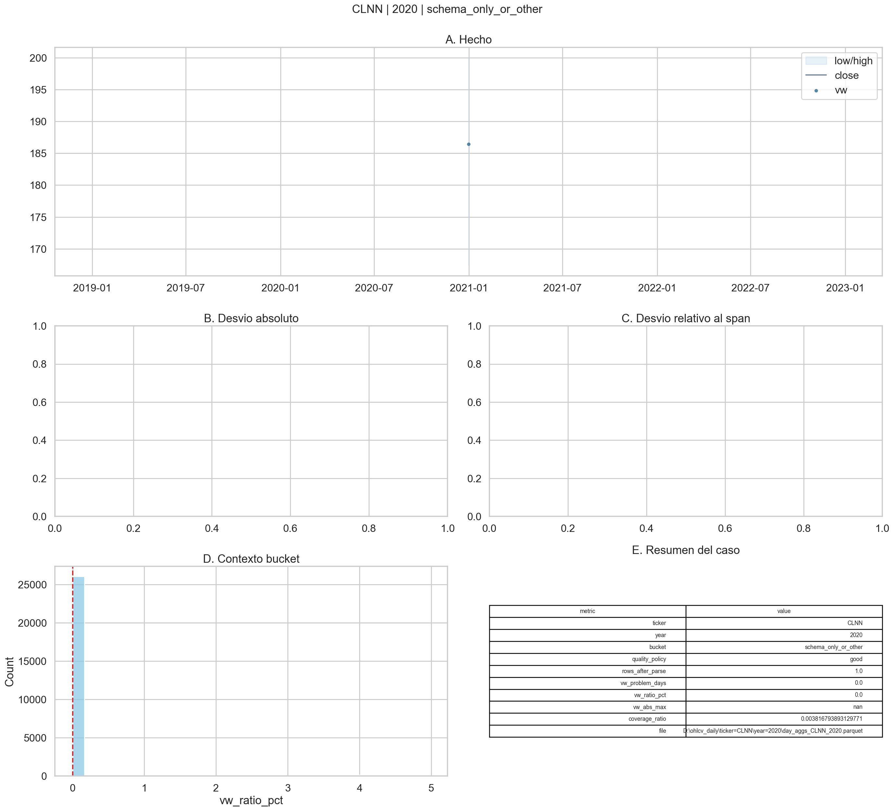

## KIN 2013

ticker: `KIN`  
year: `2013`  
bucket: `schema_only_or_other`  
quality_policy: `good`  
issues: `[]`  
warns: `["dataset_read_incompatible_schema", "schema_merge_conflict_ticker_encoding", "suspicious_sparse_year"]`  
file: `D:\ohlcv_daily\ticker=KIN\year=2013\day_aggs_KIN_2013.parquet`

### Analisis Forense

Este bucket `schema_only_or_other` debe leerse como ausencia de una patologia diaria dominante, no como perfeccion absoluta del file. En la imagen no aparece una concentracion clara de dias rojos capaz de organizarse como familia `vw` persistente, o directamente no hay filas problematicas exportadas. Eso significa que el validador no encontro aqui una razon suficiente para sacar el ano de la franja sana, aunque puedan existir avisos de esquema, sparsez o pequenas tensiones locales.

La consecuencia institucional es distinta de `vw_edge_absmax_only`: aqui `good` no se justifica por tolerar un extremo puntual, sino porque no hay un mecanismo de dano consistente sobre la barra diaria. Implicacion operativa: el file puede usarse en `backtest_core` y para labels diarios, pero `good` no debe confundirse con riqueza estadistica. Si el coverage es bajo (`0.049808`) o hay warns como `rows_lt_10` o `suspicious_sparse_year`, la lectura correcta es: barra no invalida, pero ano pobre como base de inferencia. El error evitado es mezclar calidad semantica de precio con densidad muestral: un ano escaso puede seguir siendo valido como precio y a la vez poco util para ciertos analisis de estabilidad.

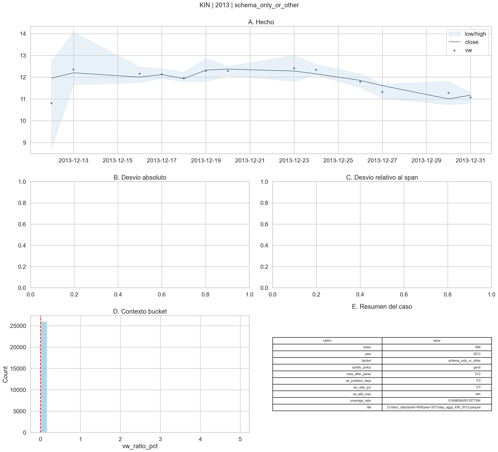

## CIZN 2012

ticker: `CIZN`  
year: `2012`  
bucket: `schema_only_or_other`  
quality_policy: `good`  
issues: `[]`  
warns: `["dataset_read_incompatible_schema", "schema_merge_conflict_ticker_encoding"]`  
file: `D:\ohlcv_daily\ticker=CIZN\year=2012\day_aggs_CIZN_2012.parquet`

### Analisis Forense

Este bucket `schema_only_or_other` debe leerse como ausencia de una patologia diaria dominante, no como perfeccion absoluta del file. En la imagen no aparece una concentracion clara de dias rojos capaz de organizarse como familia `vw` persistente, o directamente no hay filas problematicas exportadas. Eso significa que el validador no encontro aqui una razon suficiente para sacar el ano de la franja sana, aunque puedan existir avisos de esquema, sparsez o pequenas tensiones locales.

La consecuencia institucional es distinta de `vw_edge_absmax_only`: aqui `good` no se justifica por tolerar un extremo puntual, sino porque no hay un mecanismo de dano consistente sobre la barra diaria. Implicacion operativa: el file puede usarse en `backtest_core` y para labels diarios, pero `good` no debe confundirse con riqueza estadistica. Si el coverage es bajo (`0.750958`) o hay warns como `rows_lt_10` o `suspicious_sparse_year`, la lectura correcta es: barra no invalida, pero ano pobre como base de inferencia. El error evitado es mezclar calidad semantica de precio con densidad muestral: un ano escaso puede seguir siendo valido como precio y a la vez poco util para ciertos analisis de estabilidad.

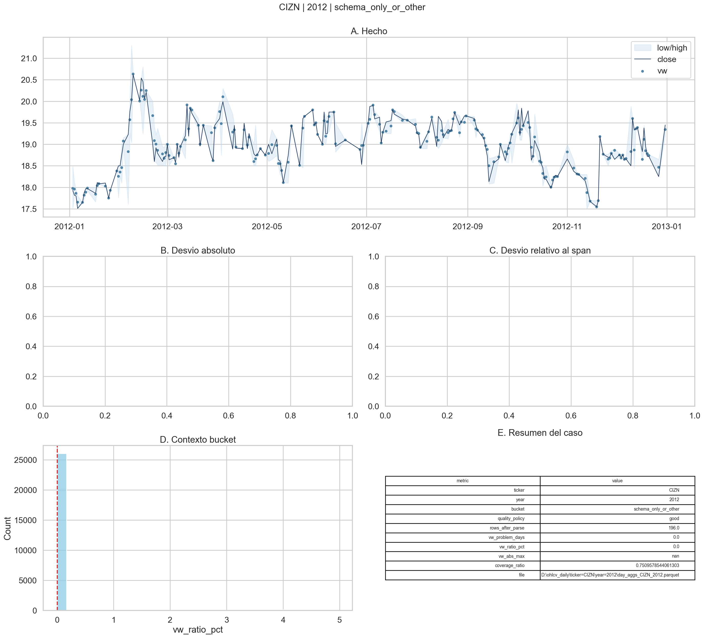

## SCX 2013

ticker: `SCX`  
year: `2013`  
bucket: `schema_only_or_other`  
quality_policy: `good`  
issues: `[]`  
warns: `["dataset_read_incompatible_schema", "schema_merge_conflict_ticker_encoding"]`  
file: `D:\ohlcv_daily\ticker=SCX\year=2013\day_aggs_SCX_2013.parquet`

### Analisis Forense

Este bucket `schema_only_or_other` debe leerse como ausencia de una patologia diaria dominante, no como perfeccion absoluta del file. En la imagen no aparece una concentracion clara de dias rojos capaz de organizarse como familia `vw` persistente, o directamente no hay filas problematicas exportadas. Eso significa que el validador no encontro aqui una razon suficiente para sacar el ano de la franja sana, aunque puedan existir avisos de esquema, sparsez o pequenas tensiones locales.

La consecuencia institucional es distinta de `vw_edge_absmax_only`: aqui `good` no se justifica por tolerar un extremo puntual, sino porque no hay un mecanismo de dano consistente sobre la barra diaria. Implicacion operativa: el file puede usarse en `backtest_core` y para labels diarios, pero `good` no debe confundirse con riqueza estadistica. Si el coverage es bajo (`0.965517`) o hay warns como `rows_lt_10` o `suspicious_sparse_year`, la lectura correcta es: barra no invalida, pero ano pobre como base de inferencia. El error evitado es mezclar calidad semantica de precio con densidad muestral: un ano escaso puede seguir siendo valido como precio y a la vez poco util para ciertos analisis de estabilidad.

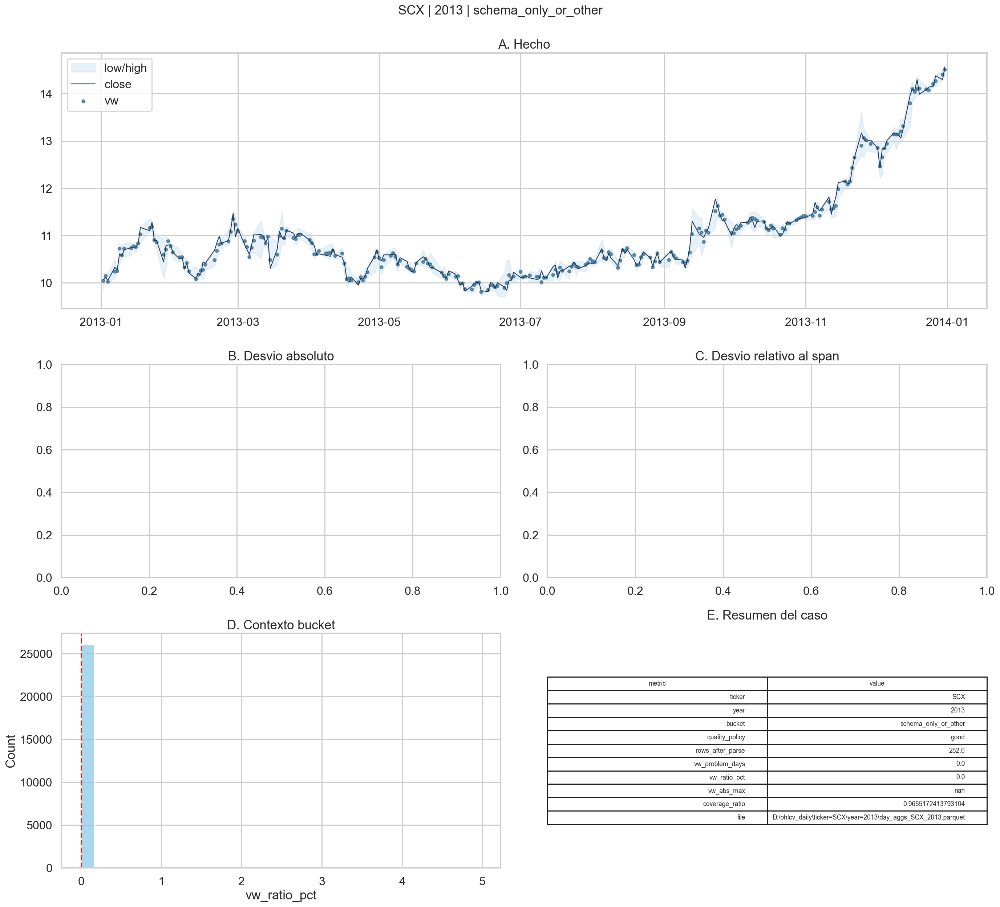
