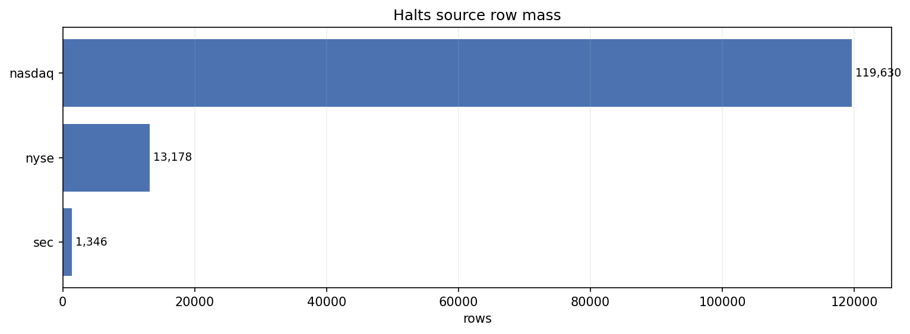
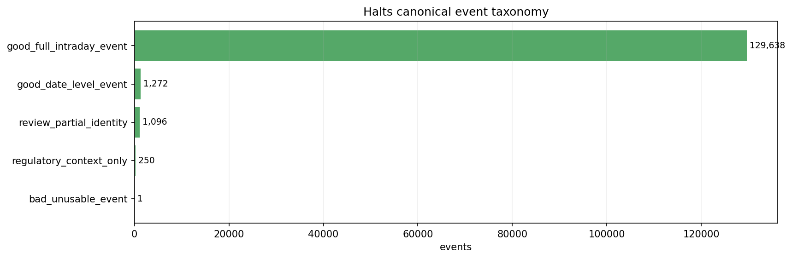
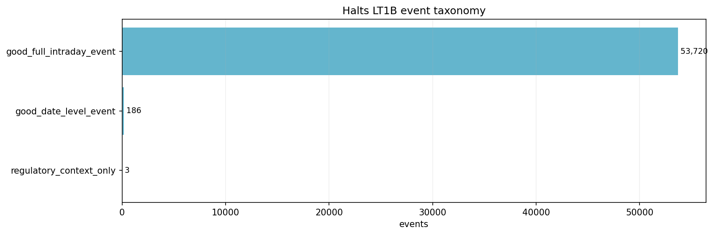
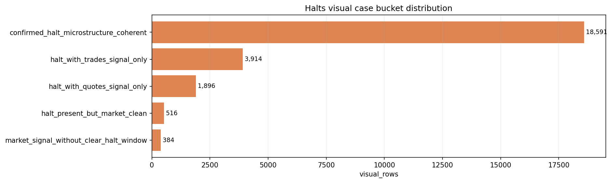
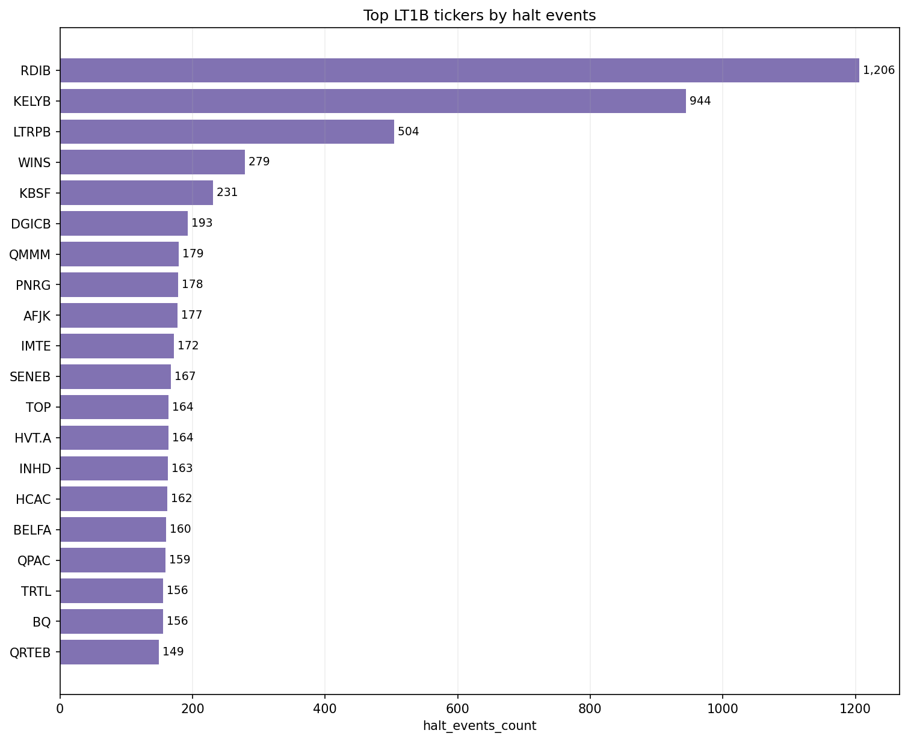

# Halts Inspection Readout v0.1

## 1. Veredicto

`halts_v0_1` queda promovido como dossier moderno de foundation con estado:

- `modern_dossier_complete_for_foundation_promotion`

La lectura institucional es:

- `halts` es fuerte como capa oficial de eventos y contexto regulatorio;
- el bloque es apto para event engine, audit overlay, forensic review y masks/contexto condicionados;
- no habilita alpha, live, RL ni execution simulation final;
- SEC/context/date-level no debe usarse como ventana intradia;
- y ausencia de halt no equivale a mercado limpio ni a missing data.

## 2. Autoridades

Contratos y registros:

- `../../contract_registry/dataset_contracts/halts_dataset_contract_v0_1.md`
- `../../dataset_registry/halts/halts_registry_entry.yaml`
- `../../data_consumption_policies/halts_consumption_policy.md`
- `../../validators/halts/halts_validators.md`
- `../../canonical_schemas/halts/`

Auditoria y certification historicas:

- `01_research/01_auditoria_RAW_DATA/00_data_certification/auditoria/halts/`
- `01_research/01_auditoria_RAW_DATA/00_data_certification/certification/halts/`

Builder moderno:

- `scripts/inspection/halts/build_halts_inspection_pack.py`
- `evidence_assets/run_manifest.json`

## 3. Root audit

Root canonico:

- `E:\TSIS\data\Halts`

Root historico observado:

- `D:\Halts`

El root audit moderno midio la misma huella agregada para ambos:

| Root | Files | Dirs | Parquet | CSV | XML | HTML | JSON | Bytes |
| --- | ---: | ---: | ---: | ---: | ---: | ---: | ---: | ---: |
| `E:\TSIS\data\Halts` | 5702 | 6 | 5 | 17 | 5662 | 16 | 2 | 392678889 |
| `D:\Halts` | 5702 | 6 | 5 | 17 | 5662 | 16 | 2 | 392678889 |

Que muestra:

- que el root canonico actual y el root historico observado coinciden a nivel de footprint agregado.

Responde:

- si la promocion puede apuntar a `E:\TSIS\data\Halts` sin perder compatibilidad historica.

No responde:

- que cada row sea semanticamente valida; eso lo cubren source quality, taxonomy y casepacks.

Consecuencia:

- `E:\TSIS\data\Halts` queda como root canonico para nuevos contratos TSIS.

## 4. Source quality

| Source | Rows | Ticker non-null | Halt date non-null | Halt start non-null | Resume trade non-null | Unique tickers |
| --- | ---: | ---: | ---: | ---: | ---: | ---: |
| `nasdaq` | 119630 | 119619 | 119619 | 119619 | 118730 | 16572 |
| `nyse` | 13178 | 13172 | 13178 | 13178 | 12052 | 2568 |
| `sec` | 1346 | 250 | 1346 | 0 | 0 | 250 |

Que muestra:

- masa de filas por fuente oficial y completitud de campos clave.

Responde:

- quien domina el master consolidado y que fuentes traen granularidad intradia.

No responde:

- que todos los eventos tengan el mismo nivel temporal.

Consecuencia:

- Nasdaq domina la masa, NYSE aporta evidencia venue estable y SEC debe tratarse como contexto regulatorio, no como ventana intradia por defecto.

## 5. Canonical event taxonomy

| Event taxonomy | Events | Source rows | Tickers |
| --- | ---: | ---: | ---: |
| `good_full_intraday_event` | 129638 | 131524 | 16232 |
| `good_date_level_event` | 1272 | 1273 | 1180 |
| `review_partial_identity` | 1096 | 1096 | 0 |
| `regulatory_context_only` | 250 | 250 | 250 |
| `bad_unusable_event` | 1 | 11 | 0 |

Que muestra:

- la distribucion institucional de eventos utilizables, date-level, review, contexto SEC y bad residual.

Responde:

- si `halts` esta estructuralmente fuerte como dataset oficial de eventos.

No responde:

- si cada evento tiene senal visible en quotes/trades.

Consecuencia:

- la familia hard-bad es marginal; el riesgo real esta en no mezclar intraday, date-level, SEC y review.

## 6. LT1B event taxonomy

| Event taxonomy | Events | Tickers |
| --- | ---: | ---: |
| `good_full_intraday_event` | 53720 | 3900 |
| `good_date_level_event` | 186 | 152 |
| `regulatory_context_only` | 3 | 3 |

Que muestra:

- la taxonomia despues de intersectar con el universo `<1B>`.

Responde:

- si la lectura fuerte sobrevive al universo relevante del proyecto.

No responde:

- que cada evento `<1B>` tenga casepack visual individual.

Consecuencia:

- el subconjunto `<1B>` sigue dominado por eventos intradia completos.

## 7. Visual case bucket distribution

| Visual bucket | Rows |
| --- | ---: |
| `confirmed_halt_microstructure_coherent` | 18591 |
| `halt_with_trades_signal_only` | 3914 |
| `halt_with_quotes_signal_only` | 1896 |
| `halt_present_but_market_clean` | 516 |
| `market_signal_without_clear_halt_window` | 384 |

Que muestra:

- lectura agregada del overlay historico entre eventos oficiales y senales de quotes/trades.

Responde:

- si hay masa relevante de coherencia visual entre evento oficial y microestructura.

No responde:

- verdad manual de cada caso individual ni causa cerrada de todos los residuos.

Consecuencia:

- `confirmed_halt_microstructure_coherent` domina; los buckets residuales son review, no bad automatico.

## 8. Top tickers by halt events

Que muestra:

- concentracion de eventos por ticker dentro del coverage summary.

Responde:

- si la actividad de halts esta distribuida uniformemente o concentrada.

No responde:

- que los tickers con muchos halts sean malos datos.

Consecuencia:

- el muestreo y los casepacks deben controlar concentracion; los tickers mas activos no deben definir por si solos la calidad global.

## 9. Universe coverage

| Metric | Value | Reading |
| --- | ---: | --- |
| `universe_tickers` | 4824 | tickers in LT1B coverage summary |
| `tickers_with_halt_data` | 3912 | tickers with at least one matched halt event |
| `tickers_without_halt_data` | 912 | absence means no matched event, not missing coverage |
| `halt_events_total_for_universe` | 53909 | total events attached to universe tickers |

Lectura:

- la ausencia de evento en un ticker no es fallo por defecto;
- coverage se lee como relacion evento-universo, no como completeness de una serie diaria.

## 10. Multisource reconciliation

| Scope | Rows pre concat | Rows post builder dedup | Dedup delta |
| --- | ---: | ---: | ---: |
| `nasdaq` | 119630 | 118594 | 1036 |
| `nyse` | 13178 | 13178 | 0 |
| `sec` | 1346 | 1346 | 0 |
| `all_sources_concat` | 134154 | 133118 | 1036 |
| `persisted_multisource_parquet` | 133116 | 133116 | 0 |

Lectura:

- el delta principal de dedup vive en Nasdaq;
- NYSE y SEC no muestran delta agregado;
- cualquier cambio futuro en dedup debe versionarse porque afecta al master multisource.

## 11. Casepacks

Casepacks modernos:

- `good_justification/halts_good_coherent_visual_cases_v0_1.md`
- `flagged_case_evidence_packs/halts_review_visual_cases_v0_1.md`
- `bad_case_evidence_packs/halts_bad_residual_cases_v0_1.md`
- `causal_case_evidence_packs/halts_causal_overlay_cases_v0_1.md`
- `coverage_case_evidence_packs/halts_universe_coverage_cases_v0_1.md`

Cada casepack declara:

- que muestra;
- que responde;
- que no responde;
- consecuencia.

La regla es conservadora:

- visual coherente apoya evento oficial;
- visual ausente o asimetrico no convierte automaticamente el evento en bad;
- senal de mercado sin halt claro no crea evento oficial.

## 12. Estado de consumo

Permitido:

- event engine;
- data audit overlay;
- forensic review;
- quotes/trades/minute halt overlays;
- daily event context;
- research-only;
- masks de backtest solo con flags y temporalidad declarada.

Bloqueado hasta contrato posterior:

- alpha;
- live;
- RL;
- execution simulation final;
- ML feature productiva sin lag y leakage policy.

## 13. Notebooks

No se crea notebook nuevo para este cierre.

Justificacion:

- la auditoria historica ya contiene el trabajo profundo;
- `halts` no es un tape continuo que necesite navegacion ticker-month como `minute`;
- el builder residente genera manifests, visuales y casepacks estables;
- las conclusiones quedan promovidas a markdown/readout, no encerradas en outputs de notebook.

Un notebook futuro solo tendria sentido como launcher/drilldown humano sobre el builder, no como almacen principal de codigo ni autoridad unica.

## 14. Veredicto final

`halts_v0_1` esta listo como foundation event layer moderna.

Su valor principal es gobernar eventos oficiales y contexto regulatorio para auditoria, overlays y futuras masks controladas.

El siguiente paso humano no es volver a auditarlo desde cero, sino decidir si se abre un contrato especifico de `backtest_event_mask` o `event_feature_contract`.
