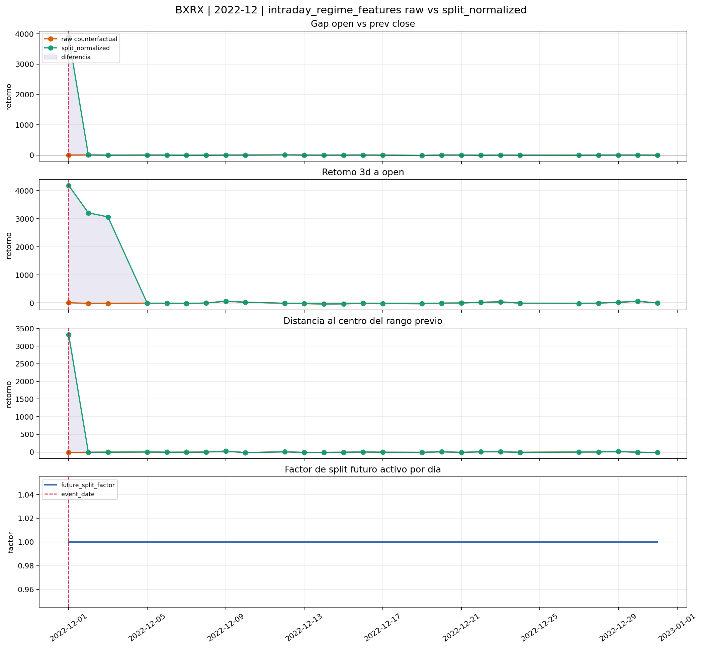
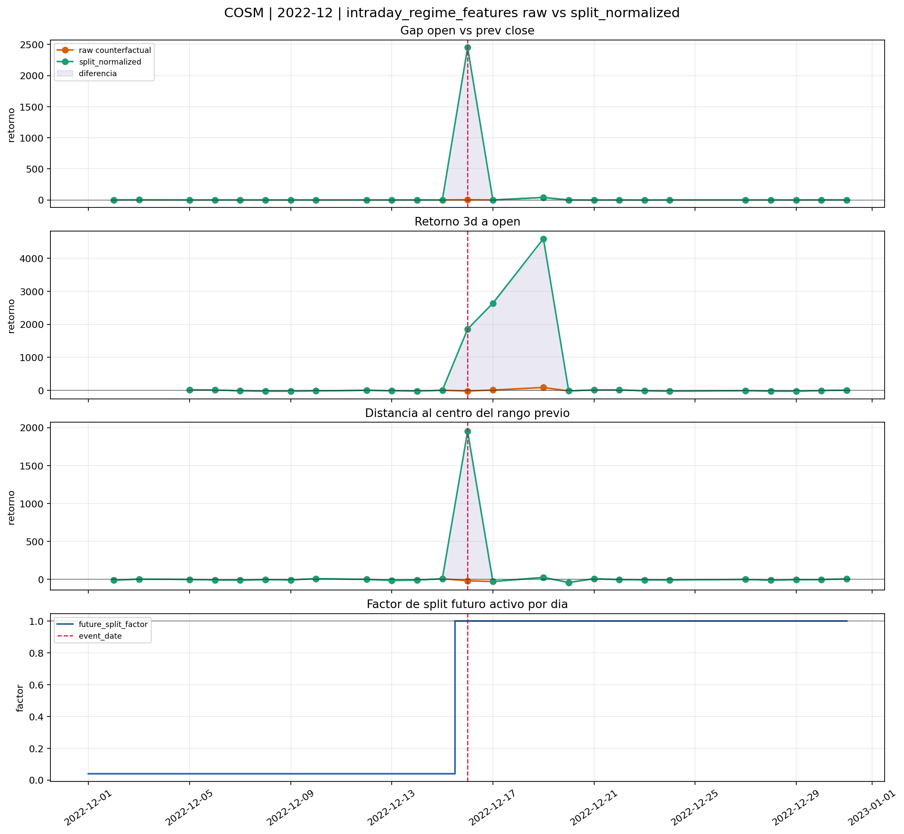
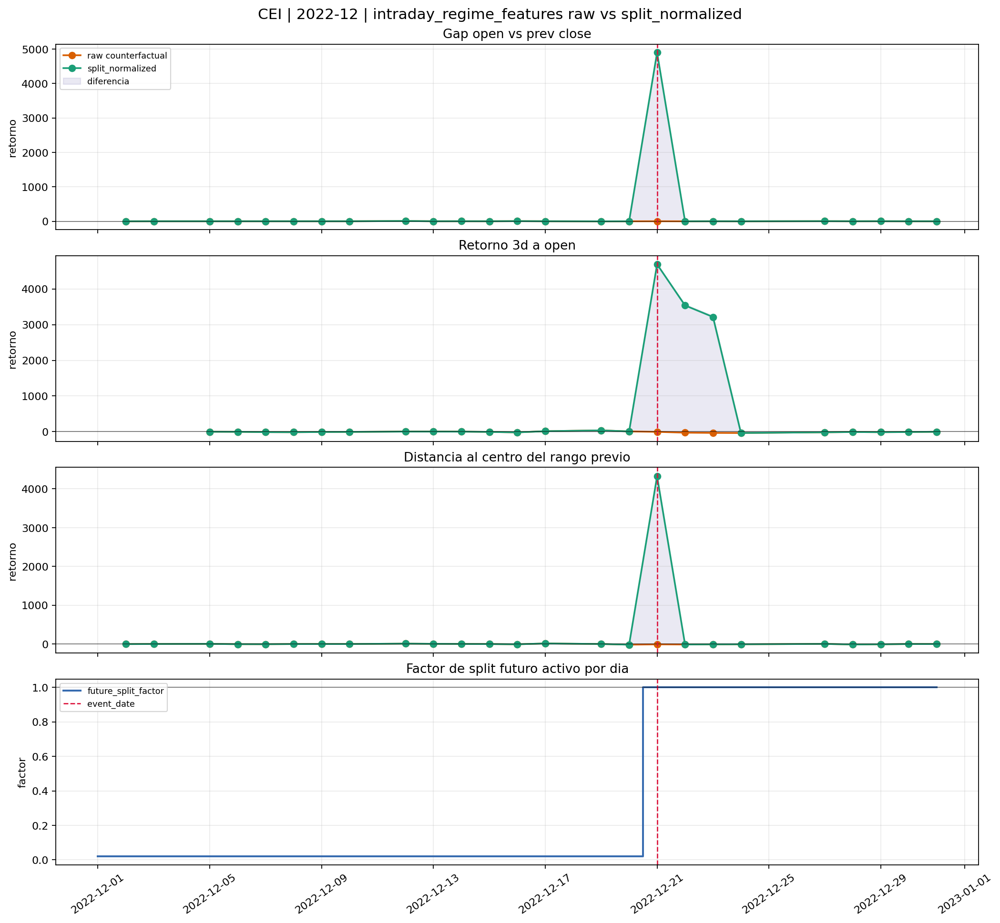
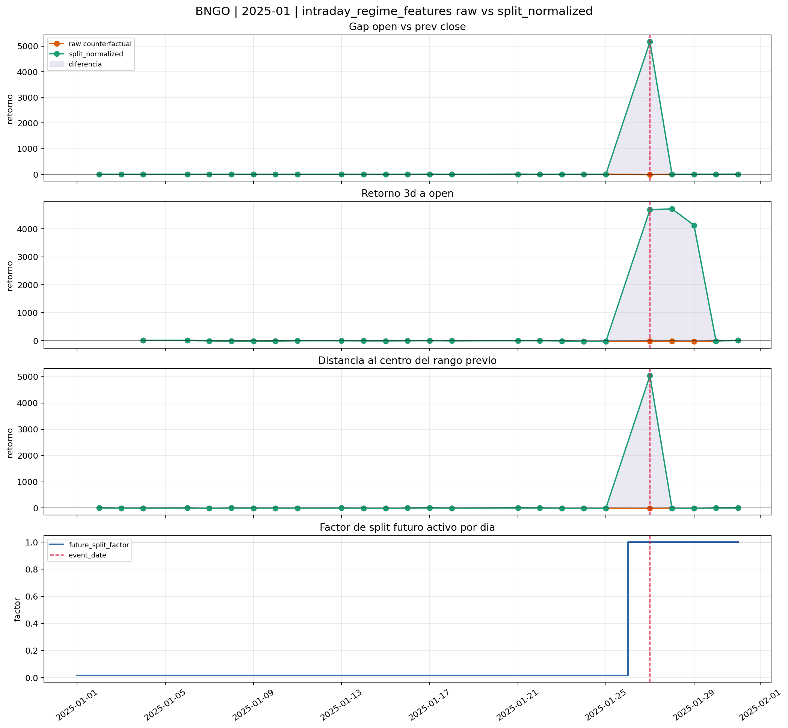
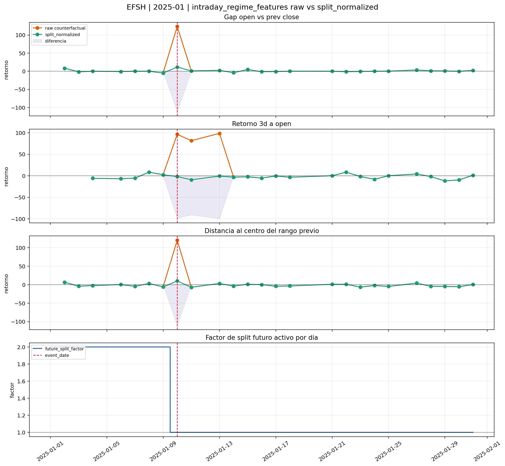
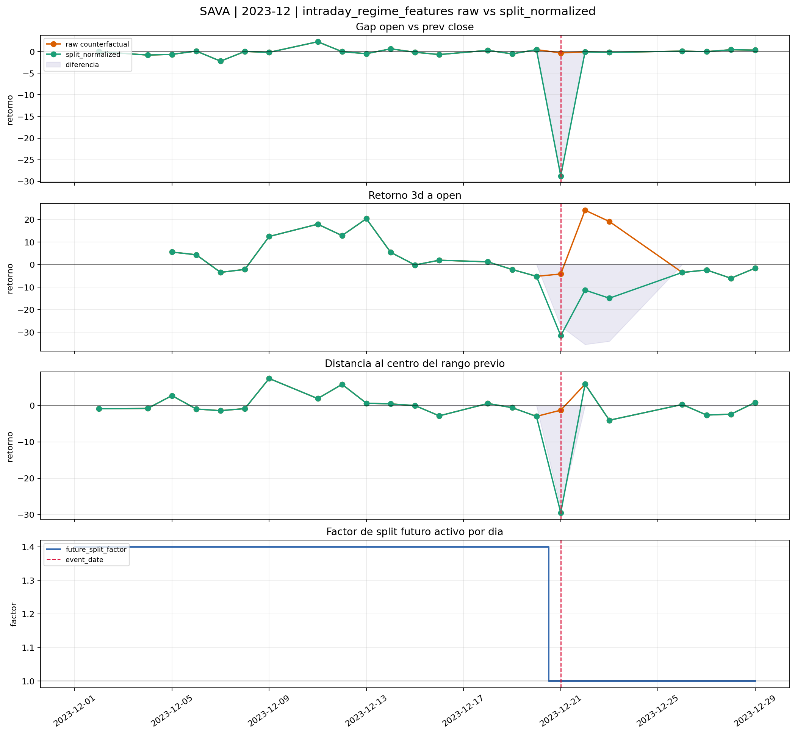
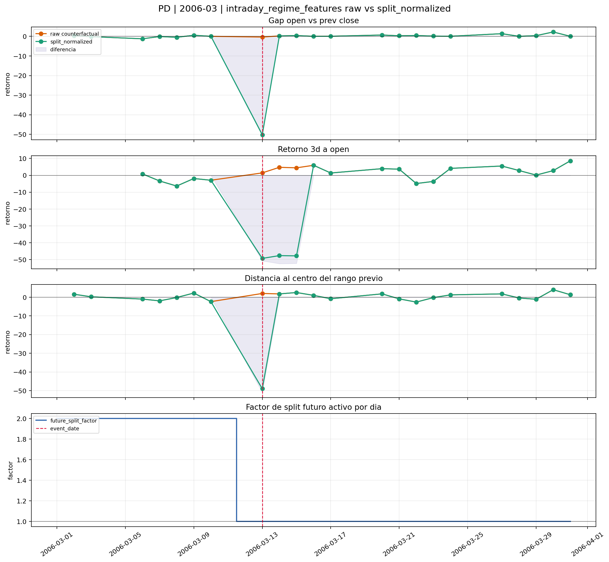
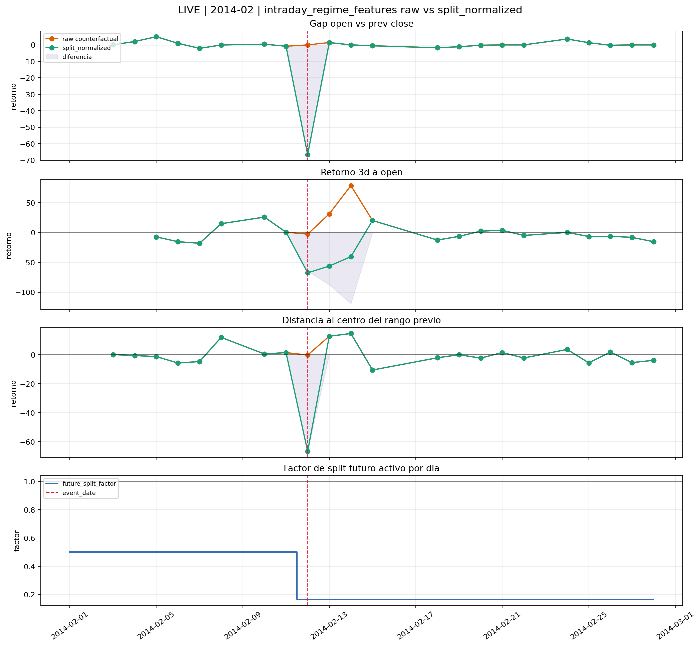
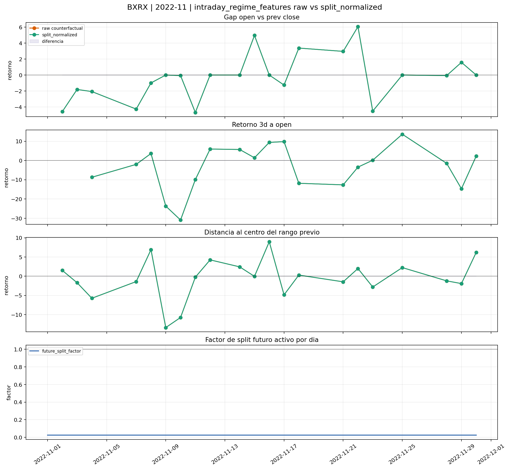
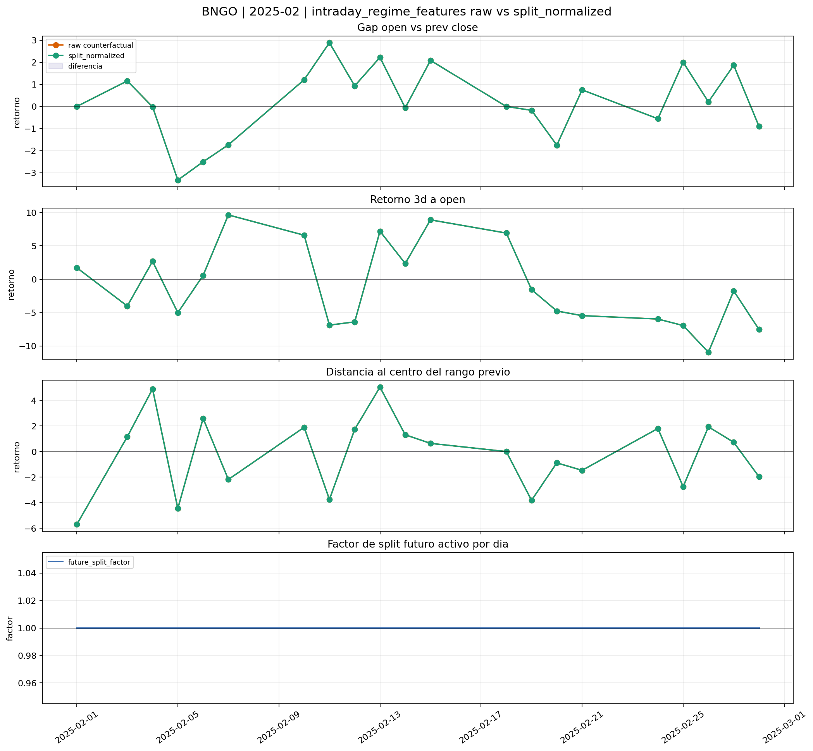

# Intraday Regime Features - Semantic Pilot Readout `v0_1`

## 1. Rol

Este readout audita el primer consumidor real de `ohlcv_1m_split_normalized`.

No intenta demostrar si el modelo final ya existe.
Intenta demostrar algo mas basico y mas importante:

- si las features cross-session cambian cuando se calculan con `raw` frente a `split_normalized`;
- si esa diferencia aparece exactamente en los casos donde un split la haria esperable;
- y si los controles se mantienen neutros cuando no deberia existir shock mecanico.

## 2. Resumen cuantitativo del piloto

| ticker | month | role | days | days_factor_ne_1 | max_abs_gap_diff_pct | max_abs_ret3_diff_pct | max_abs_range_center_diff_pct | days_gap_diff_gt_50pct |
|---|---:|---|---:|---:|---:|---:|---:|---:|
| BNGO | 2025-01 | reverse_split | 26 | 21 | 5183.28% | 4732.34% | 5054.43% | 1 |
| CEI | 2022-12 | reverse_split | 26 | 17 | 4900.00% | 4694.29% | 4337.15% | 1 |
| BXRX | 2022-12 | reverse_split | 26 | 0 | 3897.11% | 4175.48% | 3340.38% | 1 |
| COSM | 2022-12 | reverse_split | 26 | 13 | 2450.70% | 4507.04% | 1969.81% | 1 |
| EFSH | 2025-01 | forward_split | 26 | 8 | 111.76% | 99.33% | 110.25% | 1 |
| LIVE | 2014-02 | forward_split | 23 | 23 | 66.67% | 119.08% | 66.47% | 1 |
| PD | 2006-03 | forward_split | 23 | 8 | 49.81% | 52.38% | 51.01% | 0 |
| SAVA | 2023-12 | forward_split | 24 | 17 | 28.49% | 35.45% | 28.21% | 0 |
| BXRX | 2022-11 | control | 22 | 22 | 0.00% | 0.00% | 0.00% | 0 |
| BNGO | 2025-02 | control | 21 | 0 | 0.00% | 0.00% | 0.00% | 0 |

## 3. Lectura global

- Cuando el split cae dentro de la memoria util de la feature, las diferencias `raw vs split_normalized` se vuelven grandes y localizadas.
- Cuando toda la ventana vive ya en escala post-evento, o toda ella vive aun en escala pre-evento homogénea, las razones cross-session pueden permanecer casi invariantes.
- Esto es exactamente lo que queriamos auditar: no que la capa cambie siempre, sino que cambie solo cuando el shock mecanico afectaria de verdad al cociente entre sesiones.

## 4. Casos

### BXRX | 2022-12

**Que muestra**

- Comparacion diaria entre las tres features cross-session mas sensibles a saltos mecanicos para `BXRX` en `2022-12` (`reverse_split`), junto con la trayectoria de `future_split_factor` por dia.
- `days = 26`, `days_factor_ne_1 = 0`, `event_date = 2022-12-01`.
- `max_abs_gap_diff_pct = 3897.11%`, `max_abs_ret3_diff_pct = 4175.48%`, `max_abs_range_center_diff_pct = 3340.38%`.

**Responde**

- Responde a si las features de régimen cambian de forma material cuando la comparacion entre sesiones se calcula con `raw` frente a `split_normalized`; y a si esa diferencia aparece exactamente donde la semantica del split la haria esperable.

**Lectura tecnica**

- Aqui si aparece la firma que queriamos detectar. El mes tiene `1` dias con diferencia de gap superior al `50%` y una diferencia maxima de `3897.11%`. En paralelo, `multi_session_return_3d_to_open` alcanza una divergencia maxima de `4175.48%`, lo que indica que el shock mecanico no solo contaminaría el gap overnight, sino tambien memoria multi-sesion y features de extension.

**Conclusion de auditoria**

- Conclusión de auditoría: caso positivo fuerte. El consumidor demuestra que usar `1m raw` habria fabricado señales de régimen falsas, mientras que `1m_split_normalized` neutraliza esa discontinuidad.

### COSM | 2022-12

**Que muestra**

- Comparacion diaria entre las tres features cross-session mas sensibles a saltos mecanicos para `COSM` en `2022-12` (`reverse_split`), junto con la trayectoria de `future_split_factor` por dia.
- `days = 26`, `days_factor_ne_1 = 13`, `event_date = 2022-12-16`.
- `max_abs_gap_diff_pct = 2450.70%`, `max_abs_ret3_diff_pct = 4507.04%`, `max_abs_range_center_diff_pct = 1969.81%`.

**Responde**

- Responde a si las features de régimen cambian de forma material cuando la comparacion entre sesiones se calcula con `raw` frente a `split_normalized`; y a si esa diferencia aparece exactamente donde la semantica del split la haria esperable.

**Lectura tecnica**

- Aqui si aparece la firma que queriamos detectar. El mes tiene `1` dias con diferencia de gap superior al `50%` y una diferencia maxima de `2450.70%`. En paralelo, `multi_session_return_3d_to_open` alcanza una divergencia maxima de `4507.04%`, lo que indica que el shock mecanico no solo contaminaría el gap overnight, sino tambien memoria multi-sesion y features de extension.

**Conclusion de auditoria**

- Conclusión de auditoría: caso positivo fuerte. El consumidor demuestra que usar `1m raw` habria fabricado señales de régimen falsas, mientras que `1m_split_normalized` neutraliza esa discontinuidad.

### CEI | 2022-12

**Que muestra**

- Comparacion diaria entre las tres features cross-session mas sensibles a saltos mecanicos para `CEI` en `2022-12` (`reverse_split`), junto con la trayectoria de `future_split_factor` por dia.
- `days = 26`, `days_factor_ne_1 = 17`, `event_date = 2022-12-21`.
- `max_abs_gap_diff_pct = 4900.00%`, `max_abs_ret3_diff_pct = 4694.29%`, `max_abs_range_center_diff_pct = 4337.15%`.

**Responde**

- Responde a si las features de régimen cambian de forma material cuando la comparacion entre sesiones se calcula con `raw` frente a `split_normalized`; y a si esa diferencia aparece exactamente donde la semantica del split la haria esperable.

**Lectura tecnica**

- Aqui si aparece la firma que queriamos detectar. El mes tiene `1` dias con diferencia de gap superior al `50%` y una diferencia maxima de `4900.00%`. En paralelo, `multi_session_return_3d_to_open` alcanza una divergencia maxima de `4694.29%`, lo que indica que el shock mecanico no solo contaminaría el gap overnight, sino tambien memoria multi-sesion y features de extension.

**Conclusion de auditoria**

- Conclusión de auditoría: caso positivo fuerte. El consumidor demuestra que usar `1m raw` habria fabricado señales de régimen falsas, mientras que `1m_split_normalized` neutraliza esa discontinuidad.

### BNGO | 2025-01

**Que muestra**

- Comparacion diaria entre las tres features cross-session mas sensibles a saltos mecanicos para `BNGO` en `2025-01` (`reverse_split`), junto con la trayectoria de `future_split_factor` por dia.
- `days = 26`, `days_factor_ne_1 = 21`, `event_date = 2025-01-27`.
- `max_abs_gap_diff_pct = 5183.28%`, `max_abs_ret3_diff_pct = 4732.34%`, `max_abs_range_center_diff_pct = 5054.43%`.

**Responde**

- Responde a si las features de régimen cambian de forma material cuando la comparacion entre sesiones se calcula con `raw` frente a `split_normalized`; y a si esa diferencia aparece exactamente donde la semantica del split la haria esperable.

**Lectura tecnica**

- Aqui si aparece la firma que queriamos detectar. El mes tiene `1` dias con diferencia de gap superior al `50%` y una diferencia maxima de `5183.28%`. En paralelo, `multi_session_return_3d_to_open` alcanza una divergencia maxima de `4732.34%`, lo que indica que el shock mecanico no solo contaminaría el gap overnight, sino tambien memoria multi-sesion y features de extension.

**Conclusion de auditoria**

- Conclusión de auditoría: caso positivo fuerte. El consumidor demuestra que usar `1m raw` habria fabricado señales de régimen falsas, mientras que `1m_split_normalized` neutraliza esa discontinuidad.

### EFSH | 2025-01

**Que muestra**

- Comparacion diaria entre las tres features cross-session mas sensibles a saltos mecanicos para `EFSH` en `2025-01` (`forward_split`), junto con la trayectoria de `future_split_factor` por dia.
- `days = 26`, `days_factor_ne_1 = 8`, `event_date = 2025-01-10`.
- `max_abs_gap_diff_pct = 111.76%`, `max_abs_ret3_diff_pct = 99.33%`, `max_abs_range_center_diff_pct = 110.25%`.

**Responde**

- Responde a si las features de régimen cambian de forma material cuando la comparacion entre sesiones se calcula con `raw` frente a `split_normalized`; y a si esa diferencia aparece exactamente donde la semantica del split la haria esperable.

**Lectura tecnica**

- Aqui si aparece la firma que queriamos detectar. El mes tiene `1` dias con diferencia de gap superior al `50%` y una diferencia maxima de `111.76%`. En paralelo, `multi_session_return_3d_to_open` alcanza una divergencia maxima de `99.33%`, lo que indica que el shock mecanico no solo contaminaría el gap overnight, sino tambien memoria multi-sesion y features de extension.

**Conclusion de auditoria**

- Conclusión de auditoría: caso positivo fuerte. El consumidor demuestra que usar `1m raw` habria fabricado señales de régimen falsas, mientras que `1m_split_normalized` neutraliza esa discontinuidad.

### SAVA | 2023-12

**Que muestra**

- Comparacion diaria entre las tres features cross-session mas sensibles a saltos mecanicos para `SAVA` en `2023-12` (`forward_split`), junto con la trayectoria de `future_split_factor` por dia.
- `days = 24`, `days_factor_ne_1 = 17`, `event_date = 2023-12-21`.
- `max_abs_gap_diff_pct = 28.49%`, `max_abs_ret3_diff_pct = 35.45%`, `max_abs_range_center_diff_pct = 28.21%`.

**Responde**

- Responde a si las features de régimen cambian de forma material cuando la comparacion entre sesiones se calcula con `raw` frente a `split_normalized`; y a si esa diferencia aparece exactamente donde la semantica del split la haria esperable.

**Lectura tecnica**

- La diferencia visible es baja o local. El mes tiene `1` dias con diferencia de gap superior al `5%`, una diferencia maxima de gap de `28.49%` y una diferencia maxima en distancia al rango previo de `28.21%`. Esto suele corresponder a casos donde el evento cae al principio del mes o donde la ventana util del feature ya vive casi toda en escala post-evento.

**Conclusion de auditoria**

- Conclusión de auditoría: caso frontera coherente. La falta de divergencia grande no contradice la semántica; describe una ventana donde casi no queda pasado reescalable dentro del propio mes.

### PD | 2006-03

**Que muestra**

- Comparacion diaria entre las tres features cross-session mas sensibles a saltos mecanicos para `PD` en `2006-03` (`forward_split`), junto con la trayectoria de `future_split_factor` por dia.
- `days = 23`, `days_factor_ne_1 = 8`, `event_date = 2006-03-13`.
- `max_abs_gap_diff_pct = 49.81%`, `max_abs_ret3_diff_pct = 52.38%`, `max_abs_range_center_diff_pct = 51.01%`.

**Responde**

- Responde a si las features de régimen cambian de forma material cuando la comparacion entre sesiones se calcula con `raw` frente a `split_normalized`; y a si esa diferencia aparece exactamente donde la semantica del split la haria esperable.

**Lectura tecnica**

- La diferencia visible es baja o local. El mes tiene `1` dias con diferencia de gap superior al `5%`, una diferencia maxima de gap de `49.81%` y una diferencia maxima en distancia al rango previo de `51.01%`. Esto suele corresponder a casos donde el evento cae al principio del mes o donde la ventana util del feature ya vive casi toda en escala post-evento.

**Conclusion de auditoria**

- Conclusión de auditoría: caso frontera coherente. La falta de divergencia grande no contradice la semántica; describe una ventana donde casi no queda pasado reescalable dentro del propio mes.

### LIVE | 2014-02

**Que muestra**

- Comparacion diaria entre las tres features cross-session mas sensibles a saltos mecanicos para `LIVE` en `2014-02` (`forward_split`), junto con la trayectoria de `future_split_factor` por dia.
- `days = 23`, `days_factor_ne_1 = 23`, `event_date = 2014-02-12`.
- `max_abs_gap_diff_pct = 66.67%`, `max_abs_ret3_diff_pct = 119.08%`, `max_abs_range_center_diff_pct = 66.47%`.

**Responde**

- Responde a si las features de régimen cambian de forma material cuando la comparacion entre sesiones se calcula con `raw` frente a `split_normalized`; y a si esa diferencia aparece exactamente donde la semantica del split la haria esperable.

**Lectura tecnica**

- Aqui si aparece la firma que queriamos detectar. El mes tiene `1` dias con diferencia de gap superior al `50%` y una diferencia maxima de `66.67%`. En paralelo, `multi_session_return_3d_to_open` alcanza una divergencia maxima de `119.08%`, lo que indica que el shock mecanico no solo contaminaría el gap overnight, sino tambien memoria multi-sesion y features de extension.

**Conclusion de auditoria**

- Conclusión de auditoría: caso positivo fuerte. El consumidor demuestra que usar `1m raw` habria fabricado señales de régimen falsas, mientras que `1m_split_normalized` neutraliza esa discontinuidad.

### BXRX | 2022-11

**Que muestra**

- Comparacion diaria entre las tres features cross-session mas sensibles a saltos mecanicos para `BXRX` en `2022-11` (`control sin evento en ventana`), junto con la trayectoria de `future_split_factor` por dia.
- `days = 22`, `days_factor_ne_1 = 22`, `event_date = sin evento en ventana`.
- `max_abs_gap_diff_pct = 0.00%`, `max_abs_ret3_diff_pct = 0.00%`, `max_abs_range_center_diff_pct = 0.00%`.

**Responde**

- Responde a si las features de régimen cambian de forma material cuando la comparacion entre sesiones se calcula con `raw` frente a `split_normalized`; y a si esa diferencia aparece exactamente donde la semantica del split la haria esperable.

**Lectura tecnica**

- La firma dominante es de neutralidad. Aunque el mes tenga `days_factor_ne_1 = 22`, la diferencia maxima en `gap_open_vs_prev_close` se queda en `0.00%` y no hay dias con diferencia superior al `50%`. Eso prueba que un factor distinto de `1` no implica automaticamente distorsion de features: si toda la ventana vive en la misma escala relativa, los cocientes cross-session se conservan.

**Conclusion de auditoria**

- Conclusión de auditoría: control correcto. La capa no inventa correcciones visibles donde no hay discontinuidad de escala dentro de la ventana útil del feature.

### BNGO | 2025-02

**Que muestra**

- Comparacion diaria entre las tres features cross-session mas sensibles a saltos mecanicos para `BNGO` en `2025-02` (`control sin evento en ventana`), junto con la trayectoria de `future_split_factor` por dia.
- `days = 21`, `days_factor_ne_1 = 0`, `event_date = sin evento en ventana`.
- `max_abs_gap_diff_pct = 0.00%`, `max_abs_ret3_diff_pct = 0.00%`, `max_abs_range_center_diff_pct = 0.00%`.

**Responde**

- Responde a si las features de régimen cambian de forma material cuando la comparacion entre sesiones se calcula con `raw` frente a `split_normalized`; y a si esa diferencia aparece exactamente donde la semantica del split la haria esperable.

**Lectura tecnica**

- La firma dominante es de neutralidad. Aunque el mes tenga `days_factor_ne_1 = 0`, la diferencia maxima en `gap_open_vs_prev_close` se queda en `0.00%` y no hay dias con diferencia superior al `50%`. Eso prueba que un factor distinto de `1` no implica automaticamente distorsion de features: si toda la ventana vive en la misma escala relativa, los cocientes cross-session se conservan.

**Conclusion de auditoria**

- Conclusión de auditoría: control correcto. La capa no inventa correcciones visibles donde no hay discontinuidad de escala dentro de la ventana útil del feature.
